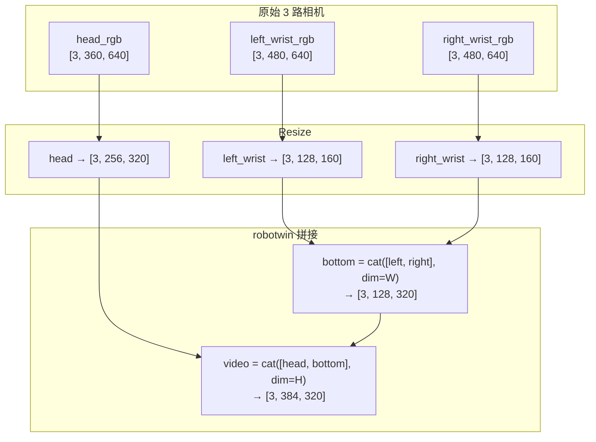
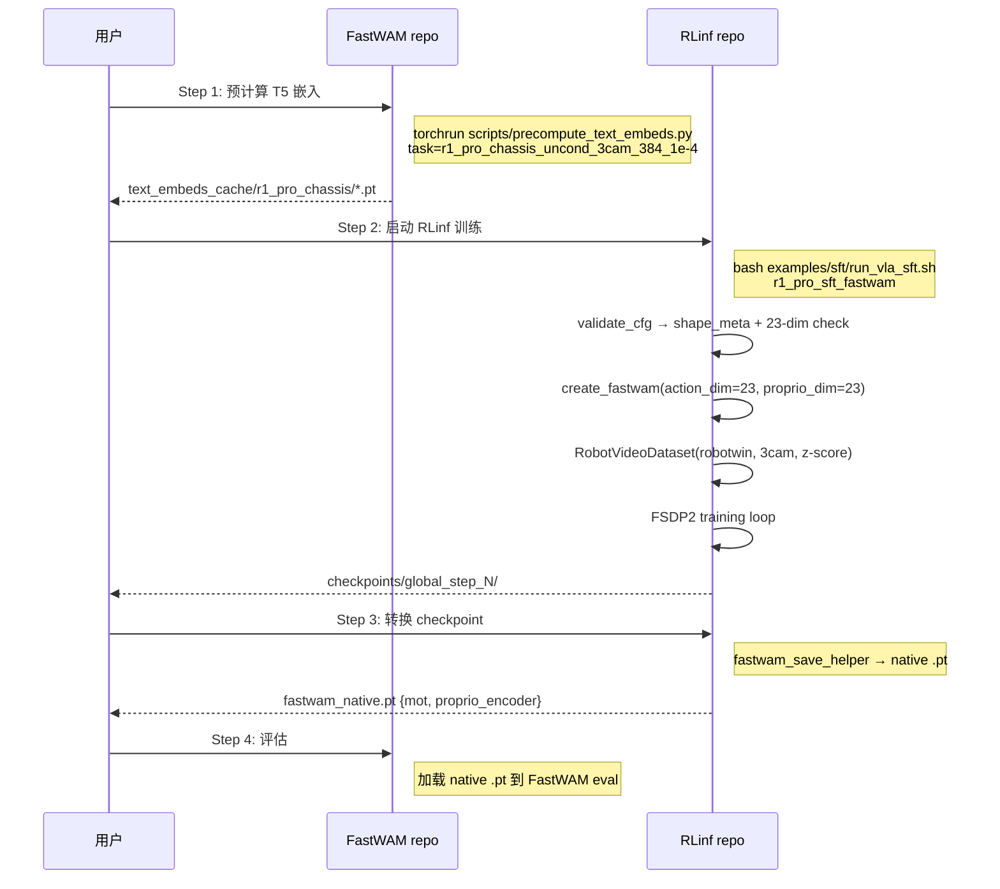

# FastWAM-RLinf 整合：r1_pro_chassis 任务支持方案

> **基础设计**：[fw_sft_design_op46_4.md](./fw_sft_design_op46_4.md)（v4 完整设计）  
> **FastWAM 任务配置**：`FastWAM/configs/task/r1_pro_chassis_uncond_3cam_384_1e-4.yaml`  
> **FastWAM 数据配置**：`FastWAM/configs/data/r1_pro_chassis.yaml`  
> **日期**：2026-06-01

---

## 1. 背景与目标

v4 设计文档（`fw_sft_design_op46_4.md`）以 LIBERO 任务为基准设计了 FastWAM-RLinf 整合方案。但 LIBERO 是 2 相机、7 维动作的简单仿真环境，而 **r1_pro_chassis** 是 3 相机、23 维动作的真实机器人场景，两者在数据格式、归一化方式、视频布局等方面差异显著。

**目标**：在 v4 设计框架内增加对 `r1_pro_chassis_uncond_3cam_384_1e-4` 任务的完整支持。

### 1.1 r1_pro vs LIBERO 差异总览

| 维度 | LIBERO | r1_pro_chassis |
|------|--------|----------------|
| **相机数** | 2（exterior + wrist） | 3（head + left_wrist + right_wrist） |
| **拼接模式** | `horizontal`（224×448） | `robotwin`（384×320） |
| **action_dim** | 7（6D EEF + gripper） | 23（left_arm 7 + right_arm 7 + grippers 2 + chassis 7） |
| **proprio_dim** | 8（6D EEF + gripper 2） | 23（同 action） |
| **归一化** | `min/max` | `z-score` |
| **action transforms** | 无 | 无 |
| **delta_action_dim_mask** | 无 | 无 |
| **batch_size** | 16 | 16 |
| **learning_rate** | 1e-4 | 1e-4 |
| **训练步数** | 20000 | 50 epochs |
| **数据源** | HuggingFace libero | 本地 `/mnt/r/share/zwy/datasets/r1_pro_data_v2/` |

---

## 2. r1_pro_chassis 数据管道分析

### 2.1 相机布局与 robotwin 拼接

r1_pro 使用 3 相机，通过 `concat_multi_camera: "robotwin"` 拼接为单帧：



**VAE latent 尺寸**（WanVideoVAE38, upsampling_factor=16）：
- H_lat = 384/16 = 24, W_lat = 320/16 = 20
- patch_size = [1,2,2] → tokens_per_frame = (24/2)×(20/2) = 12×10 = **120**
- 9 帧 → 总 video tokens = 120 × 9 = **1080**

对比 LIBERO（98 tokens/frame × 9 = 882），r1_pro 的序列长度增加 ~22%。

### 2.2 shape_meta 配置

```yaml
# configs/data/r1_pro_chassis.yaml 中的 shape_meta
shape_meta:
  images:
    - key: head_rgb
      raw_shape: [3, 360, 640]
      shape: [3, 240, 320]
    - key: left_wrist_rgb
      raw_shape: [3, 480, 640]
      shape: [3, 240, 320]
    - key: right_wrist_rgb
      raw_shape: [3, 480, 640]
      shape: [3, 240, 320]
  action:
    - key: default
      raw_shape: 23
      shape: 23
  state:
    - key: default
      raw_shape: 23
      shape: 23
```

### 2.3 23 维动作空间

```
action[0:7]   — left_arm joint positions (7 DOF)
action[7:14]  — right_arm joint positions (7 DOF)
action[14:16] — left_gripper + right_gripper (2 DOF)
action[16:23] — chassis (7 DOF: position, orientation, velocity)
```

所有维度使用 **z-score** 归一化（`norm_default_mode: "z-score"`），无维度级例外（`norm_exception_mode: null`）。

### 2.4 处理器配置

```yaml
processor:
  _target_: fastwam.datasets.lerobot.processors.fastwam_processor.FastWAMProcessor
  num_output_cameras: 3
  action_output_dim: 23
  proprio_output_dim: 23
  action_state_transforms: null    # 无 delta 变换
  use_stepwise_action_norm: false
  norm_default_mode: "z-score"
  norm_exception_mode: null
  action_state_merger:
    _target_: fastwam.datasets.lerobot.transforms.action_state_merger.ConcatLeftAlign
  delta_action_dim_mask: null
```

### 2.5 时间关系（与 LIBERO 相同）

- `num_frames=33`, `action_video_freq_ratio=4`
- 视频帧索引 [0,4,8,...,32] → 9 帧
- `action_horizon=32 = (9-1)×4`

---

## 3. RLinf 配置设计

### 3.1 训练配置 `examples/sft/config/r1_pro_sft_fastwam.yaml`

```yaml
defaults:
  - training_backend/fsdp@actor.fsdp_config
  - model/fastwam@actor.model
  - override hydra/job_logging: stdout

hydra:
  run:
    dir: .
  output_subdir: null
  searchpath:
    - file://${oc.env:EMBODIED_PATH}/config/

cluster:
  num_nodes: 1
  component_placement:
    actor: all

runner:
  task_type: sft
  logger:
    log_path: "../results"
    project_name: rlinf
    experiment_name: "r1_pro_sft_fastwam"
    logger_backends: ["tensorboard"]
  max_epochs: -1
  max_steps: 50000
  val_check_interval: -1
  save_interval: 2000
  log_interval: 100
  resume_dir: null

data:
  train_data_paths: /mnt/r/share/zwy/datasets/r1_pro_data_v2/r1_pro_data_convert_chassis
  num_frames: 33
  action_video_freq_ratio: 4
  video_size: [384, 320]              # robotwin 最终尺寸
  concat_multi_camera: "robotwin"     # 3 相机 robotwin 布局
  norm_default_mode: "z-score"        # r1_pro 用 z-score（非 LIBERO 的 min/max）
  pretrained_norm_stats: null
  num_workers: 8
  prefetch_factor: 8

actor:
  group_name: "ActorGroup"
  training_backend: "fsdp"
  micro_batch_size: 2
  global_batch_size: 64
  seed: 42

  model:
    model_type: "fastwam"
    precision: bf16
    model_path: null
    text_embedding_cache_dir: ./data/text_embeds_cache/r1_pro_chassis

    # r1_pro 维度覆盖（与 LIBERO 不同！）
    proprio_dim: 23
    action_dit_config:
      action_dim: 23
    video_dit_config:
      action_dim: 23

  optim:
    lr: 1.0e-4
    adam_beta1: 0.9
    adam_beta2: 0.95
    adam_eps: 1.0e-08
    weight_decay: 1.0e-2
    clip_grad: 1.0
    lr_scheduler: "cosine"
    lr_warmup_steps: -1
    lr_warmup_steps_ratio: 0.05
    total_training_steps: 50000

  fsdp_config:
    strategy: "fsdp2"
    use_orig_params: True
    gradient_checkpointing: True
    gradient_checkpointing_use_reentrant: True
    limit_all_gathers: False
    forward_prefetch: True
    backward_prefetch: "pre"
    reshard_after_forward: False
    save_full_model_weights: False
    grad_scaler:
      enabled: False
    mixed_precision:
      param_dtype: bf16
      reduce_dtype: bf16
      buffer_dtype: bf16
    amp_autocast:
      enabled: False
```

### 3.2 与 LIBERO 配置的关键差异

| 配置项 | LIBERO | r1_pro |
|--------|--------|--------|
| `video_size` | `[224, 448]` | `[384, 320]` |
| `concat_multi_camera` | `"horizontal"` | `"robotwin"` |
| `norm_default_mode` | `"min/max"` | `"z-score"` |
| `proprio_dim` | 8 | **23** |
| `action_dit_config.action_dim` | 7 | **23** |
| `video_dit_config.action_dim` | 7 | **23** |
| `text_embedding_cache_dir` | `.../libero` | `.../r1_pro_chassis` |
| `train_data_paths` | libero 数据路径 | r1_pro 数据路径 |

---

## 4. 代码改动分析

### 4.1 无需改动的部分

v4 设计中以下部分已天然支持 r1_pro（参数化设计）：

| 组件 | 为什么不需要改 |
|------|--------------|
| `FastWAMPolicy` | `sft_forward()` 直接调用 `training_loss()`，不依赖具体维度 |
| `get_model()` | `create_fastwam()` 接受 `action_dim`/`proprio_dim` 作为参数 |
| `fastwam_collate_fn` | `torch.stack` 不依赖张量形状 |
| `build_fastwam_sft_dataloader` | 从 cfg 读取 `video_size`、`concat_multi_camera` 等参数 |
| Worker 分发 | model_type 仍是 `"fastwam"` |
| checkpoint 转换 | 键名前缀不变（`fastwam.mot.*`） |
| FSDP 分片 | `DiTBlock` 类名不变 |

### 4.2 需要确保的参数传递

`build_fastwam_sft_dataloader()` 中必须正确传递 r1_pro 的参数：

```python
def build_fastwam_sft_dataloader(cfg, world_size, rank, data_paths, eval_dataset=False):
    model_cfg, data_cfg = cfg.actor.model, cfg.data

    # shape_meta 必须反映 r1_pro 的 3 相机 + 23 维动作
    shape_meta = _build_shape_meta(data_cfg)

    processor = FastWAMProcessor(
        shape_meta=shape_meta,
        num_obs_steps=data_cfg.get("num_frames", 33),
        num_output_cameras=3,                              # r1_pro: 3 相机
        action_output_dim=model_cfg.action_dit_config.action_dim,  # 23
        proprio_output_dim=model_cfg.get("proprio_dim"),           # 23
        norm_default_mode=data_cfg.get("norm_default_mode", "z-score"),
        # ...
    )

    dataset = RobotVideoDataset(
        dataset_dirs=_parse_data_paths(data_paths),
        shape_meta=shape_meta,
        processor=processor,
        num_frames=data_cfg.get("num_frames", 33),
        action_video_freq_ratio=data_cfg.get("action_video_freq_ratio", 4),
        video_size=list(data_cfg.get("video_size", [384, 320])),  # r1_pro: 384×320
        concat_multi_camera=data_cfg.get("concat_multi_camera", "robotwin"),
        text_embedding_cache_dir=model_cfg.get("text_embedding_cache_dir"),
        context_len=model_cfg.get("context_len", 128),
    )
    # ...
```

### 4.3 `_build_shape_meta()` 实现

此函数需要从 RLinf 配置构建 FastWAM 所需的 `shape_meta` 格式。对于 r1_pro：

```python
def _build_shape_meta(data_cfg):
    """从 RLinf data config 构建 FastWAM shape_meta。"""
    # 如果 data_cfg 中直接提供了 shape_meta（从 FastWAM 数据配置复制），直接使用
    if "shape_meta" in data_cfg:
        return OmegaConf.to_container(data_cfg.shape_meta, resolve=True)

    # 否则从 video_size + action_dim + proprio_dim 推断
    # 注意：这种推断模式不支持异构相机分辨率（如 r1_pro 的 360×640 vs 480×640）
    # 推荐在配置中显式提供 shape_meta
    raise ValueError(
        "data.shape_meta is required for FastWAM tasks. "
        "Copy from the corresponding FastWAM data config."
    )
```

**设计决策**：对于 r1_pro 等有复杂相机布局的任务，`shape_meta` 必须在 RLinf 配置中**显式指定**，不做自动推断。YAML 配置中应嵌入或引用 FastWAM 原生 `shape_meta`。

### 4.4 配置中嵌入 shape_meta

在 `r1_pro_sft_fastwam.yaml` 的 `data:` 部分添加：

```yaml
data:
  shape_meta:
    images:
      - key: head_rgb
        raw_shape: [3, 360, 640]
        shape: [3, 240, 320]
      - key: left_wrist_rgb
        raw_shape: [3, 480, 640]
        shape: [3, 240, 320]
      - key: right_wrist_rgb
        raw_shape: [3, 480, 640]
        shape: [3, 240, 320]
    action:
      - key: default
        raw_shape: 23
        shape: 23
    state:
      - key: default
        raw_shape: 23
        shape: 23
```

---

## 5. T5 文本嵌入预计算

### 5.1 预计算步骤

r1_pro 的任务指令来自数据集 `meta/tasks.jsonl`。需要在 RLinf 训练前预计算：

```bash
# 在 FastWAM 仓库中执行
cd /path/to/FastWAM
torchrun --standalone --nproc_per_node=8 \
  scripts/precompute_text_embeds.py \
  task=r1_pro_chassis_uncond_3cam_384_1e-4
```

输出到 `./data/text_embeds_cache/r1_pro_chassis/`，文件名格式为 `{sha256_hash}.t5_len128.wan22ti2v5b.pt`。

### 5.2 RLinf 配置指向缓存

```yaml
actor:
  model:
    text_embedding_cache_dir: ./data/text_embeds_cache/r1_pro_chassis
```

**注意**：缓存路径可以是绝对路径或相对路径。相对路径相对于 RLinf 的工作目录解析。

---

## 6. 训练 Batch 格式

### 6.1 r1_pro 单样本

| 键 | 形状 | dtype | 说明 |
|----|------|-------|------|
| `video` | `[3, 9, 384, 320]` | float32 [-1,1] | robotwin 拼接后 |
| `action` | `[32, 23]` | float32 z-score | 23 维绝对动作 |
| `proprio` | `[32, 23]` | float32 z-score | 23 维本体感受 |
| `context` | `[128, 4096]` | float32 | T5 嵌入 |
| `context_mask` | `[128]` | bool | |
| `action_is_pad` | `[32]` | bool | |
| `image_is_pad` | `[9]` | bool | |
| `proprio_is_pad` | `[32]` | bool | |

### 6.2 VAE latent 形状

```
input_latents: [B, 48, 3, 24, 20]
  T_lat = (9-1)/4 + 1 = 3
  H_lat = 384/16 = 24
  W_lat = 320/16 = 20
```

### 6.3 MoT tokens

```
video_tokens:  [B, 1080, 3072]   # 3帧 × 120 tokens/帧 × 3072 dim (LIBERO: 882)
action_tokens: [B, 32, 1024]     # 32 步 × 1024 dim
total_seq_len: 1080 + 32 = 1112  # (LIBERO: 882 + 32 = 914)
```

---

## 7. 内存影响评估

r1_pro 相比 LIBERO 的主要内存增量：

| 维度 | LIBERO | r1_pro | 增量 |
|------|--------|--------|------|
| video tokens | 882 | 1080 | +22% |
| action_dim | 7 | 23 | +229% |
| 总序列长度 | 914 | 1112 | +22% |

**影响**：MoT 注意力的计算量和显存使用与序列长度平方成正比。r1_pro 的注意力计算量约为 LIBERO 的 $(1112/914)^2 \approx 1.48$ 倍。

**建议**：r1_pro 任务可能需要将 `micro_batch_size` 从 2 降至 1，通过增大 `gradient_accumulation` 补偿。

---

## 8. 端到端训练流程



---

## 9. 验收测试

### 9.1 数据管道验证

```python
def test_r1pro_batch_shapes():
    """验证 r1_pro batch 输出形状正确。"""
    batch = load_r1pro_test_batch()

    assert batch["video"].shape == (B, 3, 9, 384, 320), "Video shape mismatch"
    assert batch["action"].shape == (B, 32, 23), "Action shape mismatch (should be 23-dim)"
    assert batch["proprio"].shape == (B, 32, 23), "Proprio shape mismatch"
    assert batch["context"].shape == (B, 128, 4096), "Context shape mismatch"

def test_r1pro_robotwin_concat():
    """验证 robotwin 拼接产生正确的 384×320 输出。"""
    # head: [3, 256, 320], left: [3, 128, 160], right: [3, 128, 160]
    # bottom = cat([left, right], dim=W) → [3, 128, 320]
    # result = cat([head, bottom], dim=H) → [3, 384, 320]
    head = torch.randn(9, 3, 256, 320)
    left = torch.randn(9, 3, 128, 160)
    right = torch.randn(9, 3, 128, 160)
    bottom = torch.cat([left, right], dim=3)
    result = torch.cat([head, bottom], dim=2)
    assert result.shape == (9, 3, 384, 320)
```

### 9.2 VAE latent 验证

```python
def test_r1pro_vae_latent_dims():
    """验证 384×320 视频的 VAE latent 尺寸。"""
    H, W = 384, 320
    upsampling = 16
    patch = [1, 2, 2]

    H_lat = H // upsampling  # = 24
    W_lat = W // upsampling  # = 20
    tokens_per_frame = (H_lat // patch[1]) * (W_lat // patch[2])  # = 12 × 10 = 120

    assert H_lat == 24
    assert W_lat == 20
    assert tokens_per_frame == 120
    assert H % 16 == 0, "H must be multiple of 16"
    assert W % 16 == 0, "W must be multiple of 16"
```

### 9.3 Forward 等价性

```python
def test_r1pro_forward_loss():
    """验证 r1_pro 配置下整合版 loss 与原版一致。"""
    seed = 42
    model = create_mini_fastwam(seed=seed, action_dim=23, proprio_dim=23)
    policy = FastWAMPolicy(model, config=None)
    batch = create_test_batch(seed=100, action_dim=23, proprio_dim=23,
                              height=384, width=320, num_video_frames=5)

    # 原版
    seed_everything(seed)
    loss_sa, _ = model.training_loss(batch)

    # 整合版
    seed_everything(seed)
    output_rl = policy.sft_forward(data=batch)

    assert torch.allclose(loss_sa, output_rl["loss"], rtol=1e-5, atol=1e-6)
```

### 9.4 配置校验

```python
def test_r1pro_config_validation():
    """验证 r1_pro 配置通过校验。"""
    cfg = OmegaConf.create({
        "model_type": "fastwam",
        "proprio_dim": 23,
        "action_dit_config": {"action_dim": 23},
        "video_dit_config": {"action_dim": 23},
        "text_embedding_cache_dir": "./data/text_embeds_cache/r1_pro_chassis",
    })
    # 应该不报错
    # validate_fastwam_sft_model_cfg(cfg)

def test_r1pro_video_size_valid():
    """384×320 满足 16 倍数约束。"""
    assert 384 % 16 == 0
    assert 320 % 16 == 0
```

### 9.5 Checkpoint 转换

```python
def test_r1pro_checkpoint_keys():
    """验证 r1_pro 模型的 checkpoint 键名前缀正确。"""
    model = create_mini_fastwam(seed=42, action_dim=23, proprio_dim=23)
    policy = FastWAMPolicy(model, config=None)
    sd = policy.state_dict()

    # mot 键应存在
    mot_keys = [k for k in sd if k.startswith("fastwam.mot.")]
    assert len(mot_keys) > 0

    # proprio_encoder 键应存在（因为 proprio_dim=23）
    pe_keys = [k for k in sd if k.startswith("fastwam.proprio_encoder.")]
    assert len(pe_keys) > 0, "proprio_encoder keys missing for r1_pro (proprio_dim=23)"
```

---

## 10. 新增/修改文件

| 文件 | 动作 | 说明 |
|------|------|------|
| `examples/sft/config/r1_pro_sft_fastwam.yaml` | **新增** | r1_pro 训练配置 |
| `rlinf/data/datasets/fastwam/__init__.py` | **修改** | `_build_shape_meta()` 支持 `data.shape_meta` 直传 |
| 无 | — | `FastWAMPolicy`、`get_model()`、Worker、collator 均无需修改 |

**总结**：r1_pro 支持主要通过**配置驱动**实现，代码改动量极小（仅 `_build_shape_meta()` 需增加 `shape_meta` 直传逻辑）。

---

## 11. 运维 Checklist

- [ ] 准备 r1_pro 数据集（确认 `meta/tasks.jsonl` 存在）
- [ ] 预计算 T5 嵌入：`torchrun scripts/precompute_text_embeds.py task=r1_pro_chassis_uncond_3cam_384_1e-4`
- [ ] 确认 `text_embedding_cache_dir` 下有 `.pt` 文件
- [ ] 配置 `r1_pro_sft_fastwam.yaml`（`action_dim=23`、`video_size=[384,320]`、`z-score`）
- [ ] 首次训练自动生成 `dataset_stats.json`
- [ ] 训练 100 步验证 loss 有限（非 NaN）
- [ ] 8 GPU 分布式验证
- [ ] checkpoint 转换为 native `.pt` 并用 FastWAM eval 加载

---

## 12. 端到端演练：r1_pro_chassis 少步训练全流程

本节提供一个**可直接执行**的端到端示例。工程师按顺序执行每一步，即可验证 FastWAM-RLinf 整合的所有核心功能：单卡训练、分布式训练、checkpoint 保存/恢复、TensorBoard 日志、checkpoint 格式转换。

### 12.1 前置条件

```bash
# 环境假设
# - 8×H100 80GB GPU 服务器（或至少 2×GPU 用于分布式测试）
# - RLinf 代码库：/home/user/RLinf
# - FastWAM 代码库：/home/user/FastWAM
# - r1_pro 数据集：/mnt/r/share/zwy/datasets/r1_pro_data_v2/r1_pro_data_convert_chassis
# - Python 3.10+, PyTorch 2.7+, CUDA 12.8+

export RLINF_ROOT=/home/user/RLinf
export FASTWAM_ROOT=/home/user/FastWAM
export FASTWAM_PATH=${FASTWAM_ROOT}/src
export R1PRO_DATA=/mnt/r/share/zwy/datasets/r1_pro_data_v2/r1_pro_data_convert_chassis
```

### 12.2 Step 1：安装环境

```bash
cd $RLINF_ROOT

# 安装 RLinf + FastWAM 依赖
bash requirements/install.sh embodied --model fastwam

# 激活虚拟环境
source .venv/bin/activate

# 验证 FastWAM 可导入
python -c "from fastwam.models.wan22.fastwam import FastWAM; print('FastWAM import OK')"
```

**验收**：最后一行输出 `FastWAM import OK`。

### 12.3 Step 2：预计算 T5 文本嵌入

```bash
cd $FASTWAM_ROOT

# 单 GPU 预计算（少量数据时足够）
python scripts/precompute_text_embeds.py \
    task=r1_pro_chassis_uncond_3cam_384_1e-4

# 或多 GPU 加速（大数据集推荐）
torchrun --standalone --nproc_per_node=8 \
    scripts/precompute_text_embeds.py \
    task=r1_pro_chassis_uncond_3cam_384_1e-4
```

**验收**：

```bash
# 检查缓存目录
ls ./data/text_embeds_cache/r1_pro_chassis/
# 期望输出：若干 *.t5_len128.wan22ti2v5b.pt 文件
# 至少 1 个文件（每个唯一 instruction 一个文件）

# 检查文件可加载
python -c "
import torch
import glob
files = glob.glob('./data/text_embeds_cache/r1_pro_chassis/*.pt')
print(f'Found {len(files)} cached embeddings')
d = torch.load(files[0], map_location='cpu')
print(f'Keys: {list(d.keys())}')
print(f'Context shape: {d[\"context\"].shape}')  # 期望 [128, 4096]
"
```

### 12.4 Step 3：单卡 Smoke Test（20 步）

**目标**：验证整个训练管线能跑通，loss 不是 NaN。

```bash
cd $RLINF_ROOT

# 设置环境变量
export FASTWAM_PATH=${FASTWAM_ROOT}/src
export PYTHONPATH=${FASTWAM_PATH}:${RLINF_ROOT}:$PYTHONPATH

# 单卡 20 步训练
python examples/sft/train_vla_sft.py \
    --config-path examples/sft/config/ \
    --config-name r1_pro_sft_fastwam \
    runner.max_steps=20 \
    runner.save_interval=10 \
    runner.log_interval=1 \
    actor.micro_batch_size=1 \
    actor.global_batch_size=1 \
    cluster.num_nodes=1 \
    data.num_workers=2 \
    data.prefetch_factor=2 \
    runner.logger.log_path=./logs/smoke_test \
    runner.logger.experiment_name=r1pro_smoke
```

**验收（逐项检查）**：

```bash
# 1. 训练输出中 loss 应该有限（非 NaN/Inf）
#    在终端输出中查找类似：
#    train/loss=X.XXX, train/dynamics_loss=X.XXX, train/action_loss=X.XXX

# 2. Checkpoint 目录存在
ls ./logs/smoke_test/r1pro_smoke/checkpoints/
# 期望：global_step_10/ 和 global_step_20/ 两个目录

# 3. Checkpoint 内容完整
ls ./logs/smoke_test/r1pro_smoke/checkpoints/global_step_10/actor/
# 期望：dcp_checkpoint/ data.pt rng.pt

# 4. TensorBoard 事件文件存在
ls ./logs/smoke_test/r1pro_smoke/tensorboard/
# 期望：events.out.tfevents.* 文件
```

### 12.5 Step 4：TensorBoard 验证

```bash
# 启动 TensorBoard
tensorboard --logdir=./logs/smoke_test/r1pro_smoke/tensorboard --port=6006 &

# 在浏览器访问 http://localhost:6006
# 验证以下曲线存在：
#   - train/loss         （总损失）
#   - train/dynamics_loss（视频损失）
#   - train/action_loss  （动作损失）
#   - train/learning_rate（学习率，应从 0 warmup 到 1e-4）
#   - train/grad_norm    （梯度范数）
#   - time/step          （每步耗时）
#   - time/training      （训练耗时）
```

**验收**：6 条以上曲线可见，loss 曲线在 20 步内呈下降或波动趋势（不是恒定）。

### 12.6 Step 5：Resume 验证（从 step 10 恢复到 step 30）

```bash
# 从 step 10 恢复，继续训练到 step 30
python examples/sft/train_vla_sft.py \
    --config-path examples/sft/config/ \
    --config-name r1_pro_sft_fastwam \
    runner.max_steps=30 \
    runner.save_interval=10 \
    runner.log_interval=1 \
    actor.micro_batch_size=1 \
    actor.global_batch_size=1 \
    cluster.num_nodes=1 \
    data.num_workers=2 \
    runner.logger.log_path=./logs/resume_test \
    runner.logger.experiment_name=r1pro_resume \
    runner.resume_dir=./logs/smoke_test/r1pro_smoke/checkpoints/global_step_10
```

**验收**：

```bash
# 1. 训练从 step 10 开始（而非 step 0）
#    终端应显示 "Global Step: 10/30" 之类的进度

# 2. 新的 checkpoint 在 step 20 和 step 30 生成
ls ./logs/resume_test/r1pro_resume/checkpoints/
# 期望：global_step_20/ 和 global_step_30/

# 3. Resume 后的 loss 值应与中断前连续
#    对比 smoke_test 的 step 10-20 loss 与 resume_test 的 step 10-20 loss
#    在相同种子下应完全一致
```

### 12.7 Step 6：多卡分布式训练（8 GPU，40 步）

```bash
# 启动 Ray（如果还没启动）
ray start --head --port=6379

# 8 GPU 分布式训练
python examples/sft/train_vla_sft.py \
    --config-path examples/sft/config/ \
    --config-name r1_pro_sft_fastwam \
    runner.max_steps=40 \
    runner.save_interval=20 \
    runner.log_interval=5 \
    actor.micro_batch_size=1 \
    actor.global_batch_size=64 \
    cluster.num_nodes=1 \
    data.num_workers=8 \
    runner.logger.log_path=./logs/dist_test \
    runner.logger.experiment_name=r1pro_dist
```

**验收**：

```bash
# 1. 训练在 8 GPU 上完成（查看 GPU 利用率）
nvidia-smi  # 8 张 GPU 均有显存占用

# 2. gradient_accumulation 正确
#    global_batch_size=64, micro_batch_size=1, 8 GPUs
#    → gradient_accumulation = 64 / (1 × 8) = 8

# 3. Checkpoint 可保存
ls ./logs/dist_test/r1pro_dist/checkpoints/global_step_20/actor/
# 期望：dcp_checkpoint/ data.pt rng.pt

# 4. TensorBoard 正常
tensorboard --logdir=./logs/dist_test/r1pro_dist/tensorboard --port=6007 &
```

### 12.8 Step 7：Checkpoint 格式转换

```bash
# 如果 save_full_model_weights=True，full_weights.pt 直接可用
# 否则需要先从 DCP 合并（使用 RLinf 工具）

# 假设已有 full_weights.pt：
python -c "
import torch, os

# 加载 FSDP 完整权重
sd = torch.load(
    './logs/smoke_test/r1pro_smoke/checkpoints/global_step_20/actor/model_state_dict/full_weights.pt',
    map_location='cpu'
)

# 提取 mot + proprio_encoder
mot_sd = {k.replace('fastwam.mot.', ''): v for k, v in sd.items() if k.startswith('fastwam.mot.')}
pe_sd = {k.replace('fastwam.proprio_encoder.', ''): v for k, v in sd.items() if k.startswith('fastwam.proprio_encoder.')}

print(f'MOT keys: {len(mot_sd)}')
print(f'Proprio encoder keys: {len(pe_sd)}')

# 保存为 FastWAM native 格式
payload = {'mot': mot_sd, 'step': 20, 'torch_dtype': 'torch.bfloat16'}
if pe_sd:
    payload['proprio_encoder'] = pe_sd
torch.save(payload, './fastwam_r1pro_step20.pt')
print('Saved FastWAM native checkpoint: fastwam_r1pro_step20.pt')
"
```

**验收**：

```bash
# 验证 native checkpoint 可被 FastWAM 加载
python -c "
import torch
d = torch.load('./fastwam_r1pro_step20.pt', map_location='cpu')
print(f'Keys: {list(d.keys())}')
print(f'Step: {d[\"step\"]}')
print(f'MOT keys count: {len(d[\"mot\"])}')
if 'proprio_encoder' in d:
    print(f'Proprio encoder keys: {len(d[\"proprio_encoder\"])}')
"
# 期望：Keys: ['mot', 'step', 'torch_dtype', 'proprio_encoder']
#        MOT keys count: > 0
#        Proprio encoder keys: 2 (weight + bias)
```

### 12.9 Step 8：完整功能验证矩阵

运行以上全部步骤后，填写以下验证表：

| # | 功能 | 验证方式 | 通过? |
|---|------|----------|-------|
| 1 | FastWAM import | `python -c "from fastwam..."` | ☐ |
| 2 | T5 嵌入预计算 | cache 目录有 .pt 文件 | ☐ |
| 3 | 单卡训练 | 20 步完成，loss 非 NaN | ☐ |
| 4 | Checkpoint 保存 | `global_step_10/` 和 `global_step_20/` 存在 | ☐ |
| 5 | TensorBoard | 6+ 条曲线可见 | ☐ |
| 6 | Resume | 从 step 10 恢复到 step 30 | ☐ |
| 7 | Resume loss 连续 | 恢复后 loss 与中断前一致 | ☐ |
| 8 | 多卡分布式 | 8 GPU 训练完成 | ☐ |
| 9 | gradient_accumulation | 64 / (1 × 8) = 8 正确 | ☐ |
| 10 | Checkpoint 转换 | FSDP → FastWAM native .pt | ☐ |
| 11 | Native checkpoint 可加载 | torch.load 成功，键名正确 | ☐ |
| 12 | 数据格式 | video [3,9,384,320], action [32,23] | ☐ |

### 12.10 常见问题排查

| 问题 | 原因 | 解决 |
|------|------|------|
| `ModuleNotFoundError: fastwam` | FASTWAM_PATH 未设置 | `export FASTWAM_PATH=/path/to/FastWAM/src` |
| `FileNotFoundError: text_embedding_cache` | T5 嵌入未预计算 | 执行 Step 2 |
| `loss = NaN` at step 1-2 | bf16 精度问题 | 检查 `lr_warmup_steps_ratio: 0.05`，确认 `grad_scaler.enabled: False` |
| `CUDA OOM` | batch 太大 | 降 `micro_batch_size` 到 1 |
| `KeyError: fastwam` in SupportedModel | config.py 未注册 | 确认 `SupportedModel.FASTWAM` 已添加 |
| `resume_dir not found` | 路径错误 | 必须指向 `checkpoints/global_step_N` 目录（不含 `/actor/`） |
| `action_scheduler is required` | 配置缺少 action_scheduler | 确认 model preset YAML 包含 `action_scheduler:` 段 |
| TensorBoard 无数据 | log_path 错误 | 确认 `--logdir` 指向 `tensorboard/` 子目录 |
| 多卡训练卡住 | Ray 未启动 | `ray start --head --port=6379` |
| checkpoint 无 full_weights.pt | `save_full_model_weights: False` | 改为 `True` 或使用 DCP 转换工具 |

### 12.11 少步训练性能基线

以下为 r1_pro_chassis 在不同配置下的**参考**单步耗时（8×H100）：

| 配置 | micro_bs | GPUs | grad_accum | 单步耗时 | 显存/GPU |
|------|----------|------|------------|----------|----------|
| 最小 | 1 | 1 | 1 | ~2.5s | ~35GB |
| 推荐 | 1 | 8 | 8 | ~3.0s | ~35GB |
| 激进 | 2 | 8 | 4 | ~5.0s | ~55GB |

> 注：以上为估算值，实际取决于 GPU 型号、网络带宽、数据 I/O 速度。首次运行可能因 dataset_stats 计算而更慢。

---

*本文档为 r1_pro_chassis 任务在 FastWAM-RLinf 整合方案中的专项补充，应与 v4 主设计文档联合使用。*
