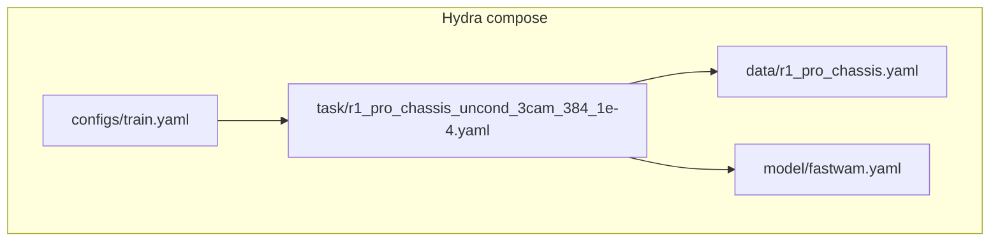
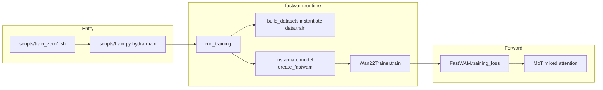
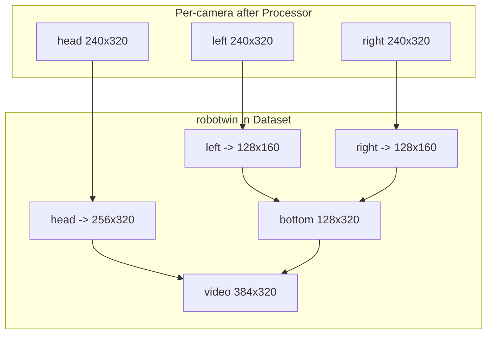
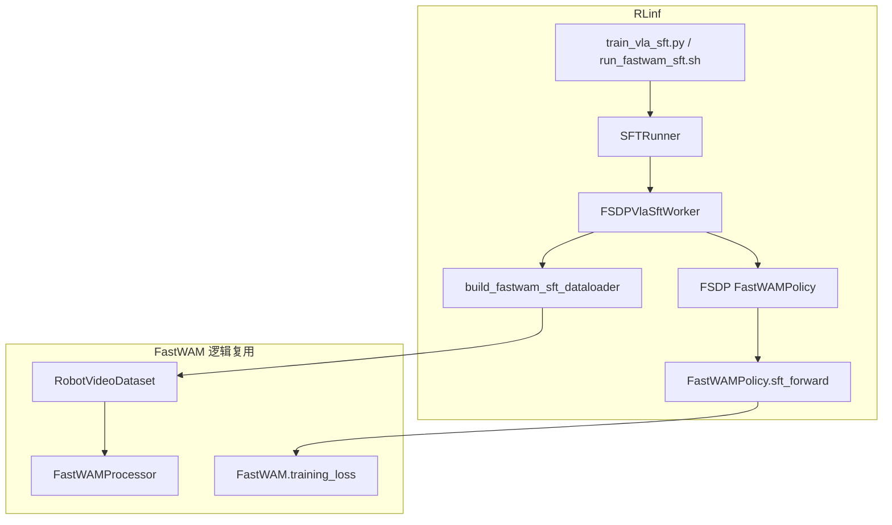

# FastWAM-RLinf 整合：r1_pro_chassis_uncond_3cam_384_1e-4 任务支持（cp25）

> **文档性质**：v4 设计（[`fw_sft_design_op46_4.md`](fw_sft_design_op46_4.md)）的 **任务扩展附录** —— 在已落地的 LIBERO SFT 整合之上，增加真实机器人 **r1_pro_chassis** 三相机任务。  
> **实施状态**：[`fw_sft_design_op46_4_1impl.md`](fw_sft_design_op46_4_1impl.md)（LIBERO Phase1 + [G.9 FSDP 排障](fw_sft_design_op46_4_1impl.md#g9-fastwam-motvideoaction-expert-共享fsdp-嵌套包裹与排障总结2026-06-会话)）  
> **取代关系**：已被 **[`fw_sft_design_op46_4_r1pr_cp25_2.md`](fw_sft_design_op46_4_r1pr_cp25_2.md)** 取代（含 2026-06 Policy FSDP 与 mot2 说明）。本文与 [`fw_sft_design_op46_4_r1pr.md`](fw_sft_design_op46_4_r1pr.md) 仅作历史参考。  
> **代码基线**：FastWAM `/home/Luogang/SRC/Robot/FastWAM` · RLinf `/home/Luogang/SRC/RL/RLinf`  
> **日期**：2026-06-01

---

## 目录

1. [背景与目标](#1-背景与目标)
2. [相对 r1pr 文档的纠正](#02-相对-r1pr-文档的纠正)
3. [r1_pro 与 LIBERO 差异总览](#2-r1_pro-与-libero-差异总览)
4. [FastWAM 原生任务执行链](#3-fastwam-原生任务执行链)
5. [任务与数据配置解析](#4-任务与数据配置解析)
6. [数据处理与训练 Batch 契约](#5-数据处理与训练-batch-契约)
7. [ActionDiT 23 维与预训练权重](#6-actiondit-23-维与预训练权重)
8. [RLinf 整合设计](#7-rlinf-整合设计)
9. [推荐训练配置 YAML](#8-推荐训练配置-yaml)
10. [代码改动与 PR 切分](#9-代码改动与-pr-切分)
11. [验收测试](#10-验收测试)
12. [运维 Runbook](#11-运维-runbook)
13. [风险、显存与 FSDP](#12-风险显存与-fsdp)
14. [与 v4 / 1impl 的索引](#13-与-v4--1impl-的索引)

---

## 1. 背景与目标

[`fw_sft_design_op46_4.md`](fw_sft_design_op46_4.md) 以 **LIBERO**（2 相机、7 维动作、`horizontal` 拼接、`min/max` 归一化）为范例，完成了 FastWAM → RLinf SFT 的总体架构。生产侧还需要在**同一套** `model_type: fastwam` 管线下支持 FastWAM 任务：

**`r1_pro_chassis_uncond_3cam_384_1e-4`**

该任务在 FastWAM 仓库中通过 Hydra 配置组合定义：

| 配置文件 | 作用 |
|----------|------|
| [`configs/task/r1_pro_chassis_uncond_3cam_384_1e-4.yaml`](../../../Robot/FastWAM/configs/task/r1_pro_chassis_uncond_3cam_384_1e-4.yaml) | 训练超参、覆盖 `data` / `model` |
| [`configs/data/r1_pro_chassis.yaml`](../../../Robot/FastWAM/configs/data/r1_pro_chassis.yaml) | LeRobot 数据路径、`shape_meta`、Processor、T5 缓存目录 |
| [`configs/model/fastwam.yaml`](../../../Robot/FastWAM/configs/model/fastwam.yaml) | `create_fastwam`、Wan2.2、scheduler |

**本文目标**：

1. 按**当前本地代码**还原 FastWAM 原生从预计算 T5 到 `training_loss` 的全链路。  
2. 说明在**不 fork 训练逻辑**前提下，RLinf 侧如何通过**配置驱动**接入 r1_pro（复用已实现的 `build_fastwam_sft_dataloader` 等）。  
3. 给出可执行的 YAML、验收分级、运维步骤，并与已落地的 **FSDP1 + no_shard** 约束对齐（非文档早期的 FSDP2 假设）。

---

## 0.2 相对 r1pr 文档的纠正

[`fw_sft_design_op46_4_r1pr.md`](fw_sft_design_op46_4_r1pr.md) 方向正确，但以下条目与**当前 RLinf 仓库实际状态**不一致；实施 r1_pro 时**以本文为准**。

| r1pr 中的表述 | 实际情况（本地代码） |
|---------------|-------------------|
| `actor.fsdp_config.strategy: fsdp2` | 已落地 LIBERO 使用 **FSDP1**：`strategy: fsdp`、`sharding_strategy: no_shard`、`use_orig_params: true`（[`libero_sft_fastwam.yaml`](../../examples/sft/config/libero_sft_fastwam.yaml)） |
| 需修改 `build_fastwam_sft_dataloader` 增加 `_build_shape_meta()` | **已实现**：[`rlinf/data/datasets/fastwam/__init__.py`](../../rlinf/data/datasets/fastwam/__init__.py) L64–114 直接读取 `cfg.data.shape_meta` |
| r1_pro 仅需改 Policy / Worker | **无需**新 `model_type`；`FSDPVlaSftWorker` 已按 `fastwam` 分发 |
| 默认 `micro_batch_size: 2` 可照搬 | r1_pro MoT 序列更长（§5.3），建议 **`micro_batch_size: 1`**，用 `global_batch_size = micro × world_size` 凑全局 batch |
| 未强调 `mot_checkpoint_mixed_attn: false` | FastWAM task yaml 显式关闭；RLinf 的 [`model/fastwam.yaml`](../../examples/sft/config/model/fastwam.yaml) 默认为 `true`，**必须在 r1_pro yaml 覆盖** |
| ActionDiT 预训练与 23 维 | 见 [§6](#6-actiondit-23-维与预训练权重)：仅 **DiT backbone** 从 7 维 checkpoint 加载，`action_encoder` / `head` 按 23 维**重新初始化** |

---

## 2. r1_pro 与 LIBERO 差异总览

| 维度 | LIBERO（RLinf 已落地） | r1_pro_chassis（本文） |
|------|------------------------|-------------------------|
| 相机数 | 2（`image`, `wrist_image`） | 3（`head_rgb`, `left_wrist_rgb`, `right_wrist_rgb`） |
| 拼接模式 | `horizontal` → 224×448 | **`robotwin`** → **384×320** |
| `video_size`（Dataset 最终 H×W） | `[224, 448]` | `[384, 320]` |
| action / proprio 维 | 7 / 8 | **23 / 23**（state 与 action 同维） |
| 归一化 | `min/max` | **`z-score`** |
| delta action mask | 7 维 mask（末维 absolute） | **无**（`action_state_transforms: null`） |
| T5 缓存目录 | `.../text_embeds_cache/libero` | `.../text_embeds_cache/r1_pro_chassis` |
| 数据源 | `FASTWAM_ROOT/.../libero_*` | `${R1PRO_DATA}/r1_pro_data_convert_chassis` |
| FastWAM task：`mot_checkpoint_mixed_attn` | 默认 true（model yaml） | **`false`**（task yaml 覆盖） |
| MoT 总序列长（约） | 882 + 32 ≈ **914** | 1080 + 32 ≈ **1112**（+22%） |

任务名中的 **`uncond`** 表示训练时使用数据集中 `meta/tasks.jsonl` 的 language instruction；T5 嵌入通过离线脚本按 **prompt 文本哈希** 缓存，与 LIBERO 流程相同，并非“无文本条件”。

---

## 3. FastWAM 原生任务执行链

### 3.1 运维入口（bt_README）

[`FastWAM/bt/bt_README.md`](../../../Robot/FastWAM/bt/bt_README.md) 定义两步：

```bash
# Step 1：预计算 T5（多卡推荐 8 进程）
torchrun --standalone --nproc_per_node=8 \
  scripts/precompute_text_embeds.py \
  task=r1_pro_chassis_uncond_3cam_384_1e-4

# Step 2：DeepSpeed ZeRO-1 训练（8 卡示例）
bash scripts/train_zero1.sh 8 task=r1_pro_chassis_uncond_3cam_384_1e-4
```

### 3.2 Hydra 配置组合



[`configs/task/r1_pro_chassis_uncond_3cam_384_1e-4.yaml`](../../../Robot/FastWAM/configs/task/r1_pro_chassis_uncond_3cam_384_1e-4.yaml) 仅覆盖少量字段：

| 字段 | 值 | 含义 |
|------|-----|------|
| `defaults` | `data: r1_pro_chassis`, `model: fastwam` | 注入数据/模型配置树 |
| `batch_size` | 16 | 原生 DataLoader batch（非 RLinf micro_batch） |
| `num_workers` | 8 | 数据加载线程 |
| `model.mot_checkpoint_mixed_attn` | **false** | MoT 混合注意力**不做** gradient checkpoint（省显存策略不同） |
| `learning_rate` | 1e-4 | 与 LIBERO RLinf 默认一致 |
| `num_epochs` | 50 | 按 epoch 训练（RLinf 侧用 `max_steps` 更常见） |
| `save_every` | 2000 | 原生 checkpoint 间隔 |
| `weight_decay` | 1e-2 | 与 RLinf `actor.optim.weight_decay` 对齐 |

### 3.3 训练主路径（代码）



| 步骤 | 文件 | 关键函数 / 行为 |
|------|------|----------------|
| 1 | [`scripts/train.py`](../../../Robot/FastWAM/scripts/train.py) | `@hydra.main(config_path="../configs", config_name="train")` → `run_training(cfg)` |
| 2 | [`src/fastwam/runtime.py`](../../../Robot/FastWAM/src/fastwam/runtime.py) L333–344 | `instantiate(data_cfg.train)` → `RobotVideoDataset` |
| 3 | 同上 L76–160 | `create_fastwam(...)` → `FastWAM.from_wan22_pretrained` |
| 4 | [`src/fastwam/trainer.py`](../../../Robot/FastWAM/src/fastwam/trainer.py) L82–84 | `_apply_dit_only_train_mode`：冻结 VAE/T5，仅 `dit`（MoT）+ `proprio_encoder` 可训 |
| 5 | [`src/fastwam/models/wan22/fastwam.py`](../../../Robot/FastWAM/src/fastwam/models/wan22/fastwam.py) | `training_loss` → VAE encode → flow noise → `self.mot(...)` → `post_dit` → MSE |

RLinf 侧 [`FastWAMPolicy.sft_forward`](../../rlinf/models/embodiment/fastwam/fastwam_policy.py) 直接调用同一 `training_loss`，**不经过** `Wan22Trainer` / Accelerate / DeepSpeed。

---

## 4. 任务与数据配置解析

### 4.1 `configs/data/r1_pro_chassis.yaml`

#### 4.1.1 数据集路径

```yaml
dataset_dirs:
  - /mnt/r/share/zwy/datasets/r1_pro_data_v2/r1_pro_data_convert_chassis
```

RLinf 中映射为 `data.train_data_paths`（单路径字符串或列表均可，见 `build_fastwam_sft_dataloader`）。

#### 4.1.2 shape_meta（必须原样迁入 RLinf yaml）

| 键 | `lerobot_key` | `raw_shape` | `shape`（Processor Resize 后） |
|----|---------------|-------------|--------------------------------|
| head_rgb | head_rgb | [3, 360, 640] | [3, 240, 320] |
| left_wrist_rgb | left_wrist_rgb | [3, 480, 640] | [3, 240, 320] |
| right_wrist_rgb | right_wrist_rgb | [3, 480, 640] | [3, 240, 320] |
| action.default | actions | 23 | 23 |
| state.default | state | 23 | 23 |

`shape` 与 `train_transforms` 的 `Resize [240, 320]` 一致：Processor 在**逐相机**上 resize，再由 Dataset 做 `robotwin` 拼接。

#### 4.1.3 时间与视频尺寸

| 参数 | 值 | 结果 |
|------|-----|------|
| `num_frames` | 33 | 原始观测步数 |
| `action_video_freq_ratio` | 4 | 视频帧索引 0,4,…,32 → **9** 帧 |
| `video_size` | [384, 320] | 拼接后的目标分辨率（H×W） |
| `global_sample_stride` | 1 | 与 LIBERO 相同 |

**action_horizon** = `(9 - 1) × 4 = 32`（与 v4 §10 一致）。

#### 4.1.4 Processor

```yaml
num_output_cameras: 3
action_output_dim: 23
proprio_output_dim: 23
norm_default_mode: "z-score"
action_state_transforms: null
```

首次训练会在 `register_work_dir` 目录下生成 `dataset_stats.json`（z-score 的 mean/std）。RLinf 在 `build_fastwam_sft_dataloader` 开头调用 `register_work_dir(cfg.runner.logger.log_path)`，行为与原生 `misc.get_work_dir()` 对齐。

#### 4.1.5 T5 缓存

```yaml
text_embedding_cache_dir: ./data/text_embeds_cache/r1_pro_chassis
context_len: 128
```

RLinf 应设为：`${oc.env:FASTWAM_ROOT}/data/text_embeds_cache/r1_pro_chassis`（或预计算后的绝对路径）。

### 4.2 `robotwin` 拼接（代码级）

实现位于 [`robot_video_dataset.py`](../../../Robot/FastWAM/src/fastwam/datasets/lerobot/robot_video_dataset.py) L154–178（在 per-camera Processor 输出之后）：

```text
cam_top  = resize(video[0]) → [T, C, 256, 320]   # head
cam_left = resize(video[1]) → [T, C, 128, 160]
cam_right= resize(video[2]) → [T, C, 128, 160]
bottom   = cat([cam_left, cam_right], dim=W) → [T, C, 128, 320]
video    = cat([cam_top, bottom], dim=H)     → [T, C, 384, 320]
```

随后 `resize_transform` / `normalize_transform` 将 `[384,320]` 对齐到 `video_size`，再变为 `[C, T, H, W]` 送入 batch。



**硬约束**：`concat_multi_camera: robotwin` 时 `num_output_cameras` 必须为 **3**，否则 `ValueError`。

---

## 5. 数据处理与训练 Batch 契约

### 5.1 单样本字段（训练时）

| 键 | 形状 | dtype | 说明 |
|----|------|-------|------|
| `video` | `[3, 9, 384, 320]` | float32，约 [-1,1] | robotwin 拼接后 |
| `action` | `[32, 23]` | float32 | z-score 归一化绝对动作 |
| `proprio` | `[32, 23]` | float32 | 与 action 同源 state |
| `context` | `[128, 4096]` | float32 | 离线 T5 缓存 |
| `context_mask` | `[128]` | bool | |
| `action_is_pad` | `[32]` | bool | |
| `image_is_pad` | `[9]` | bool | |
| `proprio_is_pad` | `[32]` | bool | |

### 5.2 VAE latent（WanVideoVAE38，`upsampling_factor=16`）

对 `video` `[B, 3, 9, 384, 320]`：

| 量 | 计算 | 值 |
|----|------|-----|
| H_lat | 384 / 16 | 24 |
| W_lat | 320 / 16 | 20 |
| T_lat | (9-1)/4 + 1 | 3 |
| `patch_size` | [1,2,2] | tokens/frame = (24/2)×(20/2) = **120** |
| `input_latents` | [B, 48, T_lat, H_lat, W_lat] | [B, 48, 3, 24, 20] |

### 5.3 MoT 序列与显存

| 项 | LIBERO | r1_pro |
|----|--------|--------|
| video tokens / sample | 98×9 = 882 | 120×9 = **1080** |
| action tokens / sample | 32 | 32 |
| 总序列（约） | 914 | **1112** |
| 注意力 FLOPs 比例（粗估） | 1 | (1112/914)² ≈ **1.48×** |

因此 r1_pro 在相同 `micro_batch_size` 下更易 OOM；RLinf 推荐 **micro_batch_size=1**，必要时降低 `num_workers` / 开启 `gradient_checkpointing`（与 `mot_checkpoint_mixed_attn` 独立，见 §6）。

### 5.4 RLinf 数据管道（已实现）

[`build_fastwam_sft_dataloader`](../../rlinf/data/datasets/fastwam/__init__.py) 已支持 r1_pro 所需参数：

- `data.shape_meta` → `FastWAMProcessor` / `RobotVideoDataset`
- `data.video_size`、`data.concat_multi_camera`
- `data.processor.norm_default_mode`、`action_output_dim`、`proprio_output_dim`
- `model.text_embedding_cache_dir`、`model.context_len`
- `DistributedSampler` + `fastwam_collate_fn`（`torch.stack`，与维度无关）

**无需**为 r1_pro 新增第二套 Dataset 类。

---

## 6. ActionDiT 23 维与预训练权重

[`ActionDiT`](../../../Robot/FastWAM/src/fastwam/models/wan22/action_dit.py) 预训练文件 `ActionDiT_linear_interp_Wan22_alphascale_1024hdim.pt` 面向 **7 维** LIBERO 类动作空间导出 backbone。

加载逻辑（L33–34, L104–224）：

```python
ACTION_BACKBONE_SKIP_PREFIXES = ("action_encoder.", "head.")
```

| 子模块 | r1_pro（action_dim=23）行为 |
|--------|---------------------------|
| `blocks.*`（30 层 DiTBlock） | 从 `.pt` 的 `backbone_state_dict` 加载（meta 校验 hidden_dim 等一致） |
| `action_encoder`、`head` | **不加载**；保持 `nn.Linear(23, …)` 的随机初始化 |
| `text_embedding`、`time_embedding` 等 | 随 backbone 键名进入加载或新建 |

这与 FastWAM 原生 r1_pro 训练一致：**换 embodiment 时必须改 `action_dit_config.action_dim` 与数据，不能假设 7 维 checkpoint 覆盖 encoder/head。**

RLinf [`get_model`](../../rlinf/models/embodiment/fastwam/__init__.py) 通过 `create_fastwam(action_dit_config=..., proprio_dim=...)` 传入维度；`proprio_dim=23` 会构建可训练的 `proprio_encoder: Linear(23, text_dim)`。

---

## 7. RLinf 整合设计

### 7.1 架构（与 v4 §4 一致）



### 7.2 复用组件（无需改代码）

| 组件 | 路径 | r1_pro 说明 |
|------|------|-------------|
| 模型注册 | `rlinf/config.py` | `SupportedModel.FASTWAM` 已有 |
| 构建 | `rlinf/models/embodiment/fastwam/__init__.py` | `create_fastwam(proprio_dim=23, action_dit_config.action_dim=23, …)` |
| Policy | `fastwam_policy.py` | `training_loss` 与维度无关 |
| Worker | `fsdp_vla_sft_worker.py` | `build_fastwam_sft_dataloader` |
| Collate | `fastwam/collate.py` | stack |
| Checkpoint | `fastwam_save_helper` | 键前缀仍为 `fastwam.mot.*` / `fastwam.proprio_encoder.*` |
| 启动脚本 | `examples/sft/run_fastwam_sft.sh` | 第一个参数改为 `r1_pro_sft_fastwam` |

### 7.3 FSDP（必须与 LIBERO 相同）

依据 [G.9.8](fw_sft_design_op46_4_1impl.md#g98-未解决问题与后续方向接手排障手册) 与已验证的 LIBERO 配置：

```yaml
actor.fsdp_config:
  strategy: fsdp
  sharding_strategy: no_shard
  use_orig_params: true
  gradient_checkpointing: true
  # mixed_precision bf16 等同 libero
```

**禁止**在未完成 MoT FSDP-safe 重构前使用 `shard_grad_op` / `full_shard` + `_no_split_modules: ["DiTBlock"]`（会触发 `mot._split_modulation` 形状错误）。省显存请参考 [G.10.5 阶段 2](fw_sft_design_op46_4_1impl.md#g105-推荐落地路径仅方案实施时另开-pr)（根级 `full_shard` + `wrap_policy.disable: true`）。

### 7.4 必须覆盖的 model 字段

[`examples/sft/config/model/fastwam.yaml`](../../examples/sft/config/model/fastwam.yaml) 默认 `proprio_dim: 8`、`action_dim: 7`。r1_pro **必须在任务 yaml** 的 `actor.model` 中覆盖：

- `proprio_dim: 23`
- `video_dit_config.action_dim: 23`（video expert 的 action-conditioned 相关维，配置一致性）
- `action_dit_config.action_dim: 23`
- `mot_checkpoint_mixed_attn: false`
- `text_embedding_cache_dir: <r1_pro 缓存绝对路径>`

---

## 8. 推荐训练配置 YAML

**新增文件**（实施 PR-A）：[`examples/sft/config/r1_pro_sft_fastwam.yaml`](../../examples/sft/config/r1_pro_sft_fastwam.yaml)

下列内容与 [`libero_sft_fastwam.yaml`](../../examples/sft/config/libero_sft_fastwam.yaml) 对齐，仅列出 **差异段**；未列出的键与 LIBERO 相同。

```yaml
# examples/sft/config/r1_pro_sft_fastwam.yaml（推荐完整稿）
defaults:
  - training_backend/fsdp@actor.fsdp_config
  - model/fastwam@actor.model
  - override hydra/job_logging: stdout

hydra:
  run:
    dir: .
  output_subdir: null
  searchpath:
    - file://${oc.env:EMBODIED_PATH}/config/

cluster:
  num_nodes: 1
  component_placement:
    actor: 4-7   # 按机器 GPU 调整；须满足 global_batch_size % (micro_batch_size * world_size) == 0

runner:
  task_type: sft
  logger:
    log_path: "../results"
    project_name: rlinf
    experiment_name: "r1_pro_sft_fastwam"
    logger_backends: ["tensorboard"]
  max_epochs: -1
  max_steps: 50000
  val_check_interval: -1
  save_interval: 2000
  log_interval: 10
  resume_dir: null

data:
  train_data_paths: ${oc.env:R1PRO_DATA}/r1_pro_data_convert_chassis
  num_workers: 8
  prefetch_factor: 4
  num_frames: 33
  action_video_freq_ratio: 4
  video_size: [384, 320]
  concat_multi_camera: "robotwin"
  global_sample_stride: 1
  val_set_proportion: 0.0
  skip_padding_as_possible: false

  shape_meta:
    images:
      - key: head_rgb
        lerobot_key: head_rgb
        raw_shape: [3, 360, 640]
        shape: [3, 240, 320]
      - key: left_wrist_rgb
        lerobot_key: left_wrist_rgb
        raw_shape: [3, 480, 640]
        shape: [3, 240, 320]
      - key: right_wrist_rgb
        lerobot_key: right_wrist_rgb
        raw_shape: [3, 480, 640]
        shape: [3, 240, 320]
    action:
      - key: default
        lerobot_key: actions
        raw_shape: 23
        shape: 23
    state:
      - key: default
        lerobot_key: state
        raw_shape: 23
        shape: 23

  processor:
    num_output_cameras: 3
    action_output_dim: 23
    proprio_output_dim: 23
    use_stepwise_action_norm: false
    norm_default_mode: "z-score"
    norm_exception_mode: null
    action_state_transforms: null
    action_state_merger:
      _target_: fastwam.datasets.lerobot.transforms.action_state_merger.ConcatLeftAlign
    train_transforms:
      - _target_: fastwam.datasets.lerobot.transforms.image.ToTensor
      - _target_: torchvision.transforms.Resize
        size: [240, 320]
    val_transforms:
      - _target_: fastwam.datasets.lerobot.transforms.image.ToTensor
      - _target_: torchvision.transforms.Resize
        size: [240, 320]

actor:
  group_name: "ActorGroup"
  training_backend: "fsdp"
  micro_batch_size: 1
  global_batch_size: 8   # 示例：4 GPU × micro 1 × grad_accum 2；按 cluster 调整
  seed: 42

  model:
    model_type: "fastwam"
    precision: bf16
    model_path: null
    text_embedding_cache_dir: ${oc.env:FASTWAM_ROOT}/data/text_embeds_cache/r1_pro_chassis
    context_len: 128
    proprio_dim: 23
    mot_checkpoint_mixed_attn: false
    video_dit_config:
      action_dim: 23
    action_dit_config:
      action_dim: 23

  optim:
    lr: 1.0e-4
    adam_beta1: 0.9
    adam_beta2: 0.95
    adam_eps: 1.0e-08
    weight_decay: 1.0e-2
    clip_grad: 1.0
    lr_scheduler: "cosine"
    lr_warmup_steps: -1
    lr_warmup_steps_ratio: 0.05
    total_training_steps: 50000

  fsdp_config:
    strategy: "fsdp"
    sharding_strategy: "no_shard"
    use_orig_params: true
    gradient_checkpointing: true
    gradient_checkpointing_use_reentrant: true
    limit_all_gathers: false
    forward_prefetch: true
    backward_prefetch: "pre"
    reshard_after_forward: false
    save_full_model_weights: false
    grad_scaler:
      enabled: false
    mixed_precision:
      param_dtype: bf16
      reduce_dtype: bf16
      buffer_dtype: bf16
    amp_autocast:
      enabled: false
```

### 8.1 启动命令

```bash
export FASTWAM_ROOT=/path/to/FastWAM
export FASTWAM_PATH=${FASTWAM_ROOT}/src
export DIFFSYNTH_MODEL_BASE_PATH=/path/to/wan_checkpoints
export R1PRO_DATA=/mnt/r/share/zwy/datasets/r1_pro_data_v2
export PYTHONPATH=${REPO_ROOT}:${FASTWAM_PATH}:${PYTHONPATH}

# Ray / ulimit 见 G.9.8 OPEN-03a
bash examples/sft/run_fastwam_sft.sh r1_pro_sft_fastwam
```

Smoke 覆盖示例：

```bash
bash examples/sft/run_fastwam_sft.sh r1_pro_sft_fastwam \
  runner.max_steps=20 \
  runner.save_interval=10 \
  runner.log_interval=1 \
  actor.micro_batch_size=1 \
  actor.global_batch_size=1 \
  cluster.component_placement.actor=0
```

---

## 9. 代码改动与 PR 切分

| PR | 内容 | 必要性 |
|----|------|--------|
| **A** | 新增 `examples/sft/config/r1_pro_sft_fastwam.yaml`（§8 全文） | **必须** |
| **B** | 扩展 [`validate_fastwam_sft_model_cfg`](../../rlinf/models/embodiment/fastwam/fastwam_config.py)：校验 `text_embedding_cache_dir`；可选校验 `shape_meta.images` 数量为 3 且 `video_size` 可被 16 整除；`proprio_dim` 与 `action_dit_config.action_dim` 一致 | 建议 |
| **C** | `tests/unit_tests/test_fastwam_r1_pro.py`：dataloader 单 batch 形状、384/320 整除 16 | 建议 |
| **D** | Sphinx 示例页 + [`fw_sft_design_op46_4.md` §18](fw_sft_design_op46_4.md#18-模型变体支持) 链接本文 | 可选 |

**明确不在 r1_pro V1 范围**：

- 修改 MoT / DiTBlock 以支持 per-layer FSDP（见 G.9.8 OPEN-01）
- 切换 `strategy: fsdp2`（见 G.9.8 OPEN-02、G.10）
- 新增 `model_type` 或 fork `training_loss`

---

## 10. 验收测试

### 10.1 L0 — 数据管道（CPU 为主，可不加载 Wan 全量权重）

| ID | 检查项 | 通过标准 |
|----|--------|----------|
| L0-1 | `build_fastwam_sft_dataloader` 读 1 个 batch | `video.shape[1:] == (3, 9, 384, 320)` |
| L0-2 | action / proprio | `shape[1:] == (32, 23)` |
| L0-3 | context | `shape[1:] == (128, 4096)` |
| L0-4 | robotwin | `num_output_cameras=3` 且 `concat_multi_camera=robotwin` 无异常 |
| L0-5 | z-score stats | 首次运行后在 `log_path` 下生成 `dataset_stats.json` |

参考实现草图（PR-C）：

```python
def test_r1pro_batch_shapes():
    batch = next(iter(loader))  # cfg = r1_pro_sft_fastwam, world_size=1
    assert batch["video"].shape[2:] == (3, 9, 384, 320)
    assert batch["action"].shape[2:] == (32, 23)
    assert batch["proprio"].shape[2:] == (32, 23)
```

### 10.2 L1 — 模型前向（单卡 GPU）

| ID | 检查项 | 通过标准 |
|----|--------|----------|
| L1-1 | `create_fastwam(..., proprio_dim=23, mot_checkpoint_mixed_attn=False)` | 初始化无异常 |
| L1-2 | `FastWAMPolicy.sft_forward(batch)` | `loss` 有限（非 NaN/Inf） |
| L1-3 | 可选：同 seed 下 `training_loss` vs `sft_forward` | `allclose(rtol=1e-5)`（小 batch） |

### 10.3 L2 — RLinf 训练

| ID | 检查项 | 通过标准 |
|----|--------|----------|
| L2-1 | Smoke 20 step | 日志有 `train/loss`、`train/dynamics_loss`、`train/action_loss` |
| L2-2 | Checkpoint | `.../checkpoints/global_step_*/actor/` 存在 |
| L2-3 | Resume | `resume_dir=global_step_N` 从 N+1 继续，loss 曲线连续（同 seed） |
| L2-4 | 多卡 | `global_batch_size % (micro_batch_size * actor_world_size) == 0` |
| L2-5 | 转换 | `fastwam_save_helper` 产出 `fastwam_native.pt` 含 `mot`、`proprio_encoder` |

### 10.4 L3 — 回归

| ID | 检查项 | 通过标准 |
|----|--------|----------|
| L3-1 | LIBERO 配置 | `libero_sft_fastwam` 仍可 smoke 20 step（配置隔离） |

### 10.5 VAE 尺寸静态校验

```python
def test_r1pro_latent_geometry():
    assert 384 % 16 == 0 and 320 % 16 == 0
    assert (384 // 16 // 2) * (320 // 16 // 2) == 120  # tokens per frame
```

---

## 11. 运维 Runbook

### 11.1 环境变量

```bash
export REPO_ROOT=/home/Luogang/SRC/RL/RLinf
export FASTWAM_ROOT=/home/Luogang/SRC/Robot/FastWAM
export FASTWAM_PATH=${FASTWAM_ROOT}/src
export DIFFSYNTH_MODEL_BASE_PATH=/mnt/r/share/fastwam_checkpoints   # 按实际修改
export R1PRO_DATA=/mnt/r/share/zwy/datasets/r1_pro_data_v2
export PYTHONPATH=${REPO_ROOT}:${FASTWAM_PATH}:${PYTHONPATH}
```

### 11.2 数据与 T5 缓存

1. 确认 LeRobot 数据集含 `meta/tasks.jsonl` 及三相机视频键。  
2. 在 **FastWAM 仓库**执行预计算：

```bash
cd ${FASTWAM_ROOT}
torchrun --standalone --nproc_per_node=8 \
  scripts/precompute_text_embeds.py \
  task=r1_pro_chassis_uncond_3cam_384_1e-4
```

3. 验收：

```bash
ls ${FASTWAM_ROOT}/data/text_embeds_cache/r1_pro_chassis/*.pt | head
python -c "import torch,glob; f=glob.glob('${FASTWAM_ROOT}/data/text_embeds_cache/r1_pro_chassis/*.pt')[0]; d=torch.load(f,map_location='cpu'); print(d['context'].shape)"
# 期望 torch.Size([128, 4096])
```

4. RLinf 启动前：`validate_fastwam_sft_model_cfg` 会断言 `text_embedding_cache_dir` 目录存在。

### 11.3 Ray 与日志

- **Ray**：修改 `ulimit` 后须 `ray stop` 再 `ray start`（[G.9.8 OPEN-03a](fw_sft_design_op46_4_1impl.md#open-03a-ray-too-many-open-files)）。  
- **日志**：`runner.logger.log_path` 指向大盘（如 `/mnt/r/CKPT/...`），避免根分区满导致 TensorBoard `finish` 失败（OPEN-03b）。

### 11.4 训练与 OOM

1. 使用 §8 yaml + `run_fastwam_sft.sh r1_pro_sft_fastwam`。  
2. OOM 时顺序：**降 `micro_batch_size` → 降 `num_workers` / `prefetch_factor` → 确认 `gradient_checkpointing: true`**。  
3. **不要** 仅靠 `full_shard` + per-`DiTBlock` wrap 省显存（会触发 MoT modulation 错误）。

### 11.5 与原生 FastWAM 对齐检查（可选）

同一数据与超参下，对比：

- 原生：`bash scripts/train_zero1.sh 8 task=r1_pro_chassis_uncond_3cam_384_1e-4`  
- RLinf：8 卡 `r1_pro_sft_fastwam`，`global_batch_size` 与有效 batch 对齐  

loss 曲线不要求逐步一致（采样与 DDP/FSDP 实现差异），但量级与下降趋势应同阶。

---

## 12. 风险、显存与 FSDP

| 风险 | 说明 | 缓解 |
|------|------|------|
| 显存 | 序列 +22%、`no_shard` 复制全参 | `micro_batch_size=1`；中期 G.10 根级 `full_shard` |
| Action head 随机初始化 | 23 维 encoder/head 无预训练 | 与原生 r1_pro 一致；必要时延长 warmup |
| 数据路径 / NFS | `dataset_dirs` 不可读 | 启动前 `ls` + 单样本 `RobotVideoDataset` |
| Wan 权重残缺 | 同 LIBERO | 完整 3 个 `diffusion_pytorch_model-*.safetensors` |
| `CUDA_VISIBLE_DEVICES` vs world_size | Cluster 见物理 GPU 数 | [E11](fw_sft_design_op46_4_1impl.md#e11-共享-gpu-资源) |
| FSDP + MoT | per-block wrap 与手工 forward 不兼容 | 保持 **no_shard**（G.9.8） |

---

## 13. 与 v4 / 1impl 的索引

| 主题 | 文档 |
|------|------|
| 总体架构、Batch 契约、损失 | [fw_sft_design_op46_4.md](fw_sft_design_op46_4.md) §4–§13 |
| LIBERO 实施与 yaml 模板 | [fw_sft_design_op46_4_1impl.md](fw_sft_design_op46_4_1impl.md) |
| FSDP / MoT 未决项 | [fw_sft_design_op46_4_1impl.md G.9–G.10](fw_sft_design_op46_4_1impl.md) |
| 多相机 `robotwin` | v4 §9.6、[robot_video_dataset.py](../../../Robot/FastWAM/src/fastwam/datasets/lerobot/robot_video_dataset.py) |

---

## 附录 A：23 维动作语义（数据理解）

与 [`fw_sft_design_op46_4_r1pr.md`](fw_sft_design_op46_4_r1pr.md) 一致，便于调试：

```text
action[0:7]   — 左臂关节
action[7:14]  — 右臂关节
action[14:16] — 左右夹爪
action[16:23] — 底盘（位姿 / 速度等，以数据集 meta 为准）
```

---

## 附录 B：实施检查清单（可打印）

- [ ] PR-A：`r1_pro_sft_fastwam.yaml` 入库  
- [ ] 预计算 T5 + 目录存在性  
- [ ] L0 batch 形状测试  
- [ ] L2 smoke 20 step + TensorBoard  
- [ ] 多卡 `global_batch_size` 整除校验  
- [ ] `fastwam_native.pt` 回灌 FastWAM 推理/评估（V2 评估管线）

---

## 附录 C：YAML 字段核对表（libero vs r1_pro）

对照 [`libero_sft_fastwam.yaml`](../../examples/sft/config/libero_sft_fastwam.yaml)、[`model/fastwam.yaml`](../../examples/sft/config/model/fastwam.yaml)、FastWAM [`r1_pro_chassis.yaml`](../../../Robot/FastWAM/configs/data/r1_pro_chassis.yaml) 与 [`build_fastwam_sft_dataloader`](../../rlinf/data/datasets/fastwam/__init__.py) 消费路径。**2026-06-01 核对通过**。

| 配置路径 | LIBERO | r1_pro（§8） | 消费方 |
|----------|--------|--------------|--------|
| `data.train_data_paths` | `FASTWAM_ROOT/.../libero_*` | `${R1PRO_DATA}/r1_pro_data_convert_chassis` | `RobotVideoDataset.dataset_dirs` |
| `data.num_frames` | 33 | 33 | Dataset + Processor |
| `data.action_video_freq_ratio` | 4 | 4 | Dataset |
| `data.video_size` | [224, 448] | **[384, 320]** | Dataset 最终 H×W |
| `data.concat_multi_camera` | horizontal | **robotwin** | Dataset L154+ |
| `data.shape_meta` | 2 相机 + 7/8 | **3 相机 + 23/23** | Processor + Dataset |
| `data.processor.num_output_cameras` | 2 | **3** | Processor |
| `data.processor.action_output_dim` | 7 | **23** | Processor |
| `data.processor.proprio_output_dim` | 8 | **23** | Processor |
| `data.processor.norm_default_mode` | min/max | **z-score** | Processor |
| `data.processor.delta_action_dim_mask` | 有 | **省略（null）** | Processor 可选 |
| `data.processor.train_transforms.size` | [224,224] | **[240,320]** | 与 shape_meta.shape 一致 |
| `actor.model.text_embedding_cache_dir` | `.../libero` | `.../r1_pro_chassis` | Dataset + validate |
| `actor.model.context_len` | 默认 128 | **128（建议显式）** | Dataset L107 |
| `actor.model.proprio_dim` | 默认 8 | **23** | `create_fastwam` |
| `actor.model.mot_checkpoint_mixed_attn` | 默认 true | **false** | video/action_dit `use_gradient_checkpointing` |
| `actor.model.video_dit_config.action_dim` | 默认 7 | **23** | FastWAM 配置一致性 |
| `actor.model.action_dit_config.action_dim` | 默认 7 | **23** | ActionDiT |
| `actor.micro_batch_size` | 1 | **1** | Worker |
| `actor.fsdp_config.strategy` | fsdp | fsdp | FSDP1 |
| `actor.fsdp_config.sharding_strategy` | no_shard | no_shard | G.9.8 |
| `actor.fsdp_config.use_orig_params` | true | true | G.9.7 |
| `actor.optim.lr` | 1e-4 | 1e-4 | 与 task yaml 一致 |
| `defaults` → `model/fastwam` | 是 | 是 | 继承 Wan/scheduler/loss |

**未在任务 yaml 重复、由 defaults 继承且 r1_pro 无需改动的字段**：`model_id`、`tokenizer_*`、`load_text_encoder`、`redirect_common_files`、`action_dit_pretrained_path`（仍指向 7 维 backbone pt）、`video_dit_config` 除 `action_dim` 外结构、`video_scheduler` / `action_scheduler` / `loss.lambda_action`。

**实施时注意**：r1_pro LeRobot 列名为 `head_rgb` / `actions` / `state` 等，**不能**依赖默认的 `observation.images.{key}` 推导；`shape_meta` **必须**显式写 `lerobot_key`（与 FastWAM [`r1_pro_chassis.yaml`](../../../Robot/FastWAM/configs/data/r1_pro_chassis.yaml) 一致，见 §8 全文）。

---

**文档版本**：cp25-v1 · 与本地 commit 同步编写，实施时以仓库文件为准。
