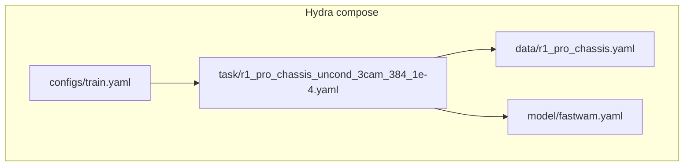
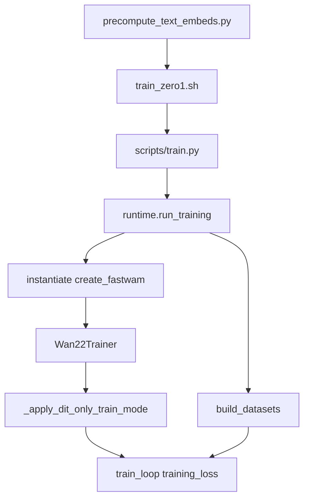
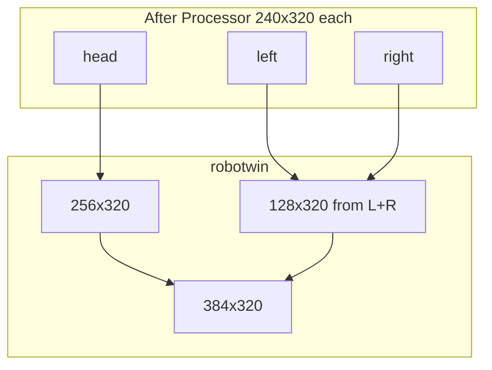
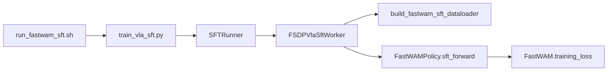

# FastWAM-RLinf 整合：r1_pro_chassis_uncond_3cam_384_1e-4（cp25_2）

> **文档性质**：[`fw_sft_design_op46_4.md`](fw_sft_design_op46_4.md) v4 的 **r1_pro 任务扩展附录 v2**（2026-06 本地代码复核版）。  
> **实施状态**：LIBERO SFT 已在 RLinf 落地；[`fw_sft_design_op46_4_1impl.md`](fw_sft_design_op46_4_1impl.md)（Phase1 + [G.9 FSDP 排障](fw_sft_design_op46_4_1impl.md#g98-未解决问题与后续方向接手排障手册)）。  
> **取代关系**：**实施 r1_pro 仅以本文为准**。历史文档 [`fw_sft_design_op46_4_r1pr.md`](fw_sft_design_op46_4_r1pr.md)、[`fw_sft_design_op46_4_r1pr_cp25.md`](fw_sft_design_op46_4_r1pr_cp25.md) 中 FSDP / dataloader / `_no_split_modules` 等描述已过时（见 [§0](#0-相对历史文档的纠正与增量)）。  
> **关联**：FastWAM 训练冻结见 [`fw_main_freez.md`](../../../Robot/FastWAM/fw_main_freez.md)。  
> **代码基线**：FastWAM `/home/Luogang/SRC/Robot/FastWAM` · RLinf `/home/Luogang/SRC/RL/RLinf`  
> **日期**：2026-06-01

---

## 目录

1. [背景与目标](#1-背景与目标)
2. [相对历史文档的纠正与增量](#0-相对历史文档的纠正与增量)
3. [r1_pro 与 LIBERO 差异矩阵](#2-r1_pro-与-libero-差异矩阵)
4. [FastWAM 原生任务全链](#3-fastwam-原生任务全链)
5. [Task 配置解析](#4-task-配置解析)
6. [数据配置与处理链](#5-数据配置与处理链)
7. [Batch、VAE 与 MoT 几何](#6-batchvae-与-mot-几何)
8. [模型、冻结与 ActionDiT 23 维](#7-模型冻结与-actiondit-23-维)
9. [RLinf 整合架构](#8-rlinf-整合架构)
10. [推荐 YAML 全文](#9-推荐训练配置-yaml-全文)
11. [原生 vs RLinf 超参对照](#10-原生-vs-rlinf-超参对照)
12. [PR 切分与实施清单](#11-pr-切分与实施清单)
13. [验收测试 L0–L4](#12-验收测试-l0l4)
14. [运维 Runbook](#13-运维-runbook)
15. [风险、FSDP 与 mot2 路径](#14-风险fsdp-与-mot2-路径)
16. [索引与检查清单](#15-索引与检查清单)

---

## 1. 背景与目标

v4 以 **LIBERO**（2 相机、7 维动作、`horizontal` 拼接、`min/max`）完成 FastWAM → RLinf SFT 的总体设计。产线还需要在同一套 `model_type: fastwam` 下支持真实机器人任务：

**`r1_pro_chassis_uncond_3cam_384_1e-4`**

| 维度 | 含义 |
|------|------|
| `r1_pro_chassis` | 三相机底盘 LeRobot 数据（[`configs/data/r1_pro_chassis.yaml`](../../../Robot/FastWAM/configs/data/r1_pro_chassis.yaml)） |
| `uncond` | 指令来自各 episode `meta/tasks.jsonl`，经 `DEFAULT_PROMPT` 模板离线编码 T5（非“无文本”） |
| `3cam` | head + 双腕，经 `robotwin` 拼成 384×320 |
| `384_1e-4` | 最终视频高宽与 task 学习率 1e-4 |

**本文目标**：

1. 从 [`bt/bt_README.md`](../../../Robot/FastWAM/bt/bt_README.md) 出发，按**当前源码**还原预计算 T5 → ZeRO-1 训练 → `training_loss` 全链。  
2. 逐项解释 task / data yaml 如何进入 `RobotVideoDataset` 与 `FastWAM`。  
3. 在**不 fork `training_loss`** 前提下，给出 RLinf **配置驱动**接入方案、FSDP/Policy 现状、可复制 yaml 与分级验收。  
4. 明确仓库**尚未入库**的 `r1_pro_sft_fastwam.yaml` 与单元测试为阻塞/建议 PR。

---

## 0. 相对历史文档的纠正与增量

| 主题 | r1pr / cp25 常见问题 | cp25_2（当前本地代码） |
|------|----------------------|-------------------------|
| FSDP wrap | cp25 写 `_no_split_modules=["DiTBlock"]`；r1pr 写 `fsdp2` | Policy 现为 **`_no_split_modules = None`**（[`fastwam_policy.py`](../../rlinf/models/embodiment/fastwam/fastwam_policy.py) L7–11）→ **根级 FSDP、无 per-DiTBlock auto-wrap**；yaml：**FSDP1** + `no_shard` + `use_orig_params`（[`libero_sft_fastwam.yaml`](../../examples/sft/config/libero_sft_fastwam.yaml) L107–110） |
| dataloader | r1pr 要求实现 `_build_shape_meta()` | **已实现**：[`build_fastwam_sft_dataloader`](../../rlinf/data/datasets/fastwam/__init__.py) L64–114 读 `cfg.data.shape_meta` |
| MoT 双注册 | 1impl 称生产已 `_ExpertMixtures` | **生产** [`mot.py`](../../../Robot/FastWAM/src/fastwam/models/wan22/mot.py) L26 仍为 `nn.ModuleDict`；**实验** [`mot2.py`](../../../Robot/FastWAM/src/fastwam/models/wan22/mot2.py) + [`fastwam2.py`](../../../Robot/FastWAM/src/fastwam/models/wan22/fastwam2.py) 提供 `_ExpertMixtures`；Policy L46–52 注释切换方式 |
| r1_pro yaml | cp25 仅文档模板 | 仓库仍 **无** [`examples/sft/config/r1_pro_sft_fastwam.yaml`](../../examples/sft/config/r1_pro_sft_fastwam.yaml) — **PR-A 必须** |
| 单元测试 | cp25 建议 | **尚无** `test_fastwam*` — 本文 §12 给 pytest 骨架 |
| 冻结 | cp25 简略 | 详见 [`fw_main_freez.md`](../../../Robot/FastWAM/fw_main_freez.md)：仅 `dit`（MoT）+ `proprio_encoder` 进 AdamW；VAE `@torch.no_grad` |
| 1impl G.9.6 | 仍写 `["DiTBlock"]` | 与 policy 不一致；实施以 **policy 源码 + 本文** 为准，可选 PR-E 修正 1impl |

---

## 2. r1_pro 与 LIBERO 差异矩阵

| 维度 | LIBERO（RLinf 已落地） | r1_pro_chassis |
|------|------------------------|----------------|
| 相机 | 2：`image`, `wrist_image` | 3：`head_rgb`, `left_wrist_rgb`, `right_wrist_rgb` |
| 拼接 | `horizontal` → 224×448 | **`robotwin`** → **384×320** |
| action / proprio | 7 / 8 | **23 / 23** |
| 归一化 | `min/max` | **`z-score`** |
| delta mask | 7 维 | **无** |
| T5 缓存 | `.../text_embeds_cache/libero` | `.../text_embeds_cache/r1_pro_chassis` |
| 数据路径 | `FASTWAM_ROOT/.../libero_*` | `${R1PRO_DATA}/r1_pro_data_convert_chassis` |
| `mot_checkpoint_mixed_attn` | 默认 true | task **false** |
| MoT 序列（约） | 914 | **1112**（+22% 注意力 FLOPs 粗估 ×1.48） |

---

## 3. FastWAM 原生任务全链

### 3.1 bt_README 两步

[`bt/bt_README.md`](../../../Robot/FastWAM/bt/bt_README.md)：

```bash
# Step 1：T5 预计算（8 卡示例）
torchrun --standalone --nproc_per_node=8 \
  scripts/precompute_text_embeds.py \
  task=r1_pro_chassis_uncond_3cam_384_1e-4

# Step 2：训练（DeepSpeed ZeRO-1 via Accelerate）
bash scripts/train_zero1.sh 8 task=r1_pro_chassis_uncond_3cam_384_1e-4
```

### 3.2 Hydra 配置组合



- [`configs/train.yaml`](../../../Robot/FastWAM/configs/train.yaml)：`defaults: [data, model, task]`，`output_dir` 带时间戳。  
- Task 仅 override `data` + `model` 并覆盖训练超参（见 §4）。

### 3.3 端到端代码路径



| 步骤 | 文件:行（约） | 行为 |
|------|---------------|------|
| 预计算 | [`precompute_text_embeds.py`](../../../Robot/FastWAM/scripts/precompute_text_embeds.py) L70–102 | `_collect_dataset_settings` 遍历 `data.*` 含 `dataset_dirs` 的节点；收集 `text_embedding_cache_dir`、`context_len` |
| 唯一 prompt | 同上 L114–145 | 读各 `dataset_dirs/.../meta/tasks.jsonl`，`DEFAULT_PROMPT.format(task=...)` 去重 |
| 缓存文件 | 同上 L157+ | `{sha256}.t5_len{context_len}.{enc_id}.pt`，含 `context`/`context_mask` |
| 启动 | [`train_zero1.sh`](../../../Robot/FastWAM/scripts/train_zero1.sh) | `accelerate launch --num_processes N scripts/train.py task=...` |
| 入口 | [`runtime.run_training`](../../../Robot/FastWAM/src/fastwam/runtime.py) L359–381 | `register_work_dir(output_dir)`；`instantiate(cfg.model)`；`build_datasets`；`Wan22Trainer` |
| 冻结 | [`trainer.py`](../../../Robot/FastWAM/src/fastwam/trainer.py) L82–84, L287–295 | `_apply_dit_only_train_mode` **在 optimizer 构建前**；仅 `model.dit` + 可选 `proprio_encoder` 可训 |
| 优化器 | `trainer.py` L85–94 | `AdamW(model.dit.parameters() [+ proprio])` |
| 训练步 | `trainer.py` L670–675 | `training_loss(sample)` → `backward` → `clip_grad_norm_(model.parameters())` |
| 损失 | [`fastwam.py`](../../../Robot/FastWAM/src/fastwam/models/wan22/fastwam.py) L448–568 | `build_inputs` → flow noise → `pre_dit` → `mot.forward` → `post_dit` → MSE |

### 3.4 `training_loss` 与 MoT（训练路径）

生产 [`mot.py`](../../../Robot/FastWAM/src/fastwam/models/wan22/mot.py) `forward`（L447–556）每层：

1. 对 `video` / `action` expert 分别 `_build_expert_attention_io`（Q/K/V + modulation）。  
2. 拼接 Q/K/V → `_mixed_attention`（可选 checkpoint，见 §14）。  
3. 切分 mixed 输出 → `_apply_post_with_optional_checkpoint`（cross-attn + FFN）。

**不调用** `WanVideoDiT.forward()` 内 30 层独立循环；与 RLinf 共用同一 `FastWAM.training_loss`。

---

## 4. Task 配置解析

[`configs/task/r1_pro_chassis_uncond_3cam_384_1e-4.yaml`](../../../Robot/FastWAM/configs/task/r1_pro_chassis_uncond_3cam_384_1e-4.yaml) 全文很短，均为 **全局覆盖**：

| 字段 | 值 | 说明 / RLinf 映射 |
|------|-----|-------------------|
| `defaults` | `data: r1_pro_chassis`, `model: fastwam` | RLinf 无 Hydra 组合；在单 yaml 写全 `data` + `actor.model` |
| `batch_size` | 16 | 原生 per-GPU batch；RLinf 用 `micro_batch_size`（建议 **1**）+ `global_batch_size` |
| `num_workers` | 8 | → `data.num_workers` |
| `model.mot_checkpoint_mixed_attn` | **false** | **必须**覆盖 RLinf [`model/fastwam.yaml`](../../examples/sft/config/model/fastwam.yaml) 默认 `true` |
| `lr_scheduler_type` | cosine | → `actor.optim.lr_scheduler: cosine` |
| `learning_rate` | 1e-4 | → `actor.optim.lr` |
| `num_epochs` | 50 | RLinf 常用 `runner.max_steps` + `actor.optim.total_training_steps` |
| `max_steps` | null | 按 epoch×steps/epoch 由 Trainer 估算 |
| `log_every` / `save_every` / `eval_every` | 10 / 2000 / 200 | → `runner.log_interval` / `save_interval`；eval 视 RLinf runner |
| `gradient_accumulation_steps` | 1 | RLinf 由 `global_batch_size` 与 micro 隐含 |
| `weight_decay` | 1e-2 | → `actor.optim.weight_decay` |
| `resume` | null | → `runner.resume_dir` |

---

## 5. 数据配置与处理链

### 5.1 [`r1_pro_chassis.yaml`](../../../Robot/FastWAM/configs/data/r1_pro_chassis.yaml) 结构

`data.train` 实例化 [`RobotVideoDataset`](../../../Robot/FastWAM/src/fastwam/datasets/lerobot/robot_video_dataset.py) + [`FastWAMProcessor`](../../../Robot/FastWAM/src/fastwam/datasets/lerobot/processors/fastwam_processor.py)。

#### 5.1.1 路径与 LeRobot 键

```yaml
dataset_dirs:
  - /mnt/r/share/zwy/datasets/r1_pro_data_v2/r1_pro_data_convert_chassis
```

RLinf：`data.train_data_paths: ${oc.env:R1PRO_DATA}/r1_pro_data_convert_chassis`

**`shape_meta` 必须带 `lerobot_key`**（不可只靠 `observation.images.{key}` 默认推导）：

| key | lerobot_key | raw_shape | shape（Processor Resize） |
|-----|-------------|-----------|---------------------------|
| head_rgb | head_rgb | [3,360,640] | [3,240,320] |
| left_wrist_rgb | left_wrist_rgb | [3,480,640] | [3,240,320] |
| right_wrist_rgb | right_wrist_rgb | [3,480,640] | [3,240,320] |
| action.default | actions | 23 | 23 |
| state.default | state | 23 | 23 |

依据 [`base_lerobot_dataset.py`](../../../Robot/FastWAM/src/fastwam/datasets/lerobot/base_lerobot_dataset.py) L71–91：`lerobot_key` 默认规则不适用于顶层 `head_rgb` 等列名。

#### 5.1.2 时间与视频

| 参数 | 值 | 结果 |
|------|-----|------|
| `num_frames` | 33 | 原始观测步 |
| `action_video_freq_ratio` | 4 | 视频帧 0,4,…,32 → **9** 帧 |
| `video_size` | [384, 320] | Dataset 最终 H×W（robotwin 之后） |
| `global_sample_stride` | 1 | 与 LIBERO 相同 |

**action_horizon** = \((9-1) \times 4 = 32\)。

#### 5.1.3 Processor

```yaml
num_output_cameras: 3
action_output_dim: 23
proprio_output_dim: 23
norm_default_mode: z-score
train_transforms: Resize [240, 320]  # 与 shape_meta.shape 一致
```

首次训练在 `register_work_dir` 目录写 `dataset_stats.json`（z-score mean/std）。  
- 原生：`misc.register_work_dir(cfg.output_dir)`（`runtime.run_training` L364）。  
- RLinf：`build_fastwam_sft_dataloader` 调 `register_work_dir(cfg.runner.logger.log_path)`。

#### 5.1.4 T5 缓存

```yaml
text_embedding_cache_dir: ./data/text_embeds_cache/r1_pro_chassis
context_len: 128
```

RLinf：`actor.model.text_embedding_cache_dir: ${oc.env:FASTWAM_ROOT}/data/text_embeds_cache/r1_pro_chassis`，`context_len: 128`。

### 5.2 `robotwin` 拼接（代码）

[`robot_video_dataset.py`](../../../Robot/FastWAM/src/fastwam/datasets/lerobot/robot_video_dataset.py) L154–178（Processor 输出 per-camera 之后）：

```text
head     → resize 256×320
L/R wrist→ resize 128×160 each → cat width → 128×320
cat height → 384×320
```



硬约束：`concat_multi_camera=robotwin` 且 `num_output_cameras=3`，否则 `ValueError`。

### 5.3 RLinf 数据管道（已实现）

[`build_fastwam_sft_dataloader`](../../rlinf/data/datasets/fastwam/__init__.py) 将 `data.shape_meta`、`video_size`、`concat_multi_camera`、`processor.*` 传入 `FastWAMProcessor` / `RobotVideoDataset`；**无需**新 Dataset 类。

---

## 6. Batch、VAE 与 MoT 几何

### 6.1 单样本训练字段

| 键 | 形状 | 说明 |
|----|------|------|
| `video` | `[3, 9, 384, 320]` | robotwin 后，约 [-1,1] |
| `action` | `[32, 23]` | z-score |
| `proprio` | `[32, 23]` | `build_inputs` 取 `proprio[:,0,:]` 编码进 context |
| `context` | `[128, 4096]` | 离线 T5 |
| `context_mask` | `[128]` | bool |
| pad masks | 与 v4 §10 一致 | `action_is_pad` 等 |

### 6.2 VAE latent（WanVideoVAE38，`upsampling_factor=16`）

| 量 | 值 |
|----|-----|
| H_lat, W_lat | 24, 20 |
| T_lat | 3 |
| patch [1,2,2] tokens/frame | **120** |
| `input_latents` | `[B, 48, 3, 24, 20]` |

编码在 [`_encode_video_latents`](../../../Robot/FastWAM/src/fastwam/models/wan22/fastwam.py) L242–251：`@torch.no_grad()`，**不反传 VAE**。

### 6.3 MoT 序列与显存

| 项 | LIBERO | r1_pro |
|----|--------|--------|
| video tokens | 882 | **1080** |
| action tokens | 32 | 32 |
| 合计 | ~914 | **~1112** |

建议 RLinf **`actor.micro_batch_size: 1`**，用 `global_batch_size = micro × actor_world_size`（及梯度累积若 runner 支持）凑全局 batch。

---

## 7. 模型、冻结与 ActionDiT 23 维

### 7.1 冻结（原生与 RLinf 对齐）

| 模块 | 训练更新 | 依据 |
|------|----------|------|
| VAE | 否 | `eval()` + `requires_grad_(False)`；encode `no_grad` |
| T5 | 否（默认不加载） | `load_text_encoder: false`；用缓存 `context` |
| MoT（video+action expert） | **是** | `model.dit.requires_grad_(True)` |
| proprio_encoder | **是**（r1_pro） | `Linear(23, 4096)`，单独进 optimizer |

详见 [`fw_main_freez.md`](../../../Robot/FastWAM/fw_main_freez.md)。

### 7.2 RLinf `FastWAMPolicy.train()`

[`fastwam_policy.py`](../../rlinf/models/embodiment/fastwam/fastwam_policy.py) L39–59：

- 与 `Wan22Trainer._apply_dit_only_train_mode` 同语义：`fastwam.eval()` + 全冻结 → `dit.train()` + `dit.requires_grad_(True)` → `proprio_encoder` 可训。  
- **`_no_split_modules = None`**（L7–11）：避免 per-`DiTBlock` FSDP 与 MoT 在 `block.modulation` 外读参数冲突（见 1impl G.9.4）。  
- 若未来 FastWAM 默认切 **mot2**（`_ExpertMixtures`），需按 L46–52 注释改为显式 `video_expert`/`action_expert` 的 `train()`/`requires_grad_`。

### 7.3 ActionDiT 23 维加载

[`action_dit.py`](../../../Robot/FastWAM/src/fastwam/models/wan22/action_dit.py)：

```python
ACTION_BACKBONE_SKIP_PREFIXES = ("action_encoder.", "head.")
```

| 子模块 | r1_pro |
|--------|--------|
| `blocks.*` | 从 `ActionDiT_*.pt` backbone 加载 |
| `action_encoder`, `head` | **跳过**；23 维 **随机初始化** 后随训练更新 |

RLinf 覆盖：`actor.model.proprio_dim: 23`，`video_dit_config.action_dim: 23`，`action_dit_config.action_dim: 23`。

### 7.4 `mot_checkpoint_mixed_attn: false` 的影响

Task yaml 关闭后（[`fastwam.yaml`](../../../Robot/FastWAM/configs/model/fastwam.yaml) 中 `use_gradient_checkpointing: ${model.mot_checkpoint_mixed_attn}`）：

- MoT `_mixed_attention` **不做** checkpoint（`mot.py` L89–96）。  
- Expert post-block checkpoint **关闭**（`mot.py` L237–247）。  
- **不改变**可训参数集合；**增加**显存、减少重算。

---

## 8. RLinf 整合架构



### 8.1 复用组件（无新 model_type）

| 组件 | 路径 |
|------|------|
| 注册 | `SupportedModel.FASTWAM` |
| 构建 | `rlinf/models/embodiment/fastwam/__init__.py` → `create_fastwam` |
| Policy | `fastwam_policy.py` → `training_loss` |
| Worker | `fsdp_vla_sft_worker.py` |
| Collate | `fastwam/collate.py` |
| Checkpoint | `fastwam_save_helper`（`mot` + `proprio_encoder`） |
| 校验 | `validate_fastwam_sft_model_cfg`（cache 目录存在） |

### 8.2 FSDP 生产配置（与 LIBERO 相同）

```yaml
actor.fsdp_config:
  strategy: fsdp
  sharding_strategy: no_shard
  use_orig_params: true
  gradient_checkpointing: true
  mixed_precision: { param_dtype: bf16, reduce_dtype: bf16, buffer_dtype: bf16 }
```

**禁止**在未完成 MoT FSDP-safe 重构前使用 `shard_grad_op` / `full_shard` + `_no_split_modules: ["DiTBlock"]`（1impl OPEN-01）。省显存见 G.10.5 根级 `full_shard` + `wrap_policy.disable` / `_no_split_modules` 为空。

### 8.3 阻塞项：PR-A

仓库**当前不存在** [`examples/sft/config/r1_pro_sft_fastwam.yaml`](../../examples/sft/config/r1_pro_sft_fastwam.yaml)。§9 为可直接复制的入库稿。

---

## 9. 推荐训练配置 YAML 全文

```yaml
# examples/sft/config/r1_pro_sft_fastwam.yaml
defaults:
  - training_backend/fsdp@actor.fsdp_config
  - model/fastwam@actor.model
  - override hydra/job_logging: stdout

hydra:
  run:
    dir: .
  output_subdir: null
  searchpath:
    - file://${oc.env:EMBODIED_PATH}/config/

cluster:
  num_nodes: 1
  component_placement:
    actor: 4-7

runner:
  task_type: sft
  logger:
    log_path: "../results"
    project_name: rlinf
    experiment_name: "r1_pro_sft_fastwam"
    logger_backends: ["tensorboard"]
  max_epochs: -1
  max_steps: 50000
  val_check_interval: -1
  save_interval: 2000
  log_interval: 10
  resume_dir: null

data:
  train_data_paths: ${oc.env:R1PRO_DATA}/r1_pro_data_convert_chassis
  num_workers: 8
  prefetch_factor: 4
  num_frames: 33
  action_video_freq_ratio: 4
  video_size: [384, 320]
  concat_multi_camera: "robotwin"
  global_sample_stride: 1
  val_set_proportion: 0.0
  skip_padding_as_possible: false

  shape_meta:
    images:
      - key: head_rgb
        lerobot_key: head_rgb
        raw_shape: [3, 360, 640]
        shape: [3, 240, 320]
      - key: left_wrist_rgb
        lerobot_key: left_wrist_rgb
        raw_shape: [3, 480, 640]
        shape: [3, 240, 320]
      - key: right_wrist_rgb
        lerobot_key: right_wrist_rgb
        raw_shape: [3, 480, 640]
        shape: [3, 240, 320]
    action:
      - key: default
        lerobot_key: actions
        raw_shape: 23
        shape: 23
    state:
      - key: default
        lerobot_key: state
        raw_shape: 23
        shape: 23

  processor:
    num_output_cameras: 3
    action_output_dim: 23
    proprio_output_dim: 23
    use_stepwise_action_norm: false
    norm_default_mode: "z-score"
    norm_exception_mode: null
    action_state_transforms: null
    action_state_merger:
      _target_: fastwam.datasets.lerobot.transforms.action_state_merger.ConcatLeftAlign
    train_transforms:
      - _target_: fastwam.datasets.lerobot.transforms.image.ToTensor
      - _target_: torchvision.transforms.Resize
        size: [240, 320]
    val_transforms:
      - _target_: fastwam.datasets.lerobot.transforms.image.ToTensor
      - _target_: torchvision.transforms.Resize
        size: [240, 320]

actor:
  group_name: "ActorGroup"
  training_backend: "fsdp"
  micro_batch_size: 1
  global_batch_size: 8
  seed: 42

  model:
    model_type: "fastwam"
    precision: bf16
    model_path: null
    text_embedding_cache_dir: ${oc.env:FASTWAM_ROOT}/data/text_embeds_cache/r1_pro_chassis
    context_len: 128
    proprio_dim: 23
    mot_checkpoint_mixed_attn: false
    video_dit_config:
      action_dim: 23
    action_dit_config:
      action_dim: 23

  optim:
    lr: 1.0e-4
    adam_beta1: 0.9
    adam_beta2: 0.95
    adam_eps: 1.0e-08
    weight_decay: 1.0e-2
    clip_grad: 1.0
    lr_scheduler: "cosine"
    lr_warmup_steps: -1
    lr_warmup_steps_ratio: 0.05
    total_training_steps: 50000

  fsdp_config:
    strategy: "fsdp"
    sharding_strategy: "no_shard"
    use_orig_params: true
    gradient_checkpointing: true
    gradient_checkpointing_use_reentrant: true
    limit_all_gathers: false
    forward_prefetch: true
    backward_prefetch: "pre"
    reshard_after_forward: false
    save_full_model_weights: false
    grad_scaler:
      enabled: false
    mixed_precision:
      param_dtype: bf16
      reduce_dtype: bf16
      buffer_dtype: bf16
    amp_autocast:
      enabled: false
```

**约束**：`global_batch_size % (micro_batch_size × actor_gpu_count) == 0`。

### 9.1 启动

```bash
export REPO_ROOT=/home/Luogang/SRC/RL/RLinf
export FASTWAM_ROOT=/home/Luogang/SRC/Robot/FastWAM
export FASTWAM_PATH=${FASTWAM_ROOT}/src
export DIFFSYNTH_MODEL_BASE_PATH=/mnt/r/share/fastwam_checkpoints
export R1PRO_DATA=/mnt/r/share/zwy/datasets/r1_pro_data_v2
export PYTHONPATH=${REPO_ROOT}:${FASTWAM_PATH}:${PYTHONPATH}

bash examples/sft/run_fastwam_sft.sh r1_pro_sft_fastwam
```

单卡 Smoke（[`run_fastwam_sft.sh`](../../examples/sft/run_fastwam_sft.sh) 会把 `log_path` 指到 `BTLOG_ROOT`）：

```bash
bash examples/sft/run_fastwam_sft.sh r1_pro_sft_fastwam \
  runner.max_steps=20 \
  runner.save_interval=10 \
  runner.log_interval=1 \
  actor.micro_batch_size=1 \
  actor.global_batch_size=1 \
  cluster.component_placement.actor=0
```

---

## 10. 原生 vs RLinf 超参对照

| 项 | FastWAM 原生 | RLinf r1_pro 建议 |
|----|--------------|-------------------|
| 分布式 | Accelerate + DeepSpeed ZeRO-1 | Ray + FSDP1 `no_shard` |
| per-GPU batch | 16（task yaml） | `micro_batch_size: 1` |
| 全局 batch | 16 × GPU 数 | `global_batch_size`（如 8 @ 4×GPU×1） |
| LR / WD | 1e-4 / 1e-2 | 同左 `actor.optim` |
| 训练长度 | 50 epochs | `max_steps` + `total_training_steps: 50000`（按数据量调整） |
| 保存 | `save_every: 2000` | `runner.save_interval: 2000` |
| MoT ckpt | `mot_checkpoint_mixed_attn: false` | 同左，**勿省略** |
| Checkpoint 内容 | `mot` + `proprio_encoder` | `fastwam_save_helper` 同等语义 |

---

## 11. PR 切分与实施清单

| PR | 内容 | 必要性 |
|----|------|--------|
| **A** | 新增 `examples/sft/config/r1_pro_sft_fastwam.yaml`（§9） | **必须** |
| **B** | 扩展 `validate_fastwam_sft_model_cfg`：3 相机、`video_size` 可被 16 整除、`action_dim==proprio_dim==23` | 建议 |
| **C** | `tests/unit_tests/test_fastwam_r1_pro.py`（§12 骨架） | 建议 |
| **D** | v4 §18、cp25 文首指向 cp25_2 | 文档 |
| **E** | 修正 1impl G.9.6 `_no_split_modules` 与 policy 一致 | 文档债 |

**明确不做**：改 MoT 算法、生产启用 FSDP2、新 `model_type`、改 r1_pro 数据集本体。

---

## 12. 验收测试 L0–L4

### 12.1 L0 — 数据（CPU，可无全量 Wan 权重）

| ID | 检查 | 通过标准 |
|----|------|----------|
| L0-1 | 1 batch | `video.shape[2:] == (3, 9, 384, 320)` |
| L0-2 | action/proprio | `(32, 23)` |
| L0-3 | context | `(128, 4096)` |
| L0-4 | robotwin | 3 相机无异常 |
| L0-5 | stats | `log_path` 下生成 `dataset_stats.json` |

**pytest 骨架**（PR-C）：

```python
# tests/unit_tests/test_fastwam_r1_pro.py
import pytest
from omegaconf import OmegaConf

@pytest.mark.skipif(not _has_r1pro_data(), reason="R1PRO_DATA not set")
def test_r1pro_dataloader_shapes():
    from rlinf.data.datasets.fastwam import build_fastwam_sft_dataloader
    cfg = OmegaConf.load("examples/sft/config/r1_pro_sft_fastwam.yaml")
    loader, sampler = build_fastwam_sft_dataloader(
        cfg, world_size=1, rank=0, data_paths=cfg.data.train_data_paths
    )
    batch = next(iter(loader))
    assert batch["video"].shape[2:] == (3, 9, 384, 320)
    assert batch["action"].shape[2:] == (32, 23)
    assert batch["proprio"].shape[2:] == (32, 23)

def test_r1pro_latent_geometry():
    assert 384 % 16 == 0 and 320 % 16 == 0
    assert (384 // 16 // 2) * (320 // 16 // 2) == 120
```

### 12.2 L1 — 前向（单卡 GPU）

- `create_fastwam(..., proprio_dim=23, mot_checkpoint_mixed_attn=False)` 成功。  
- `FastWAMPolicy.sft_forward(batch)`：`loss` 有限。

### 12.3 L2 — RLinf 训练

| ID | 检查 | 通过标准 |
|----|------|----------|
| L2-1 | Smoke 20 step | `train/loss`, `train/dynamics_loss`, `train/action_loss` |
| L2-2 | Checkpoint | `checkpoints/global_step_*` 存在 |
| L2-3 | Resume | `resume_dir` 连续 |
| L2-4 | 多卡 | `global_batch_size % (micro × world_size) == 0` |
| L2-5 | 导出 | native `.pt` 含 `mot`、`proprio_encoder` |

### 12.4 L3 — 回归

`libero_sft_fastwam` smoke 20 step 仍通过（配置隔离）。

### 12.5 L4 — 可选数值对齐

同 seed、单卡、micro=1：原生 `training_loss` vs RLinf `sft_forward`，`allclose(rtol=1e-4, atol=1e-3)`（允许分布式非确定性差异时仅比量级）。

---

## 13. 运维 Runbook

1. **环境**

```bash
export FASTWAM_ROOT=/home/Luogang/SRC/Robot/FastWAM
export FASTWAM_PATH=${FASTWAM_ROOT}/src
export DIFFSYNTH_MODEL_BASE_PATH=/mnt/r/share/fastwam_checkpoints
export R1PRO_DATA=/mnt/r/share/zwy/datasets/r1_pro_data_v2
export PYTHONPATH=${REPO_ROOT}:${FASTWAM_PATH}:${PYTHONPATH}
```

2. **数据**：确认 `${R1PRO_DATA}/r1_pro_data_convert_chassis/meta/tasks.jsonl` 存在。  
3. **T5**（FastWAM 仓）：

```bash
cd ${FASTWAM_ROOT}
torchrun --standalone --nproc_per_node=8 \
  scripts/precompute_text_embeds.py \
  task=r1_pro_chassis_uncond_3cam_384_1e-4
```

4. **校验缓存**：

```bash
ls ${FASTWAM_ROOT}/data/text_embeds_cache/r1_pro_chassis/*.pt | head
```

5. **Ray**：改 `ulimit` 后 `ray stop` / `ray start`（1impl OPEN-03a）。  
6. **`log_path`**：指向大盘（OPEN-03b）。  
7. **训练**：`bash examples/sft/run_fastwam_sft.sh r1_pro_sft_fastwam`。  
8. **OOM**：降 `micro_batch_size` → `num_workers`；勿先开 `full_shard`+`DiTBlock` wrap。

---

## 14. 风险、FSDP 与 mot2 路径

| 风险 | 缓解 |
|------|------|
| 显存 1112 tokens + `no_shard` | `micro_batch_size=1`；G.10 根级 `full_shard` |
| `ModuleDict` 双路径 + 未来 per-block wrap | 保持 `_no_split_modules=None` 或合入 **mot2** |
| 23 维 action head 随机初始化 | 与原生一致；可加长 warmup |
| Wan 权重残缺 | 3× `diffusion_pytorch_model-*.safetensors` |
| 共享 GPU / world_size | 1impl E11 |

### 14.1 mot2 / fastwam2（实验分支）

| 文件 | 作用 |
|------|------|
| [`mot2.py`](../../../Robot/FastWAM/src/fastwam/models/wan22/mot2.py) | `_ExpertMixtures`：expert 仅注册在 `FastWAM.video_expert` / `action_expert` |
| [`fastwam2.py`](../../../Robot/FastWAM/src/fastwam/models/wan22/fastwam2.py) | 先建 expert 再建 MoT；与 policy 注释 L46–52 配套 |

**生产** `create_fastwam` 仍走 [`fastwam.py`](../../../Robot/FastWAM/src/fastwam/models/wan22/fastwam.py) + [`mot.py`](../../../Robot/FastWAM/src/fastwam/models/wan22/mot.py) `ModuleDict`。RLinf 通过 **根级 FSDP** 规避重复 wrap；长期应用 mot2 降低 OPEN-01 风险。

---

## 15. 索引与检查清单

### 15.1 源码索引

| 主题 | 路径 |
|------|------|
| bt 入口 | `FastWAM/bt/bt_README.md` |
| task / data | `configs/task/r1_pro_chassis_uncond_3cam_384_1e-4.yaml`, `configs/data/r1_pro_chassis.yaml` |
| 预计算 | `scripts/precompute_text_embeds.py` |
| 训练 | `runtime.run_training`, `trainer.py` |
| 损失 | `fastwam.py` `training_loss` |
| MoT | `mot.py` `forward` L447–556 |
| robotwin | `robot_video_dataset.py` L154–178 |
| RLinf dataloader | `rlinf/data/datasets/fastwam/__init__.py` |
| RLinf policy | `rlinf/models/embodiment/fastwam/fastwam_policy.py` |
| 冻结详解 | `FastWAM/fw_main_freez.md` |
| FSDP 排障 | `fw_sft_design_op46_4_1impl.md` G.9–G.10 |

### 15.2 实施检查清单

- [ ] PR-A：`r1_pro_sft_fastwam.yaml` 入库  
- [ ] 预计算 T5 + cache 目录  
- [ ] L0 batch 形状  
- [ ] L2 smoke 20 step + TensorBoard  
- [ ] 多卡 `global_batch_size` 整除  
- [ ] checkpoint 含 `proprio_encoder`  
- [ ] L3 LIBERO 回归  

---

**文档版本**：cp25_2-v1 · 与 2026-06 本地 FastWAM / RLinf 源码同步。
