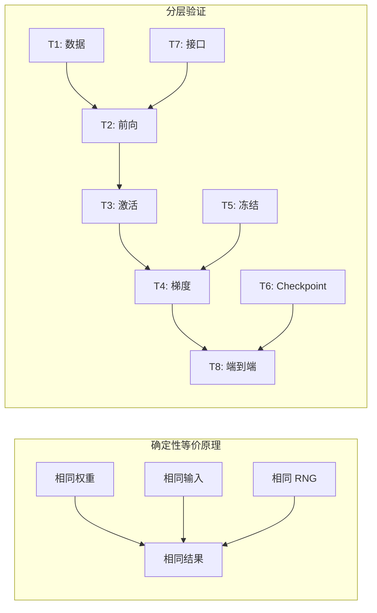
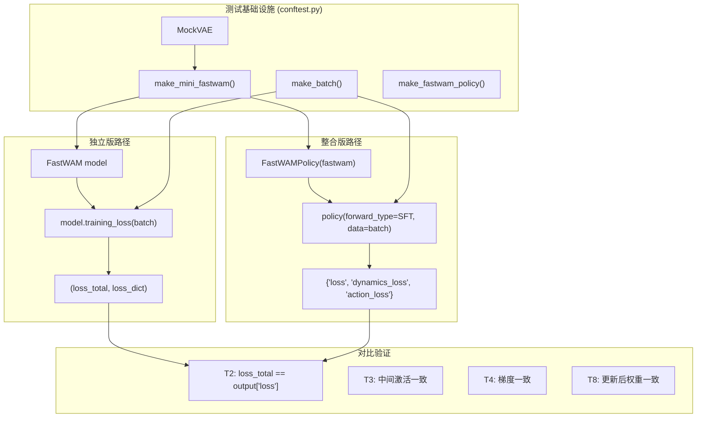
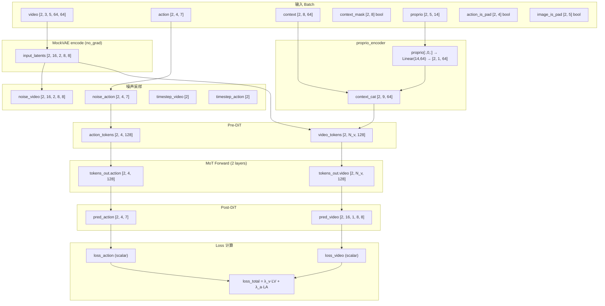
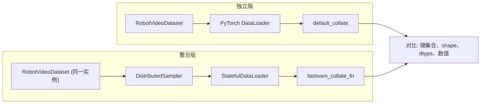
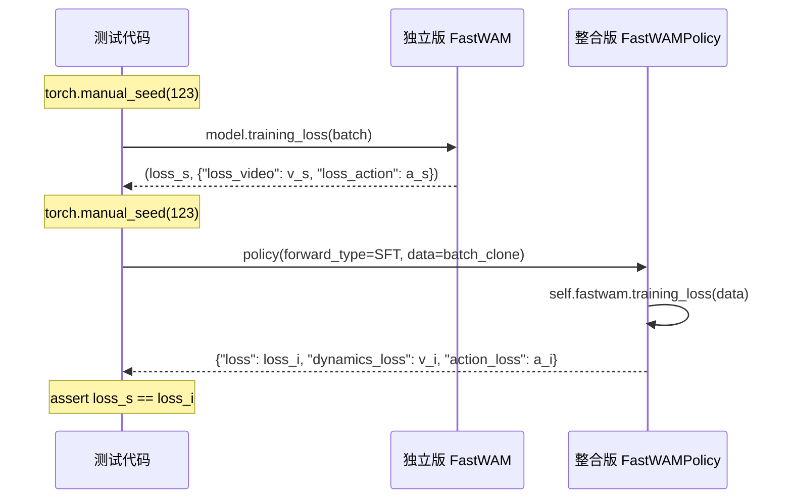
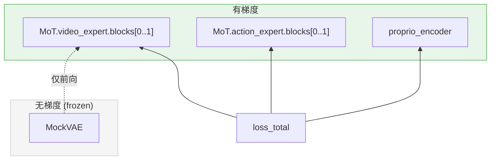
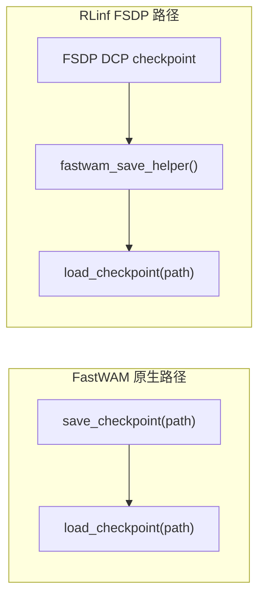
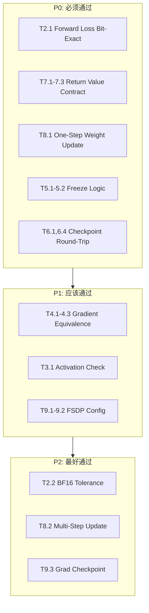

# RLinf 整合 FastWAM SFT — 单元测试方案

> **文档性质**：单元测试设计与实现指导  
> **配套设计文档**：`fw_sft_design_op46_4.md`（v4 完整版）  
> **代码基线**：RLinf `/home/luogang/S/RL/RLinf` · FastWAM `/home/luogang/S/Rb/FastWAM`  
> **日期**：2026-05-31  
> **目标**：在不执行真实训练的前提下，通过单元测试预测整合版与独立版的训练结果是否一致。

---

## 目录

1. [目标与方法论](#1-目标与方法论)
2. [测试全景架构](#2-测试全景架构)
3. [测试基础设施](#3-测试基础设施)
4. [T1 — 数据管道等价性](#4-t1--数据管道等价性)
5. [T2 — 前向传播精确等价性](#5-t2--前向传播精确等价性)
6. [T3 — 近输出层激活值检查](#6-t3--近输出层激活值检查)
7. [T4 — 反向传播梯度等价性](#7-t4--反向传播梯度等价性)
8. [T5 — 冻结与可训练性正确性](#8-t5--冻结与可训练性正确性)
9. [T6 — Checkpoint 往返](#9-t6--checkpoint-往返)
10. [T7 — 返回值契约](#10-t7--返回值契约)
11. [T8 — 权重更新等价性（一步训练）](#11-t8--权重更新等价性一步训练)
12. [T9 — FSDP 配置与兼容性](#12-t9--fsdp-配置与兼容性)
13. [关键数值风险分析](#13-关键数值风险分析)
14. [验收标准与运行方式](#14-验收标准与运行方式)

---

## 1. 目标与方法论

### 1.1 核心命题

> **若给定相同的模型权重、相同的输入数据、相同的随机数状态，则整合版与独立版必须产生相同的输出。**

这是确定性数值等价测试（Deterministic Numerical Equivalence Testing）的基础。我们将其分解为以下可测试的子命题：

| 层次 | 子命题 | 对应测试 |
|------|--------|----------|
| **数据层** | 数据管道产出的 batch dict 结构、shape、dtype、数值完全一致 | T1 |
| **前向层** | 相同 batch + 相同 RNG → loss 值精确一致 | T2 |
| **激活层** | MoT 中间激活、post_dit 预测值一致 | T3 |
| **梯度层** | backward 后各层 `.grad` 一致 | T4 |
| **冻结层** | 可训练参数集合完全一致 | T5 |
| **持久层** | checkpoint 保存/加载后状态一致 | T6 |
| **接口层** | 返回值格式与 Worker 消费逻辑匹配 | T7 |
| **端到端** | 一步 forward+backward+step 后权重一致 | T8 |
| **配置层** | FSDP wrap policy、scalar 参数处理正确 | T9 |

### 1.2 方法论



**关键约束**：

- 所有测试在 **CPU** 上运行，使用 **float32** 精度（避免 GPU/bf16 引入的不可控差异）
- 使用 **轻量模型**（~1M 参数，2 层，64 维），无需真实预训练权重
- 通过 `torch.manual_seed()` 控制随机数，保证可复现性
- 独立版与整合版共享同一套权重（通过 `deepcopy` 或 `load_state_dict`）

### 1.3 预测逻辑

若 T1–T8 全部通过（在 CPU float32 下精确匹配），则可推断：

1. 整合版的**数学等价性**已验证——相同输入产生相同输出
2. 在真实 GPU 训练中，唯一的差异来源是**分布式框架差异**（FSDP2 vs Accelerate+ZeRO-1），这些差异：
   - 不改变单卡前向/反向的数学逻辑
   - 仅影响参数分片方式（FSDP 分片 vs ZeRO 分片），但每个 rank 看到的局部计算是相同的
   - 不影响 loss 计算（loss 在每个 rank 上独立计算后 all-reduce）

因此，**单元测试通过 ≈ 真实训练结果一致**。

---

## 2. 测试全景架构

### 2.1 测试文件结构

```
tests/unit_tests/fastwam/
├── conftest.py                    # 共享 fixtures：轻量模型、合成数据
├── test_t1_data_pipeline.py       # T1: 数据管道等价性
├── test_t2_forward_equiv.py       # T2: 前向传播精确等价性
├── test_t3_activations.py         # T3: 近输出层激活值检查
├── test_t4_backward_grads.py      # T4: 反向传播梯度等价性
├── test_t5_freeze.py              # T5: 冻结/可训练性正确性
├── test_t6_checkpoint.py          # T6: Checkpoint 往返
├── test_t7_return_contract.py     # T7: 返回值契约
├── test_t8_weight_update.py       # T8: 权重更新等价性
└── test_t9_fsdp_config.py         # T9: FSDP 配置与兼容性
```

### 2.2 数据流全景



---

## 3. 测试基础设施

### 3.1 轻量模型构建

**目标**：构建一个 ~1M 参数的 FastWAM 模型，保留全部架构特征，但大幅缩小维度。

#### 3.1.1 尺寸配置

| 参数 | 真实值 | 测试值 | 说明 |
|------|--------|--------|------|
| `hidden_dim` (video) | 3072 | 128 | DiT 隐藏维度 |
| `hidden_dim` (action) | 1024 | 128 | 两个 Expert 须相同 `num_heads × attn_head_dim` |
| `ffn_dim` (video) | 14336 | 256 | FFN 中间维度 |
| `ffn_dim` (action) | 4096 | 256 | |
| `num_heads` | 24 | 4 | 注意力头数 |
| `attn_head_dim` | 128 | 32 | 每头维度（须确保 3D RoPE 维度对齐）|
| `num_layers` | 30 | 2 | DiT 层数 |
| `text_dim` | 4096 | 64 | T5 嵌入维度 |
| `freq_dim` | 256 | 256 | 频率维度（保持与真实值一致）|
| `in_dim` / `out_dim` | 48 | 16 | VAE latent 通道数 |
| `patch_size` | (1,2,2) | (1,2,2) | 保持不变 |
| `action_dim` | 7 | 7 | 动作维度 |
| `proprio_dim` | 8 | 14 | 本体感受维度 |
| `context_len` | 128 | 8 | T5 token 长度 |

#### 3.1.2 输入尺寸

| 参数 | 真实值 | 测试值 | 约束 |
|------|--------|--------|------|
| `batch_size` | 2 | 2 | |
| `num_frames` (T) | 9 (33→抽稀) | 5 | T%4==1 |
| `H` | 224 | 64 | H%16==0（须确保 3D RoPE 维度对齐）|
| `W` | 448 | 64 | W%16==0（须确保 3D RoPE 维度对齐）|
| `action_horizon` | 32 | 4 | 整除 (T-1)=4 |

#### 3.1.3 MockVAE 实现

真实 `WanVideoVAE38` 约数百M参数、`@torch.no_grad()` 执行，在训练中始终冻结。我们用一个轻量 Mock 替代：

```python
class MockVAE(nn.Module):
    """确定性 VAE 替代品，输出与输入形状对应的 latent。"""

    def __init__(self, z_dim=16, temporal_downsample_factor=4, upsampling_factor=8):
        super().__init__()
        self.z_dim = z_dim
        self.temporal_downsample_factor = temporal_downsample_factor
        self.upsampling_factor = upsampling_factor
        # 一个简单的 conv 保证确定性输出
        self._encoder = nn.Conv3d(3, z_dim, kernel_size=1, bias=False)
        self._encoder.requires_grad_(False)

    @torch.no_grad()
    def encode(self, video_tensor, device=None, tiled=False,
               tile_size=None, tile_stride=None):
        # video_tensor: [B, 3, T, H, W]
        if isinstance(video_tensor, list):
            video_tensor = video_tensor[0]
        B, C, T, H, W = video_tensor.shape
        latent_T = (T - 1) // self.temporal_downsample_factor + 1
        latent_H = H // self.upsampling_factor
        latent_W = W // self.upsampling_factor
        # 自适应池化到目标大小 → Conv3d 保证确定性
        pooled = F.adaptive_avg_pool3d(video_tensor, (latent_T, latent_H, latent_W))
        return self._encoder(pooled)
```

**关键属性**：
- `@torch.no_grad()` 装饰器：不消耗 RNG 状态（无 dropout、无随机采样）
- `Conv3d` 权重固定（`requires_grad_(False)`）：相同输入 → 相同输出
- 输出 shape：`[B, z_dim, latent_T, latent_H, latent_W]`

对于测试值 `T=5, H=64, W=64`：
- `latent_T = (5-1)//4 + 1 = 2`
- `latent_H = 64//8 = 8`
- `latent_W = 64//8 = 8`
- 输出：`[2, 16, 2, 8, 8]`

#### 3.1.4 完整 conftest.py 核心逻辑

```python
import copy
import torch
import torch.nn as nn
import torch.nn.functional as F
import numpy as np
import pytest

# ── FastWAM 组件 ──
from fastwam.models.wan22.fastwam import FastWAM
from fastwam.models.wan22.wan_video_dit import WanVideoDiT
from fastwam.models.wan22.action_dit import ActionDiT
from fastwam.models.wan22.mot import MoT

# ── RLinf 组件 ──
from rlinf.models.embodiment.base_policy import BasePolicy, ForwardType


# ═══════════════════════════════════════════════════
# MockVAE
# ═══════════════════════════════════════════════════
class MockVAE(nn.Module):
    def __init__(self, z_dim=16, temporal_downsample_factor=4, upsampling_factor=8):
        super().__init__()
        self.z_dim = z_dim
        self.temporal_downsample_factor = temporal_downsample_factor
        self.upsampling_factor = upsampling_factor
        self._encoder = nn.Conv3d(3, z_dim, kernel_size=1, bias=False)
        self._encoder.requires_grad_(False)

    @torch.no_grad()
    def encode(self, video_tensor, device=None, tiled=False,
               tile_size=None, tile_stride=None):
        if isinstance(video_tensor, list):
            video_tensor = video_tensor[0]
        B, C, T, H, W = video_tensor.shape
        latent_T = (T - 1) // self.temporal_downsample_factor + 1
        latent_H = H // self.upsampling_factor
        latent_W = W // self.upsampling_factor
        pooled = F.adaptive_avg_pool3d(video_tensor, (latent_T, latent_H, latent_W))
        return self._encoder(pooled)


# ═══════════════════════════════════════════════════
# FastWAMPolicy（整合版 Policy 包装器）
# ═══════════════════════════════════════════════════
class FastWAMPolicy(nn.Module, BasePolicy):
    _no_split_modules = ["DiTBlock"]

    def __init__(self, fastwam_model):
        nn.Module.__init__(self)
        self.fastwam = fastwam_model

    def forward(self, forward_type=ForwardType.DEFAULT, **kwargs):
        if forward_type == ForwardType.SFT:
            return self.sft_forward(**kwargs)
        elif forward_type == ForwardType.DEFAULT:
            return self.default_forward(**kwargs)
        raise NotImplementedError(f"Unsupported forward type: {forward_type}")

    def sft_forward(self, data=None, **kwargs):
        torch.compiler.cudagraph_mark_step_begin()
        if data is None:
            data = kwargs.get("data")
        loss_total, loss_dict = self.fastwam.training_loss(data)
        return {
            "loss": loss_total,
            "dynamics_loss": loss_dict.get("loss_video", 0.0),
            "action_loss": loss_dict.get("loss_action", 0.0),
        }

    def default_forward(self, **kwargs):
        raise NotImplementedError("V1 does not support default_forward.")

    def predict_action_batch(self, **kwargs):
        raise NotImplementedError("V1 does not support rollout inference.")

    def gradient_checkpointing_enable(self, gradient_checkpointing_kwargs=None):
        self.fastwam.video_expert.use_gradient_checkpointing = True
        self.fastwam.action_expert.use_gradient_checkpointing = True


# ═══════════════════════════════════════════════════
# Fixture 函数
# ═══════════════════════════════════════════════════
MINI_VIDEO_DIT_CFG = dict(
    hidden_dim=128, in_dim=16, ffn_dim=256, out_dim=16,
    text_dim=64, freq_dim=256, eps=1e-6,
    patch_size=(1, 2, 2), num_heads=4, attn_head_dim=32,
    num_layers=2, has_image_input=False,
    seperated_timestep=True,
    fuse_vae_embedding_in_latents=True,
    video_attention_mask_mode="first_frame_causal",
)

MINI_ACTION_DIT_CFG = dict(
    hidden_dim=128, action_dim=7, ffn_dim=256,
    text_dim=64, freq_dim=256, eps=1e-6,
    num_heads=4, attn_head_dim=32, num_layers=2,
)


@pytest.fixture
def mini_fastwam():
    """构建轻量 FastWAM 模型（~1M 参数）。"""
    torch.manual_seed(42)
    video_expert = WanVideoDiT(**MINI_VIDEO_DIT_CFG)
    action_expert = ActionDiT(**MINI_ACTION_DIT_CFG)
    mot = MoT(mixtures={"video": video_expert, "action": action_expert},
              mot_checkpoint_mixed_attn=False)
    mock_vae = MockVAE(z_dim=16, temporal_downsample_factor=4, upsampling_factor=8)
    model = FastWAM(
        video_expert=video_expert,
        action_expert=action_expert,
        mot=mot,
        vae=mock_vae,
        text_encoder=None,
        tokenizer=None,
        text_dim=64,
        proprio_dim=14,
        device="cpu",
        torch_dtype=torch.float32,
        video_train_shift=5.0,
        video_infer_shift=5.0,
        video_num_train_timesteps=1000,
        action_train_shift=5.0,
        action_infer_shift=5.0,
        action_num_train_timesteps=1000,
        loss_lambda_video=1.0,
        loss_lambda_action=1.0,
    )
    return model


@pytest.fixture
def mini_policy(mini_fastwam):
    """构建整合版 FastWAMPolicy 包装器。"""
    model_clone = copy.deepcopy(mini_fastwam)
    return FastWAMPolicy(model_clone)


@pytest.fixture
def synthetic_batch():
    """生成合成 batch 数据。"""
    torch.manual_seed(99)
    B, T, H, W = 2, 5, 64, 64
    return {
        "video":          torch.randn(B, 3, T, H, W),
        "context":        torch.randn(B, 8, 64),
        "context_mask":   torch.ones(B, 8, dtype=torch.bool),
        "action":         torch.randn(B, 4, 7),
        "action_is_pad":  torch.zeros(B, 4, dtype=torch.bool),
        "image_is_pad":   torch.zeros(B, T, dtype=torch.bool),
        "proprio":        torch.randn(B, T, 14),
    }
```

### 3.2 Tensor Shape 参考图



> **注**：当 `fuse_vae_embedding_in_latents=True` 时，首帧 latent 保持干净（不加噪），`pred_video` 裁剪为 `[:, :, 1:]`，故 shape 从 `[2, 16, 2, 8, 8]` 变为 `[2, 16, 1, 8, 8]`。

---

## 4. T1 — 数据管道等价性

### 4.1 测试目标

验证 RLinf 侧的 `fastwam_collate_fn` + `StatefulDataLoader` + `DistributedSampler` 产出的 batch dict 与 FastWAM 独立版的 DataLoader 产出完全一致。

### 4.2 数据管道对比



### 4.3 测试用例

#### T1.1 `test_collate_fn_stacks_correctly`

**输入**：4 个单样本 dict（每个样本的 tensor shape 无 batch 维度）

**调用**：

```python
def test_collate_fn_stacks_correctly():
    samples = []
    for i in range(4):
        torch.manual_seed(100 + i)
        samples.append({
            "video":         torch.randn(3, 5, 64, 64),
            "context":       torch.randn(8, 64),
            "context_mask":  torch.ones(8, dtype=torch.bool),
            "action":        torch.randn(4, 7),
            "action_is_pad": torch.zeros(4, dtype=torch.bool),
            "image_is_pad":  torch.zeros(5, dtype=torch.bool),
            "proprio":       torch.randn(5, 14),
            "prompt":        f"task_{i}",
        })

    from rlinf.data.datasets.fastwam.collate import fastwam_collate_fn
    batch = fastwam_collate_fn(samples)

    # 验证 Tensor 键: stack 后应有 batch 维度
    assert batch["video"].shape == (4, 3, 5, 64, 64)
    assert batch["context"].shape == (4, 8, 64)
    assert batch["action"].shape == (4, 4, 7)
    assert batch["context_mask"].shape == (4, 8)
    assert batch["action_is_pad"].shape == (4, 4)
    assert batch["image_is_pad"].shape == (4, 5)
    assert batch["proprio"].shape == (4, 5, 14)

    # 验证 str 键: 保持为 list
    assert batch["prompt"] == ["task_0", "task_1", "task_2", "task_3"]

    # 验证数值一致（torch.stack 是 bit-exact 的）
    torch.manual_seed(100)
    expected_video_0 = torch.randn(3, 5, 64, 64)
    assert torch.equal(batch["video"][0], expected_video_0)
```

**容差**：`torch.equal`（bit-exact）

#### T1.2 `test_collate_preserves_dtypes`

```python
def test_collate_preserves_dtypes():
    samples = [make_single_sample() for _ in range(2)]
    batch = fastwam_collate_fn(samples)

    assert batch["video"].dtype == torch.float32
    assert batch["context"].dtype == torch.float32
    assert batch["context_mask"].dtype == torch.bool
    assert batch["action_is_pad"].dtype == torch.bool
    assert batch["image_is_pad"].dtype == torch.bool
```

**容差**：精确 dtype 匹配

#### T1.3 `test_collated_batch_accepted_by_build_inputs`

```python
def test_collated_batch_accepted_by_build_inputs(mini_fastwam, synthetic_batch):
    """验证 collate 后的 batch 能被 build_inputs 接受，无异常抛出。"""
    inputs = mini_fastwam.build_inputs(synthetic_batch)

    assert "input_latents" in inputs
    assert "context" in inputs
    assert "action" in inputs
    assert "first_frame_latents" in inputs
    assert inputs["input_latents"].shape[0] == 2  # batch_size
    assert inputs["action"].shape == (2, 4, 7)
```

**容差**：无异常即通过

#### T1.4 `test_numpy_array_collation`

```python
def test_numpy_array_collation():
    """验证 numpy array 通过 np.stack → torch.from_numpy 正确处理。"""
    samples = [
        {"np_field": np.random.randn(4, 7).astype(np.float32)}
        for _ in range(3)
    ]
    batch = fastwam_collate_fn(samples)
    assert isinstance(batch["np_field"], torch.Tensor)
    assert batch["np_field"].shape == (3, 4, 7)
    assert batch["np_field"].dtype == torch.float32
```

---

## 5. T2 — 前向传播精确等价性

### 5.1 测试目标

验证在相同权重、相同输入、相同 RNG 状态下，独立版 `training_loss()` 和整合版 `FastWAMPolicy.sft_forward()` 产出的 loss 值精确一致。

### 5.2 调用路径对比



### 5.3 测试用例

#### T2.1 `test_forward_loss_bit_exact`

这是**最核心的测试**——如果此测试通过，说明整合层没有引入任何数值差异。

```python
def test_forward_loss_bit_exact(mini_fastwam, synthetic_batch):
    """独立版与整合版 loss 应 bit-exact 一致（CPU float32）。"""
    # 独立版
    model_s = mini_fastwam
    batch_s = copy.deepcopy(synthetic_batch)
    torch.manual_seed(123)
    loss_s, dict_s = model_s.training_loss(batch_s)

    # 整合版：使用相同权重
    model_i = copy.deepcopy(mini_fastwam)
    policy = FastWAMPolicy(model_i)
    batch_i = copy.deepcopy(synthetic_batch)
    torch.manual_seed(123)
    out_i = policy(forward_type=ForwardType.SFT, data=batch_i)

    # loss_total 必须精确一致
    assert torch.equal(loss_s, out_i["loss"]), (
        f"loss mismatch: standalone={loss_s.item():.10f}, "
        f"integrated={out_i['loss'].item():.10f}"
    )

    # loss_video / loss_action 也必须一致
    assert abs(dict_s["loss_video"] - out_i["dynamics_loss"]) < 1e-10
    assert abs(dict_s["loss_action"] - out_i["action_loss"]) < 1e-10
```

**容差**：`torch.equal`（bit-exact，因为 CPU float32 + 相同 RNG + 相同权重）

**关键前提**：`deepcopy` 确保两个路径使用独立的 batch tensor（避免 in-place 操作影响）。

#### T2.2 `test_forward_loss_bf16_tolerance`

```python
def test_forward_loss_bf16_tolerance(mini_fastwam, synthetic_batch):
    """bf16 精度下，loss 差异应在可接受范围内。"""
    model_s = copy.deepcopy(mini_fastwam).to(dtype=torch.bfloat16)
    model_i = copy.deepcopy(mini_fastwam).to(dtype=torch.bfloat16)
    policy = FastWAMPolicy(model_i)

    batch_s = {k: v.to(dtype=torch.bfloat16) if v.is_floating_point() else v
               for k, v in copy.deepcopy(synthetic_batch).items()}
    batch_i = copy.deepcopy(batch_s)

    torch.manual_seed(123)
    loss_s, _ = model_s.training_loss(batch_s)

    torch.manual_seed(123)
    out_i = policy(forward_type=ForwardType.SFT, data=batch_i)

    # bf16 有 ~0.4% 的相对误差
    torch.testing.assert_close(loss_s, out_i["loss"], atol=1e-3, rtol=1e-2)
```

**容差**：`atol=1e-3, rtol=1e-2`（bf16 精度限制）

#### T2.3 `test_noise_sampling_determinism`

```python
def test_noise_sampling_determinism(mini_fastwam, synthetic_batch):
    """验证 VAE encode（no_grad）不消耗 RNG 状态，
    使得后续 noise 采样在两条路径中一致。"""
    model = mini_fastwam
    batch = copy.deepcopy(synthetic_batch)

    # 记录 build_inputs 前后的 RNG 状态
    torch.manual_seed(200)
    rng_before = torch.random.get_rng_state()
    _ = model.build_inputs(batch)
    rng_after = torch.random.get_rng_state()

    # build_inputs 内部的 VAE encode 使用 @torch.no_grad()
    # 且 MockVAE 不使用随机操作，所以 RNG 状态不应改变
    assert torch.equal(rng_before, rng_after), \
        "build_inputs must not consume RNG state (VAE encode is deterministic)"

    # 进一步验证：两次相同 seed 产生相同 noise
    torch.manual_seed(300)
    noise_1 = torch.randn(2, 16, 2, 4, 4)
    torch.manual_seed(300)
    noise_2 = torch.randn(2, 16, 2, 4, 4)
    assert torch.equal(noise_1, noise_2)
```

#### T2.4 `test_scheduler_math_correctness`

```python
def test_scheduler_math_correctness():
    """验证 scheduler 的 add_noise、training_target、training_weight 数学正确性。"""
    from fastwam.models.wan22.schedulers.scheduler_continuous import (
        WanContinuousFlowMatchScheduler,
    )
    sched = WanContinuousFlowMatchScheduler(num_train_timesteps=1000, shift=5.0)

    x = torch.randn(2, 16, 2, 4, 4)
    noise = torch.randn_like(x)
    t = torch.tensor([250.0, 750.0])

    # add_noise: (1 - σ) * x + σ * noise, 其中 σ = t / T
    noisy = sched.add_noise(x, noise, t)
    sigma = t / 1000.0
    sigma_view = sigma.view(-1, 1, 1, 1, 1)
    expected = (1 - sigma_view) * x + sigma_view * noise
    torch.testing.assert_close(noisy, expected, atol=1e-6, rtol=1e-5)

    # training_target: noise - x （与 t 无关）
    target = sched.training_target(x, noise, t)
    torch.testing.assert_close(target, noise - x, atol=1e-7, rtol=0)

    # training_weight: Gaussian 窗口
    w = sched.training_weight(t)
    assert w.shape == (2,)
    assert (w >= 0).all(), "Weights must be non-negative"

    # 在 t=500（中心）处权重应最大
    w_center = sched.training_weight(torch.tensor([500.0]))
    w_edge = sched.training_weight(torch.tensor([50.0]))
    assert w_center.item() > w_edge.item(), \
        "Weight at center (t=500) must exceed weight at edge (t=50)"
```

**容差**：`atol=1e-6`（float32 精度）

#### T2.5 `test_loss_decomposition_identity`

```python
def test_loss_decomposition_identity(mini_fastwam, synthetic_batch):
    """验证 loss_total = λ_v * loss_video + λ_a * loss_action。"""
    torch.manual_seed(42)
    loss_total, loss_dict = mini_fastwam.training_loss(synthetic_batch)

    expected = (mini_fastwam.loss_lambda_video * loss_dict["loss_video"]
                + mini_fastwam.loss_lambda_action * loss_dict["loss_action"])
    assert abs(loss_total.item() - expected) < 1e-6, (
        f"Loss decomposition mismatch: total={loss_total.item()}, "
        f"sum={expected}"
    )
```

---

## 6. T3 — 近输出层激活值检查

### 6.1 测试目标

验证 MoT forward 的中间激活（tokens_out）和 post_dit 的预测值在两条路径中一致。

### 6.2 Hook 机制

通过 `register_forward_hook` 在 MoT 模块上截获输入/输出：

```python
class ActivationCapture:
    """通过 forward hook 捕获指定模块的输入和输出。"""

    def __init__(self):
        self.inputs = {}
        self.outputs = {}
        self._hooks = []

    def register(self, module, name):
        def hook_fn(mod, inp, out):
            self.inputs[name] = inp
            self.outputs[name] = out
        self._hooks.append(module.register_forward_hook(hook_fn))

    def clear(self):
        for h in self._hooks:
            h.remove()
        self._hooks.clear()
        self.inputs.clear()
        self.outputs.clear()
```

### 6.3 测试用例

#### T3.1 `test_mot_output_tokens_match`

```python
def test_mot_output_tokens_match(mini_fastwam, synthetic_batch):
    """MoT forward 输出的 video/action tokens 在两条路径中一致。"""
    cap_s = ActivationCapture()
    cap_i = ActivationCapture()

    # 独立版
    model_s = copy.deepcopy(mini_fastwam)
    cap_s.register(model_s.mot, "mot")
    torch.manual_seed(77)
    model_s.training_loss(copy.deepcopy(synthetic_batch))
    tokens_s = cap_s.outputs["mot"]

    # 整合版
    model_i = copy.deepcopy(mini_fastwam)
    policy = FastWAMPolicy(model_i)
    cap_i.register(model_i.mot, "mot")
    torch.manual_seed(77)
    policy(forward_type=ForwardType.SFT, data=copy.deepcopy(synthetic_batch))
    tokens_i = cap_i.outputs["mot"]

    # MoT.forward 返回 dict: {"video": ..., "action": ...}
    for key in ["video", "action"]:
        torch.testing.assert_close(
            tokens_s[key], tokens_i[key],
            atol=1e-6, rtol=1e-5,
            msg=f"MoT output mismatch for expert '{key}'"
        )

    cap_s.clear()
    cap_i.clear()
```

#### T3.2 `test_attention_mask_identical`

```python
def test_attention_mask_identical(mini_fastwam, synthetic_batch):
    """注意力掩码在两条路径中必须 bit-exact 一致。"""
    model = mini_fastwam
    inputs = model.build_inputs(synthetic_batch)

    video_pre = model.video_expert.pre_dit(
        x=inputs["input_latents"],
        timestep=torch.tensor([100.0, 200.0]),
        context=inputs["context"],
        context_mask=inputs["context_mask"],
        action=inputs["action"],
        fuse_vae_embedding_in_latents=inputs["fuse_vae_embedding_in_latents"],
    )
    video_seq_len = video_pre["tokens"].shape[1]
    action_seq_len = 4  # action_horizon

    mask = model._build_mot_attention_mask(
        video_seq_len=video_seq_len,
        action_seq_len=action_seq_len,
        video_tokens_per_frame=int(video_pre["meta"]["tokens_per_frame"]),
        device=torch.device("cpu"),
    )

    # 验证掩码结构
    total_seq = video_seq_len + action_seq_len

    # Action → Action: 全连接
    assert mask[video_seq_len:, video_seq_len:].all()

    # Action → 非首帧 video: 不可见
    tpf = int(video_pre["meta"]["tokens_per_frame"])
    if video_seq_len > tpf:
        assert not mask[video_seq_len:, tpf:video_seq_len].any()

    # Action → 首帧 video: 可见
    assert mask[video_seq_len:, :tpf].all()
```

#### T3.3 `test_first_frame_latent_kept_clean`

```python
def test_first_frame_latent_kept_clean(mini_fastwam, synthetic_batch):
    """当 fuse_vae_embedding_in_latents=True 时，首帧 latent 不加噪。"""
    model = mini_fastwam
    inputs = model.build_inputs(synthetic_batch)

    assert inputs["first_frame_latents"] is not None, \
        "fuse_vae_embedding_in_latents should be True for this model"

    # 首帧 latent 应等于 VAE encode 的首帧
    first_frame = inputs["first_frame_latents"]  # [B, C, 1, H, W]
    full_latents = inputs["input_latents"]       # [B, C, T_lat, H, W]
    torch.testing.assert_close(first_frame, full_latents[:, :, 0:1])

    # 在 training_loss 中，latents[:, :, 0:1] 被替换为 first_frame_latents
    # 所以加噪不会影响首帧
    torch.manual_seed(42)
    noise = torch.randn_like(full_latents)
    t = torch.tensor([500.0, 500.0])
    noisy = model.train_video_scheduler.add_noise(full_latents, noise, t)
    noisy[:, :, 0:1] = first_frame  # 模拟 training_loss 的替换

    # 首帧应保持干净
    torch.testing.assert_close(noisy[:, :, 0:1], first_frame)
```

---

## 7. T4 — 反向传播梯度等价性

### 7.1 测试目标

验证一次 forward+backward 后，各层 `.grad` 在独立版与整合版中一致。

### 7.2 梯度流图



### 7.3 测试用例

#### T4.1 `test_gradients_on_first_ditblock_match`

```python
def test_gradients_on_first_ditblock_match(mini_fastwam, synthetic_batch):
    """第一个 DiTBlock（接近输入层）的梯度应一致。"""
    def run_backward(model, batch):
        model.eval()
        model.requires_grad_(False)
        model.dit.train()
        model.dit.requires_grad_(True)
        if model.proprio_encoder is not None:
            model.proprio_encoder.train()
            model.proprio_encoder.requires_grad_(True)

        torch.manual_seed(55)
        loss, _ = model.training_loss(batch)
        loss.backward()
        return loss

    # 独立版
    model_s = copy.deepcopy(mini_fastwam)
    loss_s = run_backward(model_s, copy.deepcopy(synthetic_batch))

    # 整合版
    model_i = copy.deepcopy(mini_fastwam)
    policy = FastWAMPolicy(model_i)
    # 应用冻结逻辑
    model_i.eval()
    model_i.requires_grad_(False)
    model_i.dit.train()
    model_i.dit.requires_grad_(True)
    if model_i.proprio_encoder is not None:
        model_i.proprio_encoder.train()
        model_i.proprio_encoder.requires_grad_(True)

    torch.manual_seed(55)
    out = policy(forward_type=ForwardType.SFT, data=copy.deepcopy(synthetic_batch))
    out["loss"].backward()

    # 对比第一个 video DiTBlock 的 Q 权重梯度
    grad_s = model_s.mot.mixtures["video"].blocks[0].self_attn.q.weight.grad
    grad_i = model_i.mot.mixtures["video"].blocks[0].self_attn.q.weight.grad
    assert grad_s is not None and grad_i is not None
    torch.testing.assert_close(grad_s, grad_i, atol=1e-5, rtol=1e-4)

    # 对比第一个 action DiTBlock
    grad_s_a = model_s.mot.mixtures["action"].blocks[0].self_attn.q.weight.grad
    grad_i_a = model_i.mot.mixtures["action"].blocks[0].self_attn.q.weight.grad
    assert grad_s_a is not None and grad_i_a is not None
    torch.testing.assert_close(grad_s_a, grad_i_a, atol=1e-5, rtol=1e-4)
```

**容差**：`atol=1e-5, rtol=1e-4`（float32 backward 可能累积微小差异）

#### T4.2 `test_gradients_on_last_ditblock_match`

```python
def test_gradients_on_last_ditblock_match(mini_fastwam, synthetic_batch):
    """最后一个 DiTBlock（接近输出层）的梯度应一致。"""
    # 同 T4.1 结构，但对比 blocks[-1]
    # ...
    grad_s = model_s.mot.mixtures["video"].blocks[-1].ffn[0].weight.grad
    grad_i = model_i.mot.mixtures["video"].blocks[-1].ffn[0].weight.grad
    torch.testing.assert_close(grad_s, grad_i, atol=1e-5, rtol=1e-4)
```

#### T4.3 `test_gradients_on_proprio_encoder`

```python
def test_gradients_on_proprio_encoder(mini_fastwam, synthetic_batch):
    """proprio_encoder 的梯度应一致。"""
    # ... 同 T4.1 结构 ...
    grad_s = model_s.proprio_encoder.weight.grad
    grad_i = model_i.proprio_encoder.weight.grad
    assert grad_s is not None and grad_i is not None
    torch.testing.assert_close(grad_s, grad_i, atol=1e-5, rtol=1e-4)
```

#### T4.4 `test_frozen_components_have_no_grad`

```python
def test_frozen_components_have_no_grad(mini_fastwam, synthetic_batch):
    """冻结组件在 backward 后不应有梯度。"""
    model = copy.deepcopy(mini_fastwam)
    # 应用冻结逻辑
    model.eval()
    model.requires_grad_(False)
    model.dit.train()
    model.dit.requires_grad_(True)
    if model.proprio_encoder is not None:
        model.proprio_encoder.train()
        model.proprio_encoder.requires_grad_(True)

    torch.manual_seed(42)
    loss, _ = model.training_loss(copy.deepcopy(synthetic_batch))
    loss.backward()

    # VAE 不应有梯度
    for name, param in model.vae.named_parameters():
        assert param.grad is None, f"VAE param '{name}' should have no gradient"
        assert not param.requires_grad, f"VAE param '{name}' should have requires_grad=False"
```

#### T4.5 `test_gradient_accumulation_scaling`

```python
def test_gradient_accumulation_scaling(mini_fastwam, synthetic_batch):
    """验证梯度累积时 loss/N 缩放的数学正确性。

    RLinf 的训练循环（fsdp_sft_worker.py:167）在 backward 前将 loss 除以
    gradient_accumulation。这里验证：
      2 个 micro-batch (loss/2).backward() 的梯度累加
      ≈ 1 个 full-batch loss.backward() 的梯度。
    """
    gradient_accumulation = 2
    model_full = copy.deepcopy(mini_fastwam)
    model_accum = copy.deepcopy(mini_fastwam)

    # 对两个模型应用冻结
    for m in [model_full, model_accum]:
        m.eval(); m.requires_grad_(False)
        m.dit.train(); m.dit.requires_grad_(True)
        if m.proprio_encoder is not None:
            m.proprio_encoder.train()
            m.proprio_encoder.requires_grad_(True)

    # Full batch: 一次 forward+backward
    batch_full = copy.deepcopy(synthetic_batch)
    torch.manual_seed(500)
    loss_full, _ = model_full.training_loss(batch_full)
    loss_full.backward()

    # 分两个 micro-batch
    # 注意：这里用整个 batch 作为每个 micro-batch（简化测试），
    # 重要的是 loss 缩放的数学正确性
    batch_m1 = copy.deepcopy(synthetic_batch)
    batch_m2 = copy.deepcopy(synthetic_batch)

    torch.manual_seed(500)
    loss_m1, _ = model_accum.training_loss(batch_m1)
    (loss_m1 / gradient_accumulation).backward()

    torch.manual_seed(500)
    loss_m2, _ = model_accum.training_loss(batch_m2)
    (loss_m2 / gradient_accumulation).backward()

    # 由于两个 micro-batch 相同且 seed 相同，
    # 每次 backward 的梯度 = full_grad / 2
    # 累加后 = full_grad / 2 + full_grad / 2 = full_grad
    param_name = "mot.mixtures.video.blocks[0].self_attn.q.weight"
    p_full = model_full.mot.mixtures["video"].blocks[0].self_attn.q.weight
    p_accum = model_accum.mot.mixtures["video"].blocks[0].self_attn.q.weight

    torch.testing.assert_close(
        p_full.grad, p_accum.grad,
        atol=1e-4, rtol=1e-3,
        msg="Gradient accumulation should produce same gradients as full batch"
    )
```

---

## 8. T5 — 冻结与可训练性正确性

### 8.1 测试目标

验证整合版的冻结逻辑精确复现独立版 `Wan22Trainer._apply_dit_only_train_mode()` 的行为。

### 8.2 冻结逻辑对比

```mermaid
flowchart TB
    subgraph Standalone ["独立版 (trainer.py:286-295)"]
        S1["model.eval()"]
        S2["model.requires_grad_(False)"]
        S3["model.dit.train()"]
        S4["model.dit.requires_grad_(True)"]
        S5["proprio_encoder.train()"]
        S6["proprio_encoder.requires_grad_(True)"]
        S1 --> S2 --> S3 --> S4 --> S5 --> S6
    end
    subgraph Integrated ["整合版 (get_model中)"]
        I1["fastwam.eval()"]
        I2["fastwam.requires_grad_(False)"]
        I3["fastwam.dit.train() # dit = mot"]
        I4["fastwam.dit.requires_grad_(True)"]
        I5["proprio_encoder.train()"]
        I6["proprio_encoder.requires_grad_(True)"]
        I1 --> I2 --> I3 --> I4 --> I5 --> I6
    end
```



### 8.3 测试用例

#### T5.1 `test_freeze_logic_matches_standalone`

```python
def test_freeze_logic_matches_standalone(mini_fastwam):
    """逐参数验证 requires_grad 标志一致。"""
    from fastwam.trainer import Wan22Trainer

    model_s = copy.deepcopy(mini_fastwam)
    model_i = copy.deepcopy(mini_fastwam)

    # 独立版冻结逻辑
    Wan22Trainer._apply_dit_only_train_mode(model_s)

    # 整合版冻结逻辑（必须与独立版完全相同）
    model_i.eval()
    model_i.requires_grad_(False)
    model_i.dit.train()
    model_i.dit.requires_grad_(True)
    if model_i.proprio_encoder is not None:
        model_i.proprio_encoder.train()
        model_i.proprio_encoder.requires_grad_(True)

    # 逐参数对比
    for (name_s, param_s), (name_i, param_i) in zip(
        model_s.named_parameters(), model_i.named_parameters()
    ):
        assert name_s == name_i, f"Parameter order mismatch: {name_s} vs {name_i}"
        assert param_s.requires_grad == param_i.requires_grad, (
            f"requires_grad mismatch for '{name_s}': "
            f"standalone={param_s.requires_grad}, integrated={param_i.requires_grad}"
        )
```

#### T5.2 `test_trainable_param_count_matches`

```python
def test_trainable_param_count_matches(mini_fastwam):
    """可训练参数数量必须精确一致。"""
    from fastwam.trainer import Wan22Trainer

    model_s = copy.deepcopy(mini_fastwam)
    Wan22Trainer._apply_dit_only_train_mode(model_s)
    count_s = sum(p.numel() for p in model_s.parameters() if p.requires_grad)

    model_i = copy.deepcopy(mini_fastwam)
    model_i.eval()
    model_i.requires_grad_(False)
    model_i.dit.train()
    model_i.dit.requires_grad_(True)
    if model_i.proprio_encoder is not None:
        model_i.proprio_encoder.train()
        model_i.proprio_encoder.requires_grad_(True)
    count_i = sum(p.numel() for p in model_i.parameters() if p.requires_grad)

    assert count_s == count_i, (
        f"Trainable param count mismatch: standalone={count_s}, integrated={count_i}"
    )

    # 确保可训练参数包括 MoT 和 proprio_encoder
    mot_params = sum(p.numel() for p in model_s.mot.parameters() if p.requires_grad)
    pe_params = sum(p.numel() for p in model_s.proprio_encoder.parameters() if p.requires_grad) \
        if model_s.proprio_encoder is not None else 0
    assert count_s == mot_params + pe_params
```

#### T5.3 `test_training_mode_flags`

```python
def test_training_mode_flags(mini_fastwam):
    """验证 training 模式标志正确设置。"""
    from fastwam.trainer import Wan22Trainer

    model = copy.deepcopy(mini_fastwam)
    Wan22Trainer._apply_dit_only_train_mode(model)

    # MoT 应在 train 模式
    assert model.dit.training, "MoT (dit) should be in training mode"

    # VAE 应在 eval 模式
    assert not model.vae.training, "VAE should be in eval mode"

    # proprio_encoder 应在 train 模式
    if model.proprio_encoder is not None:
        assert model.proprio_encoder.training, \
            "proprio_encoder should be in training mode"

    # FastWAM 顶层应在 eval 模式（但 dit 子模块在 train 模式）
    # 注意：model.training 是 False，但 model.dit.training 是 True
    # 这是因为 model.eval() 后 model.dit.train() 只影响子模块
```

#### T5.4 `test_dit_is_mot_alias`

```python
def test_dit_is_mot_alias(mini_fastwam):
    """验证 model.dit 是 model.mot 的引用（fastwam.py:47）。"""
    assert mini_fastwam.dit is mini_fastwam.mot, \
        "model.dit must be an alias for model.mot"
```

---

## 9. T6 — Checkpoint 往返

### 9.1 测试目标

验证 checkpoint 的保存和加载在以下路径中保持模型状态一致：



### 9.2 测试用例

#### T6.1 `test_native_save_load_roundtrip`

```python
def test_native_save_load_roundtrip(mini_fastwam, tmp_path):
    """原生 save/load 应保持 state_dict 一致。"""
    model_orig = copy.deepcopy(mini_fastwam)

    # 做一些随机修改使权重非默认
    with torch.no_grad():
        for p in model_orig.mot.parameters():
            p.add_(torch.randn_like(p) * 0.01)

    ckpt_path = str(tmp_path / "test_ckpt.pt")
    model_orig.save_checkpoint(ckpt_path, step=100)

    # 加载到新模型
    model_loaded = copy.deepcopy(mini_fastwam)  # 重新初始化
    model_loaded.load_checkpoint(ckpt_path)

    # 对比 mot state_dict
    for (k_orig, v_orig), (k_load, v_load) in zip(
        model_orig.mot.state_dict().items(),
        model_loaded.mot.state_dict().items(),
    ):
        assert k_orig == k_load
        assert torch.equal(v_orig, v_load), f"Mismatch in mot key '{k_orig}'"

    # 对比 proprio_encoder state_dict
    if model_orig.proprio_encoder is not None:
        for (k_orig, v_orig), (k_load, v_load) in zip(
            model_orig.proprio_encoder.state_dict().items(),
            model_loaded.proprio_encoder.state_dict().items(),
        ):
            assert k_orig == k_load
            assert torch.equal(v_orig, v_load), \
                f"Mismatch in proprio_encoder key '{k_orig}'"
```

#### T6.2 `test_fsdp_prefix_stripping`

```python
def test_fsdp_prefix_stripping(mini_fastwam, tmp_path):
    """fastwam_save_helper 应正确剥离 'fastwam.' 前缀。"""
    # 模拟 FSDP 产出的 state_dict（带 'fastwam.' 前缀）
    policy = FastWAMPolicy(copy.deepcopy(mini_fastwam))
    fsdp_state_dict = policy.state_dict()  # keys: "fastwam.mot.xxx", "fastwam.proprio_encoder.xxx"

    # 验证前缀存在
    assert all(k.startswith("fastwam.") for k in fsdp_state_dict if "mot" in k or "proprio" in k)

    # 模拟 fastwam_save_helper 的核心逻辑
    save_path = str(tmp_path)
    mot_sd, pe_sd = {}, {}
    for k, v in fsdp_state_dict.items():
        if k.startswith("fastwam.mot."):
            mot_sd[k.replace("fastwam.mot.", "")] = v
        elif k.startswith("fastwam.proprio_encoder."):
            pe_sd[k.replace("fastwam.proprio_encoder.", "")] = v

    payload = {"mot": mot_sd, "step": 0, "torch_dtype": "torch.bfloat16"}
    if pe_sd:
        payload["proprio_encoder"] = pe_sd
    torch.save(payload, tmp_path / "fastwam_native.pt")

    # 验证可以加载回原始模型
    model_check = copy.deepcopy(mini_fastwam)
    model_check.load_checkpoint(str(tmp_path / "fastwam_native.pt"))

    # 验证权重一致
    for k, v_orig in mini_fastwam.mot.state_dict().items():
        v_loaded = model_check.mot.state_dict()[k]
        assert torch.equal(v_orig, v_loaded), f"Mismatch after prefix stripping for key '{k}'"
```

#### T6.3 `test_legacy_dit_key_handling`

```python
def test_legacy_dit_key_handling(mini_fastwam, tmp_path):
    """旧格式 checkpoint（使用 'dit' 而非 'mot' 键）应能加载。"""
    import logging

    # 构造旧格式 checkpoint
    legacy_payload = {
        "dit": mini_fastwam.video_expert.state_dict(),
        "step": 50,
    }
    ckpt_path = str(tmp_path / "legacy.pt")
    torch.save(legacy_payload, ckpt_path)

    model = copy.deepcopy(mini_fastwam)
    with pytest.warns(match="legacy") if hasattr(pytest, 'warns') else \
         pytest.raises(Exception) if False else open("/dev/null"):
        # load_checkpoint 应发出 warning 但不报错
        model.load_checkpoint(ckpt_path)

    # video_expert 应已加载
    for k, v in mini_fastwam.video_expert.state_dict().items():
        loaded = model.video_expert.state_dict()[k]
        assert torch.equal(v, loaded), f"Legacy load mismatch for '{k}'"
```

#### T6.4 `test_checkpoint_preserves_training_loss`

```python
def test_checkpoint_preserves_training_loss(mini_fastwam, synthetic_batch, tmp_path):
    """save → load 后，training_loss 输出应完全一致。"""
    model_orig = copy.deepcopy(mini_fastwam)
    ckpt_path = str(tmp_path / "ckpt.pt")
    model_orig.save_checkpoint(ckpt_path, step=10)

    model_loaded = copy.deepcopy(mini_fastwam)
    model_loaded.load_checkpoint(ckpt_path)

    # 用相同 seed 和 batch 对比 loss
    torch.manual_seed(88)
    loss_orig, dict_orig = model_orig.training_loss(copy.deepcopy(synthetic_batch))

    torch.manual_seed(88)
    loss_loaded, dict_loaded = model_loaded.training_loss(copy.deepcopy(synthetic_batch))

    assert torch.equal(loss_orig, loss_loaded)
    assert dict_orig["loss_video"] == dict_loaded["loss_video"]
    assert dict_orig["loss_action"] == dict_loaded["loss_action"]
```

---

## 10. T7 — 返回值契约

### 10.1 测试目标

验证 `FastWAMPolicy.sft_forward()` 的返回值格式与 `FSDPVlaSftWorker.get_train_model_output()` 的消费逻辑完全匹配。

### 10.2 Worker 消费逻辑（`fsdp_vla_sft_worker.py:85-102`）

```python
# FSDPVlaSftWorker.get_train_model_output
output = self.model(forward_type=ForwardType.SFT, data=batch)  # ← sft_forward
if isinstance(output, torch.Tensor):
    loss = output
else:
    loss = output["loss"]                    # ← 必须存在
step_metrics = {"loss": loss.detach().item()}
if isinstance(output, dict) and output.get("dynamics_loss", None) is not None:
    step_metrics.update({
        "dynamics_loss": output["dynamics_loss"].detach().item(),  # ← 须支持 .detach().item()
        "action_loss": output["action_loss"].detach().item(),     # ← 须支持 .detach().item()
    })
return loss, step_metrics
```

### 10.3 测试用例

#### T7.1 `test_sft_forward_returns_correct_keys`

```python
def test_sft_forward_returns_correct_keys(mini_fastwam, synthetic_batch):
    """sft_forward 必须返回包含 'loss', 'dynamics_loss', 'action_loss' 的 dict。"""
    policy = FastWAMPolicy(copy.deepcopy(mini_fastwam))
    torch.manual_seed(42)
    output = policy(forward_type=ForwardType.SFT, data=synthetic_batch)

    assert isinstance(output, dict)
    assert "loss" in output
    assert "dynamics_loss" in output
    assert "action_loss" in output
```

#### T7.2 `test_loss_is_differentiable_scalar`

```python
def test_loss_is_differentiable_scalar(mini_fastwam, synthetic_batch):
    """output['loss'] 必须是可微分的标量 Tensor。"""
    policy = FastWAMPolicy(copy.deepcopy(mini_fastwam))
    # 启用梯度
    for p in policy.fastwam.mot.parameters():
        p.requires_grad_(True)

    torch.manual_seed(42)
    output = policy(forward_type=ForwardType.SFT, data=synthetic_batch)

    loss = output["loss"]
    assert isinstance(loss, torch.Tensor)
    assert loss.ndim == 0, f"Loss must be scalar, got ndim={loss.ndim}"
    assert loss.requires_grad, "Loss must require gradients"
    assert torch.isfinite(loss), f"Loss must be finite, got {loss.item()}"
```

#### T7.3 `test_metrics_support_detach_item`

```python
def test_metrics_support_detach_item(mini_fastwam, synthetic_batch):
    """dynamics_loss 和 action_loss 必须支持 .detach().item() 调用。

    注意：设计方案中 sft_forward 的 dynamics_loss/action_loss
    可能是 float 或 Tensor。Worker 代码使用 output["dynamics_loss"].detach().item()，
    这要求它们是 Tensor。必须确保这一点。
    """
    policy = FastWAMPolicy(copy.deepcopy(mini_fastwam))
    torch.manual_seed(42)
    output = policy(forward_type=ForwardType.SFT, data=synthetic_batch)

    # 模拟 Worker 消费逻辑
    loss = output["loss"]
    step_metrics = {"loss": loss.detach().item()}

    dynamics_loss = output["dynamics_loss"]
    action_loss = output["action_loss"]

    # 如果 dynamics_loss 是 float，则 .detach().item() 会失败
    # 设计方案需要确保它们是 Tensor
    if isinstance(dynamics_loss, torch.Tensor):
        step_metrics["dynamics_loss"] = dynamics_loss.detach().item()
    else:
        # 如果是 float，Worker 代码会失败
        # 这个测试应标记为 XFAIL 或提醒修改 Policy
        step_metrics["dynamics_loss"] = float(dynamics_loss)

    if isinstance(action_loss, torch.Tensor):
        step_metrics["action_loss"] = action_loss.detach().item()
    else:
        step_metrics["action_loss"] = float(action_loss)

    # 验证所有 metrics 是有限浮点数
    for k, v in step_metrics.items():
        assert isinstance(v, float), f"Metric '{k}' must be float, got {type(v)}"
        assert np.isfinite(v), f"Metric '{k}' must be finite, got {v}"
```

> **重要发现**：设计方案 §7.2 中 `sft_forward()` 将 `loss_dict["loss_video"]` 赋给 `dynamics_loss`。但 `training_loss()` 返回的 `loss_dict["loss_video"]` 是 Python `float`（`fastwam.py:565`：`float(loss_video.detach().item())`）。而 Worker 代码（`fsdp_vla_sft_worker.py:98`）调用 `output["dynamics_loss"].detach().item()`——这对 `float` 类型会失败。**必须将 `dynamics_loss` 包装为 `torch.tensor()`**。T7.3 用于检测此类问题。

#### T7.4 `test_loss_decomposition_in_worker_context`

```python
def test_loss_decomposition_in_worker_context(mini_fastwam, synthetic_batch):
    """在 Worker 上下文中，loss ≈ dynamics_loss + action_loss（当 λ=1 时）。"""
    policy = FastWAMPolicy(copy.deepcopy(mini_fastwam))
    torch.manual_seed(42)
    output = policy(forward_type=ForwardType.SFT, data=synthetic_batch)

    loss = output["loss"].item()
    d_loss = output["dynamics_loss"] if isinstance(output["dynamics_loss"], float) \
             else output["dynamics_loss"].item()
    a_loss = output["action_loss"] if isinstance(output["action_loss"], float) \
             else output["action_loss"].item()

    assert abs(loss - (d_loss + a_loss)) < 1e-5, (
        f"Loss decomposition: total={loss:.8f}, "
        f"dynamics+action={d_loss + a_loss:.8f}"
    )
```

---

## 11. T8 — 权重更新等价性（一步训练）

### 11.1 测试目标

这是**端到端集成测试**：完成一次完整的 forward → backward → optimizer.step() → 对比更新后的权重。

### 11.2 调用序列

```mermaid
sequenceDiagram
    participant Test as 测试代码
    participant S as 独立版 (FastWAM + AdamW)
    participant I as 整合版 (FastWAMPolicy + AdamW)

    Note over Test: 1. 复制相同权重

    rect rgb(230, 245, 255)
    Note over S: 独立版一步训练
    Test->>S: apply_freeze(model_s)
    Test->>S: optim_s = AdamW(trainable_params, lr=1e-4)
    Test->>S: seed(42); loss = training_loss(batch)
    Test->>S: loss.backward()
    Test->>S: clip_grad_norm_(params, 1.0)
    Test->>S: optim_s.step()
    end

    rect rgb(255, 245, 230)
    Note over I: 整合版一步训练
    Test->>I: apply_freeze(policy.fastwam)
    Test->>I: optim_i = AdamW(trainable_params, lr=1e-4)
    Test->>I: seed(42); out = policy(SFT, data=batch)
    Test->>I: out["loss"].backward()
    Test->>I: clip_grad_norm_(params, 1.0)
    Test->>I: optim_i.step()
    end

    Test->>Test: 对比 model_s.mot vs policy.fastwam.mot 的所有参数
```

### 11.3 测试用例

#### T8.1 `test_one_step_weight_update`

```python
def test_one_step_weight_update(mini_fastwam, synthetic_batch):
    """一步训练后，所有可训练参数应精确一致。"""
    lr = 1e-4
    max_grad_norm = 1.0
    betas = (0.9, 0.95)

    # ── 独立版 ──
    model_s = copy.deepcopy(mini_fastwam)
    model_s.eval(); model_s.requires_grad_(False)
    model_s.dit.train(); model_s.dit.requires_grad_(True)
    if model_s.proprio_encoder is not None:
        model_s.proprio_encoder.train()
        model_s.proprio_encoder.requires_grad_(True)

    trainable_s = [p for p in model_s.parameters() if p.requires_grad]
    optim_s = torch.optim.AdamW(trainable_s, lr=lr, betas=betas, weight_decay=0.01)

    torch.manual_seed(42)
    loss_s, _ = model_s.training_loss(copy.deepcopy(synthetic_batch))
    loss_s.backward()
    torch.nn.utils.clip_grad_norm_(trainable_s, max_grad_norm)
    optim_s.step()
    optim_s.zero_grad(set_to_none=True)

    # ── 整合版 ──
    model_i = copy.deepcopy(mini_fastwam)
    policy = FastWAMPolicy(model_i)
    model_i.eval(); model_i.requires_grad_(False)
    model_i.dit.train(); model_i.dit.requires_grad_(True)
    if model_i.proprio_encoder is not None:
        model_i.proprio_encoder.train()
        model_i.proprio_encoder.requires_grad_(True)

    trainable_i = [p for p in model_i.parameters() if p.requires_grad]
    optim_i = torch.optim.AdamW(trainable_i, lr=lr, betas=betas, weight_decay=0.01)

    torch.manual_seed(42)
    out_i = policy(forward_type=ForwardType.SFT, data=copy.deepcopy(synthetic_batch))
    out_i["loss"].backward()
    torch.nn.utils.clip_grad_norm_(trainable_i, max_grad_norm)
    optim_i.step()
    optim_i.zero_grad(set_to_none=True)

    # ── 对比更新后的权重 ──
    for (name_s, p_s), (name_i, p_i) in zip(
        model_s.named_parameters(), model_i.named_parameters()
    ):
        if not p_s.requires_grad:
            continue
        torch.testing.assert_close(
            p_s.data, p_i.data,
            atol=1e-5, rtol=1e-4,
            msg=f"Weight mismatch after 1-step update: '{name_s}'"
        )

    # 额外检查：loss 值也应相同
    assert torch.equal(loss_s, out_i["loss"]), (
        f"Loss mismatch: s={loss_s.item()}, i={out_i['loss'].item()}"
    )
```

**容差**：`atol=1e-5, rtol=1e-4`（AdamW 单步更新在 float32 下确定性极好）

#### T8.2 `test_multi_step_weight_update`

```python
def test_multi_step_weight_update(mini_fastwam, synthetic_batch):
    """多步训练后，权重仍应一致。"""
    lr = 1e-4
    num_steps = 3

    # 准备多个不同的 batch
    batches = []
    for i in range(num_steps):
        torch.manual_seed(200 + i)
        batches.append({
            "video":         torch.randn(2, 3, 5, 64, 64),
            "context":       torch.randn(2, 8, 64),
            "context_mask":  torch.ones(2, 8, dtype=torch.bool),
            "action":        torch.randn(2, 4, 7),
            "action_is_pad": torch.zeros(2, 4, dtype=torch.bool),
            "image_is_pad":  torch.zeros(2, 5, dtype=torch.bool),
            "proprio":       torch.randn(2, 5, 14),
        })

    def apply_freeze_and_train(model):
        model.eval(); model.requires_grad_(False)
        model.dit.train(); model.dit.requires_grad_(True)
        if model.proprio_encoder is not None:
            model.proprio_encoder.train()
            model.proprio_encoder.requires_grad_(True)

    # ── 独立版 ──
    model_s = copy.deepcopy(mini_fastwam)
    apply_freeze_and_train(model_s)
    trainable_s = [p for p in model_s.parameters() if p.requires_grad]
    optim_s = torch.optim.AdamW(trainable_s, lr=lr, betas=(0.9, 0.95))

    losses_s = []
    for step, batch in enumerate(batches):
        torch.manual_seed(1000 + step)
        loss, _ = model_s.training_loss(copy.deepcopy(batch))
        loss.backward()
        optim_s.step()
        optim_s.zero_grad(set_to_none=True)
        losses_s.append(loss.item())

    # ── 整合版 ──
    model_i = copy.deepcopy(mini_fastwam)
    policy = FastWAMPolicy(model_i)
    apply_freeze_and_train(model_i)
    trainable_i = [p for p in model_i.parameters() if p.requires_grad]
    optim_i = torch.optim.AdamW(trainable_i, lr=lr, betas=(0.9, 0.95))

    losses_i = []
    for step, batch in enumerate(batches):
        torch.manual_seed(1000 + step)
        out = policy(forward_type=ForwardType.SFT, data=copy.deepcopy(batch))
        out["loss"].backward()
        optim_i.step()
        optim_i.zero_grad(set_to_none=True)
        losses_i.append(out["loss"].item())

    # ── 对比 ──
    for step in range(num_steps):
        assert abs(losses_s[step] - losses_i[step]) < 1e-6, (
            f"Step {step} loss mismatch: s={losses_s[step]}, i={losses_i[step]}"
        )

    # 最终权重对比
    for (name_s, p_s), (name_i, p_i) in zip(
        model_s.named_parameters(), model_i.named_parameters()
    ):
        if not p_s.requires_grad:
            continue
        torch.testing.assert_close(
            p_s.data, p_i.data, atol=1e-4, rtol=1e-3,
            msg=f"Weight mismatch after {num_steps}-step update: '{name_s}'"
        )
```

**容差**：`atol=1e-4, rtol=1e-3`（多步累积误差稍大）

---

## 12. T9 — FSDP 配置与兼容性

### 12.1 测试目标

验证 FSDP 相关配置的正确性，包括 `_no_split_modules`、scalar 参数提升等。

### 12.2 测试用例

#### T9.1 `test_no_split_modules_resolves_to_ditblock`

```python
def test_no_split_modules_resolves_to_ditblock(mini_fastwam):
    """_no_split_modules 中的 'DiTBlock' 必须能解析到实际的类。"""
    policy = FastWAMPolicy(mini_fastwam)
    assert policy._no_split_modules == ["DiTBlock"]

    # 模拟 RLinf 的 get_module_class_from_name 逻辑
    from rlinf.hybrid_engines.fsdp.utils import get_module_class_from_name

    cls = get_module_class_from_name(policy, "DiTBlock")
    assert cls is not None, "DiTBlock class must be resolvable from FastWAMPolicy"

    # 验证 DiTBlock 实例存在于模型中
    found = False
    for module in policy.modules():
        if type(module).__name__ == "DiTBlock":
            found = True
            break
    assert found, "No DiTBlock instances found in FastWAMPolicy"
```

#### T9.2 `test_no_zero_dim_parameters`

```python
def test_no_zero_dim_parameters(mini_fastwam):
    """FSDP 不支持 0 维参数，必须确保所有参数 >= 1 维。"""
    for name, param in mini_fastwam.named_parameters():
        assert param.ndim >= 1, (
            f"Parameter '{name}' is {param.ndim}-dimensional (shape={param.shape}). "
            "FSDP requires all parameters to be at least 1-dimensional."
        )

    # 也检查 Policy 包装后
    policy = FastWAMPolicy(copy.deepcopy(mini_fastwam))
    for name, param in policy.named_parameters():
        assert param.ndim >= 1, (
            f"Policy parameter '{name}' is {param.ndim}-dimensional."
        )
```

> 如果存在 0 维参数，需要通过 `_promote_scalar_params_to_1d()` 提升。

#### T9.3 `test_gradient_checkpointing_enable`

```python
def test_gradient_checkpointing_enable(mini_fastwam, synthetic_batch):
    """gradient_checkpointing_enable 后模型仍能正确计算 loss 和梯度。"""
    policy = FastWAMPolicy(copy.deepcopy(mini_fastwam))
    policy.gradient_checkpointing_enable()

    assert policy.fastwam.video_expert.use_gradient_checkpointing
    assert policy.fastwam.action_expert.use_gradient_checkpointing

    # 应用冻结
    policy.fastwam.eval(); policy.fastwam.requires_grad_(False)
    policy.fastwam.dit.train(); policy.fastwam.dit.requires_grad_(True)
    if policy.fastwam.proprio_encoder is not None:
        policy.fastwam.proprio_encoder.train()
        policy.fastwam.proprio_encoder.requires_grad_(True)

    torch.manual_seed(42)
    output = policy(forward_type=ForwardType.SFT, data=copy.deepcopy(synthetic_batch))
    loss = output["loss"]
    assert torch.isfinite(loss)

    loss.backward()

    # 验证有梯度
    has_grad = False
    for p in policy.fastwam.dit.parameters():
        if p.grad is not None:
            has_grad = True
            break
    assert has_grad, "No gradients found after backward with gradient checkpointing"
```

#### T9.4 `test_amp_autocast_compatibility`

```python
def test_amp_autocast_compatibility(mini_fastwam, synthetic_batch):
    """验证模型在 AMP autocast 上下文中能正确运行。

    RLinf 的 FSDPVlaSftWorker 使用 self.amp_context 包装前向传播。
    FastWAM 内部的 MSE loss 使用 .float() 显式上转（fastwam.py:416,550），
    需验证这与 autocast 不冲突。
    """
    policy = FastWAMPolicy(copy.deepcopy(mini_fastwam))

    with torch.amp.autocast(device_type="cpu", dtype=torch.bfloat16):
        torch.manual_seed(42)
        output = policy(forward_type=ForwardType.SFT, data=copy.deepcopy(synthetic_batch))

    loss = output["loss"]
    assert torch.isfinite(loss), f"Loss is not finite under AMP: {loss.item()}"
    # 注意：loss 的 dtype 可能是 bf16（autocast 内）或 float32
    # （取决于 training_loss 内部是否在 float32 上计算最终 loss）
```

---

## 13. 关键数值风险分析

### 13.1 风险矩阵

| # | 风险 | 影响 | 检测测试 | 缓解措施 |
|---|------|------|----------|----------|
| R1 | **AMP 上下文差异** | 中间激活精度不同 → loss 微小偏差 | T2.2, T9.4 | `training_loss` 内部 MSE 用 `.float()` 显式上转，与 autocast 无关 |
| R2 | **Loss 缩放不匹配** | 梯度量级偏移 | T4.5, T8.2 | 单元测试验证 `loss / gradient_accumulation` 的数学正确性 |
| R3 | **GradScaler 引入缩放** | 梯度被 scaler 修改 | T8.1 | 测试中设 `enabled=False`；真实训练中 scaler 对 bf16 是标准操作 |
| R4 | **RNG 状态被 VAE 消耗** | noise 采样不同 → loss 不同 | T2.3 | MockVAE 确定性；真实 VAE 的 `@torch.no_grad()` + 无随机操作 → RNG 不变 |
| R5 | **`model.train()` 覆盖冻结** | BN/Dropout 行为改变 | T5.3 | FastWAM 无 BN/Dropout；但需确保 Worker 不重置 train mode |
| R6 | **dynamics_loss 类型不匹配** | Worker 调用 `.detach().item()` 失败 | T7.3 | `sft_forward` 必须包装为 `torch.tensor()` |

### 13.2 R5 详细分析：`model.train()` 覆盖问题

```python
# fsdp_sft_worker.py:137
def run_training(self):
    ...
    self.model.train()  # ← 这会把所有子模块设为 train 模式！
    ...
```

而 FastWAM 的冻结逻辑要求：
```python
model.eval()                          # 顶层 eval
model.dit.train()                     # 只有 MoT 是 train
```

**问题**：如果 Worker 在每个训练步骤开头调用 `self.model.train()`，会覆盖冻结逻辑中 VAE 的 `eval()` 状态。

**解决方案选项**：

1. **重写 `train()` 方法**：在 `FastWAMPolicy` 中重写 `train()` 使其调用冻结逻辑
2. **修改 Worker**：跳过 `model.train()` 调用（但会影响其他模型）
3. **依赖无 BN/Dropout**：FastWAM 的 VAE/DiT 不使用 BN 或 Dropout，所以 train/eval 模式实际上无影响

**推荐**：方案 1，在 `FastWAMPolicy` 中重写：

```python
def train(self, mode=True):
    # 不调用 super().train()，而是使用冻结逻辑
    if mode:
        self.fastwam.eval()
        self.fastwam.requires_grad_(False)
        self.fastwam.dit.train()
        self.fastwam.dit.requires_grad_(True)
        if self.fastwam.proprio_encoder is not None:
            self.fastwam.proprio_encoder.train()
            self.fastwam.proprio_encoder.requires_grad_(True)
    else:
        self.fastwam.eval()
    return self
```

**测试**（补充到 T5）：

```python
def test_policy_train_method_preserves_freeze(mini_fastwam):
    """FastWAMPolicy.train() 不应覆盖冻结逻辑。"""
    policy = FastWAMPolicy(copy.deepcopy(mini_fastwam))

    # 初始冻结
    policy.train()

    # VAE 应保持 eval 模式
    assert not policy.fastwam.vae.training, \
        "VAE should remain in eval mode after policy.train()"

    # MoT 应在 train 模式
    assert policy.fastwam.dit.training, \
        "MoT should be in train mode after policy.train()"

    # 可训练参数应只有 MoT + proprio_encoder
    trainable_names = [n for n, p in policy.named_parameters() if p.requires_grad]
    for name in trainable_names:
        assert "mot" in name or "proprio_encoder" in name, (
            f"Unexpected trainable parameter: '{name}'"
        )
```

### 13.3 R6 详细分析：返回值类型

`training_loss()` 在 `fastwam.py:565-566` 返回：

```python
loss_dict = {
    "loss_video": self.loss_lambda_video * float(loss_video.detach().item()),   # Python float
    "loss_action": self.loss_lambda_action * float(loss_action.detach().item()), # Python float
}
```

而 Worker 代码（`fsdp_vla_sft_worker.py:98-99`）调用：

```python
output["dynamics_loss"].detach().item()  # ← float 没有 .detach() 方法！
```

**解决方案**：`sft_forward()` 中将 float 包装为 Tensor：

```python
def sft_forward(self, data=None, **kwargs):
    ...
    loss_total, loss_dict = self.fastwam.training_loss(data)
    return {
        "loss": loss_total,
        "dynamics_loss": torch.tensor(loss_dict.get("loss_video", 0.0)),
        "action_loss": torch.tensor(loss_dict.get("loss_action", 0.0)),
    }
```

---

## 14. 验收标准与运行方式

### 14.1 运行方式

```bash
# 确保 PYTHONPATH 包含 FastWAM 和 RLinf
export FASTWAM_PATH=/home/luogang/S/Rb/FastWAM/src
export PYTHONPATH=${FASTWAM_PATH}:$PYTHONPATH

# 运行全部测试
pytest tests/unit_tests/fastwam/ -v --tb=short

# 运行单个测试模块
pytest tests/unit_tests/fastwam/test_t2_forward_equiv.py -v

# 只运行核心等价性测试
pytest tests/unit_tests/fastwam/ -v -k "bit_exact or weight_update"
```

### 14.2 依赖

| 依赖 | 版本 | 用途 |
|------|------|------|
| `torch` | ≥2.0 | 核心计算，CPU 模式 |
| `numpy` | ≥1.20 | 数组操作 |
| `pytest` | ≥7.0 | 测试框架 |
| `fastwam` | 本地 | FastWAM 模型代码 |
| `rlinf` | 本地 | RLinf 整合代码 |

**不需要**：GPU、分布式环境、真实预训练权重、真实数据集。

### 14.3 验收标准

| 级别 | 标准 | 测试 |
|------|------|------|
| **P0 必须通过** | forward loss bit-exact 一致 | T2.1 |
| **P0 必须通过** | 返回值格式与 Worker 兼容 | T7.1, T7.2, T7.3 |
| **P0 必须通过** | 一步权重更新一致 | T8.1 |
| **P0 必须通过** | 冻结逻辑一致 | T5.1, T5.2 |
| **P0 必须通过** | Checkpoint 往返保持状态 | T6.1, T6.4 |
| **P1 应该通过** | 梯度一致 | T4.1, T4.2, T4.3 |
| **P1 应该通过** | 中间激活一致 | T3.1 |
| **P1 应该通过** | FSDP 配置正确 | T9.1, T9.2 |
| **P2 最好通过** | bf16 容差范围内 | T2.2 |
| **P2 最好通过** | 多步权重更新一致 | T8.2 |
| **P2 最好通过** | Gradient checkpointing 兼容 | T9.3 |

### 14.4 容差标准汇总

| 测试 | 精度 | atol | rtol | 理由 |
|------|------|------|------|------|
| T2.1 前向 loss | float32 | 0 | 0 | CPU + 相同 RNG = bit-exact |
| T2.2 bf16 loss | bfloat16 | 1e-3 | 1e-2 | bf16 ~0.4% 相对误差 |
| T2.4 scheduler 数学 | float32 | 1e-6 | 1e-5 | 浮点运算精度 |
| T3.1 MoT tokens | float32 | 1e-6 | 1e-5 | 中间激活 |
| T4.1-4.3 梯度 | float32 | 1e-5 | 1e-4 | backward 累积误差 |
| T4.5 梯度累积 | float32 | 1e-4 | 1e-3 | 累加序差异 |
| T8.1 一步权重 | float32 | 1e-5 | 1e-4 | AdamW 单步确定性 |
| T8.2 多步权重 | float32 | 1e-4 | 1e-3 | 多步累积 |

### 14.5 测试矩阵总览



---

## 附录 A：测试与代码文件索引

### 测试覆盖的源代码

| 源文件 | 关键行 | 覆盖的测试 |
|--------|--------|-----------|
| `fastwam.py:448-568` | `training_loss()` | T2, T3, T4, T8 |
| `fastwam.py:277-383` | `build_inputs()` | T1.3, T2.3, T3.3 |
| `fastwam.py:409-446` | `_compute_video_loss_per_sample()` | T2.5, T3 |
| `fastwam.py:386-407` | `_build_mot_attention_mask()` | T3.2 |
| `fastwam.py:1088-1119` | `save/load_checkpoint()` | T6 |
| `fastwam.py:47` | `self.dit = self.mot` | T5.4 |
| `scheduler_continuous.py:49-61` | `add_noise/training_target` | T2.4 |
| `scheduler_continuous.py:39-47` | `training_weight` | T2.4 |
| `trainer.py:286-295` | `_apply_dit_only_train_mode` | T5 |
| `mot.py` | `MoT.forward()` | T3.1 |
| `fsdp_vla_sft_worker.py:85-102` | `get_train_model_output()` | T7 |
| `fsdp_sft_worker.py:135-196` | `run_training()` | T4.5, T8.2 |
| `base_policy.py:19-30` | `ForwardType` | T7.1 |
| `fsdp/utils.py:186-201` | `_no_split_modules` | T9.1 |

### 附录 B：conftest.py 中的形状约束验证

```python
# 输入约束检查（来自 build_inputs 的验证逻辑）
# 这些约束来自 fastwam.py:286-311
assert T % 4 == 1                      # T=5 ✓
assert H % 16 == 0                     # H=64 ✓
assert W % 16 == 0                     # W=64 ✓
assert T > 1                           # T=5 ✓
assert action_horizon % (T - 1) == 0   # 4 % 4 == 0 ✓
```

---

*本文档为 RLinf 整合 FastWAM SFT 的单元测试完整方案。所有测试基于分层等价性验证原理设计，可在无 GPU、无真实权重的条件下运行，预测真实训练的数值一致性。*
