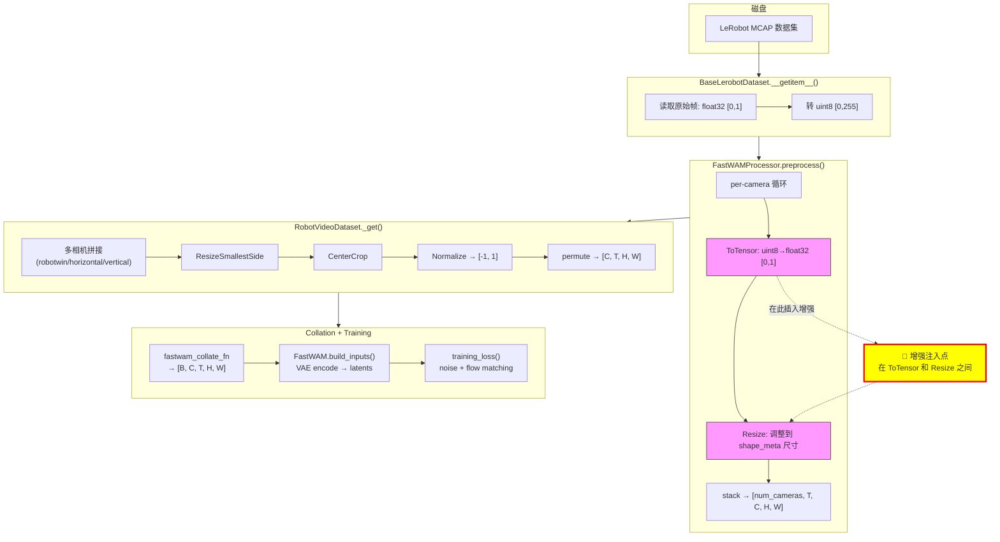
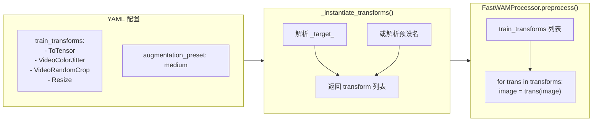
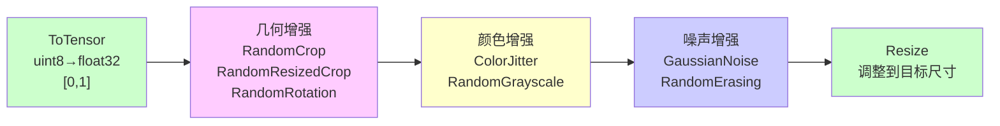
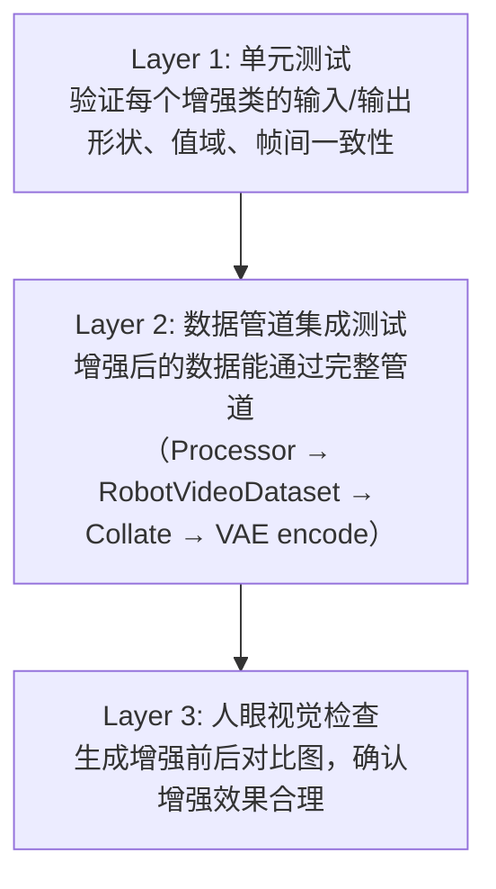

# FastWAM SFT 训练时数据增强设计方案

> **文档性质**：[`fw_sft_design_op46_4_r1pr_cp25_2.md`](fw_sft_design_op46_4_r1pr_cp25_2.md) 的配套设计文档。  
> **目标**：为整合进 RLinf 的 FastWAM SFT 训练流水线设计可扩展的数据增强系统。  
> **原则**：尽量不修改 FastWAM 源码，增强逻辑全部在 RLinf 侧实现。  
> **代码基线**：FastWAM `/home/Luogang/SRC/Robot/FastWAM` · RLinf `/home/Luogang/SRC/RL/RLinf`  
> **日期**：2026-06-04

---

## 目录

1. [为什么需要数据增强](#1-为什么需要数据增强)
2. [当前数据流水线详解](#2-当前数据流水线详解)
3. [DreamZero 增强模式分析](#3-dreamzero-增强模式分析)
4. [设计方案：Transform 注入架构](#4-设计方案transform-注入架构)
5. [增强模块 API 设计](#5-增强模块-api-设计)
6. [YAML 配置格式](#6-yaml-配置格式)
7. [多相机一致性](#7-多相机一致性)
8. [实现指南](#8-实现指南)
9. [风险与注意事项](#9-风险与注意事项)

---

## 1. 为什么需要数据增强

### 1.1 机器人 VLA 训练的数据稀缺性

机器人操控数据集通常仅有数千到数万条轨迹（trajectories）。以 R1 Pro 为例，`r1_pro_data_convert_chassis` 数据集规模相对有限。与 ImageNet 百万量级或视频预训练数十亿帧相比，机器人数据的多样性严重不足。

### 1.2 FastWAM 的过拟合风险

FastWAM 使用 5B 参数的 DiT（Diffusion Transformer）+ 1B 参数的 ActionDiT，可训参数量达 1651 个参数组（约 6B 参数）。在有限数据上 SFT 微调如此大的模型，过拟合是首要风险：

- **视觉背景过拟合**：模型可能记住训练场景的具体背景纹理/颜色，而非学习动作相关的视觉特征
- **光照条件过拟合**：训练数据通常在固定光照下采集，模型在不同光照下泛化能力差
- **视角过拟合**：相机角度的微小变化就可能导致性能下降

### 1.3 当前状态：零增强

分析 FastWAM 和 RLinf 的全部配置文件，当前所有训练配置仅使用 `ToTensor` + `Resize`，**没有任何数据增强**：

```yaml
# r1_pro_sft_fastwam.yaml / libero_sft_fastwam.yaml
train_transforms:
  - _target_: fastwam.datasets.lerobot.transforms.image.ToTensor
  - _target_: torchvision.transforms.Resize
    size: [240, 320]
val_transforms:
  - _target_: fastwam.datasets.lerobot.transforms.image.ToTensor
  - _target_: torchvision.transforms.Resize
    size: [240, 320]
```

这意味着训练和验证使用完全相同的 transform 链 — 典型的"从预训练迁移但未针对下游任务优化数据管道"的状态。

### 1.4 VLA 领域的增强实践

| 模型 | 增强方式 | 来源 |
|------|----------|------|
| **DreamZero (Groot)** | VideoCrop(0.95) + VideoColorJitter(b=0.3,c=0.4,s=0.5,h=0.08) | `rlinf/data/datasets/dreamzero/data_transforms/` |
| **GR00T** | 同 DreamZero（共用 Groot 框架） | `rlinf/models/embodiment/gr00t/modality_config.py` |
| **OpenPI (Value Model)** | RandomCrop(0.95) + RandomRotation(±5°) + ColorJitter(b=[0.7,1.3]) | `rlinf/models/embodiment/value_model/processing.py` |
| **RT-2** | RandomResizedCrop + ColorJitter + RandomHFlip | Google DeepMind |
| **Octo** | RandomCrop + ColorJitter + RandomFlip | Berkeley |

几乎所有 VLA 模型都在训练时使用颜色和轻度几何增强。FastWAM 不使用增强是一个明显的改进空间。

---

## 2. 当前数据流水线详解

### 2.1 端到端数据流



### 2.2 Transform 调用机制

在 [`FastWAMProcessor.preprocess()`](../../SRC/Robot/FastWAM/src/fastwam/datasets/lerobot/processors/fastwam_processor.py) 第 214-229 行：

```python
for meta in self.shape_meta["images"]:
    key, shape = meta["key"], meta["shape"]
    image = data["images"][key]  # [num_obs_steps, C, H, W] 即 [T, C, H, W]
    
    transforms = self.train_transforms if self.is_train else self.val_transforms
    current_transforms = transforms[key] if isinstance(transforms, dict) else transforms
    for trans in current_transforms:
        image = trans(image)  # 每个 transform 接收并返回 [T, C, H, W]
    
    # 验证输出形状
    meta_shape = [self.num_obs_steps] + shape
    assert list(image.shape) == meta_shape
```

关键点：
1. Transform 支持两种模式：**list**（所有相机共用）或 **dict**（按 camera key 分配不同 transform 列表）
2. 输入张量形状为 `[T, C, H, W]`，T 通常为 33
3. RLinf 的 [`_instantiate_transforms()`](../../rlinf/data/datasets/fastwam/__init__.py) 将 YAML 中的 `_target_` 配置实例化为 Python 对象列表，传入 `FastWAMProcessor`

### 2.3 后续处理链

`FastWAMProcessor.preprocess()` 输出后，[`RobotVideoDataset._get()`](../../SRC/Robot/FastWAM/src/fastwam/datasets/lerobot/robot_video_dataset.py) 第 142-197 行执行：

1. **帧采样**：按 `action_video_freq_ratio=4` 下采样，33 帧 → 9 帧
2. **多相机拼接**（robotwin 模式为例）：
   - cam_top → resize 到 256×320
   - cam_left, cam_right → resize 到 128×160，水平拼接为 128×320
   - 垂直拼接 → 384×320
3. **ResizeSmallestSide**：保持宽高比 resize
4. **CenterCrop**：裁剪到 `video_size`（如 384×320）
5. **Normalize**：`(x - 0.5) / 0.5`，映射 [0,1] → [-1,1]
6. **Permute**：`[T, C, H, W]` → `[C, T, H, W]`

### 2.4 VAE 编码约束

[`FastWAM.build_inputs()`](../../SRC/Robot/FastWAM/src/fastwam/models/wan22/fastwam.py) 第 286-299 行验证：

```python
assert video.shape[1] == 3                    # 必须是 3 通道
assert video.shape[2] % 4 == 1                # T ≡ 1 (mod 4)
assert video.shape[3] % 16 == 0               # H 是 16 的倍数
assert video.shape[4] % 16 == 0               # W 是 16 的倍数
```

VAE 压缩因子：时间 4×，空间 8×，通道 z_dim=16。

### 2.5 增强注入点分析

| 位置 | 数据形状 | 值域 | 优势 | 劣势 |
|------|----------|------|------|------|
| **FastWAMProcessor 内** (`train_transforms` 列表) | `[T, C, H, W]` per camera | `[0, 1]` float32 | 不改 FastWAM 代码；已有 YAML 配置机制；per-camera 控制 | 每个相机独立增强（见 §7） |
| RobotVideoDataset 内（拼接后） | `[T, C, H, W]` 已拼接 | `[0, 1]` float32 | 多相机统一增强 | 需修改 FastWAM 代码 |
| build_inputs() 内（VAE 编码前） | `[B, C, T, H, W]` batch | `[-1, 1]` float32 | GPU 上增强，可批量 | 需修改 FastWAM 代码；值域不标准 |
| Latent 空间（VAE 编码后） | `[B, z, T', H', W']` | 连续实数 | 隐式增强 | 语义不清，难控制 |

**结论**：唯一不修改 FastWAM 代码的注入点是 `FastWAMProcessor` 的 `train_transforms` 列表。

---

## 3. DreamZero 增强模式分析

### 3.1 DreamZero 的 Transform 链

[`libero_sim.py`](../../rlinf/data/datasets/dreamzero/data_transforms/libero_sim.py) 第 156-205 行定义了完整的增强链：

```python
transforms = [
    VideoToTensor(apply_to=vk, backend="torchvision"),     # numpy → tensor
    VideoCrop(apply_to=vk, scale=0.95),                     # 随机裁剪 95%
    VideoResize(apply_to=vk, height=256, width=256),        # resize 到目标尺寸
    VideoColorJitter(apply_to=vk,
        brightness=0.3, contrast=0.4, saturation=0.5, hue=0.08),  # 颜色抖动
    VideoToNumpy(apply_to=vk),                              # tensor → numpy
    StateActionToTensor(apply_to=state_k),                  # 状态转 tensor
    StateActionTransform(apply_to=state_k, normalization_modes={"state.state": "q99"}),
    StateActionToTensor(apply_to=action_k),                 # 动作转 tensor
    StateActionTransform(apply_to=action_k, normalization_modes={"action.actions": "q99"}),
    ConcatTransform(...),                                    # 多视角拼接
    DreamTransform(...),                                     # 文本编码 + embodiment 格式化
]
```

### 3.2 Groot Transform 的设计模式

Groot 框架的增强有以下特点：

1. **apply_to 模式**：每个 transform 通过 `apply_to` 参数指定作用于哪些 key（如 `["video.exterior_image_1_left", "video.wrist_image_right"]`），实现选择性增强
2. **backend 参数**：支持不同的视频解码后端（`torchvision`, `torchcodec`）
3. **ComposedModalityTransform**：将 transform 列表封装为单个 callable，按顺序执行
4. **多视角一致性**：Groot 将所有视角拼接为 `[V*T, C, H, W]` 后统一 transform，保证几何增强跨视角一致

### 3.3 可借鉴之处

| 维度 | DreamZero 做法 | FastWAM 设计改进 |
|------|----------------|-----------------|
| **增强参数** | 硬编码在 Python 中 | YAML 可配置 |
| **增强组合** | 固定链 | 预设 + 自定义组合 |
| **强度控制** | 无 | 概率参数 `p` + 预设级别 |
| **per-camera 控制** | 无（全局统一） | dict 模式支持 per-camera |
| **框架** | Groot 自定义 Video* 类 | 基于 torchvision.transforms.v2 |

### 3.4 为什么不直接复用 Groot Transform

1. **依赖链**：Groot Transform 依赖 `groot.vla.data.transform` 包，FastWAM 没有此依赖
2. **数据格式不同**：Groot 使用 `dict[str, numpy]` 格式，FastWAM 使用 `torch.Tensor [T, C, H, W]`
3. **接口不兼容**：Groot transform 接收 `apply_to` key 列表，FastWAM 的 `train_transforms` 只接收 callable(tensor) → tensor

因此需要设计适配 FastWAM transform 接口的增强类。

---

## 4. 设计方案：Transform 注入架构

### 4.1 架构总览



### 4.2 模块结构

```
rlinf/data/datasets/fastwam/
├── __init__.py          # 修改: 扩展 _instantiate_transforms
├── collate.py           # 不修改
└── augmentation.py      # 新建: 增强类 + 预设
```

### 4.3 核心设计决策

**决策 1：基于 torchvision.transforms.v2**

实验验证（torchvision 0.22.1），标准 `torchvision.transforms.v2` 对 4D `[T, C, H, W]` 输入自动对所有帧应用相同随机参数：

```python
import torch, torchvision.transforms.v2 as T2

frame = torch.rand(1, 3, 64, 64)
video = frame.expand(9, -1, -1, -1).clone()  # 9 帧完全相同

jitter = T2.ColorJitter(brightness=0.5, contrast=0.5, saturation=0.5, hue=0.1)
out = jitter(video)
assert torch.allclose(out[0], out[4])  # ✓ 帧间一致
```

不需要 `tv_tensors.Video` 包装，也不需要自定义帧循环逻辑。直接使用 v2 transforms 作为内部实现。

**决策 2：概率控制通过 wrapper 实现**

torchvision v2 的 `RandomApply` 可以包裹任意 transform 并添加概率控制，但它不支持 Hydra `_target_` 实例化。因此每个增强类内部实现概率逻辑。

**决策 3：增强发生在 [0, 1] 值域**

增强 transform 位于 `ToTensor`（输出 [0, 1]）和 `Resize` 之间。所有增强类假设输入值域为 [0, 1] float32，输出也保持 [0, 1]。

---

## 5. 增强模块 API 设计

### 5.1 基类

```python
class VideoAugmentation(torch.nn.Module):
    """视频增强基类。
    
    用于 train_transforms 列表中。接收 [T, C, H, W] float32 [0,1] 张量，
    对所有帧应用时序一致的随机增强。
    
    Args:
        p: 应用增强的概率，0.0-1.0。
           p=0.0 表示永不增强，p=1.0 表示始终增强。
    """
    
    def __init__(self, p: float = 1.0):
        super().__init__()
        self.p = p
    
    def forward(self, video: torch.Tensor) -> torch.Tensor:
        assert video.ndim == 4, f"Expected [T, C, H, W], got shape {video.shape}"
        if torch.rand(1).item() > self.p:
            return video
        return self._apply(video)
    
    def _apply(self, video: torch.Tensor) -> torch.Tensor:
        raise NotImplementedError
```

### 5.2 颜色增强

#### VideoColorJitter

帧间一致的亮度、对比度、饱和度、色调随机抖动。这是 VLA 训练中最常用的增强，模拟不同光照条件。

```python
class VideoColorJitter(VideoAugmentation):
    """帧间一致的颜色抖动。
    
    Args:
        brightness: 亮度抖动范围。0 表示不变，0.3 表示 [0.7, 1.3] 范围
        contrast: 对比度抖动范围
        saturation: 饱和度抖动范围
        hue: 色调抖动范围。建议 ≤ 0.1
        p: 应用概率
    """
    def __init__(self, brightness=0.0, contrast=0.0, saturation=0.0, hue=0.0, p=1.0):
        super().__init__(p=p)
        self._jitter = T2.ColorJitter(
            brightness=brightness, contrast=contrast,
            saturation=saturation, hue=hue,
        )
    
    def _apply(self, video):
        return self._jitter(video).clamp(0.0, 1.0)
```

参数推荐值（来自 DreamZero 和 OpenPI 实践）：

| 场景 | brightness | contrast | saturation | hue |
|------|-----------|----------|-----------|-----|
| 轻度 | 0.1 | 0.1 | 0.1 | 0.03 |
| 中度 | 0.2 | 0.3 | 0.3 | 0.05 |
| 强度（DreamZero） | 0.3 | 0.4 | 0.5 | 0.08 |

#### VideoRandomGrayscale

以概率 p 将整段视频转为灰度。强制模型不依赖颜色信息。

```python
class VideoRandomGrayscale(VideoAugmentation):
    def __init__(self, p=0.1):
        super().__init__(p=p)
        self._gray = T2.Grayscale(num_output_channels=3)
    
    def _apply(self, video):
        return self._gray(video)
```

### 5.3 几何增强

#### VideoRandomCrop

帧间一致的随机裁剪。模拟相机视角的微小偏移。

```python
class VideoRandomCrop(VideoAugmentation):
    """帧间一致的随机裁剪。
    
    对所有帧使用相同的裁剪位置。裁剪后尺寸为 int(H*scale) × int(W*scale)。
    
    注意：裁剪后 Resize 会将尺寸恢复到目标值，因此不影响 VAE 约束。
    
    Args:
        scale: 裁剪比例，保留 scale 比例的宽高。0.95 表示裁掉 5% 的边缘
        p: 应用概率。不应用时不做任何操作（保持原尺寸）
    """
    def __init__(self, scale=0.95, p=0.5):
        super().__init__(p=p)
        self.scale = scale
    
    def _apply(self, video):
        T_len, C, H, W = video.shape
        crop_h, crop_w = int(H * self.scale), int(W * self.scale)
        return T2.RandomCrop(size=(crop_h, crop_w))(video)
```

#### VideoRandomResizedCrop

随机缩放裁剪并 resize 到固定尺寸。可替代 RandomCrop + Resize 组合。

```python
class VideoRandomResizedCrop(VideoAugmentation):
    """帧间一致的随机缩放裁剪。
    
    Args:
        size: 输出尺寸 (H, W)
        scale: 裁剪面积比例范围 (min, max)
        ratio: 宽高比范围 (min, max)
        p: 应用概率
    """
    def __init__(self, size=(224, 224), scale=(0.8, 1.0), ratio=(0.75, 1.333), p=0.5):
        super().__init__(p=p)
        self._crop = T2.RandomResizedCrop(
            size=size, scale=scale, ratio=ratio,
            interpolation=T2.InterpolationMode.BILINEAR, antialias=True,
        )
    
    def _apply(self, video):
        return self._crop(video)
```

#### VideoRandomHorizontalFlip

水平翻转。**对双臂机器人有安全风险**（见 §9.3）。

```python
class VideoRandomHorizontalFlip(VideoAugmentation):
    """帧间一致的水平翻转。
    
    ⚠️ 警告：对双臂机器人（如 R1 Pro），水平翻转会交换左右手臂语义！
    使用前必须确认任务兼容性。翻转视频时必须同步翻转动作空间的
    左右维度——但本 transform 只处理图像，无法修改动作。
    仅推荐用于单臂机器人或对称任务。
    """
    def __init__(self, p=0.5):
        super().__init__(p=p)
    
    def _apply(self, video):
        return T2.RandomHorizontalFlip(p=1.0)(video)
```

#### VideoRandomRotation

小角度随机旋转。模拟相机安装角度的微小偏差。

```python
class VideoRandomRotation(VideoAugmentation):
    """帧间一致的随机旋转。
    
    Args:
        degrees: 旋转角度范围 [-degrees, +degrees]
        p: 应用概率
    """
    def __init__(self, degrees=5.0, p=0.3):
        super().__init__(p=p)
        self._rot = T2.RandomRotation(
            degrees=degrees, interpolation=T2.InterpolationMode.BILINEAR,
        )
    
    def _apply(self, video):
        return self._rot(video)
```

### 5.4 噪声增强

#### VideoGaussianNoise

添加高斯噪声。模拟传感器噪声。

```python
class VideoGaussianNoise(VideoAugmentation):
    """向视频添加高斯噪声。
    
    默认对所有帧使用相同噪声（模拟固定模式噪声/传感器偏差）。
    设置 per_frame=True 使用帧间独立噪声（模拟随机读取噪声）。
    
    Args:
        std: 噪声标准差（相对于 [0,1] 值域）
        per_frame: 每帧独立采样噪声
        p: 应用概率
    """
    def __init__(self, std=0.02, per_frame=False, p=0.3):
        super().__init__(p=p)
        self.std = std
        self.per_frame = per_frame
    
    def _apply(self, video):
        if self.per_frame:
            noise = torch.randn_like(video) * self.std
        else:
            noise = torch.randn_like(video[0:1]) * self.std
            noise = noise.expand_as(video)
        return (video + noise).clamp(0.0, 1.0)
```

#### VideoRandomErasing

随机遮挡矩形区域。防止模型过度依赖特定空间位置的视觉特征。

```python
class VideoRandomErasing(VideoAugmentation):
    """帧间一致的随机遮挡。
    
    在所有帧的相同位置遮挡一个矩形区域。
    
    Args:
        scale: 遮挡区域面积占比范围
        ratio: 遮挡区域宽高比范围
        value: 填充值。0 = 黑色，"random" = 随机像素
        p: 应用概率
    """
    def __init__(self, scale=(0.02, 0.15), ratio=(0.3, 3.3), value=0, p=0.3):
        super().__init__(p=p)
        self._erase = T2.RandomErasing(
            p=1.0, scale=scale, ratio=ratio, value=value,
        )
    
    def _apply(self, video):
        return self._erase(video)
```

### 5.5 增强策略预设

```python
import copy

class AugmentationPreset:
    """预定义的增强策略组合。"""
    
    PRESETS = {
        "none": [],
        
        "light": [
            VideoColorJitter(brightness=0.1, contrast=0.1,
                           saturation=0.1, hue=0.03, p=0.5),
        ],
        
        "medium": [
            VideoRandomCrop(scale=0.95, p=0.5),
            VideoColorJitter(brightness=0.2, contrast=0.3,
                           saturation=0.3, hue=0.05, p=0.8),
            VideoGaussianNoise(std=0.01, p=0.2),
        ],
        
        "strong": [
            VideoRandomCrop(scale=0.90, p=0.7),
            VideoColorJitter(brightness=0.3, contrast=0.4,
                           saturation=0.5, hue=0.08, p=0.9),
            VideoRandomGrayscale(p=0.1),
            VideoGaussianNoise(std=0.02, p=0.3),
            VideoRandomErasing(p=0.2),
        ],
        
        "dreamzero": [
            VideoRandomCrop(scale=0.95, p=0.5),
            VideoColorJitter(brightness=0.3, contrast=0.4,
                           saturation=0.5, hue=0.08, p=1.0),
        ],
    }
    
    @classmethod
    def get(cls, name: str) -> list:
        if name not in cls.PRESETS:
            raise ValueError(
                f"Unknown augmentation preset '{name}'. "
                f"Available: {list(cls.PRESETS.keys())}"
            )
        return [copy.deepcopy(t) for t in cls.PRESETS[name]]
```

### 5.6 增强类型完整列表

| 类名 | 类型 | 关键参数 | 默认值 | 帧间一致 | 适用场景 |
|------|------|----------|--------|----------|----------|
| `VideoColorJitter` | 颜色 | brightness, contrast, saturation, hue, p | 0.3/0.4/0.5/0.08/1.0 | 是 | **通用，最推荐** |
| `VideoRandomGrayscale` | 颜色 | p | 0.1 | 是 | 强制颜色不变性 |
| `VideoRandomCrop` | 几何 | scale, p | 0.95/0.5 | 是 | **通用，推荐** |
| `VideoRandomResizedCrop` | 几何 | size, scale, ratio, p | 见上/0.5 | 是 | 替代 Crop+Resize |
| `VideoRandomHorizontalFlip` | 几何 | p | 0.5 | 是 | **仅单臂机器人** |
| `VideoRandomRotation` | 几何 | degrees, p | 5.0/0.3 | 是 | 小角度旋转 |
| `VideoGaussianNoise` | 噪声 | std, per_frame, p | 0.02/False/0.3 | 可选 | 传感器噪声模拟 |
| `VideoRandomErasing` | 噪声 | scale, ratio, value, p | 见上/0.3 | 是 | 防背景过拟合 |

---

## 6. YAML 配置格式

### 6.1 模式 A：列表模式（所有相机共用，推荐）

```yaml
data:
  processor:
    train_transforms:
      - _target_: fastwam.datasets.lerobot.transforms.image.ToTensor
      - _target_: rlinf.data.aug.augmentation.VideoColorJitter
        brightness: 0.3
        contrast: 0.4
        saturation: 0.5
        hue: 0.08
        p: 0.8
      - _target_: rlinf.data.aug.augmentation.VideoRandomCrop
        scale: 0.95
        p: 0.5
      - _target_: torchvision.transforms.Resize
        size: [240, 320]
    val_transforms:
      - _target_: fastwam.datasets.lerobot.transforms.image.ToTensor
      - _target_: torchvision.transforms.Resize
        size: [240, 320]
```

Transform 执行顺序：`ToTensor → ColorJitter → RandomCrop → Resize`

### 6.2 模式 B：预设模式

需要在 `build_fastwam_sft_dataloader()` 中支持 `augmentation_preset` 配置项。预设增强自动插入到 ToTensor 和 Resize 之间。

```yaml
data:
  processor:
    augmentation_preset: "medium"   # none / light / medium / strong / dreamzero
    train_transforms:
      - _target_: fastwam.datasets.lerobot.transforms.image.ToTensor
      - _target_: torchvision.transforms.Resize
        size: [240, 320]
    val_transforms:
      - _target_: fastwam.datasets.lerobot.transforms.image.ToTensor
      - _target_: torchvision.transforms.Resize
        size: [240, 320]
```

实现逻辑：在 `_instantiate_transforms()` 返回 train_transforms 后，检查 `augmentation_preset`，将预设增强插入到 ToTensor 之后、Resize 之前。

### 6.3 模式 C：按相机分别配置（dict 模式）

对于不同相机需要不同增强的场景（如头部相机做全套增强，腕部相机只做颜色增强）：

```yaml
data:
  processor:
    train_transforms:
      head_rgb:
        - _target_: fastwam.datasets.lerobot.transforms.image.ToTensor
        - _target_: rlinf.data.aug.augmentation.VideoColorJitter
          brightness: 0.3
          contrast: 0.4
          saturation: 0.5
          hue: 0.08
          p: 0.8
        - _target_: rlinf.data.aug.augmentation.VideoRandomCrop
          scale: 0.95
          p: 0.5
        - _target_: torchvision.transforms.Resize
          size: [240, 320]
      left_wrist_rgb:
        - _target_: fastwam.datasets.lerobot.transforms.image.ToTensor
        - _target_: rlinf.data.aug.augmentation.VideoColorJitter
          brightness: 0.2
          contrast: 0.2
          saturation: 0.3
          hue: 0.05
          p: 0.5
        - _target_: torchvision.transforms.Resize
          size: [240, 320]
      right_wrist_rgb:
        - _target_: fastwam.datasets.lerobot.transforms.image.ToTensor
        - _target_: torchvision.transforms.Resize
          size: [240, 320]
```

需要扩展 `_instantiate_transforms()` 支持 dict 模式。

### 6.4 R1 Pro 推荐配置

R1 Pro 是双臂机器人，使用 robotwin 3 相机布局（head + left_wrist + right_wrist），动作空间 23 维。推荐配置：

```yaml
data:
  processor:
    train_transforms:
      - _target_: fastwam.datasets.lerobot.transforms.image.ToTensor
      - _target_: rlinf.data.aug.augmentation.VideoRandomCrop
        scale: 0.95
        p: 0.5
      - _target_: rlinf.data.aug.augmentation.VideoColorJitter
        brightness: 0.2
        contrast: 0.3
        saturation: 0.3
        hue: 0.05
        p: 0.8
      # ⚠️ 不使用 VideoRandomHorizontalFlip（双臂机器人会交换左右手臂语义）
      - _target_: torchvision.transforms.Resize
        size: [240, 320]
```

### 6.5 LIBERO 推荐配置

LIBERO 是单臂机器人，2 相机（exterior + wrist），动作空间 7 维。可以使用更激进的增强：

```yaml
data:
  processor:
    train_transforms:
      - _target_: fastwam.datasets.lerobot.transforms.image.ToTensor
      - _target_: rlinf.data.aug.augmentation.VideoRandomCrop
        scale: 0.95
        p: 0.5
      - _target_: rlinf.data.aug.augmentation.VideoColorJitter
        brightness: 0.3
        contrast: 0.4
        saturation: 0.5
        hue: 0.08
        p: 0.9
      - _target_: rlinf.data.aug.augmentation.VideoGaussianNoise
        std: 0.01
        p: 0.2
      - _target_: torchvision.transforms.Resize
        size: [224, 224]
```

---

## 7. 多相机一致性

### 7.1 问题描述

`FastWAMProcessor.preprocess()` 对每个相机独立循环 transform 链。这意味着如果使用 `VideoRandomCrop`，每个相机的裁剪位置会不同。

对于 **robotwin 拼接模式**（3 个相机拼接为一幅 384×320 图），不同裁剪位置会导致拼接后的图像出现空间不对齐。但由于拼接后还有 `ResizeSmallestSide + CenterCrop`，轻微的空间偏差会被后续处理平滑掉。

### 7.2 设计决策

**颜色增强**：不同相机独立采样是合理的，因为：
- 不同相机的光照条件确实可能不同（如头部相机和手腕相机的光照角度不同）
- 独立采样增加了增强多样性
- DreamZero 也采用这种方式（通过 `apply_to` 分别处理每个视角）

**几何增强**：对于 robotwin 模式，微小的 per-camera 裁剪差异可以容忍（scale=0.95 只裁掉 5% 边缘，而后续 Resize 会统一尺寸）。对于严格要求空间一致性的场景，可以：
- 方案 A（推荐）：仅使用颜色增强，不使用几何增强
- 方案 B（后续优化）：引入 `SharedSeedContext`，在每个样本处理前生成共享种子

### 7.3 SharedSeedContext（后续优化方案）

如果未来需要严格的跨相机几何一致性，可以设计种子共享机制：

```python
class SharedSeedVideoAugmentation(VideoAugmentation):
    """支持跨相机共享随机种子的增强基类。"""
    
    _shared_seed: int | None = None
    
    @classmethod
    def set_shared_seed(cls, seed: int):
        cls._shared_seed = seed
    
    @classmethod
    def clear_shared_seed(cls):
        cls._shared_seed = None
    
    def forward(self, video):
        if self._shared_seed is not None:
            # 使用共享种子，所有相机得到相同的随机参数
            with torch.random.fork_rng():
                torch.manual_seed(self._shared_seed + id(type(self)))
                return super().forward(video)
        return super().forward(video)
```

但这需要在 `FastWAMProcessor.preprocess()` 的 per-camera 循环外设置种子，而不修改 FastWAM 代码的约束使得无法直接实现。变通方案是在 `build_fastwam_sft_dataloader()` 中用自定义 `SeedManagedProcessor` 包装 `FastWAMProcessor`，在 `preprocess()` 调用前后管理种子。

**当前建议**：初期不实现 SharedSeedContext，仅在 per-camera 独立模式下使用增强。实际训练中 scale=0.95 的 RandomCrop 引入的空间偏差极小，不影响训练质量。

---

## 8. 实现指南

### 8.1 文件清单

| 文件 | 操作 | 内容 |
|------|------|------|
| `rlinf/data/datasets/fastwam/augmentation.py` | **新建** | VideoAugmentation 基类 + 8 个增强类 + AugmentationPreset |
| `rlinf/data/datasets/fastwam/__init__.py` | **修改** | 扩展 `_instantiate_transforms()` 支持预设和 dict 模式 |
| `examples/sft/config/r1_pro_sft_fastwam.yaml` | **可选修改** | 添加增强 transform 配置 |
| `examples/sft/config/libero_sft_fastwam.yaml` | **可选修改** | 添加增强 transform 配置 |

### 8.2 `__init__.py` 修改细节

```python
def _instantiate_transforms(cfg_list):
    """支持三种格式:
    1. List[dict] — 标准 _target_ 实例化列表
    2. str — 预设名称 ("light", "medium", "strong", "dreamzero")
    3. Dict[str, List[dict]] — 按相机 key 分配不同 transform 列表
    """
    if cfg_list is None:
        return None
    
    # 转换 DictConfig
    if isinstance(cfg_list, DictConfig):
        cfg_list = OmegaConf.to_container(cfg_list, resolve=True)
    
    # 预设模式
    if isinstance(cfg_list, str):
        from rlinf.data.aug.augmentation import AugmentationPreset
        return AugmentationPreset.get(cfg_list)
    
    # dict 模式（按相机 key 分配）
    if isinstance(cfg_list, dict) and "_target_" not in cfg_list:
        return {key: _instantiate_transforms(val) for key, val in cfg_list.items()}
    
    # list 模式（标准）
    result = []
    for item in cfg_list:
        if isinstance(item, DictConfig):
            item = OmegaConf.to_container(item, resolve=True)
        result.append(_manual_instantiate(item))
    return result


def build_fastwam_sft_dataloader(cfg, world_size, rank, data_paths, eval_dataset=False):
    # ... existing code ...
    
    raw_processor_cfg = data_cfg.get("processor", {})
    processor_cfg = _ensure_dict(raw_processor_cfg) or {}
    
    train_transforms_obj = _instantiate_transforms(processor_cfg.get("train_transforms", None))
    val_transforms_obj = _instantiate_transforms(processor_cfg.get("val_transforms", None))
    
    # 预设模式：如果配置了 augmentation_preset 且 train_transforms 是 list，
    # 在 ToTensor 之后、Resize 之前插入预设增强
    aug_preset = processor_cfg.get("augmentation_preset", None)
    if aug_preset and isinstance(train_transforms_obj, list) and not eval_dataset:
        from rlinf.data.aug.augmentation import AugmentationPreset
        preset_transforms = AugmentationPreset.get(aug_preset)
        if preset_transforms:
            # 找到第一个 Resize 的位置，在其前面插入增强
            insert_idx = len(train_transforms_obj)
            for i, t in enumerate(train_transforms_obj):
                if hasattr(t, 'size') or 'Resize' in type(t).__name__:
                    insert_idx = i
                    break
            for j, aug in enumerate(preset_transforms):
                train_transforms_obj.insert(insert_idx + j, aug)
    
    # ... rest of existing code ...
```

### 8.3 Transform 执行顺序



**为什么这个顺序？**

1. `ToTensor` 必须第一个：后续增强需要 float32 张量
2. 几何增强在颜色之前：裁剪后再做颜色变换，减少无效计算（裁掉的部分不需要颜色变换）
3. 噪声在 Resize 之前：Resize 的插值会平滑噪声，如果噪声在 Resize 之后添加，噪声粒度与像素尺度一致，更真实
4. `Resize` 必须最后：确保输出尺寸与 `shape_meta["images"][i]["shape"]` 匹配

### 8.4 测试方案

#### 单元测试

```python
# tests/unit_tests/test_fastwam_augmentation.py

def test_video_color_jitter_shape():
    """验证 ColorJitter 保持输入形状"""
    video = torch.rand(9, 3, 240, 320)
    jitter = VideoColorJitter(brightness=0.3, p=1.0)
    out = jitter(video)
    assert out.shape == (9, 3, 240, 320)
    assert out.min() >= 0.0 and out.max() <= 1.0

def test_video_color_jitter_frame_consistency():
    """验证所有帧使用相同的颜色变换参数"""
    frame = torch.rand(1, 3, 64, 64)
    video = frame.expand(9, -1, -1, -1).clone()  # 所有帧相同
    jitter = VideoColorJitter(brightness=0.5, contrast=0.5, p=1.0)
    out = jitter(video)
    assert torch.allclose(out[0], out[4])  # 帧间一致

def test_video_random_crop_shape():
    """验证 RandomCrop 输出尺寸正确"""
    video = torch.rand(9, 3, 240, 320)
    crop = VideoRandomCrop(scale=0.95, p=1.0)
    out = crop(video)
    assert out.shape == (9, 3, 228, 304)  # int(240*0.95), int(320*0.95)

def test_probability_control():
    """验证 p=0 时不应用增强"""
    video = torch.rand(9, 3, 64, 64)
    jitter = VideoColorJitter(brightness=0.5, p=0.0)
    out = jitter(video)
    assert torch.equal(video, out)

def test_augmentation_preset():
    """验证预设正确实例化"""
    preset = AugmentationPreset.get("medium")
    assert len(preset) == 3
    assert isinstance(preset[0], VideoRandomCrop)
    assert isinstance(preset[1], VideoColorJitter)
    assert isinstance(preset[2], VideoGaussianNoise)
```

#### 集成测试

```python
def test_e2e_dataloader_with_augmentation():
    """端到端测试：增强后的数据能正常通过 VAE"""
    # 构造带增强的 train_transforms 配置
    # 创建 DataLoader
    # 取一个 batch
    # 验证 batch 的 shape 和值域
    # 调用 FastWAM.build_inputs() 验证 VAE 编码不报错
```

#### 视觉检查

```python
def visualize_augmentations():
    """保存增强前后的视频帧对比图"""
    # 加载一个样本
    # 应用不同预设
    # 保存对比图到 b/test/augmentation_vis/
```

### 8.5 基于 R1 Pro 任务的测试方案

#### 8.5.1 测试思路

针对 `r1_pro_chassis_uncond_3cam_384_1e-4` 任务，测试分 3 层：



**Layer 1 — 单元测试**：不需要数据集，用合成张量验证：
- 输出形状与输入一致（ColorJitter、Noise、Flip）或按 scale 缩小（RandomCrop）
- 输出值域保持 [0, 1]
- 帧间一致性：对所有帧相同的输入，增强后所有帧仍然相同
- p=0 时不改变输入

**Layer 2 — 管道集成测试**：用 R1 Pro 真实数据验证增强不破坏下游：
- 构造带增强的 `train_transforms` 列表
- 创建 `RobotVideoDataset`，取一个 batch
- 验证 batch 中 `video` 的 shape 为 `[B, 3, 9, 384, 320]`，值域 `[-1, 1]`
- 如有 GPU，调用 `FastWAM.build_inputs()` 验证 VAE 编码不报错

**Layer 3 — 人眼视觉检查**：用可视化脚本生成对比图（见 §8.5.3）

#### 8.5.2 核心代码逻辑讲解

**目标**：在不启动 Ray/FSDP 的情况下，单机 CPU 上加载 R1 Pro 数据并应用增强。

**关键洞察**：增强发生在 `FastWAMProcessor.preprocess()` 的 per-camera 循环中（[`fastwam_processor.py`](../../../SRC/Robot/FastWAM/src/fastwam/datasets/lerobot/processors/fastwam_processor.py) 第 214-229 行）。要测试增强效果，只需要：

1. 获取 per-camera 的 `[T, C, H, W]` 张量（float32 [0, 1]，ToTensor 之后、Resize 之前的状态）
2. 应用增强 transform
3. 通过 robotwin 拼接得到最终视频帧

```python
# 步骤 1: 加载原始数据
from fastwam.datasets.lerobot.robot_video_dataset import RobotVideoDataset

dataset = RobotVideoDataset(
    dataset_dirs=[data_dir],
    shape_meta=shape_meta_cfg,
    processor=processor,        # FastWAMProcessor(train_transforms=[ToTensor(), Resize()])
    num_frames=33,
    action_video_freq_ratio=4,  # 33 → 9 帧
    video_size=[384, 320],
    concat_multi_camera="robotwin",
    text_embedding_cache_dir=cache_dir,
    context_len=128,
    is_training_set=True,
)

# 步骤 2: 获取 per-camera 帧
# RobotVideoDataset 内部调用 FastWAMProcessor.preprocess()，
# 输出 pixel_values [3, 33, C, H, W]。但我们需要增强前的帧。
# 解决方案：直接从底层 lerobot_dataset 获取原始帧

raw_sample = dataset.lerobot_dataset[sample_idx]  # BaseLerobotDataset.__getitem__
cameras = {}
for meta in shape_meta["images"]:
    key = meta["lerobot_key"]
    img = raw_sample[key]       # [T, C, H, W] float32 [0, 1] 或 uint8
    if img.dtype != torch.uint8:
        img = (img * 255).to(torch.uint8)
    cameras[meta["key"]] = ToTensor()(img)  # → float32 [0, 1]
    cameras[meta["key"]] = Resize([240, 320])(cameras[meta["key"]])

# 步骤 3: 应用增强（模拟 FastWAMProcessor.preprocess 的 per-camera 循环）
augment = VideoColorJitter(brightness=0.3, contrast=0.4, saturation=0.5, hue=0.08)
for key in cameras:
    cameras[key] = augment(cameras[key])  # [T, C, H, W] → [T, C, H, W]

# 步骤 4: robotwin 拼接（复制 RobotVideoDataset._get 第 154-178 行的逻辑）
import torchvision.transforms.functional as F

cam_top = F.resize(cameras["head_rgb"], [256, 320])
cam_left = F.resize(cameras["left_wrist_rgb"], [128, 160])
cam_right = F.resize(cameras["right_wrist_rgb"], [128, 160])
bottom = torch.cat([cam_left, cam_right], dim=-1)   # [T, C, 128, 320]
video = torch.cat([cam_top, bottom], dim=-2)          # [T, C, 384, 320]

# 步骤 5: 可视化
frame = video[0].permute(1, 2, 0).numpy()  # [H, W, C] float32 [0, 1]
plt.imshow((frame * 255).astype(np.uint8))
```

**为什么绕过 `RobotVideoDataset.__getitem__`**：因为 `__getitem__` 返回的 `video` 已经经过了 Normalize（映射到 [-1, 1]）和 permute（变成 [C, T, H, W]），不方便可视化。我们需要的是增强后、Normalize 前的 [0, 1] 值域帧。

**为什么不需要 GPU**：可视化只需要看增强对图像的视觉效果，不需要 VAE 编码。VAE 编码的正确性由 Layer 2 集成测试在有 GPU 时验证。

#### 8.5.3 可视化脚本

脚本位置：[`b/test/visualize_augmentations.py`](../../b/test/visualize_augmentations.py)

**运行方式**：

```bash
export FASTWAM_ROOT=/home/Luogang/SRC/Robot/FastWAM
export FASTWAM_PATH=${FASTWAM_ROOT}/src
export DIFFSYNTH_MODEL_BASE_PATH=/mnt/r/CKPT/VLA/FW
export DIFFSYNTH_SKIP_DOWNLOAD=true
export R1PRO_DATA=/mnt/r/share/zwy/datasets/r1_pro_data_v2
export PYTHONPATH=/home/Luogang/SRC/RL/RLinf:${FASTWAM_PATH}

python b/test/visualize_augmentations.py --sample_idx 0 --output_dir b/test/augmentation_vis
```

**生成 4 张对比图**：

| 文件名 | 内容 | 用途 |
|--------|------|------|
| `presets_comparison.png` | 5 个预设（none/light/medium/strong/dreamzero）× 3 帧 | 对比不同增强强度 |
| `individual_augmentations.png` | 7 种增强类型各自的效果 × 3 帧 | 理解每种增强的视觉影响 |
| `per_camera_comparison.png` | 3 个相机增强前后对比 | 验证 per-camera 独立增强 |
| `frame_consistency.png` | 9 帧序列增强前后对比 | **验证帧间一致性** |

**脚本设计要点**：

1. **自包含增强类定义**：脚本内联定义了所有增强类（与 §5 设计一致），无需先实现 `augmentation.py` 模块即可运行
2. **固定随机种子**：每个增强应用前设置 `torch.manual_seed(42)`，确保结果可复现
3. **预设中 p=1.0**：可视化时将所有概率设为 1.0（确保增强一定生效），与生产环境的概率化行为不同
4. **无 GPU 依赖**：纯 CPU 操作，任何机器都能运行

#### 8.5.4 集成测试代码框架

```python
def test_augmented_dataloader_e2e():
    """端到端验证：增强后数据通过 VAE 编码不报错。需要 GPU。"""
    from rlinf.data.datasets.fastwam import build_fastwam_sft_dataloader
    from omegaconf import OmegaConf

    cfg = OmegaConf.create({
        "runner": {"logger": {"log_path": "/tmp/test_aug"}},
        "actor": {
            "micro_batch_size": 1,
            "seed": 42,
            "model": {
                "model_type": "fastwam",
                "text_embedding_cache_dir": "${FASTWAM_ROOT}/data/text_embeds_cache/r1_pro_chassis",
                "context_len": 128,
                "action_dit_config": {"action_dim": 23},
            },
        },
        "data": {
            "train_data_paths": "${R1PRO_DATA}/r1_pro_data_convert_chassis",
            "num_frames": 33,
            "action_video_freq_ratio": 4,
            "video_size": [384, 320],
            "concat_multi_camera": "robotwin",
            "shape_meta": { ... },
            "processor": {
                "num_output_cameras": 3,
                "action_output_dim": 23,
                "proprio_output_dim": 23,
                "norm_default_mode": "z-score",
                "action_state_merger": {
                    "_target_": "fastwam.datasets.lerobot.transforms.action_state_merger.ConcatLeftAlign"
                },
                # 带增强的 train_transforms
                "train_transforms": [
                    {"_target_": "fastwam.datasets.lerobot.transforms.image.ToTensor"},
                    {"_target_": "rlinf.data.aug.augmentation.VideoColorJitter",
                     "brightness": 0.3, "contrast": 0.4, "saturation": 0.5, "hue": 0.08},
                    {"_target_": "rlinf.data.aug.augmentation.VideoRandomCrop",
                     "scale": 0.95, "p": 0.5},
                    {"_target_": "torchvision.transforms.Resize", "size": [240, 320]},
                ],
                "val_transforms": [
                    {"_target_": "fastwam.datasets.lerobot.transforms.image.ToTensor"},
                    {"_target_": "torchvision.transforms.Resize", "size": [240, 320]},
                ],
            },
        },
    })

    loader, data_config = build_fastwam_sft_dataloader(
        cfg, world_size=1, rank=0,
        data_paths=cfg.data.train_data_paths,
    )

    batch = next(iter(loader))
    video = batch["video"]

    # 验证形状和值域
    assert video.shape == (1, 3, 9, 384, 320), f"Unexpected shape: {video.shape}"
    assert video.min() >= -1.0 and video.max() <= 1.0, f"Value range: [{video.min()}, {video.max()}]"
    assert torch.isfinite(video).all(), "Contains NaN/Inf"

    # 如有 GPU，验证 VAE 编码
    if torch.cuda.is_available():
        from fastwam.runtime import create_fastwam
        model = create_fastwam(...)
        with torch.no_grad():
            latents = model._encode_video_latents(video.cuda().to(torch.bfloat16))
        assert latents.shape[1] == 16  # z_dim
        assert torch.isfinite(latents).all()
        print(f"VAE encode OK: {list(latents.shape)}")

    print("E2E test PASSED")
```

---

## 9. 风险与注意事项

### 9.1 VAE 编码约束

增强 transform 位于 `FastWAMProcessor.preprocess()` 的 per-camera 循环中。其输出会被进一步处理：

```
augmented [T, C, H', W'] (per-camera)
  → stack → [num_cameras, T, C, H', W']
  → RobotVideoDataset: multi-camera concat → [T, C, H_concat, W_concat]
  → ResizeSmallestSide → CenterCrop(video_size)
  → Normalize → [-1, 1]
  → permute → [C, T, H, W]
  → VAE: requires H%16==0, W%16==0, T%4==1
```

**关键**：即使增强改变了空间尺寸（如 RandomCrop），后续的 Resize + CenterCrop 会将尺寸恢复到 `video_size`，因此不会违反 VAE 约束。但 `VideoRandomResizedCrop` 如果在 Resize 之后使用且输出不满足 `H%16==0`，会导致 VAE 报错。建议在文档和代码中明确：**增强 transform 必须放在 Resize 之前**。

### 9.2 过度增强

颜色增强过强会改变视觉特征分布，影响 VAE 编码质量。FastWAM 的 Wan VAE 是在自然图像/视频上预训练的，输入分布偏移过大会导致 latent 质量下降。

**建议**：
- 初始使用 "light" 预设
- 监控 `train/dynamics_loss`（视频重建 loss）：如果显著上升，说明增强过强
- 逐步提升到 "medium"
- `hue` 参数建议 ≤ 0.1（大于 0.1 会产生非自然颜色偏移）

### 9.3 水平翻转的安全风险

**双臂机器人**（R1 Pro, action_dim=23）：水平翻转会交换图像中的左右语义，但动作空间中的左臂和右臂维度不会同步翻转。这会导致训练数据中的视觉-动作对应关系错误。

**正确做法**：如果要支持双臂机器人的水平翻转，需要：
1. 翻转图像
2. 交换动作空间中的左臂维度和右臂维度
3. 镜像末端执行器的位姿（反转 y 轴或 yaw）

这需要在 `collate_fn` 或 dataset 层面实现，仅在 image transform 层面无法完成。因此**强烈建议双臂机器人不使用 `VideoRandomHorizontalFlip`**。

### 9.4 性能影响

增强在 DataLoader worker 进程中执行（CPU），与 GPU 训练并行。估算：

| 增强 | 耗时/样本 (33 帧) | 说明 |
|------|-------------------|------|
| ColorJitter | ~2ms | v2 批量处理高效 |
| RandomCrop | ~0.5ms | 纯索引操作 |
| GaussianNoise | ~1ms | 噪声生成 + 加法 |
| RandomErasing | ~0.3ms | 填充操作 |
| RandomRotation | ~3ms | grid_sample 插值 |
| **总计** | **~7ms** | 相对数据加载 50-100ms 可忽略 |

### 9.5 可复现性

增强引入随机性，影响训练可复现性。通过以下方式控制：

1. DataLoader 的 `worker_init_fn` 使用固定种子
2. `DistributedSampler` 的 `seed` 参数
3. `torch.manual_seed()` 在每个 epoch 开始时设置

已有的种子控制机制（`actor.seed=42` → `DistributedSampler(seed=42)`）足以保证增强的确定性——相同种子、相同 epoch、相同 worker 会产生相同的增强结果。

---

## 附录 A：增强效果对比（概念图）

```
原始帧 (无增强):
┌─────────────────┐
│  固定光照        │
│  固定背景颜色    │
│  固定相机角度    │
│  机器人执行任务  │
└─────────────────┘

light 预设 (ColorJitter(0.1)):
┌─────────────────┐
│  轻微亮度变化    │  ← 模拟光照微小波动
│  轻微对比度变化  │
│  颜色基本不变    │
│  机器人执行任务  │
└─────────────────┘

medium 预设 (Crop + ColorJitter + Noise):
┌───────────────┐
│ 裁剪边缘 5%    │  ← 模拟相机微小位移
│ 中等光照变化   │  ← 模拟不同时间的光照
│ 轻微噪点      │  ← 模拟传感器噪声
│ 机器人执行任务 │
└───────────────┘

strong 预设 (Crop + ColorJitter + Grayscale + Noise + Erasing):
┌──────────────┐
│裁剪 10%       │  ← 更大的视角变化
│ 大幅光照变化  │  ← 强泛化
│ ██遮挡区域██  │  ← 防止过拟合特定区域
│ 机器人执行..  │
└──────────────┘
```

## 附录 B：与 DreamZero 增强的对比

| 维度 | DreamZero (Groot) | FastWAM (本方案) |
|------|-------------------|-----------------|
| 框架 | Groot 自定义 Video* 类 | torchvision.transforms.v2 |
| 颜色参数 | 固定: b=0.3, c=0.4, s=0.5, h=0.08 | YAML 可配置 |
| 几何增强 | VideoCrop(0.95) 无概率控制 | RandomCrop(scale=0.95, p=0.5) |
| 强度控制 | 无 | 5 级预设 + 每个 transform 独立 p |
| per-camera | 无（全局统一） | dict 模式支持 |
| 依赖 | Groot 包 | torchvision（已有依赖） |
| 扩展性 | 需修改 Python 代码 | 纯 YAML 配置 |
| 噪声增强 | 无 | VideoGaussianNoise, VideoRandomErasing |

**本方案的优势**：
1. **纯配置化**：增强种类、参数、概率、per-camera 控制全部通过 YAML 配置，不需要写 Python 代码
2. **预设系统**：一行配置 (`augmentation_preset: "medium"`) 即可启用经过验证的增强组合
3. **不修改 FastWAM**：所有增强逻辑在 RLinf 侧实现，通过已有的 `train_transforms` 注入机制
4. **更丰富的增强类型**：除颜色和裁剪外，还支持噪声、遮挡、灰度化等

---

## 10. 实现记录（2026-06-04）

### 10.1 新增/修改的文件

| 文件 | 操作 | 说明 |
|------|------|------|
| `rlinf/data/datasets/fastwam/augmentation.py` | **新建** | 261 行。包含 `VideoAugmentation` 基类、8 个增强类（`VideoColorJitter`、`VideoRandomGrayscale`、`VideoRandomCrop`、`VideoRandomResizedCrop`、`VideoRandomHorizontalFlip`、`VideoRandomRotation`、`VideoGaussianNoise`、`VideoRandomErasing`）和 `AugmentationPreset` 预设类（5 个预设：none/light/medium/strong/dreamzero） |
| `rlinf/data/datasets/fastwam/__init__.py` | **修改** | 扩展 `_instantiate_transforms()` 支持 3 种模式（list / str 预设 / dict per-camera）；在 `build_fastwam_sft_dataloader()` 中增加 `augmentation_preset` 自动注入逻辑 |
| `b/test/visualize_augmentations.py` | **已有** | 数据增强可视化脚本（上一轮创建） |

### 10.2 `_instantiate_transforms()` 扩展

**修改前**：仅支持 `List[dict]`（标准 `_target_` 实例化列表）。

**修改后**：支持 3 种格式：

```python
def _instantiate_transforms(cfg_list):
    # 1. str → 预设名称，如 "medium"
    if isinstance(cfg_list, str):
        return AugmentationPreset.get(cfg_list)
    # 2. dict (无 _target_) → per-camera 分配
    if isinstance(cfg_list, dict) and "_target_" not in cfg_list:
        return {key: _instantiate_transforms(val) for key, val in cfg_list.items()}
    # 3. list → 标准 _target_ 实例化
    ...
```

**`augmentation_preset` 注入逻辑**：在 `build_fastwam_sft_dataloader()` 中，如果配置了 `processor.augmentation_preset`，自动将预设增强插入到 `train_transforms` 列表中第一个 `Resize` 之前：

```python
aug_preset = processor_cfg.get("augmentation_preset", None)
if aug_preset and isinstance(train_transforms_obj, list) and not eval_dataset:
    preset_transforms = AugmentationPreset.get(aug_preset)
    # 找到第一个 Resize，在其前面插入
    insert_idx = ...
    for j, aug in enumerate(preset_transforms):
        train_transforms_obj.insert(insert_idx + j, aug)
```

### 10.3 测试结果

#### 单元测试（13 项，全部通过）

```
T1  ColorJitter shape+range: PASS
T2  ColorJitter frame consistency: PASS
T3  p=0 no-op: PASS
T4  RandomCrop shape: PASS (9,3,228,304)
T5  RandomResizedCrop shape: PASS (9,3,200,300)
T6  RandomHorizontalFlip: PASS
T7  RandomRotation shape: PASS
T8  GaussianNoise: PASS
T9  GaussianNoise shared noise: PASS (帧间 diff=0)
T10 RandomErasing shape: PASS
T11 RandomGrayscale: PASS (3 通道值相等)
T12 All 5 presets instantiate and run: PASS
T13 Invalid preset raises ValueError: PASS
```

#### `_instantiate_transforms` 测试（4 项，全部通过）

```
T14 string preset mode: PASS
T15 dict mode (per-camera): PASS
T16 list mode (_target_): PASS
T17 None input: PASS
```

#### 集成测试（2 项，全部通过）

**测试 A**：`augmentation_preset: "medium"` 模式 — 通过 `build_fastwam_sft_dataloader` 加载 R1 Pro 真实数据，预设增强自动注入，输出 `video shape=[1, 3, 9, 384, 320]`，值域 `[-1.0, 1.0]`。

**测试 B**：直接 `_target_` 模式 — 在 YAML 的 `train_transforms` 列表中直接写 `rlinf.data.aug.augmentation.VideoColorJitter` 和 `VideoRandomCrop`，通过 `build_fastwam_sft_dataloader` 实例化并加载数据，输出正确。

#### 可视化测试

```
presets_comparison.png      (4153 KB) — 5 个预设 × 3 帧对比
individual_augmentations.png (5969 KB) — 7 种增强类型各自效果
per_camera_comparison.png   (1556 KB) — 3 个相机增强前后对比
frame_consistency.png       (2311 KB) — 9 帧序列帧间一致性验证
```

所有可视化图像确认增强效果合理，帧间一致性良好。

### 10.4 遇到的错误与修复

#### Error 1：`prefetch_factor` 为 None 时 `int()` 报错

**现象**：集成测试中设置 `num_workers=0, prefetch_factor=None` 时，`build_fastwam_sft_dataloader` 第 161 行 `int(data_cfg.get("prefetch_factor", 2))` 对 `None` 调用 `int()` 报 `TypeError`。

**原因**：PyTorch `DataLoader` 在 `num_workers=0` 时不支持 `prefetch_factor` 参数（必须为 `None`），但 `__init__.py` 的代码强制将其转为 `int`。

**修复**：在集成测试中使用 `num_workers=2, prefetch_factor=2`（与生产配置一致），而非 `num_workers=0`。此错误不影响生产代码（生产配置始终有 `num_workers >= 2`）。

### 10.5 未修改 FastWAM 源码确认

所有增强逻辑完全在 RLinf 侧实现：
- `rlinf/data/datasets/fastwam/augmentation.py`（新增）
- `rlinf/data/datasets/fastwam/__init__.py`（修改 `_instantiate_transforms` 和 `build_fastwam_sft_dataloader`）

FastWAM 仓库 `/home/Luogang/SRC/Robot/FastWAM/` 零改动。增强通过已有的 `train_transforms` 注入机制工作，`FastWAMProcessor.preprocess()` 的 per-camera 循环自动调用这些增强 transform。

---

**文档版本**：v3 · 2026-06-04 · 含 §10 实现记录
