# GRPO 训练 QwenVL + GR00T/DiT 型 VLA：Forward / Loss / Backward 深度解析

> **摘要**：本文以 RLinf 本地代码库为准，解剖「用 GRPO 在线强化学习微调 **QwenVL 骨干 + GR00T/DiT（流匹配/扩散）动作头** 型 VLA」的完整计算图。与前文 [grpo_vlm_analyz_1.md](grpo_vlm_analyz_1.md)（Qwen2.5-VL 做 VQA 文本生成）不同，本文聚焦 **具身（embodied）路径**：策略输出的不是离散 token，而是 **连续动作块（action chunk）**，由流匹配/扩散头经 ODE 采样得到。这带来一个核心难题——**确定性 ODE 采样器没有显式的动作概率密度 \(\log\pi_\theta(a\mid s)\)**，而 GRPO/PPO 的重要性采样比率必须依赖它。RLinf 的解法是 **Flow-SDE / Flow-Noise：把一步去噪改造成一个可计算 log-prob 的对角高斯**。
>
> **代码真相（务必先读）**：仓库中真正「**QwenVL + 流/DiT 动作头 + GRPO**」可运行的落地是 **`lingbotvla`**（Qwen2.5-VL-3B + 动作专家 + `flow_sde`，配置 [robotwin_place_shoe_grpo_lingbotvla.yaml](../../examples/embodiment/config/robotwin_place_shoe_grpo_lingbotvla.yaml)）与 **`starVLA` 的 flowmatching 头**（`qwen_vl_interface` + DiT + 可学习 `actor_logstd`）。而 **`GR00T`** 在 RLinf 中的示例 **全部是 PPO**（`adv_type: gae` + `loss_type: actor_critic`），且其 VLM 骨干是 Eagle 而非 QwenVL——因此本文以 **`lingbotvla` 为主线**，`starVLA-flow` 与 `GR00T` 作为「DiT 动作头族」的对照参照。

---

## 目录

1. [问题定义：flow/DiT 动作头为何难做 GRPO](#1-问题定义flowdit-动作头为何难做-grpo)
2. [模型族与 QwenVL 的位置](#2-模型族与-qwenvl-的位置)
3. [端到端静态架构](#3-端到端静态架构)
4. [动态数据流：一步 embodied GRPO](#4-动态数据流一步-embodied-grpo)
5. [Forward 解剖：Rollout 采样与 Training 重算](#5-forward-解剖rollout-采样与-training-重算)
6. [Advantage 解剖：MC 回报 → 组归一化 → 广播](#6-advantage-解剖mc-回报--组归一化--广播)
7. [Loss 解剖：logprob_type × reward_type](#7-loss-解剖logprob_type--reward_type)
8. [Backward、Optimizer 与冻结策略](#8-backwardoptimizer-与冻结策略)
9. [消融、工程要点与横纵向对比](#9-消融工程要点与横纵向对比)
10. [关键文件索引](#10-关键文件索引)
11. [CoT 采样 + REINFORCE(VLM) + MSE(DiT)：综合方案](#11-cot-采样--reinforcevlm--msedit综合方案)
    - [11.7 软件系统设计与落地方案](#117-软件系统设计与落地方案)

---

## 1. 问题定义：flow/DiT 动作头为何难做 GRPO

### 1.1 VLA 与「动作块」策略

一个 VLA（Vision-Language-Action）策略 \($\pi_\theta$\) 接收「图像观测 + 语言指令 + 本体感知（proprio）」，输出一段 **动作块** \($a \in \mathbb{R}^{T_a \times D_a}$\)（`num_action_chunks × action_dim`），交给机器人执行若干控制步。GR00T/π₀/π₀.₅/lingbotvla 这类现代 VLA 的动作头是 **流匹配（Flow Matching）/ 扩散（Diffusion）** 模型：从高斯噪声 \(x_1\) 出发，沿学习到的速度场 \($v_\theta(x,t\mid \text{obs})$\) 做 ODE 积分，逐步「去噪」到干净动作 \(x_0\)。

### 1.2 核心难题：ODE 没有 \($\log\pi_\theta(a\mid s)$\)

策略梯度（含 GRPO/PPO）的核心是重要性采样比率

\[
$r_t(\theta)=\frac{\pi_\theta(a\mid s)}{\pi_{\theta_{\text{old}}}(a\mid s)}=\exp\big(\log\pi_\theta - \log\pi_{\theta_{\text{old}}}\big),$
\]

它要求策略是一个 **可求概率密度的随机分布**。但流匹配的采样是 **确定性 ODE**：给定初始噪声，输出动作是确定的，没有解析的 \($\log\pi_\theta(a\mid s)$\)。这就是把流/扩散 VLA 接入在线 RL 的根本障碍。

### 1.3 RLinf 的解法：Flow-SDE / Flow-Noise 高斯化

RLinf 把「一步去噪」由确定性更新改写成 **随机微分方程（SDE）离散步**：在均值 \($\mu$\) 上叠加一个尺度为 \($\sigma$\) 的高斯噪声，于是单步转移是一个 **对角高斯**，其 log-prob 可解析计算：

\[
$x_{t+\Delta} \sim \mathcal{N}\!\big(\mu_\theta(x_t,t),\, \sigma^2(t)\,\mathbf{I}\big),\qquad
\log \pi = \sum_{d}\Big[-\log\sigma - \tfrac12\log 2\pi - \tfrac{(a_d-\mu_d)^2}{2\sigma^2}\Big].$
\]

- **Flow-SDE**：\(\sigma\) 由时间调度解析给出（`noise_level` × 时间因子）。
- **Flow-Noise**：\(\sigma\) 由一个可学习的 `noise_head` 预测。
- **starVLA flowmatching**：\$(\sigma = \exp(\texttt{actor\_logstd})\cdot\sqrt{\Delta}$\)，`actor_logstd` 是可学习参数。

为控成本，默认 `joint_logprob=False`：整条去噪链里 **只对随机选中的一步**（`denoise_inds`）注入噪声、计入 log-prob，其余步走确定性 ODE。这样「探索/概率」集中在一步，训练时也只需重算那一步。

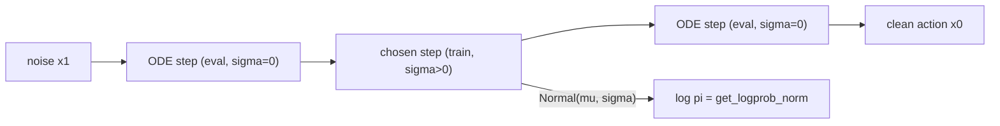

**一句话**：RLinf 用「单步 SDE 高斯化」把不可求导密度的流/扩散采样，变成一个可算 \(\log\pi_\theta\) 的随机策略，从而让 GRPO/PPO 的 clipped policy gradient 得以套用。

---

## 2. 模型族与 QwenVL 的位置

三种模型都实现 [rlinf/models/embodiment/base_policy.py](../../rlinf/models/embodiment/base_policy.py) 的 `BasePolicy` 接口（`default_forward` 训练重算、`predict_action_batch` rollout 采样）：

```77:81:rlinf/models/embodiment/base_policy.py
    @abstractmethod
    def default_forward(self, **kwargs): ...

    @abstractmethod
    def predict_action_batch(self, **kwargs): ...
```

注册在 [rlinf/config.py](../../rlinf/config.py) 的 `SupportedModel`：

```python
SupportedModel.OPENPI = SupportedModel.register("openpi", force=True)
SupportedModel.STARVLA = SupportedModel.register("starvla", force=True)
SupportedModel.GR00T = SupportedModel.register("gr00t", force=True)
SupportedModel.LINGBOTVLA = SupportedModel.register("lingbotvla", force=True)
```

| 模型 | VLM 骨干 | 动作头 | QwenVL 入口 | log π 机制 | 仓库内 RL 算法 |
|------|----------|--------|-------------|-----------|----------------|
| **lingbotvla**（主线） | **Qwen2.5-VL-3B** | 动作专家（π₀ 式） | `qwenvl_with_expert.qwenvl` | `flow_sde`/`flow_cps`/`flow_noise` | **GRPO** ✅ |
| **starVLA-flow** | **QwenVL** | DiT（`pi`/`gr00t`/`dual`） | `qwen_vl_interface` | 可学习 `actor_logstd` 高斯 | GRPO（现成示例用 OFT 头） |
| **GR00T** | Eagle（非 QwenVL） | Flow-Matching DiT | — | `flow_sde`/`flow_cps`/`reinflow` | **仅 PPO**（GAE + critic） |

### 2.1 lingbotvla：QwenVL + 动作专家

lingbotvla 是本文主线，其 forward 全程调用 `qwenvl_with_expert.forward`——这是「Qwen2.5-VL 主干 + 动作专家（action expert）」的双塔结构（与 π₀ 同源）。prefix（视觉+语言）走 QwenVL 并建 KV-cache，suffix（本体感知+带噪动作+时间条件）走动作专家：

```724:735:rlinf/models/embodiment/lingbotvla/lingbotvla_action_model.py
        outputs_embeds, _ = self.vla_model.model.qwenvl_with_expert.forward(
            attention_mask=full_att_2d_masks,
            position_ids=position_ids,
            past_key_values=past_key_values,
            inputs_embeds=[None, suffix_embs],
            use_cache=True,
            fill_kv_cache=False,
            ada_cond=time_embs
            if getattr(self.vla_model.model.config, "adanorm_time", False)
            else None,
        )
        suffix_out = outputs_embeds[1]
```

`action_out_proj(suffix_out)` 给出速度 \(v_t\)，这是流匹配的核心预测量（见 §5）。

### 2.2 starVLA-flow：QwenVL interface + DiT 头

starVLA 通过 `qwen_vl_interface` 前向 QwenVL，再把 hidden 送入 DiT 动作头（`pi`/`gr00t`/`dual` 三种拓扑，见 [dispatch.py](../../rlinf/models/embodiment/starvla/action_heads/dispatch.py)）。其随机化不走 SDE 调度，而是用一个 **可学习的全局对数标准差** `actor_logstd`：

```103:111:rlinf/models/embodiment/starvla/starvla_action_model.py
        self.value_head: Optional[nn.Module] = None
        if add_value_head:
            ...
            self.value_head = nn.Linear(hidden_size, 1).to(dtype=policy_param_dtype)

        self.actor_logstd = nn.Parameter(
            torch.full((self.action_dim,), -2.5, dtype=policy_param_dtype)
        )
```

> 注意：现成示例 [libero_spatial_grpo_starvla.yaml](../../examples/embodiment/config/libero_spatial_grpo_starvla.yaml) 里 `framework_name: "QwenOFT"`，走的是 OFT 高斯头（对动作块一次性建高斯），而非 DiT flowmatching 头。DiT 头（`pi`/`gr00t`/`dual`）与 GRPO 兼容，但需自行配置。

### 2.3 GR00T：DiT 动作头的参照（仓库内绑定 PPO）

GR00T 的动作头是流匹配 DiT，RL 前向机制与 lingbotvla 同族（Flow-SDE + 高斯 log-prob）。但仓库里 **所有 GR00T 示例都是 PPO**：

```39:64:examples/embodiment/config/libero_spatial_ppo_gr00t.yaml
algorithm:
  group_size: 1
  adv_type: gae
  loss_type: actor_critic
  reward_type: chunk_level
  logprob_type: chunk_level
```

因此本文引用 GR00T 主要为解释「DiT 动作头 + Flow-SDE」的通用机制，其 GRPO 化在算法层完全可行（把 `adv_type` 换成 `grpo`、`loss_type` 换成 `actor`、`group_size>1`），但仓库未提供官方 GRPO 配置。

---

## 3. 端到端静态架构

具身 GRPO 由 [rlinf/runners/embodied_runner.py](../../rlinf/runners/embodied_runner.py) 的 `EmbodiedRunner` 驱动，入口 [examples/embodiment/train_embodied_agent.py](../../examples/embodiment/train_embodied_agent.py)。与 reasoning 路径最大的不同：**rollout 用 HuggingFace 后端**（[rlinf/workers/rollout/hf/huggingface_worker.py](../../rlinf/workers/rollout/hf/huggingface_worker.py)），因为动作生成是模型自定义的 `predict_action_batch`，而非 vLLM/SGLang 的通用 token 解码。

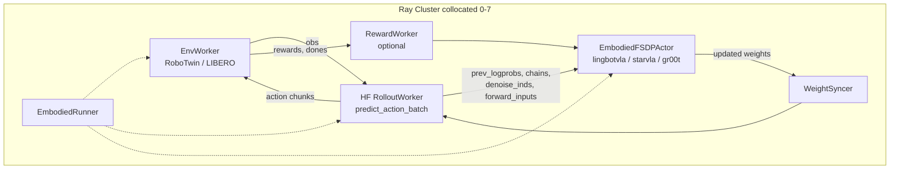

组件职责：

| 组件 | 类 / 入口 | 职责 |
|------|-----------|------|
| 编排 | `EmbodiedRunner.run` | 一步：同步权重 → env×rollout 交互 → 收轨迹 → 算优势 → actor 训练 |
| 环境 | `EnvWorker` | 向量化仿真，产出 obs / rewards / dones |
| Rollout | `HuggingFaceWorker` | 调 `predict_action_batch` 采样动作块与 `prev_logprobs` |
| Reward | `RewardWorker`（可选） | 规则/模型奖励；很多 VLA 任务直接用 env 奖励 |
| Actor | `EmbodiedFSDPActor` | GRPO 优势 → 重算 logprob → clipped PG → backward |
| 权重同步 | `WeightSyncer` | 把训练后的 \(\theta\) 推给 rollout |

GRPO 配置下 `critic.use_critic_model: False`、`add_value_head: False`（lingbotvla 示例），Actor 不建 value head。

---

## 4. 动态数据流：一步 embodied GRPO

`EmbodiedRunner.run` 的单步编排：

```279:314:rlinf/runners/embodied_runner.py
            with self.timer("step"):
                with self.timer("sync_weights"):
                    if _step % self.weight_sync_interval == 0:
                        self.update_rollout_weights()
                with self.timer("generate_rollouts"):
                    env_handle: Handle = self.env.interact(...)
                    rollout_handle: Handle = self.rollout.generate(...)
                    reward_handle = None
                    if self.reward is not None:
                        reward_handle: Handle = self.reward.compute_rewards(...)
                    self.actor.recv_rollout_trajectories(
                        input_channel=self.actor_channel
                    ).wait()
                    ...
                # compute advantages and returns.
                with self.timer("cal_adv_and_returns"):
                    actor_rollout_metrics = (
                        self.actor.compute_advantages_and_returns().wait()
                    )
                # actor training.
                actor_training_handle: Handle = self.actor.run_training()
```

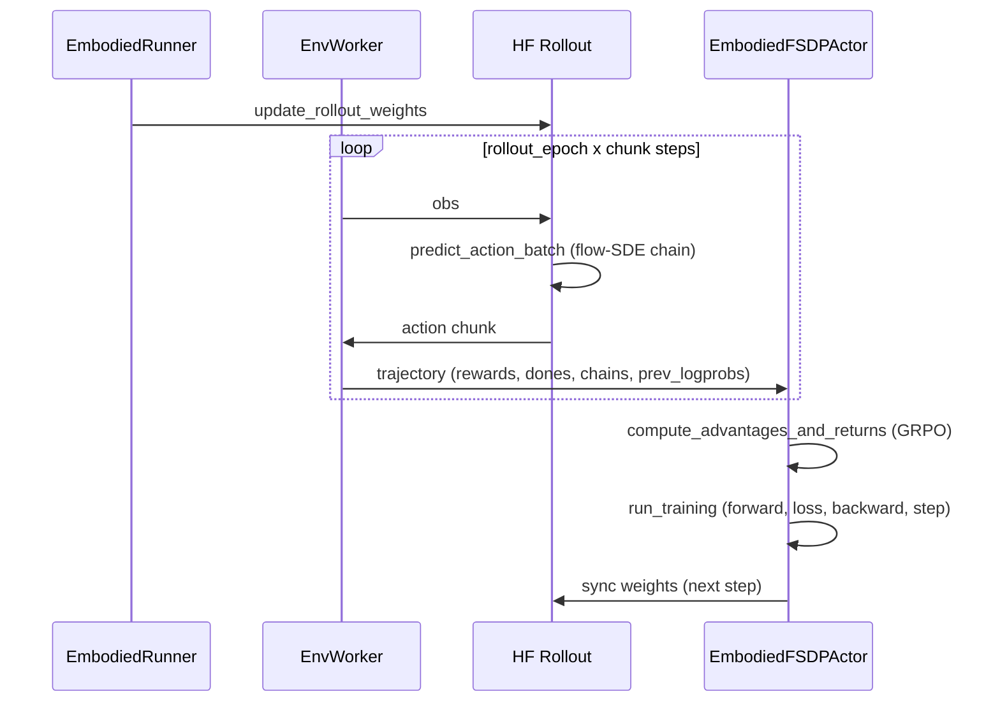

**关键点**：轨迹里除了 `rewards`/`dones`，还携带 rollout 时的 `chains`（整条去噪链）、`denoise_inds`（随机步索引）、`prev_logprobs` 与 `forward_inputs`（VLM 输入缓存）。这些是训练时 **重放并重算 log-prob** 的原料（见 §5.3）。

---

## 5. Forward 解剖：Rollout 采样与 Training 重算

VLA GRPO 有两处 forward，务必区分：

| 阶段 | 执行者 | 目的 | 随机性 |
|------|--------|------|--------|
| **Rollout forward** | HF worker → `predict_action_batch` | 采样动作块 + `prev_logprobs`（\(\log\pi_{\theta_{\text{old}}}\)） | 有（选中步注噪） |
| **Training forward** | `EmbodiedFSDPActor` → `default_forward` | 用当前 \(\theta\) 重算选中步 `logprobs`（\(\log\pi_\theta\)） | 复现（重放 chain） |

### 5.1 Rollout：lingbotvla 的 Flow-SDE 采样

`sample_actions` 逐步去噪，只有 `idx == denoise_inds` 那步用 `train` 模式（\(\sigma>0\)）：

```549:583:rlinf/models/embodiment/lingbotvla/lingbotvla_action_model.py
        for idx in range(num_steps):
            if idx == denoise_inds[0][idx]:
                sample_mode = "train"
            else:
                sample_mode = "eval"
            x_t_mean, x_t_std, value_t = self.sample_mean_var_val(
                x_t, idx, state, prefix_pad_masks, past_key_values,
                sample_mode, num_steps, compute_values,
            )
            x_t = x_t_mean + self.sample_noise(x_t.shape, device) * x_t_std
            log_prob = self.get_logprob_norm(x_t, x_t_mean, x_t_std)
            ...
        log_probs = torch.stack(log_probs, dim=1)[
            :, :, : self.action_chunk, : self.action_env_dim
        ]
        if getattr(self.config, "joint_logprob", False):
            log_probs = log_probs.mean(dim=1)
        else:
            log_probs = log_probs[
                torch.arange(log_probs.shape[0]),
                denoise_inds[:, 0],
            ]
```

### 5.2 Flow-SDE 的均值与方差

`sample_mean_var_val` 先由 `action_out_proj(suffix_out)` 得速度 \(v_t\)，再按 flow 插值算 \(x_0\)、\(x_1\) 预测，最后按 `noise_method` 给出 `x_t_mean` 与 `x_t_std`：

```669:700:rlinf/models/embodiment/lingbotvla/lingbotvla_action_model.py
        if mode == "eval":
            x0_weight = 1 - (t_input - delta)
            x1_weight = t_input - delta
            x_t_std = torch.zeros_like(t_input)
        elif mode == "train":
            if self.noise_method == "flow_sde":
                sigmas = (
                    noise_level
                    * torch.sqrt(
                        timesteps
                        / (1 - torch.where(timesteps == 1, timesteps[1], timesteps))
                    )[:-1]
                )
                sigma_i = sigmas[idx][:, None, None].expand_as(x_t)
                x0_weight = torch.ones_like(t_input) - (t_input - delta)
                x1_weight = t_input - delta - sigma_i**2 * delta / (2 * t_input)
                x_t_std = torch.sqrt(delta) * sigma_i
            elif self.noise_method == "flow_noise":
                x0_weight = 1 - (t_input - delta)
                x1_weight = t_input - delta
                x_t_std = self.noise_head(suffix_out)
        x_t_mean = x0_pred * x0_weight + x1_pred * x1_weight
        return x_t_mean, x_t_std, value_t
```

数学上，lingbotvla（时间轴 \(1\to 0\)）的 SDE 噪声调度为

\[
\sigma_i = \texttt{noise\_level}\cdot\sqrt{\frac{t_i}{1-t_i}},\qquad
\text{std} = \sqrt{\Delta}\cdot\sigma_i .
\]

GR00T 的动作头时间轴相反（`x0: noise, x1: data`，`linspace(0,1)`），故调度为 \(\sigma_i = \texttt{noise\_level}\cdot\sqrt{(1-t_i)/t_i}\)：

```186:201:rlinf/models/embodiment/gr00t/gr00t_action_model.py
            if self.rl_config.noise_method == "flow_sde":
                sigmas = (
                    noise_level
                    * torch.sqrt(
                        (1 - timesteps)
                        / torch.where(timesteps == 0, timesteps[1], timesteps)
                    )[:-1]
                )
                sigma_i = sigmas[idx][:, None, None].expand_as(x_t)
                x0_weight = (
                    torch.ones_like(t_input)
                    - (t_input + delta)
                    - sigma_i**2 * delta / (2 * (1 - t_input))
                )
                x1_weight = t_input + delta
                x_t_std = torch.sqrt(delta) * sigma_i
```

### 5.3 对角高斯 log-prob：`get_logprob_norm`

无论 rollout 还是 training，log π 都由同一个对角高斯密度函数计算（\(\sigma=0\) 的确定性步 log-prob 记 0）：

```739:758:rlinf/models/embodiment/lingbotvla/lingbotvla_action_model.py
    def get_logprob_norm(self, sample, mu, sigma):
        sample = sample.to(torch.float32)
        mu = mu.to(torch.float32)
        sigma = sigma.to(torch.float32)
        mask = sigma == 0
        sigma_safe = torch.where(mask, torch.ones_like(sigma), sigma)
        if getattr(self.config, "safe_get_logprob", False):
            log_prob = -0.5 * torch.pow((sample - mu) / sigma_safe, 2)
            log_prob = torch.where(mask, torch.zeros_like(log_prob), log_prob)
        else:
            constant_term = -torch.log(sigma_safe) - 0.5 * torch.log(
                2 * torch.pi * torch.ones_like(sample)
            )
            exponent_term = -0.5 * torch.pow((sample - mu) / sigma_safe, 2)
            log_prob = constant_term + exponent_term
            log_prob = torch.where(mask, torch.zeros_like(log_prob), log_prob)
        return log_prob
```

对应

\[
\log\mathcal{N}(a;\mu,\sigma)= -\log\sigma - \tfrac12\log(2\pi) - \frac{(a-\mu)^2}{2\sigma^2}.
\]

逐元素 log-prob 形状为 **`[B, action_chunk, action_env_dim]`**。

### 5.4 Training forward：`EmbodiedFSDPActor` 重算

训练时 Actor 用当前 \(\theta\) 对 rollout 缓存的 chain 做一次前向，重算选中步的 `logprobs`；GRPO 下 `compute_values=False`：

```1399:1413:rlinf/workers/actor/fsdp_actor_worker.py
                    with self.amp_context:
                        output_dict = self.model(
                            forward_inputs=forward_inputs,
                            compute_logprobs=True,
                            compute_entropy=self.cfg.algorithm.entropy_bonus > 0,
                            compute_values=compute_values,
                            use_cache=False,
                            **kwargs,
                        )
                    if (
                        SupportedModel(self.cfg.actor.model.model_type)
                        == SupportedModel.GR00T
                    ):
                        prev_logprobs = output_dict["prev_logprobs"]
```

lingbotvla 的 `default_forward` 复现 prefix + 重算单步，并对 step 维求均值（非 joint 时内部 `num_steps=1`），输出 `logprobs: [B, action_chunk, action_env_dim]`。GR00T 的 `default_forward` 则按 `denoise_inds[:,0]` 取该步的 `prev_logprobs` 作为 old（因为 rollout 与 training 的随机步必须对齐）。

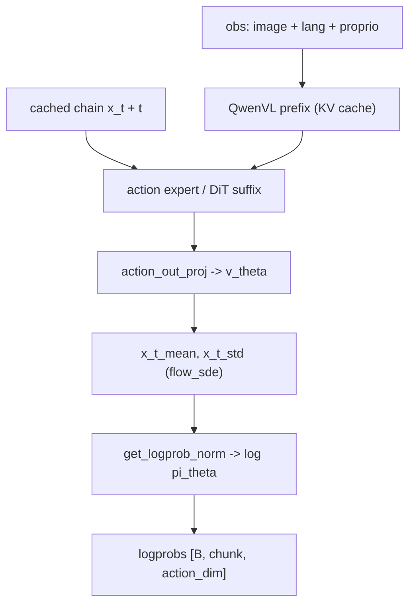

---

## 6. Advantage 解剖：MC 回报 → 组归一化 → 广播

具身 GRPO 的优势计算与 reasoning 不同：奖励是 **逐步（per control step）** 的，需先聚合成 **轨迹标量回报**，再做组内归一化。统一入口 [rlinf/algorithms/registry.py](../../rlinf/algorithms/registry.py) 对 `task_type=="embodied"` 且 `adv_type!="gae"` 时，先 `calculate_scores` 再 `compute_grpo_advantages`：

```95:110:rlinf/algorithms/registry.py
    task_type = kwargs["task_type"]
    if task_type == "embodied":
        kwargs = preprocess_embodied_advantages_inputs(**kwargs)
        if adv_type != "gae":
            kwargs = calculate_scores(**kwargs)
        advantages, returns = fn(**kwargs)
        res = postprocess_embodied_advantages_outputs(
            advantages=advantages, returns=returns, **kwargs
        )
```

### 6.1 预处理：拉平时间维

[preprocess_embodied_advantages_inputs](../../rlinf/algorithms/utils.py) 把 `[n_chunk, bsz, chunk]` 的逐步奖励拉平为 `[n_steps, bsz]`（`chunk_level` 时先在最后一维求和/取最大）：

```89:107:rlinf/algorithms/utils.py
    num_chunk, bsz, chunk_size = rewards.shape
    n_steps = num_chunk * chunk_size
    ...
    # Transpose(1, 2) -> [num-chunk, chunk-size, bsz]; Reshape -> [n_steps, bsz]
    rewards = rewards.transpose(1, 2).reshape(n_steps, bsz)
    if loss_mask is not None:
        loss_mask = loss_mask.transpose(1, 2).reshape(n_steps, bsz)
```

### 6.2 `calculate_scores`：无折扣 MC 回报

对每条轨迹做 **episodic 累加**（遇 `dones` 清零），得到每条轨迹的标量回报，并 reshape 成 `[n_prompts, group_size]`：

```134:152:rlinf/algorithms/utils.py
def calculate_scores(rewards, dones, **kwargs) -> dict:
    scores = torch.zeros(kwargs["batch_size"])
    for step in reversed(range(kwargs["n_steps"])):
        scores = scores * ~dones[step + 1]
        scores += rewards[step]
    scores = scores.reshape(-1, kwargs["group_size"])
    kwargs.update({"rewards": scores, "dones": dones})
    return kwargs
```

即 \(R_i=\sum_{t} r_{i,t}\)（同一 episode 内），这正是 GRPO 所需的「每条采样轨迹一个标量回报」。

### 6.3 GRPO 组归一化

[compute_grpo_advantages](../../rlinf/algorithms/advantages.py) 对每个 prompt 的 `group_size` 条轨迹标量做组内均值/标准差归一化，再广播回时间维、乘 mask：

```107:121:rlinf/algorithms/advantages.py
    grouped_rewards = rewards.view(-1, group_size)
    grouped_reward_mean = grouped_rewards.mean(dim=-1, keepdim=True).expand_as(grouped_rewards)
    grouped_reward_std = grouped_rewards.std(dim=-1, keepdim=True).expand_as(grouped_rewards)
    advantages = grouped_rewards - grouped_reward_mean
    advantages = advantages / (grouped_reward_std + 1e-6)
    advantages = (torch.zeros_like(loss_mask) + advantages.view(1, -1)) * loss_mask
    return advantages, None
```

\[
A_{i,j}=\frac{R_{i,j}-\mu_i}{\sigma_i+10^{-6}},\qquad
\mu_i=\tfrac1G\sum_j R_{i,j},\ \sigma_i=\mathrm{Std}_j(R_{i,j}).
\]

**广播语义**：`advantages.view(1,-1)` 把 `[n_prompts, group_size]` 展成 `[1, bsz]`，再加到 `loss_mask` 的 `[n_steps, bsz]` 上——**同一条轨迹在其所有时间步共享同一个标量优势**，无效步被 mask 置零。

### 6.4 后处理：还原为动作块布局

[postprocess_embodied_advantages_outputs](../../rlinf/algorithms/utils.py) 把 `[n_steps, bsz]` 还原为 `[n_chunk, bsz, chunk_size]`：

```167:168:rlinf/algorithms/utils.py
    advantages = advantages.reshape(num_chunk, chunk_size, -1).transpose(1, 2)
    res.update({"advantages": advantages})
```


---

## 7. Loss 解剖：logprob_type × reward_type

GRPO 的 `loss_type: actor` 注册到 [compute_grpo_actor_loss_fn](../../rlinf/algorithms/losses.py)，它直接委托 `compute_ppo_actor_loss`（clipped PG，无 critic）。但在此之前，具身路径要先用 `preprocess_loss_inputs` 把 logprob 与 advantage/mask **对齐到同一形状**——这由 `logprob_type` 与 `reward_type` 两个维度控制。

### 7.1 `preprocess_loss_inputs`：三种聚合粒度

```310:348:rlinf/algorithms/utils.py
    if logprob_type == "token_level":
        # [bsz, num_action_chunks, action_dim]
        logprobs = logprobs.reshape(bsz, -1, single_action_dim)
        old_logprobs = old_logprobs.reshape(bsz, -1, single_action_dim)
        advantages = advantages.unsqueeze(-1)
        if loss_mask is not None:
            loss_mask = loss_mask.unsqueeze(-1)
    elif logprob_type == "action_level":
        # [bsz, num_action_chunks] (sum over action_dim)
        logprobs = logprobs.reshape(bsz, -1, single_action_dim).sum(dim=-1)
        old_logprobs = old_logprobs.reshape(bsz, -1, single_action_dim).sum(dim=-1)
    elif logprob_type == "chunk_level":
        # [bsz] (sum over chunks and action_dim)
        logprobs = logprobs.reshape(bsz, -1, single_action_dim).sum(dim=[1, 2])
        old_logprobs = old_logprobs.reshape(bsz, -1, single_action_dim).sum(dim=[1, 2])
    target_shape = logprobs.shape
    advantages = expand_to_target_dim(advantages, target_shape)
    loss_mask = expand_to_target_dim(loss_mask, target_shape)
```

| `logprob_type` | logprobs 形状 | 语义 | 典型配置 |
|----------------|---------------|------|----------|
| **token_level** | `[bsz, chunks, action_dim]` | 每个动作维一个 ratio | lingbotvla GRPO |
| **action_level** | `[bsz, chunks]`（沿 action_dim 求和） | 每个 chunk 一个联合 ratio | — |
| **chunk_level** | `[bsz]`（chunks×action_dim 全和） | 整块动作一个 ratio | starVLA GRPO |

`reward_type == "chunk_level"` 时，advantages/mask 先 `flatten()`（[utils.py](../../rlinf/algorithms/utils.py) 295-306），与块级标量对齐；`expand_to_target_dim`（382-388）通过尾部 `unsqueeze` 把 advantage 广播到 logprob 的秩。

### 7.2 Clipped Policy Gradient

`compute_ppo_actor_loss` 在对齐后的张量上逐元素算 clipped PG，可选 dual clip，`masked_mean` 聚合：

```246:268:rlinf/algorithms/losses.py
    ratio = torch.where(loss_mask, torch.exp(log_ratio), 0)
    ...
    clipped_ratio = torch.clamp(ratio, 1.0 - clip_ratio_low, 1.0 + clip_ratio_high)
    policy_loss1 = -advantages * ratio
    policy_loss2 = -advantages * clipped_ratio
    policy_loss = torch.max(policy_loss1, policy_loss2)
    if clip_ratio_c is not None:
        assert clip_ratio_c > 1.0, "clip_ratio_c must be greater than 1.0"
        policy_loss3 = torch.sign(advantages) * clip_ratio_c * advantages
        policy_loss = torch.min(policy_loss, policy_loss3)
```

\[
L_t=\min\Big(\max\big(-A_t r_t,\ -A_t\,\mathrm{clip}(r_t,1-\varepsilon_L,1+\varepsilon_H)\big),\ \mathrm{sign}(A_t)\,c\,A_t\Big).
\]

lingbotvla 示例用 **非对称 clip**（`clip_ratio_low: 0.2`、`clip_ratio_high: 0.28`）与 dual clip（`clip_ratio_c: 3.0`）——这类 DAPO 式设定在连续动作、探索性强的 VLA 上更常见。

### 7.3 KL 与 Entropy：与 reasoning 的重要区别

与 reasoning 主配置（`kl_beta=0`、`entropy_bonus=0`）不同，具身 GRPO **默认开启** KL 与 entropy。lingbotvla 示例 `kl_beta: 0.05`、`entropy_bonus: 0.05`。entropy 项在 `run_training` 里叠加：

```1442:1454:rlinf/workers/actor/fsdp_actor_worker.py
                    if (
                        self.cfg.algorithm.entropy_bonus > 0
                        and not kwargs["critic_warmup"]
                    ):
                        entropy = output_dict["entropy"]
                        entropy = reshape_entropy(
                            entropy,
                            entropy_type=self.cfg.algorithm.entropy_type,
                            action_dim=self.cfg.actor.model.get("action_dim", 7),
                            batch_size=output_dict["logprobs"].shape[0],
                        )
                        entropy_loss = masked_mean(entropy, mask=loss_mask)
                        loss -= self.cfg.algorithm.entropy_bonus * entropy_loss
```

\[
L_{\text{total}} = L_{\text{actor}} - \beta_{\text{ent}}\, H(\pi_\theta) \;(+\; \beta_{\text{kl}}\, D_{\text{KL}}).
\]

保持一定熵可防止流/扩散策略过早坍缩到确定性动作（\(\sigma\to 0\) 会让 log-prob 爆炸、梯度失稳），KL 则约束不偏离 SFT 先验太远。

---

## 8. Backward、Optimizer 与冻结策略

### 8.1 `run_training`：update_epoch × minibatch × microbatch

```1338:1362:rlinf/workers/actor/fsdp_actor_worker.py
        update_epoch = self.cfg.algorithm.get("update_epoch", 1)
        for _ in range(update_epoch):
            rollout_dataloader_iter = split_dict_to_chunk(
                self.rollout_batch, rollout_size // batch_size_per_rank,
            )
            for train_global_batch in rollout_dataloader_iter:
                ...
                train_micro_batch = split_dict_to_chunk(
                    train_global_batch,
                    train_global_batch_size // self.cfg.actor.micro_batch_size,
                )
                self.optimizer.zero_grad()
                for idx, batch in enumerate(train_micro_batch):
```

- `update_epoch`：同一批 rollout 数据的复用轮数（lingbotvla=2，starVLA=1），是经典 on-policy 的多次利用。
- 梯度累积数 = `global_batch_size // micro_batch_size // world_size`。

### 8.2 反向与 FSDP 同步边界

每个 micro-batch：`before_micro_batch` 控制 FSDP 梯度同步（非最后一个走 `no_sync` 只累加本地梯度），`loss /= gradient_accumulation` 后 `grad_scaler.scale(loss).backward()`：

```1460:1472:rlinf/workers/actor/fsdp_actor_worker.py
                    loss /= self.gradient_accumulation
                    with backward_ctx:
                        self.grad_scaler.scale(loss).backward()
                    ...
                    del batch, output_dict, forward_inputs, loss, metrics_data
                self.torch_platform.empty_cache()
                grad_norm, lr_list = self.optimizer_step()
```

`optimizer_step`（[fsdp_model_manager.py](../../rlinf/hybrid_engines/fsdp/fsdp_model_manager.py) 408-438）：`unscale_` → `clip_grad_norm_`（lingbotvla `clip_grad: 1.0`）→ 非有限梯度跳过 → `grad_scaler.step` → `update`。`lr_scheduler.step()` 在整批之后（1481）。

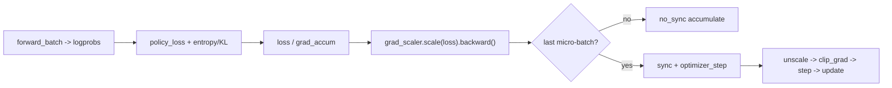

### 8.3 梯度流经哪些参数：冻结 vs 可训

这是 VLA GRPO 与纯 VLM 最大的工程差异——**通常冻结大部分 VLM 骨干，只训动作头/专家与噪声/价值相关参数**，以稳住已 SFT 的表征、把 RL 预算集中在动作分布上。

| 模型 | 冻结 | 可训练 | 依据 |
|------|------|--------|------|
| **lingbotvla** | `freeze_vision_encoder=True`；可选 `train_expert_only` 冻结整个 `qwenvl` | 动作专家 / suffix / `action_out_proj`；`flow_noise` 时 `noise_head`；`add_value_head` 时 value | [lingbotvla/__init__.py](../../rlinf/models/embodiment/lingbotvla/__init__.py) 56-63；action model 132 |
| **GR00T** | `tune_visual=False, tune_llm=False` | 替换后的 Flow-DiT 头；`value_head`；`reinflow` 时 `ExploreNoiseNet` | [gr00t/__init__.py](../../rlinf/models/embodiment/gr00t/__init__.py) 61-80 |
| **starVLA** | 无统一 freeze helper（取决于 checkpoint） | 动作头 + `actor_logstd`（+ 可选 `value_head`） | [starvla_action_model.py](../../rlinf/models/embodiment/starvla/starvla_action_model.py) 103-111 |

lingbotvla 的 `train_expert_only` 冻结逻辑：

```56:63:rlinf/models/embodiment/lingbotvla/__init__.py
    train_expert_only = getattr(lingbotvla_cfg, "train_expert_only", False)
    if train_expert_only:
        ...
        model.vla_model.model.qwenvl_with_expert.qwenvl.eval()
        for param in model.vla_model.model.qwenvl_with_expert.qwenvl.parameters():
            param.requires_grad = False
```

FSDP 的优化器按 `requires_grad` 分组（actor / critic 用不同 `lr`、`value_lr`），只有可训参数进入更新。

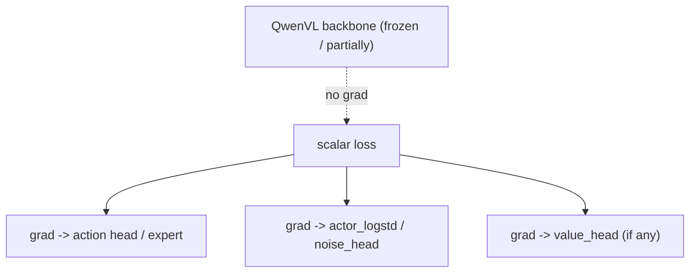

---

## 9. 消融、工程要点与横纵向对比

### 9.1 相对更关键的旋钮（优先调）

| 旋钮 | lingbotvla 示例 | 作用 |
|------|-----------------|------|
| `group_size` | 8 | GRPO 组内方差估计质量；过小优势噪声大 |
| `noise_level` | 0.7 | Flow-SDE 探索强度；直接决定 \(\sigma\) 尺度 |
| `num_steps` | 10 | 去噪步数；步多则动作更精细但成本高 |
| `joint_logprob` | False | False=单步 log-prob（省算力），True=全链均值（更完整但更贵） |
| `logprob_type` | token_level | ratio 粒度；连续动作常用 token/action 级 |
| `temperature_train` | 1.6 | rollout 采样温度，影响组内多样性 |

### 9.2 中等 / 次要

| 旋钮 | 说明 |
|------|------|
| `reward_type` | `action_level` vs `chunk_level`：奖励聚合粒度，决定 advantage 布局 |
| `clip_ratio_low/high` | 0.2/0.28 非对称，鼓励向上探索（DAPO 式） |
| `kl_beta` / `entropy_bonus` | 0.05/0.05，防坍缩、稳先验（reasoning 默认 0） |
| `update_epoch` | 数据复用轮数；过大易过拟合单批 |
| `filter_rewards` | 过滤组均值过高/过低的 prompt，聚焦有区分度样本 |
| `train_expert_only` | 冻结 QwenVL 只训专家，省显存、稳表征 |

### 9.3 Flow 随机化方案对比（纵向）

| 方案 | \(\sigma\) 来源 | 出处 | 特点 |
|------|----------------|------|------|
| `flow_sde` | 解析时间调度 `noise_level·√(t/(1-t))` | lingbotvla / GR00T / openpi | 无额外参数，最常用 |
| `flow_cps` | `sin(π·noise_level/2)` | 同上 | 余弦式调度 |
| `flow_noise` | 可学习 `noise_head(suffix_out)` | lingbotvla / openpi | 状态相关方差 |
| `reinflow` | 可学习 `ExploreNoiseNet` | GR00T | 探索网络 |
| 可学习 logstd | `exp(actor_logstd)·√dt` | starVLA-flow | 全局对数标准差 |

### 9.4 与 reasoning GRPO 的差异（横向，对照前文）

| 维度 | 本文（VLA/embodied GRPO） | reasoning GRPO（[grpo_vlm_analyz_1.md](grpo_vlm_analyz_1.md)） |
|------|--------------------------|-----------------------------|
| 策略输出 | 连续动作块 `[B, chunks, action_dim]` | 离散 token 序列 |
| log π | Flow-SDE 高斯 `get_logprob_norm` | `-CrossEntropy(logits, token)` |
| Rollout 后端 | HuggingFace `predict_action_batch` | vLLM / SGLang |
| Reward | 逐步 env 奖励 → MC 回报 | 轨迹级规则奖励（VQA 0/1） |
| Advantage 预处理 | `calculate_scores`（episodic 累加） | 直接 `rewards.reshape(-1, group_size)` |
| Loss 对齐 | `logprob_type × reward_type` 三级聚合 | response token mask |
| KL/Entropy | 默认开启（0.05/0.05） | 默认关闭（0/0） |
| Runner | `EmbodiedRunner` | `ReasoningRunner` |
| Actor | `EmbodiedFSDPActor` | `FSDPActor` |

### 9.5 GR00T：PPO vs（可行的）GRPO

GR00T 仓库示例为 PPO（GAE + `actor_critic` + value head，`group_size=1`），因为长 horizon、稠密奖励的操作任务里 GAE 能更细地分配 credit。要把它 GRPO 化，算法层面只需 `adv_type: grpo`、`loss_type: actor`、`group_size>1`，其 Flow-SDE log-prob 机制与 lingbotvla 完全一致；但仓库未提供官方 GRPO 配置与 e2e，官方文档亦标注 GR00T+GRPO 仍在测试中。

---

## 10. 关键文件索引

| 主题 | 路径 | 关键符号 |
|------|------|----------|
| 主配置（lingbotvla GRPO） | `examples/embodiment/config/robotwin_place_shoe_grpo_lingbotvla.yaml` | `adv_type/loss_type/noise_method/logprob_type` |
| starVLA GRPO 配置 | `examples/embodiment/config/libero_spatial_grpo_starvla.yaml` | `framework_name: QwenOFT` |
| GR00T PPO 配置 | `examples/embodiment/config/libero_spatial_ppo_gr00t.yaml` | `adv_type: gae`, `actor_critic` |
| 入口 | `examples/embodiment/train_embodied_agent.py` | `main` |
| Runner | `rlinf/runners/embodied_runner.py` | `run`（271-325） |
| Actor | `rlinf/workers/actor/fsdp_actor_worker.py` | `EmbodiedFSDPActor.run_training`（1294-1489）、`compute_advantages_and_returns`（1191+） |
| lingbotvla 模型 | `rlinf/models/embodiment/lingbotvla/lingbotvla_action_model.py` | `sample_actions`、`sample_mean_var_val`、`get_logprob_norm` |
| GR00T 模型 | `rlinf/models/embodiment/gr00t/gr00t_action_model.py` | `sample_mean_var`（160-217）、`get_logprob_norm`、`default_forward` |
| starVLA flow 头 | `rlinf/models/embodiment/starvla/action_heads/flowmatching.py` | Euler + `actor_logstd` 高斯 |
| BasePolicy | `rlinf/models/embodiment/base_policy.py` | `default_forward`、`predict_action_batch` |
| Advantage | `rlinf/algorithms/advantages.py` | `compute_grpo_advantages`（89-121） |
| Adv 预处理 | `rlinf/algorithms/utils.py` | `preprocess_embodied_advantages_inputs`、`calculate_scores`、`postprocess_embodied_advantages_outputs` |
| Loss | `rlinf/algorithms/losses.py` | `compute_grpo_actor_loss_fn`、`compute_ppo_actor_loss` |
| Loss 预处理 | `rlinf/algorithms/utils.py` | `preprocess_loss_inputs`、`expand_to_target_dim` |
| Registry | `rlinf/algorithms/registry.py` | `calculate_adv_and_returns`、`policy_loss` |
| HF Rollout | `rlinf/workers/rollout/hf/huggingface_worker.py` | `predict` → `predict_action_batch` |
| 模型枚举 | `rlinf/config.py` | `SupportedModel.{LINGBOTVLA,STARVLA,GR00T}` |
| 冻结策略 | `rlinf/models/embodiment/{lingbotvla,gr00t}/__init__.py` | `train_expert_only` / `tune_visual` / `tune_llm` |
| 经典 REINFORCE（reasoning 提案） | [grpo_vlm_analyz_1.md](grpo_vlm_analyz_1.md) §12 | `loss_type: reinforce` 伪代码（未入库） |
| CoT+REINFORCE+DiT-MSE（本章提案） | 见 §11 | 双系统：采样 \(z\) + \(L_{\mathrm{VLM}}=-A\log\pi\) + \(L_{\mathrm{DiT}}=\mathrm{MSE}\) |
| HCRS 软件落地点（提案，未建包） | `rlinf/_au/models/embodiment/hcrs_vla/` 等 | 见 §11.7；测试 `tests_au/` |

---

## 11. CoT 采样 + REINFORCE(VLM) + MSE(DiT)：综合方案

> **问题设定（与用户对齐）**：希望 VLM（如 QwenVL）不仅输出对 image/prompt 的连续 embedding，还要**自回归采样一段类似 CoT 的离散 response** \(z\)（plan / subgoal / embodied reasoning）。\(z\) 一经采样即成为**不可导瓶颈**。下游 DiT/flow 动作头以 \(z\) 为条件，对专家动作做正常的 flow-matching / MSE 更新；VLM 则用 **经典 REINFORCE** \(L_{\mathrm{VLM}}=-A\log\pi_{\mathrm{VLM}}(z)\) 更新，其中 \(A\) 由动作拟合质量（如 \(-\mathrm{MSE}\)）或环境回报构成。
>
> **本章边界**：广泛对照现有文献与 RLinf 本地机件，综合出一套可落地的双系统方案与训练课程序；**不修改仓库代码**，伪代码与 yaml 仅为设计蓝图。与前文主线（Flow-SDE 对**动作**求 \(\log\pi\)）正交：本章的 \(\log\pi\) 在 **VLM 的离散 CoT token** 上。

### 11.1 为何「现有 DiT-VLA」不够，而「CoT 采样」刚好需要 REINFORCE

前文 §1–§8 的 lingbotvla / starVLA / GR00T 路径是：

\[
\text{Obs}\xrightarrow{\text{VLM 连续前缀（可导）}}\text{KV / hidden}
\xrightarrow{\text{DiT/专家}}\hat{a},\qquad
L=\mathrm{MSE}/\mathrm{FM}(\hat{a},a^\star).
\]

这里 **没有离散采样**：MSE 的精确梯度本来就能流进 VLM。若仍对 VLM 套 REINFORCE，等于用高方差 score-function 去估计一条本已可导的路径——无意义。

用户设想引入的是：

\[
z\sim\pi_{\mathrm{VLM}}(\cdot\mid o,\ell),\qquad
\hat{a}=\pi_{\mathrm{DiT}}(\cdot\mid o,\ell,z),\qquad
L_{\mathrm{DiT}}=\mathrm{MSE}(\hat{a},a^\star),\quad
L_{\mathrm{VLM}}=-A\cdot\log\pi_{\mathrm{VLM}}(z).
\]

此时 \(z\) 的采样切断了 \(L_{\mathrm{DiT}}\to\mathrm{VLM}\) 的 pathwise 梯度，**必须**用 score-function（REINFORCE / GRPO / PPO）才能更新 VLM。这在数学上是标准的「混合估计器」：离散分支用 REINFORCE，连续分支用反传。

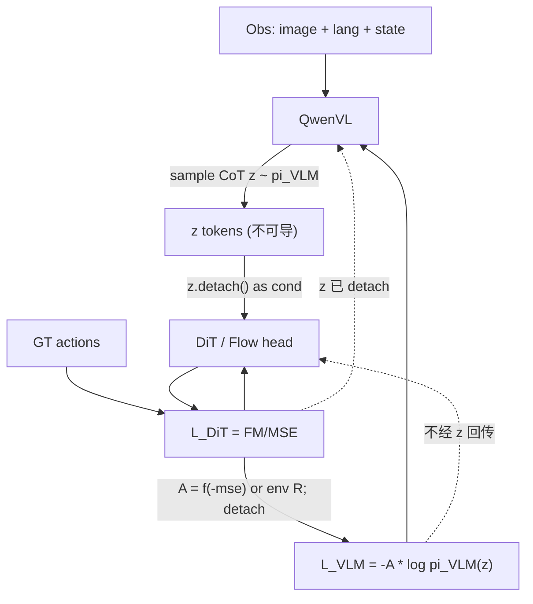

### 11.2 相关工作纵向 / 横向对照（取长补短）

下面按「CoT 形态 × 训练信号 × 动作头」对照——用户方案落在表中「**显式语言 CoT + 以动作质量/回报反哺 VLM + 连续 DiT**」象限。

| 工作 | CoT 形态 | VLM/推理如何训 | 动作头如何训 | 与用户想法的关系 |
|------|----------|----------------|--------------|------------------|
| **SCST** (Rennie et al., CVPR 2017) | 图像描述序列 | REINFORCE；**self-critical baseline**=贪心解码奖励 | N/A（无机器人） | **经典模板**：非可微序列指标 → \(-A\log\pi\)；务必借鉴其 **baseline** |
| **ECoT** (Zawalski et al., 2024) | 显式 embodied 文本 CoT（plan/bbox/gripper） | **纯 SFT**（合成 CoT 标签） | 离散动作 token，AR | 证明「先想后动」有效，但**无 RL**；CoT 与动作共训、可导 teacher-forcing |
| **ERVLA** (2026) | 训练期 CoT，推理期 dropout | SFT + reasoning-dropout | 直接出动作 | 警示：把 CoT 当 **AR 前缀** 易 compounding error；可借鉴「训练用、推理可跳过」 |
| **ACoT-VLA** (CVPR 2026) | **动作空间**粗轨迹作 CoT（EAR+IAR） | 端到端 **flow-MSE**（可导） | flow-MSE | 同目标「推理服务动作」，但**无离散采样、无 REINFORCE** |
| **DualCoT-VLA** | 可学习 query（视觉/语言）对齐辅助模块 | 对齐损失；推理时丢弃辅助 | DiT + FM-MSE | CoT 被做成 **可微 query**，避开采样——与用户「真采样」不同 |
| **ThinkAct** (NeurIPS 2025) | MLLM 长 CoT → 压成 **visual plan latent** | **GRPO**；奖励=目标完成+轨迹 DTW+format | DiT **IL/MSE**；**训动作时冻结 MLLM** | **架构最接近用户**：双系统、采样推理、下游 DiT。差异：①奖励是**视觉/轨迹对齐**而非动作 MSE；②分阶段，非同步用 MSE 推 VLM |
| **LaST-R1** | **连续 latent CoT**（非语言） | **LAPO**（PPO 风格联合优化 latent+action） | 离散/并行动作；**环境回报** | 联合 RL 推理与动作，但 latent 连续、奖励来自 env，不是 offline MSE |
| **VLA-RFT** | 无显式语言 CoT | 对整策略 **GRPO** + 辅助 FM-MSE | Flow head | 「GRPO + 小权重 MSE 辅助」可借鉴到联合目标，但优化对象主要是动作策略 |
| **RLinf 现状**（本文 §1–§8） | 无 CoT 采样 | VLM 连续条件可导进专家 | Flow-SDE \(\log\pi(a)\) + GRPO/PPO | 对**动作**做 RL；**不是**对 CoT token 做 REINFORCE |

**综合判断**：

1. **与用户最同构的是 ThinkAct 的双系统**：先采样推理，再条件化 DiT；用 RL 塑形推理。但 ThinkAct 用 **GRPO + 视觉对齐奖励**，且 DiT 阶段冻结推理模型——用户希望 **\(A\) 直接来自动作 MSE**、且两路可同训，这是差异点，也是创新空间。
2. **SCST / 组相对 baseline** 是把「MSE→REINFORCE」做稳的关键遗产：裸 \(A=-\mathrm{mse}\) 方差极大。
3. **ECoT 的合成 CoT SFT** 仍是最好的 **cold-start**：纯 REINFORCE 从零学 CoT 几乎必崩。
4. **ACoT / DualCoT** 提醒：若能把「推理」做成可微表示，就不必付 REINFORCE 方差税；用户坚持**可读语言 CoT** 时才值得走离散采样。
5. **ERVLA** 提醒：推理期强制解码长 CoT 有延迟与误差累积；方案应支持「训练采样 CoT / 推理可选」。

### 11.3 推荐综合方案：Hybrid CoT-REINFORCE-SFT（HCRS）

在 RLinf 语境下，把各家优点收成一条可实现管线。

#### 11.3.1 架构（双系统，对齐 ThinkAct；条件接口对齐 lingbotvla/starVLA）

- **System-2（慢）**：QwenVL 自回归采样 CoT \($z=(z_1,\ldots,z_T)$\)，得到 \($\log\pi_{\mathrm{VLM}}(z\mid o,\ell)=\sum_t\log\pi(z_t\mid o,\ell,z_{<t})$\)。
- **桥接**：将 \(z\) 编码为条件——可选（a）token embedding 序列 cross-attn 进 DiT；（b）ThinkAct 式压成固定维 plan latent \($c=\mathrm{Pool}(h_z)$\)；（c）把 \(z\) 文本拼回 prompt 再跑一遍前缀（简单但贵）。
- **System-1（快）**：DiT / flow 专家 \($\pi_{\mathrm{DiT}}(a\mid o,\ell,c)$\)，训练目标为标准 flow-matching MSE / L1-FM（与现有 `sft_forward` / `loss_type: L1_fm` 同族）。
- **硬隔离**：进 DiT 的条件必须 **`c = stopgrad(encode(z))`**，保证 \($L_{\mathrm{DiT}}$\) 不经采样算子回流 VLM。

#### 11.3.2 奖励 / Advantage（取 SCST + ThinkAct + 用户 MSE 之长）

定义对每个采样 CoT 的标量奖励（offline 演示数据上）：

\[
$R(z) \;=\;
\underbrace{\alpha\big(-\widetilde{\mathrm{mse}}(z)\big)}_{\text{动作拟合（用户核心）}}
\;+\;
\underbrace{\beta\,R_{\mathrm{fmt}}(z)}_{\text{格式/关键词}}
\;+\;
\underbrace{\gamma\,R_{\mathrm{sem}}(z)}_{\text{可选：子目标/VQA 可验证}}
\;-\;
\underbrace{\eta\,\mathrm{KL}\big(\pi_{\mathrm{VLM}}(\cdot\mid o)\|\pi_{\mathrm{SFT}}\big)}_{\text{防崩塌}}.$
\]

其中 \(\widetilde{\mathrm{mse}}\) 建议做 **batch 或组内标准化**（或 \(1/(1+\mathrm{mse})\)），避免量纲吞噬其它项。

**Advantage（强烈推荐，勿用裸 \(R\)）**：

| 方法 | 公式直觉 | 来源 |
|------|----------|------|
| **组相对（首选）** | 同 \((o,\ell)\) 采 \(K\) 条 \(z\)；\(A_i=(R_i-\mu)/\sigma\) | GRPO / ThinkAct；与 RLinf `adv_type: grpo` 同构，只是「组」在 CoT 上 |
| **SCST** | \(A=R(z^{\mathrm{sample}})-R(z^{\mathrm{greedy}})\) | SCST；\(K=1\) 时廉价 baseline |
| **Leave-one-out** | \(A_i=R_i-\mathrm{mean}_{j\neq i}R_j\) | RLOO；无 critic |

用户原话「以 VLA 的 MSE 作为 adv」在工程上应实现为：**\(R=-\mathrm{mse}\)，再经组相对/SCST 得到 \(A\)**，而不是直接 \(A=\mathrm{mse}\) 不归一无 baseline。

#### 11.3.3 损失与梯度流

\[
\begin{aligned}
L_{\mathrm{DiT}} &= \mathrm{FM\text{-}MSE}\big(\pi_{\mathrm{DiT}}(\cdot\mid o,\ell,\mathrm{sg}(c)),\,a^\star\big), \\
L_{\mathrm{VLM}} &= -\mathbb{E}_{z\sim\pi_{\mathrm{VLM}}}\big[A(z)\,\log\pi_{\mathrm{VLM}}(z\mid o,\ell)\big]
\quad\text{（}A\text{ detach）}, \\
L &= L_{\mathrm{DiT}} + \lambda L_{\mathrm{VLM}} - \omega\,\mathcal{H}[\pi_{\mathrm{VLM}}].
\end{aligned}
\]

- **DiT**：pathwise，只更新动作头（及可选未冻结的视觉塔）。
- **VLM**：score-function，只经 \(\log\pi_{\mathrm{VLM}}\)；**不要**对 \(L_{\mathrm{DiT}}\) 解冻 VLM 再反传（与 `sg(c)` 冲突）。
- 若同时保留「无 CoT 的连续前缀路径」，可另加小权重端到端 FM 作辅助（VLA-RFT 的 \(\lambda_{\mathrm{mse}}\) 思路），稳定早期动作头。

与 [grpo_vlm_analyz_1.md](grpo_vlm_analyz_1.md) §12 对齐：\(L_{\mathrm{VLM}}\) 正是提案中的 `loss_type: reinforce`；若要更稳，可换成仓库已有的 `loss_type: actor`（clipped \(r\)）+ `adv_type: grpo`，即 **ThinkAct 式 GRPO**，仍作用在 CoT token 上。

#### 11.3.4 训练课程序（综合 ECoT cold-start + ThinkAct 分阶段 + 用户联合目标）

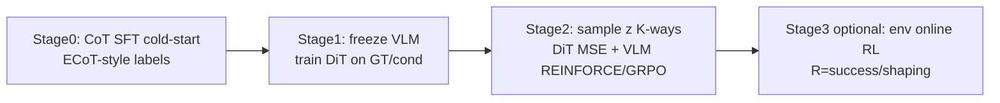

1. **Stage 0 — CoT SFT**：用合成 embodied CoT（ECoT 管线）或人工/强模型标注，teacher-forcing 训 VLM 会写合法 CoT。无此步直接 REINFORCE → 高方差 + 格式崩塌。
2. **Stage 1 — DiT 适配**：冻结（或低 lr）VLM；用 **贪心/教师 CoT** 或 plan latent 条件化 DiT，纯 MSE/FM，直到动作头能跟条件。
3. **Stage 2 — 联合（用户核心）**：对每个 demo \((o,\ell,a^\star)\) 采 \(K\) 条 \(z\)；算 \(R_i=-\mathrm{mse}_i+\ldots\)；组相对得 \(A_i\)；\(L_{\mathrm{DiT}}\) 对 \(K\) 条可平均或只对 greedy/best；\(L_{\mathrm{VLM}}\) 用 REINFORCE/GRPO。建议 VLM lr \(\ll\) DiT lr。
4. **Stage 3（可选）— 环境 online**：把 \(R\) 换成任务成功/稠密 shaping（或 ThinkAct 视觉奖励），在仿真里闭式改进；MSE 项降权为辅助，避免「只拟合演示分布」。

#### 11.3.5 在 RLinf 中的落点（设计映射，非已实现）

| 模块 | 复用 | 需新增 |
|------|------|--------|
| 离散生成 | reasoning 路径的 vLLM/SGLang；或 HF `generate`（`starvla/.../fast.py` 已有先例） | VLA forward 内「先 gen CoT 再条件 DiT」的编排 |
| \(\log\pi_{\mathrm{VLM}}\) | `compute_logprobs_from_logits`（reasoning Actor） | 对 CoT response mask 重算 logprob（训练步 teacher-forcing 于已采样 \(z\)） |
| Advantage | `compute_grpo_advantages` / `raw` + normalize；§12 `reinforce` | reward 函数：\(-\mathrm{mse}(+format)\)；组在 CoT 维而非 env step |
| DiT MSE | `lingbotvla.sft_forward` / flow head FM loss | 条件输入改为 `sg(encode(z))` |
| Runner | 更接近 **SFT worker + 内嵌采样**，或混合 worker | 非标准 `EmbodiedRunner` env loop（Stage 2 是 offline demo） |
| 配置 | `group_size=K`, `loss_type: reinforce` 或 `actor` | 新 `cot_enable`, `cot_reward: mse_fmt`, `lambda_vlm` |

**伪代码（Stage 2 单步）**：

```python
def hcrs_step(batch, vlm, dit, K=4, lam=1.0):
    o, ell, a_star = batch.obs, batch.lang, batch.actions
    zs, logps = [], []
    for _ in range(K):
        z, logp = vlm.sample_cot_with_logprob(o, ell)  # no grad through sample
        zs.append(z); logps.append(logp)
    mses, rewards = [], []
    for z, logp in zip(zs, logps):
        c = encode_cot(z).detach()
        mse = dit.flow_mse(o, ell, c, a_star)         # pathwise -> dit only
        mses.append(mse)
        rewards.append(-mse.detach() + format_bonus(z))
    A = group_normalize(torch.stack(rewards))         # GRPO-style / SCST
    L_dit = torch.stack(mses).mean()
    L_vlm = -(A * torch.stack(logps)).mean()          # classic REINFORCE
    return L_dit + lam * L_vlm
```

### 11.4 与「只用 MSE 当 adv」相关的风险与消融建议

| 风险 | 机制 | 缓解（文献/实践） |
|------|------|-------------------|
| **奖励黑客** | VLM 学会产出「让当前 DiT 好拟合」的短/空/投机 CoT，而非可解释推理 | \(\beta R_{\mathrm{fmt}}\)；KL 到 Stage0 SFT；ThinkAct 式语义/轨迹项；最短长度惩罚 |
| **高方差** | 长 CoT + 标量 MSE | \(K\ge4\) 组相对；SCST；`normalize_advantages`；缩短 CoT；先 Stage0/1 |
| **DiT–VLM 共适应振荡** | DiT 变强改变 MSE 标度，VLM 目标漂移 | 交替优化（若干步只训 DiT / 只训 VLM）；对 mse 做 EMA 标准化；VLM 更小 lr |
| **推理延迟** | 每控步解码长 CoT | ERVLA/ThinkAct：异步（多步动作共用一个 plan）；推理期可跳过 CoT 仅用 latent |
| **与 Flow-SDE GRPO 混淆** | 两者都叫「对 VLA 做 RL」 | 明确：本章 \(\log\pi\) 在 **token**；§5–§7 的 \(\log\pi\) 在 **动作去噪高斯** |

建议消融顺序：`(1) Stage0+1 only` → `(2) +REINFORCE, R=-mse, K=1` → `(3) +group K=4` → `(4) +format/KL` → `(5) +env reward`。

### 11.5 方案选型决策树

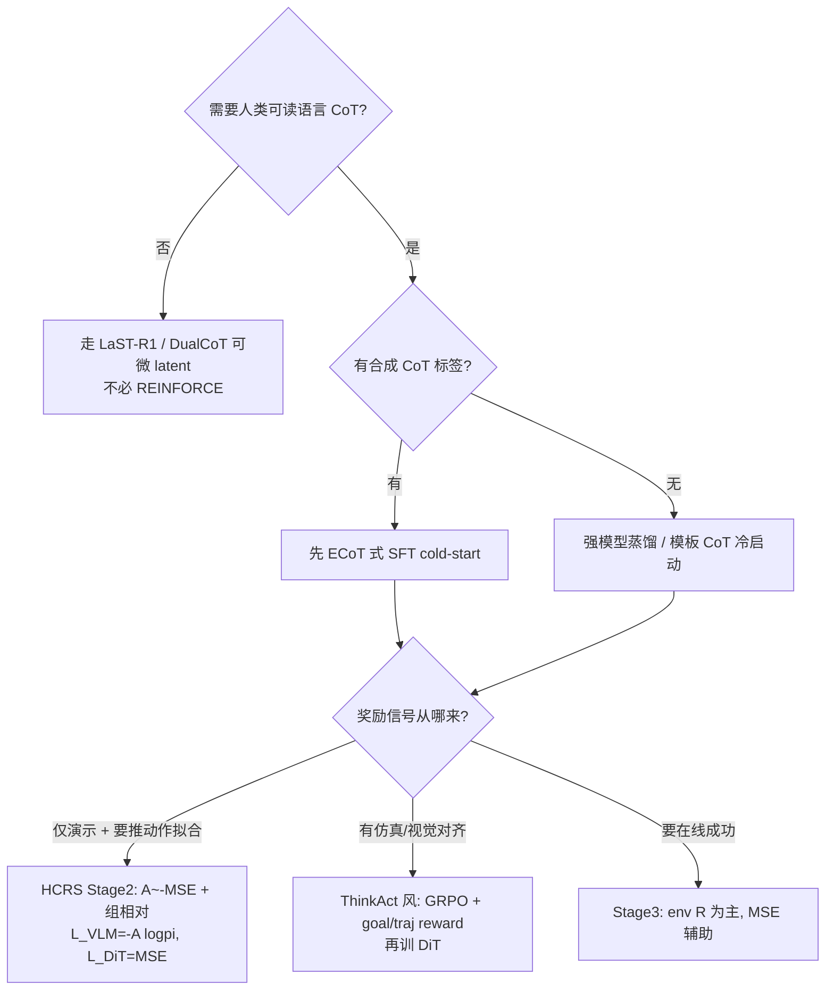

**对本用户问题的直接答复**：

- **可以做到**，前提是架构上真有「VLM **采样** CoT \(z\)」这一不可导边；现成 lingbotvla 融合前缀**没有**这条边，需要改成双系统/显式 gen。
- **推荐落地**：HCRS（§11.3）= ECoT 冷启动 + ThinkAct 双系统 + **用户的 \(-\mathrm{MSE}\) 奖励** + SCST/GRPO baseline + DiT 正常 FM-MSE；VLM 损失用经典 \(L=-A\log\pi\)（或更稳的 clipped GRPO）。
- **不推荐**：在无采样瓶颈的连续 VLM→DiT 上硬套 REINFORCE；或 Stage0 都没有就直接用裸 MSE 当 \(A\)。

### 11.6 小结

用户设想与 **ThinkAct（双系统 + RL 塑形推理 + DiT 执行）** 同构，与 **SCST（序列 REINFORCE + self-critical）** 同数学骨架，又比二者多了一步：**直接用下游动作头的模仿 MSE 作为（标准化后的）奖励**——这在公开 VLA-CoT 文献里相对少见，更常见的是环境成功、视觉目标/轨迹对齐或可验证 QA。把它做成稳定系统的关键，不是「会不会写 \(-A\log\pi\)」，而是 **cold-start、组 baseline、奖励塑形、梯度隔离 `sg(z)`、分阶段课程序**。映射到 RLinf，算法侧可复用 reasoning 的 logprob/GRPO/§12 reinforce 提案，模型侧需新增 CoT 采样与条件化 DiT 的桥；与本文主线 Flow-SDE-GRPO（对动作）可并存为「推理 RL + 动作 RL」两层，但勿混用同一套 `logprobs` 张量语义。

### 11.7 软件系统设计与落地方案

> **本节边界**：把 §11.3 的 HCRS 算法蓝图落成 **可实施的软件设计**（静态/动态架构、API 契约、Hydra 包、文件清单、分期验收）。遵守仓库 [`CLAUDE.md`](../../CLAUDE.md)：**扩展大于修改**；定制代码进 **`rlinf/_au/`**（目录镜像 `rlinf/`）；测试/验收进 **`tests_au/`**（`accept_*` + `.sh`）；Hydra 用**包/模块式** defaults。  
> **本节仍不创建任何代码文件**——下列路径均为设计蓝图。解释器约定：开发/验收使用 `.vscode/settings.json` 中的 `/mnt/r/VENV/rlinf/bin/python`。

#### 11.7.1 设计原则与包边界

| 原则 | 具体约定 |
|------|----------|
| 扩展优先 | 不 fork `lingbotvla_action_model.py`；不改 `base_policy.ForwardType`；不往 `fsdp_vla_sft_worker.py` 塞分支 |
| 定制落点 | 全部新逻辑在 `rlinf/_au/`；入口在 `examples/au/hcrs/`；测试在 `tests_au/` |
| 复用核心 | 只 **调用** `rlinf.models.register_model`、`FSDPVlaSftWorker`、`compute_logprobs_from_logits`、lingbotvla 的 FM/SFT 数据与损失思路（经 Adapter） |
| 自注册 | 仿 [`openpi_au/__init__.py`](../../rlinf/models/embodiment/openpi_au/__init__.py) 的 `_self_register()` + `register_model("hcrs_vla", ...)`；入口 `import` 触发，**不改** `rlinf/models/__init__.py` 内置表 |
| Forward 分发 | **选定方案②**：`HCRSVLAPolicy.forward` 自管字符串/`Enum`（`sft_cot` / `sft_dit` / `hcrs_joint`），**零改** [`base_policy.py`](../../rlinf/models/embodiment/base_policy.py) |
| 底座组合 | System-2 = HF Qwen2.5-VL CoT 采样；System-1 = 经 `DiTAdapter` 复用 lingbotvla 系 flow / L1-FM |
| 一期范围 | Stage0–2（offline SFT/联合）；Stage3 环境 online 仅接口预留 |
| 验收数据 | `/mnt/r/DATA/tst/Galaxea-Open-World-Dataset/Connect_Router_Cables_20250625_002/` |

与历史 AU 先例的关系：既有 `openpi_au` 放在 `rlinf/models/embodiment/openpi_au/`；**本方案按现行 CLAUDE 规范迁到 `rlinf/_au/` 镜像布局**，避免继续污染核心 `models/embodiment/` 树。

#### 11.7.2 静态架构

**组件图（包依赖）**

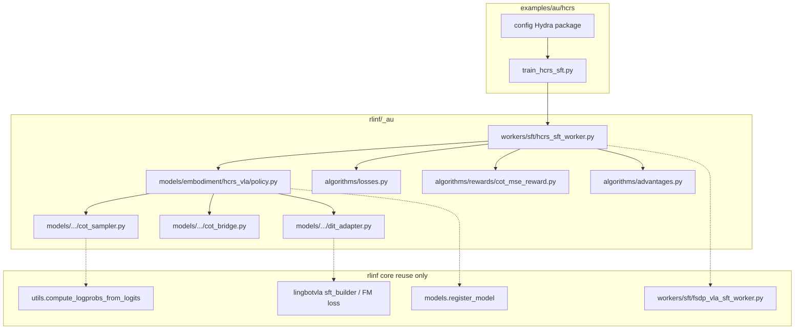

**类图（职责）**

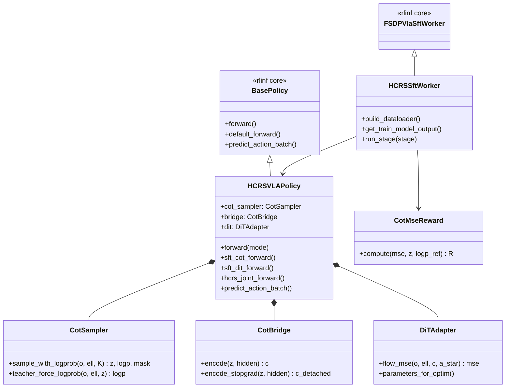

| 类 | 职责 | 不做什么 |
|----|------|----------|
| `HCRSVLAPolicy` | 组装 CoT↔DiT；三种 forward；推理时 `predict_action_batch`（可异步复用 plan） | 不实现 FSDP/优化器 |
| `CotSampler` | 采样 \(z\)；训练时对已采样 \(z\) teacher-forcing 重算 \(\log\pi\) | 不算 MSE |
| `CotBridge` | \(z\to c\)；**API 层强制 detach**（`encode_stopgrad`） | 不反传进采样 |
| `DiTAdapter` | 以 \(c\) 为条件算 FM-MSE；暴露可训参数组 | 不更新 VLM |
| `CotMseReward` | \(R=-\widetilde{\mathrm{mse}}+\beta R_{\mathrm{fmt}}-\eta\mathrm{KL}\) | 不做组归一化 |
| `group_normalize_cot`（advantages 薄封装） | 对同 prompt 的 \(K\) 条 \(R\) 做 GRPO/SCST 得 \(A\) | 可委托 core `compute_grpo_advantages` |
| `compute_reinforce_actor_loss_fn` | \(L=-\mathrm{masked\_mean}(A\cdot\log\pi)\) | 忽略 ratio/clip |
| `HCRSSftWorker` | Stage0–2 编排、K 采样、双 lr、日志 | 不跑 env loop（Stage3 二期） |

#### 11.7.3 动态架构

**配置驱动工作流**

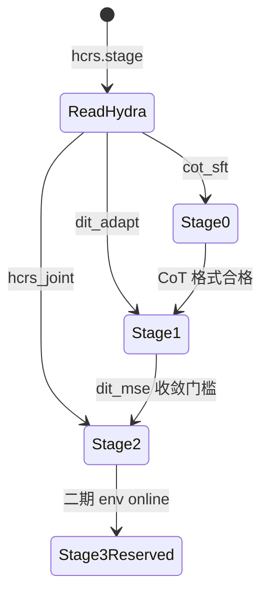

**Stage2 训练步序列图**

```mermaid
sequenceDiagram
  participant W as HCRSSftWorker
  participant P as HCRSVLAPolicy
  participant Cot as CotSampler
  participant Br as CotBridge
  participant Dit as DiTAdapter
  participant Rew as CotMseReward
  participant Adv as group_normalize_cot
  participant Loss as reinforce_loss

  W->>P: hcrs_joint_forward(batch, K)
  loop K times
    P->>Cot: sample_with_logprob(o, ell)
    Cot-->>P: z_k, logp_k
    P->>Br: encode_stopgrad(z_k)
    Br-->>P: c_k
    P->>Dit: flow_mse(o, ell, c_k, a_star)
    Dit-->>P: mse_k
    P->>Rew: compute(mse_k, z_k)
    Rew-->>P: R_k
  end
  P->>Adv: group_normalize(R_1..K)
  Adv-->>P: A_1..K
  P->>Loss: L_vlm = -mean(A * logp)
  Note over Dit: L_dit = mean(mse); pathwise to DiT only
  P-->>W: L_dit + lam * L_vlm, metrics
  W->>W: backward; VLM_lr much less than DiT_lr
```

**Forward / Backward 与梯度隔离**

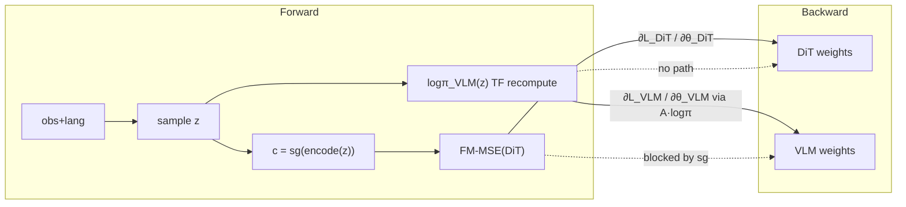

冻结集（Stage 约定）：

| Stage | VLM | DiT / 专家 | 损失 |
|-------|-----|------------|------|
| 0 `cot_sft` | 训 | 冻 | CE on CoT labels |
| 1 `dit_adapt` | 冻（或极低 lr） | 训 | FM-MSE；\(c\) 来自教师/贪心 CoT + `sg` |
| 2 `hcrs_joint` | 训（小 lr） | 训 | \(L_{\mathrm{DiT}}+\lambda L_{\mathrm{VLM}}\) |
| 3（预留） | 按需 | 按需 | env \(R\) 为主 |

#### 11.7.4 模块 API 契约（伪代码签名；非落地）

张量约定：

| 符号 | 形状 | 说明 |
|------|------|------|
| \(z\) | `[B, T]` 或 list of `[T_k]` | CoT token ids |
| `cot_mask` | `[B, T]` bool | 有效 response token |
| `logp` | `[B]`（序列和）或 `[B, T]` | \(\log\pi_{\mathrm{VLM}}\)；联合时常用序列和 |
| \(c\) | `[B, D]` 或 `[B, T', D]` | plan latent / token emb；**进 DiT 前必须 detached** |
| `mse` | `[B]` | 每条 CoT 条件化后的 FM-MSE |
| \(R, A\) | `[B]` 或 `[B, K]` 展平 | 奖励与优势 |

```python
# rlinf/_au/models/embodiment/hcrs_vla/cot_sampler.py
class CotSampler(nn.Module):
    def sample_with_logprob(
        self, obs, lang, *, max_new_tokens: int, temperature: float
    ) -> tuple[torch.Tensor, torch.Tensor, torch.Tensor]:
        """Returns (z, seq_logprob, cot_mask). Sampling has no grad."""

    def teacher_force_logprob(
        self, obs, lang, z: torch.Tensor, cot_mask: torch.Tensor
    ) -> torch.Tensor:
        """Recompute logπ_θ(z) with grad for REINFORCE."""

# cot_bridge.py
class CotBridge(nn.Module):
    def encode(self, z, cot_hidden=None) -> torch.Tensor: ...
    def encode_stopgrad(self, z, cot_hidden=None) -> torch.Tensor:
        return self.encode(z, cot_hidden).detach()

# dit_adapter.py
class DiTAdapter(nn.Module):
    def flow_mse(self, obs, lang, c: torch.Tensor, actions: torch.Tensor) -> torch.Tensor:
        """Per-sample FM/L1-FM mse, shape [B]. Pathwise grads to DiT only if c detached."""

# rewards/cot_mse_reward.py
class CotMseReward:
    def compute(self, mse: torch.Tensor, z, *, ref_logp=None) -> torch.Tensor:
        """R = -mse_norm + β·format - η·KL; shape [B]."""

# algorithms/losses.py
@register_policy_loss("reinforce")
def compute_reinforce_actor_loss_fn(**kwargs) -> tuple[torch.Tensor, dict]:
    """L = -loss_agg(A.detach() * logprobs); ignores old_logprobs/clip."""

# workers/sft/hcrs_sft_worker.py
class HCRSSftWorker(FSDPVlaSftWorker):
    def build_dataloader(self, data_paths, eval_dataset=False): ...
    def get_train_model_output(self, batch) -> tuple[torch.Tensor, dict]:
        """Dispatch on cfg.hcrs.stage → policy forward mode."""
```

#### 11.7.5 Hydra / 配置包设计（企业化引入）

禁止「单个 yaml 里写死一长串 `sys.path` / 相对 `../../` 拼模块」。采用与 `examples/au/pi` 同类的 **config 组 + searchpath**：

```yaml
# examples/au/hcrs/config/hcrs_joint_sft.yaml
defaults:
  - model/hcrs_vla@actor.model
  - algorithm/hcrs_reinforce@algorithm
  - training_backend/fsdp@actor.fsdp_config
  - override hydra/job_logging: stdout

hydra:
  run:
    dir: .
  output_subdir: null
  searchpath:
    - file://${oc.env:HCRS_PATH,examples/au/hcrs}/config/
    - file://${oc.env:EMBODIED_PATH,examples/sft}/config/

runner:
  task_type: sft

hcrs:
  stage: hcrs_joint          # cot_sft | dit_adapt | hcrs_joint
  group_size_k: 4
  lambda_vlm: 1.0
  cot_max_new_tokens: 128
  reward:
    alpha_mse: 1.0
    beta_format: 0.1
    eta_kl: 0.01

actor:
  model:
    model_type: hcrs_vla
  # 建议：param group 在 worker 内按名字拆 VLM / DiT 两套 lr

data:
  train_data_paths:
    - /mnt/r/DATA/tst/Galaxea-Open-World-Dataset/Connect_Router_Cables_20250625_002/
```

```yaml
# examples/au/hcrs/config/algorithm/hcrs_reinforce.yaml
loss_type: reinforce
adv_type: grpo          # 组在 CoT 维；或 raw+SCST
normalize_advantages: true
n_minibatches: 1
kl_beta: 0.0
```

```yaml
# examples/au/hcrs/config/model/hcrs_vla.yaml
model_type: hcrs_vla
model_path: /path/to/Qwen2.5-VL-3B-Instruct
dit_backend: lingbotvla_fm    # adapter 选用的 FM 后端标识
precision: bf16
```

入口脚本头部（包导入触发自注册）：

```python
import rlinf._au.models.embodiment.hcrs_vla  # noqa: F401
import rlinf._au.algorithms.losses  # noqa: F401 register reinforce
```

启动：`bash examples/au/hcrs/run_train.sh`（内设 `HCRS_PATH`、`EMBODIED_PATH`，调用 `/mnt/r/VENV/rlinf/bin/python`）。

#### 11.7.6 文件清单：新增 vs 修改

**新增（实施时创建；本节仅设计）**

| 路径 | 职责 |
|------|------|
| `rlinf/_au/__init__.py` | 包根 |
| `rlinf/_au/models/__init__.py` | |
| `rlinf/_au/models/embodiment/__init__.py` | |
| `rlinf/_au/models/embodiment/hcrs_vla/__init__.py` | `register_model("hcrs_vla")` 自注册 |
| `rlinf/_au/models/embodiment/hcrs_vla/policy.py` | `HCRSVLAPolicy` |
| `rlinf/_au/models/embodiment/hcrs_vla/cot_sampler.py` | CoT 采样与 logprob |
| `rlinf/_au/models/embodiment/hcrs_vla/cot_bridge.py` | encode + stopgrad |
| `rlinf/_au/models/embodiment/hcrs_vla/dit_adapter.py` | 对接 lingbotvla 系 FM-MSE |
| `rlinf/_au/models/embodiment/hcrs_vla/config.py` | dataclass 超参 |
| `rlinf/_au/algorithms/__init__.py` | |
| `rlinf/_au/algorithms/losses.py` | `@register_policy_loss("reinforce")` |
| `rlinf/_au/algorithms/advantages.py` | 组相对 / SCST 薄封装 |
| `rlinf/_au/algorithms/rewards/__init__.py` | |
| `rlinf/_au/algorithms/rewards/cot_mse_reward.py` | \(R=-\mathrm{mse}+\)format |
| `rlinf/_au/workers/__init__.py` | |
| `rlinf/_au/workers/sft/__init__.py` | |
| `rlinf/_au/workers/sft/hcrs_sft_worker.py` | Stage0–2 worker |
| `examples/au/hcrs/train_hcrs_sft.py` | 训练入口 |
| `examples/au/hcrs/run_train.sh` | 环境变量 + python |
| `examples/au/hcrs/README.md` | 用法与 Stage 说明 |
| `examples/au/hcrs/config/model/hcrs_vla.yaml` | 模型组 |
| `examples/au/hcrs/config/algorithm/hcrs_reinforce.yaml` | 算法组 |
| `examples/au/hcrs/config/hcrs_cot_sft.yaml` | Stage0 |
| `examples/au/hcrs/config/hcrs_dit_adapt.yaml` | Stage1 |
| `examples/au/hcrs/config/hcrs_joint_sft.yaml` | Stage2 主配置 |
| `tests_au/unit_tests/test_hcrs_bridge_detach.py` | `sg(c)` 无 VLM 梯度 |
| `tests_au/unit_tests/test_hcrs_reinforce_loss.py` | \(L=-A\log\pi\) |
| `tests_au/unit_tests/test_hcrs_cot_reward.py` | 奖励塑形 |
| `tests_au/e2e_tests/test_hcrs_stage2_synthetic.py` | 合成 batch 一步 |
| `tests_au/example/hcrs/accept_hcrs_smoke.py` | 验收（`accept_` 前缀） |
| `tests_au/example/hcrs/run_accept_hcrs.sh` | 调用验收 |

**修改**

| 路径 | 改动 | 是否必须 |
|------|------|----------|
| 核心 `rlinf/algorithms/**`、`rlinf/models/embodiment/lingbotvla/**` 等 | 无功能改动 | **否** |
| [`rlinf/workers/sft/fsdp_vla_sft_worker.py`](../../rlinf/workers/sft/fsdp_vla_sft_worker.py) | 为 `hcrs_vla` 加 dataloader 分支 | **否**（`HCRSSftWorker` 覆盖） |
| [`rlinf/models/embodiment/base_policy.py`](../../rlinf/models/embodiment/base_policy.py) | 增加 `ForwardType.HCRS` | **否**（policy 自管） |
| [`rlinf/models/__init__.py`](../../rlinf/models/__init__.py) | 写入内置 registry | **否**（自注册） |
| [`b/d/ov/grpo_vla_analyz_1.md`](grpo_vla_analyz_1.md) | §11.7 本文 | **是（文档任务）** |

#### 11.7.7 分期实施与验收标准

| 阶段 | 交付 | 通过标准 |
|------|------|----------|
| **P0** | Bridge detach 单测 + reinforce loss 单测 + 合成 Stage2 一步 | `pytest tests_au/unit_tests/test_hcrs_*.py` 绿；合成一步不 OOM；断言 VLM 对 \(L_{\mathrm{DiT}}\) 无 grad |
| **P1** | Stage0/1 + Galaxea 子集 smoke | `run_train.sh` + `hcrs.stage=cot_sft|dit_adapt` 跑通 \(N\) step 并写 ckpt |
| **P2** | Stage2 \(K=4\) 联合 | 日志含 `train/vlm_pg_loss`、`train/dit_mse`；`accept_hcrs_smoke` 退出码 0 |
| **P3** | Stage3 接口预留 | 文档/空壳：`HCRSOnlineHook` 协议（`build_env_reward`、与 `EmbodiedRunner` 对接点）；**本期不实现** |

验收脚本约定（CLAUDE）：`tests_au/example/hcrs/accept_hcrs_smoke.py` + `run_accept_hcrs.sh`；默认数据根为 Galaxea 上述路径；Python=`/mnt/r/VENV/rlinf/bin/python`。

#### 11.7.8 算法符号 → 软件映射

| §11.3 符号 / 概念 | 软件落点 | 配置键 |
|-------------------|----------|--------|
| \(z\sim\pi_{\mathrm{VLM}}\) | `CotSampler.sample_with_logprob` | `hcrs.cot_max_new_tokens` |
| \(\log\pi_{\mathrm{VLM}}(z)\) | `teacher_force_logprob` + `compute_logprobs_from_logits` | — |
| \(c=\mathrm{sg}(\mathrm{encode}(z))\) | `CotBridge.encode_stopgrad` | `actor.model.bridge_*` |
| \(L_{\mathrm{DiT}}=\mathrm{FM\text{-}MSE}\) | `DiTAdapter.flow_mse` | `actor.model.dit_backend` |
| \(R=-\mathrm{mse}+\ldots\) | `CotMseReward.compute` | `hcrs.reward.*` |
| \(A\) 组相对 / SCST | `group_normalize_cot` / core GRPO | `hcrs.group_size_k`, `algorithm.adv_type` |
| \(L_{\mathrm{VLM}}=-A\log\pi\) | `loss_type: reinforce` | `algorithm.loss_type` |
| \(\lambda\) | `L_dit + lam * L_vlm` | `hcrs.lambda_vlm` |
| Stage0–2 | `HCRSSftWorker` + `hcrs.stage` | `hcrs.stage` |
| 双 lr | worker 内 param groups | `actor.optim.vlm_lr` / `dit_lr`（建议新增） |

---

## 结语

用 GRPO 训练「QwenVL + GR00T/DiT 动作头」型 VLA，工程与算法的枢纽只有一句话：

> **把确定性的流/扩散 ODE 采样，通过 Flow-SDE 改造成单步对角高斯，从而获得可计算的 \(\log\pi_\theta(a\mid s)\)，再套用 GRPO 的组相对优势 + clipped policy gradient。**

若进一步引入 **语言 CoT 采样**，则另有一条正交枢纽（§11）：

> **离散 CoT 用 REINFORCE/GRPO 更新 VLM（\(A\) 可来自 \(-\mathrm{MSE}\) 或环境/视觉奖励），连续 DiT 仍用 FM-MSE；条件必须 `stopgrad`，并配 cold-start 与组 baseline。**

软件落点见 **§11.7**：定制包 `rlinf/_au/.../hcrs_vla` + `tests_au/`，扩展优先、核心零改；**代码包尚未创建**。

若只记住一条（动作 GRPO 主线）数据路径：

\[
$$\text{Obs}\xrightarrow[\text{HF rollout}]{\text{predict\_action\_batch}}
\{\text{action chunk},\log\pi_{\text{old}},\text{chains},\text{denoise\_inds}\}
\xrightarrow{\text{env rewards}} R
\xrightarrow[\text{calculate\_scores + GRPO}]{} A$$
\]
\[
$$\xrightarrow[\text{default\_forward + Flow-SDE}]{} \log\pi_\theta
\xrightarrow[\text{clipped PG + KL/ent}]{} \nabla_\theta
\xrightarrow{\text{WeightSyncer}} \text{next rollout}.$$
\]

代码真源以上表所列文件为准。本文明确区分了「可运行的主线（lingbotvla：QwenVL+专家+flow_sde+GRPO）」与「参照族（starVLA-flow / GR00T-DiT）」，并诚实标注 **GR00T 在 RLinf 仓库中绑定 PPO、其骨干非 QwenVL**。§11 的 HCRS 为算法+软件设计蓝图，**尚未合入代码**。若与外部博客/论文表述冲突，一律以本仓库实际行为为准。
