# GRPO 训练 QwenVL：Forward / Loss / Backward 深度解析

> **摘要**：本文以 RLinf 本地代码库为准，沿着 **Qwen2.5-VL + FSDP + GRPO + VQA（Robo2VLM）** 主路径，系统解剖「用 GRPO 训练视觉-语言模型」的完整计算图。我们不仅说明组件如何编排，更深入到 **rollout 采样、多模态 teacher-forcing 前向、组相对优势估计、clipped policy loss、反向传播与权重同步** 的每一处关键实现，使公式与源码一一对应。主配置为 [`examples/reasoning/config/vqa/qwen2.5-vl-3b-grpo-fsdp.yaml`](../../examples/reasoning/config/vqa/qwen2.5-vl-3b-grpo-fsdp.yaml)，入口为 [`examples/reasoning/main_grpo.py`](../../examples/reasoning/main_grpo.py)。

---

## 目录

1. [问题定义与为何选 GRPO](#1-问题定义与为何选-grpo)
2. [纵向演进：从 REINFORCE 到 GRPO](#2-纵向演进从-reinforce-到-grpo)
3. [横向对比：PPO / GRPO / REINFORCE++](#3-横向对比ppo--grpo--reinforce)
4. [端到端静态架构](#4-端到端静态架构)
5. [动态数据流：一步训练的序列](#5-动态数据流一步训练的序列)
6. [Forward 代码解剖](#6-forward-代码解剖)
7. [Advantage 与 Loss 代码解剖](#7-advantage-与-loss-代码解剖)
8. [Backward、Optimizer 与权重同步](#8-backwardoptimizer-与权重同步)
9. [深入：VLM 上的 Loss 与 Gradient 如何分配](#9-深入vlm-上的-loss-与-gradient-如何分配)
10. [消融与工程要点](#10-消融与工程要点)
11. [关键文件索引](#11-关键文件索引)
12. [经典 REINFORCE 训 QwenVL：方案与最小改动](#12-经典-reinforce-训-qwenvl方案与最小改动)

---

## 1. 问题定义与为何选 GRPO

### 1.1 任务形态

在机器人视觉问答（VQA / Robo2VLM）场景中，策略 \(\pi_\theta\) 接收：

- 一张（或多张）机器人场景图像；
- 一道选择题式自然语言问题（含选项）；

并生成一段带推理痕迹的自然语言回答（期望格式：`<think>...</think><answer>X. ...</answer>`）。奖励来自规则验证器（默认仅 `qa_accuracy`），取值近似为稀疏的 \(\{0,1\}\)。

这与具身 RL 中「稠密逐步奖励 + 长 horizon」不同：**单轨迹标量奖励、无中间 step reward、同一 prompt 可并行采样多条回答**。这正是 GRPO 的设计甜点。

### 1.2 为何 GRPO 特别适合 VLM-VQA

| 需求 | PPO + Critic | GRPO |
|------|--------------|------|
| Value head / Critic worker | 需要，额外显存与同步 | **不需要**（配置 `critic.use_critic_model: false`） |
| Baseline 估计 | 学习 \(V_\phi(s)\)，稀疏奖励下难训 | 同 prompt 的 **组内相对归一化** 直接当 baseline |
| 奖励结构 | 更适稠密 / 长序列 credit assignment | 更适 **终局 0/1 奖励** |
| 实现入口 | `adv_type: gae` + `loss_type: actor_critic` | `adv_type: grpo` + `loss_type: actor` |

主配置关键片段：

```yaml
algorithm:
  group_size: 8
  loss_type: actor
  adv_type: grpo
  loss_agg_func: "token-mean"
  recompute_logprobs: False
  normalize_advantages: True
  kl_beta: 0.0
  entropy_bonus: 0.0

rollout:
  model:
    model_type: qwen2.5_vl
  rollout_backend: vllm
  return_logprobs: ${not:${algorithm.recompute_logprobs}}

reward:
  reward_type: 'vqa'
  reward_weights:
    qa_accuracy: 1.0
    think_format: 0.0
    answer_format: 0.0

critic:
  use_critic_model: false
```

**一句话结论**：RLinf 里「用 GRPO 训 QwenVL」= 用推理 RL 栈（`ReasoningRunner`）对 Vision2Seq 模型做 **组采样 → 规则奖励 → 组相对优势 → clipped actor PG**，全程无 Critic。

---

## 2. 纵向演进：从 REINFORCE 到 GRPO

### 2.1 策略梯度的演进脉络

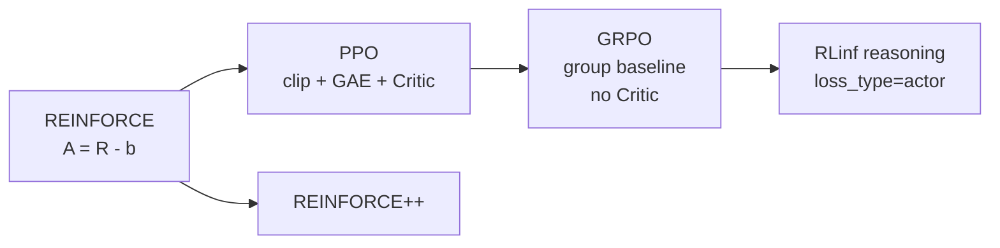

1. **REINFORCE**：\(\nabla_\theta J \approx \mathbb{E}[R \nabla \log\pi_\theta]\)。方差大，依赖手工 baseline。
2. **PPO**：引入 importance sampling ratio 与 clip，用 GAE + Critic 降方差；代价是多一套 value 网络与训练循环。
3. **GRPO（DeepSeekMath）**：对同一问题采样 \(G\) 条回答，用组内均值/标准差归一化奖励作为优势，**去掉 Critic**，同时保留 PPO 风格的 ratio clip。
4. **RLinf**：把 GRPO 拆成可注册的两段——`@register_advantage("grpo")` 与 `@register_policy_loss("actor")`——reasoning / embodied / agent 共用同一套算法内核，仅预处理不同。

### 2.2 RLinf 实现相对原论文的工程取舍

| 点 | DeepSeekMath 原意 | RLinf 本地实现 |
|----|-------------------|----------------|
| Advantage | 组内相对归一化 | `compute_grpo_advantages`：`(r-μ)/(σ+1e-6)`，再广播到 response tokens |
| Policy loss | 常与 PPO clip 结合 | **直接复用** `compute_ppo_actor_loss`（`compute_grpo_actor_loss_fn` 是薄包装） |
| KL 正则 | 常有相对参考策略的 KL | 主配置 `kl_beta: 0.0`（可开） |
| Token 聚合 | 论文写法多样 | 默认 `token-mean`（`masked_mean`） |
| 二次归一化 | 可选 | `normalize_advantages: True` → `masked_normalization` |

---

## 3. 横向对比：PPO / GRPO / REINFORCE++

| 维度 | PPO (`gae` + `actor_critic`) | GRPO (`grpo` + `actor`) | REINFORCE++ |
|------|------------------------------|-------------------------|-------------|
| Critic | 有 | **无** | 无 / 轻量 baseline |
| Advantage | GAE 逐步折扣 | 组相对标量 → token 广播 | reinpp 变体 |
| 组件 | Actor + Critic (+ 可选 inference) | Actor + Reward + Rollout | 类似 GRPO |
| VQA 稀疏奖励 | Critic 难学 | **强适配** | 可用，方差控制弱于 GRPO |
| 长 horizon 稠密奖励（具身） | 通常更好 | 组 baseline 偏粗 | 视实现 |
| 显存 | 更高 | 更低 | 低 |

**场景建议（结合机器人 + VLM）**：

- **图像选择题 / 终局准确率奖励** → GRPO（本主路径）。
- **多步操作、中间 reward、需时序 credit** → PPO + GAE（具身栈）。
- **多轮工具调用、变长 turn** → `grpo_dynamic`（SearchR1 / WideSeek），不是本文主线。

---

## 4. 端到端静态架构

### 4.1 组件图

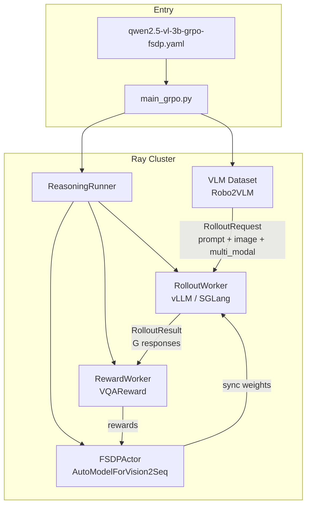

### 4.2 类与职责

| 组件 | 类 / 入口 | 职责 |
|------|-----------|------|
| 入口 | `main_grpo.py::main` | `validate_cfg` → 启动 worker groups → `ReasoningRunner.run()` |
| 编排 | `ReasoningRunner` | 一步内：放数据、同步权重、rollout、reward、（可选）logprob 推理、actor 训练 |
| 数据 | `Robo2VLMDataset` / `VLMBaseDataset` | Processor 编码图像与文本，产出 `multi_modal_inputs` |
| Rollout | `VLLMWorker` / `SGLangWorker` | 每 prompt 采样 `group_size` 条回答；可返回 `rollout_logprobs` |
| Reward | `RewardWorker` + `VQAReward` | 规则奖励：准确率 / 格式（可加权） |
| Actor | `FSDPActor`（`fsdp_actor_worker.py`） | GRPO advantage → forward logprob → loss → backward → optimizer |
| 模型加载 | `FSDPModelManager` | Vision2Seq → `AutoModelForVision2Seq.from_pretrained` |

入口中 GRPO 不启动 Critic（`use_critic_model: false`），也不启动 actor_inference（主配置 `recompute_logprobs: False`）：

```41:108:examples/reasoning/main_grpo.py
def main(cfg) -> None:
    cfg = validate_cfg(cfg)
    ...
    rollout_group = rollout_worker_cls.create_group(...).launch(...)
    ...
    reward_group = RewardWorker.create_group(cfg).launch(...)
    actor_group = actor_worker_cls.create_group(...).launch(...)
    if cfg.critic.use_critic_model:
        critic_group = ...
    else:
        critic_group = None
```

### 4.3 配置 → 算法注册表的映射

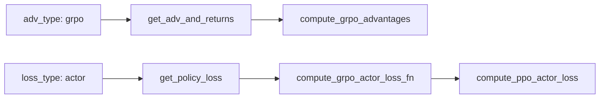

统一入口：

- `calculate_adv_and_returns(...)` → [`rlinf/algorithms/registry.py`](../../rlinf/algorithms/registry.py)
- `policy_loss(...)` → 同上

reasoning 任务走 `preprocess_reasoning_advantages_inputs` / `postprocess_reasoning_advantages_outputs`；**不做** embodied 那套 `calculate_scores`（逐步 reward 求和）。

---

## 5. 动态数据流：一步训练的序列

### 5.1 Runner 主循环（宏观）

[`ReasoningRunner.run`](../../rlinf/runners/reasoning_runner.py) 每步大致为：

1. `_put_batch(batch)`：把 dataloader 的 prompt / 图像 / `multi_modal_inputs` 打成 `RolloutRequest(n=group_size)` 放入 `dataloader_channel`；
2. `_sync_weights()`：Actor → Rollout（及可选 Inference）同步最新权重；
3. `rollout.rollout(...)`：生成 \(G\) 条回答；
4. `reward.compute_rewards(...)`：写入 `rollout_result.rewards`；
5. 若 `recompute_logprobs`：走 `actor_inference.run_inference`；否则 reward 通道直接作为 actor 训练输入；
6. `actor.run_training(...)`：advantage + 多 epoch minibatch 更新。

```mermaid
sequenceDiagram
    participant DL as DataLoader
    participant Runner as ReasoningRunner
    participant Rollout as RolloutWorker
    participant Reward as RewardWorker
    participant Actor as FSDPActor

    DL->>Runner: batch prompt image multi_modal
    Runner->>Runner: _put_batch RolloutRequest n=G
    Runner->>Rollout: sync_weights then rollout
    Note over Rollout: sample G responses<br/>optional rollout_logprobs
    Rollout->>Reward: RolloutResult
    Reward->>Reward: VQAReward.get_reward
    Reward->>Actor: rewards trajectories
    Actor->>Actor: GRPO advantages
    Actor->>Actor: forward_batch + policy_loss
    Actor->>Actor: backward + optimizer_step
```

### 5.2 `_put_batch`：图像如何进入系统

```393:416:rlinf/runners/reasoning_runner.py
def _put_batch(self, batch: dict[str, torch.Tensor], split_size=None):
    ...
    request = RolloutRequest(
        n=self.cfg.algorithm.group_size,
        input_ids=input_ids,
        answers=answers,
        image_data=image_data,
        multi_modal_inputs=multi_modal_inputs,
    )
    self.dataloader_channel.put(request, async_op=True)
```

要点：

- `n=group_size`（默认 8）告诉 rollout：**同一 prompt 生成 G 条**；
- `image_data` 供引擎侧加载图像；
- `multi_modal_inputs`（含 `pixel_values`、`image_grid_thw` 等）会随 `RolloutResult` 传到 Actor，供训练 forward 使用。

### 5.3 VQA 奖励

[`VQAReward.get_reward`](../../rlinf/algorithms/rewards/vqa/__init__.py) 对三项奖励加权求和；主配置仅 `qa_accuracy=1.0`：

- 解析 `<answer>A. content</answer>`；
- 选项字母 **与** 选项文本都必须匹配才得 \(1.0\)，否则 \(0.0\)。

这给出轨迹级标量 \(R_i \in \{0,1\}\)（加权后也可为连续值），形状在 worker 侧展平为 `[num_sequences]`。

---

## 6. Forward 代码解剖

本节是全文核心之一。务必区分两种「前向」：

| 阶段 | 谁执行 | 目的 | 是否采样 |
|------|--------|------|----------|
| Rollout forward | vLLM / SGLang | 自回归生成 response tokens | **是** |
| Training forward | FSDPActor.`forward_batch` | 对已生成序列重算 \(\log\pi_\theta(a_t\|s_t)\) | **否**（teacher-forcing） |

### 6.1 模型加载：Vision2Seq

[`FSDPModelManager`](../../rlinf/hybrid_engines/fsdp/fsdp_model_manager.py) 根据 HF config 选择类：

```167:177:rlinf/hybrid_engines/fsdp/fsdp_model_manager.py
if type(model_config) in AutoModelForVision2Seq._model_mapping.keys():
    auto_model_class = AutoModelForVision2Seq
else:
    auto_model_class = AutoModelForCausalLM

model = auto_model_class.from_pretrained(
    cfg.model.model_path,
    torch_dtype=self.torch_dtype,
    config=model_config,
    trust_remote_code=True,
)
```

Qwen2.5-VL 走 Vision2Seq。可选 `use_liger_kernel` 时调用 `apply_liger_kernel_to_qwen2_5_vl`（RoPE / RMSNorm / SwiGLU / fused CE）。

### 6.2 数据侧：Processor → `multi_modal_inputs`

[`VLMBaseDataset.encode_prompt`](../../rlinf/data/datasets/vlm.py) 用 `AutoProcessor` 处理 chat template + 图像，把非 `input_ids` 字段收入 `multi_modal_inputs`（典型键：`pixel_values`, `image_grid_thw`）。

Robo2VLM 系统提示要求 `<think>` / `<answer>` 格式，与 VQA reward 对齐。

### 6.3 Batch 构造：`to_actor_batch`

[`RolloutResult.to_actor_batch`](../../rlinf/data/io_struct.py) 把变长 prompt/response pad 到固定训练长度：

```
[prompt_padding | prompt_ids | response_ids | response_padding]
|<---- max_prompt_length ---->|<-------- response budget ------>|
|<------------------ runner.seq_length ------------------------>|
```

并构造：

- `attention_mask`：真实 prompt+response 为 True；
- `response_mask`：仅 LLM 生成的 response 为 True（参与 adv/loss）；
- `position_ids`：从真实 prompt 起点递增；
- `multi_modal_inputs`：原样挂入 batch（list[dict]）。

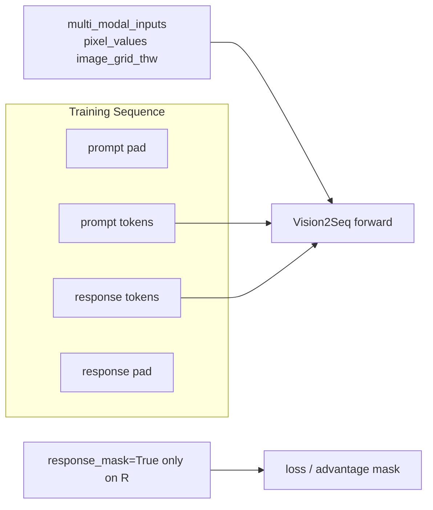

### 6.4 `forward_batch`：训练前向的逐步拆解

代码位置：[`FSDPActor.forward_batch`](../../rlinf/workers/actor/fsdp_actor_worker.py)（约 463–528 行）。

#### Step A — 取出文本张量并拼接多模态

```python
input_ids = m_batch["input_ids"]
attention_mask = m_batch["attention_mask"]
position_ids = m_batch["position_ids"]

multi_modal_inputs = {}
if "multi_modal_inputs" in m_batch.keys():
    for key in m_batch["multi_modal_inputs"][0].keys():
        multi_modal_inputs[key] = torch.cat(
            [inputs[key] for inputs in m_batch["multi_modal_inputs"]],
            dim=0,
        ).to(Worker.torch_device_type)
```

同一 micro-batch 内多条样本的 `pixel_values` 等在 batch 维 `cat`，再 `**multi_modal_inputs` 喂给模型。

#### Step B — HF 模型一次前向（无 KV cache）

```python
with self.amp_context:
    outputs = self.model(
        input_ids=input_ids,
        attention_mask=attention_mask,
        position_ids=position_ids,
        use_cache=False,
        **multi_modal_inputs,
    )
logits = outputs.logits
logits.div_(self.cfg.algorithm.sampling_params.temperature)
```

计算图概念上：

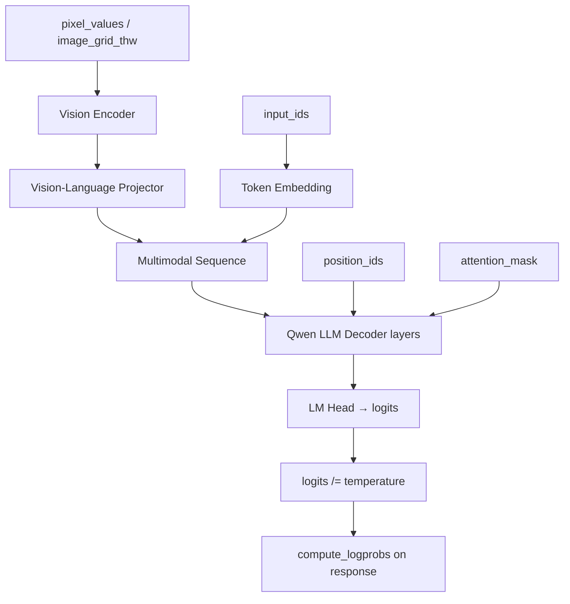

**温度缩放**：必须与 rollout `sampling_params.temperature` 一致，否则 \(\pi_\theta\) 与 \(\pi_{\text{old}}\) 定义不在同一分布上，ratio 会偏。

#### Step C — 对齐到 response token 的 logprob

静态 batch（主配置 `enable_dynamic_batch_size: False`）：

```python
# logits: [B, seq, V]  — causal LM: position t 预测 token t+1
logits = logits[:, -self.response_len - 1 : -1, :]
responses = input_ids[:, -self.response_len :]
logprobs = self.compute_logprobs(logits, responses)
```

直觉：取「预测 response 每个 token」的那一段 logits，与 response token id 对齐，得到形状 `[B, response_len]` 的 token log-prob。

#### Step D — `compute_logprobs_from_logits`

[`rlinf/utils/utils.py`](../../rlinf/utils/utils.py)：

\[
\log \pi_\theta(a_t \mid s_t) = -\mathrm{CE}(\mathrm{logits}_t, a_t)
\]

默认 `op_type="torch"`：`-F.cross_entropy(..., reduction="none")`，再 `.float()` 转 fp32，保证后续 ratio 数值稳定（loss 内也 assert fp32）。

可选 `flash_attn` / `liger_kernel` 加速，但不改变数学定义。

### 6.5 Rollout logprob vs Training logprob

主配置：

```yaml
recompute_logprobs: False
return_logprobs: ${not:${algorithm.recompute_logprobs}}  # → True
```

含义：

- Rollout 引擎返回 `rollout_logprobs`，经 `to_actor_batch` 写入 `prev_logprobs`，作为 \(\log\pi_{\theta_{\text{old}}}\)；
- Training forward 再算当前 \(\log\pi_\theta\)；
- **不**启动独立的 `actor_inference` 做二次重算。

若设 `recompute_logprobs: True`，则由 Actor/Inference worker 在训练前用当前权重（或同步后的权重）重算 `prev_logprobs`，更「严格 on-policy」，但多一次前向。

### 6.6 Forward 中哪些权重参与计算图

默认 `is_lora: False`，且主配置未冻结视觉塔：

- **Vision encoder + projector + LLM + LM head** 全部在 `self.model(...)` 计算图内；
- `use_cache=False`，不建 KV cache，便于整段反传；
- 只有 **response 段** 的 logprob 进入 loss，但 **整段序列（含图像 token）仍前向**，因此视觉塔也会收到来自 response CE/PG 的梯度（除非另行冻结）。

---

## 7. Advantage 与 Loss 代码解剖

### 7.1 Actor 侧调用链

```871:967:rlinf/workers/actor/fsdp_actor_worker.py
# run_training:
global_batch = RolloutResult.merge_batches(batches)
global_batch = self.compute_advantages_and_returns(global_batch)
if self.cfg.algorithm.normalize_advantages:
    mask = global_batch["response_mask"][:, -self.response_len :]
    global_batch["advantages"] = masked_normalization(
        global_batch["advantages"], mask
    )
...
# compute_advantages_and_returns:
advantages, _ = calculate_adv_and_returns(
    task_type=self.task_type,          # reasoning
    adv_type=self.cfg.algorithm.adv_type,  # grpo
    rewards=batch["rewards"],
    loss_mask=mask,                    # response_mask 的 response 段
    group_size=self.cfg.algorithm.group_size,
    ...
)
```

### 7.2 Reasoning 预处理：形状约定

[`preprocess_reasoning_advantages_inputs`](../../rlinf/algorithms/utils.py)：

1. `loss_mask: [B, L] → [L, B]`（转置，与 embodied 时间维约定对齐）；
2. 对 `adv_type == "grpo"`：`rewards.reshape(-1, group_size)` → `[num_groups, G]`；
3. 构造 `dones`（仅最后一 token 为 True）——GAE 需要；GRPO 本身不用逐步 bootstrap。

### 7.3 GRPO Advantage 公式与代码

设第 \(i\) 个问题有 \(G\) 条回答，奖励 \(R_{i,1},\ldots,R_{i,G}\)：

\[
$\mu_i = \frac{1}{G}\sum_{j=1}^{G} R_{i,j},\quad
\sigma_i = \mathrm{Std}_j(R_{i,j}),\quad
\tilde{A}_{i,j} = \frac{R_{i,j}-\mu_i}{\sigma_i + 10^{-6}}$
\]

```89:121:rlinf/algorithms/advantages.py
@register_advantage("grpo")
def compute_grpo_advantages(rewards, loss_mask, group_size, **kwargs):
    grouped_rewards = rewards.view(-1, group_size)
    grouped_reward_mean = grouped_rewards.mean(dim=-1, keepdim=True).expand_as(grouped_rewards)
    grouped_reward_std = grouped_rewards.std(dim=-1, keepdim=True).expand_as(grouped_rewards)
    advantages = grouped_rewards - grouped_reward_mean
    advantages = advantages / (grouped_reward_std + 1e-6)
    advantages = (torch.zeros_like(loss_mask) + advantages.view(1, -1)) * loss_mask
    return advantages, None
```

**广播语义**（极易误解，需画清）：

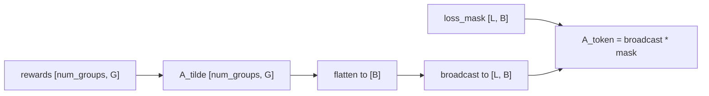

- 同一条回答的所有 response token **共享同一个** \($\tilde{A}_{i,j}$\)；
- prompt / padding 位置 mask 为 0，不参与后续 loss；
- `postprocess` 再转回 `[B, L]`。

**二次归一化**：`normalize_advantages: True` 时，在整个 global batch 的有效 token 上做 `masked_normalization`，进一步稳定尺度。

**组全对或全错时**：\($\sigma_i\approx 0$\)，\($\tilde{A}\approx 0$\)，该组几乎不产生有效梯度——这是 GRPO 对「无区分度组」的自然保护，也是 `group_size` 与采样温度需要调好的原因。

### 7.4 Policy Loss：GRPO = PPO Actor Clip

注册：

```434:461:rlinf/algorithms/losses.py
@register_policy_loss("actor")
def compute_grpo_actor_loss_fn(**kwargs):
    actor_loss, actor_metrics_data = compute_ppo_actor_loss(**kwargs)
    return actor_loss, actor_metrics_data
```

核心数学（token 级）：

\[
$r_t(\theta)=\exp\big(\log\pi_\theta(a_t|s_t)-\log\pi_{\theta_{\mathrm{old}}}(a_t|s_t)\big)$
\]

\[
$L_t^{\mathrm{CLIP}}=\max\big(
  -A_t\, r_t(\theta),\;
  -A_t\, \mathrm{clip}(r_t(\theta),\,1-\varepsilon_L,\,1+\varepsilon_H)
\big)$
\]

可选 dual clip（`clip_ratio_c`）：

\[
$L_t=\min\big(L_t^{\mathrm{CLIP}},\; \mathrm{sign}(A_t)\,c\,A_t\big)
\quad (c>1)$
\]

主配置 `clip_ratio_c: null`，故 **不做** dual clip；`clip_ratio_low/high: null` 时回退到 `ratio_clip_eps: 0.2`。

代码对应：

```241:269:rlinf/algorithms/losses.py
log_ratio = logprobs - old_logprobs
ratio = torch.where(loss_mask, torch.exp(log_ratio), 0)
clipped_ratio = torch.clamp(ratio, 1.0 - clip_ratio_low, 1.0 + clip_ratio_high)
policy_loss1 = -advantages * ratio
policy_loss2 = -advantages * clipped_ratio
policy_loss = torch.max(policy_loss1, policy_loss2)
...
policy_loss = loss_agg_func(policy_loss, loss_mask, loss_mask_ratio)
```

注意实现里用的是 `max(-A r, -A clip(r))`，等价于常见写法 \(-\min(A r, A \mathrm{clip}(r))\)。

### 7.5 `token-mean` 聚合

[`masked_mean`](../../rlinf/utils/utils.py)：

\[
L = \frac{\sum_{t} M_t L_t}{\sum_{t} M_t}
\]

对比：

| `loss_agg_func` | 行为 | 倾向 |
|-----------------|------|------|
| `token-mean` | 所有有效 token 等权平均 | 长回答权重大（主配置） |
| `seq-mean-token-mean` | 先每序列 token 均值，再对序列平均 | 每条回答等权 |
| `seq-mean-token-sum` | 先 token 求和再序列平均 | 更偏向长回答绝对值 |

VQA 生成长度波动大时，`token-mean` vs `seq-mean-token-mean` 会显著改变优化偏好。

### 7.6 `training_step` 中的完整 loss

```752:787:rlinf/workers/actor/fsdp_actor_worker.py
logprobs, entropy = self.forward_batch(m_batch, True)
...
loss, mbs_metrics_data = policy_loss(
    task_type=self.task_type,
    loss_type=self.cfg.algorithm.loss_type,  # actor
    loss_agg_func=self.loss_agg_func,
    logprobs=logprobs,
    old_logprobs=prev_logprobs,
    advantages=advantages,
    clip_ratio_c=...,
    clip_ratio_low=...,
    clip_ratio_high=...,
    loss_mask=loss_mask,
    fast_path_zero_loss_mask=True,
)
# 可选：
# loss = loss - entropy_bonus * H
# loss = loss + kl_beta * KL(ref || pi)
loss = loss / self.gradient_accumulation
with backward_ctx:
    self.grad_scaler.scale(loss).backward()
```

主配置下 entropy / KL 项为 0，**最终标量 loss 就是 clipped PG 的 token-mean**。

`fast_path_zero_loss_mask=True`：若整段 `loss_mask` 全 0，直接返回 0 loss，避免空 mask 数值问题。

### 7.7 一张图串起 Advantage → Loss

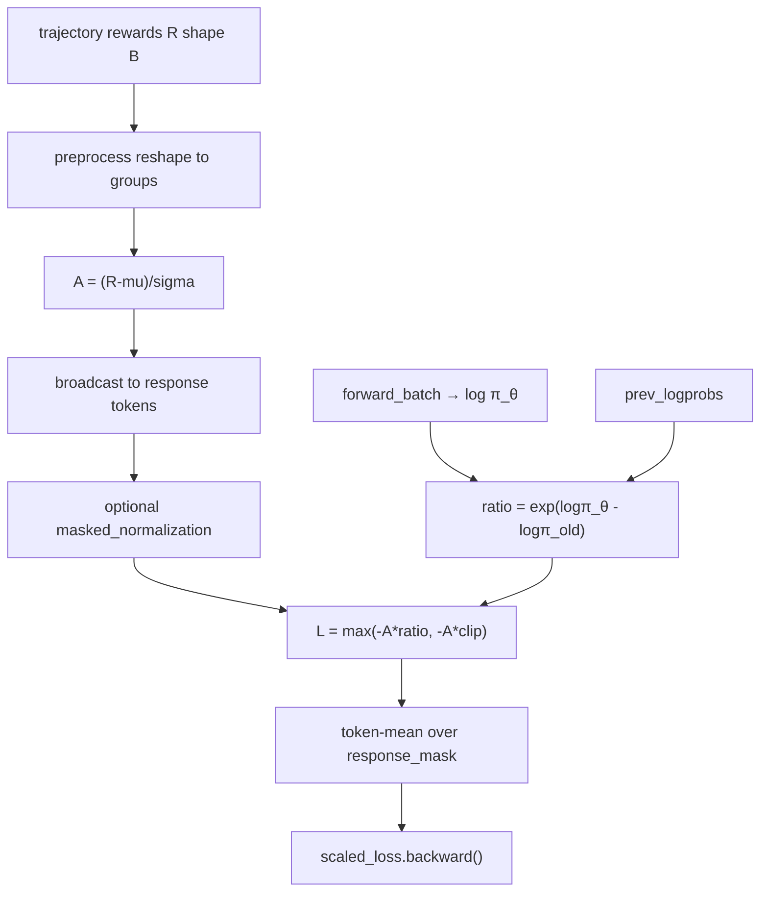

---

## 8. Backward、Optimizer 与权重同步

### 8.1 梯度累积与 FSDP sync 边界

每个 minibatch 的 `training_step`：

1. `optimizer.zero_grad()`；
2. 按 micro-batch 循环：
   - `before_micro_batch(..., is_last_micro_batch=...)`：非最后一个 micro-batch 进入 `model.no_sync()`（FSDP1）或关闭 `requires_gradient_sync`（FSDP2），**只累加本地梯度、不做 all-reduce**；
   - 最后一个 micro-batch 打开同步，完成跨 rank 梯度归约；
3. `loss /= gradient_accumulation` 后再 `backward()`，保证有效梯度尺度正确。

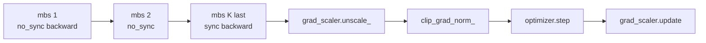

### 8.2 `optimizer_step`

[`FSDPModelManager.optimizer_step`](../../rlinf/hybrid_engines/fsdp/fsdp_model_manager.py)：

1. `grad_scaler.unscale_(optimizer)`；
2. `clip_grad_norm_`（配置 `optim.clip_grad: 0.8`）；
3. 若 grad norm 非有限 → **跳过** step（防 NaN 污染）；
4. 否则 `grad_scaler.step(optimizer)` + `update()`；
5. 返回 `(grad_norm, lr_list)`。

主配置：`bf16` + `grad_scaler.enabled: False`（FSDP mixed_precision 管精度），Adam（`lr=2e-5`, `β2=0.95`, `weight_decay=0.05`）。

### 8.3 Minibatch / Epoch 结构

`run_training`（非 pipeline）：

1. 收齐 `total_batch_size_per_dp` 条序列；
2. 算 advantages（+ 可选全局 normalize）；
3. `_load_weight_and_optimizer()`（配合 offload）；
4. `get_iterator_k_split(..., n_minibatches=4)` 切 4 个 minibatch；
5. 每个 minibatch 调一次 `training_step`；
6. 视配置决定是否在所有 minibatch 后 `lr_scheduler.step()`。

这对应经典 on-policy：**同一批 rollout 数据上做 `n_minibatches` 次更新**（类似 PPO epoch 切分，但这里是 split 而非多重 epoch 循环；配置名是 `n_minibatches`）。

### 8.4 反向时的梯度流（概念）

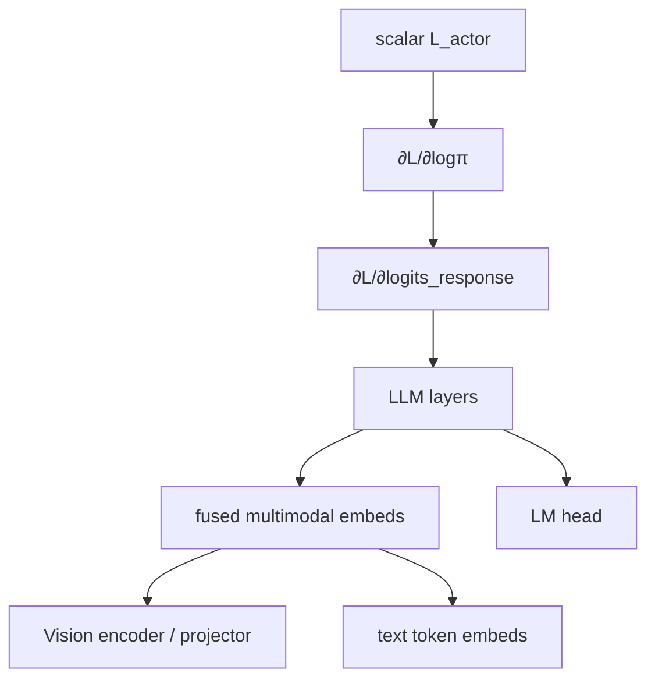

- **有梯度**：默认全模型参数（非 LoRA）；
- **无直接 loss 监督**：prompt token 的 CE 不进入 PG，但 attention 仍把图像/prompt 信息传到 response，故视觉塔通过「影响 response logits」间接更新；
- **被 mask 掉的 padding token**：`loss_mask=0`，对应位置对 \(L\) 无贡献。

### 8.5 权重同步：训练闭环的最后一环

每步开始前：

```418:429:rlinf/runners/reasoning_runner.py
def _sync_weights(self):
    ...
    self.actor.sync_model_to_rollout()
    self.rollout.sync_model_from_actor().wait()
    self.actor.del_reshard_state_dict().wait()
```

保证下一步 rollout 使用 **刚更新的 \(\theta\)**。同置（collocated）模式下仍通过显式 sync / reshard 管理显存，而不是假设「同一进程自然共享」。

---

## 9. 深入：VLM 上的 Loss 与 Gradient 如何分配

本章用一个贯穿始终的玩具例子，回答读者最常问的问题：

> **用 GRPO 训练 QwenVL 时，reward 变大/变小、变正/变负，最终落到 VLM（含视觉塔）上的 advantage、loss、gradient 会怎样变？**

核心结论先说在前面：

1. **Reward 不直接进 loss**。它先经 GRPO 变成组相对优势 \(A\)，再与重要性比率 \(r\) 相乘。
2. **只有 response token** 的 \(\log\pi_\theta\) 直接进入 PG；图像 / prompt token **没有直接 CE**，但通过 attention 间接收到梯度。
3. GRPO 的 \(A\) 对 **平移与正缩放近似不变**（相对量），但对 **组内区分度** 和 **全同奖励** 极度敏感。

配图脚本与 PNG 见 [`b/d/ov/asset/`](asset/)（`plot_vlm_grpo_loss_grad.py`）。

### 9.1 玩具场景：同一道 VQA，采 4 条回答

设 `group_size = 4`，同一图像+问题下采样 4 条回答，主配置式稀疏奖励 \($R\in\{0,1\}$\)：

\[
$R = [1,\ 0,\ 1,\ 0]$
\]

按 RLinf 实现（[`compute_grpo_advantages`](../../rlinf/algorithms/advantages.py)，`torch.std` 无偏估计）：

\[
$\mu=0.5,\quad \sigma\approx 0.577,\quad
A = \frac{R-\mu}{\sigma+10^{-6}} \approx [+0.866,\ -0.866,\ +0.866,\ -0.866].$
\]

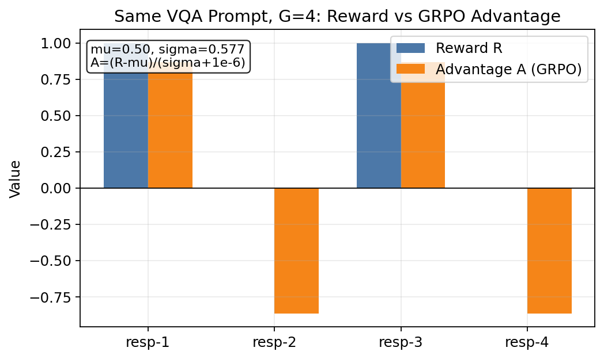

**读图要点**：

- 答对的两条（resp-1/3）拿 **正 \(A\)** → 策略要提高它们的概率（鼓励）；
- 答错的两条（resp-2/4）拿 **负 \(A\)** → 策略要降低它们的概率（抑制）；
- 同一条回答的所有 response token **共享同一个 \(A\)**（广播后乘 `response_mask`）。

### 9.2 Loss 如何落到 VLM 输出

完整链路（与 §6–§8 对应，这里用「分配视角」重述）：

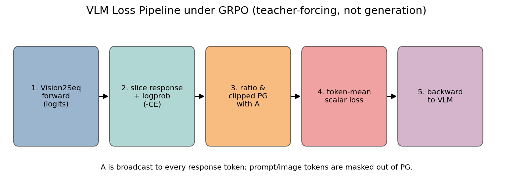

| 步骤 | 代码 | 张量角色 |
|------|------|----------|
| 1. Vision2Seq 前向 | `FSDPActor.forward_batch` → `self.model(..., **multi_modal_inputs)` | `logits [B, L, V]` |
| 2. 切 response + logprob | `logits[:, -resp_len-1:-1]`；`compute_logprobs_from_logits` = `-CE` | \($\log\pi_\theta$\) `[B, resp_len]` |
| 3. clipped PG | `compute_ppo_actor_loss`：\($L_t=\max(-A r, -A\,\mathrm{clip}(r))$\) | token 级 loss |
| 4. 聚合 | `token-mean` = `masked_mean` | 标量 \(L\) |
| 5. 反传 | `grad_scaler.scale(loss).backward()` | 梯度进整棵可训 VLM |

**谁直接吃 loss？**

- `response_mask=True` 的 token：直接进入 \(L_t\)；
- prompt / padding / 图像占位 token：`mask=0`，对标量 \(L\) **无直接贡献**。

**谁间接吃梯度？**

- Vision encoder / projector、prompt embedding：它们改变融合序列表示 → 改变 response logits → 间接进入 \($\partial L/\partial\theta$\)。主配置 `is_lora: False`，这些模块默认可训。

再看 token loss 与 \(A\) 的符号关系（固定 on-policy \($r\approx 1$\) 时 \($L_t\approx -A$\)）：

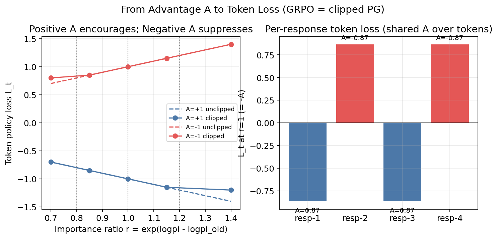

- 左图：\(A>0\) 时，提高概率（\(r\) 上升）会 **降低** loss（鼓励）；\(A<0\) 时相反（抑制）。clip 在 \(r\notin[1-\varepsilon,1+\varepsilon]\) 时截断斜率。
- 右图：对玩具组 \(R=[1,0,1,0]\)，在 \(r=1\) 时每条回答的 \(L_t=-A\)：赢家 loss 为负贡献（优化方向是再抬高其 \(\log\pi\)），输家为正贡献。

### 9.3 Reward 变大 / 变小 / 变正 / 变负时，\(A\) 与 loss 怎么变

下表与热力图用 **同一组大小 \(G=4\)**、同一公式 \(A=(R-\mu)/(\sigma+\epsilon)\) 对照。关键洞察：**绝对 reward 的正负与大小，远不如「相对组均值」重要。**

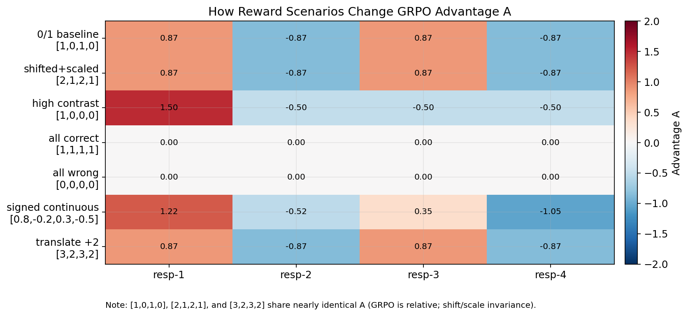

| 场景 | \(R\) | \(A\)（约） | 对 VLM loss / 梯度的含义 |
|------|-------|-------------|--------------------------|
| 稀疏 0/1 基线 | `[1,0,1,0]` | `[+0.87,-0.87,+0.87,-0.87]` | 对称鼓励/抑制 |
| 整体变大但相对不变 | `[2,1,2,1]` | **与基线几乎相同** | 放大 reward 不放大 GRPO 梯度 |
| 平移 \(+2\) | `[3,2,3,2]` | **仍与基线相同** | 加常数不变 \(A\) |
| 区分度变大 | `[1,0,0,0]` | `[+1.50,-0.50,-0.50,-0.50]` | 唯一赢家被更强鼓励；三个输家各分摊抑制 |
| 组内全对 | `[1,1,1,1]` | `[0,0,0,0]` | **几乎无梯度**（组坍缩） |
| 组内全错 | `[0,0,0,0]` | `[0,0,0,0]` | 同上 |
| 连续可正可负 | `[0.8,-0.2,0.3,-0.5]` | `[+1.22,-0.52,+0.35,-1.05]` | 绝对负分不等于负 \(A\)：相对 \(\mu=0.1\) 才决定符号 |

**三个读者最容易误解的点：**

1. **「reward 变大 → 梯度一定变大」？** 否。若组内相对结构不变（平移或同号缩放），\(\mu,\sigma\) 同步变，\(A\) 不变，token loss 幅度也不变。
2. **「负 reward → 一定抑制」？** 否。连续奖励下，只要高于组均值仍得 **正 \(A\)**（鼓励）。
3. **「全对很好」？** 对 GRPO 反而是灾难：\(\sigma\to 0\Rightarrow A\to 0\)，该组对 VLM **几乎不贡献更新**——这就是需要温度与 `group_size` 保多样性的原因。

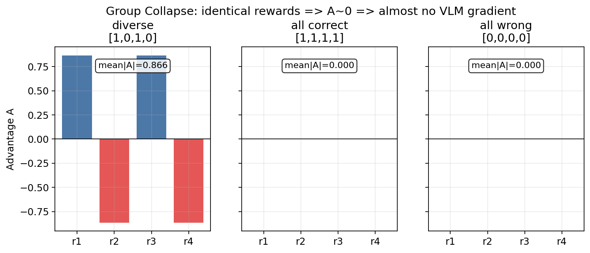

**从 \(A\) 到 loss 的定量直觉（\(r=1\)，未二次 normalize）**：

\[
L_t \approx -A,\qquad
L_{\text{seq}} \approx \frac{1}{N_{\text{valid}}}\sum_{t\in\text{response}} (-A) = -A
\]

（同一回答内 \(A\) 常数，token-mean 后仍是 \(-A\)）。因此：

- \(A\) 从 \(+0.87\) 变到 \(+1.50\)（区分度变大）→ 该赢家对总 loss 的「鼓励强度」约增 \(1.50/0.87\approx 1.7\times\)；
- \(A\) 从 \(\pm 0.87\) 塌到 \(0\)（全同）→ 该组对优化器的贡献 ≈ 0。

若打开 `normalize_advantages: True`（主配置），还会在 **整个 global batch 的有效 token** 上再做一次 masked 标准化：改变全局梯度尺度，但 **不改变同一组内谁相对更好**。

### 9.4 梯度如何「分摊」到 VLM 各模块

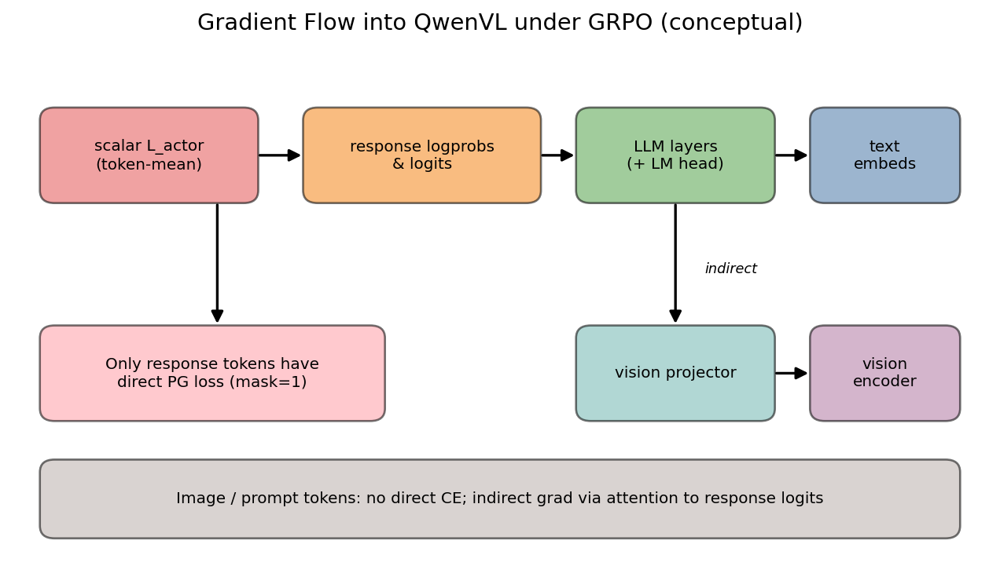

用更小的例子说明 **token-mean 权重**（非实测 per-layer 数值，而是代码语义）：

- 一条回答有 \(N=3\) 个有效 response token，共享 \(A=+0.866\)，且 \(r_t=1\)；
- 每个 token 的 \(L_t=-0.866\)；
- `masked_mean` 后 \(L=(-0.866\times 3)/3=-0.866\)；
- 反传时，每个有效 token 对标量 \(L\) 的局部权重是 \(1/3\)（再经 FSDP / grad_accum 缩放）。

模块角色：

| 模块 | 是否直接出现在 \(L_t\) | 如何接到梯度 |
|------|------------------------|--------------|
| LM head / 末层 LLM | 是（response logits） | \(\partial L/\partial\text{logits}\) 直接 |
| 中间 LLM 层 | 否 | 因果 attention 回传 |
| Vision encoder / projector | 否 | 图像 token → 融合序列 → response logits（间接） |
| Prompt token embedding | 否 | 同上（间接） |

因此日常说的「分摊到 VLM」有两层含义：

1. **算法层分摊**：GRPO 把轨迹标量 \(R\) 变成 token 共享的 \(A\)，再经 `token-mean` 均摊到有效 token；
2. **计算图层分摊**：`backward` 按计算图把 \(\partial L\) 传到所有 `requires_grad=True` 的参数——主配置下含视觉塔，但视觉塔 **从不直接看见 CE label**。

### 9.5 与 clip / normalize 的交互（简短）

- **`ratio_clip_eps=0.2`**：当 \(|A|\) 很大且 \(r\) 远离 1 时，clip 把 \(\partial L/\partial\log\pi\) 截断在信任域边界（见上图左：clipped vs unclipped 斜率）。这限制单步对 VLM 的冲击，也限制「极端高/低 reward 样本」的杠杆。
- **`normalize_advantages=True`**：在 batch 级重新缩放 \(A\)。组内相对排序不变，但「区分度很大的一组」不会单独主导全局梯度范数。
- **主配置 `kl_beta=0`、`entropy_bonus=0`**：标量 loss **就是** clipped PG 的 token-mean；没有额外项稀释或放大对 VLM 的梯度。

---

## 10. 消融与工程要点

以下结合 RLinf 配置语义与 GRPO/VLM 实践经验，标出「通常更关键」的旋钮。

### 10.1 相对更关键（优先调）

| 旋钮 | 主配置 | 为何重要 |
|------|--------|----------|
| `group_size` | 8 | 组内方差估计质量；过小 → 优势噪声大 / 易全 0；过大 → 吞吐掉 |
| 采样温度 | 1.0 | 影响组内多样性；与 training `logits/=T` 必须一致 |
| `loss_agg_func` | token-mean | 长短回答的相对权重 |
| `normalize_advantages` | True | 跨 batch 尺度稳定 |
| `ratio_clip_eps` | 0.2 | 信任域宽度；过大易 off-policy 崩 |

### 10.2 中等重要

| 旋钮 | 主配置 | 说明 |
|------|--------|------|
| `recompute_logprobs` | False | True 更严 on-policy，多一次前向；引擎 logprob 与训练实现需对齐 |
| `n_minibatches` | 4 | 同批数据复用次数；过大易过拟合单批 |
| `kl_beta` | 0 | 打开可抑制偏离 SFT 先验，但需参考策略 |
| VQA 格式奖励权重 | 0 | 早期可略加 `think_format`/`answer_format` 改善可解析率 |

### 10.3 相对次要 / 视硬件

| 旋钮 | 说明 |
|------|------|
| `use_liger_kernel` | 加速与显存，不改算法语义（注意 fused CE 路径） |
| FSDP `full_shard` / offload | 吞吐-显存权衡 |
| `entropy_bonus` | 主配置关闭；过强会伤准确率导向的 VQA |

### 10.4 与具身 GRPO 的关键差异（避免混读代码）

| | Reasoning QwenVL GRPO | Embodied GRPO |
|--|----------------------|---------------|
| Reward | 轨迹标量（VQA） | 逐步环境 reward，先 `calculate_scores` 求和 |
| Advantage 广播 | 到 token 序列 | 到 action chunk / action dim |
| Forward | HF Vision2Seq + CE logprob | VLA `predict_action_batch` / 自定义 logprob |
| Runner | `ReasoningRunner` | `EmbodiedRunner` 等 |

### 10.5 Megatron / Qwen3-VL 差异（补充，非主线）

- **Megatron Actor**：同类 GRPO 数学，但 forward 走 Megatron-Bridge / mcore，position 对 Qwen3-VL 有专用 `get_rope_index` 补丁。
- **Qwen3-VL**：`SupportedModel` 另有 `qwen3_vl` / MoE 注册；SFT 示例更多，reasoning VQA 官方示例仍以 **Qwen2.5-VL-3B + FSDP** 最清晰。
- **e2e**：`tests/e2e_tests/reasoning/qwen2.5-vl-3b-grpo-collocated-fsdp-{vllm,sgl}.yaml` 覆盖双后端。

---

## 11. 关键文件索引

| 主题 | 路径 | 关键符号 |
|------|------|----------|
| 主配置 | `examples/reasoning/config/vqa/qwen2.5-vl-3b-grpo-fsdp.yaml` | `adv_type/loss_type/group_size` |
| 入口 | `examples/reasoning/main_grpo.py` | `main` |
| Runner | `rlinf/runners/reasoning_runner.py` | `run`, `_put_batch`, `_sync_weights` |
| VLM 数据 | `rlinf/data/datasets/vlm.py` | `Robo2VLMDataset`, `encode_prompt` |
| Batch IO | `rlinf/data/io_struct.py` | `RolloutResult.to_actor_batch` |
| Reward | `rlinf/algorithms/rewards/vqa/` | `VQAReward`, `qa_accuracy_reward` |
| Advantage | `rlinf/algorithms/advantages.py` | `compute_grpo_advantages` |
| Adv 预处理 | `rlinf/algorithms/utils.py` | `preprocess_reasoning_advantages_inputs` |
| Loss | `rlinf/algorithms/losses.py` | `compute_grpo_actor_loss_fn`, `compute_ppo_actor_loss` |
| Loss（提案，未入库） | `rlinf/algorithms/losses.py` | `compute_reinforce_actor_loss_fn`（`loss_type: reinforce`） |
| Advantage（raw / reinpp） | `rlinf/algorithms/advantages.py` | `compute_raw_advantages`, `compute_reinpp_advantages` |
| reinpp 配置（仍用 clipped PG） | `examples/reasoning/config/vqa/qwen2.5-vl-3b-reinpp-fsdp.yaml` | `adv_type: reinpp`, `loss_type: actor` |
| Registry | `rlinf/algorithms/registry.py` | `calculate_adv_and_returns`, `policy_loss` |
| Actor | `rlinf/workers/actor/fsdp_actor_worker.py` | `forward_batch`, `training_step`, `run_training` |
| Logprob | `rlinf/utils/utils.py` | `compute_logprobs_from_logits`, `masked_mean` |
| 模型加载 | `rlinf/hybrid_engines/fsdp/fsdp_model_manager.py` | Vision2Seq, `optimizer_step` |
| 模型枚举 | `rlinf/config.py` | `SupportedModel.QWEN2_5_VL` |
| 本章配图脚本 | `b/d/ov/asset/plot_vlm_grpo_loss_grad.py` | 生成 reward→A→loss / grad-flow PNG |
| REINFORCE++ 官方文档 | `docs/source-zh/rst_source/tutorials/rlalg/reinforce.rst` | 文档写 \(\nabla\log\pi\,A\)；代码仍走 `loss_type: actor` |

---

## 12. 经典 REINFORCE 训 QwenVL：方案与最小改动

> **本章边界**：讨论如何用教科书式 \(L_t=-A_t\log\pi_\theta\) 训练 QwenVL-VQA。给出**可落地的最小代码改动方案与伪代码**，但**本章不修改仓库代码**；合入需另开实现 PR。现有 `adv_type: reinpp` + `loss_type: actor` **不是**经典 REINFORCE。

### 12.1 为什么现有路径不是经典 REINFORCE

教科书经典 REINFORCE（Williams, 1992）的策略梯度为：

\[
$\nabla_\theta J(\theta)
\;\propto\;
\mathbb{E}_{a\sim\pi_\theta}
\big[
A\,\nabla_\theta\log\pi_\theta(a\mid s)
\big].$
\]

在自动微分框架里，等价于对可微目标

\[
$L \;=\; -A\cdot\log\pi_\theta(a\mid s)
\quad\text{（}A\text{ 对 }\theta\text{ detach）}$
\]

做 `backward()`。token 级则写为：

\[
$L_t \;=\; -A_t\log\pi_\theta(a_t\mid s_t),\qquad
L \;=\; \mathrm{masked\_mean}_t(L_t).$
\]

RLinf 里与「REINFORCE」最接近的官方路径是 **REINFORCE++**（`docs/.../reinforce.rst`）：文档目标写成 \($\nabla\log\pi\,A^{\mathrm{norm}}$\)，并强调「避免策略裁剪」。但**本地实现**是：

| 配置项 | 现状（reinpp e2e / `qwen2.5-vl-3b-reinpp-fsdp.yaml`） |
|--------|------------------------------------------------------|
| `adv_type` | `reinpp` → [`compute_reinpp_advantages`](../../rlinf/algorithms/advantages.py) |
| `loss_type` | **`actor`** → [`compute_grpo_actor_loss_fn`](../../rlinf/algorithms/losses.py) → [`compute_ppo_actor_loss`](../../rlinf/algorithms/losses.py) |

Actor [`training_step`](../../rlinf/workers/actor/fsdp_actor_worker.py) 统一调用：

```python
loss, mbs_metrics_data = policy_loss(
    loss_type=self.cfg.algorithm.loss_type,  # 现为 "actor"
    logprobs=logprobs,                      # 当前 π_θ，带梯度
    old_logprobs=prev_logprobs,              # π_old
    advantages=advantages,
    clip_ratio_low=..., clip_ratio_high=...,
    loss_mask=loss_mask,
    ...
)
```

而 `compute_ppo_actor_loss` 的核心是 **importance ratio + clip**：

\[
$r_t=\exp\big(\log\pi_\theta-\log\pi_{\mathrm{old}}\big),\quad
L^{\mathrm{PPO}}_t=\max\big(-A_t r_t,\;-A_t\,\mathrm{clip}(r_t)\big).$
\]

因此：

- **换 `adv_type: reinpp` 只换了 \(A\) 怎么来**；
- **损失仍是 clipped IS 代理目标**，不是 \($L=-A\log\pi$\)；
- 官方文档「避免 clip」与仓库 `loss_type: actor` **不一致**——以本地代码为准。

另外必须强调：若误写成 \(L=-A\)（不乘 \(\log\pi\) 或 \(r\)），则 \(\partial L/\partial\theta=0\)，因为 \(A\) 来自 reward / advantage 估计，对 \(\theta\) 无计算图。梯度必须经 \(\log\pi_\theta\)（经典）或经 \(r(\theta)\)（PPO/GRPO）流入 logits。

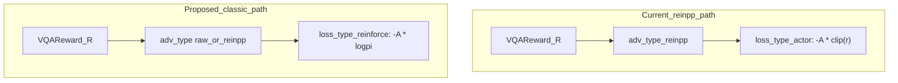

### 12.2 经典目标与梯度（QwenVL 上不变的部分）

对 VQA 轨迹，奖励通常是**终局标量** \(R\)（如 `qa_accuracy`∈{0,1} 或连续打分）。经典做法把 \(A\)（或 \(R\) 本身、或 \($R-\mathrm{baseline}$\)）广播到 response token，再对每 token：

\[
$L_t=-A_t\log\pi_\theta(a_t\mid q,o_{<t},\;\text{image}).$
\]

**Forward 不必改**：仍是 §6 所述 Vision2Seq **teacher-forcing**——`FSDPActor.forward_batch` → logits → `compute_logprobs_from_logits` 得到带梯度的 `logprobs`。图像经 vision tower 进入同一计算图；`response_mask` 决定哪些 token 参与 `masked_mean`。

**Backward 也不必改编排**：`loss.backward()` → FSDP `optimizer_step` → 权重同步到 rollout 引擎。变的是 **标量 \(L\) 的定义**。

与 PPO-clip 的关系（便于消融直觉）：

| 代理目标 | 对 \(\theta\) 的依赖 | 多 epoch / off-policy |
|----------|----------------------|------------------------|
| \(-A\log\pi_\theta\) | 直接经当前 logprob | **无** IS 校正；应接近严格 on-policy（`n_minibatches: 1`） |
| \(-A\,r_\theta\)（可 clip） | 经 ratio；\(r=1\) 时局部等价于强化 \(\log\pi\) 方向 | clip 限制一步更新幅度 |

当 \(r\approx 1\)（刚采样完、单次更新）时，两者局部行为接近；反复用同一批数据更新时，经典形式更易偏，PPO-clip 更稳——这也是仓库默认走 `actor` 的工程原因。

### 12.3 最小代码改动方案（伪代码；本章不落地）

#### 唯一必要改动：注册 `loss_type: reinforce`

在 [`rlinf/algorithms/losses.py`](../../rlinf/algorithms/losses.py) 增加（示意）：

```python
@register_policy_loss("reinforce")
def compute_reinforce_actor_loss_fn(**kwargs) -> tuple[torch.Tensor, dict]:
    """Classic REINFORCE: L = -mean(A * log π_θ). Ignores old_logprobs / clip."""
    logprobs = kwargs["logprobs"]  # float32, requires_grad
    advantages = kwargs["advantages"].detach()
    loss_mask = kwargs.get("loss_mask")
    loss_agg_func = kwargs.get("loss_agg_func", masked_mean)

    assert logprobs.dtype == torch.float32
    assert advantages.dtype == torch.float32
    if loss_mask is None:
        loss_mask = torch.ones_like(logprobs).bool()

    pg = -advantages * logprobs
    loss = loss_agg_func(pg, loss_mask)
    metrics = {
        "actor/policy_loss": loss.detach(),
        # ratio metrics intentionally absent / NaN-safe zeros if dashboards expect keys
    }
    return loss, metrics
```

[`policy_loss`](../../rlinf/algorithms/registry.py) 已按 `loss_type` 查表分发；**Actor / Runner / `forward_batch` 零改动**——只要 yaml 写 `loss_type: reinforce`，`training_step` 仍会传入 `old_logprobs` 与 clip 参数，但新 loss **忽略**它们即可。

#### 可选校验

在 [`rlinf/config.py`](../../rlinf/config.py) 的 `validate_reasoning_cfg`（或 `validate_cfg`）中：当 `loss_type == "reinforce"` 时 **建议断言** `n_minibatches == 1`（无 ratio 时多 minibatch 更易 off-policy 偏置）。可同时 `log_warning`：`old_logprobs` 对 loss 无影响。

#### 优势怎么选（推荐默认）

| 选择 | 配置 | 含义 | 何时用 |
|------|------|------|--------|
| **推荐默认** | `adv_type: raw` + `normalize_advantages: true` | [`compute_raw_advantages`](../../rlinf/algorithms/advantages.py)：标量 \(R\) broadcast 到 response token，再可选全局均值/方差归一化 | 最贴近「终局回报当 \(A\)」的教科书设定 |
| 进阶 | `adv_type: reinpp`（可选 `use_reinpp_baseline: true` 且 `group_size>1`） | EOS 放 \(R\)、cumsum 回报、全局 normalize；可选从奖励扣 KL（`reinpp_kl_beta`） | 要 reinpp 式 \(A\)，但损失仍用经典 \(-A\log\pi\) |

二者都必须配 **`loss_type: reinforce`**；仅改 `adv_type` 而保留 `loss_type: actor` 仍是 clipped PG。

#### 推荐 yaml 片段（示例；不在本章新建文件）

在现有 VQA GRPO / reinpp 配置基础上改算法块即可；入口仍为 [`examples/reasoning/main_grpo.py`](../../examples/reasoning/main_grpo.py)：

```yaml
algorithm:
  group_size: 1                 # classic 单响应；baseline 可改 >1 + reinpp
  adv_type: raw                 # 或 reinpp
  loss_type: reinforce          # 需先合入 §12.3 的注册函数
  loss_agg_func: "token-mean"
  n_minibatches: 1              # 严格 on-policy
  recompute_logprobs: true      # 对 classic loss 非数学必需，但兼容 Actor 管线
  normalize_advantages: true
  kl_beta: 0.0                  # loss 侧额外 KL；经典式可关
  entropy_bonus: 0.0
  # clip_* 对 reinforce loss 无效，可保留默认以免改动其它分支
critic:
  use_critic_model: false

# data / rollout / actor / reward 与 GRPO VQA 相同：
# data.type: vision_language, model_type: qwen2.5_vl, reward_type: vqa
```

启动（合入代码后）：

```bash
python examples/reasoning/main_grpo.py \
  --config-path examples/reasoning/config/vqa \
  --config-name <your-classic-reinforce-config>
```

**注意**：在注册 `reinforce` 之前，Hydra/`get_policy_loss` 会因未注册名直接报错——这是预期行为。

### 12.4 动态数据流（提案路径）

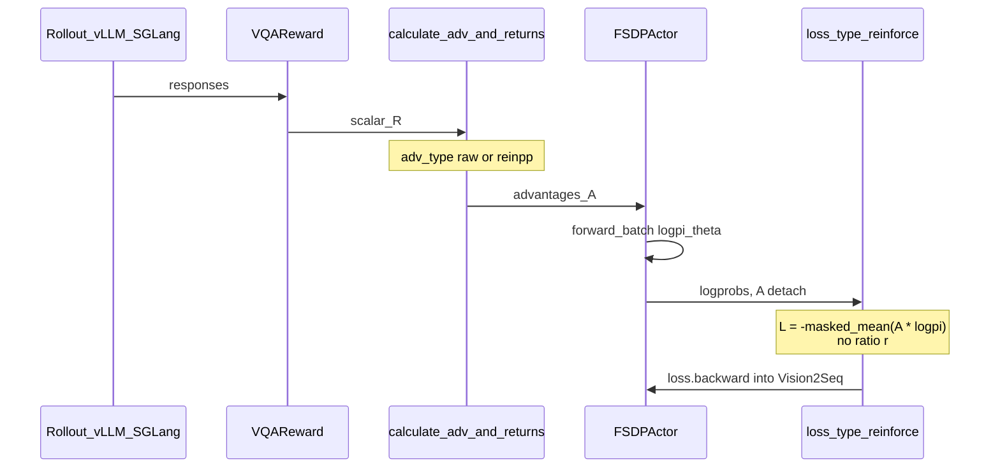

与 GRPO 路径对比：Rollout / Reward / Vision2Seq forward **完全相同**；分叉仅在 **\(A\) 的估计器** 与 **\(L\) 是否乘 \(r\)**。

### 12.5 对照表：GRPO / reinpp+actor / classic reinforce

| | GRPO（本文主线） | reinpp + `actor`（仓库现状） | classic `reinforce`（本章提案） |
|--|------------------|------------------------------|--------------------------------|
| Advantage | 组内 \((R-\mu)/\sigma\) | reinpp：EOS+\(R\)、cumsum、全局 norm；可选扣 KL / 组均值 | **`raw`（推荐）** 或 reinpp |
| 典型 `group_size` | \(>1\) | 文档默认 1；baseline 模式 \(>1\) | 1（或 baseline 时 \(>1\)） |
| Loss | \(-A\,\mathrm{clip}(r)\) | **同左** | \(\boldsymbol{-A\log\pi_\theta}\) |
| 需要 `old_logprobs` | 是（算 \(r\)） | 是 | **否**（可仍计算，loss 忽略） |
| 多 minibatch | clip 抑制偏离 | 同左 | 应 **`n_minibatches: 1`** |
| Critic | 否 | 否 | 否 |
| Forward（QwenVL） | Vision2Seq TF | 同左 | **同左，零改动** |
| 代码是否已入库 | 是 | 是（仅 adv） | **否**（仅文档方案） |

### 12.6 实践注意（QwenVL-VQA）

1. **连续 / 稀疏 reward 均可**：`raw` / `reinpp` 不要求 \(R\in\{0,1\}\)。
2. **方差**：`normalize_advantages: true` 是最低成本稳定手段；仍不稳时用 `adv_type: reinpp` + `use_reinpp_baseline: true` + `group_size>=4`，或退回 GRPO。
3. **`recompute_logprobs`**：经典 \(L=-A\log\pi\) **数学上不需要** \(\pi_{\mathrm{old}}\)；但 `validate_reasoning_cfg` 要求 `recompute_logprobs` 与 `return_logprobs` **至少其一为真**（Actor 管线仍可能写 `prev_logprobs`）。推荐保持 `recompute_logprobs: true`，`return_logprobs` 由 `${not:...}` 关掉，避免与 importance-sampling 双路径冲突。
4. **`importance_sampling_fix`**：经典 loss 不依赖 ratio；开启时 Actor 会用 recompute/rollout logprob 比缩放 \(A\)，那是另一套校正，与教科书 REINFORCE 不同，默认关闭。
5. **视觉塔**：与 GRPO 主配置一致，默认全参更新；若要稳可另加 freeze（现配置未冻）。
6. **与已有 reinpp yaml 的关系**：[`qwen2.5-vl-3b-reinpp-fsdp.yaml`](../../examples/reasoning/config/vqa/qwen2.5-vl-3b-reinpp-fsdp.yaml) 是「REINFORCE++ **优势** + PPO-clip **损失**」；要经典 \(L=-A\log\pi\) 必须先合入 `loss_type: reinforce`，再改 yaml。

### 12.7 小结

要用**真正的**经典 REINFORCE 训 QwenVL，在 RLinf 中的最短路径是：

1. 新增 `@register_policy_loss("reinforce")`，实现 \(L=-\mathrm{masked\_mean}(A\cdot\log\pi_\theta)\)；
2. yaml：`loss_type: reinforce` + `adv_type: raw`（或 `reinpp`）+ `n_minibatches: 1`；
3. 数据 / Rollout / Vision2Seq forward / Runner **不动**。

在合入之前，仓库能跑的「REINFORCE 族」只有 **reinpp 优势 + clipped actor loss**；请勿把文档中的 \(\nabla\log\pi\,A\) 与当前 `loss_type: actor` 混为一谈。

---

## 结语

RLinf 中用 GRPO 训练 QwenVL，并不是另起一套「VLM 专用 RL 算法」，而是：

1. 用 **推理 RL 编排**（Rollout × Reward × Actor，无 Critic）承载多模态数据；
2. 用 **Vision2Seq teacher-forcing forward** 把图像与文本统一进可反传的计算图；
3. 用 **组相对优势 + PPO-clip actor loss** 在稀疏 VQA 奖励上做稳定的 on-policy 更新。

若需要教科书式 \(L=-A\log\pi_\theta\)，见 **§12**：最小改动是注册 `loss_type: reinforce`（**方案尚未合入代码**）；现成的 `adv_type: reinpp` 只换了优势，损失仍是 clipped \(r\)。

若只记住一条（GRPO 主线）数据路径：

\[
\text{Image+Prompt}
\xrightarrow{\text{vLLM/SGLang}\times G}
\text{Responses}
\xrightarrow{\text{VQAReward}}
R
\xrightarrow{\text{GRPO}}
A
\xrightarrow{\text{Vision2Seq forward}}
\log\pi_\theta
\xrightarrow{\text{clipped PG}}
\nabla_\theta
\xrightarrow{\text{sync}}
\text{next rollout}
\]

代码真源以上表所列文件为准；本文公式均按本地实现书写，若与外部博客/论文表述冲突，**以本仓库行为为准**。
