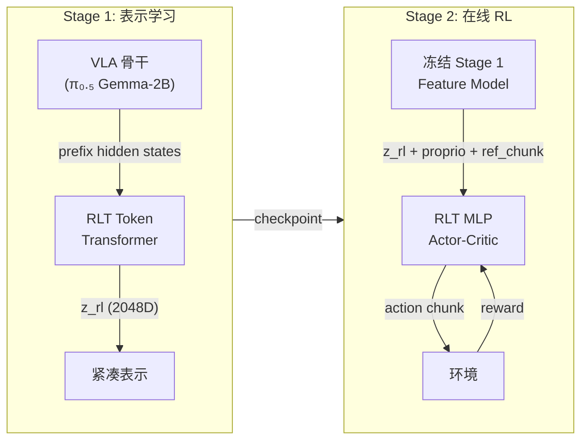
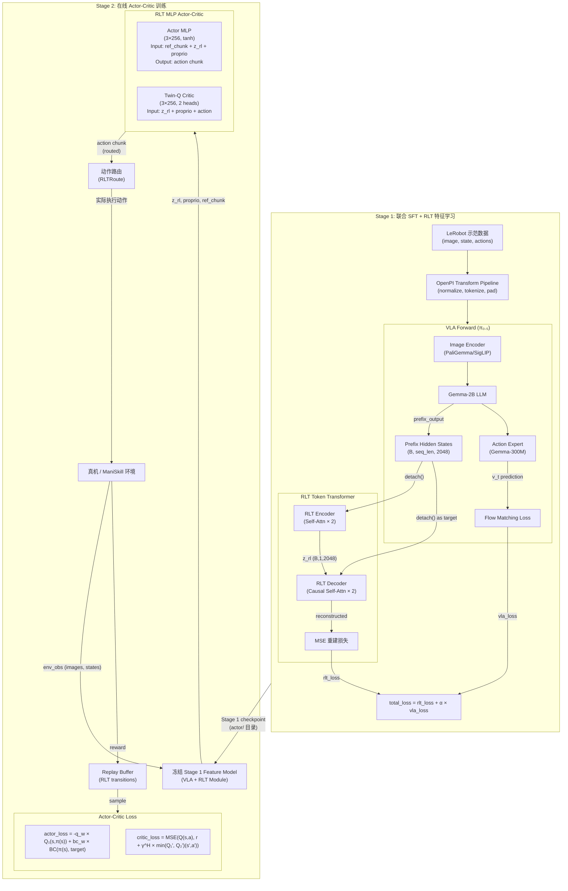
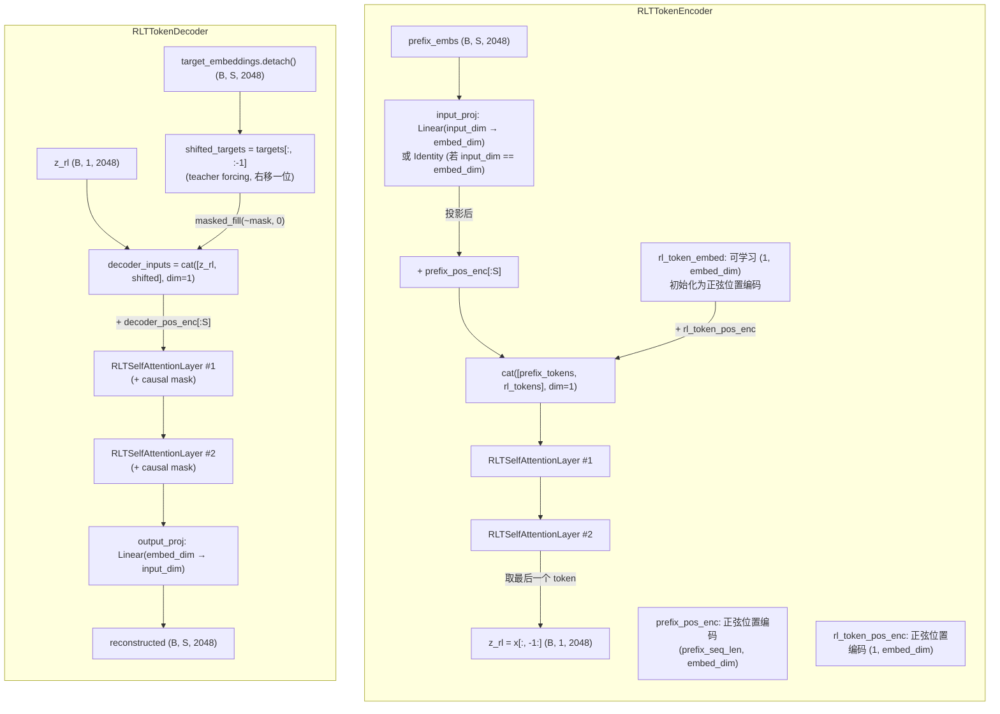
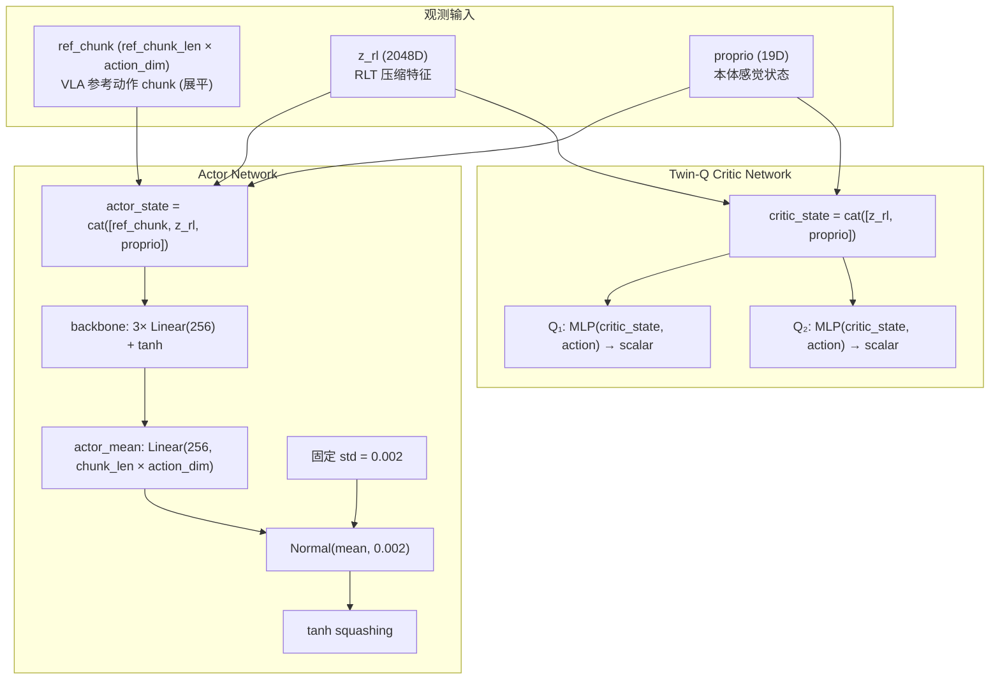
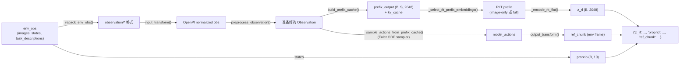
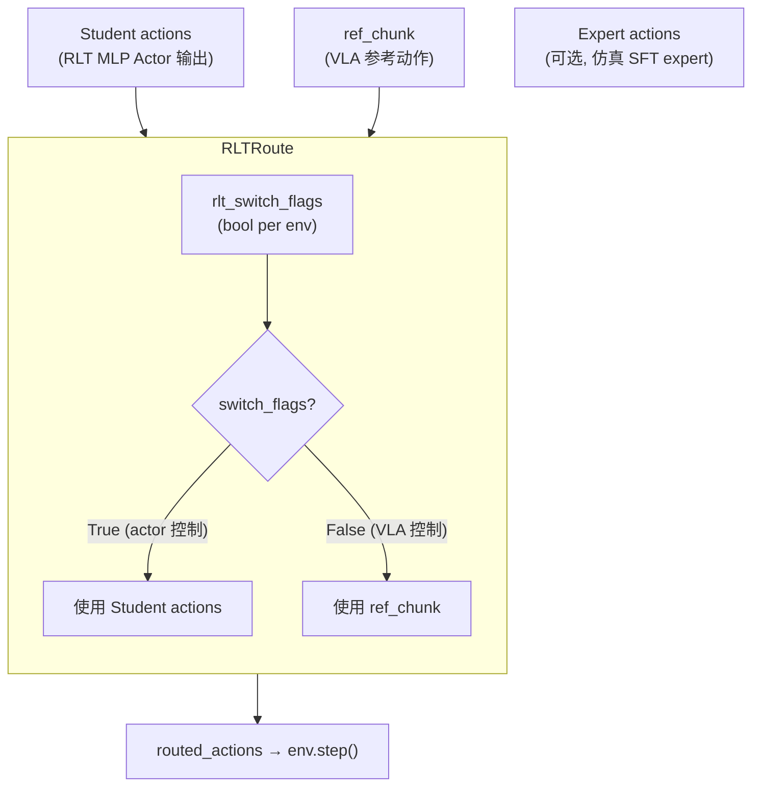
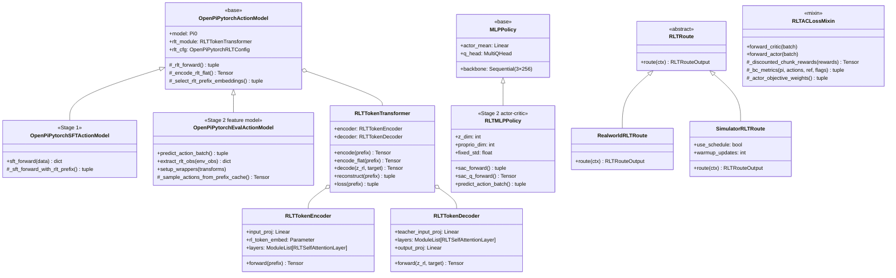
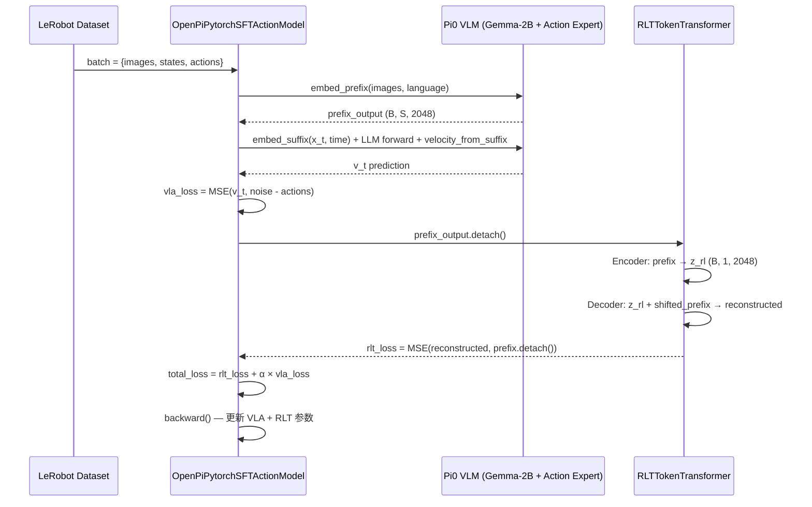
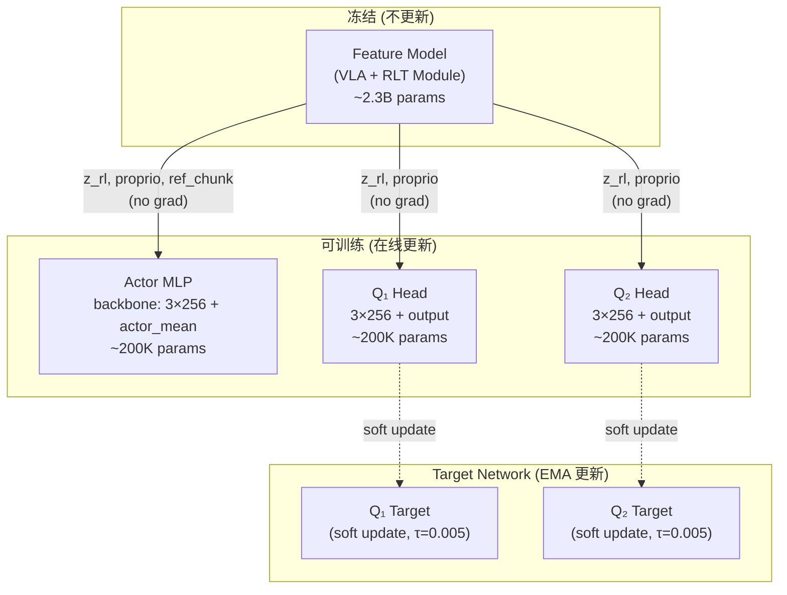

# RLT (RL Token) 算法在 RLinf 中的设计与实现深度分析

> **分析对象**: RLinf 代码库 (`/home/nvidia/bt/s/RLinf/`) 中的 RLT 算法实现
>
> **参考来源**:
> - 官方文档: [RLinf RLT 文档](https://rlinf.readthedocs.io/en/latest/rst_source/examples/embodied/rlt.html) / 本地 `docs/source-zh/rst_source/examples/embodied/rlt.rst`
> - 项目官网: [Pi RLT Research Page](https://www.pi.website/research/rlt) (Physical Intelligence, "Precise Manipulation with Efficient Online RL")
> - 本地 RLinf 代码库实际代码 (以此为准)
>
> **日期**: 2026-09-11

---

## 目录

1. [RLT 算法概述](#1-rlt-算法概述)
2. [设计哲学与核心洞察](#2-设计哲学与核心洞察)
3. [两阶段训练架构全景](#3-两阶段训练架构全景)
4. [Stage 1: VLA SFT + RLT Token Transformer](#4-stage-1-vla-sft--rlt-token-transformer)
5. [Stage 2: 轻量级 Actor-Critic 策略](#5-stage-2-轻量级-actor-critic-策略)
6. [Rollout 数据流与动作路由](#6-rollout-数据流与动作路由)
7. [Replay Buffer 与 Transition 管理](#7-replay-buffer-与-transition-管理)
8. [训练调度与权重渐进](#8-训练调度与权重渐进)
9. [代码架构与文件结构](#9-代码架构与文件结构)
10. [关键数学公式推导](#10-关键数学公式推导)
11. [消融分析与设计选择](#11-消融分析与设计选择)
12. [与相关工作的对比](#12-与相关工作的对比)
13. [参考文献与出处](#13-参考文献与出处)

---

## 1. RLT 算法概述

### 1.1 问题定义

Vision-Language-Action (VLA) 模型 (如 π₀, π₀.₅) 通过大规模模仿学习获得了强大的通用操作能力, 但面临两个关键限制:

1. **精度瓶颈**: 纯 SFT 训练的 VLA 在需要亚毫米级精度的任务 (如 peg insertion) 上表现不足
2. **在线适应缺失**: SFT 训练完成后, 模型无法利用在线交互数据继续改进

RLT (RL Token) 的核心思路是: **不要丢弃 VLA 已学到的丰富视觉-语言表示, 而是在冻结的 VLA 特征之上, 训练一个轻量级的在线 RL 策略**.

### 1.2 两阶段流程总览



| 阶段 | 目标 | 训练方式 | 输出 |
|:---|:---|:---|:---|
| Stage 1 | 学习将 VLA 高维 prefix 压缩为紧凑 RL 表示 `z_rl` | SFT (离线示范) | VLA + RLT Token Transformer 权重 |
| Stage 2 | 利用 `z_rl` 训练精细操作的在线策略 | Off-policy AC (在线交互) | 轻量 MLP Actor + Critic |

---

## 2. 设计哲学与核心洞察

### 2.1 为什么不直接 fine-tune VLA?

直接用 RL fine-tune 整个 VLA (数十亿参数) 面临三个问题:

1. **样本效率极低**: RL 每步更新数十亿参数, 需要海量在线交互数据
2. **灾难性遗忘**: RL 训练可能破坏 VLA 已学到的通用视觉-语言对齐
3. **推理延迟**: 每步 action 都需要跑完整 VLA forward (对 30Hz 真机控制不友好)

### 2.2 RLT 的信息瓶颈设计

RLT 的核心洞察是: **VLA 的 prefix hidden states 已经包含了理解场景所需的全部信息, 只需要一个信息瓶颈将其压缩为 RL 友好的低维表示**.

```
VLA prefix (数百 token × 2048D)  →  RLT Token Transformer  →  z_rl (1 token × 2048D)
                                      ↑
                             信息瓶颈 (autoregressive reconstruction)
```

这个设计来自 Pi 团队的 "RL Token" 论文 ([Pi RLT 项目页](https://www.pi.website/research/rlt)), 其关键点在于:

- **Encoder**: 将长序列 prefix embeddings 压缩为单个 RL token (类似 [CLS] token 的 bottleneck 思想)
- **Decoder**: 自回归重建原始 prefix embeddings (确保压缩过程不丢失关键信息)
- **训练信号**: MSE 重建损失 (确保 `z_rl` 保留了足够信息来还原原始 prefix)

### 2.3 从 VLA 到 Actor-Critic 的桥梁

Stage 2 的轻量 MLP actor-critic 不在原始图像上工作, 而是在以下三维特征上工作:

$$\text{obs}_{\text{RL}} = [\underbrace{z_{\text{rl}}}_{\text{VLA 压缩特征 (2048D)}}, \underbrace{\text{proprio}}_{\text{本体感觉 (7-19D)}}, \underbrace{\text{ref\_chunk}}_{\text{VLA 参考动作 (chunk\_len × action\_dim)}}]$$

其中:
- $z_{\text{rl}}$: 来自冻结 Stage 1 模型的压缩视觉-语言表示
- $\text{proprio}$: 机器人本体感觉状态 (关节角, 末端位姿等)
- $\text{ref\_chunk}$: VLA 自身预测的参考动作 chunk (作为 baseline/prior)

> **关键设计**: `ref_chunk` 同时作为 actor 输入和 BC 正则化目标, 起到 "behavioral prior" 的作用 — actor 可以在 VLA 参考动作的基础上做小修正 (residual), 而不需要从头学习整个动作分布.

---

## 3. 两阶段训练架构全景



---

## 4. Stage 1: VLA SFT + RLT Token Transformer

### 4.1 RLT Token Transformer 架构

RLT Token Transformer 是整个算法的核心创新, 实现在 `rlinf/models/embodiment/modules/rlt_token_transformer.py`.



#### 4.1.1 Encoder: Prefix → Single RL Token

**代码位置**: `rlinf/models/embodiment/modules/rlt_token_transformer.py:107-187` (`RLTTokenEncoder`)

Encoder 的核心操作是将 VLA 的长序列 prefix embeddings (通常数百到上千个 token) 压缩为单个 `z_rl` token:

1. **投影**: `input_proj` 将 prefix embeddings 从 `input_dim` 投影到 `embed_dim` (默认两者都是 2048, 所以用 `Identity`)
2. **位置编码**: 给 prefix tokens 加上正弦位置编码, 给 RL token 加上独立的位置编码
3. **拼接**: 将 prefix tokens 和 RL token 沿序列维度拼接: `[prefix_1, prefix_2, ..., prefix_S, rl_token]`
4. **Self-Attention**: 通过 2 层 self-attention 处理, RL token 可以 attend 到所有 prefix tokens
5. **提取**: 取输出序列的最后一个 token 作为 `z_rl`

```python
# rlt_token_transformer.py L148-187 (简化)
def forward(self, prefix_embs, mask=None):
    prefix_embs = self.input_proj(prefix_embs)
    prefix_tokens = prefix_embs + self.prefix_pos_enc[:seq_len]

    rl_tokens = self.rl_token_embed + self.rl_token_pos_enc  # (1, embed_dim)
    x = torch.cat([prefix_tokens, rl_tokens], dim=1)

    for layer in self.layers:  # 2 层 self-attention
        x = layer(x, mask=mask)
    return x[:, -1:]  # 取最后一个 token = z_rl
```

> **设计直觉**: RL token 就像一个 "查询向量", 通过 self-attention 从数百个 prefix tokens 中提取最相关的信息. 这类似于 BERT 中 [CLS] token 的设计, 但通过 2 层 transformer 提供了更强的信息聚合能力.

#### 4.1.2 Decoder: Autoregressive Reconstruction

**代码位置**: `rlt_token_transformer.py:190-296` (`RLTTokenDecoder`)

Decoder 的目标是从压缩后的 `z_rl` 重建原始 prefix embeddings, 训练方式是自回归的:

1. **Teacher Forcing**: 将原始 prefix embeddings 右移一位 (`shifted_targets = targets[:, :-1]`), 并对被 mask 的位置填充 0
2. **拼接**: `decoder_inputs = cat([z_rl, shifted_targets], dim=1)`
3. **因果注意力**: 通过 2 层带因果掩码的 self-attention 处理, 确保每个位置只能看到之前的位置
4. **输出投影**: `output_proj` 将 decoder 输出投影回 `input_dim`

```python
# rlt_token_transformer.py L230-296 (简化)
def forward(self, rl_tokens, target_embeddings, mask=None):
    frozen_targets = target_embeddings.detach()
    shifted_targets = frozen_targets[:, :-1]        # teacher forcing
    decoder_inputs = cat([rl_tokens, shifted_targets], dim=1)
    decoder_inputs = decoder_inputs + self.decoder_pos_enc[:seq_len]

    causal_mask = torch.triu(ones(seq_len, seq_len), diagonal=1)  # 上三角 = True = 禁止
    for layer in self.layers:
        x = layer(x, mask=decoder_input_mask, attn_mask=causal_mask)
    return self.output_proj(x)
```

#### 4.1.3 Self-Attention Layer 结构

**代码位置**: `rlt_token_transformer.py:44-104` (`RLTSelfAttentionLayer`)

每个 self-attention layer 采用 Pre-LayerNorm + GeGLU MLP 结构:

```
x → LayerNorm → MultiheadAttention → + (residual) → LayerNorm → GeGLU MLP → + (residual)
```

GeGLU (Gated Linear Unit with GELU) 是一种门控前馈网络:

$$\text{GeGLU}(x) = \text{GELU}(\mathbf{W}_{\text{gate}} x) \odot (\mathbf{W}_{\text{proj}} x)$$

其中 $\odot$ 表示逐元素乘法. 这比普通的 FFN 有更好的梯度流 (来源: Shazeer 2020, "GLU Variants Improve Transformer").

#### 4.1.4 默认超参数

| 参数 | 默认值 | 说明 |
|:---|:---|:---|
| `input_dim` | 2048 | VLA prefix embedding 维度 (Gemma-2B hidden size) |
| `embed_dim` | 2048 | Transformer 内部维度 |
| `prefix_seq_len` | 768 (配置中常设为 1024) | 支持的最大 prefix 序列长度 |
| `num_layers` | 2 | Encoder 和 Decoder 各 2 层 |
| `num_heads` | 8 | 多头注意力头数 |
| `mlp_ratio` | 4.0 | FFN hidden size = embed_dim × 4.0 = 8192 |
| `dropout_rate` | 0.0 | 无 dropout |

> **来源**: 默认值定义在 `rlinf/models/embodiment/openpi_rlinf/utils/rlt_utils.py:56-68` (`OpenPiPytorchRLTConfig`)

#### 4.1.5 Prefix Embedding 选择: Image-Only vs Full

**代码位置**: `openpi_action_model.py:109-119` (`_select_rlt_prefix_embeddings`)

RLT 支持两种 prefix embedding 选择模式:

- `rlt_image_only=True` (默认): 只使用 image token 部分的 prefix embeddings, 去掉 language token 部分
- `rlt_image_only=False`: 使用完整的 prefix embeddings (image + language)

```python
def _select_rlt_prefix_embeddings(self, prefix_output, prefix_mask, lang_tokens):
    if self.rlt_cfg.rlt_image_only and lang_tokens is not None:
        num_image_tokens = prefix_output.shape[1] - lang_tokens.shape[1]
        prefix_output = prefix_output[:, :num_image_tokens]
        prefix_mask = prefix_mask[:, :num_image_tokens]
    return prefix_output, prefix_mask
```

> **设计考虑**: Image-only 模式通常更好, 因为: (a) 语言 tokens 在操作中是固定的 (同一任务描述), 不包含状态变化信息; (b) 减少序列长度可以降低 attention 计算开销; (c) 避免 RL token 过度关注语言特征而忽略视觉特征.

### 4.2 Stage 1 训练目标

**代码位置**: `rlinf/models/embodiment/openpi_rlinf/sft_action_model.py:68-96` (`OpenPiPytorchSFTActionModel.sft_forward`)

Stage 1 的总损失由两部分组成:

$$\mathcal{L}_{\text{Stage1}} = \mathcal{L}_{\text{RLT}} + \alpha \cdot \mathcal{L}_{\text{VLA}}$$

其中:
- $\mathcal{L}_{\text{VLA}}$: 标准 flow matching SFT 损失 (VLA 的正常训练目标)
- $\mathcal{L}_{\text{RLT}}$: RLT Token Transformer 的 MSE 重建损失
- $\alpha$: 权重系数 (`rlt_alpha`, 默认 1.0)

#### VLA Loss ($\mathcal{L}_{\text{VLA}}$)

Flow matching 损失. 给定 ground truth actions $a$, 采样随机时间 $t \sim \text{Beta}(1.5, 1.0)$ 和噪声 $\epsilon \sim \mathcal{N}(0, I)$:

$$x_t = t \cdot \epsilon + (1 - t) \cdot a$$
$$u_t = \epsilon - a$$
$$\mathcal{L}_{\text{VLA}} = \mathbb{E}_{t, \epsilon}\left[\|v_\theta(x_t, t) - u_t\|^2\right]$$

其中 $v_\theta$ 是 action expert (Gemma-300M) 预测的速度场.

**代码位置**: `sft_action_model.py:160-211` (`_sft_forward_with_rlt_prefix`)

```python
# 关键代码片段
noise = torch.randn(actions.shape, ...)
time = torch.distributions.Beta(1.5, 1.0).sample((B,))
time = time * 0.999 + 0.001  # 避免 t=0
x_t = time[:, None, None] * noise + (1 - time[:, None, None]) * actions
u_t = noise - actions

# 通过 VLA 骨干
prefix_out, suffix_out = self.model.llm([prefix_tokens, suffix_tokens], ...)
v_t = self.model.velocity_from_suffix(suffix_out[:, -action_horizon:])
loss = torch.mean(torch.square(v_t - u_t), dim=-1)
```

#### RLT Loss ($\mathcal{L}_{\text{RLT}}$)

MSE 重建损失, 定义在 `rlt_token_transformer.py:363-384`:

$$\mathcal{L}_{\text{RLT}} = \frac{1}{|M|} \sum_{i \in M} \|h_{\text{reconstructed}}^{(i)} - \text{sg}(h_{\text{prefix}}^{(i)})\|^2$$

其中 $\text{sg}(\cdot)$ 表示 stop-gradient (detach), $M$ 是有效 mask 范围, $h_{\text{prefix}}$ 是 VLA 的 prefix hidden states.

```python
# rlt_token_transformer.py L363-384
def loss(self, prefix_embs, mask=None):
    reconstructed, rl_tokens = self.reconstruct(prefix_embs, mask)
    target = prefix_embs.detach().to(dtype=torch.float32)  # stop gradient
    sq_error = torch.square(reconstructed - target)
    if mask is not None:
        # 只对有效位置计算 loss
        sq_error = sq_error * mask_expanded
        mse = sq_error.sum() / denom
    else:
        mse = sq_error.mean()
    return mse, {"mse": mse, "z_rl": rl_tokens.reshape(B, -1)}
```

> **关键**: `prefix_embs.detach()` — VLA 的 prefix hidden states 被 detach, RLT loss 的梯度只更新 RLT Token Transformer 的参数, 不影响 VLA 骨干. 这确保 RLT 训练不会破坏已有的 VLA 表示.

#### Stage 1 总损失合并

```python
# sft_action_model.py L87-96
per_timestep_loss, prefix_output, prefix_mask = (
    self._sft_forward_with_rlt_prefix(observation, actions)
)
vla_loss = per_timestep_loss.mean()
rlt_loss, _ = self._rlt_forward(prefix_output, prefix_mask)
return {
    "loss": rlt_loss + self.rlt_cfg.rlt_alpha * vla_loss,
    "vla_loss": vla_loss,
    "rlt_loss": rlt_loss,
}
```

---

## 5. Stage 2: 轻量级 Actor-Critic 策略

### 5.1 RLT MLP Policy 架构

**代码位置**: `rlinf/models/embodiment/mlp_policy/rlt_mlp_policy.py` (`RLTMLPPolicy`)

RLTMLPPolicy 继承自 `MLPPolicy`, 重写了观测处理和动作生成逻辑.



#### 5.1.1 Actor 观测构造

**代码位置**: `rlt_mlp_policy.py:120-130` (`_actor_state`)

Actor 的输入是三部分的拼接:

$$s_{\text{actor}} = [\text{ref\_chunk}, z_{\text{rl}}, \text{proprio}]$$

维度计算:
- `ref_chunk`: `chunk_len × action_dim` (例如 10 × 7 = 70)
- `z_rl`: 2048
- `proprio`: 19

$$\dim(s_{\text{actor}}) = 70 + 2048 + 19 = 2137$$

```python
def _actor_state(self, obs, *, apply_reference_dropout=False, reference_dropout_prob=0.0):
    ref_chunk = self._get_ref_chunk(obs)
    if apply_reference_dropout:
        ref_chunk = self._maybe_drop_reference(ref_chunk, reference_dropout_prob)
    return torch.cat([ref_chunk, self._get_z(obs), self._get_proprio(obs)], dim=-1)
```

#### 5.1.2 Critic 观测构造

**代码位置**: `rlt_mlp_policy.py:132-133` (`_critic_state`)

Critic 不使用 `ref_chunk`, 只使用 `z_rl` 和 `proprio`:

$$s_{\text{critic}} = [z_{\text{rl}}, \text{proprio}]$$

$$\dim(s_{\text{critic}}) = 2048 + 19 = 2067$$

```python
def _critic_state(self, obs):
    return torch.cat([self._get_z(obs), self._get_proprio(obs)], dim=-1)
```

> **设计选择**: Critic 不使用 `ref_chunk` 的原因是: critic 应该评估 "在给定状态下, 执行某个动作的价值", 而不应该受到 VLA 参考动作的偏置. 参考动作只在 actor 端作为 behavioral prior 使用.

#### 5.1.3 Reference Dropout

**代码位置**: `rlt_mlp_policy.py:107-118` (`_maybe_drop_reference`)

训练时, 以一定概率 (`reference_dropout_prob`, 默认 0.5) 将整个 `ref_chunk` 置零:

```python
def _maybe_drop_reference(self, ref_chunk, reference_dropout_prob):
    keep_prob = 1.0 - reference_dropout_prob
    keep_mask = torch.rand((B, 1)) < keep_prob  # per-sample 决定
    return ref_chunk * keep_mask.to(dtype=ref_chunk.dtype)
```

> **来源**: 在 Franka 真机配置 (`realworld_rlt_stage2_ac_mlp.yaml`) 中, `reference_dropout_prob: 0.5`, 即 50% 的训练样本中 actor 看不到参考动作, 被迫仅依靠 `z_rl` 和 `proprio` 做决策. 这防止 actor 过度依赖参考动作, 鼓励它学习独立的策略.

#### 5.1.4 固定标准差

**代码位置**: `rlt_mlp_policy.py:138-158` (`sac_forward`)

RLT Stage 2 actor 使用固定标准差 (`fixed_std=0.002`) 而非学习的标准差:

```python
def sac_forward(self, obs, deterministic=False, **kwargs):
    actor_state = self._actor_state(obs, ...)
    feat = self.backbone(actor_state)
    action_mean = self.actor_mean(feat)
    action_std = torch.full_like(action_mean, self.fixed_std)  # 固定!
    probs = Normal(action_mean, action_std)
    action = action_mean if deterministic else probs.rsample()
    chunk_logprobs = probs.log_prob(action)
    action = torch.tanh(action)  # squash to [-1, 1]
    return action, chunk_logprobs, None
```

> **设计理由**: 对于精密操作 (如 peg insertion), 动作空间应该非常精确. 固定的小标准差 (0.002) 使得采样动作几乎等于均值, 只添加极少量的探索噪声. 这与 SAC 中可学习的 entropy-driven std 不同 — RLT 选择禁用 entropy 调节 (`alpha_type: fixed_alpha`, `initial_alpha: 0.0`).

### 5.2 Actor-Critic 损失函数

**代码位置**: `rlinf/workers/actor/fsdp_rlt_ac_policy_worker.py` (`RLTACLossMixin`)

#### Critic Loss

$$\mathcal{L}_{\text{critic}} = \text{MSE}\left(Q(s, a), \quad r_{\text{chunk}} + \gamma^H \cdot \min(Q_1'(s', a'), Q_2'(s', a'))\right)$$

其中:
- $r_{\text{chunk}} = \sum_{t=0}^{H-1} \gamma^t r_t$ 是 chunk 内折扣累计奖励
- $H$ 是 action chunk 长度
- $\gamma$ 是折扣因子 (默认 0.96)
- $Q_1', Q_2'$ 是 target network 的 twin-Q

**代码位置**: `fsdp_rlt_ac_policy_worker.py:226-295` (`forward_critic`)

```python
# 关键片段
reward_target = self._discounted_chunk_rewards(rewards)  # Σ γ^t r_t
bootstrap_discount = gamma ** reward_horizon
target_q_values = reward_target + not_done * bootstrap_discount * min_q_next
critic_loss = F.mse_loss(all_data_q_values, target_q_values.expand_as(all_data_q_values))
```

> **Chunk-level TD**: 标准 SAC 的 TD target 是单步的 ($r + \gamma V(s')$), 而 RLT 使用 chunk-level 的 TD target. 一个 action chunk (如 10 步) 的奖励先按折扣累计, 再用 chunk 结束后的 next state Q 值 bootstrap. 这是因为 RLT 的 actor 输出的是整个 action chunk, 不是单步动作.

#### Actor Loss

$$\mathcal{L}_{\text{actor}} = -w_Q \cdot Q_1(s, \pi(s)) + w_{\text{BC}} \cdot \text{BC}(\pi(s), a_{\text{target}})$$

其中 BC target 根据是否有人类干预而切换:

$$a_{\text{target}} = \begin{cases} a_{\text{human}} & \text{if intervention flag is set} \\ \text{ref\_chunk} & \text{otherwise} \end{cases}$$

**代码位置**: `fsdp_rlt_ac_policy_worker.py:297-364` (`forward_actor`)

```python
# 核心片段
pi, log_pi, _ = self.model(forward_type=ForwardType.SAC, obs=curr_obs,
                           apply_reference_dropout=True,
                           reference_dropout_prob=reference_dropout_prob)
qf_pi = self._q1(all_qf_pi)  # 用 Q₁, 不用 min(Q₁, Q₂)
ref_chunk = self._ref_chunk(curr_obs)
bc_loss, rlt_metrics = self._bc_metrics(pi, batch["actions"], ref_chunk,
                                        batch.get("intervene_flags"))
bc_weight, q_weight, weight_metrics = self._actor_objective_weights()
actor_loss = -q_weight * qf_pi.mean() + bc_weight * bc_loss
```

> **Q₁ for actor (非 min-Q)**: Actor 优化时使用 $Q_1$ 而非 $\min(Q_1, Q_2)$. 这是 RLT 的一个设计选择 — critic 训练用 min-Q 来缓解过估计, 但 actor 只用 Q₁ 来避免过于保守的策略更新. 见 `_q1()` vs `_min_twin_q()` 方法.

#### BC 正则化细节

**代码位置**: `fsdp_rlt_ac_policy_worker.py:96-145` (`_bc_metrics`)

BC 正则化不仅计算总体 BC loss, 还分别追踪 VLA reference 和 human intervention 两部分:

```python
def _bc_metrics(self, pi, actions, ref_chunk, intervene_flags):
    # 根据 human_mask 切换 BC target
    bc_target = torch.where(human_mask[..., None], action_chunk, bc_ref_chunk)
    bc_error = torch.mean(torch.square(pi_chunk - bc_target), dim=-1)
    bc_loss = torch.mean(bc_error)

    # 分别计算 ref BC 和 human BC (仅用于监控)
    bc_ref = ...   # 非干预部分的 BC loss
    bc_human = ... # 干预部分的 BC loss
    return bc_loss, {"bc_loss": ..., "bc_ref_loss": ..., "bc_human_loss": ...,
                     "human_mask_ratio": ...}
```

---

## 6. Rollout 数据流与动作路由

### 6.1 Feature 提取流程

**代码位置**: `rlinf/models/embodiment/openpi_rlinf/eval_action_model.py:357-404` (`extract_rlt_obs`)

在 Stage 2 rollout 时, 冻结的 Stage 1 模型执行以下操作:



关键代码:

```python
# eval_action_model.py L357-404
@torch.no_grad()
def extract_rlt_obs(self, env_obs):
    # 1. 构建 OpenPI observation
    repacked = self._repack_env_obs(env_obs)
    processed = self.input_transform(repacked, transpose=False)
    observation = self._observation_dict_to_device(processed)

    # 2. 运行 VLA prefix 并提取 z_rl
    prepared_observation = preprocess_observation(observation, train=False)
    prefix_output, prefix_mask, kv_cache = self.model.build_prefix_cache(prepared_observation)
    rlt_prefix_output, rlt_prefix_mask = self._select_rlt_prefix_embeddings(...)
    z_rl = self._encode_rlt_flat(rlt_prefix_output, rlt_prefix_mask)

    # 3. 用 prefix cache 生成 VLA 参考动作
    model_actions = self._sample_actions_from_prefix_cache(prepared_observation, prefix_mask, kv_cache)
    ref_chunk = self.output_transform({"actions": model_actions, ...})["actions"]

    # 4. 提取 proprio
    proprio = self._select_configured_state(env_obs["states"])

    return {"z_rl": z_rl, "proprio": proprio, "ref_chunk": ref_chunk}
```

> **效率优化**: `build_prefix_cache()` 只运行一次 VLA 的 prefix forward, 生成 KV cache. 然后 `_sample_actions_from_prefix_cache()` 复用这个 cache 来采样动作, 避免重复计算 prefix. 这对 30Hz 真机控制至关重要.

### 6.2 动作路由 (RLTRoute)

**代码位置**: `rlinf/algorithms/rlt/route.py`

RLT 的一个核心机制是**动作路由**: 根据当前阶段 (VLA 控制 vs Actor 控制) 选择实际执行的动作.



#### 6.2.1 真机路由 (RealworldRLTRoute)

**代码位置**: `route.py:116-144`

简单的 binary switch: `rlt_switch_flags=True` 时执行 actor action, 否则执行 VLA ref_chunk:

```python
class RealworldRLTRoute(RLTRoute):
    def route(self, ctx):
        rlt_switch_flags = _normalize_rlt_switch_flags(actions, ctx.rlt_switch_flags, ...)
        routed_actions = torch.where(rlt_switch_flags, actions, ref_actions)
        result["forward_inputs"]["record_transition"] = rlt_switch_flags[:, :1]
        result["forward_inputs"]["actor_switch"] = record_transition
        return RLTRouteOutput(actions=routed_actions, result=result)
```

切换信号来自 `KeyboardRLTPolicySwitchWrapper` (操作员按 `b` 键):

```python
# keyboard_rlt_policy_switch_wrapper.py
if key == "b":
    if not self._rlt_switch_flags:
        self._rlt_switch_flags = True
        self._log_info("Switching RLT rollout to Stage2 actor.")
```

#### 6.2.2 仿真路由 (SimulatorRLTRoute)

**代码位置**: `route.py:147-244`

ManiSkill 仿真中的路由更复杂, 包含三层逻辑:

1. **Schedule warmup**: `update_step < warmup_post_collect_updates` 时, 不允许 actor 接管 (纯 VLA 控制, 积累 replay buffer)
2. **Critical phase**: 基于任务信息 (如 peg 是否已抓住、是否接近 hole) 自动判断是否进入 "critical phase" (actor 控制)
3. **Expert takeover**: 如果 actor 在 critical phase 中卡住 (连续无进展), 可以请求 expert (SFT 训练的更强策略) 接管

```python
class SimulatorRLTRoute(RLTRoute):
    def route(self, ctx):
        ready_for_online = self._ready_for_online(ctx.version)
        critical_phase = _last_info_bool(ctx.rlt_switch_flags, ...)
        actor_switch = critical_phase & ready_for_online

        # Expert takeover (可选)
        expert_takeover = requested_expert_takeover & ready_for_online & (mode == "train") & has_expert

        routed_actions = torch.where(actor_switch[:, None, None], actions, base_actions)
        if expert_takeover.any():
            expert_actions = predict_expert_actions(ctx.expert_model, ctx.env_obs, ...)
            routed_actions = torch.where(expert_takeover[:, None, None], expert_actions, routed_actions)
            # 将 expert action 写入 ref_chunk 作为 BC target
            forward_inputs["ref_chunk"][expert_takeover] = expert_actions
```

### 6.3 完整 Rollout 调用链

**代码位置**: `rlinf/workers/rollout/hf/huggingface_worker.py:555-576` (`_predict_rollout_actions`)

```python
def _predict_rollout_actions(self, env_obs, mode, final_obs, rlt_switch_flags, ...):
    if self.rlt_feature_model is not None:
        return predict_rlt_actions(
            policy_model=self.hf_model,        # Stage 2 MLP
            feature_model=self.rlt_feature_model,  # 冻结 Stage 1
            rlt_route=self.rlt_route,          # 动作路由
            env_obs=env_obs,
            final_obs=final_obs,
            mode=mode,
            version=self.version,              # learner update count
            rlt_switch_flags=rlt_switch_flags,
            expert_model=self.expert_model,    # 可选 expert
        )
    return self.predict(env_obs, mode=mode)  # 非 RLT 路径
```

**代码位置**: `rlinf/algorithms/rlt/rollout.py:38-84` (`predict_rlt_actions`)

```python
def predict_rlt_actions(*, policy_model, feature_model, rlt_route, env_obs, ...):
    with torch.no_grad():
        # 1. 提取 RLT 特征 (z_rl, proprio, ref_chunk)
        rlt_obs = feature_model.extract_rlt_obs(env_obs)

        # 2. Actor 预测动作
        actions, result = policy_model.predict_action_batch(env_obs=rlt_obs, mode=mode)

        # 3. 路由: 选择 actor/ref/expert
        route_output = rlt_route.route(RLTRouteContext(...))

        # 4. 为下一步 transition 准备 next_obs
        _append_rlt_transition_obs(feature_model=feature_model, ...)

    return actions, result
```

---

## 7. Replay Buffer 与 Transition 管理

### 7.1 RLT Transition 格式

**代码位置**: `rlinf/algorithms/rlt/transition.py`

RLT 的 replay buffer 不存储原始图像, 而是存储紧凑的 RLT 特征:

```python
RLT_OBS_KEYS = ("z_rl", "proprio", "ref_chunk")
```

每条 transition:

| 字段 | 内容 | 维度示例 |
|:---|:---|:---|
| `curr_obs.z_rl` | 当前 RLT 表示 | (2048,) |
| `curr_obs.proprio` | 当前本体感觉 | (19,) |
| `curr_obs.ref_chunk` | 当前 VLA 参考动作 | (20 × 7,) |
| `action` | 实际执行的动作 chunk | (10 × 7,) |
| `reward` | Chunk 内累计奖励 | (chunk_len,) |
| `next_obs.z_rl` | 下一 RLT 表示 | (2048,) |
| `next_obs.proprio` | 下一本体感觉 | (19,) |
| `next_obs.ref_chunk` | 下一 VLA 参考动作 | (20 × 7,) |
| `done` | Episode 是否结束 | (1,) |
| `intervene_flags` | 人类/expert 干预标记 | (chunk_len,) |

> **存储效率**: 对比存储原始图像 (如 640×480×3 = 921,600 floats), 存储 RLT 特征仅需 2048 + 19 + 140 = 2207 floats, **节省 ~99.8% 的存储空间**. 这使得 replay buffer 可以容纳大量历史经验, 大幅提升样本效率.

### 7.2 Transition 更新机制

**代码位置**: `transition.py:62-103` (`update_rlt_transitions`)

Transition 的构建采用 "pending obs" 缓存模式:

```python
def update_rlt_transitions(stage_id, pending_obs, trajectory_builders, policy_output,
                           *, cache_current, intervene_actions=None, intervene_flags=None):
    # 如果有 pending obs (上一步缓存的 curr_obs)
    if pending_obs[stage_id] is not None:
        # 处理 intervention: 将 human action 写入 ref_chunk 的对应位置
        if intervene_actions is not None and intervene_flags is not None:
            ref_actions[flags] = human_actions[flags]
            current_obs["ref_chunk"] = ref_actions

        # 从当前 forward_inputs 提取 next_obs
        next_obs = extract_rlt_obs_from_forward_inputs(policy_output.forward_inputs, transition=True)
        # 组装 transition: (pending_obs, next_obs)
        trajectory_builders[stage_id].append_transitions(pending_obs[stage_id], next_obs)
        pending_obs[stage_id] = None

    # 缓存当前 obs 作为下一步的 curr_obs
    if cache_current:
        pending_obs[stage_id] = extract_rlt_obs_from_forward_inputs(policy_output.forward_inputs)
```

### 7.3 ManiSkill Transition Replay

**代码位置**: `fsdp_rlt_ac_policy_worker.py:458-574` (`_transition_replay_trajectories`)

ManiSkill 仿真使用特殊的 "transition replay" 模式: 每个 env step 独立存储一条 transition, 而不是按 trajectory 存储. 这种模式下:

1. 每条 trajectory 被展平为 `traj_len × bsz` 行
2. 只有 `record_transition=True` 的行才被存入 replay buffer
3. 终止状态的 `next_obs` 被设为 `curr_obs` (无 bootstrap)

---

## 8. 训练调度与权重渐进

### 8.1 RLT Schedule (ManiSkill 专用)

**代码位置**: `fsdp_rlt_ac_policy_worker.py:727-823` (`_rlt_updates_to_run`)

ManiSkill 仿真中使用训练调度来控制 actor 何时上线、何时训练:

```yaml
algorithm:
  rlt_schedule:
    enable: True
    warmup_post_collect_updates: 30000   # 必须完成 30000 次 update 后 actor 才能上线
    train_every_transitions: 5           # 每收集 5 条 transition 做一次训练
```

调度逻辑:

```
1. warmup_post_collect_updates = 30000
2. 收集第一批 rollout → replay buffer 增长
3. 在 replay buffer ready (size >= min_buffer_size) 后,
   执行 warmup_updates + online_cycles × update_epoch 次训练
4. update_step >= warmup_post_collect_updates 后,
   rollout 侧开始允许 actor 接管 (actor_switch = True)
```

### 8.2 Actor 权重渐进

**代码位置**: `fsdp_rlt_ac_policy_worker.py:147-224` (`_actor_objective_weights`)

BC 和 Q 权重支持 warmup-ramp 渐进:

```yaml
algorithm:
  actor_weight_schedule:
    enable: True
    warmup_updates: 20000     # warmup 阶段保持初始权重
    ramp_updates: 50000       # 从初始权重线性过渡到 online 权重
    warmup_bc_weight: 5       # warmup 期间的 BC 权重
    warmup_q_weight: 0.1      # warmup 期间的 Q 权重
    online_bc_weight: 1       # online 期间的 BC 权重
    online_q_weight: 1        # online 期间的 Q 权重
```

渐进公式:

$$w(t) = w_{\text{warmup}} + \frac{t - t_{\text{warmup}}}{t_{\text{ramp}}} \cdot (w_{\text{online}} - w_{\text{warmup}})$$

> **设计意图**: 训练初期 (warmup), BC 权重高 (5) 而 Q 权重低 (0.1), 确保 actor 先学会模仿 VLA 参考动作; 随着训练进行, Q 权重逐渐升高, actor 越来越多地被 Q 函数引导, 逐渐脱离纯模仿走向自主优化.

---

## 9. 代码架构与文件结构

### 9.1 核心文件清单

```
rlinf/
├── algorithms/rlt/
│   ├── __init__.py                    # 公共 API 导出
│   ├── rollout.py                     # predict_rlt_actions() - Stage 2 rollout 入口
│   ├── route.py                       # RLTRoute: 动作路由 (realworld/simulator)
│   ├── transition.py                  # RLT transition 格式与更新
│   └── expert.py                      # expert action 预测 (仿真 takeover)
│
├── models/embodiment/
│   ├── modules/
│   │   └── rlt_token_transformer.py   # RLTTokenEncoder + Decoder + Transformer
│   │
│   ├── mlp_policy/
│   │   ├── __init__.py                # model_type 工厂 (rlt_mlp_policy → RLTMLPPolicy)
│   │   ├── mlp_policy.py             # MLPPolicy 基类 (backbone + actor_mean + q_head)
│   │   └── rlt_mlp_policy.py         # RLTMLPPolicy (Stage 2 actor-critic)
│   │
│   └── openpi_rlinf/
│       ├── openpi_action_model.py     # 基类: RLT module 集成, prefix embedding 选择
│       ├── sft_action_model.py        # Stage 1: SFT + RLT loss 联合训练
│       ├── eval_action_model.py       # Stage 2: extract_rlt_obs(), predict_action_batch()
│       └── utils/
│           ├── rlt_utils.py           # OpenPiPytorchRLTConfig, checkpoint 加载
│           └── model_builders.py      # 模型构建工厂
│
├── workers/
│   ├── actor/
│   │   └── fsdp_rlt_ac_policy_worker.py  # RLTACLossMixin + RLTACReplayMixin + schedule
│   └── rollout/hf/
│       └── huggingface_worker.py      # _predict_rollout_actions() RLT 集成
│
├── envs/
│   ├── maniskill/
│   │   ├── maniskill_rlt_env.py       # ManiSkill RLT 环境 (自动 policy switch)
│   │   └── peg_insertion_side_variants.py  # Peg insertion 任务信息提取
│   └── realworld/common/wrappers/
│       └── keyboard_rlt_policy_switch_wrapper.py  # 真机键盘切换
│
└── data/datasets/openpi_rlinf/
    └── __init__.py                    # OpenPI 数据管线集成
```

### 9.2 类层次结构



### 9.3 配置文件

| 配置文件 | 用途 |
|:---|:---|
| `examples/sft/config/realworld_rlt_stage1_sft_openpi_pi05.yaml` | Franka 真机 Stage 1 SFT |
| `examples/embodiment/config/realworld_rlt_stage2_ac_mlp.yaml` | Franka 真机 Stage 2 AC |
| `examples/sft/config/maniskill_rlt_stage1_sft_openpi_pi05.yaml` | ManiSkill Stage 1 SFT |
| `examples/embodiment/config/maniskill_rlt_stage2_ac_mlp.yaml` | ManiSkill Stage 2 AC |
| `examples/embodiment/config/maniskill_rlt_stage2_td3_mlp.yaml` | ManiSkill Stage 2 TD3 变体 |

### 9.4 动态架构: Stage 1 训练序列图



### 9.5 动态架构: Stage 2 Rollout-Train 循环

```mermaid
sequenceDiagram
    participant Env as 环境 (真机/ManiSkill)
    participant RW as Rollout Worker
    participant FM as Feature Model (冻结 Stage 1)
    participant Actor as RLT MLP Actor
    participant Route as RLTRoute
    participant RB as Replay Buffer
    participant LW as Learner Worker (FSDP)

    loop 每个 env step
        Env->>RW: env_obs (images, states, info)
        RW->>FM: extract_rlt_obs(env_obs)
        FM->>FM: build_prefix_cache → encode_rlt_flat → z_rl
        FM->>FM: sample_actions_from_prefix_cache → ref_chunk
        FM-->>RW: rlt_obs = {z_rl, proprio, ref_chunk}

        RW->>Actor: predict_action_batch(rlt_obs)
        Actor-->>RW: student_actions (chunk)

        RW->>Route: route(student_actions, ref_chunk, switch_flags)
        Route-->>RW: routed_actions (actor 或 ref)

        RW->>Env: step(routed_actions)
        Env-->>RW: reward, done, info

        RW->>RB: store transition (curr_obs, action, reward, next_obs)
    end

    loop 训练循环 (按 schedule)
        LW->>RB: sample mini-batch
        RB-->>LW: {curr_obs, actions, rewards, next_obs, done}
        LW->>LW: forward_critic() → critic_loss (twin-Q TD)
        LW->>LW: backward(critic_loss) → 更新 Q₁, Q₂
        LW->>LW: forward_actor() → actor_loss (-Q + BC)
        LW->>LW: backward(actor_loss) → 更新 Actor MLP
        LW->>LW: soft_update(Q_target) → τ × Q + (1-τ) × Q_target
    end
```

### 9.6 Stage 2 梯度流分析

在 Stage 2 训练中, 只有 MLP Actor-Critic 的参数被更新:



> **参数效率**: Stage 2 仅训练 ~600K 参数 (MLP Actor + Twin-Q), 对比冻结的 ~2.3B Feature Model. 这意味着 RL 更新可以以数百 updates/秒 的速度运行, 实现真正的在线实时学习.

---

## 10. 关键数学公式推导

### 10.1 RLT 信息瓶颈目标

设 VLA 的 prefix hidden states 为 $\mathbf{H} = [h_1, h_2, \ldots, h_S] \in \mathbb{R}^{S \times D}$, 其中 $S$ 是序列长度, $D = 2048$ 是 hidden dimension.

RLT Encoder 将 $\mathbf{H}$ 压缩为:

$$z_{\text{rl}} = f_{\text{enc}}(\mathbf{H}) \in \mathbb{R}^{1 \times D}$$

RLT Decoder 从 $z_{\text{rl}}$ 重建:

$$\hat{\mathbf{H}} = g_{\text{dec}}(z_{\text{rl}}, \text{sg}(\mathbf{H}_{[:-1]})) \in \mathbb{R}^{S \times D}$$

其中 $\text{sg}$ 表示 stop-gradient, $\mathbf{H}_{[:-1]}$ 是右移后的 teacher-forcing 输入.

训练目标:

$$\mathcal{L}_{\text{RLT}} = \frac{1}{|M| \cdot D} \sum_{i \in M} \|\hat{h}_i - \text{sg}(h_i)\|_2^2$$

### 10.2 Chunk-Level TD Target

设 action chunk 长度为 $H$, 折扣因子为 $\gamma$. chunk 内的 $H$ 步奖励为 $r_0, r_1, \ldots, r_{H-1}$.

折扣累计奖励:

$$R_{\text{chunk}} = \sum_{t=0}^{H-1} \gamma^t r_t$$

TD target:

$$y = R_{\text{chunk}} + \underbrace{\gamma^H \cdot \min(Q_1'(s', a'), Q_2'(s'))}_{\text{bootstrap (仅非终止状态)}}$$

其中 $s'$ 是 chunk 执行完成后的 next state, $a' \sim \pi(s')$ 是 actor 在 next state 的动作.

### 10.3 Actor 目标

$$\mathcal{L}_{\text{actor}} = -w_Q \cdot \underbrace{Q_1(s, \pi_\theta(s))}_{\text{policy improvement}} + w_{\text{BC}} \cdot \underbrace{\|\pi_\theta(s) - a_{\text{target}}\|_2^2}_{\text{behavioral cloning 正则}}$$

其中:

$$a_{\text{target}} = \begin{cases} a_{\text{expert/human}} & \text{if } \text{intervene\_flag}_i = 1 \\ a_{\text{ref\_chunk}} & \text{otherwise} \end{cases}$$

默认配置 (Franka 真机):
- $w_Q = 0.1$, $w_{\text{BC}} = 5$

> **解读**: BC 权重 (5) 远大于 Q 权重 (0.1), 这意味着 actor 主要被约束为模仿 VLA/expert 的行为, RL 信号只做微调. 这是一种非常保守的 RL 策略, 适合真机操作中对安全性的要求.

---

## 11. 消融分析与设计选择

### 11.1 经实验验证的有效设计

基于 Pi 团队的论文和 RLinf 文档中的实验结果:

| 设计选择 | 效果 | 证据 |
|:---|:---|:---|
| **信息瓶颈 (z_rl)** | 将 VLA 的高维 prefix 压缩为 2048D 表示, 大幅降低 RL 的输入维度 | 核心创新, RLT 论文的 title feature |
| **BC 正则化** | 防止 actor 偏离 VLA 的安全行为空间 | 默认 `bc_weight=5` 远大于 `q_weight=0.1` |
| **Reference dropout** | 防止 actor 过度依赖 ref_chunk, 鼓励独立决策 | 默认 `reference_dropout_prob=0.5` |
| **固定 std** | 极小标准差 (0.002) 产生近确定性动作, 适合精密操作 | 来自论文 peg insertion 实验 |
| **Chunk-level TD** | 与 VLA 的 action chunk 架构对齐 | 必须, 因为 actor 输出 chunk 而非单步 |
| **冻结 VLA** | 避免 RL 破坏已有表示, 提高训练稳定性 | Stage 2 中 feature model 完全冻结 |

### 11.2 关键设计权衡

| 选择 | 优点 | 缺点 |
|:---|:---|:---|
| **Image-only prefix** (`rlt_image_only=True`) | 减少序列长度, 降低计算; 避免 z_rl 被固定语言 token 稀释 | 丢失语言指令中的任务语义信息 |
| **Q₁ for actor (非 min-Q)** | 避免过于保守的策略更新 | 可能导致 actor 对 Q 值过于乐观 |
| **禁用 entropy tuning** | 简化实现; 固定 std 已提供足够探索 | 在需要大量探索的任务上可能不够 |
| **Autoregressive reconstruction** | 提供更强的训练信号 (预测下一个 token) | 解码器增加了参数量和训练时间 |

### 11.3 与标准 SAC 的主要差异

RLT 的 Stage 2 **不是标准 SAC** (文档中明确指出: *"当前 Stage 2 实现不是标准 maximum-entropy SAC"*), 主要差异:

| 特性 | 标准 SAC | RLT AC |
|:---|:---|:---|
| Entropy tuning | $\alpha$ 自动调节 | 禁用 ($\alpha = 0$, 固定) |
| Action std | 学习的, 来自 actor head | 固定 (0.002) |
| Actor Q 目标 | $\min(Q_1, Q_2) - \alpha \log \pi$ | $Q_1$ (不用 min-Q, 无 entropy) |
| BC 正则 | 无 | $w_{\text{BC}} \cdot \|\pi - a_{\text{ref}}\|^2$ |
| Observation | 原始 state/image | z_rl + proprio + ref_chunk |
| Action space | 单步 | Chunk (10-20 步) |

---

## 12. 与相关工作的对比

### 12.1 纵向演进

```
VLA (SFT 只) → 加入 RL fine-tune (但昂贵) → RLT: 分离表示+RL (高效)
     π₀/π₀.₅         OpenVLA-OFT              RL Token (Pi)
```

| 方法 | 优点 | 缺点 | 适用场景 |
|:---|:---|:---|:---|
| **VLA SFT only** (π₀.₅) | 通用, 大规模预训练, zero-shot 能力强 | 精度不足, 无在线适应 | 通用操作, demo 充足的任务 |
| **Full RL fine-tune** | 利用环境反馈, 可超越 demo | 极高样本/计算成本, 易遗忘, 不稳定 | 仿真中的简单任务 |
| **RLT** | 高效 (轻量 MLP), 安全 (BC 约束), 保留 VLA 能力 | 依赖 VLA 的表示质量, Stage 1 训练成本 | 需亚毫米精度的真机操作 |

### 12.2 同期横向对比

| 方法 | RL 策略参数量 | 需要的在线交互 | 是否冻结 VLA | 信息瓶颈 |
|:---|:---|:---|:---|:---|
| **RLT** (Pi) | ~数百 K (MLP 3×256) | 少量 (replay buffer) | 是 | z_rl (2048D, transformer) |
| **RLVF** | 全 VLA | 大量 | 否 | 无 |
| **Residual Policy** | ~数百 K | 中等 | 是 (固定 base) | 无 (直接用 base 输出) |
| **HiP** | 分层策略 | 中等 | 部分 | Latent plan |

> **RLT 的独特优势**: 通过信息瓶颈 (RLT Token Transformer) 将 VLA 的高维输出压缩为 RL 友好的低维向量, 使得 RL 策略可以非常小 (MLP 3×256, 固定 std), 从而实现极高的样本效率和训练稳定性.

### 12.3 Pi 团队的原始实验结果

根据 Pi 团队 (Physical Intelligence) 的 RLT 研究页面 ([来源](https://www.pi.website/research/rlt), 2026 年 3 月 19 日发布, 作者: Charles Xu, Jost Tobias Springenberg, Michael Equi, Ali Amin, Adnan Esmail, Sergey Levine, Liyiming Ke), RLT 在 4 个真机高精度操作任务上进行了评估:

| 任务 | 描述 | BasePolicy 吞吐量 | RLT 后吞吐量 | 提升 |
|:---|:---|:---|:---|:---|
| **电动螺丝刀拧 M3 螺丝** | 亚毫米级位置+旋转精度, 螺丝刀尖端距握持点 ~10cm, 误差被放大 | ~5 次/10min | ~18 次/10min | **~3.6×** |
| **绑扎带 (Zip Tie)** | 需要精确穿过狭小孔位 | ~4 次/10min | ~12 次/10min | **~3×** |
| **以太网线插入** | 精确对准 RJ-45 接口并插入 | ~150 次/10min | ~350 次/10min | **~2.3×** |
| **电源线插入** | 精确对准电源接口并插入 | ~200 次/10min | ~500 次/10min | **~2.5×** |

> **来源**: [Pi RLT Research Page](https://www.pi.website/research/rlt)

**关键发现**:

1. **极少数据即可**: 以太网线插入任务仅需 **15 分钟的真机数据** (总训练时间约 2 小时) 即可达到显著提升
2. **超越人类遥操作**: 以太网线插入任务中, RLT 策略的 episode 中位长度 (66 步) 比人类遥操作 (146 步) 和基线模型 (228 步) 都快 — "最终 RL 策略中一半的试验速度比数据集中任何遥操作示范都快"
3. **关键最后一毫米**: RLT 专门针对任务中最具挑战性的 "最后一毫米" 精密阶段, 速度提升可达 **3×**

### 12.4 RLinf 实现的 TD3 变体

除了标准 SAC-style AC 实现, RLinf 还提供了 TD3 (Twin Delayed DDPG) 变体 (`maniskill_rlt_stage2_td3_mlp.yaml`), 关键区别在于:

- **确定性策略**: TD3 使用确定性 actor (无随机采样), 通过外部探索噪声进行探索
- **延迟更新**: Actor 的更新频率低于 Critic
- **目标策略平滑**: 在计算 TD target 时, 对 target action 添加 clipped 高斯噪声

配置入口: `examples/embodiment/config/maniskill_rlt_stage2_td3_mlp.yaml`

> **来源**: [RLinf RLT 文档](https://rlinf.readthedocs.io/en/latest/rst_source/examples/embodied/rlt.html)

---

## 13. 参考文献与出处

1. **RLT 原始论文**: Charles Xu, Jost Tobias Springenberg, Michael Equi, Ali Amin, Adnan Esmail, Sergey Levine, Liyiming Ke, "Precise Manipulation with Efficient Online RL", Physical Intelligence (Pi), March 2026. [研究页面](https://www.pi.website/research/rlt) | [论文 PDF](https://www.pi.website/download/rlt.pdf)
2. **RLinf 官方文档**: [RLT Tutorial](https://rlinf.readthedocs.io/en/latest/rst_source/examples/embodied/rlt.html), 以及本地 `docs/source-zh/rst_source/examples/embodied/rlt.rst`
3. **π₀ 和 π₀.₅ 模型**: Physical Intelligence, [lerobot/pi05_base](https://huggingface.co/lerobot/pi05_base)
4. **Flow Matching**: Lipman et al., "Flow Matching for Generative Modeling", ICLR 2023
5. **SAC**: Haarnoja et al., "Soft Actor-Critic: Off-Policy Maximum Entropy Deep RL", ICML 2018
6. **GeGLU**: Shazeer, "GLU Variants Improve Transformer", arXiv 2020
7. **本地代码文件** (以代码为准):
   - `rlinf/models/embodiment/modules/rlt_token_transformer.py` — RLT Token Transformer 核心模型
   - `rlinf/models/embodiment/mlp_policy/rlt_mlp_policy.py` — RLT MLP Actor-Critic
   - `rlinf/models/embodiment/openpi_rlinf/sft_action_model.py` — Stage 1 SFT 训练
   - `rlinf/models/embodiment/openpi_rlinf/eval_action_model.py` — Stage 2 特征提取
   - `rlinf/models/embodiment/openpi_rlinf/openpi_action_model.py` — 基类, RLT module 集成
   - `rlinf/models/embodiment/openpi_rlinf/utils/rlt_utils.py` — RLT 配置与 checkpoint 工具
   - `rlinf/algorithms/rlt/rollout.py` — Stage 2 rollout 入口
   - `rlinf/algorithms/rlt/route.py` — 动作路由 (realworld / simulator)
   - `rlinf/algorithms/rlt/transition.py` — RLT transition 管理
   - `rlinf/workers/actor/fsdp_rlt_ac_policy_worker.py` — Actor-Critic 损失与训练调度
   - `rlinf/workers/rollout/hf/huggingface_worker.py` — HuggingFace rollout worker 集成
   - `rlinf/envs/realworld/common/wrappers/keyboard_rlt_policy_switch_wrapper.py` — 真机键盘切换
   - `rlinf/envs/maniskill/maniskill_rlt_env.py` — ManiSkill RLT 环境
