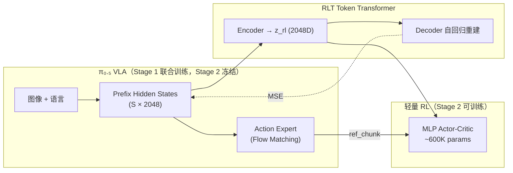
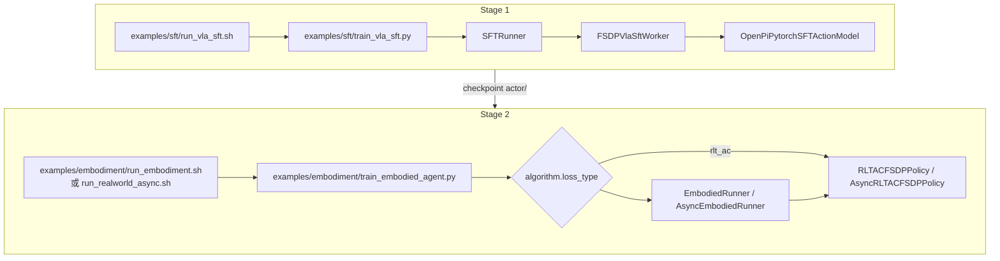
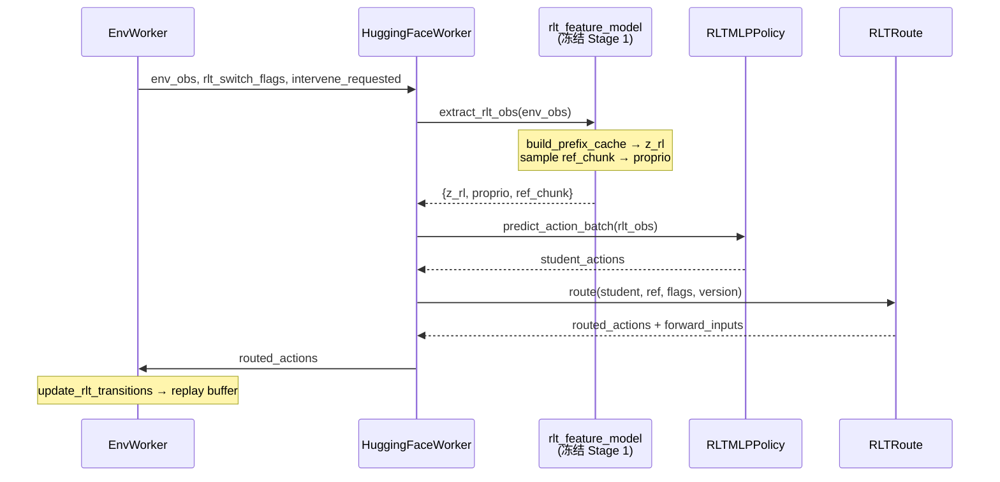
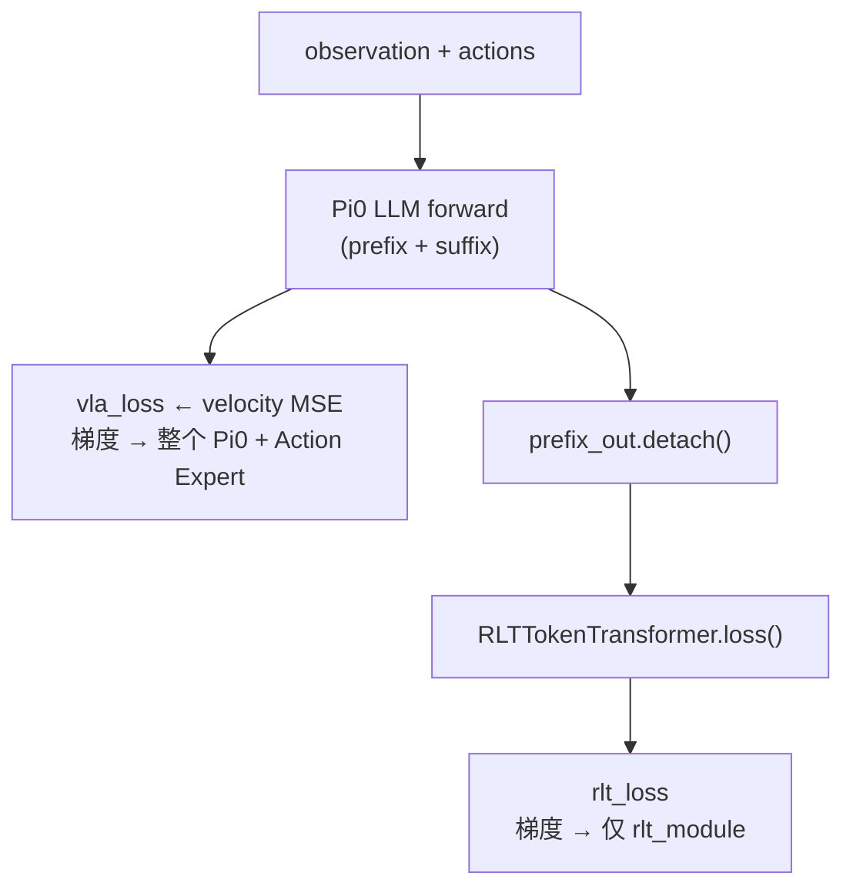
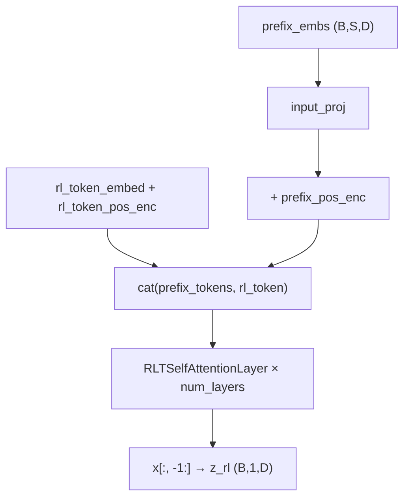
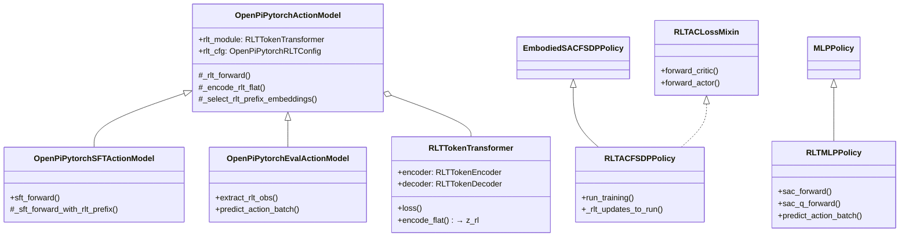
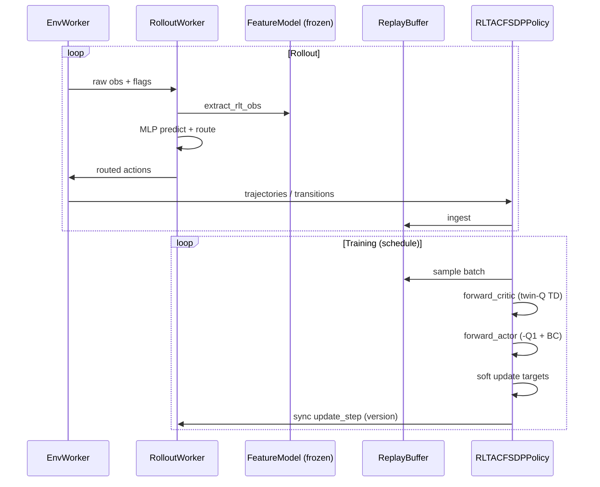
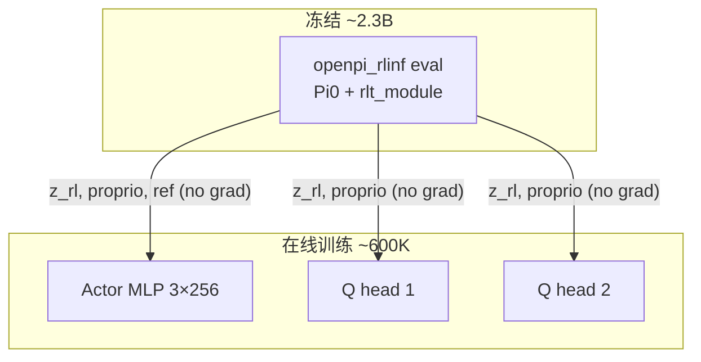

# RLT (RL Token) 在 RLinf 中的设计与实现 — 深度代码分析（v2）

> **文档性质**：自包含技术报告。以本地 RLinf 代码库为准，对照官方文档与 Physical Intelligence (Pi) 原始 RLT 研究进行解读。
>
> **代码库根目录**：`/home/nvidia/bt/s/RLinf/`
>
> **前序文档**：`b/d/p/rlt_code_analyz.markdown`（v1，本文 §0 评阅其优缺点并在其基础上改良）
>
> **日期**：2026-09-11

---

## 目录

0. [对 `rlt_code_analyz.markdown` 的评阅](#0-对-rlt_code_analyzmarkdown-的评阅)
1. [问题背景与 RLT 核心思想](#1-问题背景与-rlt-核心思想)
2. [RLinf 中的 RLT 全景：组件、入口与数据流](#2-rlinf-中的-rlt-全景组件入口与数据流)
3. [Stage 1：VLA SFT + RLT Token Transformer](#3-stage-1vla-sft--rlt-token-transformer)
4. [Stage 2：轻量 Actor-Critic 与 Feature Model](#4-stage-2轻量-actor-critic-与-feature-model)
5. [Rollout：特征提取、动作路由与 Transition](#5-rollout特征提取动作路由与-transition)
6. [Replay Buffer、训练调度与权重渐进](#6-replay-buffer训练调度与权重渐进)
7. [环境集成：Franka 真机 vs ManiSkill 仿真](#7-环境集成franka-真机-vs-maniskill-仿真)
8. [配置、脚本与 Checkpoint 规范](#8-配置脚本与-checkpoint-规范)
9. [静态架构与动态序列图](#9-静态架构与动态序列图)
10. [关键数学公式与实现对照](#10-关键数学公式与实现对照)
11. [消融、设计权衡与代码级「坑」](#11-消融设计权衡与代码级坑)
12. [纵向演进与横向对比](#12-纵向演进与横向对比)
13. [参考文献与代码出处索引](#13-参考文献与代码出处索引)

---

## 0. 对 `rlt_code_analyz.markdown` 的评阅

### 0.1 优点（值得保留）

| 维度 | 评价 |
|:---|:---|
| **结构完整** | 两阶段（Stage 1 表示学习 + Stage 2 在线 AC）主线清晰，目录从算法概述到数学公式、消融、对比一应俱全 |
| **图文质量** | 大量 mermaid 流程图/类图/序列图，直观展示 prefix→z_rl→MLP 的信息流 |
| **代码锚点** | 多数章节标注了文件路径与行号区间（如 `rlt_token_transformer.py`、`fsdp_rlt_ac_policy_worker.py`），便于跳转 |
| **数学归纳** | Chunk-level TD、BC 正则、RLT MSE 重建损失等公式与代码逻辑基本对齐 |
| **Pi 背景** | 引用了 [Pi RLT 研究页](https://www.pi.website/research/rlt) 的真机任务与 throughput 数据，建立了算法动机 |
| **与 SAC 差异** | 明确指出 Stage 2 **不是标准 maximum-entropy SAC**（固定 std、禁用 alpha、BC 权重），与官方文档一致 |

### 0.2 缺点与遗漏（v2 重点补强）

| 问题 | 说明 |
|:---|:---|
| **入口与调度层缺失** | 未说明 RLT **没有独立 Runner**，Stage1 走 `SFTRunner`、Stage2 靠 `algorithm.loss_type: rlt_ac` 在 `train_embodied_agent.py` 里选 worker；也未区分 **同步** `RLTACFSDPPolicy` 与 **异步** `AsyncRLTACFSDPPolicy` 在 `rlt_schedule` 上的能力差异 |
| **梯度流表述不精确** | Stage 1 写「RLT loss 的梯度只更新 RLT 模块」正确，但未强调 **VLA 仍通过 `vla_loss` 正常更新**；`prefix_out.detach()` 发生在 VLA forward **之后**、送入 RLT 之前（`sft_action_model.py:208-210`） |
| **配置与代码不一致处未标注** | 如 YAML 中的 `rlt_encoder_type: append_self_attention` 在 `rlinf/` 内**无任何引用**；ManiSkill stage2 实际 `bc_weight/q_weight` 与文档示例数值不同 |
| **版本同步机制未展开** | `warmup_post_collect_updates` 如何 gate actor 上线：经 `get_rollout_sync_version()` → rollout `self.version` → `SimulatorRLTRoute._ready_for_online()`，v1 仅笼统描述 schedule |
| **真机 transition 录制规则** | 未强调 `RealworldRLTRoute` 中 `record_transition = rlt_switch_flags`：**按 `b` 进入 actor 阶段后才写入 replay** |
| **Checkpoint 规范偏简** | 官方文档强调 Stage 2 须加载含 `rlt_module.*` 的 FSDP `actor/full_weights.pt`，不能只用 `model.safetensors`；v1 未单独成章 |
| **Eval 路径** | 无独立 RLT eval 脚本；需 `runner.only_eval: True` 或缩短训练在同一入口完成 |
| **TD3 变体** | v1 提到 `maniskill_rlt_stage2_td3_mlp.yaml`，**当前代码库中不存在该文件**（截至 2026-09-11 本地扫描） |
| **类 docstring 与实现** | `RLTMLPPolicy` 类注释写 critic 输入含 action chunk，实现为 `critic_state=[z_rl, proprio]` + `q_head(state, action)` 分离传入 |

### 0.3 v2 改良策略

- 以 **本地源码调用链** 为主干，官方 RST/HTML 与 Pi 研究页为对照；
- 每个关键结论标注 **文件路径 + 行号**；
- 增加 **入口分发、权重同步、replay 形态差异、未实现配置项** 等工程细节；
- 配置/脚本给出 **可直接对照的 YAML 片段出处**。

---

## 1. 问题背景与 RLT 核心思想

### 1.1 要解决的问题

Vision-Language-Action (VLA) 模型（如 OpenPI π₀/π₀.₅）通过大规模模仿学习获得通用操作能力，但在两类场景下不足：

1. **精度**：亚毫米级对齐（peg insertion、网线/RJ-45、螺丝刀对孔）需要比 SFT 示范更细的控制；
2. **在线适应**：部署后无法仅依靠离线 demo 继续改进「关键最后一毫米」阶段的策略。

**来源**：[Pi RLT 研究页](https://www.pi.website/research/rlt) — *Precise Manipulation with Efficient Online RL*（2026-03-19）；[RLinf 中文文档 `rlt.rst`](../../docs/source-zh/rst_source/examples/embodied/rlt.rst) §概览。

### 1.2 Pi 团队的核心洞察（RL Token）

Pi 不直接 RL fine-tune 整个 VLA（数十亿参数），而是：

1. 在 VLA 上增加 **Encoder–Decoder Transformer**，将 prefix hidden states 压缩为单个 **RL Token**（即 RLinf 中的 `z_rl`）；
2. 用 **重建损失** 保证 RL Token 保留足够信息（信息瓶颈）；
3. 冻结 VLA+RLT 特征提取器，在 **`z_rl` + proprio + VLA 参考动作 chunk** 上训练 **极小 MLP Actor-Critic**，用 sample-efficient off-policy RL 做在线修正。



**Actor 设计要点**（Pi 原文 + RLinf 实现一致）：

- 输出 **action chunk**，与 VLA 时间结构对齐；
- Actor 输入含 **VLA 预测的 ref_chunk**，学习「编辑」而非从零生成；
- **BC 正则** 拉向 ref_chunk（或人类干预动作）；
- **Reference dropout** 防止过度依赖 ref；
- 可选 **human intervention** 写入 BC target。

### 1.3 RLinf 中的命名与阶段划分

| RLinf 术语 | 含义 |
|:---|:---|
| **RLT** | RL Token 流程在配置/代码中的简称（`use_rlt`, `rlt_ac`, `rlt_feature_model`） |
| **Stage 1** | `runner.task_type: sft`，联合优化 `vla_loss + rlt_alpha * vla_loss` |
| **Stage 2** | `runner.task_type: embodied`，`algorithm.loss_type: rlt_ac`，冻结 feature model，训练 `rlt_mlp_policy` |
| **Feature Model** | `rollout.rlt_feature_model`，即 Stage 1 checkpoint 上的 `OpenPiPytorchEvalActionModel` |
| **Policy Model** | `rollout.model` / `actor.model`，Stage 2 的 `RLTMLPPolicy` |

**来源**：[`docs/source-zh/rst_source/examples/embodied/rlt.rst`](../../docs/source-zh/rst_source/examples/embodied/rlt.rst) L4–12, L120–137。

---

## 2. RLinf 中的 RLT 全景：组件、入口与数据流

### 2.1 核心代码地图

```
rlinf/
├── algorithms/rlt/
│   ├── rollout.py          # predict_rlt_actions() — Stage 2 rollout 总入口
│   ├── route.py            # RealworldRLTRoute / SimulatorRLTRoute
│   ├── transition.py       # RLT_OBS_KEYS, update_rlt_transitions()
│   └── expert.py           # predict_expert_actions() — ManiSkill expert takeover
│
├── models/embodiment/
│   ├── modules/rlt_token_transformer.py   # RLTTokenEncoder/Decoder/Transformer
│   ├── mlp_policy/rlt_mlp_policy.py     # Stage 2 Actor-Critic
│   └── openpi_rlinf/                      # ★ 官方 RLT 路径（非 legacy openpi/）
│       ├── openpi_action_model.py        # rlt_module 挂载、prefix 选择
│       ├── sft_action_model.py           # Stage 1
│       ├── eval_action_model.py          # Stage 2 extract_rlt_obs()
│       └── utils/rlt_utils.py            # OpenPiPytorchRLTConfig, checkpoint 加载
│
├── workers/
│   ├── actor/fsdp_rlt_ac_policy_worker.py  # RLTACLossMixin + schedule
│   ├── rollout/hf/huggingface_worker.py      # rlt_feature_model 加载与 predict 分支
│   └── env/env_worker.py                     # update_rlt_transitions 调用
│
├── envs/
│   ├── maniskill/maniskill_rlt_env.py
│   └── realworld/common/wrappers/keyboard_rlt_policy_switch_wrapper.py
│
examples/
├── sft/train_vla_sft.py + run_vla_sft.sh           # Stage 1
└── embodiment/train_embodied_agent.py + run_embodiment.sh  # Stage 2
```

> **注意**：`rlinf/models/embodiment/openpi/` 下也有带 RLT 的旧路径；**当前官方示例 YAML 均使用 `model_type: openpi_rlinf`**（vendored PyTorch Pi0.5，与 JAX OpenPI 精度对齐）。  
> **来源**：[`rlt.rst`](../../docs/source-zh/rst_source/examples/embodied/rlt.rst) L114–118。

### 2.2 训练入口：无专用 Runner



**Stage 2 Worker 选择**（源码）：

```59:66:examples/embodiment/train_embodied_agent.py
    elif cfg.algorithm.loss_type == "rlt_ac":
        if use_training_pipeline:
            raise ValueError(
                "runner.use_training_pipeline=True is not supported for rlt_ac."
            )
        from rlinf.workers.actor.fsdp_rlt_ac_policy_worker import RLTACFSDPPolicy

        actor_worker_cls = RLTACFSDPPolicy
```

**要点**：

- `rlt_ac` **未**注册到 `rlinf/algorithms/registry.py` 的 `@register_policy_loss`；而是通过 **继承** `EmbodiedSACFSDPPolicy` + `RLTACLossMixin` 覆盖 `forward_actor` / `forward_critic`。
- `runner.use_training_pipeline=True` 与 `rlt_ac` **不兼容**（同上 L60–63）。
- **Eval**：无 `eval_rlt.py`；使用 Stage 2 YAML 设 `runner.only_eval: True` 或在同一 `train_embodied_agent.py` 流程中评估。

**CI 覆盖**：

- Stage 1：`tests/e2e_tests/sft/run_vla_sft.sh maniskill_rlt_stage1_sft_openpi_pi05`
- Stage 2：`tests/e2e_tests/embodied/run.sh maniskill_rlt_stage2_ac_mlp`

### 2.3 Stage 2 单步 Rollout 数据流



**Rollout 入口**：

```563:575:rlinf/workers/rollout/hf/huggingface_worker.py
        if self.rlt_feature_model is not None:
            return predict_rlt_actions(
                policy_model=self.hf_model,
                feature_model=self.rlt_feature_model,
                rlt_route=self.rlt_route,
                env_obs=env_obs,
                final_obs=final_obs,
                mode=mode,
                version=self.version,
                rlt_switch_flags=rlt_switch_flags,
                intervene_requested=intervene_requested,
                expert_model=self.expert_model,
            )
```

Feature model 初始化时 **eval + requires_grad_(False)**：

```151:158:rlinf/workers/rollout/hf/huggingface_worker.py
        if rlt_feature_model_config is not None:
            self.rlt_feature_model = get_model(copy.deepcopy(rlt_feature_model_config))
            self.rlt_feature_model.eval()
            self.rlt_feature_model.requires_grad_(False)
            self.rlt_route = build_rlt_route(self.cfg)
```

---

## 3. Stage 1：VLA SFT + RLT Token Transformer

### 3.1 总损失

$$\mathcal{L}_{\text{Stage1}} = \mathcal{L}_{\text{RLT}} + \alpha \cdot \mathcal{L}_{\text{VLA}}$$

- $\mathcal{L}_{\text{VLA}}$：OpenPI flow matching（`Beta(1.5,1.0)` 采样时间 $t$，预测速度场 $v_t \approx \epsilon - a$）；
- $\mathcal{L}_{\text{RLT}}$：prefix embedding 的 MSE 自回归重建；
- $\alpha$：`openpi.rlt_alpha`（默认 1.0）。

**源码**：

```87:96:rlinf/models/embodiment/openpi_rlinf/sft_action_model.py
        per_timestep_loss, prefix_output, prefix_mask = (
            self._sft_forward_with_rlt_prefix(observation, actions)
        )
        vla_loss = per_timestep_loss.mean()
        rlt_loss, _ = self._rlt_forward(prefix_output, prefix_mask)
        return {
            "loss": rlt_loss + self.rlt_cfg.rlt_alpha * vla_loss,
            "vla_loss": vla_loss,
            "rlt_loss": rlt_loss,
        }
```

### 3.2 梯度流（重要细节）



**关键代码** — VLA 用 **未 detach** 的 `prefix_out` 算 flow loss；送入 RLT 前 **detach**：

```198:211:rlinf/models/embodiment/openpi_rlinf/sft_action_model.py
        prefix_out, suffix_out = self.model.llm(
            [prefix_tokens, suffix_tokens],
            positions=positions,
            mask=attn_mask,
            adarms_cond=[None, adarms_cond],
        )[0]
        v_t = self.model.velocity_from_suffix(
            suffix_out[:, -self.model.action_horizon :]
        )
        loss = torch.mean(torch.square(v_t - u_t), dim=-1)
        prefix_out, prefix_mask = self._select_rlt_prefix_embeddings(
            prefix_out.detach(), prefix_mask, observation.tokenized_prompt
        )
        return loss, prefix_out, prefix_mask
```

RLT 模块内部再次 detach prefix（双保险）：

```355:361:rlinf/models/embodiment/modules/rlt_token_transformer.py
    def reconstruct(
        self, prefix_embs: torch.Tensor, mask: torch.Tensor | None = None
    ) -> tuple[torch.Tensor, torch.Tensor]:
        frozen_prefix = prefix_embs.detach()
        rl_tokens = self.encode(frozen_prefix, mask)
        reconstructed = self.decode(rl_tokens, frozen_prefix, mask)
        return reconstructed, rl_tokens
```

**结论**：Stage 1 **同时更新 VLA 与 RLT Token Transformer**；RLT 重建目标不会反向污染 VLA 的 prefix 表示，但 VLA 仍通过 imitation loss 学习。

### 3.3 RLTTokenTransformer 架构

**文件**：`rlinf/models/embodiment/modules/rlt_token_transformer.py`

#### 3.3.1 Encoder（Prefix → 单个 RL Token）



- **RL Token** 为可学习参数 `rl_token_embed`，初始化为正弦 PE（`RLTTokenEncoder.__init__`）；
- Self-Attention 使用 **Pre-LN + MultiheadAttention + GeGLU MLP**（`RLTSelfAttentionLayer`, L44–104）；
- GeGLU：$\text{GeGLU}(x) = \text{GELU}(W_g x) \odot (W_p x)$。

#### 3.3.2 Decoder（自回归重建）

- 输入：`[z_rl, shifted_targets]`，其中 `shifted_targets = target[:, :-1]`（teacher forcing）；
- **因果 mask**：上三角为 True（禁止 attend 未来）；
- 输出经 `output_proj` 映射回 `input_dim`，与原始 prefix 对齐算 MSE。

#### 3.3.3 默认超参

**来源**：`OpenPiPytorchRLTConfig` — `rlinf/models/embodiment/openpi_rlinf/utils/rlt_utils.py:55-68`

| 字段 | 默认值 | YAML 常见覆盖 |
|:---|:---|:---|
| `rlt_input_dim` / `rlt_embed_dim` | 2048 | 2048 |
| `rlt_prefix_seq_len` | 768 | **1024**（stage1 YAML） |
| `rlt_num_layers` | 2 | 2 |
| `rlt_num_heads` | 8 | 8 |
| `rlt_mlp_ratio` | 4.0 | 4.0 |
| `rlt_image_only` | **True**（代码默认） | Franka YAML 常设 **False**；ManiSkill stage1 为 False |
| `rlt_use_mask` | False | stage1 YAML 常设 **True** |
| `rlt_alpha` | 1.0 | 1.0 |

#### 3.3.4 Prefix 选择：`rlt_image_only`

```109:119:rlinf/models/embodiment/openpi_rlinf/openpi_action_model.py
    def _select_rlt_prefix_embeddings(
        self,
        prefix_output: torch.Tensor,
        prefix_mask: torch.Tensor,
        lang_tokens: torch.Tensor | None,
    ) -> tuple[torch.Tensor, torch.Tensor]:
        if self.rlt_cfg.rlt_image_only and lang_tokens is not None:
            num_image_tokens = prefix_output.shape[1] - lang_tokens.shape[1]
            prefix_output = prefix_output[:, :num_image_tokens]
            prefix_mask = prefix_mask[:, :num_image_tokens]
        return prefix_output, prefix_mask
```

**工程含义**：去掉语言 token 段，缩短序列、让 `z_rl` 更聚焦视觉；Franka peg 任务语言固定，两种设置均可，需与 Stage 2 feature model **保持一致**。

#### 3.3.5 ⚠️ 未实现的配置：`rlt_encoder_type`

ManiSkill Stage 1 YAML 含：

```yaml
# examples/sft/config/maniskill_rlt_stage1_sft_openpi_pi05.yaml L74
rlt_encoder_type: "append_self_attention"
```

**本地 `rlinf/` 全文搜索无 `rlt_encoder_type` 引用** — 实际仅实现 `RLTTokenEncoder` 一种结构。该键为**无效/预留配置**，修改它不会改变行为。

### 3.4 Stage 1 挂载点

```48:60:rlinf/models/embodiment/openpi_rlinf/openpi_action_model.py
        if self.rlt_cfg.use_rlt:
            from rlinf.models.embodiment.modules.rlt_token_transformer import (
                RLTTokenTransformer,
            )

            self.rlt_module = RLTTokenTransformer(
                input_dim=self.rlt_cfg.rlt_input_dim,
                embed_dim=self.rlt_cfg.rlt_embed_dim,
                prefix_seq_len=self.rlt_cfg.rlt_prefix_seq_len,
                num_layers=self.rlt_cfg.rlt_num_layers,
                num_heads=self.rlt_cfg.rlt_num_heads,
                mlp_ratio=self.rlt_cfg.rlt_mlp_ratio,
            ).to(dtype=next(self.model.parameters()).dtype)
```

FSDP 包装：`RLTSelfAttentionLayer` 列入 `_no_split_modules`（L68–72），避免不当切分。

### 3.5 单元测试

`tests/unit_tests/test_rlt_token_transformer.py` — 覆盖 encode/decode、因果 mask、MSE loss 形状与数值行为。

---

## 4. Stage 2：轻量 Actor-Critic 与 Feature Model

### 4.1 Feature Model：`extract_rlt_obs`

**类**：`OpenPiPytorchEvalActionModel`  
**文件**：`rlinf/models/embodiment/openpi_rlinf/eval_action_model.py`

Stage 2 每次 env step 在 **一次 prefix forward** 中同时得到 `z_rl` 与 VLA 参考动作：

```357:404:rlinf/models/embodiment/openpi_rlinf/eval_action_model.py
    def extract_rlt_obs(self, env_obs: dict[str, Any]) -> dict[str, torch.Tensor]:
        ...
        prefix_output, prefix_mask, kv_cache = self.model.build_prefix_cache(
            prepared_observation
        )
        rlt_prefix_output, rlt_prefix_mask = self._select_rlt_prefix_embeddings(
            prefix_output, prefix_mask, prepared_observation.tokenized_prompt
        )
        z_rl = self._encode_rlt_flat(rlt_prefix_output, rlt_prefix_mask).to(
            dtype=torch.float32
        )

        model_actions = self._sample_actions_from_prefix_cache(
            prepared_observation,
            prefix_mask,
            kv_cache,
        )
        ref_chunk = self.output_transform(
            {"actions": model_actions, "state": observation.state}
        )["actions"]
        ...
        return {
            "z_rl": z_rl,
            "proprio": proprio.to(device=z_rl.device, dtype=torch.float32),
            "ref_chunk": ref_chunk.to(device=z_rl.device, dtype=torch.float32),
        }
```

| 输出键 | 含义 | 典型维度（Franka） |
|:---|:---|:---|
| `z_rl` | RLT 压缩表示 | `(B, 2048)` |
| `proprio` | 机器人状态（OpenPI 处理后或 raw slice） | `(B, 19)` |
| `ref_chunk` | VLA Euler 采样得到的参考 action chunk | `(B, ref_len, action_dim)`，如 `(B,20,7)` |

**效率**：`build_prefix_cache` 生成 KV cache 后，`_sample_actions_from_prefix_cache` 复用，避免重复跑 prefix — 对 30Hz 真机控制重要。

**配置**：`rollout.rlt_feature_model.openpi.task: eval`（非 `sft` / `rl`）。

### 4.2 Policy Model：`RLTMLPPolicy`

**文件**：`rlinf/models/embodiment/mlp_policy/rlt_mlp_policy.py`  
**注册**：`SupportedModel.RLT_MLP_POLICY` — `rlinf/models/__init__.py`

#### 输入构造

| 网络 | 实际拼接 | 代码 |
|:---|:---|:---|
| **Actor** | `[ref_chunk_flat, z_rl, proprio]` | `_actor_state` L120–130 |
| **Critic state** | `[z_rl, proprio]` | `_critic_state` L132–133 |
| **Critic Q** | `q_head(critic_state, actions_flat)` | `sac_q_forward` L160–165 |

> **纠正**：类 docstring（L25–27）写 critic 输入含 action chunk；**实现中 action 由 `q_head` 第二参数传入**，state 部分不含 ref_chunk。Critic **故意不用 ref_chunk**，避免 Q 值被 VLA 先验偏置。

Actor 输入维度示例（Franka 默认 YAML）：

$$\dim s_{\text{actor}} = \underbrace{10 \times 7}_{\text{ref 截断到 chunk\_len}} + 2048 + 19 = 2137$$

#### `sac_forward`：固定方差 + tanh

```138:158:rlinf/models/embodiment/mlp_policy/rlt_mlp_policy.py
    def sac_forward(self, obs, apply_reference_dropout=False, reference_dropout_prob=0.0, deterministic=False, **kwargs):
        actor_state = self._actor_state(obs, ...)
        feat = self.backbone(actor_state)
        action_mean = self.actor_mean(feat)
        action_std = torch.full_like(action_mean, self.fixed_std)
        probs = Normal(action_mean, action_std)
        action = action_mean if deterministic else probs.rsample()
        ...
        action = torch.tanh(action)
        return action, chunk_logprobs, None
```

- `fixed_std` 默认 **0.002**（YAML `actor.model.fixed_std`）— 近确定性策略，适合精密操作；
- Rollout 时 `deterministic=(mode=="eval")`（`predict_action_batch`）；
- **Reference dropout 仅在训练 actor 时开启**（`forward_actor` L308–309），rollout 不 dropout。

### 4.3 Actor-Critic 损失（`RLTACLossMixin`）

**文件**：`rlinf/workers/actor/fsdp_rlt_ac_policy_worker.py`

#### Critic：Chunk-level Twin-Q TD

$$y = R_{\text{chunk}} + \mathbb{1}_{\neg done} \cdot \gamma^{H} \cdot \min(Q_1', Q_2')$$

$$R_{\text{chunk}} = \sum_{t=0}^{H-1} \gamma^t r_t$$

```266:294:rlinf/workers/actor/fsdp_rlt_ac_policy_worker.py
            reward_target = self._discounted_chunk_rewards(rewards)
            reward_horizon = int(rewards.reshape(rewards.shape[0], -1).shape[-1])
            bootstrap_discount = self.cfg.algorithm.gamma**reward_horizon
            ...
                target_q_values = reward_target + not_done * bootstrap_discount * q_next
            ...
        critic_loss = F.mse_loss(
            all_data_q_values, target_q_values.expand_as(all_data_q_values)
        )
```

- Critic target 用 **min twin-Q**（`_min_twin_q`）；
- ManiSkill transition replay 模式下 `done` 取自 `batch["dones"]` 而非 `terminations`（L236–237）。

#### Actor：Q₁ + BC（非 entropy SAC）

$$\mathcal{L}_{\text{actor}} = -w_Q \cdot Q_1(s, \pi(s)) + w_{\text{BC}} \cdot \|\pi(s) - a_{\text{target}}\|^2$$

```340:351:rlinf/workers/actor/fsdp_rlt_ac_policy_worker.py
        bc_loss, rlt_metrics = self._bc_metrics(
            pi=pi, actions=batch["actions"], ref_chunk=ref_chunk,
            intervene_flags=batch.get("intervene_flags", None),
        )
        bc_weight, q_weight, weight_metrics = self._actor_objective_weights()
        actor_loss = -q_weight * qf_pi.mean() + bc_weight * bc_loss
```

BC target 切换（`_bc_metrics` L123–124）：

$$a_{\text{target}} = \begin{cases} a_{\text{executed}} & \text{if intervene\_flag} \\ a_{\text{ref\_chunk}} & \text{otherwise} \end{cases}$$

**Entropy / Alpha**：`forward_alpha` 直接 `NotImplementedError`（L366–372）；须设 `entropy_tuning.alpha_type: fixed_alpha`, `initial_alpha: 0.0`。

**与标准 SAC 对比**（官方文档 note + 代码一致）：

| 特性 | 标准 SAC | RLT AC |
|:---|:---|:---|
| Actor 目标 Q | 常 min(Q₁,Q₂) − α log π | **Q₁ only** |
| Entropy 调节 | 有 | **禁用** |
| Action std | 可学习 | **固定** |
| BC 正则 | 无 | **有** |
| 观测 | 原始 image/state | **z_rl + proprio + ref** |

---

## 5. Rollout：特征提取、动作路由与 Transition

### 5.1 `predict_rlt_actions`

**文件**：`rlinf/algorithms/rlt/rollout.py:38-84`

```python
# 逻辑摘要（与源码一致）
rlt_obs = feature_model.extract_rlt_obs(env_obs)
actions, result = policy_model.predict_action_batch(env_obs=rlt_obs, mode=mode, return_obs=True)
route_output = rlt_route.route(RLTRouteContext(..., version=version, ...))
_append_rlt_transition_obs(..., final_obs=final_obs)  # 写入 rlt_transition_* 键
```

`final_obs` 用于在同一步内计算 **next_obs** 的 RLT 特征（pending transition 模式）。

### 5.2 动作路由 `RLTRoute`

**文件**：`rlinf/algorithms/rlt/route.py`  
**工厂**：`build_rlt_route(cfg)` — ManiSkill → `SimulatorRLTRoute`，否则 → `RealworldRLTRoute`

#### 真机：`RealworldRLTRoute`

```130:144:rlinf/algorithms/rlt/route.py
        routed_actions = torch.where(
            rlt_switch_flags,
            actions,
            ref_actions[:, : actions.shape[1], : actions.shape[2]],
        ).contiguous()
        ...
        result["forward_inputs"]["record_transition"] = rlt_switch_flags.reshape(
            actions.shape[0], -1
        )[:, :1].to(torch.bool)
```

- `rlt_switch_flags=True` → 执行 **Actor** 动作；否则执行 **ref_chunk**；
- **`record_transition` 与 switch 绑定**：仅在 actor 阶段写入 replay（按 `b` 之前的数据不进 buffer）。

**键盘切换**：`KeyboardRLTPolicySwitchWrapper` — 按 `b` 进入 actor 阶段：

```58:64:rlinf/envs/realworld/common/wrappers/keyboard_rlt_policy_switch_wrapper.py
            if key == "b":
                if not self._rlt_switch_flags:
                    event = "enter_actor"
                    self._rlt_switch_flags = True
                    self._log_info(
                        "Pedal 'b' pressed; switching RLT rollout to Stage2 actor."
                    )
```

YAML：`env.train.keyboard_reward_wrapper: rlt_policy_switch`

#### 仿真：`SimulatorRLTRoute`

三层逻辑（L157–244）：

1. **Schedule gate**：`version >= warmup_post_collect_updates` 才允许 actor（与 learner `update_step` 同步，见 §6.2）；
2. **Critical phase**：`rlt_switch_flags` 来自 `ManiskillRLTEnv` 任务状态机（抓 peg、近 hole 等）；
3. **Expert takeover**（可选）：`intervene_requested` + `expert_model` → 用 expert 动作替换，并写入 `ref_chunk` 作 BC target。

### 5.3 Transition 格式与更新

**常量**：`RLT_OBS_KEYS = ("z_rl", "proprio", "ref_chunk")` — `transition.py:22`

**Replay 存储**（对比原始图像）：

| 字段 | 内容 |
|:---|:---|
| `curr_obs / next_obs` | 各含 `z_rl, proprio, ref_chunk` |
| `actions` | 实际路由后执行的动作 chunk |
| `rewards` | chunk 内逐步奖励 |
| `intervene_flags` | 人类/expert 干预标记 |

**更新逻辑**（pending obs 缓存）— `update_rlt_transitions` L62–102：

1. 若存在 pending `curr_obs`，用当前 `forward_inputs` 中的 `rlt_transition_*` 作为 `next_obs`，append transition；
2. 若 `cache_current`，缓存当前 obs 为下一步的 `curr_obs`；
3. 干预时把 human action 写入 `ref_chunk` 对应位置（L73–88）。

**ManiSkill vs Realworld replay 形态**：

| 环境 | 判定 | 行为 |
|:---|:---|:---|
| ManiSkill | `env_type: maniskill_rlt` | **Transition replay**：每 env step 一行；`_transition_replay_trajectories` |
| Realworld | 其他 | **Trajectory replay**：整段 trajectory；且仅 `record_transition=True` 的步参与 |

---

## 6. Replay Buffer、训练调度与权重渐进

### 6.1 ManiSkill `rlt_schedule`

**配置出处**：`examples/embodiment/config/maniskill_rlt_stage2_ac_mlp.yaml` L41–47

```yaml
algorithm:
  rlt_schedule:
    enable: True
    max_updates_per_train_step: 400
    warmup_min_size: 10000
    warmup_post_collect_updates: 30000
    train_every_transitions: 5
```

**调度逻辑**（`RLTACFSDPPolicy._rlt_updates_to_run`, L727–823）：

1. 等待 replay `min_replay_size >= warmup_min_size`；
2. 累计 online transitions，每 `train_every_transitions` 条触发 `update_epoch` 轮更新；
3. 总 update 预算：`warmup_post_collect_updates + online_cycles × update_epoch`；
4. 单次 train step 上限 `max_updates_per_train_step`。

**Actor 上线 gate**（rollout 侧）：

```57:61:rlinf/workers/actor/fsdp_rlt_ac_policy_worker.py
    def get_rollout_sync_version(self) -> int:
        if not self.use_rlt_schedule:
            return int(self.version)
        return int(self.update_step)
```

→ rollout `self.version` → `SimulatorRLTRoute._ready_for_online(version)`（`route.py:154-155`）

**⚠️ Async 路径**：`AsyncRLTACFSDPPolicy`（L888+）**未覆盖** `run_training` / `_rlt_updates_to_run` — ManiSkill schedule **仅同步** `RLTACFSDPPolicy` 完整生效。Franka 真机常用 `run_realworld_async.sh`，但 realworld **无** `rlt_schedule`，靠键盘切换。

### 6.2 `actor_weight_schedule`

ManiSkill stage2 启用（同 YAML L68–75）：

| 阶段 | `bc_weight` | `q_weight` |
|:---|:---|:---|
| Warmup（前 20000 updates） | 7.0 | 0.05 |
| Online（ramp 50000 后） | 2.5 | 0.45 |

Franka realworld 默认 **固定** `bc_weight: 5`, `q_weight: 0.1`（见 `realworld_rlt_stage2_ac_mlp.yaml`，[`rlt.rst`](../../docs/source-zh/rst_source/examples/embodied/rlt.rst) L238–246）。

渐进公式（`_actor_objective_weights`, L147–224）：

$$w = w_{\text{warmup}} + \min\left(1, \frac{t - t_{\text{warmup}}}{t_{\text{ramp}}}\right) \cdot (w_{\text{online}} - w_{\text{warmup}})$$

---

## 7. 环境集成：Franka 真机 vs ManiSkill 仿真

### 7.1 对比表

| 维度 | Franka Realworld | ManiSkill RLT |
|:---|:---|:---|
| **Env 类型** | `realworld_peg_insertion` 等 | `maniskill_rlt` |
| **阶段切换** | 键盘 `b` → `rlt_switch_flags` | `rlt_policy_switch` 自动 gate + schedule |
| **Replay 形态** | Trajectory | Per-step transition |
| **Expert takeover** | 默认无 | 可选 `rollout.expert_model` |
| **观测 wrap** | OpenPI franka dataconfig | `wrap_obs_mode: rlt_openpi_joint` |
| **proprio 维** | 19（YAML `proprio_dim: 19`） | 9（joint qpos） |
| **cluster** | 异构 GPU + Franka 节点 | 单节点 collocated |

### 7.2 ManiSkill 环境要点

**文件**：`rlinf/envs/maniskill/maniskill_rlt_env.py`（`ManiskillRLTEnv`, ~1187 行）

- 任务：`PegInsertionSideWideClearance-v1`；
- Action：10-step chunk × 8D `pd_joint_delta_pos`；
- `rlt_policy_switch` 配置块控制 auto actor 进入条件（`require_grasp`, `near_hole_x_min` 等 — 见 stage2 YAML L111+）。

### 7.3 Franka 环境要点

- Stage 2 启动：`bash examples/embodiment/run_realworld_async.sh realworld_rlt_stage2_ac_mlp`（[`rlt.rst`](../../docs/source-zh/rst_source/examples/embodied/rlt.rst) L426–434）；
- 数据采集：`bash examples/embodiment/collect_data.sh realworld_collect_data`，`export_format: lerobot`。

---

## 8. 配置、脚本与 Checkpoint 规范

### 8.1 配置文件索引

| 阶段 | 场景 | 路径 |
|:---|:---|:---|
| Stage 1 | Franka | `examples/sft/config/realworld_rlt_stage1_sft_openpi_pi05.yaml` |
| Stage 1 | ManiSkill | `examples/sft/config/maniskill_rlt_stage1_sft_openpi_pi05.yaml` |
| Stage 2 | Franka | `examples/embodiment/config/realworld_rlt_stage2_ac_mlp.yaml` |
| Stage 2 | ManiSkill | `examples/embodiment/config/maniskill_rlt_stage2_ac_mlp.yaml` |
| Env 片段 | ManiSkill | `examples/embodiment/config/env/maniskill_rlt.yaml` |
| E2E | Stage 1/2 | `tests/e2e_tests/sft/maniskill_rlt_stage1_sft_openpi_pi05.yaml`, `tests/e2e_tests/embodied/maniskill_rlt_stage2_ac_mlp.yaml` |

### 8.2 启动脚本

| 脚本 | 用途 |
|:---|:---|
| `examples/sft/run_vla_sft.sh <config_name>` | Stage 1 |
| `examples/embodiment/run_embodiment.sh <config_name>` | Stage 2 同步 |
| `examples/embodiment/run_realworld_async.sh <config_name>` | Franka Stage 2 异步 |
| `examples/embodiment/collect_data.sh` | 真机 LeRobot 数据采集 |
| `toolkits/lerobot/calculate_norm_stats.py` | 归一化统计 |
| `toolkits/lerobot/collect_maniskill_peg_lerobot_joint.py` | ManiSkill joint 数据采集 |

### 8.3 Checkpoint 规范（关键）

**Stage 1 输出**：

```text
logs/<run>/checkpoints/global_step_<N>/actor/
  └── (FSDP) full_weights.pt 或 actor/model_state_dict/full_weights.pt
```

**Stage 2 加载**：

- ✅ `rollout.rlt_feature_model.model_path` → 上述 **`actor/` 目录**
- ❌ **不要**把 Stage 1 路径填到 `rollout.model.model_path` 或 `actor.model.model_path`
- ❌ 不能仅用 HuggingFace `model.safetensors`（**缺少 `rlt_module.*` 权重**）

**权重解析**：`rlt_utils.load_full_wrapper_weights` — 候选路径 `FULL_WEIGHTS_CANDIDATES`（`rlt_utils.py:27-31`）

**Norm stats**：Stage 1 / Stage 2 / OpenPI assets **必须同一** `repo_id` + `norm_stats.json`（[`rlt.rst`](../../docs/source-zh/rst_source/examples/embodied/rlt.rst) L507–511 warning）。

### 8.4 Stage 1 关键 YAML 片段（ManiSkill）

**出处**：`examples/sft/config/maniskill_rlt_stage1_sft_openpi_pi05.yaml`

```yaml
actor:
  model:
    model_type: "openpi_rlinf"
    openpi:
      task: sft
      config_name: "pi05_rlt_maniskill_joint"
      use_rlt: True
      rlt_alpha: 1.0
      rlt_prefix_seq_len: 1024
      rlt_image_only: False
      rlt_use_mask: True
    openpi_data:
      repo_id: "maniskill_peginsertionside_joint"
```

### 8.5 Stage 2 关键 YAML 片段（Franka）

**出处**：[`rlt.rst`](../../docs/source-zh/rst_source/examples/embodied/rlt.rst) L235–304 + `realworld_rlt_stage2_ac_mlp.yaml`

```yaml
algorithm:
  loss_type: rlt_ac
  q_weight: 0.1
  bc_weight: 5
  reference_dropout_prob: 0.5
  gamma: 0.96
  entropy_tuning:
    alpha_type: fixed_alpha
    initial_alpha: 0.0

rollout:
  rlt_feature_model:
    model_type: "openpi_rlinf"
    model_path: "/path/to/stage1/checkpoint/actor"
    openpi:
      task: eval
      use_rlt: True
  model:
    model_path: null   # Stage 2 policy 由 actor 训练初始化，非 Stage 1

actor:
  model:
    model_type: "rlt_mlp_policy"
    z_dim: 2048
    proprio_dim: 19
    fixed_std: 0.002
    num_action_chunks: 10
    ref_num_action_chunks: 20
```

---

## 9. 静态架构与动态序列图

### 9.1 类关系（Stage 1 + Stage 2）



### 9.2 Stage 2 训练循环



### 9.3 Stage 2 参数冻结关系



---

## 10. 关键数学公式与实现对照

### 10.1 RLT 重建损失

$$\mathcal{L}_{\text{RLT}} = \frac{1}{|M| \cdot D} \sum_{(i,d) \in M} \left(\hat{h}_{i,d} - \text{sg}(h_{i,d})\right)^2$$

- $h$：VLA prefix hidden；$\hat{h}$：decoder 输出；
- $M$：`rlt_use_mask=True` 时的有效 token mask；
- 实现：`RLTTokenTransformer.loss` — `rlt_token_transformer.py:363-384`。

### 10.2 Flow Matching（VLA）

$$x_t = t \epsilon + (1-t) a, \quad u_t = \epsilon - a, \quad \mathcal{L}_{\text{VLA}} = \|v_\theta(x_t,t) - u_t\|^2$$

- $t \sim \text{Beta}(1.5, 1.0)$，clamp 到 $(0.001, 0.999)$；
- 实现：`_sft_forward_with_rlt_prefix` L175–207。

### 10.3 Chunk TD 与 Actor 目标

见 §4.3；Franka 默认 $w_{\text{BC}}=5 \gg w_Q=0.1$，策略 **强约束于 VLA 先验**，RL 仅作微调 — 符合真机安全需求。

---

## 11. 消融、设计权衡与代码级「坑」

### 11.1 经 Pi 实验与 RLinf 设计共同支持的选择

| 设计 | 理由 | 代码/配置证据 |
|:---|:---|:---|
| 信息瓶颈 `z_rl` | 降维、使 MLP RL 可实时更新 | `RLTTokenTransformer` |
| 冻结 Feature Model | 防灾难性遗忘 | `requires_grad_(False)` on rollout |
| ref_chunk 作 actor 输入 + BC target | 学 residual 修正 | `_actor_state`, `_bc_metrics` |
| reference dropout | 防 copy VLA | `reference_dropout_prob: 0.5` |
| 固定 std | 精密任务低探索 | `fixed_std: 0.002` |
| Chunk-level TD | 与 chunk policy 对齐 | `_discounted_chunk_rewards` |
| min-Q critic / Q1 actor | 保守 value / 不那么保守 policy | `_min_twin_q` vs `_q1` |

### 11.2 实现与文档需注意的坑

| # | 问题 | 影响 | 出处 |
|:--|:---|:---|:---|
| 1 | `rlt_encoder_type` 无效 | 改 YAML 无效果 | stage1 YAML L74；代码无引用 |
| 2 | Async + ManiSkill schedule | schedule 可能不生效 | `AsyncRLTACFSDPPolicy` 无 schedule 覆盖 |
| 3 | Realworld replay 仅 actor 段 | 按 `b` 前数据不进 buffer | `RealworldRLTRoute` L138–140 |
| 4 | norm_stats 不一致 | ref_chunk 尺度漂移、BC 失效 | 官方 warning |
| 5 | Stage1 ckpt 路径填错 | 缺 `rlt_module` 加载失败 | `rlt.rst` + `rlt_utils` |
| 6 | `rlt_image_only` Stage1/2 不一致 | `z_rl` 语义变化 | `_select_rlt_prefix_embeddings` |
| 7 | v1 提到的 TD3 yaml | **本地不存在** | glob 搜索 0 结果 |

### 11.3 `rlt_image_only` 权衡

| True | False |
|:---|:---|
| 更短序列、更低 attention 成本 | 保留语言 token 语义 |
| 语言固定任务通常足够 | Franka/ManiSkill 官方示例多用 False |

---

## 12. 纵向演进与横向对比

### 12.1 纵向

```text
VLA SFT only (π₀.₅)
    → 全模型 RL fine-tune（贵、不稳定、易遗忘）
        → RLT：冻结 VLA 表示 + RL Token 瓶颈 + 小 MLP 在线 RL（Pi, 2026）
            → RLinf 工程化：openpi_rlinf + 双环境 + schedule + replay 形态分化
```

### 12.2 横向

| 方法 | RL 参数量 | 冻结 VLA | 信息瓶颈 | 在线数据需求 |
|:---|:---|:---|:---|:---|
| **RLT** | ~600K MLP | ✅ | `z_rl` (2048D) | 分钟–小时级 |
| Full VLA RL | ~2B+ | ❌ | 无 | 大量 |
| Residual on VLA output | ~600K | ✅ | 无（直接用 ref action） | 中等 |

### 12.3 Pi 真机结果（研究页）

| 任务 | Base → RLT throughput (/10min) | 倍数 |
|:---|:---|:---|
| 电动螺丝刀 M3 | ~5 → ~18 | ~3.6× |
| 扎带 | ~4 → ~12 | ~3× |
| 以太网插入 | ~150 → ~350 | ~2.3× |
| 电源线插入 | ~200 → ~500 | ~2.5× |

以太网任务：**15 分钟**机器人数据、总训练约 2 小时；最终策略中位步数 66，低于遥操作 demo 中位 146。

**来源**：[https://www.pi.website/research/rlt](https://www.pi.website/research/rlt)

---

## 13. 参考文献与代码出处索引

### 13.1 外部参考

1. **Pi RLT**：Charles Xu et al., *Precise Manipulation with Efficient Online RL*, Physical Intelligence, 2026-03-19. [研究页](https://www.pi.website/research/rlt) · [PDF](https://www.pi.website/download/rlt.pdf)
2. **RLinf 官方文档（EN）**：[RLT Tutorial](https://rlinf.readthedocs.io/en/latest/rst_source/examples/embodied/rlt.html)
3. **RLinf 官方文档（ZH）**：[`docs/source-zh/rst_source/examples/embodied/rlt.rst`](../../docs/source-zh/rst_source/examples/embodied/rlt.rst)
4. **OpenPI π₀.₅ 基座**：[lerobot/pi05_base](https://huggingface.co/lerobot/pi05_base)
5. **ManiSkill RLT 数据集**：[RLinf/rlt-maniskill-PegInsertionSide-v1-400-succ](https://huggingface.co/datasets/RLinf/rlt-maniskill-PegInsertionSide-v1-400-succ)
6. **Flow Matching**：Lipman et al., ICLR 2023
7. **SAC**：Haarnoja et al., ICML 2018
8. **GeGLU**：Shazeer, arXiv 2020

### 13.2 本地核心源码索引

| 模块 | 路径 | 关键符号 |
|:---|:---|:---|
| RLT Transformer | `rlinf/models/embodiment/modules/rlt_token_transformer.py` | `RLTTokenTransformer`, L299–389 |
| RLT 配置 | `rlinf/models/embodiment/openpi_rlinf/utils/rlt_utils.py` | `OpenPiPytorchRLTConfig`, L55–90 |
| OpenPI 基类 | `rlinf/models/embodiment/openpi_rlinf/openpi_action_model.py` | `rlt_module`, L48–141 |
| Stage 1 | `rlinf/models/embodiment/openpi_rlinf/sft_action_model.py` | `sft_forward`, L68–96 |
| Stage 2 Feature | `rlinf/models/embodiment/openpi_rlinf/eval_action_model.py` | `extract_rlt_obs`, L357–404 |
| Stage 2 Policy | `rlinf/models/embodiment/mlp_policy/rlt_mlp_policy.py` | `RLTMLPPolicy`, L22–232 |
| AC 损失 | `rlinf/workers/actor/fsdp_rlt_ac_policy_worker.py` | `RLTACLossMixin`, L38–372 |
| Schedule | 同上 | `RLTACFSDPPolicy._rlt_updates_to_run`, L727–823 |
| Rollout | `rlinf/algorithms/rlt/rollout.py` | `predict_rlt_actions`, L38–84 |
| Route | `rlinf/algorithms/rlt/route.py` | `RealworldRLTRoute`, `SimulatorRLTRoute` |
| Transition | `rlinf/algorithms/rlt/transition.py` | `RLT_OBS_KEYS`, `update_rlt_transitions` |
| HF Rollout | `rlinf/workers/rollout/hf/huggingface_worker.py` | L151–158, L563–575 |
| 入口分发 | `examples/embodiment/train_embodied_agent.py` | `loss_type: rlt_ac`, L59–66 |
| 键盘切换 | `rlinf/envs/realworld/common/wrappers/keyboard_rlt_policy_switch_wrapper.py` | L25–70 |
| ManiSkill Env | `rlinf/envs/maniskill/maniskill_rlt_env.py` | `ManiskillRLTEnv` |
| 单元测试 | `tests/unit_tests/test_rlt_token_transformer.py` | — |

### 13.3 配置文件与脚本索引

见 [§8](#8-配置脚本与-checkpoint-规范)。

---

*本文档基于 `/home/nvidia/bt/s/RLinf/` 本地代码 2026-09-11 状态编写；若 upstream 变更，请以对应路径源码为准。*
