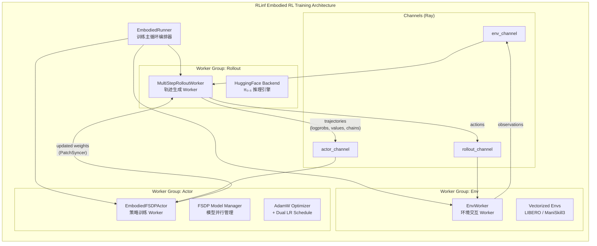
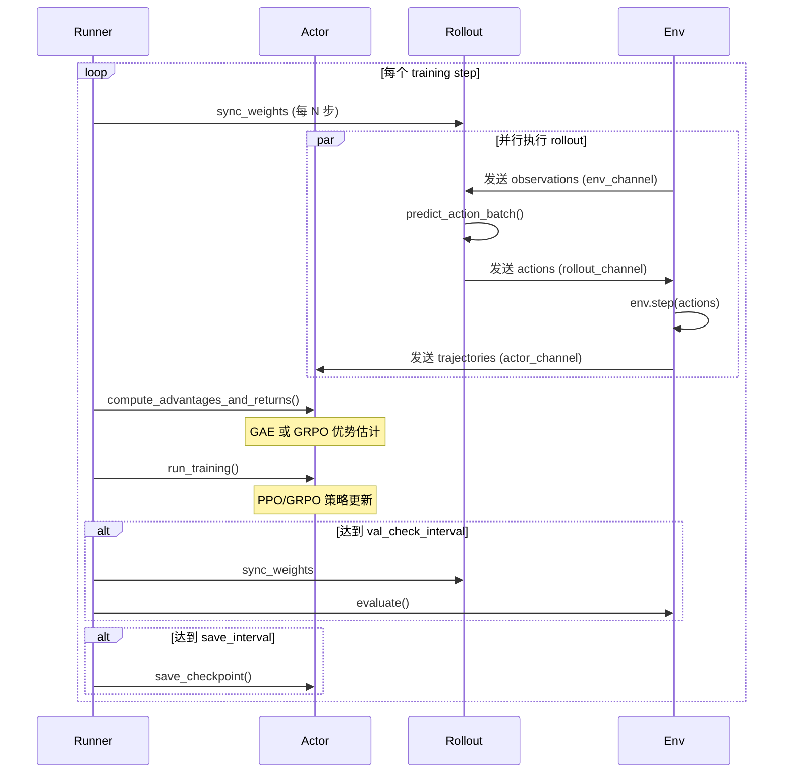
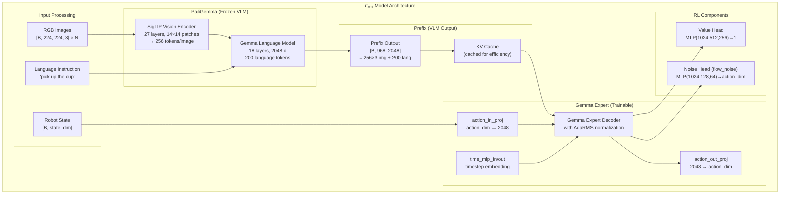
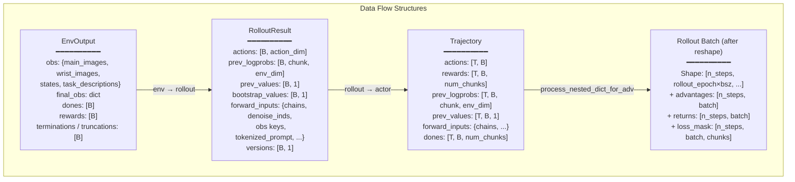
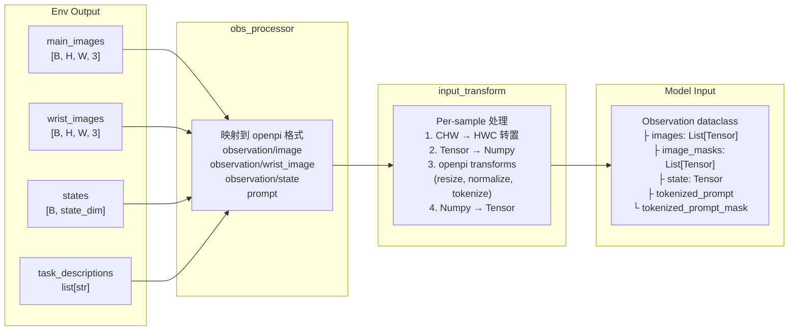
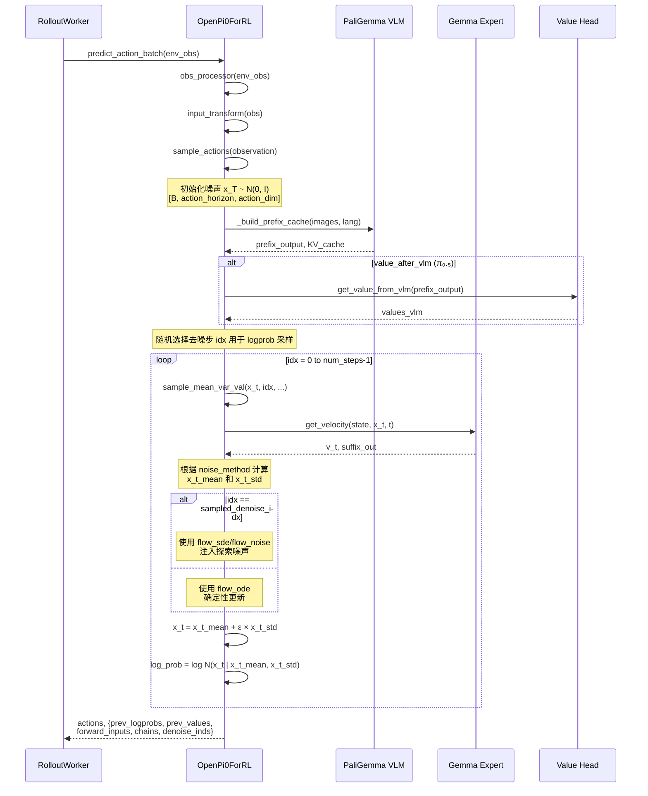
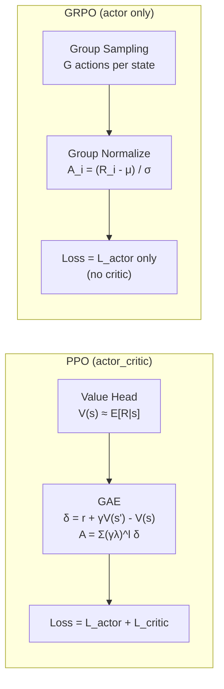
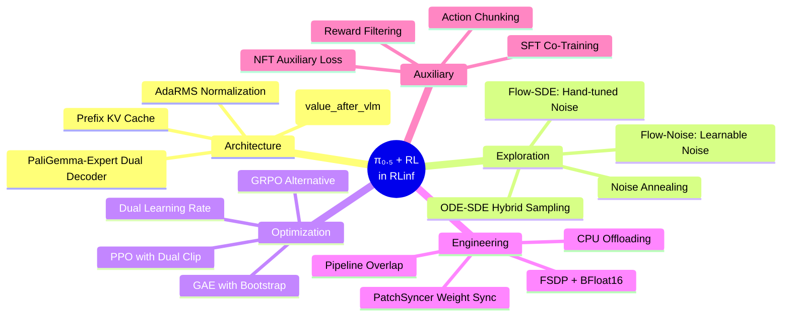

# π₀.₅ 在 RLinf 框架中的实现：深度技术解析

> **摘要**：本文对 RLinf 框架中 π₀.₅（Pi-Zero-Point-Five）视觉-语言-动作模型的强化学习微调实现进行深入、系统的技术解析。π₀.₅ 是由 Physical Intelligence 提出的第二代流匹配（Flow Matching）机器人策略模型，相比 π₀ 具有更大的 VLM 主干、更长的语言上下文窗口和自适应层归一化机制。RLinf 将其与 PPO/GRPO 等在线强化学习算法结合，通过 Flow-SDE 和 Flow-Noise 两种噪声注入技术解决了流匹配模型在 RL 训练中的探索性与概率密度估计难题。本文从静态架构到动态流程，从数学原理到工程实现，全方位剖析该系统的设计精髓。

---

## 目录

1. [系统总览与架构设计](#1-系统总览与架构设计)
2. [π₀.₅ 模型架构深度解析](#2-π₀₅-模型架构深度解析)
3. [训练系统数据流全景](#3-训练系统数据流全景)
4. [Forward 流程：从观测到动作](#4-forward-流程从观测到动作)
5. [Backward 流程：策略优化与梯度更新](#5-backward-流程策略优化与梯度更新)
6. [核心技术与训练 Tricks](#6-核心技术与训练-tricks)
7. [GRPO 与 PPO 对比分析](#7-grpo-与-ppo-对比分析)
8. [工程优化与系统设计](#8-工程优化与系统设计)
9. [实验结果与分析](#9-实验结果与分析)
10. [总结与展望](#10-总结与展望)

---

## 1. 系统总览与架构设计

### 1.1 RLinf 的 Embodied RL 训练架构

RLinf 采用分布式 Actor-Rollout-Env 三角架构，通过 Ray 进行跨 GPU/跨节点调度。这一架构的设计哲学源于大规模 RL 训练中的三个核心矛盾：**推理密集型 rollout** 需要大显存但低计算密度，**训练密集型 actor** 需要高计算吞吐但短时间大批量梯度更新，**环境模拟 env** 需要 CPU-GPU 混合但实时性要求高。



**关键源文件索引**:
- 训练主循环: `rlinf/runners/embodied_runner.py` → `EmbodiedRunner.run()`
- Actor Worker: `rlinf/workers/actor/fsdp_actor_worker.py` → `EmbodiedFSDPActor`
- Rollout Worker: `rlinf/workers/rollout/hf/huggingface_worker.py` → `MultiStepRolloutWorker`
- Env Worker: `rlinf/workers/env/env_worker.py` → `EnvWorker`

### 1.2 训练主循环

`EmbodiedRunner.run()` 编排了每个训练步的完整流程：



---

## 2. π₀.₅ 模型架构深度解析

### 2.1 整体架构

π₀.₅ 基于 PaliGemma-Expert 双解码器架构，由 Physical Intelligence 设计。RLinf 在此基础上增加了 Value Head、Noise Head 等 RL 组件。



### 2.2 π₀ 与 π₀.₅ 的关键区别

RLinf 模型实现位于 `rlinf/models/embodiment/openpi/openpi_action_model.py`，π₀ 和 π₀.₅ 共享同一个类 `OpenPi0ForRLActionPrediction`，通过 `config_name` 中的 `"pi05_"` 前缀区分。

| 特性 | π₀ | π₀.₅ |
|---|---|---|
| **VLM 隐藏维度** | 1024-d | 2048-d |
| **语言 token 长度** | 48 | 200 |
| **Prefix 总 token 数** | 816 (256×3+48) | 968 (256×3+200) |
| **投影层** | `state_proj`, `action_time_mlp_in/out` | `time_mlp_in`, `time_mlp_out` (无 `state_proj`) |
| **Expert 归一化** | 标准 RMSNorm + scale | **自适应 Dense 归一化 (AdaRMS)** |
| **Value Head 隐藏层** | (512, 256, 128) | **(1024, 512, 256)** |
| **Value 来源** | Action Expert suffix output | **VLM Prefix output** (`value_after_vlm=True`) |

从 `_no_split_names` 属性可以直接看到这一差异（第119-131行）:

```python
@property
def _no_split_names(self) -> list[str]:
    return [
        "action_in_proj", "action_out_proj", "lm_head",
        # --pi0 only--
        "state_proj", "action_time_mlp_in", "action_time_mlp_out",
        # --pi05 only--
        "time_mlp_in", "time_mlp_out",
    ]
```

π₀.₅ 的自适应层归一化（AdaRMS）是其架构升级的核心。与 π₀ 中使用固定 scale 参数的 RMSNorm 不同，π₀.₅ 的 Expert Gemma Decoder 使用 Dense 层动态生成归一化的缩放系数，这使得 Expert 能够根据输入上下文（时间步、动作状态）动态调整每层的特征分布。这与 DiT（Diffusion Transformer）中的 AdaLN-Zero 思想一脉相承。

### 2.3 Value Head 设计

Value Head 定义在 `rlinf/models/embodiment/modules/value_head.py`：

```python
class ValueHead(nn.Module):
    def __init__(self, input_dim, hidden_sizes=(512, 128), output_dim=1,
                 activation="gelu", bias_last=False):
        # MLP: input_dim → hidden_sizes → output_dim
        # 初始化：隐藏层 Kaiming Normal，输出层 Normal(0, 0.02)
```

π₀.₅ 的 Value Head 有两种接入模式，由 `value_after_vlm` 配置控制：

**模式 1: Suffix Value（π₀ 默认）**
- 输入: Action Expert 的 suffix output (1024-d)
- 在每个去噪步计算一次 value，取多步平均
- 与策略网络共享计算图，梯度可回传

**模式 2: VLM Value（π₀.₅ 默认，`value_after_vlm=True`）**
- 输入: PaliGemma 的 prefix output (2048-d)
- 仅计算一次，效率更高
- 通过 token masking 策略选择性聚合

VLM Value 的 token masking 逻辑（第999-1025行）：

```python
def get_value_from_vlm(self, prefix_output):
    # prefix_output: [bs, 968, 2048] for pi05
    if self.config.value_vlm_mode == "mean_token":
        # 只使用实际输入的 image tokens 和 language tokens
        prefix_mask = (
            [True] * 256 * num_images_in_input        # 有效 image tokens
            + [False] * 256 * (3 - num_images_in_input)  # padding image tokens
            + [True] * 200                              # language tokens
        )
    prefix_out_value = prefix_output[:, prefix_mask, :].mean(dim=1)
    values_vlm = self.value_head(prefix_out_value.float())[:, 0]
```

这种设计的洞见在于：对于 value 估计，VLM 层面的全局上下文理解（"环境中有什么"、"任务是什么"）比 Expert 层面的细粒度动作信息更重要。π₀.₅ 更大的 VLM 主干（2048-d vs 1024-d）为 value estimation 提供了更丰富的表征基础。

---

## 3. 训练系统数据流全景

### 3.1 数据结构

RLinf 使用精心设计的数据结构在各组件间传递信息。定义在 `rlinf/data/embodied_io_struct.py`：



### 3.2 Observation 处理流

从环境原始观测到模型输入的完整处理链：



---

## 4. Forward 流程：从观测到动作

### 4.1 Rollout 阶段的推理 Forward

Rollout 阶段调用 `predict_action_batch()` → `sample_actions()` 执行完整的流匹配去噪推理。



### 4.2 Flow Matching 去噪过程的数学原理

Flow Matching 将动作生成建模为从噪声 $x_1 \sim \mathcal{N}(0, I)$ 到数据 $x_0$ 的连续时间流。训练时学习速度场 $v_\theta(x_t, t)$，推理时通过 ODE/SDE 求解器从噪声反向积分得到动作。

**时间步划分**：将 $[0, 1]$ 均匀划分为 `num_steps` 步（默认 3-10 步），从 $t=1$（纯噪声）向 $t=0$（干净数据）迭代：

$$t_i = 1 - \frac{i}{N}, \quad \Delta_i = t_i - t_{i+1} = \frac{1}{N}$$

对应代码（第749-752行）：
```python
def _get_timesteps(self, denoise_steps, device):
    timesteps = torch.linspace(1, 1/denoise_steps, denoise_steps, device=device)
    timesteps = torch.cat([timesteps, torch.tensor([0.0], device=device)])
    return timesteps
```

**速度预测与端点估计**：在每个时间步 $t_i$，模型预测速度 $v_\theta$，然后估计数据端点 $\hat{x}_0$ 和噪声端点 $\hat{x}_1$：

$$\hat{x}_0 = x_t - v_\theta \cdot t, \quad \hat{x}_1 = x_t + v_\theta \cdot (1 - t)$$

对应代码（第798-799行）：
```python
x0_pred = x_t - v_t * t_input
x1_pred = x_t + v_t * (1 - t_input)
```

**更新方程**：下一步的均值通过端点的加权组合计算：

$$x_{t-\Delta} = w_0 \cdot \hat{x}_0 + w_1 \cdot \hat{x}_1 + \sigma \cdot \epsilon, \quad \epsilon \sim \mathcal{N}(0, I)$$

其中权重 $w_0, w_1$ 和噪声标准差 $\sigma$ 取决于所选的噪声注入方法。

### 4.3 四种噪声方法对比

RLinf 实现了四种噪声注入方法（第801-826行），它们的核心区别在于如何计算 $w_0, w_1, \sigma$：

| 方法 | $w_0$ | $w_1$ | $\sigma$ | 特点 |
|---|---|---|---|---|
| **flow_ode** | $1-(t-\Delta)$ | $t-\Delta$ | $0$ | 确定性，无探索 |
| **flow_sde** | $1-(t-\Delta)$ | $(t-\Delta) - \frac{\sigma_i^2 \Delta}{2t}$ | $\sqrt{\Delta} \cdot \sigma_i$ | 手动控制噪声强度 |
| **flow_cps** | $1-(t-\Delta)$ | $(t-\Delta)\cos\frac{\pi\alpha}{2}$ | $(t-\Delta)\sin\frac{\pi\alpha}{2}$ | 余弦-正弦混合 |
| **flow_noise** | $1-(t-\Delta)$ | $t-\Delta$ | $\text{NoiseNet}(h)$ | **可学习**噪声 |

#### 4.3.1 Flow-SDE 详解

Flow-SDE 的核心思想是将确定性 ODE 轨迹转化为随机 SDE 轨迹，通过注入时间步依赖的高斯噪声实现探索（参考论文 [πRL](https://arxiv.org/abs/2510.25889)）。

$\sigma_i$ 的计算使用了时间步比率的平方根：

$$\sigma_i = \alpha \cdot \sqrt{\frac{t_i}{1 - t_i}}$$

其中 $\alpha$ 是噪声强度超参数（默认 0.5）。这个设计的妙处在于：
- 当 $t \to 1$（接近纯噪声时），$\sigma_i \to \infty$，探索最充分
- 当 $t \to 0$（接近最终动作时），$\sigma_i \to 0$，行为趋于确定性

对 $w_1$ 中包含的修正项 $-\frac{\sigma_i^2 \Delta}{2t}$ 确保了 SDE 的马尔可夫性质，使得转移概率保持良好定义。

对应代码（第805-812行）：
```python
elif sample_method == "flow_sde":
    denom_timesteps = torch.where(timesteps == 1, timesteps[1], timesteps)
    sigma_ratio = timesteps / (1 - denom_timesteps)
    sigmas = noise_level * torch.sqrt(sigma_ratio)[:-1]
    sigma_i = sigmas[idx][:, None, None].expand_as(x_t)
    x0_weight = torch.ones_like(t_input) - (t_input - delta)
    x1_weight = t_input - delta - sigma_i**2 * delta / (2 * t_input)
    x_t_std = torch.sqrt(delta) * sigma_i
```

#### 4.3.2 Flow-Noise 详解

Flow-Noise 使用一个可学习的神经网络 `ExploreNoiseNet` 来预测每个时间步的噪声标准差，使模型能够根据**当前状态和去噪上下文**自适应地调整探索幅度（参考论文 [Flow-to-Diffusion](https://arxiv.org/abs/2505.22094)）。

`ExploreNoiseNet` 的架构（`rlinf/models/embodiment/modules/explore_noise_net.py`）：

```
输入: suffix_out [B, action_horizon, 1024]
  ↓
MLP: 1024 → 128 (tanh) → 64 (tanh) → action_dim (identity)
  ↓
post_process: tanh → 线性插值到 [logvar_min, logvar_max] → exp(0.5 × logvar)
  ↓
输出: noise_std [B, action_horizon, action_dim]
```

后处理的数学表达：

$$\sigma = \exp\left(\frac{1}{2} \cdot \left[\log\sigma_{\min}^2 + \frac{\log\sigma_{\max}^2 - \log\sigma_{\min}^2}{2} \cdot (\tanh(z) + 1)\right]\right)$$

其中 $z$ 是 MLP 的原始输出。tanh 将输出压缩到 $[-1, 1]$，再线性映射到 $[\log\sigma_{\min}^2, \log\sigma_{\max}^2]$，最终 exp 转换为标准差。默认的 $\sigma_{\min}=0.08$, $\sigma_{\max}=0.16$ 确保噪声在合理范围内。

### 4.4 对数概率密度的计算

流匹配模型没有显式的概率密度函数——这是将其应用于 RL（特别是 PPO/GRPO 需要 log-ratio）的核心难题。RLinf 采用**局部高斯近似**来解决这个问题。

**关键洞见**：在每个去噪步中，已知转移均值 $\mu$ 和标准差 $\sigma$，则转移概率可近似为：

$$\log p(x_{t-\Delta} | x_t) = \log \mathcal{N}(x_{t-\Delta}; \mu, \sigma^2 I) = -\log\sigma - \frac{1}{2}\log(2\pi) - \frac{(x_{t-\Delta} - \mu)^2}{2\sigma^2}$$

对应代码（第916-929行）：
```python
def get_logprob_norm(self, sample, mu, sigma):
    mask = sigma == 0
    sigma_safe = torch.where(mask, torch.ones_like(sigma), sigma)
    constant_term = -torch.log(sigma_safe) - 0.5 * torch.log(2 * torch.pi * torch.ones_like(sample))
    exponent_term = -0.5 * torch.pow((sample - mu) / sigma_safe, 2)
    log_prob = constant_term + exponent_term
    log_prob = torch.where(mask, torch.zeros_like(log_prob), log_prob)
    return log_prob
```

**两种聚合模式**:

1. **非联合模式** (`joint_logprob=False`，适用于 flow_sde)：
   - 在 rollout 阶段随机采样**一个**去噪步 $k$，仅在该步使用 SDE 注入噪声，其余步使用 ODE
   - 只计算被采样步的 log-prob
   - 训练时重新计算该步的 log-prob 用于 PPO ratio

2. **联合模式** (`joint_logprob=True`，适用于 flow_noise)：
   - 在**所有**去噪步都注入噪声
   - 计算所有步的 log-prob 并取平均
   - 包含初始噪声的 log-prob: $\log \mathcal{N}(x_T; 0, I)$

```mermaid
graph TD
    subgraph "Non-Joint Mode (flow_sde)"
        NJ1["随机选择 idx=k"]
        NJ2["步 0..k-1: flow_ode<br/>(确定性)"]
        NJ3["步 k: flow_sde<br/>(注入噪声, 计算 logprob)"]
        NJ4["步 k+1..N: flow_ode<br/>(确定性)"]
        NJ5["logprob = logprob[k]"]
        NJ1 --> NJ2 --> NJ3 --> NJ4 --> NJ5
    end
    
    subgraph "Joint Mode (flow_noise)"
        J1["初始 logprob: log N(x_T; 0, I)"]
        J2["步 0: flow_noise → logprob_0"]
        J3["步 1: flow_noise → logprob_1"]
        J4["..."]
        J5["步 N-1: flow_noise → logprob_{N-1}"]
        J6["logprob = mean(all logprobs)"]
        J1 --> J2 --> J3 --> J4 --> J5 --> J6
    end
```



### 4.5 Actor 训练阶段的 Forward

训练阶段调用 `default_forward()`（第407-454行），使用保存的 `chains`（去噪轨迹）和 `denoise_inds`（去噪步索引）重新计算 log-prob 和 value：

```python
def default_forward(self, forward_inputs, **kwargs):
    # 1. 重建 observation
    observation = self.input_transform(forward_inputs, transpose=False)
    images, img_masks, lang_tokens, lang_masks, state = \
        self._preprocess_observation(observation, train=False)
    
    # 2. 重新计算 log-prob 和 value
    log_probs, value_t, entropy = self.get_log_prob_value(
        images, img_masks, lang_tokens, lang_masks,
        state, chains, denoise_inds, compute_values)
    
    # 3. 裁剪到 action_chunk × action_env_dim
    log_probs = log_probs[:, :, :action_chunk, :action_env_dim]
    
    # 4. 跨去噪步聚合
    log_probs = log_probs.mean(dim=1)  # 平均所有去噪步
    value_t = value_t.mean(dim=-1)
    
    return {"logprobs": log_probs, "values": value_t, "entropy": entropy}
```

---

## 5. Backward 流程：策略优化与梯度更新

### 5.1 PPO Actor-Critic 联合损失

PPO 训练的核心在 `EmbodiedFSDPActor.run_training()`（第1295-1489行）。完整的梯度计算流如下：

```mermaid
flowchart TD
    subgraph "Training Step"
        A["加载模型权重到 GPU<br/>(如果已 offload)"]
        B["打乱 rollout 数据"]
        
        subgraph "Update Epoch Loop"
            C["划分 mini-batch"]
            
            subgraph "Mini-batch Loop"
                D["划分 micro-batch<br/>(gradient accumulation)"]
                
                subgraph "Micro-batch Loop"
                    E["model.forward()<br/>→ logprobs, values, entropy"]
                    F["policy_loss()<br/>→ actor_loss + critic_loss"]
                    G["entropy_bonus<br/>loss -= β × H(π)"]
                    H["SFT co-training<br/>(optional)"]
                    I["loss /= grad_accum"]
                    J["loss.backward()"]
                end
                
                K["optimizer_step():<br/>1. unscale gradients<br/>2. clip_grad_norm<br/>3. optimizer.step()<br/>4. grad_scaler.update()"]
            end
        end
        
        L["lr_scheduler.step()"]
        M["all_reduce metrics"]
    end
    
    A --> B --> C --> D --> E --> F --> G --> H --> I --> J
    J --> K --> L --> M
```



### 5.2 损失函数详解

#### 5.2.1 PPO Actor Loss

PPO 的 actor loss 采用经典的 clipped surrogate objective（`rlinf/algorithms/losses.py` 第167-309行）：

$$L^{\text{CLIP}} = -\mathbb{E}\left[\min\left(r(\theta) \hat{A}, \text{clip}(r(\theta), 1-\epsilon, 1+\epsilon) \hat{A}\right)\right]$$

其中 $r(\theta) = \exp(\log\pi_\theta(a|s) - \log\pi_{\theta_{\text{old}}}(a|s))$。

RLinf 增加了**双重裁剪（Dual Clip）**机制：

$$L^{\text{DC}} = \min\left(L^{\text{CLIP}}, \text{sign}(\hat{A}) \cdot c \cdot \hat{A}\right)$$

当 `clip_ratio_c=3.0` 时，对于 advantage 为负的样本，损失值不会超过 $3|\hat{A}|$，防止过度惩罚。

```python
if clip_ratio_c is not None:
    policy_loss3 = torch.sign(advantages) * clip_ratio_c * advantages
    dual_clip_mask = policy_loss3.detach() < policy_loss.detach()
    policy_loss = torch.min(policy_loss, policy_loss3)
```

此外还有**log-ratio 裁剪**选项（`clip_log_ratio_min/max`），在计算 ratio 之前先裁剪 log-ratio，防止数值爆炸：

```python
log_ratio = logprobs - old_logprobs
if clip_log_ratio_min is not None:
    log_ratio = torch.clamp(log_ratio, min=clip_log_ratio_min)
```

#### 5.2.2 PPO Critic Loss

Critic loss 使用带裁剪的 Huber Loss（第312-387行）：

$$L^V = \max\left(\text{Huber}_\delta(R - V), \text{Huber}_\delta(R - V^{\text{clip}})\right)$$

其中 $V^{\text{clip}} = V_{\text{old}} + \text{clip}(V - V_{\text{old}}, -\epsilon_v, \epsilon_v)$。

Huber Loss 提供了对离群 return 值的鲁棒性（默认 $\delta=10.0$），比纯 MSE 更稳定。

还计算了**解释方差（explained variance）**作为 critic 质量的监控指标：

$$\text{EV} = 1 - \frac{\text{Var}(R - V)}{\text{Var}(R)}$$

#### 5.2.3 Entropy Bonus

当 `entropy_bonus > 0` 时（flow_noise 方法中默认 0.005），entropy loss 用于鼓励探索：

$$L = L^{\text{CLIP}} + L^V - \beta \cdot H(\pi)$$

entropy 仅对 flow_noise 方法可用，因为只有 flow_noise 产生可学习的 $\sigma$：

$$H = \frac{1}{2}\log(2\pi e \sigma^2)$$

### 5.3 GAE 优势估计

GAE（Generalized Advantage Estimation）在 `rlinf/algorithms/advantages.py`（第25-86行）实现：

$$\delta_t = r_t + \gamma V(s_{t+1})(1 - d_{t+1}) - V(s_t)$$
$$\hat{A}_t^{\text{GAE}} = \sum_{l=0}^{T-t-1} (\gamma\lambda)^l (1 - d_{t+l+1})^l \delta_{t+l}$$

```python
for step in reversed(range(T)):
    delta = rewards[step] + gamma * values[step+1] * (~dones[step+1]) - values[step]
    gae = delta + gamma * gae_lambda * (~dones[step+1]) * gae
    returns[step] = gae + values[step]
advantages = returns - values[:-1]
```

默认配置：$\gamma = 0.99$，$\lambda = 0.95$。

优势归一化使用 safe_normalize（处理 mask 和零方差情况）：

$$\hat{A}_{\text{norm}} = \frac{\hat{A} - \mu(\hat{A})}{\sigma(\hat{A}) + \epsilon}$$

### 5.4 优化器配置

```yaml
optim:
  lr: 5.0e-6        # 策略学习率
  value_lr: 1.0e-4   # critic 学习率（高于策略）
  adam_beta1: 0.9
  adam_beta2: 0.95
  weight_decay: 0.01
  clip_grad: 1.0     # 梯度裁剪范数
```

值得注意的是 **dual learning rate** 设计：value head 使用 20× 于 policy 的学习率（1e-4 vs 5e-6）。这是因为 value function 需要快速适应新的 policy 分布，而 policy 更新应保守以维持训练稳定性。`critic_warmup_steps` 参数还允许在前 N 步仅训练 critic、冻结 policy loss。

---

## 6. 核心技术与训练 Tricks

### 6.1 Trick 1: ODE-SDE 混合采样策略

这是 RLinf 最独特的技术创新之一。在非联合模式（`joint_logprob=False`）下，rollout 阶段仅在**随机选择的一个去噪步**使用 SDE 注入噪声，其余步使用确定性 ODE：

```python
# 第674-687行
if mode == "train":
    if self.config.joint_logprob or collect_nft_state:
        denoise_inds = torch.arange(num_steps)  # 联合模式：全步
    else:
        denoise_inds = torch.tensor(
            [random.randint(0, num_steps - 2)] * num_steps)  # 非联合：随机一步
```

在去噪循环中：
```python
# 第694-718行
for idx in range(num_steps):
    if idx == denoise_inds[0][idx]:
        sample_method = self.config.noise_method  # SDE 或 noise
    else:
        sample_method = "flow_ode"  # 确定性
    
    x_t_mean, x_t_std, value_t, v_t = self.sample_mean_var_val(
        x_t, idx, state, ..., sample_method, ...)
    x_t = x_t_mean + self.sample_noise(x_t.shape, device) * x_t_std
```

**设计原理**：
- 全步注入噪声会严重降低动作质量，特别是在去噪后期（$t \to 0$）
- 单步噪声注入在保持动作质量的同时提供足够的探索
- 概率密度仅在注入噪声的步骤定义明确
- 训练时只需在对应步骤重新计算 log-prob

这本质上是一种**随机化探索**策略，类似于 $\epsilon$-greedy 的连续空间版本。

### 6.2 Trick 2: Action Chunking 与多粒度损失

π₀.₅ 预测一个 `action_horizon` 步的完整动作序列（如 8-10 步），但只执行前 `action_chunk` 步（如 5 步）。损失和 log-prob 也只计算在 action_chunk 范围内：

```python
log_probs = log_probs[:, :, :self.config.action_chunk, :self.config.action_env_dim]
```

RLinf 支持三种粒度的损失聚合（由 `reward_type`, `logprob_type`, `entropy_type` 控制）：

| 粒度 | 形状 | 含义 |
|---|---|---|
| **chunk_level** | `[B, num_chunks]` → `[B]` | 跨 action dimension 平均，per-chunk 一个标量 |
| **token_level** | `[B, num_chunks, action_dim]` | 保持每个 action 维度独立 |

以 LIBERO 的 flow_sde 配置为例：
```yaml
reward_type: chunk_level      # 奖励在 chunk 级别
logprob_type: chunk_level     # log-prob 在 chunk 级别
entropy_type: token_level     # entropy 保持 token 级别
```

而 ManiSkill 的 flow_noise 配置：
```yaml
entropy_type: chunk_level     # entropy 也在 chunk 级别
```

token-level 的 entropy 提供更细粒度的探索信号，有助于各 DoF 独立学习。

### 6.3 Trick 3: 噪声退火 (Noise Annealing)

通过 `noise_anneal=True` 启用线性退火，使噪声强度随训练步骤递减：

$$\alpha(t) = \alpha_{\text{start}} + (\alpha_{\text{end}} - \alpha_{\text{start}}) \cdot \min\left(1, \frac{t}{T_{\text{anneal}}}\right)$$

```python
# 第1296-1312行
def _get_noise_level(self, device, dtype, sample_method=None):
    if self.config.noise_anneal:
        noise_start, noise_end, anneal_steps = self.config.noise_params
        noise_level = noise_start + (noise_end - noise_start) \
            * min(self.global_step, anneal_steps) / anneal_steps
    else:
        noise_level = self.config.noise_level
```

默认 `noise_params = [0.7, 0.3, 400]`：从 0.7 线性退火到 0.3，历经 400 步。

在 ManiSkill flow_noise 配置中使用了 `noise_params: [0.16, 0.12, 200]`，这是噪声范围而非直接的 noise_level——与 `ExploreNoiseNet` 的 `set_noise_range()` 方法配合，实现了**可学习噪声范围的退火**。

### 6.4 Trick 4: VLM 冻结与 Expert-Only 训练

`train_expert_only=True` 冻结整个 PaliGemma VLM（SigLIP + Gemma LM），只训练 Gemma Expert 和 RL 组件：

```python
# 第1033-1038行
def freeze_vlm(self):
    if self.config.train_expert_only:
        self.paligemma_with_expert.paligemma.eval()
        for params in self.paligemma_with_expert.paligemma.parameters():
            params.requires_grad = False
```

这大幅减少了可训练参数量（约 70%+ 参数被冻结），使 RL 微调聚焦在动作生成模块上。冻结 VLM 还意味着 prefix KV cache 在整个训练过程中稳定，提高了 value estimation 的一致性。

### 6.5 Trick 5: Prefix Cache 复用

在每次推理中，VLM 的 prefix（images + language）只计算一次，然后缓存 KV 供所有去噪步复用：

```python
# 第885-901行
def _build_prefix_cache(self, images, img_masks, lang_tokens, lang_masks):
    prefix_embs, prefix_pad_masks, prefix_att_masks = self.embed_prefix(...)
    (prefix_output, _), past_key_values = self.paligemma_with_expert.forward(
        inputs_embeds=[prefix_embs, None], use_cache=True)
    return prefix_output, prefix_pad_masks, past_key_values
```

这将 VLM 的计算量从 $O(N \times C_{\text{VLM}})$ 降到 $O(C_{\text{VLM}} + N \times C_{\text{Expert}})$，其中 $N$ 是去噪步数，$C_{\text{VLM}}$ 是 VLM 前向传播成本，$C_{\text{Expert}}$ 是 Expert 的成本。对于典型的 $N=10$，这带来了接近 10× 的推理加速。

### 6.6 Trick 6: 批量大小与梯度累积

```yaml
micro_batch_size: 128      # 单 GPU 每次处理的样本数
global_batch_size: 2048    # 全局有效批量大小
```

梯度累积步数自动计算：

$$\text{grad\_accum} = \frac{\text{global\_batch\_size}}{\text{micro\_batch\_size} \times \text{world\_size}}$$

对于 8 GPU: $\text{grad\_accum} = 2048 / (128 \times 8) = 2$。

这允许在有限 GPU 内存下实现大有效批量大小，对 PPO 的优势估计稳定性至关重要。

### 6.7 Trick 7: SFT 联合训练 (Co-Training)

RLinf 支持在 RL 训练过程中混入 SFT（监督微调）损失，防止策略遗忘预训练知识：

$$L_{\text{total}} = L_{\text{PPO}} + w_{\text{sft}} \cdot L_{\text{SFT}}$$

```python
# 第1272-1278行
sft_loss = self.model(data=(observation, actions), forward_type=ForwardType.SFT)
total_loss = loss + self.sft_loss_weight * sft_loss  # 默认 w_sft = 0.1
```

SFT loss 使用原始的 flow matching 训练目标（预测速度场的 MSE loss），从离线数据集加载数据。

### 6.8 Trick 8: Reward Filtering

通过 `filter_rewards=True` 启用奖励过滤，仅在奖励位于 `[lower_bound, upper_bound]` 范围内的 prompt/task 上训练：

```python
# 第1141-1187行
reward_filter_mask = (mean_reward >= lower_bound) & (mean_reward <= upper_bound)
rollout_batch["loss_mask"] = reward_filter_mask & rollout_batch["loss_mask"]
```

这对于处理稀疏奖励环境特别有用——过滤掉全零奖励的 episode（太差，无有用梯度信号）和全满奖励的 episode（已解决，无改进空间）。

### 6.9 Trick 9: Bootstrap Type

ManiSkill 配置中使用 `bootstrap_type: always`：

```yaml
bootstrap_type: always  # [standard, always]
```

- `standard`: 只在截断（truncation）时 bootstrap $V(s_T)$
- `always`: 在终止（termination）和截断时都 bootstrap

对于机器人抓取任务，"成功"后的状态仍有价值（可以继续执行其他任务），因此总是 bootstrap 更合理。

### 6.10 Trick 10: NFT (Neuro-Feedback Training)

NFT 是 RLinf 提供的辅助训练模式（第456-490行）。在 rollout 阶段收集随机去噪步的中间状态：

```python
def _init_nft_state(self, collect_nft_state, x_t, num_steps, device):
    return {
        "nft_step_index": torch.randint(0, num_steps, (x_t.shape[0],)),
        "nft_xcur": torch.zeros_like(x_t),     # 当前步输入
        "nft_v": torch.zeros_like(x_t),         # 速度预测
        "nft_xnext": torch.zeros_like(x_t),     # 下一步结果
        "nft_noise_level": torch.zeros(...),     # 噪声强度
    }
```

训练时通过 `nft_forward()` 在保存的 $(x_t, t)$ 处重新计算速度 $v_\theta$，与保存的目标速度计算辅助损失。这提供了额外的监督信号，帮助模型保持流匹配的质量。

---

## 7. GRPO 与 PPO 对比分析

### 7.1 GRPO 优势计算

GRPO (Group Relative Policy Optimization) 在 `rlinf/algorithms/advantages.py`（第89-121行）实现：

$$\hat{A}_i^{\text{GRPO}} = \frac{R_i - \mu_{\text{group}}}{\sigma_{\text{group}} + \epsilon}$$

其中 $\mu_{\text{group}}$ 和 $\sigma_{\text{group}}$ 是同组（同 prompt）内 $G$ 个动作的奖励均值和标准差。

```python
@register_advantage("grpo")
def compute_grpo_advantages(rewards, loss_mask, group_size, **kwargs):
    grouped_rewards = rewards.view(-1, group_size)
    grouped_reward_mean = grouped_rewards.mean(dim=-1, keepdim=True)
    grouped_reward_std = grouped_rewards.std(dim=-1, keepdim=True)
    advantages = (grouped_rewards - grouped_reward_mean) / (grouped_reward_std + 1e-6)
    return advantages, None  # 无 returns（无 critic）
```

### 7.2 PPO vs GRPO 关键差异



| 维度 | PPO | GRPO |
|---|---|---|
| **Critic** | 需要 Value Head | 不需要 |
| **Advantage** | GAE（temporal difference） | 组内奖励标准化 |
| **采样** | 单动作/状态 | G 个动作/状态 |
| **Loss** | `actor_critic`（含 critic loss） | `actor`（仅 actor loss） |
| **适用场景** | 中间奖励、长 horizon | 稀疏奖励、episode-level |
| **LIBERO 结果** | **96.0% (π₀)**,  **97.9% (π₀.₅)** | 90.0% (π₀), 91.5% (π₀.₅) |

PPO 在 LIBERO 上显著优于 GRPO（+6-6.4%），因为 LIBERO 任务最多 240 步且有中间奖励，GAE 能更好地分配 credit。

---

## 8. 工程优化与系统设计

### 8.1 FSDP 策略与混合精度

RLinf 使用 PyTorch FSDP 进行模型并行：

```yaml
fsdp_config:
  strategy: "fsdp"
  sharding_strategy: "no_shard"     # 不分片（数据并行）
  gradient_checkpointing: False     # OpenPI 不支持
  mixed_precision:
    param_dtype: bfloat16
    reduce_dtype: bfloat16
    buffer_dtype: bfloat16
```

`no_shard` 策略意味着每个 GPU 持有完整模型副本（数据并行），这对于 π₀.₅ 的中等规模（约 3B 参数）是合理的——各 GPU 间不需要通信模型权重。

注意 `gradient_checkpointing: False` 是**硬性约束**，因为 OpenPI 的 Expert 使用了 KV cache，与 activation checkpointing 的 recompute 机制冲突。

### 8.2 权重同步：PatchSyncer

RLinf 使用增量式权重同步（PatchSyncer）而非全量同步：

```yaml
weight_syncer:
  type: patch_syncer  # 只同步变化的参数
```

训练后 Actor 只将**更新过的参数**发送给 Rollout Worker，避免传输整个模型 state_dict。对于 `train_expert_only=True` 的场景，需要同步的参数只占模型的一小部分。

### 8.3 Pipeline Overlap

```yaml
rollout:
  pipeline_stage_num: 2  # 可选
```

当 `pipeline_stage_num > 1` 时，环境和 rollout 的交互被分为多个阶段。每个阶段处理一半的环境实例，允许环境模拟和模型推理在时间上重叠：

```
阶段 1: [Env A 模拟] [Rollout A 推理]
阶段 2:              [Env B 模拟] [Rollout B 推理]
                     ↑ 重叠区域
```

### 8.4 Offloading 机制

通过 `enable_offload: True`，Actor 和 Rollout 可以在不使用模型时将权重卸载到 CPU：

```python
# rlinf/utils/utils.py
def swap_dict(resident_model, cpu_weights, offload_onto_cpu=True):
    """将当前 GPU 权重换出到 CPU，将新权重换入 GPU"""
    if offload_onto_cpu:
        offloaded_buffer = retrieve_model_state_dict_in_cpu(resident_model)
    # 加载 cpu_weights 到 GPU
```

典型场景：Rollout 推理完成后，将模型权重卸载到 CPU，为 Actor 训练腾出 GPU 内存。

### 8.5 组件放置策略

```yaml
cluster:
  component_placement:
    actor,env,rollout: all  # 共享所有 GPU（内存敏感）
    
    # 或分离部署：
    # env: 0-3
    # rollout: 4-7
    # actor: 0-7
```

共享模式下依赖 offloading；分离模式下各组件独占 GPU，无需 offloading 但需更多 GPU。

---

## 9. 实验结果与分析

### 9.1 LIBERO 基准测试

LIBERO 是一个基于 MuJoCo 的桌面操作基准，包含 4 个难度递进的任务套件：

| 模型 | Spatial | Object | Goal | Long | 平均 | Δ Avg |
|---|---|---|---|---|---|---|
| **π₀ (few-shot SFT)** | 65.3% | 64.4% | 49.8% | 51.2% | 57.6% | — |
| π₀ + GRPO | 97.8% | 97.8% | 83.2% | 81.4% | 90.0% | +32.4 |
| **π₀ + PPO** | **98.4%** | **99.4%** | **96.2%** | **90.2%** | **96.0%** | **+38.4** |
| **π₀.₅ (few-shot SFT)** | 84.6% | 95.4% | 84.6% | 43.9% | 77.1% | — |
| π₀.₅ + GRPO | 97.4% | 99.8% | 91.2% | 77.6% | 91.5% | +14.4 |
| **π₀.₅ + PPO** | **99.6%** | **100%** | **98.8%** | **93.0%** | **97.9%** | **+20.8** |

**关键观察**：
1. RL 微调（PPO）将 π₀ 的平均成功率从 57.6% 提升到 96.0%（+38.4%），π₀.₅ 从 77.1% 提升到 97.9%（+20.8%）
2. PPO 全面优于 GRPO（π₀: +6.0%, π₀.₅: +6.4%），GAE 在长 horizon 任务上的优势明显
3. π₀.₅ 的 SFT baseline 更高（77.1% vs 57.6%），说明更大的 VLM 主干提供了更好的初始化
4. Long 任务提升最大（π₀: +39.0%, π₀.₅: +49.1%），说明 RL 在长 horizon 推理上特别有效

### 9.2 ManiSkill3 和 MetaWorld 结果

| 环境 | 模型 | SFT | Flow-SDE | Flow-Noise |
|---|---|---|---|---|
| **ManiSkill3** | π₀ | 38.4% | 78.8% | 77.8% |
| | π₀.₅ | 40.1% | **90.9%** | 89.7% |
| **MetaWorld MT50** | π₀ | 50.8% | 78.1% | **85.8%** |
| | π₀.₅ | 43.8% | 70.7% | 66.1% |

**有趣发现**：
- ManiSkill3 上 flow_sde 和 flow_noise 性能接近，π₀.₅ 显著优于 π₀
- MetaWorld 上 flow_noise 优于 flow_sde（π₀: +7.7%），但 π₀.₅ 反而不如 π₀
- MetaWorld 的 50 个任务差异极大，π₀.₅ 的更大容量未必带来泛化优势

### 9.3 最小测试用例 (Quick Start)

RLinf 提供了资源友好的最小配置（`libero_spatial_ppo_openpi_quickstart.yaml`）：

| 参数 | 标准 | 最小 |
|---|---|---|
| `rollout_epoch` | 8 | 2 |
| `total_num_envs` | 64 | 32 |
| `micro_batch_size` | 128 | 64 |
| `global_batch_size` | 2048 | 256 |
| `lr` | 5e-6 | 1e-6 |
| `enable_offload` | False | True |

实验表明最小配置在相同墙钟时间下与标准配置性能接近——每轮优化更快但收敛更慢。

---

## 10. 总结与展望

### 10.1 技术总结

RLinf 中 π₀.₅ 的 RL 微调实现是一个**复杂而精巧**的系统工程。其核心技术贡献可归纳为：



### 10.2 设计洞见

1. **Flow Matching 的 RL 适配并非显而易见**。流匹配模型没有显式概率密度，RLinf 通过局部高斯近似和 ODE-SDE 混合采样优雅地解决了这个问题。这一技术路线来源于 πRL 论文，但 RLinf 在工程实现上做了大量改进。

2. **VLM Value Head 是 π₀.₅ 特有的创新**。将 critic 接在 VLM 输出而非 Expert 输出上，利用了 π₀.₅ 更大 VLM 的丰富表征，同时避免了 critic 梯度干扰 action expert 的训练。

3. **可学习噪声 (flow_noise) 是自适应探索的优雅方案**。与手动调节 noise_level 相比，ExploreNoiseNet 能够根据状态动态调整探索幅度——在不确定的状态增加探索，在确定的状态减少噪声。

4. **分布式架构设计直接影响训练效率**。Actor-Rollout-Env 的三角通信结构、PatchSyncer 的增量权重同步、Pipeline Overlap 等工程优化使得在 4-8 GPU 上就能高效训练 3B 参数的 VLA 模型。

### 10.3 可能的改进方向

- **多步 SDE 采样**：当前非联合模式只在一个随机步注入噪声，多步注入可能提供更好的探索覆盖
- **自适应 action_chunk**：根据任务难度和训练阶段动态调整执行的 action chunk 大小
- **更精细的 VLM 微调**：LoRA 或 adapter 层对 VLM 的选择性微调，在保持预训练知识和适应新任务间取得平衡
- **离线-在线混合训练**：更深入地集成 SFT co-training，例如使用 experience replay 或 DAgger
- **多 critic 集成**：使用多个 value head 估计 value uncertainty，指导探索方向

---

> **参考文献**：
> 1. Black, K., et al. "π₀: A Vision-Language-Action Flow Model for General Robot Control." (2024)
> 2. Pertsch, K., et al. "Fast Fine-Tuning of Flow Matching Models with π₀.₅." (2025)
> 3. Zhu, Y., et al. "πRL: Online RL Fine-Tuning for Flow-Based Vision-Language-Action Models." arXiv:2510.25889 (2025)
> 4. Wang, Z., et al. "Flow-to-Diffusion: Bridging Flow Matching and Diffusion for RL." arXiv:2505.22094 (2025)
> 5. Schulman, J., et al. "Proximal Policy Optimization Algorithms." arXiv:1707.06347 (2017)
> 6. Shao, Z., et al. "DeepSeekMath: Pushing the Limits of Mathematical Reasoning in Open Language Models." arXiv:2402.03300 (2024) [GRPO]
> 7. RLinf Team. "RLinf: Flexible and Efficient Large-scale Reinforcement Learning via Macro-to-Micro Flow Transformation." (2025)
