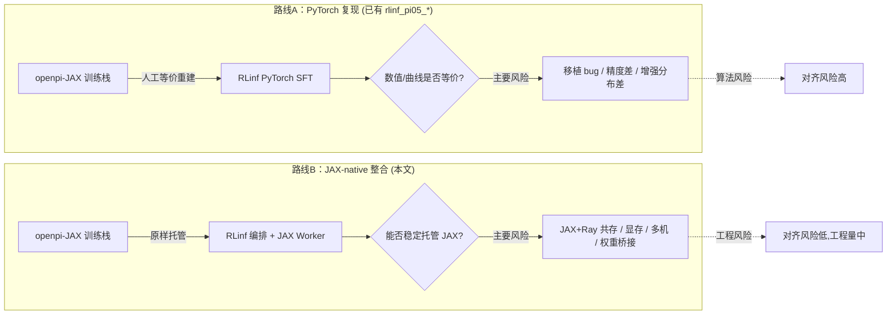
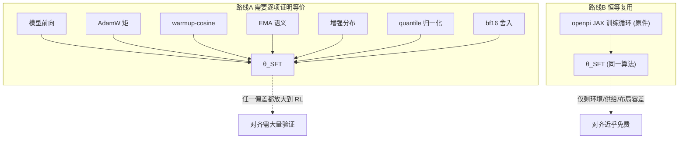
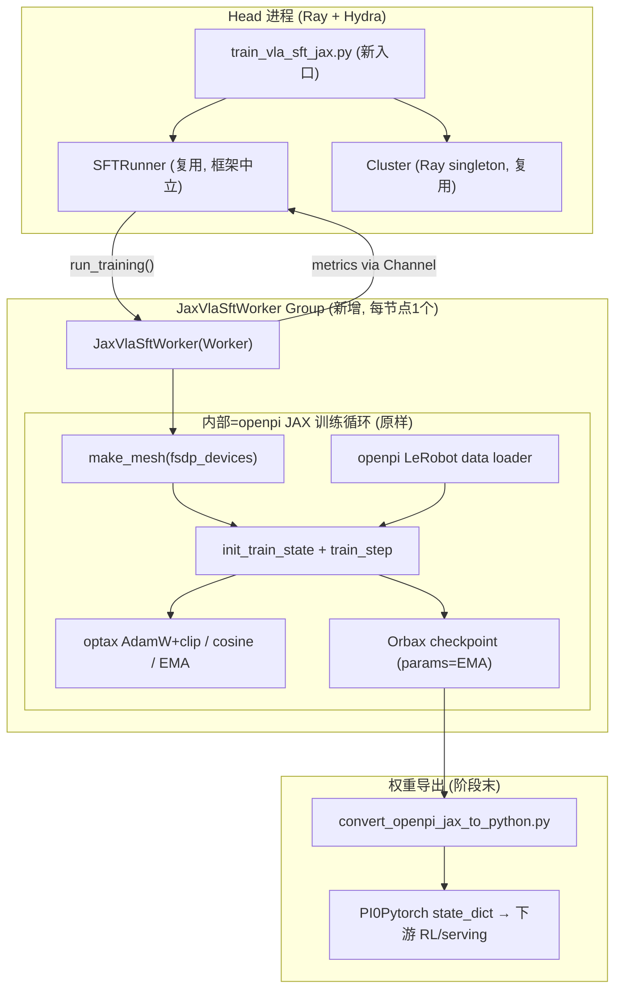
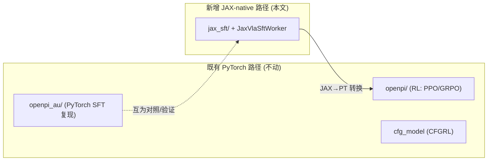
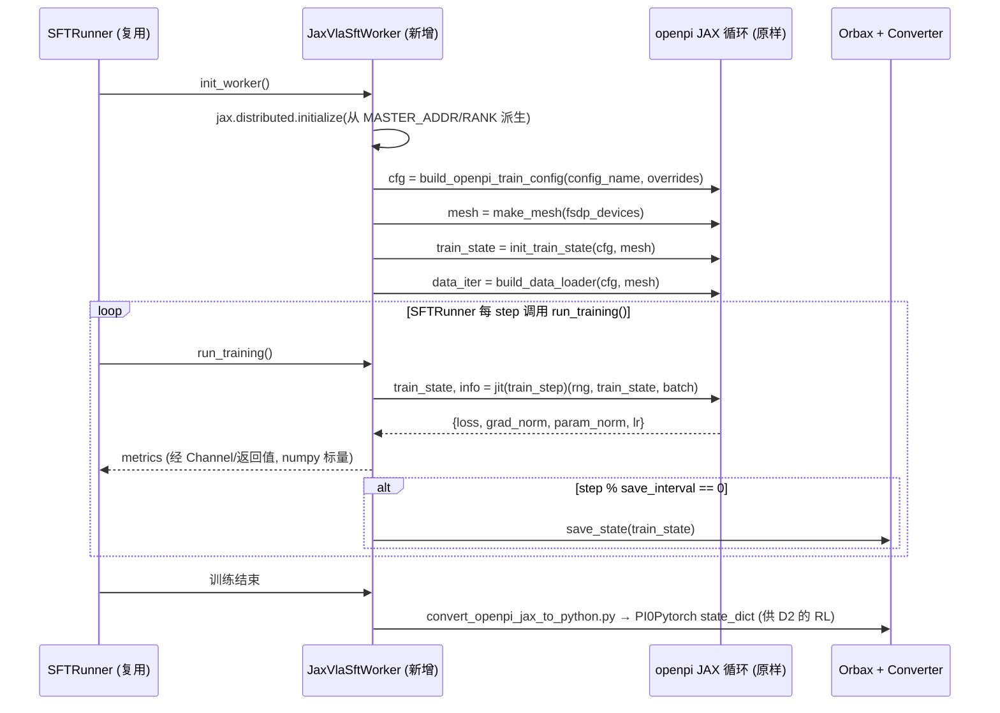
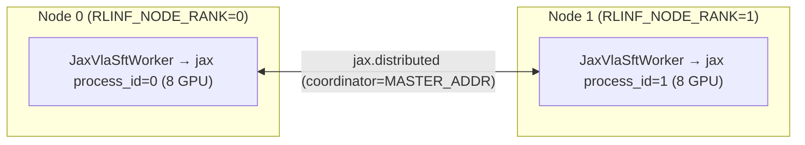
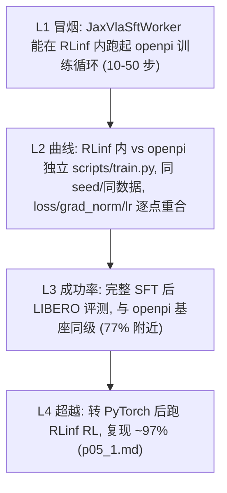
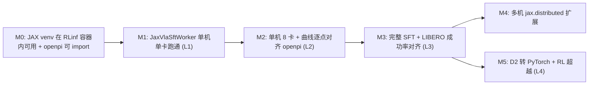

# 在 RLinf 中原生整合 openpi JAX 版 π₀.₅ 的深度方案（JAX-native 路线）

> **摘要**：本文提出一条与既有 [`rlinf_pi05_1.md`](rlinf_pi05_1.md) / [`rlinf_pi05_2.md`](rlinf_pi05_2.md)（"PyTorch 复现 JAX"路线）**互补而对立**的整合路线：**不在 PyTorch 上等价重建 openpi 的训练技巧，而是把 openpi 的 JAX（Flax NNX）π₀.₅ 训练栈"原样"托管进 RLinf 的编排层**。核心论点是——既有 PyTorch 复现路线的最大风险是"JAX↔PyTorch 数值移植 + 训练栈等价重建"；而 JAX-native 路线**直接运行 openpi 的原始参考实现**（同一模型、同一 flow-matching 损失、同一 AdamW/EMA/余弦调度、同一增强、同一 quantile 归一化、同一 Orbax EMA checkpoint），因此**算法效果对齐"由构造保证"（by construction）**，风险从"数值对齐"整体转移到"工程整合"（JAX 与 Ray/PyTorch 共存、显存、跨机 `jax.distributed`、序列化边界、权重桥接）。本文给出：两库关键事实、整合总架构、trick 原样保留映射表、SFT 详细设计（数据流/序列图/伪代码/配置）、RL 扩展的三条路径、与 openpi 对齐的三层验证协议、里程碑与风险回退，最后对"能否达到算法效果对齐（一样甚至更好）"给出**可行性评分**。代码引用均指向真实源文件与行号，公式用 LaTeX，结构用 Mermaid。

---

## 目录

1. [命题与两条路线的分野](#1-命题与两条路线的分野)
2. [关键前提：openpi=SFT，RLinf=RL；本文=JAX-native 整合](#2-关键前提openpisftrlinfrl本文jax-native-整合)
3. [两个代码库的关键事实](#3-两个代码库的关键事实)
4. [核心洞察：为何"原样跑 JAX"让效果对齐近乎免费](#4-核心洞察为何原样跑-jax-让效果对齐近乎免费)
5. [整合总架构](#5-整合总架构)
6. [openpi JAX 训练 trick 全清单 → RLinf 内"原样保留"映射](#6-openpi-jax-训练-trick-全清单--rlinf-内原样保留映射)
7. [SFT 路径详细设计](#7-sft-路径详细设计)
8. [关键工程难点与对策](#8-关键工程难点与对策)
9. [RL 扩展路径（"甚至更好"的来源）](#9-rl-扩展路径甚至更好的来源)
10. [与 openpi 对齐的验证协议](#10-与-openpi-对齐的验证协议)
11. [里程碑、风险与回退](#11-里程碑风险与回退)
12. [可行性评分](#12-可行性评分)
13. [附录](#13-附录)

---

## 1. 命题与两条路线的分野

用户命题：**把 openpi 中 JAX 版的 π₀.₅（含其全部训练优化与 trick）整合进 RLinf，并保证在 RLinf 上训练出的 JAX 版 π₀.₅ 达到"与 openpi 训练出来的 JAX 版 π₀.₅ 一样甚至更好"的效果。**

RLinf 仓库中已经存在一整套关于 π₀.₅ 的分析与方案文档，但它们走的都是**另一条路线**：

- [`rlinf_pi05_1.md`](rlinf_pi05_1.md) / [`rlinf_pi05_2.md`](rlinf_pi05_2.md)：**在 PyTorch 上等价重建** openpi 的 SFT 训练栈（`openpi_au` 复制隔离 + `FSDPVlaSftWorkerAu`）。
- [`rlinfpi_ema_aug_ckp_1.md`](rlinfpi_ema_aug_ckp_1.md) / [`rlinfpi_lr_mxp_grdckp_1.md`](rlinfpi_lr_mxp_grdckp_1.md)：把 EMA / 图像增强 / checkpoint / 学习率 / 混合精度 / 梯度检查点逐项在 PyTorch 复刻。
- [`rlinfpi_accept_1.md`](rlinfpi_accept_1.md)：JAX↔PyTorch 数值对齐 → 曲线对齐 → 成功率的三层验收。
- [`p05_1.md`](p05_1.md)：RLinf 现有 π₀.₅ **RL**（PPO/GRPO + Flow-SDE/Flow-Noise）实现解析（LIBERO 77.1% → 97.9%）。

**本文（`rlinf_jxpi05_1.md`）的独特定位**：既有路线是"用 PyTorch 逼近 JAX"，本质是**再实现**，因此天然背负"数值是否逐位等价"的证明负担；本文是"**直接把 JAX 搬进来跑**"，本质是**复用参考实现**。二者的风险结构完全不同：



> **一句话**：路线A 把风险压在"算法数值等价"；路线B 把风险压在"系统工程整合"。对"算法效果对齐"这一命题而言，**路线B 的先天优势极大**——因为训练算法本身就是 openpi 的原件。

---

## 2. 关键前提：openpi=SFT，RLinf=RL；本文=JAX-native 整合

沿用既有文档已澄清的前提（[`rlinf_pi05_1.md`](rlinf_pi05_1.md) §1）：

- **openpi 的 π₀.₅ 训练** = 监督式条件流匹配（Conditional Flow Matching）行为克隆，**无环境、无奖励、无 RL**。其"效果"由 SFT 基座质量衡量。
- **RLinf 的 π₀.₅ 训练** = 把已 SFT 的 π₀.₅ 当初始策略，用 PPO/GRPO 在线 RL 微调（Flow-SDE / Flow-Noise 提供可计算 log-prob 的随机策略）。

因此"**与 openpi 训练出来的一样甚至更好**"应被精确拆成两层目标：

| 目标 | 含义 | 达成手段 |
| --- | --- | --- |
| **"一样"（对齐）** | RLinf 内训练的 JAX π₀.₅ **SFT 基座** ≈ openpi 的 SFT 基座（loss 曲线、成功率同级） | **原样运行 openpi JAX 训练栈** |
| **"甚至更好"（超越）** | 在对齐的 SFT 基座上再做 RL 或更强数据/规模 | 复用 RLinf 的 RL（已证明 77.1%→97.9%），或更大数据/多机 |

$$\theta_{\text{SFT}}^{\text{RLinf-JAX}} \;\overset{\text{目标：对齐}}{\approx}\; \theta_{\text{SFT}}^{\text{openpi-JAX}} \;\xrightarrow[\text{RLinf 的核心价值}]{\text{PPO/GRPO 在线 RL}}\; \theta_{\text{RL}} \;\overset{\text{目标：超越}}{\succ}\; \theta_{\text{SFT}}^{\text{openpi-JAX}}$$

**本文主线 = 对齐（SFT）**，因为 RL 天花板由 SFT 基座决定；**"更好"作为扩展**在 §9 展开。

---

## 3. 两个代码库的关键事实

### 3.1 openpi JAX π₀.₅ 训练栈（参考标准，全部原样复用）

以 `pi05_libero` 为基准（[`src/openpi/training/config.py:743`](/home/physical/SRC/Robot/openpi05/src/openpi/training/config.py)）：

```743:763:/home/physical/SRC/Robot/openpi05/src/openpi/training/config.py
    TrainConfig(
        name="pi05_libero",
        model=pi0_config.Pi0Config(pi05=True, action_horizon=10, discrete_state_input=False),
        data=LeRobotLiberoDataConfig(
            repo_id="physical-intelligence/libero",
            base_config=DataConfig(prompt_from_task=True),
            extra_delta_transform=False,
        ),
        batch_size=256,
        lr_schedule=_optimizer.CosineDecaySchedule(
            warmup_steps=10_000, peak_lr=5e-5, decay_steps=1_000_000, decay_lr=5e-5,
        ),
        optimizer=_optimizer.AdamW(clip_gradient_norm=1.0),
        ema_decay=0.999,
        weight_loader=weight_loaders.CheckpointWeightLoader("gs://openpi-assets/checkpoints/pi05_base/params"),
        num_train_steps=30_000,
    ),
```

训练栈由以下 JAX/Flax 专属机制构成（均为本文"原样保留"对象）：

- **模型**：`Pi0`（`pi0.py`）= PaliGemma(SigLIP So400m/14 + Gemma-2B) + Action Expert(Gemma-300M) 双专家；π₀.₅ 用 adaRMSNorm 注入时间步、state 走离散 token（LIBERO 关闭）。
- **损失**：`compute_loss`（[`pi0.py:189`](/home/physical/SRC/Robot/openpi05/src/openpi/models/pi0.py)）——`time ~ Beta(1.5,1)·0.999+0.001`，`x_t = t·ε+(1-t)·a`，回归 `u_t = ε - a` 的 MSE。
- **train_step**（[`scripts/train.py:136`](/home/physical/SRC/Robot/openpi05/scripts/train.py)）：`nnx.value_and_grad` + `nnx.DiffState(trainable_filter)` + `optax` 更新 + EMA。
- **优化器**：`optax.chain(clip_by_global_norm(1.0), adamw(b1=0.9,b2=0.95,eps=1e-8,wd=1e-10))`（[`optimizer.py:65`](/home/physical/SRC/Robot/openpi05/src/openpi/training/optimizer.py)）。
- **LR**：`optax.warmup_cosine_decay_schedule`（[`optimizer.py:16`](/home/physical/SRC/Robot/openpi05/src/openpi/training/optimizer.py)）。
- **EMA**：`ema = 0.999·ema + 0.001·new`（[`train.py:172`](/home/physical/SRC/Robot/openpi05/scripts/train.py)）；保存时 `params/`=EMA、`train_state/` 剥离 EMA（[`checkpoints.py:145`](/home/physical/SRC/Robot/openpi05/src/openpi/training/checkpoints.py)）。
- **混合精度**：`dtype="bfloat16"`；RMSNorm 方差与 attention logits 用 FP32（`gemma.py:117,217`）。
- **数据/增强**：LeRobot loader + quantile 归一化到 [-1,1]（`transforms.py:141`）；图像增强在 `compute_loss` 内（GPU/JAX 侧，`model.py:168`，非 wrist 相机 RandomCrop95%+Rotate±5°+ColorJitter）。
- **remat/scan**：Gemma 18 层、SigLIP 27 层 `nn.remat(policy=nothing_saveable)` + `nn.scan`（`gemma.py:359`，`siglip.py:126`）。
- **权重加载**：从 `pi05_base` 部分加载，缺失（如 action expert LoRA）随机 init（`weight_loaders.py:48`）。
- **FSDP sharding**：`make_mesh(fsdp_devices)` 2D mesh `(batch, fsdp)`（`sharding.py:17`）+ `jax.jit(donate_argnums)`。

### 3.2 RLinf 侧：编排层框架中立，训练栈深度绑定 PyTorch

由 [RLinf 基础设施探查](3155ee2a-698f-40c6-be8e-e2be29827a7e) 得出分层耦合度：

| 层级 | 框架耦合 | 证据 |
| --- | --- | --- |
| Cluster / WorkerGroup / Ray placement / GPU 环境变量 | **低（中立）** | `worker_group.py:223`（GPU 分配走 Ray + `VISIBLE_DEVICES`） |
| Channel（FIFO 队列，传任意可序列化对象） | **低（中立）** | `scheduler/channel/channel.py`（pickle/Ray object store） |
| Runner（`EmbodiedRunner` / `SFTRunner` 循环） | **低（中立）** | `sft_runner.py:77` 仅调用 `actor.run_training()` |
| Worker.send/recv（GPU 走 NCCL） | **高（torch）** | `worker.py:554`（对 `torch.Tensor` 特化 NCCL） |
| Actor 训练（FSDP/Megatron） | **极高（torch）** | `SUPPORTED_TRAINING_BACKENDS=["megatron","fsdp"]`（`config.py:140`） |
| 权重同步 / reshard | **极高（torch）** | `WeightSyncer.sync(state_dict: dict[str, torch.Tensor|DTensor])`（`weight_syncer/base.py:46`） |
| Embodied 模型 / rollout | **高（torch）** | `OpenPi0ForRLActionPrediction(PI0Pytorch, BasePolicy)`（`openpi_action_model.py:91`） |

**关键结论**：RLinf 的"宏观调度层"（Cluster/Worker/Channel/Runner，即论文 macro-to-micro 的 macro 部分）**足够框架中立，可托管一个 JAX 训练 worker**；但"微观训练步"（FSDP/optimizer/AMP/weight-sync/rollout）是端到端 PyTorch。因此 JAX-native 整合的正确姿势是：**在 macro 层新增一个自洽的 JAX worker（把 openpi 的 JAX 训练循环整体塞进去），而不是去改造 micro 层的 PyTorch 组件。**

### 3.3 一个已存在的桥梁：JAX→PyTorch 权重转换器

RLinf 已内置 [`rlinf/utils/ckpt_convertor/convert_openpi_jax_to_python.py`](/home/physical/SRC/RL/RLinf/rlinf/utils/ckpt_convertor/convert_openpi_jax_to_python.py)：用 `orbax` 读取 JAX checkpoint，转成 `PI0Pytorch` 的 PyTorch state dict。这是 §9 "混合桥接"路径（JAX-SFT → PyTorch-RL）的**现成基础设施**，证明 JAX↔PyTorch 权重互通在本仓库已被打通。

---

## 4. 核心洞察：为何"原样跑 JAX"让效果对齐近乎免费

设 openpi 的训练算法为一个确定性映射（给定随机种子）：

$$\mathcal{A}_{\text{openpi}}: (\theta_0,\; \mathcal{D},\; \text{seed},\; \text{HParams}) \longmapsto \theta_{\text{SFT}}$$

其中 $\theta_0$=预训练权重、$\mathcal{D}$=数据、HParams=全部超参与 trick。**路线A（PyTorch 复现）** 实际上是在构造另一个映射 $\mathcal{A}_{\text{RLinf-PT}}$，并试图证明 $\mathcal{A}_{\text{RLinf-PT}} \approx \mathcal{A}_{\text{openpi}}$——这要求逐项验证：模型前向数值、flow-matching 采样、AdamW 矩、warmup-cosine 形状、EMA 语义、增强分布、quantile 归一化、bf16 舍入……**任何一项偏差都会传播到 $\theta_{\text{SFT}}$，进而压低 RL 天花板**（[`rlinf_pi05_1.md`](rlinf_pi05_1.md) §2.3 的核心担忧）。

**路线B（本文）** 让 RLinf 直接调用 $\mathcal{A}_{\text{openpi}}$ 本体：

$$\mathcal{A}_{\text{RLinf-JAX}} \;\equiv\; \mathcal{A}_{\text{openpi}} \quad(\text{同一份代码})$$

于是"效果对齐"从一个**需要证明的近似命题**降级为一个**由构造成立的恒等式**。残余风险只剩三类，且都不是"算法差异"：

1. **执行环境差异**：GPU 型号/驱动、XLA 版本、cuDNN 数值差异——但这类差异 openpi 自己在不同机器上复现时同样存在，属于"可接受的复现容差"。
2. **数据供给差异**：RLinf 若替换 openpi 的 LeRobot loader，可能改变 batch 组成/顺序/增强 RNG。**对策：SFT 阶段直接复用 openpi 的 loader（见 §7.2），把此风险清零。**
3. **分布式布局差异**：多卡/多机的 mesh 与数据分片。**对策：让 JAX worker 复刻 openpi 的 `make_mesh` 与 `PartitionSpec`（见 §7.3、§8.3），单机与 openpi 完全一致。**



---

## 5. 整合总架构

### 5.1 设计原则：macro 复用、micro 隔离、零侵入

沿用既有文档的"**复制隔离 / 零侵入**"哲学（[`rlinf_pi05_2.md`](rlinf_pi05_2.md) v2、[`rlinfpi_ema_aug_ckp_1.md`](rlinfpi_ema_aug_ckp_1.md)）：

1. **复用 macro 层**：`Cluster` / `WorkerGroup` / Ray placement / `Channel` / `SFTRunner` 全部照用（它们框架中立）。
2. **新增自洽的 micro 层**：新建 `JaxVlaSftWorker`（一个 `Worker` 子类），内部**整体托管 openpi 的 JAX 训练循环**，不复用 `FSDPModelManager` / `WeightSyncer`。
3. **零修改现有文件**：新增 `training_backend: jax` 分支只在**新入口脚本**里生效；对 `rlinf/config.py`、现有 worker、现有 `openpi` / `openpi_au` 包一律不改（新增 `validate_cfg` 的软扩展可选）。
4. **openpi 作为 pip 依赖直接调用**：openpi 已由 `requirements/install.sh` 从 `github.com/RLinf/openpi` 安装，其 `scripts/train.py` 的 `init_train_state` / `train_step` 可作为库函数导入复用。

### 5.2 架构总览图



### 5.3 与既有 PyTorch 路径的关系（并存，不替换）



**关键点**：JAX-native SFT 与既有 PyTorch RL **不是替代关系而是级联关系**——JAX 产出对齐的 SFT 基座，转换成 PyTorch 后喂给 RLinf 成熟的 PPO/GRPO（[`p05_1.md`](p05_1.md)），既拿到"对齐"又拿到"更好"。

### 5.4 三种整合深度（按工程量/纯度递增）

| 深度 | 训练 | Rollout/RL | 权重桥接 | 工程量 | 对齐纯度 |
| --- | --- | --- | --- | --- | --- |
| **D1: JAX-SFT 独立** | JAX（原样） | 无（仅 SFT） | 末端一次 JAX→PT | **小** | SFT 完美对齐 |
| **D2: JAX-SFT + PyTorch-RL（混合，推荐）** | SFT=JAX，RL=现有 PyTorch | 复用现有 HF rollout | JAX→PT 一次 | **中** | SFT 对齐 + RL 超越 |
| **D3: 全 JAX-native RL** | JAX actor + JAX rollout | 新写 JAX rollout + Flow-SDE | 每次 sync 双向 | **大** | 纯 JAX 全链路 |

本文**主推 D1（对齐核心）与 D2（对齐+超越）**；D3 作为"若要求 RL 阶段也纯 JAX"的可选项在 §9.3 展开。

---

## 6. openpi JAX 训练 trick 全清单 → RLinf 内"原样保留"映射

下表是本方案的**核心资产**：路线A（PyTorch）需要对每一项做"等价重建 + 数值验证"，而路线B（本文）对每一项都是"**原样保留、零重建**"。"整合注意点"列仅涉及**系统工程**，不涉及算法改动。

| # | JAX 训练 trick | openpi 源位置 | `pi05_libero` 取值 | 本文处理 | 整合注意点（纯工程） |
| --- | --- | --- | --- | --- | --- |
| 1 | 双专家 Gemma + SigLIP 联合注意力 | `pi0.py:66`, `gemma.py:172` | gemma_2b + gemma_300m | **原样** | 仅需 openpi 包可 import |
| 2 | adaRMSNorm 时间步注入（π₀.₅） | `gemma.py:112`, `pi0.py:151` | `use_adarms=[F,T]` | **原样** | 无 |
| 3 | Flow-matching 损失（Beta 时间采样） | `pi0.py:189` | `Beta(1.5,1)` clamp[1e-3,0.999] | **原样** | RNG 由 `jax.random.fold_in(step)` 决定，需固定 seed=42 |
| 4 | 10 步 Euler 采样 + KV cache | `pi0.py:217` | `num_steps=10` | **原样** | 仅 eval/serving 用 |
| 5 | AdamW + 全局梯度裁剪 | `optimizer.py:65` | b1.9/b2.95/eps1e-8/wd1e-10/clip1.0 | **原样（optax）** | 无 |
| 6 | warmup + cosine LR | `optimizer.py:16` | warmup1e4/peak5e-5/decay1e6/end5e-5 | **原样（optax）** | 若改总步数需相应缩放（见 §7.4） |
| 7 | EMA（推理用 EMA 权重） | `train.py:172`, `checkpoints.py:145` | `ema_decay=0.999` | **原样** | checkpoint `params/`=EMA |
| 8 | bf16 混合精度（norm/logits FP32） | `gemma.py:117,217` | `dtype=bfloat16` | **原样** | 无 master-weight 议题（optax 状态 FP32） |
| 9 | quantile 归一化到 [-1,1] | `transforms.py:141`, `config.py:186` | PI05 自动开启 | **原样** | 复用 `norm_stats.json`（见 §7.2） |
| 10 | 训练时图像增强（GPU/JAX 内） | `model.py:168` | crop95%/rot±5°/colorjitter | **原样** | 增强在 `compute_loss` 内，随模型一起搬 |
| 11 | remat + scan（省显存） | `gemma.py:359`, `siglip.py:126` | `nothing_saveable`, 18/27 层 | **原样** | 无 |
| 12 | 部分权重加载（pi05_base） | `weight_loaders.py:48` | GCS `pi05_base/params` | **原样** | 需可访问权重（GCS 或本地镜像） |
| 13 | FSDP mesh + `donate_argnums` + JIT | `sharding.py:17`, `train.py:243` | `fsdp_devices` 可配 | **原样** | mesh 建立在 worker 可见 GPU 上（§8.1） |
| 14 | JAX 编译缓存 | `train.py:203` | `~/.cache/jax` | **原样** | 容器内持久化缓存目录 |
| 15 | Orbax 异步 checkpoint | `checkpoints.py:40` | `max_to_keep=1` | **原样** | 落盘路径映射到 RLinf 目录约定（§8.5） |

> **对照**：既有 [`rlinfpi_ema_aug_ckp_1.md`](rlinfpi_ema_aug_ckp_1.md) / [`rlinfpi_lr_mxp_grdckp_1.md`](rlinfpi_lr_mxp_grdckp_1.md) 分别为第 7、10、6、8、11 项在 PyTorch 侧写了数百行"等价重建 + 单测"。路线B 对这 15 项的"重建代码量"为 **0**，"验证代码量"仅为 §10 的少量冒烟/曲线对照。这正是路线B 在"算法效果对齐"上的先天优势。

---

## 7. SFT 路径详细设计（D1 / D2 的对齐核心）

### 7.1 新增文件清单（零侵入）

```
rlinf/workers/sft/
└── jax_vla_sft_worker.py          ← NEW: JaxVlaSftWorker(Worker)，托管 openpi JAX 训练循环
rlinf/models/embodiment/jax_pi05/
├── __init__.py                    ← NEW: 由 config_name 构建 openpi TrainConfig（复用 openpi/dataconfig）
└── train_loop.py                  ← NEW: 对 openpi scripts/train.py 的薄封装（init_train_state/train_step 复用）
examples/sft/
├── train_vla_sft_jax.py           ← NEW: 入口，training_backend==jax 时 launch JaxVlaSftWorker
└── config/
    ├── libero_sft_jax_pi05.yaml   ← NEW
    └── robotwin_sft_jax_pi05.yaml ← NEW
```

对 `rlinf/` 既有文件**零修改**；`validate_cfg` 可选地软扩展一个 `jax` 后端分支（也可完全绕过，只在新入口里判断）。

### 7.2 数据供给：直接复用 openpi 的 LeRobot loader（对齐关键）

为把 §4 的"数据供给差异"清零，SFT 阶段**不经过 RLinf 的 Channel 传 batch**，而是让 `JaxVlaSftWorker` 内部直接调用 openpi 的数据管线：

```python
# rlinf/models/embodiment/jax_pi05/train_loop.py (伪代码骨架)
import openpi.training.config as _config
import openpi.training.data_loader as _data_loader

def build_openpi_train_config(config_name: str, **overrides):
    cfg = _config.get_config(config_name)          # 复用 openpi 的 pi05_libero 等
    return dataclasses.replace(cfg, **overrides)   # 仅覆盖 exp_name/num_train_steps/batch_size/fsdp_devices

def build_data_loader(cfg, mesh):
    # 完全复用 openpi：repack → LiberoInputs → Normalize(quantile) → Resize/Tokenize/Pad
    return _data_loader.create_data_loader(cfg, sharding=..., shuffle=True)
```

这样 trick #3/#9/#10（时间采样 RNG、quantile 归一化、图像增强）与 openpi **逐位一致**——因为它们本就在 openpi 的 loader 与 `compute_loss` 内。

> 复用 openpi 已算好的 `assets/pi05_libero/physical-intelligence/libero/norm_stats.json` 即可，无需重算（与 openpi 完全同源）。

### 7.3 `JaxVlaSftWorker` 控制流



**要点**：`SFTRunner.run()` 只调用 `actor.run_training()`（[`sft_runner.py:77`](/home/physical/SRC/RL/RLinf/rlinf/runners/sft_runner.py)），因此 `JaxVlaSftWorker` 可以把"整段 JAX 训练循环"藏在 `run_training()` 之后；Runner 无需知道底层是 JAX 还是 PyTorch。metrics 以 numpy 标量经返回值/Channel 上报，天然可序列化。

### 7.4 学习率与步数对齐（唯一需要注意的超参缩放）

openpi `pi05_libero` 用 `warmup=10_000, decay_steps=1_000_000, num_train_steps=30_000`（30k 步内 warmup 后近似恒定 5e-5）。**对齐时保持原值即可**；若因资源改变总步数，需按比例缩放 warmup（如 §b/tst/libero 的 `run_train.sh` 用 warmup=100/decay=1000 匹配 1000 步）。这与 openpi 的调度语义一致，非重建。

### 7.5 配置示例（`libero_sft_jax_pi05.yaml`）

```yaml
runner:
  task_type: sft
  logger: { logger_backends: [tensorboard, wandb] }
  save_interval: 1000
  max_steps: 30000

actor:
  training_backend: jax          # 新后端，仅新入口识别
  model:
    model_type: "openpi"         # 复用 openpi dataconfig 注册
    openpi:
      config_name: "pi05_libero" # 关键：驱动 Pi0Config(pi05=True, ...)
    weight_loader_path: "gs://openpi-assets/checkpoints/pi05_base/params"
  jax:
    fsdp_devices: 1              # 单机纯数据并行；多机见 §8.3
    ema_decay: 0.999
    batch_size: 256
    seed: 42
    lr: { warmup_steps: 10000, peak_lr: 5.0e-5, decay_steps: 1000000, decay_lr: 5.0e-5 }

cluster:
  num_nodes: 1
  component_placement: { actor: all }
```

> 该 YAML 的 `actor.model.openpi.config_name` 复用了 RLinf 既有的 openpi dataconfig 注册（`openpi/dataconfig/__init__.py:82` 的 `pi05_libero`），保证与 PyTorch 路径共享同一份数据/模型定义来源。

---

## 8. 关键工程难点与对策

这是路线B 的**真正战场**——全部是系统工程问题，无一涉及算法数值。

### 8.1 JAX 与 Ray Worker 的进程/显存共存

- **难点**：RLinf 的 `Worker` 默认假设 torch process group，并通过 `VISIBLE_DEVICES` 给每个 worker 分配 GPU（`worker_group.py:223`）。JAX 需在**同一进程内**看到该节点的目标 GPU 集合，并用 `XLA_PYTHON_CLIENT_MEM_FRACTION` 管理显存。
- **对策**：`JaxVlaSftWorker` 设计为**每节点 1 个 worker、独占该节点 8 卡**（而非每卡 1 worker）。启动时：
  - 令 Ray 分配整节点 GPU：`placement` 用节点级独占；`CUDA_VISIBLE_DEVICES=0..7` 交给 JAX。
  - 设 `XLA_PYTHON_CLIENT_MEM_FRACTION≈0.9`、`XLA_PYTHON_CLIENT_PREALLOCATE=false`。
  - **不在该 worker 内初始化 torch CUDA 上下文**（避免与 XLA 争显存）——metrics/序列化用 numpy/CPU torch。
- 这与 openpi `scripts/train.py` 的单进程多卡模型完全一致，是对齐的关键（trick #13 原样）。

### 8.2 `jax.distributed` 与 RLinf 的 rank/地址体系对接

- **难点**：多机时 JAX 需 `jax.distributed.initialize(coordinator_address, num_processes, process_id)`。
- **对策**：RLinf 已为每个 worker 注入 `MASTER_ADDR/MASTER_PORT/RANK/WORLD_SIZE`（`worker.py` 文档 L103）。在 `JaxVlaSftWorker.init_worker()` 里把这些环境变量映射为 `jax.distributed` 参数即可（每节点 1 process → `process_id=node_rank`, `num_processes=num_nodes`）。openpi 单机不需要此步；多机是纯增量。



### 8.3 分布式布局与 openpi 一致

- 单机：`make_mesh(fsdp_devices)` 直接照用；`fsdp_devices=1` 即纯数据并行（与 openpi `pi05_libero` 默认一致）。
- 多机：`jax.device_count()` 跨节点聚合后，mesh 形状 `(batch, fsdp)` 自动扩展；数据 `PartitionSpec(DATA_AXIS)` 分片语义不变。**全局 batch=256 保持不变**即可与 openpi 单机结果对齐（数据并行不改变优化数学）。

### 8.4 序列化边界

- **难点**：Channel/`send` 对 `jax.Array` 无一等公民支持（`worker.py:554` 只对 torch.Tensor 走 NCCL）。
- **对策**：SFT 路径**不跨 worker 传张量**（数据在 worker 内部产生、梯度在 worker 内部消费）；只有 **numpy 标量 metrics** 经 Channel 上报，天然可 pickle。彻底规避 JAX↔torch 张量互传。

### 8.5 Checkpoint 与目录约定

- openpi 用 Orbax 存 `params/`（EMA）、`train_state/`、`assets/`（`checkpoints.py:40`）。
- **对策**：保留 Orbax 原生格式（对齐 openpi 的恢复/续训），额外在阶段末用 `convert_openpi_jax_to_python.py` 产出 `PI0Pytorch` 权重，落到 RLinf 期望的 `checkpoints/<exp>/global_step_<N>/` 供下游 RL/serving。`resume` 直接用 Orbax，与 openpi 一致。

### 8.6 依赖与镜像共存（JAX + PyTorch 同容器）

- **难点**：RLinf 主镜像是 torch2.6 + Megatron + SGLang/vLLM；openpi JAX 需 `jax[cuda12]==0.5.3`。二者的 CUDA/cuDNN 需兼容。
- **对策**：沿用 openpi 的既有做法——**独立 venv**（`requirements/install.sh` 已为 openpi 建独立 venv）。`JaxVlaSftWorker` 用该 JAX venv 的解释器启动（RLinf 支持 per-worker `python_interpreter_path`，见 `env_configs`）。这与 RLinf 现有"每模型独立 venv"策略一致，避免 torch/JAX 的 CUDA 冲突。

### 8.7 编译缓存与冷启动

- JAX 首次 JIT 编译 Gemma+SigLIP 较慢；设 `jax_compilation_cache_dir`（trick #14）并在容器持久化，避免每次冷启动重编译。

---

## 8bis. 难点-对策汇总表

| 难点 | 是否算法风险 | 对策 | 残余风险 |
| --- | --- | --- | --- |
| JAX/torch 显存争用 | 否 | 每节点独占；JAX venv；不初始化 torch CUDA | 低 |
| 多机 `jax.distributed` | 否 | 映射 RLinf rank/addr | 低 |
| 序列化边界 | 否 | 只传 numpy 标量 metrics | 极低 |
| checkpoint 互通 | 否 | Orbax 原生 + 末端转 PT | 低 |
| 依赖冲突 | 否 | 独立 venv（沿用现状） | 低 |
| 数据供给差异 | **潜在算法** | 复用 openpi loader | 清零 |
| 分布式改变优化数学 | **潜在算法** | 纯数据并行、全局 batch 不变 | 清零 |

---

## 9. RL 扩展路径（"甚至更好"的来源）

"更好"不来自 SFT（SFT 只求对齐），而来自 **在对齐的 SFT 基座上做 RL**。RLinf 的核心价值正在于此（[`p05_1.md`](p05_1.md) 已证明 LIBERO 77.1%→97.9%）。三条路径：

### 9.1 R1 = D2：混合桥接（**强烈推荐**）


- **优点**：SFT 用 JAX 拿"对齐"；RL 用 RLinf 成熟且已验证的 PyTorch 路径拿"更好"。两段各用所长，工程风险最低。
- **依据**：转换器已存在（§3.3）；RL 路径已在生产（`examples/embodiment/config/*pi05*.yaml`）。
- **这条路径几乎必然达成"一样甚至更好"**：SFT 由构造对齐，RL 由既有成绩保证超越。

### 9.2 R2：JAX actor + PyTorch rollout 桥接

- 训练用 JAX actor（保留 JAX 优化数学），rollout 仍用现有 HF PyTorch `predict_action_batch`；每次 weight sync 时把 JAX params 转 `PI0Pytorch` state dict（复用 §3.3 转换逻辑的内存版）。
- **优点**：RL 的策略梯度也在 JAX 侧（若坚持 RL 优化也用 JAX）。
- **代价**：需实现 JAX→PT 的**高频内存转换**与 RL 侧 log-prob（Flow-SDE/Flow-Noise）的 JAX 版；weight_syncer 需扩展。中等偏大工程量。

### 9.3 R3：全 JAX-native RL

- JAX actor + JAX rollout + JAX 版 Flow-SDE/Flow-Noise（把 [`p05_1.md`](p05_1.md) 的随机化流匹配 log-prob 在 JAX 重写）+ 自定义 JAX 权重同步（Orbax/numpy pytree）。
- **优点**：全链路纯 JAX，无任何 PT 桥接。
- **代价**：最大——等于在 RLinf 内重建一套 JAX RL 训练/rollout/reshard 栈；且 RLinf 团队既往选择恰恰相反（PyTorch 端口）。仅当"RL 阶段也必须纯 JAX"是硬需求时才做。

### 9.4 Flow 模型 RL 的数学（R2/R3 需要，R1 复用现成）

确定性流匹配采样不可直接算 log-prob；RLinf 用两种随机化（[`p05_1.md`](p05_1.md) §6）：

- **Flow-SDE**：把 ODE $\mathrm{d}x = v_\theta\,\mathrm{d}t$ 改造为 SDE $\mathrm{d}x = \big(v_\theta + \tfrac{\sigma^2}{2}\nabla\log p\big)\mathrm{d}t + \sigma\,\mathrm{d}W$，使每步去噪成为可评估密度的高斯转移，从而对整条去噪链求 $\log \pi(a\mid o)=\sum_k \log \mathcal{N}(x_{k-1};\mu_k,\sigma_k^2 I)$。
- **Flow-Noise**：用可学习噪声网络把随机性显式参数化，得到可微 log-prob。

R1 直接复用 RLinf 已实现的这两者（PyTorch）；R2/R3 才需在 JAX 重写。**这也是推荐 R1 的重要理由**：避免在 JAX 侧重造 RLinf 已打磨好的 RL 数学。

### 9.5 推荐路线组合

$$\boxed{\text{D1（JAX-SFT 对齐）}\;\Rightarrow\;\text{R1/D2（转 PyTorch 后 RL 超越）}}$$

即：**用 JAX 保证"一样"，用 RLinf 既有 RL 保证"更好"**。这是达成用户命题风险最低、收益最完整的组合。

---

## 10. 与 openpi 对齐的验证协议

路线B 的验证比路线A（[`rlinfpi_accept_1.md`](rlinfpi_accept_1.md) 的三层数值对齐）**简单得多**——因为算法是同一份代码，验证目的从"证明等价"变成"证明托管无副作用"。



| 层 | 判据 | 说明 |
| --- | --- | --- |
| **L1 冒烟** | 跑通 10–50 步无崩溃，metrics 正常 | 验证 JAX+Ray 托管、venv、显存、data loader |
| **L2 曲线对齐** | 同 `seed=42`、同数据、同 batch，RLinf 内与 openpi 独立脚本的 `loss/grad_norm/param_norm/lr` **逐点重合**（数值级，非"同量级"） | 这是路线B 独有的强判据：因是同一算法，应逐点一致（仅浮点非确定性容差） |
| **L3 SFT 成功率** | 完整训练后 LIBERO 成功率 ≈ openpi 基座 | 对齐"一样" |
| **L4 RL 超越** | D2 转 PyTorch 后 RL 微调达 ~97% | 对齐"更好" |

> **L2 是路线B 的"杀手锏"验证**：路线A 只能追求"曲线同量级"（因为是再实现），而路线B 应能做到"**逐点重合**"（同一份 JAX 代码，唯一差异是 Ray 进程包装）。若 L2 逐点重合，则 L3 对齐几乎是自动的。

### 10.1 复用既有验收资产

- `tests_au/scripts/train_compare.py`（已存在）本就调用 JAX optax LR 与 forward loss 做对照，可扩展为"RLinf-JAX-worker vs openpi-独立脚本"的对照驱动。
- 无需 `forward_align.py` 的 JAX↔PyTorch 数值对齐（那是路线A 的负担），路线B 只需 JAX↔JAX 自一致。

---

## 11. 里程碑、风险与回退

### 11.1 里程碑（增量、可回退）



### 11.2 风险登记与回退

| 风险 | 级别 | 触发 | 回退 |
| --- | --- | --- | --- |
| JAX+torch 同容器 CUDA 冲突 | 中 | 导入即崩 | 独立 venv / 独立镜像 stage（沿用现状） |
| 多机 `jax.distributed` 不稳 | 中 | 多节点 hang | 先交付单机（8×H200 已足够复现 `pi05_libero`）；多机延后 |
| Ray 独占整节点与现有 placement 冲突 | 低 | 调度失败 | 用独立 node_group 给 JAX worker |
| GCS 预训练权重不可达 | 低 | 加载失败 | 预先镜像 `pi05_base` 到本地/内网 |
| RL 阶段要求纯 JAX（否决 D2） | 中 | 需求升级 | 走 R2/R3（工程量大，另立文档） |

### 11.3 为什么这条路线"务实且低风险"

- 它**顺着 RLinf 的 macro/micro 分层**走：只在框架中立的 macro 层加一个自洽 worker，不触碰深度 torch 化的 micro 层。
- 它**顺着 openpi 的既有能力**走：`scripts/train.py` 本就是单进程多卡、单机即可复现 `pi05_libero`；本文只是把它包进一个 Ray worker。
- 它**顺着仓库既有桥梁**走：JAX→PyTorch 转换器已存在，D2 的级联天然成立。

---

## 12. 可行性评分

**评分对象**：本整合方案能否达成"算法效果对齐"——即 **RLinf 训出的 JAX 版 π₀.₅ 与 openpi 训出的 JAX 版 π₀.₅ 一样甚至更好**。100 分=轻易且无风险即可对齐，0 分=竭尽全力也无法对齐。

### 12.1 分解评分

| 维度 | 权重 | 得分 | 论证 |
| --- | --- | --- | --- |
| **SFT 效果"一样"（对齐）** | 45% | **93** | 直接运行 openpi 原始 JAX 训练算法，对齐"由构造保证"；§6 的 15 项 trick 重建量为 0。残余仅执行环境/浮点非确定性容差（openpi 自身跨机复现也有），非算法差异 |
| **工程整合可行性（稳定托管 JAX）** | 30% | **82** | macro 层框架中立可托管；openpi 单进程多卡本就能跑；JAX↔PT 转换器已存在。风险在 JAX+torch 共存、多机 `jax.distributed`、独占调度——均为已知可解的工程问题，非阻断性 |
| **"甚至更好"（RL 超越）** | 25% | **88** | D2 混合桥接：SFT 对齐 + 复用 RLinf 已验证的 PyTorch RL（77.1%→97.9%），"更好"几乎必达；纯 JAX RL（R3）才有较大不确定性 |

**加权综合** $= 0.45\times93 + 0.30\times82 + 0.25\times88 = 41.85 + 24.6 + 22.0 = 88.45$。

### 12.2 综合评分

$$\boxed{\textbf{88 / 100}}$$

### 12.3 评分解读与边界

- **为何高（≥85）**：这是路线B 的**结构性优势**——把"算法对齐"这一最难、最易失分的问题，通过"复用参考实现"降级为恒等式。相比之下，路线A（PyTorch 复现，[`rlinf_pi05_*`](rlinf_pi05_2.md)）在同一命题上的算法风险更高（需逐项证明 JAX↔PyTorch 数值等价）。
- **为何不满分（扣 ~12）**：
  - 工程整合是**真实成本**：JAX 与 RLinf 的 torch/Ray 栈共存、多机 `jax.distributed`、独占节点调度，需要实打实的联调（扣主要分）。
  - RLinf 团队既往**主动选择 PyTorch 端口而非 JAX-native**，说明 JAX 路线在本仓库工程惯性上"逆流"，落地摩擦真实存在。
  - "更好"若被严格限定为**纯 JAX RL**（R3），不确定性显著上升；本评分基于推荐的 D2 混合路径。
- **情景化分数**（供决策）：
  - 若目标仅"SFT 对齐"（D1）：**≈ 92**（几乎只剩工程冒烟）。
  - 若目标"SFT 对齐 + D2 混合 RL 超越"（推荐）：**≈ 88**。
  - 若目标"全链路纯 JAX RL"（D3）：**≈ 78**（工程量与不确定性大增）。

### 12.4 一句话结论

> **用 JAX-native 路线整合 openpi π₀.₅ 到 RLinf，能以很高的把握达成"效果一样"（SFT 由构造对齐），并以很高把握达成"甚至更好"（D2 复用 RLinf 成熟 RL）；主要不确定性在系统工程整合而非算法本身。综合可行性 88/100。**

---

## 13. 附录

### 13.1 `pi05_libero` 超参速查（对齐基准）

| 类别 | 参数 | 值 |
| --- | --- | --- |
| 模型 | `pi05 / action_horizon / action_dim / max_token_len` | `True / 10 / 32 / 200` |
| 模型 | `discrete_state_input / dtype` | `False（LIBERO） / bfloat16` |
| 训练 | `batch_size / num_train_steps / seed` | `256 / 30000 / 42` |
| 训练 | `ema_decay / save_interval / keep_period` | `0.999 / 1000 / 5000` |
| LR | `warmup / peak / decay_steps / decay_lr` | `10000 / 5e-5 / 1e6 / 5e-5` |
| 优化器 | `b1 / b2 / eps / wd / clip` | `0.9 / 0.95 / 1e-8 / 1e-10 / 1.0` |
| 权重 | 预训练 | `gs://openpi-assets/checkpoints/pi05_base/params` |
| 数据 | repo / quantile-norm / extra-delta | `physical-intelligence/libero / True / False` |
| 推理 | Euler 步数 | `10` |

### 13.2 关键文件索引

**openpi（JAX，参考标准，原样复用）** — `/home/physical/SRC/Robot/openpi05/`
- `src/openpi/models/pi0.py`（模型 + `compute_loss` + `sample_actions`）
- `src/openpi/models/gemma.py`（双专家注意力、adaRMSNorm、remat/scan）
- `src/openpi/training/optimizer.py`（AdamW、cosine/rsqrt）
- `src/openpi/training/sharding.py`（FSDP mesh）
- `src/openpi/training/checkpoints.py`（Orbax、EMA 分离）
- `scripts/train.py`（`init_train_state` / `train_step` / EMA / donate）
- `src/openpi/training/config.py:743`（`pi05_libero`）

**RLinf（宿主）** — `/home/physical/SRC/RL/RLinf/`
- `rlinf/runners/sft_runner.py`（复用的 SFT 循环）
- `rlinf/scheduler/worker/worker.py`（Worker/rank/addr 基类）
- `rlinf/models/embodiment/openpi/dataconfig/__init__.py:82`（`pi05_libero` 注册）
- `rlinf/utils/ckpt_convertor/convert_openpi_jax_to_python.py`（JAX→PyTorch 桥）
- `rlinf/config.py:140`（`SUPPORTED_TRAINING_BACKENDS`，待软扩展 `jax`）
- `requirements/install.sh`（openpi 独立 venv 安装）

**拟新增（本方案，零侵入）**
- `rlinf/workers/sft/jax_vla_sft_worker.py`
- `rlinf/models/embodiment/jax_pi05/{__init__.py, train_loop.py}`
- `examples/sft/train_vla_sft_jax.py` + `config/{libero,robotwin}_sft_jax_pi05.yaml`

### 13.3 与既有文档的关系

| 文档 | 路线 | 关系 |
| --- | --- | --- |
| [`rlinf_pi05_1.md`](rlinf_pi05_1.md) / [`rlinf_pi05_2.md`](rlinf_pi05_2.md) | PyTorch 复现 JAX | **对立互补**：本文用 JAX-native 规避其数值移植风险 |
| [`rlinfpi_ema_aug_ckp_1.md`](rlinfpi_ema_aug_ckp_1.md) / [`rlinfpi_lr_mxp_grdckp_1.md`](rlinfpi_lr_mxp_grdckp_1.md) | PyTorch 逐项重建 | 本文对应项"原样保留"，重建量为 0 |
| [`rlinfpi_accept_1.md`](rlinfpi_accept_1.md) | 三层数值验收 | 本文 §10 简化为 JAX↔JAX 自一致（更强判据：逐点重合） |
| [`p05_1.md`](p05_1.md) | RLinf 现有 PyTorch RL | 本文 §9 D2 直接复用它做"更好" |

### 13.4 参考命令骨架（拟）

```bash
# 单机 8×H200 SFT（对齐 openpi pi05_libero），JAX venv 内经 RLinf 编排
python examples/sft/train_vla_sft_jax.py --config-name libero_sft_jax_pi05

# 阶段末：JAX → PyTorch，供下游 RL/serving
python rlinf/utils/ckpt_convertor/convert_openpi_jax_to_python.py \
    --checkpoint_dir <orbax_ckpt>/params --output_path <pt_ckpt> --config_name pi05_libero

# D2：在对齐的 SFT 基座上跑 RLinf 现有 PyTorch RL
bash examples/embodiment/run_embodiment.sh libero_spatial_ppo_openpi_pi05
```

> 以上命令为方案示意；`train_vla_sft_jax.py` 与 `jax_vla_sft_worker.py` 为本方案拟新增、尚未实现的文件。

