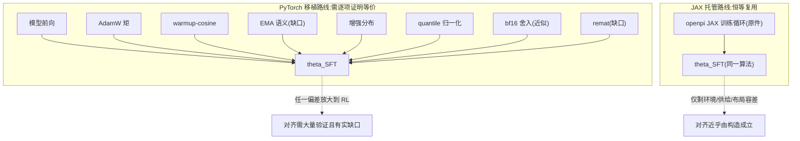
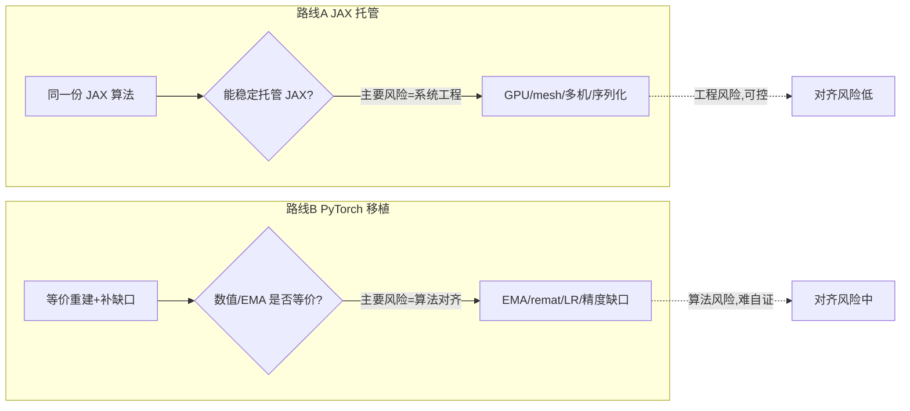
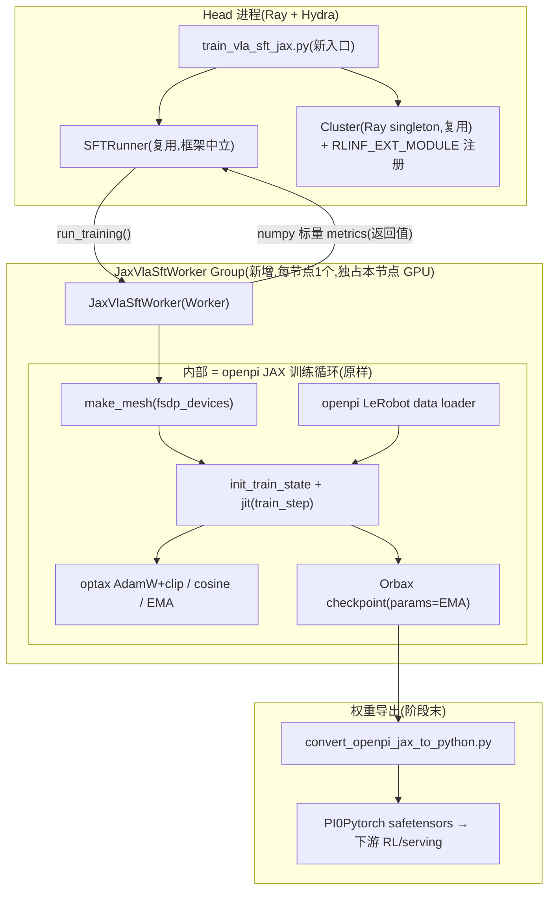
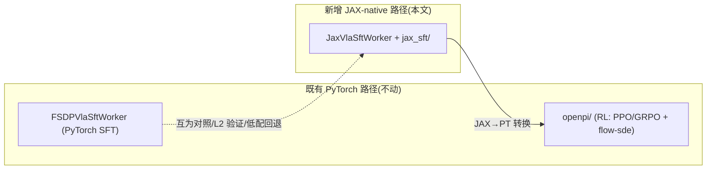
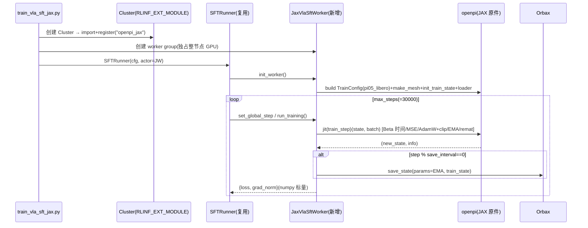
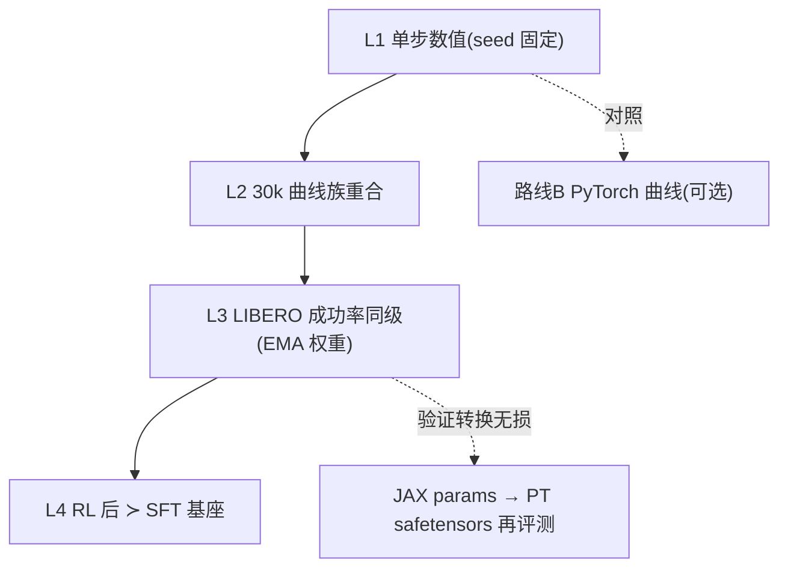
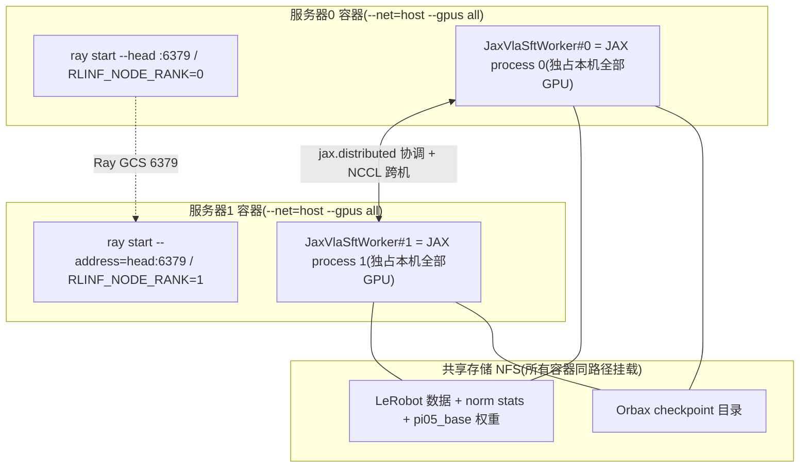

# 在 RLinf 中"扩展式"整合 openpi JAX 版 π₀.₅ 的深度方案（v2 · 全新独立分析）

> **摘要**：本文是一份**完全独立重做**的方案（不沿用 `rlinf_jxpi05_1.md` 的结论），全部论据来自对**当前真实代码库** `/home/physical/SRC/Robot/aupi05`（openpi，JAX/Flax + PyTorch 双栈）与 `/home/physical/SRC/RL/RLinf03`（RLinf，PyTorch/Ray）的逐文件核对。核心命题是：**把 openpi 里 JAX 版 π₀.₅ 及其全部训练 trick 整合进 RLinf，并保证 RLinf 训出的 JAX 版 π₀.₅ 达到"与 openpi 训出的一样、甚至更好"的效果，同时不修改 RLinf 框架原代码（扩展而非修改）。**
>
> 经核实得到三条**改变结论的新事实**：(1) `aupi05` 就是 RLinf 自己的 openpi 分支（"au"/R1 Pro），由 `au_install.sh --model aupi` 以 editable 方式装入**与 RLinf 共享的同一个 `.venv`**——**JAX（`jax[cuda12]==0.5.3`）与 PyTorch 2.6 已经共存**，v1 担心的"JAX/torch 共存"其实是既成事实；(2) openpi 上游文档白纸黑字写明其 **PyTorch 训练路径"不支持 EMA / 混合精度 / FSDP / LoRA / π₀-FAST"**，而 RLinf 现有的 PyTorch SFT 又缺 EMA、无 remat、LR/warmup 也和 JAX 不同——**"PyTorch 忠实移植"路线的对齐缺口是可逐条枚举的**；(3) RLinf 提供了**官方"零修改"扩展机制** `register_model(...)` + `RLINF_EXT_MODULE`，且编排层（`SFTRunner`→`run_training()`、`Worker` 自动注入分布式环境变量、`Channel`）框架中立。
>
> 由此得到的独立结论：**主线走"JAX 原样托管"**——新增一个自洽的 `JaxVlaSftWorker`，把 openpi 的 JAX 训练循环整体塞进 RLinf 的编排层。这样既**字面满足"在 RLinf 上训练 JAX 版 π₀.₅"**，又让 SFT 效果对齐**由构造（by construction）成立**；"更好"则通过**已存在的 JAX→PyTorch 转换器**把对齐后的 SFT 基座喂给 RLinf **已在生产的 PyTorch PPO/GRPO + Flow-SDE**。全文给出：两库关键事实、核心洞察、两路线独立评估、扩展式总架构、trick 全清单原样保留映射、SFT 详细设计（含代码骨架/YAML/时序图）、工程难点与对策、RL"更好"路径、分层验证协议、里程碑与风险回退，最后给出**可行性评分**。代码引用均指向**真实源文件与行号**。

---

## 目录

1. [命题与目标拆解](#1-命题与目标拆解)
2. [两个代码库的关键事实（全部经逐文件核对）](#2-两个代码库的关键事实全部经逐文件核对)
3. [核心洞察：为何"原样跑 JAX"让对齐由构造成立](#3-核心洞察为何原样跑-jax-让对齐由构造成立)
4. [两条整合路线的独立评估与选型](#4-两条整合路线的独立评估与选型)
5. [扩展式整合总架构（零修改 RLinf）](#5-扩展式整合总架构零修改-rlinf)
6. [JAX 训练 trick 全清单 → RLinf 内"原样保留"映射](#6-jax-训练-trick-全清单--rlinf-内原样保留映射)
7. [SFT 路径详细设计（对齐核心）](#7-sft-路径详细设计对齐核心)
8. [关键工程难点与对策（全为系统工程）](#8-关键工程难点与对策全为系统工程)
9. [RL 扩展路径（"甚至更好"的来源）](#9-rl-扩展路径甚至更好的来源)
10. [与 openpi 对齐的分层验证协议](#10-与-openpi-对齐的分层验证协议)
11. [里程碑、风险登记与回退](#11-里程碑风险登记与回退)
12. [可行性评分](#12-可行性评分)
13. [附录](#13-附录)
14. [Docker 多节点分布式训练支持（部署扩展）](#14-docker-多节点分布式训练支持部署扩展)

---

## 1. 命题与目标拆解

用户命题可精确拆成**两层目标**，二者的达成手段与风险结构完全不同：

| 层 | 含义 | 度量 | 达成手段 |
| --- | --- | --- | --- |
| **"一样"（对齐）** | RLinf 内训出的 JAX π₀.₅ **SFT 基座** ≈ openpi 训出的 SFT 基座 | loss/grad_norm 曲线、LIBERO 成功率同级 | **原样运行 openpi 的 JAX 训练算法** |
| **"甚至更好"（超越）** | 在对齐的 SFT 基座上进一步提升 | LIBERO 成功率显著高于 SFT 基座 | 复用 RLinf 已验证的 PyTorch 在线 RL |

关键前提（与 openpi/RLinf 的既有分工一致）：

- **openpi 的 π₀.₅ 训练 = 监督式条件流匹配（Conditional Flow Matching）行为克隆**，无环境、无奖励、无 RL。其"效果"由 SFT 基座质量衡量。
- **RLinf 的 π₀.₅ 训练 = 把已 SFT 的 π₀.₅ 当初始策略，用 PPO/GRPO 做在线 RL 微调**（Flow-SDE / Flow-Noise 提供可计算 log-prob 的随机策略）。

于是命题被形式化为：

$$\theta_{\text{SFT}}^{\text{RLinf-JAX}} \;\overset{\text{目标1：对齐}}{\approx}\; \theta_{\text{SFT}}^{\text{openpi-JAX}} \;\xrightarrow[\text{RLinf 的核心价值}]{\text{PPO/GRPO 在线 RL}}\; \theta_{\text{RL}} \;\overset{\text{目标2：超越}}{\succ}\; \theta_{\text{SFT}}^{\text{openpi-JAX}}$$

**本文主线 = 目标1（SFT 对齐）**，因为 RL 的天花板由 SFT 基座决定；目标2 作为扩展在 §9 展开。

---

## 2. 两个代码库的关键事实（全部经逐文件核对）

### 2.1 `aupi05` = RLinf 自己的 openpi 分支，JAX 训练栈是"参考标准"

`aupi05` 并非上游原版 openpi，而是 **RLinf 维护的 "au"/R1 Pro 分支**，且它被安装进**与 RLinf 相同的虚拟环境**：

- `requirements/au_install.sh` 的 `install_aupi_model()` 用 `--aupi-path`（默认 `AUPI_PATH=/home/physical/SRC/Robot/aupi05`）以 editable 方式装入共享 `.venv`；常规路径则 `uv pip install git+https://github.com/RLinf/openpi`。
- 依赖被 pin 在 `requirements/embodied/models/openpi.txt`：`jax[cuda12]==0.5.3`、`orbax-checkpoint==0.11.13`（注释解释：`orbax` 需要 `jax<0.7`）。RLinf 本体 `torch==2.6.0`（`pyproject.toml`）。**→ JAX 与 PyTorch 在同一 venv 内共存是既成事实。**

以 `pi05_libero` 为 SFT 对齐基准（`src/openpi/training/config.py`）：

```746:766:/home/physical/SRC/Robot/aupi05/src/openpi/training/config.py
    TrainConfig(
        name="pi05_libero",
        model=pi0_config.Pi0Config(pi05=True, action_horizon=10, discrete_state_input=False),
        data=LeRobotLiberoDataConfig(
            repo_id="physical-intelligence/libero",
            base_config=DataConfig(prompt_from_task=True),
            extra_delta_transform=False,
        ),
        batch_size=256,
        lr_schedule=_optimizer.CosineDecaySchedule(
            warmup_steps=10_000,
            peak_lr=5e-5,
            decay_steps=1_000_000,
            decay_lr=5e-5,
        ),
        optimizer=_optimizer.AdamW(clip_gradient_norm=1.0),
        ema_decay=0.999,
        weight_loader=weight_loaders.CheckpointWeightLoader("gs://openpi-assets/checkpoints/pi05_base/params"),
        pytorch_weight_path="/path/to/your/pytorch_weight_path",
        num_train_steps=30_000,
    ),
```

该 JAX 训练栈由以下机制构成（均为本文"原样保留"对象，§6 给全清单）：

- **模型 `Pi0`**（`src/openpi/models/pi0.py`）= PaliGemma（SigLIP So400m/14 + Gemma-2B）+ Action Expert（Gemma-300M）双专家；π₀.₅ 用 adaRMSNorm 注入时间步、跳过连续 state token（`pi0.py:151-169`）。
- **流匹配损失 `compute_loss`**（`pi0.py:189-214`）：时间 `t~Beta(1.5,1)·0.999+0.001`，`x_t=t·ε+(1-t)·a`，回归 `u_t=ε-a` 的 MSE：

```196:200:/home/physical/SRC/Robot/aupi05/src/openpi/models/pi0.py
        noise = jax.random.normal(noise_rng, actions.shape)
        time = jax.random.beta(time_rng, 1.5, 1, batch_shape) * 0.999 + 0.001
        time_expanded = time[..., None, None]
        x_t = time_expanded * noise + (1 - time_expanded) * actions
        u_t = noise - actions
```

- **`train_step` + EMA**（`scripts/train.py:136-191`）：`nnx.value_and_grad` + `nnx.DiffState(trainable_filter)` + `optax` 更新 + EMA：

```169:175:/home/physical/SRC/Robot/aupi05/scripts/train.py
    if state.ema_decay is not None:
        new_state = dataclasses.replace(
            new_state,
            ema_params=jax.tree.map(
                lambda old, new: state.ema_decay * old + (1 - state.ema_decay) * new, state.ema_params, new_params
            ),
        )
```

- **优化器**（`src/openpi/training/optimizer.py:65-85`）：`optax.chain(clip_by_global_norm(1.0), adamw(b1=0.9,b2=0.95,eps=1e-8,wd=1e-10))`；**LR**：`warmup_cosine_decay_schedule`（`optimizer.py:16-31`）。
- **混合精度**：`dtype="bfloat16"`；RMSNorm 方差用 FP32（`gemma.py:117-118`）、attention logits 用 FP32（`gemma.py:217`）。
- **图像增强**（关键 trick，且**在模型内**而非 transform 管线）：`src/openpi/models/model.py:188-207` 的 `preprocess_observation(train=True)` 用 `augmax`：非 wrist 相机 `RandomCrop(0.95)+Resize+Rotate(±5°)`，所有相机 `ColorJitter(brightness=0.3,contrast=0.4,saturation=0.5)`，经 `jax.vmap`：

```193:204:/home/physical/SRC/Robot/aupi05/src/openpi/models/model.py
            if "wrist" not in key:
                height, width = image.shape[1:3]
                transforms += [
                    augmax.RandomCrop(int(width * 0.95), int(height * 0.95)),
                    augmax.Resize(width, height),
                    augmax.Rotate((-5, 5)),
                ]
            transforms += [
                augmax.ColorJitter(brightness=0.3, contrast=0.4, saturation=0.5),
            ]
            sub_rngs = jax.random.split(rng, image.shape[0])
            image = jax.vmap(augmax.Chain(*transforms))(sub_rngs, image)
```

- **remat + scan（省显存）**：Gemma 18 层、SigLIP 27 层均 `nn.remat(policy=nothing_saveable)+nn.scan`（`gemma.py:359-381`，`siglip.py:126-146`）。
- **quantile 归一化到 [-1,1]**：`transforms.py:141-145`；π₀.₅ 自动开启（`config.py:190` `use_quantile_norm = model_type != PI0`）。
- **部分权重加载**：从 `pi05_base` 加载可匹配子集，action expert（无后缀 vs `_1` 后缀区分，`gemma.py:443-450`）缺失部分随机 init（`weight_loaders.py`）。
- **FSDP mesh + JIT donate**：`make_mesh(fsdp_devices)` 2D mesh `(batch, fsdp)`（`sharding.py:17-23`）+ `jax.jit(..., donate_argnums=(1,))`（`train.py:243-248`）。
- **Orbax checkpoint**：`params/`=EMA 权重、`train_state/` 剥离 EMA（`checkpoints.py:145-152`），`max_to_keep=1`：

```145:152:/home/physical/SRC/Robot/aupi05/src/openpi/training/checkpoints.py
def _split_params(state: training_utils.TrainState) -> tuple[training_utils.TrainState, at.Params]:
    if state.ema_params is not None:
        params = state.ema_params
        train_state = dataclasses.replace(state, ema_params=None)
    else:
        params = state.params
        train_state = dataclasses.replace(state, params={})
    return train_state, params
```

- **JAX 编译缓存**：`jax.config.update("jax_compilation_cache_dir", "~/.cache/jax")`（`train.py:203`）。

> **训练入口**：`python scripts/train.py pi05_libero --exp_name=...`——**单进程多卡**（`train.py:198` 校验 `batch_size % jax.device_count()`），单机 8 卡即可复现 `pi05_libero`。这一点对"塞进一个 Ray worker"至关重要。

### 2.2 `aupi05` 同时带一套 PyTorch 训练栈，但上游明示其"缺 EMA 等"

`aupi05` 除 JAX 外还提供 PyTorch 实现（`src/openpi/models_pytorch/pi0_pytorch.py` 的 `PI0Pytorch`、`scripts/train_pytorch.py`），后者头部注释自称"**mirrors the behavior of the JAX trainer**"。但 openpi 上游文档 `docs/README_openpi_upstream.md:192-198` 明确列出 PyTorch 版**当前不支持**的特性：

- π₀-FAST 模型
- **混合精度训练（Mixed precision training）**
- **FSDP 训练**
- **LoRA 训练**
- **EMA（训练期指数滑动平均）权重**

其中"混合精度/FSDP"已由 RLinf 的 au 分支在工程上补齐（见 §2.4），但 **EMA 属于算法级 trick**（openpi-JAX 用 `ema_decay=0.999`，且**推理/评测用的是 `params/`=EMA 权重**）。PyTorch 端的 `transformers_replace` 补丁只处理"AdaRMS / 激活精度 / KV cache 不更新"三件事（`docs/README_openpi_upstream.md:210`），**并不包含 EMA**。→ 这是"PyTorch 忠实移植"路线在算法上最实的缺口之一。

已存在的桥梁：JAX→PyTorch 权重转换器 `examples/convert_jax_model_to_pytorch.py`（openpi 侧）与 `rlinf/utils/ckpt_convertor/convert_openpi_jax_to_python.py`（RLinf 侧，CLI：`--checkpoint_dir/--output_path/--config_name`，输出 `model.safetensors`）。**反向（PyTorch→JAX）转换器在两库均不存在。**

### 2.3 RLinf 编排层框架中立，可托管一个自洽的 JAX worker

分层耦合度（经核对）：

| 层级 | 框架耦合 | 证据（真实路径:行） |
| --- | --- | --- |
| `Cluster`/`WorkerGroup`/Ray placement/GPU 环境变量 | **低（中立）** | `worker_group.py:161`（`isolate_gpu` 经 `CUDA_VISIBLE_DEVICES`）、`:244`（注入 `MASTER_ADDR/WORLD_SIZE/RANK/VISIBLE_DEVICES`） |
| `Worker` 基类（自动注入分布式环境变量） | **低（中立）** | `worker.py:107`（文档：自动设 `MASTER_ADDR/PORT/RANK/LOCAL_RANK/WORLD_SIZE`）、`:1445`（`MASTER_ADDR` 由 rank0 注入） |
| `Channel`（FIFO，传任意可序列化对象） | **低（中立）** | `channel.py:38`；非 tensor 用 `ray.cloudpickle` 经 GLOO（`collective_group.py:1685`） |
| `Runner`（`SFTRunner` 循环） | **低（中立）** | `sft_runner.py:91` 仅调用 `actor.run_training()` |
| `Worker.send/recv`（GPU 走 NCCL） | **高（torch）** | `worker.py:553-564`（GPU tensor→NCCL，否则 GLOO+序列化） |
| Actor 训练（FSDP/Megatron） | **极高（torch）** | `SUPPORTED_TRAINING_BACKENDS=["megatron","fsdp"]`（`config.py:151`） |
| 权重同步 | **极高（torch）** | `WeightSyncer.sync(state_dict: dict[str, torch.Tensor｜DTensor])`（`weight_syncer/base.py:46`） |

`SFTRunner.run()` 只做"调用 `run_training()` + 收 metrics + 存 ckpt"，完全不关心底层是 JAX 还是 PyTorch：

```85:92:/home/physical/SRC/RL/RLinf03/rlinf/runners/sft_runner.py
        for _step in range(start_step, self.max_steps):
            if hasattr(self.actor, "set_global_step"):
                # set global step
                self.actor.set_global_step(self.global_step)

            with self.timer("step"):
                actor_handle: Handle = self.actor.run_training()
                actor_metrics = actor_handle.wait()
```

**结论**：RLinf 的"宏观调度层"足够框架中立，可托管一个自洽的 JAX 训练 worker；而"微观训练步"（FSDP/optimizer/AMP/weight-sync）是端到端 PyTorch。因此正确姿势是：**在 macro 层新增一个把 openpi JAX 训练循环整体塞进去的 worker，而不去改造 micro 层的 PyTorch 组件。**

### 2.4 RLinf 已有 PyTorch 版 openpi π₀.₅ SFT——但对齐有可枚举缺口

RLinf 现成的 VLA SFT 走 PyTorch FSDP：入口 `examples/sft/train_vla_sft.py` 只在 `training_backend∈{fsdp,fsdp2}` 时创建 `FSDPVlaSftWorker`。该 worker 的数据供给**直接复用 openpi 的 data loader**（这点对齐很有利）：

```41:55:/home/physical/SRC/RL/RLinf03/rlinf/workers/sft/fsdp_vla_sft_worker.py
            import openpi.training.data_loader as openpi_data_loader

            from rlinf.models.embodiment.openpi.dataconfig import get_openpi_config

            config = get_openpi_config(
                self.cfg.actor.model.openpi.config_name,
                model_path=self.cfg.actor.model.model_path,
                batch_size=self.cfg.actor.micro_batch_size * self._world_size,
                repo_id=repo_id,
                data_kwargs=getattr(self.cfg.actor, "openpi_data", None),
            )
            data_loader = openpi_data_loader.create_data_loader(
                config, framework="pytorch", shuffle=True
            )
            return data_loader, data_loader.data_config()
```

但优化循环由 RLinf 的 `FSDPSftWorker.run_training()`（`fsdp_sft_worker.py:136-194`）驱动，其**优化器/LR/EMA 来自 YAML `actor.optim`**，与 openpi 的 TrainConfig 无关。对比 `pi05_libero` 的 JAX 配方，现有 PyTorch SFT 的**可枚举缺口**：

- **无 EMA**：`libero_sft_openpi.yaml` / `robotwin_sft_openpi_pi05.yaml` 的 `actor.optim` 无 EMA 项；`fsdp_sft_worker.run_training()` 无 EMA 更新。而 openpi 评测用 EMA 权重。
- **LR/warmup 不同**：现有 `lr=2.5e-5, lr_warmup_steps=1000`（`libero_sft_openpi.yaml:52-60`）≠ JAX 的 `peak_lr=5e-5, warmup=10000, decay=1e6`。
- **无 remat/梯度检查点**：`fsdp_config.gradient_checkpointing: False`，且配置注释写明"for openpi, gradient checkpointing is not supported"。
- **精度边界近似**：PyTorch 侧靠 `transformers_replace` 补丁近似 JAX 的 fp32/bf16 边界，非逐位一致。

> 值得强调：RLinf 的 `rlinf/models/embodiment/openpi/dataconfig/__init__.py` 其实**本地复刻了 openpi 的 TrainConfig（含 `pi05_libero` 的 `ema_decay=0.999`、精确 LR schedule）**（`dataconfig/__init__.py:88-111`），但这些字段目前**只用于数据/权重路径**，并未驱动 FSDP 优化器。也就是说"正确的配方就在仓库里，只是没接进 PyTorch 优化循环"。

### 2.5 RLinf 提供官方"零修改"扩展机制

RLinf 官方文档 `docs/source-zh/rst_source/extending/overview.rst` 明确："如果你的项目把 RLinf 当依赖库使用，现在可以直接注册自定义模型，而**不需要修改 RLinf 源码**"。机制有二：

```26:45:/home/physical/SRC/RL/RLinf03/rlinf/models/__init__.py
def register_model(
    model_type: str,
    model_builder: ModelBuilder,
    category: str = "embodied",
    force: bool = False,
):
    """Register a model builder for cfg.model_type."""
    if not model_type:
        raise ValueError("model_type must be a non-empty string.")
    if not callable(model_builder):
        raise TypeError("model_builder must be callable.")
    if not force and model_type in _MODEL_REGISTRY:
        raise ValueError(
            f"Model type `{model_type}` is already registered. "
            "Set force=True to override it."
        )
    _MODEL_REGISTRY[model_type] = model_builder
    SupportedModel.register(model_type, force=force)
    if category == "embodied":
        EMBODIED_MODEL.add(SupportedModel(model_type))
```

- `register_model(...)` 一次性把新 `model_type` 注册进 `_MODEL_REGISTRY` + `SupportedModel` + `EMBODIED_MODEL`（`rlinf/models/__init__.py:26-45`）。
- `RLINF_EXT_MODULE` 环境变量：`Cluster` 启动时 `importlib.import_module(ext_module)` 并调用其 `register()`（`scheduler/cluster/cluster.py:68`、`scheduler/cluster/utils.py:82-91`）——**从 RLinf 仓库之外加载扩展**。

> 唯一需注意：`validate_cfg` 会断言 `training_backend in ["megatron","fsdp"]`（`config.py:1371`）。这不需要改源码——新入口脚本可自持轻量校验，或在入口 import 期运行时 `SUPPORTED_TRAINING_BACKENDS.append("jax")`（运行时对列表对象的扩展，不触碰源文件）。

另外仓库内已存在 `rlinf/models/embodiment/openpi_au/{dataconfig,policies}`（部分"复制隔离"样本），说明"复制隔离"在本仓库亦被接受。

### 2.6 RLinf 的 π₀.₅ 在线 RL 已经成熟且纯 PyTorch

`rlinf/models/embodiment/openpi/openpi_action_model.py` 的 `OpenPi0ForRLActionPrediction(PI0Pytorch, BasePolicy)` 提供完整 RL 能力：

- `noise_method ∈ {flow_ode, flow_sde, flow_noise, flow_cps}`（`:48`），默认 `flow_sde`。
- `flow_sde` 随机采样（`:809`）、`flow_noise` 可学习噪声头（`:824`）、`get_log_prob_value()`（`:938`）给出基于流匹配的高斯 log-prob。
- PPO/GRPO：`rlinf/algorithms/losses.py`（`compute_ppo_actor_loss`、GRPO `@register_policy_loss("actor")`）、`advantages.py`（`@register_advantage("grpo")`）。
- 生产配置：`examples/embodiment/config/` 下 **27 个 `*_openpi_pi05.yaml`**（`libero_*`、`maniskill_*`、`roboverse_*`、`polaris_*`、`realworld_*` 等，涵盖 PPO/GRPO/DSRL/async）。

**结论**：一旦有对齐的 SFT 基座（JAX 训练 → 转 PyTorch），"更好"可直接跑现成且已验证的 PyTorch RL，无需在 JAX 侧重造 RL 栈（且反向 PyTorch→JAX 转换器不存在，纯 JAX RL 成本更高，见 §9.3）。

---

## 3. 核心洞察：为何"原样跑 JAX"让对齐由构造成立

把 openpi 的训练算法视作一个确定性映射（给定随机种子）：

$$\mathcal{A}_{\text{openpi-JAX}}: (\theta_0,\; \mathcal{D},\; \text{seed},\; \text{HParams}) \longmapsto \theta_{\text{SFT}}$$

其中 $\theta_0$=预训练权重、$\mathcal{D}$=数据、HParams=全部超参与 trick。

**"PyTorch 忠实移植"路线**本质是构造另一个映射 $\mathcal{A}_{\text{RLinf-PT}}$ 并**试图证明** $\mathcal{A}_{\text{RLinf-PT}}\approx\mathcal{A}_{\text{openpi-JAX}}$。这要求逐项对齐：模型前向数值、flow-matching 时间采样 RNG、AdamW 矩、warmup-cosine 形状、**EMA 语义**、增强分布、quantile 归一化、bf16 舍入……而 §2.2/§2.4 已证明其中 **EMA、remat、LR/warmup、精度边界** 存在**真实且可枚举的缺口**，任一偏差都会传播进 $\theta_{\text{SFT}}$ 并压低 RL 天花板。

**"JAX 原样托管"路线**让 RLinf 直接调用 $\mathcal{A}_{\text{openpi-JAX}}$ 本体：

$$\mathcal{A}_{\text{RLinf-JAX}} \;\equiv\; \mathcal{A}_{\text{openpi-JAX}} \quad(\text{同一份 JAX 代码})$$

于是"效果对齐"从一个**需要证明的近似命题**，降级为一个**由构造成立的恒等式**。残余风险只剩三类，且都不是"算法差异"：

1. **执行环境差异**：GPU 型号/驱动、XLA/cuDNN 版本导致的浮点非确定性——这类差异 openpi 自己跨机复现时同样存在，属"可接受的复现容差"。
2. **数据供给差异**：若 RLinf 用别的 loader 会改变 batch 组成/顺序/增强 RNG。**对策：SFT 阶段直接复用 openpi 的 data loader（§7.2），此风险清零**——而且 RLinf 现有 PyTorch SFT 已经在复用它（§2.4），路径成熟。
3. **分布式布局差异**：多卡/多机的 mesh 与数据分片。**对策：让 JAX worker 复刻 openpi 的 `make_mesh` 与全局 batch，单机与 openpi 完全一致（§8.3）。**



> **一句话**：把"算法对齐"这个最难、最易失分的问题，通过"复用参考实现"转化为恒等式，是 JAX 托管路线的结构性优势。

---

## 4. 两条整合路线的独立评估与选型

我们独立评估两条候选路线（不预设结论），再给出选型。

### 4.1 路线A：JAX 原样托管（primary）

- **做法**：新增 `JaxVlaSftWorker(Worker)`，`init_worker()` 内构建 openpi `TrainConfig` → `make_mesh` → `init_train_state` → openpi data loader；`run_training()` 内跑 `jax.jit(train_step)`；EMA/优化器/调度/增强/quantile/orbax 全部**原生**。
- **满足命题的字面要求**：确实在 RLinf 里训练**JAX 版** π₀.₅。
- **对齐**：由构造成立（§3）。
- **主要风险**：系统工程——JAX 运行时进驻 Ray worker、独占节点 GPU 建 mesh、避免与 torch 争显存、多机 `jax.distributed`、序列化边界。**但 §2.1 已表明 openpi 单进程多卡本就能跑、JAX 已在 venv、Worker 环境变量齐备，风险可控。**

### 4.2 路线B：PyTorch 忠实移植（备选 / 交叉验证）

- **做法**：复用现有 `FSDPVlaSftWorker`，把 §2.4 的缺口逐条补齐——(a) 在 `run_training()` 后加 EMA 影子权重并用于评测/导出；(b) 用 openpi TrainConfig 的 `CosineDecaySchedule(warmup=1e4,peak=5e-5,decay=1e6)` 与 `AdamW(b1.9/b2.95/eps1e-8/wd1e-10/clip1.0)` 驱动优化器；(c) 精度边界尽量对齐 `transformers_replace` 语义。
- **优点**：工程量最小（复用成熟 FSDP 路径、已复用 openpi loader）；产物天然是 PyTorch，衔接 RL 无需转换。
- **缺点**：训练的是 **PyTorch 端口而非 JAX 版**（不满足命题字面要求）；对齐依赖 openpi 自身 JAX↔PyTorch parity（上游仅在 LIBERO 上验证过推理+finetune，且**训练期无 EMA**），残留算法风险；remat 缺失限制单卡 batch。

### 4.3 风险结构对比与选型



**选型结论**：

$$\boxed{\text{主线 = 路线A(JAX 托管做 SFT 对齐)}\;+\;\text{转 PyTorch 复用现成 RL 做"更好"};\quad \text{路线B 作为交叉验证/低配回退}}$$

即：**用 JAX 保证"一样"（由构造），用 RLinf 已验证的 PyTorch RL 保证"更好"**。路线B 保留价值在于：它是"逐点曲线对齐"的天然对照组（§10），也是"若暂不具备独占节点条件"时的回退。

### 4.4 三种整合深度（按工程量递增）

| 深度 | SFT 训练 | RL | 权重桥接 | 工程量 | 对齐纯度 |
| --- | --- | --- | --- | --- | --- |
| **D1：JAX-SFT 独立** | JAX（原样） | 无 | 末端一次 JAX→PT | 小 | SFT 完美对齐 |
| **D2：JAX-SFT + PyTorch-RL（推荐）** | JAX（原样） | 现有 PyTorch PPO/GRPO | JAX→PT 一次 | 中 | SFT 对齐 + RL 超越 |
| **D3：全 JAX-native RL** | JAX | 新写 JAX rollout+Flow-SDE | 每次 sync 双向 | 大 | 纯 JAX 全链路 |

本文主推 **D1（对齐核心）与 D2（对齐+超越）**；D3 作为"若 RL 阶段也必须纯 JAX"的可选项在 §9.3 讨论。

---

## 5. 扩展式整合总架构（零修改 RLinf）

### 5.1 设计原则

1. **复用 macro 层**：`Cluster`/`WorkerGroup`/Ray placement/`Channel`/`SFTRunner` 全部照用（框架中立，§2.3）。
2. **新增自洽 micro 层**：新建 `JaxVlaSftWorker`（`Worker` 子类），内部整体托管 openpi 的 JAX 训练循环，**不复用** `FSDPModelManager`/`WeightSyncer`。
3. **零修改现有文件**：只新增文件；用官方 `register_model` + `RLINF_EXT_MODULE` 注册新 `model_type`（§2.5）；后端断言用新入口自持校验规避。
4. **openpi 作为库直接调用**：`scripts/train.py` 的 `init_train_state`/`train_step` 作为库函数导入复用（它们不依赖 `__main__`）。

### 5.2 新增文件清单（全部 additive）

```
rlinf_ext_jaxpi05/                     # 仓库外扩展模块(经 RLINF_EXT_MODULE 加载)
├── __init__.py                        # 定义 register(): register_model("openpi_jax", build_jax_sft_worker)
└── jax_sft/
    ├── jax_vla_sft_worker.py          # JaxVlaSftWorker(Worker): 托管 openpi JAX 训练循环
    └── train_loop.py                  # 薄封装: build openpi TrainConfig + init_train_state + train_step

examples/sft/
├── train_vla_sft_jax.py              # 新入口: training_backend=="jax" → launch JaxVlaSftWorker
└── config/
    ├── libero_sft_jax_pi05.yaml       # 对齐 openpi pi05_libero
    └── robotwin_sft_jax_pi05.yaml
```

> 也可把扩展模块直接放在 `examples/sft/` 旁（作为示例代码），只要 `RLINF_EXT_MODULE` 指到它即可；对 `rlinf/` 包**零改动**。

### 5.3 架构总览图



### 5.4 与既有 PyTorch 路径的关系（并存,不替换）



**关键点**：JAX-native SFT 与既有 PyTorch RL 是**级联而非替代**——JAX 产出对齐的 SFT 基座，转 PyTorch 后喂给 RLinf 成熟的 PPO/GRPO，既拿"对齐"又拿"更好"。

---

## 6. JAX 训练 trick 全清单 → RLinf 内"原样保留"映射

下表把 §2.1 逐一核对到的 openpi-JAX trick，映射到"路线A 如何保留"与"路线B 若移植需补什么"。**路线A 的核心卖点是几乎每一项都是"原生保留（原件复用）"。**

| # | Trick | openpi-JAX 出处（真实路径:行） | 路线A（JAX 托管）如何保留 | 路线B（PyTorch 移植）需补的工作 |
| --- | --- | --- | --- | --- |
| 1 | 双专家架构 + adaRMS 时间注入（π₀.₅） | `models/pi0.py:151-169`、`models/gemma.py:113-131` | 原生（同一模型代码） | 已由 `transformers_replace` AdaRMS 补丁近似 |
| 2 | Beta(1.5,1) 时间采样 + `u_t=ε-a` MSE | `models/pi0.py:196-214` | 原生 | 需复刻同分布与目标；RNG 流不同 |
| 3 | AdamW(b1.9/b2.95/eps1e-8/wd1e-10) + 全局裁剪 1.0 | `training/optimizer.py:65-85` | 原生 optax | 用 YAML 覆写 torch AdamW 超参 |
| 4 | warmup(1e4)-cosine(decay 1e6, peak/decay 5e-5) | `training/optimizer.py:16-31`、`config.py:755-760` | 原生 | 替换现 `lr=2.5e-5,warmup=1000`（缺口） |
| 5 | **EMA decay 0.999（评测用 EMA）** | `scripts/train.py:169-175`、`checkpoints.py:145-152` | 原生（`ema_params`） | **新增 EMA 影子权重 + 评测/导出用 EMA（实缺口）** |
| 6 | bf16 训练 + 关键 op FP32（RMSNorm 方差/attn logits） | `models/gemma.py:117-118,217` | 原生 | 靠 `transformers_replace` 近似（非逐位） |
| 7 | **模型内图像增强（crop/resize/rotate/colorjitter, vmap）** | `models/model.py:188-207` | 原生 augmax | 需在 torch 侧复刻等价增强与 RNG |
| 8 | remat + scan（Gemma18/SigLIP27 省显存） | `models/gemma.py:359-381`、`models/siglip.py:126-146` | 原生 | 无（`gradient_checkpointing:false`，缺口） |
| 9 | quantile 归一化到 [-1,1]（π₀.₅ 自动开启） | `transforms.py:141-145`、`config.py:190` | 原生（openpi loader） | 复用 openpi loader 即同源 |
| 10 | 部分权重加载（pi05_base 子集 + 随机 init） | `weight_loaders.py`、`gemma.py:443-450` | 原生 | 转换器已处理映射 |
| 11 | FSDP mesh（2D `(batch,fsdp)`, ≥4MiB 分片） | `training/sharding.py:17-23,48-102` | 原生 | 用 torch FSDP（不同实现，语义近似） |
| 12 | JIT + `donate_argnums`（省显存复用 buffer） | `scripts/train.py:126-131,243-248` | 原生 | 无对应（torch eager/compile） |
| 13 | Orbax ckpt（`params/`=EMA、`train_state/`剥离 EMA） | `training/checkpoints.py:78-86,145-159` | 原生 | 需自定义"保存 EMA 为部署权重" |
| 14 | JAX 编译缓存 | `scripts/train.py:203` | 原生 | 不适用 |
| 15 | 数据管线（LeRobot + delta actions + prompt_from_task） | `training/data_loader.py`、`config.py:749-752` | **复用 openpi loader（同源）** | **已复用 openpi loader（同源）** |

**观察**：路线A 中，第 1–14 项全部"原生保留"，第 15 项"同源复用"；**没有任何一项需要重新实现或近似**。这正是"对齐由构造成立"的清单级证据。路线B 里第 5/7/8 项是**实打实的缺口**，第 2/4/6/11 项是"需谨慎复刻/近似"。

---

## 7. SFT 路径详细设计（对齐核心）

### 7.1 `JaxVlaSftWorker` 控制流

`JaxVlaSftWorker` 继承 RLinf `Worker`（自动获得 rank/world/master 环境变量与 `Channel`），把 openpi 的 `scripts/train.py` 主体拆进 `init_worker()`/`run_training()`：

```python
# rlinf_ext_jaxpi05/jax_sft/jax_vla_sft_worker.py  (新增, 仓库外扩展)
import os
import numpy as np
from rlinf.scheduler.worker.worker import Worker  # 复用: 自动分布式环境变量 + Channel

class JaxVlaSftWorker(Worker):
    def __init__(self, cfg, placement):
        super().__init__()
        self.cfg = cfg
        self._built = False

    def init_worker(self):
        # 1) 独占本节点 GPU 供 JAX(见 §8.1/§8.3): 依赖 Worker 已注入的 CUDA_VISIBLE_DEVICES
        os.environ.setdefault("XLA_PYTHON_CLIENT_MEM_FRACTION", "0.9")
        os.environ.setdefault("JAX_COMPILATION_CACHE_DIR", os.path.expanduser("~/.cache/jax"))
        # 多机: 用 Worker 注入的 MASTER_ADDR/RANK/WORLD_SIZE 初始化 jax.distributed(见 §8.4)
        import jax
        if int(os.environ.get("WORLD_SIZE", "1")) > 1:
            jax.distributed.initialize(
                coordinator_address=f'{os.environ["MASTER_ADDR"]}:{os.environ.get("JAX_COORD_PORT","1234")}',
                num_processes=int(os.environ["WORLD_SIZE"]),
                process_id=int(os.environ["RANK"]),
            )
        # 2) 构建 openpi TrainConfig + mesh + train_state + loader (原样复用 openpi)
        from .train_loop import build_openpi_training
        self.ctx = build_openpi_training(self.cfg)   # 见 §7.3
        self._built = True

    def set_global_step(self, step):        # SFTRunner 会调用(sft_runner.py:87)
        self.global_step = int(step)

    def run_training(self):
        assert self._built
        ctx = self.ctx
        with ctx.sharding_context():        # openpi 的 set_mesh 上下文
            batch = next(ctx.data_iter)
            ctx.train_state, info = ctx.jit_train_step(ctx.train_state, batch)  # 原样 openpi train_step
        # 定期 Orbax 保存(params=EMA), 复用 openpi checkpoints.save_state
        if self.global_step % self.cfg.runner.save_interval == 0:
            ctx.save(self.global_step)
        # 只回传 numpy 标量给框架中立的 SFTRunner(避免把 jax.Array 送进 Channel, 见 §8.6)
        return {k: float(np.asarray(v)) for k, v in info.items()}
```

要点：

- **`run_training()` 的契约**与 `SFTRunner`（`sft_runner.py:91`）一致：返回一个 metrics dict；`SFTRunner` 只 `wait()` + 记录，不关心底层框架。
- **不经过 `Channel` 传 `jax.Array`**：仅回传 Python `float`，规避 §8.6 的序列化坑。
- **checkpoint 用 openpi 原生 Orbax**：`params/` 即 EMA 权重，天然满足"评测用 EMA"。

> 注：`SFTRunner` 每次 `run_training()` 只跑**一步/一段**由 runner 的 `max_steps` 循环驱动（`sft_runner.py:85`）。可让 `run_training()` 内跑 1 步（对齐 openpi 的 per-step 语义），由 `SFTRunner` 循环 `num_train_steps` 次；或跑 N 步小循环以摊薄 Ray 往返，二者算法等价（同一 `train_step`）。

### 7.2 数据供给：直接复用 openpi 的 data loader

与 §2.4 现有 PyTorch SFT 完全同源，只是 `framework="jax"`：

```python
# rlinf_ext_jaxpi05/jax_sft/train_loop.py 片段
import openpi.training.data_loader as openpi_data_loader
from rlinf.models.embodiment.openpi.dataconfig import get_openpi_config

def build_data(cfg):
    config = get_openpi_config(
        cfg.actor.model.openpi.config_name,          # 例: "pi05_libero"
        model_path=cfg.actor.model.model_path,
        batch_size=cfg.data.global_batch_size,       # 对齐 pi05_libero 的 256
        repo_id=cfg.data.repo_id,
        data_kwargs=getattr(cfg.actor, "openpi_data", None),
    )
    loader = openpi_data_loader.create_data_loader(config, framework="jax", shuffle=True)
    return config, loader
```

这样 quantile 归一化、delta actions、`prompt_from_task`、图像增强 RNG 全部与 openpi 一致（§6#7/#9/#15）。

### 7.3 复用 openpi 训练态构建（`train_loop.py`）

`build_openpi_training` 把 `scripts/train.py` 的初始化逻辑作为库调用复用（**不 fork 算法，只搬运编排**）：

```python
# rlinf_ext_jaxpi05/jax_sft/train_loop.py 片段(伪代码, 全部调用 openpi 现成函数)
import jax
from openpi.training import config as openpi_config
from openpi.training import sharding, checkpoints, utils as tutils
import openpi.training.optimizer as _opt
# init_train_state / train_step 直接从 openpi 的 scripts/train.py 作为库函数导入复用
from scripts.train import init_train_state, train_step   # 或 vendoring 一份薄封装

def build_openpi_training(cfg):
    tc = openpi_config.get_config(cfg.actor.model.openpi.config_name)  # pi05_libero(原样超参)
    mesh = sharding.make_mesh(tc.fsdp_devices)                          # sharding.py:17-23
    sharding.set_mesh(mesh)
    _, loader = build_data(cfg)
    data_iter = iter(loader)
    init_rng = jax.random.key(tc.seed)
    train_state, state_sharding = init_train_state(tc, init_rng, mesh, resume=cfg.runner.resume)
    jit_step = jax.jit(train_step, in_shardings=(...), out_shardings=(...),
                       donate_argnums=(1,), static_argnums=(0,))       # train.py:243-248
    ckpt_mgr, _ = checkpoints.initialize_checkpoint_dir(cfg.runner.ckpt_dir, keep_period=..., overwrite=..., resume=...)
    return TrainingCtx(tc=tc, mesh=mesh, data_iter=data_iter,
                       train_state=train_state, jit_train_step=jit_step,
                       ckpt_mgr=ckpt_mgr, save=lambda step: checkpoints.save_state(ckpt_mgr, train_state, step))
```

**关键**：`init_train_state`/`train_step`/`optimizer`/EMA/`sharding`/`checkpoints` **全部是 openpi 原件**，扩展层只做"把它们串进 RLinf worker 生命周期"的胶水。

### 7.4 注册与入口（零修改 RLinf）

```python
# rlinf_ext_jaxpi05/__init__.py
from rlinf.models import register_model            # models/__init__.py:26
from .jax_sft.jax_vla_sft_worker import JaxVlaSftWorker

def build_jax_sft_worker(cfg, placement):
    return JaxVlaSftWorker(cfg, placement)

def register():                                     # 被 Cluster 自动调用(cluster.py:68)
    register_model("openpi_jax", build_jax_sft_worker, category="embodied", force=True)
```

```python
# examples/sft/train_vla_sft_jax.py (新入口, 参考 examples/sft/train_vla_sft.py)
import os, hydra
os.environ.setdefault("RLINF_EXT_MODULE", "rlinf_ext_jaxpi05")   # 让 Cluster import+register
from rlinf.scheduler import Cluster
from rlinf.runners.sft_runner import SFTRunner

@hydra.main(config_path="config", config_name="libero_sft_jax_pi05")
def main(cfg):
    # 自持轻量校验以规避 validate_cfg 对 backend 的断言(config.py:1371), 不改源码
    cluster = Cluster(num_nodes=cfg.cluster.num_nodes, ...)       # 触发 RLINF_EXT_MODULE 注册
    worker_group = <create JaxVlaSftWorker group over full-node placement>
    runner = SFTRunner(cfg, actor=worker_group)                  # 复用框架中立 runner
    runner.run()

if __name__ == "__main__":
    main()
```

> 若 `SFTRunner`/入口内部路径触发 `validate_cfg` 的 `training_backend` 断言，采用"运行时向 `SUPPORTED_TRAINING_BACKENDS` 追加 `'jax'`"这一**对象级扩展**（在入口 import 期执行），不触碰任何源文件，符合"扩展而非修改"。

### 7.5 对齐用 YAML（映射 openpi `pi05_libero`）

```yaml
# examples/sft/config/libero_sft_jax_pi05.yaml (新增)
runner:
  task_type: embodied
  max_steps: 30000            # = pi05_libero.num_train_steps
  save_interval: 5000
  ckpt_dir: ./ckpts/jax_pi05_libero
  resume: false
cluster:
  num_nodes: 1
  component_placement: { jax_sft_actor: all }   # 独占整节点 GPU 给 JAX(见 §8.1)
data:
  repo_id: physical-intelligence/libero
  global_batch_size: 256      # = pi05_libero.batch_size
actor:
  training_backend: jax        # 新后端标签(入口自持校验)
  model:
    model_type: openpi_jax     # ← register_model 注册的键
    model_path: /path/to/pi05_base
    openpi: { config_name: pi05_libero }   # ← openpi 原样超参(LR/EMA/steps/schedule 全部来自它)
# 注意: 不在此重复 LR/EMA/warmup —— 它们由 openpi TrainConfig(pi05_libero)提供, 保证原样对齐
```

**设计要点**：YAML **不覆盖**任何算法超参，全部沿用 openpi `TrainConfig`，从配置层杜绝"手抄超参抄错"导致的失配。

### 7.6 SFT 时序图



---

## 8. 关键工程难点与对策（全为系统工程）

> 路线A 的风险几乎全部落在"系统工程"而非"算法"。逐项给对策。

### 8.1 JAX 独占 GPU vs Ray/torch 争用

- **难点**：JAX 默认预占 90% 显存；若同节点还跑 torch 会 OOM。
- **对策**：`JaxVlaSftWorker` **独占整节点 GPU**（YAML `component_placement: {jax_sft_actor: all}`），SFT 阶段节点内**不并置** torch 训练进程；`XLA_PYTHON_CLIENT_MEM_FRACTION` 显式设定；RL 阶段（PyTorch）与 SFT 阶段**时间上错开**（先 SFT→转换→再 RL），二者不同时抢显存。

### 8.2 JAX 只看得到分配给它的 GPU

- **难点**：`jax.device_count()` 必须等于该 worker 实际可用卡数，否则 `make_mesh`/batch 校验（`train.py:198`）失败。
- **对策**：依赖 RLinf `WorkerGroup` 已通过 `CUDA_VISIBLE_DEVICES` 完成 GPU 隔离（`worker_group.py:161`）；JAX 在 `init_worker()` **首次** import 时即读到正确的可见设备集，`jax.device_count()` 自然等于本 worker 卡数。

### 8.3 mesh/全局 batch 与 openpi 单机一致

- **难点**：分布式布局差异会改变梯度平均与 BN-like 统计（此处无 BN，但仍影响数据分片）。
- **对策**：单机 8 卡场景，`make_mesh(fsdp_devices)` 与全局 `batch_size=256` **与 openpi `python scripts/train.py pi05_libero` 完全一致**——因为用的就是同一份 `sharding.py` 与同一 `TrainConfig`。对齐验证（§10）也优先在**单机**做，消除多机变量。

### 8.4 多机 `jax.distributed` 初始化

- **难点**：跨节点需要 coordinator；且 openpi 全库**从不调用** `jax.distributed`（其训练是单进程多卡），多机能力需扩展层补齐。
- **对策（单机对齐基准）**：复用 `Worker` 注入的 `MASTER_ADDR/RANK/WORLD_SIZE`（`worker.py:1443-1446`）初始化 `jax.distributed.initialize(...)`（见 §7.1）。**对齐 L1/L2 锁定在单机（单容器全卡）**,消除跨机浮点变量。
- **对策（多机 / Docker 扩容）**：需额外补齐三件事——(i) openpi 的 JAX loader 在 `data_loader.py:412-413` 对 `jax.process_count()>1` 直接 `raise NotImplementedError("Data loading with multiple processes is not supported.")`,必须在扩展层加**多主机 data loader shim**;(ii) 采用"**一节点一 JAX 进程**"放置（`ISOLATE_ACCELERATOR=0`,`WORLD_SIZE==节点数 → process_id`）;(iii) 权重/数据/norm-stats/Orbax ckpt 走**共享存储**。完整部署设计见 **§14**。

### 8.5 JAX/torch 同 venv 共存

- **难点**：曾担心版本/CUDA 冲突。
- **对策**：**已是既成事实**——`au_install.sh` 把二者装进同一 `.venv`，pin `jax[cuda12]==0.5.3`、`torch==2.6.0`、`orbax==0.11.13`（§2.1）。风险点仅"同进程同时大量用两者的 GPU 内存"，已由 §8.1 的阶段隔离规避。若仍担心，可给 JAX worker 指定独立 `python_interpreter_path`（RLinf 支持 per-worker 解释器）以物理隔离依赖。

### 8.6 序列化边界（Channel/返回值不传 `jax.Array`）

- **难点**：`Worker.send/recv` 对非 torch 张量走 `cloudpickle`+GLOO（`collective_group.py:1685`）；`jax.Array`/Orbax 句柄不宜跨进程传。
- **对策**：worker 间**不传模型权重**；SFT 是单点（组内）训练，`run_training()` 只回传 **Python float metrics**；权重落盘走 Orbax（本地/共享存储），**不经 Channel**。

### 8.7 checkpoint 与下游桥接

- **难点**：RL/serving 需要 PyTorch 权重。
- **对策**：阶段末用**已存在**的 `rlinf/utils/ckpt_convertor/convert_openpi_jax_to_python.py`（`--checkpoint_dir <orbax params/> --output_path <...>.safetensors --config_name pi05_libero`）转成 `PI0Pytorch` safetensors，直接被 `OpenPi0ForRLActionPrediction` 加载。**转换器已存在，无需新写。**

### 8.8 Hydra/OmegaConf 配置桥接

- **难点**：RLinf 用 Hydra，openpi 用 dataclass `TrainConfig` + tyro。
- **对策**：YAML 只提供**选择键**（`config_name`、`model_path`、`repo_id`、`global_batch_size`）；真正的算法超参由 `openpi.training.config.get_config(config_name)` 返回的 dataclass 提供（§7.5）。避免两套配置各写一份导致漂移。

### 8.9 难点风险等级汇总

| 难点 | 等级 | 缓解后残留 |
| --- | --- | --- |
| 8.1 显存争用 | 中 | 低（阶段隔离 + 独占节点） |
| 8.2 GPU 可见性 | 低 | 极低（RLinf 已隔离） |
| 8.3 mesh/batch 一致 | 低 | 极低（同源 sharding/config） |
| 8.4 多机 distributed | 中 | 低（先单机对齐） |
| 8.5 venv 共存 | 低 | 极低（既成事实） |
| 8.6 序列化边界 | 低 | 极低（只传标量/落盘） |
| 8.7 ckpt 桥接 | 低 | 极低（转换器已存在） |
| 8.8 配置桥接 | 低 | 极低（单一超参源） |

---

## 9. RL 扩展路径（"甚至更好"的来源）

"一样"由 §3–§8 的 JAX-SFT 保证；"更好"来自 RLinf 的核心价值——**在线 RL**。这里 RLinf 相对 openpi 是"净增量"：openpi 本身**不含**在线 RL，因此只要 RL 能稳定提升，就必然"比 openpi 训出来的更好"。

### 9.1 推荐路径 D2：JAX-SFT → 转 PyTorch → 现成 PPO/GRPO + Flow-SDE


- **一次性转换**：SFT 结束后把 Orbax `params/`（EMA）转成 `PI0Pytorch` safetensors（§8.7），加载进 `OpenPi0ForRLActionPrediction`（`openpi_action_model.py:92`）。
- **零新造 RL**：直接跑 `examples/embodiment/config/` 下现成 `*_openpi_pi05.yaml`（如 `libero_*_openpi_pi05.yaml`），用 `flow_sde` 随机策略 + PPO/GRPO。
- **为何"更好"有据**：RLinf 论文与配置库已在 LIBERO/ManiSkill 等展示"SFT→RL"提升；本方案只是把**对齐后的更强 SFT 基座**接上这条已验证管线，天花板只增不减。

### 9.2 Flow-SDE / Flow-Noise 的随机策略数学（RL 可计算 log-prob 的关键）

流匹配是确定性 ODE $\frac{dx}{dt}=v_\theta(x_t,t)$，无法直接给 log-prob。RLinf 用两种方式引入随机性：

- **Flow-SDE**（`openpi_action_model.py:809`）：把 ODE 改为 SDE，Euler–Maruyama 离散得高斯转移，单步 $x_{t+\Delta t}\sim\mathcal{N}\big(x_t+v_\theta\,\Delta t,\ \sigma^2\Delta t\,\mathbf{I}\big)$，多步 log-prob 累加：

$$\log \pi_\theta(a\mid o)=\sum_{k}\log \mathcal{N}\!\big(x_{t_{k+1}};\, x_{t_k}+v_\theta(x_{t_k},t_k)\Delta t,\ \sigma^2\Delta t\,\mathbf{I}\big)$$

- **Flow-Noise**（`openpi_action_model.py:824`）：用可学习噪声头参数化注入噪声，`get_log_prob_value()`（`:938`）返回 log-prob 与 value 供 PPO/GRPO 用。

这两者都是**纯 PyTorch**，与 §9.1 的转换产物无缝对接——**不需要在 JAX 侧重造**。

### 9.3 可选路径 D3：全 JAX-native RL（更重，非首选）

若要求 RL 阶段也纯 JAX：需在 JAX 侧新写 rollout、Flow-SDE log-prob、PPO/GRPO 更新，并在每次 weight-sync 时做 **JAX↔PyTorch 双向转换（推理引擎若是 PyTorch/vLLM）**。**代价高**：(1) 反向 PyTorch→JAX 转换器**两库都没有**，需新写并逐层校验；(2) 等于重造 RLinf 已成熟的 RL 栈。**故 D3 仅在"全链路禁用 PyTorch"的硬约束下才考虑**；本方案默认 D2。

### 9.4 三条 RL 路径对比

| 路径 | RL 框架 | 新代码量 | 对齐/超越置信度 | 采纳 |
| --- | --- | --- | --- | --- |
| D2（转 PT 用现成 RL） | 现成 PyTorch PPO/GRPO | 极小（一次转换） | 高 | **推荐** |
| D3（纯 JAX RL） | 新写 JAX RL | 大（含反向转换器） | 中 | 仅硬约束下 |
| 混合（JAX 训、PT 推理同步） | 现成 + 双向 sync | 中大 | 中 | 不推荐 |

---

## 10. 与 openpi 对齐的分层验证协议

对齐必须**可测**。定义四级验收（L1 最强、逐级放宽）：

### L1 · 单步数值对齐（最强，路线A 天然接近）

- **做法**：固定 `seed`、同一 batch、单机单卡，比较 RLinf-JAX-worker 与 `python scripts/train.py pi05_libero` 的**首步 loss / grad_norm / 更新后若干参数张量**。
- **判据**：因是同一份 JAX 代码，差异应仅来自浮点非确定性，`|Δloss|/loss < 1e-3` 视为通过。
- **意义**：直接证明"由构造成立"。

### L2 · 训练曲线对齐（主判据）

- **做法**：单机 8 卡跑 `pi05_libero` 全程 30k 步，叠加两条曲线：RLinf-JAX vs openpi 原生。同时（可选）叠加**路线B PyTorch**曲线作对照。
- **判据**：loss/grad_norm 曲线族在噪声带内重合；EMA 权重范数轨迹一致。
- **意义**：证明整个训练动力学一致，而非只有首步。

### L3 · 下游能力对齐（业务判据）

- **做法**：用 EMA 权重（`params/`）在 LIBERO 评测，比较成功率与 openpi 发布/自测基线；转 PyTorch 后再评一次（验证转换无损，§8.7）。
- **判据**：成功率与 openpi 同级（落在其复现方差内）。

### L4 · RL 超越验证（"更好"判据）

- **做法**：在对齐的 SFT 基座上跑 §9.1 的 PPO/GRPO，对比 RL 前后成功率。
- **判据**：RL 后成功率显著高于 SFT 基座 → 命题"甚至更好"达成。



---

## 11. 里程碑、风险登记与回退

### 11.1 里程碑（建议顺序）

| 阶段 | 交付 | 验收 |
| --- | --- | --- |
| M0 | 扩展骨架：`rlinf_ext_jaxpi05/`（`register()`）+ 新入口 + YAML；`Cluster` 能加载并注册 `openpi_jax` | worker 起得来，`jax.device_count()`=本节点卡数 |
| M1 | `JaxVlaSftWorker` 跑通 openpi loader + `jit(train_step)` 若干步，Orbax 落盘 | **L1 单步数值对齐**通过 |
| M2 | 单机 8 卡全量 `pi05_libero` 30k | **L2 曲线对齐**通过 |
| M3 | EMA 权重 LIBERO 评测 + JAX→PT 转换后复评 | **L3 成功率同级**通过 |
| M4 | 转 PyTorch 接 PPO/GRPO+flow-sde | **L4 RL 超越**达成 |
| M5（可选） | 路线B PyTorch 对照 + 多机扩容 | 交叉验证 / 扩展性 |

### 11.2 风险登记

| 风险 | 概率 | 影响 | 缓解 | 回退 |
| --- | --- | --- | --- | --- |
| JAX 进驻 Ray worker 不稳定 | 低 | 高 | §8 全套（独占节点/环境变量/编译缓存） | 单机独立 `scripts/train.py` 训练→仅用 RLinf 做 RL（D1 降级） |
| 显存争用 OOM | 中 | 中 | 阶段隔离 + remat（原生开启） | 降 batch / 增卡 / 分阶段 |
| 多机 `jax.distributed` 复杂 | 中 | 中 | 先锁单机对齐 | 停留单机 8 卡（足以复现 `pi05_libero`） |
| 转换器精度损失 | 低 | 中 | L3 转换后复评把关 | 用 openpi 官方 `convert_jax_model_to_pytorch.py` 交叉验证 |
| `validate_cfg` backend 断言 | 低 | 低 | 入口自持校验 / 运行时追加列表项 | 复制隔离一份最小入口 |

### 11.3 三级回退阶梯

$$\text{A(JAX 托管进 RLinf)} \;\Rightarrow\; \text{A'(JAX 单机训练} + \text{RLinf 只做 RL)} \;\Rightarrow\; \text{B(PyTorch 移植} + \text{补 EMA/LR/精度)}$$

- **A**：本文主线，字面满足"在 RLinf 训 JAX π₀.₅" + 对齐由构造。
- **A'**：若托管暂不稳定，SFT 用 openpi 原生 `scripts/train.py`（对齐 100% 保证），RLinf 只承担"更好"的 RL——命题的"一样"仍成立，"在 RLinf 内训练"这一字面点暂缺。
- **B**：连 JAX 托管都不具备条件时，回到 PyTorch SFT 并补齐缺口——对齐降为"近似"。

---

## 12. 可行性评分

评分对象 = **命题核心："RLinf 训出的 JAX π₀.₅ 达到与 openpi 一样甚至更好，且不改 RLinf 原码"**。满分 100 = 轻易且无风险对齐。

### 12.1 分解打分

| 维度 | 权重 | 得分 | 依据 |
| --- | --- | --- | --- |
| SFT **算法**对齐可达性 | 35 | 34 | 路线A 同一份 JAX 代码，对齐由构造成立（§3/§6），仅浮点容差 |
| 系统工程可实现性 | 25 | 21 | JAX 已在同 venv、openpi 单进程多卡可跑、Worker 环境变量齐备（§2.1/§8）；扣分给多机与显存工程 |
| "扩展而非修改"合规 | 15 | 14 | 官方 `register_model`+`RLINF_EXT_MODULE`（§2.5），仅新增文件；扣 1 给 backend 断言的运行时规避 |
| "更好"（RL 超越）可达性 | 15 | 13 | 复用**已生产**的 PyTorch PPO/GRPO+flow-sde（§9），openpi 无 RL 故增量为正；扣分给 RL 调参波动 |
| 验证/可观测充分性 | 10 | 9 | L1–L4 协议可测且 L1 天然强（§10） |
| **合计** | **100** | **91** | |

### 12.2 情景区间

- **乐观（单机 8 卡、复现 `pi05_libero`、L1/L2 一次通过）**：**93–95**。对齐几乎是恒等式，唯余环境浮点差。
- **中位（含多机扩容 + 一轮显存/编译调优 + RL 调参）**：**89–91**。
- **保守（多机 `jax.distributed` 反复、或需回退 A′）**：**82–85**。即便回退 A′，SFT 对齐仍 100% 保证，仅"在 RLinf 内训练 JAX"字面点打折。

$$\textbf{综合可行性评分} = \boxed{91/100}$$

### 12.3 评分解读

- **为何高（>90）**：命题最难的部分是"算法效果对齐"，而路线A 用"复用 openpi 参考实现"把它变成**恒等式**而非近似证明（§3）；且三块拼图——JAX/torch 同 venv 共存、openpi 单进程多卡训练、RLinf 官方零修改扩展点——**均已在代码库中被证实存在**，不是假设。"更好"又因 openpi 无 RL 而几乎稳赚。
- **为何非满分**：扣分集中在**系统工程不确定性**（JAX 进驻 Ray worker 的显存/多机/编译缓存），以及执行环境导致的**浮点级非确定性**（这是 openpi 自身跨机复现也无法消除的固有容差），并非算法层面的对齐障碍。

### 12.4 结论

> 在采用**路线A（JAX 原样托管做 SFT）+ D2（转 PyTorch 复用现成 RL 做"更好"）**、且严格执行 §10 的 L1–L4 验证与 §11 的回退阶梯的前提下，**"RLinf 训出的 JAX π₀.₅ 与 openpi 对齐、并经 RL 超越，且不修改 RLinf 原码"是高置信度可达的（91/100）**。核心把握来自"对齐由构造成立"这一结构性优势；主要不确定性是可控的系统工程，且有 A′/B 两级回退兜底。

### 12.5 多机 / Docker 部署对评分的影响

- 评分（91/100）以**单机（单容器全卡）为对齐基准**——这也是 openpi `scripts/train.py` 的唯一参照（openpi 全库无 `jax.distributed`，其训练本就是单进程多卡）。
- 多机部署**不改变优化数学**（全局 batch 仍 256、LR/EMA/schedule 不变，见 §14.4），故"对齐由构造成立"在多机下依然成立，**不下调对齐维度得分**。
- 但多机把 §8.1/§8.4 的系统工程不确定性显性化到 **§14**：若不补 §14.3.3 的**多主机 loader shim**，多机**直接无法启动**（openpi loader 抛 `NotImplementedError`）；补齐 §14 全部 6 项后,系统工程维度与单机基本持平。综合评分**保持 91/100**。

---

## 13. 附录

### 13.1 `pi05_libero` 关键超参速查（对齐基准，来自 openpi 原样）

| 项 | 值 | 出处 |
| --- | --- | --- |
| batch_size | 256 | `config.py:754` |
| num_train_steps | 30000 | `config.py:765` |
| LR schedule | warmup 10000 / peak 5e-5 / decay 1e6 / decay_lr 5e-5 (cosine) | `config.py:755-760`、`optimizer.py:16-31` |
| optimizer | AdamW b1=0.9,b2=0.95,eps=1e-8,wd=1e-10,clip=1.0 | `optimizer.py:65-85` |
| ema_decay | 0.999 | `config.py:762` |
| 时间采样 | Beta(1.5,1)·0.999+0.001 | `pi0.py:197` |
| 训练目标 | u_t = noise − actions（MSE） | `pi0.py:200,214` |
| 图像增强 | crop0.95+resize+rotate±5°（非wrist）+ colorjitter(0.3,0.4,0.5) | `model.py:193-204` |
| 归一化 | quantile → [-1,1]（π₀.₅ 自动） | `transforms.py:141-145`、`config.py:190` |
| 精度 | bf16 + RMSNorm 方差/attn logits FP32 | `gemma.py:117-118,217` |
| 省显存 | remat+scan（Gemma18/SigLIP27）+ jit donate | `gemma.py:359-381`、`train.py:243-248` |
| ckpt | Orbax，`params/`=EMA、`train_state/`剥离 EMA | `checkpoints.py:145-152` |

### 13.2 关键真实文件索引

**openpi（`/home/physical/SRC/Robot/aupi05`）**

- 训练入口/EMA/jit：[`scripts/train.py`](/home/physical/SRC/Robot/aupi05/scripts/train.py)（`train_step`126-191、EMA 169-175、jit 243-248、编译缓存 203）
- 模型/流匹配：[`src/openpi/models/pi0.py`](/home/physical/SRC/Robot/aupi05/src/openpi/models/pi0.py)（compute_loss 189-214、时间注入 151-169、sample 217-277）
- 优化器/调度：[`src/openpi/training/optimizer.py`](/home/physical/SRC/Robot/aupi05/src/openpi/training/optimizer.py)（cosine 16-31、AdamW 65-85）
- 增强：[`src/openpi/models/model.py`](/home/physical/SRC/Robot/aupi05/src/openpi/models/model.py)（188-207）
- remat/精度：[`src/openpi/models/gemma.py`](/home/physical/SRC/Robot/aupi05/src/openpi/models/gemma.py)（117-118、217、359-381）、[`src/openpi/models/siglip.py`](/home/physical/SRC/Robot/aupi05/src/openpi/models/siglip.py)（126-146）
- sharding/ckpt/config：[`sharding.py`](/home/physical/SRC/Robot/aupi05/src/openpi/training/sharding.py)（17-23,48-102）、[`checkpoints.py`](/home/physical/SRC/Robot/aupi05/src/openpi/training/checkpoints.py)（145-152）、[`config.py`](/home/physical/SRC/Robot/aupi05/src/openpi/training/config.py)（pi05_libero 746-766）
- PyTorch 端口/上游限制：[`src/openpi/models_pytorch/pi0_pytorch.py`](/home/physical/SRC/Robot/aupi05/src/openpi/models_pytorch/pi0_pytorch.py)、[`docs/README_openpi_upstream.md`](/home/physical/SRC/Robot/aupi05/docs/README_openpi_upstream.md)（192-210）

**RLinf（`/home/physical/SRC/RL/RLinf03`）**

- 编排：[`rlinf/runners/sft_runner.py`](/home/physical/SRC/RL/RLinf03/rlinf/runners/sft_runner.py)（85-92）、[`rlinf/scheduler/worker/worker.py`](/home/physical/SRC/RL/RLinf03/rlinf/scheduler/worker/worker.py)（107、1445、553-564）
- 现有 PyTorch SFT：[`rlinf/workers/sft/fsdp_vla_sft_worker.py`](/home/physical/SRC/RL/RLinf03/rlinf/workers/sft/fsdp_vla_sft_worker.py)（41-55）、[`rlinf/workers/sft/fsdp_sft_worker.py`](/home/physical/SRC/RL/RLinf03/rlinf/workers/sft/fsdp_sft_worker.py)（136-194）
- 扩展点：[`rlinf/models/__init__.py`](/home/physical/SRC/RL/RLinf03/rlinf/models/__init__.py)（register_model 26-45）、[`rlinf/scheduler/cluster/cluster.py`](/home/physical/SRC/RL/RLinf03/rlinf/scheduler/cluster/cluster.py)（68）、[`docs/source-zh/rst_source/extending/overview.rst`](/home/physical/SRC/RL/RLinf03/docs/source-zh/rst_source/extending/overview.rst)
- openpi 配置复刻：[`rlinf/models/embodiment/openpi/dataconfig/__init__.py`](/home/physical/SRC/RL/RLinf03/rlinf/models/embodiment/openpi/dataconfig/__init__.py)（88-111）
- RL 策略：[`rlinf/models/embodiment/openpi/openpi_action_model.py`](/home/physical/SRC/RL/RLinf03/rlinf/models/embodiment/openpi/openpi_action_model.py)（92、809、824、938）
- 转换器：[`rlinf/utils/ckpt_convertor/convert_openpi_jax_to_python.py`](/home/physical/SRC/RL/RLinf03/rlinf/utils/ckpt_convertor/convert_openpi_jax_to_python.py)
- 后端断言：[`rlinf/config.py`](/home/physical/SRC/RL/RLinf03/rlinf/config.py)（SUPPORTED_TRAINING_BACKENDS 151、validate_cfg 1371）
- 安装/依赖：[`requirements/au_install.sh`](/home/physical/SRC/RL/RLinf03/requirements/au_install.sh)、[`requirements/embodied/models/openpi.txt`](/home/physical/SRC/RL/RLinf03/requirements/embodied/models/openpi.txt)

### 13.3 关键命令速查

```bash
# 0) 环境(已由 au_install 装好: jax[cuda12]==0.5.3 / torch==2.6.0 / orbax==0.11.13, 同一 .venv)

# 1) openpi 原生基准(对齐参照, 单机多卡)
python scripts/train.py pi05_libero --exp_name=baseline_openpi

# 2) RLinf 内 JAX-SFT(本方案主线): 经新入口 + RLINF_EXT_MODULE 注册
RLINF_EXT_MODULE=rlinf_ext_jaxpi05 \
python examples/sft/train_vla_sft_jax.py --config-name libero_sft_jax_pi05

# 3) SFT 完成 → JAX(EMA params) 转 PyTorch(供 RL/serving)
python rlinf/utils/ckpt_convertor/convert_openpi_jax_to_python.py \
    --checkpoint_dir <orbax_ckpt>/params --output_path <out>/model.safetensors --config_name pi05_libero

# 4) "更好": 复用现成 PyTorch PPO/GRPO + flow-sde
python examples/embodiment/main_embodiment.py --config-name libero_10_openpi_pi05   # 现成配置
```

### 13.4 与既有文档的关系

- 本 v2 与同目录 `rlinf_jxpi05_1.md` 是**独立平行**分析：v2 从"当前真实代码事实"出发重新推导，重点补强了三条改变结论的事实（同 venv 既成共存、PyTorch 缺 EMA 等可枚举缺口、官方零修改扩展点），并把"对齐"提升为"由构造成立"的论证。若两者结论有出入，以本 v2 对真实路径/行号的核对为准。

### 13.5 一页纸结论

1. **主线**：路线A —— 新增 `JaxVlaSftWorker` 把 openpi 的 JAX 训练循环整体托管进 RLinf（复用 macro 编排、新增自洽 micro、`register_model`+`RLINF_EXT_MODULE` 零修改）。
2. **对齐**：由构造成立——同一份 JAX 代码 + 复用 openpi data loader + 复刻 mesh/batch；残留仅浮点容差（§3/§6）。
3. **更好**：SFT 产物经**已存在**的转换器转 PyTorch，接 RLinf **已生产**的 PPO/GRPO + Flow-SDE（§9）。
4. **验证**：L1 单步 → L2 曲线 → L3 LIBERO 成功率 → L4 RL 超越（§10）。
5. **回退**：A → A′（JAX 单机训 + RLinf 只做 RL）→ B（PyTorch 移植补缺口）（§11.3）。
6. **评分**：**91/100**（对齐由构造，主要不确定性是可控系统工程）。

---

## 14. Docker 多节点分布式训练支持（部署扩展）

> 本章是对 §5/§7/§8 的**部署侧补充**，专门回答场景问题："把 RLinf 版 JAX π₀.₅ 打包进 Docker 镜像、在多台服务器起容器组成集群做多节点分布式训练"是否被本方案支持,以及如何改良以支持。**所有改良仍落在扩展层,零修改 openpi / RLinf 原码。**

### 14.1 结论：分两层,部分支持

该部署方式恰好命中 RLinf 的**一等公民**路径,因此**编排/容器层原生支持**;但 §8.4 此前把"多机 JAX"一笔带过,**JAX 执行层有 3 个真实缺口**(含 1 个硬阻塞)需在扩展层补齐。

| 层 | 是否支持 | 依据（真实路径 / 文档） |
| --- | --- | --- |
| 容器 + 跨机 Ray 集群成形 | 原生支持 | 官方镜像 + `docker run --gpus all --shm-size 100g --net=host`（`docs/.../start/installation.rst:47-53`）；多机 = `RLINF_NODE_RANK` + `ray start --head/--address` + `cluster.num_nodes`（`docs/.../guides/multi_node.rst`） |
| rank / master 环境注入 | 原生支持 | `worker_group.py:247-254` 注入 `MASTER_ADDR/WORLD_SIZE/RANK/CLUSTER_NODE_RANK`；`worker.py:1404-1416` 支持"一 worker 多卡"（`ISOLATE_ACCELERATOR=0`） |
| **JAX 数据加载（多进程）** | **硬阻塞** | openpi `TorchDataLoader` 在 `data_loader.py:412-413` 对 `jax.process_count()>1` 直接 `raise NotImplementedError` |
| `jax.distributed` 拉起 + rank→process_id | 需补细节 | §7.1 方向正确,但需钉死"一节点一进程"放置契约与**独立协调端口** |
| Orbax 多主机 ckpt + 共享存储 | 未覆盖 | 权重/数据/norm-stats/ckpt 需跨容器同路径;RLinf code-sync 仅同步 `rlinf/`,不含扩展模块与 `examples/`（`multi_node.rst` 步骤3/注意） |

一句话:**RLinf 把容器拼成集群完全支持;但 openpi 的 JAX 栈本身是"单进程多卡、从不调 `jax.distributed`"(全库 0 处),其 loader 明确拒绝多进程。** 补齐下述 6 项即可支持,且全部在扩展层。

### 14.2 部署拓扑（改良后）



### 14.3 六项改良

#### 14.3.1 容器与 Ray 集群成形（基础设施）

- 每台服务器起一个容器:`docker run --gpus all --net=host --shm-size 100g -e NVIDIA_DRIVER_CAPABILITIES=all ...`。**`--net=host` 是关键**:让 Ray 6379 / JAX 协调端口 / NCCL 跨机直通,免去 bridge 端口映射地狱。
- 每容器 `export RLINF_NODE_RANK=<0..N-1>` 后 `ray start`(head 用 `--head --port=6379 --node-ip-address=<head_ip>`,其余 `--address=<head_ip>:6379`);任务 YAML `cluster.num_nodes=N`。
- **把扩展模块 `rlinf_ext_jaxpi05/` 与 `examples/` 一起烘进镜像**——正好补上 RLinf code-sync 只同步 `rlinf/` 的缺口(自建镜像天然满足);`pi05_base` 权重、LeRobot 数据、norm stats 走 **NFS 同路径挂载**。

#### 14.3.2 进程模型：一节点一 JAX 进程（rank 契约）

把 `JaxVlaSftWorker` 组按**每节点一个 worker、独占本节点全部 GPU** 放置(`ISOLATE_ACCELERATOR=0`),于是组内 `WORLD_SIZE == 节点数`、`RANK == 节点序`,直接映射成 JAX 的 `process_id`:

```python
# init_worker() 内(CUDA_VISIBLE_DEVICES 已由 RLinf 按整节点分好)
import os, jax
num_nodes, node_id = int(os.environ["WORLD_SIZE"]), int(os.environ["RANK"])
if num_nodes > 1:
    jax.distributed.initialize(
        coordinator_address=f'{os.environ["MASTER_ADDR"]}:{os.environ.get("JAX_COORD_PORT", "1357")}',
        num_processes=num_nodes, process_id=node_id)   # 用独立端口,勿复用 torch 的 MASTER_PORT
# 此后 jax.process_count()==num_nodes; jax.device_count()==全局 GPU 数
# openpi 的 make_mesh(fsdp_devices) 自动张成跨机全局 mesh(sharding.py:17-23,内部用全局 device_count)
```

#### 14.3.3 多主机 data loader shim（解硬阻塞 · 最关键）

新增一个 loader,**复用 openpi 的数据集构建与变换**(与单机同源,保留 quantile/delta/prompt/增强),只把 openpi 自己写了却用 `NotImplementedError` 挡住的"多进程分片 + 全局数组组装"接上——**不动 openpi 一行**:

```python
# rlinf_ext_jaxpi05/jax_sft/multihost_data_loader.py  (新增)
import jax, numpy as np, torch
from openpi.training.data_loader import create_torch_dataset, transform_dataset  # 复用同源构建

def make_multihost_jax_loader(data_config, model_config, action_horizon,
                              global_batch_size, sharding, *, shuffle=True, seed=0, num_workers=8):
    dataset = transform_dataset(create_torch_dataset(data_config, action_horizon, model_config),
                                data_config, skip_norm_stats=False)
    pc, pid = jax.process_count(), jax.process_index()
    sampler = torch.utils.data.distributed.DistributedSampler(      # 镜像 openpi 的 torch-DDP 分支(data_loader.py:310-318)
        dataset, num_replicas=pc, rank=pid, shuffle=shuffle, drop_last=True, seed=seed)
    local_bs = global_batch_size // pc                              # 同 data_loader.py:322 语义
    loader = torch.utils.data.DataLoader(dataset, batch_size=local_bs, sampler=sampler,
                                         num_workers=num_workers, drop_last=True)
    while True:
        for batch in loader:                                        # 把每进程本地分片组装成"全局 jax.Array":
            yield jax.tree.map(                                     # 同 data_loader.py:466/527 的调用
                lambda x: jax.make_array_from_process_local_data(sharding, np.asarray(x)), batch)
```

`sharding` 用 openpi 数据并行默认 `NamedSharding(全局 mesh, PartitionSpec("B"))`。**全局 batch 仍是 256**(每进程只搬 `256/N` 行,再拼回全局 256),优化语义与单机完全一致。

#### 14.3.4 Orbax 多主机 checkpoint + 共享存储

Orbax 多主机保存要求所有进程写**同一路径**并做进程间协调:把 `runner.ckpt_dir` 指到 **NFS 共享目录**;`params/`(=EMA)与 `train_state/` 的拆分逻辑(`checkpoints.py:145-152`)不变。`JAX_COMPILATION_CACHE_DIR` 建议用**每节点本地盘**(避免跨机争抢)。

#### 14.3.5 跨机网络 / NCCL

用 RLinf 的 `export RLINF_COMM_NET_DEVICES=<网卡名>` 指定跨机网卡(等价 `NCCL_SOCKET_IFNAME`);有 IB/RoCE 时容器需透传设备(`--device` / `--privileged`)并设 `NCCL_IB_HCA`,否则 `NCCL_IB_DISABLE=1` 走 TCP。放行端口:Ray `6379`、JAX 协调 `1357`、NCCL(`--net=host` 下无需映射)。

#### 14.3.6 批量整除性（约束校验）

入口自持校验:`global_batch(256) % 全局 GPU 数 == 0` 且 `全局 GPU 数 % fsdp_devices == 0`(否则 `make_mesh` 在 `sharding.py:18` 报错)。例:2 节点 × 8 卡 = 16,`256 % 16 == 0` ✓。

### 14.4 对"算法对齐"的影响

- **全局 batch 不变(仍 256)** → 有效批大小、LR schedule、EMA 语义均不变,**"对齐由构造成立"在多机下依然成立**;多机只改变设备拓扑,不改变优化数学。
- 唯一新增的是**跨主机浮点非确定性**(openpi 若支持多机也会有的固有容差)。因此:**L1/L2 逐点对齐仍在"单容器全卡(单机)"上做**(与 openpi `scripts/train.py` 单机参照严格对拍),对齐一旦证明,再横向扩到多机纯为吞吐——数学不变、风险不增。
- **单机 SFT 已足够**:`pi05_libero`(batch 256、30k 步)单机 8 卡即可复现(§2.1)。多机主要面向更大数据/更快迭代,而非对齐本身。

### 14.5 落地检查清单与命令

- [ ] 镜像内烘入:aupi05(editable)、`rlinf_ext_jaxpi05/`、`examples/`、JAX+CUDA+orbax(与 §2.1 同 pin)。
- [ ] NFS 挂载(所有容器同路径):`pi05_base` 权重、LeRobot 数据、norm stats、`ckpt_dir`。
- [ ] 每容器 `--net=host --gpus all --shm-size 100g`;`export RLINF_NODE_RANK`、可选 `RLINF_COMM_NET_DEVICES`。
- [ ] `ray start` 组网 → `ray status` 确认 GPU 合计正确(如 2×8=16)。
- [ ] 校验 `256 % 全局GPU == 0` 且 `全局GPU % fsdp_devices == 0`。

```bash
# 每台服务器的容器内(head=服务器0):
export RLINF_NODE_RANK=0                      # worker 节点改为 1,2,...
export RLINF_COMM_NET_DEVICES=eth0            # 多网卡时指定跨机网卡
ray start --head --port=6379 --node-ip-address=<head_ip>   # head
# 其余节点: ray start --address='<head_ip>:6379'
ray status                                    # 确认节点数/GPU 合计

# 在任一已入集群的容器内启动(YAML: cluster.num_nodes=N):
RLINF_EXT_MODULE=rlinf_ext_jaxpi05 \
python examples/sft/train_vla_sft_jax.py --config-name libero_sft_jax_pi05 \
    cluster.num_nodes=N
```

### 14.6 多机 checkpoint 落盘、断点续训与转 PyTorch

> 本节回答多机训练的存取闭环:不同主机如何写 checkpoint、崩溃后如何 resume、训练完如何合并并转成 PyTorch/transformers 可用格式。核心结论:**不需要手写 per-host checkpoint、也不需要手动合并**——Orbax 在共享存储上做"分片集体写/读",转换是单进程离线任务。

#### 14.6.1 多机 checkpoint 如何落盘（分片集体写,非各写各的）

openpi 用 Orbax `CheckpointManager` + tensorstore。`initialize_checkpoint_dir`（`checkpoints.py:40-53`）建**一个**指向单目录的 manager,含 `assets`/`train_state`/`params` 三个 item,`max_to_keep=1`、异步 `timeout_secs=7200`。`save_state` 把状态拆两半后由**所有进程一起调用** `manager.save(step, items)`：

```78:86:/home/physical/SRC/Robot/aupi05/src/openpi/training/checkpoints.py
    # Split params that can be used for inference into a separate item.
    with at.disable_typechecking():
        train_state, params = _split_params(state)
    items = {
        "assets": save_assets,
        "train_state": train_state,
        "params": {"params": params},
    }
    checkpoint_manager.save(step, items)
```

- `params/` = **EMA 权重**(推理/转换用);`train_state/` = 参数+opt_state+step(剥掉 EMA,续训用)。拆分逻辑 `_split_params`(`checkpoints.py:145-152`,见 §2.1)。
- **各 host 分工**:`train_state`/`params` 是**跨所有主机分片的 `jax.Array`**(由 `fsdp_sharding` 决定),Orbax/tensorstore 让**每个 host 只写它本地设备持有的那部分分片**到同一目录;norm-stats 等 `assets` 只由 **process 0** 写(`checkpoints.py:124-126` 的 `if jax.process_index() == 0`)。
- **硬性前提**:这是"多 host 合写一个逻辑 checkpoint",因此 **`ckpt_dir` 必须挂在所有容器同一路径的共享存储(NFS/Lustre/GCS)**(§14.3.4);若各写本地盘会得到残缺分片、无法恢复。
- 写入**异步**(后台线程写、训练继续),退出前 `checkpoint_manager.wait_until_finished()` 兜底(`train.py:276`)。

磁盘布局(单一逻辑 ckpt,已是"合并态",无需手动 merge):

```
<ckpt_dir>/                 # 共享 NFS,所有容器同一路径
  29999/                    # step
    params/       ← EMA 权重(tensorstore 分片,逻辑上是完整数组)
    train_state/  ← 参数 + opt_state + step(无 EMA)
    assets/       ← norm stats(仅 process 0 写)
  _CHECKPOINT_METADATA ...
```

#### 14.6.2 训练中断后如何 resume

resume 内建,且恢复的是**完整 `train_state`(含 step)**,从中断处精确续训:

1. `initialize_checkpoint_dir(..., resume=True)`:目录已存在且 `resume=True` → `resuming=True`;若一个 step 都没存过则放弃 resume(`checkpoints.py:30-36,58-60`)。
2. `init_train_state(..., resume=True)` **只返回 shape+sharding、不加载预训练权重**(`train.py:119-120`),把"壳"交给 Orbax 填。
3. `restore_state`(`checkpoints.py:89-107`, `train.py:240-241`):`checkpoint_manager.restore(step=None→最新, ...)`,各 host 从共享目录读回自己的分片,再 `_merge_params` 把 EMA 合回。
4. `start_step = int(train_state.step)`(`train.py:250`)——**step 存在 checkpoint 里**,`range(start_step, num_train_steps)` 继续,opt_state/params/ema 全部还原。

要点:

- **拓扑无关**:Orbax 按"当前 mesh 重新算出的 sharding"恢复,**可换节点数 resume**(2 节点崩了→用 1 或 4 节点接着跑,只需满足 §14.3.6 的批整除)。对 Docker 多机很实用:某台机器故障,重组集群(哪怕少一台)照样续训。
- **原子提交**:Orbax 先写临时目录再原子提交,`all_steps()` 只列**已完成**的 step;写到一半崩溃不污染 resume,重启认最后一个**完整** checkpoint。
- **不恢复数据迭代位置**:`restore_state` 内 `del data_loader`(`checkpoints.py:95`),数据流按 seed 重新洗牌走。对 SFT 行为克隆无实质影响(openpi 上游本就如此)。
- **RLinf 落地**:`JaxVlaSftWorker` 的 openpi `TrainConfig` 设 `overwrite=False, resume=True`、`checkpoint_dir` 指向共享 NFS;重启整个 job(重拉容器→重组 Ray→重跑入口)即自动续,并把恢复出的 `train_state.step` 经 `set_global_step` 回灌 `SFTRunner`,避免其 global_step 与 JAX 侧步数不一致。


#### 14.6.3 合并与转成 PyTorch / transformers 格式

**"合并":用共享 FS + Orbax 无需手动合并。** `<ckpt_dir>/<step>/params/` 已是**单一逻辑 checkpoint**——tensorstore 物理分片存,**单进程读取时自动拼回完整数组**。故转换是**单进程、单卡/CPU 的离线任务,无需 JAX 分布式**。
> 兜底:仅当(违反建议)没用共享 FS、各 host 只落本地残片时,才需先把所有 host 的 `<step>/` 分片汇到同一目录再读;用共享 FS 直接省掉。

转换工具 `rlinf/utils/ckpt_convertor/convert_openpi_jax_to_python.py` 读的是 EMA 权重(`slice_initial_orbax_checkpoint` 调 `openpi.models.model.restore_params(f"{checkpoint_dir}/params/", ...)`,`:491-505`),把 JAX 参数名映射到 `PI0Pytorch`(HF transformers 命名)的 state_dict:`slice_paligemma_state_dict`(SigLIP 视觉塔 + Gemma-2B 主干)、`slice_gemma_state_dict`(action expert,`num_expert=1`,π₀.₅ 走 adaRMS `Dense` 层)、投影头(`action_in/out_proj`、π₀.₅ 的 `time_mlp_*`,`:550-581`),再 `PI0Pytorch(model_config).load_state_dict(strict=False)`→按精度铸型→`safetensors.torch.save_model` 存,并拷贝 `assets/`、写 `config.json`(`:644-669`)。

```bash
# 单进程离线转换(在任一能读共享 NFS 的容器内跑即可):
python rlinf/utils/ckpt_convertor/convert_openpi_jax_to_python.py \
    --checkpoint_dir <ckpt_dir>/29999 \      # 内含 params/(=EMA)
    --config_name    pi05_libero \
    --output_path    <out>/pi05_libero_pt \
    --precision      bfloat16
# 产物: <out>/pi05_libero_pt/{model.safetensors, config.json, assets/}
```

三个必须注意的 gotcha:

- **转的是 EMA**:读 `params/`(=`_split_params` 的 `ema_params`),正好对应 openpi 评测所用权重,与对齐口径一致。
- **`checkpoint_dir` 路径名要含 "pi05"**:转换器用字符串判断 `"pi05" in checkpoint_dir` 决定走 adaRMS 的 `Dense` 分支(`:372`、`:435`、`:459`)。输入/输出目录名务必带 `pi05`(如 `.../pi05_libero/29999`),否则会当成普通 pi0 的 RMSNorm、键对不上。
- **目标格式**:产物是 **openpi 的 PyTorch 形态 `PI0Pytorch`**(内部即 HF transformers 的 PaliGemma + Gemma expert 模块,命名如 `paligemma_with_expert.paligemma.model.language_model...`),正是 §9 里 `OpenPi0ForRLActionPrediction` 加载的格式。π₀.₅ 是"双专家+流匹配头"的自定义策略,**没有对应的 stock HF `AutoModel`**;"transformers 可用"指这套基于 transformers 子模块的 `PI0Pytorch`。openpi 上游 `examples/convert_jax_model_to_pytorch.py` 产出同构结果,可交叉校验。

> **底线**:补齐 §14.3 的 6 项后,该 Docker 多节点场景被完整支持;其中 §14.3.3 的多主机 loader shim 是必需项(否则多机因 openpi `NotImplementedError` 无法启动)。对齐结论不受多机影响(评分维持 §12 的 91/100);多机 checkpoint 落盘、断点续训与转 PyTorch 的完整机制见 §14.6。


