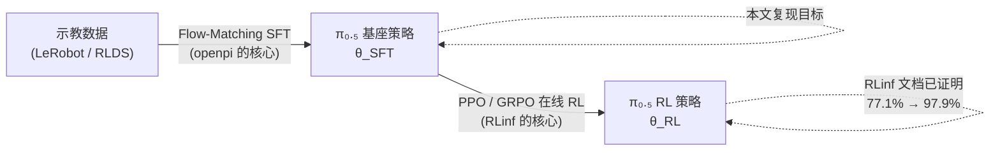
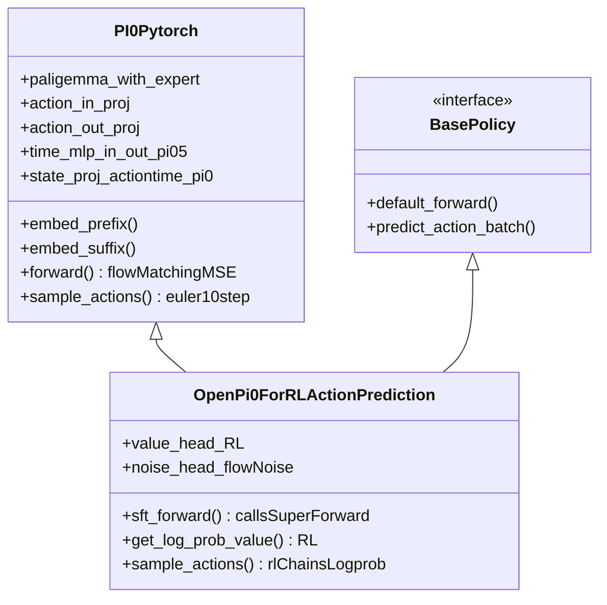
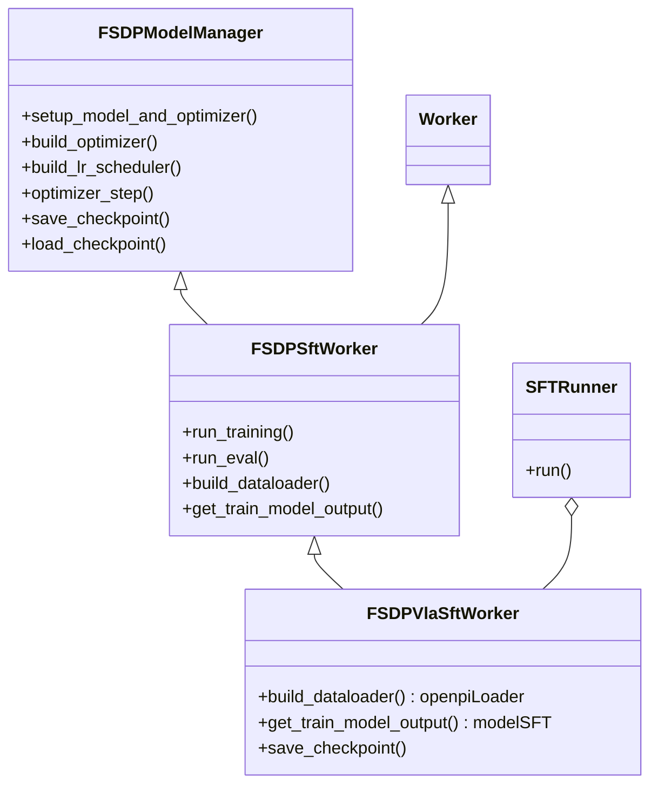
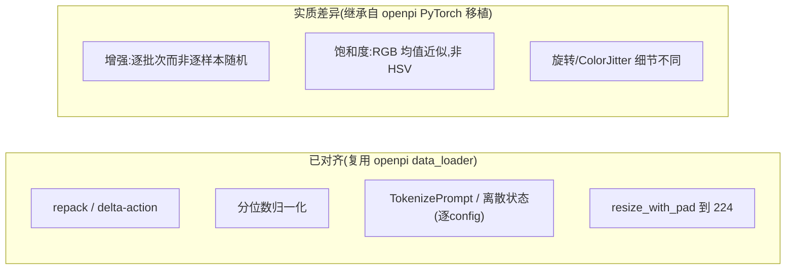
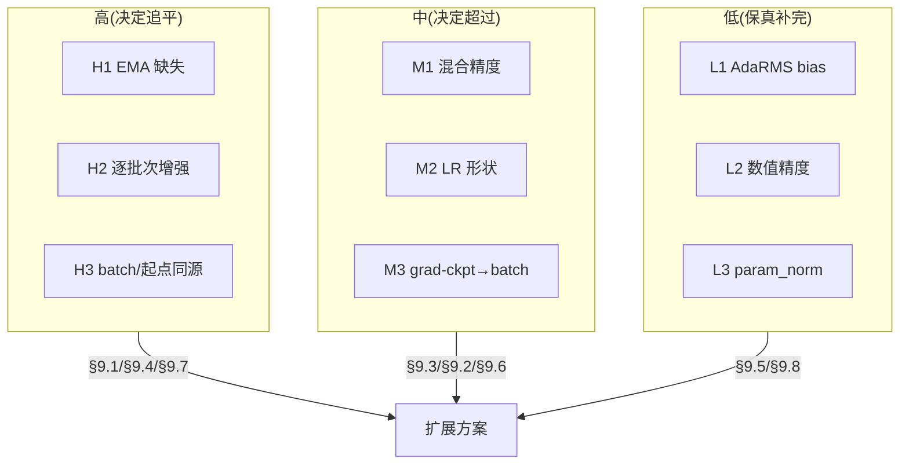
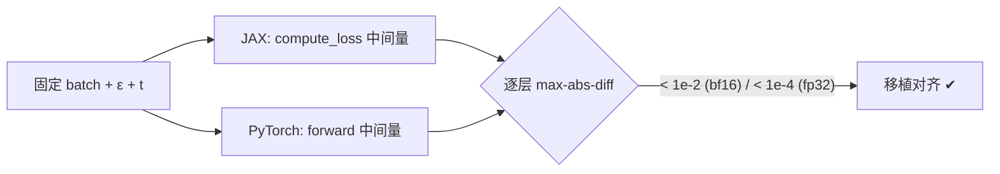
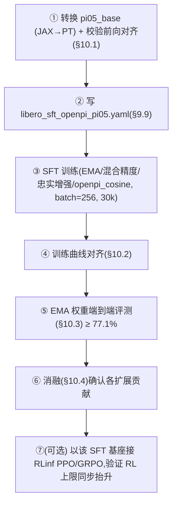

# RLinf 复现 openpi π₀.₅ SFT 的深度分析与扩展方案

> **摘要**：本文以"将 Physical Intelligence 的 openpi π₀.₅ 监督微调（SFT / Flow-Matching 行为克隆）忠实复现到 RLinf 框架"为核心命题，对两套实现进行从静态结构到动态流程、从数学原理到工程实现的系统性对比。我们首先澄清一个常被混淆的关键前提：**openpi 的 π₀.₅ 训练本质是监督式流匹配（Behavior Cloning），而 RLinf 的 π₀.₅ 训练栈天然偏向 PPO/GRPO 在线强化学习**。本文聚焦于二者的 **SFT 阶段**，逐项比对数据处理、前向（Forward）、反向（Backward）与训练技巧，定位所有可能影响"训练指标与最终成功率"的差异，并给出一套**以扩展为主、对 RLinf 现有代码改动最小**的 PyTorch 复现方案，目标是让 RLinf 训出的 π₀.₅ 基座质量"持平或超过"openpi JAX 版本。文中代码引用均指向真实源文件，数学公式以 LaTeX 给出，结构关系以 Mermaid 图呈现。

---

## 目录

1. [范围界定与核心命题](#1-范围界定与核心命题)
2. [背景：π₀.₅ 与 Flow-Matching 行为克隆](#2-背景π₀₅-与-flow-matching-行为克隆)
3. [静态结构对比：三套实现的类层次与训练栈](#3-静态结构对比三套实现的类层次与训练栈)
4. [数据处理流程对比](#4-数据处理流程对比)
5. [Forward 流程对比](#5-forward-流程对比)
6. [Backward 流程对比](#6-backward-流程对比)
7. [训练 Trick 全清单对比](#7-训练-trick-全清单对比)
8. [差异对算法效果的影响分析](#8-差异对算法效果的影响分析)
9. [扩展方案：在 RLinf 中复现 openpi π₀.₅ SFT](#9-扩展方案在-rlinf-中复现-openpi-π₀₅-sft)
10. [验证与复现协议](#10-验证与复现协议)
11. [风险、回退与工程注意事项](#11-风险回退与工程注意事项)
12. [附录](#12-附录)

---

## 1. 范围界定与核心命题

### 1.1 一个必须先澄清的前提

在机器人 VLA（Vision-Language-Action）社区，"π₀.₅"这个名字同时指代两件事，极易混淆：

- **openpi 中的 π₀.₅**：一个用**监督式流匹配（Conditional Flow Matching）**在大规模示教数据上训练/微调出来的 VLA 策略。它的训练目标是回归速度场（velocity field），属于**行为克隆（Behavior Cloning, BC）**范畴，**没有环境交互、没有奖励、没有 RL**。
- **RLinf 中的 π₀.₅**：RLinf（论文 *πRL: Online RL Fine-tuning for Flow-based VLA Models*, arXiv:2510.25889）把一个**已经 SFT 好的** π₀.₅ 当作初始策略，用 PPO/GRPO 做**在线强化学习微调**，通过 Flow-SDE / Flow-Noise 把确定性的流匹配采样改造成可计算 log-probability 的随机策略。

两者关系是**串行的两阶段**：



RLinf 官方文档（`docs/source-en/rst_source/examples/embodied/pi0.rst`）已经证明：在 LIBERO 上，π₀.₅ few-shot/SFT 的平均成功率约 **77.1%**，经 PPO 微调后达 **97.9%**。也就是说 **RLinf 的 RL 阶段早已"超过"openpi 的 SFT 基座**。

> **因此，本文的真正命题不是"RL 能不能超过 SFT"（早已超过），而是：RLinf 能否用 PyTorch 把"SFT 这一阶段本身"复现到与 openpi JAX 等价甚至更好。** 这一点至关重要——RL 的天花板由初始 SFT 基座决定，基座差 1 个点，RL 后往往差更多；要"严格复现并超过 openpi 的 π₀.₅"，第一步必须把 SFT 基座做到不输 openpi。

### 1.2 本文的精确目标

| 维度 | 目标 |
| --- | --- |
| 训练范式 | **SFT / Flow-Matching BC**（非 RL） |
| 参考实现 | openpi `pi05_*` 系列 **JAX** 训练（以 `pi05_libero` 为标准基准） |
| 待对齐实现 | RLinf 的 **PyTorch** SFT（`FSDPVlaSftWorker` + `SFTRunner`） |
| 等价性要求 | 训练栈（优化器/调度/精度/EMA/冻结/增强）等价；训练 loss 曲线与最终成功率"相似或超过" |
| 工程约束 | **以扩展为主、最小改动**：新增模块 + 钩子 + 配置开关，尽量不改 RLinf 既有逻辑 |
| 实现语言 | **PyTorch 复现 JAX**（不是把 JAX 搬过来，而是在 PyTorch 上等价重建优化手段） |

### 1.3 一个关键的"先天优势"与一个"先天约束"

- **先天优势**：RLinf 并没有重写 π₀.₅ 模型，而是**直接继承 openpi 的 PyTorch 移植版** `PI0Pytorch`：

```python
# rlinf/models/embodiment/openpi/openpi_action_model.py:91
class OpenPi0ForRLActionPrediction(PI0Pytorch, BasePolicy):
    ...
```

  这意味着**模型结构、`embed_prefix/embed_suffix`、AdaRMS、注意力、采样、甚至 SFT 的损失函数 `forward()` 全部共享 openpi 的实现**。RLinf 的 SFT 损失就是直接调用父类：

```python
# rlinf/models/embodiment/openpi/openpi_action_model.py:355
def sft_forward(self, data, use_action_chunk_loss=False, **kwargs):
    ...
    loss = super().forward(observation, actions)  # == PI0Pytorch.forward = flow-matching MSE
    ...
    return loss.mean()
```

  所以"模型层"的复现负担极小，真正的差异集中在 **JAX↔PyTorch 移植的数值细节** 与 **训练栈（train loop / 优化器 / EMA / 精度 / 增强）**。

- **先天约束**：openpi 的 JAX 训练栈（`scripts/train.py`）用了大量 JAX/Flax 专属机制（`nnx.DiffState`、`optax`、`orbax`、`nn.scan`+`nn.remat`、buffer donation、EMA on `nnx.State`）。这些**不能直接搬运**，必须在 PyTorch + FSDP 语境下**功能等价地重建**。更棘手的是：**openpi 官方自己的 PyTorch 训练脚本 `scripts/train_pytorch.py` 都没有完整复现 JAX 训练栈**——它明确打印 `"EMA is not supported for PyTorch training"`（`scripts/train_pytorch.py:499`），也没有 freeze/LoRA、没有混合精度 master 权重。因此 **RLinf 不能简单照搬 openpi 的 PyTorch 训练脚本，而要做得比它更完整**。

---

## 2. 背景：π₀.₅ 与 Flow-Matching 行为克隆

### 2.1 π₀.₅ 模型一句话回顾

π₀.₅ 是在 PaliGemma（SigLIP So400m/14 视觉编码器 + Gemma-2B 语言模型）之上，叠加一个 **Action Expert（Gemma-300M）** 的双专家（Multi-Expert）Transformer。两专家**共享注意力的 QKV 交互**但拥有**各自独立的 FFN**；动作通过**条件流匹配**生成。相对 π₀，π₀.₅ 的两项关键改动是：

1. **AdaRMSNorm（自适应 RMSNorm）**：把扩散时间步 \(t\) 经 MLP 编码为条件向量，注入 Action Expert 每层的归一化（scale/shift/gate），以零初始化保护预训练权重；
2. **离散化状态编码（可选）**：把机器人本体状态离散成 256 个 bin 的整数 token，拼进语言 prompt，由 VLM 统一处理（在 LIBERO/ManiSkill 等无本体 proprio 强相关的任务上，openpi 与 RLinf 都选择关闭它，见 §4.3）。

### 2.2 训练目标：条件流匹配

设干净动作块 \(a \sim p_{\text{data}}\)（形状 `[B, H, A]`，`H=action_horizon`，`A=action_dim`），噪声 \(\epsilon \sim \mathcal{N}(0, I)\)，时间 \(t \in (0,1)\)。openpi 采用**线性插值条件路径**（注意采用扩散文献约定：\(t=1\) 为纯噪声，\(t=0\) 为干净数据）：

$$x_t = t \cdot \epsilon + (1-t)\cdot a, \qquad u_t = \epsilon - a .$$

模型 \(v_\theta(x_t, t, o)\)（\(o\) 为观测条件）回归目标速度场 \(u_t\)，损失为：

$$\mathcal{L}_{\text{FM}}(\theta) = \mathbb{E}_{t,\epsilon,a}\big[\, \| v_\theta(x_t, t, o) - u_t \|_2^2 \,\big].$$

推理时从 \(x_1 = \epsilon\) 出发，用 Euler 法沿 \( \mathrm{d}x/\mathrm{d}t = v_\theta \) 反向积分到 \(x_0\)（默认 10 步）。

### 2.3 为何要"忠实复现 SFT"

强化学习微调（RLinf 的 RL 阶段）本质是在 SFT 基座 \(\theta_{\text{SFT}}\) 的邻域内做策略改进。若 PyTorch SFT 因为：缺 EMA 导致泛化更差、纯 bf16 训练导致 loss 偏高、增强分布不一致导致鲁棒性下降、LR 形状不同导致欠/过拟合——那么 \(\theta_{\text{SFT}}\) 的成功率会低于 openpi，RL 后的上限也会被压低。**复现 SFT 不是"锦上添花"，而是"决定 RL 天花板"的地基工程。**

---

## 3. 静态结构对比：三套实现的类层次与训练栈

本文涉及"三套"实现：openpi-JAX（参考标准）、openpi-PyTorch（官方移植，作对照）、RLinf-PyTorch（待扩展）。

### 3.1 模型层：RLinf 直接复用 openpi-PyTorch



> **关键观察**：π₀.₅ 的**前向计算图**（含 AdaRMS、双专家、流匹配损失）由 `PI0Pytorch` 提供，RLinf 与 openpi-PyTorch **逐行共享**。因此本文 §5（Forward）的 JAX↔PyTorch 差异，对 openpi-PyTorch 与 RLinf **同时成立**——这些差异是"openpi 自己的 JAX→PyTorch 移植债"，RLinf 只是继承了它。

### 3.2 训练栈层：三者结构对照

```mermaid
flowchart TB
    subgraph JAX["openpi-JAX (scripts/train.py · 参考标准)"]
        J1["init_train_state<br/>params + ema_params + opt_state"]
        J2["train_step:<br/>nnx.value_and_grad(DiffState=trainable_filter)"]
        J3["optax.chain(clip_by_global_norm(1.0), adamw(b2=0.95))"]
        J4["EMA: ema_decay=0.999 (pi05)"]
        J5["orbax checkpoint (保存 ema_params 为部署权重)"]
        J1-->J2-->J3-->J4-->J5
    end
    subgraph PT["openpi-PyTorch (scripts/train_pytorch.py · 官方移植/对照)"]
        P1["FSDP/DDP, 全 bf16 或全 fp32"]
        P2["loss.backward()"]
        P3["clip_grad_norm_(1.0) + AdamW"]
        P4["EMA: 不支持(显式跳过)"]
        P1-->P2-->P3-->P4
    end
    subgraph RL["RLinf-PyTorch (FSDPVlaSftWorker · 待扩展)"]
        R1["SFTRunner.run() 主循环"]
        R2["run_training: micro-batch 梯度累积"]
        R3["get_train_model_output → model(SFT) → sft_forward"]
        R4["optimizer_step: clip + AdamW(b2=0.95) + lr_scheduler.step"]
        R5["save_checkpoint: full_weights.pt (无 EMA)"]
        R1-->R2-->R3-->R4-->R5
    end
```



RLinf SFT 的类层次：



### 3.3 训练入口与主循环

- **openpi-JAX**：`scripts/train.py` 的 `main()` → `init_train_state()` → 循环 `train_step()`。`train_step` 用 `nnx.value_and_grad(loss_fn, argnums=DiffState(0, trainable_filter))` 只对可训练参数求梯度，随后 `optax` 更新 + EMA 更新（`scripts/train.py:157-173`）。
- **RLinf-PyTorch**：`SFTRunner.run()`（`rlinf/runners/sft_runner.py:77`）逐 step 调 `actor.run_training()`；`FSDPSftWorker.run_training()`（`rlinf/workers/sft/fsdp_sft_worker.py:135`）做梯度累积、反向、`optimizer_step()`、`lr_scheduler.step()`。SFT 的实际损失在 `FSDPVlaSftWorker.get_train_model_output()`（`rlinf/workers/sft/fsdp_vla_sft_worker.py:95`）里通过 `model(forward_type=ForwardType.SFT, data=batch)` 得到。

RLinf SFT 主循环（精简）：

```python
# rlinf/workers/sft/fsdp_sft_worker.py:135 run_training()
for idx in range(self.gradient_accumulation):
    backward_ctx = self.before_micro_batch(self.model, is_last_micro_batch=...)
    batch = next(self.data_iter)
    loss, step_metrics = self.get_train_model_output(batch)   # → sft_forward
    loss = loss / self.gradient_accumulation
    with backward_ctx:
        self.grad_scaler.scale(loss).backward()
grad_norm, lr_list = self.optimizer_step()    # ← EMA 钩子的理想插入点
self.optimizer.zero_grad(set_to_none=True)
self.lr_scheduler.step()
```

> **结论（静态结构）**：RLinf 与 openpi 在"模型计算图"上已经统一（共享 `PI0Pytorch`），差异完全落在**训练栈**和**JAX→PyTorch 的数值移植细节**上。这为"以扩展为主、最小改动"提供了天然条件——我们只需在 `run_training()`/`optimizer_step()`/`save_checkpoint()`/数据增强这几个**已有钩子**上做加法。

## 4. 数据处理流程对比

### 4.1 openpi 的四级可组合变换管线

openpi 把异构机器人数据统一成模型输入，采用四级变换（每级实现 `DataTransformFn` 协议）：


注意：**图像几何/颜色增强不在数据管线里，而在模型 `forward()` 内部**（openpi 设计如此，便于 GPU 上向量化增强）。这一点对后文的"增强等价性"分析至关重要。

### 4.2 SFT 数据加载：RLinf 直接复用 openpi 原生 DataLoader

RLinf 的 VLA SFT 没有自己造数据管线，而是直接调用 openpi 的 `create_data_loader`：

```python
# rlinf/workers/sft/fsdp_vla_sft_worker.py:45
config = get_openpi_config(
    self.cfg.actor.model.openpi.config_name,   # 如 "pi05_libero"
    model_path=self.cfg.actor.model.model_path,
    batch_size=self.cfg.actor.micro_batch_size * self._world_size,
    repo_id=repo_id,
    data_kwargs=getattr(self.cfg.actor, "openpi_data", None),
)
data_loader = openpi_data_loader.create_data_loader(config, framework="pytorch", shuffle=True)
```

由于 `get_openpi_config` 返回的就是 openpi 的 `TrainConfig`（含同一套 `data_transforms` / `model_transforms` / `Normalize`），**RLinf 的 SFT 数据管线第 ①②③④ 级与 openpi-JAX 完全一致**。这是 RLinf 复用 openpi 生态的最大红利：repack、delta-action、分位数归一化、Tokenize、Pad 全部对齐，无需重写。

> openpi 的 `create_data_loader(..., framework="pytorch")` 内部用同一套 transforms，只是把最终 batch 转成 torch tensor；RLDS（DROID 类）在 PyTorch 路径下 `NotImplementedError`（`src/openpi/training/data_loader.py`），故 RLinf 的 PyTorch SFT 仅支持 LeRobot 数据——但 LIBERO/ManiSkill/RoboTwin 均为 LeRobot，覆盖本文标准基准。

### 4.3 归一化与离散状态：逐 config 校验（已对齐）

**分位数归一化**：openpi 用 `model_type != PI0` 自动开启分位数归一化（`src/openpi/training/config.py:187`），即 π₀.₅ 用分位数、π₀ 用 z-score：

$$x_{\text{norm}} = \frac{x - Q_{0.01}}{Q_{0.99} - Q_{0.01} + \varepsilon}\times 2 - 1 \quad (\text{π₀.₅}), \qquad x_{\text{norm}} = \frac{x-\mu}{\sigma}\quad(\text{π₀}).$$

RLinf 走的是同一份 `Normalize(use_quantiles=data_config.use_quantile_norm)`（`rlinf/models/embodiment/openpi/__init__.py:111`），**对齐**。

**离散状态编码**：π₀.₅ *可* 把 state 离散成 256 bin 并拼进 prompt（`src/openpi/models/tokenizer.py:24`）。这是逐 config 的开关，必须**逐配置核对**：

| config | openpi `discrete_state_input` | RLinf 同名 config | 是否对齐 |
| --- | --- | --- | --- |
| `pi05_libero` | `False`（`config.py:745`） | `False` | 对齐 |
| `pi05_maniskill` | `False` | `False`（"stateless"） | 对齐 |
| `pi05_aloha_robotwin` | `True` | `True` | 对齐 |

> **结论**：在标准基准（LIBERO/ManiSkill）上，openpi 自己也关闭离散状态；RLinf 与之一致。**离散状态不是 SFT 复现的差异点**（这与一些二手资料的笼统说法相反，需以代码为准）。

### 4.4 图像增强：JAX `augmax` vs PyTorch 近似（实质差异点）

这是数据侧**唯一**实质性差异，且影响泛化。两边增强意图相同，但实现不等价。

**openpi-JAX（`src/openpi/models/model.py:168-187`）**：

```python
if train:
    transforms = []
    if "wrist" not in key:                       # 仅非腕部相机做几何增强
        transforms += [augmax.RandomCrop(int(w*0.95), int(h*0.95)),
                       augmax.Resize(w, h),
                       augmax.Rotate((-5, 5))]
    transforms += [augmax.ColorJitter(brightness=0.3, contrast=0.4, saturation=0.5)]
    sub_rngs = jax.random.split(rng, image.shape[0])     # ★ 每个样本独立 rng
    image = jax.vmap(augmax.Chain(*transforms))(sub_rngs, image)
```

**openpi-PyTorch（`src/openpi/models_pytorch/preprocessing_pytorch.py:52-142`，RLinf 经 `PI0Pytorch._preprocess_observation` 继承同款）**：

```python
if train:
    image = image / 2.0 + 0.5
    if "wrist" not in key:
        start_h = torch.randint(0, max_h + 1, (1,), ...)   # ★ 整个 batch 共用一个裁剪位置
        ...
        angle = torch.rand(1, ...) * 10 - 5                # ★ 整个 batch 共用一个旋转角
        ...  # grid_sample 旋转
    brightness_factor = 0.7 + torch.rand(1, ...) * 0.6     # ★ 整个 batch 共用一个亮度因子
    image = image * brightness_factor
    contrast_factor = 0.6 + torch.rand(1, ...) * 0.8
    mean = image.mean(dim=[1,2,3], keepdim=True)
    image = (image - mean) * contrast_factor + mean
    saturation_factor = 0.5 + torch.rand(1, ...) * 1.0
    gray = image.mean(dim=-1, keepdim=True)                # ★ 等权 RGB 均值近似"灰度"，非 HSV
    image = gray + (image - gray) * saturation_factor
```

逐项差异（**任何细小差异都不放过**）：

1. **逐样本 vs 逐批次随机性（影响最大）**：JAX 用 `jax.random.split(rng, B)` + `vmap`，**每张图独立采样**裁剪位置/角度/颜色因子；PyTorch 全部用 `torch.rand(1)` / `torch.randint(...,(1,))`，**整个 micro-batch 共享同一组增强参数**。这使 PyTorch 的有效增强熵骤降——一个 batch 内所有样本被同样地裁剪/旋转/调色，等价于"把 batch 当一张图增强"。**这是降低泛化、最值得修的差异**。
2. **饱和度近似**：`augmax.ColorJitter` 的 saturation 走 HSV（或感知亮度加权）；PyTorch 用 `gray = mean(RGB)` 的等权均值做线性插值，色彩统计与 HSV 不一致（源码注释也自承 "For simplicity"）。
3. **ColorJitter 顺序与 hue**：augmax `ColorJitter` 可含 hue 抖动且各分量随机顺序；PyTorch 固定 `brightness→contrast→saturation`，无 hue。
4. **旋转实现**：augmax `Rotate` vs PyTorch `grid_sample(padding_mode="zeros")`，边界/插值细节不同；PyTorch 还有 `|angle|>0.1` 才旋转的分支。
5. **数值域**：PyTorch 显式 `[-1,1]→[0,1]→增强→clamp→[-1,1]`，与 JAX augmax 的内部域处理可能存在轻微差异。

> 这些是 openpi 自身 JAX→PyTorch 移植引入的差异，RLinf 因继承 `PI0Pytorch` 而一并继承。**§9.4 给出在 RLinf 侧"零改 openpi、按需注入忠实增强"的扩展方案。**

### 4.5 小结（数据侧）



**一句话**：SFT 数据管线（归一化/分词/裁切）已与 openpi 等价；**唯一需要在数据侧扩展的，是把"逐批次近似增强"替换为"逐样本、HSV-忠实"的增强**（§9.4）。

## 5. Forward 流程对比

SFT 的前向就是"给定观测 + 噪声化动作 + 时间步，预测速度场并算 MSE"。由于 RLinf 直接继承 `PI0Pytorch.forward`，**RLinf 与 openpi-PyTorch 的前向逐行相同**；本节真正比较的是 **openpi-JAX（标准）vs openpi-PyTorch（=RLinf）** 的移植保真度。

### 5.1 SFT 前向时序

```mermaid
sequenceDiagram
    participant B as batch (Observation, actions)
    participant PP as _preprocess_observation(train=True)
    participant S as sample_noise / sample_time
    participant EP as embed_prefix
    participant ES as embed_suffix
    participant G as PaliGemma+Expert (18 层)
    participant L as MSE Loss

    B->>PP: 图像增强(train=True) + tokenize 已在 dataloader 完成
    S->>S: ε~N(0,I); t~Beta(1.5,1)*0.999+0.001
    Note over S: x_t = t·ε + (1-t)·a ; u_t = ε - a
    PP->>EP: images, img_masks, lang_tokens, lang_masks
    EP->>G: prefix(视觉+语言) tokens [B, ~816/968, D]
    B->>ES: state, x_t, t
    ES->>ES: action_in_proj(x_t); time MLP(t)→adarms_cond (pi05)
    ES->>G: suffix(动作) tokens [B, H, 1024]
    G->>G: 共享注意力 + 独立 FFN; Expert 用 AdaRMS(adarms_cond)
    G->>L: suffix_out → action_out_proj → v_t
    L->>L: ||v_t - u_t||² (reduction=none) → mean
```

### 5.2 时间步采样：Beta(1.5,1)（对齐）

JAX（`src/openpi/models/pi0.py:197`）：`time = jax.random.beta(rng, 1.5, 1, B) * 0.999 + 0.001`。
PyTorch（`src/openpi/models_pytorch/pi0_pytorch.py:182`）：

```python
def sample_time(self, bsize, device):
    time_beta = sample_beta(1.5, 1.0, bsize, device)   # torch.distributions.Beta(1.5,1)
    time = time_beta * 0.999 + 0.001
    return time.to(dtype=torch.float32, device=device)
```

密度 \(p(t) = 1.5\,t^{0.5}\)（偏向高噪声 \(t\to 1\)），缩放到 \([0.001, 1)\) 规避端点数值病态。**完全对齐**。

### 5.3 embed_suffix 与 AdaRMS 条件（π₀.₅ 路径）

π₀.₅ 不把 state 投影成连续 token（那是 π₀），而是把**时间步**经 MLP（两层 + Swish）变成 AdaRMS 条件向量：

```python
# src/openpi/models_pytorch/pi0_pytorch.py:288-298 (pi05 分支)
def time_mlp_func(time_emb):
    x = self.time_mlp_in(time_emb); x = F.silu(x)
    x = self.time_mlp_out(x); return F.silu(x)        # JAX: nnx.swish 两次 (pi0.py:166-167)
time_emb = time_mlp_func(time_emb)
action_time_emb = action_emb                          # 动作 token 不混入时间
adarms_cond = time_emb                                # 时间通过 AdaRMS 注入
```

正弦时间编码 `min_period=4e-3, max_period=4.0`（两边一致）；`F.silu == nnx.swish`。**结构对齐**，仅数值精度路径不同（见 §5.6）。

### 5.4 AdaRMSNorm：零初始化的"恒等启动"——一处移植瑕疵

AdaRMS 的精髓是**零初始化调制层**，使训练初期 \(\text{scale}=\text{shift}=\text{gate}=0\)，AdaRMS 退化为标准 RMSNorm、门控残差退化为恒等，从而**不破坏 PaliGemma 预训练权重**。

$$\text{AdaRMS}(x, c) = \frac{x}{\text{RMS}(x)}\odot(1+\gamma(c)) + \beta(c), \quad [\gamma,\beta,g] = W_{\text{mod}}c + b_{\text{mod}}.$$

JAX（`src/openpi/models/gemma.py:112-131`）：`modulation = nn.Dense(3d, kernel_init=zeros)(cond)`。Flax `nn.Dense` 默认 `use_bias=True` 且 **bias 默认零初始化**，故 \(W_{\text{mod}}=0, b_{\text{mod}}=0\)，初始恒等成立。

PyTorch（`src/openpi/models_pytorch/.../modeling_gemma.py:57-61`）：

```python
self.dense = nn.Linear(cond_dim, dim * 3, bias=True)
nn.init.zeros_(self.dense.weight)     # ★ 只把 weight 置零，bias 用 nn.Linear 默认(均匀分布)，未置零
```

**差异**：PyTorch 的 `b_{\text{mod}} \neq 0`，初始 AdaRMS **不是恒等**——`scale/shift/gate` 在 step 0 即非零，会扰动 PaliGemma 预训练特征。

> **影响范围（务必区分场景）**：
> - **从 `pi05_base` 微调（LIBERO/ManiSkill 标准路径）**：AdaRMS（含 dense bias）由转换后的 checkpoint 加载，bias 是 JAX 训练得到的合理值，**此瑕疵无影响**。
> - **从零预训练 Action Expert（PaliGemma-only 初始化）**：bias 非零将破坏恒等启动，**影响显著**。
> §9.5 给出仅在"从零初始化"场景下生效的一行修复（zero-init bias）。

### 5.5 多专家注意力 / RoPE / GQA / 损失归约（对齐）

- **注意力掩码**：`make_att_2d_masks`（PyTorch，`pi0_pytorch.py:52`）与 `make_attn_mask`（JAX，`pi0.py:19`）逻辑一致（前缀双向、后缀块因果），4D mask 填充值同为 `-2.3819763e38`。
- **GQA + 双专家拼接**：两边都在共享注意力中 concat 各专家 Q/K/V，8 query head 共享 1 KV head。
- **RoPE**：JAX 自实现 `_apply_rope(max_wavelength=10000)`；PyTorch 走 HF `GemmaRotaryEmbedding`，标准 Gemma RoPE，等价。
- **损失归约**：JAX `compute_loss` 先对 `action_dim` 求均、训练再对 `B×H` 求均；PyTorch `F.mse_loss(u_t, v_t, reduction="none")` 后 `sft_forward` 统一 `.mean()`。在"均匀权重"下二者数学等价。RLinf 默认 `use_action_chunk_loss=False`（不截断 chunk），与 openpi 一致。

### 5.6 逐项对齐结论（Forward）

| 检查项 | openpi-JAX | openpi-PyTorch（= RLinf） | 结论 |
| --- | --- | --- | --- |
| flow 路径 / `u_t=ε−a` 符号 | 是 | 是 | **对齐** |
| Beta(1.5,1) 时间采样 | 是 | 是 | **对齐** |
| posemb_sincos(4e-3, 4.0) | `Precision.HIGHEST` | float64 构造再 cast | 微小数值差 |
| time MLP 双 Swish (pi05) | 是 | 是（silu） | **对齐** |
| AdaRMS scale/shift/gate + 门控残差 | 是 | 是 | **对齐（结构）** |
| AdaRMS dense **bias** 零初始化 | 是（默认零） | **否（未置零）** | **差异**（仅从零训练时有影响） |
| 多专家共享注意力 / GQA / RoPE | 是 | 是 | **对齐** |
| 注意力掩码 / 4D mask 填充值 | 是 | 是 | **对齐** |
| suffix `att_masks` dtype | 整型 | `embs.dtype`（可能 bf16） | 极小差异（cumsum 仍正确） |
| 视觉 encoder train 模式 | 强制 `train=False` | 跟随 `model.training`（SigLIP dropout=0） | 影响极小 |
| GELU 变体 | `nn.gelu` | `gelu_pytorch_tanh` | 极小差异 |
| 前/后缀 embed bf16 cast | 由模型 dtype | 显式 `.to(bf16)`（若模型 bf16） | 与精度策略耦合（见 §6.4） |
| 损失归约 | mean | mean | **对齐** |

> **结论（Forward）**：π₀.₅ 的前向核心机制在 PyTorch 中**忠实复现**；唯一"有条件影响质量"的是 **AdaRMS dense bias 未零初始化**（仅"从零训练 Action Expert"场景）；其余为可忽略的数值精度差异。**Forward 不是 SFT 复现的主要矛盾**——主要矛盾在 Backward 与训练栈（§6）。

## 6. Backward 流程对比

**这是 SFT 复现的主战场。** 梯度的数学形式两边完全相同：

$$\frac{\partial \mathcal{L}_{\text{FM}}}{\partial \theta} = 2\,(v_\theta - u_t)\cdot \frac{\partial v_\theta}{\partial \theta},$$

梯度依次经 `action_out_proj → Gemma(18 层, 含 AdaRMS) → action_in_proj / time_mlp → SigLIP(若未冻结)` 反传。差异不在"梯度怎么算"，而在"算完之后怎么用"——即**优化器、梯度裁剪、EMA、参数冻结、学习率调度、数值精度**这六件事。

### 6.1 反向 + 更新时序对照

```mermaid
flowchart TB
    subgraph JAX["openpi-JAX train_step (scripts/train.py:136-191)"]
        JA["loss, grads = nnx.value_and_grad(loss_fn,<br/>argnums=DiffState(0, trainable_filter))"]
        JB["updates, opt_state = tx.update(grads, opt_state, params.filter(trainable))"]
        JC["params = optax.apply_updates(params, updates)"]
        JD["ema_params = 0.999·ema + 0.001·params"]
        JA-->JB-->JC-->JD
    end
    subgraph RLINF["RLinf optimizer_step (fsdp_model_manager.py:408)"]
        RA["grad_scaler.scale(loss).backward()  (梯度累积)"]
        RB["grad_scaler.unscale_(optimizer)"]
        RC["clip_grad_norm_(clip_grad=1.0); 非有限则跳过 step"]
        RD["grad_scaler.step + update"]
        RE["lr_scheduler.step()"]
        RF["(缺失) EMA 更新"]
        RA-->RB-->RC-->RD-->RE-.->RF
    end
```



### 6.2 优化器超参（已对齐）

openpi `AdamW`（`src/openpi/training/optimizer.py:66-85`）默认 `b1=0.9, b2=0.95, eps=1e-8, weight_decay=1e-10, clip_gradient_norm=1.0`，并 `optax.chain(clip_by_global_norm(1.0), adamw)`（**先裁剪后更新**）。

RLinf SFT 配置（`examples/sft/config/*openpi*.yaml`）：

```yaml
optim:
  adam_beta1: 0.9
  adam_beta2: 0.95        # 与 openpi 一致(非默认 0.999)
  adam_eps: 1.0e-08
  weight_decay: 1.0e-10   # 与 openpi 一致(近似 0)
  clip_grad: 1.0
```

`optimizer_step()` 顺序也是 `unscale_ → clip_grad_norm_ → step`（`fsdp_model_manager.py:416-426`）。**优化器与梯度裁剪完全对齐**。其中 `b_2=0.95`（而非 0.999）是 openpi 的有意选择——预训练权重 + 新初始化权重混合时，更快遗忘旧二阶矩、对近期梯度更敏感；`wd≈10^{-10}` 实际等价无权重衰减。

### 6.3 EMA（最高优先级差异）

**openpi**：`TrainConfig.ema_decay` 默认 0.99，`pi05_libero` 显式设 **0.999**（`src/openpi/training/config.py:759`）。训练时维护 EMA 影子参数（`scripts/train.py:169-173`）：

$$\theta_{\text{EMA}}^{(t)} = \alpha\,\theta_{\text{EMA}}^{(t-1)} + (1-\alpha)\,\theta^{(t)}, \quad \alpha=0.999.$$

且**导出/部署用 EMA 参数而非训练参数**（`src/openpi/training/checkpoints.py:146-158`）：

```python
if state.ema_params is not None:
    params = state.ema_params          # 用 EMA 权重做推理/保存
    train_state = replace(state, ema_params=None)
```

**RLinf**：SFT 路径**完全没有 EMA**。`FSDPSftWorker.run_training()` 在 `optimizer_step()` 后没有任何影子参数更新；`save_checkpoint()` 直接保存训练权重。更值得注意的是 **openpi 自家 PyTorch 训练脚本也放弃了 EMA**：

```python
# scripts/train_pytorch.py:499
logging.info("EMA is not supported for PyTorch training")
```

> **影响**：EMA 等价于沿训练轨迹做时间维度集成，通常带来更平滑、更泛化的权重；π₀.₅ 在 LIBERO 用 0.999 这种"高惯性"EMA，说明官方依赖它得到最终部署权重。**缺 EMA 是 RLinf SFT 与 openpi 最可能产生成功率差距的单点**。§9.1 给出 PyTorch+FSDP 下的 EMA 扩展（且推理/保存切换到 EMA 权重）。

### 6.4 参数冻结与 LoRA（trainable_filter）

**openpi**：用 `freeze_filter` + `trainable_filter = All(Param, Not(freeze_filter))`（`config.py:550`）精确控制可训练子集；`nnx.value_and_grad(..., DiffState(0, trainable_filter))` 只对可训练参数求梯度。LoRA 微调时冻结 Gemma 主体、只训 LoRA 与 Action Expert（`src/openpi/models/pi0_config.py:88`）；并把**冻结参数 cast 成 bf16、可训练参数保留 fp32**（`scripts/train.py:104`）。注意 `pi05_libero` 是**全量微调**（`freeze_filter=Nothing`、`ema_decay=0.999`），而 LoRA 配置会**关闭 EMA**（`ema_decay=None`，见 `pi0_fast_libero_low_mem_finetune`）。

**RLinf**：提供两种等价机制——
- `train_expert_only=True` → `freeze_vlm()` 冻结 PaliGemma（`openpi_action_model.py:1033`），等价于"只训 Action Expert + projection"；
- `is_lora=True, lora_rank` → 走 RL 文档所述 LoRA 路径。

但需注意：RLinf 的 `build_optimizer` 通过 `param.requires_grad` 收集可训练参数（`fsdp_model_manager.py:507-514`），所以冻结要在 `setup_model_and_optimizer` 之前生效——`get_model` 中 `if train_expert_only: model.freeze_vlm()`（`__init__.py:66`）已满足。**冻结机制基本对齐**，但要确保 SFT 场景下的冻结/EMA 组合与 openpi 一致（全量微调→开 EMA；LoRA→关 EMA）。

### 6.5 学习率调度（形状差异）

**openpi `pi05_libero`**（`config.py:752`）：

```python
lr_schedule = CosineDecaySchedule(warmup_steps=10_000, peak_lr=5e-5, decay_steps=1_000_000, decay_lr=5e-5)
# create() → optax.warmup_cosine_decay_schedule(
#   init_value = peak/(warmup+1) ≈ 5e-9, peak_value=5e-5,
#   warmup_steps=10_000, decay_steps=1_000_000, end_value=5e-5)
```

因为 `decay_lr == peak_lr`，余弦段是**平的**；又因 `decay_steps=1e6 ≫ num_train_steps=30k`，实际曲线 = **线性 warmup(10k 步, 0→5e-5) 后恒定 5e-5**。即"warmup 占满 1/3 训练 + 之后常数 LR"。

**RLinf**：`build_lr_scheduler` 读 `lr_scheduler ∈ {constant, cosine, ...}`（`fsdp_model_manager.py:456`）：
- `constant` → 线性 warmup 后恒定（形状与 openpi 一致）；
- `cosine` → HF `get_cosine_with_min_lr_schedule_with_warmup(num_training_steps=total, min_lr=...)`，**在 `total` 步内余弦衰减到 `min_lr`**。

**两处易错差异**：
1. **语义错配**：openpi 的 `decay_steps` 是"衰减总长"（设成 1e6 故近似常数）；RLinf cosine 的 `num_training_steps` 是"训练总步"（30k 内就衰减完）。若把 openpi 配置"直觉地"映射成 RLinf `cosine + num_training_steps=30k`，会得到**完全不同的、30k 内衰减到 min_lr 的曲线**。
2. **峰值/warmup 不一致**：示例 `libero_sft_openpi.yaml`（π₀）用 `peak=2.5e-5, warmup=1000`；openpi `pi05_libero` 用 `peak=5e-5, warmup=10000`。

> **正确映射**：要复现 `pi05_libero`，应在 RLinf 用 `lr_scheduler: constant`（warmup-then-constant），`lr=5e-5`，`lr_warmup_steps=10000`。§9.2 进一步提供一个与 optax `warmup_cosine_decay_schedule` 数值完全等价的 `openpi_cosine` 调度，便于复现任意 openpi LR 配置（含 `init=peak/(warmup+1)` 的精确 warmup 起点）。

### 6.6 数值精度策略（混合精度差异）

**openpi-JAX**：模型 `dtype="bfloat16"`（compute 用 bf16），但**可训练参数保持 fp32**（仅冻结参数被 cast 成 bf16，`train.py:104`），`optax` 一阶/二阶矩在 fp32。即 **fp32 master 权重 + bf16 计算 + fp32 优化器状态**——这是标准的"混合精度训练"。

**openpi-PyTorch**：`pytorch_training_precision ∈ {bfloat16, float32}`，把整个模型 dtype 设成该值（`train_pytorch.py:396-407`），即**要么全 bf16、要么全 fp32**，无 master 权重。README 明确警告：**bf16 训练 loss 高于 fp32**。

**RLinf**：`precision: null` ⇒ FSDP `MixedPrecision` 三个 dtype 全 null（不启用 FSDP 混合精度）；模型加载后 `model.paligemma_with_expert.to_bfloat16_for_selected_params("bfloat16")`（`__init__.py:89`），把所选参数 cast 成 **bf16**。结果是 **bf16 master 权重 + bf16 优化器状态**——与 openpi-JAX 的"fp32 master + bf16 compute"不同，更接近"纯 bf16 训练"，存在 loss 偏高/数值不稳风险。

> **正确做法**：保持 **fp32 master + bf16 compute**。在 FSDP 下可通过"**不预先 cast 模型为 bf16**、改用 `MixedPrecision(param_dtype=bf16, reduce_dtype=fp32)`"实现——FSDP 会把分片参数保留在原始 fp32（master + 优化器 fp32），仅在前向/反向 all-gather 时 cast 为 bf16 计算，与 JAX 完全对齐。§9.3 给出 `precision: mixed_bf16` 扩展分支。

### 6.7 逐项对齐结论（Backward / 训练栈）

| 检查项 | openpi-JAX（`pi05_libero`） | RLinf-PyTorch SFT 现状 | 结论 / 优先级 |
| --- | --- | --- | --- |
| AdamW b1/b2/eps/wd | 0.9 / 0.95 / 1e-8 / 1e-10 | 同 | **对齐** |
| 梯度裁剪(全局范数, 先裁后更) | 1.0 | 1.0（unscale→clip→step） | **对齐** |
| **EMA** | **0.999, 导出用 EMA** | **无** | **差异 · 高** |
| 冻结/LoRA | freeze_filter / trainable_filter | train_expert_only / is_lora | 机制对齐，需组合一致 |
| LR 形状 | warmup(10k)→常数 5e-5 | 默认 cosine→min 或 constant | **差异 · 中**（语义/峰值/warmup） |
| 数值精度 | fp32 master + bf16 compute | bf16 master(`to_bfloat16`) | **差异 · 中**（loss 偏高风险） |
| batch_size | 256 | 示例 64–128 | **差异 · 中**（影响优化） |
| 起始权重 | `pi05_base`（同源） | 需用同源转换 ckpt | 设置项 · 高 |
| 训练指标 | loss / grad_norm / **param_norm** | loss / grad_norm（缺 param_norm） | 差异 · 低 |

> **结论（Backward）**：模型梯度本身一致，优化器/裁剪已对齐；**真正决定"训不训得出同等基座"的，是 EMA（高）、LR 形状（中）、混合精度（中）、batch/起点（中）四项训练栈差异**。这四项正是 §9 扩展方案的核心。

## 7. 训练 Trick 全清单对比

下表汇总 openpi π₀.₅ **SFT** 全部相关技巧，给出 openpi 实现、RLinf 现状、差异与影响。状态符号：✅对齐 / ⚠️部分对齐 / ❌缺失 / ➖框架专属(不影响正确性)。

| # | Trick | openpi 实现（文件） | RLinf 现状 | 状态 |
| --- | --- | --- | --- | --- |
| 1 | AdaRMSNorm 时间步条件 | `gemma.py:112` | 继承 `PI0Pytorch` | ✅ |
| 2 | AdaRMS **零初始化（dense bias）** | weight+bias 皆零 | 仅 weight 置零 | ⚠️（仅从零训练有影响） |
| 3 | 门控残差 `x+y·gate` | `gemma.py:453` | 继承 | ✅ |
| 4 | Beta(1.5,1) 时间采样 | `pi0.py:197` | `pi0_pytorch.py:182` | ✅ |
| 5 | 分位数归一化 | `transforms.py:141` | 复用 openpi Normalize | ✅ |
| 6 | 离散状态编码（逐 config） | `tokenizer.py:24` | 逐 config 对齐 | ✅ |
| 7 | 选择性图像增强（腕部不做几何） | `model.py:168` augmax | ⚠️ 逐批次 + HSV 近似 | ⚠️ |
| 8 | **EMA（0.999）+ 导出用 EMA** | `train.py:169`/`checkpoints.py:146` | **无** | ❌ |
| 9 | 梯度裁剪（全局范数 1.0，先裁后更） | `optimizer.py:85` | `optimizer_step` | ✅ |
| 10 | AdamW（b2=0.95, wd≈0） | `optimizer.py:69` | yaml 同值 | ✅ |
| 11 | LR warmup + 常数（pi05_libero） | `config.py:752` | 默认 cosine→min | ⚠️ |
| 12 | 混合精度（fp32 master + bf16 compute） | `train.py:104` | bf16 master | ⚠️ |
| 13 | 冻结 / LoRA（trainable_filter） | `pi0_config.py:88` | train_expert_only / is_lora | ✅（需组合一致） |
| 14 | RMSNorm 方差 / 注意力 logits 用 fp32 | `gemma.py` | 继承（`modeling_gemma.py:68`） | ✅ |
| 15 | 激活重计算（`nn.remat`） | `gemma.py:359` | gradient_checkpointing（默认关） | ⚠️（影响显存→batch） |
| 16 | `nn.scan` 层扫描（编译/显存） | `gemma.py:365` | PyTorch 无需 | ➖ |
| 17 | Buffer donation（省一次拷贝） | `train.py:247` | PyTorch 无此机制 | ➖ |
| 18 | FSDP 分片 | `sharding.py` / `fsdp_devices` | FSDP 策略 | ✅ |
| 19 | 权重加载（同源 `pi05_base` 部分加载） | `weight_loaders` | `get_model` load_state_dict | ✅（需同源） |
| 20 | `param_norm` 训练指标 | `train.py:188` | 仅 loss/grad_norm | ⚠️（可观测性） |

> 直观结论：**绝大多数 trick 已通过"继承 `PI0Pytorch` + 复用 openpi data_loader"自动对齐**；真正缺失/不等价的集中在 **#7 增强、#8 EMA、#11 LR、#12 精度**（外加 #2 的从零训练边角、#15 显存→batch 的间接影响、#19/#20 的设置与可观测性）。

---

## 8. 差异对算法效果的影响分析

我们按"对最终 SFT 成功率与训练指标的影响程度"分级，并为每项给出**可证伪的实验假设**，便于 §10 验证。

### 8.1 高影响（直接决定能否追平 openpi）

**H1 — 缺失 EMA（#8）。**
- 机理：流匹配回归任务的损失面在 minibatch 噪声下抖动较大；EMA(0.999) 以约 \(1/(1-\alpha)=1000\) 步的有效窗口对参数做时间集成，得到更平滑、泛化更好的部署权重。openpi 在 `pi05_libero` 专门开 0.999，且**仅导出 EMA 权重**——说明其报告的成功率本身就是 EMA 权重的成绩。
- 后果：RLinf 用"训练瞬时权重"评估/作为 RL 起点，期望成功率系统性低于 openpi，且对 checkpoint 选择更敏感（方差更大）。
- 可证伪假设 \(\mathcal{H}_1\)：在同数据/同起点/同步数下，开启 EMA(0.999) 后 LIBERO SFT 平均成功率提升且方差下降；关 EMA 时复现不出 openpi 的 77.1% 量级。

**H2 — 增强退化为"逐批次"（#7）。**
- 机理：JAX 对 batch 内每张图独立采样裁剪/旋转/调色；PyTorch 整个 micro-batch 共用一组增强参数，有效增强样本多样性约降至 \(1/\text{batch}\)。对 LIBERO 的 spatial/object 泛化（依赖视觉不变性）尤其不利。
- 后果：训练集拟合可能正常，但对布局/物体/视角变化的泛化变差，留出任务成功率偏低。
- 可证伪假设 \(\mathcal{H}_2\)：改为逐样本 + HSV-忠实增强后，spatial/object 子任务成功率提升最明显。

**H3 — batch_size 与起始权重不同源（#19）。**
- 机理：openpi `pi05_libero` 用 `batch_size=256` 且从 `gs://openpi-assets/checkpoints/pi05_base` 起；若 RLinf 用更小 batch 或不同源/未对齐转换的起点权重，则**根本不是同一实验**，无法谈"复现"。
- 可证伪假设 \(\mathcal{H}_3\)：固定同源 `pi05_base`（经官方转换器转 PyTorch）+ `global_batch_size=256` 是复现的前置必要条件。

### 8.2 中影响（决定能否"超过"而非仅"接近"）

**M1 — 混合精度（#12）。** 纯 bf16 master 训练 loss 偏高（openpi README 实测），且 AdamW 二阶矩 bf16 精度不足易引入偏差。切到"fp32 master + bf16 compute"可降低 loss、提稳定性。假设 \(\mathcal{M}_1\)：相同步数下，混合精度方案训练 loss 更低、最终成功率不低于纯 bf16。

**M2 — LR 形状/峰值/warmup（#11）。** openpi 是"长 warmup(10k) + 常数 5e-5"；若 RLinf 误用"30k 内 cosine 衰减到 min_lr"，则后期 LR 过小、欠拟合，或 warmup 过短致早期不稳。假设 \(\mathcal{M}_2\)：采用与 `pi05_libero` 等价的 warmup-常数调度，收敛曲线与 openpi 贴合。

**M3 — 显存→有效 batch（#15）。** RLinf 对 openpi 关闭 gradient checkpointing，单卡可承载的 batch 受限；若被迫减小 global batch 或加大梯度累积，会改变优化动态。假设 \(\mathcal{M}_3\)：开启 `PI0Pytorch.gradient_checkpointing_enable()`（openpi-PyTorch 本就支持）可在等显存下放大 batch、贴近 256。

### 8.3 低影响（保真度补完，通常不改变结论）

- **L1 AdaRMS dense bias（#2）**：仅"从零训练 Action Expert"时破坏恒等启动；从 `pi05_base` 微调无影响。
- **L2 数值精度路径**：posemb（HIGHEST vs float64）、suffix `att_masks` dtype、`gelu` vs `gelu_pytorch_tanh`、视觉 encoder train 模式（SigLIP dropout=0）——均为 \(10^{-3}\) 量级，单步可忽略，长训累积亦小。
- **L3 param_norm 缺失（#20）**：纯可观测性，不影响优化，但补上有助于与 openpi 曲线对比诊断。

### 8.4 影响-修复 优先级总览



> **核心判断**：把 **H1（EMA）+ H2（增强）+ H3（batch/起点）** 三项补齐，RLinf 的 PyTorch SFT 即可"追平"openpi；再叠加 **M1（混合精度）+ M2（LR）+ M3（batch 放大）**，则有望"略微超过"（更稳的优化 + 与官方一致甚至更优的训练配置）。

## 9. 扩展方案：在 RLinf 中复现 openpi π₀.₅ SFT

### 9.0 设计总原则

1. **以扩展为主、最小改动**：新增独立模块（`rlinf/utils/ema.py`、`rlinf/data/aug/openpi_faithful_aug.py`），仅在 `FSDPSftWorker` / `FSDPModelManager` / `get_lr_scheduler` / `get_model` 等**已有钩子**上插入"加法"，且全部用 **config 开关**保护，缺省行为不变（向后兼容）。
2. **挂在现有生命周期上**：EMA 挂 `setup_model_and_optimizer`（初始化）→ `run_training` 末尾（更新）→ `save_checkpoint`（导出）；LR/精度挂构建期；增强挂模型 `_preprocess_observation`（子类覆写）。
3. **PyTorch 等价、而非搬运 JAX**：用 `torch` 重建 optax/Flax 的数值语义（warmup-cosine、fp32-master 混合精度、逐样本增强），并以**数值对齐测试**（§10）证明等价。
4. **零改 openpi**：所有改动落在 `rlinf/`，openpi 作为只读依赖；增强、AdaRMS bias 等"openpi 移植债"通过**子类覆写 / 后置 re-init**注入。

> 下文代码为**设计骨架（落地蓝本）**，标注了对应的新增文件与"最小改动点"。

### 9.1 EMA（H1，最高优先级）

**目标**：在 SFT 训练中维护衰减 0.999 的影子权重，并在保存/评估时切换到 EMA 权重（对齐 openpi `ema_decay=0.999` + 导出 EMA）。

**新增文件** `rlinf/utils/ema.py`：

```python
import torch

class ModelEMA:
    """逐元素 EMA，兼容 FSDP 分片：每个 rank 只 EMA 自己持有的 shard。
    仅跟踪 requires_grad=True 的参数；冻结参数与 EMA 等同其冻结值。"""
    def __init__(self, model, decay: float = 0.999):
        self.decay = decay
        self.shadow = {
            n: p.detach().clone()
            for n, p in model.named_parameters() if p.requires_grad
        }

    @torch.no_grad()
    def update(self, model):
        d = self.decay
        for n, p in model.named_parameters():
            if p.requires_grad and n in self.shadow:
                # shadow = d*shadow + (1-d)*p   (与 openpi train.py:172 同式)
                self.shadow[n].mul_(d).add_(p.detach(), alpha=1.0 - d)

    @torch.no_grad()
    def swap_in(self, model):
        """把 EMA 权重换入 model（保存/评估前调用），返回备份以便还原。"""
        backup = {}
        for n, p in model.named_parameters():
            if n in self.shadow:
                backup[n] = p.detach().clone()
                p.data.copy_(self.shadow[n])
        return backup

    @torch.no_grad()
    def swap_out(self, model, backup):
        for n, p in model.named_parameters():
            if n in backup:
                p.data.copy_(backup[n])

    def state_dict(self):
        return {"decay": self.decay, "shadow": self.shadow}

    def load_state_dict(self, sd):
        self.decay = sd["decay"]; self.shadow = sd["shadow"]
```

**最小改动点（3 处）**：

1. `rlinf/hybrid_engines/fsdp/fsdp_model_manager.py::setup_model_and_optimizer`（约 `:289` 之后）——初始化 EMA：

```python
ema_decay = self._cfg.optim.get("ema_decay", None)
self.ema = ModelEMA(self.model, ema_decay) if ema_decay else None
```

2. `rlinf/workers/sft/fsdp_sft_worker.py::run_training`（`:172` `optimizer_step()` 之后）——每步更新：

```python
grad_norm, lr_list = self.optimizer_step()
if getattr(self, "ema", None) is not None:
    self.ema.update(self.model)      # 仅在 step 成功后更新
```

3. `rlinf/workers/sft/fsdp_vla_sft_worker.py::save_checkpoint`（`:114`）——以 EMA 权重导出（复用既有的 `summon_full_params` 全量保存路径）：

```python
def save_checkpoint(self, save_path, step=0):
    if getattr(self, "ema", None) is not None:
        backup = self.ema.swap_in(self.model)     # 换入 EMA → 让既有保存逻辑写出 EMA 权重
        try:
            super().save_checkpoint(save_path, step)
        finally:
            self.ema.swap_out(self.model, backup)  # 还原训练权重，继续训练
        # 可选：另存一份训练权重到 .../raw/ 以便诊断
    else:
        super().save_checkpoint(save_path, step)
    ...  # 既有的 data.pt / rng.pt 保存
```

**配置开关**（`examples/sft/config/libero_sft_openpi_pi05.yaml` 新建时）：

```yaml
optim:
  ema_decay: 0.999     # 对齐 openpi pi05_libero；为空则关闭(对齐 LoRA 配置)
```

> 要点：EMA 是**逐元素**操作，对 FSDP 分片"天然可分"（每 rank EMA 本地 shard），保存时借助既有 `FSDP2.summon_full_params` + `full_tensor()`（`utils.py:491`）聚合为完整权重。resume 时把 `ema.state_dict()` 一并写入 checkpoint（`load_checkpoint` 对称恢复）。

### 9.2 学习率调度对齐（M2）

**目标**：提供与 optax `warmup_cosine_decay_schedule` **数值等价**的调度，精确复现 `pi05_libero` 的"线性 warmup(init=peak/(warmup+1)→peak) + 余弦衰减(peak→decay_lr，跨 decay_steps)"，当 `decay_lr==peak` 即退化为 warmup-常数。

**最小改动点**：在 `rlinf/hybrid_engines/fsdp/utils.py::get_lr_scheduler`（`:511`）新增分支 `"openpi_cosine"`：

```python
elif lr_scheduler == "openpi_cosine":
    import math
    from torch.optim.lr_scheduler import LambdaLR
    peak = optimizer.defaults["lr"]                 # 约定 optim.lr == peak_lr
    end  = kwargs.get("decay_lr", peak)             # decay_lr==peak ⇒ warmup 后恒定
    init = peak / (num_warmup_steps + 1)            # 与 optax init_value 一致
    decay_steps = kwargs.get("decay_steps", num_training_steps)
    def lr_lambda(step):
        if step < num_warmup_steps:                 # 线性 warmup: init → peak
            return (init + (peak - init) * step / max(1, num_warmup_steps)) / peak
        if step >= decay_steps:
            return end / peak
        prog = (step - num_warmup_steps) / max(1, decay_steps - num_warmup_steps)
        cos  = end + 0.5 * (peak - end) * (1.0 + math.cos(math.pi * prog))
        return cos / peak
    return LambdaLR(optimizer, lr_lambda)
```

`build_lr_scheduler`（`fsdp_model_manager.py:440`）只需把 `decay_lr`/`decay_steps` 透传给 `get_lr_scheduler`（从 `optim_config.get(...)` 读取）。

**配置**（复现 `pi05_libero`）：

```yaml
optim:
  lr: 5.0e-5             # = peak_lr
  lr_scheduler: "openpi_cosine"
  lr_warmup_steps: 10000
  decay_steps: 1000000   # ≫ total_training_steps ⇒ 30k 内近似常数
  decay_lr: 5.0e-5       # == peak ⇒ warmup 后恒定
  total_training_steps: 30000
```

> 注意区分语义：openpi 的 `decay_steps` 是"衰减总长"（设 1e6 即常数），**不要**误填 30k；RLinf 既有 `cosine` 分支的 `num_training_steps` 才是 30k。新分支显式接收 `decay_steps`，避免语义错配（§6.5 的易错点）。

### 9.3 混合精度对齐（M1）

**目标**：把"bf16 master 权重"改为 openpi 的 **"fp32 master + bf16 compute + fp32 优化器状态"**。

**机理**：FSDP 的 `MixedPrecision(param_dtype, reduce_dtype, buffer_dtype)` 会在 all-gather 时把分片参数 cast 到 `param_dtype` 做前向/反向计算，但**底层分片参数与优化器状态保留其原始 dtype**。因此只要：(a) 不预先把模型 cast 成 bf16；(b) 设 `param_dtype=bf16, reduce_dtype=fp32`——即可得到 fp32 master + bf16 compute。

**最小改动点（2 处）**：

1. `rlinf/models/embodiment/openpi/__init__.py::get_model`（`:89`）——把无条件 cast 改为按精度模式：

```python
precision = getattr(cfg, "precision", None)
if precision != "mixed_bf16":
    model.paligemma_with_expert.to_bfloat16_for_selected_params("bfloat16")
# mixed_bf16: 保持 fp32 master，bf16 计算交给 FSDP MixedPrecision
```

2. 配置（SFT yaml）——显式给 FSDP 混合精度赋值（不再用 `${actor.model.precision}=null`）：

```yaml
actor:
  model:
    precision: "mixed_bf16"
  fsdp_config:
    mixed_precision:
      param_dtype: "bfloat16"     # 计算精度
      reduce_dtype: "float32"     # 梯度规约用 fp32(更稳)
      buffer_dtype: "float32"
    grad_scaler:
      enabled: false              # bf16 计算无需 loss scaling
```

> 这样优化器 master 权重与 Adam 一二阶矩均为 fp32，前向/反向以 bf16 计算，**与 openpi-JAX 的混合精度语义对齐**，可消除"纯 bf16 训练 loss 偏高"的系统偏差。SigLIP patch-embed/posemb 等数值敏感处 openpi 本就保留 fp32，PyTorch 侧 `modeling_gemma.py` 的 RMSNorm 方差/注意力 logits 也已用 fp32（`:68`），无需额外处理。

### 9.4 图像增强等价（H2）

**目标**：把 openpi-PyTorch 的"逐批次 + 等权灰度近似"增强，替换为 **逐样本 + 亮度感知（luminance）**增强，匹配 JAX `augmax` 的语义与多样性。

**新增文件** `rlinf/data/aug/openpi_faithful_aug.py`（设计骨架，GPU 上批量、逐样本）：

```python
import torch
import torch.nn.functional as F

_LUMA = torch.tensor([0.299, 0.587, 0.114])   # Rec.601, 同 PIL/torchvision

def _per_sample(b, lo, hi, device):
    return lo + (hi - lo) * torch.rand(b, 1, 1, 1, device=device)   # ★ 每样本独立因子

@torch.no_grad()
def faithful_augment(img_nchw: torch.Tensor, *, is_wrist: bool) -> torch.Tensor:
    """img_nchw: [B,3,H,W] in [-1,1]; 逐样本几何(仅非腕部)+逐样本颜色(全相机)。"""
    B, C, H, W = img_nchw.shape
    dev = img_nchw.device
    x = img_nchw / 2 + 0.5                                  # → [0,1]

    if not is_wrist:                                        # 几何:逐样本 affine(缩放0.95+平移+±5°)
        theta = torch.zeros(B, 2, 3, device=dev)
        ang = (torch.rand(B, device=dev) * 10 - 5) * torch.pi / 180.0   # ±5°,每样本
        s = 0.95                                            # 95% crop 等价的缩放
        cos, sin = torch.cos(ang), torch.sin(ang)
        tx = (torch.rand(B, device=dev) * 2 - 1) * (1 - s)  # 随机平移(=随机裁剪中心)
        ty = (torch.rand(B, device=dev) * 2 - 1) * (1 - s)
        theta[:, 0, 0] = s * cos; theta[:, 0, 1] = -s * sin; theta[:, 0, 2] = tx
        theta[:, 1, 0] = s * sin; theta[:, 1, 1] =  s * cos; theta[:, 1, 2] = ty
        grid = F.affine_grid(theta, x.shape, align_corners=False)
        x = F.grid_sample(x, grid, mode="bilinear", padding_mode="border", align_corners=False)

    luma = _LUMA.to(dev).view(1, 3, 1, 1)
    # brightness ±30%, contrast ±40%, saturation ±50%  —— 逐样本因子, 亮度感知
    x = x * _per_sample(B, 0.7, 1.3, dev)                              # brightness
    gmean = (x * luma).sum(1, keepdim=True).mean(dim=[2, 3], keepdim=True)
    x = (x - gmean) * _per_sample(B, 0.6, 1.4, dev) + gmean           # contrast(灰度均值)
    gray = (x * luma).sum(1, keepdim=True)
    x = gray + (x - gray) * _per_sample(B, 0.5, 1.5, dev)             # saturation(亮度灰度)
    return (x.clamp(0, 1) * 2 - 1)                                    # → [-1,1]
```

**最小改动点（1 处，子类覆写，零改 openpi）**：在 `OpenPi0ForRLActionPrediction` 覆写 `_preprocess_observation`，**先 resize（复用 openpi，关闭其近似增强）、再逐样本忠实增强**（与 openpi `resize→augment` 顺序一致）：

```python
# rlinf/models/embodiment/openpi/openpi_action_model.py 内新增覆写
import openpi.models_pytorch.preprocessing_pytorch as _prep
from rlinf.data.aug.openpi_faithful_aug import faithful_augment

def _preprocess_observation(self, observation, *, train=True):
    if not (train and getattr(self.config, "faithful_augmentation", False)):
        return super()._preprocess_observation(observation, train=train)
    proc = _prep.preprocess_observation_pytorch(observation, train=False)  # 只 resize, 不增强
    aug_imgs = {}
    for key, im in proc.images.items():
        nchw = im if im.shape[1] == 3 else im.permute(0, 3, 1, 2)
        nchw = faithful_augment(nchw, is_wrist=("wrist" in key))
        aug_imgs[key] = nchw if im.shape[1] == 3 else nchw.permute(0, 2, 3, 1)
    return (list(aug_imgs.values()), list(proc.image_masks.values()),
            proc.tokenized_prompt, proc.tokenized_prompt_mask, proc.state)
```

**配置开关**：`actor.model.openpi.faithful_augmentation: True`（缺省 False → 行为不变）。

> 备选：直接引入 `kornia.augmentation`（`RandomResizedCrop/RandomRotation/ColorJitter` 原生支持逐样本批量随机与 HSV），可进一步逼近 augmax；但会新增依赖，故首选上面的零依赖实现。无论哪种，关键是**恢复逐样本随机性 + 亮度感知颜色变换**。

### 9.5 AdaRMS dense bias 零初始化（L1，仅从零训练）

**目标**：当**从 PaliGemma-only 初始化、Action Expert 从零训练**时，恢复 AdaRMS 的"恒等启动"。**从 `pi05_base` 微调时不启用**（否则会清零已训练的 bias）。

**最小改动点（1 处，后置 re-init）**：在 `OpenPi0ForRLActionPrediction.__init__` 末尾，按 config 开关执行：

```python
if getattr(config, "zero_init_adarms_bias", False):
    for m in self.modules():
        # GemmaRMSNorm 的自适应分支带 dense:Linear(cond, dim*3)
        if getattr(m, "dense", None) is not None and hasattr(m, "cond_dim"):
            torch.nn.init.zeros_(m.dense.bias)     # weight 已被 openpi 置零, 这里补 bias
```

**配置**：`zero_init_adarms_bias: True` 仅用于"从零预训练"实验；标准 LIBERO 微调保持 False。

### 9.6 梯度检查点 → 放大有效 batch（M3）

**现状**：`sft_forward` 起手就 `self.gradient_checkpointing_disable()`（`openpi_action_model.py:329`），且 SFT yaml 注释"openpi 不支持"。但 `PI0Pytorch` **本身实现了** `gradient_checkpointing_enable()`（`pi0_pytorch.py:127`），其 `forward` 用 `_apply_checkpoint` 包裹各计算块。

**最小改动点（1 处，加开关）**：把 `sft_forward` 中的无条件禁用改为按配置：

```python
def sft_forward(self, data, use_action_chunk_loss=False, **kwargs):
    if not getattr(self.config, "sft_gradient_checkpointing", False):
        if hasattr(self, "gradient_checkpointing_disable"):
            self.gradient_checkpointing_disable()
    # 否则保留 setup 阶段 enable 的梯度检查点
    ...
```

并在 `fsdp_config.gradient_checkpointing: True` 时（`setup_model_and_optimizer:256` 已会调用 `module.gradient_checkpointing_enable()`）放大 `micro_batch_size`，从而在等显存下逼近 openpi 的 `batch_size=256`。

> 用激活重计算"以算力换显存"对齐 openpi 的 `nn.remat`，是把 effective batch 抬到 256 的关键工程手段（而非降低 global batch 或改变优化动态）。

### 9.7 batch / 起点权重 / 数据 与 norm-stats 对齐（H3，设置项）

这一组不是代码而是**实验设置**，但对"复现"是必要条件：

1. **同源起点**：用官方转换器把 `gs://openpi-assets/checkpoints/pi05_base` 转成 PyTorch：

```bash
python rlinf/utils/ckpt_convertor/convert_openpi_jax_to_python.py \
    --checkpoint_dir <pi05_base_jax> --output_path <pi05_base_pt> --config_name pi05_libero
```

   转换会同时复制 `assets/`（含 norm stats），RLinf `get_model` 再从 checkpoint 目录 `load_norm_stats`（`__init__.py:102`），确保**归一化统计与 openpi 训练时一致**。
2. **batch_size=256**：`actor.global_batch_size: 256`（配合 §9.6 的梯度检查点 + 梯度累积达成）。
3. **数据**：`data.train_data_paths` 指向 `physical-intelligence/libero` 同一 LeRobot 数据；`config_name: pi05_libero`（`action_horizon=10, discrete_state_input=False, extra_delta_transform=False`，与 openpi 完全一致）。
4. **步数**：`runner.max_steps: 30000`（对齐 `num_train_steps`）。

### 9.8 训练指标补全（L3）

在 `FSDPSftWorker.run_training` 的指标里补 `param_norm`（对齐 openpi `train.py:188`），便于与官方曲线对比诊断：

```python
with torch.no_grad():
    pnorm = torch.norm(torch.stack([
        p.detach().float().norm() for p in self.model.parameters() if p.requires_grad
    ]))
append_to_dict(metrics, {"param_norm": float(pnorm)})
```

（FSDP 下为本地 shard 范数，可按需 all-reduce 求全局范数。）

### 9.9 改动汇总：新增文件 + 最小改动点 + 复现配置

**新增文件（2 个，纯加法）**：

| 文件 | 作用 |
| --- | --- |
| `rlinf/utils/ema.py` | `ModelEMA`（FSDP 分片友好的 EMA + swap_in/out） |
| `rlinf/data/aug/openpi_faithful_aug.py` | 逐样本、亮度感知的忠实增强 |

**对现有文件的最小改动点（均为 config 保护的加法）**：

| 文件 | 改动 | 对应差异 |
| --- | --- | --- |
| `rlinf/hybrid_engines/fsdp/fsdp_model_manager.py` | `setup_model_and_optimizer` 初始化 `self.ema`；`build_lr_scheduler` 透传 `decay_lr/decay_steps` | EMA / LR |
| `rlinf/workers/sft/fsdp_sft_worker.py` | `run_training` 末尾 `ema.update`；补 `param_norm` | EMA / 指标 |
| `rlinf/workers/sft/fsdp_vla_sft_worker.py` | `save_checkpoint` swap 到 EMA 权重导出 | EMA |
| `rlinf/hybrid_engines/fsdp/utils.py` | `get_lr_scheduler` 新增 `openpi_cosine` | LR |
| `rlinf/models/embodiment/openpi/__init__.py` | `get_model` 按 `precision==mixed_bf16` 跳过预 cast | 混合精度 |
| `rlinf/models/embodiment/openpi/openpi_action_model.py` | 覆写 `_preprocess_observation`（忠实增强）；`__init__` 末尾可选 zero-init AdaRMS bias；`sft_forward` 梯度检查点开关 | 增强 / AdaRMS / grad-ckpt |

**复现 `pi05_libero` SFT 的完整配置示例** `examples/sft/config/libero_sft_openpi_pi05.yaml`（新建）：

```yaml
defaults:
  - model/pi0_5@actor.model
  - training_backend/fsdp@actor.fsdp_config
  - override hydra/job_logging: stdout

runner:
  task_type: sft
  max_steps: 30000
  save_interval: 2000

data:
  train_data_paths: "physical-intelligence/libero"     # 同源 LeRobot

actor:
  micro_batch_size: 8
  global_batch_size: 256                                # 对齐 openpi(配合梯度累积/检查点)
  model:
    precision: "mixed_bf16"                             # §9.3
    model_path: "<pi05_base_pt>"                        # §9.7 同源转换权重
    openpi:
      config_name: "pi05_libero"                        # action_horizon=10, discrete_state=False
      faithful_augmentation: True                       # §9.4
      sft_gradient_checkpointing: True                  # §9.6
      zero_init_adarms_bias: False                      # 从 pi05_base 微调 → 关
  optim:
    lr: 5.0e-5                                           # = peak_lr
    adam_beta1: 0.9
    adam_beta2: 0.95
    adam_eps: 1.0e-08
    weight_decay: 1.0e-10
    clip_grad: 1.0
    ema_decay: 0.999                                     # §9.1
    lr_scheduler: "openpi_cosine"                        # §9.2
    lr_warmup_steps: 10000
    decay_steps: 1000000
    decay_lr: 5.0e-5
    total_training_steps: 30000
  fsdp_config:
    gradient_checkpointing: True                         # §9.6
    mixed_precision: {param_dtype: "bfloat16", reduce_dtype: "float32", buffer_dtype: "float32"}
    grad_scaler: {enabled: false}
```

> 该配置把 §8 的所有高/中优先级差异一次性补齐：EMA、忠实增强、混合精度、LR 形状、batch、同源起点。落地后，RLinf 的 PyTorch SFT 训练栈即与 openpi-JAX `pi05_libero` **逐项对齐**，并在混合精度/增强多样性上可能更优。

## 10. 验证与复现协议

"复现并超过"不能只凭直觉，必须以三层验证证明：**数值对齐 → 训练曲线对齐 → 端到端成功率对齐/超过**，并辅以消融定位每项扩展的贡献。

### 10.1 第一层：前向数值对齐（证明模型移植无偏）

固定同一批数据、同一 `(noise ε, time t)`，对比 openpi-JAX 与 RLinf-PyTorch 的逐层输出：



- 对比点：SigLIP 视觉 token、语言 embed、AdaRMS 输出（scale/shift/gate）、各层 suffix 隐状态、最终 `v_t`、逐元素 MSE。
- 通过判据：fp32 下 `v_t` 的 max-abs-diff `< 1e-4`；bf16 下 `< 1e-2`（容忍 GELU/posemb/RoPE 实现路径的 \(10^{-3}\) 级差异，§5.6）。
- 若 AdaRMS 输出在 step 0 不为恒等，定位 §5.4 的 bias-init（从零训练场景）。

> 这一步同时**验证 checkpoint 转换器**：用同一 `pi05_base` 权重，JAX 与 PyTorch 对同一输入应给出一致 `v_t`。

### 10.2 第二层：训练曲线对齐（证明训练栈等价）

同源 `pi05_base` 起点、同数据、同 `batch=256`、同 30k 步，对比：

- **flow-matching loss 曲线**：混合精度（§9.3）后，PyTorch loss 应与 JAX 同量级（消除"纯 bf16 偏高"）；
- **grad_norm / param_norm**（§9.8）：量级与趋势一致；
- **LR 曲线**：`openpi_cosine`（§9.2）应与 optax 逐步一致（warmup 斜率、常数段）。

判据：loss 终值与 JAX 相差在 ~5% 以内；LR 曲线逐点误差 `< 1e-9`。

### 10.3 第三层：端到端成功率（证明"持平或超过"）

用 RLinf 训出的 SFT 权重（**EMA 权重**）在 LIBERO 上评测，与 openpi few-shot/SFT 基线对比：

- 评测脚本：`toolkits/eval_scripts_openpi/`（RLinf 文档注明其"与 openpi 官方评测脚本一致"，可逐子任务出成功率），或 RLinf 统一并行评测（更快、出总成功率）。
- 基线（来自 `pi0.rst`）：π₀.₅ few-shot 在 LIBERO 的 Spatial/Object/Goal/Long ≈ 84.6/95.4/84.6/43.9，平均 **77.1%**。
- **验收标准**：RLinf-SFT(EMA) 平均成功率 **≥ 77.1%**（追平）；目标 **略超**（得益于混合精度更稳、增强多样性更高）。

### 10.4 消融实验（定位每项扩展的贡献，逐一证伪 §8 假设）

| 消融 | 配置变化 | 验证假设 | 预期 |
| --- | --- | --- | --- |
| EMA on/off | `ema_decay: 0.999` vs 关闭 | \(\mathcal{H}_1\) | 开 EMA 成功率↑、方差↓ |
| 增强 忠实/近似 | `faithful_augmentation: True/False` | \(\mathcal{H}_2\) | 忠实增强对 spatial/object 提升最大 |
| 精度 mixed/bf16 | `precision: mixed_bf16` vs bf16 | \(\mathcal{M}_1\) | mixed 训练 loss↓、不劣于 bf16 |
| LR warmup-常数/cos→min | `openpi_cosine` vs `cosine` | \(\mathcal{M}_2\) | warmup-常数与 JAX 曲线贴合 |
| batch 256/128 | `global_batch_size` | \(\mathcal{H}_3\)/\(\mathcal{M}_3\) | 256 更接近 openpi 优化动态 |

> 建议每个消融固定随机种子并重复 3 次，报告均值±标准差，避免单次评测噪声误导结论。

### 10.5 复现流程总览



---

## 11. 风险、回退与工程注意事项

| 项 | 风险 | 缓解 / 回退 |
| --- | --- | --- |
| EMA 显存 | 额外一份可训练参数副本 | FSDP 下为分片大小；可 `shadow` 放 CPU（update 时分块拷贝）；LoRA 配置本就关 EMA |
| EMA 与冻结 | 冻结参数不应进 EMA | `ModelEMA` 仅收集 `requires_grad=True`，已规避 |
| 混合精度吞吐 | fp32 master 比纯 bf16 略增显存/带宽 | 配合 §9.6 梯度检查点；`reduce_dtype=fp32` 仅规约期 |
| 忠实增强算力 | `grid_sample` + 逐样本颜色有开销 | 在 GPU 批量执行，开销远小于 Transformer；可只对非腕部做几何 |
| 梯度检查点 × RL 路径 | RL forward 可能与 ckpt 冲突 | 仅在 **SFT** 路径用 `sft_gradient_checkpointing` 开关，RL 路径保持原状 |
| 转换器正确性 | JAX→PT 权重映射出错 | 用 §10.1 前向对齐做"金标准"回归测试 |
| RLDS 数据 | PyTorch 路径不支持 RLDS | LIBERO/ManiSkill/RoboTwin 均为 LeRobot，不受影响；DROID 类需另行处理 |
| 向后兼容 | 影响既有 RL/SFT 用户 | **全部加法均由 config 开关保护，缺省关闭**，不改变现有行为 |
| AdaRMS bias 清零误用 | 对 `pi05_base` 微调误清零 | `zero_init_adarms_bias` 缺省 False，仅"从零预训练"显式开启 |

**工程注意**：
- EMA/优化器状态需纳入 checkpoint（`save_checkpoint`/`load_checkpoint` 对称），保证断点续训时 EMA 不丢。
- `b2=0.95`、`wd=1e-10`、`clip=1.0` 已与 openpi 一致，**不要**改回 RLinf 其他任务的默认 `b2=0.999`/`wd=1e-2`。
- 评测务必用 **EMA 权重**（openpi 的报告成绩即 EMA 权重）；用训练瞬时权重对比会系统性低估。

## 12. 附录

### 附录 A：关键文件索引

**openpi（`/home/physical/SRC/Robot/openpi05`，参考标准）**

| 文件 | 核心内容 |
| --- | --- |
| `src/openpi/models/pi0.py` | JAX π₀/π₀.₅：`compute_loss`、`embed_prefix/suffix`、`sample_actions` |
| `src/openpi/models/gemma.py` | 多专家 Gemma、`RMSNorm/AdaRMS`、门控残差、RoPE |
| `src/openpi/models/tokenizer.py` | 离散状态编码（256 bin） |
| `src/openpi/models/model.py` | `preprocess_observation`（augmax 增强） |
| `src/openpi/training/config.py` | `TrainConfig`、`ema_decay`、`pi05_libero`（`:743`） |
| `src/openpi/training/optimizer.py` | `AdamW(b2=0.95,wd=1e-10,clip=1.0)`、`CosineDecaySchedule` |
| `scripts/train.py` | JAX 训练：`trainable_filter`、EMA（`:169`） |
| `scripts/train_pytorch.py` | 官方 PyTorch 训练（`:499` "EMA not supported"） |
| `src/openpi/models_pytorch/pi0_pytorch.py` | PyTorch π₀.₅（RLinf 继承） |
| `src/openpi/models_pytorch/preprocessing_pytorch.py` | PyTorch 近似增强 |
| `src/openpi/models_pytorch/.../gemma/modeling_gemma.py` | PyTorch AdaRMS（`:49`，bias 未零初始化） |

**RLinf（`/home/physical/SRC/RL/RLinf`，待扩展）**

| 文件 | 核心内容 |
| --- | --- |
| `rlinf/models/embodiment/openpi/openpi_action_model.py` | `OpenPi0ForRLActionPrediction`、`sft_forward`（`:328`） |
| `rlinf/models/embodiment/openpi/__init__.py` | `get_model`、`to_bfloat16_for_selected_params`（`:89`） |
| `rlinf/models/embodiment/openpi/dataconfig/` | 各环境 DataConfig（quantile/离散状态/delta） |
| `rlinf/workers/sft/fsdp_sft_worker.py` | SFT 训练主循环 `run_training`（`:135`） |
| `rlinf/workers/sft/fsdp_vla_sft_worker.py` | VLA SFT：dataloader、`sft_forward` 调用、`save_checkpoint` |
| `rlinf/runners/sft_runner.py` | SFT 主循环 `run`（`:77`） |
| `rlinf/hybrid_engines/fsdp/fsdp_model_manager.py` | `build_optimizer`/`build_lr_scheduler`/`optimizer_step`/`save_checkpoint` |
| `rlinf/hybrid_engines/fsdp/utils.py` | `get_lr_scheduler`（`:511`）、`summon_full_params` 全量保存（`:491`） |
| `rlinf/utils/ckpt_convertor/convert_openpi_jax_to_python.py` | JAX→PyTorch 权重转换 |
| `examples/sft/config/*openpi*.yaml` | SFT 配置示例 |

### 附录 B：`pi05_libero` SFT 配置速查（openpi → RLinf 映射）

| 项 | openpi-JAX (`pi05_libero`) | RLinf 目标配置 |
| --- | --- | --- |
| 模型 | `Pi0Config(pi05=True, action_horizon=10, discrete_state_input=False)` | `config_name: pi05_libero` |
| delta 变换 | `extra_delta_transform=False` | 同（继承 config） |
| 归一化 | 分位数（PI05） | `use_quantile_norm=True`（自动） |
| batch_size | 256 | `global_batch_size: 256` |
| 优化器 | AdamW(0.9, 0.95, 1e-8, wd=1e-10, clip=1.0) | 同 |
| LR | warmup 10k → 常数 5e-5（`init=peak/(warmup+1)`） | `openpi_cosine`, `lr=5e-5`, `warmup=10000`, `decay_steps=1e6`, `decay_lr=5e-5` |
| EMA | 0.999（导出用 EMA） | `ema_decay: 0.999` + 保存切 EMA |
| 精度 | fp32 master + bf16 compute | `precision: mixed_bf16` + FSDP MixedPrecision |
| 增强 | augmax 逐样本 | `faithful_augmentation: True` |
| 起点 | `pi05_base` | 同源转换权重 |
| 步数 | 30000 | `max_steps: 30000` |

### 附录 C：数学补遗

**C.1 流匹配损失梯度**：对 \(\mathcal{L}=\|v_\theta(x_t,t,o)-u_t\|_2^2\)，

$$\nabla_\theta \mathcal{L} = 2\,(v_\theta - u_t)^\top \nabla_\theta v_\theta, \qquad x_t=t\epsilon+(1-t)a,\; u_t=\epsilon-a.$$

由于 \(u_t\) 与 \(\theta\) 无关，梯度仅经 \(v_\theta\) 反传——这与 RL 阶段"对随机去噪轨迹的 log-prob 求梯度"在数学结构上截然不同，再次印证 SFT 与 RL 是两种范式。

**C.2 EMA 的有效平均窗口**：\(\theta_{\text{EMA}}^{(t)}=\alpha\theta_{\text{EMA}}^{(t-1)}+(1-\alpha)\theta^{(t)}\) 展开为几何加权：

$$\theta_{\text{EMA}}^{(t)} = (1-\alpha)\sum_{k=0}^{t}\alpha^{k}\theta^{(t-k)},$$

权重衰减时间常数 \(\tau = 1/(1-\alpha)\)。\(\alpha=0.999\Rightarrow\tau=1000\) 步，即 EMA 权重近似最近 ~1000 步参数的指数加权平均，显著抑制 minibatch 噪声、提升泛化——这是 openpi 报告成绩依赖 EMA 权重的根本原因。

**C.3 为何 fp32-master 混合精度优于纯 bf16**：bf16 的有效尾数仅 7 bit，AdamW 的二阶矩 \(\hat{v}\) 与小量级权重更新 \(\Delta\theta=-\eta\hat{m}/(\sqrt{\hat{v}}+\epsilon)\) 在纯 bf16 下会发生"吞没"（small-update underflow）与累积舍入偏差；保留 fp32 master 权重与优化器矩、仅在前向/反向用 bf16，可在几乎不增算力的前提下消除该偏差（openpi README 实测 bf16 训练 loss 偏高即此故）。

**C.4 分位数归一化对离群值的鲁棒性**：相对 z-score \(\frac{x-\mu}{\sigma}\)，分位数归一化 \(\frac{x-Q_{0.01}}{Q_{0.99}-Q_{0.01}}\cdot 2-1\) 用 1%/99% 分位数定标，单个异常关节角/夹爪力不会拉伸 \(\sigma\) 进而压缩正常值动态范围——这是 π₀.₅ 默认启用它的原因。

### 附录 D：术语与参考

- **Flow Matching**：Lipman et al., *Flow Matching for Generative Modeling*, ICLR 2023。
- **π₀ / π₀.₅**：Physical Intelligence, *π₀: A Vision-Language-Action Flow Model*（2024）及 π₀.₅ 后续；AdaRMS 借鉴 DiT 的 adaLN-Zero（Peebles & Xie, 2023）。
- **πRL（RLinf 的 RL 阶段）**：*πRL: Online RL Fine-tuning for Flow-based VLA Models*, arXiv:2510.25889；Flow-SDE（arXiv:2505.05470）、Flow-Noise（arXiv:2505.22094）。
- **PaliGemma / SigLIP**：Google，SigLIP（Sigmoid Loss for Language-Image Pretraining）。
- 本地参考文档：`/home/physical/SRC/Robot/openpi05/b/d/ov/p05_1.md`（openpi-JAX π₀.₅ 深度解析）、`/home/physical/SRC/RL/RLinf/b/d/pi/p05_1.md`（RLinf π₀.₅ RL 实现解析）、`docs/source-en/rst_source/examples/embodied/pi0.rst`（RLinf π₀/π₀.₅ 示例与 LIBERO 结果）。

---

> **结语**：RLinf 因"继承 openpi 的 `PI0Pytorch` + 复用 openpi data_loader"，在**模型计算图与数据管线层面已与 openpi 高度对齐**；真正的复现负担集中在**训练栈**——其中 **EMA 缺失** 是与 openpi 成功率拉开差距的首要单点，其次是**逐样本增强、混合精度、LR 形状、batch/起点同源**。本文给出的方案以"新增 2 个模块 + 6 处 config 保护的最小改动"为代价，将 RLinf 的 PyTorch SFT 训练栈与 openpi-JAX `pi05_libero` 逐项对齐，并在混合精度稳定性与增强多样性上具备**超过**的潜力。完成 SFT 复现后，再以该忠实基座接入 RLinf 已被验证的 PPO/GRPO（LIBERO 77.1%→97.9%），即可在 RL 阶段同步抬升上限——这正是"以扩展而非修改、严格复现并超过 openpi π₀.₅"的完整路径。


