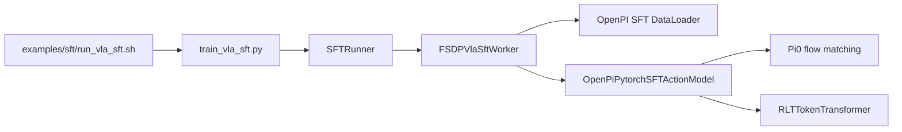
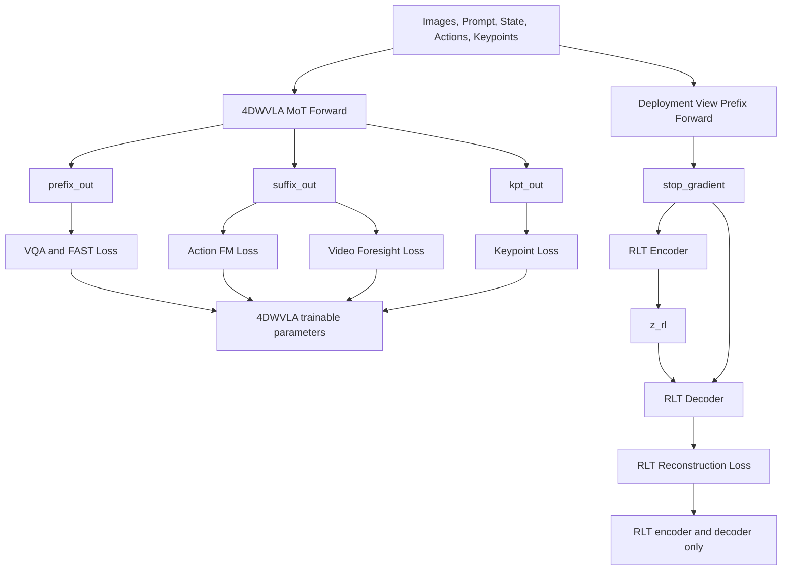
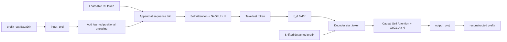
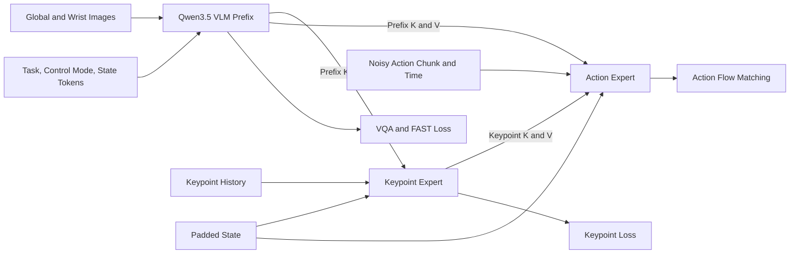
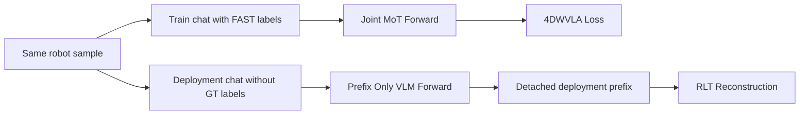
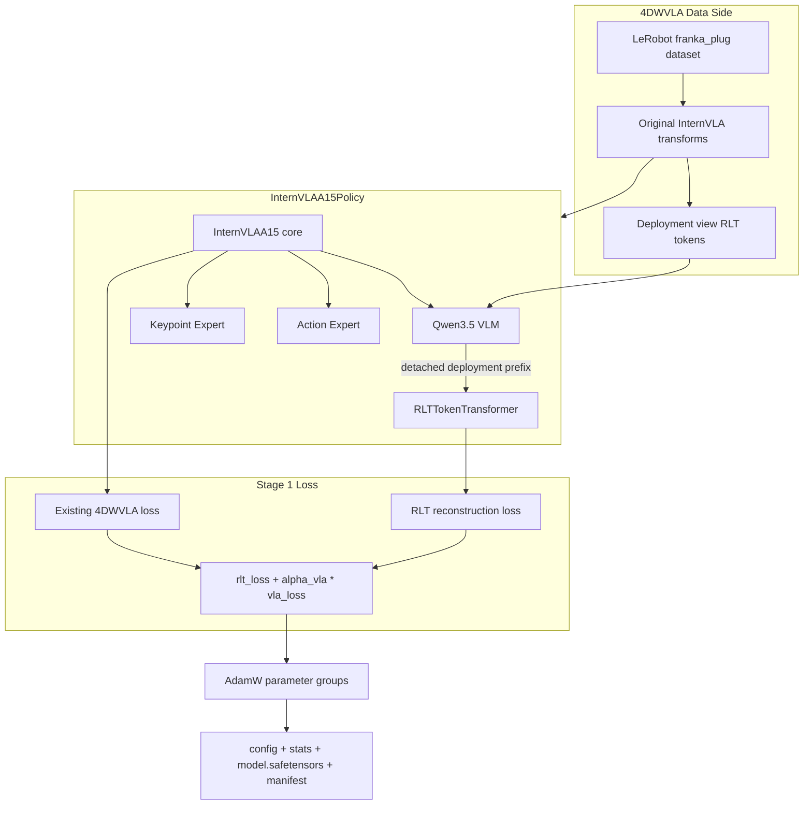
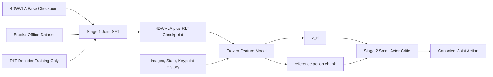
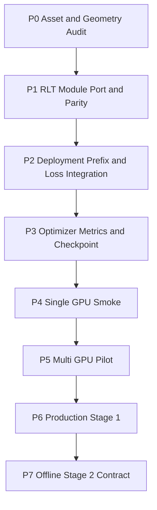

# 4DWVLA × RLinf RLT Stage 1：VLA SFT + RL Token Transformer 实施落地方案

> 文档版本：v1.0  
> 编写日期：2026-09-15  
> 目标 checkpoint：`/home/nvidia/bt/ckp/4wvlaFrk/plug/4wvlaFrkPlugCkp010420/`  
> 目标任务：Franka 插头插入，8D 绝对关节动作  
> 目标阶段：RLT Stage 1；本文不执行 Stage 2 在线强化学习  
> 目标代码库：
>
> - 4DWVLA：`/home/nvidia/bt/s/4WVLA`
> - RLinf（本文也称 RLmm）：`/home/nvidia/bt/s/RLmm`

---

## 0. 文档结论与决策

### 0.1 一句话结论

4DWVLA checkpoint **不能**通过把路径填进 RLinf 现有
`openpi_rlinf` 配置直接进行 RLT Stage 1。现有实现是 OpenPI/Pi0.5
专用包装器，而 4DWVLA 使用 Qwen3.5 VLM、Mixture-of-Transformers
action/keypoint experts、LeRobot transforms 和 safetensors checkpoint。

本方案选择：

1. 保留 4DWVLA 原生数据、模型加载、训练与 checkpoint 管线；
2. 将 RLinf 的 `RLTTokenTransformer` 按行为等价方式移植到
   `internvla_a1_5` policy 包；
3. 对 4DWVLA 的 **deployment-view VLM prefix 最终隐状态**训练
   encoder-decoder 重建瓶颈，不让 RLT 看到 FAST ground-truth action；
4. Stage 1 联合优化原有 4DWVLA SFT 目标与 RLT reconstruction 目标；
5. checkpoint 同时保存 4DWVLA 与 `rlt_module` 权重；
6. 预留 RLinf Stage 2 adapter，使 checkpoint 以后能提供
   `{z_rl, proprio, ref_chunk}`，但不在本阶段启动真机 RL。

### 0.2 这是真正的 Stage 1，不是三个容易混淆的替代方案

本方案中的 Stage 1 是：

\[
\mathcal{L}_{\text{stage1}}
=
\mathcal{L}_{\text{RLT}}
+
\alpha_{\text{VLA}}\mathcal{L}_{\text{4DWVLA}}
\]

其中：

- \(\mathcal{L}_{\text{RLT}}\)：通过单个 RL token 重建 VLM prefix hidden
  states 的 masked MSE；
- \(\mathcal{L}_{\text{4DWVLA}}\)：4DWVLA 当前已有的 action flow matching、
  VQA/FAST、video foresight 与 keypoint loss 的加权和；
- \(\alpha_{\text{VLA}}\)：与 RLinf `openpi.rlt_alpha` 同义，控制 VLA SFT
  相对 RLT loss 的权重。

它不是：

- 只在 checkpoint 后面随机接一个 MLP；
- 只训练 Stage 2 actor/critic；
- 用 4DWVLA 的 `learnable_tokens` 或 keypoint tokens 代替 RL token；
- 冻结整个 VLA、只训练 RLT 模块的生产训练。后者只能作为 smoke test
  或消融实验。

### 0.3 关键架构决策记录

| 决策 | 选择 | 原因 |
|---|---|---|
| Stage 1 训练框架 | 4DWVLA 原生 LeRobot + Accelerate | 复用真实 transforms、mixed dataset、Qwen3.5 patch、safetensors |
| RLT 算法来源 | 行为等价移植 RLinf `RLTTokenTransformer` | 保持可审计算法一致，同时避免运行时强依赖整个 RLinf |
| RLT 输入 | deployment-view 的 `prefix_out`，维度取 Qwen text hidden size | 避免训练 FAST label 泄漏，并与 Stage 2 可见输入一致 |
| RLT 输入是否 detach | 是，双重 stop-gradient | RLT loss 只训练 RLT encoder/decoder；VLA 由原 SFT loss 更新 |
| `z_rl` | RLT encoder 最后一个 token，shape `[B, D_z]` | 与 RLinf Stage 2 `RLTMLPPolicy.z_dim` 契约一致 |
| 是否复用 foresight token | 否 | foresight 位于 1024D action suffix；RLT 压缩 VLM prefix |
| robot/VQA 混合 batch | RLT 仅对 robot 样本计算 | Stage 2 表征服务于机器人状态，不让纯 VQA 样本主导瓶颈 |
| 标准维度 | `D_in=Qwen hidden size`，`D_z=2048` | 对齐当前 RLinf RLT 默认；运行前必须从 checkpoint 实测 |
| 单卡 5090 用途 | 接口、冻结 VLA smoke、推理验证 | 不作为标准全量联合训练硬件 |
| 生产训练硬件 | 多卡大显存；优先复用原 checkpoint 训练资源 | 4DWVLA + 约 0.747B RLT 参数无法在 32GB 上全量 AdamW |

---

## 1. 证据范围、事实等级与参考来源

### 1.1 事实等级

为避免把历史报告、设计建议和已经落地的代码混在一起，本文使用以下标记：

- **[代码事实]**：可从本地源码直接验证；
- **[Checkpoint/运行事实]**：来自 checkpoint 文件或已有测试日志；
- **[官方说明]**：来自 Physical Intelligence 或 RLinf 官方文档；
- **[方案决策]**：本文针对 4DWVLA 做出的工程选择；
- **[待实测]**：实施前必须用脚本或训练作业确认。

### 1.2 主要来源

1. Physical Intelligence，*Precise Manipulation with Efficient Online RL*，
   2026-03-19：<https://www.pi.website/research/rlt>
2. RLinf RLT 文档：
   <https://rlinf.readthedocs.io/en/latest/rst_source/examples/embodied/rlt.html>
3. 本地中文文档：
   `RLmm/docs/source-zh/rst_source/examples/embodied/rlt.rst`
4. RLinf RLT 代码：
   - `RLmm/rlinf/models/embodiment/modules/rlt_token_transformer.py`
   - `RLmm/rlinf/models/embodiment/openpi_rlinf/sft_action_model.py`
   - `RLmm/rlinf/models/embodiment/openpi_rlinf/eval_action_model.py`
   - `RLmm/rlinf/algorithms/rlt/`
5. RLinf RLT 深入分析：
   `RLmm/b/d/rltx/rlt_code_analyz3.markdown`
6. 4DWVLA 核心：
   - `4WVLA/src/lerobot/policies/internvla_a1_5/modeling_internvla_a1_5.py`
   - `4WVLA/src/lerobot/policies/internvla_a1_5/configuration_internvla_a1_5.py`
   - `4WVLA/src/lerobot/policies/internvla_a1_5/transform_internvla_a1_5.py`
   - `4WVLA/src/lerobot/scripts/lerobot_train.py`
7. Franka 评估实施与训推一致性审计：
   `RLmm/b/d/frk1/4wvla_rlinf_eval_3A3.md`

### 1.3 公开资料的边界

PI 官方页面解释了 RLT 的动机、两阶段框架和 actor/critic 的关键设计，
但没有公开一份足以逐行复现的论文公式、模型配置或训练代码。因此：

- RLT 的方法论依据来自 PI 官方说明；
- encoder-decoder、mask、teacher forcing、loss 和 checkpoint 的具体细节，
  以 RLinf 本地实现为准；
- RLinf 是一种可审计实现，不应把所有实现细节反推为 PI 私有系统的唯一实现。

---

## 2. 现状审计：为什么不能直接使用现有 OpenPI RLT 配置

### 2.1 RLinf 现有 Stage 1 的真实调用链



**[代码事实]**
`FSDPVlaSftWorker.build_dataloader()` 只对已注册模型类型进行显式分发。
RLT Stage 1 的现有完整路径是 `SupportedModel.OPENPI_RLINF`，数据经过
OpenPI data config，而不是 4DWVLA 的 transforms。

`OpenPiPytorchSFTActionModel.sft_forward()` 在 `use_rlt=True` 时返回：

```python
{
    "loss": rlt_loss + rlt_alpha * vla_loss,
    "vla_loss": vla_loss,
    "rlt_loss": rlt_loss,
}
```

其 checkpoint loader 还专门识别：

- `model.*`：Pi0 wrapper 权重；
- `rlt_module.*`：RLT 权重；
- RLinf FSDP `full_weights.pt`；
- OpenPI 特定的历史 key 前缀。

这些约束均不匹配 4DWVLA 的 `model.safetensors + config.json`。

### 2.2 4DWVLA checkpoint 与数据接口

根据 `4wvla_rlinf_eval_3A3.md` 的 checkpoint 审计，目标 checkpoint 为：

```text
/home/nvidia/bt/ckp/4wvlaFrk/plug/4wvlaFrkPlugCkp010420/
├── config.json
├── train_config.json
├── stats.json
└── model.safetensors
```

目标任务关键语义：

| 项目 | 有效值 |
|---|---|
| policy type | `internvla_a1_5` |
| VLM | Qwen3.5-2B |
| state | `arm[7] + gripper[1]`，8D |
| action | 绝对关节目标 `arm[7] + gripper[1]`，8D |
| 模型内部 pad | state/action 均 pad 到 32D |
| chunk | 50 |
| images | global + wrist + 1 个 masked empty view |
| prompt | `plug into socket` |
| normalization | mean/std，按子字段统计后拼接 |
| keypoint | 8 links × 7D `pos_rot` |
| keypoint history | 200 |
| inference backend | keypoint 开启时必须使用 standard |

本地 `config.json` 已直接确认的 Stage0 训练状态还包括：

| 配置 | Checkpoint 有效值 | 对 Stage 1 的影响 |
|---|---:|---|
| `gradient_checkpointing` | `true` | Stage 1 应继承，RLT blocks 也应支持 checkpoint |
| `optimizer_lr` | `5e-5` | 是 Stage0 值，不应不经 pilot 直接沿用 |
| `freeze_vision_encoder` | `false` | 标准联合训练中 vision 可更新 |
| `train_expert_only` | `false` | 标准联合训练不是只训 action expert |
| `freeze_learnable_tokens` | `true` | foresight token parameter 保持冻结 |
| `freeze_keypoint_modules` | `false` | keypoint path 可由原 loss 更新 |
| `action_loss_weight` | `10.0` | 已包含在 \(\mathcal{L}_{4DWVLA}\) 内 |
| `video_loss_weight` | `1.0` | full-objective 配方保留，no-video pilot 显式关闭 |
| `kpt_loss_weight` | `1.0` | 已包含在 \(\mathcal{L}_{4DWVLA}\) 内 |
| `kpt_future_loss_weight` | `1.5` | 已包含在 keypoint 子目标内 |

本地 `train_config.json` 还确认：

- `dataset.repo_id = plug_into_socket_lrb_4D`；
- `action_mode = abs`；
- external stats 指向该数据集 `meta/stats/abs/stats.json`；
- image augmentation 在该 checkpoint 训练中关闭；
- transforms 的有效顺序确实是 resize/remap/video/normalize/keypoint/
  compose/FAST/chat/pad/reorder/unify。

**[代码事实]** 4DWVLA 的 policy forward 输入是 transform 后的 batch：

- `observation.pixel_values`
- `observation.image_grid_thw`
- `observation.input_ids`
- `observation.attention_mask`
- `observation.state`
- `action`
- 可选 `VQA.labels`、video 与 keypoint 字段。

这与 OpenPI 的 `Observation` dataclass 和 official OpenPI loader 完全不同。

### 2.3 直接套用会发生什么

如果把 4DWVLA checkpoint 路径直接写进：

```yaml
actor:
  model:
    model_type: openpi_rlinf
    model_path: /path/to/4dwvla
```

至少会在以下位置失败：

1. `get_model()` 实例化的是 Pi0 wrapper，不是 `InternVLAA15Policy`；
2. checkpoint key 前缀和 tensor shape 不匹配；
3. dataloader 产生 OpenPI batch，4DWVLA forward 无法读取；
4. VLM hidden states 的获取路径不同；
5. action/state normalization 与 schema 不同；
6. Qwen3.5 patched Transformers 依赖不同；
7. Stage 1 输出 checkpoint 格式与 4DWVLA `from_pretrained()` 不兼容。

结论：这是模型级 adapter 工作，不是配置替换工作。

---

## 3. RLT Stage 1 算法：输入、输出、label 与梯度

### 3.1 RLT 的目标

RLT 希望把 VLA 当前观测的丰富内部表示压缩成一个可供小型
actor/critic 使用的状态 token。记：

- \(B\)：batch size；
- \(L\)：VLM prefix 序列长度；
- \(D_{\text{in}}\)：VLM prefix hidden size；
- \(D_z\)：RL token 维度；
- \(H_i\in\mathbb{R}^{L\times D_{\text{in}}}\)：样本 \(i\) 的
  deployment-view observation prefix hidden，不含 ground-truth action；
- \(M_i\in\{0,1\}^{L}\)：有效 token mask；
- \(E_\phi\)：RLT encoder；
- \(D_\psi\)：RLT decoder；
- \(\operatorname{sg}\)：stop-gradient。

Encoder 把 prefix 与一个可学习 RL token 拼接：

\[
z_i=E_\phi(\operatorname{sg}(H_i), M_i)
\in\mathbb{R}^{D_z}
\]

Decoder 用 \(z_i\) 作为起始 token，并通过 causal teacher forcing 重建：

\[
\hat H_i=D_\psi\left(
z_i,\operatorname{shift\_right}(\operatorname{sg}(H_i)),M_i
\right)
\]

RLT label 就是 **detached prefix hidden state 本身**：

\[
\mathcal{L}_{\text{RLT}}
=
\frac{
\sum_{i,l,d} M_{i,l}
\left(\hat H_{i,l,d}-\operatorname{sg}(H_{i,l,d})\right)^2
}{
\max(1,\sum_{i,l}M_{i,l})D_{\text{in}}
}
\]

### 3.2 每一步的输入输出和 label

| 步骤 | 输入 | 输出 | label/监督 |
|---|---|---|---|
| 4DWVLA train forward | train chat、image、state、action、keypoint | 原 4DWVLA outputs | 原 VLA labels |
| deployment prefix forward | image、deployment prompt/state tokens | `prefix_out [B,L,D]` | 无 |
| stop-gradient | deployment `prefix_out` | detached prefix | 无 |
| RLT encoder | detached prefix + mask | `rl_token [B,1,D_z]` | reconstruction 间接监督 |
| RLT decoder | RL token + shifted detached prefix | `reconstructed [B,L,D]` | detached prefix |
| masked MSE | reconstructed、target、mask | scalar `rlt_loss` | prefix hidden |
| 总 loss | `rlt_loss` + 原 4DWVLA loss | scalar | 联合优化 |

### 3.3 梯度流



关键结论：

- `rlt_loss` 不应更新 Qwen VLM、action expert 或 keypoint expert；
- 原有 4DWVLA losses 仍按现有冻结策略更新 VLA；
- “联合训练”表示两个模块在同一 optimizer step 更新，而不是 RLT loss
  反向修改 VLA prefix；
- Stage 1 完成后，Stage 2 冻结整个 feature model，包括 VLA 与 RLT encoder；
- Stage 2 不需要 RLT decoder，decoder 仅用于 Stage 1 的信息瓶颈监督。

### 3.4 Encoder-decoder 结构

RLinf 当前结构为：



默认配置：

```yaml
rlt_input_dim: 2048
rlt_embed_dim: 2048
rlt_prefix_seq_len: 1024
rlt_num_layers: 2
rlt_num_heads: 8
rlt_mlp_ratio: 4.0
rlt_dropout_rate: 0.0
rlt_precision: bfloat16
rlt_image_only: false
rlt_use_mask: true
```

注意：“RLT 让 Stage 2 很轻量”并不代表 Stage 1 的重建 Transformer
本身很小。按当前 RLinf 的 GeGLU 实现，`D_in=D_z=2048`、
`prefix_seq_len=1024`、encoder/decoder 各 2 层时精确为
**746,764,288（约 0.747B）** 参数。必须把它纳入显存与 checkpoint
容量预算。若不显式转换 dtype，新建 PyTorch module 会保持 fp32；
本方案要求 RLT 参数显式使用 bf16，reconstruction MSE 再转 fp32 计算。

---

## 4. 4DWVLA 架构与 RLT 的正确接入点

### 4.1 4DWVLA 的三路 MoT

目标 checkpoint 开启 GeoPredict 后，模型包含：

1. Qwen3.5 VLM prefix；
2. keypoint expert suffix；
3. action expert suffix。



`InternVLAA15.forward()` 已经产生：

- `prefix_out [B,L,D_vlm]`
- `kpt_out [B,L_kpt,1024]`
- `suffix_out [B,L_action,1024]`

当前只用 `prefix_out` 计算 VQA loss，随后在 return 中丢弃。RLT 应在
这里取得 `prefix_out`。

### 4.2 为什么不能用 foresight tokens

4DWVLA 的 `learnable_tokens`：

- 位于 action expert suffix；
- hidden size 默认 1024；
- 默认有 50 个；
- 通过 frozen WAN video model 接受未来视频 latent 监督；
- 用于 latent foresight。

RLT 的 RL token：

- 位于额外 RLT encoder 输出；
- 输入是 VLM prefix hidden states；
- 输出单个 token；
- 通过 prefix reconstruction 接受监督；
- 用作 Stage 2 actor/critic 状态摘要。

二者在位置、维度、数量、label 和用途上都不同。把 foresight token
池化后称为 `z_rl` 会改变算法，也会破坏与 RLinf Stage 2 的可比性。

### 4.3 RLT 不能读取训练时的 FAST action label

4DWVLA 与 OpenPI RLT 的一个关键差异是：4DWVLA 的训练 chat prefix 中包含
assistant FAST action tokens，并用 `VQA.labels` 对这些位置做 CE 监督；Stage 2
推理时没有 ground-truth FAST tokens。

如果直接令：

```python
rlt_mask = prefix_pad_masks
```

RLT encoder 会读取真实动作 label，形成信息泄漏：

```text
训练 z_rl = f(observation, ground-truth FAST action)
推理 z_rl = f(observation only)
```

此外，目标 checkpoint 的训练 user prompt 使用 `Output: <Action>`，当前
eval transform 使用 `Output: <Subtask, Action>`。即使把 assistant label
位置 mask 掉，两个阶段的 observation prompt 仍不完全一致。

**[方案决策]** 第一版采用独立的 **deployment-view prefix**：

1. data transform 在训练 batch 中额外生成与 Stage 2 完全相同的 eval-view
   `rlt_input_ids/rlt_attention_mask`；
2. 不添加 assistant ground-truth tokens；
3. 使用同一批 `pixel_values/image_grid_thw`；
4. VLM 做一次额外 prefix-only forward；
5. 该 prefix hidden detach 后进入 RLT；
6. 原 joint MoT forward 继续计算 4DWVLA SFT，不改变其标签。



这样增加一次 prefix 计算，但把 label leakage 和 train/deploy prompt shift
显式消除。只有在专项测试证明下列条件同时成立时，才允许优化为复用 joint
prefix：

- RLT mask 为 `attention_mask & (labels == -100)`；
- train/eval observation chat template 完全相同；
- 有效 prompt token 的 joint/prefix-only hidden 在数值容差内一致。

推荐容差：

- fp32：最大绝对误差 `< 1e-5`；
- bf16：最大绝对误差 `< 5e-3`。

---

## 5. 实现路径比较与最终选择

### 5.1 路径 A：在 RLinf 内新增完整 4DWVLA SFT model type

需要：

- `SupportedModel.INTERNVLA_A1_5_RLT`
- RLinf `get_model()` builder
- `FSDPVlaSftWorker` dataloader 分支
- 4DWVLA batch adapter
- safetensors ↔ FSDP full weights 转换
- 对 patched Transformers 5.2.0 的环境支持
- FSDP wrap policy 与 checkpoint 策略

优点：所有 Stage 1/2 均由 RLinf 统一调度。

缺点：复制 4DWVLA 已成熟的训练管线；接口面大；首次实现风险最高。

结论：不作为本轮首选；可在 Stage 1 验证后做框架统一。

### 5.2 路径 B：4DWVLA 原生训练栈 + 行为等价 RLT 模块

需要：

- 在 4DWVLA policy 包加入 RLT module；
- transforms 额外生成无 GT 的 deployment-view tokens；
- core 抽取共享 prefix-only helper 并返回 detached hidden；
- policy 聚合 RLT loss；
- config、optimizer、metrics 与 launch 扩展；
- 后续在 RLinf 增加 eval feature adapter。

优点：

- 保留训练 checkpoint 的真实 transforms 与 schema；
- 保留 Qwen3.5 custom patch 和 GeoPredict；
- 输出仍是标准 4DWVLA safetensors；
- 变更局部、可通过 `enable_rlt=false` 完全回退。

缺点：RLT module 在两个仓库存在一份行为等价代码，需要 parity test。

**结论：本方案采用路径 B。**

### 5.3 路径 C：冻结 VLA，只训练 RLT

优点：显存低、适合单卡接口验证。

缺点：不满足“VLA SFT + RLT token transformer”的完整定义；VLA 不随目标
数据继续适配。

结论：仅作为 Smoke-0 和消融 A0，不得把产物命名为标准 Stage 1。

### 5.4 方法演进与横向对比

RLT 不是一般意义上“把 RL 用到 VLA”的唯一方法，它解决的是一个更窄的
工程问题：在 VLA 已有广泛能力的前提下，以少量真机数据快速改善接触丰富、
高精度的关键阶段。

| 方法 | 更新对象 | 在线计算成本 | 数据效率 | 对 4DWVLA 的适用性 |
|---|---|---:|---:|---|
| 继续离线 SFT | VLA 全部或 expert | 高但不在线 | 依赖新增示范 | 可做基线，不能从 reward 自主改进 |
| 全模型在线 RL / ReCap 类 | 大 VLA | 极高 | 可利用在线反馈 | 32GB 真机节点不可行，系统风险高 |
| LoRA 在线 RL | VLA 部分低秩参数 | 中高 | 高于全参但仍需大模型反传 | 仍需保留 Qwen/MoT 反向图 |
| 冻结 VLA + 独立 residual actor | 小网络 | 低 | 较高 | 若只看原始 state，会丢失 VLM 语义 |
| 冻结通用视觉 embedding + actor/critic | 小网络 | 低 | 依赖 embedding 质量 | 没有显式压缩 VLA 的任务上下文 |
| **RLT** | Stage1 联合适配；Stage2 只训小 AC | Stage2 低 | 面向少量在线数据 | 与 4DWVLA rich prefix + action prior 高度匹配 |

纵向上可以理解为：


RLT 的代价被前移到 Stage 1：先付出一次较重的联合 SFT 和 representation
compression 成本，换取 Stage 2 不再对大 VLA 反向传播。对 4DWVLA 来说，
这个选择尤其合理，因为：

- prefix 同时编码多视角图像、任务文本、控制模式和 tokenized state；
- action expert 已提供可用 `ref_chunk`，Stage 2 actor 可以编辑而非从零生成；
- keypoint/foresight 分支可继续作为 VLA prior 的一部分；
- 真机在线阶段只更新小型 actor/critic，降低显存、延迟和灾难性遗忘风险。

但 RLT reconstruction 只保证 \(z_{rl}\) 保留足以重建 prefix 的信息，不保证
这些信息对 value learning 最优。因此本文把 Stage 2 downstream 学习效率列为
最终有效性指标，并保留 `D_z`、prefix 范围、robot sample mask 等消融。

---

## 6. 目标静态架构



### 6.1 组件职责

| 组件 | 职责 | Stage 1 是否更新 |
|---|---|---|
| image/chat/data transforms | 保持原 checkpoint 的输入语义 | 无权重 |
| Qwen3.5 VLM | 视觉语言 prefix | 按现有 freeze 配置 |
| keypoint expert | 历史/当前/future keypoint 表征 | 按现有 freeze 配置 |
| action expert | flow-matching action chunk | 是，除非 smoke 冻结 |
| WAN | video foresight label provider | 参数冻结；可在 RLT 配方中关闭分支 |
| RLT encoder | prefix → single RL token | 是 |
| RLT decoder | RL token → prefix reconstruction | 是，仅 Stage 1 使用 |
| Stage 2 actor/critic | 不属于本阶段 | 不创建 |

---

## 7. 文件级实现设计

以下是后续编码阶段需要实施的文件清单。本文只写实施方案，不在本次文档
任务中修改这些训练源码。

### 7.1 新增：RLT module

目标文件：

```text
4WVLA/src/lerobot/policies/internvla_a1_5/rlt_token_transformer.py
```

来源：

```text
RLmm/rlinf/models/embodiment/modules/rlt_token_transformer.py
```

要求：

1. 保留 `sinusoidal_pe_init`、`GeGLU`、`RLTSelfAttentionLayer`、
   `RLTTokenEncoder`、`RLTTokenDecoder`、`RLTTokenTransformer`；
2. 不导入 RLinf package；
3. 保留 encoder/decoder 内部的 `.detach()`；
4. 保留 causal mask 与 padding mask 语义；
5. 增加源码 provenance 注释，记录来源 commit/hash；
6. 增加 parity test，防止两份实现静默漂移；
7. 不在该模块内处理 robot/VQA sample mask，sample 过滤在 policy 层完成；
8. 增加不改变数学语义的 `loss_components()`，返回带梯度
   `sq_error_sum` 与无梯度 `valid_element_count`，供多卡全局归一化；
9. 单卡 `loss()` 仍保持与 RLinf 原实现完全一致。

建议新增配置 dataclass：

```python
@dataclass(frozen=True)
class InternVLARLTConfig:
    enabled: bool = False
    alpha_vla: float = 1.0
    input_dim: int | None = None
    embed_dim: int = 2048
    prefix_seq_len: int = 1024
    num_layers: int = 2
    num_heads: int = 8
    mlp_ratio: float = 4.0
    dropout_rate: float = 0.0
    precision: str = "bfloat16"
    prefix_source: str = "deployment_view"
    max_prompt_length: int = 650
    gradient_checkpointing: bool = True
    image_only: bool = False
    use_mask: bool = True
    robot_samples_only: bool = True
```

#### 7.1.1 RLT activation checkpoint

RLinf 原模块没有 activation-checkpoint 分支。移植版
`RLTTokenTransformer.__init__()` 必须新增
`gradient_checkpointing: bool = False`，保存内部属性并提供
`gradient_checkpointing_enable/disable()`，并把状态传播给 encoder/decoder；
两个 layer loop 增加：

```python
if self.gradient_checkpointing and self.training:
    x = torch.utils.checkpoint.checkpoint(
        lambda hidden, current_layer=layer: current_layer(
            hidden, mask=mask, attn_mask=attn_mask
        ),
        x,
        use_reentrant=False,
    )
else:
    x = layer(x, mask=mask, attn_mask=attn_mask)
```

encoder 没有 causal `attn_mask`，传 `None`；decoder 使用已有 causal mask。
4DWVLA 现有初始化只调用 `self.model.gradient_checkpointing_enable()`，
不会自动触及 policy 上的 `rlt_module`。因此构造 RLT 后必须独立执行：

```python
if config.rlt_gradient_checkpointing:
    self.rlt_module.gradient_checkpointing_enable()
```

优先级明确为：

- `config.gradient_checkpointing`：只控制 4DWVLA core；
- `config.rlt_gradient_checkpointing`：只控制 RLT encoder/decoder；
- 二者可以独立开关，launch 必须分别记录。

在 dropout=0、相同权重/输入下，开启和关闭 checkpoint 的 forward loss、
`z_rl` 与参数梯度须在 dtype 容差内一致。

### 7.2 修改：`InternVLAA15Config`

文件：

```text
4WVLA/src/lerobot/policies/internvla_a1_5/configuration_internvla_a1_5.py
```

新增字段：

```python
enable_rlt: bool = False
rlt_alpha: float = 1.0
rlt_input_dim: int | None = None
rlt_embed_dim: int = 2048
rlt_prefix_seq_len: int = 1024
rlt_num_layers: int = 2
rlt_num_heads: int = 8
rlt_mlp_ratio: float = 4.0
rlt_dropout_rate: float = 0.0
rlt_precision: str = "bfloat16"
rlt_prefix_source: str = "deployment_view"
rlt_max_prompt_length: int = 650
rlt_gradient_checkpointing: bool = True
rlt_image_only: bool = False
rlt_use_mask: bool = True
rlt_robot_samples_only: bool = True
rlt_lr_scale: float = 1.0
```

`__post_init__()` 增加 fail-fast：

```python
if self.enable_rlt:
    if self.rlt_embed_dim <= 0:
        raise ValueError(...)
    if self.rlt_prefix_seq_len <= 0:
        raise ValueError(...)
    if self.rlt_embed_dim % self.rlt_num_heads != 0:
        raise ValueError(...)
    if self.rlt_alpha < 0:
        raise ValueError(...)
    if self.rlt_precision not in {"bfloat16", "float32"}:
        raise ValueError(...)
    if self.rlt_prefix_source != "deployment_view":
        raise ValueError("The first production implementation only supports deployment_view")
```

`rlt_input_dim` 不应由用户盲填。模型加载后解析：

```python
runtime_dim = int(
    self.model.qwen3_5_with_expert.qwen3_5.config.text_config.hidden_size
)
if config.rlt_input_dim is not None and config.rlt_input_dim != runtime_dim:
    raise ValueError(...)
```

### 7.3 修改：生成 deployment-view prefix

涉及文件：

```text
4WVLA/src/lerobot/policies/internvla_a1_5/transform_internvla_a1_5.py
4WVLA/src/lerobot/policies/internvla_a1_5/configuration_internvla_a1_5.py
4WVLA/src/lerobot/policies/internvla_a1_5/modeling_internvla_a1_5.py
4WVLA/src/lerobot/datasets/factory.py
```

#### 7.3.1 Transform 输出第二套 token view

`InternVLAA15ChatProcessorTransformFn` 新增：

```python
emit_rlt_deployment_view: bool = False
```

`InternVLAA15DatasetConfig` 增加同名字段和
`rlt_max_prompt_length: int = 650`，并在 `__post_init__()` 构造 chat
processor 时传入；policy `enable_rlt=true` 而 dataset 未开启该字段时，
首个 batch 必须 fail-fast。

开启后，在保留原 train input/labels 的同时，额外用与部署完全相同的
chat template 产生：

```text
observation.rlt_input_ids
observation.rlt_attention_mask
```

该 view：

- 使用同一个 system message、task、control mode、tokenized state 和视角；
- 使用 eval/Stage2 的 `Output: <Subtask, Action>`；
- 不包含 assistant GT；
- 不产生 RLT labels；
- 不改变原 `observation.input_ids/VQA.labels`；
- 复用同一 `pixel_values/image_grid_thw`，不能重复做随机图像增强。

Stage 1 和 Stage 2 为 RLT view 共用固定 tokenization 契约：

```yaml
rlt_max_prompt_length: 650
rlt_padding: max_length
rlt_padding_side: right
rlt_pad_token_id: <read from tokenizer>
```

不能直接复用当前 `mode=eval` 的 `padding=False`，否则 batch size >1 时
默认 collator 无法 stack 变长 tensor。Stage 2 adapter 也使用同一固定
padding；等价测试同时比较完整 padded IDs/mask 和去 padding 后的有效序列。

还需要：

1. 在 `UnifyInternVLAA15InputsTransformFn` 和 batch schema 中保留两个字段；
2. `InternVLAA15VQAProcessorTransformFn` 也输出 shape `[650]` 的占位字段：
   token 全部为 pad、mask 全 false；
3. policy 先按 `vqa_type` 选 robot rows，再调用 deployment prefix helper，
   所以占位 VQA row 绝不进入 VLM/RLT；
4. 现有 `_multimodal_collate()` 会把每个样本的 `pixel_values` 和
   `image_grid_thw` 沿第 0 维直接拼接，它们已经不能用 `[B] robot_mask`
   逐行索引；collator 必须同时生成：

   ```text
   observation.pixel_values_row_splits       # [B+1]
   observation.image_grid_thw_row_splits      # [B+1]
   ```

   `row_splits[i:i+2]` 保存第 \(i\) 个样本在拼接 tensor 中的起止 offset。
5. 新增 `_select_robot_rlt_inputs()`：tokens 直接按 batch mask 取行；
   pixels/grids 根据各自 row splits 逐段取出再拼接。禁止把 `robot_mask`
   直接索引 flatten 后的视觉 tensor。
6. 测试 `[VQA, robot, VQA, robot]` 交错顺序和每样本不同视觉 token 数，
   确认 pixels、grid 和 prompt 仍属于同一 robot 样本。
7. 某 rank 无 robot row 时跳过 deployment prefix forward，但进入参数连接
   的零 RLT loss；
8. 如果未来 Stage 2 改用另一 prompt，必须升级 manifest schema，不能静默改变。

#### 7.3.2 Core 增加 prefix-only API

新增：

```python
@dataclass
class RLTDeploymentPrefix:
    hidden: Tensor
    mask: Tensor

@torch.no_grad()
def build_rlt_deployment_prefix(
    self,
    pixel_values: Tensor,
    image_grid_thw: Tensor,
    rlt_lang_tokens: Tensor,
    rlt_lang_masks: Tensor,
) -> RLTDeploymentPrefix:
    prefix_embs, prefix_pad_masks, prefix_att_masks = self.embed_prefix(
        pixel_values,
        image_grid_thw,
        rlt_lang_tokens,
        rlt_lang_masks,
    )
    # 与 sample_actions 的 prefix-only 路径共用实现，不能复制 attention 细节。
    prefix_out, _ = self._forward_prefix_cache(
        prefix_embs,
        prefix_pad_masks,
        prefix_att_masks,
        rlt_lang_tokens,
        use_cache=False,
    )
    return RLTDeploymentPrefix(
        hidden=prefix_out.detach(),
        mask=prefix_pad_masks.detach().bool(),
    )
```

其中 `_forward_prefix_cache()` 应从现有 `sample_actions()` 第 1313–1331 行
抽取为共享 helper，使 Stage 1 RLT、Stage 2 `z_rl` 和 reference action
使用同一 prefix 实现。禁止：

- 复制整段 Qwen/MoT forward；
- 用 forward hook 猜测 prefix tensor；
- 使用带 FAST GT 的 joint prefix 作为生产默认；
- 为 RLT prefix 构造第二份经过不同图像增强的 pixels。

原 `InternVLAA15.forward()` 的 7 元组返回值保持不变；RLT deployment
prefix 由 policy 在原 VLA forward 之外显式调用。这会增加一次 VLM prefix
前向；该 forward 只生成不断随 VLA 更新的 reconstruction target，所以在
`torch.no_grad()` 中运行。这既消除 GT label 泄漏，使 Stage 1/Stage 2
输入严格一致，也避免为额外 prefix forward 保存 VLM backward activation。
`no_grad()` 不会自动关闭 dropout，因此 preflight 必须确认 prefix 路径所有
dropout 概率为 0；若非 0，必须设计无状态的 eval-mode prefix helper 并测试，
不能让 Stage 1 train-mode dropout 与 Stage 2 eval-mode hidden 产生分布偏移。

### 7.4 修改：policy 挂载 RLT module

在 `InternVLAA15Policy.__init__()`：

```python
self.rlt_module = None
if config.enable_rlt:
    input_dim = self._runtime_vlm_hidden_size()
    rlt_dtype = {
        "bfloat16": torch.bfloat16,
        "float32": torch.float32,
    }[config.rlt_precision]
    self.rlt_module = RLTTokenTransformer(
        input_dim=input_dim,
        embed_dim=config.rlt_embed_dim,
        prefix_seq_len=config.rlt_prefix_seq_len,
        num_layers=config.rlt_num_layers,
        num_heads=config.rlt_num_heads,
        mlp_ratio=config.rlt_mlp_ratio,
        dropout_rate=config.rlt_dropout_rate,
        gradient_checkpointing=config.rlt_gradient_checkpointing,
    ).to(dtype=rlt_dtype)
    if config.rlt_gradient_checkpointing:
        self.rlt_module.gradient_checkpointing_enable()
```

在 policy forward 中：

```python
base_loss = existing_4dwvla_loss
rlt_loss = zero
rlt_metric_value = 0.0
rlt_robot_samples = 0
rlt_valid_elements = 0
rlt_z_norm = 0.0

if self.config.enable_rlt:
    if "observation.rlt_input_ids" not in batch:
        raise RuntimeError("RLT deployment-view tokens are missing")

    robot_mask = torch.ones(
        batch["observation.rlt_input_ids"].shape[0],
        dtype=torch.bool,
        device=batch["observation.rlt_input_ids"].device,
    )
    if self.config.rlt_robot_samples_only and vqa_type is not None:
        robot_mask = (vqa_type == 0) | (vqa_type == 2)

    rlt_robot_samples = int(robot_mask.sum().detach())

    if rlt_robot_samples != 0:
        robot_inputs = self._select_robot_rlt_inputs(batch, robot_mask)
        deployment = self.model.build_rlt_deployment_prefix(**robot_inputs)
        local_num, local_den, rlt_metrics = self.rlt_module.loss_components(
            deployment.hidden,
            deployment.mask,
        )
        rlt_z_norm = rlt_metrics["z_rl"].detach().float().norm(dim=-1).mean()
    else:
        # 保持所有 RLT 参数在 DDP 图中，避免某 rank 无 robot 样本时 unused/hang。
        local_num = sum(
            parameter.reshape(-1)[0] * 0.0
            for parameter in self.rlt_module.parameters()
        )
        local_den = torch.zeros((), device=local_num.device, dtype=torch.float32)

    # DDP 会对各 rank 梯度取平均。乘 world_size 后，得到真正的
    # global_sum(error) / global_sum(valid_elements)，而不是 rank mean 的 mean。
    global_den = local_den.detach().clone()
    global_num = local_num.detach().float().clone()
    global_robot_samples = torch.tensor(
        rlt_robot_samples, device=global_den.device, dtype=torch.long
    )
    if torch.distributed.is_initialized():
        torch.distributed.all_reduce(global_den, op=torch.distributed.ReduceOp.SUM)
        torch.distributed.all_reduce(global_num, op=torch.distributed.ReduceOp.SUM)
        torch.distributed.all_reduce(
            global_robot_samples, op=torch.distributed.ReduceOp.SUM
        )
        world_size = torch.distributed.get_world_size()
    else:
        world_size = 1

    if global_den.item() > 0:
        rlt_loss = world_size * local_num / global_den
        rlt_metric_value = (global_num / global_den).item()
        rlt_valid_elements = int(global_den.item())
    else:
        rlt_loss = local_num
        rlt_metric_value = 0.0
        rlt_valid_elements = 0
    rlt_robot_samples = int(global_robot_samples.item())

    loss = rlt_loss + self.config.rlt_alpha * base_loss
else:
    loss = base_loss
```

`loss_dict` 增加：

```python
loss_dict.update(
    {
        "loss_vla_total": float(base_loss.detach()),
        "loss_rlt": rlt_metric_value,
        "rlt_alpha": self.config.rlt_alpha,
        "rlt_robot_samples": rlt_robot_samples,
        "rlt_valid_elements": rlt_valid_elements,
        "rlt_z_norm": float(rlt_z_norm),
    }
)
```

不要把 `z_rl` 全张量放进 `loss_dict` 或日志系统，避免 host transfer 和日志膨胀。
`rlt_z_norm` 也应按全局样本数聚合；上面的片段仅展示本地非空分支，
正式实现需像 loss 分母一样 all-reduce `z_norm_sum/z_count`；
`rlt_robot_samples` 也记录 all-reduce 后的 global count。

### 7.5 prefix mask 与 `image_only`

默认使用：

```python
rlt_prefix = deployment.hidden
rlt_mask = deployment.mask.bool()
```

该 deployment view 不含 ground-truth assistant action tokens。即使以后实现
`joint_prompt_only` 优化，也必须使用：

```python
rlt_mask = prefix_pad_masks.bool() & (labels == -100)
```

不能让 FAST/action label 位置进入 RLT。默认 `rlt_image_only=false`，
保留部署时可见的图像、任务、控制模式与离散状态信息。

若开启 `image_only=true`：

1. 使用 `lang_tokens == image_token_id` 定位被视觉 embedding 替换的位置；
2. 同时与 `prefix_pad_masks` 相与；
3. 每个样本有效视觉 token 数必须一致，或使用 padded gather；
4. empty camera 的 mask 必须为 false；
5. 加单测确保不是只保留 `<vision_start>/<vision_end>` 边界 token。

第一版不建议开启 `image_only`。

### 7.6 optimizer 参数组

当前 `get_optim_params()` 在不开 keypoint LR scale 时可能直接返回
`self.parameters()`。RLT 加入后应统一成显式分组：

```text
group=vlm             lr=base_lr * vlm_lr_scale
group=action_expert   lr=base_lr * action_expert_lr_scale
group=keypoint_expert lr=base_lr * kpt_expert_lr_scale
group=track_encoder   lr=base_lr * track_encoder_lr_scale
group=rlt             lr=base_lr * rlt_lr_scale
group=other           lr=base_lr
```

验收条件：

- 每个 `requires_grad=True` 参数恰好出现一次；
- 参数组之间 ID 无交集；
- frozen 参数不出现在 optimizer；
- `rlt_module.*` 全部进入 rlt group；
- WAN frozen 参数不进入 optimizer；
- 打印每组参数量、学习率和 trainable bytes。

推荐初始学习率：

```yaml
optimizer_lr: 1.0e-5
vlm_lr_scale: 0.2
action_expert_lr_scale: 1.0
kpt_expert_lr_scale: 0.5
track_encoder_lr_scale: 0.5
rlt_lr_scale: 1.0
```

这是保守起点，不是已经由 RLT benchmark 验证的最优值。应通过小规模
过拟合和梯度范数调优。

### 7.7 训练 metrics

文件：

```text
4WVLA/src/lerobot/scripts/lerobot_train.py
```

增加：

```python
train_metrics["loss_vla_total"] = AverageMeter(...)
train_metrics["loss_rlt"] = AverageMeter(...)
train_metrics["rlt_z_norm"] = AverageMeter(...)
train_metrics["rlt_prefix_valid_tokens"] = AverageMeter(...)
```

`update_policy()` 增加对应字段读取。必须保持字段缺失兼容，使
`enable_rlt=false` 的旧训练不受影响。

### 7.8 checkpoint 与 manifest

4DWVLA `_save_pretrained()` 会保存 policy state dict，因此 policy 上注册的
`rlt_module` 会自然进入 `model.safetensors`。

初始化 base checkpoint 时，`make_policy()` 会把当前 CLI 形成的 config
传给 `InternVLAA15Policy.from_pretrained()`：模型先按
`enable_rlt=true` 创建 RLT module，再以默认 `strict=False` 加载不含
RLT keys 的 Stage0 safetensors。此时允许 missing `rlt_module.*`，因为
RLT 本来就要随机初始化。全模型仍不能机械改为 `strict=True`：

- policy `state_dict()` 主动排除 `model.wan_video_model.*`；
- `action_loss_only=true` 时 WAN 不实例化，full-objective checkpoint 中
  某些 video keys 可能成为配方相关 unexpected keys；
- base checkpoint 与 Stage 1 config 本来就存在新增 RLT keys 的差异。

正确策略是：

1. 对全模型 missing/unexpected keys 使用**按配方的显式白名单**；
2. 未在白名单中的任何 key 都令加载失败；
3. 对 Stage 1 safetensors 提取 `rlt_module.*` 子 state dict；
4. 去掉前缀后对 `self.rlt_module.load_state_dict(..., strict=True)`；
5. 单独校验 RLT config/shape/manifest。

具体挂载点：

```python
class InternVLAA15Policy(PreTrainedPolicy):
    def _save_pretrained(self, save_directory: Path) -> None:
        super()._save_pretrained(save_directory)
        if self.config.enable_rlt:
            self._write_rlt_manifest_atomically(save_directory / "rlt_manifest.json")

    @classmethod
    def from_pretrained(
        cls,
        pretrained_name_or_path,
        *,
        config=None,
        rlt_load_context=None,
        **kwargs,
    ):
        policy = super().from_pretrained(
            pretrained_name_or_path, config=config, **kwargs
        )
        # 必须使用解析/加载后的 policy.config；调用者可能没有显式传 config。
        if policy.config.enable_rlt:
            policy._validate_rlt_loaded_checkpoint(
                Path(pretrained_name_or_path),
                context=rlt_load_context,
            )
        return policy
```

`rlt_load_context` 是调用上下文，不属于并且不持久化到 policy
`config.json`：

| context | 使用场景 | RLT keys/manifest |
|---|---|---|
| `init` | 从 Stage0 初始化新的 RLT | 允许缺失，必须确认没有部分 RLT keys |
| `resume` | 恢复 Stage1 训练 | manifest 必须存在，RLT 子模块 strict |
| `stage2` | RLinf feature model 加载 | 同 `resume`，并要求 Stage2 contract 字段 |

validator 首先检查 artifact，而不是相信 context：

1. 只要 safetensors 中出现任意 `rlt_module.*` 或目录中存在 manifest，
   一律按 Stage1 artifact 严格检查，`context=init` 也不能降级；
2. 没有任何 RLT key 且没有 manifest 时，只允许显式 `context=init`；
3. 部分 RLT keys、RLT keys 无 manifest、manifest 无 RLT keys 均失败；
4. 直接 `from_pretrained(stage1_path)` 即使不传 config/context，也会从
   `policy.config.enable_rlt` 和 artifact 自动进入严格检查。

在 `TrainPipelineConfig` 增加 runtime 字段 `rlt_load_context`，并由
`make_policy()` 显式传给 policy loader：首次训练必须是 `init`，
`cfg.resume=true` 强制覆盖为 `resume`，RLinf adapter 强制传 `stage2`。
训练入口还必须在 `load_training_state()` 前调用同一 validator，因为 resume
路径可能由 training state loader 恢复权重。manifest 使用临时文件 +
`os.replace()` 原子写入，并在 safetensors 成功保存后生成。

新增 companion manifest：

```text
rlt_manifest.json
```

建议结构：

```json
{
  "schema_version": 1,
  "algorithm": "rlt_stage1",
  "implementation_source": "RLinf RLTTokenTransformer",
  "implementation_commit": "<git-sha>",
  "base_checkpoint": ".../4wvlaFrkPlugCkp010420",
  "base_checkpoint_sha256": "<sha256>",
  "dataset_repo_id": "plug_into_socket_lrb_4D",
  "dataset_manifest_sha256": "<sha256>",
  "action_mode": "abs",
  "stats_key": "franka_plug",
  "rlt_input_dim": 2048,
  "rlt_embed_dim": 2048,
  "rlt_prefix_seq_len": 1024,
  "rlt_num_layers": 2,
  "rlt_num_heads": 8,
  "rlt_precision": "bfloat16",
  "rlt_prefix_source": "deployment_view",
  "rlt_max_prompt_length": 650,
  "rlt_padding_side": "right",
  "rlt_pad_token_id": "<read-from-tokenizer>",
  "rlt_chat_template_sha256": "<sha256>",
  "rlt_image_only": false,
  "rlt_use_mask": true,
  "rlt_robot_samples_only": true
}
```

示例中的 `<...>` 在真实 manifest 中必须替换；`rlt_pad_token_id` 必须写成
tokenizer 实际整数，不允许保留字符串占位符。

加载 Stage 1 checkpoint 时必须：

1. `config.enable_rlt == true`；
2. `rlt_manifest.json` 存在且 schema 支持；
3. safetensors 中存在 `rlt_module.encoder.*` 与 `rlt_module.decoder.*`；
4. RLT 子模块使用 `strict=True` 加载；
5. runtime VLM hidden size 与 manifest 一致；
6. stats、schema、action mode 与运行配置一致；
7. 全模型 missing/unexpected keys 必须全部命中当前配方白名单；
8. 禁止仅凭 `strict=False` warning 继续进入 Stage 2。

### 7.9 新增 launch 脚本

建议：

```text
4WVLA/launch/internvla_a15_rlt_stage1_franka.sh
```

脚本以现有 `internvla_a15_finetune.sh` 为基础，不另造数据 pipeline。

核心参数：

```bash
# 从 Stage0 config.json 构造 policy config，再覆盖本实验字段。
--policy.path="${STAGE0_CKPT}"
--policy.type=internvla_a1_5
--policy.pretrained_path="${STAGE0_CKPT}"
--policy.enable_rlt=true
--policy.rlt_alpha=1.0
--policy.rlt_embed_dim=2048
--policy.rlt_prefix_seq_len=1024
--policy.rlt_num_layers=2
--policy.rlt_num_heads=8
--policy.rlt_mlp_ratio=4.0
--policy.rlt_precision=bfloat16
--policy.rlt_prefix_source=deployment_view
--policy.rlt_max_prompt_length=650
--policy.rlt_gradient_checkpointing=true
--policy.rlt_image_only=false
--policy.rlt_use_mask=true
--policy.rlt_robot_samples_only=true
--policy.rlt_lr_scale=1.0
--dataset.type=internvla_a1_5
--dataset.repo_id=plug_into_socket_lrb_4D
--dataset.action_mode=abs
--dataset.use_external_stats=true
--dataset.tokenize_state=true
--dataset.use_fast_action_tokens=true
--dataset.emit_rlt_deployment_view=true
--dataset.rlt_max_prompt_length=650
--rlt_load_context=init
```

目标 checkpoint 已包含 keypoint expert，因此必须保持：

```bash
--policy.enable_keypoint_predictor=true
--policy.kpt_4d_mode=pos_rot
--policy.num_keypoint_joints=8
--policy.keypoint_history_max_len=200
```

`--policy.pretrained_path` **只加载权重，不会自动合并 `config.json`**。
因此脚本必须使用 parser 支持的 `--policy.path="${STAGE0_CKPT}"` 先加载
base policy config，并再次显式把 `pretrained_path` 指回本机 Stage0 目录，
覆盖 config 中已经失效的历史绝对路径。

如果当前 draccus 版本不允许同时使用 `policy.path` 与字段覆盖，则 launch
脚本先生成 `effective_policy_config.json`：以 Stage0 `config.json` 为基线，
仅覆盖 RLT、output、optimizer/pilot allowlist 字段，再把它作为 policy path。
无论哪种实现，preflight 都必须输出并检查 effective config diff；不允许
仅指定 `pretrained_path` 后回落到 dataclass 默认值。

---

## 8. Stage 1 动态执行流程

### 8.1 一次训练 step

```mermaid
sequenceDiagram
    participant DL as LeRobotDataLoader
    participant TF as 4DWVLATransforms
    participant Policy as InternVLAA15Policy
    participant Core as InternVLAA15Core
    participant RLT as RLTTokenTransformer
    participant Opt as AdamW

    DL->>TF: raw episode window
    TF-->>Policy: train view plus deployment RLT view
    Policy->>Core: train images, tokens, state, actions, keypoints
    Core->>Core: sample noise and time
    Core->>Core: joint MoT forward
    Core-->>Policy: base losses
    Policy->>Policy: aggregate existing 4DWVLA loss
    Policy->>Core: deployment tokens and same pixels
    Core-->>Policy: detached prefix-only hidden and mask
    Policy->>Policy: select robot samples
    Policy->>RLT: deployment prefix and mask
    RLT->>RLT: encode to single RL token
    RLT->>RLT: causal reconstruction
    RLT-->>Policy: local error sum, valid count, z_rl
    Policy->>Policy: global token-count normalization
    Policy->>Policy: total equals rlt_loss plus alpha times base loss
    Policy-->>Opt: scalar total loss
    Opt->>Opt: backward, clip, step, scheduler
```

### 8.2 训练 step 的 label

- action expert label：

  \[
  u_t=\epsilon-a
  \]

  其中 \(a\) 是归一化且 pad 后的 4DWVLA action chunk，
  \(\epsilon\) 是高斯噪声。

- VQA/FAST label：`VQA.labels` 中非 `-100` token。
- video label：数据中的未来视频 frames，经 frozen WAN 路径形成 flow target。
- keypoint label：`kpt_t` 和 `kpt_future`。
- RLT label：`prefix_out.detach()`。

RLT 不需要额外人工标注，它复用 VLA 内部 embedding 作为自监督 target。

### 8.3 robot-only RLT sample 策略

4DWVLA 支持：

- `vqa_type == 0`：robot；
- `vqa_type == 1`：VQA-only；
- `vqa_type == 2`：robot + VQA。

默认：

```python
robot_mask = (vqa_type == 0) | (vqa_type == 2)
```

只对 `robot_mask` 的 prefix 计算 RLT。原因：

1. Stage 2 的状态分布来自真实机器人观测；
2. 纯 VQA 样本没有与同一时刻 action/proprio 对齐；
3. 大量语言样本可能使单 token 容量优先编码问答而非精细操作状态。

多卡时不能让每个 rank 先算本地均值再由 DDP 等权平均；否则 1 个 robot
样本的 rank 与 8 个样本的 rank 权重相同。必须按全局有效 reconstruction
元素数归一化；零 robot rank 用参数连接的零 loss 参与 collective。

消融实验可以比较：

- A1：robot-only；
- A2：all samples；
- A3：robot-only + image-only prefix；
- A4：robot-only + deployment-view full multimodal prefix。

生产默认 A1+A4。

---

## 9. 数据、Schema 与归一化前置检查

### 9.1 数据不是可选依赖

Stage 1 必须重新读取训练数据，checkpoint 本身不足以训练 RLT。

实施前确认完整数据集包含：

```text
<dataset_root>/
├── data/
├── videos/
└── meta/
    ├── info.json
    ├── tasks.parquet
    ├── episodes*.parquet
    └── stats/abs/stats.json
```

预期历史记录为：

- repo id：`plug_into_socket_lrb_4D`
- task：`plug into socket`
- action mode：`abs`
- 约 100 episodes、66577 frames

最后两个数量来自历史报告，必须由实际数据 manifest 重新确认，不能作为
硬编码真值。

### 9.2 字段检查

每个样本最终必须满足：

| 字段 | 原始维度 | 模型维度 | 语义 |
|---|---:|---:|---|
| `observation.state.arm` | 7 | 7 | 关节角 |
| `observation.state.gripper` | 1 | 1 | 夹爪宽度 |
| composed state | 8 | 32 padded | arm 后接 gripper |
| `action.arm` | 7 | 7 | 绝对关节目标 |
| `action.gripper` | 1 | 1 | 夹爪命令 |
| composed action | 8 | 32 padded | arm 后接 gripper |
| global RGB | 3×H×W | 3×224×224 | image0 |
| wrist RGB | 3×H×W | 3×224×224 | image1 |
| empty view | mask false | 3×224×224 | image2 |
| keypoint current | 8×7 | 8×7 | pos + quaternion |
| keypoint history | up to 200×8×7 | padded/masked | 严格早于当前帧 |
| action chunk | 50×8 | 50×32 padded | normalized abs action |

### 9.3 normalization 一致性

目标 checkpoint 的 stats 按子字段存储：

```text
observation.state.arm
observation.state.gripper
action.arm
action.gripper
```

训练应继续使用原始 4DWVLA transforms 完成：

1. 分字段 mean/std normalize；
2. `ComposeFieldsTransform` 拼成 8D；
3. FAST tokenization；
4. pad 到 32D。

不应先拼 8D 再引用一个不存在的组合 stats key。

对每个维度 \(j\)：

\[
\tilde x_j=\frac{x_j-\mu_j}{\sigma_j+\epsilon}
\]

验收：

- 原字段 mean 输入后输出接近 0；
- `mean + std` 输入后输出接近 1；
- compose 前后逐维结果相同；
- checkpoint stats 与数据集 stats SHA256 一致；
- Stage 1 不重新计算并覆盖 base checkpoint stats，除非明确新建实验分支。

### 9.4 keypoint history 缺陷必须先处理

历史评估扩展中的在线 FK 实现曾出现“先 append 当前帧、再返回 history”的
时序问题。训练定义要求：

\[
\text{history}_t=[k_{t-H},\ldots,k_{t-1}]
\]

当前帧 \(k_t\) 只能进入 current keypoint，不能进入自己的 history。

虽然本阶段使用离线数据，仍需加入数据审计：

- episode 首帧 `his_len == 0`；
- history 不含当前帧；
- episode 边界无泄漏；
- history cadence 与数据 fps 一致；
- Stage 2 adapter 的 `encode_rlt_state()` 不能在内部 append history；
  reference sampling 的随机性必须通过显式 noise/generator 管理。

---

## 10. Prefix 几何与配置探测

### 10.1 为什么不能直接相信 2048

目标 checkpoint 当前使用 Qwen3.5-2B，通常 hidden size 为 2048；但正确
实现必须读取 runtime config，而不是根据模型名猜测：

```python
hidden_size = policy.model.qwen3_5_with_expert.qwen3_5.config.text_config.hidden_size
```

如果：

```text
rlt_input_dim != hidden_size
```

立即退出。

### 10.2 prefix 长度

Chat processor 使用 `max_length=650` 且 padding 为 max length，因此语言/视觉
prefix 常为固定 650。仍需扫描：

- transform 后 train `input_ids.shape[-1]`
- deployment `rlt_input_ids/rlt_attention_mask`
- deployment prefix `prefix_out.shape[1]`
- deployment mask 的有效 token 分布
- deployment tokens 中不存在 FAST GT label；
- Stage 1/2 deployment token IDs 逐值一致
- 不同有效视角下的长度

推荐：

```yaml
rlt_prefix_seq_len: 1024
```

它提供余量，但不改变实际计算 token 数。任何样本的 \(L>1024\) 时必须
fail-fast，不能静默截断 prefix hidden，因为会改变重建 label 与 Stage 2 表征。

### 10.3 探测脚本

建议新增：

```text
4WVLA/tests/rlt/inspect_rlt_geometry.py
```

输入：

- checkpoint path
- dataset path/repo id
- sample count

输出 JSON：

```json
{
  "vlm_hidden_size": 2048,
  "max_prefix_length": 650,
  "mean_valid_prefix_tokens": 412.3,
  "max_valid_prefix_tokens": 438,
  "rlt_prefix_source": "deployment_view",
  "rlt_chat_template_sha256": "<sha256>",
  "action_shape": [50, 32],
  "raw_action_dim": 8,
  "state_shape": [32],
  "raw_state_dim": 8
}
```

该 JSON 应归档到训练 output 目录。

---

## 11. 训练配置与分阶段运行

### 11.1 阶段 P0：不可变基线

训练前保存：

```bash
sha256sum \
  "${CKPT}/config.json" \
  "${CKPT}/train_config.json" \
  "${CKPT}/stats.json" \
  "${CKPT}/model.safetensors"

git -C /home/nvidia/bt/s/4WVLA rev-parse HEAD
git -C /home/nvidia/bt/s/RLmm rev-parse HEAD
```

生成：

- base checkpoint manifest；
- dataset manifest；
- environment lock；
- Transformers patch hash；
- 32 个固定 golden samples；
- base checkpoint 的 action outputs、prefix summary 与 losses。

### 11.2 Smoke-0：RLT module 单独训练

目标：验证 RLT 模块和 loss，不声明为标准 Stage 1。

- 冻结所有 4DWVLA 参数；
- 设置 `action_loss_only=true`，从初始化阶段不加载 WAN；
- batch size 1；
- 取 32 个固定样本；
- 训练 100–500 steps；
- 期望 `loss_rlt` 明显下降；
- 验证 VLA 所有参数 grad 为 `None`；
- 验证 RLT 参数有有限非零梯度。

### 11.3 Smoke-1：单 batch 联合 backward

目标：验证标准梯度图。

- 解冻计划中的 VLA 参数；
- 完整计算 base loss + RLT loss；
- 只执行 1 个 optimizer step；
- 保存 before/after 参数 hash；
- 断言：
  - action/keypoint/VLM 中预期训练模块发生变化；
  - frozen WAN 与 frozen tokens 不变；
  - RLT encoder/decoder 发生变化；
  - RLT loss 不对 prefix/VLM 贡献额外梯度。

最后一项优先直接检查：

```python
grads = torch.autograd.grad(
    rlt_loss,
    tuple(vlm_params),
    allow_unused=True,
    retain_graph=True,
)
assert all(g is None or torch.count_nonzero(g) == 0 for g in grads)
```

若再做 base/joint 梯度差分，必须复用同一次 forward，或显式固定并复用
flow-matching noise、time 与所有 RNG 状态；不能用两次独立 forward，
否则随机采样本身就会使梯度不同。

### 11.4 Smoke-2：小数据过拟合

目标：检测 mask、label、checkpoint 与 optimizer 错误。

- 固定 32–128 个 robot samples；
- 训练 500–2000 steps；
- 禁止随机数据顺序；
- 记录 `loss_rlt`、`loss_action`、`loss_vla_total`、`z_norm`；
- RLT reconstruction 应稳定下降；
- action loss 不应突然发散；
- 保存并重载 checkpoint 后继续同一 loss 轨迹。

### 11.5 生产联合训练

推荐起点：

```text
Stage0 checkpoint : 4wvlaFrkPlugCkp010420
Dataset           : plug_into_socket_lrb_4D
Action mode       : abs
RLT input         : deployment-view observation prefix, no FAST GT
RLT dim           : 2048
RLT depth         : encoder 2 + decoder 2
RLT heads         : 8
RLT alpha         : 1.0
Precision         : bf16 model, fp32 reconstruction MSE
Steps             : 先 2k pilot，再决定 20k/60k
Save frequency    : 500 pilot，2000 production
```

是否保留 video branch：

- **忠实延续 checkpoint 配方**：保留 video loss、keypoint 与 VQA；
- **显存优先 RLT 配方**：必须设置 `action_loss_only=true`，并将实验命名为
  `stage1-rlt-no-video`，不能与全目标结果混在一起。

只设置 `video_loss_weight=0` 不足以释放显存：WAN 仍会在
`action_loss_only=false` 时实例化并加载。使用 action-only 配方加载
full-objective Stage0 时产生的 video-related unexpected keys，必须进入
这一配方专属的显式 checkpoint 白名单。

推荐先运行：

1. 2k steps no-video pilot；
2. 2k steps full-objective pilot；
3. 比较 RLT loss、action open-loop、显存与吞吐；
4. 再选择生产配方。

---

## 12. 硬件与显存预算

### 12.1 当前单卡的边界

现有真机评估机器为 RTX 5090 D 32GB。它适合：

- checkpoint 推理；
- prefix geometry 探测；
- RLT 单测；
- 冻结 VLA 的小 batch smoke；
- Stage 1 checkpoint 重载与 open-loop。

它不适合作为标准全量 Stage 1 的目标硬件，原因：

- 4DWVLA checkpoint 本体约 3B 级参数；
- 标准 2048D RLT module 为 746,764,288（约 0.747B）参数；
- AdamW 还需梯度与一、二阶矩；
- prefix reconstruction 保存较长序列 activation；
- 目标 checkpoint 还包含 action/keypoint experts。

仅 RLT 参数本体，bf16 约 1.39 GiB、fp32 约 2.78 GiB；训练还要叠加
gradient、Adam moments、可能的 fp32 master weights 与 activation。
所以 `rlt_precision=bfloat16` 必须显式生效，不能假设 policy 的
`dtype="bfloat16"` 会自动转换后创建的 RLT module。

### 12.2 生产硬件

优先选择与原 4DWVLA SFT 相同或更高的资源：

- 8×H200 141GB：可先尝试原 Accelerate DDP；
- 8×H100 80GB：应采用 FSDP full-shard 或 DeepSpeed ZeRO-3；
- 更少 GPU：必须先做容量估算，不允许从单卡 OOM 逐个参数碰运气。

### 12.3 若必须加入 FSDP

4WVLA 当前训练入口主要使用 Accelerate DDP。若资源要求必须分片，新增一个
独立 launcher/config，而不是在现有脚本中隐式改变：

- wrap Qwen blocks、action expert blocks、keypoint expert blocks；
- RLT encoder/decoder layer 分别 wrap；
- 使用 `use_orig_params=True` 便于参数组；
- mixed precision：param bf16、reduce fp32；
- activation checkpoint：MoT blocks + RLT blocks；
- full state dict 保存为 4DWVLA-compatible safetensors；
- 单独验证 resume optimizer state。

### 12.4 低资源 512D 变体

若设：

```yaml
rlt_input_dim: 2048
rlt_embed_dim: 512
```

RLT 参数降到 50,378,752（约 50.38M），但：

- 这是算法容量消融，不是标准 2048D 配方；
- Stage 2 `actor.model.z_dim` 必须改为 512；
- checkpoint manifest 与实验名必须标记 `z512`；
- 不得与 2048D 结果直接混淆。

---

## 13. Stage 1 checkpoint 到 RLinf Stage 2 的交接契约

虽然本文不实施 Stage 2，但 Stage 1 如果不预先满足接口，训练产物将无法使用。

### 13.1 目标接口

后续 RLinf adapter 把确定性 feature encoding 与随机 action sampling 分开：

```python
@torch.no_grad()
def encode_rlt_state(
    self, env_obs: dict[str, Any]
) -> tuple[RLTFeatureCache, dict[str, torch.Tensor]]:
    ...
    return cache, {
        "z_rl": z_rl,          # [B, Dz], fp32
        "proprio": proprio,    # [B, 8], fp32
    }

@torch.no_grad()
def sample_rlt_reference(
    self,
    cache: RLTFeatureCache,
    *,
    noise: torch.Tensor | None = None,
    generator: torch.Generator | None = None,
) -> torch.Tensor:
    ...
    return ref_chunk          # [B, 50, 8], fp32

@torch.no_grad()
def extract_rlt_obs(
    self,
    env_obs: dict[str, Any],
    *,
    noise: torch.Tensor | None = None,
    generator: torch.Generator | None = None,
) -> dict[str, torch.Tensor]:
    cache, state = self.encode_rlt_state(env_obs)
    ref_chunk = self.sample_rlt_reference(
        cache, noise=noise, generator=generator
    )
    return {
        **state,
        "ref_chunk": ref_chunk,
    }
```

RLinf rollout worker 必须持有并显式传入 per-env generator，或直接传固定
shape 的初始 noise。不能让 adapter 隐式消费进程全局 RNG 后仍宣称整个
`extract_rlt_obs(env_obs)` 是纯函数。

### 13.2 单次 prefix cache 复用

Stage 2 不应：

1. 第一次 forward 计算 `z_rl`；
2. 第二次独立 forward 计算 `ref_chunk`。

两次采样可能造成不一致与额外延迟。应新增：

```python
def build_rlt_prefix_cache(...) -> RLTFeatureCache:
    return RLTFeatureCache(
        prefix_out=...,
        prefix_mask=...,
        # 已执行 GeoPredict keypoint cache priming 后，供 action denoise 使用。
        action_past_key_values=...,
        action_prefix_mask=...,  # prefix + keypoint segment
        max_position_ids=...,
        state=...,
        fast_mask=...,
        use_kpt=...,
    )
```

目标 checkpoint 开启 GeoPredict。`sample_actions()` 在 prefix cache 后还会：

1. 用 `state/his_kpts/his_len` 构造 keypoint suffix；
2. 让 keypoint expert 关注 prefix 并把 keypoint segment 写入 KV；
3. 把 prefix mask 扩展为 `prefix + keypoint`；
4. 增加 max position；
5. 为 keypoint segment 扩展 `fast_mask=False`；
6. 才进入 action denoise loop。

因此 cache 不能只保存 VLM prefix KV。建议共享 helper 返回两个层次：

- `prefix_out/prefix_mask`：只供 RLT encoder；
- `action_past_key_values/action_prefix_mask/max_position_ids/state/fast_mask`：
  供 action flow sampler。

若不缓存 action-ready 状态，则 `sample_rlt_reference()` 的签名必须显式接收
`state/his_kpts/his_len` 并执行 keypoint priming；不能假设仅凭四个 prefix
字段就能生成目标 checkpoint 的 reference action。

然后：

```python
cache = build_rlt_prefix_cache(obs)
z_rl = rlt_module.encode_flat(cache.prefix_out, cache.prefix_mask)
ref_chunk = sample_actions_from_cache(cache, noise=noise, generator=generator)
```

### 13.3 `proprio`

目标 checkpoint 的 `proprio` 为真实 8D：

\[
[q_1,\ldots,q_7,g]
\]

不能使用现有 RLinf Franka TCP 19D 示例，也不能把 pad 后 32D 当作 Stage 2
proprio。Stage 2 配置必须：

```yaml
actor:
  model:
    proprio_dim: 8
    action_dim: 8
    z_dim: 2048
```

### 13.4 动作域

4DWVLA reference action 是 mean/std normalize 后模型预测、再反归一化到
绝对关节空间。RLinf `RLTMLPPolicy` actor 默认 `tanh` 输出 \([-1,1]\)。

目标 checkpoint 的 `output_features.action.shape` 是 32，因此原
`predict_action_chunk()` 会产生 `[B,50,32]`。adapter 必须显式执行：

```text
model output [B,50,32]
  -> verify padded dimensions and schema version
  -> slice action.arm[0:7] + action.gripper[7:8]
  -> unnormalize each sub-field with checkpoint mean/std
  -> physical absolute joint action [B,50,8]
  -> FrankaJointActionCodec.encode
  -> canonical action [B,50,8]
```

不能先用一个 32D 组合 stats 做反归一化；当前 stats 按
`action.arm/action.gripper` 两个子字段保存。被裁掉的 24 个 pad 维也应检查
有限性和幅值，避免模型/schema 错位被切片掩盖。

因此 Stage 2 必须引入统一 `FrankaJointActionCodec`：

```text
physical absolute joint action
    ↕ encode/decode
canonical [-1, 1] action
```

必须保证：

- `ref_chunk` 是 canonical domain；
- student actor action 是 canonical domain；
- replay `actions` 是 canonical domain；
- BC target 是 canonical domain；
- env 执行前 decode 到物理关节目标；
- hard joint/TCP/velocity safety 在 decode 后执行。

Stage 1 checkpoint 中记录 stats 与 codec version，但本阶段不改变 VLA
原始 action loss 的 normalized domain。

### 13.5 确定性 feature encoding 与显式随机 reference

同一输入重复调用：

```python
encode_rlt_state(obs)
```

必须得到相同 `z_rl/proprio`，且不能：

- append keypoint history；
- 改 episode 状态；
- 缓存跨 env 的可变 observation；
- 因 `final_obs` 二次调用污染 history。

`ref_chunk` 的 flow sampler 本质上需要随机初始 noise，因此只要求：

- 给定相同显式 `noise` 时逐值相同；或
- 给定状态相同的显式 `torch.Generator` 时逐值相同；
- 不允许隐式消费全局 RNG；
- 无 noise/generator 的调用不能被测试或文档称为纯函数。

keypoint history 应由 env 按 `env_id + episode_id + step_id` 维护并作为
observation 输入。

### 13.6 Stage 1/Stage 2 交接图



---

## 14. 测试方案

建议目录：

```text
4WVLA/tests/rlt/
├── test_rlt_token_transformer.py
├── test_rlt_parity_with_rlinf.py
├── test_rlt_policy_loss.py
├── test_rlt_gradient_isolation.py
├── test_rlt_prefix_equivalence.py
├── test_rlt_checkpoint_roundtrip.py
├── inspect_rlt_geometry.py
└── run_stage1_smoke.sh

RLmm/tests_au/rlt/
├── test_4dwvla_feature_contract.py
└── accept_4dwvla_rlt_stage1.sh
```

### 14.1 T1：RLT module 单元测试

输入：

```text
prefix: [B=2, L=7, D=16]
mask:
  sample0 = [1,1,1,1,1,0,0]
  sample1 = [1,1,1,1,1,1,1]
```

检查：

- `z_rl.shape == [2, embed_dim]`
- reconstruction shape 等于 prefix；
- masked token 改值不影响 masked MSE；
- `L > prefix_seq_len` 抛 `ValueError`；
- causal decoder 不读取未来 target；
- loss 有限；
- encoder/decoder 参数有梯度；
- prefix tensor 无梯度；
- dropout=0 时 activation checkpoint 开/关的 loss、z_rl、参数梯度一致。

### 14.2 T2：与 RLinf 行为一致性

在相同 seed、相同 config 下：

1. 实例化 RLinf 和 4DWVLA 两个 RLT module；
2. 把 source state dict 加载到 target；
3. 输入相同 prefix/mask；
4. 比较 loss、reconstruction 与 `z_rl`。

验收：

- fp32 最大绝对误差 `< 1e-6`；
- 所有 state dict key 可一一映射；
- 参数总数一致；标准 2048D/1024 配置应为 746,764,288；
- causal/padding mask 测试一致。

### 14.3 T3：Prefix 维度和 mask 集成

使用真实 checkpoint + 一条真实样本：

- `prefix_out.ndim == 3`
- `prefix_out.shape[-1] == runtime hidden size`
- `prefix_out.shape[1] <= rlt_prefix_seq_len`
- `prefix_pad_masks.shape == prefix_out.shape[:2]`
- 至少一个有效 token；
- padded view/token 不进入 loss；
- deployment view 不含 assistant GT 内容，且不存在 action-token 区间 ID；
- Stage 1 与 Stage 2 chat token IDs/mask/template hash 完全一致；
- prefix 路径 dropout 全为 0，或 train/deploy eval helper 已证明一致；
- dtype 在 RLT 模块内部可转为参数 dtype，MSE 最终 fp32。

### 14.4 T4：Gradient isolation

分别计算：

```text
G_base = grad(base_loss, VLM params)
G_joint = grad(base_loss + rlt_loss, VLM params)
G_rlt = grad(rlt_loss, RLT params)
```

验收：

- `G_joint ≈ G_base`
- `G_rlt` 有有限非零值；
- `grad(rlt_loss, VLM params) is None/zero`
- decoder 不影响 Stage 2 inference graph。

计算 `G_joint/G_base` 时复用一次 forward 或固定相同 noise/time/RNG；
否则不把随机 flow-matching 导致的差异误判为 detach 失败。

### 14.5 T5：Mixed batch

构造 `vqa_type=[0,1,2]`：

- VQA processor 输出可 collate 的 `[650]` pad/false RLT 占位字段；
- RLT batch size 应为 2；
- VQA-only 样本不进入 RLT loss；
- collator row splits + `_select_robot_rlt_inputs()` 在 VQA/robot 交错和
  变长视觉 token 下正确配对 tokens、pixels 与 image grids；
- action loss mask 保持原语义；
- 全 VQA-only batch 不产生 NaN；
- 多 rank 某 rank 无 robot 样本时 DDP 不 hang；
- `[1,8]` 个 robot 样本分布在两个 rank 时，loss/grad 与单进程 9 样本
  全局 masked mean 在容差内一致。

### 14.6 T6：Optimizer coverage

输出每个 parameter name → group。验收：

- trainable 参数覆盖率 100%；
- 参数重复率 0%；
- frozen 参数进入率 0%；
- RLT 参数全部进入 `rlt` group；
- 每组 effective LR 符合 config。

### 14.7 T7：Checkpoint round-trip

流程：

1. 从 base checkpoint 加载；
2. 执行 1 step；
3. 保存 Stage 1 checkpoint；
4. 销毁进程；
5. 新进程按配方白名单加载全模型，并对 RLT 子模块 `strict=True`；
6. 固定 sample/seed 做 forward。

验收：

- `loss_rlt`、`z_rl`、base losses 在容差内一致；
- `rlt_module.*` keys 完整；
- 缺少任一 RLT key 时加载失败；
- `resume/stage2` 模式缺失或损坏 manifest 时加载失败；
- 全模型差异越过配方白名单时加载失败；
- `init` 模式出现部分但不完整的 RLT keys 时加载失败；
- 错误 hidden size、stats、action mode 时加载失败；
- `enable_rlt=false` 可加载旧 base checkpoint；
- resume 后 optimizer/scheduler step 正确。

### 14.8 T8：Stage 1 / Stage 2 deployment prefix 等价性

对同一 batch 比较：

- Stage 1 deployment-view prefix-only `prefix_out`
- Stage 2 adapter prefix-cache `prefix_out`

token IDs、mask、chat template hash 必须先完全一致，再只比较有效 hidden
位置。若超过容差，停止 Stage 2 adapter 开发并修复共享 prefix helper。

joint train prefix 只作为可选优化实验：必须额外证明其 prompt-only hidden
与 deployment prefix 等价，才能跳过第二次 prefix forward。

### 14.9 T9：小数据过拟合

验收：

- `loss_rlt` 相比起点下降至少 30%，或给出无法下降的诊断；
- 无 NaN/Inf；
- `z_norm` 不坍缩为 0 或无限增长；
- action open-loop MSE 不比 base checkpoint 恶化超过预设阈值；
- checkpoint round-trip 后指标连续。

“下降 30%”是工程门槛，不是算法论文指标，可根据起始 loss 调整但必须记录理由。

### 14.10 T10：Stage 2 feature contract（离线）

即使 Stage 2 尚未训练，也用 adapter prototype 验证：

- keys 精确为 `z_rl/proprio/ref_chunk`；
- shape 为 `[B,2048]`、`[B,8]`、`[B,50,8]`；
- `encode_rlt_state()` 重复调用无状态变化；
- 给定相同显式 noise 时 `ref_chunk` 逐值一致；
- GeoPredict action-ready cache 已包含 keypoint-extended KV/mask/position；
- 验证 `[B,50,32]` model output → 子字段 slice → 分字段
  unnormalize → `[B,50,8]` physical action → canonical action 的每一步；
- `ref_chunk` 与原 4DWVLA `predict_action_chunk` 裁切/反归一化后在统一
  canonical domain 中一致；
- feature model 全部 `requires_grad=False`；
- optimizer 不包含 feature model 参数。

---

## 15. 验收方案与阶段门禁

### 15.1 Gate G0：输入资产

全部通过：

- base checkpoint 四类文件完整；
- SHA256 manifest 完整；
- dataset 完整可读；
- stats/schema/action mode 一致；
- effective policy config 以 Stage0 config 为基线，差异全部命中 allowlist；
- Qwen3.5 patch 与版本固定；
- 真实样本 transform 可运行。

否则不进入编码 smoke。

### 15.2 Gate G1：模块与接口

全部通过 T1–T6：

- RLT parity；
- prefix geometry；
- gradient isolation；
- optimizer coverage；
- mixed batch。

否则不启动长训练。

### 15.3 Gate G2：训练可恢复

全部通过：

- 单步 joint backward；
- 小数据过拟合；
- checkpoint 白名单 + RLT 子模块 strict round-trip；
- resume data/optimizer/scheduler；
- 无非有限 loss/grad。

否则不提交生产作业。

### 15.4 Gate G3：Stage 1 质量

固定 golden set 上至少报告：

- `loss_rlt`
- reconstruction MSE 按 token 类型拆分
- `z_norm`、维度方差与协方差谱
- action open-loop MSE
- VQA/FAST loss
- keypoint current/future loss
- base vs Stage 1 action drift
- 吞吐与峰值显存

不能只根据训练总 loss 选择 checkpoint。

### 15.5 Gate G4：Stage 2 可消费性

Stage 1 checkpoint 必须通过 T10 和 manifest 检查，才可标记：

```text
READY_FOR_RLINF_RLT_STAGE2
```

这个标记表示接口可用，不表示真机在线 RL 已安全。

---

## 16. 风险登记与缓解

| ID | 风险 | 严重度 | 缓解 |
|---|---|---:|---|
| R1 | 把 action suffix foresight 当 RL token | 致命 | RLT 只接 VLM prefix；单测 shape/来源 |
| R2 | OpenPI wrapper 强载 4DWVLA checkpoint | 致命 | 使用原生 4DWVLA trainer |
| R3 | runtime hidden size 非 2048 | 致命 | 从 config 实测并 fail-fast |
| R4 | prefix 长度超过上限 | 致命 | geometry scan；禁止静默截断 |
| R5 | RLT loss 回传 VLM | 高 | deployment prefix 与 module 双重 detach；梯度测试 |
| R6 | pure VQA 主导 RL token | 高 | robot-only 默认；记录 sample count |
| R7 | 5090 全量训练 OOM | 高 | 仅 smoke；生产迁移大显存多卡 |
| R8 | RLT 0.747B 参数与 fp32 dtype 被低估 | 高 | 显式 bf16；启动时打印参数/显存预算 |
| R9 | optimizer 漏掉/重复 RLT 参数 | 高 | 100% coverage + 0% overlap 测试 |
| R10 | checkpoint 宽松加载导致假成功 | 致命 | 全模型白名单 + RLT 子模块 strict load |
| R11 | action stats/字段顺序变化 | 致命 | dataset/checkpoint stats hash 与 schema 检查 |
| R12 | Stage 1/2 deployment prefix 不一致 | 高 | 共享 helper、template hash 与等价测试 |
| R13 | keypoint history 含当前帧/跨 episode | 高 | 数据审计；history 在 env 维护 |
| R14 | Stage 2 ref/student 动作域不同 | 致命 | 统一 canonical action codec |
| R15 | vendored RLT 与 RLinf 漂移 | 中 | provenance + parity CI |
| R16 | 关闭 video loss 改变训练目标 | 中 | 单独实验名与 ablation，不混报 |
| R17 | mixed rank 无 robot 样本导致 DDP unused/错误缩放 | 高 | 参数连接零 loss + 全局分母 + 多卡数值测试 |
| R18 | decoder checkpoint 增大部署负担 | 中 | Stage 1 保存完整；Stage 2 可导出 encoder-only artifact |
| R19 | RLT 读到 FAST ground-truth action | 致命 | 独立 deployment view，不包含 assistant GT |
| R20 | 隐式 RNG 使 `ref_chunk` 不可复现 | 高 | 拆分 feature/ref API，显式 noise/generator |
| R21 | 32D padded action 被当成 8D 物理动作 | 致命 | schema slice、分字段反归一化、codec 分步测试 |
| R22 | 只载权重而 base config 回落默认值 | 致命 | `policy.path`/显式 merge + effective diff |
| R23 | VQA/RGB flatten 后错配或变长 token 无法 collate | 高 | 固定 padding + VQA 占位 + visual row splits |
| R24 | GeoPredict reference cache 缺 keypoint segment | 致命 | action-ready cache 保存扩展 KV/mask/position |
| R25 | manifest 只写在文档、实际未保存/校验 | 致命 | override save/load + resume validator |

---

## 17. 回滚策略

### 17.1 代码回滚

所有新增行为由：

```yaml
enable_rlt: false
```

控制。关闭后必须：

- 不实例化 RLT module；
- 不生成 deployment-view tokens，不执行额外 prefix forward；
- loss 与旧版逐值一致；
- optimizer 与 metrics 不包含 RLT；
- 可加载并运行原 checkpoint。

### 17.2 checkpoint 回滚

始终保留：

- immutable Stage0 `4wvlaFrkPlugCkp010420`；
- Stage1 output 使用新目录；
- 不覆盖原 `stats.json`；
- 每个 Stage1 checkpoint 记录 parent hash。

### 17.3 训练回滚

出现以下任一条件立即停止：

- NaN/Inf；
- RLT grad 为零持续超过阈值；
- action open-loop 指标显著恶化；
- hidden/mask shape 不一致；
- checkpoint 无法通过白名单 + RLT 子模块 strict round-trip；
- 数据 stats/hash 与 manifest 不一致；
- 峰值显存逼近硬件安全余量。

回滚顺序：

1. 回到最近通过 Gate G2 的 checkpoint；
2. 降低 LR，不先改变算法结构；
3. 关闭 video branch 做诊断；
4. 冻结 VLM 做隔离；
5. 必要时回到 Smoke-0；
6. 不用 512D 变体覆盖标准实验名。

---

## 18. 推荐实验矩阵与消融

### 18.1 最小矩阵

| 实验 | VLA | RLT dim | Prefix | Video | 用途 |
|---|---|---:|---|---|---|
| E0 | frozen | 2048 | deployment-full | off | 模块 smoke |
| E1 | joint SFT | 2048 | deployment-full | off | 主 pilot |
| E2 | joint SFT | 2048 | deployment-full | on | 忠实全目标 |
| E3 | joint SFT | 512 | deployment-full | off | 容量消融 |
| E4 | joint SFT | 2048 | deployment-image-only | off | prefix 消融 |
| E5 | joint SFT | 2048 | deployment-full/all samples | off | robot mask 消融 |

### 18.2 主要比较指标

- reconstruction MSE；
- z_rl 每维标准差；
- effective rank；
- action open-loop MSE；
- fixed-set action drift；
- downstream Stage 2 学习速度与最终成功率（未来）；
- 峰值显存；
- step time；
- checkpoint size。

仅凭 Stage 1 reconstruction MSE 不能判断 RL token 对 Stage 2 最有用。
最终有效性必须由 downstream actor/critic 学习效率验证。

---

## 19. 实施顺序与工作量拆解



### P0：资产审计

- checkpoint/dataset hash；
- effective config；
- prefix geometry；
- golden samples；
- 资源确认。

产物：`preflight_report.json`。

### P1：RLT 模块

- vendoring；
- parity test；
- tiny module tests；
- 参数量报告。

产物：可独立训练的 `RLTTokenTransformer`。

### P2：模型接入

- deployment-view tokens 与共享 prefix-only helper；
- robot-only mask；
- loss 聚合；
- gradient isolation。

产物：单 batch forward/backward。

### P3：训练基础设施

- optimizer groups；
- metrics；
- launch；
- manifest；
- strict loading。

产物：可恢复 smoke checkpoint。

### P4：单卡 smoke

- frozen VLA；
- one-step joint；
- tiny overfit；
- round-trip。

产物：Gate G2 报告。

### P5：多卡 pilot

- 2k no-video；
- 2k full-objective；
- 显存/吞吐/质量比较。

产物：生产配方决策。

### P6：生产 Stage 1

- 长训练；
- 周期 checkpoint；
- golden evaluation；
- 最优 checkpoint 选择。

产物：4DWVLA+RLT Stage1 checkpoint。

### P7：离线交接

- encoder-only export（可选）；
- RLinf feature adapter prototype；
- `{z_rl, proprio,ref_chunk}` 契约；
- 不接真机动作。

产物：`READY_FOR_RLINF_RLT_STAGE2` 报告。

---

## 20. 运行命令模板

以下是实施后的目标命令接口；具体脚本需在编码阶段创建。

### 20.1 Preflight

```bash
cd /home/nvidia/bt/s/4WVLA

python tests/rlt/inspect_rlt_geometry.py \
  --checkpoint /home/nvidia/bt/ckp/4wvlaFrk/plug/4wvlaFrkPlugCkp010420 \
  --dataset-root /path/to/plug_into_socket_lrb_4D \
  --num-samples 256 \
  --output /path/to/output/preflight_report.json
```

### 20.2 单元与集成

```bash
pytest -q tests/rlt/test_rlt_token_transformer.py
pytest -q tests/rlt/test_rlt_parity_with_rlinf.py
pytest -q tests/rlt/test_rlt_policy_loss.py
pytest -q tests/rlt/test_rlt_gradient_isolation.py
pytest -q tests/rlt/test_rlt_prefix_equivalence.py
pytest -q tests/rlt/test_rlt_checkpoint_roundtrip.py
```

### 20.3 Smoke

```bash
bash tests/rlt/run_stage1_smoke.sh \
  /home/nvidia/bt/ckp/4wvlaFrk/plug/4wvlaFrkPlugCkp010420 \
  /path/to/plug_into_socket_lrb_4D \
  /path/to/output/smoke
```

### 20.4 多卡生产

```bash
export PROC_PER_NODE=8
export NODE_COUNT=1
export NODE_RANK=0
export MASTER_ADDR=127.0.0.1
export MASTER_PORT=29531

bash launch/internvla_a15_rlt_stage1_franka.sh \
  /path/to/plug_into_socket_lrb_4D \
  abs \
  true \
  /home/nvidia/bt/ckp/4wvlaFrk/plug/4wvlaFrkPlugCkp010420
```

### 20.5 验收

```bash
bash /home/nvidia/bt/s/RLmm/tests_au/rlt/accept_4dwvla_rlt_stage1.sh \
  --checkpoint /path/to/stage1/checkpoint \
  --base-checkpoint /home/nvidia/bt/ckp/4wvlaFrk/plug/4wvlaFrkPlugCkp010420 \
  --dataset-root /path/to/plug_into_socket_lrb_4D \
  --report /path/to/stage1/acceptance.json
```

---

## 21. 验收报告必须包含的字段

```json
{
  "status": "PASS",
  "base_checkpoint_sha256": "...",
  "stage1_checkpoint_sha256": "...",
  "dataset_manifest_sha256": "...",
  "code_commits": {
    "4wvla": "...",
    "rlinf": "..."
  },
  "rlt_geometry": {
    "input_dim": 2048,
    "embed_dim": 2048,
    "prefix_seq_len": 1024,
    "max_observed_prefix_len": 650,
    "precision": "bfloat16",
    "prefix_source": "deployment_view",
    "chat_template_sha256": "..."
  },
  "gradient_isolation": {
    "rlt_to_vlm_max_abs_grad_delta": 0.0,
    "rlt_grad_norm": 1.23
  },
  "checkpoint_roundtrip": {
    "missing_rlt_keys": [],
    "unexpected_rlt_keys": [],
    "z_rl_max_abs_error": 0.0
  },
  "golden_set": {
    "rlt_loss": 0.0,
    "action_mse": 0.0,
    "action_drift_from_base": 0.0
  },
  "resource": {
    "world_size": 8,
    "peak_gpu_memory_gib": 0.0,
    "step_time_s": 0.0
  },
  "stage2_contract": {
    "keys": ["z_rl", "proprio", "ref_chunk"],
    "deterministic_feature_encoder": true,
    "explicit_reference_rng": true,
    "model_action_dim": 32,
    "physical_action_dim": 8,
    "ready": true
  }
}
```

真实数值必须由测试写入，不能保留示例 0 值后标记 PASS。

---

## 22. 不在本轮覆盖的内容

本文没有授权或实现：

- Stage 2 actor/critic 在线训练；
- Franka 真机动作执行；
- replay buffer；
- reward 与人工切换；
- `FrankaJointActionCodec` 的最终安全标定；
- RLinf 4DWVLA model registration；
- 多节点 Ray 部署；
- 真实机器人成功率评估。

本文只要求 Stage 1 产物在离线层面具备被 Stage 2 消费的明确契约。

---

## 23. 最终验收清单

### 算法

- [ ] RLT 输入是 VLM `prefix_out`，不是 action/keypoint/foresight token
- [ ] RLT prefix 来自 deployment view，不含 FAST ground-truth action
- [ ] Stage 1/2 token IDs、mask 与 chat template hash 一致
- [ ] prefix 在进入 RLT 前 stop-gradient
- [ ] decoder 使用 causal teacher forcing
- [ ] masked MSE 只覆盖有效 token
- [ ] total loss 与配置权重一致
- [ ] robot-only sample mask 生效
- [ ] 多卡 RLT loss 按全局有效元素数归一化

### 数据

- [ ] dataset、stats、schema、prompt、action mode 一致
- [ ] state/action 字段顺序均为 arm[7] + gripper[1]
- [ ] 8D 到 32D pad 与 base checkpoint 一致
- [ ] 3 views 与 mask 一致
- [ ] keypoint history 无当前帧和 episode 泄漏

### 模型与梯度

- [ ] runtime hidden size 探测通过
- [ ] prefix 长度未超限
- [ ] RLT 参数有梯度
- [ ] RLT loss 不向 VLA 回传
- [ ] 原 VLA loss 更新计划中的模块
- [ ] optimizer 参数覆盖无遗漏/重复
- [ ] RLT 参数 dtype 与 manifest 一致，MSE 使用 fp32

### Checkpoint

- [ ] `model.safetensors` 包含完整 `rlt_module.*`
- [ ] `rlt_manifest.json` 完整
- [ ] 全模型白名单 + RLT 子模块 strict round-trip 通过
- [ ] base checkpoint 与 Stage 1 checkpoint 可独立恢复
- [ ] 缺 RLT 权重时 fail-fast

### 质量与资源

- [ ] tiny overfit 通过
- [ ] golden open-loop 无不可接受退化
- [ ] loss/grad 无 NaN/Inf
- [ ] 峰值显存有安全余量
- [ ] production 配方与 smoke/消融命名分离

### Stage 2 交接

- [ ] `z_rl [B, D_z]`
- [ ] `proprio [B, 8]`
- [ ] `ref_chunk [B, H, 8]`
- [ ] 32D padded model action 已按 schema 裁切并分字段反归一化
- [ ] prefix cache 可同时服务 z_rl 与 ref action
- [ ] `encode_rlt_state` 确定且无状态，reference 使用显式 RNG
- [ ] action codec 需求已记录

---

## 24. 最终建议

1. **先恢复并校验完整训练数据，再写模型代码。** 当前 checkpoint 和推理链
   不能替代 Stage 1 数据。
2. **优先完成 prefix geometry 与 Stage1/Stage2 deployment-view 等价测试。** 这是把
   Stage 1 token 用到 Stage 2 的关键前提。
3. **第一轮只做 2k no-video pilot。** 它能快速验证 RLT，而不会把 WAN
   显存问题和 RLT 接口问题混在一起。
4. **标准实验保持 `D_z=2048`。** 512D 仅作低资源消融。
5. **不要在当前 32GB 5090 上承诺全量联合训练。** 应使用原 4DWVLA
   训练集群或先完成 FSDP/ZeRO-3。
6. **RLT 子模块加载必须严格，全模型差异必须命中配方白名单。**
   “能运行但 RLT keys 没加载”比显式失败
   更危险。
7. **Stage 1 通过所有离线门禁之前，不启动真机 Stage 2。**

按照本方案实施后，最终产物应是一份保持 4DWVLA 原有推理能力、增加
可验证 RL token encoder 的 Stage 1 checkpoint；其 VLA 与 RLT encoder
在 Stage 2 中被冻结，并通过统一 adapter 向 RLinf 小型 actor/critic 提供
稳定、低维且与 reference action 对齐的状态接口。

---

## 25. 代码证据索引

以下行号对应 2026-09-15 的本地工作区；代码演进后应以符号名重新定位，
不能永久依赖绝对行号。

### 25.1 RLinf / RLmm

| 事实 | 文件与当前行范围 |
|---|---|
| RLT encoder：追加 RL token、self-attention、取最后 token | `rlinf/models/embodiment/modules/rlt_token_transformer.py:107-187` |
| RLT decoder：shifted targets、causal mask、重建 prefix | `rlinf/models/embodiment/modules/rlt_token_transformer.py:190-296` |
| `encode_flat`、双重 detach、masked MSE | `rlinf/models/embodiment/modules/rlt_token_transformer.py:299-389` |
| OpenPI Stage 1 总目标 | `rlinf/models/embodiment/openpi_rlinf/sft_action_model.py:82-96` |
| OpenPI flow matching 与 detached prefix 输出 | `rlinf/models/embodiment/openpi_rlinf/sft_action_model.py:160-211` |
| Stage 2 `{z_rl, proprio, ref_chunk}` | `rlinf/models/embodiment/openpi_rlinf/eval_action_model.py:357-404` |
| RLT 配置与 checkpoint RLT-key 检查 | `rlinf/models/embodiment/openpi_rlinf/utils/rlt_utils.py:55-89,145-175` |
| Stage 2 自动冻结 feature model | `rlinf/workers/rollout/hf/huggingface_worker.py:151-157` |
| Stage 1 worker 的模型专用 dataloader 分发 | `rlinf/workers/sft/fsdp_vla_sft_worker.py:30-76` |

### 25.2 4DWVLA

| 事实 | 文件与当前行范围 |
|---|---|
| policy/dataset 基础配置与 transforms | `src/lerobot/policies/internvla_a1_5/configuration_internvla_a1_5.py:21-115` |
| action/VLM/video/keypoint 配置与 LR scale | `src/lerobot/policies/internvla_a1_5/configuration_internvla_a1_5.py:360-500` |
| prefix embedding 与 joint MoT training forward | `src/lerobot/policies/internvla_a1_5/modeling_internvla_a1_5.py:1756-1914` |
| VQA、action、video、keypoint 子损失 | `src/lerobot/policies/internvla_a1_5/modeling_internvla_a1_5.py:1916-1988` |
| prefix-only cache 与 flow action sampling | `src/lerobot/policies/internvla_a1_5/modeling_internvla_a1_5.py:1285-1408` |
| optimizer 参数分组 | `src/lerobot/policies/internvla_a1_5/modeling_internvla_a1_5.py:2215-2265` |
| policy batch 解包与总 loss 聚合 | `src/lerobot/policies/internvla_a1_5/modeling_internvla_a1_5.py:2405-2550` |
| chat prompt、state tokenization、3-view 处理 | `src/lerobot/policies/internvla_a1_5/transform_internvla_a1_5.py:53-190` |
| policy 工厂把 CLI config 传入 `from_pretrained` | `src/lerobot/policies/factory.py:16-62` |
| safetensors 保存与宽松 base 加载 | `src/lerobot/policies/pretrained.py:69-147` |
| Accelerate 训练、metric、更新循环 | `src/lerobot/scripts/lerobot_train.py:140-355` |

### 25.3 Checkpoint 直接证据

| 文件 | 已确认事实 |
|---|---|
| `4wvlaFrkPlugCkp010420/config.json` | Qwen3.5-2B、chunk 50、32D padded I/O、GeoPredict enabled、`pos_rot`、history 200、各 loss/freeze 配置 |
| `4wvlaFrkPlugCkp010420/train_config.json` | `plug_into_socket_lrb_4D`、abs action、external mean/std stats、完整 transform 顺序 |
| `4wvlaFrkPlugCkp010420/stats.json` | `franka_plug` 子字段 stats；各字段 count 为 66577 |

### 25.4 解释优先级

发生冲突时按以下顺序处理：

1. 当前实际 checkpoint 与实际训练数据；
2. 当前本地 4DWVLA/RLinf 源码；
3. 官方 RLinf 文档；
4. PI 官方研究说明；
5. 本地历史分析报告；
6. 本文建议默认值。

这能避免用文档默认值覆盖 checkpoint 的真实有效配置。

