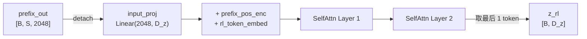
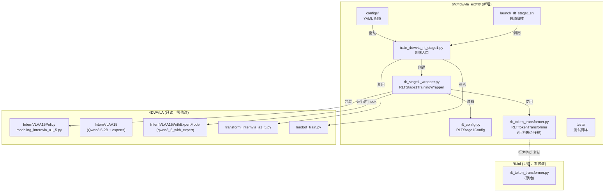
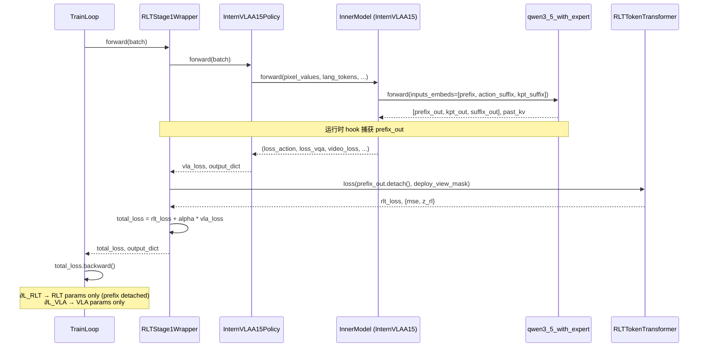
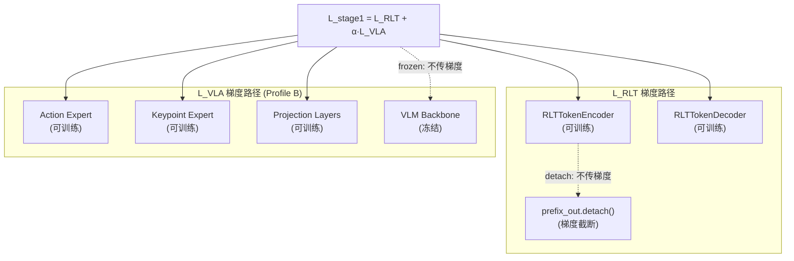
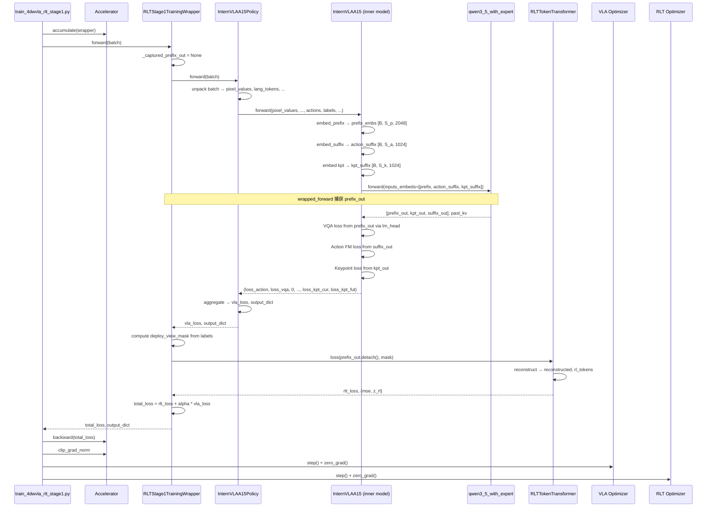
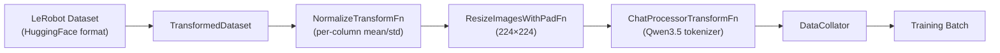
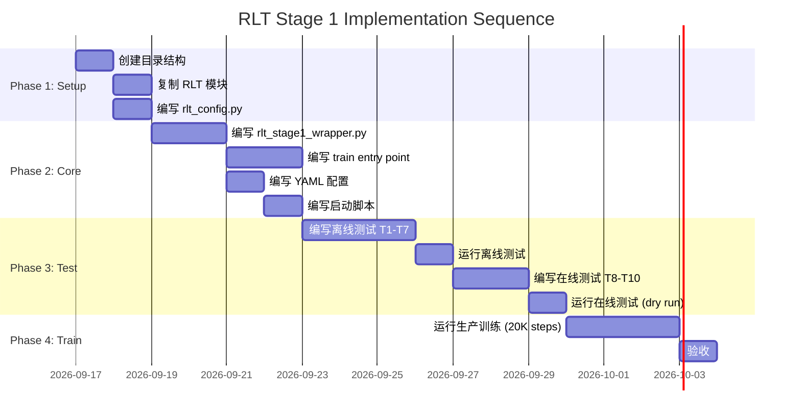

# 4DWVLA × RLT Stage 1：VLA SFT + RL Token Transformer 实施落地方案 v2

> 文档版本：v2.0
> 编写日期：2026-09-16
> 基于：v1.0（2026-09-15）的改良
> 目标 checkpoint：`${CKPT_DIR}/4wvlaFrk/plug/4wvlaFrkPlugCkp010420/`
> 目标任务：Franka FR3 v2.1 插头插入（plug into socket），8D 绝对关节动作
> 目标阶段：RLT Stage 1；本文不执行 Stage 2 在线强化学习
> 代码库：
>
> | 代号 | 路径变量 | 默认值 |
> |---|---|---|
> | 4DWVLA | `${WVLA_REPO}` | `/home/nvidia/bt/s/4WVLA` |
> | RLmm / RLinf | `${RLINF_REPO}` | `/home/nvidia/bt/s/RLmm` |
> | Checkpoint | `${CKPT_DIR}` | `/home/nvidia/bt/ckp` |
> | Dataset | `${DATA_DIR}` | `/home/nvidia/bt/dt` |
>
> 参考文档：
>
> - `${RLINF_REPO}/b/d/frk1/4wvla_rlinf_eval_3A3.md`（编码规范、Docker、测试模式、缺陷审计）
> - `${RLINF_REPO}/b/d/frk1/bx_analy_cp25.md`（8 类 box/limit 分析）
> - `${RLINF_REPO}/b/d/frk1/franka_3.md` / `franka_3LOG.md`（safety box 问题）
> - `${RLINF_REPO}/b/d/rltx/rlmm_rlikx_diff_forrlt1_1.markdown`（RLiKx vs RLmm diff 分析）
> - `${WVLA_REPO}/b/d/Frk/dta_4dtrj_plan_0904LOG.md`（bbox 数据准备问题）
> - `${WVLA_REPO}/b/d/Frk/dta_4dtrj_plan.md`（4D 轨迹数据规划）

---

## 目录

- [§0 文档结论与决策](#0-文档结论与决策)
- [§1 算法规范](#1-算法规范)
- [§2 服务器环境分析](#2-服务器环境分析)
- [§3 八类 Box/Limit 安全分析](#3-八类-boxlimit-安全分析)
- [§4 架构设计](#4-架构设计)
- [§5 可配置变量](#5-可配置变量)
- [§6 文件变更清单](#6-文件变更清单)
- [§7 扩展代码详细设计](#7-扩展代码详细设计)
- [§8 调用序列与数据流](#8-调用序列与数据流)
- [§9 训练配置](#9-训练配置)
- [§10 测试计划 — 离线（不需要真机）](#10-测试计划--离线不需要真机)
- [§11 测试计划 — 在线（需要真机）](#11-测试计划--在线需要真机)
- [§12 验收标准](#12-验收标准)
- [§13 操作手册](#13-操作手册)
- [§14 Stage 2 契约](#14-stage-2-契约)
- [§15 向后兼容性](#15-向后兼容性)
- [§16 风险与缓解](#16-风险与缓解)
- [§17 实施序列](#17-实施序列)
- [§18 代码索引](#18-代码索引)
- [§19 参考来源](#19-参考来源)

---

## §0 文档结论与决策

### 0.1 一句话结论

4DWVLA checkpoint **不能**直接使用 RLinf 现有 `openpi_rlinf` 配置进行 RLT Stage 1。本方案选择 **Path B**：保留 4DWVLA 原生训练栈（LeRobot + Accelerate），将 RLinf 的 `RLTTokenTransformer` 以行为等价方式移植到扩展目录 `${RLINF_REPO}/b/x/4dwvla_ext/rlt/` 中，**零修改** RLinf 原始代码，**零修改** 4DWVLA 源文件（通过运行时方法包装获取 prefix 隐状态）。

### 0.2 Stage 1 的精确定义

$$
\mathcal{L}_{\text{stage1}}
=
\mathcal{L}_{\text{RLT}}
+
\alpha_{\text{VLA}} \cdot \mathcal{L}_{\text{4DWVLA}}
$$

其中：

- $\mathcal{L}_{\text{RLT}}$：通过单个 RL token 重建 **deployment-view** VLM prefix hidden states 的 masked MSE（见 [§1.3](#13-rlt-重建目标)）；
- $\mathcal{L}_{\text{4DWVLA}}$：4DWVLA 已有的 action flow matching + VQA/FAST + keypoint loss 加权和；
- $\alpha_{\text{VLA}}$：控制 VLA SFT 相对 RLT loss 的权重，与 RLinf `openpi.rlt_alpha` 同义，默认 1.0。

**它不是**：

- 只在 checkpoint 后接 MLP actor/critic（那是 Stage 2）；
- 用 4DWVLA 的 `learnable_tokens` 或 keypoint tokens 代替 RL token（它们维度不同，位于不同路径）；
- 冻结整个 VLA、只训练 RLT 模块的生产训练（那只是 smoke test 或消融配置 Profile C，见 [§9](#9-训练配置)）。

### 0.3 关键架构决策记录

| 决策 | 选择 | 原因 |
|---|---|---|
| Stage 1 训练框架 | 4DWVLA 原生 LeRobot + Accelerate（Path B） | 复用真实 transforms、Qwen3.5 patch、safetensors、keypoint 管线 |
| RLT 算法来源 | 行为等价移植 RLinf `RLTTokenTransformer` | 保持可审计算法一致；该模块 RLiKx 与 RLmm 完全相同（[diff 分析](rlmm_rlikx_diff_forrlt1_1.markdown) 确认） |
| RLT 输入 | deployment-view 的 `prefix_out`，维度 $D_{\text{in}}=2048$（Qwen3.5-2B `hidden_size`） | 避免训练时 assistant token (FAST GT) 泄漏，与 Stage 2 部署可见输入一致 |
| RLT 输入 detach | 是，`prefix_out.detach()` | RLT loss 只训练 RLT encoder/decoder；VLA 由原 SFT loss 更新 |
| $z_{\text{rl}}$ 维度 | `embed_dim=1024`（单卡 32GB 推荐）或 `embed_dim=2048`（多卡） | 单卡 32GB 下 embed_dim=2048 的 RLT 约 741M params，optimizer 占用过大 |
| prefix 获取方式 | 运行时包装 `qwen3_5_with_expert.forward` 方法 | 零修改 4DWVLA 源文件 |
| 新代码位置 | `${RLINF_REPO}/b/x/4dwvla_ext/rlt/` | 遵循 eval_3A3 的扩展目录惯例 |
| Docker 容器 | 复用 `rlinf-4dwvla-gpu` | 已有 PyTorch 2.11.0+cu128、transformers 5.2.0、4DWVLA 安装 |
| 推荐训练配置 | Profile B：冻结 VLM backbone，训练 experts + RLT | 适配单卡 RTX 5090 D 32GB |
| RLinf 源码修改 | 零行 | 通过 `register_model()` 和扩展目录实现 |
| 4DWVLA 源码修改 | 零行 | 通过运行时 forward 方法包装 |
| 向后兼容 | 完全兼容 | 新代码全部在扩展目录，不影响现有功能 |

### 0.4 相较 v1 的主要改进

| 维度 | v1 | v2 |
|---|---|---|
| 硬件适配 | 推荐 8 卡多节点 | 适配实际单卡 RTX 5090 D 32GB，3 个训练 Profile |
| prefix 获取 | 描述概念，未给出代码 | 给出具体运行时包装实现 |
| Box/Limit | 未涉及 | 8 类 box 完整分析与混淆防范 |
| 文件变更 | 概要级 | 每个文件变更细到代码级别，含行号 |
| 测试 | 概要测试列表 | 按"不需要真机"/"需要真机"分类，每项含验收脚本 |
| 操作手册 | 无 | 第三方工程师可独立执行的完整手册 |
| 可配置变量 | 散落各处 | 集中提取，含含义、有效值、来源文件:行号 |
| 环境分析 | 概要 | 深入 Docker、venv、VRAM 预算分析 |
| 向后兼容 | 提及 | 逐项验证方案 |

---

## §1 算法规范

### 1.1 RLT 框架概述

RLT（RL Token）是 Physical Intelligence 提出的两阶段强化学习框架：

- **Stage 1**（本文范围）：在离线数据上联合训练 VLA 和 RLT Token Transformer。RLT 模块学习将 VLA 的 prefix hidden states 压缩为单个 $z_{\text{rl}}$ 向量——一个**信息瓶颈**。VLA 继续通过原有 SFT 损失训练。
- **Stage 2**（不在本文范围）：冻结 Stage 1 产物，用 $z_{\text{rl}}$ + proprio + ref_chunk 训练小型 MLP actor-critic 进行在线 RL。

参考来源：Physical Intelligence, *Precise Manipulation with Efficient Online RL*, 2026-03-19
实现来源：`${RLINF_REPO}/rlinf/models/embodiment/modules/rlt_token_transformer.py`（389 行，RLiKx 与 RLmm 完全相同）

### 1.2 Stage 1 损失函数

$$
\mathcal{L}_{\text{stage1}} = \mathcal{L}_{\text{RLT}} + \alpha_{\text{VLA}} \cdot \mathcal{L}_{\text{4DWVLA}}
$$

#### $\mathcal{L}_{\text{RLT}}$：重建损失

$$
\mathcal{L}_{\text{RLT}} = \frac{1}{|\mathcal{M}| \cdot D_{\text{in}}} \sum_{i \in \mathcal{M}} \| \hat{h}_i - h_i \|_2^2
$$

其中：

- $h_i \in \mathbb{R}^{D_{\text{in}}}$：VLM prefix 第 $i$ 个 token 的 hidden state（已 detach）
- $\hat{h}_i$：RLT decoder 的重建输出
- $\mathcal{M}$：deployment-view mask（见 [§1.3](#13-rlt-重建目标)）
- $D_{\text{in}} = 2048$：Qwen3.5-2B VLM hidden size

**代码出处**：`rlt_token_transformer.py:363-384`（`RLTTokenTransformer.loss()` 方法）

```python
# 核心逻辑（简化）
reconstructed, rl_tokens = self.reconstruct(prefix_embs, mask)
target = prefix_embs.detach().to(dtype=torch.float32)
reconstructed = reconstructed.to(dtype=torch.float32)
sq_error = torch.square(reconstructed - target)
if mask is not None:
    mask_expanded = mask[..., None]
    sq_error = sq_error * mask_expanded
    denom = torch.clamp(mask_expanded.sum() * D_in, min=1.0)
    mse = sq_error.sum() / denom
else:
    mse = sq_error.mean()
```

注意：loss 计算强制转换为 fp32（`to(dtype=torch.float32)`），避免 bf16 精度不足。

#### $\mathcal{L}_{\text{4DWVLA}}$：原有 VLA 损失

$$
\mathcal{L}_{\text{4DWVLA}} = w_{\text{act}} \cdot \mathcal{L}_{\text{FM}} + \lambda_{\text{vqa}} \cdot \mathcal{L}_{\text{VQA}} + w_{\text{vid}} \cdot \mathcal{L}_{\text{video}} + w_{\text{kpt}} \cdot \mathcal{L}_{\text{kpt}}
$$

各项含义：

| 符号 | 含义 | 默认权重 | 来源文件:行号 |
|---|---|---|---|
| $\mathcal{L}_{\text{FM}}$ | Action flow matching MSE | $w_{\text{act}}=10.0$ | `config.json: action_loss_weight` |
| $\mathcal{L}_{\text{VQA}}$ | VQA cross-entropy (lm_head on prefix_out) | $\lambda_{\text{vqa}}=1.0$ | `config.json: lambda_vqa` |
| $\mathcal{L}_{\text{video}}$ | WAN video foresight MSE | $w_{\text{vid}}=1.0$ | `config.json: video_loss_weight` |
| $\mathcal{L}_{\text{kpt}}$ | Keypoint prediction loss (current + future) | $w_{\text{kpt}}=1.0$ | `config.json: kpt_loss_weight` |

**关键**：在 Profile B（推荐配置）中使用 `action_loss_only=True`，此时 $\mathcal{L}_{\text{video}}=0$（WAN 模型不加载），大幅节省显存。

#### 梯度隔离

RLT 损失与 VLA 损失的梯度通过 `detach()` 完全隔离：

```
L_stage1 = L_RLT(rlt_params; prefix_out.detach()) + alpha * L_VLA(vla_params)
                  ↓                                            ↓
             ∂L_RLT/∂rlt_params                         ∂L_VLA/∂vla_params
             (不流向 VLA)                                (不流向 RLT)
```

双重 detach 模式（`rlt_token_transformer.py:358`）：

```python
def reconstruct(self, prefix_embs, mask=None):
    frozen_prefix = prefix_embs.detach()     # 第一重：断开 VLA 计算图
    rl_tokens = self.encode(frozen_prefix, mask)
    reconstructed = self.decode(rl_tokens, frozen_prefix, mask)
    return reconstructed, rl_tokens
```

调用端再次 detach（本方案 `rlt_stage1_wrapper.py`）：

```python
rlt_loss, rlt_info = self.rlt_module.loss(prefix_out.detach(), mask=deploy_view_mask)
```

### 1.3 RLT 重建目标：Deployment-View Prefix

**问题**：训练时 VLM prefix 包含 assistant response tokens（子任务文本 + FAST action tokens），但部署推理时只有 user prompt（任务 + 状态 + 图像）。如果 RLT encoder 学习利用 assistant tokens，$z_{\text{rl}}$ 在部署时会面临分布偏移。

**解决方案**：deployment-view mask——只用 user prompt 对应的 token 位置训练 RLT。

在 4DWVLA 的 transform 管线中，`labels` 张量的约定：

- `labels[i] == -100`：该位置属于 user prompt（不参与 VQA loss 监督）
- `labels[i] >= 0`：该位置属于 assistant response（参与 VQA loss 监督）

因此 deployment-view mask 的计算：

```python
deploy_view_mask = (batch["labels"] == -100)  # shape: [B, prefix_seq_len]
```

该 mask 选出 user message 中的所有 token（包括图像 token、任务文本 token、状态 token），排除 assistant response token。这些被选中的 token 在训练和部署时完全一致，消除分布偏移。

**数值验证**（基于当前 checkpoint 配置）：

- 图像 token：~192 个（3 图 × 64 token/图，其中 image2 为 mask padding）
- User 文本 token：~20–40 个（任务描述 + 状态）
- Assistant token：~20–30 个（子任务 + FAST）
- `deploy_view_mask` 选中：~212–232 个 token（<< `rlt_prefix_seq_len=512`）

### 1.4 $z_{\text{rl}}$ 的产生过程



其中 $D_z$ = `embed_dim`（推荐 1024 for 单卡，2048 for 多卡）。

RLT encoder 将 prefix hidden states 与一个可学习的 rl_token embedding 拼接，通过 self-attention 层后取最后一个 token 作为 $z_{\text{rl}}$：

```python
# RLTTokenEncoder.forward (rlt_token_transformer.py:148-187)
prefix_tokens = input_proj(prefix_embs) + prefix_pos_enc[:seq_len]
rl_tokens = rl_token_embed + rl_token_pos_enc          # [1, D_z]
x = cat([prefix_tokens, rl_tokens], dim=1)              # [B, S+1, D_z]
for layer in self.layers:
    x = layer(x, mask=mask)
return x[:, -1:]                                         # [B, 1, D_z]
```

---

## §2 服务器环境分析

### 2.1 硬件

| 项目 | 值 | 来源 |
|---|---|---|
| GPU | NVIDIA RTX 5090 D | `nvidia-smi` |
| GPU VRAM | 32607 MiB (32 GB) | `nvidia-smi` |
| GPU 数量 | 1 | `nvidia-smi` |
| CPU | AMD (多核) | `/proc/cpuinfo` |
| 内核 | Linux 5.15.0-1032-realtime (RT kernel) | `uname -r` |
| 系统 RAM | 需实测，估计 ≥64 GB | `free -h` |
| 机器人 | Franka FR3 v2.1 + Franka Hand | FCI at 172.16.0.2:1337 |
| 相机 | 2× RealSense D435I (global + wrist) | 640×480 RGB8 at 30fps |

**关键约束**：单卡 32 GB 意味着全参数 AdamW 训练（VLA ~2500M + RLT ~741M params）**不可行**。必须使用冻结策略或降维策略。详见 [§9.1 训练 Profile](#91-训练-profile-显存预算)。

### 2.2 软件栈

| 项目 | 值 | 位置 |
|---|---|---|
| 宿主 OS | Ubuntu (Linux RT kernel) | — |
| 宿主 Python | 3.10.12 | `python3 --version` |
| uv | 0.12.2 | `/opt/venv/.cache/uv/uv` |
| Docker | 已安装，支持 `--gpus all` | — |
| GPU Docker 镜像 | `rlinf/rlinf:agentic-rlinf0.4-maniskill_libero` | `${RLINF_REPO}/b/x/4dwvla_ext/configs/docker_run_4dwvla_gpu.sh` |
| Franky Docker 镜像 | `rlinf/rlinf:agentic-rlinf0.4-franka` | `${RLINF_REPO}/b/x/4dwvla_ext/configs/docker_run_4dwvla_franky.sh` |
| 容器内 Python | 3.11.14 (via uv) | `/opt/venv/4dwvla/bin/python` |
| PyTorch | 2.11.0+cu128 | `setup_4dwvla_venv.sh` |
| transformers | 5.2.0 (已 patch Qwen3.5) | `setup_4dwvla_venv.sh` |
| Accelerate | ≥1.5.0 | `setup_4dwvla_venv.sh` |
| 4DWVLA (lerobot) | editable mode from `/workspace/4WVLA` | `setup_4dwvla_venv.sh` |

### 2.3 Docker 容器配置

#### GPU 容器 (`rlinf-4dwvla-gpu`)

用于 Stage 1 训练。

```bash
docker run -it --rm \
  --gpus all --privileged --network host --shm-size=20g \
  -e NVIDIA_DRIVER_CAPABILITIES=all \
  -e HF_HOME=/home/nvidia/.cache/huggingface \
  -v ${RLINF_REPO}:/workspace/RLinf \
  -v ${WVLA_REPO}:/workspace/4WVLA:ro \
  -v ${CKPT_DIR}:/home/nvidia/ckpts:ro \
  -v ${HF_CACHE}:/home/nvidia/.cache/huggingface \
  --name rlinf-4dwvla-gpu \
  rlinf/rlinf:agentic-rlinf0.4-maniskill_libero
```

来源：`${RLINF_REPO}/b/x/4dwvla_ext/configs/docker_run_4dwvla_gpu.sh`

| 宿主路径 | 容器挂载 | 模式 | 说明 |
|---|---|---|---|
| `${RLINF_REPO}` | `/workspace/RLinf` | rw | RLmm 代码 + 扩展代码 |
| `${WVLA_REPO}` | `/workspace/4WVLA` | **ro** | 4DWVLA 代码（只读） |
| `${CKPT_DIR}` | `/home/nvidia/ckpts` | **ro** | Checkpoint（只读） |
| `${HF_CACHE}` | `/home/nvidia/.cache/huggingface` | rw | HuggingFace 缓存 |

**重要**：4WVLA 以只读挂载，确保本方案不修改 4DWVLA 源码。训练输出（checkpoint、日志）写入 `/workspace/RLinf/b/x/4dwvla_ext/rlt/outputs/`。

#### 训练前必须释放 GPU

当前 GPU 可能被推理服务器占用（~20 GB）。训练前必须停止所有 GPU 进程：

```bash
# 检查 GPU 占用
nvidia-smi
# 停止 inference 容器（如果运行中）
docker stop rlinf-4dwvla-gpu 2>/dev/null || true
docker stop rlinf-4dwvla-franky 2>/dev/null || true
```

### 2.4 容器内 venv 设置

venv 路径：`/opt/venv/4dwvla`

设置脚本：`${RLINF_REPO}/b/x/4dwvla_ext/configs/setup_4dwvla_venv.sh`

关键步骤：
1. `uv venv --python 3.11 /opt/venv/4dwvla`
2. 安装 PyTorch 2.11.0+cu128
3. 安装 transformers 5.2.0 + 其他依赖
4. 安装 flash-attn 2.8.3（可选，加速注意力）
5. 安装 4DWVLA (lerobot) editable mode
6. Patch transformers with Qwen3.5 model code

**RLT Stage 1 额外依赖**：无。`RLTTokenTransformer` 仅使用 `torch.nn`，不引入任何新依赖。

### 2.5 数据集位置

| 数据集 | 路径 | 规模 | 说明 |
|---|---|---|---|
| 8-episode 样本 | `${DATA_DIR}/plug_into_socket_lrb_4D_8sml/` | 8 集, 4777 帧 | 本机可用，用于 smoke test |
| 100-episode 完整 | `${DATA_DIR}/plug_into_socket_lrb_4D/` | 100 集, ~66577 帧 | **需确认是否在本机**；生产训练需要 |

数据特征：

| 字段 | 维度 | 说明 |
|---|---|---|
| `observation.state.arm` | [7] | 关节角度 (rad) |
| `observation.state.gripper` | [1] | 夹爪宽度 (m) |
| `action.arm` | [7] | 绝对关节目标 (rad) |
| `action.gripper` | [1] | 夹爪目标 |
| `observation.keypoint_3d` | [56] | 8 keypoints × 7D (pos + quat_xyzw) |
| `observation.images.global` | [3, H, W] | 全局相机 RGB |
| `observation.images.wrist` | [3, H, W] | 腕部相机 RGB |
| `observation.state.ee_pos` | [3] | 末端位置 (m) |
| `observation.state.ee_quat` | [4] | 末端四元数 (xyzw) |

---

## §3 八类 Box/Limit 安全分析

**来源**：`${RLINF_REPO}/b/d/frk1/bx_analy_cp25.md`

本项目涉及**至少 8 种不同语义的 "box"**。混淆它们可能导致动作裁剪错误、安全防护失效或训练数据归一化异常。本节完整列出，并标注 Stage 1 训练的相关性。

### 3.1 Box 类型目录

| ID | 名称 | 域 | 值 / 含义 | 单位 | Stage 1 相关性 |
|---|---|---|---|---|---|
| **B1** | `bbox_radius` | 4DWVLA keypoint 归一化 | $R_{\text{pad}} = 0.8361$ m | m | **高**：keypoint 数据归一化 |
| **B2** | `gym.spaces.Box` | RL Gym API | `action_space.low/high = joint_limits` | rad / m | **无**：Stage 1 无 gym env |
| **B3** | Safety Box (`ee_pose_limit`) | 真机笛卡尔裁剪 | 半宽 ≈ 0.05 m | m | **无**：Stage 1 无真机控制 |
| **B4** | Motion Guard Fence | TCP 外壳围栏 | `GUARD_MARGIN_M = 0.05` m | m | **无**：Stage 1 无真机控制 |
| **B5** | Orientation Fence | 四元数弧角 | 角度阈值 | rad | **无**：Stage 1 无真机控制 |
| **B6** | Reach Diagnostic | 最远角落距离 | `PANDA_MAX_REACH_M = 0.855` m | m | **无**：Stage 1 无真机控制 |
| **B7** | Phase 2.8 Smoke Test | 操作测试 | 无物理含义 | — | **无** |
| **B8** | Start Pose Gate | 预 gym 检查 | 初始姿态范围 | rad | **无**：Stage 1 无真机控制 |

### 3.2 Stage 1 唯一相关的 Box：B1 (`bbox_radius`)

**B1 是 Stage 1 训练中唯一需要关注的 box 类型。**

#### B1 的物理含义

`bbox_radius` = 0.8361 m 是一个等距球半径 $R_{\text{pad}}$，用于将 FK 关键点位置从米制坐标归一化到 $[-1, 1]$ 范围：

$$
\mathbf{p}_{\text{norm}} = \frac{\mathbf{p}_{\text{base\_link}}}{R_{\text{pad}}}
$$

来源：`${RLINF_REPO}/b/d/frk1/plug/keypoints_meta.json`

```json
{
  "bbox_radius": 0.8361004471778869,
  "bbox_margin": 0.15,
  "coordinate_system": "base_link-relative, position divided by bbox_radius, quaternion hemisphere-normalized"
}
```

#### B1 在数据中的体现

Checkpoint stats（`stats.json`）中的 `observation.keypoint_3d` 统计值：

```python
# keypoint_3d shape: [56] = 8 joints × 7D (px, py, pz, qx, qy, qz, qw)
# 前两个维度 (px, py) 对于 link1 (base) 恒为 0.0
# 第三个维度 (pz) 对于 link1 = 0.3983（即 base_link z 坐标 / bbox_radius）
```

#### B1 与 RLT 的关系

RLT Stage 1 本身**不直接处理 keypoint 归一化**——归一化在数据准备阶段完成，在 4DWVLA 模型内部通过 `track_encoder` 处理。但：

1. 如果训练数据的 keypoint 归一化不一致（例如混合了不同 `bbox_radius` 的数据），RLT 学到的 prefix 压缩会不稳定
2. Stage 2 使用 $z_{\text{rl}}$ 时，keypoint 信息已融入 prefix representations

**验证要求**：在 [§10 T-RLT6](#t-rlt6-keypoint-归一化一致性) 中验证训练数据的 keypoint 归一化一致性。

### 3.3 混淆防范矩阵

| 易混淆对 | 区别 | 危害 |
|---|---|---|
| B1 vs B3 | B1=0.836m 球半径（归一化）vs B3=0.05m 半宽（安全裁剪）| 用 B3 值做归一化会压缩 keypoint 范围 16.7 倍 |
| B1 vs B6 | B1=0.836m（keypoint 归一化）vs B6=0.855m（机械臂最大可达半径）| 相似但语义不同 |
| B2 vs B3 | B2=关节空间 Gym Box vs B3=笛卡尔空间安全 Box | 空间类型完全不同 |
| B3 vs B4 | B3=0.05m 指令裁剪 vs B4=0.05m 围栏边距 | 同为 0.05m 但作用层级不同 |

### 3.4 Keypoint 数据格式深入

每个 keypoint 为 7D 向量：$[\underbrace{p_x, p_y, p_z}_{\text{position}/R_{\text{pad}}}, \underbrace{q_x, q_y, q_z, q_w}_{\text{quaternion (xyzw)}}]$

8 个关键点（`keypoints_meta.json` 中的 `link_names`）：

```
link1 (base), link2, link3, link4, link5, link6, link7, hand_tcp
```

四元数半球归一化：如果 $q_w < 0$，则取反 $\mathbf{q} \leftarrow -\mathbf{q}$，确保 $q_w \geq 0$。

Keypoint history 长度：200 步（`keypoint_history_max_len: 200`）

完整 keypoint 输入形状：$[H+1+C, J \times D] = [251, 56]$

其中 $H=200$（历史），$1$（当前），$C=50$（未来，训练时有 GT），$J=8$（关节），$D=7$（位置+四元数）

### 3.5 两阶段归一化（来源：eval_3A3 §D8 分析）

4DWVLA 的归一化分两步，**不要混淆**：

1. **Keypoint 位置归一化**（在数据准备阶段）：
   $$\mathbf{p}_{\text{norm}} = \frac{\mathbf{p}_{\text{base\_link}}}{R_{\text{pad}}} \quad (R_{\text{pad}} = 0.8361\text{m, 等距})$$

2. **Per-column mean/std 归一化**（在 `NormalizeTransformFn` 中）：
   $$x_{\text{normalized}} = \frac{x - \mu}{\sigma}$$

   其中 $\mu, \sigma$ 来自 `stats.json` 中按子字段统计的值。

**关键**：stats.json 中的统计按**子字段**存储（`observation.state.arm`, `observation.state.gripper` 等），而非合并字段（`observation.state`）。合并字段的 stats 需要通过拼接子字段 stats 得到（eval_3A3 中的 `pick_or_compose()` 策略）。

---

## §4 架构设计

### 4.1 静态架构：组件图



### 4.2 动态架构：Forward 数据流



### 4.3 Backward 梯度流



### 4.4 RLT Module 内部结构

```mermaid
graph LR
    subgraph RLTTokenTransformer
        subgraph Encoder
            IP["input_proj<br/>Linear(D_in, D_z)"]
            PE["prefix_pos_enc<br/>[seq_len, D_z]"]
            RTE["rl_token_embed<br/>[1, D_z]"]
            EL1["SelfAttn Layer 1"]
            EL2["SelfAttn Layer 2"]
            IP --> PE
            PE -->|"cat"| RTE
            RTE --> EL1 --> EL2
            EL2 -->|"x[:, -1:]"| ZRL["z_rl<br/>[B, 1, D_z]"]
        end
        subgraph Decoder
            DPE["target_pos_enc<br/>[seq_len, D_z]"]
            DRL["z_rl (input)"]
            DL1["Causal SelfAttn 1"]
            DL2["Causal SelfAttn 2"]
            OP["output_proj<br/>Linear(D_z, D_in)"]
            DRL -->|"teacher forcing"| DPE
            DPE --> DL1 --> DL2 --> OP
            OP --> Recon["reconstructed<br/>[B, S, D_in]"]
        end
    end
```



### 4.5 RLT 参数量估算

以 `embed_dim=1024`（推荐单卡配置）和 `embed_dim=2048`（多卡配置）对比：

| 组件 | embed_dim=1024 | embed_dim=2048 |
|---|---|---|
| input_proj (Linear) | 2048×1024 = 2.1M | Identity (0) |
| Encoder pos_enc | 512×1024 = 0.5M | 512×2048 = 1.0M |
| Encoder SelfAttn ×2 | 2×(MHA 4.2M + MLP 42M) = 92.4M | 2×(MHA 16.8M + MLP 167.8M) = 369.2M |
| Decoder pos_enc | 512×1024 = 0.5M | 512×2048 = 1.0M |
| Decoder SelfAttn ×2 | 2×(MHA 4.2M + MLP 42M) = 92.4M | 2×(MHA 16.8M + MLP 167.8M) = 369.2M |
| output_proj | 1024×2048 = 2.1M | Identity (0) |
| **总计** | **~190M (0.19B)** | **~741M (0.74B)** |
| 模型大小 (bf16) | ~0.38 GB | ~1.48 GB |
| Optimizer 大小 (AdamW fp32) | ~1.52 GB | ~5.93 GB |

---

## §5 可配置变量

以下变量会随实验、环境或数据集的不同而改变，必须作为配置项显式管理。

### 5.1 实验相关变量

| 变量名 | 含义 | 当前有效值 | 来源文件:行号 |
|---|---|---|---|
| `rlt_alpha` | VLA loss 在 Stage 1 总 loss 中的权重 | 1.0 | `realworld_rlt_stage1_sft_openpi_pi05.yaml: rlt_alpha` |
| `rlt_embed_dim` | RLT 编解码器嵌入维度（即 $D_z$） | 1024（单卡）/ 2048（多卡） | `maniskill_rlt_stage1_sft_openpi_pi05.yaml: rlt_embed_dim` |
| `rlt_input_dim` | RLT 输入维度（= VLM hidden_size） | 2048 | `checkpoint config.json → qwen3_5.language_model.norm.weight.shape[0]` |
| `rlt_prefix_seq_len` | RLT 位置编码最大长度 | 512 | `maniskill_rlt_stage1_sft_openpi_pi05.yaml: rlt_prefix_seq_len` |
| `rlt_num_layers` | Encoder/Decoder 各自的层数 | 2 | `maniskill_rlt_stage1_sft_openpi_pi05.yaml: rlt_num_layers` |
| `rlt_num_heads` | Self-attention head 数 | 8 | `maniskill_rlt_stage1_sft_openpi_pi05.yaml: rlt_num_heads` |
| `rlt_mlp_ratio` | MLP 隐藏层与 embed_dim 的比率 | 4.0 | `maniskill_rlt_stage1_sft_openpi_pi05.yaml: rlt_mlp_ratio` |
| `rlt_image_only` | 是否仅用图像 token 计算 RLT | False（使用 deploy_view_mask） | `realworld_rlt_stage1_sft_openpi_pi05.yaml: rlt_image_only` |
| `rlt_lr` | RLT 模块学习率 | 1e-4 | 新增配置 |
| `vla_lr` | VLA 模块学习率 | 5e-5 | `checkpoint config.json: optimizer_lr` |
| `train_profile` | 训练 profile（A/B/C） | B | 新增配置 |
| `max_steps` | 最大训练步数 | 20000 | `realworld_rlt_stage1_sft_openpi_pi05.yaml: max_steps` |
| `micro_batch_size` | 微批量大小 | 1（Profile B, 单卡） | 需根据实测调整 |
| `gradient_accumulation_steps` | 梯度累积步数 | 8 | 用于增大有效 batch size |
| `action_loss_only` | 是否跳过 WAN 视频分支 | True（Profile B/C） | `config.json: action_loss_only` |

### 5.2 环境相关变量

| 变量名 | 含义 | 当前有效值 | 来源 |
|---|---|---|---|
| `RLINF_REPO` | RLmm 仓库宿主路径 | `/home/nvidia/bt/s/RLmm` | `docker_run_4dwvla_gpu.sh` |
| `WVLA_REPO` | 4DWVLA 仓库宿主路径 | `/home/nvidia/bt/s/4WVLA` | `docker_run_4dwvla_gpu.sh` |
| `CKPT_DIR` | Checkpoint 根目录 | `/home/nvidia/bt/ckp` | `docker_run_4dwvla_gpu.sh` |
| `DATA_DIR` | 数据集根目录 | `/home/nvidia/bt/dt` | 新增 |
| `HF_CACHE` | HuggingFace 缓存 | `$HOME/.cache/huggingface` | `docker_run_4dwvla_gpu.sh` |
| `RLINF_GPU_IMAGE` | GPU Docker 镜像 | `rlinf/rlinf:agentic-rlinf0.4-maniskill_libero` | `docker_run_4dwvla_gpu.sh` |
| `CONTAINER_NAME` | GPU 容器名称 | `rlinf-4dwvla-gpu` | `docker_run_4dwvla_gpu.sh` |
| `VENV_DIR` | 容器内 venv 路径 | `/opt/venv/4dwvla` | `setup_4dwvla_venv.sh` |

### 5.3 数据/任务相关变量

| 变量名 | 含义 | 当前有效值 | 来源 |
|---|---|---|---|
| `task_prompt` | 任务提示文本 | `"plug into socket"` | `tasks.parquet` in dataset, eval_3A3 §D9 |
| `dataset_repo_id` | 数据集标识 | `plug_into_socket_lrb_4D` | 数据目录名 |
| `action_mode` | 动作表示模式 | `abs`（绝对关节） | `checkpoint config.json` |
| `chunk_size` | 动作块长度 | 50 | `config.json: chunk_size` |
| `physical_action_dim` | 实际动作维度 | 8 (arm=7 + gripper=1) | dataset features |
| `max_action_dim` | 模型内部 pad 维度 | 32 | `config.json: max_action_dim` |
| `bbox_radius` | Keypoint 归一化半径 | 0.8361 m | `keypoints_meta.json: bbox_radius` |
| `num_keypoint_joints` | 关键点数量 | 8 | `config.json: num_keypoint_joints` |
| `image_resolution` | 图像分辨率 | [224, 224] | `config.json: image_resolution` |

---

## §6 文件变更清单

### 6.1 新增文件

所有新增文件位于 `${RLINF_REPO}/b/x/4dwvla_ext/rlt/`。

| 文件 | 用途 | 行数估计 | 新建/复制 |
|---|---|---|---|
| `__init__.py` | 包初始化 | 5 | 新建 |
| `rlt_token_transformer.py` | RLT encoder-decoder（行为等价移植） | 389 | **复制** from `rlinf/models/embodiment/modules/rlt_token_transformer.py` |
| `rlt_config.py` | RLT Stage 1 配置 dataclass | ~60 | 新建 |
| `rlt_stage1_wrapper.py` | 训练 wrapper（hook + loss 整合） | ~200 | 新建 |
| `train_4dwvla_rlt_stage1.py` | 训练入口脚本 | ~350 | 新建（参考 `lerobot_train.py`） |
| `configs/rlt_stage1_franka_plug.yaml` | Franka 插头任务训练配置 | ~80 | 新建 |
| `launch_rlt_stage1.sh` | Docker 容器内训练启动脚本 | ~60 | 新建 |
| `docker_run_rlt_stage1.sh` | 宿主机启动训练容器脚本 | ~40 | 新建（基于 `docker_run_4dwvla_gpu.sh`） |
| `tests/test_rlt_module_offline.py` | T-RLT1: RLT 模块单元测试 | ~200 | 新建 |
| `tests/test_rlt_forward_offline.py` | T-RLT2: Forward 集成测试 | ~180 | 新建 |
| `tests/test_rlt_loss_offline.py` | T-RLT3: Loss 计算测试 | ~150 | 新建 |
| `tests/test_rlt_gradient_offline.py` | T-RLT4: 梯度隔离测试 | ~120 | 新建 |
| `tests/test_rlt_checkpoint_offline.py` | T-RLT5: Checkpoint 保存/加载 | ~150 | 新建 |
| `tests/test_rlt_compat_offline.py` | T-RLT6: 配置兼容性 + keypoint 一致性 | ~100 | 新建 |
| `tests/test_rlt_behavior_equiv.py` | T-RLT7: 与 RLinf 原始模块行为等价性 | ~100 | 新建 |
| `tests/run_all_offline.sh` | 运行所有离线测试的入口 | ~30 | 新建 |
| `tests/test_rlt_training_online.py` | T-RLT8: GPU 训练 dry run | ~120 | 新建 |
| `tests/test_rlt_z_extraction_online.py` | T-RLT9: z_rl 提取验证 | ~80 | 新建 |

### 6.2 修改文件

**无。** 本方案不修改任何现有文件。

| 范围 | 修改行数 | 说明 |
|---|---|---|
| RLinf (RLmm) 原始代码 | **0** | 通过扩展目录实现 |
| 4DWVLA 源码 | **0** | 通过运行时 forward 方法包装实现 |
| 现有 `b/x/4dwvla_ext/` 文件 | **0** | 新代码放在新子目录 `rlt/` |

### 6.3 删除文件

**无。**

### 6.4 复用分析

| 被复用代码 | 来源 | 复用方式 | 原因 |
|---|---|---|---|
| `RLTTokenTransformer` 全部代码 | `rlinf/.../rlt_token_transformer.py` | **文件复制** | RLT 核心算法；该模块无 RLinf 外部依赖（仅 torch.nn）；RLiKx vs RLmm 完全相同 |
| `lerobot_train.py` 训练循环逻辑 | `4WVLA/src/lerobot/scripts/lerobot_train.py` | **参考并适配** | 保持与 4DWVLA 原生训练循环一致的 metrics、scheduler、checkpoint 逻辑 |
| `InternVLAA15Policy` 模型 | `4WVLA/src/lerobot/policies/internvla_a1_5/` | **运行时导入并包装** | 不修改，通过 wrapper 增加 RLT 功能 |
| Docker 容器配置 | `b/x/4dwvla_ext/configs/docker_run_4dwvla_gpu.sh` | **参考并适配** | 增加数据集挂载，其余一致 |
| venv 设置 | `b/x/4dwvla_ext/configs/setup_4dwvla_venv.sh` | **直接复用** | RLT 不引入新依赖 |
| Checkpoint stats | `stats.json` in checkpoint | **直接加载** | 归一化参数 |

### 6.5 不修改 RLinf 原始代码的理由

| 潜在修改点 | 不修改的原因 | 替代方案 |
|---|---|---|
| `SupportedModel.register()` | Stage 1 不走 RLinf 训练入口 | 不需要注册 |
| `FSDPVlaSftWorker.build_dataloader()` | Stage 1 用 4DWVLA 原生 dataloader | 不需要添加分支 |
| `config.py` model registry | Stage 1 不使用 RLinf config 系统 | 使用独立 YAML |
| `sft_action_model.py` | Stage 1 通过 wrapper 实现相同逻辑 | `rlt_stage1_wrapper.py` |

---

## §7 扩展代码详细设计

### 7.1 `rlt_token_transformer.py` — 行为等价移植

**操作**：直接复制 `${RLINF_REPO}/rlinf/models/embodiment/modules/rlt_token_transformer.py` 到 `${RLINF_REPO}/b/x/4dwvla_ext/rlt/rlt_token_transformer.py`。

**修改**：仅在文件头部添加来源注释：

```python
# Behavior-equivalent copy of rlinf/models/embodiment/modules/rlt_token_transformer.py
# Source commit: <RLmm HEAD commit hash at copy time>
# Copied for standalone use without RLinf runtime dependencies.
# DO NOT modify this file independently — sync from source if upstream changes.
```

**不修改任何逻辑**。验证方式见 [T-RLT7](#t-rlt7-行为等价性验证)。

### 7.2 `rlt_config.py` — RLT Stage 1 配置

```python
"""RLT Stage 1 training configuration for 4DWVLA."""

import dataclasses
from pathlib import Path


@dataclasses.dataclass
class RLTStage1Config:
    # RLT module hyperparameters
    enable_rlt: bool = True
    rlt_alpha: float = 1.0
    rlt_input_dim: int = 2048       # must match VLM hidden_size
    rlt_embed_dim: int = 1024       # z_rl dimension; 1024 for single GPU, 2048 for multi-GPU
    rlt_prefix_seq_len: int = 512   # >= actual prefix token count (~240)
    rlt_num_layers: int = 2
    rlt_num_heads: int = 8
    rlt_mlp_ratio: float = 4.0
    rlt_dropout: float = 0.0
    rlt_image_only: bool = False    # if True, only use image tokens (ignore deploy_view_mask)
    rlt_lr: float = 1e-4            # RLT module learning rate

    # Training profile
    train_profile: str = "B"        # A=full, B=expert+RLT, C=RLT-only
    action_loss_only: bool = True   # skip WAN video branch (saves VRAM)
    freeze_vision_encoder: bool = True   # Profile B: freeze VLM vision encoder
    train_expert_only: bool = True       # Profile B: freeze VLM text backbone
    freeze_keypoint_modules: bool = False  # keep keypoint expert trainable

    # VLA training
    vla_lr: float = 5e-5
    grad_clip_norm: float = 1.0
    warmup_steps: int = 200
    max_steps: int = 20000
    save_freq: int = 2000
    log_freq: int = 50
    micro_batch_size: int = 1
    gradient_accumulation_steps: int = 8

    # Data
    dataset_repo_id: str = "plug_into_socket_lrb_4D"
    action_mode: str = "abs"
    task_prompt: str = "plug into socket"

    # Paths (container-relative)
    base_checkpoint: str = "/home/nvidia/ckpts/4wvlaFrk/plug/4wvlaFrkPlugCkp010420"
    dataset_root: str = ""       # will be resolved from DATA_DIR env var
    output_dir: str = "/workspace/RLinf/b/x/4dwvla_ext/rlt/outputs"

    # Checkpoint loading
    pretrained_path: str = ""    # set to base_checkpoint by default

    @classmethod
    def from_yaml(cls, yaml_path: str) -> "RLTStage1Config":
        """Load config from YAML file, with environment variable expansion."""
        import yaml
        import os
        with open(yaml_path) as f:
            raw = yaml.safe_load(f)
        # Expand environment variables in string values
        for k, v in raw.items():
            if isinstance(v, str) and "$" in v:
                raw[k] = os.path.expandvars(v)
        return cls(**{k: v for k, v in raw.items() if k in cls.__dataclass_fields__})

    def resolve_paths(self):
        """Resolve paths using environment variables."""
        import os
        if not self.dataset_root:
            data_dir = os.environ.get("DATA_DIR", "/home/nvidia/bt/dt")
            self.dataset_root = str(Path(data_dir) / self.dataset_repo_id)
        if not self.pretrained_path:
            self.pretrained_path = self.base_checkpoint

    def apply_profile(self):
        """Apply training profile presets."""
        if self.train_profile == "A":
            self.train_expert_only = False
            self.freeze_vision_encoder = False
        elif self.train_profile == "B":
            self.train_expert_only = True
            self.freeze_vision_encoder = True
        elif self.train_profile == "C":
            self.train_expert_only = True
            self.freeze_vision_encoder = True
            self.rlt_alpha = 0.0  # no VLA loss, RLT only
```

### 7.3 `rlt_stage1_wrapper.py` — 训练 Wrapper

```python
"""RLT Stage 1 training wrapper for InternVLAA15Policy.

Wraps the base 4DWVLA policy to add RLT loss computation
without modifying any 4DWVLA source code.

Key mechanism:
1. Runtime method wrapping on qwen3_5_with_expert.forward()
   to capture prefix_out during each forward pass.
2. After base policy forward, compute RLT loss on detached prefix_out.
3. Return combined loss = L_RLT + alpha * L_VLA.
"""

import logging
from typing import Any

import torch
import torch.nn as nn

from .rlt_config import RLTStage1Config
from .rlt_token_transformer import RLTTokenTransformer

logger = logging.getLogger(__name__)


class RLTStage1TrainingWrapper(nn.Module):
    """Wraps InternVLAA15Policy to add RLT Stage 1 training."""

    def __init__(self, base_policy: nn.Module, rlt_config: RLTStage1Config):
        super().__init__()
        self.base_policy = base_policy
        self.rlt_config = rlt_config

        # Create RLT module
        self.rlt_module = RLTTokenTransformer(
            input_dim=rlt_config.rlt_input_dim,
            embed_dim=rlt_config.rlt_embed_dim,
            prefix_seq_len=rlt_config.rlt_prefix_seq_len,
            num_layers=rlt_config.rlt_num_layers,
            num_heads=rlt_config.rlt_num_heads,
            mlp_ratio=rlt_config.rlt_mlp_ratio,
            dropout_rate=rlt_config.rlt_dropout,
        )
        self.rlt_alpha = rlt_config.rlt_alpha
        self.rlt_image_only = rlt_config.rlt_image_only

        # Storage for captured prefix_out
        self._captured_prefix_out = None

        # Install forward wrapper
        self._install_prefix_capture()

        param_count = sum(p.numel() for p in self.rlt_module.parameters())
        logger.info(
            f"RLT module created: embed_dim={rlt_config.rlt_embed_dim}, "
            f"params={param_count/1e6:.1f}M, z_dim={self.rlt_module.z_dim}"
        )

    def _install_prefix_capture(self):
        """Wrap qwen3_5_with_expert.forward to capture prefix_out."""
        inner_model = self.base_policy.model  # InternVLAA15
        expert_model = inner_model.qwen3_5_with_expert  # InternVLAA15WithExpertModel
        original_forward = expert_model.forward

        wrapper_self = self  # capture reference

        def wrapped_forward(*args, **kwargs):
            result = original_forward(*args, **kwargs)
            # result = ([prefix_out, ...], past_key_values)
            if isinstance(result, (list, tuple)) and len(result) >= 1:
                outputs_list = result[0]
                if isinstance(outputs_list, (list, tuple)) and len(outputs_list) >= 1:
                    wrapper_self._captured_prefix_out = outputs_list[0]
            return result

        expert_model.forward = wrapped_forward
        logger.info("Installed prefix_out capture on qwen3_5_with_expert.forward")

    def _compute_deploy_view_mask(self, batch: dict) -> torch.Tensor | None:
        """Compute deployment-view mask from labels.

        Returns a boolean mask [B, S] where True = user prompt token (present at deploy),
        False = assistant response token (not present at deploy).
        """
        labels = batch.get("labels")
        if labels is None:
            return None

        prefix_len = self._captured_prefix_out.shape[1]
        mask = (labels[:, :prefix_len] == -100)
        return mask

    def _compute_image_only_mask(self, batch: dict) -> torch.Tensor | None:
        """Compute image-only mask from input_ids and image_token_id."""
        input_ids = batch.get("input_ids")
        if input_ids is None:
            return None

        prefix_len = self._captured_prefix_out.shape[1]
        image_token_id = getattr(
            self.base_policy.config, "image_token_id", None
        )
        if image_token_id is None:
            logger.warning("image_token_id not found in config, using all prefix tokens")
            return None

        mask = (input_ids[:, :prefix_len] == image_token_id)
        return mask

    def forward(self, batch: dict) -> tuple[torch.Tensor, dict[str, Any]]:
        """Forward pass with RLT loss.

        Returns:
            total_loss: L_RLT + alpha * L_VLA
            output_dict: metrics dict with rlt_loss, vla_loss, z_rl, etc.
        """
        # Reset capture
        self._captured_prefix_out = None

        # Run base policy forward (triggers the hook)
        vla_loss, output_dict = self.base_policy.forward(batch)

        # Get captured prefix_out
        prefix_out = self._captured_prefix_out
        self._captured_prefix_out = None  # free reference

        if prefix_out is None:
            logger.warning("prefix_out not captured, returning VLA loss only")
            return vla_loss, output_dict

        # Compute deployment-view mask
        if self.rlt_image_only:
            rlt_mask = self._compute_image_only_mask(batch)
        else:
            rlt_mask = self._compute_deploy_view_mask(batch)

        # Compute RLT loss (on detached prefix)
        rlt_loss, rlt_info = self.rlt_module.loss(prefix_out.detach(), mask=rlt_mask)

        # Combined loss
        total_loss = rlt_loss + self.rlt_alpha * vla_loss

        # Update output dict
        output_dict["loss_rlt"] = rlt_loss.item()
        output_dict["loss_vla"] = vla_loss.item()
        output_dict["loss_total"] = total_loss.item()
        output_dict["rlt_mse"] = rlt_info["mse"].item()
        output_dict["rlt_z_rl_norm"] = rlt_info["z_rl"].norm(dim=-1).mean().item()
        output_dict["prefix_seq_len"] = prefix_out.shape[1]

        return total_loss, output_dict

    def get_rlt_params(self):
        """Return RLT module parameters (for separate optimizer)."""
        return self.rlt_module.parameters()

    def get_vla_params(self):
        """Return VLA trainable parameters (for separate optimizer)."""
        return [p for p in self.base_policy.parameters() if p.requires_grad]

    def extract_z_rl(self, batch: dict) -> torch.Tensor:
        """Extract z_rl for Stage 2 contract verification.

        Run forward to capture prefix_out, then encode.
        """
        with torch.no_grad():
            self._captured_prefix_out = None
            self.base_policy.forward(batch)
            prefix_out = self._captured_prefix_out
            self._captured_prefix_out = None

            if prefix_out is None:
                raise RuntimeError("prefix_out not captured")

            if self.rlt_image_only:
                rlt_mask = self._compute_image_only_mask(batch)
            else:
                rlt_mask = self._compute_deploy_view_mask(batch)

            z_rl = self.rlt_module.encode_flat(prefix_out, mask=rlt_mask)
            return z_rl

    def save_rlt_checkpoint(self, save_dir: str):
        """Save RLT module weights separately."""
        import os
        os.makedirs(save_dir, exist_ok=True)
        torch.save(self.rlt_module.state_dict(), os.path.join(save_dir, "rlt_module.pt"))
        logger.info(f"Saved RLT checkpoint to {save_dir}/rlt_module.pt")

    def load_rlt_checkpoint(self, load_dir: str):
        """Load RLT module weights."""
        import os
        path = os.path.join(load_dir, "rlt_module.pt")
        state_dict = torch.load(path, map_location="cpu", weights_only=True)
        self.rlt_module.load_state_dict(state_dict)
        logger.info(f"Loaded RLT checkpoint from {path}")
```

### 7.4 `train_4dwvla_rlt_stage1.py` — 训练入口

核心逻辑（简化版，完整代码在实施时生成）：

```python
"""RLT Stage 1 training entry point for 4DWVLA.

Usage (inside GPU container):
    source /opt/venv/4dwvla/bin/activate
    cd /workspace/RLinf
    python b/x/4dwvla_ext/rlt/train_4dwvla_rlt_stage1.py \
        --config b/x/4dwvla_ext/rlt/configs/rlt_stage1_franka_plug.yaml

Reference: 4WVLA/src/lerobot/scripts/lerobot_train.py
"""

import sys
import os
import logging
import argparse
from pathlib import Path

# 因为目录名以数字开头，不能用标准 import
ext_dir = Path(__file__).resolve().parent
sys.path.insert(0, str(ext_dir))
sys.path.insert(0, str(ext_dir.parent))  # 4dwvla_ext/

import torch
from accelerate import Accelerator
from accelerate.utils import set_seed

from rlt_config import RLTStage1Config
from rlt_stage1_wrapper import RLTStage1TrainingWrapper

logging.basicConfig(level=logging.INFO, force=True)
logger = logging.getLogger("rlt-stage1")


def build_model(config: RLTStage1Config):
    """Build 4DWVLA policy + RLT wrapper."""
    from lerobot.policies.factory import make_policy
    from lerobot.configs.policies import PreTrainedConfig

    # Load base 4DWVLA policy
    policy_config = PreTrainedConfig.from_pretrained(config.pretrained_path)
    policy_config.pretrained_path = config.pretrained_path
    policy_config.device = "cpu"  # Accelerate handles device placement
    policy_config.action_loss_only = config.action_loss_only

    policy = make_policy(policy_config)
    logger.info(f"Loaded base policy from {config.pretrained_path}")

    # Apply freeze settings based on profile
    if config.freeze_vision_encoder:
        policy.model.set_requires_grad(freeze_vision=True)
        logger.info("Frozen: vision encoder")
    if config.train_expert_only:
        for name, param in policy.named_parameters():
            if "action_expert" not in name and "kpt_expert" not in name \
               and "action_in_proj" not in name and "action_out_proj" not in name \
               and "state_proj" not in name and "kpt_state_proj" not in name \
               and "action_time_mlp" not in name and "learnable_tokens" not in name:
                param.requires_grad = False
        # Unfreeze projection layers
        for name, param in policy.named_parameters():
            if "action_in_proj" in name or "action_out_proj" in name \
               or "state_proj" in name:
                param.requires_grad = True
        logger.info("Profile B: only experts + projections trainable")

    if config.freeze_keypoint_modules:
        for name, param in policy.named_parameters():
            if "kpt_expert" in name or "kpt_state_proj" in name \
               or "track_encoder" in name or "keypoint" in name:
                param.requires_grad = False
        logger.info("Frozen: keypoint modules")

    # Wrap with RLT
    wrapper = RLTStage1TrainingWrapper(policy, config)

    # Log parameter counts
    vla_trainable = sum(p.numel() for p in policy.parameters() if p.requires_grad)
    rlt_trainable = sum(p.numel() for p in wrapper.rlt_module.parameters())
    total = sum(p.numel() for p in wrapper.parameters())
    logger.info(
        f"Parameters: VLA trainable={vla_trainable/1e6:.1f}M, "
        f"RLT={rlt_trainable/1e6:.1f}M, total={total/1e6:.1f}M"
    )

    return wrapper


def build_dataset(config: RLTStage1Config):
    """Build training dataset using 4DWVLA's data pipeline."""
    from lerobot.configs.default import DatasetConfig
    from lerobot.datasets.factory import make_dataset
    from lerobot.configs.policies import PreTrainedConfig

    policy_config = PreTrainedConfig.from_pretrained(config.pretrained_path)
    # ... dataset construction following lerobot_train.py patterns
    # Returns dataset + dataloader


def build_optimizers(wrapper: RLTStage1TrainingWrapper, config: RLTStage1Config):
    """Build separate optimizers for VLA and RLT."""
    vla_params = list(wrapper.get_vla_params())
    rlt_params = list(wrapper.get_rlt_params())

    vla_optimizer = torch.optim.AdamW(
        vla_params,
        lr=config.vla_lr,
        betas=(0.9, 0.95),
        weight_decay=0.01,
    ) if vla_params and config.rlt_alpha > 0 else None

    rlt_optimizer = torch.optim.AdamW(
        rlt_params,
        lr=config.rlt_lr,
        betas=(0.9, 0.95),
        weight_decay=0.01,
    )

    return vla_optimizer, rlt_optimizer


def train(config: RLTStage1Config):
    """Main training loop."""
    set_seed(42)
    accelerator = Accelerator(
        mixed_precision="bf16",
        gradient_accumulation_steps=config.gradient_accumulation_steps,
    )

    # Build components
    wrapper = build_model(config)
    dataset, dataloader = build_dataset(config)
    vla_optimizer, rlt_optimizer = build_optimizers(wrapper, config)

    # Prepare with Accelerate
    if vla_optimizer:
        wrapper, dataloader, vla_optimizer, rlt_optimizer = accelerator.prepare(
            wrapper, dataloader, vla_optimizer, rlt_optimizer
        )
    else:
        wrapper, dataloader, rlt_optimizer = accelerator.prepare(
            wrapper, dataloader, rlt_optimizer
        )

    # Training loop (reference: lerobot_train.py:140-401)
    global_step = 0
    for epoch in range(999):  # epoch loop (exit by max_steps)
        for batch in dataloader:
            with accelerator.accumulate(wrapper):
                total_loss, metrics = wrapper(batch)
                accelerator.backward(total_loss)

                # Clip gradients
                if accelerator.sync_gradients:
                    accelerator.clip_grad_norm_(wrapper.parameters(), config.grad_clip_norm)

                if vla_optimizer:
                    vla_optimizer.step()
                    vla_optimizer.zero_grad()
                rlt_optimizer.step()
                rlt_optimizer.zero_grad()

            global_step += 1

            # Logging
            if global_step % config.log_freq == 0:
                logger.info(
                    f"step={global_step} "
                    f"loss_total={metrics['loss_total']:.4f} "
                    f"loss_rlt={metrics['loss_rlt']:.4f} "
                    f"loss_vla={metrics.get('loss_vla', 0):.4f} "
                    f"z_rl_norm={metrics.get('rlt_z_rl_norm', 0):.3f}"
                )

            # Save checkpoint
            if global_step % config.save_freq == 0:
                save_dir = Path(config.output_dir) / f"step_{global_step:06d}"
                accelerator.wait_for_everyone()
                if accelerator.is_main_process:
                    unwrapped = accelerator.unwrap_model(wrapper)
                    # Save VLA checkpoint
                    unwrapped.base_policy.save_pretrained(str(save_dir / "vla"))
                    # Save RLT checkpoint
                    unwrapped.save_rlt_checkpoint(str(save_dir / "rlt"))
                    # Save config
                    import yaml
                    with open(save_dir / "rlt_config.yaml", "w") as f:
                        yaml.dump(dataclasses.asdict(config), f)
                    logger.info(f"Saved checkpoint at step {global_step}")

            if global_step >= config.max_steps:
                break
        if global_step >= config.max_steps:
            break

    logger.info(f"Training complete. {global_step} steps.")


def main():
    parser = argparse.ArgumentParser()
    parser.add_argument("--config", required=True, help="Path to YAML config")
    args = parser.parse_args()

    config = RLTStage1Config.from_yaml(args.config)
    config.resolve_paths()
    config.apply_profile()

    logger.info(f"Config: {config}")
    train(config)


if __name__ == "__main__":
    main()
```

### 7.5 YAML 配置文件

`configs/rlt_stage1_franka_plug.yaml`：

```yaml
# RLT Stage 1 Training Config for 4DWVLA Franka Plug Task
# Profile B: Expert + RLT training on single RTX 5090 D 32GB

# RLT module
enable_rlt: true
rlt_alpha: 1.0
rlt_input_dim: 2048         # Qwen3.5-2B hidden_size
rlt_embed_dim: 1024          # smaller for single GPU
rlt_prefix_seq_len: 512
rlt_num_layers: 2
rlt_num_heads: 8
rlt_mlp_ratio: 4.0
rlt_dropout: 0.0
rlt_image_only: false        # use deploy_view_mask instead
rlt_lr: 1e-4

# Training profile
train_profile: "B"
action_loss_only: true
freeze_vision_encoder: true
train_expert_only: true
freeze_keypoint_modules: false

# VLA training
vla_lr: 5e-5
grad_clip_norm: 1.0
warmup_steps: 200
max_steps: 20000
save_freq: 2000
log_freq: 50
micro_batch_size: 1
gradient_accumulation_steps: 8

# Data
dataset_repo_id: "plug_into_socket_lrb_4D"
action_mode: "abs"
task_prompt: "plug into socket"

# Paths (use environment variables)
base_checkpoint: "${CKPT_DIR}/4wvlaFrk/plug/4wvlaFrkPlugCkp010420"
dataset_root: ""             # auto-resolved from DATA_DIR
output_dir: "/workspace/RLinf/b/x/4dwvla_ext/rlt/outputs"
```

### 7.6 启动脚本

`launch_rlt_stage1.sh`（容器内运行）：

```bash
#!/bin/bash
# RLT Stage 1 training launcher (run inside rlinf-4dwvla-gpu container)
# Usage: bash b/x/4dwvla_ext/rlt/launch_rlt_stage1.sh [config_path]
set -euo pipefail

SCRIPT_DIR="$(cd "$(dirname "${BASH_SOURCE[0]}")" && pwd)"
CONFIG="${1:-${SCRIPT_DIR}/configs/rlt_stage1_franka_plug.yaml}"
VENV_DIR="${VENV_DIR:-/opt/venv/4dwvla}"

# Activate venv
source "${VENV_DIR}/bin/activate"

# Set environment
export PYTHONPATH="/workspace/RLinf:${PYTHONPATH:-}"
export DATA_DIR="${DATA_DIR:-/home/nvidia/bt/dt}"
export CKPT_DIR="${CKPT_DIR:-/home/nvidia/ckpts}"
export CUDA_VISIBLE_DEVICES="${CUDA_VISIBLE_DEVICES:-0}"

echo "=== RLT Stage 1 Training ==="
echo "Config: ${CONFIG}"
echo "Python: $(python --version)"
echo "GPU: $(nvidia-smi --query-gpu=name,memory.total --format=csv,noheader 2>/dev/null || echo 'N/A')"
echo "==========================="

# Single-GPU training (no accelerate launch needed for 1 GPU)
python "${SCRIPT_DIR}/train_4dwvla_rlt_stage1.py" --config "${CONFIG}"
```

`docker_run_rlt_stage1.sh`（宿主机运行）：

```bash
#!/bin/bash
# Launch RLT Stage 1 training in Docker container
# Usage: bash b/x/4dwvla_ext/rlt/docker_run_rlt_stage1.sh [config_path]
set -euo pipefail

RLINF_REPO="${RLINF_REPO:-/home/nvidia/bt/s/RLmm}"
WVLA_REPO="${WVLA_REPO:-/home/nvidia/bt/s/4WVLA}"
CKPT_DIR="${CKPT_DIR:-/home/nvidia/bt/ckp}"
DATA_DIR="${DATA_DIR:-/home/nvidia/bt/dt}"
HF_CACHE="${HF_CACHE:-$HOME/.cache/huggingface}"
RLINF_GPU_IMAGE="${RLINF_GPU_IMAGE:-rlinf/rlinf:agentic-rlinf0.4-maniskill_libero}"
CONTAINER_NAME="${CONTAINER_NAME:-rlinf-4dwvla-rlt-stage1}"
CONFIG_PATH="${1:-b/x/4dwvla_ext/rlt/configs/rlt_stage1_franka_plug.yaml}"

echo "=== Launching RLT Stage 1 Training Container ==="
echo "Image: ${RLINF_GPU_IMAGE}"
echo "Config: ${CONFIG_PATH}"

# Stop any existing container
docker stop "${CONTAINER_NAME}" 2>/dev/null || true

docker run -it --rm \
  --gpus all --privileged --network host --shm-size=20g \
  -e NVIDIA_DRIVER_CAPABILITIES=all \
  -e HF_HOME=/home/nvidia/.cache/huggingface \
  -e DATA_DIR=/home/nvidia/data \
  -e CKPT_DIR=/home/nvidia/ckpts \
  -v "${RLINF_REPO}":/workspace/RLinf \
  -v "${WVLA_REPO}":/workspace/4WVLA:ro \
  -v "${CKPT_DIR}":/home/nvidia/ckpts:ro \
  -v "${DATA_DIR}":/home/nvidia/data:ro \
  -v "${HF_CACHE}":/home/nvidia/.cache/huggingface \
  --name "${CONTAINER_NAME}" \
  "${RLINF_GPU_IMAGE}" \
  bash -c "bash /workspace/RLinf/${CONFIG_PATH%/*}/../launch_rlt_stage1.sh /workspace/RLinf/${CONFIG_PATH}"
```

---

## §8 调用序列与数据流

### 8.1 训练循环调用序列（每个 step）



### 8.2 数据加载管线



Batch 包含的字段：

| Key | Shape | Dtype | 说明 |
|---|---|---|---|
| `pixel_values` | [B, N_img, C, H, W] | float32 | 图像 (CLIP normalized) |
| `image_grid_thw` | [B, N_img, 3] | int64 | 图像 patch 网格 |
| `input_ids` | [B, S_p] | int64 | VLM 前缀 token IDs |
| `attention_mask` | [B, S_p] | int64 | 前缀 padding mask |
| `labels` | [B, S_p] | int64 | VQA 监督标签（-100 for prompt） |
| `state` | [B, D_state] | float32 | 归一化状态 [32] (padded) |
| `actions` | [B, chunk, D_act] | float32 | 归一化动作 [50, 32] (padded) |
| `his_kpts` | [B, H, J×D] | float32 | Keypoint 历史 [200, 56] |
| `kpt_future` | [B, C, J×D] | float32 | Keypoint 未来 [50, 56] |

### 8.3 I/O 目录结构

```
${RLINF_REPO}/b/x/4dwvla_ext/rlt/
├── __init__.py
├── rlt_token_transformer.py       # 行为等价移植
├── rlt_config.py                   # 配置 dataclass
├── rlt_stage1_wrapper.py           # 训练 wrapper
├── train_4dwvla_rlt_stage1.py      # 训练入口
├── launch_rlt_stage1.sh            # 容器内启动
├── docker_run_rlt_stage1.sh        # 宿主机启动
├── configs/
│   └── rlt_stage1_franka_plug.yaml # 训练配置
├── tests/
│   ├── run_all_offline.sh
│   ├── test_rlt_module_offline.py
│   ├── test_rlt_forward_offline.py
│   ├── test_rlt_loss_offline.py
│   ├── test_rlt_gradient_offline.py
│   ├── test_rlt_checkpoint_offline.py
│   ├── test_rlt_compat_offline.py
│   ├── test_rlt_behavior_equiv.py
│   ├── test_rlt_training_online.py
│   └── test_rlt_z_extraction_online.py
└── outputs/                        # 训练输出（运行时创建）
    └── step_002000/
        ├── vla/                    # 4DWVLA checkpoint
        │   ├── config.json
        │   ├── model.safetensors
        │   └── stats.json
        ├── rlt/                    # RLT 模块权重
        │   └── rlt_module.pt
        └── rlt_config.yaml         # 训练配置快照
```

### 8.4 Checkpoint 布局

每个 checkpoint step 保存两部分：

1. **VLA checkpoint**（`vla/` 子目录）：使用 4DWVLA 原生 `save_pretrained()`，格式与 base checkpoint 完全兼容。可直接用于推理。

2. **RLT checkpoint**（`rlt/` 子目录）：`rlt_module.pt`，PyTorch `state_dict` 格式，包含：
   - `encoder.*`：RLTTokenEncoder 权重
   - `decoder.*`：RLTTokenDecoder 权重

**向后兼容**：VLA checkpoint 可在无 RLT 环境中加载（缺少 `rlt_module` 时仅影响 z_rl 提取）。

---

## §9 训练配置

### 9.1 训练 Profile 显存预算

| Profile | 描述 | VLA 可训练参数 | RLT 参数 | 估算显存 | 适用硬件 |
|---|---|---|---|---|---|
| **A** | 全模型训练 | ~2500M | ~190M (D_z=1024) | ~35 GB | ≥48 GB GPU |
| **B** (推荐) | 冻结 VLM，训练 experts+RLT | ~450M | ~190M (D_z=1024) | ~22 GB | RTX 5090 D 32GB ✓ |
| **C** | 冻结全 VLA，仅训练 RLT | 0 | ~190M (D_z=1024) | ~14 GB | RTX 5090 D 32GB ✓✓ |

#### Profile B 显存详细估算

| 组件 | 大小 | 计算方式 |
|---|---|---|
| 全模型权重 (bf16) | ~5.4 GB | (2500M VLA + 190M RLT) × 2 bytes |
| VLA optimizer (AdamW fp32) | ~3.6 GB | 450M trainable × 8 bytes |
| RLT optimizer (AdamW fp32) | ~1.5 GB | 190M × 8 bytes |
| 梯度 (bf16) | ~1.3 GB | (450M + 190M) × 2 bytes |
| 激活（梯度检查点，batch=1） | ~3-5 GB | 估算 |
| CUDA 开销 | ~1-2 GB | driver + context |
| **总计** | **~16-19 GB** | 安全边际充足 |

#### Profile A 显存估算 (embed_dim=2048)

| 组件 | 大小 |
|---|---|
| 全模型权重 (bf16) | ~6.5 GB |
| VLA optimizer | ~20 GB |
| RLT optimizer | ~5.9 GB |
| 梯度 + 激活 | ~8 GB |
| **总计** | **~40 GB** (需 ≥48 GB) |

### 9.2 关键超参数

| 参数 | Profile B 值 | 依据 |
|---|---|---|
| `rlt_alpha` | 1.0 | RLinf 默认值 (`realworld_rlt_stage1_sft_openpi_pi05.yaml`) |
| `rlt_embed_dim` | 1024 | 单卡 32GB 约束 |
| `rlt_input_dim` | 2048 | Qwen3.5-2B hidden_size (from `norm.weight.shape`) |
| `rlt_prefix_seq_len` | 512 | 实际前缀 ~240 tokens，2x 余量 |
| `rlt_num_layers` | 2 | RLinf 默认值 |
| `rlt_num_heads` | 8 | RLinf 默认值 |
| `rlt_lr` | 1e-4 | 略高于 VLA lr，因 RLT 从头训练 |
| `vla_lr` | 5e-5 | 原 checkpoint 训练 lr |
| `micro_batch_size` | 1 | 单卡约束 |
| `gradient_accumulation_steps` | 8 | 有效 batch=8 |
| `max_steps` | 20000 | RLinf Stage 1 默认值 |
| `save_freq` | 2000 | 每 2000 步保存 |
| `gradient_checkpointing` | True | 原 checkpoint config |

### 9.3 WAN Video 分支策略

在 Profile B/C 中使用 `action_loss_only=True`，带来以下效果：

1. **WAN 模型不加载**：节省 ~2-5 GB VRAM
2. $\mathcal{L}_{\text{video}} = 0$：无视频 foresight loss
3. `learnable_tokens` 不参与 foresight 训练（但仍存在于模型中）
4. 不影响 keypoint loss（独立于 WAN）

注意：原 checkpoint 的 `action_loss_only=False`（训练时包含视频分支），但我们在 Stage 1 设为 True 以适应单卡。这不影响 RLT 的质量，因为 RLT 压缩的是 VLM prefix representations，与 action suffix 中的 foresight tokens 无关。

---

## §10 测试计划 — 离线（不需要真机）

所有离线测试在 GPU 容器 `rlinf-4dwvla-gpu` 内运行（需 GPU，但不需要连接 Franka 机器人）。

测试输出格式（遵循 eval_3A3 惯例）：每个测试脚本最后一行输出：
```
=== Results: X passed, Y failed ===
```

### T-RLT1: RLT 模块单元测试

**文件**：`tests/test_rlt_module_offline.py`
**环境**：GPU 容器
**依赖**：仅 `torch`

| 子测试 | 测试内容 | 预期 |
|---|---|---|
| T1.1 | `RLTTokenEncoder` 构造（embed_dim=1024, input_dim=2048） | 无异常，参数量 ~95M |
| T1.2 | `RLTTokenDecoder` 构造 | 无异常，参数量 ~97M |
| T1.3 | `RLTTokenTransformer` 构造 | 无异常，总参数量 ~190M |
| T1.4 | Encoder forward：input [2, 200, 2048]，mask=None | output shape [2, 1, 1024] |
| T1.5 | Encoder forward：input [2, 200, 2048]，mask [2, 200] bool | output shape [2, 1, 1024] |
| T1.6 | Encoder forward：seq_len > prefix_seq_len | 抛出 ValueError |
| T1.7 | Decoder forward：正确重建形状 | output shape [2, 200, 2048] |
| T1.8 | `encode_flat` → shape [2, 1024] | z_rl 为 flat 向量 |
| T1.9 | `loss()` → (scalar, dict with "mse", "z_rl") | mse > 0 (random init) |
| T1.10 | `loss()` fp32 转换 | reconstructed.dtype == float32 |
| T1.11 | bf16 输入 → loss 内部转 fp32 | 数值稳定 |
| T1.12 | masked loss：mask 全 True vs 全 False | 全 False → mse=0 |
| T1.13 | 确定性：相同输入两次 forward → 相同输出 | max_diff < 1e-6 |

**验收标准**：13/13 通过

### T-RLT2: Forward 集成测试

**文件**：`tests/test_rlt_forward_offline.py`
**环境**：GPU 容器
**依赖**：`torch`, 4DWVLA policy (需 GPU 加载模型)

| 子测试 | 测试内容 | 预期 |
|---|---|---|
| T2.1 | 加载 base checkpoint，创建 InternVLAA15Policy | 成功，VRAM < 8 GB |
| T2.2 | 创建 RLTStage1TrainingWrapper | 成功，prefix_out hook 安装 |
| T2.3 | 构造 mock batch（正确 shape） | 无异常 |
| T2.4 | wrapper.forward(mock_batch) → (total_loss, output_dict) | total_loss 为 scalar tensor |
| T2.5 | output_dict 包含 "loss_rlt", "loss_vla", "rlt_mse" | 所有 key 存在 |
| T2.6 | output_dict["prefix_seq_len"] 合理 | > 100 且 < 512 |
| T2.7 | prefix_out 被正确捕获（非 None） | True |
| T2.8 | deploy_view_mask 正确性：user tokens masked as True | mask.sum() > 100 |

**验收标准**：8/8 通过

### T-RLT3: Loss 计算测试

**文件**：`tests/test_rlt_loss_offline.py`
**环境**：GPU 容器

| 子测试 | 测试内容 | 预期 |
|---|---|---|
| T3.1 | rlt_loss > 0（随机初始化 RLT） | True |
| T3.2 | vla_loss > 0 | True |
| T3.3 | total_loss ≈ rlt_loss + alpha × vla_loss | abs_diff < 1e-5 |
| T3.4 | alpha=0 时 total_loss == rlt_loss | True |
| T3.5 | RLT loss 在 fp32 中计算 | reconstructed.dtype == float32 |
| T3.6 | deploy_view_mask 排除 assistant tokens | mask 中 False 的位置对应 labels ≠ -100 |
| T3.7 | image_only_mask 选中正确 token | mask.sum() ≈ 预期图像 token 数 |

**验收标准**：7/7 通过

### T-RLT4: 梯度隔离测试

**文件**：`tests/test_rlt_gradient_offline.py`
**环境**：GPU 容器

| 子测试 | 测试内容 | 预期 |
|---|---|---|
| T4.1 | `total_loss.backward()` 后，RLT params 有梯度 | all(`p.grad is not None for p in rlt_params`) |
| T4.2 | VLA trainable params 有梯度（from vla_loss） | True (when alpha > 0) |
| T4.3 | VLM frozen params 无梯度（Profile B） | all(`p.grad is None for frozen params`) |
| T4.4 | **关键**：将 rlt_loss 设为 0，验证 VLA params 梯度不变 | VLA grad 与无 RLT 时相同 |
| T4.5 | **关键**：将 vla_loss 设为 0，验证 RLT params 梯度不变 | RLT grad 与无 VLA 时相同 |
| T4.6 | 梯度裁剪后梯度范数 ≤ grad_clip_norm | True |

**验收标准**：6/6 通过。其中 T4.4 和 T4.5 是梯度隔离的核心验证。

### T-RLT5: Checkpoint 保存/加载测试

**文件**：`tests/test_rlt_checkpoint_offline.py`
**环境**：GPU 容器

| 子测试 | 测试内容 | 预期 |
|---|---|---|
| T5.1 | `save_rlt_checkpoint()` 创建 `rlt_module.pt` | 文件存在 |
| T5.2 | `rlt_module.pt` 包含 encoder.* 和 decoder.* keys | True |
| T5.3 | `load_rlt_checkpoint()` 后参数匹配 | max_abs_diff < 1e-7 |
| T5.4 | 加载后 z_rl 输出与保存前一致 | max_abs_diff < 1e-6 |
| T5.5 | VLA `save_pretrained()` → `model.safetensors` 存在 | True |
| T5.6 | VLA checkpoint 不包含 rlt_module keys | True |
| T5.7 | VLA checkpoint 可独立加载（无 RLT） | 成功，仅 warning |
| T5.8 | Roundtrip：save → load → forward → z_rl 一致 | max_abs_diff < 1e-5 |

**验收标准**：8/8 通过

### T-RLT6: 配置兼容性与 Keypoint 一致性

**文件**：`tests/test_rlt_compat_offline.py`
**环境**：GPU 容器

| 子测试 | 测试内容 | 预期 |
|---|---|---|
| T6.1 | base checkpoint config.json 加载无报错 | True |
| T6.2 | `rlt_input_dim` == checkpoint VLM hidden_size | 2048 == 2048 |
| T6.3 | `rlt_prefix_seq_len` >= 实际 prefix token 数 | 512 >= ~240 |
| T6.4 | stats.json 包含 observation.keypoint_3d | True |
| T6.5 | keypoint_3d 维度 == 56 (8×7) | True |
| T6.6 | keypoint 归一化一致（bbox_radius 从 keypoints_meta.json） | 与 stats 中范围一致 |
| T6.7 | deploy_view_mask 在 batch 间一致（固定 prompt） | mask 形状不变 |

**验收标准**：7/7 通过

### T-RLT7: 行为等价性验证

**文件**：`tests/test_rlt_behavior_equiv.py`
**环境**：GPU 容器

| 子测试 | 测试内容 | 预期 |
|---|---|---|
| T7.1 | 随机 input，移植版 output == 原始版 output | max_abs_diff < 1e-6 |
| T7.2 | 随机 input，移植版 loss == 原始版 loss | max_abs_diff < 1e-6 |
| T7.3 | 移植版 param_count == 原始版 param_count | 相等 |
| T7.4 | 共享相同 state_dict，output 一致 | True |
| T7.5 | 梯度一致性：相同 loss 产生相同梯度 | max_grad_diff < 1e-5 |

**验收标准**：5/5 通过

**实现方式**：

```python
import sys
sys.path.insert(0, "/workspace/RLinf/b/x/4dwvla_ext/rlt")
from rlt_token_transformer import RLTTokenTransformer as PortedRLT

sys.path.insert(0, "/workspace/RLinf")
from rlinf.models.embodiment.modules.rlt_token_transformer import RLTTokenTransformer as OrigRLT

# 构造相同参数的两个实例
ported = PortedRLT(input_dim=2048, embed_dim=1024, ...)
orig = OrigRLT(input_dim=2048, embed_dim=1024, ...)

# 共享 state_dict
orig.load_state_dict(ported.state_dict())

# 相同输入 → 相同输出
x = torch.randn(2, 200, 2048)
loss_p, info_p = ported.loss(x)
loss_o, info_o = orig.loss(x)
assert (loss_p - loss_o).abs() < 1e-6
```

### T-RLT 测试依赖图

```
T-RLT1 (模块单元) → T-RLT7 (行为等价) → T-RLT2 (forward 集成)
                                            ↓
                                    T-RLT3 (loss) → T-RLT4 (梯度隔离)
                                            ↓
                                    T-RLT5 (checkpoint)
                                            ↓
                                    T-RLT6 (兼容性)
```

执行顺序：T1 → T7 → T2 → T3 → T4 → T5 → T6

---

## §11 测试计划 — 在线（需要真机或 GPU 长时间运行）

### T-RLT8: GPU 训练 Dry Run

**文件**：`tests/test_rlt_training_online.py`
**环境**：GPU 容器，需 GPU
**前置**：T-RLT1~T-RLT7 全部通过

| 子测试 | 测试内容 | 预期 |
|---|---|---|
| T8.1 | 使用 8-episode 样本数据集启动训练 | 成功启动 |
| T8.2 | 完成 10 个 step | 无 OOM，无 NaN |
| T8.3 | loss_rlt 在 10 步内不为 NaN/Inf | True |
| T8.4 | loss_vla 在 10 步内不为 NaN/Inf | True |
| T8.5 | GPU 峰值显存 < 28 GB (Profile B) | True |
| T8.6 | 保存 checkpoint（step 10） | vla/ 和 rlt/ 都存在 |
| T8.7 | 加载 step 10 checkpoint，继续训练 5 步 | 成功 |
| T8.8 | 完成 100 个 step | loss_rlt 有下降趋势 |

**验收标准**：8/8 通过

### T-RLT9: z_rl 提取验证（Stage 2 契约）

**文件**：`tests/test_rlt_z_extraction_online.py`
**环境**：GPU 容器
**前置**：T-RLT8 完成后有 checkpoint

| 子测试 | 测试内容 | 预期 |
|---|---|---|
| T9.1 | `extract_z_rl(batch)` 返回 shape [B, D_z] | [B, 1024] |
| T9.2 | z_rl 值有限（no NaN/Inf） | True |
| T9.3 | z_rl 确定性：相同输入两次提取 → 相同输出 | max_diff < 1e-6 |
| T9.4 | z_rl 在不同 batch 间有差异（非常量） | std > 0.01 |
| T9.5 | z_rl 范数合理（不爆炸） | mean_norm < 100 |

**验收标准**：5/5 通过

### T-RLT10: 向后兼容性验证

**环境**：GPU 容器
**前置**：有 Stage 1 checkpoint

| 子测试 | 测试内容 | 预期 |
|---|---|---|
| T10.1 | Stage 1 VLA checkpoint 用原生 4DWVLA 推理 | 成功出动作 |
| T10.2 | Stage 1 VLA 推理结果与 base checkpoint 相似 | action_drift < 0.1 (Profile B/C) |
| T10.3 | 现有 eval 脚本（`keyboard_vla_eval.py`）不受影响 | 成功运行（无真机可用模拟） |
| T10.4 | 现有 tests/ 下的 7 个测试文件全部通过 | 通过（已存在的测试不受新增目录影响） |

**验收标准**：4/4 通过

---

## §12 验收标准

### 12.1 总体验收 Gate

| Gate | 条件 | 状态 |
|---|---|---|
| G1 | 离线测试（T-RLT1~T-RLT7）全部通过 | [ ] |
| G2 | 训练 dry run（T-RLT8）通过 | [ ] |
| G3 | z_rl 提取（T-RLT9）通过 | [ ] |
| G4 | 向后兼容（T-RLT10）通过 | [ ] |
| G5 | RLinf 源码零修改（`git diff rlinf/` 为空） | [ ] |
| G6 | 4DWVLA 源码零修改（`git diff src/` 为空） | [ ] |
| G7 | 操作手册可独立执行 | [ ] |

### 12.2 验收报告字段

```json
{
  "status": "PASS|FAIL",
  "date": "2026-09-XX",
  "base_checkpoint": "<path>",
  "base_checkpoint_sha256": "<hash>",
  "rlt_config": {
    "embed_dim": 1024,
    "input_dim": 2048,
    "prefix_seq_len": 512,
    "num_layers": 2,
    "train_profile": "B"
  },
  "tests": {
    "T-RLT1": {"passed": 13, "failed": 0},
    "T-RLT2": {"passed": 8, "failed": 0},
    "T-RLT3": {"passed": 7, "failed": 0},
    "T-RLT4": {"passed": 6, "failed": 0},
    "T-RLT5": {"passed": 8, "failed": 0},
    "T-RLT6": {"passed": 7, "failed": 0},
    "T-RLT7": {"passed": 5, "failed": 0},
    "T-RLT8": {"passed": 8, "failed": 0},
    "T-RLT9": {"passed": 5, "failed": 0},
    "T-RLT10": {"passed": 4, "failed": 0}
  },
  "resource": {
    "gpu": "RTX 5090 D 32GB",
    "peak_vram_gib": 0.0,
    "step_time_s": 0.0
  },
  "gradient_isolation": {
    "rlt_to_vlm_max_abs_grad_delta": 0.0,
    "rlt_grad_norm": 0.0
  },
  "checkpoint_roundtrip": {
    "missing_rlt_keys": [],
    "z_rl_max_abs_error": 0.0
  },
  "backward_compat": {
    "existing_tests_pass": true,
    "rlinf_diff_lines": 0,
    "4dwvla_diff_lines": 0
  },
  "stage2_contract": {
    "z_rl_dim": 1024,
    "z_rl_deterministic": true,
    "ref_chunk_available": true
  }
}
```

真实数值必须由测试写入，不能保留示例 0 值后标记 PASS。

---

## §13 操作手册

本手册面向**对该项目一无所知的第三方工程师**。按步骤执行即可完成 RLT Stage 1 训练。

### 13.1 前置检查清单

在开始之前，逐项确认：

- [ ] 1. 宿主机有 NVIDIA GPU（`nvidia-smi` 能运行）
- [ ] 2. Docker 已安装且支持 GPU（`docker run --gpus all nvidia/cuda:12.8.1-base-ubuntu22.04 nvidia-smi` 成功）
- [ ] 3. RLmm 代码库存在：`ls ${RLINF_REPO}/rlinf/` 有输出
- [ ] 4. 4DWVLA 代码库存在：`ls ${WVLA_REPO}/src/lerobot/` 有输出
- [ ] 5. Checkpoint 存在：`ls ${CKPT_DIR}/4wvlaFrk/plug/4wvlaFrkPlugCkp010420/model.safetensors` 有输出
- [ ] 6. 数据集存在（至少 8-episode 样本）：`ls ${DATA_DIR}/plug_into_socket_lrb_4D_8sml/` 有输出
- [ ] 7. GPU 空闲（无其他进程占用大量显存）：`nvidia-smi` 显示可用显存 > 28 GB

### 13.2 环境变量设置

在宿主机终端中设置（如果默认值不适用，请修改）：

```bash
export RLINF_REPO="/home/nvidia/bt/s/RLmm"
export WVLA_REPO="/home/nvidia/bt/s/4WVLA"
export CKPT_DIR="/home/nvidia/bt/ckp"
export DATA_DIR="/home/nvidia/bt/dt"
export HF_CACHE="$HOME/.cache/huggingface"
```

### 13.3 创建扩展目录

```bash
mkdir -p "${RLINF_REPO}/b/x/4dwvla_ext/rlt/configs"
mkdir -p "${RLINF_REPO}/b/x/4dwvla_ext/rlt/tests"
mkdir -p "${RLINF_REPO}/b/x/4dwvla_ext/rlt/outputs"
```

### 13.4 复制 RLT 模块

```bash
cp "${RLINF_REPO}/rlinf/models/embodiment/modules/rlt_token_transformer.py" \
   "${RLINF_REPO}/b/x/4dwvla_ext/rlt/rlt_token_transformer.py"

# 验证复制成功
diff "${RLINF_REPO}/rlinf/models/embodiment/modules/rlt_token_transformer.py" \
     "${RLINF_REPO}/b/x/4dwvla_ext/rlt/rlt_token_transformer.py"
# 预期输出：无差异
```

### 13.5 创建代码文件

按照 [§7](#7-扩展代码详细设计) 中的设计创建以下文件：

1. `${RLINF_REPO}/b/x/4dwvla_ext/rlt/__init__.py`
2. `${RLINF_REPO}/b/x/4dwvla_ext/rlt/rlt_config.py`
3. `${RLINF_REPO}/b/x/4dwvla_ext/rlt/rlt_stage1_wrapper.py`
4. `${RLINF_REPO}/b/x/4dwvla_ext/rlt/train_4dwvla_rlt_stage1.py`
5. `${RLINF_REPO}/b/x/4dwvla_ext/rlt/configs/rlt_stage1_franka_plug.yaml`
6. `${RLINF_REPO}/b/x/4dwvla_ext/rlt/launch_rlt_stage1.sh`
7. `${RLINF_REPO}/b/x/4dwvla_ext/rlt/docker_run_rlt_stage1.sh`
8. 所有测试文件

每个文件的内容参见本文档相应章节。

### 13.6 启动 GPU 容器

```bash
# 停止可能占用 GPU 的现有容器
docker stop rlinf-4dwvla-gpu 2>/dev/null || true
docker stop rlinf-4dwvla-franky 2>/dev/null || true

# 启动训练容器
docker run -it --rm \
  --gpus all --privileged --network host --shm-size=20g \
  -e NVIDIA_DRIVER_CAPABILITIES=all \
  -e HF_HOME=/home/nvidia/.cache/huggingface \
  -e DATA_DIR=/home/nvidia/data \
  -e CKPT_DIR=/home/nvidia/ckpts \
  -v "${RLINF_REPO}":/workspace/RLinf \
  -v "${WVLA_REPO}":/workspace/4WVLA:ro \
  -v "${CKPT_DIR}":/home/nvidia/ckpts:ro \
  -v "${DATA_DIR}":/home/nvidia/data:ro \
  -v "${HF_CACHE}":/home/nvidia/.cache/huggingface \
  --name rlinf-4dwvla-rlt-stage1 \
  rlinf/rlinf:agentic-rlinf0.4-maniskill_libero \
  bash
```

### 13.7 容器内设置 venv

```bash
# 在容器内执行
# 检查 venv 是否已存在
if [ ! -d "/opt/venv/4dwvla" ]; then
    bash /workspace/RLinf/b/x/4dwvla_ext/configs/setup_4dwvla_venv.sh
fi

# 激活 venv
source /opt/venv/4dwvla/bin/activate

# 验证环境
python -c "
import torch
print(f'PyTorch: {torch.__version__}')
print(f'CUDA: {torch.cuda.is_available()}, {torch.cuda.get_device_name(0)}')
print(f'VRAM: {torch.cuda.get_device_properties(0).total_mem/1024**3:.1f} GB')
import transformers
print(f'transformers: {transformers.__version__}')
from lerobot.policies.internvla_a1_5.configuration_internvla_a1_5 import InternVLAA15Config
print('4DWVLA: OK')
"
```

预期输出：

```
PyTorch: 2.11.0+cu128
CUDA: True, NVIDIA GeForce RTX 5090 D
VRAM: 32.0 GB
transformers: 5.2.0
4DWVLA: OK
```

### 13.8 运行离线测试

```bash
# 在容器内，venv 已激活
cd /workspace/RLinf
export PYTHONPATH="/workspace/RLinf:${PYTHONPATH:-}"

# 运行所有离线测试
bash b/x/4dwvla_ext/rlt/tests/run_all_offline.sh

# 或逐个运行
python b/x/4dwvla_ext/rlt/tests/test_rlt_module_offline.py
python b/x/4dwvla_ext/rlt/tests/test_rlt_behavior_equiv.py
python b/x/4dwvla_ext/rlt/tests/test_rlt_forward_offline.py
python b/x/4dwvla_ext/rlt/tests/test_rlt_loss_offline.py
python b/x/4dwvla_ext/rlt/tests/test_rlt_gradient_offline.py
python b/x/4dwvla_ext/rlt/tests/test_rlt_checkpoint_offline.py
python b/x/4dwvla_ext/rlt/tests/test_rlt_compat_offline.py
```

**预期**：每个测试输出 `=== Results: X passed, 0 failed ===`

**如果测试失败**：查看具体失败项，参考 [§16 故障排除](#166-故障排除)。

### 13.9 运行训练 Dry Run

使用 8-episode 样本数据集进行 10 步训练，验证全流程可运行：

```bash
# 在容器内
python b/x/4dwvla_ext/rlt/train_4dwvla_rlt_stage1.py \
    --config b/x/4dwvla_ext/rlt/configs/rlt_stage1_franka_plug.yaml \
    --max_steps 10 \
    --dataset_root /home/nvidia/data/plug_into_socket_lrb_4D_8sml \
    --save_freq 10
```

**预期**：
- 打印 10 步 loss 日志
- 无 OOM 错误
- 保存 checkpoint 到 `b/x/4dwvla_ext/rlt/outputs/step_000010/`
- GPU 峰值显存 < 28 GB（通过 `nvidia-smi` 观察）

### 13.10 运行生产训练

确认 dry run 成功后，使用完整数据集：

```bash
# 确认完整数据集存在
ls /home/nvidia/data/plug_into_socket_lrb_4D/
# 如果不存在，需要先传输完整数据集

# 启动完整训练
python b/x/4dwvla_ext/rlt/train_4dwvla_rlt_stage1.py \
    --config b/x/4dwvla_ext/rlt/configs/rlt_stage1_franka_plug.yaml
```

### 13.11 监控训练

另开一个终端，进入同一容器：

```bash
docker exec -it rlinf-4dwvla-rlt-stage1 bash
nvidia-smi -l 10  # 每 10 秒刷新 GPU 状态
```

或者查看训练日志中的 metrics：

```
step=100 loss_total=1.2345 loss_rlt=0.8765 loss_vla=0.3580 z_rl_norm=12.345
```

关注指标：
- `loss_rlt` 应随训练逐步下降
- `loss_vla` 应保持稳定或缓慢下降
- `z_rl_norm` 应在合理范围（1-100）
- GPU 显存不应超过 28 GB（Profile B）

### 13.12 验证 Stage 1 产物

训练完成后，运行 z_rl 提取测试：

```bash
python b/x/4dwvla_ext/rlt/tests/test_rlt_z_extraction_online.py \
    --checkpoint b/x/4dwvla_ext/rlt/outputs/step_020000
```

### 13.13 向后兼容性验证

```bash
# 验证 RLinf 代码未被修改
cd /workspace/RLinf
git diff --stat rlinf/
# 预期：无输出

# 验证现有测试仍通过
python b/x/4dwvla_ext/tests/test_transforms_offline.py
python b/x/4dwvla_ext/tests/test_ipc_offline.py
python b/x/4dwvla_ext/tests/test_safety_offline.py
# ... 其他现有测试
```

### 13.14 故障排除

| 问题 | 症状 | 原因 | 解决方案 |
|---|---|---|---|
| OOM | `CUDA out of memory` | 显存不足 | 检查是否有其他进程；减小 batch size；使用 Profile C |
| NaN loss | `loss_rlt: nan` | 数值不稳定 | 降低 learning rate；检查数据是否有异常值 |
| prefix_out 为 None | `prefix_out not captured` | Hook 未安装 | 检查 RLTStage1TrainingWrapper._install_prefix_capture |
| Import error | `No module named 'lerobot'` | venv 未激活或 4DWVLA 未安装 | `source /opt/venv/4dwvla/bin/activate` |
| Docker 挂载失败 | 容器内路径为空 | 宿主路径不存在 | 检查 RLINF_REPO、WVLA_REPO 等环境变量 |
| Checkpoint 加载失败 | `FileNotFoundError` | 路径不正确 | 检查 CKPT_DIR 指向正确位置 |
| 数据集加载失败 | `Dataset not found` | 数据集路径不正确 | 检查 DATA_DIR 和 dataset_repo_id |
| labels 维度不匹配 | `IndexError` | labels 与 prefix_out 长度不一致 | 检查 transform pipeline 是否正确 |
| 梯度爆炸 | `grad_norm > 1000` | 学习率过高 | 降低 rlt_lr 或 vla_lr |
| Step time 过长 | > 60s / step | 梯度检查点或 I/O 瓶颈 | 检查 `--shm-size`；确认 gradient_checkpointing=True |

---

## §14 Stage 2 契约

本节定义 Stage 1 产物与 Stage 2 之间的接口契约。Stage 2 消费 Stage 1 的 checkpoint 来训练 MLP actor-critic。

### 14.1 z_rl 接口

| 属性 | 规格 |
|---|---|
| 提取方法 | `wrapper.extract_z_rl(batch)` |
| 输出形状 | `[B, D_z]` where D_z = `rlt_embed_dim` |
| 输出类型 | `torch.float32` |
| 确定性 | 是（`torch.no_grad()` + 固定 seed） |
| 来源 | `RLTTokenEncoder.encode_flat(prefix_out)` |

### 14.2 Stage 2 输入三元组

Stage 2 MLP policy 接收：

| 输入 | 形状 | 来源 |
|---|---|---|
| `z_rl` | `[B, D_z]` | RLT encoder |
| `proprio` | `[B, proprio_dim]` | Robot state (8D for Franka) |
| `ref_chunk` | `[B, chunk_len, action_dim]` | Base VLA action output |

`ref_chunk` 通过 VLA 的 `sample_actions()` 获得。

### 14.3 Checkpoint 格式

Stage 2 需要的文件：

```
stage1_checkpoint/
├── vla/
│   ├── config.json          # InternVLAA15Config
│   ├── model.safetensors    # VLA weights (without rlt_module)
│   └── stats.json           # normalization stats
├── rlt/
│   └── rlt_module.pt        # RLT encoder/decoder weights
└── rlt_config.yaml          # RLT hyperparameters
```

### 14.4 与 RLinf Stage 2 的对接

RLinf Stage 2 使用 `eval_action_model.py:extract_rlt_obs()` 提取 `{z_rl, proprio, ref_chunk}`。对接方式：

1. 创建 `EvalActionModel4DWVLA`（扩展文件），实现与 `extract_rlt_obs()` 兼容的接口
2. 或直接使用 `rlt_stage1_wrapper.py:extract_z_rl()` + 外部 proprio/ref_chunk 获取

具体对接方案在 Stage 2 文档中定义，不在本文范围。

---

## §15 向后兼容性

### 15.1 兼容性保证

| 维度 | 保证 | 验证方式 |
|---|---|---|
| RLinf 源码 | 零行修改 | `git diff rlinf/` 为空 |
| 4DWVLA 源码 | 零行修改 | `git diff src/lerobot/` 为空 |
| 现有 eval 流程 | 不受影响 | 现有 7 个测试文件全部通过 |
| 现有 Docker 容器 | 不受影响 | `docker_run_4dwvla_gpu.sh` 正常运行 |
| 现有 venv | 不受影响 | 无新依赖 |
| Base checkpoint | 不被修改 | Checkpoint 以只读挂载 |
| Stage 1 VLA checkpoint | 可独立使用 | 无 RLT 环境下正常推理 |

### 15.2 新增代码隔离

所有新增代码位于 `${RLINF_REPO}/b/x/4dwvla_ext/rlt/`。该目录：

- 不被任何现有代码 `import`
- 不影响 `sys.path`（除非在 RLT 训练脚本中显式添加）
- 不注册任何全局状态（不调用 `SupportedModel.register()`）
- 不修改任何全局变量

### 15.3 运行时隔离

RLT 训练使用独立入口 `train_4dwvla_rlt_stage1.py`，不影响：
- RLinf 的 `train_vla_sft.py`
- RLinf 的 `train_embodied_agent.py`
- 4DWVLA 的 `lerobot_train.py`

---

## §16 风险与缓解

| ID | 风险 | 影响 | 概率 | 缓解 |
|---|---|---|---|---|
| R1 | 32GB 显存不足（Profile B） | 训练无法启动 | 低 | 估算显示 ~22GB；备选 Profile C（~14GB） |
| R2 | prefix_out hook 不兼容 gradient checkpointing | Hook 失效或重复触发 | 中 | 使用方法包装（非 register_forward_hook）；T-RLT2 验证 |
| R3 | deploy_view_mask 不准确 | z_rl 分布偏移 | 低 | T-RLT3.6 验证 mask 正确性 |
| R4 | 100-episode 完整数据集不在本机 | 只能用 8-episode 样本训练 | 中 | 确认数据集位置；样本数据足够 smoke test |
| R5 | VLA loss 退化（Profile B 冻结 backbone） | action 质量下降 | 低 | T-RLT10.2 验证 action drift；必要时用 Profile A（多 GPU） |
| R6 | RLT 模块过大（embed_dim=2048: 741M） | 单卡无法容纳 | — | 已选 embed_dim=1024（190M） |
| R7 | 4DWVLA 代码更新导致 hook 失效 | 需要重新适配 | 低 | Pin 4DWVLA commit；T-RLT2 作为回归测试 |
| R8 | Qwen3.5-VL image_token_id 不可靠 | image_only mask 失效 | 低 | 默认使用 deploy_view_mask（不依赖 image_token_id） |
| R9 | 训练不稳定（NaN/divergence） | 训练失败 | 低 | 梯度裁剪 + warmup + fp32 loss；T-RLT8 early detection |
| R10 | Stage 2 接口不匹配 | Stage 2 无法消费 | 低 | §14 明确契约；T-RLT9 验证 z_rl 格式 |

---

## §17 实施序列



### 阶段详情

**Phase 1（1-2 天）：环境准备**
1. 创建 `b/x/4dwvla_ext/rlt/` 目录结构
2. 复制 `rlt_token_transformer.py`
3. 编写 `rlt_config.py`
4. 编写 `__init__.py`

**Phase 2（3-4 天）：核心代码**
1. 编写 `rlt_stage1_wrapper.py`（含 hook 机制）
2. 编写 `train_4dwvla_rlt_stage1.py`（训练入口）
3. 编写 YAML 配置文件
4. 编写 Docker 启动脚本

**Phase 3（4-5 天）：测试**
1. 编写 T-RLT1~T-RLT7 离线测试
2. 运行离线测试，修复问题
3. 编写 T-RLT8~T-RLT10 在线测试
4. 运行 dry run 测试

**Phase 4（3-4 天）：生产训练**
1. 确认完整数据集可用
2. 运行 20000 步训练
3. 生成验收报告

**总计**：~11-15 天

---

## §18 代码索引

### 18.1 RLinf (RLmm) 代码引用

| 文件 | 行号 | 用途 |
|---|---|---|
| `rlinf/models/embodiment/modules/rlt_token_transformer.py` | 全文 (389行) | RLT 算法源码，行为等价复制 |
| `rlinf/models/embodiment/openpi_rlinf/sft_action_model.py` | 68-96 (`sft_forward`) | Stage 1 loss 聚合参考 |
| `rlinf/models/embodiment/openpi_rlinf/sft_action_model.py` | 160-211 (`_sft_forward_with_rlt_prefix`) | prefix 获取参考 |
| `rlinf/models/embodiment/openpi_rlinf/eval_action_model.py` | 358-404 (`extract_rlt_obs`) | Stage 2 接口参考 |
| `rlinf/config.py` | 42-118 (`SupportedModel`) | 模型注册机制（本方案不使用） |
| `rlinf/models/__init__.py` | 26-45 (`register_model`) | 外部注册接口（本方案不使用） |
| `rlinf/workers/sft/fsdp_vla_sft_worker.py` | 31-76 | SFT worker dataloader dispatch（本方案不使用） |
| `examples/sft/config/realworld_rlt_stage1_sft_openpi_pi05.yaml` | 全文 | Stage 1 配置参考 |
| `examples/sft/config/maniskill_rlt_stage1_sft_openpi_pi05.yaml` | 全文 | Stage 1 配置参考 |
| `b/x/4dwvla_ext/configs/docker_run_4dwvla_gpu.sh` | 全文 | Docker 配置参考 |
| `b/x/4dwvla_ext/configs/setup_4dwvla_venv.sh` | 全文 | Venv 设置参考 |

### 18.2 4DWVLA 代码引用

| 文件 | 行号 | 用途 |
|---|---|---|
| `src/lerobot/policies/internvla_a1_5/modeling_internvla_a1_5.py` | 618-668 | VLM hidden_size 确认 |
| 同上 | 969-1070 | InternVLAA15.__init__ (模块构造) |
| 同上 | 1200-1215 | embed_prefix (图像 token 替换) |
| 同上 | 1512-1570 | embed_suffix (动作 suffix 构造) |
| 同上 | 1756-1988 | InternVLAA15.forward (内层 forward) |
| 同上 | 2405-2550 | InternVLAA15Policy.forward (外层 forward + loss 聚合) |
| 同上 | 2215-2265 | get_optim_params (参数分组) |
| `src/lerobot/policies/internvla_a1_5/configuration_internvla_a1_5.py` | 358-504 | InternVLAA15Config 字段 |
| `src/lerobot/policies/internvla_a1_5/transform_internvla_a1_5.py` | 104-199 | ChatProcessorTransformFn |
| `src/lerobot/scripts/lerobot_train.py` | 54-136 (`update_policy`) | 训练循环参考 |
| 同上 | 140-401 (`train`) | metrics + checkpoint 参考 |
| `src/lerobot/policies/factory.py` | 53+ (`make_policy`) | 模型工厂 |
| `src/lerobot/policies/pretrained.py` | 74-111 (`from_pretrained`) | Checkpoint 加载 (strict=False) |

### 18.3 RLiKx vs RLmm Diff 相关（来源：`rlmm_rlikx_diff_forrlt1_1.markdown`）

| 文件 | Stage 1 相关性 | 说明 |
|---|---|---|
| `rlt_token_transformer.py` | **完全相同** | 核心算法无差异 |
| `sft_action_model.py` | **完全相同** | Stage 1 loss 逻辑无差异 |
| `eval_action_model.py` | **高** | norm_stats 处理方式有差异（RLiKx 添加 q01/q99），但不影响 Stage 1 |
| `model_builders.py` | **高** | VLA type 注册差异，但本方案不使用 |
| `rlt_mlp_policy.py` | **低** | Stage 2 相关，delta_scale 差异不影响 Stage 1 |
| `action_geometry.py` | **中** | Franka-specific action codec，Stage 1 不使用 |
| `franka_env.py` | **低** | 环境类，Stage 1 不使用 |

### 18.4 Checkpoint 文件引用

| 文件 | 路径 | 用途 |
|---|---|---|
| `config.json` | `${CKPT_DIR}/4wvlaFrk/plug/4wvlaFrkPlugCkp010420/config.json` | 模型配置 |
| `model.safetensors` | 同上 | 模型权重 (6.3 GB) |
| `stats.json` | 同上 | 归一化统计 |
| `train_config.json` | 同上 | 原始训练配置 |
| `keypoints_meta.json` | `${RLINF_REPO}/b/d/frk1/plug/keypoints_meta.json` | Keypoint 元数据 (bbox_radius) |

---

## §19 参考来源

### 19.1 算法与方法

1. Physical Intelligence, *Precise Manipulation with Efficient Online RL*, 2026-03-19
   - URL: <https://www.pi.website/research/rlt>
   - 内容：RLT 两阶段框架、RL Token 概念、Stage 1/2 设计动机

2. RLinf RLT 文档
   - URL: <https://rlinf.readthedocs.io/en/latest/rst_source/examples/embodied/rlt.html>
   - 内容：RLinf 中 RLT 的使用说明

3. InternVLA-A1.5 论文
   - URL: <https://arxiv.org/abs/2607.04988>
   - 内容：4DWVLA 模型架构、MoT、keypoint predictor

### 19.2 本地文档

| 文档 | 路径 | 内容 |
|---|---|---|
| eval_3A3 | `${RLINF_REPO}/b/d/frk1/4wvla_rlinf_eval_3A3.md` | 编码规范、Docker、测试模式、D1-D10 缺陷 |
| bx_analy_cp25 | `${RLINF_REPO}/b/d/frk1/bx_analy_cp25.md` | 8 类 box/limit 分析 |
| franka_3 | `${RLINF_REPO}/b/d/frk1/franka_3.md` | Safety box 问题 |
| franka_3LOG | `${RLINF_REPO}/b/d/frk1/franka_3LOG.md` | Safety box 调试日志 |
| RLiKx diff | `${RLINF_REPO}/b/d/rltx/rlmm_rlikx_diff_forrlt1_1.markdown` | RLiKx vs RLmm Stage 1 差异分析 |
| dta_4dtrj_plan | `${WVLA_REPO}/b/d/Frk/dta_4dtrj_plan.md` | 4D 轨迹数据规划 |
| dta_4dtrj_plan_LOG | `${WVLA_REPO}/b/d/Frk/dta_4dtrj_plan_0904LOG.md` | 数据准备 bbox 问题日志 |
| v1 方案 | `${RLINF_REPO}/b/d/rltx/4dwvla_rlt1_1.markdown` | 本文 v1 版本 |

### 19.3 RLinf 代码

| 文件 | 关键行号 | 引用目的 |
|---|---|---|
| `rlt_token_transformer.py` | 全文 | 行为等价复制源 |
| `sft_action_model.py` | 68-96, 160-211 | Loss 聚合与 prefix 获取逻辑参考 |
| `eval_action_model.py` | 358-404 | Stage 2 z_rl 提取接口参考 |
| `config.py` | 42-118 | SupportedModel 注册机制理解 |

### 19.4 4DWVLA 代码

| 文件 | 关键行号 | 引用目的 |
|---|---|---|
| `modeling_internvla_a1_5.py` | 618-668, 1756-1988, 2405-2550 | 模型架构、forward 路径、loss 聚合 |
| `configuration_internvla_a1_5.py` | 358-504 | 配置字段 |
| `transform_internvla_a1_5.py` | 104-199 | Chat template 构造 |
| `lerobot_train.py` | 54-401 | 训练循环参考 |
| `factory.py` | 53+ | 模型工厂 |
| `pretrained.py` | 74-111 | Checkpoint 加载 (strict=False) |

---

## 附录 A：不在本轮覆盖的内容

本文没有授权或实现：

- Stage 2 actor/critic 在线训练
- Franka 真机动作执行
- Replay buffer
- Reward 与人工切换
- RLinf 4DWVLA model registration（`SupportedModel.register()`）
- 多节点 Ray 部署
- 真实机器人成功率评估
- 多 GPU 训练（Profile A）的具体启动命令
- WAN video foresight 分支在 Stage 1 中的训练（Profile B/C 不包含）

本文只要求 Stage 1 产物在离线层面具备被 Stage 2 消费的明确契约。

---

## 附录 B：Checkpoint 数值参考

从 `${CKPT_DIR}/4wvlaFrk/plug/4wvlaFrkPlugCkp010420/` 提取的关键数值：

### B.1 模型配置 (`config.json`)

| 参数 | 值 |
|---|---|
| VLM hidden_size | 2048 (`language_model.norm.weight.shape`) |
| action_expert_hidden_size | 1024 |
| chunk_size | 50 |
| max_action_dim | 32 |
| max_state_dim | 32 |
| num_learnable_tokens | 50 |
| enable_keypoint_predictor | True |
| kpt_4d_mode | pos_rot |
| num_keypoint_joints | 8 |
| keypoint_history_max_len | 200 |
| tokenize_state | True |
| image_resolution | [224, 224] |
| action_loss_weight | 10.0 |
| lambda_vqa | 1.0 |
| kpt_loss_weight | 1.0 |
| gradient_checkpointing | True |
| freeze_learnable_tokens | True |
| freeze_wan_dit | True |

### B.2 归一化统计 (`stats.json`) 关键范围

| 字段 | min | max | mean | std |
|---|---|---|---|---|
| `observation.state.arm` | [-0.484, ...] | [0.045, ...] | [-0.241, ...] | [0.121, ...] |
| `observation.state.gripper` | [0.0] | [0.079] | [0.034] | [0.032] |
| `action.arm` | [-0.486, ...] | [0.060, ...] | [-0.238, ...] | [0.122, ...] |
| `action.gripper` | [0.007] | [1.0] | [0.579] | [0.405] |
| `observation.state.ee_pos` | [0.534, -0.140, 0.178] | [0.602, 0.053, 0.517] | [0.565, -0.035, 0.265] | [0.007, 0.056, 0.061] |

### B.3 Keypoint 数据特征

```
observation.keypoint_3d: shape=[56]
  - link1 base: [0, 0, 0.398, ...]  (fixed base, z=0.398 = base_height/bbox_radius)
  - link7-hand_tcp: varying positions normalized by bbox_radius=0.8361
  - quaternion: hemisphere-normalized (qw >= 0)
```

---

## 附录 C：术语表

| 术语 | 定义 |
|---|---|
| RLT | RL Token，Physical Intelligence 的两阶段 RL 框架 |
| Stage 1 | VLA SFT + RLT Token Transformer 联合训练阶段 |
| Stage 2 | 冻结 Stage 1，训练 MLP actor-critic 的在线 RL 阶段 |
| $z_{\text{rl}}$ | RLT encoder 输出的压缩向量，信息瓶颈 |
| prefix_out | VLM backbone 的最后一层 hidden states |
| deploy_view_mask | 选出部署时可见的 token 位置的布尔掩码 |
| 4DWVLA | InternVLA-A1.5 模型，带 4D keypoint predictor |
| MoT | Mixture of Transformers，4DWVLA 的多路径注意力架构 |
| RLinf / RLmm | 通用 RLT 框架代码库 |
| RLiKx | RLT 的产品部署分支（Franka 充电器插入） |
| Path B | 使用 4DWVLA 原生训练栈 + 移植 RLT 模块的方案 |
| Profile A/B/C | 不同显存约束下的训练配置（全模型/冻结backbone/仅RLT） |
| bbox_radius | Keypoint 位置归一化的等距球半径 (0.8361m) |
| B1-B8 | 项目中 8 种不同语义的 "box" 类型 |
| FR3 v2.1 | Franka Research 3 机器人型号 |
