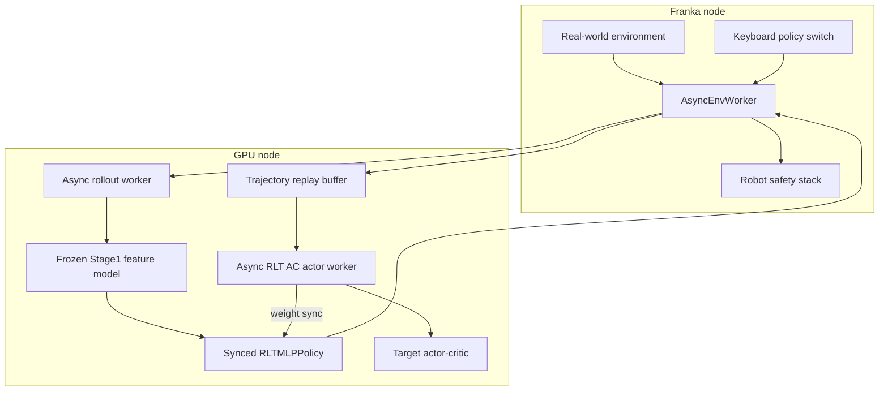
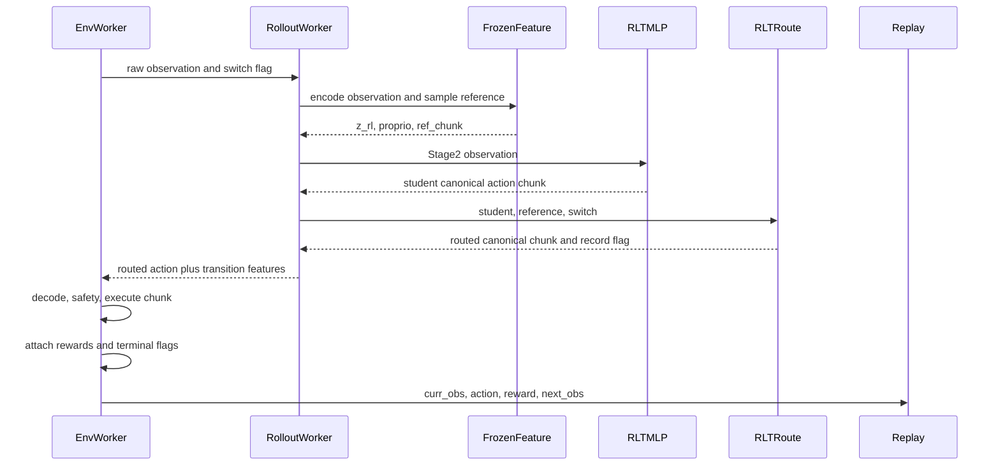
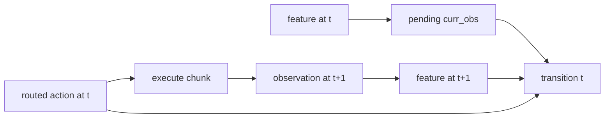
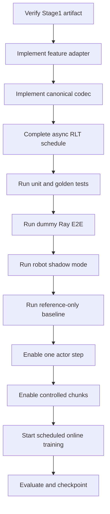

# 4DWVLA × RLinf RLT Stage 2：轻量级 Off-policy Actor-Critic 实施方案

> 文档版本：v1.0  
> 编写日期：2026-09-16  
> 目标代码库：`/home/nvidia/bt/s/RLmm`、`/home/nvidia/bt/s/4WVLA`  
> Stage0 checkpoint：`/home/nvidia/bt/ckp/4wvlaFrk/plug/4wvlaFrkPlugCkp010420/`  
> Stage1 设计：`/home/nvidia/bt/s/RLmm/b/d/rltx/4dwvla_rlt1_1.markdown`  
> 目标任务：Franka 插头插入，8D absolute-joint action，50-step VLA reference chunk  
> 本文性质：实施与落地方案；不在本文写作任务中修改训练源码或启动真机

---

## 0. 执行结论

### 0.1 推荐生产路径

4DWVLA 的 RLT Stage 2 应复用 RLinf 现有 `rlt_ac` 算法、replay、
`RLTMLPPolicy`、Twin-Q、weight sync 和 real-world runner；新增一个冻结的
4DWVLA Stage1 feature adapter，将每个机器人观测转换为：

```text
z_rl:      [B, D_z]       默认 D_z=2048，以 Stage1 manifest 为准
proprio:   [B, 8]         7 关节角 + 1 夹爪宽度，原始物理观测
ref_chunk: [B, 50, 8]     VLA 参考动作，canonical absolute-joint 域
```

Stage2 只训练：

- `RLTMLPPolicy.backbone`
- `RLTMLPPolicy.actor_mean`
- 两个 `QHead`
- target policy 的 EMA 副本

冻结：

- 4DWVLA VLM、vision encoder、action/keypoint experts
- Stage1 RLT encoder
- Stage1 RLT decoder 不进入推理图
- GeoPredict 与 FK 没有可训练 Stage2 参数

### 0.2 三个强制前置条件

任何一项不满足，都不得启动 Stage2：

1. **Stage1 artifact 已存在并通过 strict contract。** 当前 Stage0
   `4wvlaFrkPlugCkp010420` 不含训练后的 `rlt_module.*`，不能直接替代 Stage1。
2. **4DWVLA feature adapter 已通过离线 golden tests。** 不能把 4DWVLA
   checkpoint 路径填入现有 `openpi_rlinf` 配置。
3. **验证并补齐真机异步 schedule。** 当前
   `AsyncRLTACFSDPPolicy._drain_received_trajectories()` 已覆盖通用 SAC
   路径并调用 RLT 专用 `_ingest_rollout_trajectories()`；但其
   `run_training()` 仍委托通用 async SAC，尚未消费同步 RLT 的
   warmup/update-budget schedule。

### 0.3 生产算法决策

| 设计点 | 决策 | 原因 |
|---|---|---|
| Stage2 算法 | RLinf `loss_type: rlt_ac` | 当前唯一可审计 RLT AC 实现 |
| Actor route | 替换式 actor/reference 切换 | 忠实保留 `RealworldRLTRoute` |
| Actor action | canonical absolute-joint | 与 `tanh`、BC、Q 和 replay 统一 |
| Residual `ref+δ` | 只作独立消融 | 不是 RLmm 当前 RLT baseline |
| Actor horizon | 10 | 复用当前真机执行节奏，减少开环风险 |
| Reference horizon | 50 | 与 4DWVLA checkpoint chunk 一致 |
| Proprio | 8D 原始物理 state | 不照抄 OpenPI 的 19D TCP state |
| Feature model | 4DWVLA Stage1 + RLT encoder | `z_rl` 必须来自训练过的瓶颈 |
| Reference RNG | 显式 per-env generator/noise | 保证复现与 transition 对齐 |
| Critic target | target twin-min-Q | 降低过估计 |
| Actor Q | Q1 | 保持 RLinf 当前实现 |
| Entropy | 关闭 | RLinf RLT 不是 maximum-entropy SAC |
| Replay | tagged reference prefill + actor rows | 防止随机 actor 启动与 warmup 死锁 |

---

## 1. 依据、事实等级与边界

### 1.1 事实等级

- **[代码事实]**：本地源码可直接验证；
- **[Checkpoint 事实]**：目标 checkpoint/config/stats 可直接验证；
- **[官方说明]**：PI 或 RLinf 官方文档；
- **[方案决策]**：本文针对 4DWVLA/Franka 的选择；
- **[待实测]**：必须通过离线或真机实验确认。

### 1.2 主要依据

1. PI RLT：<https://www.pi.website/research/rlt>
2. RLinf RLT：
   <https://rlinf.readthedocs.io/en/latest/rst_source/examples/embodied/rlt.html>
3. `docs/source-zh/rst_source/examples/embodied/rlt.rst`
4. `rlinf/workers/actor/fsdp_rlt_ac_policy_worker.py`
5. `rlinf/workers/actor/fsdp_sac_policy_worker.py`
6. `rlinf/algorithms/rlt/{rollout,route,transition}.py`
7. `rlinf/models/embodiment/mlp_policy/rlt_mlp_policy.py`
8. `examples/embodiment/config/realworld_rlt_stage2_ac_mlp.yaml`
9. `b/d/rltx/rlt_code_analyz3.markdown`
10. `b/d/rltx/4dwvla_rlt1_1.markdown`
11. `b/d/frk1/4wvla_rlinf_eval_3A3.md`
12. `b/x/4dwvla_ext/`

PI 页面给出研究动机和两阶段叙事，但没有公开完整可复现代码与全部公式。
本文以 RLinf 本地代码作为 Stage2 实现真源，不把 RLinf 的每个超参数反推为
PI 私有系统的唯一设置。

### 1.3 本文不做什么

- 不重新训练 Stage1；
- 不用随机初始化的 `z_rl` 冒充 Stage1；
- 不修改 PI/RLinf 算法结论；
- 不把真机 shadow/dry-run 宣称为成功率；
- 不在未通过门禁时自动执行 Franka 动作；
- 不在本轮写作任务中提交源代码。

---

## 2. RLinf Stage2 当前实现

### 2.1 静态组件



### 2.2 入口与生命周期

真机配置当前由：

```text
examples/embodiment/run_realworld_async.sh
  -> examples/embodiment/train_async.py
  -> AsyncEmbodiedRunner
  -> AsyncRLTACFSDPPolicy
```

驱动。每个 runner step 并行执行：

1. env interaction；
2. rollout feature/action generation；
3. actor 接收 trajectories；
4. replay ready 后 actor/critic update；
5. 按 `weight_sync_interval` 向 rollout 同步 Stage2 MLP 权重。

`rollout.rlt_feature_model` 是 Stage1 模型；
`actor.model` 是 Stage2 MLP。二者 checkpoint 路径不能互换。

### 2.3 单个 macro-step



### 2.4 RLTMLPPolicy 的真实输入

令：

- \(D_z\)：RL token 维度；
- \(D_p\)：proprio 维度；
- \(H_\pi\)：actor chunk；
- \(H_r\)：reference chunk；
- \(D_a\)：action 维度。

Actor 输入：

\[
x_\pi=
\operatorname{concat}
\left(
\operatorname{flatten}(a^{ref}_{0:H_\pi}),
z_{rl},
p
\right)
\]

输入维度：

\[
D_{\pi,in}=H_\pi D_a+D_z+D_p
\]

当前实现先校验 \(H_r\ge H_\pi\)，然后 `_get_ref_chunk()` 只截取 reference
前 \(H_\pi\) 步送给 actor。`ref_num_action_chunks` 不增加 backbone 输入维度。
4DWVLA 推荐：

\[
H_r=50,\quad H_\pi=10,\quad D_a=8,\quad D_z=2048,\quad D_p=8
\]

即：

\[
D_{\pi,in}=10\times8+2048+8=2136
\]

Critic state 不含 reference：

\[
x_Q=\operatorname{concat}(z_{rl},p)\in\mathbb{R}^{2056}
\]

Q head 另接实际 action chunk：

\[
a\in\mathbb{R}^{H_\pi D_a}=\mathbb{R}^{80}
\]

---

## 3. Stage2 数学与权重更新

### 3.1 它不是标准 maximum-entropy SAC

RLinf RLT：

- `initial_alpha=0`
- `backup_entropy=False`
- `forward_alpha()` 未实现
- actor 固定较小标准差
- actor loss 为 Q 项 + BC 项

因此不能写成：

\[
\mathcal{L}_\pi=\alpha\log\pi-Q
\]

准确定位是带 Twin-Q、target network、off-policy replay 和 BC 正则的
SAC-like actor-critic。

### 3.2 Chunk reward

每个 Stage2 transition 对应执行 \(H\) 个低层动作。设低层 reward 为
\(r_0,\ldots,r_{H-1}\)，折扣 \(\gamma\)：

\[
R_{\text{chunk}}
=
\sum_{t=0}^{H-1}\gamma^t r_t
\]

真实有效长度不足 10 时，\(H_i\) 必须取样本 \(i\) 的实际执行长度。当前
`forward_critic()` 从 padded `rewards.shape[-1]` 得到全 batch 同一个 horizon；
实施时要接入 `chunk_valid_mask`，按样本计算 masked return 和
\(\gamma^{H_i}\)。

### 3.3 Critic target

当前源码用**在线 actor**在 next observation 采样：

\[
a' \sim \pi_{\theta}(s')
\]

再用 target Twin-Q：

\[
Q'_{\min}
=
\min\left(
Q_{\bar\phi_1}(s',a'),
Q_{\bar\phi_2}(s',a')
\right)
\]

TD target：

\[
y
=
R_{\text{chunk}}
+
\mathbb{1}_{\neg done}
\gamma^{H_i} Q'_{\min}
\]

其中 \(\theta\) 是在线 actor，\(\bar\phi_i\) 是 target critic。虽然
`target_update_type=all` 会 EMA 整个 target model，当前 critic target
并不调用 target actor。其余语义：

- 真机 `done` 使用 `terminations`；
- realworld `bootstrap_type=standard` 只把 `terminations` 当 done，因此
  truncation 默认继续 bootstrap；
- terminal transition 不使用 next Q；
- target 全部 stop-gradient。

Critic loss：

\[
\mathcal{L}_Q
=
\frac{1}{2}
\sum_{i=1}^{2}
\operatorname{MSE}\left(Q_{\phi_i}(s,a),y\right)
\]

`label` 是 TD target \(y\)，不是人工标注。

### 3.4 Actor

固定标准差策略：

\[
u=\mu_\theta(s)+\sigma\epsilon,\quad
a_\pi=\tanh(u),\quad
\epsilon\sim\mathcal{N}(0,I)
\]

当前 Actor Q 聚合使用 Q1：

\[
\mathcal{L}_{Q,\pi}
=
-w_Q\mathbb{E}[Q_{\phi_1}(s,a_\pi)]
\]

BC target：

\[
a^{BC}_t=
\begin{cases}
a^{exec}_t,& \text{intervene}_t=1\\
a^{ref}_t,& \text{otherwise}
\end{cases}
\]

BC loss（\(m_{t}\) 是 `chunk_valid_mask`）：

\[
\mathcal{L}_{BC}
=
\frac{
\sum_{t,d}m_t
\left(a_{\pi,t,d}-a^{BC}_{t,d}\right)^2
}{
\max\left(\sum_{t,d}m_t,1\right)
}
\]

这需要扩展当前 `_bc_metrics()`；完整 10-step chunk 时结果与现有实现一致。

总 actor loss：

\[
\mathcal{L}_{actor}
=
-w_Q\mathbb{E}[Q_{\phi_1}(s,a_\pi)]
+
w_{BC}\mathcal{L}_{BC}
\]

基线：

```yaml
q_weight: 0.1
bc_weight: 5.0
reference_dropout_prob: 0.5
fixed_std: 0.002
critic_actor_ratio: 4
```

这些值来自 OpenPI/Franka 示例，是 4DWVLA 的初始 pilot 值，不是已验证最优值。

### 3.5 Target network

每次满足 target update 时：

\[
\bar\psi
\leftarrow
\tau\psi+(1-\tau)\bar\psi
\]

其中 \(\psi\) 是在线 Stage2 MLP 参数，\(\bar\psi\) 是 target 参数，
`tau=0.005`。Stage1 feature model不参与 EMA。

### 3.6 q 指标

对 actor action \(a_\pi\)：

\[
\texttt{q\_value\_i}
=
\frac{1}{B}\sum_b Q_i(s_b,a_{\pi,b})
\]

\[
\texttt{q\_pi}
=
\frac{1}{B}\sum_b Q_1(s_b,a_{\pi,b})
\]

对 replay action \(a_{data}\)：

\[
\texttt{critic/q\_data}
=
\frac{1}{2B}\sum_{b,i}Q_i(s_b,a_{data,b})
\]

解释：

- `q_pi` 是 actor loss 使用的 Q1 均值；
- `q_value_0/1` 用于观察两个头的偏差；
- `q_data` 是 replay 实际执行动作的当前 Q 均值；
- 它们不是 label；
- 真正 critic label 是 TD target；
- 所有 Q 绝对值都依赖 reward scale，不能跨实验直接比较。

---

## 4. Stage1 → Stage2 不可变契约

### 4.1 Stage1 artifact

Stage2 loader 必须确认：

```text
config.json
model.safetensors
stats.json
rlt_manifest.json
```

并满足：

- `config.enable_rlt=true`
- 完整 `rlt_module.encoder.*`
- RLT 子模块 `strict=True`
- 全模型差异命中配方白名单
- `rlt_prefix_source=deployment_view`
- `rlt_embed_dim == actor.model.z_dim`
- prompt/template/padding hash 一致
- action mode 为 `abs`
- stats/schema/codec version 一致

Stage1 方案当前示例 manifest 还不足以闭合 Stage2 动作/GeoPredict 契约。
正式产出前将 manifest schema 升级，至少新增：

```json
{
  "stats_sha256": "...",
  "action_field_order": ["action.arm", "action.gripper"],
  "physical_action_dim": 8,
  "model_action_dim": 32,
  "gripper_action_semantics": "0=open,1=close",
  "action_codec_id": "franka_abs_joint_minmax_v1",
  "action_codec_bounds_sha256": "...",
  "keypoint_meta_sha256": "...",
  "keypoint_link_order": [
    "fr3v2_1_link1", "fr3v2_1_link2", "fr3v2_1_link3",
    "fr3v2_1_link4", "fr3v2_1_link5", "fr3v2_1_link6",
    "fr3v2_1_link7", "fr3v2_1_hand_tcp"
  ],
  "keypoint_bbox_radius": 0.8361004471778869,
  "urdf_sha256": "..."
}
```

缺少任一字段时 Stage2 preflight fail-closed；不能由 Stage2 loader根据文件名
猜测。上述 link 顺序与 bbox radius 来自当前目标
`b/d/frk1/plug/keypoints_meta.json`，最终仍以 artifact hash 为准。

当前 Stage0 checkpoint 没有这些 Stage1 RLT 权重。Stage2 不允许以
`strict=False` 忽略缺失后继续。

### 4.2 Feature 三元组

```python
{
    "z_rl": z_rl.float(),          # [B,Dz]
    "proprio": proprio.float(),    # [B,8]
    "ref_chunk": ref.float(),      # [B,50,8]
}
```

`proprio` 是：

\[
[q_1,\ldots,q_7,g_{width}]
\]

不是：

- pad 后 32D；
- normalized state；
- OpenPI 示例 19D；
- TCP pose；
- keypoint 展平。

### 4.3 Deployment prefix

Stage2 必须复用 Stage1：

- system/user chat template；
- `Output: <Subtask, Action>`；
- 3-view 编排与 empty-view mask；
- fixed right padding 650；
- tokenizer、pad token；
- tokenized state；
- deployment view 无 FAST ground-truth action。

Stage1/Stage2 有效 token IDs、mask 和 template SHA256 必须一致。

### 4.4 Decoder

Stage1 RLT decoder只提供 reconstruction 监督。Stage2：

- 加载完整 artifact 做完整性检查；
- 只调用 encoder `encode_flat()`；
- decoder 不参与 feature forward；
- 可导出 encoder-only deployment artifact，但必须保留 parent manifest/hash。

---

## 5. FourDWVLAFeatureModel 设计

### 5.1 放置与注册

建议生产路径：

```text
RLmm/rlinf/models/embodiment/four_dwvla_rlt/
├── __init__.py
├── configuration.py
├── feature_model.py
├── action_codec.py
├── observation_adapter.py
└── checkpoint.py
```

并修改：

```text
RLmm/rlinf/config.py
RLmm/rlinf/models/__init__.py
RLmm/rlinf/workers/rollout/hf/huggingface_worker.py
```

使用现有动态 registry 注册：

```python
register_model(
    "four_dwvla_rlt",
    _build_four_dwvla_rlt,
    category="embodied",
)
```

`register_model()` 会同时调用 `SupportedModel.register()` 并加入
`EMBODIED_MODEL`。不能把 `SupportedModel` 当 tuple enum 直接赋
`("four_dwvla_rlt", "embodied")`。

第一版也可在 `b/x/4dwvla_ext` 原型化，但 production 应进入可注册 package，
否则 Hydra/Ray worker 无法稳定 import，测试与 checkpoint 也无法制度化。

### 5.2 最小公共接口

```python
class FourDWVLAFeatureModel(nn.Module):
    @torch.no_grad()
    def encode_rlt_state(
        self,
        env_obs: dict[str, Any],
    ) -> tuple[FourDWVLARLTCache, dict[str, torch.Tensor]]:
        ...

    @torch.no_grad()
    def sample_reference(
        self,
        cache: FourDWVLARLTCache,
        *,
        noise: torch.Tensor | None = None,
        generator: torch.Generator | None = None,
    ) -> torch.Tensor:
        ...

    @torch.no_grad()
    def extract_rlt_obs(
        self,
        env_obs: dict[str, Any],
        *,
        noise: torch.Tensor | None = None,
        generator: torch.Generator | None = None,
    ) -> dict[str, torch.Tensor]:
        ...
```

`extract_rlt_obs()` 组合前两个接口。Rollout worker 必须传入 per-env
generator 或显式 noise，不能隐式消费进程全局 RNG。生产推荐
`ReferenceNoiseProvider` 根据
`base_seed/env_id/episode_id/step_id/model_version` 派生 stateless seed；
这样同一逻辑 observation 被 `final_obs` 和下一步重复编码时会得到相同
`ref_chunk`。

### 5.3 Cache

```python
@dataclass
class FourDWVLARLTCache:
    prefix_out: Tensor
    prefix_mask: Tensor
    action_past_key_values: tuple
    action_prefix_mask: Tensor
    max_position_ids: Tensor
    state: Tensor
    fast_mask: Tensor | None
    use_kpt: bool
```

目标 checkpoint 开启 GeoPredict。cache 构造必须：

1. 对 deployment prefix 做 VLM forward；
2. 保留 `prefix_out` 给 RLT encoder；
3. 用 32D normalized state、`his_kpts [B,200,8,7]`、`his_len [B]`
   构造 17 个 keypoint tokens；
4. keypoint expert 扩展 `past_key_values`；
5. 扩展 action prefix mask；
6. 更新 max position；
7. 对 keypoint segment 补 `fast_mask=False`；
8. action expert 从 action-ready cache 做 flow denoise。

只保存 VLM KV 而忽略 keypoint segment，不能生成与目标 checkpoint 一致的
reference action。

### 5.4 Observation adapter

输入至少包含：

```text
images.global: [B,H,W,3]
images.wrist:  [B,H,W,3]
states:        [B,8]
task:          list[str]
episode_id, step_id, env_id
```

转换：

1. 将 global/wrist 映射到 checkpoint 的 image0/image1；
2. 构造 mask=false 的 image2；
3. state 拆成 `observation.state.arm[7]` 和 `.gripper[1]`；
4. 使用 checkpoint external stats；
5. FK/history 由 env state store 提供；
6. 构造 deployment prompt；
7. pad 成模型 32D；
8. 保留原始 8D 给 `proprio`。

FK 不能只给 URDF。`FKKeypointComputer` 还必须读取
`b/d/frk1/plug/keypoints_meta.json`，其中的 link 顺序、local keypoint 和
bbox radius 决定 4D keypoint 归一化；URDF/meta hash 都进入 Stage1/Stage2
manifest。

Feature extractor 不得更新 history。history store 按
`env_id/episode_id/step_id` 在 env 层推进，避免 `final_obs` 二次编码污染状态。

### 5.5 单次 cache 与 reference

`z_rl` 和 `ref_chunk` 必须来自同一 observation、同一 prefix cache：

```python
cache, state = feature_model.encode_rlt_state(env_obs)
z_rl = rlt_module.encode_flat(cache.prefix_out, cache.prefix_mask)
ref_model = feature_model.sample_reference(cache, generator=env_generator)
ref_env = model_action_to_canonical(ref_model)
```

不允许分别完整执行两次 VLM/KPT forward，否则：

- 增加一倍延迟；
- flow/reference 可能与 z 状态错位；
- history 可能推进两次；
- prompt/图像采样可能漂移。

### 5.6 冻结

Rollout 初始化后：

```python
feature_model.eval()
feature_model.requires_grad_(False)
```

验收：

- feature model 不出现在 actor optimizer；
- 无 `.grad`；
- Stage2 checkpoint 不重复保存 4DWVLA 大权重；
- actor weight sync 只同步 `RLTMLPPolicy`。

目标 Stage0 config 的 `action_loss_only=false`，且 WAN 路径依赖原训练机器。
Loader 必须在实例化 `InternVLAA15` **之前**用部署 config 覆盖
`action_loss_only=true`、`inference_backend=standard`，随后断言 WAN/视频
loss 子模块没有构造；不能先构造 WAN 再置空。`standard` 是因为目标
GeoPredict cache 路径尚不由 optimized backend 覆盖。

---

## 6. 8D Action Codec

### 6.1 为什么必须显式 codec

目标 checkpoint：

- model flow 输出 `[B,50,32]`；
- 前 7D 是绝对关节目标；
- 第 8D 是 gripper command；
- 其余 24D 是 pad；
- action 使用 mean/std 模型归一化；
- actor 由于 `tanh` 输出 \([-1,1]\)。

如果把 actor `[-1,1]` 直接作为关节弧度：

- 第 4 关节训练区域约在 \([-2.22,-1.53]\)，完全错误；
- BC target 与 actor output 不同域；
- Q replay action 与 env action 不同域。

### 6.2 域定义

定义：

```text
model-normalized domain: 4DWVLA 内部 mean/std 后 32D
physical VLA domain:     7D joint radians + gripper command [0,1]
canonical RL domain:     每维 [-1,1]
environment domain:      7D joint radians + close command [0,1]
```

目标 stats 已确认：

```text
action.arm min =
[-0.486272, -0.107394, -0.202485, -2.216602,
 -0.273049,  1.649029,  0.369532]

action.arm max =
[ 0.059825,  0.332874,  0.480136, -1.529379,
  0.110447,  2.517262,  1.102100]

action.gripper min=0.007440
action.gripper max=1.0
```

gripper action 已是约 \([0,1]\)，而 proprio gripper 是物理宽度约
\([0,0.08]\) m；二者不能混用。

### 6.3 编解码

对 arm 第 \(j\) 维：

\[
c_j
=
2\frac{a_j-l_j}{u_j-l_j}-1
\]

\[
a_j
=
l_j+\frac{c_j+1}{2}(u_j-l_j)
\]

其中 \(l_j,u_j\) 来自 `action.arm min/max`。对 gripper：

\[
c_g=2g-1,\quad g=\frac{c_g+1}{2}
\]

生产 codec：

```python
class FrankaAbsoluteJointCodec:
    def encode_physical(self, action_8d: Tensor) -> Tensor: ...
    def decode_canonical(self, action_canonical: Tensor) -> Tensor: ...
    def model_to_canonical(self, action_32d: Tensor) -> Tensor: ...
```

`model_to_canonical()`：

1. 校验 `[B,50,32]` 与 finite；
2. 检查 pad 维幅值；
3. 取 arm/gripper 8D；
4. 分字段 mean/std 反归一化；
5. 用 min/max 编码到 canonical；
6. 记录 clip rate，但 pilot 中 reference clip rate 必须接近 0。

### 6.4 所有训练量必须同域

以下全部是 canonical：

- `ref_chunk`
- actor action
- replay `actions`
- BC target
- critic action input
- intervention action

仅在 env 执行前 decode 到 environment domain。reward/transition 中保留
canonical action，另可日志记录物理 action。

### 6.5 替换式 route

RLinf baseline：

```python
routed = torch.where(actor_switch, student, ref_chunk[:, :H_pi])
```

因为 student/ref 均是 canonical absolute action，路由后语义一致。

残差消融可新增：

\[
a=\operatorname{clip}(a^{ref}+s\delta,-1,1)
\]

但必须使用新 route type、独立实验名和独立 replay manifest，不能与 baseline
checkpoint 混合 resume。

### 6.6 8D joint environment 是强制组件

RLinf 当前通用 `REALWORLD` action path 不会自动把 canonical action 解码，
既有单臂 Franka 环境主要面向 7D TCP delta。Stage2 不能把新 joint env 写成
“可选扩展”，必须：

1. 注册独立 `franka_joint_rlt` env type；
2. 将 `b/x/4dwvla_ext/franky_joint_env.py` 安全能力封装成正式 env；
3. 在 `rlinf/envs/action_utils.py::prepare_actions()` 增加该 env type 分支；
4. 分支只接受 `[B,H,8]` canonical；
5. 调用 `FrankaAbsoluteJointCodec.decode_canonical()`；
6. 启动时断言 joint absolute、gripper `0=open/1=close`；
7. 再交给 joint env 的 L1–L8 安全栈。

Codec 在机器人节点本地运行，不能依赖仅发到 rollout GPU 的
`rollout.rlt_feature_model.stats_path`。`env.train/eval.action_codec` 必须同时
携带 ID、stats path、stats hash/bounds hash；机器人节点必须能访问该文件。
启动握手比较 env、rollout、Stage1 manifest 三方 hash，不一致立即退出。

生产第一版设置：

```yaml
env:
  train:
    env_type: franka_joint_rlt
    use_spacemouse: false
```

现有 SpaceMouse 是 6D TCP delta + gripper，且夹爪极性/范围与 8D joint
canonical 不同，不能直接作为 intervention。若后续需要人工干预，应新增
joint teleoperation wrapper（IK 或 joint device），显式输出
`7D absolute joint + 0/1 close`，再由同一 codec encode；需单独测试维度、
关节语义和 gripper polarity。

---

## 7. Replay 与 transition 时序

### 7.1 Schema

```text
curr_obs:
  z_rl       [B,Dz]
  proprio    [B,8]
  ref_chunk  [B,50,8]

actions      [B,10,8] 或 flatten [B,80]，canonical routed option
rewards      [B,10]，padding 由 valid mask 排除
chunk_valid_mask [B,10]
chunk_valid_steps [B,1]
executed_actions [B,10,8]，canonical，审计/一致性检查
terminations [B,1]
truncations  [B,1]
dones        [B,1]
intervene_flags [B,H_actual] 可选
safety_event, safety_modified_action
behavior_source [B,1] int8（reference_prefill/actor/intervention）

next_obs:
  next_z_rl
  next_proprio
  next_ref_chunk

forward_inputs:
  action
  ref_chunk
  record_transition
  actor_switch
  rlt_transition_*
```

Replay 不保存原始图像。原始图像可由独立审计日志保存，但不进入 Q batch。
固定形状 tensor 用 `chunk_valid_mask` 表示真实执行步数。

这些字段作为 `Trajectory` 顶层 tensor 承载，而不是塞进不保证进入 replay
sample 的临时 `info`。需同步扩展：

- `data/schema/embodied_types.py` 的 `ChunkStepResult/Trajectory`；
- `data/schema/embodied_trajectory_builder.py` 的
  append/clear/stack/finalize；
- `data/storage/replay/buffer.py` 的 split/flatten/cache/sample；
- actor collate/device transfer。

row filter 按 rewards/curr_obs 对齐后的真实 transition rows 遍历，不按末尾
尚未执行的 action inference row 计数。

### 7.2 Pending observation

在动作生成时得到的 feature 是当前 \(s_t\)。执行 chunk 后得到 \(s_{t+1}\)。
`update_rlt_transitions()` 使用 pending state 将它们配对：



terminal：

- termination：`next_obs` 可回填 curr_obs，但 bootstrap mask 必须为 0；
- truncation：按 `bootstrap_type` 决定；
- `final_obs` 额外 feature extraction 不得推进 keypoint history。

当前 `RealWorldEnv.chunk_step()` 可能在 termination/truncation 后继续执行剩余
chunk；必须改为立即 break。env 返回固定 10 步形状，但同时返回
`chunk_valid_mask/steps`。Critic 按每个样本的真实 \(H_i\) 计算
\(\gamma^{H_i}\)，reward 和 BC 均用 mask；不能用 padded reward tensor 的
宽度冒充 horizon。

### 7.3 record_transition

路由阶段必须携带 `behavior_source`：

- `reference_prefill`：`record_transition=true`，仅用于启动 prefill；
- 普通 reference route：`record_transition=false`；
- actor route：仅 `ready_for_online=true` 后 `record_transition=true`。

对 realworld，当前 `_ingest_rollout_trajectories()` 只有
`MANISKILL_RLT` 分支做 row 拆分与 `record_transition` 过滤，其他 env 会把
整条 trajectory 加入主 replay。因此实施时必须把 row/chunk 过滤推广到
`franka_joint_rlt`：只将 `record_transition=true` 且 source 属于
`{reference_prefill, actor, intervention}` 的完整 transition 重新组装后加入
replay，计数和 metrics 按 source 分组并以过滤后的实际行数为准。

Reference prefill 是显式 tagged 的 off-policy 数据：critic 学习 reference
行为的 return，actor 先做 reference BC；它不冒充当前 actor。在线 readiness
后关闭 prefill recording，避免大量 reference rows 长期淹没 actor 数据。
人类 intervention transition 可同时进入 demo buffer。

若要求更严格隔离，可使用独立 prefill/demo buffer，并在 warmup sampler 中
显式混合；无论哪种实现，都必须保存 source tag。

`RealworldRLTRoute` 还需接收 learner 同步的 `ready_for_online`。在 false
时，即使 operator 请求 actor，也强制 reference 并记录 denied event。只有：

1. reference prefill 数量达标；
2. critic-only warmup 完成；
3. actor BC-only warmup 与离线 safety check 通过；
4. operator 显式 arm；

才允许切 actor。该门控必须在 route/env 端 fail-closed，不能只依赖 UI 提示。

Readiness 跨 Actor/Rollout/Env 的具体通道：

1. `RLTMLPPolicy` 注册 persistent `int64 rlt_ready_generation` buffer，0 表示
   not-ready；
2. Actor 完成 warmup/验收后原子递增 generation，并触发一次立即 weight sync；
3. patch weight sync 必须连同 persistent buffer 与 `model_weights_id` 同步；
4. Rollout 收到后建立本地
   `(generation, model_weights_id, recv_monotonic_time)`，只在 TTL（建议 5 s）
   内允许 route actor；
5. 每次 policy output 把 generation/model version/TTL 状态传给 EnvWorker；
6. EnvWorker 按自己的 monotonic clock 刷新 heartbeat，缺字段、generation=0、
   version 不匹配或超时都强制 reference/stop。

不同机器的 monotonic 时间不直接比较，只比较各节点本地“最后一次收到有效
消息”的 age。Checkpoint 保存 generation 供审计，但 resume 时 Actor 先重置为
0；恢复模型/replay/optimizer并重新通过 readiness checks 后产生新 generation，
operator 还需重新 arm。

### 7.4 执行动作与安全反馈闭环

环境安全层可能裁切 routed action。若 replay 仍保存裁切前 action，
\(Q(s,a)\) 的 action 就不是机器人实际执行的 action。正式 env 每个低层 step
必须在 `info` 返回：

```text
requested_action_physical
executed_action_physical
executed_action_canonical
safety_modified_action
safety_reason
guard_tripped
```

EnvWorker 聚合成 chunk 并验证 requested/executed。生产基线采用 fail-closed：

- 无安全修改：保存 routed canonical action；
- 任务正常提前终止：保存 planned option，使用 valid mask；
- clip/guard/controller 修改：主 replay `record_transition=false`，写入独立
  safety audit buffer；
- 任何 safety event 锁存，下一次 route 强制 reference；guard/硬件异常 stop。

若未来决定学习被裁切动作，则必须用 env 回传的
`executed_action_canonical` 覆盖 replay action，并重新定义/测试 Q 的
option-tail padding；不能静默混合两种语义。

### 7.5 真机异步 ingest 现状与 schedule 缺口

同步 `RLTACFSDPPolicy.recv_rollout_trajectories()` 调用：

```python
added, completed = self._ingest_rollout_trajectories(recv_list)
```

通用 `AsyncEmbodiedSACFSDPPolicy` 确实直接：

```python
self.replay_buffer.add_trajectories(recv_list)
```

但当前 checkout 中 `AsyncRLTACFSDPPolicy` 已经正确覆盖 drain：

```python
class AsyncRLTACFSDPPolicy(
    RLTACLossMixin,
    RLTACReplayMixin,
    AsyncEmbodiedSACFSDPPolicy,
):
    def _drain_received_trajectories(...):
        recv_list = ...
        added, completed = self._ingest_rollout_trajectories(recv_list)
        self._update_rollout_ingest_counters(added, completed)
```

所以无需重复实现 ingest；必须保留并测试 MRO、`record_transition`、demo
buffer 和 replay metrics。真正缺口是：

- async `__init__()` 没有建立同步 worker 的 transition/update counters；
- `_update_rollout_ingest_counters()` 因属性不存在而直接返回；
- async `run_training()` 委托通用 SAC，只按 `min_buffer_size` 等待；
- `algorithm.rlt_schedule` 的 episode warmup、post-collect update 和
  update budget 不生效。

实施时应抽取同步/异步共享的 schedule state 与
`_rlt_updates_to_run()`，让 async 保持非阻塞 queue drain，同时遵守相同的
warmup/update budget。不得删除当前已正确工作的 RLT ingest override。

### 7.6 Warmup 与 update budget

当前真机 YAML `min_buffer_size=2`、每 runner step `update_epoch=8`，对真实机器人
过于激进。建议第一版：

```yaml
rlt_schedule:
  enable: true
  warmup_min_size: 128
  critic_warmup_updates: 100
  actor_bc_warmup_updates: 200
  train_every_transitions: 1
  train_every_episodes: 0
  max_updates_per_train_step: 8
```

`warmup_min_size/train_every_*/max_updates_per_train_step` 是同步 RLT 当前真实
字段；`critic_warmup_updates/actor_bc_warmup_updates` 是本方案为解决真机
启动闭环而明确新增的字段，必须先实现和测试。阶段执行：

1. reference-only 收集 prefill；
2. `update_one_epoch(train_actor=False)` 做 critic-only；
3. actor 用 `q_weight=0` 做 BC-only；
4. 离线动作/safety gate 通过后发布 `ready_for_online=true`；
5. 之后恢复 `critic_actor_ratio` 与 Q+BC。

当前 `warmup_post_collect_updates` 会按普通 `critic_actor_ratio` 更新 actor，
不能满足“先只 critic”。若需要“至少 5 episodes 后 warmup”或浮点 UTD，也应
先新增并测试字段。transition 计数来自过滤后的 replay rows/valid rewards，
不能直接使用可能包含末尾未执行推理动作的 `actions.shape[0]`。

---

## 8. 文件级落地

### 8.1 新增文件

```text
RLmm/rlinf/models/embodiment/four_dwvla_rlt/
RLmm/rlinf/envs/franka_joint_rlt/
RLmm/examples/embodiment/config/realworld_rlt_stage2_4dwvla.yaml
RLmm/examples/embodiment/config/env/franka_joint_rlt.yaml
RLmm/tests/unit_tests/rlt/test_four_dwvla_feature_model.py
RLmm/tests/unit_tests/rlt/test_franka_action_codec.py
RLmm/tests/unit_tests/rlt/test_async_rlt_replay.py
RLmm/tests/e2e_tests/embodied/realworld_rlt_stage2_4dwvla_dummy.yaml
RLmm/tests_au/rlt/accept_4dwvla_rlt_stage2.py
RLmm/tests_au/rlt/accept_4dwvla_rlt_stage2.sh
```

### 8.2 修改文件

| 文件 | 修改 |
|---|---|
| `rlinf/config.py` | 注册 model type 与 RLT 专项校验 |
| `rlinf/models/__init__.py` | 构建冻结 feature model |
| `rlinf/models/embodiment/mlp_policy/rlt_mlp_policy.py` | persistent readiness generation buffer |
| `rlinf/workers/rollout/hf/huggingface_worker.py` | 加载 adapter、显式 per-env RNG |
| `rlinf/algorithms/rlt/rollout.py` | 向当前/final feature extraction 传 sample identity/noise |
| `rlinf/workers/actor/fsdp_rlt_ac_policy_worker.py` | valid-mask TD/BC、realworld row filter、async schedule |
| `rlinf/algorithms/rlt/route.py` | behavior source、reference prefill、readiness 硬门控 |
| `rlinf/hybrid_engines/weight_syncer/patch_syncer.py` | 验证 persistent readiness buffer 同步 |
| `rlinf/algorithms/rlt/transition.py` | 传播 valid mask、实际动作与 safety flags |
| `rlinf/workers/env/env_worker.py` | 聚合执行反馈，post-execution replay filter |
| `rlinf/data/schema/embodied_types.py` | 扩展 chunk/trajectory schema |
| `rlinf/data/schema/embodied_trajectory_builder.py` | append/stack/finalize 新字段 |
| `rlinf/data/storage/replay/buffer.py` | split/flatten/sample 新字段 |
| `rlinf/envs/__init__.py` | 强制注册 `franka_joint_rlt` |
| `rlinf/envs/action_utils.py` | canonical→8D physical joint decode |
| `requirements/install.sh` | 4DWVLA/Qwen patch/FK 依赖 |
| `docker/Dockerfile` | Stage2 4DWVLA target |

### 8.3 尽量复用

复用：

- `b/x/4dwvla_ext/vla_inference_server.py` 的 stats/transform 逻辑；
- `b/x/4dwvla_ext/fk_keypoints.py`；
- `b/x/4dwvla_ext/franky_controller_direct.py`；
- `b/x/4dwvla_ext/franky_joint_env.py` 的安全层；
- RLinf `predict_rlt_actions()`；
- RLinf transition/replay/loss；
- RLinf checkpoint/weight sync。

不能直接复用：

- OpenPI feature wrapper：模型/batch/checkpoint 不同；
- OpenPI 19D proprio；
- OpenPI 7D action；
- OpenPI 10/20 chunk 配置；
- eval IPC server 作为生产 learner 内部 API：额外网络与重复模型生命周期。

---

## 9. 配置模板

不能直接继承 `realworld_rlt_stage2_ac_mlp.yaml`：OmegaConf merge 会残留
`openpi/openpi_data`、`PegInsertionEnv-v1`、旧 `main_image_key` 和旧
`override_cfg`。应新增纯 4DWVLA 配置和
`config/env/franka_joint_rlt.yaml`，只复用通用 FSDP/weight-sync defaults。
下面是新主配置的关键完整骨架；实现后 Hydra compose test 必须确认不存在
任何 OpenPI/Peg legacy key。

```yaml
defaults:
  - env/franka_joint_rlt@env.train
  - env/franka_joint_rlt@env.eval
  - hybrid_engines/fsdp@actor.fsdp_config
  - weight_syncer/patch_syncer@weight_syncer
  - override hydra/job_logging: stdout
  - _self_

hydra:
  run:
    dir: .
  output_subdir: null
  searchpath:
    - file://${oc.env:EMBODIED_PATH}/config/

cluster:
  num_nodes: 2
  component_placement:
    actor: {node_group: gpu, placement: 0}
    rollout: {node_group: gpu, placement: 0}
    env: {node_group: franka, placement: 0}
  node_groups:
    - {label: gpu, node_ranks: 0}
    - label: franka
      node_ranks: 1
      hardware:
        type: Franka
        configs:
          - robot_ip: ${oc.env:ROBOT_IP,127.0.0.1}
            node_rank: 1
            controller_node_rank: 1
            disable_validate: false

runner:
  task_type: embodied
  max_epochs: 8000
  max_steps: -1
  save_interval: 50
  val_check_interval: -1
  resume_dir: null
  ckpt_path: null
  only_eval: false
  logger:
    log_path: ../results
    project_name: rlinf-rlt
    experiment_name: 4dwvla_rlt_stage2_abs_replace
    logger_backends: [tensorboard]

algorithm:
  adv_type: embodied_sac
  loss_type: rlt_ac
  loss_agg_func: token-mean
  group_size: 1
  agg_q: min
  actor_agg_q: q1
  q_head_type: ${actor.model.q_head_type}
  q_weight: 0.1
  bc_weight: 5.0
  reference_dropout_prob: 0.5
  gamma: 0.96
  tau: 0.005
  critic_actor_ratio: 4
  train_actor_steps: 2
  target_update_freq: 1
  target_update_type: all
  bootstrap_type: standard
  update_epoch: 1
  backup_entropy: false
  entropy_tuning:
    alpha_type: fixed_alpha
    initial_alpha: 0.0
  replay_buffer:
    enable_cache: true
    cache_size: 10000
    min_buffer_size: 128
    sample_window_size: 10000
    auto_save: true
  rlt_schedule:
    enable: true
    warmup_min_size: 128
    critic_warmup_updates: 100
    actor_bc_warmup_updates: 200
    train_every_transitions: 1
    train_every_episodes: 0
    max_updates_per_train_step: 8

rollout:
  group_name: RolloutGroup
  generation_backend: huggingface
  pipeline_stage_num: 1
  enable_offload: false
  collect_transitions: true
  collect_prev_infos: false
  enable_torch_compile: false
  rlt_readiness_ttl_s: 5.0
  model:
    model_path: null
    precision: fp32
    action_dim: 8
    num_action_chunks: 10
    ref_num_action_chunks: 50
  rlt_feature_model:
    model_type: four_dwvla_rlt
    model_path: /path/to/4dwvla-stage1
    precision: bf16
    z_dim: 2048
    action_dim: 8
    model_action_dim: 32
    num_action_chunks: 50
    num_steps: 10
    action_mode: abs
    rlt_prefix_source: deployment_view
    rlt_max_prompt_length: 650
    stats_path: /path/to/stage1/stats.json
    manifest_path: /path/to/stage1/rlt_manifest.json
    action_codec: franka_abs_joint_minmax_v1
    explicit_rng: true
    enable_keypoint_predictor: true
    action_loss_only: true
    inference_backend: standard
    keypoint_history_max_len: 200
    kpt_4d_mode: pos_rot
    urdf_path: /home/nvidia/bt/s/RLmm/b/d/frk1/fr3v2_1_franka_hand.urdf
    kpt_meta_path: /home/nvidia/bt/s/RLmm/b/d/frk1/plug/keypoints_meta.json

actor:
  group_name: ActorGroup
  training_backend: fsdp
  seed: 1234
  enable_offload: false
  micro_batch_size: 64
  global_batch_size: 64
  model:
    model_type: rlt_mlp_policy
    precision: fp32
    add_q_head: true
    q_head_type: default
    fixed_std: 0.002
    z_dim: 2048
    proprio_dim: 8
    action_dim: 8
    num_action_chunks: 10
    ref_num_action_chunks: 50
  optim:
    lr: 3.0e-4
    clip_grad: 10.0
  critic_optim:
    lr: 3.0e-4
    clip_grad: 10.0

env:
  group_name: EnvGroup
  train:
    env_type: franka_joint_rlt
    total_num_envs: 1
    auto_reset: true
    keyboard_reward_wrapper: rlt_policy_switch
    max_episode_steps: 300
    max_steps_per_rollout_epoch: 300
    action_codec:
      id: franka_abs_joint_minmax_v1
      stats_path: /path/to/stage1/stats.json
      stats_sha256: REQUIRED
      bounds_sha256: REQUIRED
    actor_default_enabled: false
    reference_prefill_enabled: true
    ready_for_online_default: false
    readiness_ttl_s: 5.0
    use_spacemouse: false
    override_cfg:
      robot_ip: ${oc.env:ROBOT_IP,127.0.0.1}
      control_hz: 10
      is_dummy: false
      main_image_key: global
      wrist_image_key: wrist
  eval:
    env_type: franka_joint_rlt
    action_codec: ${env.train.action_codec}
    actor_default_enabled: false
    reference_prefill_enabled: false
    ready_for_online_default: false
    readiness_ttl_s: 5.0
    use_spacemouse: false

reward:
  use_reward_model: false

critic:
  use_critic_model: false
```

配置校验：

- feature manifest `z_dim` 等于 actor `z_dim`；
- `ref_num_action_chunks=50`；
- `num_action_chunks<=ref_num_action_chunks`；
- `action_dim=proprio_dim=8`；
- feature `model_action_dim=32`；
- Stage1 action mode 为 abs；
- codec/version/stats hash 相同；
- feature path 不等于 Stage0；
- actor model path 不指向 Stage1；
- entropy alpha 为 0。
- `action_loss_only=true` 且构造后 WAN 子模块不存在；
- URDF 与 `kpt_meta_path` 都存在且 hash 匹配；
- Hydra compose 后具备 `cluster/weight_syncer/fsdp/reward/group_name`；
- compose tree 不含 `openpi/openpi_data/PegInsertionEnv-v1/wrist_1`；
- train/eval env 侧 codec path/hash 与 rollout/manifest 完全一致。

---

## 10. Reward 与人工干预

### 10.1 Reward

插头任务建议事件 reward：

```text
step penalty       -0.001
unsafe/truncation  -1.0
contact/alignment  可选 shaping
success insertion  +1.0
```

第一版必须优先使用可重复、可审计的成功传感器/判据。若没有可靠 success
detector，不应以人工键盘 reward 作为唯一自动 benchmark。

Reward scale 改变 Q 的绝对值，所以应在 manifest 记录：

- reward version；
- 每个分量；
- success threshold；
- chunk aggregation；
- clipping。

### 10.2 Intervention

intervention action 进入 canonical codec 后：

- 作为实际执行 action；
- `intervene_flags=true`；
- BC target 使用 human action；
- 可进入 demo buffer；
- 必须记录时间、operator、原因和安全事件。

键盘 `b` 是 actor/reference 切换，不等于 intervention。二者日志字段不能混用。

---

## 11. 运行阶段

GPU 容器先统一环境：

```bash
cd /home/nvidia/bt/s/RLmm
source /opt/venv/4dwvla/bin/activate
export EMBODIED_PATH="$PWD/examples/embodiment"
export PYTHONPATH="$PWD:/home/nvidia/bt/s/4WVLA/src:${PYTHONPATH:-}"
export ROBOT_IP="${ROBOT_IP:-127.0.0.1}"
```

真机节点使用 Franky 环境：

```bash
source /opt/venv/franky-0.19.0/bin/activate
export ROBOT_IP=172.16.0.2
```

生产 launch 前按现有 RLinf 双节点手册建立 Ray；dummy 不复用双节点 production
placement。

### 11.1 P0：资产 preflight

```bash
python tests_au/rlt/accept_4dwvla_rlt_stage2.py preflight \
  --stage1 /path/to/4dwvla-stage1 \
  --stage0 /home/nvidia/bt/ckp/4wvlaFrk/plug/4wvlaFrkPlugCkp010420 \
  --config examples/embodiment/config/realworld_rlt_stage2_4dwvla.yaml \
  --output /path/to/report/preflight.json
```

检查 Stage1、stats、tokenizer、Qwen patch、URDF、camera、codec、shape。

### 11.2 P1：Feature golden

对固定 32 个离线 observation：

- 固定 RNG；
- 输出 z/ref/proprio；
- 与 Stage1/4DWVLA standalone adapter 对比；
- 保存 SHA256 与 summary；
- 两次重载逐值一致。

### 11.3 P2：Loss 与 tiny overfit

使用合成 replay：

- critic 学习固定 TD target；
- actor 在 `q_weight=0` 时拟合 ref；
- `bc_weight=0` 时只最大化 Q；
- Twin-Q 独立更新；
- target EMA 正确；
- 100–1000 steps tiny overfit。

### 11.4 P3：Dummy environment

```bash
bash tests_au/rlt/accept_4dwvla_rlt_stage2.sh dummy \
  --config tests/e2e_tests/embodied/realworld_rlt_stage2_4dwvla_dummy.yaml \
  --stage1 /path/to/4dwvla-stage1
```

专用 dummy YAML 必须覆盖为单节点、同机 actor/rollout/env、`is_dummy=true`，
并使用默认 `ROBOT_IP=127.0.0.1`，不能让 production 的双节点/Franka
placement 参与测试。

要求：

- 完整 Ray topology；
- rollout/actor/replay 同步；
- transition count 正确；
- 保存/恢复；
- 无真机动作。

### 11.5 P4：Shadow mode

连接真机但：

- 只计算 feature/ref/student；
- env 永不执行 student；
- 记录 codec 后 physical student；
- 统计安全裁切、ref/student 差异、延迟；
- 至少 20 episodes。

### 11.6 P5：Reference-only

- 执行已通过 Mode A golden 的 VLA reference；
- actor 继续计算但不执行；
- 前 10 个 baseline episodes 使用 `record_transition=false`；
- 验证 reset、camera、FK/history、reward；
- baseline 通过后开启 tagged `reference_prefill`；
- 只记录无 safety mutation 的 reference transitions，至少 128 条；
- 先运行 100 critic-only updates；
- 再运行 200 actor BC-only updates（`q_weight=0`）；
- BC/action/safety 验收通过后 learner 发布 `ready_for_online=true`。

### 11.7 P6：受控 actor

1. episode 默认 reference；
2. route 确认 `ready_for_online=true`，否则拒绝切换；
3. operator 在低风险区按 `b` 切 actor；
4. 初次只执行 1 action；
5. 再扩大到 1 chunk；
6. 再扩大到关键 phase；
7. 每次安全裁切立即回 reference；
8. motion guard 或异常立即 stop。

### 11.8 P7：在线训练

双节点 Ray 与 G0–G5 全通过后：

```bash
cd /home/nvidia/bt/s/RLmm
export ROBOT_IP=172.16.0.2
bash examples/embodiment/run_realworld_async.sh \
  realworld_rlt_stage2_4dwvla
```

- prefill、critic-only、BC-only 和 readiness gate 已通过；
- actor 默认仍关闭，由 operator 显式 arm；
- 在线阶段按 `critic_actor_ratio` 执行 Q+BC；
- 每 50 epochs checkpoint；
- 每个 checkpoint 做 reference-only 回归；
- 不自动部署未验收的新权重。

### 11.9 Resume

```bash
python examples/embodiment/train_async.py \
  --config-name realworld_rlt_stage2_4dwvla \
  runner.resume_dir=/path/to/checkpoints/global_step_N
```

Resume 必须恢复：

- actor/critic；
- target model；
- actor/critic optimizer；
- scheduler；
- global/update step；
- replay 或明确记录 replay 未恢复；
- RNG；
- codec/reward/config hash。
- readiness generation 读取供审计但运行态重置为 0，重新验收后发布新 generation。

---

## 12. 测试方案

### T1 Stage1 strict load

- 缺 `rlt_module`：失败；
- 部分 RLT keys：失败；
- manifest 损坏：失败；
- z_dim/config 不同：失败；
- Stage0 误填：失败；
- 正确 Stage1：通过。

### T2 Deployment prefix

- token IDs/mask/template hash 与 Stage1 相同；
- 无 FAST GT；
- 3 views/mask 正确；
- padding 650；
- prefix length 未超限；
- repeated encode 确定；
- 同一 sample identity 的 stateless reference noise/ref_chunk 相同。

### T3 Feature shape

```text
z_rl      [2,2048] fp32 finite
proprio   [2,8]    fp32 finite
ref_chunk [2,50,8] fp32 finite canonical [-1,1]
```

### T4 GeoPredict cache

- `his_kpts [B,200,8,7]`
- `his_len [B]`
- keypoint segment 17 tokens；
- KV/mask/position 同步扩展；
- 固定 noise 下 cache sampler 等于原 `sample_actions()`；
- history 不因重复 feature/final_obs 推进。

### T5 Codec

- model mean/std round-trip；
- 32D→8D 裁切；
- arm min→-1、max→+1；
- gripper 0→-1、1→+1；
- env decode 后 `0=open/1=close`，与 SpaceMouse 的 `-1=close` 明确隔离；
- canonical round-trip；
- pad 异常检测；
- reference clip rate；
- actor decode 后安全层。

### T6 RLTMLP

- actor input 2136；
- critic state 2056；
- actor output `[B,10,8]`；
- Q output `[B,2]`；
- reference dropout 只在 train；
- fixed std；
- rollout eval deterministic/stochastic 行为符合配置。

### T7 Critic target

手算 3-step reward：

\[
R=r_0+\gamma r_1+\gamma^2r_2
\]

验证：

- nonterminal 加 \(\gamma^3 Q'\)；
- terminal 不 bootstrap；
- next action 来自 online actor，Q 来自 target critics；
- twin min；
- target detach；
- 两个 Q 都收到梯度。
- 两个样本不同 valid steps 时分别使用 \(\gamma^{H_i}\)。

### T8 Actor/BC

- 无 intervention：target=ref；
- intervention：target=executed human；
- valid mask 排除未执行 tail；
- `q_weight=0` 退化为 BC；
- `bc_weight=0` 退化为 Q-only；
- `q_pi==q_value_0`；
- Q1/Q2 metrics 独立。

### T9 Async replay

- actor/reference interleaved trajectory；
- `franka_joint_rlt` 只 ingest `record_transition=true` 且 source 合法的 rows；
- reference prefill/actor/intervention metrics 分开；
- curr/next 对齐；
- terminal 索引；
- demo buffer；
- replay metrics；
- schedule counter；
- queue drain 不丢失/重复。
- readiness=false 时 route 拒绝 actor；
- critic-only 不更新 actor，BC-only 不使用 Q 项。
- readiness generation 随 weight sync 到 Rollout，再随 action 到 Env；
- generation/version mismatch 与 TTL 超时都 fail-closed。

### T10 Checkpoint round-trip

- 保存、销毁进程、恢复；
- 固定 batch loss/action/Q 一致；
- target/optimizer steps 一致；
- replay 策略符合 manifest；
- Stage1 大模型不被写进 Stage2 actor checkpoint。
- resume 后 readiness 先归零，复核后使用新 generation。

### T11 Dummy e2e

- Ray actor/rollout/env launch；
- feature stub/真实 feature 两种模式；
- 5 epochs；
- weight sync；
- checkpoint；
- 无 GPU/机器人版本可 skip 并记录理由。

### T12 Shadow 与安全

- 物理 action 不执行；
- joint hard limits；
- training range；
- max joint step；
- TCP fence；
- watchdog；
- collision behavior；
- hardware reflex/stop；
- switch 默认 reference。
- readiness heartbeat 断开不晚于 TTL 回 reference/stop。

---

## 13. 验收门禁

### G0 资产

- Stage1 READY；
- manifest/hash 全匹配；
- feature model strict load；
- codec/reward version 固定；
- 数据、URDF、camera 可用。

### G1 离线

- T1–T10 全通过；
- q/TD 手算一致；
- async RLT ingest 已回归，warmup/update schedule 已补齐；
- checkpoint round-trip；
- 无 NaN/Inf。

### G2 Dummy

- T11 通过；
- 至少 1000 transitions；
- 无 queue leak；
- resume 连续；
- actor/critic loss 可下降。

### G3 Shadow

- 20 episodes；
- p99 feature+reference latency 小于控制预算；
- codec clip rate < 0.1%；
- student 安全违规率为 0；
- history/reset 无污染。

### G4 Reference-only

- reference 表现不低于已有 Mode A baseline 容差；
- 10 episodes 无安全事件；
- tagged reference prefill 达到 128 条；
- critic-only 与 actor BC-only warmup 通过；
- `ready_for_online` 已发布并在 route/env 可见；
- reward/success detector 可重复；
- operator switch/stop 可用。

### G5 受控 actor

- 从单步逐级放开；
- 任何 guard trip 立即退回 G3；
- actor action 与 reference 差异有上限；
- 人工干预全记录。

### G6 训练完成

必须报告：

- episode success rate 与置信区间；
- return、episode length；
- intervention rate；
- safety clipping/guard trips；
- requested/executed action 一致性与 safety audit buffer；
- q_pi/q_value_0/1/q_data；
- TD error、critic loss、BC loss；
- actor/reference action divergence；
- replay age/size；
- rollout/update ratio；
- latency、显存；
- checkpoint resume 结果。

没有真实成功率评估时只能称为“Stage2 pipeline 验收”，不能称为
“Stage2 训练成功”。

---

## 14. 资源与性能

### 14.1 显存

Stage2 learner MLP 很小，但 rollout 同时持有：

- 4DWVLA Stage1 feature model；
- Qwen/vision/action/keypoint expert；
- RLT encoder；
- prefix + keypoint KV cache；
- rollout MLP 副本。

WAN 不应加载：

```yaml
action_loss_only: true
inference_backend: standard
```

GeoPredict 开启时不能使用当前 optimized backend。

### 14.2 延迟

每个 observation：

1. transform；
2. VLM prefix cache；
3. keypoint cache；
4. RLT encode；
5. \(N\) 次 action denoise；
6. MLP；
7. codec/safety。

先测 10 denoise steps。若超时，调优顺序：

1. 避免重复 prefix/KPT forward；
2. collocate feature/rollout；
3. `num_steps: 10→6→4` 做质量对比；
4. bf16 feature；
5. compile（通过 golden 后）；
6. actor learner 与 rollout 分卡；
7. offload 只作为显存兜底。

### 14.3 Actor batch

OpenPI YAML 的 `micro/global_batch_size=256` 对 replay 200 极不合理。建议 pilot：

```text
micro_batch_size=64
global_batch_size=64
replay warmup >=128
replay capacity=10000
```

根据有效 actor transition 率和 GPU 利用率调整。

---

## 15. 消融矩阵

| 实验 | Route | Q/BC | Ref dropout | Horizon | 目的 |
|---|---|---|---:|---:|---|
| A0 | reference-only | 不训练 | 0 | 10/50 | VLA baseline |
| A1 | replace | BC-only | 0 | 10/50 | 接口/codec 基线 |
| A2 | replace | Q+BC | 0.5 | 10/50 | 生产 baseline |
| A3 | replace | Q+BC | 0 | 10/50 | reference 依赖 |
| A4 | replace | Q-only | 0.5 | 10/50 | BC 贡献 |
| A5 | residual | Q+BC | 0.5 | 10/50 | 非 baseline 路由 |
| A6 | replace | Q+BC | 0.5 | 5/50 | 更短开环 |
| A7 | replace | Q+BC | 0.5 | 10/50, 4 denoise | 延迟消融 |

任何 route/codec/reward 变化都必须新建 experiment 与 checkpoint lineage。

---

## 16. 风险登记

| ID | 风险 | 级别 | 缓解 |
|---|---|---:|---|
| R1 | Stage0 冒充 Stage1 | 致命 | manifest + RLT strict load |
| R2 | 4DWVLA 填入 OpenPI wrapper | 致命 | 新 feature model type |
| R3 | 19D/7D/10/20 配置照抄 | 致命 | 8D/8D/10/50 validator |
| R4 | actor `[-1,1]` 直接当弧度 | 致命 | canonical codec |
| R5 | 32D pad 直接进入 env | 致命 | schema slice + tests |
| R6 | gripper state/action 语义混淆 | 致命 | width proprio，0/1 action |
| R7 | GeoPredict cache 缺 keypoint | 高 | action-ready cache |
| R8 | history 被二次推进 | 高 | env-owned state store |
| R9 | flow RNG 不可复现 | 高 | explicit generator/noise |
| R10 | async schedule 被通用 SAC `run_training` 忽略 | 高 | 共享 counters/update budget + tests |
| R11 | reference trajectory 混入 actor replay | 高 | record_transition filter |
| R12 | reward detector 不可靠 | 高 | golden sensor/人工复核 |
| R13 | 替换/残差语义混淆 | 高 | route type + lineage |
| R14 | replay 太小、更新过多 | 高 | warmup/capacity/update budget |
| R15 | Stage1 feature 意外更新 | 致命 | freeze + optimizer audit |
| R16 | checkpoint 不存 replay/RNG | 高 | resume manifest |
| R17 | WAN 占显存 | 高 | action_loss_only |
| R18 | 真机未经 shadow 直接 actor | 致命 | G0–G5 门禁 |
| R19 | 安全 clip 被学习成常态 | 高 | clip rate gate |
| R20 | Q 发散但 actor 仍执行 | 致命 | Q/TD guard + reference fallback |
| R21 | reference 不入 replay 导致 warmup 死锁 | 致命 | tagged prefill + source metrics |
| R22 | 未训练 actor 被人工提前切入 | 致命 | route/env readiness 硬门控 |
| R23 | readiness 跨进程丢失或过期 | 致命 | generation+version+TTL heartbeat |

---

## 17. 回滚与故障处理

### 17.1 Runtime fallback

以下任一情况立即切 reference：

- non-finite feature/action/Q；
- codec 越界；
- action/ref divergence 超阈值；
- feature timeout；
- stale model version；
- `ready_for_online=false` 或 readiness heartbeat stale；
- camera/FK/history invalid；
- safety clipping；
- motion guard；
- operator stop。

### 17.2 Training rollback

- 保留 immutable Stage1；
- Stage2 actor checkpoint 按 global step 保存；
- 新权重先 shadow，再激活；
- Q/TD 发散回退最近稳定 checkpoint；
- route/codec/reward 改动不跨版本 resume；
- replay schema 不一致时清空 replay 并记录。

### 17.3 Stop conditions

- NaN/Inf；
- repeated guard trip；
- success rate 显著低于 reference；
- intervention rate 持续上升；
- critic target/online Q 无界；
- replay curr/next 错位；
- operator 或硬件 stop。

---

## 18. 产物清单

完成实施后应有：

```text
Stage1:
  4DWVLA + RLT encoder/decoder checkpoint
  rlt_manifest.json

Stage2 code:
  FourDWVLAFeatureModel
  FrankaAbsoluteJointCodec
  async RLT replay worker
  model/config registrations

Stage2 config:
  realworld_rlt_stage2_4dwvla.yaml

Tests:
  unit
  dummy e2e
  acceptance scripts

Reports:
  preflight.json
  feature_golden.json
  dummy_e2e.json
  shadow.json
  reference_baseline.json
  controlled_actor.json
  final_training.json

Checkpoints:
  actor/critic/target
  optimizer/scheduler
  replay manifest
  config/codec/reward hashes
```

---

## 19. 代码证据索引

行号对应 2026-09-16 本地 checkout，代码变化后应按符号重新定位。

### RLinf

| 事实 | 文件与行范围 |
|---|---|
| Stage2 真机配置 | `examples/embodiment/config/realworld_rlt_stage2_ac_mlp.yaml:40-267` |
| 异步入口选择 RLT actor | `examples/embodiment/train_async.py:56-61` |
| rollout feature/route | `rlinf/algorithms/rlt/rollout.py:24-84` |
| replacement route | `rlinf/algorithms/rlt/route.py:116-144` |
| transition pending 时序 | `rlinf/algorithms/rlt/transition.py:22-102` |
| Actor/Critic loss | `rlinf/workers/actor/fsdp_rlt_ac_policy_worker.py:226-372` |
| RLT replay mixin | `rlinf/workers/actor/fsdp_rlt_ac_policy_worker.py:375-665` |
| 同步专用 ingest | `rlinf/workers/actor/fsdp_rlt_ac_policy_worker.py:689-703` |
| 异步专用 ingest 与通用 schedule 委托 | `rlinf/workers/actor/fsdp_rlt_ac_policy_worker.py:888-919` |
| 通用 async 直接 add | `rlinf/workers/actor/async_fsdp_sac_policy_worker.py:32-82` |
| SAC update/checkpoint | `rlinf/workers/actor/fsdp_sac_policy_worker.py:551-805` |
| RLT MLP shape/forward | `rlinf/models/embodiment/mlp_policy/rlt_mlp_policy.py:22-165` |
| Twin-Q | `rlinf/models/embodiment/mlp_policy/mlp_policy.py:66-77` |
| OpenPI feature contract | `rlinf/models/embodiment/openpi_rlinf/eval_action_model.py:357-437` |
| feature freeze | `rlinf/workers/rollout/hf/huggingface_worker.py:151-158` |

### 4DWVLA

| 事实 | 文件与行范围 |
|---|---|
| VLM/KPT/action cache sampler | `src/lerobot/policies/internvla_a1_5/modeling_internvla_a1_5.py:1285-1408` |
| keypoint suffix | `src/lerobot/policies/internvla_a1_5/modeling_internvla_a1_5.py:1572-1627` |
| state/action prepare | `src/lerobot/policies/internvla_a1_5/modeling_internvla_a1_5.py:2271-2309` |
| deployment eval prompt | `src/lerobot/policies/internvla_a1_5/transform_internvla_a1_5.py:140-229` |
| keypoint transform | `src/lerobot/policies/internvla_a1_5/transform_internvla_a1_5.py:658-734` |
| checkpoint dimensions | `src/lerobot/policies/internvla_a1_5/configuration_internvla_a1_5.py:360-511` |
| Mode A transform/stats | `b/x/4dwvla_ext/vla_inference_server.py` |
| FK/history | `b/x/4dwvla_ext/fk_keypoints.py` |
| joint safety | `b/x/4dwvla_ext/franky_joint_env.py:50-105,166-213` |
| controller guard | `b/x/4dwvla_ext/franky_controller_direct.py` |

---

## 20. 最终实施顺序



推荐先实现离线闭环，不同时改算法：

1. Stage1 strict loader；
2. feature adapter；
3. canonical codec；
4. async ingest 回归与 schedule 补齐；
5. 维度与算法保持 RLinf baseline；
6. 通过受控真机 baseline 后再做 residual、denoise steps、Q/BC 权重消融。

该顺序把 checkpoint、表征、动作域、replay、真机安全逐层隔离，避免在一次
失败中同时混入 VLA、RLT、RL、Ray 和机器人控制问题。
