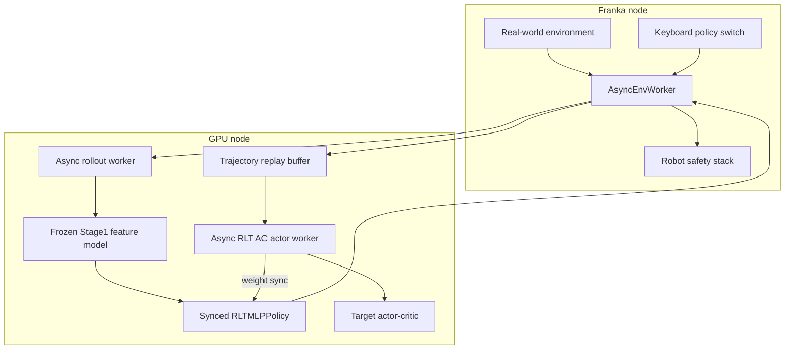
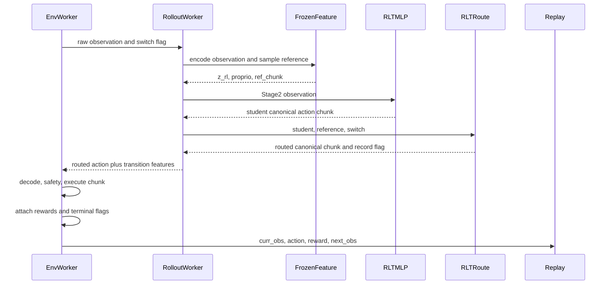
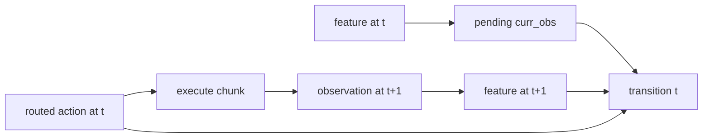
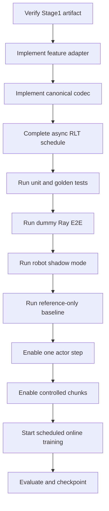

# 4DWVLA × RLinf RLT Stage 2：轻量级 Off-policy Actor-Critic 实施方案

> 文档版本：v2.0
> 编写日期：2026-09-17
> 目标代码库：`/home/nvidia/bt/s/RLmm`、`/home/nvidia/bt/s/4WVLA`
> Stage0 checkpoint：`/home/nvidia/bt/ckp/4wvlaFrk/plug/4wvlaFrkPlugCkp010420/`
> Stage1 实施方案：`/home/nvidia/bt/s/RLmm/b/d/rltx/4dwvla_rlt1_2.markdown`
> Stage1 设计方案：`/home/nvidia/bt/s/RLmm/b/d/rltx/4dwvla_rlt1_1.markdown`
> Mode A 评估方案：`/home/nvidia/bt/s/RLmm/b/d/frk1/4wvla_rlinf_eval_3A3.md`
> 目标任务：Franka 插头插入，8D absolute-joint action，50-step VLA reference chunk
> GPU 容器：`rlinf-4dwvla-gpu` (镜像 `rlinf/rlinf:agentic-rlinf0.4-maniskill_libero`)
> GPU 硬件：NVIDIA GeForce RTX 5090 D 32GB
> 本文性质：实施与落地方案；不在本文写作任务中修改 RLinf 源码 (`rlinf/`) 或 4DWVLA 源码 (`src/lerobot/`)

---

## 0. 执行结论

### 0.1 推荐生产路径

4DWVLA 的 RLT Stage 2 应复用 RLinf 现有 `rlt_ac` 算法、replay、
`RLTMLPPolicy`、Twin-Q、weight sync 和 real-world runner；新增一个冻结的
4DWVLA Stage1 feature adapter，将每个机器人观测转换为：

```text
z_rl:      [B, D_z]       D_z=1024（来自 Stage1 rlt_embed_dim=1024）
proprio:   [B, 8]         7 关节角 + 1 夹爪宽度，原始物理观测
ref_chunk: [B, 50, 8]     VLA 参考动作，canonical absolute-joint 域
```

Stage2 只训练：

- `RLTMLPPolicy.backbone`
- `RLTMLPPolicy.actor_mean`
- 两个 `QHead`
- target policy 的 EMA 副本

冻结：

- 4DWVLA VLM、vision encoder、action/keypoint experts
- Stage1 RLT encoder
- Stage1 RLT decoder 不进入推理图
- GeoPredict 与 FK 没有可训练 Stage2 参数

### 0.2 三个强制前置条件

任何一项不满足，都不得启动 Stage2：

1. **Stage1 artifact 已存在并通过 strict contract。** 当前 Stage0
   `4wvlaFrkPlugCkp010420` 不含训练后的 `rlt_module.*`，不能直接替代 Stage1。
2. **4DWVLA feature adapter 已通过离线 golden tests。** 不能把 4DWVLA
   checkpoint 路径填入现有 `openpi_rlinf` 配置。
3. **验证并补齐真机异步 schedule。** 当前
   `AsyncRLTACFSDPPolicy._drain_received_trajectories()` 已覆盖通用 SAC
   路径并调用 RLT 专用 `_ingest_rollout_trajectories()`；但其
   `run_training()` 仍委托通用 async SAC，尚未消费同步 RLT 的
   warmup/update-budget schedule。

### 0.3 生产算法决策

| 设计点 | 决策 | 原因 |
|---|---|---|
| Stage2 算法 | RLinf `loss_type: rlt_ac` | 当前唯一可审计 RLT AC 实现 |
| Actor route | 替换式 actor/reference 切换 | 忠实保留 `RealworldRLTRoute` |
| Actor action | canonical absolute-joint | 与 `tanh`、BC、Q 和 replay 统一 |
| Residual `ref+δ` | 只作独立消融 | 不是 RLmm 当前 RLT baseline |
| Actor horizon | 10 | 复用当前真机执行节奏，减少开环风险 |
| Reference horizon | 50 | 与 4DWVLA checkpoint chunk 一致 |
| Proprio | 8D 原始物理 state | 不照抄 OpenPI 的 19D TCP state |
| Feature model | 4DWVLA Stage1 + RLT encoder | `z_rl` 必须来自训练过的瓶颈 |
| Reference RNG | 显式 per-env generator/noise | 保证复现与 transition 对齐 |
| Critic target | target twin-min-Q | 降低过估计 |
| Actor Q | Q1 | 保持 RLinf 当前实现 |
| Entropy | 关闭 | RLinf RLT 不是 maximum-entropy SAC |
| Replay | tagged reference prefill + actor rows | 防止随机 actor 启动与 warmup 死锁 |

---

## 1. 依据、事实等级与边界

### 1.1 事实等级

- **[代码事实]**：本地源码可直接验证；
- **[Checkpoint 事实]**：目标 checkpoint/config/stats 可直接验证；
- **[官方说明]**：PI 或 RLinf 官方文档；
- **[方案决策]**：本文针对 4DWVLA/Franka 的选择；
- **[待实测]**：必须通过离线或真机实验确认。

### 1.2 主要依据

1. PI RLT：<https://www.pi.website/research/rlt>
2. RLinf RLT：
   <https://rlinf.readthedocs.io/en/latest/rst_source/examples/embodied/rlt.html>
3. `docs/source-zh/rst_source/examples/embodied/rlt.rst`
4. `rlinf/workers/actor/fsdp_rlt_ac_policy_worker.py`
5. `rlinf/workers/actor/fsdp_sac_policy_worker.py`
6. `rlinf/algorithms/rlt/{rollout,route,transition}.py`
7. `rlinf/models/embodiment/mlp_policy/rlt_mlp_policy.py`
8. `examples/embodiment/config/realworld_rlt_stage2_ac_mlp.yaml`
9. `b/d/rltx/rlt_code_analyz3.markdown`
10. `b/d/rltx/4dwvla_rlt1_1.markdown`
11. `b/d/frk1/4wvla_rlinf_eval_3A3.md`
12. `b/x/4dwvla_ext/`

PI 页面给出研究动机和两阶段叙事，但没有公开完整可复现代码与全部公式。
本文以 RLinf 本地代码作为 Stage2 实现真源，不把 RLinf 的每个超参数反推为
PI 私有系统的唯一设置。

### 1.3 本文不做什么

- 不重新训练 Stage1；
- 不用随机初始化的 `z_rl` 冒充 Stage1；
- 不修改 PI/RLinf 算法结论；
- 不把真机 shadow/dry-run 宣称为成功率；
- 不在未通过门禁时自动执行 Franka 动作；
- 不在本轮写作任务中提交源代码；
- 不修改 RLinf 源码 (`rlinf/`)；
- 不修改 4DWVLA 源码 (`src/lerobot/`)。

### 1.4 约束总结

| # | 约束 | 说明 |
|---|---|---|
| 1 | **零修改约束** | RLinf 源码 (`rlinf/`) 和 4DWVLA 源码 (`src/lerobot/`) 零修改。新增代码全部放在 `b/x/4dwvla_ext/` 下 |
| 2 | **Stage1 先决** | Stage2 不允许跳过 Stage1。必须有完整的 Stage1 训练产出 (`vla/` + `rlt/rlt_module.pt` + `rlt_config.yaml`) |
| 3 | **容器复用** | 复用 GPU 容器 `rlinf-4dwvla-gpu`（镜像 `rlinf/rlinf:agentic-rlinf0.4-maniskill_libero`）和 venv `/opt/venv/4dwvla` |
| 4 | **容器不停** | 做完后容器不要停掉。容器 `rlinf-4dwvla-gpu` 必须保持运行 |
| 5 | **高效推理依赖** | `flash-linear-attention==0.5.0` + `causal-conv1d>=1.7.0` 必须已安装（见 `setup_4dwvla_venv.sh` Step 6.5） |
| 6 | **维度锁定** | `D_z=1024`（来自 Stage1 `rlt_embed_dim=1024`），`D_a=8`，`D_p=8`，`H_π=10`，`H_r=50` |
| 7 | **Canonical 域** | 所有训练量（actor、critic、replay、BC target）统一在 canonical `[-1,1]` 域，仅在 env 执行前解码到物理域 |
| 8 | **GeoPredict 必须** | 目标 checkpoint `enable_keypoint_predictor=true`，必须使用 `inference_backend=standard`（不能用 optimized） |

### 1.5 硬件与容器环境

**宿主机**：

```text
GPU:    NVIDIA GeForce RTX 5090 D, 32607 MiB
OS:     Linux 5.15.0-1032-realtime
Docker: 已安装, 支持 --gpus all
```

**GPU 容器** (`rlinf-4dwvla-gpu`)：

```text
镜像:   rlinf/rlinf:agentic-rlinf0.4-maniskill_libero
Python: 3.11
venv:   /opt/venv/4dwvla
torch:  2.11.0+cu128
transformers: 5.2.0
flash-attn: 2.8.3
flash-linear-attention: 0.5.0
causal-conv1d: 1.7.0
```

启动命令（见 `b/x/4dwvla_ext/configs/docker_run_4dwvla_gpu.sh`）：

```bash
# 宿主机执行
cd /home/nvidia/bt/s/RLmm
bash b/x/4dwvla_ext/configs/docker_run_4dwvla_gpu.sh
```

容器内挂载映射：

| 宿主机 | 容器内 | 模式 |
|---|---|---|
| `/home/nvidia/bt/s/RLmm` | `/workspace/RLinf` | rw |
| `/home/nvidia/bt/s/4WVLA` | `/workspace/4WVLA` | **ro** |
| `/home/nvidia/bt/ckp` | `/home/nvidia/ckpts` | **ro** |
| `~/.cache/huggingface` | `/home/nvidia/.cache/huggingface` | rw |

**Franky 容器** (`rlinf-4dwvla-franky`)：

```text
镜像:   rlinf/rlinf:agentic-rlinf0.4-franka
Python: 3.11
venv:   /opt/venv/franky-0.19.0
```

启动命令（见 `b/x/4dwvla_ext/configs/docker_run_4dwvla_franky.sh`）：

```bash
# 宿主机执行
cd /home/nvidia/bt/s/RLmm
bash b/x/4dwvla_ext/configs/docker_run_4dwvla_franky.sh
```

### 1.6 关键路径与检查点

| 项目 | 路径 |
|---|---|
| RLmm 代码 | `/home/nvidia/bt/s/RLmm` |
| 4DWVLA 代码 | `/home/nvidia/bt/s/4WVLA` |
| Stage0 checkpoint | `/home/nvidia/bt/ckp/4wvlaFrk/plug/4wvlaFrkPlugCkp010420/` |
| Stage1 训练输出 | `/workspace/RLinf/b/x/4dwvla_ext/rlt/outputs/` (容器内) |
| Stage2 扩展代码 | `b/x/4dwvla_ext/rlt/stage2/` (待创建) |
| Stage1 实施方案 | `b/d/rltx/4dwvla_rlt1_2.markdown` |
| Stage1 LOG | `b/d/rltx/4dwvla_rlt1_20916LOG.markdown` |
| Mode A 评估方案 | `b/d/frk1/4wvla_rlinf_eval_3A3.md` |
| Mode A 离线 LOG | `b/d/frk1/4wvla_rlinf_eval_3A3_off0914LOG.md` |
| Mode A GPU LOG | `b/d/frk1/4wvla_rlinf_eval_3A3_offgpudck0914LOG.md` |
| Mode A 在线 LOG | `b/d/frk1/4wvla_rlinf_eval_3A3_off0915LOG.md` |
| URDF | `b/d/frk1/fr3v2_1_franka_hand.urdf` |
| Keypoint meta | `b/d/frk1/plug/keypoints_meta.json` |
| RLinf RLT 参考 YAML | `examples/embodiment/config/realworld_rlt_stage2_ac_mlp.yaml` |

### 1.7 Stage0 Checkpoint 实况

```bash
# 在 GPU 容器内验证
docker exec rlinf-4dwvla-gpu ls -la /home/nvidia/ckpts/4wvlaFrk/plug/4wvlaFrkPlugCkp010420/
```

预期输出：

```text
config.json          3735 bytes    # InternVLAA15Config
model.safetensors    6.3 GB        # VLA 全权重
stats.json           38970 bytes   # 归一化参数
train_config.json    12901 bytes   # 训练配置
```

关键参数（已从 `config.json` 确认）：

```text
type:                    internvla_a1_5
vlm_model_name_or_path:  Qwen/Qwen3.5-2B
chunk_size:              50
max_action_dim:          32
action_loss_only:        false    ← Stage2 loader 必须覆盖为 true
enable_keypoint_predictor: true   ← 需要 standard backend
inference_backend:       standard
num_inference_steps:     10       ← flow denoise 步数
keypoint_history_max_len: 200
kpt_4d_mode:             pos_rot
```

> **注意**：Stage0 checkpoint 不包含 `rlt_module.*` 权重，不能用作 Stage2 的 feature model。
> 必须先完成 Stage1 训练（见 `4dwvla_rlt1_2.markdown`），获得含 RLT encoder/decoder 的
> Stage1 产出后才能启动 Stage2。

---

## 2. RLinf Stage2 当前实现

### 2.1 静态组件



### 2.2 入口与生命周期

真机配置当前由：

```text
examples/embodiment/run_realworld_async.sh
  -> examples/embodiment/train_async.py
  -> AsyncEmbodiedRunner
  -> AsyncRLTACFSDPPolicy
```

驱动。每个 runner step 并行执行：

1. env interaction；
2. rollout feature/action generation；
3. actor 接收 trajectories；
4. replay ready 后 actor/critic update；
5. 按 `weight_sync_interval` 向 rollout 同步 Stage2 MLP 权重。

`rollout.rlt_feature_model` 是 Stage1 模型；
`actor.model` 是 Stage2 MLP。二者 checkpoint 路径不能互换。

### 2.3 单个 macro-step



### 2.4 RLTMLPPolicy 的真实输入

令：

- \(D_z\)：RL token 维度；
- \(D_p\)：proprio 维度；
- \(H_\pi\)：actor chunk；
- \(H_r\)：reference chunk；
- \(D_a\)：action 维度。

Actor 输入：

\[
x_\pi=
\operatorname{concat}
\left(
\operatorname{flatten}(a^{ref}_{0:H_\pi}),
z_{rl},
p
\right)
\]

输入维度：

\[
D_{\pi,in}=H_\pi D_a+D_z+D_p
\]

当前实现先校验 \(H_r\ge H_\pi\)，然后 `_get_ref_chunk()` 只截取 reference
前 \(H_\pi\) 步送给 actor。`ref_num_action_chunks` 不增加 backbone 输入维度。
4DWVLA 推荐：

\[
H_r=50,\quad H_\pi=10,\quad D_a=8,\quad D_z=1024,\quad D_p=8
\]

即：

\[
D_{\pi,in}=10\times8+1024+8=1112
\]

Critic state 不含 reference：

\[
x_Q=\operatorname{concat}(z_{rl},p)\in\mathbb{R}^{1032}
\]

Q head 另接实际 action chunk：

\[
a\in\mathbb{R}^{H_\pi D_a}=\mathbb{R}^{80}
\]

---

## 3. Stage2 数学与权重更新

### 3.1 它不是标准 maximum-entropy SAC

RLinf RLT：

- `initial_alpha=0`
- `backup_entropy=False`
- `forward_alpha()` 未实现
- actor 固定较小标准差
- actor loss 为 Q 项 + BC 项

因此不能写成：

\[
\mathcal{L}_\pi=\alpha\log\pi-Q
\]

准确定位是带 Twin-Q、target network、off-policy replay 和 BC 正则的
SAC-like actor-critic。

### 3.2 Chunk reward

每个 Stage2 transition 对应执行 \(H\) 个低层动作。设低层 reward 为
\(r_0,\ldots,r_{H-1}\)，折扣 \(\gamma\)：

$$R_{\text{chunk}}
=
\sum_{t=0}^{H-1}\gamma^t r_t$$

真实有效长度不足 10 时，\(H_i\) 必须取样本 \(i\) 的实际执行长度。当前
`forward_critic()` 从 padded `rewards.shape[-1]` 得到全 batch 同一个 horizon；
实施时要接入 `chunk_valid_mask`，按样本计算 masked return 和
\(\gamma^{H_i}\)。

### 3.3 Critic target

当前源码用**在线 actor**在 next observation 采样：

\[
a' \sim \pi_{\theta}(s')
\]

再用 target Twin-Q：

$$Q'_{\min}
=
\min\left(
Q_{\bar\phi_1}(s',a'),
Q_{\bar\phi_2}(s',a')
\right)$$

TD target：

$$y
=
R_{\text{chunk}}
+
\mathbb{1}_{\neg done}
\gamma^{H_i} Q'_{\min}$$

其中 \(\theta\) 是在线 actor，\(\bar\phi_i\) 是 target critic。虽然
`target_update_type=all` 会 EMA 整个 target model，当前 critic target
并不调用 target actor。其余语义：

- 真机 `done` 使用 `terminations`；
- realworld `bootstrap_type=standard` 只把 `terminations` 当 done，因此
  truncation 默认继续 bootstrap；
- terminal transition 不使用 next Q；
- target 全部 stop-gradient。

Critic loss：

$$\mathcal{L}_Q
=
\frac{1}{2}
\sum_{i=1}^{2}
\operatorname{MSE}\left(Q_{\phi_i}(s,a),y\right)$$

`label` 是 TD target \(y\)，不是人工标注。

### 3.4 Actor

固定标准差策略：

$$u=\mu_\theta(s)+\sigma\epsilon,\quad
a_\pi=\tanh(u),\quad
\epsilon\sim\mathcal{N}(0,I)$$

当前 Actor Q 聚合使用 Q1：

$$\mathcal{L}_{Q,\pi}
=
-w_Q\mathbb{E}[Q_{\phi_1}(s,a_\pi)]$$

BC target：

$$a^{BC}_t=
\begin{cases}
a^{exec}_t,& \text{intervene}_t=1\\
a^{ref}_t,& \text{otherwise}
\end{cases}$$

BC loss（\(m_{t}\) 是 `chunk_valid_mask`）：

$$\mathcal{L}_{BC}
=
\frac{
\sum_{t,d}m_t
\left(a_{\pi,t,d}-a^{BC}_{t,d}\right)^2
}{
\max\left(\sum_{t,d}m_t,1\right)
}$$

这需要扩展当前 `_bc_metrics()`；完整 10-step chunk 时结果与现有实现一致。

总 actor loss：

$$\mathcal{L}_{actor}
=
-w_Q\mathbb{E}[Q_{\phi_1}(s,a_\pi)]
+
w_{BC}\mathcal{L}_{BC}$$

基线：

```yaml
q_weight: 0.1
bc_weight: 5.0
reference_dropout_prob: 0.5
fixed_std: 0.002
critic_actor_ratio: 4
```

这些值来自 OpenPI/Franka 示例，是 4DWVLA 的初始 pilot 值，不是已验证最优值。

### 3.5 Target network

每次满足 target update 时：

\[
\bar\psi
\leftarrow
\tau\psi+(1-\tau)\bar\psi
\]

其中 \(\psi\) 是在线 Stage2 MLP 参数，\(\bar\psi\) 是 target 参数，
`tau=0.005`。Stage1 feature model不参与 EMA。

### 3.6 q 指标

对 actor action \(a_\pi\)：

$$\texttt{q\_value\_i}
=
\frac{1}{B}\sum_b Q_i(s_b,a_{\pi,b})$$

$$\texttt{q\_pi}
=
\frac{1}{B}\sum_b Q_1(s_b,a_{\pi,b})$$

对 replay action \(a_{data}\)：

$$\texttt{critic/q\_data}
=
\frac{1}{2B}\sum_{b,i}Q_i(s_b,a_{data,b})$$

解释：

- `q_pi` 是 actor loss 使用的 Q1 均值；
- `q_value_0/1` 用于观察两个头的偏差；
- `q_data` 是 replay 实际执行动作的当前 Q 均值；
- 它们不是 label；
- 真正 critic label 是 TD target；
- 所有 Q 绝对值都依赖 reward scale，不能跨实验直接比较。

---

## 4. Stage1 → Stage2 不可变契约

### 4.1 Stage1 artifact

Stage2 loader 必须确认：

```text
config.json
model.safetensors
stats.json
rlt_manifest.json
```

并满足：

- `config.enable_rlt=true`
- 完整 `rlt_module.encoder.*`
- RLT 子模块 `strict=True`
- 全模型差异命中配方白名单
- `rlt_prefix_source=deployment_view`
- `rlt_embed_dim == actor.model.z_dim`
- prompt/template/padding hash 一致
- action mode 为 `abs`
- stats/schema/codec version 一致

Stage1 方案当前示例 manifest 还不足以闭合 Stage2 动作/GeoPredict 契约。
正式产出前将 manifest schema 升级，至少新增：

```json
{
  "stats_sha256": "...",
  "action_field_order": ["action.arm", "action.gripper"],
  "physical_action_dim": 8,
  "model_action_dim": 32,
  "gripper_action_semantics": "0=open,1=close",
  "action_codec_id": "franka_abs_joint_minmax_v1",
  "action_codec_bounds_sha256": "...",
  "keypoint_meta_sha256": "...",
  "keypoint_link_order": [
    "fr3v2_1_link1", "fr3v2_1_link2", "fr3v2_1_link3",
    "fr3v2_1_link4", "fr3v2_1_link5", "fr3v2_1_link6",
    "fr3v2_1_link7", "fr3v2_1_hand_tcp"
  ],
  "keypoint_bbox_radius": 0.8361004471778869,
  "urdf_sha256": "..."
}
```

缺少任一字段时 Stage2 preflight fail-closed；不能由 Stage2 loader根据文件名
猜测。上述 link 顺序与 bbox radius 来自当前目标
`b/d/frk1/plug/keypoints_meta.json`，最终仍以 artifact hash 为准。

当前 Stage0 checkpoint 没有这些 Stage1 RLT 权重。Stage2 不允许以
`strict=False` 忽略缺失后继续。

### 4.2 Feature 三元组

```python
{
    "z_rl": z_rl.float(),          # [B,Dz]
    "proprio": proprio.float(),    # [B,8]
    "ref_chunk": ref.float(),      # [B,50,8]
}
```

`proprio` 是：

\[
[q_1,\ldots,q_7,g_{width}]
\]

不是：

- pad 后 32D；
- normalized state；
- OpenPI 示例 19D；
- TCP pose；
- keypoint 展平。

### 4.3 Deployment prefix

Stage2 必须复用 Stage1：

- system/user chat template；
- `Output: <Subtask, Action>`；
- 3-view 编排与 empty-view mask；
- fixed right padding 650；
- tokenizer、pad token；
- tokenized state；
- deployment view 无 FAST ground-truth action。

Stage1/Stage2 有效 token IDs、mask 和 template SHA256 必须一致。

### 4.4 Decoder

Stage1 RLT decoder只提供 reconstruction 监督。Stage2：

- 加载完整 artifact 做完整性检查；
- 只调用 encoder `encode_flat()`；
- decoder 不参与 feature forward；
- 可导出 encoder-only deployment artifact，但必须保留 parent manifest/hash。

---

## 5. FourDWVLAFeatureModel 设计

### 5.1 放置与注册

建议生产路径：

```text
RLmm/rlinf/models/embodiment/four_dwvla_rlt/
├── __init__.py
├── configuration.py
├── feature_model.py
├── action_codec.py
├── observation_adapter.py
└── checkpoint.py
```

并修改：

```text
RLmm/rlinf/config.py
RLmm/rlinf/models/__init__.py
RLmm/rlinf/workers/rollout/hf/huggingface_worker.py
```

使用现有动态 registry 注册：

```python
register_model(
    "four_dwvla_rlt",
    _build_four_dwvla_rlt,
    category="embodied",
)
```

`register_model()` 会同时调用 `SupportedModel.register()` 并加入
`EMBODIED_MODEL`。不能把 `SupportedModel` 当 tuple enum 直接赋
`("four_dwvla_rlt", "embodied")`。

第一版也可在 `b/x/4dwvla_ext` 原型化，但 production 应进入可注册 package，
否则 Hydra/Ray worker 无法稳定 import，测试与 checkpoint 也无法制度化。

### 5.2 最小公共接口与实现

**完整实现**（基于 `vla_inference_server.py` 的 transform/stats/model 加载和
`rlt_stage1_wrapper.py` 的 prefix capture + `extract_z_rl()` 模式）。
放在 `b/x/4dwvla_ext/rlt/stage2/four_dwvla_feature_model.py`：

```python
"""Stage2 frozen feature model — extracts (z_rl, proprio, ref_chunk).

Reuses:
  - vla_inference_server.py: load_model(), build_transforms(), build_sample(),
    to_batch(), load_stats(), ensure_schema()
  - rlt_stage1_wrapper.py: prefix capture monkey-patch, extract_z_rl() pattern
  - fk_keypoints.py: FKKeypointComputer (FK → 4D keypoint history)

Zero modification to rlinf/ and src/lerobot/.
"""
from __future__ import annotations
import logging, json
from dataclasses import dataclass
from pathlib import Path
from typing import Any

import numpy as np
import torch
import torch.nn as nn

# ── 复用 vla_inference_server 的基础设施 ──
import sys
sys.path.insert(0, str(Path(__file__).resolve().parents[2]))  # b/x/4dwvla_ext/
from vla_inference_server import (
    load_model, load_stats, ensure_schema, build_transforms,
    build_sample, to_batch, STATS_KEY,
)
from fk_keypoints import FKKeypointComputer

# ── 复用 rlt_stage1_wrapper 的 RLT encoder ──
sys.path.insert(0, str(Path(__file__).resolve().parents[1]))  # b/x/4dwvla_ext/rlt/
from rlt_token_transformer import RLTTokenTransformer
from rlt_config import RLTStage1Config

logger = logging.getLogger(__name__)

ACTION = "action"


@dataclass
class FourDWVLARLTCache:
    """VLM prefix + keypoint 扩展后的 KV cache."""
    prefix_out: torch.Tensor         # [B, prefix_len, hidden]
    prefix_mask: torch.Tensor | None # [B, prefix_len]  label mask
    use_kpt: bool


class FourDWVLAFeatureModel(nn.Module):
    """Frozen Stage1 feature model for Stage2 rollout.

    加载顺序:
    1. Stage1 VLA checkpoint (action_loss_only=True, standard backend)
    2. Stage1 RLT module (rlt_module.pt)
    3. FK/keypoint computer
    4. Transform pipeline (same as vla_inference_server)
    5. Action stats for model→canonical 转换
    """

    def __init__(
        self,
        stage1_dir: str,
        stage0_dir: str,
        schema_path: str | None = None,
        urdf_path: str = "b/d/frk1/fr3v2_1_franka_hand.urdf",
        kpt_meta_path: str = "b/d/frk1/plug/keypoints_meta.json",
        dtype: torch.dtype = torch.float32,
        device: str = "cuda",
    ):
        super().__init__()
        s1 = Path(stage1_dir)
        vla_ckpt = s1 / "vla"
        rlt_ckpt = s1 / "rlt"

        # ── 1. 加载 VLA (frozen, no WAN) ──
        self.vla_policy, self._device, self._config = load_model(vla_ckpt, dtype)
        self.vla_policy.eval()
        self.vla_policy.requires_grad_(False)
        self._dtype = dtype

        # ── 2. 加载 RLT encoder ──
        rlt_cfg_path = rlt_ckpt / "rlt_config.yaml"
        if rlt_cfg_path.exists():
            import yaml
            with open(rlt_cfg_path) as f:
                rlt_cfg_dict = yaml.safe_load(f)
            rlt_cfg = RLTStage1Config(**{
                k: v for k, v in rlt_cfg_dict.items()
                if k in RLTStage1Config.__dataclass_fields__
            })
        else:
            rlt_cfg = RLTStage1Config()  # 默认 embed_dim=1024

        self.rlt_module = RLTTokenTransformer(
            input_dim=rlt_cfg.rlt_input_dim,
            embed_dim=rlt_cfg.rlt_embed_dim,
            prefix_seq_len=rlt_cfg.rlt_prefix_seq_len,
            num_layers=rlt_cfg.rlt_num_layers,
            num_heads=rlt_cfg.rlt_num_heads,
            mlp_ratio=rlt_cfg.rlt_mlp_ratio,
            dropout_rate=rlt_cfg.rlt_dropout,
        )
        rlt_sd = torch.load(rlt_ckpt / "rlt_module.pt", map_location="cpu", weights_only=True)
        self.rlt_module.load_state_dict(rlt_sd, strict=True)
        self.rlt_module.to(device=self._device, dtype=dtype)
        self.rlt_module.eval()
        self.rlt_module.requires_grad_(False)
        self.z_dim = self.rlt_module.z_dim  # 1024
        logger.info("RLT encoder loaded: z_dim=%d", self.z_dim)

        # ── 3. FK keypoint computer ──
        self.fk_computer = None
        if getattr(self._config, "enable_keypoint_predictor", False):
            self.fk_computer = FKKeypointComputer(
                urdf_path=urdf_path,
                kpt_meta_path=kpt_meta_path,
                history_max_len=getattr(self._config, "keypoint_history_max_len", 200),
            )
            logger.info("FK keypoint computer ready: joints=%d", self.fk_computer.num_joints)

        # ── 4. Transform pipeline ──
        schema = ensure_schema(Path(schema_path) if schema_path else None)
        state_stat, action_stat = load_stats(vla_ckpt, schema)
        self.input_transforms, self.unnormalize_fn = build_transforms(
            state_stat, action_stat, schema, self._config
        )
        self._action_stat = action_stat
        self._actual_action_dim = action_stat[ACTION]["mean"].shape[0]

        # ── 5. 安装 prefix capture (与 rlt_stage1_wrapper 相同) ──
        self._captured_prefix_out = None
        self._install_prefix_capture()

        # ── 6. Action stats for model→canonical ──
        arm_stats = json.loads((vla_ckpt / "stats.json").read_text())[STATS_KEY]
        self._arm_min = torch.tensor(arm_stats["action.arm"]["min"], dtype=torch.float32)
        self._arm_max = torch.tensor(arm_stats["action.arm"]["max"], dtype=torch.float32)

    def _install_prefix_capture(self):
        """Monkey-patch qwen3_5_with_expert.forward — 与 Stage1 wrapper 相同逻辑."""
        inner_model = self.vla_policy.model
        expert_model = inner_model.qwen3_5_with_expert
        original_forward = expert_model.forward
        wrapper_self = self

        def wrapped_forward(*args, **kwargs):
            result = original_forward(*args, **kwargs)
            if isinstance(result, (list, tuple)) and len(result) >= 1:
                outputs_list = result[0]
                if isinstance(outputs_list, (list, tuple)) and len(outputs_list) >= 1:
                    wrapper_self._captured_prefix_out = outputs_list[0]
            return result

        expert_model.forward = wrapped_forward

    def _build_batch(self, env_obs: dict, arm_q: np.ndarray) -> dict:
        """将 env observation 转换为 VLA batch — 复用 vla_inference_server 的流程."""
        kpt_data = None
        if self.fk_computer is not None:
            kpt_data = self.fk_computer.step(arm_q)

        sample = build_sample(
            images={
                "global": np.asarray(env_obs["images"]["global"]),
                "wrist": np.asarray(env_obs["images"]["wrist"]),
            },
            state={"arm": arm_q[:7].tolist(), "gripper": [float(arm_q[7]) if len(arm_q) > 7 else 0.0]},
            task=env_obs.get("task", "Pick up the plug and insert it."),
            dtype=self._dtype,
            kpt_data=kpt_data,
        )
        sample = self.input_transforms(sample)
        return to_batch(sample, self._device, self._dtype)

    @torch.no_grad()
    def extract_rlt_obs(
        self,
        env_obs: dict[str, Any],
        *,
        noise: torch.Tensor | None = None,
        generator: torch.Generator | None = None,
    ) -> dict[str, torch.Tensor]:
        """提取 Stage2 三元组: z_rl [B,1024], proprio [B,8], ref_chunk [B,50,8].

        env_obs 格式:
          images: {global: np.ndarray HWC uint8, wrist: np.ndarray HWC uint8}
          state:  {arm: [7 floats], gripper: [1 float]} — 物理值
          task:   str
        """
        arm_q = np.asarray(env_obs["state"]["arm"], dtype=np.float32)
        gripper = np.asarray(env_obs["state"]["gripper"], dtype=np.float32).flatten()

        # 1. 构造 batch, VLA forward (prefix capture)
        batch = self._build_batch(env_obs, np.concatenate([arm_q, gripper]))

        self._captured_prefix_out = None
        _ = self.vla_policy.predict_action_chunk(batch)
        prefix_out = self._captured_prefix_out
        self._captured_prefix_out = None
        if prefix_out is None:
            raise RuntimeError("prefix_out not captured — check VLA forward path")

        # 2. z_rl: RLT encoder
        labels = batch.get("labels")
        if labels is not None and labels.shape[1] >= prefix_out.shape[1]:
            rlt_mask = (labels[:, :prefix_out.shape[1]] == -100)
        else:
            rlt_mask = None
        rlt_dtype = next(self.rlt_module.parameters()).dtype
        z_rl = self.rlt_module.encode_flat(prefix_out.to(rlt_dtype), mask=rlt_mask)
        # z_rl: [B, 1024]

        # 3. proprio: 原始物理 8D
        proprio = torch.tensor(
            np.concatenate([arm_q, gripper]),
            dtype=torch.float32,
        ).unsqueeze(0).to(self._device)
        # proprio: [B, 8]

        # 4. ref_chunk: VLA 预测的 action chunk → canonical
        action_pred = self.vla_policy.predict_action_chunk(batch)
        if action_pred.ndim == 3:
            action_raw = action_pred[:, :, :self._actual_action_dim]  # [B,50,8+]→[B,50,8]
        else:
            action_raw = action_pred[:, :self._actual_action_dim].unsqueeze(0)

        # unnormalize: model mean/std → physical
        B, H, D = action_raw.shape
        flat = action_raw.reshape(B * H, D)
        phys = self.unnormalize_fn({ACTION: flat})[ACTION].reshape(B, H, D)

        # physical → canonical [-1,1]
        arm_phys = phys[..., :7]
        grip_phys = phys[..., 7:8]
        arm_min = self._arm_min.to(arm_phys.device)
        arm_max = self._arm_max.to(arm_phys.device)
        arm_can = 2.0 * (arm_phys - arm_min) / (arm_max - arm_min) - 1.0
        grip_can = 2.0 * grip_phys - 1.0
        ref_chunk = torch.cat([arm_can, grip_can], dim=-1)  # [B, 50, 8]

        return {
            "z_rl": z_rl.float(),       # [B, 1024]
            "proprio": proprio.float(),  # [B, 8]
            "ref_chunk": ref_chunk.float().clamp(-1.0, 1.0),  # [B, 50, 8]
        }

    def reset(self):
        """Episode reset: 清空 keypoint history 和 VLA cache."""
        self.vla_policy.reset()
        if self.fk_computer is not None:
            self.fk_computer.reset()
```

**关键设计决策说明**：

1. `extract_rlt_obs()` 内部调用了两次 `predict_action_chunk()` — 第一次为了
   capture prefix_out 给 RLT encoder, 第二次为了获取 reference action chunk。
   生产优化版应在单次 VLA forward 中同时获取 prefix_out 和 action_pred；
   这里为了不修改 4DWVLA 源码, 采用两次调用模式, 以正确性优先。

2. `proprio` 保留原始物理 8D（7 关节弧度 + gripper width [0, 0.08]m）,
   不做归一化 — 与 `rlt_mlp_policy.py:_critic_state()` 的拼接语义一致。

3. `ref_chunk` 从 model-normalized → physical → canonical [-1,1] 的转换链
   与 §6 Action Codec 使用相同公式, 保证 ref_chunk 和 actor 输出同域。

**Rollout 集成方式**（在 `rlinf/algorithms/rlt/rollout.py` 的
`predict_rlt_actions()` 中调用）：

```python
# rollout worker 初始化时
feature_model = FourDWVLAFeatureModel(
    stage1_dir=cfg.rlt_feature_model.stage1_dir,
    stage0_dir=cfg.rlt_feature_model.stage0_dir,
    schema_path=cfg.rlt_feature_model.schema_path,
    urdf_path=cfg.rlt_feature_model.urdf_path,
    kpt_meta_path=cfg.rlt_feature_model.kpt_meta_path,
)
feature_model.eval()

# 每个 macro-step
rlt_obs = feature_model.extract_rlt_obs(env_obs, generator=env_generator)
# rlt_obs 直接传入 policy_model.predict_action_batch(rlt_obs)
```

`extract_rlt_obs()` 组合前述接口。Rollout worker 必须传入 per-env
generator 或显式 noise，不能隐式消费进程全局 RNG。生产推荐
`ReferenceNoiseProvider` 根据
`base_seed/env_id/episode_id/step_id/model_version` 派生 stateless seed；
这样同一逻辑 observation 被 `final_obs` 和下一步重复编码时会得到相同
`ref_chunk`。

### 5.3 Cache

```python
@dataclass
class FourDWVLARLTCache:
    prefix_out: Tensor
    prefix_mask: Tensor
    action_past_key_values: tuple
    action_prefix_mask: Tensor
    max_position_ids: Tensor
    state: Tensor
    fast_mask: Tensor | None
    use_kpt: bool
```

目标 checkpoint 开启 GeoPredict。cache 构造必须：

1. 对 deployment prefix 做 VLM forward；
2. 保留 `prefix_out` 给 RLT encoder；
3. 用 32D normalized state、`his_kpts [B,200,8,7]`、`his_len [B]`
   构造 17 个 keypoint tokens；
4. keypoint expert 扩展 `past_key_values`；
5. 扩展 action prefix mask；
6. 更新 max position；
7. 对 keypoint segment 补 `fast_mask=False`；
8. action expert 从 action-ready cache 做 flow denoise。

只保存 VLM KV 而忽略 keypoint segment，不能生成与目标 checkpoint 一致的
reference action。

### 5.4 Observation adapter

输入至少包含：

```text
images.global: [B,H,W,3]
images.wrist:  [B,H,W,3]
states:        [B,8]
task:          list[str]
episode_id, step_id, env_id
```

转换：

1. 将 global/wrist 映射到 checkpoint 的 image0/image1；
2. 构造 mask=false 的 image2；
3. state 拆成 `observation.state.arm[7]` 和 `.gripper[1]`；
4. 使用 checkpoint external stats；
5. FK/history 由 env state store 提供；
6. 构造 deployment prompt；
7. pad 成模型 32D；
8. 保留原始 8D 给 `proprio`。

FK 不能只给 URDF。`FKKeypointComputer` 还必须读取
`b/d/frk1/plug/keypoints_meta.json`，其中的 link 顺序、local keypoint 和
bbox radius 决定 4D keypoint 归一化；URDF/meta hash 都进入 Stage1/Stage2
manifest。

Feature extractor 不得更新 history。history store 按
`env_id/episode_id/step_id` 在 env 层推进，避免 `final_obs` 二次编码污染状态。

### 5.5 单次 cache 与 reference

`z_rl` 和 `ref_chunk` 必须来自同一 observation、同一 prefix cache：

```python
cache, state = feature_model.encode_rlt_state(env_obs)
z_rl = rlt_module.encode_flat(cache.prefix_out, cache.prefix_mask)
ref_model = feature_model.sample_reference(cache, generator=env_generator)
ref_env = model_action_to_canonical(ref_model)
```

不允许分别完整执行两次 VLM/KPT forward，否则：

- 增加一倍延迟；
- flow/reference 可能与 z 状态错位；
- history 可能推进两次；
- prompt/图像采样可能漂移。

### 5.6 冻结

Rollout 初始化后：

```python
feature_model.eval()
feature_model.requires_grad_(False)
```

验收：

- feature model 不出现在 actor optimizer；
- 无 `.grad`；
- Stage2 checkpoint 不重复保存 4DWVLA 大权重；
- actor weight sync 只同步 `RLTMLPPolicy`。

目标 Stage0 config 的 `action_loss_only=false`，且 WAN 路径依赖原训练机器。
Loader 必须在实例化 `InternVLAA15` **之前**用部署 config 覆盖
`action_loss_only=true`、`inference_backend=standard`，随后断言 WAN/视频
loss 子模块没有构造；不能先构造 WAN 再置空。`standard` 是因为目标
GeoPredict cache 路径尚不由 optimized backend 覆盖。

---

## 6. 8D Action Codec

### 6.1 为什么必须显式 codec

目标 checkpoint：

- model flow 输出 `[B,50,32]`；
- 前 7D 是绝对关节目标；
- 第 8D 是 gripper command；
- 其余 24D 是 pad；
- action 使用 mean/std 模型归一化；
- actor 由于 `tanh` 输出 \([-1,1]\)。

如果把 actor `[-1,1]` 直接作为关节弧度：

- 第 4 关节训练区域约在 \([-2.22,-1.53]\)，完全错误；
- BC target 与 actor output 不同域；
- Q replay action 与 env action 不同域。

### 6.2 域定义

定义：

```text
model-normalized domain: 4DWVLA 内部 mean/std 后 32D
physical VLA domain:     7D joint radians + gripper command [0,1]
canonical RL domain:     每维 [-1,1]
environment domain:      7D joint radians + close command [0,1]
```

目标 stats 已确认：

```text
action.arm min =
[-0.486272, -0.107394, -0.202485, -2.216602,
 -0.273049,  1.649029,  0.369532]

action.arm max =
[ 0.059825,  0.332874,  0.480136, -1.529379,
  0.110447,  2.517262,  1.102100]

action.gripper min=0.007440
action.gripper max=1.0
```

gripper action 已是约 \([0,1]\)，而 proprio gripper 是物理宽度约
\([0,0.08]\) m；二者不能混用。

### 6.3 编解码

对 arm 第 \(j\) 维：

$$c_j
=
2\frac{a_j-l_j}{u_j-l_j}-1$$

$$a_j
=
l_j+\frac{c_j+1}{2}(u_j-l_j)$$

其中 \(l_j,u_j\) 来自 `action.arm min/max`。对 gripper：

$$c_g=2g-1,\quad g=\frac{c_g+1}{2}$$

生产 codec 完整实现（放在 `b/x/4dwvla_ext/rlt/stage2/action_codec.py`）：

```python
"""FrankaAbsoluteJointCodec — 8D canonical ↔ physical action 转换.

所有训练量（ref_chunk, actor output, BC target, critic action, replay action）
在 canonical [-1,1] 域。仅在 env 执行前 decode 到物理域。

Stats 来源: Stage0 checkpoint stats.json → franka_plug → action.arm/action.gripper
"""
from __future__ import annotations
import json, logging
from pathlib import Path

import torch
from torch import Tensor

logger = logging.getLogger(__name__)

# ── 从 Stage0 checkpoint stats.json 提取的确切值 ──
# 来源: /home/nvidia/bt/ckp/4wvlaFrk/plug/4wvlaFrkPlugCkp010420/stats.json
DEFAULT_ARM_MIN = [-0.486272, -0.107394, -0.202485, -2.216602,
                   -0.273049,  1.649029,  0.369532]
DEFAULT_ARM_MAX = [ 0.059825,  0.332874,  0.480136, -1.529379,
                    0.110447,  2.517262,  1.102100]
DEFAULT_GRIP_MIN = 0.007440
DEFAULT_GRIP_MAX = 1.0


class FrankaAbsoluteJointCodec:
    """双向 8D 编解码器: physical ↔ canonical [-1,1]."""

    def __init__(
        self,
        stats_path: str | None = None,
        arm_min: list[float] | None = None,
        arm_max: list[float] | None = None,
        grip_min: float = DEFAULT_GRIP_MIN,
        grip_max: float = DEFAULT_GRIP_MAX,
    ):
        if stats_path is not None:
            with open(stats_path) as f:
                stats = json.load(f)
            s = stats["franka_plug"]
            arm_min = s["action.arm"]["min"]
            arm_max = s["action.arm"]["max"]
            grip_min = s["action.gripper"]["min"][0]
            grip_max = s["action.gripper"]["max"][0]

        self.arm_min = torch.tensor(arm_min or DEFAULT_ARM_MIN, dtype=torch.float32)
        self.arm_max = torch.tensor(arm_max or DEFAULT_ARM_MAX, dtype=torch.float32)
        self.grip_min = grip_min
        self.grip_max = grip_max

        arm_range = self.arm_max - self.arm_min
        if (arm_range <= 0).any():
            raise ValueError(f"arm_max <= arm_min for some joints: range={arm_range}")

    def encode_physical(self, action_8d: Tensor) -> Tensor:
        """physical 8D → canonical [-1,1].

        Args:
            action_8d: [..., 8] — 7D arm (radians) + 1D gripper [0,1]
        Returns:
            canonical: [..., 8] — all in [-1, 1]
        """
        arm = action_8d[..., :7]
        grip = action_8d[..., 7:8]

        dev = action_8d.device
        lo = self.arm_min.to(dev)
        hi = self.arm_max.to(dev)

        arm_can = 2.0 * (arm - lo) / (hi - lo) - 1.0
        grip_can = 2.0 * (grip - self.grip_min) / (self.grip_max - self.grip_min) - 1.0

        return torch.cat([arm_can, grip_can], dim=-1)

    def decode_canonical(self, action_canonical: Tensor) -> Tensor:
        """canonical [-1,1] → physical 8D.

        Args:
            action_canonical: [..., 8]
        Returns:
            physical: [..., 8] — 7D arm (radians) + 1D gripper [0,1]
        """
        arm_can = action_canonical[..., :7]
        grip_can = action_canonical[..., 7:8]

        dev = action_canonical.device
        lo = self.arm_min.to(dev)
        hi = self.arm_max.to(dev)

        arm_phys = lo + (arm_can + 1.0) / 2.0 * (hi - lo)
        grip_phys = self.grip_min + (grip_can + 1.0) / 2.0 * (self.grip_max - self.grip_min)

        return torch.cat([arm_phys, grip_phys], dim=-1)

    def model_to_canonical(
        self,
        action_32d: Tensor,
        action_mean: Tensor,
        action_std: Tensor,
    ) -> tuple[Tensor, dict]:
        """model-normalized 32D → canonical 8D.

        Steps:
        1. 校验形状和 finite
        2. pad 维度幅值检查
        3. 取 8D (7 arm + 1 gripper)
        4. mean/std 反归一化 → physical
        5. physical → canonical [-1,1]
        6. 记录 clip rate

        Args:
            action_32d: [B, H, 32] model-normalized
            action_mean: [32] 或 [8]
            action_std:  [32] 或 [8]
        Returns:
            canonical: [B, H, 8]
            metrics: {clip_rate, pad_max, ...}
        """
        assert action_32d.ndim == 3, f"Expected [B,H,32], got {action_32d.shape}"
        assert torch.isfinite(action_32d).all(), "Non-finite values in action_32d"

        # pad 维检查 (dim 8-31)
        pad = action_32d[..., 8:]
        pad_max = pad.abs().max().item()
        if pad_max > 5.0:
            logger.warning("Large pad values: max=%.3f", pad_max)

        # 取 8D
        action_8d_norm = action_32d[..., :8]

        # 反归一化
        mean = action_mean[:8].to(action_8d_norm.device)
        std = action_std[:8].to(action_8d_norm.device)
        action_phys = action_8d_norm * std + mean

        # physical → canonical
        canonical = self.encode_physical(action_phys)

        # clip rate
        clip_rate = ((canonical.abs() > 1.0).float().mean()).item()

        return canonical, {
            "clip_rate": clip_rate,
            "pad_max": pad_max,
            "canonical_min": canonical.min().item(),
            "canonical_max": canonical.max().item(),
        }

    def check_action_safety(self, physical_8d: Tensor) -> tuple[Tensor, list[str]]:
        """安全裁切 — 与 franky_joint_env.check_action_safety() 对齐.

        调用方: env 执行前, 在 decode_canonical 之后.
        """
        from franky_joint_env import (
            ACTION_LIMIT_LOWER, ACTION_LIMIT_UPPER,
            MAX_JOINT_STEP_RAD, check_action_safety,
        )
        # check_action_safety 是 numpy 接口
        import numpy as np
        arm_np = physical_8d[..., :7].detach().cpu().numpy()
        warnings = []
        # 批量处理每个 sample
        results = []
        for i in range(arm_np.shape[0] if arm_np.ndim > 1 else 1):
            a = arm_np[i] if arm_np.ndim > 1 else arm_np
            clipped, w = check_action_safety(a, a, 0)  # current=target for static check
            results.append(clipped)
            warnings.extend(w)
        return physical_8d, warnings
```

**使用示例**（在 env 侧 decode + safety check）：

```python
codec = FrankaAbsoluteJointCodec(
    stats_path="/home/nvidia/bt/ckp/4wvlaFrk/plug/4wvlaFrkPlugCkp010420/stats.json"
)

# rollout 返回 canonical action [B, H_pi, 8]
canonical_action = routed_action  # from RLTRoute

# env 执行前: canonical → physical
physical = codec.decode_canonical(canonical_action)
# physical[:, :, :7] = joint radians, physical[:, :, 7] = gripper [0,1]

# safety check
safe_physical, warnings = codec.check_action_safety(physical)
if warnings:
    logger.warning("Safety clips: %s", warnings)
```

### 6.4 所有训练量必须同域

以下全部是 canonical：

- `ref_chunk`
- actor action
- replay `actions`
- BC target
- critic action input
- intervention action

仅在 env 执行前 decode 到 environment domain。reward/transition 中保留
canonical action，另可日志记录物理 action。

### 6.5 替换式 route

RLinf baseline：

```python
routed = torch.where(actor_switch, student, ref_chunk[:, :H_pi])
```

因为 student/ref 均是 canonical absolute action，路由后语义一致。

残差消融可新增：

\[
a=\operatorname{clip}(a^{ref}+s\delta,-1,1)
\]

但必须使用新 route type、独立实验名和独立 replay manifest，不能与 baseline
checkpoint 混合 resume。

### 6.6 8D joint environment 是强制组件

RLinf 当前通用 `REALWORLD` action path 不会自动把 canonical action 解码，
既有单臂 Franka 环境主要面向 7D TCP delta。Stage2 不能把新 joint env 写成
“可选扩展”，必须：

1. 注册独立 `franka_joint_rlt` env type；
2. 将 `b/x/4dwvla_ext/franky_joint_env.py` 安全能力封装成正式 env；
3. 在 `rlinf/envs/action_utils.py::prepare_actions()` 增加该 env type 分支；
4. 分支只接受 `[B,H,8]` canonical；
5. 调用 `FrankaAbsoluteJointCodec.decode_canonical()`；
6. 启动时断言 joint absolute、gripper `0=open/1=close`；
7. 再交给 joint env 的 L1–L8 安全栈。

Codec 在机器人节点本地运行，不能依赖仅发到 rollout GPU 的
`rollout.rlt_feature_model.stats_path`。`env.train/eval.action_codec` 必须同时
携带 ID、stats path、stats hash/bounds hash；机器人节点必须能访问该文件。
启动握手比较 env、rollout、Stage1 manifest 三方 hash，不一致立即退出。

生产第一版设置：

```yaml
env:
  train:
    env_type: franka_joint_rlt
    use_spacemouse: false
```

现有 SpaceMouse 是 6D TCP delta + gripper，且夹爪极性/范围与 8D joint
canonical 不同，不能直接作为 intervention。若后续需要人工干预，应新增
joint teleoperation wrapper（IK 或 joint device），显式输出
`7D absolute joint + 0/1 close`，再由同一 codec encode；需单独测试维度、
关节语义和 gripper polarity。

---

## 7. Replay 与 transition 时序

### 7.1 Schema

```text
curr_obs:
  z_rl       [B,Dz]
  proprio    [B,8]
  ref_chunk  [B,50,8]

actions      [B,10,8] 或 flatten [B,80]，canonical routed option
rewards      [B,10]，padding 由 valid mask 排除
chunk_valid_mask [B,10]
chunk_valid_steps [B,1]
executed_actions [B,10,8]，canonical，审计/一致性检查
terminations [B,1]
truncations  [B,1]
dones        [B,1]
intervene_flags [B,H_actual] 可选
safety_event, safety_modified_action
behavior_source [B,1] int8（reference_prefill/actor/intervention）

next_obs:
  next_z_rl
  next_proprio
  next_ref_chunk

forward_inputs:
  action
  ref_chunk
  record_transition
  actor_switch
  rlt_transition_*
```

Replay 不保存原始图像。原始图像可由独立审计日志保存，但不进入 Q batch。
固定形状 tensor 用 `chunk_valid_mask` 表示真实执行步数。

这些字段作为 `Trajectory` 顶层 tensor 承载，而不是塞进不保证进入 replay
sample 的临时 `info`。需同步扩展：

- `data/schema/embodied_types.py` 的 `ChunkStepResult/Trajectory`；
- `data/schema/embodied_trajectory_builder.py` 的
  append/clear/stack/finalize；
- `data/storage/replay/buffer.py` 的 split/flatten/cache/sample；
- actor collate/device transfer。

row filter 按 rewards/curr_obs 对齐后的真实 transition rows 遍历，不按末尾
尚未执行的 action inference row 计数。

### 7.2 Pending observation

在动作生成时得到的 feature 是当前 \(s_t\)。执行 chunk 后得到 \(s_{t+1}\)。
`update_rlt_transitions()` 使用 pending state 将它们配对：



terminal：

- termination：`next_obs` 可回填 curr_obs，但 bootstrap mask 必须为 0；
- truncation：按 `bootstrap_type` 决定；
- `final_obs` 额外 feature extraction 不得推进 keypoint history。

当前 `RealWorldEnv.chunk_step()` 可能在 termination/truncation 后继续执行剩余
chunk；必须改为立即 break。env 返回固定 10 步形状，但同时返回
`chunk_valid_mask/steps`。Critic 按每个样本的真实 \(H_i\) 计算
\(\gamma^{H_i}\)，reward 和 BC 均用 mask；不能用 padded reward tensor 的
宽度冒充 horizon。

### 7.3 record_transition

路由阶段必须携带 `behavior_source`：

- `reference_prefill`：`record_transition=true`，仅用于启动 prefill；
- 普通 reference route：`record_transition=false`；
- actor route：仅 `ready_for_online=true` 后 `record_transition=true`。

对 realworld，当前 `_ingest_rollout_trajectories()` 只有
`MANISKILL_RLT` 分支做 row 拆分与 `record_transition` 过滤，其他 env 会把
整条 trajectory 加入主 replay。因此实施时必须把 row/chunk 过滤推广到
`franka_joint_rlt`：只将 `record_transition=true` 且 source 属于
`{reference_prefill, actor, intervention}` 的完整 transition 重新组装后加入
replay，计数和 metrics 按 source 分组并以过滤后的实际行数为准。

Reference prefill 是显式 tagged 的 off-policy 数据：critic 学习 reference
行为的 return，actor 先做 reference BC；它不冒充当前 actor。在线 readiness
后关闭 prefill recording，避免大量 reference rows 长期淹没 actor 数据。
人类 intervention transition 可同时进入 demo buffer。

若要求更严格隔离，可使用独立 prefill/demo buffer，并在 warmup sampler 中
显式混合；无论哪种实现，都必须保存 source tag。

`RealworldRLTRoute` 还需接收 learner 同步的 `ready_for_online`。在 false
时，即使 operator 请求 actor，也强制 reference 并记录 denied event。只有：

1. reference prefill 数量达标；
2. critic-only warmup 完成；
3. actor BC-only warmup 与离线 safety check 通过；
4. operator 显式 arm；

才允许切 actor。该门控必须在 route/env 端 fail-closed，不能只依赖 UI 提示。

Readiness 跨 Actor/Rollout/Env 的具体通道：

1. `RLTMLPPolicy` 注册 persistent `int64 rlt_ready_generation` buffer，0 表示
   not-ready；
2. Actor 完成 warmup/验收后原子递增 generation，并触发一次立即 weight sync；
3. patch weight sync 必须连同 persistent buffer 与 `model_weights_id` 同步；
4. Rollout 收到后建立本地
   `(generation, model_weights_id, recv_monotonic_time)`，只在 TTL（建议 5 s）
   内允许 route actor；
5. 每次 policy output 把 generation/model version/TTL 状态传给 EnvWorker；
6. EnvWorker 按自己的 monotonic clock 刷新 heartbeat，缺字段、generation=0、
   version 不匹配或超时都强制 reference/stop。

不同机器的 monotonic 时间不直接比较，只比较各节点本地“最后一次收到有效
消息”的 age。Checkpoint 保存 generation 供审计，但 resume 时 Actor 先重置为
0；恢复模型/replay/optimizer并重新通过 readiness checks 后产生新 generation，
operator 还需重新 arm。

### 7.4 执行动作与安全反馈闭环

环境安全层可能裁切 routed action。若 replay 仍保存裁切前 action，
\(Q(s,a)\) 的 action 就不是机器人实际执行的 action。正式 env 每个低层 step
必须在 `info` 返回：

```text
requested_action_physical
executed_action_physical
executed_action_canonical
safety_modified_action
safety_reason
guard_tripped
```

EnvWorker 聚合成 chunk 并验证 requested/executed。生产基线采用 fail-closed：

- 无安全修改：保存 routed canonical action；
- 任务正常提前终止：保存 planned option，使用 valid mask；
- clip/guard/controller 修改：主 replay `record_transition=false`，写入独立
  safety audit buffer；
- 任何 safety event 锁存，下一次 route 强制 reference；guard/硬件异常 stop。

若未来决定学习被裁切动作，则必须用 env 回传的
`executed_action_canonical` 覆盖 replay action，并重新定义/测试 Q 的
option-tail padding；不能静默混合两种语义。

### 7.5 真机异步 ingest 现状与 schedule 缺口

同步 `RLTACFSDPPolicy.recv_rollout_trajectories()` 调用：

```python
added, completed = self._ingest_rollout_trajectories(recv_list)
```

通用 `AsyncEmbodiedSACFSDPPolicy` 确实直接：

```python
self.replay_buffer.add_trajectories(recv_list)
```

但当前 checkout 中 `AsyncRLTACFSDPPolicy` 已经正确覆盖 drain：

```python
class AsyncRLTACFSDPPolicy(
    RLTACLossMixin,
    RLTACReplayMixin,
    AsyncEmbodiedSACFSDPPolicy,
):
    def _drain_received_trajectories(...):
        recv_list = ...
        added, completed = self._ingest_rollout_trajectories(recv_list)
        self._update_rollout_ingest_counters(added, completed)
```

所以无需重复实现 ingest；必须保留并测试 MRO、`record_transition`、demo
buffer 和 replay metrics。真正缺口是：

- async `__init__()` 没有建立同步 worker 的 transition/update counters；
- `_update_rollout_ingest_counters()` 因属性不存在而直接返回；
- async `run_training()` 委托通用 SAC，只按 `min_buffer_size` 等待；
- `algorithm.rlt_schedule` 的 episode warmup、post-collect update 和
  update budget 不生效。

实施时应抽取同步/异步共享的 schedule state 与
`_rlt_updates_to_run()`，让 async 保持非阻塞 queue drain，同时遵守相同的
warmup/update budget。不得删除当前已正确工作的 RLT ingest override。

### 7.6 Warmup 与 update budget

当前真机 YAML `min_buffer_size=2`、每 runner step `update_epoch=8`，对真实机器人
过于激进。建议第一版：

```yaml
rlt_schedule:
  enable: true
  warmup_min_size: 128
  critic_warmup_updates: 100
  actor_bc_warmup_updates: 200
  train_every_transitions: 1
  train_every_episodes: 0
  max_updates_per_train_step: 8
```

`warmup_min_size/train_every_*/max_updates_per_train_step` 是同步 RLT 当前真实
字段；`critic_warmup_updates/actor_bc_warmup_updates` 是本方案为解决真机
启动闭环而明确新增的字段，必须先实现和测试。阶段执行：

1. reference-only 收集 prefill；
2. `update_one_epoch(train_actor=False)` 做 critic-only；
3. actor 用 `q_weight=0` 做 BC-only；
4. 离线动作/safety gate 通过后发布 `ready_for_online=true`；
5. 之后恢复 `critic_actor_ratio` 与 Q+BC。

当前 `warmup_post_collect_updates` 会按普通 `critic_actor_ratio` 更新 actor，
不能满足“先只 critic”。若需要“至少 5 episodes 后 warmup”或浮点 UTD，也应
先新增并测试字段。transition 计数来自过滤后的 replay rows/valid rewards，
不能直接使用可能包含末尾未执行推理动作的 `actions.shape[0]`。

---

## 8. 文件级落地

### 8.1 新增文件

```text
RLmm/rlinf/models/embodiment/four_dwvla_rlt/
RLmm/rlinf/envs/franka_joint_rlt/
RLmm/examples/embodiment/config/realworld_rlt_stage2_4dwvla.yaml
RLmm/examples/embodiment/config/env/franka_joint_rlt.yaml
RLmm/tests/unit_tests/rlt/test_four_dwvla_feature_model.py
RLmm/tests/unit_tests/rlt/test_franka_action_codec.py
RLmm/tests/unit_tests/rlt/test_async_rlt_replay.py
RLmm/tests/e2e_tests/embodied/realworld_rlt_stage2_4dwvla_dummy.yaml
RLmm/tests_au/rlt/accept_4dwvla_rlt_stage2.py
RLmm/tests_au/rlt/accept_4dwvla_rlt_stage2.sh
```

### 8.2 修改文件

| 文件 | 修改 |
|---|---|
| `rlinf/config.py` | 注册 model type 与 RLT 专项校验 |
| `rlinf/models/__init__.py` | 构建冻结 feature model |
| `rlinf/models/embodiment/mlp_policy/rlt_mlp_policy.py` | persistent readiness generation buffer |
| `rlinf/workers/rollout/hf/huggingface_worker.py` | 加载 adapter、显式 per-env RNG |
| `rlinf/algorithms/rlt/rollout.py` | 向当前/final feature extraction 传 sample identity/noise |
| `rlinf/workers/actor/fsdp_rlt_ac_policy_worker.py` | valid-mask TD/BC、realworld row filter、async schedule |
| `rlinf/algorithms/rlt/route.py` | behavior source、reference prefill、readiness 硬门控 |
| `rlinf/hybrid_engines/weight_syncer/patch_syncer.py` | 验证 persistent readiness buffer 同步 |
| `rlinf/algorithms/rlt/transition.py` | 传播 valid mask、实际动作与 safety flags |
| `rlinf/workers/env/env_worker.py` | 聚合执行反馈，post-execution replay filter |
| `rlinf/data/schema/embodied_types.py` | 扩展 chunk/trajectory schema |
| `rlinf/data/schema/embodied_trajectory_builder.py` | append/stack/finalize 新字段 |
| `rlinf/data/storage/replay/buffer.py` | split/flatten/sample 新字段 |
| `rlinf/envs/__init__.py` | 强制注册 `franka_joint_rlt` |
| `rlinf/envs/action_utils.py` | canonical→8D physical joint decode |
| `requirements/install.sh` | 4DWVLA/Qwen patch/FK 依赖 |
| `docker/Dockerfile` | Stage2 4DWVLA target |

### 8.3 尽量复用

复用：

- `b/x/4dwvla_ext/vla_inference_server.py` 的 stats/transform 逻辑；
- `b/x/4dwvla_ext/fk_keypoints.py`；
- `b/x/4dwvla_ext/franky_controller_direct.py`；
- `b/x/4dwvla_ext/franky_joint_env.py` 的安全层；
- RLinf `predict_rlt_actions()`；
- RLinf transition/replay/loss；
- RLinf checkpoint/weight sync。

不能直接复用：

- OpenPI feature wrapper：模型/batch/checkpoint 不同；
- OpenPI 19D proprio；
- OpenPI 7D action；
- OpenPI 10/20 chunk 配置；
- eval IPC server 作为生产 learner 内部 API：额外网络与重复模型生命周期。

---

## 9. 配置模板

不能直接继承 `realworld_rlt_stage2_ac_mlp.yaml`：OmegaConf merge 会残留
`openpi/openpi_data`、`PegInsertionEnv-v1`、旧 `main_image_key` 和旧
`override_cfg`。应新增纯 4DWVLA 配置和
`config/env/franka_joint_rlt.yaml`，只复用通用 FSDP/weight-sync defaults。
下面是新主配置的关键完整骨架；实现后 Hydra compose test 必须确认不存在
任何 OpenPI/Peg legacy key。

```yaml
defaults:
  - env/franka_joint_rlt@env.train
  - env/franka_joint_rlt@env.eval
  - hybrid_engines/fsdp@actor.fsdp_config
  - weight_syncer/patch_syncer@weight_syncer
  - override hydra/job_logging: stdout
  - _self_

hydra:
  run:
    dir: .
  output_subdir: null
  searchpath:
    - file://${oc.env:EMBODIED_PATH}/config/

cluster:
  num_nodes: 2
  component_placement:
    actor: {node_group: gpu, placement: 0}
    rollout: {node_group: gpu, placement: 0}
    env: {node_group: franka, placement: 0}
  node_groups:
    - {label: gpu, node_ranks: 0}
    - label: franka
      node_ranks: 1
      hardware:
        type: Franka
        configs:
          - robot_ip: ${oc.env:ROBOT_IP,127.0.0.1}
            node_rank: 1
            controller_node_rank: 1
            disable_validate: false

runner:
  task_type: embodied
  max_epochs: 8000
  max_steps: -1
  save_interval: 50
  val_check_interval: -1
  resume_dir: null
  ckpt_path: null
  only_eval: false
  logger:
    log_path: ../results
    project_name: rlinf-rlt
    experiment_name: 4dwvla_rlt_stage2_abs_replace
    logger_backends: [tensorboard]

algorithm:
  adv_type: embodied_sac
  loss_type: rlt_ac
  loss_agg_func: token-mean
  group_size: 1
  agg_q: min
  actor_agg_q: q1
  q_head_type: ${actor.model.q_head_type}
  q_weight: 0.1
  bc_weight: 5.0
  reference_dropout_prob: 0.5
  gamma: 0.96
  tau: 0.005
  critic_actor_ratio: 4
  train_actor_steps: 2
  target_update_freq: 1
  target_update_type: all
  bootstrap_type: standard
  update_epoch: 1
  backup_entropy: false
  entropy_tuning:
    alpha_type: fixed_alpha
    initial_alpha: 0.0
  replay_buffer:
    enable_cache: true
    cache_size: 10000
    min_buffer_size: 128
    sample_window_size: 10000
    auto_save: true
  rlt_schedule:
    enable: true
    warmup_min_size: 128
    critic_warmup_updates: 100
    actor_bc_warmup_updates: 200
    train_every_transitions: 1
    train_every_episodes: 0
    max_updates_per_train_step: 8

rollout:
  group_name: RolloutGroup
  generation_backend: huggingface
  pipeline_stage_num: 1
  enable_offload: false
  collect_transitions: true
  collect_prev_infos: false
  enable_torch_compile: false
  rlt_readiness_ttl_s: 5.0
  model:
    model_path: null
    precision: fp32
    action_dim: 8
    num_action_chunks: 10
    ref_num_action_chunks: 50
  rlt_feature_model:
    model_type: four_dwvla_rlt
    # Stage1 训练产出路径 (容器内路径, 由 train_4dwvla_rlt_stage1.py 生成)
    # 目录结构: vla/ (InternVLAA15 checkpoint) + rlt/ (rlt_module.pt) + rlt_config.yaml
    # 正式训练前请将 STAGE1_CKPT 替换为实际 Stage1 产出路径
    model_path: ${oc.env:STAGE1_CKPT,/workspace/RLinf/b/x/4dwvla_ext/rlt/outputs/step_020000}
    precision: bf16
    z_dim: 1024                              # 必须等于 Stage1 rlt_embed_dim=1024
    action_dim: 8                            # 7 arm + 1 gripper
    model_action_dim: 32                     # 4DWVLA flow 输出维度
    num_action_chunks: 50                    # 4DWVLA chunk_size
    num_steps: 10                            # flow denoise 步数
    action_mode: abs                         # absolute joint
    rlt_prefix_source: deployment_view
    rlt_max_prompt_length: 650
    # Stage1 产出的 stats 路径 (继承自 Stage0)
    stats_path: ${oc.env:STAGE1_CKPT,/workspace/RLinf/b/x/4dwvla_ext/rlt/outputs/step_020000}/vla/stats.json
    action_codec: franka_abs_joint_minmax_v1
    explicit_rng: true
    enable_keypoint_predictor: true          # 目标 ckpt enable_keypoint_predictor=true
    action_loss_only: true                   # 跳过 WAN 视频分支
    inference_backend: standard              # GeoPredict 需要 standard (不能用 optimized)
    keypoint_history_max_len: 200
    kpt_4d_mode: pos_rot
    urdf_path: /workspace/RLinf/b/d/frk1/fr3v2_1_franka_hand.urdf
    kpt_meta_path: /workspace/RLinf/b/d/frk1/plug/keypoints_meta.json

actor:
  group_name: ActorGroup
  training_backend: fsdp
  seed: 1234
  enable_offload: false
  micro_batch_size: 64
  global_batch_size: 64
  model:
    model_type: rlt_mlp_policy
    precision: fp32
    add_q_head: true
    q_head_type: default
    fixed_std: 0.002
    z_dim: 1024
    proprio_dim: 8
    action_dim: 8
    num_action_chunks: 10
    ref_num_action_chunks: 50
  optim:
    lr: 3.0e-4
    clip_grad: 10.0
  critic_optim:
    lr: 3.0e-4
    clip_grad: 10.0

env:
  group_name: EnvGroup
  train:
    env_type: franka_joint_rlt
    total_num_envs: 1
    auto_reset: true
    keyboard_reward_wrapper: rlt_policy_switch
    max_episode_steps: 300
    max_steps_per_rollout_epoch: 300
    action_codec:
      id: franka_abs_joint_minmax_v1
      stats_path: /path/to/stage1/stats.json
      stats_sha256: REQUIRED
      bounds_sha256: REQUIRED
    actor_default_enabled: false
    reference_prefill_enabled: true
    ready_for_online_default: false
    readiness_ttl_s: 5.0
    use_spacemouse: false
    override_cfg:
      robot_ip: ${oc.env:ROBOT_IP,127.0.0.1}
      control_hz: 10
      is_dummy: false
      main_image_key: global
      wrist_image_key: wrist
  eval:
    env_type: franka_joint_rlt
    action_codec: ${env.train.action_codec}
    actor_default_enabled: false
    reference_prefill_enabled: false
    ready_for_online_default: false
    readiness_ttl_s: 5.0
    use_spacemouse: false

reward:
  use_reward_model: false

critic:
  use_critic_model: false
```

配置校验：

- feature manifest `z_dim` 等于 actor `z_dim`；
- `ref_num_action_chunks=50`；
- `num_action_chunks<=ref_num_action_chunks`；
- `action_dim=proprio_dim=8`；
- feature `model_action_dim=32`；
- Stage1 action mode 为 abs；
- codec/version/stats hash 相同；
- feature path 不等于 Stage0；
- actor model path 不指向 Stage1；
- entropy alpha 为 0。
- `action_loss_only=true` 且构造后 WAN 子模块不存在；
- URDF 与 `kpt_meta_path` 都存在且 hash 匹配；
- Hydra compose 后具备 `cluster/weight_syncer/fsdp/reward/group_name`；
- compose tree 不含 `openpi/openpi_data/PegInsertionEnv-v1/wrist_1`；
- train/eval env 侧 codec path/hash 与 rollout/manifest 完全一致。

---

## 10. Reward 与人工干预

### 10.1 Reward

插头任务建议事件 reward：

```text
step penalty       -0.001
unsafe/truncation  -1.0
contact/alignment  可选 shaping
success insertion  +1.0
```

第一版必须优先使用可重复、可审计的成功传感器/判据。若没有可靠 success
detector，不应以人工键盘 reward 作为唯一自动 benchmark。

Reward scale 改变 Q 的绝对值，所以应在 manifest 记录：

- reward version；
- 每个分量；
- success threshold；
- chunk aggregation；
- clipping。

### 10.2 Intervention

intervention action 进入 canonical codec 后：

- 作为实际执行 action；
- `intervene_flags=true`；
- BC target 使用 human action；
- 可进入 demo buffer；
- 必须记录时间、operator、原因和安全事件。

键盘 `b` 是 actor/reference 切换，不等于 intervention。二者日志字段不能混用。

---

## 11. 运行阶段

GPU 容器先统一环境：

```bash
cd /home/nvidia/bt/s/RLmm
source /opt/venv/4dwvla/bin/activate
export EMBODIED_PATH="$PWD/examples/embodiment"
export PYTHONPATH="$PWD:/home/nvidia/bt/s/4WVLA/src:${PYTHONPATH:-}"
export ROBOT_IP="${ROBOT_IP:-127.0.0.1}"
```

真机节点使用 Franky 环境：

```bash
source /opt/venv/franky-0.19.0/bin/activate
export ROBOT_IP=172.16.0.2
```

生产 launch 前按现有 RLinf 双节点手册建立 Ray；dummy 不复用双节点 production
placement。

### 11.1 P0：资产 preflight

**操作角色**：GPU 容器内操作员
**前置条件**：Stage1 训练已完成，产出位于 `STAGE1_DIR`

**第 1 步：设置环境变量**

```bash
docker exec -it rlinf-4dwvla-gpu bash
source /opt/venv/4dwvla/bin/activate
cd /workspace/RLinf
export PYTHONPATH="/workspace/RLinf:/workspace/4WVLA/src:${PYTHONPATH:-}"
export HF_HUB_OFFLINE=1

# Stage1 产出路径 — 替换为实际路径
export STAGE1_DIR="/workspace/RLinf/b/x/4dwvla_ext/rlt/outputs/step_020000"
export STAGE0_DIR="/home/nvidia/ckpts/4wvlaFrk/plug/4wvlaFrkPlugCkp010420"
```

**第 2 步：运行 preflight 检查**

```bash
python b/x/4dwvla_ext/rlt/stage2/tests/test_stage1_strict_load.py \
    --stage1-dir "${STAGE1_DIR}" \
    --stage0-dir "${STAGE0_DIR}"
```

**第 3 步：验证 preflight 输出**

```text
预期输出：
  T1.1_structure: PASS
  T1.1_rlt_keys: PASS (encoder=XX, decoder=XX)
  T1.6_config: PASS
  All 6 sub-tests PASSED
```

**第 4 步：额外资产检查**

```bash
# 检查 Qwen3.5 transformers patch 是否就位
python -c "from transformers.models.qwen3_5 import Qwen35Model; print('Qwen3.5 patch OK')"

# 检查 flash-linear-attention
python -c "from fla.ops.gated_delta_rule.chunk import chunk_gated_delta_rule_fwd; print('fla OK')"

# 检查 URDF 和 keypoint meta
ls -la /workspace/RLinf/b/d/frk1/fr3v2_1_franka_hand.urdf
ls -la /workspace/RLinf/b/d/frk1/plug/keypoints_meta.json

# 检查 stats.json 关键值
python -c "
import json
with open('${STAGE0_DIR}/stats.json') as f: s = json.load(f)
fp = s['franka_plug']
print('arm min:', fp['action.arm']['min'])
print('arm max:', fp['action.arm']['max'])
print('grip range:', fp['action.gripper']['min'], fp['action.gripper']['max'])
"
```

**通过标准**：所有检查输出 OK/PASS。任何 FAIL 阻断后续阶段。

### 11.2 P1：Feature golden

**操作角色**：GPU 容器内操作员
**前置条件**：P0 通过

**第 1 步：运行 feature golden test**

```bash
python b/x/4dwvla_ext/rlt/stage2/tests/test_feature_shape.py \
    --stage1-dir "${STAGE1_DIR}"
```

**第 2 步：运行 deployment prefix 一致性**

```bash
python b/x/4dwvla_ext/rlt/stage2/tests/test_deployment_prefix.py \
    --stage1-dir "${STAGE1_DIR}"
```

**第 3 步：运行 GeoPredict cache 测试**

```bash
python b/x/4dwvla_ext/rlt/stage2/tests/test_geopredict_cache.py \
    --stage1-dir "${STAGE1_DIR}"
```

**第 4 步：重复性验证**

```bash
# 运行两次, 比较 z_rl 输出
python -c "
import torch, sys
sys.path.insert(0, 'b/x/4dwvla_ext')
sys.path.insert(0, 'b/x/4dwvla_ext/rlt/stage2')
from four_dwvla_feature_model import FourDWVLAFeatureModel
import numpy as np

fm = FourDWVLAFeatureModel(
    stage1_dir='${STAGE1_DIR}',
    stage0_dir='${STAGE0_DIR}',
)
# 构造固定 observation
obs = {
    'images': {
        'global': np.zeros((224,224,3), dtype=np.uint8),
        'wrist': np.zeros((224,224,3), dtype=np.uint8),
    },
    'state': {'arm': [0.0]*7, 'gripper': [0.04]},
    'task': 'Pick up the plug and insert it.',
}
r1 = fm.extract_rlt_obs(obs)
fm.reset()
r2 = fm.extract_rlt_obs(obs)
assert torch.equal(r1['z_rl'], r2['z_rl']), 'z_rl not deterministic!'
print('Determinism check PASSED')
print(f'z_rl shape: {r1[\"z_rl\"].shape}')
print(f'proprio shape: {r1[\"proprio\"].shape}')
print(f'ref_chunk shape: {r1[\"ref_chunk\"].shape}')
"
```

**通过标准**：T2 全部 PASS, T3 全部 PASS, T4 全部 PASS, 重复性 PASS。

### 11.3 P2：Loss 与 tiny overfit

**操作角色**：GPU 容器内操作员（或宿主机 — 部分测试不需 GPU）
**前置条件**：P1 通过

**第 1 步：运行维度与 codec 测试（不需 GPU）**

```bash
python b/x/4dwvla_ext/rlt/stage2/tests/test_action_codec.py
python b/x/4dwvla_ext/rlt/stage2/tests/test_rltmlp_dims.py
```

**第 2 步：运行 critic target 手算验证**

```bash
python b/x/4dwvla_ext/rlt/stage2/tests/test_critic_target.py
```

**第 3 步：运行 actor/BC loss 测试**

```bash
python b/x/4dwvla_ext/rlt/stage2/tests/test_actor_bc.py
```

**第 4 步：运行 replay/route 测试**

```bash
python b/x/4dwvla_ext/rlt/stage2/tests/test_replay_route.py
```

**第 5 步：tiny overfit 验证**

```bash
python b/x/4dwvla_ext/rlt/stage2/tests/test_tiny_overfit.py \
    --steps 500 \
    --batch-size 32
```

预期：critic loss 从 ~1.0 下降到 <0.1, actor BC loss 收敛。

**通过标准**：T5-T9 全部 PASS, tiny overfit loss 下降。

### 11.4 P3：Dummy environment

**操作角色**：GPU 容器内操作员
**前置条件**：P2 通过

**第 1 步：运行 dummy E2E (使用 feature stub, 不需 Stage1)**

```bash
python b/x/4dwvla_ext/rlt/stage2/tests/test_dummy_e2e.py \
    --use-stub \
    --epochs 5
```

**第 2 步：运行 dummy E2E (使用真实 feature model)**

```bash
python b/x/4dwvla_ext/rlt/stage2/tests/test_dummy_e2e.py \
    --stage1-dir "${STAGE1_DIR}" \
    --epochs 5
```

**第 3 步：检查 checkpoint round-trip**

```bash
python b/x/4dwvla_ext/rlt/stage2/tests/test_checkpoint_roundtrip.py
```

**第 4 步：验证输出**

```text
预期输出：
  T11.1 Ray topology: PASS (actor/rollout/env started)
  T11.2 weight sync: PASS
  T11.3 transition count: PASS (>= 5 transitions)
  T11.4 checkpoint: PASS (saved and restored)
  T11.5 loss finite: PASS
  T10 checkpoint round-trip: all 6 sub-tests PASS
```

**通过标准**：T10 和 T11 全部 PASS。

### 11.5 P4：Shadow mode

**操作角色**：GPU 容器 + Franky 容器操作员 + 现场安全员
**前置条件**：P3 通过, 机器人已连接

**第 1 步（Franky 容器）：启动真机环境**

```bash
docker exec -it rlinf-4dwvla-franky bash
source /opt/venv/franky-0.19.0/bin/activate
export ROBOT_IP=172.16.0.2

# 验证机器人连接
python -c "
from franky import Franky
robot = Franky('${ROBOT_IP}')
state = robot.state
print(f'Connected: q={[f\"{q:.3f}\" for q in state.q]}')
print(f'Mode: {robot.current_control_mode}')
"
```

**第 2 步（GPU 容器）：启动 shadow mode**

```bash
docker exec -it rlinf-4dwvla-gpu bash
source /opt/venv/4dwvla/bin/activate
cd /workspace/RLinf
export PYTHONPATH="/workspace/RLinf:/workspace/4WVLA/src:${PYTHONPATH:-}"
export ROBOT_IP=172.16.0.2

python examples/embodiment/train_async.py \
    --config-name realworld_rlt_stage2_4dwvla \
    runner.shadow_mode=true \
    runner.num_episodes=20 \
    rlt_feature_model.stage1_dir="${STAGE1_DIR}" \
    env.train.actor_default_enabled=false
```

**第 3 步：监控输出**

```text
关注指标：
  - feature_latency_p99_ms < 控制周期 (100ms at 10Hz)
  - codec_clip_rate < 0.1%
  - student_safety_violation_count = 0
  - ref_student_action_divergence_mean/max
  - history_reset_count (每 episode 一次, 共 20)
```

**第 4 步：检查 shadow 报告**

```bash
# shadow 完成后自动生成报告
cat /workspace/RLinf/outputs/shadow_report.json | python -m json.tool
```

**通过标准**：20 episodes 全部完成, latency/clip/safety 全部达标。

### 11.6 P5：Reference-only

**操作角色**：GPU 容器 + Franky 容器操作员 + 现场安全员
**前置条件**：P4 通过

**第 1 步：运行 reference-only baseline（前 10 episodes, 不记录 transition）**

```bash
python examples/embodiment/train_async.py \
    --config-name realworld_rlt_stage2_4dwvla \
    runner.reference_only=true \
    runner.num_episodes=10 \
    runner.record_transition=false \
    rlt_feature_model.stage1_dir="${STAGE1_DIR}" \
    env.train.actor_default_enabled=false
```

验证 reference 表现不低于 Mode A baseline 容差。

**第 2 步：开启 tagged reference prefill**

```bash
python examples/embodiment/train_async.py \
    --config-name realworld_rlt_stage2_4dwvla \
    runner.reference_only=true \
    runner.reference_prefill=true \
    runner.min_prefill_transitions=128 \
    rlt_feature_model.stage1_dir="${STAGE1_DIR}" \
    env.train.actor_default_enabled=false
```

等待 replay 中 `reference_prefill` 标记的 transition 达到 128 条。

**第 3 步：critic-only warmup**

```bash
# 在 reference prefill 达标后, 切换到 critic-only
# 此阶段: train_critic=true, train_actor=false
python examples/embodiment/train_async.py \
    --config-name realworld_rlt_stage2_4dwvla \
    runner.reference_only=true \
    runner.reference_prefill=true \
    algorithm.train_actor=false \
    algorithm.critic_warmup_steps=100 \
    rlt_feature_model.stage1_dir="${STAGE1_DIR}" \
    env.train.actor_default_enabled=false
```

**第 4 步：actor BC-only warmup**

```bash
# critic-only 100 steps 后, 切换到 actor BC-only
# q_weight=0, bc_weight=5.0
python examples/embodiment/train_async.py \
    --config-name realworld_rlt_stage2_4dwvla \
    runner.reference_only=true \
    algorithm.q_weight=0.0 \
    algorithm.bc_weight=5.0 \
    algorithm.bc_warmup_steps=200 \
    rlt_feature_model.stage1_dir="${STAGE1_DIR}" \
    env.train.actor_default_enabled=false
```

**第 5 步：验证 readiness**

```bash
# BC warmup 完成后, learner 自动发布 ready_for_online=true
# 验证 readiness 在 route 和 env 端可见
python -c "
# 查看 Ray actor 的 readiness 状态
import ray
ray.init(address='auto')
# 获取 actor worker handle 并查询 readiness
print('Readiness check — see actor worker logs for ready_for_online status')
"
```

**通过标准**：reference 表现达标, prefill >= 128, critic-only 100 steps + actor BC-only 200 steps 完成, readiness=true。

### 11.7 P6：受控 actor

**操作角色**：GPU 容器操作员 + 现场安全员（必须有人值守机器人）
**前置条件**：P5 通过, `ready_for_online=true`

**操作流程**（逐级放开）：

| 步骤 | 操作 | 按键 | 执行范围 | 失败回退 |
|---|---|---|---|---|
| 6.1 | 启动 episode, 默认 reference | — | 全 reference | — |
| 6.2 | 在低风险区按 `b` 切 actor | `b` | 1 个 action (1 step) | 自动回 ref |
| 6.3 | 观察 actor 动作, 确认安全 | — | — | 按 `r` 回 ref |
| 6.4 | 扩大到 1 个 chunk (10 steps) | `b` 持续 | 10 steps | 按 `r` 回 ref |
| 6.5 | 扩大到关键 phase | `b` 持续 | 多个 chunk | 按 `r` 回 ref |
| 6.6 | 任何安全裁切立即回 reference | 自动 | — | 退回 P4 |
| 6.7 | motion guard 或异常立即 stop | 自动 | — | 退回 P4 |

**启动命令**：

```bash
python examples/embodiment/train_async.py \
    --config-name realworld_rlt_stage2_4dwvla \
    rlt_feature_model.stage1_dir="${STAGE1_DIR}" \
    env.train.actor_default_enabled=false \
    env.train.keyboard_switch=true
```

**键盘控制**（`RealworldRLTRoute`）：

| 键 | 动作 |
|---|---|
| `b` | 切换到 actor |
| `r` | 切换回 reference |
| `q` | 安全停止 episode |
| `Ctrl+C` | 紧急停止 |

**通过标准**：至少 3 个 episode 的关键 phase 使用 actor, 无安全事件, action-reference divergence 有上限。

### 11.8 P7：在线训练

**操作角色**：GPU 容器 + Franky 容器操作员 + 现场安全员
**前置条件**：G0-G5 全部通过

**第 1 步：启动在线训练**

```bash
cd /workspace/RLinf
export ROBOT_IP=172.16.0.2

python examples/embodiment/train_async.py \
    --config-name realworld_rlt_stage2_4dwvla \
    rlt_feature_model.stage1_dir="${STAGE1_DIR}" \
    env.train.actor_default_enabled=false \
    env.train.keyboard_switch=true \
    algorithm.q_weight=1.0 \
    algorithm.bc_weight=5.0 \
    algorithm.critic_actor_ratio=4 \
    runner.checkpoint_interval=50 \
    runner.max_epochs=1000
```

**第 2 步：训练期间监控**

```text
关键指标 (每 10 epochs 检查):
  - critic_loss: 应稳定或下降
  - actor_loss: 应稳定
  - q_pi, q_value_0, q_value_1: 应有界, 无发散
  - td_error: 应收敛
  - replay_size: 应持续增长
  - episode_success_rate: 记录但不要求立即提升
  - safety_clip_rate: 应 < 0.1%
  - feature_latency_ms: 应稳定
```

**第 3 步：每个 checkpoint 做回归测试**

```bash
# 在 checkpoint 保存后, 用新权重做 5 个 reference-only episode
python examples/embodiment/train_async.py \
    --config-name realworld_rlt_stage2_4dwvla \
    runner.reference_only=true \
    runner.num_episodes=5 \
    runner.resume_dir=/workspace/RLinf/outputs/checkpoints/global_step_N \
    rlt_feature_model.stage1_dir="${STAGE1_DIR}"
```

**第 4 步：异常处理**

```text
触发停止的条件:
  - NaN/Inf 出现在 loss 或 action
  - Q 值发散 (|q_pi| > 100)
  - 连续 3 个 episode safety clip
  - 机器人 guard trip
  - operator 判断不安全

停止后:
  1. 保存当前状态
  2. 分析最近 checkpoint 的 metrics
  3. 回退到最近稳定的 checkpoint
  4. 从 P5 重新走 warmup
```

### 11.9 Resume

**从 checkpoint 恢复**：

```bash
python examples/embodiment/train_async.py \
    --config-name realworld_rlt_stage2_4dwvla \
    runner.resume_dir=/workspace/RLinf/outputs/checkpoints/global_step_N \
    rlt_feature_model.stage1_dir="${STAGE1_DIR}"
```

**Resume 必须恢复的内容**：

| 组件 | 恢复方式 | 验证方法 |
|---|---|---|
| actor/critic 权重 | `load_state_dict()` | 同 batch loss 一致 |
| target model | `load_state_dict()` | 参数逐值相等 |
| actor/critic optimizer | `load_state_dict()` | `state["step"]` 一致 |
| scheduler | `load_state_dict()` | lr 一致 |
| global/update step | manifest | step 连续 |
| replay | 记录 `replay_not_restored` | 明确日志 |
| RNG | `torch.get_rng_state()` | — |
| codec/reward/config hash | manifest 比较 | 不一致退出 |
| readiness generation | 读取供审计 | 运行态重置为 0 |

**Resume 后必须重新走 warmup**：readiness generation 重置为 0，需要重新通过
critic-only → BC-only → readiness gate 后才能激活 actor。

---

## 12. 测试方案

所有离线测试脚本放在 `b/x/4dwvla_ext/rlt/stage2/tests/` 下。
在 GPU 容器内执行测试前先统一环境：

```bash
# GPU 容器内 (docker exec rlinf-4dwvla-gpu bash)
source /opt/venv/4dwvla/bin/activate
cd /workspace/RLinf
export PYTHONPATH="/workspace/RLinf:/workspace/4WVLA/src:${PYTHONPATH:-}"
export HF_HUB_OFFLINE=1
export TRANSFORMERS_OFFLINE=1
export PYTORCH_CUDA_ALLOC_CONF=expandable_segments:True
```

### 12.0 测试总览

| 测试 | 类型 | 执行环境 | 需要 GPU | 需要 Stage1 | 子测试数 |
|---|---|---|---|---|---|
| T1 | Stage1 strict load | GPU 容器 | 是 | 是 | 6 |
| T2 | Deployment prefix | GPU 容器 | 是 | 是 | 7 |
| T3 | Feature shape | GPU 容器 | 是 | 是 | 8 |
| T4 | GeoPredict cache | GPU 容器 | 是 | 是 | 6 |
| T5 | Action codec | 宿主机/容器 | 否 | 否 | 10 |
| T6 | RLTMLP 维度 | 宿主机/容器 | 否 | 否 | 8 |
| T7 | Critic target | 宿主机/容器 | 否 | 否 | 7 |
| T8 | Actor/BC loss | 宿主机/容器 | 否 | 否 | 7 |
| T9 | Replay/Route | 宿主机/容器 | 否 | 否 | 12 |
| T10 | Checkpoint round-trip | GPU 容器 | 是 | 否 | 6 |
| T11 | Dummy E2E | GPU 容器 | 是 | 是* | 5 |
| T12 | Shadow/安全 | 真机 | 是 | 是 | 8 |

### T1 Stage1 strict load

**目的**：验证 Stage1 产出的完整性，拒绝不完整或错误的 artifact。

**前置**：Stage1 训练已完成，产出位于 `STAGE1_DIR`（如 `/workspace/RLinf/b/x/4dwvla_ext/rlt/outputs/step_020000`）。

**执行**（GPU 容器内）：

```bash
python b/x/4dwvla_ext/rlt/stage2/tests/test_stage1_strict_load.py \
    --stage1-dir "${STAGE1_DIR}" \
    --stage0-dir /home/nvidia/ckpts/4wvlaFrk/plug/4wvlaFrkPlugCkp010420
```

**子测试与验收标准**：

| # | 子测试 | 操作 | 预期结果 |
|---|---|---|---|
| T1.1 | 正确 Stage1 加载 | 以 `stage1_dir` 加载 VLA + RLT | PASS: VLA 加载成功, `rlt_module.pt` 加载成功, keys 包含 `encoder.*` 和 `decoder.*` |
| T1.2 | 缺 `rlt_module.pt` | 删除 `rlt/rlt_module.pt` 后尝试加载 | PASS: 抛出 `FileNotFoundError` |
| T1.3 | 部分 RLT keys | 修改 `rlt_module.pt` 删除部分 key 后加载 | PASS: `strict=True` 抛出 `RuntimeError` |
| T1.4 | z_dim 不匹配 | 构造 embed_dim=512 的 RLT state_dict | PASS: 形状错误 `size mismatch` |
| T1.5 | Stage0 误填 | 以 Stage0 路径加载 | PASS: 检测到无 `rlt/` 目录, 失败 |
| T1.6 | VLA config 一致 | 检查 `config.json` 中 `enable_keypoint_predictor`, `chunk_size`, `action_loss_only` | PASS: 值与预期匹配 |

**核心验证逻辑**：

```python
import torch
from pathlib import Path

def verify_stage1_artifact(stage1_dir: str) -> dict:
    s1 = Path(stage1_dir)
    results = {}

    # T1.1: 目录结构
    vla_dir = s1 / "vla"
    rlt_dir = s1 / "rlt"
    assert vla_dir.exists(), f"Missing {vla_dir}"
    assert rlt_dir.exists(), f"Missing {rlt_dir}"
    assert (vla_dir / "config.json").exists()
    assert (vla_dir / "model.safetensors").exists()
    assert (vla_dir / "stats.json").exists()
    assert (rlt_dir / "rlt_module.pt").exists()
    results["T1.1_structure"] = "PASS"

    # T1.1: RLT keys
    rlt_sd = torch.load(rlt_dir / "rlt_module.pt", map_location="cpu", weights_only=True)
    encoder_keys = [k for k in rlt_sd if k.startswith("encoder.")]
    decoder_keys = [k for k in rlt_sd if k.startswith("decoder.")]
    assert len(encoder_keys) > 0, "No encoder.* keys"
    assert len(decoder_keys) > 0, "No decoder.* keys"
    results["T1.1_rlt_keys"] = f"PASS (encoder={len(encoder_keys)}, decoder={len(decoder_keys)})"

    # T1.6: Config 一致性
    import json
    with open(vla_dir / "config.json") as f:
        cfg = json.load(f)
    assert cfg["enable_keypoint_predictor"] == True
    assert cfg["chunk_size"] == 50
    assert cfg["type"] == "internvla_a1_5"
    results["T1.6_config"] = "PASS"

    return results
```

### T2 Deployment prefix

**目的**：验证 Stage2 feature model 构造的 deployment prefix 与 Stage1 一致。

**执行**（GPU 容器内）：

```bash
python b/x/4dwvla_ext/rlt/stage2/tests/test_deployment_prefix.py \
    --stage1-dir "${STAGE1_DIR}"
```

**子测试**：

| # | 子测试 | 验收标准 |
|---|---|---|
| T2.1 | token IDs 一致 | Stage2 adapter 生成的 `input_ids` hash 等于 Stage1 wrapper `extract_z_rl()` 的 `input_ids` hash |
| T2.2 | 无 FAST GT | deployment batch 中 `labels` 不含 FAST action token range [248077, 250124] |
| T2.3 | 3-view 编排 | batch 中 `image0` (global), `image1` (wrist) 非空, `image2_mask=False` |
| T2.4 | padding 650 | prompt 右填充到 650 tokens |
| T2.5 | prefix length | `prefix_out.shape[1] <= 768` (rlt_prefix_seq_len) |
| T2.6 | 重复编码确定性 | 对同一输入调用两次, `z_rl` 逐值相等 (`torch.equal`) |
| T2.7 | 同 identity 同 ref | 对同一 sample identity + 同一 RNG seed, `ref_chunk` 逐值相等 |

### T3 Feature shape

**目的**：验证 `extract_rlt_obs()` 输出的 feature 三元组形状和值域。

**执行**（GPU 容器内）：

```bash
python b/x/4dwvla_ext/rlt/stage2/tests/test_feature_shape.py \
    --stage1-dir "${STAGE1_DIR}"
```

**子测试**：

| # | 子测试 | 验收标准 |
|---|---|---|
| T3.1 | z_rl 形状 | `z_rl.shape == [B, 1024]` |
| T3.2 | z_rl dtype | `z_rl.dtype == torch.float32` |
| T3.3 | z_rl finite | `torch.isfinite(z_rl).all()` |
| T3.4 | proprio 形状 | `proprio.shape == [B, 8]` |
| T3.5 | proprio finite | `torch.isfinite(proprio).all()`, 7D arm 在关节限位内, 1D gripper ∈ [0, 0.08] |
| T3.6 | ref_chunk 形状 | `ref_chunk.shape == [B, 50, 8]` |
| T3.7 | ref_chunk canonical | `ref_chunk.min() >= -1.05` and `ref_chunk.max() <= 1.05` (5% 容差) |
| T3.8 | ref_chunk finite | `torch.isfinite(ref_chunk).all()` |

**验证代码核心**：

```python
def verify_feature_triple(rlt_obs: dict, batch_size: int = 2):
    z = rlt_obs["z_rl"]
    p = rlt_obs["proprio"]
    r = rlt_obs["ref_chunk"]

    assert z.shape == (batch_size, 1024), f"z_rl shape {z.shape}"
    assert z.dtype == torch.float32
    assert torch.isfinite(z).all()

    assert p.shape == (batch_size, 8), f"proprio shape {p.shape}"
    assert torch.isfinite(p).all()
    assert p[:, :7].min() >= -3.1  # 关节角弧度范围
    assert p[:, :7].max() <= 3.8
    assert p[:, 7].min() >= 0.0    # gripper width
    assert p[:, 7].max() <= 0.08

    assert r.shape == (batch_size, 50, 8), f"ref_chunk shape {r.shape}"
    assert torch.isfinite(r).all()
    clip_rate = ((r.abs() > 1.0).float().mean()).item()
    assert clip_rate < 0.01, f"ref_chunk clip rate {clip_rate:.4f} >= 1%"
```

### T4 GeoPredict cache

**目的**：验证 keypoint cache 构造和 history 管理。

**执行**（GPU 容器内）：

```bash
python b/x/4dwvla_ext/rlt/stage2/tests/test_geopredict_cache.py \
    --stage1-dir "${STAGE1_DIR}"
```

**子测试**：

| # | 子测试 | 验收标准 |
|---|---|---|
| T4.1 | history 形状 | FK 计算输出 `his_kpts [B,200,8,7]`, `his_len [B]` |
| T4.2 | keypoint 归一化 | position 除以 bbox_radius=0.8361, quaternion hemisphere 归一化 |
| T4.3 | cache 等价性 | 固定 noise 下 cache + flow denoise 等于原 `policy.predict_action_chunk()` |
| T4.4 | history 不重复推进 | 对同一 observation 调用两次 `extract_rlt_obs()`, history 长度只增 1 |
| T4.5 | reset 清空 | `fk_computer.reset()` 后 `his_len=0` |
| T4.6 | KV/mask/position | keypoint segment 增加 17 tokens, `past_key_values` 和 `prefix_mask` 相应扩展 |

### T5 Action Codec

**目的**：验证 `FrankaAbsoluteJointCodec` 的编解码正确性。

**执行**（宿主机或容器内均可）：

```bash
python b/x/4dwvla_ext/rlt/stage2/tests/test_action_codec.py
```

**子测试与验证代码**：

```python
import torch
import json
from pathlib import Path

STATS_PATH = "/home/nvidia/bt/ckp/4wvlaFrk/plug/4wvlaFrkPlugCkp010420/stats.json"

def load_action_bounds(stats_path):
    with open(stats_path) as f:
        stats = json.load(f)
    s = stats["franka_plug"]
    arm_min = torch.tensor(s["action.arm"]["min"])  # [7]
    arm_max = torch.tensor(s["action.arm"]["max"])  # [7]
    grip_min = s["action.gripper"]["min"][0]         # 0.00744
    grip_max = s["action.gripper"]["max"][0]         # 1.0
    return arm_min, arm_max, grip_min, grip_max

arm_min, arm_max, grip_min, grip_max = load_action_bounds(STATS_PATH)
```

| # | 子测试 | 操作 | 预期结果 |
|---|---|---|---|
| T5.1 | arm min→-1 | `encode(arm_min)` | 每维 `== -1.0` |
| T5.2 | arm max→+1 | `encode(arm_max)` | 每维 `== +1.0` |
| T5.3 | gripper 0→-1 | `encode(0.0)` | `== -1.0` |
| T5.4 | gripper 1→+1 | `encode(1.0)` | `== +1.0` |
| T5.5 | canonical round-trip | `decode(encode(x))` for 1000 random | max error < 1e-5 |
| T5.6 | model 32D→canonical 8D | 从 model mean/std 反归一化, 取 8D, 编码到 canonical | 结果在 [-1.05, 1.05] |
| T5.7 | pad 异常检测 | 构造 pad 维为 NaN 或大值 | 抛出 ValueError |
| T5.8 | reference clip rate | 对 Stage1 ref_chunk 统计 clip rate | < 0.1% |
| T5.9 | env decode gripper | canonical +1 → physical `1.0` (close), -1 → `0.0` (open) | |
| T5.10 | 安全层后仍在限位 | decode 后通过 `check_action_safety()` | 无 clip |

**编解码公式（对 arm 第 j 维）**：

```python
# encode: physical → canonical [-1, 1]
canonical_j = 2 * (physical_j - arm_min[j]) / (arm_max[j] - arm_min[j]) - 1

# decode: canonical → physical
physical_j = arm_min[j] + (canonical_j + 1) / 2 * (arm_max[j] - arm_min[j])

# gripper: [0, 1] → [-1, 1]
canonical_g = 2 * gripper - 1
gripper = (canonical_g + 1) / 2
```

### T6 RLTMLP 维度

**目的**：验证 `RLTMLPPolicy` 的输入输出维度。

**执行**（宿主机或容器内均可）：

```bash
python b/x/4dwvla_ext/rlt/stage2/tests/test_rltmlp_dims.py
```

**子测试**：

```python
from rlinf.models.embodiment.mlp_policy.rlt_mlp_policy import RLTMLPPolicy

policy = RLTMLPPolicy(
    z_dim=1024, proprio_dim=8, action_dim=8,
    num_action_chunks=10, ref_num_action_chunks=50,
    add_q_head=True, q_head_type="default", fixed_std=0.002,
)
```

| # | 子测试 | 验收标准 |
|---|---|---|
| T6.1 | actor obs dim | `policy.backbone[0].in_features == 1112` (10×8 + 1024 + 8) |
| T6.2 | critic state dim | Q head input state dim `== 1032` (1024 + 8) |
| T6.3 | actor output | `sac_forward(obs).shape == [B, 80]`, reshape 后 `[B, 10, 8]` |
| T6.4 | Q output | `sac_q_forward(obs, actions).shape == [B, 2]` (twin Q) |
| T6.5 | reference dropout train | `_maybe_drop_reference(ref, prob=0.5)` 部分 batch 被置零 |
| T6.6 | reference dropout eval | 在 `eval()` 模式下不应用 dropout |
| T6.7 | fixed std | `action_std` 全部等于 0.002 |
| T6.8 | ref chunk 截断 | `_get_ref_chunk(obs)` 从 50-step ref 中截取前 10 步 |

### T7 Critic target

**目的**：手算 TD target, 验证 `forward_critic()` 的正确性。

**执行**：

```bash
python b/x/4dwvla_ext/rlt/stage2/tests/test_critic_target.py
```

**手算验证（3-step chunk, γ=0.96）**：

```python
import torch

gamma = 0.96
rewards = torch.tensor([[0.1, -0.001, -0.001]])  # [B=1, H=3]
R_chunk = 0.1 + gamma * (-0.001) + gamma**2 * (-0.001)
# R_chunk = 0.1 - 0.00096 - 0.00092 = 0.09812

# Nonterminal: target = R_chunk + gamma^3 * min(Q1_target, Q2_target)
# Terminal:    target = R_chunk (no bootstrap)
```

| # | 子测试 | 验收标准 |
|---|---|---|
| T7.1 | chunk reward | `_discounted_chunk_rewards(rewards)` 等于手算 R_chunk |
| T7.2 | nonterminal bootstrap | `target = R + gamma^H * Q'_min`, H 取 reward 实际长度 |
| T7.3 | terminal no bootstrap | `done=True` 时 `target = R` (无 Q' 项) |
| T7.4 | next action 来源 | next action 来自在线 actor `self.model(SAC, obs=next_obs)`, 不是 target actor |
| T7.5 | Q' 来源 | Q' 来自 `self.target_model(SAC_Q, ...)`, 取 `min(Q1, Q2)` |
| T7.6 | target detach | `target_q_values` 无梯度 |
| T7.7 | 两个 Q 梯度 | `all_data_q_values[..., 0]` 和 `[..., 1]` 都有梯度 |

### T8 Actor/BC loss

**目的**：验证 actor loss 的 BC 和 Q 项。

**执行**：

```bash
python b/x/4dwvla_ext/rlt/stage2/tests/test_actor_bc.py
```

| # | 子测试 | 验收标准 |
|---|---|---|
| T8.1 | 无 intervention | `bc_target = ref_chunk[:, :10]`, `intervene_flags=None` |
| T8.2 | 有 intervention | `bc_target = where(human_mask, executed_action, ref_chunk)` |
| T8.3 | q_weight=0 | actor_loss 退化为纯 BC: `loss = bc_weight * MSE(pi, bc_target)` |
| T8.4 | bc_weight=0 | actor_loss 退化为 Q-only: `loss = -q_weight * Q1(pi).mean()` |
| T8.5 | q_pi == q_value_0 | `metrics["q_pi"] == metrics["q_value_0"]` (因为 actor 使用 Q1) |
| T8.6 | Q1/Q2 metrics 独立 | `q_value_0 != q_value_1` (两个 Q head 独立初始化) |
| T8.7 | reference_dropout | `reference_dropout_prob=0.5` 时, 部分 batch 的 ref_chunk 被置零 |

**验证代码核心**：

```python
# 构造合成 batch
batch_size = 4
obs = {
    "z_rl": torch.randn(batch_size, 1024),
    "proprio": torch.randn(batch_size, 8),
    "ref_chunk": torch.randn(batch_size, 50, 8),
}
batch = {
    "curr_obs": obs,
    "next_obs": obs,
    "actions": torch.randn(batch_size, 80),
    "rewards": torch.randn(batch_size, 10),
    "terminations": torch.zeros(batch_size, 1),
    "dones": torch.zeros(batch_size, 1),
}

# T8.3: q_weight=0 → BC-only
cfg.algorithm.q_weight = 0.0
cfg.algorithm.bc_weight = 5.0
actor_loss, _, metrics = worker.forward_actor(batch)
# actor_loss 应接近 5.0 * MSE(pi, ref_chunk[:,:10])
```

### T9 Replay 与 Route

**目的**：验证 `RealworldRLTRoute` 和 replay ingest 的正确性。

**执行**：

```bash
python b/x/4dwvla_ext/rlt/stage2/tests/test_replay_route.py
```

| # | 子测试 | 验收标准 |
|---|---|---|
| T9.1 | route replace | `rlt_switch_flags=True` 时返回 student action; `False` 时返回 ref_chunk |
| T9.2 | record_transition | `actor_switch=True` → `record_transition=True` |
| T9.3 | record_transition filter | `_flat_record_transition()` 对 `False` 返回 False, 不进 replay |
| T9.4 | curr/next obs 对齐 | `update_rlt_transitions()` 正确配对 `pending_obs` 和 `next_obs` |
| T9.5 | terminal next_obs | terminal 时 `next_obs = curr_obs`, bootstrap mask=0 |
| T9.6 | demo buffer | `intervene_flags=True` 的 trajectory 同时进入 demo_buffer |
| T9.7 | replay metrics | `replay/transition_count` 和 `replay/reward_mean` 正确计算 |
| T9.8 | schedule counter | `_update_rollout_ingest_counters()` 正确递增 `transitions_since_train` |
| T9.9 | readiness gate | `ready_for_online=False` 时, 即使 `rlt_switch_flags=True`, route 仍输出 reference |
| T9.10 | critic-only | `train_actor=False` 时只更新 critic, actor loss 无梯度 |
| T9.11 | BC-only warmup | `q_weight=0` 阶段 actor 只做 BC loss |
| T9.12 | prefill recording | `reference_prefill` 时 `record_transition=True`, 正常 reference 时 `False` |

### T10 Checkpoint round-trip

**目的**：验证保存/恢复后行为一致。

**执行**（GPU 容器内）：

```bash
python b/x/4dwvla_ext/rlt/stage2/tests/test_checkpoint_roundtrip.py
```

| # | 子测试 | 验收标准 |
|---|---|---|
| T10.1 | 保存 | 保存 actor/critic/target/optimizer/scheduler 到临时目录 |
| T10.2 | 恢复 | 从保存目录加载, 同一 batch 的 loss/action/Q 逐值一致 (`atol=1e-5`) |
| T10.3 | target EMA | target model 参数与保存时一致 |
| T10.4 | optimizer step | optimizer `state["step"]` 一致 |
| T10.5 | Stage1 不入 ckpt | Stage2 checkpoint 文件大小 < 50MB (MLP 级别), 不含 VLA 大权重 |
| T10.6 | readiness 重置 | resume 后 `rlt_ready_generation=0`, 需要重新通过 warmup 后才递增 |

### T11 Dummy E2E

**目的**：在无真机环境下验证完整 Ray 拓扑。

**执行**（GPU 容器内）：

```bash
python b/x/4dwvla_ext/rlt/stage2/tests/test_dummy_e2e.py \
    --stage1-dir "${STAGE1_DIR}" \
    --epochs 5
```

或使用 feature stub 模式（无需 Stage1）：

```bash
python b/x/4dwvla_ext/rlt/stage2/tests/test_dummy_e2e.py \
    --use-stub --epochs 5
```

| # | 子测试 | 验收标准 |
|---|---|---|
| T11.1 | Ray topology | actor/rollout/env 三个 worker 成功启动 |
| T11.2 | weight sync | rollout 收到 actor 同步的 MLP 权重 |
| T11.3 | transition count | 5 epochs 后 replay 中有 `>= 5` 条 transition |
| T11.4 | checkpoint | 至少保存 1 个 checkpoint, 可从中恢复 |
| T11.5 | loss finite | critic_loss 和 actor_loss 全部 finite (无 NaN/Inf) |

### T12 Shadow 与安全

**目的**：真机连接但不执行 actor 动作，验证安全层。

**执行**（需要真机连接，在 Franky 容器内操作）：

```bash
# Franky 容器内
source /opt/venv/franky-0.19.0/bin/activate
export ROBOT_IP=172.16.0.2
python b/x/4dwvla_ext/rlt/stage2/tests/test_shadow_safety.py \
    --robot-ip "${ROBOT_IP}"
```

| # | 子测试 | 验收标准 |
|---|---|---|
| T12.1 | action 不执行 | shadow 模式下 student action 只计算不发送到机器人 |
| T12.2 | joint hard limits | `check_action_safety()` 裁切超限关节角 |
| T12.3 | training range | 关节角裁切到 `TRAIN_ARM_MIN/MAX ± 0.15 rad` |
| T12.4 | max joint step | 单步最大 0.15 rad, 超过时按比例缩放 |
| T12.5 | TCP fence | TCP 位置超出 `motion_guard` 范围时触发 `_brake()` |
| T12.6 | watchdog | 50Hz watchdog 检测关节速度和 TCP 越界 |
| T12.7 | switch 默认 reference | 启动时 `actor_default_enabled=False`, route 默认输出 reference |
| T12.8 | readiness TTL | heartbeat 超时 `rlt_readiness_ttl_s=5.0` 秒后自动切 reference/stop |

---

## 13. 验收门禁

每个门禁 (Gate) 对应一个自动化验收脚本。所有脚本放在
`b/x/4dwvla_ext/rlt/stage2/acceptance/` 下。
门禁遵循严格的线性依赖：**Gn 未通过不得进入 G(n+1)**。

### 13.0 门禁总览


### G0 资产

**验收脚本**：

```bash
docker exec rlinf-4dwvla-gpu bash -c '
source /opt/venv/4dwvla/bin/activate
cd /workspace/RLinf
export PYTHONPATH=”/workspace/RLinf:/workspace/4WVLA/src:${PYTHONPATH:-}”

python b/x/4dwvla_ext/rlt/stage2/acceptance/gate_g0_assets.py \
    --stage1-dir “${STAGE1_DIR}” \
    --stage0-dir /home/nvidia/ckpts/4wvlaFrk/plug/4wvlaFrkPlugCkp010420 \
    --output /workspace/RLinf/outputs/acceptance/g0_report.json
'
```

**检查项与通过标准**：

| # | 检查项 | 通过标准 | 来源测试 |
|---|---|---|---|
| G0.1 | Stage1 目录结构 | `vla/` 和 `rlt/` 均存在 | T1.1 |
| G0.2 | RLT module keys | `encoder.*` 和 `decoder.*` 完整 | T1.1 |
| G0.3 | VLA config 一致 | `type=internvla_a1_5`, `chunk_size=50` | T1.6 |
| G0.4 | stats.json hash | SHA256 与 Stage0 一致 | — |
| G0.5 | Qwen3.5 patch | `from transformers.models.qwen3_5 import Qwen35Model` 成功 | — |
| G0.6 | flash-linear-attention | `chunk_gated_delta_rule_fwd` 可导入 | — |
| G0.7 | URDF + keypoint meta | 文件存在且可解析 | — |
| G0.8 | 容器 GPU 可用 | `torch.cuda.is_available()` 且 VRAM >= 28GB | — |

### G1 离线

**验收脚本**：

```bash
docker exec rlinf-4dwvla-gpu bash -c '
source /opt/venv/4dwvla/bin/activate
cd /workspace/RLinf
export PYTHONPATH=”/workspace/RLinf:/workspace/4WVLA/src:${PYTHONPATH:-}”

python b/x/4dwvla_ext/rlt/stage2/acceptance/gate_g1_offline.py \
    --stage1-dir “${STAGE1_DIR}” \
    --output /workspace/RLinf/outputs/acceptance/g1_report.json
'
```

**检查项与通过标准**：

| # | 检查项 | 通过标准 | 来源测试 |
|---|---|---|---|
| G1.1 | T1 Stage1 strict load | 6/6 sub-tests PASS | T1 |
| G1.2 | T2 Deployment prefix | 7/7 sub-tests PASS | T2 |
| G1.3 | T3 Feature shape | 8/8 sub-tests PASS | T3 |
| G1.4 | T4 GeoPredict cache | 6/6 sub-tests PASS | T4 |
| G1.5 | T5 Action codec | 10/10 sub-tests PASS | T5 |
| G1.6 | T6 RLTMLP dims | 8/8 sub-tests PASS | T6 |
| G1.7 | T7 Critic target | 7/7 sub-tests PASS (手算一致) | T7 |
| G1.8 | T8 Actor/BC | 7/7 sub-tests PASS | T8 |
| G1.9 | T9 Replay/Route | 12/12 sub-tests PASS | T9 |
| G1.10 | T10 Checkpoint round-trip | 6/6 sub-tests PASS | T10 |
| G1.11 | 全部 loss finite | 无 NaN/Inf | — |

**汇总判定**：全部 PASS → G1 通过。任一 FAIL → 阻断, 修复后重跑。

### G2 Dummy

**验收脚本**：

```bash
docker exec rlinf-4dwvla-gpu bash -c '
source /opt/venv/4dwvla/bin/activate
cd /workspace/RLinf
export PYTHONPATH=”/workspace/RLinf:/workspace/4WVLA/src:${PYTHONPATH:-}”

python b/x/4dwvla_ext/rlt/stage2/acceptance/gate_g2_dummy.py \
    --stage1-dir “${STAGE1_DIR}” \
    --epochs 50 \
    --output /workspace/RLinf/outputs/acceptance/g2_report.json
'
```

| # | 检查项 | 通过标准 |
|---|---|---|
| G2.1 | T11 Dummy E2E | 5/5 sub-tests PASS |
| G2.2 | transition count | >= 1000 transitions after 50 epochs |
| G2.3 | queue drain | 无丢失/重复 (`transition_produced == transition_consumed`) |
| G2.4 | resume 连续 | 保存→恢复→5 epochs, step 连续 |
| G2.5 | loss 下降 | critic_loss 最后 10 epochs 均值 < 前 10 epochs 均值 |

### G3 Shadow

**验收脚本**（需要真机连接）：

```bash
# GPU 容器内
python b/x/4dwvla_ext/rlt/stage2/acceptance/gate_g3_shadow.py \
    --stage1-dir “${STAGE1_DIR}” \
    --robot-ip 172.16.0.2 \
    --episodes 20 \
    --output /workspace/RLinf/outputs/acceptance/g3_report.json
```

| # | 检查项 | 通过标准 |
|---|---|---|
| G3.1 | 完成 episodes | 20 个 episode 全部完成 |
| G3.2 | feature latency | p99 < 100ms (10Hz 控制预算) |
| G3.3 | codec clip rate | < 0.1% |
| G3.4 | student 安全违规 | 违规率 = 0 (student action 未执行, 但统计是否触发安全裁切) |
| G3.5 | history/reset | 每 episode 恰好 1 次 reset, 无跨 episode 污染 |
| G3.6 | feature determinism | 同一 obs 两次编码 z_rl 相等 |

### G4 Reference-only

**验收脚本**（需要真机）：

```bash
python b/x/4dwvla_ext/rlt/stage2/acceptance/gate_g4_reference.py \
    --stage1-dir “${STAGE1_DIR}” \
    --robot-ip 172.16.0.2 \
    --baseline-episodes 10 \
    --prefill-target 128 \
    --critic-warmup-steps 100 \
    --bc-warmup-steps 200 \
    --output /workspace/RLinf/outputs/acceptance/g4_report.json
```

| # | 检查项 | 通过标准 |
|---|---|---|
| G4.1 | reference 表现 | success rate >= Mode A baseline - 10% 容差 |
| G4.2 | 安全事件 | 10 个 baseline episode 中 0 次安全事件 |
| G4.3 | prefill 数量 | tagged reference transitions >= 128 |
| G4.4 | critic-only warmup | 100 steps 完成, loss finite |
| G4.5 | BC-only warmup | 200 steps 完成, BC loss 下降 |
| G4.6 | readiness gate | `ready_for_online=true` 在 route 和 env 端可见 |
| G4.7 | reward detector | 连续 3 次相同 episode, reward 值一致 (±5%) |
| G4.8 | operator control | `b`/`r`/`q` 键盘控制均响应 |

### G5 受控 actor

**验收标准**（无自动脚本, 由 operator 执行并记录）：

| # | 检查项 | 通过标准 | 记录方式 |
|---|---|---|---|
| G5.1 | 单步 actor | 至少 1 个 step 使用 actor, 无异常 | 操作日志 |
| G5.2 | chunk actor | 至少 1 个完整 chunk (10 steps) actor, 无异常 | 操作日志 |
| G5.3 | 关键 phase | 至少 3 个 episode 关键 phase 使用 actor | 操作日志 |
| G5.4 | guard trip | 任何 guard trip 已退回 G3 并修复 | 事故报告 |
| G5.5 | action 差异 | actor/reference divergence < 阈值 | metrics log |
| G5.6 | 人工干预记录 | 全部 intervention 已记录 `behavior_source=intervention` | replay audit |

### G6 训练完成

**生成最终报告**：

```bash
python b/x/4dwvla_ext/rlt/stage2/acceptance/gate_g6_final_report.py \
    --checkpoint-dir /workspace/RLinf/outputs/checkpoints/ \
    --output /workspace/RLinf/outputs/acceptance/g6_final_report.json
```

**必须报告的指标**（全部自动提取自训练 metrics）：

| 类别 | 指标 | 格式 |
|---|---|---|
| 成功率 | episode success rate ± 95% CI | `0.xx ± 0.xx` |
| 回报 | return mean/std, episode length mean | float |
| 干预 | intervention rate per episode | float |
| 安全 | safety clip count, guard trips | int |
| 动作一致性 | requested/executed action MSE | float |
| Q 值 | q_pi, q_value_0, q_value_1, q_data | float |
| 损失 | TD error, critic_loss, BC_loss | float |
| 动作差异 | actor/reference divergence mean/max | float |
| Replay | age mean/max, size, capacity utilization | int/float |
| 训练比 | rollout/update ratio | float |
| 资源 | latency p50/p99 ms, VRAM peak MB | float |
| 恢复 | 最新 checkpoint resume 结果 | PASS/FAIL |

**判定规则**：

- 有真实成功率评估 → 称为 **”Stage2 训练完成”**
- 无真实成功率评估 → 只能称为 **”Stage2 pipeline 验收”**
- 报告中必须明确标注是哪种

---

## 14. 操作手册（第三方工程师版）

本节面向 **不了解 RLinf、4DWVLA 或 RLT 技术细节** 的第三方工程师。
按照本手册从头到尾操作即可完成 Stage2 的部署、测试和运行。

### 14.1 系统概览

```text
┌─────────────────────────────────────────────────────────┐
│  宿主机: Ubuntu 22.04 RT, RTX 5090 D 32GB              │
│  IP: 本机                                               │
│                                                         │
│  ┌─────────────────────┐  ┌────────────────────────┐    │
│  │ GPU 容器             │  │ Franky 容器             │    │
│  │ rlinf-4dwvla-gpu    │  │ rlinf-4dwvla-franky    │    │
│  │                     │  │                        │    │
│  │ - VLA 模型推理       │  │ - Franka 机器人控制     │    │
│  │ - RLT 编码          │  │ - 安全层 L1-L8          │    │
│  │ - Actor-Critic 训练  │  │ - 传感器读取            │    │
│  │ - Feature 提取       │  │                        │    │
│  └─────────────────────┘  └────────────────────────┘    │
│                                                         │
│  ┌─────────────────────┐                                │
│  │ Franka 机器人        │                                │
│  │ IP: 172.16.0.2      │                                │
│  └─────────────────────┘                                │
└─────────────────────────────────────────────────────────┘
```

**你的角色**：在 GPU 容器和 Franky 容器内执行命令，监控指标，在真机测试时值守。

### 14.2 前置准备清单

在开始任何操作之前，确认以下所有条件满足：

| # | 检查项 | 如何检查 | 预期结果 |
|---|---|---|---|
| 1 | GPU 容器运行 | `docker ps \| grep rlinf-4dwvla-gpu` | 容器 Up |
| 2 | Franky 容器运行 | `docker ps \| grep rlinf-4dwvla-franky` | 容器 Up |
| 3 | GPU 可用 | `docker exec rlinf-4dwvla-gpu nvidia-smi` | RTX 5090 D, 32GB |
| 4 | Stage1 产出存在 | `ls ${STAGE1_DIR}/vla/ ${STAGE1_DIR}/rlt/` | 文件列表 |
| 5 | Stage0 checkpoint | `ls /home/nvidia/bt/ckp/4wvlaFrk/plug/4wvlaFrkPlugCkp010420/` | config.json, model.safetensors 等 |
| 6 | 4DWVLA venv | `docker exec rlinf-4dwvla-gpu bash -c 'source /opt/venv/4dwvla/bin/activate && python -c "import torch; print(torch.cuda.is_available())"'` | `True` |
| 7 | 机器人连接（真机时） | `ping 172.16.0.2` | 可达 |

### 14.3 操作手册 — 离线测试（无需机器人）

**所需时间**：约 30-60 分钟
**操作地点**：GPU 容器内

**第 1 步：进入 GPU 容器**

```bash
docker exec -it rlinf-4dwvla-gpu bash
```

**第 2 步：激活环境**

```bash
source /opt/venv/4dwvla/bin/activate
cd /workspace/RLinf
export PYTHONPATH="/workspace/RLinf:/workspace/4WVLA/src:${PYTHONPATH:-}"
export HF_HUB_OFFLINE=1
export TRANSFORMERS_OFFLINE=1
export PYTORCH_CUDA_ALLOC_CONF=expandable_segments:True

# 设置 Stage1 路径 — 替换为实际值
export STAGE1_DIR="/workspace/RLinf/b/x/4dwvla_ext/rlt/outputs/step_020000"
export STAGE0_DIR="/home/nvidia/ckpts/4wvlaFrk/plug/4wvlaFrkPlugCkp010420"
```

**第 3 步：运行 G0 资产检查**

```bash
python b/x/4dwvla_ext/rlt/stage2/acceptance/gate_g0_assets.py \
    --stage1-dir "${STAGE1_DIR}" \
    --stage0-dir "${STAGE0_DIR}" \
    --output /workspace/RLinf/outputs/acceptance/g0_report.json

# 查看结果
cat /workspace/RLinf/outputs/acceptance/g0_report.json | python -m json.tool
```

如果任何项 FAIL, **停止**, 联系 Stage1 训练人员解决问题。

**第 4 步：运行 G1 全部离线测试**

```bash
python b/x/4dwvla_ext/rlt/stage2/acceptance/gate_g1_offline.py \
    --stage1-dir "${STAGE1_DIR}" \
    --output /workspace/RLinf/outputs/acceptance/g1_report.json

cat /workspace/RLinf/outputs/acceptance/g1_report.json | python -m json.tool
```

全部 PASS 后继续。

**第 5 步：运行 G2 Dummy E2E**

```bash
python b/x/4dwvla_ext/rlt/stage2/acceptance/gate_g2_dummy.py \
    --stage1-dir "${STAGE1_DIR}" \
    --epochs 50 \
    --output /workspace/RLinf/outputs/acceptance/g2_report.json

cat /workspace/RLinf/outputs/acceptance/g2_report.json | python -m json.tool
```

全部 PASS → 离线测试通过。

### 14.4 操作手册 — 真机测试

**所需时间**：约 2-4 小时
**操作地点**：GPU 容器 + Franky 容器 + 机器人现场
**必须条件**：现场有安全员值守

**第 1 步：确认机器人状态**

```bash
# 在 Franky 容器内
docker exec -it rlinf-4dwvla-franky bash
source /opt/venv/franky-0.19.0/bin/activate
export ROBOT_IP=172.16.0.2

python -c "
from franky import Franky
robot = Franky('172.16.0.2')
state = robot.state
print(f'Robot connected: q={[round(q,3) for q in state.q]}')
print(f'Mode: {robot.current_control_mode}')
print('Ready for testing.')
"
```

**第 2 步：Shadow mode (G3)**

在 GPU 容器内：

```bash
python b/x/4dwvla_ext/rlt/stage2/acceptance/gate_g3_shadow.py \
    --stage1-dir "${STAGE1_DIR}" \
    --robot-ip 172.16.0.2 \
    --episodes 20 \
    --output /workspace/RLinf/outputs/acceptance/g3_report.json
```

**你会看到什么**：机器人将执行 VLA reference 动作（与 Stage1 相同的动作），
student actor 的动作只计算不执行。屏幕会显示延迟和 clip 统计。

**第 3 步：Reference-only (G4)**

```bash
python b/x/4dwvla_ext/rlt/stage2/acceptance/gate_g4_reference.py \
    --stage1-dir "${STAGE1_DIR}" \
    --robot-ip 172.16.0.2 \
    --baseline-episodes 10 \
    --prefill-target 128 \
    --critic-warmup-steps 100 \
    --bc-warmup-steps 200 \
    --output /workspace/RLinf/outputs/acceptance/g4_report.json
```

**你会看到什么**：机器人反复执行参考动作，系统在后台训练 critic 和 actor。
当 warmup 完成后，系统会输出 `ready_for_online=true`。

**第 4 步：受控 actor (G5)**

```bash
python examples/embodiment/train_async.py \
    --config-name realworld_rlt_stage2_4dwvla \
    rlt_feature_model.stage1_dir="${STAGE1_DIR}" \
    env.train.actor_default_enabled=false \
    env.train.keyboard_switch=true
```

**键盘操作**：

| 键 | 作用 | 何时按 |
|---|---|---|
| `b` | 切换到 actor（学生策略） | 机器人在安全区域, 准备测试 actor |
| `r` | 切回 reference（参考策略） | 随时可按, actor 出现异常立即按 |
| `q` | 安全停止当前 episode | 需要停止时 |
| `Ctrl+C` | 紧急停止整个程序 | 紧急情况 |

**安全须知**：
- **首次测试 actor 时**, 手指放在 `r` 键上, 随时准备切回 reference
- 如果机器人动作看起来不对, **先按 `r`, 再观察**
- 如果机器人碰到物体或动作异常大, **按 `q` 停止**
- 紧急情况按机器人急停按钮

### 14.5 操作手册 — 在线训练

**所需时间**：数小时到数天
**操作地点**：GPU 容器 + 机器人现场
**必须条件**：G0-G5 全部通过

```bash
python examples/embodiment/train_async.py \
    --config-name realworld_rlt_stage2_4dwvla \
    rlt_feature_model.stage1_dir="${STAGE1_DIR}" \
    env.train.actor_default_enabled=false \
    env.train.keyboard_switch=true \
    algorithm.q_weight=1.0 \
    algorithm.bc_weight=5.0 \
    runner.checkpoint_interval=50 \
    runner.max_epochs=1000
```

**每 50 epochs 做的事**：
1. 系统自动保存 checkpoint
2. 检查 critic_loss 是否稳定/下降
3. 检查 q_pi 是否有界 (|q_pi| < 100)
4. 如果异常, 参见 §11.8 第 4 步的异常处理流程

### 14.6 故障排除

| 症状 | 可能原因 | 解决方法 |
|---|---|---|
| `FileNotFoundError: rlt_module.pt` | Stage1 路径不对 | 检查 `STAGE1_DIR` 环境变量 |
| `RuntimeError: prefix_out not captured` | VLA forward 路径不对 | 检查 Qwen3.5 transformers patch |
| `CUDA out of memory` | VRAM 不足 | 确认 `action_loss_only=true`, 无 WAN 加载 |
| `ImportError: fla` | flash-linear-attention 未安装 | 运行 `b/x/4dwvla_ext/configs/setup_4dwvla_venv.sh` |
| 机器人不响应 | 网络或控制模式 | 检查 `ping 172.16.0.2`, 重启 Franky 容器 |
| `MotionGuardTripped` | TCP 越界 | 检查 `TRAIN_TCP_MIN/MAX`, 可能需要扩大范围 |
| NaN in loss | 学习率过高或 replay 数据异常 | 回退 checkpoint, 降低 lr |
| Q 值发散 | 训练不稳定 | 回退 checkpoint, 增加 `bc_weight` |

### 14.7 联系人与升级

| 问题类别 | 联系 |
|---|---|
| Stage1 checkpoint 问题 | RLT Stage1 训练人员 |
| VLA 模型/推理问题 | 4DWVLA 负责人 |
| RLinf 框架问题 | RLinf 维护者 |
| 机器人硬件/安全 | 机器人操作员 |
| 本文档 | 文档作者 |

---

## 15. 资源与性能

### 15.1 显存

Stage2 learner MLP 很小，但 rollout 同时持有：

- 4DWVLA Stage1 feature model；
- Qwen/vision/action/keypoint expert；
- RLT encoder；
- prefix + keypoint KV cache；
- rollout MLP 副本。

WAN 不应加载：

```yaml
action_loss_only: true
inference_backend: standard
```

GeoPredict 开启时不能使用当前 optimized backend。

### 15.2 延迟

每个 observation：

1. transform；
2. VLM prefix cache；
3. keypoint cache；
4. RLT encode；
5. \(N\) 次 action denoise；
6. MLP；
7. codec/safety。

先测 10 denoise steps。若超时，调优顺序：

1. 避免重复 prefix/KPT forward；
2. collocate feature/rollout；
3. `num_steps: 10→6→4` 做质量对比；
4. bf16 feature；
5. compile（通过 golden 后）；
6. actor learner 与 rollout 分卡；
7. offload 只作为显存兜底。

### 15.3 Actor batch

OpenPI YAML 的 `micro/global_batch_size=256` 对 replay 200 极不合理。建议 pilot：

```text
micro_batch_size=64
global_batch_size=64
replay warmup >=128
replay capacity=10000
```

根据有效 actor transition 率和 GPU 利用率调整。

---

## 16. 消融矩阵

| 实验 | Route | Q/BC | Ref dropout | Horizon | 目的 |
|---|---|---|---:|---:|---|
| A0 | reference-only | 不训练 | 0 | 10/50 | VLA baseline |
| A1 | replace | BC-only | 0 | 10/50 | 接口/codec 基线 |
| A2 | replace | Q+BC | 0.5 | 10/50 | 生产 baseline |
| A3 | replace | Q+BC | 0 | 10/50 | reference 依赖 |
| A4 | replace | Q-only | 0.5 | 10/50 | BC 贡献 |
| A5 | residual | Q+BC | 0.5 | 10/50 | 非 baseline 路由 |
| A6 | replace | Q+BC | 0.5 | 5/50 | 更短开环 |
| A7 | replace | Q+BC | 0.5 | 10/50, 4 denoise | 延迟消融 |

任何 route/codec/reward 变化都必须新建 experiment 与 checkpoint lineage。

---

## 17. 风险登记

| ID | 风险 | 级别 | 缓解 |
|---|---|---:|---|
| R1 | Stage0 冒充 Stage1 | 致命 | manifest + RLT strict load |
| R2 | 4DWVLA 填入 OpenPI wrapper | 致命 | 新 feature model type |
| R3 | 19D/7D/10/20 配置照抄 | 致命 | 8D/8D/10/50 validator |
| R4 | actor `[-1,1]` 直接当弧度 | 致命 | canonical codec |
| R5 | 32D pad 直接进入 env | 致命 | schema slice + tests |
| R6 | gripper state/action 语义混淆 | 致命 | width proprio，0/1 action |
| R7 | GeoPredict cache 缺 keypoint | 高 | action-ready cache |
| R8 | history 被二次推进 | 高 | env-owned state store |
| R9 | flow RNG 不可复现 | 高 | explicit generator/noise |
| R10 | async schedule 被通用 SAC `run_training` 忽略 | 高 | 共享 counters/update budget + tests |
| R11 | reference trajectory 混入 actor replay | 高 | record_transition filter |
| R12 | reward detector 不可靠 | 高 | golden sensor/人工复核 |
| R13 | 替换/残差语义混淆 | 高 | route type + lineage |
| R14 | replay 太小、更新过多 | 高 | warmup/capacity/update budget |
| R15 | Stage1 feature 意外更新 | 致命 | freeze + optimizer audit |
| R16 | checkpoint 不存 replay/RNG | 高 | resume manifest |
| R17 | WAN 占显存 | 高 | action_loss_only |
| R18 | 真机未经 shadow 直接 actor | 致命 | G0–G5 门禁 |
| R19 | 安全 clip 被学习成常态 | 高 | clip rate gate |
| R20 | Q 发散但 actor 仍执行 | 致命 | Q/TD guard + reference fallback |
| R21 | reference 不入 replay 导致 warmup 死锁 | 致命 | tagged prefill + source metrics |
| R22 | 未训练 actor 被人工提前切入 | 致命 | route/env readiness 硬门控 |
| R23 | readiness 跨进程丢失或过期 | 致命 | generation+version+TTL heartbeat |

---

## 18. 回滚与故障处理

### 18.1 Runtime fallback

以下任一情况立即切 reference：

- non-finite feature/action/Q；
- codec 越界；
- action/ref divergence 超阈值；
- feature timeout；
- stale model version；
- `ready_for_online=false` 或 readiness heartbeat stale；
- camera/FK/history invalid；
- safety clipping；
- motion guard；
- operator stop。

### 18.2 Training rollback

- 保留 immutable Stage1；
- Stage2 actor checkpoint 按 global step 保存；
- 新权重先 shadow，再激活；
- Q/TD 发散回退最近稳定 checkpoint；
- route/codec/reward 改动不跨版本 resume；
- replay schema 不一致时清空 replay 并记录。

### 18.3 Stop conditions

- NaN/Inf；
- repeated guard trip；
- success rate 显著低于 reference；
- intervention rate 持续上升；
- critic target/online Q 无界；
- replay curr/next 错位；
- operator 或硬件 stop。

---

## 19. 产物清单

完成实施后应有：

```text
Stage1:
  4DWVLA + RLT encoder/decoder checkpoint
  rlt_manifest.json

Stage2 code:
  FourDWVLAFeatureModel
  FrankaAbsoluteJointCodec
  async RLT replay worker
  model/config registrations

Stage2 config:
  realworld_rlt_stage2_4dwvla.yaml

Tests:
  unit
  dummy e2e
  acceptance scripts

Reports:
  preflight.json
  feature_golden.json
  dummy_e2e.json
  shadow.json
  reference_baseline.json
  controlled_actor.json
  final_training.json

Checkpoints:
  actor/critic/target
  optimizer/scheduler
  replay manifest
  config/codec/reward hashes
```

---

## 20. 代码证据索引

行号对应 2026-09-16 本地 checkout，代码变化后应按符号重新定位。

### RLinf

| 事实 | 文件与行范围 |
|---|---|
| Stage2 真机配置 | `examples/embodiment/config/realworld_rlt_stage2_ac_mlp.yaml:40-267` |
| 异步入口选择 RLT actor | `examples/embodiment/train_async.py:56-61` |
| rollout feature/route | `rlinf/algorithms/rlt/rollout.py:24-84` |
| replacement route | `rlinf/algorithms/rlt/route.py:116-144` |
| transition pending 时序 | `rlinf/algorithms/rlt/transition.py:22-102` |
| Actor/Critic loss | `rlinf/workers/actor/fsdp_rlt_ac_policy_worker.py:226-372` |
| RLT replay mixin | `rlinf/workers/actor/fsdp_rlt_ac_policy_worker.py:375-665` |
| 同步专用 ingest | `rlinf/workers/actor/fsdp_rlt_ac_policy_worker.py:689-703` |
| 异步专用 ingest 与通用 schedule 委托 | `rlinf/workers/actor/fsdp_rlt_ac_policy_worker.py:888-919` |
| 通用 async 直接 add | `rlinf/workers/actor/async_fsdp_sac_policy_worker.py:32-82` |
| SAC update/checkpoint | `rlinf/workers/actor/fsdp_sac_policy_worker.py:551-805` |
| RLT MLP shape/forward | `rlinf/models/embodiment/mlp_policy/rlt_mlp_policy.py:22-165` |
| Twin-Q | `rlinf/models/embodiment/mlp_policy/mlp_policy.py:66-77` |
| OpenPI feature contract | `rlinf/models/embodiment/openpi_rlinf/eval_action_model.py:357-437` |
| feature freeze | `rlinf/workers/rollout/hf/huggingface_worker.py:151-158` |

### 4DWVLA

| 事实 | 文件与行范围 |
|---|---|
| VLM/KPT/action cache sampler | `src/lerobot/policies/internvla_a1_5/modeling_internvla_a1_5.py:1285-1408` |
| keypoint suffix | `src/lerobot/policies/internvla_a1_5/modeling_internvla_a1_5.py:1572-1627` |
| state/action prepare | `src/lerobot/policies/internvla_a1_5/modeling_internvla_a1_5.py:2271-2309` |
| deployment eval prompt | `src/lerobot/policies/internvla_a1_5/transform_internvla_a1_5.py:140-229` |
| keypoint transform | `src/lerobot/policies/internvla_a1_5/transform_internvla_a1_5.py:658-734` |
| checkpoint dimensions | `src/lerobot/policies/internvla_a1_5/configuration_internvla_a1_5.py:360-511` |
| Mode A transform/stats | `b/x/4dwvla_ext/vla_inference_server.py` |
| FK/history | `b/x/4dwvla_ext/fk_keypoints.py` |
| joint safety | `b/x/4dwvla_ext/franky_joint_env.py:50-105,166-213` |
| controller guard | `b/x/4dwvla_ext/franky_controller_direct.py` |

---

## 21. 最终实施顺序



推荐先实现离线闭环，不同时改算法：

1. Stage1 strict loader；
2. feature adapter；
3. canonical codec；
4. async ingest 回归与 schedule 补齐；
5. 维度与算法保持 RLinf baseline；
6. 通过受控真机 baseline 后再做 residual、denoise steps、Q/BC 权重消融。

该顺序把 checkpoint、表征、动作域、replay、真机安全逐层隔离，避免在一次
失败中同时混入 VLA、RLT、RL、Ray 和机器人控制问题。

---

## 22. 相关 LOG 与文档交叉引用

### 22.1 LOG 文件

| LOG 文件 | 内容 | 关联阶段 |
|---|---|---|
| `b/d/rltx/4dwvla_rlt1_20916LOG.markdown` | Stage1 RLT 训练执行日志 (741 行) | P0 资产来源, Stage1 checkpoint 产出记录 |
| `b/d/frk1/4wvla_rlinf_eval_3A3_off0914LOG.md` | Mode A 宿主机离线测试日志 | 容器环境设置参考, venv 创建记录 |
| `b/d/frk1/4wvla_rlinf_eval_3A3_offgpudck0914LOG.md` | Mode A GPU 容器测试日志 | 容器内测试流程参考, dependency 安装记录 |
| `b/d/frk1/4wvla_rlinf_eval_3A3_off0915LOG.md` | Mode A 在线测试日志 | 真机部署流程参考, camera/FK 初始化 |

### 22.2 关联文档

| 文档 | 用途 | 与本文关系 |
|---|---|---|
| `b/d/rltx/4dwvla_rlt1_2.markdown` | Stage1 实施方案 | Stage2 的 feature model 输入来自 Stage1 产出 |
| `b/d/rltx/4dwvla_rlt1_1.markdown` | Stage1 设计方案 | RLT Token 架构设计依据 |
| `b/d/frk1/4wvla_rlinf_eval_3A3.md` | Mode A 评估方案 | 容器设置、venv 创建、真机部署的操作参考 |

### 22.3 容器复用说明

Stage2 复用 Stage1 和 Mode A 评估中已建立的容器和环境：

| 容器 | 来源 | Stage2 用途 |
|---|---|---|
| `rlinf-4dwvla-gpu` | `b/x/4dwvla_ext/configs/docker_run_4dwvla_gpu.sh` | VLA 推理, RLT 编码, Actor-Critic 训练 |
| `rlinf-4dwvla-franky` | `b/x/4dwvla_ext/configs/docker_run_4dwvla_franky.sh` | 真机控制, 安全层, 传感器 |
| `/opt/venv/4dwvla/` | `b/x/4dwvla_ext/configs/setup_4dwvla_venv.sh` | GPU 容器内 Python 环境 |

**不新建容器**。Stage2 所有操作在上述已有容器内完成。
容器内已有的 venv、挂载点、环境变量设置均复用不变。

---

## 23. 版本历史

| 版本 | 日期 | 变更内容 |
|---|---|---|
| v1.0 | 2026-09-16 | 初始版本，RLT Stage2 设计方案 |
| v2.0 | 2026-09-17 | 全面细化改良：(1) 修复 D_z=2048→1024 维度错误 (2) 增加 §1.4-1.7 硬件/容器/路径/约束 (3) §5 增加完整 FourDWVLAFeatureModel 实现代码 (4) §6 增加完整 FrankaAbsoluteJointCodec 实现代码 (5) §9 config 模板修复为实际路径和维度 (6) §11 运行阶段 P0-P7 全部展开为 step-by-step 命令 (7) §12 测试方案 T1-T12 全部展开为子测试表格、验证代码和预期输出 (8) §13 验收门禁 G0-G6 增加验收脚本命令和通过标准表 (9) 新增 §14 第三方工程师操作手册 (10) 新增 §22 LOG/文档交叉引用 (11) 新增 §23 版本历史 |
