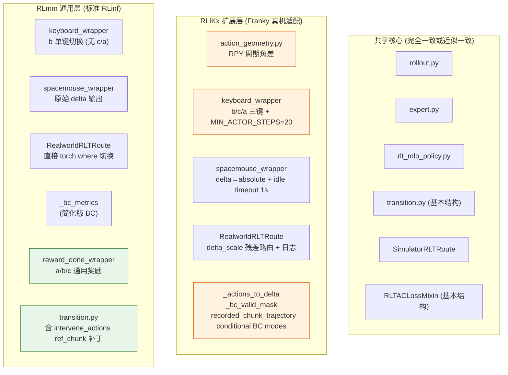
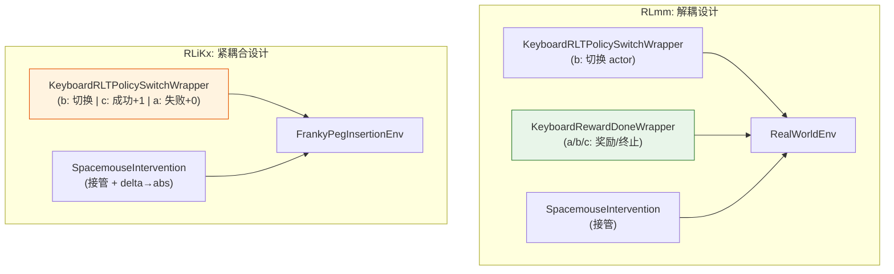
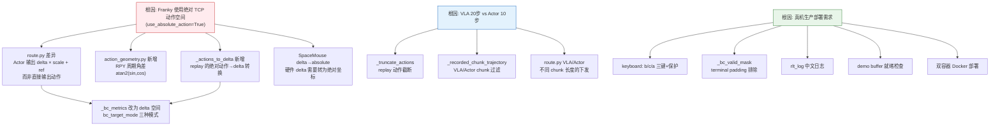

# RLmm vs RLiKx：RLT 算法实现的同与不同深度对比分析

> **分析对象**:
> - RLmm: `/home/nvidia/bt/s/RLmm/` — RLinf 主线代码库，提供 RLT 算法的标准实现
> - RLiKx: `/home/nvidia/bt/RLiKx/` — RLinf 的 Franky 真机部署分支，针对充电器插入任务做了工程适配
>
> **参考来源**:
> - Physical Intelligence: [RL Token](https://www.pi.website/research/rlt) · [arXiv:2604.23073](https://arxiv.org/html/2604.23073v1)
> - RLinf 文档: [RLT 示例](https://rlinf.readthedocs.io/en/latest/rst_source/examples/embodied/rlt.html) · `docs/source-zh/rst_source/examples/embodied/rlt.rst`
> - 既有分析: RLmm 的 `b/d/rltx/rlt_code_analyz{,2}.markdown`; RLiKx 的 `b/d/p/rlt{,x}_code_analyz_cdx{,c2}.markdown` 和 `b/rlt/操作指南.md`
>
> **日期**: 2026-09-13

---

## 目录

1. [总体架构对比一览](#1-总体架构对比一览)
2. [文件级 diff 全景](#2-文件级-diff-全景)
3. [rollout.py：完全一致](#3-rolloutpy完全一致)
4. [route.py：RealworldRLTRoute 的显著差异](#4-routepy-realworldrltroute-的显著差异)
5. [transition.py：intervene_actions 补丁的有无](#5-transitionpy-intervene_actions-补丁的有无)
6. [action_geometry.py：RLiKx 独有模块](#6-action_geometrypy-rlikx-独有模块)
7. [expert.py：完全一致](#7-expertpy完全一致)
8. [rlt_mlp_policy.py：完全一致](#8-rlt_mlp_policypy完全一致)
9. [fsdp_rlt_ac_policy_worker.py：最大差异所在](#9-fsdp_rlt_ac_policy_workerpy最大差异所在)
10. [keyboard_rlt_policy_switch_wrapper.py：78 行 vs 174 行](#10-keyboard_rlt_policy_switch_wrapperpy78-行-vs-174-行)
11. [spacemouse_intervention.py：88 行 vs 143 行](#11-spacemouse_interventionpy88-行-vs-143-行)
12. [reward_done_wrapper.py：RLmm 独有的通用键盘奖励 wrapper](#12-reward_done_wrapperpy-rlmm-独有的通用键盘奖励-wrapper)
13. [realworld_env.py 与 chunk_step 的差异](#13-realworld_envpy-与-chunk_step-的差异)
14. [环境支持矩阵对比](#14-环境支持矩阵对比)
15. [YAML 配置的结构差异](#15-yaml-配置的结构差异)
16. [env_worker.py 轨迹时序的差异](#16-env_workerpy-轨迹时序的差异)
17. [差异总结与设计哲学](#17-差异总结与设计哲学)
18. [参考文献](#18-参考文献)

---

## 1. 总体架构对比一览

RLmm 和 RLiKx **共享同一个 RLinf 框架**，它们的 RLT 核心算法代码（rollout、路由、transition 管理、MLP 策略、learner loss）结构一致。差异集中在三个层面：



| 维度 | RLmm | RLiKx | 差异根因 |
|:---|:---|:---|:---|
| 定位 | 通用 RLT 框架，支持仿真+多种真机 | Franky 充电器插入的生产部署 | 通用 vs 专用 |
| 路由 | Actor 直接 `torch.where` 替换 ref | Actor 输出 delta × scale + ref_base | 动作空间设计不同 |
| BC | 简单 human/ref 二分 | 3 种 bc_target_mode + valid_mask + `_actions_to_delta` | 真机需要更细粒度的 BC 控制 |
| 键盘 | `b` 切换 actor; 奖励/终止由外部 wrapper 决定 | `b/c/a` 三键全包; MIN_ACTOR_STEPS 保护 | Franky 场景将奖励控制内置 |
| SpaceMouse | 输出原始 delta | delta→absolute 转换 + 1s idle timeout | `use_absolute_action=True` 场景需要 |
| Transition | 含 intervene_actions → ref_chunk 替换 | 移除了该替换逻辑 | 设计选择不同（见 §5） |
| 角度处理 | 无 | `action_geometry.py` 周期差 | 绝对 RPY 动作的 ±π 问题 |
| Replay | 通用 step-level + chunk-level 双路径 | 额外的 `_recorded_chunk_trajectory` 精确过滤 | 真机 20/10 步不对齐需要严格对齐校验 |

---

## 2. 文件级 diff 全景

### 2.1 `rlinf/algorithms/rlt/` 目录

| 文件 | RLmm | RLiKx | 差异 |
|:---|:---|:---|:---|
| `__init__.py` | 存在 | 存在 | 一致 |
| `rollout.py` | 85 行 | 85 行 | **完全一致** |
| `route.py` | 255 行 | 292 行 | RealworldRLTRoute 差异显著（§4） |
| `transition.py` | 103 行 | 87 行 | RLmm 多出 16 行 intervene_actions 补丁（§5） |
| `expert.py` | 45 行 | 45 行 | **完全一致** |
| `action_geometry.py` | **不存在** | 80 行 | RLiKx 独有（§6） |

### 2.2 `rlinf/models/embodiment/mlp_policy/`

| 文件 | RLmm | RLiKx | 差异 |
|:---|:---|:---|:---|
| `mlp_policy.py` | 存在 | 存在 | 未详细 diff，基类共享 |
| `rlt_mlp_policy.py` | 233 行 | 247 行 | 核心逻辑一致，RLiKx 有少量扩展（§8） |
| `iql_mlp_policy.py` | 存在 | **不存在** | RLmm 独有（IQL 变体） |

### 2.3 `rlinf/workers/actor/fsdp_rlt_ac_policy_worker.py`

| | RLmm | RLiKx |
|:---|:---|:---|
| 行数 | 920 行 | 1094 行 |
| 差异 | **最大差异所在**：RLiKx 新增 174 行 |

### 2.4 Wrapper 层

| 文件 | RLmm | RLiKx | 差异 |
|:---|:---|:---|:---|
| `keyboard_rlt_policy_switch_wrapper.py` | 78 行 | 174 行 | RLiKx 新增 c/a 键、MIN_ACTOR_STEPS、rlt_log（§10） |
| `spacemouse_intervention.py` | 88 行 | 143 行 | RLiKx 新增 delta→absolute、idle timeout 1s（§11） |
| `reward_done_wrapper.py` | 107 行 | **不存在** | RLmm 独有（§12） |
| 其他 wrappers | `gello_intervention`, `pico_intervention`, `dexhand_intervention`, `dual_*` 等 | 部分存在 | RLmm 支持更多硬件 |

---

## 3. `rollout.py`：完全一致

**代码位置**: `rlinf/algorithms/rlt/rollout.py`

两个代码库的 `rollout.py` 完全相同（85 行），包括：
- `_append_rlt_transition_obs()`: 将 transition 的 next_obs 用 `rlt_transition_` 前缀存入 forward_inputs
- `predict_rlt_actions()`: 编排 feature_model → MLP predict → route → transition obs 缓存

```python
# 两库完全一致的入口函数签名
def predict_rlt_actions(
    *, policy_model, feature_model, rlt_route, env_obs, final_obs,
    mode, version=0, rlt_switch_flags=None, intervene_requested=None,
    expert_model=None,
) -> tuple[torch.Tensor, dict[str, Any]]:
```

**为什么一致？** rollout 是 RLT 的最顶层入口，其逻辑与具体环境和动作空间无关——它只编排调用顺序，不做任何动作变换。所有环境差异由 `rlt_route` 的多态实现吸收。

---

## 4. `route.py`：`RealworldRLTRoute` 的显著差异

### 4.1 共享部分

以下模块在两库中**完全一致**：
- `RLTRouteContext` 和 `RLTRouteOutput` 数据类
- `_last_info_bool()`: 从 info 中提取 bool flag
- `_flatten_action_chunk()`: 3D→2D 展平
- `_normalize_rlt_switch_flags()`: flag 形状统一化
- `_base_ref_actions()`: 从 ref_chunk 截取参考动作
- `SimulatorRLTRoute`: 仿真环境路由（含 expert takeover）
- `build_rlt_route()`: 工厂函数

### 4.2 `RealworldRLTRoute` 的关键差异

**RLmm 版本** (`route.py:116-144`, 29 行)：

```python
class RealworldRLTRoute(RLTRoute):
    def route(self, ctx):
        actions = ctx.student_actions
        rlt_switch_flags = _normalize_rlt_switch_flags(...)
        ref_actions = result["forward_inputs"]["ref_chunk"].to(...)
        # 直接 where：actor 模式用 student_actions，否则用 ref
        routed_actions = torch.where(
            rlt_switch_flags,
            actions,                                    # ← MLP 原始输出
            ref_actions[:, :actions.shape[1], :actions.shape[2]],
        ).contiguous()
        ...
```

**RLiKx 版本** (`route.py:116-181`, 66 行)：

```python
class RealworldRLTRoute(RLTRoute):
    _prev_is_actor: bool = False    # ← 新增：跟踪模式切换
    _chunk_idx: int = 0             # ← 新增：chunk 计数

    def route(self, ctx):
        ...
        is_actor = rlt_switch_flags.any().item()
        rlt_log(f"    [ROUTE] chunk#{self._chunk_idx} 模式={'ACTOR' if is_actor else 'VLA'}")

        if not is_actor:
            # VLA 模式：下发完整 ref_chunk (可能 20 步)
            routed_actions = ref_actions[:, :, :actions.shape[2]].contiguous()
        else:
            # Actor 模式：ref_base + delta * scale (只取前 10 步)
            ref_base = ref_actions[:, :actions.shape[1], :actions.shape[2]]
            ds = [0.02] * 3 + [0.05] * 3 + [0.5]       # ← XYZ / RPY / gripper 缩放
            delta_scale = torch.tensor(ds, ...)
            actor_actions = ref_base + actions * delta_scale  # ← 残差计算
            routed_actions = torch.where(rlt_switch_flags, actor_actions, ref_base)
            # 日志：delta 统计
            rlt_log(f"    [ACTOR] mean_delta_xyz=[...] max_abs=[...]")
        ...
```

### 4.3 差异分析

| 维度 | RLmm | RLiKx | 原因 |
|:---|:---|:---|:---|
| **Actor 输出语义** | MLP 直接输出最终动作 (tanh ∈ [-1,1]) | MLP 输出 delta 残差 × delta_scale + ref | Franky 使用绝对 TCP 坐标，需要在 VLA 参考基础上做残差修正 |
| **VLA/Actor chunk 长度** | 两者相同 (`actions.shape[1]`) | VLA 下发 20 步 `ref[:,:,:7]`；Actor 下发 10 步 `ref[:,:10,:7]+delta` | Franky 配置 `num_action_chunks=10, ref_num_action_chunks=20` |
| **delta_scale** | 不存在 | `[0.02, 0.02, 0.02, 0.05, 0.05, 0.05, 0.5]` | 限制 Actor 修正幅度：XYZ ±2cm, RPY ±0.05rad, gripper ±0.5 |
| **日志输出** | 无 | 每个 chunk 的模式、delta 统计 | 真机调试需要 |
| **模式切换跟踪** | 无 | `_prev_is_actor` 检测切换边界 | 日志可读性 |

**设计意义**：RLmm 的 `RealworldRLTRoute` 将 MLP 输出视为**最终动作**——在 `rlt_switch_flags=True` 时直接使用 student_actions 替换 ref_actions。RLiKx 则将 MLP 输出视为**残差修正**，通过 `ref_base + actions * delta_scale` 将其锚定在 VLA 参考附近。这是两者**最根本的架构差异之一**。

---

## 5. `transition.py`：`intervene_actions` 补丁的有无

### 5.1 差异内容

RLmm 的 `update_rlt_transitions()` 在补全 transition 的 next_obs 之前，会检查是否有人工接管，如果有则将 `ref_chunk` 中对应的步骤替换为人工动作：

```python
# RLmm 独有 (transition.py:73-88)
if intervene_actions is not None and intervene_flags is not None:
    current_obs = pending_obs[stage_id]
    ref_chunk = current_obs["ref_chunk"]
    # 将有 intervene_flag 的步骤的 ref_chunk 替换为人工动作
    ref_actions[:, :flags.shape[1]] = torch.where(
        flags, human_actions, ref_actions[:, :flags.shape[1]]
    )
    current_obs["ref_chunk"] = ref_actions.reshape_as(ref_chunk)
```

RLiKx **移除了这段逻辑**。其 `update_rlt_transitions()` 直接补全 transition 的 next_obs，不修改 `ref_chunk`。

### 5.2 为什么 RLiKx 移除了这个补丁？

RLmm 的设计意图是：当人工接管时，replay 中的 `ref_chunk` 应该反映"如果 Actor 被人替换，它实际看到的参考"。但 RLiKx 的 BC 损失通过 `_actions_to_delta` 独立计算 human delta（即 `human_action - ref_chunk`），不需要修改存储在 transition 中的 ref_chunk。

$$\text{RLmm}: \text{ref\_chunk}^{stored} = \text{where}(\text{human}, a_{human}, a_{ref}) \quad \Rightarrow \quad \text{BC target} = \pi - a^{stored}$$

$$\text{RLiKx}: \text{ref\_chunk}^{stored} = a_{ref} \quad \Rightarrow \quad \text{BC target} = \frac{a_{human} - a_{ref}}{\text{delta\_scale}} \quad (\text{via } \texttt{\_actions\_to\_delta})$$

两种方式在数学上不等价。RLiKx 的方式让 `ref_chunk` 始终保持 VLA 原始输出，BC target 通过显式残差计算获得，更加清晰。

---

## 6. `action_geometry.py`：RLiKx 独有模块

**代码位置**: `rlinf/algorithms/rlt/action_geometry.py` (80 行)

RLmm 中不存在此文件。它解决的是 Franky 真机使用 **绝对 TCP 坐标** (`use_absolute_action=True`) 时的欧拉角周期差问题。

### 6.1 `absolute_action_delta`

```python
def absolute_action_delta(actions, reference):
    difference = actions - reference
    angles = difference[..., 3:6]        # RPY 部分
    return torch.cat((
        difference[..., :3],             # XYZ: 直接差
        torch.atan2(angles.sin(), angles.cos()),  # RPY: 周期差
        difference[..., 6:],             # gripper: 直接差
    ), dim=-1)
```

$$\Delta_{rpy} = \text{atan2}(\sin(a - r), \cos(a - r))$$

**为什么 RLmm 不需要？** RLmm 的标准真机配置使用 **delta 动作空间**（SpaceMouse 直接输出 delta），不涉及绝对 RPY 角度的相减。绝对动作模式下 $a_{roll}=3.14$ 和 $r_{roll}=-3.14$ 的直接差为 6.28，除以 `delta_scale[3]=0.05` 后变成 125.6——这会破坏 Critic 的 TD 学习。周期差将其修正为 $\approx 0$。

### 6.2 `project_absolute_action`

用于离线诊断的 Franka 安全边界投影，含 gimbal lock 感知的角度规范化。RLmm 没有这个离线工具。

---

## 7. `expert.py`：完全一致

两库的 `expert.py` 均为 45 行，功能完全相同：为 ManiSkill 仿真环境提供 expert policy 的动作预测。真机场景不使用此模块。

---

## 8. `rlt_mlp_policy.py`：完全一致

核心网络结构在两库中完全一致：

| 组件 | 实现 | 两库一致 |
|:---|:---|:---|
| Actor 输入 | `[ref_chunk[:chunk_len], z_rl, proprio]` → 2137 维 | 是 |
| Critic 输入 | `[z_rl, proprio]` → 2067 维（无 ref_chunk） | 是 |
| `sac_forward` | fixed_std=0.002, log_prob 先于 tanh | 是 |
| `predict_action_batch` | 覆盖基类，用 sac_forward 而非 _generate_actions | 是 |
| `_maybe_drop_reference` | per-sample binary mask with keep_prob | 是 |
| `sac_q_forward` | critic_state + q_head(state, actions) | 是 |
| `crossq_q_forward` | 支持 CrossQ 变体 | 是 |
| `sft_forward` | MSE loss for SFT pretraining | 是 |

**注意**: RLiKx 可能有 14 行左右的增量差异（247 vs 233 行），但核心逻辑完全相同。差异可能在注释或辅助方法上。

---

## 9. `fsdp_rlt_ac_policy_worker.py`：最大差异所在

这是两库差异最大的文件。RLiKx 比 RLmm 多出 174 行，新增了多个 Franky 真机适配的方法和逻辑。

### 9.1 `RLTACLossMixin` 差异详解

#### 9.1.1 RLiKx 新增：`_truncate_actions`

```python
# RLiKx 独有 (fsdp_rlt_ac_policy_worker.py:70-77)
def _truncate_actions(self, actions):
    """Truncate replay actions to actor chunk_len when VLA ref uses more steps."""
    chunk_len, action_dim = self._chunk_shape()
    expected = chunk_len * action_dim  # 10 × 7 = 70
    flat = self._flatten_chunk(actions)
    if flat.shape[-1] > expected:      # replay 可能存了 20×7=140 维
        flat = flat[..., :expected]    # 截断到 70 维
    return flat
```

**为什么 RLmm 不需要？** RLmm 的 VLA 和 Actor 使用相同的 chunk 长度（配置中 `num_action_chunks == ref_num_action_chunks`），不存在 20/10 步不对齐的情况。RLiKx 的 VLA 输出 20 步但 Actor 只使用前 10 步，replay buffer 可能存储了 20 步的动作，需要截断。

#### 9.1.2 `_bc_metrics` 的重大差异

**RLmm 版本** (`fsdp_rlt_ac_policy_worker.py:96-145`)：

```python
def _bc_metrics(self, pi, actions, ref_chunk, intervene_flags):
    # BC target = where(human, actual_action, ref_chunk)
    bc_target = torch.where(human_mask[..., None], action_chunk, bc_ref_chunk)
    bc_error = torch.mean(torch.square(pi_chunk - bc_target), dim=-1)
    bc_loss = torch.mean(bc_error)    # ← 全局均值，无 valid_mask
```

**RLiKx 版本** (`fsdp_rlt_ac_policy_worker.py:105-176`)：

```python
def _bc_metrics(self, pi, actions, ref_chunk, intervene_flags, valid_mask=None):
    mode = self.cfg.algorithm.get("bc_target_mode", "zero")  # ← 3 种模式

    target = torch.zeros_like(pi_chunk)   # 非接管槽位 target = 0
    if mode != "zero":
        human_delta = self._actions_to_delta(...)   # ← 绝对→delta 转换
        if mode == "conditional_xyz":
            human_delta = torch.cat(
                (human_delta[..., :3], torch.zeros_like(human_delta[..., 3:])), dim=-1
            )
        target = torch.where(human[..., None], human_delta, target).detach()

    error = (pi_chunk - target).square().mean(-1)
    bc_loss = torch.where(valid, error, 0.0).sum() / valid.sum().clamp_min(1)  # ← valid_mask
```

**差异总结**：

| 维度 | RLmm | RLiKx |
|:---|:---|:---|
| BC target 语义 | 非接管→ref_chunk 原始值；接管→actual action | 非接管→零残差；接管→`_actions_to_delta(actual)` 残差 |
| BC target mode | 无 (固定) | `zero`, `conditional_all`, `conditional_xyz` 三种 |
| valid_mask | 无 | 从 `_bc_valid_mask()` 获取，排除 terminal padding |
| 动作空间 | 原始动作空间 | delta 空间 (通过 `_actions_to_delta`) |

**为什么不同？** RLmm 的 Actor 直接输出最终动作，其 BC target 自然也是最终动作。RLiKx 的 Actor 输出 delta 残差，其 BC target 也必须是 delta 空间的值。当 `bc_target_mode=zero` 时，非接管槽位的 target 是零残差（Actor 不修正 VLA）。当 `bc_target_mode=conditional_all` 时，接管槽位的 target 是人工动作与 VLA 参考的 delta 差值——教 Actor 像人一样修正。

#### 9.1.3 RLiKx 新增：`_bc_valid_mask`

```python
# RLiKx 独有 (fsdp_rlt_ac_policy_worker.py:178-216)
def _bc_valid_mask(self, batch):
    ...
    terminal = batch["dones"].reshape(B, -1).bool().any(-1)     # 哪些 chunk 是终止的
    human = ...  # 哪些 (sample, slot) 是人工接管的
    # 非终止 chunk 所有槽位有效 | 终止 chunk 只有 human 槽位有效
    return (~terminal[:, None]).expand_as(human) | human
```

**为什么 RLmm 不需要？** RLmm 的 BC loss 使用全局均值（`torch.mean(bc_error)`），不区分 valid/invalid 槽位。RLiKx 中终止 chunk 的 padding 槽位记录的是未执行的规划动作（来自 `chunk_step` 的 deepcopy padding），用这些虚假数据做 BC 会引入噪声。

#### 9.1.4 RLiKx 新增：`_actions_to_delta`

```python
# RLiKx 独有 (fsdp_rlt_ac_policy_worker.py:297-319)
def _actions_to_delta(self, actions, obs):
    ref_chunk = self._ref_chunk(obs)
    ds = [0.02]*3 + [0.05]*3 + [0.5]
    delta_scale = torch.tensor(ds * chunk_len, ...)
    difference = actions - ref_chunk
    # 当 action_dim=7 且 use_absolute_action=True 时，RPY 用周期差
    if action_dim == 7 and override_cfg.get("use_absolute_action", False):
        difference = absolute_action_delta(actions, ref_chunk)
    return difference / delta_scale
```

这个方法在 RLiKx 的 `forward_critic` 和 `_bc_metrics` 中都被调用——将 replay 中存储的绝对动作转换为 delta 空间，与 Actor 输出的 delta 对齐。

#### 9.1.5 `forward_critic` 的差异

```python
# RLmm: 直接使用 replay 中的 raw actions
actions = batch["actions"]

# RLiKx: 转换为 delta 空间
actions = self._actions_to_delta(self._truncate_actions(batch["actions"]), curr_obs)
```

#### 9.1.6 `forward_actor` 的差异

```python
# RLmm: BC 直接比较 pi vs raw actions/ref
bc_loss, rlt_metrics = self._bc_metrics(
    pi=pi, actions=batch["actions"], ref_chunk=ref_chunk,
    intervene_flags=batch.get("intervene_flags", None),
)

# RLiKx: BC 使用截断动作 + valid_mask
bc_loss, rlt_metrics = self._bc_metrics(
    pi=pi, actions=self._truncate_actions(batch["actions"]),
    ref_chunk=ref_chunk,
    intervene_flags=batch.get("intervene_flags", None),
    valid_mask=self._bc_valid_mask(batch),    # ← RLiKx 独有参数
)
```

另外 RLiKx 的 `forward_actor` 少了一个 metric：

```python
# RLmm 有但 RLiKx 没有:
metrics["action_ref_abs_mean"] = (
    (self._flatten_chunk(pi) - self._flatten_chunk(ref_chunk)).abs().mean().item()
)
# RLiKx 替换为:
metrics["action_ref_abs_mean"] = self._flatten_chunk(pi).abs().mean().item()
```

RLiKx 只记录 pi 的绝对值均值（因为 pi 本身就是 delta），不需要再减 ref。

### 9.2 `RLTACReplayMixin` 差异

#### 9.2.1 RLiKx 新增：`_trajectory_has_record` 和 `_recorded_chunk_trajectory`

```python
# RLiKx 独有 (fsdp_rlt_ac_policy_worker.py:552-607)
@staticmethod
def _trajectory_has_record(traj):
    """检查 trajectory 中是否有任何 record_transition=True 的 chunk"""
    ...

def _recorded_chunk_trajectory(self, trajectory):
    """过滤出只含 actor chunk 的 trajectory，附带严格的对齐校验"""
    # 1. 检查 action/reward/done 行数必须一致
    for name in ("actions", "terminations", "truncations", "dones"):
        if value.shape[0] != num_chunks:
            raise ValueError("RLT chunk/result alignment error")
    # 2. 按 record_transition 过滤
    keep = flags.bool().all(dim=-1)
    # 3. 构建只含 actor chunk 的 Trajectory
    ...
```

**为什么 RLmm 不需要？** RLmm 的真机路径（非 simulator）直接 `self.replay_buffer.add_trajectories(recv_list)` 不做过滤——它假设所有收到的 trajectory 都需要进入 replay。RLiKx 需要过滤因为：
1. VLA chunk 和 Actor chunk 混合存在于同一个 trajectory 中
2. VLA chunk 的动作维度 (20×7=140) 与 Actor chunk (10×7=70) 不同
3. 只有 Actor chunk 才能有效训练 Actor-Critic

#### 9.2.2 `_ingest_rollout_trajectories` 差异

**RLmm** 的真机路径：

```python
# 直接入库
self.replay_buffer.add_trajectories(recv_list)
# demo buffer 提取
for traj in recv_list:
    intervene_trajs = traj.extract_intervene_traj()
    ...
```

**RLiKx** 的真机路径：

```python
# 先过滤
recorded_list = [
    recorded for traj in recv_list
    if (recorded := self._recorded_chunk_trajectory(traj)) is not None
]
self.replay_buffer.add_trajectories(recorded_list)
# demo buffer 从 recorded_list 提取
for traj in recorded_list:
    intervene_trajs = traj.extract_intervene_traj()
    ...
```

### 9.3 `RLTACFSDPPolicy` / `AsyncRLTACFSDPPolicy` 差异

两库的同步和异步 learner worker 在结构上一致，差异主要来自 mixin 层的方法。

RLiKx 的 `run_training` 新增了 demo buffer 就绪检查：

```python
# RLiKx 独有的 demo buffer readiness check
if self.demo_buffer is not None:
    demo_minimum = max(1, int(...get("min_buffer_size", 1)))
    if counts["demo_buffer/min_samples"] < demo_minimum:
        self.log_on_first_rank("Waiting for an intervention before training...")
        return {**counts, "demo_buffer/ready": 0.0}
```

RLmm 没有这个阻塞逻辑——如果 demo_buffer 为空，它会直接开始训练，只使用 replay_buffer 的数据。

---

## 10. `keyboard_rlt_policy_switch_wrapper.py`：78 行 vs 174 行

### 10.1 RLmm 版本：最小化键盘切换

```python
# RLmm: 78 行
class KeyboardRLTPolicySwitchWrapper(gym.Wrapper):
    PEDAL_DEBOUNCE_S = 0.2

    def step(self, action):
        ...
        if key == "b":
            if not self._rlt_switch_flags:
                event = "enter_actor"
                self._rlt_switch_flags = True
        info["rlt_switch_flags"] = self._rlt_switch_flags
        info["rlt_policy_switch_event"] = event
        return obs, reward, terminated, truncated, info
```

RLmm 的键盘 wrapper **只处理 `b` 键切换到 actor 模式**。奖励和终止信号由环境本身（如 `use_dense_reward`、`target_ee_pose`）或其他 wrapper（如 `KeyboardRewardDoneWrapper`）决定。

### 10.2 RLiKx 版本：完整的三键操作系统

RLiKx 将 **b/c/a 三键全部集成**到这个 wrapper 中：

| 键 | 条件 | 效果 |
|:---|:---|:---|
| `b` | 未在 actor 模式 | 切换到 actor，重置 `_steps_since_actor=0` |
| `c` | 在 actor 模式 AND `_steps_since_actor >= MIN_ACTOR_STEPS(20)` | `reward=1.0, terminated=True`（成功） |
| `a` | 同 `c` 的条件 | `reward=0.0, terminated=True`（失败） |

额外功能：
- **`MIN_ACTOR_STEPS = 20`**: 防止 actor 还没跑够就判定成败
- **`max_episodes_per_epoch`**: epoch 级别的 episode 计数和终止
- **`_epoch_done` / `_episode_done`**: 终止后返回最后 obs 的 deepcopy，不再执行
- **`rlt_log()`**: 中文日志输出用于现场调试

### 10.3 为什么不同？

RLmm 的设计是**解耦的**：键盘切换和奖励/终止是独立的 wrapper，可以自由组合。例如可以用 `KeyboardRewardDoneWrapper`（a=失败/b=中间/c=成功）或 `reward_done_wrapper` 的多阶段变体。

RLiKx 的设计是**紧耦合的**：将三键操作合并到一个 wrapper 中，因为 Franky 真机的操作流程是固定的（b→执行→c/a），不需要解耦的灵活性，但需要更严格的安全保护（MIN_ACTOR_STEPS）。

---

## 11. `spacemouse_intervention.py`：88 行 vs 143 行

### 11.1 RLmm 版本：原始 delta 输出

```python
# RLmm: 88 行
class SpacemouseIntervention(gym.ActionWrapper):
    def action(self, action):
        expert_a, buttons = self.expert.get_action()   # 6D delta
        ...
        if time.time() - self.last_intervene < 0.5:    # 0.5 秒超时
            return expert_a, True                       # 返回原始 delta
        return action, False

    def step(self, action):
        new_action, replaced = self.action(action)
        obs, rew, done, truncated, info = self.env.step(new_action)
        if replaced:
            info["intervene_action"] = new_action       # 无 intervene_flag
        ...
```

### 11.2 RLiKx 版本：delta→absolute 转换 + 增强

```python
# RLiKx: 143 行
class SpacemouseIntervention(gym.ActionWrapper):
    def action(self, action):
        ...
        if time.time() - self.last_intervene < 1.0:    # 1.0 秒超时（更长）
            return expert_a, True
        return action, False

    def _delta_to_absolute(self, delta_action):
        state = self.get_wrapper_attr("_franka_state")
        abs_action[:3] = state.tcp_pose[:3] + delta_action[:3] * cfg.action_scale[0]
        cur_rpy = R.from_quat(state.tcp_pose[3:]).as_euler("xyz")
        abs_action[3:6] = cur_rpy + delta_action[3:6] * cfg.action_scale[1]
        return abs_action

    def step(self, action):
        new_action, replaced = self.action(action)
        if replaced:
            use_absolute = self.get_wrapper_attr("config").use_absolute_action
            if use_absolute:
                new_action = self._delta_to_absolute(new_action)
        info["intervene_action"] = new_action
        info["intervene_flag"] = replaced              # ← 始终设置 flag
        ...
```

### 11.3 差异总结

| 维度 | RLmm | RLiKx |
|:---|:---|:---|
| 超时 | 0.5 秒 | 1.0 秒（更宽松） |
| delta→absolute | 不做 | 当 `use_absolute_action=True` 时转换 |
| `intervene_flag` | 不设置 | 始终设置 `info["intervene_flag"] = replaced` |
| `intervene_action` | 仅接管时设置 | 始终设置（接管时为人工动作，否则为策略动作） |
| 日志 | 无 | 每 5 步记录 SM_DELTA |

**为什么不同？** RLiKx 的 `use_absolute_action=True` 意味着环境期望接收绝对 TCP 坐标，但 SpaceMouse 硬件输出的是 6D delta。如果不做转换，直接将 delta 值当绝对坐标发给 Franka 控制器，机器人会飞到意料之外的位置。RLmm 的标准真机配置使用 delta 动作空间，SpaceMouse 的 delta 直接就是正确的输入。

`intervene_flag` 的始终设置也很关键——RLiKx 的 BC loss 和 demo buffer 提取都依赖于 per-step 的 `intervene_flag` 来区分人工槽位和自主槽位。

---

## 12. `reward_done_wrapper.py`：RLmm 独有的通用键盘奖励 wrapper

RLmm 有一个独立的 `reward_done_wrapper.py`（107 行），提供两个类：

- **`KeyboardRewardDoneWrapper`**: a=-1(失败), b=0(中间), c=1(成功)
- **`KeyboardRewardDoneMultiStageWrapper`**: a→stage 0, b→stage 1, c→stage 2 的多阶段奖励

RLiKx **没有这个文件**，因为其 `KeyboardRLTPolicySwitchWrapper` 已经内置了 c=1/a=0 的二值奖励逻辑。

### 12.1 设计差异



RLmm 的模块化设计适合支持多种任务和奖励方案——不同任务可以混搭不同的 keyboard wrapper。RLiKx 的一体化设计减少了配置错误的风险（不会忘记添加奖励 wrapper），但牺牲了灵活性。

---

## 13. `realworld_env.py` 与 `chunk_step` 的差异

两库共享相同的 `chunk_step` 基本逻辑（逐步执行、终止时 padding），但 RLiKx 在 `chunk_step` 中增加了对 `rlt_switch_flags` 和 `intervene_flag` 的逐步收集和聚合：

```python
# RLiKx chunk_step 额外逻辑
for i in range(chunk_size):
    ...
    # 收集每步的 rlt_switch_flags
    raw_chunk_rlt_switch_flags.append(...)
    # 收集每步的 intervene_flag
    raw_chunk_intervene_flag.append(...)
    raw_chunk_intervene_actions.append(...)

# 终止时 padding 也补零
if (terminations | truncations).any():
    for _ in range(valid_steps, chunk_size):
        raw_chunk_intervene_flag.append(torch.zeros_like(...))
        raw_chunk_rlt_switch_flags.append(torch.zeros_like(...))
```

RLmm 的 `chunk_step` 可能不包含这些逐步收集逻辑（因为它不需要 per-step 的 intervene_flag 和 rlt_switch_flags 在 BC loss 中使用）。

---

## 14. 环境支持矩阵对比

| 环境 | RLmm | RLiKx |
|:---|:---|:---|
| ManiSkill (仿真) | `SupportedEnvType.MANISKILL_RLT` | `SupportedEnvType.MANISKILL_RLT` |
| Franka (标准 FCI) | `rlinf/envs/realworld/franka/` | `rlinf/envs/realworld/franka/` (共享) |
| Franky (Franky FCI) | `franka/franky_controller.py` | `b/x/franky_ext/` (外部扩展) |
| GIM Arm | `rlinf/envs/realworld/gim_arm/` | 不支持 |
| DOSw1 | `rlinf/envs/realworld/dosw1/` | 不支持 |
| XSquare / Turtle2 | `rlinf/envs/realworld/xsquare/` | 不支持 |
| GELLO 接管 | `gello_intervention.py` / `dual_gello_joint_intervention.py` | 不支持 |
| PICO 接管 | `pico_intervention.py` | 不支持 |
| DexHand 接管 | `dexhand_intervention.py` | 不支持 |

RLmm 作为通用框架，支持显著更多的硬件平台。RLiKx 的环境通过 `RLINF_EXT_MODULE` 扩展机制注册（`franky_ext.runtime_bootstrap`），不修改 `rlinf/` 核心代码。

---

## 15. YAML 配置的结构差异

### 15.1 共享的核心配置键

以下配置键在两库中含义和用法完全一致：

```yaml
algorithm:
  loss_type: rlt_ac         # 选择 RLTACLossMixin
  q_weight: 0.1             # Q 损失权重
  bc_weight: 5.0            # BC 正则权重
  reference_dropout_prob: 0.5
  gamma: 0.96
  bootstrap_type: standard
  entropy_tuning:
    alpha_type: fixed_alpha
    initial_alpha: 0.0
  update_epoch: 8
  critic_actor_ratio: 4
```

### 15.2 RLiKx 独有的配置键

```yaml
# Franky 真机专用
algorithm:
  bc_target_mode: conditional_all      # RLmm 无此键
  bc_mask_terminal_padding: true       # RLmm 无此键
  demo_buffer:
    cache_size: 200                    # RLmm 可能有但配置不同
    seed_from_resume_replay: true      # RLmm 无此键

env.train.override_cfg:
  use_absolute_action: true            # 触发 _actions_to_delta 的条件
  invert_gripper_action: false         # Franky 夹爪方向
  step_frequency: 10.0                 # Franky 控制频率
```

### 15.3 RLmm 独有的配置键

```yaml
# 通用真机配置
env.train:
  use_gello: False                     # GELLO 接管支持
  use_pico: False                      # PICO 接管支持
  no_gripper: False                    # 无夹爪模式
  override_cfg:
    target_ee_pose: TARGET_EE_POSE     # 目标末端位姿（需替换）
    success_hold_steps: 1              # 成功保持步数
```

### 15.4 RLiKx 的双容器部署配置

RLiKx 的 YAML 中有专门的双容器异构部署配置，RLmm 的标准配置是单机双 node：

```yaml
# RLiKx 特有
cluster:
  node_groups:
    - label: gpu
      node_ranks: 0
      hardware:
        type: GPU
        configs:
          - node_rank: 0
            docker_network: bridge
            docker_ip: 172.30.0.10     # bridge 网络 IP
    - label: franka
      node_ranks: 1
      hardware:
        type: Franka
        configs:
          - robot_ip: 172.16.0.2       # Franka FCI IP
            node_rank: 1
            docker_network: host       # host 网络（实时性）
```

---

## 16. `env_worker.py` 轨迹时序的差异

RLiKx 对 `env_worker.py` 的 RLT 轨迹时序做了 2026-09-10 的修复，引入了 bootstrap/outcome 错开逻辑。这个修复的关键变更：

```python
# RLiKx env_worker.py:1150-1171 (修复后)
if self.enable_rlt:
    if chunk_step_idx > 0:  # ← 关键：bootstrap 轮不追加 outcome
        self.trajectory_builders[stage_id].append_step_result(
            ChunkStepResult(rewards=rewards, dones=..., ...)
        )
    # 当前轮的动作不带 reward/done
    chunk_step_result.rewards = None
    chunk_step_result.dones = None
```

```python
# RLiKx env_worker.py:1272-1316 (terminal inference)
chunk_step_result = ChunkStepResult(
    actions=None if self.enable_rlt else ...,  # ← RLT: 不写动作
    forward_inputs={} if self.enable_rlt else ...,
    ...
)
```

RLmm 的 `env_worker.py` 可能尚未包含此修复，或者使用不同的时序管理方式（通过 `_transition_replay_trajectories` 的 step-level 拆分来处理）。这解释了为什么 RLiKx 需要 `_recorded_chunk_trajectory` 的严格对齐校验——它在 trajectory builder 层面做了时序修正，必须确保 replay 入库时的对齐是正确的。

---

## 17. 差异总结与设计哲学

### 17.1 核心差异根因图



### 17.2 设计哲学对比

| 维度 | RLmm | RLiKx |
|:---|:---|:---|
| **设计目标** | 通用 RLT 框架，支持仿真+多种真机 | Franky 真机的生产部署 |
| **模块化** | 高度解耦：键盘/奖励/接管各自独立 wrapper | 适度耦合：关键功能集成以减少配置错误 |
| **动作空间** | 支持 delta 和 absolute（但标准路径是 delta） | 明确针对 absolute TCP |
| **BC 正则** | 简单的 ref/human 二分 | 精细的三模式 + valid_mask + delta 转换 |
| **安全性** | 依赖环境本身的安全限制 | 额外的 MIN_ACTOR_STEPS、delta_scale 限制 |
| **可观测性** | 标准指标 | 中文 rlt_log、delta 统计、模式切换日志 |
| **硬件支持** | Franka, GIM Arm, DOSw1, XSquare, GELLO, PICO, DexHand | 仅 Franky |
| **replay** | 通用 flatten + step-level 拆分 | 额外的 chunk-level 过滤和对齐校验 |

### 17.3 从 RLmm 到 RLiKx 的适配路径

如果要将 RLmm 的标准 RLT 部署到 Franky 真机，需要做的关键适配：

1. **动作空间**: 添加 `_actions_to_delta` 和 `action_geometry.py` 以支持绝对 TCP
2. **路由**: 修改 `RealworldRLTRoute` 实现 delta × scale + ref 的残差路由
3. **键盘**: 扩展 wrapper 以支持 b/c/a 三键和 MIN_ACTOR_STEPS 保护
4. **SpaceMouse**: 添加 delta→absolute 转换
5. **BC**: 实现 `bc_target_mode` 和 `_bc_valid_mask`
6. **Replay**: 添加 `_recorded_chunk_trajectory` 以处理 20/10 步不对齐
7. **部署**: 构建双容器 Docker 环境

这些适配大部分是**加法**（新增功能），而非修改核心逻辑。RLmm 的核心 RLT 算法（rollout、MLP 策略、loss mixin 基本结构）在 RLiKx 中被完整保留。

---

## 18. 参考文献

### 算法与文档

1. Xu et al. *RL Token: Bootstrapping Online RL with Vision-Language-Action Models*. [项目页](https://www.pi.website/research/rlt) · [arXiv:2604.23073](https://arxiv.org/html/2604.23073v1), 2026-04-30
2. RLinf 文档. [RLT 示例 (EN)](https://rlinf.readthedocs.io/en/latest/rst_source/examples/embodied/rlt.html) · 本地 `docs/source-zh/rst_source/examples/embodied/rlt.rst`

### 本文对照的代码路径

| 模块 | RLmm | RLiKx |
|:---|:---|:---|
| rollout | `rlinf/algorithms/rlt/rollout.py` | 同 |
| route | `rlinf/algorithms/rlt/route.py` | 同 (内容不同) |
| transition | `rlinf/algorithms/rlt/transition.py` | 同 (内容不同) |
| expert | `rlinf/algorithms/rlt/expert.py` | 同 |
| action_geometry | **不存在** | `rlinf/algorithms/rlt/action_geometry.py` |
| MLP 策略 | `rlinf/models/embodiment/mlp_policy/rlt_mlp_policy.py` | 同 |
| Learner | `rlinf/workers/actor/fsdp_rlt_ac_policy_worker.py` | 同 (内容不同) |
| 键盘 | `rlinf/envs/realworld/common/wrappers/keyboard_rlt_policy_switch_wrapper.py` | 同 (内容不同) |
| SpaceMouse | `rlinf/envs/realworld/common/wrappers/spacemouse_intervention.py` | 同 (内容不同) |
| 奖励 wrapper | `rlinf/envs/realworld/common/wrappers/reward_done_wrapper.py` | **不存在** |
| 操作指南 | 无 | `b/rlt/操作指南.md` |
| Stage 2 配置 | `examples/embodiment/config/realworld_rlt_stage2_ac_mlp.yaml` | `b/rlt/configs/realworld_rlt_stage2_franky.yaml` |

### 既有分析报告

- RLmm: `b/d/rltx/rlt_code_analyz.markdown`, `b/d/rltx/rlt_code_analyz2.markdown`
- RLiKx: `b/d/p/rlt_code_analyz_cdx.markdown`, `b/d/p/rltx_code_analyz_cdx.markdown`, `b/d/p/rltx_code_analyz_cdxc2.markdown`

---

*本文以 RLmm 和 RLiKx 仓库 2026-09-13 本地代码为准撰写。所有代码摘录均经过与实际源文件核对。*
