# RLmm vs RLiKx：RLT 算法实现的深度对比分析（v2）

> **分析对象**
> - **RLmm**: `/home/nvidia/bt/s/RLmm/` — RLinf 主线，通用 RLT 框架（Franka / ManiSkill / 多硬件）
> - **RLiKx**: `/home/nvidia/bt/RLiKx/` — Franky 充电器插入任务的 **生产部署分支**，在共享 `rlinf/` 核心上叠加真机修复与 `b/rlt/` 运维层
>
> **参考来源**（最终以本地代码为准）
> - Physical Intelligence: [RL Token](https://www.pi.website/research/rlt) · [arXiv:2604.23073](https://arxiv.org/html/2604.23073v1)
> - RLinf 文档: [RLT 示例 (EN)](https://rlinf.readthedocs.io/en/latest/rst_source/examples/embodied/rlt.html) · `docs/source-zh/rst_source/examples/embodied/rlt.rst`
> - 前序分析: RLmm `b/d/rltx/rlt_code_analyz{,2}.markdown`；RLiKx `b/d/p/rlt{,x}_code_analyz_cdx{,c2}.markdown`；同事版 `b/d/rltx/rlmm_rlikx_diff_analyz.markdown`
> - RLiKx 运维契约: `b/rlt/操作指南.md`
>
> **日期**: 2026-09-13

---

## 目录

1. [执行摘要](#1-执行摘要)
2. [§0 对同事版 `rlmm_rlikx_diff_analyz.markdown` 的评阅](#0-对同事版-rlmm_rlikx_diff_analyzmarkdown-的评阅)
3. [RLT 算法共同基线](#2-rlt-算法共同基线)
4. [三层架构：共享核心 vs 通用层 vs 生产层](#3-三层架构共享核心-vs-通用层-vs-生产层)
5. [端到端数据流对照](#4-端到端数据流对照)
6. [核心模块逐文件对比](#5-核心模块逐文件对比)
7. [操作指南行为映射表](#6-操作指南行为映射表)
8. [配置与部署对比](#7-配置与部署对比)
9. [ManiSkill 仿真路径（RLmm 主验证线）](#8-maniskill-仿真路径rlmm-主验证线)
10. [与 Pi RLT 论文及操作指南的对照](#9-与-pi-rlt-论文及操作指南的对照)
11. [差异根因与设计哲学](#10-差异根因与设计哲学)
12. [从 RLmm 迁移到 RLiKx Franky 的检查清单](#11-从-rlmm-迁移到-rlikx-franky-的检查清单)
13. [RLmm 原生 RLinf：RLT 全链路时序图](#13-rlmm-原生-rlinf-rlt-全链路时序图)
14. [RLiKx 修改版 RLinf：RLT 全链路时序图](#14-rlikx-修改版-rlinf-rlt-全链路时序图)
15. [修改类与行为变更索引](#15-修改类与行为变更索引)
16. [参考文献与代码索引](#16-参考文献与代码索引)

---

## 1. 执行摘要

**三句话结论**：

1. **同骨架**：两库共享 `predict_rlt_actions`、`SimulatorRLTRoute`、`RLTMLPPolicy` 网络拓扑、BC+Q 损失框架与 Stage 1 `extract_rlt_obs` 管线；`rollout.py` 与 `expert.py` 字节级一致。
2. **异语义**：RLiKx 将 Actor MLP 输出解释为 **delta 残差**（`ref + δ×scale`），VLA 阶段执行 **完整 20 步** ref；RLmm 标准真机路径将 MLP 输出当作 **最终动作直接替换 ref 前 10 步**，VLA/Actor 阶段 **均只执行 10 步**。
3. **异运维**：RLiKx 在 `env_worker` 轨迹时序、`chunk_step` 终止 padding、条件 BC、demo 池、双容器启动与离线诊断上做了 **生产级补丁**；这些在 RLmm 通用真机 YAML 中 **未启用或未实现**。

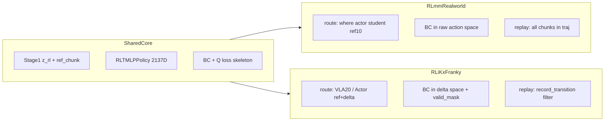

---

## 0. 对同事版 `rlmm_rlikx_diff_analyz.markdown` 的评阅

### 0.1 优点（本文发扬）

| 维度 | 评价 |
|:---|:---|
| **文件级 diff 表** | `route.py`、`fsdp_rlt_ac_policy_worker.py`、wrapper 行数对比清晰，便于快速定位 |
| **RealworldRLTRoute** | 抓住「直接替换 vs 残差路由」这一 **最核心语义差异** |
| **`transition.py`** | intervene→ref_chunk 补丁 vs `_actions_to_delta` 两套 BC 参数化对照准确 |
| **`_bc_metrics`** | human/ref/zero 三分法解释到位 |
| **Wrapper 解耦图** | RLmm 模块化 vs RLiKx 紧耦合的 mermaid 有助于理解工程取舍 |
| **根因图** | 绝对动作 / 20-10 不对齐 / 生产需求的三叉因果图方向正确 |

### 0.2 缺点与纠正（本文补齐）

| 同事版表述 | 源码核实 | 本质问题 | v2 如何处理 |
|:---|:---|:---|:---|
| `rlt_mlp_policy.py` **完全一致** | **不成立**：RLiKx 多 `delta_scale` buffer（注释说明 delta 语义）；网络结构相同但 **动作语义由 route 定义** | 混淆「网络相同」与「输出语义相同」 | §5.3 专节区分 |
| VLA 20 步 / Actor 10 步是 RLiKx 配置特有问题 | **两库 YAML 均为 `num_action_chunks:10, ref_num_action_chunks:20`** | 差异在 **route 运行时行为**，非 YAML 独有 | §5.2、§6 映射表 |
| RLmm **不支持 Franky** | **两库均有** `b/x/franky_ext/` | 混淆「无生产层」与「无硬件代码」 | §3、§7 |
| `realworld_env.chunk_step`「RLiKx 额外收集 rlt_switch_flags」 | **两库都收集**；RLiKx **独有** 终止 break、padding、`chunk_valid_steps` | 把「都有」与「RLiKx 独有」混在一起 | §5.6 |
| `env_worker`「RLmm 可能尚未包含修复」 | **已核实：RLmm 无** outcome 错开、`rewards=None`、terminal `actions=None` | 应用「已核实无」而非「可能」 | §5.5 |
| ManiSkill 路径几乎未写 | RLmm 主验证：`SimulatorRLTRoute` + step-level replay + `rlt_schedule` | 遗漏 RLmm 最成熟路径 | §8 |
| Pi 论文「编辑 ref」未深入 | RLmm route **非** ref+δ；RLiKx **是** ref+δ×scale | 未讨论与 Pi 残差编辑的对应关系 | §9 |
| RLiKx 工程层仅列文件名 | 缺 offline 工具链、20260910 修复叙事、`RLT_COLLECT_ONLY` | 运维知识未结构化 | §3、§6、§7 |

---

## 2. RLT 算法共同基线

两库均实现 Physical Intelligence 提出的 **RL Token** 两阶段流程（出处：[Pi RLT](https://www.pi.website/research/rlt)、[RLinf rlt.rst](/home/nvidia/bt/s/RLmm/docs/source-zh/rst_source/examples/embodied/rlt.rst)）。

### 2.1 Stage 1：VLA + RLT Token Transformer

- 冻结/联合训练 VLA prefix → RLT encoder-decoder → 紧凑向量 \(z_{rl}\)（2048 维）
- 损失：\(\mathcal{L}_{total} = \mathcal{L}_{rlt} + \alpha \cdot \mathcal{L}_{vla}\)

### 2.2 Stage 2：轻量 Actor-Critic

状态：

\[
$$s = \{z_{rl},\ \text{proprio},\ \text{ref\_chunk}\}$$
\]

Actor 目标（RLinf 实现，非 max-entropy SAC）：

\[
$$\mathcal{L}_{actor} = -\lambda_q \cdot Q_1(s, \pi(s)) + \lambda_{bc} \cdot \mathcal{L}_{BC}$$
\]

Critic TD（chunk 内折扣）：

\[
$$R = \sum_{t=0}^{H-1} \gamma^t r_t,\quad
\text{target}_Q = R + (1-\text{done})\cdot \gamma^H \cdot \min(Q_1', Q_2')$$
\]

默认 Franky/Franka 真机：\(\lambda_{bc}=5, \lambda_q=0.1, \gamma=0.96, H=10\)。

### 2.3 共享入口与 Worker 选择

| 机制 | 两库一致 |
|:---|:---|
| Rollout 编排 | `predict_rlt_actions()` in `rlinf/algorithms/rlt/rollout.py` |
| Learner 选择 | `algorithm.loss_type: rlt_ac` → `RLTACFSDPPolicy` / `AsyncRLTACFSDPPolicy` |
| 仿真路由 | `SimulatorRLTRoute` + expert takeover |
| `record_transition` | 真机：按 `rlt_switch_flags`；仿真：按 critical phase |
| Feature model | `rollout.rlt_feature_model` → `extract_rlt_obs()` |

---

## 3. 三层架构：共享核心 vs 通用层 vs 生产层

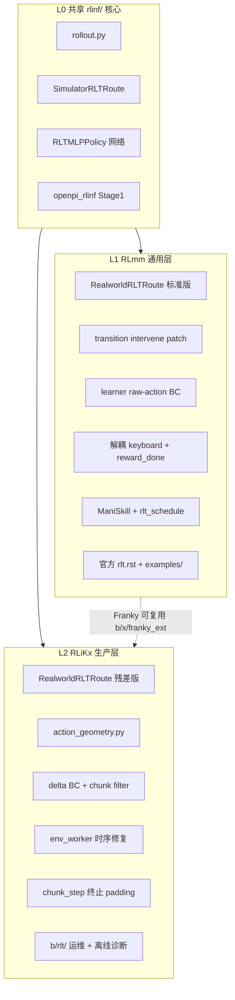

| 层级 | RLmm | RLiKx |
|:---|:---|:---|
| **L0** | 完整 | 完整（与 RLmm 共享或近似） |
| **L1** | 官方 YAML、多硬件 wrapper、ManiSkill e2e | 部分保留（无独立 examples RLT Franky YAML） |
| **L2** | **无** | `b/rlt/`：`操作指南.md`、`start_stage2.sh`、offline 对照、fixed replay |

**关于 Franky**：两库均有 [`b/x/franky_ext/`](/home/nvidia/bt/s/RLmm/b/x/franky_ext/)（`FrankyPegInsertionEnv-v1`）。RLmm 将其用于 cube place 等实验；RLiKx 将其与 **`b/rlt/configs/realworld_rlt_stage2_franky.yaml`** 绑定为充电器插入生产配置。

---

## 4. 端到端数据流对照

### 4.1 RLmm 标准真机路径

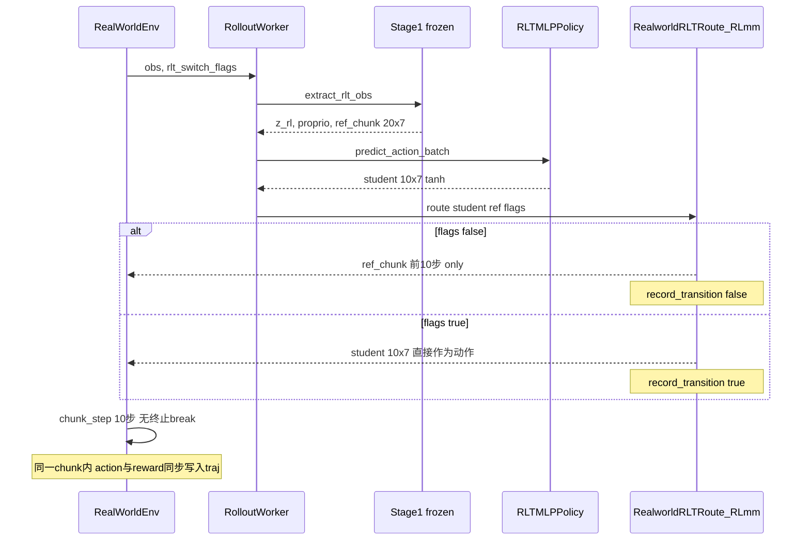

### 4.2 RLiKx Franky 生产路径（操作指南语义）

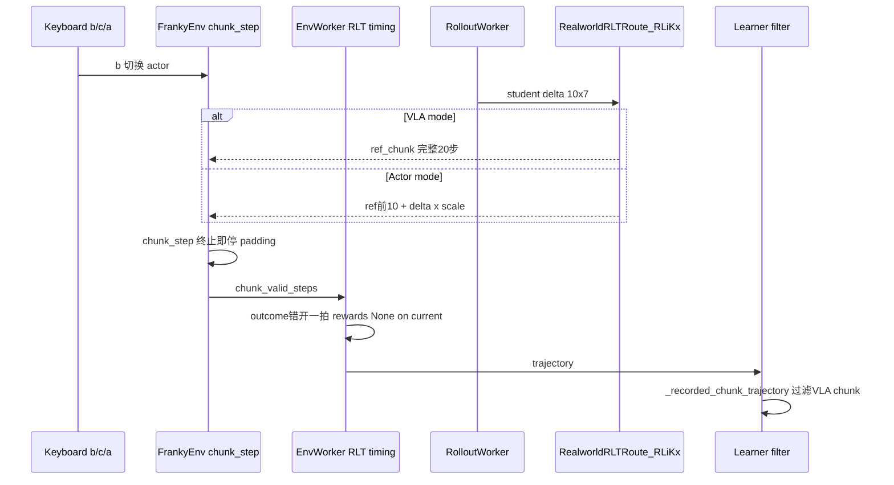

**关键差异一览**：

| 步骤 | RLmm 真机 | RLiKx Franky |
|:---|:---|:---|
| VLA 阶段执行步数 | **10**（`ref[:,:10,:]`） | **20**（`ref[:,:,:]` 全长） |
| Actor 阶段动作 | MLP 输出 **直接执行** | **ref + δ×scale** |
| chunk 中途终止 | 跑满 chunk_size | **立即停止**，padding + `chunk_valid_steps` |
| 轨迹 action/reward | **同步** append | **错开** append outcome |
| Replay 入库 | **整 trajectory** | **仅 record_transition=True** |

---

## 5. 核心模块逐文件对比

### 5.1 `rollout.py` — 完全一致

两库 `rlinf/algorithms/rlt/rollout.py` **85 行，字节级相同**。

编排顺序：`extract_rlt_obs` → `predict_action_batch` → `rlt_route.route` → `_append_rlt_transition_obs`。

**为何一致**：Rollout 层不做动作变换，环境差异全部由 `RLTRoute` 多态吸收。

### 5.2 `route.py` — RealworldRLTRoute：最本质差异

#### RLmm（直接替换）

```130:144:/home/nvidia/bt/s/RLmm/rlinf/algorithms/rlt/route.py
        routed_actions = torch.where(
            rlt_switch_flags,
            actions,
            ref_actions[:, : actions.shape[1], : actions.shape[2]],
        ).contiguous()
        ...
        result["forward_inputs"]["record_transition"] = rlt_switch_flags.reshape(
            actions.shape[0], -1
        )[:, :1].to(torch.bool)
```

- **非 actor**：下发 `ref_chunk` 的 **前 10 步**（`actions.shape[1]=10`）
- **actor**：下发 MLP 的 **10 步 student_actions**（tanh 输出，视为最终动作）
- 无 `delta_scale`，无 `rlt_log`

#### RLiKx（残差编辑 + VLA 20 步）

```145:177:/home/nvidia/bt/RLiKx/rlinf/algorithms/rlt/route.py
        if not is_actor:
            routed_actions = ref_actions[:, :, : actions.shape[2]].contiguous()
        else:
            ref_base = ref_actions[:, : actions.shape[1], : actions.shape[2]]
            ds = [0.02] * 3 + [0.05] * 3 + [0.5]
            ...
            actor_actions = ref_base + actions * delta_scale
            routed_actions = torch.where(rlt_switch_flags, actor_actions, ref_base)
        ...
        result["forward_inputs"]["record_transition"] = ...
```

- **非 actor**：下发 **完整 ref_chunk（20 步）** — 对应操作指南 §1「VLA 执行 20 步」
- **actor**：`ref[:10] + δ×[0.02,0.02,0.02,0.05,0.05,0.05,0.5]`
- 有 chunk 计数、模式切换日志

#### 与 Pi 论文的关系

Pi RLT 描述 Actor **编辑（edit）** VLA 参考 chunk，而非从零生成。RLiKx 的 `ref + δ×scale` **更贴近** 这一「残差修正」叙事；RLmm 真机 route 在 actor 模式下 **完全替换** ref 前 10 步，BC 通过 `where(human, action, ref)` 锚定，是 **另一套参数化**，并非显式 delta 空间。

| 维度 | RLmm | RLiKx | 解决的问题 |
|:---|:---|:---|:---|
| Actor 输出语义 | 最终动作 | delta 残差 | 限制修正幅度、避免绝对坐标大幅偏离 VLA |
| VLA 阶段步数 | 10 | 20 | 长 horizon 粗定位（抓取→接近插座） |
| Actor 阶段步数 | 10 | 10 | 精插阶段低延迟控制 |
| `delta_scale` | 无（route 层） | 有 | 真机安全：XYZ ±2cm, RPY ±0.05rad |

**配置层相同、运行时不同**：两库 YAML 均设 `num_action_chunks:10, ref_num_action_chunks:20`（见 [`realworld_rlt_stage2_ac_mlp.yaml:245-246`](/home/nvidia/bt/s/RLmm/examples/embodiment/config/realworld_rlt_stage2_ac_mlp.yaml) 与 RLiKx Franky YAML），但 **只有 RLiKx route 在 VLA 模式消费全部 20 步 ref**。

### 5.3 `rlt_mlp_policy.py` — 结构相同，语义不同

| 组件 | RLmm | RLiKx |
|:---|:---|:---|
| Actor 输入维度 | 2137 = 70+2048+19 | 相同 |
| Critic 输入 | `[z_rl, proprio]` + action | 相同 |
| `sac_forward` | tanh, fixed_std=0.002 | 相同 |
| `delta_scale` buffer | **无** | **有**（文档性；route 层硬编码相同 scale） |
| ref_chunk 注释 | 标准 | 强调 replay 存 env-frame 原始 ref |

```81:87:/home/nvidia/bt/RLiKx/rlinf/models/embodiment/mlp_policy/rlt_mlp_policy.py
        # Delta residual: MLP outputs delta in [-1,1], route computes
        # ref_chunk + delta * delta_scale.  Per-dim scale caps max correction.
        ds = [0.02] * 3 + [0.05] * 3 + [0.5]  # XYZ, RPY, gripper
        self.register_buffer("delta_scale", torch.tensor(ds, dtype=torch.float32))
```

**结论**：网络 **拓扑一致**；**输出语义** 由 route + learner 共同定义。RLmm 将 π 与 ref 在同一动作空间比较；RLiKx 将 π 视为 δ，critic/BC 经 `_actions_to_delta` 对齐。

### 5.4 `transition.py` — 两套 human BC 参数化

#### RLmm：改写存储的 ref_chunk

```72:88:/home/nvidia/bt/s/RLmm/rlinf/algorithms/rlt/transition.py
    if pending_obs[stage_id] is not None:
        if intervene_actions is not None and intervene_flags is not None:
            ...
            ref_actions[:, : flags.shape[1]] = torch.where(
                flags, human_actions, ref_actions[:, : flags.shape[1]]
            )
            current_obs["ref_chunk"] = ref_actions.reshape_as(ref_chunk)
        next_obs = extract_rlt_obs_from_forward_inputs(...)
```

#### RLiKx：保持 VLA ref，BC 在 learner 算 delta

RLiKx **移除** 上述 patch；`ref_chunk` 始终为 VLA 原始输出，人工修正通过 `_actions_to_delta(actions, ref)` 进入 BC。

| 范式 | BC target（非接管） | BC target（接管） |
|:---|:---|:---|
| RLmm | ref_chunk 原始值 | stored ref（已替换为 human 的槽位） |
| RLiKx `conditional_all` | **零残差** | `human - ref` 经周期差与 scale |

RLiKx 范式更清晰（ref 语义不变），但 **必须** 配套 `_actions_to_delta` 与 `action_geometry.py`。

### 5.5 `fsdp_rlt_ac_policy_worker.py` — 最大差异（920 vs 1094 行）

#### 5.5.1 Critic：动作空间

```python
# RLmm forward_critic
actions = batch["actions"]

# RLiKx forward_critic
actions = self._actions_to_delta(self._truncate_actions(batch["actions"]), curr_obs)
```

RLiKx critic 在 **归一化 delta 空间** 评估 Q；RLmm 在 **replay 原始动作空间**（对绝对 TCP 任务，若未做几何处理，RPY 接近 ±π 时 TD 会异常）。

#### 5.5.2 BC：`_bc_metrics`

**RLmm**（原始动作空间，全局 mean）：

```123:125:/home/nvidia/bt/s/RLmm/rlinf/workers/actor/fsdp_rlt_ac_policy_worker.py
        bc_target = torch.where(human_mask[..., None], action_chunk, bc_ref_chunk)
        bc_error = torch.mean(torch.square(pi_chunk - bc_target), dim=-1)
        bc_loss = torch.mean(bc_error)
```

**RLiKx**（delta 空间 + valid_mask + 三种 mode）：

- `bc_target_mode`: `zero` | `conditional_all` | `conditional_xyz`
- `_bc_valid_mask`: 终止 chunk padding 槽位排除 BC
- `_truncate_actions`: 20×7 replay 动作截断为 10×7

#### 5.5.3 Replay 入库：真机路径分叉

**RLmm**（`_ingest_rollout_trajectories` 非 simulator 分支）：

```637:648:/home/nvidia/bt/s/RLmm/rlinf/workers/actor/fsdp_rlt_ac_policy_worker.py
        self.replay_buffer.add_trajectories(recv_list)
        if self.demo_buffer is not None:
            for traj in recv_list:
                intervene_trajs = traj.extract_intervene_traj()
                ...
```

**RLiKx**：

```788:805:/home/nvidia/bt/RLiKx/rlinf/workers/actor/fsdp_rlt_ac_policy_worker.py
        recorded_list = [
            recorded for traj in recv_list
            if (recorded := self._recorded_chunk_trajectory(traj)) is not None
        ]
        self.replay_buffer.add_trajectories(recorded_list)
        ...
```

RLiKx `_recorded_chunk_trajectory` 还 **校验** actions/rewards/dones 行数一致（20260910 修复），防止 bootstrap `rewards=None` 导致的错位 replay。

#### 5.5.4 Demo buffer 阻塞

RLiKx：demo 池未就绪时 `run_training()` 阻塞等待首次接管（`fsdp_rlt_ac_policy_worker.py:987-999`）。RLmm 代码支持 demo_buffer，但 **标准真机 YAML 未配置** demo_buffer。

#### 5.5.5 共享：ManiSkill step-level replay

两库在 `use_simulator_transition_replay(cfg)==True` 时走 `_transition_replay_trajectories`，将 trajectory **按 env step 拆行** 入库 — 见 §8。

### 5.6 `env_worker.py` — RLT 轨迹时序（RLiKx 独有修复）

**RLmm**：action 与 reward/done **同一步** append：

```1097:1118:/home/nvidia/bt/s/RLmm/rlinf/workers/env/env_worker.py
                    chunk_step_result = ChunkStepResult(
                        actions=policy_output.forward_inputs.get("action", None),
                        ...
                        rewards=rewards,
                        dones=env_output.dones,
                        ...
                    )
                    self.trajectory_builders[stage_id].append_step_result(chunk_step_result)
```

**RLiKx**：outcome **错开一拍**；bootstrap 轮 `rewards=None`；terminal inference 不追加动作：

```1150:1171:/home/nvidia/bt/RLiKx/rlinf/workers/env/env_worker.py
                    if self.enable_rlt:
                        if chunk_step_idx > 0:
                            self.trajectory_builders[stage_id].append_step_result(
                                ChunkStepResult(rewards=rewards, dones=..., ...)
                            )
                        chunk_step_result.rewards = None
                        chunk_step_result.dones = None
                        ...
                    self.trajectory_builders[stage_id].append_step_result(chunk_step_result)
```

**若不修复**（操作指南 §1 记录的 `20260910-072055`）：bootstrap 的 `rewards=None` 被当作 outcome，导致 **reward/done 与 action 列表错位**，旧 replay 不可用于训练。

### 5.7 `realworld_env.chunk_step` — 终止安全（RLiKx 独有）

**RLmm**：逐步执行至 `chunk_size`，**无** 中途 break，**无** `chunk_valid_steps`：

```307:322:/home/nvidia/bt/s/RLmm/rlinf/envs/realworld/realworld_env.py
        for i in range(chunk_size):
            ...
            chunk_rewards.append(step_reward)
            raw_chunk_terminations.append(terminations)
            raw_chunk_truncations.append(truncations)
        # 无 break；终止后仍可能继续发命令至 chunk 结束
```

**RLiKx**：终止即停、padding、记录有效步数：

```340:382:/home/nvidia/bt/RLiKx/rlinf/envs/realworld/realworld_env.py
            if (terminations | truncations).any():
                valid_steps = i + 1
                for _ in range(valid_steps, chunk_size):
                    obs_list.append(copy.deepcopy(extracted_obs))
                    chunk_rewards.append(torch.zeros_like(step_reward))
                    ...
                break
        ...
        infos_last["chunk_valid_steps"] = torch.full((self.num_envs,), valid_steps, ...)
```

**解决的问题**：按 `c/a` 或超时终止后 **不再向机械臂发送未规划动作**；padding 槽位供 learner 保持 tensor 形状，由 `_bc_valid_mask` 排除 BC。

### 5.8 `action_geometry.py` — RLiKx 独有

```23:40:/home/nvidia/bt/RLiKx/rlinf/algorithms/rlt/action_geometry.py
def absolute_action_delta(actions, reference):
    difference = actions - reference
    angles = difference[..., 3:6]
    return torch.cat((
        difference[..., :3],
        torch.atan2(angles.sin(), angles.cos()),
        difference[..., 6:],
    ), dim=-1)
```

当 `use_absolute_action=True` 时，RPY 周期差避免 \(+\pi/-\pi\) 被算成 \(\approx 2\pi\) 的巨大 critic 输入。RLmm **无此模块**；标准真机 YAML 亦 **未设** `use_absolute_action: true`。

### 5.9 Wrapper 层

#### Keyboard

| | RLmm (78 行) | RLiKx (174 行) |
|:---|:---|:---|
| `b` | 切换 actor | 同 + 重置 `_steps_since_actor` |
| `c` / `a` | **无** | reward 1/0 + terminated + `MIN_ACTOR_STEPS=20` |
| epoch 限制 | **无** | `max_episodes_per_epoch` |
| 日志 | `_log_info` 英文 | `rlt_log` 中文现场提示 |

RLmm 奖励/终止依赖 **`KeyboardRewardDoneWrapper`**（`reward_done_wrapper.py`，RLiKx **无此文件**）或环境 `use_pose_reward`。

#### SpaceMouse

| | RLmm (88 行) | RLiKx (143 行) |
|:---|:---|:---|
| 超时 | 0.5s | 1.0s |
| delta→absolute | **无** | `use_absolute_action=True` 时转换 |
| `intervene_flag` | **不设置** | 始终设置 |
| 日志 | 无 | `[SM_DELTA]` 统计 |

RLiKx 必须做 delta→absolute，否则 SpaceMouse 的 6D delta 被当作绝对 TCP 会导致 **飞车**。

---

## 6. 操作指南行为映射表

[`RLiKx/b/rlt/操作指南.md`](/home/nvidia/bt/RLiKx/b/rlt/操作指南.md) 描述 **RLiKx Franky 生产契约**。下表映射到 RLmm 实现或标注「无等价」。

| 操作指南 § | 行为 | RLiKx 实现 | RLmm 对应 | 差异说明 |
|:---|:---|:---|:---|:---|
| §1.1 | VLA 推理 20×7 ref | `extract_rlt_obs` + route VLA 20 步 | 同 feature model；route **仅 10 步** | **执行语义不同** |
| §1.2 | 未按 b：执行 20 步 | `RealworldRLTRoute` `ref[:,:,:]` | `ref[:,:10,:]` | RLmm VLA 阶段更短 |
| §1.3 | 按 b：actor 修正前 10 步 | `ref[:10]+δ×scale` | `where(actor, student, ref[:10])` | 残差 vs 替换 |
| §1.4 | c/a 需 actor≥20 步 | `MIN_ACTOR_STEPS=20` | **无**；需外部 reward wrapper | RLiKx 内置保护 |
| §1.5 | 终止 chunk 停发命令 | `chunk_step` break+padding | **无 break** | 真机安全 |
| §1 | VLA chunk 不进 replay | `_recorded_chunk_trajectory` | **整 traj 入库** | RLmm 可能混入 VLA chunk |
| §1 | bootstrap 无 outcome | `env_worker` 错开时序 | **同步 append** | RLmm 有错位风险 |
| §2 | `use_absolute_action: true` | YAML + δ 管线 | YAML **未设** | RLmm 默认 delta/相对语义 |
| §2 | 双相机 2-view | `num_images_in_input: 2` | 标准 YAML **1-view** | 任务/模型差异 |
| §3 | `demo_buffer` 200 槽 | YAML + 混合采样 | 真机 YAML **无 demo_buffer** | RLiKx 生产启用 |
| §3 | `bc_target_mode: conditional_all` | learner | **无此配置键** | RLiKx 条件 BC |
| §3 | `RLT_COLLECT_ONLY` | `run_stage2.sh` | **无等价脚本** | RLiKx 运维 |
| §4 | 双 Docker 一键启动 | `start_stage2.sh` | 手工 Ray + 官方 doc | RLiKx 生产部署 |
| §7 | 离线 `compare_offline_stage2.py` | `b/rlt/scripts/` | **无** | RLiKx 实验工具 |
| §9 | 回归测试 `test_rlt_*` | `tests/unit_tests/` | 部分测试 **可能未同步** RLiKx 修复 | 需以 RLiKx 为准跑 |

---

## 7. 配置与部署对比

### 7.1 真机 Stage 2 YAML 关键字段

| 字段 | RLmm `realworld_rlt_stage2_ac_mlp.yaml` | RLiKx `realworld_rlt_stage2_franky.yaml` |
|:---|:---|:---|
| 环境 ID | `realworld_peg_insertion` | `FrankyPegInsertionEnv-v1` |
| `num_action_chunks` / `ref_num_action_chunks` | 10 / 20 | 10 / 20（**相同**） |
| `use_absolute_action` | **未设置** | `true` |
| `use_pose_reward` | 依赖 `target_ee_pose` | **`false`**（人工 c/a） |
| `demo_buffer` | **无** | 200 槽 + `seed_from_resume_replay` |
| `bc_target_mode` | **无** | `conditional_all` |
| `bc_mask_terminal_padding` | **无** | `true` |
| `overlap_env_bootstrap` | 默认 false | **显式 false** |
| `max_episodes_per_epoch` | **无** | 2 |
| `save_interval` | -1 | 2 |
| Stage1 路径 | 占位符 | `trans5090_v2/full_weights.pt` |
| OpenPI config | `pi05_franka_state` 1-view | `pi05_franka_state_2view_10hz` 2-view |
| cluster | 4090 + franka 2-node | gpu + franka 2-node + Docker 脚本 |

### 7.2 部署形态

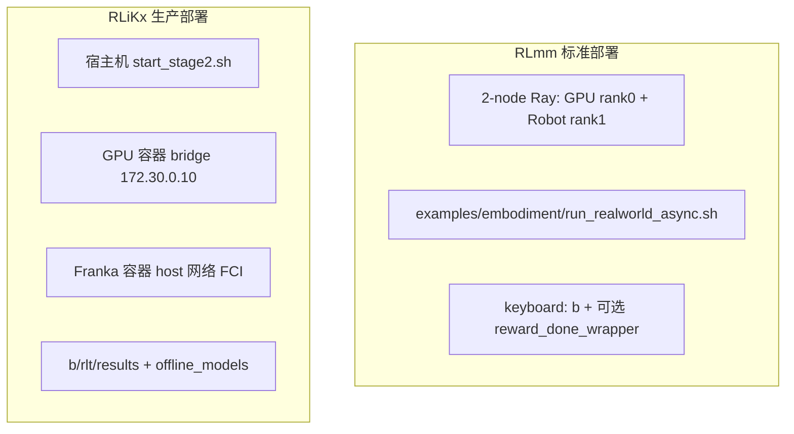

RLiKx `b/rlt/scripts/start_stage2.sh` 提供：`start|restart|logs|status|stop`、容器挂载校验、`flock` 防并发、Ctrl+C cleanup。RLmm 依赖官方文档手工流程。

### 7.3 RLiKx 独有运维工具

| 工具 | 作用 |
|:---|:---|
| `compare_offline_stage2.py` | 固定 replay CPU 对照 BC/Q，不启 Ray |
| `audit_saved_stage2.py` | 无硬件 replay 审计 |
| `fixed_replay_buffer/` | 审计后固定轨迹 |
| `offline_diagnostics/` | 条件 BC、Q=0 消融报告 |
| `RLT_COLLECT_ONLY=1` | 冻结权重采集 20 episode |

---

## 8. ManiSkill 仿真路径（RLmm 主验证线）

RLmm 对 RLT 最完整的 **自动化验证** 在 ManiSkill，而非标准 Franka 真机 YAML。

### 8.1 配置特征（`maniskill_rlt_stage2_ac_mlp.yaml`）

- `algorithm.rlt_schedule.enable: true` — warmup 30k updates 后再开 actor
- `actor_weight_schedule` — BC/Q 权重渐进（7.0/0.05 → 2.5/0.45）
- `SimulatorRLTRoute` — 自动 `rlt_switch_flags` + expert takeover
- `use_simulator_transition_replay` — **step-level** replay 拆分

### 8.2 与真机路径对比

| | ManiSkill (RLmm) | RLiKx Franky |
|:---|:---|:---|
| 路由 | `SimulatorRLTRoute` | `RealworldRLTRoute` 残差版 |
| 切换 | 任务自动 critical phase | 键盘 `b` |
| Replay 粒度 | **逐步** transition | **chunk** transition |
| Expert | 仿真内置 expert | SpaceMouse 人工 |
| Schedule | `rlt_schedule` 启用 | Franky YAML **未启用** schedule |

**两库 ManiSkill 代码相同**；RLiKx 未改仿真路径，Franky 补丁 **仅作用于真机 Realworld 分支**。

---

## 9. 与 Pi RLT 论文及操作指南的对照

### 9.1 Pi 论文要点 vs 两库实现

| Pi 论文概念 | RLmm 真机 | RLiKx Franky |
|:---|:---|:---|
| 冻结 VLA + RL token \(z_{rl}\) | ✓ | ✓ |
| Actor 编辑 ref chunk | 隐式（BC 拉向 ref） | **显式** ref+δ |
| BC 锚定 VLA | `bc_target=ref`（原始空间） | `bc_target=0` + 条件 human δ |
| Reference dropout | ✓ 0.5 | ✓ 0.5 |
| Human intervention → BC | ref_chunk 替换（transition） | `_actions_to_delta` |
| Off-policy TD + twin-Q | ✓ | ✓（delta 空间 critic） |

### 9.2 操作指南作为 RLiKx 独有「运行时契约」

`操作指南.md` 不仅是文档，更是 **与代码同步的生产 SLA**：

- 废弃错误语义（delta VLA、反向夹爪、VLA chunk 进 replay）— RLmm 通用路径 **不保证** 这些约束
- 20260910 修复叙事 — RLmm **未合并** 同等 env_worker/chunk 修复
- 离线实验结论（Q=0 与 BC+Q 持平）— 仅适用于 RLiKx delta+条件 BC 管线

---

## 10. 差异根因与设计哲学

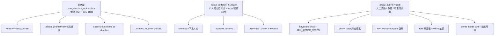

| 设计维度 | RLmm | RLiKx |
|:---|:---|:---|
| **目标** | 通用框架 + 文档 + 多 benchmark | 单一任务生产可复现 |
| **模块化** | 高：keyboard / reward / teleop 可混搭 | 中：关键路径紧耦合防配错 |
| **动作参数化** | 原始动作空间 + ref 替换 BC | 显式 delta 残差 + 条件 BC |
| **Replay 纯度** | 真机 traj 整体入库 | 严格过滤 + 对齐校验 |
| **可观测性** | 标准 tensorboard 指标 | + 中文 rlt_log、delta 统计 |
| **验证重心** | ManiSkill + 官方 Franka 模板 | Franky 真机 + 离线 fixed replay |

---

## 11. 从 RLmm 迁移到 RLiKx Franky 的检查清单

若要把 RLmm 标准 RLT 迁移到 RLiKx Franky 生产语义，需 **至少** 完成：

### 11.1 代码层（RLiKx 已做）

- [ ] `RealworldRLTRoute` 改为 VLA 20 步 + Actor ref+δ×scale
- [ ] 新增 `action_geometry.py` + `_actions_to_delta`
- [ ] `_bc_metrics` 支持 `bc_target_mode` + `_bc_valid_mask`
- [ ] `_recorded_chunk_trajectory` + replay 对齐校验
- [ ] `env_worker` RLT outcome 错开 + terminal inference 无动作
- [ ] `chunk_step` 终止 break + `chunk_valid_steps`
- [ ] `KeyboardRLTPolicySwitchWrapper` b/c/a + MIN_ACTOR_STEPS
- [ ] `SpacemouseIntervention` delta→absolute + intervene_flag
- [ ] 移除或禁用 `transition.py` intervene→ref_chunk 补丁（与 delta BC 一致）

### 11.2 配置层

- [ ] `use_absolute_action: true`
- [ ] `use_pose_reward: false`
- [ ] `invert_gripper_*: false`（按现场标定）
- [ ] `demo_buffer` + `bc_target_mode: conditional_all`
- [ ] `overlap_env_bootstrap: false`
- [ ] Stage1 2-view 权重与 `norm_stats` 路径
- [ ] `RLINF_EXT_MODULE=franky_ext.runtime_bootstrap`

### 11.3 运维层

- [ ] `b/rlt/scripts/start_stage2.sh` 双容器
- [ ] `操作指南.md` 作为现场 SOP
- [ ] 离线对照脚本与 fixed replay 审计

### 11.4 勿直接混用

- **勿** 用 RLmm 真机 YAML 直接跑 RLiKx Franky 权重（动作语义不同）
- **勿** 恢复 20260910 修复前 RLiKx replay 到 RLmm learner（时序不兼容）
- **勿** 假设 `rlt_mlp_policy` checkpoint 跨语义可互换（π 训练目标空间不同）

---

## 13. RLmm 原生 RLinf：RLT 全链路时序图

本节描述 **RLmm**（`/home/nvidia/bt/s/RLmm/`）中 RLT 从启动到单步训练的完整调用链。图中类名与源码一致；**未标注 `[MOD]` 的类/行为与 RLiKx 在真机路径上相同或仅有细微差异**。

### 13.1 图例

| 标记 | 含义 |
|:---|:---|
| 普通节点 | RLmm / 两库共享，真机路径行为一致 |
| **`[RLmm]`** | RLmm 真机路径特有或未在 RLiKx Franky 启用的行为 |
| 虚线箭头 | Ray Channel 跨 Worker 异步消息 |
| 实线箭头 | 同进程内函数调用 |

### 13.2 两阶段总览（Stage 1 → Stage 2）

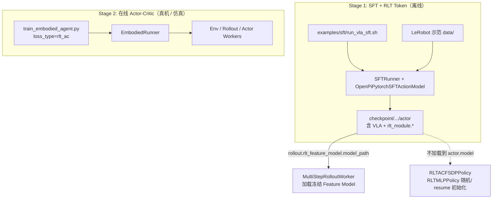

**说明**：

- **Stage 1** 入口为 SFT pipeline（`runner.task_type: sft`），联合优化 `vla_loss` 与 `rlt_loss`；产出 **含 `rlt_module` 权重的 actor checkpoint**。
- **Stage 2** 入口为 `examples/embodiment/train_embodied_agent.py`（或 `run_realworld.sh`）；当 `algorithm.loss_type: rlt_ac` 时选用 `RLTACFSDPPolicy`，**不**走独立 RLT Runner。
- Stage 1 checkpoint **只**填入 `rollout.rlt_feature_model.model_path`；Stage 2 MLP 头由 `actor.model` 定义，权重来自 `runner.resume_dir` 或随机初始化。

### 13.3 部署拓扑与进程职责（Stage 2 真机）

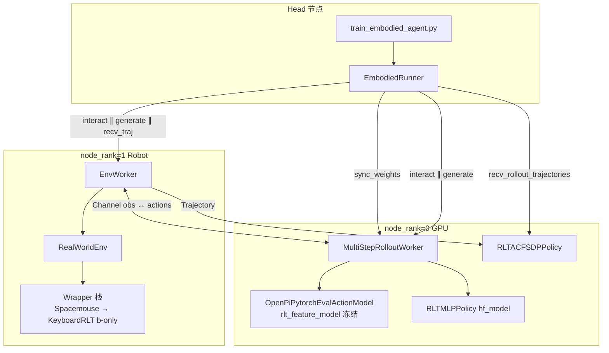

**类职责**：

| 类 | 文件 | 职责 |
|:---|:---|:---|
| `EmbodiedRunner` | `rlinf/runners/embodied_runner.py` | 训练主循环：权重同步 → rollout 采集 → actor 训练 |
| `MultiStepRolloutWorker` | `rlinf/workers/rollout/hf/huggingface_worker.py` | 加载 Stage1 feature model + Stage2 MLP；调用 `predict_rlt_actions` |
| `EnvWorker` | `rlinf/workers/env/env_worker.py` | 驱动真机 env；构建 `Trajectory`；Channel 与 Rollout 握手 |
| `RLTACFSDPPolicy` | `rlinf/workers/actor/fsdp_rlt_ac_policy_worker.py` | Replay 入库、BC+Q 更新、checkpoint |
| `RealworldRLTRoute` | `rlinf/algorithms/rlt/route.py` | **[RLmm]** 真机 actor/ref 直接 `torch.where` 替换 |

### 13.4 EmbodiedRunner 单训练步时序（总图）

对应 `EmbodiedRunner.run()` 中每个 `global_step` 的 **同步** 三 Worker 协同（`overlap_env_bootstrap=false` 时无 prefetch）。

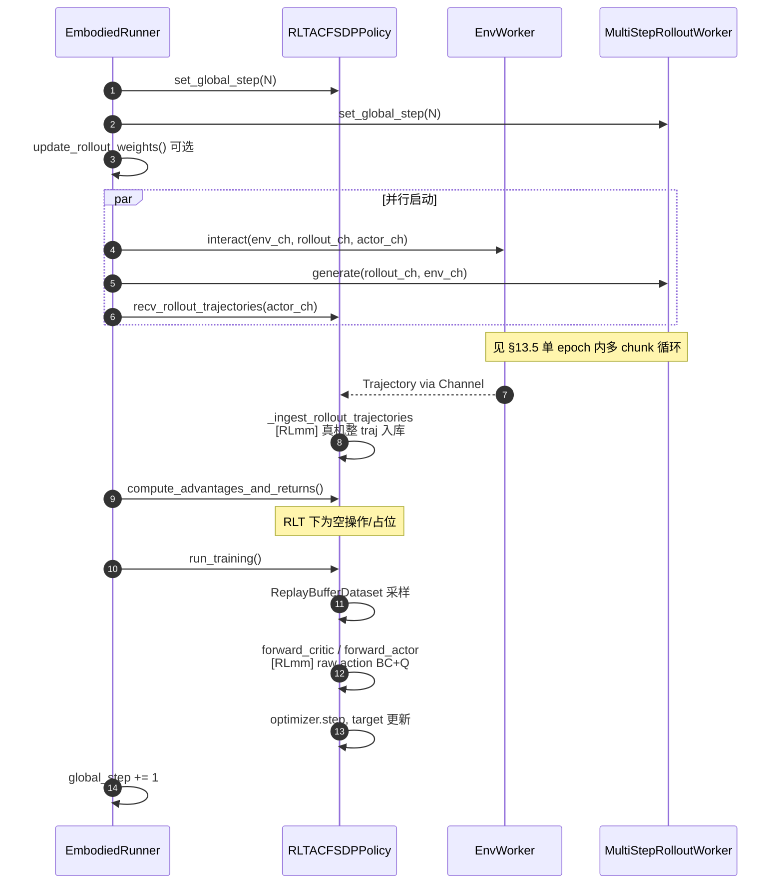

**说明**：

1. **步骤 1–3**：Actor 与 Rollout 共享 `global_step`；周期性 `update_rollout_weights` 将 FSDP actor 权重同步到 Rollout 侧 `hf_model`。
2. **步骤 4–6 并行**：Env 推 obs、Rollout 回 actions、Actor 收 traj——三者通过 **两个 Channel**（`env_channel` / `rollout_channel` / `actor_channel`）解耦，由 Runner 在同一 step 内 `wait()` 汇合。
3. **步骤 7–8**：RLT **不使用 GAE**；`compute_advantages_and_returns` 对 `rlt_ac` 基本是 SAC 路径的兼容调用。
4. **步骤 9–11**：`run_training` 从 replay（+ 可选 demo_buffer）采样，按 `critic_actor_ratio` 交替更新 critic 与 actor。

### 13.5 EnvWorker ↔ RolloutWorker：单 rollout epoch 时序（子图）

真机 RLT 在 `EnvWorker._run_interact_once()` 内循环 `n_train_chunk_steps` 次；每次为一个 **chunk**（默认 10 物理步）。

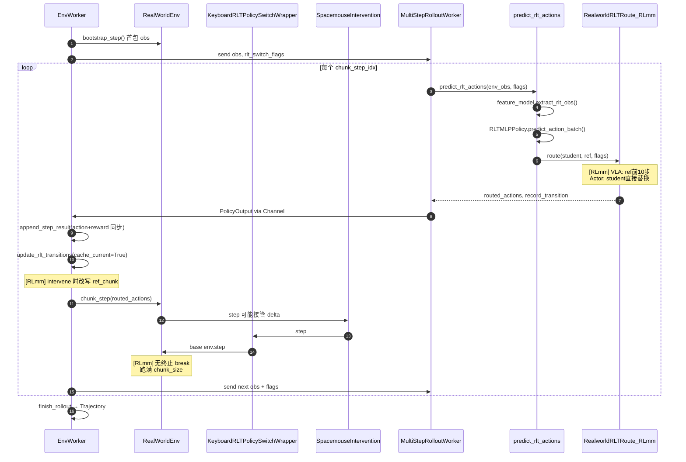

**[RLmm] 真机路径要点**：

- **Keyboard** 仅处理 `b` 键（`KeyboardRLTPolicySwitchWrapper` 78 行）；**奖励/终止** 来自环境 `use_pose_reward` 或另配 `KeyboardRewardDoneWrapper`（`reward_done_wrapper.py`）。
- **`update_rlt_transitions`**：若 SpaceMouse 接管，**在写入 transition 前把 `ref_chunk` 替换为 human action**（`transition.py:72-88`）。
- **`append_step_result`**：**同一 chunk** 内 action 与 reward/done **同步写入** trajectory（`env_worker.py:1097-1118`）。
- **`RealworldRLTRoute`**：非 actor 时下发 `ref_chunk[:, :10, :]`，**不是** 20 步。

### 13.6 Rollout 推理子模块调用链（代码级）

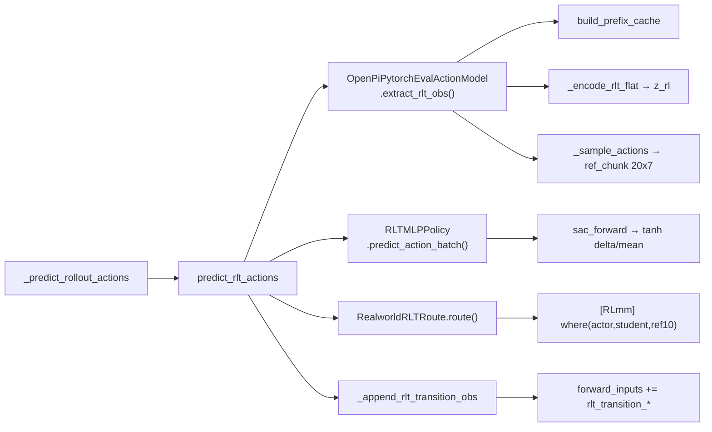

| 函数/类 | 输入 | 输出 | 职责 |
|:---|:---|:---|:---|
| `extract_rlt_obs` | 原始 env obs（图+state） | `z_rl`, `proprio`, `ref_chunk` | 冻结 Stage1：VLA prefix + flow 采样参考动作 |
| `RLTMLPPolicy.sac_forward` | `rlt_obs` | `10×7` tanh 输出 | Stage2 可训练 MLP；输入含 ref 前 10 步 |
| `RealworldRLTRoute` | student, ref, flags | routed_actions, `record_transition` | **[RLmm]** 选择 ref 或 student，**不做** ref+δ |
| `_append_rlt_transition_obs` | final_obs 可选 | `rlt_transition_*` 键 | 为 learner 准备 `next_obs` |

### 13.7 Learner 训练子模块（RLmm 真机路径）

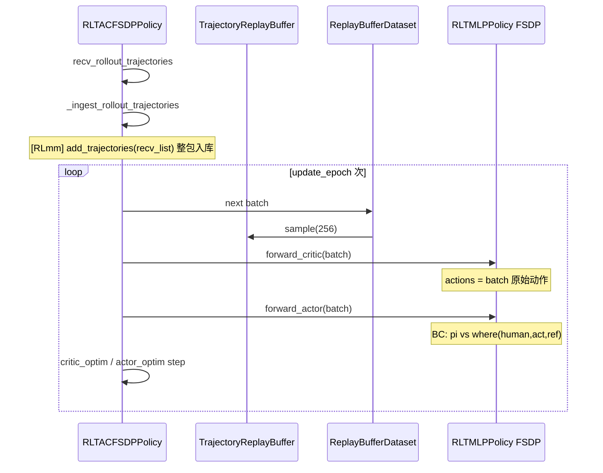

---

## 14. RLiKx 修改版 RLinf：RLT 全链路时序图

本节描述 **RLiKx**（`/home/nvidia/bt/RLiKx/`）Franky 生产路径。图中 **`[MOD]`** 表示相对 RLmm 真机路径 **已修改类或行为**；**`[RLiKx]`** 表示 RLiKx 独有模块/脚本。

### 14.1 图例（在 §13.1 基础上）

| 标记 | 含义 |
|:---|:---|
| **`[MOD]`** | 类存在于两库，但 RLiKx 中行为已改（需对照 RLmm） |
| **`[RLiKx]`** | 仅 RLiKx 存在的文件或运维层 |
| **`[共享]`** | 与 RLmm 字节级或语义级一致 |

### 14.2 两阶段总览 + 运维层

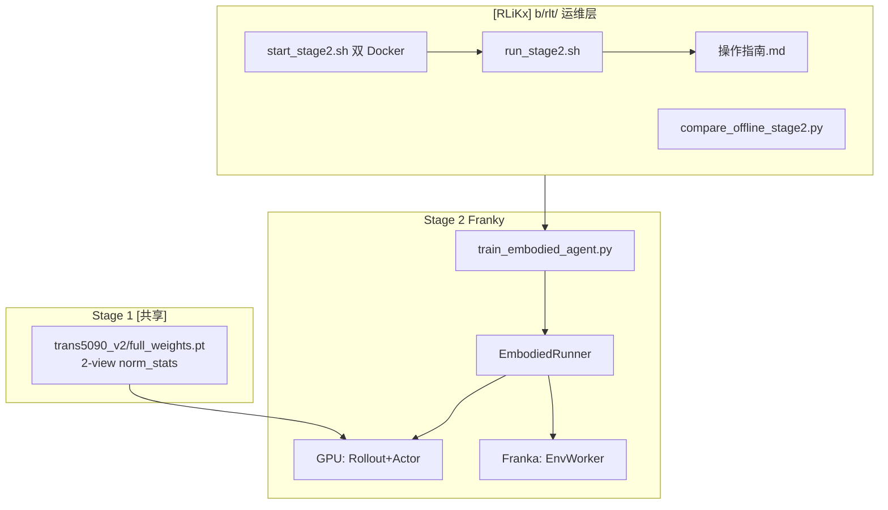

**与 RLmm 差异**：RLiKx 增加 **宿主机双容器编排**（`rlinf-ray` bridge + Franky host 网络）、**操作指南** 作为运行时契约、**离线 fixed-replay 对照** 工具链；Stage1 权重与 2-view dataconfig 为现场定制。

### 14.3 部署拓扑（RLiKx Franky）

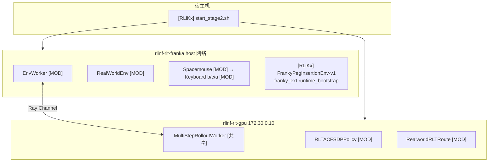

### 14.4 EmbodiedRunner 单训练步（与 RLmm 同骨架）

RLiKx 仍使用 **`EmbodiedRunner` + 同步三 Worker**（`run_stage2.sh` 默认 `train_embodied_agent.py`，`overlap_env_bootstrap: false`）。**Runner 层无 `[MOD]`**；差异全部在 Worker 内部。

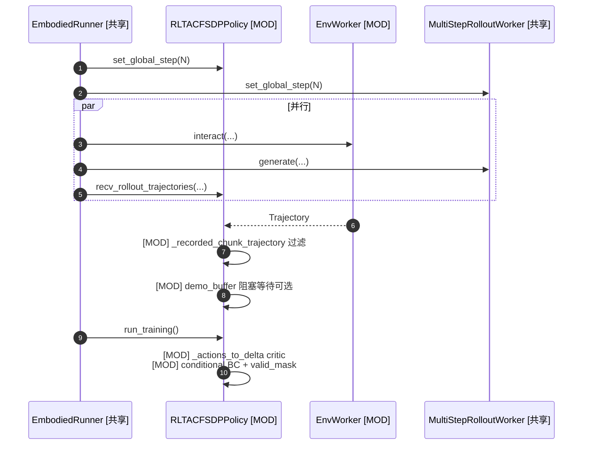

### 14.5 EnvWorker ↔ Rollout：RLiKx 单 chunk 时序（核心差异）

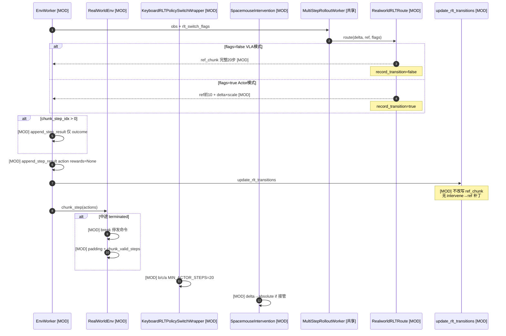

**相对 RLmm 的行为变更摘要**：

| 步骤 | RLmm | RLiKx `[MOD]` |
|:---|:---|:---|
| 路由 VLA | ref **10 步** | ref **20 步** |
| 路由 Actor | student **替换** | **ref + δ×scale** |
| transition | intervene **改 ref_chunk** | ref **保持 VLA**；BC 在 learner 算 δ |
| traj 写入 | action+reward **同步** | outcome **错开一拍** |
| chunk_step | 跑满 chunk | **终止即停** + padding |
| 键盘 | 仅 **b** | **b/c/a** + epoch 上限 |

### 14.6 Rollout 推理链（标注修改点）

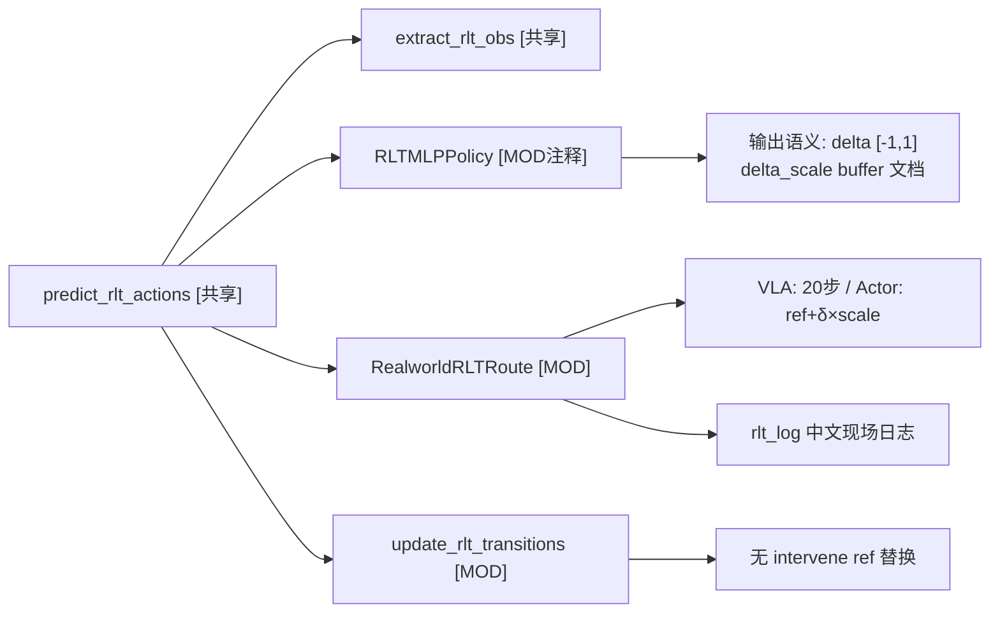

### 14.7 Learner 训练链（RLiKx `[MOD]`）

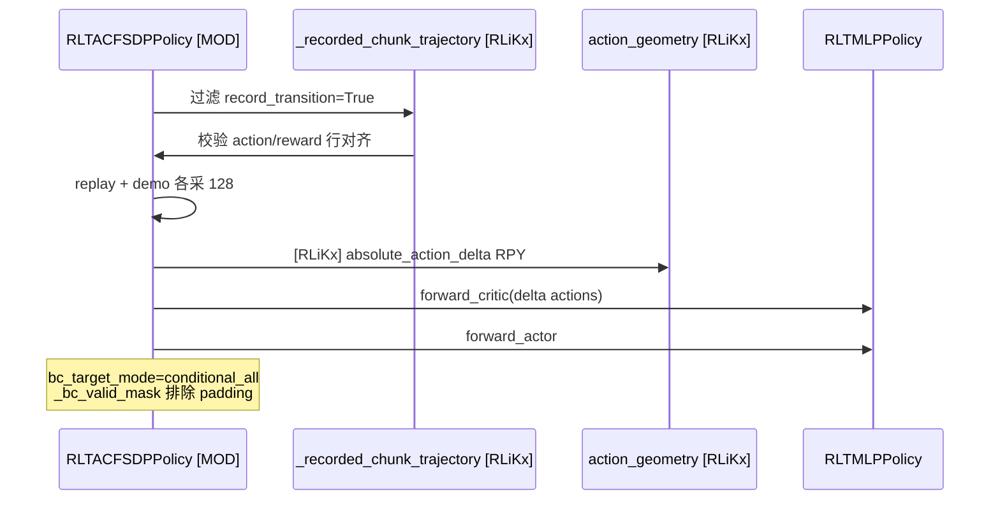

### 14.8 RLiKx Episode 生命周期总图（对照操作指南）

将操作指南 §1 的五步流程展开为 **跨模块** 时序（**`[MOD]`** 标注变更类）。

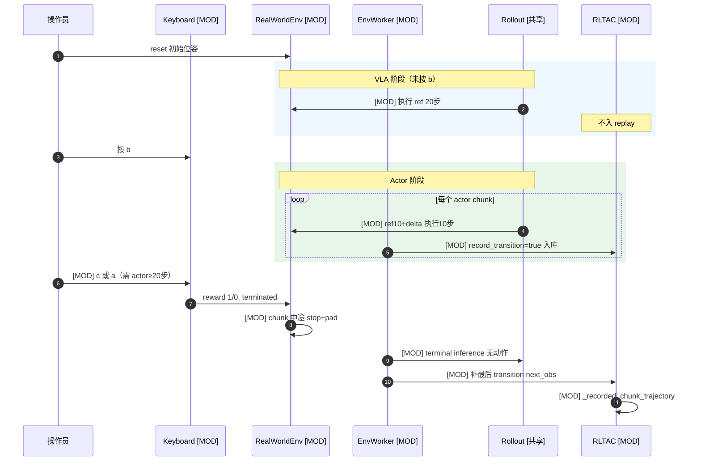

### 14.9 ManiSkill 路径说明（两库 `[共享]`）

RLiKx **未修改** 仿真路径：仍用 `SimulatorRLTRoute`、`rlt_schedule`、`_transition_replay_trajectories` step-level 入库。Franky 生产补丁 **仅作用于** `use_simulator_transition_replay(cfg)==False` 的真机分支。

---

## 15. 修改类与行为变更索引

便于从时序图跳读源码，下表列出 RLiKx 相对 RLmm **真机 RLT 路径** 的全部变更点。

| 类 / 模块 | 文件 | 变更类型 | 行为摘要 |
|:---|:---|:---|:---|
| `RealworldRLTRoute` | `rlinf/algorithms/rlt/route.py` | **`[MOD]`** | VLA 20 步；Actor ref+δ×scale；日志 |
| `update_rlt_transitions` | `rlinf/algorithms/rlt/transition.py` | **`[MOD]`** | 移除 intervene→ref_chunk 替换 |
| `absolute_action_delta` | `rlinf/algorithms/rlt/action_geometry.py` | **`[RLiKx]`** | RPY 周期差 |
| `RLTMLPPolicy` | `rlinf/models/.../rlt_mlp_policy.py` | **`[MOD]`** | 增 `delta_scale` buffer；注释明确 delta 语义 |
| `RLTACLossMixin` | `fsdp_rlt_ac_policy_worker.py` | **`[MOD]`** | `_actions_to_delta`, `_bc_metrics` 三模式, `_bc_valid_mask`, `_truncate_actions` |
| `RLTACReplayMixin` | 同上 | **`[MOD]`** | `_recorded_chunk_trajectory`, demo 阻塞 |
| `EnvWorker._run_interact_once` | `rlinf/workers/env/env_worker.py` | **`[MOD]`** | outcome 错开；terminal 无动作 |
| `RealWorldEnv.chunk_step` | `rlinf/envs/realworld/realworld_env.py` | **`[MOD]`** | break+padding+`chunk_valid_steps` |
| `KeyboardRLTPolicySwitchWrapper` | `keyboard_rlt_policy_switch_wrapper.py` | **`[MOD]`** | b/c/a, MIN_ACTOR_STEPS, epoch 计数 |
| `SpacemouseIntervention` | `spacemouse_intervention.py` | **`[MOD]`** | δ→abs, intervene_flag, 1s 超时 |
| `apply._apply_keyboard_wrapper` | `apply.py` | **`[MOD]`** | 传入 `max_episodes_per_epoch` |
| `b/rlt/*` | `b/rlt/` | **`[RLiKx]`** | 启动脚本、YAML、离线工具、操作指南 |
| `EmbodiedRunner` | `embodied_runner.py` | **`[共享]`** | 训练步编排不变 |
| `predict_rlt_actions` | `rollout.py` | **`[共享]`** | 85 行一致 |
| `SimulatorRLTRoute` | `route.py` | **`[共享]`** | ManiSkill 仿真不变 |

### 15.1 时序图阅读建议

1. **先读 §13.4 / §14.4** 理解 Runner 如何并行启动三 Worker——两库相同。
2. **再读 §13.5 vs §14.5** 理解真机 chunk 级差异（这是 replay 错位 bug 与 20/10 语义的分水岭）。
3. **最后读 §14.8** 将现场操作（操作指南）与代码模块对齐。
4. 若只关心 **仿真**，读 §14.9 后直接查阅 RLmm `maniskill_rlt_stage2_ac_mlp.yaml` 与 `SimulatorRLTRoute` 源码即可，**无需** RLiKx Franky 补丁。

---

## 16. 参考文献与代码索引

### 论文与文档

1. Xu et al. *RL Token: Bootstrapping Online RL with Vision-Language-Action Models*. [Pi 项目页](https://www.pi.website/research/rlt) · [arXiv:2604.23073](https://arxiv.org/html/2604.23073v1)
2. RLinf. [RLT 示例文档](https://rlinf.readthedocs.io/en/latest/rst_source/examples/embodied/rlt.html) · [`docs/source-zh/rst_source/examples/embodied/rlt.rst`](/home/nvidia/bt/s/RLmm/docs/source-zh/rst_source/examples/embodied/rlt.rst)

### 对比核心文件

| 模块 | RLmm | RLiKx |
|:---|:---|:---|
| Rollout | `rlinf/algorithms/rlt/rollout.py` | 同 |
| 真机路由 | `rlinf/algorithms/rlt/route.py:116-144` | `route.py:116-181` |
| Transition | `rlinf/algorithms/rlt/transition.py:72-88` | 无 intervene patch |
| 几何 | **无** | `rlinf/algorithms/rlt/action_geometry.py` |
| Learner | `rlinf/workers/actor/fsdp_rlt_ac_policy_worker.py` | +174 行 Franky 适配 |
| Env 时序 | `rlinf/workers/env/env_worker.py:1097+` | `env_worker.py:1150+` |
| Chunk | `rlinf/envs/realworld/realworld_env.py:307+` | `realworld_env.py:340+` |
| 键盘 | `keyboard_rlt_policy_switch_wrapper.py` 78 行 | 174 行 |
| SpaceMouse | `spacemouse_intervention.py` 88 行 | 143 行 |
| 奖励 | `reward_done_wrapper.py` | **无**（集成在 keyboard） |
| 真机 YAML | `examples/embodiment/config/realworld_rlt_stage2_ac_mlp.yaml` | `b/rlt/configs/realworld_rlt_stage2_franky.yaml` |
| 操作指南 | **无** | `b/rlt/操作指南.md` |

### 前序分析报告

- RLmm: [`rlt_code_analyz.markdown`](/home/nvidia/bt/s/RLmm/b/d/rltx/rlt_code_analyz.markdown), [`rlt_code_analyz2.markdown`](/home/nvidia/bt/s/RLmm/b/d/rltx/rlt_code_analyz2.markdown)
- RLiKx: [`rltx_code_analyz_cdx.markdown`](/home/nvidia/bt/RLiKx/b/d/p/rltx_code_analyz_cdx.markdown), [`rltx_code_analyz_cdxc2.markdown`](/home/nvidia/bt/RLiKx/b/d/p/rltx_code_analyz_cdxc2.markdown)
- 同事版（v1）: [`rlmm_rlikx_diff_analyz.markdown`](/home/nvidia/bt/s/RLmm/b/d/rltx/rlmm_rlikx_diff_analyz.markdown)
- **本文（v2）**: [`rlmm_rlikx_diff_analyz2.markdown`](/home/nvidia/bt/s/RLmm/b/d/rltx/rlmm_rlikx_diff_analyz2.markdown)

---

*本文以 RLmm 与 RLiKx 仓库本地源码为准撰写；§13–§15 时序图基于 2026-09-13 代码核对。若操作指南与 RLmm 通用路径冲突，Franky 生产以 RLiKx `操作指南.md` + 本地代码为准。*
