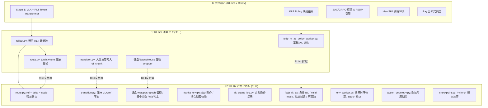
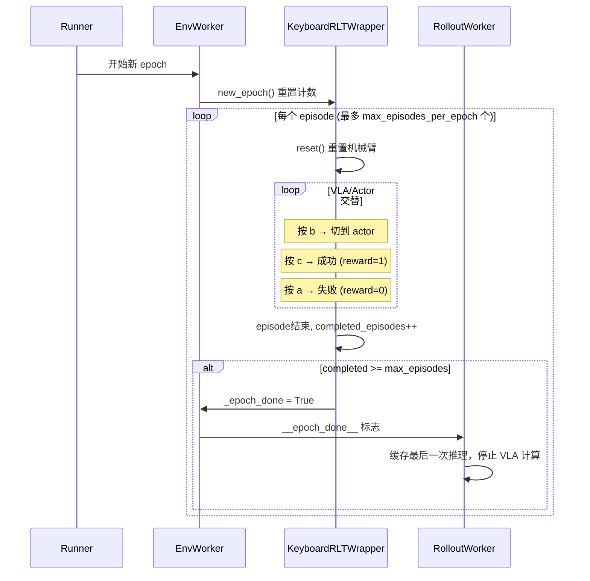
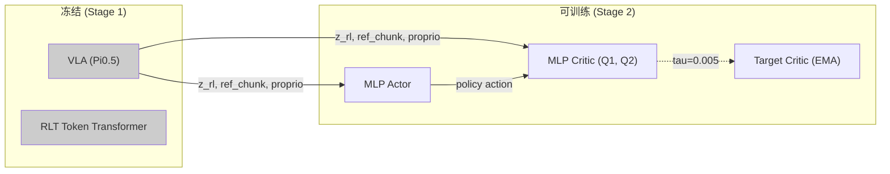

# RLmm vs RLiKx — RLT 算法实现差异深度对比分析（第三版）

> **作者:** Claude Opus 4.6 &nbsp;|&nbsp; **日期:** 2026-09-14
> **上游参考:**
> - [Pi RLT 论文与官方页面](https://www.pi.website/research/rlt)
> - [RLinf 文档 — RLT 示例](https://rlinf.readthedocs.io/en/latest/rst_source/examples/embodied/rlt.html)
> - RLiKx `b/rlt/操作指南.md`（当前版本）
> **同事前作:** `rlmm_rlikx_diff_analyz.markdown`（v1）、`rlmm_rlikx_diff_analyz2.markdown`（v2）

---

## 0. 对前两版分析的评审

### 0.1 v1 的优点与不足

**优点：**
- 率先以逐文件对比的方式定位了最核心的架构分歧——`route.py` 的"替换 vs 残差"路由语义。
- 对 `fsdp_rlt_ac_policy_worker.py` 做了较细致的拆解（`_truncate_actions`、三种 BC 模式、`_bc_valid_mask`、`_recorded_chunk_trajectory` 过滤等）。
- 使用了 mermaid 图辅助说明 wrapper 栈的差异。

**不足：**
1. **事实错误：** 声称 `rlt_mlp_policy.py` "完全相同"——实际上 RLiKx 新增了 `delta_scale` 缓冲区和注释性代码（见本文 §5.3）。
2. **覆盖缺失：** 未涉及 ManiSkill 仿真路径（这是 RLmm 主要的自动化验证链路）；未提及 `操作指南.md` 与代码的映射；未讨论与 Pi 论文的一致性。
3. **宏观流程缺失：** 没有端到端数据流图，读者无法了解数据从环境到 replay 到 learner 的完整路径。
4. **"为什么"不够深入：** `chunk_step` 差异只描述了"是什么"，未解释 RLmm 不在 chunk 中途中断意味着终止后可能继续向真机发送未计划的动作。

### 0.2 v2 的优点与不足

**优点：**
- 系统性地纠正了 v1 的 7 个事实错误，建立了 L0/L1/L2 三层架构模型。
- 新增了端到端数据流序列图、操作指南映射表、ManiSkill 仿真路径分析、Pi 论文对齐讨论。
- 完整的调用链序列图（§13-14）是最具价值的新增内容。
- 迁移清单具有实用价值。

**不足：**
1. **篇幅冗余：** 部分模块级分析与 v1 重复而非引用和增补。
2. **缺少梯度流分析：** 未讨论 `delta_scale` 是否可学习、梯度如何流过残差计算。
3. **YAML 对比不充分：** 只列了对比表，没有并排展示关键配置片段。
4. **测试覆盖分析缺失：** 迁移清单提到测试但没有列出哪些测试存在、哪些会在跨库使用时失败。
5. **动作空间的物理含义未深入：** 绝对 TCP 动作 vs delta 关节动作的差异不仅是一个配置开关，而是从环境、VLA 输出语义、到 actor 残差含义、再到 critic TD 计算的全链路影响，v2 只在各模块中零散提及。

### 0.3 本文目标

本文在前两版的基础上：
1. **以执行流程为主线**（宏观到微观），而非逐文件罗列；
2. **追根溯源**，将每个差异归因到其根本动机（real-world 绝对动作部署、20→10 步 chunk 适配、产品级安全需求等）；
3. **覆盖前两版遗漏**：梯度流与可训练性、完整 YAML 差异、checkpoint 兼容性、测试矩阵、动作空间物理语义的全链路影响；
4. **提供可执行的理解**：读者阅后能回答"如果我要把 RLiKx 的改动移植到 RLmm，需要改哪些文件、注意什么"。

---

## 1. RLT 算法简述

RLT（RL Token）是 Physical Intelligence 提出的两阶段框架，核心思想是**将大型 VLA 的表征学习与在线 RL 控制解耦**：

```
┌──────────────────── Stage 1 ────────────────────┐
│                                                   │
│  VLA (Pi0.5)  ──prefix hidden states──►  RLT Token│
│  action loss         encoder-decoder   Transformer│
│                          ▼                        │
│                    z_rl (2048-D)                   │
│                  + ref_chunk (VLA动作)             │
│                  + proprio (本体感知)              │
│                                                   │
│  训练后全部冻结 ──────────────────────────────────│
└───────────────────────────────────────────────────┘
                    ▼ 冻结的特征
┌──────────────────── Stage 2 ────────────────────┐
│                                                   │
│  MLP Actor:  (z_rl, proprio, ref_chunk) → action  │
│  MLP Critic: (z_rl, proprio, ref_chunk, action)→Q │
│                                                   │
│  actor_loss = -q_weight * Q + bc_weight * BC      │
│  critic_loss = TD error (chunked)                 │
│  reference_dropout_prob = 0.5                     │
│                                                   │
└───────────────────────────────────────────────────┘
```

**关键创新点：**
- 信息瓶颈：将 VLA 前缀隐状态压缩为紧凑的 `z_rl`，使 RL 可行
- 参考动作条件 + Dropout：actor 接收 VLA 的参考动作作为输入，学习"编辑"而非"替换"
- 特征级 Replay：存储 `{z_rl, proprio, ref_chunk}` 而非原始图像，显著降低内存

RLmm 和 RLiKx 共享相同的 Stage 1 实现。**所有差异均出现在 Stage 2** 的在线 RL 训练和部署环节。

---

## 2. 两套代码的定位与关系



**核心定位差异：**

| 维度 | RLmm | RLiKx |
|------|------|-------|
| 目标 | 通用 RLT 框架，兼容仿真+真机 | 真机产品化部署（Franky 插充电器） |
| 主验证路径 | ManiSkill PegInsertion 仿真 | Franka 真机 + 离线诊断 |
| 动作空间 | delta 关节位置（ManiSkill）或 delta TCP | 绝对 TCP 位姿 |
| Actor 输出语义 | 最终动作（直接替换 VLA 参考） | 残差修正（叠加到 VLA 参考上） |
| 安全工程 | 仿真为主，安全由环境保证 | 真机部署：chunk 中断、安全盒、操作审计 |

---

## 3. 差异文件全景

以下表格列出两套代码中所有不同的 Python 源文件，按功能分组，并标注差异的本质。

### 3.1 仅存在于 RLiKx 的文件

| 文件 | 功能 | 存在动机 |
|------|------|----------|
| `rlinf/algorithms/rlt/action_geometry.py` | 绝对动作的欧拉角周期差和安全投影 | 绝对 TCP 动作的角度回绕问题 |
| `rlinf/envs/realworld/common/rlt_status_log.py` | 实时操作状态日志（写文件 + stdout） | 真机操作员需要实时看到路由/接管/重置状态 |

### 3.2 两边均有但内容不同的文件

| 文件 | 差异大小 | 差异性质 |
|------|----------|----------|
| `algorithms/rlt/route.py` | ★★★★★ | 核心：替换 vs 残差路由 |
| `algorithms/rlt/transition.py` | ★★★ | 人类接管数据写入策略 |
| `workers/actor/fsdp_rlt_ac_policy_worker.py` | ★★★★★ | 条件BC/valid mask/轨迹过滤/示范池/delta转换 |
| `workers/env/env_worker.py` | ★★★★★ | 结果时序/epoch终止/`__epoch_done__`信号 |
| `workers/rollout/hf/huggingface_worker.py` | ★★★★ | epoch终止缓存/`__epoch_done__`协议 |
| `envs/realworld/common/wrappers/keyboard_rlt_policy_switch_wrapper.py` | ★★★★★ | epoch管理/最小步数/c-a判定 |
| `envs/realworld/common/wrappers/apply.py` | ★★ | max_episodes_per_epoch 传参 |
| `envs/realworld/common/wrappers/spacemouse_intervention.py` | ★★★★ | 绝对动作转换/接管日志/intervene_flag |
| `envs/realworld/franka/franka_env.py` | ★★★★★ | 绝对动作/持久期望位姿/安全盒 |
| `envs/realworld/franka/tasks/peg_insertion_env.py` | ★ | 翻译刚度参数 |
| `envs/realworld/realworld_env.py` | ★★★★★ | chunk中断+padding/epoch_done代理/truncation合并 |
| `models/embodiment/mlp_policy/rlt_mlp_policy.py` | ★★ | delta_scale 缓冲区 |
| `models/embodiment/openpi_rlinf/eval_action_model.py` | ★★★ | norm_stats_path / ref_chunk_norm |
| `models/embodiment/openpi_rlinf/utils/model_builders.py` | ★★ | norm_stats 传递 |
| `models/embodiment/openpi/dataconfig/*` | ★★ | 数据配置适配 |
| `models/embodiment/openpi/policies/franka_policy.py` | ★ | Franka 策略细节 |
| `hybrid_engines/fsdp/strategy/base.py` | ★★ | DCP 加载方式 |
| `hybrid_engines/fsdp/strategy/checkpoint.py` | ★★★ | PyTorch 版本兼容 (`_is_initial`) |
| `data/schema/embodied_trajectory_builder.py` | ★★★ | `update_last_step_result` / `_align_and_stack` |
| `data/storage/replay/buffer.py` | ★★★★ | 选择性保存/旧checkpoint修复/采样逻辑 |
| `envs/realworld/common/keyboard/keyboard_listener.py` | ★ | 按键事件处理差异 |
| `utils/nested_dict_process.py` | ★ | 工具函数差异 |
| `utils/utils.py` | ★ | 工具函数差异 |

---

## 4. 核心差异按执行流程深入分析

下面按一个完整 Stage 2 训练 epoch 的时间线，从环境交互到 learner 更新，逐步分析两套代码的差异。

### 4.1 Epoch 生命周期管理

**RLmm：** 没有显式的 epoch 管理。环境的 `auto_reset=True` 让 episode 自然结束和重置，由 `max_steps_per_rollout_epoch` 控制每个 epoch 的最大步数。Epoch 结束时简单地停止环境交互。

**RLiKx：** 新增了完整的 epoch 生命周期：



**关键差异点：**

| 特性 | RLmm | RLiKx |
|------|------|-------|
| `max_episodes_per_epoch` | 不存在 | 配置中设为 2 |
| `new_epoch()` | 不存在 | 每 epoch 开始时调用，重置计数器 |
| `_epoch_done` 属性 | 不存在 | 键盘 wrapper 设置，realworld_env 代理查询 |
| `__epoch_done__` 通信信号 | 不存在 | env_worker → rollout_worker，标记 epoch 结束 |
| 最小 actor 步数保护 | 不存在 | `MIN_ACTOR_STEPS = 20`，防止误触 c/a |

**为什么 RLiKx 需要 epoch 管理：**
真机训练中，操作员需要在有限数量的 episode 内完成数据采集（例如每 epoch 2 个 episode），然后让 learner 更新模型。`max_episodes_per_epoch` 确保每轮采集的数据量可控。`MIN_ACTOR_STEPS` 防止操作员在 actor 还没有充分执行时就发出成功/失败信号——太短的 actor 执行不足以判断任务是否完成。`__epoch_done__` 信号让 rollout worker 停止昂贵的 VLA 推理，避免浪费 GPU 时间。

### 4.2 环境层：动作空间与执行语义

这是两套代码差异的**物理根源**。

#### 4.2.1 RLmm 的 delta 动作

RLmm 的 ManiSkill 环境使用 delta 关节位置控制：
```yaml
# ManiSkill 配置
control_mode: "pd_joint_delta_pos"
action_dim: 8  # 7 关节 + 1 夹爪
```
VLA 和 actor 的动作都是相对当前状态的增量。每步发送的命令是"从现在位置移动多少"。

RLmm 的真机配置也预设为 delta 模式：
```python
# franka_env.py (RLmm)
self.next_position[:3] = self.next_position[:3] + xyz_delta * self.config.action_scale[0]
```

#### 4.2.2 RLiKx 的绝对 TCP 动作

RLiKx 部署的 VLA（`trans5090_v2`）输出绝对 TCP 目标位姿：
```yaml
# RLiKx 配置
use_absolute_action: True
action_scale: [1.0, 1.0, 1.0]  # 不缩放
```

`franka_env.py` 对应的执行逻辑：
```python
# franka_env.py (RLiKx)
if self.config.use_absolute_action:
    self.next_position[:3] = action[:3]  # 直接设为目标位置
    self.next_position[3:] = R.from_euler("xyz", action[3:6]).as_quat()
else:
    # delta 模式（同 RLmm）
```

**绝对动作带来的连锁问题：**

1. **欧拉角回绕**：绝对角度可达 $\pm\pi$，两个接近 $\pi$ 和 $-\pi$ 的角度差不应是 $2\pi$，而应是 $\approx 0$。这需要 `action_geometry.py` 中的周期差处理。

2. **残差的含义不同**：在 delta 模式下，actor 输出一个 delta，`torch.where` 替换后直接执行。在绝对模式下，actor 不能直接输出绝对坐标（那就失去了与 VLA 参考的关联），而应输出"对 VLA 参考的修正量"。

3. **安全空间不同**：delta 动作天然有界（$[-1, 1]$），绝对动作的范围由工作空间决定（$\approx [-\pi - 0.2, \pi + 0.2]$）。

#### 4.2.3 持久期望位姿（RLiKx 独有）

```python
# franka_env.py (RLiKx)
if self.config.use_persistent_desired_pose:
    if self._desired_xyz is None:
        self._desired_xyz = measured_xyz.copy()
    desired_xyz = self._desired_xyz + scaled_xyz_delta

    lag = desired_xyz - measured_xyz
    lag_norm = float(np.linalg.norm(lag))
    if lag_norm > self.config.max_desired_pose_lag:
        desired_xyz = measured_xyz + lag * (
            self.config.max_desired_pose_lag / lag_norm
        )

    self._desired_xyz = desired_xyz
    self.next_position[:3] = desired_xyz
```

**动机：** 阻抗控制器的位置误差被单步 delta 封顶。如果一步的 delta 很小（亚毫米级），阻抗控制器产生的力不足以克服静摩擦力，命令被"静默丢弃"。持久期望位姿通过累积未执行的运动，使得小位移能够逐步积累足够的力。`max_desired_pose_lag` 限制了最大累积偏差（默认 8mm），防止突然释放大力。

**注意：** 当前 RLiKx 配置使用绝对动作（`use_absolute_action: True`），此时 `use_persistent_desired_pose` 设为 `False`，因为绝对动作本身就不受"单步 delta 太小"的问题影响。但该机制仍保留在代码中，供 delta 模式使用。

#### 4.2.4 刚度参数差异

```python
# peg_insertion_env.py
# RLiKx: translational_stiffness = 1000
# RLmm:  translational_stiffness = 2000
```

RLiKx 降低了平移刚度，可能是为了配合绝对动作模式下更大的位置指令范围，减少冲击力。

### 4.3 路由层：Actor 输出如何变成物理动作

这是两套代码**最核心的架构分歧**。

#### 4.3.1 RLmm：直接替换（`torch.where`）

```python
# route.py (RLmm) — RealworldRLTRoute.route()
routed_actions = torch.where(
    rlt_switch_flags,           # 布尔掩码
    actions,                    # actor 输出（最终动作）
    ref_actions[:, :actions.shape[1], :actions.shape[2]],  # VLA 参考
).contiguous()
```

语义：在标记为 actor 的步骤中，完全丢弃 VLA 的参考动作，使用 actor 的输出作为最终动作。Actor 需要自己输出完整的、可执行的动作。

#### 4.3.2 RLiKx：残差叠加（`ref + delta × scale`）

```python
# route.py (RLiKx) — RealworldRLTRoute.route()
ref_base = ref_actions[:, :actions.shape[1], :actions.shape[2]]
ds = [0.02] * 3 + [0.05] * 3 + [0.5]
delta_scale = torch.tensor(ds, device=actions.device, dtype=actions.dtype)
actor_actions = ref_base + actions * delta_scale
routed_actions = torch.where(
    rlt_switch_flags,
    actor_actions,              # VLA 参考 + actor 残差
    ref_base,
).contiguous()
```

语义：actor 的输出是一个标准化的残差（$\in [-1, 1]$，通过 `tanh` 激活），经过每维度缩放后叠加到 VLA 的参考动作上。

**每维度缩放的物理含义：**

| 维度 | delta_scale | 物理含义 | 最大单步修正 |
|------|------------|----------|-------------|
| X, Y, Z | 0.02 m | 位置修正 | ±20 mm |
| Roll, Pitch, Yaw | 0.05 rad | 姿态修正 | ±2.86° |
| Gripper | 0.5 | 夹爪修正 | ±0.5 (归一化) |

**为什么 RLiKx 选择残差而非替换：**

1. **安全性：** actor 的修正幅度被 `delta_scale` 严格限制。即使 actor 输出极端值（$\pm 1$），位置修正也不超过 ±20mm。在绝对动作空间中，一个错误的 actor 输出可以让机械臂跳到完全不同的位置；残差模式下最坏情况只是 VLA 轨迹 ±20mm 的偏移。

2. **学习效率：** 残差学习只需要学习"VLA 哪里不够好"，而非从零学习完整的插入动作。这与 Pi 论文中"编辑参考动作"的理念一致。

3. **VLA 回退：** 如果 actor 输出全零，结果就是 VLA 的参考动作——自动退化为 Stage 1 行为。

**与 Pi 论文的对齐：**

Pi 论文描述 RLT 的 actor 为"editing the VLA's reference action"。从这个角度看：
- RLiKx 的残差路由更接近论文原意——actor 输出的是"编辑量"
- RLmm 的替换路由是一种不同的参数化——actor 输出的是"编辑后的结果"

两者在数学上等价（给定足够的表达能力），但在学习难度和安全性上有显著差异。

#### 4.3.3 路由层的附加功能差异

RLiKx 的 `route.py` 还包含：
- **模式切换日志：** 记录每次 VLA→ACTOR 和 ACTOR→VLA 的切换
- **delta 统计日志：** 每个 chunk 打印 actor 残差的均值和最大绝对值
- **chunk 计数器：** 追踪总推理次数
- **`_prev_is_actor` 状态：** 检测模式切换事件

这些日志通过 `rlt_status_log.py` 写入 `/tmp/rlt_status.log`，供操作员在 Franka 容器中实时监控。

### 4.4 人类接管（Transition 层）

#### 4.4.1 RLmm：修改 ref_chunk

```python
# transition.py (RLmm) — update_rlt_transitions()
# 当存在人类接管动作时：
current_obs = pending_obs[stage_id]
ref_chunk = current_obs["ref_chunk"]
ref_actions = ref_chunk.reshape(batch_size, -1, action_dim).clone()
ref_actions[:, :flags.shape[1]] = torch.where(
    flags,
    human_actions,
    ref_actions[:, :flags.shape[1]],
)
current_obs["ref_chunk"] = ref_actions.reshape_as(ref_chunk)
```

语义：将人类的接管动作直接写入 `ref_chunk` 的对应位置。后续 actor 的 BC 目标是"跟踪（已被修改的）ref_chunk"。

#### 4.4.2 RLiKx：保持 ref_chunk 不变

RLiKx 的 `transition.py` 没有这段修改 `ref_chunk` 的代码。VLA 的参考动作始终保持原始值。

**为什么不同：**

在 RLmm 的替换路由下，actor 输出最终动作，BC 目标是"actor 应该输出什么"。如果人类接管了，actor 应该输出人类的动作，所以把人类动作写入 ref_chunk 作为 BC 目标是合理的。

在 RLiKx 的残差路由下，actor 输出残差，BC 目标是"actor 应该输出多大的修正量"。人类的修正量 = `(人类动作 - VLA参考) / delta_scale`。如果修改了 ref_chunk，就无法正确计算这个修正量了。因此 RLiKx 保持 ref_chunk 不变，在 learner 的 `_actions_to_delta` 中从原始参考计算残差目标。

```
RLmm:   BC_target = modified_ref_chunk[i] （其中 i 是接管步骤）
RLiKx:  BC_target = (human_action[i] - original_ref_chunk[i]) / delta_scale
```

两者在数学上表达的是同一件事——"让 actor 学习人类的行为"——但 RLiKx 的表达方式在残差空间中更自然，且不会破坏 ref_chunk 被其他组件使用时的一致性。

### 4.5 SpaceMouse 接管

RLiKx 对 SpaceMouse 接管做了多项扩展：

| 特性 | RLmm | RLiKx |
|------|------|-------|
| 绝对动作转换 | 不支持 | `_delta_to_absolute()` 将 SM delta 转换为绝对目标 |
| 接管标志传递 | 无 | 设置 `info["intervene_flag"] = True/False` |
| 偏移量统计 | 无 | 每 5 步记录 XYZ 偏移的均值和最大绝对值 |
| 接管状态日志 | 无 | 接管开始/结束时打印中文提示 |
| 静止检测超时 | 0.5s | 1.0s（避免短暂释放时误判） |
| 夹爪同步 | 无 | `_sync_gripper_action()` 在空闲→接管过渡时同步 |

**`_delta_to_absolute()` 的必要性：**
SpaceMouse 天然输出 delta 控制量。在 delta 动作模式下可直接使用；但在绝对动作模式下，需要将"当前 TCP + SM delta × scale"转换为绝对目标坐标，才能与 VLA 的绝对输出格式兼容。

### 4.6 Chunk 执行与中断

这是对真机安全最关键的差异之一。

#### 4.6.1 RLmm：执行完整 chunk

```python
# realworld_env.py (RLmm)
for i in range(chunk_size):
    obs, reward, terminated, truncated, info = self.env.step(action[i])
    # ... 记录
# 没有 break：即使 episode 在 chunk 中途结束，也会执行完所有步骤
```

#### 4.6.2 RLiKx：中途中断 + padding

```python
# realworld_env.py (RLiKx)
for i in range(chunk_size):
    obs, reward, terminated, truncated, info = self.env.step(action[i])
    # ... 记录
    if (terminations | truncations).any():
        valid_steps = i + 1
        # 用最终观测和零奖励填充剩余槽位
        for _ in range(valid_steps, chunk_size):
            obs_list.append(copy.deepcopy(extracted_obs))
            chunk_rewards.append(torch.zeros_like(step_reward))
            raw_chunk_terminations.append(torch.zeros_like(terminations))
            # ...
        break
else:
    valid_steps = chunk_size

# 记录实际执行步数
infos_last["chunk_valid_steps"] = torch.full(
    (self.num_envs,), valid_steps, dtype=torch.int64
)
```

**为什么 RLiKx 需要中断：**

在真机上，episode 结束意味着任务完成（成功或失败）。继续执行计划的动作可能导致：
- 成功插入后继续推，造成过大的力
- 失败后继续移动，偏离预期的复位区域
- 超时后继续执行，违反安全约束

中断后的 padding 确保数据格式一致（fixed chunk size），`chunk_valid_steps` 告诉 learner 哪些步骤是真实执行的。

**对 learner 的影响：**
RLiKx 的 `_bc_valid_mask` 使用 `chunk_valid_steps`（或 `dones`）来屏蔽 padding 槽位的 BC loss。否则，padding 中的零奖励和复制观测会污染 BC 学习。

### 4.7 环境-Rollout-Learner 之间的数据时序

这是两套代码中最隐晦、也最容易出错的差异。

#### 4.7.1 RLmm 的时序

```
chunk_step 0:  env_output → rollout → policy_output(action) → env.step(action)
                                                                  ↓
chunk_step 1:  env_output(obs, reward_0) → rollout → policy_output(action) → env.step(action)
                                                                                ↓
...
terminal:      env_output(obs, reward_N) → 追加 step_result → 完成 trajectory
```

RLmm 在收到 `env_output` 时，其中的 reward 属于"上一步执行后的结果"。在 `append_step_result` 中将 reward 追加到当前 trajectory。

#### 4.7.2 RLiKx 的时序修正

RLiKx 在 `env_worker.py` 中显式处理了 RLT 的结果归属：

```python
# env_worker.py (RLiKx)
if self.enable_rlt:
    # 收到的 outcome 属于上一个动作，即使在非终止轮次
    # bootstrap 没有已执行动作。每个 outcome 独立追加一次。
    if chunk_step_idx > 0:
        self.trajectory_builders[stage_id].append_step_result(
            ChunkStepResult(
                rewards=rewards,
                dones=env_output.dones,
                terminations=env_output.terminations,
                truncations=env_output.truncations,
            )
        )
    chunk_step_result.rewards = None
    chunk_step_result.dones = None
    chunk_step_result.terminations = None
    chunk_step_result.truncations = None
```

**关键修正：**
1. **结果前移：** RLT 通信中，第 $i$ 轮收到的 reward 属于第 $i-1$ 个动作。RLiKx 在 `chunk_step_idx > 0` 时立即追加上一个动作的结果，而不是等到下一次 `append_step`。
2. **清空当前结果：** 将当前 `chunk_step_result` 的 reward/done 清空，防止被后续的通用逻辑重复追加。
3. **Bootstrap 特殊处理：** `chunk_step_idx == 0`（bootstrap 轮次）没有上一个动作，跳过追加。

**为什么 RLmm 的时序在仿真中没有问题：**
ManiSkill 的 `rlt_schedule` 机制在 step 级别管理 replay，每步的 reward 和 action 是同步的。但在真机的 chunk 级别通信中，reward 和 action 的对齐需要显式处理。

#### 4.7.3 Trajectory Builder 的差异

RLiKx 在 `embodied_trajectory_builder.py` 中新增：

```python
def update_last_step_result(self, result: ChunkStepResult) -> None:
    """替换最后一个已记录 chunk 的元数据。"""
    if not self.actions:
        return
    for name in ("rewards", "terminations", "truncations", "dones"):
        value = getattr(result, name)
        values = getattr(self, name)
        if value is not None and values:
            values[-1] = value
```

**用途：** 环境在下一轮通信中才报告上一个动作的结果。`update_last_step_result` 将延迟到达的结果回写到已记录的动作上，而不是追加新记录。

RLiKx 还新增了 `_align_and_stack`：
```python
@staticmethod
def _align_and_stack(tensors: list[torch.Tensor]) -> torch.Tensor:
    min_dim = min(t.shape[-1] for t in tensors)
    if all(t.shape[-1] == min_dim for t in tensors):
        return torch.stack(tensors, dim=0)
    return torch.stack([t[..., :min_dim] for t in tensors], dim=0)
```

**用途：** VLA chunk 有 20 步（`20×7=140` 维），actor chunk 有 10 步（`10×7=70` 维）。在同一个 trajectory 中混合时，需要截断到最短的维度。RLmm 中 actor 和 VLA chunk 大小可能相同（ManiSkill 两者都是 10），不需要这个对齐。

### 4.8 Learner（fsdp_rlt_ac_policy_worker.py）

这是差异最密集的文件。按功能分组详述：

#### 4.8.1 动作空间转换：`_actions_to_delta`（RLiKx 独有）

```python
def _actions_to_delta(self, actions, obs):
    ref_chunk = self._ref_chunk(obs)
    chunk_len, action_dim = self._chunk_shape()
    ds = [0.02] * 3 + [0.05] * 3 + [0.5]
    delta_scale = torch.tensor(ds * chunk_len, device=actions.device, dtype=actions.dtype)
    difference = actions - ref_chunk

    # 绝对动作的欧拉角周期差
    override_cfg = self.cfg.env.train.get("override_cfg", {})
    if action_dim == 7 and override_cfg.get("use_absolute_action", False):
        from rlinf.algorithms.rlt.action_geometry import absolute_action_delta
        difference = absolute_action_delta(
            actions.reshape(-1, chunk_len, action_dim),
            ref_chunk.reshape(-1, chunk_len, action_dim),
        ).reshape_as(actions)

    return difference / delta_scale
```

**这个函数做了什么：**
1. 计算 `actions - ref_chunk`（绝对坐标差）
2. 如果是绝对动作且包含欧拉角，使用 `atan2(sin, cos)` 计算周期最短差
3. 除以 `delta_scale` 归一化到残差空间

**为什么需要：** Replay 存储的是环境实际执行的动作（绝对坐标或实际的接管动作），但 actor 在残差空间中工作。Learner 需要将 replay 中的动作转换到 actor 的输出空间，才能计算 BC loss 和 critic 的 Q target。

**欧拉角周期差的数学：**

$$
\Delta\theta = \text{atan2}(\sin(\theta_a - \theta_r), \cos(\theta_a - \theta_r))
$$

这确保了 $\theta_a = \pi$ 和 $\theta_r = -\pi$ 的差为 $\approx 0$ 而非 $2\pi$。不做这个处理，critic 会把两个几乎相同的姿态视为"差距巨大"，导致 TD error 爆炸。

#### 4.8.2 `_truncate_actions`（RLiKx 独有）

```python
def _truncate_actions(self, actions):
    chunk_len, action_dim = self._chunk_shape()
    expected = chunk_len * action_dim
    flat = self._flatten_chunk(actions)
    if flat.shape[-1] > expected:
        flat = flat[..., :expected]
    return flat
```

**用途：** VLA 参考是 `20×7=140` 维，actor chunk 是 `10×7=70` 维。从 replay 取出的动作可能是 VLA 的 20 步格式，需要截断到 actor 的 10 步。在 RLmm 中 ref_num_action_chunks == num_action_chunks == 10，不需要截断。

#### 4.8.3 BC Metrics：三种条件模式 vs 单一模式

**RLmm 的 `_bc_metrics`：**

```python
# RLmm: actor 在绝对空间输出，BC 目标是 "跟踪 (修改后的) ref_chunk 或人类动作"
bc_target = torch.where(human_mask[..., None], action_chunk, bc_ref_chunk)
bc_loss = torch.mean(torch.square(pi_chunk - bc_target))
```

RLmm 的 BC 目标简单直接：
- 无接管步骤：actor 应输出与 VLA 参考相同的动作
- 接管步骤：actor 应输出与人类相同的动作

**RLiKx 的 `_bc_metrics`：**

```python
# RLiKx: actor 在残差空间输出，BC 目标取决于 bc_target_mode
mode = self.cfg.algorithm.get("bc_target_mode", "zero")

if mode == "zero":
    target = zeros  # 所有步骤的残差目标都是零
elif mode == "conditional_all":
    target[human] = human_delta  # 接管步骤学人的残差，其他学零
elif mode == "conditional_xyz":
    target[human, :3] = human_delta[:3]  # 接管步骤只学 XYZ 残差
    target[human, 3:] = 0  # 姿态和夹爪仍学零
```

三种模式的含义：

| 模式 | 非接管步骤 | 接管步骤 | 适用场景 |
|------|-----------|---------|---------|
| `zero` | 残差→0（跟 VLA） | 残差→0（跟 VLA） | 旧版兼容 |
| `conditional_all` | 残差→0 | 残差→人类修正全维 | 当前生产配置 |
| `conditional_xyz` | 残差→0 | 残差→人类XYZ修正 | 姿态不重要时减少噪声 |

**关键细节：**

1. **Valid Mask：** RLiKx 有 `_bc_valid_mask` 屏蔽终止 chunk 的 padding 槽位。这些 padding 的动作是零（`chunk 中断 + padding`生成），如果参与 BC 计算会拉偏学习。

2. **人类目标来源不同：** RLmm 用修改后的 `ref_chunk` 中的人类动作作为 BC 目标；RLiKx 用 `_actions_to_delta(人类动作, 原始ref_chunk)` 计算出的残差作为目标。两者等价，但后者在残差空间中更自然。

3. **delta_abs_mean 日志含义不同：**
   - RLmm: `(pi - ref_chunk).abs().mean()` — actor 与参考的差距
   - RLiKx: `pi.abs().mean()` — actor 残差的绝对均值（因为 pi 本身就是残差）

#### 4.8.4 Critic（forward_critic）

```python
# RLmm: 直接使用 replay 中的动作
actions = batch["actions"]

# RLiKx: 将 replay 动作转换到残差空间
actions = self._actions_to_delta(
    self._truncate_actions(batch["actions"]), curr_obs
)
```

**为什么 critic 也需要转换：** Critic 学习 $Q(s, a)$，其中 $a$ 是 actor 的输出空间。在 RLiKx 中 actor 输出残差，所以 critic 的输入也必须是残差，否则 $Q$ 函数与 actor 的目标不一致。

#### 4.8.5 轨迹过滤：`_recorded_chunk_trajectory`（RLiKx 独有）

```python
def _recorded_chunk_trajectory(self, trajectory):
    """只保留 actor 执行的 chunk，排除 VLA 的 20 步 chunk。"""
    if not self._trajectory_has_record(trajectory):
        return None

    # 验证 actions/rewards/dones 行数对齐
    num_chunks = trajectory.rewards.shape[0]
    for name in ("actions", "terminations", "truncations", "dones"):
        value = getattr(trajectory, name)
        if value.shape[0] != num_chunks:
            raise ValueError(f"RLT chunk/result alignment error")

    # 只保留 record_transition=True 的 chunk
    flat = self.replay_buffer._flatten_trajectory(trajectory)
    flags = flat["forward_inputs"]["record_transition"]
    keep = flags.reshape(num_rows, -1).bool().all(dim=-1)

    # 选择性重建
    recorded = Trajectory(...)
    for key, value in flat.items():
        setattr(recorded, key, select(value))
    return recorded
```

**为什么需要过滤：**

在一个 epoch 中，VLA 可能执行多个 20 步 chunk，然后操作员按 `b` 切换到 actor。只有 actor 阶段的 10 步 chunk 有 `record_transition=True`。VLA 的 20 步 chunk：
1. 维度不同（140 vs 70），无法与 actor chunk 混合训练
2. 没有 actor 的残差，不应该用于 BC 或 Q-learning

在 RLmm 的仿真路径中，`rlt_schedule` 机制在 step 级别管理 replay，VLA 步骤本身就不会被记录。

#### 4.8.6 示范池（Demo Buffer）

RLiKx 配置了独立的示范池：

```yaml
# RLiKx YAML
demo_buffer:
  enable_cache: true
  cache_size: 200
  min_buffer_size: 1
  sample_window_size: 200
  seed_from_resume_replay: true
```

RLmm 的 YAML 中没有 `demo_buffer` 配置。

**示范池的工作方式：**
1. 从 replay 中提取包含接管槽位的 chunk 放入示范池
2. 每个 batch（256）中，从普通 replay 和示范池各采样 128 个 chunk
3. 自主 rollout（无接管）不会挤掉示范池中的数据
4. 示范池随 checkpoint 保存/恢复

**空池等待逻辑（RLiKx 独有）：**
```python
# fsdp_rlt_ac_policy_worker.py (RLiKx)
if self.demo_buffer is not None:
    demo_minimum = max(1, int(cfg.demo_buffer.get("min_buffer_size", 1)))
    if self.demo_buffer.total_samples < demo_minimum:
        # 返回而不训练，让 runner 继续 rollout 采集
        return {**counts, "demo_buffer/ready": 0.0}
```

同步 runner 不能在 dataset 的 readiness 循环中阻塞等待第一个示范——必须先返回让 rollout 继续采集。

### 4.9 Replay Buffer 差异

| 特性 | RLmm | RLiKx |
|------|------|-------|
| 配置大小 | cache=200/10000, window=200/50000 | cache=30, window=30 |
| `_save_metadata` | 保存全局元数据 | 可按 `trajectory_ids` 选择性保存 |
| `_save_trajectory_index` | 保存全部索引 | 可按 `trajectory_ids` 选择性保存 |
| 旧 checkpoint 修复 | 无 | 检测并修复缺少 batch 维的旧 checkpoint |
| `_reshape_flat_for_save` | `shape[0] == T*B` 严格检查 | `shape[0] % B == 0` 宽松检查 |
| 采样截断 | `num_chunks = min(num_chunks, window_total)` | 无截断，允许 replacement 采样 |

**RLiKx 的选择性保存：**
```python
def _save_metadata(self, save_path=None, trajectory_ids=None):
    if trajectory_ids is not None:
        metadata["size"] = len(trajectory_ids)
        metadata["total_samples"] = sum(
            self._trajectory_index[i]["num_samples"] for i in trajectory_ids
        )
```

当内存中有轨迹被缓存淘汰后，checkpoint 的索引只描述实际保存了的轨迹，而不是历史总量。这防止了恢复时尝试加载不存在的轨迹文件。

**RLiKx 的旧 checkpoint 修复：**
```python
# 检测旧版 _reshape_flat_for_save bug：某些字段缺少 batch 维
if trajectory.rewards is not None and trajectory.rewards.dim() >= 3:
    T_ref = int(trajectory.rewards.shape[0])
    needs_fix = (
        trajectory.actions is not None
        and trajectory.actions.shape[0] != T_ref
        and trajectory.actions.dim() == 2
    )
    if needs_fix:
        for field_name in trajectory.__dataclass_fields__:
            value = getattr(trajectory, field_name)
            if isinstance(value, torch.Tensor) and value.dim() >= 2:
                if value.shape[0] != T_ref:
                    setattr(trajectory, field_name, value.unsqueeze(1))
```

这是一个兼容性修复：旧版本的 replay 保存代码在某些字段上丢失了 batch 维度，导致恢复时形状不匹配。

### 4.10 Rollout Worker（huggingface_worker.py）

RLiKx 新增了 `__epoch_done__` 协议：

```python
# RLiKx huggingface_worker.py
cached_policy_outputs: dict[int, PolicyOutput] = {}
terminal_policy_stages: set[int] = set()

# 当收到 __epoch_done__ 且已缓存过推理结果时：
if env_output.get("__epoch_done__", False) and stage_id in terminal_policy_stages:
    policy_output = cached_policy_outputs[stage_id]  # 复用缓存
else:
    actions, result = self._predict_rollout_actions(...)  # 正常推理
    policy_output = self._build_policy_output(actions, result, ...)
    cached_policy_outputs[stage_id] = policy_output
    if env_output.get("__epoch_done__", False):
        terminal_policy_stages.add(stage_id)
```

**动机：** Epoch 结束后，env_worker 仍需要与 rollout worker 通信以完成数据收尾。但此时不需要（也不应该）再做 VLA 推理。RLiKx 缓存最后一次推理结果，后续的 drain 消息直接复用，避免浪费 GPU 时间和可能的推理失败。

### 4.11 Eval Action Model 差异

RLiKx 在 `eval_action_model.py` 中新增了 `ref_chunk_norm`：

```python
# RLiKx
def setup_wrappers(self, input_transforms, output_transforms, *, norm_stats_path=None):
    if norm_stats_path is not None:
        ns = json.load(open(norm_stats_path))
        self._action_q01 = torch.tensor(ns["norm_stats"]["actions"]["q01"][:action_env_dim])
        self._action_q99 = torch.tensor(ns["norm_stats"]["actions"]["q99"][:action_env_dim])

# 在推理时：
out["ref_chunk_norm"] = (ref_chunk - q01) / (q99 - q01 + 1e-6) * 2.0 - 1.0
```

**用途：** 将 VLA 的绝对参考动作归一化到 $[-1, 1]$ 区间。这是为了给 actor MLP 提供归一化的输入——MLP 在 $[-1, 1]$ 区间工作更稳定。但 replay 和路由仍使用原始（未归一化）的 `ref_chunk`。

**注意 `model_builders.py` 的配合修改：**
```python
# RLiKx model_builders.py
norm_stats_path = data_kwargs.get("norm_stats_path") if data_kwargs else None
eval_model.setup_wrappers(input_transforms, output_transforms, norm_stats_path=norm_stats_path)
```

### 4.12 腕部相机支持与 Euler 观测保护

#### 4.12.1 腕部相机（RLiKx 独有）

RLiKx 在 OpenPI 数据配置和 Franka 策略中新增了可配置的腕部相机支持：

```python
# openpi/dataconfig/franka_co_training_dataconfig.py (RLiKx)
use_wrist_image: bool = False  # 新增字段
```

当 `use_wrist_image=True` 时，数据配置会额外包含 `observation/wrist_image` 输入通道。RLiKx 的 Franky 配置使用两个相机（global + wrist），对应 `num_images_in_input: 2`；RLmm 的通用配置只有一个相机。

在 `franka_policy.py` 中，RLiKx 添加了条件性的腕部图像填充逻辑：当有腕部图像时设置 `mask=True`，否则填零并设置 `mask=False`。RLmm 始终使用零腕部图像和 `False` mask。

#### 4.12.2 Euler 观测保护（RLiKx 独有）

```python
# euler_obs.py (RLiKx)
if tcp_pose.shape[-1] == 7:  # 只有四元数才转换
    euler = R.from_quat(tcp_pose).as_euler("xyz")
```

RLmm 不检查维度，直接对 `tcp_pose` 做四元数→欧拉角转换。如果输入已经是 6D 欧拉格式而非 7D 四元数，RLmm 会崩溃或产生错误结果。RLiKx 添加了维度检查来防止这种情况。

### 4.13 工具函数差异

RLiKx 在 `utils/utils.py` 中添加了空安全检查：

```python
# RLiKx
if Worker.torch_platform is not None:  # 新增空安全
    Worker.torch_platform.is_available()
```

RLmm 直接调用 `.is_available()`，如果 `torch_platform` 为 `None` 会崩溃。这个修复来自于 Franka 容器中部分 CUDA 工具不可用的场景。

在 `utils/nested_dict_process.py` 中，RLiKx 添加了 `_align_and_stack_tensors()`，功能与 trajectory builder 中的 `_align_and_stack` 相同——处理不同长度的 tensor 拼接。

### 4.14 Checkpoint 兼容性（FSDP Strategy）

#### 4.14.1 DCP 加载方式

```python
# RLiKx
reader = dcp.FileSystemReader(dcp_load_path)
training_state.prepare_dcp_load(reader.read_metadata().state_dict_metadata)
dcp.load(state_dict, storage_reader=reader)

# RLmm
dcp.load(state_dict, checkpoint_id=dcp_load_path)
```

RLiKx 使用显式的 `FileSystemReader` 和 `prepare_dcp_load`，目的是在加载前检查存储的 key 集合，排除旧 checkpoint 中不存在的字段。

#### 4.14.2 PyTorch 版本兼容 (`_is_initial`)

```python
# checkpoint.py (RLiKx)
def prepare_dcp_load(self, stored_keys):
    """排除 PyTorch 2.7 后新增的 _is_initial 字段。"""
    self._legacy_scheduler_initial_flags = {
        i for i, scheduler in enumerate(self.lr_schedulers)
        if "_is_initial" in scheduler.state_dict()
        and f"fsdp_checkpoint.lr_schedulers.{i}._is_initial" not in stored_keys
    }
```

**问题背景：** PyTorch 2.7 → 2.11 之间，学习率调度器新增了 `_is_initial` 内部标记。旧 checkpoint 没有这个字段。RLiKx 在 GPU 容器（PyTorch 2.11）中加载宿主机（PyTorch 2.7）导出的 checkpoint 时，DCP 会因为字段缺失而报错。这个修复在加载前排除不兼容的字段。

---

## 5. 模型层差异

### 5.1 MLP Policy（rlt_mlp_policy.py）

v1 错误地声称此文件"完全相同"。实际差异：

```python
# RLiKx 独有
# Delta residual: MLP outputs delta in [-1,1], route computes
# ref_chunk + delta * delta_scale. Per-dim scale caps max correction.
ds = [0.02] * 3 + [0.05] * 3 + [0.5]  # XYZ, RPY, gripper
self.register_buffer(
    "delta_scale",
    torch.tensor(ds, dtype=torch.float32),
)
```

**注意 `delta_scale` 是一个 buffer，不是 parameter。** 它不参与梯度更新，不会被优化器修改。这意味着缩放比例是人工设定的先验，而非学习得到的。

**这个设计的优缺点：**
- **优点：** 简单、可解释、确保安全边界
- **缺点：** 需要人工调参。如果某个维度的最优修正范围不在预设区间内（例如需要 ±50mm 而非 ±20mm），需要修改代码重新训练

`delta_scale` 在 `route.py` 和 `fsdp_rlt_ac_policy_worker.py` 中独立定义（硬编码 `[0.02]*3 + [0.05]*3 + [0.5]`），而非从 MLP 的 buffer 中引用。这意味着这三处必须保持一致，否则会出现训练和推理的动作尺度不匹配。

### 5.2 forward_inputs 格式微调

```python
# RLiKx
forward_inputs = {
    "action": action,
    "model_action": action,
}

# RLmm
forward_inputs = {"action": action, "model_action": action}
```

仅格式差异，无语义区别。

---

## 6. 配置（YAML）差异汇总

| 配置项 | RLiKx（Franky） | RLmm（真机模板） | RLmm（ManiSkill） | 说明 |
|--------|----------------|-----------------|-------------------|------|
| `bc_target_mode` | `conditional_all` | 不存在 | 不存在 | 三种 BC 模式 |
| `bc_mask_terminal_padding` | `true` | 不存在 | 不存在 | 屏蔽 padding BC |
| `demo_buffer` | 完整配置 | 不存在 | 不存在 | 独立示范池 |
| `replay cache_size` | 30 | 200 | 10000 | 真机数据珍贵，窗口小 |
| `replay sample_window` | 30 | 200 | 50000 | 同上 |
| `max_episodes_per_epoch` | 2 | 不存在 | 不存在 | 每 epoch episode 上限 |
| `use_absolute_action` | `True` | 不存在 | 不存在 | 绝对 TCP 动作 |
| `use_persistent_desired_pose` | `False`（但代码支持） | 不存在 | 不存在 | 持久期望位姿 |
| `binary_gripper_threshold` | 0.1 | 0.5 | N/A | 夹爪二值化阈值 |
| `translational_stiffness` | 1000 | 2000 | N/A | 平移刚度 |
| `enable_decoupled_mode` | `False`（显式） | 不存在 | 不存在 | 严格同步推理 |
| `use_training_pipeline` | `False`（显式） | 不存在 | 不存在 | 同上 |
| `overlap_env_bootstrap` | `False`（显式） | 不存在 | 不存在 | 同上 |
| `rlt_schedule` | 不存在 | 不存在 | 完整配置 | ManiSkill 训练调度 |
| `actor_weight_schedule` | `enable: false` | 不存在 | `enable: true` + 完整渐变 | BC/Q 权重渐变 |
| `num_images_in_input` | 2 | 1 | 2 | 相机数量 |
| `norm_stats_path` | 显式指定 | 不存在 | 不存在 | 归一化统计 |
| `resume_dir` | 离线模型路径 | `null` | `null` | 续训入口 |

---

## 7. 梯度流与可训练性分析



**关键点：**

1. **`delta_scale` 不可训练：** 它是 `register_buffer`，不在优化器的参数列表中。梯度通过 `actor_actions = ref_base + actions * delta_scale` 中的乘法反向传播到 `actions`（即 MLP 的输出），但不更新 `delta_scale` 本身。

2. **两套代码中可训练的参数完全相同：** Actor MLP 和 Critic MLP。网络拓扑一致（相同的隐层大小、激活函数）。差异只在输入/输出的解释上。

3. **Actor 梯度路径：**
   - RLmm: $\nabla_\theta L = \nabla_\theta \text{BC}(\pi_\theta(s), a^*) - q_w \cdot \nabla_\theta Q(s, \pi_\theta(s))$
   - RLiKx: $\nabla_\theta L = \nabla_\theta \text{BC}(\pi_\theta(s), \delta^*) - q_w \cdot \nabla_\theta Q(s, \pi_\theta(s))$

   其中 $a^*$ 是绝对动作目标，$\delta^* = (a^* - \text{ref}) / \text{scale}$ 是残差目标。由于 $\delta^*$ 是 detached 常量，两者的梯度结构相同，只是目标值不同。

4. **Critic 梯度路径：**
   - RLmm: $Q$ 的输入是绝对动作
   - RLiKx: $Q$ 的输入是残差动作

   这影响 $Q$ 函数学到的动作-价值映射的分布。残差输入通常更集中在零附近，有助于 MLP 的学习效率。

---

## 8. ManiSkill 仿真路径（RLmm 主线 / RLiKx 未修改）

ManiSkill 是 RLmm 的主要自动化验证路径，RLiKx 没有修改这条路径。这里简述其机制，因为它解释了为什么 RLmm 的通用代码在仿真中工作正常但在真机中需要 RLiKx 的修改。

### 8.1 rlt_schedule

```yaml
rlt_schedule:
  enable: True
  max_updates_per_train_step: 400
  warmup_min_size: 10000
  warmup_post_collect_updates: 30000
  train_every_transitions: 5
```

`rlt_schedule` 在 step 级别管理 replay 和训练预算：
- 积累 10000 个 transition 后才开始训练
- 训练前先做 30000 次 warmup 更新
- 之后每 5 个新 transition 触发一批更新（最多 400 次）

**与真机的差异：** 真机没有 `rlt_schedule`（配置中不存在此字段）。真机的训练节奏由 `update_epoch`（每 epoch 8 次更新）和 `critic_actor_ratio`（4:1）控制。

### 8.2 自动策略切换

```yaml
rlt_policy_switch:
  enable: True
  trigger_mode: auto
  auto_gate:
    require_grasp: True
    require_not_success: True
    near_hole_x_min: -0.16
```

仿真中的策略切换是自动的：当机器人抓住了工件且接近目标孔时，自动从 VLA 切换到 actor。真机中则由操作员手动按 `b`。

### 8.3 Expert Takeover

```yaml
expert_takeover:
  enable: True
  trigger_mode: stalled_progress
  gate:
    stuck_chunks_before_takeover: 3
```

仿真中有一个"专家接管"机制：如果 actor 在 3 个 chunk 内没有取得进展，由一个更强的 SFT 模型接管。这模拟了真机中人类用 SpaceMouse 接管的场景。真机中没有自动化专家，接管是人类操作员的物理操作。

---

## 9. 测试矩阵

| 测试文件 | 存在于 RLiKx | 存在于 RLmm | 测试内容 |
|----------|:----------:|:----------:|---------|
| `tests/unit_tests/test_rlt_realworld_flow.py` | ✅ | ❓ | chunk 中断/padding/路由/元数据 |
| `tests/unit_tests/test_rlt_action_geometry.py` | ✅ | ❌ | 欧拉角周期差/安全投影 |
| `tests/unit_tests/test_rlt_conditional_bc.py` | ✅ | ❌ | 三种 BC 模式正确性 |
| `tests/test_epoch_done_flow.py` | ✅ | ❓ | epoch 终止和收尾 |
| `tests/e2e_tests/embodied/maniskill_rlt_stage2_ac_mlp.yaml` | ❌ | ✅ | ManiSkill 端到端 |

RLiKx 的测试覆盖了其独有功能（chunk 中断、条件 BC、周期角度），但没有 ManiSkill 端到端测试。RLmm 有 ManiSkill 端到端测试，但没有真机特有功能的单元测试。

---

## 10. 根因图谱

所有差异可追溯到三个根本动因：

```mermaid
graph TB
    A["根因 1: 绝对 TCP 动作空间"] --> B[route.py: 残差路由]
    A --> C[action_geometry.py: 周期角度差]
    A --> D[franka_env.py: 绝对执行 + 持久位姿]
    A --> E[spacemouse: delta→绝对转换]
    A --> F[eval_action_model: ref_chunk_norm]
    A --> G[fsdp: _actions_to_delta]
    A --> H[安全盒: ±π bounds]

    I["根因 2: VLA 20步 vs Actor 10步"] --> J[_truncate_actions]
    I --> K[_align_and_stack]
    I --> L[_recorded_chunk_trajectory 过滤]
    I --> M[transition.py: 保持 ref 不变]

    N["根因 3: 真机产品化需求"] --> O[chunk 中断 + padding]
    N --> P[epoch 管理 + __epoch_done__]
    N --> Q[键盘 c/a 判定 + 最小步数]
    N --> R[rlt_status_log 操作提示]
    N --> S[checkpoint 版本兼容]
    N --> T[条件 BC + valid mask]
    N --> U[独立示范池 + 空池等待]
    N --> V[replay 选择性保存]
    N --> W[旧 checkpoint 修复]

    B --> G
    J --> L
    O --> T
```



### 根因 1：绝对 TCP 动作空间

RLiKx 部署的 VLA（`trans5090_v2`）输出绝对 TCP 位姿，而非 delta。这一选择引发了一系列连锁变更：
- 路由必须用残差（否则 actor 的输出空间太大、不安全）
- Critic 需要角度周期差（否则 TD error 在 $\pm\pi$ 边界爆炸）
- SpaceMouse 需要坐标转换（它输出 delta）
- 安全盒的 bounds 需要扩展到 $\pm\pi$

### 根因 2：VLA 20 步 vs Actor 10 步

RLiKx 的 VLA 输出 20 步参考，actor 只执行前 10 步。这导致：
- 动作需要截断（`_truncate_actions`）
- Trajectory 中混合了不同长度的 chunk（`_align_and_stack`）
- VLA-only chunk 必须从 replay 中过滤掉（`_recorded_chunk_trajectory`）
- ref_chunk 不能被接管数据覆盖（否则截断后丢失原始参考）

### 根因 3：真机产品化需求

真机上出了错无法"重来"，数据采集靠人工操作，硬件故障随时可能发生。这要求：
- Chunk 终止时立即停止发命令（不能继续执行计划外的动作）
- 每 epoch 的 episode 数可控（操作员不能无限工作）
- 每个判定有最小步数保护（防止误触）
- 操作过程有实时日志（操作员需要知道当前是 VLA 还是 actor）
- Checkpoint 必须向后兼容（不能因为 PyTorch 版本差异就丢失训练进度）
- 示范数据必须独立保存（珍贵的接管数据不能被自主 rollout 挤掉）

---

## 11. 迁移指南：从 RLmm 到 RLiKx（或反向）

### 11.1 如果要在 RLmm 上启用绝对动作

必须移植：
1. `franka_env.py` 的绝对动作执行逻辑和 `use_absolute_action` 配置
2. `route.py` 的残差路由（或至少理解替换路由在绝对空间的含义）
3. `action_geometry.py` 的周期角度差
4. `fsdp_rlt_ac_policy_worker.py` 的 `_actions_to_delta`
5. `spacemouse_intervention.py` 的 `_delta_to_absolute`

### 11.2 如果要在 RLmm 上启用 chunk 中断

必须移植：
1. `realworld_env.py` 的中断 + padding 逻辑
2. `fsdp_rlt_ac_policy_worker.py` 的 `_bc_valid_mask`
3. `env_worker.py` 的结果时序修正

### 11.3 如果要把 RLiKx 的 ManiSkill 支持同步回去

RLiKx 没有修改 ManiSkill 路径。但由于 `route.py` 和 `transition.py` 被修改，如果 ManiSkill 路径也经过这些文件（通过 `SimulatorRLTRoute`），需要确保残差路由不会影响 delta 关节动作的仿真。**实际上 ManiSkill 使用的是 `SimulatorRLTRoute`，不是 `RealworldRLTRoute`，所以不受影响。**

### 11.4 不要混用的组合

| 组合 | 风险 |
|------|------|
| RLiKx 的 route.py + RLmm 的 fsdp worker | actor 输出残差但 critic 期望绝对动作 |
| RLmm 的 transition.py + RLiKx 的 bc_metrics | 修改后的 ref_chunk 使残差计算错误 |
| RLiKx 的 chunk 中断 + RLmm 的 trajectory builder | padding 数据没有 `update_last_step_result` 处理 |
| RLiKx 的 `_truncate_actions` + RLmm 的 ref_num==num (10==10) | 不会出错但多余的截断检查 |

---

## 12. 总结对照表

| 维度 | RLmm | RLiKx |
|------|------|-------|
| **定位** | 通用 RLT 框架 | 真机产品化部署 |
| **动作空间** | Delta 关节/TCP | 绝对 TCP |
| **Actor 语义** | 最终动作 | 残差修正 |
| **路由** | `torch.where` 替换 | `ref + delta × scale` |
| **VLA/Actor chunk** | 10/10（相同） | 20/10（不同） |
| **接管处理** | 修改 ref_chunk | 保持 ref，计算残差 |
| **Chunk 终止** | 执行完整 chunk | 中途中断 + padding |
| **BC 模式** | 单一（跟踪 ref/人类） | 三种（zero/conditional_all/xyz） |
| **Valid mask** | 无 | 屏蔽 padding 槽位 |
| **示范池** | 无 | 独立示范池 (200 条) |
| **Epoch 管理** | 无 | 有（max_episodes, c/a 判定） |
| **结果时序** | 通用追加 | RLT 专用时序修正 |
| **操作日志** | `_log_info` | 中文实时日志 + 文件 |
| **Checkpoint 兼容** | 标准 DCP | 兼容 PyTorch 2.7→2.11 |
| **ManiSkill 路径** | 完整支持 | 未修改（共享） |
| **测试** | ManiSkill e2e | 真机单元测试 |

---

## 参考文献

1. [Pi RLT 论文与官方页面](https://www.pi.website/research/rlt)
2. [RLinf 文档 — RLT 示例](https://rlinf.readthedocs.io/en/latest/rst_source/examples/embodied/rlt.html)
3. RLiKx `b/rlt/操作指南.md` — 当前真机训练指南
4. RLiKx `b/d/p/rlt_code_analyz_cdx.markdown` — RLiKx 代码分析
5. RLiKx `b/d/p/rltx_code_analyz_cdx.markdown` — RLiKx 扩展代码分析
6. RLiKx `b/d/p/rltx_code_analyz_cdxc2.markdown` — RLiKx 扩展代码分析（续）
7. RLmm `b/d/rltx/rlt_code_analyz.markdown` — RLmm 代码分析
8. RLmm `b/d/rltx/rlt_code_analyz2.markdown` — RLmm 代码分析（续）
9. RLmm `b/d/rltx/rlmm_rlikx_diff_analyz.markdown` — 差异分析 v1
10. RLmm `b/d/rltx/rlmm_rlikx_diff_analyz2.markdown` — 差异分析 v2

---

## 附录 A：完整差异文件索引

| # | 文件路径 | RLiKx 行为 | RLmm 行为 |
|---|---------|-----------|----------|
| 1 | `algorithms/rlt/route.py` | 残差路由 + 日志 | 替换路由 |
| 2 | `algorithms/rlt/transition.py` | 不修改 ref_chunk | 人类接管写入 ref_chunk |
| 3 | `algorithms/rlt/action_geometry.py` | 周期角度差 + 安全投影 | 不存在 |
| 4 | `workers/actor/fsdp_rlt_ac_policy_worker.py` | 条件BC/mask/过滤/delta转换/示范池 | 基础 AC |
| 5 | `workers/env/env_worker.py` | 结果时序/epoch终止 | 通用时序 |
| 6 | `workers/rollout/hf/huggingface_worker.py` | epoch缓存 | 无 epoch 逻辑 |
| 7 | `envs/realworld/common/wrappers/keyboard_rlt_policy_switch_wrapper.py` | epoch管理/min步数/c-a | 基础路由切换 |
| 8 | `envs/realworld/common/wrappers/apply.py` | max_episodes 传参 | 无 |
| 9 | `envs/realworld/common/wrappers/spacemouse_intervention.py` | 绝对转换/日志/flag | 基础接管 |
| 10 | `envs/realworld/common/rlt_status_log.py` | 实时日志 | 不存在 |
| 11 | `envs/realworld/franka/franka_env.py` | 绝对动作/持久位姿/安全盒 | delta 动作 |
| 12 | `envs/realworld/franka/tasks/peg_insertion_env.py` | 刚度 1000 | 刚度 2000 |
| 13 | `envs/realworld/realworld_env.py` | chunk中断/padding/epoch代理 | 完整执行 |
| 14 | `models/embodiment/mlp_policy/rlt_mlp_policy.py` | delta_scale buffer | 无 |
| 15 | `models/embodiment/openpi_rlinf/eval_action_model.py` | norm_stats/ref_chunk_norm | 无 |
| 16 | `models/embodiment/openpi_rlinf/utils/model_builders.py` | norm_stats 传递 | 无 |
| 17 | `models/embodiment/openpi/dataconfig/*` | Franky 2视角+腕部相机支持 | 单相机通用配置 |
| 18 | `hybrid_engines/fsdp/strategy/base.py` | FileSystemReader + prepare | checkpoint_id |
| 19 | `hybrid_engines/fsdp/strategy/checkpoint.py` | _is_initial 兼容 | 无 |
| 20 | `data/schema/embodied_trajectory_builder.py` | update_last/align_and_stack | 标准 stack |
| 21 | `data/storage/replay/buffer.py` | 选择性保存/旧ckpt修复/宽松reshape | 标准实现 |

---

## 附录 B：从宏观到微观的数据流对比

### B.1 RLmm 数据流（ManiSkill 仿真）

```
ManiSkill Env (64 envs, step级)
  │ obs, reward, done
  ▼
EnvWorker
  │ rlt_policy_switch (自动gate)
  ▼
HuggingFace RolloutWorker
  │ VLA推理 → z_rl, proprio, ref_chunk
  │ MLP Actor推理 → action
  ▼
RLTRoute (torch.where 替换)
  │ routed_action
  ▼
ManiSkill Env.step(action)
  │ transition (step级，直接进 replay)
  ▼
Replay Buffer (cache=10000, window=50000)
  │ 采样 batch=512
  ▼
FSDP RLT AC Worker
  │ critic: Q(z_rl, proprio, ref, action) → TD loss
  │ actor: π(z_rl, proprio, ref) → -Q + BC loss
  ▼
权重同步 → RolloutWorker
```

### B.2 RLiKx 数据流（Franka 真机）

```
Franka Env (1 env, chunk级)
  │ obs (19D state + 2× 224×224 RGB)
  ▼
KeyboardRLTWrapper (b/c/a 按键)
  │ rlt_switch_flags, epoch管理
  ▼
SpaceMouseWrapper (delta→绝对转换)
  │ intervene_actions, intervene_flags
  ▼
RealWorldEnv.step_chunk(20步 or 10步)
  │ chunk中断+padding (if terminated)
  │ chunk_valid_steps
  ▼
EnvWorker (结果时序修正)
  │ update_last_step_result / append_step_result
  │ __epoch_done__ 信号
  ▼
HuggingFace RolloutWorker
  │ VLA推理 → z_rl, proprio, ref_chunk(20步), ref_chunk_norm
  │ MLP Actor推理 → delta (10步)
  │ (epoch结束时复用缓存)
  ▼
RLTRoute (ref + delta × scale)
  │ routed_action (绝对TCP目标)
  ▼
Franka FCI 控制器 (阻抗控制, 10Hz)
  │ trajectory → _recorded_chunk_trajectory 过滤
  ▼
Replay Buffer (cache=30, window=30)
  │ 只保留 actor chunk
  │ _truncate_actions → _actions_to_delta
  ▼
Demo Buffer (cache=200, 接管chunk独立存储)
  │ 各采样128, 合并为batch=256
  ▼
FSDP RLT AC Worker
  │ critic: Q(z_rl, proprio, ref, delta) → TD loss (周期角度差)
  │ actor: π(z_rl, proprio, ref) → -Q + 条件BC loss (valid mask)
  │ bc_target_mode: conditional_all
  ▼
权重同步 → RolloutWorker
checkpoint保存 (含 replay + demo buffer + _is_initial 兼容)
```
