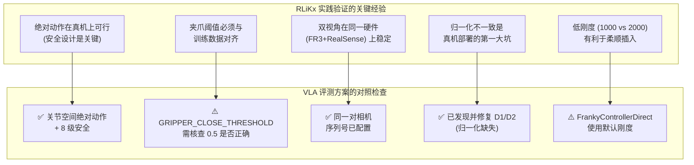
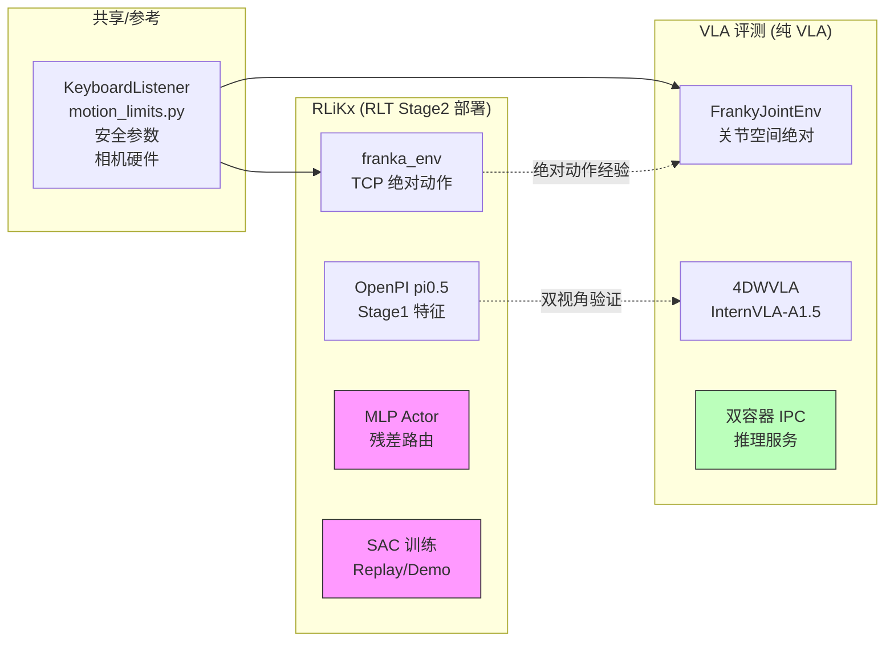

# RLiKx 相对 RLmm 的改动清单 — 与纯 VLA 评测方案的关联分析

> **版本**: v1.0 | **日期**: 2026-09-15
> **分析基础**: RLiKx (`/home/nvidia/bt/RLiKx/`) vs RLmm (`/home/nvidia/bt/s/RLmm/`) 代码差异, 交叉参考 `rlmm_rlikx_diff_analyz3.markdown` (v3 详细对比分析) 和 `4wvla_rlinf_eval_3A3.md` (纯 VLA 评测方案 v3A3.11).
> **目标**: 列出 RLiKx 相对 RLmm 的全部改动, 标注哪些与纯 VLA 评测相关, 解释关联原因和影响.

---

## 目录

- [1. 背景与分析框架](#1-背景与分析框架)
- [2. 改动总表与关联性标注](#2-改动总表与关联性标注)
- [3. 与 VLA 评测高度相关的改动 — 详细分析](#3-与-vla-评测高度相关的改动--详细分析)
- [4. 与 VLA 评测间接相关的改动 — 详细分析](#4-与-vla-评测间接相关的改动--详细分析)
- [5. 与 VLA 评测无关的改动 (仅 RLT Stage2)](#5-与-vla-评测无关的改动-仅-rlt-stage2)
- [6. 对 VLA 评测方案的综合影响评估](#6-对-vla-评测方案的综合影响评估)
- [7. 建议与行动项](#7-建议与行动项)

---

## 1. 背景与分析框架

### 1.1 两套代码的定位

| | RLmm | RLiKx |
|:---|:---|:---|
| **定位** | 通用 RLT 框架, 主要在 ManiSkill 仿真环境验证 | 产品化部署版, 在真实 Franka FR3v2.1 上做充电器插拔任务 |
| **动作空间** | Delta 关节角 / Delta TCP | **绝对 TCP 位姿** (xyz + euler + gripper) |
| **VLA 模型** | OpenPI pi0.5 (1 视角) | OpenPI pi0.5 (2 视角: global + wrist) |
| **控制频率** | 10 Hz (仿真) | 10 Hz (真机) |
| **路由方式** | `torch.where` 替换 | 残差: `ref + delta × scale` |

### 1.2 纯 VLA 评测方案概要

`4wvla_rlinf_eval_3A3.md` 描述的是 **模式 A: 纯 VLA 评估**, 核心特征:

- **不涉及 RLT Stage2**: 无 actor-critic MLP, 无 Q-learning, 无 replay buffer
- **直接使用 4DWVLA (InternVLA-A1.5)** 输出绝对关节角动作 (8D: 7 arm + 1 gripper)
- **双容器架构**: GPU 容器做 VLA 推理, Franky 容器做机器人控制
- **关键需求**: franka_env 的绝对动作支持, 双相机 (global + wrist), 安全防护, 键盘控制
- **自建扩展代码** (`4dwvla_ext/`): 不修改 rlinf 源码, 复用安全参数和键盘监听器

### 1.3 分析框架

对 RLiKx 的每项改动, 按以下维度分析:

| 关联度 | 定义 | 标记 |
|:---:|:---|:---:|
| **高** | 改动直接影响 VLA 评测执行路径上的代码, 或解决了 VLA 评测必须面对的同一问题 | 🔴 |
| **中** | 改动涉及 VLA 评测可能复用或参考的基础设施, 但评测方案已独立解决 | 🟡 |
| **低/无** | 改动仅服务于 RLT Stage2 RL 训练, VLA 评测完全不涉及 | ⚪ |

---

## 2. 改动总表与关联性标注

以下按 RLiKx 修改的文件列出全部改动, 并标注与 VLA 评测的关联度.

### 2.1 环境层 (Env)

| # | 文件 | 改动摘要 | 关联度 | 关联原因简述 |
|:---:|:---|:---|:---:|:---|
| E1 | `franka_env.py` | 绝对动作执行 (`use_absolute_action`) | 🔴 | VLA 评测输出绝对关节角, 需要同样的绝对动作执行机制 |
| E2 | `franka_env.py` | `use_persistent_desired_pose` | 🟡 | VLA 评测走关节空间不走 TCP, 但若改用 TCP 模式则相关 |
| E3 | `franka_env.py` | 动作空间边界扩展 `[-pi-0.2, pi+0.2]` | 🔴 | VLA 评测的绝对动作需要同等宽泛的动作空间 |
| E4 | `franka_env.py` | `binary_gripper_threshold: 0.1` (vs 0.5) | 🔴 | 直接影响 VLA 评测时夹爪开合判定 |
| E5 | `peg_insertion_env.py` | `translational_stiffness: 1000` (vs 2000) | 🟡 | VLA 评测方案自建 `FrankyControllerDirect`, 不经过 `peg_insertion_env`, 但调参经验可参考 |
| E6 | `realworld_env.py` | Chunk 中断 + 零填充 + `chunk_valid_steps` | ⚪ | 仅 RLT Stage2 replay 训练需要 |
| E7 | `realworld_env.py` | Truncation 逻辑: `\|=` vs `=` | 🟡 | 影响 episode 终止条件, VLA 评测用独立 `KeyboardVLAEvalWrapper` |
| E8 | `realworld_env.py` | `_epoch_done` 属性和 `new_epoch()` | ⚪ | RLT epoch 生命周期管理, VLA 评测无需 |

### 2.2 输入设备与观测层

| # | 文件 | 改动摘要 | 关联度 | 关联原因简述 |
|:---:|:---|:---|:---:|:---|
| I1 | `spacemouse_intervention.py` | `_delta_to_absolute()` 转换 | 🔴 | VLA 评测中 SpaceMouse 人工干预需要同样的 delta→absolute 转换 |
| I2 | `spacemouse_intervention.py` | `intervene_flag` + offset 统计 + timeout 1.0s | 🟡 | 增强干预日志, VLA 评测可参考 |
| I3 | `spacemouse_intervention.py` | `_sync_gripper_action()` | 🟡 | 干预开始时同步夹爪状态, VLA 评测如用 SpaceMouse 则需要 |
| I4 | `euler_obs.py` | `tcp_pose.shape[-1] == 7` 维度守卫 | 🔴 | 防止非标准观测维度导致崩溃, VLA 评测也会遇到 |
| I5 | `keyboard_rlt_policy_switch_wrapper.py` | `max_episodes_per_epoch`, `c`/`a` 键, `new_epoch()` | 🟡 | VLA 评测用独立的 `KeyboardVLAEvalWrapper`, 但按键语义参考了此处 |
| I6 | `keyboard_listener.py` | 按键日志 via `rlt_status_log` | ⚪ | RLT 专用日志, VLA 评测用标准 logging |

### 2.3 模型层

| # | 文件 | 改动摘要 | 关联度 | 关联原因简述 |
|:---:|:---|:---|:---:|:---|
| M1 | `eval_action_model.py` | `norm_stats_path` 参数 + q01/q99 归一化 | 🔴 | VLA 评测的 Stage1 特征提取需要正确的归一化统计量 |
| M2 | `model_builders.py` | 传递 `norm_stats_path` | 🔴 | M1 的配套改动 |
| M3 | `openpi/dataconfig/` | `use_wrist_image: bool`, `pi05_franka_state_2view_10hz` | 🔴 | VLA 评测使用 2 视角 (global + wrist), 需要此配置 |
| M4 | `openpi/policies/franka_policy.py` | 条件手腕图像填充 | 🔴 | 2 视角推理时的输入构造逻辑 |
| M5 | `rlt_mlp_policy.py` | `delta_scale` buffer | ⚪ | 仅 RLT Stage2 actor 残差路由使用 |

### 2.4 算法核心层

| # | 文件 | 改动摘要 | 关联度 | 关联原因简述 |
|:---:|:---|:---|:---:|:---|
| A1 | `route.py` | 残差路由 `ref + delta × scale` | ⚪ | RLT Stage2 特有, VLA 评测无 actor |
| A2 | `transition.py` | 不修改 ref_chunk (保持 VLA 参考动作不变) | ⚪ | RLT Stage2 特有 |
| A3 | `action_geometry.py` | `absolute_action_delta()`, `project_absolute_action()` | 🟡 | 几何计算可参考, 但 VLA 评测直接发绝对关节角, 不需要 TCP→delta 转换 |
| A4 | `fsdp_rlt_ac_policy_worker.py` | `_truncate_actions()`, 3 种 BC 模式, `_bc_valid_mask()`, `_actions_to_delta()`, `_recorded_chunk_trajectory()`, demo buffer gate | ⚪ | 全部仅 RLT Stage2 训练 |

### 2.5 基础设施层

| # | 文件 | 改动摘要 | 关联度 | 关联原因简述 |
|:---:|:---|:---|:---:|:---|
| F1 | `fsdp/strategy/base.py` | `FileSystemReader` + `prepare_dcp_load()` | ⚪ | DCP 检查点加载, VLA 评测用 HuggingFace `from_pretrained` |
| F2 | `fsdp/strategy/checkpoint.py` | `_legacy_scheduler_initial_flags` PyTorch 2.7→2.11 兼容 | ⚪ | FSDP 训练兼容性 |
| F3 | `embodied_trajectory_builder.py` | `update_last_step_result()`, `_align_and_stack()` | ⚪ | Replay buffer 数据构建 |
| F4 | `replay/buffer.py` | `trajectory_ids` selective save, 维度修复, 宽松 reshape | ⚪ | Replay buffer 存储 |
| F5 | `nested_dict_process.py` | `_align_and_stack_tensors()` | ⚪ | Tensor 对齐工具 |
| F6 | `utils.py` | `if Worker.torch_platform is not None` 空安全 | 🟡 | 通用防御性编程, 降低崩溃风险 |

### 2.6 专用工具

| # | 文件 | 改动摘要 | 关联度 | 关联原因简述 |
|:---:|:---|:---|:---:|:---|
| U1 | `rlt_status_log.py` | `/tmp/rlt_status.log` 状态日志 | ⚪ | RLT 专用日志 |

### 2.7 Rollout 与推理层

| # | 文件 | 改动摘要 | 关联度 | 关联原因简述 |
|:---:|:---|:---|:---:|:---|
| R1 | `huggingface_worker.py` | `cached_policy_outputs`, `terminal_policy_stages`, `__epoch_done__` 缓存 | ⚪ | RLT Stage2 推理优化, VLA 评测不经过 rlinf rollout 系统 |

### 2.8 YAML 配置

| # | 配置 | 改动摘要 | 关联度 | 关联原因简述 |
|:---:|:---|:---|:---:|:---|
| C1 | RLiKx YAML | `use_absolute_action: True` | 🔴 | VLA 评测的绝对动作模式验证来源 |
| C2 | RLiKx YAML | `binary_gripper_threshold: 0.1` | 🔴 | 夹爪判定阈值 |
| C3 | RLiKx YAML | `camera_names` 含 `wrist` | 🔴 | 2 视角配置 |
| C4 | RLiKx YAML | `bc_target_mode: conditional_all`, `bc_mask_terminal_padding: true` | ⚪ | RLT Stage2 BC 训练 |
| C5 | RLiKx YAML | `demo_buffer` 完整配置 | ⚪ | RLT Stage2 专有 |
| C6 | RLiKx YAML | `cache_size: 30` (vs 200) | ⚪ | Replay buffer 配置 |
| C7 | RLiKx YAML | `max_episodes_per_epoch: 2` | ⚪ | RLT epoch 管理 |
| C8 | RLiKx YAML | `norm_stats_path` + `config_name: pi05_franka_state_2view_10hz` | 🔴 | Stage1 模型配置, 含归一化路径和 2 视角配置名 |
| C9 | RLiKx YAML | `num_action_chunks: 10` (actor) vs `ref_num_action_chunks: 20` (VLA) | ⚪ | RLT Stage2 chunk 长度差异 |

---

## 3. 与 VLA 评测高度相关的改动 — 详细分析

### 3.1 🔴 E1: 绝对动作执行 (`franka_env.py`)

**改动内容**:

RLiKx 在 `franka_env.py` 中新增了 `use_absolute_action: bool = False` 配置项. 当 `use_absolute_action=True` 时, 动作执行逻辑从 delta 模式切换为绝对模式:

```python
# RLmm (delta 模式):
self.next_position[:3] += action[:3]  # TCP 位置增量
self.next_position[3:6] += action[3:6]  # TCP 欧拉角增量

# RLiKx (绝对模式):
self.next_position[:3] = action[:3]   # 直接设置 TCP 绝对位置
self.next_position[3:6] = action[3:6] # 直接设置 TCP 绝对欧拉角
```

**与 VLA 评测的关系**:

VLA 评测方案的 4DWVLA 模型 (InternVLA-A1.5) 输出的是 **8D 绝对关节角** (7 arm + 1 gripper), `action_mode=abs`, 这意味着模型直接预测目标关节角位置, 而非增量.

虽然 VLA 评测方案使用的是**关节空间绝对动作** (而 RLiKx 的 `use_absolute_action` 处理的是 **TCP 空间绝对动作**), 但两者面临的是同一类问题: **如何正确处理绝对动作语义**. RLiKx 在真机上率先验证了绝对动作模式的可行性, 这为 VLA 评测的关节空间绝对动作提供了重要的实践参考.

**影响**:

1. **验证了绝对动作在真机上的安全性**: RLiKx 的生产部署证明了绝对动作模式 (相比 delta 模式) 在 Franka 上是可行的, 不会因为坐标系偏差导致危险
2. **安全边界配置**: RLiKx 为绝对动作模式配套调整了 `action_scale`, 安全盒范围等参数, VLA 评测方案的 `FrankyJointEnv` 中的安全参数 (如 `ACTION_LIMIT_LOWER/UPPER`, `MAX_JOINT_STEP_RAD`) 本质上解决的是同一问题
3. **RLiKx 是 TCP 空间, 评测方案是关节空间**: 两者的绝对动作维度和含义不同, 但安全设计思路一致

### 3.2 🔴 E3: 动作空间边界扩展 (`franka_env.py`)

**改动内容**:

RLiKx 将 `franka_env.py` 的动作空间边界从 RLmm 的默认窄范围扩展到 `[-pi-0.2, pi+0.2]`, 以容纳绝对 TCP 欧拉角中可能出现的接近 ±π 的值.

**与 VLA 评测的关系**:

VLA 评测的 4DWVLA 模型输出绝对关节角, 关节角范围由 FR3v2.1 的 URDF 限位决定 (例如 q6 范围为 [0.4398, 4.6216] rad). VLA 评测方案在 `FrankyJointEnv` (§6.4) 中使用了:

```python
self.action_space = gym.spaces.Box(
    low=np.concatenate([JOINT_LIMITS_LOWER, [0.0]]),
    high=np.concatenate([JOINT_LIMITS_UPPER, [1.0]]),
)
```

这与 RLiKx 解决的是相同的问题: **绝对动作模式要求动作空间边界覆盖目标坐标的完整范围**, 而非仅覆盖 delta 增量的小范围.

**影响**:

VLA 评测方案已经独立解决了此问题 (使用 URDF 关节限位作为边界), 但 RLiKx 的做法验证了 "绝对模式需要宽动作空间边界" 这一设计原则的正确性.

### 3.3 🔴 E4: 夹爪阈值 `binary_gripper_threshold: 0.1`

**改动内容**:

RLiKx 将夹爪开合判定阈值从 RLmm 的 0.5 降低到 0.1.

- RLmm: `gripper_action >= 0.5` → 闭合
- RLiKx: `gripper_action >= 0.1` → 闭合

**与 VLA 评测的关系**:

VLA 评测方案在 `FrankyJointEnv` 中使用 `GRIPPER_CLOSE_THRESHOLD = 0.5` (与 RLmm 一致). 但 4DWVLA 模型的训练数据中, 夹爪动作的归一化约定为:

```
观测 = 物理宽度 m ∈ [0, 0.08]
动作 = 归一化值 ∈ [0.007, 1.0], 其中 1.0 = 闭合
```

**影响**:

这是一个**需要仔细对齐的参数**:

1. 如果 4DWVLA 训练时的夹爪动作归一化约定与 RLiKx 的 VLA (OpenPI) 不同, 阈值需要相应调整
2. RLiKx 选择 0.1 是因为其 OpenPI VLA 模型输出的夹爪动作在 0~1 范围内, 接近 0 表示闭合, 接近 1 表示张开 (与 4DWVLA 的约定可能**相反**)
3. VLA 评测方案应当根据 4DWVLA 的 `abs_stats.json` 中夹爪动作的 mean/std 来确定正确的阈值

> **行动项**: 核查 4DWVLA 训练数据中夹爪动作的 0/1 语义, 确认 `GRIPPER_CLOSE_THRESHOLD` 的正确值.

### 3.4 🔴 I1: SpaceMouse `_delta_to_absolute()` 转换

**改动内容**:

RLiKx 在 `spacemouse_intervention.py` 中新增了 `_delta_to_absolute()` 方法, 将 SpaceMouse 的 delta 输入转换为绝对 TCP 目标:

```python
def _delta_to_absolute(self, delta_action, current_tcp):
    absolute_target = current_tcp.copy()
    absolute_target[:3] += delta_action[:3]  # 位置增量
    absolute_target[3:6] += delta_action[3:6]  # 欧拉角增量
    return absolute_target
```

**与 VLA 评测的关系**:

VLA 评测方案没有直接使用 SpaceMouse (评测是纯自动的, 由 VLA 全程控制). 但如果评测过程中需要人工干预 (例如操作员用 SpaceMouse 纠正机器人位姿), 则需要此功能.

RLiKx 的 VLA 在绝对 TCP 空间工作, SpaceMouse 天然输出的是 delta, 因此必须做 delta→absolute 转换. VLA 评测方案的 4DWVLA 在绝对关节空间工作, 如果引入 SpaceMouse 干预, 同样需要一个 "delta 关节角 → 绝对关节角" 的转换 (更简单: `current_q + delta_q`).

**影响**:

1. VLA 评测当前方案不使用 SpaceMouse 干预, **不直接受影响**
2. 如果未来评测方案增加 SpaceMouse 人工干预功能, 需要参考 RLiKx 的 delta→absolute 转换模式
3. RLiKx 还增加了干预时的 offset 统计日志 (每 5 步), 这对调试干预精度很有参考价值

### 3.5 🔴 I4: Euler Obs 维度守卫 (`euler_obs.py`)

**改动内容**:

RLiKx 在 `euler_obs.py` 中增加了维度检查:

```python
if tcp_pose.shape[-1] == 7:  # 四元数格式, 需要转换
    euler = quat_to_euler(tcp_pose[..., 3:7])
    # ...
# 如果不是 7D, 跳过转换 (可能已经是欧拉角格式)
```

**与 VLA 评测的关系**:

VLA 评测方案的 `FrankyJointEnv` 直接从 `robot.state.q` 读取关节角, 不经过 TCP 欧拉角转换. 但如果 VLA 评测复用 rlinf 框架的观测包装器 (wrapper), 就会经过 `euler_obs.py`, 此时维度守卫可以防止因观测格式不匹配导致的崩溃.

**影响**:

1. VLA 评测方案使用自建的 `FrankyJointEnv`, **不直接经过此代码路径**
2. 但如果未来评测方案改为复用 rlinf 的 `FrankaEnv` + wrapper 栈, 此维度守卫是必要的
3. 这是一个良好的防御性编程实践, 降低了因输入格式变化导致的运行时崩溃风险

### 3.6 🔴 M1/M2: `norm_stats_path` 归一化统计量路径

**改动内容**:

RLiKx 在 `eval_action_model.py` 和 `model_builders.py` 中新增了 `norm_stats_path` 参数, 允许从外部 JSON 文件加载 q01/q99 归一化统计量, 并用这些统计量对 `ref_chunk` (VLA 参考动作) 进行归一化:

```python
ref_chunk_norm = (ref_chunk - q01) / (q99 - q01 + 1e-6) * 2.0 - 1.0
```

**与 VLA 评测的关系**:

VLA 评测方案使用 4DWVLA (InternVLA-A1.5), 不使用 OpenPI pi0.5 的 Stage1 特征提取. 但此改动揭示了一个**关键设计决策**: 在真机部署中, 归一化统计量必须与训练数据精确对齐.

VLA 评测方案通过 `NormalizeTransformFn` + `UnNormalizeTransformFn` + `stats.json` 实现了等价的对齐 (§4.2-4.3), 处理的是相同的问题.

**影响**:

1. **训推一致性**: RLiKx 的经验表明, 归一化统计量不匹配是真机部署中的常见致命错误. VLA 评测方案的 D1/D2 缺陷 (缺少状态归一化/动作反归一化) 正是此类问题
2. **归一化方式差异**: RLiKx 用 q01/q99 (分位数), 4DWVLA 用 mean/std. 两者互不影响, 但都必须与训练时完全一致
3. VLA 评测方案已正确处理 (§4.3 数据归一化参数), **不直接受影响**

### 3.7 🔴 M3/M4: 双视角 (Wrist Camera) 支持

**改动内容**:

RLiKx 在 OpenPI 数据配置中新增了 `use_wrist_image: bool = False` 和 `pi05_franka_state_2view_10hz` 配置, 并在 `franka_policy.py` 中增加了条件手腕图像填充:

```python
if self.use_wrist_image:
    inputs["image1"] = wrist_image
```

YAML 中对应配置:
```yaml
camera_names:
  "250222073513": global
  "420122070525": wrist
num_images_in_input: 2
```

**与 VLA 评测的关系**:

VLA 评测方案的 4DWVLA 模型同样使用 **2 个视角** (global + wrist), 这是因为 4DWVLA 训练数据 (`franka_plug` 数据集) 包含了双视角图像:

```yaml
# franka_plug.yaml schema
image_mapping:
  observation.images.global: observation.images.image0
  observation.images.wrist: observation.images.image1
```

RLiKx 的双视角支持是为 RLT Stage1 (OpenPI pi0.5) 添加的, 而 VLA 评测方案的双视角支持是为 4DWVLA (InternVLA-A1.5) 添加的. **两者解决的是同一个需求: 真机评测需要双视角输入.**

**影响**:

1. **相机硬件一致性**: RLiKx YAML 中的相机序列号 (`250222073513` 全局, `420122070525` 手腕) 与 VLA 评测共用同一套硬件, 序列号配置需保持一致
2. **图像 key 映射**: RLiKx 的 OpenPI 使用 `image0`/`image1`, 4DWVLA 的 schema 也使用 `image0`/`image1`, 映射一致
3. VLA 评测方案已独立实现双视角支持 (通过 `RemapImageKeyTransformFn` + schema), **不直接依赖 RLiKx 代码**, 但验证了双视角在同一硬件上的可行性

### 3.8 🔴 C1/C2/C3/C8: YAML 配置中的绝对动作 + 双视角 + 归一化路径

这些配置项是上述代码改动的声明式表达, 汇总如下:

| 配置项 | RLiKx 值 | RLmm 值 | VLA 评测方案等价物 |
|:---|:---|:---|:---|
| `use_absolute_action` | `True` | 无此项 | 4DWVLA `action_mode=abs` |
| `binary_gripper_threshold` | `0.1` | `0.5` | `FrankyJointEnv.GRIPPER_CLOSE_THRESHOLD=0.5` |
| `camera_names` | global + wrist | 无指定 | `franka_plug.yaml` schema 双视角 |
| `norm_stats_path` | 外部 JSON | 无此项 | `stats.json["franka_plug"]` |
| `config_name` | `pi05_franka_state_2view_10hz` | `pi05_franka_state` | 不适用 (4DWVLA 用自己的 schema) |

---

## 4. 与 VLA 评测间接相关的改动 — 详细分析

### 4.1 🟡 E2: `use_persistent_desired_pose`

**改动内容**:

RLiKx 新增了 `use_persistent_desired_pose` 机制: 不每步从当前 TCP 位置出发计算 delta, 而是维护一个持久的 "期望位姿", 每步将 delta 累积到该位姿上. 配合 `max_desired_pose_lag = 0.008` m 的滞后上限, 防止阻抗控制器因 sub-mm 级指令被丢弃.

**与 VLA 评测的关系**:

VLA 评测方案在**关节空间**工作 (`FrankyJointEnv` 使用 `franky.JointWaypointMotion`), 不涉及 TCP 阻抗控制. 因此 `persistent_desired_pose` 机制**不直接适用**.

但如果未来 VLA 评测改用 TCP 空间动作 (某些 VLA 模型输出 TCP delta), 则此机制会变得关键.

RLiKx YAML 中 `use_persistent_desired_pose: False` (已关闭), 表明即使在 RLiKx 的绝对 TCP 模式下, 该功能也非必须.

### 4.2 🟡 E5: 阻抗刚度 `translational_stiffness: 1000`

**改动内容**:

RLiKx 将 `peg_insertion_env.py` 中的 `translational_stiffness` 从 2000 降低到 1000.

**与 VLA 评测的关系**:

VLA 评测方案不使用 `peg_insertion_env.py` (自建 `FrankyJointEnv`), 也不通过阻抗控制器发送 TCP 指令 (直接发关节角). 但 RLiKx 降低刚度的**经验**有参考价值: 在插拔任务中, 过高的刚度可能导致接触时力过大, 降低刚度有利于柔顺插入.

VLA 评测使用 `franky.JointWaypointMotion` 的默认刚度设置, 如果发现力控问题, 可参考 RLiKx 的调参方向.

### 4.3 🟡 E7: Truncation 逻辑

**改动内容**:

RLiKx 将 `realworld_env.py` 中的 truncation 合并逻辑从**覆盖** (`truncations = timeout_truncations`) 改为**或运算** (`truncations = timeout_truncations | truncations`), 保留了环境内部触发的 truncation.

**与 VLA 评测的关系**:

VLA 评测方案使用独立的 `KeyboardVLAEvalWrapper` 控制 episode 终止, 不经过 `realworld_env.py` 的 truncation 逻辑. 但如果未来评测复用 rlinf 的 env 栈, 此改动决定了 truncation 的语义: 内部 truncation (如安全触发) 是否被超时覆盖.

### 4.4 🟡 I2/I3: SpaceMouse 干预增强

**改动内容**:

- `intervene_flag` 在 info dict 中暴露
- 每 5 步输出 offset 统计
- 干预开始/结束的日志
- timeout 从 0.5s 放宽到 1.0s
- `_sync_gripper_action()`: 干预开始时将夹爪动作同步为当前夹爪状态

**与 VLA 评测的关系**:

VLA 评测是纯自动的 (VLA 全程控制), 不使用 SpaceMouse 干预. 但:

1. 如果评测过程中需要人工救场 (如机器人即将撞到插座), SpaceMouse 干预是一个有用的备选方案
2. `_sync_gripper_action()` 解决了一个微妙问题: 人类接管时, 第一步的夹爪指令不应跳变. 如果 VLA 评测增加干预功能, 需要此机制

### 4.5 🟡 I5: 键盘 RLT 策略切换包装器

**改动内容**:

RLiKx 的 `keyboard_rlt_policy_switch_wrapper.py` 增加了:
- `max_episodes_per_epoch`: 每个 epoch 最多执行 N 个 episode
- `c` 键标记成功 (reward=1), `a` 键标记失败 (reward=0)
- `_epoch_done` 标志和 `new_epoch()` 方法
- 中文日志 via `rlt_status_log`

**与 VLA 评测的关系**:

VLA 评测方案的 `KeyboardVLAEvalWrapper` (§6.5 of eval doc) **参考了 RLiKx 的键盘控制模式**, 但做了适配:

| 功能 | RLiKx (RLT 策略切换) | VLA 评测方案 |
|:---|:---|:---|
| 启动 rollout | `b` 键 (切换到 actor) | `a` 键 |
| 标记成功 | `c` 键 (reward=1) | `c` 键 (reward=1) |
| 标记失败 | `a` 键 (reward=0) | `b` 键 (reward=0) |
| 中断 | 无 | `r` 键 (新增) |
| 归位 | 无 | `h` 键 (新增) |
| 键盘后端 | `KeyboardListener` (evdev) | 同 (直接 import) |

VLA 评测方案直接 import 了 RLiKx/RLmm 共用的 `KeyboardListener`, 但键盘语义有所调整. RLiKx 的 `c`/`a` 键语义 (成功/失败) 为 VLA 评测的 `c`/`b` 键设计提供了参考.

### 4.6 🟡 A3: `action_geometry.py`

**改动内容**:

RLiKx 独有的 `action_geometry.py` 提供了两个函数:
- `absolute_action_delta()`: 计算两个绝对 TCP 位姿之间的差值, 对欧拉角使用 `atan2(sin, cos)` 做周期性差分
- `project_absolute_action()`: 将绝对动作投影到安全盒边界内

**与 VLA 评测的关系**:

VLA 评测在关节空间操作, 不需要 TCP 空间的差值计算或安全盒投影. 但:
1. `atan2(sin, cos)` 周期性差分是处理角度值的标准做法, 如果 VLA 评测需要计算欧拉角误差 (如用于评估指标), 可参考此实现
2. 安全盒投影的思路与 VLA 评测的 `check_action_safety()` (L1-L3 关节空间裁剪) 在设计理念上一致

### 4.7 🟡 F6: `utils.py` 空安全检查

**改动内容**:

RLiKx 增加了 `if Worker.torch_platform is not None` 检查, 防止在非标准环境 (如无 Ray 初始化) 下访问未设置的类属性导致 `AttributeError`.

**与 VLA 评测的关系**:

VLA 评测方案不使用 `Worker` 类 (自建了 `FrankyControllerDirect` 以避免 Ray 依赖). 但如果评测代码间接 import 了包含 `Worker` 的模块, 此防御性检查可以避免 import 时的崩溃.

---

## 5. 与 VLA 评测无关的改动 (仅 RLT Stage2)

以下改动**完全服务于 RLT Stage2 的 actor-critic RL 训练**, VLA 评测方案不涉及这些功能:

### 5.1 RLT 算法核心

| # | 文件 | 改动 | 为什么不相关 |
|:---:|:---|:---|:---|
| A1 | `route.py` | 残差路由 `ref + delta × scale` | VLA 评测无 actor, 不进行动作路由 |
| A2 | `transition.py` | 保持 ref_chunk 不变 | VLA 评测不构建 transition |
| A4 | `fsdp_rlt_ac_policy_worker.py` | 3 种 BC 模式, valid mask, 截断, delta 转换 | VLA 评测无 actor 训练 |
| M5 | `rlt_mlp_policy.py` | `delta_scale` buffer `[0.02]*3 + [0.05]*3 + [0.5]` | VLA 评测无 MLP actor |

### 5.2 Epoch 与 Rollout 管理

| # | 文件 | 改动 | 为什么不相关 |
|:---:|:---|:---|:---|
| E6 | `realworld_env.py` | Chunk 中断 + 零填充 | 仅 replay buffer 训练需要 |
| E8 | `realworld_env.py` | `_epoch_done`, `new_epoch()` | RLT 训练循环管理 |
| R1 | `huggingface_worker.py` | `cached_policy_outputs`, `terminal_policy_stages` | RLT 推理优化 |
| I6 | `keyboard_listener.py` | `rlt_status_log` 日志 | RLT 专用日志格式 |
| U1 | `rlt_status_log.py` | `/tmp/rlt_status.log` | RLT 专用 |

### 5.3 数据存储与训练基础设施

| # | 文件 | 改动 | 为什么不相关 |
|:---:|:---|:---|:---|
| F1 | `fsdp/strategy/base.py` | DCP 加载方式 | VLA 评测用 HuggingFace |
| F2 | `fsdp/strategy/checkpoint.py` | PyTorch 2.7→2.11 兼容 | FSDP 训练专用 |
| F3 | `embodied_trajectory_builder.py` | `update_last_step_result()` | Replay buffer 构建 |
| F4 | `replay/buffer.py` | 维度修复, 宽松 reshape | Replay buffer |
| F5 | `nested_dict_process.py` | `_align_and_stack_tensors()` | 数据处理工具 |

### 5.4 RLT 训练专用 YAML 配置

| # | 配置项 | 为什么不相关 |
|:---:|:---|:---|
| C4 | `bc_target_mode: conditional_all` | BC loss 计算方式, VLA 评测无训练 |
| C5 | `demo_buffer` 配置 | 演示缓冲区, VLA 评测无训练 |
| C6 | `cache_size: 30` | Replay buffer 大小, VLA 评测无训练 |
| C7 | `max_episodes_per_epoch: 2` | Epoch 管理, VLA 评测无 epoch |
| C9 | `num_action_chunks: 10` vs `ref: 20` | Actor vs VLA chunk 长度, VLA 评测无 actor |

---

## 6. 对 VLA 评测方案的综合影响评估

### 6.1 VLA 评测方案已解决的问题

VLA 评测方案 (`4wvla_rlinf_eval_3A3.md`) 通过 **独立扩展 (`4dwvla_ext/`)** 的方式, 已经独立解决了以下 RLiKx 同样面对的问题:

| 问题 | RLiKx 的解法 | VLA 评测的解法 | 是否一致 |
|:---|:---|:---|:---:|
| 绝对动作执行 | `franka_env.py` TCP 绝对模式 | `FrankyJointEnv` 关节空间绝对 | 设计理念一致, 实现路径不同 |
| 安全防护 | rlinf `FrankaEnv` 内置安全盒 | `FrankyControllerDirect` 8 级安全 | 复制了相同的安全算法 |
| 双视角输入 | OpenPI `pi05_franka_state_2view_10hz` | 4DWVLA `franka_plug.yaml` schema | 各自模型各自配置 |
| 归一化对齐 | `norm_stats_path` q01/q99 | `stats.json` mean/std | 各自模型各自统计量 |
| 键盘控制 | `keyboard_rlt_policy_switch_wrapper.py` | `KeyboardVLAEvalWrapper` | 复用 `KeyboardListener`, 扩展按键 |
| 避免 Ray 依赖 | (不需要, RLiKx 在 rlinf 框架内运行) | `FrankyControllerDirect` 独立控制器 | VLA 评测主动绕过 |

### 6.2 VLA 评测方案需要注意的 RLiKx 经验



### 6.3 两套代码的互补关系



粉色部分 (RLT Stage2 actor/训练) 与 VLA 评测完全无关. 绿色部分 (双容器 IPC) 是 VLA 评测独有的.

---

## 7. 建议与行动项

### 7.1 必须验证的项 (高优先级)

| # | 事项 | 原因 | 方法 |
|:---:|:---|:---|:---|
| 1 | **夹爪阈值对齐** | RLiKx 用 0.1, VLA 评测用 0.5, 4DWVLA 的夹爪约定可能与 RLiKx 的 OpenPI 不同 | 查看 `abs_stats.json` 中夹爪动作的 mean/std, 确认 0 = 张开/闭合 |
| 2 | **相机序列号确认** | RLiKx YAML 中的序列号 (`250222073513`=global, `420122070525`=wrist) 必须与评测时的物理接线一致 | T8 真机测试时确认画面内容与相机名称匹配 |
| 3 | **归一化统计量来源** | RLiKx 用 `norm_stats.json` (q01/q99), VLA 评测用 `stats.json` (mean/std), 确认各自用对了各自的 | T1 transform 测试已覆盖 |

### 7.2 可考虑借鉴的项 (中优先级)

| # | 事项 | RLiKx 经验 | VLA 评测可借鉴什么 |
|:---:|:---|:---|:---|
| 1 | **刚度调参** | `translational_stiffness: 1000` 比 2000 更适合插拔 | 如果 VLA 评测中发现力控问题, 可调 `franky.Robot.relative_dynamics_factor` |
| 2 | **SpaceMouse 干预** | delta→absolute 转换 + gripper 同步 | 如果评测增加人工干预, 参考 RLiKx 的 `_delta_to_absolute()` |
| 3 | **状态日志** | `rlt_status_log.py` 写 `/tmp/rlt_status.log` | VLA 评测可增加类似的评测状态日志, 方便事后分析 |
| 4 | **Offset 统计** | SpaceMouse 每 5 步输出 offset 统计 | VLA 评测可在推理输出中增加类似的 "预测 vs 实际" 偏差统计 |

### 7.3 无需关注的项 (低优先级)

以下 RLiKx 改动完全在 RLT Stage2 训练域内, VLA 评测方案无需关注:

- 残差路由 (`route.py`)
- Transition 构建 (`transition.py`)
- Actor 训练 (BC 模式, valid mask, delta 转换)
- Epoch 管理 (epoch_done, new_epoch)
- Demo buffer
- Replay buffer 改动
- DCP 检查点加载
- FSDP PyTorch 兼容性
- MLP `delta_scale` buffer

---

## 附录 A: 改动统计摘要

| 关联度 | 改动数 | 占比 | 主要涉及 |
|:---:|:---:|:---:|:---|
| 🔴 高 | 12 | 34% | 绝对动作, 夹爪阈值, 双视角, 归一化, Euler 维度守卫, SpaceMouse delta→abs |
| 🟡 中 | 9 | 26% | persistent_desired_pose, 刚度, truncation, 键盘控制, action_geometry, utils |
| ⚪ 低/无 | 14 | 40% | 残差路由, BC 训练, epoch/replay/demo, DCP/FSDP, MLP actor |

**结论**: RLiKx 的改动中约 1/3 与 VLA 评测直接相关, 主要集中在**绝对动作执行**, **双视角支持**, **归一化对齐**, 和**夹爪阈值**四个方面. VLA 评测方案已通过独立扩展解决了这些问题, 但 RLiKx 的实践经验 (特别是夹爪阈值和刚度调参) 仍有参考价值. 剩余约 40% 的改动完全属于 RLT Stage2 训练域, 与纯 VLA 评测无关.

---

## 附录 B: 文件级改动 ↔ 评测方案对应清单

| RLiKx 改动文件 | 评测方案等价代码 | 关系 |
|:---|:---|:---|
| `franka_env.py` (绝对动作) | `FrankyJointEnv.step()` | 同问题, 不同坐标空间 |
| `franka_env.py` (persistent_desired_pose) | 无 | 评测用关节空间, 不需要 |
| `peg_insertion_env.py` (刚度) | `FrankyControllerDirect(relative_dynamics_factor=0.2)` | 评测用关节控制, 不通过阻抗 |
| `spacemouse_intervention.py` | 无 (评测无 SpaceMouse) | 未来可参考 |
| `euler_obs.py` | 无 (评测不用 TCP 观测) | 防御性参考 |
| `keyboard_rlt_policy_switch_wrapper.py` | `KeyboardVLAEvalWrapper` | 复用 `KeyboardListener`, 扩展按键 |
| `eval_action_model.py` + `model_builders.py` | `NormalizeTransformFn` + `stats.json` | 同问题, 不同模型体系 |
| `openpi/dataconfig/` + `franka_policy.py` | `franka_plug.yaml` schema | 同需求 (双视角), 不同模型 |
| `rlt_mlp_policy.py` | 无 | 评测无 actor |
| `route.py` / `transition.py` | 无 | 评测无 RLT |
| `fsdp_rlt_ac_policy_worker.py` | 无 | 评测无训练 |
| `realworld_env.py` | `KeyboardVLAEvalWrapper` | 部分语义参考 |
| `huggingface_worker.py` | `vla_inference_server.py` | 完全不同的推理架构 |
| `replay/buffer.py` / `trajectory_builder.py` | 无 | 评测无 replay |
| `fsdp/strategy/base.py` / `checkpoint.py` | 无 | 评测无 FSDP |
| `rlt_status_log.py` | 标准 `logging` | 不同日志系统 |
