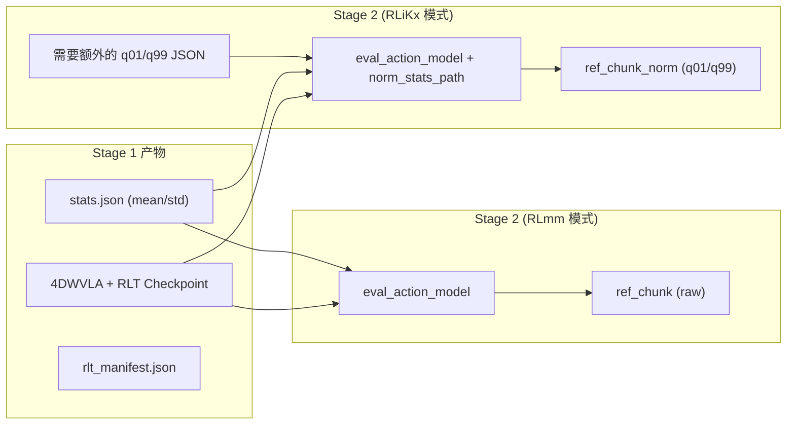
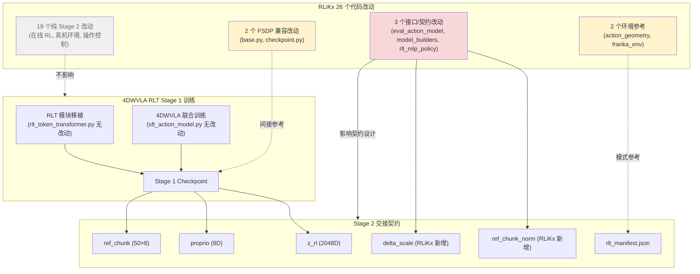
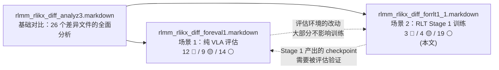

# RLiKx vs RLmm 差异与 4DWVLA RLT Stage 1 训练方案的交叉引用分析

> **版本**：v1.0
> **编写日期**：2026-09-16
> **目标文档**：`RLmm/b/d/rltx/4dwvla_rlt1_1.markdown` — 4DWVLA × RLinf RLT Stage 1 实施落地方案
> **基础分析**：`RLmm/b/d/rltx/rlmm_rlikx_diff_analyz3.markdown` — RLiKx vs RLmm 第三版深度对比
> **验证来源**：RLiKx (`/home/nvidia/bt/RLiKx/`) 与 RLmm (`/home/nvidia/bt/s/RLmm/`) 真实代码

---

## 0. 一句话总结

RLiKx 相对于 RLmm 的所有代码改动均集中在 **Stage 2 在线 RL 与真机部署层**。Stage 1 的两个核心文件——`rlt_token_transformer.py`（RLT encoder-decoder）和 `sft_action_model.py`（VLA + RLT 联合训练）——在 RLiKx 与 RLmm 之间**完全一致**，未做任何修改。

这意味着：4DWVLA RLT Stage 1 训练本身**不需要直接移植 RLiKx 的任何代码改动**。但 RLiKx 在 Stage 2 接口层面的若干变更——特别是 `norm_stats_path` 归一化扩展、`delta_scale` 残差缩放、绝对动作域处理模式——对 Stage 1 的输出契约设计和后续 Stage 2 适配有重要参考价值。

---

## 1. 分析范围与方法

### 1.1 本文目标

1. 列出 RLiKx 相对 RLmm 的**全部代码改动**（26 个差异文件）；
2. 逐项交叉引用 `4dwvla_rlt1_1.markdown`（以下简称 **RLT1 方案**），标注每个改动与 4DWVLA RLT Stage 1 训练的相关性；
3. 对相关改动解释"**为什么相关**"和"**会有什么影响**"；
4. 为 RLT Stage 1 实施提供基于 RLiKx 经验的可执行建议。

### 1.2 相关性分级标准

| 等级 | 标记 | 含义 |
|---|---|---|
| 高相关 | 🔴 | 直接影响 Stage 1 训练设计、RLT 模块移植、或 Stage 2 接口契约 |
| 中相关 | 🟡 | 提供可借鉴的模式、可能影响后续 Stage 2 适配、或触及共享基础设施 |
| 低/无相关 | ⚪ | 纯 Stage 2 在线 RL 或真机操作逻辑，与 Stage 1 离线训练无关 |

### 1.3 关键背景

**4DWVLA RLT Stage 1**（来自 RLT1 方案 §0.1）：

- 使用 4DWVLA 原生训练栈（LeRobot + Accelerate），**不使用 RLinf 训练基础设施**；
- RLT 模块从 RLinf `rlt_token_transformer.py` **行为等价移植**到 4DWVLA policy 包；
- 联合优化：$\mathcal{L}_{\text{stage1}} = \mathcal{L}_{\text{RLT}} + \alpha_{\text{VLA}} \mathcal{L}_{\text{4DWVLA}}$；
- 输出：4DWVLA + RLT encoder/decoder 的 Stage 1 checkpoint；
- 该 checkpoint 须满足 RLinf Stage 2 的 `{z\_rl, proprio, ref\_chunk}` 契约。

**RLiKx 与 RLmm 的关系**（来自 `rlmm_rlikx_diff_analyz3.markdown` §2）：

- RLmm：通用 RLT 框架，主要在 ManiSkill 仿真验证，使用 delta 关节动作、`torch.where` 替换路由；
- RLiKx：真机产品化部署分支（Franka 插充电器），使用绝对 TCP 动作、残差路由、完整的安全/运维工程；
- **两者共享完全相同的 Stage 1 实现**，所有差异均在 Stage 2。

---

## 2. Stage 1 核心文件验证

在进入逐项分析之前，必须首先确认 RLT Stage 1 的核心文件是否被 RLiKx 修改。

### 2.1 验证结果

| 文件 | 职责 | RLiKx vs RLmm 是否一致 |
|---|---|---|
| `rlinf/models/embodiment/modules/rlt_token_transformer.py` | Stage 1 核心：RLT encoder-decoder Transformer | ✅ **完全一致**（字节级相同） |
| `rlinf/models/embodiment/openpi_rlinf/sft_action_model.py` | Stage 1 训练：VLA loss + RLT loss 联合优化 | ✅ **完全一致**（字节级相同） |

**结论**：RLiKx **未修改** Stage 1 的任何算法代码。RLT encoder/decoder 的架构（`sinusoidal_pe_init`、`GeGLU`、`RLTSelfAttentionLayer`、causal decoder、masked MSE）和 SFT 训练流程（`rlt_loss + rlt_alpha * vla_loss`、`prefix_out.detach()` 双重 stop-gradient）在两套代码中完全相同。

### 2.2 对 4DWVLA RLT Stage 1 的含义

由于 Stage 1 核心代码在 RLiKx 中无改动，RLT1 方案 §7.1 中"行为等价移植 `RLTTokenTransformer`"的来源只需参考 RLmm（即 RLinf 原版），不需要考虑 RLiKx 分支。这简化了移植的验证矩阵——parity test 只需与 RLmm 原版对齐。

---

## 3. 完整改动清单与相关性标注

### 3.1 总览表

下表列出 RLiKx 相对 RLmm 的全部 26 个差异文件，按与 RLT Stage 1 的相关性分级。

| # | 文件 | 差异摘要 | RLT Stage 1 相关性 |
|:--|:---|:---|:---:|
| 1 | `algorithms/rlt/route.py` | 替换路由 → 残差路由（`ref + delta × scale`） | ⚪ |
| 2 | `algorithms/rlt/transition.py` | 保持 VLA ref_chunk 不变（不写入人类动作） | ⚪ |
| 3 | `algorithms/rlt/action_geometry.py` | 绝对动作欧拉角周期差 + 安全盒投影 | 🟡 |
| 4 | `workers/actor/fsdp_rlt_ac_policy_worker.py` | 条件 BC / valid mask / 轨迹过滤 / delta 转换 / 示范池 | ⚪ |
| 5 | `workers/env/env_worker.py` | epoch 终止 / 结果时序修正 / `__epoch_done__` | ⚪ |
| 6 | `workers/rollout/hf/huggingface_worker.py` | epoch 终止缓存 / `__epoch_done__` 协议 | ⚪ |
| 7 | `envs/realworld/common/wrappers/keyboard_rlt_policy_switch_wrapper.py` | epoch 管理 / 最小步数 / c-a 判定 | ⚪ |
| 8 | `envs/realworld/franka/franka_env.py` | 绝对动作执行 / 持久期望位姿 / 安全盒 / 夹爪阈值 | 🟡 |
| 9 | `envs/realworld/realworld_env.py` | chunk 中断 + padding / epoch_done / truncation | ⚪ |
| 10 | `envs/realworld/common/wrappers/spacemouse_intervention.py` | delta→绝对转换 / intervene 日志 / 超时 | ⚪ |
| 11 | `envs/realworld/common/rlt_status_log.py` | 操作状态实时日志 | ⚪ |
| 12 | `envs/realworld/franka/tasks/peg_insertion_env.py` | translational_stiffness: 2000 → 1000 | ⚪ |
| 13 | `models/embodiment/mlp_policy/rlt_mlp_policy.py` | `delta_scale` 缓冲区 | 🔴 |
| 14 | `models/embodiment/openpi_rlinf/eval_action_model.py` | `norm_stats_path` / q01-q99 归一化 / `ref_chunk_norm` | 🔴 |
| 15 | `models/embodiment/openpi_rlinf/utils/model_builders.py` | 传递 `norm_stats_path` | 🔴 |
| 16 | `models/embodiment/openpi/dataconfig/*` | `use_wrist_image` / `pi05_franka_state_2view_10hz` | ⚪ |
| 17 | `models/embodiment/openpi/policies/franka_policy.py` | 条件腕部相机处理 | ⚪ |
| 18 | `hybrid_engines/fsdp/strategy/base.py` | `FileSystemReader` + `prepare_dcp_load()` | 🟡 |
| 19 | `hybrid_engines/fsdp/strategy/checkpoint.py` | `prepare_dcp_load()` / `_legacy_scheduler_initial_flags` | 🟡 |
| 20 | `data/schema/embodied_trajectory_builder.py` | `update_last_step_result()` / `_align_and_stack()` | ⚪ |
| 21 | `data/storage/replay/buffer.py` | `trajectory_ids` 选择性保存 / 旧维度修复 | ⚪ |
| 22 | `envs/realworld/common/wrappers/euler_obs.py` | 维度守卫 `if tcp_pose.shape[-1] == 7` | ⚪ |
| 23 | `envs/realworld/common/keyboard/keyboard_listener.py` | 按键日志 via rlt_status_log | ⚪ |
| 24 | `utils/nested_dict_process.py` | `_align_and_stack_tensors()` | ⚪ |
| 25 | `utils/utils.py` | null safety: `if Worker.torch_platform is not None` | ⚪ |
| 26 | `envs/realworld/common/wrappers/apply.py` | `max_episodes_per_epoch` 传参 | ⚪ |

### 3.2 统计

| 相关性 | 数量 | 占比 |
|---|---:|---:|
| 🔴 高相关 | 3 | 11.5% |
| 🟡 中相关 | 4 | 15.4% |
| ⚪ 低/无相关 | 19 | 73.1% |

---

## 4. 高相关改动（🔴）详细分析

### 4.1 🔴 eval_action_model.py — norm_stats_path 与 ref_chunk_norm

#### 4.1.1 改动内容

RLiKx 在 `OpenPiPytorchEvalActionModel`（Stage 2 的 feature model）中新增了：

1. **`norm_stats_path`** 参数：从外部 JSON 文件加载 q01/q99 分位数归一化统计量，注册为 `_action_q01` 和 `_action_q99` tensor；
2. **`ref_chunk_norm`** 输出：在 `extract_rlt_obs()` 返回的字典中新增归一化后的参考动作：

$$
\text{ref\_chunk\_norm} = \frac{\text{ref\_chunk} - q_{01}}{q_{99} - q_{01} + \epsilon} \times 2 - 1
$$

将原始物理动作空间的 `ref_chunk` 映射到 $[-1, 1]$。

#### 4.1.2 为什么与 RLT Stage 1 相关

**直接原因**：RLT1 方案 §13（Stage 1 → Stage 2 交接契约）定义了 Stage 2 adapter 必须提供 `{z_rl, proprio, ref_chunk}` 三元组。RLiKx 在此基础上**扩展**了接口，增加了 `ref_chunk_norm`。这意味着：

- Stage 1 checkpoint 不仅需要保存 VLA + RLT 权重，还需要**保存或记录**用于 `ref_chunk` 归一化的统计量（q01/q99）；
- 如果 Stage 2 采用 RLiKx 的残差路由模式，actor 的输入需要归一化后的 `ref_chunk_norm` 而非原始 `ref_chunk`。

**间接原因**：4DWVLA 使用绝对关节动作（8D），其 `ref_chunk` 的数值范围与 OpenPI 的 TCP 动作不同。RLiKx 引入 q01/q99 归一化而非 mean/std 归一化，是因为绝对动作的分布可能具有长尾或非高斯特性，分位数归一化更鲁棒。

#### 4.1.3 对 RLT Stage 1 的影响

| 影响方面 | 具体内容 |
|---|---|
| checkpoint 设计 | Stage 1 的 `rlt_manifest.json`（RLT1 方案 §7.8）应增加 `action_normalization_method` 字段，记录是使用 mean/std 还是 q01/q99 |
| 数据准备 | 若后续 Stage 2 使用 RLiKx 模式，需从训练数据中预计算 q01/q99 并保存；4DWVLA 当前使用 mean/std |
| Stage 2 契约 | RLT1 方案 §13.4 定义了 `FrankaJointActionCodec`；RLiKx 的 q01/q99 归一化是该 codec 的一种具体实现选择 |
| 实施建议 | Stage 1 训练本身不需要 q01/q99；但应在 `rlt_manifest.json` 中记录数据集的 stats 来源和 SHA256，以便 Stage 2 adapter 能正确选择归一化方式 |



### 4.2 🔴 model_builders.py — norm_stats_path 传递

#### 4.2.1 改动内容

RLiKx 在 `build_openpi_eval_action_model()` 工厂函数中增加了 `norm_stats_path` 参数的透传，使 YAML 配置中指定的 norm stats 路径能传到 `OpenPiPytorchEvalActionModel`。

#### 4.2.2 为什么与 RLT Stage 1 相关

这是 §4.1 改动的配置传递链路。对 Stage 1 的影响是：

- 4DWVLA 的 Stage 2 adapter（RLT1 方案 §13.1 的 `encode_rlt_state` / `sample_rlt_reference`）如果需要支持 q01/q99 归一化，也需要在配置层面传入 stats 路径；
- Stage 1 的 `rlt_manifest.json` 记录 stats 来源，是 Stage 2 adapter 正确构造 `ref_chunk_norm` 的前提。

#### 4.2.3 对 RLT Stage 1 的影响

**低**，但不能忽视。Stage 1 训练不使用该路径，但 Stage 1 产出的 manifest 必须为 Stage 2 记录足够的元信息。RLT1 方案 §7.8 的 manifest 结构中已包含 `action_mode: abs` 和 `stats_key: franka_plug`，建议进一步增加：

```json
{
  "action_normalization": {
    "method": "mean_std",
    "stats_fields": ["action.arm", "action.gripper"],
    "stats_sha256": "<from dataset stats.json>"
  }
}
```

### 4.3 🔴 rlt_mlp_policy.py — delta_scale 缓冲区

#### 4.3.1 改动内容

RLiKx 在 `RLTMLPPolicy`（Stage 2 的 MLP actor）中新增了 `delta_scale` 缓冲区：

```python
self.register_buffer(
    "delta_scale",
    torch.tensor([0.02]*3 + [0.05]*3 + [0.5])
)
```

这与 `route.py` 的残差路由配合使用：actor 输出 $a \in [-1, 1]$（tanh），最终动作为 $\text{ref} + a \times \text{delta\_scale}$。

#### 4.3.2 为什么与 RLT Stage 1 相关

**delta_scale 的选择取决于 ref_chunk 的动作域**。4DWVLA 的 `ref_chunk` 是绝对关节角度（弧度制，7 个关节 + 1 个夹爪宽度），其数值范围和物理含义与 RLiKx 使用的绝对 TCP（XYZ 位置 + RPY 角度 + 夹爪）完全不同：

| 维度 | RLiKx (TCP) | 4DWVLA (关节) |
|---|---|---|
| 位置/角度 1-3 | XYZ 位置 (m), scale=0.02 | $q_1, q_2, q_3$ 关节角 (rad) |
| 角度 4-6 | RPY 角度 (rad), scale=0.05 | $q_4, q_5, q_6$ 关节角 (rad) |
| 夹爪 | 夹爪宽度, scale=0.5 | $q_7$ + 夹爪宽度 |

如果后续 Stage 2 对 4DWVLA 也采用残差路由（RLiKx 模式），`delta_scale` 必须重新标定——关节角的典型精细调整量（如 0.01–0.05 rad）与 TCP 位置/姿态的调整量有不同的物理量级。

#### 4.3.3 对 RLT Stage 1 的影响

| 影响方面 | 具体内容 |
|---|---|
| Stage 2 契约 | RLT1 方案 §13.4 要求统一 `FrankaJointActionCodec`；`delta_scale` 是 codec 的一部分，但其值必须针对关节空间重新设计 |
| Stage 1 manifest | 建议在 manifest 中记录 `action_space: absolute_joint` 和各关节的典型运动范围，供 Stage 2 标定 `delta_scale` |
| 路由模式选择 | Stage 2 需要决定使用 RLmm 的替换路由还是 RLiKx 的残差路由；这个决策不影响 Stage 1，但 Stage 1 manifest 应预留相关字段 |

**实施建议**：Stage 1 训练本身不涉及 `delta_scale`。但 RLT1 方案 §13 的 Stage 2 交接契约中应增加"推荐路由模式"和"动作空间物理特性"的描述，以便 Stage 2 实施时参考 RLiKx 的经验选择合适的 `delta_scale`。

---

## 5. 中相关改动（🟡）详细分析

### 5.1 🟡 action_geometry.py — 绝对动作欧拉角周期差

#### 5.1.1 改动内容

RLiKx 新增了 `action_geometry.py`，包含两个核心函数：

- **`absolute_action_delta(current, target)`**：计算绝对动作空间中两个动作的差值，对欧拉角使用 `atan2(sin(diff), cos(diff))` 处理 $2\pi$ 周期回绕：

$$
\Delta\theta = \text{atan2}(\sin(\theta_{\text{target}} - \theta_{\text{current}}), \cos(\theta_{\text{target}} - \theta_{\text{current}}))
$$

- **`project_absolute_action(action, bounds)`**：将绝对动作投影到安全边界框内。

#### 5.1.2 为什么与 RLT Stage 1 相关

4DWVLA 使用绝对关节角度（rad），关节角度同样存在周期性问题（虽然 Franka 关节范围通常不跨越 $2\pi$，但某些关节如 $q_7$ 的范围跨度较大）。

但更重要的是：RLT1 方案选择的是 **路径 B**（4DWVLA 原生训练栈），Stage 1 训练使用 4DWVLA 的 flow matching 作为 VLA loss，而 flow matching 中的 action target 是归一化后的绝对关节目标。Stage 1 不涉及"两个动作之间的差值计算"，因此 `action_geometry.py` **不直接用于 Stage 1 训练**。

但对后续 Stage 2 有参考价值：如果 Stage 2 的 actor 采用残差模式输出 delta 关节角度，需要类似的周期性处理（尽管关节角的回绕比 TCP 欧拉角少见）。

#### 5.1.3 对 RLT Stage 1 的影响

**低**。Stage 1 训练本身无需使用此模块。但 Stage 1 checkpoint 的 manifest 应记录动作空间类型（`absolute_joint`），以提示 Stage 2 可能需要关节角度的特殊处理。

### 5.2 🟡 franka_env.py — 绝对动作执行与夹爪阈值

#### 5.2.1 改动内容

RLiKx 对 `franka_env.py` 做了大量修改：

1. **`use_absolute_action`**：环境直接接收绝对 TCP 位姿作为动作目标，而非 delta；
2. **`binary_gripper_threshold: 0.1`**：连续夹爪值二值化的阈值（RLmm 默认 0.5）；
3. **`use_persistent_desired_pose`**：上一步目标位姿作为下一步参考；
4. 动作空间范围加宽。

#### 5.2.2 为什么与 RLT Stage 1 相关

Stage 1 是离线训练，不需要真机环境。但 4DWVLA 的动作空间设计（绝对关节角度 8D）与 RLiKx 的绝对 TCP 动作有**共同的设计思路**——都是绝对动作而非 delta 动作。

**关键影响点**：夹爪阈值。4DWVLA 的 Stage 2 adapter（RLT1 方案 §13.4）需要处理夹爪动作的编解码。RLiKx 选择了 0.1 作为二值化阈值（低于 0.1 为关闭），而 RLmm 默认 0.5。4DWVLA 的夹爪输出语义（连续 vs 二值）需要在 Stage 2 adapter 中明确，Stage 1 manifest 应记录。

#### 5.2.3 对 RLT Stage 1 的影响

**低**，但对 manifest 设计有参考价值。建议 Stage 1 manifest 增加：

```json
{
  "action_semantics": {
    "arm_action_type": "absolute_joint_position",
    "gripper_action_type": "continuous_width",
    "gripper_binary_threshold": null,
    "arm_dim": 7,
    "gripper_dim": 1
  }
}
```

### 5.3 🟡 FSDP strategy/base.py — FileSystemReader 与 prepare_dcp_load

#### 5.3.1 改动内容

RLiKx 修改了 DCP（Distributed Checkpoint）加载流程：

1. 预先创建 `FileSystemReader` 读取 checkpoint 元数据；
2. 调用 `training_state.prepare_dcp_load(reader.read_metadata().state_dict_metadata)` 让 training state 排除遗留 checkpoint 中不存在的 key；
3. 使用显式 `storage_reader` 参数代替路径字符串。

#### 5.3.2 为什么与 RLT Stage 1 相关

RLT1 方案选择了**路径 B**（4DWVLA 原生训练栈 + Accelerate），不直接使用 RLinf 的 FSDP 引擎进行 Stage 1 训练。但如果后续需要在大显存多卡环境使用 FSDP（RLT1 方案 §12.3），RLiKx 的这些向后兼容修改是有价值的参考。

更具体地说：Stage 2 **会使用 RLinf 的 FSDP 引擎**加载 Stage 1 checkpoint。此时这些 DCP 兼容性修复可能影响 Stage 2 能否正确恢复训练状态。

#### 5.3.3 对 RLT Stage 1 的影响

**间接影响**。Stage 1 训练不使用 RLinf FSDP。但 Stage 1 checkpoint 格式需要兼容 RLinf Stage 2 的加载流程——RLT1 方案 §7.8 已定义了 safetensors + manifest 的标准格式，这与 RLinf 的 DCP 加载是不同的路径（RLinf Stage 2 通过 adapter 加载 safetensors，不是通过 DCP）。因此实际影响很小。

### 5.4 🟡 FSDP strategy/checkpoint.py — _legacy_scheduler_initial_flags

#### 5.4.1 改动内容

RLiKx 增加了 PyTorch 版本兼容处理：

- 检测 LR scheduler 中是否有 `_is_initial` 字段（PyTorch ≥2.7 新增）；
- 加载旧 checkpoint 时如果缺少该字段，设置 `lr._is_initial = False`；
- 保存时为了兼容旧版读取方，从 scheduler state dict 中移除 `_is_initial`。

#### 5.4.2 为什么与 RLT Stage 1 相关

与 §5.3 类似，Stage 1 不直接使用 RLinf 的 FSDP 引擎。但此改动体现了一个重要的工程模式：**checkpoint 向后兼容必须显式处理**。

RLT1 方案 §7.8 也强调了 checkpoint 加载的严格性（全模型白名单 + RLT 子模块 strict）。4DWVLA 的 Stage 1 checkpoint 加载同样可能遇到 PyTorch 版本差异问题——例如 4DWVLA 训练环境使用 PyTorch 2.10.0，而 RLinf Stage 2 环境的 PyTorch 版本可能不同。

#### 5.4.3 对 RLT Stage 1 的影响

**间接影响**。建议 Stage 1 manifest 记录训练环境的 PyTorch 版本和 Transformers 版本，以便 Stage 2 adapter 能处理可能的版本差异。

---

## 6. 低/无相关改动（⚪）分类说明

以下 19 个改动与 4DWVLA RLT Stage 1 训练**无关**。但为了完整性和供后续 Stage 2 实施参考，按功能域分组说明。

### 6.1 Stage 2 在线 RL 训练（纯 Stage 2 逻辑）

| # | 文件 | RLiKx 改动 | 不相关原因 |
|:--|:---|:---|:---|
| 1 | `route.py` | `torch.where` → `ref + delta × scale` 残差路由 | Stage 2 动作路由，Stage 1 不涉及动作执行 |
| 2 | `transition.py` | 保持 VLA ref_chunk 不变 | Stage 2 replay 数据管理 |
| 4 | `fsdp_rlt_ac_policy_worker.py` | 条件 BC / valid mask / 轨迹过滤 / delta 转换 / 示范池 | Stage 2 actor-critic 训练，Stage 1 不训练 actor |
| 20 | `embodied_trajectory_builder.py` | `update_last_step_result()` / `_align_and_stack()` | Stage 2 transition 构建 |
| 21 | `buffer.py` | 选择性保存 / 旧维度修复 | Stage 2 replay buffer |

### 6.2 真机环境与操作（Stage 2 部署）

| # | 文件 | RLiKx 改动 | 不相关原因 |
|:--|:---|:---|:---|
| 5 | `env_worker.py` | epoch 终止 / 结果时序修正 | Stage 2 在线交互 |
| 6 | `huggingface_worker.py` | epoch 终止缓存 | Stage 2 在线交互 |
| 7 | `keyboard_rlt_policy_switch_wrapper.py` | epoch / 最小步数 / c-a 判定 | Stage 2 操作控制 |
| 9 | `realworld_env.py` | chunk 中断 + padding / epoch_done | Stage 2 环境控制 |
| 10 | `spacemouse_intervention.py` | delta→绝对 / intervene 日志 | Stage 2 人类干预 |
| 11 | `rlt_status_log.py` | 操作状态日志 | Stage 2 运维 |
| 12 | `peg_insertion_env.py` | 刚度 2000→1000 | Stage 2 环境参数 |
| 22 | `euler_obs.py` | 维度守卫 | Stage 2 观测处理 |
| 23 | `keyboard_listener.py` | 按键日志 | Stage 2 操作控制 |
| 26 | `apply.py` | `max_episodes_per_epoch` 传参 | Stage 2 epoch 管理 |

### 6.3 OpenPI 专用配置（不适用于 4DWVLA）

| # | 文件 | RLiKx 改动 | 不相关原因 |
|:--|:---|:---|:---|
| 16 | `openpi/dataconfig/*` | `use_wrist_image` / 2view 配置 | OpenPI/Pi0.5 专用，4DWVLA 有独立的数据管线 |
| 17 | `openpi/policies/franka_policy.py` | 条件腕部相机 | OpenPI/Pi0.5 专用 |

### 6.4 通用工具函数

| # | 文件 | RLiKx 改动 | 不相关原因 |
|:--|:---|:---|:---|
| 24 | `nested_dict_process.py` | `_align_and_stack_tensors()` | Stage 2 数据处理工具 |
| 25 | `utils.py` | `if Worker.torch_platform is not None` | 运行时安全检查，不影响 Stage 1 |

---

## 7. 全局影响矩阵

### 7.1 RLT Stage 1 实施阶段与 RLiKx 改动的关联

RLT1 方案定义了 P0–P7 七个实施阶段。下表标注每个阶段可能需要参考的 RLiKx 改动。

| 阶段 | 描述 | 需要参考的 RLiKx 改动 | 参考价值 |
|---|---|---|---|
| P0 | 资产与几何审计 | 无 | — |
| P1 | RLT 模块移植与 parity | 无（核心代码一致） | — |
| P2 | deployment prefix 与 loss 接入 | 无 | — |
| P3 | optimizer / metrics / checkpoint | checkpoint.py 版本兼容模式 | 🟡 参考 PyTorch 版本处理 |
| P4 | 单卡 smoke | 无 | — |
| P5 | 多卡 pilot | base.py DCP 加载兼容 | 🟡 若使用 FSDP |
| P6 | 生产 Stage 1 | 无 | — |
| P7 | 离线 Stage 2 契约 | eval_action_model.py, rlt_mlp_policy.py, model_builders.py | 🔴 **关键** |

### 7.2 关键结论可视化



---

## 8. 对 RLT Stage 1 实施的建议

基于 RLiKx 的产品化经验，对 RLT1 方案的实施提出以下建议。

### 8.1 Stage 1 本身：无需移植 RLiKx 代码

由于 Stage 1 核心代码（`rlt_token_transformer.py`、`sft_action_model.py`）在两套代码库中完全一致，**Stage 1 训练直接参考 RLmm 原版即可**。RLT1 方案 §7.1 的 parity test 也只需与 RLmm 对齐。

### 8.2 Manifest 设计：融入 RLiKx 经验

RLT1 方案 §7.8 定义的 `rlt_manifest.json` 应增加以下来自 RLiKx 经验的字段，以便 Stage 2 adapter 能正确处理动作域：

```json
{
  "stage2_adapter_hints": {
    "action_space_type": "absolute_joint",
    "action_dim_physical": 8,
    "action_dim_padded": 32,
    "action_fields": ["action.arm[7]", "action.gripper[1]"],
    "normalization_method": "mean_std",
    "normalization_stats_sha256": "<sha256>",
    "gripper_semantic": "continuous_width",
    "recommended_routing": "to_be_determined",
    "delta_scale_calibration_needed": true,
    "q01_q99_stats_available": false
  }
}
```

### 8.3 Stage 2 契约预留：考虑两种路由模式

RLiKx 和 RLmm 在 Stage 2 使用了**完全不同的动作路由策略**：

| 策略 | RLmm | RLiKx |
|---|---|---|
| 路由公式 | $a_{\text{final}} = \text{where}(\text{flag}, a_{\text{actor}}, a_{\text{ref}})$ | $a_{\text{final}} = a_{\text{ref}} + a_{\text{actor}} \times \text{delta\_scale}$ |
| actor 输出语义 | 完整动作 | 残差修正 |
| 参考动作角色 | 仅在非 actor 模式使用 | 始终作为基线叠加 |
| `ref_chunk` 输入 | 原始物理值 | 归一化后 (`ref_chunk_norm`) |

4DWVLA 的 Stage 2 需要选择哪种模式。这个选择**不影响 Stage 1 训练**，但 Stage 1 的 `rlt_manifest.json` 应记录足够的信息，使两种模式都可实现：

- 若选择 RLiKx 残差模式：需要 q01/q99 stats 和按关节标定的 `delta_scale`
- 若选择 RLmm 替换模式：需要在 `FrankaJointActionCodec` 中定义 canonical domain

### 8.4 PyTorch 版本兼容：记录环境信息

RLiKx 的 FSDP 改动（`_legacy_scheduler_initial_flags`）提醒我们 PyTorch 版本差异会影响 checkpoint 加载。建议 Stage 1 manifest 记录：

```json
{
  "environment": {
    "pytorch_version": "2.10.0",
    "transformers_version": "5.2.0",
    "qwen_patch_hash": "<sha256>",
    "cuda_version": "12.8"
  }
}
```

### 8.5 4DWVLA 关节动作 vs RLiKx TCP 动作的差异矩阵

4DWVLA 使用关节空间（joint space），RLiKx 使用 TCP 空间（task space）。这对 Stage 2 adapter 有系统性影响，Stage 1 应在 manifest 中记录关节空间特性：

| 维度 | 4DWVLA (关节) | RLiKx (TCP) | Stage 2 影响 |
|---|---|---|---|
| 坐标系 | 关节角 (rad) | 笛卡尔位置 (m) + 欧拉角 (rad) | delta_scale 标定不同 |
| 周期性 | 关节范围通常不跨 $2\pi$ | 欧拉角可能回绕 | action_geometry.py 可能不需要 |
| 耦合性 | 关节间近似独立 | TCP 各轴通过运动学耦合 | critic 学习特性不同 |
| 安全约束 | 关节限位 + 速度限制 | TCP 工作空间边界 | 安全盒投影逻辑不同 |
| normalize | mean/std per joint | q01/q99 per TCP dim | 归一化策略选择 |
| 典型精度 | ~0.01 rad | ~0.001 m / ~0.01 rad | delta_scale 量级不同 |

---

## 9. 三个文档的交叉关系

本系列文档围绕"RLiKx vs RLmm 的差异如何影响 4DWVLA 的不同使用场景"展开。三篇文档的定位如下：



| 对比维度 | 纯 VLA 评估 (foreval1) | RLT Stage 1 训练 (forrlt1_1) |
|---|---|---|
| 使用 RLinf 基础设施 | 是（feature model 加载） | 否（4DWVLA 原生训练） |
| 高相关改动数量 | 12 | 3 |
| 最核心的改动 | 绝对动作执行、夹爪阈值、双相机、归一化 | Stage 2 接口契约（norm_stats、delta_scale） |
| 改动的直接影响 | 影响评估是否正确运行 | 影响 Stage 1 产出能否被 Stage 2 消费 |
| 时间维度 | 近期需要（评估先于训练） | 中期需要（训练后交付 Stage 2） |

---

## 10. 总结与行动项

### 10.1 核心发现

1. **Stage 1 核心代码零改动**：`rlt_token_transformer.py` 和 `sft_action_model.py` 在 RLiKx 与 RLmm 之间完全一致。4DWVLA RLT Stage 1 移植只需参考 RLmm 原版。

2. **26 个改动中仅 3 个与 Stage 1 直接相关**，且全部是 Stage 2 接口层面的改动：
   - `eval_action_model.py`：`norm_stats_path` + `ref_chunk_norm`（q01/q99 归一化）
   - `model_builders.py`：配置传递链路
   - `rlt_mlp_policy.py`：`delta_scale` 残差缩放缓冲区

3. **RLiKx 改动的主要价值是为 Stage 2 契约设计提供参考**，而非直接影响 Stage 1 训练流程。

### 10.2 行动项

| 优先级 | 行动 | 关联阶段 | 来源 |
|---|---|---|---|
| P0 | 确认 RLT 模块 parity test 只需与 RLmm 对齐 | P1 | §2.2 |
| P1 | 在 `rlt_manifest.json` 中增加 `stage2_adapter_hints` 字段 | P3 | §8.2 |
| P1 | 在 manifest 中记录训练环境版本（PyTorch、Transformers） | P3 | §8.4 |
| P2 | 记录数据集 stats 的 SHA256 和归一化方式（mean/std vs q01/q99） | P0 | §4.1 |
| P2 | 在 Stage 2 契约中预留 `ref_chunk_norm` 的计算方式 | P7 | §4.1 |
| P3 | 记录关节空间物理特性，供 Stage 2 标定 `delta_scale` | P7 | §4.3 |
| P3 | 评估 Stage 2 路由模式选择（替换 vs 残差）并记录推荐 | P7 | §8.3 |

### 10.3 不需要做的事

- ❌ 不需要将 RLiKx 的 `route.py` 残差路由移植到 Stage 1
- ❌ 不需要将 RLiKx 的 `action_geometry.py` 移植到 Stage 1
- ❌ 不需要将 RLiKx 的 FSDP 兼容改动移植到 4DWVLA 训练栈（除非选择 RLinf FSDP 路径）
- ❌ 不需要将 RLiKx 的真机环境改动（franka_env、keyboard wrapper、spacemouse 等）用于 Stage 1
- ❌ 不需要在 parity test 中考虑 RLiKx 分支（只对齐 RLmm 原版）

---

## 附录 A：参考来源

| 来源 | 用途 |
|---|---|
| `RLmm/b/d/rltx/4dwvla_rlt1_1.markdown` v1.0 | RLT Stage 1 实施落地方案，本文的交叉引用目标 |
| `RLmm/b/d/rltx/rlmm_rlikx_diff_analyz3.markdown` v3 | RLiKx vs RLmm 完整对比分析，本文的改动来源 |
| `RLmm/b/d/rltx/rlmm_rlikx_diff_foreval1.markdown` v1 | RLiKx 改动与 VLA 评估的交叉引用，本文姊妹篇 |
| `RLmm/b/d/rltx/rlt_code_analyz3.markdown` v3 | RLmm RLT 算法深入代码分析 |
| RLiKx 与 RLmm 真实代码 diff（`rlt_token_transformer.py`、`sft_action_model.py` 等 26 个文件） | 事实验证 |
| Physical Intelligence, *Precise Manipulation with Efficient Online RL*, 2026-03-19 | RLT 算法来源 |
| RLinf 官方文档 [EN](https://rlinf.readthedocs.io/en/latest/rst_source/examples/embodied/rlt.html) / [ZH](../../docs/source-zh/rst_source/examples/embodied/rlt.rst) | RLT 实现文档 |

## 附录 B：26 个差异文件的 Stage 1/Stage 2/部署 归属

```
Stage 1 相关（RLT 模块训练 + 联合 SFT）：
  ┌─ rlt_token_transformer.py     ← RLiKx 未改动 ✅
  ├─ sft_action_model.py          ← RLiKx 未改动 ✅
  ├─ eval_action_model.py         ← Stage 2 接口扩展 🔴
  ├─ model_builders.py            ← Stage 2 配置传递 🔴
  └─ rlt_mlp_policy.py            ← Stage 2 actor 参数 🔴

Stage 2 专用（在线 RL 训练）：
  ├─ route.py                     ⚪
  ├─ transition.py                ⚪
  ├─ action_geometry.py           🟡 (模式参考)
  ├─ fsdp_rlt_ac_policy_worker.py ⚪
  ├─ embodied_trajectory_builder.py ⚪
  └─ buffer.py                    ⚪

真机环境与操作：
  ├─ env_worker.py                ⚪
  ├─ huggingface_worker.py        ⚪
  ├─ keyboard_rlt_policy_switch_wrapper.py ⚪
  ├─ franka_env.py                🟡 (参考)
  ├─ realworld_env.py             ⚪
  ├─ spacemouse_intervention.py   ⚪
  ├─ rlt_status_log.py            ⚪
  ├─ peg_insertion_env.py         ⚪
  ├─ euler_obs.py                 ⚪
  ├─ keyboard_listener.py         ⚪
  └─ apply.py                     ⚪

基础设施：
  ├─ fsdp/strategy/base.py        🟡 (间接参考)
  ├─ fsdp/strategy/checkpoint.py  🟡 (间接参考)
  ├─ nested_dict_process.py       ⚪
  └─ utils.py                     ⚪

OpenPI 专用（不适用于 4DWVLA）：
  ├─ openpi/dataconfig/*          ⚪
  └─ openpi/policies/franka_policy.py ⚪
```
