# RLT (RL Token) 在 RLinf 中的设计与实现 — 深度代码分析（v2）

> **文档性质**：自包含技术报告。以本地 RLinf 代码库为准，对照官方文档与 Physical Intelligence (Pi) 原始 RLT 研究进行解读。
>
> **代码库根目录**：`/home/nvidia/bt/s/RLinf/`
>
> **前序文档**：`b/d/p/rlt_code_analyz.markdown`（v1，本文 §0 评阅其优缺点并在其基础上改良）
>
> **日期**：2026-09-11

---

## 目录

0. [对 `rlt_code_analyz.markdown` 的评阅](#0-对-rlt_code_analyzmarkdown-的评阅)
1. [问题背景与 RLT 核心思想](#1-问题背景与-rlt-核心思想)
2. [RLinf 中的 RLT 全景：组件、入口与数据流](#2-rlinf-中的-rlt-全景组件入口与数据流)
3. [Stage 1：VLA SFT + RLT Token Transformer](#3-stage-1vla-sft--rlt-token-transformer)
4. [Stage 2：轻量 Actor-Critic 与 Feature Model](#4-stage-2轻量-actor-critic-与-feature-model)
5. [Rollout：特征提取、动作路由与 Transition](#5-rollout特征提取动作路由与-transition)
6. [Replay Buffer、训练调度与权重渐进](#6-replay-buffer训练调度与权重渐进)
7. [环境集成：Franka 真机 vs ManiSkill 仿真](#7-环境集成franka-真机-vs-maniskill-仿真)
8. [配置、脚本与 Checkpoint 规范](#8-配置脚本与-checkpoint-规范)
9. [静态架构与动态序列图](#9-静态架构与动态序列图)
10. [关键数学公式与实现对照](#10-关键数学公式与实现对照)
11. [消融、设计权衡与代码级「坑」](#11-消融设计权衡与代码级坑)
12. [纵向演进与横向对比](#12-纵向演进与横向对比)
13. [参考文献与代码出处索引](#13-参考文献与代码出处索引)

---

## 0. 对 `rlt_code_analyz.markdown` 的评阅

### 0.1 优点（值得保留）

| 维度 | 评价 |
|:---|:---|
| **结构完整** | 两阶段（Stage 1 表示学习 + Stage 2 在线 AC）主线清晰，目录从算法概述到数学公式、消融、对比一应俱全 |
| **图文质量** | 大量 mermaid 流程图/类图/序列图，直观展示 prefix→z_rl→MLP 的信息流 |
| **代码锚点** | 多数章节标注了文件路径与行号区间（如 `rlt_token_transformer.py`、`fsdp_rlt_ac_policy_worker.py`），便于跳转 |
| **数学归纳** | Chunk-level TD、BC 正则、RLT MSE 重建损失等公式与代码逻辑基本对齐 |
| **Pi 背景** | 引用了 [Pi RLT 研究页](https://www.pi.website/research/rlt) 的真机任务与 throughput 数据，建立了算法动机 |
| **与 SAC 差异** | 明确指出 Stage 2 **不是标准 maximum-entropy SAC**（固定 std、禁用 alpha、BC 权重），与官方文档一致 |

### 0.2 缺点与遗漏（v2 重点补强）

| 问题 | 说明 |
|:---|:---|
| **入口与调度层缺失** | 未说明 RLT **没有独立 Runner**，Stage1 走 `SFTRunner`、Stage2 靠 `algorithm.loss_type: rlt_ac` 在 `train_embodied_agent.py` 里选 worker；也未区分 **同步** `RLTACFSDPPolicy` 与 **异步** `AsyncRLTACFSDPPolicy` 在 `rlt_schedule` 上的能力差异 |
| **梯度流表述不精确** | Stage 1 写「RLT loss 的梯度只更新 RLT 模块」正确，但未强调 **VLA 仍通过 `vla_loss` 正常更新**；`prefix_out.detach()` 发生在 VLA forward **之后**、送入 RLT 之前（`sft_action_model.py:208-210`） |
| **配置与代码不一致处未标注** | 如 YAML 中的 `rlt_encoder_type: append_self_attention` 在 `rlinf/` 内**无任何引用**；ManiSkill stage2 实际 `bc_weight/q_weight` 与文档示例数值不同 |
| **版本同步机制未展开** | `warmup_post_collect_updates` 如何 gate actor 上线：经 `get_rollout_sync_version()` → rollout `self.version` → `SimulatorRLTRoute._ready_for_online()`，v1 仅笼统描述 schedule |
| **真机 transition 录制规则** | 未强调 `RealworldRLTRoute` 中 `record_transition = rlt_switch_flags`：**按 `b` 进入 actor 阶段后才写入 replay** |
| **Checkpoint 规范偏简** | 官方文档强调 Stage 2 须加载含 `rlt_module.*` 的 FSDP `actor/full_weights.pt`，不能只用 `model.safetensors`；v1 未单独成章 |
| **Eval 路径** | 无独立 RLT eval 脚本；需 `runner.only_eval: True` 或缩短训练在同一入口完成 |
| **TD3 变体** | v1 提到 `maniskill_rlt_stage2_td3_mlp.yaml`，**当前代码库中不存在该文件**（截至 2026-09-11 本地扫描） |
| **类 docstring 与实现** | `RLTMLPPolicy` 类注释写 critic 输入含 action chunk，实现为 `critic_state=[z_rl, proprio]` + `q_head(state, action)` 分离传入 |

### 0.3 v2 改良策略

- 以 **本地源码调用链** 为主干，官方 RST/HTML 与 Pi 研究页为对照；
- 每个关键结论标注 **文件路径 + 行号**；
- 增加 **入口分发、权重同步、replay 形态差异、未实现配置项** 等工程细节；
- 配置/脚本给出 **可直接对照的 YAML 片段出处**。

---

## 1. 问题背景与 RLT 核心思想

### 1.1 要解决的问题

Vision-Language-Action (VLA) 模型（如 OpenPI π₀/π₀.₅）通过大规模模仿学习获得通用操作能力，但在两类场景下不足：

1. **精度**：亚毫米级对齐（peg insertion、网线/RJ-45、螺丝刀对孔）需要比 SFT 示范更细的控制；
2. **在线适应**：部署后无法仅依靠离线 demo 继续改进「关键最后一毫米」阶段的策略。

**来源**：[Pi RLT 研究页](https://www.pi.website/research/rlt) — *Precise Manipulation with Efficient Online RL*（2026-03-19）；[RLinf 中文文档 `rlt.rst`](../../docs/source-zh/rst_source/examples/embodied/rlt.rst) §概览。

### 1.2 Pi 团队的核心洞察（RL Token）

Pi 不直接 RL fine-tune 整个 VLA（数十亿参数），而是：

1. 在 VLA 上增加 **Encoder–Decoder Transformer**，将 prefix hidden states 压缩为单个 **RL Token**（即 RLinf 中的 `z_rl`）；
2. 用 **重建损失** 保证 RL Token 保留足够信息（信息瓶颈）；
3. 冻结 VLA+RLT 特征提取器，在 **`z_rl` + proprio + VLA 参考动作 chunk** 上训练 **极小 MLP Actor-Critic**，用 sample-efficient off-policy RL 做在线修正。

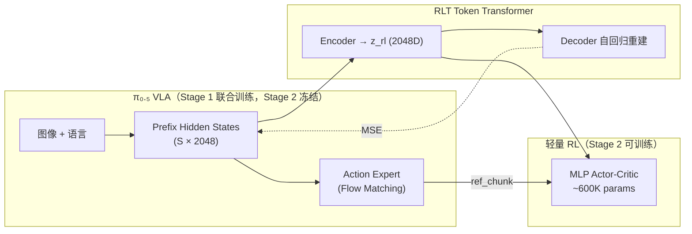
```mermaid
flowchart LR
    subgraph VLA["π₀.₅ VLA（Stage 1 联合训练，Stage 2 冻结）"]
        IMG["图像 + 语言"]
        PREFIX["Prefix Hidden States<br/>(S × 2048)"]
        ACT_EXP["Action Expert<br/>(Flow Matching)"]
        IMG --> PREFIX
        PREFIX --> ACT_EXP
    end

    subgraph RLT["RLT Token Transformer"]
        ENC["Encoder → z_rl (2048D)"]
        DEC["Decoder 自回归重建"]
        PREFIX --> ENC
        ENC --> DEC
        DEC -.->|"MSE"| PREFIX
    end

    subgraph RL["轻量 RL（Stage 2 可训练）"]
        AC["MLP Actor-Critic<br/>~600K params"]
        ENC --> AC
        ACT_EXP -->|"ref_chunk"| AC
    end
```

**Actor 设计要点**（Pi 原文 + RLinf 实现一致）：

- 输出 **action chunk**，与 VLA 时间结构对齐；
- Actor 输入含 **VLA 预测的 ref_chunk**，学习「编辑」而非从零生成；
- **BC 正则** 拉向 ref_chunk（或人类干预动作）；
- **Reference dropout** 防止过度依赖 ref；
- 可选 **human intervention** 写入 BC target。

### 1.3 RLinf 中的命名与阶段划分

| RLinf 术语 | 含义 |
|:---|:---|
| **RLT** | RL Token 流程在配置/代码中的简称（`use_rlt`, `rlt_ac`, `rlt_feature_model`） |
| **Stage 1** | `runner.task_type: sft`，联合优化 `vla_loss + rlt_alpha * vla_loss` |
| **Stage 2** | `runner.task_type: embodied`，`algorithm.loss_type: rlt_ac`，冻结 feature model，训练 `rlt_mlp_policy` |
| **Feature Model** | `rollout.rlt_feature_model`，即 Stage 1 checkpoint 上的 `OpenPiPytorchEvalActionModel` |
| **Policy Model** | `rollout.model` / `actor.model`，Stage 2 的 `RLTMLPPolicy` |

**来源**：[`docs/source-zh/rst_source/examples/embodied/rlt.rst`](../../docs/source-zh/rst_source/examples/embodied/rlt.rst) L4–12, L120–137。

---

## 2. RLinf 中的 RLT 全景：组件、入口与数据流

### 2.1 核心代码地图

```
rlinf/
├── algorithms/rlt/
│   ├── rollout.py          # predict_rlt_actions() — Stage 2 rollout 总入口
│   ├── route.py            # RealworldRLTRoute / SimulatorRLTRoute
│   ├── transition.py       # RLT_OBS_KEYS, update_rlt_transitions()
│   └── expert.py           # predict_expert_actions() — ManiSkill expert takeover
│
├── models/embodiment/
│   ├── modules/rlt_token_transformer.py   # RLTTokenEncoder/Decoder/Transformer
│   ├── mlp_policy/rlt_mlp_policy.py     # Stage 2 Actor-Critic
│   └── openpi_rlinf/                      # ★ 官方 RLT 路径（非 legacy openpi/）
│       ├── openpi_action_model.py        # rlt_module 挂载、prefix 选择
│       ├── sft_action_model.py           # Stage 1
│       ├── eval_action_model.py          # Stage 2 extract_rlt_obs()
│       └── utils/rlt_utils.py            # OpenPiPytorchRLTConfig, checkpoint 加载
│
├── workers/
│   ├── actor/fsdp_rlt_ac_policy_worker.py  # RLTACLossMixin + schedule
│   ├── rollout/hf/huggingface_worker.py      # rlt_feature_model 加载与 predict 分支
│   └── env/env_worker.py                     # update_rlt_transitions 调用
│
├── envs/
│   ├── maniskill/maniskill_rlt_env.py
│   └── realworld/common/wrappers/keyboard_rlt_policy_switch_wrapper.py
│
examples/
├── sft/train_vla_sft.py + run_vla_sft.sh           # Stage 1
└── embodiment/train_embodied_agent.py + run_embodiment.sh  # Stage 2
```

> **注意**：`rlinf/models/embodiment/openpi/` 下也有带 RLT 的旧路径；**当前官方示例 YAML 均使用 `model_type: openpi_rlinf`**（vendored PyTorch Pi0.5，与 JAX OpenPI 精度对齐）。  
> **来源**：[`rlt.rst`](../../docs/source-zh/rst_source/examples/embodied/rlt.rst) L114–118。

### 2.2 训练入口：无专用 Runner

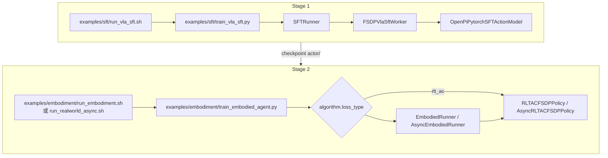
```mermaid
flowchart TB
    subgraph S1["Stage 1"]
        SH1["examples/sft/run_vla_sft.sh"]
        PY1["examples/sft/train_vla_sft.py"]
        R1["SFTRunner"]
        W1["FSDPVlaSftWorker"]
        M1["OpenPiPytorchSFTActionModel"]
        SH1 --> PY1 --> R1 --> W1 --> M1
    end

    subgraph S2["Stage 2"]
        SH2["examples/embodiment/run_embodiment.sh<br/>或 run_realworld_async.sh"]
        PY2["examples/embodiment/train_embodied_agent.py"]
        BR{"algorithm.loss_type"}
        R2["EmbodiedRunner / AsyncEmbodiedRunner"]
        W2["RLTACFSDPPolicy / AsyncRLTACFSDPPolicy"]
        SH2 --> PY2 --> BR
        BR -->|"rlt_ac"| W2
        BR --> R2 --> W2
    end

    S1 -->|"checkpoint actor/"| S2
```

**Stage 2 Worker 选择**（源码）：

```59:66:examples/embodiment/train_embodied_agent.py
    elif cfg.algorithm.loss_type == "rlt_ac":
        if use_training_pipeline:
            raise ValueError(
                "runner.use_training_pipeline=True is not supported for rlt_ac."
            )
        from rlinf.workers.actor.fsdp_rlt_ac_policy_worker import RLTACFSDPPolicy

        actor_worker_cls = RLTACFSDPPolicy
```

**要点**：

- `rlt_ac` **未**注册到 `rlinf/algorithms/registry.py` 的 `@register_policy_loss`；而是通过 **继承** `EmbodiedSACFSDPPolicy` + `RLTACLossMixin` 覆盖 `forward_actor` / `forward_critic`。
- `runner.use_training_pipeline=True` 与 `rlt_ac` **不兼容**（同上 L60–63）。
- **Eval**：无 `eval_rlt.py`；使用 Stage 2 YAML 设 `runner.only_eval: True` 或在同一 `train_embodied_agent.py` 流程中评估。

**CI 覆盖**：

- Stage 1：`tests/e2e_tests/sft/run_vla_sft.sh maniskill_rlt_stage1_sft_openpi_pi05`
- Stage 2：`tests/e2e_tests/embodied/run.sh maniskill_rlt_stage2_ac_mlp`

### 2.3 Stage 2 单步 Rollout 数据流

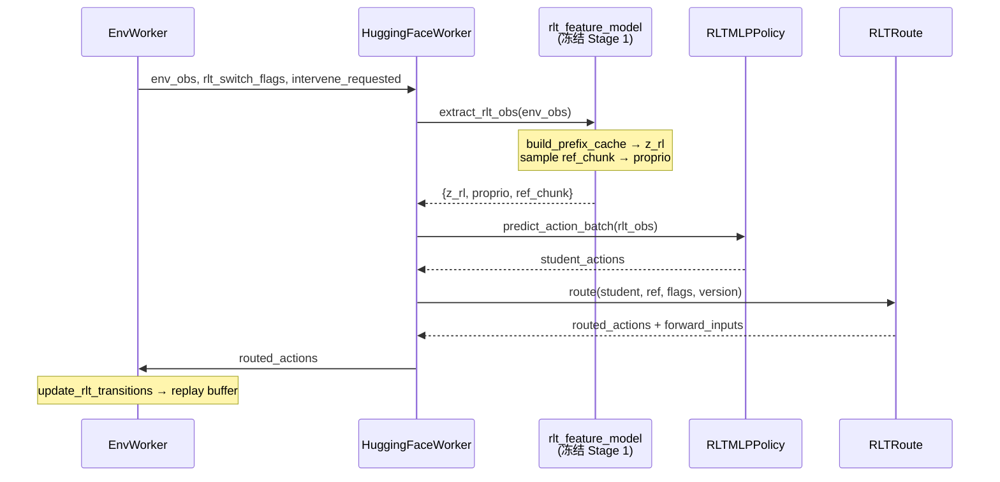
```mermaid
sequenceDiagram
    participant Env as EnvWorker
    participant Roll as HuggingFaceWorker
    participant FM as rlt_feature_model<br/>(冻结 Stage 1)
    participant Pol as RLTMLPPolicy
    participant Route as RLTRoute

    Env->>Roll: env_obs, rlt_switch_flags, intervene_requested
    Roll->>FM: extract_rlt_obs(env_obs)
    Note over FM: build_prefix_cache → z_rl<br/>sample ref_chunk → proprio
    FM-->>Roll: {z_rl, proprio, ref_chunk}
    Roll->>Pol: predict_action_batch(rlt_obs)
    Pol-->>Roll: student_actions
    Roll->>Route: route(student, ref, flags, version)
    Route-->>Roll: routed_actions + forward_inputs
    Roll->>Env: routed_actions
    Note over Env: update_rlt_transitions → replay buffer
```

**Rollout 入口**：

```563:575:rlinf/workers/rollout/hf/huggingface_worker.py
        if self.rlt_feature_model is not None:
            return predict_rlt_actions(
                policy_model=self.hf_model,
                feature_model=self.rlt_feature_model,
                rlt_route=self.rlt_route,
                env_obs=env_obs,
                final_obs=final_obs,
                mode=mode,
                version=self.version,
                rlt_switch_flags=rlt_switch_flags,
                intervene_requested=intervene_requested,
                expert_model=self.expert_model,
            )
```

Feature model 初始化时 **eval + requires_grad_(False)**：

```151:158:rlinf/workers/rollout/hf/huggingface_worker.py
        if rlt_feature_model_config is not None:
            self.rlt_feature_model = get_model(copy.deepcopy(rlt_feature_model_config))
            self.rlt_feature_model.eval()
            self.rlt_feature_model.requires_grad_(False)
            self.rlt_route = build_rlt_route(self.cfg)
```

---

## 3. Stage 1：VLA SFT + RLT Token Transformer

### 3.1 总损失

$$\mathcal{L}_{\text{Stage1}} = \mathcal{L}_{\text{RLT}} + \alpha \cdot \mathcal{L}_{\text{VLA}}$$

- $\mathcal{L}_{\text{VLA}}$：OpenPI flow matching（`Beta(1.5,1.0)` 采样时间 $t$，预测速度场 $v_t \approx \epsilon - a$）；
- $\mathcal{L}_{\text{RLT}}$：prefix embedding 的 MSE 自回归重建；
- $\alpha$：`openpi.rlt_alpha`（默认 1.0）。

**源码**：

```87:96:rlinf/models/embodiment/openpi_rlinf/sft_action_model.py
        per_timestep_loss, prefix_output, prefix_mask = (
            self._sft_forward_with_rlt_prefix(observation, actions)
        )
        vla_loss = per_timestep_loss.mean()
        rlt_loss, _ = self._rlt_forward(prefix_output, prefix_mask)
        return {
            "loss": rlt_loss + self.rlt_cfg.rlt_alpha * vla_loss,
            "vla_loss": vla_loss,
            "rlt_loss": rlt_loss,
        }
```

### 3.2 梯度流（重要细节）

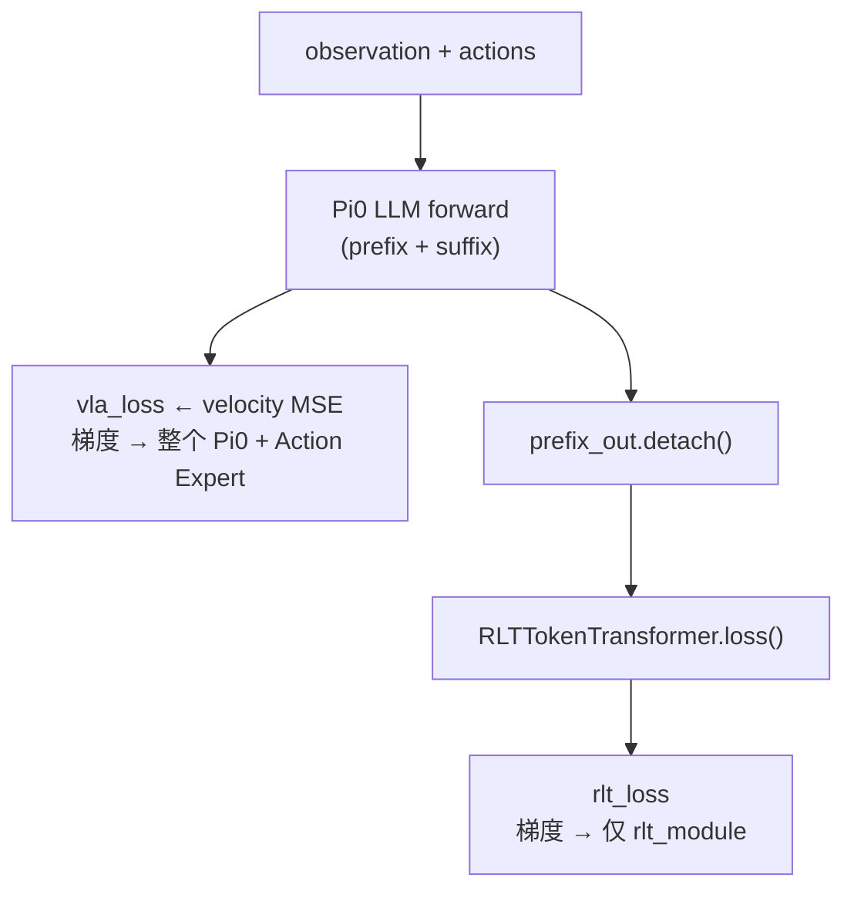
```mermaid
flowchart TB
    OBS["observation + actions"] --> VLA_FWD["Pi0 LLM forward<br/>(prefix + suffix)"]
    VLA_FWD --> VLA_LOSS["vla_loss ← velocity MSE<br/>梯度 → 整个 Pi0 + Action Expert"]
    VLA_FWD --> DETACH["prefix_out.detach()"]
    DETACH --> RLT["RLTTokenTransformer.loss()"]
    RLT --> RLT_LOSS["rlt_loss<br/>梯度 → 仅 rlt_module"]
```

**关键代码** — VLA 用 **未 detach** 的 `prefix_out` 算 flow loss；送入 RLT 前 **detach**：

```198:211:rlinf/models/embodiment/openpi_rlinf/sft_action_model.py
        prefix_out, suffix_out = self.model.llm(
            [prefix_tokens, suffix_tokens],
            positions=positions,
            mask=attn_mask,
            adarms_cond=[None, adarms_cond],
        )[0]
        v_t = self.model.velocity_from_suffix(
            suffix_out[:, -self.model.action_horizon :]
        )
        loss = torch.mean(torch.square(v_t - u_t), dim=-1)
        prefix_out, prefix_mask = self._select_rlt_prefix_embeddings(
            prefix_out.detach(), prefix_mask, observation.tokenized_prompt
        )
        return loss, prefix_out, prefix_mask
```

RLT 模块内部再次 detach prefix（双保险）：

```355:361:rlinf/models/embodiment/modules/rlt_token_transformer.py
    def reconstruct(
        self, prefix_embs: torch.Tensor, mask: torch.Tensor | None = None
    ) -> tuple[torch.Tensor, torch.Tensor]:
        frozen_prefix = prefix_embs.detach()
        rl_tokens = self.encode(frozen_prefix, mask)
        reconstructed = self.decode(rl_tokens, frozen_prefix, mask)
        return reconstructed, rl_tokens
```

**结论**：Stage 1 **同时更新 VLA 与 RLT Token Transformer**；RLT 重建目标不会反向污染 VLA 的 prefix 表示，但 VLA 仍通过 imitation loss 学习。

### 3.3 RLTTokenTransformer 架构

**文件**：`rlinf/models/embodiment/modules/rlt_token_transformer.py`

#### 3.3.1 Encoder（Prefix → 单个 RL Token）

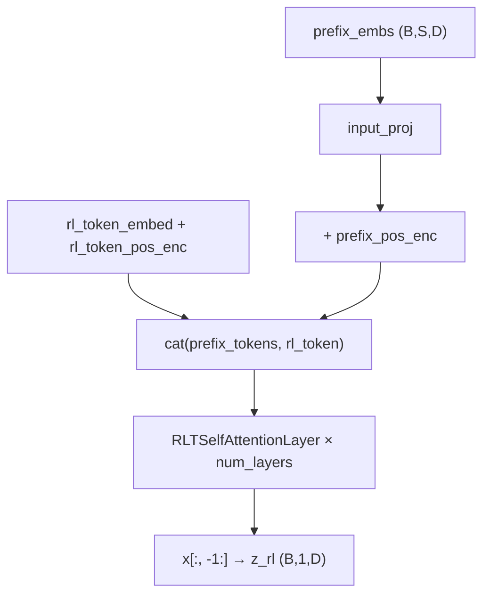
```mermaid
flowchart TB
    P["prefix_embs (B,S,D)"] --> PROJ["input_proj"]
    PROJ --> PE["+ prefix_pos_enc"]
    RL["rl_token_embed + rl_token_pos_enc"] --> CAT["cat(prefix_tokens, rl_token)"]
    PE --> CAT
    CAT --> L1["RLTSelfAttentionLayer × num_layers"]
    L1 --> OUT["x[:, -1:] → z_rl (B,1,D)"]
```

- **RL Token** 为可学习参数 `rl_token_embed`，初始化为正弦 PE（`RLTTokenEncoder.__init__`）；
- Self-Attention 使用 **Pre-LN + MultiheadAttention + GeGLU MLP**（`RLTSelfAttentionLayer`, L44–104）；
- GeGLU：$\text{GeGLU}(x) = \text{GELU}(W_g x) \odot (W_p x)$。

#### 3.3.2 Decoder（自回归重建）

- 输入：`[z_rl, shifted_targets]`，其中 `shifted_targets = target[:, :-1]`（teacher forcing）；
- **因果 mask**：上三角为 True（禁止 attend 未来）；
- 输出经 `output_proj` 映射回 `input_dim`，与原始 prefix 对齐算 MSE。

#### 3.3.3 默认超参

**来源**：`OpenPiPytorchRLTConfig` — `rlinf/models/embodiment/openpi_rlinf/utils/rlt_utils.py:55-68`

| 字段 | 默认值 | YAML 常见覆盖 |
|:---|:---|:---|
| `rlt_input_dim` / `rlt_embed_dim` | 2048 | 2048 |
| `rlt_prefix_seq_len` | 768 | **1024**（stage1 YAML） |
| `rlt_num_layers` | 2 | 2 |
| `rlt_num_heads` | 8 | 8 |
| `rlt_mlp_ratio` | 4.0 | 4.0 |
| `rlt_image_only` | **True**（代码默认） | Franka YAML 常设 **False**；ManiSkill stage1 为 False |
| `rlt_use_mask` | False | stage1 YAML 常设 **True** |
| `rlt_alpha` | 1.0 | 1.0 |

#### 3.3.4 Prefix 选择：`rlt_image_only`

```109:119:rlinf/models/embodiment/openpi_rlinf/openpi_action_model.py
    def _select_rlt_prefix_embeddings(
        self,
        prefix_output: torch.Tensor,
        prefix_mask: torch.Tensor,
        lang_tokens: torch.Tensor | None,
    ) -> tuple[torch.Tensor, torch.Tensor]:
        if self.rlt_cfg.rlt_image_only and lang_tokens is not None:
            num_image_tokens = prefix_output.shape[1] - lang_tokens.shape[1]
            prefix_output = prefix_output[:, :num_image_tokens]
            prefix_mask = prefix_mask[:, :num_image_tokens]
        return prefix_output, prefix_mask
```

**工程含义**：去掉语言 token 段，缩短序列、让 `z_rl` 更聚焦视觉；Franka peg 任务语言固定，两种设置均可，需与 Stage 2 feature model **保持一致**。

#### 3.3.5 ⚠️ 未实现的配置：`rlt_encoder_type`

ManiSkill Stage 1 YAML 含：

```yaml
# examples/sft/config/maniskill_rlt_stage1_sft_openpi_pi05.yaml L74
rlt_encoder_type: "append_self_attention"
```

**本地 `rlinf/` 全文搜索无 `rlt_encoder_type` 引用** — 实际仅实现 `RLTTokenEncoder` 一种结构。该键为**无效/预留配置**，修改它不会改变行为。

### 3.4 Stage 1 挂载点

```48:60:rlinf/models/embodiment/openpi_rlinf/openpi_action_model.py
        if self.rlt_cfg.use_rlt:
            from rlinf.models.embodiment.modules.rlt_token_transformer import (
                RLTTokenTransformer,
            )

            self.rlt_module = RLTTokenTransformer(
                input_dim=self.rlt_cfg.rlt_input_dim,
                embed_dim=self.rlt_cfg.rlt_embed_dim,
                prefix_seq_len=self.rlt_cfg.rlt_prefix_seq_len,
                num_layers=self.rlt_cfg.rlt_num_layers,
                num_heads=self.rlt_cfg.rlt_num_heads,
                mlp_ratio=self.rlt_cfg.rlt_mlp_ratio,
            ).to(dtype=next(self.model.parameters()).dtype)
```

FSDP 包装：`RLTSelfAttentionLayer` 列入 `_no_split_modules`（L68–72），避免不当切分。

### 3.5 单元测试

`tests/unit_tests/test_rlt_token_transformer.py` — 覆盖 encode/decode、因果 mask、MSE loss 形状与数值行为。

---

## 4. Stage 2：轻量 Actor-Critic 与 Feature Model

### 4.1 Feature Model：`extract_rlt_obs`

**类**：`OpenPiPytorchEvalActionModel`  
**文件**：`rlinf/models/embodiment/openpi_rlinf/eval_action_model.py`

Stage 2 每次 env step 在 **一次 prefix forward** 中同时得到 `z_rl` 与 VLA 参考动作：

```357:404:rlinf/models/embodiment/openpi_rlinf/eval_action_model.py
    def extract_rlt_obs(self, env_obs: dict[str, Any]) -> dict[str, torch.Tensor]:
        ...
        prefix_output, prefix_mask, kv_cache = self.model.build_prefix_cache(
            prepared_observation
        )
        rlt_prefix_output, rlt_prefix_mask = self._select_rlt_prefix_embeddings(
            prefix_output, prefix_mask, prepared_observation.tokenized_prompt
        )
        z_rl = self._encode_rlt_flat(rlt_prefix_output, rlt_prefix_mask).to(
            dtype=torch.float32
        )

        model_actions = self._sample_actions_from_prefix_cache(
            prepared_observation,
            prefix_mask,
            kv_cache,
        )
        ref_chunk = self.output_transform(
            {"actions": model_actions, "state": observation.state}
        )["actions"]
        ...
        return {
            "z_rl": z_rl,
            "proprio": proprio.to(device=z_rl.device, dtype=torch.float32),
            "ref_chunk": ref_chunk.to(device=z_rl.device, dtype=torch.float32),
        }
```

| 输出键 | 含义 | 典型维度（Franka） |
|:---|:---|:---|
| `z_rl` | RLT 压缩表示 | `(B, 2048)` |
| `proprio` | 机器人状态（OpenPI 处理后或 raw slice） | `(B, 19)` |
| `ref_chunk` | VLA Euler 采样得到的参考 action chunk | `(B, ref_len, action_dim)`，如 `(B,20,7)` |

**效率**：`build_prefix_cache` 生成 KV cache 后，`_sample_actions_from_prefix_cache` 复用，避免重复跑 prefix — 对 30Hz 真机控制重要。

**配置**：`rollout.rlt_feature_model.openpi.task: eval`（非 `sft` / `rl`）。

### 4.2 Policy Model：`RLTMLPPolicy`

**文件**：`rlinf/models/embodiment/mlp_policy/rlt_mlp_policy.py`  
**注册**：`SupportedModel.RLT_MLP_POLICY` — `rlinf/models/__init__.py`

#### 输入构造

| 网络 | 实际拼接 | 代码 |
|:---|:---|:---|
| **Actor** | `[ref_chunk_flat, z_rl, proprio]` | `_actor_state` L120–130 |
| **Critic state** | `[z_rl, proprio]` | `_critic_state` L132–133 |
| **Critic Q** | `q_head(critic_state, actions_flat)` | `sac_q_forward` L160–165 |

> **纠正**：类 docstring（L25–27）写 critic 输入含 action chunk；**实现中 action 由 `q_head` 第二参数传入**，state 部分不含 ref_chunk。Critic **故意不用 ref_chunk**，避免 Q 值被 VLA 先验偏置。

Actor 输入维度示例（Franka 默认 YAML）：

$$\dim s_{\text{actor}} = \underbrace{10 \times 7}_{\text{ref 截断到 chunk\_len}} + 2048 + 19 = 2137$$

#### `sac_forward`：固定方差 + tanh

```138:158:rlinf/models/embodiment/mlp_policy/rlt_mlp_policy.py
    def sac_forward(self, obs, apply_reference_dropout=False, reference_dropout_prob=0.0, deterministic=False, **kwargs):
        actor_state = self._actor_state(obs, ...)
        feat = self.backbone(actor_state)
        action_mean = self.actor_mean(feat)
        action_std = torch.full_like(action_mean, self.fixed_std)
        probs = Normal(action_mean, action_std)
        action = action_mean if deterministic else probs.rsample()
        ...
        action = torch.tanh(action)
        return action, chunk_logprobs, None
```

- `fixed_std` 默认 **0.002**（YAML `actor.model.fixed_std`）— 近确定性策略，适合精密操作；
- Rollout 时 `deterministic=(mode=="eval")`（`predict_action_batch`）；
- **Reference dropout 仅在训练 actor 时开启**（`forward_actor` L308–309），rollout 不 dropout。

### 4.3 Actor-Critic 损失（`RLTACLossMixin`）

**文件**：`rlinf/workers/actor/fsdp_rlt_ac_policy_worker.py`

#### Critic：Chunk-level Twin-Q TD

$$y = R_{\text{chunk}} + \mathbb{1}_{\neg done} \cdot \gamma^{H} \cdot \min(Q_1', Q_2')$$

$$R_{\text{chunk}} = \sum_{t=0}^{H-1} \gamma^t r_t$$

```266:294:rlinf/workers/actor/fsdp_rlt_ac_policy_worker.py
            reward_target = self._discounted_chunk_rewards(rewards)
            reward_horizon = int(rewards.reshape(rewards.shape[0], -1).shape[-1])
            bootstrap_discount = self.cfg.algorithm.gamma**reward_horizon
            ...
                target_q_values = reward_target + not_done * bootstrap_discount * q_next
            ...
        critic_loss = F.mse_loss(
            all_data_q_values, target_q_values.expand_as(all_data_q_values)
        )
```

- Critic target 用 **min twin-Q**（`_min_twin_q`）；
- ManiSkill transition replay 模式下 `done` 取自 `batch["dones"]` 而非 `terminations`（L236–237）。

#### Actor：Q₁ + BC（非 entropy SAC）

$$\mathcal{L}_{\text{actor}} = -w_Q \cdot Q_1(s, \pi(s)) + w_{\text{BC}} \cdot \|\pi(s) - a_{\text{target}}\|^2$$

```340:351:rlinf/workers/actor/fsdp_rlt_ac_policy_worker.py
        bc_loss, rlt_metrics = self._bc_metrics(
            pi=pi, actions=batch["actions"], ref_chunk=ref_chunk,
            intervene_flags=batch.get("intervene_flags", None),
        )
        bc_weight, q_weight, weight_metrics = self._actor_objective_weights()
        actor_loss = -q_weight * qf_pi.mean() + bc_weight * bc_loss
```

BC target 切换（`_bc_metrics` L123–124）：

$$a_{\text{target}} = \begin{cases} a_{\text{executed}} & \text{if intervene\_flag} \\ a_{\text{ref\_chunk}} & \text{otherwise} \end{cases}$$

**Entropy / Alpha**：`forward_alpha` 直接 `NotImplementedError`（L366–372）；须设 `entropy_tuning.alpha_type: fixed_alpha`, `initial_alpha: 0.0`。

**与标准 SAC 对比**（官方文档 note + 代码一致）：

| 特性 | 标准 SAC | RLT AC |
|:---|:---|:---|
| Actor 目标 Q | 常 min(Q₁,Q₂) − α log π | **Q₁ only** |
| Entropy 调节 | 有 | **禁用** |
| Action std | 可学习 | **固定** |
| BC 正则 | 无 | **有** |
| 观测 | 原始 image/state | **z_rl + proprio + ref** |

---

## 5. Rollout：特征提取、动作路由与 Transition

### 5.1 `predict_rlt_actions`

**文件**：`rlinf/algorithms/rlt/rollout.py:38-84`

```python
# 逻辑摘要（与源码一致）
rlt_obs = feature_model.extract_rlt_obs(env_obs)
actions, result = policy_model.predict_action_batch(env_obs=rlt_obs, mode=mode, return_obs=True)
route_output = rlt_route.route(RLTRouteContext(..., version=version, ...))
_append_rlt_transition_obs(..., final_obs=final_obs)  # 写入 rlt_transition_* 键
```

`final_obs` 用于在同一步内计算 **next_obs** 的 RLT 特征（pending transition 模式）。

### 5.2 动作路由 `RLTRoute`

**文件**：`rlinf/algorithms/rlt/route.py`  
**工厂**：`build_rlt_route(cfg)` — ManiSkill → `SimulatorRLTRoute`，否则 → `RealworldRLTRoute`

#### 真机：`RealworldRLTRoute`

```130:144:rlinf/algorithms/rlt/route.py
        routed_actions = torch.where(
            rlt_switch_flags,
            actions,
            ref_actions[:, : actions.shape[1], : actions.shape[2]],
        ).contiguous()
        ...
        result["forward_inputs"]["record_transition"] = rlt_switch_flags.reshape(
            actions.shape[0], -1
        )[:, :1].to(torch.bool)
```

- `rlt_switch_flags=True` → 执行 **Actor** 动作；否则执行 **ref_chunk**；
- **`record_transition` 与 switch 绑定**：仅在 actor 阶段写入 replay（按 `b` 之前的数据不进 buffer）。

**键盘切换**：`KeyboardRLTPolicySwitchWrapper` — 按 `b` 进入 actor 阶段：

```58:64:rlinf/envs/realworld/common/wrappers/keyboard_rlt_policy_switch_wrapper.py
            if key == "b":
                if not self._rlt_switch_flags:
                    event = "enter_actor"
                    self._rlt_switch_flags = True
                    self._log_info(
                        "Pedal 'b' pressed; switching RLT rollout to Stage2 actor."
                    )
```

YAML：`env.train.keyboard_reward_wrapper: rlt_policy_switch`

#### 仿真：`SimulatorRLTRoute`

三层逻辑（L157–244）：

1. **Schedule gate**：`version >= warmup_post_collect_updates` 才允许 actor（与 learner `update_step` 同步，见 §6.2）；
2. **Critical phase**：`rlt_switch_flags` 来自 `ManiskillRLTEnv` 任务状态机（抓 peg、近 hole 等）；
3. **Expert takeover**（可选）：`intervene_requested` + `expert_model` → 用 expert 动作替换，并写入 `ref_chunk` 作 BC target。

### 5.3 Transition 格式与更新

**常量**：`RLT_OBS_KEYS = ("z_rl", "proprio", "ref_chunk")` — `transition.py:22`

**Replay 存储**（对比原始图像）：

| 字段 | 内容 |
|:---|:---|
| `curr_obs / next_obs` | 各含 `z_rl, proprio, ref_chunk` |
| `actions` | 实际路由后执行的动作 chunk |
| `rewards` | chunk 内逐步奖励 |
| `intervene_flags` | 人类/expert 干预标记 |

**更新逻辑**（pending obs 缓存）— `update_rlt_transitions` L62–102：

1. 若存在 pending `curr_obs`，用当前 `forward_inputs` 中的 `rlt_transition_*` 作为 `next_obs`，append transition；
2. 若 `cache_current`，缓存当前 obs 为下一步的 `curr_obs`；
3. 干预时把 human action 写入 `ref_chunk` 对应位置（L73–88）。

**ManiSkill vs Realworld replay 形态**：

| 环境 | 判定 | 行为 |
|:---|:---|:---|
| ManiSkill | `env_type: maniskill_rlt` | **Transition replay**：每 env step 一行；`_transition_replay_trajectories` |
| Realworld | 其他 | **Trajectory replay**：整段 trajectory；且仅 `record_transition=True` 的步参与 |

---

## 6. Replay Buffer、训练调度与权重渐进

### 6.1 ManiSkill `rlt_schedule`

**配置出处**：`examples/embodiment/config/maniskill_rlt_stage2_ac_mlp.yaml` L41–47

```yaml
algorithm:
  rlt_schedule:
    enable: True
    max_updates_per_train_step: 400
    warmup_min_size: 10000
    warmup_post_collect_updates: 30000
    train_every_transitions: 5
```

**调度逻辑**（`RLTACFSDPPolicy._rlt_updates_to_run`, L727–823）：

1. 等待 replay `min_replay_size >= warmup_min_size`；
2. 累计 online transitions，每 `train_every_transitions` 条触发 `update_epoch` 轮更新；
3. 总 update 预算：`warmup_post_collect_updates + online_cycles × update_epoch`；
4. 单次 train step 上限 `max_updates_per_train_step`。

**Actor 上线 gate**（rollout 侧）：

```57:61:rlinf/workers/actor/fsdp_rlt_ac_policy_worker.py
    def get_rollout_sync_version(self) -> int:
        if not self.use_rlt_schedule:
            return int(self.version)
        return int(self.update_step)
```

→ rollout `self.version` → `SimulatorRLTRoute._ready_for_online(version)`（`route.py:154-155`）

**⚠️ Async 路径**：`AsyncRLTACFSDPPolicy`（L888+）**未覆盖** `run_training` / `_rlt_updates_to_run` — ManiSkill schedule **仅同步** `RLTACFSDPPolicy` 完整生效。Franka 真机常用 `run_realworld_async.sh`，但 realworld **无** `rlt_schedule`，靠键盘切换。

### 6.2 `actor_weight_schedule`

ManiSkill stage2 启用（同 YAML L68–75）：

| 阶段 | `bc_weight` | `q_weight` |
|:---|:---|:---|
| Warmup（前 20000 updates） | 7.0 | 0.05 |
| Online（ramp 50000 后） | 2.5 | 0.45 |

Franka realworld 默认 **固定** `bc_weight: 5`, `q_weight: 0.1`（见 `realworld_rlt_stage2_ac_mlp.yaml`，[`rlt.rst`](../../docs/source-zh/rst_source/examples/embodied/rlt.rst) L238–246）。

渐进公式（`_actor_objective_weights`, L147–224）：

$$w = w_{\text{warmup}} + \min\left(1, \frac{t - t_{\text{warmup}}}{t_{\text{ramp}}}\right) \cdot (w_{\text{online}} - w_{\text{warmup}})$$

---

## 7. 环境集成：Franka 真机 vs ManiSkill 仿真

### 7.1 对比表

| 维度 | Franka Realworld | ManiSkill RLT |
|:---|:---|:---|
| **Env 类型** | `realworld_peg_insertion` 等 | `maniskill_rlt` |
| **阶段切换** | 键盘 `b` → `rlt_switch_flags` | `rlt_policy_switch` 自动 gate + schedule |
| **Replay 形态** | Trajectory | Per-step transition |
| **Expert takeover** | 默认无 | 可选 `rollout.expert_model` |
| **观测 wrap** | OpenPI franka dataconfig | `wrap_obs_mode: rlt_openpi_joint` |
| **proprio 维** | 19（YAML `proprio_dim: 19`） | 9（joint qpos） |
| **cluster** | 异构 GPU + Franka 节点 | 单节点 collocated |

### 7.2 ManiSkill 环境要点

**文件**：`rlinf/envs/maniskill/maniskill_rlt_env.py`（`ManiskillRLTEnv`, ~1187 行）

- 任务：`PegInsertionSideWideClearance-v1`；
- Action：10-step chunk × 8D `pd_joint_delta_pos`；
- `rlt_policy_switch` 配置块控制 auto actor 进入条件（`require_grasp`, `near_hole_x_min` 等 — 见 stage2 YAML L111+）。

### 7.3 Franka 环境要点

- Stage 2 启动：`bash examples/embodiment/run_realworld_async.sh realworld_rlt_stage2_ac_mlp`（[`rlt.rst`](../../docs/source-zh/rst_source/examples/embodied/rlt.rst) L426–434）；
- 数据采集：`bash examples/embodiment/collect_data.sh realworld_collect_data`，`export_format: lerobot`。

---

## 8. 配置、脚本与 Checkpoint 规范

### 8.1 配置文件索引

| 阶段 | 场景 | 路径 |
|:---|:---|:---|
| Stage 1 | Franka | `examples/sft/config/realworld_rlt_stage1_sft_openpi_pi05.yaml` |
| Stage 1 | ManiSkill | `examples/sft/config/maniskill_rlt_stage1_sft_openpi_pi05.yaml` |
| Stage 2 | Franka | `examples/embodiment/config/realworld_rlt_stage2_ac_mlp.yaml` |
| Stage 2 | ManiSkill | `examples/embodiment/config/maniskill_rlt_stage2_ac_mlp.yaml` |
| Env 片段 | ManiSkill | `examples/embodiment/config/env/maniskill_rlt.yaml` |
| E2E | Stage 1/2 | `tests/e2e_tests/sft/maniskill_rlt_stage1_sft_openpi_pi05.yaml`, `tests/e2e_tests/embodied/maniskill_rlt_stage2_ac_mlp.yaml` |

### 8.2 启动脚本

| 脚本 | 用途 |
|:---|:---|
| `examples/sft/run_vla_sft.sh <config_name>` | Stage 1 |
| `examples/embodiment/run_embodiment.sh <config_name>` | Stage 2 同步 |
| `examples/embodiment/run_realworld_async.sh <config_name>` | Franka Stage 2 异步 |
| `examples/embodiment/collect_data.sh` | 真机 LeRobot 数据采集 |
| `toolkits/lerobot/calculate_norm_stats.py` | 归一化统计 |
| `toolkits/lerobot/collect_maniskill_peg_lerobot_joint.py` | ManiSkill joint 数据采集 |

### 8.3 Checkpoint 规范（关键）

**Stage 1 输出**：

```text
logs/<run>/checkpoints/global_step_<N>/actor/
  └── (FSDP) full_weights.pt 或 actor/model_state_dict/full_weights.pt
```

**Stage 2 加载**：

- ✅ `rollout.rlt_feature_model.model_path` → 上述 **`actor/` 目录**
- ❌ **不要**把 Stage 1 路径填到 `rollout.model.model_path` 或 `actor.model.model_path`
- ❌ 不能仅用 HuggingFace `model.safetensors`（**缺少 `rlt_module.*` 权重**）

**权重解析**：`rlt_utils.load_full_wrapper_weights` — 候选路径 `FULL_WEIGHTS_CANDIDATES`（`rlt_utils.py:27-31`）

**Norm stats**：Stage 1 / Stage 2 / OpenPI assets **必须同一** `repo_id` + `norm_stats.json`（[`rlt.rst`](../../docs/source-zh/rst_source/examples/embodied/rlt.rst) L507–511 warning）。

### 8.4 Stage 1 关键 YAML 片段（ManiSkill）

**出处**：`examples/sft/config/maniskill_rlt_stage1_sft_openpi_pi05.yaml`

```yaml
actor:
  model:
    model_type: "openpi_rlinf"
    openpi:
      task: sft
      config_name: "pi05_rlt_maniskill_joint"
      use_rlt: True
      rlt_alpha: 1.0
      rlt_prefix_seq_len: 1024
      rlt_image_only: False
      rlt_use_mask: True
    openpi_data:
      repo_id: "maniskill_peginsertionside_joint"
```

### 8.5 Stage 2 关键 YAML 片段（Franka）

**出处**：[`rlt.rst`](../../docs/source-zh/rst_source/examples/embodied/rlt.rst) L235–304 + `realworld_rlt_stage2_ac_mlp.yaml`

```yaml
algorithm:
  loss_type: rlt_ac
  q_weight: 0.1
  bc_weight: 5
  reference_dropout_prob: 0.5
  gamma: 0.96
  entropy_tuning:
    alpha_type: fixed_alpha
    initial_alpha: 0.0

rollout:
  rlt_feature_model:
    model_type: "openpi_rlinf"
    model_path: "/path/to/stage1/checkpoint/actor"
    openpi:
      task: eval
      use_rlt: True
  model:
    model_path: null   # Stage 2 policy 由 actor 训练初始化，非 Stage 1

actor:
  model:
    model_type: "rlt_mlp_policy"
    z_dim: 2048
    proprio_dim: 19
    fixed_std: 0.002
    num_action_chunks: 10
    ref_num_action_chunks: 20
```

---

## 9. 静态架构与动态序列图

### 9.1 类关系（Stage 1 + Stage 2）

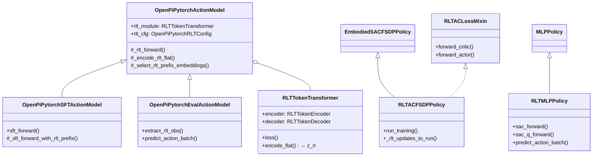
```mermaid
classDiagram
    class OpenPiPytorchActionModel {
        +rlt_module: RLTTokenTransformer
        +rlt_cfg: OpenPiPytorchRLTConfig
        #_rlt_forward()
        #_encode_rlt_flat()
        #_select_rlt_prefix_embeddings()
    }

    class OpenPiPytorchSFTActionModel {
        +sft_forward()
        #_sft_forward_with_rlt_prefix()
    }

    class OpenPiPytorchEvalActionModel {
        +extract_rlt_obs()
        +predict_action_batch()
    }

    class RLTTokenTransformer {
        +encoder: RLTTokenEncoder
        +decoder: RLTTokenDecoder
        +loss()
        +encode_flat() → z_rl
    }

    class RLTMLPPolicy {
        +sac_forward()
        +sac_q_forward()
        +predict_action_batch()
    }

    class RLTACLossMixin {
        +forward_critic()
        +forward_actor()
    }

    class RLTACFSDPPolicy {
        +run_training()
        +_rlt_updates_to_run()
    }

    OpenPiPytorchActionModel <|-- OpenPiPytorchSFTActionModel
    OpenPiPytorchActionModel <|-- OpenPiPytorchEvalActionModel
    OpenPiPytorchActionModel o-- RLTTokenTransformer
    EmbodiedSACFSDPPolicy <|-- RLTACFSDPPolicy
    RLTACLossMixin <|.. RLTACFSDPPolicy
    MLPPolicy <|-- RLTMLPPolicy
```

### 9.2 Stage 2 训练循环

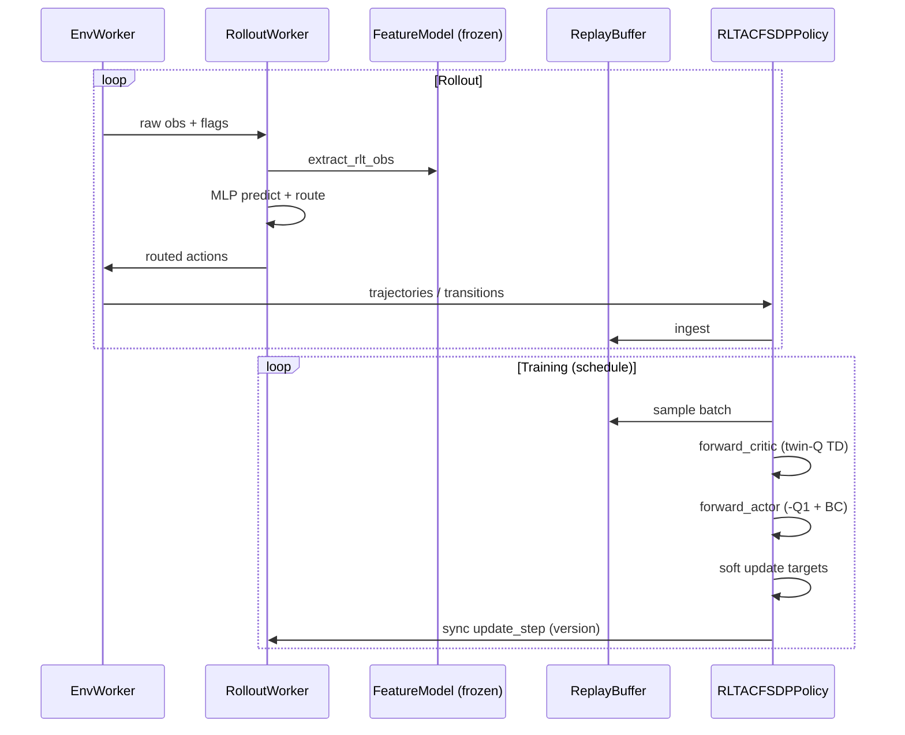
```mermaid
sequenceDiagram
    participant Env as EnvWorker
    participant Roll as RolloutWorker
    participant FM as FeatureModel (frozen)
    participant RB as ReplayBuffer
    participant Act as RLTACFSDPPolicy

    loop Rollout
        Env->>Roll: raw obs + flags
        Roll->>FM: extract_rlt_obs
        Roll->>Roll: MLP predict + route
        Roll->>Env: routed actions
        Env->>Act: trajectories / transitions
        Act->>RB: ingest
    end

    loop Training (schedule)
        Act->>RB: sample batch
        Act->>Act: forward_critic (twin-Q TD)
        Act->>Act: forward_actor (-Q1 + BC)
        Act->>Act: soft update targets
        Act->>Roll: sync update_step (version)
    end
```

### 9.3 Stage 2 参数冻结关系

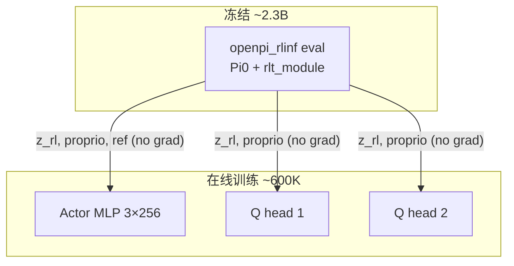
```mermaid
flowchart TB
    subgraph FROZEN["冻结 ~2.3B"]
        FM["openpi_rlinf eval<br/>Pi0 + rlt_module"]
    end

    subgraph TRAIN["在线训练 ~600K"]
        A["Actor MLP 3×256"]
        Q1["Q head 1"]
        Q2["Q head 2"]
    end

    FM -->|"z_rl, proprio, ref (no grad)"| A
    FM -->|"z_rl, proprio (no grad)"| Q1
    FM -->|"z_rl, proprio (no grad)"| Q2
```

---

## 10. 关键数学公式与实现对照

### 10.1 RLT 重建损失

$$\mathcal{L}_{\text{RLT}} = \frac{1}{|M| \cdot D} \sum_{(i,d) \in M} \left(\hat{h}_{i,d} - \text{sg}(h_{i,d})\right)^2$$

- $h$：VLA prefix hidden；$\hat{h}$：decoder 输出；
- $M$：`rlt_use_mask=True` 时的有效 token mask；
- 实现：`RLTTokenTransformer.loss` — `rlt_token_transformer.py:363-384`。

### 10.2 Flow Matching（VLA）

$$x_t = t \epsilon + (1-t) a, \quad u_t = \epsilon - a, \quad \mathcal{L}_{\text{VLA}} = \|v_\theta(x_t,t) - u_t\|^2$$

- $t \sim \text{Beta}(1.5, 1.0)$，clamp 到 $(0.001, 0.999)$；
- 实现：`_sft_forward_with_rlt_prefix` L175–207。

### 10.3 Chunk TD 与 Actor 目标

见 §4.3；Franka 默认 $w_{\text{BC}}=5 \gg w_Q=0.1$，策略 **强约束于 VLA 先验**，RL 仅作微调 — 符合真机安全需求。

---

## 11. 消融、设计权衡与代码级「坑」

### 11.1 经 Pi 实验与 RLinf 设计共同支持的选择

| 设计 | 理由 | 代码/配置证据 |
|:---|:---|:---|
| 信息瓶颈 `z_rl` | 降维、使 MLP RL 可实时更新 | `RLTTokenTransformer` |
| 冻结 Feature Model | 防灾难性遗忘 | `requires_grad_(False)` on rollout |
| ref_chunk 作 actor 输入 + BC target | 学 residual 修正 | `_actor_state`, `_bc_metrics` |
| reference dropout | 防 copy VLA | `reference_dropout_prob: 0.5` |
| 固定 std | 精密任务低探索 | `fixed_std: 0.002` |
| Chunk-level TD | 与 chunk policy 对齐 | `_discounted_chunk_rewards` |
| min-Q critic / Q1 actor | 保守 value / 不那么保守 policy | `_min_twin_q` vs `_q1` |

### 11.2 实现与文档需注意的坑

| # | 问题 | 影响 | 出处 |
|:--|:---|:---|:---|
| 1 | `rlt_encoder_type` 无效 | 改 YAML 无效果 | stage1 YAML L74；代码无引用 |
| 2 | Async + ManiSkill schedule | schedule 可能不生效 | `AsyncRLTACFSDPPolicy` 无 schedule 覆盖 |
| 3 | Realworld replay 仅 actor 段 | 按 `b` 前数据不进 buffer | `RealworldRLTRoute` L138–140 |
| 4 | norm_stats 不一致 | ref_chunk 尺度漂移、BC 失效 | 官方 warning |
| 5 | Stage1 ckpt 路径填错 | 缺 `rlt_module` 加载失败 | `rlt.rst` + `rlt_utils` |
| 6 | `rlt_image_only` Stage1/2 不一致 | `z_rl` 语义变化 | `_select_rlt_prefix_embeddings` |
| 7 | v1 提到的 TD3 yaml | **本地不存在** | glob 搜索 0 结果 |

### 11.3 `rlt_image_only` 权衡

| True | False |
|:---|:---|
| 更短序列、更低 attention 成本 | 保留语言 token 语义 |
| 语言固定任务通常足够 | Franka/ManiSkill 官方示例多用 False |

---

## 12. 纵向演进与横向对比

### 12.1 纵向

```text
VLA SFT only (π₀.₅)
    → 全模型 RL fine-tune（贵、不稳定、易遗忘）
        → RLT：冻结 VLA 表示 + RL Token 瓶颈 + 小 MLP 在线 RL（Pi, 2026）
            → RLinf 工程化：openpi_rlinf + 双环境 + schedule + replay 形态分化
```

### 12.2 横向

| 方法 | RL 参数量 | 冻结 VLA | 信息瓶颈 | 在线数据需求 |
|:---|:---|:---|:---|:---|
| **RLT** | ~600K MLP | ✅ | `z_rl` (2048D) | 分钟–小时级 |
| Full VLA RL | ~2B+ | ❌ | 无 | 大量 |
| Residual on VLA output | ~600K | ✅ | 无（直接用 ref action） | 中等 |

### 12.3 Pi 真机结果（研究页）

| 任务 | Base → RLT throughput (/10min) | 倍数 |
|:---|:---|:---|
| 电动螺丝刀 M3 | ~5 → ~18 | ~3.6× |
| 扎带 | ~4 → ~12 | ~3× |
| 以太网插入 | ~150 → ~350 | ~2.3× |
| 电源线插入 | ~200 → ~500 | ~2.5× |

以太网任务：**15 分钟**机器人数据、总训练约 2 小时；最终策略中位步数 66，低于遥操作 demo 中位 146。

**来源**：[https://www.pi.website/research/rlt](https://www.pi.website/research/rlt)

---

## 13. 参考文献与代码出处索引

### 13.1 外部参考

1. **Pi RLT**：Charles Xu et al., *Precise Manipulation with Efficient Online RL*, Physical Intelligence, 2026-03-19. [研究页](https://www.pi.website/research/rlt) · [PDF](https://www.pi.website/download/rlt.pdf)
2. **RLinf 官方文档（EN）**：[RLT Tutorial](https://rlinf.readthedocs.io/en/latest/rst_source/examples/embodied/rlt.html)
3. **RLinf 官方文档（ZH）**：[`docs/source-zh/rst_source/examples/embodied/rlt.rst`](../../docs/source-zh/rst_source/examples/embodied/rlt.rst)
4. **OpenPI π₀.₅ 基座**：[lerobot/pi05_base](https://huggingface.co/lerobot/pi05_base)
5. **ManiSkill RLT 数据集**：[RLinf/rlt-maniskill-PegInsertionSide-v1-400-succ](https://huggingface.co/datasets/RLinf/rlt-maniskill-PegInsertionSide-v1-400-succ)
6. **Flow Matching**：Lipman et al., ICLR 2023
7. **SAC**：Haarnoja et al., ICML 2018
8. **GeGLU**：Shazeer, arXiv 2020

### 13.2 本地核心源码索引

| 模块 | 路径 | 关键符号 |
|:---|:---|:---|
| RLT Transformer | `rlinf/models/embodiment/modules/rlt_token_transformer.py` | `RLTTokenTransformer`, L299–389 |
| RLT 配置 | `rlinf/models/embodiment/openpi_rlinf/utils/rlt_utils.py` | `OpenPiPytorchRLTConfig`, L55–90 |
| OpenPI 基类 | `rlinf/models/embodiment/openpi_rlinf/openpi_action_model.py` | `rlt_module`, L48–141 |
| Stage 1 | `rlinf/models/embodiment/openpi_rlinf/sft_action_model.py` | `sft_forward`, L68–96 |
| Stage 2 Feature | `rlinf/models/embodiment/openpi_rlinf/eval_action_model.py` | `extract_rlt_obs`, L357–404 |
| Stage 2 Policy | `rlinf/models/embodiment/mlp_policy/rlt_mlp_policy.py` | `RLTMLPPolicy`, L22–232 |
| AC 损失 | `rlinf/workers/actor/fsdp_rlt_ac_policy_worker.py` | `RLTACLossMixin`, L38–372 |
| Schedule | 同上 | `RLTACFSDPPolicy._rlt_updates_to_run`, L727–823 |
| Rollout | `rlinf/algorithms/rlt/rollout.py` | `predict_rlt_actions`, L38–84 |
| Route | `rlinf/algorithms/rlt/route.py` | `RealworldRLTRoute`, `SimulatorRLTRoute` |
| Transition | `rlinf/algorithms/rlt/transition.py` | `RLT_OBS_KEYS`, `update_rlt_transitions` |
| HF Rollout | `rlinf/workers/rollout/hf/huggingface_worker.py` | L151–158, L563–575 |
| 入口分发 | `examples/embodiment/train_embodied_agent.py` | `loss_type: rlt_ac`, L59–66 |
| 键盘切换 | `rlinf/envs/realworld/common/wrappers/keyboard_rlt_policy_switch_wrapper.py` | L25–70 |
| ManiSkill Env | `rlinf/envs/maniskill/maniskill_rlt_env.py` | `ManiskillRLTEnv` |
| 单元测试 | `tests/unit_tests/test_rlt_token_transformer.py` | — |

### 13.3 配置文件与脚本索引

见 [§8](#8-配置脚本与-checkpoint-规范)。

---

# rlt.rst 中`冻结的 Stage 1 特征模型`是什么
## 结论

文档里的 **「冻结的 Stage 1 特征模型」**，指的是 Stage 1 联合训练完成后保存的 **完整 OpenPI π₀.₅ + RLT Token Transformer 检查点**，在 Stage 2 中通过配置项 `rollout.rlt_feature_model` 加载，以 **`OpenPiPytorchEvalActionModel`**（`openpi.task: eval`）的形式运行。它在 rollout 阶段 **不参与梯度更新**，只负责把原始环境观测转换成 Stage 2 actor-critic 需要的 `{z_rl, proprio, ref_chunk}`。

---

## 1. 它由哪些组件构成？

Stage 1 特征模型不是单独的小模块，而是 **两个子系统打包在一起**：

| 组件 | 代码位置 | 作用 |
|------|----------|------|
| **π₀.₅ VLA 主干** (`Pi0`) | `rlinf/models/embodiment/openpi_rlinf/pi0_model/` | SigLIP 视觉编码 + Gemma 2B + 300M action expert；处理图像/语言/状态，输出 prefix hidden states，并采样 reference action chunk |
| **RLT Token Transformer** (`rlt_module`) | `rlinf/models/embodiment/modules/rlt_token_transformer.py` | 读取 VLA prefix embeddings，压缩为紧凑向量 `z_rl`（默认 2048 维） |

Stage 2 配置里写得很明确：

```177:179:examples/embodiment/config/realworld_rlt_stage2_ac_mlp.yaml
  # Frozen Stage1 pi0.5 + RLT token transformer.
  # This is the actual Stage1 model path. Rollout uses it to convert raw env
  # observations into the Stage2 obs dict: z_rl, proprio, ref_chunk.
```

基类在 `use_rlt=True` 时会挂载 `rlt_module`：

```48:60:rlinf/models/embodiment/openpi_rlinf/openpi_action_model.py
        if self.rlt_cfg.use_rlt:
            from rlinf.models.embodiment.modules.rlt_token_transformer import (
                RLTTokenTransformer,
            )

            self.rlt_module = RLTTokenTransformer(
                input_dim=self.rlt_cfg.rlt_input_dim,
                embed_dim=self.rlt_cfg.rlt_embed_dim,
                prefix_seq_len=self.rlt_cfg.rlt_prefix_seq_len,
                num_layers=self.rlt_cfg.rlt_num_layers,
                num_heads=self.rlt_cfg.rlt_num_heads,
                mlp_ratio=self.rlt_cfg.rlt_mlp_ratio,
            ).to(dtype=next(self.model.parameters()).dtype)
```

---

## 2. 它从哪里来？（Stage 1 训练产物）

Stage 1 用 `OpenPiPytorchSFTActionModel`（`openpi.task: sft`）在示范数据上 **联合优化** 两个目标：

```87:96:rlinf/models/embodiment/openpi_rlinf/sft_action_model.py
        per_timestep_loss, prefix_output, prefix_mask = (
            self._sft_forward_with_rlt_prefix(observation, actions)
        )
        vla_loss = per_timestep_loss.mean()
        rlt_loss, _ = self._rlt_forward(prefix_output, prefix_mask)
        return {
            "loss": rlt_loss + self.rlt_cfg.rlt_alpha * vla_loss,
            "vla_loss": vla_loss,
            "rlt_loss": rlt_loss,
        }
```

- **`vla_loss`**：普通 flow-matching 动作预测，更新整个 VLA
- **`rlt_loss`**：RLT token 重建目标，只更新 `rlt_module`（prefix 在送入 RLT 前做了 `detach()`，避免 RLT 梯度回灌 VLA prefix）

训练完成后，检查点通常位于：

```text
logs/<run-name>/checkpoints/global_step_<step>/actor
```

Stage 2 必须把该 **`actor/` 目录** 填到 `rollout.rlt_feature_model.model_path`，**不能** 转成裸 `model.safetensors`，因为 `rlt_module.*` 权重保存在完整 wrapper checkpoint 里（见 `rlt_utils.py` 的 `load_full_wrapper_weights`）。

---

## 3. 「冻结」在代码里如何实现？

Rollout worker 初始化时单独加载特征模型，并显式冻结：

```151:157:rlinf/workers/rollout/hf/huggingface_worker.py
        if rlt_feature_model_config is not None:
            self.rlt_feature_model = get_model(copy.deepcopy(rlt_feature_model_config))
            self.rlt_feature_model.eval()
            self.rlt_feature_model.requires_grad_(False)
            self.rlt_route = build_rlt_route(self.cfg)
```

核心推理入口 `extract_rlt_obs` 也在 `@torch.no_grad()` 下运行：

```357:404:rlinf/models/embodiment/openpi_rlinf/eval_action_model.py
    @torch.no_grad()
    def extract_rlt_obs(self, env_obs: dict[str, Any]) -> dict[str, torch.Tensor]:
        """Extract the frozen Stage1 features consumed by the Stage2 RLT head."""
        ...
        prefix_output, prefix_mask, kv_cache = self.model.build_prefix_cache(
            prepared_observation
        )
        ...
        z_rl = self._encode_rlt_flat(rlt_prefix_output, rlt_prefix_mask).to(
            dtype=torch.float32
        )
        ...
        ref_chunk = self.output_transform(
            {"actions": model_actions, "state": observation.state}
        )["actions"]
        ...
        return {
            "z_rl": z_rl,
            "proprio": proprio.to(device=z_rl.device, dtype=torch.float32),
            "ref_chunk": ref_chunk.to(device=z_rl.device, dtype=torch.float32),
        }
```

Stage 2 **只训练** `actor.model` 下的轻量 `rlt_mlp_policy`（MLP actor + Q critic），约几百万参数；~2.3B 的 VLA + RLT transformer 权重保持不变，避免在线 RL 破坏 Stage 1 学到的表示。

---

## 4. 它在 Stage 2 里具体做什么？

数据流如下：

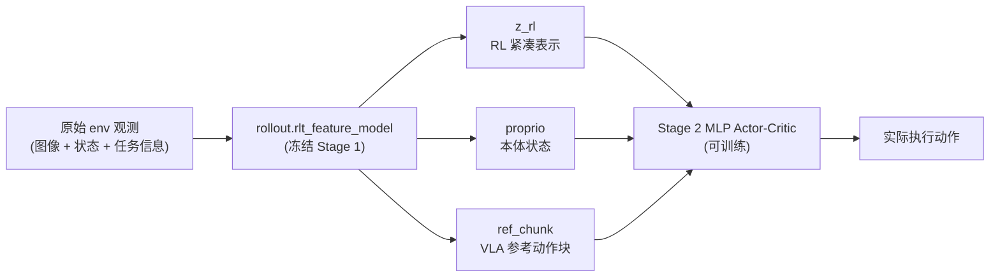
```mermaid
flowchart LR
    A["原始 env 观测<br/>(图像 + 状态 + 任务信息)"] --> B["rollout.rlt_feature_model<br/>(冻结 Stage 1)"]
    B --> C["z_rl<br/>RL 紧凑表示"]
    B --> D["proprio<br/>本体状态"]
    B --> E["ref_chunk<br/>VLA 参考动作块"]
    C --> F["Stage 2 MLP Actor-Critic<br/>(可训练)"]
    D --> F
    E --> F
    F --> G["实际执行动作"]
```

Rollout 编排代码：

```51:57:rlinf/algorithms/rlt/rollout.py
    with torch.no_grad():
        rlt_obs = feature_model.extract_rlt_obs(env_obs)
        actions, result = policy_model.predict_action_batch(
            env_obs=rlt_obs,
            mode=mode,
            return_obs=True,
        )
```

三个输出的含义：

- **`z_rl`**：VLA prefix hidden states 经 `RLTTokenTransformer.encode_flat()` 得到的 RL 表示（文档中 `z_dim: 2048`）
- **`proprio`**：机器人/仿真本体状态（Franka 示例为 19 维 raw state）
- **`ref_chunk`**：同一 VLA 用 flow matching 采样的 reference action chunk（如 20×7），供 actor 做 residual 修正或作为 VLA 阶段的 fallback 动作

Replay buffer 存的 transition 也是这三元组，而不是原始像素。

---

## 5. 和 Stage 2 其它模型的区别

| 配置项 | 模型 | Stage 2 是否更新 |
|--------|------|------------------|
| `rollout.rlt_feature_model` | Stage 1 完整 checkpoint（π₀.₅ + RLT transformer） | **冻结** |
| `actor.model` (`rlt_mlp_policy`) | 轻量 MLP actor-critic | **训练** |
| `rollout.model` | Stage 2 MLP 的 rollout 侧同步副本 | 从 actor 同步权重 |

常见误配（文档多次强调）：

- ❌ 把 Stage 1 路径填到 `rollout.model.model_path` 或 `actor.model.model_path`
- ❌ 把 Stage 1 checkpoint 转成裸 safetensors（会丢失 `rlt_module` 权重）
- ✅ 只填 `rollout.rlt_feature_model.model_path`，且 `repo_id` / `config_name` / `rlt_*` 超参与 Stage 1 一致

---

## 6. 一句话总结

**「冻结的 Stage 1 特征模型」= Stage 1 联合 SFT 训出的 `OpenPiPytorchEvalActionModel`（π₀.₅ VLA + RLT Token Transformer），在 Stage 2 rollout 中作为固定的观测编码器，把原始传感器输入映射为 `{z_rl, proprio, ref_chunk}`，供轻量 actor-critic 在线学习；VLA 和 RLT 模块的权重在此阶段不再更新。**

# rlt.rst 中的`标准 maximum-entropy SAC`

## 先说结论

文档第 195 行说的 **「标准 maximum-entropy SAC」**，指的是 Haarnoja 等人提出的 **Soft Actor-Critic（SAC）**：在最大化累积回报的同时，**显式最大化策略熵**，用温度系数 \(\alpha\) 平衡「多拿奖励」和「保持随机、多探索」。

RLT Stage 2 虽然用了 SAC 的工程骨架（off-policy、replay buffer、twin Q、target network），但 **目标函数和训练机制已经偏离标准 max-entropy SAC**，更像 **「Q-learning + 行为克隆（BC）正则」的 actor-critic**。文档因此特意加 note 提醒，避免读者按标准 SAC 调参。

---

## 1. 什么是「标准 maximum-entropy SAC」？

### 1.1 核心思想：奖励 + 熵

普通 RL 只最大化期望回报；**maximum-entropy RL** 在目标里额外加入策略熵 \(H(\pi(\cdot|s))\)：

\[
J(\pi) = \sum_t \mathbb{E}_{(s_t,a_t)\sim\rho_\pi}\Big[r(s_t,a_t) + \alpha\, H(\pi(\cdot|s_t))\Big]
\]

- \(r\)：环境奖励  
- \(H(\pi)\)：策略随机性（探索程度）  
- \(\alpha\)：温度，控制「奖励 vs 熵」的权重；\(\alpha \to 0\) 时退化为普通 RL  

**出处**：[Haarnoja et al., ICML 2018, Eq. (1)](https://proceedings.mlr.press/v80/haarnoja18b/haarnoja18b.pdf)；RLinf 中文算法文档 [`docs/source-zh/rst_source/reference/algorithms/sac.rst`](https://github.com/RLinf/RLinf/blob/main/docs/source-zh/rst_source/reference/algorithms/sac.rst) 第 13–37 行。

直观理解：SAC 不只学「怎么做最好」，还鼓励策略 **保持一定随机性**，避免过早收敛到次优确定性策略，提升样本效率和稳定性。

### 1.2 三个相互耦合的更新

标准 SAC 通常包含三块（RLinf 文档第 39–65 行）：

| 组件 | 目标 | 公式（简化） |
|------|------|-------------|
| **Critic (Q)** | 拟合 soft Bellman 目标 | \(L_Q = \frac{1}{2}(Q(s,a) - (r + \gamma(\min Q_{\text{targ}}(s',a') - \alpha \log\pi(a'|s'))))^2\) |
| **Actor (\(\pi\))** | 最大化 Q，同时增大熵 | \(L_\pi = \mathbb{E}[\alpha \log\pi(a|s) - \min Q(s,a)]\) |
| **Temperature (\(\alpha\))** | 自动调节探索强度 | \(L_\alpha = -\alpha(H_{\text{targ}} - H(\pi))\) |

**出处**：RLinf [`sac.rst`](https://github.com/RLinf/RLinf/blob/main/docs/source-zh/rst_source/reference/algorithms/sac.rst) 第 39–65 行；原论文 [Haarnoja et al., 2018](https://arxiv.org/abs/1801.01290)。

### 1.3 RLinf 里「标准 SAC」长什么样？

配置示例（`loss_type: embodied_sac`）：

```yaml
algorithm:
  adv_type: embodied_sac
  loss_type: embodied_sac
  entropy_tuning:
    alpha_type: softplus      # 或 exp / fixed_alpha
    initial_alpha: 0.01       # 通常 > 0
    target_entropy: -4        # 目标熵 ≈ -action_dim
  backup_entropy: True      # Critic bootstrap 里减去 α·log π
```

**出处**：[`docs/source-zh/rst_source/reference/algorithms/sac.rst`](https://github.com/RLinf/RLinf/blob/main/docs/source-zh/rst_source/reference/algorithms/sac.rst) 第 74–96 行。

对应实现（标准 SAC actor loss）：

```524:524:rlinf/workers/actor/fsdp_sac_policy_worker.py
        actor_loss = ((self.entropy_temp.alpha * log_pi) - qf_pi).mean()
```

Critic bootstrap 里减去熵项：

```412:415:rlinf/workers/actor/fsdp_sac_policy_worker.py
                if self.cfg.algorithm.get("backup_entropy", True):
                    qf_next_target = (
                        qf_next_target - self.entropy_temp.alpha * next_state_log_pi
                    )
```

还会训练温度参数：

```547:549:rlinf/workers/actor/fsdp_sac_policy_worker.py
        alpha = self.entropy_temp.compute_alpha()
        alpha_loss = -alpha * (log_pi.mean() + self.target_entropy)
        return alpha_loss
```

这三处合在一起，才是文档所说的 **「标准 maximum-entropy SAC」**。

---

## 2. RLT Stage 2 为什么「不是」标准 SAC？

RLT Stage 2 的配置和 loss 实现都明确偏离了上述框架。

### 2.1 配置层面的信号

[`examples/embodiment/config/realworld_rlt_stage2_ac_mlp.yaml`](https://github.com/RLinf/RLinf/blob/main/examples/embodiment/config/realworld_rlt_stage2_ac_mlp.yaml) 第 70–106 行：

```yaml
algorithm:
  adv_type: embodied_sac      # 复用 SAC 的 replay / worker 基础设施
  loss_type: rlt_ac           # 但 loss 走 RLT 专用路径

  q_weight: 0.1
  bc_weight: 5                # ← 标准 SAC 没有 BC 项

  entropy_tuning:
    alpha_type: fixed_alpha
    initial_alpha: 0.0        # ← 温度为 0

  backup_entropy: False      # ← Critic 不做 entropy backup
```

注释也直接写明（第 85–86 行）：

> Entropy/alpha is kept at zero; this is not standard maximum-entropy SAC.

**出处**：[`realworld_rlt_stage2_ac_mlp.yaml`](https://github.com/RLinf/RLinf/blob/main/examples/embodiment/config/realworld_rlt_stage2_ac_mlp.yaml)；[`rlt.rst`](https://github.com/RLinf/RLinf/blob/main/docs/source-zh/rst_source/examples/embodied/rlt.rst) 第 193–195、306–314 行。

### 2.2 Actor 目标：Q 最大化 + BC，没有熵项

文档给出的 Stage 2 actor loss（[`rlt.rst`](https://github.com/RLinf/RLinf/blob/main/docs/source-zh/rst_source/examples/embodied/rlt.rst) 第 306–314 行）：

```text
actor_loss = -q_weight * Q(obs, pi(obs)) + bc_weight * BC(pi(obs), target_action)
```

代码实现：

```349:351:rlinf/workers/actor/fsdp_rlt_ac_policy_worker.py
        entropy = -log_pi.mean()
        bc_weight, q_weight, weight_metrics = self._actor_objective_weights()
        actor_loss = -q_weight * qf_pi.mean() + bc_weight * bc_loss
```

对比标准 SAC：

| | 标准 SAC | RLT Stage 2 |
|---|---------|-------------|
| Actor 目标 | \(\alpha \log\pi - Q\)（含熵奖励） | \(-q\_weight \cdot Q + bc\_weight \cdot BC\) |
| BC 正则 | 无 | 有，target 为 VLA `ref_chunk` 或人类干预动作 |
| 熵是否进 loss | 是（\(\alpha>0\)） | 否（\(\alpha=0\)） |

`RLTACLossMixin` 的 docstring 也写得很清楚（第 38–44 行）：

> RLT objective **disables entropy/alpha** and uses a fixed-std actor, min-Q critic target, Q1 actor objective, and **BC regularization**.

**出处**：[`rlinf/workers/actor/fsdp_rlt_ac_policy_worker.py`](https://github.com/RLinf/RLinf/blob/main/rlinf/workers/actor/fsdp_rlt_ac_policy_worker.py) 第 38–44、349–351 行。

### 2.3 完全关闭温度学习

RLT 直接禁止 `forward_alpha`：

```366:372:rlinf/workers/actor/fsdp_rlt_ac_policy_worker.py
    @Worker.timer("forward_alpha")
    def forward_alpha(self, batch):
        del batch
        raise NotImplementedError(
            "RLT AC disables entropy/alpha training. Use "
            "algorithm.entropy_tuning.alpha_type=fixed_alpha."
        )
```

标准 SAC 会用 `forward_alpha` 自动调节 \(\alpha\)；RLT 没有这一步。

### 2.4 Critic：chunk 折扣奖励，且不 backup 熵

RLT critic 的 TD target（[`rlt.rst`](https://github.com/RLinf/RLinf/blob/main/docs/source-zh/rst_source/examples/embodied/rlt.rst) 第 225–231 行）：

```text
target_q = discounted_chunk_reward + gamma ** chunk_horizon * Q_target(next_obs, next_action)
```

实现中 **没有** `- α log π` 项：

```266:272:rlinf/workers/actor/fsdp_rlt_ac_policy_worker.py
            reward_target = self._discounted_chunk_rewards(rewards)
            reward_horizon = int(rewards.reshape(rewards.shape[0], -1).shape[-1])
            bootstrap_discount = self.cfg.algorithm.gamma**reward_horizon
            if bootstrap_type == "always":
                target_q_values = reward_target + bootstrap_discount * q_next
            elif bootstrap_type == "standard":
                target_q_values = reward_target + not_done * bootstrap_discount * q_next
```

标准 SAC 在 `backup_entropy=True` 时会做 `qf_next -= α * log_pi`；RLT 配置为 `backup_entropy: False`，代码路径也不减熵。

另外，RLT 把 **action chunk 内逐步奖励先折扣求和** 再 bootstrap（`_discounted_chunk_rewards`），这是面向 chunk 控制的扩展，也不是教科书 SAC 的单步 \((s,a,r,s')\) 形式。

### 2.5 策略几乎确定性：fixed_std

标准 max-entropy SAC 的核心是 **随机策略**；RLT 的 MLP actor 用 **固定极小标准差**：

```153:157:rlinf/models/embodiment/mlp_policy/rlt_mlp_policy.py
        action_std = torch.full_like(action_mean, self.fixed_std)
        probs = Normal(action_mean, action_std)
        action = action_mean if deterministic else probs.rsample()
        chunk_logprobs = probs.log_prob(action)
        action = torch.tanh(action)
```

默认 `fixed_std: 0.002`（[`realworld_rlt_stage2_ac_mlp.yaml`](https://github.com/RLinf/RLinf/blob/main/examples/embodiment/config/realworld_rlt_stage2_ac_mlp.yaml) 第 238 行）。策略几乎是确定性的，与「maximum entropy」的探索哲学相悖。

### 2.6 Actor 用 Q1，Critic 用 min twin-Q

- Critic target：RLT 用 `_min_twin_q`（双 Q 取 min，防过估计）——这点 **与 SAC 一致**  
- Actor 选动作：RLT 用 `_q1`（只用第一个 Q 头），标准 SAC 通常用 `min(Q1, Q2)`

```337:337:rlinf/workers/actor/fsdp_rlt_ac_policy_worker.py
        qf_pi = self._q1(all_qf_pi)
```

---

## 3. 一张对照表

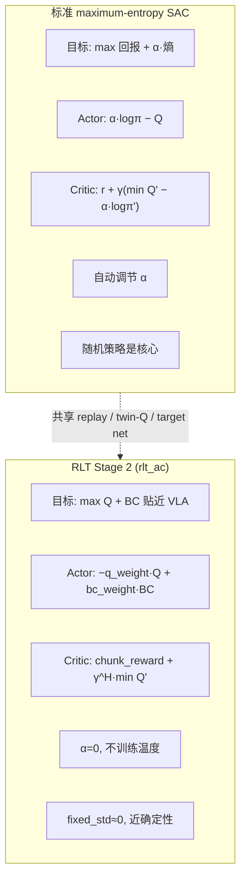
```mermaid
flowchart TB
    subgraph SAC["标准 maximum-entropy SAC"]
        A1["目标: max 回报 + α·熵"]
        A2["Actor: α·logπ − Q"]
        A3["Critic: r + γ(min Q' − α·logπ')"]
        A4["自动调节 α"]
        A5["随机策略是核心"]
    end

    subgraph RLT["RLT Stage 2 (rlt_ac)"]
        B1["目标: max Q + BC 贴近 VLA"]
        B2["Actor: −q_weight·Q + bc_weight·BC"]
        B3["Critic: chunk_reward + γ^H·min Q'"]
        B4["α=0, 不训练温度"]
        B5["fixed_std≈0, 近确定性"]
    end

    SAC -.->|"共享 replay / twin-Q / target net"| RLT
```

| 维度 | 标准 max-entropy SAC | RLT Stage 2 |
|------|---------------------|-------------|
| 优化哲学 | 奖励与熵 jointly 最大化 | 奖励最大化 + 不偏离 VLA/人类示范 |
| `loss_type` | `embodied_sac` | `rlt_ac` |
| Actor loss | \(\alpha\log\pi - Q\) | \(-q\_weight\cdot Q + bc\_weight\cdot BC\) |
| 温度 \(\alpha\) | 通常 >0，可自动学习 | 固定为 0 |
| Critic entropy backup | 默认 True | False |
| BC 正则 | 无 | 有（`ref_chunk` / 人类动作） |
| 策略随机性 | 核心机制 | 极小 fixed_std，几乎确定性 |
| 观测 | 通常原始 state/图像 | `{z_rl, proprio, ref_chunk}` |
| 奖励处理 | 逐步 TD | action chunk 内折扣累加 |

---

## 4. 为什么 RLT 要这样设计？

结合 [RL Token 官方项目页](https://www.pi.website/research/rlt) 和文档逻辑，可以这样理解：

1. **Stage 1 已有强 VLA 策略**：Stage 2 只需在 `ref_chunk` 附近做 **小 residual 修正**，不需要 SAC 式的大范围随机探索。  
2. **BC 防止灾难性偏离**：`bc_weight: 5` 远大于 `q_weight: 0.1`，保证在线 RL 不会快速忘掉 VLA 能力。  
3. **真机安全**：固定小噪声 + 无熵驱动，行为更可预测；配合 `rlt_policy_switch` 人工切换 VLA/actor 阶段。  
4. **复用 SAC 基础设施**：`adv_type: embodied_sac` 让 RLT 继承 replay buffer、target network、FSDP worker 等，但 **换了一套更适合 VLA bootstrap 的目标函数**。

---

## 5. 一句话总结

**「标准 maximum-entropy SAC」** = 在 actor、critic、temperature 三处都 **显式使用熵项 \(\alpha H(\pi)\)** 的 Soft Actor-Critic（[Haarnoja et al., 2018](https://arxiv.org/abs/1801.01290)；RLinf [`sac.rst`](https://github.com/RLinf/RLinf/blob/main/docs/source-zh/rst_source/reference/algorithms/sac.rst)）。

**RLT Stage 2** 虽然叫 actor-critic、底层走 SAC worker，但 \(\alpha=0\)、无 entropy backup、actor 加 BC 正则、策略近确定性——因此文档 [`rlt.rst:195`](https://github.com/RLinf/RLinf/blob/main/docs/source-zh/rst_source/examples/embodied/rlt.rst) 明确标注：**不是标准 maximum-entropy SAC**，而是 **「SAC 工程壳 + Q/BC 混合目标」** 的在线 fine-tuning 方案。


# rlt.rst中的"VLA reference action chunk" 

## 一句话定义

**VLA reference action chunk（`ref_chunk`）** 是：在 Stage 2 rollout 时，**冻结的 Stage 1 π₀.₅ VLA** 根据当前观测（图像 + 语言 + 本体状态）**实时推理出的一段未来动作序列**。它是 VLA 认为「此刻应该怎么做」的参考轨迹，供 Stage 2 轻量 actor 作为 **输入条件、行为先验（BC 目标）和 VLA 阶段的实际执行动作**。

**出处**：[`docs/source-zh/rst_source/examples/embodied/rlt.rst`](https://github.com/RLinf/RLinf/blob/main/docs/source-zh/rst_source/examples/embodied/rlt.rst) 第 200–206、306–314 行；[RL Token 官方项目页](https://www.pi.website/research/rlt)。

---

## 1. 它从哪来？——VLA 在线推理，不是离线示范

`ref_chunk` **不是** replay 里存的专家示范，而是 **每一步 rollout 时现场算出来的**。

冻结的 Stage 1 特征模型在 `extract_rlt_obs()` 里，与 `z_rl`、`proprio` 一起产出：

```357:404:rlinf/models/embodiment/openpi_rlinf/eval_action_model.py
    @torch.no_grad()
    def extract_rlt_obs(self, env_obs: dict[str, Any]) -> dict[str, torch.Tensor]:
        """Extract the frozen Stage1 features consumed by the Stage2 RLT head."""
        ...
        prefix_output, prefix_mask, kv_cache = self.model.build_prefix_cache(
            prepared_observation
        )
        ...
        z_rl = self._encode_rlt_flat(rlt_prefix_output, rlt_prefix_mask).to(
            dtype=torch.float32
        )

        model_actions = self._sample_actions_from_prefix_cache(
            prepared_observation,
            prefix_mask,
            kv_cache,
        )
        ref_chunk = self.output_transform(
            {"actions": model_actions, "state": observation.state}
        )["actions"]
        ...
        return {
            "z_rl": z_rl,
            "proprio": proprio.to(device=z_rl.device, dtype=torch.float32),
            "ref_chunk": ref_chunk.to(device=z_rl.device, dtype=torch.float32),
        }
```

生成流程可以概括为：


```mermaid
flowchart LR
    A["原始观测<br/>图像 + 语言 + state"] --> B["OpenPI transforms<br/>归一化 / tokenize"]
    B --> C["π₀.₅ build_prefix_cache<br/>VLA 理解当前场景"]
    C --> D["Flow Matching Euler 采样<br/>num_steps=4"]
    D --> E["output_transform<br/>反归一化到 env 坐标系"]
    E --> F["ref_chunk<br/>env-frame 动作块"]
```

### 1.1 采样：Flow Matching，不是 Stage 1 的 SFT 前向

VLA 动作用 **flow matching 的 Euler ODE 采样器** 生成（与 Stage 1 训练时的 flow-matching 目标一致）：

```406:438:rlinf/models/embodiment/openpi_rlinf/eval_action_model.py
    def _sample_actions_from_prefix_cache(...):
        """Run Pi0's eval Euler sampler using an already-built prefix cache."""
        ...
        x_t = noise
        dt = -1.0 / self.num_steps
        t = 1.0
        while t >= -dt / 2:
            ...
            suffix_out = self.model.run_suffix(
                observation, x_t, t_tensor, kv_cache, prefix_mask
            )
            v_t = self.model.velocity_from_suffix(suffix_out)
            x_t = x_t + dt * v_t
            t += dt
        return x_t
```

- 从随机噪声出发，迭代 `num_steps` 步（Franka 配置为 4）去噪，得到模型内部动作
- 再经 `output_transform` 反归一化，得到 **可直接发给机器人/仿真的 env-frame 动作**

**出处**：[`realworld_rlt_stage2_ac_mlp.yaml`](https://github.com/RLinf/RLinf/blob/main/examples/embodiment/config/realworld_rlt_stage2_ac_mlp.yaml) 中 `rlt_feature_model.openpi.num_steps: 4`；Stage 1 配置 [`realworld_rlt_stage1_sft_openpi_pi05.yaml`](https://github.com/RLinf/RLinf/blob/main/examples/sft/config/realworld_rlt_stage1_sft_openpi_pi05.yaml) 第 46–66 行（`num_action_chunks: 20`, `action_dim: 7`）。

### 1.2 为什么叫 "reference"？

- **Reference** = 参考、基准，不是最终执行动作的唯一来源
- Stage 2 actor 学的是 **在 VLA 建议之上做修正**（residual / edit），而不是从零学整个动作分布
- 在 VLA 控制阶段，环境 **直接执行** `ref_chunk`（或其前若干步）

文档表述（[`rlt.rst:306-314`](https://github.com/RLinf/RLinf/blob/main/docs/source-zh/rst_source/examples/embodied/rlt.rst)）：

> 普通 policy step 中，BC target 是 VLA reference action。

---

## 2. 它长什么样？——形状与语义

### 2.1 张量形状

| 字段 | 典型形状（Franka peg） | 含义 |
|------|------------------------|------|
| `ref_chunk` | `(B, 20, 7)` | B 个并行 env；20 步未来动作；每步 7 维（Franka 末端控制） |
| `num_action_chunks`（actor 输出） | 10 | Stage 2 actor **实际输出/执行** 的步数 |
| `ref_num_action_chunks` | 20 | VLA **推理** 的步数（≥ actor 步数） |

Franka Stage 2 配置：

```244:246:examples/embodiment/config/realworld_rlt_stage2_ac_mlp.yaml
    action_dim: 7
    num_action_chunks: 10
    ref_num_action_chunks: 20
```

- VLA 一次预测 **20 步** 未来动作（与 Stage 1 `action_horizon=20` 一致）
- Stage 2 MLP actor 只输出 **10 步**；actor 输入时取 `ref_chunk` 的前 10 步：

```100:105:rlinf/models/embodiment/mlp_policy/rlt_mlp_policy.py
    def _get_ref_chunk(self, obs: dict) -> torch.Tensor:
        ref_chunk = self._flatten_batch(obs["ref_chunk"]).reshape(
            obs["ref_chunk"].shape[0], -1, self.step_action_dim
        )
        ref_chunk = ref_chunk[:, : self.chunk_len]
        return ref_chunk.reshape(ref_chunk.shape[0], -1)
```

ManiSkill 示例中两者均为 10（[`maniskill_rlt_stage2_ac_mlp.yaml`](https://github.com/RLinf/RLinf/blob/main/examples/embodiment/config/maniskill_rlt_stage2_ac_mlp.yaml) 第 148–149 行）。

### 2.2 动作语义（env-frame）

`ref_chunk` 是 **反归一化后的环境动作**，不是模型内部的 32 维 padded 表示：

- Franka：`action_dim: 7`，通常为末端位姿/关节相关控制量（由 `pi05_franka_state` dataconfig 定义）
- ManiSkill joint：`8` 维 `pd_joint_delta_pos`（文档 [`rlt.rst:439-441`](https://github.com/RLinf/RLinf/blob/main/docs/source-zh/rst_source/examples/embodied/rlt.rst)）

归一化统计必须与 Stage 1 一致（同一 `repo_id` + `norm_stats.json`），否则 `ref_chunk` 尺度错误，BC 会失效（文档 warning，[`rlt.rst:507-511`](https://github.com/RLinf/RLinf/blob/main/docs/source-zh/rst_source/examples/embodied/rlt.rst)）。

---

## 3. 它在 Stage 2 里怎么用？

`ref_chunk` 同时承担 **三种角色**：

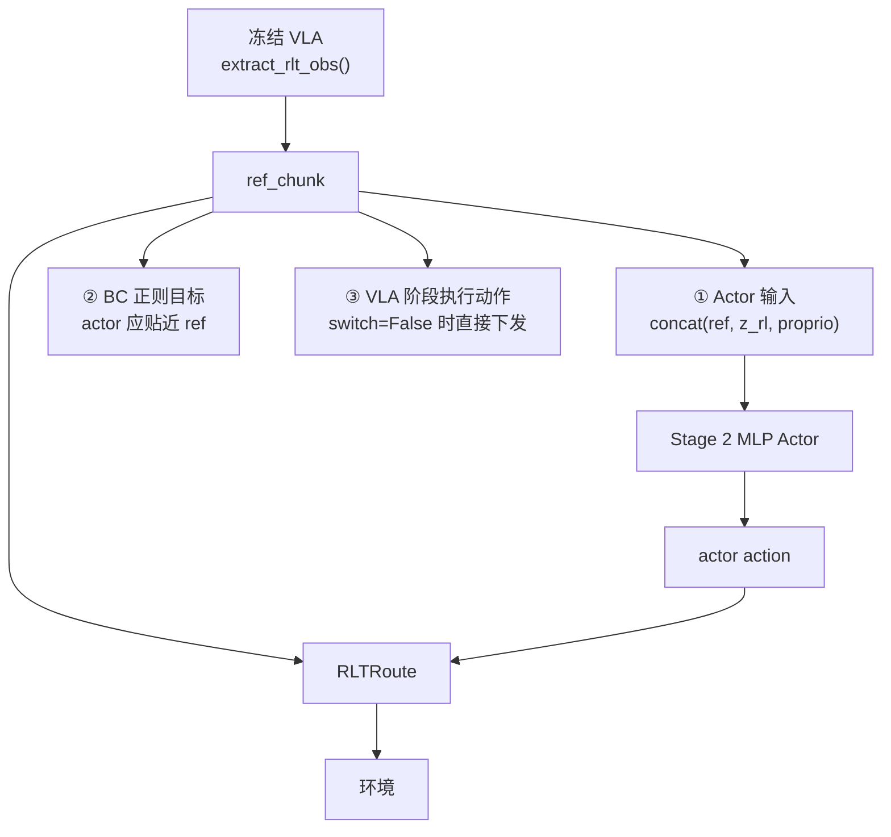
```mermaid
flowchart TB
    FM["冻结 VLA<br/>extract_rlt_obs()"]
    FM --> RC["ref_chunk"]
    RC --> R1["① Actor 输入<br/>concat(ref, z_rl, proprio)"]
    RC --> R2["② BC 正则目标<br/>actor 应贴近 ref"]
    RC --> R3["③ VLA 阶段执行动作<br/>switch=False 时直接下发"]
    ACT["Stage 2 MLP Actor"] --> OUT["actor action"]
    R1 --> ACT
    ROUTE["RLTRoute"] --> ENV["环境"]
    RC --> ROUTE
    OUT --> ROUTE
```

### 3.1 作为 Actor 输入（behavioral prior）

`RLTMLPPolicy` 把 `ref_chunk` 与 `z_rl`、`proprio` 拼接后送入 MLP：

```120:130:rlinf/models/embodiment/mlp_policy/rlt_mlp_policy.py
    def _actor_state(...):
        ref_chunk = self._get_ref_chunk(obs)
        if apply_reference_dropout:
            ref_chunk = self._maybe_drop_reference(ref_chunk, reference_dropout_prob)
        return torch.cat([ref_chunk, self._get_z(obs), self._get_proprio(obs)], dim=-1)
```

Franka 示例 actor 输入维度：`20×7 + 2048 + 19 = 2137`（取 ref 前 10 步则为 `10×7 + 2048 + 19`）。

训练时还有 **reference dropout**（默认 0.5）：随机把整段 `ref_chunk` 置零，避免 actor 过度依赖 VLA 参考（[`realworld_rlt_stage2_ac_mlp.yaml:79`](https://github.com/RLinf/RLinf/blob/main/examples/embodiment/config/realworld_rlt_stage2_ac_mlp.yaml)）。

**Critic 不用 `ref_chunk`**，只用 `{z_rl, proprio}` + 动作，避免 Q 值被 VLA 先验偏置（[`rlt_mlp_policy.py:132-133`](https://github.com/RLinf/RLinf/blob/main/rlinf/models/embodiment/mlp_policy/rlt_mlp_policy.py)）。

### 3.2 作为 BC 正则目标

Actor loss（[`rlt.rst:306-310`](https://github.com/RLinf/RLinf/blob/main/docs/source-zh/rst_source/examples/embodied/rlt.rst)）：

```text
actor_loss = -q_weight * Q(obs, pi(obs)) + bc_weight * BC(pi(obs), target_action)
```

BC 目标逻辑：

```123:124:rlinf/workers/actor/fsdp_rlt_ac_policy_worker.py
        bc_target = torch.where(human_mask[..., None], action_chunk, bc_ref_chunk)
        bc_error = torch.mean(torch.square(pi_chunk - bc_target), dim=-1)
```

- 普通 step：`bc_target = ref_chunk`（actor 应接近 VLA 建议）
- 有人类/专家干预：`bc_target = 实际执行的人类动作`

默认 `bc_weight: 5` >> `q_weight: 0.1`，说明 Stage 2 主要是 **在 VLA 附近做小修正**，而非大幅偏离（[`realworld_rlt_stage2_ac_mlp.yaml:74-76`](https://github.com/RLinf/RLinf/blob/main/examples/embodiment/config/realworld_rlt_stage2_ac_mlp.yaml)）。

### 3.3 作为 VLA 阶段的实际执行动作

Rollout route 在 **整 chunk 级别** 选择执行 actor 还是 VLA ref：

**真机**（按键 `b` 前走 VLA）：

```127:134:rlinf/algorithms/rlt/route.py
        ref_actions = result["forward_inputs"]["ref_chunk"].to(...)
        routed_actions = torch.where(
            rlt_switch_flags,
            actions,
            ref_actions[:, : actions.shape[1], : actions.shape[2]],
        ).contiguous()
```

**ManiSkill**（critical phase 前走 VLA）：

```191:202:rlinf/algorithms/rlt/route.py
        base_actions = _base_ref_actions(
            ctx.rlt_obs["ref_chunk"],
            chunk_len=chunk_len,
            ...
        )
        routed_actions = torch.where(
            actor_switch[:, None, None],
            actions,
            base_actions,
        ).contiguous()
```

文档说明（[`rlt.rst:215-217, 693-696`](https://github.com/RLinf/RLinf/blob/main/docs/source-zh/rst_source/examples/embodied/rlt.rst)）：

- 切换前：环境执行的是 **VLA `ref_chunk`**，这些 transition 也会进 replay
- 切换后：环境执行 **actor action**
- replay 里的 `action` 始终是 **实际下发** 的动作；`ref_chunk` 存在 `curr_obs` / `next_obs` 里作为上下文

---

## 4. 与 `action` 的区别

Replay 中一条 transition（[`rlt.rst:209-213, 688-690`](https://github.com/RLinf/RLinf/blob/main/docs/source-zh/rst_source/examples/embodied/rlt.rst)）：

```text
curr_obs = {z_rl, proprio, ref_chunk}
action   = 实际发送给环境的 action chunk
next_obs = {next_z_rl, next_proprio, next_ref_chunk}
```

| | `ref_chunk` | `action` |
|---|-------------|----------|
| 来源 | 冻结 VLA 每步重新推理 | route 选择后的 **最终执行** 动作 |
| 是否等于 VLA 输出 | 是（除非 expert 接管改写） | 可能是 ref、actor 或 expert |
| 用途 | actor 输入 + BC 目标 | critic TD、环境 step、Q 学习 |
| 是否随时间更新 | 每步随新观测重算 | 记录本步实际行为 |

Expert 接管时，route 会把 expert 动作写回 `forward_inputs["ref_chunk"]`，供后续 BC 使用（[`route.py:230-237`](https://github.com/RLinf/RLinf/blob/main/rlinf/algorithms/rlt/route.py)）。

---

## 5. 直观例子（Franka 插 peg）

1. 相机看到 peg 和孔，VLA 输出 `ref_chunk`：未来 20 步的 7 维末端控制，大致是「靠近 → 对齐 → 插入」。
2. 操作员尚未按 `b`：机器人 **直接执行** `ref_chunk` 前 10 步。
3. 按 `b` 进入 actor 阶段：MLP 输入 `[ref_chunk[:10], z_rl, proprio]`，输出 10 步修正动作；route 下发 actor 动作。
4. 训练时 BC 把 actor 拉向 `ref_chunk`（或人类干预动作），Q 项鼓励高回报修正。

---

## 6. 总结

| 问题 | 答案 |
|------|------|
| **是什么？** | 冻结 Stage 1 π₀.₅ 对当前观测推理出的 **env-frame 未来动作块** |
| **怎么算？** | `build_prefix_cache` → flow matching Euler 采样 → `output_transform` 反归一化 |
| **典型形状？** | `(B, ref_num_action_chunks, action_dim)`，如 `(B, 20, 7)` |
| **为何叫 reference？** | 作为 VLA 行为先验：actor 输入、BC 锚点、VLA 阶段 fallback 执行 |
| **与 actor action 关系？** | actor 在 ref 附近学 residual；route 决定实际执行哪一个 |

**一句话**：`ref_chunk` 就是 **「此刻 VLA 认为该怎么动」的一段未来动作轨迹**；RLT Stage 2 不是抛弃 VLA 重学控制，而是在这条参考轨迹上，用轻量 RL 做 **在线微调与任务阶段切换**。

# rlt.rst中提到的 next_z_rl 和 next_ref_chunk

## 结论先说

文档第 213 行的 `next_obs = {next_z_rl, next_proprio, next_ref_chunk}` 表示：**在执行完当前 action、环境推进到下一时刻后**，冻结 VLA 特征模型对 **下一时刻原始观测** 重新推理得到的 RLT 状态。

- **`next_z_rl`** = `next_obs["z_rl"]`：下一时刻的 RL 紧凑表示  
- **`next_ref_chunk`** = `next_obs["ref_chunk"]`：下一时刻 VLA 重新采样的参考动作块  

它们与 `curr_obs` 里的 `z_rl`、`ref_chunk` **类型相同、算法相同**，区别只在 **时间步**：一个是 $s_t$，一个是 $s_{t+1}$。

**出处**：[`docs/source-zh/rst_source/examples/embodied/rlt.rst`](https://github.com/RLinf/RLinf/blob/main/docs/source-zh/rst_source/examples/embodied/rlt.rst) 第 209–213、225–231、686–690 行。

---

## 1. 在 transition 里扮演什么角色？

RLT Stage 2 的 replay 存的是 **特征空间** 的 $(s, a, r, s')$，不是原始图像：

```text
curr_obs = {z_rl, proprio, ref_chunk}          ← 时刻 t 的状态
action   = 实际发给环境的 action chunk        ← 时刻 t 的行为
next_obs = {next_z_rl, next_proprio, next_ref_chunk}  ← 时刻 t+1 的状态
```

对应 Bellman 一步：

\[
(s_t,\ a_t,\ r_t,\ s_{t+1}) \quad\text{其中}\quad s_t = \{z\_rl,\ proprio,\ ref\_chunk\},\ s_{t+1} = \{next\_z\_rl,\ next\_proprio,\ next\_ref\_chunk\}
\]

Critic 的 TD target（[`rlt.rst:225-231`](https://github.com/RLinf/RLinf/blob/main/docs/source-zh/rst_source/examples/embodied/rlt.rst)）：

```text
target_q = discounted_chunk_reward + gamma ** chunk_horizon * Q_target(next_obs, next_action)
```

**`next_z_rl` 和 `next_ref_chunk` 的核心作用**：为 Critic 提供 **bootstrap 的下一状态 $s_{t+1}$**，让 Q 网络学习「当前动作有多好，取决于下一状态上 actor 能拿到多少 Q 值」。

---

## 2. 它们是怎么生成的？

### 2.1 总流程：与 `z_rl` / `ref_chunk` 同一套函数，输入换成「下一帧观测」

两者都由冻结 Stage 1 模型的 `extract_rlt_obs()` 产生，算法与当前步完全一致：

```357:404:rlinf/models/embodiment/openpi_rlinf/eval_action_model.py
    @torch.no_grad()
    def extract_rlt_obs(self, env_obs: dict[str, Any]) -> dict[str, torch.Tensor]:
        ...
        prefix_output, prefix_mask, kv_cache = self.model.build_prefix_cache(
            prepared_observation
        )
        ...
        z_rl = self._encode_rlt_flat(rlt_prefix_output, rlt_prefix_mask).to(
            dtype=torch.float32
        )
        model_actions = self._sample_actions_from_prefix_cache(...)
        ref_chunk = self.output_transform(
            {"actions": model_actions, "state": observation.state}
        )["actions"]
        ...
        return {"z_rl": z_rl, "proprio": proprio, "ref_chunk": ref_chunk}
```

| 字段 | 生成方式 |
|------|----------|
| **`next_z_rl`** | VLA prefix hidden states → `RLTTokenTransformer.encode_flat()` → 2048 维向量 |
| **`next_ref_chunk`** | 同一 VLA 对 **下一帧** 做 flow matching Euler 采样（默认 4 步）→ `output_transform` 反归一化 → env-frame 动作块 |

**关键**：`next_ref_chunk` **不是** 上一步 `ref_chunk` 的「剩余未执行部分」，而是 VLA 看到 **新图像 + 新 proprio** 后 **完整重新推理** 的未来动作序列。

### 2.2 Rollout 侧：写入 `rlt_transition_*` 键

Rollout 每收到一帧 env 观测，先算当前步特征，再写入 **下一状态** 用的 transition 字段：

```24:35:rlinf/algorithms/rlt/rollout.py
def _append_rlt_transition_obs(...):
    transition_obs = rlt_obs
    if final_obs is not None:
        transition_obs = feature_model.extract_rlt_obs(final_obs)
    for key in RLT_OBS_KEYS:
        result["forward_inputs"][f"{RLT_TRANSITION_PREFIX}{key}"] = transition_obs[key]
```

- 一般情况（`final_obs is None`）：`rlt_transition_*` = 本帧 `extract_rlt_obs(env_obs)` 的结果  
- Episode 终止且 auto_reset（`final_obs` 有值）：对 **终止前真实观测** 再跑一次 `extract_rlt_obs(final_obs)`，避免用 reset 后的新 episode 观测当 $s'$

常量定义（[`transition.py:22-23`](https://github.com/RLinf/RLinf/blob/main/rlinf/algorithms/rlt/transition.py)）：

```python
RLT_OBS_KEYS = ("z_rl", "proprio", "ref_chunk")
RLT_TRANSITION_PREFIX = "rlt_transition_"
# → forward_inputs 里: rlt_transition_z_rl, rlt_transition_proprio, rlt_transition_ref_chunk
```

### 2.3 Env ↔ Rollout 时序（为何是「下一状态」）

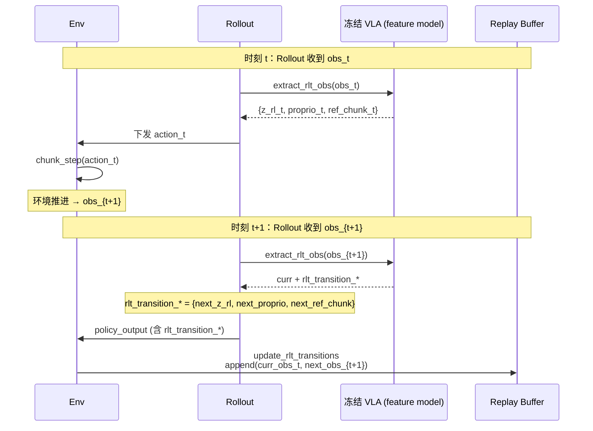
```mermaid
sequenceDiagram
    participant Env
    participant Rollout
    participant FM as 冻结 VLA (feature model)
    participant Buffer as Replay Buffer

    Note over Env,Buffer: 时刻 t：Rollout 收到 obs_t
    Rollout->>FM: extract_rlt_obs(obs_t)
    FM-->>Rollout: {z_rl_t, proprio_t, ref_chunk_t}
    Rollout->>Env: 下发 action_t
    Env->>Env: chunk_step(action_t)
    Note over Env: 环境推进 → obs_{t+1}

    Note over Env,Buffer: 时刻 t+1：Rollout 收到 obs_{t+1}
    Rollout->>FM: extract_rlt_obs(obs_{t+1})
    FM-->>Rollout: curr + rlt_transition_*
    Note over Rollout: rlt_transition_* = {next_z_rl, next_proprio, next_ref_chunk}

    Rollout->>Env: policy_output (含 rlt_transition_*)
    Env->>Buffer: update_rlt_transitions<br/>append(curr_obs_t, next_obs_{t+1})
```

Env worker 在收到 rollout 的 `policy_output` 后，用 `update_rlt_transitions()` 拼 transition（[`transition.py:62-102`](https://github.com/RLinf/RLinf/blob/main/rlinf/algorithms/rlt/transition.py)）：

1. 若已有缓存的 `pending_obs`（= 上一时刻的 `curr_obs`）  
2. 从 `policy_output.forward_inputs` 读出 `rlt_transition_*`，映射为 `next_obs`  
3. `append_transitions(pending_obs, next_obs)` 写入 trajectory  
4. 再把本步 `forward_inputs` 里的 `{z_rl, proprio, ref_chunk}` 缓存为新的 `pending_obs`

因此：**本步 rollout 算出的 `rlt_transition_*`，对应的是「上一 transition 的 next_obs」**。

---

## 3. `next_z_rl` 详解

### 是什么？

下一时刻 $s_{t+1}$ 的 **RL 状态嵌入**：把 VLA 对「执行 action 后新场景」的理解，压缩成 2048 维向量。

### 与 `z_rl` 的区别

| | `z_rl`（curr） | `next_z_rl`（next） |
|---|----------------|---------------------|
| 时间 | 决策前，观测 $o_t$ | 执行 action 后，观测 $o_{t+1}$ |
| 输入图像/状态 | 动作执行前 | 机器人/物体已移动后的新观测 |
| 语义 | 「此刻该怎么动」的上下文 | 「动完之后局面如何」的上下文 |

机器人插 peg 的例子：$z_rl$ 可能对应「peg 还在孔外」；执行一段 action 后，`next_z_rl` 对应「peg 更接近孔」—— Critic 靠这个变化判断 action 是否带来进展。

### 在训练中怎么用？

**Critic**（主要消费者）：

```243:272:rlinf/workers/actor/fsdp_rlt_ac_policy_worker.py
        with torch.no_grad():
            next_actions, _, _ = self.model(
                forward_type=ForwardType.SAC,
                obs=next_obs,          # ← 含 next_z_rl, next_proprio, next_ref_chunk
            )
            all_qf_next_target = self.target_model(
                forward_type=ForwardType.SAC_Q,
                obs=next_obs,
                actions=next_actions,
            )
            q_next = self._min_twin_q(all_qf_next_target)
            ...
            target_q_values = reward_target + not_done * bootstrap_discount * q_next
```

流程：

1. 用 `next_obs`（含 `next_z_rl`）经 actor 采样 `next_actions`  
2. target Q 网络算 $Q_{\text{targ}}(next\_obs, next\_actions)$  
3. 与 chunk 折扣奖励相加得 TD target  

**Critic 的 state 部分只用 `{next_z_rl, next_proprio}`**，不用 `next_ref_chunk`（[`rlt_mlp_policy.py:132-133`](https://github.com/RLinf/RLinf/blob/main/rlinf/models/embodiment/mlp_policy/rlt_mlp_policy.py)）。

**Actor 训练**不直接读 `next_z_rl`，只通过 Critic 的 TD target 间接影响 actor。

---

## 4. `next_ref_chunk` 详解

### 是什么？

下一时刻 $o_{t+1}$ 上，冻结 VLA **重新推理** 得到的 reference action chunk——「看到新画面后，VLA 认为接下来该怎么动」。

### 与 `ref_chunk`（curr）的区别

| | `ref_chunk` | `next_ref_chunk` |
|---|-------------|------------------|
| 基于观测 | $o_t$ | $o_{t+1}$ |
| VLA 建议 | 执行 action **前** 的计划 | 执行 action **后** 的新计划 |
| 是否等于上一步剩余动作 | 否 | 否（完全重算） |

举例（Franka，`ref_num_action_chunks=20`）：

- $t$：`ref_chunk` 可能是「继续下降、对准孔」的 20 步  
- 执行 10 步 actor/VLA 混合 action 后  
- $t+1$：`next_ref_chunk` 是 VLA 看 **新图像** 重新生成的 20 步，可能是「微调姿态、插入」——与旧 `ref_chunk` 的后 10 步无直接对应关系

### 在训练中怎么用？

**① Critic bootstrap 时作为 actor 的输入条件**

Actor 的 `sac_forward` 输入是 `[ref_chunk, z_rl, proprio]` 拼接（[`rlt_mlp_policy.py:127-130`](https://github.com/RLinf/RLinf/blob/main/rlinf/models/embodiment/mlp_policy/rlt_mlp_policy.py)）。算 `next_actions` 时用的是 **`next_ref_chunk` + `next_z_rl` + `next_proprio`**，因此：

\[
next\_actions = \pi_\theta(next\_ref\_chunk,\ next\_z\_rl,\ next\_proprio)
\]

Q bootstrap 评估的是：**在下一 VLA 参考轨迹下，actor 会怎么修正**。

**② 下一步 transition 的 `curr_obs["ref_chunk"]`**

当前 transition 的 `next_ref_chunk`，在 **下一条** transition 里会变成 `ref_chunk`（新的 `pending_obs` 缓存）。

**③ 不直接参与 BC loss**

BC 只用 **当前步** `curr_obs["ref_chunk"]`（[`fsdp_rlt_ac_policy_worker.py:340-344`](https://github.com/RLinf/RLinf/blob/main/rlinf/workers/actor/fsdp_rlt_ac_policy_worker.py)）；`next_ref_chunk` 不参与 BC，主要服务于 **下一状态的 Q 估计**。

---

## 5. Episode 终止时的特殊处理

若 transition 已终止（`dones=True`）且 `bootstrap_type: standard`（[`rlt.rst:231`](https://github.com/RLinf/RLinf/blob/main/docs/source-zh/rst_source/examples/embodied/rlt.rst)）：

```551:556:rlinf/workers/actor/fsdp_rlt_ac_policy_worker.py
                is_done = (...)
                if is_done:
                    next_obs = curr_obs   # 终止步：next := curr
                else:
                    next_obs = self._rlt_obs_from_flat_dict(flat, "next_obs", idx)
```

Critic 侧：

```272:272:rlinf/workers/actor/fsdp_rlt_ac_policy_worker.py
                target_q_values = reward_target + not_done * bootstrap_discount * q_next
```

终止时 `not_done=0`，**不加** $Q(next\_obs,\ \cdot)$，避免用 reset 后新 episode 的特征做 bootstrap。此时 `next_z_rl` / `next_ref_chunk` 虽可能被设为 `curr` 副本，但不进入 TD target。

---

## 6. 与 `action` 的关系（易混点）

| 字段 | 含义 |
|------|------|
| `action` | route 后 **实际执行** 的动作（可能是 actor / VLA ref / expert） |
| `ref_chunk` | VLA 在 $t$ 的 **建议**（未必被执行） |
| `next_ref_chunk` | VLA 在 $t+1$ 的 **新建议**（与 $t$ 的 `action` 无简单代数关系） |

文档（[`rlt.rst:693-696`](https://github.com/RLinf/RLinf/blob/main/docs/source-zh/rst_source/examples/embodied/rlt.rst)）：切换前 step 的 `action` 可能就是 VLA `ref_chunk`，但 **`next_ref_chunk` 仍是下一步 VLA 对新观测的重推理**，不是「上一步 ref 减掉已执行部分」。

---

## 7. 整体数据流（从 rollout 到 Critic）

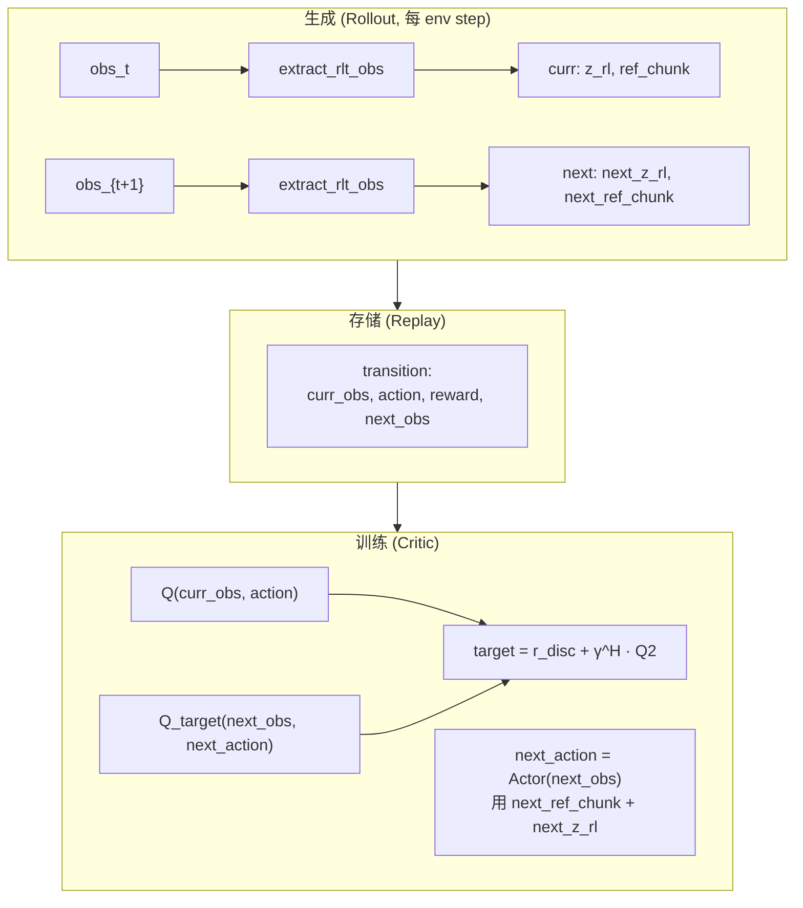
```mermaid
flowchart TB
    subgraph Gen["生成 (Rollout, 每 env step)"]
        O1["obs_t"] --> FM1["extract_rlt_obs"]
        FM1 --> C1["curr: z_rl, ref_chunk"]
        O2["obs_{t+1}"] --> FM2["extract_rlt_obs"]
        FM2 --> N1["next: next_z_rl, next_ref_chunk"]
    end

    subgraph Store["存储 (Replay)"]
        T["transition:<br/>curr_obs, action, reward, next_obs"]
    end

    subgraph Train["训练 (Critic)"]
        Q1["Q(curr_obs, action)"]
        NA["next_action = Actor(next_obs)<br/>用 next_ref_chunk + next_z_rl"]
        Q2["Q_target(next_obs, next_action)"]
        TD["target = r_disc + γ^H · Q2"]
    end

    Gen --> Store --> Train
    Q1 --> TD
    Q2 --> TD
```

---

## 8. 总结对照表

| 问题 | `next_z_rl` | `next_ref_chunk` |
|------|-------------|------------------|
| **是什么？** | 下一时刻 RL 状态嵌入 | 下一时刻 VLA 参考动作块 |
| **怎么来？** | 冻结 VLA 对 $o_{t+1}$ 的 `encode_flat` | 同一 VLA 对 $o_{t+1}$ 的 flow matching 采样 + 反归一化 |
| **与 curr 关系** | 同算法、不同时间步 | 同算法、不同时间步；**非** curr ref 的滑动窗口 |
| **主要作用** | Critic 的 $s'$ 状态（与 proprio 一起） | Actor 在 $s'$ 上的输入条件；间接决定 `next_actions` 与 Q bootstrap |
| **Actor loss 直接用？** | 否 | 否（BC 只用 curr `ref_chunk`） |
| **Critic 直接用？** | 是（Q 网络 state） | 是（经 actor 采样 `next_actions` 间接进入 Q） |

**一句话**：`next_z_rl` 和 `next_ref_chunk` 是 **「动作执行后、新观测下」** VLA 特征模型给出的下一 RL 状态；它们把标准 RL 的 $s_{t+1}$ 落在 RLT 的特征空间里，供 Critic 做 TD bootstrap，并让 actor 在下一时刻的 Q 估计中仍 **以 VLA 新参考轨迹为条件**。

# rlt.rst中哪些模块何时冻结何时更新

整个 rlt 中, 哪些模块是冻结的, 在什么阶段冻结? 哪些模块是可更新权重的 在什么阶段更新, 基于什么输入, label 和 loss 进行更新? 

---

下面按 **Stage 1 → Stage 2 → 推理侧副本** 梳理 RLT 全流程里：**谁冻结、谁可训、用什么输入/标签、什么 loss 更新**。内容以 [`rlt.rst`](https://github.com/RLinf/RLinf/blob/main/docs/source-zh/rst_source/examples/embodied/rlt.rst) 和 RLmm 代码为准。

---

## 总览：两阶段分工

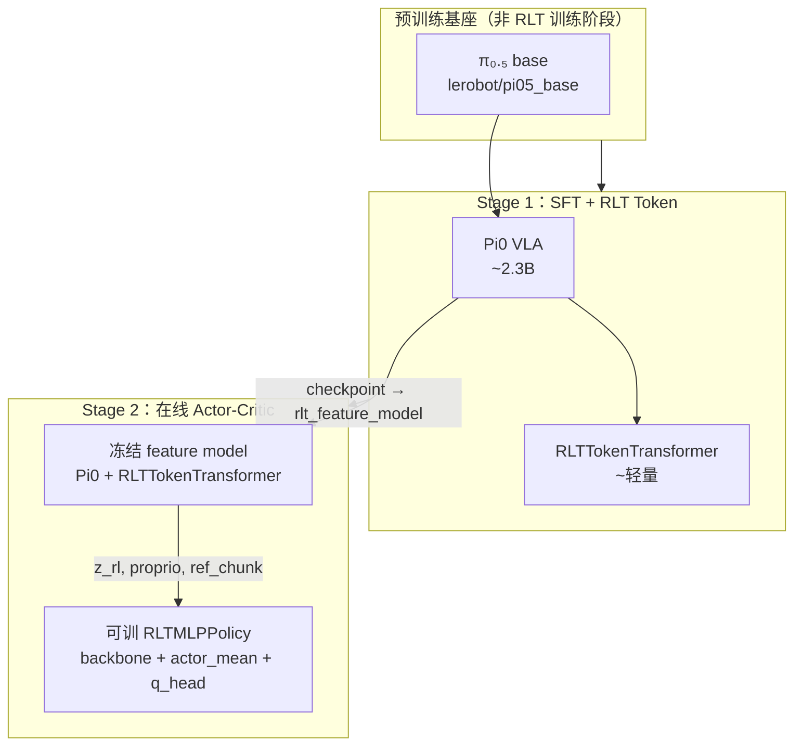
```mermaid
flowchart TB
    subgraph S0["预训练基座（非 RLT 训练阶段）"]
        PI0["π₀.₅ base<br/>lerobot/pi05_base"]
    end

    subgraph S1["Stage 1：SFT + RLT Token"]
        VLA["Pi0 VLA<br/>~2.3B"]
        RLT["RLTTokenTransformer<br/>~轻量"]
        PI0 --> VLA
        VLA --> RLT
    end

    subgraph S2["Stage 2：在线 Actor-Critic"]
        FM["冻结 feature model<br/>Pi0 + RLTTokenTransformer"]
        MLP["可训 RLTMLPPolicy<br/>backbone + actor_mean + q_head"]
        VLA --> FM
        FM -->|"z_rl, proprio, ref_chunk"| MLP
    end

    S0 --> S1
    S1 -->|"checkpoint → rlt_feature_model"| S2
```

| 阶段 | 入口 | 可训模块 | 冻结模块 |
|------|------|----------|----------|
| **Stage 1** | `run_vla_sft.sh` → `SFTRunner` | Pi0 VLA + `rlt_module` | 无（默认全量微调；可选 `train_expert_only`） |
| **Stage 2** | `train_embodied_agent.py`，`loss_type: rlt_ac` | `RLTMLPPolicy`（actor + critic 分支） | `rollout.rlt_feature_model` 整包；可选 `expert_model` |
| **推理副本** | rollout worker | 无本地反传 | `rlt_feature_model`、`hf_model`（MLP 副本只同步权重） |

**出处**：[`rlt.rst:4-8, 123-137, 188-191`](https://github.com/RLinf/RLinf/blob/main/docs/source-zh/rst_source/examples/embodied/rlt.rst)；[`train_embodied_agent.py:59-66`](https://github.com/RLinf/RLinf/blob/main/examples/embodiment/train_embodied_agent.py)。

---

## Stage 1：学习 RLT 特征模型

### 1.1 涉及模块

| 模块 | 代码位置 | Stage 1 状态 |
|------|----------|--------------|
| **Pi0 VLA**（SigLIP 视觉 + Gemma 2B + 300M action expert + 投影层） | `openpi_rlinf/pi0_model/` | **可训**（默认 `train_expert_only: False`） |
| **RLTTokenTransformer**（encoder + decoder） | `modules/rlt_token_transformer.py` | **可训**（`use_rlt: True` 时挂载为 `rlt_module`） |
| **OpenPI transforms / dataloader** | Stage 1 数据管线 | 无参数，仅预处理 |

Stage 1 从 `model_path: /path/to/model`（通常 `lerobot/pi05_base`）加载 π₀.₅，再在任务示范数据上联合微调。**不是**在 Stage 1 里冻结 VLA。

**出处**：[`realworld_rlt_stage1_sft_openpi_pi05.yaml:45-78`](https://github.com/RLinf/RLinf/blob/main/examples/sft/config/realworld_rlt_stage1_sft_openpi_pi05.yaml)；[`sft_action_model.py:33-41`](https://github.com/RLinf/RLinf/blob/main/rlinf/models/embodiment/openpi_rlinf/sft_action_model.py)。

### 1.2 输入数据

| 字段 | 来源 | 含义 |
|------|------|------|
| `observation` | LeRobot 示范 | 图像、语言 prompt、机器人 state（经 OpenPI transform + norm） |
| `actions` | 示范轨迹 | 专家动作 chunk，已归一化并 pad 到 `model_action_dim=32` |

**出处**：[`sft_action_model.py:68-77, 142-157`](https://github.com/RLinf/RLinf/blob/main/rlinf/models/embodiment/openpi_rlinf/sft_action_model.py)。

### 1.3 两个 loss、两套梯度

总 loss（[`rlt.rst:131-135`](https://github.com/RLinf/RLinf/blob/main/docs/source-zh/rst_source/examples/embodied/rlt.rst)）：

\[
\mathcal{L}_{\text{Stage1}} = \mathcal{L}_{\text{RLT}} + \alpha \cdot \mathcal{L}_{\text{VLA}},\quad \alpha=\texttt{rlt\_alpha}
\]

#### （A）`vla_loss` — 更新 Pi0 VLA

- **输入**：`observation` + flow-matching 采样的 `(noise, time, x_t)` + 示范 `actions`
- **标签（隐式）**：flow matching 速度目标 \(u_t = \text{noise} - \text{actions}\)
- **Loss**：\(\text{MSE}(v_t, u_t)\)，对 action horizon 求 mean → `vla_loss`
- **更新谁**：**整条 Pi0 forward**（prefix + suffix + LLM + action head）

```198:207:rlinf/models/embodiment/openpi_rlinf/sft_action_model.py
        prefix_out, suffix_out = self.model.llm(...)
        v_t = self.model.velocity_from_suffix(
            suffix_out[:, -self.model.action_horizon :]
        )
        loss = torch.mean(torch.square(v_t - u_t), dim=-1)
        prefix_out, prefix_mask = self._select_rlt_prefix_embeddings(
            prefix_out.detach(), prefix_mask, observation.tokenized_prompt
        )
```

#### （B）`rlt_loss` — 只更新 `rlt_module`

- **输入**：VLA 的 **prefix hidden states**（已在送入 RLT 前 **`detach()`**）
- **标签**：同一份 prefix embeddings（自监督重建目标）
- **Loss**：encoder 得到 `z_rl` token → decoder 重建 prefix → **MSE(reconstructed, prefix)**

```355:379:rlinf/models/embodiment/modules/rlt_token_transformer.py
    def reconstruct(self, prefix_embs, mask=None):
        frozen_prefix = prefix_embs.detach()
        rl_tokens = self.encode(frozen_prefix, mask)
        reconstructed = self.decode(rl_tokens, frozen_prefix, mask)
        ...
    def loss(self, prefix_embs, mask=None):
        reconstructed, rl_tokens = self.reconstruct(prefix_embs, mask)
        target = prefix_embs.detach().to(dtype=torch.float32)
        ...
        mse = sq_error.mean()  # 或 mask 加权
        return mse, {"mse": mse, "z_rl": ...}
```

**梯度隔离要点**：

| Loss | 更新 Pi0 VLA | 更新 `rlt_module` |
|------|-------------|-------------------|
| `vla_loss` | ✅ | ❌（prefix 已 detach 后再进 RLT） |
| `rlt_loss` | ❌（reconstruct 内 prefix 再次 detach） | ✅ |

Stage 1 **输出 checkpoint**：`.../checkpoints/global_step_<N>/actor`，内含 **`model.*`（Pi0）+ `rlt_module.*`**。

---

## Stage 2：在线 Actor-Critic

### 2.1 冻结模块（整段 Stage 2 不反传）

#### （1）`rollout.rlt_feature_model` — 核心冻结对象

即 Stage 1 完整 checkpoint，以 **`OpenPiPytorchEvalActionModel`**（`openpi.task: eval`）加载：

| 子模块 | 作用 | 状态 |
|--------|------|------|
| Pi0 VLA | 提取 prefix、采样 `ref_chunk` | `eval()` + `requires_grad_(False)` |
| `rlt_module` | 编码 `z_rl` | 同上 |

```151:157:rlinf/workers/rollout/hf/huggingface_worker.py
        if rlt_feature_model_config is not None:
            self.rlt_feature_model = get_model(copy.deepcopy(rlt_feature_model_config))
            self.rlt_feature_model.eval()
            self.rlt_feature_model.requires_grad_(False)
```

每步 `extract_rlt_obs()` 在 `@torch.no_grad()` 下运行，产出 `{z_rl, proprio, ref_chunk}`，**不参与 Stage 2 优化**。

**出处**：[`rlt.rst:191, 200-204, 755`](https://github.com/RLinf/RLinf/blob/main/docs/source-zh/rst_source/examples/embodied/rlt.rst)；[`realworld_rlt_stage2_ac_mlp.yaml:177-214`](https://github.com/RLinf/RLinf/blob/main/examples/embodiment/config/realworld_rlt_stage2_ac_mlp.yaml)。

#### （2）`rollout.expert_model`（可选，ManiSkill expert takeover）

- 独立 π₀.₅ SFT checkpoint，`use_rlt: False`
- 仅 rollout 推理，`eval()`，**不训练**

**出处**：[`maniskill_rlt_stage2_ac_mlp.yaml:286-314`](https://github.com/RLinf/RLinf/blob/main/examples/embodiment/config/maniskill_rlt_stage2_ac_mlp.yaml)。

#### （3）环境、奖励模型

- 仿真 / 真机环境：非神经网络
- 默认 `reward.use_reward_model: False`，无奖励网络训练

#### （4）`target_model`（Actor worker 内）

- `RLTMLPPolicy` 的 **副本**，`requires_grad_(False)`
- 仅用于 Critic TD bootstrap 的 \(Q_{\text{target}}\)
- 通过 Polyak 软更新（`tau: 0.005`）跟随在线 `q_head`，**自身不通过 loss 直接训练**

```105:110:rlinf/workers/actor/fsdp_sac_policy_worker.py
            self.target_model = self._strategy.wrap_model(...)
            self.target_model.requires_grad_(False)
```

#### （5）`rollout.hf_model`（Stage 2 MLP 的 rollout 副本）

- 从 `actor.model` 构建，`weight_syncer` 同步 actor 权重
- rollout 侧 **只推理、不反传**

**出处**：[`realworld_rlt_stage2_ac_mlp.yaml:165-168, 755-756`](https://github.com/RLinf/RLinf/blob/main/examples/embodiment/config/realworld_rlt_stage2_ac_mlp.yaml)。

#### （6）温度参数 α

RLT 固定 `initial_alpha: 0.0`，且 `forward_alpha` 直接 `NotImplementedError` — **不训练 entropy temperature**。

---

### 2.2 可训模块：`RLTMLPPolicy`

Stage 2 `actor.model.model_type: rlt_mlp_policy`，**从零初始化**（`model_path: null`），除非 `resume_dir` / `ckpt_path` 恢复。

| 子模块 | 参数量级 | 优化器 | 用途 |
|--------|----------|--------|------|
| **`backbone`** | 3×256 MLP | **Actor optimizer**（`actor.optim`） | 编码 `[ref_chunk, z_rl, proprio]` |
| **`actor_mean`** | 线性输出层 | **Actor optimizer** | 输出 action chunk 均值 |
| **`q_head`**（Twin Q，`num_q_heads=2`） | 3×256 + 2 个 Q | **Critic optimizer**（`actor.critic_optim`） | 估计 \(Q(s,a)\) |

Actor / Critic **不共享** trunk：Critic 只吃 `{z_rl, proprio}` + action，**不用 `ref_chunk`**。

```120:133:rlinf/models/embodiment/mlp_policy/rlt_mlp_policy.py
    def _actor_state(...):
        return torch.cat([ref_chunk, self._get_z(obs), self._get_proprio(obs)], dim=-1)
    def _critic_state(self, obs):
        return torch.cat([self._get_z(obs), self._get_proprio(obs)], dim=-1)
```

优化器拆分（继承自 `EmbodiedSACFSDPPolicy`）：`q_head` 走 critic optimizer，其余走 actor optimizer。

**更新节奏**（[`realworld_rlt_stage2_ac_mlp.yaml:103-104`](https://github.com/RLinf/RLinf/blob/main/examples/embodiment/config/realworld_rlt_stage2_ac_mlp.yaml)）：

- 每 step：**Critic 必更新**
- 每 `critic_actor_ratio=4` 步：**Actor 更新 1 次**
- 每 step：`target_model` 软更新（`target_update_freq: 1`）

---

### 2.3 Stage 2 训练数据从哪来？

Rollout 在线采集，replay 存 **特征空间 transition**（[`rlt.rst:209-213, 686-690`](https://github.com/RLinf/RLinf/blob/main/docs/source-zh/rst_source/examples/embodied/rlt.rst)）：

```text
curr_obs = {z_rl, proprio, ref_chunk}      ← 冻结 VLA 在 t 时刻提取
action   = 实际执行的动作 chunk            ← route 选 actor / ref / expert
reward   = 环境奖励（chunk 内逐步）
next_obs = {next_z_rl, next_proprio, next_ref_chunk}  ← 冻结 VLA 在 t+1 提取
done     = episode 是否终止
```

`z_rl` / `ref_chunk` 等 **不是** learner 反传算的，而是 rollout 时冻结 feature model 前向得到；learner 只把它们当 **固定输入张量**。

---

### 2.4 Critic 更新

**实现**：`RLTACLossMixin.forward_critic`

| 项目 | 内容 |
|------|------|
| **输入** | `curr_obs`，`actions`（replay 里实际执行的），`next_obs`，`rewards`，`dones` |
| **标签（TD target）** | `discounted_chunk_reward + (1-done) * γ^H * min(Q_target(next_obs, next_action))` |
| **Loss** | `MSE(Q(curr_obs, action), target)`，对 twin Q 同时回归同一 target |
| **更新参数** | **`q_head` only**（critic optimizer） |

```266:294:rlinf/workers/actor/fsdp_rlt_ac_policy_worker.py
            reward_target = self._discounted_chunk_rewards(rewards)
            bootstrap_discount = self.cfg.algorithm.gamma**reward_horizon
            target_q_values = reward_target + not_done * bootstrap_discount * q_next
            ...
            critic_loss = F.mse_loss(all_data_q_values, target_q_values.expand_as(...))
```

- **`next_action`**：用 **当前 actor** 在 `next_obs` 上采样（含 `next_ref_chunk` 条件）
- **`Q_target`**：来自 **`target_model.q_head`**，取 twin Q 的 **min**（防过估计）
- **Chunk 奖励**：chunk 内逐步 reward 按 \(\gamma^0,\gamma^1,...\) 折扣求和（[`rlt.rst:225-229`](https://github.com/RLinf/RLinf/blob/main/docs/source-zh/rst_source/examples/embodied/rlt.rst)）
- **终止步**：`bootstrap_type: standard` 时不加 bootstrap（[`rlt.rst:231`](https://github.com/RLinf/RLinf/blob/main/docs/source-zh/rst_source/examples/embodied/rlt.rst)）

**无 label 文件**：reward 来自环境；Q 的“标签”是 bootstrapped TD target，不是人工标注。

---

### 2.5 Actor 更新

**实现**：`RLTACLossMixin.forward_actor`

| 项目 | 内容 |
|------|------|
| **输入** | `curr_obs = {ref_chunk, z_rl, proprio}`；训练时可 `reference_dropout_prob=0.5` 整段置零 ref |
| **BC 标签** | 默认 **`ref_chunk`**（VLA 参考）；若有人类/expert 干预 → **实际执行 action** |
| **Loss** | \(\texttt{-q\_weight}\cdot Q_1(s,\pi(s)) + \texttt{bc\_weight}\cdot \text{MSE}(\pi, \text{bc\_target})\) |
| **更新参数** | **`backbone` + `actor_mean`**（actor optimizer） |

```123:124:rlinf/workers/actor/fsdp_rlt_ac_policy_worker.py
        bc_target = torch.where(human_mask[..., None], action_chunk, bc_ref_chunk)
```

```349:351:rlinf/workers/actor/fsdp_rlt_ac_policy_worker.py
        actor_loss = -q_weight * qf_pi.mean() + bc_weight * bc_loss
```

默认 Franka 配置：`q_weight=0.1`，`bc_weight=5` — **以 BC 锚定 VLA 为主，Q 项做小幅 RL 修正**。

**Actor 用 Q1，Critic bootstrap 用 min(Q1,Q2)** — 非对称 twin-Q 用法（[`RLTACLossMixin` docstring:43`](https://github.com/RLinf/RLinf/blob/main/rlinf/workers/actor/fsdp_rlt_ac_policy_worker.py)）。

**`z_rl` / `ref_chunk` 在 actor loss 中的角色**：

- 作为 **条件输入**（与 proprio 拼接）
- `ref_chunk` 同时是 **BC 的监督目标**（非干预步）
- **梯度不回传到** 冻结 VLA / RLT transformer

---

## 全 pipeline 冻结/可训对照表

| 模块 | Stage 1 | Stage 2 rollout | Stage 2 learner |
|------|---------|-----------------|-------------------|
| π₀.₅ VLA（SigLIP+Gemma+expert） | ✅ 训（`vla_loss`） | ❌ 冻结（feature model） | ❌ 不出现 |
| `rlt_module` | ✅ 训（`rlt_loss`） | ❌ 冻结（feature model） | ❌ 不出现 |
| `RLTMLPPolicy.backbone` | — | 同步权重，不训 | ✅ 训（actor loss） |
| `RLTMLPPolicy.actor_mean` | — | 同步权重，不训 | ✅ 训（actor loss） |
| `RLTMLPPolicy.q_head` | — | 同步但不用于 rollout 动作 | ✅ 训（critic loss）；actor loss 里读 Q |
| `target_model`（Q 副本） | — | — | ❌ 不反传，EMA 跟随 |
| `expert_model`（可选） | — | ❌ 冻结推理 | ❌ |
| 环境 / 奖励网络 | — | — | ❌ |

---

## 数据流：谁产生特征、谁消费特征

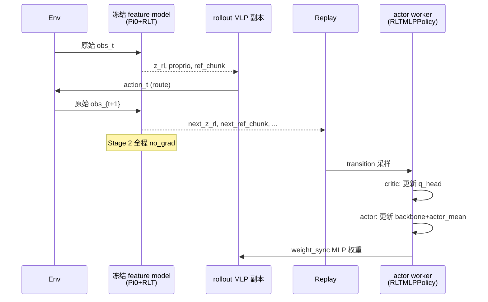
```mermaid
sequenceDiagram
    participant Env
    participant FM as 冻结 feature model<br/>(Pi0+RLT)
    participant Rollout as rollout MLP 副本
    participant Buffer as Replay
    participant Learner as actor worker<br/>(RLTMLPPolicy)

    Env->>FM: 原始 obs_t
    FM-->>Rollout: z_rl, proprio, ref_chunk
    Rollout->>Env: action_t (route)
    Env->>FM: 原始 obs_{t+1}
    FM-->>Buffer: next_z_rl, next_ref_chunk, ...

    Note over FM: Stage 2 全程 no_grad
    Buffer->>Learner: transition 采样
    Learner->>Learner: critic: 更新 q_head
    Learner->>Learner: actor: 更新 backbone+actor_mean
    Learner->>Rollout: weight_sync MLP 权重
```

---

## 常见误区

1. **Stage 2 不是继续训 VLA** — VLA+RLT 只在 `rollout.rlt_feature_model` 里冻结推理；可训的只有小 MLP（[`rlt.rst:191`](https://github.com/RLinf/RLinf/blob/main/docs/source-zh/rst_source/examples/embodied/rlt.rst)）。
2. **不要把 Stage 1 ckpt 填到 `actor.model.model_path`** — Stage 2 actor 是 `rlt_mlp_policy`，与 Stage 1 结构不同（[`rlt.rst:757`](https://github.com/RLinf/RLinf/blob/main/docs/source-zh/rst_source/examples/embodied/rlt.rst)）。
3. **`ref_chunk` 在 Stage 2 是条件输入 + BC 标签，不是 VLA 的可训输出** — VLA 输出在 Stage 2 被当作固定特征。
4. **Stage 1 的 `rlt_loss` 不更新 VLA** — 靠 `detach()` 隔离；VLA 仅由 `vla_loss` 更新。
5. **Expert 模型（ManiSkill）不参与 loss** — 只影响 rollout 执行哪段 action，并可能改写 BC 目标（干预步）。

---

## 一句话总结

- **Stage 1**：在示范数据上 **联合训练 Pi0 VLA（flow matching）+ RLT Token Transformer（prefix 重建）**，产出含 `model.*` 与 `rlt_module.*` 的 checkpoint。  
- **Stage 2**：**整包冻结** Stage 1 为 feature model，在线只 **训练轻量 MLP 的 actor（backbone+mean）和 critic（q_head）**；输入是 `{z_rl, proprio, ref_chunk}`，Critic 用 **环境 reward + TD bootstrap**，Actor 用 **Q 最大化 + 对 ref_chunk/人类动作的 BC**。  

这样 RLT 把 **表示学习（Stage 1）** 和 **在线控制（Stage 2）** 拆开，避免在线 RL 破坏已学 VLA 表示。


# rlt.rst中按`b`前后的系统变化

## 直接回答：你的理解 **不对**

[`rlt.rst:215-217`](https://github.com/RLinf/RLinf/blob/main/docs/source-zh/rst_source/examples/embodied/rlt.rst) **不是在说「按 b 前训 π₀.₅ + RLT，按 b 后训 actor + critic」**。

这段话发生在 **Stage 2 在线 RL 的 rollout 阶段**，描述的是：

> **操作员按 `b` 之前 / 之后，真机实际执行哪一路动作**——是冻结 VLA 的 `ref_chunk`，还是 Stage 2 MLP actor 的输出。

在整个 Stage 2 里：

| 模块 | 是否训练 |
|------|----------|
| π₀.₅ + RLT Token Transformer（`rollout.rlt_feature_model`） | **始终冻结**，只做特征提取 |
| MLP actor + critic（`actor.model` / `rlt_mlp_policy`） | **始终可训**（learner 从 replay 采样更新） |

按 `b` 只改变 **发给机器人的动作来源**，不改变「谁在反传梯度」。

文档第 432 行写的「按 `b` 进入 Stage 2 actor **控制阶段**」应理解为：在 **Stage 2 rollout 内部** 从「VLA 执行阶段」切到「Actor 执行阶段」，**不是**才开始 Stage 2 训练。

---

## 这段话在说什么？

```215:217:docs/source-zh/rst_source/examples/embodied/rlt.rst
Franka 真机配置中，``keyboard_reward_wrapper: rlt_policy_switch`` 会提供
``rlt_switch_flags`` 标记。在操作员按下 ``b`` 之前，实际执行 VLA 的
``ref_chunk``；按下 ``b`` 之后，实际执行 Stage 2 actor 的动作。
```

三层含义：

1. **`keyboard_reward_wrapper: rlt_policy_switch`**：给 Franka 环境包一层键盘 wrapper，监听 **`b` 键**。
2. **`rlt_switch_flags`**：布尔标记，`False` = 还在 VLA 阶段，`True` = 已进入 actor 阶段（按 `b` 后 **锁存为 True**，直到 episode reset）。
3. **执行路由**：rollout 根据该标记，在 **整 chunk 级别** 选择下发 `ref_chunk` 还是 MLP actor 动作。

**出处**：[`realworld_rlt_stage2_ac_mlp.yaml:116`](https://github.com/RLinf/RLinf/blob/main/examples/embodiment/config/realworld_rlt_stage2_ac_mlp.yaml)；[`keyboard_rlt_policy_switch_wrapper.py:25-70`](https://github.com/RLinf/RLinf/blob/main/rlinf/envs/realworld/common/wrappers/keyboard_rlt_policy_switch_wrapper.py)。

---

## 按 `b` 前后：执行 vs 训练（对照表）

| | 按 `b` **之前** | 按 `b` **之后** |
|---|----------------|----------------|
| **机器人实际动作** | VLA 的 `ref_chunk` | Stage 2 MLP actor 动作 |
| **π₀.₅ + RLT** | 冻结推理（每步算 `z_rl`/`ref_chunk`） | 同上，仍冻结 |
| **MLP actor** | 每步仍 **前向推理**，但 route **丢弃**其输出 | 前向输出 **被下发**到真机 |
| **MLP critic / learner** | 从 replay **照常更新**（若有数据） | 同上 |
| **是否在训 π₀.₅/RLT？** | ❌ 否 | ❌ 否 |

文档也明确：切换前的 step **仍会进 replay、参与训练**，只是 **`action` 字段是 VLA 实际执行的动作**（[`rlt.rst:693-695`](https://github.com/RLinf/RLinf/blob/main/docs/source-zh/rst_source/examples/embodied/rlt.rst)）。

---

## 背后代码与调用流程

### 1. 键盘 wrapper：产生 `rlt_switch_flags`

```58:69:rlinf/envs/realworld/common/wrappers/keyboard_rlt_policy_switch_wrapper.py
            if key == "b":
                if not self._rlt_switch_flags:
                    event = "enter_actor"
                    self._rlt_switch_flags = True
                    self._log_info(
                        "Pedal 'b' pressed; switching RLT rollout to Stage2 actor."
                    )
        info["rlt_switch_flags"] = self._rlt_switch_flags
```

- `reset()` 时 `_rlt_switch_flags = False`
- 按一次 `b` 后永久为 `True`（本 episode 内）
- 通过 `info["rlt_switch_flags"]` 传出

挂载方式（[`apply.py:92-93`](https://github.com/RLinf/RLinf/blob/main/rlinf/envs/realworld/common/wrappers/apply.py)）：

```python
if mode == "rlt_policy_switch":
    return KeyboardRLTPolicySwitchWrapper(env)
```

### 2. 环境 → Rollout：传递标志

`RealWorldEnv.chunk_step` 收集每步 `rlt_switch_flags`，stack 后放进 `EnvOutput`；`env_worker` 经 `_build_rollout_input_data` 发给 rollout：

```943:951:rlinf/workers/env/env_worker.py
    def _build_rollout_input_data(self, env_batch: dict[str, Any]) -> dict[str, Any]:
        data = {
            "obs": env_batch["obs"],
            "final_obs": env_batch["final_obs"],
        }
        if self.enable_rlt:
            data["rlt_switch_flags"] = env_batch.get("rlt_switch_flags", None)
            data["intervene_flags"] = env_batch.get("intervene_flags", None)
        return data
```

Rollout worker 调用（[`huggingface_worker.py:691-696`](https://github.com/RLinf/RLinf/blob/main/rlinf/workers/rollout/hf/huggingface_worker.py)）：

```python
actions, result = self._predict_rollout_actions(
    env_output["obs"],
    final_obs=env_output.get("final_obs", None),
    rlt_switch_flags=env_output.get("rlt_switch_flags", None),
    ...
)
```

### 3. Rollout 核心：`predict_rlt_actions`（每步都跑，与 `b` 无关）

```51:75:rlinf/algorithms/rlt/rollout.py
    with torch.no_grad():
        rlt_obs = feature_model.extract_rlt_obs(env_obs)      # ① 冻结 VLA+RLT
        actions, result = policy_model.predict_action_batch(  # ② MLP actor 推理
            env_obs=rlt_obs, mode=mode, return_obs=True,
        )
        route_output = rlt_route.route(                         # ③ 按 flag 选动作
            RLTRouteContext(..., rlt_switch_flags=rlt_switch_flags, ...)
        )
        actions = route_output.actions                         # ④ 最终下发动作
```

**要点**：无论是否按 `b`，①② 都会执行；只有 ③ 决定机器人动哪路。

### 4. 真机 Route：`RealworldRLTRoute`

```119:144:rlinf/algorithms/rlt/route.py
    def route(self, ctx: RLTRouteContext) -> RLTRouteOutput:
        actions = ctx.student_actions          # MLP 输出
        rlt_switch_flags = _normalize_rlt_switch_flags(...)
        ref_actions = result["forward_inputs"]["ref_chunk"]  # VLA 参考动作
        routed_actions = torch.where(
            rlt_switch_flags,
            actions,                             # True → actor
            ref_actions[:, : actions.shape[1], : actions.shape[2]],  # False → ref_chunk
        )
        result["forward_inputs"]["record_transition"] = rlt_switch_flags.reshape(...)[:, :1]
        return RLTRouteOutput(actions=routed_actions, result=result)
```

逻辑：

- `rlt_switch_flags == False`（按 `b` 前）→ **执行 `ref_chunk`**
- `rlt_switch_flags == True`（按 `b` 后）→ **执行 MLP `actions`**

### 5. 环境执行 → Replay → Learner

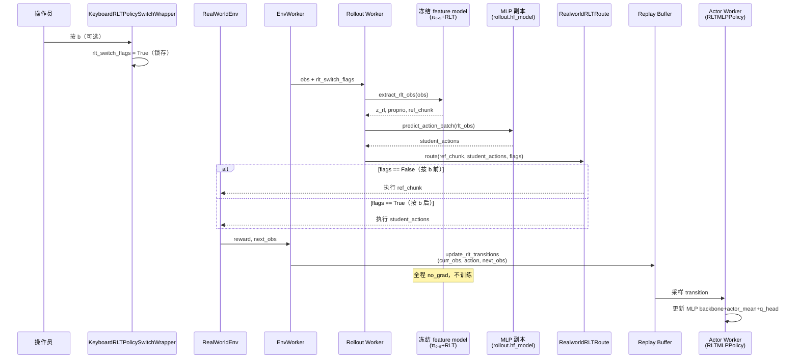
```mermaid
sequenceDiagram
    participant Op as 操作员
    participant KB as KeyboardRLTPolicySwitchWrapper
    participant Env as RealWorldEnv
    participant EW as EnvWorker
    participant Roll as Rollout Worker
    participant FM as 冻结 feature model<br/>(π₀.₅+RLT)
    participant MLP as MLP 副本<br/>(rollout.hf_model)
    participant Route as RealworldRLTRoute
    participant Buf as Replay Buffer
    participant Learner as Actor Worker<br/>(RLTMLPPolicy)

    Op->>KB: 按 b（可选）
    KB->>KB: rlt_switch_flags = True（锁存）

    EW->>Roll: obs + rlt_switch_flags
    Roll->>FM: extract_rlt_obs(obs)
    FM-->>Roll: z_rl, proprio, ref_chunk
    Roll->>MLP: predict_action_batch(rlt_obs)
    MLP-->>Roll: student_actions
    Roll->>Route: route(ref_chunk, student_actions, flags)
    alt flags == False（按 b 前）
        Route-->>Env: 执行 ref_chunk
    else flags == True（按 b 后）
        Route-->>Env: 执行 student_actions
    end

    Env->>EW: reward, next_obs
    EW->>Buf: update_rlt_transitions<br/>(curr_obs, action, next_obs)

    Note over FM: 全程 no_grad，不训练
    Buf->>Learner: 采样 transition
    Learner->>Learner: 更新 MLP backbone+actor_mean+q_head
```

真机路径下 `update_rlt_transitions` **不检查** `record_transition`，因此按 `b` 前后的 step **都可以进 replay**（与 [`rlt.rst:694`](https://github.com/RLinf/RLinf/blob/main/docs/source-zh/rst_source/examples/embodied/rlt.rst) 一致）。

---

## 设计意图（为何这样拆？）

Peg insertion 类任务常分两段：

1. **Approach / 对准**（按 `b` 前）：用 Stage 1 训好的 VLA `ref_chunk` 做粗定位，行为相对稳定。
2. **Critical / 插入**（按 `b` 后）：进入高精度阶段，用 **在线 RL 训好的 MLP actor** 做 residual 修正。

操作员用 `b` 人工确认「可以交给 RL actor 了」，避免 actor 在远离目标时就乱动——这是 **真机安全与任务结构** 的设计，不是训练阶段的切换。

ManiSkill 仿真里用 **`env.*.rlt_policy_switch`** 自动产生 `rlt_switch_flags`（抓 peg、近 hole 等），无需键盘（[`rlt.rst:219-223`](https://github.com/RLinf/RLinf/blob/main/docs/source-zh/rst_source/examples/embodied/rlt.rst)）。

---

## 与 RLT 两阶段训练的关系（避免混淆）

| RLT 阶段 | 何时发生 | 训什么 | 与按 `b` 的关系 |
|----------|----------|--------|----------------|
| **Stage 1** | `run_vla_sft.sh`，离线 SFT | π₀.₅ + `rlt_module` | **无关**（早已完成） |
| **Stage 2** | `train_embodied_agent.py`，在线 RL | MLP actor + critic | **全程**；`b` 只影响 rollout **执行哪路动作** |

Stage 2 启动后，**π₀.₅ 和 RLT 就已冻结**；按不按 `b` 都不会再训练它们。

---

## 一句话总结

**[`rlt.rst:215-217`](https://github.com/RLinf/RLinf/blob/main/docs/source-zh/rst_source/examples/embodied/rlt.rst) 描述的是 Stage 2 rollout 的「动作路由策略」：按 `b` 前真机走冻结 VLA 的 `ref_chunk`，按 `b` 后走可训 MLP actor；feature model 每步都在跑但从不更新，actor/critic 在 learner 里持续从 replay 更新——与按键无关。**

---

## 下面是另一个相关发问

深入分析 @RLmm/docs/source-zh/rst_source/examples/embodied/rlt.rst 的相关代码, 详细解释一下 @RLmm/docs/source-zh/rst_source/examples/embodied/rlt.rst:215-217 这段话所描述的操作细节, 具体是在怎么做的, 系统哪个模块在做什么, 人在做什么, 什么权重又会怎样被更新. 以及这些操作反映了背后怎样的设计思路和实现细节, 为什么要这样设计与实现.


## 先澄清：这段话在描述什么

[`rlt.rst:215-217`](https://github.com/RLinf/RLinf/blob/main/docs/source-zh/rst_source/examples/embodied/rlt.rst) 描述的是 **Stage 2 真机 rollout 里的「动作路由」**，不是「按 b 前训 VLA、按 b 后训 actor」。

整段 Franka Stage 2 在线训练里：

- **π₀.₅ + RLT Token Transformer**：始终 **冻结**，只做特征提取  
- **MLP actor + critic**：始终 **可训**（learner 从 replay 更新）  
- **按 `b`**：只决定 **机器人实际执行 VLA 的 `ref_chunk` 还是 MLP actor 动作**

---

## 一、人在做什么

Franka 配置（[`realworld_rlt_stage2_ac_mlp.yaml:111-119`](https://github.com/RLinf/RLinf/blob/main/examples/embodiment/config/realworld_rlt_stage2_ac_mlp.yaml)）下，操作员通常做三件事：

| 操作 | 设备 | 作用 |
|------|------|------|
| **按 `b`** | 键盘（可接脚踏） | 宣布进入 **critical phase**：之后由 RL actor 控制 |
| **SpaceMouse 拖动** | 3D 鼠标（`use_spacemouse: True`） | **任意时刻** 可人工接管末端动作（与 `b` 独立） |
| **观察任务进度** | — | 在 peg 对准、接近插入时再按 `b` |

### 按 `b` 的具体行为

```58:69:rlinf/envs/realworld/common/wrappers/keyboard_rlt_policy_switch_wrapper.py
            if key == "b":
                if not self._rlt_switch_flags:
                    event = "enter_actor"
                    self._rlt_switch_flags = True
                    ...
        info["rlt_switch_flags"] = self._rlt_switch_flags
```

- **每个 episode reset 后**：`_rlt_switch_flags = False`  
- **按一次 `b`**：置 `True` 并 **锁存**（本 episode 内不再回退）  
- **0.2s 防抖**：避免连按误触  

文档第 432 行的「进入 Stage 2 actor 控制阶段」= **rollout 内的 actor 执行阶段**，不是才开始 Stage 2 训练。

### SpaceMouse 干预（并行机制）

Wrapper 栈（[`apply.py:119-150`](https://github.com/RLinf/RLinf/blob/main/rlinf/envs/realworld/common/wrappers/apply.py)）：

```text
KeyboardRLTPolicySwitchWrapper（最外层）
  → SpacemouseIntervention
    → … → Franka 真机
```

SpaceMouse 在 **policy 动作进入真机前** 可能被替换（[`spacemouse_intervention.py:55-78`](https://github.com/RLinf/RLinf/blob/main/rlinf/envs/realworld/common/wrappers/spacemouse_intervention.py)）：最近 0.5s 内有 SpaceMouse 输入 → 用专家动作替代 policy 动作，并写 `info["intervene_action"]`。

**与 `b` 的关系**：`b` 管 **VLA vs actor 二选一**；SpaceMouse 管 **是否覆盖当前选中的那路动作**。两者正交。

---

## 二、系统模块分工（Franka 双节点异步）

典型部署（[`realworld_rlt_stage2_ac_mlp.yaml:15-38`](https://github.com/RLinf/RLinf/blob/main/examples/embodiment/config/realworld_rlt_stage2_ac_mlp.yaml)）：

```text
GPU 节点（4090）                    Franka 节点
├─ Rollout Worker                   ├─ Env Worker
│   ├─ rlt_feature_model（冻结）   │   └─ RealWorldEnv + wrappers
│   └─ hf_model（MLP 副本，同步）   │       └─ 真机 + 相机
└─ Actor Worker（训练 MLP）  ←Ray Channel→  采集 obs / 下发 action
```

入口：`bash examples/embodiment/run_realworld_async.sh realworld_rlt_stage2_ac_mlp`（[`rlt.rst:430`](https://github.com/RLinf/RLinf/blob/main/docs/source-zh/rst_source/examples/embodied/rlt.rst)）。

---

## 三、一个 control step 的完整操作细节

Stage 2 以 **action chunk** 交互：actor 输出 **10 步 × 7 维**（[`realworld_rlt_stage2_ac_mlp.yaml:245-246`](https://github.com/RLinf/RLinf/blob/main/examples/embodiment/config/realworld_rlt_stage2_ac_mlp.yaml)）；VLA feature model 推理 **20 步**，route 取前 10 步与 actor 对齐。

### 时序（Env ↔ Rollout 一轮）

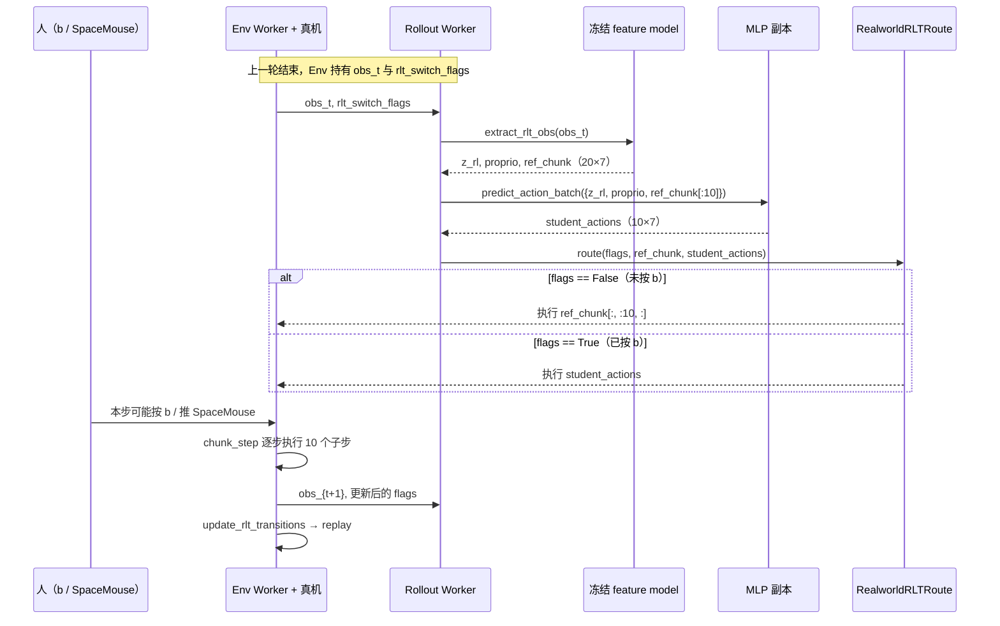
```mermaid
sequenceDiagram
    participant H as 人（b / SpaceMouse）
    participant Env as Env Worker + 真机
    participant Roll as Rollout Worker
    participant FM as 冻结 feature model
    participant MLP as MLP 副本
    participant Route as RealworldRLTRoute

    Note over Env,Roll: 上一轮结束，Env 持有 obs_t 与 rlt_switch_flags

    Env->>Roll: obs_t, rlt_switch_flags
    Roll->>FM: extract_rlt_obs(obs_t)
    FM-->>Roll: z_rl, proprio, ref_chunk（20×7）
    Roll->>MLP: predict_action_batch({z_rl, proprio, ref_chunk[:10]})
    MLP-->>Roll: student_actions（10×7）
    Roll->>Route: route(flags, ref_chunk, student_actions)

    alt flags == False（未按 b）
        Route-->>Env: 执行 ref_chunk[:, :10, :]
    else flags == True（已按 b）
        Route-->>Env: 执行 student_actions
    end

    H->>Env: 本步可能按 b / 推 SpaceMouse
    Env->>Env: chunk_step 逐步执行 10 个子步
    Env->>Roll: obs_{t+1}, 更新后的 flags
    Env->>Env: update_rlt_transitions → replay
```

### Rollout 侧：`predict_rlt_actions`（每步必跑，与 `b` 无关）

```51:75:rlinf/algorithms/rlt/rollout.py
    with torch.no_grad():
        rlt_obs = feature_model.extract_rlt_obs(env_obs)     # ① 冻结 VLA+RLT
        actions, result = policy_model.predict_action_batch( # ② MLP 推理
            env_obs=rlt_obs, ...
        )
        route_output = rlt_route.route(...)                  # ③ 选最终动作
        actions = route_output.actions
```

① **冻结 feature model**（π₀.₅ + `rlt_module`）：  
- 输入：原始图像 + state + 语言  
- 输出：`z_rl`(2048)、`proprio`(19)、`ref_chunk`(20×7)  
- **无梯度、权重不变**

② **MLP 副本**（`rollout.hf_model`）：  
- 输入：`concat(ref_chunk[:10], z_rl, proprio)`  
- 输出：`student_actions`（10×7）  
- 仅推理；权重由 Actor Worker **异步同步**

③ **RealworldRLTRoute** — 文档 215–217 的核心：

```130:143:rlinf/algorithms/rlt/route.py
        routed_actions = torch.where(
            rlt_switch_flags,
            actions,                                              # True → actor
            ref_actions[:, : actions.shape[1], : actions.shape[2]],  # False → ref
        )
        result["forward_inputs"]["record_transition"] = rlt_switch_flags[:, :1]
        result["forward_inputs"]["actor_switch"] = record_transition
```

- **`flags=False`（按 b 前）**：10 步全走 **VLA `ref_chunk` 前 10 步**  
- **`flags=True`（按 b 后）**：10 步全走 **MLP actor**  
- 整 chunk 同一策略（flag 会 broadcast 到 chunk 内每一步）

### Env 侧：执行与标志回传

1. 收到 `routed_actions`（10×7 chunk）  
2. `chunk_step` 内逐步 `step()`；每步 keyboard wrapper 读 `b`，更新 `rlt_switch_flags`  
3. SpaceMouse 可能在 `SpacemouseIntervention` 层再次替换动作  
4. 相机/state 更新 → 下一帧 obs  
5. `update_rlt_transitions` 写入 replay（见下节）

`rlt_switch_flags` 随 **下一步** 的 obs 发给 rollout（本步按 `b`，下一步 route 才生效）。

---

## 四、Replay 里存什么、Learner 更新什么权重

### 4.1 Transition 写入

```62:102:rlinf/algorithms/rlt/transition.py
def update_rlt_transitions(...):
    if pending_obs is not None:
        # 若 SpaceMouse 干预：把 curr_obs["ref_chunk"] 对应槽位换成人工动作
        ...
        append_transitions(pending_obs, next_obs)  # 来自 rlt_transition_*
    if cache_current:
        pending_obs = {z_rl, proprio, ref_chunk}  # 当前步 curr_obs
```

每条 transition（[`rlt.rst:211-213`](https://github.com/RLinf/RLinf/blob/main/docs/source-zh/rst_source/examples/embodied/rlt.rst)）：

```text
curr_obs = {z_rl, proprio, ref_chunk}
action   = 实际执行的动作（route + 可能的 SpaceMouse 后）
reward   = 环境奖励
next_obs = {next_z_rl, next_proprio, next_ref_chunk}
```

**真机路径不过滤 `record_transition`**，故文档写明（[`rlt.rst:694`](https://github.com/RLinf/RLinf/blob/main/docs/source-zh/rst_source/examples/embodied/rlt.rst)）：

> 切换前的 step 仍然会用于训练。这些 step 的执行动作是 VLA reference action。

### 4.2 权重更新总表（Stage 2 全程）

| 模块 | 位置 | 按 b 前 | 按 b 后 | 更新方式 |
|------|------|---------|---------|----------|
| **π₀.₅ VLA** | `rollout.rlt_feature_model.model` | 冻结推理 | 冻结推理 | **不更新** |
| **`rlt_module`** | 同上 | 冻结推理 | 冻结推理 | **不更新** |
| **`backbone`** | Actor Worker MLP | **更新** | **更新** | Actor loss 反传 |
| **`actor_mean`** | 同上 | **更新** | **更新** | Actor loss 反传 |
| **`q_head`**（Twin Q） | 同上 | **更新** | **更新** | Critic TD loss |
| **`target_model`** | Actor Worker 副本 | EMA 跟随 | EMA 跟随 | **无梯度**，`tau=0.005` 软更新 |
| **`rollout.hf_model`** | Rollout Worker | 同步权重 | 同步权重 | **不本地训练**，从 Actor 同步 |

**Stage 1 的 π₀.₅ + RLT 已在离线 SFT 训完**；Stage 2 启动后不再碰这些权重。

### 4.3 按 b 前 / 后：同一套 loss，不同 transition 语义

Learner（`RLTACFSDPPolicy`）**不区分**是否按过 `b`，统一从 replay 采样；差异在 **transition 内容**：

#### Critic（更新 `q_head`）

```text
target_q = discounted_chunk_reward + (1-done) * γ^H * min Q_target(next_obs, next_action)
loss = MSE(Q(curr_obs, action), target)
```

| 阶段 | `action`（replay 里） | Critic 在学 |
|------|----------------------|-------------|
| 按 b 前 | 实际执行的 **VLA ref_chunk** | \(Q(s, a_{\text{VLA}})\) |
| 按 b 后 | 实际执行的 **actor 动作** | \(Q(s, a_{\text{actor}})\) |

`curr_obs` / `next_obs` 里的 `z_rl`、`ref_chunk` 每步都由 **冻结 feature model** 重算，不参与反传。

#### Actor（更新 `backbone` + `actor_mean`）

```text
actor_loss = -q_weight * Q1(s, π(s)) + bc_weight * MSE(π(s), bc_target)
```

默认 `q_weight=0.1`，`bc_weight=5`（[`realworld_rlt_stage2_ac_mlp.yaml:74-76`](https://github.com/RLinf/RLinf/blob/main/examples/embodiment/config/realworld_rlt_stage2_ac_mlp.yaml)）。

| 阶段 | `bc_target` | 含义 |
|------|-------------|------|
| 普通步 | `ref_chunk` | actor 应贴近 VLA 参考 |
| SpaceMouse 干预步 | **实际人工动作** | BC 对齐专家示范 |

```123:124:rlinf/workers/actor/fsdp_rlt_ac_policy_worker.py
        bc_target = torch.where(human_mask[..., None], action_chunk, bc_ref_chunk)
```

**按 b 前**：actor 每步仍前向，但 route **丢弃**输出；replay 里 `action=VLA`，BC 仍拉向 `ref_chunk`（二者一致），主要学 **「在 VLA 轨迹附近 Q 值怎么标」**。  
**按 b 后**：actor 输出被下发；BC 仍锚定 VLA，Q 项鼓励高回报修正。

#### 更新节奏

- 每 step：**Critic** 更新  
- 每 4 step（`critic_actor_ratio=4`）：**Actor** 更新  
- 每 step：`target_model` 软更新  
- 周期性：`actor → rollout.hf_model` 权重同步  

---

## 五、按 b 前后对照（操作 + 权重 + 数据）

| 维度 | 按 `b` **之前** | 按 `b` **之后** |
|------|----------------|----------------|
| **人** | 观察对准；**不按 b**；可用 SpaceMouse | **按 `b` 一次**；critical 阶段可 SpaceMouse |
| **`rlt_switch_flags`** | `False` | `True`（锁存） |
| **机器人动作** | VLA `ref_chunk` 前 10 步 | MLP actor 10 步 |
| **MLP 是否推理** | ✅ 每步推理 | ✅ 每步推理 |
| **MLP 输出是否执行** | ❌ route 丢弃 | ✅ route 下发 |
| **feature model** | 每步 `extract_rlt_obs` | 同上 |
| **replay `action`** | VLA 实际轨迹 | actor 实际轨迹 |
| **训 π₀.₅/RLT？** | ❌ | ❌ |
| **训 MLP actor/critic？** | ✅（有数据就更新） | ✅ |

---

## 六、设计思路与实现细节

### 6.1 为何用 `b` 做阶段切换，而不是一上来就用 actor？

1. **任务两阶段结构**（peg insertion）  
   - **Approach**：VLA 示范 SFT 后粗定位较稳  
   - **Insert**：需精细力控/对齐，用 **小 MLP + 在线 RL** 做 residual  

2. **真机安全**  
   - 远离目标时 actor 探索风险大  
   - 操作员确认「可以插入」后再交 actor（[`rlt.rst:432-434`](https://github.com/RLinf/RLinf/blob/main/docs/source-zh/rst_source/examples/embodied/rlt.rst)）

3. **与 RLT 论文一致**  
   - Stage 1 提供强 prior（`ref_chunk` + `z_rl`）  
   - Stage 2 只学 **修正**，不是从零控制  

仿真用 **`rlt_policy_switch` 自动 gate**（抓 peg、近 hole 等）替代键盘（[`rlt.rst:219-223`](https://github.com/RLinf/RLinf/blob/main/docs/source-zh/rst_source/examples/embodied/rlt.rst)），逻辑相同、去掉人工。

### 6.2 为何 route 在 Rollout 而非 Env？

- **集中决策**：feature model、MLP、ref_chunk 都在 Rollout GPU  
- **`RealworldRLTRoute`** 纯 tensor 逻辑，易测、与 ManiSkill `SimulatorRLTRoute` 共用 `predict_rlt_actions` 框架  
- Env 只传 **`rlt_switch_flags`**，保持 env 与算法解耦  

### 6.3 为何按 b 前 transition 也进 replay？

- Critic 需学 **VLA 动作在各状态下的 Q**，作 bootstrap 基础  
- Actor 的 BC 在 VLA 阶段即对齐 `ref_chunk`，进入 actor 阶段时不「忘记」VLA  
- 数据效率：approach 段也有 reward 信号  

### 6.4 为何 feature model 始终跑、始终冻结？

- `z_rl` / `ref_chunk` 必须 **随新观测实时更新**  
- 在线 RL 若继续训 ~2.3B VLA，易 **灾难性遗忘** + 真机不稳定  
- 冻结后 Stage 2 只训 **~百万级 MLP**，样本效率高  

### 6.5 实现细节摘要

| 细节 | 实现 |
|------|------|
| Flag 粒度 | 整 chunk broadcast（10 步同策略） |
| Flag 时延 | 本步按 `b`，**下一步** route 生效 |
| `record_transition` | 真机 **不** 用于过滤 replay；主要供指标 / 仿真路径 |
| SpaceMouse | 改 **执行动作** + 可能改 `curr_obs.ref_chunk`（BC）；**不**改 `rlt_switch_flags` |
| Actor 输入 dropout | `reference_dropout_prob=0.5` 防过度依赖 ref |
| 异步 | Env 采数据与 Actor 训练并行；rollout MLP 为 Actor 权重副本 |

---

## 七、一句话总结

[`rlt.rst:215-217`](https://github.com/RLinf/RLinf/blob/main/docs/source-zh/rst_source/examples/embodied/rlt.rst) 描述的是 **Stage 2 真机 rollout 的执行策略**：人按 **`b`** 把 `rlt_switch_flags` 置真，**`RealworldRLTRoute`** 据此在 **冻结 VLA 的 `ref_chunk`** 与 **可训 MLP actor 动作** 之间二选一发给 Franka；**π₀.₅ 与 RLT 全程不更新**，**MLP actor/critic 全程从 replay 更新**，按 b 前后差别在于 **replay 里实际执行的 `action` 来自哪一路**，而非切换「训练哪套大模型」。这样把 **VLA 粗控制**、**人工阶段确认** 和 **RL 精细修正** 拆开，兼顾 peg insertion 任务结构、真机安全与 RLT「在 VLA prior 上做 residual RL」的设计。


# rlt.rst 的critic训练

## 文档在说什么

[`rlt.rst:225-231`](https://github.com/RLinf/RLinf/blob/main/docs/source-zh/rst_source/examples/embodied/rlt.rst) 描述的是 **Stage 2 里 Critic（Q 网络）的 TD 目标构造方式**：RLT 不是逐步 \(r_t + \gamma Q(s_{t+1})\)，而是把 **一个 action chunk（10 个环境子步）** 当作一次决策，先把 chunk 内 10 个标量奖励折扣累加，再用 **chunk 执行完毕后的下一状态** 做 bootstrap。

核心公式（代码与文档一致）：

\[
\text{target\_q} = \underbrace{\sum_{k=0}^{H-1} \gamma^k r_k}_{\text{discounted\_chunk\_reward}} + \underbrace{(1 - \text{done}) \cdot \gamma^{H} \cdot \min(Q_1', Q_2')}_{\text{bootstrap}}
\]

其中 \(H =\) `chunk_horizon` \(=\) `num_action_chunks` \(= 10\)，\(\gamma = 0.96\)（[`realworld_rlt_stage2_ac_mlp.yaml`](https://github.com/RLinf/RLinf/blob/main/examples/embodiment/config/realworld_rlt_stage2_ac_mlp.yaml)）。

---

## 一、关键概念：它们是什么、从哪来

### 1. 「action chunk 内的奖励」

真机一次 **chunk 交互** = Env 连续执行 **10 个子步** 控制指令（每步 7 维 EE delta）。

```293:324:rlinf/envs/realworld/realworld_env.py
    def chunk_step(self, chunk_actions):
        ...
        for i in range(chunk_size):
            actions = chunk_actions[:, i]
            extracted_obs, step_reward, terminations, truncations, infos = self.step(
                actions, auto_reset=False
            )
            ...
            chunk_rewards.append(step_reward)
        chunk_rewards = torch.stack(chunk_rewards, dim=1)  # [num_envs, chunk_steps]
```

- **形状**：`rewards` = `[B, 10]`，每列是 chunk 内第 \(k\) 个子步的即时奖励 \(r_k\)。
- **Peg insertion 来源**（`use_dense_reward: False`）：稀疏成功奖励——TCP 进入目标区域并保持 `success_hold_steps` 后 `reward=1.0`，否则多为 0（[`franka_env._calc_step_reward`](https://github.com/RLinf/RLinf/blob/main/rlinf/envs/realworld/franka/franka_env.py)）。
- **写入 replay**：Env Worker 每完成一个 chunk，把 `chunk_rewards` 经 `EmbodiedTrajectoryBuilder.append_step_result` 存入 trajectory；与 `curr_obs` / `action` / `next_obs` 对齐成 **一条 transition**。

### 2. 「chunked rewards / discounted_chunk_reward」

Critic 训练时不逐步拟合 \(Q(s_t, a_t)\)，而是拟合 **整段 chunk 宏动作** 的回报。先把 10 步奖励折扣求和：

```86:94:rlinf/workers/actor/fsdp_rlt_ac_policy_worker.py
    def _discounted_chunk_rewards(self, rewards: torch.Tensor) -> torch.Tensor:
        rewards = rewards.reshape(rewards.shape[0], -1)
        ...
        discounts = torch.pow(gamma, torch.arange(chunk_len, ...))
        return torch.sum(rewards * discounts, dim=-1, keepdim=True)
```

**数值例子**（\(\gamma=0.96\)，chunk 内仅第 7 步成功 \(r_6=1\)，其余为 0）：

\[
\text{discounted\_chunk\_reward} = 0.96^6 \times 1 \approx 0.782
\]

含义：成功发生在 chunk 越靠后，折扣累加越小——Critic 能感知 **奖励在 chunk 内的时间位置**。

### 3. 「bootstrap / TD target」

Bootstrap 项是 **chunk 结束后** 对「未来价值」的估计：

```243:274:rlinf/workers/actor/fsdp_rlt_ac_policy_worker.py
        with torch.no_grad():
            next_actions, _, _ = self.model(forward_type=ForwardType.SAC, obs=next_obs)
            all_qf_next_target = self.target_model(
                forward_type=ForwardType.SAC_Q, obs=next_obs, actions=next_actions,
            )
            q_next = self._min_twin_q(all_qf_next_target)   # min(Q1', Q2')

            reward_target = self._discounted_chunk_rewards(rewards)
            bootstrap_discount = self.cfg.algorithm.gamma ** reward_horizon   # γ^10

            if bootstrap_type == "standard":
                target_q_values = reward_target + not_done * bootstrap_discount * q_next
```

| 符号 | 含义 | 来源 |
|------|------|------|
| `next_obs` | `{next_z_rl, next_proprio, next_ref_chunk}` | 下一步 rollout 时冻结 feature model 对 **chunk 执行后** 观测的编码 |
| `next_action` | MLP actor 在 `next_obs` 上的输出（70 维 flat chunk） | **在线** `self.model`（非 target）前向，无梯度 |
| `Q_target(...)` | Twin target Q 的较小值 | **`target_model.q_head`**，EMA 慢更新 |
| `not_done` | 是否 bootstrap | `~terminations.any()`（真机）；仿真 ManiSkill 用 `dones` |
| `bootstrap_type: standard` | episode **终止**时不加 bootstrap | 真机成功插入 = 真终止，不再幻想未来 Q |

RLT Stage 2 **不含熵项**（`backup_entropy: False`，`initial_alpha: 0.0`），TD target 比标准 max-entropy SAC 更简单。

### 4. Critic 损失

```276:295:rlinf/workers/actor/fsdp_rlt_ac_policy_worker.py
        all_data_q_values = self.model(
            forward_type=ForwardType.SAC_Q, obs=curr_obs, actions=actions,
        )
        critic_loss = F.mse_loss(
            all_data_q_values, target_q_values.expand_as(all_data_q_values)
        )
```

- **Twin Q**：`MultiQHead` 输出 \(Q_1, Q_2\)，target 用 `min(Q1', Q2')` 抑过估计。
- **Loss**：两个 Q 头都对同一 `target_q` 做 MSE（`expand_as` 广播）。

---

## 二、Critic 输入输出与网络结构

`RLTMLPPolicy` 把 **10×7=70 维整段动作** 当作一个宏动作；Q 是 **chunk 级标量**（`output_dim=1`）：

```59:70:rlinf/models/embodiment/mlp_policy/rlt_mlp_policy.py
        actor_obs_dim = z_dim + proprio_dim + flat_action_dim   # actor 用
        critic_obs_dim = z_dim + proprio_dim                    # critic 用

        super().__init__(..., action_dim=flat_action_dim, num_action_chunks=1, ...)
```

Critic 前向：

```132:165:rlinf/models/embodiment/mlp_policy/rlt_mlp_policy.py
    def _critic_state(self, obs: dict) -> torch.Tensor:
        return torch.cat([self._get_z(obs), self._get_proprio(obs)], dim=-1)

    def sac_q_forward(self, obs, actions, ...):
        return self.q_head(critic_state, self._flatten_batch(actions))
```

| 量 | 形状（单条 transition） | 说明 |
|----|------------------------|------|
| `curr_obs["z_rl"]` | `[2048]` | 冻结 RLT 特征 |
| `curr_obs["proprio"]` | `[19]` | 机器人状态 |
| `curr_obs["ref_chunk"]` | `[20×7]`（critic **不直接读**，但 actor 用） | VLA 参考 |
| `actions` | `[70]` | **实际执行**的整段 chunk（VLA 或 actor，经 route + 可能的 SpaceMouse） |
| `rewards` | `[10]` | chunk 内逐步奖励 |
| `next_obs` | 同上结构 | chunk 结束后的 RLT 观测 |
| \(Q(s,a)\) | 标量 × 2（twin） | `q_head` 输出 |

**重要**：Critic **不看原始图像**，只看 Stage 1 冻结编码 `z_rl` + `proprio`；图像→`z_rl` 的 π₀.₅+RLT **不参与 Critic 反传**。

---

## 三、端到端运行细节：谁做什么、权重怎么变

### 3.1 数据采集（Env + Rollout，与 Critic 并行）

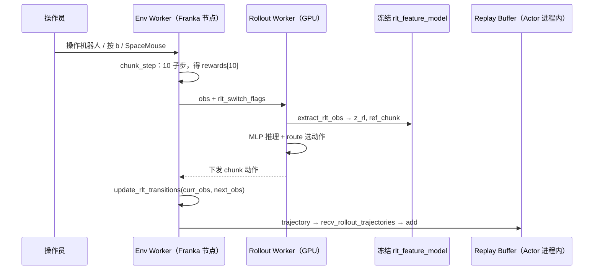
```mermaid
sequenceDiagram
    participant H as 操作员
    participant Env as Env Worker（Franka 节点）
    participant Roll as Rollout Worker（GPU）
    participant FM as 冻结 rlt_feature_model
    participant RB as Replay Buffer（Actor 进程内）

    H->>Env: 操作机器人 / 按 b / SpaceMouse
    Env->>Env: chunk_step：10 子步，得 rewards[10]
    Env->>Roll: obs + rlt_switch_flags
    Roll->>FM: extract_rlt_obs → z_rl, ref_chunk
    Roll->>Roll: MLP 推理 + route 选动作
    Roll-->>Env: 下发 chunk 动作
    Env->>Env: update_rlt_transitions(curr_obs, next_obs)
    Env->>RB: trajectory → recv_rollout_trajectories → add
```

一条 replay 行（真机 **不过滤** `record_transition`）：

```text
curr_obs = {z_rl, proprio, ref_chunk}
action   = 实际执行的 70 维 chunk
rewards  = [r_0, ..., r_9]          # 10 个标量
next_obs = {next_z_rl, next_proprio, next_ref_chunk}
terminations = chunk 是否在本段结束成功
```

终止时（[`fsdp_rlt_ac_policy_worker.py:551-556`](https://github.com/RLinf/RLinf/blob/main/rlinf/workers/actor/fsdp_rlt_ac_policy_worker.py)）：`next_obs = curr_obs`，且 `bootstrap_type: standard` 令 `not_done=0`，target 只剩 `discounted_chunk_reward`。

### 3.2 Critic 训练（Actor Worker，GPU）

异步 runner（[`async_embodied_runner.py`](https://github.com/RLinf/RLinf/blob/main/rlinf/runners/async_embodied_runner.py)）在 Env 采数据的同时调用 `actor.run_training()`。

**每个 training step**（[`update_one_epoch`](https://github.com/RLinf/RLinf/blob/main/rlinf/workers/actor/fsdp_sac_policy_worker.py)）：

1. 从 replay **采样 batch**（`global_batch_size=256`）
2. **仅 Critic 更新**（每步都做）：
   - `qf_optimizer.zero_grad()`
   - `forward_critic(batch)` → `critic_loss.backward()`
   - `qf_optimizer.step()` — **只更新 `q_head` 参数**
3. **每 4 步**（`critic_actor_ratio: 4`）才更新 actor（`backbone` + `actor_mean`），与 Critic 分离
4. **每步** `soft_update_target_model(tau=0.005)`：EMA 更新 `target_model`（含 `q_head`；`target_update_type: all` 时 actor 权重也缓慢跟随，但 target 仅用于 Q 评估）

### 3.3 模块冻结 / 可训 / 更新方式

| 模块 | 位置 | Critic 训练时 | 权重如何变 |
|------|------|--------------|-----------|
| **π₀.₅ VLA + RLT** | `rollout.rlt_feature_model` | 冻结推理（`eval()` + `requires_grad_(False)`） | **不更新** |
| **`q_head`（Twin Q）** | Actor Worker `RLTMLPPolicy` | **训练** | `critic_loss` → `qf_optimizer`（lr=3e-4） |
| **`target_model.q_head`** | Actor Worker 副本 | 仅 eval | **无梯度**；每步 EMA：`θ' ← (1-τ)θ' + τ θ` |
| **`backbone` + `actor_mean`** | 同上 | Critic 步不更新 | Actor 步另算 actor loss；Critic 的 `sac_q_forward` 不经过 backbone |
| **`rollout.hf_model`** | Rollout Worker | 推理副本 | 周期性从 Actor **同步权重**，本地不训练 |

Critic 优化器参数过滤（[`fsdp_sac_policy_worker.py:119-129`](https://github.com/RLinf/RLinf/blob/main/rlinf/workers/actor/fsdp_sac_policy_worker.py)）：RLT MLP 无独立 critic encoder，**实际只有 `q_head`** 进 `qf_optimizer`。

### 3.4 人在做什么

Critic 训练 **不需要人直接操作**；人通过真机交互 **间接提供训练数据**：

| 人的操作 | 对 Critic 的影响 |
|----------|-----------------|
| **不按 b / 按 b** | 改变 `action` 是 VLA 还是 actor → Q 学习不同策略下的价值 |
| **SpaceMouse 干预** | 改变执行轨迹与 `rewards`；BC 另管，Critic 仍拟合「该 chunk 实际回报 + bootstrap」 |
| **完成任务（插入成功）** | 某子步 `r_k=1` → `discounted_chunk_reward` 跳变；`terminations=True` → **去掉 bootstrap** |
| **失败 / 超时 truncate** | `bootstrap_type: standard` 下 truncate **仍 bootstrap**（与 termination 不同，见 SAC 文档） |

Critic 在后台持续从 replay 采样更新；人只负责产生 **(obs, action, rewards, next_obs, done)** 五元组。

---

## 四、完整 Critic 前向 + 反传（一步训练 micro-batch）

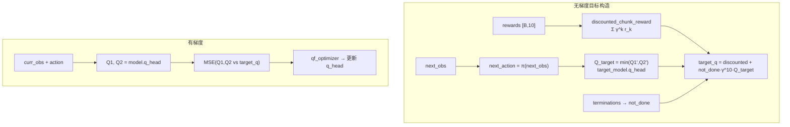
```mermaid
flowchart TB
    subgraph 无梯度目标构造
        R["rewards [B,10]"] --> D["discounted_chunk_reward<br/>Σ γ^k r_k"]
        NO["next_obs"] --> A["next_action = π(next_obs)"]
        A --> TQ["Q_target = min(Q1',Q2')<br/>target_model.q_head"]
        D --> TG["target_q"]
        TQ --> TG
        TD["terminations → not_done"] --> TG
        TG["target_q = discounted + not_done·γ^10·Q_target"]
    end

    subgraph 有梯度
        CO["curr_obs + action"] --> QO["Q1, Q2 = model.q_head"]
        QO --> L["MSE(Q1,Q2 vs target_q)"]
        L --> U["qf_optimizer → 更新 q_head"]
    end
```

**与标准逐步 SAC 的对比**（同框架 [`fsdp_sac_policy_worker.forward_critic`](https://github.com/RLinf/RLinf/blob/main/rlinf/workers/actor/fsdp_sac_policy_worker.py)）：

| | 逐步 SAC（`num_action_chunks=1`） | RLT Critic |
|--|----------------------------------|------------|
| 奖励 | 标量 \(r_t\) | 向量 \([r_0,\ldots,r_{9}]\) 先折扣求和 |
| Bootstrap 折扣 | \(\gamma\) | \(\gamma^{10}\) |
| 状态 | 原始 obs / CNN 特征 | 冻结 `z_rl` + `proprio` |
| 动作 | 单步 | 70 维 flat chunk |
| TD target 熵项 | 可选 \(\alpha\log\pi\) | **无**（`initial_alpha: 0`） |

---

## 五、设计思路：为什么要这样实现

### 5.1 为什么要「chunk 内折扣累加 + γ^H bootstrap」

1. **与决策粒度一致**：Stage 2 每 10 步才做一次 MLP 决策；Q 应回答「在这个 RLT 状态下执行 **这一整段 chunk** 值多少」，而不是逐步 Q。
2. **奖励时序正确**：Peg insertion 成功可能发生在 chunk 中间某步；\(\sum \gamma^k r_k\) 保留「第几步成功」的信息。
3. **与 n-step return 等价**：在 chunk 边界上，这等价于 **10-step 宏观 TD**，一步更新覆盖 10 个物理步，样本效率更高。
4. **与 VLA chunk 对齐**：VLA 出 20 步 ref、actor 出 10 步；Critic 评估的是 actor 的 10 步宏动作。

### 5.2 为什么 Critic 只吃 `z_rl` 而不训 feature model

- Stage 1 已学好视觉→RLT 表征；Stage 2 在线 RL 若反传 2B+ VLA，易 **灾难性遗忘** 且真机不稳定。
- 固定表征下，Critic 只在 **2048 维语义空间** 学价值，参数量小（`q_head` 约百万级），适合在线样本稀缺。

### 5.3 为什么 `bootstrap_type: standard`（真机默认）

文档（[`rlt.rst:231`](https://github.com/RLinf/RLinf/blob/main/docs/source-zh/rst_source/examples/embodied/rlt.rst)）与 SAC 参考（[`sac.rst:86`](https://github.com/RLinf/RLinf/blob/main/docs/source-zh/rst_source/reference/algorithms/sac.rst)）一致：

- **Termination（插入成功）**：任务结束，\(V(s_{\text{terminal}})=0\)，不应 bootstrap → `target_q = discounted_chunk_reward`。
- **Truncation（超时）**：episode 人为截断但物理世界可继续，仍 bootstrap 未来 Q。

真机配置 `ignore_terminations: False`，成功时 `terminations` 会正确触发「不 bootstrap」。

### 5.4 为什么 Twin Q + target network + 无熵 backup

- **Twin Q + min**：抑过估计，离线/在线混合数据更稳（RLPD 系常见做法）。
- **Target EMA**：慢 moving target，减 TD 目标抖动。
- **无熵项 + 固定小 std（0.002）**：RLT Stage 2 是 **近确定性 residual policy**，不需要 max-entropy 探索；Critic 专注拟合任务回报。

### 5.5 为什么 Critic 与 Actor 分开优化器、4:1 更新比

- `q_head` 与 `backbone/actor_mean` 分离：Critic 更频繁更新（每步），Actor 较慢（每 4 步），避免 actor 追逐尚未收敛的 Q。
- Actor 更新时 `detach_encoder=True` 的 Q 评估（`forward_actor`），Critic 目标构造也不反传 actor——标准 SAC actor-critic 解耦。

---

## 六、一条 transition 的 Critic 视角小结

假设某 chunk：按 b 后 actor 执行，第 8 子步插入成功，\(\gamma=0.96\)：

| 字段 | 值 |
|------|-----|
| `discounted_chunk_reward` | \(0.96^7 \approx 0.751\) |
| `terminations` | True → `not_done=0` |
| **target_q** | **0.751**（无 bootstrap） |
| **Critic 学** | \(Q_1(s, a_{\text{actor}}) \approx Q_2(s, a_{\text{actor}}) \approx 0.751\) |
| **更新** | 仅 `q_head` 权重；`target_model.q_head` EMA 跟随 |

若同 chunk 未成功、episode 未终止：

| 字段 | 值 |
|------|-----|
| `discounted_chunk_reward` | \(\approx 0\)（全 0 奖励） |
| **target_q** | \(0 + 0.96^{10} \cdot Q_{\text{target}}(s', a') \approx 0.665 \cdot Q_{\text{target}}\) |
| **含义** | Critic 把「当前 chunk 没立刻成功」时的 **长期价值** 传给当前 \((s, a)\) |

---

## 七、与 Actor 训练的边界（避免混淆）

- **Critic**（本节）：`−MSE(Q, target_q)`，更 **`q_head`**。
- **Actor**（另线）：`−0.1·Q_1(s, π(s)) + 5·BC`，更 **`backbone` + `actor_mean`**；BC 目标为 `ref_chunk` 或人工动作。

两者共用 replay，但 **优化参数、loss、更新频率不同**；文档 225–231 行 **只描述 Critic 的 TD target**，不涉及 actor 的 BC 项。

---

**一句话**：RLT Critic 把每个 10 步 action chunk 当作宏动作，用 \(\sum_{k=0}^{9}\gamma^k r_k + (1-\text{done})\cdot\gamma^{10} Q_{\text{target}}(s', \pi(s'))\) 作 TD 目标，在 **冻结的 `z_rl` 特征空间** 里只训练 **`q_head`**；真机操作员通过执行任务产生 chunk 级奖励与 transition，Critic 在 Actor Worker 中异步从 replay 学习「这段 chunk 值多少」，成功终止时不 bootstrap，以匹配 peg insertion 的稀疏终止奖励结构。


# rlt.rst中的action loss

## 文档公式与代码的对应关系

[`rlt.rst:306-314`](https://github.com/RLinf/RLinf/blob/main/docs/source-zh/rst_source/examples/embodied/rlt.rst) 中的公式在代码里实现为：

```351:351:rlinf/workers/actor/fsdp_rlt_ac_policy_worker.py
        actor_loss = -q_weight * qf_pi.mean() + bc_weight * bc_loss
```

| 文档符号 | 代码变量 | 默认权重（Franka） |
|----------|----------|-------------------|
| `Q(obs, π(obs))` | `qf_pi` = `Q1(curr_obs, pi)` | `q_weight=0.1` |
| `BC(π(obs), target_action)` | `bc_loss` = 对 `bc_target` 的 MSE | `bc_weight=5` |
| `target_action` | `bc_target`（逐步选择） | — |

配置见 [`realworld_rlt_stage2_ac_mlp.yaml:74-79`](https://github.com/RLinf/RLinf/blob/main/examples/embodiment/config/realworld_rlt_stage2_ac_mlp.yaml)。

---

## 一、术语：Q、BC、target_action、BC target 是什么、从哪来

### 1. `obs`（actor 的输入，不是原始图像）

Actor 用的 `curr_obs` 是 RLT 三元组（由 **冻结** feature model 在 rollout 时编码）：

```text
curr_obs = {
  z_rl:      [B, 2048]    # RLT token 特征
  proprio:   [B, 19]      # 机器人状态
  ref_chunk: [B, 20×7]    # VLA 参考动作 chunk（actor 只用前 10 步）
}
```

Actor 实际拼接输入（[`rlt_mlp_policy._actor_state`](https://github.com/RLinf/RLinf/blob/main/rlinf/models/embodiment/mlp_policy/rlt_mlp_policy.py)）：

\[
\text{actor\_input} = [\,\text{ref\_chunk}_{:10} \;\|\; z_{rl} \;\|\; \text{proprio}\,] \in \mathbb{R}^{70+2048+19}
\]

### 2. `π(obs)` — 当前策略输出的动作

训练时 **重新前向**（不是 replay 里存的历史动作）：

```138:158:rlinf/models/embodiment/mlp_policy/rlt_mlp_policy.py
    def sac_forward(self, obs, apply_reference_dropout=False, reference_dropout_prob=0.0, ...):
        actor_state = self._actor_state(obs, apply_reference_dropout=..., ...)
        feat = self.backbone(actor_state)
        action_mean = self.actor_mean(feat)
        action_std = torch.full_like(action_mean, self.fixed_std)   # 固定 0.002
        probs = Normal(action_mean, action_std)
        action = probs.rsample()    # 训练：随机采样
        action = torch.tanh(action)
        return action, chunk_logprobs, None
```

- **输出 `pi`**：`[B, 70]`（10 步 × 7 维，flatten）
- **含义**：在当前 RLT 状态下，MLP actor 建议的 **整段 action chunk**

### 3. `Q(obs, π(obs))` — Actor 目标里的 Q 值

```315:337:rlinf/workers/actor/fsdp_rlt_ac_policy_worker.py
        all_qf_pi = self.model(
            forward_type=ForwardType.SAC_Q,
            obs=curr_obs,
            actions=pi,
            detach_encoder=True,
        )
        qf_pi = self._q1(all_qf_pi)   # 取 Q1，不是 min(Q1,Q2)
```

Critic 状态与 Q 头（[`rlt_mlp_policy.sac_q_forward`](https://github.com/RLinf/RLinf/blob/main/rlinf/models/embodiment/mlp_policy/rlt_mlp_policy.py)）：

```text
critic_state = concat(z_rl, proprio)   # [B, 2067]，detach_encoder 时无梯度
Q1, Q2 = q_head(critic_state, pi)       # 各 [B, 1]，chunk 级标量
```

- **`Q` 的含义**：「在状态 `obs` 下，若执行策略刚采样的 chunk `π(obs)`，预期回报是多少？」
- **由谁提供**：**在线 `q_head`**（Critic 上一步/同步步刚更新过）
- **`detach_encoder=True`**：`z_rl/proprio` 不进 Q 项的梯度；Q 对 `pi` 的梯度经 `q_head` 的动作通路回传到 `backbone` + `actor_mean`

### 4. `BC` 与 `target_action` / BC target

BC 在 [`_bc_metrics`](https://github.com/RLinf/RLinf/blob/main/rlinf/workers/actor/fsdp_rlt_ac_policy_worker.py) 中实现：

```123:125:rlinf/workers/actor/fsdp_rlt_ac_policy_worker.py
        bc_target = torch.where(human_mask[..., None], action_chunk, bc_ref_chunk)
        bc_error = torch.mean(torch.square(pi_chunk - bc_target), dim=-1)
        bc_loss = torch.mean(bc_error)
```

| 概念 | 代码 | 形状 | 来源 |
|------|------|------|------|
| **`bc_ref_chunk`** | `curr_obs["ref_chunk"][:, :10]` | `[B,10,7]` | 冻结 VLA 每步推理的 reference |
| **`action_chunk`** | `batch["actions"]` | `[B,10,7]` | Replay 里 **实际执行** 的动作 |
| **`human_mask`** | `intervene_flags` 按子步聚合 | `[B,10]` | 该子步是否人工干预 |
| **`bc_target`（即文档 `target_action`）** | `where(human, 执行动作, VLA ref)` | `[B,10,7]` | 逐步选择 |
| **`BC`** | `mean((π - bc_target)²)` | 标量 | MSE |

文档 312–314 行的两种 BC target：

- **普通步**：`target_action = VLA reference` → `bc_ref_chunk`
- **人工干预步**：`target_action = 人类动作` → `action_chunk`（replay 里存的真实执行轨迹）

---

## 二、Actor loss 逐步计算（代码级）

以 Franka 单条样本为例（`q_weight=0.1`, `bc_weight=5`, `reference_dropout_prob=0.5`）：

### Step 0：从 Replay 采样 batch

```python
batch = {
  "curr_obs": {z_rl, proprio, ref_chunk},   # 见上
  "actions":  [256, 70],                     # 历史执行动作（label 来源之一）
  "intervene_flags": [256, 10] 或 None,     # 人工干预掩码
  ...
}
```

### Step 1：算 `π(obs)` — `ForwardType.SAC`

```305:310:rlinf/workers/actor/fsdp_rlt_ac_policy_worker.py
        pi, log_pi, _ = self.model(
            forward_type=ForwardType.SAC,
            obs=curr_obs,
            apply_reference_dropout=True,
            reference_dropout_prob=0.5,
        )
```

内部调用链：

```text
RLTACLossMixin.forward_actor
  → RLTMLPPolicy.forward(SAC)
    → sac_forward
      → _actor_state(ref_chunk, z_rl, proprio)  # 50% 概率 zero ref_chunk
      → backbone(256→256→256 MLP)
      → actor_mean → Normal(μ, 0.002) → rsample → tanh
      → pi [B, 70]
```

### Step 2：算 `Q(obs, π)` — `ForwardType.SAC_Q`

```text
  → sac_q_forward(curr_obs, pi, detach_encoder=True)
      → critic_state = [z_rl|proprio].detach()
      → q_head(critic_state, pi) → [Q1, Q2]
  → qf_pi = Q1  [B, 1]
```

### Step 3：算 `BC(π, target_action)`

```text
  → _bc_metrics(pi, batch["actions"], ref_chunk, intervene_flags)
      → pi_chunk, action_chunk, bc_ref_chunk  各 reshape 为 [B,10,7]
      → human_mask = intervene_flags.any(dim=-1) per sub-step
      → bc_target = where(human_mask, action_chunk, bc_ref_chunk)
      → bc_loss = mean((pi_chunk - bc_target)²)
```

### Step 4：合成 `actor_loss` 并反传

```text
actor_loss = -0.1 * mean(Q1) + 5.0 * bc_loss

actor_loss.backward()
  → 更新 backbone, actor_mean（self.optimizer）
  → 不更新 q_head（actor 步不用 qf_optimizer）
```

**注意**：`log_pi` 会算 entropy 指标，但 **不加进 loss**（`initial_alpha=0`，`forward_alpha` 禁用）——不是 max-entropy SAC。

---

## 三、数据从哪来：replay 里 `actions` 与 `intervene_flags` 的生成

### 3.1 真机 Franka 路径

```mermaid
sequenceDiagram
    participant H as 人（b / SpaceMouse）
    participant Env as Env Worker
    participant Roll as Rollout Worker
    participant FM as 冻结 feature model
    participant RB as Replay Buffer

    H->>Env: 操作机器人
    Env->>Roll: obs + rlt_switch_flags
    Roll->>FM: extract_rlt_obs → z_rl, ref_chunk
    Roll->>Roll: MLP 推理 student_actions
    Roll->>Roll: RealworldRLTRoute: b前用ref，b后用actor
    Roll-->>Env: routed_actions（写入 forward_inputs["action"]）
    Env->>Env: chunk_step 10 子步；SpaceMouse 可能覆盖动作
    Env->>RB: actions=实际执行；intervene_flags 经 update_last_actions
    Env->>RB: curr_obs / next_obs（update_rlt_transitions）
```

关键代码：

- **执行动作写入 replay**：`forward_inputs["action"]`（route 后 + 可能的 SpaceMouse 修正）
- **SpaceMouse 干预**（[`spacemouse_intervention.py:76-85`](https://github.com/RLinf/RLinf/blob/main/rlinf/envs/realworld/common/wrappers/spacemouse_intervention.py)）：0.5s 内有输入 → 用专家动作，写 `intervene_action`
- **下一步迭代** [`update_last_actions`](https://github.com/RLinf/RLinf/blob/main/rlinf/data/schema/embodied_trajectory_builder.py)：把人工动作写回上一条 transition 的 `actions` 和 `intervene_flags`
- **Transition 存储** [`update_rlt_transitions`](https://github.com/RLinf/RLinf/blob/main/rlinf/algorithms/rlt/transition.py)：若干预，还会把 `curr_obs["ref_chunk"]` 对应槽位替换成人工动作（供后续 obs 一致性）

### 3.2 ManiSkill 路径（文档 314 行）

[`SimulatorRLTRoute`](https://github.com/RLinf/RLinf/blob/main/rlinf/algorithms/rlt/route.py) 在 `expert_takeover` 开启时：

- 用 **expert model** 替换 routed action
- 设 `intervene_flags[expert_takeover]=True`
- 把 expert 动作写进 `ref_chunk`

默认配置 **`expert_takeover` 关闭** → 只有 VLA ref 与 actor 两路，无仿真专家 BC。

---

## 四、训练运行时：谁做什么、权重怎么变

### 4.1 异步三 Worker（Franka Stage 2）

| 模块 | 节点 | Actor loss 相关职责 | 权重 |
|------|------|---------------------|------|
| **`rlt_feature_model`** | GPU Rollout | 每步 `extract_rlt_obs` | **冻结**（`eval()` + `requires_grad_(False)`） |
| **`rollout.hf_model`** | GPU Rollout | 推理 π（采集数据） | **不本地训练**；周期性从 Actor 同步 |
| **`RLTMLPPolicy`（Actor Worker）** | GPU Actor | **计算并反传 actor_loss** | 见下表 |
| **Env Worker** | Franka 节点 | 执行动作、计 reward、写 replay | 无 NN 权重 |
| **人** | 真机旁 | 按 `b`、SpaceMouse 干预 | 无 |

### 4.2 Actor Worker 内参数分工

| 子模块 | Actor loss 中的角色 | 优化器 | 更新频率 |
|--------|---------------------|--------|----------|
| **`backbone`** | 生成 `π(obs)`；BC 与 Q 项均反传 | `self.optimizer` | 每 **4** 次 critic 更新 1 次（`critic_actor_ratio: 4`） |
| **`actor_mean`** | 同上 | `self.optimizer` | 同上 |
| **`q_head`** | 仅 **评估** `Q(obs,π)`，actor 步不更新 | `qf_optimizer` | Critic 步单独更新 |
| **`target_model`** | Actor loss **不用** | EMA | Critic 专用 |

一次 `update_one_epoch`（[`fsdp_sac_policy_worker.py:551-619`](https://github.com/RLinf/RLinf/blob/main/rlinf/workers/actor/fsdp_sac_policy_worker.py)）：

1. **每 epoch、每 micro-batch**：`forward_critic` → 更新 `q_head`
2. **若 `update_step % 4 == 0`**：`forward_actor` → 更新 `backbone` + `actor_mean`
3. **`update_epoch: 8`**：同一批 replay 数据重复 8 轮 SGD

### 4.3 人在 Actor 训练中的作用

| 操作 | 对 Actor loss 的影响 |
|------|---------------------|
| **不按 b** | `actions`≈VLA ref；BC 拉 π 向 ref；Q 项评估 VLA 轨迹附近价值 |
| **按 b 后** | `actions`=actor 输出；BC 仍锚定 VLA ref（`bc_ref_chunk`），Q 项鼓励高回报修正 |
| **SpaceMouse** | `intervene_flags=True` 的子步：`bc_target`→**人工动作**；BC 学专家示范 |
| **任务成功/失败** | 通过 Critic 间接影响 Q 项（Actor 用 **当前** `q_head` 评估 π） |

人 **不直接参与** 梯度计算；只通过 replay 里的 `(obs, actions, intervene_flags, rewards)` 塑造 loss。

---

## 五、模块与代码调用关系

```mermaid
flowchart TB
    subgraph 采集["Rollout / Env（无 actor loss）"]
        FM["rlt_feature_model 冻结"]
        HF["hf_model 推理"]
        RT["RealworldRLTRoute"]
        FM --> HF
        HF --> RT
        RT --> RB["Replay Buffer"]
    end

    subgraph 训练["Actor Worker: forward_actor"]
        SAMP["replay.sample → batch"]
        SAC["model(SAC) → pi"]
        SACQ["model(SAC_Q, detach_encoder) → Q1"]
        BC["_bc_metrics → bc_loss"]
        LOSS["actor_loss = -qw·Q1 + bcw·BC"]
        OPT["optimizer.step → backbone, actor_mean"]

        SAMP --> SAC --> SACQ
        SAMP --> BC
        SAC --> BC
        SACQ --> LOSS
        BC --> LOSS
        LOSS --> OPT
    end

    RB --> SAMP
```

类继承关系：

```text
AsyncRLTACFSDPPolicy
  ├─ RLTACLossMixin      # forward_actor, forward_critic, _bc_metrics
  ├─ RLTACReplayMixin    # rollout → replay  ingestion
  └─ AsyncEmbodiedSACFSDPPolicy
       └─ EmbodiedSACFSDPPolicy  # update_one_epoch, optimizers, target_model
```

模型前向路由（[`mlp_policy.forward`](https://github.com/RLinf/RLinf/blob/main/rlinf/models/embodiment/mlp_policy/mlp_policy.py)）：

```text
ForwardType.SAC   → RLTMLPPolicy.sac_forward   → backbone + actor_mean
ForwardType.SAC_Q → RLTMLPPolicy.sac_q_forward → q_head（+ detached critic_state）
```

---

## 六、数值例子（单样本直觉）

设某 transition（已按 b，无 SpaceMouse）：

- `bc_ref_chunk` = VLA 建议 `[10,7]`
- `batch["actions"]` = actor 实际执行（略偏离 ref）
- 重新前向得 `pi_chunk`

**BC 项**（`bc_weight=5`）：

\[
\text{bc\_loss} = \text{mean}\big(\|\pi - \text{ref\_chunk}\|^2\big),\quad
\text{weighted} = 5 \times \text{bc\_loss}
\]

→ 把 π **锚在 VLA 附近**，防止 RL 探索飘太远。

**Q 项**（`q_weight=0.1`，设 `Q1=2.0`）：

\[
\text{weighted} = -0.1 \times 2.0 = -0.2
\]

→ 梯度 **增大 π 在 Q 意义下的回报**（Q 高则 loss 更负）。

若同 chunk 第 3 子步有 SpaceMouse 干预：

- `human_mask[2]=True`
- `bc_target[2] = action_chunk[2]`（人工动作，非 VLA）
- BC 在该子步学 **模仿人**，而非 VLA。

---

## 七、设计思路：为什么这样实现

### 7.1 为什么是 `-q_weight·Q + bc_weight·BC`（而非标准 SAC actor）

| 设计选择 | 原因 |
|----------|------|
| **BC 锚定 VLA ref** | Stage 1 已有强 prior；Stage 2 学 **residual 修正**，不是从零控制 |
| **Q 项权重小**（Franka 0.1 vs BC 5） | 真机样本少，纯 RL 易不稳定；BC 主导安全与可复现 |
| **固定小 std（0.002）+ 无熵项** | 近确定性策略，适合 peg insertion 精细阶段 |
| **用 Q1 而非 min(Q1,Q2)**（`actor_agg_q: q1`） | Actor 可更积极利用 Q1 信号；Critic target 仍用 min 抑过估计 |

ManiSkill 可用 [`actor_weight_schedule`](https://github.com/RLinf/RLinf/blob/main/examples/embodiment/config/maniskill_rlt_stage2_ac_mlp.yaml)：warmup 高 BC、低 Q，后期渐增 Q——先模仿后优化。

### 7.2 为什么 BC target 分 VLA / 人工两路

- **VLA ref**：未干预时，最佳监督是 Stage 1 示范轨迹（与 RLT 论文一致）
- **人工动作**：SpaceMouse / expert takeover 时，**真实意图** 来自人/专家，而非 VLA；切换 `bc_target` 避免 BC 把 π 拉向错误的 VLA 段

### 7.3 为什么 `reference_dropout_prob=0.5`

训练 actor 时随机 **置零 ref_chunk 输入**，迫使 π 也依赖 `z_rl + proprio`，避免过拟合「复制 ref」、提升按 b 后无 VLA 执行时的鲁棒性。

### 7.4 为什么 Q 项 `detach_encoder`

- `z_rl` 来自 **冻结** feature model，本就不该反传
- 即使不 detach，也无 VLA 梯度；detach 明确：**Actor 步只更新 MLP actor，不碰 Q 头、不碰特征**

### 7.5 为什么 Actor / Critic 分优化器、4:1 更新比

Critic 需先提供可靠 `Q(s,a)`，Actor 再追 Q；更频繁的 Critic 更新 + 较慢 Actor 更新，是在线 off-policy 常见稳定手段。

### 7.6 为什么训练时重算 `π(obs)` 而非用 replay 里的旧动作

Actor loss 要对 **当前策略参数** 求梯度，必须重新前向；replay 里的 `actions` 仅作 **BC label**（执行轨迹 / 人工示范），不是 π 本身。

---

## 八、与 Critic 训练的边界（避免混淆）

| | **Actor loss**（本节） | **Critic loss**（上一节） |
|--|------------------------|---------------------------|
| 公式 | `-qw·Q1(s,π) + bcw·MSE(π, target)` | `MSE(Q(s,a), TD_target)` |
| 更新的权重 | `backbone`, `actor_mean` | `q_head` |
| 用的动作 | **当前** `π(obs)` | replay 里的 **历史** `a` |
| `a` / target 来源 | BC：`ref_chunk` 或人工 | TD：chunk 折扣 reward + bootstrap |

两者共用 replay 的 `curr_obs`，但 **优化目标、参数、用的动作版本不同**。

---

**一句话总结**：Stage 2 的 actor loss 在 Actor Worker 里对 replay 采样的 `curr_obs` 重新采样得到 `π(obs)`，用 **冻结特征下的 Q1** 提供小幅策略改进信号（`-0.1·Q`），用 **对 VLA ref 或人工动作的 MSE** 提供主要行为锚定（`5·BC`）；`backbone` 与 `actor_mean` 每 4 个 critic 步更新一次，feature model 与 `q_head` 在 actor 步分别保持冻结与仅前向评估——这是「在 VLA prior 上做保守、可干预的在线 residual RL」在代码里的直接体现。


# rlt.rst 所说的Franka数据采集及其归一化统计

## 结论

**这是人工遥操作采集的示范数据（demonstration），不是机器人随机或策略随机跑出来的数据。**

文档 319 行也写的是「采集 Franka **示范**」，对应 Stage 1 的 SFT 训练。

---

## 依据

### 1. 采集脚本里没有策略 / Rollout

`collect_data.sh` 调用的是 [`collect_real_data.py`](https://github.com/RLinf/RLinf/blob/main/examples/embodiment/collect_real_data.py)，只有 `DataCollector` + 真机 `RealWorldEnv`，**没有** Rollout Worker、没有 VLA/RL 策略、也没有随机动作采样器。

### 2. 每步动作：默认零动作 + 遥操作覆盖

```132:143:examples/embodiment/collect_real_data.py
            # Teleop wrapper overrides this via info["intervene_action"].
            action = np.zeros((1, self.action_dim))
            next_obs, reward, terminated, truncated, info = self.env.step(action)
            ...
            if "intervene_action" in info:
                action = info["intervene_action"]
```

- 发给 env 的 policy 动作是 **全零**（机器人不会自己乱动）。
- 操作员用 **SpaceMouse** 等遥操作设备输入时，`SpacemouseIntervention` 会写入 `intervene_action`，**实际运动来自人**。

### 3. 默认配置启用 SpaceMouse

[`realworld_collect_data.yaml`](https://github.com/RLinf/RLinf/blob/main/examples/embodiment/config/realworld_collect_data.yaml)：

```yaml
use_spacemouse: True
```

也可用 GELLO / Pico 等变体（如 `realworld_collect_data_gello.yaml`），见 [Franka 文档](https://github.com/RLinf/RLinf/blob/main/docs/source-zh/rst_source/examples/embodied/franka.rst)——都是 **遥操作采集**。

### 4. 保存的数据被标成「全程人工」

成功 episode 入库时：

```210:212:examples/embodiment/collect_real_data.py
                    trajectory.intervene_flags = torch.ones_like(
                        trajectory.intervene_flags
                    )
```

表示整条轨迹都是人工示范，不是自主策略轨迹。

### 5. 只保留成功轨迹

`only_success: True`（配置里），失败 episode 丢弃——典型 **人类示范 + 成功筛选** 流程。

---

## 和「随机」的关系（容易混淆的一点）

Peg insertion 任务可在 **reset 时对末端位姿做随机扰动**（`enable_random_reset`、xy/rz 小范围随机），那是 **初始条件随机化**，增加示范多样性；**episode 内的运动仍由人遥操作完成**，不是机器人随机探索。

---

## 与 `rlt.rst` 配置片段的差异

文档 327–332 行建议 `export_format: "lerobot"`；仓库默认 [`realworld_collect_data.yaml`](https://github.com/RLinf/RLinf/blob/main/examples/embodiment/config/realworld_collect_data.yaml) 里是 `export_format: "pickle"`。采集方式都是遥操作，只是导出格式需按 Stage 1 要求改成 LeRobot。

---

**一句话**：`bash examples/embodiment/collect_data.sh realworld_collect_data` 启动的是 **操作员用 SpaceMouse（或 GELLO 等）遥操作 Franka 做 peg insertion 示范并录成数据集**；不是 RL 随机 rollout，也不是自主策略采集。

---

## 以下讨论归一化统计

## 结论先说

[`rlt.rst:340-351`](https://github.com/RLinf/RLinf/blob/main/docs/source-zh/rst_source/examples/embodied/rlt.rst) 这一步，是在 **你已有人工遥操作采集的 LeRobot 数据集** 上，用 OpenPI 的 **`pi05_franka_state` 数据管线** 扫一遍数据，对 **`state` 和 `actions` 两个张量** 统计 **mean / std / q01 / q99**，写入 `norm_stats.json`。  
Stage 1 SFT 和 Stage 2 冻结 VLA 推理时，用同一套 stats 做 **Normalize / Unnormalize**，保证训练与部署尺度一致。

**不是**对图像做 ImageNet 式归一化；**也几乎不依赖** 预训练 checkpoint 里自带的 stats（Franka 真机数据需 **在你自己的 demo 上重算**）。

---

## 1. 命令在做什么

```bash
export HF_LEROBOT_HOME=/path/to/lerobot_root
python toolkits/lerobot/calculate_norm_stats.py \
    --config-name pi05_franka_state \
    --repo-id realworld_peg_insertion_rlt_stage1
```

入口脚本：[`toolkits/lerobot/calculate_norm_stats.py`](https://github.com/RLinf/RLinf/blob/main/toolkits/lerobot/calculate_norm_stats.py)。

| 参数 | 作用 |
|------|------|
| `HF_LEROBOT_HOME` | LeRobot 数据集根目录；本地数据集也可直接作为路径解析 |
| `--config-name pi05_franka_state` | 选用 Franka + Pi0.5 + **离散 state 输入** 的 OpenPI dataconfig |
| `--repo-id realworld_peg_insertion_rlt_stage1` | 数据集 ID，须与 Stage 1/2 YAML 里 `openpi_data.repo_id` **完全一致** |

---

## 2. 数据集从哪来、长什么样

前置步骤是 **SpaceMouse 人工遥操作** 采集并导出 LeRobot（`data/` + `meta/`）。每帧大致包含（[`collect_episode._buffer_to_lerobot_ep`](https://github.com/RLinf/RLinf/blob/main/rlinf/envs/wrappers/collect_episode.py)）：

| 字段 | 含义 | 典型形状 |
|------|------|----------|
| `image` | 主相机 RGB | H×W×3 |
| `state` | 机器人 proprio（`states` 拼接） | ~19–20 维 float |
| `actions` | **实际执行**的单步动作 | **7 维**（Franka EE + gripper） |
| `task` | 语言指令 | 字符串（统计时会被去掉） |

脚本会先检查数据集是否存在：

```110:117:toolkits/lerobot/calculate_norm_stats.py
    dataset_root = resolve_lerobot_dataset_root(repo_id)
    if not (dataset_root / "meta" / "info.json").is_file():
        raise FileNotFoundError(...)
```

解析顺序（[`resolve_lerobot_dataset_root`](https://github.com/RLinf/RLinf/blob/main/rlinf/data/storage/lerobot/paths.py)）：

1. 若 `repo_id` 本身是含 `meta/info.json` 的本地路径 → 直接用  
2. 否则 → `$HF_LEROBOT_HOME/<repo_id>/`（默认 `~/.cache/huggingface/lerobot/<repo_id>/`）

---

## 3. `pi05_franka_state` 决定了什么

注册于 [`rlinf/models/embodiment/openpi/dataconfig/__init__.py`](https://github.com/RLinf/RLinf/blob/main/rlinf/models/embodiment/openpi/dataconfig/__init__.py)：

```228:240:rlinf/models/embodiment/openpi/dataconfig/__init__.py
        name="pi05_franka_state",
        model=pi0_config.Pi0Config(
            pi05=True, action_horizon=20, discrete_state_input=True
        ),
        data=LeRobotFrankaEEDataConfig(
            ...
            output_action_dim=7,
            pad_state=False,   # 不把 state pad 到 32 维
        ),
```

对 **统计计算** 关键的是 [`LeRobotFrankaEEDataConfig`](https://github.com/RLinf/RLinf/blob/main/rlinf/models/embodiment/openpi/dataconfig/franka_co_training_dataconfig.py) 里的 transform 链：

```mermaid
flowchart LR
    A["LeRobot 原始帧"] --> B["RepackTransform<br/>image/state/actions/prompt"]
    B --> C["FrankaEEInputs<br/>解析图像、保留 state<br/>actions pad 到 model action_dim=32"]
    C --> D["RemoveStrings"]
    D --> E["RunningStats 统计<br/>keys: state, actions"]
```

[`FrankaEEInputs`](https://github.com/RLinf/RLinf/blob/main/rlinf/models/embodiment/openpi/policies/franka_policy.py) 要点：

- **`pad_state=False`**（RLT Franka）：`state` **保持数据集原始维度**（与真机 `states` 拼接一致，约 19–20 维；Stage 2 配置里 `proprio_dim: 19` 是 RLT 特征侧用法，统计仍以 dataconfig 为准）。
- **`actions`**：在统计前会被 **pad 到 Pi0 的 `action_dim=32`**（仅尾部 7 维有物理含义，其余为 0 padding）。
- **图像不参与** `calculate_norm_stats`（脚本只统计 `keys = ["state", "actions"]`）。

`extra_delta_transform=False`：Franka 默认 **不做** delta action 变换；统计的是 LeRobot 里存的 **绝对/原始动作**（与 SFT 训练一致）。

---

## 4. 统计量怎么算（核心算法）

```137:148:toolkits/lerobot/calculate_norm_stats.py
    keys = ["state", "actions"]
    stats = {key: normalize.RunningStats() for key in keys}

    for batch in tqdm.tqdm(data_loader, total=num_batches, desc="Computing stats"):
        for key in keys:
            stats[key].update(np.asarray(batch[key]))

    norm_stats = {key: stats.get_statistics() for key, stats in stats.items()}
    ...
    normalize.save(output_path, norm_stats)
```

[`RunningStats`](https://github.com/Physical-Intelligence/openpi/blob/main/src/openpi/shared/normalize.py)（OpenPI 实现）对每个 key 的 **最后一维** 做在线聚合：

| 输出字段 | 含义 |
|----------|------|
| `mean` | 逐维均值 |
| `std` | 逐维标准差 \(\sqrt{E[x^2]-E[x]^2}\) |
| `q01` | 逐维 **1% 分位数**（直方图近似） |
| `q99` | 逐维 **99% 分位数** |

要求至少 2 个样本向量才能输出（`count >= 2`）。

DataLoader 会遍历 LeRobot 数据集（`action_horizon=20` 的 chunk 采样），**把所有 batch 里的 state/actions 帧都喂进 RunningStats**，等价于在整个 demo 集合上估计分布。

---

## 5. 归一化公式：Pi0.5 用分位数，不是 z-score

`pi05_franka_state` 的模型类型是 **PI05**，OpenPI 里：

```python
use_quantile_norm = (model_type != ModelType.PI0)  # PI05 → True
```

训练/推理时的 [`Normalize`](https://github.com/Physical-Intelligence/openpi/blob/main/src/openpi/transforms.py) 使用 **分位数归一化**（默认 `use_quantiles=True`）：

\[
x_{\text{norm}} = \frac{x - q_{01}}{q_{99} - q_{01} + \epsilon} \times 2 - 1
\]

近似把每维压到 **[-1, 1]**，对真机动作/状态的长尾分布比 z-score 更稳。

反归一化 [`Unnormalize`](https://github.com/Physical-Intelligence/openpi/blob/main/src/openpi/transforms.py) 在推理输出 action 时用，Stage 2 feature model 的 `ref_chunk` 也依赖同一套 stats。

---

## 6. 输出文件放哪、JSON 长什么样

```146:148:toolkits/lerobot/calculate_norm_stats.py
    output_path = config.assets_dirs / data_config.repo_id
    normalize.save(output_path, norm_stats)
```

典型路径（相对运行脚本时的 cwd）：

```text
<assets_base_dir>/pi05_franka_state/realworld_peg_insertion_rlt_stage1/norm_stats.json
```

`norm_stats.json` 结构（OpenPI 格式）：

```json
{
  "norm_stats": {
    "state": {
      "mean": [...],
      "std": [...],
      "q01": [...],
      "q99": [...]
    },
    "actions": {
      "mean": [...],
      "std": [...],
      "q01": [...],
      "q99": [...]
    }
  }
}
```

`actions` 侧长度为 **32**（含 padding 维）；**有效 7 维** 对应 Franka 控制，padding 维 stats 通常接近 0。

---

## 7. Stage 1 / Stage 2 怎么消费这套 stats

文档 351 行：把 stats 放到训练节点，并与 checkpoint 对齐。

**加载优先级**（[`openpi_rlinf/transforms_pipeline.py`](https://github.com/RLinf/RLinf/blob/main/rlinf/models/embodiment/openpi_rlinf/transforms_pipeline.py)）：

1. `openpi_data.norm_stats_path` 显式指向 `norm_stats.json`  
2. 否则 `<model_path>/<repo_id>/norm_stats.json`  
3. SFT 实验的 `assets_dir / asset_id`

Stage 1（[`realworld_rlt_stage1_sft_openpi_pi05.yaml`](https://github.com/RLinf/RLinf/blob/main/examples/sft/config/realworld_rlt_stage1_sft_openpi_pi05.yaml)）：

```yaml
openpi_data:
  repo_id: "realworld_peg_insertion_rlt_stage1"  # 与 calculate 时一致
openpi:
  config_name: "pi05_franka_state"
```

Stage 2 冻结 feature model（[`realworld_rlt_stage2_ac_mlp.yaml`](https://github.com/RLinf/RLinf/blob/main/examples/embodiment/config/realworld_rlt_stage2_ac_mlp.yaml)）同样 `config_name: pi05_franka_state` + 同一 `repo_id`，保证 **SFT 与在线 RL 用同一 normalization**。

推荐目录布局（与 [Franka Pi0 部署文档](https://github.com/RLinf/RLinf/blob/main/docs/source-zh/rst_source/examples/embodied/franka_pi0_sft_deploy.rst) 一致）：

```text
/path/to/pi0-base-or-stage1-checkpoint/
├── model.safetensors
└── realworld_peg_insertion_rlt_stage1/
    └── norm_stats.json    ← 由 calculate_norm_stats 生成后拷贝到此
```

若 Stage 1 checkpoint 已打包 stats，可跳过单独配置；否则在 YAML 里设：

```yaml
openpi_data:
  norm_stats_path: /path/to/norm_stats.json
```

---

## 8. 端到端数据流（从采集到训练）

```mermaid
sequenceDiagram
    participant H as 操作员 SpaceMouse
    participant E as Franka + CollectEpisode
    participant L as LeRobot 数据集
    participant C as calculate_norm_stats.py
    participant S as Stage1 SFT / Stage2 feature model

    H->>E: 遥操作示范
    E->>L: 导出 state, actions, image, task
    C->>L: 读取 HF_LEROBOT_HOME/repo_id
    C->>C: pi05_franka_state transforms
    C->>C: RunningStats(state, actions)
    C->>C: 写 norm_stats.json
    S->>S: Normalize(state, actions) 训练/推理
    S->>S: Unnormalize(actions) 输出到机器人空间
```

---

## 9. 设计原因（为什么要单独算、为什么要这样算）

1. **必须用本机 demo 的分布**：预训练 Pi0.5 的 stats 来自别的机器人/任务；Franka peg insertion 的状态范围、动作尺度不同，复用会导致 Normalize 失真、SFT 和 flow matching 难收敛。  
2. **与训练 pipeline 严格同构**：统计前走 **同一套** `RepackTransform + FrankaEEInputs`，保证「算 stats 的向量」=「训练时喂模型的向量」。  
3. **只统计 state/actions**：VLM 图像走 Pi0 内部视觉编码；语言是 token，不需要这套 stats。  
4. **Pi0.5 分位数归一化**：真机动作/力/位姿常有 outlier；q01–q99 比 mean/std 更鲁棒。  
5. **`repo_id` 作为 asset 键**：同一 base model 可挂多套 stats（不同任务/数据集），Stage 1/2 通过相同 `repo_id` 锁定同一套。

---

## 10. 实操注意

| 项 | 说明 |
|----|------|
| 采集格式 | 文档要求 `export_format: "lerobot"`；默认 `realworld_collect_data.yaml` 是 `pickle`，做 RLT 前需改配置 |
| 样本量 | 默认采 20 条成功 episode（`num_data_episodes: 20`）；stats 质量随 demo 数量/多样性提升 |
| 与 RLT MLP 的关系 | Stage 2 的 `proprio_dim/z_dim` **不用** 这份 `norm_stats.json`；那是 **OpenPI/VLA 专用**；MLP 吃的是 Stage 1 产出的 `z_rl` 和原始 `proprio` |
| 运行环境 | 需已安装 **openpi**（脚本 `import openpi.*`） |

---

**一句话**：这一步是在 **你的人工 LeRobot 示范数据** 上，按 **`pi05_franka_state` 与 SFT 完全相同的数据变换**，对 **state（原始 proprio）和 actions（pad 到 32 维）** 估计 **分位数归一化参数**，写入 **`…/<repo_id>/norm_stats.json`**，供 Stage 1 训练与 Stage 2 冻结 VLA 特征提取统一使用；**不是随机 rollout 数据统计，也不是图像归一化**。

# rlt.rst提到的keyboard_rlt_policy_switch_wrapper.py


## 先澄清：「按 `b` 进入 Stage 2 actor」指什么

[`rlt.rst:432-434`](https://github.com/RLinf/RLinf/blob/main/docs/source-zh/rst_source/examples/embodied/rlt.rst) 里的 **Stage 2 actor 控制阶段**，指的是 **在线 rollout 内的动作路由切换**，不是重新启动训练或加载新模型。

- **按 `b` 之前**：机器人执行冻结 VLA 的 `ref_chunk`（approach 段）
- **按 `b` 之后**：机器人执行 Stage 2 已训练的 **MLP actor** 动作（critical 插入段）
- **MLP 与 VLA 特征模型**：全程都在跑；`b` 只改 **最终下发给 Franka 的动作来源**

配置入口（[`realworld_rlt_stage2_ac_mlp.yaml`](https://github.com/RLinf/RLinf/blob/main/examples/embodiment/config/realworld_rlt_stage2_ac_mlp.yaml)）：

```yaml
env:
  train:
    keyboard_reward_wrapper: rlt_policy_switch
```

---

## 一、实现架构：从键盘到机器人

### 1.1 Wrapper 栈（Franka 真机）

[`apply_single_arm_wrappers`](https://github.com/RLinf/RLinf/blob/main/rlinf/envs/realworld/common/wrappers/apply.py) 装配顺序（由内到外）：

```text
FrankaEnv
  → SpacemouseIntervention（可选，遥操作覆盖动作）
  → KeyboardRLTPolicySwitchWrapper   ← keyboard_reward_wrapper: rlt_policy_switch
  → RelativeFrame
  → Quat2EulerWrapper
```

`KeyboardRLTPolicySwitchWrapper` 在 **SpaceMouse 之外** 再包一层：它不管动作内容，只维护 **`rlt_switch_flags`** 布尔状态。

### 1.2 核心类：`KeyboardRLTPolicySwitchWrapper`

```25:70:rlinf/envs/realworld/common/wrappers/keyboard_rlt_policy_switch_wrapper.py
class KeyboardRLTPolicySwitchWrapper(gym.Wrapper):
    """Press ``b`` to enter the RLT critical phase."""
    ...
    def reset(self, *, seed=None, options=None):
        self._rlt_switch_flags = False   # 每个 episode 清零
        ...

    def step(self, action):
        obs, reward, terminated, truncated, info = self.env.step(action)
        for key in self.listener.pop_pressed_keys():
            ...
            if key == "b":
                if not self._rlt_switch_flags:
                    event = "enter_actor"
                    self._rlt_switch_flags = True   # 锁存，本 episode 不回退
        info["rlt_switch_flags"] = self._rlt_switch_flags
        info["rlt_policy_switch_event"] = event
        return obs, reward, terminated, truncated, info
```

行为要点：

| 行为 | 实现 |
|------|------|
| 监听按键 | `KeyboardListener`（Linux evdev 后台线程） |
| 触发键 | 小写 `"b"`（evdev `KEY_B` → `"b"`） |
| 防抖 | `PEDAL_DEBOUNCE_S = 0.2` 秒 |
| 状态 | `_rlt_switch_flags`：**False→True 一次锁存**，同 episode 内再按只报 `actor_already_active` |
| 重置 | **`reset()` 时清 False** |
| 输出 | `info["rlt_switch_flags"]` 供下游 RLT route 使用 |

### 1.3 键盘监听：`KeyboardListener`

[`keyboard_listener.py`](https://github.com/RLinf/RLinf/blob/main/rlinf/envs/realworld/common/keyboard/keyboard_listener.py)：

- 用 **evdev** 读 `/dev/input/event*`
- 环境变量 **`RLINF_KEYBOARD_DEVICE`** 可指定脚踏/键盘设备路径
- `pop_pressed_keys()`：**边沿检测**（只记首次按下，忽略 autorepeat）
- 设备需支持 `KEY_A/B/C/Q`（用于识别「键盘类」设备）

---

## 二、信号如何传到 Rollout 并切换动作

### 2.1 Env 内：chunk 内逐步累积 flag

[`realworld_env.chunk_step`](https://github.com/RLinf/RLmm/rlinf/envs/realworld/realworld_env.py) 对 10 个子步逐步 `step()`，每步的 `rlt_switch_flags` 被 stack 成 `[num_envs, chunk_size]`。

### 2.2 Env Worker → Rollout Worker

```943:951:rlinf/workers/env/env_worker.py
    def _build_rollout_input_data(self, env_batch):
        data = {"obs": ..., "final_obs": ...}
        if self.enable_rlt:
            data["rlt_switch_flags"] = env_batch.get("rlt_switch_flags", None)
```

异步循环：本 chunk 执行期间按的 `b`，flag 随 **下一轮** 的 obs 发给 Rollout。

### 2.3 Rollout：`RealworldRLTRoute` 二选一

```119:144:rlinf/algorithms/rlt/route.py
        routed_actions = torch.where(
            rlt_switch_flags,
            actions,                                              # True → MLP actor
            ref_actions[:, : actions.shape[1], : actions.shape[2]],  # False → VLA ref
        )
```

Rollout 每步仍跑：`feature_model.extract_rlt_obs` + `MLP.predict_action_batch`，route 决定 **哪一路真正进 Franka**。

### 2.4 端到端时序（Peg insertion 典型场景）

```mermaid
sequenceDiagram
    participant Op as 操作员
    participant KB as KeyboardRLTPolicySwitchWrapper
    participant Env as Env Worker + Franka
    participant Roll as Rollout Worker
    participant Route as RealworldRLTRoute

    Note over Op,Route: Episode 开始，flag=False

    Roll->>Route: MLP 动作 + VLA ref_chunk
    Route->>Env: 下发 ref_chunk（approach）
    Env->>KB: chunk_step 子步
    Op->>KB: 尚未按 b
    KB-->>Env: rlt_switch_flags=False

    Note over Op: 对准孔位，按脚踏 b

    Env->>KB: 某子步 step 返回
    KB->>KB: _rlt_switch_flags=True
    Env->>Roll: 下一帧 obs + flags（含 True）

    Roll->>Route: predict_rlt_actions
    Route->>Env: 下发 MLP actor 动作（insert）
```

---

## 三、与 SpaceMouse、训练的关系

| 机制 | 作用 | 与 `b` 的关系 |
|------|------|---------------|
| **`b` / `rlt_switch_flags`** | VLA ref ↔ MLP actor **策略路由** | 文档 432 行所指 |
| **SpaceMouse** | 覆盖 **当前选中策略** 的具体动作 | 正交；可 actor 阶段再人工微调 |
| **MLP / Critic 训练** | 后台 Actor Worker 持续更新 | **不**因 `b` 开关；replay 里按 b 前后 action 不同 |

---

## 四、如何基于 `keyboard_rlt_policy_switch_wrapper.py` 定制

### 4.1 扩展契约（必须遵守）

下游 RLT 真机路径 **只认** `info["rlt_switch_flags"]`（bool 或 tensor）。定制 wrapper 应保证：

1. **`reset()`** 里初始化 flag（通常 `False`）
2. **`step()`** 里在 `self.env.step(action)` **之后** 读键盘、更新 flag
3. **写入** `info["rlt_switch_flags"]`
4. 可选：`info["rlt_policy_switch_event"]` 供日志/监控

**不要**改 Rollout route 或 Env Worker，除非换仿真 ManiSkill 自动 gate 方案。

### 4.2 注册新 wrapper 模式

在 [`apply.py`](https://github.com/RLinf/RLinf/blob/main/rlinf/envs/realworld/common/wrappers/apply.py) 的 `_apply_keyboard_wrapper` 增加分支：

```python
if mode == "rlt_policy_switch":
    return KeyboardRLTPolicySwitchWrapper(env)
if mode == "my_custom_rlt_switch":
    return MyCustomRLTPolicySwitchWrapper(env)
```

YAML：

```yaml
env:
  train:
    keyboard_reward_wrapper: my_custom_rlt_switch
```

可参考同目录其它 wrapper 的分工：

| mode | 类 | 用途 |
|------|-----|------|
| `start_end` | `KeyboardStartEndWrapper` | 数据采集 a/b/c |
| `eval_control` | `KeyboardEvalControlWrapper` | 自主 eval 起停 |
| `rlt_policy_switch` | `KeyboardRLTPolicySwitchWrapper` | RLT actor 阶段切换 |

### 4.3 可复用组件

- **`KeyboardListener`**：evdev、防抖队列、设备选择
- **`PEDAL_DEBOUNCE_S`**：脚踏连击过滤
- **继承 `KeyboardRLTPolicySwitchWrapper`**：只改 `step()` 里按键逻辑，保留 reset/日志

---

## 五、定制例子（含流程）

### 例子 1：双击 `b` 确认后再切 actor（防误触）

**需求**：peg insertion 中，单次误踩 `b` 代价高，要 **0.5s 内连按两次 `b`** 才进入 actor。

```python
class DoubleConfirmRLTSwitchWrapper(KeyboardRLTPolicySwitchWrapper):
    CONFIRM_WINDOW_S = 0.5

    def __init__(self, env):
        super().__init__(env)
        self._first_b_ts: float | None = None

    def reset(self, *, seed=None, options=None):
        self._first_b_ts = None
        return super().reset(seed=seed, options=options)

    def step(self, action):
        obs, reward, terminated, truncated, info = super().env.step(action)
        event = None
        for key in self.listener.pop_pressed_keys():
            now = time.monotonic()
            if now - self._last_press_ts.get(key, -math.inf) < self.PEDAL_DEBOUNCE_S:
                continue
            self._last_press_ts[key] = now
            if key == "b" and not self._rlt_switch_flags:
                if self._first_b_ts is None:
                    self._first_b_ts = now
                    event = "await_second_b"
                elif now - self._first_b_ts <= self.CONFIRM_WINDOW_S:
                    self._rlt_switch_flags = True
                    event = "enter_actor"
                    self._log_info("Double 'b' confirmed; switching to Stage2 actor.")
                else:
                    self._first_b_ts = now
                    event = "await_second_b"
        info["rlt_switch_flags"] = self._rlt_switch_flags
        info["rlt_policy_switch_event"] = event
        return obs, reward, terminated, truncated, info
```

**流程**：第一次 `b` → flag 仍为 False，仍走 VLA；窗口内第二次 `b` → flag True，**下一 rollout 轮**起走 actor。Episode reset 清空确认状态。

---

### 例子 2：`b` 进入 actor，`v` 切回 VLA（可逆切换）

默认实现 **不可回退**。若任务需要在 critical 段临时退回 VLA：

```python
def step(self, action):
    obs, reward, terminated, truncated, info = self.env.step(action)
    event = None
    for key in self.listener.pop_pressed_keys():
        ...
        if key == "b" and not self._rlt_switch_flags:
            self._rlt_switch_flags = True
            event = "enter_actor"
        elif key == "v" and self._rlt_switch_flags:
            self._rlt_switch_flags = False
            event = "back_to_ref"
    info["rlt_switch_flags"] = self._rlt_switch_flags
    ...
```

**注意**：切回 VLA 后 replay 里 action 来源会变，Critic/Actor 仍照常训练；仅适合明确需要的调试/安全场景。

---

### 例子 3：仅允许在「接近目标」时响应 `b`（结合观测）

在 `step()` 里读 **内层 env 状态**（wrapper 在 Spacemouse 外，step 返回的 `obs` 已是变换后观测）：

```python
def step(self, action):
    obs, reward, terminated, truncated, info = self.env.step(action)
    ...
    if key == "b" and not self._rlt_switch_flags:
        states = obs.get("states")  # RealWorldEnv 拼接后的 proprio
        if states is not None:
            pos_err = np.linalg.norm(states[0, :3] - self._target_xyz)
            if pos_err > 0.02:  # 2cm 外忽略 b
                event = "b_ignored_too_far"
                continue
        self._rlt_switch_flags = True
        event = "enter_actor"
```

**流程**：远处按 `b` 无效；进入 2cm 邻域后 `b` 才锁存 True → route 切 actor。`_target_xyz` 可在 `__init__` 从 `env.config.target_ee_pose` 读取。

---

### 例子 4：脚踏板硬件映射（不改代码）

操作员常用 USB 脚踏映射为 **键盘 B**。在 Franka 控制节点：

```bash
export RLINF_KEYBOARD_DEVICE=/dev/input/by-id/usb-FOOTPEDAL-event-kbd
bash examples/embodiment/run_realworld_async.sh realworld_rlt_stage2_ac_mlp
```

`KeyboardListener` 仍收到 `"b"`，wrapper 逻辑不变。

---

### 例子 5：加「紧急停」键（不改 route，只停 episode）

```python
if key == "q":
    terminated = True
    truncated = True
    event = "operator_abort"
```

**流程**：按 `q` → episode 结束 → `auto_reset` 回 home → 新 episode `reset()` 把 `rlt_switch_flags` 清 False。与 [`KeyboardEvalControlWrapper`](https://github.com/RLinf/RLinf/blob/main/rlinf/envs/realworld/common/wrappers/keyboard_eval_control_wrapper.py) 的 `c` 结束 eval 类似，但这里只终止、不强行 success reward。

---

## 六、定制时常见坑

| 坑 | 说明 |
|----|------|
| **时延** | `b` 在本 chunk 某子步生效，route 用的是 **下一轮** rollout 的 flags；整 chunk 10 步会 broadcast 同一 flag |
| **不可回退** | 默认锁存 True；要可逆需自己写（例子 2） |
| **与 Stage 1/2 训练阶段混淆** | `b` **不**切换训练阶段；VLA 冻结、MLP 训练与 `b` 无关 |
| **权限** | 无 evdev 读权限会启动失败；需 input 组或 udev |
| **dummy 模式** | `config.is_dummy=True` 时不挂 keyboard wrapper |
| **多 teleop** | `use_spacemouse` / `use_gello` / `use_pico` **只能选一个** |

---

## 七、与 ManiSkill 的对比（文档上下文）

真机用 **键盘 + `RealworldRLTRoute`**；ManiSkill joint 用 **`env.*.rlt_policy_switch`** 任务信息自动产生 `rlt_switch_flags`（[`SimulatorRLTRoute`](https://github.com/RLinf/RLinf/blob/main/rlinf/algorithms/rlt/route.py)），无需操作员按 `b`。算法语义相同：**critical phase 用 actor，之前用 ref**。

---

**一句话**：「按 `b` 进入 Stage 2 actor」= `KeyboardRLTPolicySwitchWrapper` 通过 evdev 把 **`b` 映射为锁存的 `info["rlt_switch_flags"]`**，经 Env→Rollout 传给 **`RealworldRLTRoute`**，在 VLA `ref_chunk` 与 MLP actor 动作之间切换；定制时继承/改写该 wrapper 的按键逻辑，保持 `rlt_switch_flags` 契约，并在 `apply.py` 注册新的 `keyboard_reward_wrapper` 模式即可。
