# RLinf (RLmm) 如何实现 RLT 算法：深入代码分析

> **版本**：v3 — 2026-09-14
> **分析对象**：RLmm（RLinf 原生代码库）中 RLT 算法的完整实现
> **对比文档**：本文在 `rlt_code_analyz2.markdown`（v2）基础上进行了全面增补。v2 的优点（代码级引用、数学公式与代码对照、配置对比表）予以保留；v2 缺失的内容（入口-分发层、静态分析先行、宏观到微观逐层分解、完整 UML 类图/模块图/时序图/数据流图、pending_obs 模式、intervene ref_chunk 修补、env_worker 侧 transition 收集、sync/async worker 区别等）均已补齐。

**参考来源**：
1. [Pi RLT 研究页](https://www.pi.website/research/rlt) — Charles Xu et al., *Precise Manipulation with Efficient Online RL*, Physical Intelligence, 2026-03-19
2. [RLinf 官方文档（EN）](https://rlinf.readthedocs.io/en/latest/rst_source/examples/embodied/rlt.html)
3. [RLinf 官方文档（ZH）](../../docs/source-zh/rst_source/examples/embodied/rlt.rst)
4. 本地 RLmm 源码（以下所有代码引用均指本仓库真实代码）

---

## 目录

- [第一部分：宏观概览](#第一部分宏观概览)
  - [0. 对 v2 报告的评估](#0-对-v2-报告的评估)
  - [1. RLT 算法核心思想](#1-rlt-算法核心思想)
  - [2. RLinf 中的 RLT 总览与术语表](#2-rlinf-中的-rlt-总览与术语表)
- [第二部分：静态架构分析](#第二部分静态架构分析)
  - [3. 模块地图与职责划分](#3-模块地图与职责划分)
  - [4. 核心类继承与协作关系](#4-核心类继承与协作关系)
  - [5. Stage 1 静态架构](#5-stage-1-静态架构)
  - [6. Stage 2 静态架构](#6-stage-2-静态架构)
- [第三部分：动态流程分析](#第三部分动态流程分析)
  - [7. 全局训练流程：从数据到部署](#7-全局训练流程从数据到部署)
  - [8. Stage 1 训练数据流](#8-stage-1-训练数据流)
  - [9. Stage 2 Rollout 数据流](#9-stage-2-rollout-数据流)
  - [10. Stage 2 训练数据流](#10-stage-2-训练数据流)
  - [11. 环境集成与动作路由](#11-环境集成与动作路由)
  - [12. Replay Buffer 与 Transition 管理](#12-replay-buffer-与-transition-管理)
  - [13. 训练调度与权重渐进](#13-训练调度与权重渐进)
- [第四部分：关键代码深度解读](#第四部分关键代码深度解读)
  - [14. RLT Token Transformer 逐行解读](#14-rlt-token-transformer-逐行解读)
  - [15. extract_rlt_obs 逐行解读](#15-extract_rlt_obs-逐行解读)
  - [16. Actor-Critic 损失逐行解读](#16-actor-critic-损失逐行解读)
  - [17. 动作路由逐行解读](#17-动作路由逐行解读)
- [第五部分：配置、权衡与演进](#第五部分配置权衡与演进)
  - [18. 配置规范与 Checkpoint 加载](#18-配置规范与-checkpoint-加载)
  - [19. 设计权衡与消融分析](#19-设计权衡与消融分析)
  - [20. 纵向演进与横向对比](#20-纵向演进与横向对比)
  - [21. 参考文献与源码索引](#21-参考文献与源码索引)

---

# 第一部分：宏观概览

## 0. 对 v2 报告的评估

### 0.1 v2 的优点

1. **代码引用规范**：大部分分析附带了 `file:line` 引用，便于验证。
2. **数学公式与代码对照**：Stage 1 损失、Chunk TD、Actor 目标等均给出了公式与对应代码片段。
3. **配置对比表**：Franka vs ManiSkill 的环境差异、`rlt_image_only` 权衡等有清晰表格。
4. **梯度流分析**：正确指出了 `prefix_out.detach()` 的双重保险机制。
5. **坑与注意事项**：列出了 `rlt_encoder_type` 无效配置、norm_stats 不一致等实用信息。

### 0.2 v2 的缺失与不足

| # | 缺失 | 本文补齐章节 |
|:--|:---|:---|
| 1 | **无入口-分发层分析**：未说明 `loss_type: rlt_ac` 如何在 `train_embodied_agent.py` 中选择 `RLTACFSDPPolicy` | [§7](#7-全局训练流程从数据到部署) |
| 2 | **无 sync/async worker 对比**：`RLTACFSDPPolicy` vs `AsyncRLTACFSDPPolicy` 的职责差异未展开 | [§13](#13-训练调度与权重渐进) |
| 3 | **静态分析不完整**：缺少完整的类继承图、模块依赖图；先跳到动态流程，不利于理解 | [§3–§6](#3-模块地图与职责划分) |
| 4 | **无宏观到微观的操作流分解**：没有从"数据准备→Stage 1→Stage 2→部署"的全局视角逐层展开 | [§7](#7-全局训练流程从数据到部署) |
| 5 | **env_worker.py 的 transition 收集缺失**：`update_rlt_transitions` 在 env_worker 中的调用点、`pending_obs` 模式未分析 | [§12](#12-replay-buffer-与-transition-管理) |
| 6 | **`intervene_actions` ref_chunk 修补未分析**：`transition.py:73-88` 的 human action 写入 ref_chunk 机制未展开 | [§12.3](#123-intervene-ref_chunk-修补机制) |
| 7 | **术语表缺失**：`z_rl`、`ref_chunk`、`record_transition`、`actor_switch` 等关键变量未集中定义 | [§2.2](#22-关键术语与变量词典) |
| 8 | **UML 图不够详细**：仅有1个类图、2个时序图；缺少 per-module 子图和完整数据流图 | 全文各章节 |
| 9 | **HuggingFaceWorker 集成点未分析**：feature model 初始化、predict 分支逻辑 | [§9](#9-stage-2-rollout-数据流) |
| 10 | **基类 MLPPolicy 与 RLTMLPPolicy 的继承覆盖未对比** | [§6.2](#62-rltm lppolicy-actor-critic-头) |

---

## 1. RLT 算法核心思想

### 1.1 问题背景

大型 VLA（Vision-Language-Action）模型如 π₀.₅ 已在示范数据上展现了优异的通用操作能力，但在精密操作任务（如插入连接器、拧螺丝）中仍有成功率差距。直接对整个 VLA 做在线 RL 微调面临三个困难：

1. **参数量过大**（~2.3B），在线更新代价高、不稳定；
2. **灾难性遗忘**：RL 梯度会破坏已学到的视觉-语言表示；
3. **高维观测**：图像/语言无法直接作为小型 RL 策略的输入。

### 1.2 RLT 的核心方案

RLT (RL Token) 通过**两阶段解耦**解决上述问题：

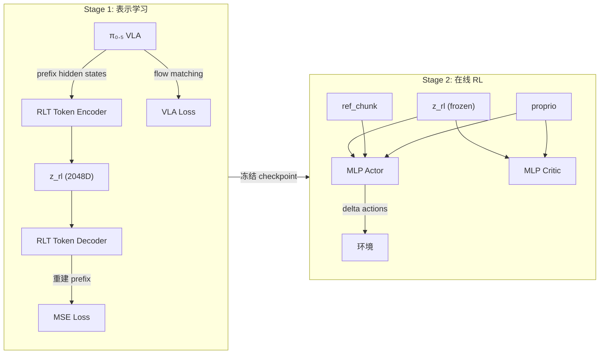

**Stage 1**：在示范数据上联合训练 VLA + RLT Token Transformer，通过信息瓶颈将 VLA 的数百个 prefix hidden state 压缩为单个 2048 维向量 $z_{rl}$。

**Stage 2**：冻结 Stage 1 模型，仅训练轻量级 MLP Actor-Critic（~600K 参数），以 $\{z_{rl}, \text{proprio}, \text{ref\_chunk}\}$ 为输入，在线学习对 VLA 参考动作的精细修正。

### 1.3 关键数学公式

**Stage 1 总损失**：

$$\mathcal{L}_{\text{Stage1}} = \mathcal{L}_{\text{RLT}} + \alpha \cdot \mathcal{L}_{\text{VLA}}$$

其中 $\alpha$ = `rlt_alpha`（默认 1.0），$\mathcal{L}_{\text{VLA}}$ 为 flow matching loss，$\mathcal{L}_{\text{RLT}}$ 为 prefix 重建 MSE。

**Stage 2 Actor 目标**：

$$\mathcal{L}_{\text{actor}} = -w_Q \cdot Q_1(s, \pi(s)) + w_{\text{BC}} \cdot \|\pi(s) - a_{\text{target}}\|^2$$

其中 $w_Q$ = `q_weight`（默认 0.1），$w_{\text{BC}}$ = `bc_weight`（默认 5），$a_{\text{target}}$ 为 VLA 参考动作或人类干预动作。

**Stage 2 Critic 目标（Chunk-level TD）**：

$$y = R_{\text{chunk}} + \mathbb{1}_{\neg\text{done}} \cdot \gamma^{H} \cdot \min(Q_1', Q_2')$$

其中 $R_{\text{chunk}} = \sum_{t=0}^{H-1} \gamma^t r_t$，$H$ 为 chunk 内步数。

> **来源**：Stage 1 损失见 `sft_action_model.py:87-96`；Actor 目标见 `fsdp_rlt_ac_policy_worker.py:340-351`；Critic 目标见同文件 `266-294`。

---

## 2. RLinf 中的 RLT 总览与术语表

### 2.1 RLinf 中 RLT 的命名与阶段划分

| RLinf 术语 | 含义 | 配置/代码示例 |
|:---|:---|:---|
| **RLT** | RL Token 流程在 RLinf 中的简称 | `use_rlt: True`, `loss_type: rlt_ac` |
| **Stage 1** | `runner.task_type: sft`，联合优化 VLA + RLT Token Transformer | `sft_action_model.py` |
| **Stage 2** | `runner.task_type: embodied`，`algorithm.loss_type: rlt_ac`，冻结 Feature Model，训练 MLP Actor-Critic | `fsdp_rlt_ac_policy_worker.py` |
| **Feature Model** | `rollout.rlt_feature_model`，即 Stage 1 checkpoint 加载为 `OpenPiPytorchEvalActionModel` | `huggingface_worker.py:151-158` |
| **Policy Model** | `rollout.model` / `actor.model`，Stage 2 的 `RLTMLPPolicy` | `rlt_mlp_policy.py` |

> **来源**：`rlt.rst:1-12`，`rlt.rst:120-137`。

### 2.2 关键术语与变量词典

| 术语/变量 | 类型 | 含义 | 典型维度 |
|:---|:---|:---|:---|
| `z_rl` | `torch.Tensor` | RLT Token Encoder 压缩的 VLA prefix 特征 | `(B, 2048)` |
| `proprio` | `torch.Tensor` | 机器人本体感觉状态（关节位置/TCP 位姿等） | Franka `(B, 19)`, ManiSkill `(B, 9)` |
| `ref_chunk` | `torch.Tensor` | VLA 冻结模型生成的参考动作序列 | `(B, ref_len, action_dim)` 如 `(B,20,7)` |
| `rlt_switch_flags` | `torch.Tensor\|None` | 布尔标记，指示当前 chunk 是否由 Actor 控制 | `(B,)` 或 `(B, chunk_len)` |
| `record_transition` | `torch.Tensor` | 是否将本 chunk 的 transition 写入 replay buffer | `(B, 1)` bool |
| `actor_switch` | `torch.Tensor` | Actor 实际控制（= record_transition 在真机；排除 expert 后在仿真） | `(B, 1)` bool |
| `intervene_requested` | `torch.Tensor\|None` | 环境请求 expert 接管的标记（仅 ManiSkill） | `(B,)` bool |
| `intervene_flags` | `torch.Tensor` | 实际发生 expert/human 干预的逐步标记 | `(B, chunk_len)` bool |
| `version` | `int` | rollout 侧的权重同步版本号，用于 schedule gate | 标量 |
| `update_step` | `int` | learner 侧的累计训练更新步数 | 标量 |
| `pending_obs` | `list[dict\|None]` | env_worker 中缓存的 "当前 obs"，等待下一步配对成 transition | per-stage list |
| `bc_target` | `torch.Tensor` | BC 正则的目标动作：人类干预时用 human action，否则用 ref_chunk | `(B, chunk_len, action_dim)` |
| `reference_dropout_prob` | `float` | 训练 Actor 时以该概率将 ref_chunk 置零，防 Actor 学到"复制 VLA" | 默认 0.5 |
| `fixed_std` | `float` | Actor 的高斯策略固定标准差 | 默认 0.002 |

---

# 第二部分：静态架构分析

## 3. 模块地图与职责划分

### 3.1 目录结构与职责

```
rlinf/
├── algorithms/rlt/                         ← RLT 算法核心逻辑
│   ├── __init__.py                         ← 导出 predict_rlt_actions, build_rlt_route
│   ├── rollout.py                          ← predict_rlt_actions(): Stage 2 rollout 总入口
│   ├── route.py                            ← 动作路由: RealworldRLTRoute / SimulatorRLTRoute
│   ├── transition.py                       ← RLT_OBS_KEYS, update_rlt_transitions()
│   └── expert.py                           ← predict_expert_actions(): ManiSkill expert
│
├── models/embodiment/
│   ├── modules/
│   │   └── rlt_token_transformer.py        ← Stage 1 核心: Encoder-Decoder Transformer
│   ├── mlp_policy/
│   │   ├── mlp_policy.py                   ← 基类 MLPPolicy (通用 obs→action MLP)
│   │   └── rlt_mlp_policy.py              ← Stage 2 核心: RLTMLPPolicy (Actor-Critic 头)
│   └── openpi_rlinf/                       ← π₀.₅ VLA 集成层
│       ├── openpi_action_model.py          ← 基类: 挂载 rlt_module, 提供 encode/forward 接口
│       ├── sft_action_model.py             ← Stage 1 SFT: VLA loss + RLT loss
│       ├── eval_action_model.py            ← Stage 2 Feature: extract_rlt_obs()
│       └── utils/rlt_utils.py              ← OpenPiPytorchRLTConfig, checkpoint 加载
│
├── workers/
│   ├── actor/
│   │   └── fsdp_rlt_ac_policy_worker.py    ← Stage 2 训练: Mixin + Schedule + Replay
│   ├── rollout/hf/
│   │   └── huggingface_worker.py           ← Rollout: feature model 加载与 predict 分支
│   └── env/
│       └── env_worker.py                   ← Env: transition 收集, pending_obs 管理
│
├── envs/
│   ├── maniskill/
│   │   └── maniskill_rlt_env.py            ← ManiSkill RLT 环境 (auto switch + expert)
│   └── realworld/common/wrappers/
│       ├── keyboard_rlt_policy_switch_wrapper.py  ← 真机键盘切换 (按 b)
│       ├── spacemouse_intervention.py              ← SpaceMouse 人类干预
│       └── reward_done_wrapper.py                  ← 真机键盘奖励/终止
│
examples/
├── sft/
│   ├── train_vla_sft.py                    ← Stage 1 训练入口脚本
│   ├── run_vla_sft.sh                      ← Stage 1 启动 shell
│   └── config/
│       ├── realworld_rlt_stage1_sft_openpi_pi05.yaml
│       └── maniskill_rlt_stage1_sft_openpi_pi05.yaml
└── embodiment/
    ├── train_embodied_agent.py             ← Stage 2 训练入口: loss_type 分发
    ├── run_embodiment.sh                   ← Stage 2 同步启动
    ├── run_realworld_async.sh              ← Stage 2 异步启动 (真机)
    └── config/
        ├── realworld_rlt_stage2_ac_mlp.yaml
        └── maniskill_rlt_stage2_ac_mlp.yaml
```

### 3.2 模块依赖关系图

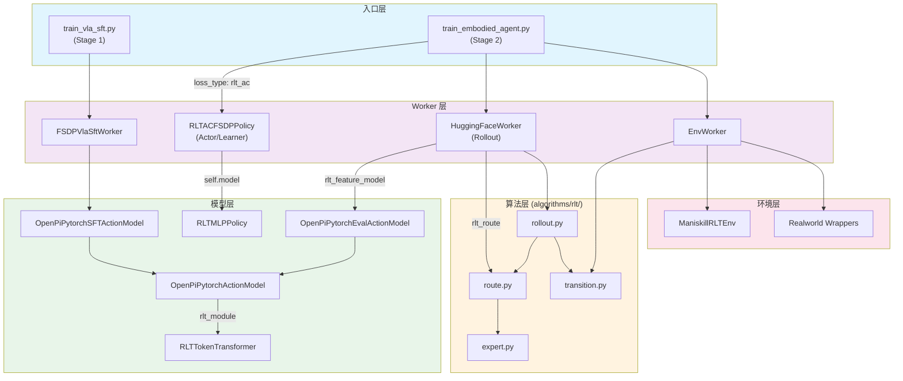

### 3.3 各模块职责一句话总结

| 模块 | 职责 |
|:---|:---|
| `rollout.py` | 编排一次 rollout step：Feature Model 提取 → MLP 预测 → Route 选择 → Transition obs 缓存 |
| `route.py` | 根据 switch_flags 和 schedule 决定执行 Actor/VLA/Expert 中哪个动作 |
| `transition.py` | 定义 RLT obs 三元组 key，管理 pending_obs→transition 的配对和 intervene 修补 |
| `expert.py` | 调用 expert 模型生成替代动作（仅 ManiSkill） |
| `rlt_token_transformer.py` | Encoder-Decoder Transformer，实现 prefix→z_rl 压缩与 prefix 重建 |
| `openpi_action_model.py` | 基类：挂载 rlt_module，提供 `_rlt_forward`/`_encode_rlt_flat`/`_select_rlt_prefix_embeddings` |
| `sft_action_model.py` | Stage 1：计算 VLA loss + RLT loss，梯度隔离 |
| `eval_action_model.py` | Stage 2：`extract_rlt_obs()` 提取 {z_rl, proprio, ref_chunk} |
| `rlt_mlp_policy.py` | Stage 2 Actor-Critic 网络：定义 actor/critic 输入构造和 forward |
| `fsdp_rlt_ac_policy_worker.py` | Stage 2 训练循环：损失计算(Mixin)、Replay 管理(Mixin)、Schedule(Policy) |
| `huggingface_worker.py` | Rollout worker：加载 feature model/route，分发 predict 调用 |
| `env_worker.py` | Env worker：调用 `update_rlt_transitions` 收集 transition，管理 pending_obs |

---

## 4. 核心类继承与协作关系

### 4.1 完整类继承图

```mermaid
classDiagram
    direction TB

    class nn_Module["nn.Module"]

    %% ═══════ OpenPI VLA 继承链 ═══════
    class OpenPiPytorchActionModel {
        +model: Pi0
        +rlt_cfg: OpenPiPytorchRLTConfig
        +rlt_module: RLTTokenTransformer
        #_rlt_forward(prefix_out, prefix_mask)
        #_encode_rlt_flat(prefix_out, prefix_mask) → z_rl
        #_select_rlt_prefix_embeddings(prefix_out, mask, lang)
        #_require_rlt()
    }

    class OpenPiPytorchSFTActionModel {
        +sft_forward(data) → loss_dict
        -_sft_forward_with_rlt_prefix(obs, actions)
        -_unpack_sft_batch(data)
    }

    class OpenPiPytorchEvalActionModel {
        +extract_rlt_obs(env_obs) → dict
        +predict_action_batch(env_obs, mode)
        -_predict_eval(observation)
        -_sample_actions_from_prefix_cache(obs, mask, cache)
        +input_transform(obs) / output_transform(outputs)
        -_repack_env_obs(env_obs)
    }

    %% ═══════ RLT Token Transformer ═══════
    class RLTTokenTransformer {
        +encoder: RLTTokenEncoder
        +decoder: RLTTokenDecoder
        +z_dim: int (property)
        +encode(prefix_embs, mask) → rl_tokens
        +encode_flat(prefix_embs, mask) → z_rl_flat
        +decode(rl_tokens, target_embs, mask)
        +reconstruct(prefix_embs, mask) → (recon, rl_tokens)
        +loss(prefix_embs, mask) → (mse, metrics_dict)
    }

    class RLTTokenEncoder {
        +input_proj: Linear|Identity
        +rl_token_embed: Parameter
        +prefix_pos_enc / rl_token_pos_enc: Parameter
        +layers: ModuleList[RLTSelfAttentionLayer]
        +forward(prefix_embs, mask) → rl_tokens[:, -1:]
    }

    class RLTTokenDecoder {
        +teacher_input_proj: Linear|Identity
        +decoder_pos_enc: Parameter
        +layers: ModuleList[RLTSelfAttentionLayer]
        +output_proj: Linear
        +forward(rl_tokens, target_embs, mask) → reconstructed
    }

    class RLTSelfAttentionLayer {
        +self_norm: LayerNorm
        +self_attn: MultiheadAttention
        +mlp_norm: LayerNorm
        +mlp: Sequential[Linear→Dropout→GeGLU→Linear]
        +forward(x, mask, attn_mask)
    }

    %% ═══════ MLP Policy 继承链 ═══════
    class BasePolicy["BasePolicy (ABC)"]

    class MLPPolicy {
        +backbone: Sequential[3×(Linear+act)]
        +actor_mean: Linear
        +actor_logstd: Parameter|Linear
        +q_head: MultiQHead|MultiCrossQHead
        +sac_forward(obs) / sac_q_forward(obs, actions)
        +predict_action_batch(env_obs, mode)
    }

    class RLTMLPPolicy {
        +z_dim / proprio_dim / step_action_dim
        +chunk_len / ref_chunk_len / flat_action_dim
        +fixed_std: float
        -_actor_state(obs) → cat[ref_chunk, z_rl, proprio]
        -_critic_state(obs) → cat[z_rl, proprio]
        -_maybe_drop_reference(ref, prob)
        +sac_forward(obs, dropout, deterministic)
        +sac_q_forward(obs, actions)
        +predict_action_batch(env_obs, mode)
    }

    %% ═══════ Worker 继承链 ═══════
    class EmbodiedSACFSDPPolicy {
        <<from fsdp_sac_policy_worker>>
        +forward_critic()
        +forward_actor()
        +run_training()
    }

    class RLTACLossMixin {
        <<Mixin>>
        +forward_critic(batch) → critic_loss
        +forward_actor(batch) → actor_loss
        +forward_alpha() → NotImplementedError
        -_bc_metrics(pi, actions, ref, flags) → (bc_loss, metrics)
        -_actor_objective_weights() → (bc_w, q_w, metrics)
        -_discounted_chunk_rewards(rewards)
    }

    class RLTACReplayMixin {
        <<Mixin>>
        -_ingest_rollout_trajectories(trajs)
        -_transition_replay_trajectories(trajs) → step-level
    }

    class RLTACFSDPPolicy {
        +use_rlt_schedule: bool
        +update_step: int
        +run_training() → schedule-gated
        -_rlt_updates_to_run() → int
        +get_rollout_sync_version() → int
    }

    class AsyncRLTACFSDPPolicy {
        -_drain_received_trajectories()
    }

    %% ═══════ Route ═══════
    class RLTRoute {
        <<ABC>>
        +route(ctx: RLTRouteContext) → RLTRouteOutput
    }

    class RealworldRLTRoute {
        +route(ctx): torch.where 选择 actor|ref
    }

    class SimulatorRLTRoute {
        +use_schedule: bool
        +warmup_updates: int
        -_ready_for_online(version) → bool
        +route(ctx): schedule gate + expert takeover
    }

    %% ═══════ 继承关系 ═══════
    nn_Module <|-- OpenPiPytorchActionModel
    OpenPiPytorchActionModel <|-- OpenPiPytorchSFTActionModel
    OpenPiPytorchActionModel <|-- OpenPiPytorchEvalActionModel
    OpenPiPytorchActionModel o-- RLTTokenTransformer : rlt_module

    RLTTokenTransformer o-- RLTTokenEncoder : encoder
    RLTTokenTransformer o-- RLTTokenDecoder : decoder
    RLTTokenEncoder o-- RLTSelfAttentionLayer : layers[]
    RLTTokenDecoder o-- RLTSelfAttentionLayer : layers[]

    nn_Module <|-- MLPPolicy
    BasePolicy <|.. MLPPolicy
    MLPPolicy <|-- RLTMLPPolicy

    EmbodiedSACFSDPPolicy <|-- RLTACFSDPPolicy
    RLTACLossMixin <|.. RLTACFSDPPolicy
    RLTACReplayMixin <|.. RLTACFSDPPolicy
    RLTACFSDPPolicy <|-- AsyncRLTACFSDPPolicy

    RLTRoute <|-- RealworldRLTRoute
    RLTRoute <|-- SimulatorRLTRoute
```

### 4.2 协作关系说明

上图中值得注意的设计模式：

1. **Mixin 组合**：`RLTACFSDPPolicy` 同时继承 `EmbodiedSACFSDPPolicy`（基础 SAC 训练框架）和混入 `RLTACLossMixin`（覆盖 loss 计算）+ `RLTACReplayMixin`（覆盖 replay 管理），实现了"不改基类、通过扩展获得 RLT 特性"的设计。

2. **策略模式**：`RLTRoute` 抽象类 + `RealworldRLTRoute`/`SimulatorRLTRoute` 子类，由工厂函数 `build_rlt_route(cfg)` 根据环境类型分发（`route.py:247-254`）。

3. **信息瓶颈封装**：`OpenPiPytorchActionModel` 基类统一了 rlt_module 的挂载（`__init__` L48-60）和编码接口（`_rlt_forward`/`_encode_rlt_flat`），SFT 和 Eval 子类只需关注各自的训练/推理逻辑。

---

## 5. Stage 1 静态架构

### 5.1 Stage 1 类图

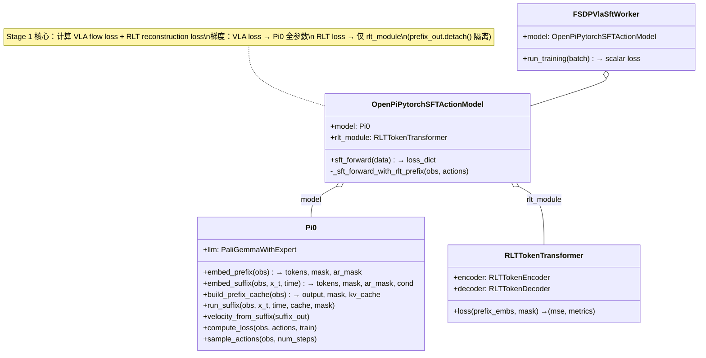

### 5.2 Stage 1 关键组件职责

| 组件 | 职责 | 关键方法 | 源码位置 |
|:---|:---|:---|:---|
| `Pi0` | π₀.₅ VLA 主干（SigLIP + Gemma 2B + 300M Action Expert） | `embed_prefix`, `embed_suffix`, `velocity_from_suffix` | `pi0_model/pi0.py` |
| `OpenPiPytorchSFTActionModel` | Stage 1 训练包装器 | `sft_forward`, `_sft_forward_with_rlt_prefix` | `sft_action_model.py:33-211` |
| `RLTTokenTransformer` | 信息瓶颈 Transformer | `loss()`, `encode_flat()`, `reconstruct()` | `rlt_token_transformer.py:299-389` |
| `RLTTokenEncoder` | Prefix → z_rl 压缩 | `forward()` → 取最后一个 token | `rlt_token_transformer.py:107-187` |
| `RLTTokenDecoder` | z_rl → 自回归重建 Prefix | `forward()` 含因果 mask | `rlt_token_transformer.py:190-296` |
| `GeGLU` | 门控线性单元激活 | `forward()`: $x \cdot \text{GELU}(\text{gate})$ | `rlt_token_transformer.py:34-41` |

---

## 6. Stage 2 静态架构

### 6.1 Stage 2 类图

```mermaid
classDiagram
    class OpenPiPytorchEvalActionModel {
        +model: Pi0 (frozen)
        +rlt_module: RLTTokenTransformer (frozen)
        +extract_rlt_obs(env_obs) → {z_rl, proprio, ref_chunk}
        -_sample_actions_from_prefix_cache(obs, mask, cache)
        +predict_action_batch(env_obs, mode)
        +input_transform(obs) / output_transform(outputs)
    }

    class RLTMLPPolicy {
        +backbone: 3×256 MLP
        +actor_mean: Linear → flat_action_dim
        +actor_logstd: Linear (unused, fixed_std overrides)
        +q_head: MultiQHead (twin-Q)
        +sac_forward(obs) → (action, logprobs, None)
        +sac_q_forward(obs, actions) → q_values
        +predict_action_batch(env_obs, mode)
    }

    class RLTACFSDPPolicy {
        <<Sync Worker>>
        +model: RLTMLPPolicy
        +forward_critic(batch) → critic_loss
        +forward_actor(batch) → actor_loss
        +run_training() → schedule-gated
        -_rlt_updates_to_run() → int
    }

    class HuggingFaceWorker {
        +rlt_feature_model: OpenPiPytorchEvalActionModel
        +hf_model: RLTMLPPolicy (synced copy)
        +rlt_route: RLTRoute
        +predict(env_obs) → actions, result
    }

    class EnvWorker {
        +enable_rlt: bool
        +trajectory_builders: list
        -rlt_pending_obs: list[dict|None]
        +collect_train_trajectories()
    }

    HuggingFaceWorker o-- OpenPiPytorchEvalActionModel : rlt_feature_model
    HuggingFaceWorker o-- RLTMLPPolicy : hf_model (synced)
    HuggingFaceWorker o-- RLTRoute : rlt_route
    RLTACFSDPPolicy o-- RLTMLPPolicy : model (trainable)

    note for RLTMLPPolicy "Actor input: cat[ref_chunk(70), z_rl(2048), proprio(19)] = 2137D\nCritic input: cat[z_rl(2048), proprio(19)] = 2067D\nfixed_std=0.002, tanh squashing (no action_scale correction)"
```

### 6.2 RLTMLPPolicy: Actor-Critic 头

`RLTMLPPolicy` 继承 `MLPPolicy` 并做了以下关键覆盖：

**构造函数**（`rlt_mlp_policy.py:30-78`）：

```python
# 1. Actor 的 obs_dim 包含 ref_chunk
actor_obs_dim = z_dim + proprio_dim + flat_action_dim  # 2048 + 19 + 70 = 2137
# 2. Critic 的 obs_dim 不含 ref_chunk
critic_obs_dim = z_dim + proprio_dim                   # 2048 + 19 = 2067
# 3. 调用基类时 num_action_chunks=1（chunk 维度已 flatten）
super().__init__(obs_dim=actor_obs_dim, action_dim=flat_action_dim,
                 num_action_chunks=1, critic_obs_dim=critic_obs_dim, ...)
```

**核心区别对照**（RLTMLPPolicy vs 基类 MLPPolicy）：

| 特性 | MLPPolicy (基类) | RLTMLPPolicy (RLT Stage 2) |
|:---|:---|:---|
| Actor 输入 | `obs["states"]` | `cat[ref_chunk, z_rl, proprio]` |
| Critic 输入 | `obs["states"]` | `cat[z_rl, proprio]` (无 ref_chunk) |
| Action std | 可学习 `actor_logstd` 参数或网络 | **固定** `fixed_std=0.002` |
| Squashing | `tanh` + `action_scale` 修正 log_prob | `tanh` 但**无** action_scale 修正 |
| Action 维度 | `num_action_chunks * action_dim` | `chunk_len * step_action_dim` (已 flatten) |
| num_action_chunks | 实际 chunk 数 | **硬编码为 1**（整 chunk 作为单个动作） |
| Q head 输入 | `obs["states"]` + `actions` | `critic_state` (z_rl+proprio) + `actions` |
| Reference dropout | 无 | `_maybe_drop_reference()` 按 batch sample 随机置零 |

> **来源**：基类 `mlp_policy.py:27-451`，RLT 子类 `rlt_mlp_policy.py:22-233`。

### 6.3 参数冻结关系

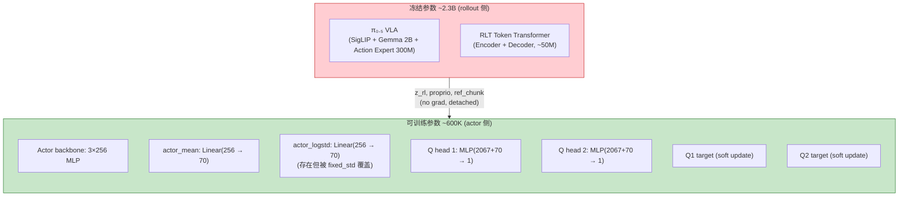

> **来源**：冻结逻辑 `huggingface_worker.py:156-157`（`eval()` + `requires_grad_(False)`）；可训练参数结构 `rlt_mlp_policy.py`。

---

# 第三部分：动态流程分析

## 7. 全局训练流程：从数据到部署

### 7.1 全局流程图

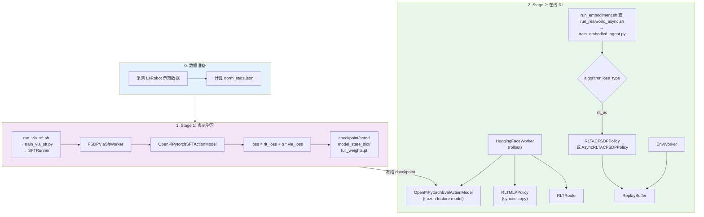

### 7.2 入口-分发层详解

Stage 2 的 worker 选择发生在 `train_embodied_agent.py:59-66`：

```python
# examples/embodiment/train_embodied_agent.py:59-66
elif cfg.algorithm.loss_type == "rlt_ac":
    if use_training_pipeline:
        raise ValueError(
            "runner.use_training_pipeline=True is not supported for rlt_ac."
        )
    from rlinf.workers.actor.fsdp_rlt_ac_policy_worker import RLTACFSDPPolicy
    actor_worker_cls = RLTACFSDPPolicy
```

关键要点：
- `rlt_ac` **未注册**到 `rlinf/algorithms/registry.py` 的 `@register_policy_loss`，而是通过入口脚本的 `if-elif` 手动分发。
- `runner.use_training_pipeline=True` 与 `rlt_ac` **不兼容**（直接抛异常）。
- 无专用 `eval_rlt.py`；评估使用 `runner.only_eval: True` 或在训练流程中评估。

> **来源**：`examples/embodiment/train_embodied_agent.py:59-66`。

---

## 8. Stage 1 训练数据流

### 8.1 Stage 1 前向传播时序图

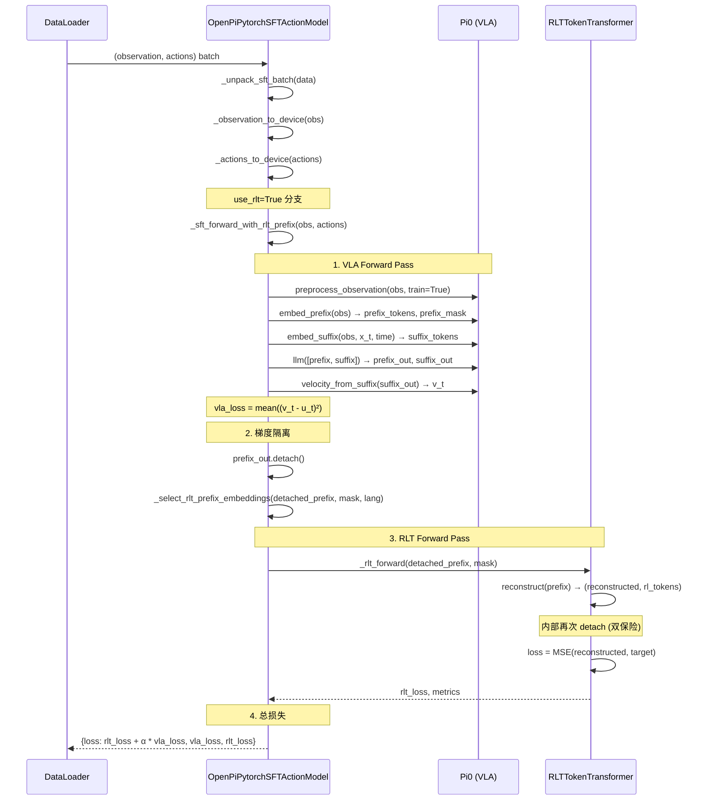

### 8.2 Stage 1 梯度流分析

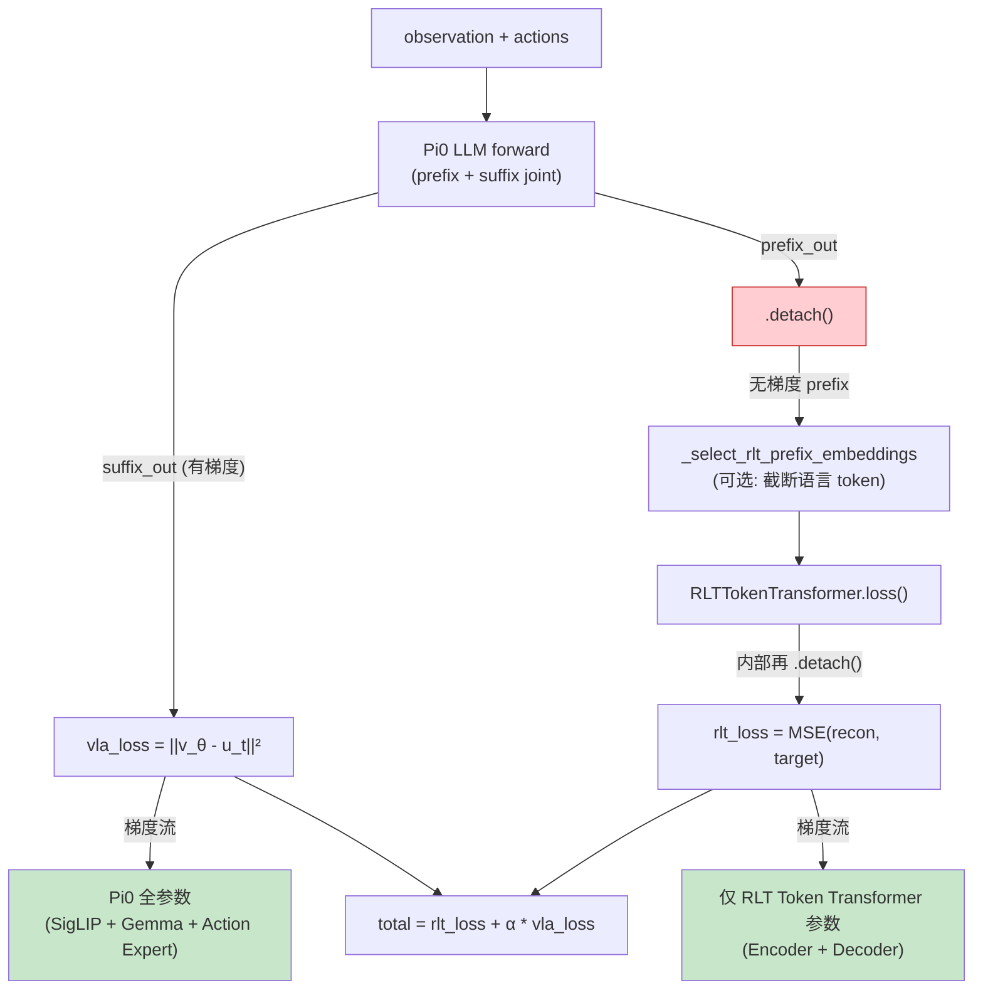

**关键细节**：`_sft_forward_with_rlt_prefix` 在 `sft_action_model.py:208` 对 `prefix_out` 调用 `.detach()`，确保 RLT reconstruction loss 的梯度**不会回传到 Pi0 的 LLM 参数**。`RLTTokenTransformer.reconstruct()` 内部（`rlt_token_transformer.py:358`）再次对输入做 `.detach()`，形成双重保险。

结论：**Stage 1 同时更新 VLA 和 RLT Token Transformer，但两者的梯度路径完全独立**。VLA 通过 flow matching loss 学习动作预测，RLT 通过 MSE 重建 loss 学习 prefix 压缩。

> **来源**：`sft_action_model.py:160-211`，`rlt_token_transformer.py:355-361`。

---

## 9. Stage 2 Rollout 数据流

### 9.1 Feature Model 加载

Stage 2 启动时，`HuggingFaceWorker` 加载冻结的 Stage 1 模型：

```python
# huggingface_worker.py:151-158
rlt_feature_model_config = OmegaConf.select(
    self.cfg, "rollout.rlt_feature_model", default=None
)
if rlt_feature_model_config is not None:
    self.rlt_feature_model = get_model(copy.deepcopy(rlt_feature_model_config))
    self.rlt_feature_model.eval()          # 推理模式
    self.rlt_feature_model.requires_grad_(False)  # 冻结所有参数
    self.rlt_route = build_rlt_route(self.cfg)     # 创建路由策略
```

`get_model()` 根据 `model_type: "openpi_rlinf"` 和 `openpi.task: eval` 创建 `OpenPiPytorchEvalActionModel` 实例，并加载 Stage 1 的 FSDP 完整权重（包含 `model.*` 和 `rlt_module.*`）。

### 9.2 单步 Rollout 完整时序图

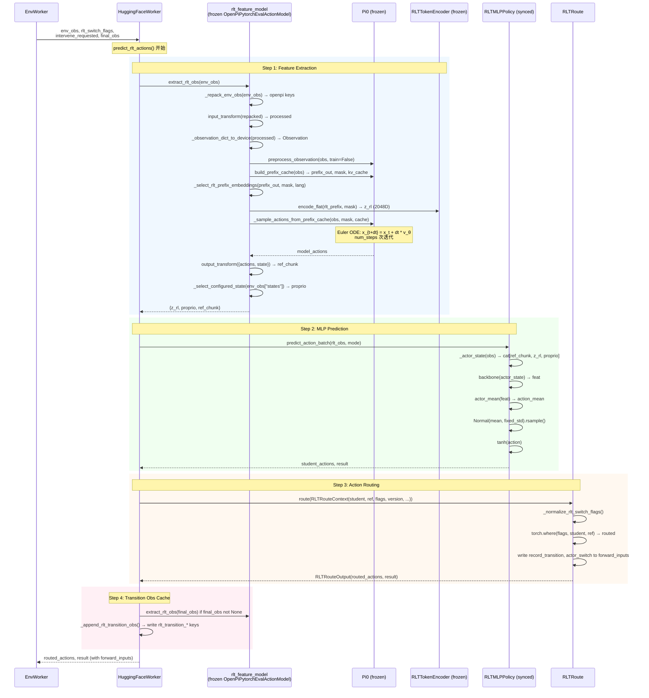

### 9.3 extract_rlt_obs 的 KV Cache 复用

`extract_rlt_obs`（`eval_action_model.py:357-404`）的一个重要性能优化：**单次 prefix forward 同时产出 z_rl 和 ref_chunk**。

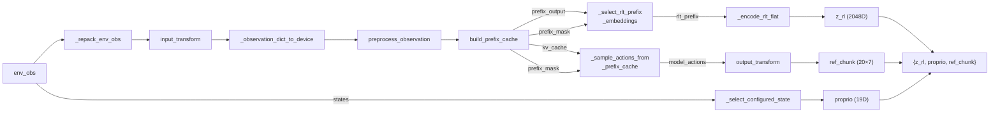

`build_prefix_cache` 做了一次完整的 VLA prefix forward（含 SigLIP 图像编码 + Gemma LLM prefix），结果缓存为 `kv_cache`。后续的 `_sample_actions_from_prefix_cache` 复用这个 cache 只跑 suffix 部分（Euler ODE 采样），**避免重复跑 prefix** — 这对 30Hz 真机控制的延迟至关重要。

> **来源**：`eval_action_model.py:357-438`。

---

## 10. Stage 2 训练数据流

### 10.1 训练循环时序图

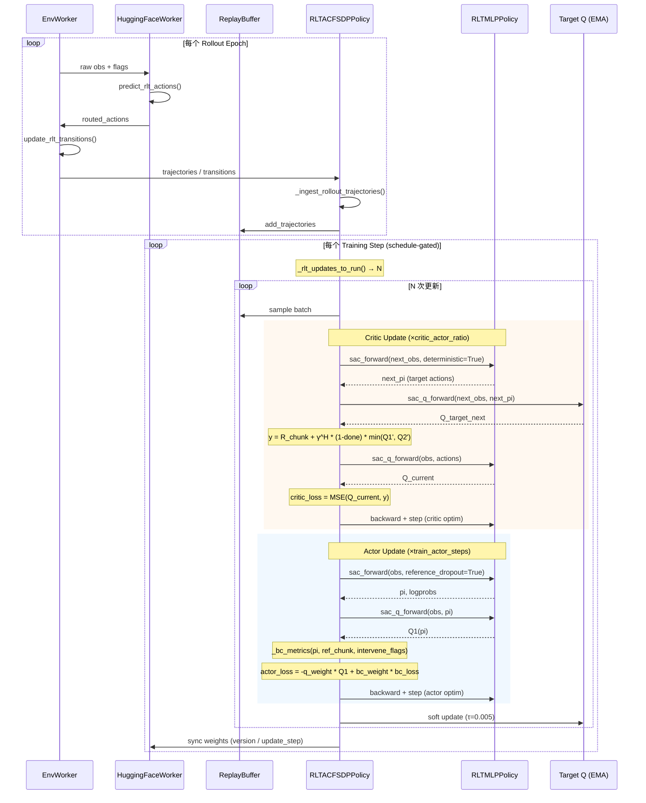

### 10.2 Critic Forward 详解

`forward_critic`（`fsdp_rlt_ac_policy_worker.py:226-295`）：

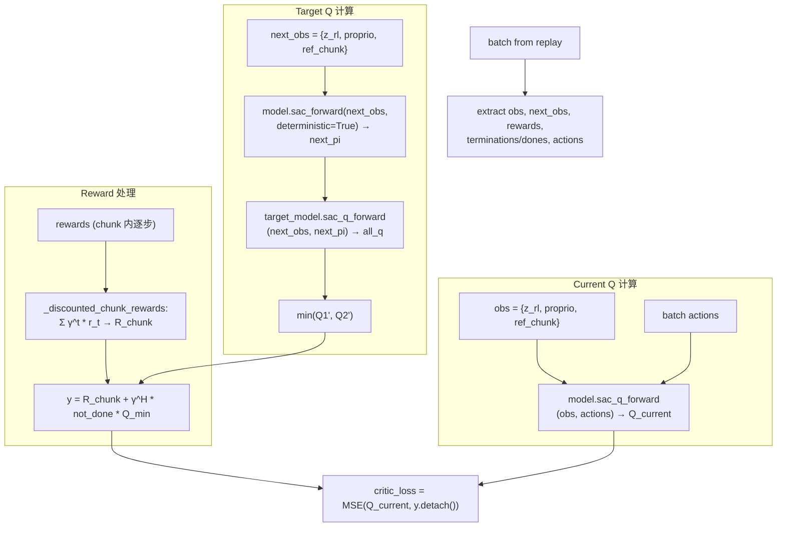

关键细节：
- **done 判定**：真机用 `batch["terminations"]`，ManiSkill transition replay 用 `batch["dones"]`（`fsdp_rlt_ac_policy_worker.py:236-237`，`bootstrap_type: standard` 下 `not_done = 1 - done`）。
- **actions 直接使用**：Critic 使用 `batch["actions"]`（即实际执行的路由后动作），而非 delta 或转换后动作。
- **CrossQ 支持**：可选 `q_head_type: crossq`，通过 `crossq_q_forward` 走不同 Q 头路径。

### 10.3 Actor Forward 详解

`forward_actor`（`fsdp_rlt_ac_policy_worker.py:297-364`）：

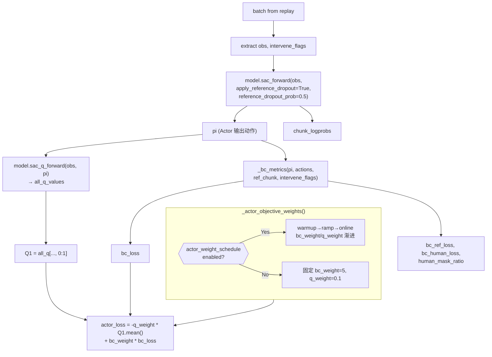

---

## 11. 环境集成与动作路由

### 11.1 环境层总览

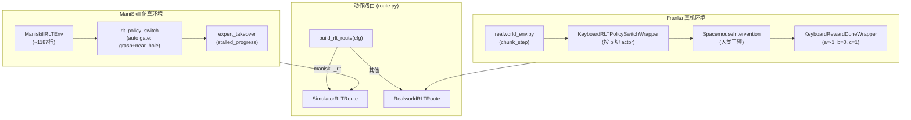

### 11.2 真机路由：RealworldRLTRoute

**文件**：`route.py:116-144`

路由逻辑简洁——二选一：

```python
# route.py:130-134
routed_actions = torch.where(
    rlt_switch_flags,         # True → 用 Actor 动作
    actions,                  # Actor 预测
    ref_actions[:, :actions.shape[1], :actions.shape[2]],  # VLA 参考
).contiguous()
```

同时设置两个关键标记：
- `record_transition = rlt_switch_flags[:,:1]`：**仅 Actor 模式的 chunk 进入 replay buffer**
- `actor_switch = record_transition`：在真机中与 record_transition 相同

**键盘切换**（`keyboard_rlt_policy_switch_wrapper.py`）：
- 按 `b` → `rlt_switch_flags = True`，进入 Actor 模式
- 只处理 `b` 键，**无 c/a 键、无 MIN_ACTOR_STEPS**
- 奖励和终止由独立的 `KeyboardRewardDoneWrapper` 处理（模块化设计）

### 11.3 仿真路由：SimulatorRLTRoute

**文件**：`route.py:147-244`

三层路由逻辑：

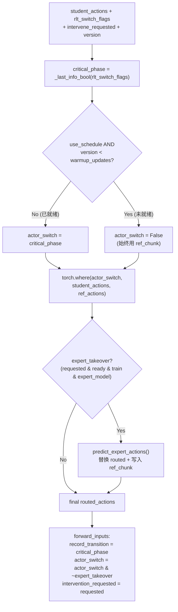

关键区别对照：

| 特性 | RealworldRLTRoute | SimulatorRLTRoute |
|:---|:---|:---|
| Schedule gate | 无 | `version >= warmup_updates` |
| Expert takeover | 无 | 支持（写入 ref_chunk + intervene_flags） |
| record_transition | = switch_flags | = critical_phase（不依赖 schedule） |
| actor_switch | = record_transition | = critical_phase & ready & ~expert |
| ref_chunk 修补 | 无 | expert 时覆写 ref_chunk 对应位 |

> **来源**：`route.py:116-254`。

---

## 12. Replay Buffer 与 Transition 管理

### 12.1 RLT Transition 格式

```
transition = {
    curr_obs:  {z_rl: (B, 2048), proprio: (B, 19), ref_chunk: (B, 20, 7)}
    action:    实际路由后执行的动作 (B, chunk_len * action_dim)
    reward:    chunk 内逐步奖励 (B, chunk_len)
    next_obs:  {z_rl, proprio, ref_chunk} (来自下一步)
    done:      终止标记
    intervene_flags: 人类/expert 干预标记 (B, chunk_len)
}
```

与原始图像观测对比：RLT transition 仅存储**预提取的低维特征**（z_rl 2048D + proprio 19D + ref_chunk 140D = ~2207D），而非高维图像（数百KB/帧），**极大降低了 replay buffer 的存储和带宽需求**。

### 12.2 Pending Obs 模式（env_worker.py）

`update_rlt_transitions` 的调用发生在 `env_worker.py` 的训练循环中，使用**"pending obs 延迟配对"**模式：

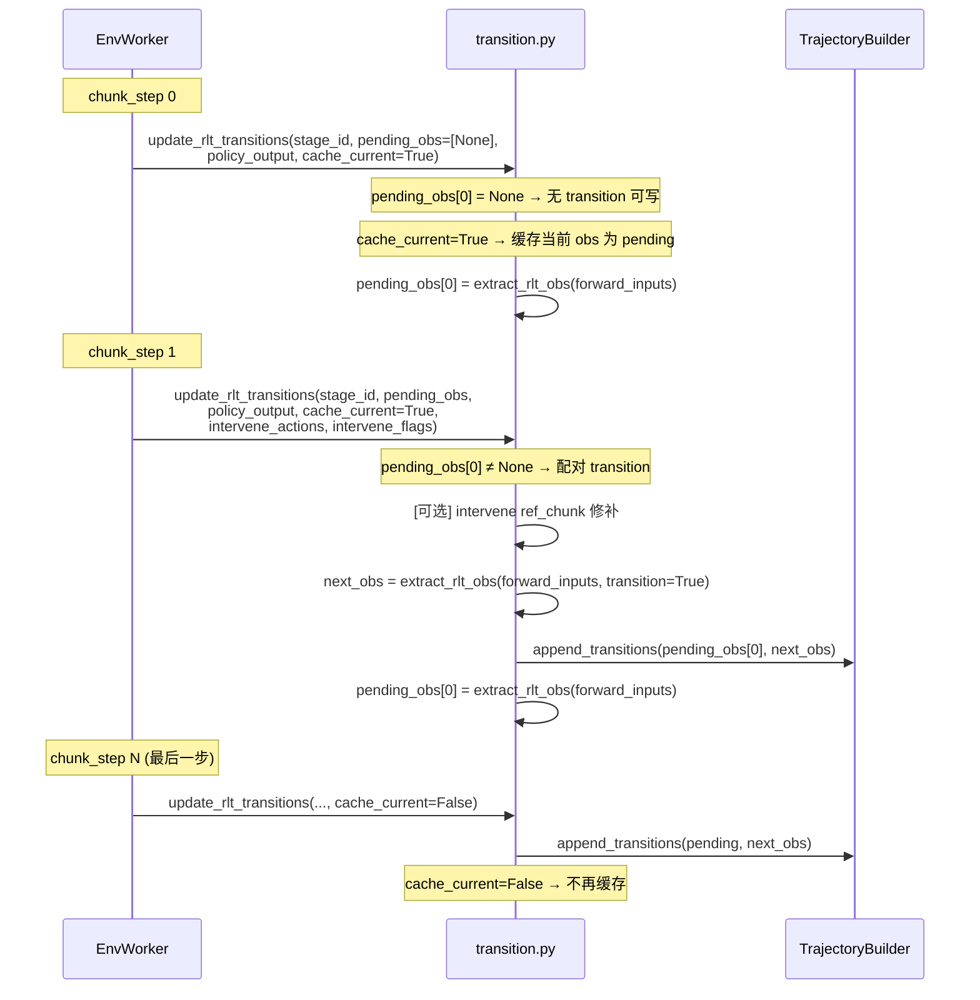

**关键细节**（`env_worker.py:1046, 1132-1135, 1257-1260`）：
- `rlt_pending_obs` 是 per-stage 的列表，初始化为 `[None] * stage_num`。
- 每个 chunk step 中，先用 pending obs 配对上一步的 transition，再缓存当前 obs 作为下一步的 curr_obs。
- `cache_current=True` 表示还有后续 chunk step；`cache_current=False` 在最后一步停止缓存。
- `forward_inputs` 中的 obs 用**无前缀** key（`z_rl`, `proprio`, `ref_chunk`），transition 用**`rlt_transition_` 前缀** key。

> **来源**：`transition.py:62-103`，`env_worker.py:1046, 1132-1135, 1257-1260`。

### 12.3 Intervene Ref_chunk 修补机制

当人类通过 SpaceMouse 干预或 ManiSkill expert 接管时，`update_rlt_transitions` 会**将 human/expert 的动作写入 curr_obs 的 ref_chunk 对应位置**：

```python
# transition.py:73-88
if intervene_actions is not None and intervene_flags is not None:
    current_obs = pending_obs[stage_id]
    ref_chunk = current_obs["ref_chunk"]
    batch_size = ref_chunk.shape[0]
    flags = intervene_flags.reshape(batch_size, -1, 1).to(
        device=ref_chunk.device, dtype=torch.bool
    )
    human_actions = intervene_actions.reshape(batch_size, flags.shape[1], -1)
    action_dim = human_actions.shape[-1]
    ref_actions = ref_chunk.reshape(batch_size, -1, action_dim).clone()
    ref_actions[:, : flags.shape[1]] = torch.where(
        flags,
        human_actions.to(device=ref_chunk.device, dtype=ref_chunk.dtype),
        ref_actions[:, : flags.shape[1]],
    )
    current_obs["ref_chunk"] = ref_actions.reshape_as(ref_chunk)
```

**工程含义**：在 Actor 训练时，BC target 的选择逻辑是 `torch.where(human_mask, executed_action, ref_chunk)`（`_bc_metrics` L123）。如果 ref_chunk 已被修补为 human action，那么即使 `human_mask=False`，BC target 也已经是正确的 — 这为训练时的 BC 正则提供了**更准确的 reference 信号**。

### 12.4 ManiSkill vs 真机 Replay 形态

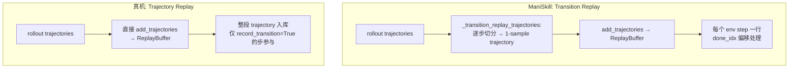

判定逻辑：`use_simulator_transition_replay(cfg)` 检查 `env_type == SupportedEnvType.MANISKILL_RLT`。

> **来源**：`transition.py:26-37`，`fsdp_rlt_ac_policy_worker.py:458-655`。

---

## 13. 训练调度与权重渐进

### 13.1 RLT Schedule（仅 ManiSkill 同步模式）

`RLTACFSDPPolicy._rlt_updates_to_run()`（`fsdp_rlt_ac_policy_worker.py:727-823`）实现了基于 transition 计数的训练调度：

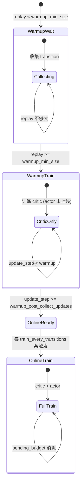

调度参数（ManiSkill Stage 2 YAML）：

| 参数 | 含义 | 典型值 |
|:---|:---|:---|
| `warmup_min_size` | replay buffer 最小大小才开始训练 | 10000 |
| `warmup_post_collect_updates` | actor 上线前的 warmup update 数 | 30000 |
| `train_every_transitions` | 每 N 条新 transition 触发一轮训练 | 5 |
| `max_updates_per_train_step` | 单次 train step 的最大更新数 | 400 |

**版本号同步**（actor → rollout）：

```python
# fsdp_rlt_ac_policy_worker.py:57-61
def get_rollout_sync_version(self) -> int:
    if not self.use_rlt_schedule:
        return int(self.version)      # 无 schedule 时用一般版本号
    return int(self.update_step)      # 有 schedule 时暴露 update_step
```

rollout 侧的 `SimulatorRLTRoute._ready_for_online(version)` 用这个值判断 Actor 是否可以上线（`route.py:154-155`）。

### 13.2 Sync vs Async Worker 对比

| 特性 | RLTACFSDPPolicy (同步) | AsyncRLTACFSDPPolicy (异步) |
|:---|:---|:---|
| 继承 | `EmbodiedSACFSDPPolicy` | `RLTACFSDPPolicy` |
| rlt_schedule | ✅ 完整实现 | ❌ **未覆盖** `_rlt_updates_to_run` |
| 适用场景 | ManiSkill 仿真 | Franka 真机 |
| 训练触发 | schedule-gated | 基类 `run_training()` 直接执行 |
| Trajectory 接收 | 同步 flush | `_drain_received_trajectories()` 异步消费 |

**注意**：Franka 真机使用 `run_realworld_async.sh`（选择 `AsyncRLTACFSDPPolicy`），但真机环境**无 `rlt_schedule`**（YAML 中不配置），因此异步 worker 不需要 schedule 逻辑 — 它依赖键盘切换和固定 `bc_weight/q_weight`。

> **来源**：`fsdp_rlt_ac_policy_worker.py:668-920`。

### 13.3 Actor Weight Schedule

ManiSkill Stage 2 启用 `actor_weight_schedule` 时，BC 和 Q 权重在训练过程中渐进变化：

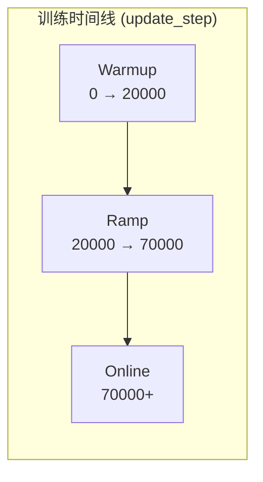

| 阶段 | `bc_weight` | `q_weight` | 含义 |
|:---|:---|:---|:---|
| Warmup | 7.0 (高) | 0.05 (低) | 强约束于 BC，Actor 学基础行为 |
| Ramp | 7.0 → 2.5 | 0.05 → 0.45 | 逐步放开 RL 探索 |
| Online | 2.5 | 0.45 | RL 为主，BC 为辅 |

渐进公式（`_actor_objective_weights` L147-224）：

$$w = w_{\text{warmup}} + \min\!\left(1,\; \frac{t - t_{\text{warmup}}}{t_{\text{ramp}}}\right) \cdot (w_{\text{online}} - w_{\text{warmup}})$$

Franka 真机**不启用** weight schedule，使用固定 `bc_weight=5, q_weight=0.1`。

---

# 第四部分：关键代码深度解读

## 14. RLT Token Transformer 逐行解读

### 14.1 整体架构

**文件**：`rlinf/models/embodiment/modules/rlt_token_transformer.py`

`RLTTokenTransformer` 是一个 Encoder-Decoder 架构，用于将 VLA 的 prefix hidden states 压缩为单个 RL token（信息瓶颈），并通过自回归重建验证压缩质量。

```mermaid
flowchart TB
    subgraph Encoder["RLTTokenEncoder (L107-187)"]
        direction TB
        INPUT["prefix_embs (B, S, 2048)"]
        PROJ["input_proj: Linear(2048→2048) or Identity"]
        POS["+ prefix_pos_enc (S, 2048)"]
        RL_TOK["rl_token_embed (1, 2048)<br/>+ rl_token_pos_enc (1, 2048)"]
        CAT["cat([prefix_tokens, rl_token], dim=1)<br/>→ (B, S+1, 2048)"]
        LAYERS["RLTSelfAttentionLayer × num_layers<br/>(Pre-LN + MHA + GeGLU MLP)"]
        EXTRACT["x[:, -1:] → (B, 1, 2048)"]

        INPUT --> PROJ --> POS --> CAT
        RL_TOK --> CAT
        CAT --> LAYERS --> EXTRACT
    end

    subgraph Decoder["RLTTokenDecoder (L190-296)"]
        direction TB
        Z_IN["rl_tokens (B, 1, 2048)"]
        TARGET["target_embeddings (B, S, 2048)"]
        DETACH_T["target.detach()[:, :-1]<br/>(teacher forcing, shifted)"]
        PROJ_D["teacher_input_proj"]
        CAT_D["cat([rl_tokens, shifted_targets])<br/>→ (B, S, 2048)"]
        POS_D["+ decoder_pos_enc"]
        CAUSAL["causal_mask: 上三角 True"]
        LAYERS_D["RLTSelfAttentionLayer × num_layers<br/>(Pre-LN + MHA + GeGLU + causal mask)"]
        OUT_PROJ["output_proj: Linear(2048→2048)"]

        Z_IN --> CAT_D
        TARGET --> DETACH_T --> PROJ_D --> CAT_D
        CAT_D --> POS_D --> LAYERS_D
        CAUSAL --> LAYERS_D
        LAYERS_D --> OUT_PROJ
    end

    EXTRACT -->|"z_rl"| Z_IN
    OUT_PROJ -->|"reconstructed (B, S, 2048)"| MSE["MSE Loss vs target"]
    TARGET -->|"target"| MSE
```

### 14.2 RL Token 的"append + extract"设计

Encoder 的核心思想：**将一个可学习的 RL token 追加到 prefix 序列末尾，经过 self-attention 后提取这最后一个位置的输出作为 z_rl**。

```python
# rlt_token_transformer.py:163-173, 185-187 (Encoder.forward)
rl_tokens = self.rl_token_embed.unsqueeze(0).expand(batch_size, -1, -1)  # (B,1,D)
rl_tokens = rl_tokens + rl_pos
x = torch.cat([prefix_tokens, rl_tokens], dim=1)  # (B, S+1, D)
# ... self-attention layers ...
return x[:, -1:]  # 取最后一个位置 → z_rl (B, 1, D)
```

RL token 的初始值是**正弦位置编码**（`sinusoidal_pe_init(1, embed_dim)`），而非随机初始化。这个位置编码在训练中是**可学习的** `nn.Parameter`。

### 14.3 Decoder 的因果重建

Decoder 使用**自回归 teacher forcing**：以 z_rl 为起始，按序列位置逐步重建 prefix。

```python
# rlt_token_transformer.py:247-257 (Decoder.forward)
shifted_targets = frozen_targets[:, :-1]        # 去掉最后一个 (teacher forcing shift)
decoder_inputs = torch.cat([rl_tokens, shifted_targets], dim=1)  # (B, S, D)
# 因果 mask: 上三角为 True (禁止 attend 未来位置)
causal_mask = torch.triu(torch.ones(S, S, dtype=torch.bool), diagonal=1)
```

这意味着 Decoder 在位置 $i$ 只能看到 $z_{rl}$ 和 target 的前 $i-1$ 个 token，**不能直接复制当前位置的 target**。

### 14.4 Loss 计算

```python
# rlt_token_transformer.py:363-384
def loss(self, prefix_embs, mask=None):
    reconstructed, rl_tokens = self.reconstruct(prefix_embs, mask)
    target = prefix_embs.detach().to(dtype=torch.float32)
    sq_error = torch.square(reconstructed - target)
    if mask is not None:
        # 仅计算有效 token 的 MSE
        mask_expanded = mask[..., None]
        sq_error = sq_error * mask_expanded
        denom = torch.clamp(mask_expanded.sum() * D, min=1.0)
        mse = sq_error.sum() / denom
    else:
        mse = sq_error.mean()
    return mse, {"mse": mse, "z_rl": rl_tokens.reshape(B, -1)}
```

数学形式：

$$\mathcal{L}_{\text{RLT}} = \frac{1}{|M| \cdot D} \sum_{(i,d) \in M} \left(\hat{h}_{i,d} - \text{sg}(h_{i,d})\right)^2$$

其中 $h$ 为 VLA prefix hidden，$\hat{h}$ 为 Decoder 重建输出，$M$ 为有效 mask 位置，$\text{sg}$ 为 stop-gradient。

### 14.5 默认超参

| 参数 | 代码默认 | YAML 常见覆盖 | 来源 |
|:---|:---|:---|:---|
| `input_dim` / `embed_dim` | 2048 | 2048 | `OpenPiPytorchRLTConfig` |
| `prefix_seq_len` | 768 | **1024** | Stage 1/2 YAML |
| `num_layers` | 2 | 2 | |
| `num_heads` | 8 | 8 | |
| `mlp_ratio` | 4.0 | 4.0 | |
| `rlt_image_only` | **True** | **False** (Franka/ManiSkill 官方示例) | |
| `rlt_use_mask` | False | **True** | |

> **来源**：`rlt_utils.py:55-68`，各 Stage 1/2 YAML 配置。

---

## 15. extract_rlt_obs 逐行解读

**文件**：`eval_action_model.py:357-404`

```python
@torch.no_grad()
def extract_rlt_obs(self, env_obs: dict[str, Any]) -> dict[str, torch.Tensor]:
    self._require_rlt()
    # 1. 将 env obs 转为 openpi 格式
    repacked = self._repack_env_obs(env_obs)
    # 2. 运行 openpi transforms (Normalize, Tokenize 等)
    processed = self.input_transform(repacked, transpose=False)
    # 3. 转为 Observation dataclass 并移到 GPU
    observation = self._observation_dict_to_device(processed)

    # 4. VLA prefix forward (一次计算, 缓存 KV)
    prepared_observation = pi0_model_module.preprocess_observation(observation, train=False)
    prefix_output, prefix_mask, kv_cache = self.model.build_prefix_cache(prepared_observation)

    # 5. 选择用于 RLT 的 prefix 子集 (可选: 去掉语言 token)
    rlt_prefix_output, rlt_prefix_mask = self._select_rlt_prefix_embeddings(
        prefix_output, prefix_mask, prepared_observation.tokenized_prompt
    )

    # 6. RLT Encoder: prefix → z_rl
    z_rl = self._encode_rlt_flat(rlt_prefix_output, rlt_prefix_mask).to(dtype=torch.float32)

    # 7. VLA suffix sampling: 复用 KV cache 生成 ref_chunk
    model_actions = self._sample_actions_from_prefix_cache(
        prepared_observation, prefix_mask, kv_cache,
    )
    ref_chunk = self.output_transform({"actions": model_actions, "state": observation.state})["actions"]

    # 8. 提取 proprio
    raw_proprio = self._select_configured_state(env_obs["states"])
    # ManiSkill: 从 observation.state 截取前 state_dim 维
    # Franka: 直接用 raw_proprio
    ...

    return {
        "z_rl": z_rl,
        "proprio": proprio.to(device=z_rl.device, dtype=torch.float32),
        "ref_chunk": ref_chunk.to(device=z_rl.device, dtype=torch.float32),
    }
```

**性能关键**：步骤 4 的 `build_prefix_cache` 是最昂贵的操作（涉及 SigLIP 图像编码 + Gemma LLM prefix forward），步骤 7 的 `_sample_actions_from_prefix_cache` 复用 KV cache 只跑 suffix 的 Euler ODE 采样（`num_steps` 次迭代），避免了重复编码。

---

## 16. Actor-Critic 损失逐行解读

### 16.1 BC Metrics

**文件**：`fsdp_rlt_ac_policy_worker.py:96-145`

```python
def _bc_metrics(self, pi, actions, ref_chunk, intervene_flags):
    # 1. reshape 到 chunk 形状
    pi_chunk = pi.reshape(-1, chunk_len, action_dim)
    action_chunk = actions.reshape(-1, chunk_len, action_dim)
    bc_ref_chunk = ref_chunk[:, :chunk_len]

    # 2. 确定 human mask
    if intervene_flags is None:
        human_mask = zeros  # 全 False
    else:
        human_mask = intervene_flags.bool().any(dim=-1)  # per-step bool

    # 3. BC target: human → 用实际执行动作; 非 human → 用 ref_chunk
    bc_target = torch.where(human_mask[..., None], action_chunk, bc_ref_chunk)

    # 4. BC loss = MSE(pi, bc_target)
    bc_error = mean(square(pi_chunk - bc_target), dim=-1)
    bc_loss = mean(bc_error)

    # 5. 分别统计 ref_loss 和 human_loss (用于监控)
    return bc_loss, {"bc_ref_loss": ..., "bc_human_loss": ..., "human_mask_ratio": ...}
```

### 16.2 Actor 目标组合

```python
# fsdp_rlt_ac_policy_worker.py:340-351 (forward_actor)
pi, chunk_logprobs, _ = self.model.sac_forward(
    obs, apply_reference_dropout=True,
    reference_dropout_prob=self.cfg.algorithm.reference_dropout_prob,
)
# Q1 评估
all_q_values = self.model.sac_q_forward(obs, pi)
qf_pi = self._q1(all_q_values)  # 注意: Q1 only, 非 min(Q1,Q2)

# BC 正则
bc_loss, rlt_metrics = self._bc_metrics(pi=pi, actions=batch["actions"],
    ref_chunk=ref_chunk, intervene_flags=batch.get("intervene_flags", None))

# 权重
bc_weight, q_weight, weight_metrics = self._actor_objective_weights()

# 最终 loss
actor_loss = -q_weight * qf_pi.mean() + bc_weight * bc_loss
```

**与标准 SAC 的关键区别**：

| 特性 | 标准 SAC | RLT AC |
|:---|:---|:---|
| Actor Q 目标 | $\min(Q_1, Q_2) - \alpha \log \pi$ | **$Q_1$ only** |
| Entropy | 有 (α 可调) | **禁用** (`alpha=0`, `forward_alpha` raises `NotImplementedError`) |
| Action std | 网络输出可学习 | **固定** 0.002 |
| BC 正则 | 无 | **有** (bc_weight=5 >> q_weight=0.1) |
| Reference dropout | 无 | **有** (p=0.5，仅 Actor 训练时) |

**Actor 用 Q1 而非 min(Q1,Q2) 的设计意图**：Critic target 使用 min twin-Q 保守估计（防过高估计），而 Actor 用 Q1（不那么保守）避免策略过于保守。这是 RLT 论文中的设计选择，适合精密操作场景下在 VLA 参考附近做小幅修正。

> **来源**：`fsdp_rlt_ac_policy_worker.py:38-372`。

---

## 17. 动作路由逐行解读

### 17.1 rlt_switch_flags 归一化

`_normalize_rlt_switch_flags`（`route.py:71-94`）将各种输入形状统一为 `(B, chunk_len, 1)` 的 bool 张量：

```python
def _normalize_rlt_switch_flags(actions, rlt_switch_flags, *, default):
    # None → 填充默认值 (realworld default=False, simulator default=False)
    if rlt_switch_flags is None:
        rlt_switch_flags = full((B, chunk_len), default, bool)
    # 1D → 扩展为 2D
    if rlt_switch_flags.dim() == 1:
        rlt_switch_flags = rlt_switch_flags[:, None]
    # 多步 → 取最后一步 (整 chunk 统一决策)
    if rlt_switch_flags.shape[1] > 1:
        rlt_switch_flags = rlt_switch_flags[:, -1:]
    # 扩展到 chunk_len
    if actions.shape[1] > 1:
        rlt_switch_flags = rlt_switch_flags.expand(-1, actions.shape[1])
    return rlt_switch_flags.reshape(B, chunk_len, 1)
```

**设计意图**：RLT 的动作路由在**整 chunk 级别**决策（不在 chunk 内逐步切换），所以多步 flags 时取最后一步的值。

### 17.2 真机路由的 record_transition 绑定

```python
# route.py:138-143 (RealworldRLTRoute)
result["forward_inputs"]["record_transition"] = rlt_switch_flags.reshape(
    actions.shape[0], -1
)[:, :1].to(torch.bool)
result["forward_inputs"]["actor_switch"] = result["forward_inputs"]["record_transition"]
```

**含义**：在真机中，`record_transition` 严格等于 `rlt_switch_flags`（按 b 后为 True），这意味着**按 b 之前的 VLA-only 阶段数据不会进入 replay buffer**。这是 RLT 的设计选择——只用 Actor 控制期间的数据训练 Actor。

---

# 第五部分：配置、权衡与演进

## 18. 配置规范与 Checkpoint 加载

### 18.1 配置文件索引

| 阶段 | 场景 | 路径 |
|:---|:---|:---|
| Stage 1 | Franka | `examples/sft/config/realworld_rlt_stage1_sft_openpi_pi05.yaml` |
| Stage 1 | ManiSkill | `examples/sft/config/maniskill_rlt_stage1_sft_openpi_pi05.yaml` |
| Stage 2 | Franka | `examples/embodiment/config/realworld_rlt_stage2_ac_mlp.yaml` |
| Stage 2 | ManiSkill | `examples/embodiment/config/maniskill_rlt_stage2_ac_mlp.yaml` |

### 18.2 Checkpoint 加载规范

```mermaid
flowchart LR
    S1_CKPT["Stage 1 Checkpoint<br/>(FSDP full_weights.pt)"]

    S1_CKPT -->|"rollout.rlt_feature_model.<br/>model_path"| FM["OpenPiPytorchEvalActionModel<br/>(含 model.* + rlt_module.*)"]

    S1_CKPT -->|"❌ 不要填到"| WRONG1["rollout.model.model_path"]
    S1_CKPT -->|"❌ 不要填到"| WRONG2["actor.model.model_path"]

    S2_RESUME["Stage 2 Resume"] -->|"runner.resume_dir"| S2_FULL["完整 Stage 2 恢复"]
    S2_WEIGHT["Stage 2 权重"] -->|"runner.ckpt_path"| S2_LOAD["加载单个 Stage 2 权重"]

    style WRONG1 fill:#ffcdd2
    style WRONG2 fill:#ffcdd2
```

**权重解析流程**（`rlt_utils.py:145-188`）：

1. `resolve_full_weights(model_path)` 在候选路径 `FULL_WEIGHTS_CANDIDATES` 中搜索 `.pt` 文件。
2. `_normalize_wrapper_state_dict(state_dict)` 去除 FSDP 包装前缀。
3. `load_full_wrapper_weights(wrapper, path, expect_rlt=True)` 验证必须包含 `rlt_module.*` 权重。

**常见错误**：
- 用 HuggingFace `model.safetensors`（**缺少 `rlt_module.*` 权重**，会报错）。
- 把 Stage 1 路径填到 `actor.model.model_path`（应填到 `rollout.rlt_feature_model.model_path`）。

### 18.3 Stage 2 关键配置对照

| 配置项 | Franka 真机 | ManiSkill 仿真 | 含义 |
|:---|:---|:---|:---|
| `loss_type` | `rlt_ac` | `rlt_ac` | 选择 RLTACFSDPPolicy |
| `q_weight` | 0.1 | schedule (0.05→0.45) | Q 项权重 |
| `bc_weight` | 5 | schedule (7.0→2.5) | BC 正则权重 |
| `reference_dropout_prob` | 0.5 | 0.5 | reference dropout 概率 |
| `gamma` | 0.96 | 0.96 | 折扣因子 |
| `fixed_std` | 0.002 | 0.002 | Actor 固定标准差 |
| `fixed_alpha` | 0.0 | 0.0 | Entropy 系数 (禁用) |
| `bootstrap_type` | standard | standard | Q bootstrap 方式 |
| `num_action_chunks` | 10 | 10 | Actor chunk 长度 |
| `ref_num_action_chunks` | 20 | 20 | VLA ref chunk 长度 |
| `z_dim` | 2048 | 2048 | z_rl 维度 |
| `proprio_dim` | 19 | 9 | 本体感觉维度 |
| `action_dim` | 7 | 8 | 动作维度 |
| `rlt_schedule.enable` | 无 | True | 训练调度 |
| `actor_weight_schedule.enable` | 无 | True | 权重渐进 |
| `keyboard_reward_wrapper` | rlt_policy_switch | 无 (auto) | 阶段切换方式 |

> **来源**：`realworld_rlt_stage2_ac_mlp.yaml`，`rlt.rst:599-640`。

---

## 19. 设计权衡与消融分析

### 19.1 经 Pi 实验与 RLinf 设计共同验证的选择

| 设计决策 | 理由 | 代码/配置证据 | 消融效果 |
|:---|:---|:---|:---|
| **信息瓶颈 z_rl** | 将百个 prefix token 压缩为 1 个向量，使 MLP RL 可实时更新 | `RLTTokenTransformer` | 核心设计，去掉则 MLP 无法处理高维输入 |
| **冻结 Feature Model** | 防止 RL 梯度导致灾难性遗忘 | `requires_grad_(False)` L157 | 不冻结则 VLA 表示退化 |
| **ref_chunk 作 Actor 输入** | Actor 学习对 VLA 参考的残差修正 | `_actor_state`: cat[ref, z, p] | 去掉 ref → Actor 需从头学动作 |
| **Critic 不用 ref_chunk** | 避免 Q 值被 VLA 先验偏置 | `_critic_state`: cat[z, p] only | 加入 ref → Q 估计受 VLA 质量影响 |
| **reference dropout** | 防 Actor 学到"直接复制 VLA" | `reference_dropout_prob: 0.5` | 不 dropout → Actor 可能退化为 identity |
| **固定 std** | 精密任务需要低探索噪声 | `fixed_std: 0.002` | 可学习 std → 探索过大导致精度下降 |
| **BC 正则** | 约束 Actor 不偏离 VLA 太远，保安全 | `bc_weight: 5 >> q_weight: 0.1` | 无 BC → Actor 可能发散 |
| **Q1 actor / min-Q critic** | 保守 value + 不那么保守 policy | `_q1` vs `_min_twin_q` | |
| **Chunk-level TD** | 与 chunk action 对齐 | `_discounted_chunk_rewards` | Step-level 需更复杂设计 |
| **Entropy 禁用** | 精密任务不需要最大熵探索 | `alpha: 0.0`, `forward_alpha` NotImpl | 开启 entropy → 探索过大 |

### 19.2 实现中需注意的问题

| # | 问题 | 影响 | 出处 |
|:--|:---|:---|:---|
| 1 | `rlt_encoder_type` YAML 键无代码引用 | 修改无效果 | ManiSkill Stage 1 YAML L74 |
| 2 | Async worker 不覆盖 rlt_schedule | ManiSkill schedule 仅 sync 生效 | `AsyncRLTACFSDPPolicy` L888+ |
| 3 | Realworld replay 仅 actor 段入库 | 按 b 前数据不训练 Actor | `RealworldRLTRoute` L138 |
| 4 | norm_stats Stage1/2 不一致 | ref_chunk 尺度漂移，BC 失效 | `rlt.rst` warning L507-511 |
| 5 | `rlt_image_only` Stage1/2 不一致 | z_rl 语义变化 | `_select_rlt_prefix_embeddings` |
| 6 | tanh squashing 无 log_prob 修正 | log_prob 计算不含 $\log|1-\tanh^2|$ | `rlt_mlp_policy.py:157` |
| 7 | `forward_alpha` 未实现 | 必须设 `alpha_type: fixed_alpha` | L366-372 |

### 19.3 tanh squashing 的 log_prob 讨论

在 `RLTMLPPolicy.sac_forward`（`rlt_mlp_policy.py:138-158`）中：

```python
action_std = torch.full_like(action_mean, self.fixed_std)
probs = Normal(action_mean, action_std)
action = action_mean if deterministic else probs.rsample()
chunk_logprobs = probs.log_prob(action)  # 在 tanh 之前计算
action = torch.tanh(action)              # squashing
return action, chunk_logprobs, None       # log_prob 未修正
```

对比基类 `MLPPolicy.sac_forward`（L179-200）：

```python
chunk_logprobs = probs.log_prob(raw_action)
chunk_logprobs = chunk_logprobs - torch.log(
    self.action_scale * (1 - action_normalized.pow(2)) + 1e-6  # tanh 修正项
)
```

**RLTMLPPolicy 跳过了 tanh 的 log_prob Jacobian 修正**。这在 `fixed_alpha=0`（entropy 禁用）的设定下无影响，因为 log_prob 不参与 Actor loss 计算。但如果未来启用 entropy，此处需要修正。

---

## 20. 纵向演进与横向对比

### 20.1 纵向演进

```mermaid
flowchart TB
    VLA_SFT["VLA SFT only (π₀.₅)<br/>• 示范数据学到的通用策略<br/>• 精密任务成功率有限"]

    VLA_RL["Full VLA RL fine-tune<br/>• 全 ~2B 参数在线更新<br/>• 昂贵、不稳定、易遗忘"]

    RLT["RLT (Pi, 2026-03)<br/>• 冻结 VLA + 信息瓶颈 z_rl<br/>• 轻量 MLP (~600K) 在线 RL<br/>• 分钟级数据即可提升"]

    RLINF["RLinf 工程化<br/>• openpi_rlinf vendored π₀.₅<br/>• 真机/仿真双环境<br/>• schedule + replay 分化<br/>• 键盘/auto/expert 切换"]

    VLA_SFT --> VLA_RL
    VLA_SFT --> RLT
    RLT --> RLINF

    style VLA_SFT fill:#e3f2fd
    style VLA_RL fill:#ffcdd2
    style RLT fill:#c8e6c9
    style RLINF fill:#e8f5e9
```

### 20.2 横向对比

| 方法 | RL 参数量 | 冻结 VLA | 信息瓶颈 | 在线数据需求 | 适用场景 |
|:---|:---|:---|:---|:---|:---|
| **RLT** | ~600K MLP | ✅ | z_rl (2048D) | 分钟–小时级 | 精密操作 |
| Full VLA RL | ~2B+ | ❌ | 无 | 大量 | 需全面改变行为 |
| Residual on output | ~600K | ✅ | 无 (直接用 action) | 中等 | 简单修正 |
| LoRA VLA RL | ~1-10M | 部分 | 无 | 中等 | 折中方案 |

### 20.3 Pi 真机实验结果

| 任务 | Base → RLT (每 10 分钟吞吐) | 提升倍数 |
|:---|:---|:---|
| 电动螺丝刀 M3 | ~5 → ~18 | ~3.6× |
| 扎带 | ~4 → ~12 | ~3× |
| 以太网插入 | ~150 → ~350 | ~2.3× |
| 电源线插入 | ~200 → ~500 | ~2.5× |

以太网任务：**15 分钟**机器人在线数据、总训练约 2 小时即达到显著提升。

> **来源**：[Pi RLT 研究页](https://www.pi.website/research/rlt)。

---

## 21. 参考文献与源码索引

### 21.1 外部参考

1. **Pi RLT**：Charles Xu et al., *Precise Manipulation with Efficient Online RL*, Physical Intelligence, 2026-03-19. [研究页](https://www.pi.website/research/rlt) · [PDF](https://www.pi.website/download/rlt.pdf)
2. **RLinf 官方文档（EN）**：[RLT Tutorial](https://rlinf.readthedocs.io/en/latest/rst_source/examples/embodied/rlt.html)
3. **RLinf 官方文档（ZH）**：`docs/source-zh/rst_source/examples/embodied/rlt.rst`
4. **OpenPI π₀.₅ 基座**：[lerobot/pi05_base](https://huggingface.co/lerobot/pi05_base)
5. **Flow Matching**：Lipman et al., *Flow Matching for Generative Modeling*, ICLR 2023
6. **SAC**：Haarnoja et al., *Soft Actor-Critic*, ICML 2018
7. **GeGLU**：Shazeer, *GLU Variants Improve Transformer*, arXiv 2020

### 21.2 核心源码索引

| 模块 | 路径 | 关键符号 | 行号 |
|:---|:---|:---|:---|
| RLT Token Transformer | `rlinf/models/embodiment/modules/rlt_token_transformer.py` | `RLTTokenTransformer`, `RLTTokenEncoder`, `RLTTokenDecoder` | L107-389 |
| RLT 配置 | `rlinf/models/embodiment/openpi_rlinf/utils/rlt_utils.py` | `OpenPiPytorchRLTConfig`, `load_full_wrapper_weights` | L55-188 |
| OpenPI 基类 | `rlinf/models/embodiment/openpi_rlinf/openpi_action_model.py` | `rlt_module` 挂载, `_encode_rlt_flat`, `_select_rlt_prefix_embeddings` | L26-141 |
| Stage 1 SFT | `rlinf/models/embodiment/openpi_rlinf/sft_action_model.py` | `sft_forward`, `_sft_forward_with_rlt_prefix` | L33-211 |
| Stage 2 Feature | `rlinf/models/embodiment/openpi_rlinf/eval_action_model.py` | `extract_rlt_obs`, `_sample_actions_from_prefix_cache` | L39-438 |
| MLP 基类 | `rlinf/models/embodiment/mlp_policy/mlp_policy.py` | `MLPPolicy`, `sac_forward`, `sac_q_forward` | L27-451 |
| Stage 2 Policy | `rlinf/models/embodiment/mlp_policy/rlt_mlp_policy.py` | `RLTMLPPolicy`, `_actor_state`, `_critic_state` | L22-233 |
| AC 损失 Mixin | `rlinf/workers/actor/fsdp_rlt_ac_policy_worker.py` | `RLTACLossMixin`, `forward_critic`, `forward_actor` | L38-372 |
| Replay Mixin | 同上 | `RLTACReplayMixin`, `_ingest_rollout_trajectories`, `_transition_replay_trajectories` | L375-666 |
| Sync Worker | 同上 | `RLTACFSDPPolicy`, `_rlt_updates_to_run`, `run_training` | L668-885 |
| Async Worker | 同上 | `AsyncRLTACFSDPPolicy`, `_drain_received_trajectories` | L888-920 |
| Rollout 入口 | `rlinf/algorithms/rlt/rollout.py` | `predict_rlt_actions`, `_append_rlt_transition_obs` | L24-84 |
| Route | `rlinf/algorithms/rlt/route.py` | `RealworldRLTRoute`, `SimulatorRLTRoute`, `build_rlt_route` | L116-254 |
| Transition | `rlinf/algorithms/rlt/transition.py` | `RLT_OBS_KEYS`, `update_rlt_transitions`, `extract_rlt_obs_from_forward_inputs` | L22-103 |
| Expert | `rlinf/algorithms/rlt/expert.py` | `predict_expert_actions` | L1-45 |
| HF Worker | `rlinf/workers/rollout/hf/huggingface_worker.py` | feature model 加载 (L151-158), predict 分支 (L560-575) | |
| Env Worker | `rlinf/workers/env/env_worker.py` | `update_rlt_transitions` 调用 (L1132-1135, L1257-1260), `pending_obs` (L1046) | |
| 键盘切换 | `rlinf/envs/realworld/common/wrappers/keyboard_rlt_policy_switch_wrapper.py` | 按 b 切换 | L25-78 |
| SpaceMouse | `rlinf/envs/realworld/common/wrappers/spacemouse_intervention.py` | 0.5s idle timeout | L29-88 |
| 奖励 wrapper | `rlinf/envs/realworld/common/wrappers/reward_done_wrapper.py` | a=-1, b=0, c=1 | L51-107 |
| 入口分发 | `examples/embodiment/train_embodied_agent.py` | `loss_type: rlt_ac` 选择 worker | L59-66 |

### 21.3 配置文件与启动脚本索引

| 脚本/配置 | 用途 |
|:---|:---|
| `examples/sft/run_vla_sft.sh <config>` | Stage 1 SFT 启动 |
| `examples/embodiment/run_embodiment.sh <config>` | Stage 2 同步启动 (ManiSkill) |
| `examples/embodiment/run_realworld_async.sh <config>` | Stage 2 异步启动 (真机) |
| `toolkits/lerobot/calculate_norm_stats.py` | 计算 OpenPI 归一化统计 |
| `toolkits/lerobot/collect_maniskill_peg_lerobot_joint.py` | ManiSkill joint 数据采集 |
| `tests/e2e_tests/sft/run_vla_sft.sh maniskill_rlt_stage1_sft_openpi_pi05` | CI: Stage 1 |
| `tests/e2e_tests/embodied/run.sh maniskill_rlt_stage2_ac_mlp` | CI: Stage 2 |
