# RLT (RL Token) 算法在 RLinf 中的设计与实现深度分析

> **分析基于**: RLinf 本地代码库 (`/home/nvidia/bt/RLiKx/`) 实际代码
> **参考文档**: [RLinf RLT 文档 (EN)](https://rlinf.readthedocs.io/en/latest/rst_source/examples/embodied/rlt.html) | [RLinf RLT 文档 (ZH)](docs/source-zh/rst_source/examples/embodied/rlt.rst)
> **算法来源**: [RL Token: Bootstrapping Online RL with Vision-Language-Action Models](https://www.pi.website/research/rlt) — Physical Intelligence
> **论文**: Charles Xu, Jost Tobias Springenberg, Michael Equi, Ali Amin, Adnan Esmail, Sergey Levine, Liyiming Ke. arXiv:2604.23073, 2026-04-30
> **分析日期**: 2026-09-11

---

## 目录

1. [算法概述与动机](#1-算法概述与动机)
2. [算法纵向分析：由来与演进](#2-算法纵向分析由来与演进)
3. [算法横向分析：同类方法对比](#3-算法横向分析同类方法对比)
4. [RLinf 中 RLT 的整体架构](#4-rlinf-中-rlt-的整体架构)
5. [Stage 1：RLT 特征模型训练](#5-stage-1rlt-特征模型训练)
6. [Stage 2：Actor-Critic 策略训练](#6-stage-2actor-critic-策略训练)
7. [路由与策略切换机制](#7-路由与策略切换机制)
8. [Replay Buffer 与 Transition 管理](#8-replay-buffer-与-transition-管理)
9. [训练调度与权重退火](#9-训练调度与权重退火)
10. [消融分析与关键设计点](#10-消融分析与关键设计点)
11. [源文件索引](#11-源文件索引)
12. [参考资料](#12-参考资料)

---

## 1. 算法概述与动机

### 1.1 核心问题

Vision-Language-Action (VLA) 模型（如 π₀、π₀.₅）通过大规模行为克隆（Behavioral Cloning, BC）在海量机器人数据上预训练，获得了强大的视觉理解和泛化能力。然而，BC 策略存在一个本质局限：**它只能模仿示范数据中的行为，无法通过试错（trial-and-error）自我改进**。对于需要精确操作的任务（如 peg insertion），即便 VLA 能将 peg 大致移动到 hole 附近，最后几毫米的精确插入往往需要在线强化学习 (RL) 来微调。

但直接在 VLA 的高维参数空间上运行 RL 面临两大挑战：

1. **样本效率极低**: VLA 模型动辄数十亿参数，RL 的梯度信号在如此高维的空间中极度稀疏。
2. **表征灾难**: 如果直接从原始图像观测训练 RL critic，需要同时学习视觉表征和价值函数，两者相互干扰。

### 1.2 RLT 的核心思想

RLT (RL Token) 的核心思想是**将表示学习和在线 RL 控制彻底解耦**，分为两个阶段：

```
┌─────────────────────────────────────────────────────────────────────────────┐
│                         RLT 两阶段设计                                     │
│                                                                             │
│  Stage 1: 学习压缩表示                    Stage 2: 轻量 RL 控制             │
│  ┌──────────────────────────────┐         ┌──────────────────────────────┐  │
│  │  VLA (π₀.₅) + RLT Encoder   │  ──→    │  冻结 Stage 1 特征模型       │  │
│  │                              │  z_rl   │  + 轻量 MLP Actor-Critic     │  │
│  │  在示范数据上联合训练          │  ──→    │  在在线交互中训练             │  │
│  │  VLA loss + RLT 重建 loss    │         │  Q-learning + BC 正则        │  │
│  └──────────────────────────────┘         └──────────────────────────────┘  │
│                                                                             │
│  输出: 冻结的特征提取器                   输出: 可部署的精确操作策略         │
│        (VLA backbone + RLT encoder)             (几百K参数的MLP)           │
└─────────────────────────────────────────────────────────────────────────────┘
```

**Stage 1** 在示范数据上联合训练 VLA 和 RLT Token Transformer。RLT Token Transformer 将 VLA 的 prefix hidden states（包含视觉和语言信息的高维序列）压缩成一个紧凑的向量 $z_{rl}$。这个压缩通过自回归重建目标 (autoregressive reconstruction) 来监督，确保 $z_{rl}$ 保留了足够的信息。

**Stage 2** 冻结 Stage 1 的全部参数，只训练一个轻量的 MLP actor-critic。这个 MLP 的输入是 $z_{rl}$（紧凑表示）+ proprio（本体感觉）+ ref\_chunk（VLA 参考动作），输出是对 VLA 参考动作的残差修正 (delta residual)。

### 1.3 关键创新点

| 创新点 | 说明 |
|--------|------|
| **信息瓶颈式压缩** | 将 VLA 1024 维的 prefix hidden states 压缩成单个 2048 维向量 $z_{rl}$，压缩比约 1024:1 |
| **自回归重建目标** | 用 causal decoder 从 $z_{rl}$ 重建 prefix embeddings，确保信息充分保留 |
| **残差动作设计** | Actor 不直接输出绝对动作，而是输出对 VLA 参考动作的修正量 $\delta$，降低学习难度 |
| **阶段切换机制** | VLA 负责粗略操作，在进入关键阶段后切换到 RL actor 做精确操作 |
| **冻结特征+轻量头** | Stage 2 只训练几百 K 参数的 MLP，样本效率比端到端 RL 高出数个量级 |

---

## 2. 算法纵向分析：由来与演进

### 2.1 演进脉络

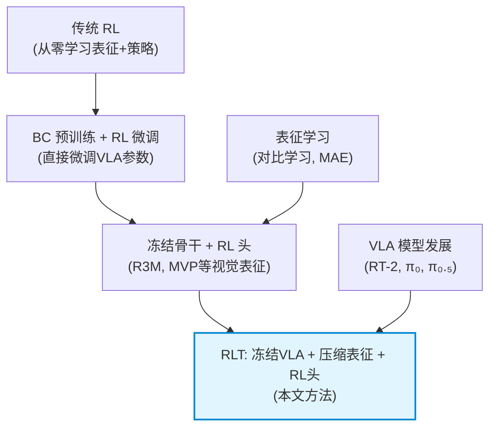

**阶段一：从零学习 (SAC/PPO on raw pixels)**
直接从图像像素训练 RL 策略。样本效率极低，泛化差。代表：DrQ-v2、SAC+CNN。

**阶段二：预训练表征 + RL (R3M, MVP, VIP)**
先在大规模视频/图像数据上预训练视觉编码器，冻结后作为 RL 的观测提取器。问题：这些表征缺乏对机器人任务的语义理解，且无法利用 VLA 的语言条件能力。

**阶段三：直接微调 VLA (RLFT)**
用 RL 直接微调整个 VLA 模型的参数。如 Reinforcement Learning Fine-Tuning (RLFT) 方法。问题：参数量巨大导致样本效率仍然很低，且容易灾难性遗忘。

**阶段四：RLT — 从 VLA 提取压缩表征 + 轻量 RL 头**
RLT 的核心创新在于：不是直接用预训练的视觉表征，也不是端到端微调 VLA，而是**从 VLA 的内部表示中学习一个任务相关的压缩表示**，然后在这个低维空间上做高效 RL。

### 2.2 RLT 相对于前驱方法的优势

| 对比维度 | 从零 RL | 预训练表征+RL | RLFT (微调VLA) | **RLT** |
|----------|---------|--------------|---------------|---------|
| 样本效率 | 极低 | 中 | 低 | **高** |
| 参数量 | 中 | 少 | 极多 (数十亿) | **少 (~几百K)** |
| 利用 VLA 能力 | 无 | 无 | 全部 | **保留VLA表征+参考动作** |
| 训练稳定性 | 差 | 中 | 差 | **好** |
| 泛化能力 | 差 | 中 | 好(但易遗忘) | **好 (继承VLA)** |
| 需要的在线交互量 | 极多 | 中 | 多 | **少** |

---

## 3. 算法横向分析：同类方法对比

### 3.1 与同期方法的对比

| 方法 | 核心思路 | VLA利用方式 | RL维度 | 适用场景 |
|------|---------|------------|--------|---------|
| **RLT** (PI, 2026) | 压缩VLA prefix → 轻量AC | 冻结backbone提取z_rl + ref_chunk | ~几百K | 精确操作、微调 |
| **RLFT** (微调VLA) | 端到端RL微调VLA | 全参数优化 | ~数十亿 | 通用,但效率低 |
| **FAST** (InternVLA) | 离散化动作token | VLA直接输出动作token | VLA参数量 | 多模态动作 |
| **Flow Matching RL** | 在flow matching空间做RL | 修改采样过程 | 中 | 连续动作 |
| **Residual Policy** | 基础策略+残差修正 | 基础策略提供参考 | 中 | 增量改进 |

论文中直接对比的 baselines（出处: arXiv:2604.23073, Table 1）：

| 方法 | 与RLT关系 | 论文评估结果 |
|------|----------|-------------|
| **HIL-SERL** | ResNet编码器, 无VLA表征, 10Hz设计 | 50Hz下失败; 无action chunking使信用分配不可行 |
| **PLD** (Probe-Learn-Distill) | 单步残差策略 | 稀疏奖励下数百步的信用分配失败 |
| **DSRL** | 约束策略在VLA模态附近 | 成功率可比, 但"速度改进显著不如RLT" |
| **DAgger** | 在干预数据上微调VLA | 受限于人类遥操作速度上限 |

### 3.2 RLT 的独特定位

RLT 本质上是一种 **"representation bridging"** 方法：它在 VLA 的高维内部表示和 RL 需要的低维状态之间架起了一座桥梁。这座桥（RLT Token Transformer）的独特之处在于：

1. **信息完整性**: 通过自回归重建目标，确保压缩后的 $z_{rl}$ 保留了 VLA prefix 中的关键信息
2. **任务相关性**: 因为 Stage 1 联合训练了 VLA 和 RLT encoder，$z_{rl}$ 是面向动作预测任务的
3. **参考动作引导**: Stage 2 actor 不是从零开始，而是在 VLA 参考动作的基础上做修正

---

## 4. RLinf 中 RLT 的整体架构

### 4.1 系统全景架构

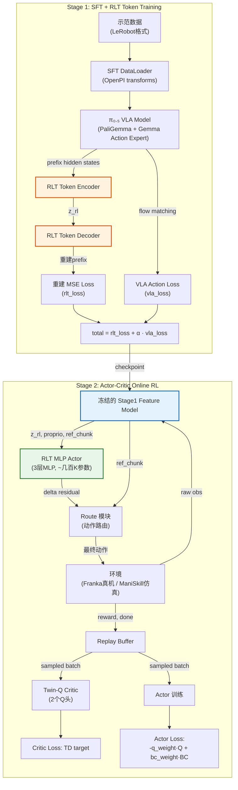

### 4.2 源代码目录结构

```
rlinf/
├── algorithms/rlt/                          # RLT 算法核心
│   ├── __init__.py                          # 公共导出
│   ├── rollout.py                           # predict_rlt_actions() 推理入口
│   ├── route.py                             # RealworldRLTRoute / SimulatorRLTRoute
│   ├── transition.py                        # RLT transition obs 管理
│   ├── action_geometry.py                   # 绝对动作的周期角度差分
│   └── expert.py                            # Expert model 动作预测
│
├── models/embodiment/
│   ├── modules/
│   │   └── rlt_token_transformer.py         # ★ RLT Encoder + Decoder + Loss
│   ├── mlp_policy/
│   │   ├── mlp_policy.py                    # MLP 基类 (backbone + Q-head)
│   │   └── rlt_mlp_policy.py               # ★ Stage 2 RLT MLP Actor-Critic
│   └── openpi_rlinf/
│       ├── openpi_action_model.py           # VLA wrapper 基类 (含 RLT 模块挂载)
│       ├── sft_action_model.py              # ★ Stage 1 SFT + RLT 联合训练
│       ├── eval_action_model.py             # ★ extract_rlt_obs() 特征提取
│       └── utils/
│           ├── rlt_utils.py                 # RLT 配置 dataclass + 权重加载
│           └── model_builders.py            # eval/sft/rl 模型构建工厂
│
├── workers/
│   ├── actor/
│   │   └── fsdp_rlt_ac_policy_worker.py     # ★ RLT AC 训练循环 + loss + replay
│   └── rollout/hf/
│       └── huggingface_worker.py            # 含 RLT 特征模型 rollout 分支
│
├── envs/
│   ├── maniskill/
│   │   └── maniskill_rlt_env.py             # ManiSkill 仿真 + 自动策略切换
│   └── realworld/common/wrappers/
│       └── keyboard_rlt_policy_switch_wrapper.py  # 真机键盘切换
│
└── config.py                                # loss_type: rlt_ac 注册

examples/
├── sft/config/
│   ├── realworld_rlt_stage1_sft_openpi_pi05.yaml   # Franka Stage 1
│   └── maniskill_rlt_stage1_sft_openpi_pi05.yaml   # ManiSkill Stage 1
└── embodiment/config/
    ├── realworld_rlt_stage2_ac_mlp.yaml             # Franka Stage 2
    └── maniskill_rlt_stage2_ac_mlp.yaml             # ManiSkill Stage 2
```

---

## 5. Stage 1：RLT 特征模型训练

### 5.1 目标与架构

Stage 1 的目标是在示范数据上联合训练 VLA 和 RLT Token Transformer，使得 RLT encoder 能将 VLA 的 prefix hidden states 压缩成一个紧凑的 $z_{rl}$ 向量，同时保持 VLA 的动作预测能力。

#### 5.1.1 数据流详解

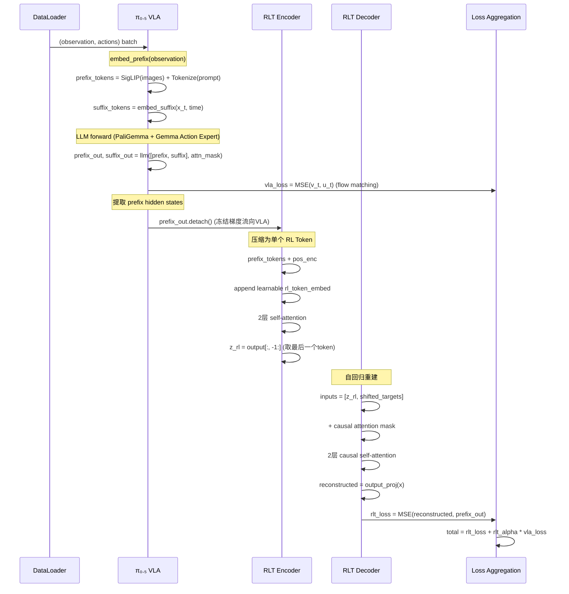

#### 5.1.2 关键代码实现

**入口: `sft_action_model.py:68-96`**

```python
# OpenPiPytorchSFTActionModel.sft_forward()
def sft_forward(self, data):
    observation, actions = self._unpack_sft_batch(data)

    if not self.rlt_cfg.use_rlt:
        # 普通 flow-matching SFT
        per_timestep_loss = self.model.compute_loss(observation, actions, train=True)
        return per_timestep_loss.mean()

    # RLT 模式: 联合训练
    per_timestep_loss, prefix_output, prefix_mask = (
        self._sft_forward_with_rlt_prefix(observation, actions)
    )
    vla_loss = per_timestep_loss.mean()
    rlt_loss, _ = self._rlt_forward(prefix_output, prefix_mask)

    return {
        "loss": rlt_loss + self.rlt_cfg.rlt_alpha * vla_loss,
        "vla_loss": vla_loss,
        "rlt_loss": rlt_loss,
    }
```

VLA 和 RLT 的损失计算在同一前向传播中完成。`_sft_forward_with_rlt_prefix()` 在计算 flow-matching loss 的同时保留了 prefix hidden states（做 `.detach()`，阻止 RLT 的梯度回传到 VLA 的 prefix embedding 层）。

### 5.2 RLT Token Transformer 架构

RLT Token Transformer 是整个算法的核心组件，由 Encoder 和 Decoder 组成，实现在 `rlinf/models/embodiment/modules/rlt_token_transformer.py` 中。

#### 5.2.1 Encoder: 将 prefix 序列压缩为单个 token

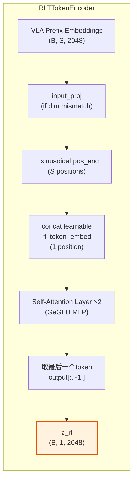

**核心实现 (`rlt_token_transformer.py:107-187`)**:

```python
class RLTTokenEncoder(nn.Module):
    """Compress VLA prefix embeddings into a single RL token."""

    def __init__(self, *, input_dim=2048, embed_dim=2048,
                 prefix_seq_len=768, num_layers=2, num_heads=8, ...):
        # 若 input_dim ≠ embed_dim，添加线性投影
        self.input_proj = nn.Linear(input_dim, embed_dim) if input_dim != embed_dim else nn.Identity()

        # 可学习的 RL token 嵌入（初始化为正弦位置编码）
        self.rl_token_embed = nn.Parameter(sinusoidal_pe_init(1, embed_dim))

        # prefix 位置编码和 RL token 位置编码
        self.prefix_pos_enc = nn.Parameter(sinusoidal_pe_init(prefix_seq_len, embed_dim))
        self.rl_token_pos_enc = nn.Parameter(sinusoidal_pe_init(1, embed_dim))

        # 2层 self-attention + GeGLU MLP
        self.layers = nn.ModuleList([
            RLTSelfAttentionLayer(embed_dim, num_heads=8, mlp_ratio=4.0)
            for _ in range(num_layers)
        ])

    def forward(self, prefix_embs, mask=None):
        prefix_embs = self.input_proj(prefix_embs)
        # 添加位置编码
        prefix_tokens = prefix_embs + self.prefix_pos_enc[:seq_len]
        # 拼接可学习的 RL token
        rl_tokens = self.rl_token_embed.expand(batch_size, -1, -1) + self.rl_token_pos_enc
        x = torch.cat([prefix_tokens, rl_tokens], dim=1)
        # 通过 self-attention 层
        for layer in self.layers:
            x = layer(x, mask=mask)
        # 返回最后一个 token（即 RL token 的输出）
        return x[:, -1:]
```

**关键设计细节**:

- **Append-style 编码**: RL token 被追加到 prefix 序列末尾，通过全局 self-attention 聚合所有 prefix token 的信息。这不同于 BERT 的 `[CLS]` token（在开头），这里在末尾追加使得 RL token 可以"看到"所有 prefix positions。
- **位置编码**: 使用正弦位置编码（sinusoidal PE）作为可学习参数的初始值。prefix 的每个位置和 RL token 有独立的位置编码。
- **Mask 支持**: 当 `rlt_use_mask=True` 时，padding 位置会被 mask 掉，确保 RL token 只关注有效的 prefix 内容。
- **GeGLU 激活**: Self-attention 层使用 GeGLU（Gated Linear Units with GELU 激活），这是一种比标准 MLP 表达力更强的激活机制。

#### 5.2.2 Decoder: 自回归重建 prefix

Decoder 的作用是从单个 $z_{rl}$ token 重建完整的 prefix embedding 序列。这个重建目标是 RLT encoder 的训练信号：如果 encoder 丢失了 prefix 中的关键信息，decoder 就无法准确重建。

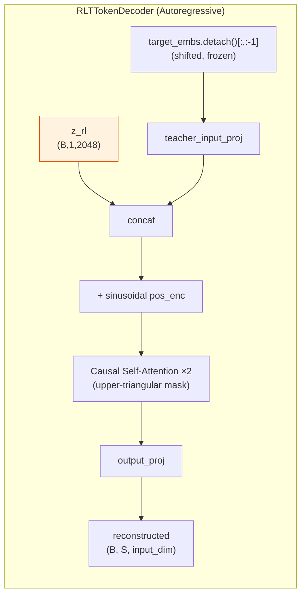

**核心实现 (`rlt_token_transformer.py:190-296`)**:

```python
class RLTTokenDecoder(nn.Module):
    """Autoregressively reconstruct VLA prefix embeddings."""

    def forward(self, rl_tokens, target_embeddings, mask=None):
        # 冻结 target：不让重建梯度流回 VLA
        frozen_targets = target_embeddings.detach()

        # Teacher forcing: 输入 = [z_rl, target[0], target[1], ..., target[S-2]]
        shifted_targets = frozen_targets[:, :-1]
        shifted_targets = self.teacher_input_proj(shifted_targets)
        decoder_inputs = torch.cat([rl_tokens, shifted_targets], dim=1)
        decoder_inputs = decoder_inputs + self.decoder_pos_enc[:target_seq_len]

        # 上三角 causal mask：防止看到未来的 target
        causal_mask = torch.triu(
            torch.ones(target_seq_len, target_seq_len, dtype=torch.bool),
            diagonal=1,
        )

        x = decoder_inputs
        for layer in self.layers:
            x = layer(x, mask=decoder_input_mask, attn_mask=causal_mask)
        return self.output_proj(x)
```

**自回归重建的数学描述**:

设 VLA prefix embeddings 为 $h_1, h_2, \ldots, h_S$，encoder 产生的 RL token 为 $z_{rl}$。Decoder 的生成过程为：

$$\hat{h}_t = \text{Decoder}(z_{rl}, h_1, h_2, \ldots, h_{t-1}), \quad t = 1, 2, \ldots, S$$

重建损失为 masked MSE：

$$\mathcal{L}_{rlt} = \frac{1}{|\mathcal{M}| \cdot d} \sum_{t \in \mathcal{M}} \| \hat{h}_t - h_t \|_2^2$$

其中 $\mathcal{M}$ 是 mask 中有效位置的集合，$d$ 是 embedding 维度。

#### 5.2.3 损失函数

**核心实现 (`rlt_token_transformer.py:363-389`)**:

```python
class RLTTokenTransformer(nn.Module):
    def loss(self, prefix_embs, mask=None):
        reconstructed, rl_tokens = self.reconstruct(prefix_embs, mask)
        target = prefix_embs.detach().to(dtype=torch.float32)
        reconstructed = reconstructed.to(dtype=torch.float32)
        sq_error = torch.square(reconstructed - target)

        if mask is not None:
            mask_expanded = mask[..., None]
            sq_error = sq_error * mask_expanded
            denom = torch.clamp(mask_expanded.sum() * prefix_embs.shape[-1], min=1.0)
            mse = sq_error.sum() / denom
        else:
            mse = sq_error.mean()

        return mse, {"mse": mse, "z_rl": rl_tokens.reshape(B, -1)}
```

**Stage 1 总损失**:

$$\mathcal{L}_{total} = \mathcal{L}_{rlt} + \alpha \cdot \mathcal{L}_{vla}$$

其中 $\alpha$ = `rlt_alpha`（默认 1.0），$\mathcal{L}_{vla}$ 是 flow-matching VLA loss。

**关键观察**: `reconstruct()` 方法中，`prefix_embs` 被 `.detach()` 后传入 encoder。这意味着 **RLT encoder 和 decoder 的梯度不会回传到 VLA 的 prefix embedding 层**。VLA 只通过 $\mathcal{L}_{vla}$ 被优化。RLT module 只通过 $\mathcal{L}_{rlt}$ 被优化。两者的训练是**联合但解耦**的。

### 5.3 梯度流分析 (Stage 1)

Stage 1 的梯度流设计是 RLT 的一个精妙之处。下图展示了哪些参数被更新、哪些被冻结、梯度如何流动：

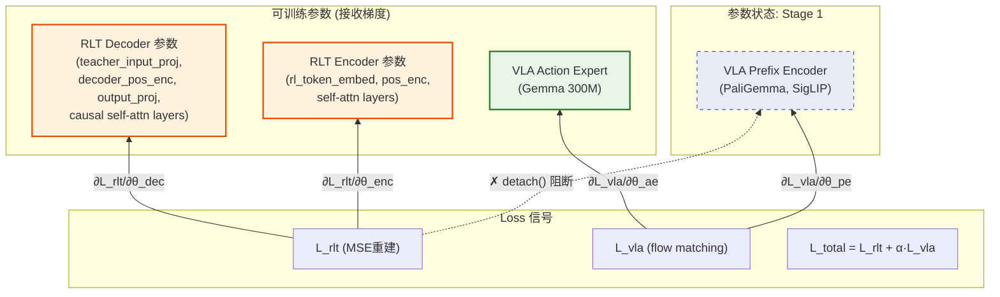

**关键梯度隔离机制**:

1. **`prefix_embs.detach()`** (在 `reconstruct()` 中): RLT encoder 的输入是 VLA prefix 的 hidden states，但经过 `.detach()` 后不携带梯度。这意味着 $\mathcal{L}_{rlt}$ 只优化 RLT encoder/decoder 的参数，不会影响 VLA 的 prefix embedding 层。

2. **`frozen_targets.detach()`** (在 decoder 的 teacher forcing 中): Decoder 的 teacher forcing 输入也经过 `.detach()`，确保重建损失不会通过 teacher-forcing 路径回传到 VLA。

3. **VLA prefix encoder 只通过 $\mathcal{L}_{vla}$ 被优化**: 它产生的 prefix hidden states 被 RLT 使用，但梯度被切断。VLA 的更新只来自 flow-matching 动作预测损失。

这个设计的好处是 **VLA 的训练不受 RLT 干扰**——VLA 继续优化其动作预测能力，而 RLT 学会压缩 VLA 已有的表示。单元测试 `test_reconstruct_detaches_targets_but_trains_encoder_and_decoder()` 验证了这一梯度流设计：

```python
# tests/unit_tests/test_rlt_token_transformer.py:91-110
loss, _ = model.loss(prefix_embs)
loss.backward()
assert prefix_embs.grad is None       # ← VLA prefix 不接收梯度
assert encoder_grad_norm > 0           # ← encoder 接收梯度
assert decoder_grad_norm > 0           # ← decoder 接收梯度
```

### 5.4 Prefix 选择策略

`_select_rlt_prefix_embeddings()` 方法控制哪些 prefix tokens 被送入 RLT encoder：

```python
# openpi_action_model.py:109-119
def _select_rlt_prefix_embeddings(self, prefix_output, prefix_mask, lang_tokens):
    if self.rlt_cfg.rlt_image_only and lang_tokens is not None:
        # 仅使用图像 token，排除语言 token
        num_image_tokens = prefix_output.shape[1] - lang_tokens.shape[1]
        prefix_output = prefix_output[:, :num_image_tokens]
        prefix_mask = prefix_mask[:, :num_image_tokens]
    return prefix_output, prefix_mask
```

当 `rlt_image_only=True` 时，只用图像 token（SigLIP 输出）作为 RLT encoder 的输入；当 `rlt_image_only=False`（RLinf 的 ManiSkill/Franka 配置中均如此），则同时使用图像和语言 token。

### 5.5 Stage 1 训练配置

从 `maniskill_rlt_stage1_sft_openpi_pi05.yaml` 可以看出关键配置：

| 参数 | 值 | 说明 |
|------|-----|------|
| `model_type` | `openpi_rlinf` | 使用 RLinf vendored 的 PyTorch Pi0.5 |
| `use_rlt` | `True` | 启用 RLT token 训练 |
| `rlt_alpha` | `1.0` | VLA loss 权重 |
| `rlt_input_dim` | `2048` | 与 PaliGemma hidden dim 一致 |
| `rlt_embed_dim` | `2048` | RLT transformer 内部维度 |
| `rlt_prefix_seq_len` | `1024` | 最大 prefix 序列长度 |
| `rlt_num_layers` | `2` | Encoder/Decoder 各 2 层 |
| `rlt_num_heads` | `8` | 多头注意力头数 |
| `rlt_image_only` | `False` | 使用图像 + 语言 tokens |
| `rlt_use_mask` | `True` | 启用 padding mask |
| `precision` | `fp32` | 模型精度 |
| `max_steps` | `2000` | 训练步数 |
| `lr` | `2.5e-5` | 学习率 |

---

## 6. Stage 2：Actor-Critic 策略训练

### 6.1 RLT MLP 策略架构

Stage 2 的核心是一个轻量级的 MLP actor-critic，定义在 `rlinf/models/embodiment/mlp_policy/rlt_mlp_policy.py` 中。

#### 6.1.1 输入输出设计

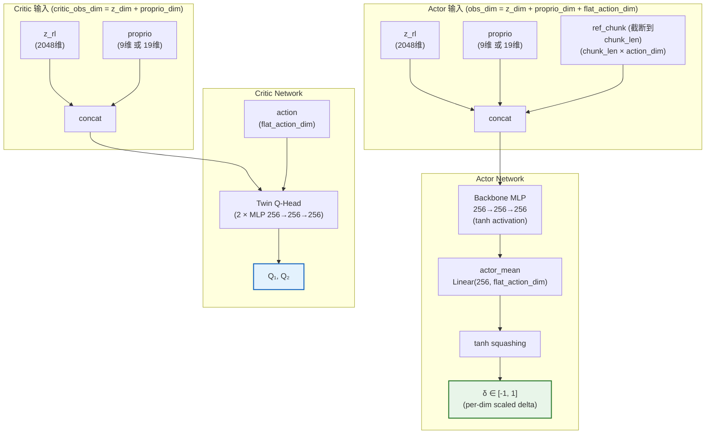

**核心实现 (`rlt_mlp_policy.py:22-80`)**:

```python
class RLTMLPPolicy(MLPPolicy):
    def __init__(self, z_dim, proprio_dim, action_dim, num_action_chunks, ...):
        flat_action_dim = chunk_len * step_action_dim  # e.g., 10 * 7 = 70

        # Actor 输入: ref_chunk + z_rl + proprio
        actor_obs_dim = z_dim + proprio_dim + flat_action_dim
        # Critic 输入: z_rl + proprio (不含 ref_chunk)
        critic_obs_dim = z_dim + proprio_dim

        super().__init__(
            obs_dim=actor_obs_dim,
            action_dim=flat_action_dim,
            num_action_chunks=1,  # 输出一个 flat chunk
            add_q_head=True,
            critic_obs_dim=critic_obs_dim,
        )

        self.fixed_std = 0.002  # 非常小的固定标准差

        # 残差缩放: XYZ 方向 0.02, RPY 方向 0.05, gripper 0.5
        ds = [0.02] * 3 + [0.05] * 3 + [0.5]
        self.register_buffer("delta_scale", torch.tensor(ds))
```

#### 6.1.2 残差动作设计 (Delta Residual)

这是 RLT 的一个关键设计。Actor 不直接输出绝对动作，而是输出对 VLA 参考动作的残差修正：

$$a_{final} = a_{ref} + \tanh(\text{MLP}(z_{rl}, \text{proprio}, a_{ref})) \odot \text{delta\_scale}$$

其中 `delta_scale` 是每个维度的最大修正幅度：

| 维度 | 含义 | delta_scale | 最大修正 |
|------|------|------------|---------|
| 0-2 | XYZ 位置 | 0.02 | ±2cm |
| 3-5 | RPY 旋转 | 0.05 | ±0.05 rad ≈ ±2.9° |
| 6 | Gripper 开合 | 0.5 | ±0.5 |

这个设计确保 Actor 只在 VLA 参考动作的小邻域内做精确调整，而不会产生剧烈的动作变化。

**路由实现 (`route.py:146-170`)**:

```python
# RealworldRLTRoute.route()
if is_actor:
    ref_base = ref_actions[:, :actions.shape[1], :actions.shape[2]]
    ds = [0.02] * 3 + [0.05] * 3 + [0.5]
    delta_scale = torch.tensor(ds, device=actions.device, dtype=actions.dtype)
    actor_actions = ref_base + actions * delta_scale
    routed_actions = torch.where(rlt_switch_flags, actor_actions, ref_base)
```

#### 6.1.3 Actor 前向传播

```python
# rlt_mlp_policy.py:149-169
def sac_forward(self, obs, apply_reference_dropout=False, reference_dropout_prob=0.0,
                deterministic=False, **kwargs):
    # 构建 actor 输入: [ref_chunk, z_rl, proprio]
    actor_state = self._actor_state(obs,
                                     apply_reference_dropout=apply_reference_dropout,
                                     reference_dropout_prob=reference_dropout_prob)
    feat = self.backbone(actor_state)        # 3层 MLP
    action_mean = self.actor_mean(feat)       # 线性映射到动作维度
    action_std = torch.full_like(action_mean, self.fixed_std)  # 固定 σ=0.002
    probs = Normal(action_mean, action_std)
    action = action_mean if deterministic else probs.rsample()
    chunk_logprobs = probs.log_prob(action)
    action = torch.tanh(action)               # squash to [-1, 1]
    return action, chunk_logprobs, None
```

**固定标准差 (fixed_std=0.002)** 是一个有意的设计选择：RLT 不使用 SAC 的自适应熵调节，而是使用非常小的固定探索噪声。这是因为 Actor 的输出经过 `delta_scale` 缩放后已经是非常小的修正量，过大的探索噪声会导致不稳定。

#### 6.1.4 Reference Dropout

`_maybe_drop_reference()` 在训练时以 `reference_dropout_prob` 的概率将 ref_chunk 置零：

```python
# rlt_mlp_policy.py:118-129
def _maybe_drop_reference(self, ref_chunk, reference_dropout_prob):
    if reference_dropout_prob <= 0:
        return ref_chunk
    keep_prob = 1.0 - float(reference_dropout_prob)
    keep_mask = torch.rand((ref_chunk.shape[0], 1), device=ref_chunk.device) < keep_prob
    return ref_chunk * keep_mask.to(dtype=ref_chunk.dtype)
```

这个设计的目的是**防止 Actor 过度依赖 VLA 参考动作**。如果 Actor 只是学会了"原封不动地复制 ref_chunk + 微小扰动"，那么当 VLA 的参考动作不够好时，Actor 无法自主纠正。Reference dropout 迫使 Actor 在一半时间（默认 `reference_dropout_prob=0.5`）学会不依赖参考动作、仅从 $z_{rl}$ 和 proprio 做决策。

### 6.2 特征提取：冻结的 Stage 1 模型

Stage 2 rollout 时，冻结的 Stage 1 模型从原始环境观测中提取 RLT 特征。

**核心实现 (`eval_action_model.py:373-426`)**:

```python
@torch.no_grad()
def extract_rlt_obs(self, env_obs):
    """Extract the frozen Stage1 features consumed by the Stage2 RLT head."""
    # 1. 通过 OpenPI transforms 将 env obs 转换为模型输入
    repacked = self._repack_env_obs(env_obs)
    processed = self.input_transform(repacked, transpose=False)
    observation = self._observation_dict_to_device(processed)

    # 2. 运行 VLA prefix 并 cache
    prepared_observation = preprocess_observation(observation, train=False)
    prefix_output, prefix_mask, kv_cache = self.model.build_prefix_cache(prepared_observation)

    # 3. 选择 prefix embeddings 并编码为 z_rl
    rlt_prefix_output, rlt_prefix_mask = self._select_rlt_prefix_embeddings(
        prefix_output, prefix_mask, prepared_observation.tokenized_prompt
    )
    z_rl = self._encode_rlt_flat(rlt_prefix_output, rlt_prefix_mask).to(torch.float32)

    # 4. 使用 prefix cache 采样 VLA 参考动作 (Euler ODE sampler)
    model_actions = self._sample_actions_from_prefix_cache(
        prepared_observation, prefix_mask, kv_cache,
    )
    ref_chunk = self.output_transform({"actions": model_actions, "state": observation.state})["actions"]

    # 5. 提取本体感觉状态
    proprio = observation.state[..., :state_dim]  # OpenPI 处理后的状态

    return {
        "z_rl": z_rl,           # (B, 2048) 紧凑 RLT 表示
        "proprio": proprio,      # (B, proprio_dim) 本体感觉
        "ref_chunk": ref_chunk,  # (B, chunk_len, action_dim) VLA 参考动作
    }
```

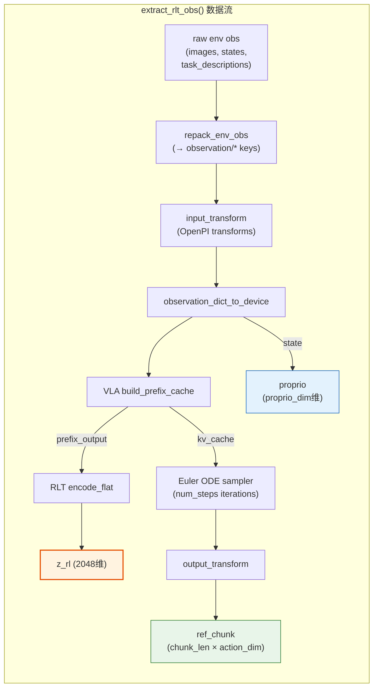

**prefix cache 优化**: `build_prefix_cache()` 只运行一次 VLA 的 prefix embedding + LLM 前向，然后 `_sample_actions_from_prefix_cache()` 在 Euler ODE 采样的多次迭代中复用 prefix 的 KV cache，避免重复计算。

### 6.3 Actor-Critic 训练损失

训练实现在 `fsdp_rlt_ac_policy_worker.py` 中。

#### 6.3.1 Critic 损失 (TD Learning)

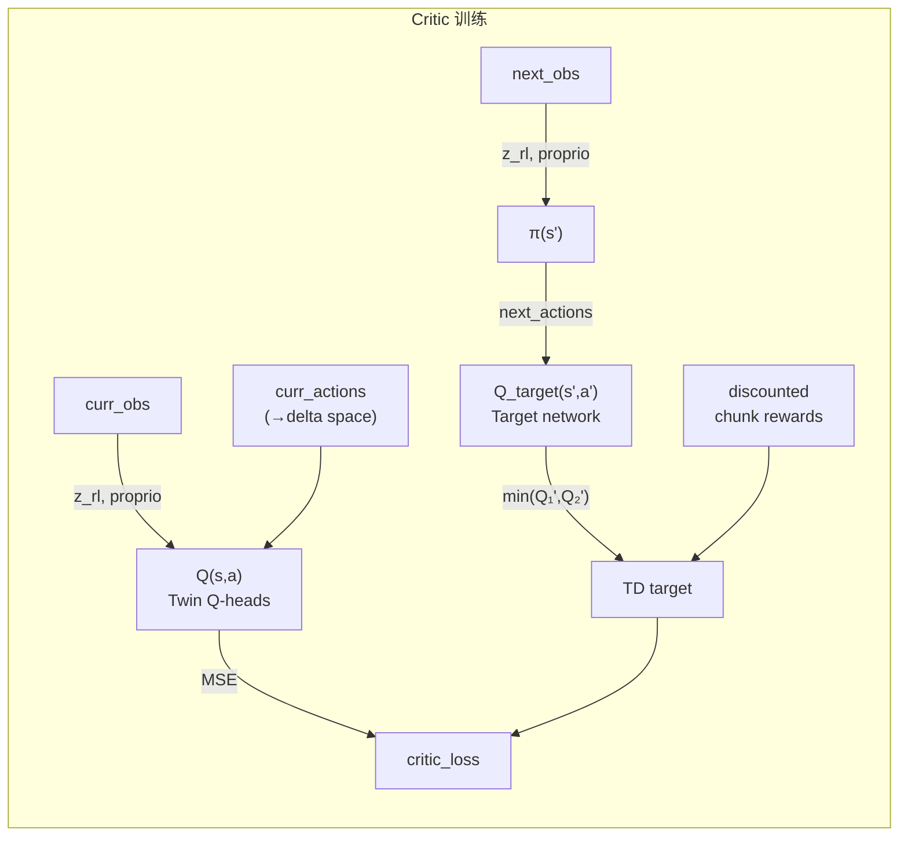

**实现 (`fsdp_rlt_ac_policy_worker.py:321-392`)**:

Critic 使用 chunked rewards 上的 TD target。一个 action chunk 内的多步奖励会先按折扣因子累积，然后用下一状态 Q 值 bootstrap：

$$r_{chunk} = \sum_{t=0}^{H-1} \gamma^t r_t$$

$$Q_{target} = r_{chunk} + \gamma^H \cdot \min(Q_1'(s', \pi(s')), Q_2'(s', \pi(s')))$$

$$\mathcal{L}_{critic} = \text{MSE}(Q(s, a), Q_{target})$$

```python
def forward_critic(self, batch):
    # 将绝对动作转换为 delta 空间
    actions = self._actions_to_delta(self._truncate_actions(batch["actions"]), curr_obs)

    # 计算 TD target
    with torch.no_grad():
        next_actions, _, _ = self.model(forward_type=ForwardType.SAC, obs=next_obs)
        all_qf_next_target = self.target_model(
            forward_type=ForwardType.SAC_Q, obs=next_obs, actions=next_actions
        )
        q_next = min(Q₁_target, Q₂_target)  # Twin-Q: 取最小值

        reward_target = discounted_chunk_rewards(rewards)
        bootstrap_discount = gamma ** reward_horizon

        if bootstrap_type == "standard":
            target_q_values = reward_target + not_done * bootstrap_discount * q_next
        elif bootstrap_type == "always":
            target_q_values = reward_target + bootstrap_discount * q_next

    # 当前 Q 值
    all_data_q_values = self.model(forward_type=ForwardType.SAC_Q, obs=curr_obs, actions=actions)

    # MSE 损失
    critic_loss = F.mse_loss(all_data_q_values, target_q_values.expand_as(all_data_q_values))
```

**关键细节**: `_actions_to_delta()` 将 replay buffer 中存储的绝对动作转换为 delta 空间（减去 ref_chunk 再除以 delta_scale），确保 critic 看到的动作表示与 actor 的输出一致。对于真机的 XYZ Euler angles，使用 `absolute_action_delta()` 处理周期性角度差分：

```python
# action_geometry.py
def absolute_action_delta(actions, reference):
    difference = actions - reference
    angles = difference[..., 3:6]
    return torch.cat((
        difference[..., :3],
        torch.atan2(angles.sin(), angles.cos()),  # 周期性角度差分
        difference[..., 6:],
    ), dim=-1)
```

#### 6.3.2 Actor 损失 (Q-guided + BC regularization)

$$\mathcal{L}_{actor} = -w_q \cdot Q_1(s, \pi(s)) + w_{bc} \cdot \mathcal{L}_{BC}$$

其中 $\mathcal{L}_{BC}$ 是 behavior cloning 正则化损失。

**实现 (`fsdp_rlt_ac_policy_worker.py:394-458`)**:

```python
def forward_actor(self, batch):
    curr_obs = batch["curr_obs"]

    # Actor 前向（带 reference dropout）
    pi, log_pi, _ = self.model(
        forward_type=ForwardType.SAC, obs=curr_obs,
        apply_reference_dropout=True,
        reference_dropout_prob=0.5,
    )

    # Q 值 (用 Q₁，不是 min-Q)
    all_qf_pi = self.model(
        forward_type=ForwardType.SAC_Q, obs=curr_obs, actions=pi,
        detach_encoder=True,  # 阻止 Q 梯度流经 actor backbone
    )
    qf_pi = Q₁(all_qf_pi)  # 仅用 Q₁，不用 min-Q

    # BC 损失
    bc_loss, rlt_metrics = self._bc_metrics(
        pi=pi,
        actions=batch["actions"],
        ref_chunk=ref_chunk,
        intervene_flags=batch.get("intervene_flags"),
        valid_mask=self._bc_valid_mask(batch),
    )

    # 权重调度
    bc_weight, q_weight, weight_metrics = self._actor_objective_weights()
    actor_loss = -q_weight * qf_pi.mean() + bc_weight * bc_loss
```

#### 6.3.3 BC 损失的多模式设计

BC 损失根据 `bc_target_mode` 有三种模式：

| 模式 | 描述 | target |
|------|------|--------|
| `zero` (默认) | Actor 输出应为零（即不修正 ref_chunk） | $\delta_{target} = 0$ |
| `conditional_all` | Human intervention 步使用 human delta | $\delta_{target} = (a_{human} - a_{ref}) / \text{scale}$ |
| `conditional_xyz` | 仅 XYZ 维度使用 human delta | 同上，但 RPY+gripper 维度为 0 |

```python
# BC 损失计算
def _bc_metrics(self, pi, actions, ref_chunk, intervene_flags, valid_mask):
    # 默认 target 为零 (actor 不修正时应输出 0)
    target = torch.zeros_like(pi_chunk)

    if mode != "zero":
        # Human intervention 步: target 是人类动作相对参考的残差
        human_delta = (actions - ref_chunk) / delta_scale
        target = torch.where(human[..., None], human_delta, target)

    error = (pi_chunk - target).square().mean(-1)
    bc_loss = torch.where(valid, error, 0.0).sum() / valid.sum().clamp_min(1)
```

在 `zero` 模式下，BC 正则化迫使 Actor 在没有 Q 梯度引导时趋向于不修正参考动作。这保证了 Actor 在训练早期是安全的——它不会偏离 VLA 太远。

### 6.4 特征提取完整数据流

下面用一个完整的序列图展示 Stage 2 rollout 时从环境观测到执行动作的完整数据流：

```mermaid
sequenceDiagram
    participant ENV as Environment
    participant HFW as HuggingFace<br/>Rollout Worker
    participant FM as Frozen Feature Model<br/>(Stage1 checkpoint)
    participant ACTOR as RLT MLP Actor
    participant ROUTE as RLT Route
    participant REPLAY as Replay Buffer

    ENV->>HFW: raw obs (images, states, task_descriptions)

    Note over HFW: _predict_rollout_actions()
    HFW->>FM: extract_rlt_obs(env_obs)

    Note over FM: OpenPI transforms → VLA prefix → z_rl
    FM->>FM: repack_env_obs → input_transform
    FM->>FM: build_prefix_cache (VLA LLM forward)
    FM->>FM: encode_rlt_flat (RLT encoder → z_rl)
    FM->>FM: sample_actions_from_prefix_cache (Euler ODE → ref_chunk)
    FM-->>HFW: {z_rl, proprio, ref_chunk}

    HFW->>ACTOR: predict_action_batch({z_rl, proprio, ref_chunk})
    ACTOR-->>HFW: delta actions ∈ [-1,1], chunk_logprobs

    HFW->>ROUTE: route(student_actions, rlt_switch_flags, ...)

    alt Actor 控制阶段
        ROUTE->>ROUTE: final = ref_chunk + delta * delta_scale
    else VLA 控制阶段
        ROUTE->>ROUTE: final = ref_chunk
    end

    ROUTE-->>HFW: routed_actions, forward_inputs
    HFW->>ENV: execute routed_actions
    ENV-->>HFW: reward, done, next_obs

    Note over HFW: 附加 transition obs
    HFW->>FM: extract_rlt_obs(next_obs)
    FM-->>HFW: {next_z_rl, next_proprio, next_ref_chunk}

    HFW->>REPLAY: transition = {curr_obs, action, reward, next_obs, done}
```

---

## 7. 路由与策略切换机制

### 7.1 路由架构总览

RLT 的一个核心设计是**动态策略切换**：在任务的不同阶段使用不同的控制策略。

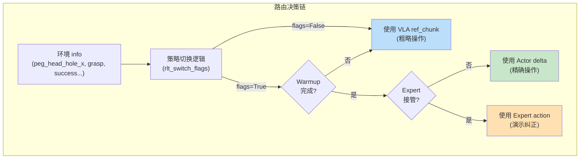

### 7.2 两种路由实现

路由系统在 `rlinf/algorithms/rlt/route.py` 中实现，包含两个具体实现：

#### 7.2.1 RealworldRLTRoute: 真机键盘切换

**适用场景**: Franka 真机操作，操作员通过键盘控制。

```python
class RealworldRLTRoute(RLTRoute):
    def route(self, ctx: RLTRouteContext) -> RLTRouteOutput:
        # 根据键盘 rlt_switch_flags 决定使用 actor 还是 VLA
        if not is_actor:
            # VLA 模式：直接使用参考动作
            routed_actions = ref_actions[:, :, :actions.shape[2]]
        else:
            # Actor 模式：ref + delta * scale
            ref_base = ref_actions[:, :actions.shape[1], :actions.shape[2]]
            actor_actions = ref_base + actions * delta_scale
            routed_actions = torch.where(rlt_switch_flags, actor_actions, ref_base)

        # 标记哪些 step 应该记录到 replay buffer
        result["forward_inputs"]["record_transition"] = rlt_switch_flags[:, :1]
        result["forward_inputs"]["actor_switch"] = record_transition
```

对应的键盘 wrapper (`keyboard_rlt_policy_switch_wrapper.py`):
- 按 `b`: 进入 Actor 控制阶段
- 按 `c`: 标记任务成功 (reward=1, terminated=True)
- 按 `a`: 标记任务失败 (reward=0, terminated=True)

#### 7.2.2 SimulatorRLTRoute: 仿真自动切换

**适用场景**: ManiSkill 仿真环境，基于任务状态自动判断。

```python
class SimulatorRLTRoute(RLTRoute):
    def __init__(self, *, use_schedule: bool, warmup_updates: int):
        self.use_schedule = use_schedule
        self.warmup_updates = warmup_updates

    def _ready_for_online(self, version: int) -> bool:
        # Warmup 阶段不允许 actor 接管
        return not self.use_schedule or int(version) >= self.warmup_updates

    def route(self, ctx: RLTRouteContext) -> RLTRouteOutput:
        # 1. 从环境 info 获取 critical_phase 标记
        critical_phase = _last_info_bool(ctx.rlt_switch_flags, ...)

        # 2. Actor 切换 = critical_phase AND warmup 完成
        actor_switch = critical_phase
        if self.use_schedule:
            actor_switch = actor_switch & ready_for_online

        # 3. Expert 接管检查
        expert_takeover = requested_expert_takeover & ready_for_online & (mode == "train")

        # 4. 路由动作
        routed_actions = torch.where(actor_switch[:, None, None], actions, base_actions)

        # 5. Expert 动作覆盖（如果接管）
        if expert_takeover.any():
            expert_actions = predict_expert_actions(ctx.expert_model, ctx.env_obs, ...)
            routed_actions = torch.where(expert_takeover[:, None, None], expert_actions, routed_actions)
```

### 7.3 ManiSkill 自动切换逻辑

ManiSkill 环境（`maniskill_rlt_env.py`）实现了基于任务状态的自动策略切换，核心是 `_rlt_auto_enter_actor()`:

```python
# maniskill_rlt_env.py:639-665
def _rlt_auto_enter_actor(self, infos, device):
    # 抓取检测
    grasp = infos["consecutive_grasp_current"]
    # 任务是否已成功
    success = infos["success_current"]
    # Peg-hole 相对位置
    hole_x = infos["peg_head_hole_x"]        # x 方向（插入方向）距离
    abs_y = infos["peg_head_hole_abs_y"]      # y 方向偏差
    abs_z = infos["peg_head_hole_abs_z"]      # z 方向偏差

    # 判断 peg 是否接近 hole（进入 critical phase）
    near_hole = (
        (hole_x >= near_hole_x_min) &         # x 足够近
        (abs_y <= yz_margin * hole_radii) &   # y 对齐
        (abs_z <= yz_margin * hole_radii)     # z 对齐
    )

    enter_actor = near_hole
    if require_grasp:
        enter_actor = enter_actor & grasp      # 必须已抓住 peg
    if require_not_success:
        enter_actor = enter_actor & (~success) # 尚未成功

    return enter_actor
```

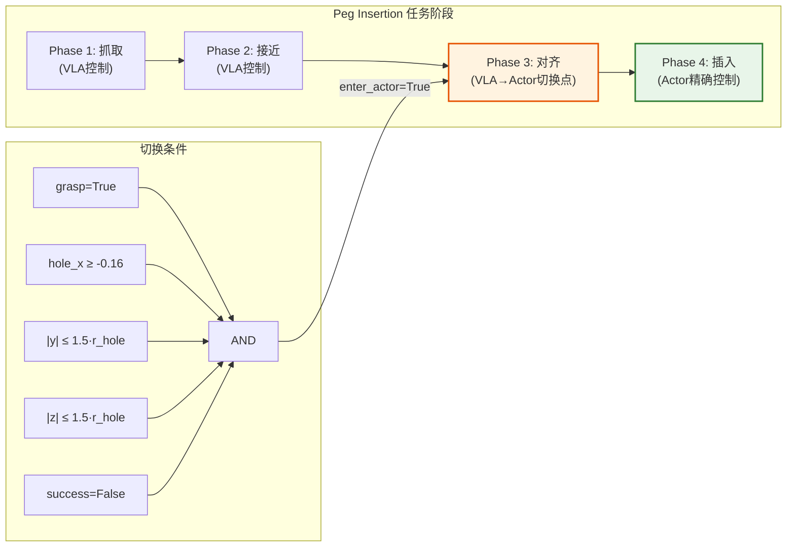

### 7.4 Expert Takeover 机制 (Stalled Progress)

ManiSkill 支持一种仿真专用的 expert takeover 机制。当 Actor 在 critical phase 中连续数个 chunk 没有取得进展时，自动切换到一个更强的 SFT expert 模型：

```python
# maniskill_rlt_env.py:372-480
def _update_rlt_stalled_progress_expert_takeover(self, infos, expert_cfg, device):
    # 追踪每个 env 的最佳进展
    x_improved = hole_x > (best_progress_x + min_x_progress)      # x 前进了 0.003+
    yz_improved = yz_dist < (best_progress_yz - min_yz_progress)   # yz 更对齐了
    score_improved = progress_score > (best_progress_score + min_score_progress)
    improved = x_improved | yz_improved | score_improved

    # 无进展计数
    stalled_chunks = stalled_chunks + 1 if no_progress else 0

    # 连续 3 个 chunk 无进展 → 触发 expert 接管
    trigger_now = no_progress & (stalled_chunks >= stuck_chunks_before_takeover)

    state["expert_takeover_active"] = active_before | trigger_now
```

Expert 的动作会被写入 replay buffer 的 `intervene_flags` 字段，训练时 Actor 会将这些步的 BC target 替换为 expert 的动作残差。

---

## 8. Replay Buffer 与 Transition 管理

### 8.1 RLT Transition 结构

RLT 的 replay buffer 不存储原始图像，而是存储 **Stage 1 提取的紧凑特征**：

```
transition = {
    curr_obs:  {z_rl: (2048,), proprio: (proprio_dim,), ref_chunk: (chunk_len, action_dim)},
    action:    (chunk_len * action_dim,),    # 实际执行的动作 (可能是 VLA ref 或 actor delta)
    reward:    (chunk_len,),                 # 每步奖励
    next_obs:  {z_rl: (2048,), proprio: (proprio_dim,), ref_chunk: (chunk_len, action_dim)},
    done:      bool,
    intervene_flags: (chunk_len,),           # 标记哪些步是 expert 接管的
}
```

这个设计极大地减少了 replay buffer 的内存占用：
- 原始观测: 每帧 384×384×3 = 442K floats
- RLT 特征: z_rl(2048) + proprio(9~19) + ref_chunk(10×7~8) ≈ 2.1K floats
- **内存节省约 200 倍**

### 8.2 Transition 收集

`rlinf/algorithms/rlt/transition.py` 定义了 transition obs 的管理：

```python
RLT_OBS_KEYS = ("z_rl", "proprio", "ref_chunk")
RLT_TRANSITION_PREFIX = "rlt_transition_"

def update_rlt_transitions(stage_id, pending_obs, trajectory_builders, policy_output,
                           *, cache_current, ...):
    # 1. 如果有 pending obs，用当前 policy_output 的 next_obs 完成 transition
    if pending_obs[stage_id] is not None:
        next_obs = extract_rlt_obs_from_forward_inputs(
            policy_output.forward_inputs, transition=True,
        )
        trajectory_builders[stage_id].append_transitions(pending_obs[stage_id], next_obs)
        pending_obs[stage_id] = None

    # 2. 缓存当前 obs 为下一个 transition 的 curr_obs
    if cache_current:
        pending_obs[stage_id] = extract_rlt_obs_from_forward_inputs(
            policy_output.forward_inputs
        )
```

### 8.3 两种 Replay 模式

RLT 支持两种 replay 数据摄入模式（在 `fsdp_rlt_ac_policy_worker.py` 中）：

#### 8.3.1 真机模式：Chunk-level 录入

```python
def _recorded_chunk_trajectory(self, trajectory):
    """Keep only executed actor chunks."""
    flat = self.replay_buffer._flatten_trajectory(trajectory)
    flags = flat["forward_inputs"]["record_transition"]
    keep = flags.reshape(num_rows, -1).bool().all(dim=-1)
    # 只保留 record_transition=True 的 chunk
    recorded = Trajectory(...)
    for key, value in flat.items():
        setattr(recorded, key, select(value))
    return recorded
```

#### 8.3.2 仿真模式 (Simulator Transition Replay)：Step-level 录入

```python
def _transition_replay_trajectories(self, trajectory):
    """将 rollout chunk 切成 1-sample transition trajectory."""
    for env_idx in range(bsz):
        for t in range(traj_len):
            if not self._flat_record_transition(flat, idx):
                continue
            # 每个有效 step 创建一个独立 Trajectory
            transition = Trajectory(max_episode_length=1, ...)
            transition.curr_obs = self._rlt_obs_from_flat_dict(flat, "curr_obs", idx)
            transition.next_obs = self._rlt_obs_from_flat_dict(flat, "next_obs", idx)
            replay_trajectories.append(transition)
```

仿真模式下，ManiSkill 的每个 env step 被拆分为独立的 transition，存入 `TrajectoryReplayBuffer`。这允许更细粒度的数据利用。

---

## 9. 训练调度与权重退火

### 9.1 RLT Schedule (ManiSkill 仿真)

ManiSkill 仿真使用一个精心设计的训练调度系统（`fsdp_rlt_ac_policy_worker.py:886-982`）：

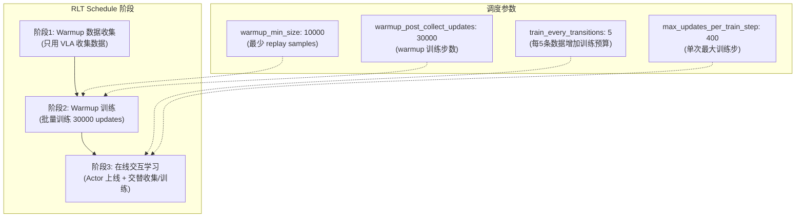

调度逻辑的核心是 `_rlt_updates_to_run()`：

```python
def _rlt_updates_to_run(self):
    # 1. 检查 replay buffer 是否足够大
    buffer_ready = counters["min_replay_size"] >= min_buffer_size

    # 2. 计算在线数据收集以来的训练需求
    online_transitions = total_transitions - warmup_baseline
    desired_total_updates = warmup_required_updates + online_cycles * update_epoch
    pending_updates = desired_total_updates - current_update_step

    # 3. 限制单次最大训练量
    updates_to_run = min(pending_updates, max_updates_per_train_step)
```

### 9.2 Actor 权重退火 (Weight Schedule)

Actor 的 BC/Q 权重支持从 warmup 值平滑过渡到 online 值：

```yaml
# maniskill_rlt_stage2_ac_mlp.yaml
actor_weight_schedule:
  enable: True
  warmup_updates: 20000      # warmup 阶段保持初始权重
  ramp_updates: 50000        # 线性过渡到 online 权重
  warmup_bc_weight: 7.0      # 初始 BC 权重 (高, 保守)
  warmup_q_weight: 0.05      # 初始 Q 权重 (低, 安全)
  online_bc_weight: 2.5      # 最终 BC 权重
  online_q_weight: 0.45      # 最终 Q 权重
```

```
bc_weight:  7.0 ─────────────────┐                    2.5
                                  \                   /
                                   ╲─────────────────╱
q_weight:   0.05 ────────────────┐                    0.45
                                  \                  /
                                   ╲────────────────╱
            │←── warmup (20k) ──→│←── ramp (50k) ──→│←── online ──→
```

这个退火策略的设计意图是：

1. **训练早期 (warmup)**: BC 权重高 (7.0)，Q 权重低 (0.05)。Actor 主要学习模仿 VLA 参考动作，Q 值还不可靠时不过度依赖。
2. **过渡阶段 (ramp)**: 线性调整，逐步增加 Q 权重、减少 BC 权重。
3. **在线阶段 (online)**: BC 权重 2.5，Q 权重 0.45。Actor 更多地由 Q 值引导，但仍保留适度的 BC 正则化防止策略崩溃。

实现 (`fsdp_rlt_ac_policy_worker.py:218-295`):

```python
def _actor_objective_weights(self):
    if in_warmup:
        bc_weight, q_weight = warmup_bc_weight, warmup_q_weight
    elif ramp_updates > 0:
        # 线性插值
        ramp_progress = (update_step - warmup_updates) / ramp_updates
        bc_weight = warmup_bc_weight + ramp_progress * (online_bc_weight - warmup_bc_weight)
        q_weight = warmup_q_weight + ramp_progress * (online_q_weight - warmup_q_weight)
    else:
        bc_weight, q_weight = online_bc_weight, online_q_weight
```

### 9.3 Rollout Version 同步

Warmup 状态通过 `get_rollout_sync_version()` 传递给 rollout worker，再由 `SimulatorRLTRoute._ready_for_online()` 判断是否允许 actor 接管：

```python
# fsdp_rlt_ac_policy_worker.py:57-61
def get_rollout_sync_version(self):
    if not self.use_rlt_schedule:
        return int(self.version)
    return int(self.update_step)  # 返回 learner 的训练步数

# route.py:191-192
def _ready_for_online(self, version):
    return not self.use_schedule or int(version) >= self.warmup_updates
```

---

## 10. 消融分析与关键设计点

### 10.1 论文消融实验结果 (Ethernet Insertion Task)

以下消融结果来自 RLT 原论文 (arXiv:2604.23073) 在 Ethernet 插入任务上的实验（出处: [PI RLT Research Page](https://www.pi.website/research/rlt)）：

| 消融条件 | 效果 | 结论 |
|----------|------|------|
| **w/o RL token** (替换为冻结 ImageNet ResNet-10) | 吞吐量下降 50% | VLA 内部特征编码了标准视觉编码器无法提供的操作相关结构 |
| **w/o Chunk** (C=1, 单步动作) | 无法达到基线性能 | 将有效 horizon 从 ~10 扩大到 ~100，稀疏奖励传播完全失败 |
| **w/o BC Regularizer** ($\beta$=0) | **最大单项性能下降** | 仅靠 Q 梯度的无约束探索不可行 |
| **w/o Pass-Through** (去除 ref_chunk 输入) | 学习变慢，早期探索漂移 | 参考动作锚定对训练稳定性至关重要 |

**关键发现**: "只考虑单步动作而非 action chunk 的方法 (HIL-SERL, PLD) 在 50Hz 稀疏奖励下表现极差。"（出处: 论文 Section 5.2）

### 10.2 论文定量结果

RLT 在 Franka 真机上的吞吐量改进（出处: [PI RLT Research Page](https://www.pi.website/research/rlt), [Humanoids Daily](https://www.humanoidsdaily.com/news/the-last-millimeter-physical-intelligence-unveils-rl-tokens-for-hyper-fast-precision)）：

| 任务 | Base VLA | RLT | 改进倍数 |
|------|----------|-----|---------|
| Screwdriver 安装 | ~5/10min | ~18/10min | ~3.6× |
| Zip Tie 绑扎 | ~5/10min | ~12/10min | ~2.4× |
| Ethernet 插入 | ~100/10min | ~350/10min | ~3.5× |
| Charger 插入 | ~200/10min | ~550/10min | ~2.75× |
| Screw 安装 (成功率) | 20% | 65% | 3.25× |

**速度比较** (Ethernet insertion): RLT 中位数 66 timesteps vs 遥操作 146 timesteps vs base VLA 228 timesteps。"超过一半的 RL episode 在关键插入阶段比所有遥操作示范都更快。"

**涌现行为** (出处: 论文 Section 5.1): Ethernet 插入任务中，base VLA 会"探测"(approach → retreat → readjust)。RLT 则直接接近并流畅插入。当首次尝试失败时，RLT "施加压力并轻微摆动连接器以利用柔性"——这种行为在示范数据中不存在，完全从在线探索中涌现。

**数据效率**: RLT 仅在关键阶段消耗约 5 分钟数据后即超越所有对比方法（总实验时间约 40 分钟）。

### 10.3 代码实现中已验证有效的设计

| 设计点 | 有效性 | 代码位置 | 说明 |
|--------|--------|----------|------|
| **自回归重建目标** | ★★★★★ | `rlt_token_transformer.py` | Causal decoder 确保 z_rl 保留完整信息，单测验证了因果 mask 的正确性 |
| **残差动作 (delta)** | ★★★★★ | `rlt_mlp_policy.py:83-87` | 将学习问题从"预测绝对动作"简化为"预测微小修正" |
| **Reference dropout** | ★★★★ | `rlt_mlp_policy.py:118-129` | 防止 actor 退化为参考动作的复制器 |
| **冻结特征模型** | ★★★★★ | `eval_action_model.py:373` | `@torch.no_grad()` 确保零梯度开销 |
| **Twin-Q + min-Q** | ★★★★ | `fsdp_rlt_ac_policy_worker.py:87-89` | 标准 TD3/SAC 的 Q 值过估计缓解 |
| **权重退火** | ★★★★ | YAML config | 从保守 BC 平滑过渡到 Q-guided |
| **Chunked rewards** | ★★★ | `_discounted_chunk_rewards()` | 将多步奖励折扣聚合，减少 bootstrap 偏差 |

### 10.4 关键设计选择的权衡

#### 10.4.1 固定 std vs 可学习 std

RLT 使用 `fixed_std=0.002` 而非 SAC 的可学习 log-std。

**优势**: 探索量固定且极小，经过 `delta_scale` 缩放后真实探索幅度约为 XYZ 方向 0.04mm、RPY 方向 0.1mrad。这对精确操作非常安全。

**权衡**: 探索能力有限，依赖 VLA 参考动作将状态带到"接近正确"的区域。

#### 10.4.2 Actor 使用 Q₁ vs min-Q

**Actor 使用 Q₁** (`_q1()`)，而 **Critic target 使用 min-Q** (`_min_twin_q()`)：

```python
# Critic target: conservative estimation
q_next = self._min_twin_q(all_qf_next_target)  # min(Q₁', Q₂')

# Actor objective: aggressive optimization
qf_pi = self._q1(all_qf_pi)                     # Q₁ only
```

这与标准 SAC 不同（SAC 在 actor 也用 min-Q）。使用 Q₁ 让 actor 更积极地优化，因为 RLT 的 BC 正则化已经提供了足够的保守约束。

#### 10.4.3 Entropy 完全禁用

```python
# fsdp_rlt_ac_policy_worker.py:460-466
def forward_alpha(self, batch):
    raise NotImplementedError(
        "RLT AC disables entropy/alpha training. Use "
        "algorithm.entropy_tuning.alpha_type=fixed_alpha."
    )
```

RLT 不使用 SAC 的最大熵框架（`alpha_type=fixed_alpha`, `initial_alpha=0.0`）。原因：
- 动作空间已经通过 delta_scale 被严格约束
- BC 正则提供了足够的分布支撑
- 固定小 std 提供了最小探索

#### 10.4.4 Critic 不看 ref_chunk

```python
def _critic_state(self, obs):
    return torch.cat([self._get_z(obs), self._get_proprio(obs)], dim=-1)
    # 注意: 没有 ref_chunk！
```

Actor 的输入包含 ref_chunk，但 Critic 的输入**不包含 ref_chunk**。这意味着 Q 函数只依赖于环境状态（$z_{rl}$, proprio），不依赖于 VLA 的参考动作。

**设计理由**: Q 函数应该评估的是"在这个状态下执行这个动作有多好"，而不是"相对于参考动作的这个修正有多好"。如果 Critic 也看到 ref_chunk，它可能学到的是"偏离参考越少越好"这样的 trivial 策略。

### 10.5 RLT 的适用场景与局限

**适用场景**:
- 精确操作任务（peg insertion, connector mating）
- 有高质量 VLA 基座模型可用
- 在线交互数据获取成本可接受
- 任务可以自然地分为"粗略操作"和"精确操作"两个阶段

**局限**:
- 依赖 VLA 的 ref_chunk 质量——如果 VLA 在某个状态下产生的参考动作方向完全错误，delta residual 的修正范围有限
- Stage 1 需要示范数据，不是纯无监督的
- 阶段切换需要任务特定的判断逻辑（如 peg-hole 距离阈值）
- 当前实现的 delta_scale 是硬编码的 per-DoF 常数，不是自适应的

---

## 11. 源文件索引

| 文件路径 | 角色 | 关键类/函数 |
|----------|------|------------|
| `rlinf/models/embodiment/modules/rlt_token_transformer.py` | RLT 核心: Encoder + Decoder | `RLTTokenEncoder`, `RLTTokenDecoder`, `RLTTokenTransformer` |
| `rlinf/models/embodiment/mlp_policy/rlt_mlp_policy.py` | Stage 2 MLP Actor-Critic | `RLTMLPPolicy` |
| `rlinf/models/embodiment/openpi_rlinf/sft_action_model.py` | Stage 1 SFT 训练 | `OpenPiPytorchSFTActionModel.sft_forward()` |
| `rlinf/models/embodiment/openpi_rlinf/eval_action_model.py` | 特征提取 + 推理 | `extract_rlt_obs()`, `_sample_actions_from_prefix_cache()` |
| `rlinf/models/embodiment/openpi_rlinf/openpi_action_model.py` | VLA wrapper 基类 | `_rlt_forward()`, `_encode_rlt_flat()`, `_select_rlt_prefix_embeddings()` |
| `rlinf/models/embodiment/openpi_rlinf/utils/rlt_utils.py` | RLT 配置 + 权重加载 | `OpenPiPytorchRLTConfig`, `load_full_wrapper_weights()` |
| `rlinf/models/embodiment/openpi_rlinf/utils/model_builders.py` | 模型构建工厂 | `_build_sft_model()`, `_build_eval_model()` |
| `rlinf/algorithms/rlt/route.py` | 动作路由 | `RealworldRLTRoute`, `SimulatorRLTRoute` |
| `rlinf/algorithms/rlt/rollout.py` | RLT rollout 入口 | `predict_rlt_actions()` |
| `rlinf/algorithms/rlt/transition.py` | Transition obs 管理 | `update_rlt_transitions()`, `extract_rlt_obs_from_forward_inputs()` |
| `rlinf/algorithms/rlt/action_geometry.py` | 角度差分几何 | `absolute_action_delta()` |
| `rlinf/workers/actor/fsdp_rlt_ac_policy_worker.py` | 训练循环 + losses + replay | `RLTACLossMixin`, `RLTACReplayMixin`, `RLTACFSDPPolicy` |
| `rlinf/workers/rollout/hf/huggingface_worker.py` | Rollout worker (含 RLT 分支) | `_predict_rollout_actions()` |
| `rlinf/envs/maniskill/maniskill_rlt_env.py` | ManiSkill 仿真环境 | `ManiskillRLTEnv`, `_update_rlt_switch()` |
| `rlinf/envs/realworld/common/wrappers/keyboard_rlt_policy_switch_wrapper.py` | 真机键盘切换 | `KeyboardRLTPolicySwitchWrapper` |
| `rlinf/models/embodiment/mlp_policy/__init__.py` | RLT MLP 工厂 | `get_model()` |
| `rlinf/models/__init__.py` | 全局模型注册 | `_build_rlt_mlp_policy()` |
| `examples/sft/config/maniskill_rlt_stage1_sft_openpi_pi05.yaml` | Stage 1 ManiSkill 配置 | — |
| `examples/sft/config/realworld_rlt_stage1_sft_openpi_pi05.yaml` | Stage 1 Franka 配置 | — |
| `examples/embodiment/config/maniskill_rlt_stage2_ac_mlp.yaml` | Stage 2 ManiSkill 配置 | — |
| `examples/embodiment/config/realworld_rlt_stage2_ac_mlp.yaml` | Stage 2 Franka 配置 | — |
| `tests/unit_tests/test_rlt_token_transformer.py` | RLT Transformer 单测 | causal mask, masked loss |
| `tests/unit_tests/test_rlt_conditional_bc.py` | BC 条件训练单测 | — |
| `tests/unit_tests/test_rlt_action_geometry.py` | 角度差分单测 | — |

---

## 12. 参考资料

### 12.1 核心论文与官方文档

1. **RLT 原论文**: Charles Xu, Jost Tobias Springenberg, Michael Equi, Ali Amin, Adnan Esmail, Sergey Levine, Liyiming Ke. "RL Token: Bootstrapping Online RL with Vision-Language-Action Models." arXiv:2604.23073, 2026-04-30. [arXiv HTML](https://arxiv.org/html/2604.23073v1)
2. **RLT 研究主页**: [Physical Intelligence — RL Token](https://www.pi.website/research/rlt), 2026-03-19
3. **RLinf 官方文档 (EN)**: [RLT Example](https://rlinf.readthedocs.io/en/latest/rst_source/examples/embodied/rlt.html)
4. **RLinf 官方文档 (ZH)**: `docs/source-zh/rst_source/examples/embodied/rlt.rst`

### 12.2 基座模型

5. **π₀ 模型**: [π₀: A Vision-Language-Action Flow Model for General Robot Control](https://www.physicalintelligence.company/blog/pi0) — Physical Intelligence, 2024
6. **π₀.₅ 模型**: [π₀.₅: a Vision-Language-Action Model with Open-World Generalization](https://www.physicalintelligence.company/blog/pi0-5) — Physical Intelligence, 2025
7. **OpenPI**: [OpenPI GitHub](https://github.com/Physical-Intelligence/openpi) — Physical Intelligence 开源 π₀ 实现

### 12.3 方法论基础

8. **Flow Matching**: Lipman et al., "Flow Matching for Generative Modeling", ICLR 2023
9. **SAC**: Haarnoja et al., "Soft Actor-Critic: Off-Policy Maximum Entropy Deep Reinforcement Learning with a Stochastic Actor", ICML 2018
10. **R3M**: Nair et al., "R3M: A Universal Visual Representation for Robot Manipulation", CoRL 2022
11. **LeRobot**: [HuggingFace LeRobot](https://github.com/huggingface/lerobot) — 标准化机器人数据集格式

### 12.4 第三方分析与报道

12. **Mochan.org 技术博客**: [RLT Technical Analysis](https://mochan.org/posts/rlt/) — 独立技术深度分析
13. **Humanoids Daily**: [The Last Millimeter: Physical Intelligence Unveils RL Tokens](https://www.humanoidsdaily.com/news/the-last-millimeter-physical-intelligence-unveils-rl-tokens-for-hyper-fast-precision) — 行业分析报道
