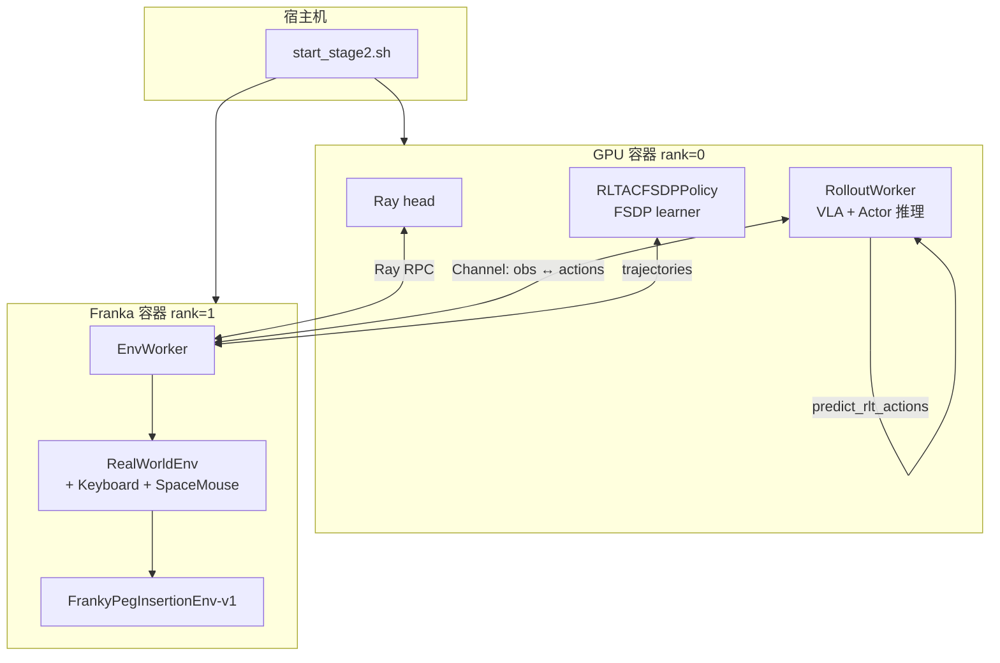
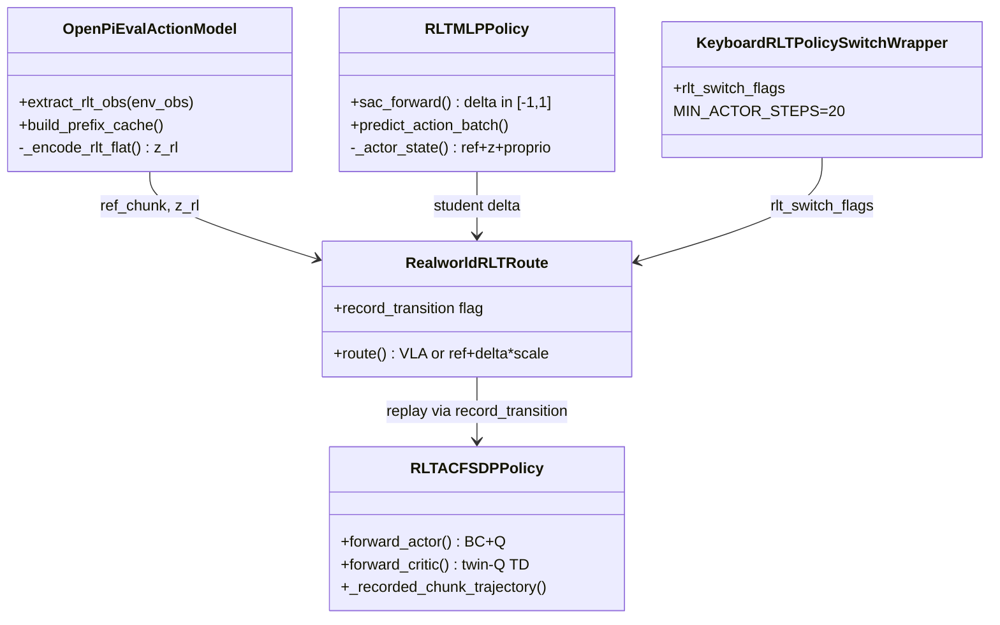
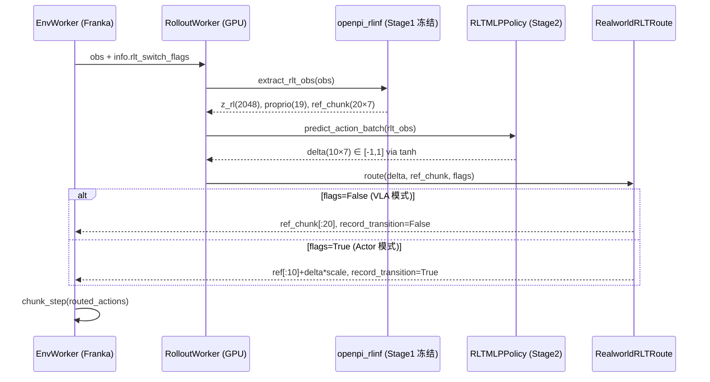
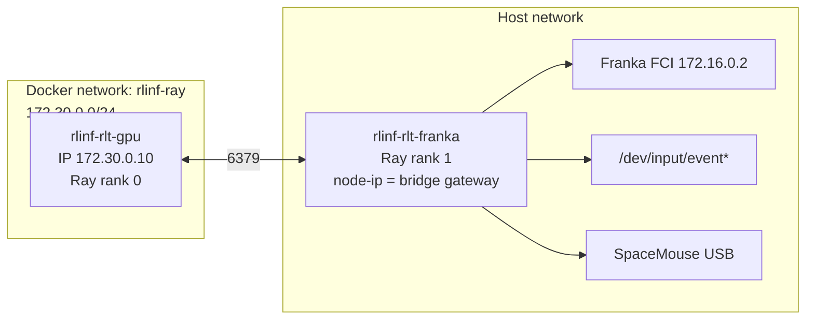

# RLiKx RLT 真机 Stage 2 代码深度分析

> **分析对象**: RLiKx 代码库 (`/home/nvidia/bt/RLiKx/`) 中 Franky 插充电器任务的 RLT Stage 2 实现  
> **对照文档**: `b/rlt/操作指南.md`（当前版本，2026-09-10 修复后）  
> **参考来源**（最终以本地代码为准）:
> - Physical Intelligence: [RL Token: Precise Manipulation with Efficient Online RL](https://www.pi.website/research/rlt) · [论文 PDF](https://www.pi.website/download/rlt.pdf) · [arXiv:2604.23073](https://arxiv.org/html/2604.23073v1)
> - RLinf 官方文档: [RLT 示例 (EN)](https://rlinf.readthedocs.io/en/latest/rst_source/examples/embodied/rlt.html) · 本地 `docs/source-zh/rst_source/examples/embodied/rlt.rst`
> - 通用 RLT 框架分析: `RLinf/b/d/p/rlt_code_analyz.markdown`（本仓库为在其上的 Franky 真机定制层）
>
> **日期**: 2026-09-11

---

## 目录

1. [执行摘要](#1-执行摘要)
2. [RLT 算法背景与 RLiKx 定位](#2-rlt-算法背景与-rlikx-定位)
3. [代码库分层架构](#3-代码库分层架构)
4. [操作指南 §1：训练流程的代码实现](#4-操作指南-1训练流程的代码实现)
5. [操作指南 §2：动作与观测约定](#5-操作指南-2动作与观测约定)
6. [操作指南 §3–§4：配置、路径与部署](#6-操作指南-34配置路径与部署)
7. [操作指南 §5：真机操作与 Wrapper 链](#7-操作指南-5真机操作与-wrapper-链)
8. [操作指南 §6–§7：Dummy 模式、Replay 与 Learner](#8-操作指南-67dummy-模式replay-与-learner)
9. [条件 BC、示范池与离线诊断](#9-条件-bc示范池与离线诊断)
10. [关键 Bug 修复与数据一致性](#10-关键-bug-修复与数据一致性)
11. [回归测试与验收边界](#11-回归测试与验收边界)
12. [与标准 RLinf RLT 的差异对照](#12-与标准-rlinf-rlt-的差异对照)
13. [参考文献与出处](#13-参考文献与出处)

---

## 1. 执行摘要

`b/rlt/操作指南.md` 描述的是 **Franky 真机插充电器** 的 RLT Stage 2 在线训练流程。RLiKx 将其拆成三层：

| 层级 | 路径 | 职责 |
|:---|:---|:---|
| **部署与实验** | `b/rlt/` | YAML、双容器启动脚本、离线模型、诊断工具、操作文档 |
| **RLT 算法核心** | `rlinf/algorithms/rlt/`、`rlinf/models/embodiment/`、`rlinf/workers/` | VLA 特征提取、Actor-Critic、路由、Replay、BC+Q 损失 |
| **Franky 硬件扩展** | `b/x/franky_ext/` | `FrankyPegInsertionEnv-v1`、runtime bootstrap、安全盒 |

操作指南中的每一条运行时行为，都可以追溯到上述三层中的具体模块。**VLA 20 步 / Actor 10 步**、**`b/c/a` 键盘路由**、**仅 Actor chunk 进 Replay**、**条件 BC + 独立示范池** 是当前 Franky 部署相对原版 RLinf RLT 的主要工程化扩展。



---

## 2. RLT 算法背景与 RLiKx 定位

### 2.1 Physical Intelligence 的 RLT 核心思想

RLT（RL Token）解决 VLA 在 **接触-rich、亚毫米精度** 任务上的“最后一毫米”瓶颈。论文与 Pi 官网的核心设计（出处：[Pi RLT](https://www.pi.website/research/rlt)、[arXiv:2604.23073](https://arxiv.org/html/2604.23073v1)）：

1. **Stage 1**：在冻结/联合训练的 VLA prefix 上附加 RLT Token Transformer，用 encoder-decoder 瓶颈学习紧凑表示 \(z_{rl}\)（RLinf 实现为 2048 维）。
2. **Stage 2**：冻结 Stage 1 特征模型；轻量 Actor-Critic 以 \((z_{rl}, \text{proprio}, \text{ref\_chunk})\) 为状态，**在 VLA 参考动作上做残差修正**；Actor 目标含 BC 锚定项与 Q 提升项。

Actor 目标（RLinf 文档与 Pi 论文一致，符号略有差异）：

\[
\mathcal{L}_{actor} = -\lambda_q \cdot Q(s, \pi(s)) + \lambda_{bc} \cdot \mathcal{L}_{BC}(\pi(s), a^{target})
\]

其中 \(s = \{z_{rl}, \text{proprio}, \text{ref\_chunk}\}\)，\(\text{ref\_chunk}\) 来自冻结 VLA 的 20 步绝对 TCP 目标序列；\(\lambda_{bc}=5, \lambda_q=0.1\) 为 Franky 当前在线配置。

Critic 使用 **chunk 内折扣奖励 + 下一状态 bootstrap**（非标准 max-entropy SAC）：

\[
R = \sum_{t=0}^{H-1} \gamma^t r_t, \quad
\text{target}_Q = R + (1 - \text{done}) \cdot \gamma^H \cdot \min(Q_1', Q_2')
\]

\(H\) 为 Actor chunk 长度（Franky 为 10）；\(\gamma=0.96\)。

### 2.2 RLiKx 在 RLT 管线中的位置

RLiKx 是 **RLinf 的 fork/定制仓库**。Stage 1 权重路径在操作指南中指向 `trans5090_v2/full_weights.pt`（非 RLinf 默认的 OpenPI checkpoint 路径）；Stage 2 使用同一套 `rlinf/` RLT 核心，但通过 `b/rlt/` 完成：

- Franky 双容器 Ray 异构部署（GPU + 机器人节点）
- 绝对 TCP 动作语义、`invert_gripper_*: false` 现场标定
- 人工 `b/c/a` 奖励（关闭 `use_pose_reward`）
- **条件 BC**（`bc_target_mode: conditional_all`）与 **200 槽独立示范池**
- 2026-09-10 修复后的 **RLT 专用轨迹时序**（bootstrap 无动作、结果错开一拍）

---

## 3. 代码库分层架构

### 3.1 `b/rlt/` 部署层目录

```
b/rlt/
├── 操作指南.md                          # 运行时操作主文档（本文分析对象）
├── configs/
│   ├── realworld_rlt_stage2_franky.yaml # Stage 2 主配置
│   ├── setup_gpu.sh / setup_franky.sh   # 双容器环境变量
│   └── env/realworld_plug_insertion_franky.yaml
├── scripts/
│   ├── start_stage2.sh                  # 宿主机双容器一键启动
│   ├── run_stage2.sh                    # GPU 容器内训练入口
│   ├── compare_offline_stage2.py        # 固定 replay 离线对照
│   └── audit_saved_stage2.py            # 无硬件 replay 审计
├── offline_models/                      # 离线预训 checkpoint（含 replay/demo）
├── offline_diagnostics/                 # BC/Q/示范采样消融报告
├── fixed_replay_buffer/                 # 审计后的固定 replay 轨迹
└── results/                             # 在线训练日志
```

### 3.2 核心 Python 模块索引

| 模块 | 文件 | 职责 |
|:---|:---|:---|
| Rollout 入口 | `rlinf/algorithms/rlt/rollout.py` | `predict_rlt_actions()` |
| 真机路由 | `rlinf/algorithms/rlt/route.py` | `RealworldRLTRoute`：VLA/Actor 选择与 `record_transition` |
| RLT 观测 | `rlinf/algorithms/rlt/transition.py` | `RLT_OBS_KEYS`、`update_rlt_transitions()` |
| 欧拉几何 | `rlinf/algorithms/rlt/action_geometry.py` | RPY 周期差、离线安全投影 |
| VLA 特征 | `rlinf/models/embodiment/openpi_rlinf/eval_action_model.py` | `extract_rlt_obs()` → `z_rl`, `ref_chunk`, `proprio` |
| Stage 2 策略 | `rlinf/models/embodiment/mlp_policy/rlt_mlp_policy.py` | `RLTMLPPolicy`：2137 维 Actor 输入 |
| RLT Token | `rlinf/models/embodiment/modules/rlt_token_transformer.py` | Stage 1 瓶颈编码器 |
| 键盘路由 | `rlinf/envs/realworld/common/wrappers/keyboard_rlt_policy_switch_wrapper.py` | `b/c/a` |
| SpaceMouse | `rlinf/envs/realworld/common/wrappers/spacemouse_intervention.py` | 人工接管 |
| Chunk 执行 | `rlinf/envs/realworld/realworld_env.py` | `chunk_step()` 终止 padding |
| 轨迹时序 | `rlinf/workers/env/env_worker.py` | RLT 专用 action/outcome 错开 |
| Learner | `rlinf/workers/actor/fsdp_rlt_ac_policy_worker.py` | BC+Q、replay 过滤、demo 池 |
| Franky 环境 | `b/x/franky_ext/tasks/peg_insertion.py` | `FrankyPegInsertionEnv-v1` |

### 3.3 静态组件关系



---

## 4. 操作指南 §1：训练流程的代码实现

操作指南 §1 描述的 5 步流程，对应以下代码路径。

### 4.1 流程对照表

| 操作指南描述 | 实现位置 | 机制 |
|:---|:---|:---|
| VLA 推理 20×7 参考序列 | `eval_action_model.extract_rlt_obs()` | `num_action_chunks: 20` 的 flow matching 采样 |
| 未按 `b`：执行 20 步后重新推理 | `RealworldRLTRoute` + rollout chunk 循环 | `is_actor=False` → `routed_actions = ref_chunk` |
| 按 `b` 后：VLA→Actor 修正前 10 步，执行 10 步 | `route.py` + YAML `num_action_chunks: 10` | `actor_actions = ref_base + delta * scale` |
| `c/a` 须 actor≥20 步 | `KeyboardRLTPolicySwitchWrapper.MIN_ACTOR_STEPS` | 见 §7 |
| 终止 chunk 停发命令、padding | `RealWorldEnv.chunk_step()` | 见 §4.3 |
| VLA chunk 不进 replay | `_recorded_chunk_trajectory()` | `record_transition=False` 过滤 |
| bootstrap 无动作、terminal inference 只补结果 | `env_worker._run_interact_once()` | 见 §4.2 |

### 4.2 Rollout 主循环：`predict_rlt_actions`

每次环境请求动作时，GPU 侧 `MultiStepRolloutWorker` 调用：

```38:84:rlinf/algorithms/rlt/rollout.py
def predict_rlt_actions(
    *,
    policy_model: Any,
    feature_model: Any,
    rlt_route: RLTRoute,
    env_obs: dict[str, Any],
    ...
) -> tuple[torch.Tensor, dict[str, Any]]:
    with torch.no_grad():
        rlt_obs = feature_model.extract_rlt_obs(env_obs)
        actions, result = policy_model.predict_action_batch(
            env_obs=rlt_obs,
            mode=mode,
            return_obs=True,
        )
        ...
        route_output = rlt_route.route(
            RLTRouteContext(
                ...
                student_actions=actions,
                rlt_switch_flags=rlt_switch_flags,
                ...
            )
        )
```

**数据流**：



### 4.3 VLA / Actor 路由与 `record_transition`

`RealworldRLTRoute.route()` 是真机模式的核心分支：

```139:181:rlinf/algorithms/rlt/route.py
        is_actor = rlt_switch_flags.any().item()
        ...
        if not is_actor:
            routed_actions = ref_actions[:, :, : actions.shape[2]].contiguous()
        else:
            ref_base = ref_actions[:, : actions.shape[1], : actions.shape[2]]
            ds = [0.02] * 3 + [0.05] * 3 + [0.5]
            delta_scale = torch.tensor(ds, ...)
            actor_actions = ref_base + actions * delta_scale
            routed_actions = torch.where(rlt_switch_flags, actor_actions, ref_base)
        ...
        result["forward_inputs"]["record_transition"] = rlt_switch_flags.reshape(
            actions.shape[0], -1
        )[:, :1].to(torch.bool)
```

要点：

- **VLA 模式**：直接下发完整 `ref_chunk`（20 步），Actor 输出的 10 步 delta **不参与**执行。
- **Actor 模式**：仅取 `ref_chunk` 前 10 步，加上按 `[0.02,0.02,0.02, 0.05,0.05,0.05, 0.5]` 缩放后的残差。
- `record_transition` 为 chunk 级布尔标记，Learner 据此过滤 replay。

### 4.4 RLT 轨迹时序（2026-09-10 修复）

操作指南强调：**每条已执行动作只追加一次 reward/done**；bootstrap 轮次 `rewards=None`；epoch 收尾的 terminal inference **不追加动作**。

实现于 `env_worker.py` 的 RLT 分支：

```1150:1171:rlinf/workers/env/env_worker.py
                    if self.enable_rlt:
                        # The received outcome belongs to the PREVIOUS action,
                        ...
                        if chunk_step_idx > 0:
                            self.trajectory_builders[stage_id].append_step_result(
                                ChunkStepResult(
                                    rewards=rewards,
                                    dones=env_output.dones,
                                    ...
                                )
                            )
                        chunk_step_result.rewards = None
                        chunk_step_result.dones = None
                        ...
                    self.trajectory_builders[stage_id].append_step_result(
                        chunk_step_result
                    )
```

Epoch 收尾（`1272:1316`）：RLT 模式下 `actions=None`，只写入最终 reward/done 并调用 `update_rlt_transitions(..., cache_current=False)` 补全最后一条 transition 的 `next_obs`。

Learner 入库前再次校验对齐（`fsdp_rlt_ac_policy_worker.py:562-607`）：

```562:607:rlinf/workers/actor/fsdp_rlt_ac_policy_worker.py
    def _recorded_chunk_trajectory(self, trajectory: Trajectory) -> Trajectory | None:
        ...
        if trajectory.rewards is None or not self._trajectory_has_record(trajectory):
            return None
        num_chunks = trajectory.rewards.shape[0]
        for name in ("actions", "terminations", "truncations", "dones"):
            ...
                raise ValueError(
                    f"RLT chunk/result alignment error: {name} must have "
                    f"{num_chunks} rows matching rewards."
                )
        ...
        keep = flags.reshape(num_rows, -1).bool().all(dim=-1)
```

### 4.5 Chunk 终止与 padding

操作指南：“chunk 在终止时立即停止继续发送机械臂命令；观测槽位用最终观测补齐”。

```340:382:rlinf/envs/realworld/realworld_env.py
            if (terminations | truncations).any():
                valid_steps = i + 1
                for _ in range(valid_steps, chunk_size):
                    obs_list.append(copy.deepcopy(extracted_obs))
                    chunk_rewards.append(torch.zeros_like(step_reward))
                    ...
                break
        ...
        infos_last["chunk_valid_steps"] = torch.full(
            (self.num_envs,), valid_steps, dtype=torch.int64
        )
```

`chunk_valid_steps` 写入 `final_info`，供 BC 的 `bc_mask_terminal_padding` 排除未执行槽位（见 §9）。

---

## 5. 操作指南 §2：动作与观测约定

### 5.1 VLA 输入输出

| 项目 | 操作指南 | 代码/config |
|:---|:---|:---|
| state 19 维 | 夹爪、力、TCP、力矩、速度 | `pi05_franka_state_2view_10hz` dataconfig；`state_indices: []` 保留完整 state |
| 图像 | global + wrist, 224×224 | `camera_serials` / `camera_names` in YAML；`num_images_in_input: 2` |
| 输出 | 20×7 绝对 TCP | `rollout.rlt_feature_model.num_action_chunks: 20`；`use_absolute_action: True` |
| 任务文本 | plug the plug into the socket | `task_description` in `override_cfg` |

VLA 特征提取（Stage 1 冻结模型）：

```374:426:rlinf/models/embodiment/openpi_rlinf/eval_action_model.py
    def extract_rlt_obs(self, env_obs: dict[str, Any]) -> dict[str, torch.Tensor]:
        ...
        z_rl = self._encode_rlt_flat(rlt_prefix_output, rlt_prefix_mask).to(
            dtype=torch.float32
        )
        model_actions = self._sample_actions_from_prefix_cache(...)
        ref_chunk = self.output_transform(...)["actions"]
        ...
        out = {
            "z_rl": z_rl,
            "proprio": proprio.to(...),
            "ref_chunk": ref_chunk_f32,
        }
```

**重要**：Actor 输入使用 **原始** `ref_chunk`（环境坐标系），而非 `ref_chunk_norm`；归一化版本仅作辅助，不改变 Actor 输入单位（见 `rlt_mlp_policy._get_ref_chunk` 注释）。

### 5.2 Actor 输入输出

Actor 观测维度（`RLTMLPPolicy.__init__`）：

\[
\text{actor\_obs\_dim} = \underbrace{10 \times 7}_{\text{ref\_chunk 前 10 步}} + \underbrace{2048}_{z_{rl}} + \underbrace{19}_{\text{proprio}} = 2137
\]

Actor 输出为 **10×7 残差 delta**（`tanh` 压到 \([-1,1]\)），路由层再乘 `delta_scale` 加到参考动作上：

```81:87:rlinf/models/embodiment/mlp_policy/rlt_mlp_policy.py
        ds = [0.02] * 3 + [0.05] * 3 + [0.5]  # XYZ, RPY, gripper
        self.register_buffer("delta_scale", torch.tensor(ds, ...))
```

Critic 输入为 \((z_{rl}, \text{proprio})\) + **delta 空间**动作（绝对动作经 `_actions_to_delta` 转换，RPY 用周期差，见 §9.1）。

### 5.3 夹爪约定

Franky YAML 显式覆盖 PegInsertion 默认（`invert_gripper_action: True`）：

```yaml
# b/rlt/configs/realworld_rlt_stage2_franky.yaml
invert_gripper_action: False
invert_gripper_width_obs: False
```

`FrankyPegInsertionEnvConfig` 默认仍为 `True`（`b/x/franky_ext/tasks/peg_insertion.py:40-41`），现场通过 `override_cfg` 覆盖，避免 VLA、Actor、控制器三处重复反转。

---

## 6. 操作指南 §3–§4：配置、路径与部署

### 6.1 主配置文件结构

`realworld_rlt_stage2_franky.yaml` 关键字段与代码消费点：

| 配置块 | 关键字段 | 消费模块 |
|:---|:---|:---|
| `cluster` | `node_groups: gpu(0), franka(1)` | `HybridComponentPlacement` |
| `runner` | `overlap_env_bootstrap: false` | 严格同步：推理完再执行 chunk |
| `runner` | `resume_dir` | FSDP checkpoint + replay/demo 恢复 |
| `algorithm` | `loss_type: rlt_ac` | 选用 `RLTACFSDPPolicy` |
| `algorithm` | `bc_weight/q_weight/bc_target_mode` | `RLTACLossMixin` |
| `rollout.rlt_feature_model` | Stage 1 路径、20 chunk | `extract_rlt_obs` |
| `actor.model` | `num_action_chunks: 10` | 路由、损失 shape、env chunk 步数 |
| `env.train` | `keyboard_reward_wrapper: rlt_policy_switch` | `apply.py` wrapper 栈 |

异构 placement（GPU 跑 rollout+actor，Franka 跑 env）：

```15:38:b/rlt/configs/realworld_rlt_stage2_franky.yaml
cluster:
  num_nodes: 2
  component_placement:
    actor: { node_group: "gpu", placement: 0 }
    env:   { node_group: franka, placement: 0 }
    rollout: { node_group: "gpu", placement: 0 }
  node_groups:
    - label: "gpu"
      node_ranks: 0
    - label: franka
      node_ranks: 1
      hardware:
        type: Franka
        configs:
          - robot_ip: "172.16.0.2"
```

### 6.2 双容器部署架构

操作指南 §4 的一键启动由 `start_stage2.sh` 实现：



**设计要点**：

1. **GPU 容器**：`--network rlinf-ray --ip 172.30.0.10`，挂载工作区，`setup_gpu.sh` 设置 `RLINF_NODE_RANK=0`，激活 OpenPI venv。
2. **Franka 容器**：`--network host --privileged`，`setup_franky.sh` 设置 `RLINF_NODE_RANK=1`、`RLINF_EXT_MODULE=franky_ext.runtime_bootstrap`、`PYTHONPATH` 含 `b/x`。
3. Franky 侧 Ray：`ray start --address=172.30.0.10:6379 --node-ip-address=<bridge_gateway>`（通常为 `172.30.0.1`），**不能**把 gateway IP 当作容器 `--ip`。
4. `start_stage2.sh` 用 `flock` 防并发启动；Ctrl+C 时 cleanup 停止本次创建的两个容器，保留 results/checkpoint。

Franka 环境 bootstrap（`setup_franky.sh`）：

```8:11:b/rlt/configs/setup_franky.sh
export PYTHONPATH="${REPO_PATH}:${REPO_PATH}/b/x:${PYTHONPATH:-}"
export RLINF_EXT_MODULE="franky_ext.runtime_bootstrap"
export RLINF_NODE_RANK=1
```

`runtime_bootstrap.py` 在 import 时注册 `FrankyPegInsertionEnv-v1` 并应用 CPU/NO_ACCEL 补丁，使 libfranka 控制栈可在 Franky 容器内运行。

### 6.3 训练入口 `run_stage2.sh`

默认使用 **同步** embodied 入口（非 async），保证“推理 → 执行完整 chunk → 再推理”：

```16:22:b/rlt/scripts/run_stage2.sh
if [[ "${RLT_ASYNC:-0}" == "1" ]]; then
    SRC_FILE="${EMBODIED_PATH}/train_async.py"
else
    SRC_FILE="${EMBODIED_PATH}/train_embodied_agent.py"
fi
```

`RLT_COLLECT_ONLY=1` 时追加 Hydra override：`update_epoch=0`、20 epoch、每 epoch 存 checkpoint、开 `video/frozen_test/`，实现操作指南 §3 的“只采集不训练”。

---

## 7. 操作指南 §5：真机操作与 Wrapper 链

### 7.1 Wrapper 组装顺序

`env.train.keyboard_reward_wrapper: rlt_policy_switch` 触发 `KeyboardRLTPolicySwitchWrapper`；`use_spacemouse: True` 叠加 `SpacemouseIntervention`（ActionWrapper，在 policy 动作下发前介入）。

环境 ID：`FrankyPegInsertionEnv-v1`（`b/rlt/configs/env/realworld_plug_insertion_franky.yaml`）。

### 7.2 键盘 `b/c/a` 实现

```98:149:rlinf/envs/realworld/common/wrappers/keyboard_rlt_policy_switch_wrapper.py
            if key == "b":
                if not self._rlt_switch_flags:
                    self._rlt_switch_flags = True
                    self._steps_since_actor = 0
            elif key == "c":
                if not self._rlt_switch_flags: ... continue
                if self._steps_since_actor < self.MIN_ACTOR_STEPS: ... continue
                reward = 1.0; terminated = True
            elif key == "a":
                ... reward = 0.0; terminated = True
        ...
        info["rlt_switch_flags"] = self._rlt_switch_flags
```

| 键 | 效果 | 代码常量 |
|:---|:---|:---|
| `b` | 下一 chunk 起 Actor 模式 | 仅改 flag，**当前 chunk 不变** |
| `c` | 成功 reward=1，终止 | `MIN_ACTOR_STEPS=20` |
| `a` | 失败 reward=0，终止 | 同上 |

键盘通过 Linux **evdev** 后台线程读取（`keyboard_listener.py`），设备路径由 `RLINF_KEYBOARD_DEVICE` 指定。

`rlt_switch_flags` 经 `RealWorldEnv.step` → `EnvWorker` → Rollout → `RealworldRLTRoute`。

### 7.3 SpaceMouse 接管

```97:108:rlinf/envs/realworld/common/wrappers/spacemouse_intervention.py
    def step(self, action):
        new_action, replaced = self.action(action)
        if replaced and ... use_absolute_action:
            new_action = self._delta_to_absolute(new_action)
        ...
        if replaced:
            info["intervene_action"] = new_action
            info["intervene_flag"] = True
```

- 活动判定：6D norm > 0.001 或按键；释放后 **1 秒内**仍视为接管。
- `use_absolute_action=True` 时，SpaceMouse delta 转为当前 TCP 绝对目标（与 VLA 动作空间一致）。
- **Actor 阶段**的接管动作仍 `record_transition=True`，并写入 `intervene_flag` 供条件 BC 与 demo 池使用。
- `RealWorldEnv` 统计 `success_no_intervened`：接管后成功不算自主成功（操作指南 §3 `RLT_COLLECT_ONLY` 段）。

### 7.4 Episode / Epoch 边界

- `max_episodes_per_epoch: 2`：keyboard wrapper 的 `_epoch_done` 在 2 个 episode 后停止接受新 step。
- 底层 `max_num_steps: 300` @ 10 Hz ≈ 30s 物理步进，先于外层 600 步上限生效。
- `use_pose_reward: false`：奖励完全来自 `c/a`，不依赖 `target_ee_pose` 几何判定。

---

## 8. 操作指南 §6–§7：Dummy 模式、Replay 与 Learner

### 8.1 Dummy 模式

YAML 临时设置 `override_cfg.is_dummy: true`，同一套 `run_stage2.sh` 跑通 VLA 形状、`b` 路由、10 步 actor、replay 保存/重载，**不连接 FCI/相机**。Dummy 不证明真机成功率。

### 8.2 Replay Buffer 结构

RLT transition（`transition.py`）：

\[
\text{curr\_obs} = \{z_{rl}, \text{proprio}, \text{ref\_chunk}\},\quad
\text{action} = \text{实际下发环境的 chunk 动作},\quad
\text{next\_obs} = \{\text{next\_}z_{rl}, \ldots\}
\]

主 replay 配置（最近 30 条 rollout 轨迹，`min_buffer_size: 2`）仅含 **`record_transition=True`** 的 actor chunk。

### 8.3 独立示范池（Demo Buffer）

操作指南 §7 描述的 200 槽示范池：

```108:116:b/rlt/configs/realworld_rlt_stage2_franky.yaml
  demo_buffer:
    enable_cache: true
    cache_size: 200
    sample_window_size: 200
    min_buffer_size: 1
    seed_from_resume_replay: true
```

入库：`extract_intervene_traj()` 从含 `intervene_flag` 的 chunk 提取（`fsdp_rlt_ac_policy_worker.py:796-805`）。

混合采样（batch=256 → 各 128）：

```98:102:rlinf/data/storage/replay/dataset.py
                if self.demo_buffer is not None:
                    replay_batch = self.replay_buffer.sample(self.batch_size // 2)
                    demo_batch = self.demo_buffer.sample(self.batch_size // 2)
                    batch = concat_batch(replay_batch, demo_batch)
```

Demo 未就绪时 `run_training()` 阻塞等待首次接管（`fsdp_rlt_ac_policy_worker.py:987-999`）。

Checkpoint 路径：

```text
global_step_N/actor/sac_components/
├── replay_buffer/rank_0/trajectory_*.pt
├── demo_buffer/rank_0/trajectory_*.pt
└── training_state_rank_0.pt
```

### 8.4 Learner：Critic 与 Actor 损失

**Critic**（`forward_critic`）：绝对动作 → delta（含 RPY 周期差）→ chunk 折扣奖励 → twin-Q TD target。

**Actor**（`forward_actor`）：

\[
\mathcal{L} = -0.1 \cdot Q_1(\pi) + 5.0 \cdot \mathcal{L}_{BC}
\]

```447:449:rlinf/workers/actor/fsdp_rlt_ac_policy_worker.py
        bc_weight, q_weight, weight_metrics = self._actor_objective_weights()
        actor_loss = -q_weight * qf_pi.mean() + bc_weight * bc_loss
```

训练节奏：`critic_actor_ratio: 4`（每 4 次 critic 更新 1 次 actor），`update_epoch: 8`；**无 entropy**（`fixed_alpha: 0`）。

`reference_dropout_prob: 0.5` 在 `RLTMLPPolicy._maybe_drop_reference` 训练时随机 zero 掉 `ref_chunk` 输入，迫使 Actor 更依赖 \(z_{rl}\) 与 proprio（与 Pi 论文中的 reference dropout 动机一致）。

---

## 9. 条件 BC、示范池与离线诊断

### 9.1 条件 BC 三种模式

操作指南 §7.2 的 `bc_target_mode` 实现于 `_bc_metrics()`：

| 模式 | 非接管槽位 BC 目标 | 接管槽位 BC 目标 |
|:---|:---|:---|
| `zero` | 零残差 | 零残差 |
| `conditional_all` | 零残差 | 人的 7 维残差（经 `_actions_to_delta`） |
| `conditional_xyz` | 零残差 | 仅 XYZ 残差 |

人的目标计算：**不能**直接把绝对坐标当残差；必须先 `actions - ref_chunk` 再除以 `delta_scale`：

```297:319:rlinf/workers/actor/fsdp_rlt_ac_policy_worker.py
    def _actions_to_delta(self, actions, obs):
        ...
        if action_dim == 7 and override_cfg.get("use_absolute_action", False):
            difference = absolute_action_delta(
                actions.reshape(-1, chunk_len, action_dim),
                ref_chunk.reshape(-1, chunk_len, action_dim),
            ).reshape_as(actions)
        return difference / delta_scale
```

RPY 周期差（避免 \(+\pi/-\pi\) 被算成 \(\approx 2\pi\) 的巨大 critic 输入）：

```23:40:rlinf/algorithms/rlt/action_geometry.py
def absolute_action_delta(actions, reference):
    difference = actions - reference
    angles = difference[..., 3:6]
    return torch.cat((
        difference[..., :3],
        torch.atan2(angles.sin(), angles.cos()),
        difference[..., 6:],
    ), dim=-1)
```

### 9.2 Terminal padding BC 掩码

`bc_mask_terminal_padding: true` 时，终止 chunk 中未执行槽位不参与 BC（不影响 TD target）：

```178:216:rlinf/workers/actor/fsdp_rlt_ac_policy_worker.py
    def _bc_valid_mask(self, batch):
        ...
        terminal = batch["dones"].reshape(...).bool().any(-1)
        human = intervene_flags.any(-1)
        return (~terminal[:, None]).expand_as(human) | human
```

### 9.3 离线诊断工具

`compare_offline_stage2.py`（操作指南 §7.1–§7.3）：

- 读取 checkpoint 权重 + replay，CPU float32 复现 actor/critic loss
- 支持 `raw` / `wrapped` / `safe` / `conditional_*` / `xyz_bc_probe` 等 mode
- 输出 **不能** 填入 `runner.resume_dir`（仅为诊断 `.pt`）

操作指南记录的离线结论（**训练集拟合误差，非真机成功率**）：

- 条件 BC + 原版权重：验证 XYZ 误差约 **2.44 mm**
- Q=0 对照 vs BC+Q：**基本持平**（2.434 vs 2.438 mm），尚未证明 Q 项提升插入成功率
- 示范半批采样 + BC/Q 渐变：约 1–2% 验证误差改善，跨 seed 不稳定

---

## 10. 关键 Bug 修复与数据一致性

### 10.1 2026-09-10 第二次修复

操作指南 §1 记录的 `20260910-072055` 运行问题：

| 问题 | 根因 | 修复 |
|:---|:---|:---|
| reward/done 列表错位 | bootstrap 轮 `rewards=None` 仍被当作 outcome 追加 | RLT 分支错开 action/outcome 时序 |
| 终止结果重复回写 | terminal inference 既 update 又 append | RLT 仅 append 最终结果，不追加动作 |
| 旧 replay 不可用 | 上述时序错误写入 buffer | 校验 `actions/rewards/dones` 行数一致 |

**不要**从修复前 checkpoint/replay 恢复训练；当前恢复点：

```text
b/rlt/offline_models/20260910_latest_bc5_q01_demo200_resume/global_step_0
```

含 800 critic / 200 actor 离线更新、226 actor replay chunk、102 接管 demo chunk。

### 10.2 PyTorch 调度器兼容

旧 checkpoint 缺少 `lr_schedulers.0._is_initial`（宿主机 PyTorch 2.7.1 vs 训练镜像 2.11.0）；加载代码已兼容，无需重训。

### 10.3 动作语义变更（操作指南开头声明）

已废弃的错误假设：

- VLA 输出为 delta（当前为 **绝对 TCP**）
- 夹爪反向逻辑（当前 `invert_gripper_*: false`）
- 未接管 VLA chunk 进入 RL replay（当前由 `record_transition` 过滤）

---

## 11. 回归测试与验收边界

操作指南 §9 的无硬件测试：

```bash
PYTEST_DISABLE_PLUGIN_AUTOLOAD=1 python -m pytest \
  tests/unit_tests/test_rlt_realworld_flow.py \
  tests/unit_tests/test_rlt_action_geometry.py \
  tests/unit_tests/test_rlt_conditional_bc.py \
  tests/test_epoch_done_flow.py -q
```

| 测试文件 | 覆盖 |
|:---|:---|
| `test_rlt_realworld_flow.py` | chunk 终止 padding、b/c/a、VLA 过滤、轨迹时序、replay 重载 |
| `test_rlt_conditional_bc.py` | 三种 BC mode、terminal mask |
| `test_rlt_action_geometry.py` | `absolute_action_delta` |
| `test_epoch_done_flow.py` | epoch 收尾 |

**通过单元测试 ≠ 真机端到端验证**；插入成功率需在线 `success_no_intervened` 与人工评估。

---

## 12. 与标准 RLinf RLT 的差异对照

| 维度 | 标准 RLinf (`realworld_rlt_stage2_ac_mlp.yaml`) | RLiKx Franky (`b/rlt/`) |
|:---|:---|:---|
| 机器人栈 | libfranka `realworld_peg_insertion` | `FrankyPegInsertionEnv-v1` + `franky_ext` |
| 部署 | 单/双节点手工 Ray | `start_stage2.sh` 双 Docker 自动化 |
| VLA 权重 | OpenPI Stage1 checkpoint | `trans5090_v2/full_weights.pt` |
| 动作 | 可能 delta / 默认夹爪反转 | 绝对 TCP + 显式 `invert_gripper_*: false` |
| 奖励 | 可能 pose reward | 人工 `c/a`，`use_pose_reward: false` |
| BC | 默认 `zero` + 人工干预槽位跟 VLA | `conditional_all` + terminal padding mask |
| Demo buffer | 原版 YAML 通常未启用 | 200 槽独立池 + checkpoint 持久化 |
| Chunk 时序 | 通用 embodied 路径 | RLT 专用 bootstrap/terminal 逻辑 |
| 离线工具 | 无 | `compare_offline_stage2.py`、`fixed_replay_buffer/` |

**共享不变的核心**：`predict_rlt_actions`、`RLTMLPPolicy`、`RLTACLossMixin`、RLT token transformer、keyboard/spacemouse wrapper 均在 `rlinf/` 内；Franky 层主要是环境注册、部署脚本与现场标定。

---

## 13. 参考文献与出处

### 论文与官方页面

1. Physical Intelligence. *RL Token: Bootstrapping Online RL with Vision-Language-Action Models*. [项目页](https://www.pi.website/research/rlt) · [PDF](https://www.pi.website/download/rlt.pdf) · [arXiv:2604.23073](https://arxiv.org/html/2604.23073v1)
2. RLinf 文档. *RL Token: Bootstrapping Online RL with Vision-Language-Action Models*. [EN](https://rlinf.readthedocs.io/en/latest/rst_source/examples/embodied/rlt.html) · 本地 `docs/source-zh/rst_source/examples/embodied/rlt.rst`

### 本地代码（RLiKx 优先路径）

| 主题 | 路径 |
|:---|:---|
| 操作指南 | `b/rlt/操作指南.md` |
| Stage 2 配置 | `b/rlt/configs/realworld_rlt_stage2_franky.yaml` |
| 宿主机启动 | `b/rlt/scripts/start_stage2.sh` |
| 训练入口 | `b/rlt/scripts/run_stage2.sh` |
| RLT rollout | `rlinf/algorithms/rlt/rollout.py` |
| 真机路由 | `rlinf/algorithms/rlt/route.py` |
| Actor 策略 | `rlinf/models/embodiment/mlp_policy/rlt_mlp_policy.py` |
| VLA 特征 | `rlinf/models/embodiment/openpi_rlinf/eval_action_model.py` |
| Learner | `rlinf/workers/actor/fsdp_rlt_ac_policy_worker.py` |
| 轨迹时序 | `rlinf/workers/env/env_worker.py` |
| 键盘/SpaceMouse | `rlinf/envs/realworld/common/wrappers/` |
| Franky 环境 | `b/x/franky_ext/tasks/peg_insertion.py` |
| 离线对照 | `b/rlt/scripts/compare_offline_stage2.py` |
| 通用 RLT 框架分析 | `RLinf/b/d/p/rlt_code_analyz.markdown` |

### 操作指南章节 → 本文章节映射

| 操作指南 | 本文 |
|:---|:---|
| §1 训练流程 | [§4](#4-操作指南-1训练流程的代码实现) |
| §2 动作观测 | [§5](#5-操作指南-2动作与观测约定) |
| §3 路径配置 | [§6.1](#61-主配置文件结构) |
| §4 宿主机启动 | [§6.2–§6.3](#62-双容器部署架构) |
| §4.1 手工启动 | [§6.2](#62-双容器部署架构) |
| §5 真机操作 | [§7](#7-操作指南-5真机操作与-wrapper-链) |
| §6 Dummy | [§8.1](#81-dummy-模式) |
| §7 训练/replay 检查 | [§8](#8-操作指南-67dummy-模式replay-与-learner)、[§9](#9-条件-bc示范池与离线诊断) |
| §8 常见现象 | [§7.2](#72-键盘-bca-实现)、[§10](#10-关键-bug-修复与数据一致性) |
| §9 回归测试 | [§11](#11-回归测试与验收边界) |
| §10 相关文件 | [§3](#3-代码库分层架构)、[§13](#13-参考文献与出处) |

---

*本文以 RLiKx 仓库 2026-09-11 本地代码为准撰写；若操作指南与代码冲突，以代码及 `操作指南.md` 顶部“当前版本”声明为准。*
