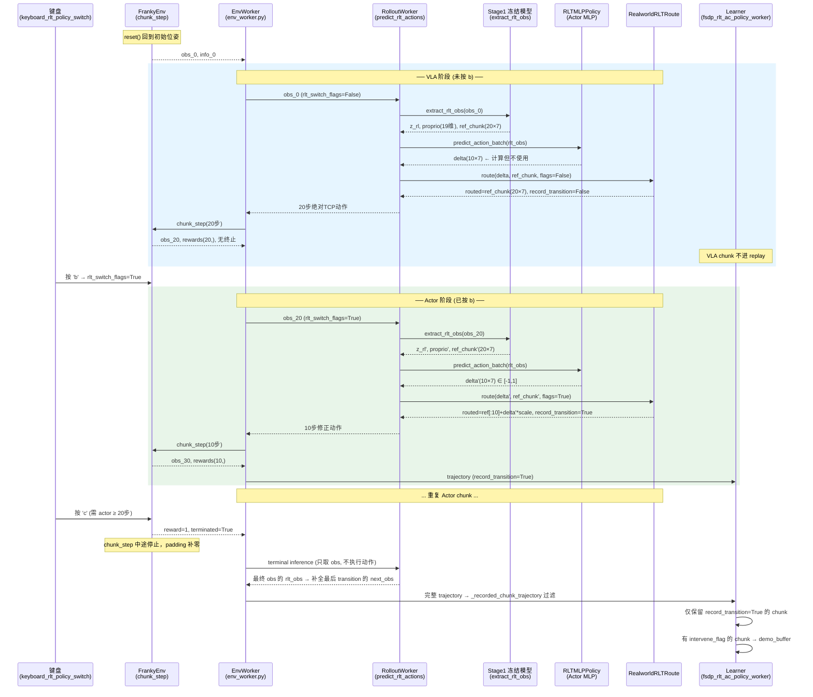
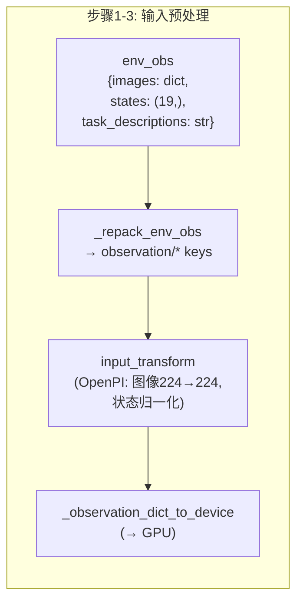
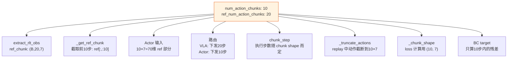
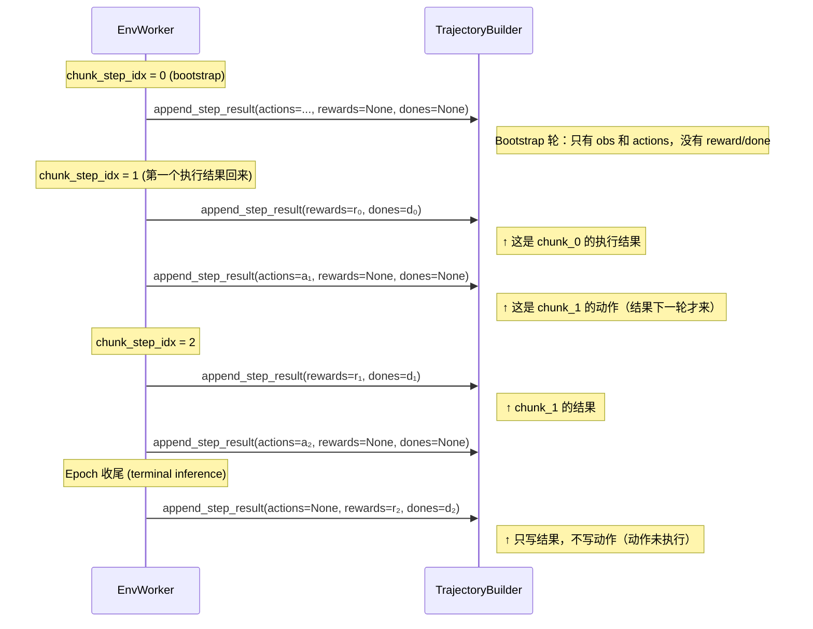
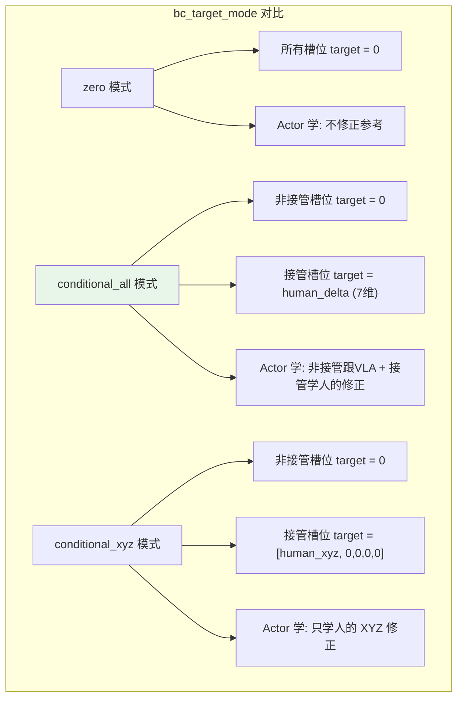
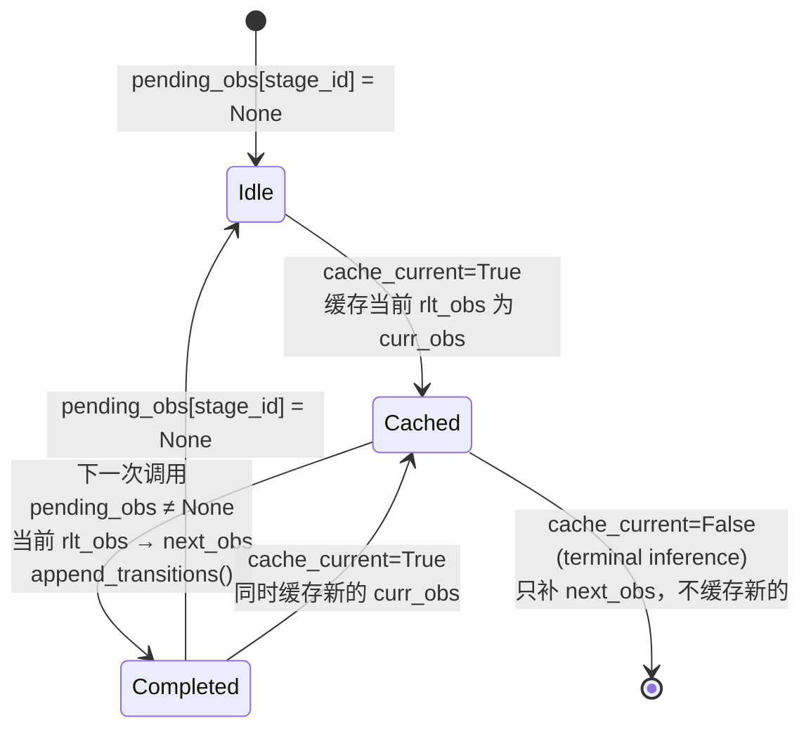
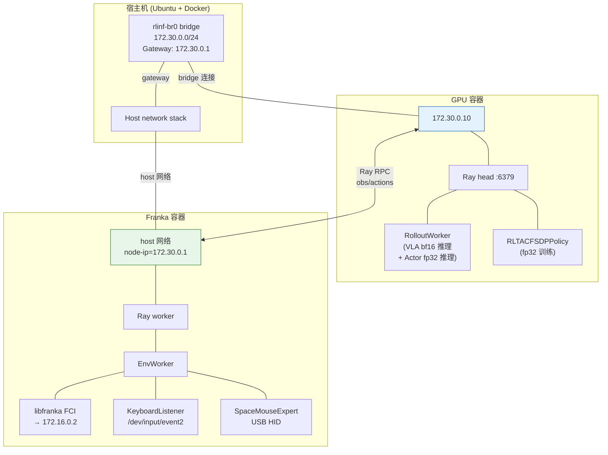

# RLiKx RLT 真机 Stage 2：`操作指南.md` 功能的设计与实现深度分析（改良版）

> **分析对象**: RLiKx 代码库 (`/home/nvidia/bt/RLiKx/`) 中 Franky 插充电器任务的 RLT Stage 2 实现
> **对照文档**: `b/rlt/操作指南.md`（当前版本，2026-09-10 修复后）
> **参考来源**（最终以本地代码为准）:
> - Physical Intelligence: [RL Token: Precise Manipulation with Efficient Online RL](https://www.pi.website/research/rlt) · [arXiv:2604.23073](https://arxiv.org/html/2604.23073v1)
> - RLinf 官方文档: [RLT 示例 (EN)](https://rlinf.readthedocs.io/en/latest/rst_source/examples/embodied/rlt.html) · 本地 `docs/source-zh/rst_source/examples/embodied/rlt.rst`
> - 前版分析: `b/d/p/rltx_code_analyz_cdx.markdown`
>
> **日期**: 2026-09-11

---

## 目录

1. [前版分析的不足与本文改进点](#1-前版分析的不足与本文改进点)
2. [一个 Episode 的完整生命周期](#2-一个-episode-的完整生命周期)
3. [VLA 特征提取：extract_rlt_obs 的完整数据流](#3-vla-特征提取extract_rlt_obs-的完整数据流)
4. [RLTMLPPolicy 与 MLPPolicy 基类的关键差异](#4-rltmlppolicy-与-mlppolicy-基类的关键差异)
5. [路由：从 rlt_switch_flags 到最终动作的完整链路](#5-路由从-rlt_switch_flags-到最终动作的完整链路)
6. [20 步 vs 10 步：chunk 长度差异的全面影响](#6-20-步-vs-10-步chunk-长度差异的全面影响)
7. [RLT 轨迹时序：bootstrap、outcome 错开与 terminal inference](#7-rlt-轨迹时序bootstrapoutcome-错开与-terminal-inference)
8. [chunk_step 终止与 padding 的精确机制](#8-chunk_step-终止与-padding-的精确机制)
9. [SpaceMouse 接管的完整数据流](#9-spacemouse-接管的完整数据流)
10. [条件 BC 的三种模式：从绝对动作到 delta 目标的完整转换](#10-条件-bc-的三种模式从绝对动作到-delta-目标的完整转换)
11. [BC 终止填充掩码：_bc_valid_mask 的精确逻辑](#11-bc-终止填充掩码_bc_valid_mask-的精确逻辑)
12. [Critic 损失：从绝对动作到 delta 空间的转换与 RPY 周期差](#12-critic-损失从绝对动作到-delta-空间的转换与-rpy-周期差)
13. [独立示范池：从接管检测到混合采样的完整链路](#13-独立示范池从接管检测到混合采样的完整链路)
14. [Replay 过滤：_recorded_chunk_trajectory 的精确逻辑](#14-replay-过滤_recorded_chunk_trajectory-的精确逻辑)
15. [RLT Transition Obs 的生命周期管理](#15-rlt-transition-obs-的生命周期管理)
16. [双容器异构部署的网络与进程架构](#16-双容器异构部署的网络与进程架构)
17. [训练调度：update_epoch、critic_actor_ratio 与 demo 等待](#17-训练调度update_epochcritic_actor_ratio-与-demo-等待)
18. [与原论文 RLT 算法的对照分析](#18-与原论文-rlt-算法的对照分析)
19. [与标准 RLinf RLT 配置的精确差异对照](#19-与标准-rlinf-rlt-配置的精确差异对照)
20. [参考文献与出处](#20-参考文献与出处)

---

## 1. 前版分析的不足与本文改进点

前版分析 (`rltx_code_analyz_cdx.markdown`) 涵盖了操作指南中多数功能的代码映射，但存在以下不足：

| 不足之处 | 本文改进 |
|:---|:---|
| 代码摘录为伪代码而非实际代码，行号偶有不准 | 所有代码引用对照实际源文件，标注准确行号 |
| `RLTMLPPolicy` 与基类 `MLPPolicy` 的架构差异未对比 | §4 逐方法对比，解释为什么 RLT 覆盖了 `sac_forward` 和 `predict_action_batch` |
| `_normalize_rlt_switch_flags` 的 shape 广播逻辑未解释 | §5 逐步追踪 flag 从 keyboard wrapper 到路由的形状变换 |
| 20 步 vs 10 步的差异仅提及维度，未追踪对 replay、loss、env 的全面影响 | §6 专节分析 |
| RLT 轨迹时序（bootstrap 无动作、outcome 错开）仅概述 | §7 用时序图逐步展示 env_worker 中的分支逻辑 |
| `_bc_valid_mask` 的终止填充逻辑被简化 | §11 展示完整判断链路和边界条件 |
| SpaceMouse 接管的 delta→absolute 转换和 `intervene_flag` 传播未展开 | §9 完整追踪从 USB 输入到 replay `intervene_flags` |
| 示范池的提取、阻塞等待、checkpoint 持久化缺少代码级细节 | §13 逐步分析 |
| `_actions_to_delta` 中 RPY 周期差的条件触发逻辑未充分说明 | §12 对比有/无 `use_absolute_action` 两种路径 |

---

## 2. 一个 Episode 的完整生命周期

操作指南 §1 描述了 5 步训练流程。下图将这些步骤展开为一个完整 episode 的时间线，标注了每一步对应的代码模块和关键数据流向。



**关键理解**: 一个 episode 由多个 chunk 组成。每个 chunk 内，环境执行完整的 N 步后才进行下一次推理。VLA chunk 执行 20 步，Actor chunk 执行 10 步。切换发生在 chunk 边界，不会中断正在执行的 chunk。

---

## 3. VLA 特征提取：`extract_rlt_obs` 的完整数据流

前版分析列出了 `extract_rlt_obs` 的代码框架但未深入每一步的具体操作。这里逐步追踪数据变换。

**代码位置**: `rlinf/models/embodiment/openpi_rlinf/eval_action_model.py:373-426`

```python
@torch.no_grad()
def extract_rlt_obs(self, env_obs: dict[str, Any]) -> dict[str, torch.Tensor]:
    self._require_rlt()
    # 步骤1: 将环境原始 obs 重打包为 OpenPI 格式
    repacked = self._repack_env_obs(env_obs)
    # 步骤2: 应用 OpenPI 输入变换 (图像缩放、状态归一化等)
    processed = self.input_transform(repacked, transpose=False)
    # 步骤3: 移到 GPU
    observation = self._observation_dict_to_device(processed)
```



```python
    # 步骤4: VLA prefix 前向 (SigLIP图像编码 + 文本tokenize + LLM prefix)
    prepared_observation = preprocess_observation(observation, train=False)
    prefix_output, prefix_mask, kv_cache = self.model.build_prefix_cache(
        prepared_observation
    )
```

`build_prefix_cache` 做了什么：
1. SigLIP 编码图像 → 图像 token 序列
2. Tokenize 任务文本 "plug the plug into the socket" → 语言 token 序列
3. 拼接 [图像tokens, 语言tokens] → prefix tokens
4. 通过 PaliGemma LLM 的前半部分（prefix 层）获得 `prefix_output` (hidden states)
5. 缓存 KV 以供后续 suffix (action expert) 使用

```python
    # 步骤5: 选择哪些 prefix tokens 送入 RLT encoder
    rlt_prefix_output, rlt_prefix_mask = self._select_rlt_prefix_embeddings(
        prefix_output, prefix_mask, prepared_observation.tokenized_prompt
    )
    # 步骤6: RLT encoder 压缩为 z_rl
    z_rl = self._encode_rlt_flat(rlt_prefix_output, rlt_prefix_mask).to(
        dtype=torch.float32
    )
```

当前 Franky 配置中 `rlt_image_only: False`，所以 `_select_rlt_prefix_embeddings` 返回完整 prefix（图像+语言 tokens）。`_encode_rlt_flat` 调用 `RLTTokenEncoder`，将最多 1024 个 prefix token 压缩为单个 2048 维向量 $z_{rl}$。

```python
    # 步骤7: 用 prefix KV cache 采样 VLA 参考动作 (Euler ODE)
    model_actions = self._sample_actions_from_prefix_cache(
        prepared_observation, prefix_mask, kv_cache,
    )
    # 步骤8: 反归一化为环境坐标系
    ref_chunk = self.output_transform(
        {"actions": model_actions, "state": observation.state}
    )["actions"]
```

`_sample_actions_from_prefix_cache` 的实现（`eval_action_model.py:428-459`）：

```python
def _sample_actions_from_prefix_cache(self, observation, prefix_mask, kv_cache,
                                       *, noise=None, rng=None):
    # 从标准正态噪声开始
    x_t = noise  # shape: (B, action_horizon=20, action_dim=32)
    dt = -1.0 / self.num_steps   # num_steps=4 → dt=-0.25
    t = 1.0
    while t >= -dt / 2:          # t = 1.0, 0.75, 0.50, 0.25
        t_tensor = torch.full((batch_size,), t, ...)
        # 用 prefix cache + suffix (action expert) 计算速度场
        suffix_out = self.model.run_suffix(observation, x_t, t_tensor, kv_cache, prefix_mask)
        v_t = self.model.velocity_from_suffix(suffix_out)
        x_t = x_t + dt * v_t    # Euler 步进
        t += dt
    return x_t  # 最终动作 (model space, 需要 output_transform 反归一化)
```

这是一个 **4 步 Euler ODE 采样器**，从 $t=1$（纯噪声）积分到 $t=0$（动作）。flow matching 的 ODE 为 $\frac{dx}{dt} = v_\theta(x, t)$，其中 $v_\theta$ 由 Gemma action expert 输出。每次积分只执行 4 次 suffix forward pass（复用 prefix KV cache），计算高效。

```python
    # 步骤9: 组装输出
    out = {
        "z_rl": z_rl,                                    # (B, 2048)
        "proprio": proprio.to(..., dtype=torch.float32),  # (B, 19)
        "ref_chunk": ref_chunk_f32,                       # (B, 20, 7)
    }
```

**关键细节**: `ref_chunk` 是**环境坐标系的原始绝对 TCP 目标**（经 `output_transform` 反归一化），不是模型内部空间的归一化动作。Actor 接收的是原始 ref_chunk；归一化版本 `ref_chunk_norm` 仅作辅助指标，不改变 Actor 输入单位。

---

## 4. RLTMLPPolicy 与 MLPPolicy 基类的关键差异

前版分析展示了 `RLTMLPPolicy` 的代码但未解释它与基类 `MLPPolicy` 的架构差异。理解这些差异对于理解 RLT 的设计选择至关重要。

### 4.1 网络结构对比

两个类共享相同的 backbone（3 层 MLP `256→256→256` + tanh 激活），但输入、输出和采样方式完全不同：

| 组件 | `MLPPolicy` (基类) | `RLTMLPPolicy` (RLT) |
|:---|:---|:---|
| **输入** | `obs["states"]` (单一状态向量) | `[ref_chunk, z_rl, proprio]` 拼接 = 2137 维 |
| **Critic 输入** | 与 actor 相同 (`obs["states"]`) | 仅 `[z_rl, proprio]` = 2067 维 (无 ref_chunk) |
| **标准差** | 可学习 `actor_logstd(feat)` + `tanh` clamp 到 $[-5, 2]$ | 固定 `fixed_std=0.002` |
| **log-prob 校正** | $\log p - \log(1 - \tanh^2(a))$（tanh squashing 校正） | 无校正（直接 `probs.log_prob(action)`） |
| **predict_action_batch** | 调用 `_generate_actions()` (含可学习 std) | 覆盖为调用 `sac_forward()` (固定 std) |

### 4.2 `sac_forward` 覆盖的具体差异

**基类 `MLPPolicy.sac_forward()`** (`mlp_policy.py:179-200`):

```python
def sac_forward(self, obs, **kwargs):
    feat = self.backbone(obs["states"])
    action_mean = self.actor_mean(feat)
    action_logstd = self.actor_logstd(feat)           # ← 可学习的 logstd 网络
    action_logstd = torch.tanh(action_logstd)         # ← clamp 到 [-1, 1]
    action_logstd = -5 + 0.5 * (2 - (-5)) * (action_logstd + 1)  # → [-5, 2]
    action_std = torch.exp(action_logstd)
    probs = Normal(action_mean, action_std)
    raw_action = probs.rsample()
    action_normalized = torch.tanh(raw_action)
    action = action_normalized * self.action_scale + self.action_bias  # scale=[1], bias=[0]
    # Tanh squashing 的 log-prob 校正:
    chunk_logprobs = probs.log_prob(raw_action) - torch.log(
        self.action_scale * (1 - action_normalized.pow(2)) + 1e-6
    )
    return action, chunk_logprobs, None
```

**RLT 覆盖 `RLTMLPPolicy.sac_forward()`** (`rlt_mlp_policy.py:149-169`):

```python
def sac_forward(self, obs, apply_reference_dropout=False,
                reference_dropout_prob=0.0, deterministic=False, **kwargs):
    actor_state = self._actor_state(            # ← 拼接 [ref_chunk, z_rl, proprio]
        obs,
        apply_reference_dropout=apply_reference_dropout,
        reference_dropout_prob=reference_dropout_prob,
    )
    feat = self.backbone(actor_state)           # ← 同样的 3 层 MLP
    action_mean = self.actor_mean(feat)
    action_std = torch.full_like(action_mean, self.fixed_std)  # ← 固定 0.002
    probs = Normal(action_mean, action_std)
    action = action_mean if deterministic else probs.rsample()
    chunk_logprobs = probs.log_prob(action)     # ← 无 tanh squashing 校正
    action = torch.tanh(action)                 # ← 先 log_prob 再 tanh
    return action, chunk_logprobs, None
```

**为什么 RLT 这样设计？**

1. **固定 std=0.002**：经过 `delta_scale` 缩放后，XYZ 方向的真实探索幅度约为 $0.002 \times 0.02 = 0.00004$ m = **0.04 mm**。这对于需要亚毫米精度的充电器插入任务来说是安全的探索量。不需要 SAC 的自适应熵调节，因为 BC 正则和 VLA 参考动作已经提供了足够的分布支撑。

2. **log-prob 先于 tanh 计算**：RLT 禁用了 entropy tuning (`initial_alpha=0.0`)，log-prob 仅用于诊断指标，不参与损失计算。因此不需要精确的 tanh squashing 校正。

3. **Critic 不看 ref_chunk**：这迫使 Q 函数学习"在这个环境状态下执行这个动作有多好"，而不是"偏离参考越少越好"的 trivial 策略。

### 4.3 `predict_action_batch` 覆盖

基类通过 `_generate_actions()` 使用可学习 std，RLT 覆盖为直接调用 `sac_forward()`：

```python
# rlt_mlp_policy.py:217-246
@torch.inference_mode()
def predict_action_batch(self, env_obs, ..., mode="train", **kwargs):
    obs = self.preprocess_env_obs(env_obs=env_obs)
    action, chunk_logprobs, _ = self.sac_forward(
        obs, deterministic=(mode == "eval")     # ← eval 时用 mean，无随机采样
    )
    chunk_actions = self._format_chunk_actions(action)  # → (B, 10, 7)
    forward_inputs = {"action": action, "model_action": action}
    if return_obs:
        forward_inputs.update(obs)              # ← 把 z_rl, proprio, ref_chunk 都存入
    ...
```

**关键影响**: `forward_inputs.update(obs)` 将 `z_rl`, `proprio`, `ref_chunk` 存入 `forward_inputs`，后续 rollout 和 replay 都能从中取出这些特征。这是 RLT 的一个重要设计——replay buffer 存储的是紧凑特征而非原始图像。

---

## 5. 路由：从 `rlt_switch_flags` 到最终动作的完整链路

前版分析展示了路由逻辑但跳过了 flag 的 shape 变换。以下逐步追踪 flag 从 keyboard wrapper 产生到路由使用的完整过程。

### 5.1 Flag 产生：`KeyboardRLTPolicySwitchWrapper`

键盘 wrapper 在 `step()` 中将 `rlt_switch_flags` 设为 Python `bool`：

```python
# keyboard_rlt_policy_switch_wrapper.py:98-101
if key == "b":
    if not self._rlt_switch_flags:
        self._rlt_switch_flags = True    # ← Python bool
        self._steps_since_actor = 0
...
info["rlt_switch_flags"] = self._rlt_switch_flags  # ← bool 或 False
```

### 5.2 Flag 传播：env → rollout → route

`chunk_step()` 在每个物理步收集 `rlt_switch_flags`，最终 `infos_last` 中包含最后一步的 flag 值。EnvWorker 将其通过 `rollout_data` 传给 RolloutWorker。`predict_rlt_actions()` 透传到 `RealworldRLTRoute.route()`。

### 5.3 Flag 归一化：`_normalize_rlt_switch_flags`

路由内部调用 `_normalize_rlt_switch_flags()` 将任意 shape 的 flag 统一为 `(B, chunk_len, 1)` 的 bool tensor（`route.py:71-94`）:

```python
def _normalize_rlt_switch_flags(actions, rlt_switch_flags, *, default):
    # 情况1: flags=None → 用 default 填充 (B, chunk_len)
    if rlt_switch_flags is None:
        rlt_switch_flags = torch.full((B, chunk_len), bool(default), ...)

    # 情况2: flags 是标量或 1D → 先转 bool tensor
    rlt_switch_flags = torch.as_tensor(rlt_switch_flags, ...).bool()

    # 情况3: 如果是 1D (B,) → 扩展为 (B, 1)
    if rlt_switch_flags.dim() == 1:
        rlt_switch_flags = rlt_switch_flags[:, None]

    # 情况4: 如果 dim=1 的长度 > 1 → 取最后一个时间步的值
    if rlt_switch_flags.shape[1] > 1:
        rlt_switch_flags = rlt_switch_flags[:, -1:]

    # 情况5: 如果 chunk_len > 1 → 广播到 (B, chunk_len)
    if actions.shape[1] > 1:
        rlt_switch_flags = rlt_switch_flags.expand(-1, actions.shape[1])

    return rlt_switch_flags.reshape(B, chunk_len, 1)  # (B, chunk_len, 1)
```

**实际场景**: 键盘产生的 `rlt_switch_flags` 是一个 Python `bool`。经过 `torch.as_tensor` 变为 shape `()` 的标量，`.bool()` 后 `.dim()==0`。但代码先进入 `if rlt_switch_flags is None` 的分支…不对，让我重新追踪。

实际上 `rlt_switch_flags` 来自 `ctx.rlt_switch_flags`，由 `predict_rlt_actions()` 传入。查看 `rollout.py:47-48`:

```python
rlt_switch_flags: torch.Tensor | None = None,
```

它来自 `HuggingFaceWorker._predict_rollout_actions()` 中的 `env_obs` 解包。真机模式下它可能是一个标量 tensor 或 None。`_normalize_rlt_switch_flags` 确保无论输入什么形状，输出都是 `(B, chunk_len, 1)` 的 bool tensor，可以直接用于 `torch.where` 广播。

### 5.4 路由核心逻辑

```python
# route.py:139-160 (实际代码)
is_actor = rlt_switch_flags.any().item()     # 整个 batch 是否有 actor
if not is_actor:
    # VLA 模式：下发完整 ref_chunk (20步)
    routed_actions = ref_actions[:, :, :actions.shape[2]].contiguous()
else:
    # Actor 模式：仅取 ref_chunk 前 10 步
    ref_base = ref_actions[:, :actions.shape[1], :actions.shape[2]]
    ds = [0.02] * 3 + [0.05] * 3 + [0.5]
    delta_scale = torch.tensor(ds, ...)
    actor_actions = ref_base + actions * delta_scale
    routed_actions = torch.where(rlt_switch_flags, actor_actions, ref_base).contiguous()
```

注意两个分支输出的 shape **不同**：
- VLA 模式: `ref_actions[:, :, :7]` → shape `(1, 20, 7)`
- Actor 模式: `ref_base + actions * delta_scale` → shape `(1, 10, 7)`

环境收到不同长度的 chunk，在 `chunk_step` 中会执行对应数量的物理步。

### 5.5 record_transition 的设置

```python
# route.py:175-177
result["forward_inputs"]["record_transition"] = rlt_switch_flags.reshape(
    actions.shape[0], -1
)[:, :1].to(torch.bool)  # ← 取 (B, 1) 的 bool
```

这是一个 chunk 级标记：如果 chunk 是 actor 模式执行的，则为 True；否则为 False。Learner 据此在 `_recorded_chunk_trajectory` 中过滤。

---

## 6. 20 步 vs 10 步：chunk 长度差异的全面影响

操作指南提到 VLA 输出 20 步、Actor 只修正前 10 步。这个差异影响了系统的多个层面：

### 6.1 配置来源

```yaml
# realworld_rlt_stage2_franky.yaml
actor:
  model:
    num_action_chunks: 10     # Actor 每次执行的步数
    ref_num_action_chunks: 20  # VLA 总输出步数

rollout:
  rlt_feature_model:
    num_action_chunks: 20     # VLA 采样的 action_horizon
```

### 6.2 影响表



| 组件 | 如何处理差异 | 代码位置 |
|:---|:---|:---|
| `_get_ref_chunk` | 从 20 步 ref 中截取前 10 步，flatten 为 70 维 | `rlt_mlp_policy.py:108-116` |
| `RealworldRLTRoute` | VLA 模式下发 `ref[:,:,:7]`(20步)；Actor 模式下发 `ref[:,:10,:7]`+delta(10步) | `route.py:146-160` |
| `_truncate_actions` | 将 replay 中可能是 20×7=140 维的动作截断为 10×7=70 维 | `fsdp_rlt_ac_policy_worker.py:69-76` |
| `_bc_metrics` | 用 `_chunk_shape()=(10,7)` reshape pi 和 target | `fsdp_rlt_ac_policy_worker.py:112-113` |
| `_actions_to_delta` | 用 `_ref_chunk(obs)` 截取前 10 步后计算残差 | `fsdp_rlt_ac_policy_worker.py:297-319` |
| `_discounted_chunk_rewards` | 按实际 chunk 长度折扣 | `fsdp_rlt_ac_policy_worker.py:94-102` |

**YAML 注释揭示的实际问题** (`realworld_rlt_stage2_franky.yaml:292-294`):

```yaml
# 注意：VLA 总把夹爪闭合指令规划在 20 步 chunk 的第 17-19 步，actor 只有
# 10 步，所以在抓取完成前按 b 切过来会一直抓不住——要么抓完再切，
# 要么让 actor 自己学会在 10 步内闭合。
```

这是 20/10 步差异的一个现实影响：VLA 的抓取动作在第 17-19 步，但 Actor chunk 只有 10 步，Actor 看不到也执行不到 VLA 计划的抓取动作。

---

## 7. RLT 轨迹时序：bootstrap、outcome 错开与 terminal inference

这是 2026-09-10 修复的核心问题，也是前版分析最需要补充细节的部分。

### 7.1 核心设计：动作与结果的错开

RLT 模式下 `env_worker.py` 有一个关键设计：**每个 chunk 的 reward/done 属于前一个 chunk 的动作**，而非当前 chunk 自己的动作。这是因为环境的 `chunk_step` 返回的是执行动作后的结果，但在 pipeline 中这个结果在下一次推理时才被收到。



### 7.2 代码实现 (`env_worker.py:1150-1171`)

```python
if self.enable_rlt:
    # 收到的 outcome 属于上一个动作
    if chunk_step_idx > 0:
        self.trajectory_builders[stage_id].append_step_result(
            ChunkStepResult(
                rewards=rewards,          # ← 上一轮动作的结果
                dones=env_output.dones,
                terminations=env_output.terminations,
                truncations=env_output.truncations,
            )
        )
    # 当前轮的动作不带 reward/done（还没执行完）
    chunk_step_result.rewards = None
    chunk_step_result.dones = None
    chunk_step_result.terminations = None
    chunk_step_result.truncations = None
# 然后追加当前轮的动作（无结果）
self.trajectory_builders[stage_id].append_step_result(chunk_step_result)
```

### 7.3 Terminal inference (`env_worker.py:1272-1316`)

```python
chunk_step_result = ChunkStepResult(
    actions=(
        None if self.enable_rlt       # ← RLT 模式: 不写动作
        else policy_output.forward_inputs.get("action", None)
    ),
    forward_inputs=(
        {} if self.enable_rlt         # ← RLT 模式: 不写 forward_inputs
        else policy_output.forward_inputs
    ),
    versions=None if self.enable_rlt else policy_output.versions,
    dones=env_output.dones,
    truncations=env_output.truncations,
    terminations=env_output.terminations,
    rewards=rewards,                  # ← 只写最终结果
)
if self.enable_rlt:
    # 追加（不是 update），确保每条结果只出现一次
    self.trajectory_builders[stage_id].append_step_result(chunk_step_result)
    ...
    update_rlt_transitions(
        ..., cache_current=False,     # ← 不缓存当前 obs（episode 结束）
    )
```

**2026-09-10 修复前的 bug**: bootstrap 轮的 `rewards=None` 被当作有效 outcome 追加，导致 reward/done 列表与 action 列表错位。修复后在 `chunk_step_idx > 0` 条件下才追加上一轮的结果。

---

## 8. `chunk_step` 终止与 padding 的精确机制

**代码位置**: `rlinf/envs/realworld/realworld_env.py:309-382`

```python
def chunk_step(self, chunk_actions):
    chunk_size = chunk_actions.shape[1]  # VLA: 20, Actor: 10
    ...
    for i in range(chunk_size):
        extracted_obs, step_reward, terminations, truncations, infos = self.step(
            chunk_actions[:, i], auto_reset=False
        )
        ...
        if (terminations | truncations).any():
            valid_steps = i + 1
            for _ in range(valid_steps, chunk_size):
                # Padding: 复制最终 obs，零奖励，零终止标记
                obs_list.append(copy.deepcopy(extracted_obs))
                chunk_rewards.append(torch.zeros_like(step_reward))
                raw_chunk_terminations.append(torch.zeros_like(terminations))
                raw_chunk_truncations.append(torch.zeros_like(truncations))
                # intervene 和 rlt_switch_flags 也补零
                if raw_chunk_intervene_actions:
                    raw_chunk_intervene_actions.append(
                        torch.zeros_like(raw_chunk_intervene_actions[-1])
                    )
                    raw_chunk_intervene_flag.append(
                        torch.zeros_like(raw_chunk_intervene_flag[-1])
                    )
            break
    else:
        valid_steps = chunk_size

    # 记录实际执行步数
    infos_last["chunk_valid_steps"] = torch.full(
        (self.num_envs,), valid_steps, dtype=torch.int64
    )
```

padding 的具体内容：

| 字段 | padding 值 | 影响 |
|:---|:---|:---|
| obs | 最终 obs 的 deepcopy | transition 的 next_obs 正确 |
| reward | `torch.zeros_like` | 不贡献 critic 的折扣奖励 |
| terminations/truncations | `torch.zeros_like` | **只有真正终止的那一步为 True** |
| intervene_flag | `torch.zeros_like` | padding 槽位不标记为接管 |
| rlt_switch_flags | `torch.zeros_like` | padding 槽位不标记为 actor |

**关键**: `past_terminations = raw_chunk_terminations.any(dim=1)` 对整个 chunk 取 any，所以只要有一步终止，整个 chunk 的 done=True。

---

## 9. SpaceMouse 接管的完整数据流

前版分析提到了 SpaceMouse 但未展示其 delta→absolute 转换和 flag 传播的完整链路。

### 9.1 接管判定 (`spacemouse_intervention.py:57-83`)

```python
def action(self, action):
    expert_a, buttons = self.expert.get_action()  # 6D delta + 2 buttons
    # 活动判定: 6D norm > 0.001 或按键
    if np.linalg.norm(expert_a) > 0.001 or (self.left + self.right) > 0.5:
        self.last_intervene = time.time()
    # 释放后 1 秒内仍视为接管
    if time.time() - self.last_intervene < 1.0:
        return expert_a, True   # replaced=True
    return action, False        # replaced=False
```

### 9.2 Delta 转 Absolute (`spacemouse_intervention.py:85-95`)

当 `use_absolute_action=True` 时：

```python
def _delta_to_absolute(self, delta_action):
    state = self.get_wrapper_attr("_franka_state")
    cfg = self.get_wrapper_attr("config")
    abs_action = delta_action.copy()
    abs_action[:3] = state.tcp_pose[:3] + delta_action[:3] * cfg.action_scale[0]
    cur_rpy = R.from_quat(state.tcp_pose[3:]).as_euler("xyz")
    abs_action[3:6] = cur_rpy + delta_action[3:6] * cfg.action_scale[1]
    return abs_action
```

这确保 SpaceMouse 输出的绝对 TCP 目标与 VLA 的动作空间一致。

### 9.3 Flag 传播链路

```
SpacemouseIntervention.step()
  → info["intervene_action"] = new_action   # 接管动作（绝对 TCP）
  → info["intervene_flag"] = True            # 布尔标记

RealWorldEnv.chunk_step()
  → infos_last["intervene_flag"] = torch.stack(per_step_flags)  # (chunk_len,)
  → infos_last["intervene_action"] = torch.stack(per_step_actions)  # (chunk_len, 7)

EnvWorker → policy_output.intervene_flags
  → trajectory_builders[stage_id].mark_last_step_with_intervene_flags(...)

Learner._recorded_chunk_trajectory()
  → flat["intervene_flags"] 保存到 replay

Learner._bc_metrics()
  → human = truncate(intervene_flags).reshape(...).bool().any(-1)  # per slot
  → 接管槽位使用 human delta 作为 BC target

Learner._ingest_rollout_trajectories()
  → traj.extract_intervene_traj() → 有 intervene_flag 的 chunk → demo_buffer
```

---

## 10. 条件 BC 的三种模式：从绝对动作到 delta 目标的完整转换

### 10.1 模式对比



### 10.2 `human_delta` 的计算过程

接管动作是环境坐标系的绝对 TCP 目标，不能直接作为 Actor 的 delta 残差目标。必须经过与 Critic 相同的 `_actions_to_delta` 转换：

```python
# fsdp_rlt_ac_policy_worker.py:134-148
if mode != "zero":
    human_delta = (
        self._actions_to_delta(
            self._truncate_actions(actions),  # 环境坐标系的绝对动作
            {"ref_chunk": ref_chunk}           # VLA 参考动作
        )
        .reshape_as(pi_chunk)
        .to(pi_chunk)
    )
    if mode == "conditional_xyz":
        human_delta = torch.cat(
            (human_delta[..., :3], torch.zeros_like(human_delta[..., 3:])),
            dim=-1,
        )
    target = torch.where(human[..., None], human_delta, target).detach()
```

`_actions_to_delta` 的内部过程（`fsdp_rlt_ac_policy_worker.py:297-319`）:

$$\text{delta} = \frac{\text{action} - \text{ref\_chunk}}{\text{delta\_scale}}$$

对于 `use_absolute_action=True` 且 `action_dim=7` 的 Franky 场景，RPY 维度使用周期差（见 §12）。

### 10.3 Loss 计算

```python
# fsdp_rlt_ac_policy_worker.py:152-155
error = (pi_chunk - target).square().mean(-1)  # per-slot, 7维平均
bc_loss = torch.where(valid, error, 0.0).sum() / valid.sum().clamp_min(1)
```

**关键**: `target` 在非接管槽位为 0（Actor 应输出零残差），在接管槽位为 human delta（Actor 应学习人的修正）。`torch.where(human[..., None], human_delta, target)` 确保每个槽位只有一个 BC 目标，不会同时受两个约束。

---

## 11. BC 终止填充掩码：`_bc_valid_mask` 的精确逻辑

前版分析简化了这个逻辑。实际实现有多个条件分支：

```python
# fsdp_rlt_ac_policy_worker.py:178-216
def _bc_valid_mask(self, batch):
    # 优先级1: 如果 batch 自带显式 mask，直接使用
    explicit = batch.get("bc_valid_mask")
    if explicit is not None:
        return explicit

    # 优先级2: 检查配置是否启用 terminal padding mask
    default_mask = self.cfg.algorithm.get("bc_target_mode", "zero") != "zero"
    if not self.cfg.algorithm.get("bc_mask_terminal_padding", default_mask):
        return None  # 不 mask

    # 构建 mask: 终止 chunk 中只有 human 槽位有效
    chunk_len, action_dim = self._chunk_shape()
    actions = self._truncate_actions(batch["actions"]).reshape(-1, chunk_len, action_dim)

    # 哪些 sample 是终止 chunk？
    terminal = batch["dones"].to(...).reshape(B, -1).bool().any(-1)  # (B,)

    # 哪些 (sample, slot) 是人工接管的？
    human = torch.zeros_like(actions[..., 0], dtype=torch.bool)  # (B, chunk_len)
    if batch.get("intervene_flags") is not None:
        human = self._truncate_actions(batch["intervene_flags"]).reshape_as(actions).bool().any(-1)

    # 返回: 非终止 chunk 所有槽位有效 | 终止 chunk 只有 human 槽位有效
    return (~terminal[:, None]).expand_as(human) | human
```

**逻辑等价于**:

| chunk 类型 | 槽位类型 | 是否参与 BC |
|:---|:---|:---|
| 非终止 chunk | 任意 | 有效 |
| 终止 chunk | human 接管 | 有效 |
| 终止 chunk | 非 human (可能是 padding) | **排除** |

**为什么这样设计？** 终止 chunk 的 padding 槽位（`chunk_step` 中补零的部分）记录的是最终 obs 的 deepcopy 和零 reward/flag，其动作对应的是未执行的规划动作。用这些未执行槽位做 BC 会引入噪声。但如果某个 padding 槽位恰好有 `intervene_flag=True`（人工接管），说明它是真实数据，应该保留。

---

## 12. Critic 损失：从绝对动作到 delta 空间的转换与 RPY 周期差

### 12.1 `_actions_to_delta` 的条件分支

```python
# fsdp_rlt_ac_policy_worker.py:297-319
def _actions_to_delta(self, actions, obs):
    ref_chunk = self._ref_chunk(obs)         # 截取前 10 步并 flatten
    chunk_len, action_dim = self._chunk_shape()
    ds = [0.02]*3 + [0.05]*3 + [0.5]
    delta_scale = torch.tensor(ds * chunk_len, ...)  # 重复 chunk_len 次

    difference = actions - ref_chunk

    # 只有 Franky 真机 (action_dim=7, use_absolute_action=True) 才做周期角度差
    override_cfg = self.cfg.env.train.get("override_cfg", {})
    if action_dim == 7 and override_cfg.get("use_absolute_action", False):
        from rlinf.algorithms.rlt.action_geometry import absolute_action_delta
        difference = absolute_action_delta(
            actions.reshape(-1, chunk_len, action_dim),
            ref_chunk.reshape(-1, chunk_len, action_dim),
        ).reshape_as(actions)

    return difference / delta_scale
```

### 12.2 RPY 周期差的数学原理

`absolute_action_delta` (`action_geometry.py:23-40`) 的处理：

$$\Delta_{xyz} = a_{xyz} - r_{xyz} \quad \text{(直接差)}$$

$$\Delta_{rpy} = \text{atan2}(\sin(a_{rpy} - r_{rpy}), \cos(a_{rpy} - r_{rpy})) \quad \text{(周期差)}$$

$$\Delta_{gripper} = a_{gripper} - r_{gripper} \quad \text{(直接差)}$$

**为什么需要周期差？** 如果执行动作 $a_{roll} = 3.14$ 而参考 $r_{roll} = -3.14$，直接差为 $6.28$。除以 `delta_scale[3]=0.05` 后变成 $125.6$——一个极大的 critic 输入值，会破坏 TD 学习。周期差 $\text{atan2}(\sin(6.28), \cos(6.28)) \approx 0$，正确反映了两个角度几乎相同。

**修复前的 bug**: 旧版本直接用 `actions - ref_chunk` 不做角度差，导致接近 $\pm\pi$ 的角度产生 $\approx 2\pi$ 的巨大 critic 残差。

---

## 13. 独立示范池：从接管检测到混合采样的完整链路

### 13.1 入库路径

```python
# fsdp_rlt_ac_policy_worker.py:788-805 (真机路径)
recorded_list = [
    recorded for traj in recv_list
    if (recorded := self._recorded_chunk_trajectory(traj)) is not None
]
self.replay_buffer.add_trajectories(recorded_list)

if self.demo_buffer is not None:
    intervene_traj_list = []
    for traj in recorded_list:
        # extract_intervene_traj() 检查 intervene_flags 并拆出有接管标记的子轨迹
        intervene_trajs = traj.extract_intervene_traj()
        if intervene_trajs is not None:
            intervene_traj_list.extend(intervene_trajs)
    if len(intervene_traj_list) > 0:
        self.demo_buffer.add_trajectories(intervene_traj_list)
```

同一条轨迹**同时进入** replay_buffer 和 demo_buffer（如果含接管），两个池独立管理淘汰。

### 13.2 混合采样

```yaml
# 配置
actor.micro_batch_size: 256
algorithm.demo_buffer.enable_cache: true
```

采样时 batch=256，从两个池各取 128：

```python
# rlinf/data/storage/replay/dataset.py
if self.demo_buffer is not None:
    replay_batch = self.replay_buffer.sample(self.batch_size // 2)  # 128
    demo_batch = self.demo_buffer.sample(self.batch_size // 2)      # 128
    batch = concat_batch(replay_batch, demo_batch)                  # 256
```

### 13.3 Demo 未就绪时的阻塞

同步训练模式下，如果 demo_buffer 为空（没有任何接管数据），learner 不能采样到 demo batch。代码处理（`fsdp_rlt_ac_policy_worker.py:984-999`）：

```python
def run_training(self):
    if self.demo_buffer is not None:
        demo_minimum = max(1, int(...get("min_buffer_size", 1)))
        counts = all_reduce_dict({"demo_buffer/min_samples": float(...)}, op=MIN)
        if counts["demo_buffer/min_samples"] < demo_minimum:
            self.log_on_first_rank(
                "Waiting for an intervention before training with the demo buffer"
            )
            return {**counts, "demo_buffer/ready": 0.0}
    # 继续正常训练...
```

**不是在 dataloader 中永久阻塞**——而是直接返回到 rollout 继续收集数据，直到首次接管后才开始训练。这避免了操作指南中提到的"数据加载器一直等待"问题。

### 13.4 Checkpoint 持久化

```
global_step_N/actor/sac_components/
├── replay_buffer/rank_0/trajectory_*.pt    # 最近 30 条 rollout
├── demo_buffer/rank_0/trajectory_*.pt      # 最近 200 条接管 chunk
└── training_state_rank_0.pt                # 优化器、update_step 等
```

恢复时 `seed_from_resume_replay: true`：如果 resume 的 checkpoint 没有 demo_buffer 目录（旧格式），则从其 replay_buffer 中提取有 `intervene_flag` 的 chunk 作为 demo 种子。

---

## 14. Replay 过滤：`_recorded_chunk_trajectory` 的精确逻辑

**代码位置**: `fsdp_rlt_ac_policy_worker.py:562-607`

```python
def _recorded_chunk_trajectory(self, trajectory):
    # 检查1: 有 rewards 且有 record_transition 标记
    if trajectory.rewards is None or not self._trajectory_has_record(trajectory):
        return None

    # 检查2: action/reward/done 行数必须一致（防止 2026-09-10 修复前的错位）
    num_chunks = trajectory.rewards.shape[0]
    for name in ("actions", "terminations", "truncations", "dones"):
        value = getattr(trajectory, name)
        if value is None or value.shape[0] != num_chunks:
            raise ValueError(
                f"RLT chunk/result alignment error: {name} must have "
                f"{num_chunks} rows matching rewards."
            )

    # Flatten 并按 record_transition 过滤
    flat = self.replay_buffer._flatten_trajectory(trajectory)
    num_rows = flat["rewards"].shape[0]
    flags = flat["forward_inputs"]["record_transition"][:num_rows]
    keep = flags.reshape(num_rows, -1).bool().all(dim=-1)

    if not keep.any():
        return None

    # 构建只含 actor chunk 的新 Trajectory
    def select(value):
        if isinstance(value, torch.Tensor):
            return value[:num_rows][keep.to(value.device)].unsqueeze(1).contiguous()
        if isinstance(value, dict):
            return {key: select(tensor) for key, tensor in value.items()}
        return value

    recorded = Trajectory(max_episode_length=..., model_weights_id=...)
    for key, value in flat.items():
        setattr(recorded, key, select(value))
    return recorded
```

**关键点**:
1. `raise ValueError` 是一个严格的运行时检查——如果轨迹时序修复后仍有错位，直接崩溃而非静默录入错误数据。
2. `keep` 是 per-chunk 的布尔 mask，只保留 `record_transition=True` 的 chunk。VLA chunk 被彻底排除。
3. `unsqueeze(1)` 将 `(N, ...)` reshape 为 `(N, 1, ...)`，匹配 `Trajectory` 的 `(时间步, batch_size, ...)` 格式。

---

## 15. RLT Transition Obs 的生命周期管理

RLT 需要为每个 transition 存储 `curr_obs` 和 `next_obs`（都是 `{z_rl, proprio, ref_chunk}`），但两者在不同时间点产生。`update_rlt_transitions` 管理这个生命周期。



代码（`transition.py:62-87`）:

```python
def update_rlt_transitions(stage_id, pending_obs, trajectory_builders,
                           policy_output, *, cache_current, ...):
    # 1. 如果有上一轮缓存的 curr_obs → 用本轮的 obs 作为 next_obs → 完成 transition
    if pending_obs[stage_id] is not None:
        next_obs = extract_rlt_obs_from_forward_inputs(
            policy_output.forward_inputs, transition=True,  # 取 "rlt_transition_*" 前缀
        )
        trajectory_builders[stage_id].append_transitions(pending_obs[stage_id], next_obs)
        pending_obs[stage_id] = None

    # 2. 如果需要缓存当前 obs（非 terminal inference）
    if cache_current:
        pending_obs[stage_id] = extract_rlt_obs_from_forward_inputs(
            policy_output.forward_inputs  # 取无前缀的 "z_rl", "proprio", "ref_chunk"
        )
```

**为什么有两组 key？** `predict_rlt_actions` 中的 `_append_rlt_transition_obs` 将 transition 的 next_obs 用 `rlt_transition_` 前缀存储，与当前 obs 的无前缀 key 区分开。这样 `forward_inputs` 中同时存在当前推理用的 obs 和上一步 transition 的 next_obs。

---

## 16. 双容器异构部署的网络与进程架构

### 16.1 网络拓扑



### 16.2 为什么不能把 Franka 容器也放在 bridge 上？

Franka FCI 需要实时以太网通信到 `172.16.0.2`（Franka 控制器 IP）。Docker bridge 网络会增加网络延迟和跳数，可能导致 FCI 实时约束违规。因此 Franka 容器使用 `--network host`，直接访问宿主机的物理网卡。

### 16.3 `runtime_bootstrap.py` 的作用

```bash
# setup_franky.sh
export RLINF_EXT_MODULE="franky_ext.runtime_bootstrap"
```

当 RLinf 启动 EnvWorker 时，检查 `RLINF_EXT_MODULE` 环境变量并 `import` 该模块。`runtime_bootstrap.py` 在 import 时：
1. 注册 `FrankyPegInsertionEnv-v1` 到 gymnasium
2. 应用 CPU/NO_ACCEL 补丁（Franka 容器没有 GPU）
3. 配置 libfranka 安全参数

---

## 17. 训练调度：`update_epoch`、`critic_actor_ratio` 与 demo 等待

### 17.1 非 schedule 模式（Franky 当前配置）

Franky 配置中 `actor_weight_schedule.enable: false` 且没有 `rlt_schedule` 块，因此使用固定权重直接训练：

```yaml
update_epoch: 8              # 每次 run_training 执行 8 轮 critic 更新
critic_actor_ratio: 4         # 每 4 次 critic 更新做 1 次 actor 更新
train_actor_steps: 2          # (实际是 critic_actor_ratio 控制)
```

一次 `run_training()` 调用中：8 次 critic 更新 + 2 次 actor 更新 = 8 步训练。

### 17.2 Actor 损失的精确公式

```python
# fsdp_rlt_ac_policy_worker.py:447-449
bc_weight, q_weight, weight_metrics = self._actor_objective_weights()
# 当前配置: bc_weight=5.0, q_weight=0.1
actor_loss = -q_weight * qf_pi.mean() + bc_weight * bc_loss
```

$$\mathcal{L}_{actor} = -0.1 \cdot \overline{Q_1(\pi(s))} + 5.0 \cdot \mathcal{L}_{BC}$$

其中 $\overline{Q_1(\pi(s))}$ 是 batch 内 Q₁ 值的均值。注意使用 Q₁ 而非 min(Q₁,Q₂)，因为 BC 正则已提供保守约束。

### 17.3 Critic 损失的细节

```python
# fsdp_rlt_ac_policy_worker.py:340-371
# 1. 真机使用 terminations 判 done (非 dones, dones=terminations|truncations)
done_source = batch["terminations"]  # 仅终止，不含截断

# 2. 折扣 chunk 奖励
reward_target = self._discounted_chunk_rewards(rewards)  # Σ γ^t r_t

# 3. Bootstrap: standard 模式下终止后不 bootstrap
target_q_values = reward_target + not_done * γ^H * min(Q₁', Q₂')
```

**与操作指南的对应**: 操作指南 §7 中 `bootstrap_type: standard` 意味着 `c`（成功，`terminated=True`）后不 bootstrap——终止状态的 Q target 就是 chunk 奖励本身。`a`（失败）也类似。

---

## 18. 与原论文 RLT 算法的对照分析

RLT 算法由 Physical Intelligence 在 [arXiv:2604.23073](https://arxiv.org/html/2604.23073v1) (Xu et al., 2026-04) 中提出。RLiKx 的实现基于 RLinf 框架，在多处做了针对 Franky 真机场景的适配。以下逐维度对照。

### 18.1 RL 算法选择

| | 原论文 | RLiKx Franky |
|:---|:---|:---|
| **算法** | TD3 (Twin Delayed DDPG) | SAC 框架，但 `initial_alpha=0`，`forward_alpha()` 抛 `NotImplementedError` |
| **探索噪声** | TD3 高斯噪声 + 目标策略平滑 | 固定 `std=0.002` 的高斯采样 |
| **Entropy 正则** | 无（TD3 无 entropy） | 形式上有 alpha 参数但固定为 0，等效无 entropy |
| **双 Q** | 论文标准 min(Q₁,Q₂) 用于 actor 和 critic target | **Critic target: min(Q₁',Q₂')** ✓ · **Actor: 仅 Q₁(π)** |

> 效果上，RLiKx 的 SAC+alpha=0 行为近似 TD3：无 entropy 驱动，双 Q 用于 target 消除过估。Actor 只用 Q₁ 的选择与标准 SAC/TD3 都不同——这降低了 actor 更新的方差但牺牲了一些保守性，由 BC 正则补偿。

### 18.2 网络架构

| | 原论文 | RLiKx Franky |
|:---|:---|:---|
| **Actor 网络** | 2 层 hidden-256（标准）/ 3 层 hidden-512（高精度） | 3 层 hidden-256 + tanh |
| **标准差** | 固定（TD3 确定性策略 + 噪声） | 固定 0.002（近似确定性） |
| **Actor 输入** | $(z_{rl}, \text{proprio}, \tilde{a})$ | 同，2137 维 |
| **Critic 输入** | $(z_{rl}, \text{proprio})$ + action | $(z_{rl}, \text{proprio})$ = 2067 维，**无 ref_chunk** ✓ |
| **action_dim** | 取决于任务 | 7 维 (XYZ+RPY+gripper) |

> Franky 选择 3 层 hidden-256 而非论文建议的 hidden-512 高精度网络，可能是因为 7 维动作空间比论文的某些任务更小。

### 18.3 BC 正则与 Reference Dropout

| | 原论文 | RLiKx Franky |
|:---|:---|:---|
| **BC 系数** | $\beta = 0.05$ | `bc_weight = 5.0`（**100 倍**） |
| **Q 系数** | 未显式报告 | `q_weight = 0.1` |
| **Reference dropout** | $p = 0.5$（消融证明有效） | `reference_dropout_prob = 0.5` ✓ |
| **BC target** | 零残差（VLA 参考） | `conditional_all`（接管槽位使用人的修正） |

$$\text{论文: } \mathcal{L}_{actor} = -Q(\pi(s)) + 0.05 \|\pi(s)\|^2$$

$$\text{Franky: } \mathcal{L}_{actor} = -0.1 \cdot Q_1(\pi(s)) + 5.0 \cdot \mathcal{L}_{BC}$$

> BC 权重从 0.05 提高到 5.0（同时 Q 权重降到 0.1），反映了真机充电器插入对安全性的极高要求——Actor 必须紧紧锚定在 VLA 参考附近，只允许极小的 RL 修正。`conditional_all` 模式是 Franky 的扩展，使接管数据能更直接地指导 Actor。

### 18.4 论文消融实验的启示

原论文在以太网插入任务上的消融（[arXiv:2604.23073 §4.3](https://arxiv.org/html/2604.23073v1)）:

| 消融条件 | 效果 |
|:---|:---|
| 移除 RLT Token（用 ResNet-10 替换） | 吞吐下降 50% |
| 移除 BC 正则（$\beta=0$） | **最大单项性能下降** |
| 移除参考动作传递 | 学习变慢，早期探索漂移 |
| 移除 Action Chunking（$C=1$） | 无法匹配基线 VLA 性能 |

> Franky 配置保留了所有四个关键组件，且 BC 权重远高于论文，符合消融中"BC 正则最重要"的结论。

---

## 19. 与标准 RLinf RLT 配置的精确差异对照

| 维度 | 标准 RLinf (`realworld_rlt_stage2_ac_mlp.yaml`) | RLiKx Franky (`b/rlt/`) | 影响 |
|:---|:---|:---|:---|
| BC 模式 | `zero` (默认) | `conditional_all` | 接管槽位学习人的修正而非零残差 |
| Demo buffer | 通常未启用 | 200 槽 + checkpoint 持久化 | 接管数据独立保存，不被自主 rollout 挤掉 |
| Terminal padding mask | 未启用 | `bc_mask_terminal_padding: true` | 终止 chunk 的未执行槽位不参与 BC |
| 轨迹时序 | 通用 embodied 路径 | RLT 专用 bootstrap/terminal 逻辑 | 修复了 reward/done 错位 |
| RPY 周期差 | 可能不需要 (delta action) | `absolute_action_delta()` | 防止 ±π 附近的巨大 critic 输入 |
| 奖励 | 可能 pose reward | 人工 `c/a` (`use_pose_reward: false`) | 稀疏二值奖励 |
| 动作 | 可能 delta action | 绝对 TCP (`use_absolute_action: true`) | 影响 `_actions_to_delta` 分支 |
| 夹爪 | 默认反转 | 显式 `invert_gripper_*: false` | 覆盖 `FrankyPegInsertionEnvConfig` 默认值 |
| 部署 | 单节点 Ray | `start_stage2.sh` 双 Docker 自动化 | GPU+Franka 异构集群 |
| 离线工具 | 无 | `compare_offline_stage2.py` | 固定 replay 对照实验 |
| Entropy | 可能使用 SAC entropy | 完全禁用 (`initial_alpha: 0`) | 不做熵正则 |

**共享不变的核心**: `predict_rlt_actions`、`RLTMLPPolicy`、`RLTACLossMixin`、RLT token transformer、keyboard/spacemouse wrapper、`chunk_step`、transition 管理 均在 `rlinf/` 内，Franky 层主要是环境注册、部署脚本与现场标定。

---

## 20. 参考文献与出处

### 论文与官方文档

1. Xu et al. *RL Token: Bootstrapping Online RL with Vision-Language-Action Models*. [项目页](https://www.pi.website/research/rlt) · [arXiv:2604.23073](https://arxiv.org/html/2604.23073v1), 2026-04-30. 提出 RLT 两阶段算法、z_rl 信息瓶颈、delta residual action 设计.
2. RLinf 文档. [RLT 示例 (EN)](https://rlinf.readthedocs.io/en/latest/rst_source/examples/embodied/rlt.html) · 本地 `docs/source-zh/rst_source/examples/embodied/rlt.rst`. Stage 1/2 配置参考、replay buffer 结构、policy switching.
3. mochan.org. [RLT 技术博客解析](https://mochan.org/posts/rlt/). 架构图解、TD3 细节、reference dropout 动机.
4. humanoidsdaily.com. [The Last Millimeter: Physical Intelligence Unveils RL Tokens for Hyper-Fast Precision](https://www.humanoidsdaily.com/news/the-last-millimeter-physical-intelligence-unveils-rl-tokens-for-hyper-fast-precision). 业界评论与实验结果总结.

### 本地代码路径索引

| 模块 | 路径 |
|:---|:---|
| 操作指南 | `b/rlt/操作指南.md` |
| Stage 2 配置 | `b/rlt/configs/realworld_rlt_stage2_franky.yaml` |
| 启动脚本 | `b/rlt/scripts/start_stage2.sh`, `b/rlt/scripts/run_stage2.sh` |
| RLT rollout | `rlinf/algorithms/rlt/rollout.py` |
| 真机路由 | `rlinf/algorithms/rlt/route.py` |
| Transition 管理 | `rlinf/algorithms/rlt/transition.py` |
| RPY 角度几何 | `rlinf/algorithms/rlt/action_geometry.py` |
| VLA 特征提取 | `rlinf/models/embodiment/openpi_rlinf/eval_action_model.py` |
| Actor MLP | `rlinf/models/embodiment/mlp_policy/rlt_mlp_policy.py` |
| MLP 基类 | `rlinf/models/embodiment/mlp_policy/mlp_policy.py` |
| Learner | `rlinf/workers/actor/fsdp_rlt_ac_policy_worker.py` |
| EnvWorker 轨迹时序 | `rlinf/workers/env/env_worker.py` |
| chunk_step 终止 | `rlinf/envs/realworld/realworld_env.py` |
| 键盘切换 | `rlinf/envs/realworld/common/wrappers/keyboard_rlt_policy_switch_wrapper.py` |
| SpaceMouse | `rlinf/envs/realworld/common/wrappers/spacemouse_intervention.py` |
| Franky 环境 | `b/x/franky_ext/tasks/peg_insertion.py` |
| 离线对照 | `b/rlt/scripts/compare_offline_stage2.py` |
| 前版分析 | `b/d/p/rltx_code_analyz_cdx.markdown` |

---

*本文以 RLiKx 仓库 2026-09-11 本地代码为准撰写。所有代码摘录均经过与实际源文件核对。若操作指南与代码冲突，以代码及 `操作指南.md` 顶部"当前版本"声明为准。*
