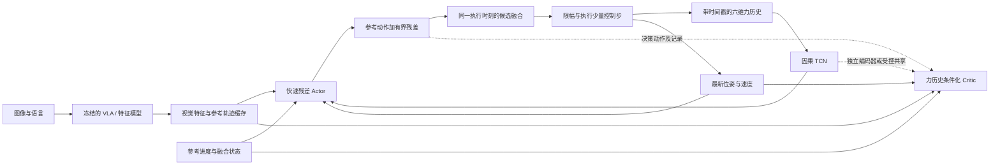

# FARL-VLA：力历史驱动的快速残差 Actor 与轨迹融合研究方案

日期：2026-09-11  
状态：研究设计草案；尚未实现或验证本文提出的新模型。本文只整理方案，不改变当前训练、模型或机器人行为。

## 1. 核心想法与论文定位

**在已有 VLA 提供视觉语义和参考轨迹的基础上，引入使用六维力历史的快速残差 Actor，通过强化学习与人工接管示范学习接触修正，并融合多次预测中对应同一执行时刻的动作，在保持轨迹连贯的同时提高对接触变化的响应能力。**

方法名称确定为 **FARL-VLA**，全称为 **Force-Aware Reinforcement Learning for Vision-Language-Action Models**，即“力感知强化学习增强的视觉语言动作模型”。其中 F 表示 Force，A 表示 Aware，RL 表示 Reinforcement Learning，VLA 表示 Vision-Language-Action。

中文论文标题：

> FARL-VLA：面向接触密集操作的力感知反应式强化学习

英文论文标题：

> FARL-VLA: Force-Aware Reinforcement Learning for Reactive Contact-Rich Manipulation

名称对应三条技术主线：Force-Aware 对应 TCN 六维力历史编码；Reinforcement Learning 对应基于奖励与交互经验的残差策略学习；Reactive 对应快速 Actor 与时间动作融合。文中 RLT 仅指现有实现基础，本文提出的方法统一称为 FARL-VLA。

建议将论文的研究问题写成：

> 在尽量保留预训练 VLA 能力的条件下，能否通过轻量的力历史编码与快速残差强化学习，学习视觉难以辨认的接触修正，并借助时间对齐的动作融合改善插入成功率和执行稳定性？

成功率提升是待验证假设，不是当前已有结论。

### 1.1 与已有工作的关系

FAVLA 已提出慢视觉/快接触反馈、TCN 力编码、向动作专家注入力信息、自适应执行频率及时间集成。因此，“TCN + 快推理 + 轨迹融合”本身不能作为已经成立的独立创新点。本文将其作为明确借鉴的基础，研究如何与当前 RLT 的残差 Actor、critic、人工接管和失败经验学习结合。[FAVLA 原文](<paper/Li 等 - 2026 - FAVLA A Force-Adaptive Fast-Slow VLA model for Contact-Rich Robotic Manipulation.md>)

Reactive Diffusion Policy 也研究过慢速视觉规划和快速触觉反馈的分层策略。这说明快慢分工已有研究基础，但并不证明下面的 FARL-VLA 方案一定有效。[RDP 原文](https://arxiv.org/abs/2503.02881)

| 对比项 | FAVLA | 本方案拟研究的方向 |
| --- | --- | --- |
| 动作模块 | π₀ 内部的动作专家，通过 flow matching 生成动作 | VLA 外部的轻量残差 Actor，围绕参考轨迹学习修正 |
| 学习方式 | 示范动作学习 + 未来力方差预测 | 接管示范 BC + Actor–Critic 强化学习，验证失败经验的作用 |
| 力的作用路径 | TCN 编码后通过多层注意力注入动作专家 | 先用 TCN 特征条件化 Actor 和 critic；复杂注入作为后续实验 |
| VLA 更新 | 对 VLM 与动作专家进行 LoRA 微调 | 首版冻结 VLA 与已有特征提取器，集中训练残差分支 |
| 推理调度 | 预测未来力波动，自适应安排动作专家调用次数 | 首版固定较快频率，先验证闭环反馈；自适应调度暂不加入 |
| 融合 | 固定周期内噪声、对重叠动作做时间集成 | 时间对齐的残差候选转为可执行位姿后融合，并将融合记忆纳入学习流程 |

候选贡献应集中于“力历史条件下的快速残差 RL 如何学习接触修正”和“有动作融合记忆时怎样保持训练与执行一致”。最终的新颖性还需要进一步检索文献与实验论证，不能仅凭上述两篇文章判断。

## 2. 当前项目已经有什么，缺什么

以下是本次阅读本地代码与配置得到的现状，和后文的拟议修改分开列出。

| 项目 | 当前实现 | 本方案需要补充 |
| --- | --- | --- |
| Actor 输入 | 参考动作块前 10 步 × 7 维、2048 维 `z_rl`、19 维 `proprio` | 连续力历史特征、参考进度/缓存年龄，必要的融合状态 |
| 力信息 | `proprio` 已含单帧 Fx/Fy/Fz 和三个力矩 | 因果时间序列，避免只靠一个瞬时读数 |
| Actor 输出 | 10 × 7 维归一化残差，再映射到参考动作附近 | 首版保留输出长度，分离“预测长度”和“执行长度” |
| 执行 | actor 阶段一次连续执行 10 步后再推理 | 执行少量步后使用最新受力重新预测 |
| VLA 调用 | `predict_rlt_actions` 每轮先调用特征模型提取观测 | 缓存视觉特征和参考轨迹，允许 Actor 单独更新 |
| Critic 输入 | `z_rl + proprio`，再结合动作评估 Q | 力历史、参考与进度、融合记忆等新增条件 |
| 当前默认 BC | `conditional_all`，包含人工/参考条件目标 | 本研究建议单独实验“只在有效人工示范上使用 BC” |
| 当前数据 | 在线 replay 主要保留动作块边界观测 | 控制步级力/位姿/时间戳，以及决策级完整记录 |

当前 Actor 的参考输入与 `proprio` 是环境物理量；输出残差由 `tanh` 限幅后乘以逐维比例。不能把“当前 Actor 没有力输入”作为论文动机，准确表述是：**已有单帧力输入，但动作块执行期间缺少及时更新，且没有显式编码接触变化历史。**

现有配置中的 `num_action_chunks: 10` 同时影响输出维度与训练张量。不能直接改成 2 后继续假设旧 checkpoint、critic 和 replay 均兼容。

## 3. 工作假设

### H1：力历史比单帧力更有利于识别接触阶段

相同的当前 Fz，可能分别对应受力上升、持续顶住或正在释放。连续六维力配合位姿变化，可能提供更充分的接触信息。

这不意味着仅凭力可以唯一确定偏孔方向。横向误差、姿态、夹持状态和接触几何仍会产生歧义。

### H2：更频繁地基于新受力决策，有助于接触后的微小修正

如果机械臂刚碰到孔边就能重新决策，可以减少剩余开环动作带来的持续顶压。需测量传感器采样到新指令生效的端到端延迟，而不只测 MLP 单次前向速度。

### H3：有限记忆的轨迹融合可以改善动作连贯性

重复预测可能产生目标跳变。融合能降低跳变，但过度平滑也可能延迟必要修正。因此需要同时评价成功率、受力、动作变化和反应延迟。

### H4：RL 能在示范之外利用失败经验改善修正策略

失败与奖励可训练 critic 区分有效/无效的接触修正，再通过 Q 梯度影响 Actor。但 critic 对已见失败数据拟合更好，并不自动证明真实成功率提高；必须有独立闭环实验。

## 4. 模型设计

### 4.1 总体结构



VLA 提供“去哪里、总体怎么做”的参考；Actor 学习“在当前受力和姿态下，参考动作需要怎样调整”。本方案仍向机械臂发送位置/姿态目标，六维力是反馈输入；首版不改成直接输出目标力的力控制器。

### 4.2 六维力信号与坐标系

保留当前一致的数据来源：

```text
wrench = K_F_ext_hat_K
       = [Fx, Fy, Fz, Tx, Ty, Tz]

ee_force / tcp_force   = wrench[:3]   # N
ee_torque / tcp_torque = wrench[3:]   # N·m
```

不使用七维关节力矩替代这六维信号。优先保持已有模型的 K 坐标系约定，另行记录 `O_T_EE`、`EE_T_K`，条件允许时同时记录 `O_F_ext_hat_K`，用于分析插入轴受力和校验坐标转换。

K 系 Fz 不能直接定义为竖直力。分析轴向受力时，应使用确认过的插入方向单位向量做投影。模型输入先保留六维，而不是只保留 Fz。

### 4.3 因果力历史与 TCN

在每个 Actor 决策时刻，取截至当前可用的最近 L 个力样本：

$$
W_t=[w_{t-L+1},\ldots,w_t],\qquad h_t=\operatorname{TCN}(\widetilde W_t).
$$

首版建议：

| 项目 | 初始实验设置 | 说明 |
| --- | --- | --- |
| 原始记录 | 至少逐控制步记录；更高频采集另行测量能力 | 不把同一旧状态重复读取当作新传感器样本 |
| 时间窗口 | 先取约 0.5～1 秒 | 是设计起点，不是最优值 |
| 使用现有 10 Hz 数据验证 | L = 5 或 10 | 相邻样本间隔 0.1 秒，覆盖约 0.4 或 0.9 秒 |
| TCN | 2～3 个因果残差块，通道 32/64，卷积核 3 | 先控制容量，避免照搬论文较大的力编码器 |
| 扩张率 | 如 1、2、4 | 对照实验检查多时间尺度是否需要 |
| 输出特征 | 32 或 64 维 | 可用于小型 MLP Actor |
| 起始不足 L 个样本 | 左侧补首帧并提供有效位 mask | reset 后清空，禁止跨 episode 拼历史 |

每次决策都使用新窗口。若采样间隔不规则，可建立统一时间网格，采用只取过去样本的因果对齐，并保留样本年龄/有效性；不能用未来样本插值到当前时刻。

对新建 TCN 分支的六维输入，使用训练集统计量做逐维尺度标准化，力和力矩分别处理，保留符号。统计量随模型保存，训练与推理使用完全相同的变换。首版不突然改变旧 `proprio` 的单位或归一化方式；这样可以保留旧 Actor 主干的输入含义。

### 4.4 Actor 输入、输出与初始化

拟议输入：

$$
x_t=[z^{\mathrm{VLA}}_c,\operatorname{vec}(A^{\mathrm{ref}}_{t:t+H-1}),p_t,h_t,\eta_t,b_t].
$$

- `c` 是最近一次完成的慢模型更新。
- `p_t` 使用当前真实状态，不能沿用慢模型缓存时的旧位姿和力。
- `h_t` 是力历史特征。
- `η_t` 表示参考动作进度、缓存年龄、有效参考长度等。
- `b_t` 表示融合所需的历史候选状态，或可还原这些状态的有界表示。

Actor 首版仍预测 H=10 步残差：

$$
U_t=f_\theta(x_t),\qquad
A^{\mathrm{cand}}_t=A^{\mathrm{ref}}_{t:t+H-1}+D\tanh(U_t).
$$

其中 U_t 是网络在 tanh 之前的输出，避免对已经限幅的残差重复应用 tanh。公式表示当前残差策略的基本形式。位置/姿态/夹爪应继续遵守项目已有的动作几何与约束；姿态的长期改进可采用 SO(3) 表示，不能将欧拉角直接当作普通数值混合。

建议在旧模型上新增力历史分支，使用门控或零初始化融合投影，使刚加载时尽量接近原模型。需要显式验证：新分支关闭时的输出是否与原 checkpoint 相同，新分支开启后是否收到非零梯度。新结构不能直接严格恢复旧结构所有优化器状态，应按参数名和形状迁移，新增参数重新初始化优化器状态。

根据用户需求，Actor 阶段夹爪保持闭合；夹爪执行策略单独处理，不通过连续轨迹均值把开/关命令混在一起。

### 4.5 Critic 也要看到力历史和执行上下文

若 Actor 使用 TCN，而 critic 仍只看到原来的单帧状态，Q 学习会缺少 Actor 做接触决策时使用的信息。

建议 critic 至少包含力历史、当前状态、VLA 参考与缓存进度、必要的融合状态。因为相同归一化残差在不同参考轨迹上对应不同实际动作，仅存残差而不提供参考会产生动作含义歧义。

首版可为 Actor 和 critic 使用独立的小 TCN，减少梯度相互干扰；critic 的目标网络应包含对应目标编码器。共享编码器作为后续消融，须明确 Actor/critic 的更新归属和 detach 规则。

## 5. 快速推理与慢模型缓存

### 5.1 分离三个概念

| 概念 | 含义 | 首版建议 |
| --- | --- | --- |
| 预测长度 H | 一次 Actor 输出多少步 | 保留 10 步 |
| 执行长度 K | 执行多少步后重新决策 | 从 10 改为实验值 2；1 步是后续实验 |
| 慢模型更新周期 | 多久刷新图像特征与 VLA 参考 | 与 Actor 解耦，根据测得延迟和参考剩余长度安排 |

控制频率为 10 Hz 时，K=2 的纯执行时间是 0.2 秒，但实际反馈周期还包括采样、传输、推理和下发。**约 5 Hz 是端到端性能目标，不是修改一个参数后自动获得的结果。**

初期维持已有控制步长和动作限制，优先缩短策略反馈间隔。只有链路验证通过后，再研究更高控制频率。

### 5.2 一轮执行的逻辑

```text
1. 获取新图像、状态和历史力，慢模型产生视觉特征与带时间索引的参考轨迹。
2. 将完成的慢模型输出作为一个一致版本写入缓存。
3. Actor 获取最新力窗口、最新位姿、当前参考切片及融合状态。
4. 预测未来 H 步残差，转换为带目标执行时间的候选动作。
5. 融合对应相同目标时刻的候选，执行前 K 个控制步。
6. 每个控制步保存真实观测、实际命令和时间戳；在 K 步结束后形成训练 transition。
7. 若缓存仍有效，回到第 3 步；参考将耗尽或场景上下文已过旧时刷新慢模型。
```

关键要求：

- 参考必须随真实执行进度推进，不能每次重用同一参考块前两步。
- 最新力/位姿不能依赖重新完成整个 VLA 前向才能送到 Actor。
- 相机获取也不应无意间阻塞每一次快速状态更新，需要测量实际路径。
- 新旧缓存必须作为完整版本切换，避免混用旧视觉特征与新参考的不同部分。
- 慢模型计算期间经过的执行步需要计入参考年龄，不能把已经过期的预测当成当前动作。
- 参考覆盖不足时触发刷新或有界等待，不无限重复最后一条参考。
- 视觉更新和 Actor 若竞争同一 GPU，需要测量 p50/p95 延迟；大模型占用 GPU 可能让小 Actor 同样等待。

旧 Actor 在“缓存视觉特征 + 不断推进的参考切片”分布上未必训练过。即使力分支初始为零，也不能保证快循环行为等同旧闭环，因此要将缓存与执行变化作为独立实验变量。

## 6. 轨迹融合：按同一目标时刻融合，避免抹掉接触修正

### 6.1 基本方式

假设第 i 次 Actor 推理生成预测块，其针对实际执行时刻 k 的候选为 \(\hat a_{k|i}\)。收集所有尚未过期、且确实覆盖时刻 k 的候选：

$$
a_k^{\mathrm{fused}}=\sum_{i\in\mathcal I_k}\omega_{i,k}\hat a_{k|i},\qquad
\omega_{i,k}=\frac{\exp[-\beta\,\mathrm{age}_{i,k}]}{\sum_{j\in\mathcal I_k}\exp[-\beta\,\mathrm{age}_{j,k}]}.
$$

这里定义 β>0，明确使较新的预测权重更高；不是声称所有时间集成算法都采用这个权重方向。首版只保留最近 2～3 次预测，β 通过实验确定。

这不是把“未来第 1 步”和“未来第 2 步”取平均，也不是把两条轨迹按数组下标机械平均；必须对齐到同一执行时刻。

### 6.2 不同参考下的残差不能直接平均

不同预测可能基于不同 VLA 参考。应先分别合成到同一个机器人动作坐标系，再融合位置/姿态目标。否则一个“向后 1 mm”的残差可能对应完全不同的实际目标。

位置可使用加权平均。姿态需要处理四元数符号、归一化和流形上的插值/均值，例如有限候选使用 SLERP 或局部旋转增量表示。禁止直接平均跨越 ±π 的 roll/pitch/yaw。

融合后再应用已有的速度、位移与姿态变化限制，并记录受限前后的命令。应区分模型候选、融合目标、下发命令和实际到达位姿，四者并不相同。

### 6.3 融合的潜在代价

接触刚发生时，最新预测可能要求立即减小下压，而较旧预测仍要求继续向下。如果旧预测权重大，会延迟响应。

首版使用有限队列并偏重新预测。可选扩展是“接触变化显著时提高新预测权重或清理过旧候选”，但其阈值、效果与方法新颖性均待验证，不作为首版必需组件，也不预设 Fz 大就代表失败。

发生 reset、人工接管、控制模式切换、紧急中止时，需要明确清空/截断候选队列；接管结束不能重新执行接管前缓存的动作。

## 7. RL、BC 与融合执行如何保持一致

### 7.1 研究版训练目标

建议研究版比较以下 Actor 目标：

$$
L_\pi=-\lambda_Q\,\mathbb E[Q(S_t,\pi_\theta(S_t))]
+\lambda_{BC}\,\mathbb E_{\mathrm{human}}[L_{BC}(\pi_\theta(S_t),a_t^{\mathrm{human}})].
$$

- 自主成功/失败轨迹用于 RL；不默认将自主执行动作当作人工正确动作。
- 对真实人工接管覆盖的有效维度/控制步使用 BC，不对未接管或终止填充部分施加人工监督。
- 保留独立示范池，避免新自主数据覆盖示范；示范混采比例作为固定实验设置记录。
- “自主阶段只用 Q、人工阶段加 BC”是本研究拟议设置，当前默认配置仍为 `conditional_all`，需另行实现或显式切换，不能在论文中写成当前已完成。
- λQ、λBC 首轮不同时大范围调节。先固定一组可追溯设置，记录两项对应的梯度范数，不以 loss 标量大小判断其贡献。

示范 BC 的归一化分母和采样比例需要明确，以免接管样本占比变化无意间改变有效权重。Tanh 残差、物理动作误差、旋转距离要采用一致的目标定义。

### 7.2 预测 10 步、只执行 2 步的 transition

新 transition 覆盖的是实际执行的 K 步，而不是预测的 H 步。奖励按实际执行步累积，next observation 来自 K 步结束的真实状态。未执行的未来预测不能当作已经执行的数据。

本地 `fsdp_rlt_ac_policy_worker.py` 已对块内奖励逐步折扣，并使用 `gamma ** reward_horizon` 进行 bootstrap。因此当前 gamma=0.96 应按控制步语义审查：保持控制步时长不变且实际执行 K=2 时，应使用两步奖励及 \(\gamma^2\)，不能沿用十步长度产生的 \(\gamma^{10}\)。这里不需要仅因决策变快就再把 gamma 开方。

若控制步时长也改变或时长明显不规则，才需要另外定义按实际时间折扣的方式。终止与超时是否 bootstrap、哪些步为有效样本，应沿用明确的终止语义，不能把 reset 后状态写成 terminal next observation。

### 7.3 融合使决策具有历史依赖，必须显式记录

若实际执行动作由“本次预测 + 上几次预测”共同决定，只保存本次 Actor 输出和一个瞬时状态，会让 critic 缺少解释状态转移的条件。

建议首版明确以下约定：

> Actor 的决策动作 B_t 是本次完整残差预测块；融合/限幅是执行器的一部分。学习状态 S_t 包含力历史、参考及进度、缓存年龄、融合候选队列等必要信息。执行器依据 (S_t, B_t) 确定本次 K 步实际命令，并更新队列。

于是 critic 学习 \(Q(S_t,B_t)\)，而不是把 B_t 冒充为未经修改执行到机械臂的全部动作。每条 transition 同时保存原始预测、融合结果和实际命令，用于复现执行过程。

在该定义下，下一步 Q 的动作也必须经过相同的状态/队列语义。若采用另外一种“Q 直接评价融合后命令”的定义，也必须重做 Actor 梯度和 target action 的一致性处理；两种定义不能混用。

力历史之外的融合记忆也可能影响可控性。首版向 Actor 和 critic 都提供有界队列信息或足以重建它的表示，避免隐藏历史造成额外混淆。不要在训练时用采样 batch 中相邻但来自不同轨迹的记录拼接队列。

人工接管需要特别处理：接管会覆盖策略动作，原始 Actor 输出不再是造成实际转移的动作。首版可在接管开始清空队列，将接管控制步作为带 mask 的示范；如要进入 critic，必须构造与真实执行一致的动作表示，否则暂时只用于 BC。不能给未执行的 Actor 动作配上人工操作得到的奖励进行普通 Q 回归。

## 8. 数据记录与旧数据利用

### 8.1 控制步级记录

建议建立独立于 replay 压缩/采样策略的原始记录：

| 字段 | 用途 |
| --- | --- |
| episode_id、control_step、单调时间戳 | 对齐同一轨迹与测量真实间隔 |
| 机器人状态时间戳、接收时间、命令下发时间 | 检查力样本新鲜度与端到端延迟 |
| 六维原始力/力矩、信号名、单位、坐标系 | 保证语义一致与可重算 |
| 末端位姿、速度、夹爪状态 | 区分插入、松开、撤回与顶住 |
| O_T_EE、EE_T_K；可选 O_F_ext_hat_K | 校验 K 轴与插入方向，避免混用坐标 |
| Actor 原始候选、参考动作、融合目标、下发命令 | 还原决策与实际执行的差别 |
| VLA/Actor 版本、参考起点、缓存年龄、目标执行时刻 | 保证快慢模型之间时间一致 |
| 接管标记、奖励、终止/超时、成功判定时间 | 正确建立训练标签和评价指标 |
| 图像或视频时间索引 | 核实接触、插入和松开事件 |

这会产生额外数据量，应单独估算存储，而不是通过丢弃中间力样本解决。

### 8.2 决策级 replay

保存完整的 \((S_t,B_t,R_t,S_{t+1},\text{terminal},\text{valid mask})\)，包括力窗口、融合队列、参考版本和执行步数。必要时保存原始控制步片段用于审计。

为新数据增加 schema 版本及动作语义版本。载入旧 replay 时检查是否具备所需历史与队列；不兼容数据不能无提示混入新 critic 更新。

### 8.3 已有数据的用途与限制

- 最近在线测试 replay 只有动作块边界观测。它能分析较慢的受力趋势，但不能补出中间 10 Hz 甚至更高频的力历史，不能伪造插值后当成真实高频经验。
- 两条 LeRobot 示范有 10 Hz 全程力，可用于跑通窗口构建、TCN 输入和离线监督流程，但只有两条，不足以证明泛化。
- 这两条示范的力下降伴随夹爪松开，不能直接把下降标签当成插入成功标签；Actor 闭爪阶段的训练需按图像/夹爪阶段筛选。
- 对应转换器把 `is_success` 写为 True，不能仅凭该字段验证物理成功。
- 旧权重可作为初始化；旧 Adam 状态、旧 critic 和旧 replay 的无缝继续训练不应默认成立。
- 离线误差能检查拟合与漂移，不能证明新动作在机器人上提高成功率。不同动作导致的真实接触后果不能从固定日志中直接观测。

## 9. 实验设计：分别证明力历史、快速反馈、融合与 RL 的价值

### 9.1 分阶段消融

| 编号 | 力输入 | 反馈方式 | 融合 | 主要目的 |
| --- | --- | --- | --- | --- |
| E0 | 原单帧六维力 | 现有同步、执行 10 步 | 无 | 原系统基线 |
| E1 | 原单帧六维力 | 快慢解耦，执行 2 步后更新 | 无 | 验证更快使用现有信号的作用 |
| E2 | 同长度历史展平 + MLP | 与 E1 相同 | 无 | 验证时间历史本身，控制参数量 |
| E3 | 同长度历史 + TCN | 与 E1 相同 | 无 | 验证 TCN 相对普通历史编码的收益 |
| E4 | 历史 + TCN | 与 E1 相同 | 有 | 验证融合能否兼顾稳定和反应速度 |
| E5 | 历史 + TCN | 执行 10 步 | 无 | 与 E3 对照，分离历史编码和频率的影响 |

E1 与 E0 同时改变了缓存/快循环机制，不能将全部收益严格归因于频率。若要单独证明频率，再在同一缓存架构下比较 K=10、5、2、1，固定其余设计。先做冻结权重运行探查，再做对应架构重新训练后的正式比较，二者不要混报。

是否需要六维力以及是否真正利用其时间顺序，可增加训练级消融：单帧力、历史力、移除力历史、时间打乱历史。直接在已训练模型推理时清零/打乱输入只是一种敏感性检查，可能造成分布外输入，不能替代公平的重新训练消融。

### 9.2 单独证明 RL 的作用

在相同的力编码、执行周期、融合机制和初始权重下比较：

1. 仅人工 BC。
2. 人工 BC + Q，critic 使用自主成功和失败数据。
3. 人工 BC + Q，critic 不使用指定的一组新失败数据；用匹配的训练数据补足 batch，保持更新数和 Actor batch 尽量一致。

第三组不是简单删数据后减少训练量，而是控制失败信息进入 critic 的差异。需要多个训练随机种子、独立测试条件与预先固定的数据划分。

RL 作用的证据优先是独立真实测试中的成功率、纠偏能力或更少的失败接触；训练 Q-loss 下降、已见失败的 Q 值降低，只能作为辅助机制证据。

### 9.3 评价指标与试验控制

主指标：自主成功率，人工接管后的成功单独统计。统一 b 切换条件、初始位置、夹持方式和结束判定；各种方法按随机或交替顺序测试，降低设备状态和场景漂移影响。

辅助指标：

- 完成时间、接管次数、超时比例；
- 接触区峰值力、持续受力时间、力随时间的积分；
- 确认插入轴后的轴向力，以及横向力/力矩；
- 下发目标的跳变、实际位姿/速度变化，区分目标平滑与实际运动平滑；
- 力事件到更新命令的反应延迟，Actor/VLA p50、p95 延迟及失约率；
- 对孔前后的小幅位姿扰动下的纠偏成功率。

工程试跑每组约 10 次，用于发现故障，不做论文结论。正式小规模筛选可先每组 30 次；最终比较的样本量应按基线成功率和希望检测的提升幅度规划，报告成功次数/总次数和二项置信区间。30 次仍可能不足以识别小幅提升。

若宣称方法适用于一般接触操作，除当前插充电器外，需增加另一任务或系统性的插座偏移/旋转、夹持变化等未见条件。若只测试当前场景，论文主张应限制在该场景。

## 10. 推荐实施顺序

### 阶段 A：记录与一致性检查

保持当前控制行为，补齐逐控制步的力、位姿、实际命令、夹爪和时间戳。确认 K/O 坐标、采样新鲜度、episode 边界和接管记录。建立可重复的基线测试条件。

### 阶段 B：先拆开快慢推理，暂不加 TCN 和融合

保留 H=10，增加独立 K 执行长度，先测试 K=2；正确维护参考进度与慢模型缓存。验证新鲜状态能在快循环中到达 Actor，测量真实执行间隔。此阶段主要回答“快反馈是否可实现、是否改变行为”。

### 阶段 C：加入小型 TCN，并配套训练 Actor/Critic

先在已有 10 Hz 示范上验证窗口/梯度/目标，再用新采集数据继续训练。增加 MLP 历史编码基线，确认改善不是仅来自输入维度或模型容量增加。

### 阶段 D：加入有限记忆的动作融合

先在离线命令回放中验证时间索引、姿态插值和限幅，再进行受控闭环测试。将融合状态与真实执行链路加入 replay/critic，比较 E3 与 E4。

### 阶段 E：开展正式消融及论文分析

固定数据版本、模型版本和测试条件，完成力历史/频率/融合/RL 的独立证据。只有在固定频率方案已成立后，才考虑力变化调节融合权重或自适应 Actor 频率。

## 11. 论文表述草稿

### 11.1 方法概述

> 针对视觉语言动作模型在接触操作中反馈更新滞后，以及动作块重新规划引起的不连续问题，我们研究 FARL-VLA，一种力历史驱动的快速残差强化学习框架。该框架保留预训练 VLA 的视觉语义和参考动作生成能力，通过因果时间卷积编码连续六维外力/外力矩，条件化轻量残差 Actor 与 critic，使策略在较短执行间隔内依据最新接触状态修正参考轨迹。为兼顾快速反应与执行连贯性，系统对时间对齐的重叠动作预测进行有限记忆融合，并在经验记录和价值学习中显式处理融合历史与实际执行动作的关系。策略结合人工接管示范和自主交互经验学习，旨在提高精密插入任务的自主成功率，并减少无效接触与目标跳变。

这段是研究设计描述，不能在尚未验证时追加“显著优于”“稳定提高”“首次提出”等结果性或首创性表述。

### 11.2 候选贡献与对应证据

| 候选贡献 | 必须提供的证据 |
| --- | --- |
| 将连续力历史用于快速残差 RL 接触修正 | 单帧/历史 MLP/TCN，以及 BC-only/RL 的对照 |
| 在保留 VLA 参考的条件下提高反馈速度 | 相同架构的执行周期消融、真实延迟和成功率 |
| 处理轨迹融合记忆与价值学习的一致性 | 有无融合比较、真实命令重建、相同训练预算下稳定性与任务指标 |
| 有限交互数据下利用失败经验 | 控制失败数据进入 critic 的实验，以及未见条件下的真实测试 |

当前最合适的首版范围是 **冻结 VLA + 六维力历史 TCN + 快速残差 Actor/Critic + 简单时间融合**。未来力预测、复杂注意力、多传感器扩展和自适应频率暂不同时引入，以便清楚验证主线。

## 12. 本地依据与后续实现入口

- [当前 Actor 与 Critic](../../rlinf/models/embodiment/mlp_policy/rlt_mlp_policy.py)
- [当前 RLT 推理入口](../../rlinf/algorithms/rlt/rollout.py)
- [当前 RLT Actor–Critic 更新](../../rlinf/workers/actor/fsdp_rlt_ac_policy_worker.py)
- [当前 Stage 2 配置](../rlt/configs/realworld_rlt_stage2_franky.yaml)
- [Franka 六维力读取](../../rlinf/envs/realworld/franka/franky_controller.py)
- [两条示范的力数据分析与限制](../rlt/offline_diagnostics/20260911_lerobot_2ep_force/README.md)
- [示范与测试受力差异](../rlt/offline_diagnostics/20260911_lerobot_2ep_force/comparison_with_test.md)
- [FAVLA 全文](<paper/Li 等 - 2026 - FAVLA A Force-Adaptive Fast-Slow VLA model for Contact-Rich Robotic Manipulation.md>)

本文没有实现任何训练改动。下一步实施时，应先完成阶段 A/B 的具体代码设计和一致性验证，再进入新增网络与训练。
