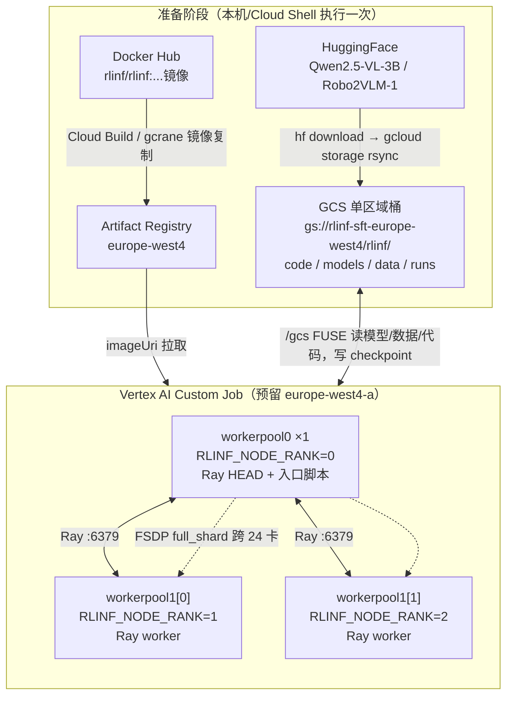
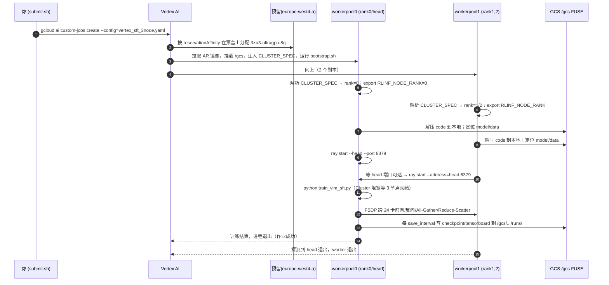

# 在 Vertex AI 上多机运行 RLinf VLM SFT 操作手册

> 目标：把 RLinf 仓库里的 **VLM 全参数 SFT 示例**（模型 `Qwen2.5-VL-3B-Instruct`，数据集 `Robo2VLM-1`，FSDP 后端）作为 **Vertex AI（也叫 Agent Platform）自定义训练作业**，跑在 `europe-west4-a` 预留资源里的 **3 台 `a3-ultragpu-8g`（共 24×H200）** 上，做真正的**多机分布式训练**。
>
> 本手册对应示例文档 [`docs/source-en/rst_source/examples/embodied/sft_vlm.rst`](../../../docs/source-en/rst_source/examples/embodied/sft_vlm.rst)，入口脚本 [`examples/sft/train_vlm_sft.py`](../../../examples/sft/train_vlm_sft.py)，基线配置 [`examples/sft/config/qwen2_5_vl_sft_vlm.yaml`](../../../examples/sft/config/qwen2_5_vl_sft_vlm.yaml)。

---

## 0. 总览

### 0.1 配套文件清单（都在本目录 `b/gcp/demo2/`）

| 文件 | 作用 |
| --- | --- |
| `gcp_rlinf_sft.md` | 本手册 |
| `cloudbuild_mirror_image.yaml` | 用 Cloud Build 把官方镜像镜像到 Artifact Registry |
| `qwen2_5_vl_sft_vlm_3node.yaml` | RLinf 多机训练配置（`num_nodes:3`、`global_batch_size:288`） |
| `bootstrap.sh` | 容器入口：解析 `CLUSTER_SPEC` → 组 Ray 集群 → 跑训练 |
| `vertex_sft_3node.yaml` | Vertex 作业定义（两个 worker pool：1 + 2） |
| `submit.sh` | 一键：打包代码 → 上传 GCS → 提交作业 |

### 0.2 为什么这样设计（关键事实，决定手册的正确性）

1. **官方镜像不含 RLinf 源码。** 看 [`docker/Dockerfile`](../../../docker/Dockerfile)：它只 `COPY pyproject.toml requirements/`，且 [`requirements/install.sh`](../../../requirements/install.sh) 默认带 `--no-install-project`（即只装依赖、不装 `rlinf` 本体）。所以**运行时必须把仓库源码送进容器**并加入 `PYTHONPATH`。本手册的做法是把源码打包上传到 GCS，启动时各节点解压到本地。
2. **镜像里的 Python 环境在 `/opt/venv/<name>`。** reason 镜像只有一个名为 `reason` 的 venv，用 `source /opt/venv/reason/bin/activate`（或镜像内置的 `source switch_env reason`）激活。
3. **RLinf 多机靠 Ray，节点序号靠 `RLINF_NODE_RANK`。** 见 [`rlinf/scheduler/cluster/node.py`](../../../rlinf/scheduler/cluster/node.py)（`NodeProbe` 读取 `RLINF_NODE_RANK`）与 [`rlinf/scheduler/cluster/cluster.py`](../../../rlinf/scheduler/cluster/cluster.py)。**必须在 `ray start` 之前 `export RLINF_NODE_RANK`**（Ray 在启动时抓取环境变量）。rank 0 起 head 并跑入口脚本；入口里的 `Cluster(cfg.cluster)` 会 `ray.init()` 并**阻塞等待 `num_nodes` 台节点全部加入**后才开始。可对照 [`ray_utils/start_ray.sh`](../../../ray_utils/start_ray.sh)。
4. **Vertex 多机拓扑由 `CLUSTER_SPEC` 注入。** Vertex 在每个副本上注入环境变量 `CLUSTER_SPEC`（JSON），描述 `workerpool0`（primary/chief，副本数恒为 1）与 `workerpool1`（其余 worker）的 `host:port` 以及当前节点的 `task.type/index`。我们用它推导 `RLINF_NODE_RANK` 与 Ray head 地址。参考官方文档：[Distributed training](https://cloud.google.com/vertex-ai/docs/training/distributed-training#cluster-variables)。
5. **批大小整除约束。** 见 [`rlinf/workers/sft/fsdp_sft_worker.py`](../../../rlinf/workers/sft/fsdp_sft_worker.py)：`global_batch_size % (micro_batch_size * world_size) == 0`。这里 `world_size = 3×8 = 24`、`micro_batch_size = 4` ⇒ 必须是 **96 的倍数**；示例默认的 `256` **不可用**，本手册改成 **`288`**（= 96×3，等价于 3 步梯度累积）。
6. **Robo2VLM-1 的 train/test 必须分目录。** 下载后 `train-*.parquet` 与 `test-*.parquet` 混在一起，若指向同一目录会被整目录加载（rst 明确提醒）。本手册拆成 `train_data/` 与 `test_data/`。
7. **Cloud Storage FUSE 自动挂载在 `/gcs`。** Vertex 自定义训练会把你有权限的桶自动挂到每个节点的 `/gcs/<bucket>`，可直接当本地文件读写，无需 `gsutil`。参考 [Use Cloud Storage as a mounted file system](https://cloud.google.com/vertex-ai/docs/training/cloud-storage-file-system) 与 [Prepare training code #fuse](https://cloud.google.com/vertex-ai/docs/training/code-requirements#fuse)。
   - ⚠️ **FUSE 只支持单区域桶**（不支持 multi-region / dual-region）。所以我们用一个 **`europe-west4` 单区域桶**。
   - ⚠️ `/gcs` 根目录不可 `ls`，但 `/gcs/<bucket>/...` 可正常读写。

### 0.3 端到端架构





---

## 1. 前置条件

```bash
# 1) 登录与项目
gcloud auth login
gcloud auth application-default login        # 让本机 SDK 拿到 ADC
gcloud config set project autel-ai-physical-spat-intel

# 2) 启用所需 API
gcloud services enable \
  aiplatform.googleapis.com \
  artifactregistry.googleapis.com \
  cloudbuild.googleapis.com \
  storage.googleapis.com \
  compute.googleapis.com

# 3) 确认预留可用（应能看到 reservation-20260422-033135，3×a3-ultragpu-8g）
gcloud compute reservations describe reservation-20260422-033135 \
  --zone=europe-west4-a

# 4) 安装 HuggingFace CLI（仅准备数据用，本机/Cloud Shell）
pip install -U "huggingface_hub[cli]"
```

要点：
- **地域观念**：Vertex AI 按 *region* 工作（`europe-west4`），但 GPU 预留按 *zone*（`europe-west4-a`）。作业用 `--region=europe-west4`，靠 `reservationAffinity` 落到那台预留所在的 zone。
- **配额**：用自己的预留可绕过临时配额，但仍需项目对 `a3-ultragpu-8g` / `NVIDIA_H200_141GB` 在该 region 的 Vertex Custom Training 配额 ≥ 你要的量。

---

## 2. 集中参数（先 `source` 一次，后续命令直接复用）

把下面这段存成 `env.sh` 或直接粘到终端执行：

```bash
# ---- 项目 / 地域 ----
export PROJECT_ID="autel-ai-physical-spat-intel"
export PROJECT_NUMBER="73851708908"
export REGION="europe-west4"
export ZONE="europe-west4-a"
export RESERVATION="projects/${PROJECT_ID}/zones/${ZONE}/reservations/reservation-20260422-033135"

# ---- 镜像 ----
export SRC_IMAGE="rlinf/rlinf:math-rlinf0.2-torch2.6.0-sglang0.4.6.post5-vllm0.8.5-megatron0.13.0-te2.1"
export AR_REPO="rlinf"
export AR_IMAGE="${REGION}-docker.pkg.dev/${PROJECT_ID}/${AR_REPO}/${SRC_IMAGE#rlinf/}"

# ---- 存储（必须是单区域桶，FUSE 要求）----
export GCS_BUCKET="rlinf-sft-europe-west4"
export GCS_ROOT="gs://${GCS_BUCKET}/rlinf"

# ---- 作业 ----
export DISPLAY_NAME="rlinf-sft-3node"
export EXP_NAME="qwen2_5_vl_sft_3node"
```

创建单区域桶（若还没有）：

```bash
gcloud storage buckets create "gs://${GCS_BUCKET}" \
  --project="${PROJECT_ID}" \
  --location="${REGION}" \
  --uniform-bucket-level-access
```

> `--location=${REGION}`（`europe-west4`）即单区域；千万别用 `EU`/`EUROPE-WEST` 这类 multi-region，否则 FUSE 不可用。

---

## 3. 步骤一：把官方镜像镜像到 Artifact Registry

**为什么不直接用预构建 PyTorch 镜像？** 因为示例依赖 RLinf 全套环境（FSDP、Ray、transformers/qwen2.5_vl、ray scheduler 等），预构建镜像缺这些。**为什么镜像到 AR？** 让镜像与作业同区域，拉取快、稳定、可控（避免 Docker Hub 限流/抖动）。

### 3.1 创建 AR 仓库

```bash
gcloud artifacts repositories create "${AR_REPO}" \
  --repository-format=docker \
  --location="${REGION}" \
  --description="Mirror of RLinf images"
```

### 3.2 用 Cloud Build 复制镜像（云端执行，本机无需 Docker）

配置见 `cloudbuild_mirror_image.yaml`（用 `gcrane` 做 registry→registry 直拷，对几十 GB 的大镜像更稳）：

```yaml
steps:
  - id: mirror-with-gcrane
    name: gcr.io/go-containerregistry/gcrane
    args: ['cp', '${_SRC_IMAGE}', '${_DST_IMAGE}']
substitutions:
  _SRC_IMAGE: "docker.io/rlinf/rlinf:math-rlinf0.2-..."
  _DST_IMAGE: "europe-west4-docker.pkg.dev/autel-ai-physical-spat-intel/rlinf/rlinf:math-rlinf0.2-..."
options:
  machineType: E2_HIGHCPU_8
  diskSizeGb: 200
timeout: 7200s
```

提交：

```bash
gcloud builds submit --no-source \
  --region="${REGION}" \
  --config=b/gcp/demo2/cloudbuild_mirror_image.yaml \
  --substitutions=_SRC_IMAGE="docker.io/${SRC_IMAGE}",_DST_IMAGE="${AR_IMAGE}"
```

> **备选（本机有 Docker 时）**：`docker pull docker.io/${SRC_IMAGE} && docker tag docker.io/${SRC_IMAGE} ${AR_IMAGE} && gcloud auth configure-docker ${REGION}-docker.pkg.dev && docker push ${AR_IMAGE}`。

验证：

```bash
gcloud artifacts docker images list \
  "${REGION}-docker.pkg.dev/${PROJECT_ID}/${AR_REPO}"
```

---

## 4. 步骤二：准备模型与数据到 GCS

目标目录布局（FUSE 下即 `/gcs/${GCS_BUCKET}/rlinf/...`）：

```
gs://rlinf-sft-europe-west4/rlinf/
├── code/RLinf.tar.gz                 # 由 submit.sh 自动上传（步骤六）
├── bootstrap.sh                      # 由 submit.sh 自动上传（步骤六）
├── models/Qwen2.5-VL-3B-Instruct/    # 本步骤上传
├── data/Robo2VLM-1/
│   ├── train_data/                   # train-*.parquet
│   └── test_data/                    # test-*.parquet
└── runs/<EXP_NAME>/                  # 作业运行时写入 checkpoint/tensorboard
```

### 4.1 下载模型

```bash
hf download Qwen/Qwen2.5-VL-3B-Instruct \
  --local-dir /tmp/Qwen2.5-VL-3B-Instruct
```

### 4.2 下载数据集并拆分 train/test

```bash
# 1) 下载整个数据集仓库（parquet 在 data/ 下）
hf download keplerccc/Robo2VLM-1 --repo-type dataset \
  --local-dir /tmp/Robo2VLM-1

# 2) 拆分到不同目录（关键！否则会整目录加载）
mkdir -p /tmp/Robo2VLM-1/train_data /tmp/Robo2VLM-1/test_data
mv /tmp/Robo2VLM-1/data/train-*.parquet /tmp/Robo2VLM-1/train_data/
mv /tmp/Robo2VLM-1/data/test-*.parquet  /tmp/Robo2VLM-1/test_data/
```

> 提示：先做**冒烟测试**时，可只放少量 parquet（例如各 1 个）到 `train_data/`、`test_data/`，把跑通流程和等大数据解耦。

### 4.3 上传到 GCS

```bash
gcloud storage rsync -r /tmp/Qwen2.5-VL-3B-Instruct \
  "${GCS_ROOT}/models/Qwen2.5-VL-3B-Instruct"

gcloud storage rsync -r /tmp/Robo2VLM-1/train_data \
  "${GCS_ROOT}/data/Robo2VLM-1/train_data"
gcloud storage rsync -r /tmp/Robo2VLM-1/test_data \
  "${GCS_ROOT}/data/Robo2VLM-1/test_data"
```

验证：

```bash
gcloud storage ls "${GCS_ROOT}/models/Qwen2.5-VL-3B-Instruct/"
gcloud storage ls "${GCS_ROOT}/data/Robo2VLM-1/train_data/" | head
gcloud storage ls "${GCS_ROOT}/data/Robo2VLM-1/test_data/"  | head
```

---

## 5. 步骤三：RLinf 多机训练配置

文件：`qwen2_5_vl_sft_vlm_3node.yaml`（基线 = `examples/sft/config/qwen2_5_vl_sft_vlm.yaml`，改动以 `#@#` 标注）。逐字段重点：

| 字段 | 取值 | 说明 |
| --- | --- | --- |
| `cluster.num_nodes` | `3` | 3 台机；入口的 `Cluster` 会阻塞等到 3 个节点都加入 Ray。 |
| `cluster.component_placement.actor` | `all` | actor（FSDP）占满全部 24 张 GPU。 |
| `actor.global_batch_size` | `288` | **必须是 `micro(4)×world(24)=96` 的倍数**；288 = 96×3。 |
| `actor.micro_batch_size` | `4` | 每卡每次前/反向的样本数。 |
| `actor.fsdp_config.sharding_strategy` | `full_shard` | 跨 24 卡全分片参数/梯度/优化器态。 |
| `actor.model.model_path` | `/workspace/models/...` | 仅占位；由 `bootstrap.sh` 用命令行覆盖为 `/gcs/...` 的 FUSE 路径。 |
| `data.train_data_paths` / `val_data_paths` | `train_data` / `test_data` | 占位；同样被 `bootstrap.sh` 覆盖为 `/gcs/...`。 |
| `runner.max_steps` | `6000` | 正式训练步数；冒烟测试改成 5~20。 |
| `runner.save_interval` / `val_check_interval` | `1000` | 每 1000 步存档 / 评估。 |
| `runner.logger.log_path` | 占位 | 被 `bootstrap.sh` 覆盖为 `/gcs/.../runs/<EXP>`，checkpoint/日志直接落 GCS。 |

> 之所以让 `bootstrap.sh` 用命令行覆盖路径，而不是把 `/gcs/...` 写死进 yaml，是为了让这份配置在“本地单机”和“云上多机”两种场景都能复用，符合“配置只放静态值、不写计算字段”的工程约定。

---

## 6. 步骤四：多机引导脚本 `bootstrap.sh`

这是把“3 个独立容器”变成“1 个 Ray 集群 + 1 次 FSDP 训练”的关键。逐段解释：

### 6.1 激活环境

```bash
source "/opt/venv/${VENV_NAME}/bin/activate"   # reason 镜像的 venv
export PYTHONUNBUFFERED=1                       # 日志实时进 Cloud Logging
```

### 6.2 解析 `CLUSTER_SPEC` → 推导 rank / head

`CLUSTER_SPEC` 形如：

```json
{
  "cluster": {
    "workerpool0": ["cmle-training-workerpool0-ab-0:2222"],
    "workerpool1": ["cmle-training-workerpool1-ab-0:2222",
                     "cmle-training-workerpool1-ab-1:2222"]
  },
  "task": {"type": "workerpool1", "index": 0},
  "environment": "cloud"
}
```

映射规则：
- `workerpool0`（primary，副本恒为 1）→ `RLINF_NODE_RANK = 0`，它就是 **Ray head**。
- `workerpool1` 的第 `i` 个副本 → `RLINF_NODE_RANK = 1 + i`。
- **head 地址** = `workerpool0[0]` 去掉 `:2222`（端口我们自己用 `RAY_PORT=6379`）。

脚本用一小段内联 Python 解析并算出 `NODE_RANK / NUM_NODES / HEAD_HOST`，然后：

```bash
export RLINF_NODE_RANK="${NODE_RANK}"   # 必须在 ray start 之前！
```

### 6.3 准备代码与输入

```bash
tar -xzf "/gcs/${GCS_BUCKET}/rlinf/code/RLinf.tar.gz" -C /workspace/RLinf --strip-components=1
export REPO_PATH=/workspace/RLinf
export PYTHONPATH=/workspace/RLinf:$PYTHONPATH
```

- **代码**：从 GCS 解压到**本地**（FUSE 不适合大量 Python import）。
- **模型 / 数据**：直接走 `/gcs/...` FUSE 读（官方文档称其对“大文件顺序读 + 分布式”有高吞吐）；脚本把这些路径用命令行喂给入口。
- **输出**：`runner.logger.log_path=/gcs/.../runs/<EXP>`，checkpoint/tensorboard **直接落 GCS**，即使作业中途被回收也不丢。

### 6.4 head / worker 分支

- **rank 0（head）**：

```bash
ray start --head --port="${RAY_PORT}" --dashboard-host=0.0.0.0 --disable-usage-stats
python examples/sft/train_vlm_sft.py \
  --config-path "${REPO_PATH}/b/gcp/demo2" \
  --config-name qwen2_5_vl_sft_vlm_3node \
  runner.logger.log_path="${OUTPUT_DIR}" \
  actor.model.model_path="${MODEL_DIR}" \
  data.train_data_paths="${TRAIN_DIR}" \
  data.val_data_paths="${VAL_DIR}"
```

- **rank > 0（worker）**：先 TCP 探测 head 端口可达，再 `ray start --address=HEAD:6379` 加入；之后**保活**，直到检测到 head 端口持续不可达（训练结束）才退出。

> 为什么 worker 要保活？`ray start` 是后台守护进程、会立刻返回；如果脚本就此退出，Vertex 会认为该副本结束。保活循环让 worker 跟随主节点的生命周期一起结束。

---

## 7. 步骤五：Vertex 作业定义 `vertex_sft_3node.yaml`

两个 worker pool（`1 + 2`），三副本共用同一镜像与 `bootstrap.sh`：

```yaml
workerPoolSpecs:
  - replicaCount: 1          # primary/chief -> rank 0 / Ray head
    machineSpec:
      machineType: a3-ultragpu-8g
      acceleratorType: NVIDIA_H200_141GB
      acceleratorCount: 8
      reservationAffinity:
        reservationAffinityType: SPECIFIC_RESERVATION
        key: compute.googleapis.com/reservation-name
        values: ["projects/.../zones/europe-west4-a/reservations/reservation-20260422-033135"]
    diskSpec: {bootDiskType: pd-ssd, bootDiskSizeGb: 1000}
    containerSpec:
      imageUri: europe-west4-docker.pkg.dev/.../rlinf/rlinf:math-rlinf0.2-...
      command: ["/bin/bash"]
      args: ["/gcs/rlinf-sft-europe-west4/rlinf/bootstrap.sh"]
      env:
        - {name: GCS_BUCKET, value: "rlinf-sft-europe-west4"}
        - {name: EXP_NAME,   value: "qwen2_5_vl_sft_3node"}
        - {name: RAY_PORT,   value: "6379"}
        - {name: VENV_NAME,  value: "reason"}
  - replicaCount: 2          # workers -> rank 1, 2
    machineSpec: { ... 同上含 reservationAffinity ... }
    diskSpec: {bootDiskType: pd-ssd, bootDiskSizeGb: 1000}
    containerSpec: { ... 同上 ... }
scheduling:
  timeout: 604800s
  restartJobOnWorkerRestart: false
```

要点：
- **`command`/`args`**：容器命令直接跑 GCS 上的 `bootstrap.sh`（`/gcs` FUSE 已挂载，无需把脚本烤进镜像）。
- **`reservationAffinity`**：两个 pool 都指向同一预留；pool0 用 1 台 + pool1 用 2 台 = 3 台，正好吃满预留。
- **网络**：同一作业内副本默认内网互通（分布式训练所需），**无需** `network` 字段。
- **`diskSpec`**：本地只解压代码（小），模型/数据走 FUSE，1000GB 引导盘留足余量即可。

---

## 8. 步骤六：提交作业

### 8.1 一键提交（推荐）

`submit.sh` 会：打包仓库源码（排除 `.git`、大 PDF、`demo1`、`logs` 等）→ 上传 `bootstrap.sh` 与代码包到 GCS → `gcloud ai custom-jobs create`：

```bash
cd /home/physical/SRC/RL/RLinf
bash b/gcp/demo2/submit.sh
```

### 8.2 手动提交（等价）

```bash
# 1) 上传 bootstrap 与代码包
tar -czf /tmp/RLinf-code.tar.gz \
  --exclude='*/.git' --exclude='*/__pycache__' --exclude='*.pdf' \
  --exclude='RLinf/b/d' --exclude='RLinf/b/gcp/demo1' \
  -C "$(dirname "$(pwd)")" "$(basename "$(pwd)")"
gcloud storage cp b/gcp/demo2/bootstrap.sh "${GCS_ROOT}/bootstrap.sh"
gcloud storage cp /tmp/RLinf-code.tar.gz   "${GCS_ROOT}/code/RLinf.tar.gz"

# 2) 提交
gcloud ai custom-jobs create \
  --region="${REGION}" \
  --display-name="${DISPLAY_NAME}" \
  --config=b/gcp/demo2/vertex_sft_3node.yaml
```

提交成功后会打印作业资源名，例如：
`projects/73851708908/locations/europe-west4/customJobs/<JOB_ID>`，记下 `<JOB_ID>`。

---

## 9. 步骤七：监控

### 9.1 Console

- 自定义作业列表：`https://console.cloud.google.com/vertex-ai/training/custom-jobs?project=autel-ai-physical-spat-intel`
  （旧入口 `.../agent-platform/training/custom-jobs?project=...` 等价）

### 9.2 命令行流式日志

```bash
gcloud ai custom-jobs stream-logs <JOB_ID> --region="${REGION}"
# 状态
gcloud ai custom-jobs describe <JOB_ID> --region="${REGION}" --format='value(state)'
```

### 9.3 Cloud Logging（按副本/rank 过滤）

在 Logs Explorer 用查询：

```
resource.type="ml_job"
resource.labels.job_id="<JOB_ID>"
```

我们在 `bootstrap.sh` 里打了 `NODE_RANK=...`，可加 `textPayload:"NODE_RANK"` 或 `textPayload:"[bootstrap]"` 快速定位每台机的角色与进度。看训练是否健康：搜 `loss`、`grad_norm` 是否下降。

### 9.4 TensorBoard

checkpoint/事件直接写在 `gs://${GCS_BUCKET}/rlinf/runs/${EXP_NAME}/${EXP_NAME}/`：

```bash
pip install tensorflow   # 或 gcsfs，让 TB 能读 gs://
tensorboard --logdir "${GCS_ROOT}/runs/${EXP_NAME}" --port 6006
```

---

## 10. 步骤八：取回 checkpoint 并转 HuggingFace 格式

FSDP 保存的目录结构（见 `rlinf/runners/sft_runner.py`）：

```
gs://.../runs/<EXP>/<EXP>/checkpoints/global_step_6000/actor/model_state_dict/full_weights.pt
```

下载到本地：

```bash
gcloud storage rsync -r \
  "${GCS_ROOT}/runs/${EXP_NAME}/${EXP_NAME}/checkpoints/global_step_6000" \
  /tmp/ckpt/global_step_6000
```

转 HF（在装好 RLinf 的环境里；容器内可 `source /opt/venv/reason/bin/activate` 并 `export REPO_PATH=/workspace/RLinf PYTHONPATH=$REPO_PATH:$PYTHONPATH`）：

```bash
# 方式 A：官方转换模块（rlinf 包内）
python -m rlinf.utils.ckpt_convertor.fsdp_convertor.convert_pt_to_hf \
  convertor.train_config_path="${REPO_PATH}/b/gcp/demo2/qwen2_5_vl_sft_vlm_3node.yaml" \
  convertor.ckpt_path=/tmp/ckpt/global_step_6000/actor/model_state_dict/full_weights.pt \
  convertor.save_path=/tmp/Qwen2.5-VL-3B-Robo2VLM-sft-hf \
  convertor.torch_dtype=bf16

# 方式 B：便捷脚本（可直接喂 global_step_* 目录，自动定位 full_weights.pt）
python b/scripts/rlinf_ckpt_to_hf.py \
  --checkpoint /tmp/ckpt/global_step_6000 \
  --train-config "${REPO_PATH}/b/gcp/demo2/qwen2_5_vl_sft_vlm_3node.yaml" \
  --output /tmp/Qwen2.5-VL-3B-Robo2VLM-sft-hf \
  --torch-dtype bf16
```

> 转换需要 `model_type`（这里是 `qwen2.5_vl`），通过 `--train-config`/`train_config_path` 自动从训练配置读取。

---

## 11. 常见问题与排错

1. **作业一直 Pending / "Job is preparing"（沿用 demo1 经验）**
   - 预留与作业的 region/zone 必须匹配（`europe-west4` / `europe-west4-a`）；`reservationAffinity` 写对预留全名。
   - **大镜像首次拉取慢**：reason 镜像几十 GB，冷启动可能要十几分钟，属正常。镜像放在同区域 AR 会快很多。
   - 预留被占满（stockout）或被别的作业借走：`gcloud compute reservations describe` 看 `specificReservationRequired` 与剩余量。

2. **`global_batch_size` 报整除错误**
   - `world_size = num_nodes×8`。改了机器数就要保证 `global_batch_size % (micro_batch_size×world_size)==0`。3 机 24 卡、micro=4 ⇒ 用 96 的倍数（96/192/288/...）。

3. **OOM（显存不足）**
   - 依次：`gradient_checkpointing: true` → 降 `micro_batch_size`（同时按整除约束调 `global_batch_size`）→ 确认 `sharding_strategy: full_shard` → 降 `num_workers`/`max_prompt_length`。

4. **Ray worker 等不到 head**
   - 看 worker 日志的 `Waiting for Ray head ...`。确认 head 副本正常起来（rank0 日志有 `Starting Ray HEAD`）。
   - `RAY_PORT` 三副本要一致；`HEAD_HOST` 来自 `CLUSTER_SPEC.workerpool0[0]`，不要改。
   - 入口的 `Cluster` 默认有节点就绪等待；若长时间卡在 “Waiting for N nodes to be ready” 说明某副本没加入（多半是该副本 `bootstrap.sh` 早退或镜像拉取失败）。

5. **`ModuleNotFoundError: rlinf`**
   - 代码没送进容器或 `PYTHONPATH` 没设。确认 `code/RLinf.tar.gz` 已上传、`bootstrap.sh` 里 `--strip-components=1` 解出的是 `/workspace/RLinf/rlinf/...`。

6. **`/gcs` 读不到 / 桶不可见**
   - 桶必须是**单区域**（`europe-west4`），不能是 multi/dual-region。
   - 作业服务账号要有该桶读写权限（同项目默认有；跨项目需显式授权）。
   - 别 `ls /gcs`（根不可列），用 `ls /gcs/<bucket>/...`。

7. **数据被整目录加载 / OOM-RAM**
   - 确认 `train_data/` 与 `test_data/` 真的分开了。
   - 全量数据时把 `data.lazy_loading: true`，避免一次性 eager-load 进内存。

8. **多机 NCCL/网络性能（先正确、再优化）**
   - 本手册默认走标准 TCP，保证正确性即可。A3 机型支持 GPUDirect-TCPX/RDMA，可作为后续吞吐优化（需要相应网络/驱动配置），不在本手册范围。

9. **冒烟测试建议**
   - 先各放 1 个 train/test parquet，`runner.max_steps=5`、`save_interval=5`、`val_check_interval=5`，把“镜像→FUSE→Ray→FSDP→落盘”全链路跑通，再上全量与 6000 步。

---

## 12. 参考链接

- RLinf 示例：`docs/source-en/rst_source/examples/embodied/sft_vlm.rst`、`examples/sft/`
- RLinf 多机/调度：`rlinf/scheduler/cluster/`、`ray_utils/start_ray.sh`、`AGENTS.md`
- Vertex 自定义训练：<https://cloud.google.com/vertex-ai/docs/training/create-custom-job>
- 分布式训练 / `CLUSTER_SPEC`：<https://cloud.google.com/vertex-ai/docs/training/distributed-training#cluster-variables>
- Cloud Storage FUSE（`/gcs`）：<https://cloud.google.com/vertex-ai/docs/training/cloud-storage-file-system> 、 <https://cloud.google.com/vertex-ai/docs/training/code-requirements#fuse>
- 预留亲和（reservationAffinity）：<https://cloud.google.com/vertex-ai/docs/training/use-reservations>
- Artifact Registry：<https://cloud.google.com/artifact-registry/docs/docker/store-docker-container-images>
- Cloud Build：<https://cloud.google.com/build/docs/build-config-file-schema>
