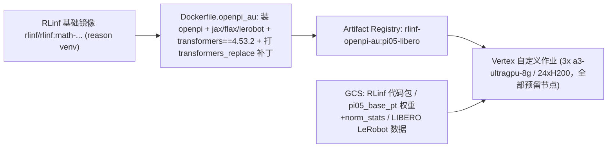

# 在 Vertex AI 上多机运行 RLinf π₀.₅ (openpi_au) LIBERO SFT 操作手册

> 目标：把**已与 openpi 对齐**的 RLinf 版 π₀.₅（模型代码在 [`rlinf/models/embodiment/openpi_au/`](../../../rlinf/models/embodiment/openpi_au/)）作为 **Vertex AI 自定义训练作业**，在 `europe-west4-a` 预留资源的**全部 3 台 `a3-ultragpu-8g`（共 24×H200）** 上做多机分布式 **LIBERO SFT**。
>
> 本手册参考 VLM SFT 版手册 [`b/gcp/demo2/gcp_rlinf_sft2.md`](../demo2/gcp_rlinf_sft2.md)，并复用其已验证的 Vertex 多机机制（`CLUSTER_SPEC`→Ray、GCS FUSE、hyperdisk-balanced 等）。训练入口是 [`examples/sft/train_vla_sft_au.py`](../../../examples/sft/train_vla_sft_au.py)，配置对齐单机 8 卡示例 [`tests_au/example/libero/`](../../../tests_au/example/libero/)（该示例已在本地 8×H200 跑通 1000 步）。
>
> **本手册为文档交付件**：给出可直接使用的配套文件与命令，但不包含实际的镜像构建 / 作业提交（未做线上 GCP 运行）。首次真实运行需按 §12 校验清单确认。

---

## 0. 总览

### 0.1 配套文件清单（都在本目录 `b/gcp/demo3/`）

| 文件 | 作用 |
| --- | --- |
| `gcp_rlinf_pi05_au.md` | 本操作手册 |
| `Dockerfile.openpi_au` | 在 RLinf 基础镜像之上叠加 openpi 运行时的自定义镜像 |
| `cloudbuild_openpi_au_image.yaml` | 用 Cloud Build 构建并推送自定义镜像到 Artifact Registry |
| `libero_sft_pi05_au_multinode.yaml` | RLinf 多机训练配置（`num_nodes: 3`、`micro_batch_size: 16`、`global_batch_size: 384`） |
| `bootstrap.sh` | 容器入口：解析 `CLUSTER_SPEC` → 组 Ray 集群 → 跑 π₀.₅ SFT |
| `vertex_pi05_au_3node.yaml` | Vertex 作业定义（2 个 worker pool：1 主 + 2 worker = 3 节点） |
| `submit.sh` | 一键提交脚本：打包代码 → 上传 GCS → 提交作业 |

### 0.2 与 demo2（Qwen VLM SFT）最关键的区别

**π₀.₅ `openpi_au` 依赖 openpi 运行时，而官方 RLinf 镜像里没有它。** [`openpi_au/openpi_action_model.py`](../../../rlinf/models/embodiment/openpi_au/openpi_action_model.py) 会 `import openpi`（`openpi.models.model`、`openpi.models_pytorch.pi0_pytorch` 等），且 `PI0Pytorch.__init__` 强制要求 **`transformers_replace` 补丁**（transformers 4.53.2）。数据加载还需 **lerobot**、jax/flax 也会在 import openpi 时被拉起。demo2 的 Qwen VLM SFT 完全不需要这些。



因此本手册用一个**自定义镜像**提供 openpi 运行时；RLinf 本体源码仍沿用 demo2 的做法——运行时从 GCS 解包并加入 `PYTHONPATH`。

### 0.3 核心事实（务必理解）

1. **openpi 运行时来自自定义镜像。** 基础镜像只提供 Ray/FSDP 与 `reason` venv；openpi、jax、flax、lerobot、`transformers_replace` 补丁都在 `Dockerfile.openpi_au` 里叠加安装。
2. **归一化统计的位置。** 数据加载与 `get_model` 都从 `{model_path}/{asset_id}/norm_stats.json` 读取 norm stats，`asset_id = physical-intelligence/libero`。即模型目录里必须有 `physical-intelligence/libero/norm_stats.json`（见 [`openpi_au/__init__.py`](../../../rlinf/models/embodiment/openpi_au/__init__.py) 的 `load_norm_stats`）。
3. **数据用本地缓存 + 强制 HF 离线。** LIBERO LeRobot 数据集预存到 GCS，容器把 `HF_LEROBOT_HOME` 指向它，并设 `HF_HUB_OFFLINE=1` / `HF_DATASETS_OFFLINE=1`。这样 24 个 rank 并发加载数据时**不会**触发 HuggingFace 429 限流。`openpi_au` 的 worker（[`fsdp_vla_sft_worker_au.py`](../../../rlinf/workers/sft/fsdp_vla_sft_worker_au.py)）已内置「只用本地**连续前缀** episode + offline monkey-patch」逻辑。
4. **Ray 组网与 `RLINF_NODE_RANK`。** 与 demo2 一致：从 Vertex 注入的 `CLUSTER_SPEC` 推导 rank，`ray start` 之前 `export RLINF_NODE_RANK`；rank 0 起 head 并跑入口脚本，`Cluster(cfg.cluster)` 阻塞等待 `num_nodes` 台节点就绪。
5. **批大小整除约束（本手册用满 3 台预留节点）。** `global_batch_size % (micro_batch_size * world_size) == 0`，`world_size = num_nodes * 8`。取 **3 节点 × 8 = 24 GPU、`micro_batch_size=16`（与 openpi JAX 参考单机 8 卡时的单卡本地 batch 一致）**，因此 `global_batch_size = 16 * 24 = 384`（grad_accum=1）。**这比 openpi JAX 参考的全局 batch 128 大 3 倍**——因为把单卡本地 batch 固定为 16 并铺满全部 24 张卡，是「用满所有预留节点」与「逐卡复现 JAX 参考批大小」两者之间更合理的折中；如需精确复现全局 128，请改用单机 8 卡示例（`tests_au/example/libero/libero_sft_pi05_au_8gpu.yaml`，`micro_batch_size=16`、`global_batch_size=128`）。扩/缩节点时只需保持 `global_batch_size % (micro_batch_size * 8 * num_nodes) == 0`。
6. **混合精度。** 用 openpi 原生 PyTorch 选择性 bf16（`to_bfloat16_for_selected_params`，敏感层保持 fp32），FSDP `mixed_precision` 全设 `null`（不二次 cast）。把 FSDP `param_dtype` 设成 bf16 会破坏 openpi 前向内部的 fp32 动作头（见 §11 与本地示例「问题 5」）。
7. **GCS FUSE。** Vertex 自动把单区域桶挂到 `/gcs/<bucket>`；`bootstrap.sh` 有 30s 冷启动等待。`a3-ultragpu-8g` 强制 `hyperdisk-balanced` 引导盘。

---

## 1. 前置条件（GCP 环境准备）

由您（或管理员）在本地终端 / Cloud Shell 执行一次（与 demo2 相同）：

```bash
gcloud auth login
gcloud auth application-default login
gcloud config set project autel-ai-physical-spat-intel

gcloud services enable \
  aiplatform.googleapis.com artifactregistry.googleapis.com \
  cloudbuild.googleapis.com storage.googleapis.com compute.googleapis.com

# 确认预留可用
gcloud compute reservations describe reservation-20260422-033135 --zone=europe-west4-a
```

---

## 2. 集中参数配置

```bash
# ---- 项目与地域 ----
export PROJECT_ID="autel-ai-physical-spat-intel"
export REGION="europe-west4"
export ZONE="europe-west4-a"

# ---- 镜像 ----
export BASE_IMAGE="${REGION}-docker.pkg.dev/${PROJECT_ID}/rlinf/rlinf:math-rlinf0.2-torch2.6.0-sglang0.4.6.post5-vllm0.8.5-megatron0.13.0-te2.1"
export AU_IMAGE="${REGION}-docker.pkg.dev/${PROJECT_ID}/rlinf/rlinf-openpi-au:pi05-libero"

# ---- 存储（必须单区域桶；沿用 demo2 的可写桶）----
export GCS_BUCKET="physical-ai-data-eu"
export GCS_ROOT="gs://${GCS_BUCKET}/rlinf"

# ---- 源码路径 ----
export RLINF_DIR="/home/physical/SRC/RL/RLinf"
export OPENPI_DIR="/home/physical/SRC/Robot/openpi05"

# ---- 作业 ----
export EXP_NAME="pi05_libero_au_3node"
```

> 基础镜像 `BASE_IMAGE` 假定已按 demo2 §3 镜像到 Artifact Registry。若尚未，请先按 demo2 的 `cloudbuild_mirror_image.yaml` 把 `rlinf/rlinf:math-...` 拷贝进 AR。

---

## 3. 步骤一：构建自定义 openpi_au 镜像

自定义镜像 = 基础镜像 + openpi 运行时。见 `Dockerfile.openpi_au`（关键片段）：

```dockerfile
ARG BASE_IMAGE=.../rlinf:math-...
FROM ${BASE_IMAGE}
ARG VENV=/opt/venv/reason
ARG LEROBOT_GIT=git+https://github.com/huggingface/lerobot@0cf864870cf29f4738d3ade893e6fd13fbd7cdb5
COPY . /opt/openpi                       # 构建上下文 = openpi 源码仓库根
RUN . "${VENV}/bin/activate" \
 && pip install -e /opt/openpi/packages/openpi-client \
 && pip install "${LEROBOT_GIT}" \
 && pip install -e /opt/openpi           # 拉入 jax0.5.3 / flax0.10.2 / transformers4.53.2 / torch2.7.1 ...
RUN . "${VENV}/bin/activate" \
 && TFM_DIR="$(python -c 'import os,transformers;print(os.path.dirname(transformers.__file__))')" \
 && cp -r /opt/openpi/src/openpi/models_pytorch/transformers_replace/* "${TFM_DIR}/" \
 && python -c "from transformers.models.siglip import check; assert check.check_whether_transformers_replace_is_installed_correctly()"
RUN . "${VENV}/bin/activate" \
 && pip install "ray[default]>=2.47.0" hydra-core==1.3.2 torchdata accelerate tensorboard
RUN . "${VENV}/bin/activate" \
 && python -c "import openpi, jax, flax, lerobot; import openpi.models_pytorch.pi0_pytorch; print('openpi runtime OK')"
```

> ⚠️ **torch 版本注意**：openpi 钉死 `torch==2.7.1`，而基础镜像是 `torch2.6.0`；`pip install -e /opt/openpi` 会把 torch 升到 2.7.1（与已验证的本地 `openpi_venv` 一致）。这是本手册最需要在首次真实运行时校验的点（§12）。

### 3.1 用 Cloud Build 构建并推送（推荐）

构建上下文必须是 **openpi 源码仓库根**（让 `COPY . /opt/openpi` 能拿到 `src/`、`packages/`、`pyproject.toml`）。先把 Dockerfile 拷进 openpi 仓库，再提交：

```bash
cp "${RLINF_DIR}/b/gcp/demo3/Dockerfile.openpi_au" "${OPENPI_DIR}/Dockerfile.openpi_au"

gcloud builds submit "${OPENPI_DIR}" \
  --region="${REGION}" \
  --config="${RLINF_DIR}/b/gcp/demo3/cloudbuild_openpi_au_image.yaml" \
  --substitutions=_BASE_IMAGE="${BASE_IMAGE}",_DST_IMAGE="${AU_IMAGE}" \
  --gcs-log-dir="gs://${GCS_BUCKET}/cloudbuild-logs"
```

（`--gcs-log-dir` 规避默认日志桶权限问题，见 demo2 Bug 4。）

### 3.2 或本地 docker 构建后推送

```bash
cp "${RLINF_DIR}/b/gcp/demo3/Dockerfile.openpi_au" "${OPENPI_DIR}/Dockerfile.openpi_au"
cd "${OPENPI_DIR}"
docker build -f Dockerfile.openpi_au --build-arg BASE_IMAGE="${BASE_IMAGE}" -t "${AU_IMAGE}" .
docker push "${AU_IMAGE}"
```

验证镜像存在：
```bash
gcloud artifacts docker images list "${REGION}-docker.pkg.dev/${PROJECT_ID}/rlinf" | grep openpi-au
```

---

## 4. 步骤二：预存权重、norm-stats 与 LIBERO 数据到 GCS

桶中最终布局：
```
gs://physical-ai-data-eu/rlinf/
├── code/RLinf.tar.gz                                    # submit.sh 打包上传
├── demo3/bootstrap.sh                                   # submit.sh 上传
├── models/pi05_base_pt/
│   ├── model.safetensors                                # pi0.5 PyTorch 权重 (~14.5GB)
│   ├── config.json
│   └── physical-intelligence/libero/norm_stats.json     # 归一化统计（关键！）
├── data/lerobot/physical-intelligence/libero/           # LIBERO LeRobot 数据集
│   ├── data/chunk-000/... (parquet)
│   └── meta/{info.json,tasks.jsonl,episodes.jsonl,stats.json}
└── runs/pi05_libero_au_3node/                           # 运行时输出/日志/checkpoints
```

### 4.1 准备 pi0.5 PyTorch 权重

若还没有转换好的 PyTorch 权重，用 RLinf 自带转换器从 JAX 的 `pi05_base` 转换（需已装 openpi + `transformers_replace` 补丁的环境，例如本地 `openpi_venv`）：

```bash
/mnt/r/VENV/openpi_venv/bin/python "${RLINF_DIR}/rlinf/utils/ckpt_convertor/convert_openpi_jax_to_python.py" \
    --checkpoint_dir ~/.cache/openpi/openpi-assets/checkpoints/pi05_base \
    --config_name pi05_libero \
    --output_path /tmp/pi05_base_pt \
    --precision float32
```

### 4.2 计算/准备 norm-stats（放到模型目录内）

用本仓库的 RLinf 侧脚本 [`tests_au/example/libero/compute_norm_stats_au.py`](../../../tests_au/example/libero/compute_norm_stats_au.py) 重算（写到模型目录内的 `physical-intelligence/libero/`）：

```bash
cd "${RLINF_DIR}"
PYTHONPATH=.:${OPENPI_DIR}/src /mnt/r/VENV/openpi_venv/bin/python \
  tests_au/example/libero/compute_norm_stats_au.py \
  --output_dir /tmp/pi05_base_pt --max_frames 10000
# 产出 /tmp/pi05_base_pt/physical-intelligence/libero/norm_stats.json
```

> 该结果与 openpi JAX 参考的 `assets/pi05_libero/...` 逐元素误差约 1e-6（实质一致）。

### 4.3 同步到 GCS

```bash
# 模型 + norm_stats（同一目录）
gcloud storage rsync -r /tmp/pi05_base_pt "${GCS_ROOT}/models/pi05_base_pt"

# LIBERO LeRobot 数据集（本地缓存位于 ~/.cache/huggingface/lerobot/physical-intelligence/libero）
gcloud storage rsync -r \
  ~/.cache/huggingface/lerobot/physical-intelligence/libero \
  "${GCS_ROOT}/data/lerobot/physical-intelligence/libero"
```

> 💡 **冒烟建议**：先只同步少量 episode（如 `data/chunk-000/episode_0000{00..49}.parquet` + 完整 `meta/`），验证全流程后再增量上传。worker 会自动只用「本地连续前缀」的 episode（见 §11）。

---

## 5. 步骤三：RLinf 多机训练配置

文件：`b/gcp/demo3/libero_sft_pi05_au_multinode.yaml`（由单机 8 卡示例 [`libero_sft_pi05_au_8gpu.yaml`](../../../tests_au/example/libero/libero_sft_pi05_au_8gpu.yaml) 改为多机）。关键差异：

```yaml
cluster:
  num_nodes: 3
  component_placement:
    actor: all                 # FSDP actor 占满 24 张 GPU（全部预留节点）

actor:
  micro_batch_size: 16         # 单卡本地 batch，与 openpi JAX 参考一致
  global_batch_size: 384       # 24 GPU x 16 -> grad_accum = 1（比 JAX 参考的 128 放大 3x）
  model:
    fp32_master_weights: false # openpi 原生选择性 bf16
    faithful_augmentation: true
    sft_gradient_checkpointing: true
    openpi: { config_name: "pi05_libero" }
  optim:
    lr: 5.0e-5
    ema_decay: 0.999
    lr_scheduler: "openpi_cosine"
    lr_warmup_steps: 100
    decay_steps: 1000
    decay_lr: 5.0e-6
  fsdp_config:
    sharding_strategy: "full_shard"
    gradient_checkpointing: true
    mixed_precision: { param_dtype: null, reduce_dtype: null, buffer_dtype: null }
```

LR / EMA / 精度 / 增强 / 归一化全部与 openpi JAX 参考对齐（详见本地示例 README 的对照表）。模型/数据/日志路径由 `bootstrap.sh` 在命令行覆盖。

> **扩/缩节点**：把 `vertex_pi05_au_3node.yaml` 的 workers `replicaCount` 调整，并同步改 `libero_sft_pi05_au_multinode.yaml` 的 `cluster.num_nodes`；保证 `global_batch_size` 对 `micro_batch_size(=16) * 8 * num_nodes` 可整除（例如 4 节点 32 卡时 `global_batch_size: 512`）。若要精确复现 openpi JAX 参考的全局 batch 128，请改用单机 8 卡的 `libero_sft_pi05_au_8gpu.yaml`。

---

## 6. 步骤四：引导脚本 `bootstrap.sh`

文件：`b/gcp/demo3/bootstrap.sh`。相对 demo2 的要点改动：

1. **不再 ship openpi 源码**——openpi 已在自定义镜像里。仅把 RLinf 源码从 GCS 解包到 `/workspace/RLinf` 并加入 `PYTHONPATH`。
2. **强制 HF 离线 + LeRobot home**：`export HF_HUB_OFFLINE=1; HF_DATASETS_OFFLINE=1; HF_LEROBOT_HOME=${GCS_ROOT}/data/lerobot`。
3. **健康检查**：`import openpi, jax, lerobot`；校验 `model.safetensors`、`physical-intelligence/libero/norm_stats.json`、`{HF_LEROBOT_HOME}/{repo_id}/data` 均存在。
4. **入口**：rank 0 跑
   ```bash
   python examples/sft/train_vla_sft_au.py \
     --config-path "${LOCAL_REPO}/b/gcp/demo3" \
     --config-name libero_sft_pi05_au_multinode \
     runner.logger.log_path="${OUTPUT_DIR}" \
     actor.model.model_path="${MODEL_DIR}" \
     data.train_data_paths="physical-intelligence/libero"
   ```
   并设 `EMBODIED_PATH=${LOCAL_REPO}/examples/sft` 以解析 `model/pi0_5_au`、`training_backend/fsdp` 组默认。

Ray head/worker 组网、`set +u` 激活 venv、FUSE 冷启动等待、worker 保活等逻辑与 demo2 一致。

---

## 7. 步骤五：Vertex 自定义作业配置

文件：`b/gcp/demo3/vertex_pi05_au_3node.yaml`。两个 worker pool（1 主 + 2 worker = 3 节点，用满预留资源的全部 3 台机器），关键点：

- `imageUri` = **自定义镜像** `rlinf-openpi-au:pi05-libero`（不是基础镜像）。
- `args: ["/gcs/physical-ai-data-eu/rlinf/demo3/bootstrap.sh"]`。
- `machineType: a3-ultragpu-8g` + `NVIDIA_H200_141GB` × 8 + `reservationAffinity`。
- `diskSpec.bootDiskType: hyperdisk-balanced`（H200 机型强制）。
- `env`: `GCS_BUCKET / EXP_NAME / RAY_PORT / VENV_NAME / PYTHONUNBUFFERED`。

---

## 8. 步骤六：一键提交

文件：`b/gcp/demo3/submit.sh`。打包 RLinf 源码（排除 `.git`、docs、以及本地示例的 `tests_au/example/libero/_ckpt`、`_out` 大目录）→ 上传 `bootstrap.sh` 到 `${GCS_ROOT}/demo3/bootstrap.sh`、代码包到 `${GCS_ROOT}/code/RLinf.tar.gz` → 提交作业：

```bash
cd /home/physical/SRC/RL/RLinf
bash b/gcp/demo3/submit.sh
```

---

## 9. 步骤七：任务监控

```bash
# 控制台
# https://console.cloud.google.com/vertex-ai/training/custom-jobs?project=autel-ai-physical-spat-intel

# 流式日志
gcloud ai custom-jobs stream-logs <JOB_ID> --region="${REGION}"

# Cloud Logging 过滤（按 job / 关键字）
#   resource.type="ml_job"  resource.labels.job_id="<JOB_ID>"
#   textPayload:"[bootstrap]"   # 初始化/Ray 组网
#   textPayload:"train/loss"    # 训练损失

# 实时 TensorBoard（事件通过 FUSE 实时写到 GCS）
tensorboard --logdir "gs://${GCS_BUCKET}/rlinf/runs/${EXP_NAME}" --port 6006
```

预期健康指标（方向性对齐本地 8 卡跑通结果；注意本配置全局 batch 为 384，是本地 8 卡基线 128 的 3 倍，同样 1000 步下每步见到的样本更多，loss 曲线会更快更平滑地下降，数值不会逐点相同）：`train/loss` 从 ~0.08 量级降到 ~0.02 量级或更低；`train/learning_rate` 在第 100 步达峰 5e-5 后余弦衰减到 5e-6；每 200 步在 `runs/${EXP_NAME}/.../checkpoints/global_step_<N>/actor/` 生成 `model_state_dict/`、`dcp_checkpoint/`、`ema.pt`。

---

## 10. 步骤八：获取 Checkpoint（EMA 权重）

训练输出在 `gs://${GCS_BUCKET}/rlinf/runs/${EXP_NAME}/${EXP_NAME}/checkpoints/global_step_<N>/actor/`：

- `model_state_dict/`（~8GB）：FSDP 汇总的训练权重。
- `dcp_checkpoint/`（~24GB）：分布式 checkpoint（含 optimizer 状态，可断点续训）。
- `ema.pt`（~1GB）：**EMA 权重**（推理/评测建议用它，与 openpi 一致）。

```bash
gcloud storage rsync -r \
  "gs://${GCS_BUCKET}/rlinf/runs/${EXP_NAME}/${EXP_NAME}/checkpoints/global_step_1000" \
  /tmp/pi05_ckpt/global_step_1000
```

续训：把 `runner.resume_dir` 指向 `.../checkpoints/global_step_<N>` 再提交。

---

## 11. 常见故障排查清单

| 现象 | 原因 | 处理 |
| --- | --- | --- |
| `ModuleNotFoundError: openpi` / `import jax` 失败 | 用了基础镜像而非自定义镜像，或镜像构建未成功 | 确认 `vertex_*.yaml` 的 `imageUri` 指向 `rlinf-openpi-au:...`；`docker run ... python -c "import openpi"` 自检 |
| `transformers_replace is not installed correctly` | 补丁未打进镜像 | 检查 `Dockerfile.openpi_au` 第 3 步；重建镜像 |
| `429 Too Many Requests`（拉数据集） | 多 rank 并发访问 HF | 已由 `HF_HUB_OFFLINE=1` + worker 的本地 episode 限制规避；确认数据已完整预存到 `HF_LEROBOT_HOME` |
| `OfflineModeIsEnabled ... /refs` | LeRobot 在缺文件时回退到 HF | worker 只用「本地连续前缀 episode」，保证所请求 episode 文件全在本地；确认 `meta/` 完整、episode 从 0 连续 |
| `IndexError: index N is out of bounds`（episode） | 本地 episode 不连续（有空洞） | worker 取 `range(M)` 连续前缀已规避；如仍出现，补齐缺失 episode 或减少上传到连续段 |
| `mat1 and mat2 ... Float vs BFloat16` | FSDP `param_dtype=bf16` 与 openpi fp32 动作头冲突 | 保持 `mixed_precision` 全 `null` + `fp32_master_weights: false`（本配置已如此） |
| `expected scalar type BFloat16 but found Float`（增强） | 图像增强 dtype 不一致 | `augmentation.py::faithful_augment` 已统一 fp32 计算再 cast 回；确认代码包为最新 |
| `global_batch_size ... not divisible` | 批大小整除不满足 | 保持 `global_batch_size % (micro_batch_size * 总GPU数) == 0`（3 节点 24 卡、`micro_batch_size=16` 时 `global_batch_size=384`） |
| 训练权重加载慢 | 24 rank 并发从 FUSE 读 14.5GB safetensors | 可接受（顺序读）；或在 `bootstrap.sh` 里先把模型 stage 到本地盘 |
| `INVALID_ARGUMENT ... hyperdisk-balanced` | H200 机型强制盘型 | `diskSpec.bootDiskType: hyperdisk-balanced`（本配置已如此） |

---

## 12. 首次真实运行需校验的清单

本手册为文档交付件，未做线上运行。首次真实提交时请重点确认：

1. **镜像自检**：`docker run --rm ${AU_IMAGE} bash -lc 'source /opt/venv/reason/bin/activate && python -c "import openpi, jax, flax, lerobot; import openpi.models_pytorch.pi0_pytorch; from transformers.models.siglip import check; assert check.check_whether_transformers_replace_is_installed_correctly(); print(\"OK\")"'`。
2. **torch 版本**：确认镜像内 `torch==2.7.1`（openpi 依赖）与 RLinf FSDP/Ray 兼容；如与基础镜像其它组件冲突，考虑在镜像中固定 torch 版本或改用专用 venv。
3. **norm-stats 路径**：`gs://.../models/pi05_base_pt/physical-intelligence/libero/norm_stats.json` 确实存在。
4. **数据布局**：`HF_LEROBOT_HOME/physical-intelligence/libero/{data,meta}` 完整，且 episode 从 0 连续。
5. **批大小整除**：按实际节点数核对 `global_batch_size % (micro_batch_size * 8 * num_nodes) == 0`（默认 3 节点：`384 % (16 * 24) == 0`）。
6. **Ray 组网**：日志出现 `NODE_RANK`（0/1/2）、3 个 rank 全部 join、`FlexiblePlacementStrategy ... hardware ranks [[0]..[23]]`。
7. **收敛**：`train/loss` 下降、`ema.pt` 按 `save_interval` 生成。

> 参考：单机 8 卡等价示例 [`tests_au/example/libero/rlinfpi_readme.md`](../../../tests_au/example/libero/rlinfpi_readme.md) 已在本地 8×H200 跑通 1000 步（loss 0.079→0.02，5 个 checkpoint 含 EMA），可作为多机结果的对照基线。

---

*(操作手册结束)*
