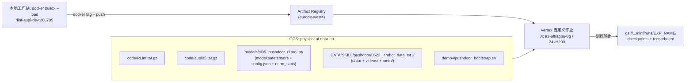

# 在 Vertex AI 上用 dev 镜像 `rlinf-aupi-dev:260705` 多机运行 pi0.5 pushdoor SFT 操作手册

> **目标**：把用 [`Dockerfile.aupi_dev`](./Dockerfile.aupi_dev) 刚构建好的开发镜像 `rlinf-aupi-dev:260705`，配合 [`rlinf/models/embodiment/openpi_au/`](../../../rlinf/models/embodiment/openpi_au/) 里的 **pi0.5（openpi_au）**，在数据集 `/mnt/r/DATA/SKILL/pushdoor/0622_lerobot_data_tst1`（R1 Pro「推门」任务，LeRobot v3 格式）上，作为 **Vertex AI 自定义训练作业**在 `europe-west4-a` 预留资源的 **3 台 `a3-ultragpu-8g`（共 24×H200）** 上做多机分布式 SFT。
>
> 本手册以 demo3 的 pushdoor 方案（[`b/gcp/demo3/gcp_rlinf_pi05_au.md`](../demo3/gcp_rlinf_pi05_au.md)）为蓝本，复用其已验证的 Vertex 多机机制（`CLUSTER_SPEC`→Ray、GCS FUSE、`hyperdisk-balanced`、模型 stage 到本地盘等）。**与 demo3 最本质的区别在于镜像不同**：demo4 用的是「editable 安装 + 源码运行时挂载」的开发镜像，而不是 demo3 那个把 openpi 装进 site-packages 的独立镜像。这带来三处必须显式处理的差异（见 §0.2），否则作业一定失败。
>
> **本手册为文档交付件**：给出可直接复制落地的配套文件与命令，但不包含实际的镜像推送 / 作业提交。首次真实运行请严格执行 §14 的校验清单。

---

## 0. 总览

### 0.1 数据流



### 0.2 与 demo3 的三大关键区别（**全篇核心，务必理解**）

dev 镜像由 [`Dockerfile.aupi_dev`](./Dockerfile.aupi_dev) 构建，它调用 [`requirements/au_install.sh`](../../../requirements/au_install.sh) 的 `install_aupi_model()`，用 `pip install -e` 把 **RLinf 本体**和 **openpi（aupi05）** 都以 **editable（可编辑）模式**装进同一个 venv。这与 demo3 的 [`Dockerfile.openpi_au`](../demo3/Dockerfile.openpi_au)（`COPY . /opt/openpi` + 常规 `pip install -e /opt/openpi`，openpi 落进 site-packages）行为完全不同。

| # | 差异 | demo3（`rlinf-openpi-au`） | demo4（`rlinf-aupi-dev:260705`） | 手册对策 |
| --- | --- | --- | --- | --- |
| **A** | venv 路径 | `/opt/venv/reason` | **`/venv/rlinf`**（Dockerfile `ARG VENV_DIR=/venv/rlinf`） | bootstrap 用 `source /venv/rlinf/bin/activate`（由 `VENV_PATH` 注入） |
| **B** | openpi/RLinf 安装方式 | openpi 装进 site-packages，运行时只需 RLinf 源码 | **两者都是 editable**，`.pth` 指向构建期路径 `/workspace/RLinf`、`/workspace/aupi05` | 运行时**必须**把两份源码分别 stage 到这两个**精确路径**，否则 `import rlinf` / `import openpi` 直接 `ModuleNotFoundError` |
| **C** | `transformers_replace` 补丁 | Dockerfile 显式 `cp` 进 transformers 并校验 | **已修复**：`au_install.sh::install_aupi_model()` 第 4 步现已内置打补丁 + 校验，`Dockerfile.aupi_dev` 构建期 smoke test 也会确认（见 §4）。重建后的镜像**已内置补丁** | bootstrap 仍保留**幂等打补丁**作为安全网（兼容修复前构建的旧镜像，见 §9） |

> **差异 B 的原理**：editable 安装只在 venv 的 `site-packages` 里写了一个指回源码目录的 `.pth`/finder 文件（见 [`Dockerfile.aupi_dev`](./Dockerfile.aupi_dev) 头部注释）。本地开发时靠 `docker run -v` 把源码挂回同一路径；**Vertex 上没有 bind mount**，所以必须由 bootstrap 从 GCS 解包源码到 `/workspace/RLinf` 和 `/workspace/aupi05`。RLinf 那条 demo3 本来就在做（`LOCAL_REPO=/workspace/RLinf`），**新增的关键动作是把 aupi05 也打包上传并解包到 `/workspace/aupi05`**。
>
> **差异 C 的原理与现状**：[`pi0_pytorch.py`](../../../../Robot/aupi05/src/openpi/models_pytorch/pi0_pytorch.py) 在 `PI0Pytorch.__init__` 里执行 `from transformers.models.siglip import check` 并断言 `check_whether_transformers_replace_is_installed_correctly()`（要求 `transformers==4.53.2` 且补丁文件已就位）。补丁源在 `aupi05/src/openpi/models_pytorch/transformers_replace/`，需要 `cp` 进 venv 的 `transformers/` 包目录。
>
> **本项已修复**：[`au_install.sh`](../../../requirements/au_install.sh) 的 `install_aupi_model()` 第 4 步现在会在安装期把补丁 `cp` 进 venv 的 transformers 并校验；[`Dockerfile.aupi_dev`](./Dockerfile.aupi_dev) 构建期 smoke test 也会再确认一次。因此**用修复后的 `au_install.sh` 重建的镜像已内置补丁**（本手册对应的 `rlinf-aupi-dev:260705` 已重建并通过 `transformers_replace patch OK (au version, baked into image)` 校验）。bootstrap 里那步运行时打补丁因此降级为**幂等安全网**——对已内置补丁的新镜像是无害的空操作，对修复前构建的旧镜像仍是必需的兜底。

### 0.3 沿用 demo3 的既有事实（不再赘述原理，照单执行）

1. **模型权重先 stage 到本地盘再训练**：`get_model()` 会在**每个 rank** 上独立 `safetensors.torch.load_file()` 读 ~15GB 权重；24 路并发走 GCS FUSE mmap 会让作业静默卡死 40+ 分钟。对策：每节点先 `gcloud storage rsync` 直接从 GCS 拉到本地盘，再从本地盘加载。
2. **强制 HF 离线**：`HF_HUB_OFFLINE=1` / `HF_DATASETS_OFFLINE=1`，避免 24 rank 并发触发 HuggingFace 429。
3. **pushdoor 数据无需 `HF_LEROBOT_HOME` 间接层**：[`resolve_lerobot_dataset_root()`](../../../rlinf/data/lerobot_paths.py) 直接接受带 `meta/info.json` 的绝对路径，因此 `data.train_data_paths` 直接指向 FUSE 上的数据集根。
4. **批大小整除约束**：`global_batch_size % (micro_batch_size * world_size) == 0`，`world_size = num_nodes*8 = 24`，`micro_batch_size=16` ⇒ `global_batch_size=384`（grad_accum=1）。
5. **混合精度**：openpi 原生选择性 bf16（`to_bfloat16_for_selected_params`），FSDP `mixed_precision` 全 `null`（不二次 cast），`fp32_master_weights: false`。
6. **`a3-ultragpu-8g` 强制 `hyperdisk-balanced` 引导盘**；GCS 必须是**单区域**桶（FUSE 才能自动挂到 `/gcs/<bucket>`）。

### 0.4 配套文件清单（都在本目录 `b/gcp/demo4/`）

| 文件 | 作用 | 状态 |
| --- | --- | --- |
| `guide_1.md` | 本操作手册 | 已交付 |
| `Dockerfile.aupi_dev` | dev 镜像构建文件 | 已存在 |
| `pushdoor_sft_pi05_au_multinode.yaml` | RLinf 多机训练配置 | §8 内嵌，待创建 |
| `pushdoor_bootstrap.sh` | 容器入口：stage 源码/权重 → 打补丁 → 组 Ray → 跑 SFT | §9 内嵌，待创建 |
| `pushdoor_vertex_3node.yaml` | Vertex 作业定义（1 主 + 2 worker = 3 节点） | §10 内嵌，待创建 |
| `pushdoor_submit.sh` | 一键提交：打包 RLinf + aupi05 → 上传 GCS → 提交 | §11 内嵌，待创建 |

### 0.5 数据集事实（`0622_lerobot_data_tst1`）

已核对 `meta/info.json`：`robot_type=r1_pro`、`codebase_version=v3.0`、`total_episodes=12`、`total_frames=13136`、`fps=15`、`task="open0622"`，4 个视频相机（`head_rgb`/`head_rgb_right`/`wrist_left_rgb`/`wrist_right_rgb`，`dtype: video` → mp4）。目录布局（LeRobot v3）：

```
0622_lerobot_data_tst1/
├── data/chunk-000/episode_0000{00..11}.parquet          # 12 个 episode 的帧数据
├── videos/observation.images.head_rgb/chunk-000/episode_*.mp4
├── videos/observation.images.head_rgb_right/chunk-000/episode_*.mp4
├── videos/observation.images.wrist_left_rgb/chunk-000/episode_*.mp4
├── videos/observation.images.wrist_right_rgb/chunk-000/episode_*.mp4
└── meta/{info.json,tasks.jsonl,episodes.jsonl,episodes_stats.jsonl,stats.json}
```

其列结构与 [`pushdoor_dataconfig.py`](../../../rlinf/models/embodiment/openpi_au/dataconfig/pushdoor_dataconfig.py) 完全吻合：state 20 维 = `left_arm(7)+right_arm(7)+left_gripper(1)+right_gripper(1)+torso(4)`，action 23 维 = state 布局 + `chassis.velocities(3)`；pi0 只用 3 个相机槽（`head_rgb`/`wrist_left_rgb`/`wrist_right_rgb`，`head_rgb_right` 不读）。因此可直接复用注册好的 openpi 配置 **`pi05_pushdoor`**（见 [`dataconfig/__init__.py`](../../../rlinf/models/embodiment/openpi_au/dataconfig/__init__.py) L403-431，`asset_id=rlinf/pushdoor_open0622`）。

> ⚠️ 因 task tag `open0622` 与 demo3 用的 `0622_lerobot_data` 相同，理论上可复用 demo3 已算好的 `norm_stats.json`；但 `_tst1` 是**不同的数据子集**（12 episodes vs 31），为严谨起见 §6.2 会针对 `_tst1` **重算** norm_stats。

---

## 1. 前置条件（GCP 环境准备）

在本地终端 / Cloud Shell 执行一次（与 demo2/demo3 相同）：

```bash
gcloud auth login
gcloud auth application-default login
gcloud config set project autel-ai-physical-spat-intel

gcloud services enable \
  aiplatform.googleapis.com artifactregistry.googleapis.com \
  cloudbuild.googleapis.com storage.googleapis.com compute.googleapis.com

# 确认预留可用
gcloud compute reservations describe reservation-20260422-033135 --zone=europe-west4-a
```

---

## 2. 集中参数配置

```bash
# ---- 项目与地域 ----
export PROJECT_ID="autel-ai-physical-spat-intel"
export REGION="europe-west4"
export ZONE="europe-west4-a"

# ---- 镜像 ----
export LOCAL_IMAGE="rlinf-aupi-dev:260705"                       # 本地 docker buildx --load 产物
export AR_IMAGE="${REGION}-docker.pkg.dev/${PROJECT_ID}/rlinf/rlinf-aupi-dev:260705"  # 推送后 Vertex 用它

# ---- 存储（必须单区域桶）----
export GCS_BUCKET="physical-ai-data-eu"
export GCS_ROOT="gs://${GCS_BUCKET}/rlinf"

# ---- 源码路径（editable 安装的两份源码）----
export RLINF_DIR="/home/physical/SRC/RL/RLinf"
export AUPI_DIR="/home/physical/SRC/Robot/aupi05"

# ---- 数据 / 模型 ----
export DATASET_LOCAL="/mnt/r/DATA/SKILL/pushdoor/0622_lerobot_data_tst1"
export DATASET_GCS="gs://${GCS_BUCKET}/DATA/SKILL/pushdoor/0622_lerobot_data_tst1"
export MODEL_GCS="${GCS_ROOT}/models/pi05_pushdoor_r1pro_pt"

# ---- 作业 ----
export EXP_NAME="pi05_pushdoor_au_tst1_3node"
```

---

## 3. 步骤一：把本地 dev 镜像推送到 Artifact Registry

**为什么必须推送**：`docker buildx build ... --load` 只把镜像加载进**本地** Docker 守护进程，Vertex AI 无法访问；Vertex 只能从 Artifact Registry（或 GCR）拉取。因此先打 AR 标签再 push。

```bash
# 1) 一次性配置 docker 使用 gcloud 作为 AR 的凭据助手
gcloud auth configure-docker ${REGION}-docker.pkg.dev

# 2) 确认 AR 仓库存在（若无则创建；demo2/demo3 已建过名为 rlinf 的仓库）
gcloud artifacts repositories describe rlinf --location=${REGION} \
  || gcloud artifacts repositories create rlinf --repository-format=docker --location=${REGION}

# 3) 打标签并推送（镜像含 torch/jax/cuda，体积很大，首次 push 可能几十分钟）
docker tag  "${LOCAL_IMAGE}" "${AR_IMAGE}"
docker push "${AR_IMAGE}"

# 4) 验证
gcloud artifacts docker images list "${REGION}-docker.pkg.dev/${PROJECT_ID}/rlinf" | grep aupi-dev
```

> 💡 若本地网络到 AR 带宽有限，可先 `docker save` + `gcloud storage cp` 到桶再在 Cloud Shell 里 `docker load`/`push`；但通常直接 push 即可。

---

## 4. 步骤二：镜像自检

### 4.1 构建期已内置的补丁自检（差异 C）

用**修复后的 `au_install.sh`** 重建镜像后，[`Dockerfile.aupi_dev`](./Dockerfile.aupi_dev) 的构建期 smoke test 已经自动做了补丁校验（在安装 RUN 的同一步内，因为 editable 源码只在该 RUN 期间可见）。重建日志会依次出现：

```text
[au_install.sh] transformers_replace OK, transformers 4.53.2        # install_aupi_model 第 4 步（安装期打补丁 + 校验）
transformers 4.53.2
transformers_replace patch OK (au version, baked into image)        # Dockerfile 构建期自检（确认补丁文件已就位）
```

对应的构建命令（从 RLinf 仓库根执行）：

```bash
docker buildx build -f b/gcp/demo4/Dockerfile.aupi_dev \
  --build-context aupi05=/home/physical/SRC/Robot/aupi05 \
  -t rlinf-aupi-dev:260705 --load --progress=plain .
```

> 本手册对应的 `rlinf-aupi-dev:260705` **已按上述命令重建并通过补丁自检**——补丁已内置进镜像，无需在运行时再打（§9 bootstrap 的运行时打补丁因此是幂等安全网，见 §0.2）。

### 4.2 运行时完整 import 链自检（可选，更严格）

若要在本地进一步确认训练实际会走的 import 链（不止补丁），可跑：

```bash
docker run --rm --gpus all "${LOCAL_IMAGE}" bash -lc '
  source /venv/rlinf/bin/activate
  python - <<PY
import torch, transformers, openpi, jax, flax, lerobot
print("torch", torch.__version__, "| transformers", transformers.__version__)
from transformers.models.siglip import check
assert check.check_whether_transformers_replace_is_installed_correctly(), "transformers_replace 补丁未生效"
import openpi.models_pytorch.pi0_pytorch as m      # 触发 gemma/torchvision 链（见下方 4.3 已知问题）
from transformers.utils import is_flash_attn_2_available
print("flash_attn_2_available =", is_flash_attn_2_available())
import cv2, cv2.mat_wrapper
print("cv2 OK:", cv2.__version__)
print("ALL OK:", openpi.__file__)
PY'
```

- **flash-attn 说明**：dev 镜像里 `install_aupi_model()` 会安装匹配当前 torch 的 flash-attn（不同于 demo3 主动卸载、退回 sdpa）。若 `is_flash_attn_2_available()=True` 且训练在 gemma/siglip 前向报 ABI/attention 错误，见 §13。
- **cv2/libX11 说明**：`sys_deps.sh` 已装 `libsm6/libxext6/libxrender/libgl1/ffmpeg`；若 `import cv2.mat_wrapper` 报 `libX11.so.6: cannot open shared object file`，见 §13。

### 4.3 ⚠️ 已知阻断问题：`torchvision::nms does not exist`（torch/torchvision 版本不匹配）

在重建镜像时，构建期的完整 import 链自检暴露出一个**与补丁无关**的既有问题：`import openpi.models_pytorch.pi0_pytorch` → `from transformers import GemmaForCausalLM` → transformers 惰性导入 **torchvision** → `RuntimeError: operator torchvision::nms does not exist`。

实测镜像内版本：**`torch==2.6.0+cu126`** 但 **`torchvision==0.22.1`**（0.22.1 是为 torch 2.7.1 编译的），二者 ABI 不匹配导致 `torchvision::nms` 算子未注册。**这会在训练 actor 初始化导入 `pi0_pytorch` 时崩溃**（该 import 链正是训练启动路径），且**修复前构建的旧镜像也有此问题**（只是旧镜像构建期没有触发该 import 才没暴露）。

> 该问题的根因是 `install_aupi_model()` 里 openpi 的 `uv sync --inexact` 未把 torch 升到 openpi 期望的 2.7.1（保留了 RLinf 的 2.6.0），而 torchvision 却被带到了 0.22.1。**这是一个独立于本次补丁修复的依赖一致性问题，需要单独决定修复方向**（二选一）：
> - **A. 对齐到 torch 2.7.1**（openpi 与 demo3 已验证的配置）：让 torch/torchvision(0.22.1)/flash-attn 都对齐 2.7.1；
> - **B. 对齐到 torch 2.6.0**：把 torchvision 降到 `0.21.0`（cu126）以匹配现有 torch。
>
> 两条路都涉及 torch/torchvision/flash-attn 的联动，属于需要单独验证的改动，未在本次「打补丁」范围内自动执行。临时绕过可在 bootstrap 里于打补丁之后加一步：`pip install torchvision==0.21.0 --index-url https://download.pytorch.org/whl/cu126`（对齐现有 torch 2.6.0）。详见 §13。

---

## 5. 步骤三：editable 安装的运行时含义（差异 B 落地要点）

bootstrap 与 submit 必须保证：

- **venv**：`source /venv/rlinf/bin/activate`（由 Vertex env `VENV_PATH=/venv/rlinf` 注入）。
- **RLinf 源码** → 解包到 **`/workspace/RLinf`**（editable `.pth` 指向此处；同时它也是 `--config-path` 与入口脚本所在）。
- **aupi05（openpi）源码** → 解包到 **`/workspace/aupi05`**（editable `.pth` 指向 `/workspace/aupi05/src`；`import openpi` 依赖于此）。
- 路径**必须逐字节匹配**镜像构建期用的 `/workspace/RLinf`、`/workspace/aupi05`，否则 editable finder 找不到源码。

---

## 6. 步骤四：准备模型权重与 norm-stats 到 GCS

沿用 demo3 的转换产物 `pi05_pushdoor_r1pro_pt`（一个把 LeRobot 版 R1 Pro checkpoint 转成 RLinf/openpi 原生布局的目录）。桶中最终布局：

```
gs://physical-ai-data-eu/rlinf/models/pi05_pushdoor_r1pro_pt/
├── model.safetensors                                   # ~15GB，去掉 model. 前缀、全 fp32
├── config.json                                         # 纯文档性（get_model 不读）
└── rlinf/pushdoor_open0622/norm_stats.json             # 归一化统计（asset_id = rlinf/pushdoor_open0622）
```

### 6.1 转换权重（若尚未有）

用需已装 openpi + 补丁的环境（本地 `openpi_venv`）跑 [`convert_r1pro_ckpt.py`](../../../tests_au/example/pushdoor/convert_r1pro_ckpt.py)：

```bash
/mnt/r/VENV/openpi_venv/bin/python \
  ${RLINF_DIR}/tests_au/example/pushdoor/convert_r1pro_ckpt.py \
  --output_dir /tmp/pi05_pushdoor_r1pro_pt
# 默认从 gs://.../CKPT/VLA/PI/pi05_r1pro_chassis_alig_newnorm/.../model.safetensors 转换
```

### 6.2 针对 `_tst1` 重算 norm-stats（写进模型目录内）

norm_stats **必须**基于将要训练的数据集计算。用 [`run_norm_stats.sh`](../../../tests_au/example/pushdoor/run_norm_stats.sh)（内部调 [`compute_norm_stats_au.py`](../../../tests_au/example/pushdoor/compute_norm_stats_au.py)，`--config_name pi05_pushdoor`），把数据集指向 `_tst1`：

```bash
cd ${RLINF_DIR}
RLINF_PUSHDOOR_MODEL=/tmp/pi05_pushdoor_r1pro_pt \
RLINF_PUSHDOOR_DATA=${DATASET_LOCAL} \
MAX_FRAMES=1024 NUM_WORKERS=16 BATCH_SIZE=64 \
  bash tests_au/example/pushdoor/run_norm_stats.sh
# 产出 /tmp/pi05_pushdoor_r1pro_pt/rlinf/pushdoor_open0622/norm_stats.json
```

### 6.3 同步到 GCS

```bash
gcloud storage rsync -r /tmp/pi05_pushdoor_r1pro_pt "${MODEL_GCS}"
```

---

## 7. 步骤五：上传 `_tst1` 数据集到 GCS

保持 LeRobot v3 原始布局（`data/` + `videos/` + `meta/`）整体上传：

```bash
gcloud storage rsync -r "${DATASET_LOCAL}" "${DATASET_GCS}"

# 校验关键文件已到位
gcloud storage ls "${DATASET_GCS}/meta/info.json"
gcloud storage ls "${DATASET_GCS}/data/chunk-000/" | head
gcloud storage ls "${DATASET_GCS}/videos/observation.images.head_rgb/chunk-000/" | head
```

容器内该数据集经 FUSE 挂载后路径为：
`/gcs/physical-ai-data-eu/DATA/SKILL/pushdoor/0622_lerobot_data_tst1`。

---

## 8. 步骤六：RLinf 多机训练配置

创建 `b/gcp/demo4/pushdoor_sft_pi05_au_multinode.yaml`（与 demo3 同名文件几乎一致，仅数据集默认路径与实验名指向 `_tst1`）：

```yaml
# RLinf pi0.5 (openpi_au) pushdoor (r1_pro) SFT — demo4 多机 Vertex 配置。
# 目标：3 台 a3-ultragpu-8g = 24 GPU（1 主 + 2 worker，见 pushdoor_vertex_3node.yaml）。
#
# world_size = num_nodes * 8 = 3 * 8 = 24；micro_batch_size=16
#   -> global_batch_size % (16 * 24) == 0；384 % 384 == 0（grad_accum = 1）
#
# 与 demo3 唯一区别：数据集默认路径 / 实验名指向 0622_lerobot_data_tst1。
# 组默认 model/pi0_5_au、training_backend/fsdp 通过 EMBODIED_PATH -> examples/sft/config 解析。
defaults:
  - model/pi0_5_au@actor.model
  - training_backend/fsdp@actor.fsdp_config
  - override hydra/job_logging: stdout

hydra:
  run:
    dir: .
  output_subdir: null
  searchpath:
    - file://${oc.env:EMBODIED_PATH,examples/sft}/config/

cluster:
  num_nodes: 3                        # 3 x a3-ultragpu-8g（全部预留节点）
  component_placement:
    actor: all                        # FSDP actor 占满 24 张 GPU

runner:
  task_type: sft
  logger:
    log_path: "${oc.env:RLINF_PUSHDOOR_LOG,/gcs/physical-ai-data-eu/rlinf/runs/pi05_pushdoor_au_tst1}"
    project_name: rlinf_au
    experiment_name: "pi05_pushdoor_au_tst1_3node"
    logger_backends: ["tensorboard"]
  max_epochs: -1
  max_steps: 50                       # 冒烟：数据集很小（12 episodes / 13136 帧）
  val_check_interval: -1
  save_interval: 25                   # 25/50 各存一次（含 EMA）

data:
  # 直接指向 GCS FUSE 上的数据集根（含 meta/info.json）；由 bootstrap 用命令行覆盖。
  train_data_paths: "${oc.env:RLINF_PUSHDOOR_DATA,/gcs/physical-ai-data-eu/DATA/SKILL/pushdoor/0622_lerobot_data_tst1}"

actor:
  group_name: "ActorGroup"
  training_backend: "fsdp"
  micro_batch_size: 16                # 单卡本地 batch
  global_batch_size: 384              # 24 GPU x 16 -> grad_accum = 1
  seed: 0

  model:
    precision: null
    model_path: "${oc.env:RLINF_PUSHDOOR_MODEL,/workspace/model_local/pi05_pushdoor_r1pro_pt}"
    num_action_chunks: 10             # action_horizon = 10
    action_dim: 23                    # 20 维 state 布局 + chassis_vel(3)
    add_value_head: False
    faithful_augmentation: true
    fp32_master_weights: false        # openpi 原生选择性 bf16；FSDP 不二次 cast
    sft_gradient_checkpointing: true
    openpi:
      config_name: "pi05_pushdoor"
      train_expert_only: False

  optim:
    lr: 5.0e-5
    adam_beta1: 0.9
    adam_beta2: 0.95
    adam_eps: 1.0e-08
    weight_decay: 1.0e-10
    clip_grad: 1.0
    ema_decay: 0.999
    lr_scheduler: "openpi_cosine"
    lr_warmup_steps: 100
    decay_steps: 1000
    decay_lr: 5.0e-6
    total_training_steps: 50

  fsdp_config:
    strategy: "fsdp"
    sharding_strategy: "full_shard"   # 24 路全分片
    use_orig_params: False
    gradient_checkpointing: true
    gradient_checkpointing_use_reentrant: true
    mixed_precision:                  # 让 openpi 管 dtype（选择性 bf16）
      param_dtype: null
      reduce_dtype: null
      buffer_dtype: null
    grad_scaler:
      enabled: false                  # bf16 计算无需 loss scaling
```

> **扩/缩节点或步数**：调 `cluster.num_nodes` 与 `pushdoor_vertex_3node.yaml` 的 `replicaCount`，并保持 `global_batch_size % (16 * 8 * num_nodes) == 0`。正式训练把 `max_steps`/`save_interval` 调大（如 1000/200，对齐单机 8 卡示例 [`pushdoor_sft_pi05_au_8gpu.yaml`](../../../tests_au/example/pushdoor/pushdoor_sft_pi05_au_8gpu.yaml)）。

---

## 9. 步骤七：引导脚本 `pushdoor_bootstrap.sh`

创建 `b/gcp/demo4/pushdoor_bootstrap.sh`。相对 demo3 的**关键改动**：`VENV_PATH=/venv/rlinf`（差异 A）、**额外解包 aupi05 到 `/workspace/aupi05`**（差异 B）、**运行时幂等打 transformers_replace 补丁**（差异 C）；其余（模型 stage 到本地盘、HF 离线、FUSE 等待、Ray head/worker 组网）与 demo3 一致。

```bash
#!/usr/bin/env bash
# =============================================================================
# Vertex AI 多机容器入口（demo4 / dev 镜像 rlinf-aupi-dev）：
#   RLinf pi0.5 (openpi_au) pushdoor (r1_pro) SFT on 0622_lerobot_data_tst1.
#
# 每个 worker-pool 副本都跑本脚本。它放在 GCS 上，容器命令为：
#   bash /gcs/<BUCKET>/rlinf/demo4/pushdoor_bootstrap.sh
#
# 相对 demo3/pushdoor_bootstrap.sh 的差异（见 guide_1.md §0.2）：
#   A. venv 在 /venv/rlinf（不是 /opt/venv/reason）。
#   B. RLinf 与 openpi 都是 editable 安装 -> 必须把两份源码分别解包到
#      /workspace/RLinf 与 /workspace/aupi05（构建期的精确路径），否则 import 失败。
#   C. dev 镜像未打 transformers_replace 补丁 -> 运行时幂等 cp 进 transformers 并校验。
#
# Env（由 pushdoor_vertex_3node.yaml 注入）：
#   GCS_BUCKET  例 physical-ai-data-eu（不带 gs://）
#   EXP_NAME    实验名，输出目录用
#   RAY_PORT    Ray head 端口，默认 6379
#   VENV_PATH   venv 绝对路径，默认 /venv/rlinf
# =============================================================================
set -euo pipefail
export PYTHONUNBUFFERED=1

# ----------------------------- 0. 参数与默认值 -------------------------------
GCS_BUCKET="${GCS_BUCKET:?must set GCS_BUCKET}"
EXP_NAME="${EXP_NAME:-pi05_pushdoor_au_tst1_3node}"
RAY_PORT="${RAY_PORT:-6379}"
VENV_PATH="${VENV_PATH:-/venv/rlinf}"

GCS_ROOT="/gcs/${GCS_BUCKET}/rlinf"                         # FUSE 预存区
CODE_TAR="${GCS_ROOT}/code/RLinf.tar.gz"
AUPI_TAR="${GCS_ROOT}/code/aupi05.tar.gz"
LOCAL_REPO="/workspace/RLinf"                              # 必须与镜像构建期 editable 路径一致
LOCAL_AUPI="/workspace/aupi05"                             # 必须与镜像构建期 editable 路径一致

MODEL_GCS_URI="gs://${GCS_BUCKET}/rlinf/models/pi05_pushdoor_r1pro_pt"
LOCAL_MODEL_DIR="/workspace/model_local/pi05_pushdoor_r1pro_pt"   # 训练实际从本地盘加载
DATASET_ROOT="/gcs/${GCS_BUCKET}/DATA/SKILL/pushdoor/0622_lerobot_data_tst1"
ASSET_ID="rlinf/pushdoor_open0622"                         # 与 LeRobotPushdoorDataConfig 的 asset_id 一致
OUTPUT_DIR="${GCS_ROOT}/runs/${EXP_NAME}"

log() { echo "[bootstrap][$(date +%H:%M:%S)] $*"; }

# ----------------------------- 1. 激活 venv（差异 A）-------------------------
set +u
source "${VENV_PATH}/bin/activate"
set -u
log "python = $(which python), $(python --version 2>&1)"

# ----------------------- 2. 解析 CLUSTER_SPEC -> ranks -----------------------
log "CLUSTER_SPEC=${CLUSTER_SPEC:-<empty>}"
read -r NODE_RANK NUM_NODES HEAD_HOST < <(python - <<'PY'
import json, os
spec = json.loads(os.environ.get("CLUSTER_SPEC") or "{}")
cluster = spec.get("cluster", {})
task = spec.get("task", {"type": "workerpool0", "index": 0})
pool0 = cluster.get("workerpool0", ["localhost:2222"])
pool1 = cluster.get("workerpool1", [])
n0, n1 = len(pool0), len(pool1)
ttype, tindex = task.get("type", "workerpool0"), int(task.get("index", 0))
rank = 0 if ttype == "workerpool0" else n0 + tindex
head_host = pool0[0].rsplit(":", 1)[0]
print(rank, n0 + n1, head_host)
PY
)
log "NODE_RANK=${NODE_RANK}  NUM_NODES=${NUM_NODES}  HEAD_HOST=${HEAD_HOST}  RAY_PORT=${RAY_PORT}"
export RLINF_NODE_RANK="${NODE_RANK}"     # 必须在 ray start 之前 export

# ----------------- 3. 离线 HF（避免多 rank 429）+ GL 后端 --------------------
export HF_HUB_OFFLINE=1
export HF_DATASETS_OFFLINE=1
export MUJOCO_GL="${MUJOCO_GL:-egl}"
export PYOPENGL_PLATFORM="${PYOPENGL_PLATFORM:-egl}"

# --------------------- 4. 等待 GCS FUSE 就绪 & 解包两份源码 ------------------
log "Waiting for GCS FUSE mount to become ready..."
for i in $(seq 1 30); do
  if [ -f "${CODE_TAR}" ] && [ -f "${AUPI_TAR}" ]; then log "FUSE ready; both tarballs found."; break; fi
  sleep 1
  if [ "${i}" -eq 30 ]; then
    log "ERROR: tarballs not found (${CODE_TAR} / ${AUPI_TAR}) after 30s."; ls -la "${GCS_ROOT}/code" || true; exit 1
  fi
done

# 差异 B：两份源码都必须落到镜像构建期的精确路径，editable .pth 才能解析到它们。
log "Staging RLinf  ${CODE_TAR} -> ${LOCAL_REPO}"
mkdir -p "${LOCAL_REPO}"
tar -xzf "${CODE_TAR}" -C "${LOCAL_REPO}" --strip-components=1
log "Staging aupi05 ${AUPI_TAR} -> ${LOCAL_AUPI}"
mkdir -p "${LOCAL_AUPI}"
tar -xzf "${AUPI_TAR}" -C "${LOCAL_AUPI}" --strip-components=1

export REPO_PATH="${LOCAL_REPO}"
export PYTHONPATH="${LOCAL_REPO}:${PYTHONPATH:-}"
export EMBODIED_PATH="${LOCAL_REPO}/examples/sft"   # 解析 model/pi0_5_au、training_backend/fsdp 组默认
export RLINF_PUSHDOOR_DATA="${DATASET_ROOT}"
export RLINF_PUSHDOOR_LOG="${OUTPUT_DIR}"
cd "${LOCAL_REPO}"

# ------------------- 4b. 差异 C：幂等打 transformers_replace 补丁（安全网）----
# 修复后的 au_install.sh 已在镜像构建期打好补丁；这里再幂等 cp 一次，兼容修复前
# 构建的旧镜像。对已内置补丁的新镜像是无害空操作。
TFM_DIR="$(python -c 'import os,transformers;print(os.path.dirname(transformers.__file__))')"
log "Applying transformers_replace patch -> ${TFM_DIR} (idempotent safety net)"
cp -r "${LOCAL_AUPI}/src/openpi/models_pytorch/transformers_replace/"* "${TFM_DIR}/"
python -c "import transformers; from transformers.models.siglip import check; \
assert check.check_whether_transformers_replace_is_installed_correctly(), 'transformers_replace patch failed'; \
print('transformers_replace OK, transformers', transformers.__version__)" \
  || { log "ERROR: transformers_replace patch verification failed"; exit 1; }

# ------------------ 4c. 模型权重 stage 到本地盘（绕开 FUSE 慢读）------------
log "Staging model weights ${MODEL_GCS_URI} -> ${LOCAL_MODEL_DIR} (bypasses FUSE)"
mkdir -p "${LOCAL_MODEL_DIR}"
time gcloud storage rsync -r "${MODEL_GCS_URI}" "${LOCAL_MODEL_DIR}" \
  || { log "ERROR: failed to stage model weights locally"; exit 1; }
MODEL_DIR="${LOCAL_MODEL_DIR}"
export RLINF_PUSHDOOR_MODEL="${MODEL_DIR}"
log "Model staged locally: $(du -sh "${MODEL_DIR}" 2>/dev/null | cut -f1)"

# --------------------------- 5. 健康检查 ------------------------------------
nvidia-smi -L || { log "nvidia-smi failed"; exit 1; }
python -c "import openpi, jax, lerobot; import openpi.models_pytorch.pi0_pytorch; print('openpi runtime OK')" \
  || { log "openpi runtime import failed"; exit 1; }
ls "${MODEL_DIR}/model.safetensors" >/dev/null 2>&1 \
  || { log "missing weights: ${MODEL_DIR}/model.safetensors"; exit 1; }
NORM="${MODEL_DIR}/${ASSET_ID}/norm_stats.json"
[ -f "${NORM}" ] || { log "missing norm stats: ${NORM}"; exit 1; }
ls "${DATASET_ROOT}/meta/episodes.jsonl" >/dev/null 2>&1 \
  || { log "missing LeRobot data: ${DATASET_ROOT}/meta/episodes.jsonl"; exit 1; }
mkdir -p "${OUTPUT_DIR}"

CONFIG_DIR="${LOCAL_REPO}/b/gcp/demo4"
CONFIG_NAME="pushdoor_sft_pi05_au_multinode"

# =============================== 6. head / worker ============================
if [ "${NODE_RANK}" -eq 0 ]; then
  log "Starting Ray HEAD on port ${RAY_PORT}"
  ray start --head --port="${RAY_PORT}" --dashboard-host=0.0.0.0 --disable-usage-stats

  log "Launching RLinf pi0.5 SFT (blocks until all ${NUM_NODES} nodes join Ray)"
  python examples/sft/train_vla_sft_au.py \
    --config-path "${CONFIG_DIR}" \
    --config-name "${CONFIG_NAME}" \
    runner.logger.log_path="${OUTPUT_DIR}" \
    actor.model.model_path="${MODEL_DIR}" \
    data.train_data_paths="${DATASET_ROOT}"

  log "Training finished; stopping Ray head."
  ray stop || true
  log "DONE (rank 0). Outputs at gs://${GCS_BUCKET}/rlinf/runs/${EXP_NAME}"

else
  log "Waiting for Ray head ${HEAD_HOST}:${RAY_PORT} to become reachable..."
  check_port() {
    python3 -c "import socket; s = socket.socket(); s.settimeout(2); s.connect(('$1', int($2)))" >/dev/null 2>&1
  }
  for i in $(seq 1 600); do
    if check_port "${HEAD_HOST}" "${RAY_PORT}"; then log "Head reachable after ${i}s"; break; fi
    sleep 1
    if [ "${i}" -eq 600 ]; then log "ERROR: head not reachable in 600s"; exit 1; fi
  done

  log "Joining Ray cluster at ${HEAD_HOST}:${RAY_PORT}"
  ray start --address="${HEAD_HOST}:${RAY_PORT}" --disable-usage-stats

  log "Worker joined; keeping alive until head exits."
  miss=0
  while true; do
    if check_port "${HEAD_HOST}" "${RAY_PORT}"; then
      miss=0
    else
      miss=$((miss + 1))
      if [ "${miss}" -ge 12 ]; then log "Head gone; worker exiting."; break; fi
    fi
    sleep 5
  done
  ray stop || true
  log "DONE (rank ${NODE_RANK})."
fi
```

---

## 10. 步骤八：Vertex 自定义作业配置 `pushdoor_vertex_3node.yaml`

创建 `b/gcp/demo4/pushdoor_vertex_3node.yaml`。相对 demo3：`imageUri` 指向**推送到 AR 的 dev 镜像**，`args` 指向 `demo4/pushdoor_bootstrap.sh`，env 增加 `VENV_PATH`。

```yaml
# Vertex AI 自定义训练作业：RLinf pi0.5 (openpi_au) pushdoor SFT（demo4 / dev 镜像）。
# 3 台 a3-ultragpu-8g（24xH200）：1 主 + 2 worker。三副本跑同一个 pushdoor_bootstrap.sh。
#
# 提交：gcloud ai custom-jobs create --region=europe-west4 \
#         --display-name=rlinf-aupi-pushdoor-tst1-3node --config=pushdoor_vertex_3node.yaml

workerPoolSpecs:
  # ----------------------------- primary / head -----------------------------
  - replicaCount: 1
    machineSpec:
      machineType: a3-ultragpu-8g
      acceleratorType: NVIDIA_H200_141GB
      acceleratorCount: 8
      reservationAffinity:
        reservationAffinityType: SPECIFIC_RESERVATION
        key: compute.googleapis.com/reservation-name
        values:
          - projects/autel-ai-physical-spat-intel/zones/europe-west4-a/reservations/reservation-20260422-033135
    diskSpec:
      bootDiskType: hyperdisk-balanced      # H200 机型强制
      bootDiskSizeGb: 1000
    containerSpec:
      imageUri: europe-west4-docker.pkg.dev/autel-ai-physical-spat-intel/rlinf/rlinf-aupi-dev:260705
      command: ["/bin/bash"]
      args: ["/gcs/physical-ai-data-eu/rlinf/demo4/pushdoor_bootstrap.sh"]
      env:
        - name: GCS_BUCKET
          value: "physical-ai-data-eu"
        - name: EXP_NAME
          value: "pi05_pushdoor_au_tst1_3node"
        - name: RAY_PORT
          value: "6379"
        - name: VENV_PATH
          value: "/venv/rlinf"
        - name: PYTHONUNBUFFERED
          value: "1"

  # ------------------------------- workers ----------------------------------
  - replicaCount: 2
    machineSpec:
      machineType: a3-ultragpu-8g
      acceleratorType: NVIDIA_H200_141GB
      acceleratorCount: 8
      reservationAffinity:
        reservationAffinityType: SPECIFIC_RESERVATION
        key: compute.googleapis.com/reservation-name
        values:
          - projects/autel-ai-physical-spat-intel/zones/europe-west4-a/reservations/reservation-20260422-033135
    diskSpec:
      bootDiskType: hyperdisk-balanced
      bootDiskSizeGb: 1000
    containerSpec:
      imageUri: europe-west4-docker.pkg.dev/autel-ai-physical-spat-intel/rlinf/rlinf-aupi-dev:260705
      command: ["/bin/bash"]
      args: ["/gcs/physical-ai-data-eu/rlinf/demo4/pushdoor_bootstrap.sh"]
      env:
        - name: GCS_BUCKET
          value: "physical-ai-data-eu"
        - name: EXP_NAME
          value: "pi05_pushdoor_au_tst1_3node"
        - name: RAY_PORT
          value: "6379"
        - name: VENV_PATH
          value: "/venv/rlinf"
        - name: PYTHONUNBUFFERED
          value: "1"

scheduling:
  timeout: 604800s            # 最长 7 天，按需缩短
  restartJobOnWorkerRestart: false
```

---

## 11. 步骤九：一键提交 `pushdoor_submit.sh`

创建 `b/gcp/demo4/pushdoor_submit.sh`。相对 demo3 的**关键改动**：**额外打包 aupi05** 为第二个 tar 并上传到 `${GCS_ROOT}/code/aupi05.tar.gz`；bootstrap 上传到 `demo4/`。

```bash
#!/usr/bin/env bash
# =============================================================================
# 一键提交（demo4）：打包 RLinf + aupi05 两份源码 -> 上传 bootstrap + 两个 tar 到 GCS
# -> 提交 Vertex 作业。
#
# 前置（见 guide_1.md）：
#   * dev 镜像 rlinf-aupi-dev:260705 已 push 到 Artifact Registry（§3）。
#   * 模型 + norm_stats 已在 gs://<bucket>/rlinf/models/pi05_pushdoor_r1pro_pt/（§6）。
#   * 数据集已在 gs://<bucket>/DATA/SKILL/pushdoor/0622_lerobot_data_tst1/（§7）。
# =============================================================================
set -euo pipefail

# ----------------------------- 集中参数（可用 env 覆盖）----------------------
PROJECT_ID="${PROJECT_ID:-autel-ai-physical-spat-intel}"
REGION="${REGION:-europe-west4}"
GCS_BUCKET="${GCS_BUCKET:-physical-ai-data-eu}"
DISPLAY_NAME="${DISPLAY_NAME:-rlinf-aupi-pushdoor-tst1-3node}"
AUPI_DIR="${AUPI_DIR:-/home/physical/SRC/Robot/aupi05}"

SCRIPT_DIR="$(cd "$(dirname "${BASH_SOURCE[0]}")" && pwd)"
REPO_ROOT="$(cd "${SCRIPT_DIR}/../../.." && pwd)"    # = RLinf 仓库根
REPO_NAME="$(basename "${REPO_ROOT}")"
AUPI_NAME="$(basename "${AUPI_DIR}")"
GCS_ROOT="gs://${GCS_BUCKET}/rlinf"
TAR="/tmp/RLinf-code-demo4.tar.gz"
AUPI_TAR="/tmp/aupi05-code-demo4.tar.gz"

gcloud config set project "${PROJECT_ID}" >/dev/null

# ------------------- 1. 打包 RLinf 源码（排除大/无关文件）--------------------
# bootstrap 用 --strip-components=1 解包，所以归档首层是仓库目录名。
echo ">> Packaging RLinf from ${REPO_ROOT}"
tar -czf "${TAR}" \
  --exclude='*/.git' --exclude='*/.git/*' \
  --exclude='*/__pycache__' --exclude='*.pyc' \
  --exclude='*.pdf' \
  --exclude="${REPO_NAME}/b/d" \
  --exclude="${REPO_NAME}/docs" \
  --exclude="${REPO_NAME}/.venv" \
  --exclude="${REPO_NAME}/logs" \
  --exclude="${REPO_NAME}/results" \
  --exclude="${REPO_NAME}/tests_au/example/libero/_ckpt" \
  --exclude="${REPO_NAME}/tests_au/example/libero/_out" \
  --exclude="${REPO_NAME}/tests_au/example/pushdoor/_ckpt" \
  --exclude="${REPO_NAME}/tests_au/example/pushdoor/_out" \
  -C "$(dirname "${REPO_ROOT}")" "${REPO_NAME}"
echo ">> RLinf package size: $(du -h "${TAR}" | cut -f1)"

# ------------------- 2. 打包 aupi05 源码（差异 B：openpi editable 源码）------
# 只需 src/ 供 `import openpi` 解析；排除 .git / 大缓存。editable .pth 指向
# /workspace/aupi05/src，所以归档首层同样是仓库目录名，解包用 --strip-components=1。
echo ">> Packaging aupi05 from ${AUPI_DIR}"
tar -czf "${AUPI_TAR}" \
  --exclude='*/.git' --exclude='*/.git/*' \
  --exclude='*/__pycache__' --exclude='*.pyc' \
  --exclude="${AUPI_NAME}/.venv" \
  --exclude="${AUPI_NAME}/checkpoints" \
  --exclude="${AUPI_NAME}/assets" \
  -C "$(dirname "${AUPI_DIR}")" "${AUPI_NAME}"
echo ">> aupi05 package size: $(du -h "${AUPI_TAR}" | cut -f1)"

# --------------------- 3. 上传 bootstrap 与两个代码包到 GCS ------------------
echo ">> Uploading pushdoor_bootstrap.sh + code tarballs to ${GCS_ROOT}"
gcloud storage cp "${SCRIPT_DIR}/pushdoor_bootstrap.sh" "${GCS_ROOT}/demo4/pushdoor_bootstrap.sh"
gcloud storage cp "${TAR}"                              "${GCS_ROOT}/code/RLinf.tar.gz"
gcloud storage cp "${AUPI_TAR}"                         "${GCS_ROOT}/code/aupi05.tar.gz"

# ------------------------------ 4. 提交作业 ----------------------------------
echo ">> Submitting Vertex AI custom job (${DISPLAY_NAME}) in ${REGION}"
gcloud ai custom-jobs create \
  --region="${REGION}" \
  --display-name="${DISPLAY_NAME}" \
  --config="${SCRIPT_DIR}/pushdoor_vertex_3node.yaml"

echo ">> Submitted. Track it in Vertex AI > Training > Custom jobs."
```

提交：

```bash
cd /home/physical/SRC/RL/RLinf
bash b/gcp/demo4/pushdoor_submit.sh
```

---

## 12. 步骤十：监控 / 取 checkpoint / 续训

```bash
# 流式日志
gcloud ai custom-jobs stream-logs <JOB_ID> --region="${REGION}"

# Cloud Logging 过滤：
#   resource.type="ml_job"  resource.labels.job_id="<JOB_ID>"
#   textPayload:"[bootstrap]"     # 初始化 / 组网 / 打补丁 / stage
#   textPayload:"train/loss"      # 训练损失

# 实时 TensorBoard（事件经 FUSE 实时写到 GCS）
tensorboard --logdir "gs://${GCS_BUCKET}/rlinf/runs/${EXP_NAME}" --port 6006
```

训练输出在 `gs://${GCS_BUCKET}/rlinf/runs/${EXP_NAME}/${EXP_NAME}/checkpoints/global_step_<N>/actor/`：`model_state_dict/`（训练权重）、`dcp_checkpoint/`（含 optimizer，可续训）、`ema.pt`（**推理/评测建议用它**）。

续训：把训练配置的 `runner.resume_dir` 指向 `.../checkpoints/global_step_<N>` 后重新提交。

---

## 13. 常见故障排查清单

| 现象 | 原因 | 处理 |
| --- | --- | --- |
| `ModuleNotFoundError: openpi` / `No module named 'rlinf'` | **差异 B**：aupi05/RLinf 源码没解包到 editable 精确路径 | 确认 bootstrap 已把两个 tar 分别解包到 `/workspace/aupi05`、`/workspace/RLinf`；确认 submit 已上传 `code/aupi05.tar.gz` |
| `transformers_replace is not installed correctly` | **差异 C**：补丁未打进 transformers（仅当用修复前的旧镜像且 bootstrap 4b 未执行时） | 修复后的 `au_install.sh` 重建镜像已内置补丁；否则确认 bootstrap 4b 成功、`transformers.__version__==4.53.2`；手动 `cp -r ${LOCAL_AUPI}/src/openpi/models_pytorch/transformers_replace/* $(python -c 'import os,transformers;print(os.path.dirname(transformers.__file__))')/` |
| `RuntimeError: operator torchvision::nms does not exist`（import `pi0_pytorch` / `GemmaForCausalLM` 时） | **torch/torchvision 版本不匹配**：镜像内 `torch==2.6.0+cu126` 但 `torchvision==0.22.1`（为 torch 2.7.1 编译） | 见 §4.3。二选一对齐：**A** 升 torch 到 2.7.1（openpi/demo3 已验证配置）；**B** 降 `torchvision==0.21.0`（cu126）匹配现有 torch 2.6.0。临时绕过：bootstrap 打补丁后加 `pip install torchvision==0.21.0 --index-url https://download.pytorch.org/whl/cu126` |
| `source: /opt/venv/reason/... 不存在` | **差异 A**：venv 路径写错 | dev 镜像 venv 是 `/venv/rlinf`；确认 `VENV_PATH=/venv/rlinf` |
| `undefined symbol: ...c10::Error...`（import gemma/flash_attn） | flash-attn 与 torch ABI 不匹配，或 transformers 误用 flash-attn | 在镜像内 `pip uninstall -y flash-attn`（退回 sdpa，与 demo3 已验证配置一致），重 push 镜像；或在 bootstrap 打补丁后加一步卸载 flash-attn |
| `ImportError: libX11.so.6: cannot open shared object file`（DataLoader worker 内） | plain `opencv-python` 运行时缺 X11 库 | 镜像内 `apt-get install -y libx11-6 libxext6 libxrender1 libsm6 libgl1`（`sys_deps.sh` 通常已带入，若缺补装并重 push） |
| 作业静默卡住 40+ 分钟、无日志、状态仍 RUNNING | 24 rank 并发从 FUSE mmap 读 ~15GB safetensors | 已由 bootstrap 4c「模型 stage 到本地盘」规避；确认该步执行成功 |
| `429 Too Many Requests`（数据集） | 多 rank 并发访问 HF | 已由 `HF_HUB_OFFLINE=1` 规避；确认数据完整预存于 `${DATASET_ROOT}` |
| `mat1 and mat2 ... Float vs BFloat16` | FSDP `param_dtype=bf16` 与 openpi fp32 动作头冲突 | 保持 `mixed_precision` 全 `null` + `fp32_master_weights: false`（配置已如此） |
| `global_batch_size ... not divisible` | 批大小整除不满足 | 保持 `global_batch_size % (16 * 8 * num_nodes) == 0`（3 节点：`384 % 384 == 0`） |
| `INVALID_ARGUMENT ... hyperdisk-balanced` | H200 机型强制盘型 | `diskSpec.bootDiskType: hyperdisk-balanced`（配置已如此） |
| norm_stats 找不到 | `{model}/rlinf/pushdoor_open0622/norm_stats.json` 缺失 | 按 §6.2 针对 `_tst1` 重算并 rsync 到 `${MODEL_GCS}` |
| Vertex 无法拉镜像 / `IMAGE_PULL` 失败 | 用了本地镜像名而非 AR 全路径 | `imageUri` 必须是 `europe-west4-docker.pkg.dev/.../rlinf-aupi-dev:260705`，且已 `docker push`（§3） |

---

## 14. 首次真实运行校验清单

1. **镜像用修复后的 `au_install.sh` 重建并推送 AR**：构建日志出现 `transformers_replace patch OK (au version, baked into image)`；`gcloud artifacts docker images list .../rlinf | grep aupi-dev` 能看到 `260705`。
2. **torch/torchvision 一致性已解决**（§4.3 已知问题）：`import openpi.models_pytorch.pi0_pytorch` 不再报 `torchvision::nms does not exist`（否则训练会在 actor 初始化崩溃）。
3. **两份源码 tar 都已上传**：`gs://.../rlinf/code/RLinf.tar.gz` 与 `gs://.../rlinf/code/aupi05.tar.gz` 都存在。
4. **bootstrap 已上传到 demo4/**：`gs://.../rlinf/demo4/pushdoor_bootstrap.sh`。
5. **模型 + norm_stats**：`gs://.../models/pi05_pushdoor_r1pro_pt/{model.safetensors,rlinf/pushdoor_open0622/norm_stats.json}` 都在。
6. **数据集布局完整**：`${DATASET_GCS}/{data,videos,meta}` 齐全，`meta/episodes.jsonl` 12 条、episode 从 0 连续。
7. **日志出现关键里程碑**：`NODE_RANK`（0/1/2）、`transformers_replace OK`、`Model staged locally`、3 rank 全部 join Ray、`train/loss` 下降、按 `save_interval` 生成 `ema.pt`。
8. **批大小整除**：`384 % (16 * 24) == 0`。

> 参考基线：单机 8 卡等价示例 [`tests_au/example/pushdoor/`](../../../tests_au/example/pushdoor/)（`run_train.sh`，batch 128 / 30 步冒烟）可作为多机结果的对照。

---

*(操作手册结束)*
