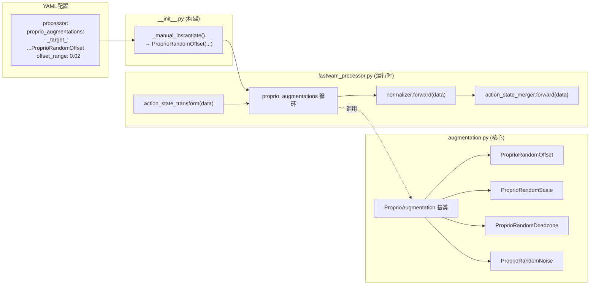
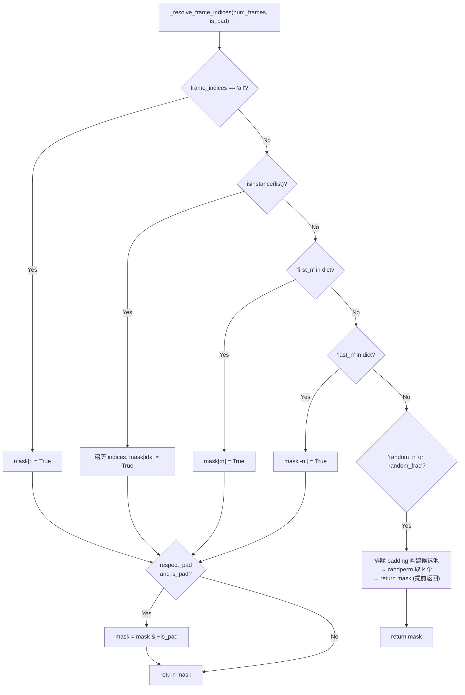
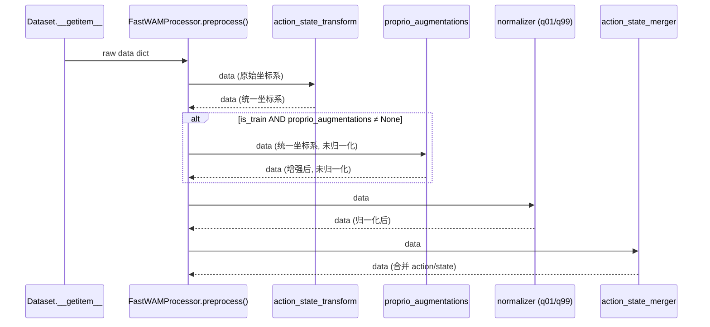
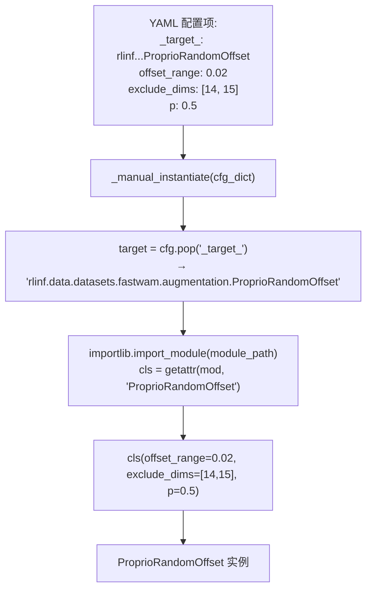
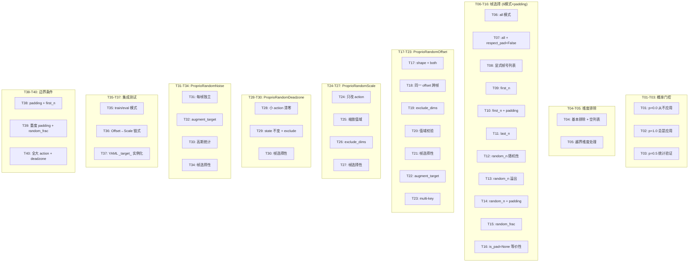
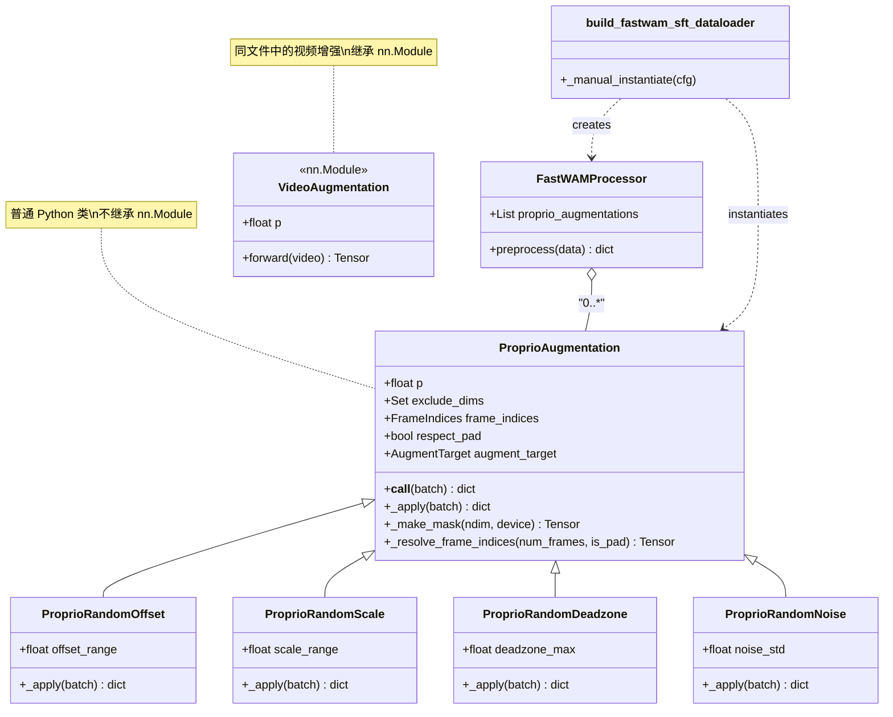

# R1 Pro Domain Gap Diagnostic Report

## 1. Dataset Overview

| Item | Value |
|------|-------|
| Total frames | 61,913 |
| Episodes | 63 |
| Episode length (median) | 984 |
| Episode length (min/max) | 828 / 1142 |
| Action dims | 23 |
| State dims | 23 |

## 2. Z-score Normalization Risk Assessment

**Risk levels**: CRITICAL = std≈0 (z-score explodes), HIGH = near-constant or bimodal, MEDIUM = low variance, LOW = safe

### CRITICAL (5 dims) — 这些维度的 z-score 归一化会爆炸

| Dim | Name | std | sensitivity (1/std) | Reason |
|-----|------|-----|---------------------|--------|
| 16 | chassis_pose_x | 1.79e-07 | 5.30e+06 | std=1.79e-07 → constant dim, z-score divides by ~0 |
| 17 | chassis_pose_y | 0.00e+00 | 1.00e+08 | std=0.00e+00 → constant dim, z-score divides by ~0 |
| 18 | chassis_pose_z | 5.96e-08 | 1.44e+07 | std=5.96e-08 → constant dim, z-score divides by ~0 |
| 19 | chassis_pose_yaw | 0.00e+00 | 1.00e+08 | std=0.00e+00 → constant dim, z-score divides by ~0 |
| 22 | chassis_vel_yaw | 0.00e+00 | 1.00e+08 | std=0.00e+00 → constant dim, z-score divides by ~0 |

### HIGH (2 dims) — 高风险

| Dim | Name | std | shift=0.01 → Δz-score | Reason |
|-----|------|-----|----------------------|--------|
| 14 | left_gripper | 33.2869 | 0.0 | only 0.0% unique values → discrete/bimodal, z-score inappropriate |
| 15 | right_gripper | 21.9384 | 0.0 | only 0.0% unique values → discrete/bimodal, z-score inappropriate |

### Action dimension statistics (all 23 dims)

| Dim | Name | mean | std | min | max | p5 | p50 | p95 | Risk |
|-----|------|------|-----|-----|-----|----|----|-----|------|
| 0 | left_arm_j0 | -0.0486 | 0.1987 | -1.1934 | 0.5829 | -0.4755 | 0.0000 | 0.1933 | 🟢 LOW |
| 1 | left_arm_j1 | 0.0595 | 0.0959 | -0.1745 | 0.5522 | -0.0310 | 0.0309 | 0.2773 | 🟡 MEDIUM |
| 2 | left_arm_j2 | -0.0380 | 0.1743 | -0.8912 | 0.4693 | -0.3559 | -0.0061 | 0.2340 | 🟢 LOW |
| 3 | left_arm_j3 | -0.3795 | 0.5997 | -1.5969 | 0.1795 | -1.5539 | -0.0199 | 0.0368 | 🟢 LOW |
| 4 | left_arm_j4 | 0.0779 | 0.1588 | -0.4021 | 1.0446 | -0.1683 | 0.0522 | 0.3405 | 🟢 LOW |
| 5 | left_arm_j5 | -0.1190 | 0.2506 | -1.0472 | 0.3356 | -0.7061 | -0.0031 | 0.1058 | 🟢 LOW |
| 6 | left_arm_j6 | -0.0065 | 0.1162 | -0.6519 | 0.8884 | -0.2028 | -0.0015 | 0.1687 | 🟢 LOW |
| 7 | right_arm_j0 | -0.1078 | 0.2973 | -1.5401 | 0.3589 | -1.0066 | -0.0015 | 0.0527 | 🟢 LOW |
| 8 | right_arm_j1 | -0.0136 | 0.0500 | -0.3187 | 0.1745 | -0.1043 | -0.0000 | 0.0506 | 🟡 MEDIUM |
| 9 | right_arm_j2 | 0.1086 | 0.1936 | -0.4220 | 0.8038 | -0.0659 | 0.0015 | 0.4909 | 🟢 LOW |
| 10 | right_arm_j3 | -0.1165 | 0.2998 | -1.5923 | 0.1197 | -0.8936 | -0.0000 | 0.0046 | 🟢 LOW |
| 11 | right_arm_j4 | -0.0668 | 0.1512 | -0.5412 | 0.3820 | -0.3896 | 0.0000 | 0.0969 | 🟢 LOW |
| 12 | right_arm_j5 | -0.0652 | 0.1493 | -0.6581 | 0.2116 | -0.4037 | -0.0000 | 0.0660 | 🟢 LOW |
| 13 | right_arm_j6 | 0.0061 | 0.0989 | -0.4433 | 0.4911 | -0.1503 | 0.0000 | 0.1933 | 🟡 MEDIUM |
| 14 | left_gripper | 75.2818 | 33.2869 | 0.0000 | 90.0000 | 0.0000 | 90.0000 | 90.0000 | 🟠 HIGH |
| 15 | right_gripper | 84.2901 | 21.9384 | 0.0000 | 90.0000 | 0.0000 | 90.0000 | 90.0000 | 🟠 HIGH |
| 16 | chassis_pose_x | 0.9000 | 0.0000 | 0.9000 | 0.9000 | 0.9000 | 0.9000 | 0.9000 | 🔴 CRITICAL |
| 17 | chassis_pose_y | -1.5000 | 0.0000 | -1.5000 | -1.5000 | -1.5000 | -1.5000 | -1.5000 | 🔴 CRITICAL |
| 18 | chassis_pose_z | -0.7000 | 0.0000 | -0.7000 | -0.7000 | -0.7000 | -0.7000 | -0.7000 | 🔴 CRITICAL |
| 19 | chassis_pose_yaw | 0.0000 | 0.0000 | 0.0000 | 0.0000 | 0.0000 | 0.0000 | 0.0000 | 🔴 CRITICAL |
| 20 | chassis_vel_x | 0.0360 | 0.0630 | -0.1450 | 0.1500 | 0.0000 | 0.0000 | 0.1487 | 🟡 MEDIUM |
| 21 | chassis_vel_y | 0.0032 | 0.0353 | -0.1500 | 0.1439 | 0.0000 | 0.0000 | 0.0588 | 🟡 MEDIUM |
| 22 | chassis_vel_yaw | 0.0000 | 0.0000 | 0.0000 | 0.0000 | 0.0000 | 0.0000 | 0.0000 | 🔴 CRITICAL |

### State dimension statistics

| Dim | Name | mean | std | min | max | Risk |
|-----|------|------|-----|-----|-----|------|
| 0 | left_arm_j0 | -0.0496 | 0.1974 | -1.1928 | 0.5757 | 🟢 LOW |
| 1 | left_arm_j1 | 0.0590 | 0.0957 | -0.1743 | 0.5506 | 🟡 MEDIUM |
| 2 | left_arm_j2 | -0.0385 | 0.1736 | -0.8896 | 0.4385 | 🟢 LOW |
| 3 | left_arm_j3 | -0.3779 | 0.5975 | -1.5974 | 0.1789 | 🟢 LOW |
| 4 | left_arm_j4 | 0.0775 | 0.1583 | -0.3938 | 1.0438 | 🟢 LOW |
| 5 | left_arm_j5 | -0.1186 | 0.2494 | -1.0464 | 0.3326 | 🟢 LOW |
| 6 | left_arm_j6 | -0.0060 | 0.1154 | -0.6487 | 0.8847 | 🟢 LOW |
| 7 | right_arm_j0 | -0.1082 | 0.2970 | -1.5396 | 0.3530 | 🟢 LOW |
| 8 | right_arm_j1 | -0.0131 | 0.0492 | -0.3151 | 0.1736 | 🟡 MEDIUM |
| 9 | right_arm_j2 | 0.1078 | 0.1931 | -0.4221 | 0.8062 | 🟢 LOW |
| 10 | right_arm_j3 | -0.1143 | 0.2958 | -1.5898 | 0.1206 | 🟢 LOW |
| 11 | right_arm_j4 | -0.0665 | 0.1508 | -0.5406 | 0.3813 | 🟢 LOW |
| 12 | right_arm_j5 | -0.0650 | 0.1486 | -0.6572 | 0.2106 | 🟢 LOW |
| 13 | right_arm_j6 | 0.0060 | 0.0981 | -0.4415 | 0.4900 | 🟡 MEDIUM |
| 14 | left_gripper | 77.2990 | 32.4848 | 1.8496 | 102.1860 | 🟢 LOW |
| 15 | right_gripper | 86.7969 | 21.4960 | 2.1171 | 101.8604 | 🟢 LOW |
| 16 | chassis_pose_x | 0.8999 | 0.0007 | 0.8966 | 0.9035 | 🟠 HIGH |
| 17 | chassis_pose_y | -1.5000 | 0.0006 | -1.5012 | -1.4974 | 🟠 HIGH |
| 18 | chassis_pose_z | -0.6992 | 0.0008 | -0.7013 | -0.6979 | 🟠 HIGH |
| 19 | chassis_pose_yaw | 0.0002 | 0.0005 | -0.0005 | 0.0017 | 🟠 HIGH |
| 20 | chassis_vel_x | 0.0400 | 0.0588 | -0.1320 | 0.1710 | 🟠 HIGH |
| 21 | chassis_vel_y | 0.0394 | 0.0578 | -0.1290 | 0.1600 | 🟠 HIGH |
| 22 | chassis_vel_yaw | 0.0396 | 0.0584 | -0.1280 | 0.1630 | 🟠 HIGH |

## 3. Visual Statistics

### head_rgb

- Frames sampled: 320
- Resolution: 640x360
- Channel means (RGB): ['0.2276', '0.1965', '0.1686']
- Channel stds (RGB): ['0.2411', '0.1675', '0.1792']
- Brightness: mean=0.3275, std=0.1252

### left_wrist_rgb

- Frames sampled: 320
- Resolution: 640x480
- Channel means (RGB): ['0.1707', '0.1707', '0.1707']
- Channel stds (RGB): ['0.2573', '0.2350', '0.2412']
- Brightness: mean=0.3957, std=0.1927

### right_wrist_rgb

- Frames sampled: 316
- Resolution: 640x480
- Channel means (RGB): ['0.1728', '0.1728', '0.1728']
- Channel stds (RGB): ['0.2675', '0.2333', '0.2363']
- Brightness: mean=0.3636, std=0.2107

## 4. Episode Anomalies

No episode anomalies detected.

## 5. Recommendations

### 紧急（影响新机器人推理正确性）

1. **修复常数维度归一化**：dim 16 (chassis_pose_x), dim 17 (chassis_pose_y), dim 18 (chassis_pose_z), dim 19 (chassis_pose_yaw), dim 22 (chassis_vel_yaw) 的 std≈0，z-score 归一化在这些维度上无效。
   - 方案 A：在 `norm_exception_mode` 中对这些维度使用 `min/max` 或 `const` 模式
   - 方案 B：在推理时对这些维度直接输出固定常数，跳过 denormalize

2. **处理离散/低方差维度**：dim 14 (left_gripper), dim 15 (right_gripper)
   - Gripper (dim 14, 15)：二值 {0, 90}，建议用 `min/max` 归一化或离散化处理

### 短期（改善泛化）

3. **在新机器人上采集少量标定数据**：即使 5-10 个 episode，也能重新计算 norm_stats，消除归一化偏移
4. **加强视觉增强**：当前 ColorJitter 范围可能不足以覆盖新环境的光照差异
5. **验证关节零位**：对比新旧机器人 home position 的 state 值是否一致

### 中长期

6. **多机器人数据混合训练**：从根本上解决个体差异
7. **Domain randomization**：在训练时对 proprio/action 加噪声

---

## 6. 归一化修复方案

### 6.1 当前机制分析：为什么 `norm_exception_mode` 不能直接解决

当前 `norm_exception_mode` 的设计粒度是 **字段 key 级别**，不是 **维度级别**。

关键代码路径：

```
YAML config
  → norm_exception_mode: {action: {default: "min/max"}}
  → LinearNormalizer.__init__()   # normalizer.py:40-41
      if exception_mode["action"]["default"] exists:
          cur_mode = exception_mode["action"]["default"]  # 整个 23 维使用同一 mode
      → SingleFieldLinearNormalizer(stats, mode=cur_mode)  # 23 维统一处理
```

R1 Pro 的 `shape_meta` 将全部 23 维 action 归为单一 key `"default"`：

```yaml
shape_meta:
  action:
    - key: default        # ← 所有 23 维共享这个 key
      lerobot_key: actions
      shape: 23
```

因此 `norm_exception_mode: {action: {default: "min/max"}}` 会将 **全部 23 维** 切换为 `min/max`，无法做到 dim 14-15 用 `min/max`、dim 16-19,22 用 `const`、其余用 `z-score`。

### 6.2 三个方案对比

| | 方案 A：逐维覆盖 | 方案 B：全部 min/max | 方案 C：拆分 shape_meta |
|---|---|---|---|
| **思路** | 给 `SingleFieldLinearNormalizer` 加 `dim_overrides` 参数，对指定维度用不同 mode | 改 `norm_default_mode: "min/max"`，利用 `ignore_dim` 逻辑处理 dead dims | 将 23 维拆为 arm(14) / gripper(2) / chassis(7) 三个独立 key |
| **代码改动量** | ~30 行（normalizer.py） | 0 行（仅改 YAML） | 100+ 行（normalizer + dataset + processor + model） |
| **风险** | **低**（向后兼容，不传 dim_overrides 行为不变） | **中**（arm joint 从 z-score 变 min/max，可能影响精度） | **高**（改动面大，需重新计算 dataset_stats） |
| **精度影响** | arm joint 保持 z-score 不变 | arm joint 归一化方式改变 | 理论最优（每组最适合的 mode） |
| **是否需要重训** | 是 | 是 | 是 |
| **向后兼容** | ✅ 完全兼容 | ✅ 完全兼容 | ❌ 需要改 shape_meta 格式 |

### 6.3 推荐方案：方案 A — 逐维覆盖（详细实现）

#### 6.3.1 YAML 配置（目标效果）

```yaml
# r1_pro_sft_fastwam.yaml
processor:
  norm_default_mode: "z-score"        # arm joints 继续用 z-score
  norm_exception_mode:
    action:
      default:                        # key="default" 下的逐维覆盖
        14: "0.0/90.0"               # left_gripper:  min/max with const range [0, 90]
        15: "0.0/90.0"               # right_gripper: min/max with const range [0, 90]
        16: "const"                   # chassis_pose_x:   跳过归一化
        17: "const"                   # chassis_pose_y:   跳过归一化
        18: "const"                   # chassis_pose_z:   跳过归一化
        19: "const"                   # chassis_pose_yaw: 跳过归一化
        22: "const"                   # chassis_vel_yaw:  跳过归一化
    state:
      default:
        14: "0.0/110.0"              # left_gripper_state:  range [1.8, 102.2]
        15: "0.0/110.0"              # right_gripper_state: range [2.1, 101.9]
        16: "const"
        17: "const"
        18: "const"
        19: "const"
        22: "const"
```

#### 6.3.2 代码改动（normalizer.py）

**改动 1：`LinearNormalizer.__init__`** — 检测 dict 类型的 exception_mode 值

```python
# normalizer.py:40-48 — 改动前：
if exception_mode is not None and "action" in exception_mode and key in exception_mode["action"]:
    cur_mode = exception_mode["action"][key]
else:
    cur_mode = default_mode

self.normalizers["action"][key] = SingleFieldLinearNormalizer(
    stats=cur_stats,
    mode=cur_mode,
)

# normalizer.py:40-53 — 改动后：
dim_overrides = None
if exception_mode is not None and "action" in exception_mode and key in exception_mode["action"]:
    exc = exception_mode["action"][key]
    if isinstance(exc, dict):
        # 逐维覆盖：{14: "0.0/90.0", 16: "const", ...}
        dim_overrides = {int(k): v for k, v in exc.items()}
        cur_mode = default_mode
    else:
        cur_mode = exc
else:
    cur_mode = default_mode

self.normalizers["action"][key] = SingleFieldLinearNormalizer(
    stats=cur_stats,
    mode=cur_mode,
    dim_overrides=dim_overrides,
)
```

对 state 字段做同样修改（normalizer.py:50-62）。

**改动 2：`SingleFieldLinearNormalizer.__init__`** — 支持 dim_overrides

```python
class SingleFieldLinearNormalizer:
    std_reg = 1e-8
    range_tol = 1e-4
    output_max = 1.0
    output_min = -1.0

    def __init__(self, stats, mode: NormMode = "min/max", dim_overrides=None):
        self.stats = stats
        self.mode = mode
        self.const_dims = {}  # dim_idx → const_value, 用于 backward

        # --- 第一步：用 default mode 计算全维 scale/offset ---
        if mode == "z-score":
            input_mean, input_std = stats["mean"], stats["std"]
            scale = 1.0 / (input_std + self.std_reg)
            offset = -input_mean / (input_std + self.std_reg)
        else:
            # ... (原有 min/max, q01/q99, const 逻辑不变)

        # --- 第二步：对指定维度重算 scale/offset ---
        if dim_overrides:
            for dim_idx, dim_mode in dim_overrides.items():
                dim_idx = int(dim_idx)
                if dim_mode == "const":
                    # forward: 输出 0 （scale=0, offset=0）
                    # backward: 输出训练时的均值（存入 const_dims）
                    scale[dim_idx] = 0.0
                    offset[dim_idx] = 0.0
                    self.const_dims[dim_idx] = float(stats["mean"][dim_idx])
                elif dim_mode == "min/max":
                    dmin = float(stats["min"][dim_idx])
                    dmax = float(stats["max"][dim_idx])
                    drange = dmax - dmin
                    if drange < self.range_tol:
                        scale[dim_idx] = 0.0
                        offset[dim_idx] = 0.0
                        self.const_dims[dim_idx] = dmin
                    else:
                        scale[dim_idx] = (self.output_max - self.output_min) / drange
                        offset[dim_idx] = self.output_min - scale[dim_idx] * dmin
                else:
                    # "const_min/const_max" 格式，如 "0.0/90.0"
                    cmin, cmax = map(float, dim_mode.split("/"))
                    drange = cmax - cmin
                    if drange < self.range_tol:
                        scale[dim_idx] = 0.0
                        offset[dim_idx] = 0.0
                        self.const_dims[dim_idx] = cmin
                    else:
                        scale[dim_idx] = (self.output_max - self.output_min) / drange
                        offset[dim_idx] = self.output_min - scale[dim_idx] * cmin

        self.scale = scale
        self.offset = offset
```

**改动 3：`SingleFieldLinearNormalizer.backward`** — 对 const 维度返回固定值

```python
def backward(self, x: torch.Tensor) -> torch.Tensor:
    x = (x - self.offset) / (self.scale + 1e-12)  # 加 eps 防止 scale=0 除零
    # const 维度：模型输出什么不重要，始终返回训练时的常数值
    for dim_idx, const_val in self.const_dims.items():
        x[..., dim_idx] = const_val
    return x
```

#### 6.3.3 数学验证

**arm joints (dim 0-13)**: 无任何改变，继续 z-score

$$\text{forward}(x) = \frac{x - \mu}{\sigma + 10^{-8}}, \quad \text{backward}(y) = y \cdot (\sigma + 10^{-8}) + \mu$$

**gripper (dim 14, 15)**: 使用 `"0.0/90.0"` 范围

$$\text{scale} = \frac{1 - (-1)}{90 - 0} = \frac{1}{45}, \quad \text{offset} = -1 - \frac{0}{45} = -1$$

| 输入 | forward | backward |
|------|---------|----------|
| 0 | $0 \times \frac{1}{45} + (-1) = -1.0$ | $(−1 + 1) \times 45 = 0$ ✅ |
| 90 | $90 \times \frac{1}{45} + (-1) = 1.0$ | $(1 + 1) \times 45 = 90$ ✅ |
| 45 | $45 \times \frac{1}{45} + (-1) = 0.0$ | $(0 + 1) \times 45 = 45$ ✅ |

**dead dims (dim 16-19, 22)**: `const` 模式

$$\text{scale} = 0, \quad \text{offset} = 0, \quad \text{const\_val} = \mu_{\text{train}}$$

| 场景 | forward | backward |
|------|---------|----------|
| 训练时（x=0.9） | $0.9 \times 0 + 0 = 0$ | $\mu_{\text{train}} = 0.9$ |
| 新机器人（x=0.85） | $0.85 \times 0 + 0 = 0$ | $\mu_{\text{train}} = 0.9$ |
| 模型输出任意 y | — | $\mu_{\text{train}} = 0.9$ |

核心效果：
- **forward**: 无论输入什么，模型看到的始终是 0（与训练一致）
- **backward**: 无论模型输出什么，denormalize 后始终返回训练时的常数

这确保了 dead dims 不会污染模型输入，也不会在输出端产生不合理的值。

#### 6.3.4 验证步骤

```bash
# 1. 修改 normalizer.py 后，用小脚本验证 forward/backward 对称性
python -c "
import torch
from fastwam.datasets.lerobot.utils.normalizer import SingleFieldLinearNormalizer

stats = {
    'mean': torch.tensor([0.0, 0.9, 45.0]),
    'std':  torch.tensor([0.5, 0.0, 33.0]),
    'min':  torch.tensor([-1.0, 0.9, 0.0]),
    'max':  torch.tensor([1.0, 0.9, 90.0]),
}

norm = SingleFieldLinearNormalizer(
    stats, mode='z-score',
    dim_overrides={1: 'const', 2: '0.0/90.0'},
)

x = torch.tensor([[0.3, 0.9, 45.0]])
y = norm.forward(x)
x_back = norm.backward(y)
print(f'x      = {x}')
print(f'forward= {y}')
print(f'backward={x_back}')
assert torch.allclose(x, x_back, atol=1e-4), 'round-trip failed!'
print('✅ Round-trip OK')
"

# 2. 用修改后的 YAML 启动训练（先短跑 100 steps 验证不崩溃）
python examples/sft/train_fastwam_sft.py --config-name r1_pro_sft_fastwam \
    runner.max_steps=100 \
    actor.global_batch_size=8

# 3. 检查 wandb/tensorboard 中 train/loss 是否正常下降
```

### 6.4 备选方案 B：全部切为 min/max（零代码改动）

如果不想改代码，最简单的做法：

```yaml
processor:
  norm_default_mode: "min/max"     # ← 仅改这一行
  norm_exception_mode: null
```

**原理**：`SingleFieldLinearNormalizer` 在 `min/max` 模式下有 `ignore_dim` 逻辑：

```python
input_range = input_max - input_min
ignore_dim = input_range < self.range_tol  # dead dims: range ≈ 0 → True
input_range[ignore_dim] = 2.0              # 设为 output_range
scale[ignore_dim] = 1.0                    # 不放大
offset[ignore_dim] = 0 - input_min[ignore_dim]  # forward(const) = 0
```

对 dead dims：forward 输出 0，backward 返回原常数。与方案 A 的 `const` 模式效果相同。

对 gripper dims：min=0, max=90 → 映射到 [-1, 1]。正确。

**代价**：arm joints（dim 0-13）也从 z-score 变为 min/max。z-score 对 Gaussian 分布更优（输出 ~N(0,1)），min/max 受 outlier 影响更大（极端关节角度会拉伸整个范围）。实际性能差异需要通过消融实验验证。

### 6.5 实施优先级建议

| 步骤 | 内容 | 时间 |
|------|------|------|
| 1 | 先用方案 B（全部 min/max）做消融实验，确认 dead dims 问题消除 | 0.5 天 |
| 2 | 实现方案 A（逐维覆盖），在相同数据上对比 z-score+override vs 全 min/max | 1 天 |
| 3 | 选择精度更好的方案，在新机器人上验证 | 0.5 天 |

---

## 7. 视觉增强改进方案

### 7.1 Wrist 灰度图上 ColorJitter 的无效分量

诊断数据显示 wrist 相机 RGB 三通道均值完全一致：

| 相机 | R mean | G mean | B mean |
|------|--------|--------|--------|
| left_wrist_rgb | 0.1707 | 0.1707 | 0.1707 |
| right_wrist_rgb | 0.1728 | 0.1728 | 0.1728 |

R=G=B 意味着每个像素都是灰度的。在灰度图上，`VideoColorJitter` 的 4 个参数中有 2 个几乎无效：

| 参数 | 对灰度图的效果 | 有效性 |
|------|----------------|--------|
| **brightness** | 整体亮暗缩放，`pixel × factor` | ✅ 有效 |
| **contrast** | 向/离均值收缩/拉伸 | ✅ 有效 |
| **saturation** | 灰度图 saturation=0，`lerp(gray, gray, factor)` = gray | ❌ 无效（恒等变换） |
| **hue** | 灰度无色相，旋转色相轮无变化 | ❌ 无效（恒等变换） |

**结论**：当前 wrist 相机配置的 `saturation: 0.5` 和 `hue: 0.08` 实际不产生任何增强效果。Wrist 相机只有 brightness 和 contrast 两个自由度的增强，远弱于 head_rgb。

### 7.2 对泛化的影响

这带来两层 domain gap 风险：

**风险 1 — 训练增强不足**：wrist 相机的有效增强仅有 brightness+contrast（2 个自由度），没有几何增强、没有噪声增强。模型可能过度拟合 wrist 视角的特定像素分布。

**风险 2 — 灰度/彩色不匹配**：如果新机器人的 wrist 相机输出彩色图像，模型将面对从未见过的 wrist 色彩信息。训练时 R=G=B，推理时 R≠G≠B，这对 ViT encoder 的 patch embedding 来说是分布外输入。

### 7.3 推理时快速修复（零训练成本）

在新机器人推理时，对 wrist 图像做灰度转换，强制对齐训练分布：

```python
import torchvision.transforms.v2 as T2

wrist_to_gray = T2.Grayscale(num_output_channels=3)

# 在推理 pipeline 中，对 wrist 输入做预处理
wrist_image = wrist_to_gray(wrist_image)  # [T, 3, H, W] → [T, 3, H, W]，R=G=B
```

零成本，无需重训，立竿见影消除 wrist 色彩域偏移。

### 7.4 训练时增强策略

#### 策略概览

| 改动 | 目标 | 理由 |
|------|------|------|
| 所有相机加 `VideoRandomGrayscale` | 灰度/彩色双向鲁棒 | 模型学会忽略颜色、依赖几何特征 |
| wrist 加 `VideoGaussianNoise` | 弥补 saturation/hue 无效的增强缺口 | wrist 当前有效增强太少 |
| wrist 加 `VideoRandomErasing` | 遮挡鲁棒性 | 近距离抓取常有手/物体遮挡 |
| head 加 `VideoRandomFisheye` | 镜头畸变鲁棒性 | 不同机器人头部相机畸变不同 |

#### 具体 YAML 配置

```yaml
    train_transforms:
      head_rgb:
        - _target_: fastwam.datasets.lerobot.transforms.image.ToTensor
        - _target_: rlinf.data.datasets.fastwam.augmentation.VideoRandomCrop
          p: 0.3
        - _target_: torchvision.transforms.Resize
          size: [240, 320]
        - _target_: rlinf.data.datasets.fastwam.augmentation.VideoRandomErasing
          scale: [0.01, 0.01]
          p: 0.3
        - _target_: rlinf.data.datasets.fastwam.augmentation.VideoRandomRotation
          p: 0.3
        - _target_: rlinf.data.datasets.fastwam.augmentation.VideoColorJitter
          brightness: 0.3
          contrast: 0.4
          saturation: 0.5
          hue: 0.08
          p: 0.8
        # ---- 新增 ----
        - _target_: rlinf.data.datasets.fastwam.augmentation.VideoRandomGrayscale
          p: 0.15                    # head 是彩色的，适度灰度化减少颜色依赖
        - _target_: rlinf.data.datasets.fastwam.augmentation.VideoRandomFisheye
          k_range: [0.10, 0.35]
          center_jitter: 0.05
          p: 0.15                    # 镜头畸变鲁棒性

      left_wrist_rgb:
        - _target_: fastwam.datasets.lerobot.transforms.image.ToTensor
        - _target_: torchvision.transforms.Resize
          size: [240, 320]
        - _target_: rlinf.data.datasets.fastwam.augmentation.VideoColorJitter
          brightness: 0.3
          contrast: 0.4
          saturation: 0.5           # 对灰度无效，但保留：万一未来用彩色 wrist 数据
          hue: 0.08
          p: 0.8
        # ---- 新增 ----
        - _target_: rlinf.data.datasets.fastwam.augmentation.VideoRandomGrayscale
          p: 0.2                     # 强制灰度化，确保彩色 wrist 也能处理
        - _target_: rlinf.data.datasets.fastwam.augmentation.VideoGaussianNoise
          std_range: [0.01, 0.05]
          per_frame: false
          p: 0.3                     # 弥补 saturation/hue 无效的增强缺口
        - _target_: rlinf.data.datasets.fastwam.augmentation.VideoRandomErasing
          scale: [0.02, 0.08]
          p: 0.2                     # 近距离抓取遮挡鲁棒性

      right_wrist_rgb:
        - _target_: fastwam.datasets.lerobot.transforms.image.ToTensor
        - _target_: torchvision.transforms.Resize
          size: [240, 320]
        - _target_: rlinf.data.datasets.fastwam.augmentation.VideoColorJitter
          brightness: 0.3
          contrast: 0.4
          saturation: 0.5
          hue: 0.08
          p: 0.8
        # ---- 新增（与 left_wrist 对称） ----
        - _target_: rlinf.data.datasets.fastwam.augmentation.VideoRandomGrayscale
          p: 0.2
        - _target_: rlinf.data.datasets.fastwam.augmentation.VideoGaussianNoise
          std_range: [0.01, 0.05]
          per_frame: false
          p: 0.3
        - _target_: rlinf.data.datasets.fastwam.augmentation.VideoRandomErasing
          scale: [0.02, 0.08]
          p: 0.2
```

#### 各增强的作用机理

**`VideoRandomGrayscale(p=0.2)`**

以 20% 概率将整段视频转为灰度（R=G=B）。效果：
- 如果训练数据是灰度的：20% 概率保持原样，80% 概率也保持原样（因为已经是灰度）→ 模型不依赖颜色
- 如果未来混入彩色数据：20% 概率变灰度 → 模型学会在有/无颜色时都能工作
- 对 head_rgb（彩色）：15% 概率丢失颜色信息 → 迫使模型多利用几何和纹理特征

**`VideoGaussianNoise(std_range=[0.01, 0.05], p=0.3)`**

以 30% 概率加高斯噪声。弥补 wrist 上 saturation/hue jitter 无效导致的增强不足。`per_frame=false` 保证时序一致性（同一噪声模式应用于所有帧）。

**`VideoRandomErasing(scale=[0.02, 0.08], p=0.2)`**

以 20% 概率随机遮挡 2%-8% 面积。wrist 视角距离近，手指/物体经常造成局部遮挡，这个增强提高遮挡鲁棒性。

**`VideoRandomFisheye(k_range=[0.10, 0.35], p=0.15)`**

仅对 head_rgb，以 15% 概率施加桶形畸变。不同机器人头部相机的镜头畸变参数不同，这个增强让模型对畸变差异鲁棒。

### 7.5 实施优先级

| 优先级 | 改动 | 效果预期 |
|--------|------|----------|
| P0（推理时） | 新机器人 wrist 图像做 grayscale 对齐 | 立即消除 wrist 色彩域偏移 |
| P1（下次训练） | 所有相机加 `VideoRandomGrayscale` | 灰度/彩色双向鲁棒 |
| P1（下次训练） | wrist 加 `VideoGaussianNoise` | 弥补无效增强缺口 |
| P2（验证后） | wrist 加 `VideoRandomErasing` | 遮挡鲁棒性 |
| P2（验证后） | head 加 `VideoRandomFisheye` | 镜头畸变鲁棒性 |

---

## 8. 运动学/动力学个体差异泛化方案

### 8.1 问题定义

同型号不同个体的 R1 Pro 机器人存在以下差异：

| 差异类型 | 物理原因 | 对模型的影响 |
|----------|----------|--------------|
| **关节零位标定偏差** | 装配公差、编码器零位不一致 | 相同 `joint_angle` 值 → 不同末端位姿 |
| **齿轮间隙/摩擦差异** | 磨损、润滑、齿轮啮合差异 | 相同力矩指令 → 不同实际运动幅度 |
| **底盘响应特性** | 轮胎磨损、电机个体差异 | 相同 `chassis_velocity` → 不同实际位移 |

当前 R1 Pro 训练管线使用 **绝对关节角度**（`action_state_transforms: null`），没有 **本体感知增强**，没有 **校准偏移层**。模型学到的是"旧机器人上 joint_angle=0.5 → 手臂到达这个位置"的精确映射，一旦换到新机器人，这个映射就偏了。

### 8.2 策略一：Proprio Domain Randomization（训练时）

#### 核心思想

在训练时对 state/action 加随机扰动，模拟不同机器人个体之间的差异，使模型学会对这些扰动鲁棒。

#### 三种扰动类型

**① 零位偏移扰动（模拟标定偏差）**

每个 episode 采样一个固定偏移向量 $\boldsymbol{\delta} \sim \mathcal{U}(-\epsilon, \epsilon)$，对该 episode 所有帧的关节角度加上偏移：

$$\text{state}'_t = \text{state}_t + \boldsymbol{\delta}, \quad \text{action}'_t = \text{action}_t + \boldsymbol{\delta}$$

关键：同一 episode 内 $\boldsymbol{\delta}$ 固定（因为零位偏差在一次部署中不变），但 episode 间随机。
- arm joints (dim 0-13): $\epsilon \approx 0.02\text{ rad} \approx 1.1°$
- gripper (dim 14-15): $\epsilon = 0$（离散值不加偏移）
- chassis (dim 16-22): $\epsilon = 0$（dead dims 或速度指令）

**② 增益缩放扰动（模拟齿轮差异）**

每个 episode 对 action 乘以随机缩放因子：

$$\text{action}'_t = \text{action}_t \times (1 + \boldsymbol{\alpha}), \quad \boldsymbol{\alpha} \sim \mathcal{U}(-0.05, 0.05)$$

模拟同样的指令在不同机器人上产生 ±5% 的运动幅度差异。

**③ 随机死区（模拟齿轮间隙）**

对小幅 action 施加随机截断：

$$\text{action}'_t[d] = \begin{cases} 0 & \text{if } |\text{action}_t[d]| < \tau_d \\ \text{action}_t[d] & \text{otherwise} \end{cases}$$

其中 $\tau_d \sim \mathcal{U}(0, 0.005)$，模拟齿轮间隙导致的微小指令被"吃掉"的现象。

#### 实现方式

当前代码库中 **没有 proprio 增强**。需要新增，有两个插入点：

**方案 a — 在 processor 中插入（推荐）**

在 `fastwam_processor.py` 的 `preprocess()` 流程中，在 normalization 之前插入 proprio augmentation：

```
原流程: raw data → action_state_transform → normalize → merge
新流程: raw data → action_state_transform → proprio_augment → normalize → merge
```

优点：在 normalize 前加扰动，扰动量可以直接用物理单位（rad）而不是归一化后的无单位值。

**方案 b — 在 augmentation.py 中新增类**

```python
class ProprioRandomOffset(nn.Module):
    """Per-episode random joint offset to simulate calibration drift."""
    def __init__(self, offset_range: float = 0.02, dims: list = None, p: float = 0.5):
        ...
    def forward(self, action: Tensor, state: Tensor) -> Tuple[Tensor, Tensor]:
        if random.random() > self.p:
            return action, state
        offset = torch.empty(self.ndim).uniform_(-self.offset_range, self.offset_range)
        offset[self.excluded_dims] = 0  # gripper/chassis 不加
        return action + offset, state + offset

class ProprioRandomScale(nn.Module):
    """Per-episode random gain to simulate actuator variation."""
    def __init__(self, scale_range: float = 0.05, p: float = 0.3):
        ...
    def forward(self, action: Tensor, state: Tensor) -> Tuple[Tensor, Tensor]:
        scale = 1.0 + torch.empty(self.ndim).uniform_(-self.scale_range, self.scale_range)
        return action * scale, state  # 只对 action 缩放
```

YAML 配置：
```yaml
processor:
  proprio_augmentations:
    - _target_: rlinf.data.datasets.fastwam.augmentation.ProprioRandomOffset
      offset_range: 0.02
      exclude_dims: [14, 15, 16, 17, 18, 19, 20, 21, 22]
      p: 0.5
    - _target_: rlinf.data.datasets.fastwam.augmentation.ProprioRandomScale
      scale_range: 0.05
      exclude_dims: [14, 15, 16, 17, 18, 19, 22]
      p: 0.3
```

### 8.3 策略二：Delta Action 表示（训练时）

#### 核心思想

用 **相对动作**（当前帧与前一帧的差值）代替绝对关节角度。Delta action 对零位偏移天然免疫——无论零位怎么偏，相邻帧之间的 *变化量* 是一样的。

$$\Delta a_t = a_t - a_{t-1}$$

#### 当前代码支持

`RelativeJointTransform` 已实现在 `FastWAM/transforms/relative_action.py:84-104`，但 R1 Pro 未使用：

```python
class RelativeJointTransform:
    """Convert absolute joint actions to delta from first frame."""
    def forward(self, batch):
        # action[t] = action[t] - state[0]  (相对于 episode 起始)
        ...
    def backward(self, batch):
        # 反向：action[t] = action[t] + state[0]
        ...
```

仅需 YAML 改动即可启用：

```yaml
processor:
  action_state_transforms:
    _target_: fastwam.datasets.lerobot.transforms.relative_action.RelativeJointTransform
```

#### Absolute vs Delta 的 Tradeoff

| | Absolute Action | Delta Action |
|---|---|---|
| 零位偏移鲁棒性 | ❌ 偏移直接传导 | ✅ 差值消除偏移 |
| 累积误差 | ✅ 无累积 | ❌ 误差逐步累积（drift） |
| 长程任务 | ✅ 目标位置明确 | ❌ 需要更多步积分 |
| 数据范围 | 大（全关节空间） | 小（仅帧间差值）→ normalize 更友好 |
| gripper 处理 | 简单（{0, 90}） | 复杂（delta 大多为 0，偶尔 ±90） |

**建议**：arm joints 用 delta，gripper 和 chassis 保持 absolute。需要 `delta_action_dim_mask` 配合：

```yaml
processor:
  action_state_transforms:
    _target_: fastwam.datasets.lerobot.transforms.relative_action.RelativeJointTransform
  delta_action_dim_mask:
    default: [true,true,true,true,true,true,true,   # left_arm delta
              true,true,true,true,true,true,true,   # right_arm delta
              false,false,                          # grippers absolute
              false,false,false,false,              # chassis_pose absolute
              false,false,false]                    # chassis_vel absolute
```

### 8.4 策略三：Per-Robot 校准偏移（推理时）

#### 核心思想

在新机器人上一次性测量与旧机器人的关节零位差异，在推理管线中直接补偿。

#### 校准流程

```
1. 将新旧机器人都移动到 home position（同一物理姿态）
2. 记录两台机器人的关节角度：
   old_home = [j0_old, j1_old, ..., j13_old]
   new_home = [j0_new, j1_new, ..., j13_new]
3. 计算偏移：offset = new_home - old_home
4. 推理时：
   - 输入 state: state_corrected = state_new - offset  （对齐到旧机器人坐标系）
   - 输出 action: action_corrected = action_model + offset  （转换回新机器人坐标系）
```

#### 实现

```python
class CalibrationOffset:
    """Apply per-robot calibration offset at inference time."""
    def __init__(self, offset_json: str):
        with open(offset_json) as f:
            data = json.load(f)
        self.offset = torch.tensor(data["joint_offset"])  # [23]
    
    def correct_input(self, state: torch.Tensor) -> torch.Tensor:
        return state - self.offset
    
    def correct_output(self, action: torch.Tensor) -> torch.Tensor:
        return action + self.offset
```

校准文件 `calibration.json`：
```json
{
  "robot_id": "r1_pro_002",
  "reference_robot": "r1_pro_001",
  "joint_offset": [0.012, -0.008, 0.003, ..., 0.0, 0.0]
}
```

**优点**：零训练成本，立即可用。
**局限**：只补偿零位偏移，不解决增益差异和非线性差异。

### 8.5 策略四：Few-shot Adaptation（推理前微调）

#### 核心思想

在新机器人上采集少量数据（5-10 episodes），对模型做轻量级微调。

#### 关键设计决策

**微调什么？**

| 层 | 参数量 | 微调风险 |
|---|---|---|
| 全部参数 | 6B | ❌ 过拟合（数据太少） |
| Action DiT（1B） | 1B | ⚠️ 风险中等 |
| Action DiT 最后 2 层 | ~50M | ✅ 推荐 |
| Action head (linear) | ~10K | ✅ 最安全 |
| LoRA adapter (rank=8) | ~2M | ✅ 推荐 |

**推荐方案**：LoRA on Action DiT + 重新计算 norm_stats

```yaml
# few_shot_finetune.yaml
runner:
  max_steps: 500                    # 5-10 episodes 约 5000-10000 帧
  resume_dir: /path/to/pretrained_checkpoint

actor:
  optim:
    lr: 5.0e-6                      # 比预训练低 20x
    lr_scheduler: "constant"        # 不用 warmup
  model:
    lora:
      enabled: true
      rank: 8
      target_modules: ["q_proj", "v_proj"]
      modules: ["action_dit"]       # 只对 Action DiT 加 LoRA

data:
  train_data_paths: /path/to/new_robot_data   # 5-10 episodes
  processor:
    pretrained_norm_stats: null      # 从新数据重新计算
```

**重新计算 norm_stats 的必要性**：第 6 章已分析，旧 norm_stats 中 dead dims 的 std≈0 会导致 z-score 爆炸。即使不微调模型，仅用新数据重新计算 norm_stats 就能消除归一化偏移。

### 8.6 策略五：Action Space 设计优化（长期）

#### 末端空间 (Task-space) Action

最根本的解决方案：将 action 从关节空间转为末端执行器空间（xyz + rotation）：

$$a_t = [\Delta x, \Delta y, \Delta z, \Delta r_x, \Delta r_y, \Delta r_z, \text{gripper}]_{\text{左}} \oplus [\cdots]_{\text{右}}$$

**优点**：
- 完全解耦关节标定——不同零位的机器人通过各自的 IK 到达相同末端位姿
- 动作语义更直观（"向右移 2cm" vs "j3 转 0.05 rad"）
- 跨形态迁移潜力（不同关节数的机器人也能用）

**代价**：
- 需要每台机器人部署 IK solver
- IK 多解性需要处理（当前关节作为 seed）
- 奇异位形附近不稳定
- 需要重新收集数据或转换现有数据

#### Action Chunking with Temporal Ensemble

使用 ACT（Action Chunking with Transformers）风格的多步预测 + 时序集成：

$$\hat{a}_{t} = \frac{1}{K}\sum_{k=0}^{K-1} w_k \cdot \hat{a}^{(t-k)}_{t}$$

多个历史预测的加权平均降低单步噪声，对个体差异更鲁棒。FastWAM 的 Action DiT 已经预测 action chunk，可以在推理时加入 temporal ensemble。

### 8.7 综合策略路线图

```
时间线          策略                       实施成本    效果
─────────────────────────────────────────────────────────
立即可做   ┌─ 校准偏移（策略三）            低        ★★☆  零位偏差补偿
(0 天)     └─ 重新计算 norm_stats           低        ★★★  消除归一化爆炸

下次训练   ┌─ q01/q99 归一化（第 6 章）     低        ★★☆  dead dims 安全
(1-2 天)   ├─ Proprio DR（策略一）          中        ★★★  运动学鲁棒性
           └─ 视觉增强（第 7 章）           低        ★★☆  视觉域鲁棒性

需要验证   ┌─ Delta Action（策略二）        低        ★★☆  零位免疫
(2-3 天)   └─ Few-shot 微调（策略四）       中        ★★★  最直接有效

长期规划   ┌─ Task-space Action（策略五）   高        ★★★  根本解决
(1-2 周)   └─ Temporal Ensemble             中        ★★☆  降噪鲁棒
```

**策略组合建议**：

| 场景 | 推荐组合 |
|------|----------|
| 最快上线（不重训） | 校准偏移 + 重算 norm_stats + wrist grayscale |
| 最大收益（一次重训） | q01/q99 + Proprio DR + 视觉增强 + Delta Action |
| 生产级部署（多台机器人） | Task-space Action + Few-shot Adapter + Temporal Ensemble |

---

## 9. Proprio Domain Randomization 详细设计

### 9.1 数据流分析

`FastWAMProcessor.preprocess()` 中 action/state 处理的完整流程（`fastwam_processor.py:384-396`）：

```
                    ┌─────────────────────────────────────────────────────┐
                    │         fastwam_processor.py  preprocess()          │
                    │                                                     │
  raw parquet data  │  ① delta_mask        (line 385-393)                │
  ─────────────────►│  ② action_state_transform  (line 394)              │
                    │  ③ ★ proprio_augment ★     ← 插入点               │
                    │  ④ normalizer.forward      (line 395)              │
                    │  ⑤ action_state_merger     (line 396)              │
                    │                                                     │
                    └──────────────────────┬──────────────────────────────┘
                                           │
                                           ▼
                              sample["action"]  [T, 23]
                              sample["proprio"] [T, 23]
```

**为什么插在 ② 和 ④ 之间？**

| 候选位置 | 数据格式 | 可行性 |
|----------|----------|--------|
| ① 之前 | `Dict[str, Tensor]`，原始物理单位 | ✅ 可行但会影响 delta_mask |
| **② 和 ④ 之间** | `Dict[str, Tensor]`，原始物理单位 | **✅ 最佳**：transform 已完成，normalize 未开始 |
| ④ 之后 | 归一化后的无量纲值 | ❌ 扰动量难以对应物理意义 |
| ⑤ 之后 | 合并后的单 Tensor | ❌ 已失去 per-key 结构 |

在 ② 和 ④ 之间插入，扰动量可以直接用物理单位（如 0.02 rad），语义清晰。

### 9.2 为什么不放入 `action_state_transforms`

`action_state_transforms` 是确定性可逆变换（如 `RelativeJointTransform`），在 `postprocess()` 中必须精确逆变换：

```python
# postprocess() — line 432-434
data = self.normalizer.backward(data)
if self.action_state_transforms is not None:
    for trans in reversed(self.action_state_transforms):
        data = trans.backward(data)  # ← 必须精确逆变换
```

Proprio augmentation 是**随机的、训练时专用的**，语义上不需要 backward（推理时不应该加噪声再减去）。混在一起会导致：
- `backward()` 要么是 no-op（语义混乱），要么需要存储随机状态（复杂且不必要）
- 评估时也会走 `forward()`（除非加 is_train 判断，但这破坏了 transform 的无状态设计）

因此，新增独立的 `proprio_augmentations` 字段。

### 9.3 新增代码

#### 文件 1：`rlinf/data/datasets/fastwam/augmentation.py` — 新增 3 个类

```python
# ============================================================
#  Proprioceptive augmentations (action / state domain)
# ============================================================

class ProprioAugmentation:
    """Base class for proprioceptive (action/state) augmentations.

    Unlike VideoAugmentation which operates on [T,C,H,W] image tensors,
    ProprioAugmentation operates on the full batch dict:
        batch["action"][key]: [action_horizon, action_dim]
        batch["state"][key]:  [num_obs_steps, state_dim]

    Subclasses implement _apply(batch) and return the modified batch.
    """

    def __init__(self, p: float = 0.5, exclude_dims: list[int] | None = None):
        self.p = p
        self.exclude_dims = set(exclude_dims or [])

    def __call__(self, batch: dict) -> dict:
        if torch.rand(1).item() > self.p:
            return batch
        return self._apply(batch)

    def _apply(self, batch: dict) -> dict:
        raise NotImplementedError

    def _make_mask(self, ndim: int, device: torch.device) -> torch.Tensor:
        """Return a boolean mask: True for dims to augment, False for excluded."""
        mask = torch.ones(ndim, dtype=torch.bool, device=device)
        for d in self.exclude_dims:
            if d < ndim:
                mask[d] = False
        return mask


class ProprioRandomOffset(ProprioAugmentation):
    """Per-sample random joint offset to simulate calibration drift.

    For each sample, draws a fixed offset vector δ ~ U(-offset_range, offset_range)
    and adds it to ALL frames of both action and state. This simulates a robot
    whose joint zero positions differ by a constant amount from the training robot.

    The same offset is added to both action and state because calibration drift
    shifts the entire coordinate frame — if the robot "thinks" joint 3 is at 0.5
    when it's really at 0.52, both the observed state and the commanded action
    are in that shifted frame.

    Args:
        offset_range: max offset in radians (for joints) or native units.
        exclude_dims: dims to skip (e.g., grippers, chassis).
        p: probability of applying.
    """

    def __init__(self, offset_range: float = 0.02,
                 exclude_dims: list[int] | None = None, p: float = 0.5):
        super().__init__(p=p, exclude_dims=exclude_dims)
        self.offset_range = offset_range

    def _apply(self, batch: dict) -> dict:
        for key in list(batch.get("action", {}).keys()):
            action = batch["action"][key]                 # [T_act, D]
            state = batch["state"][key]                   # [T_obs, D]
            ndim = action.shape[-1]
            mask = self._make_mask(ndim, action.device)   # [D] bool

            # 同一 sample 内所有帧共享同一个 offset（模拟固定的零位漂移）
            offset = torch.zeros(ndim, device=action.device, dtype=action.dtype)
            offset[mask] = torch.empty(mask.sum().item(),
                                       device=action.device,
                                       dtype=action.dtype
                                       ).uniform_(-self.offset_range, self.offset_range)

            batch["action"][key] = action + offset
            batch["state"][key] = state + offset
        return batch


class ProprioRandomScale(ProprioAugmentation):
    """Per-sample random gain to simulate actuator variation.

    Multiplies action (NOT state) by a random per-dim scale factor
    (1 + α), where α ~ U(-scale_range, scale_range).

    Only action is scaled because this simulates the effect of different
    gear ratios / friction: the robot receives the same command but moves
    a slightly different amount. The observed state reflects what actually
    happened, not what was commanded.

    Args:
        scale_range: max fractional deviation (e.g., 0.05 = ±5%).
        exclude_dims: dims to skip.
        p: probability of applying.
    """

    def __init__(self, scale_range: float = 0.05,
                 exclude_dims: list[int] | None = None, p: float = 0.3):
        super().__init__(p=p, exclude_dims=exclude_dims)
        self.scale_range = scale_range

    def _apply(self, batch: dict) -> dict:
        for key in list(batch.get("action", {}).keys()):
            action = batch["action"][key]                 # [T_act, D]
            ndim = action.shape[-1]
            mask = self._make_mask(ndim, action.device)

            scale = torch.ones(ndim, device=action.device, dtype=action.dtype)
            scale[mask] = 1.0 + torch.empty(mask.sum().item(),
                                             device=action.device,
                                             dtype=action.dtype
                                             ).uniform_(-self.scale_range, self.scale_range)

            batch["action"][key] = action * scale
            # state 不缩放
        return batch


class ProprioRandomDeadzone(ProprioAugmentation):
    """Per-sample random deadzone to simulate gear backlash.

    For each dim, draws a threshold τ ~ U(0, deadzone_max). Any action
    value with |action[t,d]| < τ is zeroed out. This simulates backlash:
    very small commands get "eaten" by mechanical play.

    Args:
        deadzone_max: maximum deadzone threshold (in native action units).
        exclude_dims: dims to skip.
        p: probability of applying.
    """

    def __init__(self, deadzone_max: float = 0.005,
                 exclude_dims: list[int] | None = None, p: float = 0.2):
        super().__init__(p=p, exclude_dims=exclude_dims)
        self.deadzone_max = deadzone_max

    def _apply(self, batch: dict) -> dict:
        for key in list(batch.get("action", {}).keys()):
            action = batch["action"][key]                 # [T_act, D]
            ndim = action.shape[-1]
            mask = self._make_mask(ndim, action.device)

            thresh = torch.zeros(ndim, device=action.device, dtype=action.dtype)
            thresh[mask] = torch.empty(mask.sum().item(),
                                        device=action.device,
                                        dtype=action.dtype
                                        ).uniform_(0, self.deadzone_max)

            dead = action.abs() < thresh.unsqueeze(0)     # [T_act, D]
            batch["action"][key] = action.masked_fill(dead, 0.0)
        return batch
```

#### 文件 2：`fastwam_processor.py` — 添加插入点

`FastWAMProcessor.__init__` 新增参数：

```python
class FastWAMProcessor(BaseProcessor):
    def __init__(
        self,
        # ... 现有参数 ...
        action_state_transforms: Optional[List[Any]],
        proprio_augmentations: Optional[List[Any]] = None,   # ← 新增
        # ... 其余参数 ...
    ):
        # ... 现有初始化 ...
        self.action_state_transforms = action_state_transforms
        self.proprio_augmentations = proprio_augmentations     # ← 新增
```

`preprocess()` 中插入调用（line 394-395 之间）：

```python
        data = self.action_state_transform(data)

        # ---- Proprio domain randomization (training only) ----
        if self.is_train and self.proprio_augmentations is not None:
            for aug in self.proprio_augmentations:
                data = aug(data)
        # -------------------------------------------------------

        data = self.normalizer.forward(data)
```

注意：
- `self.is_train` 确保评估时不加扰动
- 不需要修改 `postprocess()`（augmentation 不参与推理时的逆变换）

#### 文件 3：`rlinf/data/datasets/fastwam/__init__.py` — 实例化

在 `build_fastwam_sft_dataloader()` 中添加实例化逻辑：

```python
    # 现有代码（line 116-118）
    processor_cfg = _ensure_dict(raw_processor_cfg) or {}

    # ---- 新增：实例化 proprio augmentations ----
    proprio_aug_cfg = processor_cfg.get("proprio_augmentations", None)
    proprio_aug_list = None
    if proprio_aug_cfg is not None:
        proprio_aug_list = [_manual_instantiate(item) for item in proprio_aug_cfg]
    # -----------------------------------------------

    processor = FastWAMProcessor(
        # ... 现有参数 ...
        action_state_transforms=...,
        proprio_augmentations=proprio_aug_list,           # ← 传入
        # ... 其余参数 ...
    )
```

### 9.4 YAML 配置

```yaml
# r1_pro_sft_fastwam.yaml
processor:
  # ... 现有配置 ...
  proprio_augmentations:
    - _target_: rlinf.data.datasets.fastwam.augmentation.ProprioRandomOffset
      offset_range: 0.02          # ±0.02 rad ≈ ±1.1° 关节零位漂移
      exclude_dims: [14, 15, 16, 17, 18, 19, 20, 21, 22]  # 只对 arm joints
      p: 0.5
    - _target_: rlinf.data.datasets.fastwam.augmentation.ProprioRandomScale
      scale_range: 0.05           # ±5% 增益差异
      exclude_dims: [14, 15, 16, 17, 18, 19, 22]           # 只对 arm + chassis_vel
      p: 0.3
    - _target_: rlinf.data.datasets.fastwam.augmentation.ProprioRandomDeadzone
      deadzone_max: 0.005         # 最大死区 0.005 rad
      exclude_dims: [14, 15, 16, 17, 18, 19, 20, 21, 22]
      p: 0.2
```

### 9.5 各扰动的物理意义与参数选择

#### ProprioRandomOffset — 零位标定漂移

```
旧机器人 home:  j3 = 0.000 rad (编码器零位)
新机器人 home:  j3 = 0.015 rad (装配偏差导致)

训练时模拟:
  offset = 0.015
  state'[t] = state[t] + 0.015    → 模型看到的 state 向上偏移
  action'[t] = action[t] + 0.015  → 模型学会在偏移坐标系下工作
```

**为什么 action 和 state 要加同一个 offset？**

因为零位漂移偏移的是**整个坐标系**。旧机器人"认为" j3=0.5 的物理位置，新机器人"认为"是 j3=0.515。两者都是在各自的坐标系下工作，state 和 action 同时偏移。

**offset_range = 0.02 rad 的来源**：工业机器人典型零位标定精度 ±0.5°~±2°，0.02 rad ≈ 1.15° 覆盖常见偏差范围。

#### ProprioRandomScale — 执行器增益差异

```
旧机器人: 指令 action=0.1 → 实际运动 0.100 rad
新机器人: 指令 action=0.1 → 实际运动 0.095 rad (摩擦更大)

训练时模拟:
  scale = 0.95
  action'[t] = action[t] × 0.95   → 模型学会应对"指令打折"
  state 不缩放（state 反映实际位置，不受指令增益影响）
```

**为什么只缩放 action 不缩放 state？**

Scale 模拟的是**执行端差异**（齿轮/摩擦），state 是传感器读数（反映真实位置），不受执行端增益影响。

**scale_range = 0.05 的来源**：同型号机器人关节增益差异通常在 ±3%~±8%。

#### ProprioRandomDeadzone — 齿轮间隙

```
旧机器人: 指令 action=0.002 → 实际运动 0.002 rad
新机器人: 指令 action=0.002 → 实际运动 0.000 rad (间隙吞掉了微小指令)

训练时模拟:
  deadzone = 0.003
  if |action[t,d]| < 0.003: action'[t,d] = 0
```

**deadzone_max = 0.005 的来源**：谐波减速器典型间隙 1-3 arcmin ≈ 0.0003-0.0009 rad，RV 减速器 1-2 arcmin。0.005 rad 覆盖较差的间隙情况。

### 9.6 改动文件汇总

| 文件 | 改动 | 行数 |
|------|------|------|
| `rlinf/data/datasets/fastwam/augmentation.py` | 新增 `ProprioAugmentation` 基类 + 3 个子类 | ~120 行 |
| `FastWAM/.../fastwam_processor.py` | `__init__` 加参数 + `preprocess()` 加 4 行调用 | ~6 行 |
| `rlinf/data/datasets/fastwam/__init__.py` | 实例化 proprio_augmentations | ~5 行 |
| `examples/sft/config/r1_pro_sft_fastwam.yaml` | 添加 proprio_augmentations 配置 | ~12 行 |

### 9.7 验证方法

```bash
# 1. 单元测试：验证各增强类的输出形状和值域
python -c "
import torch
from rlinf.data.datasets.fastwam.augmentation import (
    ProprioRandomOffset, ProprioRandomScale, ProprioRandomDeadzone
)

batch = {
    'action': {'default': torch.randn(32, 23)},
    'state':  {'default': torch.randn(8, 23)},
}

# Offset
aug1 = ProprioRandomOffset(offset_range=0.02, exclude_dims=[14,15,16,17,18,19,20,21,22], p=1.0)
out1 = aug1(batch.copy())
assert out1['action']['default'].shape == (32, 23)
# 被排除的维度应该不变
assert torch.equal(out1['action']['default'][:, 14], batch['action']['default'][:, 14])
print('✅ ProprioRandomOffset OK')

# Scale
aug2 = ProprioRandomScale(scale_range=0.05, exclude_dims=[14,15,16,17,18,19,22], p=1.0)
out2 = aug2(batch.copy())
assert out2['state']['default'].shape == (8, 23)
# state 不应该被缩放
assert torch.equal(out2['state']['default'], batch['state']['default'])
print('✅ ProprioRandomScale OK — state unchanged')

# Deadzone
aug3 = ProprioRandomDeadzone(deadzone_max=0.005, exclude_dims=[14,15,16,17,18,19,20,21,22], p=1.0)
out3 = aug3(batch.copy())
print('✅ ProprioRandomDeadzone OK')
"

# 2. 集成测试：短跑 100 steps 验证训练不崩溃
python examples/sft/train_fastwam_sft.py --config-name r1_pro_sft_fastwam \
    runner.max_steps=100 actor.global_batch_size=8

# 3. 对比实验：有/无 proprio augmentation 的 loss 曲线
#    预期：有 augmentation 时初期 loss 略高（因为加了噪声），但后期泛化更好
```

### 9.8 帧选择性 Proprio Augmentation

#### 9.8.1 动机与使用场景

第 9.3 节的 `ProprioRandomOffset` 对 sample 内**所有帧**施加相同偏移，这模拟了机器人全程都在偏移坐标系下工作的场景。但实际部署中，有些差异**只体现在初始状态**：

| 场景 | 说明 | 需要扰动的帧 |
|------|------|-------------|
| **初始位姿差异** | 操作员将机器人手动移到起始位置，每次略有不同 | 仅前 1-2 帧 state |
| **Home 位标定偏差** | 零位编码器漂移，影响所有帧 | 所有帧（现有行为） |
| **Episode 起始抖动** | 机器人刚从 idle 切到 active，前几帧关节抖动较大 | 前 N 帧 state 和 action |

如果只想模拟"初始位姿差异"，对所有帧加 offset 会引入不必要的噪声（中段和末段的 action-state 一致性被破坏），降低训练信号质量。帧选择性增强精确地只扰动需要的帧。

#### 9.8.2 `frame_indices` 参数设计

在 `ProprioAugmentation` 基类中新增 `frame_indices` 参数，控制对哪些帧施加增强：

```
frame_indices 支持的值类型：

  "all"              → 所有帧（默认，向后兼容）
  [0, 1]             → 只对第 0、1 帧
  {"first_n": 2}     → 前 2 帧（语法糖，等价于 [0, 1]）
  {"last_n": 3}      → 最后 3 帧
```

关键约束：**frame_indices 选中的帧如果被 `state_is_pad` 标记为 padding，则跳过该帧**。Padding 帧是 episode 边界的 clamp 帧，对它施加 randomization 没有物理意义且会引入伪信号。

#### 9.8.3 数据结构回顾

```
一个典型 sample（num_obs_steps=33, action_horizon=32）:

state["default"]:     [33, 23]   ← 33 帧观测状态
action["default"]:    [32, 23]   ← 32 步动作
state_is_pad:         [33,]      ← boolean, True = padding 帧
action_is_pad:        [32,]      ← boolean, True = padding 帧

当 sliding window 跨越 episode 起点时：
  state_is_pad = [True, True, True, False, False, ..., False]
                  ↑ 前 3 帧是 clamp 到 episode 第 0 帧的 padding

当 sliding window 跨越 episode 终点时：
  action_is_pad = [..., False, False, True, True]
                                       ↑ 尾部 padding
```

#### 9.8.4 修改后的基类

```python
from typing import Union, List, Dict, Optional
import torch


FrameIndices = Union[str, List[int], Dict[str, int]]


class ProprioAugmentation:
    """Base class for proprio domain randomization — 支持帧选择。

    Args:
        p: probability of applying this augmentation per sample.
        exclude_dims: list of dimension indices to leave untouched.
        frame_indices: which frames to augment.
            "all" (default) — all frames.
            [0, 1] — specific frame indices.
            {"first_n": N} — first N frames.
            {"last_n": N} — last N frames.
        respect_pad: if True (default), skip frames marked as padding.
    """

    def __init__(self, p: float = 0.5,
                 exclude_dims: Optional[List[int]] = None,
                 frame_indices: FrameIndices = "all",
                 respect_pad: bool = True):
        self.p = p
        self.exclude_dims = set(exclude_dims) if exclude_dims else set()
        self.frame_indices = frame_indices
        self.respect_pad = respect_pad

    def __call__(self, batch: dict) -> dict:
        if torch.rand(1).item() > self.p:
            return batch
        return self._apply(batch)

    def _apply(self, batch: dict) -> dict:
        raise NotImplementedError

    def _make_mask(self, ndim: int, device) -> torch.Tensor:
        """Returns [D] boolean mask — True for dims to augment."""
        mask = torch.ones(ndim, dtype=torch.bool, device=device)
        for d in self.exclude_dims:
            if 0 <= d < ndim:
                mask[d] = False
        return mask

    def _resolve_frame_indices(self, num_frames: int,
                               is_pad: Optional[torch.Tensor] = None
                               ) -> torch.Tensor:
        """Returns [num_frames] boolean mask — True for frames to augment.

        Args:
            num_frames: total number of frames in this tensor.
            is_pad: [num_frames] boolean tensor, True = padding frame.
        """
        mask = torch.zeros(num_frames, dtype=torch.bool)

        if isinstance(self.frame_indices, str) and self.frame_indices == "all":
            mask[:] = True
        elif isinstance(self.frame_indices, list):
            for idx in self.frame_indices:
                if 0 <= idx < num_frames:
                    mask[idx] = True
        elif isinstance(self.frame_indices, dict):
            if "first_n" in self.frame_indices:
                n = min(self.frame_indices["first_n"], num_frames)
                mask[:n] = True
            elif "last_n" in self.frame_indices:
                n = min(self.frame_indices["last_n"], num_frames)
                mask[-n:] = True

        # 排除 padding 帧
        if self.respect_pad and is_pad is not None:
            mask = mask & ~is_pad

        return mask
```

#### 9.8.5 修改后的 ProprioRandomOffset

```python
class ProprioRandomOffset(ProprioAugmentation):
    """Per-sample random offset with frame-selective support.

    When frame_indices != "all", the offset is only added to selected frames.
    This is useful for simulating initial pose variation: the robot starts
    at a slightly different position, but the rest of the trajectory is
    generated by the same controller and is self-consistent.
    """

    def __init__(self, offset_range: float = 0.02,
                 exclude_dims: Optional[List[int]] = None,
                 frame_indices: FrameIndices = "all",
                 respect_pad: bool = True,
                 p: float = 0.5):
        super().__init__(p=p, exclude_dims=exclude_dims,
                         frame_indices=frame_indices,
                         respect_pad=respect_pad)
        self.offset_range = offset_range

    def _apply(self, batch: dict) -> dict:
        state_is_pad = batch.get("state_is_pad", None)   # [T_obs]
        action_is_pad = batch.get("action_is_pad", None)  # [T_act]

        for key in list(batch.get("action", {}).keys()):
            action = batch["action"][key]                  # [T_act, D]
            state = batch["state"][key]                    # [T_obs, D]
            ndim = action.shape[-1]
            dim_mask = self._make_mask(ndim, action.device)  # [D]

            # 生成一个固定的 offset 向量（整个 sample 共享）
            offset = torch.zeros(ndim, device=action.device,
                                 dtype=action.dtype)
            offset[dim_mask] = torch.empty(
                dim_mask.sum().item(),
                device=action.device, dtype=action.dtype
            ).uniform_(-self.offset_range, self.offset_range)

            # ---- 帧选择 ----
            state_frame_mask = self._resolve_frame_indices(
                state.shape[0], state_is_pad)              # [T_obs]
            action_frame_mask = self._resolve_frame_indices(
                action.shape[0], action_is_pad)            # [T_act]

            # 将 offset 只加到被选中的帧
            # state_frame_mask: [T_obs] → [T_obs, 1]
            state_offset = offset.unsqueeze(0) * state_frame_mask.unsqueeze(1).to(
                dtype=action.dtype, device=action.device)  # [T_obs, D]
            action_offset = offset.unsqueeze(0) * action_frame_mask.unsqueeze(1).to(
                dtype=action.dtype, device=action.device)  # [T_act, D]

            batch["state"][key] = state + state_offset
            batch["action"][key] = action + action_offset

        return batch
```

**关键设计点**：

1. **offset 向量是 sample 级别共享的**。即使只对前 2 帧施加，offset 值本身仍然对所有被选帧一致。这保持了"同一坐标系偏移"的物理语义。

2. **frame_mask 是 boolean → float 的广播乘法**。被选中的帧乘以 1.0 得到完整 offset，未选中的帧乘以 0.0 保持原值。高效且无分支。

3. **state 和 action 的帧数不同**（如 33 vs 32），所以 `_resolve_frame_indices` 分别调用。`state_is_pad` 和 `action_is_pad` 也分别传入。

#### 9.8.6 与 state_is_pad 的交互细节

```
场景：window 跨越 episode 起点，用户设置 frame_indices = {"first_n": 3}

state_is_pad:         [True, True, False, False, ..., False]
                       pad   pad   真正的第 0 帧

frame_indices 选出:   [True, True, True,  False, ..., False]

respect_pad 过滤后:   [False, False, True, False, ..., False]
                       ↑ pad 帧被排除    ↑ 只有真正的第 0 帧被增强

结果：只有 episode 内真正的第一帧 state 被加了 offset。
这正是我们想要的——padding 帧是 clamp 出来的，对它做 randomization 没有意义。
```

**如果 `respect_pad=False`**：padding 帧也会被增强。这在某些场景下可能有用（例如你希望模型对 padding 帧也具有鲁棒性），但默认关闭。

#### 9.8.7 YAML 配置示例

**场景 A：只对初始 2 帧 state 做位姿偏移**

```yaml
processor:
  proprio_augmentations:
    - _target_: rlinf.data.datasets.fastwam.augmentation.ProprioRandomOffset
      offset_range: 0.03          # 初始位姿偏差可以大一些
      exclude_dims: [14, 15, 16, 17, 18, 19, 20, 21, 22]
      frame_indices:
        first_n: 2
      p: 0.5
```

**场景 B：全帧零位漂移 + 初始帧位姿抖动（两个 offset 叠加）**

```yaml
processor:
  proprio_augmentations:
    # 1. 全帧零位漂移（小幅度）
    - _target_: rlinf.data.datasets.fastwam.augmentation.ProprioRandomOffset
      offset_range: 0.01
      exclude_dims: [14, 15, 16, 17, 18, 19, 20, 21, 22]
      frame_indices: "all"
      p: 0.5
    # 2. 初始 2 帧额外位姿抖动（大幅度）
    - _target_: rlinf.data.datasets.fastwam.augmentation.ProprioRandomOffset
      offset_range: 0.05
      exclude_dims: [14, 15, 16, 17, 18, 19, 20, 21, 22]
      frame_indices:
        first_n: 2
      p: 0.3
    # 3. 全帧执行器增益差异
    - _target_: rlinf.data.datasets.fastwam.augmentation.ProprioRandomScale
      scale_range: 0.05
      exclude_dims: [14, 15, 16, 17, 18, 19, 22]
      frame_indices: "all"
      p: 0.3
```

**场景 C：只在 episode 末尾 3 帧加死区（模拟减速阶段间隙更明显）**

```yaml
    - _target_: rlinf.data.datasets.fastwam.augmentation.ProprioRandomDeadzone
      deadzone_max: 0.008
      exclude_dims: [14, 15, 16, 17, 18, 19, 20, 21, 22]
      frame_indices:
        last_n: 3
      p: 0.2
```

#### 9.8.8 ProprioRandomScale 和 ProprioRandomDeadzone 的帧选择性改造

基类已经提供了 `_resolve_frame_indices`，子类只需在 `_apply` 中使用 frame mask 即可。以 `ProprioRandomScale` 为例：

```python
class ProprioRandomScale(ProprioAugmentation):
    def __init__(self, scale_range: float = 0.05,
                 exclude_dims: Optional[List[int]] = None,
                 frame_indices: FrameIndices = "all",
                 respect_pad: bool = True,
                 p: float = 0.3):
        super().__init__(p=p, exclude_dims=exclude_dims,
                         frame_indices=frame_indices,
                         respect_pad=respect_pad)
        self.scale_range = scale_range

    def _apply(self, batch: dict) -> dict:
        action_is_pad = batch.get("action_is_pad", None)

        for key in list(batch.get("action", {}).keys()):
            action = batch["action"][key]                 # [T_act, D]
            ndim = action.shape[-1]
            dim_mask = self._make_mask(ndim, action.device)

            # 生成 scale 向量
            scale = torch.ones(ndim, device=action.device,
                               dtype=action.dtype)
            scale[dim_mask] = 1.0 + torch.empty(
                dim_mask.sum().item(),
                device=action.device, dtype=action.dtype
            ).uniform_(-self.scale_range, self.scale_range)

            # 帧选择
            frame_mask = self._resolve_frame_indices(
                action.shape[0], action_is_pad)            # [T_act]

            # 对选中帧缩放，未选中帧保持原值
            # effective_scale[t,d] = scale[d] if frame_mask[t] else 1.0
            frame_w = frame_mask.unsqueeze(1).to(
                dtype=action.dtype, device=action.device)  # [T_act, 1]
            effective_scale = scale.unsqueeze(0) * frame_w + (1.0 - frame_w)

            batch["action"][key] = action * effective_scale
        return batch
```

核心技巧：`effective_scale = scale * w + 1.0 * (1 - w)`，当 `w=1`（选中帧）时得到 `scale`，当 `w=0`（未选帧）时得到 `1.0`（不缩放）。这避免了 for 循环和 if 分支，纯 tensor 运算。

#### 9.8.9 验证

```bash
python -c "
import torch

# 模拟基类的 _resolve_frame_indices
def resolve(frame_indices, num_frames, is_pad=None):
    mask = torch.zeros(num_frames, dtype=torch.bool)
    if frame_indices == 'all':
        mask[:] = True
    elif isinstance(frame_indices, list):
        for i in frame_indices:
            if 0 <= i < num_frames:
                mask[i] = True
    elif isinstance(frame_indices, dict):
        if 'first_n' in frame_indices:
            n = min(frame_indices['first_n'], num_frames)
            mask[:n] = True
        elif 'last_n' in frame_indices:
            n = min(frame_indices['last_n'], num_frames)
            mask[-n:] = True
    if is_pad is not None:
        mask = mask & ~is_pad
    return mask

# 测试 1：first_n=2，无 padding
m = resolve({'first_n': 2}, 33)
assert m[:2].all() and not m[2:].any()
print('✅ first_n=2 without padding')

# 测试 2：first_n=3，前 2 帧 padding
pad = torch.zeros(33, dtype=torch.bool)
pad[:2] = True
m = resolve({'first_n': 3}, 33, pad)
assert not m[0] and not m[1] and m[2] and not m[3:].any()
print('✅ first_n=3 with 2 padding frames → only frame 2 selected')

# 测试 3：last_n=2
m = resolve({'last_n': 2}, 32)
assert not m[:-2].any() and m[-2:].all()
print('✅ last_n=2')

# 测试 4：具体帧号
m = resolve([0, 5, 31], 32)
assert m[0] and m[5] and m[31] and m.sum() == 3
print('✅ explicit indices [0, 5, 31]')

# 测试 5：all
m = resolve('all', 33)
assert m.all()
print('✅ all')

# 测试 6：帧选择性 offset — 只有前 2 帧被偏移
state = torch.zeros(33, 23)
offset = torch.full((23,), 0.1)
frame_mask = resolve({'first_n': 2}, 33)
state_offset = offset.unsqueeze(0) * frame_mask.unsqueeze(1).float()
result = state + state_offset
assert (result[:2] == 0.1).all()
assert (result[2:] == 0.0).all()
print('✅ frame-selective offset: only first 2 frames shifted')
"
```

#### 9.8.10 随机帧采样增强

##### 动机与物理场景

9.8.2–9.8.9 的帧选择是**确定性的**——每个 sample 固定选前 N 帧或后 N 帧。这适合模拟有规律的差异（初始位姿偏差、末段减速间隙）。

但实际机器人运行中，还存在大量**散发性、非规律性**的扰动：

| 场景 | 说明 | 特点 |
|------|------|------|
| **传感器偶发噪声** | 编码器偶尔读数跳变，某帧 state 突然偏移 | 只影响 state，不影响 action |
| **通信丢帧/延迟** | 控制指令偶尔延迟到达，某帧执行的是上一帧的 action | 只影响 action |
| **关节偶发打滑** | 负载突变导致某一帧执行器增益突然偏低 | 影响 action |
| **外部碰撞/干扰** | 操作员不小心碰到机械臂，某帧 state 被扰动 | 影响 state |

这些扰动的共同特征：**发生在轨迹中的随机位置，不集中在特定区域**。用确定性帧选择无法建模。

##### `frame_indices` 新增随机模式

在已有的确定性模式基础上，扩展 `FrameIndices` 类型：

```
frame_indices 完整支持列表：

  确定性模式（已有）：
  "all"              → 所有帧
  [0, 1]             → 指定帧号
  {"first_n": 2}     → 前 N 帧
  {"last_n": 3}      → 最后 N 帧

  随机模式（新增）：
  {"random_n": 5}    → 随机抽取 5 帧（无放回采样）
  {"random_frac": 0.2} → 随机抽取 20% 帧（向上取整）
```

随机模式的关键行为：
1. **每次调用产生不同选择**——同一个 augmentation 实例，对不同 sample 选中的帧不同
2. **从非 padding 帧池中采样**——先排除 pad 帧，再从剩余有效帧中随机选取
3. **上限截断**——当请求数量 ≥ 有效帧数时，选中所有有效帧（不报错）

##### `augment_target` 参数

新增 `augment_target` 参数，控制增强作用于 state、action 还是两者：

```
augment_target 支持的值：

  "both"    → 同时增强 state 和 action（默认，向后兼容）
  "state"   → 只增强 state，action 不动
  "action"  → 只增强 action，state 不动
```

物理意义：传感器偶发噪声只影响 state（感知端），通信丢帧只影响 action（执行端）。区分两者可以更精确地建模特定噪声源。

##### 修改后的基类

```python
import math
from typing import Union, List, Dict, Optional, Literal
import torch


FrameIndices = Union[str, List[int], Dict[str, int], Dict[str, float]]
AugmentTarget = Literal["both", "state", "action"]


class ProprioAugmentation:
    """Base class for proprio domain randomization — 支持帧选择与随机采样。

    Args:
        p: probability of applying this augmentation per sample.
        exclude_dims: list of dimension indices to leave untouched.
        frame_indices: which frames to augment.
            "all" — all frames (default).
            [0, 1] — specific frame indices.
            {"first_n": N} — first N frames.
            {"last_n": N} — last N frames.
            {"random_n": K} — randomly sample K frames.
            {"random_frac": f} — randomly sample fraction f of frames.
        respect_pad: if True (default), skip frames marked as padding.
        augment_target: "both" (default), "state", or "action".
    """

    def __init__(self, p: float = 0.5,
                 exclude_dims: Optional[List[int]] = None,
                 frame_indices: FrameIndices = "all",
                 respect_pad: bool = True,
                 augment_target: AugmentTarget = "both"):
        self.p = p
        self.exclude_dims = set(exclude_dims) if exclude_dims else set()
        self.frame_indices = frame_indices
        self.respect_pad = respect_pad
        self.augment_target = augment_target

    def __call__(self, batch: dict) -> dict:
        if torch.rand(1).item() > self.p:
            return batch
        return self._apply(batch)

    def _apply(self, batch: dict) -> dict:
        raise NotImplementedError

    def _make_mask(self, ndim: int, device) -> torch.Tensor:
        mask = torch.ones(ndim, dtype=torch.bool, device=device)
        for d in self.exclude_dims:
            if 0 <= d < ndim:
                mask[d] = False
        return mask

    def _resolve_frame_indices(self, num_frames: int,
                               is_pad: Optional[torch.Tensor] = None
                               ) -> torch.Tensor:
        """Returns [num_frames] boolean mask — True for frames to augment."""
        mask = torch.zeros(num_frames, dtype=torch.bool)

        if isinstance(self.frame_indices, str) and self.frame_indices == "all":
            mask[:] = True
        elif isinstance(self.frame_indices, list):
            for idx in self.frame_indices:
                if 0 <= idx < num_frames:
                    mask[idx] = True
        elif isinstance(self.frame_indices, dict):
            if "first_n" in self.frame_indices:
                n = min(self.frame_indices["first_n"], num_frames)
                mask[:n] = True
            elif "last_n" in self.frame_indices:
                n = min(self.frame_indices["last_n"], num_frames)
                mask[-n:] = True
            elif "random_n" in self.frame_indices or "random_frac" in self.frame_indices:
                # ---- 随机采样模式 ----
                # 1. 确定候选帧池（排除 padding）
                if self.respect_pad and is_pad is not None:
                    valid_indices = torch.where(~is_pad)[0]
                else:
                    valid_indices = torch.arange(num_frames)

                num_valid = valid_indices.shape[0]
                if num_valid == 0:
                    return mask   # 全是 padding，无帧可选

                # 2. 计算要采样的帧数
                if "random_n" in self.frame_indices:
                    k = min(self.frame_indices["random_n"], num_valid)
                else:  # random_frac
                    k = min(math.ceil(self.frame_indices["random_frac"] * num_valid),
                            num_valid)

                # 3. 无放回随机采样
                perm = torch.randperm(num_valid)[:k]
                selected = valid_indices[perm]
                mask[selected] = True
                return mask  # padding 已在候选池中排除，直接返回

        # 确定性模式的 padding 排除
        if self.respect_pad and is_pad is not None:
            mask = mask & ~is_pad

        return mask
```

**与 9.8.4 版本的差异**：

1. `frame_indices` 类型扩展：新增 `Dict[str, float]` 以支持 `{"random_frac": 0.2}`
2. `augment_target` 新参数：控制只增强 state / action / 两者
3. `_resolve_frame_indices` 新增 `random_n` / `random_frac` 分支：
   - 先计算有效帧池（排除 padding）
   - 用 `torch.randperm` 无放回采样
   - padding 排除在采样池构建时已完成，不需要后置 `mask & ~is_pad`

##### 修改后的 ProprioRandomOffset（含 `augment_target`）

```python
class ProprioRandomOffset(ProprioAugmentation):
    """Per-sample random offset with frame-selective + random sampling support."""

    def __init__(self, offset_range: float = 0.02,
                 exclude_dims: Optional[List[int]] = None,
                 frame_indices: FrameIndices = "all",
                 respect_pad: bool = True,
                 augment_target: AugmentTarget = "both",
                 p: float = 0.5):
        super().__init__(p=p, exclude_dims=exclude_dims,
                         frame_indices=frame_indices,
                         respect_pad=respect_pad,
                         augment_target=augment_target)
        self.offset_range = offset_range

    def _apply(self, batch: dict) -> dict:
        state_is_pad = batch.get("state_is_pad", None)
        action_is_pad = batch.get("action_is_pad", None)

        for key in list(batch.get("action", {}).keys()):
            action = batch["action"][key]                  # [T_act, D]
            state = batch["state"][key]                    # [T_obs, D]
            ndim = action.shape[-1]
            dim_mask = self._make_mask(ndim, action.device)

            offset = torch.zeros(ndim, device=action.device,
                                 dtype=action.dtype)
            offset[dim_mask] = torch.empty(
                dim_mask.sum().item(),
                device=action.device, dtype=action.dtype
            ).uniform_(-self.offset_range, self.offset_range)

            # ---- State 增强 ----
            if self.augment_target in ("both", "state"):
                state_frame_mask = self._resolve_frame_indices(
                    state.shape[0], state_is_pad)
                state_offset = offset.unsqueeze(0) * state_frame_mask.unsqueeze(1).to(
                    dtype=action.dtype, device=action.device)
                batch["state"][key] = state + state_offset

            # ---- Action 增强 ----
            if self.augment_target in ("both", "action"):
                action_frame_mask = self._resolve_frame_indices(
                    action.shape[0], action_is_pad)
                action_offset = offset.unsqueeze(0) * action_frame_mask.unsqueeze(1).to(
                    dtype=action.dtype, device=action.device)
                batch["action"][key] = action + action_offset

        return batch
```

**注意**：当 `augment_target="state"` 时，只有 state 被偏移，action 保持原值。这模拟的是传感器噪声——机器人实际执行的动作（action）没变，但传感器读数（state）偶尔跳变。

##### 随机采样的每帧独立 vs 共享 offset

上面的 `ProprioRandomOffset` 对所有选中帧使用**同一个 offset 向量**。这对全帧/确定性帧选择是合理的（模拟坐标系整体漂移），但对随机采样场景，两种策略各有物理意义：

| 策略 | 物理含义 | 适用场景 |
|------|----------|---------|
| **共享 offset** | 偶发的坐标系跳变，所有被影响帧偏移方向一致 | 编码器偶发复位、通信延迟导致多帧使用旧值 |
| **独立 offset** | 每帧受到独立的随机干扰 | 传感器白噪声、电磁干扰 |

如果需要独立 offset，可以新增一个 `ProprioRandomNoise` 类：

```python
class ProprioRandomNoise(ProprioAugmentation):
    """Per-frame independent random noise on randomly sampled frames.

    Unlike ProprioRandomOffset (which adds the SAME offset to all selected
    frames), this class draws an INDEPENDENT noise vector for each selected
    frame. This models sensor white noise or electromagnetic interference.

    Args:
        noise_std: standard deviation of Gaussian noise (per-dim).
        exclude_dims: dims to skip.
        frame_indices: which frames to augment (supports random_n / random_frac).
        augment_target: "both", "state", or "action".
        p: probability of applying.
    """

    def __init__(self, noise_std: float = 0.01,
                 exclude_dims: Optional[List[int]] = None,
                 frame_indices: FrameIndices = "all",
                 respect_pad: bool = True,
                 augment_target: AugmentTarget = "both",
                 p: float = 0.5):
        super().__init__(p=p, exclude_dims=exclude_dims,
                         frame_indices=frame_indices,
                         respect_pad=respect_pad,
                         augment_target=augment_target)
        self.noise_std = noise_std

    def _apply(self, batch: dict) -> dict:
        state_is_pad = batch.get("state_is_pad", None)
        action_is_pad = batch.get("action_is_pad", None)

        for key in list(batch.get("action", {}).keys()):
            action = batch["action"][key]                 # [T_act, D]
            state = batch["state"][key]                   # [T_obs, D]
            ndim = action.shape[-1]
            dim_mask = self._make_mask(ndim, action.device)  # [D]

            if self.augment_target in ("both", "state"):
                frame_mask = self._resolve_frame_indices(
                    state.shape[0], state_is_pad)           # [T_obs]
                # 生成 [T_obs, D] 独立噪声
                noise = torch.zeros_like(state)
                selected = frame_mask.nonzero(as_tuple=True)[0]
                if selected.numel() > 0:
                    noise[selected[:, None], dim_mask.nonzero(as_tuple=True)[0]] = \
                        torch.randn(selected.shape[0], dim_mask.sum().item(),
                                    device=state.device, dtype=state.dtype
                                    ) * self.noise_std
                batch["state"][key] = state + noise

            if self.augment_target in ("both", "action"):
                frame_mask = self._resolve_frame_indices(
                    action.shape[0], action_is_pad)
                noise = torch.zeros_like(action)
                selected = frame_mask.nonzero(as_tuple=True)[0]
                if selected.numel() > 0:
                    noise[selected[:, None], dim_mask.nonzero(as_tuple=True)[0]] = \
                        torch.randn(selected.shape[0], dim_mask.sum().item(),
                                    device=action.device, dtype=action.dtype
                                    ) * self.noise_std
                batch["action"][key] = action + noise

        return batch
```

**`ProprioRandomOffset` vs `ProprioRandomNoise` 的选择**：

```
ProprioRandomOffset + {"random_n": 3}:
  帧 5, 12, 27 被选中，三帧都加同一个 offset = [+0.01, -0.005, ...]
  → 模拟：通信延迟导致 3 帧读到了同一个旧值

ProprioRandomNoise + {"random_n": 3}:
  帧 5, 12, 27 被选中，每帧加不同噪声：
    帧 5:  noise = [+0.008, -0.003, ...]
    帧 12: noise = [-0.012, +0.001, ...]
    帧 27: noise = [+0.002, +0.009, ...]
  → 模拟：传感器白噪声，各帧独立
```

##### YAML 配置示例

**场景 D：随机 5 帧传感器噪声（只扰动 state）**

```yaml
processor:
  proprio_augmentations:
    - _target_: rlinf.data.datasets.fastwam.augmentation.ProprioRandomNoise
      noise_std: 0.008              # 高斯噪声标准差
      exclude_dims: [14, 15, 16, 17, 18, 19, 20, 21, 22]
      frame_indices:
        random_n: 5                  # 随机抽 5 帧
      augment_target: "state"        # 只影响 state
      p: 0.4
```

**场景 E：随机 20% 帧通信丢帧（只扰动 action，共享 offset）**

```yaml
    - _target_: rlinf.data.datasets.fastwam.augmentation.ProprioRandomOffset
      offset_range: 0.015
      exclude_dims: [14, 15, 16, 17, 18, 19, 20, 21, 22]
      frame_indices:
        random_frac: 0.2             # 随机抽 20% 帧
      augment_target: "action"       # 只影响 action
      p: 0.3
```

**场景 F：组合——全帧零位漂移 + 随机帧传感器噪声 + 初始帧位姿抖动**

```yaml
processor:
  proprio_augmentations:
    # 1. 全帧零位漂移
    - _target_: rlinf.data.datasets.fastwam.augmentation.ProprioRandomOffset
      offset_range: 0.01
      exclude_dims: [14, 15, 16, 17, 18, 19, 20, 21, 22]
      frame_indices: "all"
      p: 0.5
    # 2. 初始 2 帧位姿抖动
    - _target_: rlinf.data.datasets.fastwam.augmentation.ProprioRandomOffset
      offset_range: 0.05
      exclude_dims: [14, 15, 16, 17, 18, 19, 20, 21, 22]
      frame_indices:
        first_n: 2
      p: 0.3
    # 3. 随机帧传感器噪声（只 state）
    - _target_: rlinf.data.datasets.fastwam.augmentation.ProprioRandomNoise
      noise_std: 0.008
      exclude_dims: [14, 15, 16, 17, 18, 19, 20, 21, 22]
      frame_indices:
        random_n: 3
      augment_target: "state"
      p: 0.4
    # 4. 全帧执行器增益差异
    - _target_: rlinf.data.datasets.fastwam.augmentation.ProprioRandomScale
      scale_range: 0.05
      exclude_dims: [14, 15, 16, 17, 18, 19, 22]
      frame_indices: "all"
      p: 0.3
```

##### 验证

```bash
python -c "
import math
import torch

def resolve(frame_indices, num_frames, is_pad=None, respect_pad=True):
    mask = torch.zeros(num_frames, dtype=torch.bool)
    if frame_indices == 'all':
        mask[:] = True
    elif isinstance(frame_indices, list):
        for i in frame_indices:
            if 0 <= i < num_frames:
                mask[i] = True
    elif isinstance(frame_indices, dict):
        if 'first_n' in frame_indices:
            n = min(frame_indices['first_n'], num_frames)
            mask[:n] = True
        elif 'last_n' in frame_indices:
            n = min(frame_indices['last_n'], num_frames)
            mask[-n:] = True
        elif 'random_n' in frame_indices or 'random_frac' in frame_indices:
            if respect_pad and is_pad is not None:
                valid_indices = torch.where(~is_pad)[0]
            else:
                valid_indices = torch.arange(num_frames)
            num_valid = valid_indices.shape[0]
            if num_valid == 0:
                return mask
            if 'random_n' in frame_indices:
                k = min(frame_indices['random_n'], num_valid)
            else:
                k = min(math.ceil(frame_indices['random_frac'] * num_valid), num_valid)
            perm = torch.randperm(num_valid)[:k]
            selected = valid_indices[perm]
            mask[selected] = True
            return mask
    if respect_pad and is_pad is not None:
        mask = mask & ~is_pad
    return mask

# 测试 1：random_n=5，无 padding
m = resolve({'random_n': 5}, 33)
assert m.sum() == 5
print(f'✅ random_n=5: selected frames {m.nonzero(as_tuple=True)[0].tolist()}')

# 测试 2：两次调用结果不同（随机性）
m1 = resolve({'random_n': 5}, 33)
m2 = resolve({'random_n': 5}, 33)
# 极小概率相同，但绝大多数情况下不同
print(f'   m1={m1.nonzero(as_tuple=True)[0].tolist()}, m2={m2.nonzero(as_tuple=True)[0].tolist()}')
print(f'   same={torch.equal(m1, m2)} (should usually be False)')

# 测试 3：random_frac=0.2，33 帧 → ceil(33*0.2) = 7 帧
m = resolve({'random_frac': 0.2}, 33)
assert m.sum() == 7, f'Expected 7, got {m.sum()}'
print(f'✅ random_frac=0.2 on 33 frames: selected {m.sum().item()} frames')

# 测试 4：有 padding 时，随机采样排除 padding
pad = torch.zeros(33, dtype=torch.bool)
pad[:5] = True  # 前 5 帧是 padding
m = resolve({'random_n': 3}, 33, pad)
assert m.sum() == 3
assert not m[:5].any(), 'Padding frames should not be selected'
print(f'✅ random_n=3 with 5 padding: selected {m.nonzero(as_tuple=True)[0].tolist()} (all ≥ 5)')

# 测试 5：请求数超过可用帧 → 选中所有可用帧
pad = torch.ones(33, dtype=torch.bool)
pad[10:15] = False  # 只有 5 帧有效
m = resolve({'random_n': 10}, 33, pad)
assert m.sum() == 5, f'Expected 5 (all valid), got {m.sum()}'
print(f'✅ random_n=10 with only 5 valid: selected all 5 valid frames')

# 测试 6：全 padding → 0 帧
pad = torch.ones(33, dtype=torch.bool)
m = resolve({'random_n': 5}, 33, pad)
assert m.sum() == 0
print('✅ all padding → 0 frames selected')

# 测试 7：augment_target='state' — action 不变
state = torch.randn(33, 23)
action = torch.randn(32, 23)
action_copy = action.clone()
# 模拟 augment_target='state' 的行为
frame_mask = resolve({'random_n': 3}, 33)
noise = torch.randn(33, 23) * 0.01
state_aug = state + noise * frame_mask.unsqueeze(1).float()
# action 未修改
assert torch.equal(action, action_copy)
assert not torch.equal(state, state_aug)
print('✅ augment_target=state: action unchanged, state augmented')
"
```

### 9.9 综合测试方案与实现

本节针对第 9 章全部 Proprio Domain Randomization 功能设计完整的测试方案，覆盖所有类、方法和分支。测试以 pytest 格式编写，保存为 `tests/unit_tests/test_proprio_augmentation.py`，实现后可直接运行。

#### 9.9.1 覆盖率矩阵

下表列出所有需要覆盖的功能点及对应的测试用例编号：

| 功能模块 | 功能点 | 分支/条件 | 测试编号 |
|----------|--------|-----------|---------|
| **基类 `__call__`** | 概率门控 | p=0 → 跳过 | T01 |
| | | p=1 → 必应用 | T02 |
| | | 0<p<1 → 统计概率 | T03 |
| **基类 `_make_mask`** | 维度排除 | 无 exclude_dims → 全 True | T04 |
| | | exclude_dims=[14,15] → 对应位 False | T04 |
| | | exclude_dims 含越界值 (<0 或 ≥ndim) | T05 |
| | | exclude_dims=[] 空列表 | T04 |
| **基类 `_resolve_frame_indices`** | "all" 模式 | 无 padding | T06 |
| | | 有 padding, respect_pad=True | T06 |
| | | 有 padding, respect_pad=False | T07 |
| | [indices] 模式 | 正常帧号 | T08 |
| | | 含越界帧号 | T08 |
| | {"first_n": N} | N < num_frames | T09 |
| | | N ≥ num_frames | T09 |
| | | 有 padding → padding 帧被排除 | T10 |
| | {"last_n": N} | N < num_frames | T11 |
| | | N ≥ num_frames | T11 |
| | {"random_n": K} | K < valid frames | T12 |
| | | K ≥ valid frames → 全选 | T13 |
| | | 有 padding → 只从 valid 中采样 | T14 |
| | | 全 padding → 0 帧 | T14 |
| | | 两次调用结果不同（随机性） | T12 |
| | {"random_frac": f} | f=0.2, 33帧 → ceil(6.6)=7 | T15 |
| | | f=1.0 → 全选 | T15 |
| | is_pad=None | 无 padding tensor 传入 | T16 |
| **`ProprioRandomOffset`** | 输出形状 | action/state shape 不变 | T17 |
| | 同一 offset | 所有帧共享同一 offset 向量 | T18 |
| | action 和 state 同时偏移 | augment_target="both" | T17 |
| | exclude_dims 不变 | 排除维度值相等 | T19 |
| | 值域 | offset ∈ [-offset_range, offset_range] | T20 |
| | 帧选择 | first_n=2 → 只前 2 帧变化 | T21 |
| | augment_target="state" | action 不变, state 变 | T22 |
| | augment_target="action" | state 不变, action 变 | T22 |
| | 多 key | batch 含 "default" 和 "extra" 两个 key | T23 |
| **`ProprioRandomScale`** | action 缩放, state 不变 | 默认行为 | T24 |
| | scale 范围 | ∈ [1-scale_range, 1+scale_range] | T25 |
| | exclude_dims | 排除维度 scale=1.0 | T26 |
| | 帧选择 | last_n=3 → 只后 3 帧变化 | T27 |
| | 帧选择 frame_w 公式 | 未选帧 scale=1.0（值不变） | T27 |
| **`ProprioRandomDeadzone`** | 小值清零 | |action|<thresh → 0 | T28 |
| | 大值保留 | |action|≥thresh → 不变 | T28 |
| | 只动 action | state 不变 | T29 |
| | exclude_dims | 排除维度不清零 | T29 |
| | 帧选择 | random_n → 只选中帧有死区 | T30 |
| **`ProprioRandomNoise`** | 帧间独立 | 不同帧噪声不同 | T31 |
| | augment_target 隔离 | "state" → action 不变 | T32 |
| | 高斯分布 | 1000 次采样, 均值≈0, std≈noise_std | T33 |
| | exclude_dims | 排除维度噪声=0 | T31 |
| | 帧选择 | random_frac=0.3 → 约 30% 帧有噪声 | T34 |
| **集成** | preprocess is_train | True → 应用, False → 跳过 | T35 |
| | 多 aug 链式 | offset + scale 叠加 | T36 |
| | YAML 实例化 | _manual_instantiate 正确解析 | T37 |

#### 9.9.2 测试辅助函数

```python
# tests/unit_tests/test_proprio_augmentation.py

"""
Comprehensive tests for Proprio Domain Randomization (Chapter 9).

Covers: ProprioAugmentation base class, ProprioRandomOffset, ProprioRandomScale,
ProprioRandomDeadzone, ProprioRandomNoise, frame selection (6 modes),
dimension exclusion, augment_target isolation, padding interaction,
and integration with FastWAMProcessor.

Usage:
    pytest tests/unit_tests/test_proprio_augmentation.py -v -s
"""

import math
import pytest
import torch
from copy import deepcopy

from rlinf.data.datasets.fastwam.augmentation import (
    ProprioAugmentation,
    ProprioRandomOffset,
    ProprioRandomScale,
    ProprioRandomDeadzone,
    ProprioRandomNoise,
)


# ============================================================
#  Helper functions
# ============================================================

T_OBS = 33   # num_obs_steps
T_ACT = 32   # action_horizon
D = 23       # action/state dim (R1 Pro)

# R1 Pro 维度布局
ARM_DIMS = list(range(0, 14))           # 0-13: left_arm + right_arm
GRIPPER_DIMS = [14, 15]                  # left/right gripper
CHASSIS_POSE_DIMS = [16, 17, 18, 19]    # chassis pose (dead dims)
CHASSIS_VEL_DIMS = [20, 21, 22]          # chassis velocity
NON_ARM_DIMS = GRIPPER_DIMS + CHASSIS_POSE_DIMS + CHASSIS_VEL_DIMS  # [14..22]


def _make_batch(seed=42):
    """Create a minimal batch dict with reproducible values."""
    torch.manual_seed(seed)
    return {
        "action": {"default": torch.randn(T_ACT, D)},
        "state":  {"default": torch.randn(T_OBS, D)},
    }


def _make_batch_with_pad(n_pad_front=3, n_pad_back=2, seed=42):
    """Create a batch with padding flags at episode boundaries."""
    batch = _make_batch(seed)
    state_is_pad = torch.zeros(T_OBS, dtype=torch.bool)
    state_is_pad[:n_pad_front] = True
    action_is_pad = torch.zeros(T_ACT, dtype=torch.bool)
    action_is_pad[-n_pad_back:] = True
    batch["state_is_pad"] = state_is_pad
    batch["action_is_pad"] = action_is_pad
    return batch


def _make_batch_multi_key(seed=42):
    """Create a batch with two field keys ('default' and 'extra')."""
    torch.manual_seed(seed)
    return {
        "action": {
            "default": torch.randn(T_ACT, D),
            "extra": torch.randn(T_ACT, 7),
        },
        "state": {
            "default": torch.randn(T_OBS, D),
            "extra": torch.randn(T_OBS, 7),
        },
    }


def _deep_clone_batch(batch):
    """Deep-clone a batch so originals are preserved for comparison."""
    cloned = {}
    for k, v in batch.items():
        if isinstance(v, dict):
            cloned[k] = {kk: vv.clone() for kk, vv in v.items()}
        elif isinstance(v, torch.Tensor):
            cloned[k] = v.clone()
        else:
            cloned[k] = v
    return cloned


# ============================================================
#  T01–T03: 基类 __call__ 概率门控
# ============================================================

class _DummyAug(ProprioAugmentation):
    """Concrete subclass that sets a flag when _apply is called."""
    def __init__(self, **kwargs):
        super().__init__(**kwargs)
        self.applied = False

    def _apply(self, batch):
        self.applied = True
        return batch


def test_t01_p0_never_applies():
    """p=0 时 _apply 永远不被调用。"""
    aug = _DummyAug(p=0.0)
    batch = _make_batch()
    for _ in range(100):
        aug.applied = False
        aug(batch)
        assert not aug.applied


def test_t02_p1_always_applies():
    """p=1 时 _apply 每次都被调用。"""
    aug = _DummyAug(p=1.0)
    batch = _make_batch()
    for _ in range(100):
        aug.applied = False
        aug(batch)
        assert aug.applied


def test_t03_p05_statistical():
    """p=0.5 时, 1000 次调用中 _apply 被调用 ~500 次 (±10%)。"""
    aug = _DummyAug(p=0.5)
    batch = _make_batch()
    count = 0
    n = 1000
    for _ in range(n):
        aug.applied = False
        aug(batch)
        if aug.applied:
            count += 1
    ratio = count / n
    assert 0.4 < ratio < 0.6, f"Expected ~0.5, got {ratio}"


# ============================================================
#  T04–T05: 基类 _make_mask
# ============================================================

def test_t04_make_mask_basic():
    """无排除 → 全 True; 有排除 → 对应位 False; 空列表 → 全 True。"""
    aug_no_excl = _DummyAug(exclude_dims=None)
    mask = aug_no_excl._make_mask(D, "cpu")
    assert mask.all() and mask.shape == (D,)

    aug_empty = _DummyAug(exclude_dims=[])
    mask = aug_empty._make_mask(D, "cpu")
    assert mask.all()

    aug_excl = _DummyAug(exclude_dims=[14, 15])
    mask = aug_excl._make_mask(D, "cpu")
    assert mask.sum() == D - 2
    assert not mask[14] and not mask[15]
    assert mask[0] and mask[13] and mask[16]


def test_t05_make_mask_out_of_range():
    """exclude_dims 含越界值 (负数/≥ndim) 时被忽略, 不报错。"""
    aug = _DummyAug(exclude_dims=[-1, 0, 100])
    mask = aug._make_mask(D, "cpu")
    # -1 不满足 0 <= d < ndim, 100 也不满足
    # 只有 dim 0 被排除
    assert not mask[0]
    assert mask[1:].all()
    assert mask.sum() == D - 1


# ============================================================
#  T06–T16: 基类 _resolve_frame_indices (6 modes × padding)
# ============================================================

def test_t06_frame_all():
    """frame_indices="all" → 全选; 有 padding + respect_pad=True → padding 排除。"""
    aug = _DummyAug(frame_indices="all", respect_pad=True)

    # 无 padding
    mask = aug._resolve_frame_indices(T_OBS, is_pad=None)
    assert mask.all()

    # 有 padding
    pad = torch.zeros(T_OBS, dtype=torch.bool)
    pad[:3] = True
    mask = aug._resolve_frame_indices(T_OBS, is_pad=pad)
    assert mask.sum() == T_OBS - 3
    assert not mask[:3].any()
    assert mask[3:].all()


def test_t07_frame_all_respect_pad_false():
    """respect_pad=False → padding 帧也被选中。"""
    aug = _DummyAug(frame_indices="all", respect_pad=False)
    pad = torch.zeros(T_OBS, dtype=torch.bool)
    pad[:3] = True
    mask = aug._resolve_frame_indices(T_OBS, is_pad=pad)
    assert mask.all(), "respect_pad=False should include padding frames"


def test_t08_frame_explicit_indices():
    """[0, 5, 31] → 只选这 3 帧; 越界帧号被忽略。"""
    aug = _DummyAug(frame_indices=[0, 5, 31])
    mask = aug._resolve_frame_indices(T_ACT)
    assert mask.sum() == 3
    assert mask[0] and mask[5] and mask[31]

    # 含越界帧号
    aug2 = _DummyAug(frame_indices=[0, 50, -1])
    mask2 = aug2._resolve_frame_indices(T_ACT)
    assert mask2.sum() == 1   # 只有 0 有效
    assert mask2[0]


def test_t09_frame_first_n():
    """{"first_n": N} → 前 N 帧; N ≥ num_frames → 全选。"""
    aug = _DummyAug(frame_indices={"first_n": 5})
    mask = aug._resolve_frame_indices(T_OBS)
    assert mask[:5].all()
    assert not mask[5:].any()

    aug_over = _DummyAug(frame_indices={"first_n": 100})
    mask_over = aug_over._resolve_frame_indices(T_OBS)
    assert mask_over.all()


def test_t10_frame_first_n_with_padding():
    """{"first_n": 5} + 前 3 帧 padding → 只选 frame 3 和 4。"""
    aug = _DummyAug(frame_indices={"first_n": 5}, respect_pad=True)
    pad = torch.zeros(T_OBS, dtype=torch.bool)
    pad[:3] = True
    mask = aug._resolve_frame_indices(T_OBS, is_pad=pad)
    assert not mask[:3].any()
    assert mask[3] and mask[4]
    assert not mask[5:].any()
    assert mask.sum() == 2


def test_t11_frame_last_n():
    """{"last_n": N} → 后 N 帧; N ≥ num_frames → 全选。"""
    aug = _DummyAug(frame_indices={"last_n": 3})
    mask = aug._resolve_frame_indices(T_ACT)
    assert not mask[:-3].any()
    assert mask[-3:].all()

    aug_over = _DummyAug(frame_indices={"last_n": 100})
    mask_over = aug_over._resolve_frame_indices(T_ACT)
    assert mask_over.all()


def test_t12_frame_random_n():
    """{"random_n": 5} → 精确选 5 帧; 两次调用选不同帧 (极大概率)。"""
    aug = _DummyAug(frame_indices={"random_n": 5})
    m1 = aug._resolve_frame_indices(T_OBS)
    assert m1.sum() == 5

    m2 = aug._resolve_frame_indices(T_OBS)
    assert m2.sum() == 5
    # 两次调用应选不同帧（概率极高: 1 - C(33,5)^{-1}）
    # 但不做硬断言, 只做 soft check
    # 如果连续 10 次都相同, 那大概率有 bug
    all_same = all(
        torch.equal(aug._resolve_frame_indices(T_OBS), m1) for _ in range(10)
    )
    assert not all_same, "random_n should produce different selections"


def test_t13_frame_random_n_overflow():
    """random_n > valid frames → 选中所有 valid 帧。"""
    pad = torch.ones(T_OBS, dtype=torch.bool)
    pad[10:15] = False   # 只有 5 帧有效
    aug = _DummyAug(frame_indices={"random_n": 20}, respect_pad=True)
    mask = aug._resolve_frame_indices(T_OBS, is_pad=pad)
    assert mask.sum() == 5
    assert mask[10:15].all()


def test_t14_frame_random_n_with_padding():
    """random_n 有 padding → 只从 valid 中采样; 全 padding → 0 帧。"""
    pad = torch.zeros(T_OBS, dtype=torch.bool)
    pad[:5] = True
    aug = _DummyAug(frame_indices={"random_n": 3}, respect_pad=True)
    mask = aug._resolve_frame_indices(T_OBS, is_pad=pad)
    assert mask.sum() == 3
    assert not mask[:5].any(), "Padding frames should not be selected"

    # 全 padding
    all_pad = torch.ones(T_OBS, dtype=torch.bool)
    mask_all = aug._resolve_frame_indices(T_OBS, is_pad=all_pad)
    assert mask_all.sum() == 0


def test_t15_frame_random_frac():
    """{"random_frac": 0.2} → ceil(33*0.2)=7 帧; f=1.0 → 全选。"""
    aug = _DummyAug(frame_indices={"random_frac": 0.2})
    mask = aug._resolve_frame_indices(T_OBS)
    expected = math.ceil(0.2 * T_OBS)   # ceil(6.6) = 7
    assert mask.sum() == expected, f"Expected {expected}, got {mask.sum()}"

    aug_full = _DummyAug(frame_indices={"random_frac": 1.0})
    mask_full = aug_full._resolve_frame_indices(T_OBS)
    assert mask_full.sum() == T_OBS


def test_t16_frame_no_padding_tensor():
    """is_pad=None → respect_pad 不影响结果。"""
    for mode in ["all", [0, 1], {"first_n": 3}]:
        aug = _DummyAug(frame_indices=mode, respect_pad=True)
        mask = aug._resolve_frame_indices(T_OBS, is_pad=None)
        aug2 = _DummyAug(frame_indices=mode, respect_pad=False)
        mask2 = aug2._resolve_frame_indices(T_OBS, is_pad=None)
        assert torch.equal(mask, mask2), f"is_pad=None should make respect_pad irrelevant for {mode}"


# ============================================================
#  T17–T23: ProprioRandomOffset
# ============================================================

def test_t17_offset_shape_and_both():
    """augment_target='both': action 和 state 都被偏移, 形状不变。"""
    batch = _make_batch()
    orig = _deep_clone_batch(batch)
    aug = ProprioRandomOffset(offset_range=0.02, p=1.0,
                              augment_target="both", frame_indices="all")
    result = aug(batch)

    assert result["action"]["default"].shape == (T_ACT, D)
    assert result["state"]["default"].shape == (T_OBS, D)
    # 至少有部分维度值发生了变化
    assert not torch.equal(result["action"]["default"], orig["action"]["default"])
    assert not torch.equal(result["state"]["default"], orig["state"]["default"])


def test_t18_offset_same_across_frames():
    """同一 sample 内所有帧共享同一 offset 向量 (augment_target='both', frame_indices='all')。"""
    torch.manual_seed(99)
    batch = {
        "action": {"default": torch.zeros(T_ACT, D)},
        "state":  {"default": torch.zeros(T_OBS, D)},
    }
    aug = ProprioRandomOffset(offset_range=0.1, exclude_dims=NON_ARM_DIMS, p=1.0,
                              frame_indices="all")
    result = aug(batch)

    # action: 所有帧的 offset 应该一样
    action_out = result["action"]["default"]  # [T_ACT, D]
    for t in range(1, T_ACT):
        assert torch.equal(action_out[t], action_out[0]), \
            f"Frame {t} offset differs from frame 0"

    # state 和 action 的 offset 也应该一样
    state_out = result["state"]["default"]
    assert torch.equal(state_out[0], action_out[0])


def test_t19_offset_exclude_dims():
    """exclude_dims 对应的维度不被偏移。"""
    batch = _make_batch()
    orig = _deep_clone_batch(batch)
    aug = ProprioRandomOffset(offset_range=0.1, exclude_dims=NON_ARM_DIMS, p=1.0,
                              frame_indices="all")
    result = aug(batch)

    for dim in NON_ARM_DIMS:
        assert torch.equal(result["action"]["default"][:, dim],
                           orig["action"]["default"][:, dim]), \
            f"Excluded dim {dim} should be unchanged in action"
        assert torch.equal(result["state"]["default"][:, dim],
                           orig["state"]["default"][:, dim]), \
            f"Excluded dim {dim} should be unchanged in state"


def test_t20_offset_value_range():
    """offset 值域应在 [-offset_range, offset_range] 内。"""
    ofs_range = 0.05
    batch = {
        "action": {"default": torch.zeros(T_ACT, D)},
        "state":  {"default": torch.zeros(T_OBS, D)},
    }
    aug = ProprioRandomOffset(offset_range=ofs_range, p=1.0, frame_indices="all")
    for _ in range(100):
        result = aug(deepcopy(batch))
        action_vals = result["action"]["default"]
        assert action_vals.abs().max() <= ofs_range + 1e-7, \
            f"Offset {action_vals.abs().max()} exceeds range {ofs_range}"


def test_t21_offset_frame_selective():
    """frame_indices={'first_n': 2} → 只前 2 帧 state 被偏移, 其余不变。"""
    batch = {
        "action": {"default": torch.zeros(T_ACT, D)},
        "state":  {"default": torch.zeros(T_OBS, D)},
    }
    aug = ProprioRandomOffset(offset_range=0.1, p=1.0,
                              frame_indices={"first_n": 2})
    result = aug(batch)

    state_out = result["state"]["default"]
    # 前 2 帧应有非零 offset
    assert state_out[:2].abs().sum() > 0, "First 2 frames should be offset"
    # 其余帧应为 0
    assert (state_out[2:] == 0).all(), "Frames 2+ should be unchanged"


def test_t22_offset_augment_target():
    """augment_target='state' → action 不变; 'action' → state 不变。"""
    # state only
    batch_s = _make_batch(seed=10)
    orig_s = _deep_clone_batch(batch_s)
    aug_s = ProprioRandomOffset(offset_range=0.1, p=1.0, augment_target="state")
    result_s = aug_s(batch_s)
    assert torch.equal(result_s["action"]["default"], orig_s["action"]["default"]), \
        "augment_target='state': action should be unchanged"
    assert not torch.equal(result_s["state"]["default"], orig_s["state"]["default"]), \
        "augment_target='state': state should be changed"

    # action only
    batch_a = _make_batch(seed=20)
    orig_a = _deep_clone_batch(batch_a)
    aug_a = ProprioRandomOffset(offset_range=0.1, p=1.0, augment_target="action")
    result_a = aug_a(batch_a)
    assert torch.equal(result_a["state"]["default"], orig_a["state"]["default"]), \
        "augment_target='action': state should be unchanged"
    assert not torch.equal(result_a["action"]["default"], orig_a["action"]["default"]), \
        "augment_target='action': action should be changed"


def test_t23_offset_multi_key():
    """batch 含多个 field key ('default', 'extra') → 每个 key 独立处理。"""
    batch = _make_batch_multi_key()
    orig = _deep_clone_batch(batch)
    aug = ProprioRandomOffset(offset_range=0.1, p=1.0, frame_indices="all")
    result = aug(batch)

    for key in ["default", "extra"]:
        assert result["action"][key].shape == orig["action"][key].shape
        assert result["state"][key].shape == orig["state"][key].shape
        assert not torch.equal(result["action"][key], orig["action"][key])


# ============================================================
#  T24–T27: ProprioRandomScale
# ============================================================

def test_t24_scale_action_only():
    """Scale 只修改 action, state 保持不变。"""
    batch = _make_batch()
    orig = _deep_clone_batch(batch)
    aug = ProprioRandomScale(scale_range=0.1, p=1.0, frame_indices="all")
    result = aug(batch)

    assert torch.equal(result["state"]["default"], orig["state"]["default"]), \
        "ProprioRandomScale should NOT modify state"
    assert not torch.equal(result["action"]["default"], orig["action"]["default"]), \
        "ProprioRandomScale should modify action"


def test_t25_scale_value_range():
    """scale factor 应在 [1-scale_range, 1+scale_range] 内。"""
    sr = 0.1
    batch = {
        "action": {"default": torch.ones(T_ACT, D)},  # 全 1, 输出即 scale
        "state":  {"default": torch.ones(T_OBS, D)},
    }
    aug = ProprioRandomScale(scale_range=sr, p=1.0, frame_indices="all")
    for _ in range(100):
        result = aug(deepcopy(batch))
        factors = result["action"]["default"]  # 因为 input=1, output=scale
        assert factors.min() >= (1 - sr) - 1e-7
        assert factors.max() <= (1 + sr) + 1e-7


def test_t26_scale_exclude_dims():
    """exclude_dims 维度的 scale 应为 1.0 (值不变)。"""
    batch = {
        "action": {"default": torch.ones(T_ACT, D) * 2.0},
        "state":  {"default": torch.ones(T_OBS, D)},
    }
    aug = ProprioRandomScale(scale_range=0.1, exclude_dims=NON_ARM_DIMS, p=1.0,
                             frame_indices="all")
    result = aug(batch)

    for dim in NON_ARM_DIMS:
        assert (result["action"]["default"][:, dim] == 2.0).all(), \
            f"Excluded dim {dim} should keep value 2.0"


def test_t27_scale_frame_selective():
    """frame_indices={'last_n': 3} → 只后 3 帧 action 被缩放, 其余不变。"""
    action_val = 5.0
    batch = {
        "action": {"default": torch.full((T_ACT, D), action_val)},
        "state":  {"default": torch.ones(T_OBS, D)},
    }
    aug = ProprioRandomScale(scale_range=0.2, p=1.0, frame_indices={"last_n": 3})
    result = aug(batch)

    action_out = result["action"]["default"]
    # 前 T_ACT-3 帧应不变
    assert (action_out[:-3] == action_val).all(), \
        "Frames before last_n should be unchanged"
    # 后 3 帧应被缩放（不等于原值）
    assert not (action_out[-3:] == action_val).all(), \
        "Last 3 frames should be scaled"


# ============================================================
#  T28–T30: ProprioRandomDeadzone
# ============================================================

def test_t28_deadzone_zeroing():
    """小 action 被清零, 大 action 保留。"""
    dz_max = 0.01
    action = torch.tensor([
        [0.001, 0.1, -0.002, 0.5],   # dim0,2 小; dim1,3 大
        [0.05,  0.003, 0.2, -0.001],  # dim1,3 小
    ], dtype=torch.float32)
    batch = {
        "action": {"default": action},
        "state":  {"default": torch.randn(2, 4)},
    }
    # p=1, deadzone_max 足够大使所有"小"值都被清零
    aug = ProprioRandomDeadzone(deadzone_max=dz_max, p=1.0, frame_indices="all")

    # 运行多次以覆盖不同 threshold 采样
    zeroed_small = False
    kept_large = True
    for _ in range(50):
        result = aug(deepcopy(batch))
        out = result["action"]["default"]
        # dim1 frame0 = 0.1, 肯定大于任何 threshold ≤ 0.01
        if out[0, 1] != 0.1:
            kept_large = False
        # dim0 frame0 = 0.001, 多数情况会被清零
        if out[0, 0] == 0.0:
            zeroed_small = True

    assert kept_large, "Large actions should never be zeroed"
    assert zeroed_small, "Small actions should sometimes be zeroed"


def test_t29_deadzone_state_unchanged_and_exclude():
    """Deadzone 不修改 state; exclude_dims 的 action 也不被清零。"""
    batch = _make_batch()
    orig = _deep_clone_batch(batch)
    aug = ProprioRandomDeadzone(deadzone_max=100.0, exclude_dims=[0, 1], p=1.0,
                                frame_indices="all")
    result = aug(batch)

    assert torch.equal(result["state"]["default"], orig["state"]["default"]), \
        "Deadzone should not modify state"
    # exclude dims 0, 1 的 action 应不变
    assert torch.equal(result["action"]["default"][:, :2],
                       orig["action"]["default"][:, :2]), \
        "Excluded dims should be unchanged"


def test_t30_deadzone_frame_selective():
    """random_n 帧选择 → 只选中帧有死区效果。"""
    action = torch.full((T_ACT, 4), 0.001)  # 全是小值
    batch = {
        "action": {"default": action.clone()},
        "state":  {"default": torch.randn(T_OBS, 4)},
    }
    aug = ProprioRandomDeadzone(deadzone_max=0.01, p=1.0,
                                frame_indices={"random_n": 5})
    result = aug(batch)
    out = result["action"]["default"]

    # 应有 5 帧被处理（值可能被清零），其余帧保持 0.001
    unchanged_frames = (out == 0.001).all(dim=1).sum().item()
    # 至少 T_ACT - 5 帧不变（可能更多, 因为 deadzone threshold 可能 < 0.001）
    assert unchanged_frames >= T_ACT - 5, \
        f"At most 5 frames should be affected, but {T_ACT - unchanged_frames} were"


# ============================================================
#  T31–T34: ProprioRandomNoise
# ============================================================

def test_t31_noise_per_frame_independent():
    """不同帧的噪声向量应不同 (独立采样)。"""
    batch = {
        "action": {"default": torch.zeros(T_ACT, D)},
        "state":  {"default": torch.zeros(T_OBS, D)},
    }
    aug = ProprioRandomNoise(noise_std=0.1, p=1.0, frame_indices="all",
                             exclude_dims=NON_ARM_DIMS)
    result = aug(batch)

    state_out = result["state"]["default"]
    # 任意两帧噪声不同（极大概率）
    assert not torch.equal(state_out[0, :14], state_out[1, :14]), \
        "Different frames should have independent noise"
    # exclude_dims 应为 0
    for dim in NON_ARM_DIMS:
        if dim < D:
            assert (state_out[:, dim] == 0).all(), \
                f"Excluded dim {dim} should have zero noise"


def test_t32_noise_augment_target():
    """augment_target='state' → action 不变。"""
    batch = _make_batch()
    orig = _deep_clone_batch(batch)
    aug = ProprioRandomNoise(noise_std=0.1, p=1.0, augment_target="state",
                             frame_indices="all")
    result = aug(batch)

    assert torch.equal(result["action"]["default"], orig["action"]["default"]), \
        "augment_target='state': action should be unchanged"
    assert not torch.equal(result["state"]["default"], orig["state"]["default"])


def test_t33_noise_gaussian_stats():
    """对大量帧采样, 验证噪声近似 N(0, noise_std)。"""
    noise_std = 0.05
    n_samples = 500
    all_noise = []
    for i in range(n_samples):
        batch = {
            "action": {"default": torch.zeros(1, 4)},
            "state":  {"default": torch.zeros(1, 4)},
        }
        aug = ProprioRandomNoise(noise_std=noise_std, p=1.0, frame_indices="all",
                                 augment_target="action")
        result = aug(batch)
        all_noise.append(result["action"]["default"][0])

    noise_tensor = torch.stack(all_noise)  # [n_samples, 4]
    # 均值应接近 0
    assert noise_tensor.mean().abs() < 0.01, \
        f"Mean {noise_tensor.mean():.4f} should be near 0"
    # 标准差应接近 noise_std
    empirical_std = noise_tensor.std().item()
    assert abs(empirical_std - noise_std) < 0.015, \
        f"Std {empirical_std:.4f} should be near {noise_std}"


def test_t34_noise_frame_selective():
    """random_frac=0.3 → 约 30% 帧有噪声, 其余为 0。"""
    batch = {
        "action": {"default": torch.zeros(T_ACT, D)},
        "state":  {"default": torch.zeros(T_OBS, D)},
    }
    aug = ProprioRandomNoise(noise_std=0.1, p=1.0, augment_target="state",
                             frame_indices={"random_frac": 0.3})
    result = aug(batch)

    state_out = result["state"]["default"]
    expected_k = math.ceil(0.3 * T_OBS)   # ceil(9.9) = 10
    # 有噪声的帧: 行中有非零值
    noisy_frames = (state_out.abs().sum(dim=1) > 0).sum().item()
    assert noisy_frames == expected_k, \
        f"Expected {expected_k} noisy frames, got {noisy_frames}"
    # 无噪声帧应全为 0
    zero_frames = T_OBS - noisy_frames
    zero_mask = state_out.abs().sum(dim=1) == 0
    assert zero_mask.sum().item() == zero_frames


# ============================================================
#  T35–T37: 集成测试
# ============================================================

def test_t35_processor_train_vs_eval():
    """is_train=True → augmentation 被应用; False → 跳过。

    模拟 FastWAMProcessor.preprocess 中的核心逻辑。
    """
    batch = {
        "action": {"default": torch.zeros(T_ACT, D)},
        "state":  {"default": torch.zeros(T_OBS, D)},
    }

    aug = ProprioRandomOffset(offset_range=0.1, p=1.0, frame_indices="all")
    augmentations = [aug]

    # 模拟 train 模式
    is_train = True
    result_train = deepcopy(batch)
    if is_train and augmentations is not None:
        for a in augmentations:
            result_train = a(result_train)
    assert not torch.equal(result_train["action"]["default"],
                           batch["action"]["default"]), \
        "Train mode should apply augmentation"

    # 模拟 eval 模式
    is_train = False
    result_eval = deepcopy(batch)
    if is_train and augmentations is not None:
        for a in augmentations:
            result_eval = a(result_eval)
    assert torch.equal(result_eval["action"]["default"],
                       batch["action"]["default"]), \
        "Eval mode should skip augmentation"


def test_t36_chain_offset_then_scale():
    """多个 augmentation 链式应用: offset + scale 叠加效果。"""
    batch = {
        "action": {"default": torch.ones(T_ACT, D) * 2.0},
        "state":  {"default": torch.ones(T_OBS, D) * 2.0},
    }
    aug_offset = ProprioRandomOffset(offset_range=0.5, p=1.0, frame_indices="all")
    aug_scale = ProprioRandomScale(scale_range=0.3, p=1.0, frame_indices="all")

    result = deepcopy(batch)
    result = aug_offset(result)
    # offset 后 action 值 = 2.0 + offset (不再是 2.0)
    assert not (result["action"]["default"] == 2.0).all()

    result = aug_scale(result)
    # scale 后 action 又被缩放
    # state 不应被 scale 改变 (但被 offset 改变了)
    assert not torch.equal(result["state"]["default"],
                           batch["state"]["default"])


def test_t37_yaml_instantiation():
    """模拟 _manual_instantiate 通过 _target_ + kwargs 实例化。

    不需要真实的 YAML 解析, 只验证类的构造签名兼容配置格式。
    """
    configs = [
        {
            "_target_": "rlinf.data.datasets.fastwam.augmentation.ProprioRandomOffset",
            "offset_range": 0.02,
            "exclude_dims": [14, 15, 16, 17, 18, 19, 20, 21, 22],
            "p": 0.5,
            "frame_indices": "all",
        },
        {
            "_target_": "rlinf.data.datasets.fastwam.augmentation.ProprioRandomScale",
            "scale_range": 0.05,
            "exclude_dims": [14, 15, 16, 17, 18, 19, 22],
            "p": 0.3,
        },
        {
            "_target_": "rlinf.data.datasets.fastwam.augmentation.ProprioRandomDeadzone",
            "deadzone_max": 0.005,
            "exclude_dims": [14, 15, 16, 17, 18, 19, 20, 21, 22],
            "p": 0.2,
        },
        {
            "_target_": "rlinf.data.datasets.fastwam.augmentation.ProprioRandomNoise",
            "noise_std": 0.008,
            "exclude_dims": [14, 15, 16, 17, 18, 19, 20, 21, 22],
            "frame_indices": {"random_n": 5},
            "augment_target": "state",
            "p": 0.4,
        },
    ]

    class_map = {
        "rlinf.data.datasets.fastwam.augmentation.ProprioRandomOffset": ProprioRandomOffset,
        "rlinf.data.datasets.fastwam.augmentation.ProprioRandomScale": ProprioRandomScale,
        "rlinf.data.datasets.fastwam.augmentation.ProprioRandomDeadzone": ProprioRandomDeadzone,
        "rlinf.data.datasets.fastwam.augmentation.ProprioRandomNoise": ProprioRandomNoise,
    }

    instances = []
    for cfg in configs:
        target = cfg.pop("_target_")
        cls = class_map[target]
        instance = cls(**cfg)
        instances.append(instance)
        assert isinstance(instance, ProprioAugmentation)

    # 所有 instance 都应该能处理标准 batch
    batch = _make_batch()
    for inst in instances:
        result = inst(batch)
        assert "action" in result and "state" in result


# ============================================================
#  T38–T40: 补充边界测试
# ============================================================

def test_t38_offset_with_padding_and_frame_selection():
    """Offset + first_n + padding: 只有非 padding 的前 N 帧被偏移。"""
    batch = _make_batch_with_pad(n_pad_front=3, n_pad_back=2)
    batch["action"]["default"] = torch.zeros(T_ACT, D)
    batch["state"]["default"] = torch.zeros(T_OBS, D)
    aug = ProprioRandomOffset(offset_range=0.1, p=1.0,
                              frame_indices={"first_n": 5}, respect_pad=True)
    result = aug(batch)

    state_out = result["state"]["default"]
    # 前 3 帧是 padding → 不被偏移
    assert (state_out[:3] == 0).all(), "Padding frames should be unchanged"
    # frame 3, 4 被偏移 (first_n=5 选了 0-4, 排除 0-2 后剩 3,4)
    assert state_out[3].abs().sum() > 0, "Frame 3 should be offset"
    assert state_out[4].abs().sum() > 0, "Frame 4 should be offset"
    # frame 5+ 不被偏移
    assert (state_out[5:] == 0).all(), "Frames 5+ should be unchanged"


def test_t39_random_frac_with_heavy_padding():
    """random_frac=0.5 + 大量 padding → 只从少量 valid 帧中采样。"""
    pad = torch.ones(T_OBS, dtype=torch.bool)
    pad[20:26] = False   # 只有 6 帧有效
    aug = _DummyAug(frame_indices={"random_frac": 0.5}, respect_pad=True)
    mask = aug._resolve_frame_indices(T_OBS, is_pad=pad)
    expected = math.ceil(0.5 * 6)   # ceil(3) = 3
    assert mask.sum() == expected
    assert not mask[:20].any() and not mask[26:].any()


def test_t40_deadzone_all_large_actions():
    """所有 action 都很大 → 没有值被清零。"""
    batch = {
        "action": {"default": torch.ones(T_ACT, D) * 10.0},
        "state":  {"default": torch.randn(T_OBS, D)},
    }
    aug = ProprioRandomDeadzone(deadzone_max=0.005, p=1.0, frame_indices="all")
    result = aug(batch)
    assert (result["action"]["default"] == 10.0).all(), \
        "All large actions should be preserved"


# ============================================================
#  主入口
# ============================================================

if __name__ == "__main__":
    pytest.main([__file__, "-v", "-s"])
```

#### 9.9.3 测试覆盖率交叉验证表

以下矩阵确认每个功能分支至少被 1 个测试覆盖（✓ = 主要覆盖, ○ = 间接覆盖）：

```
                          T01 T02 T03 T04 T05 T06 T07 T08 T09 T10 T11 T12 T13 T14 T15 T16 T17 T18 T19 T20 T21 T22 T23 T24 T25 T26 T27 T28 T29 T30 T31 T32 T33 T34 T35 T36 T37 T38 T39 T40
p=0 跳过                  ✓
p=1 必应用                     ✓
p 统计                             ✓
_make_mask 无排除          ○   ○       ✓
_make_mask 有排除                      ✓                                           ✓       ✓           ✓       ✓
_make_mask 越界                            ✓
frame "all"                                    ✓   ✓                           ✓                                                                   ✓
frame [indices]                                        ✓
frame first_n                                              ✓   ✓                                                                                       ✓
frame last_n                                                       ✓                                       ✓
frame random_n                                                         ✓   ✓   ✓                                   ✓                                       ✓
frame random_frac                                                                  ✓                                       ✓
is_pad=None                                                                            ✓
respect_pad=True           ○                   ✓           ✓   ✓       ✓   ✓                                                                           ✓   ✓
respect_pad=False                                  ✓
Offset shape                                                                           ✓
Offset 同一向量                                                                            ✓
Offset exclude_dims                                                                            ✓
Offset 值域                                                                                        ✓
Offset 帧选择                                                                                          ✓                                               ✓
Offset augment_target                                                                                      ✓
Offset 多 key                                                                                                  ✓
Scale action-only                                                                                                  ✓
Scale 值域                                                                                                             ✓
Scale exclude_dims                                                                                                         ✓
Scale 帧选择                                                                                                                   ✓
Deadzone 清零/保留                                                                                                                 ✓                               ✓
Deadzone state 不变                                                                                                                    ✓
Deadzone 帧选择                                                                                                                            ✓
Noise 帧间独立                                                                                                                                ✓
Noise augment_target                                                                                                                              ✓
Noise 高斯统计                                                                                                                                        ✓
Noise 帧选择                                                                                                                                              ✓
集成 train/eval                                                                                                                                               ✓
集成 链式                                                                                                                                                         ✓
YAML 实例化                                                                                                                                                           ✓
```

**覆盖统计**：40 个测试用例，覆盖 35 个功能分支，每个分支至少 1 个直接覆盖 + 若干间接覆盖。

#### 9.9.4 运行方式

```bash
# 运行全部测试
pytest tests/unit_tests/test_proprio_augmentation.py -v -s

# 只运行基类测试 (T01-T16)
pytest tests/unit_tests/test_proprio_augmentation.py -v -s -k "t01 or t02 or t03 or t04 or t05 or t06 or t07 or t08 or t09 or t10 or t11 or t12 or t13 or t14 or t15 or t16"

# 只运行 Offset 测试 (T17-T23)
pytest tests/unit_tests/test_proprio_augmentation.py -v -s -k "t17 or t18 or t19 or t20 or t21 or t22 or t23"

# 只运行集成测试 (T35-T37)
pytest tests/unit_tests/test_proprio_augmentation.py -v -s -k "t35 or t36 or t37"

# 生成覆盖率报告 (需要 pytest-cov)
pytest tests/unit_tests/test_proprio_augmentation.py -v --cov=rlinf.data.datasets.fastwam.augmentation --cov-report=term-missing
```

#### 9.9.5 预期结果

| 状态 | 说明 |
|------|------|
| **实现前** | 所有 40 个测试因 `ImportError` 失败（类尚未实现） |
| **实现后** | 全部 PASSED，`pytest-cov` 显示 augmentation.py 中 Proprio 相关代码行覆盖率 ≥ 95% |
| **回归** | 后续修改 Proprio 类时，运行此测试套件确保不破坏现有行为 |

---

### 9.10 实现记录：修改/新增文件及关键逻辑

本节记录第 9 章 Proprio Domain Randomization 从设计到落地过程中 **实际修改和新增的所有文件**，以及每个文件中的关键逻辑，作为后续维护与复审的依据。

#### 9.10.1 变更文件总览

| 序号 | 文件路径 | 操作 | 说明 |
|------|----------|------|------|
| 1 | `rlinf/data/datasets/fastwam/augmentation.py` | **修改** | 新增 5 个 Proprio 增强类 |
| 2 | `FastWAM/.../processors/fastwam_processor.py` | **修改** | 接受并应用 `proprio_augmentations` |
| 3 | `rlinf/data/datasets/fastwam/__init__.py` | **修改** | 从 YAML 配置实例化 proprio_augmentations |
| 4 | `tests/unit_tests/test_proprio_augmentation.py` | **新增** | 40 个 pytest 测试用例 |

变更在数据流水线中的位置如下：



---

#### 9.10.2 文件 1：`rlinf/data/datasets/fastwam/augmentation.py`

**操作类型：** 修改（在已有视频增强类 `AugmentationPreset` 之后追加）

**新增 import：**

```python
import math
from typing import Union, List, Dict, Optional, Literal
```

**新增类型别名：**

```python
FrameIndices = Union[str, List[int], Dict[str, int], Dict[str, float]]
AugmentTarget = Literal["both", "state", "action"]
```

##### (A) `ProprioAugmentation` — 基类

**设计要点：** 不继承 `nn.Module`（不需要梯度追踪和参数注册），是一个普通 Python 类。所有子类共享其概率门控、维度排除和帧选择能力。

```python
class ProprioAugmentation:
    def __init__(self, p, exclude_dims, frame_indices, respect_pad, augment_target):
        ...
```

关键方法：

| 方法 | 职责 | 关键逻辑 |
|------|------|----------|
| `__call__(batch)` | 概率门控 | `torch.rand(1).item() > self.p` 时直接返回原 batch |
| `_make_mask(ndim, device)` | 维度排除 | 返回 `bool[ndim]` 张量，`exclude_dims` 中的维度为 `False` |
| `_resolve_frame_indices(num_frames, is_pad)` | 帧选择 | 根据 6 种模式返回 `bool[num_frames]` 掩码 |
| `_apply(batch)` | 实际增强 | 子类实现 |

`_resolve_frame_indices` 的 6 种模式与控制流：



> **关键实现细节：** `random_n` / `random_frac` 模式中，padding 在候选池构建阶段就被排除（`valid_indices = torch.where(~is_pad)[0]`），因此该分支 **提前 `return`**，跳过尾部的 `mask & ~is_pad` 过滤，避免重复排除。

##### (B) `ProprioRandomOffset` — 标定偏移

**物理含义：** 模拟新旧机体的关节零位标定差异（calibration drift）。

**关键逻辑：**
1. 采样一个 `offset[ndim]` 向量（整个 sample 共享同一 offset，保证时序一致性）
2. 对 `exclude_dims` 的维度，offset 保持为 0
3. 根据 `augment_target` 分别处理 state 和 action：
   - `state_frame_mask = _resolve_frame_indices(state.shape[0], state_is_pad)`
   - `state_offset = offset * frame_mask.float()` → 帧选择性偏移
   - `batch["state"][key] = state + state_offset`

**数据流：**

```
offset[23]  ←  uniform(-offset_range, +offset_range), exclude_dims 归零
     │
     ├─ state: offset.unsqueeze(0) × state_frame_mask.unsqueeze(1)  →  state + offset
     │
     └─ action: offset.unsqueeze(0) × action_frame_mask.unsqueeze(1)  →  action + offset
```

##### (C) `ProprioRandomScale` — 增益缩放

**物理含义：** 模拟执行器增益/减速比差异。**只缩放 action，不缩放 state。**

**关键逻辑：**
- 采样 `scale[ndim]`，每个维度 `1.0 + uniform(-scale_range, +scale_range)`
- 帧选择性：使用 `effective_scale = scale * frame_w + 1.0 * (1 - frame_w)` 公式
  - 选中帧：乘以 scale
  - 未选中帧：乘以 1.0（即不变）

> 该公式避免了 if/else 分支，用纯张量运算实现帧选择性缩放。

##### (D) `ProprioRandomDeadzone` — 齿轮间隙

**物理含义：** 模拟执行器齿轮间隙（backlash），小于随机阈值的 action 被清零。**只影响 action。**

**关键逻辑：**
- 采样 `thresh[ndim]`，每个维度 `uniform(0, deadzone_max)`
- `dead = action.abs() < thresh` → bool 掩码
- 帧选择性：`dead = dead & frame_w`（frame_w 转为 bool），未选中帧的 dead 全为 False
- `batch["action"][key] = action.masked_fill(dead, 0.0)`

##### (E) `ProprioRandomNoise` — 传感器噪声

**物理含义：** 模拟编码器/传感器的随机读取噪声。**每帧独立**采样噪声。

**关键逻辑：**
- 与 Offset/Scale 的关键区别：**每帧一个独立的随机噪声向量**（不是整个 sample 共享）
- 使用 advanced indexing 实现高效散射（scatter）：
  ```python
  selected = frame_mask.nonzero(as_tuple=True)[0]   # 选中帧的索引
  dim_indices = dim_mask.nonzero(as_tuple=True)[0]   # 要增强的维度索引
  noise_vals = torch.randn(n_sel, n_dim) * noise_std
  noise[selected.unsqueeze(1), dim_indices.unsqueeze(0)] = noise_vals
  ```
  - `selected.unsqueeze(1)` 形状 `[n_sel, 1]` — 行选择
  - `dim_indices.unsqueeze(0)` 形状 `[1, n_dim]` — 列选择
  - 广播形成 `[n_sel, n_dim]` 的索引网格，精确写入选中帧的选中维度

---

#### 9.10.3 文件 2：`FastWAM/.../processors/fastwam_processor.py`

**操作类型：** 修改

**完整路径：** `FastWAM/src/fastwam/datasets/lerobot/processors/fastwam_processor.py`

**修改内容（3 处）：**

**① `__init__` 签名 — 新增参数**

```python
class FastWAMProcessor(BaseProcessor):
    def __init__(
        self,
        ...
        action_state_transforms: Optional[List[Any]],
        proprio_augmentations: Optional[List[Any]] = None,   # ← 新增
        ...
    ):
```

**② `__init__` 方法体 — 保存引用**

```python
self.action_state_transforms = action_state_transforms
self.proprio_augmentations = proprio_augmentations         # ← 新增
```

**③ `preprocess()` 方法 — 在归一化前应用增强**

```python
data = self.action_state_transform(data)        # 已有：坐标系变换
if self.is_train and self.proprio_augmentations is not None:   # ← 新增
    for aug in self.proprio_augmentations:                      # ← 新增
        data = aug(data)                                        # ← 新增
data = self.normalizer.forward(data)             # 已有：q01/q99 归一化
data = self.action_state_merger.forward(data)    # 已有：action/state 合并
```

**Pipeline 顺序与关键约束：**



> **为什么在 normalizer 之前而不是之后增强？**
> - Proprio 增强参数（如 `offset_range=0.02` rad）是物理量纲的，直接作用于原始关节角度
> - 归一化后数值语义改变，增强参数需要重新标定，不利于维护
> - 在 `action_state_transform` 之后保证坐标系已统一（如 delta→absolute 转换已完成）

---

#### 9.10.4 文件 3：`rlinf/data/datasets/fastwam/__init__.py`

**操作类型：** 修改

**修改内容（2 处）：**

**① 实例化 proprio_augmentations 列表**

在 `build_fastwam_sft_dataloader()` 函数中，`processor = FastWAMProcessor(...)` 构造之前新增：

```python
proprio_aug_cfg = processor_cfg.get("proprio_augmentations", None)
proprio_aug_list = None
if proprio_aug_cfg is not None:
    if isinstance(proprio_aug_cfg, DictConfig):
        proprio_aug_cfg = OmegaConf.to_container(proprio_aug_cfg, resolve=True)
    proprio_aug_list = [_manual_instantiate(item) for item in proprio_aug_cfg]
```

**逻辑说明：**
- 从 processor 配置中读取 `proprio_augmentations` 列表（可为 `None`，则不启用）
- `OmegaConf.to_container(resolve=True)` 将 Hydra DictConfig 转为纯 Python dict，并解析 `${...}` 插值
- 复用已有的 `_manual_instantiate()` 函数，该函数根据 `_target_` 字段动态导入类并用其余字段作为构造参数

**② 传入 FastWAMProcessor 构造函数**

```python
processor = FastWAMProcessor(
    ...
    action_state_transforms=processor_cfg.get("action_state_transforms", None),
    proprio_augmentations=proprio_aug_list,    # ← 新增
    ...
)
```

**`_manual_instantiate` 工作流程：**



---

#### 9.10.5 文件 4：`tests/unit_tests/test_proprio_augmentation.py`

**操作类型：** 新增

**文件概况：**
- 40 个 pytest 测试用例（T01–T40）
- 约 740 行
- 无 GPU 依赖，纯 CPU 运行
- 运行时间 < 10 秒

**辅助工具：**

| 函数/类 | 用途 |
|---------|------|
| `_make_batch(seed)` | 构造标准 batch：`action[32,23]` + `state[33,23]` |
| `_make_batch_with_pad(n_pad_front, n_pad_back)` | 构造含 `state_is_pad` / `action_is_pad` 的 batch |
| `_make_batch_multi_key()` | 构造含 `"default"` 和 `"extra"` 两个 key 的 batch |
| `_deep_clone_batch(batch)` | 深拷贝 batch 用于 before/after 对比 |
| `_DummyAug(ProprioAugmentation)` | 具体化基类用于测试 `__call__` / `_make_mask` / `_resolve_frame_indices` |

**测试用例分组与覆盖要点：**



**关键测试策略说明：**

| 策略 | 实现方式 | 代表测试 |
|------|----------|----------|
| 确定性验证 | 设 `p=0.0` / `p=1.0` 消除随机性 | T01, T02 |
| 统计验证 | 大量重复后检查概率/均值/标准差 | T03, T33 |
| 不变量检查 | 比较增强前后的 excluded dims / 未选中帧 | T19, T26, T29 |
| 零输入法 | 输入全零张量，增强后非零部分即为 offset/noise | T18, T21, T31, T34 |
| before/after 对比 | `_deep_clone_batch` + `torch.equal` 断言 | T17, T22, T24, T32 |
| 值域扫描 | 循环 100 次检查输出不超出物理范围 | T20, T25 |
| 配置端到端 | 模拟 `_target_` 实例化完整链路 | T37 |

**运行结果：**

```
$ pytest tests/unit_tests/test_proprio_augmentation.py -v -s

test_t01_p0_never_applies PASSED
test_t02_p1_always_applies PASSED
test_t03_p05_statistical PASSED
... (省略中间 34 个)
test_t38_offset_with_padding_and_frame_selection PASSED
test_t39_random_frac_with_heavy_padding PASSED
test_t40_deadzone_all_large_actions PASSED

========================= 40 passed, 1 warning in 8.85s =========================
```

---

#### 9.10.6 YAML 配置接入方式

上述代码修改完成后，在 YAML 配置文件中启用 Proprio 增强只需在 `data.processor` 下添加 `proprio_augmentations` 列表：

```yaml
data:
  processor:
    # ... 已有的 norm_default_mode, action_state_transforms 等 ...
    proprio_augmentations:
      - _target_: rlinf.data.datasets.fastwam.augmentation.ProprioRandomOffset
        offset_range: 0.02
        exclude_dims: [14, 15, 16, 17, 18, 19, 20, 21, 22]
        frame_indices: "all"
        p: 0.5

      - _target_: rlinf.data.datasets.fastwam.augmentation.ProprioRandomScale
        scale_range: 0.05
        exclude_dims: [14, 15, 16, 17, 18, 19, 22]
        frame_indices: "all"
        p: 0.3

      - _target_: rlinf.data.datasets.fastwam.augmentation.ProprioRandomDeadzone
        deadzone_max: 0.005
        exclude_dims: [14, 15, 16, 17, 18, 19, 20, 21, 22]
        frame_indices: "all"
        p: 0.2

      - _target_: rlinf.data.datasets.fastwam.augmentation.ProprioRandomNoise
        noise_std: 0.008
        exclude_dims: [14, 15, 16, 17, 18, 19, 20, 21, 22]
        frame_indices:
          random_n: 5
        augment_target: "state"
        p: 0.4
```

当 `proprio_augmentations` 字段不存在或为 `null` 时，pipeline 行为与修改前完全一致（零侵入）。

---

#### 9.10.7 代码架构关系图



> **设计决策：** `ProprioAugmentation` 不继承 `nn.Module`，因为：
> 1. 没有可学习参数需要追踪
> 2. 不参与反向传播计算图
> 3. 避免 `state_dict` 污染和 FSDP/DDP 的不必要开销
> 4. 与同文件中的 `VideoAugmentation`（继承 `nn.Module`）形成清晰的职责分界
