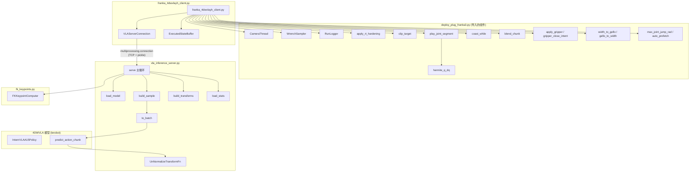

# franka_4dwvlayh_client.py 使用说明

## 1. 概述

`franka_4dwvlayh_client.py` 是一个 Franka FR3 机械臂的 VLA (Vision-Language-Action) 推理客户端. 它通过 TCP IPC (`multiprocessing.connection`) 连接到运行在 GPU 容器中的 `vla_inference_server.py`, 将相机图像和机器人状态发送给 4DWVLA (InternVLA-A1.5) 模型, 接收预测的关节动作, 并通过 `JointImpedanceTracker` + Hermite 插值平滑地驱动机械臂执行.

### 1.1 与同目录其他脚本的关系

| 脚本 | 推理后端 | 通信协议 | 用途 |
|------|----------|----------|------|
| `deploy_plug_franka3.py` | `rlinf.serve.plug_franka3` (WebSocket) | WebSocket + msgpack | 原始 plug-into-socket 部署 |
| **`franka_4dwvlayh_client.py`** | **`vla_inference_server.py`** (TCP IPC) | **`multiprocessing.connection`** | **4DWVLA 推理服务部署** |

本脚本从 `deploy_plug_franka3.py` 导入了全部底层机器人控制组件 (相机、夹爪、关节跟踪器、插值器等), 仅替换了推理通信层.

### 1.2 系统架构

```
┌─────────────────────────────────────────────┐
│            GPU 容器 (rlinf-4dwvla-gpu)       │
│                                             │
│  vla_inference_server.py                    │
│  ├── InternVLA-A1.5 模型                    │
│  ├── FK Keypoint Computer                   │
│  └── TCP Listener (port 5555, authkey)      │
│                                 ▲           │
└─────────────────────────────────┼───────────┘
                                  │ multiprocessing.connection
                                  │ (Python pickle over TCP)
┌─────────────────────────────────┼───────────┐
│            Franky 环境 (host / 容器)         │
│                                 ▼           │
│  franka_4dwvlayh_client.py                  │
│  ├── VLAServerConnection (IPC 层)           │
│  ├── ExecutedStateBuffer (关键点历史)         │
│  ├── CameraThread ×2 (global + wrist)       │
│  ├── JointImpedanceTracker (关节控制)        │
│  ├── Hermite 插值 + 流水线推理              │
│  ├── 夹爪逻辑 (binary / width)              │
│  ├── WrenchSampler (力矩日志)               │
│  └── RunLogger (CSV + npz 日志)             │
│                                 │           │
│                    franky.Robot ▼            │
│                    Franka FR3 (172.16.0.2)   │
└─────────────────────────────────────────────┘
```

## 2. 环境准备

### 2.1 前提条件

- Franka FR3 机械臂已开机, FCI 接口就绪
- 两台 Intel RealSense D435i 相机已连接:
  - Global 相机 (serial: `250222073513`)
  - Wrist 相机 (serial: `420122070525`)
- GPU 容器中的 `vla_inference_server.py` 已启动并监听
- gello/franky Python 虚拟环境中已安装依赖: `franky`, `pyrealsense2`, `numpy`, `msgpack_numpy`, `websockets`

### 2.2 启动 GPU 推理服务器

在 GPU 容器中 (见 `4dwvla_ext/configs/docker_run_4dwvla_gpu.sh`):

```bash
# 启动 GPU 容器
bash b/x/4dwvla_ext/configs/docker_run_4dwvla_gpu.sh

# 容器内部: 启动推理服务
source /opt/venv/4dwvla/bin/activate
python /workspace/RLinf/b/x/4dwvla_ext/vla_inference_server.py \
    --ckpt-path /home/nvidia/ckpts/4wvlaFrk/plug/4wvlaFrkPlugCkp041680 \
    --schema-path /workspace/4WVLA/b/s/Frk/cfg/franka_plug.yaml \
    --kpt-meta-path /workspace/RLinf/b/d/frk1/plug/keypoints_meta.json \
    --urdf-path /workspace/RLinf/b/d/frk1/fr3v2_1_franka_hand.urdf \
    --n-exec 10 \
    --port 5555 \
    --dtype bfloat16
```

或直接使用封装脚本:

```bash
bash /workspace/RLinf/b/x/4dwvla_ext/configs/launch_gpu_server.sh
```

### 2.3 环境变量 (可选)

服务器端相关环境变量可通过 `franka_plug_eval.env` 一次性设置:

```bash
source b/x/4dwvla_ext/configs/franka_plug_eval.env
```

关键变量:

| 变量 | 默认值 | 说明 |
|------|--------|------|
| `VLA_CKPT_PATH` | `/home/nvidia/ckpts/4wvlaFrk/plug/4wvlaFrkPlugCkp041680` | 4DWVLA 模型 checkpoint 路径 |
| `VLA_SCHEMA_PATH` | `...4WVLA/b/s/Frk/cfg/franka_plug.yaml` | 数据集 schema |
| `VLA_KPT_META_PATH` | `.../keypoints_meta.json` | 关键点元数据 |
| `VLA_URDF_PATH` | `.../fr3v2_1_franka_hand.urdf` | Franka URDF (FK 计算) |
| `VLA_PORT` | `5555` | 服务器监听端口 |
| `VLA_N_EXEC` | `10` | 每次推理执行的动作步数 |
| `RS_GLOBAL_SERIAL` | `250222073513` | Global 相机 serial |
| `RS_WRIST_SERIAL` | `420122070525` | Wrist 相机 serial |

## 3. 使用方法

### 3.1 激活环境

```bash
source /home/nvidia/cxy_ws/gello_software/.venv/bin/activate
cd /path/to/RLinf/b/x/4dwvlayh
```

### 3.2 Dry Run (无机器人, 无相机)

仅测试与 GPU 服务器的通信是否正常, 不连接机器人和相机:

```bash
python franka_4dwvlayh_client.py \
    --server-host 127.0.0.1 \
    --server-port 5555 \
    --task "plug into socket" \
    --dry-run --no-robot --no-camera
```

### 3.3 Dry Run (有机器人, 无动作执行)

连接机器人读取状态, 但不启动 JointImpedanceTracker (不发送运动指令):

```bash
python franka_4dwvlayh_client.py \
    --server-host 127.0.0.1 \
    --server-port 5555 \
    --task "plug into socket" \
    --dry-run
```

### 3.4 真实机器人执行

**确保急停开关在手边, 可随时按下.**

```bash
python franka_4dwvlayh_client.py \
    --server-host 127.0.0.1 \
    --server-port 5555 \
    --task "plug into socket"
```

### 3.5 推荐的首次运行流程

```bash
# Step 1: 确认通信正常
python franka_4dwvlayh_client.py \
    --server-host 127.0.0.1 --server-port 5555 \
    --task "plug into socket" \
    --dry-run --no-robot --no-camera --once

# Step 2: 确认机器人连接和相机正常 (不执行动作)
python franka_4dwvlayh_client.py \
    --server-host 127.0.0.1 --server-port 5555 \
    --task "plug into socket" \
    --dry-run --once

# Step 3: 慢速真实执行, 随时准备按急停
python franka_4dwvlayh_client.py \
    --server-host 127.0.0.1 --server-port 5555 \
    --task "plug into socket" \
    --speed 0.35 --wait-enter --once

# Step 4: 正常持续执行
python franka_4dwvlayh_client.py \
    --server-host 127.0.0.1 --server-port 5555 \
    --task "plug into socket" \
    --speed 0.5 --wait-enter
```

## 4. 命令行参数详解

### 4.1 连接参数

| 参数 | 默认值 | 说明 |
|------|--------|------|
| `--server-host` | `127.0.0.1` | `vla_inference_server.py` 的主机地址 |
| `--server-port` | `5555` | `vla_inference_server.py` 的 TCP 端口 |
| `--robot-ip` | `172.16.0.2` | Franka FR3 的 IP 地址 |

### 4.2 任务参数

| 参数 | 默认值 | 说明 |
|------|--------|------|
| `--task` | `"plug into socket"` | 发送给 VLA 模型的自然语言任务指令 |

### 4.3 运行模式

| 参数 | 说明 |
|------|------|
| `--dry-run` | 连接机器人但不启动 JointImpedanceTracker (不发送关节运动指令) |
| `--no-robot` | 不连接 franky, 使用假的关节/夹爪数据 |
| `--no-camera` | 不打开 RealSense 相机, 使用全黑 480x640 图像 |
| `--once` | 执行一次推理后退出 |
| `--wait-enter` | 连接完成后等待用户按 Enter 才开始执行 |
| `--home-gripper` | 启动时先 homing 夹爪再打开到最大宽度 |

### 4.4 运动控制参数

| 参数 | 默认值 | 说明 |
|------|--------|------|
| `--control-hz` | `15.0` | 策略控制频率 (Hz). 决定每步的时间间隔 `dt = 1/hz` |
| `--speed` | `0.5` | 回放速度系数. `0.5` = 每个 waypoint 用 2 倍时间; `1.0` = 原速 |
| `--execute-horizon` | `8` | 每次推理返回的 chunk 中实际执行的步数. 模型预测 10 步, 默认执行前 8 步 |
| `--interp-hz` | `100.0` | waypoint 之间 Hermite 插值的命令发送频率. `0` = 每步仅一次 `set_target` |
| `--blend-steps` | `4` | chunk 边界处的混合步数, 避免相邻 chunk 切换时关节突跳 |

**速度与时间的关系**:
- 策略产出每步间隔: `dt = 1 / control_hz` (默认 1/15 ≈ 66.7 ms)
- 实际回放每步时间: `step_dt = dt / speed` (默认 66.7 / 0.5 = 133.3 ms)
- 一个 chunk (8 步) 的执行时间: `8 × 133.3 ≈ 1067 ms`

### 4.5 流水线推理参数

| 参数 | 默认值 | 说明 |
|------|--------|------|
| `--no-pipeline` | (关闭) | 禁用流水线. 启用后: 在 chunk 最后几步时提前发起下一次推理请求, 减少 chunk 之间的空闲等待 |
| `--prefetch` | `0` | chunk 尾部预留给推理 RTT 的步数. `0` = 根据上次 RTT 自动计算 |

流水线模式示意:

```
时间 ──────────────────────────────────────────────────────────►

无流水线:
  [执行 chunk A 全部 8 步] [等 RTT] [执行 chunk B 全部 8 步] [等 RTT] ...
                           ↑ 空闲

有流水线 (prefetch=2):
  [执行 chunk A 前 6 步][推理B←→][继续步 7-8][执行 chunk B ...]
                        ↑ 重叠, 无空闲
```

### 4.6 夹爪参数

| 参数 | 默认值 | 说明 |
|------|--------|------|
| `--gripper-mode` | `binary` | `binary`: 二值模式 (全开/全关); `width`: 连续宽度模式 |
| `--gripper-close-g` | `0.18` | GELLO 值达到此阈值时触发闭合 (0=全开, 1=全关) |
| `--gripper-close-rise` | `0.10` | g[-1]-g[0] 上升量达到此值 (且 gmax>=0.10) 也触发闭合 |

**夹爪闭合检测逻辑**:

模型预测的夹爪值是一个渐变斜坡 (非阶跃), 峰值可能仅 0.16~0.24. 客户端使用两级确认:

1. **步级 (per-step)**: 连续 2 步 `g >= gripper_close_g` → 置位 `want_closed`
2. **推理级 (per-infer)**: 连续 2 次推理的 chunk 检测到闭合意图 → 锁存 `want_closed`
3. **开启**: 连续 2 次推理无闭合意图且 gmax <= 0.10 → 解锁

`binary` 模式下, 闭合 → `grasp(width=0, force=50N)`, 开启 → `move(max_width)`.

### 4.7 安全参数

| 参数 | 默认值 | 说明 |
|------|--------|------|
| `--max-joint-jump-deg` | `30.0` | chunk 首步关节目标与当前测量值的最大偏差 (度). 超过则 ABORT, 不发送指令. `0` 禁用 |
| `--max-tracking-error-deg` | `0.0` | 目标与测量的最大跟踪误差 (度). `0` 禁用. 过小 (如 2.9°) 会导致抖动 |
| `--no-rt` | (关闭) | 跳过 RT 加固 (mlockall / SCHED_FIFO / CPU 亲和性) |

### 4.8 日志参数

| 参数 | 默认值 | 说明 |
|------|--------|------|
| `--log-dir` | `./runs/` | 日志输出根目录 |
| `--no-log` | (关闭) | 不记录日志 |

## 5. IPC 协议

客户端通过 `multiprocessing.connection.Client` 连接到服务器, 使用 Python pickle 序列化, 认证密钥为 `b"4dwvla-eval"`.

### 5.1 Reset 消息

```python
# 客户端发送
{"command": "reset"}

# 服务器响应
{"status": "ok", "actions": []}
```

清除服务器端的策略 KV cache 和关键点历史.

### 5.2 推理消息 (Protocol v2)

```python
# 客户端发送
{
    "images": {
        "global": np.ndarray,   # (480, 640, 3) uint8 RGB
        "wrist":  np.ndarray,   # (480, 640, 3) uint8 RGB
    },
    "state": {
        "arm":     [float] * 7,  # 关节角度 (rad)
        "gripper": [float],      # GELLO 值 (0=开, 1=关)
    },
    "state_history": [[float]*7, ...],  # 上次推理以来执行的每步关节角度
    "task": "plug into socket",
    "protocol": 2,
}

# 服务器响应
{
    "status": "ok",
    "actions": [[float]*8, ...],   # N×8: 7 关节 + 1 夹爪
}
```

### 5.3 关键点历史 (state_history)

训练时, 关键点历史 (`observation.his_len`) 每个控制步 (30 Hz) 推进一次. 推理时每 `n_exec` 个控制步才调用一次推理, 如果不补偿, 关键点历史的推进速度会慢 `n_exec` 倍, 导致夹爪闭合时机延迟.

`state_history` 字段携带了上次推理以来每个控制步的实测关节角度, 服务器端通过 `FKKeypointComputer` 逐步回放, 使 `his_len` 以正确的速率推进.

### 5.4 Shutdown 消息

```python
{"command": "shutdown"}
```

客户端退出时发送, 通知服务器断开连接.

## 6. 控制流水线详解

### 6.1 主循环

```
启动
  │
  ├─ RT 加固 (mlockall, SCHED_FIFO, CPU 亲和性)
  ├─ 连接 vla_inference_server (TCP IPC)
  ├─ 连接 Franka FR3 (franky)
  │    ├─ recover_from_errors()
  │    ├─ 设置碰撞阈值
  │    ├─ 初始化 JointImpedanceTracker (保持当前姿态)
  │    └─ WrenchSampler (100 Hz 力矩采集)
  ├─ 启动 CameraThread ×2 (global + wrist, 30 fps)
  ├─ 发送 reset 到服务器
  ├─ [可选] 等待 Enter
  │
  ▼
  推理循环:
  ┌──────────────────────────────────────────────────┐
  │  1. 读取相机图像 + 机器人状态                      │
  │  2. drain state_history (上次推理以来的关节角度)    │
  │  3. 发送推理请求 → 接收 actions (N×8)             │
  │  4. consume_reply:                                │
  │     ├─ 检测夹爪闭合意图 (gmax/rise)               │
  │     ├─ 计算 execute_horizon                       │
  │     ├─ 安全检查 (max_joint_jump)                  │
  │     └─ blend_chunk (与上一个 chunk 的衔接混合)     │
  │  5. 逐步执行 chunk:                               │
  │     ├─ apply_gripper (binary/width)               │
  │     ├─ clip_target (关节限位 + 跟踪误差钳位)       │
  │     ├─ play_joint_segment (Hermite 插值执行)       │
  │     └─ state_history.record (记录实测关节角度)     │
  │  6. [流水线] 在 chunk 尾部提前发起下一次推理        │
  │  7. [流水线] chunk 执行完, coast_while 等推理返回   │
  └──────────────────────────────────────────────────┘
  │
  ▼
  清理:
  ├─ 停止 tracker
  ├─ 停止夹爪
  ├─ recover_from_errors()
  ├─ 关闭相机
  ├─ 关闭 IPC 连接
  └─ 保存日志
```

### 6.2 Hermite 插值

waypoint 之间使用三次 Hermite 样条插值, 在 `interp_hz` (默认 100 Hz) 频率下向 `JointImpedanceTracker.set_target(q, dq)` 发送位置和速度目标. 这确保:
- 关节运动连续平滑 (C1 连续)
- 与 franky 的阻抗控制器匹配 (需要持续的高频指令流)
- chunk 之间 velocity 平滑衔接

### 6.3 Chunk 混合

```
上一个 chunk 末尾: prev_q = [...实际位置...]
新 chunk:          raw_chunk[0] = [...模型预测...]

混合后: chunk[i, :7] += (prev_q - raw_chunk[0, :7]) × max(0, 1 - (i+1)/blend_steps)
```

前 `blend_steps` (默认 4) 步逐渐从当前位置过渡到模型预测, 避免 chunk 切换时的位置突跳.

## 7. 日志输出

### 7.1 目录结构

```
runs/
└── 20260922_143055_4dwvla-vla_inference_server/
    ├── meta.json       # 运行参数和配置快照
    ├── wrench.csv      # 100 Hz 力/力矩数据 (t_rel, t_mono, phase, infer_i, fx..tz)
    ├── wrench.npz      # 压缩的力矩数据 (运行结束时保存)
    └── infer.csv       # 每次推理的记录 (rtt, 夹爪状态, 关节角度等)
```

### 7.2 控制台输出示例

```
[   1] rtt=187ms history=0 q0=[-10.2  28.5  ... ] dq0=3.2deg g_obs=0.000 g0=0.012 gmax=0.045→76.8mm rise=0.030 exec=8/10 play=133ms pipe=Y prefetch=2 grip=open intent=n g=[0.012, 0.015, ...]
[   2] rtt=142ms history=8 q0=[-11.0  29.1  ... ] dq0=1.1deg ...
```

各字段含义:
- `rtt`: 推理请求往返时间 (ms)
- `history`: 本次推理携带的 state_history 长度
- `q0`: chunk 首步关节目标 (度)
- `dq0`: 首步目标与当前位置的偏差 (度)
- `g_obs`: 当前夹爪 GELLO 值
- `g0/gmax`: chunk 中夹爪值的首步 / 最大值
- `gmax→mm`: gmax 对应的物理宽度
- `rise`: chunk 中夹爪值的上升量 (g[-1]-g[0])
- `exec`: 实际执行步数 / 模型输出步数
- `play`: 每步回放时间 (ms)
- `pipe`: 流水线开关
- `prefetch`: 预取步数
- `grip`: 当前夹爪目标状态 (open/close)
- `intent`: 本次 chunk 是否检测到闭合意图

## 8. 安全注意事项

1. **急停**: 真实机器人运行时, 始终将急停按钮放在手边
2. **首次运行**: 按 Section 3.5 的递进流程, 从 dry-run 到慢速执行, 逐步验证
3. **关节跳变保护**: `--max-joint-jump-deg 30` 会在首步目标偏离当前位置超过 30° 时自动 ABORT. 常见原因: 模型输出的是 delta 动作但被当作 abs 处理
4. **碰撞阈值**: 已设置为 `[80, 80, 80, 80, 11, 11, 11]` (关节力矩) / `[100, 100, 100, 25, 25, 25]` (笛卡尔力), 外部碰撞会触发 franky 安全停止
5. **Ctrl+C**: 捕获 SIGINT/SIGTERM, 优雅停止 tracker → 停止夹爪 → recover_from_errors → 关闭连接
6. **`--speed`**: 首次使用新模型时建议设为 `0.35` (更慢), 确认动作合理后再调高

## 9. 常见问题

### Q: 连接服务器失败

```
ConnectionRefusedError: [Errno 111] Connection refused
```

- 确认 GPU 容器中的 `vla_inference_server.py` 已启动并监听
- 确认端口号一致 (客户端 `--server-port` = 服务器 `--port`)
- 如果使用 Docker `--network host`, 客户端用 `--server-host 127.0.0.1`

### Q: 认证失败

```
AuthenticationError: digest received was wrong
```

- 客户端和服务器必须使用相同的 authkey (`b"4dwvla-eval"`)

### Q: "ABORT: first joint target N deg from measured"

- 模型输出的首步关节目标距离当前位置过远, 可能原因:
  - 模型 checkpoint 使用了 delta 动作模式, 输出被误当 abs 处理
  - stats.json 的归一化参数与当前 checkpoint 不匹配
- 降低 `--max-joint-jump-deg` 的值可以更严格地保护, 但不能根治模型问题

### Q: 夹爪始终不闭合

- 检查服务器日志中 `full_chunk_grip` 是否有值上升到 0.18 以上
- 检查 `history` 字段是否在增长 (应随步数递增, 如 0→8→16→...)
  - 如果一直为 0, 说明 state_history 没有正确记录
- 如果 `his_len` 增长太慢, 夹爪闭合的关键点条件可能永远无法满足 (这就是 state_history 机制要解决的问题)

### Q: 机械臂运动抖动

- 尝试降低 `--speed` (如 `0.35`)
- 确认 `--interp-hz 100` (默认值, 不要设为 0)
- 增大 `--blend-steps` (如 6)
- 避免过小的 `--max-tracking-error-deg` (默认 0 = 禁用, 2.9° 会导致反复抖动)

### Q: Tracker stopped

- franky 的 JointImpedanceTracker 异常退出, 通常由外部碰撞或关节限位触发
- 检查 Franka Desk 上的错误信息
- 运行 `robot.recover_from_errors()` 后重试

## 10. 与 franka_vla_client.py 的对比

| 特性 | `franka_vla_client.py` | `franka_4dwvlayh_client.py` |
|------|------------------------|-----------------------------|
| 关节控制 | `FrankyJointEnv` (gym.Env, 阻塞式 `Robot.move()`) | `JointImpedanceTracker` (非阻塞, Hermite 插值) |
| 控制频率 | 受 `Robot.move()` 阻塞限制, 实测常低于目标 | 由 `interp_hz` (100 Hz) 精确控制 |
| 流水线推理 | 无 (推理与执行串行) | 有 (推理与末尾几步执行重叠) |
| Chunk 混合 | 无 | 有 (`blend_steps`) |
| 键盘控制 | 有 (`KeyboardVLAEvalWrapper`, evdev) | 无 (Ctrl+C 优雅退出) |
| RT 加固 | 无 | 有 (mlockall, SCHED_FIFO, CPU affinity) |
| 力矩日志 | 无 | 有 (100 Hz WrenchSampler) |
| IPC 协议 | 相同 (`multiprocessing.connection`) | 相同 |
| state_history | 相同 (Protocol v2) | 相同 |

---

## 11. 深入代码分析: Client-Server 交互全貌

本节以代码为基础, 逐层剖析 `franka_4dwvlayh_client.py` (以下简称 **client**) 与 `vla_inference_server.py` (以下简称 **server**) 之间的交互, 覆盖数据格式、处理逻辑和调用链, 并与 `deploy_plug_franka3.py` (以下简称 **deploy**) 做逐项代码级对比.

### 11.1 代码依赖关系总览



client 从 `deploy_plug_franka3.py` 导入了 17 个常量和 13 个函数/类 (`franka_4dwvlayh_client.py:35-69`), 但**没有**导入 `PolicySocket` 和 `build_obs` — 这两个正是被替换的通信层.

### 11.2 通信层: VLAServerConnection vs PolicySocket

#### 11.2.1 连接建立

**client (VLAServerConnection)**:

```python
# franka_4dwvlayh_client.py:78-79
def __init__(self, host: str, port: int):
    self._conn = Client((host, port), authkey=AUTHKEY)
```

使用 Python 标准库 `multiprocessing.connection.Client`, 底层是 TCP socket + HMAC-MD5 认证 (`authkey=b"4dwvla-eval"`). 建立连接后, 双方通过 `send()`/`recv()` 交换 Python pickle 序列化的对象.

**deploy (PolicySocket)**:

```python
# deploy_plug_franka3.py:369-378
def __init__(self, host: str, port: int):
    uri = f"ws://{host}:{port}"
    self._ws = websockets.sync.client.connect(uri, compression=None, max_size=None)
    self._packer = msgpack_numpy.Packer()
    raw = self._ws.recv()                     # 立即收到 metadata
    if isinstance(raw, str):
        raise RuntimeError(raw)
    self.metadata = msgpack_numpy.unpackb(raw)  # 解码元数据
```

使用 WebSocket 协议 + msgpack-numpy 序列化. 关键差异: **连接建立时服务器主动推送 metadata dict**, 包含 `model`, `control_hz`, `dt`, `action_mode`, `action_dim`, `force_encoder` 等字段. client 用这些字段来决定控制参数.

**差异影响**:

| 方面 | VLAServerConnection | PolicySocket |
|------|---------------------|--------------|
| 序列化 | Python pickle (隐式, `Connection.send/recv`) | msgpack-numpy (显式, `Packer.pack/unpackb`) |
| 认证 | HMAC-MD5 authkey | 无 |
| 连接时元数据 | 无 — `hz`/`dt` 由客户端 CLI `--control-hz` 提供 | 有 — `meta.get("control_hz")` 等 |
| numpy 传输 | pickle 原生支持 ndarray | 需要 msgpack_numpy 扩展编码 |

由于 VLAServerConnection 没有服务器元数据, client 的 `hz` 和 `dt` 完全由 `--control-hz` 参数决定:

```python
# franka_4dwvlayh_client.py:227-228
hz = float(args.control_hz)
dt = 1.0 / hz
```

而 deploy 从服务器获取:

```python
# deploy_plug_franka3.py:889-891
hz = float(meta.get("control_hz", 15))
dt = float(meta.get("dt", 1.0 / hz))
```

#### 11.2.2 推理请求: 观测数据的组装与发送

**client 组装观测** (`do_infer` 闭包, `franka_4dwvlayh_client.py:362-376`):

```python
def do_infer():
    global_img, wrist_img = read_images()        # CameraThread.read_rgb() → (480,640,3) uint8
    arm_q, g = read_arm_gripper()                 # robot.state.q → float32[7], width_to_gello → float
    history = state_history.drain()               # ExecutedStateBuffer.drain() → list[list[float]]
    log_wrench(phase="policy", infer_idx=infer_i + 1)
    actions, rtt = conn.infer(
        global_image=global_img,
        wrist_image=wrist_img,
        arm_q=arm_q,
        gripper_g=g,
        task=args.task,
        state_history=history,
    )
    return actions, rtt, arm_q, g, len(history)
```

`VLAServerConnection.infer()` 将这些原始数据打包成 server 期望的 dict (`franka_4dwvlayh_client.py:85-117`):

```python
msg = {
    "images": {
        "global": np.ascontiguousarray(global_image, dtype=np.uint8),  # (480,640,3)
        "wrist": np.ascontiguousarray(wrist_image, dtype=np.uint8),    # (480,640,3)
    },
    "state": {
        "arm": np.asarray(arm_q, dtype=np.float32).reshape(7).tolist(),  # 7个float的list
        "gripper": [float(gripper_g)],                                    # 1个float的list
    },
    "state_history": state_history,  # list[list[float]], 每个内部list有7个float
    "task": task,                     # str, 如 "plug into socket"
    "protocol": 2,                    # int, 指示使用 v2 关键点协议
}
```

注意几个类型转换:
- `arm_q` 从 `np.float32[7]` 转为 Python `list[float]` (`.tolist()`), 因为 pickle 序列化后 server 端需要的就是 list.
- `images` 保持为 `np.ndarray`, pickle 可直接序列化 numpy 数组.
- `np.ascontiguousarray` 确保内存连续, 提高 pickle 效率.

**对比: deploy 组装观测** (`build_obs` + `read_obs`, `deploy_plug_franka3.py:663-689, 1028-1062`):

```python
# deploy_plug_franka3.py:663-689 — build_obs
obs = {
    "image": np.ascontiguousarray(image, dtype=np.uint8),           # 扁平 key
    "wrist_image": np.ascontiguousarray(wrist, dtype=np.uint8),     # 扁平 key
    "joint_positions": np.asarray(q, dtype=np.float32).reshape(7),  # ndarray 而非 list
    "gripper": np.float32(gripper_g),                                # 标量
    "ee_pos": np.asarray(ee_pos, dtype=np.float32).reshape(3),      # 末端位置
    "ee_quat": np.asarray(ee_quat_xyzw, dtype=np.float32).reshape(4),  # 末端四元数
    "ee_quat_convention": ee_quat_convention,                        # "wxyz" or "xyzw"
    "prompt": prompt,
}
if wrench_ts.size:
    obs["wrench_samples"] = np.asarray(wrench, dtype=np.float32)
    obs["wrench_timestamps"] = np.asarray(wrench_ts, dtype=np.float64)
```

关键差异:

| 字段 | client (→ vla_inference_server) | deploy (→ rlinf.serve) |
|------|------|------|
| 图像 key | `images.global`, `images.wrist` (嵌套 dict) | `image`, `wrist_image` (扁平 key) |
| 关节 | `state.arm` (Python list) | `joint_positions` (ndarray) |
| 夹爪 | `state.gripper` (Python list) | `gripper` (np.float32 标量) |
| 末端位姿 | **不发送** | `ee_pos`, `ee_quat`, `ee_quat_convention` |
| 力/力矩 | **不发送** | `wrench_samples`, `wrench_timestamps` |
| 任务指令 | `task` (str) | `prompt` (str) |
| 关键点历史 | `state_history` (list[list[float]]) | **不发送** |
| 协议版本 | `protocol: 2` | **无** |
| 复位 | 独立 `{"command": "reset"}` 消息 | `{"reset": True}` (同一 infer 通道) |

deploy 发送了末端位姿和力/力矩数据, 因为 `rlinf.serve` 的模型支持力反馈编码 (`force_encoder`). VLA inference server 不使用这些数据, 因此 client 不发送.

#### 11.2.3 推理响应: actions 的接收与解析

**server 返回** (`vla_inference_server.py:507`):

```python
conn.send({"status": "ok", "actions": actions.tolist()})
```

这里 `actions` 是 `np.ndarray` 形状 `(n_exec, actual_action_dim)`, 其中 `n_exec` 默认 10, `actual_action_dim` 是 8 (7 关节 + 1 夹爪). `actions.tolist()` 将其转为 Python 嵌套 list `[[float]*8]*10`.

**client 解析** (`franka_4dwvlayh_client.py:110-117`):

```python
resp = self._conn.recv()
rtt_ms = (time.perf_counter() - t0) * 1000.0
if resp.get("status") != "ok":
    raise RuntimeError(f"Server error: {resp.get('status')}")
actions = np.asarray(resp["actions"], dtype=np.float64)  # list → ndarray (10, 8)
if actions.ndim == 1:
    actions = actions.reshape(1, -1)                      # 保护: 单步时也保持 2D
return actions, rtt_ms
```

返回的 `actions` 是 `float64` 的 `(N, 8)` ndarray. 其中 `actions[:, :7]` 是绝对关节角度 (rad), `actions[:, 7]` 是 GELLO 夹爪值 (0=开, 1=关).

**对比: deploy 解析** (`deploy_plug_franka3.py:1102-1104`):

```python
actions = np.asarray(reply["actions"], dtype=np.float64)
if actions.ndim == 1:
    actions = actions.reshape(1, -1)
```

逻辑完全一致. 但 deploy 的 `reply` 还包含额外的元数据字段:

```python
# deploy_plug_franka3.py:1116
step_dt = float(reply.get("dt", dt)) / speed     # 可从 reply 获取 dt
server_ms = (reply.get("server_timing") or {}).get("infer_ms")  # 服务端计时
```

VLA server 不返回 `dt` 或 `server_timing`, 因此 client 使用本地计算的 `dt / speed`:

```python
# franka_4dwvlayh_client.py:389
step_dt = dt / speed
```

### 11.3 Server 端推理流水线: 从原始观测到物理动作

server 收到推理请求后, 经历以下处理阶段:


#### 11.3.1 阶段 1: 关键点计算 (`vla_inference_server.py:435-454`)

如果 checkpoint 启用了 `enable_keypoint_predictor` (Franka plug 默认启用), server 使用 `FKKeypointComputer` 维护关键点历史:

```python
# vla_inference_server.py:436-453
executed_history = msg.get("state_history", ())
proto = msg.get("protocol", 1)
if proto >= 2:
    # Protocol v2: 客户端已经在 state_history 中报告了所有执行的关节角度
    for executed_q in executed_history:
        fk_computer.append(np.asarray(executed_q, dtype=np.float32))
    kpt_data = fk_computer.snapshot()
else:
    # Protocol v1 (向后兼容): 逐步 step (append+snapshot)
    for executed_q in executed_history:
        fk_computer.step(np.asarray(executed_q, dtype=np.float32))
    kpt_data = fk_computer.step(arm_q)
```

Protocol v2 中 `append` 和 `snapshot` 是分开的 (`fk_keypoints.py:78-85`):

```python
# fk_keypoints.py:78-85
def append(self, arm_q7: np.ndarray) -> int:
    """Record a frame into history without treating it as the current frame."""
    self._history.append(self.compute(arm_q7))
    return len(self._history)

def snapshot(self) -> tuple[np.ndarray, int]:
    """Pack history as-is: training's his_kpts excludes the current frame."""
    return self._pack()
```

`compute()` 是核心 FK 计算 (`fk_keypoints.py:58-76`):

```python
def compute(self, arm_q7: np.ndarray) -> np.ndarray:
    th = torch.zeros(1, len(self._joint_names), dtype=torch.float32)
    for i, idx in enumerate(self._arm_indices):
        th[0, idx] = float(arm_q7[i])
    fk = self._chain.forward_kinematics(th)           # pytorch_kinematics FK
    kpts = np.empty((self.num_joints, self.kpt_dim), dtype=np.float32)
    for j, link_name in enumerate(self.keypoint_links):
        mat = fk[link_name].get_matrix()[0].numpy()   # 4x4 齐次矩阵
        pos = mat[:3, 3] / self.bbox_radius           # 归一化位置
        quat = Rotation.from_matrix(mat[:3, :3]).as_quat()  # xyzw 四元数
        if quat[3] < 0:                               # 半球归一化 (qw >= 0)
            quat = -quat
        kpts[j, :3] = pos
        kpts[j, 3:] = quat
    return kpts                                        # (8, 7) float32
```

每个关键点 7 维: `[px, py, pz, qx, qy, qz, qw]`, 共 8 个关键点 (link1-link7 + hand_tcp).

`_pack()` 将历史打包为固定大小 buffer (`fk_keypoints.py:101-109`):

```python
def _pack(self) -> tuple[np.ndarray, int]:
    his_len = len(self._history)
    buf = np.zeros((self.history_max_len, self.num_joints, self.kpt_dim), dtype=np.float32)
    # history_max_len=200, num_joints=8, kpt_dim=7 → (200, 8, 7)
    for i, kpt in enumerate(self._history):
        buf[i] = kpt
    return buf, his_len
```

**为什么需要 state_history**: 训练时 `Extract3DKeypointTransformFn` 每帧 (30 Hz) 推进一次 `his_len`. 推理时每 `n_exec=10` 步才调用一次推理, 如果不传 state_history, `his_len` 增长速度慢 10 倍. 演示数据中夹爪闭合发生在 `his_len>=120`, 但慢速增长到 700 步时才到 70, 导致夹爪永远不闭合. 这就是 "修复 A" 要解决的问题.

#### 11.3.2 阶段 2: build_sample — 组装训练格式 (`vla_inference_server.py:260-302`)

```python
# vla_inference_server.py:277-301
arm = np.asarray(state["arm"], dtype=np.float32)       # [7]
gripper = np.asarray(state["gripper"], dtype=np.float32)  # [1]
full_state = np.concatenate([arm, gripper])              # [8]

sample = {
    "observation.state": torch.from_numpy(full_state).float(),      # [8] float32
    "action": torch.zeros(50, 8, dtype=torch.float32),              # 占位 (50步×8维)
    "task": task,
}
for cam_name, img_np in images.items():
    key = f"observation.images.{cam_name}"
    img_t = torch.as_tensor(img_np).contiguous().to(dtype=dtype) / 255.0  # 归一化到 [0,1]
    if img_t.ndim == 3 and img_t.shape[-1] == 3:
        img_t = img_t.permute(2, 0, 1)    # HWC → CHW
    sample[key] = img_t                     # bfloat16 或 float32

if kpt_data is not None:
    his_kpts, his_len = kpt_data
    sample["observation.his_kpts"] = torch.from_numpy(his_kpts).float()  # (200, 8, 7)
    sample["observation.his_len"] = torch.tensor(his_len, dtype=torch.long)  # 标量
```

这里的 key 名称 (`observation.state`, `observation.images.global`, `action`) 与训练数据的格式完全匹配. `action` 填零只是占位符, 模型推理时不使用它 (模型只看 observation + task, 预测 action).

#### 11.3.3 阶段 3: input_transforms — 6 步变换链 (`vla_inference_server.py:191-224`)

变换链严格复制训练/评估管线:

```python
input_transforms = compose([
    # 1. 将图像 resize 到 224×224 (带 pad 保持比例)
    ResizeImagesWithPadFn(height=224, width=224, mapping=schema.image_mapping),

    # 2. 重映射图像 key: observation.images.global → observation.images.image0
    RemapImageKeyTransformFn(mapping=schema.image_mapping),

    # 3. 对 observation.state 做 mean/std 归一化
    NormalizeTransformFn(selected_keys=["observation.state"], norm_stats=state_stat),

    # 4. InternVLA-A1.5 特有: 将 state 编码为 token, 构造 chat 格式
    InternVLAA15ChatProcessorTransformFn(mode="eval", tokenize_state=True, max_state_dim=32),

    # 5. 将 state 和 action 补零到 max_dim=32
    PadStateAndActionTransformFn(max_state_dim=32, max_action_dim=32),

    # 6. 按 schema 定义的顺序重排 state/action 维度
    ReorderStateActionTransform(state_reorder=schema.state_reorder, action_reorder=schema.action_reorder),
])
```

其中 `NormalizeTransformFn` 使用从 `stats.json` 加载的统计量:

```python
# 归一化: x_norm = (x - mean) / std
```

Stats 加载逻辑 (`load_stats`, `vla_inference_server.py:93-156`) 处理了两种情况:
- 如果 `stats.json` 中直接有 `observation.state` 的 mean/std → 直接使用.
- 如果只有 `observation.state.arm` 和 `observation.state.gripper` 的子字段 stats → 通过 `compose_sub_field_stats` 拼接. 这是 "D10 fix" — 因为训练按子字段分别计算统计量, 但推理归一化整个拼接后的 state 向量. 由于 mean/std 归一化是逐元素的, 拼接后归一化等价于分别归一化再拼接.

#### 11.3.4 阶段 4-5: 模型推理与反归一化 (`vla_inference_server.py:467-488`)

```python
# 加批次维 + 送 GPU
batch = to_batch(sample, device, dtype)   # 每个 tensor unsqueeze(0), 移到 cuda

# 模型推理
with torch.no_grad():
    action_pred = policy.predict_action_chunk(batch)  # → (1, 50, 32) 或 (50, 32)
if action_pred.ndim == 3:
    action_pred = action_pred[0]                       # → (50, 32), 去批次维

# 反归一化: 先对 50 步全量做, 取最后一列(夹爪)用于诊断日志
full_chunk = unnormalize_fn({ACTION: action_pred[:, :actual_action_dim]})[ACTION]
full_grip = full_chunk.detach().float().cpu().numpy()[:, -1]

# 只截取前 n_exec 步
normalized_action = action_pred[:n_exec, :actual_action_dim]   # (10, 8)
physical_action = unnormalize_fn({ACTION: normalized_action})[ACTION]
actions = physical_action.detach().float().cpu().numpy()  # (10, 8) float32
```

`unnormalize_fn` 执行的是反归一化:

```python
# x_physical = x_norm * std + mean
```

注意: 模型输出 50 步 × 32 维, 但只取前 `actual_action_dim=8` 维 (7 关节 + 1 夹爪), 且只返回前 `n_exec=10` 步给客户端. 全 50 步的夹爪值被记录到服务端日志中用于诊断.

### 11.4 Client 端动作执行: 从 actions 到关节运动

server 返回的 `actions (10, 8)` 在 client 端经历以下处理:

```
actions (10,8)
  │
  ▼ consume_reply
  ├─ 夹爪闭合检测 (gripper_close_intent)
  ├─ execute_horizon 裁剪 (默认取前 8 步)
  ├─ 安全检查 (max_joint_jump_rad)
  ├─ blend_chunk (与 prev_q 混合)
  │
  ▼ chunk (8,8) 逐步 play_row
  ├─ row[:7] → clip_target → play_joint_segment → tracker.set_target
  ├─ row[7]  → apply_gripper → gripper.grasp_async / move_async
  └─ q_measured → state_history.record (供下次推理用)
```

#### 11.4.1 consume_reply: 解析与安全检查 (`franka_4dwvlayh_client.py:378-491`)

**execute_horizon 动态调整**:

```python
# franka_4dwvlayh_client.py:388-407
m = execute_horizon                    # 默认 8
# ...
if intent_close:
    infer_close_streak += 1
    m = max(m, int(actions.shape[0]))  # 闭合时执行全部步 (10步或更多)
# ...
close_idx = next((i for i, gv in enumerate(g_all) if gv >= close_g), None)
if close_idx is not None:
    m = max(m, close_idx + 1 + POST_CLOSE_EXTRA_STEPS)  # 闭合后多执行 3 步
m = max(1, min(m, int(actions.shape[0])))
```

这个动态调整确保夹爪闭合时不会因为 execute_horizon=8 而截断闭合动作 (闭合信号通常在第 8-10 步).

**blend_chunk** (来自 `deploy_plug_franka3.py:612-628`):

```python
# deploy_plug_franka3.py:612-628
def blend_chunk(chunk, q_now, n_blend):
    out = np.array(chunk, dtype=np.float64, copy=True)
    if q_now is None or n_blend <= 0:
        return out
    offset = np.asarray(q_now).reshape(7) - out[0, :7]
    for i in range(out.shape[0]):
        w = max(0.0, 1.0 - (i + 1) / n_blend)  # 权重: 1→0 线性衰减
        out[i, :7] = out[i, :7] + offset * w
    return out
```

当 `blend_steps=4` 时, 4 步内将 chunk 首步从 `prev_q` (上一个 chunk 的末位置) 过渡到模型预测位置. 权重 `w` 在 `i=0` 时为 `1-1/4=0.75`, `i=3` 时为 `0`. 注意 `i=0` 不是 `w=1` (那会完全钉在 `prev_q` 浪费一步), 而是 `0.75` — 立刻开始移向目标.

#### 11.4.2 play_row: 执行单步 (`franka_4dwvlayh_client.py:493-561`)

```python
# franka_4dwvlayh_client.py:526-531
q_tgt = clip_target(
    row[:7],       # 模型预测的 7 关节目标
    prev_q,        # 上一步的目标
    q_measured=q_measured,
    max_tracking_error=max_tracking_error_rad,
)
```

`clip_target` 做两层保护 (`deploy_plug_franka3.py:479-496`):
1. **关节限位**: `np.clip(q, JOINT_LIMITS_LOWER, JOINT_LIMITS_UPPER)` — 硬件物理极限
2. **步间限幅**: 如果 `|q - prev| > MAX_JOINT_DELTA_STEP (0.3 rad ≈ 17°)`, 按比例缩小 — 防止单步跳变
3. **跟踪误差钳位**: 如果启用, 限制 `q` 在 `q_measured ± max_tracking_error` 范围内

**Hermite 插值执行** (`play_joint_segment`, `deploy_plug_franka3.py:529-576`):

```python
# deploy_plug_franka3.py:556-576
n_sub = max(1, int(round(duration * interp_hz)))  # 如 0.133s × 100Hz = 13 个子步
for k in range(1, n_sub + 1):
    s = k / n_sub                                   # 参数 s 从 0→1
    q_cmd, dq_cmd = hermite_q_dq(q_start, dq_start, q_end, dq_end, s, duration)
    q_cmd = np.clip(q_cmd, JOINT_LIMITS_LOWER, JOINT_LIMITS_UPPER)
    tracker.set_target(q_cmd, dq=dq_cmd)            # 发送到阻抗控制器
    remain = t0 + duration * s - time.perf_counter()
    if remain > 0:
        time.sleep(remain)                           # 等到下一个子步时间点
```

`hermite_q_dq` 计算三次 Hermite 样条 (`deploy_plug_franka3.py:499-526`):

$$q(s) = h_{00}(s) \cdot q_0 + h_{10}(s) \cdot (T \cdot \dot{q}_0) + h_{01}(s) \cdot q_1 + h_{11}(s) \cdot (T \cdot \dot{q}_1)$$

其中 $h_{00} = 2s^3 - 3s^2 + 1$, $h_{10} = s^3 - 2s^2 + s$, $h_{01} = -2s^3 + 3s^2$, $h_{11} = s^3 - s^2$.

这保证位置和速度的 C1 连续 — 两步之间无位置跳变, 无速度突变.

**state_history 记录** (`franka_4dwvlayh_client.py:548-550`):

```python
state_history.record(
    q_measured if q_measured is not None else q_tgt
)
```

在每步执行**之前**记录当前关节角度. 使用实测值 (`robot.state.q`) 而非目标值, 确保关键点历史反映真实运动轨迹. 这些记录在下一次 `do_infer()` 时通过 `state_history.drain()` 发送给 server.

#### 11.4.3 夹爪执行 (`apply_gripper`, `deploy_plug_franka3.py:429-476`)

夹爪有两种模式:

**binary 模式** (默认): 只有全开和全关两种状态.

```python
# deploy_plug_franka3.py:456-470
if want_closed:
    if prev_state != 2:                        # 状态 2 = 已闭合, 不重复发送
        gripper.grasp_async(
            width=0.0,                          # 目标: 完全关闭
            speed=GRIPPER_SPEED,                # 0.4 m/s
            force=GRIPPER_FORCE,                # 50 N
            epsilon_inner=0.08,                 # 容差窗口 ±80 mm
            epsilon_outer=0.08,
        )
    return 2, True, 0.0
# ...
if prev_state not in (0, None):
    gripper.move_async(max_width, speed=GRIPPER_SPEED)  # 全开
    return 0, False, max_width
```

**width 模式**: 按模型预测的 GELLO 值映射到物理宽度, 但闭合时仍切到 grasp:

```python
# deploy_plug_franka3.py:446-455
if mode == "width" and not want_closed:
    width = float(np.clip(linear_m, 0.0, max_width))
    if last_width is None or abs(width - last_width) >= 0.003:  # 死区 3mm
        gripper.move_async(width, speed=0.3)
        last_width = width
    return 1, False, last_width
```

GELLO 值到物理宽度的转换 (`deploy_plug_franka3.py:400-403`):

$$\text{width} = (1 - g) \times \text{max\_width}$$

其中 $g=0$ → 全开 ($\text{max\_width}=80.3$ mm), $g=1$ → 全关 (0 mm).

### 11.5 流水线推理: 推理与执行的重叠

client 主循环中通过 `ThreadPoolExecutor(max_workers=1)` 实现推理与执行的重叠 (`franka_4dwvlayh_client.py:563-630`).

```python
# franka_4dwvlayh_client.py:582-588
if (
    pipeline
    and pending is None
    and cursor >= n - prefetch     # 到达 chunk 尾部 prefetch 区域
    and cursor < n
):
    pending = pool.submit(do_infer)  # 后台线程发起推理
```

当 chunk 执行到尾部 `prefetch` 步时, 后台线程开始采集图像 + 发送推理请求. 等 chunk 执行完:

```python
# franka_4dwvlayh_client.py:594-599
if pending is not None:
    if prev_q is not None:
        prev_q, _, last_dq = coast_while(   # 继续按最后速度滑行
            tracker, prev_q, last_dq, interp_hz,
            lambda: running,
            lambda: pending.done(),          # 推理完成时停止滑行
            max_s=1.0,                       # 最多滑行 1 秒
        )
    actions, rtt_ms, obs_arm, obs_g, n_hist = pending.result()
```

`coast_while` (`deploy_plug_franka3.py:579-609`) 在等推理返回期间, 按最后一步的速度继续向 tracker 发送目标, 维持手臂平滑运动而非突然停住.

`auto_prefetch` 根据上次 RTT 自动计算需要预留几步 (`deploy_plug_franka3.py:631-634`):

```python
def auto_prefetch(rtt_ms, step_dt, horizon):
    need = int(np.ceil((max(rtt_ms, 1.0) / 1000.0) / max(step_dt, 1e-3))) + 1
    cap = max(1, horizon - 1)
    return int(np.clip(need, 1, cap))
```

例如: `rtt=180ms`, `step_dt=133ms` → `need = ceil(0.18/0.133) + 1 = 3`, 即在 chunk 还剩 3 步时开始推理.

### 11.6 与 deploy_plug_franka3.py 的代码级对比

#### 11.6.1 通信层差异

| 维度 | deploy_plug_franka3.py | franka_4dwvlayh_client.py |
|------|--------|--------|
| 类 | `PolicySocket` (:368-391) | `VLAServerConnection` (:75-127) |
| 协议 | WebSocket (`websockets.sync.client`) | TCP (`multiprocessing.connection.Client`) |
| 序列化 | `msgpack_numpy` | Python pickle (隐式) |
| 连接时元数据 | `self.metadata = msgpack_numpy.unpackb(self._ws.recv())` (:375-378) | 无 |
| reset | `sock.infer({"reset": True})` — 走同一 infer 通道 (:1065) | `conn.reset()` → `send({"command": "reset"})` — 独立命令 (:81-83) |
| shutdown | `sock.close()` — 关 WebSocket (:387-391) | `conn.send({"command": "shutdown"})` + `conn.close()` (:119-127) |
| authkey | 无 | `b"4dwvla-eval"` |

deploy 的 reset 和推理走同一个 `infer()` 方法, 因为 `rlinf.serve` 对 `{"reset": True}` 有特殊处理 (返回 tare 状态). VLA server 则使用独立的 `{"command": "reset"}` 消息.

#### 11.6.2 观测数据组装差异

deploy 使用独立的 `build_obs()` 函数 (:663-689) 组装一个扁平 dict, 包含末端位姿和力/力矩. client 在 `VLAServerConnection.infer()` (:95-107) 内联组装嵌套 dict.

deploy 的 `read_obs()` (:1028-1062) 还包含:

```python
# deploy_plug_franka3.py:1043-1044
pos = np.array(s.O_T_EE.translation, dtype=np.float32)  # 末端平移
quat = np.array(s.O_T_EE.quaternion, dtype=np.float32)   # 末端四元数
```

client 不采集末端位姿, 因为 VLA server 不需要它 (模型的 `observation.state` 只有 7 关节 + 1 夹爪 = 8 维).

#### 11.6.3 Tare (力矩归零) 流程差异

deploy 有完整的 tare 流程 (:1068-1080):

```python
# deploy_plug_franka3.py:1068-1080
if not args.skip_tare and robot is not None:
    t_end = time.monotonic() + 1.2
    while running and time.monotonic() < t_end:
        obs = read_obs()
        reply = sock.infer(obs)               # 持续发送观测, 让服务端积累 wrench 基线
        tare_ready = bool(reply.get("tare_ready"))
        time.sleep(1.0 / hz)
```

client **没有 tare 流程**, 因为 VLA server 不做力/力矩处理. 但 client 仍然保留了 `WrenchSampler` 用于**本地**力矩日志记录, 不发送给 server.

#### 11.6.4 参数来源差异

| 参数 | deploy | client |
|------|--------|--------|
| `hz` | `meta.get("control_hz", 15)` | `args.control_hz` (CLI) |
| `dt` | `meta.get("dt", 1/hz)` | `1.0 / hz` |
| `step_dt` | `reply.get("dt", dt) / speed` | `dt / speed` |
| `action_mode` | `server_action_mode(meta)` | 不检查 (假定 abs) |
| `execute_horizon` | `args.execute_horizon` (两者相同) | `args.execute_horizon` |

deploy 有 `--require-action-mode` 参数做安全检查 (:893-900): 如果 server 报告的 `action_mode` 与 client 期望不一致, 拒绝运行. client 没有这个检查, 因为 VLA server 不在响应中报告 action_mode.

#### 11.6.5 state_history 差异

deploy **没有** `ExecutedStateBuffer` 和 `state_history` 机制. 它不需要, 因为 `rlinf.serve` 的模型不使用关键点历史.

client 在 `play_row` 中每步记录实测关节角度:

```python
# franka_4dwvlayh_client.py:548-550
state_history.record(
    q_measured if q_measured is not None else q_tgt
)
```

这些在下一次 `do_infer()` 的 `state_history.drain()` 中被取出, 打包进推理请求. 这是整个系统中最关键的机制之一 — 没有它, 关键点历史推进太慢, 夹爪永远不会闭合.

#### 11.6.6 共享的核心逻辑 (import 来自 deploy)

以下逻辑在两者中**完全一致** (client 直接 import 自 deploy):

| 组件 | 源位置 (deploy) | 功能 |
|------|---------|------|
| `CameraThread` | :121-161 | D435i 后台采集, BGR→RGB, 30fps |
| `WrenchSampler` | :164-209 | 100 Hz K_F_ext_hat_K 采集 + drain |
| `RunLogger` | :212-365 | wrench.csv + infer.csv + meta.json |
| `apply_rt_hardening` | :88-118 | mlockall + SCHED_FIFO + CPU affinity |
| `clip_target` | :479-496 | 关节限位 + 步间限幅 + 跟踪误差钳位 |
| `play_joint_segment` | :529-576 | Hermite 插值 → tracker.set_target |
| `hermite_q_dq` | :499-526 | 三次 Hermite 位置+速度 |
| `coast_while` | :579-609 | 等待推理时维持最后速度滑行 |
| `blend_chunk` | :612-628 | chunk 边界位置混合 |
| `gripper_close_intent` | :406-426 | 检测夹爪闭合意图 (gmax/rise) |
| `apply_gripper` | :429-476 | binary/width 模式夹爪执行 |
| `width_to_gello` | :394-397 | franky 宽度 → GELLO 值 |
| `gello_to_width` | :400-403 | GELLO 值 → franky 宽度 |
| `auto_prefetch` | :631-634 | 根据 RTT 计算预取步数 |
| `max_joint_jump_rad` | :637-644 | 关节跳变检测 |

这 16 个组件构成了整个机器人控制层, 两个脚本共享同一套实现, 没有任何差异.

### 11.7 端到端数据流示例

以一次完整的推理-执行循环为例, 展示数据在各模块间的流转:

```
1. client: CameraThread.read_rgb()
   输出: global_img (480,640,3) uint8, wrist_img (480,640,3) uint8

2. client: robot.state.q → np.array([...], float32)  (7,)
   client: gripper.width → width_to_gello() → 0.02  (float)
   client: state_history.drain() → [[q1,q2,...,q7], [q1,...], ...]  (8个)

3. client → server (pickle over TCP):
   {
     "images": {"global": ndarray(480,640,3), "wrist": ndarray(480,640,3)},
     "state": {"arm": [-0.178, 0.497, ...], "gripper": [0.02]},
     "state_history": [[-0.178, 0.497, ...], ...],  # 8 条
     "task": "plug into socket",
     "protocol": 2
   }

4. server: FKKeypointComputer
   对 state_history 中的每条执行 fk_computer.append()
   his_len: 80 → 88  (增加了 8)
   kpt_data: (ndarray(200,8,7), 88)

5. server: build_sample()
   "observation.state" → tensor([−0.178, 0.497, ..., 0.02])  float32 (8,)
   "observation.images.global" → tensor CHW bfloat16 (3,480,640) / 255
   "observation.his_kpts" → tensor (200,8,7) float32
   "observation.his_len" → tensor(88) long

6. server: input_transforms()
   - ResizeImagesWithPadFn: (3,480,640) → (3,224,224) 带 padding
   - RemapImageKeyTransformFn: .global → .image0, .wrist → .image1
   - NormalizeTransformFn: state = (state - mean) / std
   - InternVLAA15ChatProcessorTransformFn: 构造 chat token
   - PadStateAndActionTransformFn: state (8,) → (32,)
   - ReorderStateActionTransform: 按 schema 重排

7. server: to_batch() → unsqueeze(0) + .to(cuda, bfloat16)

8. server: policy.predict_action_chunk(batch)
   输出: action_pred tensor (50, 32) bfloat16

9. server: unnormalize_fn({ACTION: action_pred[:10, :8]})
   x_physical = x_norm * std + mean
   输出: actions ndarray (10, 8) float32

10. server → client (pickle over TCP):
    {"status": "ok", "actions": [[−0.182, 0.501, ..., 0.01], ...]}
    (10 个 list, 每个 8 个 float)

11. client: consume_reply()
    actions → float64 ndarray (10, 8)
    execute_horizon=8 → 取 actions[:8]
    blend_chunk(actions[:8], prev_q, 4) → chunk (8, 8)

12. client: play_row() × 8 次
    chunk[i, :7] → clip_target → play_joint_segment → tracker.set_target
    chunk[i, 7]  → apply_gripper → gripper.move_async / grasp_async
    q_measured → state_history.record()   (为下一次推理准备)
```

### 11.8 Server 端模型加载与配置 (`vla_inference_server.py:228-256`)

```python
def load_model(ckpt_path, dtype):
    config = PreTrainedConfig.from_pretrained(ckpt_path)
    config.action_loss_only = True            # 不加载 WAN 视频分支 (节省显存)
    if getattr(config, "enable_keypoint_predictor", False):
        config.inference_backend = "standard"  # 关键点路径需要标准后端
    else:
        config.inference_backend = "optimized" # 无关键点时用优化后端 (更快)
    config.device = "cuda" if torch.cuda.is_available() else "cpu"
    policy_cls = get_policy_class(config.type)
    policy = policy_cls.from_pretrained(ckpt_path, config=config)
    policy.to(device=device, dtype=dtype)
    policy.eval()
```

`action_loss_only=True` 跳过 WAN2.2 视频生成分支的加载, 因为推理时不需要视频前瞻 (只需要动作预测). 但关键点预测器 (`enable_keypoint_predictor`) 在 Franka plug 任务中默认启用, 此时必须使用 `standard` 后端 (优化后端没有实现关键点路径).

每次新客户端连接时, server 调用 `policy.reset()` 清除 KV cache (`vla_inference_server.py:391`), 确保上一个客户端的上下文不会泄漏到当前会话.

### 11.9 错误处理与生命周期

#### server 端 (`vla_inference_server.py:387-519`)

server 采用 "每次一个客户端" 模型 — 外层 `while True` 等待连接, 内层 `while True` 处理请求:

```python
while True:                          # 永远等待新客户端
    conn = listener.accept()
    policy.reset()                    # 清除上一个客户端的 KV cache
    fk_computer.reset()               # 清除关键点历史
    try:
        while True:                   # 处理这个客户端的所有请求
            msg = conn.recv()
            # ... 推理 ...
    except EOFError:                  # 客户端断开连接
        logger.info("Client disconnected")
    except Exception as exc:          # 推理异常: 回报错误, 不崩溃
        conn.send({"status": f"error: {exc}", "actions": []})
    finally:
        conn.close()                  # 确保关闭连接
```

单连接模型意味着第二个客户端必须等第一个断开. server 本身永不退出 (除非进程被杀).

#### client 端 (`franka_4dwvlayh_client.py:632-665`)

client 使用嵌套 try/finally 确保无论何种退出都执行清理:

```python
finally:
    conn.close()                      # 发 shutdown + 关 TCP
    tracker.stop()                    # 停止阻抗控制器
    sampler.close()                   # 停止力矩采集线程
    gripper.stop()                    # 停止夹爪
    robot.recover_from_errors()       # 清除 Franka 错误状态
    for cam in cameras.values():
        cam.close()                   # 停止相机线程
```

SIGINT/SIGTERM 通过 `running = False` 标志优雅退出主循环, 然后进入 finally 清理. 这比硬杀进程安全, 因为 `tracker.stop()` 确保阻抗控制器停止向关节发送目标.
