# Franka Research 3 code analysis
_Exported on 3/12/2026 at 20:32:07 GMT+8 from Cursor (2.6.18)_

---

**User**

@binbin/franka_binbin 内是与setup Franka Research 3 机器臂有关的代码. 请结合 Franka 的官网 https://franka.de/ , 官网上的各种产品文档 https://franka.de/documents  以及网上的各种相关资料, 对这些代码进行深入分析, 并详细解释每个代码文件的作用以及背后用到的技术.

---

**Cursor**

我会先梳理 `binbin/franka_binbin` 的文件结构，并同步查阅 Franka 官网与产品文档，之后按文件逐一解释它们的职责、调用关系和涉及的机器人/控制技术。

我已经拿到目录清单，接下来会先读项目自带的 `README/guide/TROUBLESHOOTING` 和核心 Python/C++ 源码，优先还原这套 FR3 setup 流程的整体架构，再逐个文件拆解。

主链路已经比较清楚了：这是一个“C++ 实时机器人服务器 + Python 感知/策略站 + Shell 运维脚本”的分层系统。接下来我补齐剩余脚本与辅助工具，再把它们和 Franka FCI、libfranka、Desk/Controller 网络、Hand 抓手机制一一对上。

我发现这个目录里同时保留了“当前主实现”和“早期设计/演化痕迹”。我再做一轮引用关系核对，确认哪些文件是真正参与运行的，哪些只是历史方案、测试工具或文档残留，这样逐文件解释会更准确。

## 整体结论

`binbin/franka_binbin` 这套代码，本质上是一套面向 **Franka Research 3 (FR3) + Franka Hand + 双 RealSense D435 + PI0.5/OpenPI 策略服务** 的端到端部署系统。它不是 ROS/`franka_ros2` 风格的大一统框架，而是一个更“工程直连”的三层架构：

1. `robot/` 用 C++ + `libfranka` 直接跑 FR3 的 **1 kHz FCI 控制回路**。
2. `station/` 用 Python 做 **相机采集、策略推理、命令下发、日志记录**。
3. 根目录 Shell/Python 脚本负责 **网络切换、恢复、启动、回零、测试**。

这和 Franka 官方推荐的 FCI 使用方式是对齐的：外部工作站通过 **Control 的 LAN 口** 直连 FR3 控制器，使用静态 IP（常见是 `172.16.0.1 <-> 172.16.0.2`），在 **实时内核/低时延网络** 条件下以 1 kHz 运行控制程序。[FCI 文档总览](https://frankarobotics.github.io/docs/) [FCI 网络与启用流程](https://frankarobotics.github.io/docs/libfranka/docs/getting_started.html) [系统/网络要求](https://frankarobotics.github.io/docs/libfranka/docs/system_requirements.html)

从 Franka 官网定位看，FR3 本来就强调 7 自由度、关节力矩传感器、1 kHz 低层控制和 FCI 研究接口，这套代码正是在利用这些能力做具身 VLA 控制。[FR3 产品页](https://franka.de/franka-research-3?hsLang=en) [产品文档页](https://franka.de/documents)

---

## 这套系统怎么工作

实际运行链路是：

1. `switch_franka.sh` 把 USB 网卡切到 `Desk` 或 `FCI` 网络。
2. `run_server.sh` 启动 `robot/build/robot_server`。
3. `robot_server.cpp` 连接 FR3 的 FCI，开启 1 kHz `libfranka` 控制回调，同时开一个独立线程控制 `Franka Hand`。
4. `station/run.py` 采集双 D435 图像和机器人状态，构造成 OpenPI 观测字典。
5. Python 通过 WebSocket 向策略服务请求动作 chunk。
6. `station/robot_client.py` 把动作通过自定义二进制 TCP 协议发给 `robot_server`。
7. `robot_server.cpp` 把低频命令变成平滑的 1 kHz 关节轨迹，再交给 FR3 内部关节阻抗控制器跟踪。

这里最核心的设计思想是：

- **高层策略低频**：视觉模型 15 Hz 左右做 chunk 推理。
- **底层执行高频**：机器人侧 1 kHz 做平滑插值和安全约束。
- **手爪单独线程**：因为 `franka::Gripper` 是非实时、阻塞式 TCP 命令，不适合塞进 1 kHz 回调。[libfranka/Gripper 接口说明](https://docs.ros.org/en/humble/p/libfranka/generated/classfranka_1_1Gripper.html)

这其实是很典型的“AI 慢脑 + 实时快脑”双层控制架构。

---

## 与官方文档的对应关系

这套代码和 Franka 官方资料的关键对应点如下：

- `switch_franka.sh` / `run_server.sh` 里的 `172.16.0.1 <-> 172.16.0.2`，对应官方 FCI 直连网络配置。[FCI 网络配置](https://frankarobotics.github.io/docs/libfranka/docs/getting_started.html)
- `robot_server.cpp` 的 1 kHz 回调、实时优先级、CPU 绑核、`mlockall`，对应官方对 PREEMPT_RT 和低延迟系统的要求。[实时内核要求](https://frankarobotics.github.io/docs/libfranka/docs/real_time_kernel.html) [最佳实践/排障](https://frankarobotics.github.io/docs/troubleshooting.html)
- 代码里显式限制关节范围、速度平滑，是在避免官方文档里提到的 `start_pose_invalid`、`joint_motion_generator_velocity_discontinuity`、`communication_constraints_violation` 等错误。[控制约束与关节限制](https://frankarobotics.github.io/docs/robot_specifications.html) [FCI 排障](https://frankarobotics.github.io/docs/troubleshooting.html)
- `robot/README.md` 固定使用 `libfranka 0.20.4`，按兼容矩阵看，若机器人是较新的系统镜像，这个版本是合理的；官方也明确要求库版本和 System Image 匹配。[兼容矩阵](https://frankarobotics.github.io/docs/libfranka/docs/compatibility_with_images.html)
- 官网介绍 FR3 的 1 kHz FCI、7 个关节力矩传感器、低层 joint/velocity/torque 接口，这正是 `robot_server.cpp` 这类直接控制程序的基础。[FR3 产品页](https://franka.de/franka-research-3?hsLang=en)

---

## 文件逐个解释

### 根目录脚本与辅助程序

- `switch_franka.sh`
  作用：在 `Desk` 网络和 `FCI` 网络之间切换 USB 以太网口 IP。
  背后技术：Linux `ip addr`/`ip link` 网络配置；Franka 典型双网络使用方式。`Desk` 用于网页管理界面，`FCI` 用于实时控制。这个脚本把人工网络配置变成一键操作。

- `run_server.sh`
  作用：准备 FCI 网口、检测连通性、杀掉旧 `robot_server`，然后以前台方式启动新的 `robot_server`。
  背后技术：`taskset` 固定 CPU、`chrt -f 80` 设置 FIFO 实时优先级、静态 IP 配置、进程守护式 bringup。它相当于“机器人侧启动器”。

- `run_test.sh`
  作用：一键运行完整测试流程，包含日志目录创建、杀掉占用相机的进程、可选执行 `reset_pose.py`，最后启动 `station.run`。
  背后技术：Shell 参数编排、实验日志管理、相机资源抢占处理。这里体现出它是面向“反复实验”的脚本，而不是长期服务。

- `fix_rt.sh`
  作用：做实时性优化，包括 CPU governor 改成 `performance`、尝试关闭网卡中断聚合、检查实时内核和权限。
  背后技术：实时 Linux 调优。官方也明确建议关闭省电频率策略，否则 1 kHz 控制容易出 jitter。[官方排障建议](https://frankarobotics.github.io/docs/troubleshooting.html)

- `auto_recover.sh`
  作用：自动恢复机器人错误状态，并在恢复后重启 `robot_server`，再把机器人慢慢移动到安全姿态。
  背后技术：`automaticErrorRecovery()`、FCI 连接释放、人工介入 Desk 解锁、平滑轨迹回安全位。它把故障处理流程脚本化了，很适合实验室场景。

- `reset_arm.sh`
  作用：不经过 `robot_server`，直接用 `robot/build/move_to_home` 把 FR3 回到 home pose。
  背后技术：FCI 网络准备、实时调优、直接 `libfranka` motion generator。适合“纯机械臂回零”。

- `reset_pose.py`
  作用：通过 `robot_server` 把机械臂移到 **DROID 训练分布中心附近** 的起始姿态，并打开夹爪。
  背后技术：不是传统 home pose，而是“给 VLA 一个它熟悉的起点”。这是很典型的 imitation/VLA 部署经验：初始姿态越接近训练分布，模型越稳定。

- `script/test_cameras.py`
  作用：列出 RealSense，相机预览并保存 PNG。
  背后技术：`pyrealsense2` 采图、自定义最小 PNG 编码器。它避免引入 OpenCV/PIL 也能做快测。

- `script/save_obs_images.py`
  作用：严格按 `station/run.py` 的预处理方式抓一帧 wrist/head 图像，保存成最终送给模型的 224x224 图。
  背后技术：观测链路可视化验证。它不是“测相机”，而是“测模型真正看见什么”。

### `station/`：Python 工作站层

- `station/__init__.py`
  作用：包标记文件。
  背后技术：无业务逻辑，只是 Python package 初始化。

- `station/logger.py`
  作用：简单 JSONL 日志器。
  背后技术：线程锁保护 + append-only JSONL。非常适合机器人实验，因为后处理简单、容错高、不会像 SQLite 那样增加复杂度。

- `station/robot_protocol.py`
  作用：Python 版协议定义，和 `robot/protocol.h` 对齐。
  背后技术：`struct.Struct` 固定长度二进制编码。优点是延迟低、无 JSON 解析开销、C++/Python 两端 ABI 清晰。

- `station/robot_client.py`
  作用：Python 机器人客户端，负责连 command socket 和 state socket，发送命令、后台接收状态。
  背后技术：TCP 双通道、`TCP_NODELAY`、后台线程接收状态、序列号递增、命令 TTL。它把“站端”和“机器人实时端”解耦得很干净。

- `station/jog.py`
  作用：人工 jog/hold 工具，不经过策略模型，适合首次硬件测试。
  背后技术：`JOINT_POSITION` 和 `JOINT_DELTA` 两种命令模式，小步试探式硬件 bringup。它是最重要的安全试车工具之一。

- `station/stop.py`
  作用：发送 stop，必要时还可以请求 `robot_server` 退出。
  背后技术：通过协议中的 `STOP`/`SHUTDOWN` 控制远端服务生命周期。

- `station/action_adapter.py`
  作用：把策略动作 chunk 从 `(N,8)` 转成一组安全关节目标 waypoint。
  背后技术：DROID 风格 `velocity -> delta -> absolute position` 转换、训练分布约束、gripper 二值化。
  关键点：**当前主流程实际上没有调用它。** 它更像是上一版“位置命令派发方案”的遗留/备用模块。当前 `station/run.py` 直接走 `JOINT_VELOCITY`，不经过这里。

- `station/run.py`
  作用：主站程序，负责整个感知-推理-执行闭环。
  背后技术很多，是站端最核心的文件：
  - `pyrealsense2` 读取双 D435。
  - 自动曝光/自动白平衡配置。
  - 224x224 `resize_with_pad`，对齐策略输入格式。
  - 按 OpenPI/DROID 期望构造观测字典：`wrist_image`、`exterior_image`、`joint_position`、`gripper_position`、`prompt`。
  - WebSocket 访问策略服务。
  - 使用 action chunk + `open_loop_horizon`，每次只执行若干步后再重推理。
  - 直接发送 `JOINT_VELOCITY` 模式命令给机器人侧。
  
  这是一个非常典型的 VLA deployment loop。根据 OpenPI/DROID 社区资料，DROID 版 `pi0` 的 8 维动作通常就是 **7 维关节速度 + 1 维夹爪位置**，而且是 chunked 输出，这和这里的实现完全一致。[OpenPI issue #459](https://github.com/Physical-Intelligence/openpi/issues/459) [OpenPI issue #525](https://github.com/Physical-Intelligence/openpi/issues/525)

- `station/script/policy_smoke_test_min.py`
  作用：不连机器人、不连相机，只测试策略服务的连通性和输出 shape。
  背后技术：最小化 WebSocket 推理烟雾测试。对于部署前定位“是策略服务挂了，还是机器人链路挂了”很有用。

### `robot/`：C++ 机器人实时层

- `robot/protocol.h`
  作用：C++ 版协议定义。
  背后技术：固定 104B 命令包、160B 状态包、little-endian、版本号和 magic。它是整个系统最底层的“线缆语言”。

- `robot/read_state.cpp`
  作用：只读一次 FR3 状态，验证 FCI 是否可用。
  背后技术：`franka::Robot(..., RealtimeConfig::kIgnore)` + `readOnce()`。这是最安全的 FCI 连通性测试，不进入 1 kHz 运动控制。

- `robot/recover_reflex.cpp`
  作用：调用 `automaticErrorRecovery()` 清除 Reflex/错误状态。
  背后技术：libfranka 错误恢复接口。它对应实验中最常见的“红灯后恢复”。

- `robot/motion_test.cpp`
  作用：做一个 5 秒的零速度保持测试。
  背后技术：`JointVelocities` 控制接口。它用于验证最底层 FCI 回调和碰撞参数设置是否正常。

- `robot/move_to_home.cpp`
  作用：直接通过 libfranka 把机械臂移动到 home pose。
  背后技术：自己实现了一个按各关节同步完成的轨迹规划器：
  - 先按每个关节距离估计梯形速度曲线时间；
  - 取最慢关节作为总时长；
  - 实际轨迹用 cosine/S-curve 插值。
  
  这比简单线性插值更平滑，能减小速度/加速度突变导致的 Reflex。

- `robot/robot_server.cpp`
  作用：整个系统的核心。
  背后技术非常丰富，几乎把一个“小型实时机器人中间件”都写在里面了：
  - POSIX socket 建 command/state 两个 TCP 服务。
  - `poll`/`accept`/超时控制，避免阻塞式退出。
  - `mlockall` + `prefault_stack()`，减少 page fault。
  - `pthread_setaffinity_np` + `pthread_setschedparam`，做 CPU 绑核和 `SCHED_FIFO` 实时优先级。
  - `DoubleBuffer` 做轻量级跨线程共享，避免复杂锁竞争。
  - `mock mode` 支持没真机时联调协议。
  - 真实模式下用 `franka::Robot::control(...)` 跑 1 kHz 回调。
  - 显式设置 collision behavior / joint impedance / cartesian impedance。
  - 维护 command watchdog，超时就 hold。
  - 收到低频命令后，不直接把目标扔给机器人，而是做 **二阶位置-速度插值**，限制最大速度和最大加速度，避免触发官方排障文档里常见的 discontinuity/reflex 错误。[官方控制限制](https://frankarobotics.github.io/docs/robot_specifications.html) [官方排障](https://frankarobotics.github.io/docs/troubleshooting.html)
  - 单独 gripper 线程用 `franka::Gripper` 执行 `homing()/move()/grasp()/readOnce()`。
  
  我认为这是整套代码里最成熟、最“懂 FR3”的文件。它明显是围绕 Franka FCI 的几个现实痛点设计的：
  - 网络 jitter
  - 非 RT 线程干扰
  - 低频策略输出和 1 kHz 执行频率不匹配
  - 夹爪接口不是实时接口
  - Reflex 恢复不能靠重启所有流程硬顶

---

## 这套代码背后的关键技术

### 1. FCI 与 Desk 是两条不同的使用路径

代码把 `Desk` 和 `FCI` 分得很清楚：

- `Desk`：网页配置、解锁、启用 FCI。
- `FCI`：低层实时控制。

这和官方资料完全一致。特别是官方明确要求 **FCI 要接 Control 的 LAN 口，不是 Arm 底座网口**。[FCI getting started](https://frankarobotics.github.io/docs/libfranka/docs/getting_started.html)

### 2. 为什么机器人侧必须有 1 kHz “平滑器”

VLA 模型不会天然产出满足 FR3 控制约束的轨迹。模型给的是低频动作块，里面可能有跳变、抖动、观测噪声影响。  
所以 `robot_server.cpp` 做了两层缓冲：

- 站端只发低频动作。
- 机器人侧自己做二阶插值，把目标转换成连续、平滑、受限的关节位置序列。

这是非常合理的。官方文档明确说，关节位置/速度/加速度/jerk 如果不连续，会直接 abort。[控制约束页面](https://frankarobotics.github.io/docs/robot_specifications.html)

### 3. 为什么夹爪要单独线程

`franka::Gripper` 不是 1 kHz 实时控制接口，而是阻塞式命令接口。  
所以这里单独起 `gripper_thread_func()`，并且做了：

- 启动时 `homing()`
- 周期性 `readOnce()`
- `move()` / `grasp()` 迟滞切换
- “sticky latch” 防止模型输出抖动导致反复开合

这个设计很工程化，也符合 `libfranka` 对 gripper 的使用习惯。[Gripper 类说明](https://docs.ros.org/en/humble/p/libfranka/generated/classfranka_1_1Gripper.html)

### 4. 为什么 `run.py` 直接发 `JOINT_VELOCITY`

当前版本明显是朝 DROID/PI0.5 的原始控制语义靠拢了。  
`run.py` 文件头已经写明：模型输出的是归一化 joint velocity，机器人侧再把它解释成位置增量。  
这比早期的“先在 station 做 velocity->position，再发 `JOINT_POSITION`”更贴近原策略分布，所以 `action_adapter.py` 现在处于“保留但未接入”的状态。

### 5. 为什么有两个姿态重置工具

- `reset_arm.sh` / `move_to_home.cpp`：回到机械上安全的 home pose。
- `reset_pose.py`：回到更接近 DROID 训练分布中心的 start pose。

这两个姿态的目的不同：

- 前者偏“设备安全/标准状态”。
- 后者偏“模型效果/策略稳定”。

这其实说明作者已经不只是“会连机械臂”，而是在按 VLA 部署经验调系统。

---

## 代码中能看出的设计取舍

- 这不是 ROS2 工程，而是更轻、更可控的自定义部署栈。  
  好处是时延更低、依赖更少、排障路径更短。坏处是很多能力要自己维护。

- 站端和机器人端实际上是“异构双速系统”。  
  `station` 偏 AI/视觉/网络，`robot` 偏实时/确定性。

- 协议选了固定长度二进制而不是 JSON/Protobuf。  
  这是典型的实时系统取舍：简单、快、可预测。

- `robot_server.cpp` 同时支持 `mock`。  
  这说明作者在考虑“没有真机也能联调上层”。

- 代码大量围绕 Reflex、watchdog、TTL、hold、warmup。  
  这说明它不是 demo 代码，而是经历过真机抖动、误碰、超时、断流等问题后的版本。

---

## 当前目录里的一些“演化痕迹”

这部分也很重要，因为它能帮助你判断哪些文件是现行主线，哪些是旧方案或文档残留。

- `station/action_adapter.py` 当前没有被 `station/run.py` 调用，属于旧版/备用方案。
- `README.md` 和 `guide.md` 里仍然提到一些当前 `run.py` 已不存在的参数，比如 `--action-mode`、`--speed-scale`、`--hz`，说明文档没有完全跟上代码演化。
- `README.md` 里提到 `station/openpi_min_client.py`，但当前目录里没有这个文件。
- `station/run.py` 和 `policy_smoke_test_min.py` 都硬编码依赖 `/home/a25181/Desktop/franka/vendor/openpi_client_src`，说明 OpenPI client 是外部 vendored 依赖，不完全自包含。
- `run_server.sh` 写死了 `USB_IFACE="enxc8a36265251b"`，而 `switch_franka.sh` 是自动探测 `enx*`；这说明启动脚本和网络切换脚本的“设备发现策略”并不统一。
- `specstory_260311/aichat_all_260311.md` 不是运行时代码，而是历史开发对话存档，更多反映设计演变过程。

---

## 我对每类文件的价值判断

- 最关键的核心文件：`robot/robot_server.cpp`、`station/run.py`、`station/robot_client.py`、`robot/protocol.h`、`station/robot_protocol.py`
- 最重要的运维文件：`switch_franka.sh`、`run_server.sh`、`auto_recover.sh`、`reset_pose.py`
- 最重要的安全测试文件：`robot/read_state.cpp`、`robot/recover_reflex.cpp`、`station/jog.py`
- 反映旧设计的文件：`station/action_adapter.py`
- 反映实验工程化程度的文件：`logger.py`、`run_test.sh`、`save_obs_images.py`

---

## 最后一层总结

如果用一句话概括，这套代码不是“给 FR3 写几个控制脚本”，而是搭了一个完整的 **FR3 具身策略部署栈**：

- 用 Franka 官方 FCI/libfranka 做确定性底层控制；
- 用 RealSense + OpenPI 做高层视觉动作生成；
- 用自定义协议把低频 AI 决策和高频机器人执行拼接起来；
- 用恢复/回姿/测试脚本把实验室真机操作流程工程化。

如果你愿意，我下一步可以继续做两件事中的任意一件：

1. 给你画一张这套系统的“模块调用关系图 + 数据流图”。
2. 再进一步做一次“代码审查视角”的分析，指出这套系统目前最可能的隐患、设计缺口和可改进点。

---

**User**

请画一张这套系统的“模块调用关系图 + 数据流图”

---

**Cursor**

我会把这套系统整理成一张可直接阅读的 Mermaid 图，分成“模块调用关系”和“数据流/控制流”两部分，尽量贴合当前代码实现。下面这张图把当前实现的主链路、辅助脚本和关键数据通道放在一起了。

## 模块调用关系图

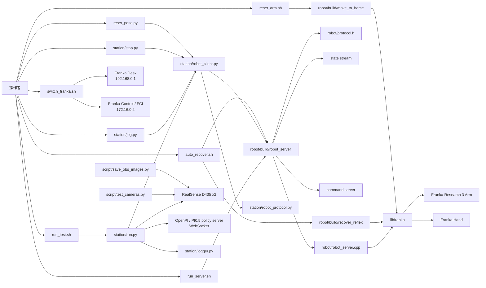
```mermaid
flowchart LR
    U[操作者] --> SW["switch_franka.sh"]
    U --> RS["run_server.sh"]
    U --> RT["run_test.sh"]
    U --> AR["auto_recover.sh"]
    U --> RA["reset_arm.sh"]
    U --> RP["reset_pose.py"]
    U --> JOG["station/jog.py"]
    U --> STOP["station/stop.py"]

    SW --> DESK["Franka Desk<br/>192.168.0.1"]
    SW --> FCI["Franka Control / FCI<br/>172.16.0.2"]

    RS --> RBS["robot/build/robot_server"]
    RBS --> RCPP["robot/robot_server.cpp"]
    RCPP --> LIB["libfranka"]
    LIB --> FR3["Franka Research 3 Arm"]
    LIB --> HAND["Franka Hand"]

    RT --> SRUN["station/run.py"]
    SRUN --> RC["station/robot_client.py"]
    RC --> PROTO_PY["station/robot_protocol.py"]
    RC --> RBS

    SRUN --> CAM["RealSense D435 x2"]
    SRUN --> OPI["OpenPI / PI0.5 policy server<br/>WebSocket"]
    SRUN --> LOG["station/logger.py"]

    RBS --> PROTO_H["robot/protocol.h"]
    RBS --> STATE["state stream"]
    RBS --> CMD["command server"]

    JOG --> RC
    STOP --> RC
    RP --> RC
    AR --> RBS
    AR --> REC["robot/build/recover_reflex"]
    RA --> HOME["robot/build/move_to_home"]
    REC --> LIB
    HOME --> LIB

    TESTCAM["script/test_cameras.py"] --> CAM
    SAVEOBS["script/save_obs_images.py"] --> CAM
```

## 数据流图

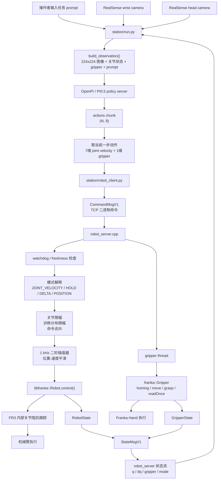
```mermaid
flowchart TD
    A["操作者输入任务 prompt"] --> B["station/run.py"]

    C["RealSense wrist camera"] --> B
    D["RealSense head camera"] --> B
    E["robot_server 状态流<br/>q / dq / gripper / mode"] --> B

    B --> F["build_observation()<br/>224x224 图像 + 关节状态 + gripper + prompt"]
    F --> G["OpenPI / PI0.5 policy server"]

    G --> H["actions chunk<br/>(N, 8)"]
    H --> I["取当前一步动作<br/>7维 joint velocity + 1维 gripper"]

    I --> J["station/robot_client.py"]
    J --> K["CommandMsgV1<br/>TCP 二进制命令"]
    K --> L["robot_server.cpp"]

    L --> M["watchdog / freshness 检查"]
    M --> N["模式解释<br/>JOINT_VELOCITY / HOLD / DELTA / POSITION"]
    N --> O["关节限幅<br/>训练分布限幅<br/>命令去抖"]
    O --> P["1 kHz 二阶插值器<br/>位置-速度平滑"]
    P --> Q["libfranka::Robot.control()"]

    Q --> R["FR3 内部关节阻抗跟踪"]
    R --> S["机械臂执行"]

    L --> T["gripper thread"]
    T --> U["franka::Gripper<br/>homing / move / grasp / readOnce"]
    U --> V["Franka Hand 执行"]

    Q --> W["RobotState"]
    U --> X["GripperState"]
    W --> Y["StateMsgV1"]
    X --> Y
    Y --> E
```

## 读图说明

- `station/run.py` 是上层大脑，负责“看图 + 读状态 + 问策略 + 发命令”。
- `robot_server.cpp` 是下层实时执行器，负责“收低频命令 + 做 1 kHz 平滑 + 调 libfranka”。
- `Franka Hand` 不走 1 kHz 主控制回调，而是独立线程通过 `franka::Gripper` 控制。
- `run_test.sh`、`run_server.sh`、`switch_franka.sh` 负责把整套系统串起来。
- `reset_pose.py` 和 `move_to_home.cpp` 分别对应“回到策略友好起始位”和“回到机械安全 home 位”。

如果你愿意，我可以下一步把这张图再细化成一版“按文件映射的时序图”，比如从执行 `run_test.sh` 开始，到机械臂真正动起来为止。

---

**User**

把这张图再细化成一版“按文件映射的时序图”，比如从执行 run_test.sh 开始，到机械臂真正动起来为止。每一个可执行的入口文件都要有一张这样的图.

---

**Cursor**

下面我按“**每个可执行入口文件**”给出一张**按文件映射的 Mermaid 时序图**。  
我把它们分成 4 类：启动主链路、运维恢复、站端工具、机器人端二进制。

说明一下边界：

- Python/Shell 文件：按脚本入口画。
- C++ 文件：按“编译后对应可执行程序”画，但仍用源码文件名标识入口。
- 文档、协议头、库文件不算入口。
- `station/action_adapter.py` 不是入口文件，当前主链路也没直接调用它。

---

## 1. 主链路入口

### `run_test.sh`

这是最完整的“从测试命令到机械臂开始运动”的入口。

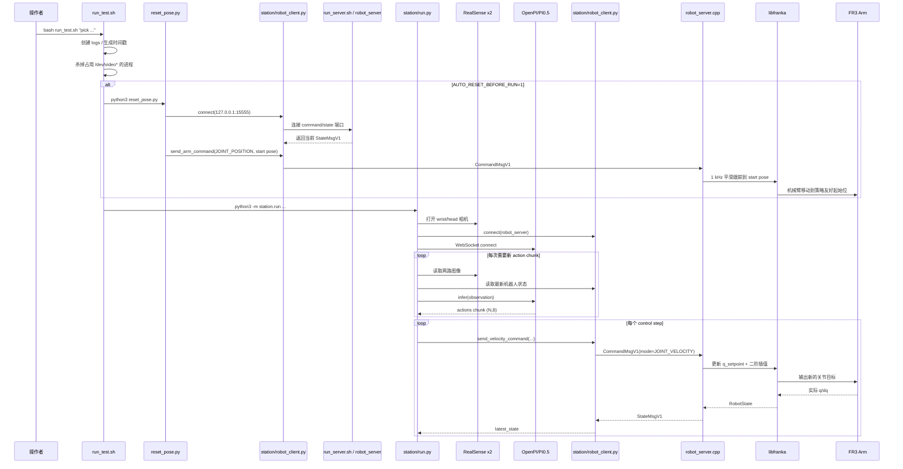
```mermaid
sequenceDiagram
    participant U as 操作者
    participant RT as run_test.sh
    participant RP as reset_pose.py
    participant RC1 as station/robot_client.py
    participant RS as run_server.sh / robot_server
    participant SR as station/run.py
    participant CAM as RealSense x2
    participant POL as OpenPI/PI0.5
    participant RC2 as station/robot_client.py
    participant ROB as robot_server.cpp
    participant LIB as libfranka
    participant ARM as FR3 Arm

    U->>RT: bash run_test.sh "pick ..."
    RT->>RT: 创建 logs / 生成时间戳
    RT->>RT: 杀掉占用 /dev/video* 的进程
    alt AUTO_RESET_BEFORE_RUN=1
        RT->>RP: python3 reset_pose.py
        RP->>RC1: connect(127.0.0.1:15555)
        RC1->>RS: 连接 command/state 端口
        RS-->>RC1: 返回当前 StateMsgV1
        RP->>RC1: send_arm_command(JOINT_POSITION, start pose)
        RC1->>ROB: CommandMsgV1
        ROB->>LIB: 1 kHz 平滑跟踪到 start pose
        LIB->>ARM: 机械臂移动到策略友好起始位
    end
    RT->>SR: python3 -m station.run ...
    SR->>CAM: 打开 wrist/head 相机
    SR->>RC2: connect(robot_server)
    SR->>POL: WebSocket connect
    loop 每次需要新 action chunk
        SR->>CAM: 读取两路图像
        SR->>RC2: 读取最新机器人状态
        SR->>POL: infer(observation)
        POL-->>SR: actions chunk (N,8)
    end
    loop 每个 control step
        SR->>RC2: send_velocity_command(...)
        RC2->>ROB: CommandMsgV1(mode=JOINT_VELOCITY)
        ROB->>LIB: 更新 q_setpoint + 二阶插值
        LIB->>ARM: 输出新的关节目标
        ARM-->>LIB: 实际 q/dq
        LIB-->>ROB: RobotState
        ROB-->>RC2: StateMsgV1
        RC2-->>SR: latest_state
    end
```

### `run_server.sh`

这是机器人侧 bringup 入口。

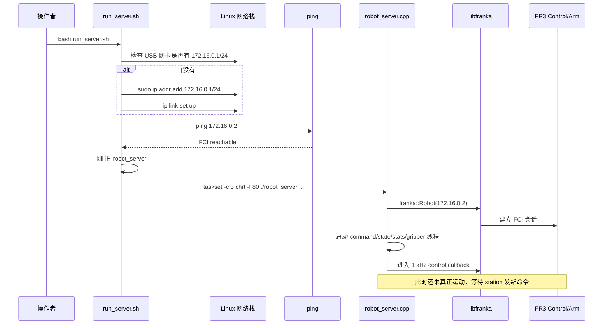
```mermaid
sequenceDiagram
    participant U as 操作者
    participant RS as run_server.sh
    participant NET as Linux 网络栈
    participant PING as ping
    participant ROB as robot_server.cpp
    participant LIB as libfranka
    participant ARM as FR3 Control/Arm

    U->>RS: bash run_server.sh
    RS->>NET: 检查 USB 网卡是否有 172.16.0.1/24
    alt 没有
        RS->>NET: sudo ip addr add 172.16.0.1/24
        RS->>NET: ip link set up
    end
    RS->>PING: ping 172.16.0.2
    PING-->>RS: FCI reachable
    RS->>RS: kill 旧 robot_server
    RS->>ROB: taskset -c 3 chrt -f 80 ./robot_server ...
    ROB->>LIB: franka::Robot(172.16.0.2)
    LIB->>ARM: 建立 FCI 会话
    ROB->>ROB: 启动 command/state/stats/gripper 线程
    ROB->>LIB: 进入 1 kHz control callback
    note over ROB,ARM: 此时还未真正运动，等待 station 发新命令
```

### `switch_franka.sh`

这是网络切换入口，不直接触发运动。

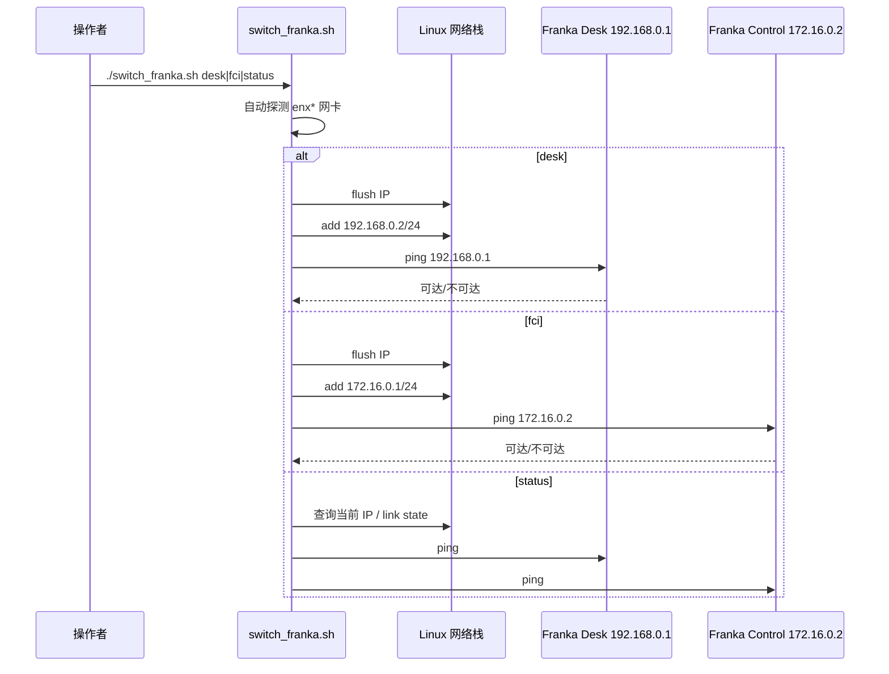
```mermaid
sequenceDiagram
    participant U as 操作者
    participant SW as switch_franka.sh
    participant NET as Linux 网络栈
    participant DESK as Franka Desk 192.168.0.1
    participant FCI as Franka Control 172.16.0.2

    U->>SW: ./switch_franka.sh desk|fci|status
    SW->>SW: 自动探测 enx* 网卡
    alt desk
        SW->>NET: flush IP
        SW->>NET: add 192.168.0.2/24
        SW->>DESK: ping 192.168.0.1
        DESK-->>SW: 可达/不可达
    else fci
        SW->>NET: flush IP
        SW->>NET: add 172.16.0.1/24
        SW->>FCI: ping 172.16.0.2
        FCI-->>SW: 可达/不可达
    else status
        SW->>NET: 查询当前 IP / link state
        SW->>DESK: ping
        SW->>FCI: ping
    end
```

### `fix_rt.sh`

这是实时调优入口，不直接运动。

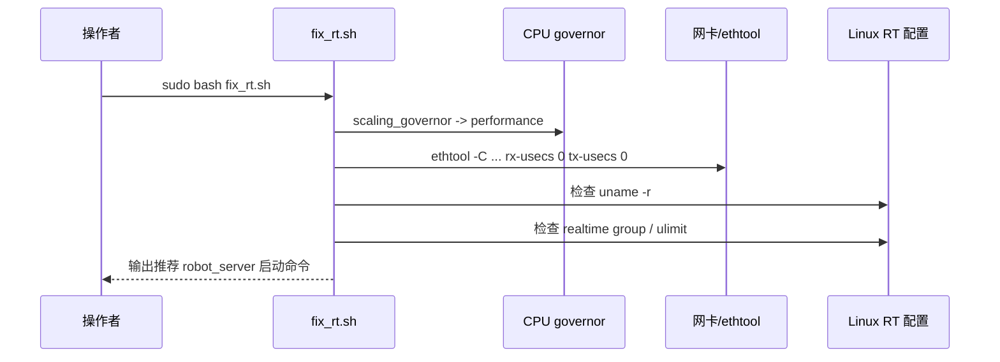
```mermaid
sequenceDiagram
    participant U as 操作者
    participant FR as fix_rt.sh
    participant CPU as CPU governor
    participant NIC as 网卡/ethtool
    participant SYS as Linux RT 配置

    U->>FR: sudo bash fix_rt.sh
    FR->>CPU: scaling_governor -> performance
    FR->>NIC: ethtool -C ... rx-usecs 0 tx-usecs 0
    FR->>SYS: 检查 uname -r
    FR->>SYS: 检查 realtime group / ulimit
    FR-->>U: 输出推荐 robot_server 启动命令
```

---

## 2. 运维/恢复入口

### `auto_recover.sh`

这是“故障恢复 + 重启服务 + 移到安全位”的总入口。

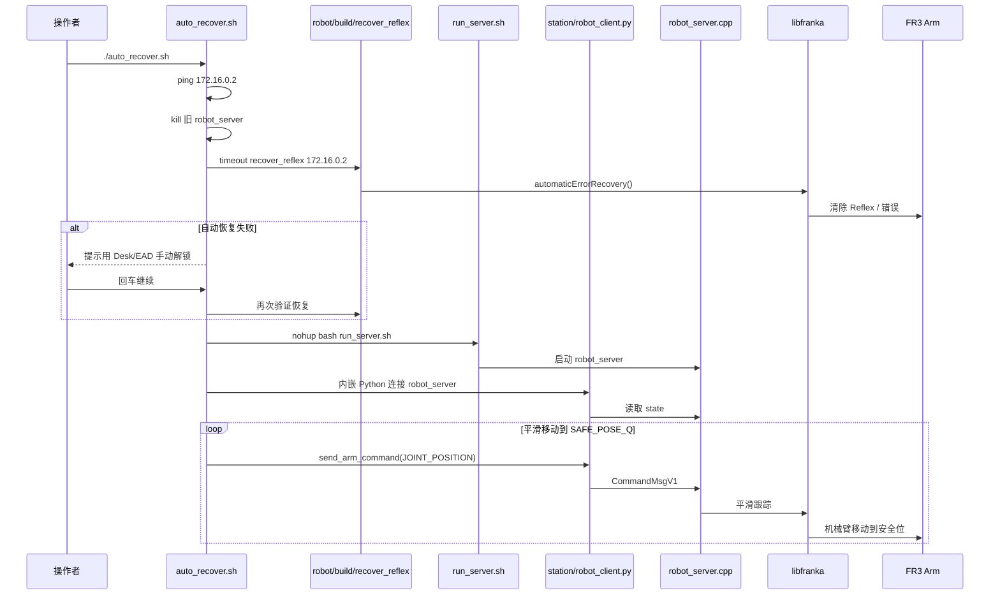
```mermaid
sequenceDiagram
    participant U as 操作者
    participant AR as auto_recover.sh
    participant REC as robot/build/recover_reflex
    participant RS as run_server.sh
    participant RC as station/robot_client.py
    participant ROB as robot_server.cpp
    participant LIB as libfranka
    participant ARM as FR3 Arm

    U->>AR: ./auto_recover.sh
    AR->>AR: ping 172.16.0.2
    AR->>AR: kill 旧 robot_server
    AR->>REC: timeout recover_reflex 172.16.0.2
    REC->>LIB: automaticErrorRecovery()
    LIB->>ARM: 清除 Reflex / 错误
    alt 自动恢复失败
        AR-->>U: 提示用 Desk/EAD 手动解锁
        U->>AR: 回车继续
        AR->>REC: 再次验证恢复
    end
    AR->>RS: nohup bash run_server.sh
    RS->>ROB: 启动 robot_server
    AR->>RC: 内嵌 Python 连接 robot_server
    RC->>ROB: 读取 state
    loop 平滑移动到 SAFE_POSE_Q
        AR->>RC: send_arm_command(JOINT_POSITION)
        RC->>ROB: CommandMsgV1
        ROB->>LIB: 平滑跟踪
        LIB->>ARM: 机械臂移动到安全位
    end
```

### `reset_arm.sh`

这是“直接 libfranka 回 home 位”的入口。

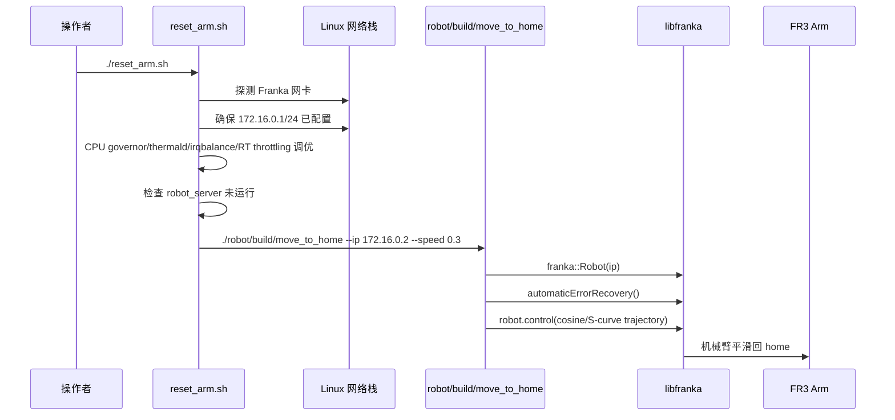
```mermaid
sequenceDiagram
    participant U as 操作者
    participant RA as reset_arm.sh
    participant NET as Linux 网络栈
    participant HOME as robot/build/move_to_home
    participant LIB as libfranka
    participant ARM as FR3 Arm

    U->>RA: ./reset_arm.sh
    RA->>NET: 探测 Franka 网卡
    RA->>NET: 确保 172.16.0.1/24 已配置
    RA->>RA: CPU governor/thermald/irqbalance/RT throttling 调优
    RA->>RA: 检查 robot_server 未运行
    RA->>HOME: ./robot/build/move_to_home --ip 172.16.0.2 --speed 0.3
    HOME->>LIB: franka::Robot(ip)
    HOME->>LIB: automaticErrorRecovery()
    HOME->>LIB: robot.control(cosine/S-curve trajectory)
    LIB->>ARM: 机械臂平滑回 home
```

### `reset_pose.py`

这是“通过 robot_server 回到策略起始位”的入口。

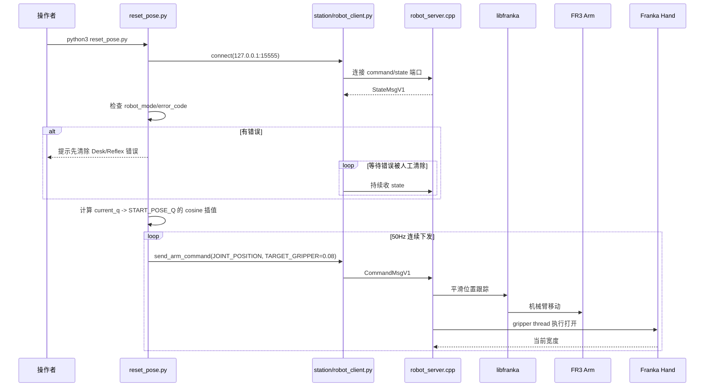
```mermaid
sequenceDiagram
    participant U as 操作者
    participant RP as reset_pose.py
    participant RC as station/robot_client.py
    participant ROB as robot_server.cpp
    participant LIB as libfranka
    participant ARM as FR3 Arm
    participant HAND as Franka Hand

    U->>RP: python3 reset_pose.py
    RP->>RC: connect(127.0.0.1:15555)
    RC->>ROB: 连接 command/state 端口
    ROB-->>RC: StateMsgV1
    RP->>RP: 检查 robot_mode/error_code
    alt 有错误
        RP-->>U: 提示先清除 Desk/Reflex 错误
        loop 等待错误被人工清除
            RC->>ROB: 持续收 state
        end
    end
    RP->>RP: 计算 current_q -> START_POSE_Q 的 cosine 插值
    loop 50Hz 连续下发
        RP->>RC: send_arm_command(JOINT_POSITION, TARGET_GRIPPER=0.08)
        RC->>ROB: CommandMsgV1
        ROB->>LIB: 平滑位置跟踪
        LIB->>ARM: 机械臂移动
        ROB->>HAND: gripper thread 执行打开
        HAND-->>ROB: 当前宽度
    end
```

---

## 3. 站端入口

### `station/run.py`

这是站端主循环入口。

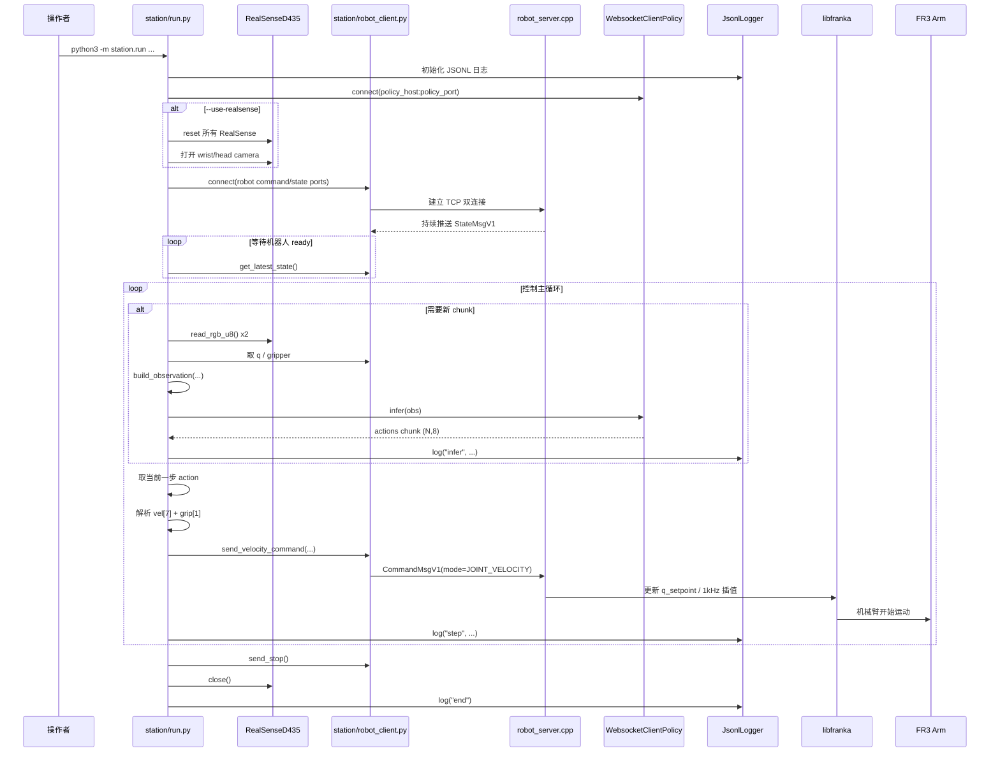
```mermaid
sequenceDiagram
    participant U as 操作者
    participant SR as station/run.py
    participant CAM as RealSenseD435
    participant RC as station/robot_client.py
    participant ROB as robot_server.cpp
    participant POL as WebsocketClientPolicy
    participant LOG as JsonlLogger
    participant LIB as libfranka
    participant ARM as FR3 Arm

    U->>SR: python3 -m station.run ...
    SR->>LOG: 初始化 JSONL 日志
    SR->>POL: connect(policy_host:policy_port)
    alt --use-realsense
        SR->>CAM: reset 所有 RealSense
        SR->>CAM: 打开 wrist/head camera
    end
    SR->>RC: connect(robot command/state ports)
    RC->>ROB: 建立 TCP 双连接
    ROB-->>RC: 持续推送 StateMsgV1
    loop 等待机器人 ready
        SR->>RC: get_latest_state()
    end
    loop 控制主循环
        alt 需要新 chunk
            SR->>CAM: read_rgb_u8() x2
            SR->>RC: 取 q / gripper
            SR->>SR: build_observation(...)
            SR->>POL: infer(obs)
            POL-->>SR: actions chunk (N,8)
            SR->>LOG: log("infer", ...)
        end
        SR->>SR: 取当前一步 action
        SR->>SR: 解析 vel[7] + grip[1]
        SR->>RC: send_velocity_command(...)
        RC->>ROB: CommandMsgV1(mode=JOINT_VELOCITY)
        ROB->>LIB: 更新 q_setpoint / 1kHz 插值
        LIB->>ARM: 机械臂开始运动
        SR->>LOG: log("step", ...)
    end
    SR->>RC: send_stop()
    SR->>CAM: close()
    SR->>LOG: log("end")
```

### `station/jog.py`

这是人工小步测试入口。

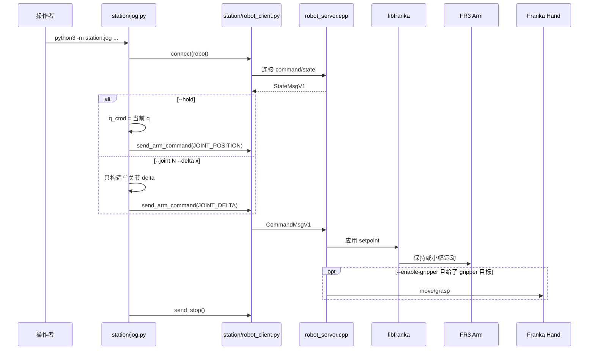
```mermaid
sequenceDiagram
    participant U as 操作者
    participant J as station/jog.py
    participant RC as station/robot_client.py
    participant ROB as robot_server.cpp
    participant LIB as libfranka
    participant ARM as FR3 Arm
    participant HAND as Franka Hand

    U->>J: python3 -m station.jog ...
    J->>RC: connect(robot)
    RC->>ROB: 连接 command/state
    ROB-->>RC: StateMsgV1
    alt --hold
        J->>J: q_cmd = 当前 q
        J->>RC: send_arm_command(JOINT_POSITION)
    else --joint N --delta x
        J->>J: 只构造单关节 delta
        J->>RC: send_arm_command(JOINT_DELTA)
    end
    RC->>ROB: CommandMsgV1
    ROB->>LIB: 应用 setpoint
    LIB->>ARM: 保持或小幅运动
    opt --enable-gripper 且给了 gripper 目标
        ROB->>HAND: move/grasp
    end
    J->>RC: send_stop()
```

### `station/stop.py`

这是停止入口。

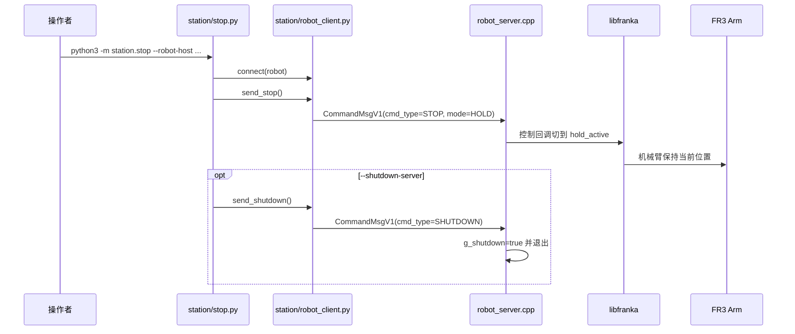
```mermaid
sequenceDiagram
    participant U as 操作者
    participant ST as station/stop.py
    participant RC as station/robot_client.py
    participant ROB as robot_server.cpp
    participant LIB as libfranka
    participant ARM as FR3 Arm

    U->>ST: python3 -m station.stop --robot-host ...
    ST->>RC: connect(robot)
    ST->>RC: send_stop()
    RC->>ROB: CommandMsgV1(cmd_type=STOP, mode=HOLD)
    ROB->>LIB: 控制回调切到 hold_active
    LIB->>ARM: 机械臂保持当前位置
    opt --shutdown-server
        ST->>RC: send_shutdown()
        RC->>ROB: CommandMsgV1(cmd_type=SHUTDOWN)
        ROB->>ROB: g_shutdown=true 并退出
    end
```

### `station/script/policy_smoke_test_min.py`

这是纯策略烟雾测试入口。

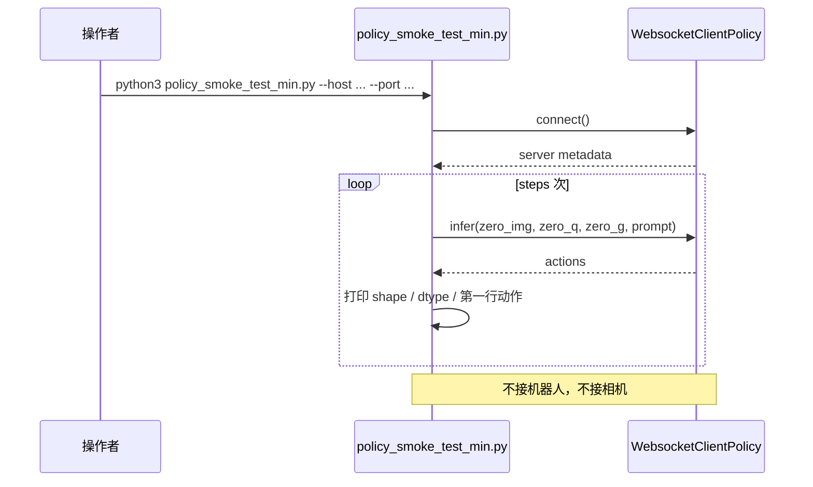
```mermaid
sequenceDiagram
    participant U as 操作者
    participant SM as policy_smoke_test_min.py
    participant POL as WebsocketClientPolicy

    U->>SM: python3 policy_smoke_test_min.py --host ... --port ...
    SM->>POL: connect()
    POL-->>SM: server metadata
    loop steps 次
        SM->>POL: infer(zero_img, zero_q, zero_g, prompt)
        POL-->>SM: actions
        SM->>SM: 打印 shape / dtype / 第一行动作
    end
    note over SM,POL: 不接机器人，不接相机
```

### `script/test_cameras.py`

这是双相机快测入口。

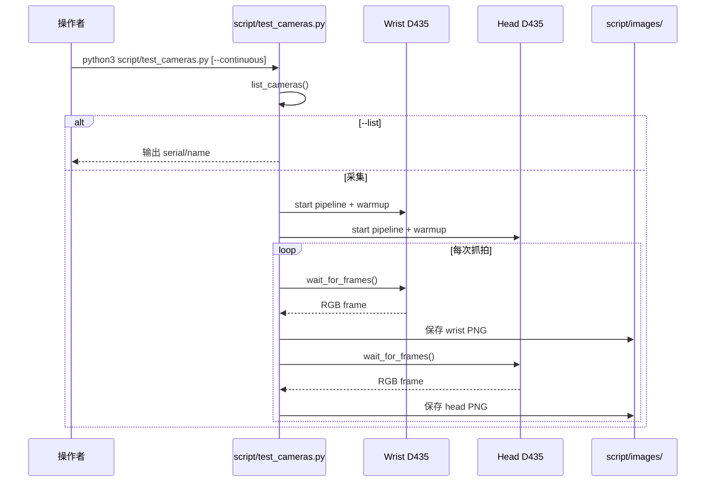
```mermaid
sequenceDiagram
    participant U as 操作者
    participant TC as script/test_cameras.py
    participant CAM1 as Wrist D435
    participant CAM2 as Head D435
    participant FS as script/images/

    U->>TC: python3 script/test_cameras.py [--continuous]
    TC->>TC: list_cameras()
    alt --list
        TC-->>U: 输出 serial/name
    else 采集
        TC->>CAM1: start pipeline + warmup
        TC->>CAM2: start pipeline + warmup
        loop 每次抓拍
            TC->>CAM1: wait_for_frames()
            CAM1-->>TC: RGB frame
            TC->>FS: 保存 wrist PNG
            TC->>CAM2: wait_for_frames()
            CAM2-->>TC: RGB frame
            TC->>FS: 保存 head PNG
        end
    end
```

### `script/save_obs_images.py`

这是“验证模型最终看到的图像”的入口。

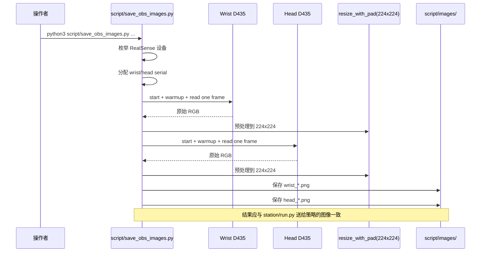
```mermaid
sequenceDiagram
    participant U as 操作者
    participant SO as script/save_obs_images.py
    participant CAM1 as Wrist D435
    participant CAM2 as Head D435
    participant PRE as resize_with_pad(224x224)
    participant FS as script/images/

    U->>SO: python3 script/save_obs_images.py ...
    SO->>SO: 枚举 RealSense 设备
    SO->>SO: 分配 wrist/head serial
    SO->>CAM1: start + warmup + read one frame
    CAM1-->>SO: 原始 RGB
    SO->>PRE: 预处理到 224x224
    SO->>CAM2: start + warmup + read one frame
    CAM2-->>SO: 原始 RGB
    SO->>PRE: 预处理到 224x224
    SO->>FS: 保存 wrist_*.png
    SO->>FS: 保存 head_*.png
    note over SO,FS: 结果应与 station/run.py 送给策略的图像一致
```

---

## 4. 机器人端二进制入口

### `robot/robot_server.cpp`

这是实时执行核心入口。

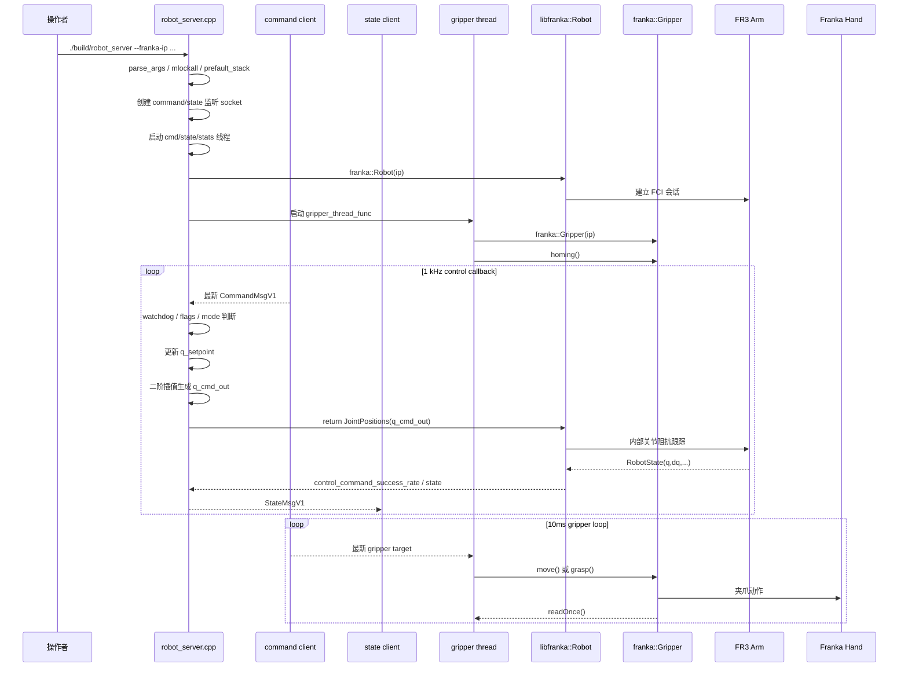
```mermaid
sequenceDiagram
    participant U as 操作者
    participant ROB as robot_server.cpp
    participant CMD as command client
    participant STATE as state client
    participant GR as gripper thread
    participant LIB as libfranka::Robot
    participant GRI as franka::Gripper
    participant ARM as FR3 Arm
    participant HAND as Franka Hand

    U->>ROB: ./build/robot_server --franka-ip ...
    ROB->>ROB: parse_args / mlockall / prefault_stack
    ROB->>ROB: 创建 command/state 监听 socket
    ROB->>ROB: 启动 cmd/state/stats 线程
    ROB->>LIB: franka::Robot(ip)
    LIB->>ARM: 建立 FCI 会话
    ROB->>GR: 启动 gripper_thread_func
    GR->>GRI: franka::Gripper(ip)
    GR->>GRI: homing()
    loop 1 kHz control callback
        CMD-->>ROB: 最新 CommandMsgV1
        ROB->>ROB: watchdog / flags / mode 判断
        ROB->>ROB: 更新 q_setpoint
        ROB->>ROB: 二阶插值生成 q_cmd_out
        ROB->>LIB: return JointPositions(q_cmd_out)
        LIB->>ARM: 内部关节阻抗跟踪
        ARM-->>LIB: RobotState(q,dq,...)
        LIB-->>ROB: control_command_success_rate / state
        ROB-->>STATE: StateMsgV1
    end
    loop 10ms gripper loop
        CMD-->>GR: 最新 gripper target
        GR->>GRI: move() 或 grasp()
        GRI->>HAND: 夹爪动作
        GRI-->>GR: readOnce()
    end
```

### `robot/read_state.cpp`

这是 FCI 只读连通性测试入口。

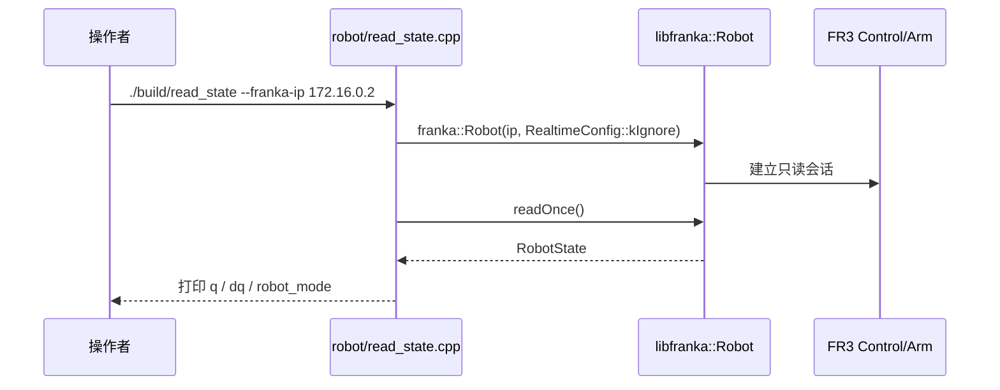
```mermaid
sequenceDiagram
    participant U as 操作者
    participant RS as robot/read_state.cpp
    participant LIB as libfranka::Robot
    participant ARM as FR3 Control/Arm

    U->>RS: ./build/read_state --franka-ip 172.16.0.2
    RS->>LIB: franka::Robot(ip, RealtimeConfig::kIgnore)
    LIB->>ARM: 建立只读会话
    RS->>LIB: readOnce()
    LIB-->>RS: RobotState
    RS-->>U: 打印 q / dq / robot_mode
```

### `robot/recover_reflex.cpp`

这是错误清除入口。

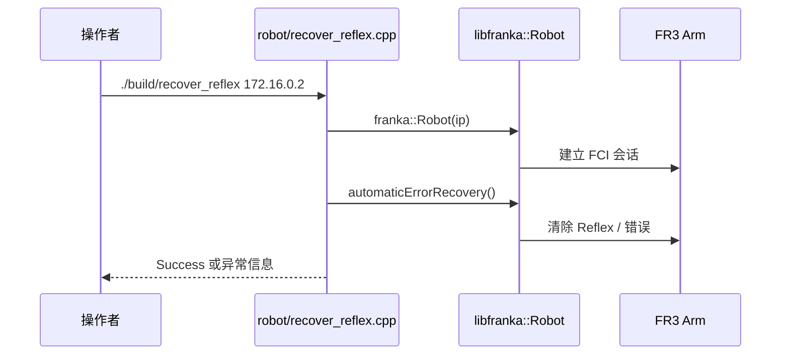
```mermaid
sequenceDiagram
    participant U as 操作者
    participant RR as robot/recover_reflex.cpp
    participant LIB as libfranka::Robot
    participant ARM as FR3 Arm

    U->>RR: ./build/recover_reflex 172.16.0.2
    RR->>LIB: franka::Robot(ip)
    LIB->>ARM: 建立 FCI 会话
    RR->>LIB: automaticErrorRecovery()
    LIB->>ARM: 清除 Reflex / 错误
    RR-->>U: Success 或异常信息
```

### `robot/move_to_home.cpp`

这是 home 轨迹执行入口。

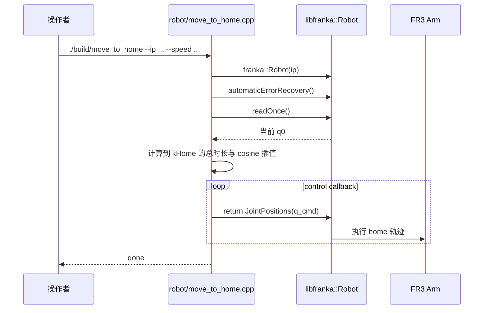
```mermaid
sequenceDiagram
    participant U as 操作者
    participant MH as robot/move_to_home.cpp
    participant LIB as libfranka::Robot
    participant ARM as FR3 Arm

    U->>MH: ./build/move_to_home --ip ... --speed ...
    MH->>LIB: franka::Robot(ip)
    MH->>LIB: automaticErrorRecovery()
    MH->>LIB: readOnce()
    LIB-->>MH: 当前 q0
    MH->>MH: 计算到 kHome 的总时长与 cosine 插值
    loop control callback
        MH->>LIB: return JointPositions(q_cmd)
        LIB->>ARM: 执行 home 轨迹
    end
    MH-->>U: done
```

### `robot/motion_test.cpp`

这是零速度保持测试入口。

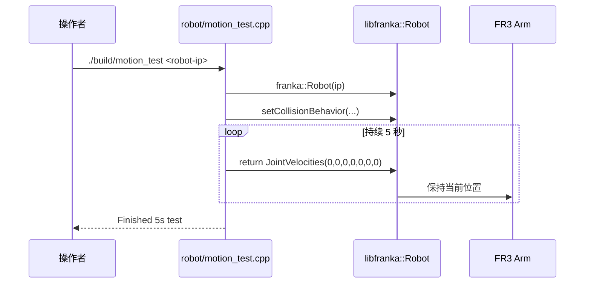
```mermaid
sequenceDiagram
    participant U as 操作者
    participant MT as robot/motion_test.cpp
    participant LIB as libfranka::Robot
    participant ARM as FR3 Arm

    U->>MT: ./build/motion_test <robot-ip>
    MT->>LIB: franka::Robot(ip)
    MT->>LIB: setCollisionBehavior(...)
    loop 持续 5 秒
        MT->>LIB: return JointVelocities(0,0,0,0,0,0,0)
        LIB->>ARM: 保持当前位置
    end
    MT-->>U: Finished 5s test
```

---

## 一页总览

如果把这些入口按职责压缩成一句话：

- `switch_franka.sh`：切网络
- `fix_rt.sh`：调实时
- `run_server.sh`：起实时机器人服务
- `run_test.sh`：跑完整视觉策略闭环
- `reset_pose.py`：回到策略友好起始位
- `reset_arm.sh` / `move_to_home.cpp`：回机械 home 位
- `auto_recover.sh` / `recover_reflex.cpp`：从错误态恢复
- `station/run.py`：站端主循环
- `station/jog.py`：人工点动
- `station/stop.py`：停止/关服
- `policy_smoke_test_min.py`：测策略服务
- `test_cameras.py` / `save_obs_images.py`：测相机与观测链路
- `robot_server.cpp`：1 kHz 实时控制核心
- `read_state.cpp` / `motion_test.cpp`：底层 FCI 连通性与最小运动测试

如果你愿意，我下一步可以继续给你两份更实用的补充材料：

1. 一张“**入口文件 -> 调用到的内部文件清单表**”  
2. 一张“**正常运行 / 停止 / 恢复 / 出错** 四种场景的总时序图”

---

**User**

请给我生成“入口文件 -> 调用到的内部文件清单表”和“正常运行 / 停止 / 恢复 / 出错 四种场景的总时序图”

---

**Cursor**

## 入口文件 -> 调用到的内部文件清单表

下面这张表只统计**仓库内部文件**之间的直接主调用关系。  
外部依赖如 `libfranka`、`pyrealsense2`、`openpi_client`、系统命令我放在“外部组件”列里说明。

| 入口文件 | 主要调用到的内部文件 | 外部组件 / 系统能力 | 作用简述 |
|---|---|---|---|
| `run_test.sh` | `reset_pose.py`、`station/run.py` | `fuser`、`python3` | 一键跑完整测试，必要时先把机械臂复位到策略友好姿态 |
| `run_server.sh` | `robot/build/robot_server`（由 `robot/robot_server.cpp` 编译） | `ip`、`ping`、`taskset`、`chrt` | 配好 FCI 网络并启动机器人实时服务 |
| `switch_franka.sh` | 无内部源码依赖 | `ip`、`ping` | 在 Desk 网络和 FCI 网络之间切换 |
| `fix_rt.sh` | 无内部源码依赖 | `cpufreq`、`ethtool`、`ulimit` | 做实时性相关系统调优 |
| `auto_recover.sh` | `robot/build/recover_reflex`、`run_server.sh`、`station/robot_client.py`、`station/robot_protocol.py` | `timeout`、`ping`、`nohup`、内嵌 `python3` | 自动恢复错误、重启服务、移动到安全位 |
| `reset_arm.sh` | `robot/build/move_to_home` | `ip`、`ethtool`、`systemctl` | 不经过 `robot_server`，直接用 `libfranka` 回 home |
| `reset_pose.py` | `station/robot_client.py`、`station/robot_protocol.py` | `numpy` | 通过 `robot_server` 把机械臂移到 DROID/策略友好起始位 |
| `station/run.py` | `station/logger.py`、`station/robot_client.py`、`station/robot_protocol.py` | `pyrealsense2`、`numpy`、`openpi_client`/WebSocket | 站端主循环：采图、构造观测、请求策略、发命令 |
| `station/jog.py` | `station/robot_client.py`、`station/robot_protocol.py` | 无重要额外外部依赖 | 人工 hold / 单关节点动 |
| `station/stop.py` | `station/robot_client.py`、`station/robot_protocol.py` | 无重要额外外部依赖 | 向 `robot_server` 发送 stop / shutdown |
| `station/script/policy_smoke_test_min.py` | 无内部核心依赖 | `numpy`、`openpi_client`/WebSocket | 只测策略服务，不碰机器人和相机 |
| `script/test_cameras.py` | 无内部核心依赖 | `pyrealsense2`、`numpy` | 枚举并抓拍双 RealSense |
| `script/save_obs_images.py` | 无内部核心依赖 | `pyrealsense2`、`numpy`、`PIL` | 用与 `station/run.py` 一致的预处理保存观测图像 |
| `robot/robot_server.cpp` | `robot/protocol.h` | `libfranka`、POSIX socket/pthread | 机器人侧 1 kHz 实时控制核心 |
| `robot/read_state.cpp` | 无内部核心依赖 | `libfranka` | 只读一次状态，验证 FCI |
| `robot/recover_reflex.cpp` | 无内部核心依赖 | `libfranka` | 调 `automaticErrorRecovery()` 清错 |
| `robot/move_to_home.cpp` | 无内部核心依赖 | `libfranka` | 直接生成轨迹回 home |
| `robot/motion_test.cpp` | 无内部核心依赖 | `libfranka` | 做 5 秒零速度保持测试 |

---

## 补充：核心内部依赖关系

把上面表再压缩一下，真正关键的内部调用骨架是：

- `run_test.sh` -> `reset_pose.py` -> `station/robot_client.py` -> `station/robot_protocol.py`
- `run_test.sh` -> `station/run.py` -> `station/logger.py`
- `run_test.sh` -> `station/run.py` -> `station/robot_client.py` -> `station/robot_protocol.py`
- `run_server.sh` -> `robot/robot_server.cpp` -> `robot/protocol.h`
- `station/robot_client.py` <-> `robot/robot_server.cpp`
- `station/robot_protocol.py` <-> `robot/protocol.h`

可以把它理解成两条主干：

1. **站端主干**：`station/run.py` -> `robot_client.py` -> `robot_protocol.py`
2. **机器人主干**：`robot_server.cpp` -> `protocol.h`

---

## 四种场景的总时序图

下面是把系统收敛成“正常运行 / 停止 / 恢复 / 出错”四个场景后的总图。

---

### 正常运行

```mermaid
sequenceDiagram
    participant U as 操作者
    participant SW as switch_franka.sh
    participant RS as run_server.sh
    participant ROB as robot_server.cpp
    participant GR as gripper thread
    participant RT as run_test.sh
    participant RP as reset_pose.py
    participant SR as station/run.py
    participant RC as station/robot_client.py
    participant CAM as RealSense x2
    participant POL as PI0.5/OpenPI
    participant LIB as libfranka
    participant ARM as FR3 Arm
    participant HAND as Franka Hand

    U->>SW: 切到 FCI 网络
    U->>RS: 启动 robot_server
    RS->>ROB: 前台启动实时服务
    ROB->>LIB: 建立 FCI 会话
    ROB->>GR: 启动夹爪线程
    GR->>HAND: homing/readOnce

    U->>RT: 执行 run_test.sh
    RT->>RP: 可选 reset_pose.py
    RP->>RC: 连接 robot_server
    RC->>ROB: 发 JOINT_POSITION 到起始位
    ROB->>LIB: 1 kHz 平滑跟踪
    LIB->>ARM: 移到策略友好姿态

    RT->>SR: 启动 station/run.py
    SR->>CAM: 打开双相机
    SR->>POL: 连接策略服务
    SR->>RC: 连接 robot_server

    loop 推理-执行闭环
        SR->>CAM: 读取 wrist/head 图像
        SR->>RC: 读取最新 state
        SR->>POL: infer(observation)
        POL-->>SR: actions chunk
        SR->>RC: send_velocity_command
        RC->>ROB: CommandMsgV1
        ROB->>LIB: 更新 setpoint + 二阶插值
        LIB->>ARM: 机械臂运动
        ROB->>HAND: 必要时更新 gripper
        HAND-->>ROB: 当前宽度
        ROB-->>RC: StateMsgV1
        RC-->>SR: latest_state
    end
```

---

### 停止

```mermaid
sequenceDiagram
    participant U as 操作者
    participant SR as station/run.py
    participant ST as station/stop.py
    participant RC as station/robot_client.py
    participant ROB as robot_server.cpp
    participant LIB as libfranka
    participant ARM as FR3 Arm

    alt 在 station/run.py 里 Ctrl+C
        U->>SR: Ctrl+C
        SR->>RC: send_stop()
        RC->>ROB: STOP/HOLD
        ROB->>LIB: 进入 hold_active
        LIB->>ARM: 保持当前位置
        SR->>RC: close()
        SR-->>U: shutdown complete
    else 手动执行 stop
        U->>ST: python3 -m station.stop ...
        ST->>RC: connect()
        ST->>RC: send_stop()
        RC->>ROB: STOP/HOLD
        ROB->>LIB: 停止运动并保持
        LIB->>ARM: 保持当前位置
    end

    opt 需要停掉 robot_server
        ST->>RC: send_shutdown()
        RC->>ROB: SHUTDOWN
        ROB->>ROB: g_shutdown=true
        ROB-->>U: 进程退出
    end
```

---

### 恢复

```mermaid
sequenceDiagram
    participant U as 操作者
    participant AR as auto_recover.sh
    participant REC as recover_reflex.cpp
    participant RS as run_server.sh
    participant ROB as robot_server.cpp
    participant RC as station/robot_client.py
    participant LIB as libfranka
    participant ARM as FR3 Arm
    participant HAND as Franka Hand

    U->>AR: 执行 auto_recover.sh
    AR->>AR: kill 旧 robot_server
    AR->>REC: automaticErrorRecovery()
    REC->>LIB: 连接 FCI
    LIB->>ARM: 清除 Reflex/错误

    alt 自动恢复失败
        AR-->>U: 提示去 Desk 或 EAD 手动解锁
        U->>AR: 完成人工解锁后回车
        AR->>REC: 再次验证恢复
    end

    AR->>RS: 重启 run_server.sh
    RS->>ROB: 启动 robot_server
    ROB->>LIB: 建立新 FCI 会话
    ROB->>HAND: gripper thread 恢复

    AR->>RC: 连接 robot_server
    loop 发送安全位轨迹
        AR->>RC: send_arm_command(JOINT_POSITION, SAFE_POSE_Q)
        RC->>ROB: CommandMsgV1
        ROB->>LIB: 平滑跟踪
        LIB->>ARM: 回到安全位
    end

    AR-->>U: 恢复完成，可重新运行 run_test.sh
```

---

### 出错

这里把几类典型错误合在一张总图里：网络不通、FCI 未启用、策略服务失败、相机失败、控制中断。

```mermaid
sequenceDiagram
    participant U as 操作者
    participant SW as switch_franka.sh
    participant RS as run_server.sh
    participant ROB as robot_server.cpp
    participant SR as station/run.py
    participant RC as station/robot_client.py
    participant CAM as RealSense
    participant POL as PI0.5/OpenPI
    participant LIB as libfranka
    participant ARM as FR3 Arm

    alt FCI 网络不通
        U->>SW: 切到 fci
        SW-->>U: ping 172.16.0.2 失败
        note over U,SW: 机械臂不会启动，先检查网线/网卡/IP
    else robot_server 启动失败
        U->>RS: 启动 run_server.sh
        RS->>ROB: 启动 robot_server
        ROB->>LIB: 连接 FCI
        LIB-->>ROB: 异常(Connection timeout / incompatible version / FCI未启用)
        ROB-->>U: 输出错误并保持 robot_mode=error
    else 相机失败
        U->>SR: 启动 station/run.py
        SR->>CAM: 打开相机
        CAM-->>SR: 读帧失败
        SR->>SR: 使用 last_good_frame 或空图像继续
        note over SR,CAM: 可能退化，但系统不一定立刻停
    else 策略服务失败
        SR->>POL: infer()
        POL-->>SR: WebSocket 异常 / 超时
        SR->>SR: consecutive_ws_failures++
        SR->>SR: 超过阈值后重连 policy
        note over SR,POL: 期间不会产生新动作，运动可能进入 hold/停滞
    else 控制中断或 Reflex
        SR->>RC: send_velocity_command
        RC->>ROB: CommandMsgV1
        ROB->>LIB: 1 kHz 控制
        LIB-->>ROB: control exception / communication_constraints_violation / discontinuity
        ROB-->>RC: state error_code != 0
        RC-->>SR: robot_ok = false
        SR->>SR: 暂停继续发有效动作
        note over ROB,ARM: 机械臂停下并进入错误/恢复路径
    end
```

---

## 建议你怎么使用这两份材料

如果你接下来要继续深入分析，最实用的阅读顺序是：

1. 先看“入口文件清单表”，知道从哪里进。
2. 再看“正常运行总时序图”，理解主链路。
3. 然后对照：
   - 停止图，理解 `STOP/HOLD` 怎么落到底层；
   - 恢复图，理解 `recover_reflex` 和 `auto_recover.sh`；
   - 出错图，理解为什么会停、停在哪里。

如果你愿意，我下一步可以继续给你补一份：

- “**每个入口文件的输入参数表 + 默认值 + 对系统行为的影响**”

这会很适合你后面真正上手运行和排障。

