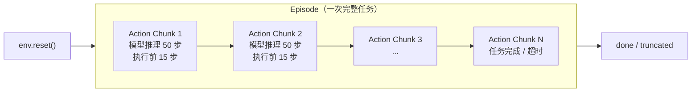
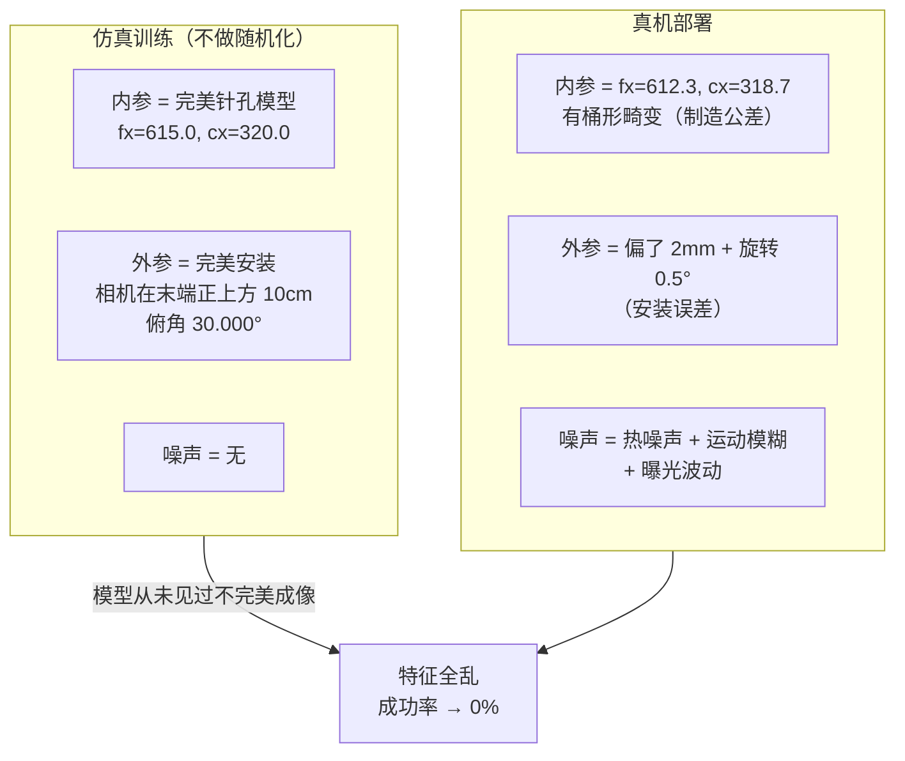
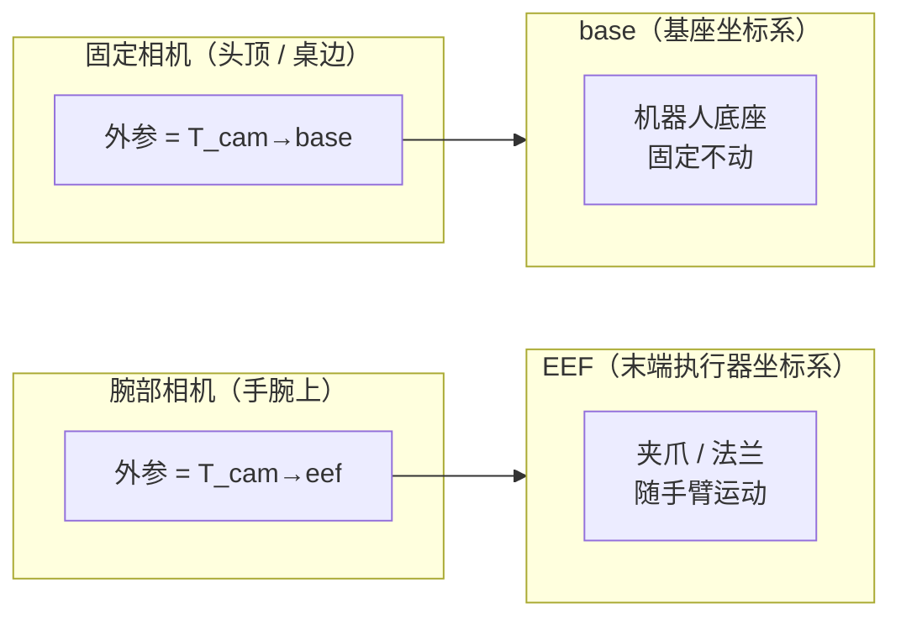

> 本文件是对 `embd_pt_sota_princpl_op47.md` 中关键概念的问答式解读。

---

## 1. Episode 与 Action Chunk

### 1.1 Episode（回合/片段）

Episode 是强化学习和机器人领域的基本单位，指**一次完整的任务执行过程**——从环境 reset 到任务结束（成功、失败或截断）。

例如：机器人从桌上抓起一个杯子放到指定位置，从 reset 开始到杯子放好（或超时），这整个过程就是 1 个 episode。一个 episode 包含若干个时间步（timestep），每步有观测、动作、奖励。

文中的典型用法：
- "Open X-Embodiment: 1M+ episodes" — 数据集包含超过 100 万次完整任务执行记录
- "单 episode 仿真 unit test" — 跑一次完整任务作为最小测试
- "失败 episode 全程记录回流到训练集" — 把失败的完整尝试录下来用于持续学习

### 1.2 Action Chunk（动作块）

Action Chunk 是模型**单次推理输出的一段连续动作序列**，而不是只输出当前一步的动作。

例如：模型一次推理输出未来 50 步（约 1 秒 @50Hz）的动作轨迹，这 50 步就是一个 action chunk。实际执行时通常只执行前 10–20 步，然后重新推理（**Receding Horizon**，滚动窗口），类似 MPC 的滚动执行。

文中的关键细节：
- "Action Chunk 长度 0.5–1 s（50 Hz 下 25–50 步）是当前甜蜜区" — 太短会闭环抖动，太长泛化差
- "推 50 步只执行前 10–20 步，然后重推" — 滚动窗口策略
- 来源于 **ACT（Action Chunking Transformer）**，最早在 ALOHA 双臂系统中提出

### 1.3 异同对比

| 维度 | Episode | Action Chunk |
|------|---------|--------------|
| **粒度** | 宏观：一次完整任务（几秒到几分钟） | 微观：一次推理的输出（0.5–1 秒） |
| **包含关系** | 1 个 episode 包含**很多个** action chunk | 多个 action chunk 串起来构成 1 个 episode |
| **语义** | "做了一次任务" | "模型想了一下，计划了接下来这段动作" |
| **数量级** | 训练数据集以 episode 计（万~百万级） | 一个 episode 内可能执行几十到上百个 chunk |
| **谁决定边界** | 环境的 done/truncation 信号 | 模型架构设计（chunk size 是超参） |



简单类比：episode 相当于"一盘棋"，action chunk 相当于"想好接下来几步棋一起落子"。

---

## 2. 相机参数随机化（Sim2Real 关键）

### 2.1 问题背景

原文：

> **相机参数随机化**(intrinsic + extrinsic + 噪声)——很多人忘做,导致 sim2real 第一次部署直接 0%。

在仿真环境中训练的视觉策略（VLA / visuomotor policy），如果仿真中的相机设置和真实相机**完全一致**（固定参数、无噪声），模型就会**过拟合到仿真相机的完美成像条件**。一旦部署到真机，真实相机的参数哪怕和仿真只差一点点，模型就"认不出"场景了，成功率直接归零。

解决方法是**在仿真训练时随机扰动相机参数**（Domain Randomization），让模型见过各种"不完美"的成像条件，从而对真实相机的微小差异具备鲁棒性。

### 2.2 Intrinsic（内参）

**内参描述相机自身的光学和成像属性**——"镜头和传感器本身的特性"。

| 参数 | 含义 | 真机中的来源 |
|------|------|-------------|
| 焦距 $f_x, f_y$ | 镜头到传感器的等效距离（像素单位） | 镜头规格 + 装配公差 |
| 主点 $c_x, c_y$ | 光轴与像平面的交点（理想情况在图像正中心，实际会偏） | 装配偏差 |
| 畸变系数 $k_1, k_2, p_1, p_2 \ldots$ | 镜头导致的桶形/枕形畸变 | 镜头光学特性 |

用矩阵表示：

$$
K = \begin{bmatrix} f_x & 0 & c_x \\ 0 & f_y & c_y \\ 0 & 0 & 1 \end{bmatrix}
$$

**直觉**：内参决定了"3D 世界中的一个点，投影到图像上的哪个像素"。两台同型号 RealSense，内参也会因为制造公差略有不同。

### 2.3 Extrinsic（外参）

**外参描述相机在世界/机器人坐标系中的位姿**——"相机装在哪里、朝哪个方向"。

| 参数 | 含义 | 真机中的来源 |
|------|------|-------------|
| 平移 $t_x, t_y, t_z$ | 相机光心相对于机器人基座/末端的位移 | 安装位置 |
| 旋转 $R$（$3 \times 3$）或四元数 | 相机朝向相对于机器人坐标系的旋转 | 安装角度 |

用齐次变换矩阵表示：

$$
T_{\text{cam} \to \text{ref}} = \begin{bmatrix} R & t \\ 0 & 1 \end{bmatrix} \in \mathbb{R}^{4 \times 4}
$$

**直觉**：外参决定了"相机从哪个视角看世界"。真机上每次拆装相机、线缆拉扯、碰撞后，外参都会微变。

### 2.4 为什么"忘做就 0%"



模型在仿真里从来没见过这些"不完美"，它学到的特征是**和完美成像参数强绑定的**。真机上图像稍有偏移或畸变，特征就全乱了。

**随机化的做法**（Domain Randomization）：

```python
# 训练时每个 episode 随机采样
fx = uniform(600, 630)                     # 内参随机
cx = uniform(310, 330)
distortion_k1 = uniform(-0.05, 0.05)      # 畸变随机
cam_pos += uniform(-0.005, 0.005)          # 外参平移随机 ±5mm
cam_rot += uniform(-1°, 1°)               # 外参旋转随机 ±1°
pixel_noise = gaussian(0, 3)              # 传感器噪声
```

这样模型被迫学到**对这些变化不敏感的视觉特征**，部署到真机时即使参数不完全匹配也能正常工作。

---

## 3. 相机外参对齐到 base / EEF

### 3.1 问题背景

原文：

> 相机外参对齐到 base / EEF [找不到出处,工程惯例]。

这是一个**数据规范化**步骤：把不同机器人、不同相机安装方式采集到的图像数据，统一转换到**相同的参考坐标系**下存储，让模型不需要关心"相机具体装在哪"。

### 3.2 两个常用参考坐标系



| 参考系 | 外参含义 | 典型场景 |
|--------|---------|---------|
| **base** | $T_{\text{cam} \to \text{base}}$：相机相对于机器人底座的位姿 | 第三人称相机（固定在外部） |
| **EEF** | $T_{\text{cam} \to \text{eef}}$：相机相对于末端法兰的位姿 | 腕部相机（跟着手臂一起动） |

### 3.3 为什么需要"对齐"

不同机器人的相机安装位置千差万别：

| | 机器人 A（Franka） | 机器人 B（UR5） |
|---|---|---|
| 头顶相机 | base 正上方 1.2m | base 斜上方 0.8m |
| 腕部相机 | 法兰左侧 5cm | 法兰正下方 3cm |

同一个杯子，两台机器人拍出来的图像视角完全不同。如果不做对齐，跨本体训练的模型会混乱。

**"对齐到 base / EEF"** 就是：

1. **固定相机** → 存储 $T_{\text{cam} \to \text{base}}$（相机到 base 的变换）
2. **腕部相机** → 存储 $T_{\text{cam} \to \text{eef}}$（相机到末端的变换）

有了这个变换矩阵，模型或数据预处理管线就可以：
- 把图像中的像素**反投影**到 base 坐标系下的 3D 点
- 把不同机器人的观测**统一到同一个空间参考系**
- 让"手眼关系"在不同本体之间可迁移

### 3.4 坐标变换链

对于腕部相机，有了 $T_{\text{wrist\_cam} \to \text{eef}}$ 和 $T_{\text{eef} \to \text{base}}$（来自正运动学），就能把腕部相机的观测转换到 base 坐标系：

$$
T_{\text{wrist\_cam} \to \text{base}} = T_{\text{eef} \to \text{base}} \cdot T_{\text{wrist\_cam} \to \text{eef}}
$$


### 3.5 数据集中的实际存储

在数据集中，每条轨迹除了存图像本身，还要存外参矩阵：

```python
{
    "image_head":             jpeg_bytes,        # 头顶相机图像
    "image_wrist_left":       jpeg_bytes,        # 左腕相机图像
    "T_head_to_base":         [4x4 matrix],      # 头顶相机外参（相对 base）
    "T_wrist_left_to_eef":    [4x4 matrix],      # 腕部相机外参（相对 EEF）
    "eef_pose_in_base":       [4x4 matrix],      # EEF 在 base 下的位姿
    "actions":                [...],
    ...
}
```

**一句话总结**："相机外参对齐到 base / EEF" = 在数据集中统一记录每个相机相对于 base（固定相机）或 EEF（腕部相机）的位姿变换矩阵，是跨本体（cross-embodiment）预训练的基础工程步骤。
