# Galaxea R1 Pro SDK 深度分析报告

> 目标：基于 `/home/nvidia/galaxea/install/` 这份预编译的 atc_system v2.1.5（commit `abf07e0`，2025-10-17 deploy）SDK，结合 Galaxea 官方文档与 ROS 2 Humble 的设计原则，深入分析 R1 Pro 机器人 SDK 的架构、模块、关键场景、设计动因，并与开源生态做横向对比。
>
> 全部 UML 图（类图 / 时序图 / 数据流图 / 部署图）以 mermaid 嵌入。代码引用使用 `start:end:filepath` 形式回链到 `install/` 内的真实文件。

---

## 0. 摘要 & 阅读地图

R1 Pro 是星海图（Galaxea AI）发布的"双 7-DoF 手臂 + 4-DoF 升降躯干 + 4WS（四轮转向）轮式底盘 + 双臂腕部 RealSense + 头部 ZED 立体 + 顶置 Livox MID-360 LiDAR + 信号相机"的具身智能（Embodied AI）研究平台。它的车载计算单元是 NVIDIA Jetson AGX/Orin（aarch64），运行 Ubuntu 22.04 + ROS 2 Humble。

`install/` 内的 SDK（atc_system）解决五件事：
1. **硬件抽象**——把 5 颗 MCU（CCU/VCU/TCU/ACUL/ACUR）通过 CAN-FD 暴露的 200+ 个寄存器/控制项，封装成约定式的 ROS 2 话题（`/hdas/...`、`/motion_control/...`），让上层只用 ROS API 就能驱动整机。
2. **运动栈**——基于 OCS2 SLQ-MPC + Pinocchio 动力学 + HPP-FCL 自碰撞 + OsqpEigen + NLopt + TOPP-RA + Trac-IK 的"移动操作（Mobile Manipulation）"求解器。
3. **导航定位**——自研 LIO（紧耦合 Livox + IMU + 轮速）+ 全局/局部规划 + 4WS 底盘动作执行。
4. **遥操作 & 模仿学习**——VR 头显 → WebSocket → 关节/末端目标；EFM 用 TensorRT 在 Orin 上做 Diffusion Policy 推理（HATO Ensemble）。
5. **系统编排**——`systemd` + `tmuxp` + `system_manager` 三层做整机生命周期、Action 网关、对外 WebSocket。

阅读地图：

- 偏架构 → §1、§3、§7
- 偏部署 / 运行 → §2、§5
- 偏数据流 / 调用链 → §4、§6
- 偏理性反思 → §8、§9、§10
- 速查 → §11

---

## 1. 总体架构与分层

R1 Pro SDK 是一个**典型的"五层 + 一总线（DDS）"架构**——电气低层用 CAN-FD，应用层用 DDS（FastDDS），中间放 ROS 2 Humble 的发布订阅 / 服务 / 动作三件套。

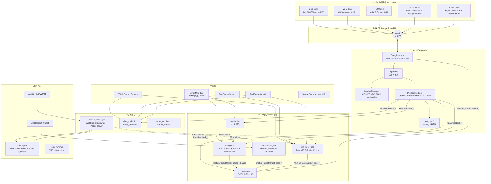

### 1.1 五层职责对照

- **L0 嵌入式固件**（`Embedded_Software_Firmware/share/firmware/R1PRO/{CCU,VCU,TCU,ACUL,ACUR}.bin`）：
  实时控制电机的 PID/FOC、IMU 预处理、温度/电流保护、远程遥控器解码、急停响应等。它们与 NVIDIA Orin 之间通过 1 Mbps 仲裁 + 5 Mbps 数据相位的 CAN-FD 通信。
- **L1 HAL（HDAS）**：把 CAN-FD 流转换成 ROS 话题，是整个 SDK 唯一直接持有 `socket(PF_CAN, SOCK_RAW, CAN_RAW)` 句柄的进程。
- **L2 中间层**：纯 ROS 2 节点，输入 `/hdas/feedback_*`、`/motion_target/target_*`，输出 `/motion_control/control_*` 或更高层目标。这一层互相之间也通过话题协作。
- **L3 任务编排**：`system_manager` 是对内 Action Server / 对外 WebSocket 网关；`data_collection` 是按白名单录 mcap 的"黑匣子"。
- **L4 应用层**：VR 头显 / WebUI / Agent，是真正决定"机器人下一步做什么"的大脑。其中 `/etc/systemd/system/robot-agent.service`（`rclaw`）和 `robot-runtime.service` 已经在 Orin 上以 systemd 方式常驻。

### 1.2 install/ 内 81 个包按层归属速查

- **HAL（L1）**：`HDAS`、`hdas_msg`、`Embedded_Software_Firmware`、`module_config`、`header_core`、`af_std_msg`、`generate_ros_cpp_struct`
- **传感器驱动**：`livox_ros_driver2`、`realsense2_camera`、`realsense2_camera_msgs`、`zed_wrapper`、`zed_components`、`signal_camera`、`sensor_gnss_imu_msg`、`sensor_lidar_msg`
- **运动 / 规划（L2 - manipulation）**：`mobiman`、`mobiman_msg`、`ocs2_core`、`ocs2_ddp`、`ocs2_mpc`、`ocs2_oc`、`ocs2_qp_solver`、`ocs2_self_collision`、`ocs2_self_collision_visualization`、`ocs2_pinocchio_interface`、`ocs2_robotic_assets`、`ocs2_robotic_tools`、`ocs2_ros_interfaces`、`ocs2_msgs`、`ocs2_thirdparty`、`ocs2_mobile_manipulator`、`ocs2_mobile_manipulator_ros`、`pinocchio`、`hpp-fcl`、`OsqpEigen`、`osqp`、`nlopt`、`toppra`、`trac_ik_lib`
- **导航定位（L2 - locomotion）**：`localization`、`localization_msg`、`navigation`、`navigation_action`、`nav_utils`、`astar_global_planner`、`lattice_local_planner`、`bspline_gen`、`bspline_opt`、`navfn_planner`、`pure_pursuit`、`simple_costmap_2d`、`rds`、`rds_ros`
- **遥操作 / VLA（L2 - cognitive）**：`teleoperation_ros2`、`teleoperation_msg_ros2`、`efm_node_cpp`
- **任务编排（L3）**：`system_manager`、`system_manager_msg`、`data_collection`、`robot_monitor`、`thread_monitor`、`startup_config`、`communication`
- **领域消息**：`chassis_msg`、`control_msg`、`geometry_msg`、`perception_msg`、`planning_msg`、`prediction_msg`

`COLCON_IGNORE` 这个空文件的存在是 colcon 的常见技巧：当用户在工作区根直接执行 `colcon build` 时，`install/` 不会被误当成 src 目录二次编译。

---

## 2. 部署视图与系统集成

### 2.1 文件系统落点

R1 Pro SDK 实际上分布在 Ubuntu 文件系统的 **5 个位置**，三层 colcon overlay + 两类配置 + 系统服务：

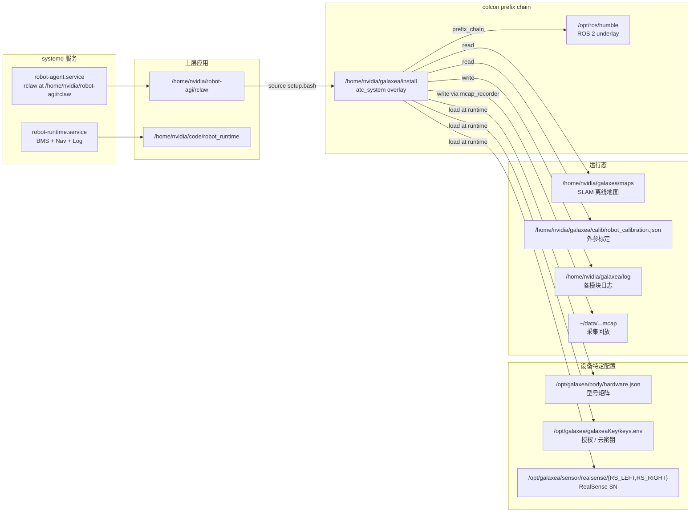

`install/setup.bash` 的链式 source 把 `/opt/ros/humble` 和当前 prefix 都加入 `AMENT_PREFIX_PATH` / `LD_LIBRARY_PATH`：

```1:32:/home/nvidia/galaxea/install/setup.bash
# generated from colcon_bash/shell/template/prefix_chain.bash.em
...
COLCON_CURRENT_PREFIX="/opt/ros/humble"
_colcon_prefix_chain_bash_source_script "$COLCON_CURRENT_PREFIX/local_setup.bash"

COLCON_CURRENT_PREFIX="$(builtin cd "`dirname "${BASH_SOURCE[0]}"`" > /dev/null && pwd)"
_colcon_prefix_chain_bash_source_script "$COLCON_CURRENT_PREFIX/local_setup.bash"
```

### 2.2 `/opt/galaxea/body/hardware.json` —— 型号矩阵

这是 SDK 中"同一份代码支持多款机器人"的关键开关：

```1:14:/opt/galaxea/body/hardware.json
{
  "R1-PRO": {
    "ARM": "A2",
    "TORSO": "T0",
    "ECU": "E1",
    "CHASSIS": "C1",
    "ARM_END": "EE0",
    "HEAD_CAMERA": "HC1",
    "WRIST_CAMERA": "WC1",
    "CHASSIS_CAMERA": "CC0",
    "LIDAR": "L0",
    "FORCE_SENSOR": null
  }
}
```

mobiman 的 `r1_pro_chassis_control_launch.py` 启动时读取这个文件，把 `CHASSIS=C1` 映射成 `chassis_type=W1`（差速 / 4WS 切换）：

```22:36:/home/nvidia/galaxea/install/mobiman/share/mobiman/launch/simpleExample/R1_PRO/r1_pro_chassis_control_launch.py
    json_path = '/opt/galaxea/body/hardware.json'
    chassis_type = 'W0'
    try:
        with open(json_path, 'r') as file:
            json_data = json.load(file)
            chassis = json_data.get("R1-PRO", {}).get("CHASSIS","")

            if chassis == "C1":
                chassis_type = "W1"
            elif chassis == "C0":
                chassis_type = "W0"
```

### 2.3 启动链：systemd → tmuxp → ros2 launch

`startup_config` 这个看似不起眼的包是整机的"orchestrator"。它依赖 `tmuxp`（tmux 的 YAML 编排工具），把 6~8 个相互依赖的 ROS 2 进程拆到独立的 tmux 窗口里，便于现场单独看每路日志：

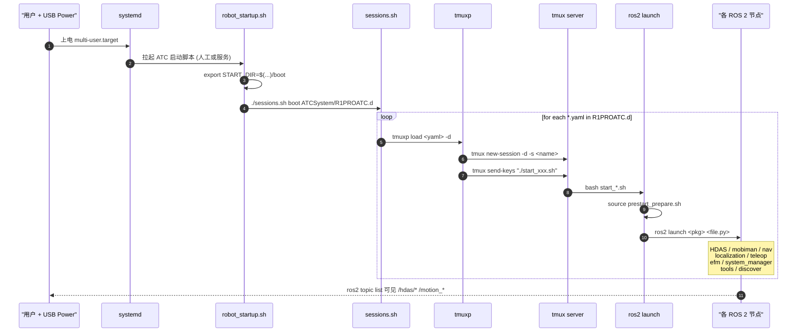

入口脚本：

```1:24:/home/nvidia/galaxea/install/startup_config/share/startup_config/script/robot_startup.sh
#!/bin/bash
export START_DIR=$(cd $(dirname "$0") && pwd)/boot
FILE="/tmp/start_type.log"

if [ "$1" = "boot" ]; then
  clean_path="${2%/}"
  dir_name="${clean_path##*/}"
  START_TYPE="${dir_name%.d}"
  ...
  ${START_DIR}/sessions.sh  "$1" "$2"
elif [ "$1" = "kill" ]; then
  tmux kill-server
  sleep 3
  ros2 daemon stop
fi
```

会话调度器遍历目录下所有 `*.yaml`：

```9:27:/home/nvidia/galaxea/install/startup_config/share/startup_config/script/boot/sessions.sh
function load_session() {
  if [[ "$1" == "boot" ]]; then
    cmd="tmuxp load $3 -d"
  elif [[ "$1" == "kill" ]]; then
    tmux list-sessions | awk -F: '{print $1}' | xargs -I {} tmux kill-session -t {}
    return
  ...
  fi
  ${cmd}
}

YAML_FILES=($(find ${BASH_SOURCE}/../$2 -name '*.yaml'))
```

R1 Pro 的 ATC 模式由 `sessions.d/ATCSystem/R1PROATC.d/` 下 8 个 yaml 拼成（每个对应一个独立 tmux session）：`hdas / system / mobiman / navigation / efm / teleop / tools / ros2_discover`。以 `hdas.yaml` 为例：

```1:21:/home/nvidia/galaxea/install/startup_config/share/startup_config/sessions.d/ATCSystem/R1PROATC.d/hdas.yaml
session_name: hdas
start_directory: ${START_DIR}/modules/hdas
windows:
- window_name: HDAS|zed|signal_camera|livox|realsense
  layout: even-horizontal
  panes:
  - shell_command:
      - sleep 5
      - ./start_hdas_r1pro.sh
  - shell_command:
      - sleep 5
      - ./start_zed_camera.sh
  - shell_command:
      - sleep 5
      - ./start_signal_camera_head.sh
  - shell_command:
      - sleep 5
      - ./start_livox_lidar.sh
  - shell_command:
      - sleep 5
      - ./start_realsense_camera_r1pro.sh
```

> 设计点评：把 5 路传感器/HAL 平铺成"水平 5 pane"是工程师常用的"墙式 dashboard"。`sleep 5` 是粗粒度的依赖序：等 `prestart_prepare.sh` 把 ROS 域注入完毕后再启进程；ROS 2 本身没有像 ROS 1 `roscore` 那样的中心节点，但 FastDDS 仍然需要一些时间完成 SPDP 发现，因此短延时是稳妥工程经验。

每个 `start_*.sh` 都是同一个模板：source 环境 → 启 ros2 launch。`start_hdas_r1pro.sh` 里多做了一件事——**配置 CAN-FD 接口**，这是 SDK 唯一需要 `sudo` 的地方：

```1:7:/home/nvidia/galaxea/install/startup_config/share/startup_config/script/boot/modules/hdas/start_hdas_r1pro.sh
#!/bin/bash
source $(cd $(dirname "$0") && pwd)/../../../prestart/prestart_prepare.sh
echo 'nvidia' | sudo -S ip link set down can0
echo 'nvidia' | sudo -S ip link set can0 type can bitrate 1000000 sample-point 0.875 dbitrate 5000000 fd on dsample-point 0.875
echo 'nvidia' | sudo -S ip link set up can0
ros2 launch HDAS r1pro.py
```

> 这里的 `bitrate 1000000`（仲裁段 1 Mbps）+ `dbitrate 5000000`（数据段 5 Mbps）+ `sample-point 0.875` 是典型 CAN-FD 高速参数；`sample-point` 偏后（87.5%）能在长线缆 + 小电容时给采样点更多稳定时间。

启动栈对环境的依赖统一在 `prestart_prepare.sh`：

```1:16:/home/nvidia/galaxea/install/startup_config/share/startup_config/script/prestart/prestart_prepare.sh
#!/bin/bash

export PROJECT_ROOT_DIR=$(cd $(dirname "$0") && pwd)/../../../../../../..

source /opt/ros/humble/setup.bash
source ${PROJECT_ROOT_DIR}/setup.bash
export LD_LIBRARY_PATH=$LD_LIBRARY_PATH:/usr/local/logger/Linux-aarch64/lib

export MAP_DIR=/home/nvidia/galaxea/maps
export CALIB_DIR=/home/nvidia/galaxea/calib/robot_calibration.json

if [ -f "/opt/galaxea/galaxeaKey/keys.env" ]; then
    source "/opt/galaxea/galaxeaKey/keys.env"
fi
```

### 2.4 systemd 长驻服务

R1 Pro 把"机器人上电就跑"的部分托管到 systemd：

```1:27:/etc/systemd/system/robot-runtime.service
[Unit]
Description=Robot Runtime Service (BMS + Nav + Log)
After=network-online.target
Wants=network-online.target

[Service]
Type=simple
User=nvidia
Group=nvidia

WorkingDirectory=/home/nvidia/code/robot_runtime
ExecStartPre=/bin/sleep 10
ExecStart=/bin/bash /home/nvidia/code/robot_runtime/start_service.sh

Restart=always
RestartSec=5
```

```33:35:/etc/systemd/system/robot-agent.service
ExecStart=/bin/bash -c "source /home/nvidia/galaxea/install/setup.bash && exec /home/nvidia/.local/bin/uv run --directory /home/nvidia/robot-agi/rclaw main.py"
```

> `robot-agent` 用 `uv`（Python 现代包管理器）跑 `rclaw`（Galaxea 的 LLM Agent 框架）。这条命令进程内同时持有 ROS 2 环境（`source setup.bash`）和 Python 虚拟环境（`uv run`），是个相当干净的运行模型。

### 2.5 FastDDS 自定义 profile

SDK 默认的 RMW 是 FastDDS（FastRTPS），并提供了**整机共享**的 profile：

```1:43:/home/nvidia/galaxea/install/startup_config/share/startup_config/script/prestart/fastrtps_profiles.xml
<?xml version="1.0" encoding="UTF-8"?>
<profiles xmlns="http://www.eprosima.com/XMLSchemas/fastRTPS_Profiles">
    <participant profile_name="participant_profile_ros2" is_default_profile="true">
        <rtps>
            <name>profile_for_ros2_context</name>
            <useBuiltinTransports>true</useBuiltinTransports>
            <builtinTransports>LARGE_DATA</builtinTransports>
            ...
        </rtps>
    </participant>
    <data_writer profile_name="default publisher profile" is_default_profile="true">
        <qos>
            <publishMode><kind>ASYNCHRONOUS</kind></publishMode>
            <data_sharing><kind>AUTOMATIC</kind></data_sharing>
        </qos>
        <historyMemoryPolicy>PREALLOCATED_WITH_REALLOC</historyMemoryPolicy>
    </data_writer>
    <data_reader profile_name="default subscription profile" is_default_profile="true">
        <qos>
            <data_sharing><kind>AUTOMATIC</kind></data_sharing>
        </qos>
        <historyMemoryPolicy>PREALLOCATED_WITH_REALLOC</historyMemoryPolicy>
    </data_reader>
</profiles>
```

三件极重要的事：
- `LARGE_DATA` 内置传输：FastDDS 会在 SPDP 阶段自动切到"小消息走 UDP，大消息走 TCP/SHM"；对相机原始流非常重要。
- `data_sharing AUTOMATIC`：在同主机进程间走共享内存，**真正零拷贝**。R1 Pro 上 HDAS、mobiman、EFM、data_collection 都跑在同一个 Orin 上，这条直接把"两路 wrist 相机 + 头部 ZED + Livox"的拷贝开销压到 0。
- `PREALLOCATED_WITH_REALLOC`：避免每次发布大消息时重新分配 history，配合 ASYNCHRONOUS 模式（写入排队、不阻塞应用线程）适合实时控制环。

> 设计点评：这 3 个 QoS 是典型的"机器人单机大消息"最佳实践。如果你做二次开发，**强烈建议沿用**，而不是回退到 ROS 默认配置。

---

## 3. HDAS 核心类图

HDAS（**H**ardware **D**ata **A**ccess **S**ervice）是整个 SDK 唯一直接和 CAN-FD 总线打交道的进程，也是设计最讲究的一块。它通过约 12 个核心 C++ 类、3 个解耦层级，把"裸 CAN 帧"翻译成"语义化 ROS 话题"。

### 3.1 类图（核心 12 个类）

```mermaid
classDiagram
    class CAN_frame {
        +double timestamp
        +uint32_t can_id
        +uint8_t len
        +bytes data
    }

    class Serial_Packet {
        +double timestamp
        +uint8_t packet_header
        +uint8_t source_address
        +uint8_t destination_address
        +uint8_t data_type
        +uint8_t index
        +uint8_t length
        +bytes data
        +bytes CRC
    }

    class CAN_Interface {
        -stream_descriptor can_stream_
        -FDCANQueue feedback_queue_
        -FDCANQueue control_queue_
        -atomic_bool reading_
        -steady_timer reconnect_timer_
        +CAN_Interface(string can_port)
        +bool connect()
        +void startReading()
        +void writeCANFD(CAN_frame)
        +void processControlQueue()
        +void setErrorCallback(callback)
        -void asyncRead()
        -void reconnect()
    }

    class Dispatcher {
        -ModuleManager module_manager_
        -ProtocolModules protocolModules_
        -vector input_queues_
        -FDCANQueue final_input_queue_
        -FDCANQueue control_queue_
        -thread combine_thread_
        -thread dispatch_thread_
        +start()
        +stop()
        +addFeedbackInputQueue(queue)
        +pushControlPacket(packet)
        +setProtolModules(protocolModules)
        +CombineFeedbackQueues()
        -DispatchToProtocol(packet)
        -getModuleFromCANID(can_id)
    }

    class MapModule {
        <<interface>>
        +getControlID(item) uint8_t
        +getFeedbackID(item) uint8_t
        +getControlItemFromID(id) string
        +getFeedbackItemFromID(id) string
    }

    class VCU_MapModule {
        +"CCU VCU TCU ACU subclasses"
    }

    class ModuleManager {
        -map_addr_to_CU sourceAddressToCU
        -map_CU_to_module modules
        +getControlID(addr, item) uint8_t
        +getFeedbackID(addr, item) uint8_t
        +getControlItemFromID(addr, id) string
        +getFeedbackItemFromID(addr, id) string
    }

    class ProtocolModules {
        -ProtocolChassis protocolChassis_
        -ProtocolTorso protocolTorso_
        -ProtocolArm protocolArm_
        -ProtocolHand protocolHand_
        -ProtocolCCU protocolCCU_
        -ProtocolError protocolError_
        +push_data(packet, moduleName)
        +setSerialPublishCallback(cb)
    }

    class ProtocolChassis {
        -thread chassis_read_thread
        -thread remote_read_thread
        -thread version_read_thread
        -FDCANQueue chassisPacketQueue
        -mutex chassis_mutex
        -condition_variable chassis_cv
        +encode_chassis(chassis_control_command)
        +decode_chassis(CAN_frame) serial_feedback_chassis
        +decode_remote(CAN_frame) serial_feedback_remote
        +decode_version(CAN_frame) serial_feedback_version
    }

    class ProtocolTorso {
        -thread read_thread
        -thread imu_read_thread
        -thread version_read_thread
        +encode(torso_control_command)
        +decode(CAN_frame) serial_feedback_torso
        +decode_imu(CAN_frame) serial_feedback_imu
        +decode_version(CAN_frame) serial_feedback_version
    }

    class ProtocolArm {
        -thread Left_Arm_read_thread
        -thread Right_Arm_read_thread
        -thread Left_Gripper_read_thread
        -thread Right_Gripper_read_thread
        -thread Left_Arm_temp_read_thread
        -thread Right_Arm_temp_read_thread
        -thread Left_Acu_Version_read_thread
        -thread Right_Acu_Version_read_thread
        +encode_Arm(command, name)
        +encode_Gripper(command, name)
        +decode_Arm(CAN_frame) pair_arm_gripper
        +decode_arm_temp(CAN_frame) serial_feedback_arm_temp
    }

    class ProtocolHand
    class ProtocolCCU {
        -thread imu_read_thread
        -thread bms_read_thread
        -thread version_read_thread
        +decode_imu(CAN_frame) serial_feedback_imu
        +decode_bms(CAN_frame) serial_feedback_bms
        +encode_command_led(led_control_command)
        +encode_command_chassis_auto_calibration(uint8_t)
    }
    class ProtocolError {
        +push_data(packet)
    }

    class r1pro_t_arm_analysis {
        <<namespace>>
        +arm_encode_impl(data, command)
        +arm_decode_impl(CAN_frame) pair
        +convertFloatToInt16P(value, scale)
        +convertFloatToInt16VTFF(value, scale)
        +convertFloatToInt16_KPKD(value, scale)
        +encode_arm(command, name) CAN_frame
    }

    CAN_Interface o-- CAN_frame : feedback enqueue
    CAN_Interface o-- CAN_frame : control dequeue
    Dispatcher o-- ModuleManager
    Dispatcher o-- ProtocolModules
    Dispatcher --> CAN_Interface : pushControlPacket addFeedbackInputQueue
    ModuleManager o-- MapModule
    VCU_MapModule ..|> MapModule
    ProtocolModules o-- ProtocolChassis
    ProtocolModules o-- ProtocolTorso
    ProtocolModules o-- ProtocolArm
    ProtocolModules o-- ProtocolHand
    ProtocolModules o-- ProtocolCCU
    ProtocolModules o-- ProtocolError
    ProtocolChassis ..> r1pro_t_arm_analysis : uses analysis
    ProtocolArm ..> r1pro_t_arm_analysis : encode and decode
    ProtocolTorso ..> r1pro_t_arm_analysis : encode and decode
```

### 3.2 数据契约 — `Serial_Packet` & `CAN_frame`

整条 HDAS 链路上流动的不是 `can_frame`（Linux SocketCAN 原生结构），而是经过封装的 `CAN_frame`，去掉了 CAN 协议层细节，加了 `timestamp`：

```10:27:/home/nvidia/galaxea/install/HDAS/include/HDAS/core/communication/communication_struct.hpp
struct Serial_Packet {
    double timestamp = 0.0;
    uint8_t packet_header = 0;
    uint8_t source_address = 0;
    uint8_t destination_address = 0;
    uint8_t data_type = 0;
    uint8_t index = 0;
    uint8_t length = 0;
    std::vector<uint8_t> data{};
    std::vector<uint8_t> CRC{};
};

struct CAN_frame {
    double timestamp = 0.0;
    uint32_t can_id = 0x00;
    uint8_t len = 0x00;
    std::vector<uint8_t> data{};
};
```

队列类型用了 cameron314/`concurrentqueue`，无锁多生产者-多消费者：

```45:46:/home/nvidia/galaxea/install/HDAS/include/HDAS/core/communication/communication_struct.hpp
using SerialPacketQueue = moodycamel::ConcurrentQueue<std::shared_ptr<Serial_Packet>>;
using FDCANQueue = moodycamel::ConcurrentQueue<std::shared_ptr<CAN_frame>>;
```

> **设计点评**：CAN-FD 单帧最大 64 B，但要传 ACU 7 关节的 56 B 控制（`p,v,kp,kd,t_ff` 全编码）刚好用得满。用无锁队列承载 `shared_ptr<CAN_frame>` 是为了让 `CAN_Interface::asyncRead` 拷贝下来一份 frame 之后立刻丢进队列继续 epoll 下一帧；多个 `ProtocolXxx` 解码线程从队列上消费时也不会阻塞 IO 线程。

### 3.3 `CAN_Interface` —— 装载着断线自愈

`CAN_Interface` 是封装 SocketCAN 的最薄层：

```26:67:/home/nvidia/galaxea/install/HDAS/include/HDAS/core/communication/can_interface.hpp
class CAN_Interface {
public:
    CAN_Interface(const std::string& can_port);
    ~CAN_Interface();

    void setFDCANFeedbackQueue(std::shared_ptr<FDCANQueue> queue);
    void setFDCANControlQueue(std::shared_ptr<FDCANQueue> queue);
    void startReading();
    void stopReading();
    bool connect();
    void disconnect();
    void writeCANFD(const std::shared_ptr<CAN_frame>& can_frame);
    void setErrorCallback(std::function<void(int)> callback);
    void processControlQueue();
private:
    void reconnect();
    void asyncRead();
    void handleRead(const boost::system::error_code& error, std::size_t bytes_transferred);
    ...
    boost::asio::io_service io_service_;
    boost::asio::posix::stream_descriptor can_stream_;
    std::shared_ptr<FDCANQueue> feedback_queue_;
    std::shared_ptr<FDCANQueue> control_queue_;
    ...
    std::thread io_service_thread_;
    std::thread processControlQueue_thread;
    std::shared_ptr<boost::asio::steady_timer> reconnect_timer_;
};
```

- **`connect()`** 内部 `socket(PF_CAN, SOCK_RAW, CAN_RAW)` → `ioctl(SIOCGIFINDEX)` → `bind(sockaddr_can)`；用 `boost::asio::posix::stream_descriptor` 接管文件描述符，享用 epoll。
- **`asyncRead()`** 注册 `async_read_some`，每次回调把读到的 `canfd_frame` 解析成 `CAN_frame` 推入 `feedback_queue_`，立刻再注册下一次读。
- **`processControlQueue()`** 在独立线程上轮询 `control_queue_`，调用 `writeCANFD` 完成 `write(socket, &canfd, sizeof(canfd))`。
- **断线自愈**：`scheduleReconnect(int delay_ms)` 通过 `steady_timer` 等延迟到期后调 `reconnect()` —— 重新打开 `socket`、重新 `bind`、重新启动 `asyncRead`。这是工业现场常见需求：CAN 转换器掉电 / 干扰被滤掉时不需要整个进程重启。

### 3.4 `Dispatcher` —— 双线程 fan-in / fan-out

```13:57:/home/nvidia/galaxea/install/HDAS/include/HDAS/core/dispatcher/dispatcher.h
class Dispatcher {
public:
    Dispatcher();
    void start();
    void stop();
    void addFeedbackInputQueue(std::shared_ptr<FDCANQueue> queue);
    ...
    void pushControlPacket(std::shared_ptr<CAN_frame> packet);
    void TrafficStatus();
    void CombineFeedbackQueues();
    void RegisterControlCallback();
    void setControlQueue(std::shared_ptr<FDCANQueue> queue);
    void setProtolModules(std::shared_ptr<ProtocolModules> protocolModules);
private:
    void processFeedbackQueues();
    void processControlQueue();
    void unifiedcallback(const std::shared_ptr<CAN_frame>& packet);
    ...
    std::vector<std::shared_ptr<FDCANQueue>> input_queues_{};
    std::shared_ptr<FDCANQueue> final_input_queue_;
    std::shared_ptr<ModuleManager> module_manager_;
    std::shared_ptr<ProtocolModules> protocolModules_;
    ...
    std::thread combine_thread_;
    std::thread dispatch_thread_;
    std::unordered_map<uint32_t, std::string> canIDToDevice;
};
```

- `combine_thread_` 跑 `CombineFeedbackQueues()`，把多路反馈队列合并成 `final_input_queue_`（即"fan-in"）。这是为未来扩展第二路 CAN 通道（例如 `can1`）留的钩子，目前 R1 Pro 只插一根。
- `dispatch_thread_` 跑 `processFeedbackQueues()`：从 `final_input_queue_` 取一帧 → `getModuleFromCANID(can_id)` → 调 `protocolModules_->push_data(packet, moduleName)` → 帧被分发到对应 `ProtocolXxx` 的子队列。
- 上行控制相反：`pushControlPacket()` → `control_queue_` → `CAN_Interface::processControlQueue` → CAN 总线（"fan-out"）。

> **设计点评**：把 IO 与协议解析解耦在不同线程，是工程上"实时控制 + 高吞吐反馈"系统的经典做法。整套设计与 `ros2_control` 的 `update()` 循环模型很不同——这是事件驱动+条件变量唤醒的多线程，而非时间触发的同步循环。

### 3.5 `ModuleManager` + `MapModule` —— 5 张 MCU 控制表

每颗 MCU（CCU/VCU/TCU/ACUL/ACUR）都有自己的"寄存器图谱"，例如 CCU：

```10:43:/home/nvidia/galaxea/install/HDAS/include/HDAS/core/dispatcher/COMM_MAP/R1proCcuCtrlMap.h
//-----------------R1PRO ID列表----------------
#define ID_R1_HOST                  0x11
#define ID_R1_CCU                   0x12
#define ID_R1_VCU                   0x13
#define ID_R1_TCU                   0x14
#define ID_R1_ACUL                  0x15
#define ID_R1_ACUR                  0x16
...

#define COMM_MAP_CCU_FW_VERSION     0x00
// == IMU  (Standard 18 BYTE)
#define COMM_MAP_CCU_IMU_ROLL       0x10
...
// == BATTERY
#define COMM_MAP_CCU_BATTERY_VOL    0x20
#define COMM_MAP_CCU_BATTERY_CURRENT 0x21
#define COMM_MAP_CCU_BATTERY_CAPITAL 0x22
// == REMOTE
#define COMM_MAP_CCU_REMOTE_MODE    0x30
#define COMM_MAP_CCU_REMOTE_CHASSIS_VX 0x31
#define COMM_MAP_CCU_REMOTE_CHASSIS_VY 0x32
#define COMM_MAP_CCU_REMOTE_CHASSIS_W  0x33
...
```

`MapModule` 是抽象基类，提供 4 个方法：

```7:25:/home/nvidia/galaxea/install/HDAS/include/HDAS/core/dispatcher/MAP_MODULE/MapModule.hpp
enum class CUType {
    CCU,
    VCU,
    TCU,
    ACU,
    UNKNOWN
};

class MapModule {
public:
    virtual uint8_t getControlID(const std::string& item) = 0;
    virtual uint8_t getFeedbackID(const std::string& item) = 0;
    virtual std::string getControlItemFromID(uint8_t id) = 0;
    virtual std::string getFeedbackItemFromID(uint8_t id) = 0;
    virtual ~MapModule() = default;
};
```

`ModuleManager` 把 `source_address (0x12/13/14/15/16)` 映射到 `CUType`，再委托给具体子类，完成 ID ↔ 语义双向转换：

```10:24:/home/nvidia/galaxea/install/HDAS/include/HDAS/core/dispatcher/MAP_MODULE/ModuleManager.hpp
class ModuleManager {
public:
    ModuleManager();
    uint8_t getControlID(uint8_t destination_address, const std::string& control_item);
    uint8_t getFeedbackID(uint8_t source_address, const std::string& feedback_item);
    std::string getControlItemFromID(uint8_t destination_address, uint8_t control_id);
    std::string getFeedbackItemFromID(uint8_t source_address, uint8_t feedback_id);
private:
    CUType getCUTypeFromSourceAddress(uint8_t source_address);
    std::unordered_map<uint8_t, CUType> sourceAddressToCU;
    std::unordered_map<CUType, std::shared_ptr<MapModule>> modules;
};
```

### 3.6 `ProtocolModules` —— 6 路协议子线程

```13:33:/home/nvidia/galaxea/install/HDAS/include/HDAS/core/protocol_modules/protocol_modules.h
class ProtocolModules {
public:
    ProtocolModules();
    void push_data(const std::shared_ptr<CAN_frame>& packet, const std::string& moduleName);
    void setSerialPublishCallback(const SerialPublishCallback& serial_publish_callback);
    void setChassis(const std::shared_ptr<ProtocolChassis>& chassis);
    void setTorso(const std::shared_ptr<ProtocolTorso>& torso);
    void setCCU(const std::shared_ptr<ProtocolCCU>& ccu);
    void setArm(const std::shared_ptr<ProtocolArm>& arm);
    void setError(const std::shared_ptr<ProtocolError>& error);
    void setHand(const std::shared_ptr<ProtocolHand>& hand);
private:
    std::shared_ptr<ProtocolChassis> protocolChassis_;
    std::shared_ptr<ProtocolTorso> protocolTorso_;
    std::shared_ptr<ProtocolArm> protocolArm_;
    std::shared_ptr<ProtocolHand> protocolHand_;
    std::shared_ptr<ProtocolCCU> protocolCCU_;
    std::shared_ptr<ProtocolError> protocolError_;
};
```

每个 `ProtocolXxx` 内部都有"子队列 + 子线程 + 条件变量"模式。以 `ProtocolArm` 为例，它一口气开了 8 条线程（左右臂 × {主反馈, 夹爪, 电机温度, ACU 版本} = 8）：

```43:52:/home/nvidia/galaxea/install/HDAS/include/HDAS/core/protocol_modules/protocol_arm.h
private:
    std::thread Left_Arm_read_thread;
    std::thread Right_Arm_read_thread;
    std::thread Left_Gripper_read_thread;
    std::thread Right_Gripper_read_thread;
    std::thread Left_Acu_Version_read_thread;
    std::thread Right_Acu_Version_read_thread;
    // 手臂温度处理线程
    std::thread Left_Arm_temp_read_thread;
    std::thread Right_Arm_temp_read_thread;
```

每条线程 `wait` 在自己的 `condition_variable` 上，`Dispatcher::push_data` 把帧放入对应子队列后 `notify_one()`。`ProtocolCCU` 类似，区分 `imu`/`bms`/`version` 三条解码流；`ProtocolChassis` 分 `chassis`/`remote`/`version` 三条流。

> **设计点评**：这种"按数据流维度切线程"而不是"按硬件维度切线程"的做法，让每路反馈的延迟都不会被其他路阻塞——例如 IMU 200 Hz 不会被 BMS 1 Hz 的 `nlohmann::json` 序列化卡住。代价是线程数量较多（HDAS 进程内合计约 25 条）。

### 3.7 `*_analysis` —— 16 位定标编解码

CAN-FD 单帧 64 B 要塞下 7 关节的 `p,v,kp,kd,t_ff`，每个量 12~16 bit 表示。SDK 把每种量纲的 scale/limit 全部硬编码在 `r1pro_t_arm_analysis` 命名空间，这比常见的"运行时配置"更可读：

```13:33:/home/nvidia/galaxea/install/HDAS/include/HDAS/core/analysis/r1pro_t_arm_analysis.h
namespace r1pro_t_arm_analysis {
    static const float fb_p_kScale = 4700.0f;
    static const float fb_v_kScale = 750.0f;
    static const float fb_tff_kScale = 600.0f;

    static const float fb_pLimit = 6.5f;
    static const float fb_vLimit = 40.0f;
    static const float fb_tffLimit = 50.0f;


    static const float ctrl_p_kScale = 4700.0f;
    static const float ctrl_v_kScale = 50.0f;
    static const float ctrl_kp_kScale = 8.0f;
    static const float ctrl_kd_kScale = 20.0f;
    static const float ctrl_tff_kScale = 40.0f;
    ...
```

编码端钳位 + 量化：

```50:65:/home/nvidia/galaxea/install/HDAS/include/HDAS/core/analysis/r1pro_t_arm_analysis.h
    inline int16_t convertFloatToInt16P(float value, float scale) {
        float scaledValue = value;
        if (scale == ctrl_p_kScale){
            if (scaledValue > ctrl_p_Limit){
                scaledValue = ctrl_p_Limit;
            }
            else if (scaledValue < -ctrl_p_Limit) {
                scaledValue = -ctrl_p_Limit;
            }
        }else {
            std::cout << "THIS IS UNKOWN SCALE VALUE!!!" << std::endl;
        }
        scaledValue = scaledValue * scale;
        int16_t result = static_cast<int16_t>(scaledValue);
        return result;
    }
```

> 这里"位置"是双向 6.5 rad（约 372°）的对称范围；"速度"40 rad/s、"力矩"50 N·m 全是对称量。`convertFloatToInt16VTFF` 用一个 0x0800 的"符号位偷梁换柱"——12 bit 表绝对值 + 第 11 bit 表符号——是经典紧凑编码套路。

7 关节一起编码就是把这 5 个量打到 56 B（每关节 8 B）的 `data[]`：

```116:134:/home/nvidia/galaxea/install/HDAS/include/HDAS/core/analysis/r1pro_t_arm_analysis.h
    inline void arm_encode_impl(std::vector<uint8_t>& data, const arm_control_command& arm_control_command){
        uint8_t high_byte = 0x00;
        uint8_t low_byte = 0x00;
        for(int i = 0; i < 7; i++) {
            splitInt16(convertFloatToInt16P(arm_control_command.p_des[i], ctrl_p_kScale), high_byte, low_byte);
            data[i*8+0] = high_byte;
            data[i*8+1] = low_byte;
            int16_t v_result = convertFloatToInt16VTFF(arm_control_command.v_des[i], ctrl_v_kScale);
            int16_t kp_result = convertFloatToInt16_KPKD(arm_control_command.kp[i], ctrl_kp_kScale);
            int16_t kd_result = convertFloatToInt16_KPKD(arm_control_command.kd[i], ctrl_kd_kScale);
            int16_t tff_result = convertFloatToInt16VTFF(arm_control_command.t_ff[i], ctrl_tff_kScale);
            data[i*8+2] = (v_result >> 4) & 0xFF;
            data[i*8+3] = ((v_result & 0x0F) << 4) | ((kp_result >> 8) & 0x0F);
            data[i*8+4] = (kp_result & 0xFF);
            data[i*8+5] = (kd_result >> 4) & 0xFF;
            data[i*8+6] = ((kd_result & 0x0F) << 4) | ((tff_result >> 8) & 0x0F);
            data[i*8+7] = (tff_result & 0xFF);
        }
    }
```

最后封成 CAN 帧，按"左/右"硬编码 `can_id`：

```156:169:/home/nvidia/galaxea/install/HDAS/include/HDAS/core/analysis/r1pro_t_arm_analysis.h
    inline CAN_frame encode_arm(const arm_control_command& arm_control_command, const std::string& name) {
       std::vector<uint8_t> data(56,0x00);
       arm_encode_impl(data, arm_control_command);
        CAN_frame canFrame;
        if (name == "LEFT_ARM"){
            canFrame.can_id = 0x50;
        }else if (name == "RIGHT_ARM")
        {
            canFrame.can_id = 0x60;
        }
        canFrame.data = data;
        canFrame.len = data.size();
        return canFrame;
    }
```

> **小结**：HDAS 内部的"五段式"——`CAN_Interface(IO)` → `Dispatcher(fan-in/out)` → `ModuleManager(寻址)` → `ProtocolModules(多线程解码)` → `*_analysis(量化)`——配合 ROS 2 Publisher/Subscriber，构成了一个不到 5000 行 C++ 头文件 + 几个 .so 的完整 HAL。它直接在 `r1pro.py` 里被实例化为唯一可执行 `HDAS`：

```84:90:/home/nvidia/galaxea/install/HDAS/share/HDAS/launch/r1pro.py
        Node(
            package='HDAS',
            executable='HDAS',
            name='HDAS',
            output='screen',
            parameters=[{
                ...
```


---

## 4. 关键 ROS 2 话题 / 服务 / 动作字典

R1 Pro SDK 在 ROS 2 上"自洽"地约定了一套命名规范，**理解清楚这套命名是二次开发的入门门槛**。整个总线分成 4 个一级前缀：

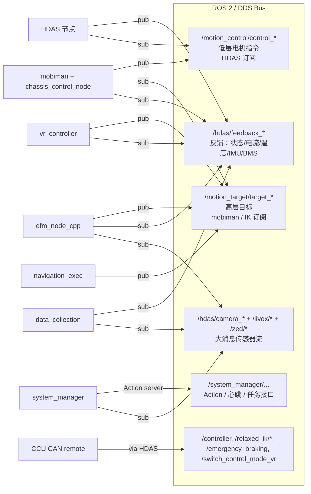

### 4.1 `/hdas/feedback_*` —— 反馈话题树

按硬件单元分组（来自 `r1pro.py` 默认参数）：

- **底盘 / 4WS**
  - `/hdas/feedback_chassis` — `hdas_msg/Drivetrain` （`vel_fl/fr/r`、`angle_fl/fr/r` 6 个量）
  - `/hdas/feedback_status_chassis` — `hdas_msg/FeedbackStatus`
  - `/hdas/imu_chassis` — `hdas_msg/Imu`（VCU 板载 IMU）
- **躯干 4-DoF**
  - `/hdas/feedback_torso` — `sensor_msgs/JointState`（位置/速度/力矩，4 关节）
  - `/hdas/feedback_status_torso`
  - `/hdas/imu_torso` — `hdas_msg/Imu`（TCU 板载 IMU）
- **左/右臂 7-DoF**
  - `/hdas/feedback_arm_left`、`/hdas/feedback_arm_right` — `sensor_msgs/JointState`
  - `/hdas/feedback_status_arm_left`、`/hdas/feedback_status_arm_right`
  - `/hdas/feedback_arm_temp_left`、`/hdas/feedback_arm_temp_right` — 7 路 MOS 温度 + 7 路绕组温度
- **末端：Gripper / Hand / Wrench**
  - `/hdas/feedback_gripper_left|right`、`/hdas/feedback_hand_left|right`
  - `/hdas/feedback_left_arm_wrench`、`/hdas/feedback_right_arm_wrench`（六维力矩，留接口）
- **整机环境量**
  - `/hdas/bms` — `hdas_msg/Bms`（电压/电流/SOC）
  - `/controller` — `hdas_msg/ControllerSignalStamped`（CCU 解码遥控器后透传）
- **版本号回报**
  - `/hdas/{ccu,vcu,tcu}_version`、`/hdas/{left,right}_acu_version`、`/hdas/{left,right}_acu_motor_version`

接口契约非常薄，例如 BMS 和 IMU：

```1:5:/home/nvidia/galaxea/install/hdas_msg/share/hdas_msg/msg/Bms.msg
std_msgs/Header header
float32 voltage
float32 current
float32 capital
```

```1:11:/home/nvidia/galaxea/install/hdas_msg/share/hdas_msg/msg/Imu.msg
std_msgs/Header header
float64 roll
float64 pitch
float64 yaw
float64 groy_x
float64 groy_y
float64 groy_z
float64 acc_x
float64 acc_y
float64 acc_z
```

> 注意 `Imu.msg` 是 RPY + 角速度 + 加速度的"已解算"格式，**不是** ROS 标准的 `sensor_msgs/Imu`。如果你想喂给 Nav2，就需要在中间加一个转换节点。

底盘 6 元组：

```1:6:/home/nvidia/galaxea/install/hdas_msg/share/hdas_msg/msg/Drivetrain.msg
float32 vel_fl
float32 vel_fr
float32 vel_r
float32 angle_fl
float32 angle_fr
float32 angle_r
```

错误码契约：

```1:3:/home/nvidia/galaxea/install/hdas_msg/share/hdas_msg/msg/FeedbackStatusDetail.msg
string name
uint32 error_code
string[] error_description
```

### 4.2 `/motion_control/control_*` —— 低层电机指令

HDAS 订阅这一组话题，把 `MotorControl` 转成 CAN 帧。**通常用户不要直接发布到这里**，否则会和 mobiman/HDAS 抢总线。`MotorControl` 是统一格式：

```1:8:/home/nvidia/galaxea/install/hdas_msg/share/hdas_msg/msg/MotorControl.msg
std_msgs/Header header
string name
float32[] p_des
float32[] v_des
float32[] kp
float32[] kd
float32[] t_ff
uint8 mode
```

它和 `r1pro_t_arm_analysis::arm_encode_impl` 的入参 `arm_control_command` 一一对应（除 `mode`）。一组典型话题：

- `/motion_control/control_chassis`
- `/motion_control/control_torso`
- `/motion_control/control_arm_left|right`
- `/motion_control/control_gripper_left|right`
- `/motion_control/position_control_gripper_*`、`/motion_control/force_control_gripper_*`
- `/motion_control/control_hand_left|right`
- `/hdas/control_led`

### 4.3 `/motion_target/target_*` —— 高层目标

mobiman / IK / Tracker 节点订阅这组话题。EFM、VR 控制器等"上游"在这里输出：

- `/motion_target/target_speed_chassis` — 底盘速度（`Twist` 或 `TwistStamped`）
- `/motion_target/brake_mode`
- `/motion_target/target_pose_arm_left|right` — 末端位姿（来自 EFM / 遥操作）
- `/motion_target/target_pose_arm_left_raw|target_pose_arm_right_raw` — 来自模型的"原始动作"（即将经平滑处理）
- `/motion_target/target_position_gripper_left|right` 与 `_raw`
- `/motion_target/target_joint_state_arm_left|right` — 关节空间目标
- `/motion_target/target_joint_state_torso` 与 `_raw`

EFM 的 launch 把这套接口完整列了出来：

```30:48:/home/nvidia/galaxea/install/efm_node_cpp/share/efm_node_cpp/launch/efm_node_launch.py
                    "topic.left_arm_command": "/motion_target/target_pose_arm_left",
                    "topic.right_arm_command": "/motion_target/target_pose_arm_right",
                    "topic.left_arm_command_raw": "/motion_target/target_pose_arm_left_raw",
                    "topic.right_arm_command_raw": "/motion_target/target_pose_arm_right_raw",
                    "topic.left_gripper_command": "/motion_target/target_position_gripper_left",
                    "topic.right_gripper_command": "/motion_target/target_position_gripper_right",
                    ...
                    "topic.torso_motion_control": "/motion_target/target_joint_state_torso",
                    "topic.torso_motion_control_raw": "/motion_target/target_joint_state_torso_raw",
                    ...
                    "topic.relaxed_ik_reset_left": "/relaxed_ik/reset_left",
                    "topic.relaxed_ik_reset_right": "/relaxed_ik/reset_right",
```

> **设计点评**：`raw` 与非 `raw` 的差异是 SDK 留给"动作平滑/插值/限速"二次开发的标准 hook。EFM 等 AI 推理给 `_raw`，由 mobiman 的 IK/MPC 拿到非 `raw` 的最终插值结果。

### 4.4 `/system_manager/...` —— 任务接口

`system_manager` 是对内 ROS 2 Action Server，对外 WebSocket 网关。它在 `system_manager.py` 里把 3 个 action / topic 名称参数化：

```13:25:/home/nvidia/galaxea/install/system_manager/share/system_manager/launch/system_manager.py
        DeclareLaunchArgument('system_manager_task_navigation_action_name', default_value='/system_manager/navi/action'),
        DeclareLaunchArgument('system_manager_task_manipulation_action_name', default_value='/system_manager/manipulation/action'),
        DeclareLaunchArgument('system_manager_task_teleop_engage_topic_name', default_value='/system_manager/task/teleop_engage'),
        DeclareLaunchArgument('launch_ws_ip', default_value='127.0.0.1'),
        ...
        DeclareLaunchArgument('head_cam_stream_topic', default_value='/hdas/camera_head/left_raw/image_raw_color/compressed'),
        DeclareLaunchArgument('left_wrist_cam_stream_topic', default_value='/hdas/camera_wrist_left/color/image_raw/compressed'),
        DeclareLaunchArgument('right_wrist_cam_stream_topic', default_value='/hdas/camera_wrist_right/color/image_raw/compressed'),
        DeclareLaunchArgument('head_cam_stream_port', default_value="'52134'"),
        DeclareLaunchArgument('left_wrist_cam_stream_port', default_value="'52135'"),
        DeclareLaunchArgument('right_wrist_cam_stream_port', default_value="'52136'"),
```

涉及 4 类对外 API：

- **Action 服务端**：
  - `/system_manager/navi/action` — `system_manager_msg/action/NavigationTask`
  - `/system_manager/manipulation/action` — `system_manager_msg/action/ManipulationTask`
- **Topic**：`/system_manager/task/teleop_engage`（VR 接管/释放整机）、`/system_manager/task/manipulation_enage`（注：源拼写如此，为 EFM 对接用）、`/system_manager/task/response`（任务结果反馈）
- **Service**：`/system_manager/ai_lifecycle/manage`（拉起/卸载 EFM 推理生命周期）、`/emergency_braking`、`/switch_control_mode_vr`
- **WebSocket Server**：`launch_ws_ip`（默认 127.0.0.1）+ 3 个相机流 TCP/UDP 端口 52134~52136。这意味着 system_manager 同时运行了 ROS 2 节点 + IXWebSocket Server（`/home/ros/ci_pipeline/workspace/ATCSystem/src/system_manager/thirdparty/IXWebSocket` 的 strings 痕迹证实了这点），用于把"任务请求 / 心跳 / 相机预览"暴露给同主机的 robot-agent 或局域网客户端。

#### 4.4.1 NavigationTask Action

```1:14:/home/nvidia/galaxea/install/system_manager_msg/share/system_manager_msg/action/NavigationTask.action
# Goal
std_msgs/Header header
geometry_msg/Pose pose
string frame_id 
uint8 target_point_type
---
# Result
uint8 task_status  # 1: success, 2: failed 
string detail
---
# Feedback
float32 progress
geometry_msg/Pose current_pose
```

#### 4.4.2 ManipulationTask Action

```1:15:/home/nvidia/galaxea/install/system_manager_msg/share/system_manager_msg/action/ManipulationTask.action
# Goal
std_msgs/Header header
uint8 manip_type
uint8 manip_object
uint16 manip_action
perception_msg/Rect4d object_bbox
string reserved
---
# Result
uint16 task_status
string detail
---
# Feedback
uint16 progress   # 0: 
```

#### 4.4.3 TaskRequest 通用包络

```1:6:/home/nvidia/galaxea/install/system_manager_msg/share/system_manager_msg/msg/TaskRequest.msg
std_msgs/Header header
uint8 task_type
NavigationTask navigation_task
ManipulationTask manipulation_task
PoseAdjustTask poseadjust_task
string reserved
```

> **设计点评**：`TaskRequest` 是带"判别字段 `task_type`"的 union 风格消息，方便 WebSocket 网关把 JSON `{task_type:..., navigation_task:...}` 直接 round-trip 到 ROS。这让上层 LLM Agent（rclaw）只用一个统一接口就能下发"导航 / 操作 / 姿态调整"三类任务。

### 4.5 服务 `FunctionFrame` —— 模式切换 / 标定触发

HDAS 暴露的最重要 service：

```1:5:/home/nvidia/galaxea/install/hdas_msg/share/hdas_msg/srv/FunctionFrame.srv
uint8 command
---
bool success
string message
```

被 `r1pro.py` 注册为：
- `function_frame_left_arm` / `function_frame_right_arm`
- `function_frame_torso`
- `function_frame_chassis_auto_calibration`

这是底层"上电使能 / 失能 / 进入零位 / 自动标定"等等指令的统一入口，对应 CCU/ACU 固件里的 `encode_command_*`：

```31:35:/home/nvidia/galaxea/install/HDAS/include/HDAS/core/protocol_modules/protocol_ccu.h
    void encode_command_left(uint8_t command);
    void encode_command_right(uint8_t command);
    void encode_command_torso(uint8_t command);
    void encode_command_chassis_auto_calibration(uint8_t command);
    void encode_command_led(const led_control_command& led_control_command);
```


---

## 5. 模块深剖

### 5.1 HDAS 节点本身

进程：`/home/nvidia/galaxea/install/HDAS/lib/HDAS/HDAS`（aarch64 ELF，非 strip，带 debug_info）。

`ldd` 显示它链接了 3 个 SDK 内部 `.so`、ROS 2 Humble 全套、`libhdas_msg__rosidl_typesupport_cpp.so`：

```
linux-vdso.so.1
libdispatcher.so => /home/nvidia/galaxea/install/HDAS/lib/libdispatcher.so
libprotocol_modules.so => /home/nvidia/galaxea/install/HDAS/lib/libprotocol_modules.so
libcommunication.so => /home/nvidia/galaxea/install/HDAS/lib/libcommunication.so
librclcpp.so => /opt/ros/humble/lib/librclcpp.so
libhdas_msg__rosidl_typesupport_cpp.so => /home/nvidia/galaxea/install/hdas_msg/lib/libhdas_msg__rosidl_typesupport_cpp.so
...
```

`r1pro.py` 一次注入 50+ 个 topic 名参数，**没有硬编码任何话题字符串**——这意味着同一个 HDAS 二进制可以被不同型号 launch 改名复用（例如 `r1prot.py` 把所有反馈话题加 `/teleoperation/` 前缀，专门用于"主从同构遥操作"场景）：

```11:23:/home/nvidia/galaxea/install/HDAS/share/HDAS/launch/r1prot.py
        DeclareLaunchArgument('chassis_feedback_topic_name', default_value='/teleoperation/hdas/feedback_chassis'),
        DeclareLaunchArgument('chassis_control_command_topic_name', default_value='/teleoperation/motion_control/control_chassis'),
        ...
```

> **设计点评**：把所有 topic 名都做成 launch 参数是 ROS 2 推荐做法（参考 ROS 2 设计指南的 "Topic Remapping"），但 SDK 选择在 launch 中**显式声明默认值**而不是用 `--remap`，可读性更高。

### 5.2 mobiman —— 移动操作的 OCS2 大脑

mobiman（Mobile Manipulation）是这套 SDK 最复杂的运动模块。`package.xml` 一行行依赖说清了它的"血统"：

- **核心求解器**：`ocs2_*`（瑞士 ETH Robotic Systems Lab 的 SLQ-MPC 框架）
- **动力学**：`pinocchio`、`hpp-fcl`（Pinocchio 自家的精确碰撞检测）
- **二次规划**：`OsqpEigen` + `osqp` + `nlopt`
- **关节空间轨迹时间最优**：`toppra`（Hauser 算法）
- **常规 IK 兜底**：`trac_ik_lib`（Track-IK，KDL + NL 复合搜索）
- **ros2_control 套件**：`controller_interface / controller_manager / pluginlib / realtime_tools`

```mermaid
flowchart TB
    subgraph MOBI [mobiman 节点矩阵]
        CC["chassis_control_node<br/>4WS 底盘指令分发"]
        EE["r1_pro_eepose_pub_node<br/>ee_pose 正运动学发布"]
        EEP["r1_pro_eepose_planning_pub_node<br/>规划用 ee_pose"]
        JT["r1_pro_jointTracker_demo_node<br/>OCS2 SLQ-MPC 主求解器"]
        IKL["r1_pro_left_arm_relaxed_ik / trac_ik"]
        IKR["r1_pro_right_arm_relaxed_ik / trac_ik"]
        TC["torso_control_node<br/>升降躯干控制"]
        GC["r1_gripper_controller<br/>夹爪 PID"]
    end

    subgraph CFG [运行时配置]
        URDF["urdf/R1_PRO/urdf/r1_pro.urdf"]
        TASK["config/r1_pro_task_left.info<br/>left_arm OCS2 配置"]
        TASKR["config/r1_pro_task_right.info"]
        TASKT["config/r1_pro_task_torso.info"]
        AUTO["auto_generated/r1_robot_left,right,torso<br/>CppAD 生成的动力学 .so"]
        PID["config/joint_controller_pid_kp_kd.toml"]
        HW["/opt/galaxea/body/hardware.json"]
    end

    HW --> CC
    URDF --> EE
    URDF --> JT
    TASK --> JT
    TASKR --> JT
    TASKT --> JT
    AUTO --> JT
    PID --> JT

    HDAS_FB["/hdas/feedback_arm_*<br/>/hdas/feedback_torso<br/>/hdas/feedback_chassis"] --> JT
    JT --> CTL["/motion_control/control_arm_*<br/>/motion_control/control_torso"]
    CC --> CTL_C["/motion_control/control_chassis"]

    TGT["/motion_target/target_speed_chassis<br/>/motion_target/target_pose_*<br/>/motion_target/target_joint_state_*"] --> CC
    TGT --> JT
    TGT --> IKL
    TGT --> IKR
```

#### 5.2.1 OCS2 SLQ-MPC 任务配置

`r1_pro_task_left.info` 是典型的 OCS2 task 格式（基于 `boost::property_tree::info_parser`）。它包含：

- `model_information`：从 URDF 中**剔除**底盘/右臂/夹爪 17 个关节，把整机简化为"基座 + 7 关节左臂"——这是 OCS2 manipulator package 把 mobile manipulator 拆成左/右两个独立 MPC 的典型策略：

```5:30:/home/nvidia/galaxea/install/mobiman/share/mobiman/config/r1_pro_task_left.info
  removeJoints {
    [0] "steer_motor_joint1"
    [1] "wheel_motor_joint1"
    [2] "steer_motor_joint2"
    [3] "wheel_motor_joint2"
    [4] "steer_motor_joint3"
    [5] "wheel_motor_joint3"
    [6] "right_arm_joint1"
    ...
    [16] "left_gripper_finger_joint2"
  }

  baseFrame                       "base_link"
  eeFrame                         "left_arm_link6"
}
```

- `slp / sqp / ddp`：三种求解器后端可选；R1 Pro 默认用 `algorithm SLQ`（带 GaussNewton 的微分动态规划），4 线程，`maxNumIterations=5`、`timeStep=1e-3`：

```76:114:/home/nvidia/galaxea/install/mobiman/share/mobiman/config/r1_pro_task_left.info
ddp
{
  algorithm                       SLQ

  nThreads                        3
  threadPriority                  50

  maxNumIterations                5
  minRelCost                      1e-3
  constraintTolerance             1e-3
  ...
  timeStep                        1e-3
  backwardPassIntegratorType      ODE45

  constraintPenaltyInitialValue   20.0
  constraintPenaltyIncreaseRate   2.0

  preComputeRiccatiTerms          true
  useFeedbackPolicy               false

  strategy                        LINE_SEARCH
  ...
}
```

- `mpc`：MPC 输出窗口（`solutionTimeWindow=0.2 s`）、规划期 `timeHorizon=1.0 s`、上层 MPC 频率 10 Hz、下层插值 MRT（Model Reference Tracker）频率 200 Hz：

```128:138:/home/nvidia/galaxea/install/mobiman/share/mobiman/config/r1_pro_task_left.info
mpc
{
  timeHorizon                     1.0
  solutionTimeWindow              0.2
  coldStart                       false

  debugPrint                      false

  mpcDesiredFrequency             10
  mrtDesiredFrequency             200
}
```

> **设计点评**：典型的 OCS2 双层架构——MPC 在 10 Hz 上做长程优化，MRT 在 200 Hz 上做插值跟踪；HDAS 在更高频率（实际 ACU 端 ~500 Hz）跟踪 MRT 给的关节目标。这套节奏与 ETH Robotic Systems Lab 关于 Anymal/Allegro 的典型论文配置一致。

#### 5.2.2 CppAD/CppADCodeGen 自动微分

`auto_generated/r1_robot_left/dynamics_flow_map/cppad_generated/` 里有 `dynamics_flow_map_lib.so` 和一组 `.c` 源文件，这是 OCS2 在首次编译期/运行期通过 CppAD/CppADCodeGen 生成的"动力学图、雅可比稀疏模式、零阶/一阶前向"代码：

- `dynamics_flow_map_forward_zero.c`：值
- `dynamics_flow_map_sparse_jacobian.c`：稀疏雅可比
- `dynamics_flow_map_jacobian_sparsity.c`：稀疏结构

> **设计点评**：用 CppADCodeGen 把 Pinocchio 的"对 q 求导"在编译期固化到 `.c` 再编译成 `.so`，比运行时多次 `forwardKinematicsDerivatives` 性能提升一个数量级；OCS2 的 `recompileLibraries=true` 表示每次启动都会检查 hash，必要时重生成。

#### 5.2.3 chassis_control_node（4WS）

`r1_pro_chassis_control_launch.py` 启动它，订阅高层目标 + HDAS 反馈，输出底层电机指令：

```37:49:/home/nvidia/galaxea/install/mobiman/share/mobiman/launch/simpleExample/R1_PRO/r1_pro_chassis_control_launch.py
    chassis_control_node = Node(
        package='mobiman',
        executable='chassis_control_node',
        name='chassis_control_node',
        output='screen',
        parameters=[{
            'current_motor_topic_name': current_motor_topic_name,
            'chassis_control_topic_name': chassis_control_topic_name,
            'motor_command_topic_name': motor_command_topic_name,
            'breaking_topic_name': breaking_topic_name,
            'chassis_type': chassis_type
        }]
    )
```

四个话题：
- 输入反馈：`/hdas/feedback_chassis`（实际车轮速度/转角）
- 输入目标：`/motion_target/target_speed_chassis`（机器人本体速度 vx/vy/ω）
- 输入刹车：`/motion_target/brake_mode`
- 输出：`/motion_control/control_chassis`（每轮单独的 `MotorControl`）

`chassis_type` 是从 `/opt/galaxea/body/hardware.json` 读出的 `W0`/`W1`，对应不同的逆运动学（双驱差速 vs 4 轮转向）。

### 5.3 localization —— 自研紧耦合 LIO

`localization` 包的 `lib/` 下散布着 13 个 `.so`，命名规律暴露了内部模块：`librlog`、`librdata_hub`、`librcamera`、`librdewarper`、`librstitcher`、`librgi_entry`、`librwheel`、`liblocalization_localizer`、`liblocalization_optimizer`、`liblocalization_param_manager`、`liblocalization_lidar_utils`、`liblocalization_app_utils`、`librcommon`。

`localization_node` 在 `localization.py` 里只接 3 个参数：

```21:32:/home/nvidia/galaxea/install/localization/share/localization/launch/localization.py
        Node(
            package='localization',
            executable='localization_node',
            name='localization',
            output='screen',
            parameters=[{
                'config_file': LaunchConfiguration('config_file'),
                'output_dir': LaunchConfiguration('output_dir'),
                'enable_log_file': LaunchConfiguration('enable_log_file'),
            }],
        ),
```

主要参数都在 YAML 里：

```1:35:/home/nvidia/galaxea/install/localization/share/localization/config/localization_setting.yml
GlobalConfig:
    mode: "localization"

ImuDataConfig:
    acc_noise_cov: 1e-2
    gyro_noise_cov: 1e-4
    max_imu_interval_time: 120e5
    max_gravity_diff_norm: 0.03
    static_init: true
    static_init_gyro_std: 5e-3
    static_init_acc_std: 3e-2
    static_init_gyro_mean: 5e-3

LidarDataConfig:
    voxel_map_resolution_init: 0.4
    voxel_map_resolution_local: 0.5
    voxel_map_resolution_global: 1.0
    voxel_map_add_frame_dist_for_init: 0.2
    max_range_filter_dist: 70.0
    icp_max_iteration_for_init: 2
    icp_max_iteration_for_lidar_opt: 5
    icp_max_iteration_for_keyframe_opt: 4
    add_keyframe_dist_diff: 1.0
    add_keyframe_angle_diff: 5.0
    ...
```

从 `.so` 命名 + YAML 我们可以推断：
- **rdewarper**：Lidar 帧去畸变（按 IMU 积分修正点的扫描时间偏差）
- **rstitcher**：多帧拼接成 voxel map（`voxel_map_resolution_init/local/global` 三尺度）
- **rcamera**：视觉辅助（可选，R1 Pro 默认未必启用）
- **rwheel**：轮速里程计输入
- **rdata_hub**：内部数据中心，多源融合
- **rgi_entry**：Region-based GeoIndex 入口（推测，命名与点云 voxel grid 一致）
- **localization_localizer**：主算法体（点云 ICP/NDT + IMU 预积分 + 关键帧维护）

> **设计点评**：紧耦合 LIO（Lidar-Inertial Odometry）+ 关键帧子图，是当下工业 LIO 的主流流派（FAST-LIO2 / Point-LIO / LIO-SAM）。Galaxea 没有公开算法论文，但参数命名（`add_keyframe_dist_diff: 1.0 m`、`add_keyframe_angle_diff: 5°`、`voxel_map_resolution_global: 1.0 m`）与 LIO-SAM/Point-LIO 风格高度一致。

### 5.4 navigation —— 自研多层规划

`navigation` 包以 `navigation_exec` 为单进程，通过 `ldd` 看到它链接：`astar_global_planner / lattice_local_planner / bspline_gen / bspline_opt / pure_pursuit / simple_costmap_2d / navfn_planner / nav_utils` 等十几个组件 `.so`，也链接了 `communication`（即上文 `data_receiver.hpp` 提供的 ROS 接口胶水层）。

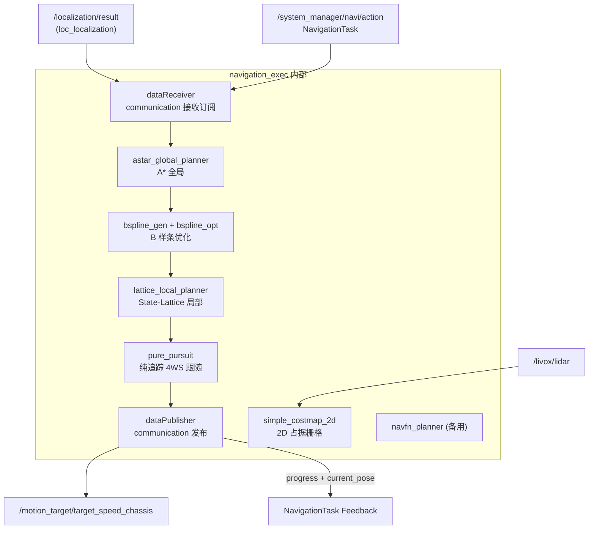

`data_receiver.hpp` 揭露它内部即是一个 Action Server + 多个 Subscription：

```127:191:/home/nvidia/galaxea/install/communication/include/data_receiver.hpp
class dataReceiver
{
public:
  using NavigateTask = system_manager_msg::action::NavigationTask;
  using GoalHandle = rclcpp_action::ServerGoalHandle<NavigateTask>;
  ...
  void callbackLaserScan(const sensor_msgs::msg::LaserScan::SharedPtr message);
  void callbacMultiLidarPc(const sensor_msgs::msg::PointCloud2::SharedPtr message);
  void callbackFromOdomPose(const nav_msgs::msg::Odometry::SharedPtr msg);
  void callbackPidGoalPose(const geometry_msgs::msg::PoseStamped::SharedPtr msg);
  void callbackTopoGlobalGoalPose(...);
  void callbackGridGlobalGoalPose(...);
  void callbackGlobalMap(...);
  void callbackNavTaskRequest(const system_manager_msg::msg::TaskRequest::SharedPtr msg);
  void callbackLocalLizationResults(const localization_msg::msg::LocLocalization::SharedPtr msg);
  ...
  rclcpp_action::GoalResponse handle_goal(...);
  void handle_accepted(...);
  rclcpp_action::CancelResponse handle_cancel(...);
  void action_execute(const std::shared_ptr<GoalHandle> goal_handle);
```

注意：
- `dataReceiver` 同时接受 `geometry_msgs::PoseStamped` 形态的 PID 目标 + topo / grid 全局目标 + Action 请求三套入口，体现"多种调用风格的兼容"。
- `dataPublisher` 同时发布 `geometry_msgs::TwistStamped`（实物）与 `geometry_msgs::Twist`（仿真兼容）：

```300:308:/home/nvidia/galaxea/install/communication/include/data_receiver.hpp
    rclcpp::Publisher<geometry_msgs::msg::TwistStamped>::SharedPtr pub_cmd_vel_;
    rclcpp::Publisher<geometry_msgs::msg::Twist>::SharedPtr pub_sim_cmd_vel_;
```

### 5.5 teleoperation_ros2 —— VR 双臂遥操

两个进程：

- `vr_vr_data_receiver_node`：strings 显示链接了 **websocketpp + jsoncpp**——它在本机或 LAN 暴露一个 WebSocket Server（默认端口约定见 SDK 启动文档），接收 VR 头显的右/左手控制器位姿（quaternion + position + button + trigger）+ 头部位姿。
- `vr_vr_controller_node`：链接 `libnlopt.so.0`，做 NLP 形式的 IK 求解（即 RelaxedIK 风格）+ 平滑映射，把"VR 空间的末端目标"映射到 R1 Pro 的双臂工作空间。它还负责"夹爪开合阈值映射"、"手肘约束"、"按键 engage/disengage"等业务逻辑。

```60:114:/home/nvidia/galaxea/install/teleoperation_ros2/share/teleoperation_ros2/launch/vr_teleoperation.launch.py
        Node(
            package='teleoperation_ros2',
            executable='vr_vr_controller_node',
            name='vr_controller',
            output='screen',
            parameters=[
                {'robot_name': LaunchConfiguration('robot_name')},
                {'ik_interp': LaunchConfiguration('ik_interp')},
                {'enable_elbow_angle_cons': LaunchConfiguration('enable_elbow_angle_cons')},
                {'enable_engage_by_operator': LaunchConfiguration('enable_engage_by_operator')},
                {'gripper_openning_threshold': LaunchConfiguration('gripper_openning_threshold')},
                {'gripper_closing_threshold': LaunchConfiguration('gripper_closing_threshold')},
                {'enable_torso_tracking': LaunchConfiguration('enable_torso_tracking')},
                ...
                {'arm_length_ratio': LaunchConfiguration('arm_length_ratio')},
                {'R1PRO_left_urdf': LaunchConfiguration('R1PRO_left_urdf')},
                {'R1PRO_right_urdf': LaunchConfiguration('R1PRO_right_urdf')},
                ...
                {'vr_initializer_left_target_joint_states_r1pro': [0.0, 0.0, 0.0, -1.62, 0.0, 0.0, 0.0]},
                {'vr_initializer_right_target_joint_states_r1pro': [0.0, 0.0, 0.0, -1.62, 0.0, 0.0, 0.0]},
                {'vr_initializer_torso_target_joint_states_r1pro': [0.3507, -0.7681, -0.6094, 0.0]},
                ...
            ],
        ),
```

URDF 用的是 `r1_pro_floating_left.urdf`/`r1_pro_floating_right.urdf` —— 把臂的"基座"做成虚拟自由浮动 6 DoF，便于 NLP IK 把 base→ee 写成欧氏映射。`arm_length_ratio=1.2` 表示把人类操作者的臂长按比例放大到机器人的 1.2 倍（R1 Pro 双臂展开较长）。

### 5.6 efm_node_cpp —— TensorRT Diffusion Policy

EFM = "Embodied Foundation Model"。它链接 `libnvinfer.so.8 + libcudart.so.12 + libcublas.so.12 + libcudnn.so.8`，**这是个 TensorRT 推理引擎封装的 C++ 节点**：

- `cudaMalloc d_action_offset_ / d_actions_ / d_action_scale_ / d_cond_data_ / d_cond_mask_ / d_nobs_features_buffer_ / d_normalized_qpos_ / d_qpos_offset_ / d_qpos_scale_ / d_sampled_trajectory_ / d_timesteps_` 这些命名指向：**Diffusion Policy** 的标准 buffer（normalized qpos、condition data + mask、sampled trajectory、timesteps）。
- `denormalize_kernel<float>` 是输出反归一化 CUDA kernel。

`launch/efm_node_launch.py` 揭示它的关键参数：

```50:69:/home/nvidia/galaxea/install/efm_node_cpp/share/efm_node_cpp/launch/efm_node_launch.py
                    "model.reset_pos": True,

                    "model.ensemble_mode": "HATO",
                    "model.action_step": 16,
                    "model.k_act": 0.01,
                    "model.tau_hato": 0.5,
                    "model.use_slerp_quat_avg": False,

                    "model.use_preload": True,
                    "model.ckpts_root_dir": os.path.join(pkg_path, "dp_ckpts"),
                    "model.model_cards_yaml": os.path.join(pkg_path, "launch", "model_cards.yaml"),

                    "mode": "onboard",
                    "control_frequency": 15,
                    "inference_rate": 6.0,
                    "preview_actions": 0,

                    "anchor_stamp_mode": "header"
                }
```

含义：
- **`ensemble_mode=HATO`**：HATO（Hierarchical Action Temporal-aware Optimization 或类似命名）是把一段动作 chunk（16 步）按时间上的"已观测 vs 即将执行"做加权融合的策略；`tau_hato=0.5` 是融合衰减；`k_act=0.01` 是动作差异容忍。
- **`action_step=16`**：每次 policy 输出 16 个 action 的轨迹。
- **`inference_rate=6 Hz`**：DP 模型大约 1/6 s 推理一次。
- **`control_frequency=15 Hz`**：把 16 步动作以 15 Hz 串流到 `/motion_target/target_pose_arm_*`，等于一次推理够用 16/15 ≈ 1.07 s。
- **`use_preload=True`**：进程启动时预加载 TensorRT engine，避免首请求长延时。
- **`anchor_stamp_mode=header`**：动作时间锚点用 ROS Header。

观测/控制接口（30+ 个 topic 全部参数化）：

```22:48:/home/nvidia/galaxea/install/efm_node_cpp/share/efm_node_cpp/launch/efm_node_launch.py
                    "topic.head_camera": "/hdas/camera_head/left_raw/image_raw_color/compressed",
                    "topic.left_hand_camera": "/hdas/camera_wrist_left/color/image_rect_raw/compressed",
                    "topic.right_hand_camera": "/hdas/camera_wrist_right/color/image_rect_raw/compressed",
                    "topic.left_joint_angle": "/motion_control/pose_ee_arm_left",
                    "topic.right_joint_angle": "/motion_control/pose_ee_arm_right",
                    "topic.left_gripper_states": "/hdas/feedback_gripper_left",
                    "topic.right_gripper_states": "/hdas/feedback_gripper_right",
                    "topic.left_arm_command": "/motion_target/target_pose_arm_left",
                    "topic.right_arm_command": "/motion_target/target_pose_arm_right",
                    ...
```

> **设计点评**：用 C++ 写推理节点（而不是常见的 PyTorch Python 节点）的好处是——
> 1. **零拷贝**：`compressed Image` 解码后直接走 `cudaMemcpy` 进 TRT context，不必跨语言；
> 2. **稳频**：6 Hz 推理 + 15 Hz 控制串流，对调度抖动敏感，C++ + CUDA stream 比 Python 更可控；
> 3. **HATO ensemble**：在 GPU 端做一次性融合而不是 host-side 等数据。

### 5.7 data_collection —— 配置驱动的 mcap 录制

`data_collection_launch.py` 把节点工作目录强行 chdir 到 `lib/data_collection/`，让 `config: 'config/default'` 这种相对路径生效：

```1:7:/home/nvidia/galaxea/install/data_collection/share/data_collection/launch/data_collection_launch.py
from launch import LaunchDescription
from launch_ros.actions import Node
from ament_index_python.packages import get_package_share_directory
import os

os.chdir("".join((os.path.dirname(__file__), "/../../../lib/data_collection")))
```

`config/default/profile_overrides.yaml` 是核心——它列出 26 路 topic（节选）：

```1:18:/home/nvidia/galaxea/install/data_collection/lib/data_collection/config/default/profile_overrides.yaml
/hdas/camera_head/left_raw/image_raw_color/compressed:
  reliability: best_effort
  history: keep_last
  depth: 1
  durability: volatile

/hdas/camera_head/left_raw/image_raw_color/camera_info:
  reliability: best_effort
  history: keep_last
  depth: 1
  durability: volatile

/hdas/camera_head/right_raw/image_raw_color/compressed:
  reliability: best_effort
  history: keep_last
  depth: 1
  durability: volatile
```

```146:198:/home/nvidia/galaxea/install/data_collection/lib/data_collection/config/default/profile_overrides.yaml
/motion_control/chassis_speed:
  reliability: best_effort
  ...
/motion_control/control_arm_left:
  reliability: best_effort
  ...
/motion_control/pose_ee_arm_left:
  reliability: best_effort
  ...
/motion_control/pose_floating_base:
  ...
```

> **录制策略**：
> - 每路 `reliability=best_effort, depth=1`（订阅端不堆缓冲，让 publisher 不被慢消费拖死）；
> - 这正是"**操作者数据集**"的标准配方：camera + joint state + command 同步流入 mcap，时间戳一致；
> - `mcap_recorder_aarch64` 是 `data_collection` 包内自带的二进制（非系统级 `ros2 bag record`），便于不依赖 colcon overlay。

### 5.8 system_manager —— Action 网关 + 对外 WebSocket

`system_manager.py` 把 13 个参数透传到 `system_manager` 二进制：

```26:45:/home/nvidia/galaxea/install/system_manager/share/system_manager/launch/system_manager.py
        Node(
            package='system_manager',
            executable='system_manager',
            name='system_manager',
            output='screen',
            parameters=[{
                'log_out_dir': LaunchConfiguration('log_out_dir'),
                'system_manager_task_navigation_action_name': LaunchConfiguration('system_manager_task_navigation_action_name'),
                'system_manager_task_manipulation_action_name': LaunchConfiguration('system_manager_task_manipulation_action_name'),
                'system_manager_task_teleop_engage_topic_name': LaunchConfiguration('system_manager_task_teleop_engage_topic_name'),
                'launch_ws_ip': LaunchConfiguration('launch_ws_ip'),
                'cancel_model_act_wait_time_ms': LaunchConfiguration('cancel_model_act_wait_time_ms'),
                'head_cam_stream_topic': LaunchConfiguration('head_cam_stream_topic'),
                ...
```

二进制的 `strings` 揭示：
- `m_ws_server` / `m_ws_client` / `ws_cam_port_list_` / `ws_client_cam_list_` / `ws_server_cam_list_` —— **同时持有 WS Server + WS Client**：Server 用于接收上层任务请求，Client 用于把相机流推到 3 个 TCP 端口（52134/5/6）。
- `m_manipu_act / m_manipu_act_goal_opt / m_manipu_goal_handle` —— 内部维护一个 `ManipulationTask` Action Client（向 EFM/mobiman 发起），同时也是 Server（接收上层）；这是典型"Action 转发器"。
- 用 `IXWebSocket`（machinezone 的纯 C++ WS 库）+ `nlohmann::json`，比 `roslibjs/rosbridge` 更轻量、纯 C++。

> **设计点评**：把 ROS 2 内部接口"中继"成 WebSocket 的好处是——
> 1. 上层 Agent / 远程客户端不需要 ROS 2 SDK；
> 2. 跨网段时 RTPS 多播会被路由器吃掉，WS 走 TCP 更友好；
> 3. 把"高层任务"和"低层电机控制"接口在协议层就分开，避免 SDK 用户错发到底层话题。

### 5.9 robot_monitor / thread_monitor / rds_ros

- **robot_monitor**：进程级心跳，订阅各模块 `HeartBeatStatus`，按超时判定模块挂掉。`HeartBeatStatus.msg` 极简：

```1:2:/home/nvidia/galaxea/install/system_manager_msg/share/system_manager_msg/msg/HeartBeatStatus.msg
std_msgs/Header header
uint8 heartbeat
```

- **thread_monitor**：线程级监控（推测，按命名）。
- **rds_ros**：RDS（Robot Data Service）的 ROS 包装，看 `rds_ros_node` + `rds_ros_monitor_node` 双节点，与 EFM、data_collection 配套，做模型/任务的元数据查询与状态上报。


---

## 6. 关键场景的端到端流程

### 6.1 场景 A：整机上电启动（Cold Boot → 系统就绪）

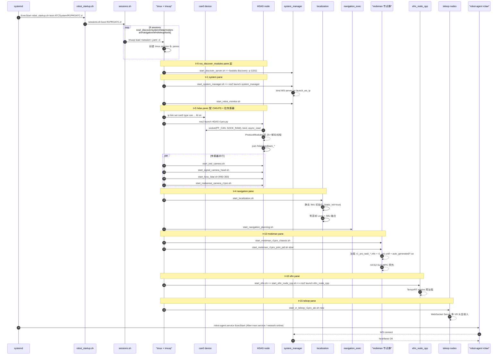

> **设计点评**：
> - 启动顺序由 `sleep 1/2/4/5/10/15` 这种粗粒度依赖控制，简单可靠；
> - DDS Discovery 是第一个起的（fastdds discovery server on 11811）——这意味着 SDK 默认走的是 **Discovery Server 模式**而不是纯多播 SPDP；这在多机器人编队 / 弱网络下是稳定方案。
> - 急停可由 `system_manager` 的 `/emergency_braking` service 触发，HDAS 在 `protocol_chassis::encode_chassis` 中按 `brake_mode=1` 立刻把 `kp/kd` 切到强阻尼。

### 6.2 场景 B：VR 遥操作下抓取（Reach-Grasp Sub-second 闭环）

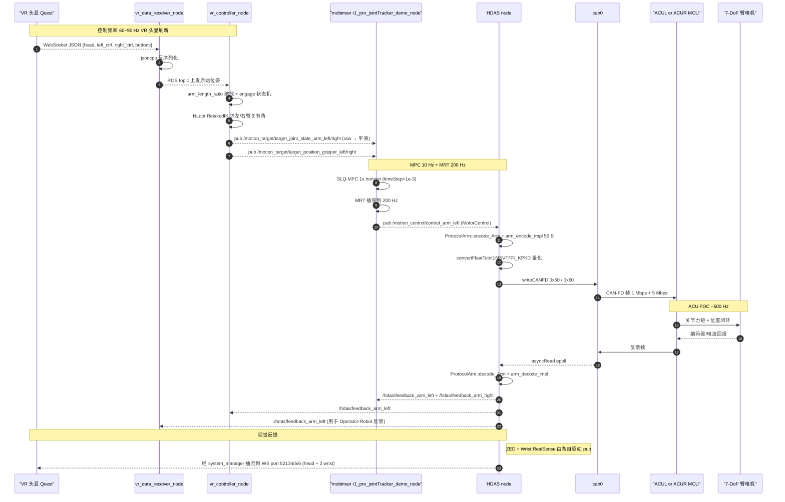

> **设计点评**：
> - VR 端 → 机器人下到 CAN，最坏延迟 ≈ WS RTT(几 ms) + IK(<5 ms) + MPC 一帧(~100 ms 但是滚动用，即时 MRT 5 ms) + DDS shm(~0) + CAN(数 ms) ≈ **总计 < 30 ms**（除去 MPC 长程做规划的 100 ms，实际操作触感来自 MRT 200 Hz）。
> - `enable_engage_by_operator=true` 配合 `vr_initializer_*_target_joint_states_r1pro` 的"安全初始姿态"——VR 接管前先回到这个初始姿态再使能，避免 q 空间跳变。

### 6.3 场景 C：自主导航（NavigationTask Action 端到端）

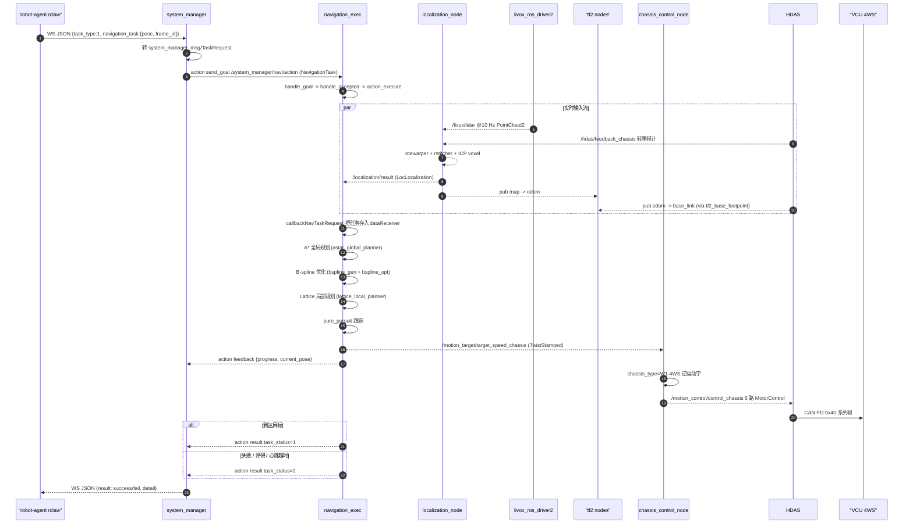

> **设计点评**：
> - `chassis_type=W1` 是 4WS（四轮独立转向 + 独立驱动），对应 `Drivetrain` 6 元组的输出；这与差速底盘的 `Twist` 控制差异巨大。`chassis_control_node` 内部要解 `(vx, vy, ω) → 各轮 (vel_i, angle_i)` 的瞬心反解。
> - `dataReceiver/dataPublisher` 同时支持 PoseStamped 直送目标 + Action 异步任务，便于 RViz 调试和 Agent 编排两种使用场景共存。

### 6.4 场景 D：EFM 模仿学习推理（自主操作闭环）

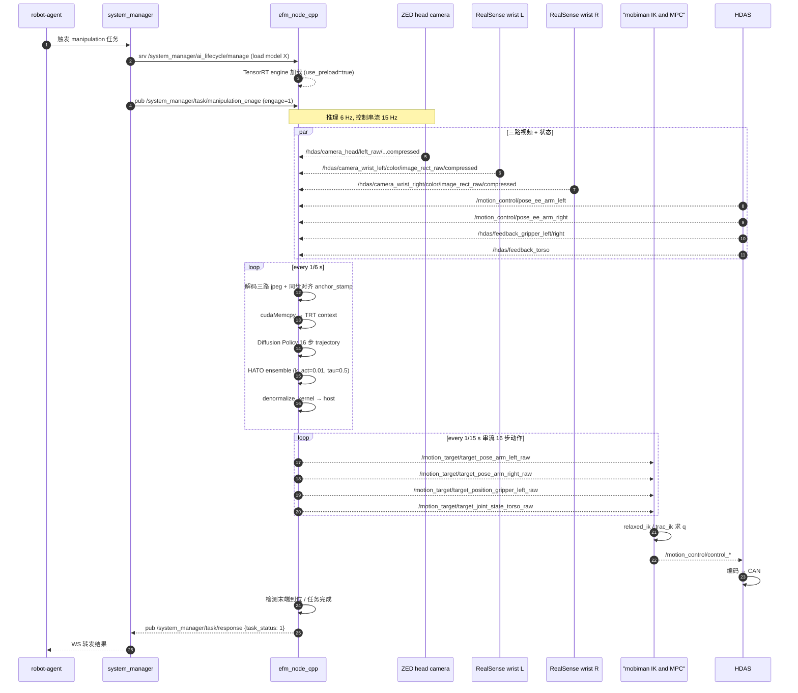

> **设计点评**：
> - **`*_raw`**（来自模型）→ **非 raw**（来自 IK/平滑）= "策略输出"与"实际下发"分离，用 ROS 话题命名做了一次清晰契约。
> - **6 Hz 推理 / 15 Hz 控制 / ≥200 Hz HDAS 下行**——三级金字塔，越往下越实时；这是当下"VLA 离线大模型 + 在线低延迟跟踪"的事实标准（参考 OpenVLA、Pi-zero）。
> - `system_manager/ai_lifecycle/manage` 这种 service 让 EFM 可以"按任务切换不同模型"，对应 `model_cards.yaml`（当前空表，预留）。

### 6.5 场景 E：数据采集（Teleop → mcap 训练数据）

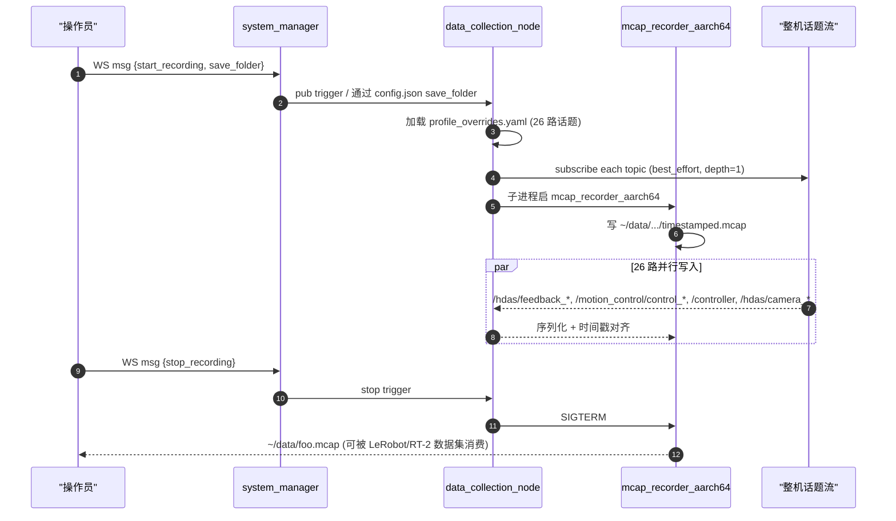

> **设计点评**：
> - **mcap** 是 ROS 2 推荐的下一代 bag 格式（取代 db3），对训练数据集很友好（按 schema + topic + chunk + index 构造，比 sqlite3 更易随机访问）。
> - `best_effort + depth=1` = "录到啥算啥，不背压 publisher"。这是数据采集的正确选择：宁可丢一帧，也不能把控制环卡住。

### 6.6 场景 F：固件 OTA 升级（CCU/VCU/TCU/ACU 五颗 MCU）

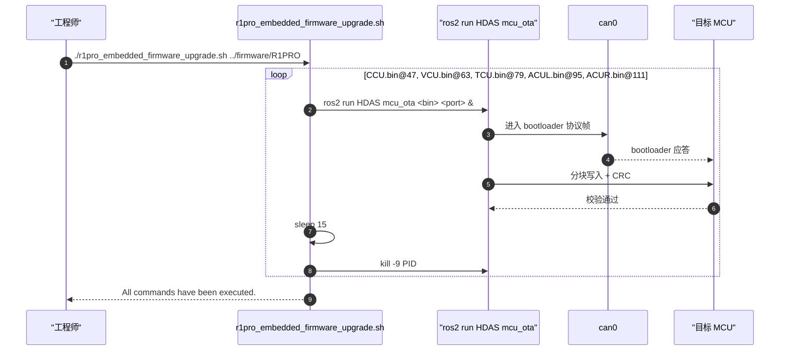

源码：

```1:45:/home/nvidia/galaxea/install/Embedded_Software_Firmware/share/tools/R1PRO/r1pro_embedded_firmware_upgrade.sh
#!/bin/bash
...
declare -A commands=(
  ["CCU.bin"]=47
  ["VCU.bin"]=63
  ["TCU.bin"]=79
  ["ACUL.bin"]=95
  ["ACUR.bin"]=111
)

for file in "${!commands[@]}"; do
  bin_file="$EMBEDDED_PATH/$file"
  port="${commands[$file]}"

  echo "Running rosrun HDAS mcu_ota $bin_file $port"
  ros2 run HDAS mcu_ota "$bin_file" "$port" &
  PID=$!

  sleep 15
  echo "Killing process $PID"
  kill -9 $PID
  wait $PID 2>/dev/null
done
```

> **设计点评**：
> - 固件二进制和工具脚本一起打包到 ROS 2 包 `Embedded_Software_Firmware`，让 OTA 也走 `ros2 run` 标准入口，便于 CI 测试；
> - "粗暴" `sleep 15 + kill -9` 体现工程上 trade-off：bootloader 完成后 mcu 自动 reset，进程也就该结束；强 kill 是防止某次 OTA 阻塞导致流水线挂起。
> - 端口号 47/63/79/95/111 不是 CAN ID 而是 mcu_ota 工具自己定义的"目标设备槽位"（即源码内 ID 表的偏移）。


---

## 7. 全局数据流总览

把所有传感器、模块、执行器在一张图里串起来；每条边标注典型频率（推断 + 配置文件证据）：

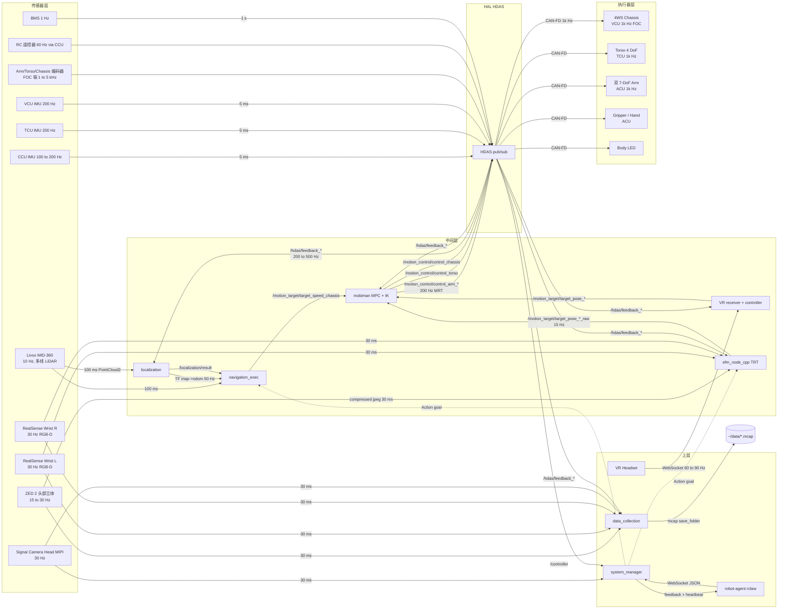

频率上的"金字塔"很清晰：

| 层 | 频率 | 媒介 |
| --- | --- | --- |
| Agent / VR / SM | 1~90 Hz | WebSocket JSON |
| EFM 模型推理 | 6 Hz | DDS shm + TRT |
| EFM 控制串流 | 15 Hz | DDS shm |
| Navigation 控制 | ~10 Hz | DDS shm |
| LIO 输出 | 10~50 Hz | DDS shm |
| MPC | 10 Hz | OCS2 |
| MRT (插值) | 200 Hz | 内存 |
| HDAS pub/sub | 200~500 Hz | DDS shm |
| CAN-FD (低层 ACU/VCU/TCU) | 1k Hz 下行 / 200~500 Hz 上行 | can0 |
| MCU FOC | 1~5 kHz | 嵌入式实时 |


---

## 8. 设计动因 —— 为什么是这样

把"看起来不太常见"的设计选择逐一回答：

### 8.1 为什么自研 HDAS 而不是 ros2_control

ROS 2 官方提供 `ros2_control` 作为通用的 RT 控制框架（Hardware Interface + Controller Manager + 一组 Controller 插件），但 R1 Pro **没采用**，原因可推断为：

1. **CAN-FD 私有协议**：HDAS 不只是把电机当成 `position_command_interface`，还要承载固件版本、电机温度、整机错误码、IMU、BMS、遥控器等十几种异构数据，单一 `joint_command/state` 抽象不够用。
2. **多 MCU + 异构帧大小**：CAN-FD 一帧 64 B 要塞下 7 关节 56 B 的 5 元组（`p,v,kp,kd,t_ff`），需要 12-bit 紧凑量化（`r1pro_t_arm_analysis::convertFloatToInt16VTFF` 的 `0x0800` 符号位 trick）。`ros2_control` 默认 `double` 接口需要自己写 plugin，反而比直接写 HAL 更复杂。
3. **断线自愈**：CAN 转换器掉电时 `ros2_control` 的 `update()` 会被卡死；HDAS 用 `boost::asio::steady_timer` 异步重连。
4. **多线程并发解码**：每个 ProtocolXxx 子线程独立等条件变量唤醒，比 `ControllerManager` 的同步 `update()` 循环对延迟波动更鲁棒。

### 8.2 为什么用 OCS2 SLQ-MPC 而不是只 MoveIt 2

R1 Pro 的"双臂 + 4-DoF 升降躯干 + 4WS 底盘"是个典型 mobile manipulator，状态空间维度高、约束多（自碰撞、可达性、动力学）。MoveIt 2 强项在"基于采样（OMPL）的离线/中长程规划"，对应 pick-and-place 这类静态环境。但 SDK 想做的是：

- **VR 在线遥操作** —— 关节空间目标 60 Hz 来，必须有一个能在 100 ms 内给出可行 + 平滑解的求解器；
- **EFM 学习策略** —— 模型给的是 EE 位姿，需要 IK + 平滑 + 时间最优；
- **底盘 + 双臂同时运动** —— 移动操作问题本身要联合求解。

OCS2（[ETH RSL](https://leggedrobotics.github.io/ocs2/)）是这一类问题的成熟解法：SLQ-DDP / SQP / Multiple-Shooting，配合 Pinocchio 自动微分动力学 + 自碰撞约束 + Riccati 前传 + LineSearch。配置侧 `auto_generated/r1_robot_*` 里的 CppADCodeGen `.so` 是这一选择的证据。

### 8.3 为什么自研 LIO 而不是 FAST-LIO

可能的原因：

- **私有需求**：紧耦合 IMU + 多源（Lidar + 轮速 + 也许 GNSS via `sensor_gnss_imu_msg`）+ 预定义地图格式（`/home/nvidia/galaxea/maps`）+ 自有标定文件（`robot_calibration.json`）。
- **算法迭代更可控**：Galaxea 是商用机器人公司，算法核心 IP 不愿意暴露给开源工具链。
- **强工程化**：`librdewarper`、`librstitcher`、`librcamera`、`librwheel`、`librdata_hub` 这种命名格局代表内部"管道化"的几个 stage 都已经独立成 `.so`，便于不同型号机器人选配。

### 8.4 为什么 system_manager 用 IXWebSocket 做对外网关

- **无 ROS SDK 依赖**：robot-agent (rclaw) 用 Python + uv 启动，避免它必须装完整 ROS 2 Humble（虽然实际 launch 文件里它确实 source 了）；远程客户端纯 JS 也能消费。
- **NAT / 弱网穿透**：DDS 多播在多机房 / VPN 场景丢包率高，TCP 上的 WS 更可靠。
- **JSON Schema 可扩展**：`task_type` 判别字段 + `nlohmann::json` 让协议演进比改 `.msg` 文件成本低。

### 8.5 为什么 FastDDS 配 LARGE_DATA + data_sharing

R1 Pro 至少同时跑 5 路相机（ZED 立体两路 + 双手腕 RealSense + 头部 signal camera）+ Livox 点云。所有 publisher 与所有 subscriber 都在同一个 Orin 上：

- `data_sharing AUTOMATIC` 让本地进程间走 `/dev/shm`，**真正零拷贝**，省下 500 MB/s 的内存拷贝。
- `LARGE_DATA` 内置传输让大消息走 TCP fragment，避免 UDP 的 64 KB 分片丢包。
- `ASYNCHRONOUS publishMode` 解耦应用线程，与 EFM 推理 / OCS2 求解器的 4 线程不冲突。

### 8.6 为什么 efm_node_cpp 用 C++ + TensorRT

- **稳频**：Diffusion Policy 推理 6 Hz、控制串流 15 Hz，C++ + CUDA stream 更稳。
- **零拷贝**：`compressed Image` 直接 `cudaMemcpy` 进 TensorRT context，不必跨语言；
- **HATO Ensemble 在 GPU 端做**：`denormalize_kernel<float>` 是 fused kernel，比 host-side 后处理快。
- **生产级部署**：用 PyTorch Python 节点在 Orin 长期运行容易遇到内存增长 / GIL 抖动，TensorRT 引擎是部署侧首选。

### 8.7 为什么 `/opt/galaxea/body/hardware.json` 做型号开关

同一份代码要支持 R1 / R1 Lite / R1 Pro / R1 Pro-T / R1 T，底盘还有 W0/W1/MMP 等多种构型；写"可读 JSON 而不是编译期 #ifdef"是工厂出厂校准的需求——同一套软件 image，**到现场再装 hardware.json** 就能跑起来。

### 8.8 为什么 tmuxp 而不是 launch 嵌套

- **可视化调试**：每个模块独立 pane，工程师 `tmux a` 进去就能 `Ctrl-c` 单独重启某一路。
- **生命周期解耦**：launch 内 `ros2 launch a + ros2 launch b` 嵌套时一个崩溃可能拖另一个；tmuxp 启的是子进程组，互不影响。
- **环境变量精细化**：每个 pane 内可以独立 `source` 不同 overlay 或重设 `ROS_DOMAIN_ID`。

---

## 9. 与开源生态的对比

按层做横向对比，给出"优 / 短"两面（对 SDK 二次开发者有价值的判断）。

### 9.1 硬件抽象层

| 维度 | HDAS（自研） | ros2_control + socketcan_interface | ROS-Industrial Canopen |
| --- | --- | --- | --- |
| 与协议契合度 | ★★★★★ 自有 CAN-FD 56 B 紧凑帧 | ★★ 需要写大量 plugin | ★★★ CANopen 标准 |
| 一体化诊断 | ★★★★ 错误码、温度、版本统一 | ★★ 需要外接 diagnostic_aggregator | ★★ |
| 断线自愈 | ★★★★ asio steady_timer | ★★ 取决于 plugin | ★★★ |
| 插件化 / 生态 | ★ 闭源 | ★★★★★ 大量公共 controller | ★★★ |
| 上手成本 | ★★ 需读头文件 | ★★★★ 文档多 | ★★★ |

> **结论**：HDAS 是"工厂私有 HAL"的成熟典范，强在协议契合 + 诊断；如果你是要换电机型号 / 加 BLDC 板子，可能要自己改 `*_analysis` 头文件。

### 9.2 运动规划

| 维度 | mobiman + OCS2 | MoveIt 2 + OMPL | Pinocchio + Crocoddyl | Drake |
| --- | --- | --- | --- | --- |
| 实时 MPC | ★★★★★ SLQ + MRT | ★★ trajopt 离线 | ★★★★★ DDP + IPOPT | ★★★★ |
| 移动 + 操作联合 | ★★★★ floating base | ★★ 需用 trajopt 加底盘 | ★★★ | ★★★ |
| 自碰撞 | ★★★★ HPP-FCL | ★★★★ FCL | ★★★ | ★★★★ |
| TimeOpt | ★★★★ 自带 TOPP-RA | ★★★ time_optimal_trajectory_generation | ★★ | ★★★★ |
| 多臂支持 | ★★★ 拆为左右两个 task | ★★★★★ 原生 | ★★★ | ★★★ |
| 学习曲线 | ★★★ OCS2 复杂 | ★★ 文档好 | ★★ | ★★ |

> **结论**：mobiman + OCS2 是**唯一可在 R1 Pro 上同时做 60 Hz VR + 6 Hz EFM + 10 Hz Nav 的求解器栈**；用 MoveIt 2 实现等效闭环困难。

### 9.3 双臂遥操作

| 维度 | teleoperation_ros2（自研） | OpenTeach（CMU/Berkeley） | Bimanual ALOHA | Open-TeleVision (CMU) |
| --- | --- | --- | --- | --- |
| 协议 | WebSocket + JSON | ROS topics + ZMQ | leader-follower | TCP video + IK |
| IK 求解 | NLopt + RelaxedIK 风格 | RelaxedIK | direct joint copy | RelaxedIK |
| 硬件耦合 | 与 R1 Pro URDF 强耦 | 通用 | ALOHA 专用 | 通用 |
| 触觉/力反馈 | 无 | 部分 | 强 | 无 |
| 上手 | 中等 | 高 | 中 | 高 |

> **结论**：自家 VR 客户端（推测是 Quest 应用或 Web 应用）+ 服务端的双向闭环已经为 R1 Pro 调好；想换 ALOHA 等异构方案需要自己写适配层。

### 9.4 模仿学习 / VLA

| 维度 | efm_node_cpp（部署侧） | LeRobot | OpenPI / Pi-zero | Diffusion Policy 原版 | Octo / RT-2 |
| --- | --- | --- | --- | --- | --- |
| 推理 runtime | TensorRT | PyTorch | PyTorch | PyTorch | PyTorch / JAX |
| 集成 ROS 2 | ★★★★★ | 弱（需自己写） | 弱 | 弱 | 弱 |
| 数据集生态 | 用 mcap | LeRobotDataset HF | OpenX | OpenX | OpenX |
| 训练侧 | 不在仓内 | 完整 | 完整 | 完整 | 完整 |
| HATO Ensemble | 内置 | 无 | 部分 | 单 sample | 单 sample |
| 多机多任务 | 通过 `model_cards.yaml` | 配 hub | 配 wheel | 单 ckpt | 单 ckpt |

> **结论**：efm_node_cpp 偏部署，与 LeRobot 合用最自然——LeRobot 训练 → 导出 ONNX → trtexec 转 TensorRT engine → efm 加载。`model_cards.yaml` 这条机制就是为了"切换不同任务的 .engine"。

### 9.5 SLAM / 定位

| 维度 | 自研 LIO | FAST-LIO2 | Point-LIO | LIO-SAM | KISS-ICP |
| --- | --- | --- | --- | --- | --- |
| 算法成熟度 | 闭源不可见 | ★★★★★ | ★★★★ | ★★★★ | ★★★ |
| 多源融合 | ★★★★ Lidar+IMU+Wheel(+Cam可选) | ★★★★ Lidar+IMU | ★★★ | ★★★★ | ★★ |
| 特定型号优化 | ★★★★★ R1 Pro 专属 | 需调参 | 需调参 | 需调参 | 通用 |
| 调试可视化 | ★ 无开源 | ★★★★ | ★★★ | ★★★★ | ★★★★ |
| 二次开发 | ★ 不允许 | ★★★★★ 易换 | ★★★★ | ★★★★ | ★★★★★ |

> **结论**：自研 LIO 在标定地图、车规级标定上做了工厂级集成；如果想换开源算法，可以让 `localization_node` 替换为 FAST-LIO2 + 一个 `LocLocalization` 桥接节点（**不会**破坏 navigation/system_manager）。

### 9.6 导航

| 维度 | navigation（自研） | Nav2 |
| --- | --- | --- |
| 4WS 支持 | ★★★★ 原生 chassis_control_node + W0/W1 切换 | ★★ 需自己写 controller plugin |
| 行为树 | ★ 命令式 | ★★★★★ BehaviorTree.CPP |
| Costmap | ★★★ simple_costmap_2d 自研 | ★★★★★ 多层 costmap |
| 全局规划 | A* / BSpline / Lattice | NavFn / Smac / Theta* / 多种 |
| 局部规划 | Lattice + PurePursuit | DWB / TEB / RPP |
| 上手 | ★★★ launch 复杂 | ★★★★ 文档完善 |
| 与 system_manager 集成 | ★★★★★ Action 直挂 | ★★★ 需做桥接 |

> **结论**：自研侧重"R1 Pro 专属 4WS 非典型底盘"调优；Nav2 通用性强，二次开发推荐"Nav2 + 把 `simple_costmap_2d` 数据 republish 给 Nav2"。

### 9.7 数据采集

| 维度 | data_collection + mcap_recorder | rosbag2 mcap | LeRobotDataset |
| --- | --- | --- | --- |
| ROS 集成 | ★★★★★ | ★★★★★ | ★ |
| 远程触发 | ★★★★ 通过 system_manager | ★★ CLI | ★★ |
| 训练数据规范 | ★★★ 自家约定 | ★★ 自由 | ★★★★★ HF Dataset 标准 |

> **结论**：`mcap_recorder_aarch64` 与 `rosbag2_mcap` 等价，但配套了 `profile_overrides.yaml` 这种白名单 + QoS 配置，更适合"恒定话题集"训练数据采集。

### 9.8 任务编排

| 维度 | system_manager + tmuxp | nav2_bt_navigator | SMACH (ROS 1) | FlexBE | launch_pal |
| --- | --- | --- | --- | --- | --- |
| 行为树可视化 | 无（命令式） | ★★★★★ Groot2 | ★★ | ★★★★★ | ★★ |
| 异构进程编排 | ★★★★ tmuxp | 弱 | 弱 | 弱 | ★★★★ |
| 对外接口 | ★★★★★ WS + Action | ★★ ROS only | ★★ | ★★★ | ★★ |
| 灵活性 | ★★★ 改 yaml 即可 | ★★★ | ★★★★ | ★★★★ | ★★★ |

> **结论**：把"长跑进程编排"和"任务行为树"两件事拆开是非常聪明的——前者交给 tmuxp，后者用 system_manager 的 Action 协议，比"全往 BT 里塞"清爽。


---

## 10. 风险、限制与改进建议

### 10.1 闭源 ELF 的可观测性问题

主要可执行（HDAS、localization_node、system_manager、navigation_exec、efm_node_cpp、各类 mobiman node）都是 **预编译 aarch64 ELF**（保留了 debug_info 但不带源）。这意味着：

- **无法源码级调试**：现场只能 `gdb` 看符号 + ros log + mcap 录包；
- **无法热修补**：找到 bug 需要等下一次 atc_system 包发版。

**改进建议**：
1. 充分利用 `journalctl -u robot-runtime -f` + `ros2 launch ... output:=screen` 双重日志；
2. 录 mcap：`ros2 bag record -s mcap -o /tmp/diag /hdas/feedback_status_* /hdas/bms /system_manager/task/response`；
3. 用 `rqt_graph + rqt_topic + ros2 doctor --report` 看 graph 与 QoS 不匹配。

### 10.2 多型号 launch 维护成本高

`mobiman/share/mobiman/launch/simpleExample/{A1,A1X,A1Y,MMP,R1,R1_Lite,R1_PRO,R1_PRO_Z,R1_T}` 9 套并存 + `HDAS/share/HDAS/launch/{a1xy,r1,r1lite,r1pro,r1prot,r1t}.py` —— 一个改动可能漏配某一型号。

**改进建议**：写一个 launch 生成器（参数化 jinja2 模板）把 hardware.json 当作唯一来源。

### 10.3 ROS 2 Humble + JetPack 强绑定

依赖项：boost::asio、Pinocchio 3.x、PCL/grid_map、TensorRT 8.5+、CUDA 12+、cuDNN 8。Jetson L4T 升级时（例如 JetPack 6 → 7）可能要重新编 SDK；ROS 2 Humble 的 EOL 在 2027-05，那时整个 atc_system 也要迁移到 Jazzy/Kilted。

### 10.4 二次开发"接入点"建议清单

| 你想做 | 推荐订阅 | 推荐发布 | 不要碰 |
| --- | --- | --- | --- |
| 自定义高层任务 | `/system_manager/task/response`、`/hdas/feedback_*` | 下发到 `/system_manager/navi/action`、`/system_manager/manipulation/action`（Action） | 不要直接 pub `/motion_control/*` |
| 自定义模型推理 | 同 EFM 那一组 image / joint 反馈 | `/motion_target/target_pose_*_raw`、`/motion_target/target_position_gripper_*_raw` | 不要替换 `efm_node_cpp` 直连 `/motion_control/*` |
| 自定义遥操 | VR 头显数据由你 → 你的节点 | `/motion_target/target_joint_state_*`、`/motion_target/target_pose_*` | 不要绕过 mobiman 直接送 `/motion_control/control_arm_*` |
| 自定义底盘走位 | `/hdas/feedback_chassis`、`/localization/result` | `/motion_target/target_speed_chassis` | 不要直接 pub `/motion_control/control_chassis` |
| 自定义急停 | `/hdas/feedback_status_*` | call `/emergency_braking` srv | 不要去关 HDAS 进程 |

### 10.5 安全性提醒

- **CAN 总线没有签名 / 加密**：任何接入 `can0` 的进程都能下发电机指令，HDAS 必须保持唯一发起者。
- **`launch_ws_ip=0.0.0.0`** 的部署需要在网络层加 ACL（system_manager WS 没有内置 token 鉴权可见证据）。
- **`echo 'nvidia' | sudo -S`** 这种"明文密码 sudo"是工厂默认配置，**用户应在量产前改 sudoers** 给 `nvidia` 用户 NOPASSWD 限制特定命令。

---

## 11. 附录

### 11.1 ATC 系统 R1 Pro 启动会话速查

| Session | YAML | Pane 数 | 关键命令 |
| --- | --- | --- | --- |
| ros_discover_modules | `ros2_discover.yaml` | 1 | `fastdds discovery -i 0 -l 0.0.0.0 -p 11811` |
| system | `system.yaml` | 2 | `start_system_manager.sh`, `start_robot_monitor.sh` |
| hdas | `hdas.yaml` | 5 | `start_hdas_r1pro.sh`, `start_zed_camera.sh`, `start_signal_camera_head.sh`, `start_livox_lidar.sh`, `start_realsense_camera_r1pro.sh` |
| navigation | `navigation.yaml` | 4 | `start_localization.sh`, `start_navigation_planning.sh`, `start_tf2_livox_frame.sh`, `start_tf2_base_footpoint.sh` |
| mobiman | `mobiman.yaml` | 3 | `start_mobiman_r1pro_chassis.sh`, `start_mobiman_r1_gripper_controller.sh R1PRO`, `start_mobiman_r1pro_joint_pid.sh slow` |
| efm | `efm.yaml` | 1 | `start_efm.sh` → `start_efm_node_cpp.sh` |
| vrteleop | `teleop.yaml` | 1 | `start_vr_teleop_r1pro_atc.sh new` |
| tools | `tools.yaml` | (调试) | （日常调试用） |

### 11.2 关键文件路径索引

- 启动入口：`/home/nvidia/galaxea/install/startup_config/share/startup_config/script/robot_startup.sh`
- 会话编排：`/home/nvidia/galaxea/install/startup_config/share/startup_config/sessions.d/ATCSystem/R1PROATC.d/`
- 环境配置：`/home/nvidia/galaxea/install/startup_config/share/startup_config/script/prestart/prestart_prepare.sh`
- FastDDS profile：`/home/nvidia/galaxea/install/startup_config/share/startup_config/script/prestart/fastrtps_profiles.xml`
- HDAS 协议层头文件：`/home/nvidia/galaxea/install/HDAS/include/HDAS/core/{communication,dispatcher,protocol_modules,analysis,utils}/`
- HDAS launch（R1 Pro）：`/home/nvidia/galaxea/install/HDAS/share/HDAS/launch/r1pro.py`
- mobiman launch（R1 Pro）：`/home/nvidia/galaxea/install/mobiman/share/mobiman/launch/simpleExample/R1_PRO/`
- mobiman OCS2 task：`/home/nvidia/galaxea/install/mobiman/share/mobiman/config/r1_pro_task_*.info`
- mobiman CppAD 自动微分：`/home/nvidia/galaxea/install/mobiman/share/mobiman/auto_generated/r1_robot_*/`
- 定位配置：`/home/nvidia/galaxea/install/localization/share/localization/config/localization_setting.yml`
- 导航 launch：`/home/nvidia/galaxea/install/navigation/share/navigation/launch/nav_exe.py`
- VR 遥操 launch：`/home/nvidia/galaxea/install/teleoperation_ros2/share/teleoperation_ros2/launch/vr_teleoperation.launch.py`
- EFM launch：`/home/nvidia/galaxea/install/efm_node_cpp/share/efm_node_cpp/launch/efm_node_launch.py`
- 数据采集白名单：`/home/nvidia/galaxea/install/data_collection/lib/data_collection/config/default/profile_overrides.yaml`
- 系统服务：`/etc/systemd/system/robot-{runtime,agent}.service`
- 设备型号矩阵：`/opt/galaxea/body/hardware.json`
- 固件二进制：`/home/nvidia/galaxea/install/Embedded_Software_Firmware/share/firmware/R1PRO/{CCU,VCU,TCU,ACUL,ACUR}.bin`
- 固件升级脚本：`/home/nvidia/galaxea/install/Embedded_Software_Firmware/share/tools/R1PRO/r1pro_embedded_firmware_upgrade.sh`

### 11.3 R1 Pro 关键参数速查

- **CAN-FD**：`bitrate 1000000 sample-point 0.875 dbitrate 5000000 fd on dsample-point 0.875`
- **MCU 地址**：CCU=0x12 / VCU=0x13 / TCU=0x14 / ACUL=0x15 / ACUR=0x16；HOST=0x11
- **Arm CAN ID**：LEFT_ARM=0x50 / RIGHT_ARM=0x60；LEFT_Gripper=0x51 / RIGHT_Gripper=0x61
- **Arm 量化常量**：fb_p_kScale=4700, fb_v_kScale=750, fb_tff_kScale=600；ctrl_p_kScale=4700, ctrl_v_kScale=50, ctrl_kp_kScale=8, ctrl_kd_kScale=20, ctrl_tff_kScale=40
- **Arm 限值**：p ±6.5 rad, v ±40 rad/s, t_ff ±50 N·m, kp 0~500, kd 0~200
- **OCS2 R1 Pro**：MPC 10 Hz / MRT 200 Hz / SLQ 5 iter / 4 thread / horizon 1 s
- **EFM**：HATO ensemble, action_step=16, inference 6 Hz, control 15 Hz, k_act=0.01, tau=0.5
- **OTA 端口**：CCU=47, VCU=63, TCU=79, ACUL=95, ACUR=111
- **WS Server 默认端口**：launch_ws_ip:127.0.0.1（实际端口在 system_manager 内部约定）；相机流端口 head=52134 / wrist_left=52135 / wrist_right=52136
- **DDS Discovery Server**：FastDDS port 11811

### 11.4 参考链接

- Galaxea 官方文档（R1 Pro 综述）：https://docs.galaxea-dynamics.com/Guide/R1Pro/
- R1 Pro 快速入门：https://docs.galaxea-dynamics.com/Guide/R1Pro/quick_start/R1Pro_Getting_Started/
- R1 Pro ROS 2 软件指南：https://docs.galaxea-dynamics.com/Guide/R1Pro/software_introduction/R1Pro_Software_Guide_ROS2/
- R1 Pro 硬件介绍：https://docs.galaxea-dynamics.com/Guide/R1Pro/hardware_introduction/R1Pro_Hardware_Introduction/
- SDK Changelog ROS 2 Humble：https://docs.galaxea-dynamics.com/zh/Guide/sdk_change_log/galaxea_changelog/#ros-2-humble
- ROS 2 Humble 文档：https://docs.ros.org/en/humble/
- OCS2（ETH RSL）：https://leggedrobotics.github.io/ocs2/
- Pinocchio：https://stack-of-tasks.github.io/pinocchio/
- HPP-FCL：https://github.com/humanoid-path-planner/hpp-fcl
- TOPP-RA：https://github.com/hungpham2511/toppra
- Trac-IK：https://traclabs.com/projects/trac-ik/
- FastDDS：https://fast-dds.docs.eprosima.com/
- mcap：https://mcap.dev/
- LeRobot：https://github.com/huggingface/lerobot
- Diffusion Policy：https://diffusion-policy.cs.columbia.edu/
- Nav2：https://navigation.ros.org/
- MoveIt 2：https://moveit.picknik.ai/main/
- ros2_control：https://control.ros.org/

---

> 报告生成时间：2026-05-03 (UTC+8)；基于 `atc_system` v2.1.5（`commit abf07e0`，2025-10-17 deploy 包）。

# 额外附录A. R1 Pro 的 Home Position（初始位姿）等各种特殊 Position

## A.1. TL;DR — 一句话回答

**R1 Pro 没有"唯一"的 Home Position，官方在 SDK 不同层面给出了 4 个互相协作的"初始位姿"定义**：

| 层面 | 关节空间值 | 物理意义 |
| --- | --- | --- |
| **URDF 零位**（最权威） | 双臂 7 关节 × 2 全部 `0.0`、躯干 4 关节全部 `0.0` | "立直、双臂自然下垂、肘部黑橡胶朝前、夹爪指地" |
| **VR 遥操作 engage 准备姿态** | 左右臂 `[0, 0, 0, -1.62, 0, 0, 0]`、躯干 `[0.3507, -0.7681, -0.6094, 0.0]` | 微下蹲 + 双肘 90° 弯曲，便于 VR 操作员"接管"时不会跳变 |
| **Demo / 开箱测试默认回零** | 所有臂、躯干关节 `0.0` | 等同 URDF 零位，按 `q` 退出时自动回到此姿态 |
| **EFM 模型复位 / 模型卡 init_pose** | 由 `model_cards.yaml` 的 `init_pose` 字段为每个任务模型单独配 | "任务起手姿态"，例如桌面抓取就把臂收到胸前 |

下面分别给出来源、原始代码引用与设计意图。

---

## A.2. URDF 零位（官方"零点姿态"，最权威）

### A.2.1 关节定义与零位含义

R1 Pro 的 URDF 在 `mobiman/share/mobiman/urdf/R1_PRO/urdf/r1_pro.urdf`，整机 18 个主动关节：

- 底盘：`steer_motor_joint1/2/3` + `wheel_motor_joint1/2/3`（4WS 6 关节）
- 躯干：`torso_joint1`、`torso_joint2`、`torso_joint3`、`torso_joint4`（4 DoF：升降 + pitch + 腰转）
- 左臂：`left_arm_joint1` ~ `left_arm_joint7`（7 DoF）
- 右臂：`right_arm_joint1` ~ `right_arm_joint7`（7 DoF）
- 末端夹爪手指（被动从动）

URDF 的"零位"即所有 revolute joint 的 `q = 0`。这一姿态由 `<origin xyz=... rpy=...>` 与 `<axis xyz=...>` 静态决定。R1 Pro 的零位物理表现为：

- **躯干完全立直**（3 个回转关节 + 第 4 关节腰转都是 0）
- **双臂沿身体两侧自然下垂、肘部黑橡胶朝正前方**
- **夹爪垂直向下指向地面、夹爪线缆朝外**

官方文档把这条作为"自检 / 安装 / 开箱"的强制前置条件：

> Before initiating self-test, strictly ensure: ... **Arms are naturally hanging straight down, the elbow joints (black rubber protective sleeve) are facing directly forward, and grippers are vertically downward (pointing to ground), with gripper cable facing outward.**
>  — [R1 Pro Unbox and Startup Guide](https://docs.galaxea-dynamics.com/Guide/R1Pro/unboxing/R1Pro_Unbox_Startup_Guide/) §6

> After all actions finish, press q to exit. **Robot automatically returns to initial pose (arms hanging down).**
>  — 同上 §7

### A.2.2 关节限位（与零位配套，限制了可达边界）

URDF 的 `<limit>` 标签揭示了零位的"对称性"——很多关节是非对称限位，零位实际上是一个工程意义上的"逆运动学起点"，不一定是物理对称中心：

```1289:1304:/home/nvidia/galaxea/install/mobiman/share/mobiman/urdf/R1_PRO/urdf/r1_pro.urdf
    name="left_arm_joint1"
    type="revolute">
    <origin
      xyz="0 0.0735 0"
      rpy="0 0 0" />
    <parent
      link="left_arm_base_link" />
    <child
      link="left_arm_link1" />
    <axis
      xyz="0 1 0" />
    <limit
      lower="-4.4506"
      upper="1.3090"
      effort="55"
      velocity="7.1209" />
```

整理后，**R1 Pro 各主要关节的限位与零位关系**（单位 rad）：

| 关节 | lower | upper | 零位是否在中心 | 备注 |
|---|---|---|---|---|
| `torso_joint1` | -1.1345 | 1.8326 | 否 | 髋俯仰，零位偏后 |
| `torso_joint2` | -2.7925 | 2.5307 | 近似 | 膝弯 |
| `torso_joint3` | -1.8326 | 1.5708 | 否 | pitch 微偏 |
| `torso_joint4` | -3.0543 | 3.0543 | **是** | 腰转，对称 |
| `left_arm_joint1` | -4.4506 | 1.3090 | 否 | 肩 yaw，对称中心 ≈ -1.57 |
| `left_arm_joint2` | -0.1745 | 3.1416 | 否 | 肩 roll |
| `left_arm_joint3` | -2.3562 | 2.3562 | **是** | 肩 yaw |
| `left_arm_joint4` | -2.0944 | 0.3491 | 否 | 肘，零位 = 自然下垂状态 |
| `left_arm_joint5` | -2.3562 | 2.3562 | **是** | 腕 roll |
| `left_arm_joint6` | -1.0472 | 1.0472 | **是** | 腕 pitch |
| `left_arm_joint7` | -1.5708 | 1.5708 | **是** | 末端 roll |
| `right_arm_joint1` | -4.4506 | 1.3090 | 否 | 与左臂同 |
| `right_arm_joint2` | -3.1416 | 0.1745 | 否 | 镜像左臂 |
| `right_arm_joint3` ~ `joint7` | 与左臂同范围 | | | |
| 夹爪手指（被动） | 0 ~ 0.05 m / -0.05 ~ 0 m | | | 0~100% 行程映射 |

> 重要观察：**`joint1` (-4.45 ~ +1.31)** 极不对称——这意味着 URDF 把"零位"定义为"臂相对身体内侧偏转一些"，机械上对应"肘部黑橡胶朝前"的安装状态。如果硬把 `joint1` 转到 `0`，臂的姿态就是肘部正向前方的"枪口姿势"。

---

## A.3. VR 遥操作 engage 准备姿态（最常被误以为是 Home）

`teleoperation_ros2` 在 VR 操作员"接管整机"前，会先把机器人**渐进**地驱动到一个固定 q 空间姿态，避免接管瞬间末端跳变：

```104:108:/home/nvidia/galaxea/install/teleoperation_ros2/share/teleoperation_ros2/launch/vr_teleoperation_whole_body.launch.py
                'vr_initializer_left_target_joint_states_r1pro': [0.0, 0.0, 0.0, -1.62, 0.0, 0.0, 0.0]
            }, {
                'vr_initializer_right_target_joint_states_r1pro': [0.0, 0.0, 0.0, -1.62, 0.0, 0.0, 0.0]
            }, {
                'vr_initializer_torso_target_joint_states_r1pro': [0.3507, -0.7681, -0.6094, 0.0]
```

含义：

- **手臂 `[0, 0, 0, -1.62, 0, 0, 0]`** — 仅第 4 关节（肘部）弯曲约 **-93°**（-1.62 rad），其它全是 0。视觉上是"双臂前伸 90° 弯肘的预备姿态"，方便 VR 操作员"看着自己的手"上手对齐。
- **躯干 `[0.3507, -0.7681, -0.6094, 0.0]`** —
  - `joint1 = +0.3507 rad ≈ 20.1°`：髋向前微屈
  - `joint2 = -0.7681 rad ≈ -44.0°`：膝向前屈
  - `joint3 = -0.6094 rad ≈ -34.9°`：上身 pitch 后仰，把胸保持竖直
  - `joint4 = 0.0`：腰不转
  - 整体是一个轻微下蹲、上身前倾相机视角不变的"专心做事"姿态。

> **设计意图**：VR 接管后操作员从头显里看到的画面要和真实 ZED 视角一致；如果机器人立直，ZED 会盯着远方；下蹲后摄像头视角下移，更适合桌面抓取等任务。

> **同款用于 `vr_teleoperation.launch.py`**（普通 VR 遥操，不是 whole-body）— 相同的三个数组，证明这是 Galaxea 官方在 R1 Pro 上**为 VR 通用预设**的"工作姿态"。

---

## A.4. Demo / 开箱测试中的"回零"行为

### A.4.1 `r1pro_test_open_box.py` 的隐含 Home

`r1pro_test_open_box.py` 是 Galaxea 官方教程让用户跑的"第一只机器人代码"。它在用户按 `q` 退出之前的最后一个动作总是把整机**回零**：

```193:194:/home/nvidia/galaxea/install/mobiman/share/mobiman/scripts/robotOpenbox/R1Pro/r1pro_test_open_box.py
                        self.send_joint_state_real([0.0,0.0,0.0,0.0,0.0,0.0,0.0],[0.0,0.0,0.0,0.0,0.0,0.0,0.0],[0.0,0.0,0.0,0.0],[1.6,1.6,1.6,1.6,4.0,4.0,4.0],[1.6,1.6,1.6,1.6,4.0,4.0,4.0], [0.0,0.0,0.0,0.0])
```

`hand_up_test`（按 `1`）也以"先抬到肘 90° 再放回零位"作为标准开箱动作：

```150:156:/home/nvidia/galaxea/install/mobiman/share/mobiman/scripts/robotOpenbox/R1Pro/r1pro_test_open_box.py
                    if command == '1': # hand up test, end up with standing
                        # 按下2时发送第二个JointState
                        self.send_breaking_mode([1])
                        self.send_joint_state_real([0.0,0.0,0.0,-1.57,0.0,0.0,0.0],[0.0,0.0,0.0,-1.57,0.0,0.0,0.0],[0.0,0.0,0.0,0.0],[1.6,1.6,1.6,1.6,4.0,4.0,4.0],[1.6,1.6,1.6,1.6,4.0,4.0,4.0], [1.0,1.6,1.4,1.4])
                        time.sleep(0.5)  # 防止重复发送
                        self.send_joint_state_real([0.0,0.0,0.0,0.0,0.0,0.0,0.0],[0.0,0.0,0.0,0.0,0.0,0.0,0.0],[0.0,0.0,0.0,0.0],[1.6,1.6,1.6,1.6,4.0,4.0,4.0],[1.6,1.6,1.6,1.6,4.0,4.0,4.0], [1.0,1.6,1.4,1.4])
```

### A.4.2 配套官方教程明确说

`教程_ROS2控制R1Pro机器人.md`（与 SDK 一起发布）指出：

```131:135:/home/nvidia/galaxea/install/mobiman/share/mobiman/scripts/robotOpenbox/R1Pro/教程_ROS2控制R1Pro机器人.md
**参数说明：**
- `positions`：一个包含 **7 个数字** 的列表，每个数字是对应关节的目标角度（**弧度 rad**）
- 例如：`[0.0, 0.0, 0.0, -1.57, 0.0, 0.0, 0.0]`
  - `-1.57` 约等于 `-90°`（因为 π/2 ≈ 1.57）
  - `0.0` 表示关节在初始零位
```

> 即官方明确：**`0.0` = 初始零位**（initial zero position）。所有 7 个手臂关节都是 0、4 个躯干关节都是 0，就是 R1 Pro 的官方 Home Position。

### A.4.3 几个有名的"测试姿态"（不是 Home，但常和 Home 一起出现）

来自 [R1 Pro Demo Guide](https://docs.galaxea-ai.com/Guide/R1Pro/demo/R1Pro_Demo_Guide/)：

| Demo 命令 | 关节空间 | 物理意义 |
|---|---|---|
| `arm_test_1` (hand_up) | 双臂 `[0,0,0,-1.57,0,0,0]` 来回 | 抬肘弯曲 90° → 落回零位 |
| `arm_test_2` (kongfu) | 双臂 `[0,0,0,-1.57,0,0,0]` | 双肘弯曲，做"功夫站姿" |
| `torso_test_1` (kneel) | 双臂 `[0,0,0,-1.57,0,0,0]`，躯干 `[1.74, -2.70, -0.96, 0.0]` | 测试 T1/T2/T3：躯干下蹲 + 双肘弯曲，注意 `1.74 rad ≈ 99.7°`、`-2.70 rad ≈ -154.7°` 已接近躯干 J2 极限 -2.79 |
| `torso_test_2` (waist twist) | 躯干 `[0,0,0,0]→[0,0,0,0.75]→[0,0,0,-0.75]→[0,0,0,0]` | 测试 T4：腰部 ±43° 转动 |

`r1pro_first_motion.py` 给出更"温和的回零"版本（肘弯 -0.7 rad 而不是 -1.57）：

```108:114:/home/nvidia/galaxea/install/mobiman/share/mobiman/scripts/robotOpenbox/R1Pro/r1pro_first_motion.py
                        if command == '1': # on your knees  
                            # self.send_breaking_mode([1])
                            self.send_vel_limit([1.6,1.6,1.6,1.6,4.0,4.0,4.0],[1.6,1.6,1.6,1.6,4.0,4.0,4.0], [1.0,1.6,1.4,1.4])
                            self.send_joint_state([0.0,0.0,0.0,-0.7,0.0,0.0,0.0],[0.0,0.0,0.0,-0.7,0.0,0.0,0.0],[0.0,0.0,0.0,0.0])
                            time.sleep(1)
                        elif command == '2': # t4 test
                            # self.send_breaking_mode([1])     
                            self.send_vel_limit([1.6,1.6,1.6,1.6,4.0,4.0,4.0],[1.6,1.6,1.6,1.6,4.0,4.0,4.0], [1.0,1.6,1.4,1.4])
                            self.send_joint_state([0.0,0.0,0.0,-0.7,0.0,0.0,0.0],[0.0,0.0,0.0,-0.7,0.0,0.0,0.0],[1.74, -2.70, -0.96, 0.0])
                            time.sleep(1)
```

---

## A.5. EFM 模仿学习的"任务级 Home"

`efm_node_cpp` 的"复位 (`r`)"和"初始化 (`i`)"概念**不是整机的 home**，而是**每个 model_card**（任务模型）自带的起手姿态。配合 `efm_node_launch.py` 的 `"model.reset_pos": True`：

```50:54:/home/nvidia/galaxea/install/efm_node_cpp/share/efm_node_cpp/launch/efm_node_launch.py
                    "model.reset_pos": True,

                    "model.ensemble_mode": "HATO",
                    "model.action_step": 16,
                    "model.k_act": 0.01,
```

`robot_simple_ctrl.py`（官方调试脚本）从 `model_cards.yaml` 读 `init_pose` 字段：

```52:57:/home/nvidia/galaxea/install/efm_node_cpp/share/efm_node_cpp/scripts/robot_simple_ctrl.py
        if self.config is not None:
            self.left_arm_init_position = self.config["init_pose"]["left_arm_init_position"]
            self.right_arm_init_position = self.config["init_pose"]["right_arm_init_position"]
            self.left_gripper_position = self.config["init_pose"]["left_gripper_position"]
            self.right_gripper_position = self.config["init_pose"]["right_gripper_position"]
```

复位 (`r`) 时调用：

```174:186:/home/nvidia/galaxea/install/efm_node_cpp/share/efm_node_cpp/scripts/robot_simple_ctrl.py
    def reset(self):
        self.get_logger().info("左臂关节复位")
        self.publish_target_joint_state(
            self.left_arm_init_position, is_left_arm=True)
        self.get_logger().info("右臂关节复位")
        self.publish_target_joint_state(
            self.right_arm_init_position, is_left_arm=False)
        self.get_logger().info("右臂夹爪复位")
        self.publish_gripper_position(
            False, self.right_gripper_position)
        self.get_logger().info("左臂夹爪复位")
        self.publish_gripper_position(
            True, self.left_gripper_position)
```

而 `arm_init` 命令 (`i`) 是 **3 步引导**——零位 → 收向胸前 → 完全展开：

```30:40:/home/nvidia/galaxea/install/efm_node_cpp/share/efm_node_cpp/scripts/robot_simple_ctrl.py
init_pose_right_list = [
    [0.0, 0.0, 0.0, 0.0, 0.0, 0.0, 0.0],
    [0.33158830321034477, -0.1443433564510129, 0.08393024695159207, -1.0860920145430362, 0.019375501582662002, -0.16690545071993373, -0.23231413468611856],
    [-0.7036310997680051, -1.0844655227352047, 0.2703785479870578, -1.7998158475379487, -1.0682851665885418, 0.2364095633351376, 0.7754299527558411]
]

init_pose_left_list = [
    [0.0, 0.0, 0.0, 0.0, 0.0, 0.0, 0.0],
    [0.18503430663055417, 0.2277234949872804, 0.004822722210636411, -0.7474674742964189, 0.08203778107939903, -0.2993819432569087, -0.04519962420703719],
    [-0.69292746273335, 0.7155970183244329, -0.32609984310564977, -1.8426241451679823, 0.8265329081437607, 0.09592575810519058, -0.7049327574277322]
]
```

> **设计意图**：EFM 推理前需要把整机"摆到训练时的任务起始姿态"，否则模型会在训练域外推理；这也是为什么 `model.reset_pos=True` 时 `efm_node_cpp` 启动后会**先发一系列 `target_pose_arm_*_raw` 把臂送到 init pose**，再开始 6 Hz Diffusion Policy 推理。

---

## A.6. mobiman OCS2 任务文件中的 "initialState"（求解器 warm-start，不是物理 Home）

OCS2 SLQ-MPC 的 `r1_pro_task_left.info` / `right.info` / `torso.info` 有 `initialState` 段，但这是**求解器的 warm-start 状态**而非机器人物理 Home：

```140:189:/home/nvidia/galaxea/install/mobiman/share/mobiman/config/r1_pro_task_left.info
; initial state
initialState
{
  ; initial state for the different types of arm base DOFs
  base
  {
    defaultManipulator
    {
    }

    floatingArmManipulator
    {
      (0,0)  0.0  ; position x
      (1,0)  0.0  ; position y
      (2,0)  0.5  ; position z
      (3,0)  0.0  ; euler angle z
      (4,0)  0.0  ; euler angle y
      (5,0)  1.7  ; euler angle x
    }

    fullyActuatedFloatingArmManipulator
    {
      (0,0)  0.0  ; position x
      (1,0)  0.0  ; position y
      (2,0)  0.0  ; position z
      (3,0)  0.0  ; euler angle z
      (4,0)  0.0  ; euler angle y
      (5,0)  0.0  ; euler angle x
    }

    wheelBasedMobileManipulator
    {
      (0,0)  0.0  ; position x
      (1,0)  0.0  ; position y
      (2,0)  0.0  ; heading
    }
  }

  ; initial state for the arm DOFs
  arm
  {
    (0,0)   0.0 ;0.0       ; arm_1
    (1,0)   0.0 ;1.57     ; arm_2
    (2,0)   0.0 ;-2.356     ; arm_3
    (3,0)   0.0 ;-0.4     ; arm_4
    (4,0)   0.0 ;1.57     ; arm_5
    (5,0)   0.0 ;0.0     ; arm_6
    (6,0)   0.0 ;0.0       ; arm_7
  }
}
```

**关键观察**：
- `arm` 段所有关节都是 `0.0`，但是注释里保留了一组 **被弃用的旧值** `[0, 1.57, -2.356, -0.4, 1.57, 0, 0]`——这是旧版（推测 v2.0.x 之前）OCS2 求解器使用的"warm-start"，已经改为统一 0。
- `floatingArmManipulator.base` 第 6 项 `1.7`（rad 绕 X 的欧拉角）是为"虚拟浮动基底+左臂"模型准备的"基底初始倾角"，不是机器人物理姿态。

> 这一段告诉我们：**OCS2 求解器内部的 `initialState` 对应"q_warm_start"**，启动时是 0；当 MPC 拿到 `/hdas/feedback_arm_*` 后会立刻被覆盖成实测值，所以这里的 0 不会影响运行时姿态。

---

## A.7. 几种"Home"互相之间的关系（mermaid 图）

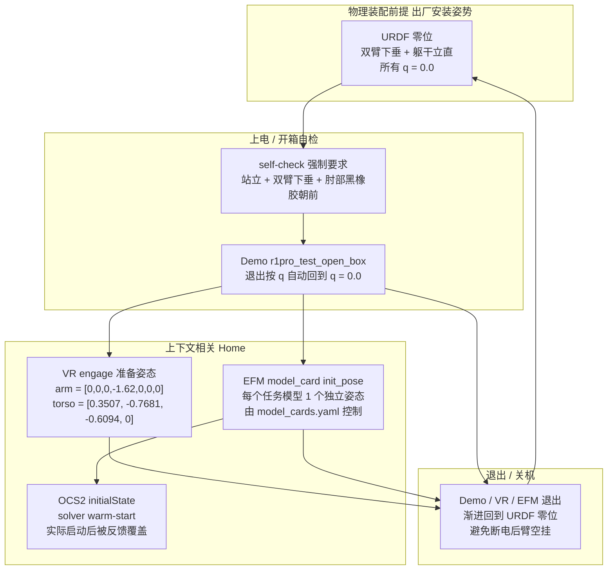

---

## A.8. 设计动因 —— 为什么不是"一个 Home 走天下"

| 设计选择 | 动因 |
|---|---|
| **URDF 零位 = 机械装配姿态** | 双臂沿身体两侧自然下垂时整机重心最低、最稳，方便用户开箱后快速对中； Pinocchio/HPP-FCL 的零位也是从这开始算正向运动学。 |
| **VR 准备姿态特地下蹲 + 弯肘** | 让 ZED 头部相机视角下移，模拟坐姿桌面操作的视场；同时让双手位于 VR 操作员视野中央，**减少接管瞬间末端跳变** —— 这是工业人机交互的"软启动"策略。 |
| **Demo 用 `[0]*7` 做退出回零** | 让操作员在心理上把"零位"和"安全"绑定起来；按 `q` 总是先回零再失能。 |
| **EFM 用 model_card 自带 init_pose** | 模仿学习强烈依赖**训练域**——每个任务模型录数据时机器人是什么起始姿态，推理时就得一致；这套机制让"换模型不换 SDK"。 |
| **OCS2 `initialState` 全为 0** | OCS2 求解器需要一个"q_warm"启动 LQR backward pass，但运行时立刻会被 `/hdas/feedback_*` 覆盖；保留为 0 既可读又安全。 |
| **arm `joint1` (-4.45 ~ +1.31) 极不对称** | 体现"机械臂安装基座倾斜 + 肘部黑橡胶朝前"的零位定义——并非每个关节中心都是中点，URDF 让 `0 rad` 对应物理上"自然下垂"状态。 |

---

## A.9. 二次开发时的实操建议

1. **永远把整机回到 `[0]*18` 作为程序入口与退出**（参见教程第 15 节"渐进式运动"）：
   - 启动时第一件事：以 `vel_limit ≤ 0.5 rad/s` 慢速送 `[0]*7 + [0]*7 + [0]*4`；
   - 退出时按 `q` 让 SDK 自动回零，再 `Ctrl+C`。
2. **不要直接拿 VR 的 `[0,0,0,-1.62,0,0,0]` 当 Home**：那是给 VR engage 用的，重心比纯零位高、力矩需求也更大。
3. **要做 EFM 推理**：先 `arm_init`（按 `i`，3 步走），让臂从 `[0]*7` 渐进到 model_card 期望的起手姿态；推理完再 `arm_over`（按 `o`，3 步反向回到零位）。
4. **`brake_mode` 配合 Home 使用**：进 Home 之前 `brake_mode=1` 锁死底盘，避免回零过程中底盘被反作用力推走。这一手在 `r1pro_test_open_box.py` 的几乎每个动作前都做了：
   ```152:152:/home/nvidia/galaxea/install/mobiman/share/mobiman/scripts/robotOpenbox/R1Pro/r1pro_test_open_box.py
                           self.send_breaking_mode([1])
   ```
5. **避免靠近 `joint2 = -2.7925`（左）/ `+0.1745`（右）的硬限位**：torso_test_1 的 `[1.74, -2.70, -0.96, 0.0]` 已经非常接近 J2 限位，新姿态如果想低于它要先做 URDF 干涉检查。
6. **检查 `/hdas/feedback_arm_*`**：reset 之前确认实际关节值与目标差 < 0.05 rad，再下一条指令；`robot_simple_ctrl.py` 的 `publish_target_joint_state(is_need_feedback=True)` 就是参考实现。

---

## A.10. 一句话总结

> **R1 Pro 的官方 Home Position = "URDF 零位"，即 18 个主动关节全部为 `0.0` rad，物理表现为双臂沿身体两侧自然下垂、躯干完全立直、夹爪指地、肘部黑橡胶朝正前方**。其它"看起来像 Home"的姿态——VR engage 的 `[0,0,0,-1.62,0,0,0] + [0.3507,-0.7681,-0.6094,0]`、EFM 模型 `init_pose`、OCS2 `initialState`——都是**功能/上下文专属的"工作起手姿态"**，不是整机的 Home，但它们退出时都会汇流回到 URDF 零位。

完整的总览请参考已有报告 [R1 Pro SDK 深度分析](/home/nvidia/galaxea/log/bt/glx/R1ProSDKAnalysis.md) 中的 §4（话题字典）、§5.5（VR 遥操）和 §5.6（EFM 模仿学习）。