# RLinf × Galaxea R1 Pro: 真机强化学习设计与实现方案

> **面向 26-DOF 双臂轮式人形机器人的分布式 RL 训练基础设施集成**
>
> 本文档基于对 RLinf 代码库 (`rlinf/`) 真机 RL 集成模式 (Franka、XSquare Turtle2) 的深入分析, 以及 Galaxea R1 Pro 机器人硬件规格与 ROS2 SDK 的技术调研, 设计了将 R1 Pro 接入 RLinf 进行真机强化学习训练的完整方案。每一个设计选择都说明 **WHAT (做什么)** 和 **WHY (为什么这样做)**。

---

## 目录

- [1. 概述与目标](#1-概述与目标)
- [2. Galaxea R1 Pro 技术概要](#2-galaxea-r1-pro-技术概要)
- [3. 系统架构](#3-系统架构)
- [4. 硬件抽象层](#4-硬件抽象层)
- [5. ROS2 通信层](#5-ros2-通信层)
- [6. 机器人状态容器](#6-机器人状态容器)
- [7. 环境层](#7-环境层)
- [8. 任务环境](#8-任务环境)
- [9. Wrapper 链与观测处理](#9-wrapper-链与观测处理)
- [10. 训练管线](#10-训练管线)
- [11. 数据采集系统](#11-数据采集系统)
- [12. 仿真与 Sim-to-Real](#12-仿真与-sim-to-real)
- [13. 安全系统](#13-安全系统)
- [14. 可观测性与调试](#14-可观测性与调试)
- [15. 实施路线图](#15-实施路线图)
- [16. 文件索引](#16-文件索引)

---

## 1. 概述与目标

### 1.1 项目目标

将 Galaxea R1 Pro 双臂轮式人形机器人接入 RLinf 分布式 RL 训练框架, 实现:

1. **真机 Online-RL**: R1 Pro 在线与环境交互, 实时训练 VLA/CNN 策略 (SAC/PPO/GRPO)
2. **真机 Offline-RL**: 通过遥操作采集数据, 离线训练或预训练策略 (SFT/DAgger)
3. **Sim-to-Real**: Isaac Sim 中预训练, 迁移到真实 R1 Pro
4. **多机协同**: 多台 R1 Pro 并行采集数据, 集中训练

### 1.2 R1 Pro 相比 Franka 的独特挑战

| 维度 | Franka Panda | R1 Pro | 影响 |
|------|-------------|--------|------|
| **自由度** | 7+1 (单臂+夹爪) | 26 (双臂14+夹爪2+躯干4+底盘6) | 动作空间维度大幅增加, 探索效率下降 |
| **移动性** | 固定基座 | Ackerman 底盘, 0.6m/s | 需要底盘控制与导航, 工作空间动态变化 |
| **感知** | 1-2 相机 | 9 相机 + LiDAR + IMU | 多模态输入, 网络带宽需求大 |
| **计算** | 外接 PC | Jetson AGX Orin 32GB | 边缘推理能力, 但 GPU 显存有限 |
| **协调** | 单臂任务 | 双臂协调操作 | 需要分层控制, 双臂同步 |
| **安全** | 桌面级碰撞 | 全身运动, 96kg 质量 | 安全要求更高, 需要多级保护 |

### 1.3 设计原则

1. **遵循 RLinf 现有模式**: 严格参照 Franka 和 Turtle2 的集成代码结构, 不引入新的设计范式
2. **分层解耦**: R1 Pro 的 26 DOF 按功能分层 — 底盘 (导航)、躯干 (姿态)、双臂 (操作)、夹爪 (抓取)
3. **渐进式集成**: 从单臂开始, 逐步启用双臂、躯干、底盘
4. **边缘-云端分离**: R1 Pro Orin 运行 EnvWorker + 低延迟推理, GPU 服务器运行训练
5. **安全优先**: 多级安全机制, 人类始终可接管

---

## 2. Galaxea R1 Pro 技术概要

### 2.1 硬件规格

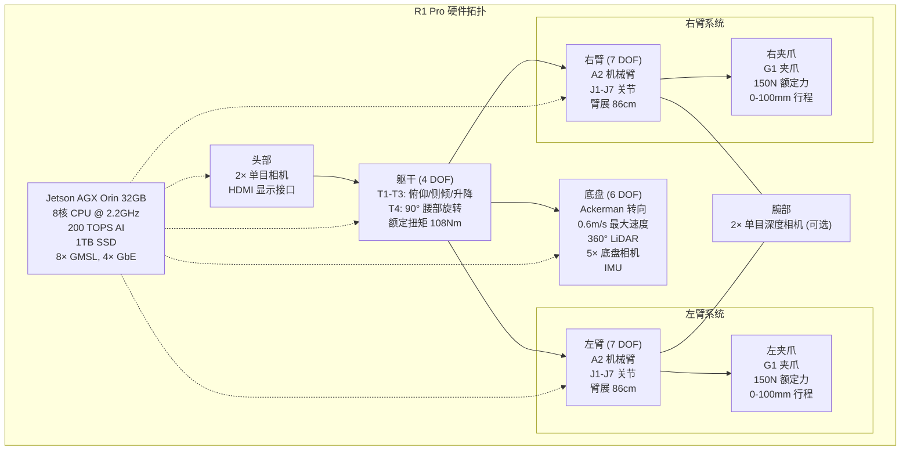

### 2.2 关键规格表

| 参数 | 规格 |
|------|------|
| 总自由度 | 26 (双臂14 + 夹爪2 + 躯干4 + 底盘6) |
| 身高 | 1700mm |
| 宽度 | 675mm |
| 总质量 | 96kg (含电池) |
| 单臂额定负载 | 3.5kg @ 0.5m |
| 双臂额定负载 | 7kg |
| 最大臂展 | 86cm |
| 最低触地 | 64cm |
| 最高延伸 | 2000mm |
| 控制频率 | 10-50Hz (取决于控制模式) |
| 通信 | ROS2 Humble, CAN 总线 |
| 计算 | Jetson AGX Orin 32GB, 200 TOPS |
| 相机 | 9× (头部2 + 腕部2 + 底盘5) |
| LiDAR | 1× 360°, 0.1m 盲区 |
| IMU | 2× (躯干 + 底盘) |
| 夹爪力 | 150N 额定, 0-100mm 行程 |

### 2.3 ROS2 接口汇总

| 功能 | Topic | 消息类型 | 方向 |
|------|-------|---------|------|
| 左臂反馈 | `/hdas/feedback_arm_left` | `sensor_msgs/JointState` | 订阅 |
| 右臂反馈 | `/hdas/feedback_arm_right` | `sensor_msgs/JointState` | 订阅 |
| 左臂控制 | `/motion_control/control_arm_left` | `hdas_msg/motor_control` | 发布 |
| 右臂控制 | `/motion_control/control_arm_right` | `hdas_msg/motor_control` | 发布 |
| 左夹爪目标 | `/motion_target/target_position_gripper_left` | `std_msgs/Float32` | 发布 |
| 右夹爪目标 | `/motion_target/target_position_gripper_right` | `std_msgs/Float32` | 发布 |
| 底盘速度 | `/motion_target/target_speed_chassis` | `geometry_msgs/Twist` | 发布 |
| 左腕相机 | `/hdas/camera_wrist_left/color/image_raw/compressed` | `sensor_msgs/CompressedImage` | 订阅 |
| 右腕相机 | `/hdas/camera_wrist_right/color/image_raw/compressed` | `sensor_msgs/CompressedImage` | 订阅 |
| 头部相机 | `/hdas/camera_head_left/color/image_raw/compressed` | `sensor_msgs/CompressedImage` | 订阅 |
| LiDAR | `/hdas/lidar_chassis_left` | `sensor_msgs/PointCloud2` | 订阅 |
| 躯干 IMU | `/hdas/imu_torso` | `sensor_msgs/Imu` | 订阅 |
| 底盘 IMU | `/hdas/imu_chassis` | `sensor_msgs/Imu` | 订阅 |

---

## 3. 系统架构

### 3.1 Cloud-Edge 部署拓扑

R1 Pro 集成采用 **Cloud-Edge** 架构 — 将 R1 Pro 作为边缘节点, GPU 服务器作为云端训练节点。这与 RLinf 对接 Franka (NUC 边缘 + GPU 云端) 的模式一致。

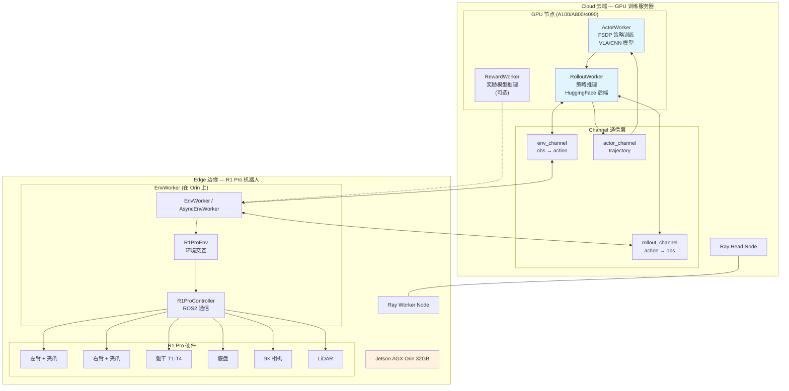

**为什么选择 Cloud-Edge**:
- R1 Pro 的 Orin (32GB) 无法同时承载 VLA 模型训练 (需要 40GB+) 和环境控制
- 训练梯度计算需要 A100/A800 级 GPU, 但环境控制只需 Orin 的 CPU
- Cloud-Edge 分离使得一台 GPU 服务器可以同时训练多台 R1 Pro 的数据
- RLinf 的 Ray 远程调用天然支持跨机器通信

### 3.2 数据流全景

```mermaid
sequenceDiagram
    participant Orin as R1 Pro (Orin)
    participant ROS2 as ROS2 Topics
    participant EnvW as EnvWorker (Orin)
    participant Channel as Channel (Ray)
    participant Rollout as RolloutWorker (GPU)
    participant Actor as ActorWorker (GPU)
    
    Note over Orin,Actor: === 一次交互循环 (10Hz) ===
    
    rect rgb(230, 255, 230)
        Note over Orin,EnvW: 1. 感知
        Orin->>ROS2: 相机图像 + 关节状态 + IMU
        ROS2->>EnvW: 回调更新 R1ProRobotState
        EnvW->>EnvW: 组装 observation dict
    end
    
    rect rgb(230, 245, 255)
        Note over EnvW,Rollout: 2. 推理
        EnvW->>Channel: env_channel.put(obs)
        Channel->>Rollout: obs = env_channel.get()
        Rollout->>Rollout: model.predict_action_batch(obs)
        Rollout->>Channel: rollout_channel.put(action)
        Channel->>EnvW: action = rollout_channel.get()
    end
    
    rect rgb(255, 245, 230)
        Note over EnvW,Orin: 3. 执行
        EnvW->>EnvW: 安全检查 + 动作裁剪
        EnvW->>ROS2: 发布关节目标 / 夹爪目标 / 底盘速度
        ROS2->>Orin: 执行动作
        Orin-->>ROS2: 反馈新状态
    end
    
    rect rgb(255, 230, 230)
        Note over EnvW,Actor: 4. 训练 (异步)
        EnvW->>Actor: trajectory 通过 Channel 传输
        Actor->>Actor: SAC/PPO 梯度更新
        Actor->>Rollout: sync_weights (非阻塞)
    end
```

### 3.3 网络拓扑

```
┌─────────────────────────────┐      ┌──────────────────────────────┐
│  GPU 训练服务器               │      │  R1 Pro 机器人               │
│  (Ubuntu 22.04)              │      │  (Jetson AGX Orin)           │
│                              │      │                              │
│  Ray Head Node               │      │  Ray Worker Node             │
│  ├── ActorWorker (GPU 0)     │      │  └── EnvWorker (CPU)         │
│  ├── RolloutWorker (GPU 1)   │◄────►│      └── R1ProEnv            │
│  └── RewardWorker (GPU 2)    │ GbE  │          └── R1ProController │
│                              │      │              └── ROS2 Node   │
│  IP: 192.168.1.10            │      │  IP: 192.168.1.20            │
└─────────────────────────────┘      └──────────────────────────────┘
```

**网络要求**:
- GPU 服务器 ↔ R1 Pro: 千兆以太网 (M12 接口), RTT < 5ms
- 观测数据带宽: ~10 MB/s (256×256 图像 × 3 相机 × 10Hz)
- 动作数据带宽: ~1 KB/s (20D 浮点向量 × 10Hz)

---

## 4. 硬件抽象层

### 4.1 类层次结构

严格遵循 RLinf 的 `Hardware` → `HardwareConfig` → `HardwareInfo` 三层模式:

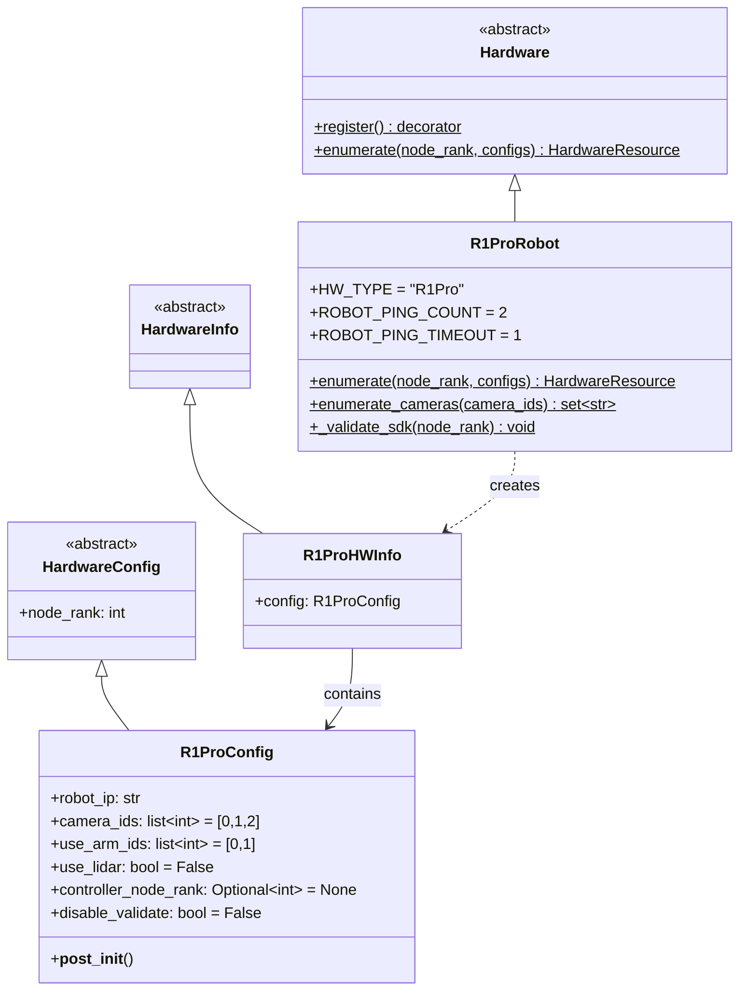

### 4.2 实现: `rlinf/scheduler/hardware/robots/r1pro.py`

```python
"""Galaxea R1 Pro hardware registration for RLinf scheduler."""

from __future__ import annotations

import logging
from dataclasses import dataclass, field
from typing import Optional

from rlinf.scheduler.hardware.hardware import (
    Hardware,
    HardwareConfig,
    HardwareInfo,
    HardwareResource,
    NodeHardwareConfig,
)

logger = logging.getLogger(__name__)


@dataclass
class R1ProHWInfo(HardwareInfo):
    config: "R1ProConfig" = None


@Hardware.register()
class R1ProRobot(Hardware):
    HW_TYPE = "R1Pro"
    ROBOT_PING_COUNT = 2
    ROBOT_PING_TIMEOUT = 1

    @classmethod
    def enumerate(
        cls,
        node_rank: int,
        configs: Optional[list["R1ProConfig"]] = None,
    ) -> Optional[HardwareResource]:
        if configs is None:
            return None

        matched = [c for c in configs if c.node_rank == node_rank]
        if not matched:
            return None

        hw_infos = []
        for cfg in matched:
            if not cfg.disable_validate:
                cls._validate_connectivity(cfg.robot_ip, node_rank)
                cls._validate_sdk(node_rank)
            hw_infos.append(R1ProHWInfo(config=cfg))

        return HardwareResource(
            hardware_type=cls.HW_TYPE,
            hardware_infos=hw_infos,
        )

    @classmethod
    def _validate_connectivity(cls, robot_ip: str, node_rank: int):
        try:
            import icmplib
            result = icmplib.ping(
                robot_ip,
                count=cls.ROBOT_PING_COUNT,
                timeout=cls.ROBOT_PING_TIMEOUT,
            )
            if not result.is_alive:
                raise ConnectionError(
                    f"R1 Pro at {robot_ip} unreachable from node {node_rank}"
                )
            logger.info(f"R1 Pro at {robot_ip} reachable, RTT={result.avg_rtt:.1f}ms")
        except ImportError:
            logger.warning("icmplib not installed, skipping R1 Pro ping check")

    @classmethod
    def _validate_sdk(cls, node_rank: int):
        try:
            import rclpy  # noqa: F401
        except ImportError:
            raise ImportError(
                f"Node {node_rank}: rclpy not found. "
                "Install ROS2 Humble and source setup.bash"
            )

    @classmethod
    def enumerate_cameras(cls, camera_ids: list[int]) -> set[str]:
        camera_names = {
            0: "camera_head_left",
            1: "camera_head_right",
            2: "camera_wrist_left",
            3: "camera_wrist_right",
            4: "camera_chassis_front",
        }
        return {camera_names.get(i, f"camera_{i}") for i in camera_ids}


@NodeHardwareConfig.register_hardware_config(R1ProRobot.HW_TYPE)
@dataclass
class R1ProConfig(HardwareConfig):
    robot_ip: str = ""
    camera_ids: list[int] = field(default_factory=lambda: [0, 2])
    use_arm_ids: list[int] = field(default_factory=lambda: [0, 1])
    use_lidar: bool = False
    controller_node_rank: Optional[int] = None
    disable_validate: bool = False

    def __post_init__(self):
        super().__post_init__()
        if isinstance(self.camera_ids, str):
            self.camera_ids = [int(x) for x in self.camera_ids.split(",")]
        if isinstance(self.use_arm_ids, str):
            self.use_arm_ids = [int(x) for x in self.use_arm_ids.split(",")]
```

**为什么这样设计**:
- `R1ProConfig` 比 `Turtle2Config` (空配置) 更接近 `FrankaConfig` 的详细程度, 因为 R1 Pro 需要 IP 验证、相机选择和手臂选择
- `_validate_sdk()` 检查 `rclpy` (ROS2 Python 客户端), 而非 ROS1 的 `rospy`, 因为 R1 Pro 使用 ROS2 Humble
- `camera_ids` 使用整数索引而非序列号, 因为 R1 Pro 的相机通过 GMSL 接口固定编号
- `use_arm_ids` 允许选择使用单臂 (`[0]` 或 `[1]`) 或双臂 (`[0, 1]`), 支持渐进式集成

### 4.3 YAML 配置示例

```yaml
# 集群配置: 1 GPU 节点 + 1 R1 Pro 节点
cluster:
  num_nodes: 2
  node_groups:
    - label: "gpu"
      node_ranks: 0
      accelerator_per_node: 2  # 2× GPU (训练 + 推理)
    - label: r1pro
      node_ranks: 1
      hardware:
        type: R1Pro
        configs:
          - robot_ip: "192.168.1.20"
            camera_ids: [0, 2]         # 头部左 + 腕部左
            use_arm_ids: [0, 1]        # 双臂
            use_lidar: false
            node_rank: 1

  component_placement:
    actor:
      node_group: gpu
      placement: 0               # GPU 0 训练
    rollout:
      node_group: gpu
      placement: 1               # GPU 1 推理
    env:
      node_group: r1pro
      placement: 0               # R1 Pro 节点
```

---

## 5. ROS2 通信层

### 5.1 R1ProController 架构

R1 Pro 使用 ROS2 Humble (而非 Franka 的 ROS1 Noetic), 因此 `R1ProController` 需要使用 `rclpy` 替代 `rospy`:

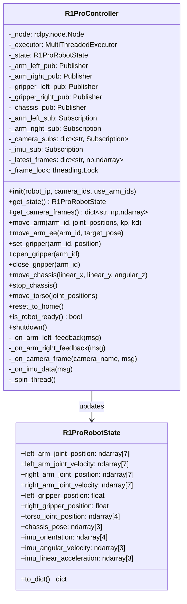

### 5.2 实现: `rlinf/envs/realworld/r1pro/r1pro_controller.py`

```python
"""ROS2 controller for Galaxea R1 Pro robot."""

from __future__ import annotations

import threading
import time
from typing import Optional

import numpy as np

from rlinf.utils.logging import get_logger

logger = get_logger()


class R1ProController:
    """Manages ROS2 communication with Galaxea R1 Pro."""

    # 默认关节 PD 增益 (来自 Galaxea SDK 文档)
    DEFAULT_KP = [2.0, 2.0, 2.0, 2.0, 2.0, 2.0, 2.0]
    DEFAULT_KD = [25.0, 25.0, 25.0, 25.0, 25.0, 25.0, 25.0]

    # 关节 Home 位置 (双臂自然下垂)
    HOME_LEFT_ARM = [0.0, -0.5, 0.0, -1.5, 0.0, 1.0, 0.0]
    HOME_RIGHT_ARM = [0.0, -0.5, 0.0, -1.5, 0.0, 1.0, 0.0]
    HOME_TORSO = [0.0, 0.0, 0.0, 0.0]

    def __init__(
        self,
        robot_ip: str,
        camera_ids: list[int],
        use_arm_ids: list[int],
        use_lidar: bool = False,
        step_frequency: float = 10.0,
    ):
        import rclpy
        from rclpy.executors import MultiThreadedExecutor

        if not rclpy.ok():
            rclpy.init()

        self._node = rclpy.create_node("rlinf_r1pro_controller")
        self._executor = MultiThreadedExecutor()
        self._executor.add_node(self._node)

        self._robot_ip = robot_ip
        self._camera_ids = camera_ids
        self._use_arm_ids = use_arm_ids
        self._step_frequency = step_frequency
        self._dt = 1.0 / step_frequency

        self._state = R1ProRobotState()
        self._latest_frames: dict[str, np.ndarray] = {}
        self._frame_lock = threading.Lock()
        self._state_lock = threading.Lock()

        self._setup_publishers()
        self._setup_subscribers()

        self._spin_thread = threading.Thread(
            target=self._spin, daemon=True
        )
        self._spin_thread.start()

        logger.info(
            f"R1ProController initialized: ip={robot_ip}, "
            f"arms={use_arm_ids}, cameras={camera_ids}"
        )

    def _setup_publishers(self):
        from geometry_msgs.msg import Twist
        from std_msgs.msg import Float32

        # 手臂控制 — 使用 Galaxea SDK 的 motor_control 消息
        # 注意: hdas_msg 是 Galaxea 自定义消息包
        try:
            from hdas_msg.msg import MotorControl
            self._arm_msg_type = MotorControl
        except ImportError:
            logger.warning(
                "hdas_msg not found, using JointState as fallback"
            )
            from sensor_msgs.msg import JointState
            self._arm_msg_type = JointState

        if 0 in self._use_arm_ids:
            self._arm_left_pub = self._node.create_publisher(
                self._arm_msg_type,
                "/motion_control/control_arm_left",
                10,
            )
        if 1 in self._use_arm_ids:
            self._arm_right_pub = self._node.create_publisher(
                self._arm_msg_type,
                "/motion_control/control_arm_right",
                10,
            )

        # 夹爪控制
        self._gripper_left_pub = self._node.create_publisher(
            Float32,
            "/motion_target/target_position_gripper_left",
            10,
        )
        self._gripper_right_pub = self._node.create_publisher(
            Float32,
            "/motion_target/target_position_gripper_right",
            10,
        )

        # 底盘控制
        self._chassis_pub = self._node.create_publisher(
            Twist,
            "/motion_target/target_speed_chassis",
            10,
        )

    def _setup_subscribers(self):
        from sensor_msgs.msg import CompressedImage, JointState

        # 手臂状态反馈
        if 0 in self._use_arm_ids:
            self._node.create_subscription(
                JointState,
                "/hdas/feedback_arm_left",
                self._on_arm_left_feedback,
                10,
            )
        if 1 in self._use_arm_ids:
            self._node.create_subscription(
                JointState,
                "/hdas/feedback_arm_right",
                self._on_arm_right_feedback,
                10,
            )

        # 相机订阅
        camera_topics = {
            0: "/hdas/camera_head_left/color/image_raw/compressed",
            1: "/hdas/camera_head_right/color/image_raw/compressed",
            2: "/hdas/camera_wrist_left/color/image_raw/compressed",
            3: "/hdas/camera_wrist_right/color/image_raw/compressed",
            4: "/hdas/camera_chassis_front/color/image_raw/compressed",
        }
        for cam_id in self._camera_ids:
            topic = camera_topics.get(cam_id)
            if topic:
                cam_name = f"camera_{cam_id}"
                self._node.create_subscription(
                    CompressedImage,
                    topic,
                    lambda msg, name=cam_name: self._on_camera_frame(
                        name, msg
                    ),
                    10,
                )

        # IMU
        from sensor_msgs.msg import Imu
        self._node.create_subscription(
            Imu, "/hdas/imu_torso", self._on_imu_data, 10
        )

    def _on_arm_left_feedback(self, msg):
        with self._state_lock:
            self._state.left_arm_joint_position = np.array(
                msg.position[:7]
            )
            self._state.left_arm_joint_velocity = np.array(
                msg.velocity[:7]
            )

    def _on_arm_right_feedback(self, msg):
        with self._state_lock:
            self._state.right_arm_joint_position = np.array(
                msg.position[:7]
            )
            self._state.right_arm_joint_velocity = np.array(
                msg.velocity[:7]
            )

    def _on_camera_frame(self, camera_name: str, msg):
        import cv2
        buf = np.frombuffer(msg.data, dtype=np.uint8)
        frame = cv2.imdecode(buf, cv2.IMREAD_COLOR)
        if frame is not None:
            with self._frame_lock:
                self._latest_frames[camera_name] = frame

    def _on_imu_data(self, msg):
        with self._state_lock:
            q = msg.orientation
            self._state.imu_orientation = np.array(
                [q.x, q.y, q.z, q.w]
            )
            av = msg.angular_velocity
            self._state.imu_angular_velocity = np.array(
                [av.x, av.y, av.z]
            )
            la = msg.linear_acceleration
            self._state.imu_linear_acceleration = np.array(
                [la.x, la.y, la.z]
            )

    def _spin(self):
        self._executor.spin()

    def get_state(self) -> "R1ProRobotState":
        with self._state_lock:
            return self._state.copy()

    def get_camera_frames(self) -> dict[str, np.ndarray]:
        with self._frame_lock:
            return {k: v.copy() for k, v in self._latest_frames.items()}

    def move_arm(
        self,
        arm_id: int,
        joint_positions: np.ndarray,
        kp: Optional[list[float]] = None,
        kd: Optional[list[float]] = None,
    ):
        """发送关节位置目标到指定手臂."""
        if kp is None:
            kp = self.DEFAULT_KP
        if kd is None:
            kd = self.DEFAULT_KD

        msg = self._build_arm_msg(joint_positions, kp, kd)
        pub = (
            self._arm_left_pub if arm_id == 0 else self._arm_right_pub
        )
        pub.publish(msg)

    def _build_arm_msg(self, positions, kp, kd):
        """构建手臂控制消息."""
        try:
            from hdas_msg.msg import MotorControl
            msg = MotorControl()
            msg.position = positions.tolist()
            msg.kp = kp
            msg.kd = kd
            return msg
        except ImportError:
            from sensor_msgs.msg import JointState
            msg = JointState()
            msg.position = positions.tolist()
            return msg

    def set_gripper(self, arm_id: int, position: float):
        """设置夹爪位置 (0=关闭, 100=全开, 单位: mm)."""
        from std_msgs.msg import Float32
        msg = Float32()
        msg.data = float(np.clip(position, 0.0, 100.0))
        pub = (
            self._gripper_left_pub
            if arm_id == 0
            else self._gripper_right_pub
        )
        pub.publish(msg)

    def open_gripper(self, arm_id: int):
        self.set_gripper(arm_id, 100.0)

    def close_gripper(self, arm_id: int):
        self.set_gripper(arm_id, 0.0)

    def move_chassis(
        self, linear_x: float, linear_y: float, angular_z: float
    ):
        """发送底盘速度指令."""
        from geometry_msgs.msg import Twist
        msg = Twist()
        msg.linear.x = float(np.clip(linear_x, -0.6, 0.6))
        msg.linear.y = float(np.clip(linear_y, -0.3, 0.3))
        msg.angular.z = float(np.clip(angular_z, -1.0, 1.0))
        self._chassis_pub.publish(msg)

    def stop_chassis(self):
        self.move_chassis(0.0, 0.0, 0.0)

    def reset_to_home(self):
        """将机器人重置到 Home 位置."""
        if 0 in self._use_arm_ids:
            self.move_arm(0, np.array(self.HOME_LEFT_ARM))
        if 1 in self._use_arm_ids:
            self.move_arm(1, np.array(self.HOME_RIGHT_ARM))
        self.stop_chassis()
        self.open_gripper(0)
        self.open_gripper(1)
        time.sleep(2.0)

    def is_robot_ready(self) -> bool:
        """检查是否接收到有效的机器人状态."""
        state = self.get_state()
        return not np.allclose(state.left_arm_joint_position, 0.0)

    def shutdown(self):
        self.stop_chassis()
        self._node.destroy_node()
```

### 5.3 ROS2 vs ROS1 的关键差异

| 维度 | RLinf-Franka (ROS1) | RLinf-R1Pro (ROS2) |
|------|--------------------|--------------------|
| 初始化 | `rospy.init_node()` | `rclpy.init()` + `create_node()` |
| 消息订阅 | `rospy.Subscriber()` | `node.create_subscription()` |
| 消息发布 | `rospy.Publisher()` | `node.create_publisher()` |
| 主循环 | `rospy.spin()` | `executor.spin()` (多线程) |
| 服务调用 | `rospy.ServiceProxy()` | `node.create_client()` |
| 回调模型 | 全局回调线程 | `MultiThreadedExecutor` |
| 关闭 | `rospy.signal_shutdown()` | `rclpy.shutdown()` |
| 消息包 | `std_msgs.msg` (Python) | `std_msgs.msg` (IDL 生成) |

**为什么用 ROS2**: R1 Pro 原生支持 ROS2 Humble, 其 SDK (`Galaxea ATC ROS2 SDK V2.1.4`) 的所有控制接口基于 ROS2。使用 ROS1 需要额外的 `ros1_bridge`, 引入延迟和复杂度。

---

## 6. 机器人状态容器

### 6.1 R1ProRobotState

参照 `Turtle2RobotState` (双臂) 和 `FrankaRobotState` (单臂) 的设计:

```python
"""Robot state container for Galaxea R1 Pro."""

from __future__ import annotations

import copy
from dataclasses import dataclass, field

import numpy as np


@dataclass
class R1ProRobotState:
    """R1 Pro 完整状态, 包含双臂、躯干、底盘和传感器数据."""

    # 左臂 (7 DOF A2)
    left_arm_joint_position: np.ndarray = field(
        default_factory=lambda: np.zeros(7)
    )
    left_arm_joint_velocity: np.ndarray = field(
        default_factory=lambda: np.zeros(7)
    )
    left_arm_ee_position: np.ndarray = field(
        default_factory=lambda: np.zeros(3)
    )  # xyz
    left_arm_ee_orientation: np.ndarray = field(
        default_factory=lambda: np.zeros(3)
    )  # rpy
    left_gripper_position: float = 0.0  # mm, 0-100
    left_gripper_is_open: bool = True

    # 右臂 (7 DOF A2)
    right_arm_joint_position: np.ndarray = field(
        default_factory=lambda: np.zeros(7)
    )
    right_arm_joint_velocity: np.ndarray = field(
        default_factory=lambda: np.zeros(7)
    )
    right_arm_ee_position: np.ndarray = field(
        default_factory=lambda: np.zeros(3)
    )
    right_arm_ee_orientation: np.ndarray = field(
        default_factory=lambda: np.zeros(3)
    )
    right_gripper_position: float = 0.0
    right_gripper_is_open: bool = True

    # 躯干 (4 DOF)
    torso_joint_position: np.ndarray = field(
        default_factory=lambda: np.zeros(4)
    )  # T1-T4
    torso_joint_velocity: np.ndarray = field(
        default_factory=lambda: np.zeros(4)
    )

    # 底盘
    chassis_pose: np.ndarray = field(
        default_factory=lambda: np.zeros(3)
    )  # x, y, theta
    chassis_velocity: np.ndarray = field(
        default_factory=lambda: np.zeros(3)
    )  # vx, vy, omega

    # IMU
    imu_orientation: np.ndarray = field(
        default_factory=lambda: np.array([0.0, 0.0, 0.0, 1.0])
    )  # qx,qy,qz,qw
    imu_angular_velocity: np.ndarray = field(
        default_factory=lambda: np.zeros(3)
    )
    imu_linear_acceleration: np.ndarray = field(
        default_factory=lambda: np.zeros(3)
    )

    def to_dict(self) -> dict:
        """转换为可序列化的字典, 用于观测空间."""
        return {
            "left_arm_joint_pos": self.left_arm_joint_position.copy(),
            "left_arm_joint_vel": self.left_arm_joint_velocity.copy(),
            "left_arm_ee_pos": self.left_arm_ee_position.copy(),
            "left_arm_ee_ori": self.left_arm_ee_orientation.copy(),
            "left_gripper_pos": np.array([self.left_gripper_position]),
            "right_arm_joint_pos": self.right_arm_joint_position.copy(),
            "right_arm_joint_vel": self.right_arm_joint_velocity.copy(),
            "right_arm_ee_pos": self.right_arm_ee_position.copy(),
            "right_arm_ee_ori": self.right_arm_ee_orientation.copy(),
            "right_gripper_pos": np.array([self.right_gripper_position]),
            "torso_joint_pos": self.torso_joint_position.copy(),
            "chassis_pose": self.chassis_pose.copy(),
            "imu_orientation": self.imu_orientation.copy(),
        }

    def get_state_vector(self, use_arm_ids: list[int]) -> np.ndarray:
        """将选定部分展平为一维状态向量."""
        parts = []
        if 0 in use_arm_ids:
            parts.extend([
                self.left_arm_ee_position,    # 3
                self.left_arm_ee_orientation,  # 3
                np.array([self.left_gripper_position / 100.0]),  # 1
            ])
        if 1 in use_arm_ids:
            parts.extend([
                self.right_arm_ee_position,    # 3
                self.right_arm_ee_orientation,  # 3
                np.array([self.right_gripper_position / 100.0]),  # 1
            ])
        return np.concatenate(parts)  # 7 (单臂) or 14 (双臂)

    def copy(self) -> "R1ProRobotState":
        return copy.deepcopy(self)
```

### 6.2 状态维度分析

```
┌──────────────────────────────────────────────────────────────────┐
│                    R1ProRobotState 维度布局                       │
├──────────────────┬──────┬──────────────────────────────────────────┤
│ 左臂关节位置      │  7   │ J1-J7 弧度                               │
│ 左臂关节速度      │  7   │ J1-J7 rad/s                              │
│ 左臂末端位置      │  3   │ xyz (m)                                  │
│ 左臂末端姿态      │  3   │ roll, pitch, yaw (rad)                   │
│ 左夹爪位置        │  1   │ 0-100mm → 归一化 0-1                      │
├──────────────────┼──────┤                                          │
│ 右臂 (同结构)     │  21  │                                          │
├──────────────────┼──────┤                                          │
│ 躯干关节位置      │  4   │ T1-T4                                    │
│ 躯干关节速度      │  4   │ T1-T4 rad/s                              │
│ 底盘位姿          │  3   │ x, y, theta                              │
│ 底盘速度          │  3   │ vx, vy, omega                            │
│ IMU 姿态         │  4   │ 四元数                                    │
│ IMU 角速度       │  3   │ rad/s                                    │
│ IMU 线加速度     │  3   │ m/s²                                     │
├──────────────────┼──────┤                                          │
│ 总计             │  63  │                                          │
└──────────────────┴──────┴──────────────────────────────────────────┘
```

**策略网络实际使用的状态**: 根据任务选择子集 — 桌面操作只需双臂 EE 位姿 + 夹爪 (14D), 移动操作需要加上底盘 (17D), 全身任务使用完整 63D。

---

## 7. 环境层

### 7.1 R1ProEnv 类层次

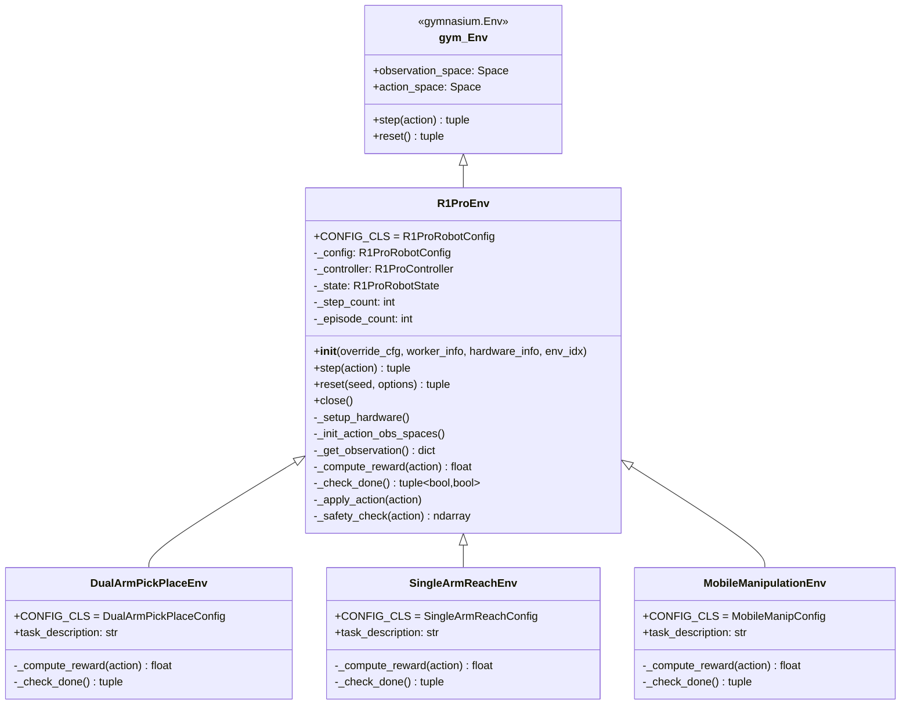

### 7.2 R1ProRobotConfig

```python
"""Configuration for R1 Pro environments."""

from __future__ import annotations

from dataclasses import dataclass, field
from typing import Optional

import numpy as np


@dataclass
class R1ProRobotConfig:
    """R1 Pro 环境基础配置."""

    # 硬件连接
    robot_ip: Optional[str] = None
    camera_ids: list[int] = field(default_factory=lambda: [0, 2])
    use_arm_ids: list[int] = field(default_factory=lambda: [0, 1])
    is_dummy: bool = False

    # 控制参数
    step_frequency: float = 10.0
    control_mode: str = "ee_delta"  # "ee_delta", "joint_delta", "joint_abs"
    action_scale: np.ndarray = field(
        default_factory=lambda: np.array([0.01, 0.05, 1.0])
    )
    # action_scale[0]: 位置缩放 (m/step)
    # action_scale[1]: 姿态缩放 (rad/step)
    # action_scale[2]: 夹爪缩放

    # 安全限位
    ee_pose_limit_min: np.ndarray = field(
        default_factory=lambda: np.array([
            # 左臂 [x, y, z, rx, ry, rz]
            [0.1, -0.5, 0.0, -3.14, -1.57, -3.14],
            # 右臂
            [0.1, -0.5, 0.0, -3.14, -1.57, -3.14],
        ])
    )
    ee_pose_limit_max: np.ndarray = field(
        default_factory=lambda: np.array([
            [0.8, 0.5, 0.8, 3.14, 1.57, 3.14],
            [0.8, 0.5, 0.8, 3.14, 1.57, 3.14],
        ])
    )

    # 目标与重置位姿
    target_ee_pose: np.ndarray = field(
        default_factory=lambda: np.zeros((2, 6))
    )
    reset_ee_pose: np.ndarray = field(
        default_factory=lambda: np.array([
            [0.3, 0.2, 0.3, 0.0, -1.57, 0.0],
            [0.3, -0.2, 0.3, 0.0, -1.57, 0.0],
        ])
    )

    # 底盘
    enable_chassis: bool = False
    chassis_speed_limit: float = 0.3  # m/s

    # 躯干
    enable_torso: bool = False

    # 夹爪
    no_gripper: bool = False
    enforce_gripper_close: bool = False
    enable_gripper_penalty: bool = True
    gripper_penalty: float = 0.1

    # 奖励
    use_dense_reward: bool = False
    reward_scale: float = 1.0
    reward_threshold: np.ndarray = field(
        default_factory=lambda: np.zeros((2, 6))
    )

    # Episode 参数
    max_num_steps: int = 200
    success_hold_steps: int = 1

    # 其他
    task_description: str = ""
    save_video_path: Optional[str] = None

    def __post_init__(self):
        for attr in [
            "action_scale",
            "ee_pose_limit_min",
            "ee_pose_limit_max",
            "target_ee_pose",
            "reset_ee_pose",
            "reward_threshold",
        ]:
            val = getattr(self, attr)
            if isinstance(val, list):
                setattr(self, attr, np.array(val))
```

### 7.3 R1ProEnv 核心实现

```python
"""Galaxea R1 Pro base environment for RLinf."""

from __future__ import annotations

import time
from typing import Any, Optional

import gymnasium as gym
import numpy as np
from gymnasium import spaces

from rlinf.utils.logging import get_logger

logger = get_logger()


class R1ProEnv(gym.Env):
    """Galaxea R1 Pro 基础环境."""

    CONFIG_CLS = R1ProRobotConfig
    metadata = {"render_modes": ["rgb_array"]}

    def __init__(
        self,
        override_cfg: dict[str, Any],
        worker_info: Optional[Any] = None,
        hardware_info: Optional[Any] = None,
        env_idx: int = 0,
    ):
        super().__init__()
        self._config = self.CONFIG_CLS(**override_cfg)
        self._worker_info = worker_info
        self._hardware_info = hardware_info
        self._env_idx = env_idx
        self._step_count = 0
        self._episode_count = 0
        self._controller = None

        if not self._config.is_dummy:
            self._setup_hardware()

        self._init_action_obs_spaces()
        logger.info(
            f"R1ProEnv initialized: arms={self._config.use_arm_ids}, "
            f"dummy={self._config.is_dummy}"
        )

    def _setup_hardware(self):
        """初始化 ROS2 控制器."""
        robot_ip = self._config.robot_ip
        if self._hardware_info is not None:
            robot_ip = self._hardware_info.config.robot_ip

        from rlinf.envs.realworld.r1pro.r1pro_controller import (
            R1ProController,
        )

        self._controller = R1ProController(
            robot_ip=robot_ip,
            camera_ids=self._config.camera_ids,
            use_arm_ids=self._config.use_arm_ids,
            step_frequency=self._config.step_frequency,
        )

        for _ in range(100):
            if self._controller.is_robot_ready():
                break
            time.sleep(0.1)
        else:
            raise TimeoutError("R1 Pro did not report ready state")

        self._controller.reset_to_home()

    def _init_action_obs_spaces(self):
        """初始化动作和观测空间."""
        num_arms = len(self._config.use_arm_ids)

        # 动作空间: 每臂 [dx, dy, dz, drx, dry, drz, gripper]
        action_dim = num_arms * 7
        if self._config.enable_chassis:
            action_dim += 3  # vx, vy, omega
        if self._config.no_gripper:
            action_dim -= num_arms  # 去掉夹爪维度

        self.action_space = spaces.Box(
            low=-1.0, high=1.0, shape=(action_dim,), dtype=np.float32
        )

        # 观测空间: state dict + frames dict
        state_dim = num_arms * 7  # EE pos(3) + ori(3) + gripper(1)
        if self._config.enable_chassis:
            state_dim += 3
        if self._config.enable_torso:
            state_dim += 4

        self.observation_space = spaces.Dict({
            "state": spaces.Dict({
                "agent_state": spaces.Box(
                    -np.inf, np.inf, (state_dim,), np.float32
                ),
            }),
            "frames": spaces.Dict({
                f"camera_{i}": spaces.Box(
                    0, 255, (256, 256, 3), np.uint8
                )
                for i in self._config.camera_ids
            }),
        })

    def step(self, action: np.ndarray):
        action = self._safety_check(action)
        self._apply_action(action)

        time.sleep(self._config.step_frequency ** -1)

        obs = self._get_observation()
        reward = self._compute_reward(action)
        terminated, truncated = self._check_done()
        info = self._build_info(action)

        self._step_count += 1
        return obs, reward, terminated, truncated, info

    def reset(self, seed=None, options=None):
        super().reset(seed=seed)
        if self._controller is not None:
            self._controller.reset_to_home()
            time.sleep(1.0)
        self._step_count = 0
        self._episode_count += 1
        obs = self._get_observation()
        return obs, {}

    def _get_observation(self) -> dict:
        """组装观测字典."""
        if self._config.is_dummy:
            return self._get_dummy_observation()

        state = self._controller.get_state()
        frames = self._controller.get_camera_frames()

        state_vec = state.get_state_vector(self._config.use_arm_ids)
        if self._config.enable_chassis:
            state_vec = np.concatenate([state_vec, state.chassis_pose])
        if self._config.enable_torso:
            state_vec = np.concatenate([
                state_vec, state.torso_joint_position
            ])

        resized_frames = {}
        for cam_name, frame in frames.items():
            import cv2
            resized = cv2.resize(frame, (256, 256))
            resized_frames[cam_name] = resized

        return {
            "state": {"agent_state": state_vec.astype(np.float32)},
            "frames": resized_frames,
        }

    def _get_dummy_observation(self) -> dict:
        num_arms = len(self._config.use_arm_ids)
        state_dim = num_arms * 7
        if self._config.enable_chassis:
            state_dim += 3
        if self._config.enable_torso:
            state_dim += 4
        return {
            "state": {"agent_state": np.zeros(state_dim, np.float32)},
            "frames": {
                f"camera_{i}": np.zeros((256, 256, 3), np.uint8)
                for i in self._config.camera_ids
            },
        }

    def _apply_action(self, action: np.ndarray):
        """将归一化动作转换为机器人指令."""
        if self._config.is_dummy:
            return

        state = self._controller.get_state()
        idx = 0

        for arm_id in self._config.use_arm_ids:
            # 位置增量
            pos_delta = (
                action[idx : idx + 3]
                * self._config.action_scale[0]
            )
            idx += 3

            # 姿态增量
            ori_delta = (
                action[idx : idx + 3]
                * self._config.action_scale[1]
            )
            idx += 3

            # 夹爪
            if not self._config.no_gripper:
                gripper_cmd = action[idx] * self._config.action_scale[2]
                idx += 1
                if gripper_cmd > 0:
                    self._controller.open_gripper(arm_id)
                else:
                    self._controller.close_gripper(arm_id)

            # 计算目标 EE 位姿
            if arm_id == 0:
                current_pos = state.left_arm_ee_position
                current_ori = state.left_arm_ee_orientation
            else:
                current_pos = state.right_arm_ee_position
                current_ori = state.right_arm_ee_orientation

            target_pos = current_pos + pos_delta
            target_ori = current_ori + ori_delta

            # 裁剪到安全范围
            limit_idx = 0 if arm_id == 0 else 1
            target_pos = np.clip(
                target_pos,
                self._config.ee_pose_limit_min[limit_idx, :3],
                self._config.ee_pose_limit_max[limit_idx, :3],
            )
            target_ori = np.clip(
                target_ori,
                self._config.ee_pose_limit_min[limit_idx, 3:],
                self._config.ee_pose_limit_max[limit_idx, 3:],
            )

            target_pose = np.concatenate([target_pos, target_ori])
            self._controller.move_arm_ee(arm_id, target_pose)

        if self._config.enable_chassis:
            chassis_action = action[idx : idx + 3]
            self._controller.move_chassis(
                linear_x=chassis_action[0]
                * self._config.chassis_speed_limit,
                linear_y=chassis_action[1]
                * self._config.chassis_speed_limit,
                angular_z=chassis_action[2] * 1.0,
            )

    def _safety_check(self, action: np.ndarray) -> np.ndarray:
        """多级安全检查."""
        action = np.clip(action, -1.0, 1.0)
        return action

    def _compute_reward(self, action: np.ndarray) -> float:
        """子类覆盖, 基类返回 0."""
        return 0.0

    def _check_done(self) -> tuple[bool, bool]:
        """检查 episode 是否结束."""
        truncated = self._step_count >= self._config.max_num_steps
        terminated = False
        return terminated, truncated

    def _build_info(self, action: np.ndarray) -> dict:
        info = {
            "step_count": self._step_count,
            "episode_count": self._episode_count,
        }
        return info

    def close(self):
        if self._controller is not None:
            self._controller.shutdown()
```

### 7.4 动作空间设计

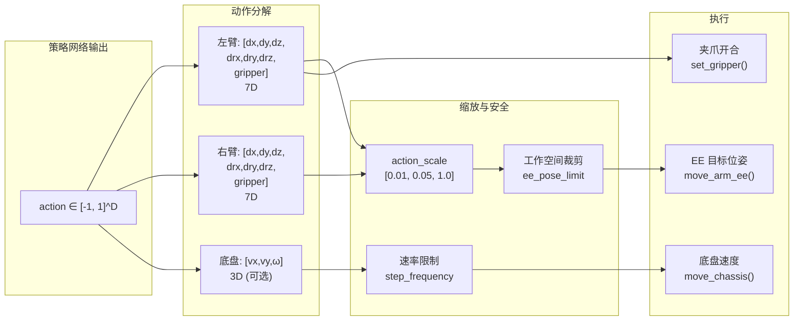

**动作维度配置**:

| 模式 | 动作维度 | 适用场景 |
|------|---------|---------|
| 单臂 (无夹爪) | 6 | 位置到达 |
| 单臂 (含夹爪) | 7 | 单臂抓取 |
| 双臂 (无夹爪) | 12 | 双臂搬运 |
| 双臂 (含夹爪) | 14 | 双臂操作 |
| 双臂 + 底盘 | 17 | 移动操作 |
| 全身 (含躯干) | 21 | 全身协调 |

---

## 8. 任务环境

### 8.1 任务一: 单臂目标到达 (SingleArmReachEnv)

最基础的任务, 用于验证集成正确性:

```python
"""Single arm reach task for R1 Pro."""

from dataclasses import dataclass, field

import numpy as np
from gymnasium.envs.registration import register

from rlinf.envs.realworld.r1pro.r1pro_env import R1ProEnv, R1ProRobotConfig


@dataclass
class SingleArmReachConfig(R1ProRobotConfig):
    use_arm_ids: list[int] = field(default_factory=lambda: [1])
    no_gripper: bool = True
    target_ee_pose: np.ndarray = field(
        default_factory=lambda: np.array([
            [0.0, 0.0, 0.0, 0.0, 0.0, 0.0],   # 未使用
            [0.4, -0.1, 0.3, 0.0, -1.57, 0.0],  # 右臂目标
        ])
    )
    reward_threshold: np.ndarray = field(
        default_factory=lambda: np.array([
            [0.0, 0.0, 0.0, 0.0, 0.0, 0.0],
            [0.02, 0.02, 0.02, 0.2, 0.2, 0.2],
        ])
    )
    max_num_steps: int = 100

    def __post_init__(self):
        super().__post_init__()
        self.action_scale = np.array([0.01, 0.05, 0.0])
        self.enable_chassis = False
        self.enable_torso = False


class SingleArmReachEnv(R1ProEnv):
    CONFIG_CLS = SingleArmReachConfig

    def __init__(self, override_cfg, worker_info=None,
                 hardware_info=None, env_idx=0):
        super().__init__(override_cfg, worker_info, hardware_info, env_idx)

    @property
    def task_description(self) -> str:
        return "Move right arm end-effector to target position"

    def _compute_reward(self, action):
        if self._config.is_dummy:
            return 0.0
        state = self._controller.get_state()
        target = self._config.target_ee_pose[1]
        current = np.concatenate([
            state.right_arm_ee_position,
            state.right_arm_ee_orientation,
        ])
        error = np.abs(current - target)
        threshold = self._config.reward_threshold[1]
        success = np.all(error < threshold)
        if self._config.use_dense_reward:
            return -np.sum(error) * self._config.reward_scale
        return float(success) * self._config.reward_scale

    def _check_done(self):
        truncated = self._step_count >= self._config.max_num_steps
        if self._config.is_dummy:
            return False, truncated
        state = self._controller.get_state()
        target = self._config.target_ee_pose[1]
        current = np.concatenate([
            state.right_arm_ee_position,
            state.right_arm_ee_orientation,
        ])
        error = np.abs(current - target)
        threshold = self._config.reward_threshold[1]
        terminated = bool(np.all(error < threshold))
        return terminated, truncated


register(
    id="R1ProSingleArmReach-v1",
    entry_point="rlinf.envs.realworld.r1pro.tasks:SingleArmReachEnv",
)
```

### 8.2 任务二: 双臂抓取与搬运 (DualArmPickPlaceEnv)

```python
"""Dual arm pick-and-place task for R1 Pro."""

from dataclasses import dataclass, field

import numpy as np
from gymnasium.envs.registration import register

from rlinf.envs.realworld.r1pro.r1pro_env import R1ProEnv, R1ProRobotConfig


@dataclass
class DualArmPickPlaceConfig(R1ProRobotConfig):
    use_arm_ids: list[int] = field(default_factory=lambda: [0, 1])
    no_gripper: bool = False
    pick_position: np.ndarray = field(
        default_factory=lambda: np.array([0.4, 0.0, 0.15])
    )
    place_position: np.ndarray = field(
        default_factory=lambda: np.array([0.4, 0.0, 0.35])
    )
    object_width: float = 0.05  # 物体宽度 (m)
    max_num_steps: int = 300

    def __post_init__(self):
        super().__post_init__()
        self.action_scale = np.array([0.01, 0.05, 1.0])


class DualArmPickPlaceEnv(R1ProEnv):
    CONFIG_CLS = DualArmPickPlaceConfig

    def __init__(self, override_cfg, worker_info=None,
                 hardware_info=None, env_idx=0):
        super().__init__(override_cfg, worker_info, hardware_info, env_idx)
        self._phase = "approach"  # approach → grasp → lift → place

    @property
    def task_description(self) -> str:
        return "Pick up object with both arms and place at target"

    def _compute_reward(self, action):
        if self._config.is_dummy:
            return 0.0
        state = self._controller.get_state()

        # 阶段性稀疏奖励
        if self._phase == "approach":
            left_dist = np.linalg.norm(
                state.left_arm_ee_position
                - self._config.pick_position
            )
            right_dist = np.linalg.norm(
                state.right_arm_ee_position
                - self._config.pick_position
            )
            if left_dist < 0.05 and right_dist < 0.05:
                self._phase = "grasp"
                return 1.0
            if self._config.use_dense_reward:
                return -(left_dist + right_dist) * 0.1
        elif self._phase == "grasp":
            if (
                not state.left_gripper_is_open
                and not state.right_gripper_is_open
            ):
                self._phase = "lift"
                return 2.0
        elif self._phase == "lift":
            height = min(
                state.left_arm_ee_position[2],
                state.right_arm_ee_position[2],
            )
            if height > self._config.place_position[2] - 0.03:
                self._phase = "place"
                return 3.0
        elif self._phase == "place":
            return 5.0

        return 0.0

    def _check_done(self):
        truncated = self._step_count >= self._config.max_num_steps
        terminated = self._phase == "place"
        return terminated, truncated

    def reset(self, seed=None, options=None):
        self._phase = "approach"
        return super().reset(seed=seed, options=options)


register(
    id="R1ProDualArmPickPlace-v1",
    entry_point="rlinf.envs.realworld.r1pro.tasks:DualArmPickPlaceEnv",
)
```

### 8.3 任务三: 移动操作 (MobileManipulationEnv)

```python
"""Mobile manipulation task for R1 Pro."""

from dataclasses import dataclass, field

import numpy as np
from gymnasium.envs.registration import register

from rlinf.envs.realworld.r1pro.r1pro_env import R1ProEnv, R1ProRobotConfig


@dataclass
class MobileManipConfig(R1ProRobotConfig):
    use_arm_ids: list[int] = field(default_factory=lambda: [1])
    enable_chassis: bool = True
    no_gripper: bool = False
    nav_target: np.ndarray = field(
        default_factory=lambda: np.array([2.0, 0.0, 0.0])
    )
    grasp_target: np.ndarray = field(
        default_factory=lambda: np.array([0.4, -0.1, 0.2])
    )
    max_num_steps: int = 500

    def __post_init__(self):
        super().__post_init__()
        self.action_scale = np.array([0.01, 0.05, 1.0])
        self.chassis_speed_limit = 0.3


class MobileManipulationEnv(R1ProEnv):
    CONFIG_CLS = MobileManipConfig

    def __init__(self, override_cfg, worker_info=None,
                 hardware_info=None, env_idx=0):
        super().__init__(override_cfg, worker_info, hardware_info, env_idx)
        self._reached_nav_target = False

    @property
    def task_description(self) -> str:
        return "Navigate to target, then grasp object with right arm"

    def _compute_reward(self, action):
        if self._config.is_dummy:
            return 0.0
        state = self._controller.get_state()

        if not self._reached_nav_target:
            nav_dist = np.linalg.norm(
                state.chassis_pose[:2]
                - self._config.nav_target[:2]
            )
            if nav_dist < 0.2:
                self._reached_nav_target = True
                return 2.0
            if self._config.use_dense_reward:
                return -nav_dist * 0.05
            return 0.0
        else:
            grasp_dist = np.linalg.norm(
                state.right_arm_ee_position
                - self._config.grasp_target
            )
            if grasp_dist < 0.03 and not state.right_gripper_is_open:
                return 5.0
            if self._config.use_dense_reward:
                return -grasp_dist * 0.1
            return 0.0

    def _check_done(self):
        truncated = self._step_count >= self._config.max_num_steps
        terminated = False
        if self._reached_nav_target and not self._config.is_dummy:
            state = self._controller.get_state()
            grasp_dist = np.linalg.norm(
                state.right_arm_ee_position
                - self._config.grasp_target
            )
            terminated = grasp_dist < 0.03
        return terminated, truncated

    def reset(self, seed=None, options=None):
        self._reached_nav_target = False
        return super().reset(seed=seed, options=options)


register(
    id="R1ProMobileManip-v1",
    entry_point="rlinf.envs.realworld.r1pro.tasks:MobileManipulationEnv",
)
```

### 8.4 任务对比总结

| 任务 | Gymnasium ID | 动作维度 | 状态维度 | 算法推荐 | 难度 |
|------|-------------|---------|---------|---------|------|
| 单臂到达 | `R1ProSingleArmReach-v1` | 6 | 7 | PPO | 入门 |
| 双臂搬运 | `R1ProDualArmPickPlace-v1` | 14 | 14 | SAC+RLPD | 中等 |
| 移动操作 | `R1ProMobileManip-v1` | 10 | 10 | SAC+RLPD | 困难 |

---

## 9. Wrapper 链与观测处理

### 9.1 Wrapper 应用顺序

遵循 `RealWorldEnv` 的现有 Wrapper 链模式:

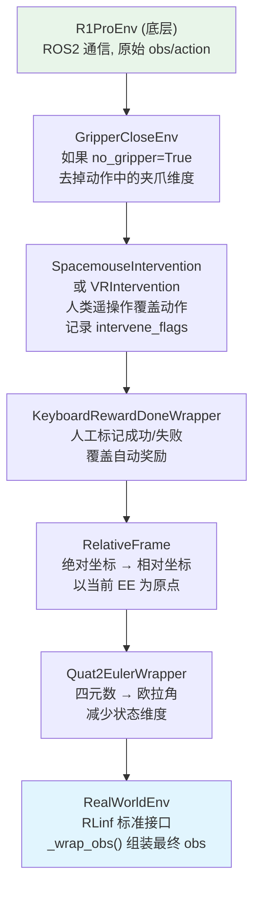

### 9.2 VR 遥操作 Wrapper (R1 Pro 特有)

R1 Pro SDK V2.1.4 支持 VR 全身遥操作 (30Hz), 这是 Franka 没有的能力。需要新增一个 `VRIntervention` Wrapper:

```python
"""VR teleoperation intervention wrapper for R1 Pro."""

import gymnasium as gym
import numpy as np


class VRIntervention(gym.ActionWrapper):
    """
    通过 Galaxea VR 遥操作系统覆盖策略动作.

    当 VR 控制器有输入时, 使用 VR 动作替代策略动作,
    并在 info 中记录 intervene_action 和 intervene_flag.
    """

    def __init__(self, env, vr_topic_prefix="/vr_teleop"):
        super().__init__(env)
        self._vr_topic_prefix = vr_topic_prefix
        self._vr_active = False
        self._vr_action = None

        # 订阅 VR 遥操作话题
        try:
            import rclpy
            from geometry_msgs.msg import PoseStamped

            self._node = rclpy.create_node("vr_intervention")
            self._node.create_subscription(
                PoseStamped,
                f"{vr_topic_prefix}/left_hand",
                lambda msg: self._on_vr_input(0, msg),
                10,
            )
            self._node.create_subscription(
                PoseStamped,
                f"{vr_topic_prefix}/right_hand",
                lambda msg: self._on_vr_input(1, msg),
                10,
            )
        except ImportError:
            pass

    def _on_vr_input(self, hand_id, msg):
        self._vr_active = True
        # 转换 VR 手部位姿为动作增量
        # (具体实现取决于 Galaxea VR SDK)

    def action(self, action):
        if self._vr_active and self._vr_action is not None:
            return self._vr_action, True
        return action, False

    def step(self, action):
        action, replaced = self.action(action)
        obs, reward, term, trunc, info = self.env.step(action)
        if replaced:
            info["intervene_action"] = action
            info["intervene_flag"] = True
        else:
            info["intervene_flag"] = False
        return obs, reward, term, trunc, info
```

### 9.3 双臂协调安全 Wrapper

R1 Pro 双臂操作需要防碰撞检查:

```python
"""Dual arm collision avoidance wrapper."""

import gymnasium as gym
import numpy as np


class DualArmSafetyWrapper(gym.ActionWrapper):
    """
    检测双臂末端距离, 防止自碰撞.
    当双臂距离过近时, 自动缩减动作幅度.
    """

    MIN_EE_DISTANCE = 0.08  # 最小安全距离 (m)
    SLOW_ZONE = 0.15  # 减速区距离 (m)

    def action(self, action):
        if not hasattr(self.env, '_controller'):
            return action
        state = self.env._controller.get_state()
        dist = np.linalg.norm(
            state.left_arm_ee_position - state.right_arm_ee_position
        )
        if dist < self.MIN_EE_DISTANCE:
            return np.zeros_like(action)  # 冻结
        elif dist < self.SLOW_ZONE:
            scale = (dist - self.MIN_EE_DISTANCE) / (
                self.SLOW_ZONE - self.MIN_EE_DISTANCE
            )
            return action * scale
        return action
```

---

## 10. 训练管线

### 10.1 训练模式矩阵

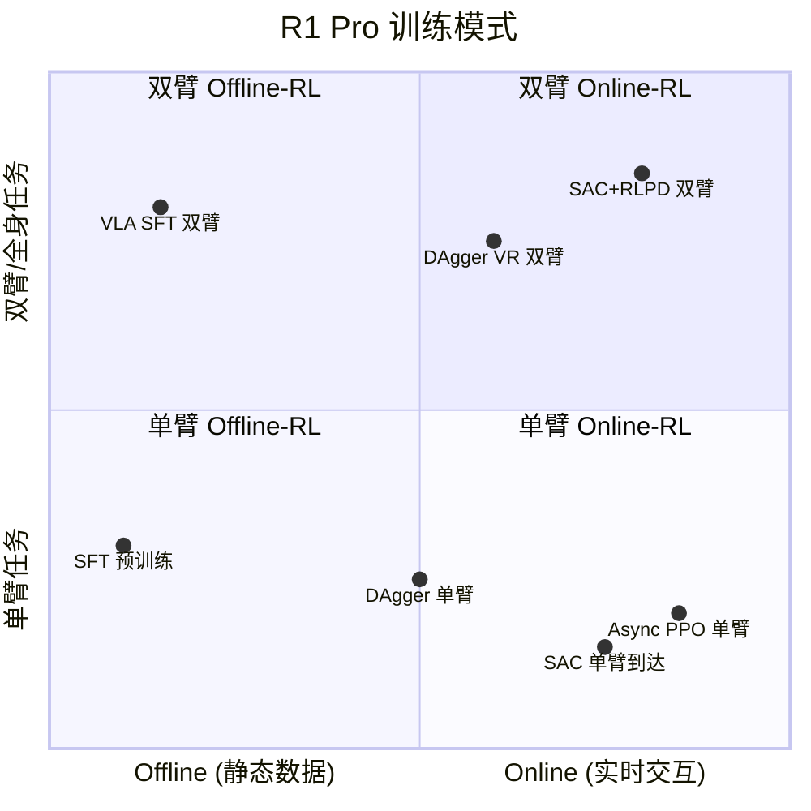

### 10.2 训练配置一: SAC 单臂到达 (入门)

```yaml
# examples/embodiment/config/r1pro_sac_reach_async.yaml

defaults:
  - _self_
  - env: r1pro_single_arm_reach
  - model: cnn_policy

runner:
  type: async_embodied
  max_global_steps: 10000
  save_interval: 500
  eval_interval: 200
  eval_episodes: 5

algorithm:
  adv_type: embodied_sac
  loss_type: embodied_sac
  gamma: 0.96
  tau: 0.005
  critic_actor_ratio: 4
  update_epoch: 32
  entropy_tuning:
    alpha_type: softplus
    initial_alpha: 0.01
    target_entropy: -6  # ≈ -action_dim
  replay_buffer:
    enable_cache: true
    cache_size: 10000
    min_buffer_size: 5
    sample_window_size: 5000

actor:
  sync_weight_no_wait: true
  micro_batch_size: 64
  global_batch_size: 256

rollout:
  backend: huggingface
  micro_batch_size: 1

cluster:
  num_nodes: 2
  node_groups:
    - label: gpu
      node_ranks: 0
      accelerator_per_node: 1
    - label: r1pro
      node_ranks: 1
      hardware:
        type: R1Pro
        configs:
          - robot_ip: ${oc.env:R1PRO_IP,192.168.1.20}
            camera_ids: [2]
            use_arm_ids: [1]
            node_rank: 1
  component_placement:
    actor:
      node_group: gpu
      placement: 0
    rollout:
      node_group: gpu
      placement: 0
    env:
      node_group: r1pro
      placement: 0
```

### 10.3 训练配置二: SAC+RLPD 双臂搬运 (进阶)

```yaml
# examples/embodiment/config/r1pro_sac_dual_arm_async.yaml

defaults:
  - _self_
  - env: r1pro_dual_arm_pick_place
  - model: cnn_policy

runner:
  type: async_embodied
  max_global_steps: 50000
  save_interval: 1000
  eval_interval: 500

algorithm:
  adv_type: embodied_sac
  loss_type: embodied_sac
  gamma: 0.96
  tau: 0.005
  critic_actor_ratio: 4
  update_epoch: 64

  replay_buffer:
    enable_cache: true
    cache_size: 50000
    min_buffer_size: 10
    sample_window_size: 20000

  demo_buffer:
    load_path: /data/r1pro_demos/dual_arm_pick/
    min_buffer_size: 1

actor:
  sync_weight_no_wait: true
  micro_batch_size: 128

env:
  train:
    env_type: realworld
    init_params:
      id: "R1ProDualArmPickPlace-v1"
    max_episode_steps: 300
    use_spacemouse: false
    use_vr_teleop: true  # 使用 VR 遥操作
    main_image_key: camera_0  # 头部左相机
    override_cfg:
      use_arm_ids: [0, 1]
      camera_ids: [0, 2]
      is_dummy: false
      use_dense_reward: true

cluster:
  num_nodes: 2
  node_groups:
    - label: gpu
      node_ranks: 0
      accelerator_per_node: 2
    - label: r1pro
      node_ranks: 1
      hardware:
        type: R1Pro
        configs:
          - robot_ip: ${oc.env:R1PRO_IP}
            camera_ids: [0, 2]
            use_arm_ids: [0, 1]
            node_rank: 1
  component_placement:
    actor:
      node_group: gpu
      placement: 0
    rollout:
      node_group: gpu
      placement: 1
    env:
      node_group: r1pro
      placement: 0
```

### 10.4 训练配置三: DAgger + VR 遥操作

```yaml
# examples/embodiment/config/r1pro_dagger_vr.yaml

defaults:
  - _self_
  - env: r1pro_dual_arm_pick_place
  - model: pi0  # 或 openvla_oft

runner:
  type: async_embodied
  max_global_steps: 20000

algorithm:
  loss_type: embodied_dagger
  replay_buffer:
    enable_cache: true
    cache_size: 5000
    min_buffer_size: 3
  only_save_expert: true  # 仅保存人类演示数据

env:
  train:
    env_type: realworld
    init_params:
      id: "R1ProDualArmPickPlace-v1"
    use_vr_teleop: true
    keyboard_reward_wrapper: single_stage
```

### 10.5 训练流程状态机

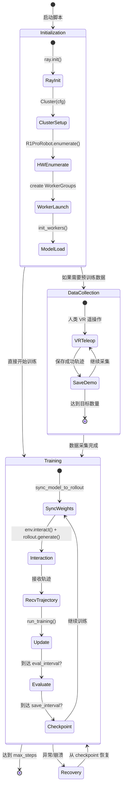

---

## 11. 数据采集系统

### 11.1 采集流程

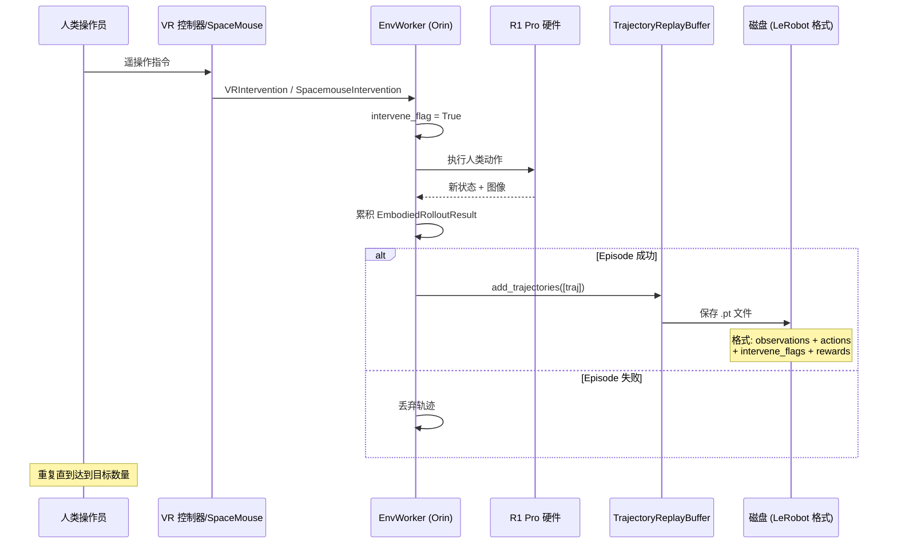

### 11.2 采集脚本

```python
"""Data collection script for R1 Pro with VR/SpaceMouse teleoperation."""

# examples/embodiment/collect_r1pro_data.py
# 参照 collect_real_data.py 的模式

import hydra
from omegaconf import DictConfig

from rlinf.scheduler.cluster import Cluster
from rlinf.scheduler.worker import Worker


class R1ProDataCollector(Worker):
    """R1 Pro 数据采集 Worker."""

    def init_worker(self):
        from rlinf.envs.realworld.realworld_env import RealWorldEnv
        self.env = RealWorldEnv(
            cfg=self.cfg.env.train,
            num_envs=1,
            seed_offset=0,
            total_num_processes=1,
            worker_info=self.worker_info,
        )

    def run(self, num_episodes: int = 50):
        from rlinf.data.replay_buffer import TrajectoryReplayBuffer
        buffer = TrajectoryReplayBuffer(
            max_size=num_episodes * 2,
            auto_save=True,
            save_dir=self.cfg.data_save_dir,
        )

        success_count = 0
        total_count = 0

        while success_count < num_episodes:
            obs, _ = self.env.reset()
            trajectory_data = []
            total_count += 1

            for step in range(self.cfg.max_steps_per_episode):
                action = self.env.action_space.sample() * 0  # 零动作
                obs, reward, term, trunc, info = self.env.step(action)

                trajectory_data.append({
                    "obs": obs,
                    "action": info.get("intervene_action", action),
                    "reward": reward,
                    "done": term or trunc,
                    "intervene_flag": info.get("intervene_flag", False),
                })

                if term or trunc:
                    break

            if reward > 0.5:  # 仅保存成功轨迹
                traj = self._build_trajectory(trajectory_data)
                buffer.add_trajectories([traj])
                success_count += 1
                self.log_info(
                    f"Success {success_count}/{num_episodes} "
                    f"(total attempts: {total_count})"
                )

        buffer.close()
        self.log_info(
            f"Collection done: {success_count} successes, "
            f"{total_count} total, "
            f"rate={success_count/total_count:.1%}"
        )


@hydra.main(config_path="config", config_name="r1pro_collect_data")
def main(cfg: DictConfig):
    cluster = Cluster(cfg.cluster)
    collector = R1ProDataCollector.create_group(cfg).launch(
        cluster, name="Collector"
    )
    collector.init_worker().wait()
    collector.run(num_episodes=cfg.num_episodes).wait()
    cluster.shutdown()


if __name__ == "__main__":
    main()
```

### 11.3 数据格式

采集的数据兼容两种格式:

| 格式 | 用途 | 工具 |
|------|------|------|
| **PyTorch (.pt)** | RLinf 内部 replay buffer | `TrajectoryReplayBuffer` |
| **LeRobot** | 社区共享, HuggingFace 生态 | `LeRobotDatasetWriter` |

```python
# LeRobot 数据集字段定义
features = {
    "state": {"dtype": "float32", "shape": (14,)},
    "actions": {"dtype": "float32", "shape": (14,)},
    "image_head": {"dtype": "image", "shape": (256, 256, 3)},
    "image_wrist": {"dtype": "image", "shape": (256, 256, 3)},
    "intervene_flag": {"dtype": "bool", "shape": (1,)},
}
metadata = {
    "fps": 10,
    "robot_type": "galaxea_r1_pro",
    "env_type": "dual_arm_pick_place",
}
```

---

## 12. 仿真与 Sim-to-Real

### 12.1 Isaac Sim 仿真环境

R1 Pro 有官方 Isaac Sim 支持, 可以利用 Isaac Lab 构建仿真环境进行预训练:

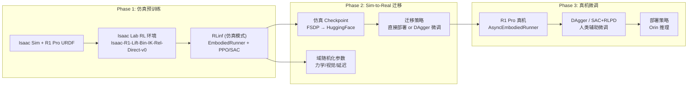

### 12.2 域随机化策略

| 随机化维度 | 范围 | 目的 |
|-----------|------|------|
| 物体质量 | ±30% | 抓取力泛化 |
| 物体尺寸 | ±20% | 夹爪开合泛化 |
| 摩擦系数 | ±50% | 操作策略鲁棒性 |
| 相机位姿 | ±2cm, ±5° | 视觉观测鲁棒性 |
| 光照强度 | ±40% | 视觉鲁棒性 |
| 控制延迟 | 0-50ms | 真机延迟适应 |
| 关节阻尼 | ±20% | 动力学泛化 |

### 12.3 RLinf 仿真配置

```yaml
# examples/embodiment/config/r1pro_sim_ppo_isaaclab.yaml

defaults:
  - _self_
  - env: isaaclab_r1pro
  - model: cnn_policy

env:
  train:
    env_type: isaaclab
    total_num_envs: 1024  # GPU 并行
    init_params:
      id: "Isaac-R1-Lift-Bin-IK-Rel-Direct-v0"
    max_episode_steps: 200

algorithm:
  adv_type: gae
  loss_type: actor_critic
  gamma: 0.99
  gae_lambda: 0.95
  clip_ratio_high: 0.2
  normalize_advantages: true

runner:
  type: embodied
  max_global_steps: 100000
```

---

## 13. 安全系统

### 13.1 多级安全架构

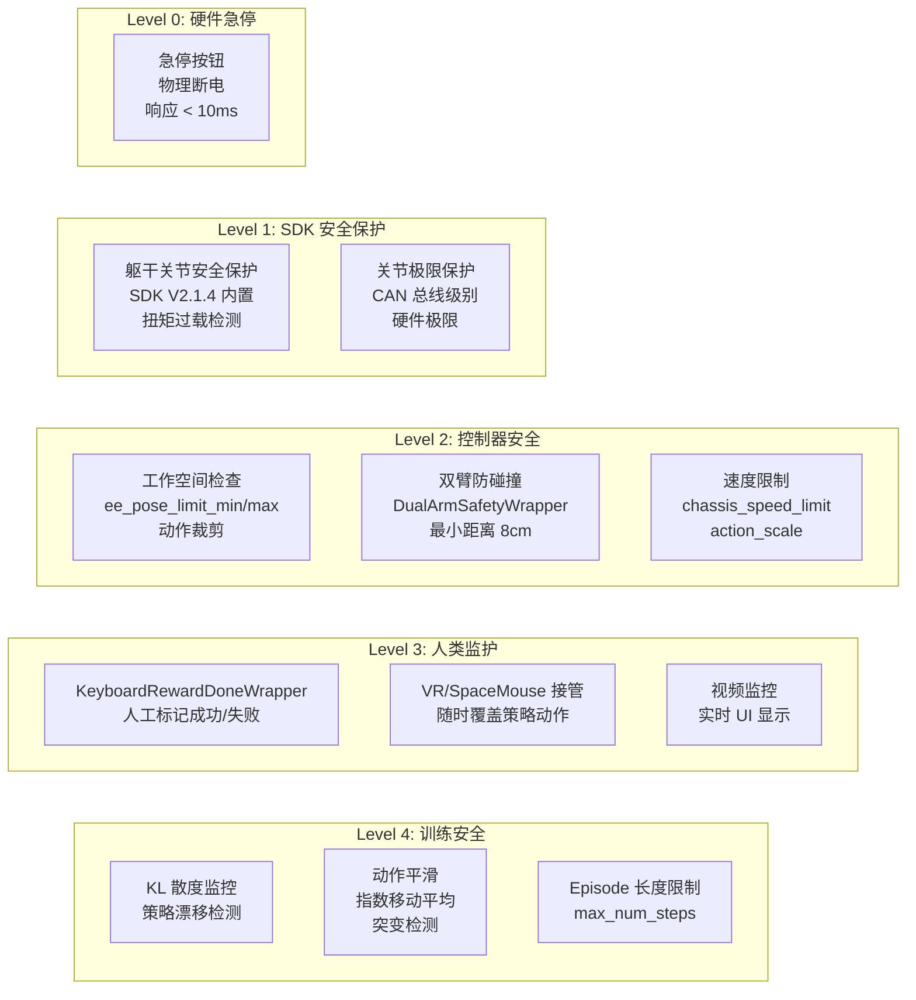

### 13.2 动作平滑器

真机 RL 中, 策略输出可能存在高频抖动, 需要平滑处理:

```python
"""Action smoothing for real robot safety."""

import numpy as np


class ActionSmoother:
    """指数移动平均 + 突变检测."""

    def __init__(
        self,
        alpha: float = 0.3,
        max_delta: float = 0.1,
        action_dim: int = 14,
    ):
        self._alpha = alpha
        self._max_delta = max_delta
        self._prev_action = np.zeros(action_dim)
        self._initialized = False

    def smooth(self, action: np.ndarray) -> np.ndarray:
        if not self._initialized:
            self._prev_action = action.copy()
            self._initialized = True
            return action

        # 突变检测
        delta = np.abs(action - self._prev_action)
        if np.any(delta > self._max_delta):
            action = np.clip(
                action,
                self._prev_action - self._max_delta,
                self._prev_action + self._max_delta,
            )

        # EMA 平滑
        smoothed = (
            self._alpha * action
            + (1 - self._alpha) * self._prev_action
        )
        self._prev_action = smoothed.copy()
        return smoothed

    def reset(self):
        self._initialized = False
```

### 13.3 安全检查清单

| 检查项 | 时机 | 处理 |
|--------|------|------|
| 急停按钮释放 | 启动前 | 阻塞, 等待释放 |
| 关节在安全范围内 | 每步 | 裁剪到限位 |
| EE 在工作空间内 | 每步 | 裁剪到安全包络 |
| 双臂距离 > 8cm | 每步 | 减速或冻结 |
| 底盘速度 < 0.6m/s | 每步 | 裁剪速度 |
| 夹爪力 < 150N | 每步 | 限制夹爪力 |
| 通信延迟 < 100ms | 每步 | 超时冻结 |
| IMU 异常 (倾翻) | 每步 | 急停 |
| 策略 KL > 0.5 | 每训练步 | 降低学习率 |

---

## 14. 可观测性与调试

### 14.1 监控指标

```
┌────────────────────────────────────────────────────────────┐
│                    R1 Pro 训练仪表板                         │
├───────────────────┬────────────────────────────────────────┤
│ 环境指标           │                                        │
│  step_frequency   │ 实际控制频率 (应 ≈ 10Hz)                │
│  episode_reward   │ 累积奖励                                │
│  episode_length   │ Episode 步数                            │
│  success_rate     │ 成功率 (滑动窗口)                        │
│  intervene_rate   │ 人类介入比例                             │
├───────────────────┤                                        │
│ 通信指标           │                                        │
│  channel_rtt      │ Channel 往返延迟                         │
│  obs_bandwidth    │ 观测数据带宽 (MB/s)                      │
│  frame_drop_rate  │ 相机丢帧率                              │
├───────────────────┤                                        │
│ 训练指标           │                                        │
│  actor_loss       │ 策略损失                                 │
│  critic_loss      │ Q 值损失                                │
│  entropy          │ 策略熵                                  │
│  replay_size      │ Replay buffer 大小                      │
│  weight_sync_time │ 权重同步耗时                             │
├───────────────────┤                                        │
│ 安全指标           │                                        │
│  min_ee_distance  │ 双臂最小距离                             │
│  action_magnitude │ 动作幅度                                │
│  joint_limit_hits │ 关节限位触发次数                          │
│  estop_triggered  │ 急停触发                                │
└───────────────────┴────────────────────────────────────────┘
```

### 14.2 Dummy 模式调试

`is_dummy=True` 时, 所有硬件交互被模拟:

```yaml
# 本地调试配置 (无需真机)
env:
  train:
    override_cfg:
      is_dummy: true  # 所有 obs/action 返回零值
      camera_ids: [0, 2]
      use_arm_ids: [0, 1]
```

这允许在没有 R1 Pro 硬件的情况下调试完整的训练管线 — 验证 Channel 通信、权重同步、replay buffer、算法逻辑等。

---

## 15. 实施路线图

### 15.1 分阶段实施

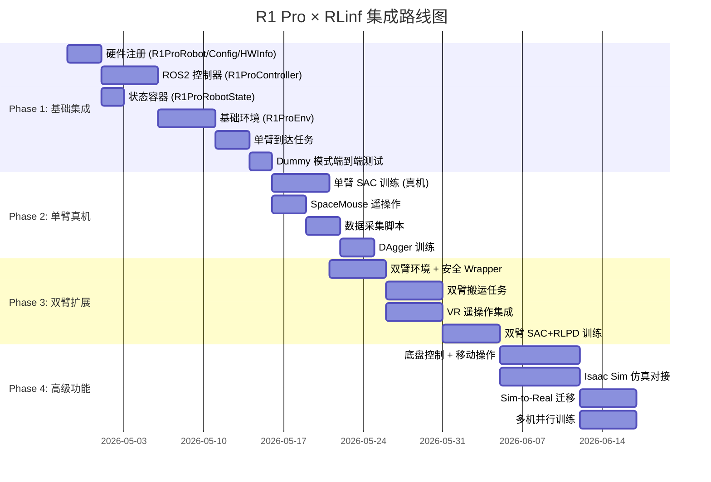

### 15.2 各阶段验收标准

| 阶段 | 验收标准 | 预估工时 |
|------|---------|---------|
| **Phase 1** | Dummy 模式下完整训练循环运行, 无报错 | 20 人天 |
| **Phase 2** | 单臂到达任务成功率 > 80% (100 episodes) | 14 人天 |
| **Phase 3** | 双臂搬运任务成功率 > 50% (50 episodes) | 20 人天 |
| **Phase 4** | Sim-to-Real 迁移后真机成功率 > 30% | 24 人天 |

### 15.3 风险与缓解

| 风险 | 概率 | 影响 | 缓解措施 |
|------|------|------|---------|
| ROS2/ROS1 兼容性 | 中 | 高 | 确认 R1 Pro SDK 版本, 必要时使用 ros1_bridge |
| Orin 计算瓶颈 | 中 | 中 | EnvWorker 仅做环境控制, 推理在 GPU 服务器 |
| 网络延迟 | 低 | 高 | 使用千兆有线连接, 监控 RTT |
| hdas_msg 自定义消息 | 高 | 中 | 实现 JointState 回退, 联系 Galaxea 获取消息定义 |
| 双臂协调难度 | 高 | 中 | 先单臂验证, 渐进扩展到双臂 |
| 安全事故 | 低 | 极高 | 多级安全机制, 人类始终在场 |

---

## 16. 文件索引

### 16.1 需要新建的文件

| 文件路径 | 说明 | 行数估计 |
|---------|------|---------|
| `rlinf/scheduler/hardware/robots/r1pro.py` | 硬件注册 (R1ProRobot, R1ProConfig, R1ProHWInfo) | ~120 |
| `rlinf/envs/realworld/r1pro/__init__.py` | 包初始化 | ~5 |
| `rlinf/envs/realworld/r1pro/r1pro_env.py` | R1ProEnv 基础环境 + R1ProRobotConfig | ~350 |
| `rlinf/envs/realworld/r1pro/r1pro_controller.py` | ROS2 控制器 | ~300 |
| `rlinf/envs/realworld/r1pro/r1pro_robot_state.py` | 状态容器 | ~120 |
| `rlinf/envs/realworld/r1pro/utils.py` | 坐标变换、运动学工具 | ~100 |
| `rlinf/envs/realworld/r1pro/tasks/__init__.py` | 任务 Gymnasium 注册 | ~20 |
| `rlinf/envs/realworld/r1pro/tasks/single_arm_reach.py` | 单臂到达任务 | ~80 |
| `rlinf/envs/realworld/r1pro/tasks/dual_arm_pick_place.py` | 双臂搬运任务 | ~120 |
| `rlinf/envs/realworld/r1pro/tasks/mobile_manipulation.py` | 移动操作任务 | ~120 |
| `rlinf/envs/realworld/common/wrappers/vr_intervention.py` | VR 遥操作 Wrapper | ~80 |
| `rlinf/envs/realworld/common/wrappers/dual_arm_safety.py` | 双臂安全 Wrapper | ~50 |
| `rlinf/envs/realworld/common/wrappers/action_smoother.py` | 动作平滑 Wrapper | ~60 |
| `examples/embodiment/config/env/r1pro_single_arm_reach.yaml` | 单臂到达环境配置 | ~30 |
| `examples/embodiment/config/env/r1pro_dual_arm_pick_place.yaml` | 双臂搬运环境配置 | ~40 |
| `examples/embodiment/config/r1pro_sac_reach_async.yaml` | SAC 训练配置 | ~60 |
| `examples/embodiment/config/r1pro_sac_dual_arm_async.yaml` | 双臂 SAC 配置 | ~80 |
| `examples/embodiment/config/r1pro_dagger_vr.yaml` | DAgger 配置 | ~50 |
| `examples/embodiment/config/r1pro_collect_data.yaml` | 数据采集配置 | ~40 |
| `examples/embodiment/collect_r1pro_data.py` | 数据采集脚本 | ~100 |
| `tests/unit_tests/test_r1pro_env.py` | 单元测试 (Dummy 模式) | ~150 |

### 16.2 需要修改的现有文件

| 文件路径 | 修改内容 |
|---------|---------|
| `rlinf/scheduler/hardware/robots/__init__.py` | 添加 `from .r1pro import *` |
| `rlinf/envs/__init__.py` | `SupportedEnvType` 已支持 `REALWORLD`, 无需修改 |
| `rlinf/config.py` | 如果使用新模型, 在 `SupportedModel` 枚举中添加 |

### 16.3 文件结构总览

```
rlinf/
├── scheduler/hardware/robots/
│   ├── __init__.py           # ← 添加 r1pro import
│   ├── franka.py             # (现有) Franka 硬件注册
│   ├── xsquare.py            # (现有) Turtle2 硬件注册
│   └── r1pro.py              # ← 新建: R1 Pro 硬件注册
│
├── envs/realworld/
│   ├── realworld_env.py      # (现有) 基础 RealWorldEnv
│   ├── franka/               # (现有) Franka 环境
│   ├── xsquare/              # (现有) Turtle2 环境
│   ├── r1pro/                # ← 新建: R1 Pro 环境
│   │   ├── __init__.py
│   │   ├── r1pro_env.py
│   │   ├── r1pro_controller.py
│   │   ├── r1pro_robot_state.py
│   │   ├── utils.py
│   │   └── tasks/
│   │       ├── __init__.py
│   │       ├── single_arm_reach.py
│   │       ├── dual_arm_pick_place.py
│   │       └── mobile_manipulation.py
│   └── common/wrappers/
│       ├── vr_intervention.py      # ← 新建
│       ├── dual_arm_safety.py      # ← 新建
│       └── action_smoother.py      # ← 新建
│
examples/embodiment/
├── collect_r1pro_data.py           # ← 新建
└── config/
    ├── env/
    │   ├── r1pro_single_arm_reach.yaml     # ← 新建
    │   └── r1pro_dual_arm_pick_place.yaml  # ← 新建
    ├── r1pro_sac_reach_async.yaml          # ← 新建
    ├── r1pro_sac_dual_arm_async.yaml       # ← 新建
    ├── r1pro_dagger_vr.yaml                # ← 新建
    └── r1pro_collect_data.yaml             # ← 新建
│
tests/unit_tests/
└── test_r1pro_env.py               # ← 新建
```

---

> **版权声明**: 本文档基于 RLinf 开源项目 (Apache-2.0 License) 和 Galaxea R1 Pro 公开技术文档编写。
>
> **RLinf**: GitHub — https://github.com/RLinf/RLinf | 论文 — arXiv:2509.15965
>
> **Galaxea R1 Pro**: https://docs.galaxea-dynamics.com/Guide/R1Pro/
>
> **最后更新**: 2026-04-21
