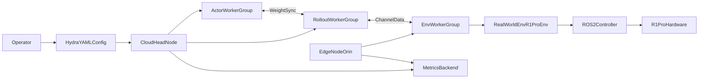
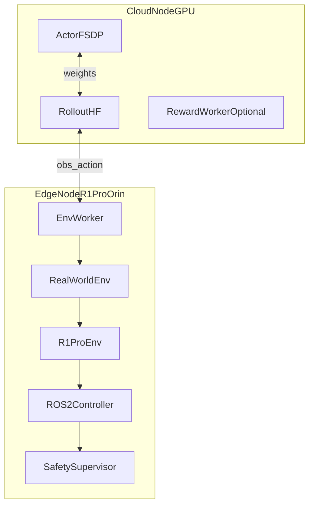
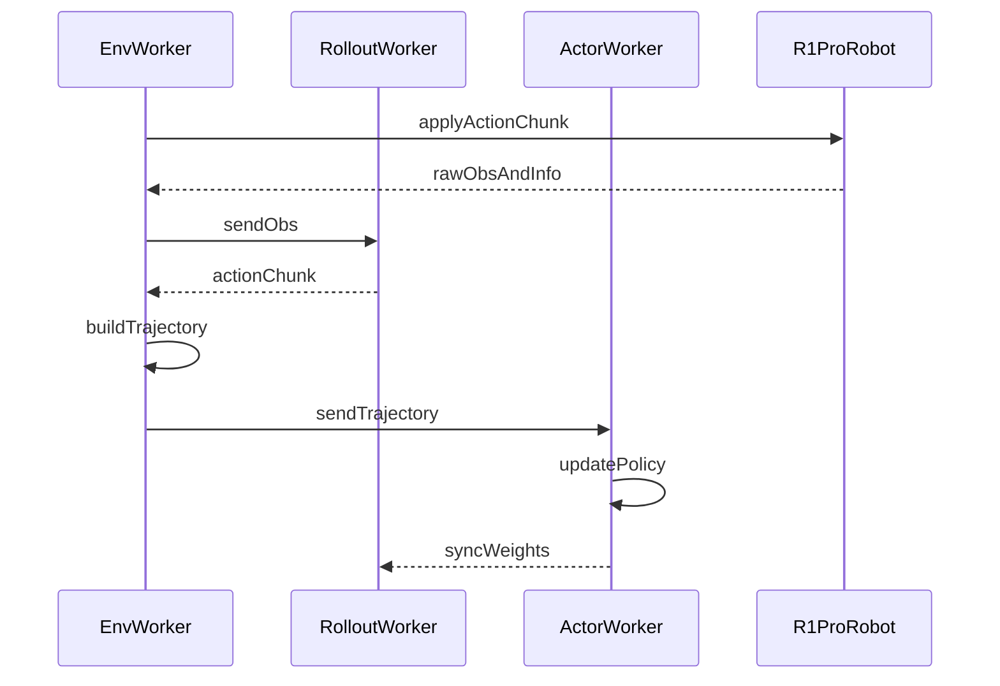
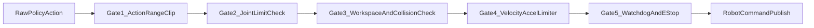

# RLinf 接入 Galaxea R1 Pro 真机强化学习设计与实现方案（Prem v1）

> 面向 `RLinf` 与 `Galaxea R1 Pro` 的可落地工程方案。  
> 目标不是“写一个看起来很完整的设想”，而是给出一份可以直接指导开发与联调的实施文档：有代码锚点、有系统边界、有风险兜底、有阶段验收。

---

## 0. 执行摘要

- **项目目标**：在本地 `RLinf` 代码基线上，新增 `r1pro` 真机接入能力，支持在线 RL（SAC/RLPD/Async PPO）与人类介入学习（HG-DAgger），并支持 Sim-Real 迁移。
- **核心策略**：复用 `realworld` 现有主链路（`RealWorldEnv` + `EnvWorker` + `EmbodiedRunner`），按 `Franka/Turtle2` 模式新增 `R1Pro` 硬件抽象、控制器和任务环境，避免大规模侵入内核。
- **部署建议**：采用 Cloud-Edge 两节点最小闭环（GPU 训练节点 + Orin 真机节点），随后扩展到多真机并行采集。
- **关键改进（相对既有两份方案）**：
  - 统一命名和目录，不再混用 `galaxea_r1pro`/`r1pro`。
  - 明确“仓库已存在”和“待新增”边界，避免把设计稿当已实现。
  - 增加“前置条件-执行命令-回滚方案”三联体和 FMEA 风险闭环。
  - 所有关键设计都对齐本地源码调用链，不做脱离实现细节的空泛描述。

---

## 1. 事实基线与引用锚点（以本地仓库为准）

## 1.1 RLinf 真机主链路（已存在）

- 环境主入口：`rlinf/envs/realworld/realworld_env.py`
  - `RealWorldEnv._create_env()` 通过 `gym.make()` 创建具体真机 env。
  - 统一 wrapper 链：`GripperCloseEnv`、`SpacemouseIntervention`/`GelloIntervention`、`RelativeFrame`、`Quat2EulerWrapper`。
  - 统一观测契约：`states`、`main_images`、`extra_view_images`、`task_descriptions`。
- Worker 主链路：`rlinf/workers/env/env_worker.py`
  - `init_worker()` 在 realworld 场景下设置全 rank barrier（用于 ROS 初始化时序）。
  - `_inject_realworld_reward_cfg()` 注入 `standalone_realworld` reward worker 配置。
  - `_setup_env_and_wrappers()` 负责真实环境对象与采集 wrapper 挂载。
- 调度硬件链路：
  - `rlinf/scheduler/hardware/robots/franka.py`
  - `rlinf/scheduler/hardware/robots/xsquare.py`
  - `rlinf/scheduler/cluster/node.py` 中 `NodeGroupInfo.get_hardware_infos()` 与 `local_hardware_ranks` 构成硬件映射。
- Runner 主链路：
  - `rlinf/runners/embodied_runner.py`
  - `rlinf/runners/async_embodied_runner.py`

## 1.2 可复用真机范式（已存在）

- Franka 真实控制范式：
  - `rlinf/envs/realworld/franka/franka_env.py`
  - `FrankaEnv._setup_hardware()`、`_setup_reward_worker()`、`_calc_step_reward()`。
- 数据采集范式：
  - `examples/embodiment/collect_real_data.py`
  - `CollectEpisode` + `TrajectoryReplayBuffer`。
- 文档操作范式：
  - `docs/source-zh/rst_source/examples/embodied/franka.rst`
  - `docs/source-zh/rst_source/examples/embodied/franka_reward_model.rst`
  - `docs/source-zh/rst_source/examples/embodied/co_training.rst`
  - `docs/source-zh/rst_source/publications/rlinf_user.rst`

## 1.3 R1 Pro 外部事实约束（官方资料）

- 软件栈：Ubuntu 22.04 + ROS2 Humble（官方推荐），并提供 ROS1 Noetic 体系。
- 启动链关键点：CAN 启动、`robot_startup.sh`、`mobiman` 与 `HDAS`。
- 传感/控制接口：arms、gripper、chassis、camera、imu、lidar 的 ROS topic 体系。
- 安全边界：软件急停、硬件急停、遥控器安全状态要求。

---

## 2. 与现有两份方案的差异与增强

## 2.1 现有方案共性问题

- **命名不统一**：`r1pro` 与 `galaxea_r1pro` 混用，未来实现容易出现路径分裂。
- **实现状态模糊**：部分章节把“尚未存在的文件路径”写成“已实现代码”语气。
- **链路闭环不足**：有架构图但缺少与 `EnvWorker`、`NodeGroupInfo`、`RealWorldEnv` 的精确落点。
- **运维与回滚不足**：缺少成体系的故障分级、回退策略、联调最小命令集。

## 2.2 本方案增强点

- **统一命名约定**：全部使用 `r1pro`，文件、类、配置统一前缀。
- **双清单机制**：
  - `已存在清单`：仅引用仓库真实文件。
  - `新增清单`：仅标记拟新增，不伪装为已实现。
- **代码级映射**：每个设计点绑定 `source file + symbol`。
- **闭环工程化**：新增测试矩阵、发布门禁、FMEA、Runbook、Go/No-Go 验收。

---

## 3. 总体架构设计

## 3.1 系统上下文图



## 3.2 组件部署图（MVP 推荐）



## 3.3 训练时序图（Async PPO / SAC 通用）



---

## 4. 统一命名与目录规范

- **环境路径**：`rlinf/envs/realworld/r1pro/`
- **硬件路径**：`rlinf/scheduler/hardware/robots/r1pro.py`
- **配置命名**：`realworld_r1pro_<task>_<algo>_<mode>.yaml`
- **脚本命名**：`setup_before_ray_r1pro.sh`、`run_realworld_r1pro.sh`
- **类命名**：
  - `R1ProHWInfo`
  - `R1ProConfig`
  - `R1ProRobot`
  - `R1ProRobotState`
  - `R1ProController`
  - `R1ProEnv`

---

## 5. 详细实现方案（代码级映射）

## 5.1 调度与硬件注册层

### 目标

让 `cluster.node_groups[].hardware.type: R1Pro` 能被调度器识别，并通过 `worker_info.hardware_infos` 注入到真机 env。

### 方案

- 新增 `rlinf/scheduler/hardware/robots/r1pro.py`
  - 参考 `FrankaRobot` 与 `Turtle2Robot`。
  - 实现 `R1ProRobot.enumerate(node_rank, configs)`。
  - 定义 `R1ProHWInfo(HardwareInfo)` 与 `R1ProConfig(HardwareConfig)`。
  - 使用 `@NodeHardwareConfig.register_hardware_config(R1ProRobot.HW_TYPE)`。
- 修改导出：
  - `rlinf/scheduler/hardware/robots/__init__.py`
  - `rlinf/scheduler/hardware/__init__.py`
  - `rlinf/scheduler/__init__.py`

### 关键约束

- `NodeGroupInfo` 一个 `node_group` 只能有一种 `hardware_type`，故 R1Pro 节点单独成组。
- `placement` 与 `hardware_rank` 映射严格依赖 `local_hardware_ranks`，不能跳过。

## 5.2 环境与控制层

### 目标

在 `RealWorldEnv` 无侵入前提下，通过 `gym.make()` 加载 `R1ProEnv`，对齐观测/动作契约。

### 方案

- 新增目录：`rlinf/envs/realworld/r1pro/`
  - `r1pro_env.py`
  - `r1pro_controller.py`
  - `r1pro_robot_state.py`
  - `tasks/__init__.py`（注册 `gym` id）
  - `tasks/<task_files>.py`
- `R1ProEnv` 构造参数对齐 Franka 习惯：
  - `override_cfg`
  - `worker_info`
  - `hardware_info`
  - `env_idx`
- `R1ProController`：
  - 默认 ROS2 后端，封装 publisher/subscriber 与服务调用。
  - 预留 ROS1 fallback（仅必要场景启用）。

### 观测契约

- `raw_obs["state"]`：
  - `left_arm_joint`
  - `right_arm_joint`
  - `torso_joint`
  - `chassis_state`
  - `gripper_state`
- `raw_obs["frames"]`：
  - `head_left`
  - `head_right`（可选）
  - `wrist_left`
  - `wrist_right`
  - `chassis_front`（可选）
- `main_image_key` 必须在 `frames` 中存在，沿用 `RealWorldEnv._wrap_obs()` 强校验逻辑。

### 动作契约（分阶段）

- M1（单臂）：`[dx, dy, dz, droll, dpitch, dyaw, gripper]`
- M2（双臂）：左右臂各 7 维，合并 14 维
- M3（全身）：`双臂 + torso + chassis`（按控制模式拆分为子动作，统一下发）

## 5.3 Reward 与数据采集

- 规则奖励：先复用 `FrankaEnv._calc_step_reward()` 设计思想（位姿误差阈值 + 成功保持步数）。
- reward model：支持 `standalone_realworld`（沿用 `EnvWorker._inject_realworld_reward_cfg` 逻辑）。
- 数据采集：
  - 复用 `CollectEpisode` 与 `TrajectoryReplayBuffer`。
  - 新增 `robot_type: r1pro` 元数据，保证数据治理一致性。

## 5.4 算法建议（按阶段）

- M1：`SAC + RLPD`（样本效率高、调参相对稳）
- M2：`Async PPO`（并行效率更高）
- M3：`HG-DAgger + Async PPO`（复杂任务先引导后强化）

---

## 6. 配置与脚本设计

## 6.1 新增配置文件（建议）

- `examples/embodiment/config/realworld_r1pro_right_arm_rlpd_cnn_async.yaml`
- `examples/embodiment/config/realworld_r1pro_dual_arm_async_ppo.yaml`
- `examples/embodiment/config/realworld_r1pro_wholebody_hg_dagger.yaml`
- `examples/embodiment/config/env/realworld_r1pro_right_arm_pickplace.yaml`
- `examples/embodiment/config/env/realworld_r1pro_safety_default.yaml`
- `examples/embodiment/config/realworld_collect_data_r1pro.yaml`

## 6.2 Cluster 样例（MVP）

```yaml
cluster:
  num_nodes: 2
  node_groups:
    - label: gpu
      node_ranks: 0
    - label: r1pro
      node_ranks: 1
      hardware:
        type: R1Pro
        configs:
          - node_rank: 1
            robot_ip: "192.168.31.50"
            ros_domain_id: 30
  component_placement:
    actor:
      node_group: gpu
      placement: 0-3
    rollout:
      node_group: gpu
      placement: 0-1
    env:
      node_group: r1pro
      placement: 0
```

## 6.3 节点启动脚本（建议新增）

- `ray_utils/realworld/setup_before_ray_r1pro.sh`
  - source ROS2 环境
  - 设置 `RLINF_NODE_RANK`
  - 设置 `ROS_DOMAIN_ID`
  - 校验 CAN 与关键 topic
- `examples/embodiment/run_realworld_r1pro.sh`
  - 统一封装 Ray 与训练入口调用

---

## 7. 安全与可靠性设计

## 7.1 五级安全闸门



## 7.2 必要故障策略

- `通信超时`：超过阈值立即发布零速并锁定动作通道。
- `传感器丢帧`：降级为最近稳定观测并触发告警，持续丢帧则终止 episode。
- `topic 异常`：自动重连 1 次，失败后进入安全停机。
- `急停触发`：立刻中断训练循环并写入事故上下文（动作、时戳、任务、操作员）。

## 7.3 FMEA（节选）

| 失效模式 | 影响 | 检测方式 | 缓解策略 |
|---|---|---|---|
| 相机流中断 | 观测失真 | 帧率监控 | 降级单相机或暂停 |
| 控制topic延迟飙升 | 动作失控风险 | p95 时延监控 | 降速 + 安全停 |
| 奖励误判 | 训练偏移 | 规则/模型差异审计 | 双轨验证 + 回放 |
| 配置错绑节点 | 无法启动或错控 | 预启动检查 | 强校验 node_group 与 hardware |

---

## 8. 可观测性与运维 Runbook

## 8.1 指标命名建议

- `env/step_hz`
- `env/reset_latency_ms`
- `env/intervene_rate`
- `safety/limit_violation_count`
- `safety/watchdog_trigger_count`
- `robot/cmd_latency_ms_p95`
- `robot/camera_drop_rate`
- `train/reward_mean`
- `train/success_once`

## 8.2 运行前检查清单

- ROS2 与 SDK 版本匹配（Humble + R1 SDK 版本线）。
- `CAN` 已启动，关键 topic `hz` 正常。
- `RLINF_NODE_RANK` 在每节点唯一且 `ray start` 前设置。
- `ROS_DOMAIN_ID` 与局域网其他机器人隔离。
- 安全区域清空、遥控器置于安全模式、急停可用。

## 8.3 最小联调命令序列（示意）

1. R1Pro 节点：
   - 启动 CAN
   - 启动机器人基础节点
   - 校验 topic
2. 云端节点：
   - 启动 Ray head
   - 启动训练入口
3. 训练中：
   - 持续观察 `safety/*` 与 `robot/*` 指标
4. 停机：
   - 先停训练，再停控制节点，最后断电

---

## 9. 测试与 CI 策略

## 9.1 测试分层

- `Unit`（无硬件）
  - `R1ProConfig` 解析与校验
  - 动作限幅与观测拼接
  - 安全闸门逻辑
- `Integration`（模拟 topic）
  - `R1ProController` 的 pub/sub 行为
  - `R1ProEnv.step()` 与 `chunk_step()` 逻辑
- `E2E`（dummy）
  - 仿真/虚拟输入跑通 `EnvWorker -> Rollout -> Actor`
- `Hardware-in-loop`
  - 小步长、低速、受控空间联调

## 9.2 CI 建议

- 新增 `r1pro_dummy_e2e`（不依赖真机）。
- 真实硬件测试不进公共 CI，采用内部手动门禁流水线。

---

## 10. 分阶段路线图与验收（M0-M3）

## 10.1 M0：基础接入（2 周）

- 交付：
  - `R1Pro` 硬件注册与 `R1ProEnv` 骨架
  - 单任务 dummy E2E 打通
- 验收：
  - 配置可启动
  - channel 数据流闭环可跑通

## 10.2 M1：单臂 MVP（4-6 周）

- 交付：
  - 右臂 + 夹爪 + 单主相机任务
  - SAC/RLPD 在线训练
- 验收：
  - 连续 100 episode 安全零事故
  - 成功率达到预设门槛

## 10.3 M2：双臂协作（4-6 周）

- 交付：
  - 双臂动作协调
  - Async PPO 或 HG-DAgger 增强
- 验收：
  - 双臂协同任务成功率达标
  - 干预率下降趋势明确

## 10.4 M3：全身移动操作（6-10 周）

- 交付：
  - torso + chassis 联动
  - 导航状态融合与全身任务
- 验收：
  - 全身任务安全稳定运行
  - 可重复实验报告可交付

---

## 11. 文件级实现映射（新增/修改清单）

## 11.1 计划新增

- `rlinf/scheduler/hardware/robots/r1pro.py`
- `rlinf/envs/realworld/r1pro/r1pro_env.py`
- `rlinf/envs/realworld/r1pro/r1pro_controller.py`
- `rlinf/envs/realworld/r1pro/r1pro_robot_state.py`
- `rlinf/envs/realworld/r1pro/tasks/__init__.py`
- `rlinf/envs/realworld/r1pro/tasks/r1pro_pickplace_env.py`
- `examples/embodiment/config/realworld_r1pro_right_arm_rlpd_cnn_async.yaml`
- `examples/embodiment/config/env/realworld_r1pro_right_arm_pickplace.yaml`
- `ray_utils/realworld/setup_before_ray_r1pro.sh`
- `examples/embodiment/run_realworld_r1pro.sh`
- `docs/source-zh/rst_source/examples/embodied/r1pro.rst`
- `docs/source-en/rst_source/examples/embodied/r1pro.rst`

## 11.2 计划修改

- `rlinf/scheduler/hardware/robots/__init__.py`
- `rlinf/scheduler/hardware/__init__.py`
- `rlinf/scheduler/__init__.py`
- `docs/source-zh/rst_source/examples/embodied/index.rst`
- `docs/source-en/rst_source/examples/embodied/index.rst`

---

## 12. 与 RLinf-USER / Franka 范式的对齐策略

- 训练范式沿用 `RLinf-USER`：在线 RL + 可选 reward model + 可选人类介入。
- 环境契约沿用 `RealWorldEnv`：不额外改 `SupportedEnvType`，继续走 `env_type: realworld`。
- 硬件抽象沿用 `Franka/Turtle2`：`Hardware -> HardwareInfo -> HardwareConfig`。
- 先保证“能跑通”，再做“更优雅”：MVP 阶段不引入复杂多策略切换器。

---

## 13. 风险清单与回滚策略

## 13.1 高优先风险

- **ROS2 网络发现冲突**：不同机器人互相串话。
  - 缓解：强制 `ROS_DOMAIN_ID` 分区 + 启动前检测。
- **Orin 负载过高**：相机解码 + 控制 + env 计算导致时延抖动。
  - 缓解：先单主相机，非关键流降采样，控制链独立优先级。
- **动作空间膨胀导致训练发散**：
  - 缓解：阶段化启用自由度、先 IL 再 RL。

## 13.2 回滚路线

- 算法回滚：Async PPO -> SAC/RLPD。
- 控制回滚：全身控制 -> 双臂固定底盘 -> 单臂固定躯干。
- 感知回滚：多相机 -> 单主相机。

---

## 14. Go/No-Go 验收门禁

- **Go 条件**：
  - 安全零重大事故
  - 指标稳定达标（成功率、时延、干预率）
  - 复现实验可重复
- **No-Go 条件**：
  - 任意安全关键故障未闭环
  - 训练链路不稳定、指标无收敛趋势
  - 运维流程不可重复执行

---

## 15. 交付清单（可执行）

- 设计文档（本文件）
- 代码实现 PR（按 M0->M3 分批）
- 配置与脚本模板
- 测试报告（unit/integration/e2e/hardware）
- 运维 Runbook
- 验收报告（KPI 对照 + 风险结项）

---

## 16. 结论

这份方案以本地 `RLinf` 代码事实为基准，明确了：

- 怎么接（硬件、环境、控制、调度四层解耦）
- 怎么跑（Cloud-Edge、异步训练、阶段推进）
- 怎么稳（安全闸门、可观测性、故障回滚）
- 怎么验（里程碑、KPI、Go/No-Go）

因此它不仅“可读”，更“可执行、可验证、可维护”。后续可直接按第 11 章文件映射进入实现阶段。
