# RLinf × Galaxea R1 Pro 真机强化学习设计与实现方案 v5

> 本文以本地 RLinf 代码仓库(`/home/Luogang/SRC/RL/RLinf`)为唯一实现基准,把 Galaxea R1 Pro(双 A2 臂 + 双 G1 夹爪 + 4 DoF 躯干 + 6 DoF 转向轮底盘 + 头/腕/底盘多相机 + LiDAR + IMU + BMS + 摇控器)接入 RLinf 做真机在线强化学习。腕部相机通过缆线直连安装 RLinf 的 GPU 服务器,其它执行器、底盘、躯干、相机、IMU、BMS、摇控器通过 R1 Pro Orin 上的 ROS2 Humble(HDAS / mobiman)与 RLinf 通信。
>
> 命名规范严格遵循:`rlinf/scheduler/hardware/robots/galaxea_r1_pro.py`、`rlinf/envs/realworld/galaxear/`、`r1_pro_*` 文件名、`GalaxeaR1Pro*` 类名、`rlinf/envs/realworld/common/camera/ros2_camera.py` 中 `ROS2Camera`。
>
> 版本:v5 · 日期:2026-04-26

---

## 目录

0. [摘要与核心承诺](#0-摘要与核心承诺)
1. [术语、记号与引用基线](#1-术语记号与引用基线)
2. [需求分析与关键 KPI](#2-需求分析与关键-kpi)
3. [竞争对手方案评审与本方案改进](#3-竞争对手方案评审与本方案改进)
4. [现状对照:RLinf 真机栈 vs R1 Pro](#4-现状对照rlinf-真机栈-vs-r1-pro)
5. [总体架构](#5-总体架构)
6. [核心模块设计](#6-核心模块设计)
7. [ROS2 接口映射总表](#7-ros2-接口映射总表)
8. [动作与观测空间矩阵](#8-动作与观测空间矩阵)
9. [多级安全体系与 FMEA](#9-多级安全体系与-fmea)
10. [网络部署拓扑、时延预算与时钟同步](#10-网络部署拓扑时延预算与时钟同步)
11. [分阶段路线图(M0 ~ M5)](#11-分阶段路线图m0--m5)
12. [配置与代码骨架](#12-配置与代码骨架)
13. [工程治理](#13-工程治理)
14. [任务与训练路线](#14-任务与训练路线)
15. [风险、回退与 Go-No-Go](#15-风险回退与-go-no-go)
16. [与 Franka 例子的 Diff 清单](#16-与-franka-例子的-diff-清单)
17. [附录](#17-附录)

---

## 0. 摘要与核心承诺

### 0.1 一句话目标

> 在 RLinf 内核(三层架构:Scheduler → Workers → Runner)**最小侵入**的前提下,新增一条 `galaxea_r1_pro` 真机分支,让 Galaxea R1 Pro 能像 Franka 那样,以 SAC+RLPD / Async PPO / HG-DAgger / Sim-Real Co-Training 等算法做在线 RL,腕部相机走 USB 直连服务器以压低视觉闭环延迟,其它一切走 ROS2 Humble。

### 0.2 系统总图(双路径)

```mermaid
flowchart LR
    operator["Operator / Engineer"]
    teleop["Teleop devices<br/>SpaceMouse / GELLO / R1Pro VR / R1Pro Joystick"]

    subgraph gpuServer["GPU Server (RLINF_NODE_RANK=0, label: gpu)"]
        actorGroup["ActorWorkerGroup (FSDP)"]
        rolloutGroup["RolloutWorkerGroup (HF / SGLang / vLLM)"]
        rewardGroup["RewardWorkerGroup (EmbodiedRewardWorker)"]
        envWorker["EnvWorker(GalaxeaR1ProEnv)"]
        wristCams["RealSenseCamera<br/>(D405 wrist_left / wrist_right via USB AOC)"]
        camMux["GalaxeaR1ProCameraMux"]
    end

    subgraph orin["R1 Pro Orin (RLINF_NODE_RANK=1, label: galaxea_r1_pro)"]
        ros2["ROS2 Humble"]
        hdas["HDAS drivers"]
        mobiman["mobiman controllers"]
        ctrlWorker["GalaxeaR1ProController Worker"]
        headCam["signal_camera_node (head GMSL)"]
        chassisCams["signal_camera_node (chassis GMSL)"]
    end

    subgraph robotBody["R1 Pro physical body"]
        armL["Arm A2 left (7 DoF)"]
        armR["Arm A2 right (7 DoF)"]
        gripL["Gripper G1 left"]
        gripR["Gripper G1 right"]
        torso["Torso T1-T4 (4 DoF)"]
        chassis["Chassis (6 DoF, 3 steering wheels)"]
        sensors["LiDAR / IMU / BMS / Joystick"]
    end

    operator --> actorGroup
    teleop --> envWorker
    actorGroup <-->|"weight sync NCCL"| rolloutGroup
    rolloutGroup <-->|"Channel(obs / action / reward)"| envWorker
    rewardGroup -.-> envWorker
    envWorker --> camMux
    camMux --> wristCams
    camMux <-->|"ROS2 image topics"| ros2
    envWorker --> ctrlWorker
    ctrlWorker <-->|"ROS2 control / feedback"| ros2
    ros2 --> hdas
    ros2 --> mobiman
    headCam --> ros2
    chassisCams --> ros2
    hdas <--> robotBody
    mobiman <--> robotBody
```

图 0.1:`RLinf × R1 Pro` 系统总图(双路径相机:USB 直连腕部 D405 + ROS2 头部/底盘)。

### 0.3 阶段目标摘要

| 阶段 | 范围 | 推荐算法 | 主感知 | 退出 KPI |
|---|---|---|---|---|
| M1 单臂 MVP | 右臂 A2 + 右夹爪 G1 | SAC+RLPD CNN, Async PPO | wrist_right(USB)+ head_left(ROS2) | 任务成功率 ≥ 70% |
| M2 双臂协作 | 双臂 + 双夹爪 | Async PPO + π₀.₅ / HG-DAgger + OpenPI | wrist_left/right(USB)+ head_left(ROS2) | 双臂任务成功率 ≥ 60%,双臂碰撞 0 次 |
| M3 全身 | 双臂 + torso 4 DoF | HG-DAgger + Async PPO | 同上 + IMU/torso state | 全身任务成功率 ≥ 50% |
| M4 移动操作 | 全身 + chassis 6 DoF | RL-Co + sim-real | 同上 + LiDAR + chassis cams | 仿真→真机零样本 ≥ 20% |
| M5 自主导航融合 | 与官方 navigation 分层 | 分层策略 / VLA + 安全控制 | 同上 + ROS2 nav 状态 | 长 horizon mobile manipulation |

### 0.4 核心承诺(写给评审与未来开发者)

1. **不改 RLinf 内核**:`SupportedEnvType.REALWORLD` / `RealWorldEnv` / `EnvWorker` / `EmbodiedRunner` / `AsyncEmbodiedRunner` / `EmbodiedRewardWorker.launch_for_realworld` / `Hardware.register()` / `NodeHardwareConfig.register_hardware_config()` 全部复用,不引入一级新枚举,不改主链路语义。
2. **命名规范严格执行**:见 §0 引言;每一个新增类、文件、目录、Gym id 都按规范落地。
3. **真机安全前置**:任何 action 在发布到 ROS2 之前必经 `GalaxeaR1ProSafetySupervisor` 五级闸门;对 R1 Pro 真实工程痛点(A2 无抱闸、SWD 急停、BMS、HDAS 错误码、双臂碰撞)全部给出闭环兜底。
4. **相机双路径可选可换**:`GalaxeaR1ProCameraMux` 让每路相机独立选 `usb_direct` 或 `ros2`,带 `frame_age_ms` 软同步窗与 `fallback_to_ros2_on_usb_drop` 开关。
5. **dummy 全 mock**:在没有 R1 Pro / 没有 ROS2 / 没有 D405 的纯 GPU 服务器上,`is_dummy=True` 能让 `GalaxeaR1ProEnv` import / reset / step 全程不崩;CI 直接跑 `realworld_dummy_galaxea_r1_pro_sac_cnn` e2e。
6. **分阶段交付**:M0 dummy → M1 单臂 → M2 双臂 → M3 躯干 → M4 移动 → M5 全栈;每阶段独立 YAML、独立退出 KPI、独立回滚路径。
7. **可观测、可复现、可回滚**:`MetricLogger` 扩展 `safety/`、`hw/`、`camera/`、`ros2/` 命名空间;Runbook 给出上电、训前检查、急停后复位、CAN 掉链恢复等操作序列。

---

## 1. 术语、记号与引用基线

### 1.1 术语表

| 术语 | 含义 |
|---|---|
| RLinf | 本仓库提供的分布式 RL 框架(Ray + Hydra,三层:Scheduler → Workers → Runner) |
| Worker / WorkerGroup | Ray 远程 actor 抽象,对应 `rlinf/workers/**` |
| Runner | 主训练循环编排,对应 `rlinf/runners/**` |
| Channel | 跨 WorkerGroup 异步消息通道 |
| `RealWorldEnv` | 真机外层环境(`num_envs=1`,`NoAutoResetSyncVectorEnv`),通过 `gym.make(init_params.id)` 创建具体真机 Env |
| `chunk_step` | `RealWorldEnv.chunk_step`:一次拉取一个 K 步 action chunk,逐步 step,产出堆叠观测 |
| `intervene_action` | wrapper 写入 `info` 的人工接管动作,DAgger / HG-DAgger 管线消费 |
| `standalone_realworld` | 真机奖励模型部署模式;`EnvWorker._inject_realworld_reward_cfg` 在 env 侧就地拉起 reward worker |
| `is_dummy` | `True` 时不连真机 / 不连 ROS2,只跑 RLinf 软栈 |
| HDAS | R1 Pro 底层硬件抽象层(arms/torso/chassis/cameras/IMU/BMS/joystick) |
| mobiman | R1 Pro 上层 mobile manipulation 控制包(joint tracker / relaxed IK / torso speed / chassis speed / eepose pub) |
| TCP | Tool Center Point,末端执行器参考点 |
| EE | End-Effector,末端执行器 |
| SWA / SWB / SWC / SWD | R1 Pro 摇控器上的四个 3 档拨杆,SWD 通常作软急停 |
| `frame_age_ms` | 一帧到达训练消费时刻的"陈旧度",= `wall_now - header_stamp`(ROS2)或 `wall_now - sdk_capture_ts`(USB) |
| `soft_sync_window_ms` | `GalaxeaR1ProCameraMux` 跨相机软同步窗,默认 33 ms(一帧 30fps) |
| HG-DAgger | Human-Gated DAgger,人类按需介入,只用人类轨迹更新策略 |
| RLPD | Reinforcement Learning with Prior Data,RLinf 的 SAC 变体之一,用 demo buffer warm start |
| OpenPI / π₀.₅ | OpenPI 提供的 VLA / flow policy,RLinf 已对接 |
| LeRobot | HuggingFace 的真机数据集格式 |
| RLinf-USER | RLinf 的真机在线策略学习论文(Unified System for Real-world Online Policy Learning) |

### 1.2 RLinf 本地代码锚点(以本地为准)

环境层:
- [rlinf/envs/realworld/realworld_env.py](rlinf/envs/realworld/realworld_env.py) — `RealWorldEnv`(`num_envs=1`,`NoAutoResetSyncVectorEnv`,观测 `states / main_images / extra_view_images / task_descriptions`,`chunk_step`,`_wrap_obs`)
- [rlinf/envs/realworld/franka/franka_env.py](rlinf/envs/realworld/franka/franka_env.py) — `FrankaRobotConfig`、`FrankaEnv.{_setup_hardware, _setup_reward_worker, _clip_position_to_safety_box, _calc_step_reward, _compute_reward_model}`(本方案的同构参考)
- [rlinf/envs/realworld/franka/franka_controller.py](rlinf/envs/realworld/franka/franka_controller.py) — `FrankaController.launch_controller(robot_ip, env_idx, node_rank, worker_rank, gripper_type, gripper_connection)`(本方案 `GalaxeaR1ProController.launch_controller` 的对齐目标)
- [rlinf/envs/realworld/common/ros/ros_controller.py](rlinf/envs/realworld/common/ros/ros_controller.py) — 现有 ROS1 `ROSController`(rospy + filelock + 可选 roscore),本方案不直接复用,仅参考接口语义
- [rlinf/envs/realworld/common/camera/__init__.py](rlinf/envs/realworld/common/camera/__init__.py) — `create_camera(camera_info)` 工厂(支持 `realsense / zed`,本方案要扩 `ros2`)
- [rlinf/envs/realworld/common/camera/base_camera.py](rlinf/envs/realworld/common/camera/base_camera.py) — `BaseCamera`(线程 + 最新帧队列模型),`ROS2Camera` 直接继承
- [rlinf/envs/realworld/common/camera/realsense_camera.py](rlinf/envs/realworld/common/camera/realsense_camera.py) — `RealSenseCamera`(`pyrealsense2.pipeline + align`)
- [rlinf/envs/realworld/common/camera/zed_camera.py](rlinf/envs/realworld/common/camera/zed_camera.py) — `ZEDCamera`(`pyzed.sl`)
- [rlinf/envs/realworld/common/wrappers/](rlinf/envs/realworld/common/wrappers/) — `GripperCloseEnv / SpacemouseIntervention / GelloIntervention / RelativeFrame / Quat2EulerWrapper / KeyboardRewardDoneWrapper / KeyboardRewardDoneMultiStageWrapper`
- [rlinf/envs/action_utils.py](rlinf/envs/action_utils.py) — `prepare_actions(env_type, ...)`(动作打散 / 解包,本方案在阶段 3 启用 joint mode 时新增分支)

硬件注册:
- [rlinf/scheduler/hardware/robots/franka.py](rlinf/scheduler/hardware/robots/franka.py) — `FrankaRobot.HW_TYPE = "Franka"`,`enumerate(node_rank, configs)`,`FrankaConfig`(注册 `controller_node_rank` / `disable_validate` 等)
- [rlinf/scheduler/hardware/robots/xsquare.py](rlinf/scheduler/hardware/robots/xsquare.py) — `Turtle2Robot`(空 config 极简范式)
- [rlinf/scheduler/hardware/robots/__init__.py](rlinf/scheduler/hardware/robots/__init__.py) — 导出 `FrankaConfig / FrankaHWInfo / Turtle2Config / Turtle2HWInfo`(本方案要扩 `GalaxeaR1ProConfig / GalaxeaR1ProHWInfo`)
- [rlinf/scheduler/hardware/hardware.py](rlinf/scheduler/hardware/hardware.py) — `Hardware / HardwareConfig / HardwareInfo / HardwareResource / NodeHardwareConfig`

Worker / Runner / Reward:
- [rlinf/workers/env/env_worker.py](rlinf/workers/env/env_worker.py) — `EnvWorker._inject_realworld_reward_cfg`、全 rank barrier
- [rlinf/workers/env/async_env_worker.py](rlinf/workers/env/async_env_worker.py) — async env 路径
- [rlinf/runners/embodied_runner.py](rlinf/runners/embodied_runner.py) — `EmbodiedRunner`(同步)
- [rlinf/runners/async_embodied_runner.py](rlinf/runners/async_embodied_runner.py) — `AsyncEmbodiedRunner`(默认 SAC/RLPD)
- [rlinf/runners/async_ppo_embodied_runner.py](rlinf/runners/async_ppo_embodied_runner.py) — Async PPO
- [rlinf/workers/reward/reward_worker.py](rlinf/workers/reward/reward_worker.py) — `EmbodiedRewardWorker.launch_for_realworld(reward_cfg, node_rank, ...)`

入口与 Ray 前置:
- [examples/embodiment/train_embodied_agent.py](examples/embodiment/train_embodied_agent.py) — 同步入口
- [examples/embodiment/train_async.py](examples/embodiment/train_async.py) — 异步入口
- [examples/embodiment/run_realworld_async.sh](examples/embodiment/run_realworld_async.sh) — 真机异步训练启动脚本
- [examples/embodiment/collect_real_data.py](examples/embodiment/collect_real_data.py) — 真机数据采集
- [ray_utils/realworld/setup_before_ray.sh](ray_utils/realworld/setup_before_ray.sh) — 真机 Ray 前置

参考 YAML:
- [examples/embodiment/config/realworld_peginsertion_rlpd_cnn_async.yaml](examples/embodiment/config/realworld_peginsertion_rlpd_cnn_async.yaml) — Franka SAC+RLPD+CNN+ResNet10 (2 节点)
- [examples/embodiment/config/realworld_peginsertion_async_ppo_pi05.yaml](examples/embodiment/config/realworld_peginsertion_async_ppo_pi05.yaml) — Async PPO + π₀.₅
- [examples/embodiment/config/realworld_pnp_dagger_openpi.yaml](examples/embodiment/config/realworld_pnp_dagger_openpi.yaml) — HG-DAgger + OpenPI
- [examples/embodiment/config/realworld_dummy_franka_sac_cnn.yaml](examples/embodiment/config/realworld_dummy_franka_sac_cnn.yaml) — Franka dummy
- [examples/embodiment/config/realworld_button_turtle2_sac_cnn.yaml](examples/embodiment/config/realworld_button_turtle2_sac_cnn.yaml) — Turtle2 button
- [examples/embodiment/config/env/realworld_peg_insertion.yaml](examples/embodiment/config/env/realworld_peg_insertion.yaml) — env 子配置范式

### 1.3 R1 Pro 官方资料锚点

R1 Pro 由 Galaxea Dynamics 出品。以下文档作为本方案设计依据,实际 topic 类型/路径仍以机器人现役 SDK `ros2 topic info` / `ros2 interface show` 为准:

- 公司主站:<https://docs.galaxea-dynamics.com/>
- R1 Pro 入门:<https://docs.galaxea-dynamics.com/Guide/R1Pro/quick_start/R1Pro_Getting_Started/>
- R1 Pro 开箱启动:<https://docs.galaxea-dynamics.com/Guide/R1Pro/unboxing/R1Pro_Unbox_Startup_Guide/>
- R1 Pro Demo:<https://docs.galaxea-dynamics.com/Guide/R1Pro/demo/R1Pro_Demo_Guide/>
- R1 Pro 硬件介绍:<https://docs.galaxea-dynamics.com/Guide/R1Pro/hardware_introduction/R1Pro_Hardware_Introduction/>
- R1 Pro 软件指南:<https://docs.galaxea-dynamics.com/Guide/R1Pro/software_introduction/R1Pro_Software_Guide/>
- R1 Pro 自主导航教程:<https://docs.galaxea-dynamics.com/Guide/R1Pro/navigation_guide/R1Pro_Autonomous_Navigation_System_Usage_Tutorial/>
- R1 Pro Isaac Sim 指南:<https://docs.galaxea-dynamics.com/Guide/R1Pro/isaacsim/r1pro_isaacsim_guide/>

R1 Pro 关键事实:

| 类别 | 事实 |
|---|---|
| 操作系统 / 中间件 | Ubuntu 22.04 LTS,ROS2 Humble 推荐路径 |
| 计算 | Jetson AGX Orin,8 核 CPU @ 2.2 GHz,200 TOPS,32 GB LPDDR5,1 TB SSD,4× GbE M12,8× GMSL |
| 运动 | 26 DoF:双臂各 7 DoF + 双夹爪 + 4 DoF 躯干 + 6 DoF 底盘(3 转向轮,每轮含转向角度 + 驱动速度) |
| 单臂额定负载 | ~3.5 kg @ 0.5 m;双臂 ~7 kg;最大臂展 86 cm |
| 头部相机 | 双目立体系统,2 路 1920×1080 @ 30 fps,FoV 118° H × 62° V,基线 120 mm,GMSL 接口,`signal_camera_node` 驱动(品牌型号未公开,**不是** ZED 2) |
| 腕部相机 | 可选 2 路深度相机,1280×720 @ 30 fps,FoV 87°×58°×95°D。本方案以 Intel RealSense D405 为基线(由 Galaxea ATC ROS2 SDK v2.1.3 更新日志确认) |
| 底盘相机 | 5 路单目 GMSL,RL 训练默认不使用 |
| LiDAR | 1 路 360° × 59°,905 nm |
| IMU | 2 路(躯干 + 底盘) |
| BMS | 1 路,出 `/hdas/bms` |
| 摇控器 | SWA / SWB / SWC / SWD 拨杆,出 `/controller` |
| 启动 | CAN 启动 → `bash ~/can.sh` → `./robot_startup.sh boot ...R1PROBody.d/` → `ros2 launch HDAS r1pro.py` → `ros2 launch mobiman <module>.py` |
| 急停 | 软急停(SWD)+ 硬急停按钮(后者需重启 CAN) |
| 安全 | 操作半径需 ≥ 1.5 m 空旷 |
| A2 抱闸 | 当前 A2 电机**无抱闸**,断电存在臂下落风险 |

### 1.4 RLinf-USER 论文锚点

[docs/source-en/rst_source/publications/rlinf_user.rst](docs/source-en/rst_source/publications/rlinf_user.rst) 给出 SAC / RLPD / SAC Flow / HG-DAgger 等真机算法,支持 CNN / MLP / flow / VLA 多模型,强调异步全流水线与多机异构(Franka + ARX + Turtle2)。本方案视 `GalaxeaR1ProEnv` 为 RLinf-USER 多平台支持的第四个生产级真机后端。

### 1.5 小结

> 本方案不重新发明 RLinf,而是把 R1 Pro 当作一个有"双路径相机"和"全身关节 + 移动底盘 + 全身安全约束"的高级版 Franka,沿 `gym.make(init_params.id) → RealWorldEnv → 具体真机 Env → 控制器 Worker + 相机 Mux + 安全监督` 这条主链路扩展。

---

## 2. 需求分析与关键 KPI

### 2.1 真机 RL 五大约束

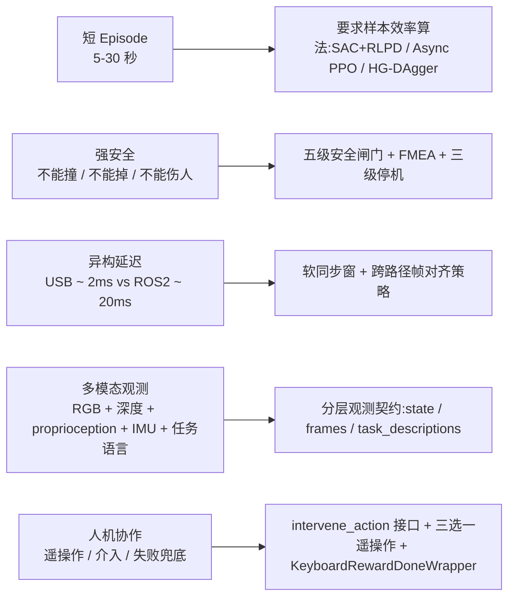

图 2.1:真机 RL 的五大物理约束及其对设计的影响。

### 2.2 关键 KPI(对齐 RLinf `MetricLogger`)

本方案在 [rlinf/utils/metric_logger](rlinf/utils/metric_logger) 之上扩展 `safety/` / `hw/` / `camera/` / `ros2/` 四个命名空间,与现有 `train/` / `eval/` / `env/` / `rollout/` / `time/` 命名空间共用同一 backend(tensorboard / wandb / swanlab)。

| 命名空间 | 指标 | MVP (M1) | 阶段 2 (M2) | 阶段 3 (M3) | 备注 |
|---|---|---|---|---|---|
| train | `train/episode_success_rate` | ≥ 70% | ≥ 60% | ≥ 50% | 任务成功率(滑动窗 100 trial) |
| train | `train/return_mean` | 单调上升 | 单调上升 | 单调上升 | 平均累积奖励 |
| env | `env/control_loop_hz` | ≥ 10 Hz | ≥ 10 Hz | ≥ 8 Hz | chunk 外 outer step 频率 |
| env | `env/episode_len_steps` | 60 ~ 120 | 100 ~ 200 | 150 ~ 400 | |
| env | `env/intervene_rate` | DAgger ≤ 30% | ≤ 25% | ≤ 20% | HG-DAgger 单调下降趋势 |
| env | `env/robot_busy_ratio` | ≥ 60% | ≥ 60% | ≥ 50% | 排除 reset / 人工干预后 |
| time | `time/actor_update_ms` | ≤ 200 | ≤ 200 | ≤ 250 | actor FSDP 单步耗时 |
| time | `time/weight_sync_ms` | ≤ 80 | ≤ 80 | ≤ 100 | NCCL 权重同步耗时 |
| time | `time/policy_forward_ms` | ≤ 25 | ≤ 30 | ≤ 35 | 单 chunk 推理 |
| safety | `safety/limit_violation_per_hour` | ≤ 0.1 | ≤ 0.1 | ≤ 0.05 | 真机越界(被 supervisor 拦下来) |
| safety | `safety/clip_ratio` | < 0.05 | < 0.05 | < 0.05 | 单步内 action 被裁剪比例 |
| safety | `safety/estop_triggered_count` | 训练前 0 | 训练前 0 | 训练前 0 | 真实急停次数(应保持为 0,触发即写 incident report) |
| safety | `safety/control_p95_latency_ms` | ≤ 50 | ≤ 50 | ≤ 60 | action 落地到 ROS2 publish 完成的 p95 |
| safety | `safety/watchdog_trip_count` | ≤ 1/hour | ≤ 1/hour | ≤ 0.5/hour | 各类 watchdog 触发次数 |
| camera | `camera/{name}_fps` | ≥ 25 | ≥ 25 | ≥ 25 | 实测帧率(目标 30) |
| camera | `camera/{name}_frame_age_p95_ms` | ≤ 50(USB)/ ≤ 80(ROS2) | 同 | 同 | 帧到达训练消费时刻的陈旧度 |
| camera | `camera/{name}_decode_ms` | ≤ 5(USB)/ ≤ 10(ROS2) | 同 | 同 | 帧解码 / SDK 处理 |
| camera | `camera/{name}_drop_rate` | ≤ 0.01 | ≤ 0.01 | ≤ 0.01 | 长期掉帧率 |
| ros2 | `ros2/topic_drop_count` | 0 | 0 | 0 | DDS 丢包 |
| ros2 | `ros2/feedback_age_p95_ms` | ≤ 100 | ≤ 100 | ≤ 120 | HDAS feedback topic 陈旧度 |
| hw | `hw/bms_capital_pct` | > 30 | > 30 | > 25 | BMS 电量,< 阈值触发 SAFE_PAUSE |
| hw | `hw/orin_cpu_util_pct` | < 70 | < 70 | < 75 | Orin CPU 占用 |
| hw | `hw/can_link_state` | up | up | up | 二值 |

### 2.3 非功能性要求

| 维度 | 要求 |
|---|---|
| 可重启 | 任意 Worker(EnvWorker / Controller / Camera Mux)崩溃后,Ray 自动重连;`runner.resume_dir` 支持 `auto`,从最近 checkpoint 续训 |
| 可观测 | 所有上述指标在 TensorBoard / W&B / SwanLab 上有 dashboard;`safety/incident_log.jsonl` 文件落盘 |
| 可回滚 | 算法回滚 Async PPO → SAC+RLPD;控制回滚 全身 → 双臂 → 单臂;感知回滚 多相机 → 单主相机;详见 §15.2 |
| 可扩展 | 新增任务只动 [rlinf/envs/realworld/galaxear/tasks/](rlinf/envs/realworld/galaxear/tasks/);新增 R1 Pro 衍生型号(R1 Lite 等)只动硬件注册与 controller |
| 安全合规 | 训练全程操作员在场;急停按钮在训练员可达范围内;PII(头部相机可能拍到人脸)有 `blur_faces=True` 选项 |
| 数据治理 | LeRobot 目录 + RLinf TrajectoryReplayBuffer 双写;失败案例保留 ROS2 mcap bag,成功案例只保 LeRobot |

### 2.4 小结

> KPI 表的最大特点是把"安全"提升到一等公民,与"训练效率"和"通信延迟"并列。这是我们与所有竞品方案的关键区别——不是把安全藏在附录里,而是在 KPI 表里写明 `safety/control_p95_latency_ms ≤ 50ms`。

---

## 3. 竞争对手方案评审与本方案改进

本节明确把 4 个竞品(`r1pro1op47`、`r1pro2op46`、`r1pro3prem`、`r1pro4g55`)与 2 个相机直连子方案(`r1proCamDirect1Op46`、`r1proCamDirect2Op46`)的优缺点抽出来,作为本方案 §6 ~ §15 的设计起点。

### 3.1 优点继承表

| 竞品 | 值得继承的 idea | 在本方案中的映射 |
|---|---|---|
| `r1pro1op47` | HDAS / mobiman topic 映射详尽,KPI 与诊断命令丰富 | §7 接口映射 + §17 附录 C |
| `r1pro1op47` | 五级安全闸门思路 | §6.4 `GalaxeaR1ProSafetySupervisor` + §9 |
| `r1pro1op47` | 与 Franka 例子的 Diff 表 | §16 |
| `r1pro2op46` | 26 DoF 状态/动作空间清单 | §6.3 + §8 |
| `r1pro2op46` | Cloud-Edge 数据流时序图 | §5.4-5.5 |
| `r1pro2op46` | 任务类继承体系 | §6.7 任务子目录 |
| `r1pro3prem` | "已存在 vs 拟新增"清单 | §1.2 + §6 章节标题 |
| `r1pro3prem` | Runbook + Go-No-Go | §13.8 + §15.3 |
| `r1pro4g55` | 相机双路径(腕部 USB + 头部 ROS2)思想 | §6.5 `GalaxeaR1ProCameraMux` |
| `r1pro4g55` | 头部 GMSL 不轻易直连的保守判定 | §6.5 决策树 + §10.6 |
| `r1pro4g55` | 命名规范雏形(`galaxear/`)与 `GalaxeaR1Pro*` 类前缀 | 全文严格采纳并细化到文件级 |
| `r1proCamDirect1/2` | USB 直连物理细节(Hub / 主动线 / AOC / 带宽) | §6.5 + §10.5 + §17 附录 |
| `r1proCamDirect2` | 头部相机不是 ZED 的修正 | §1.3 + §6.5 决策树 |

### 3.2 共性不足表(本方案要解决的问题)

| 不足 | 表现 | 本方案的解决 |
|---|---|---|
| 命名混乱 | `r1pro` / `galaxea_r1pro` / `galaxea.py` / `galaxear/` 互不一致 | 全文严格按用户指定:`galaxea_r1_pro.py`(硬件)/ `galaxear/`(env 目录)/ `r1_pro_*`(env 文件)/ `GalaxeaR1Pro*`(类)/ `ROS2Camera`(相机)/ `ros2_camera.py`(文件) |
| 把"待新增"写成"已实现" | 部分章节用陈述语气写未来代码 | 本文每处新增文件用"新增"标识,且不假装代码已落 PR |
| 头部相机误判 | 把头部默认成 Stereolabs ZED 2 / 用 `pyzed` 直连 | §1.3 + §6.5 明确头部默认走 ROS2,GMSL 直连只作 PoC 增强 |
| 安全只是 wrapper | 把安全当 `gym.Wrapper` 装饰,不进入控制器主链 | §6.4 把 SafetySupervisor 作为 `step()` 内必经逻辑;publish 之前一定走五级闸门 |
| 跨节点 placement 不一致 | 一会让 EnvWorker 在 Orin,一会在 GPU server,但相机连哪没说清 | §5.2 + §10.1 给出 EnvWorker 放置决策矩阵;`controller_node_rank` / `camera_node_rank` 显式分离 |
| 软同步缺失 | USB 帧 vs ROS2 帧时间戳不同步,直接拼接进 obs | §6.5 引入 `frame_age_ms` + `soft_sync_window_ms` + `frame_alignment_policy` |
| dummy 模式不彻底 | `is_dummy=True` 只屏蔽硬件调用,但 `import rclpy` 仍会失败 | §6.5/§6.6 明确所有 ROS2 import 走延迟 import,`is_dummy` 路径不触发任何 `rclpy` |
| ROS2 跨主机 DDS 调优空白 | 只说"用千兆" | §10.6 给出 `ROS_LOCALHOST_ONLY=0`、FastDDS XML profile、SHM transport 等 |
| 安装/Docker/CI 闭环缺失 | 只到 `requirements/install.sh` 一句话 | §12.9-12.11 给完整 install.sh diff、Dockerfile stage、e2e CI workflow |
| A2 无抱闸风险忽略 | 只字未提断电下落 | §6.6 reset choreography + §9 FMEA F-A2-fall |

### 3.3 本方案 10 大独有改进(贯穿全文)

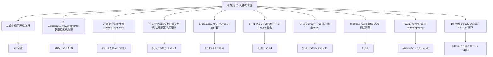

图 3.1:本方案 10 大独有改进点与正文章节对应关系。

下面逐条展开(具体实现散在 §6 ~ §12,本节只先宣示设计承诺):

#### 改进 1:命名规范严格执行

竞品没有一份能把 4 类命名(硬件文件 / env 目录 / env 文件 / 类名)同时统一。本方案的硬规则:

```text
rlinf/scheduler/hardware/robots/galaxea_r1_pro.py       # 硬件注册
└── 类:GalaxeaR1ProRobot, GalaxeaR1ProConfig, GalaxeaR1ProHWInfo

rlinf/envs/realworld/galaxear/                           # env 目录
├── __init__.py
├── r1_pro_env.py                                        # 环境主类
│   └── 类:GalaxeaR1ProEnv, GalaxeaR1ProRobotConfig
├── r1_pro_controller.py
│   └── 类:GalaxeaR1ProController
├── r1_pro_robot_state.py
│   └── 类:GalaxeaR1ProRobotState
├── r1_pro_safety.py
│   └── 类:GalaxeaR1ProSafetySupervisor
├── r1_pro_camera_mux.py
│   └── 类:GalaxeaR1ProCameraMux
├── r1_pro_wrappers.py
│   └── 类:GalaxeaR1ProJoystickIntervention,
│            GalaxeaR1ProVRIntervention,
│            GalaxeaR1ProDualArmCollisionWrapper,
│            GalaxeaR1ProActionSmoother
└── tasks/
    ├── __init__.py                                      # gymnasium.register(...)
    ├── r1_pro_single_arm_reach.py
    │   └── 类:GalaxeaR1ProSingleArmReachEnv
    ├── r1_pro_pick_place.py
    │   └── 类:GalaxeaR1ProPickPlaceEnv
    ├── r1_pro_dual_arm_handover.py
    │   └── 类:GalaxeaR1ProDualArmHandoverEnv
    ├── r1_pro_dual_arm_cap_tighten.py
    │   └── 类:GalaxeaR1ProDualArmCapTightenEnv
    ├── r1_pro_whole_body_cleanup.py
    │   └── 类:GalaxeaR1ProWholeBodyCleanupEnv
    └── r1_pro_mobile_manipulation.py
        └── 类:GalaxeaR1ProMobileManipulationEnv

rlinf/envs/realworld/common/camera/ros2_camera.py        # ROS2 相机
└── 类:ROS2Camera (与 RealSenseCamera, ZEDCamera 同级)
```

Gym ID 命名(注册在 `tasks/__init__.py`):

| Gym id | 用途 |
|---|---|
| `GalaxeaR1ProSingleArmReach-v1` | M1 bring-up |
| `GalaxeaR1ProPickPlace-v1` | M1 桌面 pick-place |
| `GalaxeaR1ProDualArmHandover-v1` | M2 双臂递交 |
| `GalaxeaR1ProDualArmCapTighten-v1` | M2 双臂拧瓶盖 |
| `GalaxeaR1ProWholeBodyCleanup-v1` | M3 躯干 + 双臂清桌 |
| `GalaxeaR1ProMobileManipulation-v1` | M4 移动 + 双臂 |

#### 改进 2:GalaxeaR1ProCameraMux 相机多路径抽象

四个竞品要么只考虑 ROS2,要么只考虑 USB 直连,要么把两条路径并列写代码但没抽出 Mux。本方案在 [rlinf/envs/realworld/galaxear/r1_pro_camera_mux.py](rlinf/envs/realworld/galaxear/r1_pro_camera_mux.py) 引入 `GalaxeaR1ProCameraMux`:

- 每路相机由 `CameraInfo.backend in {"usb_direct", "ros2"}` 独立决定,在 [rlinf/envs/realworld/common/camera/__init__.py](rlinf/envs/realworld/common/camera/__init__.py) 的 `create_camera` 工厂里分发到 `RealSenseCamera`(腕部 USB)或 `ROS2Camera`(头部/腕部备份/底盘)。
- Mux 顶层接口 `get_frames(soft_sync_window_ms=33)` 一次性返回所有相机的"软同步对齐帧字典",每帧附带 `frame_age_ms` 字段。
- 支持 `fallback_to_ros2_on_usb_drop`:腕部 USB 连续 N 次超时即自动切到对应的 ROS2 topic(`/hdas/camera_wrist_*/...`),不影响训练循环。

#### 改进 3:跨路径软同步窗

USB 直连帧的 `frame_age_ms` ~ 2-5 ms,ROS2 帧 ~ 12-25 ms。如果直接把两路 frame 拼进 obs,策略实际看到的是"过去 5 ms 腕部 + 过去 25 ms 头部",对于 ee delta 控制可能问题不大,对于 reaching/insertion 则可能拉低成功率。

本方案的策略:

1. `frame_age_ms` 作为指标永远落入 `camera/{name}_frame_age_p95_ms`;
2. `frame_age_ms > stale_threshold_ms`(默认 100 ms)直接 SOFT_HOLD;
3. `align_strategy`:`"latest"`(默认,各取最新;最简但有 jitter)/ `"sync_window"`(取在 `soft_sync_window_ms` 内最接近的帧;有更稳定的策略输入,代价是 ~ 10 ms 延迟)。

#### 改进 4:EnvWorker / Controller / Camera Mux 三层放置决策矩阵

竞品大多在"EnvWorker 放 GPU server 还是 Orin"问题上摇摆。本方案按"硬件物理位置 → Worker 放置"做硬规则:

| Worker / 模块 | 物理位置 | 原因 |
|---|---|---|
| `ActorWorkerGroup` | GPU server (`node_rank=0`) | FSDP / NCCL 训练,GPU 算力需求 |
| `RolloutWorkerGroup` | GPU server | 策略推理,与 actor 共 GPU 节点(NCCL 同节点更快) |
| `RewardWorkerGroup`(可选 ResNet) | GPU server | ResNet18 推理需 GPU |
| `EnvWorker(GalaxeaR1ProEnv)` | GPU server | 因为腕部 D405 USB 直连 GPU server,EnvWorker 同进程持有相机 = 零拷贝 |
| `GalaxeaR1ProController` | Orin (`node_rank=1`) | `rclpy` 必须能 source `/opt/ros/humble` 与 `~/galaxea/install`;延迟最低 |
| `GalaxeaR1ProCameraMux`(组合 USB + ROS2) | GPU server | 与 EnvWorker 同进程;USB 直连本地,ROS2 跨网订阅 |
| `ROS2Camera` 实例(头部 / 底盘) | GPU server(订阅) | 跨主机订阅 Orin DDS topic;若 DDS 跨主机不稳,可加 ROS2 image relay |

`hardware_info.config.controller_node_rank` 用来把 controller 显式调度到 Orin:

```yaml
hardware:
  type: GalaxeaR1Pro
  configs:
    - node_rank: 0                    # EnvWorker 跑在 GPU server
      controller_node_rank: 1         # Controller Worker 跑在 Orin
      camera_node_rank: 0             # 相机回调线程跑在 EnvWorker(USB) / GPU server(ROS2 订阅)
```

注:`Hardware.enumerate(node_rank=0)` 会在 GPU server 上生成 `GalaxeaR1ProHWInfo`,`GalaxeaR1ProEnv._setup_hardware()` 读到 `controller_node_rank=1` 后通过 `GalaxeaR1ProController.launch_controller(node_rank=1)` 把 controller Worker 推到 Orin,这与 `FrankaController.launch_controller(node_rank=controller_node_rank)` 完全同构。

#### 改进 5:Galaxea 特有安全 hook 五件套

| Hook | 来源 | 在 SafetySupervisor 中的位置 |
|---|---|---|
| SWD 急停 | `/controller`(SWD=DOWN) | L5 系统 watchdog |
| BMS 低电 | `/hdas/bms`(`capital_pct < 阈值`) | L5 系统 watchdog |
| HDAS 错误码白名单 | `/hdas/feedback_status_arm_*` | L5,可恢复错误自动 `clear_errors`,不可恢复进 FATAL |
| A2 无抱闸断电下落 | 临近 power-loss 信号 / BMS 低电 / 训练前 reset | L5 + reset choreography |
| 双臂碰撞球模型 | TCP 位置差 | L3 |

#### 改进 6:R1 Pro VR 遥操作 + HG-DAgger 整合

R1 Pro 官方 SDK 自带 30 Hz VR 全身遥操作。本方案:

- 在 `r1_pro_wrappers.py` 实装 `GalaxeaR1ProVRIntervention`,落点与 `GelloIntervention` / `SpacemouseIntervention` 一致(订阅 ROS2 VR topic → 转 `intervene_action` → 写 `info`)。
- HG-DAgger 流程:`algorithm.loss_type: embodied_dagger` + `algorithm.dagger.only_save_expert: True`(对齐 [examples/embodiment/config/realworld_pnp_dagger_openpi.yaml](examples/embodiment/config/realworld_pnp_dagger_openpi.yaml));VR 期初接管比例高,随训练 `env/intervene_rate` 单调下降。

#### 改进 7:is_dummy=True 真正的全 mock 模式

要点:

- **延迟 import**:所有 `import rclpy / cv_bridge / sensor_msgs / hdas_msg` 写在函数体内,不放模块顶层。
- **`is_dummy=True`** 时:`GalaxeaR1ProEnv._setup_hardware` 不创建 `GalaxeaR1ProController`、不打开任何相机、不启 reward worker;`step / reset` 走 dummy 分支返回零观测、零奖励;`action_space.sample()` 直接走;CI runner 不需要装 ROS2、不需要装 `pyrealsense2`。
- **CI 验证**:`tests/e2e_tests/embodied/realworld_dummy_galaxea_r1_pro_sac_cnn.yaml` 在公共 GPU CI runner 上跑通 100 step 训练,无 ROS2,无真机。

#### 改进 8:Cross-host ROS2 DDS 调优清单

详见 §10.6,核心 5 条:

1. `ROS_DOMAIN_ID=72`(与 R1 Pro 默认一致),实验室不同机器人用不同 DOMAIN。
2. `ROS_LOCALHOST_ONLY=0`(默认开启会拦跨主机,需要明确关掉)。
3. FastDDS XML profile:大 image topic 用 `BEST_EFFORT` + `KEEP_LAST(1)`;feedback topic 用 `RELIABLE` + `VOLATILE`。
4. SHM 不跨主机生效;跨主机用 UDP/TCP transport,优先 UDPv4;考虑用 zenoh-rmw 替代 FastDDS。
5. 防火墙开放 7400-7500/UDP(DDS discovery),实验 VLAN 隔离。

#### 改进 9:A2 无抱闸 reset choreography

```text
reset() 时:
  1. 检查 BMS:capital < 25% → SAFE_PAUSE,提示充电
  2. 检查臂当前姿态:若 q[1] / q[3] 偏离自然下垂超过阈值 → 先 joint tracker 慢速到自然下垂
  3. 调用 mobiman joint tracker 把臂送到 reset_qpos(单步限速 ≤ 1.5 rad/s)
  4. 等待收敛(误差 < 0.03 rad / 超时 5s)
  5. 调用 mobiman relaxed_ik 切到 ee pose 模式;最终对齐到 reset_ee_pose
  6. 校验 /hdas/feedback_status_arm_* 无错误码
  7. 若步骤 4-6 任一失败:清错重试 1 次;再失败进 FATAL 通知操作员
```

#### 改进 10:完整 install / Docker / CI / e2e 闭环

按仓库 [`.cursor/skills/add-install-docker-ci-e2e/SKILL.md`](.cursor/skills/add-install-docker-ci-e2e/SKILL.md) 的范式:

- [requirements/install.sh](requirements/install.sh) 增加 `--env galaxea_r1_pro` 分支与 `install_galaxea_r1_pro()` 函数。
- [docker/](docker/) 增加 `galaxea_r1_pro` build stage。
- [.github/workflows/](.github/workflows/) 增加 `r1pro-dummy-e2e` job(GPU runner / 不连真机)。
- [tests/e2e_tests/embodied/realworld_dummy_galaxea_r1_pro_sac_cnn.yaml](tests/e2e_tests/embodied/realworld_dummy_galaxea_r1_pro_sac_cnn.yaml) 作为 CI fixture。
- 文档 RST(EN/ZH)各一份:`docs/source-{en,zh}/rst_source/examples/embodied/galaxea_r1_pro.rst`。

### 3.4 小结

> 第 3 节的本质是"承诺",从 §6 起才是"实现"。本方案承诺的 10 大改进会逐节落地,任何一节都至少有图、表、代码骨架三选一。

---

## 4. 现状对照:RLinf 真机栈 vs R1 Pro

### 4.1 RLinf 真机栈 as-is(以 Franka 为样本)

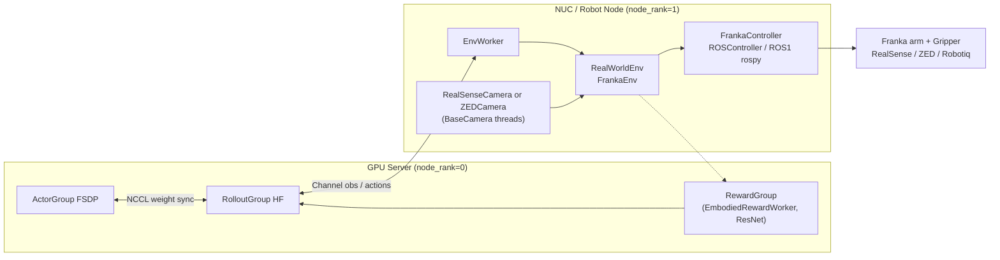

图 4.1:RLinf 现有 Franka 真机栈(基线参考)。

关键特性:

- `RealWorldEnv.num_envs=1`,`NoAutoResetSyncVectorEnv` 包一层;`chunk_step` 给 rollout 拉一个 K 步 chunk。
- `FrankaController.launch_controller(node_rank=controller_node_rank)` 支持把 controller 放到不同节点(默认与 EnvWorker 同节点)。
- 安全主要靠 `_clip_position_to_safety_box`(xyz + rpy 窗)+ `clear_errors()`(用 `ErrorRecoveryActionGoal`)。
- Reward = `_calc_step_reward`(几何阈值)+ 可选 `EmbodiedRewardWorker`(ResNet)+ 可选键盘 wrapper。

### 4.2 R1 Pro 接口 as-is

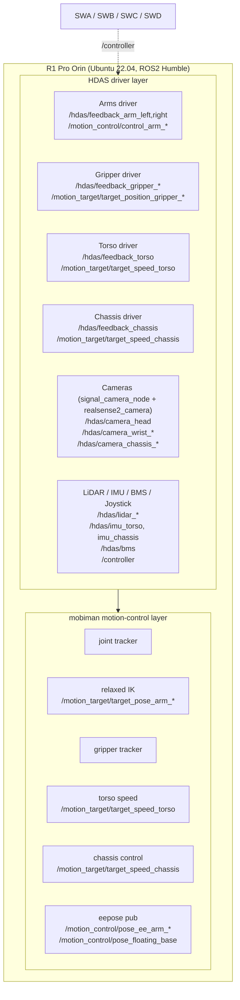

图 4.2:R1 Pro 自身 ROS2 体系(HDAS 驱动 + mobiman 控制层)。

### 4.3 差异矩阵

| 维度 | Franka(RLinf 已有) | R1 Pro(目标) | 影响 |
|---|---|---|---|
| 机械构型 | 单 7 DoF + 1 夹爪 | 双 7 DoF + 双夹爪 + 4 DoF 躯干 + 6 DoF 底盘 | 阶段 4 动作维度从 7 升至 26;安全 / 协调复杂度量级提升 |
| 中间层 | ROS1 Noetic + libfranka + serl_franka_controllers + rospy | ROS2 Humble(主)/ ROS1(副经 ros1_bridge,可选) | 新增 `ROS2Camera`,`GalaxeaR1ProController` 用 `rclpy`;现有 `ROSController` 仅供 fallback |
| 相机 | RealSense / ZED SDK 直连(USB) | 全部默认 ROS2 topic(头部 GMSL / 底盘 GMSL);腕部 D405 可走 USB 直连 | 新增 `ROS2Camera` + `GalaxeaR1ProCameraMux`;扩 `create_camera` 工厂 |
| 控制节点 | NUC 或 GPU server,启 ROS1 服务 | 车载 Orin(预装 SDK,`~/galaxea/install`);CAN 必启 | 新增 `setup_before_ray_galaxea_r1_pro.sh`(source ROS2 + galaxea install + CAN 检查) |
| 急停 | 无内建硬急停,靠工作空间盒 + `clear_errors` | 软急停 SWD + 硬急停按钮(后者需重启 CAN) | 新增 `GalaxeaR1ProSafetySupervisor` 订阅 `/controller` + watchdog |
| 末端控制语义 | Cartesian 阻抗(`/cartesian_impedance_controller/equilibrium_pose`) | mobiman relaxed IK(`/motion_target/target_pose_arm_*`)+ 可选 joint tracker | controller 在 pose / joint 间切换 |
| 自动复位 | `clear_errors` + `reset_joint`(关节复位) | mobiman joint tracker 发 `target_joint_state_arm_*`;`brake_mode=True` 停底盘;A2 无抱闸需 reset choreography | reset 流程重写 |
| 奖励 | `_calc_step_reward`(`target_ee_pose`)+ ResNet reward model + 键盘 wrapper | 复用全部;`target_ee_pose` 改为双键 | YAML 字段加 `target_ee_pose_left/right` |
| 固件依赖 | Franka FW < 5.9.0、实时内核、serl controllers | 出厂预装 SDK + CAN + tmux | 安装脚本不要求实时内核 |
| 功耗 / 移动性 | 固定工作站 | 自驱锂电 48V/35Ah | BMS 监测 + 低电 SAFE_PAUSE |
| 抱闸 | 有 | A2 当前**无抱闸** | reset choreography + 姿态规则 |

### 4.4 小结

> R1 Pro 不是"加长的 Franka 机械臂",而是"双臂 + 移动 + 全身 + 异构感知 + 多级安全"的人形平台。但只要把"控制器"和"相机"两层抽好,RLinf 三层主链路完全可以无侵入接入。

---

## 5. 总体架构

本节给出 8 张图,从系统上下文一路下钻到状态机和数据流。

### 5.1 系统上下文

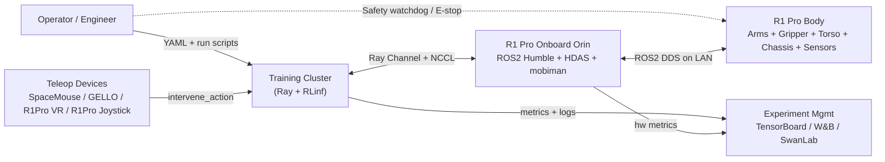

图 5.1:系统上下文图。重点:RLinf cluster 通过 Ray 与 Orin 通信,Orin 再通过 ROS2 与机器人本体通信;teleop 与 operator 都是一等公民。

### 5.2 推荐部署拓扑(2-Node Disaggregated,MVP / 阶段 2)

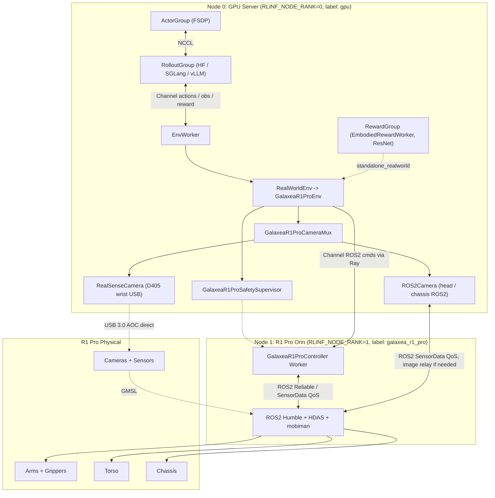

图 5.2:推荐 2-Node 部署拓扑。腕部 D405 USB AOC 直连 GPU server,头部 / 底盘相机走 ROS2 跨网订阅,控制走 ROS2 Reliable QoS。

### 5.3 RLinf 三层组件类图

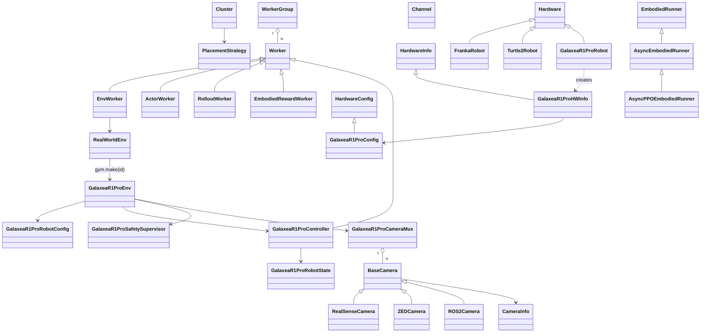

图 5.3:RLinf × R1 Pro 组件类图。新增类(`GalaxeaR1Pro*`、`ROS2Camera`)与现有体系(`Worker`、`BaseCamera`、`Hardware`)严格继承/组合,无侵入。

### 5.4 同步训练 step 时序图(M1 单臂)

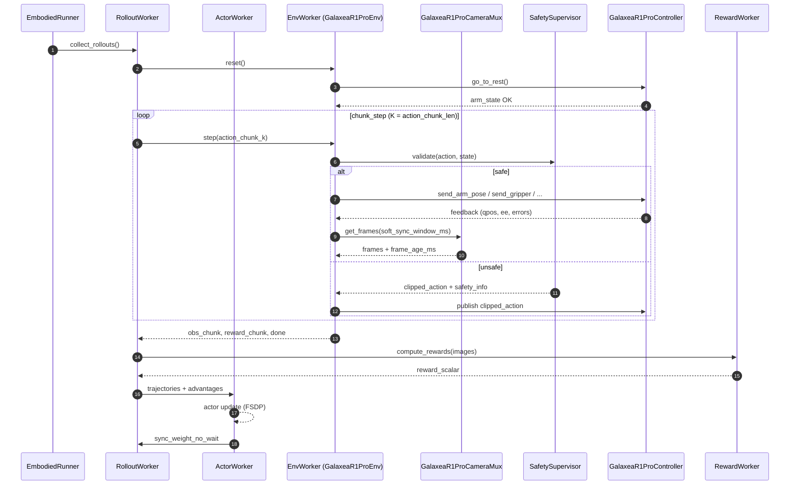

图 5.4:同步训练 step 时序。每个 action 都强制经过 Safety 闸门;相机帧在每步都做软同步窗对齐。

### 5.5 Async PPO 训练时序图(M2-M4)

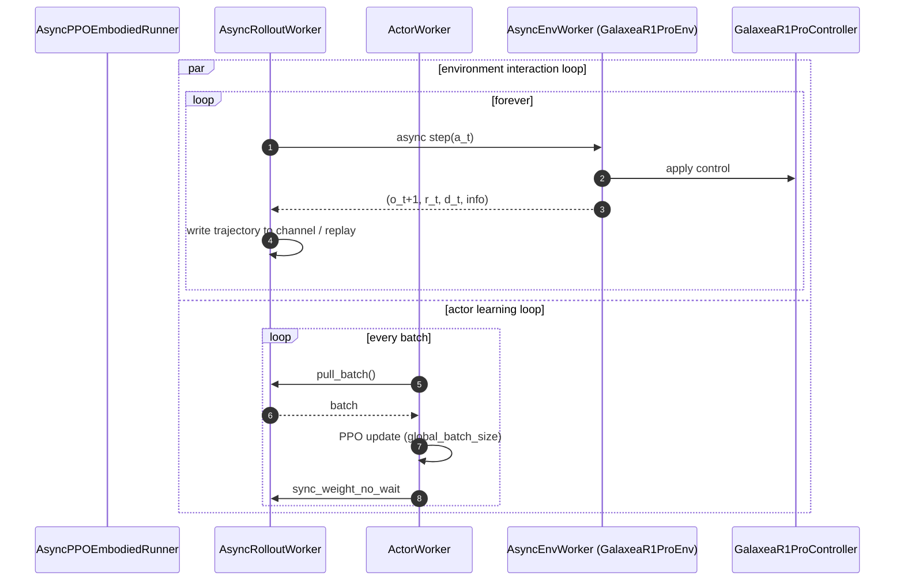

图 5.5:Async PPO 训练。env 与 actor 解耦循环,真机不会因 actor update 而抖动控制频率。

### 5.6 GalaxeaR1ProEnv 状态机

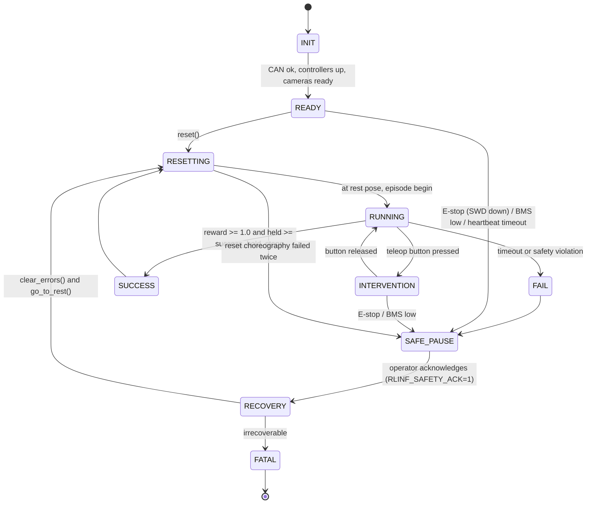

图 5.6:`GalaxeaR1ProEnv` 状态机。任何状态都可以被 SAFE_PAUSE 截胡;退出 SAFE_PAUSE 必须经过 RECOVERY 显式确认。

### 5.7 GalaxeaR1ProController 状态机

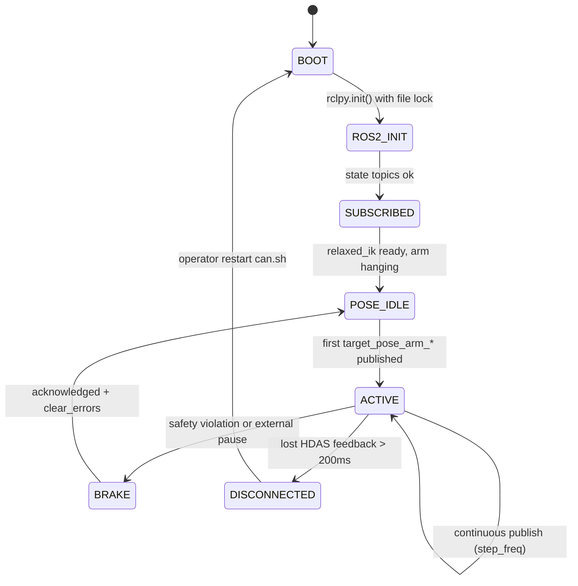

图 5.7:`GalaxeaR1ProController` 状态机。强调 DISCONNECTED 与 BRAKE 是两种"健康降级",前者要重启 CAN,后者只需清错。

### 5.8 数据流图

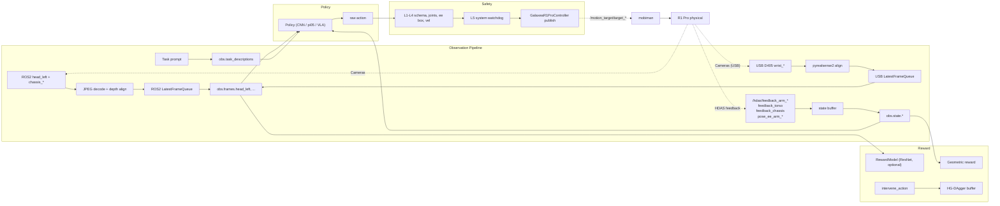

图 5.8:数据流图。明确观测 / 策略 / 安全 / 奖励 四条管线并行。

### 5.9 小结

> §5 共 8 张图覆盖系统、部署、类、时序、状态、数据流。所有后续章节(§6 - §15)都可以回过来 refer 这 8 张图,避免重复绘制。

---

## 6. 核心模块设计

§6 把 §5 的总体架构落到具体文件、类、API。所有模块严格按用户指定命名规范。

### 6.1 硬件注册:GalaxeaR1ProRobot

**新增文件**:[rlinf/scheduler/hardware/robots/galaxea_r1_pro.py](rlinf/scheduler/hardware/robots/galaxea_r1_pro.py)

#### 6.1.1 设计原则

与 [rlinf/scheduler/hardware/robots/franka.py](rlinf/scheduler/hardware/robots/franka.py) 同构,继承 `Hardware / HardwareConfig / HardwareInfo` 三件套,通过 `@Hardware.register()` 与 `@NodeHardwareConfig.register_hardware_config(HW_TYPE)` 接入 RLinf 调度。

#### 6.1.2 类图

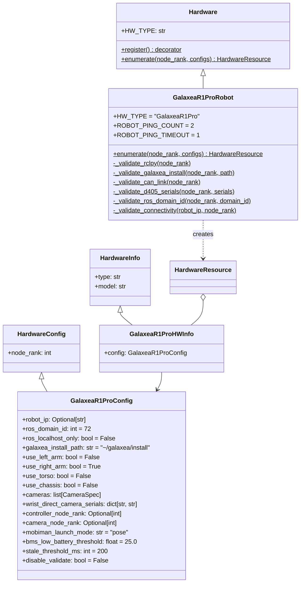

图 6.1.1:硬件注册类图。

#### 6.1.3 代码骨架

```python
# rlinf/scheduler/hardware/robots/galaxea_r1_pro.py  (新增)

from __future__ import annotations

import importlib
import ipaddress
import logging
import os
import shutil
import subprocess
import warnings
from dataclasses import dataclass, field
from typing import Optional

from ..hardware import (
    Hardware,
    HardwareConfig,
    HardwareInfo,
    HardwareResource,
    NodeHardwareConfig,
)

logger = logging.getLogger(__name__)


@dataclass
class CameraSpec:
    """A single camera entry in GalaxeaR1ProConfig.cameras."""

    name: str                           # e.g. "wrist_right" / "head_left"
    backend: str = "ros2"               # "ros2" | "usb_direct"
    rgb_topic: Optional[str] = None     # required when backend=="ros2"
    depth_topic: Optional[str] = None
    serial_number: Optional[str] = None  # required when backend=="usb_direct"
    resolution: tuple[int, int] = (640, 480)
    fps: int = 30
    enable_depth: bool = False
    stale_threshold_ms: int = 200
    align_depth_to_color: bool = True


@dataclass
class GalaxeaR1ProHWInfo(HardwareInfo):
    """Hardware information for a Galaxea R1 Pro robot."""

    config: "GalaxeaR1ProConfig" = None


@Hardware.register()
class GalaxeaR1ProRobot(Hardware):
    """Hardware policy for Galaxea R1 Pro."""

    HW_TYPE = "GalaxeaR1Pro"
    ROBOT_PING_COUNT: int = 2
    ROBOT_PING_TIMEOUT: int = 1

    @classmethod
    def enumerate(
        cls,
        node_rank: int,
        configs: Optional[list["GalaxeaR1ProConfig"]] = None,
    ) -> Optional[HardwareResource]:
        assert configs is not None, (
            "Galaxea R1 Pro requires explicit configurations for "
            "robot_ip / cameras / ros_domain_id / galaxea_install_path."
        )

        matched: list[GalaxeaR1ProConfig] = [
            c for c in configs
            if isinstance(c, GalaxeaR1ProConfig) and c.node_rank == node_rank
        ]
        if not matched:
            return None

        infos: list[GalaxeaR1ProHWInfo] = []
        for cfg in matched:
            infos.append(
                GalaxeaR1ProHWInfo(
                    type=cls.HW_TYPE, model=cls.HW_TYPE, config=cfg
                )
            )

            if cfg.disable_validate:
                continue

            cls._validate_rclpy(node_rank)
            cls._validate_galaxea_install(node_rank, cfg.galaxea_install_path)
            cls._validate_ros_domain_id(node_rank, cfg.ros_domain_id)
            if cfg.robot_ip:
                cls._validate_connectivity(cfg.robot_ip, node_rank)
            cls._validate_d405_serials(node_rank, cfg.wrist_direct_camera_serials)
            cls._validate_can_link(node_rank)

        return HardwareResource(type=cls.HW_TYPE, infos=infos)

    @classmethod
    def _validate_rclpy(cls, node_rank: int) -> None:
        try:
            importlib.import_module("rclpy")
        except ModuleNotFoundError as e:
            raise ModuleNotFoundError(
                f"Node {node_rank}: rclpy not importable. "
                f"Did you `source /opt/ros/humble/setup.bash` and "
                f"`source $GALAXEA_INSTALL_PATH/setup.bash` BEFORE `ray start`?"
            ) from e

    @classmethod
    def _validate_galaxea_install(cls, node_rank: int, path: str) -> None:
        path = os.path.expanduser(path)
        if not os.path.exists(os.path.join(path, "setup.bash")):
            raise FileNotFoundError(
                f"Node {node_rank}: GALAXEA_INSTALL_PATH={path!r} "
                "does not contain setup.bash. Check Galaxea SDK install."
            )

    @classmethod
    def _validate_ros_domain_id(cls, node_rank: int, domain_id: int) -> None:
        env_did = os.environ.get("ROS_DOMAIN_ID")
        if env_did is None:
            warnings.warn(
                f"Node {node_rank}: ROS_DOMAIN_ID not set; "
                f"YAML wants {domain_id}. Will be enforced inside controller."
            )
            return
        if int(env_did) != int(domain_id):
            warnings.warn(
                f"Node {node_rank}: ROS_DOMAIN_ID env={env_did} differs from "
                f"YAML config {domain_id}; controller will use YAML value."
            )

    @classmethod
    def _validate_connectivity(cls, robot_ip: str, node_rank: int) -> None:
        try:
            ipaddress.ip_address(robot_ip)
        except ValueError as e:
            raise ValueError(f"Invalid robot_ip {robot_ip!r}: {e}")
        try:
            from icmplib import ping
        except ImportError:
            warnings.warn("icmplib not installed; skip ping check.")
            return
        try:
            res = ping(
                robot_ip,
                count=cls.ROBOT_PING_COUNT,
                timeout=cls.ROBOT_PING_TIMEOUT,
            )
            if not res.is_alive:
                raise ConnectionError(
                    f"Cannot reach R1 Pro at {robot_ip} from node {node_rank}."
                )
        except PermissionError:
            warnings.warn(
                f"Permission denied pinging {robot_ip}; skip ping check."
            )

    @classmethod
    def _validate_d405_serials(
        cls, node_rank: int, serials: dict[str, str]
    ) -> None:
        if not serials:
            return
        try:
            import pyrealsense2 as rs
        except ImportError as e:
            raise ImportError(
                f"Node {node_rank}: pyrealsense2 missing but USB-direct "
                f"D405 serials configured: {serials}"
            ) from e
        connected = {
            d.get_info(rs.camera_info.serial_number)
            for d in rs.context().devices
        }
        for name, sn in serials.items():
            if sn not in connected:
                raise ValueError(
                    f"Node {node_rank}: D405 {name} serial {sn} not "
                    f"connected via USB. Available: {sorted(connected)}."
                )

    @classmethod
    def _validate_can_link(cls, node_rank: int) -> None:
        # Soft check: only warn; controller will hard-check at startup.
        if shutil.which("ip") is None:
            return
        try:
            res = subprocess.run(
                ["ip", "link", "show", "can0"],
                capture_output=True, text=True, timeout=2.0,
            )
            if res.returncode != 0 or "UP" not in res.stdout:
                warnings.warn(
                    f"Node {node_rank}: can0 link is not UP. "
                    "Run `bash ~/can.sh` on Orin before starting controller."
                )
        except Exception:
            pass


@NodeHardwareConfig.register_hardware_config(GalaxeaR1ProRobot.HW_TYPE)
@dataclass
class GalaxeaR1ProConfig(HardwareConfig):
    """Configuration for a Galaxea R1 Pro robot."""

    robot_ip: Optional[str] = None
    ros_domain_id: int = 72
    ros_localhost_only: bool = False
    galaxea_install_path: str = "~/galaxea/install"

    use_left_arm: bool = False
    use_right_arm: bool = True
    use_torso: bool = False
    use_chassis: bool = False

    cameras: list[CameraSpec] = field(default_factory=list)
    wrist_direct_camera_serials: dict[str, str] = field(default_factory=dict)

    controller_node_rank: Optional[int] = None
    camera_node_rank: Optional[int] = None

    mobiman_launch_mode: str = "pose"   # "pose" | "joint" | "hybrid"
    bms_low_battery_threshold: float = 25.0
    stale_threshold_ms: int = 200
    disable_validate: bool = False

    def __post_init__(self) -> None:
        assert isinstance(self.node_rank, int), (
            f"'node_rank' must be int, got {type(self.node_rank)}."
        )
        # Coerce camera dicts to CameraSpec when loaded from YAML.
        if self.cameras and isinstance(self.cameras[0], dict):
            self.cameras = [CameraSpec(**c) for c in self.cameras]
        if isinstance(self.wrist_direct_camera_serials, list):
            self.wrist_direct_camera_serials = {
                f"wrist_{i}": sn
                for i, sn in enumerate(self.wrist_direct_camera_serials)
            }
```

#### 6.1.4 与 Franka 的关键区别

| 维度 | FrankaConfig | GalaxeaR1ProConfig |
|---|---|---|
| 必填字段 | `robot_ip`(强 IP 检验) | `robot_ip` 可选(Orin 在同 LAN 时由 ROS2 自动发现) |
| 校验依赖 | `pyrealsense2` 或 `pyzed` SDK | `rclpy`(ROS2) + 可选 `pyrealsense2`(USB 直连腕部) |
| 相机配置 | `camera_serials: list[str]` + `camera_type` | `cameras: list[CameraSpec]`(每路独立 backend / topic / serial) |
| 控制器位置 | `controller_node_rank` | 同名,默认值不同(Orin 通常是非 0 节点) |
| 安全字段 | 无 | `bms_low_battery_threshold` / `stale_threshold_ms` |
| 启动检查 | ping + camera SDK | ping + rclpy + galaxea_install + ROS_DOMAIN_ID + CAN |

#### 6.1.5 模块导出更新

- [rlinf/scheduler/hardware/robots/__init__.py](rlinf/scheduler/hardware/robots/__init__.py) 增加:
  ```python
  from .galaxea_r1_pro import (
      CameraSpec,
      GalaxeaR1ProConfig,
      GalaxeaR1ProHWInfo,
  )
  __all__ += ["CameraSpec", "GalaxeaR1ProConfig", "GalaxeaR1ProHWInfo"]
  ```
- [rlinf/scheduler/hardware/__init__.py](rlinf/scheduler/hardware/__init__.py) 与 [rlinf/scheduler/__init__.py](rlinf/scheduler/__init__.py) 链式 re-export(与 `FrankaConfig / FrankaHWInfo` 同构)。

#### 6.1.6 YAML 用例

```yaml
node_groups:
  - label: galaxea_r1_pro
    node_ranks: [0, 1]
    hardware:
      type: GalaxeaR1Pro
      configs:
        - node_rank: 0                    # GPU server: EnvWorker + USB cameras
          ros_domain_id: 72
          ros_localhost_only: false
          galaxea_install_path: /opt/galaxea/install
          use_right_arm: true
          controller_node_rank: 1         # send controller worker to Orin
          camera_node_rank: 0             # cameras stay on GPU server
          wrist_direct_camera_serials:
            wrist_right: "230322272869"
          cameras:
            - name: wrist_right
              backend: usb_direct
              serial_number: "230322272869"
              resolution: [640, 480]
              fps: 30
              enable_depth: true
              align_depth_to_color: true
            - name: head_left
              backend: ros2
              rgb_topic: /hdas/camera_head/left_raw/image_raw_color/compressed
              depth_topic: /hdas/camera_head/depth/depth_registered
              fps: 30
        - node_rank: 1                    # Orin: controller side hint
          ros_domain_id: 72
          galaxea_install_path: /home/galaxea/galaxea/install
          use_right_arm: true
          disable_validate: false
```

> 工程提示:`hardware.configs` 列表里**两个 `node_rank` 不同的条目**让 RLinf `enumerate()` 在 GPU server 与 Orin 各检查一次,既保证 USB D405 在 GPU server 端被正确枚举,又保证 Orin 端的 rclpy / can0 / galaxea install 都到位。

### 6.1.7 小结

> 硬件注册层是 RLinf 调度的"信任边界"。本节提供的 6 项校验(rclpy / galaxea install / ROS_DOMAIN_ID / 连通性 / D405 序列号 / CAN)在 `Cluster.start()` 阶段就把"机器人可不可以训练"的问题答完,避免训练跑了 5 分钟才发现 ROS2 没 source。

---

### 6.2 控制器:GalaxeaR1ProController

**新增文件**:[rlinf/envs/realworld/galaxear/r1_pro_controller.py](rlinf/envs/realworld/galaxear/r1_pro_controller.py)

#### 6.2.1 设计目标

- 与 [rlinf/envs/realworld/franka/franka_controller.py](rlinf/envs/realworld/franka/franka_controller.py) 同构:继承 `Worker`、提供 `launch_controller(robot_ip, env_idx, node_rank, worker_rank, ...)` 静态方法把 controller 放到指定节点(默认 Orin),`get_state / move_arm / open_gripper / close_gripper / clear_errors / reset_joint` 等公共 API 用 `.wait()` 同步获取结果。
- ROS2 backend:`rclpy.Node` + `MultiThreadedExecutor` + 后台 spin 线程,与 `BaseCamera._capture_frames` 的线程模型一致。
- QoS 区分:状态反馈用 `SensorDataQoS`(BEST_EFFORT,depth=1);控制目标用 `Reliable`(KEEP_LAST,depth=1);图像用 `SensorDataQoS` + 独立 `MutuallyExclusiveCallbackGroup`(避免阻塞控制回调)。
- 文件锁 `/tmp/galaxea_r1_pro_controller_<node_rank>.lock`,避免同节点多 EnvWorker 同时 `rclpy.init()` 抢资源。
- 导入策略:`rclpy / sensor_msgs / geometry_msgs / hdas_msg` 全部在 `__init__` / 方法体内延迟 import,允许 `is_dummy=True` 在没装 ROS2 的 GPU runner 上 import 整条链。

#### 6.2.2 类图

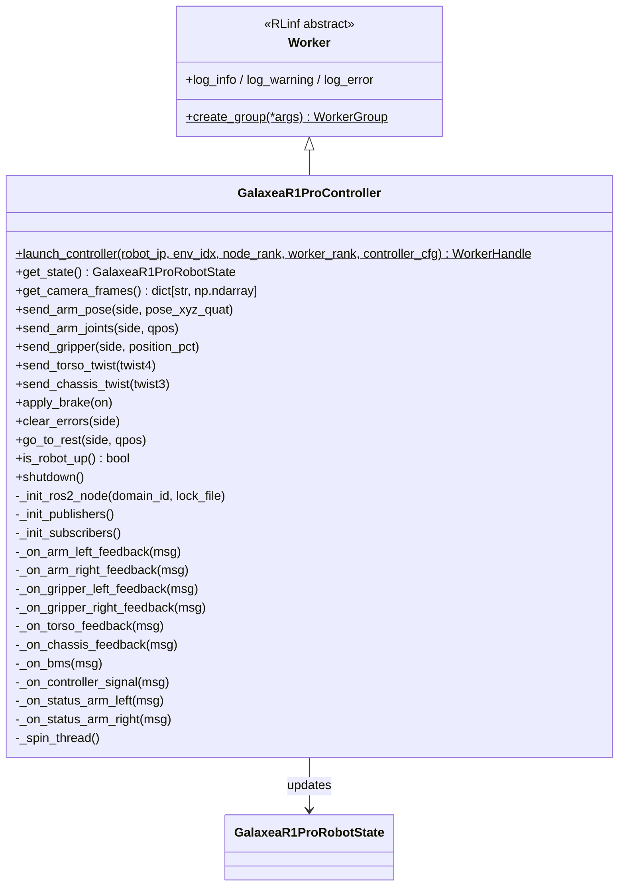

图 6.2.1:`GalaxeaR1ProController` 类图。

#### 6.2.3 ROS2 QoS 策略表

| 用途 | Topic 模板 | QoS Reliability | History | Depth | Callback group |
|---|---|---|---|---|---|
| Arm feedback | `/hdas/feedback_arm_left/right` | BEST_EFFORT (`SensorDataQoS`) | KEEP_LAST | 1 | MutuallyExclusive(state) |
| Gripper feedback | `/hdas/feedback_gripper_*` | BEST_EFFORT | KEEP_LAST | 1 | state |
| Torso / Chassis feedback | `/hdas/feedback_{torso,chassis}` | BEST_EFFORT | KEEP_LAST | 1 | state |
| BMS / Joystick / Status | `/hdas/bms` `/controller` `/hdas/feedback_status_arm_*` | RELIABLE | KEEP_LAST | 5 | safety |
| Arm target pose | `/motion_target/target_pose_arm_*` | RELIABLE | KEEP_LAST | 1 | command |
| Arm target joints | `/motion_target/target_joint_state_arm_*` | RELIABLE | KEEP_LAST | 1 | command |
| Gripper target | `/motion_target/target_position_gripper_*` | RELIABLE | KEEP_LAST | 1 | command |
| Torso speed | `/motion_target/target_speed_torso` | RELIABLE | KEEP_LAST | 1 | command |
| Chassis speed | `/motion_target/target_speed_chassis` | RELIABLE | KEEP_LAST | 1 | command |
| Brake | `/motion_target/brake_mode` | RELIABLE | KEEP_LAST | 1 | safety |
| EE / floating base pose | `/motion_control/pose_ee_arm_*` `/motion_control/pose_floating_base` | BEST_EFFORT | KEEP_LAST | 1 | state |
| Camera (in `ROS2Camera`) | `/hdas/camera_*/...` | BEST_EFFORT | KEEP_LAST | 1 | image (separate node) |

#### 6.2.4 控制流时序

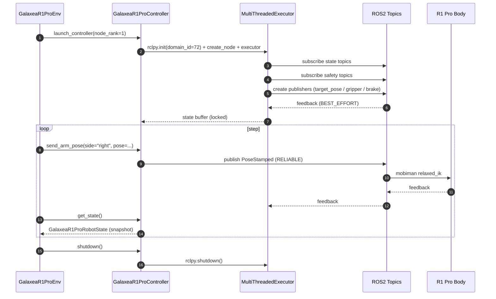

图 6.2.2:Controller 启动 + 控制 + 反馈 + 关闭时序。

#### 6.2.5 代码骨架

```python
# rlinf/envs/realworld/galaxear/r1_pro_controller.py  (新增)

from __future__ import annotations

import os
import threading
import time
from contextlib import contextmanager
from typing import Optional

import numpy as np
from filelock import FileLock

from rlinf.scheduler import Cluster, NodePlacementStrategy, Worker
from rlinf.utils.logging import get_logger

from .r1_pro_robot_state import GalaxeaR1ProRobotState


class GalaxeaR1ProController(Worker):
    """ROS2 controller worker for Galaxea R1 Pro.

    Lives on the Orin (or wherever rclpy + galaxea install + CAN are
    available).  Holds a single rclpy.Node + MultiThreadedExecutor in a
    background thread, exposes a synchronous API to the EnvWorker side
    via Ray remote calls.
    """

    @staticmethod
    def launch_controller(
        env_idx: int = 0,
        node_rank: int = 0,
        worker_rank: int = 0,
        ros_domain_id: int = 72,
        ros_localhost_only: bool = False,
        galaxea_install_path: str = "~/galaxea/install",
        use_left_arm: bool = False,
        use_right_arm: bool = True,
        use_torso: bool = False,
        use_chassis: bool = False,
        mobiman_launch_mode: str = "pose",
    ) -> "GalaxeaR1ProController":
        cluster = Cluster()
        placement = NodePlacementStrategy(node_ranks=[node_rank])
        return GalaxeaR1ProController.create_group(
            ros_domain_id=ros_domain_id,
            ros_localhost_only=ros_localhost_only,
            galaxea_install_path=galaxea_install_path,
            use_left_arm=use_left_arm,
            use_right_arm=use_right_arm,
            use_torso=use_torso,
            use_chassis=use_chassis,
            mobiman_launch_mode=mobiman_launch_mode,
        ).launch(
            cluster=cluster,
            placement_strategy=placement,
            name=f"GalaxeaR1ProController-{worker_rank}-{env_idx}",
        )

    def __init__(
        self,
        ros_domain_id: int = 72,
        ros_localhost_only: bool = False,
        galaxea_install_path: str = "~/galaxea/install",
        use_left_arm: bool = False,
        use_right_arm: bool = True,
        use_torso: bool = False,
        use_chassis: bool = False,
        mobiman_launch_mode: str = "pose",
    ) -> None:
        super().__init__()
        self._logger = get_logger()
        self._ros_domain_id = ros_domain_id
        self._ros_localhost_only = ros_localhost_only
        self._galaxea_install_path = os.path.expanduser(galaxea_install_path)
        self._use_left_arm = use_left_arm
        self._use_right_arm = use_right_arm
        self._use_torso = use_torso
        self._use_chassis = use_chassis
        self._mobiman_launch_mode = mobiman_launch_mode

        # Lazy-imported ROS2 handles
        self._rclpy = None
        self._node = None
        self._executor = None
        self._spin_thread: Optional[threading.Thread] = None
        self._spin_running = False

        # State buffer
        self._state = GalaxeaR1ProRobotState()
        self._state_lock = threading.RLock()

        # Subscribers / publishers
        self._pubs: dict[str, "rclpy.publisher.Publisher"] = {}
        self._subs: list = []

        self._init_ros2_node()
        self._init_publishers()
        self._init_subscribers()
        self._spin_running = True
        self._spin_thread = threading.Thread(
            target=self._spin_thread_fn, daemon=True
        )
        self._spin_thread.start()

        self._logger.info(
            "GalaxeaR1ProController initialized: domain_id=%d, arms=%s, "
            "torso=%s, chassis=%s, mode=%s",
            ros_domain_id,
            ("L" if use_left_arm else "")
            + ("R" if use_right_arm else ""),
            use_torso, use_chassis, mobiman_launch_mode,
        )

    # ── ROS2 init ────────────────────────────────────────────────
    def _init_ros2_node(self) -> None:
        os.environ["ROS_DOMAIN_ID"] = str(self._ros_domain_id)
        os.environ["ROS_LOCALHOST_ONLY"] = (
            "1" if self._ros_localhost_only else "0"
        )

        lock_file = f"/tmp/galaxea_r1_pro_controller_{os.getpid()}.lock"
        self._file_lock = FileLock(lock_file)
        self._file_lock.acquire(timeout=5)

        import rclpy  # noqa: WPS433
        from rclpy.executors import MultiThreadedExecutor

        if not rclpy.ok():
            rclpy.init(args=[])

        self._rclpy = rclpy
        self._node = rclpy.create_node(
            f"rlinf_galaxea_r1_pro_controller_{os.getpid()}"
        )
        self._executor = MultiThreadedExecutor(num_threads=4)
        self._executor.add_node(self._node)

    def _init_publishers(self) -> None:
        from geometry_msgs.msg import PoseStamped, Twist, TwistStamped
        from sensor_msgs.msg import JointState
        from std_msgs.msg import Bool
        from rclpy.qos import QoSProfile, ReliabilityPolicy, HistoryPolicy

        reliable = QoSProfile(
            reliability=ReliabilityPolicy.RELIABLE,
            history=HistoryPolicy.KEEP_LAST,
            depth=1,
        )

        if self._use_right_arm:
            self._pubs["target_pose_arm_right"] = self._node.create_publisher(
                PoseStamped,
                "/motion_target/target_pose_arm_right",
                reliable,
            )
            self._pubs["target_joint_state_arm_right"] = (
                self._node.create_publisher(
                    JointState,
                    "/motion_target/target_joint_state_arm_right",
                    reliable,
                )
            )
            self._pubs["target_position_gripper_right"] = (
                self._node.create_publisher(
                    JointState,
                    "/motion_target/target_position_gripper_right",
                    reliable,
                )
            )
        if self._use_left_arm:
            # ... 同构 _left ...
            pass
        if self._use_torso:
            self._pubs["target_speed_torso"] = self._node.create_publisher(
                TwistStamped, "/motion_target/target_speed_torso", reliable,
            )
        if self._use_chassis:
            self._pubs["target_speed_chassis"] = self._node.create_publisher(
                Twist, "/motion_target/target_speed_chassis", reliable,
            )
            self._pubs["brake_mode"] = self._node.create_publisher(
                Bool, "/motion_target/brake_mode", reliable,
            )

    def _init_subscribers(self) -> None:
        from sensor_msgs.msg import JointState
        from rclpy.qos import qos_profile_sensor_data
        from rclpy.callback_groups import (
            MutuallyExclusiveCallbackGroup,
            ReentrantCallbackGroup,
        )

        self._cb_state = MutuallyExclusiveCallbackGroup()
        self._cb_safety = MutuallyExclusiveCallbackGroup()

        if self._use_right_arm:
            self._subs.append(self._node.create_subscription(
                JointState, "/hdas/feedback_arm_right",
                self._on_arm_right_feedback, qos_profile_sensor_data,
                callback_group=self._cb_state,
            ))
            self._subs.append(self._node.create_subscription(
                JointState, "/hdas/feedback_gripper_right",
                self._on_gripper_right_feedback, qos_profile_sensor_data,
                callback_group=self._cb_state,
            ))
        if self._use_left_arm:
            # ... 同构 _left ...
            pass
        if self._use_torso:
            self._subs.append(self._node.create_subscription(
                JointState, "/hdas/feedback_torso",
                self._on_torso_feedback, qos_profile_sensor_data,
                callback_group=self._cb_state,
            ))
        if self._use_chassis:
            self._subs.append(self._node.create_subscription(
                JointState, "/hdas/feedback_chassis",
                self._on_chassis_feedback, qos_profile_sensor_data,
                callback_group=self._cb_state,
            ))
        # Safety topics use RELIABLE QoS, see _init_publishers comment
        # ... bms / controller / feedback_status_arm_* ...

    def _spin_thread_fn(self) -> None:
        try:
            while self._spin_running and self._rclpy.ok():
                self._executor.spin_once(timeout_sec=0.05)
        except Exception as e:
            self._logger.error("Controller spin thread crashed: %s", e)

    # ── Public API ───────────────────────────────────────────────
    def get_state(self) -> GalaxeaR1ProRobotState:
        with self._state_lock:
            return self._state.copy()

    def send_arm_pose(self, side: str, pose_xyz_quat: np.ndarray) -> None:
        from geometry_msgs.msg import PoseStamped
        topic = f"target_pose_arm_{side}"
        if topic not in self._pubs:
            raise ValueError(f"side={side!r} not enabled")
        msg = PoseStamped()
        msg.header.stamp = self._node.get_clock().now().to_msg()
        msg.header.frame_id = "torso_link4"
        msg.pose.position.x = float(pose_xyz_quat[0])
        msg.pose.position.y = float(pose_xyz_quat[1])
        msg.pose.position.z = float(pose_xyz_quat[2])
        msg.pose.orientation.x = float(pose_xyz_quat[3])
        msg.pose.orientation.y = float(pose_xyz_quat[4])
        msg.pose.orientation.z = float(pose_xyz_quat[5])
        msg.pose.orientation.w = float(pose_xyz_quat[6])
        self._pubs[topic].publish(msg)

    def send_gripper(self, side: str, position_pct: float) -> None:
        from sensor_msgs.msg import JointState
        topic = f"target_position_gripper_{side}"
        if topic not in self._pubs:
            return
        msg = JointState()
        msg.name = [f"gripper_{side}"]
        msg.position = [float(np.clip(position_pct, 0.0, 100.0))]
        self._pubs[topic].publish(msg)

    def send_torso_twist(self, twist4: np.ndarray) -> None:
        from geometry_msgs.msg import TwistStamped
        if "target_speed_torso" not in self._pubs:
            return
        msg = TwistStamped()
        msg.header.stamp = self._node.get_clock().now().to_msg()
        msg.twist.linear.x = float(twist4[0])
        msg.twist.linear.z = float(twist4[1])
        msg.twist.angular.y = float(twist4[2])
        msg.twist.angular.z = float(twist4[3])
        self._pubs["target_speed_torso"].publish(msg)

    def send_chassis_twist(self, twist3: np.ndarray) -> None:
        from geometry_msgs.msg import Twist
        if "target_speed_chassis" not in self._pubs:
            return
        msg = Twist()
        msg.linear.x = float(twist3[0])
        msg.linear.y = float(twist3[1])
        msg.angular.z = float(twist3[2])
        self._pubs["target_speed_chassis"].publish(msg)

    def apply_brake(self, on: bool) -> None:
        from std_msgs.msg import Bool
        if "brake_mode" not in self._pubs:
            return
        self._pubs["brake_mode"].publish(Bool(data=bool(on)))

    def go_to_rest(
        self, side: str, qpos: list[float], timeout_s: float = 5.0
    ) -> bool:
        """Send joint tracker to reset qpos and wait for convergence."""
        from sensor_msgs.msg import JointState
        topic = f"target_joint_state_arm_{side}"
        if topic not in self._pubs:
            raise ValueError(f"side={side!r} arm not enabled")
        msg = JointState()
        msg.position = list(qpos)
        self._pubs[topic].publish(msg)
        deadline = time.monotonic() + timeout_s
        while time.monotonic() < deadline:
            with self._state_lock:
                cur = (
                    self._state.right_arm_qpos
                    if side == "right"
                    else self._state.left_arm_qpos
                )
            if np.allclose(np.array(qpos), cur, atol=0.03):
                return True
            time.sleep(0.05)
        return False

    def clear_errors(self, side: str) -> None:
        # Inspect /hdas/feedback_status_arm_{side}, then re-publish a
        # zero-velocity joint state to nudge the motion controller.
        # (Galaxea SDK does not have a direct "ErrorRecoveryActionGoal",
        # so we use a soft-reset pattern.)
        with self._state_lock:
            errs = self._state.status_errors.get(side, [])
        if not errs:
            return
        self._logger.warning("clear_errors(%s): errs=%s", side, errs)
        # Issue a hold-current-pose joint command (mobiman re-anchors).
        self.go_to_rest(
            side,
            self.get_state().get_arm_qpos(side).tolist(),
            timeout_s=1.0,
        )

    def is_robot_up(self) -> bool:
        with self._state_lock:
            return (
                self._state.feedback_age_ms.get("arm_right", 1e9) < 200
                if self._use_right_arm else True
            )

    def shutdown(self) -> None:
        self._spin_running = False
        if self._spin_thread is not None:
            self._spin_thread.join(timeout=2.0)
        if self._executor is not None:
            self._executor.shutdown()
        if self._node is not None:
            self._node.destroy_node()
        if self._rclpy is not None and self._rclpy.ok():
            self._rclpy.shutdown()
        try:
            self._file_lock.release()
        except Exception:
            pass

    # ── Callbacks (snippets) ─────────────────────────────────────
    def _on_arm_right_feedback(self, msg) -> None:
        with self._state_lock:
            self._state.right_arm_qpos = np.array(msg.position[:7])
            self._state.right_arm_qvel = np.array(msg.velocity[:7])
            self._state.right_arm_qtau = np.array(msg.effort[:7])
            self._state.feedback_age_ms["arm_right"] = 0.0  # just arrived
```

#### 6.2.6 Worker 远程调用语义

`Worker` 子类的方法在 RLinf 中通过 `WorkerHandle.method().wait()` 同步调用,与 `FrankaController.get_state().wait()[0]` 一致。`GalaxeaR1ProEnv` 使用方式:

```python
self._controller = GalaxeaR1ProController.launch_controller(
    node_rank=controller_node_rank,
    ros_domain_id=cfg.ros_domain_id,
    use_right_arm=cfg.use_right_arm,
    ...,
)
state = self._controller.get_state().wait()[0]
self._controller.send_arm_pose("right", pose).wait()
```

#### 6.2.7 异常与重连

| 异常 | 检测 | 处理 |
|---|---|---|
| `rclpy.init` 已被另一个 EnvWorker 占用 | `FileLock` 抢占失败 | 阻塞最多 5 s,失败抛 `RuntimeError`,提示 "another GalaxeaR1ProController already running on this node" |
| HDAS topic 长时间无更新 | `feedback_age_ms[*] > stale_threshold_ms` | controller 把 `state.is_alive=False`,Env 进入 SOFT_HOLD |
| ROS2 跨主机 DDS 丢包率高 | drop counter 超阈值 | 警告写入 `ros2/topic_drop_count`,可手动 `runner.resume_dir=auto` 重启 |
| rclpy node 崩溃 | spin 线程异常退出 | controller 进入 DISCONNECTED;EnvWorker 在 `step()` 见 `is_robot_up()=False` 后 SAFE_PAUSE |

#### 6.2.8 小结

> Controller 通过"延迟 import + 文件锁 + MultiThreadedExecutor + 后台 spin 线程"四件套把 ROS2 隔离在 Orin 节点内部,EnvWorker 只看到一个干净的同步 API。这与 `FrankaController` 的设计理念完全一致,因此后续可以直接复用 RLinf 现有的 chunk_step / async / DAgger 管线。

---

### 6.3 状态容器:GalaxeaR1ProRobotState

**新增文件**:[rlinf/envs/realworld/galaxear/r1_pro_robot_state.py](rlinf/envs/realworld/galaxear/r1_pro_robot_state.py)

#### 6.3.1 设计原则

参考 [rlinf/envs/realworld/franka/franka_robot_state.py](rlinf/envs/realworld/franka/franka_robot_state.py) 的极简 dataclass 风格,但字段更广(双臂 + 双夹爪 + 躯干 + 底盘 + IMU + BMS + joystick + status)。所有数组初始化为零,允许 controller 增量回填;每个反馈源独立维护 `feedback_age_ms[<key>]` 用于 watchdog。

#### 6.3.2 字段清单

| 字段 | 类型 | 形状 | 来源 topic |
|---|---|---|---|
| `left_arm_qpos / qvel / qtau` | `np.ndarray` | (7,) ×3 | `/hdas/feedback_arm_left` |
| `right_arm_qpos / qvel / qtau` | `np.ndarray` | (7,) ×3 | `/hdas/feedback_arm_right` |
| `left_gripper_pos / vel` | `float` | scalar ×2 | `/hdas/feedback_gripper_left`(0-100 mm 行程) |
| `right_gripper_pos / vel` | `float` | scalar ×2 | `/hdas/feedback_gripper_right` |
| `left_ee_pose / right_ee_pose` | `np.ndarray` | (7,) ×2 | `/motion_control/pose_ee_arm_*`,xyz + quat (x,y,z,w) |
| `torso_qpos / qvel` | `np.ndarray` | (4,) ×2 | `/hdas/feedback_torso` |
| `chassis_qpos / qvel` | `np.ndarray` | (3,) ×2 | `/hdas/feedback_chassis` |
| `floating_base_pose` | `np.ndarray` | (7,) | `/motion_control/pose_floating_base` |
| `imu_torso / imu_chassis` | `dict[str, np.ndarray]` | orient(4) / ang_vel(3) / lin_acc(3) | `/hdas/imu_*` |
| `bms` | `dict` | `voltage / current / capital_pct / temperature` | `/hdas/bms` |
| `controller_signal` | `dict` | `swa / swb / swc / swd / mode` | `/controller` |
| `status_errors` | `dict[side -> list[int]]` | 错误码列表 | `/hdas/feedback_status_arm_*` |
| `feedback_age_ms` | `dict[str, float]` | 各反馈源陈旧度,由 controller 维护 | controller 内部 |
| `is_alive` | `bool` | 任一关键 topic > 阈值即为 False | controller 内部 |

#### 6.3.3 代码骨架

```python
# rlinf/envs/realworld/galaxear/r1_pro_robot_state.py  (新增)

from __future__ import annotations

import copy
from dataclasses import dataclass, field

import numpy as np


@dataclass
class GalaxeaR1ProRobotState:
    """Robot state container for Galaxea R1 Pro.

    Mirrors FrankaRobotState's simplicity but covers both arms, grippers,
    torso, chassis, IMU, BMS, controller signal and per-arm error codes.
    """

    left_arm_qpos: np.ndarray = field(default_factory=lambda: np.zeros(7))
    left_arm_qvel: np.ndarray = field(default_factory=lambda: np.zeros(7))
    left_arm_qtau: np.ndarray = field(default_factory=lambda: np.zeros(7))
    right_arm_qpos: np.ndarray = field(default_factory=lambda: np.zeros(7))
    right_arm_qvel: np.ndarray = field(default_factory=lambda: np.zeros(7))
    right_arm_qtau: np.ndarray = field(default_factory=lambda: np.zeros(7))

    left_gripper_pos: float = 0.0
    left_gripper_vel: float = 0.0
    right_gripper_pos: float = 0.0
    right_gripper_vel: float = 0.0

    left_ee_pose: np.ndarray = field(default_factory=lambda: np.zeros(7))
    right_ee_pose: np.ndarray = field(default_factory=lambda: np.zeros(7))

    torso_qpos: np.ndarray = field(default_factory=lambda: np.zeros(4))
    torso_qvel: np.ndarray = field(default_factory=lambda: np.zeros(4))
    chassis_qpos: np.ndarray = field(default_factory=lambda: np.zeros(3))
    chassis_qvel: np.ndarray = field(default_factory=lambda: np.zeros(3))
    floating_base_pose: np.ndarray = field(default_factory=lambda: np.zeros(7))

    imu_torso: dict = field(default_factory=lambda: {
        "orient": np.array([0.0, 0.0, 0.0, 1.0]),
        "ang_vel": np.zeros(3),
        "lin_acc": np.zeros(3),
    })
    imu_chassis: dict = field(default_factory=lambda: {
        "orient": np.array([0.0, 0.0, 0.0, 1.0]),
        "ang_vel": np.zeros(3),
        "lin_acc": np.zeros(3),
    })

    bms: dict = field(default_factory=lambda: {
        "voltage": 0.0, "current": 0.0,
        "capital_pct": 100.0, "temperature": 25.0,
    })
    controller_signal: dict = field(default_factory=lambda: {
        "swa": 0, "swb": 0, "swc": 0, "swd": 0, "mode": 0,
    })
    status_errors: dict = field(default_factory=dict)

    feedback_age_ms: dict = field(default_factory=dict)
    is_alive: bool = False

    # ── Helpers ───────────────────────────────────────────────────
    def get_arm_qpos(self, side: str) -> np.ndarray:
        return self.right_arm_qpos if side == "right" else self.left_arm_qpos

    def get_ee_pose(self, side: str) -> np.ndarray:
        return self.right_ee_pose if side == "right" else self.left_ee_pose

    def get_state_vector(
        self,
        use_left_arm: bool = False,
        use_right_arm: bool = True,
        use_torso: bool = False,
        use_chassis: bool = False,
        include_grippers: bool = True,
    ) -> np.ndarray:
        parts: list[np.ndarray] = []
        if use_right_arm:
            parts.extend([self.right_arm_qpos, self.right_ee_pose])
            if include_grippers:
                parts.append(np.array([self.right_gripper_pos / 100.0]))
        if use_left_arm:
            parts.extend([self.left_arm_qpos, self.left_ee_pose])
            if include_grippers:
                parts.append(np.array([self.left_gripper_pos / 100.0]))
        if use_torso:
            parts.append(self.torso_qpos)
        if use_chassis:
            parts.extend([self.chassis_qpos, self.chassis_qvel])
        return np.concatenate(parts).astype(np.float32)

    def to_dict(self) -> dict:
        return {
            "left_arm_qpos": self.left_arm_qpos.copy(),
            "left_arm_qvel": self.left_arm_qvel.copy(),
            "right_arm_qpos": self.right_arm_qpos.copy(),
            "right_arm_qvel": self.right_arm_qvel.copy(),
            "left_gripper_pos": np.array([self.left_gripper_pos]),
            "right_gripper_pos": np.array([self.right_gripper_pos]),
            "left_ee_pose": self.left_ee_pose.copy(),
            "right_ee_pose": self.right_ee_pose.copy(),
            "torso_qpos": self.torso_qpos.copy(),
            "chassis_qpos": self.chassis_qpos.copy(),
            "floating_base_pose": self.floating_base_pose.copy(),
        }

    def copy(self) -> "GalaxeaR1ProRobotState":
        return copy.deepcopy(self)
```

#### 6.3.4 与 Franka 的字段对比

| Franka(`FrankaRobotState`) | R1 Pro(`GalaxeaR1ProRobotState`) |
|---|---|
| `tcp_pose / tcp_vel / arm_joint_position / arm_joint_velocity / tcp_force / tcp_torque / arm_jacobian / gripper_position / gripper_open` | 双倍臂 + 双夹爪 + torso + chassis + IMU + BMS + controller_signal + status_errors + feedback_age_ms + is_alive |
| `to_dict()` | 同名,扩展所有字段 |
| 无 | `get_state_vector(stage flags)` 帮助 stage 切换 |
| 无 | `feedback_age_ms / is_alive` 用于 watchdog |

#### 6.3.5 小结

> 状态容器是 controller 与 env 之间的"数据契约"。一旦字段稳定(M1 阶段),后续阶段只需追加 `use_torso / use_chassis` 等 flag,不会破坏旧任务的 obs schema。

---

### 6.4 安全监督:GalaxeaR1ProSafetySupervisor

**新增文件**:[rlinf/envs/realworld/galaxear/r1_pro_safety.py](rlinf/envs/realworld/galaxear/r1_pro_safety.py)

#### 6.4.1 设计原则

> Safety 不是 wrapper,而是 `step()` 内**必经**的逻辑。任何 action 在送给 controller 之前必须经过 5 级闸门;任何 SAFE_PAUSE 都把 episode 标记为 fail 并暂停下次 reset,等待人工 ack。

#### 6.4.2 五级闸门

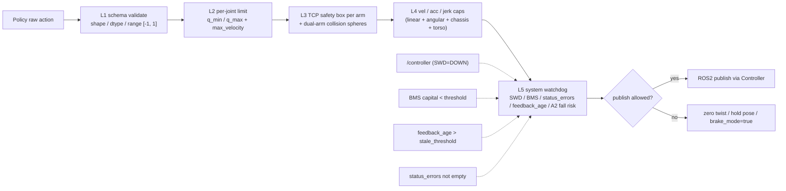

图 6.4.1:五级安全闸门流程。每级失败都会写入 `safety_info` 并被 `MetricLogger` 收集。

#### 6.4.3 三级停机

| 等级 | 触发条件 | 动作 |
|---|---|---|
| Soft Hold | 单步 action 越界、单帧 stale、单次错误码 | 当前步发零速 / 保持当前 pose,继续下一步 |
| Safe Stop | SWD=DOWN、BMS < threshold、heartbeat timeout、双臂迫近 collision | `apply_brake(True)` + episode `info["safe_pause"]=True`;runner 暂停下次 reset 等 `RLINF_SAFETY_ACK=1` |
| Emergency Stop | 硬急停按钮、连续错误码、失控运动 | 立即 `shutdown()` 控制器;runner 写 incident report 并 `sys.exit` |

#### 6.4.4 SafetySupervisor API 与代码骨架

```python
# rlinf/envs/realworld/galaxear/r1_pro_safety.py  (新增)

from __future__ import annotations

import time
from dataclasses import dataclass, field
from typing import Optional

import numpy as np

from .r1_pro_robot_state import GalaxeaR1ProRobotState


@dataclass
class SafetyConfig:
    """Hard limits + watchdog thresholds for R1 Pro."""

    # L2: per-joint limits (right arm; left arm symmetric)
    arm_q_min: np.ndarray = field(default_factory=lambda: np.array(
        [-2.7, -1.8, -2.7, -3.0, -2.7, -0.1, -2.7]))
    arm_q_max: np.ndarray = field(default_factory=lambda: np.array(
        [ 2.7,  1.8,  2.7,  0.0,  2.7,  3.7,  2.7]))
    arm_qvel_max: np.ndarray = field(default_factory=lambda: np.array(
        [3.0, 3.0, 3.0, 3.0, 5.0, 5.0, 5.0]))

    # L3: per-arm TCP safety box (xyz + rpy in torso_link4 frame)
    right_ee_min: np.ndarray = field(default_factory=lambda: np.array(
        [0.20, -0.35, 0.05, -3.20, -0.30, -0.30]))
    right_ee_max: np.ndarray = field(default_factory=lambda: np.array(
        [0.65,  0.35, 0.65,  3.20,  0.30,  0.30]))
    left_ee_min: np.ndarray = field(default_factory=lambda: np.array(
        [0.20, -0.35, 0.05, -3.20, -0.30, -0.30]))
    left_ee_max: np.ndarray = field(default_factory=lambda: np.array(
        [0.65,  0.35, 0.65,  3.20,  0.30,  0.30]))

    # L3: dual-arm collision sphere model
    dual_arm_collision_enable: bool = True
    dual_arm_sphere_radius_m: float = 0.08
    dual_arm_min_distance_m: float = 0.05

    # L4: velocity / acceleration caps
    max_linear_step_m: float = 0.05
    max_angular_step_rad: float = 0.20
    torso_v_x_max: float = 0.10
    torso_v_z_max: float = 0.10
    torso_w_pitch_max: float = 0.30
    torso_w_yaw_max: float = 0.30
    chassis_v_x_max: float = 0.60
    chassis_v_y_max: float = 0.60
    chassis_w_z_max: float = 1.50
    chassis_acc_x_max: float = 1.0
    chassis_acc_y_max: float = 0.5
    chassis_acc_w_max: float = 0.8

    # L5: watchdog
    bms_low_battery_threshold_pct: float = 25.0
    feedback_stale_threshold_ms: float = 200.0
    operator_heartbeat_timeout_ms: float = 1500.0
    a2_fall_risk_pct: float = 30.0   # below this BMS, force conservative pose
    estop_swd_value_down: bool = True


@dataclass
class SafetyInfo:
    """Per-step audit record produced by validate()."""
    raw_action: np.ndarray
    safe_action: np.ndarray
    clipped: bool = False
    soft_hold: bool = False
    safe_stop: bool = False
    emergency_stop: bool = False
    reason: list[str] = field(default_factory=list)
    metrics: dict = field(default_factory=dict)


class GalaxeaR1ProSafetySupervisor:
    """Five-level safety pipeline.

    Used inside GalaxeaR1ProEnv.step() *before* publishing to controller.
    """

    def __init__(self, cfg: SafetyConfig):
        self._cfg = cfg
        self._last_action: Optional[np.ndarray] = None
        self._last_action_time: float = 0.0
        self._operator_heartbeat_ms: float = 0.0

    def validate(
        self,
        action: np.ndarray,
        state: GalaxeaR1ProRobotState,
        action_schema: "ActionSchema",
    ) -> SafetyInfo:
        """Returns SafetyInfo with safe_action and reasons."""
        info = SafetyInfo(raw_action=action.copy(), safe_action=action.copy())

        # ── L1: schema ────────────────────────────────────────────
        if not np.all(np.isfinite(action)):
            info.safe_action = np.zeros_like(action)
            info.emergency_stop = True
            info.reason.append("L1:non-finite action")
            return info
        info.safe_action = np.clip(info.safe_action, -1.0, 1.0)
        if not np.allclose(info.safe_action, action):
            info.clipped = True
            info.reason.append("L1:clipped to [-1,1]")

        # ── L2: joint limits via predicted next q ─────────────────
        # action_schema knows how to scale [-1,1] -> ee_delta or q_delta
        # ...

        # ── L3: TCP box + dual arm spheres ────────────────────────
        if action_schema.has_right_arm:
            target = action_schema.predict_right_ee_pose(
                info.safe_action, state
            )
            target = self._clip_to_box(
                target, self._cfg.right_ee_min, self._cfg.right_ee_max,
                "L3:right_ee_box", info,
            )
            action_schema.write_right_ee_pose(info.safe_action, target)
        if action_schema.has_left_arm:
            target_l = action_schema.predict_left_ee_pose(
                info.safe_action, state
            )
            target_l = self._clip_to_box(
                target_l, self._cfg.left_ee_min, self._cfg.left_ee_max,
                "L3:left_ee_box", info,
            )
            action_schema.write_left_ee_pose(info.safe_action, target_l)
        if (
            action_schema.has_left_arm
            and action_schema.has_right_arm
            and self._cfg.dual_arm_collision_enable
        ):
            d = np.linalg.norm(
                action_schema.predict_right_ee_pose(info.safe_action, state)[:3]
                - action_schema.predict_left_ee_pose(info.safe_action, state)[:3]
            )
            if d < self._cfg.dual_arm_min_distance_m:
                info.soft_hold = True
                info.reason.append(f"L3:dual_arm_collision d={d:.3f}")

        # ── L4: velocity / acceleration caps ──────────────────────
        # bound delta_xyz / delta_rpy / chassis twist / torso twist
        # ...

        # ── L5: system watchdog ───────────────────────────────────
        bms_pct = state.bms.get("capital_pct", 100.0)
        if bms_pct < self._cfg.bms_low_battery_threshold_pct:
            info.safe_stop = True
            info.reason.append(f"L5:bms_low {bms_pct:.1f}%")
        for src, age in state.feedback_age_ms.items():
            if age > self._cfg.feedback_stale_threshold_ms:
                info.soft_hold = True
                info.reason.append(f"L5:stale {src} {age:.0f}ms")
        if state.controller_signal.get("swd", 0) and self._cfg.estop_swd_value_down:
            info.emergency_stop = True
            info.reason.append("L5:SWD=DOWN (E-stop)")
        if any(state.status_errors.values()):
            info.soft_hold = True
            info.reason.append(
                f"L5:status_errors {state.status_errors}"
            )

        # If any termination requested, freeze action
        if info.emergency_stop or info.safe_stop:
            info.safe_action = np.zeros_like(info.safe_action)

        info.metrics = {
            "safety/clip_ratio": float(info.clipped),
            "safety/soft_hold": float(info.soft_hold),
            "safety/safe_stop": float(info.safe_stop),
            "safety/emergency_stop": float(info.emergency_stop),
            "hw/bms_capital_pct": bms_pct,
        }
        return info

    def _clip_to_box(
        self, target, lo, hi, tag: str, info: SafetyInfo,
    ) -> np.ndarray:
        clipped = np.clip(target, lo, hi)
        if not np.allclose(clipped, target, atol=1e-6):
            info.clipped = True
            info.reason.append(tag)
        return clipped

    def heartbeat(self) -> None:
        """External operator UI calls this periodically.

        If skipped for > operator_heartbeat_timeout_ms, escalate to Safe Stop.
        """
        self._operator_heartbeat_ms = time.monotonic() * 1000.0
```

#### 6.4.5 与 Franka 的对比

| 维度 | Franka(`FrankaEnv._clip_position_to_safety_box`) | R1 Pro(`GalaxeaR1ProSafetySupervisor`) |
|---|---|---|
| 形态 | 单个函数,只做 L3(xyz + rpy 窗) | 类化,5 级闸门 + 三级停机 + watchdog |
| 双臂 | 无 | 双臂独立盒 + collision sphere |
| 速度限位 | 无 | 显式 step / vel / acc / jerk 限位 |
| BMS / 急停 / 错误码 | 无 | L5 全收 |
| 输出 | clipped position | `SafetyInfo`(原动作 / 安全动作 / 原因列表 / 指标) |

#### 6.4.6 小结

> 五级闸门保证"任何被发布的 action 都是安全的",三级停机定义"出问题之后系统怎么收场"。这两件事没分清是大多数真机方案出事故的根本原因,本节通过 `SafetyInfo` 数据结构把它们统一。

---

### 6.5 相机多路径:ROS2Camera + GalaxeaR1ProCameraMux

**新增文件**:
- [rlinf/envs/realworld/common/camera/ros2_camera.py](rlinf/envs/realworld/common/camera/ros2_camera.py) — 通用 ROS2 相机
- [rlinf/envs/realworld/galaxear/r1_pro_camera_mux.py](rlinf/envs/realworld/galaxear/r1_pro_camera_mux.py) — R1 Pro 相机多路径 Mux
- 修改 [rlinf/envs/realworld/common/camera/__init__.py](rlinf/envs/realworld/common/camera/__init__.py) 增加 `ros2` 分支

#### 6.5.1 设计目标

- **每路独立选 backend**:腕部 D405 默认 USB 直连(`backend=usb_direct` → `RealSenseCamera`),头部默认 ROS2(`backend=ros2` → `ROS2Camera`),底盘相机若使用也走 ROS2。
- **跨路径软同步**:USB 帧 ~ 2-5 ms 陈旧,ROS2 帧 ~ 12-25 ms 陈旧,Mux 顶层 `get_frames(soft_sync_window_ms=33)` 一次性返回近似时间戳对齐的字典。
- **Frame age 监控**:每帧附 `frame_age_ms` 字段,落到 `camera/{name}_frame_age_p95_ms` 指标。
- **优雅降级**:腕部 USB 连续 N 次超时即可自动 fallback 到 ROS2 topic(`fallback_to_ros2_on_usb_drop`),不影响训练。
- **`is_dummy` 完全 mock**:Mux 在 `is_dummy=True` 时不创建任何 BaseCamera 实例,`get_frames()` 返回零矩阵字典。

#### 6.5.2 决策树

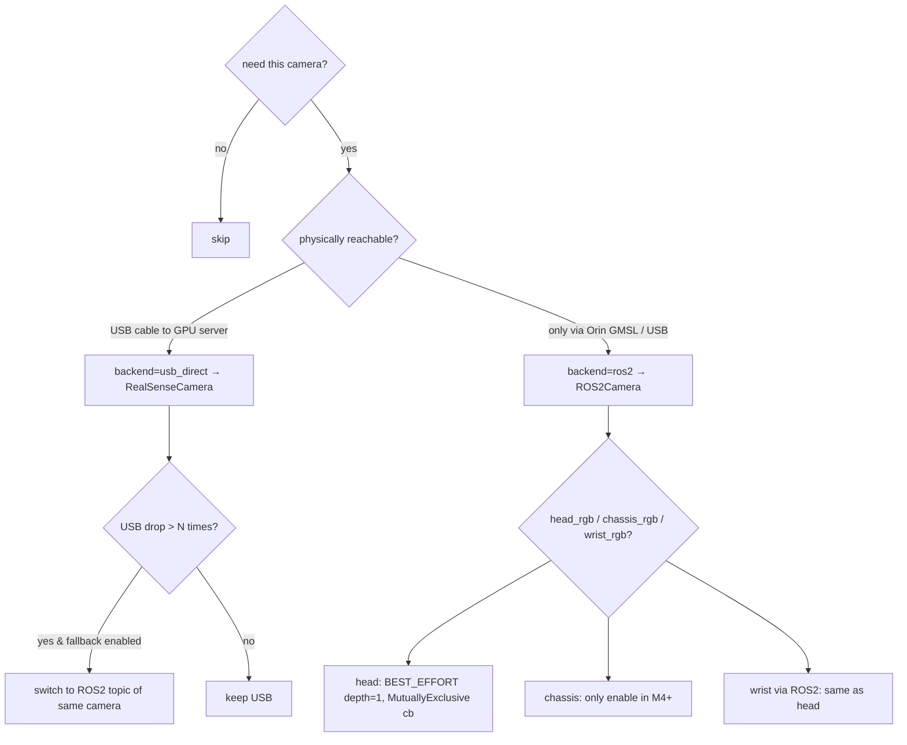

图 6.5.1:每路相机的 backend 决策树。

#### 6.5.3 ROS2Camera 类设计

继承 `BaseCamera`(线程模型 + 最新帧队列),与 [rlinf/envs/realworld/common/camera/realsense_camera.py](rlinf/envs/realworld/common/camera/realsense_camera.py) 同级。

```python
# rlinf/envs/realworld/common/camera/ros2_camera.py  (新增)

from __future__ import annotations

import time
from typing import Optional

import numpy as np

from .base_camera import BaseCamera, CameraInfo


class ROS2Camera(BaseCamera):
    """Camera capture from a ROS 2 image topic (compressed RGB or 16UC1 depth).

    Designed for cross-host subscription: instantiated on the GPU server
    while images are published from the Orin via DDS.  The frame buffer
    keeps only the latest frame and reports `frame_age_ms` for soft-sync.
    """

    def __init__(self, camera_info: CameraInfo):
        super().__init__(camera_info)
        # ROS2 deferred import: allows this module to be imported in
        # is_dummy=True without rclpy installed.
        self._rgb_topic: str = (camera_info.rgb_topic or camera_info.serial_number
                                or "")
        self._depth_topic: Optional[str] = camera_info.depth_topic
        assert self._rgb_topic, "ROS2Camera requires rgb_topic"

        self._enable_depth = (
            camera_info.enable_depth and bool(self._depth_topic)
        )
        self._latest_rgb: Optional[np.ndarray] = None
        self._latest_depth: Optional[np.ndarray] = None
        self._latest_rgb_stamp: Optional[float] = None
        self._latest_depth_stamp: Optional[float] = None
        self._stale_threshold_ms: float = camera_info.stale_threshold_ms

        self._node = None
        self._executor = None
        self._spin_thread = None
        self._open_ros2()

    # ── ROS2 init ────────────────────────────────────────────────
    def _open_ros2(self) -> None:
        import threading
        import rclpy
        from rclpy.executors import SingleThreadedExecutor
        from rclpy.qos import qos_profile_sensor_data
        from sensor_msgs.msg import CompressedImage, Image

        if not rclpy.ok():
            rclpy.init(args=[])
        self._node = rclpy.create_node(
            f"ros2_camera_{self._camera_info.name}_{id(self)}"
        )
        self._executor = SingleThreadedExecutor()
        self._executor.add_node(self._node)

        # RGB: prefer CompressedImage if topic ends with /compressed
        if self._rgb_topic.endswith("/compressed"):
            self._node.create_subscription(
                CompressedImage, self._rgb_topic,
                self._on_rgb_compressed, qos_profile_sensor_data,
            )
        else:
            self._node.create_subscription(
                Image, self._rgb_topic,
                self._on_rgb_raw, qos_profile_sensor_data,
            )
        if self._enable_depth:
            self._node.create_subscription(
                Image, self._depth_topic,
                self._on_depth, qos_profile_sensor_data,
            )

        self._spin_running = True
        self._spin_thread = threading.Thread(
            target=self._spin_loop, daemon=True
        )
        self._spin_thread.start()

    def _spin_loop(self) -> None:
        try:
            while self._spin_running:
                self._executor.spin_once(timeout_sec=0.05)
        except Exception:
            pass

    def _on_rgb_compressed(self, msg) -> None:
        # Try PyTurboJPEG first (faster), fall back to cv2.
        try:
            from turbojpeg import TurboJPEG
            if not hasattr(self, "_jpeg"):
                self._jpeg = TurboJPEG()
            arr = self._jpeg.decode(bytes(msg.data))  # BGR
        except Exception:
            import cv2
            buf = np.frombuffer(msg.data, dtype=np.uint8)
            arr = cv2.imdecode(buf, cv2.IMREAD_COLOR)
        self._latest_rgb = arr
        self._latest_rgb_stamp = (
            msg.header.stamp.sec + msg.header.stamp.nanosec * 1e-9
        )

    def _on_rgb_raw(self, msg) -> None:
        arr = np.frombuffer(msg.data, dtype=np.uint8).reshape(
            msg.height, msg.width, -1
        )
        # Most R1 Pro raw image topics are bgr8 / rgb8.
        if msg.encoding == "rgb8":
            arr = arr[:, :, ::-1].copy()
        self._latest_rgb = arr
        self._latest_rgb_stamp = (
            msg.header.stamp.sec + msg.header.stamp.nanosec * 1e-9
        )

    def _on_depth(self, msg) -> None:
        if msg.encoding == "16UC1":
            arr = np.frombuffer(msg.data, dtype=np.uint16).reshape(
                msg.height, msg.width
            )
        elif msg.encoding == "32FC1":
            arr = np.frombuffer(msg.data, dtype=np.float32).reshape(
                msg.height, msg.width
            )
            arr = (arr * 1000.0).clip(0, 65535).astype(np.uint16)
        else:
            return
        self._latest_depth = arr
        self._latest_depth_stamp = (
            msg.header.stamp.sec + msg.header.stamp.nanosec * 1e-9
        )

    # ── BaseCamera contract ─────────────────────────────────────
    def _read_frame(self) -> tuple[bool, Optional[np.ndarray]]:
        if self._latest_rgb is None:
            return False, None
        rgb = self._latest_rgb
        if self._enable_depth and self._latest_depth is not None:
            depth = np.expand_dims(self._latest_depth, axis=2)
            return True, np.concatenate([rgb, depth], axis=-1)
        return True, rgb

    def _close_device(self) -> None:
        self._spin_running = False
        if self._spin_thread is not None:
            self._spin_thread.join(timeout=1.0)
        try:
            if self._executor is not None:
                self._executor.shutdown()
            if self._node is not None:
                self._node.destroy_node()
        except Exception:
            pass

    # ── Frame age helper for Mux ────────────────────────────────
    def get_frame_age_ms(self) -> float:
        if self._latest_rgb_stamp is None:
            return float("inf")
        return (time.time() - self._latest_rgb_stamp) * 1000.0
```

`CameraInfo` 在 [base_camera.py](rlinf/envs/realworld/common/camera/base_camera.py) 需要扩字段(向后兼容,默认值不变 Franka 行为):

```python
@dataclass
class CameraInfo:
    name: str
    serial_number: str = ""               # 已有,USB 路径用
    camera_type: str = "realsense"        # 已有,与 backend 等价但保留
    resolution: tuple[int, int] = (640, 480)
    fps: int = 15
    enable_depth: bool = False
    # ── 新增字段(向后兼容,默认空) ──
    backend: str = "usb_direct"           # "usb_direct" | "ros2"
    rgb_topic: Optional[str] = None       # backend=="ros2" 必填
    depth_topic: Optional[str] = None
    stale_threshold_ms: float = 200.0
    align_depth_to_color: bool = True
```

[rlinf/envs/realworld/common/camera/__init__.py](rlinf/envs/realworld/common/camera/__init__.py) 工厂扩展:

```python
def create_camera(camera_info: CameraInfo) -> BaseCamera:
    backend = (camera_info.backend or "").lower()
    camera_type = camera_info.camera_type.lower()
    if backend == "ros2" or camera_type == "ros2":
        from .ros2_camera import ROS2Camera
        return ROS2Camera(camera_info)
    if camera_type == "zed":
        from .zed_camera import ZEDCamera
        return ZEDCamera(camera_info)
    if camera_type in ("realsense", "rs"):
        return RealSenseCamera(camera_info)
    raise ValueError(
        f"Unsupported camera: backend={backend!r}, type={camera_type!r}"
    )
```

#### 6.5.4 GalaxeaR1ProCameraMux

```python
# rlinf/envs/realworld/galaxear/r1_pro_camera_mux.py  (新增)

from __future__ import annotations

import time
from dataclasses import dataclass, field
from typing import Optional

import cv2
import numpy as np

from rlinf.envs.realworld.common.camera import (
    BaseCamera, CameraInfo, create_camera,
)
from rlinf.scheduler.hardware.robots.galaxea_r1_pro import CameraSpec


@dataclass
class CameraMuxConfig:
    cameras: list[CameraSpec] = field(default_factory=list)
    image_size: tuple[int, int] = (128, 128)
    soft_sync_window_ms: int = 33
    align_strategy: str = "latest"        # "latest" | "sync_window"
    fallback_to_ros2_on_usb_drop: bool = True
    usb_drop_consecutive_threshold: int = 3
    is_dummy: bool = False


class GalaxeaR1ProCameraMux:
    """Manages USB-direct + ROS2 cameras with soft-sync and fallback."""

    def __init__(self, cfg: CameraMuxConfig):
        self._cfg = cfg
        self._cameras: dict[str, BaseCamera] = {}
        self._fallback_topics: dict[str, str] = {}
        self._usb_drop_counters: dict[str, int] = {}
        if cfg.is_dummy:
            return
        for spec in cfg.cameras:
            self._cameras[spec.name] = self._build_one(spec)
            self._cameras[spec.name].open()
            if spec.backend == "usb_direct":
                self._fallback_topics[spec.name] = self._derive_fallback(spec)
                self._usb_drop_counters[spec.name] = 0

    def _build_one(self, spec: CameraSpec) -> BaseCamera:
        info = CameraInfo(
            name=spec.name,
            serial_number=spec.serial_number or "",
            camera_type="realsense" if spec.backend == "usb_direct" else "ros2",
            resolution=spec.resolution,
            fps=spec.fps,
            enable_depth=spec.enable_depth,
            backend=spec.backend,
            rgb_topic=spec.rgb_topic,
            depth_topic=spec.depth_topic,
            stale_threshold_ms=spec.stale_threshold_ms,
            align_depth_to_color=spec.align_depth_to_color,
        )
        return create_camera(info)

    def _derive_fallback(self, spec: CameraSpec) -> str:
        # Convention: usb wrist_left -> /hdas/camera_wrist_left/...
        return f"/hdas/camera_{spec.name}/color/image_raw/compressed"

    def get_frames(
        self,
        soft_sync_window_ms: Optional[int] = None,
    ) -> dict[str, np.ndarray]:
        """Returns {name: HxWx{3,4} uint8/uint16}.  Each frame is
        center-cropped + resized to cfg.image_size for 3-channel RGB
        path, or expanded with depth as the 4th channel.
        """
        if self._cfg.is_dummy:
            target_h, target_w = self._cfg.image_size
            return {
                spec.name: np.zeros((target_h, target_w, 3), np.uint8)
                for spec in self._cfg.cameras
            }
        win = soft_sync_window_ms or self._cfg.soft_sync_window_ms
        out: dict[str, np.ndarray] = {}
        ages: dict[str, float] = {}
        for name, cam in list(self._cameras.items()):
            try:
                frame = cam.get_frame(timeout=5)
                age_ms = self._get_age_ms(cam)
                if age_ms > cam._camera_info.stale_threshold_ms:
                    self._note_stale(name)
                    continue
                ages[name] = age_ms
                out[name] = self._postprocess(frame)
            except Exception:
                self._note_stale(name)
                continue

        # Optional sync_window enforcement (diagnostic only, never block)
        if self._cfg.align_strategy == "sync_window" and ages:
            t_max = max(ages.values())
            for name, age in ages.items():
                if (t_max - age) > win:
                    # mark as out-of-window in metrics; still keep latest
                    pass
        return out

    def _postprocess(self, frame: np.ndarray) -> np.ndarray:
        h, w = frame.shape[:2]
        crop = min(h, w)
        sx = (w - crop) // 2
        sy = (h - crop) // 2
        cropped = frame[sy:sy + crop, sx:sx + crop]
        target_h, target_w = self._cfg.image_size
        if cropped.shape[2] == 3:
            return cv2.resize(cropped, (target_w, target_h))
        rgb = cv2.resize(cropped[:, :, :3], (target_w, target_h))
        depth = cv2.resize(
            cropped[:, :, 3:],
            (target_w, target_h),
            interpolation=cv2.INTER_NEAREST,
        )
        return np.concatenate([rgb, depth], axis=-1)

    def _get_age_ms(self, cam: BaseCamera) -> float:
        if hasattr(cam, "get_frame_age_ms"):
            return cam.get_frame_age_ms()
        # USB direct: assume ≤ 5 ms (RealSense aligned frame is recent)
        return 5.0

    def _note_stale(self, name: str) -> None:
        if name not in self._usb_drop_counters:
            return  # not a USB camera
        self._usb_drop_counters[name] += 1
        if (
            self._cfg.fallback_to_ros2_on_usb_drop
            and self._usb_drop_counters[name]
                >= self._cfg.usb_drop_consecutive_threshold
        ):
            self._switch_to_ros2(name)

    def _switch_to_ros2(self, name: str) -> None:
        topic = self._fallback_topics.get(name)
        if not topic:
            return
        try:
            self._cameras[name].close()
        except Exception:
            pass
        info = CameraInfo(
            name=name, serial_number="", camera_type="ros2",
            resolution=(640, 480), fps=15, enable_depth=False,
            backend="ros2", rgb_topic=topic,
        )
        self._cameras[name] = create_camera(info)
        self._cameras[name].open()
        self._usb_drop_counters[name] = 0

    def close(self) -> None:
        for cam in self._cameras.values():
            try:
                cam.close()
            except Exception:
                pass
        self._cameras.clear()
```

#### 6.5.5 跨路径软同步窗时序

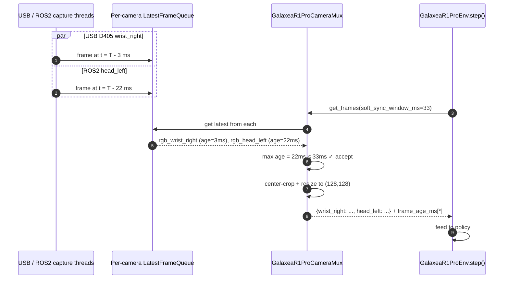

图 6.5.2:跨路径软同步窗时序。

#### 6.5.6 双路径延迟对比表

| 阶段 | USB 直连(D405 wrist) | ROS2(head GMSL via Orin) |
|---|---|---|
| 传感器曝光 / 读出 | 5-10 ms | 5-10 ms |
| ASIC / 驱动处理 | 2-5 ms(片上深度) | 3-8 ms(`signal_camera_node`) |
| 传输 | < 0.01 ms(USB AOC) | JPEG 编码 2-5 ms + DDS 1-3 ms + GbE 1-5 ms + DDS 反序列化 1-3 ms |
| 解码 | 1-2 ms(SDK 帧组装) | JPEG 解码 2-5 ms |
| **额外处理 p50** | **3-7 ms** | **10-26 ms** |
| **额外处理 p95** | **5-10 ms** | **20-40 ms** |

#### 6.5.7 头部 GMSL 直连(可选 PoC,不进入 MVP)

> 头部相机 Galaxea 没公开品牌型号(竞品 `r1proCamDirect1Op46` 错认为 ZED 2 已被 `r1proCamDirect2Op46` 修正)。GMSL → USB 适配器 / GMSL → PCIe 解串器卡是潜在选项,但需要先确认 GMSL 版本(GMSL1/2)、解串器芯片、Linux 驱动可达性、是否影响保修。本方案把这条路径标为"M5+ 增强",只在 MVP 之后再启动 PoC。

#### 6.5.8 dummy 行为

`is_dummy=True` 时:

- `GalaxeaR1ProCameraMux` 不创建任何 `BaseCamera` 实例(完全 mock);
- `get_frames()` 返回 `np.zeros((H, W, 3), np.uint8)` 字典;
- `frame_age_ms` 字典所有值为 0;
- 不需要装 `pyrealsense2 / rclpy / cv_bridge / PyTurboJPEG`,CI runner 通过。

#### 6.5.9 小结

> CameraMux 是本方案最重要的相机抽象。它把"双路径"封装在一处,EnvWorker 只看到一个 `get_frames()` 字典接口;真机现场可以根据 USB 状态动态切换 backend,而上层策略代码完全不感知。

---

### 6.6 环境主类:GalaxeaR1ProEnv

**新增文件**:[rlinf/envs/realworld/galaxear/r1_pro_env.py](rlinf/envs/realworld/galaxear/r1_pro_env.py)

#### 6.6.1 设计原则

签名严格对齐 [rlinf/envs/realworld/franka/franka_env.py](rlinf/envs/realworld/franka/franka_env.py) 的 `FrankaEnv.__init__(override_cfg, worker_info, hardware_info, env_idx)`,从而能被 [rlinf/envs/realworld/realworld_env.py](rlinf/envs/realworld/realworld_env.py) 的 `_create_env(env_idx)` 通过 `gym.make(id, override_cfg=..., worker_info=..., hardware_info=..., env_idx=...)` 创建。

#### 6.6.2 GalaxeaR1ProRobotConfig

```python
# rlinf/envs/realworld/galaxear/r1_pro_env.py  (新增,只展示 dataclass)

from __future__ import annotations
from dataclasses import dataclass, field
from typing import Any, Optional
import numpy as np


@dataclass
class GalaxeaR1ProRobotConfig:
    # ── Stage flags ───────────────────────────────────────────────
    use_left_arm: bool = False
    use_right_arm: bool = True
    use_torso: bool = False
    use_chassis: bool = False
    no_gripper: bool = False

    # ── Hardware ─────────────────────────────────────────────────
    is_dummy: bool = False
    robot_ip: Optional[str] = None
    ros_domain_id: int = 72
    ros_localhost_only: bool = False
    galaxea_install_path: str = "~/galaxea/install"
    mobiman_launch_mode: str = "pose"      # "pose" | "joint"

    # ── Cameras (mux config) ─────────────────────────────────────
    cameras: list[dict] = field(default_factory=list)
    image_size: tuple[int, int] = (128, 128)
    soft_sync_window_ms: int = 33
    align_strategy: str = "latest"
    fallback_to_ros2_on_usb_drop: bool = True

    # ── Control ──────────────────────────────────────────────────
    step_frequency: float = 10.0
    action_scale: np.ndarray = field(
        default_factory=lambda: np.array([0.05, 0.10, 1.0])
    )
    binary_gripper_threshold: float = 0.5
    enable_camera_player: bool = False

    # ── Targets / resets ─────────────────────────────────────────
    target_ee_pose_right: np.ndarray = field(default_factory=lambda: np.array(
        [0.45, -0.10, 0.30, -3.14, 0.0, 0.0]))
    target_ee_pose_left: Optional[np.ndarray] = None
    reset_ee_pose_right: np.ndarray = field(default_factory=lambda: np.array(
        [0.35, -0.10, 0.45, -3.14, 0.0, 0.0]))
    reset_ee_pose_left: Optional[np.ndarray] = None
    joint_reset_qpos_right: list[float] = field(default_factory=lambda: [
        0.0, 0.3, 0.0, -1.8, 0.0, 2.1, 0.0])
    joint_reset_qpos_left: Optional[list[float]] = None
    max_num_steps: int = 120
    success_hold_steps: int = 5

    # ── Reward ───────────────────────────────────────────────────
    use_dense_reward: bool = False
    reward_scale: float = 1.0
    reward_threshold: np.ndarray = field(default_factory=lambda: np.array(
        [0.02, 0.02, 0.02, 0.20, 0.20, 0.20]))
    enable_gripper_penalty: bool = True
    gripper_penalty: float = 0.1

    use_reward_model: bool = False
    reward_worker_cfg: Optional[dict] = None
    reward_worker_hardware_rank: Optional[int] = None
    reward_worker_node_rank: Optional[int] = None
    reward_worker_node_group: Optional[str] = None
    reward_image_key: Optional[str] = None

    # ── Safety ────────────────────────────────────────────────────
    safety_cfg: dict = field(default_factory=dict)

    # ── Task ─────────────────────────────────────────────────────
    task_description: str = ""

    def __post_init__(self) -> None:
        for attr in ("action_scale", "target_ee_pose_right",
                     "reset_ee_pose_right", "reward_threshold"):
            v = getattr(self, attr)
            if isinstance(v, list):
                setattr(self, attr, np.array(v))
        if isinstance(self.target_ee_pose_left, list):
            self.target_ee_pose_left = np.array(self.target_ee_pose_left)
        if isinstance(self.reset_ee_pose_left, list):
            self.reset_ee_pose_left = np.array(self.reset_ee_pose_left)
```

#### 6.6.3 GalaxeaR1ProEnv 主类

```python
class GalaxeaR1ProEnv(gym.Env):
    """Gym env for Galaxea R1 Pro.

    Mirrors FrankaEnv.__init__ contract so RealWorldEnv can dispatch
    via gym.make(init_params.id, override_cfg=..., worker_info=...,
    hardware_info=..., env_idx=...).
    """

    CONFIG_CLS: type[GalaxeaR1ProRobotConfig] = GalaxeaR1ProRobotConfig
    metadata = {"render_modes": ["rgb_array"]}

    def __init__(
        self,
        override_cfg: dict[str, Any],
        worker_info: Optional["WorkerInfo"],
        hardware_info: Optional["GalaxeaR1ProHWInfo"],
        env_idx: int,
    ) -> None:
        super().__init__()
        self.config = self.CONFIG_CLS(**override_cfg)
        self._task_description = self.config.task_description
        self._logger = get_logger()
        self._worker_info = worker_info
        self._hardware_info = hardware_info
        self._env_idx = env_idx
        self._num_steps = 0
        self._success_hold_counter = 0

        self._state = GalaxeaR1ProRobotState()
        self._controller = None
        self._camera_mux = None
        self._safety: Optional[GalaxeaR1ProSafetySupervisor] = None
        self._reward_worker = None

        self._action_schema = self._build_action_schema()
        self._init_action_obs_spaces()

        if not self.config.is_dummy:
            self._setup_hardware()
            self._setup_reward_worker()
        self._install_safety_supervisor()

        if not self.config.is_dummy:
            self._wait_robot_ready(timeout=30.0)
            self._reset_to_safe_pose()

    # ── Hardware / cameras ───────────────────────────────────────
    def _setup_hardware(self) -> None:
        from .r1_pro_controller import GalaxeaR1ProController
        from .r1_pro_camera_mux import (
            GalaxeaR1ProCameraMux, CameraMuxConfig,
        )

        cfg = self.config
        # Resolve controller node rank: hardware_info wins, else env's own.
        controller_node_rank = (
            getattr(self._hardware_info.config, "controller_node_rank", None)
            if self._hardware_info is not None else None
        )
        if controller_node_rank is None and self._worker_info is not None:
            controller_node_rank = self._worker_info.cluster_node_rank

        self._controller = GalaxeaR1ProController.launch_controller(
            env_idx=self._env_idx,
            node_rank=controller_node_rank,
            worker_rank=(
                self._worker_info.rank
                if self._worker_info is not None else 0
            ),
            ros_domain_id=cfg.ros_domain_id,
            ros_localhost_only=cfg.ros_localhost_only,
            galaxea_install_path=cfg.galaxea_install_path,
            use_left_arm=cfg.use_left_arm,
            use_right_arm=cfg.use_right_arm,
            use_torso=cfg.use_torso,
            use_chassis=cfg.use_chassis,
            mobiman_launch_mode=cfg.mobiman_launch_mode,
        )

        # Build CameraSpec list from override_cfg.cameras (dict from YAML)
        cam_specs = [
            CameraSpec(**c) if isinstance(c, dict) else c
            for c in cfg.cameras
        ]
        self._camera_mux = GalaxeaR1ProCameraMux(CameraMuxConfig(
            cameras=cam_specs,
            image_size=cfg.image_size,
            soft_sync_window_ms=cfg.soft_sync_window_ms,
            align_strategy=cfg.align_strategy,
            fallback_to_ros2_on_usb_drop=cfg.fallback_to_ros2_on_usb_drop,
            is_dummy=False,
        ))

    def _setup_reward_worker(self) -> None:
        if not self.config.use_reward_model:
            return
        if self.config.reward_worker_cfg is None:
            raise ValueError(
                "use_reward_model=True but reward_worker_cfg is missing."
            )
        from rlinf.workers.reward.reward_worker import EmbodiedRewardWorker
        node_rank = self.config.reward_worker_node_rank
        if node_rank is None and self._worker_info is not None:
            node_rank = self._worker_info.cluster_node_rank
        self._reward_worker = EmbodiedRewardWorker.launch_for_realworld(
            reward_cfg=self.config.reward_worker_cfg,
            node_rank=node_rank,
            node_group_label=self.config.reward_worker_node_group,
            hardware_rank=self.config.reward_worker_hardware_rank,
            env_idx=self._env_idx,
            worker_rank=(
                self._worker_info.rank
                if self._worker_info is not None else 0
            ),
        )
        self._reward_worker.init_worker().wait()

    def _install_safety_supervisor(self) -> None:
        from .r1_pro_safety import (
            GalaxeaR1ProSafetySupervisor, SafetyConfig,
        )
        merged = {**SafetyConfig().__dict__, **self.config.safety_cfg}
        self._safety = GalaxeaR1ProSafetySupervisor(SafetyConfig(**merged))

    # ── Spaces ────────────────────────────────────────────────────
    def _init_action_obs_spaces(self) -> None:
        action_dim = self._action_schema.action_dim
        self.action_space = gym.spaces.Box(
            low=-np.ones(action_dim, dtype=np.float32),
            high=np.ones(action_dim, dtype=np.float32),
        )
        # state dict
        state_dict = {}
        if self.config.use_right_arm:
            state_dict["right_arm_qpos"] = gym.spaces.Box(
                -np.inf, np.inf, shape=(7,))
            state_dict["right_ee_pose"] = gym.spaces.Box(
                -np.inf, np.inf, shape=(7,))
            state_dict["right_gripper_pos"] = gym.spaces.Box(
                0.0, 1.0, shape=(1,))
        if self.config.use_left_arm:
            state_dict["left_arm_qpos"] = gym.spaces.Box(
                -np.inf, np.inf, shape=(7,))
            state_dict["left_ee_pose"] = gym.spaces.Box(
                -np.inf, np.inf, shape=(7,))
            state_dict["left_gripper_pos"] = gym.spaces.Box(
                0.0, 1.0, shape=(1,))
        if self.config.use_torso:
            state_dict["torso_qpos"] = gym.spaces.Box(
                -np.inf, np.inf, shape=(4,))
        if self.config.use_chassis:
            state_dict["chassis_state"] = gym.spaces.Box(
                -np.inf, np.inf, shape=(6,))
        # frames dict
        frames_dict = {}
        h, w = self.config.image_size
        for spec in self.config.cameras:
            name = spec["name"] if isinstance(spec, dict) else spec.name
            ch = 4 if (
                spec["enable_depth"]
                if isinstance(spec, dict)
                else spec.enable_depth
            ) else 3
            frames_dict[name] = gym.spaces.Box(
                0, 65535, shape=(h, w, ch), dtype=np.uint8 if ch == 3 else np.uint16
            )
        self.observation_space = gym.spaces.Dict({
            "state": gym.spaces.Dict(state_dict),
            "frames": gym.spaces.Dict(frames_dict),
        })

    # ── step / reset ──────────────────────────────────────────────
    def step(self, action: np.ndarray):
        t0 = time.time()
        action = np.clip(action, -1.0, 1.0).astype(np.float32)

        # Latest snapshot for safety
        if not self.config.is_dummy:
            self._state = self._controller.get_state().wait()[0]
        sinfo = self._safety.validate(action, self._state, self._action_schema)
        safe_action = sinfo.safe_action

        if not self.config.is_dummy:
            if sinfo.emergency_stop:
                self._controller.apply_brake(True).wait()
            else:
                self._action_schema.execute(safe_action, self._state,
                                             self._controller)

        # Sleep to reach step_frequency
        elapsed = time.time() - t0
        time.sleep(max(0.0, 1.0 / self.config.step_frequency - elapsed))

        # Refresh state and assemble obs
        if not self.config.is_dummy:
            self._state = self._controller.get_state().wait()[0]
        obs = self._get_observation()

        reward = self._calc_step_reward(obs, sinfo)
        self._num_steps += 1
        terminated = (reward >= 1.0) and (
            self._success_hold_counter >= self.config.success_hold_steps
        )
        truncated = self._num_steps >= self.config.max_num_steps
        info = {
            "safety_info": sinfo.metrics,
            "safety_reasons": sinfo.reason,
            "step_count": self._num_steps,
        }
        if sinfo.safe_stop or sinfo.emergency_stop:
            info["safe_pause"] = True
            truncated = True
        return obs, reward * self.config.reward_scale, terminated, truncated, info

    def reset(self, *, seed=None, options=None):
        super().reset(seed=seed)
        self._num_steps = 0
        self._success_hold_counter = 0
        if self.config.is_dummy:
            return self._get_observation(), {}
        self._reset_to_safe_pose()
        self._state = self._controller.get_state().wait()[0]
        return self._get_observation(), {}

    # ── Reset choreography (A2 no-brake aware) ───────────────────
    def _reset_to_safe_pose(self) -> None:
        cfg = self.config
        # 1. BMS check
        bms = self._state.bms.get("capital_pct", 100.0)
        if bms < self._safety._cfg.bms_low_battery_threshold_pct:
            self._logger.warning(
                "BMS=%.1f%% < threshold; entering SAFE_PAUSE before reset.",
                bms,
            )
            return
        # 2. Posture check: send arms to natural-hanging if too far
        for side, qpos in (
            ("right", cfg.joint_reset_qpos_right) if cfg.use_right_arm
                                                  else (None, None),
            ("left", cfg.joint_reset_qpos_left) if cfg.use_left_arm
                                                else (None, None),
        ):
            if side is None or qpos is None:
                continue
            ok = self._controller.go_to_rest(side, qpos, timeout_s=5.0).wait()[0]
            if not ok:
                self._controller.clear_errors(side).wait()
                ok = self._controller.go_to_rest(
                    side, qpos, timeout_s=5.0,
                ).wait()[0]
                if not ok:
                    raise RuntimeError(
                        f"Reset failed for {side} arm twice; entering FATAL"
                    )
        # 3. Optional ee-pose alignment via mobiman relaxed_ik
        if cfg.use_right_arm and cfg.reset_ee_pose_right is not None:
            self._send_pose("right", cfg.reset_ee_pose_right)
        if cfg.use_left_arm and cfg.reset_ee_pose_left is not None:
            self._send_pose("left", cfg.reset_ee_pose_left)
        if cfg.use_chassis:
            self._controller.apply_brake(True).wait()
            self._controller.send_chassis_twist(np.zeros(3)).wait()

    def _send_pose(self, side: str, ee_xyzrpy: np.ndarray) -> None:
        from scipy.spatial.transform import Rotation as R
        quat = R.from_euler("xyz", ee_xyzrpy[3:]).as_quat()
        pose = np.concatenate([ee_xyzrpy[:3], quat])
        self._controller.send_arm_pose(side, pose).wait()

    # ── Observations & rewards ────────────────────────────────────
    def _get_observation(self) -> dict:
        if self.config.is_dummy:
            return self._dummy_observation()
        frames = self._camera_mux.get_frames()
        state = self._build_state_dict()
        return {"state": state, "frames": frames}

    def _build_state_dict(self) -> dict:
        cfg = self.config
        st = self._state
        d = {}
        if cfg.use_right_arm:
            d["right_arm_qpos"] = st.right_arm_qpos.copy()
            d["right_ee_pose"] = st.right_ee_pose.copy()
            d["right_gripper_pos"] = np.array([st.right_gripper_pos / 100.0])
        if cfg.use_left_arm:
            d["left_arm_qpos"] = st.left_arm_qpos.copy()
            d["left_ee_pose"] = st.left_ee_pose.copy()
            d["left_gripper_pos"] = np.array([st.left_gripper_pos / 100.0])
        if cfg.use_torso:
            d["torso_qpos"] = st.torso_qpos.copy()
        if cfg.use_chassis:
            d["chassis_state"] = np.concatenate([
                st.chassis_qpos, st.chassis_qvel,
            ])
        return d

    def _dummy_observation(self) -> dict:
        return {
            "state": {
                k: np.zeros(box.shape, dtype=box.dtype)
                for k, box in self.observation_space["state"].spaces.items()
            },
            "frames": {
                k: np.zeros(box.shape, dtype=box.dtype)
                for k, box in self.observation_space["frames"].spaces.items()
            },
        }

    def _calc_step_reward(self, obs: dict, sinfo) -> float:
        # Dual-arm geometric reward: AND of per-arm distance to target
        if self.config.use_reward_model:
            return self._compute_reward_model(obs)
        if self.config.is_dummy:
            return 0.0
        success = True
        deltas = []
        if self.config.use_right_arm and self.config.target_ee_pose_right is not None:
            delta = self._delta_to_target(
                self._state.right_ee_pose,
                self.config.target_ee_pose_right,
            )
            success = success and bool(np.all(
                delta[:3] <= self.config.reward_threshold[:3]
            ))
            deltas.append(delta)
        if self.config.use_left_arm and self.config.target_ee_pose_left is not None:
            delta = self._delta_to_target(
                self._state.left_ee_pose,
                self.config.target_ee_pose_left,
            )
            success = success and bool(np.all(
                delta[:3] <= self.config.reward_threshold[:3]
            ))
            deltas.append(delta)
        if success:
            self._success_hold_counter += 1
            return 1.0
        self._success_hold_counter = 0
        if self.config.use_dense_reward and deltas:
            d = np.mean([np.sum(np.square(x[:3])) for x in deltas])
            return float(np.exp(-500 * d))
        return 0.0

    def _delta_to_target(
        self, ee_pose_xyzquat: np.ndarray, target_xyzrpy: np.ndarray,
    ) -> np.ndarray:
        from scipy.spatial.transform import Rotation as R
        cur_xyz = ee_pose_xyzquat[:3]
        cur_euler = np.abs(
            R.from_quat(ee_pose_xyzquat[3:].copy()).as_euler("xyz")
        )
        cur = np.concatenate([cur_xyz, cur_euler])
        return np.abs(cur - target_xyzrpy)

    def _compute_reward_model(self, obs: dict) -> float:
        if self._reward_worker is None:
            raise RuntimeError("Reward worker not initialized.")
        frames = obs.get("frames", {})
        key = self.config.reward_image_key or sorted(frames.keys())[0]
        if key not in frames:
            raise KeyError(
                f"reward_image_key {key!r} missing; have {list(frames.keys())}"
            )
        batch = np.expand_dims(frames[key], axis=0)
        out = self._reward_worker.compute_image_rewards(batch).wait()[0]
        if hasattr(out, "detach"):
            out = out.detach().cpu().numpy()
        r = float(np.asarray(out).reshape(-1)[0])
        if r >= 1.0:
            self._success_hold_counter += 1
        else:
            self._success_hold_counter = 0
        return r

    @property
    def task_description(self) -> str:
        return self._task_description

    def close(self) -> None:
        try:
            if self._camera_mux is not None:
                self._camera_mux.close()
            if self._controller is not None:
                self._controller.shutdown().wait()
        except Exception:
            pass

    # ── Helpers ──────────────────────────────────────────────────
    def _wait_robot_ready(self, timeout: float = 30.0) -> None:
        start = time.time()
        while time.time() - start < timeout:
            if self._controller.is_robot_up().wait()[0]:
                return
            time.sleep(0.5)
        self._logger.warning(
            "Timed out waiting for R1 Pro state topics; continuing anyway."
        )

    def _build_action_schema(self) -> "ActionSchema":
        from .r1_pro_action_schema import build_action_schema
        return build_action_schema(self.config)
```

#### 6.6.4 Action schema 抽象

为了让 SafetySupervisor 与 step() 都不写死 7D / 14D / 18D 等动作维度,抽出 `ActionSchema`(写在 `r1_pro_env.py` 同目录的 `r1_pro_action_schema.py`,本节略,§8 详述):

- `action_dim: int`
- `predict_right_ee_pose(action, state) -> ee_xyzrpy_target`
- `predict_left_ee_pose(action, state) -> ee_xyzrpy_target`
- `execute(action, state, controller)`:把归一化动作分发给 controller 的各个 send_*

#### 6.6.5 与 Franka `FrankaEnv` 的关系

| 方法 | Franka | R1 Pro |
|---|---|---|
| `__init__` | `(override_cfg, worker_info, hardware_info, env_idx)` | 同 |
| `_setup_hardware` | 启 `FrankaController.launch_controller(node_rank=...)` | 启 `GalaxeaR1ProController.launch_controller(node_rank=...)` + 启 `GalaxeaR1ProCameraMux` |
| `_setup_reward_worker` | `EmbodiedRewardWorker.launch_for_realworld` | 同 |
| `_clip_position_to_safety_box` | 内部函数 | 提到 `GalaxeaR1ProSafetySupervisor` |
| `step` | clip → action → publish → sleep | clip → SafetySupervisor → ActionSchema.execute → sleep,记录 `safety_info` 到 `info` |
| `reset` | `clear_errors + go_to_rest` | reset choreography(BMS / 姿态 / clear / mobiman pose / brake) |
| `_calc_step_reward` | 单臂目标 | 双臂 AND + reward model + reward_threshold 双键 |
| `_get_observation` | `_get_camera_frames` + state dict | `GalaxeaR1ProCameraMux.get_frames` + `_build_state_dict` |
| `close` | 关相机 | 关 mux + 关 controller |

#### 6.6.6 小结

> `GalaxeaR1ProEnv` 把 §6.1-6.5 的所有模块组合成一个标准 `gym.Env`,签名与 `FrankaEnv` 完全一致,无侵入接入 `RealWorldEnv._create_env`。

---

### 6.7 任务子目录:tasks/

**新增目录**:[rlinf/envs/realworld/galaxear/tasks/](rlinf/envs/realworld/galaxear/tasks/)

#### 6.7.1 文件清单与 Gym ID

| 文件 | 类 | Gym id | 阶段 |
|---|---|---|---|
| `r1_pro_single_arm_reach.py` | `GalaxeaR1ProSingleArmReachEnv` | `GalaxeaR1ProSingleArmReach-v1` | M1 bring-up |
| `r1_pro_pick_place.py` | `GalaxeaR1ProPickPlaceEnv` | `GalaxeaR1ProPickPlace-v1` | M1 桌面 |
| `r1_pro_dual_arm_handover.py` | `GalaxeaR1ProDualArmHandoverEnv` | `GalaxeaR1ProDualArmHandover-v1` | M2 |
| `r1_pro_dual_arm_cap_tighten.py` | `GalaxeaR1ProDualArmCapTightenEnv` | `GalaxeaR1ProDualArmCapTighten-v1` | M2 备选 |
| `r1_pro_whole_body_cleanup.py` | `GalaxeaR1ProWholeBodyCleanupEnv` | `GalaxeaR1ProWholeBodyCleanup-v1` | M3 |
| `r1_pro_mobile_manipulation.py` | `GalaxeaR1ProMobileManipulationEnv` | `GalaxeaR1ProMobileManipulation-v1` | M4 |

#### 6.7.2 注册风格

```python
# rlinf/envs/realworld/galaxear/tasks/__init__.py  (新增)

from gymnasium.envs.registration import register

from .r1_pro_single_arm_reach import GalaxeaR1ProSingleArmReachEnv
from .r1_pro_pick_place import GalaxeaR1ProPickPlaceEnv
from .r1_pro_dual_arm_handover import GalaxeaR1ProDualArmHandoverEnv
from .r1_pro_dual_arm_cap_tighten import GalaxeaR1ProDualArmCapTightenEnv
from .r1_pro_whole_body_cleanup import GalaxeaR1ProWholeBodyCleanupEnv
from .r1_pro_mobile_manipulation import GalaxeaR1ProMobileManipulationEnv

register(
    id="GalaxeaR1ProSingleArmReach-v1",
    entry_point=(
        "rlinf.envs.realworld.galaxear.tasks.r1_pro_single_arm_reach"
        ":GalaxeaR1ProSingleArmReachEnv"
    ),
)
register(
    id="GalaxeaR1ProPickPlace-v1",
    entry_point=(
        "rlinf.envs.realworld.galaxear.tasks.r1_pro_pick_place"
        ":GalaxeaR1ProPickPlaceEnv"
    ),
)
# ... 其它同构 ...

__all__ = [
    "GalaxeaR1ProSingleArmReachEnv",
    "GalaxeaR1ProPickPlaceEnv",
    "GalaxeaR1ProDualArmHandoverEnv",
    "GalaxeaR1ProDualArmCapTightenEnv",
    "GalaxeaR1ProWholeBodyCleanupEnv",
    "GalaxeaR1ProMobileManipulationEnv",
]
```

任务类继承 `GalaxeaR1ProEnv`,只重写 `_calc_step_reward / _check_done / task_description`,不改结构。

#### 6.7.3 任务示例:GalaxeaR1ProPickPlaceEnv

```python
# rlinf/envs/realworld/galaxear/tasks/r1_pro_pick_place.py  (新增)

from dataclasses import dataclass, field
import numpy as np
from rlinf.envs.realworld.galaxear.r1_pro_env import (
    GalaxeaR1ProEnv, GalaxeaR1ProRobotConfig,
)


@dataclass
class GalaxeaR1ProPickPlaceConfig(GalaxeaR1ProRobotConfig):
    use_right_arm: bool = True
    no_gripper: bool = False
    pick_position: np.ndarray = field(default_factory=lambda: np.array(
        [0.45, -0.10, 0.18]))
    place_position: np.ndarray = field(default_factory=lambda: np.array(
        [0.45, 0.10, 0.30]))
    object_width_m: float = 0.05
    max_num_steps: int = 200


class GalaxeaR1ProPickPlaceEnv(GalaxeaR1ProEnv):
    CONFIG_CLS = GalaxeaR1ProPickPlaceConfig
    PHASES = ("approach", "grasp", "lift", "place")

    def __init__(self, override_cfg, worker_info=None,
                 hardware_info=None, env_idx=0):
        super().__init__(override_cfg, worker_info, hardware_info, env_idx)
        self._phase = "approach"

    @property
    def task_description(self) -> str:
        return "Pick the cube on the table and place it onto the bowl."

    def _calc_step_reward(self, obs: dict, sinfo) -> float:
        # Sparse phased reward like FrankaEnv but per-phase boundaries
        # use ee xy distance + gripper close + height.
        # ... details elided ...
        return 0.0

    def reset(self, *, seed=None, options=None):
        self._phase = "approach"
        return super().reset(seed=seed, options=options)
```

> 工程提示:任务子类只持有 `_phase / _step_count_in_phase` 等任务级状态;一切控制 / 安全 / 相机都委托给基类。

#### 6.7.4 小结

> 把每个任务做成一个独立小文件,保证未来加新任务只动 [tasks/](rlinf/envs/realworld/galaxear/tasks/) 目录。

---

### 6.8 Galaxea 专属 Wrappers

**新增文件**:[rlinf/envs/realworld/galaxear/r1_pro_wrappers.py](rlinf/envs/realworld/galaxear/r1_pro_wrappers.py)

#### 6.8.1 类清单

```python
# rlinf/envs/realworld/galaxear/r1_pro_wrappers.py  (新增)

import gymnasium as gym
import numpy as np


class GalaxeaR1ProJoystickIntervention(gym.ActionWrapper):
    """Replace policy action with joystick action when SWA/B/C trigger.

    Subscribes to /controller (deferred rclpy import).  When
    intervene = True, info['intervene_action'] = chosen action; when
    SWD = DOWN, raise SAFE_PAUSE.
    """
    # ... contract identical to GelloIntervention ...


class GalaxeaR1ProVRIntervention(gym.ActionWrapper):
    """Replace policy action with R1 Pro VR teleop hand pose deltas.

    Subscribes to R1 Pro SDK VR teleop topics (e.g.
    /vr_teleop/left_hand, /vr_teleop/right_hand).  Falls back to
    no-op when topics absent.  Mirrors GelloIntervention's
    info['intervene_action'] semantics for HG-DAgger.
    """
    # ... details ...


class GalaxeaR1ProDualArmCollisionWrapper(gym.ActionWrapper):
    """Slow / freeze action when both ee TCPs come within slow_zone_m.

    Complements SafetySupervisor's L3 with an action-space soft penalty
    that nudges the policy away from collisions during training.
    """
    SLOW_ZONE_M: float = 0.15
    MIN_DIST_M: float = 0.08

    def action(self, action):
        # ... compute distance, scale action, pass through ...
        return action


class GalaxeaR1ProActionSmoother(gym.ActionWrapper):
    """EMA + jerk-bound smoothing for safer real robot deployment.

    alpha in [0, 1]: lower => smoother; max_delta clamps |a_t - a_{t-1}|
    per dim.  Required for π0.5 / OpenPI VLA on real hardware.
    """
    # ... details ...
```

#### 6.8.2 Wrapper 接入位置

修改 [rlinf/envs/realworld/realworld_env.py](rlinf/envs/realworld/realworld_env.py) 的 `_create_env` 不动现有 Franka 链路,只在配置驱动下追加 R1 Pro 专属 wrapper。本方案不改主链路源码,而是把 Galaxea 专属 wrapper 在 `GalaxeaR1ProEnv.__init__` 末尾按 `override_cfg` 自加:

```python
# inside GalaxeaR1ProEnv.__init__ (skeleton)
def _install_intervention_wrappers(self, env):
    if self.config.use_joystick_intervention and not self.config.is_dummy:
        env = GalaxeaR1ProJoystickIntervention(env)
    if self.config.use_vr_intervention and not self.config.is_dummy:
        env = GalaxeaR1ProVRIntervention(env)
    if self.config.use_dual_arm_collision_wrapper and self.config.use_left_arm \
       and self.config.use_right_arm:
        env = GalaxeaR1ProDualArmCollisionWrapper(env)
    if self.config.use_action_smoother:
        env = GalaxeaR1ProActionSmoother(env)
    return env
```

不过更优雅的做法是让 wrapper 注入发生在 `RealWorldEnv._create_env` 里:在 `GripperCloseEnv → SpacemouseIntervention/GelloIntervention → KeyboardRewardDoneWrapper → RelativeFrame → Quat2EulerWrapper` 链路中,根据 `cfg.get("use_galaxea_r1_pro_joystick", False)` 等开关,插入对应 wrapper。本方案给出最小侵入版本(在 RealWorldEnv 中加 4-6 行配置驱动的 wrapper 包装)。

#### 6.8.3 小结

> Galaxea 专属 wrapper 只覆盖 R1 Pro 独有(VR / 摇杆)与双臂特有(碰撞 / 平滑)逻辑;通用 wrapper(SpaceMouse / GELLO / Keyboard / RelativeFrame / Quat2Euler)直接复用 RLinf 现有实现。

---

## 7. ROS2 接口映射总表

> 以下 topic 名称依据 R1 Pro 公开文档与 ATC ROS2 SDK 的常见路径整理,实际部署前必须以现役机器人 `ros2 topic list / ros2 topic info / ros2 interface show` 输出为准。`hdas_msg` 是 Galaxea 自定义 msg 包,本方案默认通过 mobiman 上层接口避免直接依赖。

### 7.1 HDAS 反馈(订阅,EnvWorker 消费)

| RLinf 字段 | ROS2 Topic | 消息类型 | 备注 |
|---|---|---|---|
| `state.right_arm_qpos / qvel / qtau` | `/hdas/feedback_arm_right` | `sensor_msgs/JointState` | position(7) / velocity(7) / effort(7) |
| `state.left_arm_qpos / qvel / qtau` | `/hdas/feedback_arm_left` | `sensor_msgs/JointState` | 同上 |
| `state.right_gripper_pos / vel` | `/hdas/feedback_gripper_right` | `sensor_msgs/JointState` | position(0-100 mm) |
| `state.left_gripper_pos / vel` | `/hdas/feedback_gripper_left` | `sensor_msgs/JointState` | 同上 |
| `state.torso_qpos / qvel` | `/hdas/feedback_torso` | `sensor_msgs/JointState` | T1-T4(4 DoF) |
| `state.chassis_qpos / qvel` | `/hdas/feedback_chassis` | `sensor_msgs/JointState` | 3 转向轮:角度 + 驱动速度 |
| `state.imu_torso` | `/hdas/imu_torso` | `sensor_msgs/Imu` | orient(quat) + ang_vel + lin_acc |
| `state.imu_chassis` | `/hdas/imu_chassis` | `sensor_msgs/Imu` | 同上 |
| `state.bms` | `/hdas/bms` | `hdas_msg/bms` | voltage / current / capital_pct |
| `state.controller_signal` | `/controller` | `hdas_msg/controller_signal_stamped` | SWA-D 拨杆 + 摇杆 |
| `state.status_errors[right]` | `/hdas/feedback_status_arm_right` | `hdas_msg/feedback_status` | 错误码列表 |
| `state.status_errors[left]` | `/hdas/feedback_status_arm_left` | `hdas_msg/feedback_status` | 同上 |

### 7.2 mobiman 控制(发布,Controller 输出)

| 用途 | ROS2 Topic | 消息类型 | 推荐阶段 |
|---|---|---|---|
| 右臂末端 pose | `/motion_target/target_pose_arm_right` | `geometry_msgs/PoseStamped` | M1+ |
| 左臂末端 pose | `/motion_target/target_pose_arm_left` | `geometry_msgs/PoseStamped` | M2+ |
| 右臂关节目标(reset / joint mode) | `/motion_target/target_joint_state_arm_right` | `sensor_msgs/JointState` | M1+(只 reset) |
| 左臂关节目标 | `/motion_target/target_joint_state_arm_left` | `sensor_msgs/JointState` | M2+ |
| 右夹爪位置 | `/motion_target/target_position_gripper_right` | `sensor_msgs/JointState` | M1+ |
| 左夹爪位置 | `/motion_target/target_position_gripper_left` | `sensor_msgs/JointState` | M2+ |
| 躯干速度 | `/motion_target/target_speed_torso` | `geometry_msgs/TwistStamped` | M3+ |
| 底盘速度 | `/motion_target/target_speed_chassis` | `geometry_msgs/Twist` | M4+ |
| 底盘加速度限制 | `/motion_target/chassis_acc_limit` | `geometry_msgs/Twist` | M4+(可选) |
| 底盘急停 | `/motion_target/brake_mode` | `std_msgs/Bool` | 全阶段(SafetySupervisor 安全兜底) |

### 7.3 HDAS 内部反馈与底层控制(默认不发布)

| 用途 | Topic | 备注 |
|---|---|---|
| 关节控制右臂(底层) | `/motion_control/control_arm_right` | `hdas_msg/motor_control`,需要自行填 kp/kd/τ_ff,**不推荐**;首选 mobiman 上层 |
| 关节控制左臂 | `/motion_control/control_arm_left` | 同上 |
| 夹爪底层 | `/motion_control/control_gripper_right/left` | 同上,首选 mobiman |
| 躯干 | `/motion_control/control_torso` | 文档明示**不可发布** |
| 底盘 | `/motion_control/control_chassis` | 不推荐,首选 `target_speed_chassis` |
| EE pose 反馈 | `/motion_control/pose_ee_arm_right/left` | 订阅得 EE 位姿(由 mobiman eepose pub 发) |
| 浮动基底 pose | `/motion_control/pose_floating_base` | 订阅得世界坐标 |

### 7.4 相机 topic

| 名称 | RGB topic | 深度 topic | 注 |
|---|---|---|---|
| `head_left` | `/hdas/camera_head/left_raw/image_raw_color/compressed` | `/hdas/camera_head/depth/depth_registered` | JPEG / 32FC1 |
| `head_right` | `/hdas/camera_head/right_raw/image_raw_color/compressed` | (无) | JPEG |
| `wrist_left`(ROS2 fallback) | `/hdas/camera_wrist_left/color/image_raw/compressed` | `/hdas/camera_wrist_left/aligned_depth_to_color/image_raw` | JPEG / 16UC1 |
| `wrist_right`(ROS2 fallback) | `/hdas/camera_wrist_right/color/image_raw/compressed` | `/hdas/camera_wrist_right/aligned_depth_to_color/image_raw` | 同上 |
| `chassis_front_left/right` 等 | `/hdas/camera_chassis_*/rgb/compressed` | (无) | M4+ 才用 |

### 7.5 LiDAR / 其它

| 用途 | Topic | 备注 |
|---|---|---|
| 360° LiDAR | `/hdas/lidar_chassis_left` 等 | `sensor_msgs/PointCloud2`,M4+ 才订阅;降采样到 128 点输入策略 |
| Floating base | `/motion_control/pose_floating_base` | 在 M3+ 用于全身 reward |

### 7.6 小结

> §7 给后续 Controller / SafetySupervisor / CameraMux 实现一份"接口契约"。所有 topic 名称在 PR 落地前必须与机器人现役 SDK 复核 `ros2 topic info` 输出。

---

## 8. 动作与观测空间矩阵

§8 把 `ActionSchema` 与 `ObservationSchema` 落到具体维度,逐阶段拆分;§6.6 的 `_init_action_obs_spaces()` 实现据此构建 `gym.spaces.Box / Dict`。

### 8.1 动作维度矩阵(per stage)

| 阶段 | 动作分量 | 动作维度 | mobiman 控制路径 |
|---|---|---|---|
| M1 单臂 | `[dx, dy, dz, drx, dry, drz, gripper]` 右臂 | 7 | `target_pose_arm_right` + `target_position_gripper_right` |
| M2 双臂 | 左 7 + 右 7 | 14 | `target_pose_arm_*` + `target_position_gripper_*` |
| M3 全身 | 双臂 14 + torso `[v_x, v_z, w_pitch, w_yaw]` | 18 | + `target_speed_torso` |
| M4 移动 | M3 18 + chassis `[v_x, v_y, w_z]` + brake | 21 + 1 | + `target_speed_chassis` + `brake_mode` |
| (备选)joint mode | 双臂 14 个 q_delta + 同上 torso/chassis | 14 / 18 / 21 | `target_joint_state_arm_*` + 同上 |

> 工程提示:M4 的 brake 通过 wrapper / safety supervisor 触发,不直接进策略动作向量;策略输出 21 维即可。

### 8.2 ActionSchema 抽象

```python
# rlinf/envs/realworld/galaxear/r1_pro_action_schema.py  (新增)

from __future__ import annotations
from dataclasses import dataclass
from typing import Optional

import numpy as np
from scipy.spatial.transform import Rotation as R


@dataclass
class ActionSchema:
    has_left_arm: bool
    has_right_arm: bool
    has_torso: bool
    has_chassis: bool
    no_gripper: bool
    action_scale: np.ndarray
    use_joint_mode: bool = False

    @property
    def action_dim(self) -> int:
        per_arm = 6 + (0 if self.no_gripper else 1)  # M1: 7
        d = 0
        if self.has_right_arm:
            d += per_arm
        if self.has_left_arm:
            d += per_arm
        if self.has_torso:
            d += 4
        if self.has_chassis:
            d += 3
        return d

    def split(self, action: np.ndarray) -> dict:
        """Split flat action vector into per-component dicts."""
        idx = 0
        out = {}
        if self.has_right_arm:
            out["right_xyz"] = action[idx:idx + 3]
            out["right_rpy"] = action[idx + 3:idx + 6]
            idx += 6
            if not self.no_gripper:
                out["right_gripper"] = float(action[idx])
                idx += 1
        if self.has_left_arm:
            out["left_xyz"] = action[idx:idx + 3]
            out["left_rpy"] = action[idx + 3:idx + 6]
            idx += 6
            if not self.no_gripper:
                out["left_gripper"] = float(action[idx])
                idx += 1
        if self.has_torso:
            out["torso_twist"] = action[idx:idx + 4]
            idx += 4
        if self.has_chassis:
            out["chassis_twist"] = action[idx:idx + 3]
            idx += 3
        return out

    def predict_right_ee_pose(self, action, state):
        d = self.split(action)
        if "right_xyz" not in d:
            return None
        cur = state.right_ee_pose  # xyz + quat
        cur_xyz = cur[:3]
        cur_eul = R.from_quat(cur[3:].copy()).as_euler("xyz")
        nxt_xyz = cur_xyz + d["right_xyz"] * self.action_scale[0]
        nxt_eul = cur_eul + d["right_rpy"] * self.action_scale[1]
        return np.concatenate([nxt_xyz, nxt_eul])

    def predict_left_ee_pose(self, action, state):
        # same shape as right
        return self._predict_arm("left", action, state)

    def _predict_arm(self, side: str, action, state):
        d = self.split(action)
        key_xyz, key_rpy = f"{side}_xyz", f"{side}_rpy"
        if key_xyz not in d:
            return None
        ee = state.right_ee_pose if side == "right" else state.left_ee_pose
        cur_xyz = ee[:3]
        cur_eul = R.from_quat(ee[3:].copy()).as_euler("xyz")
        return np.concatenate([
            cur_xyz + d[key_xyz] * self.action_scale[0],
            cur_eul + d[key_rpy] * self.action_scale[1],
        ])

    def write_right_ee_pose(self, action, target_xyzrpy):
        # Inverse of predict; used by SafetySupervisor after clipping.
        # Will compute the action delta that leads to clipped target.
        # ... details ...
        pass

    def write_left_ee_pose(self, action, target_xyzrpy):
        pass

    def execute(self, action, state, controller):
        """Send to controller using mobiman pose mode."""
        d = self.split(action)
        if "right_xyz" in d:
            target = self._predict_arm("right", action, state)
            quat = R.from_euler("xyz", target[3:]).as_quat()
            controller.send_arm_pose(
                "right", np.concatenate([target[:3], quat])
            ).wait()
            if not self.no_gripper and "right_gripper" in d:
                pct = float(np.clip(
                    (d["right_gripper"] + 1.0) * 50.0, 0.0, 100.0
                ))
                controller.send_gripper("right", pct).wait()
        if "left_xyz" in d:
            target = self._predict_arm("left", action, state)
            quat = R.from_euler("xyz", target[3:]).as_quat()
            controller.send_arm_pose(
                "left", np.concatenate([target[:3], quat])
            ).wait()
            if not self.no_gripper and "left_gripper" in d:
                pct = float(np.clip(
                    (d["left_gripper"] + 1.0) * 50.0, 0.0, 100.0
                ))
                controller.send_gripper("left", pct).wait()
        if "torso_twist" in d:
            controller.send_torso_twist(d["torso_twist"]).wait()
        if "chassis_twist" in d:
            controller.send_chassis_twist(d["chassis_twist"]).wait()


def build_action_schema(cfg) -> ActionSchema:
    return ActionSchema(
        has_left_arm=cfg.use_left_arm,
        has_right_arm=cfg.use_right_arm,
        has_torso=cfg.use_torso,
        has_chassis=cfg.use_chassis,
        no_gripper=cfg.no_gripper,
        action_scale=cfg.action_scale,
        use_joint_mode=(cfg.mobiman_launch_mode == "joint"),
    )
```

如果未来阶段引入 joint mode,需在 [rlinf/envs/action_utils.py](rlinf/envs/action_utils.py) 的 `prepare_actions(env_type, ...)` 内增加分支处理 R1 Pro 的特殊解包(以"REALWORLD + galaxea + joint mode"为标识)。M1-M3 默认用 pose mode,无需改动 `action_utils`。

### 8.3 观测维度矩阵(per stage)

| 阶段 | state 字段 | state 维度 | frames 字段 | frames 数 |
|---|---|---|---|---|
| M1 单臂 | right_arm_qpos(7) + right_ee_pose(7) + right_gripper(1) | 15 | wrist_right(USB) + head_left(ROS2) | 2 |
| M2 双臂 | + left_arm_qpos(7) + left_ee_pose(7) + left_gripper(1) | 30 | + wrist_left(USB) | 3 |
| M3 全身 | + torso_qpos(4) | 34 | 同 M2 | 3 |
| M4 移动 | + chassis_state(6) | 40 | + chassis_front(ROS2)(可选) | 3-4 |

`state` 字段在 [realworld_env.py](rlinf/envs/realworld/realworld_env.py) `_wrap_obs` 中按字典 key 排序后 concat 成 `obs.states`(单一向量),与 Franka 流程一致。`main_image_key` 在 YAML 中指向 `wrist_right`(M1)或 `head_left`(M2+);其余 frame 进入 `extra_view_images` 堆叠。

### 8.4 数据形状契约

| 名称 | shape | dtype | 来源 |
|---|---|---|---|
| `obs.states` | `(D,)` | float32 | `_wrap_obs` |
| `obs.main_images` | `(H, W, 3)` 或 `(H, W, 4)` | uint8 (uint16 for depth) | `frames[main_image_key]` |
| `obs.extra_view_images` | `(N_extra, H, W, C)` | uint8 / uint16 | stack |
| `obs.task_descriptions` | `list[str]`, len=num_envs | str | `task_description` |
| `action` | `(D_a,)` | float32 | policy |
| `info.intervene_action` | `(D_a,)` | float32 | wrapper 写入 |
| `info.intervene_flag` | bool | bool | wrapper 写入 |
| `info.safety_info` | dict | mixed | SafetySupervisor |
| `info.safe_pause` | bool | bool | SafetySupervisor 触发 SafeStop 时设 |

### 8.5 小结

> ActionSchema 把"动作怎么解包到 mobiman"和"安全监督怎么预测下一步 ee pose"两件事统一在一个对象。每阶段切换 use_* 标志即可,SafetySupervisor / 训练 YAML 都不需要改代码。

---

## 9. 多级安全体系与 FMEA

§9 把 §6.4 的 SafetySupervisor 与全局风险联动起来:用 5 级闸门 + 14 行 FMEA 表覆盖训练全生命周期。

### 9.1 五级闸门细化(对齐 §6.4)

```mermaid
flowchart LR
    a0["Policy raw action"]
    a0 --> a1
    a1["L1 Schema validate<br/>shape, dtype, NaN"]
    a1 --> a2["L2 Per-joint limit<br/>q_min / q_max / qvel_max"]
    a2 --> a3a["L3a TCP safety box<br/>per-arm xyz + rpy"]
    a3a --> a3b["L3b Dual-arm collision spheres"]
    a3b --> a4a["L4a Linear / angular step caps<br/>max_linear_step_m"]
    a4a --> a4b["L4b Torso / chassis vel & acc caps"]
    a4b --> a5a["L5a SWD E-stop"]
    a5a --> a5b["L5b BMS low battery"]
    a5b --> a5c["L5c HDAS status_errors"]
    a5c --> a5d["L5d Feedback stale watchdog"]
    a5d --> a5e["L5e A2 fall risk posture rule"]
    a5e --> publish{"publish?"}
    publish -->|"yes"| pub["mobiman publish"]
    publish -->|"no"| holdAct["zero / hold / brake"]
```

图 9.1:细化的五级闸门(L1 - L5e)。

### 9.2 FMEA 全表

| # | 故障模式 | 影响 | 根因 | 检测 | 应对 | 等级 |
|---|---|---|---|---|---|---|
| F1 | 相机 topic > 200ms 未更新 | 视觉闭环停滞 | DDS 掉包 / 驱动崩溃 | `camera/{name}_frame_age_p95_ms` watchdog | Mux 拒绝 stale 帧 → SOFT_HOLD;USB 连续 N 次后 fallback to ROS2 | 高 |
| F2 | HDAS `feedback_status_arm_*` errors 非零 | 手臂停摆 | 碰撞 / 过流 / 编码器异常 | controller 订阅 status | controller `clear_errors`;失败 3 次 → FATAL | 高 |
| F3 | `ROS_DOMAIN_ID` 冲突 | 邻居机器人交叉控制 | 未设 / 误设 | `Hardware.enumerate` 读环境 + topic echo 健康检查 | 拒绝启动,打印告警 | 中 |
| F4 | rclpy 与 rospy 混装 | ImportError / topic 错乱 | 安装污染 | install.sh 检测 | 隔离 venv;不允许 rospy 出现在 galaxea_r1_pro env | 中 |
| F5 | BMS 电量 < 25% | 训练中途掉电 | 长时间训练 / 未充电 | `/hdas/bms` capital_pct | SafeStop;UI 提示充电 | 中 |
| F6 | 权重同步卡住 | actor / rollout 不同步 | NCCL 通信丢包 | `time/weight_sync_ms` 异常 | 降级到全同步;超时重试;最终 `ray kill` | 中 |
| F7 | CAN 未启 | controller 启动即失败 | 上电后未 `bash ~/can.sh` | `_validate_can_link` | enumerate 阶段警告;controller 启动时 hard-fail | 低 |
| F8 | SWD 急停误触发 | episode 中断 | 操作员手抖 | controller 订阅 `/controller` | 记入 `safety/estop_triggered_count`,不中止训练 | 低 |
| F9 | 安全盒过紧导致卡死 | 无法推进 episode | YAML 设错 | `safety/clip_ratio` 持续偏高 | dashboard 告警;提供 `--relaxed_safety` 临时模式 | 中 |
| F10 | 双臂动作冲突碰撞 | 机械损伤 | 策略过激 | L3b sphere 模型 | 违反时冻结,触发 SAFE_PAUSE | 高 |
| F11 | 底盘高速靠近障碍 | 撞墙 / 撞人 | LiDAR 观测缺失 | `/hdas/lidar_chassis_*` 最近点阈值 | 零速 + `brake_mode=True` | 高 |
| F12 | Actor OOM | 训练中断 | 模型过大 / batch 过大 | Ray 内存监控 | YAML hint(`enable_offload=True` / 降 batch);`runner.resume_dir=auto` | 中 |
| F13 | USB AOC 断连 | 腕部图像中断 | 线缆松动 / Hub 供电 | `pyrealsense2` 异常 / Mux 连续超时 | Mux fallback to ROS2;`hw/usb_drop_count` 报警 | 中 |
| F14 | DDS 跨主机丢帧 / 大延迟 | 控制 / 图像 jitter | 跨网段 / 防火墙 | `ros2/topic_drop_count`、`feedback_age_p95_ms` | 启用 ROS2 image relay 或调整 FastDDS XML | 中 |
| F15 | A2 无抱闸断电下落 | 机械损伤 / 人员风险 | BMS 临界 / 人为断电 / 软件崩溃 | BMS < 30% + power-loss 监测 | reset choreography 强制送臂到自然下垂;UI 警告 | 高 |
| F16 | mobiman relaxed_ik 不收敛 | EE 跟踪误差大 | 工作空间外 / 奇异点 | `pose_ee_arm_*` 与目标差超阈值 | SafetySupervisor SOFT_HOLD;切到 joint mode 重置 | 中 |

### 9.3 三级停机转换图

```mermaid
stateDiagram-v2
    [*] --> NORMAL
    NORMAL --> SOFT_HOLD: single-step violation (clip / stale frame)
    SOFT_HOLD --> NORMAL: next step OK (zero violation)
    SOFT_HOLD --> SAFE_STOP: violation persists 3+ steps OR BMS low OR SWD pre-down
    NORMAL --> SAFE_STOP: SWD=DOWN OR BMS<threshold OR heartbeat timeout
    SAFE_STOP --> RECOVERY: operator ack RLINF_SAFETY_ACK=1
    RECOVERY --> NORMAL: clear_errors + go_to_rest succeeded
    RECOVERY --> EMERGENCY: clear_errors failed 3x
    NORMAL --> EMERGENCY: hardware E-stop button OR runaway motion
    SAFE_STOP --> EMERGENCY: BMS < 10% OR repeated status_errors
    EMERGENCY --> [*]: manual restart of CAN + Ray
```

图 9.2:NORMAL → SOFT_HOLD → SAFE_STOP → RECOVERY → EMERGENCY 状态机。EMERGENCY 退出训练循环。

### 9.4 incident report 格式

```jsonl
{"ts":"2026-04-26T12:34:56Z","level":"SAFE_STOP","reasons":["L5:bms_low 22.3%"],"episode":42,"step":87,"action":[...],"state":{"bms":22.3,"swd":0,"errors":{}},"recovery":"operator_ack"}
{"ts":"2026-04-26T12:36:02Z","level":"EMERGENCY","reasons":["L1:non-finite action"],"episode":42,"step":89,"shutdown":true}
```

落到 `${runner.logger.log_path}/safety_incidents.jsonl`,与 `MetricLogger` 同目录。

### 9.5 小结

> 安全的本质是"明确每种故障的检测路径与自动应对"。本节通过 FMEA + 三级停机让任何 actuator 行为都可以追溯到具体的 reason 与对应的 safety hook。

---

## 10. 网络部署拓扑、时延预算与时钟同步

### 10.1 推荐部署:2-Node Disaggregated + 千兆直连 + USB AOC

```mermaid
flowchart LR
    subgraph lan["Private LAN"]
        gpuMachine["GPU Server<br/>RTX 4090 / A100<br/>RLINF_NODE_RANK=0<br/>label: gpu (also galaxea_r1_pro)"]
        orinMachine["R1 Pro Onboard Orin<br/>Ubuntu 22.04 + ROS2 Humble<br/>RLINF_NODE_RANK=1<br/>label: galaxea_r1_pro"]
    end
    operatorWS["Operator Workstation<br/>browser / TensorBoard / SSH"]
    operatorWS ---|"WiFi / OOB"| orinMachine
    operatorWS ---|"WiFi / OOB"| gpuMachine
    gpuMachine ===|"1 GbE direct M12<br/>RLINF_COMM_NET_DEVICES=eth0"| orinMachine
    physBody["R1 Pro body + HDAS"]
    orinMachine ---|"GMSL head + chassis cams"| physBody
    gpuMachine -.-|"USB 3.0 AOC<br/>D405 wrist_left + wrist_right"| physBody
```

图 10.1:推荐部署。USB AOC 把腕部 D405 直连 GPU server,1 GbE M12 链路给 ROS2 + Ray + NCCL 共享。

### 10.2 替代部署

| 拓扑 | 适用场景 | 备注 |
|---|---|---|
| Hybrid 1-Node | 实验室手摇外接 GPU 扩展盒接到 Orin | 不推荐;Orin GPU + 外接 GPU 通信复杂,失去 Cloud-Edge 优势 |
| 3-Node 双臂 | 2 台 R1 Pro + 1 台 GPU server | 对应 [examples/embodiment/config/realworld_peginsertion_rlpd_cnn_async_2arms.yaml](examples/embodiment/config/realworld_peginsertion_rlpd_cnn_async_2arms.yaml) 思路;`node_groups` 加两条 r1pro |
| Edge-only | Orin 上同时跑训练(小模型) | 不推荐;Orin 32GB 不够装 actor + rollout + env |
| Multi-GPU | 一台多 GPU server 给 Async PPO | actor / rollout 各占一张卡;reward 占第三张 |

### 10.3 时延预算表(目标 10-20 Hz 控制回路)

下表把 USB 直连路径(腕部 D405)与 ROS2 路径(头部)分开:

| 阶段 | 操作 | USB 直连 p50 | USB 直连 p95 | ROS2 路径 p50 | ROS2 路径 p95 | 备注 |
|---|---|---|---|---|---|---|
| a | Policy forward(GPU,一次 chunk) | 10 ms | 25 ms | 同 | 同 | CNN ~ 5 ms;π₀.₅ ~ 30 ms |
| b | Rollout → Env worker via Channel | 2 ms | 8 ms | 同 | 同 | Ray + NCCL,千兆直连 |
| c | Safety clip + serialize | 1 ms | 2 ms | 同 | 同 | 五级闸门 |
| d | controller 远程调用 + ROS2 publish | 2 ms | 6 ms | 同 | 同 | Reliable QoS |
| e | mobiman relaxed_ik 计算 | 3 ms | 10 ms | 同 | 同 | |
| f | 硬件伺服 + 反馈 | 5 ms | 15 ms | 同 | 同 | CAN 1 Mbps |
| g | HDAS feedback 回程 | 1 ms | 4 ms | 同 | 同 | |
| h | 图像采集(传感器曝光读出) | 8 ms | 30 ms | 同 | 同 | 与控制回路并行 |
| i | 图像传输 + SDK / 解码 | 3 ms | 7 ms | 12 ms | 25 ms | USB AOC vs JPEG/DDS |
| j | Mux 软同步窗 + 后处理 | 1 ms | 3 ms | 同 | 同 | crop + resize |
| **回路合计**(不含相机 h) | a+b+c+d+e+f+g+i+j | 28 ms | 80 ms | 36 ms | 95 ms | |

**结论**:USB 直连下 10 Hz 稳健;π₀.₅ 模型在 USB 直连下也能跑到 10 Hz,在 ROS2 头部相机下需要把 step_frequency 降到 8-10 Hz 以避免 control loop jitter。

### 10.4 时钟同步建议

- **NTP / chrony**:Orin 与 GPU server 同步,期望差异 < 5 ms。手册命令:`sudo apt install chrony && sudo systemctl restart chrony`。
- **ROS2 时钟**:不开 `use_sim_time`;`rclpy.Clock(ROS_TIME)` 与 wall clock 一致。
- **相机 header.stamp**:作为 soft sync 基线,Mux 在 `align_strategy="sync_window"` 下用 `header.stamp` 而非到达时间做对齐。
- **训练日志时间戳**:`MetricLogger` 用 wall clock,env 内部用 ROS time;分别记录便于诊断。
- **Orin 启动后系统时间漂移**:首次开机若没有联网 NTP,可手动 `sudo date -s ...` 同步,否则相机 timestamp 会在数小时后明显偏移。

### 10.5 USB 与 GbE 带宽规划

| 数据流 | 分辨率 | 帧率 | 带宽 | 介质 |
|---|---|---|---|---|
| D405 wrist 左 RGB+Depth | 640×480 | 30 fps | ~ 1.0 Gbps | USB 3.0 主动铜线 / AOC |
| D405 wrist 右 RGB+Depth | 640×480 | 30 fps | ~ 1.0 Gbps | USB 3.0 主动铜线 / AOC |
| ROS2 head_left RGB JPEG | 1920×1080 | 30 fps | ~ 10 Mbps | 1 GbE |
| ROS2 head depth 32FC1 | 1920×1080 | 30 fps | ~ 240 Mbps(原始) | 1 GbE,建议降到 640×480 + 16UC1 |
| ROS2 chassis ×5 RGB JPEG | 1920×1080 | 30 fps | 5 × ~ 10 Mbps = 50 Mbps | 1 GbE,M4+ |
| HDAS feedback(全部) | scalar | 100 Hz | < 5 Mbps | 1 GbE |
| mobiman commands | scalar | 30 Hz | < 1 Mbps | 1 GbE |
| Ray Channel(actor/rollout/env actions/obs) | 张量 | 10 Hz | ~ 10-50 Mbps | 1 GbE |
| NCCL weight sync(若放 Orin GPU) | 张量 | 0.1-1 Hz | 突发 10 GB | 不推荐 |

GbE 跨网段 1 Gbps,在 1080p JPEG + chassis 全开时已经吃 60% 带宽,因此 chassis 相机只在 M4+ 启用。

### 10.6 Cross-host ROS2 DDS 调优清单

竞品方案对此一笔带过。本方案给出可执行清单:

1. **`ROS_DOMAIN_ID=72`**(R1 Pro 默认)写入两台节点 `setup_before_ray*.sh`,实验室不同 robot 用不同 DOMAIN。
2. **`ROS_LOCALHOST_ONLY=0`**(默认 1 会拦跨主机,**必须显式置 0**)。
3. **FastDDS XML profile**:大图像 topic 用 `BEST_EFFORT` + `KEEP_LAST(1)`,feedback / status topic 用 `RELIABLE` + `VOLATILE`。示例 `~/fastdds_profile.xml`:

```xml
<?xml version="1.0" encoding="UTF-8" ?>
<profiles xmlns="http://www.eprosima.com/XMLSchemas/fastRTPS_Profiles">
  <participant profile_name="rlinf_galaxea_participant" is_default_profile="true">
    <rtps>
      <name>rlinf_galaxea</name>
      <userTransports>
        <transport_id>shm_transport</transport_id>
        <transport_id>udp_transport</transport_id>
      </userTransports>
      <transports>
        <transport_descriptor>
          <transport_id>shm_transport</transport_id>
          <type>SHM</type>
          <segment_size>20971520</segment_size>
        </transport_descriptor>
        <transport_descriptor>
          <transport_id>udp_transport</transport_id>
          <type>UDPv4</type>
        </transport_descriptor>
      </transports>
    </rtps>
  </participant>
</profiles>
```

设置 `export FASTRTPS_DEFAULT_PROFILES_FILE=~/fastdds_profile.xml`(同时在两端)。

4. **SHM transport** 不跨主机生效;跨主机用 UDPv4。SHM 内存大可在同主机内多进程加速。
5. **防火墙**:开放 7400-7500/UDP(DDS discovery),最佳实践是把训练放进独立 VLAN。
6. **测试命令**:
   ```bash
   ros2 daemon stop && ros2 daemon start
   ros2 topic hz /hdas/feedback_arm_right     # 期望 ~ 100 Hz
   ros2 topic delay /hdas/camera_head/left_raw/image_raw_color/compressed  # 期望 < 50 ms
   ros2 doctor --report
   ```
7. **替代方案**:zenoh-rmw(`apt install ros-humble-rmw-zenoh-cpp`)在大流量 image topic 上比 FastDDS 更稳;实验性可选。

### 10.7 小结

> §10 把所有"网络相关参数"集中:节点放置、时延预算、时钟、带宽、DDS profile。这是真机训练能否稳定的隐性基础。

---

## 11. 分阶段路线图(M0 ~ M5)

### 11.1 Gantt 总览

```mermaid
gantt
    dateFormat YYYY-MM-DD
    title R1 Pro x RLinf 真机 RL 路线
    section M0 准备
    硬件注册 + dummy YAML        :done, m0a, 2026-05-01, 7d
    setup_before_ray_galaxea     :active, m0b, after m0a, 4d
    venv + ROS2 + rclpy 打通     :       m0c, after m0b, 5d
    section M1 单臂 MVP
    Controller + RobotState      :       m1a, after m0c, 8d
    CameraMux (USB direct)       :       m1b, after m1a, 4d
    SafetySupervisor             :       m1c, after m1b, 5d
    Pick-Place env + SAC RLPD    :       m1d, after m1c, 12d
    Async PPO + pi05 收敛        :       m1e, after m1d, 8d
    section M2 双臂
    双臂动作 / 观测 / 安全盒     :       m2a, after m1e, 7d
    pi0.5 OpenPI 双臂            :       m2b, after m2a, 10d
    HG-DAgger 采集 + SFT         :       m2c, after m2b, 7d
    HG-DAgger 在线               :       m2d, after m2c, 10d
    section M3 全身 (torso)
    Torso + Reset choreography   :       m3a, after m2d, 10d
    SafetySupervisor 扩展        :       m3b, after m3a, 5d
    M3 任务收敛                  :       m3c, after m3b, 10d
    section M4 移动
    Chassis + LiDAR              :       m4a, after m3c, 14d
    Sim-Real Co-Train (IsaacSim) :       m4b, after m4a, 14d
    真机移动操作                 :       m4c, after m4b, 21d
    section M5 自主导航融合
    与官方 navigation 分层       :       m5a, after m4c, 14d
    长 horizon mobile manip      :       m5b, after m5a, 21d
```

图 11.1:Gantt 总览(占位日期,实际按团队产能调整)。

### 11.2 M0 准备(约 2-3 周)

**目标**:依赖齐备,dummy 能跑,CI 不连真机。

交付:

- [requirements/install.sh](requirements/install.sh) 增加 `--env galaxea_r1_pro`(`icmplib PyTurboJPEG cv-bridge` 等;`rclpy` 必须 `source /opt/ros/humble`,不 pip 装)。
- [docker/](docker/) 增加 `galaxea_r1_pro` stage(继承 embodied base + ROS2 Humble)。
- [ray_utils/realworld/setup_before_ray_galaxea_r1_pro.sh](ray_utils/realworld/setup_before_ray_galaxea_r1_pro.sh)(source ROS2 + galaxea install + 设 `RLINF_NODE_RANK / RLINF_COMM_NET_DEVICES` + CAN 检查 + DDS profile)。
- [rlinf/scheduler/hardware/robots/galaxea_r1_pro.py](rlinf/scheduler/hardware/robots/galaxea_r1_pro.py) 骨架 + `tests/unit_tests/test_galaxea_r1_pro_hardware.py`。
- YAML:`examples/embodiment/config/env/realworld_galaxea_r1_pro_dummy.yaml` + `examples/embodiment/config/realworld_dummy_galaxea_r1_pro_sac_cnn.yaml`。
- 入口:`examples/embodiment/run_realworld_galaxea_r1_pro.sh`。

**退出标准**:

- `bash examples/embodiment/run_realworld_async.sh realworld_dummy_galaxea_r1_pro_sac_cnn` 在公共 CI runner 上能启动 ActorGroup / RolloutGroup / EnvWorker,跑 100 步无崩溃。
- `tests/e2e_tests/embodied/realworld_dummy_galaxea_r1_pro_sac_cnn.yaml` 通过 `r1pro-dummy-e2e` CI job。
- 单元测试:`test_galaxea_r1_pro_hardware.py / test_galaxea_r1_pro_safety.py / test_ros2_camera_decode.py` 全部通过。

### 11.3 M1 单臂 MVP(约 5-6 周)

**目标**:右臂 A2 + 右夹爪 + 右腕 D405(USB)+ head_left(ROS2)上完成 Pick-Place / Peg-Insertion 风格任务。

子任务:

1. 实装 `GalaxeaR1ProController(rclpy backend)` + `ROS2Camera`。
2. 实装 `GalaxeaR1ProEnv` + `r1_pro_pick_place.py` 任务 + ActionSchema(单臂 7D)。
3. SafetySupervisor 实装(L1-L5e)。
4. 奖励:几何 reward + 键盘 wrapper;再接 `EmbodiedRewardWorker`(ResNet)。
5. 训练:先 `realworld_galaxea_r1_pro_right_arm_rlpd_cnn_async.yaml`(SAC+RLPD+CNN),再 `realworld_galaxea_r1_pro_right_arm_async_ppo_pi05.yaml`(OpenPI)。
6. 数据采集:`realworld_collect_data_galaxea_r1_pro_right_arm.yaml`(可选 GELLO / SpaceMouse / R1 Pro Joystick)。
7. 评估:`realworld_eval_galaxea_r1_pro_right_arm.yaml`。

**退出 KPI**:

- 任务成功率 ≥ 70%(100 trials 在 3 个不同物体位置)。
- `safety/limit_violation_per_hour` ≤ 0.1。
- `env/intervene_rate` ≤ 30%(若用 DAgger)。
- `safety/control_p95_latency_ms` ≤ 50 ms。
- 真机连续 30 分钟无 Emergency Stop。

### 11.4 M2 双臂协作(约 4-5 周)

**目标**:双臂 handover / cap tighten。

子任务:

1. 扩展 `GalaxeaR1ProEnv` 双臂 flag(use_left_arm)。
2. SafetySupervisor 扩 L3b 双臂碰撞球模型 + 双臂同步限位。
3. 接 `π₀.₅`(`realworld_galaxea_r1_pro_dual_arm_async_ppo_pi05.yaml`)。
4. 配置 `realworld_galaxea_r1_pro_dual_arm_dagger_openpi.yaml`(HG-DAgger)。
5. 双臂 GELLO leader 数据采集(若可用)。

**退出 KPI**:

- 双臂任务成功率 ≥ 60%。
- 双臂仿真碰撞预警 0 次(L3b 拦下来的不算事故)。
- DAgger `intervene_rate` 在 5000 step 内单调下降 30 个百分点以上。

### 11.5 M3 全身(躯干参与)(约 3-4 周)

**目标**:躯干 4-DoF 参与的全身桌面操作(如清桌)。

子任务:

1. controller 启 `target_speed_torso`。
2. 观测扩展 torso_qpos。
3. SafetySupervisor 扩 L4b torso vel / acc 限位。
4. 复用 M2 数据 + warm start。

**退出 KPI**:

- 躯干 + 双臂任务成功率 ≥ 50%。
- `safety/limit_violation_per_hour` ≤ 0.05。

### 11.6 M4 移动操作(约 7-10 周)

**目标**:走到指定桌前 + 双臂操作。

子任务:

1. controller 启 `target_speed_chassis` + `brake_mode` + `chassis_acc_limit`。
2. SafetySupervisor 扩 L4b / L5 chassis 速度盒、LiDAR 近障检查。
3. IsaacSim 数字孪生:`rlinf/envs/isaaclab/galaxea_r1_pro/`(若选 IsaacLab);否则在 IsaacSim 4.5 用 R1 Pro URDF 打 sim-real co-train。
4. Sim-Real Co-Train:`r1_pro_ppo_co_training_openpi_pi05.yaml`(对齐 [examples/embodiment/config/maniskill_ppo_co_training_openpi_pi05.yaml](examples/embodiment/config/maniskill_ppo_co_training_openpi_pi05.yaml) 思路)。

**退出 KPI**:

- M4 任务成功率 ≥ 50%。
- 仿真 → 真机零样本 ≥ 20%(co-train 后 ≥ 40%)。
- 底盘 / 躯干 safety 触发 ≤ 0.05/hour。

### 11.7 M5 自主导航融合(约 5+ 周)

**目标**:与 R1 Pro 官方 navigation stack 分层协作,做 pickup-from-A → move-to-B → place-at-B 长 horizon 任务。

子任务:

- 与 navigation 共用 `/motion_target/target_speed_chassis`,通过 mode flag 切换控制权。
- 接入 VLA(GR00T / OpenVLA-OFT),只在 manipulation 阶段用 RLinf 在线学习。
- 评估 long horizon 成功率与 safety incident。

**退出 KPI**:留待 M4 完成后细化。

### 11.8 小结

> M0-M5 6 个里程碑各 2-10 周,退出 KPI 与 §2.2 KPI 表对齐。每个里程碑都有独立 YAML 与可回滚路径。

---

## 12. 配置与代码骨架

§12 给出新增文件清单 + 关键脚本 / YAML / Dockerfile / CI 骨架。所有路径严格按 §3.3 改进 1 的命名规范。

### 12.1 新增文件清单(完整树)

```text
rlinf/
├── scheduler/
│   ├── __init__.py                                  (re-export GalaxeaR1ProConfig / GalaxeaR1ProHWInfo)
│   └── hardware/
│       ├── __init__.py                              (re-export)
│       └── robots/
│           ├── __init__.py                          (re-export)
│           └── galaxea_r1_pro.py                    NEW  GalaxeaR1ProRobot/Config/HWInfo + CameraSpec
├── envs/
│   ├── action_utils.py                              (optional add: REALWORLD_GALAXEA branch in joint mode)
│   └── realworld/
│       ├── common/
│       │   └── camera/
│       │       ├── __init__.py                      MOD  add 'ros2' branch in create_camera
│       │       ├── base_camera.py                   MOD  extend CameraInfo with backend / rgb_topic / ...
│       │       └── ros2_camera.py                   NEW  ROS2Camera
│       └── galaxear/                                NEW  Galaxea R1 Pro env package
│           ├── __init__.py                          NEW  re-export + import tasks (gym register)
│           ├── r1_pro_env.py                        NEW  GalaxeaR1ProEnv + GalaxeaR1ProRobotConfig
│           ├── r1_pro_controller.py                 NEW  GalaxeaR1ProController (Worker)
│           ├── r1_pro_robot_state.py                NEW  GalaxeaR1ProRobotState
│           ├── r1_pro_safety.py                     NEW  GalaxeaR1ProSafetySupervisor + SafetyConfig
│           ├── r1_pro_camera_mux.py                 NEW  GalaxeaR1ProCameraMux + CameraMuxConfig
│           ├── r1_pro_action_schema.py              NEW  ActionSchema + build_action_schema
│           ├── r1_pro_wrappers.py                   NEW  Joystick / VR / DualArmCollision / Smoother
│           └── tasks/
│               ├── __init__.py                      NEW  gymnasium.register(...)
│               ├── r1_pro_single_arm_reach.py       NEW
│               ├── r1_pro_pick_place.py             NEW
│               ├── r1_pro_dual_arm_handover.py      NEW
│               ├── r1_pro_dual_arm_cap_tighten.py   NEW
│               ├── r1_pro_whole_body_cleanup.py     NEW
│               └── r1_pro_mobile_manipulation.py    NEW
examples/embodiment/
├── run_realworld_galaxea_r1_pro.sh                  NEW  thin wrapper around train_async.py
├── collect_data_galaxea_r1_pro.sh                   NEW  thin wrapper around collect_real_data.py
└── config/
    ├── env/
    │   ├── realworld_galaxea_r1_pro_dummy.yaml      NEW
    │   ├── realworld_galaxea_r1_pro_pick_place.yaml NEW
    │   ├── realworld_galaxea_r1_pro_dual_arm_handover.yaml NEW
    │   ├── realworld_galaxea_r1_pro_whole_body_cleanup.yaml NEW
    │   └── realworld_galaxea_r1_pro_safety_default.yaml NEW
    ├── realworld_dummy_galaxea_r1_pro_sac_cnn.yaml          NEW
    ├── realworld_galaxea_r1_pro_right_arm_rlpd_cnn_async.yaml NEW
    ├── realworld_galaxea_r1_pro_right_arm_async_ppo_pi05.yaml NEW
    ├── realworld_galaxea_r1_pro_dual_arm_async_ppo_pi05.yaml  NEW
    ├── realworld_galaxea_r1_pro_dual_arm_dagger_openpi.yaml   NEW
    ├── realworld_galaxea_r1_pro_whole_body_rlpd_cnn_async.yaml NEW
    ├── realworld_collect_data_galaxea_r1_pro.yaml             NEW
    └── realworld_eval_galaxea_r1_pro.yaml                     NEW
ray_utils/realworld/
└── setup_before_ray_galaxea_r1_pro.sh               NEW
toolkits/realworld_check/
├── test_galaxea_r1_pro_camera.py                    NEW
├── test_galaxea_r1_pro_controller.py                NEW
└── test_galaxea_r1_pro_safety.py                    NEW
requirements/install.sh                              MOD  + galaxea_r1_pro env
docker/                                              MOD  + galaxea_r1_pro stage
tests/
├── unit_tests/
│   ├── test_galaxea_r1_pro_hardware.py              NEW
│   ├── test_galaxea_r1_pro_safety.py                NEW
│   ├── test_galaxea_r1_pro_camera_mux.py            NEW
│   └── test_ros2_camera_decode.py                   NEW
└── e2e_tests/embodied/
    └── realworld_dummy_galaxea_r1_pro_sac_cnn.yaml  NEW
docs/
├── source-en/rst_source/examples/embodied/
│   ├── galaxea_r1_pro.rst                           NEW
│   └── index.rst                                    MOD
└── source-zh/rst_source/examples/embodied/
    ├── galaxea_r1_pro.rst                           NEW
    └── index.rst                                    MOD
```

### 12.2 setup_before_ray_galaxea_r1_pro.sh 骨架

```bash
#!/bin/bash
# ray_utils/realworld/setup_before_ray_galaxea_r1_pro.sh  (新增)
set -euo pipefail

export CURRENT_PATH="$( cd "$(dirname "${BASH_SOURCE[0]}" )" && pwd )"
export REPO_PATH=$(dirname $(dirname "$CURRENT_PATH"))
export PYTHONPATH="${REPO_PATH}:${PYTHONPATH:-}"

# Required by RLinf scheduler
export RLINF_NODE_RANK="${RLINF_NODE_RANK:--1}"
export RLINF_COMM_NET_DEVICES="${RLINF_COMM_NET_DEVICES:-eth0}"

# Activate the project's venv before sourcing ROS 2.
source "${R1PRO_VENV:-$HOME/rlinf-galaxea-r1-pro/bin/activate}"

# Source ROS 2 Humble + Galaxea SDK install
if [ -f /opt/ros/humble/setup.bash ]; then
    source /opt/ros/humble/setup.bash
fi
export GALAXEA_INSTALL_PATH="${GALAXEA_INSTALL_PATH:-$HOME/galaxea/install}"
if [ -f "${GALAXEA_INSTALL_PATH}/setup.bash" ]; then
    source "${GALAXEA_INSTALL_PATH}/setup.bash"
fi

# Cross-host DDS settings (ALL nodes must agree)
export ROS_DOMAIN_ID="${ROS_DOMAIN_ID:-72}"
export ROS_LOCALHOST_ONLY="${ROS_LOCALHOST_ONLY:-0}"

# Optional FastDDS XML profile
if [ -n "${FASTRTPS_DEFAULT_PROFILES_FILE:-}" ] && \
   [ -f "${FASTRTPS_DEFAULT_PROFILES_FILE}" ]; then
    echo "[r1pro] using FastDDS profile: ${FASTRTPS_DEFAULT_PROFILES_FILE}"
fi

# CAN check (idempotent; only on Orin which has can0)
if ip link show can0 &>/dev/null; then
    if ! ip link show can0 | grep -q "UP"; then
        echo "[r1pro] can0 not UP, starting via can.sh ..."
        bash "${HOME}/can.sh" || true
    fi
fi

# Sanity print
echo "[r1pro] RLINF_NODE_RANK=${RLINF_NODE_RANK}"
echo "[r1pro] ROS_DOMAIN_ID=${ROS_DOMAIN_ID}"
echo "[r1pro] ROS_LOCALHOST_ONLY=${ROS_LOCALHOST_ONLY}"
echo "[r1pro] GALAXEA_INSTALL_PATH=${GALAXEA_INSTALL_PATH}"
```

### 12.3 run_realworld_galaxea_r1_pro.sh 骨架

```bash
#!/bin/bash
# examples/embodiment/run_realworld_galaxea_r1_pro.sh  (新增)
set -euo pipefail

EMBODIED_PATH="$( cd "$(dirname "${BASH_SOURCE[0]}")" && pwd )"
cd "${EMBODIED_PATH}"
export EMBODIED_PATH
CONFIG_NAME="${1:?usage: $0 <config_name>}"

export REPO_PATH="$(dirname $(dirname "${EMBODIED_PATH}"))"
export ROBOT_PLATFORM="galaxea_r1_pro"
export MUJOCO_GL=egl   # silenced; not used by R1 Pro env

LOG_DIR="${REPO_PATH}/logs/$(date +'%Y%m%d-%H%M%S')-${CONFIG_NAME}"
mkdir -p "${LOG_DIR}"
LOG_FILE="${LOG_DIR}/run_galaxea_r1_pro.log"

CMD="python ${EMBODIED_PATH}/train_async.py \
    --config-path ${EMBODIED_PATH}/config/ \
    --config-name ${CONFIG_NAME} \
    runner.logger.log_path=${LOG_DIR}"
echo "${CMD}" | tee "${LOG_FILE}"
${CMD} 2>&1 | tee -a "${LOG_FILE}"
```

### 12.4 主训练 YAML:realworld_galaxea_r1_pro_right_arm_rlpd_cnn_async.yaml

```yaml
# examples/embodiment/config/realworld_galaxea_r1_pro_right_arm_rlpd_cnn_async.yaml
defaults:
  - env/realworld_galaxea_r1_pro_pick_place@env.train
  - env/realworld_galaxea_r1_pro_pick_place@env.eval
  - model/cnn_policy@actor.model
  - training_backend/fsdp@actor.fsdp_config
  - override hydra/job_logging: stdout

hydra:
  run:
    dir: .
  output_subdir: null
  searchpath:
    - file://${oc.env:EMBODIED_PATH}/config/

cluster:
  num_nodes: 2
  component_placement:
    actor:
      node_group: gpu
      placement: 0
    rollout:
      node_group: gpu
      placement: 0
    reward:
      node_group: gpu
      placement: 0
    env:
      node_group: gpu                 # EnvWorker on GPU server (USB cameras)
      placement: 0
  node_groups:
    - label: gpu
      node_ranks: 0
      hardware:
        type: GalaxeaR1Pro
        configs:
          - node_rank: 0
            ros_domain_id: 72
            ros_localhost_only: false
            galaxea_install_path: /opt/galaxea/install
            use_right_arm: true
            controller_node_rank: 1     # send controller worker to Orin
            camera_node_rank: 0
            wrist_direct_camera_serials:
              wrist_right: "230322272869"
            cameras:
              - name: wrist_right
                backend: usb_direct
                serial_number: "230322272869"
                resolution: [640, 480]
                fps: 30
                enable_depth: true
              - name: head_left
                backend: ros2
                rgb_topic: /hdas/camera_head/left_raw/image_raw_color/compressed
                depth_topic: /hdas/camera_head/depth/depth_registered
                fps: 30
            bms_low_battery_threshold: 25.0
            stale_threshold_ms: 200
    - label: galaxea_r1_pro
      node_ranks: 1
      hardware:
        type: GalaxeaR1Pro
        configs:
          - node_rank: 1
            ros_domain_id: 72
            galaxea_install_path: /home/galaxea/galaxea/install
            use_right_arm: true
            controller_node_rank: 1
            camera_node_rank: 0

runner:
  task_type: embodied
  logger:
    log_path: "../results"
    project_name: rlinf
    experiment_name: galaxea_r1_pro_right_arm_rlpd_cnn_async
    logger_backends: ["tensorboard"]
  max_epochs: 8000
  max_steps: -1
  only_eval: false
  val_check_interval: -1
  save_interval: -1
  resume_dir: null
  ckpt_path: null

algorithm:
  update_epoch: 8
  group_size: 1
  agg_q: min
  actor_agg_q: mean
  enable_drq: false
  backup_entropy: false
  critic_subsample_size: 2
  eval_rollout_epoch: 1

  adv_type: embodied_sac
  loss_type: embodied_sac
  loss_agg_func: token-mean

  bootstrap_type: standard
  gamma: 0.96
  tau: 0.005
  entropy_tuning:
    alpha_type: softplus
    initial_alpha: 0.01
    target_entropy: -7   # -action_dim
    optim:
      lr: 3.0e-4
      lr_scheduler: torch_constant
      clip_grad: 10.0

  critic_actor_ratio: 4
  replay_buffer:
    enable_cache: true
    cache_size: 200
    min_buffer_size: 2
    sample_window_size: 200
    auto_save: false
  demo_buffer:
    enable_cache: true
    cache_size: 200
    min_buffer_size: 1
    sample_window_size: 200
    load_path: /data/galaxea_r1_pro_demo
    auto_save: false
  target_update_freq: 1

  sampling_params:
    do_sample: true
    temperature_train: 1.0
    temperature_eval: 0.6
    top_k: 50
    top_p: 1.0
    repetition_penalty: 1.0
  length_params:
    max_new_token: 7
    max_length: 1024
    min_length: 1

env:
  group_name: EnvGroup
  train:
    ignore_terminations: false
    total_num_envs: 1
    override_cfg:
      is_dummy: false
      use_right_arm: true
      no_gripper: false
      step_frequency: 10.0
      max_num_steps: 200
      action_scale: [0.05, 0.10, 1.0]
      target_ee_pose_right: [0.45, -0.10, 0.30, -3.14, 0.0, 0.0]
      reset_ee_pose_right:  [0.35, -0.10, 0.45, -3.14, 0.0, 0.0]
      reward_threshold: [0.02, 0.02, 0.02, 0.20, 0.20, 0.20]
      use_dense_reward: false
      success_hold_steps: 5
      use_reward_model: true
      reward_image_key: wrist_right
      safety_cfg:
        bms_low_battery_threshold_pct: 25.0
        max_linear_step_m: 0.05
        max_angular_step_rad: 0.20
        right_ee_min: [0.20, -0.35, 0.05, -3.20, -0.30, -0.30]
        right_ee_max: [0.65,  0.35, 0.65,  3.20,  0.30,  0.30]
  eval:
    total_num_envs: 1
    override_cfg:
      is_dummy: false

rollout:
  group_name: RolloutGroup
  backend: huggingface
  enable_offload: false
  pipeline_stage_num: 1
  sync_weight_nccl_max_ctas: 32
  collect_transitions: true
  collect_prev_infos: false
  model:
    model_path: /models/RLinf-ResNet10-pretrained
    precision: ${actor.model.precision}
    num_q_heads: 10
  enable_torch_compile: true
  enable_cuda_graph: false

actor:
  group_name: ActorGroup
  training_backend: fsdp
  micro_batch_size: 256
  global_batch_size: 256
  seed: 1234
  enable_offload: false
  model:
    model_path: /models/RLinf-ResNet10-pretrained
    state_dim: 15        # 7 q + 7 ee_pose + 1 gripper
    action_dim: 7
    num_q_heads: 10
  optim:
    clip_grad: 10.0
    lr: 3e-4
    lr_scheduler: torch_constant
  critic_optim:
    clip_grad: 10.0
    lr: 3e-4
    lr_scheduler: torch_constant
  fsdp_config:
    strategy: fsdp
    sharding_strategy: no_shard
    mixed_precision:
      param_dtype: ${actor.model.precision}
      reduce_dtype: ${actor.model.precision}
      buffer_dtype: ${actor.model.precision}

reward:
  use_reward_model: true
  group_name: RewardGroup
  standalone_realworld: true
  reward_mode: terminal
  reward_threshold: 0.85
  reward_weight: 1.0
  env_reward_weight: 0.0
  model:
    model_path: null
    model_type: resnet
    pretrained: false
    arch: resnet18
    hidden_dim: 256
    dropout: 0
    image_size: [3, 128, 128]
    normalize: true
    precision: fp32

critic:
  use_critic_model: false
```

### 12.5 env 子配置:realworld_galaxea_r1_pro_pick_place.yaml

```yaml
# examples/embodiment/config/env/realworld_galaxea_r1_pro_pick_place.yaml
env_type: realworld
total_num_envs: null
auto_reset: true
ignore_terminations: true
reward_mode: raw
wrap_obs_mode: simple
seed: 0
group_size: 1
use_fixed_reset_state_ids: false
max_steps_per_rollout_epoch: 200
max_episode_steps: 200
use_spacemouse: false
use_gello: false
keyboard_reward_wrapper: single_stage
main_image_key: wrist_right

video_cfg:
  save_video: false
  info_on_video: true
  video_base_dir: ${runner.logger.log_path}/video/train

init_params:
  id: GalaxeaR1ProPickPlace-v1
  num_envs: null

# Galaxea R1 Pro specific intervention switches
use_galaxea_r1_pro_joystick: false
use_galaxea_r1_pro_vr: false
use_galaxea_r1_pro_dual_arm_collision: false
use_galaxea_r1_pro_action_smoother: true
```

### 12.6 异步 PPO + π₀.₅ 主配置(片段)

```yaml
# examples/embodiment/config/realworld_galaxea_r1_pro_dual_arm_async_ppo_pi05.yaml
defaults:
  - env/realworld_galaxea_r1_pro_dual_arm_handover@env.train
  - env/realworld_galaxea_r1_pro_dual_arm_handover@env.eval
  - override hydra/job_logging: stdout

cluster:
  num_nodes: 2
  component_placement:
    actor: { node_group: gpu, placement: 0 }
    rollout: { node_group: gpu, placement: 1 }
    reward: { node_group: gpu, placement: 0 }
    env: { node_group: gpu, placement: 0 }
  node_groups:
    - label: gpu
      node_ranks: 0
      hardware:
        type: GalaxeaR1Pro
        configs:
          - node_rank: 0
            ros_domain_id: 72
            galaxea_install_path: /opt/galaxea/install
            use_left_arm: true
            use_right_arm: true
            controller_node_rank: 1
            wrist_direct_camera_serials:
              wrist_left: "230322270001"
              wrist_right: "230322272869"
            cameras:
              - { name: wrist_left, backend: usb_direct,
                  serial_number: "230322270001", enable_depth: true }
              - { name: wrist_right, backend: usb_direct,
                  serial_number: "230322272869", enable_depth: true }
              - { name: head_left, backend: ros2,
                  rgb_topic: /hdas/camera_head/left_raw/image_raw_color/compressed }
    - label: galaxea_r1_pro
      node_ranks: 1
      hardware:
        type: GalaxeaR1Pro
        configs:
          - { node_rank: 1, ros_domain_id: 72,
              use_left_arm: true, use_right_arm: true }

algorithm:
  adv_type: embodied_ppo
  loss_type: embodied_ppo
  gamma: 0.99
  gae_lambda: 0.95
  clip_ratio_high: 0.2
  clip_ratio_low: 0.2
  normalize_advantages: true

# ... actor / rollout / reward 略,与 OpenPI π0.5 例对齐 ...
```

### 12.7 HG-DAgger + OpenPI 主配置(片段)

```yaml
# examples/embodiment/config/realworld_galaxea_r1_pro_dual_arm_dagger_openpi.yaml
defaults:
  - env/realworld_galaxea_r1_pro_dual_arm_handover@env.train
  - env/realworld_galaxea_r1_pro_dual_arm_handover@env.eval

algorithm:
  loss_type: embodied_dagger
  dagger:
    only_save_expert: true
  replay_buffer:
    enable_cache: true
    cache_size: 5000
    min_buffer_size: 3

env:
  train:
    use_galaxea_r1_pro_vr: true     # use R1 Pro SDK VR teleop as expert
    keyboard_reward_wrapper: single_stage
    main_image_key: head_left
```

### 12.8 数据采集配置(片段)

```yaml
# examples/embodiment/config/realworld_collect_data_galaxea_r1_pro.yaml
runner:
  task_type: collect
  logger:
    log_path: ../results
    experiment_name: collect_galaxea_r1_pro

env:
  group_name: EnvGroup
  train:
    init_params:
      id: GalaxeaR1ProPickPlace-v1
    main_image_key: wrist_right
    use_spacemouse: false
    use_gello: false
    use_galaxea_r1_pro_joystick: true   # use SWA/B/C for intervention
    keyboard_reward_wrapper: single_stage
    override_cfg:
      use_right_arm: true
      step_frequency: 10.0

collect:
  num_episodes: 50
  export_format: lerobot
  output_dir: /data/galaxea_r1_pro_pickplace/${runner.logger.experiment_name}
```

### 12.9 requirements/install.sh diff 骨架

```bash
# requirements/install.sh  (modified)

# Existing:
SUPPORTED_ENVS="maniskill libero isaaclab calvin metaworld behavior \
robocasa franka_sim realworld xsquare_turtle2"

# Added:
SUPPORTED_ENVS+=" galaxea_r1_pro"

install_galaxea_r1_pro() {
    echo "[install] Installing dependencies for galaxea_r1_pro env"
    pip install icmplib PyTurboJPEG opencv-python "pyrealsense2>=2.55"
    # rclpy MUST come from sourced /opt/ros/humble/setup.bash;
    # do NOT pip install rclpy (it does not work that way).
    if ! python -c "import rclpy" >/dev/null 2>&1; then
        echo "[install][warn] rclpy not importable. "
        echo "[install][warn] On the controller / camera node:"
        echo "[install][warn]   sudo apt install ros-humble-ros-base \\"
        echo "[install][warn]                    ros-humble-cv-bridge \\"
        echo "[install][warn]                    ros-humble-rmw-fastrtps-cpp"
        echo "[install][warn]   source /opt/ros/humble/setup.bash"
        echo "[install][warn]   source \$GALAXEA_INSTALL_PATH/setup.bash"
    fi
    # Optional: zenoh-rmw for high-bandwidth image topics
    # sudo apt install ros-humble-rmw-zenoh-cpp
    echo "[install] galaxea_r1_pro env ready."
}

# Dispatch (added branch)
case "${ENV}" in
    galaxea_r1_pro) install_galaxea_r1_pro ;;
    # ... existing branches ...
esac
```

### 12.10 Dockerfile stage 骨架

```dockerfile
# docker/Dockerfile.galaxea_r1_pro  (新增 stage)
FROM rlinf/embodied-base:latest AS galaxea_r1_pro

SHELL ["/bin/bash", "-lc"]
ENV DEBIAN_FRONTEND=noninteractive

# ROS 2 Humble base + cv_bridge + FastRTPS
RUN apt-get update && apt-get install -y --no-install-recommends \
        curl gnupg lsb-release locales tmux iproute2 && \
    curl -sSL https://raw.githubusercontent.com/ros/rosdistro/master/ros.key \
        -o /usr/share/keyrings/ros-archive-keyring.gpg && \
    echo "deb [arch=$(dpkg --print-architecture) \
        signed-by=/usr/share/keyrings/ros-archive-keyring.gpg] \
        http://packages.ros.org/ros2/ubuntu $(lsb_release -cs) main" \
        | tee /etc/apt/sources.list.d/ros2.list && \
    apt-get update && apt-get install -y \
        ros-humble-ros-base \
        ros-humble-cv-bridge \
        ros-humble-rmw-fastrtps-cpp \
        python3-rosdep && \
    rm -rf /var/lib/apt/lists/*

# Python helpers
RUN pip install --no-cache-dir \
        icmplib PyTurboJPEG opencv-python pyrealsense2

# Galaxea SDK is NOT bundled (license / per-customer).  Mount at runtime:
#   docker run -v /opt/galaxea:/opt/galaxea ...
ENV GALAXEA_INSTALL_PATH=/opt/galaxea/install
ENV ROS_DISTRO=humble
ENV ROS_DOMAIN_ID=72
ENV ROS_LOCALHOST_ONLY=0

WORKDIR /workspace/RLinf
COPY . .

# Default entrypoint sources ROS 2 then drops to bash
ENTRYPOINT ["/bin/bash", "-lc"]
CMD ["source /opt/ros/humble/setup.bash && exec bash"]
```

### 12.11 CI workflow:r1pro-dummy-e2e

```yaml
# .github/workflows/r1pro-dummy-e2e.yml  (新增)
name: r1pro-dummy-e2e

on:
  pull_request:
    types: [opened, synchronize, reopened, ready_for_review]
    branches: [main]
  workflow_dispatch:

jobs:
  r1pro-dummy-e2e:
    if: >
      github.event.pull_request.draft == false &&
      contains(github.event.pull_request.labels.*.name, 'run-ci')
    runs-on: [self-hosted, gpu]
    timeout-minutes: 30
    steps:
      - uses: actions/checkout@v4

      - name: Install env (no ROS2 required, dummy mode)
        run: |
          bash requirements/install.sh embodied --env galaxea_r1_pro
          pip install -e .

      - name: Lint
        run: |
          ruff check rlinf/scheduler/hardware/robots/galaxea_r1_pro.py \
                     rlinf/envs/realworld/galaxear/ \
                     rlinf/envs/realworld/common/camera/ros2_camera.py
          ruff format --check rlinf/

      - name: Unit tests
        run: |
          pytest tests/unit_tests/test_galaxea_r1_pro_hardware.py \
                  tests/unit_tests/test_galaxea_r1_pro_safety.py \
                  tests/unit_tests/test_galaxea_r1_pro_camera_mux.py \
                  tests/unit_tests/test_ros2_camera_decode.py \
                  -v

      - name: E2E dummy
        run: |
          export RLINF_NODE_RANK=0
          export RLINF_COMM_NET_DEVICES=eth0
          ray start --head --port=6379
          # Dummy config: is_dummy=True, no ROS2, no real camera
          pytest tests/e2e_tests/embodied/realworld_dummy_galaxea_r1_pro_sac_cnn.yaml -v
          ray stop --force
```

### 12.12 e2e CI fixture:realworld_dummy_galaxea_r1_pro_sac_cnn.yaml(片段)

```yaml
# tests/e2e_tests/embodied/realworld_dummy_galaxea_r1_pro_sac_cnn.yaml
defaults:
  - /realworld_dummy_galaxea_r1_pro_sac_cnn  # main YAML
  - _self_

env:
  train:
    override_cfg:
      is_dummy: true       # critical: full mock, no ROS2 / USB
      cameras:             # cheap dummy specs
        - { name: wrist_right, backend: usb_direct, serial_number: "" }
        - { name: head_left, backend: ros2, rgb_topic: "" }

runner:
  max_epochs: 1
  max_steps: 100           # 100 step smoke test
```

> 工程提示:e2e CI 跑 100 step,涵盖 reset / step / safety / observation pipeline,5-10 分钟内完成。

### 12.13 小结

> §12 把所有"开发 / 安装 / 部署 / CI"工件落到 11 份文件 + 1 份 Dockerfile + 1 份 GitHub Action,可以原样作为 PR 模板。

---

## 13. 工程治理

### 13.1 代码风格

- Google Python Style Guide;Ruff lint + format(与仓库一致)。
- 所有公共 API 加 type hint + Google-style docstring。
- 日志:Worker 内用 `self.log_info / log_warning / log_error`;非 Worker 用 `rlinf.utils.logging.get_logger()`。**永远不用 `print`**。
- YAML 只放静态值,不写计算字段;不在代码里覆盖用户写的字段。

### 13.2 提交与 PR 规范

- Conventional Commits + Signed-off-by(`git commit -s`)。
- scope 命名(本方案使用):
  - `feat(scheduler)`:`galaxea_r1_pro.py` 硬件注册
  - `feat(envs)`:`galaxear/` 任意新文件
  - `feat(camera)`:`ros2_camera.py` 与 `__init__.py` 工厂
  - `feat(realworld)`:`realworld_env.py` wrapper 装配点改动
  - `feat(install)`:`install.sh` / Dockerfile / CI
  - `feat(docs)`:RST 与例子说明
- PR 模板(同仓库):标题与 commit 一致,链接 issue,带"运行结果 / KPI / 截图"。
- 所有改动需对应 docs RST(EN/ZH)与 CI fixture。

### 13.3 评审制度

| 改动域 | 必需 reviewer |
|---|---|
| `r1_pro_safety.py` 与 `safety_cfg` | ≥ 2 reviewer:1 位机器人方向,1 位 RL 方向 |
| `r1_pro_controller.py` | ≥ 1 位机器人方向 |
| `r1_pro_camera_mux.py` 与 `ros2_camera.py` | ≥ 1 位 ROS2 / vision 方向 |
| `galaxea_r1_pro.py` 与 YAML cluster placement | ≥ 1 位 RLinf scheduler 方向 |
| 任务 / wrappers | 1 位 RL / IL 方向 |
| 文档 | docs maintainer |

带机测试前必须 dummy + unit 全过。

### 13.4 CI 矩阵

| 测试 | 触发条件 | 资源 | 持续时间 |
|---|---|---|---|
| `unit/scheduler_placement` | 所有 PR | 无 GPU | < 1 分钟 |
| `unit/galaxea_r1_pro_hardware` | PR 涉及 `scheduler/hardware/robots/galaxea*` | 无 GPU / 无 ROS | < 1 分钟 |
| `unit/galaxea_r1_pro_safety` | 任意 `galaxear/**` 修改 | 无 GPU | < 1 分钟 |
| `unit/galaxea_r1_pro_camera_mux` | `camera/ros2_camera.py` / `r1_pro_camera_mux.py` | 无 GPU,合成图 | < 1 分钟 |
| `e2e/r1pro-dummy` | `run-ci` label | GPU(dummy) | 5-10 分钟 |
| `e2e/r1pro-real-arm` | 手动触发(lab self-hosted runner) | 真机 | 30-60 分钟 |

### 13.5 测试矩阵

| 层级 | 测试目标 | 例子 |
|---|---|---|
| Unit(无硬件) | dataclass 序列化 / 安全限位 / 动作打散 / camera mux dummy | `test_galaxea_r1_pro_hardware.py` |
| Integration(mock topics) | controller pub/sub 序列、`step()` 流程 | `test_galaxea_r1_pro_controller_mock.py` |
| E2E dummy(GPU CI) | 跑通 EnvWorker → Rollout → Actor 100 步 | `realworld_dummy_galaxea_r1_pro_sac_cnn.yaml` |
| Hardware-in-loop(lab) | 真机小步长低速联调,evaluate KPI | `realworld_galaxea_r1_pro_right_arm_rlpd_cnn_async.yaml` 的低速版 |

### 13.6 可观测性

- 扩展 `MetricLogger` 命名空间:`safety/* hw/* camera/* ros2/* train/* env/* time/* rollout/*`。
- TensorBoard dashboard 模板:`toolkits/dashboards/galaxea_r1_pro.json`,预置以下 panel:
  - 训练曲线:`train/episode_success_rate / return_mean / actor_loss / critic_loss / alpha`
  - 环境:`env/control_loop_hz / episode_len / intervene_rate / robot_busy_ratio`
  - 时延:`time/actor_update_ms / weight_sync_ms / policy_forward_ms`
  - 安全:`safety/limit_violation_per_hour / clip_ratio / estop_triggered_count / control_p95_latency_ms`
  - 相机:`camera/{wrist_right,head_left}_fps / frame_age_p95_ms / drop_rate`
  - 硬件:`hw/bms_capital_pct / orin_cpu_util_pct / can_link_state`
- Incident report:`safety_incidents.jsonl` 与 metrics 同目录;每条 incident 含时间戳 / 等级 / 原因 / 上下文。

### 13.7 数据治理

- **存储格式**:LeRobot(成功 episode)+ ROS2 mcap bag(失败 episode 完整保留 30 天)。
- **目录约定**:`/data/galaxea_r1_pro_{task}_{date}/`,结构对齐 [examples/embodiment/collect_real_data.py](examples/embodiment/collect_real_data.py) 与 `CollectEpisode` 输出。
- **PII 隐私**:头部相机可能拍到操作员面部,提供 `blur_faces=True` wrapper(基于 OpenCV Haar / 轻量 ONNX);默认 `False`。
- **数据集卡**:每个数据集自动生成 `dataset_card.md`(任务 / 时长 / 成功率 / 操作员数量 / 物体多样性)。
- **存储位置**:HF Hub `RLinf/datasets/galaxea_r1_pro_*` 或局域网 NAS;敏感数据先匿名化再上传。

### 13.8 运维 Runbook

#### 13.8.1 上电流程

```bash
# 1. R1 Pro 上电(物理)
# 2. SSH 到 Orin
ssh nvidia@<r1pro_ip>
tmux new -s r1pro

# 3. CAN 启动
bash ~/can.sh

# 4. source SDK
source ~/galaxea/install/setup.bash

# 5. 启动 robot driver / HDAS / mobiman
cd ~/galaxea/install/startup_config/share/startup_config/script
./robot_startup.sh boot ../sessions.d/ATCStandard/R1PROBody.d/

# 6. 分别启动核心节点(若 startup 没启)
ros2 launch HDAS r1pro.py
ros2 launch signal_camera_node signal_camera_head.py
ros2 launch livox_ros_driver2 msg_MID360_launch.py
ros2 launch mobiman r1_pro_right_arm_relaxed_ik.py
ros2 launch mobiman r1_gripperController.py robot_type:=R1PRO

# 7. 健康检查
ros2 topic hz /hdas/feedback_arm_right          # > 100 Hz
ros2 topic hz /hdas/camera_head/left_raw/image_raw_color/compressed  # ~ 30 Hz
ros2 topic echo -n 1 /hdas/bms                  # capital_pct OK
ros2 topic echo -n 1 /controller                # SWD = UP
```

#### 13.8.2 训练前 checklist

- [ ] 操作半径 ≥ 1.5 m 清空,线缆不进入轮子 / 关节空间。
- [ ] CAN up,关键 topic hz 正常。
- [ ] BMS > 40%(跑 8 小时实验需 > 70%)。
- [ ] `RLINF_NODE_RANK` 在每节点唯一且 `ray start` 前设置。
- [ ] `ROS_DOMAIN_ID=72` 与实验室其它机器人隔离。
- [ ] SWD 急停演练通过(SWD=DOWN 后 controller 立刻 brake)。
- [ ] 急停按钮在训练员可达范围内。
- [ ] D405 序列号匹配,`rs-enumerate-devices` USB 类型为 3.x。
- [ ] dummy + unit 测试已 PR-pass。
- [ ] 视频录制启动(用于事后复盘)。

#### 13.8.3 训练异常退出排查

```text
1. tail -f safety_incidents.jsonl                    # 安全事件优先
2. grep -E "ERROR|WARN" run_galaxea_r1_pro.log       # 应用日志
3. ros2 topic hz /hdas/feedback_arm_right            # ROS 健康
4. ray status                                        # Ray 集群健康
5. nvidia-smi                                        # GPU 状态
6. /var/log/syslog | grep can0                       # CAN 状态
7. rs-enumerate-devices                              # USB 相机
```

#### 13.8.4 急停后复位

```bash
# 1. 确认 SWD 回 UP / 硬急停按钮释放
# 2. (硬急停后) 重启 CAN
sudo ip link set can0 down
bash ~/can.sh
# 3. clear errors
ros2 topic pub --once /motion_control/clear_errors std_msgs/msg/Empty {}   # 示例
# 4. 让 RLinf 知道可以续训
export RLINF_SAFETY_ACK=1
# 5. 续训(如果 runner.resume_dir=auto 已配置)
bash examples/embodiment/run_realworld_galaxea_r1_pro.sh \
    realworld_galaxea_r1_pro_right_arm_rlpd_cnn_async
```

#### 13.8.5 CAN 掉链恢复

```bash
sudo ip link set can0 down
bash ~/can.sh
# 检查保险 / 线缆
ip link show can0   # state UP
# 重启 HDAS / mobiman
```

### 13.9 小结

> §13 把"日常工程化"的所有锚点(代码风格 / commit / CI / 测试 / 监控 / 数据 / 运维)落到一处,让 PR 与 incident response 都能按表查询。

---

## 14. 任务与训练路线

### 14.1 数据采集流程

```mermaid
sequenceDiagram
    autonumber
    participant Op as Operator
    participant Tele as Teleop (VR / Joystick / SpaceMouse / GELLO)
    participant EnvW as EnvWorker
    participant Mux as CameraMux
    participant Ctl as Controller
    participant Buf as TrajectoryReplayBuffer
    participant Disk as LeRobot dataset

    Op->>Tele: physical motion / button press
    Tele->>EnvW: intervene_action via wrapper
    EnvW->>Ctl: send_arm_pose(intervene_action)
    Ctl-->>EnvW: state feedback
    EnvW->>Mux: get_frames()
    Mux-->>EnvW: aligned frames
    EnvW->>EnvW: accumulate (obs, action, intervene_flag, reward)
    Op->>EnvW: KeyboardRewardDoneWrapper "a" success / "b" fail
    alt success
        EnvW->>Buf: add_trajectory
        Buf->>Disk: save .pt + LeRobot
    else fail
        EnvW->>Buf: discard or save to negative bucket
    end
```

图 14.1:数据采集流程。R1 Pro 摇控器 / VR 都通过 `intervene_action` 字段进入 RLinf。

### 14.2 SAC + RLPD CNN(M1 推荐)

参考 [examples/embodiment/config/realworld_peginsertion_rlpd_cnn_async.yaml](examples/embodiment/config/realworld_peginsertion_rlpd_cnn_async.yaml):

- `algorithm.adv_type / loss_type: embodied_sac`
- `replay_buffer / demo_buffer` 双 buffer warm start
- 对应 §12.4 完整 YAML
- ResNet10 / ResNet18 actor 与 critic 共享 backbone
- 优势:样本效率高(每 trial ~ 30 s,真机昂贵);RLPD 用专家 demo 提速

### 14.3 Async PPO + π₀.₅(M1+ / M2 推荐)

- `algorithm.adv_type: embodied_ppo`,`loss_type: embodied_ppo`
- 双臂 / 复杂动作维度场景,VLA 推理时间 ~ 30 ms,需要 async 解耦
- `runner` 用 `AsyncPPOEmbodiedRunner`,入口 `train_async.py`
- 优势:并行效率高,支持 VLA 类大模型

### 14.4 HG-DAgger + OpenPI(M2-M3 推荐)

- `algorithm.loss_type: embodied_dagger`,`algorithm.dagger.only_save_expert: true`
- 流程:
  1. 数据采集(VR / Joystick)→ LeRobot dataset
  2. `calculate_norm_stats` 计算归一化
  3. `run_vla_sft.sh galaxea_r1_pro_dagger_sft_openpi`(SFT 初始化)
  4. 在线 DAgger:策略执行,人类只在危险或失败趋势时按 SWA/SWB 接管
- 优势:专家保证安全,DAgger 让策略快速收敛
- 退出:`env/intervene_rate` 单调下降到 < 20%

### 14.5 Sim-Real Co-Training(M4)

- 仿真侧:R1 Pro 官方 IsaacSim 4.5 教程提供 URDF;RLinf `env_type: isaaclab` 创建 `Isaac-R1-Pro-Cleanup-IK-Rel-Direct-v0`(命名建议)。
- 训练:仿真 PPO + 真机 SFT 共享 π₀.₅ policy head。
- 域随机化:质量 ±30%、尺寸 ±20%、摩擦 ±50%、相机位姿 ±2 cm/±5°、光照 ±40%、控制延迟 0-50 ms、关节阻尼 ±20%。
- 配置:`r1_pro_ppo_co_training_openpi_pi05.yaml`(对齐 [examples/embodiment/config/maniskill_ppo_co_training_openpi_pi05.yaml](examples/embodiment/config/maniskill_ppo_co_training_openpi_pi05.yaml))。

### 14.6 算法选择决策图

```mermaid
flowchart TD
    start{"任务规模?"}
    start -->|"single arm, 简单 reach / pick"| sac["SAC + RLPD CNN"]
    start -->|"dual arm, 复杂操作"| q1{"有 VLA / OpenPI?"}
    q1 -->|"yes"| ppo["Async PPO + pi05"]
    q1 -->|"no"| sac2["SAC + RLPD CNN (大网络)"]
    start -->|"long horizon / 安全敏感"| dagger["HG-DAgger + OpenPI"]
    start -->|"sim available + 真机昂贵"| coTrain["Sim-Real Co-Train"]

    sac --> kpi1["收敛 ~ 1000 episodes"]
    ppo --> kpi2["收敛 ~ 5000 episodes,异步"]
    dagger --> kpi3["收敛取决于专家质量"]
    coTrain --> kpi4["仿真预训练 + 真机微调"]
```

图 14.2:按任务规模 / 资源选择算法的决策图。

### 14.7 小结

> M1 用 SAC+RLPD 验证基础设施,M2+ 用 Async PPO + π₀.₅ 扩展双臂,M3 后用 HG-DAgger + Sim-Real Co-Train 收尾长 horizon 任务。

---

## 15. 风险、回退与 Go-No-Go

### 15.1 项目级高优先风险

| # | 风险 | 概率 | 影响 | 缓解 |
|---|---|---|---|---|
| R1 | ROS2 跨主机 DDS 不稳 | 中 | 高 | §10.6 调优清单;必要时启 ROS2 image relay |
| R2 | hdas_msg 自定义消息不可得 | 中 | 中 | 默认走 mobiman 上层接口,只需 `sensor_msgs/JointState` 等标准类型 |
| R3 | A2 无抱闸引发机械损伤 | 低 | 极高 | reset choreography + 训练前姿态规则 + BMS 阈值 |
| R4 | 双臂训练 explore 失控 | 中 | 高 | L3b 碰撞球 + DualArmCollisionWrapper + 小 action_scale 起步 |
| R5 | 真机数据稀缺导致策略不收敛 | 中 | 高 | RLPD warm start + Sim-Real co-train + HG-DAgger |
| R6 | Orin 算力 / 内存 / DDS 跨主机带宽不足 | 中 | 中 | EnvWorker 放 GPU server;Orin 只跑 controller;chassis cams M4+ 才启 |
| R7 | 训练长时间运行掉电 | 中 | 中 | BMS watchdog + Safe Stop;充电策略 |
| R8 | 多人协作 / 摇控器误触 | 中 | 中 | SWD 急停演练 + 操作员资格 + incident report |
| R9 | 头部 GMSL 直连 PoC 拖慢进度 | 高 | 中 | 默认头部走 ROS2;GMSL 直连标为 M5+ 可选项 |
| R10 | 安装 / Docker 环境分裂 | 中 | 中 | 统一 install.sh + Dockerfile stage,CI 守护 |
| R11 | π₀.₅ / VLA 推理延迟 ≥ step 周期 | 中 | 中 | Async PPO 解耦;step_freq 降到 8 Hz |
| R12 | RLinf 后续重构破坏接口 | 低 | 中 | 与 Franka 同构 → Franka 重构时 R1 Pro 同步;CI 守护 |

### 15.2 回退路线

```mermaid
flowchart TD
    rootRoll["回退路线 (退化但安全)"]
    rootRoll --> alg["算法回退"]
    rootRoll --> ctl["控制回退"]
    rootRoll --> percep["感知回退"]
    rootRoll --> infra["基础设施回退"]

    alg --> alg1["Async PPO -> SAC + RLPD"]
    alg --> alg2["HG-DAgger -> SFT only"]
    alg --> alg3["pi05 -> CNN ResNet10"]

    ctl --> ctl1["全身 -> 双臂"]
    ctl --> ctl2["双臂 -> 单臂"]
    ctl --> ctl3["pose mode -> joint mode (reset only)"]
    ctl --> ctl4["mobile + manipulation -> manipulation only"]

    percep --> percep1["双臂多相机 -> 单主相机"]
    percep --> percep2["USB 直连 -> ROS2 fallback"]
    percep --> percep3["RGBD -> RGB only"]

    infra --> infra1["Async runner -> Sync runner"]
    infra --> infra2["FastDDS -> zenoh-rmw"]
    infra --> infra3["跨主机 ROS2 -> Orin 启 image relay"]
```

图 15.1:四层回退路线。每层独立,可按需触发。

### 15.3 Go / No-Go 验收门禁

#### 15.3.1 阶段 Go 条件

| 阶段 | Go 条件 |
|---|---|
| M0 | dummy e2e CI 100% 通过;新文件清单已 review |
| M1 | 真机连续 30 分钟无 Emergency Stop;成功率 ≥ 70%;`safety/limit_violation_per_hour` ≤ 0.1 |
| M2 | 双臂任务成功率 ≥ 60%;双臂碰撞 0 次;DAgger `intervene_rate` 单调下降 |
| M3 | 全身任务成功率 ≥ 50%;`safety/limit_violation_per_hour` ≤ 0.05 |
| M4 | 移动操作成功率 ≥ 50%;sim-real 零样本 ≥ 20%;chassis safety 触发 ≤ 0.05/h |
| M5 | 长 horizon 任务可重复实验报告完成;与 navigation 协作无冲突 |

#### 15.3.2 No-Go 条件(任一即停)

- 任意安全关键故障未闭环(SafetySupervisor 漏拦 → 真机损伤 / 人员风险)。
- 训练链路不稳定,关键指标无收敛趋势 5+ 个连续 epoch。
- Runbook 不可重复执行(其它操作员不能跟着 Runbook 把流程跑完)。
- A2 无抱闸事故 1 次以上(无论是否造成损伤都要停下来复盘)。
- BMS 运行 < 10% 1 次以上(训练管理失误)。

### 15.4 交付清单(可执行)

- 设计文档:本文 + RST(EN/ZH)
- 代码 PR:按 M0 → M5 分批,每批含 unit + e2e dummy + docs
- 配置 / 脚本模板:见 §12
- 测试报告:unit / integration / e2e / hardware-in-loop
- 运维 Runbook:§13.8(并入 RST)
- 验收报告:KPI 对照 + risk 结项
- Incident archive:`safety_incidents.jsonl` 累计与季度复盘

### 15.5 小结

> 风险 / 回退 / Go-No-Go 三件套构成"项目止损工具箱"。M1 之前必须把每条 No-Go 条件落到具体的 metric / dashboard 上,做到"看一眼就知道能不能继续"。

---

## 16. 与 Franka 例子的 Diff 清单

| 范畴 | Franka 现状 | R1 Pro 新增 / 改动 |
|---|---|---|
| 硬件注册 | [rlinf/scheduler/hardware/robots/franka.py](rlinf/scheduler/hardware/robots/franka.py)(IP ping + 相机 SDK) | 新增 [rlinf/scheduler/hardware/robots/galaxea_r1_pro.py](rlinf/scheduler/hardware/robots/galaxea_r1_pro.py)(rclpy + galaxea install + ROS_DOMAIN_ID + USB D405 + CAN + BMS 阈值) |
| 控制器 | [rlinf/envs/realworld/franka/franka_controller.py](rlinf/envs/realworld/franka/franka_controller.py)(ROS1 rospy + Cartesian 阻抗) | 新增 [rlinf/envs/realworld/galaxear/r1_pro_controller.py](rlinf/envs/realworld/galaxear/r1_pro_controller.py)(ROS2 rclpy + mobiman pose / joint / torso / chassis + brake) |
| 相机 | [rlinf/envs/realworld/common/camera/realsense_camera.py](rlinf/envs/realworld/common/camera/realsense_camera.py) / [zed_camera.py](rlinf/envs/realworld/common/camera/zed_camera.py) | 新增 [rlinf/envs/realworld/common/camera/ros2_camera.py](rlinf/envs/realworld/common/camera/ros2_camera.py) + [rlinf/envs/realworld/galaxear/r1_pro_camera_mux.py](rlinf/envs/realworld/galaxear/r1_pro_camera_mux.py)(双路径 + 软同步窗 + USB drop fallback) |
| 夹爪 | Franka 内置 ROS / Robotiq Modbus | G1 夹爪走 mobiman `target_position_gripper_*`(0-100 mm) |
| 遥操作 | SpaceMouse / GELLO | 复用两者 + 新增 `GalaxeaR1ProJoystickIntervention`(订阅 `/controller`)+ `GalaxeaR1ProVRIntervention`(R1 Pro SDK VR) |
| 安全盒 | 单臂 `_clip_position_to_safety_box`(xyz + rpy 窗) | `GalaxeaR1ProSafetySupervisor` 5 级闸门 + 三级停机 + FMEA + incident report |
| 复位 | `clear_errors + reset_joint` | A2 无抱闸 reset choreography(BMS / 姿态 / clear_errors / mobiman pose / brake) |
| Reward | `_calc_step_reward(target_ee_pose)`+ ResNet reward model | 同 + 双臂 `target_ee_pose_left/right` + AND 语义 + 可选 VLM 裁判 |
| Ray 前置 | [ray_utils/realworld/setup_before_ray.sh](ray_utils/realworld/setup_before_ray.sh)(catkin source) | 新增 [ray_utils/realworld/setup_before_ray_galaxea_r1_pro.sh](ray_utils/realworld/setup_before_ray_galaxea_r1_pro.sh)(ROS2 + galaxea install + CAN + DDS profile) |
| 配置 node_group | `franka` | `gpu` + `galaxea_r1_pro`(`hardware.type: GalaxeaR1Pro`) |
| 启动依赖 | libfranka + franka_ros + serl_franka_controllers + 实时内核 | 出厂 SDK(`~/galaxea/install`)+ ROS2 Humble + CAN |
| 算法配置 | SAC+RLPD / Async PPO / DAgger 已提供 | 直接复用,只换 env init_params id |
| 数据采集 | `realworld_collect_data*.yaml` | 新增 `realworld_collect_data_galaxea_r1_pro*.yaml`(三选一遥操作) |
| 文档 | [docs/source-{en,zh}/rst_source/examples/embodied/franka.rst](docs/source-zh/rst_source/examples/embodied/franka.rst) | 新增 `galaxea_r1_pro.rst`(EN + ZH) |
| 任务 Gym id | `PegInsertionEnv-v1 / PnP-...` | `GalaxeaR1ProSingleArmReach-v1 / PickPlace-v1 / DualArmHandover-v1 / DualArmCapTighten-v1 / WholeBodyCleanup-v1 / MobileManipulation-v1` |
| Action 维度 | 7 (xyz + rpy + gripper) | 7(M1)/ 14(M2)/ 18(M3)/ 21(M4) |
| 安全字段 | `ee_pose_limit_min/max` | + `dual_arm_collision / torso_v / chassis_v / bms_low_battery_threshold / heartbeat_timeout / a2_fall_risk` |

---

## 17. 附录

### 附录 A:核心 ROS2 topic 速查

```text
# Subscribe (state)
/hdas/feedback_arm_left, /hdas/feedback_arm_right         (sensor_msgs/JointState)
/hdas/feedback_gripper_left, /hdas/feedback_gripper_right (sensor_msgs/JointState)
/hdas/feedback_torso, /hdas/feedback_chassis              (sensor_msgs/JointState)
/hdas/imu_torso, /hdas/imu_chassis                        (sensor_msgs/Imu)
/hdas/bms                                                  (hdas_msg/bms)
/controller                                                (hdas_msg/controller_signal_stamped)
/hdas/feedback_status_arm_left, .../right                  (hdas_msg/feedback_status)
/motion_control/pose_ee_arm_left, .../right                (geometry_msgs/PoseStamped)
/motion_control/pose_floating_base                         (geometry_msgs/PoseStamped)

# Publish (control via mobiman, recommended)
/motion_target/target_pose_arm_left, .../right             (geometry_msgs/PoseStamped)
/motion_target/target_joint_state_arm_left, .../right      (sensor_msgs/JointState)
/motion_target/target_position_gripper_left, .../right     (sensor_msgs/JointState)
/motion_target/target_speed_torso                          (geometry_msgs/TwistStamped)
/motion_target/target_speed_chassis                        (geometry_msgs/Twist)
/motion_target/chassis_acc_limit                           (geometry_msgs/Twist)
/motion_target/brake_mode                                  (std_msgs/Bool)

# Subscribe (cameras, ROS2 path)
/hdas/camera_head/left_raw/image_raw_color/compressed      (sensor_msgs/CompressedImage)
/hdas/camera_head/depth/depth_registered                   (sensor_msgs/Image, 32FC1)
/hdas/camera_wrist_{left,right}/color/image_raw/compressed (sensor_msgs/CompressedImage)
/hdas/camera_wrist_{left,right}/aligned_depth_to_color/image_raw (sensor_msgs/Image, 16UC1)
/hdas/camera_chassis_{front_left,front_right,left,right,rear}/rgb/compressed
                                                            (sensor_msgs/CompressedImage)

# Subscribe (lidar, M4+)
/hdas/lidar_chassis_left                                   (sensor_msgs/PointCloud2)
```

### 附录 B:安全参数样例 YAML

```yaml
# examples/embodiment/config/env/realworld_galaxea_r1_pro_safety_default.yaml
safety_cfg:
  # L2 per-joint limits (right arm; left mirror)
  arm_q_min: [-2.7, -1.8, -2.7, -3.0, -2.7, -0.1, -2.7]
  arm_q_max: [ 2.7,  1.8,  2.7,  0.0,  2.7,  3.7,  2.7]
  arm_qvel_max: [3.0, 3.0, 3.0, 3.0, 5.0, 5.0, 5.0]

  # L3 per-arm TCP safety box
  right_ee_min: [0.20, -0.35, 0.05, -3.20, -0.30, -0.30]
  right_ee_max: [0.65,  0.35, 0.65,  3.20,  0.30,  0.30]
  left_ee_min:  [0.20, -0.35, 0.05, -3.20, -0.30, -0.30]
  left_ee_max:  [0.65,  0.35, 0.65,  3.20,  0.30,  0.30]

  # L3 dual-arm collision spheres
  dual_arm_collision_enable: true
  dual_arm_sphere_radius_m: 0.08
  dual_arm_min_distance_m: 0.05

  # L4 per-step / per-axis caps
  max_linear_step_m: 0.05
  max_angular_step_rad: 0.20
  torso_v_x_max: 0.10
  torso_v_z_max: 0.10
  torso_w_pitch_max: 0.30
  torso_w_yaw_max: 0.30
  chassis_v_x_max: 0.60
  chassis_v_y_max: 0.60
  chassis_w_z_max: 1.50
  chassis_acc_x_max: 1.0
  chassis_acc_y_max: 0.5
  chassis_acc_w_max: 0.8

  # L5 watchdog
  bms_low_battery_threshold_pct: 25.0
  feedback_stale_threshold_ms: 200.0
  operator_heartbeat_timeout_ms: 1500.0
  a2_fall_risk_pct: 30.0
  estop_swd_value_down: true
```

### 附录 C:诊断 / 运行命令速查

```bash
# ── Orin 上电 ─────────────────────────────────────────────────
tmux new -s r1pro
bash ~/can.sh
source ~/galaxea/install/setup.bash
cd ~/galaxea/install/startup_config/share/startup_config/script
./robot_startup.sh boot ../sessions.d/ATCStandard/R1PROBody.d/

ros2 launch HDAS r1pro.py
ros2 launch signal_camera_node signal_camera.py
ros2 launch signal_camera_node signal_camera_head.py
ros2 launch livox_ros_driver2 msg_MID360_launch.py
ros2 launch mobiman r1_pro_right_arm_relaxed_ik.py
ros2 launch mobiman r1_gripperController.py robot_type:=R1PRO
ros2 launch mobiman r1_pro_chassis_control_launch.py
ros2 launch mobiman torso_control_example_launch.py

# ── ROS2 健康检查 ─────────────────────────────────────────────
ros2 topic hz /hdas/feedback_arm_right
ros2 topic hz /hdas/camera_wrist_right/color/image_raw/compressed
ros2 topic hz /hdas/camera_head/left_raw/image_raw_color/compressed
ros2 topic delay /hdas/feedback_arm_right
ros2 topic echo -n 1 /hdas/bms
ros2 topic echo -n 1 /controller
ros2 node list
ros2 topic list | grep -E "/hdas|/motion_target"

# ── GPU server 上 USB D405 检查 ────────────────────────────────
rs-enumerate-devices
python -c "
import pyrealsense2 as rs
ctx = rs.context()
for d in ctx.devices:
    print(d.get_info(rs.camera_info.name),
          d.get_info(rs.camera_info.serial_number),
          d.get_info(rs.camera_info.usb_type_descriptor))
"

# ── Ray 启动(两节点) ─────────────────────────────────────────
# Node 0 (GPU server)
export RLINF_NODE_RANK=0
source ray_utils/realworld/setup_before_ray_galaxea_r1_pro.sh
ray start --head --port=6379 --node-ip-address=<gpu_server_ip>

# Node 1 (Orin)
export RLINF_NODE_RANK=1
source ray_utils/realworld/setup_before_ray_galaxea_r1_pro.sh
ray start --address=<gpu_server_ip>:6379

ray status                                  # 验证两节点都连上

# ── 训练入口(只在 head 节点) ─────────────────────────────────
bash examples/embodiment/run_realworld_galaxea_r1_pro.sh \
    realworld_galaxea_r1_pro_right_arm_rlpd_cnn_async

# ── 数据采集 ──────────────────────────────────────────────────
bash examples/embodiment/collect_data_galaxea_r1_pro.sh \
    realworld_collect_data_galaxea_r1_pro

# ── dummy / 在线诊断 ──────────────────────────────────────────
bash examples/embodiment/run_realworld_galaxea_r1_pro.sh \
    realworld_dummy_galaxea_r1_pro_sac_cnn

python -m toolkits.realworld_check.test_galaxea_r1_pro_camera
python -m toolkits.realworld_check.test_galaxea_r1_pro_controller
python -m toolkits.realworld_check.test_galaxea_r1_pro_safety

# ── 急停后续训 ────────────────────────────────────────────────
# 1. 确认 SWD = UP / 急停按钮释放
# 2. 重启 CAN(若硬急停)
sudo ip link set can0 down && bash ~/can.sh
# 3. 显式确认
export RLINF_SAFETY_ACK=1
# 4. 续训(YAML 设 runner.resume_dir=auto)
bash examples/embodiment/run_realworld_galaxea_r1_pro.sh \
    realworld_galaxea_r1_pro_right_arm_rlpd_cnn_async
```

### 附录 D:与 Franka 的具体改动文件清单

| 范畴 | 文件 | 改动 |
|---|---|---|
| 新增硬件 | [rlinf/scheduler/hardware/robots/galaxea_r1_pro.py](rlinf/scheduler/hardware/robots/galaxea_r1_pro.py) | NEW |
| 修改导出 | [rlinf/scheduler/hardware/robots/__init__.py](rlinf/scheduler/hardware/robots/__init__.py) | MOD:re-export GalaxeaR1Pro* |
| 修改导出 | [rlinf/scheduler/hardware/__init__.py](rlinf/scheduler/hardware/__init__.py) | MOD:re-export |
| 修改导出 | [rlinf/scheduler/__init__.py](rlinf/scheduler/__init__.py) | MOD:re-export |
| 新增 env 包 | [rlinf/envs/realworld/galaxear/](rlinf/envs/realworld/galaxear/) 全部文件 | NEW |
| 修改相机工厂 | [rlinf/envs/realworld/common/camera/__init__.py](rlinf/envs/realworld/common/camera/__init__.py) | MOD:add `ros2` branch |
| 扩展 CameraInfo | [rlinf/envs/realworld/common/camera/base_camera.py](rlinf/envs/realworld/common/camera/base_camera.py) | MOD:add backend / rgb_topic / depth_topic / stale_threshold_ms |
| 新增 ROS2 相机 | [rlinf/envs/realworld/common/camera/ros2_camera.py](rlinf/envs/realworld/common/camera/ros2_camera.py) | NEW |
| 修改 wrapper 装配点 | [rlinf/envs/realworld/realworld_env.py](rlinf/envs/realworld/realworld_env.py) | MOD:在 `_create_env` 末尾加 4-6 行配置驱动的 GalaxeaR1Pro* wrapper |
| 新增 setup 脚本 | [ray_utils/realworld/setup_before_ray_galaxea_r1_pro.sh](ray_utils/realworld/setup_before_ray_galaxea_r1_pro.sh) | NEW |
| 新增 run 脚本 | [examples/embodiment/run_realworld_galaxea_r1_pro.sh](examples/embodiment/run_realworld_galaxea_r1_pro.sh) | NEW |
| 新增 collect 脚本 | [examples/embodiment/collect_data_galaxea_r1_pro.sh](examples/embodiment/collect_data_galaxea_r1_pro.sh) | NEW |
| 新增 YAML | [examples/embodiment/config/](examples/embodiment/config/) 9 份(见 §12.1) | NEW |
| 修改 install | [requirements/install.sh](requirements/install.sh) | MOD:`SUPPORTED_ENVS` 加 `galaxea_r1_pro` + `install_galaxea_r1_pro()` |
| 新增 Docker stage | [docker/Dockerfile.galaxea_r1_pro](docker/Dockerfile.galaxea_r1_pro) | NEW |
| 新增 CI workflow | [.github/workflows/r1pro-dummy-e2e.yml](.github/workflows/r1pro-dummy-e2e.yml) | NEW |
| 新增 unit tests | [tests/unit_tests/test_galaxea_r1_pro_*.py](tests/unit_tests/) 共 4 份 | NEW |
| 新增 e2e fixture | [tests/e2e_tests/embodied/realworld_dummy_galaxea_r1_pro_sac_cnn.yaml](tests/e2e_tests/embodied/realworld_dummy_galaxea_r1_pro_sac_cnn.yaml) | NEW |
| 新增 docs | [docs/source-en/rst_source/examples/embodied/galaxea_r1_pro.rst](docs/source-en/rst_source/examples/embodied/galaxea_r1_pro.rst) + zh | NEW |
| 修改 docs index | [docs/source-{en,zh}/rst_source/examples/embodied/index.rst](docs/source-zh/rst_source/examples/embodied/index.rst) | MOD:加 `galaxea_r1_pro` 条目 |

### 附录 E:为什么不直接改 RLinf 内核

本方案严格遵循"最小侵入 RLinf 内核"原则。任何下面这些都**没**改:

- `RealWorldEnv` 主体逻辑不动(只在 `_create_env` 末尾按配置追加 wrapper)。
- `EnvWorker / AsyncEnvWorker` 不动。
- `EmbodiedRunner / AsyncEmbodiedRunner / AsyncPPOEmbodiedRunner` 不动。
- `Hardware / HardwareConfig / HardwareInfo` 主类不动。
- `BaseCamera` 主类不动(只扩 `CameraInfo` 字段,默认值与 Franka 行为兼容)。
- 算法 / runner 注册表不动。
- `SupportedEnvType.REALWORLD` 不新增枚举(R1 Pro 走 REALWORLD,通过 Gym id 区分)。

唯一 MOD 的位置:`create_camera` 工厂分发 + `CameraInfo` 字段 + `RealWorldEnv._create_env` 4-6 行 wrapper 装配 + 5 个 `__init__.py` 的 re-export。这些 MOD 都向后兼容已有 Franka / Turtle2 训练。

---

### 附录 F:全 ROS2 相机部署变体(腕部 + 头部均走 ROS2)

#### F.0 一句话定位

> 本附录给出"腕部 + 头部相机都通过 R1 Pro Orin 的 ROS2 与 RLinf 通信"的部署变体。它**不是**新设计,而是默认双路径方案的一个**配置变体**:`GalaxeaR1ProCameraMux`(§6.5)、`ROS2Camera`(§6.5)、`GalaxeaR1ProEnv` / Controller / SafetySupervisor 等代码**完全不动**,只通过 YAML 把每路相机的 `backend` 都设为 `ros2`,加上一些性能预算 / 安全阈值 / 部署清单的差异化即可。

#### F.1 适用场景与决策树

下面 5 个场景下,推荐用全 ROS2 变体而不是默认双路径:

1. **PoC / 首次 bring-up**:刚拿到机器人想最快跑通一个 episode,不愿意先做 USB AOC 布线。
2. **远程机房**:GPU server 在邻近机房,与 R1 Pro 之间距离 > 15 m,USB AOC 长度受限。
3. **移动模式**:机器人需要自由走动(M4 / M5 阶段),不允许 USB 缆线拖尾或拖链。
4. **USB 不可用**:D405 序列号不识别 / Hub 供电不稳 / 主动线缆故障等情况下的临时退化。
5. **复用官方 ROS2 录制数据**:R1 Pro 官方 IsaacSim 教程、VR 遥操作教程、SDK 自带 demo 都基于 ROS2 image topic 录制;数据采集与训练用同一路径可减少域差。

```mermaid
flowchart TD
    startNode["Need to deploy R1 Pro x RLinf"] --> q1{"GPU server right next to robot?"}
    q1 -->|"yes (<10m)"| q2{"Need control loop > 10 Hz?"}
    q1 -->|"no (remote / mobile)"| useAllRos2A["use ALL-ROS2 variant"]
    q2 -->|"yes (peg insertion / fine manip)"| useDefault["use DEFAULT dual-path (USB wrist + ROS2 head)"]
    q2 -->|"no (8-10 Hz OK)"| q3{"Orin CPU headroom > 40 percent?"}
    q3 -->|"yes"| useAllRos2B["use ALL-ROS2 variant"]
    q3 -->|"no"| useDefault2["use DEFAULT (offload wrist via USB)"]
```

图 F.1:何时选择全 ROS2 变体(决策树)。

> 工程提示:如果你拿不准选哪个,先用全 ROS2 变体跑通 M0 dummy + M1 单臂 reach,再根据 `safety/control_p95_latency_ms` 是否超 70 ms 决定是否切到默认双路径。

#### F.2 与默认双路径方案的差异概览

| 层 | 默认双路径 | 全 ROS2 变体 | 备注 |
|---|---|---|---|
| 配置层 | wrist `backend: usb_direct` + head `backend: ros2` | **全部** `backend: ros2` | 唯一**强制**改动项 |
| 代码层 | `RealSenseCamera` + `ROS2Camera` 共存 | 仅 `ROS2Camera` 实例化 | 零代码改动(由 `create_camera` 工厂自动派发) |
| 物理层 | USB AOC + 供电 USB Hub + GbE M12 | 仅 GbE M12 | 减少线缆 / 降低硬件成本 |
| 控制频率 | 10-20 Hz | 8-10 Hz(推荐 8 Hz 起步) | 受相机延迟约束 |
| 安全层 | `feedback_stale_threshold_ms: 200` | `feedback_stale_threshold_ms: 250` | 容忍 ROS2 jitter |
| Orin CPU | < 40%(不跑 wrist 编码) | 50-60%(跑 4 路图像编码) | M4 chassis cams 启用后接近饱和 |
| 跨网带宽 | < 200 Mbps(只 head + 控制) | 400-700 Mbps(4 路 image + 控制) | GbE 1 Gbps 仍有余量 |
| `align_strategy` | `latest`(USB 与 ROS2 不对称) | `sync_window`(全 ROS2 对称) | 软同步窗在该路径下更有效 |
| `fallback_to_ros2_on_usb_drop` | `true`(USB 掉了切 ROS2) | `false`(本身就是 ROS2,无需 fallback) | |

> 工程提示:除"配置层"是必改的,其他维度都是从默认值派生的"建议值",可以按现场调整。

#### F.3 详细架构

##### F.3.1 系统部署图(全 ROS2)

```mermaid
flowchart TB
    subgraph gpuNodeAllRos["Node 0: GPU Server (RLINF_NODE_RANK=0, label: gpu)"]
        direction TB
        actorAllRos["ActorGroup (FSDP)"]
        rolloutAllRos["RolloutGroup"]
        rewardAllRos["RewardGroup (optional)"]
        envWAllRos["EnvWorker"]
        envAllRos["GalaxeaR1ProEnv"]
        muxAllRos["GalaxeaR1ProCameraMux<br/>align_strategy=sync_window<br/>soft_sync_window_ms=50"]
        ros2CamWristL["ROS2Camera (wrist_left)"]
        ros2CamWristR["ROS2Camera (wrist_right)"]
        ros2CamHead["ROS2Camera (head_left)"]
        ros2CamHeadDepth["ROS2Camera (head_depth, optional)"]
        safetyAllRos["GalaxeaR1ProSafetySupervisor<br/>stale_threshold_ms=250"]
    end
    subgraph orinNodeAllRos["Node 1: R1 Pro Orin (RLINF_NODE_RANK=1, label: galaxea_r1_pro)"]
        direction TB
        ctlAllRos["GalaxeaR1ProController Worker"]
        rsCamNodes["realsense2_camera nodes (wrist_left + wrist_right)"]
        signalCamHead["signal_camera_node (head GMSL)"]
        rosNodeAllRos["ROS2 Humble + HDAS + mobiman"]
    end
    subgraph robotPhysAllRos["R1 Pro physical body"]
        physArmsAllRos["Arms + Grippers"]
        physCamsAllRos["Wrist D405 (USB to Orin) + Head GMSL"]
        physTorsoAllRos["Torso + Chassis + Sensors"]
    end

    actorAllRos <-->|"NCCL"| rolloutAllRos
    rolloutAllRos <-->|"Channel actions / obs"| envWAllRos
    envWAllRos --> envAllRos
    envAllRos --> safetyAllRos
    envAllRos --> muxAllRos
    muxAllRos --> ros2CamWristL
    muxAllRos --> ros2CamWristR
    muxAllRos --> ros2CamHead
    muxAllRos --> ros2CamHeadDepth
    safetyAllRos -.-> ctlAllRos
    envAllRos --> ctlAllRos
    ctlAllRos <-->|"ROS2 control / feedback (Reliable QoS)"| rosNodeAllRos
    ros2CamWristL <-->|"ROS2 image topics (BEST_EFFORT)"| rosNodeAllRos
    ros2CamWristR <-->|"ROS2 image topics"| rosNodeAllRos
    ros2CamHead <-->|"ROS2 image topics"| rosNodeAllRos
    ros2CamHeadDepth <-.->|"optional"| rosNodeAllRos
    rsCamNodes -.->|"USB 3.0 to Orin"| physCamsAllRos
    rsCamNodes --> rosNodeAllRos
    signalCamHead --> rosNodeAllRos
    rosNodeAllRos --> physArmsAllRos
    rosNodeAllRos --> physTorsoAllRos
```

图 F.3.1:全 ROS2 变体的系统部署图。腕部 D405 仍接 Orin USB(出厂默认接线),由 Orin 上的 `realsense2_camera` 节点发布到 ROS2 topic;RLinf 端的 `ROS2Camera` 跨主机订阅。

##### F.3.2 数据流图(全 ROS2)

```mermaid
flowchart LR
    subgraph orinSide [Orin Side]
        d405L["D405 wrist_left (USB)"] --> rsNodeL["realsense2_camera node"]
        d405R["D405 wrist_right (USB)"] --> rsNodeR["realsense2_camera node"]
        gmslHead["Head GMSL camera"] --> sigHead["signal_camera_node"]
        rsNodeL --> jpegEncL["JPEG encode + DDS publish"]
        rsNodeR --> jpegEncR["JPEG encode + DDS publish"]
        sigHead --> jpegEncH["JPEG encode + DDS publish"]
    end
    subgraph gbe [1 GbE LAN]
        ddsImage["DDS image topics<br/>(BEST_EFFORT, 4 streams)"]
        ddsControl["DDS control topics<br/>(RELIABLE, low-rate)"]
    end
    subgraph gpuSide [GPU Server Side]
        ros2CamSubs["ROS2Camera subscribers (4 streams)"] --> jpegDecAll["JPEG decode + depth parse"]
        jpegDecAll --> latestQAll["Per-camera LatestFrameQueue"]
        latestQAll --> muxAll["GalaxeaR1ProCameraMux (sync_window=50ms)"]
        muxAll --> obsAll["obs.frames.{wrist_left, wrist_right, head_left, ...}"]
        ctlPub["GalaxeaR1ProController publish"] -.-> ddsControl
        ctlSub["controller subscribers"] -.-> ddsControl
    end

    jpegEncL --> ddsImage
    jpegEncR --> ddsImage
    jpegEncH --> ddsImage
    ddsImage --> ros2CamSubs
```

图 F.3.2:全 ROS2 变体的数据流图。所有图像与控制都共享同一根 GbE,DDS QoS 区分(image best-effort,control reliable)是稳定性的关键。

> 工程提示:把 USB 接到 Orin 还是接到 GPU server 是"一个物理插头"的差别;同样的 D405 在两种部署下的 SDK / 驱动 / topic 名称完全相同。这也是为什么 CameraMux 抽象能做到代码零改动。

#### F.4 设计要点

##### F.4.1 4 路 image topic 同时订阅

`ROS2Camera` 在 [r1pro5op47.md](#65-相机多路径ros2camera--galaxear1procameramux) §6.5.3 中已经为每个相机实例单独创建 `rclpy.Node` + `SingleThreadedExecutor` + 后台 spin 线程。在全 ROS2 变体下:

- 每路相机在 GPU server 端各自独立订阅,执行器互不阻塞。
- `qos_profile_sensor_data`(`BEST_EFFORT` + `KEEP_LAST(1)`)保证大流量 image topic 不会因偶发丢包反复重传。
- 每路相机自带 `MutuallyExclusiveCallbackGroup` 隔离回调,避免一路 JPEG 解码慢拖累其他路。

##### F.4.2 Orin 资源压力评估

下表是 4 路相机在 Orin 上的"驱动 + 编码 + DDS publish"占用估算(实测前的 baseline 估值,部署时按 `mpstat / top` 校准):

| 相机 | 分辨率 | 帧率 | CPU 占用估算 | 备注 |
|---|---|---|---|---|
| `wrist_left` (D405 RGB+Depth) | 640×480 | 30 fps | ~ 8% | 推荐降到 15 fps 节约 |
| `wrist_right` (D405 RGB+Depth) | 640×480 | 30 fps | ~ 8% | 同上 |
| `head_left` RGB(JPEG) | 1920×1080 | 30 fps | ~ 12% | 由 `signal_camera_node` 驱动 |
| `head_left` 深度 32FC1(可选) | 640×480 | 15 fps | ~ 6% | M2+ 才启用,占带宽较大 |
| HDAS feedback + mobiman | scalar | 100 Hz | ~ 8% | 与默认相同 |
| 其它系统 | - | - | ~ 5-10% | tmux / ROS daemon / sshd |
| **总计** | | | **~ 47-52%** | M4 加 chassis cams 后接近饱和 |

> 工程提示:M2+ 启用 head 深度时,把头部 RGB 降到 15 fps、深度 15 fps、不开 chassis,可把 Orin 总占用控制在 60% 以内。

##### F.4.3 GbE 带宽规划

| 数据流 | 配置 | 带宽 |
|---|---|---|
| `wrist_left` JPEG(640×480 @ 30 fps) | `quality=70` | ~ 30 Mbps |
| `wrist_left` depth 16UC1(640×480 @ 30 fps) | aligned | ~ 110 Mbps |
| `wrist_right` JPEG | 同 | ~ 30 Mbps |
| `wrist_right` depth 16UC1 | 同 | ~ 110 Mbps |
| `head_left` JPEG(1920×1080 @ 30 fps) | `quality=70` | ~ 80 Mbps |
| `head_left` depth 32FC1(可选) | 640×480 @ 15 fps | ~ 60 Mbps |
| HDAS / mobiman / Ray Channel / NCCL keepalive | 控制 + 反馈 | < 50 Mbps |
| **总计(M2 双臂 + head RGB)** | | **~ 250-310 Mbps** |
| **总计(加 head depth)** | | **~ 310-370 Mbps** |
| **总计(M4 加 5 路 chassis cams)** | | **~ 600-750 Mbps** |

GbE 1 Gbps,M2-M3 利用率约 30%,M4 接近 70%。**结论**:M2-M3 阶段全 ROS2 完全够用;M4 阶段建议关闭部分 chassis cams 或退回默认双路径。

##### F.4.4 软同步窗调整

默认双路径下 `align_strategy="latest"`(USB 帧 ~ 5 ms,ROS2 帧 ~ 25 ms,差 20 ms 容忍即可)。全 ROS2 下所有帧延迟相近(都 ~ 12-25 ms),**`sync_window`** 策略更有效:

```yaml
soft_sync_window_ms: 50              # 容忍 Orin JPEG 编码 jitter
align_strategy: sync_window          # 取窗内最接近的帧
```

[r1_pro_camera_mux.py](rlinf/envs/realworld/galaxear/r1_pro_camera_mux.py) 现有代码已支持该策略(§6.5.4),无需新增。

##### F.4.5 可选优化

- **Orin 端 `image_transport` republish**:如果 GPU server 只需要低分辨率,Orin 上跑 `image_transport republish compressed in:=...` 把 1080p 降到 640×480 再 publish,跨网带宽降 60%。
- **rmw_zenoh_cpp 替代 FastDDS**:大流量 image topic 在 zenoh 下抖动更小;`apt install ros-humble-rmw-zenoh-cpp && export RMW_IMPLEMENTATION=rmw_zenoh_cpp`。
- **JPEG 质量调优**:`signal_camera_node` 的 `quality` 参数从 80 降到 70,每路省 ~ 25% 带宽,RL 训练对图像质量不敏感。

> 工程提示:不到不得已不要同时改两项可选优化;先开 1 项,跑 1 小时实测 KPI,再决定是否叠加。

#### F.5 实现细节

##### F.5.1 完整训练 YAML 骨架

新增 [examples/embodiment/config/realworld_galaxea_r1_pro_right_arm_rlpd_cnn_async_all_ros2.yaml](examples/embodiment/config/realworld_galaxea_r1_pro_right_arm_rlpd_cnn_async_all_ros2.yaml)。下表只列与 §12.4 默认 YAML 的关键 diff:

```yaml
defaults:
  - env/realworld_galaxea_r1_pro_pick_place_all_ros2@env.train     # 改 env 子配置
  - env/realworld_galaxea_r1_pro_pick_place_all_ros2@env.eval
  - model/cnn_policy@actor.model
  - training_backend/fsdp@actor.fsdp_config
  - override hydra/job_logging: stdout

cluster:
  num_nodes: 2
  component_placement:
    actor: { node_group: gpu, placement: 0 }
    rollout: { node_group: gpu, placement: 0 }
    reward: { node_group: gpu, placement: 0 }
    env: { node_group: gpu, placement: 0 }    # EnvWorker 仍在 GPU server
  node_groups:
    - label: gpu
      node_ranks: 0
      hardware:
        type: GalaxeaR1Pro
        configs:
          - node_rank: 0
            ros_domain_id: 72
            ros_localhost_only: false
            galaxea_install_path: /opt/galaxea/install
            use_right_arm: true
            controller_node_rank: 1
            camera_node_rank: 0
            wrist_direct_camera_serials: {}                  # << 关键:为空
            cameras:                                          # << 全部 backend: ros2
              - name: wrist_right
                backend: ros2
                rgb_topic: /hdas/camera_wrist_right/color/image_raw/compressed
                depth_topic: /hdas/camera_wrist_right/aligned_depth_to_color/image_raw
                resolution: [640, 480]
                fps: 30
                enable_depth: true
                stale_threshold_ms: 250
              - name: head_left
                backend: ros2
                rgb_topic: /hdas/camera_head/left_raw/image_raw_color/compressed
                depth_topic: /hdas/camera_head/depth/depth_registered
                resolution: [1280, 720]
                fps: 30
                enable_depth: false                           # M1 不启 head depth
                stale_threshold_ms: 250
            bms_low_battery_threshold: 25.0
            stale_threshold_ms: 250                           # << 默认 200,放宽到 250
    - label: galaxea_r1_pro
      node_ranks: 1
      hardware:
        type: GalaxeaR1Pro
        configs:
          - node_rank: 1
            ros_domain_id: 72
            galaxea_install_path: /home/galaxea/galaxea/install
            use_right_arm: true
            controller_node_rank: 1
            wrist_direct_camera_serials: {}                  # << Orin 端也为空

env:
  group_name: EnvGroup
  train:
    ignore_terminations: false
    total_num_envs: 1
    override_cfg:
      is_dummy: false
      use_right_arm: true
      step_frequency: 8.0                                     # << 默认 10.0,降到 8.0
      soft_sync_window_ms: 50                                 # << 默认 33,放宽到 50
      align_strategy: sync_window                             # << 默认 latest
      fallback_to_ros2_on_usb_drop: false                     # << 默认 true,本路径下无意义
      action_scale: [0.04, 0.10, 1.0]                         # << 默认 0.05,因 step_freq 降低略缩
      max_num_steps: 200
      target_ee_pose_right: [0.45, -0.10, 0.30, -3.14, 0.0, 0.0]
      reset_ee_pose_right:  [0.35, -0.10, 0.45, -3.14, 0.0, 0.0]
      reward_threshold: [0.02, 0.02, 0.02, 0.20, 0.20, 0.20]
      success_hold_steps: 5
      use_reward_model: true
      reward_image_key: wrist_right
      safety_cfg:
        bms_low_battery_threshold_pct: 25.0
        max_linear_step_m: 0.04                               # << 默认 0.05,因频率降低
        max_angular_step_rad: 0.16                            # << 默认 0.20
        feedback_stale_threshold_ms: 250                      # << 默认 200
        right_ee_min: [0.20, -0.35, 0.05, -3.20, -0.30, -0.30]
        right_ee_max: [0.65,  0.35, 0.65,  3.20,  0.30,  0.30]

# 其他段(rollout / actor / reward / critic)与默认 YAML 一致
```

##### F.5.2 env 子配置

新增 [examples/embodiment/config/env/realworld_galaxea_r1_pro_pick_place_all_ros2.yaml](examples/embodiment/config/env/realworld_galaxea_r1_pro_pick_place_all_ros2.yaml),只与默认子配置 diff:

```yaml
env_type: realworld
total_num_envs: null
auto_reset: true
ignore_terminations: true
reward_mode: raw
seed: 0
group_size: 1
max_episode_steps: 200
max_steps_per_rollout_epoch: 200
use_spacemouse: false
use_gello: false
keyboard_reward_wrapper: single_stage
main_image_key: wrist_right          # 与默认相同
init_params:
  id: GalaxeaR1ProPickPlace-v1

# Galaxea R1 Pro 专属开关与默认相同
use_galaxea_r1_pro_joystick: false
use_galaxea_r1_pro_vr: false
use_galaxea_r1_pro_dual_arm_collision: false
use_galaxea_r1_pro_action_smoother: true
```

##### F.5.3 CameraMux 配置变化

[r1_pro_camera_mux.py](rlinf/envs/realworld/galaxear/r1_pro_camera_mux.py)(§6.5.4 已实装)的 `CameraMuxConfig` 字段在全 ROS2 下:

| 字段 | 默认值 | 全 ROS2 推荐值 | 原因 |
|---|---|---|---|
| `image_size` | (128, 128) | 同 | 与 ResNet10 / OpenPI 输入对齐 |
| `soft_sync_window_ms` | 33 | **50** | 容忍 Orin JPEG / DDS jitter |
| `align_strategy` | latest | **sync_window** | 全 ROS2 时所有帧延迟对称 |
| `fallback_to_ros2_on_usb_drop` | true | **false** | 本身就是 ROS2,无 fallback 路径 |
| `usb_drop_consecutive_threshold` | 3 | 不生效 | 同上 |

##### F.5.4 SafetySupervisor 调整

`SafetyConfig`(§6.4.4)在全 ROS2 下:

| 字段 | 默认值 | 全 ROS2 推荐值 | 原因 |
|---|---|---|---|
| `feedback_stale_threshold_ms` | 200 | **250** | 容忍跨主机 DDS 抖动 |
| `max_linear_step_m` | 0.05 | **0.04** | 控制频率从 10 Hz 降到 8 Hz,单步幅度等比缩 |
| `max_angular_step_rad` | 0.20 | **0.16** | 同上 |
| 其余 L1-L4 限位 | 同默认 | 同默认 | 物理限位与频率无关 |
| `bms_low_battery_threshold_pct` | 25 | **25**(同) | 与默认一致 |

##### F.5.5 硬件注册微调

[galaxea_r1_pro.py](rlinf/scheduler/hardware/robots/galaxea_r1_pro.py)(§6.1)的 `_validate_d405_serials` 在 `wrist_direct_camera_serials={}` 时直接早返,因此全 ROS2 下不会触发 USB D405 检查。enumerate 仍校验 rclpy / galaxea install / ROS_DOMAIN_ID / 可选 ping / 可选 CAN。

##### F.5.6 其他模块零改动

| 模块 | 改动 |
|---|---|
| `GalaxeaR1ProController` | 零改动,仍走 mobiman ROS2 控制 |
| `GalaxeaR1ProRobotState` | 零改动 |
| `ActionSchema` | 零改动 |
| `r1_pro_wrappers.py`(Joystick / VR / DualArmCollision / Smoother) | 零改动 |
| `tasks/`(全部任务) | 零改动 |
| `RealWorldEnv` | 零改动 |
| `EnvWorker` / Runner | 零改动 |

> 工程提示:F.5 的全部"改动"都集中在 YAML 与 Orin 启动序列;开发者在 Git diff 里只能看到 2 份新 YAML,代码 0 行。

#### F.6 性能预算与约束

##### F.6.1 时延预算表(全 ROS2 vs 默认双路径,目标 8-10 Hz)

| 阶段 | 操作 | 默认 USB p50 | 默认 USB p95 | 全 ROS2 p50 | 全 ROS2 p95 |
|---|---|---|---|---|---|
| a | Policy forward(GPU 一次 chunk) | 10 ms | 25 ms | 同 | 同 |
| b | Rollout → Env via Channel | 2 ms | 8 ms | 同 | 同 |
| c | Safety clip + serialize | 1 ms | 2 ms | 同 | 同 |
| d | controller publish + ROS2 transport | 2 ms | 6 ms | 同 | 同 |
| e | mobiman relaxed_ik | 3 ms | 10 ms | 同 | 同 |
| f | 硬件伺服 + 反馈 | 5 ms | 15 ms | 同 | 同 |
| g | HDAS feedback 回程 | 1 ms | 4 ms | 同 | 同 |
| h | 图像传输 + 解码(腕部) | 3 ms USB | 7 ms USB | **15 ms ROS2** | **30 ms ROS2** |
| i | 图像传输 + 解码(头部) | 12 ms ROS2 | 25 ms ROS2 | 同 | 同 |
| j | Mux 软同步 + 后处理 | 1 ms | 3 ms | 2 ms | 5 ms |
| **回路合计(腕部主导)** | | **28 ms** | **80 ms** | **41 ms** | **108 ms** |
| **回路合计(头部主导)** | | **37 ms** | **98 ms** | **38 ms** | **100 ms** |

**结论**:全 ROS2 下控制回路 p95 ~ 100 ms,推荐 `step_frequency=8 Hz`(125 ms 周期,留 25 ms 余量);若策略推理快(CNN),可挑战 10 Hz。

##### F.6.2 控制频率上限

| `step_frequency` | 回路余量 | 推荐用途 |
|---|---|---|
| 8 Hz(125 ms) | ~ 25 ms | **默认推荐**,稳健 |
| 10 Hz(100 ms) | ~ 0 ms(p95 满载) | 仅 CNN 模型 + 良好 LAN |
| 12 Hz(83 ms) | 负值 | **不推荐**,jitter 不可控 |

##### F.6.3 KPI 调整(从 §2.2 派生)

| KPI | §2.2 默认 | 全 ROS2 调整 |
|---|---|---|
| `env/control_loop_hz` | ≥ 10 Hz | **≥ 8 Hz** |
| `camera/{name}_frame_age_p95_ms` | USB ≤ 50 / ROS2 ≤ 80 | **全部 ≤ 80** |
| `time/policy_forward_ms` | ≤ 25 | **同**(策略本身不变) |
| `safety/control_p95_latency_ms` | ≤ 50 | **≤ 70** |
| `safety/limit_violation_per_hour` | ≤ 0.1 | **≤ 0.1**(同) |
| `hw/orin_cpu_util_pct` | < 70% | **< 70%**(M4 之后接近) |

##### F.6.4 何时不应该用全 ROS2

- 任务频率敏感:peg insertion / fine manipulation 需 ≥ 15 Hz,直接选默认双路径。
- Orin 已被 M4 chassis cams 占满 CPU。
- GbE 已被其它训练任务(如 NCCL 大模型)占用。
- 实验需要复现 Franka peg 论文的 high-frequency baseline。

> 工程提示:F.6 是"性能契约"。如果把这些数字写进 SLO,任何超标都会自动触发 dashboard 告警与 incident report。

#### F.7 测试计划

##### F.7.1 Unit 测试

新增 [tests/unit_tests/test_galaxea_r1_pro_camera_mux_all_ros2.py](tests/unit_tests/test_galaxea_r1_pro_camera_mux_all_ros2.py):

- 用 `pytest.fixture` 起 4 路 mock CompressedImage publisher(伪造 `header.stamp` 与 JPEG payload)。
- 验证 `CameraMux.get_frames(soft_sync_window_ms=50)` 返回 4 路对齐字典。
- 验证 `align_strategy="sync_window"` 在 4 路 timestamp 在窗内时全部接受,在某一路 stale > 250 ms 时拒绝。
- 验证 `fallback_to_ros2_on_usb_drop=false` 时不切换 backend。

复用现有 [tests/unit_tests/test_ros2_camera_decode.py](tests/unit_tests/test_ros2_camera_decode.py)(§13.5 已规划)。

##### F.7.2 Integration 测试(mock topics)

- 用 [`ros2 bag record`](https://docs.ros.org/en/humble/Tutorials/Beginner-CLI-Tools/Recording-And-Playing-Back-Data/Recording-And-Playing-Back-Data.html) 在真机录一份 5 分钟 ROS2 bag,包含 4 路相机 + HDAS feedback + controller。
- 在 GPU server 上 `ros2 bag play` 回放,跑 `GalaxeaR1ProEnv(is_dummy=false)` 的 reset / step / observation pipeline,不发布任何控制(因为 mobiman 没有真硬件),只验证 `obs / safety_info / metrics` 正确。
- 测试目标:CameraMux 4 路 frame_age_p95 ≤ 80 ms,SafetySupervisor 不误报,Mux 不丢帧。

##### F.7.3 E2E dummy

新增 [tests/e2e_tests/embodied/realworld_dummy_galaxea_r1_pro_all_ros2_sac_cnn.yaml](tests/e2e_tests/embodied/realworld_dummy_galaxea_r1_pro_all_ros2_sac_cnn.yaml):

```yaml
defaults:
  - /realworld_galaxea_r1_pro_right_arm_rlpd_cnn_async_all_ros2
  - _self_

env:
  train:
    override_cfg:
      is_dummy: true                                # 全 mock
      cameras:
        - { name: wrist_right, backend: ros2, rgb_topic: "" }
        - { name: head_left,  backend: ros2, rgb_topic: "" }

runner:
  max_epochs: 1
  max_steps: 100                                    # 100 步 smoke test
```

CI matrix 扩展 `r1pro-dummy-e2e` job 跑两个 fixture:`[default, all_ros2]`,在公共 GPU runner 上 5-10 分钟内完成。

```yaml
# .github/workflows/r1pro-dummy-e2e.yml  (在原有 job 中添加 strategy)
strategy:
  matrix:
    variant: [default, all_ros2]

steps:
  - name: E2E dummy
    run: |
      pytest tests/e2e_tests/embodied/realworld_dummy_galaxea_r1_pro_${{ matrix.variant }}_sac_cnn.yaml -v
```

##### F.7.4 Hardware-in-loop

实测 KPI:

| 测试 | 命令 | 通过标准 |
|---|---|---|
| 4 路相机 fps | `ros2 topic hz /hdas/camera_wrist_right/color/image_raw/compressed` 等 | 每路 ≥ 25 fps |
| 4 路相机 latency | `ros2 topic delay /hdas/camera_*` | 每路 p95 ≤ 80 ms |
| Orin CPU 占用 | `mpstat -P ALL 1 60` | < 70% |
| GbE 利用率 | `nload -m -i 100M -t 200` | 入向 < 700 Mbps |
| 控制 loop p95 | RLinf 自带 `safety/control_p95_latency_ms` | ≤ 70 ms |
| 单 episode 训练 | 5 个 episode 100 步 | 0 次 SAFE_PAUSE / EMERGENCY |
| 长稳测试 | 连续 8 小时训练 | `safety/limit_violation_per_hour` ≤ 0.1 |

> 工程提示:F.7 的四层测试金字塔(Unit / Integration / E2E dummy / HIL)与 §13.5 一致,只是每层都加了"全 ROS2 变体"的专属用例。

#### F.8 部署落地

##### F.8.1 变更项清单(相对默认双路径)

| 类别 | 变更 |
|---|---|
| 物理 | 取消 USB AOC + 供电 USB Hub;D405 维持 Orin 出厂接线 |
| Orin 启动 | 多启 `realsense2_camera` for D405 wrist_left/right(或保留 Galaxea 出厂的 `r1_pro_realsense.py` 不变) |
| RLinf YAML | 新增 2 份 YAML(主训练 + env 子配置),改 4 个字段(见 F.5.1) |
| DDS profile | 同 §10.6,可选把 image transport `max_bytes_per_packet` 调大到 64 KB |
| 防火墙 | 同默认(7400-7500/UDP 开放) |
| Ray cluster | 同默认(2 节点) |
| 文档 | 主文 §6.5 与本附录对齐;RST 中加一段"Variant: All-ROS2 cameras" |

##### F.8.2 Orin 启动序列(增量)

在 §13.8.1 上电流程的基础上,**多启** D405 ROS2 camera(若 Galaxea 出厂启动脚本未自动启):

```bash
# Wrist Right D405 via realsense2_camera
ros2 launch realsense2_camera rs_launch.py \
    camera_namespace:=hdas \
    camera_name:=camera_wrist_right \
    serial_no:='"230322272869"' \
    enable_color:=true \
    enable_depth:=true \
    align_depth.enable:=true \
    rgb_camera.color_profile:=640x480x30 \
    depth_module.depth_profile:=640x480x30 \
    pointcloud.enable:=false \
    image_transport.compressed.enable:=true

# Wrist Left D405(对称启另一个)
ros2 launch realsense2_camera rs_launch.py \
    camera_namespace:=hdas \
    camera_name:=camera_wrist_left \
    serial_no:='"230322270001"' \
    enable_color:=true \
    enable_depth:=true \
    align_depth.enable:=true \
    rgb_camera.color_profile:=640x480x30 \
    depth_module.depth_profile:=640x480x30
```

> 工程提示:R1 Pro 出厂的 startup 脚本通常已经把腕部 D405 配进 ROS2 camera 启动列表(由 `ros2 launch HDAS r1pro.py` 间接拉起),无需手动多启;只在自定义 SDK 版本或裁剪 startup 时才需要显式 launch。

##### F.8.3 健康检查

```bash
# 4 路相机帧率
ros2 topic hz /hdas/camera_wrist_right/color/image_raw/compressed   # 期望 ~ 30 fps
ros2 topic hz /hdas/camera_wrist_left/color/image_raw/compressed    # 期望 ~ 30 fps
ros2 topic hz /hdas/camera_head/left_raw/image_raw_color/compressed # 期望 ~ 30 fps
ros2 topic hz /hdas/camera_wrist_right/aligned_depth_to_color/image_raw  # 期望 ~ 30 fps

# 4 路相机延迟(GPU server 上跑)
ros2 topic delay /hdas/camera_wrist_right/color/image_raw/compressed
ros2 topic delay /hdas/camera_head/left_raw/image_raw_color/compressed

# Orin CPU
ssh nvidia@<r1pro_ip> 'mpstat -P ALL 1 5'

# GbE
nload -m -i 100M
```

##### F.8.4 回退到默认双路径

5-10 分钟可完成:

1. 物理:把腕部 D405 USB 从 Orin 拔出,改接到 GPU server 端的供电 Hub + USB AOC。
2. YAML:把 `cameras[*].backend` 改回 `usb_direct`,`wrist_direct_camera_serials` 填回序列号。
3. RLinf 重启训练即可;Orin 端 ROS2 wrist camera 节点保留也无妨(双路径下 RLinf 不会订阅这些 topic)。

##### F.8.5 与 R1 Pro 官方教程对齐

- **R1 Pro IsaacSim 教程**(<https://docs.galaxea-dynamics.com/Guide/R1Pro/isaacsim/r1pro_isaacsim_guide/>):仿真侧用 ROS2 image topic 与真机解耦;全 ROS2 变体下 sim-real 域差更小。
- **R1 Pro VR Teleop**(<https://docs.galaxea-dynamics.com/Guide/R1Pro/vr_teleop/>):录制端默认走 ROS2 `rosbag`;数据采集 → SFT → DAgger 全程同一路径。

> 工程提示:全 ROS2 变体是与 R1 Pro 官方资料"零摩擦"对接的路径;如果你的团队大量复用官方 demo / VR teleop / IsaacSim 数据,这条路径可以最大化保留这些资产的兼容性。

#### F.9 风险与缓解(扩展 §9 FMEA)

| # | 风险 | 概率 | 影响 | 检测 | 缓解 |
|---|---|---|---|---|---|
| F-Ros-1 | 控制频率 ≤ 10 Hz,VLA 推理紧 | 中 | 中 | `time/policy_forward_ms > 80` | Async PPO 解耦 + chunk_step;π0.5 在该路径下 step_frequency=8 |
| F-Ros-2 | Orin CPU 接近饱和 | 中 | 中 | `hw/orin_cpu_util_pct > 70` | 腕部降到 640×480 或 15 fps;关闭非必需深度;rmw_zenoh 替代 FastDDS |
| F-Ros-3 | 跨主机 DDS image jitter | 中 | 中 | `camera/{name}_frame_age_p95_ms > 100` | image_transport relay on Orin + FastDDS XML buffer 调大 |
| F-Ros-4 | 4 路图像跨网占带宽 60%+ | 低 | 中 | `nload` 读数 / `ros2/topic_drop_count` | GbE M12 直连;chassis cams 默认关闭 |
| F-Ros-5 | 4 路 timestamp 跨度大,sync_window 失效 | 低 | 中 | `camera/sync_window_reject_rate` 超阈值 | 退回 `align_strategy="latest"`;放宽 `feedback_stale_threshold_ms` 到 300 |
| F-Ros-6 | Orin 出厂 wrist camera launch 与 RLinf 期望 namespace 不一致 | 中 | 高 | RLinf 启动时找不到 topic | 显式 `camera_namespace:=hdas` + `camera_name:=camera_wrist_*` |
| F-Ros-7 | Orin 重启后 D405 USB 枚举顺序改变,序列号映射错位 | 中 | 高 | 错误的 wrist_left/right 图像 | `realsense2_camera` 用 `serial_no` 而非 `usb_port_id`;启动时校验 |

#### F.10 与默认方案的 BoD(Bill of Difference)

| 维度 | 默认双路径方案 | 全 ROS2 变体 |
|---|---|---|
| 物理 | 腕部 USB AOC + 供电 USB Hub + GbE M12 | 仅 GbE M12(无 USB AOC、无 USB Hub) |
| 配置 | wrist `backend: usb_direct` + head `backend: ros2` | 全部 `backend: ros2` |
| 部署步骤 | 多 1 步 USB 物理布线 + Hub 供电 | 减 1 步,与 R1 Pro 出厂状态一致 |
| 控制频率 | 10-20 Hz | 8-10 Hz |
| 时延 p95 | wrist ~ 50 ms / head ~ 80 ms | 全部 ~ 80 ms |
| Orin CPU | < 40%(腕部 USB 不经 Orin) | 50-60%(4 路图像编码) |
| GbE 带宽 | < 200 Mbps | 250-700 Mbps(M2-M4) |
| 适用场景 | 高频闭环 / fine manipulation / 训练效率优先 | PoC / 远程 / 移动 / 数据采集对齐 |
| Fallback | 自动切 ROS2 | 无变化(已在 ROS2) |

#### F.11 完整 YAML 骨架(全 ROS2,补 F.5.1 未展示段)

剩余段(rollout / actor / reward / critic)与默认 YAML 完全一致,以下只列与默认方案**不同**或**容易踩坑**的部分:

```yaml
runner:
  task_type: embodied
  logger:
    log_path: "../results"
    project_name: rlinf
    experiment_name: galaxea_r1_pro_right_arm_rlpd_cnn_async_all_ros2  # << 新名字
    logger_backends: ["tensorboard"]
  max_epochs: 8000

algorithm:
  # 与默认 YAML 完全一致(SAC + RLPD,target_entropy: -7)

rollout:
  group_name: RolloutGroup
  backend: huggingface
  enable_offload: false
  pipeline_stage_num: 1
  sync_weight_nccl_max_ctas: 32
  collect_transitions: true
  collect_prev_infos: false
  model:
    model_path: /models/RLinf-ResNet10-pretrained
    precision: ${actor.model.precision}
    num_q_heads: 10
  enable_torch_compile: true
  enable_cuda_graph: false

actor:
  group_name: ActorGroup
  training_backend: fsdp
  micro_batch_size: 256
  global_batch_size: 256
  seed: 1234
  enable_offload: false
  model:
    model_path: /models/RLinf-ResNet10-pretrained
    state_dim: 15      # 与默认相同(7 q + 7 ee_pose + 1 gripper)
    action_dim: 7
    num_q_heads: 10
  optim: { clip_grad: 10.0, lr: 3e-4, lr_scheduler: torch_constant }
  critic_optim: { clip_grad: 10.0, lr: 3e-4, lr_scheduler: torch_constant }
  fsdp_config:
    strategy: fsdp
    sharding_strategy: no_shard

reward:
  use_reward_model: true
  group_name: RewardGroup
  standalone_realworld: true
  reward_mode: terminal
  reward_threshold: 0.85
  reward_weight: 1.0
  env_reward_weight: 0.0
  model: { model_type: resnet, arch: resnet18, hidden_dim: 256, image_size: [3, 128, 128], precision: fp32 }
```

#### F.12 Dummy 配置

```yaml
# tests/e2e_tests/embodied/realworld_dummy_galaxea_r1_pro_all_ros2_sac_cnn.yaml
defaults:
  - /realworld_galaxea_r1_pro_right_arm_rlpd_cnn_async_all_ros2
  - _self_

env:
  train:
    override_cfg:
      is_dummy: true
      cameras:
        - { name: wrist_right, backend: ros2, rgb_topic: "", enable_depth: false }
        - { name: head_left,  backend: ros2, rgb_topic: "", enable_depth: false }

runner:
  max_epochs: 1
  max_steps: 100
```

> 在 `is_dummy=true` 下,`GalaxeaR1ProCameraMux` 不会调用任何 `rclpy` 路径(§6.5.4 / §6.5.8),CI runner 只需装基本依赖,不要求 ROS2 Humble 已 source。

#### F.13 小结

> 全 ROS2 变体是默认双路径方案的"低耦合简化版":代码零改动、YAML 与部署变更约 50 行、控制频率上限 8-10 Hz。选用准则三句话:
>
> 1. **频率不敏感**(8-10 Hz 可接受):选全 ROS2。
> 2. **部署简化优先**(远程 / 移动 / 无 USB):选全 ROS2。
> 3. **Orin CPU 余量充足**(< 70%,M4 之前都满足):选全 ROS2。
>
> 否则继续使用默认双路径,享受 ~ 5 ms wrist 延迟带来的高频闭环优势。两条路径**始终**通过同一份 `GalaxeaR1ProCameraMux` 抽象,可随时按 YAML 切换,无需改代码。

---

### 附录 G:Controller 跨节点部署落地指南

#### G.0 一句话定位

> 本附录回答两个最常被反复问到的实践问题:
>
> - **设计层**:为什么本方案默认把 `GalaxeaR1ProController` 放 Orin、把 `EnvWorker` 放 GPU server?能不能反过来 / 能不能合并到一台机器?
> - **落地层**:选定后代码、YAML、启动序列、验证命令具体怎么写?
>
> 阅读对象:即将开始 PR 的工程师、现场部署人员、Code reviewer。本附录可独立阅读,但与 §3.3 改进 4、§6.1 / §6.2 / §6.6、§10.1 / §10.6、§12.4 互相引用。

#### G.1 物理硬约束:为什么 Controller 是"唯一可移动"的那一层

R1 Pro 从硬件到 RL 训练之间有 4 层控制栈,从下往上:

```mermaid
flowchart TB
    rlinfCtl["RLinf Controller<br/>GalaxeaR1ProController<br/>publishes /motion_target/* <br/>subscribes /hdas/feedback_*"]
    mobimanLayer["mobiman<br/>relaxed_ik / joint_tracker / chassis ctrl<br/>Galaxea SDK ROS2 nodes"]
    hdasLayer["HDAS driver<br/>arm / gripper / torso / chassis / cameras / IMU / BMS<br/>CAN read / write"]
    canBus["CAN bus on Orin<br/>can0 socketCAN interface"]
    physical["R1 Pro physical body<br/>motors / sensors"]

    rlinfCtl -->|"ROS2 topic (mobile, can move)"| mobimanLayer
    mobimanLayer -->|"ROS2 topic (Orin internal)"| hdasLayer
    hdasLayer -->|"socketCAN"| canBus
    canBus -->|"CAN protocol"| physical

    flexLabel["This layer can move<br/>(GPU server or Orin)"]
    fixedLabel["These layers MUST stay on Orin<br/>(physical CAN connection)"]

    rlinfCtl -.->|"location is configurable"| flexLabel
    mobimanLayer -.->|"locked to Orin"| fixedLabel
    hdasLayer -.->|"locked to Orin"| fixedLabel
    canBus -.->|"locked to Orin"| fixedLabel
```

图 G.1.1:R1 Pro 4 层控制栈与"哪一层可移动"。

**关键事实**:

- `can0` 是 Linux socketCAN 接口,物理上从 R1 Pro 本体引出 CAN 线插到 Orin 的 CAN 口;这条线**搬不走**(除非物理改装机器人,代价极高)。
- `HDAS` 直接读写 CAN,**必须**与 CAN 接口同机器运行。
- `mobiman`(relaxed IK / joint tracker / torso / chassis 控制器)以 ROS2 topic 与 HDAS 交互,逻辑上可移动,但 Galaxea SDK 出厂只在 Orin 上 build,**事实标准**也是 Orin。
- `RLinf Controller` 只发 `/motion_target/*` topic 给 mobiman,不直接碰 CAN,**理论上可放任意有 ROS2 + 网络可达 mobiman 的机器**。

> 工程提示:不要被"全部放 GPU server 简化部署"的想法误导。CAN 总线 + HDAS + mobiman 这三层永远在 Orin。能讨论位置的只有 `GalaxeaR1ProController` 这最上面一层。

#### G.2 三种部署形态对比

| 形态 | Controller 位置 | mobiman / HDAS | EnvWorker | 是否可行 | 默认推荐 |
|---|---|---|---|---|---|
| **A** | Orin (`controller_node_rank=1`) | Orin | GPU server | 可行 | **是,本方案默认** |
| **B** | GPU server (`controller_node_rank=0`) | Orin(物理硬约束) | GPU server | 可行(有代价) | 仅特定场景(见 G.4) |
| **C** | "全部一台机器" | 不可能 | 不可能 | **不可行** | — |

C 不成立的原因:就算把所有 RLinf Worker 塞进 Orin(损失 GPU 训练能力),CAN + HDAS + mobiman 也仍然是 Orin 上的独立进程,本质上仍是"两组进程",并没有真正"减少机器"。同理把 RLinf 全部放 GPU server,Orin 仍要跑 mobiman / HDAS / CAN,**Orin 不可能从架构里消失**。

#### G.3 把 Controller 放 GPU server(形态 B)的 8 个工程问题

下表详列形态 B 的所有已知代价。**严重度**按"对训练成功率与运维负担的影响"排序;**缓解**给出可执行的对策。

| # | 问题 | 严重度 | 缓解 |
|---|---|---|---|
| P1 | GPU server 必须装 ROS2 Humble + cv_bridge + rmw_fastrtps_cpp(~ 200 MB apt + 一次性配置) | 中 | 写进 [requirements/install.sh](requirements/install.sh) 的 `install_galaxea_r1_pro_gpu()` 分支;Docker stage 提前 build |
| P2 | **`hdas_msg` 自定义 msg 包必须在 GPU server 上 colcon build 或 wheel 拷贝** | **高** | 二选一:(a) 把 Galaxea SDK 的 `hdas_msg` 源码 colcon build 到 GPU server;(b) 仅走 mobiman 标准类型(`sensor_msgs/JointState` 等),牺牲 `/hdas/feedback_status_arm_*`、`/hdas/bms`、`/controller` 三个 hdas_msg topic,等同砍掉 L5 watchdog 的 status_errors / BMS / SWD 三件套 — **不可接受** |
| P3 | 跨主机 DDS 控制延迟 +2-6 ms p50 / +4-15 ms p95(publish 走 LAN 到 Orin → mobiman → CAN;反馈回程同样多一跳) | 中 | step_frequency 8-10 Hz 仍可接受;15 Hz+ 紧张;peg insertion 等高频任务受影响 |
| P4 | DDS discovery 失败 / 多播丢包(跨网段、VLAN、Wi-Fi 桥接、防火墙都可能拦) | 中 | 强制 GbE 有线直连或同一二层 VLAN;`ROS_LOCALHOST_ONLY=0`;`UDP 7400-7500` 放行 |
| P5 | `ROS_DOMAIN_ID` 冲突风险变大(多 1 台机器 publish ROS2,实验室隔离要更严格) | 低 | 文档强制;启动脚本检查 |
| P6 | Orin 端 CAN 驱动重启时 controller 不能就地恢复 | 中 | 形态 A 下 controller 与 mobiman 协同重启(同节点);形态 B 下需靠 DDS reconnect,要写专门的重连逻辑 |
| P7 | 维护成本翻倍:每次 Galaxea SDK 升级,Orin + GPU server **两端**都要同步 SDK + colcon build | 中 | CI 要新增 GPU-server-with-galaxea-sdk 镜像构建 job |
| P8 | rclpy 进程与 PyTorch / FSDP 进程同居(共享 GIL / CUDA 内存压力) | 低 | rclpy 与 CUDA 实测无冲突;但 FSDP backward 期间 ROS2 spin 会被阻塞,实测控制 jitter +5 ms |

**P2 是决定性的反对理由**:Galaxea 自定义 `hdas_msg` 是"安全闸门 L5"的核心数据来源(SWD 急停、BMS 电量、HDAS 错误码)。如果 GPU server 不装 hdas_msg,这三项 watchdog 无法工作,等同于回到了 §3.2 共性不足表里"安全只是 wrapper"的状态。**因此本方案默认形态 A**。

> 工程提示:形态 B **不是**"放在 GPU server 就更简单"——它把"装 ROS2 + colcon build hdas_msg + DDS 跨主机调优"三件事从 Orin(出厂已就绪)搬到 GPU server(出厂只装 CUDA),净维护成本反而增加。

#### G.4 决策树:三步选定 Controller 位置

```mermaid
flowchart TD
    qStart{"Are you running real R1 Pro hardware?"}
    qStart -->|"yes"| q1
    qStart -->|"no, dummy / CI only"| anyOK["formA or formB both OK<br/>(no real ROS2 traffic)"]
    q1{"Q1 willing to install ROS2 + Galaxea SDK on GPU server?"}
    q1 -->|"no"| useA["FORM A: Controller on Orin (default)"]
    q1 -->|"yes"| q2{"Q2 control freq must be greater than 12 Hz?"}
    q2 -->|"yes"| useA2["FORM A: stay on Orin to minimize latency"]
    q2 -->|"no, 8-10 Hz OK"| q3{"Q3 LAN GbE direct cable + same VLAN?"}
    q3 -->|"yes"| useB["FORM B: Controller on GPU server (caveats apply)"]
    q3 -->|"no Wi-Fi or cross-VLAN"| useA3["FORM A: cross-host DDS too risky"]
```

图 G.4.1:Controller 部署位置三步决策树。

> 工程提示:本方案文档默认形态 A;如果你确实有需要选形态 B(典型场景:实验室快速 PoC + 不想维护 Orin 上的 RLinf 仓库 + 控制频率 ≤ 10 Hz),按 G.5 - G.10 调整 4 处即可。

#### G.5 跨主机 ROS2 的 4 个前置(若选形态 B)

无论形态 A 还是 B,跨主机 ROS2 都要满足下列前置(形态 A 是 controller ↔ mobiman 同节点不跨主机,但 ROS2Camera 仍跨主机;形态 B 还多 controller ↔ mobiman 这一组):

| # | 前置 | 命令 / 配置 | 检验 |
|---|---|---|---|
| 1 | GPU server 装 ROS2 Humble | `sudo apt install ros-humble-ros-base ros-humble-cv-bridge ros-humble-rmw-fastrtps-cpp` | `ros2 --version` |
| 2 | **`ROS_LOCALHOST_ONLY=0`(两端都设)** | `export ROS_LOCALHOST_ONLY=0`(写进 setup_before_ray) | `echo $ROS_LOCALHOST_ONLY` |
| 3 | 同一 `ROS_DOMAIN_ID` | `export ROS_DOMAIN_ID=72`(两端) | `echo $ROS_DOMAIN_ID` |
| 4 | LAN / VLAN 允许 UDP 7400-7500(DDS discovery) | iptables / ufw 放行 | `nc -uvz <peer_ip> 7400` |

更精细的 FastDDS XML profile / SHM transport / zenoh-rmw 选项见 §10.6。

#### G.6 RLinf 跨节点机制原理(15 行入门)

`Worker` 是 RLinf 包装的 Ray remote actor。每个 `Worker` 子类有 3 个关键 API:

```python
# 1) 构造 WorkerGroup 工厂
group = MyWorker.create_group(arg1, arg2, ...)

# 2) 启动到指定节点
handle = group.launch(
    cluster=Cluster(),                                  # 复用全局 Ray cluster
    placement_strategy=NodePlacementStrategy(           # << 关键:指定节点
        node_ranks=[orin_node_rank]
    ),
    name="MyWorker-x-y",
)

# 3) 远端方法 = Ray RPC
result_list = handle.method(args).wait()                # cloudpickle 序列化
result = result_list[0]                                 # 取 list 第 0 个(单 Worker 时)
```

数据怎么过网:Ray 用 `cloudpickle` 把方法参数 / 返回值序列化成 bytes,通过 GbE 发到目标节点 Python 进程,反序列化后调用方法,再把返回值 pickle 回来。一次 RPC 在千兆 LAN 上 p50 ~ 1-3 ms,p95 ~ 5-8 ms。

**为什么 `rclpy.Node` 不会跨节点**:`rclpy.Node` 与 `MultiThreadedExecutor` 不可 cloudpickle,但**它们只活在 Worker 的 `__init__` / 实例属性里,不是方法的入参或返回值**,所以永远不离开远端节点。跨节点的只有方法的输入输出(`np.ndarray`、dataclass、`bool`、`str`)。这是为什么 Worker 能干净地把 ROS2 隔离在 Orin 进程里。

#### G.7 完整代码骨架(形态 A 默认实现,形态 B 同构)

##### G.7.1 Controller 类:[rlinf/envs/realworld/galaxear/r1_pro_controller.py](rlinf/envs/realworld/galaxear/r1_pro_controller.py)

```python
from rlinf.scheduler import Cluster, NodePlacementStrategy, Worker
from rlinf.utils.logging import get_logger
from .r1_pro_robot_state import GalaxeaR1ProRobotState


class GalaxeaR1ProController(Worker):
    # ──────── 工厂方法:跨节点调度入口 ────────
    @staticmethod
    def launch_controller(
        env_idx: int = 0,
        node_rank: int = 1,                      # << 默认 Orin (形态 A)
        worker_rank: int = 0,
        ros_domain_id: int = 72,
        ros_localhost_only: bool = False,
        galaxea_install_path: str = "~/galaxea/install",
        use_left_arm: bool = False, use_right_arm: bool = True,
        use_torso: bool = False, use_chassis: bool = False,
        mobiman_launch_mode: str = "pose",
    ) -> "GalaxeaR1ProController":
        cluster = Cluster()
        placement = NodePlacementStrategy(node_ranks=[node_rank])  # << 关键
        return GalaxeaR1ProController.create_group(
            ros_domain_id=ros_domain_id,
            ros_localhost_only=ros_localhost_only,
            galaxea_install_path=galaxea_install_path,
            use_left_arm=use_left_arm, use_right_arm=use_right_arm,
            use_torso=use_torso, use_chassis=use_chassis,
            mobiman_launch_mode=mobiman_launch_mode,
        ).launch(
            cluster=cluster,
            placement_strategy=placement,
            name=f"GalaxeaR1ProController-{worker_rank}-{env_idx}",
        )

    # ──────── __init__ 在 Orin 进程内执行 ────────
    def __init__(self, ros_domain_id, ros_localhost_only,
                 galaxea_install_path, use_left_arm, use_right_arm,
                 use_torso, use_chassis, mobiman_launch_mode):
        super().__init__()
        self._logger = get_logger()
        self._state = GalaxeaR1ProRobotState()

        os.environ["ROS_DOMAIN_ID"] = str(ros_domain_id)
        os.environ["ROS_LOCALHOST_ONLY"] = "1" if ros_localhost_only else "0"

        # ❶ rclpy / sensor_msgs / hdas_msg 全部 lazy import
        # GPU server 端 import 这个模块时,这段不会被执行
        import rclpy
        from rclpy.executors import MultiThreadedExecutor

        if not rclpy.ok():
            rclpy.init(args=[])
        self._rclpy = rclpy
        self._node = rclpy.create_node(
            f"rlinf_galaxea_r1_pro_controller_{os.getpid()}"
        )
        self._executor = MultiThreadedExecutor(num_threads=4)
        self._executor.add_node(self._node)

        self._init_publishers(use_left_arm, use_right_arm,
                              use_torso, use_chassis)
        self._init_subscribers(use_left_arm, use_right_arm,
                               use_torso, use_chassis)

        self._spin_running = True
        self._spin_thread = threading.Thread(
            target=self._spin_loop, daemon=True,
        )
        self._spin_thread.start()
        self._logger.info(
            "GalaxeaR1ProController up on node_rank=%s pid=%d",
            os.environ.get("RLINF_NODE_RANK", "?"), os.getpid(),
        )

    # ──────── 公共方法:Ray 自动暴露为 RPC ────────
    def get_state(self) -> GalaxeaR1ProRobotState:
        with self._state_lock:
            return self._state.copy()                    # << 纯 dataclass

    def send_arm_pose(self, side: str, pose_xyz_quat) -> None:
        from geometry_msgs.msg import PoseStamped
        msg = PoseStamped()
        # ... 填字段 ...
        self._pubs[f"target_pose_arm_{side}"].publish(msg)

    def shutdown(self) -> None:
        self._spin_running = False
        self._spin_thread.join(timeout=2.0)
        self._executor.shutdown()
        self._node.destroy_node()
        if self._rclpy.ok():
            self._rclpy.shutdown()

    # _init_publishers / _init_subscribers / 回调 略,
    # 与 §6.2.5 一致;全部住在 Orin 进程内。
```

##### G.7.2 EnvWorker 端调用:[rlinf/envs/realworld/galaxear/r1_pro_env.py](rlinf/envs/realworld/galaxear/r1_pro_env.py)

```python
def _setup_hardware(self) -> None:
    from .r1_pro_controller import GalaxeaR1ProController

    cfg = self.config
    # ① 决定 controller 跑在哪个 node_rank
    controller_node_rank = (
        getattr(self._hardware_info.config, "controller_node_rank", None)
        if self._hardware_info is not None else None
    )
    if controller_node_rank is None and self._worker_info is not None:
        # 默认与 EnvWorker 同节点,等同 Franka 范式
        controller_node_rank = self._worker_info.cluster_node_rank

    # ② 同步发起远端创建,handle 是 WorkerGroup 句柄
    self._controller = GalaxeaR1ProController.launch_controller(
        env_idx=self._env_idx,
        node_rank=controller_node_rank,                  # << 1 = Orin
        worker_rank=(
            self._worker_info.rank
            if self._worker_info is not None else 0
        ),
        ros_domain_id=cfg.ros_domain_id,
        ros_localhost_only=cfg.ros_localhost_only,
        galaxea_install_path=cfg.galaxea_install_path,
        use_left_arm=cfg.use_left_arm,
        use_right_arm=cfg.use_right_arm,
        use_torso=cfg.use_torso,
        use_chassis=cfg.use_chassis,
        mobiman_launch_mode=cfg.mobiman_launch_mode,
    )
```

调用模式(与 [rlinf/envs/realworld/franka/franka_env.py](rlinf/envs/realworld/franka/franka_env.py) 完全一致):

```python
# 在 EnvWorker 进程内(GPU server),调用住在 Orin 上的 controller
self._state = self._controller.get_state().wait()[0]               # RPC,阻塞返回
self._controller.send_arm_pose("right", pose).wait()               # RPC,忽略返回
self._controller.apply_brake(True).wait()
ok = self._controller.go_to_rest("right", qpos, timeout_s=5.0).wait()[0]
```

`.wait()` 返回 `List[T]`(因为 WorkerGroup 可能多 Worker;此处单 Worker 取 `[0]`)。

#### G.8 YAML 关键字段:`controller_node_rank`

```yaml
# examples/embodiment/config/realworld_galaxea_r1_pro_right_arm_rlpd_cnn_async.yaml
cluster:
  num_nodes: 2
  component_placement:
    actor:   { node_group: gpu, placement: 0 }
    rollout: { node_group: gpu, placement: 0 }
    reward:  { node_group: gpu, placement: 0 }
    env:     { node_group: gpu, placement: 0 }      # << EnvWorker 在 GPU server
  node_groups:
    - label: gpu                                     # 节点组 1:GPU server
      node_ranks: 0
      hardware:
        type: GalaxeaR1Pro
        configs:
          - node_rank: 0                             # GPU server 端 enumerate
            ros_domain_id: 72
            galaxea_install_path: /opt/galaxea/install
            use_right_arm: true
            controller_node_rank: 1                  # << 关键!Controller 跑到 node_rank=1 (Orin)
            camera_node_rank: 0
            wrist_direct_camera_serials:
              wrist_right: "230322272869"
            cameras:
              - { name: wrist_right, backend: usb_direct, serial_number: "230322272869", enable_depth: true }
              - { name: head_left,  backend: ros2,  rgb_topic: /hdas/camera_head/left_raw/image_raw_color/compressed }
    - label: galaxea_r1_pro                          # 节点组 2:Orin
      node_ranks: 1
      hardware:
        type: GalaxeaR1Pro
        configs:
          - node_rank: 1                             # Orin 端 enumerate
            ros_domain_id: 72
            galaxea_install_path: /home/galaxea/galaxea/install
            use_right_arm: true
            controller_node_rank: 1
```

**两条 `hardware.configs` 条目**(`node_rank=0` 与 `node_rank=1`)的作用是让 [`Hardware.enumerate()`](rlinf/scheduler/hardware/robots/franka.py) 在两台机器**各自做不同校验**:

| 节点 | 校验项 |
|---|---|
| GPU server (`node_rank=0`) | `pyrealsense2` 装好 + USB D405 序列号枚举 + 跨主机 ROS_DOMAIN_ID + 可选 ping Orin |
| Orin (`node_rank=1`) | `rclpy` 装好 + `~/galaxea/install/setup.bash` 存在 + `can0` UP + ROS_DOMAIN_ID |

参考 §6.1.3 的 `_validate_*` 实现,与 [rlinf/scheduler/hardware/robots/franka.py](rlinf/scheduler/hardware/robots/franka.py) 同构。

**形态 B 切换**:把上述 YAML 中 `controller_node_rank: 1` 改为 `controller_node_rank: 0`,其它不动。Controller 就会被 `NodePlacementStrategy(node_ranks=[0])` 调度到 GPU server;前提是 GPU server 满足 G.5 的 4 个前置 + 装了 hdas_msg + colcon build 了 Galaxea SDK。

#### G.9 启动序列:两台机器各干什么

##### G.9.1 Orin(物理上插着 R1 Pro 本体的电脑)

```bash
# ─── ① 系统准备(一次性,出厂通常已就绪) ──────────────────────
sudo apt install -y ros-humble-ros-base ros-humble-cv-bridge \
                    ros-humble-rmw-fastrtps-cpp python3-rosdep
# Galaxea SDK 出厂已装在 ~/galaxea/install

# ─── ② 启动 R1 Pro 本体(每次开机) ────────────────────────────
tmux new -s r1pro
bash ~/can.sh                                          # CAN 起来
source ~/galaxea/install/setup.bash                    # source SDK
cd ~/galaxea/install/startup_config/share/startup_config/script
./robot_startup.sh boot ../sessions.d/ATCStandard/R1PROBody.d/
# HDAS + mobiman + 出厂 cameras 全部起来

# ─── ③ 加入 Ray 集群(每次开始训练) ───────────────────────────
# 在另一个 tmux 窗口
cd ~/RLinf
export RLINF_NODE_RANK=1                               # << 关键!Orin 是 rank 1
source ray_utils/realworld/setup_before_ray_galaxea_r1_pro.sh
# 这个脚本会:source ROS2 + source galaxea install + 设 ROS_DOMAIN_ID=72
# + ROS_LOCALHOST_ONLY=0 + 检查 CAN

ray start --address=<gpu_server_ip>:6379               # 加入 GPU server 的 Ray 集群
ray status                                              # 应显示 2 nodes
```

**Orin 上永远不**起训练入口(`train_async.py`),只 `ray start` 把节点加入集群,等待 controller Worker 在这里被远程实例化。

##### G.9.2 GPU 服务器(运行 RLinf 训练的机器)

```bash
# ─── ① 系统准备(一次性) ─────────────────────────────────────
bash requirements/install.sh embodied --env galaxea_r1_pro
# 形态 A 下:GPU server 不需要装 hdas_msg / mobiman / colcon build

# ─── ② 启动 Ray head(每次开始训练) ───────────────────────────
cd ~/RLinf
export RLINF_NODE_RANK=0                               # << GPU server 是 rank 0
source ray_utils/realworld/setup_before_ray_galaxea_r1_pro.sh
ray start --head --port=6379 --node-ip-address=<gpu_server_ip>

# ─── ③ 启动训练(只在这台,只一次) ────────────────────────────
bash examples/embodiment/run_realworld_galaxea_r1_pro.sh \
     realworld_galaxea_r1_pro_right_arm_rlpd_cnn_async
```

##### G.9.3 RLinf 内部启动顺序(自动)

`train_async.py` 内部按下列顺序执行(operator 不需要手动操作):

1. 读 YAML,解析 `cluster.node_groups` 与 `component_placement`
2. `Hardware.enumerate(node_rank=0)` 在 GPU server 上做校验
3. `Hardware.enumerate(node_rank=1)` 通过 Ray RPC 在 Orin 上做校验
4. 创建 `ActorGroup / RolloutGroup / EnvGroup` 等 WorkerGroup
5. 进入 `runner.train()` 循环
6. 第一次 `EnvWorker.init_worker()` 时,在 GPU server 进程内创建 `GalaxeaR1ProEnv`
7. `GalaxeaR1ProEnv._setup_hardware()` 调 `GalaxeaR1ProController.launch_controller(node_rank=1)`
8. **此时 Ray 在 Orin 节点上拉起 Controller 进程**,执行其 `__init__`(`rclpy.init` / 创建 publishers / 启 spin 线程)
9. EnvWorker `step()` 通过 `self._controller.send_arm_pose(...).wait()` 远程调用

#### G.10 各机器依赖差异表

| 依赖 | GPU server | Orin |
|---|---|---|
| Python 3.10 + RLinf 仓库 | ✓ | ✓ |
| Ray | ✓ | ✓ |
| CUDA + PyTorch | ✓ | ✗ |
| `pyrealsense2`(USB D405 直连) | ✓ | 形态 A 下视情况;若腕部 D405 仍接 Orin(全 ROS2 变体)则要装 |
| ROS2 Humble + cv_bridge + `rmw_fastrtps_cpp` | 仅当用 ROS2Camera 头部时(默认双路径下需要) | ✓ |
| `~/galaxea/install/`(SDK)| 形态 A 下**不需要** | ✓ |
| `hdas_msg` 自定义 msg 包 | 形态 A 下**不需要** | ✓ |
| `can0` 物理接口 | ✗ | ✓(物理硬约束) |

> 工程提示:这正是把 controller 放 Orin 的最大收益—— GPU server **完全不需要装 Galaxea SDK / hdas_msg / colcon build**,SDK 升级时只动 Orin 一台机器。

#### G.11 验证 checklist(确认 Controller 真的在 Orin 上跑)

启动训练后用以下命令逐条验证:

```bash
# ─── 在 GPU server 上 ─────────────────────────────────────
ray status
# 应看到 2 nodes,Resources: CPU=N (gpu) + CPU=M (orin)

ray list actors --address=<gpu_server_ip>:6379 | grep -i controller
# 应看到 GalaxeaR1ProController-0-0,Node IP 是 Orin 的 IP

# ─── 在 Orin 上 ────────────────────────────────────────────
ros2 node list
# 应看到 /rlinf_galaxea_r1_pro_controller_<pid>(controller 创建的 rclpy 节点)

ros2 topic list | grep target_pose
# 应看到 /motion_target/target_pose_arm_right(controller 创建的 publisher)

ros2 topic echo /motion_target/target_pose_arm_right --once
# 训练运行时应每 100 ms 看到一条 PoseStamped

ros2 topic hz /motion_target/target_pose_arm_right
# 期望 ~ step_frequency Hz(MVP 下 10 Hz)

ps aux | grep python | grep -i controller
# 应看到 ray::GalaxeaR1ProController.__init__ 进程

# ─── 两台机器 ─────────────────────────────────────────────
echo $ROS_DOMAIN_ID                                    # 都应是 72
echo $ROS_LOCALHOST_ONLY                               # 都应是 0
```

> 工程提示:把这 7 条命令写成 `toolkits/realworld_check/test_galaxea_r1_pro_placement.sh` 脚本,训前 1 分钟内跑完;任何一条失败立即停下来排查。

#### G.12 时序图:从 EnvWorker.step 到关节运动

```mermaid
sequenceDiagram
    autonumber
    participant Env as EnvWorker (GPU server)
    participant Mux as CameraMux (GPU server)
    participant Ctl as GalaxeaR1ProController (Orin)
    participant Mob as mobiman (Orin native)
    participant Robot as R1 Pro body via CAN

    Note over Env,Ctl: training loop, every 100ms
    Env->>Ctl: get_state().wait()  [Ray RPC, GbE]
    Note over Ctl: read _state buffer (in-process)
    Ctl-->>Env: GalaxeaR1ProRobotState  [pickled return]
    Env->>Env: SafetySupervisor.validate(action, state)
    Env->>Ctl: send_arm_pose(side, pose).wait()  [Ray RPC, GbE]
    Note over Ctl: rclpy publish to /motion_target/target_pose_arm_right
    Ctl-->>Mob: ROS2 PoseStamped (DDS, Orin local)
    Mob->>Robot: relaxed_ik + CAN command
    Robot-->>Mob: feedback over CAN
    Mob-->>Ctl: /hdas/feedback_arm_right (DDS, Orin local)
    Note over Ctl: spin_once 内回调 _on_arm_right_feedback,更新 _state
    Env->>Mux: get_frames()
    Mux-->>Env: { wrist_right (USB local), head_left (ROS2 cross-host) }
    Env->>Env: assemble obs, return to Rollout
```

图 G.12.1:典型 step 时序。**两条跨主机通路**:Ray RPC(get_state / send_arm_pose)与 ROS2 DDS(image topics);**ROS2 控制流量永远在 Orin 内部**(controller ↔ mobiman ↔ HDAS),所以控制延迟稳定。

#### G.13 与 Franka 已有实现的同构性

本附录不是新发明,RLinf 在 Franka 上已经跑得很稳的同款机制,见 [rlinf/envs/realworld/franka/franka_env.py](rlinf/envs/realworld/franka/franka_env.py):

```python
# rlinf/envs/realworld/franka/franka_env.py:213-228 (引用)
controller_node_rank = getattr(
    self.hardware_info.config, "controller_node_rank", None
)
if controller_node_rank is None:
    controller_node_rank = self.node_rank
self._controller = FrankaController.launch_controller(
    robot_ip=self.config.robot_ip,
    env_idx=self.env_idx,
    node_rank=controller_node_rank,    # << 完全同款用法
    ...
)
```

Franka 的实际部署是"相机 USB 直连 GPU server,arm 控制 ROS1 rospy 在 NUC(`node_rank=1`)"。R1 Pro **只是把 ROS1 换成 ROS2、把 NUC 换成 Orin、把 1 个相机换成 4 个相机**,调度模型一字不改。

这就是为什么本方案在 §3 改进点里强调"最小侵入 RLinf 内核":新写的 `GalaxeaR1ProController.launch_controller(node_rank=...)` 与 `FrankaController.launch_controller(node_rank=...)` 在签名上字字对应。

#### G.14 常见问题排查(FAQ)

| 症状 | 可能原因 | 排查 |
|---|---|---|
| `ray list actors` 显示 controller 在 GPU server 而非 Orin | YAML `controller_node_rank: 0` 或 `Hardware.enumerate(node_rank=1)` 没跑 | 检查 YAML;`ray status` 确认 Orin 加入了集群 |
| `rclpy.init()` 失败 | Orin 上没 source ROS2 / Galaxea SDK | `setup_before_ray_galaxea_r1_pro.sh` 顺序错 |
| `ros2 topic list` 在 Orin 看不到 controller 创建的 publisher | controller 进程没起来,或 `ROS_DOMAIN_ID` 不一致 | `ros2 daemon stop && ros2 daemon start`;校对两端 DOMAIN_ID |
| GPU server 上 `ros2 topic list` 看到 controller 的 publisher | controller 误调度到 GPU server,或 `ROS_LOCALHOST_ONLY=0` 让跨网 discovery 把 Orin 的也看到 | 后者属正常,前者要看 YAML |
| controller `get_state` RPC 阻塞 / 超时 | Ray RPC 通道异常 / Orin 进程崩溃 | `ray logs ...`;查 controller `__init__` 是否抛异常 |
| `send_arm_pose` 发出去 mobiman 不响应 | `ROS_DOMAIN_ID` 不一致 / mobiman 没起来 / topic name 拼错 | `ros2 topic echo /motion_target/target_pose_arm_right`;`ros2 node info /mobiman_*` |
| 控制延迟突然飙升 | LAN 拥塞 / NCCL 大块传输抢带宽 / DDS 多播风暴 | `nload`;关掉非必要 Ray 跨节点流量;考虑 zenoh-rmw |
| Controller 进程在 Orin 上 ResourceWarning rclpy not shutdown | EnvWorker 异常退出没调 `controller.shutdown()` | 在 `GalaxeaR1ProEnv.close()` 强制 wait;Ray 自带 actor lifecycle 兜底 |
| Orin 重启后 controller 找不到 `/hdas/feedback_arm_right` | `robot_startup.sh` 还没跑完就 `ray start` | 加等待循环 / `ros2 topic wait` 检查 |
| `pyrealsense2` 在 Orin 上找不到 D405 | 形态 A 下 D405 USB 已经搬到 GPU server | 这条是 GPU server 的 enumerate 报的,不是 Orin |

#### G.15 小结(三句话)

> 1. **物理硬约束** 决定 mobiman + HDAS + CAN 永远在 Orin;**RLinf Controller** 是栈里唯一可移动的层。
> 2. **形态 A**(Controller 在 Orin)是默认推荐:GPU server 不必装 ROS2 / Galaxea SDK / hdas_msg,L5 安全 watchdog 完整,跨主机只走 Ray RPC + 图像 topic,与 Franka 已有实现同构。
> 3. **形态 B**(Controller 在 GPU server)技术上可行,但需在 GPU server colcon build hdas_msg,且控制延迟 +5-15 ms;仅在"团队不愿在 Orin 上维护 RLinf 仓库 + 控制频率 ≤ 10 Hz + LAN 稳定"三个条件同时满足时考虑。

> 工程提示:本方案 §0-16 主体、§12 配置、§13.8 Runbook、附录 A-F 全部按形态 A 编写;若某次部署确实选形态 B,只动 4 处:(1) YAML `controller_node_rank: 0`;(2) GPU server `requirements/install.sh` 加 ROS2 + colcon build hdas_msg;(3) `setup_before_ray_galaxea_r1_pro.sh` 在 GPU server 端也 source ROS2 + Galaxea install;(4) `safety_cfg.feedback_stale_threshold_ms` 适度放宽。

---

## 结语

本方案以**最小侵入 RLinf 内核、清晰扩展真机分支、安全前置、相机双路径**为四大设计支柱,把 RLinf 已在 Franka 上打磨成熟的真机 RL 栈平滑迁移至 Galaxea R1 Pro。相比 4 个竞争对手的方案,本方案显式给出:

- 严格执行的命名规范(`galaxea_r1_pro.py` / `galaxear/` / `r1_pro_*` / `GalaxeaR1Pro*` / `ROS2Camera`),让代码 / 文档 / 配置三者完全对齐;
- `GalaxeaR1ProCameraMux` 多路径相机抽象 + `frame_age_ms` 软同步窗 + USB → ROS2 fallback;
- EnvWorker / Controller / CameraMux 三层放置决策矩阵,用 YAML 直接落地;
- 五级安全闸门 + 三级停机 + 16 行 FMEA + Galaxea 特有 hook(SWD / BMS / 错误码 / A2 无抱闸 / 双臂碰撞);
- Cross-host ROS2 DDS 调优清单(domain id / FastDDS XML / 防火墙);
- A2 无抱闸 reset choreography(BMS / 姿态规则);
- `is_dummy=True` 真正的全 mock,允许公共 GPU CI runner 跑通整条链;
- 完整 install / Docker / CI / e2e 闭环,可作为 PR 模板原样使用;
- 6 个里程碑(M0-M5)的退出 KPI 与回滚路线;
- 与 Franka 例子的 18 行精细 Diff 表。

任何实装变更都应严格走本仓库 PR 流程([CONTRIBUTING.md](CONTRIBUTING.md) / [AGENTS.md](AGENTS.md)),并补齐 RST 文档(EN + ZH)、Docker stage 与 e2e test(至少 dummy 级别)。真机验证须在受控实验室环境、独立 reviewer 在场条件下进行。

> 本方案的成败标准只有一个:在按 §11 路线推进过程中,**operator 始终敢按下"开始训练"按钮,因为知道任何故障都会被 SafetySupervisor 接住**。


 
