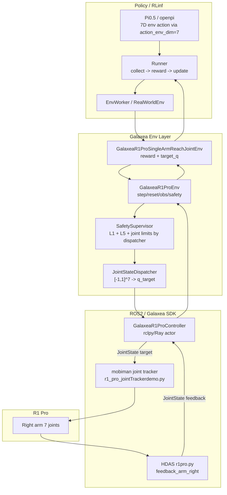
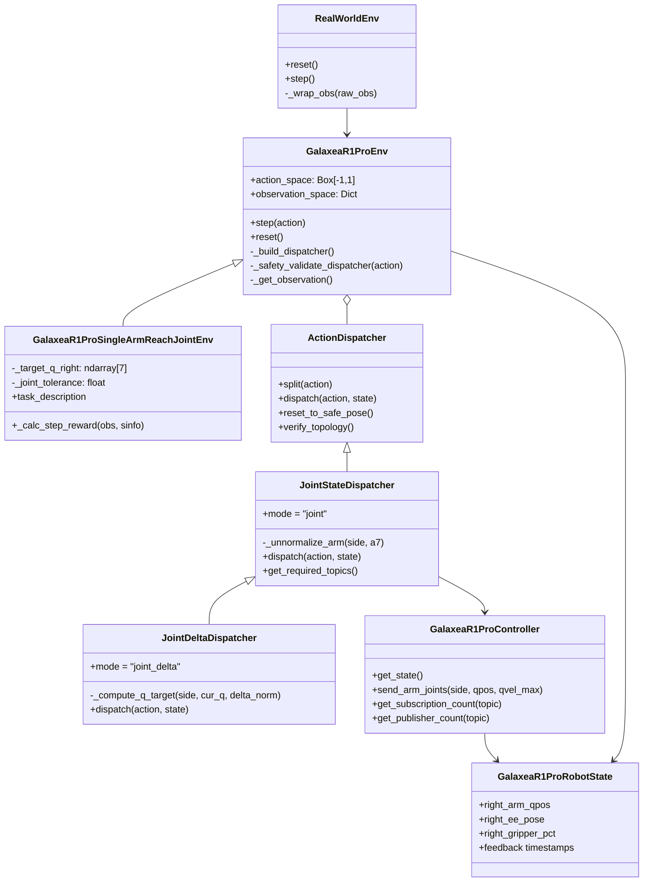
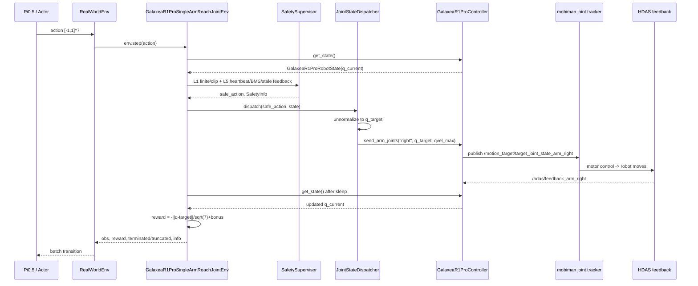
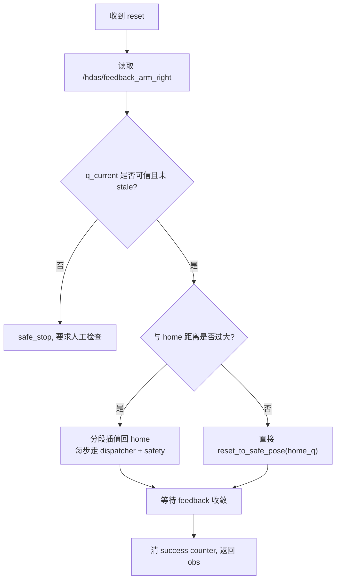
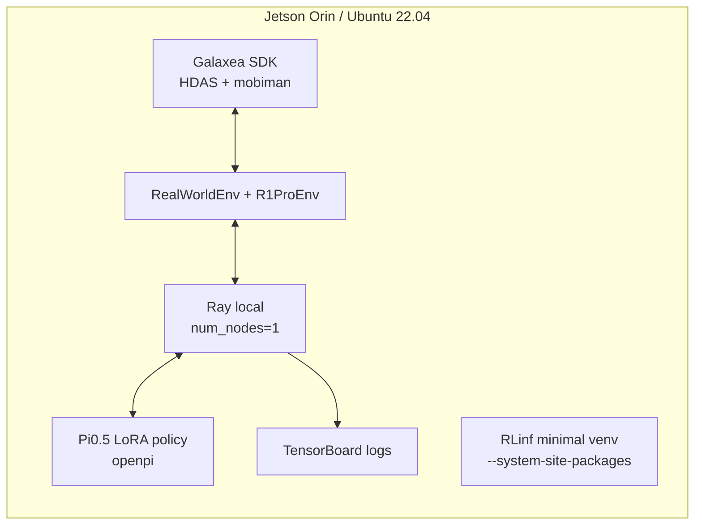
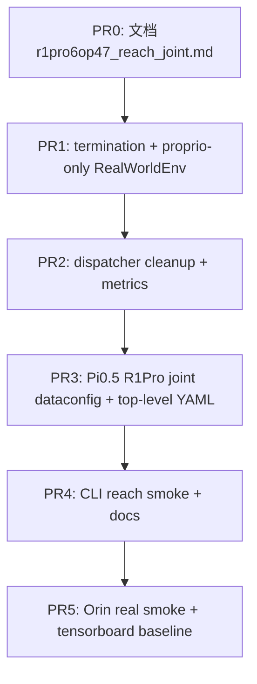

# Galaxea R1 Pro SingleArmReach Joint Mode 细化设计与实施方案

> 本文是 `r1pro6op47.md` 中 `§10.2 M1 - SingleArmReachEnv joint mode (~3-4 周)` 的展开版。目标不是再写一个宏观蓝图，而是把第一个能落地的 R1 Pro 真机强化学习任务讲清楚：为什么先做右臂关节空间到达、怎样接入 RLinf、怎样用 Pi0.5、怎样在 Orin 上安全运行、怎样逐步验收。

---

## 0. 结论先行

`SingleArmReachEnv joint mode` 是 R1 Pro 接入 RLinf 真机 RL 的第一个任务，推荐把它定义为：

- Gym ID: `GalaxeaR1ProSingleArmReach-joint-v1`
- 机器人范围: 仅右臂 7 个关节，关闭左臂、torso、chassis、gripper
- observation: 以 proprio 为主，至少包含 `right_arm_qpos`，当前基类也会包含 `right_ee_pose` 等状态项；所有进入策略的连续状态在模型 dataconfig / transform 中归一化。若使用现有 Pi0.5/OpenPI 视觉接口，则 M1 可以喂一张固定 dummy image 或一帧低频 wrist image，但 reward 与控制闭环不得依赖图像
- action: 7 维，`[-1, 1]^7`，表示右臂 7 个关节的目标位置
- ROS2 feedback topic: `/hdas/feedback_arm_right`
- ROS2 command topic: `/motion_target/target_joint_state_arm_right`
- reward: 关节空间距离 `-||q - q_target||_2 / sqrt(7)` + 容差内 sparse bonus
- policy/VLA: 必须使用 Pi0.5，也就是 RLinf 中 `model_type: "openpi"`，并用 R1 Pro joint 专用 dataconfig 将 Pi0.5 的 padded action 对齐到 7D env action

M1 任务故意不依赖相机、不依赖 gripper、不依赖 relaxed_ik。这里的“不依赖相机”指任务成功、reward 和安全闭环不需要视觉；如果 Pi0.5 入口暂时要求 image tensor，可以用 dummy image 作为模型兼容层，而不是把视觉变成任务条件。它先验证“RLinf -> safety -> dispatcher -> mobiman joint tracker -> HDAS feedback -> reward”这条最短闭环。只有这条闭环稳定，后续才值得叠加 gripper、末端位姿、视觉和更复杂任务。

---

## 1. 事实边界与资料来源

本文以本机代码为准，辅以 Galaxea 官方 ROS2 文档和本机 SDK 交叉确认。

### 1.1 本地代码事实

| 事实 | 本地来源 |
|---|---|
| Gym ID 已注册为 `GalaxeaR1ProSingleArmReach-joint-v1` | `rlinf/envs/realworld/galaxear/tasks/__init__.py` |
| 任务类为 `GalaxeaR1ProSingleArmReachJointEnv` | `rlinf/envs/realworld/galaxear/tasks/r1_pro_single_arm_reach_joint.py` |
| joint 绝对模式 env YAML 已存在 | `examples/embodiment/config/env/realworld_galaxea_r1_pro_singlearm_reach_joint.yaml` |
| joint delta 子模式 env YAML 已存在 | `examples/embodiment/config/env/realworld_galaxea_r1_pro_singlearm_reach_joint_delta.yaml` |
| dummy 顶层训练配置已存在 | `examples/embodiment/config/realworld_dummy_galaxea_r1_pro_singlearm_reach_joint.yaml` |
| Pi0.5 joint model YAML 已存在 | `examples/embodiment/config/model/pi0_5_r1pro_single_arm_joint.yaml` |
| Pi0.5 joint delta model YAML 已存在 | `examples/embodiment/config/model/pi0_5_r1pro_single_arm_joint_delta.yaml` |
| RLinf 模型名应写作 `openpi` | `rlinf/config.py` 的 `SupportedModel.OPENPI = ("openpi", "embodied")` |
| RLinf env type 应写作 `realworld` | `rlinf/envs/__init__.py` 的 `SupportedEnvType.REALWORLD = "realworld"` |

### 1.2 Galaxea ROS2 与 SDK 事实

Galaxea 官方 ROS2 文档和 `/home/nvidia/galaxea/install` 均确认：

| 功能 | Topic | Message |
|---|---|---|
| 右臂关节反馈 | `/hdas/feedback_arm_right` | `sensor_msgs/msg/JointState` |
| 左臂关节反馈 | `/hdas/feedback_arm_left` | `sensor_msgs/msg/JointState` |
| 右臂关节目标 | `/motion_target/target_joint_state_arm_right` | `sensor_msgs/msg/JointState` |
| 左臂关节目标 | `/motion_target/target_joint_state_arm_left` | `sensor_msgs/msg/JointState` |
| 右夹爪目标 | `/motion_target/target_position_gripper_right` | `sensor_msgs/msg/JointState`, `position=[0,100]` |
| 右臂 EE 目标 | `/motion_target/target_pose_arm_right` | `geometry_msgs/msg/PoseStamped` |
| 右臂 EE 反馈 | `/motion_control/pose_ee_arm_right` | `geometry_msgs/msg/PoseStamped` |

M1 只使用 joint tracker，不使用 relaxed_ik。官方启动命令对应：

```bash
source /home/nvidia/galaxea/install/setup.bash
ros2 launch HDAS r1pro.py
ros2 launch mobiman r1_pro_jointTrackerdemo.py
```

如果后续要做 EE pose 模式，才需要启动：

```bash
ros2 launch mobiman r1_pro_right_arm_relaxed_ik_launch.py
ros2 launch mobiman r1_pro_jointTrackerdemo_launch.py
```

---

## 2. 为什么 M1 必须先做 Joint Reach

R1 Pro 真机 RL 的风险不在算法，而在闭环耦合：ROS2 domain、SDK overlay、HDAS feedback、mobiman 控制节点、限位、安全停机、RLinf worker、模型 action layout 任一环节错了，表面上都可能表现为“训练没学会”。

Joint reach 把这些变量压到最低：

| 选择 | 直接收益 |
|---|---|
| 只控右臂 7 关节 | 不碰双臂碰撞、torso、chassis、全身协调 |
| 不控 gripper | 不引入 `[0,100]` 行程标定、夹爪卡滞、动作耦合 |
| 不用相机 | 不引入 RealSense/GMSL、图像延迟、frame drop、GPU 解码 |
| 不用 EE pose / IK | 避免 relaxed_ik 未启动或解算失败导致的“发布成功但机器人不动” |
| reward 直接由关节反馈计算 | 不需要 reward worker，也不依赖视觉判别 |
| action 7D 连续空间 | Pi0.5 / SAC / PPO 都容易调试，日志也直观 |

M1 的验收不是“拿最高性能”，而是证明真机 RL 的最短链路能稳定跑 100 step episode，能安全停止，能重复 reset，能从 random / SFT / RL 微调中看到关节误差下降。

---

## 3. 任务定义

### 3.1 初始姿态与目标

默认配置：

```yaml
home_q_right:   [0.0, 0.3, 0.0, -1.5, 0.0, 1.8, 0.0]
target_q_right: [0.5, 0.5, 0.0, -1.2, 0.0, 1.5, 0.0]
joint_tolerance_rad: 0.05
success_hold_steps: 5
max_episode_steps: 100
step_frequency: 10.0
```

这个 target 设计成“从 home 出发、小幅移动、避开极限、肉眼可见”。它不追求任务复杂度，而追求可诊断性：

- J1/J2/J4/J6 有变化，能肉眼看到右臂从 home 过渡到目标；
- J3/J5/J7 保持 0，减少 wrist 端姿态复杂性；
- 距离 joint limit 有余量，方便 early bring-up；
- 10 Hz 下 100 step 是 10 秒，一个 episode 足够观察轨迹，也不会长时间占用真机。

### 3.2 Observation

底层环境 `GalaxeaR1ProEnv` 生成 Gym observation：

```python
{
    "state": {
        "right_arm_qpos": np.ndarray shape=(7,),
        "right_ee_pose": np.ndarray shape=(7,),
        ...
    }
    # cameras=[] 时不包含 "frames"
}
```

M1 的 reward 只依赖 `right_arm_qpos`。但策略输入可以保留 `right_ee_pose`，因为它来自正向运动学/pose feedback，有助于后续从 joint reach 平滑过渡到 EE reach。不过训练配置要明确：

- 若用轻量 CNN/MLP dummy 策略，`actor.model.state_dim` 当前 dummy 配置为 `14`，即 `right_arm_qpos(7) + right_ee_pose(7)`；
- 若用 Pi0.5，dataconfig 必须把 proprio 字段顺序固定下来，建议第一版只用 `right_arm_qpos`，第二版再加入 `right_ee_pose`；
- 所有连续 proprio 在进入模型前应由 norm stats 归一化，不要把 raw rad 直接塞进 VLA 而 action 又是 `[-1,1]`，否则训练尺度不一致。

> 注意：`cameras: []` 时 `GalaxeaR1ProEnv` 会省略 `frames`，但 `RealWorldEnv._wrap_obs` 当前仍假定存在 `raw_obs["frames"][main_image_key]`。所以 M1 需要二选一：要么补 `RealWorldEnv` 的 proprio-only 分支，要么在训练入口临时提供 dummy image key。设计上推荐前者，因为 M1 本来就是无相机任务。

### 3.3 Action

绝对 joint mode:

```text
a in [-1,1]^7
q_target[i] = q_min[i] + (a[i] + 1) * 0.5 * (q_max[i] - q_min[i])
```

`JointStateDispatcher` 将 `q_target` 写入：

```text
/motion_target/target_joint_state_arm_right.position = q_target[0:7]
/motion_target/target_joint_state_arm_right.velocity = arm_qvel_max
```

默认限位与速度：

```yaml
arm_q_min_right: [-4.35, -3.04, -2.26, -1.99, -2.26, -0.95, -1.47]
arm_q_max_right: [ 1.21,  0.07,  2.26,  0.25,  2.26,  0.95,  1.47]
arm_qvel_max:    [ 3.0,   3.0,   3.0,   3.0,   5.0,   5.0,   5.0]
```

joint delta 子模式也可用于 M1+：

```text
delta_rad[i] = clip(a[i], -1, 1) * joint_delta_scale_right[i]
q_target[i] = clip(q_current[i] + delta_rad[i], q_min[i], q_max[i])
```

但第一轮 M1 推荐先用绝对 joint mode。原因是 CLI、单元测试、SFT 数据和安全验收都更直观：操作员输入“目标关节角”，机器人就去那个角度。等绝对模式稳定后，再切换 `joint_delta_mode: true` 做更适合 RL 微调的局部动作。

### 3.4 Reward 与 termination

当前任务代码：

```python
q = np.asarray(self._state.right_arm_qpos, dtype=np.float32).reshape(7)
diff = q - self._target_q_right
l2 = float(np.linalg.norm(diff))
dense = -l2 / np.sqrt(7.0)
bonus = 1.0 if l2 < self._joint_tolerance else 0.0
```

推荐正式设计语义：

```text
is_success = ||q - q_target||_2 < joint_tolerance_rad
reward = -||q - q_target||_2 / sqrt(7) + 1.0 * is_success
terminated = success_hold_counter >= success_hold_steps
truncated = step_count >= max_episode_steps or safe_stop or emergency_stop
```

当前基类 `GalaxeaR1ProEnv.step` 的 termination 还要求 `reward >= 1.0`。由于 `dense` 在容差内仍可能略小于 0，`reward` 很可能小于 1.0，导致“进了容差并 hold 住”但 `terminated` 不触发。M1 实施时应修正为 task success flag 驱动，或在 joint 任务中覆盖 termination 逻辑。否则训练可继续依赖 `max_episode_steps` 截断，但成功率指标会不准。

---

## 4. 系统架构

### 4.1 分层图



### 4.2 类关系



### 4.3 单步控制序列



---

## 5. 配置设计

### 5.1 Env YAML

第一版 M1 使用：

```yaml
defaults:
  - env/realworld_galaxea_r1_pro_singlearm_reach_joint@env.train
  - env/realworld_galaxea_r1_pro_singlearm_reach_joint@env.eval
```

核心字段：

```yaml
env_type: realworld
main_image_key: null
no_gripper: true

init_params:
  id: GalaxeaR1ProSingleArmReach-joint-v1
  override_cfg:
    use_joint_mode: true
    use_right_arm: true
    use_left_arm: false
    use_torso: false
    use_chassis: false
    no_gripper: true
    ros_domain_id: ${oc.env:ROS_DOMAIN_ID,41}
    galaxea_install_path: /home/nvidia/galaxea/install
    mobiman_launch_mode: joint
    home_q_right: [0.0, 0.3, 0.0, -1.5, 0.0, 1.8, 0.0]
    target_q_right: [0.5, 0.5, 0.0, -1.2, 0.0, 1.5, 0.0]
    joint_tolerance_rad: 0.05
    step_frequency: 10.0
    success_hold_steps: 5
    cameras: []
```

注意 `ROS_DOMAIN_ID` 不应硬编码为 72。本机现场常见值是 41，但最终以 `printenv ROS_DOMAIN_ID` 和 DDS 可见性为准。

### 5.2 Pi0.5 Model YAML

Pi0.5 对应 RLinf 模型名是 `openpi`：

```yaml
model_type: "openpi"
model_path: "/path/to/checkpoints/pi05_r1pro_singlearm_reach_joint"
num_action_chunks: 4
action_dim: 7
is_lora: true
lora_rank: 16
use_proprio: true

openpi:
  config_name: "pi05_r1pro_single_arm_joint"
  num_images_in_input: 1
  action_chunk: ${actor.model.num_action_chunks}
  action_env_dim: ${actor.model.action_dim}
```

这里有两个容易犯错的点：

1. Pi0.5 内部 action head 通常是 padded action 空间，不能把 checkpoint 输出直接当 R1 Pro 7 关节。必须通过 `openpi.action_env_dim: 7` 和 R1 Pro 专用 dataconfig 截取/解释前 7 维，并保证训练数据中的 action 也是同一语义。
2. 现有 `pi0_5_r1pro_single_arm_joint.yaml` 写的是 `num_images_in_input: 1`。这不代表 M1 reward 依赖相机，而是 OpenPI 视觉接口需要 image slot。M1 第一版可以在 dataconfig 中填固定 dummy image；若现场希望尽早验证 wrist camera，也可以接一帧低频右腕 RGB，但不得让图像路径阻塞 joint reach 闭环。

### 5.3 绝对模式与 delta 模式切换

M1 首轮：

```yaml
use_joint_mode: true
joint_delta_mode: false
```

M1+ 微调：

```yaml
use_joint_mode: true
joint_delta_mode: true
joint_delta_scale_right: [0.10, 0.10, 0.10, 0.10, 0.20, 0.20, 0.20]
```

两者共用同一个 task class 和 Gym ID，区别只在 dispatcher 语义：

| 模式 | policy 输出 | dispatcher 行为 | 适合阶段 |
|---|---|---|---|
| absolute joint | 绝对目标关节，归一化到 `[-1,1]` | 映射到 `[q_min, q_max]` | CLI、SFT、第一轮真机 smoke |
| joint delta | 每步关节增量，归一化到 `[-1,1]` | `q_current + delta * scale` | RL fine-tune、局部探索 |

---

## 6. Pi0.5 数据与动作空间设计

### 6.1 SFT 数据格式

最小 SFT 样本建议包含：

```python
{
    "observation": {
        "right_arm_qpos": [q1, ..., q7],
        # 可选: "right_ee_pose": [x,y,z,qx,qy,qz,qw],
        # 可选: "wrist_image_right": image
    },
    "action": [a1, ..., a7],  # normalized absolute joint target
    "task": "Move the right arm to the target joint configuration."
}
```

第一批数据不必来自人类遥操作，可以来自脚本化轨迹：

```text
home_q -> linear interpolation in joint space -> target_q
```

每个 waypoint 先通过 CLI / dispatcher 真实下发，再记录 HDAS feedback，避免“仿真轨迹”和真机实际 tracking 存在系统偏差。

### 6.2 Norm stats

M1 至少要有两套 norm：

| 名称 | 维度 | 来源 | 用途 |
|---|---:|---|---|
| `state.right_arm_qpos` | 7 | HDAS feedback 或 YAML limit | Pi0.5 proprio normalization |
| `action.right_arm_qtarget` | 7 | `arm_q_min_right/max_right` 或 demo action | Pi0.5 action normalization |

推荐 action normalization 与 dispatcher 保持一致：

```text
norm(q) = 2 * (q - q_min) / (q_max - q_min) - 1
unnorm(a) = q_min + (a + 1) * 0.5 * (q_max - q_min)
```

这样 Pi0.5 输出的 `[-1,1]` 可以直接进入 `JointStateDispatcher`，不需要额外转换层。

### 6.3 为什么不要直接复用 Franka 7D

Franka 示例里的 7D 常见语义是 EE delta + gripper，R1 Pro M1 的 7D 是右臂绝对关节。两者维度相同，但含义完全不同。把 Franka 7D checkpoint 直接接到 R1 Pro joint dispatcher，会把“末端位姿增量”误解释为“目标关节角”，这是最危险的一类 silent failure。

---

## 7. 安全设计

M1 的安全边界分四层。

### 7.1 启动前环境隔离

```bash
export ROS_DOMAIN_ID=41
export RMW_IMPLEMENTATION=rmw_cyclonedds_cpp
export CYCLONEDDS_URI=file:///home/nvidia/cyclone_dds.xml  # 如现场使用
source /opt/ros/humble/setup.bash
source /home/nvidia/galaxea/install/setup.bash
```

Galaxea 官方文档强调 ROS2 默认会在局域网发现其它主机进程。真机训练时必须确认 domain、网卡和 CycloneDDS 配置，不允许多个未隔离控制程序同时发布目标关节。

### 7.2 Topology check

joint M1 的 required topology：

| 检查对象 | 期望 |
|---|---|
| `/motion_target/target_joint_state_arm_right` | 至少 1 个 subscriber，即 mobiman joint tracker |
| `/hdas/feedback_arm_right` | 至少 1 个 publisher，即 HDAS |
| `/motion_target/target_position_gripper_right` | M1 `no_gripper=true` 时不要求 |
| `/motion_control/pose_ee_arm_right` | M1 reward 不依赖，但若 observation 包含 EE pose，建议监控 |

CLI 推荐：

```bash
python toolkits/realworld_check/test_galaxea_r1_pro_cli_controller.py \
  --backend rclpy \
  --use-joint-mode --use-right-arm --no-gripper \
  --ros-domain-id ${ROS_DOMAIN_ID:-41} \
  --strict-topo --topo-discovery-timeout-s 8
```

`--topo-discovery-timeout-s` 用来等待 ROS2 DDS discovery 收敛。若 8 秒后仍然 `pubs=0` 或 `subs=0`，应认为 SDK 节点或 domain 配置有问题，而不是训练算法问题。

### 7.3 Action safety

Dispatcher-mode 当前安全路径做：

- L1: NaN/Inf 拒绝，action clip 到 `[-1,1]`
- L5: heartbeat、BMS、feedback stale、status error、遥控器模式等系统级检查
- joint limit: 由 `JointStateDispatcher` 的 `q_min/q_max` 映射保证
- velocity envelope: `JointState.velocity = arm_qvel_max`

M1 实施建议补齐：

1. 移除 `JointStateDispatcher._unnormalize_arm` 内的调试 `print`，避免 10 Hz 以上控制时刷屏。
2. 对 absolute joint mode 增加显式 per-step delta cap，避免策略从一个极限直接跳到另一个极限。即使 mobiman velocity 会限速，RL 环境也应先做动作平滑。
3. 将 safety metrics 写入 logger：`safe_stop_count`、`feedback_stale_ms`、`action_clip_ratio`、`joint_limit_clip_count`。

### 7.4 Reset safety

`reset()` 不应直接假设机器人在 home。推荐顺序：



第一版可先用 `reset_to_safe_pose(home_q_right)`，但真机部署前建议改成“分段回 home”，尤其是训练中断、急停恢复后。

---

## 8. Orin-only 训练与推理方案

M1 是 Orin-only 最适合的任务，因为它没有相机和大 reward model。最小部署：



推荐安装：

```bash
cd /home/nvidia/lg_ws/RL/RLinf
bash requirements/install.sh embodied --env galaxea_r1_pro_orin
source .venv/bin/activate
```

资源策略：

| 项 | Orin-only 推荐 |
|---|---|
| env count | `total_num_envs: 1` |
| rollout | local huggingface/openpi，不启 vLLM/SGLang |
| Pi0.5 | LoRA，`lora_rank: 16` 或更低 |
| action chunks | `num_action_chunks: 4` 起步 |
| images | M1 任务语义关闭；若 OpenPI 入口需要 image slot，用 dummy image 或低频 1 路 wrist，不让视觉影响 reward/safety |
| replay buffer | 小窗口，先 `cache_size: 200-1000` |
| precision | 继承 JetPack torch / openpi dtype，避免 pip 重装 torch |
| logging | tensorboard 本地，视频关闭 |

M1 不建议一开始在 Orin 上做大规模 RL。更稳的路线是：

1. Orin 上跑 CLI / dummy / env smoke；
2. GPU 机上做 Pi0.5 SFT 或预训练；
3. Orin 上做短 episode eval；
4. 若 VRAM 允许，再做 LoRA 小步 RL 微调。

---

## 9. 实施路线

### Phase 0: 代码事实与预检

目标：确认不是 ROS2 / SDK / domain 问题。

```bash
printenv ROS_DOMAIN_ID
source /opt/ros/humble/setup.bash
source /home/nvidia/galaxea/install/setup.bash
ros2 topic info /hdas/feedback_arm_right -v
ros2 topic info /motion_target/target_joint_state_arm_right -v
```

通过标准：

- `/hdas/feedback_arm_right` 有 publisher；
- `/motion_target/target_joint_state_arm_right` 在 joint tracker 启动后有 subscriber；
- CLI `--strict-topo` 通过；
- `state` 命令能看到非 stale 的右臂关节反馈。

### Phase 1: CLI 右臂单点控制

目标：不用 RL，不用 Pi0.5，只验证 dispatcher 和安全。

```bash
python toolkits/realworld_check/test_galaxea_r1_pro_cli_controller.py \
  --backend rclpy \
  --use-joint-mode --use-right-arm --no-gripper \
  --gripper-min-pct 0 --gripper-max-pct 90 \
  --strict-topo --topo-discovery-timeout-s 8
```

REPL 中：

```text
state
home
j r 0.0 0.3 0.0 -1.5 0.0 1.8 0.0
j r 0.5 0.5 0.0 -1.2 0.0 1.5 0.0
brake on
brake off
```

通过标准：

- 右臂实际运动方向与关节目标一致；
- feedback 中 `right_arm_qpos` 距 target 逐步变小；
- brake 生效；
- 无 gripper 误动作。

### Phase 2: Dummy Gym / Unit Tests

目标：不接真机，验证 task 注册、action dim、reward、YAML。

```bash
PYTEST_DISABLE_PLUGIN_AUTOLOAD=1 pytest \
  tests/unit_tests/test_galaxea_r1_pro_single_arm_reach_joint.py \
  tests/unit_tests/test_galaxea_r1_pro_yaml_configs.py \
  tests/unit_tests/test_galaxea_r1_pro_joint_delta_dispatcher.py \
  tests/unit_tests/test_galaxea_r1_pro_cli_joint_delta.py \
  -v
```

通过标准：

- `GalaxeaR1ProSingleArmReach-joint-v1` 可 `gym.make`；
- action space 是 `(7,)`；
- `use_joint_mode=True`、`no_gripper=True`；
- joint delta YAML 能加载；
- CLI delta / absolute 语义不互相破坏。

### Phase 3: RealWorldEnv Proprio-only 修补

目标：让无相机 M1 能走完整 RLinf runner。

当前风险：`RealWorldEnv._wrap_obs` 假设 `raw_obs["frames"]` 存在。M1 `cameras: []` 时底层 env 已正确省略 `frames`，但外层包装仍会访问 `raw_obs["frames"]`。

推荐修补语义：

```python
def _wrap_obs(self, raw_obs):
    obs = {}
    raw_states = OrderedDict(sorted(raw_obs["state"].items()))
    obs["states"] = np.concatenate(list(raw_states.values()), axis=-1)

    frames = raw_obs.get("frames", {})
    if self.main_image_key is not None:
        if self.main_image_key not in frames:
            raise KeyError(...)
        obs["main_images"] = frames[self.main_image_key]
        ...

    obs = to_tensor(obs)
    obs["task_descriptions"] = self.task_descriptions
    return obs
```

这样 `main_image_key: null` 才真正表示 proprio-only，而不是“配置上无相机但代码仍强制要图像”。

### Phase 4: SAC/MLP 或 CNN baseline

目标：先用轻模型验证 RL loop，不急着上 Pi0.5。

已有 dummy 配置：

```bash
export EMBODIED_PATH=/home/nvidia/lg_ws/RL/RLinf/examples/embodiment
python examples/embodiment/train_embodied_agent.py \
  --config-name realworld_dummy_galaxea_r1_pro_singlearm_reach_joint
```

真机 baseline 可从该配置复制，替换：

- `is_dummy: false`
- `step_frequency: 10.0`
- `max_num_steps: 100`
- `runner.max_steps` 从很小开始，例如 200-500
- logging 开 tensorboard，视频关闭

### Phase 5: Pi0.5 SFT

目标：让 Pi0.5 先模仿安全的 joint reach 轨迹。

数据来源：

1. 脚本生成 joint interpolation；
2. CLI 下发并记录 HDAS feedback；
3. 将 `(obs_t, action_t, task_description)` 转成 OpenPI dataconfig 所需格式；
4. 计算 norm stats；
5. SFT 训练 LoRA checkpoint。

Pi0.5 配置使用：

```yaml
defaults:
  - model/pi0_5_r1pro_single_arm_joint@actor.model
```

验收：

- 离线 eval 中 action dim 为 7；
- 输出 action 数值主要落在 `[-1,1]`；
- unnormalize 后目标关节不越界；
- 真机 rollout 的 `||q-target||` 单调下降或至少明显优于 random。

### Phase 6: Pi0.5 RL fine-tune

目标：在 SFT checkpoint 上做小步 RL。

建议先使用 absolute joint mode：

- 更容易将策略输出解释为目标；
- failure 可以用 CLI 复现；
- replay 中 action 与 task target 语义一致。

稳定后再试 joint delta：

- `joint_delta_mode: true`
- `joint_delta_scale_right` 从保守值开始；
- RL 的探索会更局部，急剧大跳更少；
- 但 reward 到达目标需要多步积分，episode 长度和 action chunk 要重新调。

---

## 10. 测试矩阵

| 层级 | 测试 | 目的 | 命令/方法 |
|---|---|---|---|
| Unit | task 注册 | Gym ID 不丢 | `pytest tests/unit_tests/test_galaxea_r1_pro_single_arm_reach_joint.py -v` |
| Unit | action dim | joint/no_gripper 为 7D | 同上 |
| Unit | reward | target 处 reward > far | 同上 |
| Unit | YAML | env YAML 键名与构造正确 | `pytest tests/unit_tests/test_galaxea_r1_pro_yaml_configs.py -v` |
| Unit | dispatcher | abs/delta factory 与映射 | `pytest tests/unit_tests/test_galaxea_r1_pro_joint_delta_dispatcher.py -v` |
| CLI | dummy | 无 ROS 也能跑 REPL | `--backend dummy --strict-topo` |
| CLI | rclpy topo | DDS/HDAS/mobiman 可见 | `--backend rclpy --strict-topo` |
| CLI | home/target | 真机能从 home 到 target | `home`, `j r ...` |
| Env smoke | dummy runner | RLinf runner 不崩 | dummy config |
| Env smoke | real runner | 真机 1 episode 无安全事故 | `max_steps` 很小 |
| Model | Pi0.5 action | action_env_dim=7 | 离线 forward / rollout |
| Safety | stale feedback | HDAS 断开能 safe_stop | 停 HDAS 或隔离 domain |
| Safety | joint limit | 越界 action 被 clip | CLI / unit |

---

## 11. 指标与日志

M1 最重要的指标：

```text
joint_l2 = ||right_arm_qpos - target_q_right||_2
joint_linf = max_i |q_i - target_i|
success = joint_l2 < joint_tolerance_rad
success_hold_counter
action_clip_ratio
feedback_age_ms
safe_stop_count
episode_return
episode_length
```

建议 TensorBoard 曲线：

- `env/joint_l2`
- `env/joint_linf`
- `env/success`
- `env/success_hold_counter`
- `safety/feedback_age_ms`
- `safety/action_clip_ratio`
- `train/episode_return`
- `time/env_step_ms`

如果只能看一个指标，看 `env/joint_l2`。它应该在每个 episode 内下降；如果不下降，先查 action unnormalize 和 mobiman topology，不要先调算法。

---

## 12. 常见失败与排查

| 现象 | 首先怀疑 | 排查 |
|---|---|---|
| CLI 发布后机器人不动 | mobiman joint tracker 没订阅 | `ros2 topic info /motion_target/target_joint_state_arm_right -v` |
| topo 报 `/hdas/feedback_arm_right pubs=0` | HDAS 没启动或 domain 不同 | `ros2 topic list | grep hdas`、`printenv ROS_DOMAIN_ID` |
| topo 第一次失败但稍后正常 | DDS discovery 慢 | 加 `--topo-discovery-timeout-s 8` |
| reward 一直不变 | feedback 没更新或 `_state` stale | 看 `feedback_age_ms`、`state` 命令 |
| 训练不 done | termination 仍绑定 `reward >= 1.0` | 改成 success flag / hold counter |
| runner 在无相机时报 `frames` KeyError | `RealWorldEnv._wrap_obs` 未支持 proprio-only | 补 `raw_obs.get("frames", {})` 分支 |
| Pi0.5 输出形状不对 | `action_env_dim` / dataconfig 错 | 检查 `actor.model.action_dim=7` |
| 右臂向危险方向跳 | absolute action 大跨度 | 增加 per-step cap 或先用 delta |
| gripper 意外动 | `no_gripper` 没贯穿 | 检查 env YAML、CLI flag、dispatcher per_arm_dim |

---

## 13. 代码改动清单

### 13.1 必做

1. **修正 success termination**
   - 文件：`rlinf/envs/realworld/galaxear/r1_pro_env.py` 或 task 子类
   - 目标：不要用 `reward >= 1.0` 推断 success；改为 task 显式 success / hold counter

2. **支持 RealWorldEnv proprio-only**
   - 文件：`rlinf/envs/realworld/realworld_env.py`
   - 目标：`main_image_key: null` 且无 `frames` 时，只返回 `states` 和 `task_descriptions`

3. **去掉 dispatcher 调试 print**
   - 文件：`rlinf/envs/realworld/galaxear/r1_pro_action_dispatcher.py`
   - 目标：`_unnormalize_arm` 不再打印 action/q_min/q_max

4. **补 M1 real Pi0.5 顶层配置**
   - 建议新增：`examples/embodiment/config/realworld_galaxea_r1_pro_singlearm_reach_joint_pi05.yaml`
   - defaults: env joint + model Pi0.5 + Orin-friendly runner

5. **补 OpenPI R1 Pro dataconfig**
   - 建议位置：`rlinf/models/embodiment/openpi/`
   - config names: `pi05_r1pro_single_arm_joint`, `pi05_r1pro_single_arm_joint_delta`
   - 目标：固定 proprio/action 字段、norm stats、action_env_dim=7

### 13.2 应做

1. reset 分段回 home；
2. absolute joint mode 增加 per-step delta cap；
3. logger 增加 joint_l2 / feedback_age / action_clip；
4. 真机 smoke 脚本自动记录 ROS2 topic info；
5. CLI 增加 `reach` 快捷命令：一键 home -> target -> state -> brake。

### 13.3 暂不做

1. 双臂；
2. gripper；
3. torso/chassis；
4. 视觉 reward；
5. EE pose / relaxed_ik；
6. full Pi0.5 大规模在线训练。

这些都属于 M2/M3 以后。M1 的价值是把最短闭环跑稳。

---

## 14. 推荐 PR 拆分



每个 PR 都应可独立验证。不要把 Pi0.5 dataconfig、真机 runner、safety reset、文档一次性塞进同一个 PR，否则 review 很难判断问题来自哪一层。

---

## 15. 验收标准

### 15.1 软件验收

- `pytest tests/unit_tests/test_galaxea_r1_pro_single_arm_reach_joint.py -v` 通过；
- `pytest tests/unit_tests/test_galaxea_r1_pro_yaml_configs.py -v` 通过；
- `pytest tests/unit_tests/test_galaxea_r1_pro_joint_delta_dispatcher.py -v` 通过；
- dummy runner 能跑完 100 step；
- proprio-only `RealWorldEnv` 不再访问不存在的 `frames`；
- Pi0.5 forward 输出 action shape `[B, action_chunk, 7]` 或可安全截取到 7。

### 15.2 真机验收

- `--strict-topo` 通过；
- CLI home 和 target 各跑 5 次，无异常 brake；
- 每次 target 后 `joint_l2 < 0.10 rad`，稳定后收紧到 `< 0.05 rad`；
- feedback stale 不超过 `200 ms`；
- emergency/safe stop 能在一个 step 内阻断 dispatch；
- 训练或 eval 过程中 gripper、左臂、torso、chassis 均不动作。

### 15.3 RL 验收

- random policy 的 `joint_l2` 不稳定或较大；
- SFT policy 的 `joint_l2` 明显下降；
- RL fine-tune 后 episode return 提升；
- 至少 10 个连续 episode 无安全触发；
- 成功率指标基于 explicit success flag，而不是 reward 阈值猜测。

---

## 16. 与 `r1pro6op47.md` 的关系

`r1pro6op47.md` 仍是总设计；本文只细化 `§10.2 M1`。后续建议在总文档对应章节加一句链接：

```markdown
详细实施方案见 [r1pro6op47_reach_joint.md](r1pro6op47_reach_joint.md)。
```

本文的原则可以复用到 M2/M3，但不要直接复制动作空间。M2 EE pose 用 `/motion_target/target_pose_arm_right` 和 quaternion；M3 pick/place 才重新引入 gripper `[0,100] -> [-1,1]`。

---

## 17. 参考索引

- `bt/docs/rwRL/r1pro6op47.md`
- `bt/docs/rwRL/glx/mismatch_realworld_1.md`
- `bt/docs/rwRL/glx/R1ProSDKAnalysis.md`
- `bt/docs/rwRL/Pi05_ActionSpace_Analysis.md`
- `docs/source-en/rst_source/publications/rlinf_user.rst`
- `docs/source-en/rst_source/examples/embodied/franka.rst`
- `docs/source-en/rst_source/examples/embodied/xsquare_turtle2.rst`
- `rlinf/envs/realworld/galaxear/tasks/r1_pro_single_arm_reach_joint.py`
- `rlinf/envs/realworld/galaxear/r1_pro_env.py`
- `rlinf/envs/realworld/galaxear/r1_pro_action_dispatcher.py`
- `rlinf/envs/realworld/realworld_env.py`
- Galaxea R1 Pro ROS2 文档: `https://docs.galaxea-dynamics.com/zh/Guide/R1Pro/software_introduction/ros2/R1Pro_Software_Introduction_ROS2/`

