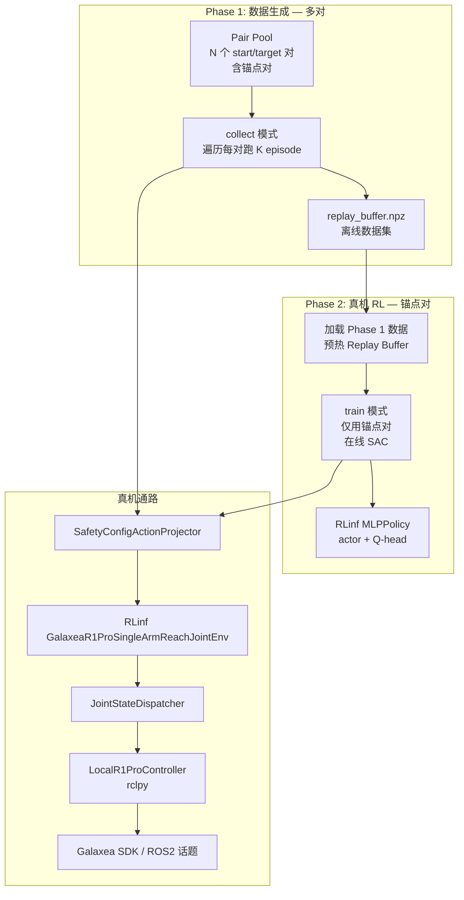
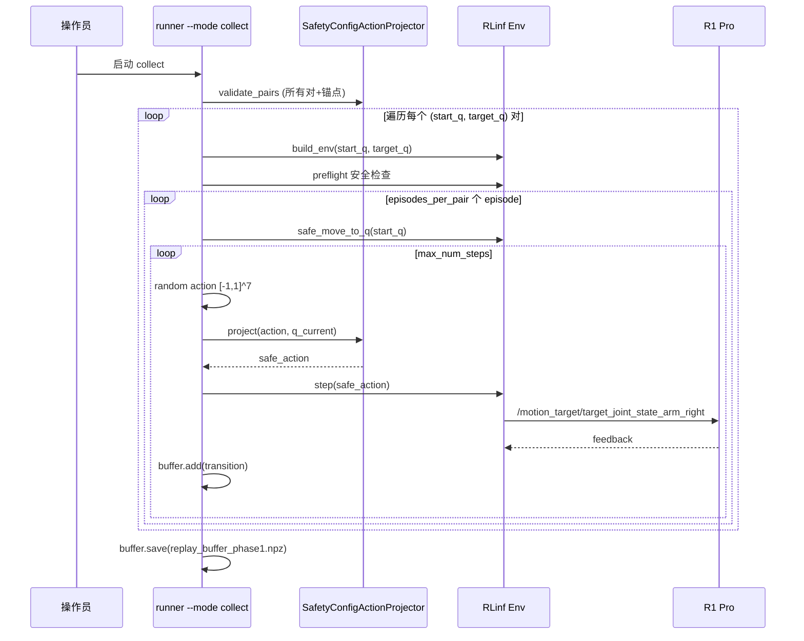
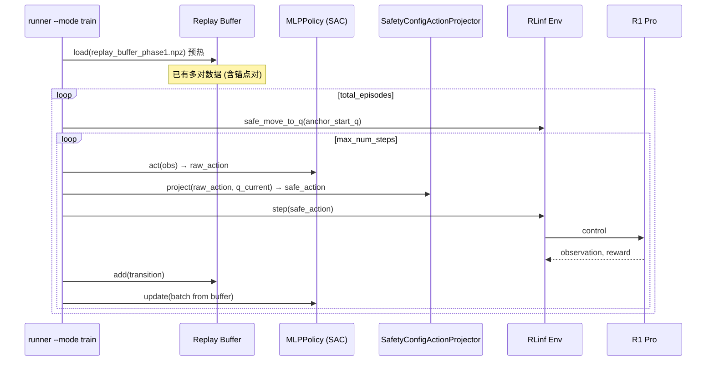

# R1 Pro Orin 单机 RLinf 真机强化学习实操指南 V3.1：两阶段数据与训练

> 基于 `r1pro6op47_reach_joint3.md` 改良。  
> **核心改动**：将流程拆分为「数据生成」与「真机 RL 训练」两个阶段，解决原版只有单一起终点对的局限性。

---

## 0. 改良动机与设计原则

### 0.1 原版问题

`r1pro6op47_reach_joint3.md` 只配置了一个固定的 `(home_q_right, target_q_right)` 对。真机 RL 时 replay buffer 只有来自该单一 pair 的 transitions——探索多样性差、收敛慢、易陷入局部最优。

### 0.2 新设计思路

```text
┌───────────────────────────────────────────────────────┐
│ Phase 1: 数据生成 (collect)                            │
│   • N 个 (start_q, target_q) 对                       │
│   • 其中必须包含真机 RL 将要用的「锚点对」              │
│   • 所有 pair 共享同一个 SafetyConfigActionProjector   │
│   • 产出: replay_buffer.npz (离线数据集)              │
└───────────────────────────────────────────────────────┘
                         ↓ 加载
┌───────────────────────────────────────────────────────┐
│ Phase 2: 真机 RL 训练 (train)                         │
│   • 锁定唯一的「锚点对」(start_q, target_q)            │
│   • Replay buffer 用 Phase 1 数据预热                 │
│   • 在线 SAC 更新 + 真机交互                          │
└───────────────────────────────────────────────────────┘
```

### 0.3 为什么这样设计

| 关注点 | 解释 |
|--------|------|
| 数据多样性 | 多对覆盖不同关节区域，让 Q 函数学到更广泛的状态-动作价值映射 |
| 安全一致性 | 所有 pair 共用同一 `SafetyConfigActionProjector`，保证数据和训练的安全语义一致 |
| 锚点约束 | 真机 RL pair 必须出现在离线数据中，这样 buffer 预热数据的分布覆盖了实际训练域 |
| 真机 RL 只用单对 | 真机在线学习时，固定任务目标才能稳定地度量学习进展和 reward 趋势 |

---

## 1. 当前 Orin 真机环境事实

（同 `r1pro6op47_reach_joint3.md` §0，此处简述）

```text
torch: 2.4.0a0+07cecf4168.nv24.05
cuda: True
dist: False (torch.distributed 不可用)
```

ROS2 话题就绪：
- `/motion_target/target_joint_state_arm_right` — 有 subscriber
- `/hdas/feedback_arm_right` — 可收到 7 关节反馈

运行模式：Orin 单机单进程，不使用 Ray/FSDP/torch.distributed。

---

## 2. 设计目标

1. **Phase 1 (collect)**：多个 `(start_q, target_q)` 对进行数据采集，每对跑 K 个 episode，保存所有 transitions。
2. **Phase 2 (train)**：锁定唯一的锚点对 `(anchor_start_q, anchor_target_q)`，加载 Phase 1 数据预热 buffer，进行在线 SAC 训练。
3. **Phase 3 (eval)**：仅使用锚点对做确定性评估。
4. **安全约束**：
   - 所有 pair 的 start_q 和 target_q 都必须在 `SafetyConfig` 安全区间内。
   - 每一步下发的绝对目标满足：`abs(q_safe - q_current) <= step_cap`。
5. 仍然使用 `joint_mode`（`JointStateDispatcher` 绝对关节目标）。

---

## 3. SafetyConfig 是唯一安全边界来源

```python
from rlinf.envs.realworld.galaxear.r1_pro_safety import build_safety_config
```

默认值（来自 `rlinf/envs/realworld/galaxear/r1_pro_safety.py`）：

```text
right_arm_q_min = [-4.35, -3.04, -2.26, -1.99, -2.26, -0.95, -1.47]
right_arm_q_max = [ 1.21,  0.07,  2.26,  0.25,  2.26,  0.95,  1.47]
arm_qvel_max    = [ 1.6,   1.6,   1.6,   1.6,   4.0,   4.0,   4.0]
dt_step         = 0.10
l2_critical_margin_rad = 0.05
```

可用范围收缩为：

```text
safe_lo = right_arm_q_min + l2_critical_margin_rad
safe_hi = right_arm_q_max - l2_critical_margin_rad
```

---

## 4. 总体架构



---

## 5. 文件布局

```text
examples/embodiment/config/r1pro_m1_orin_joint_mode_rlinf_sac_v31.yaml
toolkits/realworld_check/train_r1pro_m1_orin_joint_mode_rlinf_sac_v31.py
```

---

## 6. 配置文件

创建 `examples/embodiment/config/r1pro_m1_orin_joint_mode_rlinf_sac_v31.yaml`：

```yaml
# R1 Pro Orin 单机 RLinf SAC v3.1
# Phase 1: 多对数据生成   Phase 2: 锚点对真机 RL

seed: 11
device: auto

runtime:
  ros_domain_id: 41
  rmw_implementation: rmw_cyclonedds_cpp
  galaxea_install_path: /home/nvidia/galaxea/install
  out_dir: logs/r1pro_m1_orin_joint_mode_rlinf_sac_v31

  # SafetyConfigActionProjector 保守步幅缩放
  safety_step_scale: 0.25
  safety_margin_rad: null  # 使用 SafetyConfig.l2_critical_margin_rad

# ─── 数据生成配置 ───
data_generation:
  # 真机 RL 将使用的唯一锚点对 (必须出现在 pairs 列表中)
  anchor_pair:
    start_q: [0.0, -0.10, 0.0, -0.30, 0.0, 0.20, 0.0]
    target_q: [0.18, -0.20, 0.0, -0.45, 0.0, 0.35, 0.0]

  # 所有 (start, target) 对 — 用于 Phase 1 collect
  # 每对的 start_q 和 target_q 都必须在 SafetyConfig 安全区间内
  pairs:
    - start_q: [0.0, -0.10, 0.0, -0.30, 0.0, 0.20, 0.0]
      target_q: [0.18, -0.20, 0.0, -0.45, 0.0, 0.35, 0.0]
    - start_q: [0.0, -0.10, 0.0, -0.30, 0.0, 0.20, 0.0]
      target_q: [0.10, -0.05, 0.0, -0.60, 0.0, 0.10, 0.0]
    - start_q: [0.10, -0.15, 0.0, -0.40, 0.0, 0.25, 0.0]
      target_q: [0.0, -0.10, 0.0, -0.30, 0.0, 0.20, 0.0]
    - start_q: [0.05, -0.05, 0.0, -0.50, 0.0, 0.15, 0.0]
      target_q: [0.15, -0.18, 0.0, -0.35, 0.0, 0.30, 0.0]

  # 每个 pair 采集的 episode 数
  episodes_per_pair: 15

  # 数据保存路径 (相对于 out_dir)
  buffer_save_name: replay_buffer_phase1.npz

env:
  override_cfg:
    is_dummy: false
    ros_domain_id: 41
    ros_localhost_only: false
    galaxea_install_path: /home/nvidia/galaxea/install
    mobiman_launch_mode: joint

    use_joint_mode: true
    joint_delta_mode: false
    use_new_dispatcher: true

    use_right_arm: true
    use_left_arm: false
    use_torso: false
    use_chassis: false
    no_gripper: true
    cameras: []

    step_frequency: 10.0
    max_num_steps: 200
    success_hold_steps: 5
    joint_tolerance_rad: 0.05

    # 以下两字段在 train/eval 时由 anchor_pair 覆盖
    # 在 collect 时会被逐对动态覆盖
    target_q_right: [0.18, -0.20, 0.0, -0.45, 0.0, 0.35, 0.0]
    home_q_right: [0.0, -0.10, 0.0, -0.30, 0.0, 0.20, 0.0]

    arm_qvel_max: [0.3, 0.3, 0.3, 0.3, 0.6, 0.6, 0.6]

    safety_cfg:
      right_arm_q_min: [-4.35, -3.04, -2.26, -1.99, -2.26, -0.95, -1.47]
      right_arm_q_max: [ 1.21,  0.07,  2.26,  0.25,  2.26,  0.95,  1.47]
      arm_qvel_max: [1.6, 1.6, 1.6, 1.6, 4.0, 4.0, 4.0]
      dt_step: 0.10
      l2_warning_margin_rad: 0.15
      l2_critical_margin_rad: 0.05
      feedback_stale_threshold_ms: 300.0
      operator_heartbeat_timeout_ms: 3000.0

sac:
  obs_dim: 14
  action_dim: 7
  gamma: 0.96
  tau: 0.005
  lr: 0.0003
  alpha: 0.01
  auto_alpha: true
  target_entropy: -7.0
  batch_size: 128
  replay_size: 50000   # 比原版大，容纳多对数据
  start_steps: 0       # train 模式已有预热数据，无需随机探索
  update_after: 256
  updates_per_env_step: 2

train:
  total_episodes: 120
  save_every_episodes: 10
  safe_reset_tolerance_rad: 0.025
  safe_reset_max_steps: 200
  # Phase 2 只使用 anchor_pair
  # start_steps = 0 因为 buffer 已有 Phase 1 数据

eval:
  episodes: 10
```

### 配置要点说明

| 字段 | 说明 |
|------|------|
| `data_generation.anchor_pair` | 真机 RL 将使用的唯一起终点对 |
| `data_generation.pairs` | 数据生成的全部起终点对列表，**必须包含 anchor_pair** |
| `data_generation.episodes_per_pair` | 每对采集多少个 episode |
| `sac.replay_size` | 扩大到 50000 以容纳多对数据 |
| `sac.start_steps` | 设为 0——Phase 2 不需要随机探索期，因为 buffer 已有 Phase 1 数据 |

---

## 7. 完整 runner 代码

创建 `toolkits/realworld_check/train_r1pro_m1_orin_joint_mode_rlinf_sac_v31.py`：

```python
#!/usr/bin/env python3
"""R1 Pro M1 joint reaching: two-phase (collect + train) on Orin.

Phase 1 (collect): Multiple (start, target) pairs generate diverse data.
Phase 2 (train):   Single anchor pair for online SAC with Phase 1 buffer warm-start.
Phase 3 (eval):    Deterministic evaluation on anchor pair.

Uses RLinf components: GalaxeaR1ProSingleArmReachJointEnv, SafetyConfig,
JointStateDispatcher, MLPPolicy. Does NOT use Ray/FSDP/torch.distributed.
"""

from __future__ import annotations

import argparse
import csv
import json
import math
import os
import random
import threading
import time
from dataclasses import dataclass
from pathlib import Path
from typing import Any

import numpy as np
import torch


# ─── Jetson torch.distributed shim ─────────────────────────────────
def install_jetson_torch_import_shim() -> None:
    """Patch import-time symbols absent in distributed-disabled Jetson torch."""
    import torch.distributed as dist

    if not hasattr(dist, "Work"):
        class _StubWork:
            def wait(self, *args, **kwargs):
                raise RuntimeError("torch.distributed is disabled on this Orin.")
            def is_completed(self) -> bool:
                return False
        dist.Work = _StubWork  # type: ignore[attr-defined]

    if not hasattr(torch, "Event"):
        torch.Event = torch.cuda.Event if torch.cuda.is_available() else object  # type: ignore[attr-defined]


install_jetson_torch_import_shim()

from rlinf.envs.realworld.galaxear.r1_pro_controller import (  # noqa: E402
    GalaxeaR1ProController,
)
from rlinf.envs.realworld.galaxear.r1_pro_robot_state import (  # noqa: E402
    GalaxeaR1ProRobotState,
)
from rlinf.envs.realworld.galaxear.r1_pro_safety import (  # noqa: E402
    SafetyConfig,
    build_safety_config,
)
from rlinf.envs.realworld.galaxear.tasks.r1_pro_single_arm_reach_joint import (  # noqa: E402
    GalaxeaR1ProSingleArmReachJointEnv,
)
from rlinf.models.embodiment.base_policy import ForwardType  # noqa: E402
from rlinf.models.embodiment.mlp_policy.mlp_policy import MLPPolicy  # noqa: E402


# ─── Utilities ──────────────────────────────────────────────────────

def load_yaml(path: str | Path) -> dict[str, Any]:
    import yaml
    with open(path, "r", encoding="utf-8") as f:
        return yaml.safe_load(f)


def get(d: dict[str, Any], dotted: str, default: Any = None) -> Any:
    cur: Any = d
    for part in dotted.split("."):
        if not isinstance(cur, dict) or part not in cur:
            return default
        cur = cur[part]
    return cur


def set_seed(seed: int) -> None:
    random.seed(seed)
    np.random.seed(seed)
    torch.manual_seed(seed)
    if torch.cuda.is_available():
        torch.cuda.manual_seed_all(seed)


# ─── Local Controller (bypass Ray) ─────────────────────────────────

class LocalRef:
    """RPC-like result wrapper; RLinf env calls .wait()[0]."""
    def __init__(self, value: Any = None):
        self._value = value
    def wait(self):
        return [self._value]


class LocalR1ProController:
    """Local rclpy controller implementing GalaxeaR1ProController API subset."""

    DEFAULT_JOINT_NAMES = {
        "right": [f"arm_right_j{i + 1}" for i in range(7)],
        "left": [f"arm_left_j{i + 1}" for i in range(7)],
    }

    def __init__(self, *, ros_domain_id: int, ros_localhost_only: bool,
                 use_right_arm: bool, use_left_arm: bool, **_: Any) -> None:
        os.environ["ROS_DOMAIN_ID"] = str(ros_domain_id)
        os.environ["ROS_LOCALHOST_ONLY"] = "1" if ros_localhost_only else "0"

        import rclpy
        from rclpy.executors import MultiThreadedExecutor
        from rclpy.qos import HistoryPolicy, QoSProfile, ReliabilityPolicy
        from sensor_msgs.msg import JointState
        from std_msgs.msg import Bool
        from geometry_msgs.msg import PoseStamped

        self.rclpy = rclpy
        self.JointState = JointState
        self.Bool = Bool
        self.PoseStamped = PoseStamped

        if not rclpy.ok():
            rclpy.init(args=[])
        self.node = rclpy.create_node(f"rlinf_local_controller_{os.getpid()}")
        self.executor = MultiThreadedExecutor(num_threads=4)
        self.executor.add_node(self.node)

        reliable = QoSProfile(
            reliability=ReliabilityPolicy.RELIABLE,
            history=HistoryPolicy.KEEP_LAST, depth=1,
        )
        from rclpy.qos import qos_profile_sensor_data

        self.state = GalaxeaR1ProRobotState()
        self.lock = threading.RLock()
        self.first_seen: dict[str, float] = {}
        self.pubs: dict[str, Any] = {}

        if use_right_arm:
            self.pubs["target_joint_state_arm_right"] = self.node.create_publisher(
                JointState, "/motion_target/target_joint_state_arm_right", reliable)
            self.node.create_subscription(
                JointState, "/hdas/feedback_arm_right", self._on_arm_right,
                qos_profile_sensor_data)
            self.node.create_subscription(
                PoseStamped, "/motion_control/pose_ee_arm_right",
                self._on_pose_right, qos_profile_sensor_data)
        if use_left_arm:
            self.pubs["target_joint_state_arm_left"] = self.node.create_publisher(
                JointState, "/motion_target/target_joint_state_arm_left", reliable)
        self.pubs["brake_mode"] = self.node.create_publisher(
            Bool, "/motion_target/brake_mode", reliable)

        try:
            from hdas_msg.msg import Bms, ControllerSignalStamped, FeedbackStatus
            self.node.create_subscription(Bms, "/hdas/bms", self._on_bms,
                                          qos_profile_sensor_data)
            self.node.create_subscription(
                ControllerSignalStamped, "/controller",
                self._on_controller_signal, qos_profile_sensor_data)
            self.node.create_subscription(
                FeedbackStatus, "/hdas/feedback_status_arm_right",
                lambda msg: self._on_status(msg, "right"),
                qos_profile_sensor_data)
        except ImportError:
            pass

        self.running = True
        self.spin_thread = threading.Thread(target=self._spin, daemon=True)
        self.spin_thread.start()

    def _spin(self) -> None:
        while self.running and self.rclpy.ok():
            self.executor.spin_once(timeout_sec=0.05)
            self._update_feedback_age()

    def _stamp(self, key: str) -> None:
        self.first_seen[key] = time.time()

    def _update_feedback_age(self) -> None:
        now = time.time()
        with self.lock:
            for key, t0 in self.first_seen.items():
                self.state.feedback_age_ms[key] = (now - t0) * 1000.0
            self.state.is_alive = any(
                age < 1500.0 for age in self.state.feedback_age_ms.values())

    def _on_arm_right(self, msg) -> None:
        self._stamp("arm_right")
        with self.lock:
            if msg.position:
                self.state.right_arm_qpos = np.asarray(msg.position[:7], dtype=np.float32)
            if msg.velocity:
                self.state.right_arm_qvel = np.asarray(msg.velocity[:7], dtype=np.float32)
            if msg.effort:
                self.state.right_arm_qtau = np.asarray(msg.effort[:7], dtype=np.float32)

    def _on_pose_right(self, msg) -> None:
        self._stamp("pose_ee_arm_right")
        p = msg.pose.position
        q = msg.pose.orientation
        with self.lock:
            self.state.right_ee_pose = np.asarray(
                [p.x, p.y, p.z, q.x, q.y, q.z, q.w], dtype=np.float32)

    def _on_bms(self, msg) -> None:
        with self.lock:
            self.state.bms["capital_pct"] = float(
                getattr(msg, "capital", getattr(msg, "capital_pct", 100.0)))

    def _on_controller_signal(self, msg) -> None:
        data = getattr(msg, "data", msg)
        with self.lock:
            self._stamp("controller")
            self.state.controller_signal = {
                "mode": int(getattr(data, "mode", 0)),
                "swa": int(getattr(data, "swa", 0)),
                "swb": int(getattr(data, "swb", 0)),
                "swc": int(getattr(data, "swc", 0)),
                "swd": int(getattr(data, "swd", 0)),
            }

    def _on_status(self, msg, side: str) -> None:
        with self.lock:
            self.state.status_errors[side] = list(getattr(msg, "errors", []) or [])

    def get_state(self) -> GalaxeaR1ProRobotState:
        with self.lock:
            return self.state.copy()

    def is_robot_up(self) -> bool:
        return bool(self.get_state().is_alive)

    def send_arm_joints(self, side: str, qpos: list,
                        qvel_max: list | None = None) -> None:
        topic = f"target_joint_state_arm_{side}"
        if topic not in self.pubs:
            raise ValueError(f"{topic} publisher not enabled")
        msg = self.JointState()
        msg.header.stamp = self.node.get_clock().now().to_msg()
        msg.name = list(self.DEFAULT_JOINT_NAMES.get(side, []))
        msg.position = [float(x) for x in list(qpos)[:7]]
        msg.velocity = [float(x) for x in
                        (qvel_max or [0.3, 0.3, 0.3, 0.3, 0.6, 0.6, 0.6])[:7]]
        self.pubs[topic].publish(msg)

    def apply_brake(self, on: bool) -> None:
        msg = self.Bool()
        msg.data = bool(on)
        self.pubs["brake_mode"].publish(msg)

    def get_subscription_count(self, topic: str) -> int:
        for pub in self.pubs.values():
            if getattr(pub, "topic_name", "") == topic:
                return int(pub.get_subscription_count())
        return 0

    def shutdown(self) -> None:
        self.running = False
        time.sleep(0.1)
        self.executor.remove_node(self.node)
        self.node.destroy_node()


class LocalControllerRpcShim:
    """Wraps LocalR1ProController to match RLinf env's RPC call pattern."""
    def __init__(self, controller: LocalR1ProController):
        self.controller = controller

    def get_state(self):
        return LocalRef(self.controller.get_state())

    def is_robot_up(self):
        return LocalRef(self.controller.is_robot_up())

    def send_arm_joints(self, *args, **kwargs):
        return LocalRef(self.controller.send_arm_joints(*args, **kwargs))

    def apply_brake(self, *args, **kwargs):
        return LocalRef(self.controller.apply_brake(*args, **kwargs))

    def get_subscription_count(self, topic: str) -> int:
        return self.controller.get_subscription_count(topic)

    def shutdown(self) -> None:
        self.controller.shutdown()


# ─── SafetyConfigActionProjector ───────────────────────────────────

class SafetyConfigActionProjector:
    """Project joint_mode absolute-target actions into SafetyConfig-safe actions.

    核心保证:
      1. 投影后的绝对目标 q_safe 在 [safe_lo, safe_hi] 范围内
      2. 单步最大位移 <= step_cap = arm_qvel_max * dt_step * step_scale
    """

    def __init__(self, safety_cfg: SafetyConfig, step_scale: float,
                 margin: float | None = None):
        self.cfg = safety_cfg
        self.q_min = np.asarray(safety_cfg.right_arm_q_min, dtype=np.float32)
        self.q_max = np.asarray(safety_cfg.right_arm_q_max, dtype=np.float32)
        self.margin = float(
            safety_cfg.l2_critical_margin_rad if margin is None else margin)
        self.safe_lo = self.q_min + self.margin
        self.safe_hi = self.q_max - self.margin
        self.step_cap = (
            np.asarray(safety_cfg.arm_qvel_max, dtype=np.float32)
            * float(safety_cfg.dt_step)
            * float(step_scale)
        )
        if not np.all(self.safe_hi > self.safe_lo):
            raise ValueError("SafetyConfig margins leave no valid joint range.")
        if not np.all(self.step_cap > 0):
            raise ValueError("step_cap must be positive.")

    def normalize(self, q_abs: np.ndarray) -> np.ndarray:
        q = np.asarray(q_abs, dtype=np.float32)
        return np.clip(
            2.0 * (q - self.q_min) / (self.q_max - self.q_min) - 1.0,
            -1.0, 1.0)

    def unnormalize(self, action: np.ndarray) -> np.ndarray:
        a = np.clip(np.asarray(action, dtype=np.float32), -1.0, 1.0)
        return self.q_min + (a + 1.0) * 0.5 * (self.q_max - self.q_min)

    def assert_inside(self, name: str, q_abs: np.ndarray) -> None:
        q = np.asarray(q_abs, dtype=np.float32)
        if not np.all((q >= self.safe_lo) & (q <= self.safe_hi)):
            raise RuntimeError(
                f"{name} outside SafetyConfig safe range: "
                f"q={q.tolist()}, safe_lo={self.safe_lo.tolist()}, "
                f"safe_hi={self.safe_hi.tolist()}")

    def project(self, policy_action: np.ndarray,
                q_current: np.ndarray) -> tuple[np.ndarray, dict[str, Any]]:
        q_current = np.asarray(q_current, dtype=np.float32)
        self.assert_inside("q_current", q_current)

        q_desired = self.unnormalize(policy_action)
        q_desired = np.clip(q_desired, self.safe_lo, self.safe_hi)

        q_step_lo = np.maximum(q_current - self.step_cap, self.safe_lo)
        q_step_hi = np.minimum(q_current + self.step_cap, self.safe_hi)
        q_safe = np.clip(q_desired, q_step_lo, q_step_hi)
        safe_action = self.normalize(q_safe)

        info = {
            "q_desired": q_desired.tolist(),
            "q_safe": q_safe.tolist(),
            "delta": (q_safe - q_current).tolist(),
            "step_cap": self.step_cap.tolist(),
        }
        return safe_action.astype(np.float32), info


# ─── Replay Buffer (支持持久化) ────────────────────────────────────

class ReplayBuffer:
    def __init__(self, obs_dim: int, action_dim: int, size: int):
        self.obs = np.zeros((size, obs_dim), dtype=np.float32)
        self.next_obs = np.zeros((size, obs_dim), dtype=np.float32)
        self.actions = np.zeros((size, action_dim), dtype=np.float32)
        self.rewards = np.zeros((size, 1), dtype=np.float32)
        self.dones = np.zeros((size, 1), dtype=np.float32)
        self.size = size
        self.ptr = 0
        self.count = 0

    def add(self, obs, action, reward, next_obs, done) -> None:
        i = self.ptr
        self.obs[i] = obs
        self.actions[i] = action
        self.rewards[i] = reward
        self.next_obs[i] = next_obs
        self.dones[i] = float(done)
        self.ptr = (self.ptr + 1) % self.size
        self.count = min(self.count + 1, self.size)

    def sample(self, batch_size: int,
               device: torch.device) -> dict[str, torch.Tensor]:
        idx = np.random.randint(0, self.count, size=batch_size)
        return {
            "obs": torch.as_tensor(self.obs[idx], device=device),
            "actions": torch.as_tensor(self.actions[idx], device=device),
            "rewards": torch.as_tensor(self.rewards[idx], device=device),
            "next_obs": torch.as_tensor(self.next_obs[idx], device=device),
            "dones": torch.as_tensor(self.dones[idx], device=device),
        }

    def save(self, path: Path) -> None:
        path.parent.mkdir(parents=True, exist_ok=True)
        np.savez_compressed(
            path,
            obs=self.obs[:self.count],
            actions=self.actions[:self.count],
            rewards=self.rewards[:self.count],
            next_obs=self.next_obs[:self.count],
            dones=self.dones[:self.count],
        )
        print(f"[BUFFER] saved {self.count} transitions -> {path}")

    def load(self, path: Path) -> int:
        data = np.load(path)
        n = min(len(data["obs"]), self.size)
        self.obs[:n] = data["obs"][:n]
        self.actions[:n] = data["actions"][:n]
        self.rewards[:n] = data["rewards"][:n]
        self.next_obs[:n] = data["next_obs"][:n]
        self.dones[:n] = data["dones"][:n]
        self.count = n
        self.ptr = n % self.size
        print(f"[BUFFER] loaded {n} transitions <- {path}")
        return n


# ─── Obs helpers ───────────────────────────────────────────────────

def flatten_obs(obs: dict[str, Any]) -> np.ndarray:
    state = obs["state"]
    parts = [np.asarray(state[k], dtype=np.float32).reshape(-1)
             for k in sorted(state)]
    return np.concatenate(parts).astype(np.float32)


def obs_tensor(x: torch.Tensor) -> dict[str, torch.Tensor]:
    return {"states": x}


def choose_device(cfg: dict[str, Any]) -> torch.device:
    want = str(get(cfg, "device", "auto"))
    if want == "cuda":
        return torch.device("cuda")
    if want == "cpu":
        return torch.device("cpu")
    return torch.device("cuda" if torch.cuda.is_available() else "cpu")


# ─── Policy & SAC ─────────────────────────────────────────────────

def make_policy(cfg: dict[str, Any], device: torch.device) -> MLPPolicy:
    return MLPPolicy(
        obs_dim=int(get(cfg, "sac.obs_dim")),
        action_dim=int(get(cfg, "sac.action_dim")),
        num_action_chunks=1,
        add_value_head=False,
        add_q_head=True,
        q_head_type="default",
    ).to(device)


@dataclass
class SACState:
    model: MLPPolicy
    target: MLPPolicy
    actor_opt: torch.optim.Optimizer
    critic_opt: torch.optim.Optimizer
    log_alpha: torch.Tensor
    alpha_opt: torch.optim.Optimizer

    @property
    def alpha(self) -> torch.Tensor:
        return self.log_alpha.exp()


def make_sac(cfg: dict[str, Any], device: torch.device) -> SACState:
    model = make_policy(cfg, device)
    target = make_policy(cfg, device)
    target.load_state_dict(model.state_dict())
    actor_params = [p for n, p in model.named_parameters()
                    if not n.startswith("q_head.")]
    critic_params = list(model.q_head.parameters())
    lr = float(get(cfg, "sac.lr"))
    log_alpha = torch.tensor(
        math.log(float(get(cfg, "sac.alpha"))),
        dtype=torch.float32, device=device, requires_grad=True,
    )
    return SACState(
        model=model, target=target,
        actor_opt=torch.optim.Adam(actor_params, lr=lr),
        critic_opt=torch.optim.Adam(critic_params, lr=lr),
        log_alpha=log_alpha,
        alpha_opt=torch.optim.Adam([log_alpha], lr=lr),
    )


@torch.no_grad()
def act(sac: SACState, obs_np: np.ndarray, device: torch.device,
        deterministic: bool) -> np.ndarray:
    x = torch.as_tensor(obs_np[None, :], dtype=torch.float32, device=device)
    if deterministic:
        feat = sac.model.backbone(x)
        action = torch.tanh(sac.model.actor_mean(feat))
        return action.cpu().numpy()[0].astype(np.float32)
    action, _, _ = sac.model.forward(
        forward_type=ForwardType.SAC, obs=obs_tensor(x))
    return action.cpu().numpy()[0].astype(np.float32)


def update_sac(sac: SACState, batch: dict[str, torch.Tensor],
               cfg: dict[str, Any]) -> dict[str, float]:
    gamma = float(get(cfg, "sac.gamma"))
    tau = float(get(cfg, "sac.tau"))
    target_entropy = float(get(cfg, "sac.target_entropy"))

    obs = batch["obs"]
    actions = batch["actions"]
    rewards = batch["rewards"]
    next_obs = batch["next_obs"]
    dones = batch["dones"]

    with torch.no_grad():
        next_action, next_logp_each, _ = sac.model.forward(
            forward_type=ForwardType.SAC, obs=obs_tensor(next_obs))
        next_logp = next_logp_each.sum(dim=-1, keepdim=True)
        q_next = sac.target.forward(
            forward_type=ForwardType.SAC_Q,
            obs=obs_tensor(next_obs), actions=next_action)
        q_next_min = torch.min(q_next[:, :1], q_next[:, 1:2])
        target_q = rewards + gamma * (1.0 - dones) * (
            q_next_min - sac.alpha.detach() * next_logp)

    q = sac.model.forward(
        forward_type=ForwardType.SAC_Q, obs=obs_tensor(obs), actions=actions)
    q_loss = (torch.nn.functional.mse_loss(q[:, :1], target_q)
              + torch.nn.functional.mse_loss(q[:, 1:2], target_q))
    sac.critic_opt.zero_grad(set_to_none=True)
    q_loss.backward()
    sac.critic_opt.step()

    new_action, logp_each, _ = sac.model.forward(
        forward_type=ForwardType.SAC, obs=obs_tensor(obs))
    logp = logp_each.sum(dim=-1, keepdim=True)
    q_pi = sac.model.forward(
        forward_type=ForwardType.SAC_Q, obs=obs_tensor(obs), actions=new_action)
    q_pi_min = torch.min(q_pi[:, :1], q_pi[:, 1:2])
    actor_loss = (sac.alpha.detach() * logp - q_pi_min).mean()
    sac.actor_opt.zero_grad(set_to_none=True)
    actor_loss.backward()
    sac.actor_opt.step()

    alpha_loss = -(sac.log_alpha * (logp + target_entropy).detach()).mean()
    sac.alpha_opt.zero_grad(set_to_none=True)
    alpha_loss.backward()
    sac.alpha_opt.step()

    with torch.no_grad():
        for p, pt in zip(sac.model.q_head.parameters(),
                         sac.target.q_head.parameters()):
            pt.data.mul_(1.0 - tau).add_(tau * p.data)

    return {
        "q_loss": float(q_loss.detach().cpu()),
        "actor_loss": float(actor_loss.detach().cpu()),
        "alpha": float(sac.alpha.detach().cpu()),
        "q_mean": float(q.mean().detach().cpu()),
    }


# ─── Env construction ──────────────────────────────────────────────

def patch_rlinf_for_local_controller() -> None:
    """Replace Ray WorkerGroup controller with local rclpy controller."""
    def _launch_local_controller(**kwargs):
        return LocalControllerRpcShim(LocalR1ProController(**kwargs))
    GalaxeaR1ProController.launch_controller = staticmethod(
        _launch_local_controller)
    from rlinf.envs.realworld.galaxear import r1_pro_env
    r1_pro_env.GalaxeaR1ProEnv._reset_to_safe_pose = lambda self: None


def build_env(cfg: dict[str, Any],
              start_q: list | None = None,
              target_q: list | None = None):
    """Build env, optionally overriding start/target for data generation."""
    patch_rlinf_for_local_controller()
    override = dict(get(cfg, "env.override_cfg"))
    if start_q is not None:
        override["home_q_right"] = list(start_q)
    if target_q is not None:
        override["target_q_right"] = list(target_q)
    return GalaxeaR1ProSingleArmReachJointEnv(
        override_cfg=override,
        worker_info=None,
        hardware_info=None,
        env_idx=0,
    )


def build_projector(cfg: dict[str, Any]) -> SafetyConfigActionProjector:
    safety_cfg = build_safety_config(
        dict(get(cfg, "env.override_cfg.safety_cfg") or {}))
    margin_value = get(cfg, "runtime.safety_margin_rad", None)
    margin = None if margin_value is None else float(margin_value)
    return SafetyConfigActionProjector(
        safety_cfg=safety_cfg,
        step_scale=float(get(cfg, "runtime.safety_step_scale")),
        margin=margin,
    )


# ─── Safe operations ──────────────────────────────────────────────

def preflight(env, projector: SafetyConfigActionProjector,
              cfg: dict[str, Any], start_q=None, target_q=None) -> None:
    st = env._controller.get_state().wait()[0]
    q_current = np.asarray(st.right_arm_qpos, dtype=np.float32)
    reset_q = np.asarray(
        start_q if start_q is not None
        else get(cfg, "env.override_cfg.home_q_right"), dtype=np.float32)
    tgt_q = np.asarray(
        target_q if target_q is not None
        else get(cfg, "env.override_cfg.target_q_right"), dtype=np.float32)

    projector.assert_inside("current q", q_current)
    projector.assert_inside("reset_q (start)", reset_q)
    projector.assert_inside("target_q", tgt_q)

    sub_count = env._controller.get_subscription_count(
        "/motion_target/target_joint_state_arm_right")
    if sub_count <= 0:
        raise RuntimeError(
            "No subscriber on /motion_target/target_joint_state_arm_right")
    print(f"[PREFLIGHT] current_q: {q_current.tolist()}")
    print(f"[PREFLIGHT] start_q:   {reset_q.tolist()}")
    print(f"[PREFLIGHT] target_q:  {tgt_q.tolist()}")
    print(f"[PREFLIGHT] safe_lo:   {projector.safe_lo.tolist()}")
    print(f"[PREFLIGHT] safe_hi:   {projector.safe_hi.tolist()}")
    print(f"[PREFLIGHT] step_cap:  {projector.step_cap.tolist()}")
    print(f"[PREFLIGHT] topic sub: {sub_count}")


def safe_env_step(env, projector: SafetyConfigActionProjector,
                  policy_action: np.ndarray):
    st = env._controller.get_state().wait()[0]
    q_current = np.asarray(st.right_arm_qpos, dtype=np.float32)
    safe_action, proj_info = projector.project(policy_action, q_current)
    obs, reward, terminated, truncated, info = env.step(safe_action)
    info["projector"] = proj_info
    return obs, reward, terminated, truncated, info, safe_action


def safe_move_to_q(env, projector: SafetyConfigActionProjector,
                   q_goal: np.ndarray, cfg: dict[str, Any]) -> np.ndarray:
    projector.assert_inside("q_goal", q_goal)
    tol = float(get(cfg, "train.safe_reset_tolerance_rad"))
    max_steps = int(get(cfg, "train.safe_reset_max_steps"))
    obs = env._get_observation()
    for _ in range(max_steps):
        st = env._controller.get_state().wait()[0]
        cur = np.asarray(st.right_arm_qpos, dtype=np.float32)
        if float(np.linalg.norm(q_goal - cur)) <= tol:
            return flatten_obs(obs)
        raw_action = projector.normalize(q_goal)
        obs, _, _, _, info, _ = safe_env_step(env, projector, raw_action)
        if info.get("safe_pause"):
            raise RuntimeError(f"safe move paused by safety: {info}")
    raise RuntimeError(f"safe_move_to_q did not converge to {q_goal.tolist()}")


# ─── Checkpoint ────────────────────────────────────────────────────

def save_checkpoint(path: Path, sac: SACState, step: int,
                    cfg: dict[str, Any]) -> None:
    path.parent.mkdir(parents=True, exist_ok=True)
    torch.save({
        "step": step, "cfg": cfg,
        "model": sac.model.state_dict(),
        "target": sac.target.state_dict(),
        "log_alpha": sac.log_alpha.detach().cpu(),
    }, path)


def load_checkpoint(path: Path, sac: SACState,
                    device: torch.device) -> int:
    ckpt = torch.load(path, map_location=device)
    sac.model.load_state_dict(ckpt["model"])
    sac.target.load_state_dict(ckpt["target"])
    sac.log_alpha.data.copy_(ckpt["log_alpha"].to(device))
    return int(ckpt.get("step", 0))


# ═══════════════════════════════════════════════════════════════════
# Phase 1: 数据生成 (collect)
# ═══════════════════════════════════════════════════════════════════

def validate_pairs(pairs: list[dict], anchor: dict,
                   projector: SafetyConfigActionProjector) -> None:
    """确保所有 pair 在安全区间内，且 anchor 存在于 pairs 列表中。"""
    anchor_start = np.asarray(anchor["start_q"], dtype=np.float32)
    anchor_target = np.asarray(anchor["target_q"], dtype=np.float32)
    projector.assert_inside("anchor start_q", anchor_start)
    projector.assert_inside("anchor target_q", anchor_target)

    found_anchor = False
    for i, pair in enumerate(pairs):
        s = np.asarray(pair["start_q"], dtype=np.float32)
        t = np.asarray(pair["target_q"], dtype=np.float32)
        projector.assert_inside(f"pair[{i}] start_q", s)
        projector.assert_inside(f"pair[{i}] target_q", t)
        if (np.allclose(s, anchor_start, atol=1e-6) and
                np.allclose(t, anchor_target, atol=1e-6)):
            found_anchor = True

    if not found_anchor:
        raise ValueError(
            "anchor_pair 必须出现在 pairs 列表中！"
            f"\n  anchor: start={anchor['start_q']}, target={anchor['target_q']}"
            f"\n  pairs ({len(pairs)} 个) 中未找到匹配。")
    print(f"[VALIDATE] {len(pairs)} pairs validated, anchor found. OK")


def collect_phase(cfg: dict[str, Any]) -> None:
    """Phase 1: 遍历多个 (start, target) 对，采集随机/策略数据。"""
    set_seed(int(get(cfg, "seed")))
    device = choose_device(cfg)
    out_dir = Path(str(get(cfg, "runtime.out_dir")))
    out_dir.mkdir(parents=True, exist_ok=True)

    projector = build_projector(cfg)
    pairs = get(cfg, "data_generation.pairs")
    anchor = get(cfg, "data_generation.anchor_pair")
    episodes_per_pair = int(get(cfg, "data_generation.episodes_per_pair"))
    buffer_name = get(cfg, "data_generation.buffer_save_name",
                      "replay_buffer_phase1.npz")

    validate_pairs(pairs, anchor, projector)

    buffer = ReplayBuffer(
        obs_dim=int(get(cfg, "sac.obs_dim")),
        action_dim=int(get(cfg, "sac.action_dim")),
        size=int(get(cfg, "sac.replay_size")),
    )

    max_steps = int(get(cfg, "env.override_cfg.max_num_steps"))
    total_transitions = 0

    for pair_idx, pair in enumerate(pairs):
        start_q = pair["start_q"]
        target_q = pair["target_q"]
        print(f"\n[COLLECT] ═══ Pair {pair_idx + 1}/{len(pairs)} ═══")
        print(f"  start_q:  {start_q}")
        print(f"  target_q: {target_q}")

        env = build_env(cfg, start_q=start_q, target_q=target_q)
        preflight(env, projector, cfg, start_q=start_q, target_q=target_q)

        start_q_np = np.asarray(start_q, dtype=np.float32)

        try:
            for ep in range(1, episodes_per_pair + 1):
                obs = safe_move_to_q(env, projector, start_q_np, cfg)
                ep_transitions = 0

                for t in range(max_steps):
                    raw_action = np.random.uniform(
                        -1.0, 1.0, size=7).astype(np.float32)
                    next_raw, reward, terminated, truncated, info, safe_action = \
                        safe_env_step(env, projector, raw_action)
                    next_obs = flatten_obs(next_raw)
                    done = bool(terminated or truncated)

                    buffer.add(obs, safe_action, reward, next_obs, done)
                    obs = next_obs
                    ep_transitions += 1
                    total_transitions += 1

                    if info.get("safe_pause") or done:
                        break

                print(f"  [COLLECT] pair={pair_idx+1} ep={ep} "
                      f"transitions={ep_transitions} "
                      f"buffer_total={buffer.count}")
        finally:
            env._controller.apply_brake(True).wait()
            if hasattr(env._controller, "shutdown"):
                env._controller.shutdown()

    save_path = out_dir / buffer_name
    buffer.save(save_path)
    print(f"\n[COLLECT] Phase 1 完成: {total_transitions} transitions, "
          f"{len(pairs)} pairs × {episodes_per_pair} episodes")
    print(f"[COLLECT] 数据文件: {save_path}")


# ═══════════════════════════════════════════════════════════════════
# Phase 2: 真机 RL 训练 (train) — 仅锚点对
# ═══════════════════════════════════════════════════════════════════

def train_phase(cfg: dict[str, Any], args: argparse.Namespace) -> None:
    """Phase 2: 加载 Phase 1 数据 + 在线 SAC（仅使用锚点对）。"""
    set_seed(int(get(cfg, "seed")))
    device = choose_device(cfg)
    out_dir = Path(str(get(cfg, "runtime.out_dir")))
    out_dir.mkdir(parents=True, exist_ok=True)
    with open(out_dir / "config_snapshot.json", "w", encoding="utf-8") as f:
        json.dump(cfg, f, ensure_ascii=False, indent=2)

    # 锚点对
    anchor = get(cfg, "data_generation.anchor_pair")
    anchor_start = anchor["start_q"]
    anchor_target = anchor["target_q"]
    print(f"[TRAIN] 锚点对: start={anchor_start}, target={anchor_target}")

    env = build_env(cfg, start_q=anchor_start, target_q=anchor_target)
    projector = build_projector(cfg)
    preflight(env, projector, cfg,
              start_q=anchor_start, target_q=anchor_target)

    sac = make_sac(cfg, device)
    global_step = 0
    if args.resume:
        global_step = load_checkpoint(Path(args.resume), sac, device)

    buffer = ReplayBuffer(
        obs_dim=int(get(cfg, "sac.obs_dim")),
        action_dim=int(get(cfg, "sac.action_dim")),
        size=int(get(cfg, "sac.replay_size")),
    )

    # 加载 Phase 1 数据预热 buffer
    buffer_name = get(cfg, "data_generation.buffer_save_name",
                      "replay_buffer_phase1.npz")
    buffer_path = out_dir / buffer_name
    if buffer_path.exists():
        loaded = buffer.load(buffer_path)
        print(f"[TRAIN] Phase 1 数据预热: {loaded} transitions loaded")
    else:
        print(f"[TRAIN] WARNING: {buffer_path} 不存在，buffer 从空开始。"
              f" 建议先运行 --mode collect")

    start_q_np = np.asarray(anchor_start, dtype=np.float32)
    target_q_np = np.asarray(anchor_target, dtype=np.float32)
    batch_size = int(get(cfg, "sac.batch_size"))
    start_steps = int(get(cfg, "sac.start_steps"))
    update_after = int(get(cfg, "sac.update_after"))
    updates_per_step = int(get(cfg, "sac.updates_per_env_step"))
    total_episodes = int(get(cfg, "train.total_episodes"))
    save_every = int(get(cfg, "train.save_every_episodes"))
    max_steps = int(get(cfg, "env.override_cfg.max_num_steps"))

    metrics_path = out_dir / "train_metrics.csv"
    with open(metrics_path, "w", newline="", encoding="utf-8") as f:
        writer = csv.DictWriter(f, fieldnames=[
            "episode", "global_step", "episode_return", "episode_len",
            "final_joint_l2", "q_loss", "actor_loss", "alpha", "q_mean",
        ])
        writer.writeheader()
        last_update = {"q_loss": 0., "actor_loss": 0., "alpha": 0., "q_mean": 0.}

        try:
            for ep in range(1, total_episodes + 1):
                obs = safe_move_to_q(env, projector, start_q_np, cfg)
                ep_ret = 0.0
                final_l2 = float("inf")
                ep_len = 0

                for t in range(max_steps):
                    if global_step < start_steps:
                        raw_action = np.random.uniform(
                            -1.0, 1.0, size=7).astype(np.float32)
                    else:
                        raw_action = act(sac, obs, device, deterministic=False)

                    next_raw, reward, terminated, truncated, info, safe_action = \
                        safe_env_step(env, projector, raw_action)
                    next_obs = flatten_obs(next_raw)
                    done = bool(terminated or truncated)

                    buffer.add(obs, safe_action, reward, next_obs, done)
                    obs = next_obs
                    ep_ret += float(reward)
                    ep_len = t + 1
                    global_step += 1

                    st = env._controller.get_state().wait()[0]
                    final_l2 = float(np.linalg.norm(
                        st.right_arm_qpos - target_q_np))

                    if info.get("safe_pause"):
                        print("[SAFE_PAUSE]", info)
                        break

                    if buffer.count >= update_after:
                        for _ in range(updates_per_step):
                            batch = buffer.sample(batch_size, device)
                            last_update = update_sac(sac, batch, cfg)

                    if done:
                        break

                row = {
                    "episode": ep, "global_step": global_step,
                    "episode_return": ep_ret, "episode_len": ep_len,
                    "final_joint_l2": final_l2, **last_update,
                }
                writer.writerow(row)
                f.flush()
                print("[EP]", row)

                if ep % save_every == 0:
                    save_checkpoint(
                        out_dir / "checkpoints" / f"episode_{ep:04d}.pt",
                        sac, global_step, cfg)

        except KeyboardInterrupt:
            print("[WARN] interrupted; braking and saving")
            save_checkpoint(out_dir / "checkpoints" / "interrupted.pt",
                            sac, global_step, cfg)
            env._controller.apply_brake(True).wait()
        finally:
            env._controller.apply_brake(True).wait()
            if hasattr(env._controller, "shutdown"):
                env._controller.shutdown()


# ═══════════════════════════════════════════════════════════════════
# Phase 3: 评估 (eval) — 仅锚点对
# ═══════════════════════════════════════════════════════════════════

def eval_phase(cfg: dict[str, Any], args: argparse.Namespace) -> None:
    """Phase 3: 用锚点对做确定性策略评估。"""
    if not args.checkpoint:
        raise ValueError("--checkpoint is required for --mode eval")
    device = choose_device(cfg)

    anchor = get(cfg, "data_generation.anchor_pair")
    anchor_start = anchor["start_q"]
    anchor_target = anchor["target_q"]

    env = build_env(cfg, start_q=anchor_start, target_q=anchor_target)
    projector = build_projector(cfg)
    preflight(env, projector, cfg,
              start_q=anchor_start, target_q=anchor_target)
    sac = make_sac(cfg, device)
    load_checkpoint(Path(args.checkpoint), sac, device)

    start_q_np = np.asarray(anchor_start, dtype=np.float32)
    target_q_np = np.asarray(anchor_target, dtype=np.float32)
    episodes = int(get(cfg, "eval.episodes"))
    max_steps = int(get(cfg, "env.override_cfg.max_num_steps"))
    tolerance = float(get(cfg, "env.override_cfg.joint_tolerance_rad"))
    success = 0

    try:
        for ep in range(1, episodes + 1):
            obs = safe_move_to_q(env, projector, start_q_np, cfg)
            ep_ret = 0.0
            final_l2 = float("inf")
            for t in range(max_steps):
                raw_action = act(sac, obs, device, deterministic=True)
                next_raw, reward, terminated, truncated, info, _ = \
                    safe_env_step(env, projector, raw_action)
                obs = flatten_obs(next_raw)
                ep_ret += float(reward)
                st = env._controller.get_state().wait()[0]
                final_l2 = float(np.linalg.norm(
                    st.right_arm_qpos - target_q_np))
                if terminated or truncated or info.get("safe_pause"):
                    break
            ok = final_l2 < tolerance
            success += int(ok)
            print(f"[EVAL] ep={ep} ret={ep_ret:+.3f} "
                  f"final_l2={final_l2:.4f} success={ok}")
    finally:
        env._controller.apply_brake(True).wait()
        if hasattr(env._controller, "shutdown"):
            env._controller.shutdown()
    print(f"[EVAL] success={success}/{episodes}")


# ─── CLI ───────────────────────────────────────────────────────────

def parse_args() -> argparse.Namespace:
    p = argparse.ArgumentParser(
        description="R1 Pro M1 joint reach: collect / train / eval")
    p.add_argument("--config", default=(
        "examples/embodiment/config/"
        "r1pro_m1_orin_joint_mode_rlinf_sac_v31.yaml"))
    p.add_argument("--mode", choices=["collect", "train", "eval"],
                   default="train",
                   help="collect=Phase1多对数据生成, "
                        "train=Phase2锚点对真机RL, eval=Phase3评估")
    p.add_argument("--resume", default=None,
                   help="checkpoint path to resume training from")
    p.add_argument("--checkpoint", default=None,
                   help="checkpoint path for eval mode")
    return p.parse_args()


def main() -> None:
    args = parse_args()
    cfg = load_yaml(args.config)
    os.environ["ROS_DOMAIN_ID"] = str(get(cfg, "runtime.ros_domain_id"))
    os.environ["RMW_IMPLEMENTATION"] = str(
        get(cfg, "runtime.rmw_implementation"))
    print(f"[INFO] torch {torch.__version__} cuda {torch.cuda.is_available()}")
    print(f"[INFO] mode={args.mode}")

    if args.mode == "collect":
        collect_phase(cfg)
    elif args.mode == "train":
        train_phase(cfg, args)
    elif args.mode == "eval":
        eval_phase(cfg, args)


if __name__ == "__main__":
    main()
```

---

## 8. 两阶段工作流详解

### 8.1 Phase 1: 数据生成 (collect)



**关键特点**：
- 使用**随机策略**探索（不用学到的模型），目的是收集覆盖各个关节区域的数据
- 所有 pair 共享同一个 `SafetyConfigActionProjector`，保证安全语义一致
- **锚点对一定在 pairs 里**，所以生成数据中包含了 RL 训练将要面对的状态分布

### 8.2 Phase 2: 真机 RL 训练 (train)



**关键特点**：
- **只用锚点对**——固定的 `(anchor_start_q, anchor_target_q)`
- Buffer 预热后 `sac.start_steps = 0`——不需要额外随机探索期
- `updates_per_env_step = 2`——每步做 2 次梯度更新，充分利用预热数据

### 8.3 为什么分两阶段

| 问题 | 只用单对（原版） | 两阶段（本版） |
|------|-----------------|--------------|
| 状态覆盖 | 仅覆盖 start→target 附近区域 | 多对提供更广的状态分布 |
| Q 函数泛化 | 容易过拟合到狭窄轨迹 | 见过更多状态，Q 值估计更准 |
| 安全一致性 | ✓ | ✓ 同一 projector |
| 训练稳定性 | 需要随机探索期 (start_steps) | buffer 预热后可立即学习 |
| 真机时间 | collect + train 混在一起 | collect 可接受更多探索 |
| 收敛速度 | 慢 | 快（buffer 预热 + 高 UTD ratio） |

---

## 9. 安全保证

### 9.1 数据生成和训练共享同一个安全投影器

```text
SafetyConfigActionProjector:
  safe_lo = right_arm_q_min + l2_critical_margin_rad
  safe_hi = right_arm_q_max - l2_critical_margin_rad
  step_cap = arm_qvel_max * dt_step * safety_step_scale
```

**无论哪个阶段**，每一步真实下发给真机的关节目标都满足：

```text
q_safe ∈ [safe_lo, safe_hi]
|q_safe - q_current| ≤ step_cap   (逐关节)
```

### 9.2 所有 pair 的起终点必须通过 validate_pairs

```python
validate_pairs(pairs, anchor, projector)
# 逐一检查每个 pair 的 start_q 和 target_q 在安全区间内
# 确认 anchor_pair 出现在 pairs 中
```

### 9.3 preflight 检查

每次构建 env 后，都检查：
- 当前反馈 q 在安全区间内
- start_q 在安全区间内
- target_q 在安全区间内
- `/motion_target/target_joint_state_arm_right` 有 subscriber

---

## 10. 如何自定义多对

### 10.1 新增 pair 的规则

在 YAML `data_generation.pairs` 列表中添加新条目时，必须保证：

1. `start_q` 和 `target_q` 的每个分量都在 `[safe_lo, safe_hi]` 范围内
2. 两者之间距离不要太远（真机一个 episode 走不到太远就会截断）
3. **不能删除锚点对**

验证方法（无需真机）：

```python
import numpy as np

safe_lo = np.array([-4.35, -3.04, -2.26, -1.99, -2.26, -0.95, -1.47]) + 0.05
safe_hi = np.array([ 1.21,  0.07,  2.26,  0.25,  2.26,  0.95,  1.47]) - 0.05

new_start = [0.0, -0.05, 0.0, -0.20, 0.0, 0.10, 0.0]
new_target = [0.12, -0.15, 0.0, -0.55, 0.0, 0.25, 0.0]

assert np.all(np.array(new_start) >= safe_lo)
assert np.all(np.array(new_start) <= safe_hi)
assert np.all(np.array(new_target) >= safe_lo)
assert np.all(np.array(new_target) <= safe_hi)
print("OK: new pair is within safe range")
```

### 10.2 推荐的 pair 数量

| 场景 | 建议 pair 数 | episodes_per_pair |
|------|-------------|-------------------|
| 首次 bring-up | 2-4 | 10-15 |
| 扩展覆盖 | 6-10 | 10 |
| 大规模离线 | 10-20 | 20+ |

总 transitions ≈ pairs × episodes_per_pair × avg_ep_len。确保 `sac.replay_size` 足够容纳。

---

## 11. 启动步骤

### 11.1 source 环境

```bash
cd /home/nvidia/lg_ws/RL/RLinf
source .venv/bin/activate
source /opt/ros/humble/setup.bash
source /home/nvidia/galaxea/install/setup.bash
export ROS_DOMAIN_ID=41
export RMW_IMPLEMENTATION=rmw_cyclonedds_cpp
export PYTHONPATH=/home/nvidia/lg_ws/RL/RLinf:$PYTHONPATH
```

### 11.2 确认真机状态

```bash
python -c "import torch; print(torch.__version__, torch.cuda.is_available())"
ros2 topic echo /hdas/feedback_arm_right --once
ros2 topic info /motion_target/target_joint_state_arm_right -v
```

### 11.3 Phase 1: 数据生成

```bash
python toolkits/realworld_check/train_r1pro_m1_orin_joint_mode_rlinf_sac_v31.py \
    --config examples/embodiment/config/r1pro_m1_orin_joint_mode_rlinf_sac_v31.yaml \
    --mode collect
```

预期输出：

```text
[INFO] torch 2.4.0a0+07cecf4168.nv24.05 cuda True
[INFO] mode=collect
[VALIDATE] 4 pairs validated, anchor found. OK
[COLLECT] ═══ Pair 1/4 ═══
  start_q:  [0.0, -0.1, 0.0, -0.3, 0.0, 0.2, 0.0]
  target_q: [0.18, -0.2, 0.0, -0.45, 0.0, 0.35, 0.0]
[PREFLIGHT] ...
  [COLLECT] pair=1 ep=1 transitions=200 buffer_total=200
  ...
[COLLECT] Phase 1 完成: 12000 transitions, 4 pairs × 15 episodes
[COLLECT] 数据文件: logs/.../replay_buffer_phase1.npz
```

### 11.4 Phase 2: 真机 RL 训练

```bash
python toolkits/realworld_check/train_r1pro_m1_orin_joint_mode_rlinf_sac_v31.py \
    --config examples/embodiment/config/r1pro_m1_orin_joint_mode_rlinf_sac_v31.yaml \
    --mode train
```

预期输出：

```text
[INFO] mode=train
[TRAIN] 锚点对: start=[0.0, -0.1, ...], target=[0.18, -0.2, ...]
[TRAIN] Phase 1 数据预热: 12000 transitions loaded
[EP] {'episode': 1, 'global_step': 200, 'episode_return': -3.2, ...}
...
```

### 11.5 恢复训练

```bash
python toolkits/realworld_check/train_r1pro_m1_orin_joint_mode_rlinf_sac_v31.py \
    --config examples/embodiment/config/r1pro_m1_orin_joint_mode_rlinf_sac_v31.yaml \
    --mode train \
    --resume logs/r1pro_m1_orin_joint_mode_rlinf_sac_v31/checkpoints/interrupted.pt
```

### 11.6 Phase 3: 评估

```bash
python toolkits/realworld_check/train_r1pro_m1_orin_joint_mode_rlinf_sac_v31.py \
    --config examples/embodiment/config/r1pro_m1_orin_joint_mode_rlinf_sac_v31.yaml \
    --mode eval \
    --checkpoint logs/r1pro_m1_orin_joint_mode_rlinf_sac_v31/checkpoints/episode_0050.pt
```

---

## 12. 与原版 (r1pro6op47_reach_joint3.md) 的对比

| 维度 | 原版 (v3) | 本版 (v3.1) |
|------|-----------|------------|
| 起终点对 | 单一固定 `(home_q, target_q)` | 数据生成多对 + RL 锚点对 |
| 数据来源 | 仅在线随机探索 | Phase 1 离线多对 + Phase 2 在线 |
| Buffer 预热 | 无（需 start_steps 随机探索） | 有（加载 Phase 1 数据） |
| start_steps | 300 | 0（已有预热数据） |
| replay_size | 20000 | 50000（容纳多对数据） |
| 收敛预期 | 较慢 | 较快（预热 + 高 UTD） |
| 安全机制 | 相同 | 相同 |
| runner 模式 | 无（直接 train） | --mode collect/train/eval |
| 锚点约束 | 无此概念 | anchor_pair 必须存在于 pairs |

---

## 13. 使用 RLinf 组件一览

| 组件 | 路径 | 用途 |
|------|------|------|
| M1 任务 | `rlinf/envs/realworld/galaxear/tasks/r1_pro_single_arm_reach_joint.py` | joint reaching reward |
| 真机环境 | `rlinf/envs/realworld/galaxear/r1_pro_env.py` | Gym step/action/obs contract |
| 安全配置 | `rlinf/envs/realworld/galaxear/r1_pro_safety.py` | `SafetyConfig` 安全边界 |
| 动作下发 | `rlinf/envs/realworld/galaxear/r1_pro_action_dispatcher.py` | `JointStateDispatcher` joint_mode |
| 状态结构 | `rlinf/envs/realworld/galaxear/r1_pro_robot_state.py` | R1 Pro 状态 |
| 策略模型 | `rlinf/models/embodiment/mlp_policy/mlp_policy.py` | actor + Q-head |

替换的只有分布式调度层（Ray/FSDP → 本地单进程）。

---

## 14. 常见问题

### 14.1 为什么 collect 阶段用随机策略而不是学到的策略

Phase 1 的目标是**覆盖状态空间**。随机动作经 projector 投影后仍是安全的，且能快速填充 buffer。后续可改为用半训练策略+噪声来采集更有价值的数据。

### 14.2 如果没有运行 collect 就直接 train 会怎样

runner 会打印 WARNING 并从空 buffer 开始。此时退化为原版行为（但 `start_steps=0`，建议改为 `start_steps: 300`）。

### 14.3 能否在 collect 之后追加更多 pair 数据

可以。再次运行 `--mode collect` 会覆盖 `replay_buffer_phase1.npz`。如果想追加，可修改代码中 `buffer.load()` 后再 collect 再 save（当前版本不支持 append，可自行扩展）。

### 14.4 锚点对选哪个好

选择标准：
- start_q 接近机器人常见 home 姿态（容易物理 reset）
- target_q 距离适中（L2 ≈ 0.3-0.8 rad），不太近（没有学习信号）不太远（一个 episode 到不了）
- 两者都远离安全边界

### 14.5 如何判断 collect 数据够不够

经验法则：buffer 中含有**至少 3000-5000 transitions**，且包含锚点对区域的数据时，Phase 2 通常收敛更快。观察 train 阶段的 `q_loss` 是否在前几个 episode 就开始下降。

---

## 15. 上真机检查清单

- [ ] 操作员手边有硬件急停
- [ ] `torch.cuda.is_available() == True`
- [ ] `ros2 topic echo /hdas/feedback_arm_right --once` 成功
- [ ] `/motion_target/target_joint_state_arm_right` 有 subscriber
- [ ] `joint_delta_mode: false`, `use_joint_mode: true`
- [ ] YAML 中 `data_generation.anchor_pair` 存在于 `pairs` 列表中
- [ ] 所有 pair 的 start/target 通过 `validate_pairs` 检查
- [ ] `safety_step_scale` 保守（首次 0.25）
- [ ] **先跑 collect 少量 episode 观察机器人动作是否正常**
- [ ] collect 完成后再跑 train

---

## 16. 最小命令汇总

```bash
cd /home/nvidia/lg_ws/RL/RLinf
source .venv/bin/activate
source /opt/ros/humble/setup.bash
source /home/nvidia/galaxea/install/setup.bash
export ROS_DOMAIN_ID=41
export RMW_IMPLEMENTATION=rmw_cyclonedds_cpp
export PYTHONPATH=/home/nvidia/lg_ws/RL/RLinf:$PYTHONPATH

# 确认真机
ros2 topic echo /hdas/feedback_arm_right --once

# Phase 1: 数据生成 (多对)
python toolkits/realworld_check/train_r1pro_m1_orin_joint_mode_rlinf_sac_v31.py \
    --mode collect

# Phase 2: 真机 RL (锚点对)
python toolkits/realworld_check/train_r1pro_m1_orin_joint_mode_rlinf_sac_v31.py \
    --mode train

# Phase 3: 评估
python toolkits/realworld_check/train_r1pro_m1_orin_joint_mode_rlinf_sac_v31.py \
    --mode eval --checkpoint logs/.../episode_0050.pt
```

---

## 17. 文档结束

本文的核心改进：将原版的"单对训练"拆分为"多对数据生成 + 单对真机 RL"两阶段流程。数据生成阶段通过多个 `(start_q, target_q)` 对提供状态覆盖多样性；真机 RL 阶段锁定唯一的锚点对以稳定任务度量；强制约束锚点对出现在数据生成列表中，确保预热数据与在线训练的分布一致。安全机制与 `r1pro6op47_reach_joint3.md` 完全相同——`SafetyConfigActionProjector` 保证每一步下发的绝对关节目标都在 `SafetyConfig` 定义的安全范围内。
