# Galaxea R1 Pro 相机直连 RLinf 服务器：真机强化学习图像加速方案

> **目标**：将 Galaxea R1 Pro 机器人的头部和腕部相机通过物理线缆直接连接到 RLinf GPU 服务器，绕过 Jetson Orin 网络中转，将图像采集延迟从 30-80ms 降至 <5ms，提升真机 RL 训练的控制回路频率和数据质量。
>
> **适用场景**：RLinf + R1 Pro 真机在线强化学习（SAC/RLPD、Async PPO、HG-DAgger），控制频率 10-30Hz。

---

## 目录

1. [问题分析：为什么要直连](#1-问题分析为什么要直连)
2. [R1 Pro 相机硬件深度分析](#2-r1-pro-相机硬件深度分析)
3. [直连方案总体架构](#3-直连方案总体架构)
4. [头部相机直连方案](#4-头部相机直连方案)
5. [腕部相机直连方案](#5-腕部相机直连方案)
6. [物理线缆选型与布线](#6-物理线缆选型与布线)
7. [GPU 服务器端硬件准备](#7-gpu-服务器端硬件准备)
8. [软件集成方案：RLinf 侧适配](#8-软件集成方案rlinf-侧适配)
9. [部署拓扑与配置示例](#9-部署拓扑与配置示例)
10. [实施步骤](#10-实施步骤)
11. [验证与测试](#11-验证与测试)
12. [BOM 清单与成本估算](#12-bom-清单与成本估算)
13. [风险与缓解](#13-风险与缓解)
14. [附录](#14-附录)

---

## 1. 问题分析：为什么要直连

### 1.1 当前网络传输路径的问题

在默认的 R1 Pro 部署中，所有相机图像都通过机器人内部的 Jetson AGX Orin 处理后，以 ROS2 DDS 话题的形式通过千兆以太网传输到 RLinf 服务器：

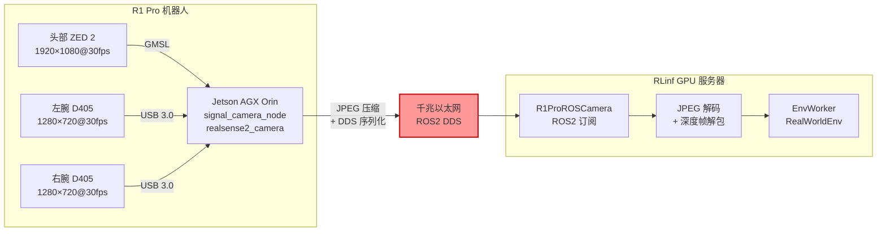
```mermaid
flowchart LR
    subgraph Robot["R1 Pro 机器人"]
        CAM_H["头部 ZED 2<br/>1920×1080@30fps"]
        CAM_WL["左腕 D405<br/>1280×720@30fps"]
        CAM_WR["右腕 D405<br/>1280×720@30fps"]
        ORIN["Jetson AGX Orin<br/>signal_camera_node<br/>realsense2_camera"]
        CAM_H -->|"GMSL"| ORIN
        CAM_WL -->|"USB 3.0"| ORIN
        CAM_WR -->|"USB 3.0"| ORIN
    end

    ETH["千兆以太网<br/>ROS2 DDS"]
    ORIN -->|"JPEG 压缩<br/>+ DDS 序列化"| ETH

    subgraph Server["RLinf GPU 服务器"]
        ROS_SUB["R1ProROSCamera<br/>ROS2 订阅"]
        DECODE["JPEG 解码<br/>+ 深度帧解包"]
        ENV["EnvWorker<br/>RealWorldEnv"]
        ROS_SUB --> DECODE --> ENV
    end

    ETH --> ROS_SUB

    style ETH fill:#ff9999,stroke:#cc0000,stroke-width:2px
```

**延迟分解**（网络传输路径）：

| 阶段 | 延迟 | 说明 |
|------|------|------|
| 相机采集 | ~33ms | 30fps 帧间隔 |
| Orin 驱动处理 | 3-8ms | signal_camera_node / realsense2_camera 驱动 |
| JPEG 编码 | 2-5ms | Orin CPU 编码 |
| DDS 序列化 | 1-3ms | CDR 序列化 + QoS 处理 |
| 网络传输 | 1-5ms | 千兆以太网，取决于帧大小和拥塞 |
| DDS 反序列化 | 1-3ms | 服务器端 |
| JPEG 解码 | 2-5ms | 服务器端 CPU 解码 |
| **总计（不含采集）** | **10-29ms** | **实际额外延迟** |

在 10Hz 控制频率（100ms 周期）下，10-29ms 的额外延迟占据了 10-29% 的控制周期。在 20Hz（50ms 周期）下，占比更高达 20-58%，严重影响控制响应性。

### 1.2 直连的收益

将相机直接连接到 RLinf 服务器后，数据路径缩短为：

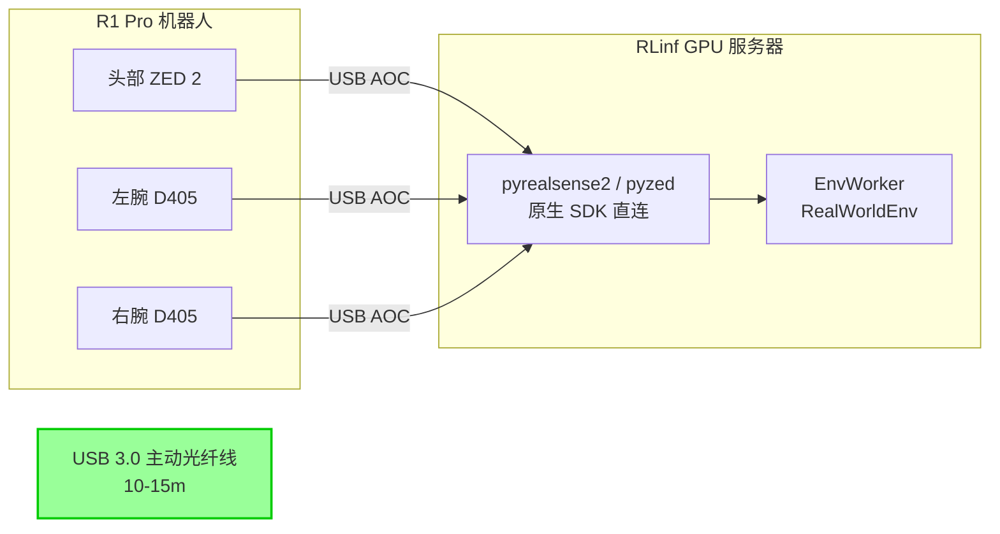
```mermaid
flowchart LR
    subgraph Robot["R1 Pro 机器人"]
        CAM_H["头部 ZED 2"]
        CAM_WL["左腕 D405"]
        CAM_WR["右腕 D405"]
    end

    USB_AOC["USB 3.0 主动光纤线<br/>10-15m"]

    subgraph Server["RLinf GPU 服务器"]
        SDK["pyrealsense2 / pyzed<br/>原生 SDK 直连"]
        ENV["EnvWorker<br/>RealWorldEnv"]
        SDK --> ENV
    end

    CAM_H -->|"USB AOC"| SDK
    CAM_WL -->|"USB AOC"| SDK
    CAM_WR -->|"USB AOC"| SDK

    style USB_AOC fill:#99ff99,stroke:#00cc00,stroke-width:2px
```

**延迟分解**（直连路径）：

| 阶段 | 延迟 | 说明 |
|------|------|------|
| 相机采集 | ~33ms | 30fps 帧间隔（不变） |
| USB 传输 | 0.003-0.005ms | 主动光纤线传输延迟 |
| SDK 处理 | 1-3ms | pyrealsense2 / pyzed 帧处理 |
| **总计（不含采集）** | **1-3ms** | **实际额外延迟** |

### 1.3 延迟对比


```mermaid
gantt
    title 单次观测获取延迟对比 (ms)
    dateFormat X
    axisFormat %L

    section 网络路径
    相机采集     :crit, cam1, 0, 33
    Orin 驱动    :drv1, after cam1, 5
    JPEG 编码    :enc1, after drv1, 4
    DDS+网络     :net1, after enc1, 6
    JPEG 解码    :dec1, after net1, 4
    可用         :done, milestone, after dec1, 0

    section 直连路径
    相机采集     :crit, cam2, 0, 33
    USB+SDK      :sdk2, after cam2, 2
    可用         :done, milestone, after sdk2, 0
```

| 指标 | 网络传输 | 直连 USB | 改善 |
|------|---------|---------|------|
| 额外延迟（不含采集） | 10-29ms | 1-3ms | **降低 80-90%** |
| 端到端延迟 | 43-62ms | 34-36ms | **降低 20-45%** |
| 可支持最高控制频率 | ~15-20Hz | ~28-30Hz | **提升 50-100%** |
| CPU 开销 | 高（JPEG 编解码） | 低（原生 SDK） | 显著降低 |
| 图像质量 | 有损（JPEG 压缩） | 无损（原始帧） | 无压缩伪影 |
| 深度精度 | 有损（16UC1 压缩传输） | 无损（原始深度帧） | 更准确的深度 |

### 1.4 额外收益

- **保留完整 SDK 功能**：ZED SDK 的 GPU 加速深度计算、空间映射、物体检测等功能只在直连时可用；RealSense SDK 的硬件对齐、后处理滤波器等功能也需要直连
- **降低 Orin 负载**：Orin 不再需要运行相机驱动和编码，释放资源给 HDAS 关键控制任务
- **简化软件栈**：不再需要 R1ProROSCamera 的 ROS2 订阅 + JPEG 解码逻辑，直接复用 RLinf 已有的 `RealSenseCamera` 和 `ZEDCamera`

---

## 2. R1 Pro 相机硬件深度分析

### 2.1 头部相机：Stereolabs ZED 2

R1 Pro 的头部相机是一台 Stereolabs ZED 2 立体深度相机，安装在机器人头部，提供前方场景的彩色图像和深度信息。

```
┌─────────────────────────────────────────────────────────┐
│                    Stereolabs ZED 2                       │
│                                                           │
│    ┌──────────┐          120mm          ┌──────────┐      │
│    │ Left Cam │◄───── baseline ───────►│ Right Cam│      │
│    │ 4MP CMOS │                         │ 4MP CMOS │      │
│    └──────────┘                         └──────────┘      │
│                                                           │
│    尺寸: 175 × 30 × 32 mm    重量: 164g                   │
│    接口: USB 3.0 Type-C (原生)                             │
│          GMSL (R1 Pro 定制适配)                             │
│                                                           │
└─────────────────────────────────────────────────────────┘
```

**关键规格**：

| 参数 | 值 |
|------|------|
| 型号 | Stereolabs ZED 2 |
| 传感器 | 2× 4MP CMOS（立体对） |
| 分辨率 | 2208×1242 (2K) / 1920×1080 (1080p) / 1280×720 (720p) / 672×376 (VGA) |
| 帧率 | 15fps (2K) / 30fps (1080p) / 60fps (720p) / 100fps (VGA) |
| 视场角 | 110° (H) × 70° (V)，2.1mm 镜头 |
| 深度范围 | 0.3m - 20m |
| 基线 | 120mm |
| **原生接口** | **USB 3.0 Type-C (5 Gbps)** |
| R1 Pro 接口 | GMSL（经定制串行器适配） |
| 功耗 | ~2W（USB 供电） |
| SDK | ZED SDK + pyzed（需 NVIDIA GPU + CUDA） |

**关键问题：R1 Pro 上的 GMSL 连接方式**

R1 Pro 的 HDAS 使用 `signal_camera_node` 驱动头部相机，该驱动通过 GMSL 接口读取数据。ZED 2 原生是 USB 3.0 接口，Galaxea 使用了定制的 GMSL 串行器板将 ZED 2 的视频信号转换为 GMSL 格式传输到 Orin 的 GMSL 解串器端口。

但 ZED 2 机身上**保留了 USB 3.0 Type-C 端口**。这意味着我们可以：
- **方案 A（推荐）**：直接使用 ZED 2 机身上的 USB-C 端口，通过 USB 线缆连接到服务器
- **方案 B（备选）**：如果 GMSL 适配器占用了 USB 端口，使用 Stereolabs ZED Link 转换盒

> **重要验证点**：需要在实际机器人上确认 ZED 2 的 USB-C 端口是否被 GMSL 适配器占用或禁用。如果 GMSL 适配板是通过 USB 端口取信号再转为 GMSL 的（即串行器板接在 USB-C 口上），则需要拔掉适配板才能使用 USB 直连。如果 GMSL 适配板通过其他接口（如 MIPI CSI 或直接焊接传感器信号线）取信号，则 USB-C 端口可以同时使用。

### 2.2 腕部相机：Intel RealSense D405

R1 Pro 的每条手臂末端各安装一台 Intel RealSense D405 深度相机，安装在夹爪上方的专用支架上。

```
┌───────────────────────────────────┐
│      Intel RealSense D405          │
│                                     │
│   ┌─────────────────────────┐      │
│   │  主动 IR 立体深度模组    │      │
│   │  ┌──┐  ┌──────┐  ┌──┐  │      │
│   │  │IR│  │IR Pro│  │IR│  │      │
│   │  │ L│  │ ject │  │ R│  │      │
│   │  └──┘  └──────┘  └──┘  │      │
│   │       RGB 传感器         │      │
│   └─────────────────────────┘      │
│                                     │
│   尺寸: 42 × 42 × 23 mm            │
│   重量: ~50g                        │
│   接口: USB-C (原生 USB 3.2 Gen 1)  │
│                                     │
└───────────────────────────────────┘
```

**关键规格**：

| 参数 | 值 |
|------|------|
| 型号 | Intel RealSense D405 |
| 深度技术 | 主动 IR 立体视觉（全局快门） |
| RGB 分辨率 | 1280×720 @ 30fps |
| 深度分辨率 | 1280×720 @ 30fps |
| 视场角 | 87° (H) × 58° (V) × 95° (D) |
| 深度范围 | 7cm - 50cm（优化近距离） |
| **原生接口** | **USB-C (USB 3.2 Gen 1, 5 Gbps)** |
| 线缆 | 随附 1.5m USB-C to USB-A |
| 功耗 | ~700mW 典型，~1.5W 峰值 |
| SDK | librealsense2 + pyrealsense2（CPU 即可） |
| 数量 | 2（左腕 + 右腕） |

**当前连接方式**：D405 通过 1.5m USB-C to USB-A 线缆从夹爪沿手臂走线到机器人背板 USB-A 端口，内部连接到 Orin 的 USB 控制器。

**直连优势**：D405 是标准 USB 设备，可以直接拔出背板 USB 口，改接到通往服务器的 USB 延长线。无需任何接口转换。

### 2.3 相机汇总与接口对比

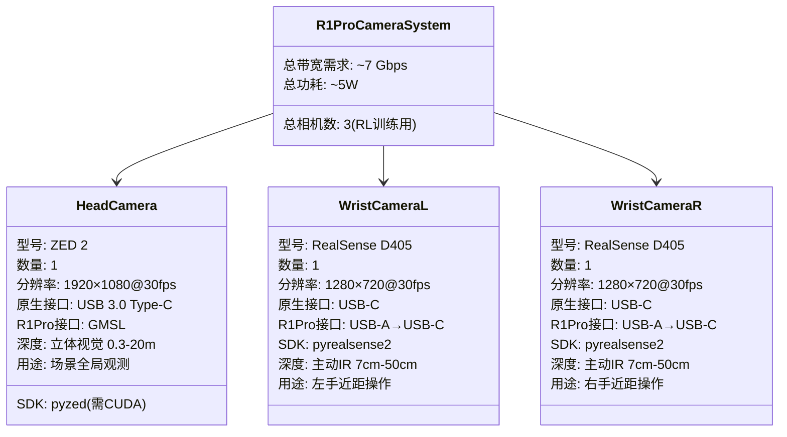
```mermaid
classDiagram
    class HeadCamera {
        型号: ZED 2
        数量: 1
        分辨率: 1920×1080@30fps
        原生接口: USB 3.0 Type-C
        R1Pro接口: GMSL
        SDK: pyzed (需CUDA)
        深度: 立体视觉 0.3-20m
        用途: 场景全局观测
    }

    class WristCameraL {
        型号: RealSense D405
        数量: 1
        分辨率: 1280×720@30fps
        原生接口: USB-C
        R1Pro接口: USB-A→USB-C
        SDK: pyrealsense2
        深度: 主动IR 7cm-50cm
        用途: 左手近距操作
    }

    class WristCameraR {
        型号: RealSense D405
        数量: 1
        分辨率: 1280×720@30fps
        原生接口: USB-C
        R1Pro接口: USB-A→USB-C
        SDK: pyrealsense2
        深度: 主动IR 7cm-50cm
        用途: 右手近距操作
    }

    class R1ProCameraSystem {
        总相机数: 3 (RL训练用)
        总带宽需求: ~7 Gbps
        总功耗: ~5W
    }

    R1ProCameraSystem --> HeadCamera
    R1ProCameraSystem --> WristCameraL
    R1ProCameraSystem --> WristCameraR
```

---

## 3. 直连方案总体架构

### 3.1 架构对比：网络传输 vs 直连


```mermaid
flowchart TB
    subgraph BEFORE["方案对比: 网络传输 (改造前)"]
        direction LR
        subgraph Robot1["R1 Pro 机器人"]
            ZED1["ZED 2 (头部)"]
            D405L1["D405 (左腕)"]
            D405R1["D405 (右腕)"]
            ORIN1["Jetson AGX Orin<br/>HDAS 驱动<br/>ROS2 话题发布"]

            ZED1 -->|GMSL| ORIN1
            D405L1 -->|USB| ORIN1
            D405R1 -->|USB| ORIN1
        end

        NET1["千兆以太网<br/>DDS/ROS2"]
        ORIN1 -->|"JPEG+DDS<br/>30-80ms 延迟"| NET1

        subgraph Server1["RLinf 服务器"]
            ROS1["ROS2 订阅<br/>JPEG 解码"]
            ENV1["EnvWorker"]
            ROS1 --> ENV1
        end
        NET1 --> ROS1
    end

    subgraph AFTER["方案对比: 直连 USB (改造后)"]
        direction LR
        subgraph Robot2["R1 Pro 机器人"]
            ZED2["ZED 2 (头部)<br/>USB-C 端口"]
            D405L2["D405 (左腕)<br/>USB-C"]
            D405R2["D405 (右腕)<br/>USB-C"]
            HUB2["供电 USB Hub<br/>(机器人背部)"]

            D405L2 -->|"1.5m USB"| HUB2
            D405R2 -->|"1.5m USB"| HUB2
        end

        AOC2["USB 3.0<br/>主动光纤线<br/>10-15m"]
        AOC3["USB 3.0<br/>主动光纤线<br/>10-15m"]
        ZED2 -->|"AOC"| AOC3
        HUB2 -->|"AOC"| AOC2

        subgraph Server2["RLinf 服务器"]
            SDK2["pyrealsense2 / pyzed<br/>原生 SDK 直连"]
            ENV2["EnvWorker"]
            SDK2 -->|"<5ms"| ENV2
        end
        AOC2 --> SDK2
        AOC3 --> SDK2
    end

    style NET1 fill:#ffcccc,stroke:#cc0000
    style AOC2 fill:#ccffcc,stroke:#00cc00
    style AOC3 fill:#ccffcc,stroke:#00cc00
```

### 3.2 总体直连拓扑

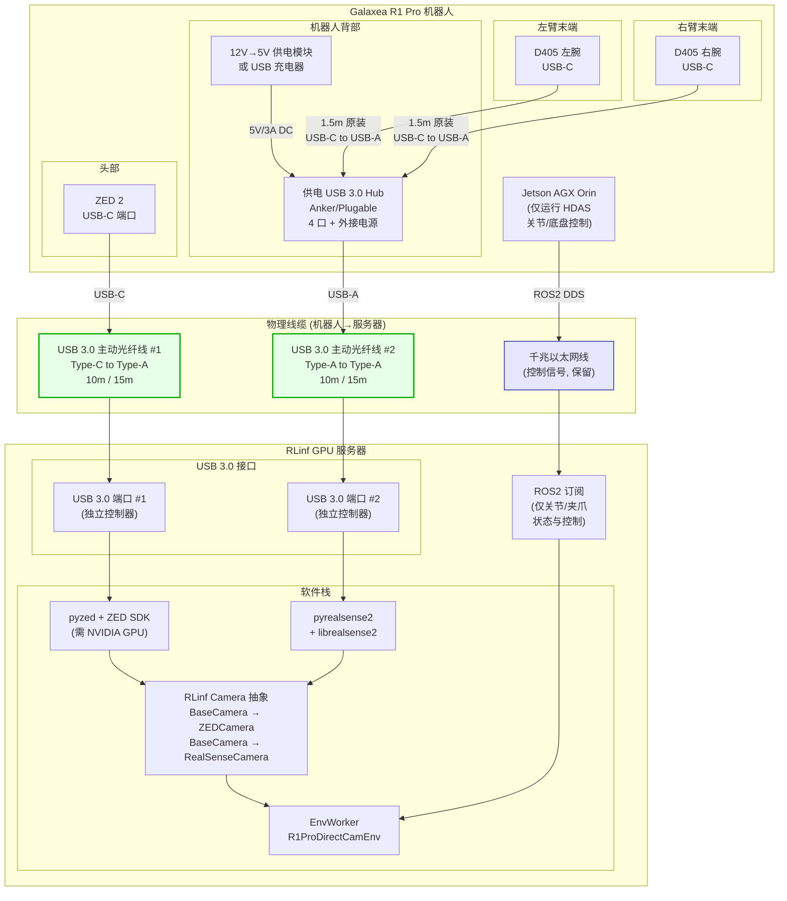
```mermaid
flowchart TB
    subgraph R1Pro["Galaxea R1 Pro 机器人"]
        subgraph Head["头部"]
            ZED["ZED 2<br/>USB-C 端口"]
        end

        subgraph LeftArm["左臂末端"]
            DL["D405 左腕<br/>USB-C"]
        end

        subgraph RightArm["右臂末端"]
            DR["D405 右腕<br/>USB-C"]
        end

        subgraph Back["机器人背部"]
            HUB["供电 USB 3.0 Hub<br/>Anker/Plugable<br/>4 口 + 外接电源"]
            PSU["12V→5V 供电模块<br/>或 USB 充电器"]
            PSU -->|"5V/3A DC"| HUB
        end

        DL -->|"1.5m 原装<br/>USB-C to USB-A"| HUB
        DR -->|"1.5m 原装<br/>USB-C to USB-A"| HUB

        ORIN["Jetson AGX Orin<br/>(仅运行 HDAS<br/>关节/底盘控制)"]
    end

    subgraph Cables["物理线缆 (机器人→服务器)"]
        AOC_ZED["USB 3.0 主动光纤线 #1<br/>Type-C to Type-A<br/>10m / 15m"]
        AOC_HUB["USB 3.0 主动光纤线 #2<br/>Type-A to Type-A<br/>10m / 15m"]
        ETH["千兆以太网线<br/>(控制信号, 保留)"]
    end

    ZED -->|"USB-C"| AOC_ZED
    HUB -->|"USB-A"| AOC_HUB
    ORIN -->|"ROS2 DDS"| ETH

    subgraph Server["RLinf GPU 服务器"]
        subgraph USBPorts["USB 3.0 接口"]
            USB1["USB 3.0 端口 #1<br/>(独立控制器)"]
            USB2["USB 3.0 端口 #2<br/>(独立控制器)"]
        end

        subgraph Software["软件栈"]
            PYZED["pyzed + ZED SDK<br/>(需 NVIDIA GPU)"]
            PYRS["pyrealsense2<br/>+ librealsense2"]
            CAM_ABS["RLinf Camera 抽象<br/>BaseCamera → ZEDCamera<br/>BaseCamera → RealSenseCamera"]
            ENVW["EnvWorker<br/>R1ProDirectCamEnv"]
        end

        ROS_SUB["ROS2 订阅<br/>(仅关节/夹爪<br/>状态与控制)"]

        USB1 --> PYZED
        USB2 --> PYRS
        PYZED --> CAM_ABS
        PYRS --> CAM_ABS
        CAM_ABS --> ENVW
        ETH --> ROS_SUB
        ROS_SUB --> ENVW
    end

    AOC_ZED --> USB1
    AOC_HUB --> USB2

    style AOC_ZED fill:#e6ffe6,stroke:#00aa00,stroke-width:2px
    style AOC_HUB fill:#e6ffe6,stroke:#00aa00,stroke-width:2px
    style ETH fill:#e6e6ff,stroke:#0000aa,stroke-width:1px
```

### 3.3 数据流分离原则

直连方案将 R1 Pro 的数据流分为两条独立路径：

| 数据类型 | 传输路径 | 协议 | 延迟要求 | 带宽 |
|---------|---------|------|---------|------|
| **图像数据**（RGB+深度） | USB 3.0 光纤线直连 | USB 原生协议 | <5ms | ~5 Gbps |
| **控制信号**（关节/夹爪/底盘） | 千兆以太网 via ROS2 | DDS | <10ms | <10 Mbps |

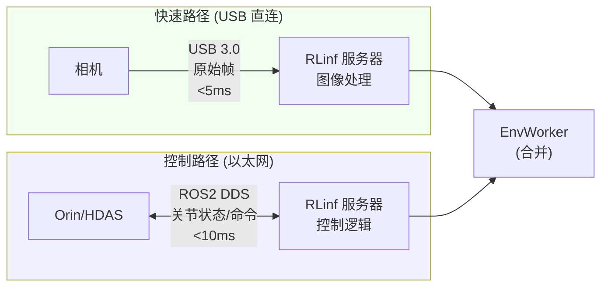
```mermaid
flowchart LR
    subgraph FastPath["快速路径 (USB 直连)"]
        CAM["相机"] -->|"USB 3.0<br/>原始帧<br/><5ms"| SERVER_IMG["RLinf 服务器<br/>图像处理"]
    end

    subgraph CtrlPath["控制路径 (以太网)"]
        ORIN["Orin/HDAS"] <-->|"ROS2 DDS<br/>关节状态/命令<br/><10ms"| SERVER_CTL["RLinf 服务器<br/>控制逻辑"]
    end

    SERVER_IMG --> ENVW["EnvWorker<br/>(合并)"]
    SERVER_CTL --> ENVW

    style FastPath fill:#f0fff0
    style CtrlPath fill:#f0f0ff
```

---

## 4. 头部相机直连方案

### 4.1 方案 A：USB-C 直连（推荐）

如果 ZED 2 的 USB-C 端口未被 GMSL 适配器占用：

```
ZED 2 (头部)                                  RLinf GPU 服务器
┌────────────┐                                ┌────────────────┐
│  USB-C 端口 │──── USB 3.0 主动光纤线 ────────│  USB 3.0 端口   │
│  (机身侧面) │     10m, Type-C to Type-A      │  (独立控制器)   │
└────────────┘                                └────────────────┘
              需要在头部附近提供                  服务器需安装
              USB 供电 (见 4.3)                 ZED SDK + CUDA
```

**优势**：
- 零额外延迟（USB 原生传输 < 0.01ms）
- 可使用 ZED SDK 全部功能（GPU 加速深度、空间映射、目标追踪）
- RLinf 已有 `ZEDCamera` 类，无需任何代码改动

**挑战**：
- ZED 2 是 USB 总线供电，10m AOC 线不传输电力
- 需要在头部附近放置 USB 供电模块

### 4.2 方案 B：GMSL 解串器卡（如果 USB 端口被占用）

如果 ZED 2 的 USB-C 端口被 GMSL 串行器板占用（即串行器板插在 USB-C 口上将信号转为 GMSL）：

```
ZED 2 (头部)        GMSL 同轴线         GMSL 解串器
┌────────────┐      (已有线缆)       ┌──────────────┐
│  GMSL 输出  │──── 或新增 GMSL ─────│ Stereolabs    │
│  (串行器板) │     同轴线延长       │ ZED Link 盒   │
└────────────┘     至服务器侧        │ GMSL→USB 3.0  │
                                    └──────┬───────┘
                                           │ USB 3.0
                                    ┌──────┴───────┐
                                    │ RLinf 服务器   │
                                    │ ZED SDK       │
                                    └──────────────┘
```

**Stereolabs ZED Link**：
- Stereolabs 官方的 GMSL-to-USB 转换盒
- 支持 ZED X / ZED X Mini 的 GMSL2 信号
- 输出标准 USB 3.0，对主机呈现为普通 ZED 相机
- 价格约 $500-700

**替代方案：PCIe GMSL 解串器卡**：
- 如 Leopard Imaging LI-JXAV-GMSL2-DESER
- PCIe x4 接口，4 路 GMSL2 输入
- Linux V4L2 驱动
- 价格约 $400-600
- 需要自行编写 V4L2 到 RLinf 的适配层

### 4.3 ZED 2 供电解决方案

ZED 2 消耗约 2W（USB 总线供电），10m+ 的主动光纤线不传输电力。需要在相机端提供独立供电：

```
方案一：USB 供电注入器 (推荐)
┌──────────┐     ┌──────────────────┐     ┌──────────┐
│ ZED 2    │─────│ USB 供电注入器    │─────│ 10m AOC  │───→ 服务器
│ USB-C    │     │ (数据直通+供电)   │     │ (仅数据) │
└──────────┘     └────────┬─────────┘     └──────────┘
                          │
                   ┌──────┴──────┐
                   │ 5V/2A 电源   │
                   │ (小型 USB    │
                   │  充电器)     │
                   └─────────────┘

方案二：带供电的有源 USB Hub
┌──────────┐     ┌──────────────────┐     ┌──────────┐
│ ZED 2    │─────│ 有源 USB 3.0 Hub │─────│ 10m AOC  │───→ 服务器
│ USB-C    │     │ (含外接电源)      │     │ (仅数据) │
└──────────┘     └────────┬─────────┘     └──────────┘
                          │
                   ┌──────┴──────┐
                   │ 5V/3A DC    │
                   │ 电源适配器   │
                   └─────────────┘
```

**推荐方案一**：USB 供电注入器体积小巧（约 USB 闪存盘大小），可用扎带固定在机器人头部支架上。供电线从机器人内部 12V 总线取电经 DC-DC 降压至 5V，或直接使用小型 USB 充电器。

### 4.4 头部相机决策树

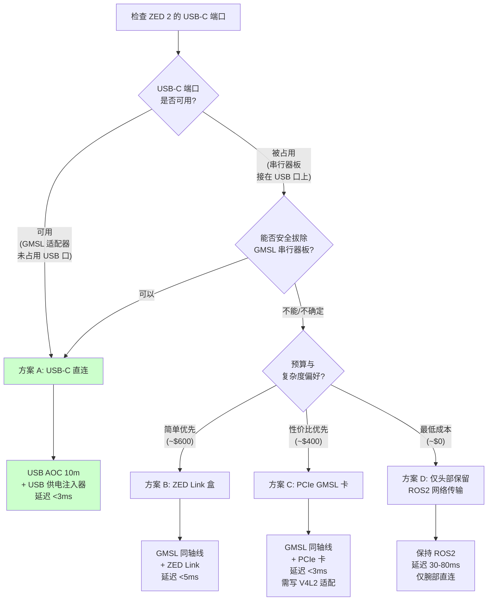
```mermaid
flowchart TD
    START["检查 ZED 2 的 USB-C 端口"]
    CHECK1{"USB-C 端口<br/>是否可用?"}

    START --> CHECK1

    CHECK1 -->|"可用<br/>(GMSL 适配器<br/>未占用 USB 口)"| A["方案 A: USB-C 直连"]
    CHECK1 -->|"被占用<br/>(串行器板<br/>接在 USB 口上)"| CHECK2

    CHECK2{"能否安全拔除<br/>GMSL 串行器板?"}
    CHECK2 -->|"可以"| A
    CHECK2 -->|"不能/不确定"| CHECK3

    CHECK3{"预算与<br/>复杂度偏好?"}
    CHECK3 -->|"简单优先<br/>(~$600)"| B["方案 B: ZED Link 盒"]
    CHECK3 -->|"性价比优先<br/>(~$400)"| C["方案 C: PCIe GMSL 卡"]
    CHECK3 -->|"最低成本<br/>(~$0)"| D["方案 D: 仅头部保留<br/>ROS2 网络传输"]

    A --> RESULT_A["USB AOC 10m<br/>+ USB 供电注入器<br/>延迟 <3ms"]
    B --> RESULT_B["GMSL 同轴线<br/>+ ZED Link<br/>延迟 <5ms"]
    C --> RESULT_C["GMSL 同轴线<br/>+ PCIe 卡<br/>延迟 <3ms<br/>需写 V4L2 适配"]
    D --> RESULT_D["保持 ROS2<br/>延迟 30-80ms<br/>仅腕部直连"]

    style A fill:#ccffcc
    style RESULT_A fill:#ccffcc
```

---

## 5. 腕部相机直连方案

### 5.1 D405 直连路径

腕部 D405 的直连最为简单直接，因为它们本身就是标准 USB 设备：

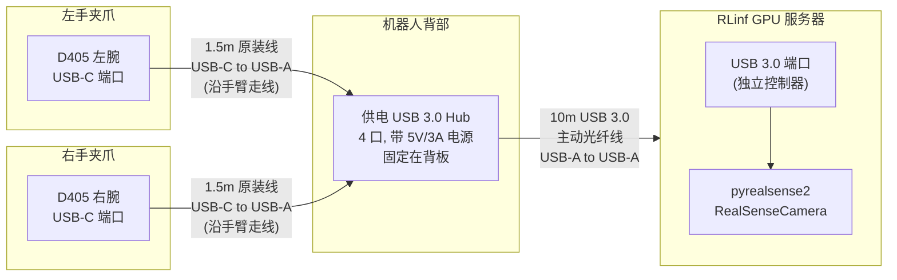
```mermaid
flowchart LR
    subgraph LeftGripper["左手夹爪"]
        DL["D405 左腕<br/>USB-C 端口"]
    end

    subgraph RightGripper["右手夹爪"]
        DR["D405 右腕<br/>USB-C 端口"]
    end

    subgraph BackPanel["机器人背部"]
        HUB["供电 USB 3.0 Hub<br/>4 口, 带 5V/3A 电源<br/>固定在背板"]
    end

    DL -->|"1.5m 原装线<br/>USB-C to USB-A<br/>(沿手臂走线)"| HUB
    DR -->|"1.5m 原装线<br/>USB-C to USB-A<br/>(沿手臂走线)"| HUB

    HUB -->|"10m USB 3.0<br/>主动光纤线<br/>USB-A to USB-A"| SERVER

    subgraph SERVER["RLinf GPU 服务器"]
        USB3["USB 3.0 端口<br/>(独立控制器)"]
        RS["pyrealsense2<br/>RealSenseCamera"]
    end

    USB3 --> RS
```

### 5.2 原有走线复用

R1 Pro 的 D405 线缆原本从夹爪沿手臂走线到背板 USB-A 端口。直连改造时：

1. **保持原有走线不变**：D405 到背板的 1.5m USB-C to USB-A 线缆保持原样
2. **在背板断开**：将 USB-A 插头从 Orin 背板端口拔出
3. **接入 Hub**：插入固定在背板外侧的供电 USB Hub
4. **Hub 到服务器**：Hub 通过 10m AOC 线连接到服务器

```
改造前:
D405 ──1.5m USB──→ [背板 USB-A 端口] ──内部──→ Orin

改造后:
D405 ──1.5m USB──→ [背板 USB-A 端口拔出] ──外接──→ [供电 Hub] ──10m AOC──→ 服务器
```

### 5.3 USB 带宽分析

两台 D405 在最大分辨率下的带宽需求：

| 流 | 单相机带宽 | 双相机带宽 |
|---|---|---|
| RGB 1280×720 @ 30fps (YUYV) | ~660 Mbps | ~1320 Mbps |
| Depth 1280×720 @ 30fps (Z16) | ~440 Mbps | ~880 Mbps |
| IR 左 + IR 右 (可选) | ~880 Mbps | ~1760 Mbps |
| **合计 (RGB+Depth)** | **~1100 Mbps** | **~2200 Mbps** |

USB 3.0 理论带宽 5 Gbps，实际可用约 3.2 Gbps。两台 D405 仅使用 RGB+Depth 流时占用约 2.2 Gbps，在单个 USB 3.0 控制器的承载范围内。

> **注意**：如果启用红外流或提高帧率，可能超出带宽限制。建议在 RL 训练中使用 640×480 @ 30fps 或 1280×720 @ 15fps 以留出余量。RLinf 默认使用 640×480 @ 15fps（`CameraInfo` 默认值），完全在安全范围内。

### 5.4 降帧配置建议

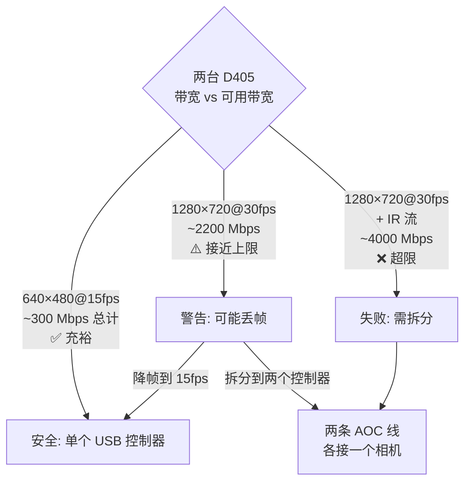
```mermaid
flowchart TD
    BW{"两台 D405<br/>带宽 vs 可用带宽"}
    BW -->|"640×480@15fps<br/>~300 Mbps 总计<br/>✅ 充裕"| SAFE["安全: 单个 USB 控制器"]
    BW -->|"1280×720@30fps<br/>~2200 Mbps<br/>⚠️ 接近上限"| WARN["警告: 可能丢帧"]
    BW -->|"1280×720@30fps<br/>+ IR 流<br/>~4000 Mbps<br/>❌ 超限"| FAIL["失败: 需拆分"]

    WARN -->|"降帧到 15fps"| SAFE
    WARN -->|"拆分到两个控制器"| SPLIT["两条 AOC 线<br/>各接一个相机"]
    FAIL --> SPLIT
```

---

## 6. 物理线缆选型与布线

### 6.1 USB 3.0 主动光纤线 (AOC) 选型

USB 3.0 主动光纤线（Active Optical Cable）是直连方案的核心组件。它在两端集成了电光/光电转换器，中间使用光纤传输，实现：
- 超长距离（10-50m）的 USB 3.0 5Gbps 传输
- 极低延迟（3-5μs，几乎可忽略）
- 抗电磁干扰（光纤不受电机、驱动器等噪声影响）
- 重量轻、弯折半径小

**推荐产品**：

| 产品 | 长度 | 接口 | 用途 | 参考价格 |
|------|------|------|------|---------|
| **Corning USB 3.Optical** | 10m | Type-C to Type-A | ZED 2 头部相机 | ~$120 |
| **Corning USB 3.Optical** | 10m | Type-A to Type-A | Hub 到服务器 | ~$120 |
| Newnex FireNEX-uLINK | 10m | Type-C to Type-A | 备选（工业级） | ~$150 |
| SIIG USB 3.0 AOC | 10m | Type-A to Type-A | 备选（性价比） | ~$80 |

> **选型关键点**：
> - AOC 线**不传输电力**，这是为什么需要在相机端提供独立供电的原因
> - 选择有**信号增强芯片**的产品，确保 5Gbps 满速传输
> - 光纤部分的最小弯折半径通常为 30-50mm，走线时注意不要急弯
> - 工业级产品（如 Newnex）有更好的温度范围和抗拉强度

### 6.2 替代方案：有源铜缆

如果距离在 5m 以内，可使用成本更低的 USB 3.0 有源铜缆（带信号中继芯片）：

| 产品类型 | 最大长度 | 是否传输电力 | 参考价格 |
|---------|---------|------------|---------|
| 有源铜缆 | 5m | 有限（可能需外接供电） | ~$30-50 |
| 有源铜缆 (带电源) | 10m | 自带电源注入 | ~$50-80 |
| 主动光纤线 (AOC) | 10-50m | 不传输 | ~$80-200 |

### 6.3 线缆布线方案

```
                      ┌──── RLinf GPU 服务器 ────────────┐
                      │                                   │
                      │  USB 3.0 端口 A ← AOC #1 (ZED 2) │
                      │  USB 3.0 端口 B ← AOC #2 (D405s) │
                      │  以太网端口 ← 网线 (ROS2 控制)      │
                      │                                   │
                      └───────────────────────────────────┘
                              ↑        ↑        ↑
                         AOC #1   AOC #2    以太网线
                          10m      10m       10m
                              ↑        ↑        ↑
                      ┌───── 线缆管理 ──────────────────┐
                      │  三条线缆捆扎, 走地面线槽         │
                      │  或悬挂走线架                      │
                      │  预留 1-2m 活动余量                │
                      └──────────────────────────────────┘
                              ↑        ↑        ↑
                      ┌──── R1 Pro 机器人 ──────────────┐
                      │                                  │
                      │  头部: ZED 2 USB-C               │
                      │    → USB 供电注入器                │
                      │    → AOC #1 Type-C 端              │
                      │                                  │
                      │  背部: 供电 USB Hub               │
                      │    ← D405 左腕 (1.5m USB)         │
                      │    ← D405 右腕 (1.5m USB)         │
                      │    → AOC #2 Type-A 端              │
                      │                                  │
                      │  以太网口: M12 → RJ45             │
                      │    → 以太网线 (ROS2 DDS)           │
                      │                                  │
                      └──────────────────────────────────┘
```

**走线注意事项**：
1. **机器人端固定**：AOC 线在机器人背部通过线缆固定夹 (cable clamp) 固定，预留足够的弯曲余量
2. **活动余量**：R1 Pro 底盘可移动，需要预留 1-2m 的线缆活动余量（或限制机器人移动范围）
3. **地面走线**：使用地面线槽保护光纤线，避免被踩踏或碾压
4. **悬挂走线**：如果工作空间允许，使用天花板悬挂走线架，避免地面障碍
5. **应力释放**：在两端使用应力释放夹，防止线缆连接器受力

### 6.4 机器人移动性考虑

R1 Pro 是轮式移动机器人。直连线缆会限制其移动范围：

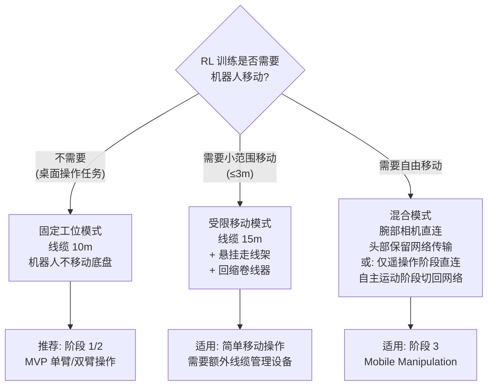
```mermaid
flowchart TD
    MOBILE{"RL 训练是否需要<br/>机器人移动?"}

    MOBILE -->|"不需要<br/>(桌面操作任务)"| FIXED["固定工位模式<br/>线缆 10m<br/>机器人不移动底盘"]

    MOBILE -->|"需要小范围移动<br/>(≤3m)"| LIMITED["受限移动模式<br/>线缆 15m<br/>+ 悬挂走线架<br/>+ 回缩卷线器"]

    MOBILE -->|"需要自由移动"| HYBRID["混合模式<br/>腕部相机直连<br/>头部保留网络传输<br/>或: 仅遥操作阶段直连<br/>自主运动阶段切回网络"]

    FIXED --> NOTE1["推荐: 阶段 1/2<br/>MVP 单臂/双臂操作"]
    LIMITED --> NOTE2["适用: 简单移动操作<br/>需要额外线缆管理设备"]
    HYBRID --> NOTE3["适用: 阶段 3<br/>Mobile Manipulation"]
```

**阶段 1/2 推荐**：固定工位模式。桌面操作任务不需要底盘移动，10m 线缆足够。

---

## 7. GPU 服务器端硬件准备

### 7.1 USB 3.0 端口需求

直连方案需要服务器上的 **2 个独立 USB 3.0 控制器**：

| 端口 | 连接设备 | 带宽需求 | 控制器要求 |
|------|---------|---------|----------|
| USB 3.0 #1 | ZED 2（头部） | ~3.2 Gbps | 独立控制器（xHCI） |
| USB 3.0 #2 | USB Hub → 2× D405 | ~2.2 Gbps | 独立控制器（xHCI） |

**为什么需要独立控制器**：如果两路相机共享同一个 USB 3.0 根集线器（root hub），5 Gbps 带宽将被分享，可能导致丢帧。

**检查方法**：

```bash
# 查看 USB 控制器
lspci | grep -i usb

# 查看 USB 拓扑 (需要安装 usbutils)
lsusb -t

# 确认两个端口在不同的控制器下
# 如果不同端口显示在不同的 Bus 下, 说明是独立控制器
```

### 7.2 PCIe USB 3.0 扩展卡（如果端口不足）

如果服务器的板载 USB 3.0 端口共享控制器，建议安装 PCIe USB 3.0 扩展卡：

| 产品 | 接口 | 控制器数 | 独立通道 | 参考价格 |
|------|------|---------|---------|---------|
| StarTech PEXUSB3S44V | PCIe x4 | 4 | 4 独立 | ~$40 |
| Inateck KT4006 | PCIe x1 | 2 | 2 独立 | ~$25 |
| Fresco Logic FL1100 卡 | PCIe x1 | 1 | 1 | ~$15 |

**推荐 StarTech PEXUSB3S44V**：4 个独立 USB 3.0 通道，每个有独立的 xHCI 控制器和 5 Gbps 带宽。

### 7.3 GPU 需求（ZED SDK）

ZED SDK 使用 NVIDIA GPU 进行深度计算。RLinf 服务器通常已配备 NVIDIA GPU（用于模型训练），但需确认：

| 需求 | 最低要求 | 推荐 |
|------|---------|------|
| GPU | NVIDIA (Compute Capability 5.0+) | RTX 3090/4090 或 A800 |
| CUDA | 11.x 或 12.x | 与 RLinf 环境一致 |
| ZED SDK | v4.x | 最新稳定版 |
| 显存占用 | ~200MB（ZED 深度计算） | 不影响 RL 训练 |

> **注意**：ZED SDK 的深度计算使用 GPU 的小部分算力，不会显著影响 RL 训练。在 RLinf 中，ZED 相机运行在 EnvWorker 所在的 GPU 服务器节点上，与 Actor/Rollout Worker 共享 GPU。由于 EnvWorker 通常绑定到特定 GPU（或不需要 GPU），ZED 深度计算可以在空闲 GPU 上运行，或使用 `CUDA_VISIBLE_DEVICES` 隔离。

### 7.4 软件依赖安装

```bash
# 1. 安装 ZED SDK (系统级)
# 从 https://www.stereolabs.com/developers/release 下载对应版本
chmod +x ZED_SDK_Ubuntu22_cuda12.1_v4.2.2.zstd.run
./ZED_SDK_Ubuntu22_cuda12.1_v4.2.2.zstd.run
# pyzed 随 SDK 安装, 不需要 pip install

# 2. 安装 librealsense2
sudo apt-key adv --keyserver keyserver.ubuntu.com \
    --recv-key F6E65AC044F831AC80A06380C8B3A55A6F3EFCDE
sudo add-apt-repository \
    "deb https://librealsense.intel.com/Debian/apt-repo $(lsb_release -cs) main"
sudo apt install librealsense2-dkms librealsense2-utils librealsense2-dev

# 3. 安装 pyrealsense2
pip install pyrealsense2

# 4. 验证设备识别
python -c "import pyrealsense2 as rs; print(rs.context().devices)"
python -c "import pyzed.sl as sl; print(sl.Camera.get_device_list())"

# 5. 使用 RLinf 工具验证
python toolkits/realworld_check/test_franka_camera.py  # RealSense
python toolkits/realworld_check/test_zed_camera.py --serial <SERIAL>  # ZED
```

---

## 8. 软件集成方案：RLinf 侧适配

### 8.1 核心洞察：直连复用已有代码

RLinf 已经有完整的 `RealSenseCamera` 和 `ZEDCamera` 实现（来自 Franka 真机集成）。直连方案的软件改动**极小** — 核心是将 R1 Pro 环境配置为使用 SDK 直连相机而非 ROS2 订阅。

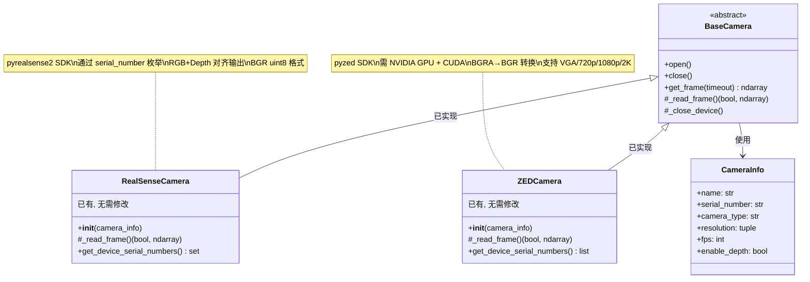
```mermaid
classDiagram
    class BaseCamera {
        <<abstract>>
        +open()
        +close()
        +get_frame(timeout) ndarray
        #_read_frame() (bool, ndarray)
        #_close_device()
    }

    class RealSenseCamera {
        已有, 无需修改
        +__init__(camera_info)
        #_read_frame() (bool, ndarray)
        +get_device_serial_numbers() set
    }

    class ZEDCamera {
        已有, 无需修改
        +__init__(camera_info)
        #_read_frame() (bool, ndarray)
        +get_device_serial_numbers() list
    }

    class CameraInfo {
        +name: str
        +serial_number: str
        +camera_type: str
        +resolution: tuple
        +fps: int
        +enable_depth: bool
    }

    BaseCamera <|-- RealSenseCamera : 已实现
    BaseCamera <|-- ZEDCamera : 已实现
    BaseCamera --> CameraInfo : 使用

    note for RealSenseCamera "pyrealsense2 SDK\n通过 serial_number 枚举\nRGB+Depth 对齐输出\nBGR uint8 格式"
    note for ZEDCamera "pyzed SDK\n需 NVIDIA GPU + CUDA\nBGRA→BGR 转换\n支持 VGA/720p/1080p/2K"
```

### 8.2 R1ProDirectCamEnv：新增环境类

需要创建一个新的 R1 Pro 环境类，区别于通过 ROS2 获取图像的版本。这个类在相机处理上直接使用 SDK，在关节控制上仍通过 ROS2/以太网与 Orin 通信。

```mermaid
classDiagram
    class R1ProEnv {
        <<原有方案>>
        控制: ROS2 DDS
        图像: ROS2 订阅
        +cameras: list[R1ProROSCamera]
    }

    class R1ProDirectCamEnv {
        <<直连方案, 新增>>
        控制: ROS2 DDS (保持)
        图像: SDK 直连 (改变)
        +cameras: list[BaseCamera]
        +_setup_cameras()
        +_get_camera_frames() dict
    }

    class FrankaEnv {
        <<已有参考>>
        控制: ROS1 + Franka SDK
        图像: SDK 直连
        +cameras: list[BaseCamera]
    }

    R1ProDirectCamEnv --|> "gym.Env" : 继承
    R1ProDirectCamEnv --> BaseCamera : 使用(SDK直连)
    R1ProDirectCamEnv --> "R1ProController" : 使用(ROS2控制)

    note for R1ProDirectCamEnv "关键: 相机走 USB SDK\n控制走 ROS2 以太网\n两条路径独立"
```

**关键设计**：`R1ProDirectCamEnv` 的相机初始化逻辑与 `FrankaEnv` 完全一致 — 通过 `camera_serials` 和 `camera_type` 配置，使用 `create_camera()` 工厂函数创建相机实例：

```python
# R1ProDirectCamEnv 的相机初始化 (伪代码, 与 FrankaEnv 模式一致)
class R1ProDirectCamConfig:
    camera_serials: list[str]       # 相机序列号列表
    camera_types: list[str]         # 每个相机的类型 ["zed", "realsense", "realsense"]
    camera_names: list[str]         # 名称 ["head", "wrist_left", "wrist_right"]
    camera_resolution: tuple        # (640, 480) 或 (1280, 720)
    camera_fps: int                 # 15 或 30

class R1ProDirectCamEnv(gym.Env):
    def _setup_cameras(self):
        self.cameras = []
        for serial, cam_type, name in zip(
            self.config.camera_serials,
            self.config.camera_types,
            self.config.camera_names,
        ):
            camera_info = CameraInfo(
                name=name,
                serial_number=serial,
                camera_type=cam_type,
                resolution=self.config.camera_resolution,
                fps=self.config.camera_fps,
                enable_depth=True,
            )
            camera = create_camera(camera_info)  # 已有工厂函数, 无需修改
            camera.open()
            self.cameras.append(camera)

    def _get_camera_frames(self) -> dict[str, np.ndarray]:
        frames = {}
        for camera in self.cameras:
            frame = camera.get_frame(timeout=5)
            # 裁剪为正方形 + 缩放到训练分辨率
            h, w = frame.shape[:2]
            size = min(h, w)
            frame = frame[:size, :size]
            frame = cv2.resize(frame, (self.obs_resolution, self.obs_resolution))
            frames[camera.name] = frame
        return frames
```

### 8.3 与 RLinf 训练管线的集成

直连相机与 RLinf 训练管线的集成完全复用已有架构：

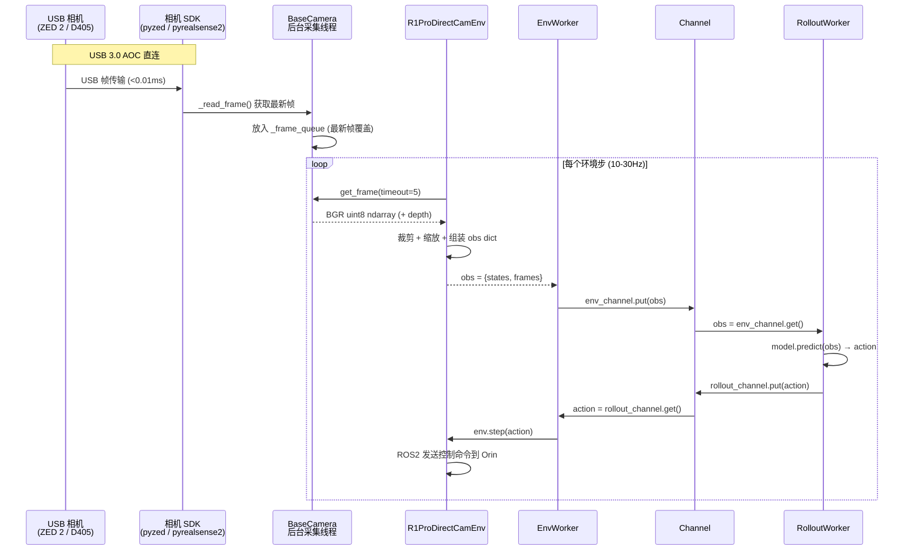
```mermaid
sequenceDiagram
    participant Cam as USB 相机<br/>(ZED 2 / D405)
    participant SDK as 相机 SDK<br/>(pyzed / pyrealsense2)
    participant BaseCamera as BaseCamera<br/>后台采集线程
    participant R1ProEnv as R1ProDirectCamEnv
    participant EnvWorker as EnvWorker
    participant Channel as Channel
    participant Rollout as RolloutWorker

    Note over Cam, SDK: USB 3.0 AOC 直连

    Cam->>SDK: USB 帧传输 (<0.01ms)
    SDK->>BaseCamera: _read_frame() 获取最新帧
    BaseCamera->>BaseCamera: 放入 _frame_queue (最新帧覆盖)

    loop 每个环境步 (10-30Hz)
        R1ProEnv->>BaseCamera: get_frame(timeout=5)
        BaseCamera-->>R1ProEnv: BGR uint8 ndarray (+ depth)
        R1ProEnv->>R1ProEnv: 裁剪 + 缩放 + 组装 obs dict
        R1ProEnv-->>EnvWorker: obs = {states, frames}
        EnvWorker->>Channel: env_channel.put(obs)
        Channel->>Rollout: obs = env_channel.get()
        Rollout->>Rollout: model.predict(obs) → action
        Rollout->>Channel: rollout_channel.put(action)
        Channel->>EnvWorker: action = rollout_channel.get()
        EnvWorker->>R1ProEnv: env.step(action)
        R1ProEnv->>R1ProEnv: ROS2 发送控制命令到 Orin
    end
```

### 8.4 观测空间设计

直连模式下的观测空间与 ROS2 模式保持一致，确保策略模型可以在两种模式间无缝切换：

```python
observation = {
    "state": {
        "right_arm_q": np.array([7]),        # 右臂关节角度
        "right_arm_dq": np.array([7]),       # 右臂关节速度
        "right_gripper_pos": np.array([1]),   # 右夹爪位置
        "right_ee_pose": np.array([7]),       # 右末端位姿 [x,y,z,qx,qy,qz,qw]
        # 双臂模式下增加 left_arm_* 字段
        # 全身模式下增加 torso_q, chassis_v 字段
    },
    "frames": {
        "head": np.array([H, W, 3], dtype=uint8),          # ZED 2 左目 RGB
        "wrist_right": np.array([H, W, 3], dtype=uint8),   # D405 右腕 RGB
        # 可选:
        "head_depth": np.array([H, W, 1], dtype=float32),   # ZED 2 深度
        "wrist_right_depth": np.array([H, W, 1], dtype=uint16),  # D405 深度
        "wrist_left": np.array([H, W, 3], dtype=uint8),     # D405 左腕 RGB
    }
}
```

### 8.5 配置变更最小化

在 YAML 配置中，只需将 `camera_backend` 从 `ros2` 改为 `sdk`（或删除，默认即为 SDK 直连）：

```yaml
# 直连模式 YAML 配置
env:
  env_type: realworld
  train:
    task: r1pro_peg_insertion
    camera_serials: ["12345678", "D405_LEFT_SN", "D405_RIGHT_SN"]
    camera_types: ["zed", "realsense", "realsense"]
    camera_names: ["head", "wrist_left", "wrist_right"]
    camera_resolution: [640, 480]
    camera_fps: 15
    enable_depth: true
    # camera_backend: sdk  # 默认值, 使用原生 SDK 直连
```

对比 ROS2 模式：

```yaml
# ROS2 模式 YAML 配置 (原有方案)
env:
  env_type: realworld
  train:
    task: r1pro_peg_insertion
    cameras: ["head_left", "wrist_right"]
    camera_backend: ros2
    topic_prefix: /hdas
```

---

## 9. 部署拓扑与配置示例

### 9.1 最小直连部署：单臂 MVP

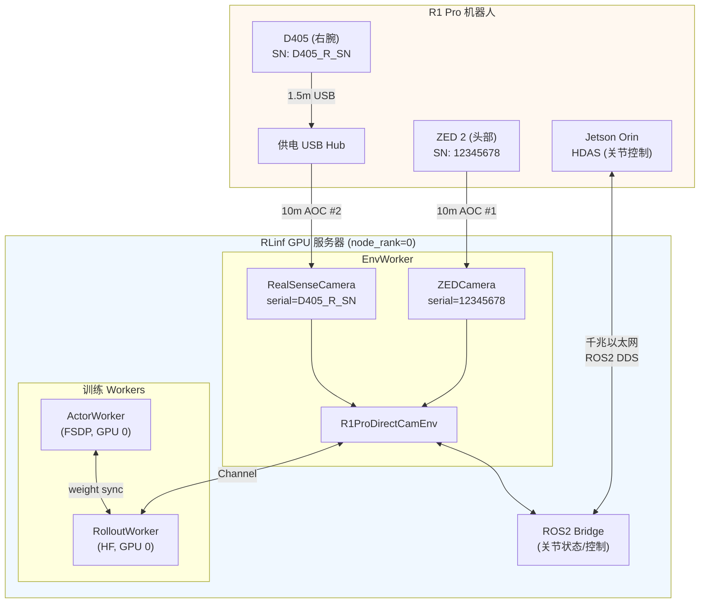
```mermaid
flowchart TB
    subgraph Robot["R1 Pro 机器人"]
        ZED["ZED 2 (头部)<br/>SN: 12345678"]
        D405R["D405 (右腕)<br/>SN: D405_R_SN"]
        ORIN["Jetson Orin<br/>HDAS (关节控制)"]
        HUB["供电 USB Hub"]
        D405R -->|"1.5m USB"| HUB
    end

    subgraph Server["RLinf GPU 服务器 (node_rank=0)"]
        subgraph EnvNode["EnvWorker"]
            SDK_Z["ZEDCamera<br/>serial=12345678"]
            SDK_R["RealSenseCamera<br/>serial=D405_R_SN"]
            ENV["R1ProDirectCamEnv"]
            SDK_Z --> ENV
            SDK_R --> ENV
        end
        subgraph TrainNode["训练 Workers"]
            ACTOR["ActorWorker<br/>(FSDP, GPU 0)"]
            ROLLOUT["RolloutWorker<br/>(HF, GPU 0)"]
        end
        ROS2_SUB["ROS2 Bridge<br/>(关节状态/控制)"]
    end

    ZED -->|"10m AOC #1"| SDK_Z
    HUB -->|"10m AOC #2"| SDK_R
    ORIN <-->|"千兆以太网<br/>ROS2 DDS"| ROS2_SUB

    ENV <--> ROS2_SUB
    ENV <-->|"Channel"| ROLLOUT
    ACTOR <-->|"weight sync"| ROLLOUT

    style Server fill:#f0f8ff
    style Robot fill:#fff8f0
```

**YAML 配置**：

```yaml
# r1pro_direct_cam_sac_cnn_async.yaml
defaults:
  - _self_

cluster:
  num_nodes: 1
  accelerator_per_node: 1
  component_placement:
    actor:
      placement: 0
    rollout:
      placement: 0
    env:
      placement:
        node_group: gpu_server
        node_placement: 0    # EnvWorker 在 GPU 服务器上

env:
  env_type: realworld
  train:
    task: r1pro_peg_insertion
    # --- 直连相机配置 ---
    camera_serials: ["12345678", "D405_R_SN"]
    camera_types: ["zed", "realsense"]
    camera_names: ["head", "wrist_right"]
    camera_resolution: [128, 128]   # 训练分辨率
    camera_fps: 15
    enable_depth: false              # 仅 RGB, 简化 MVP
    # --- 机器人控制 (仍通过 ROS2) ---
    robot_ip: "192.168.1.100"       # Orin IP
    arm_id: "right"
    max_episode_steps: 200
    control_frequency: 10            # 10Hz

algorithm:
  adv_type: embodied_sac
  loss_type: embodied_sac
  gamma: 0.96
  tau: 0.005
  critic_actor_ratio: 4
  update_epoch: 32
  replay_buffer:
    enable_cache: true
    cache_size: 200
    min_buffer_size: 5

runner:
  type: async_embodied
  max_steps: 10000
  save_interval: 500
  eval_interval: 100
```

### 9.2 双臂直连部署

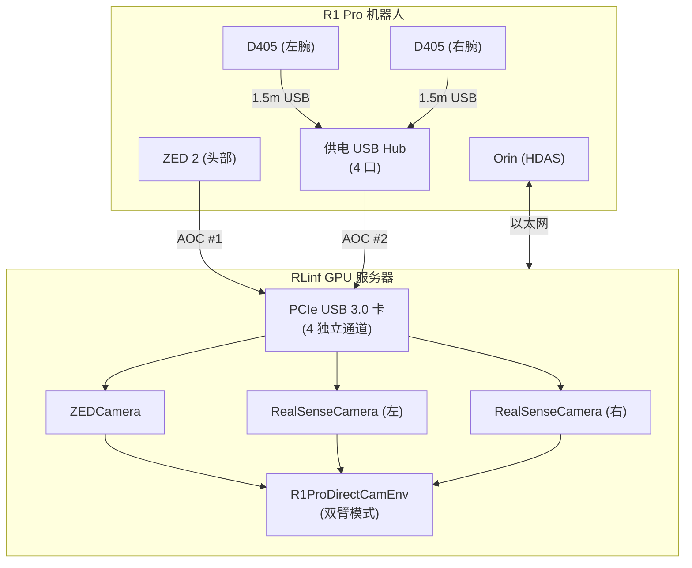
```mermaid
flowchart TB
    subgraph Robot["R1 Pro 机器人"]
        ZED["ZED 2 (头部)"]
        D405L["D405 (左腕)"]
        D405R["D405 (右腕)"]
        HUB["供电 USB Hub<br/>(4 口)"]
        D405L -->|"1.5m USB"| HUB
        D405R -->|"1.5m USB"| HUB
        ORIN["Orin (HDAS)"]
    end

    subgraph Server["RLinf GPU 服务器"]
        PCIE["PCIe USB 3.0 卡<br/>(4 独立通道)"]
        SDK_Z["ZEDCamera"]
        SDK_L["RealSenseCamera (左)"]
        SDK_R["RealSenseCamera (右)"]
        ENV["R1ProDirectCamEnv<br/>(双臂模式)"]
        PCIE --> SDK_Z
        PCIE --> SDK_L
        PCIE --> SDK_R
        SDK_Z --> ENV
        SDK_L --> ENV
        SDK_R --> ENV
    end

    ZED -->|"AOC #1"| PCIE
    HUB -->|"AOC #2"| PCIE
    ORIN <-->|"以太网"| Server
```

### 9.3 混合模式部署（头部网络 + 腕部直连）

如果头部 ZED 2 的 USB 端口不可用，可以只直连腕部相机，头部保留 ROS2 网络传输：

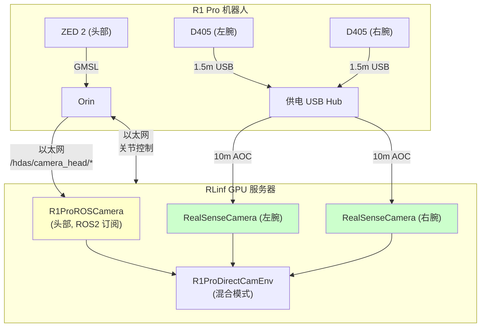
```mermaid
flowchart TB
    subgraph Robot["R1 Pro 机器人"]
        ZED["ZED 2 (头部)"]
        D405L["D405 (左腕)"]
        D405R["D405 (右腕)"]
        HUB["供电 USB Hub"]
        ORIN["Orin"]

        ZED -->|GMSL| ORIN
        D405L -->|"1.5m USB"| HUB
        D405R -->|"1.5m USB"| HUB
    end

    subgraph Server["RLinf GPU 服务器"]
        ROS_CAM["R1ProROSCamera<br/>(头部, ROS2 订阅)"]
        SDK_L["RealSenseCamera (左腕)"]
        SDK_R["RealSenseCamera (右腕)"]
        ENV["R1ProDirectCamEnv<br/>(混合模式)"]
        ROS_CAM --> ENV
        SDK_L --> ENV
        SDK_R --> ENV
    end

    ORIN -->|"以太网<br/>/hdas/camera_head/*"| ROS_CAM
    HUB -->|"10m AOC"| SDK_L
    HUB -->|"10m AOC"| SDK_R
    ORIN <-->|"以太网<br/>关节控制"| Server

    style ROS_CAM fill:#ffffcc
    style SDK_L fill:#ccffcc
    style SDK_R fill:#ccffcc
```

**混合模式配置**：

```yaml
env:
  train:
    # 直连相机 (腕部)
    camera_serials: ["D405_L_SN", "D405_R_SN"]
    camera_types: ["realsense", "realsense"]
    camera_names: ["wrist_left", "wrist_right"]
    # ROS2 相机 (头部)
    ros2_cameras:
      - name: head
        topic: /hdas/camera_head/left_raw/image_raw_color/compressed
        depth_topic: /hdas/camera_head/depth/depth_registered
```

---

## 10. 实施步骤

### 10.1 实施流程

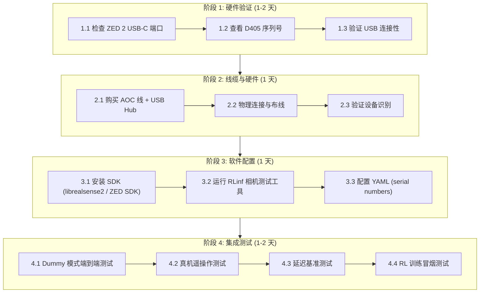
```mermaid
flowchart TD
    subgraph Phase1["阶段 1: 硬件验证 (1-2 天)"]
        P1_1["1.1 检查 ZED 2 USB-C 端口"]
        P1_2["1.2 查看 D405 序列号"]
        P1_3["1.3 验证 USB 连接性"]
        P1_1 --> P1_2 --> P1_3
    end

    subgraph Phase2["阶段 2: 线缆与硬件 (1 天)"]
        P2_1["2.1 购买 AOC 线 + USB Hub"]
        P2_2["2.2 物理连接与布线"]
        P2_3["2.3 验证设备识别"]
        P2_1 --> P2_2 --> P2_3
    end

    subgraph Phase3["阶段 3: 软件配置 (1 天)"]
        P3_1["3.1 安装 SDK (librealsense2 / ZED SDK)"]
        P3_2["3.2 运行 RLinf 相机测试工具"]
        P3_3["3.3 配置 YAML (serial numbers)"]
        P3_1 --> P3_2 --> P3_3
    end

    subgraph Phase4["阶段 4: 集成测试 (1-2 天)"]
        P4_1["4.1 Dummy 模式端到端测试"]
        P4_2["4.2 真机遥操作测试"]
        P4_3["4.3 延迟基准测试"]
        P4_4["4.4 RL 训练冒烟测试"]
        P4_1 --> P4_2 --> P4_3 --> P4_4
    end

    Phase1 --> Phase2 --> Phase3 --> Phase4
```

### 10.2 步骤详解

#### 步骤 1.1：检查 ZED 2 USB-C 端口

```bash
# 在 R1 Pro 上执行 (SSH 到 Orin)
# 查看头部相机的连接方式
lsusb | grep -i stereolabs
# 如果有输出, 说明 ZED 2 通过 USB 连接 (可能同时有 GMSL)
# 如果无输出, 说明 ZED 2 仅通过 GMSL 连接

# 物理检查: 打开头部外壳, 查看 ZED 2 的 USB-C 端口
# 是否有线缆插在 USB-C 端口上?
# - 有: GMSL 串行器板可能占用了 USB 端口
# - 无: USB 端口空闲, 可直接使用
```

#### 步骤 1.2：查看 D405 序列号

```bash
# 在 R1 Pro 上执行
rs-enumerate-devices | grep Serial
# 输出示例:
# Serial No: 234622300XXX  (左腕)
# Serial No: 234622300YYY  (右腕)

# 记录这些序列号, 配置 YAML 时需要
```

#### 步骤 1.3：验证 USB 连接性

```bash
# 将 D405 从 R1 Pro 背板拔出, 直接插到笔记本/PC 上
# 验证能否识别
rs-enumerate-devices
# 应该列出设备信息

# 对 ZED 2 (如果 USB 端口可用):
# 将 ZED 2 USB-C 线插到 PC 上
# ZED SDK 的 ZED Explorer 工具应能识别
```

#### 步骤 2.2：物理连接

```bash
# 1. 将 D405 左右腕的 USB-A 插头从 R1 Pro 背板拔出
# 2. 将供电 USB Hub 用扎带/螺钉固定在 R1 Pro 背板外侧
# 3. 将 D405 的 USB-A 插头插入 Hub
# 4. 将 Hub 的电源适配器连接 (5V/3A)
# 5. 将 Hub 的上行端口通过 AOC 线连接到服务器
# 6. (如果 ZED USB 可用) 将 ZED 2 USB-C 通过另一条 AOC 线连接到服务器
# 7. 在 ZED 2 端安装 USB 供电注入器
```

#### 步骤 2.3：验证设备识别

```bash
# 在 RLinf GPU 服务器上执行
# 查看 USB 设备
lsusb
# 应该看到:
# Bus XXX Device YYY: ID 8086:0b5c Intel Corp. (RealSense D405)  ×2
# Bus XXX Device YYY: ID 2b03:f682 Stereolabs ZED 2              ×1 (如果直连)

# 查看 USB 拓扑, 确认在不同控制器上
lsusb -t

# 验证 RealSense
rs-enumerate-devices | grep Serial
# 应列出两个 D405 的序列号

# 验证 ZED
python3 -c "
import pyzed.sl as sl
devices = sl.Camera.get_device_list()
for d in devices:
    print(f'ZED: serial={d.serial_number}, model={d.camera_model}')
"
```

#### 步骤 3.2：运行 RLinf 相机测试工具

```bash
# 测试 RealSense (D405)
python toolkits/realworld_check/test_franka_camera.py
# 应该列出所有已连接的 RealSense 相机

# 测试 ZED
python toolkits/realworld_check/test_zed_camera.py \
    --serial 12345678 --steps 100 --fps 15
# 应该采集 100 帧并显示帧率统计
```

---

## 11. 验证与测试

### 11.1 延迟测试方案

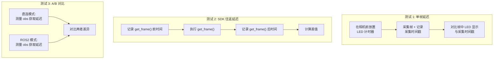
```mermaid
flowchart TD
    subgraph Test1["测试 1: 单帧延迟"]
        T1_1["在相机前放置<br/>LED 计时器"]
        T1_2["采集帧 + 记录<br/>采集时间戳"]
        T1_3["对比帧中 LED 显示<br/>与采集时间戳"]
        T1_1 --> T1_2 --> T1_3
    end

    subgraph Test2["测试 2: SDK 往返延迟"]
        T2_1["记录 get_frame() 前时间"]
        T2_2["执行 get_frame()"]
        T2_3["记录 get_frame() 后时间"]
        T2_4["计算差值"]
        T2_1 --> T2_2 --> T2_3 --> T2_4
    end

    subgraph Test3["测试 3: A/B 对比"]
        T3_1["直连模式:<br/>测量 obs 获取延迟"]
        T3_2["ROS2 模式:<br/>测量 obs 获取延迟"]
        T3_3["对比两者差异"]
        T3_1 --> T3_3
        T3_2 --> T3_3
    end
```

**测试脚本**：

```python
import time
import numpy as np
from rlinf.envs.realworld.common.camera import CameraInfo, create_camera

def benchmark_camera(serial: str, camera_type: str, n_frames: int = 1000):
    """测量相机 SDK 直连延迟"""
    info = CameraInfo(
        name="benchmark",
        serial_number=serial,
        camera_type=camera_type,
        resolution=(640, 480),
        fps=30,
    )
    camera = create_camera(info)
    camera.open()

    latencies = []
    for i in range(n_frames):
        t0 = time.perf_counter_ns()
        frame = camera.get_frame(timeout=5)
        t1 = time.perf_counter_ns()
        latencies.append((t1 - t0) / 1e6)  # 转换为 ms

    camera.close()

    latencies = np.array(latencies)
    print(f"Camera: {camera_type} ({serial})")
    print(f"  Frames: {n_frames}")
    print(f"  Mean:   {latencies.mean():.2f} ms")
    print(f"  Median: {np.median(latencies):.2f} ms")
    print(f"  P95:    {np.percentile(latencies, 95):.2f} ms")
    print(f"  P99:    {np.percentile(latencies, 99):.2f} ms")
    print(f"  Min:    {latencies.min():.2f} ms")
    print(f"  Max:    {latencies.max():.2f} ms")
    return latencies
```

### 11.2 端到端训练验证

```bash
# 1. Dummy 模式 (不连真机, 验证配置和代码路径)
python examples/embodiment/train_async.py \
    --config-name r1pro_direct_cam_sac_cnn_async \
    env.train.is_dummy=true

# 2. 遥操作数据采集 (验证图像质量和控制响应)
python examples/embodiment/collect_real_data.py \
    --config-name r1pro_direct_cam_collect_data

# 3. 正式 RL 训练
python examples/embodiment/train_async.py \
    --config-name r1pro_direct_cam_sac_cnn_async
```

### 11.3 验收指标

| 指标 | 目标值 | 测量方法 |
|------|--------|---------|
| 单帧 SDK 获取延迟 | ≤ 3ms | `benchmark_camera()` |
| 端到端 obs 延迟 | ≤ 5ms | `time.perf_counter` 在 EnvWorker 中 |
| 帧率稳定性 | 波动 ≤ 10% | 连续 1000 帧标准差 |
| 丢帧率 | ≤ 0.1% | 帧间隔异常检测 |
| 控制频率 | ≥ 10Hz | MetricLogger `env/step_hz` |
| USB 带宽利用率 | ≤ 80% | `usbtop` 工具 |
| ZED 深度质量 | 深度空洞率 ≤ 5% | 有效深度像素比例 |

---

## 12. BOM 清单与成本估算

### 12.1 核心物料

| 序号 | 物料 | 规格 | 数量 | 单价 (预估) | 小计 |
|------|------|------|------|------------|------|
| 1 | USB 3.0 主动光纤线 (AOC) | 10m, Type-C to Type-A | 1 | ¥800 | ¥800 |
| 2 | USB 3.0 主动光纤线 (AOC) | 10m, Type-A to Type-A | 1 | ¥800 | ¥800 |
| 3 | 供电 USB 3.0 Hub | 4 口, 带 5V/3A 电源适配器 | 1 | ¥200 | ¥200 |
| 4 | USB 供电注入器 | USB 3.0, 带 5V/2A 电源 | 1 | ¥150 | ¥150 |
| 5 | 线缆固定夹 | 适配光纤线径 | 若干 | ¥50 | ¥50 |
| 6 | 地面线槽 | 3m×2 段 | 2 | ¥50 | ¥100 |
| | | | | **总计** | **¥2,100** |

### 12.2 可选物料

| 序号 | 物料 | 场景 | 数量 | 单价 (预估) | 小计 |
|------|------|------|------|------------|------|
| 7 | PCIe USB 3.0 扩展卡 | 服务器 USB 端口不足 | 1 | ¥200 | ¥200 |
| 8 | Stereolabs ZED Link | ZED 2 USB 端口被占用 | 1 | ¥4,000 | ¥4,000 |
| 9 | USB-C to USB-A 转接头 | D405 线缆适配 | 2 | ¥30 | ¥60 |
| 10 | 悬挂走线架 | 需要机器人小范围移动 | 1套 | ¥500 | ¥500 |

### 12.3 成本对比

| 方案 | 硬件成本 | 软件改动量 | 延迟改善 |
|------|---------|-----------|---------|
| **全直连 (USB 可用)** | ~¥2,100 | 极小（配置改动） | 80-90% |
| **全直连 (需 ZED Link)** | ~¥6,100 | 极小 | 80-90% |
| **混合 (腕部直连+头部网络)** | ~¥1,150 | 中等 | 腕部 80-90%，头部不变 |
| **纯网络 (不改造)** | ¥0 | 需写 ROS2 Camera 类 | 无改善 |

---

## 13. 风险与缓解

### 13.1 风险矩阵

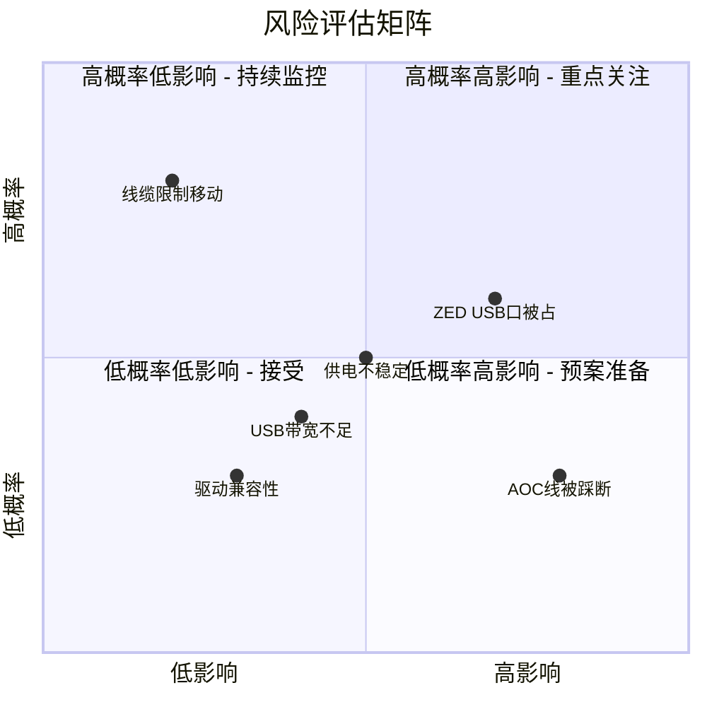
```mermaid
quadrantChart
    title 风险评估矩阵
    x-axis "低影响" --> "高影响"
    y-axis "低概率" --> "高概率"
    quadrant-1 "高概率高影响 - 重点关注"
    quadrant-2 "高概率低影响 - 持续监控"
    quadrant-3 "低概率低影响 - 接受"
    quadrant-4 "低概率高影响 - 预案准备"
    "ZED USB口被占": [0.7, 0.6]
    "AOC线被踩断": [0.8, 0.3]
    "USB带宽不足": [0.4, 0.4]
    "供电不稳定": [0.5, 0.5]
    "驱动兼容性": [0.3, 0.3]
    "线缆限制移动": [0.2, 0.8]
```

### 13.2 风险详情与缓解措施

| 风险 | 概率 | 影响 | 缓解措施 |
|------|------|------|---------|
| **ZED 2 USB-C 端口被 GMSL 适配器占用** | 中 | 高 | 备选方案 B (ZED Link) 或方案 D (混合模式) |
| **AOC 光纤线被踩断/碾压** | 中 | 中 | 使用地面线槽保护；备一根备用 AOC |
| **USB 带宽不足导致丢帧** | 低 | 中 | 降低分辨率/帧率；使用 PCIe 扩展卡分离控制器 |
| **USB Hub 供电不稳定** | 中 | 中 | 使用品牌供电 Hub (Anker/Plugable)；外接稳定电源 |
| **SDK 驱动与系统兼容性问题** | 低 | 中 | 在购买前先用短线在服务器上测试 SDK |
| **线缆限制机器人移动范围** | 低 | 高 | 阶段 1/2 不需要移动；阶段 3 使用混合模式或悬挂走线 |
| **Orin 失去相机驱动后影响导航** | 低 | 低 | 底盘相机仍通过 GMSL 连接 Orin，导航不受影响 |
| **多相机热插拔导致 USB 枚举失败** | 低 | 低 | 固定连接，避免热插拔；使用 `udev` 规则固定设备号 |

### 13.3 回退方案

如果直连方案遇到不可解决的问题，可以随时回退到网络传输方案：

```
回退操作 (约 10 分钟):
1. 拔掉 AOC 线
2. 将 D405 USB 线重新插回 R1 Pro 背板
3. (如有) 将 ZED 2 USB 重新接回 GMSL 适配器
4. 修改 YAML: camera_backend: ros2
5. 重启 HDAS 相机驱动
```

---

## 14. 附录

### 14.1 USB 3.0 主动光纤线工作原理

```
                        光纤核心 (多模)
           ┌─────────────────────────────────────┐
           │  ○○○○○○○○○○○○○○○○○○○○○○○○○○○○○○○  │
           │  (发送光纤 × 2 + 接收光纤 × 2)       │
           │                                       │
┌──────────┤                                       ├──────────┐
│ 电→光    │  光纤传输 (光速, 延迟 ~3-5μs)         │ 光→电    │
│ 转换器   │                                       │ 转换器   │
│ + USB    │                                       │ + USB    │
│ 控制器   │                                       │ 控制器   │
└────┬─────┘                                       └────┬─────┘
     │ USB 3.0                                          │ USB 3.0
     │ (电信号)                                          │ (电信号)
     │                                                   │
  [相机端]                                            [服务器端]
```

**关键特性**：
- **信号完整性**：光纤传输不受距离影响，10m 和 1m 的信号质量完全一致
- **EMI 免疫**：光纤不受电磁干扰，在机器人工作环境（电机、驱动器）中特别重要
- **不传输电力**：这是 AOC 的主要限制，需要在相机端额外供电
- **单向性**：部分 AOC 线有方向性（标记 Host/Device 端），连接时注意方向

### 14.2 udev 规则固定设备路径

在服务器上配置 udev 规则，确保相机设备路径固定：

```bash
# /etc/udev/rules.d/99-r1pro-cameras.rules

# RealSense D405 左腕 (替换实际序列号)
SUBSYSTEM=="usb", ATTRS{idVendor}=="8086", ATTRS{serial}=="D405_LEFT_SN", \
    SYMLINK+="r1pro_wrist_left"

# RealSense D405 右腕
SUBSYSTEM=="usb", ATTRS{idVendor}=="8086", ATTRS{serial}=="D405_RIGHT_SN", \
    SYMLINK+="r1pro_wrist_right"

# ZED 2 头部
SUBSYSTEM=="usb", ATTRS{idVendor}=="2b03", ATTRS{serial}=="12345678", \
    SYMLINK+="r1pro_head"

# 重新加载规则
sudo udevadm control --reload-rules
sudo udevadm trigger
```

### 14.3 故障排查清单

| 症状 | 可能原因 | 排查步骤 |
|------|---------|---------|
| `lsusb` 看不到相机 | AOC 线未插紧 / 无供电 | 检查两端连接；确认 Hub/注入器供电 |
| SDK 报错 "device not found" | 序列号不匹配 | 用 `rs-enumerate-devices` / ZED Explorer 确认 |
| 帧率异常低 | USB 带宽不足 | `usbtop` 检查带宽；降低分辨率/帧率 |
| 图像花屏/条纹 | AOC 线损坏 | 换一条 AOC 线测试 |
| 间歇性断连 | 供电不稳 | 换更高功率的电源适配器 |
| ZED 深度全黑 | CUDA 未初始化 | 确认 `CUDA_VISIBLE_DEVICES` 包含可用 GPU |
| D405 深度噪声大 | IR 干扰 / 距离超范围 | 确认工作距离在 7-50cm 范围内 |

### 14.4 RLinf 已有相机代码快速参考

| 文件 | 功能 | 行数 |
|------|------|------|
| `rlinf/envs/realworld/common/camera/base_camera.py` | 线程采集基类，最新帧队列模型 | 110 |
| `rlinf/envs/realworld/common/camera/realsense_camera.py` | Intel RealSense SDK 封装 | 101 |
| `rlinf/envs/realworld/common/camera/zed_camera.py` | Stereolabs ZED SDK 封装 | 139 |
| `rlinf/envs/realworld/common/camera/__init__.py` | `create_camera()` 工厂函数 | 44 |
| `rlinf/envs/realworld/franka/franka_env.py` | Franka 环境 (直连相机参考实现) | 699 |
| `toolkits/realworld_check/test_franka_camera.py` | RealSense 测试工具 | - |
| `toolkits/realworld_check/test_zed_camera.py` | ZED 测试工具 | - |

### 14.5 关键 RLinf 代码片段

**BaseCamera 线程采集模型** (`base_camera.py:83-94`)：

```python
def _capture_frames(self):
    while self._frame_capturing_start:
        time.sleep(1 / self._camera_info.fps)
        has_frame, frame = self._read_frame()
        if not has_frame:
            break
        if not self._frame_queue.empty():
            try:
                self._frame_queue.get_nowait()  # 丢弃旧帧, 保留最新
            except queue.Empty:
                pass
        self._frame_queue.put(frame)
```

**RealSenseCamera 帧获取** (`realsense_camera.py:69-84`)：

```python
def _read_frame(self) -> tuple[bool, Optional[np.ndarray]]:
    frames = self._pipeline.wait_for_frames()
    aligned_frames = self._align.process(frames)
    color_frame = aligned_frames.get_color_frame()
    if self._enable_depth:
        depth_frame = aligned_frames.get_depth_frame()
    if color_frame.is_video_frame():
        frame = np.asarray(color_frame.get_data())
        if self._enable_depth and depth_frame.is_depth_frame():
            depth = np.expand_dims(np.asarray(depth_frame.get_data()), axis=2)
            return True, np.concatenate((frame, depth), axis=-1)
        else:
            return True, frame
    else:
        return False, None
```

**create_camera 工厂** (`__init__.py:26-43`)：

```python
def create_camera(camera_info: CameraInfo) -> BaseCamera:
    camera_type = camera_info.camera_type.lower()
    if camera_type == "zed":
        from .zed_camera import ZEDCamera
        return ZEDCamera(camera_info)
    if camera_type in ("realsense", "rs"):
        return RealSenseCamera(camera_info)
    raise ValueError(f"Unsupported camera_type={camera_type!r}")
```

---

> **总结**：将 R1 Pro 的头部 ZED 2 和腕部 D405 相机通过 USB 3.0 主动光纤线直接连接到 RLinf GPU 服务器，是一个低成本（~¥2,100）、低侵入（几乎不需要改代码）、高收益（延迟降低 80-90%）的工程方案。核心改动是物理线缆重新布线 + YAML 配置调整，RLinf 已有的 `RealSenseCamera` 和 `ZEDCamera` 代码可以直接复用。唯一需要在实机上确认的关键问题是 ZED 2 的 USB-C 端口是否被 GMSL 适配器占用。
