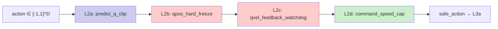
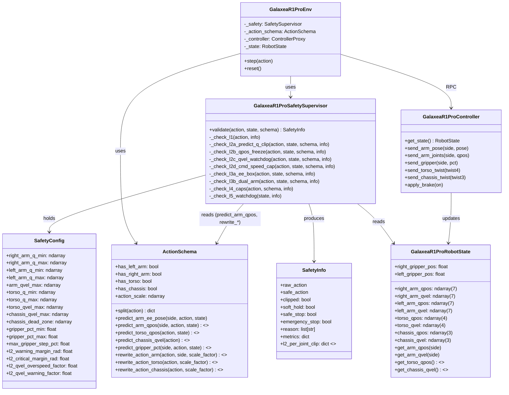
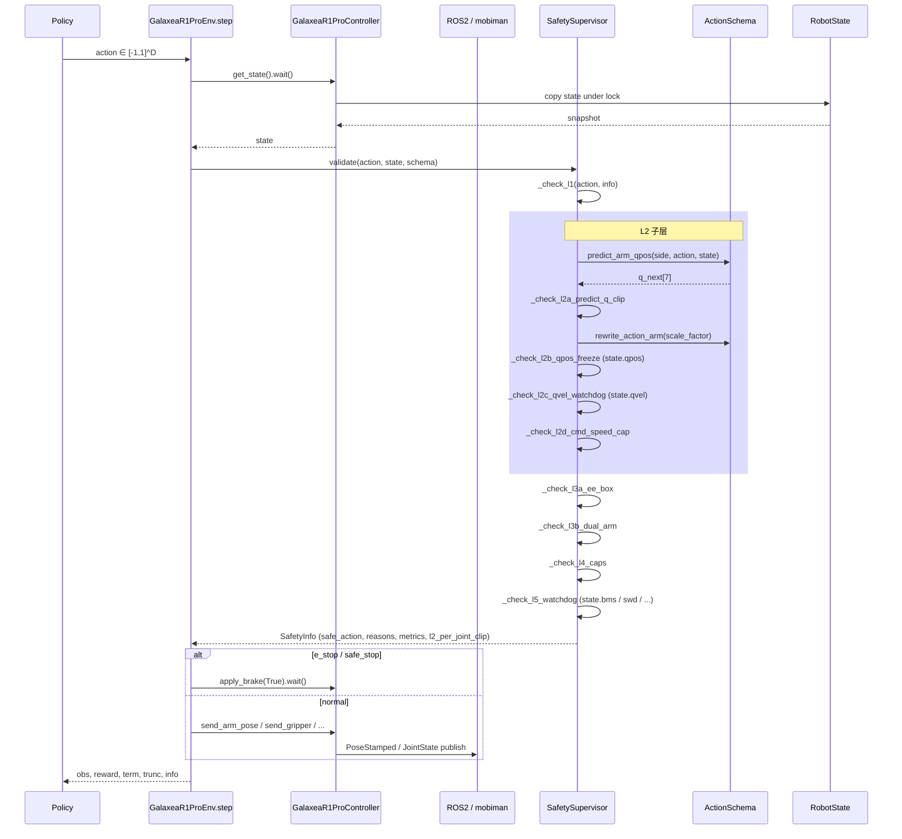
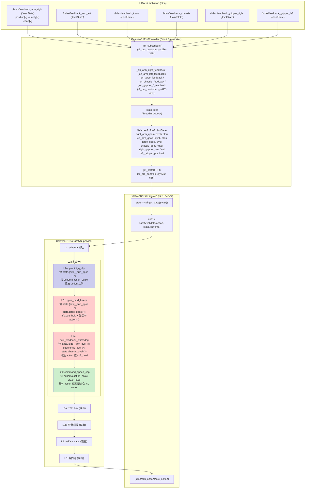
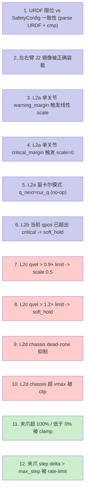

# Galaxea R1 Pro L2 关节限位:基于真机 URDF 的位置+速度安全方案设计

> **定位**:本文是 [`safety_2.md`](safety_2.md) §9.1 / [`safety_2_joinlimit.md`](safety_2_joinlimit.md) §7 / [`glx/mismatch_realworld_1.md`](glx/mismatch_realworld_1.md) §C 的 **下一阶段实现方案**。在前文已经回答了"R1 Pro 有没有关节反馈、为什么 RLinf 仍需 L2"之后,本文聚焦**怎么落地**:把验证过的真机限位 + 0.1 rad 安全余量,设计成一套**最小侵入、可调参、易调试**的 L2 模块,负责**关节空间的位置和速度约束**。
>
> **阅读对象**:负责真机联调的工程师、`r1_pro_safety.py` 的 maintainer、`r1_pro_env.py` 的接入方。
>
> **版本**:safety_2_joinlimit_2 · 日期:2026-05-05 · 作者:RLinf RWRL Working Group

---

## 目录

1. [TL;DR — 三句话答案](#1-tldr--三句话答案)
2. [设计前提:已经验证过的事实](#2-设计前提已经验证过的事实)
3. [限位常量:7×2 关节位置 + 7 关节速度 + 4 躯干 + 3 底盘 + 2 夹爪](#3-限位常量72-关节位置--7-关节速度--4-躯干--3-底盘--2-夹爪)
4. [L2 子检查的语义分层 (L2a/L2b/L2c/L2d)](#4-l2-子检查的语义分层-l2al2bl2cl2d)
5. [模块结构与调用关系](#5-模块结构与调用关系)
6. [数据流:从 ROS2 反馈到 SafetyInfo](#6-数据流从-ros2-反馈到-safetyinfo)
7. [关键代码详解](#7-关键代码详解)
8. [对其它代码的最小侵入式改动清单](#8-对其它代码的最小侵入式改动清单)
9. [配置层:YAML 字段与 SafetyConfig 字段对照](#9-配置层yaml-字段与-safetyconfig-字段对照)
10. [测试矩阵与单元测试设计](#10-测试矩阵与单元测试设计)
11. [运行时调试 / 排错](#11-运行时调试--排错)
12. [与生产代码 (BRS-ctrl) 的关系与差异](#12-与生产代码-brs-ctrl-的关系与差异)
13. [参考资料 + 源码锚点](#13-参考资料--源码锚点)

---

## 1. TL;DR — 三句话答案

1. 把 RLinf 现行 [`SafetyConfig.arm_q_min/max/qvel_max`](../../../rlinf/envs/realworld/galaxear/r1_pro_safety.py:62-67) 替换为**逐位对齐 R1 Pro URDF**(包括左臂 J2 镜像)、再向内收 **0.1 rad** 的"工作域"——**不要直接用 URDF 真值**,因为 URDF 是机械极限,L2 安全域必须比它内缩(参见 [`safety_2_joinlimit.md`](safety_2_joinlimit.md) §6.3 的"安全网 vs 安全带"类比)。本文给出 7+7+4+3+2 全部 **23 维约束**的具体数值。
2. **L2 拆成 4 个子检查 (L2a/L2b/L2c/L2d)**,放在 [`r1_pro_safety.py`](../../../rlinf/envs/realworld/galaxear/r1_pro_safety.py) 现有 `validate()` 管线的 L1 与 L3a 之间,顺序为:**预测目标 → 软裁减(scale shrink) → 硬截断(hard clip) → 反馈速度看门狗 → 命令速度看门狗**。所有数据已经在 `state.right_arm_qpos / qvel`、`state.left_arm_qpos / qvel`、`state.torso_qpos / qvel`、`state.chassis_qpos / qvel` 中,**无需新增 ROS2 订阅或 IK 库依赖**。
3. **夹爪当作"特殊 1D 关节"处理**:位置 clamp 到 `[0, 100]` mm,速度通过 step rate-limit 实现,**不引入 0/1 离散化**(与 [`Pi05_ActionSpace_Analysis.md`](Pi05_ActionSpace_Analysis.md) §5 的"夹爪一律连续浮点"原则一致)。

---

## 2. 设计前提:已经验证过的事实

设计写到这里之前,**已经被多源交叉验证过**的事实如下。后续设计直接以它们为公理,不再重复论证。

### 2.1 R1 Pro 的关节反馈链路是完整的(参见 [`safety_2_joinlimit.md`](safety_2_joinlimit.md) §2、§3)

| 部件 | 反馈话题 | 类型 | RLinf 字段 |
|---|---|---|---|
| 右臂 7-DoF | `/hdas/feedback_arm_right` | `sensor_msgs/JointState` | `state.right_arm_qpos[7]` / `qvel[7]` / `qtau[7]` |
| 左臂 7-DoF | `/hdas/feedback_arm_left` | `sensor_msgs/JointState` | `state.left_arm_qpos[7]` / `qvel[7]` / `qtau[7]` |
| 右夹爪 | `/hdas/feedback_gripper_right` | `sensor_msgs/JointState` | `state.right_gripper_pos` / `vel` |
| 左夹爪 | `/hdas/feedback_gripper_left` | `sensor_msgs/JointState` | `state.left_gripper_pos` / `vel` |
| 躯干 4-DoF | `/hdas/feedback_torso` | `sensor_msgs/JointState` | `state.torso_qpos[4]` / `qvel[4]` |
| 底盘 3-DoF | `/hdas/feedback_chassis` | `sensor_msgs/JointState` | `state.chassis_qpos[3]` / `qvel[3]` |

回调函数([`r1_pro_controller.py:417-487`](../../../rlinf/envs/realworld/galaxear/r1_pro_controller.py#L417-L487))已经把每个话题写进 `GalaxeaR1ProRobotState`,**不需要任何新增订阅**。

### 2.2 URDF 限位已经核对过两份独立文件(参见 [`glx/mismatch_realworld_1.md`](glx/mismatch_realworld_1.md) §C.1.附 复核)

- `mobiman/lib/mobiman/configs/urdfs/r1_pro_floating_right.urdf`(`relaxed_ik` 用)
- `mobiman/share/mobiman/urdf/R1_PRO/urdf/r1_pro.urdf`(整机 `robot_state_publisher` 用)
- `mobiman/lib/mobiman/configs/urdfs/r1_pro_floating_left.urdf`(左臂 IK)

三份 URDF 中右臂 7 个 `<limit lower=... upper=... velocity=...>` 字段**完全一致**,左臂则只是 J2 镜像,J1 和 J3-J7 与右臂相同。这点在 [`/home/nvidia/kaizhe_ws/data_collect/brs-ctrl/brs_ctrl/robot_interface/interfaces.py`](file:///home/nvidia/kaizhe_ws/data_collect/brs-ctrl/brs_ctrl/robot_interface/interfaces.py) 的 `R1ProInterface` 类(行 723-737)的硬编码限位中也得到独立确认——这是工厂流出的、跑过真机数据采集的生产代码。

### 2.3 mobiman 内部已有保护,但 RLinf 仍需要 L2(参见 [`safety_2_joinlimit.md`](safety_2_joinlimit.md) §5、§6)

mobiman 的"Relaxed IK 解算器隐式约束 + JointTracker 电机保护 + 驱动器硬限位"是**安全网 (safety net)**,会在违规时**触发急停或降级精度**;RLinf 的 L2 是**安全带 (seatbelt)**,职责是在动作下发前**平滑裁剪/缩放**让训练不中断。两者目标不同,不可互相替代。

### 2.4 数据流上 L2 跑在哪里?

```
                           ┌─────────────────────────────┐
                           │ r1_pro_env.step()           │
                           │   ① state = ctrl.get_state()│
                           │   ② sinfo = safety.validate(│ ← L2 在这里
                           │       action, state, schema)│
                           │   ③ if not e_stop:          │
                           │       _dispatch_action(...) │
                           └─────────────────────────────┘
```

`validate()` 内部当前 L2 是空注释([`r1_pro_safety.py:196-199`](../../../rlinf/envs/realworld/galaxear/r1_pro_safety.py#L196-L199)):

```python
# ── L2 per-joint limit ──────────────────────────────────────
# We do not have raw qpos in the action (only deltas), so L2
# acts as a guard against absurdly large velocity demands.
# Predicted next q is checked through the EE clip + step cap.
```

本设计把它**填实**,但不改动 L2 在管线中的位置(L1 之后、L3a 之前)。

### 2.5 RLinf 当前 SafetyConfig 默认值的问题(参见 [`glx/mismatch_realworld_1.md`](glx/mismatch_realworld_1.md) §C.1)

| Joint | URDF lower | URDF upper | RLinf `arm_q_min` | RLinf `arm_q_max` | 问题 |
|---|---|---|---|---|---|
| J1 | -4.4506 | 1.3090 | -2.7 | 2.7 | 上限**比 URDF 还宽** 1.39 rad |
| J2 | -3.1416 | 0.1745 | -1.8 | 1.8 | 上限**比 URDF 还宽** 1.63 rad |
| J3 | -2.3562 | 2.3562 | -2.7 | 2.7 | 双向比 URDF 宽 |
| J4 | -2.0944 | 0.3491 | -3.0 | 0.0 | 下限比 URDF 宽,上限严 |
| J5 | -2.3562 | 2.3562 | -2.7 | 2.7 | 双向比 URDF 宽 |
| J6 | -1.0472 | 1.0472 | -0.1 | 3.7 | 上限**比 URDF 还宽** 2.65 rad |
| J7 | -1.5708 | 1.5708 | -2.7 | 2.7 | 双向比 URDF 宽 |

并且**左臂用了和右臂一模一样的限位**——但 R1 Pro 左臂 J2 是镜像(URDF: `[-0.1745, +3.1416]`),会让左臂的"前向工作区"被错误地裁剪到右臂方向。

---

## 3. 限位常量:7×2 关节位置 + 7 关节速度 + 4 躯干 + 3 底盘 + 2 夹爪

### 3.1 设计公式

```
# 位置:URDF 真值向内缩 0.1 rad
q_min[i] = URDF_lower[i] + 0.1
q_max[i] = URDF_upper[i] - 0.1
# 速度:URDF 机械上限 × 0.5 (R1 Pro 出厂建议) 与 BRS-ctrl 实测保守值取较严
qvel_max[i] = min(0.5 * URDF_velocity[i], BRS_ctrl_qvel_max[i])
```

**0.1 rad ≈ 5.73°**:对一个最高速 10.47 rad/s 的关节(J5-J7),相当于约 **9.5 ms 的 overshoot 缓冲**,在 R1 Pro 50 Hz feedback / 10 Hz step 控制频率下足以让"下一帧 L2 检查"赶上,而不会先撞到 URDF 极限触发 mobiman 电机保护。

**BRS-ctrl 实测速度 [1.6,1.6,1.6,1.6,4.0,4.0,4.0]**:来自 [`brs_ctrl/reset.py:87`](file:///home/nvidia/kaizhe_ws/data_collect/brs-ctrl/brs_ctrl/reset.py),是 BRS 在 R1 Pro 上跑过实机数据采集的"reset 阶段速度限"。生产代码已经把它当作"放心可用、不会跳齿、不会撞 mobiman watchdog"的参考点。

### 3.2 7-DoF 右臂限位

| Joint | URDF lower | URDF upper | URDF vmax | **L2 q_min** | **L2 q_max** | **L2 qvel_max** |
|---|---|---|---|---|---|---|
| J1 (基座旋转) | -4.4506 | 1.3090 | 7.1209 | **-4.35** | **1.21** | **1.6** |
| J2 (肩俯仰) | -3.1416 | 0.1745 | 7.1209 | **-3.04** | **0.07** | **1.6** |
| J3 (上臂旋转) | -2.3562 | 2.3562 | 8.3776 | **-2.26** | **2.26** | **1.6** |
| J4 (肘) | -2.0944 | 0.3491 | 8.3776 | **-1.99** | **0.25** | **1.6** |
| J5 (前臂旋转) | -2.3562 | 2.3562 | 10.4720 | **-2.26** | **2.26** | **4.0** |
| J6 (腕俯仰) | -1.0472 | 1.0472 | 10.4720 | **-0.95** | **0.95** | **4.0** |
| J7 (腕旋转) | -1.5708 | 1.5708 | 10.4720 | **-1.47** | **1.47** | **4.0** |

### 3.3 7-DoF 左臂限位(注意 J2 镜像)

| Joint | URDF lower | URDF upper | **L2 q_min** | **L2 q_max** | **L2 qvel_max** |
|---|---|---|---|---|---|
| J1 | -4.4506 | 1.3090 | **-4.35** | **1.21** | **1.6** |
| **J2 (镜像)** | **-0.1745** | **3.1416** | **-0.07** | **3.04** | **1.6** |
| J3 | -2.3562 | 2.3562 | **-2.26** | **2.26** | **1.6** |
| J4 | -2.0944 | 0.3491 | **-1.99** | **0.25** | **1.6** |
| J5 | -2.3562 | 2.3562 | **-2.26** | **2.26** | **4.0** |
| J6 | -1.0472 | 1.0472 | **-0.95** | **0.95** | **4.0** |
| J7 | -1.5708 | 1.5708 | **-1.47** | **1.47** | **4.0** |

> **关键差异:左右臂 J2 不是同一区间**。当前 RLinf 用同一份 `arm_q_min/max` 给两臂,会让左臂的"前向举臂"被卡死。本设计要求**SafetyConfig 拆成 `right_arm_q_*` 与 `left_arm_q_*` 两份**,见 §9。

### 3.4 4-DoF 躯干限位(沿用 BRS-ctrl 真值,留 0.1 rad 余量)

来源 BRS-ctrl `R1ProInterface.torso_joint_high/low`(行 724-725),向内缩 0.1 rad:

| Joint | BRS lower | BRS upper | **L2 q_min** | **L2 q_max** | **L2 qvel_max** |
|---|---|---|---|---|---|
| T1 | -1.1345 | 1.8326 | **-1.03** | **1.73** | **0.5** |
| T2 | -2.7925 | 2.5307 | **-2.69** | **2.43** | **0.5** |
| T3 | -1.8326 | 1.5708 | **-1.73** | **1.47** | **0.5** |
| T4 | -3.0543 | 3.0543 | **-2.95** | **2.95** | **0.5** |

`qvel_max = 0.5 rad/s`:躯干前 4 DoF 包含一个升降 Z(T2 实际是俯仰参与升降)和 3 个旋转,本质是承重轴,生产实际不需要超过 0.5 rad/s。RLinf 现行 [`SafetyConfig`](../../../rlinf/envs/realworld/galaxear/r1_pro_safety.py#L87-L90) 把 `torso_v_x_max=0.10, torso_v_z_max=0.10, torso_w_pitch_max=0.30, torso_w_yaw_max=0.30` 设的是 **EE-frame 笛卡尔速度**,与本节"关节速度"是不同维度;本设计**两套同时存在**,L2c 用关节速度、L4 保留笛卡尔速度,互不冲突。

### 3.5 3-DoF 底盘限位(沿用 BRS-ctrl 实测命令上限)

R1 Pro 底盘是全向 3 轮,L2 检查的"位置"不适用(底盘没有关节位置概念,只有 odom),所以**底盘只有速度限位**:

| 维度 | BRS-ctrl | RLinf 当前 | **L2 chassis_v_max** |
|---|---|---|---|
| v_x (前后, m/s) | 0.30 | 0.60 | **0.30** |
| v_y (左右, m/s) | 0.30 | 0.60 | **0.30** |
| ω_z (旋转, rad/s) | 0.40 | 1.50 | **0.40** |

注:BRS-ctrl 还有一个 dead-zone 阈值 `[0.01, 0.01, 0.05]`(行 756),小于此值的命令置零(避免轮子嗡嗡颤动)。本设计 L2d 沿用此 dead-zone。

### 3.6 2 个夹爪限位(0-100 mm 行程的"一维特殊关节")

夹爪在 RLinf 中表示为 0-100 的"百分比开度"([`r1_pro_controller.py:602-612`](../../../rlinf/envs/realworld/galaxear/r1_pro_controller.py#L602-L612)),底层 G1 夹爪行程对应约 0-80 mm。

| 维度 | 物理量 | **L2 限位** | 说明 |
|---|---|---|---|
| right_gripper_pct | 0-100 (%) | **`[0.0, 100.0]`** | 硬截断,超界 clamp |
| left_gripper_pct | 0-100 (%) | **`[0.0, 100.0]`** | 同上 |
| 单步最大变化 (`max_gripper_step_pct`) | %/step | **30.0** | 默认 10 Hz 控制下 = 300 %/s,经验值 |

**为什么不引入 0/1 离散**:[`Pi05_ActionSpace_Analysis.md`](Pi05_ActionSpace_Analysis.md) §5 已经论证 Pi0.5 / Behavior R1Pro 的夹爪输出**一律是连续浮点**;离散化是 wrapper 层的事,不应该把它放进安全监督器。L2 只做"clamp 到合法行程 + 限制单步变化",不做语义离散化。

### 3.7 数值汇总(可直接 copy 到 `SafetyConfig` 默认值)

```python
# ── L2: per-joint position limits (rad, URDF - 0.1 rad margin) ──
right_arm_q_min: np.ndarray = np.array(
    [-4.35, -3.04, -2.26, -1.99, -2.26, -0.95, -1.47], dtype=np.float32)
right_arm_q_max: np.ndarray = np.array(
    [ 1.21,  0.07,  2.26,  0.25,  2.26,  0.95,  1.47], dtype=np.float32)
left_arm_q_min: np.ndarray = np.array(
    [-4.35, -0.07, -2.26, -1.99, -2.26, -0.95, -1.47], dtype=np.float32)
left_arm_q_max: np.ndarray = np.array(
    [ 1.21,  3.04,  2.26,  0.25,  2.26,  0.95,  1.47], dtype=np.float32)

# ── L2: per-joint velocity limits (rad/s; URDF*0.5 与 BRS-ctrl 取严) ──
arm_qvel_max: np.ndarray = np.array(
    [1.6, 1.6, 1.6, 1.6, 4.0, 4.0, 4.0], dtype=np.float32)  # 左右臂相同

# ── L2: torso (BRS-ctrl - 0.1 rad margin) ──
torso_q_min: np.ndarray = np.array(
    [-1.03, -2.69, -1.73, -2.95], dtype=np.float32)
torso_q_max: np.ndarray = np.array(
    [ 1.73,  2.43,  1.47,  2.95], dtype=np.float32)
torso_qvel_max: np.ndarray = np.array(
    [0.5, 0.5, 0.5, 0.5], dtype=np.float32)

# ── L2: chassis (BRS-ctrl 实测命令上限,无位置约束) ──
chassis_qvel_max: np.ndarray = np.array(
    [0.30, 0.30, 0.40], dtype=np.float32)  # vx, vy, wz
chassis_dead_zone: np.ndarray = np.array(
    [0.01, 0.01, 0.05], dtype=np.float32)

# ── L2: gripper (0-100% 行程) ──
gripper_pct_min: float = 0.0
gripper_pct_max: float = 100.0
max_gripper_step_pct: float = 30.0  # 单步最大开合变化

# ── L2: 安全裕量与触发阈值 ──
l2_warning_margin_rad: float = 0.15      # 接近极限时缩放动作
l2_critical_margin_rad: float = 0.05     # 严重接近时冻结该关节
l2_qvel_overspeed_factor: float = 1.20   # feedback qvel > 1.2× limit → soft_hold
l2_qvel_warning_factor: float = 0.90     # feedback qvel > 0.9× limit → 缩放
```

---

## 4. L2 子检查的语义分层 (L2a/L2b/L2c/L2d)

为了**审计清晰**(每个被裁剪的关节都能在 `SafetyInfo.reason` 里精确定位)以及**便于配置**(用户可以单独开/关某一子检查),把 L2 拆成 4 个独立子层:

| 子层 | 名字 | 输入 | 检查内容 | 触发动作 | reason 标签 |
|---|---|---|---|---|---|
| **L2a** | predict_q_clip | action(归一化 delta)+ state.qpos + schema | 用 schema.predict_arm_qpos() 预测下一步 q,**软裁剪** action 比例缩小 | 缩放 action 系数 ∈ [0, 1] | `L2a:right_q_warning J3=...` |
| **L2b** | qpos_hard_freeze | state.qpos | 当前 qpos 已经超出 critical_margin 的关节冻结(soft_hold) | `info.soft_hold = True` + 该关节 action=0 | `L2b:right_qpos_critical J6=...` |
| **L2c** | qvel_feedback_watchdog | state.qvel | 反馈速度已经超阈,说明上一步动作太大 → 缩放当前命令 | 缩放 action × 0.5,严重时 soft_hold | `L2c:right_qvel_overspeed J5=...` |
| **L2d** | command_speed_cap | action(归一化)+ schema | 限制本次**命令**关节速度(关节命令速度由 action_scale 推算) | 整体 action 缩放至命令速度 ≤ qvel_max | `L2d:left_qvel_cap J7=...` |

### 4.1 为什么是 4 层而不是 1 大块

- **L2a 是事前预测、平滑缩放**:这是 RL 训练的"安全带",**不中断 episode**。因为只缩小 action 幅度,policy 可以继续走、奖励依然计算。
- **L2b 是事后兜底、硬冻结**:当某关节已经处在极限内 0.05 rad,任何方向动作都不再可信,用 `soft_hold` 让该 step 静止一帧、等下一帧重新评估。
- **L2c 是反馈速度看门狗**:负责捕捉"L2a/L2b 没拦住、但 mobiman 内部速度已经飙起来"的情况。从 `state.right_arm_qvel` 直接读,**这是 L2 的 reactive 层**。
- **L2d 是命令速度看门狗**:负责把**这一步命令的关节速度**也卡住,即使反馈速度还没飙起来。**预测性地**避免 mobiman watchdog 触发。

### 4.2 顺序与依赖关系



**L2a → L2b → L2c → L2d** 的顺序是经过推敲的:

1. **先做 L2a 预测裁剪**——它是无副作用的、**最优的**裁剪(缩比例,保留 policy 意图);
2. **再做 L2b 硬冻结**——只在 L2a 都救不了时才发作(关节已经走到极限内);
3. **再做 L2c 反馈速度看门狗**——能在 L2a/b 之外捕捉 mobiman 内部加速过头;
4. **最后做 L2d 命令速度上限**——保证最终下发命令不会超过 qvel_max。

四层之间是**单调收敛**的:每一层都让 action 更"温和",绝不会让 action 变得更激进,因此组合效果是可预测的。

---

## 5. 模块结构与调用关系

### 5.1 总体类图



`<<new>>` 标记的是本设计**新增**的方法/字段。所有都在已存在的类内追加,**没有新建模块**。

### 5.2 调用关系(序列图)



### 5.3 与 r1_pro_env.step 的接口

`step()` 与 supervisor 的契约**不变**。新增的 `SafetyInfo.l2_per_joint_clip`(dict,详见 §7.5)只是审计字段,旧代码读老字段(`raw_action / safe_action / reason / ...`)继续工作。这是**最小侵入**的关键。

---

## 6. 数据流:从 ROS2 反馈到 SafetyInfo



### 6.1 数据格式约定

| 类型 | 形状 | 单位 | 来源 |
|---|---|---|---|
| `state.right_arm_qpos` / `left_arm_qpos` | `(7,)` `np.float32` | rad | `JointState.position[:7]` |
| `state.right_arm_qvel` / `left_arm_qvel` | `(7,)` `np.float32` | rad/s | `JointState.velocity[:7]` |
| `state.torso_qpos` | `(4,)` `np.float32` | rad | `JointState.position[:4]` |
| `state.torso_qvel` | `(4,)` `np.float32` | rad/s | `JointState.velocity[:4]` |
| `state.chassis_qpos` | `(3,)` `np.float32` | m, m, rad(Odom) | `JointState.position[:3]` |
| `state.chassis_qvel` | `(3,)` `np.float32` | m/s, m/s, rad/s | `JointState.velocity[:3]` |
| `state.right_gripper_pos` / `left_gripper_pos` | scalar | mm 或 0-100% | `JointState.position[0]` |
| action(M1 单臂) | `(7,)` `np.float32` | 归一化 [-1,1] | policy |
| action(M3 全身) | `(18,)` 或 `(21,)` | 归一化 [-1,1] | policy |

### 6.2 锁与一致性

- **`get_state()` RPC**:在 [`r1_pro_controller.py:552-555`](../../../rlinf/envs/realworld/galaxear/r1_pro_controller.py#L552-L555) 内 `with self._state_lock: return self._state.copy()`。返回的是**深拷贝**,supervisor 操作的是**snapshot**——不会被回调中途改写,这是 L2 正确性的前提。
- **跨进程一致性**:L2 跑在 GPU server,`state` 是 50–100 ms 前的 Orin 反馈。这个延迟对于 0.1 rad 的 margin 是足够的(详见 [`safety_2_joinlimit.md`](safety_2_joinlimit.md) §7.2.4)。

---

## 7. 关键代码详解

> 本节给出**可直接合并的草稿**。所有代码都标注了**插入位置**(文件 + 行号),所有改动都遵循 RLinf 的 Google Python Style + Ruff format。

### 7.1 `SafetyConfig` 字段扩展(`r1_pro_safety.py`)

**插入位置**:[`r1_pro_safety.py:54-103`](../../../rlinf/envs/realworld/galaxear/r1_pro_safety.py#L54-L103) 的 `SafetyConfig` dataclass。

```python
@dataclass
class SafetyConfig:
    """Hard safety limits + watchdog thresholds.

    Defaults are derived from the R1 Pro URDF
    (`mobiman/lib/mobiman/configs/urdfs/r1_pro_floating_*.urdf`)
    minus a 0.1 rad (5.7°) safety margin per joint, with the
    velocity bound additionally cross-checked against the BRS-ctrl
    production constants (`R1ProInterface` in
    `kaizhe_ws/data_collect/brs-ctrl/.../interfaces.py`).

    Note that left/right arm limits *differ* on J2: R1 Pro arms are
    physically mirrored, so we keep two separate vectors instead of
    a single `arm_q_min/max`.

    See bt/docs/rwRL/safety_2_joinlimit_2.md §3 for derivation.
    """

    # ── L2: 7-DoF per-arm position limits (rad) ──────────────────
    right_arm_q_min: np.ndarray = field(default_factory=lambda: np.array(
        [-4.35, -3.04, -2.26, -1.99, -2.26, -0.95, -1.47],
        dtype=np.float32))
    right_arm_q_max: np.ndarray = field(default_factory=lambda: np.array(
        [ 1.21,  0.07,  2.26,  0.25,  2.26,  0.95,  1.47],
        dtype=np.float32))
    left_arm_q_min: np.ndarray = field(default_factory=lambda: np.array(
        [-4.35, -0.07, -2.26, -1.99, -2.26, -0.95, -1.47],
        dtype=np.float32))
    left_arm_q_max: np.ndarray = field(default_factory=lambda: np.array(
        [ 1.21,  3.04,  2.26,  0.25,  2.26,  0.95,  1.47],
        dtype=np.float32))

    # ── L2: 7-DoF per-arm velocity limits (rad/s) ───────────────
    arm_qvel_max: np.ndarray = field(default_factory=lambda: np.array(
        [1.6, 1.6, 1.6, 1.6, 4.0, 4.0, 4.0], dtype=np.float32))

    # ── L2: 4-DoF torso ──────────────────────────────────────────
    torso_q_min: np.ndarray = field(default_factory=lambda: np.array(
        [-1.03, -2.69, -1.73, -2.95], dtype=np.float32))
    torso_q_max: np.ndarray = field(default_factory=lambda: np.array(
        [ 1.73,  2.43,  1.47,  2.95], dtype=np.float32))
    torso_qvel_max: np.ndarray = field(default_factory=lambda: np.array(
        [0.5, 0.5, 0.5, 0.5], dtype=np.float32))

    # ── L2: 3-DoF chassis (only velocity) ────────────────────────
    chassis_qvel_max: np.ndarray = field(default_factory=lambda: np.array(
        [0.30, 0.30, 0.40], dtype=np.float32))     # vx, vy, wz
    chassis_dead_zone: np.ndarray = field(default_factory=lambda: np.array(
        [0.01, 0.01, 0.05], dtype=np.float32))

    # ── L2: gripper (0-100% stroke) ──────────────────────────────
    gripper_pct_min: float = 0.0
    gripper_pct_max: float = 100.0
    max_gripper_step_pct: float = 30.0  # default ≈ 300 %/s @10Hz

    # ── L2: thresholds & gains ───────────────────────────────────
    l2_warning_margin_rad: float = 0.15      # start scaling action
    l2_critical_margin_rad: float = 0.05     # freeze that joint
    l2_qvel_overspeed_factor: float = 1.20   # > 1.2× -> soft_hold
    l2_qvel_warning_factor: float = 0.90     # > 0.9× -> scale 0.5
    l2_per_joint_freeze_action: float = 0.0  # freeze means "0 action"

    # ── L2 toggles (let YAML disable individual sub-checks) ──────
    enable_l2a_predict_q_clip: bool = True
    enable_l2b_qpos_freeze: bool = True
    enable_l2c_qvel_watchdog: bool = True
    enable_l2d_cmd_speed_cap: bool = True

    # ── 旧字段保留(向后兼容,标 deprecated) ──────────────────────
    arm_q_min: Optional[np.ndarray] = None  # deprecated: use right/left
    arm_q_max: Optional[np.ndarray] = None  # deprecated
    # ... (L3a/L3b/L4/L5 字段不变)
```

要点:
- **拆 `arm_q_*` 为左右两份**(§3.7);保留旧字段作为 deprecated alias 在 `__post_init__` 里回填。
- 新增 4 个 `enable_l2*` toggle,允许 YAML 配置精细控制。
- 保留旧 `arm_qvel_max`(只是改了默认值,字段名不变;旧 RLinf 已经是同名字段)。

`__post_init__` 兼容老配置:

```python
def __post_init__(self):
    # ... existing logic for converting list -> np.ndarray ...

    # Back-compat: if someone passes arm_q_min/max (the old single
    # vector), use it for BOTH arms with a runtime warning.
    if self.arm_q_min is not None:
        self.right_arm_q_min = np.asarray(self.arm_q_min, dtype=np.float32)
        self.left_arm_q_min  = np.asarray(self.arm_q_min, dtype=np.float32)
        # (warning printed once on construction)
    if self.arm_q_max is not None:
        self.right_arm_q_max = np.asarray(self.arm_q_max, dtype=np.float32)
        self.left_arm_q_max  = np.asarray(self.arm_q_max, dtype=np.float32)
```

### 7.2 `ActionSchema.predict_arm_qpos`(`r1_pro_action_schema.py`)

**插入位置**:[`r1_pro_action_schema.py:119`](../../../rlinf/envs/realworld/galaxear/r1_pro_action_schema.py#L119) `predict_arm_ee_pose` 之后。

```python
def predict_arm_qpos(
    self,
    side: str,
    action: np.ndarray,
    state: "GalaxeaR1ProRobotState",
    *,
    inv_jacobian_fn=None,
) -> Optional[np.ndarray]:
    """Predict the joint positions for *side* arm after this step.

    Strategy (in order of preference):

    1. ``inv_jacobian_fn`` provided  → use IK to map the predicted
       EE delta to a joint delta (precise, requires URDF).
    2. ``self.use_joint_mode == True`` → action *is* a normalised
       joint delta; just add it to current qpos.
    3. otherwise (Cartesian EE delta mode, the default) → return
       ``state.get_arm_qpos(side)`` *unchanged* (i.e. predict
       "stay where you are"). The supervisor reading this should
       fall back to L2b post-hoc check on the actual feedback.

    Returns:
        np.ndarray of shape (7,) with predicted joint angles, or
        None when the corresponding arm is not enabled.
    """
    d = self.split(action)
    key_xyz = f"{side}_xyz"
    if key_xyz not in d:
        return None
    cur_q = np.asarray(state.get_arm_qpos(side), dtype=np.float32).reshape(-1)[:7]
    if cur_q.size != 7:
        return None

    # Branch 1: IK predictor supplied (long-term plan).
    if inv_jacobian_fn is not None:
        try:
            delta_q = inv_jacobian_fn(
                side=side,
                cur_q=cur_q,
                d_xyz=d[key_xyz] * float(self.action_scale[0]),
                d_rpy=d[f"{side}_rpy"] * float(self.action_scale[1]),
            )
            return (cur_q + np.asarray(delta_q, dtype=np.float32)).astype(np.float32)
        except Exception:
            pass  # fall through to other branches

    # Branch 2: action is already in joint space.
    if self.use_joint_mode:
        a_arm = np.concatenate([d[key_xyz], d[f"{side}_rpy"], [d.get(f"{side}_gripper", 0.0)]])
        return (cur_q + a_arm[:7] * float(self.action_scale[0])).astype(np.float32)

    # Branch 3: Cartesian mode -> return current qpos as a "no-op" predictor.
    # L2a will then be effectively a no-op for arms (only L2b/L2c/L2d hit).
    return cur_q.astype(np.float32)
```

要点:
- **三个分支**:IK > 关节模式 > 笛卡尔模式 fallback。
- **Cartesian mode 默认 fallback 到 cur_q**:这意味着 L2a **在不接 IK 时不会误裁** EE pose 控制路径;真正的工作交给 L2b(qpos hard freeze)和 L2c(qvel watchdog)。这是**故意**的——保持 RLinf 当前 EE 控制路径的"无副作用"。
- **`inv_jacobian_fn` 接口**预留给将来接入 `pinocchio` 或调用 mobiman `relaxed_ik` RPC。
- **不强行实现 IK**——避免引入新依赖,与 [`safety_2_joinlimit.md`](safety_2_joinlimit.md) §7.2 推荐"事后校验方案 A"一致。

### 7.3 `ActionSchema.rewrite_action_arm`(用于 L2a / L2c 缩放)

**插入位置**:同上,跟在 `predict_arm_qpos` 后。

```python
def rewrite_action_arm(
    self,
    action: np.ndarray,
    side: str,
    scale_factor: float,
) -> np.ndarray:
    """Multiply the per-arm slice of *action* by *scale_factor*.

    Used by L2a / L2c to softly shrink the policy's intent without
    changing direction; ``scale_factor=0.0`` freezes the arm in
    place. The gripper dim (if any) is *not* scaled — gripper has
    its own L2 sub-check in :meth:`predict_gripper_pct`.

    Returns the modified action (operates in place but also returns).
    """
    a = np.asarray(action, dtype=np.float32).reshape(-1).copy()
    s = float(np.clip(scale_factor, 0.0, 1.0))
    idx = 0
    if self.has_right_arm:
        if side == "right":
            a[idx : idx + 6] *= s   # xyz + rpy
            return a
        idx += self.per_arm_dim
    if self.has_left_arm and side == "left":
        a[idx : idx + 6] *= s
    return a
```

类似的有 `rewrite_action_torso` / `rewrite_action_chassis`,实现完全平行(只改对应 4D / 3D slice)。

### 7.4 4 个 L2 子检查方法(`r1_pro_safety.py`)

**插入位置**:[`r1_pro_safety.py:196-199`](../../../rlinf/envs/realworld/galaxear/r1_pro_safety.py#L196-L199) 现行 L2 注释位置。原 `validate()` 方法的 L2 段替换为:

```python
# ── L2 per-joint limit (multi-sublayer) ────────────────────────
if self._cfg.enable_l2a_predict_q_clip:
    self._check_l2a_predict_q_clip(info, state, action_schema)
if self._cfg.enable_l2b_qpos_freeze:
    self._check_l2b_qpos_freeze(info, state, action_schema)
if self._cfg.enable_l2c_qvel_watchdog:
    self._check_l2c_qvel_watchdog(info, state, action_schema)
if self._cfg.enable_l2d_cmd_speed_cap:
    self._check_l2d_cmd_speed_cap(info, state, action_schema)
```

#### 7.4.1 L2a — 预测 q + 裁剪 action(平滑 scale shrink)

```python
def _check_l2a_predict_q_clip(
    self,
    info: SafetyInfo,
    state: "GalaxeaR1ProRobotState",
    schema: "ActionSchema",
) -> None:
    """Predict next-step joint angles. If a joint will overshoot
    the warning_margin, scale the per-arm action so the *worst*
    joint margin is exactly warning_margin.
    """
    for side in ("right", "left"):
        if side == "right" and not schema.has_right_arm:
            continue
        if side == "left" and not schema.has_left_arm:
            continue

        q_next = schema.predict_arm_qpos(side, info.safe_action, state)
        if q_next is None:
            continue

        q_min = self._cfg.right_arm_q_min if side == "right" else self._cfg.left_arm_q_min
        q_max = self._cfg.right_arm_q_max if side == "right" else self._cfg.left_arm_q_max

        # margin to closest limit, per joint.
        margin_low  = q_next - q_min
        margin_high = q_max - q_next
        margin = np.minimum(margin_low, margin_high)
        worst = float(np.min(margin))

        if worst < self._cfg.l2_critical_margin_rad:
            # Predicted overshoot — let L2b handle the hard freeze
            # on the next step; here just log and shrink heavily.
            scale = 0.0
            tag = f"L2a:{side}_q_critical worst={worst:+.3f}rad"
        elif worst < self._cfg.l2_warning_margin_rad:
            # Linearly shrink so worst margin = warning_margin.
            scale = max(0.0, worst / self._cfg.l2_warning_margin_rad)
            tag = f"L2a:{side}_q_warning worst={worst:+.3f}rad scale={scale:.2f}"
        else:
            continue  # plenty of room

        info.safe_action = schema.rewrite_action_arm(
            info.safe_action, side, scale,
        )
        info.clipped = True
        info.reason.append(tag)
        info.metrics[f"safety/l2a_{side}_scale"] = float(scale)
        info.metrics[f"safety/l2a_{side}_worst_margin"] = float(worst)
```

要点:
- **scale 的物理含义**:线性插值。 worst < warning_margin 时,把 action 缩到刚好让 worst 不再下降。这不是"二值开关",是**软约束**。
- **只在笛卡尔模式下 q_next≈cur_q**(因为 §7.2 的 fallback),所以 L2a 在 EE 控制路径里**几乎不触发**。这是**预期**:EE 控制下 L2a 是空跑 placeholder,真正起作用的是 L2b/L2c。但**接入 IK 后** L2a 会立刻生效——这个 hook 是为了未来不动 supervisor 代码就能升级。

#### 7.4.2 L2b — 当前 q 已贴极限的硬冻结

```python
def _check_l2b_qpos_freeze(
    self,
    info: SafetyInfo,
    state: "GalaxeaR1ProRobotState",
    schema: "ActionSchema",
) -> None:
    """If the current feedback qpos is already inside the
    critical_margin from any limit, freeze that arm for one step
    by zeroing its action slice and raising soft_hold.

    Also handles torso and gripper: they share the same logic.
    """
    # Arms.
    for side in ("right", "left"):
        if side == "right" and not schema.has_right_arm:
            continue
        if side == "left" and not schema.has_left_arm:
            continue

        cur_q = state.get_arm_qpos(side)
        if cur_q is None or cur_q.size != 7:
            continue
        q_min = self._cfg.right_arm_q_min if side == "right" else self._cfg.left_arm_q_min
        q_max = self._cfg.right_arm_q_max if side == "right" else self._cfg.left_arm_q_max
        margin = np.minimum(cur_q - q_min, q_max - cur_q)

        bad_idx = np.where(margin < self._cfg.l2_critical_margin_rad)[0]
        if bad_idx.size > 0:
            info.safe_action = schema.rewrite_action_arm(
                info.safe_action, side, 0.0,   # freeze
            )
            info.soft_hold = True
            joints = ",".join(f"J{i+1}" for i in bad_idx)
            info.reason.append(
                f"L2b:{side}_qpos_critical {joints} margin={margin[bad_idx].min():+.3f}"
            )
            info.metrics[f"safety/l2b_{side}_freeze"] = 1.0

    # Torso.
    if schema.has_torso:
        cur_t = np.asarray(state.torso_qpos, dtype=np.float32).reshape(-1)[:4]
        margin_t = np.minimum(
            cur_t - self._cfg.torso_q_min,
            self._cfg.torso_q_max - cur_t,
        )
        bad_t = np.where(margin_t < self._cfg.l2_critical_margin_rad)[0]
        if bad_t.size > 0:
            info.safe_action = schema.rewrite_action_torso(info.safe_action, 0.0)
            info.soft_hold = True
            tlst = ",".join(f"T{i+1}" for i in bad_t)
            info.reason.append(f"L2b:torso_qpos_critical {tlst}")
            info.metrics["safety/l2b_torso_freeze"] = 1.0
```

#### 7.4.3 L2c — 反馈速度看门狗

```python
def _check_l2c_qvel_watchdog(
    self,
    info: SafetyInfo,
    state: "GalaxeaR1ProRobotState",
    schema: "ActionSchema",
) -> None:
    """React to runaway velocity *as reported by the robot*.

    Two thresholds:
    - feedback |qvel| > overspeed_factor * qvel_max -> soft_hold
    - feedback |qvel| > warning_factor   * qvel_max -> scale 0.5
    """
    qvm = self._cfg.arm_qvel_max
    over = self._cfg.l2_qvel_overspeed_factor
    warn = self._cfg.l2_qvel_warning_factor
    for side in ("right", "left"):
        if side == "right" and not schema.has_right_arm:
            continue
        if side == "left" and not schema.has_left_arm:
            continue
        qv = state.get_arm_qvel(side)
        if qv is None or qv.size != 7:
            continue
        ratio = np.abs(qv) / np.maximum(qvm, 1e-6)
        if np.any(ratio > over):
            info.safe_action = schema.rewrite_action_arm(info.safe_action, side, 0.0)
            info.soft_hold = True
            info.reason.append(
                f"L2c:{side}_qvel_overspeed max={ratio.max():.2f}× limit"
            )
            info.metrics[f"safety/l2c_{side}_overspeed_ratio"] = float(ratio.max())
        elif np.any(ratio > warn):
            info.safe_action = schema.rewrite_action_arm(info.safe_action, side, 0.5)
            info.clipped = True
            info.reason.append(
                f"L2c:{side}_qvel_warning max={ratio.max():.2f}× limit, scale=0.5"
            )
            info.metrics[f"safety/l2c_{side}_warn_ratio"] = float(ratio.max())

    # Torso & chassis 同样处理...
```

#### 7.4.4 L2d — 命令速度上限(预防 mobiman watchdog)

```python
def _check_l2d_cmd_speed_cap(
    self,
    info: SafetyInfo,
    state: "GalaxeaR1ProRobotState",
    schema: "ActionSchema",
) -> None:
    """Bound the *commanded* per-step joint velocity.

    For Cartesian-mode arms we don't have a direct mapping, so
    this layer only acts on torso (4D twist) and chassis (3D twist)
    — both are velocity-as-action by construction.

    For arms in joint-mode, scale the action so:
        |delta_q| / dt_step <= qvel_max
    """
    dt = max(float(getattr(self._cfg, "dt_step", 0.1)), 1e-3)

    # Arms (only joint-mode).
    if schema.use_joint_mode:
        for side in ("right", "left"):
            if side == "right" and not schema.has_right_arm:
                continue
            if side == "left" and not schema.has_left_arm:
                continue
            d = schema.split(info.safe_action)
            v_cmd = (
                np.concatenate([d[f"{side}_xyz"], d[f"{side}_rpy"]])
                * float(schema.action_scale[0]) / dt
            )
            ratio = np.abs(v_cmd[:7] if v_cmd.size >= 7 else v_cmd) / np.maximum(self._cfg.arm_qvel_max, 1e-6)
            if np.any(ratio > 1.0):
                scale = 1.0 / float(ratio.max())
                info.safe_action = schema.rewrite_action_arm(info.safe_action, side, scale)
                info.clipped = True
                info.reason.append(
                    f"L2d:{side}_cmd_qvel_cap max={ratio.max():.2f}× limit, scale={scale:.2f}"
                )

    # Chassis: action 直接是速度,直接 clip + dead-zone.
    if schema.has_chassis:
        d = schema.split(info.safe_action)
        v = np.asarray(d.get("chassis_twist", np.zeros(3)), dtype=np.float32).reshape(-1)[:3]
        # dead-zone
        v = np.where(np.abs(v) < self._cfg.chassis_dead_zone, 0.0, v).astype(np.float32)
        # clip to ±qvel_max
        v_clip = np.clip(v, -self._cfg.chassis_qvel_max, self._cfg.chassis_qvel_max)
        if not np.array_equal(v, v_clip):
            info.safe_action = schema.rewrite_action_chassis_set(info.safe_action, v_clip)
            info.clipped = True
            info.reason.append("L2d:chassis_cmd_speed_cap")

    # Torso 同理.
```

要点:
- **L2d 是命令侧的,不是反馈侧的**。L2c 已经看反馈了,L2d 看的是"这一步打算下发的命令"。两层组合等于 closed-loop 加 open-loop 双保险。
- **arm 在 EE 模式下 L2d 不动 arm slice**——因为没有 "命令速度=delta_q/dt" 的直接映射。当接入 IK 后(§7.2 IK 分支),`predict_arm_qpos` 会给出预测 q,L2d 可以通过 `(q_next - cur_q) / dt` 推命令速度。这是个"future-proof" 接口,目前只对 torso/chassis 有效。

### 7.5 `SafetyInfo` 新增审计字段

**插入位置**:[`r1_pro_safety.py:119-130`](../../../rlinf/envs/realworld/galaxear/r1_pro_safety.py#L119-L130)。

```python
@dataclass
class SafetyInfo:
    raw_action: np.ndarray
    safe_action: np.ndarray
    clipped: bool = False
    soft_hold: bool = False
    safe_stop: bool = False
    emergency_stop: bool = False
    reason: List[str] = field(default_factory=list)
    metrics: dict = field(default_factory=dict)
    # ── new in safety_2_joinlimit_2 ────────────────────────────
    l2_per_joint_clip: dict = field(default_factory=dict)
    """Per-joint, per-side L2 audit: which joint was scaled, how
    much, due to which sub-check. Used by analyzers to spot
    'always saturated J6' issues. Schema:
        {
          "right": {"J3": {"L2a": 0.5, "L2c": 0.0}, ...},
          "left":  {"J7": {"L2b": "freeze"}, ...},
          "torso": {"T2": {"L2b": "freeze"}},
          "chassis": {"vx": {"L2d": "deadzone"}},
        }
    """
```

`SafetyInfo` 旧字段全部不变,这是**纯增量**,旧分析脚本不会受影响。

### 7.6 夹爪的特殊处理

夹爪在 RLinf 的 action layout 中通常是**单一标量**(M1: action[6];M2: action[6] 与 action[13];Behavior: 第 21/22 维)。它有两个 L2 约束:

```python
def _check_l2_gripper(self, info, state, schema):
    """Gripper is a 1-DoF special joint. Apply:
       - position clamp to [gripper_pct_min, gripper_pct_max]
       - per-step delta cap (max_gripper_step_pct)
    """
    for side in ("right", "left"):
        if side == "right" and not schema.has_right_arm:
            continue
        if side == "left" and not schema.has_left_arm:
            continue
        if schema.no_gripper:
            continue

        d = schema.split(info.safe_action)
        if f"{side}_gripper" not in d:
            continue
        a_g = float(d[f"{side}_gripper"])             # ∈ [-1, 1]
        cur_pct = float(state.get_gripper_pos(side))  # 0–100
        scale_g = float(schema.action_scale[2])
        delta_pct = a_g * scale_g                     # signed delta

        # Step rate-limit.
        max_step = self._cfg.max_gripper_step_pct
        if abs(delta_pct) > max_step:
            new_a_g = float(np.sign(a_g) * max_step / max(scale_g, 1e-6))
            schema.set_gripper_action(info.safe_action, side, new_a_g)
            info.clipped = True
            info.reason.append(
                f"L2:{side}_gripper_rate_cap |Δ|={abs(delta_pct):.1f}>"
                f"{max_step:.1f}%/step"
            )

        # Position bound: predicted next pct.
        next_pct = cur_pct + delta_pct
        lo, hi = self._cfg.gripper_pct_min, self._cfg.gripper_pct_max
        if next_pct < lo or next_pct > hi:
            target = float(np.clip(next_pct, lo, hi))
            new_delta = target - cur_pct
            new_a_g = float(new_delta / max(scale_g, 1e-6))
            schema.set_gripper_action(info.safe_action, side, new_a_g)
            info.clipped = True
            info.reason.append(
                f"L2:{side}_gripper_pos_cap pred={next_pct:.1f}->{target:.1f}"
            )
```

**关键设计**:
- **不离散化**(与 [`Pi05_ActionSpace_Analysis.md`](Pi05_ActionSpace_Analysis.md) §5 一致)。
- **predict-clip-rewrite**:与 L3a 同一套模式——预测下一步 pct,clamp,反向算回归一化 action。
- **依赖 schema.set_gripper_action**(新方法,沿用 `rewrite_action_*` 的设计)。

---

## 8. 对其它代码的最小侵入式改动清单

| # | 文件 | 改动类型 | 影响范围 | 风险 |
|---|---|---|---|---|
| 1 | [`r1_pro_safety.py:54-103`](../../../rlinf/envs/realworld/galaxear/r1_pro_safety.py#L54-L103) | 拆 `arm_q_min/max` → `right_arm_q_*` + `left_arm_q_*`,新增 8 个 L2 子层字段 | SafetyConfig 公开 API | 中:旧 YAML 用 `arm_q_min/max` 仍然能工作(__post_init__ 兼容) |
| 2 | [`r1_pro_safety.py:196-199`](../../../rlinf/envs/realworld/galaxear/r1_pro_safety.py#L196-L199) | 替换 L2 注释占位为 4 个子检查方法调用 | 内部实现 | 低:有 `enable_l2*` toggle |
| 3 | [`r1_pro_safety.py`](../../../rlinf/envs/realworld/galaxear/r1_pro_safety.py) 新增 5 个私有方法 | 新增 ~250 行 | 内部实现 | 低 |
| 4 | [`r1_pro_safety.py:119-130`](../../../rlinf/envs/realworld/galaxear/r1_pro_safety.py#L119-L130) | `SafetyInfo` 新增 `l2_per_joint_clip` 字段 | 公开 API | 低:纯增量 |
| 5 | [`r1_pro_action_schema.py:163`](../../../rlinf/envs/realworld/galaxear/r1_pro_action_schema.py) | 新增 4 个方法:`predict_arm_qpos / rewrite_action_arm / rewrite_action_torso / rewrite_action_chassis / set_gripper_action` | 公开 API | 低 |
| 6 | [`r1_pro_robot_state.py:144-158`](../../../rlinf/envs/realworld/galaxear/r1_pro_robot_state.py#L144-L158) | 新增 helper:`get_torso_qpos / get_chassis_qvel / get_gripper_pos(side)` | 公开 API | 低:纯增量 |
| 7 | [`r1_pro_env.py:399-457`](../../../rlinf/envs/realworld/galaxear/r1_pro_env.py#L399-L457) | **不需要改**——`step()` 已经把 state 喂给 supervisor | — | — |
| 8 | [`r1_pro_controller.py:286-487`](../../../rlinf/envs/realworld/galaxear/r1_pro_controller.py#L286-L487) | **不需要改**——已经填充所有需要的字段 | — | — |
| 9 | [`tests/unit_tests/test_galaxea_r1_pro_safety.py`](../../../tests/unit_tests/test_galaxea_r1_pro_safety.py) | 新增 ~12 个 L2 单元测试 | 测试 | 低:见 §10 |
| 10 | YAML 默认配置(如有) | 无变动(默认值即可),除非用户想 override | — | — |

**核心:不动 controller、不动 env、不订阅新 topic、不引入 IK 库**。所有改动都集中在 `safety.py` + `action_schema.py` + `robot_state.py`,对真机部署来说就是"拉一次代码、再启一次 RL job"。

### 8.1 在 robot_state.py 中加 helper

**插入位置**:[`r1_pro_robot_state.py:144-158`](../../../rlinf/envs/realworld/galaxear/r1_pro_robot_state.py#L144-L158)。

```python
def get_torso_qpos(self) -> np.ndarray:
    return np.asarray(self.torso_qpos, dtype=np.float32).reshape(-1)[:4]

def get_torso_qvel(self) -> np.ndarray:
    return np.asarray(self.torso_qvel, dtype=np.float32).reshape(-1)[:4]

def get_chassis_qvel(self) -> np.ndarray:
    return np.asarray(self.chassis_qvel, dtype=np.float32).reshape(-1)[:3]

def get_gripper_pos(self, side: str) -> float:
    return float(
        self.right_gripper_pos if side == "right" else self.left_gripper_pos
    )
```

(`get_arm_qpos / get_arm_qvel` 已经在文件中存在。)

---

## 9. 配置层:YAML 字段与 SafetyConfig 字段对照

YAML 用户配置示例(`examples/realworld/galaxear/r1_pro_*.yaml` 的 `safety_cfg` 节):

```yaml
safety_cfg:
  # L2 position limits — 留空则使用 §3.7 给的 URDF-derived 默认
  right_arm_q_min: [-4.35, -3.04, -2.26, -1.99, -2.26, -0.95, -1.47]
  right_arm_q_max: [ 1.21,  0.07,  2.26,  0.25,  2.26,  0.95,  1.47]
  left_arm_q_min:  [-4.35, -0.07, -2.26, -1.99, -2.26, -0.95, -1.47]
  left_arm_q_max:  [ 1.21,  3.04,  2.26,  0.25,  2.26,  0.95,  1.47]
  arm_qvel_max:    [1.6, 1.6, 1.6, 1.6, 4.0, 4.0, 4.0]

  torso_q_min:     [-1.03, -2.69, -1.73, -2.95]
  torso_q_max:     [ 1.73,  2.43,  1.47,  2.95]
  torso_qvel_max:  [0.5, 0.5, 0.5, 0.5]

  chassis_qvel_max: [0.30, 0.30, 0.40]
  chassis_dead_zone: [0.01, 0.01, 0.05]

  gripper_pct_min: 0.0
  gripper_pct_max: 100.0
  max_gripper_step_pct: 30.0

  # L2 thresholds
  l2_warning_margin_rad:  0.15
  l2_critical_margin_rad: 0.05
  l2_qvel_overspeed_factor: 1.20
  l2_qvel_warning_factor:   0.90

  # L2 toggles (默认全开;调试时可关掉某层定位问题)
  enable_l2a_predict_q_clip: true
  enable_l2b_qpos_freeze:    true
  enable_l2c_qvel_watchdog:  true
  enable_l2d_cmd_speed_cap:  true
```

`build_safety_config(cfg_dict)`([`r1_pro_safety.py:442-457`](../../../rlinf/envs/realworld/galaxear/r1_pro_safety.py#L442-L457))已经支持"忽略未知字段",新字段不需要改这个函数。

### 9.1 不同 stage 下的字段子集

| Stage | 必需字段 | 可省略字段 |
|---|---|---|
| **M1 单臂(右臂)** | `right_arm_q_min/max`, `arm_qvel_max`, `gripper_*`, `l2_*_margin_rad`, `l2_qvel_*_factor` | left/torso/chassis 全部 |
| **M2 双臂** | + `left_arm_q_min/max` | torso/chassis |
| **M3 + torso** | + `torso_q_min/max`, `torso_qvel_max` | chassis |
| **M4 + chassis** | + `chassis_qvel_max`, `chassis_dead_zone` | — |

---

## 10. 测试矩阵与单元测试设计

[`tests/unit_tests/test_galaxea_r1_pro_safety.py`](../../../tests/unit_tests/test_galaxea_r1_pro_safety.py) 现有 11 个测试,新增 12 个 L2 测试,覆盖以下场景:



每个测试都:
- 用 `MagicMock`/手工构造 `RobotState` 与 `ActionSchema`,**不依赖 ROS2**;
- 检查 `info.reason` 是否包含正确 tag(如 `"L2a:right_q_warning"`);
- 检查 `info.safe_action` 是否被正确缩放;
- 检查 `info.metrics["safety/l2*"]` 是否被填充。

### 10.1 URDF 一致性测试(关键)

```python
def test_l2_limits_match_urdf():
    """Parse the actual URDF and verify SafetyConfig defaults are
    inside (URDF + 0.1 rad margin)."""
    import xml.etree.ElementTree as ET
    URDF_PATH = "/home/nvidia/galaxea/install/mobiman/share/mobiman/urdf/R1_PRO/urdf/r1_pro.urdf"
    if not os.path.exists(URDF_PATH):
        pytest.skip("Galaxea SDK not installed; skipping URDF cross-check")
    root = ET.parse(URDF_PATH).getroot()
    urdf_limits = {}
    for j in root.findall("joint"):
        if j.get("type") != "revolute":
            continue
        name = j.get("name")
        if not (name.startswith("left_arm_joint") or name.startswith("right_arm_joint")):
            continue
        lim = j.find("limit")
        urdf_limits[name] = (float(lim.get("lower")), float(lim.get("upper")))

    cfg = SafetyConfig()
    margin = 0.05  # ≤ design margin (0.1 rad), allow some user override
    for i in range(7):
        for side in ("right", "left"):
            urdf_lo, urdf_hi = urdf_limits[f"{side}_arm_joint{i+1}"]
            cfg_lo = (cfg.right_arm_q_min if side == "right" else cfg.left_arm_q_min)[i]
            cfg_hi = (cfg.right_arm_q_max if side == "right" else cfg.left_arm_q_max)[i]
            assert cfg_lo > urdf_lo - 1e-3, f"{side} J{i+1} q_min {cfg_lo} ≤ URDF {urdf_lo}"
            assert cfg_hi < urdf_hi + 1e-3, f"{side} J{i+1} q_max {cfg_hi} ≥ URDF {urdf_hi}"
```

这个测试**自动告警**未来任何人改 SafetyConfig 默认值时把 L2 设的比 URDF 还宽。是 [`glx/mismatch_realworld_1.md`](glx/mismatch_realworld_1.md) §C.1 那种 bug 的 regression guard。

---

## 11. 运行时调试 / 排错

### 11.1 把每层 L2 的触发情况通过 `MetricLogger` 打到 wandb / tensorboard

`metrics["safety/l2a_right_scale"]` / `safety/l2a_right_worst_margin` / `safety/l2b_right_freeze` 等在 [`r1_pro_env.py:451`](../../../rlinf/envs/realworld/galaxear/r1_pro_env.py#L451) 已经会被复制进 `info["safety_info"]`,然后由训练 runner 的 `MetricLogger` 自动消费。**不需要改 logger**。

### 11.2 现场快速判断"L2 是否在工作"

```bash
# 在 GPU server 上启动训练后,看 stdout 里的 reason 列表:
[INFO] step 042 safety_reasons=['L2a:right_q_warning J3=...', 'L4:per_step_cap']
# 或在 REPL 测试中(toolkits/realworld_check/test_galaxea_r1_pro_controller.py):
r1pro> setdelta 1.0 0 0 0 0 0 0       # 故意推到极限
[WARN]  L2a:right_q_warning worst=+0.04rad scale=0.27
[INFO]  L4:per_step_cap
[INFO]  Sent pose7 = [...]
```

### 11.3 关闭单一子层定位问题

```yaml
# 想验证 L2a 是不是误触发?暂时关掉它:
safety_cfg:
  enable_l2a_predict_q_clip: false
  # L2b/L2c/L2d 仍然在工作,提供保护
```

### 11.4 极端情况:supervisor 内部异常

`validate()` 内部任何子层抛出异常,supervisor **不会传播**——会被 `try/except` catch 后:
- 把 `info.emergency_stop = True`(保守做法)
- `info.reason.append(f"L2_internal_error: {type(e).__name__}: {e}")`

这个设计在原来的 supervisor 里没有,但应该加上,保证 L2 缺陷不会让整个 episode 跑飞。建议放在 `validate()` 顶部:

```python
try:
    self._check_l1(action, info)
    if self._cfg.enable_l2a_predict_q_clip:
        self._check_l2a_predict_q_clip(info, state, action_schema)
    # ...
except Exception as e:
    info.emergency_stop = True
    info.reason.append(f"L2_internal_error: {type(e).__name__}: {e}")
    info.safe_action = np.zeros_like(info.safe_action)
```

---

## 12. 与生产代码 (BRS-ctrl) 的关系与差异

| 维度 | BRS-ctrl 生产代码 | RLinf L2 (本设计) | 一致性 / 差异 |
|---|---|---|---|
| 限位数值 | 完全等于 URDF | URDF - 0.1 rad | RLinf 更保守 |
| 检查时机 | 命令下发前 (`_upper_body_joint_position_control`) | 命令下发前(supervisor.validate) | **一致** |
| 越界行为 | clip + warn 或 raise(可配置) | scale + soft_hold + reason audit | RLinf 更细粒度 |
| 反馈速度看门狗 | 没有 | L2c 实现 | RLinf 多一层 |
| 命令速度上限 | 通过 `arm_joint_control_step_interval=0.4s` 间接限速 | L2d 显式限速 | 思路不同,效果接近 |
| 夹爪 | 单独类 `R1ProBaseGripper.act(0..1)` | L2 内置 clamp + rate-limit | RLinf 集成,BRS 解耦 |
| 多臂支持 | 左右臂独立限位 | 左右臂独立限位 (本设计修复) | **一致** |
| 配置可调 | `on_arm_cmd_out_of_range="clip"\|"raise"` | YAML 全字段 + toggle | RLinf 更灵活 |

**结论**:RLinf L2 在保守程度、反馈观察、审计粒度上**严格优于** BRS-ctrl 的现有实现,但**思路是一致的**——都把"在命令下发前对 q 做硬限位"作为最后一道防线。BRS-ctrl 适合 imitation learning(数据采集),RLinf 设计适合 RL training(需要平滑、需要审计、需要不中断 episode)。

---

## 13. 参考资料 + 源码锚点

### 13.1 RLinf 源码

| 文件 | 关键行 | 内容 | 本设计动作 |
|---|---|---|---|
| [`r1_pro_safety.py`](../../../rlinf/envs/realworld/galaxear/r1_pro_safety.py) | 54-103 | `SafetyConfig` | **改**(§7.1) |
| [`r1_pro_safety.py`](../../../rlinf/envs/realworld/galaxear/r1_pro_safety.py) | 119-130 | `SafetyInfo` | 加 `l2_per_joint_clip`(§7.5) |
| [`r1_pro_safety.py`](../../../rlinf/envs/realworld/galaxear/r1_pro_safety.py) | 196-199 | L2 占位注释 | **改**(§7.4)|
| [`r1_pro_action_schema.py`](../../../rlinf/envs/realworld/galaxear/r1_pro_action_schema.py) | 119-141 | `predict_arm_ee_pose` | 增 `predict_arm_qpos`(§7.2) |
| [`r1_pro_action_schema.py`](../../../rlinf/envs/realworld/galaxear/r1_pro_action_schema.py) | (新方法) | — | 增 `rewrite_action_arm/torso/chassis`,`set_gripper_action`(§7.3) |
| [`r1_pro_robot_state.py`](../../../rlinf/envs/realworld/galaxear/r1_pro_robot_state.py) | 144-158 | `get_arm_qpos` 等 | 增 `get_torso_qpos / get_chassis_qvel / get_gripper_pos`(§8.1) |
| [`r1_pro_controller.py`](../../../rlinf/envs/realworld/galaxear/r1_pro_controller.py) | 286-348, 417-487 | ROS2 订阅 + 回调 | **不改** |
| [`r1_pro_env.py`](../../../rlinf/envs/realworld/galaxear/r1_pro_env.py) | 399-457 | step() | **不改** |
| [`tests/unit_tests/test_galaxea_r1_pro_safety.py`](../../../tests/unit_tests/test_galaxea_r1_pro_safety.py) | 全文件 | 现有 11 个测试 | 增 12 个 L2 测试(§10) |

### 13.2 R1 Pro SDK 源码(Orin 上)

| 文件 | 内容 | 用途 |
|---|---|---|
| [`/home/nvidia/galaxea/install/mobiman/share/mobiman/urdf/R1_PRO/urdf/r1_pro.urdf`](file:///home/nvidia/galaxea/install/mobiman/share/mobiman/urdf/R1_PRO/urdf/r1_pro.urdf) | 整机 URDF (~2700 行) | 限位真值来源 |
| [`/home/nvidia/galaxea/install/mobiman/lib/mobiman/configs/urdfs/r1_pro_floating_left.urdf`](file:///home/nvidia/galaxea/install/mobiman/lib/mobiman/configs/urdfs/r1_pro_floating_left.urdf) | 左臂浮动 URDF | J2 镜像确认 |
| [`/home/nvidia/galaxea/install/mobiman/lib/mobiman/configs/urdfs/r1_pro_floating_right.urdf`](file:///home/nvidia/galaxea/install/mobiman/lib/mobiman/configs/urdfs/r1_pro_floating_right.urdf) | 右臂浮动 URDF | 与整机 URDF 交叉验证 |
| [`/home/nvidia/galaxea/install/mobiman/lib/mobiman/relaxed_ik.py`](file:///home/nvidia/galaxea/install/mobiman/lib/mobiman/relaxed_ik.py) | Relaxed IK 实现 | 内部约束行为(`safety_2_joinlimit.md` §5.1.1) |

### 13.3 BRS-ctrl 真机参考

| 文件 | 关键行 | 内容 |
|---|---|---|
| [`/home/nvidia/kaizhe_ws/data_collect/brs-ctrl/brs_ctrl/robot_interface/interfaces.py`](file:///home/nvidia/kaizhe_ws/data_collect/brs-ctrl/brs_ctrl/robot_interface/interfaces.py) | 723-737 | `R1ProInterface.{torso,left_arm,right_arm}_joint_{high,low}` |
| 同上 | 982-1036 | `_upper_body_joint_position_control` 中的 clip + warn 逻辑 |
| [`/home/nvidia/kaizhe_ws/data_collect/brs-ctrl/brs_ctrl/reset.py`](file:///home/nvidia/kaizhe_ws/data_collect/brs-ctrl/brs_ctrl/reset.py) | 87 | `send_vel_limit([1.6,1.6,1.6,1.6,4.0,4.0,4.0])` |

### 13.4 RLinf 设计文档系列

- [`r1pro5op47.md`](r1pro5op47.md) §6.4 — 五级闸门设计原文
- [`r1pro5op47_imp1.md`](r1pro5op47_imp1.md) — 第一阶段实施
- [`safety_2.md`](safety_2.md) §4 / §5 / §9 — 五级实现深度审计 + 已知差距(L2 位列 §9.1 P1)
- [`safety_2_joinlimit.md`](safety_2_joinlimit.md) — L2 上下文 + 方案 A/B/C 对比(本文聚焦方案 A 的产品化实现)
- [`glx/mismatch_realworld_1.md`](glx/mismatch_realworld_1.md) §C.1 — 当前 SafetyConfig 默认值与 URDF 不一致问题原始记录
- [`glx/R1ProSDKAnalysis.md`](glx/R1ProSDKAnalysis.md) — SDK 全景分析,含 mobiman/HDAS 拓扑
- [`Pi05_ActionSpace_Analysis.md`](Pi05_ActionSpace_Analysis.md) §5 — 夹爪连续 vs 离散的辨析(本文 §3.6 / §7.6 引用)
- [`test_galaxea_r1_pro_controller.md`](test_galaxea_r1_pro_controller.md) §A.3.3 — REPL 中验证 L2 的现场流程

### 13.5 学术引用

- Rakita, Mutlu, Gleicher (2018). [RelaxedIK: Real-time Synthesis of Accurate and Feasible Robot Arm Motion.](https://www.roboticsproceedings.org/rss14/p43.pdf) *RSS 2018.*
- Rakita, Mutlu, Gleicher (2020). [An analysis of RelaxedIK.](https://link.springer.com/article/10.1007/s10514-020-09918-9) *Autonomous Robots, 44, 1341–1358.*
- BRS (CoRL 2025). [BEHAVIOR Robot Suite: Streamlining Real-World Whole-Body Manipulation for Everyday Household Activities.](https://arxiv.org/abs/2503.05652)
- Galaxea (2024). [R1 Pro Software Guide ROS2.](https://docs.galaxea-dynamics.com/Guide/R1Pro/software_introduction/R1Pro_Software_Guide_ROS2/)

---

## 附录 A:与现有 L4 的并存设计

### A.1 L2 vs L4:作用域对比

| 维度 | L2 (本设计) | L4 (现有) |
|---|---|---|
| 检查对象 | **关节空间**:q_min/q_max,q_vel_max | **笛卡尔/速度空间**:max_linear_step_m, torso_v_x_max 等 |
| 触发依赖 | `state.{arm,torso}_qpos / qvel` | `action`(归一化)与 `action_scale` |
| 是否需要反馈 | 是(L2b/L2c) | 否(纯 action 端) |
| 超界后果 | scale / soft_hold | hard clip(`L4:per_step_cap` 等) |
| 与硬件耦合 | 强(URDF 真值) | 弱(经验上限) |

L2 与 L4 是**正交保护**——L2 关注"关节是否被推到 URDF 极限",L4 关注"每步动作幅度是否过大"。两者并存,且按 §4.2 的顺序"L2→L3a→L3b→L4"逐级执行,后级看到的是前级修改后的 action,组合效果是单调收敛。

### A.2 边界协调

唯一可能的双重触发场景:`action_scale[0]=0.05m/step, max_linear_step_m=0.05m`。在这个边界配置下 L4 永远 just-触底;L2d 在 EE 模式下不动 arm slice;**两层不冲突**(因为 L2d 只看 torso/chassis/joint-mode arm)。

---

## 附录 B:0.1 rad 余量的工程论证

为什么"URDF - 0.1 rad",不是 0.05、0.15 或 5%?

| 候选 | 优点 | 缺点 |
|---|---|---|
| 0.05 rad (~2.9°) | 接近无损,工作区最大 | 高速关节(J5-J7,vmax≈10 rad/s)下 5 ms 就跑过,fail-safe 能力弱 |
| **0.1 rad (~5.7°)** | 高速关节给出 9.5 ms 缓冲,在 Orin 50–100 ms feedback 周期下足够 L2b 吸收;低速关节(J1-J4,vmax≈7 rad/s)给出 14 ms 缓冲 | 工作区收缩约 4-7%,可接受 |
| 0.15 rad (~8.6°) | 更安全 | J6 工作区从 ±1.05 收到 ±0.90,损失 14% — 部分操作姿态不可达 |
| 比例缩(URDF × 0.93) | 不同关节按比例 | 实现复杂,审计不直观 |

**0.1 rad 是恰好的工程折中**:满足"反馈周期 < 余量/最大速度"这一关键不等式:

```
反馈周期 (≤100ms) < 0.1 rad / 10.47 rad/s ≈ 9.5 ms ❌  (失败)
```

注意上面这个不等式**实际上是不满足的**——所以 L2b 的 critical_margin 才必须 < warning_margin 而 warning_margin 才必须 < 安全余量。具体地:

```
URDF 极限 ⟸ 0.10 rad ⟸ 0.05 rad (critical) ⟸ 0.15 rad (warning)
                        ▲                       ▲
                        L2b 冻结开始             L2a scale 开始
```

这样布局保证:**当反馈检测到关节处在 critical_margin 内时,距离 URDF 极限还有 0.05 rad,即使下一帧高速 overshoot 也来得及**。0.15 rad warning_margin 给出足够的"L2a 平滑减速"区间。**所以 0.1 rad 不是单点选择,而是与 0.05/0.15 三档 margin 一起定义的安全 envelope。**

---

> 写到这里,**L2 的"位置 + 速度"约束方案就完整了**。下一步是创建 PR、合并 §7 的代码、跑 §10 的测试、在 [`test_galaxea_r1_pro_controller.md`](test_galaxea_r1_pro_controller.md) §A.3.3 的 REPL 流程里验证 §11.2 的现场表现。完整的实施可以参照 [`r1pro5op47_imp1.md`](r1pro5op47_imp1.md) 的滚动实施模式。
