# RLinf 基于 IsaacLab 的强化学习训练：从 Shell 到模型的全栈实现解析

> **入口命令**：`bash examples/embodiment/run_embodiment.sh isaaclab_franka_stack_cube_ppo_openpi_pi05`
>
> 本文档以上述单一入口为贯穿线索，对 RLinf 在 **IsaacLab** 仿真环境中，以 **π0.5 (OpenPI)** 为策略、**FSDP + PPO** 为训练后端完成强化学习训练的全过程做**全栈深度分析**。所有结论以本地代码 (`/home/Luogang/SRC/RL/RLinf`) 为准，并辅以论文 (arXiv:2509.15965)、官方文档 (`docs/`) 与机器人行业工程实践。每一个设计决策同时说 **WHAT / HOW / WHY**。

---

## 目录

### Part I — 入口与整体画像
- [§1 任务画像：从物理世界到 RL 形式化](#1-任务画像从物理世界到-rl-形式化)
- [§2 入口剖析：Shell → Hydra → Runner](#2-入口剖析shell--hydra--runner)
- [§3 全栈架构总览](#3-全栈架构总览)

### Part II — 配置与调度抽象
- [§4 Hydra 配置组合的分层结构](#4-hydra-配置组合的分层结构)
- [§5 Cluster 与 ComponentPlacement 抽象](#5-cluster-与-componentplacement-抽象)
- [§6 Worker / WorkerGroup / Channel 抽象](#6-worker--workergroup--channel-抽象)

### Part III — IsaacLab 环境子系统
- [§7 环境注册：两级路由](#7-环境注册两级路由)
- [§8 `IsaaclabBaseEnv` 基类与 `chunk_step` 语义](#8-isaaclabbaseenv-基类与-chunk_step-语义)
- [§9 `SubProcIsaacLabEnv` 子进程边界：关键工程决策](#9-subprocisaaclabenv-子进程边界关键工程决策)
- [§10 `EnvWorker` 的并行、通信与 Pipeline](#10-envworker-的并行通信与-pipeline)

### Part IV — Rollout 与 Actor 子系统
- [§11 `MultiStepRolloutWorker`（HF 后端）](#11-multistepolloutworkerhf-后端)
- [§12 `EmbodiedFSDPActor`（FSDP 后端）](#12-embodiedfsdpactorfsdp-后端)
- [§13 `EmbodiedRunner` 编排主循环](#13-embodiedrunner-编排主循环)

### Part V — 模型子系统
- [§14 π0.5 Action Model 的 RL 适配](#14-π05-action-model-的-rl-适配)
- [§15 OpenPI 数据/策略对接层](#15-openpi-数据策略对接层)

### Part VI — 机器人行业视角的工程权衡
- [§16 为什么这样设计：关键取舍对照](#16-为什么这样设计关键取舍对照)
- [§17 可观测性与故障模式](#17-可观测性与故障模式)

### Part VII — 扩展指南
- [§18 新增一个 IsaacLab 任务的完整 Checklist](#18-新增一个-isaaclab-任务的完整-checklist)
  - [§18.1–§18.11 RLinf 侧的最小改动集合](#181-总体流程)
  - [§18.12 三层技术栈的分工与边界](#1812-三层技术栈isaacsim--isaaclab--rlinf的分工与边界)
  - [§18.13 IsaacSim v5.1.0 侧需要做什么](#1813-isaacsim-v510-侧需要做什么)
  - [§18.14 IsaacLab v2.3.2 侧：新任务的完整定义](#1814-isaaclab-v232-侧新任务的完整定义)
  - [§18.15 RLinf 如何与 IsaacSim + IsaacLab 关联](#1815-rlinf-如何与-isaacsim--isaaclab-关联)
  - [§18.16 运行时：如何访问与获取执行信息](#1816-运行时如何访问与获取执行信息)
  - [§18.17 端到端三层栈 Checklist](#1817-端到端三层栈-checklist)
- [§19 面向未来的改进建议](#19-面向未来的改进建议)

### 附录
- [附录 A：关键文件索引](#附录-a关键文件索引)
- [附录 B：一次 step 的字段级数据流表](#附录-b一次-step-的字段级数据流表)
- [附录 C：本次分析引用到的配置键全表](#附录-c本次分析引用到的配置键全表)
- [附录 D：新增机器人 + 新 RL 任务的三层栈完整路径](#附录-d新增机器人--新-rl-任务的三层栈完整路径)

---

# Part I — 入口与整体画像

---

## 1. 任务画像：从物理世界到 RL 形式化

### 1.1 任务直觉

我们要让一条 **Franka Panda 7 DOF 机械臂** 在 IsaacLab (基于 Isaac Sim / Omniverse Kit 的高保真物理仿真) 中完成一个有层次依赖的堆叠任务：**把红色方块放到蓝色方块上，再把绿色方块放到红色方块上**。任务 ID 是 `Isaac-Stack-Cube-Franka-IK-Rel-Visuomotor-Rewarded-v0`，名字本身就是一份自描述契约：

| 片段 | 含义 | 对 RL 的意义 |
|---|---|---|
| `Isaac-Stack-Cube` | 堆叠方块任务族 | 定义 reward 稀疏性 |
| `Franka` | 机械臂本体 | 定义 `action_dim=7` |
| `IK-Rel` | **增量笛卡尔 IK 控制** | 动作是末端位姿的相对增量，而不是关节角绝对值 —— 策略搜索空间被约束，更利于 PPO 收敛 |
| `Visuomotor` | 视觉输入 + 运动输出 | 需要 **VLM** 作为策略主干 |
| `Rewarded` | IsaacLab 原始 task 只给 0/1 终局奖励，RLinf 在 Python 层做差分包装 | 见 §8 的 `use_rel_reward` |

### 1.2 RL 形式化

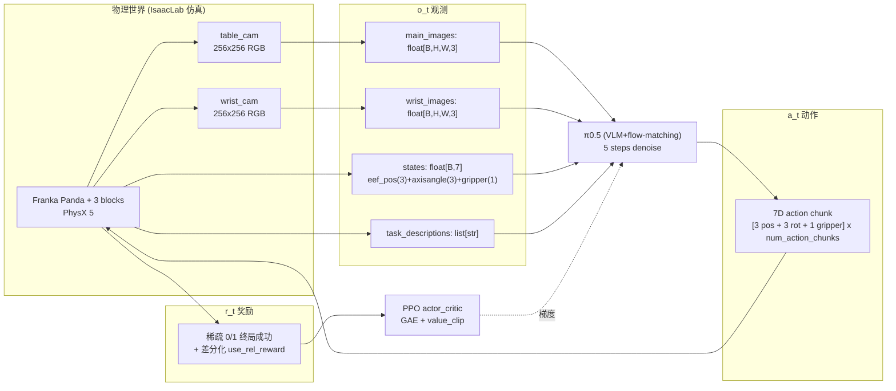

**关键维度**：
- `total_num_envs: 128`、`max_episode_steps: 450`、`num_action_chunks: 5`
- 动作是 **"动作块 (action chunk)"**：一次预测 5 步，依次执行；这是现代 VLA (OpenVLA / π0 / GR00T) 的通用习惯，可以让 RL 的 logprob 计算跨越几个仿真步、降低 credit assignment 噪声。
- 奖励是 `reward_coef=1.0` × 稀疏终止信号 (`reward_coef * terminations`)，并通过 `use_rel_reward=True` 做一阶差分 —— 等价于把"延迟稀疏奖励"就地展开成"恰好在成功发生时出现的 +1 脉冲"，对 GAE 非常友好（见 §8）。

### 1.3 为什么选择这个任务作为"RLinf × IsaacLab"样板

1. **多阶段依赖**：先放红到蓝 → 再放绿到红。纯模仿学习 (SFT) 能到约 0.859 (openpi π0.5) 的成功率，但多阶段耦合是 SFT 难以消除误差累积的地方，正是 RL fine-tune 的价值所在 ([docs/source-en/rst_source/examples/embodied/isaaclab.rst](docs/source-en/rst_source/examples/embodied/isaaclab.rst) 表格记录 RL 后到 0.953)。
2. **GPU 向量化**：IsaacLab 的 PhysX 原生支持单 GPU 128+ 环境并行，极大缓解了 on-policy PPO 的样本效率短板。
3. **视觉 + 语言 + 7D 控制**：正好命中 VLA 模型的典型输入输出形态，使得 RLinf 的 `EnvWorker` / `MultiStepRolloutWorker` / `EmbodiedFSDPActor` 三元架构能以最小 adapter 改动复用。

---

## 2. 入口剖析：Shell → Hydra → Runner

本节按"从键盘到训练循环"的顺序逐层展开，不放过任何一处环境变量或 Hydra override。

### 2.1 Shell 层：`run_embodiment.sh`

```1:57:examples/embodiment/run_embodiment.sh
#! /bin/bash

export EMBODIED_PATH="$( cd "$(dirname "${BASH_SOURCE[0]}" )" && pwd )"
export REPO_PATH=$(dirname $(dirname "$EMBODIED_PATH"))
export SRC_FILE="${EMBODIED_PATH}/train_embodied_agent.py"

export MUJOCO_GL="egl"
export PYOPENGL_PLATFORM="egl"
export ROBOTWIN_PATH=${ROBOTWIN_PATH:-"/path/to/RoboTwin"}
export PYTHONPATH=${REPO_PATH}:${ROBOTWIN_PATH}:$PYTHONPATH
```

**WHY 预置这些环境变量**：

- **`MUJOCO_GL=egl` / `PYOPENGL_PLATFORM=egl`**：即使 IsaacLab 走 PhysX 而非 MuJoCo，这两个变量仍然需要，因为上游的 `gym.make` 会探测 GL context；强制 EGL 可以在无显示器的服务器上跑 headless 渲染，避免后端回退到 GLX 触发 `X11 display not found`。这是**机器人仿真在集群部署**的标准坑。
- **`PYTHONPATH` 加入 `REPO_PATH`**：因为 `pip install -e .` 的情况下才默认加入 `rlinf` 模块，如果是 docker 镜像中只源码挂载（未 `pip install`），这一步就是救命稻草。

```26:35:examples/embodiment/run_embodiment.sh
if [ -z "$1" ]; then
    CONFIG_NAME="maniskill_ppo_openvlaoft"
else
    CONFIG_NAME=$1
fi

# NOTE: Set the active robot platform (required for correct action dimension and normalization), supported platforms are LIBERO, ALOHA, BRIDGE, default is LIBERO
ROBOT_PLATFORM=${2:-${ROBOT_PLATFORM:-"LIBERO"}}
```

**为什么默认 `ROBOT_PLATFORM=LIBERO`**：π0.5 的动作归一化 stats 默认对齐 LIBERO 的 7D 约定；IsaacLab stack-cube 的动作维度与 LIBERO 同为 7D，二者在 shell 层只需同一个 `ROBOT_PLATFORM=LIBERO` 默认值即可共用，免去开发者在每个 config 中重复声明。

```50:57:examples/embodiment/run_embodiment.sh
echo "Using Python at $(which python)"
LOG_DIR="${REPO_PATH}/logs/$(date +'%Y%m%d-%H:%M:%S')-${CONFIG_NAME}"
MEGA_LOG_FILE="${LOG_DIR}/run_embodiment.log"
mkdir -p "${LOG_DIR}"
CMD="python ${SRC_FILE} --config-path ${EMBODIED_PATH}/config/ --config-name ${CONFIG_NAME} runner.logger.log_path=${LOG_DIR}"
echo ${CMD} > ${MEGA_LOG_FILE}
${CMD} 2>&1 | tee -a ${MEGA_LOG_FILE}
```

最终组装出的命令等价于：

```bash
python examples/embodiment/train_embodied_agent.py \
    --config-path examples/embodiment/config/ \
    --config-name isaaclab_franka_stack_cube_ppo_openpi_pi05 \
    runner.logger.log_path=<LOG_DIR>
```

**WHY `tee -a`**：让训练日志同时流到文件和 stdout，既方便 VSCode 实时看进度，又保证崩溃时离线可查。

### 2.2 Hydra 入口：`train_embodied_agent.py`

```32:67:examples/embodiment/train_embodied_agent.py
@hydra.main(
    version_base="1.1", config_path="config", config_name="maniskill_ppo_openvlaoft"
)
def main(cfg) -> None:
    cfg = validate_cfg(cfg)
    print(json.dumps(OmegaConf.to_container(cfg, resolve=True), indent=2))

    cluster = Cluster(
        cluster_cfg=cfg.cluster, distributed_log_dir=cfg.runner.per_worker_log_path
    )
    component_placement = HybridComponentPlacement(cfg, cluster)

    # Create actor worker group
    actor_placement = component_placement.get_strategy("actor")

    if cfg.algorithm.loss_type == "embodied_sac":
        from rlinf.workers.actor.fsdp_sac_policy_worker import EmbodiedSACFSDPPolicy

        actor_worker_cls = EmbodiedSACFSDPPolicy
    elif cfg.algorithm.loss_type == "embodied_dagger":
        ...
    else:
        from rlinf.workers.actor.fsdp_actor_worker import EmbodiedFSDPActor

        actor_worker_cls = EmbodiedFSDPActor
    actor_group = actor_worker_cls.create_group(cfg).launch(
        cluster, name=cfg.actor.group_name, placement_strategy=actor_placement
    )
```

在我们的入口 (`isaaclab_franka_stack_cube_ppo_openpi_pi05`) 下 `algorithm.loss_type == "actor_critic"`，因此 `actor_worker_cls = EmbodiedFSDPActor`。

```68:100:examples/embodiment/train_embodied_agent.py
    # Create rollout worker group
    rollout_placement = component_placement.get_strategy("rollout")
    rollout_group = MultiStepRolloutWorker.create_group(cfg).launch(
        cluster, name=cfg.rollout.group_name, placement_strategy=rollout_placement
    )

    # Create env worker group
    env_placement = component_placement.get_strategy("env")
    env_group = EnvWorker.create_group(cfg).launch(
        cluster, name=cfg.env.group_name, placement_strategy=env_placement
    )
    ...
    runner = EmbodiedRunner(
        cfg=cfg,
        actor=actor_group,
        rollout=rollout_group,
        env=env_group,
        reward=reward_group,
    )

    runner.init_workers()
    runner.run()
```

**WHY 顺序：actor → rollout → env → reward**：
- **Ray Actor 创建 ≠ 模型实例化**。这里只是 `launch()` 占位 Ray actor；真正的 `init_worker()` 在 `runner.init_workers()` 中调用，并且刻意把最重的 actor 放到最后（见 §13），以降低 **Ray actor 启动阶段的峰值显存**。
- **为什么 actor/rollout/env 都显式接受 `placement_strategy`**：`HybridComponentPlacement` 的默认策略是 `PackedPlacementStrategy`（§5），但下游 Worker 仍然需要一份其本 rank 对应的实际硬件信息（GPU 号、node 号、local world size）。

### 2.3 启动期时序图

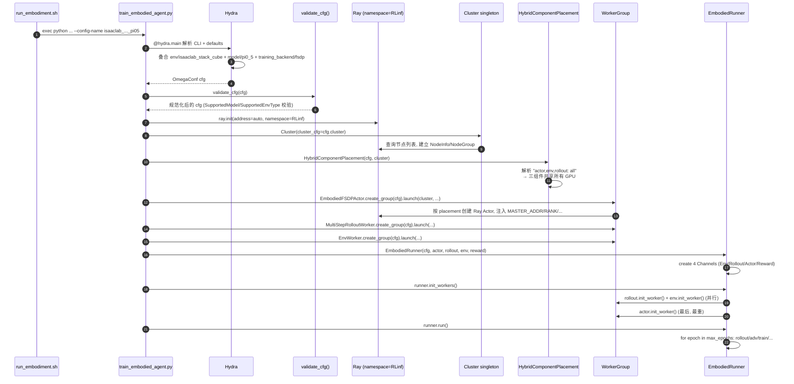

---

## 3. 全栈架构总览

下图是一张"看完就可以直接 code review"的全栈图，后续所有章节都是对它的局部放大。

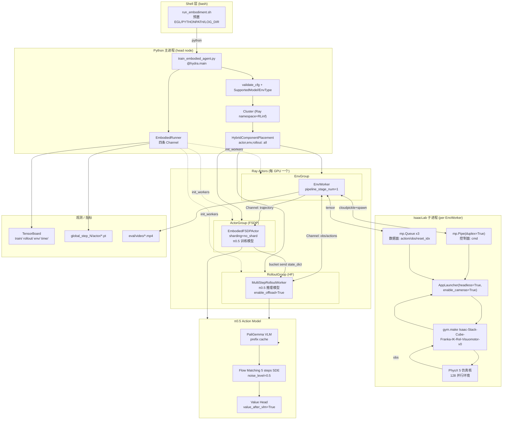

**读图建议**：
- 从 `Shell` 开始顺时针看：用户敲 shell → python 进程 → Hydra config → Cluster → Placement → 三个 WorkerGroup → Runner 主循环。
- 从 `IsaacLab 子进程` 回头看：理解 IsaacLab 为什么要放进独立子进程（§9）。
- 中间的 π0.5 Action Model 是 **Actor 与 Rollout 共用同一份权重定义**（但实例两份：一份用于 FSDP 训练，一份用于 HF 推理，通过 bucket 同步对齐）。

下一部分起，我们按"配置 → 调度 → 环境 → 训练循环 → 模型"的顺序，逐层展开每个组件。

---

# Part II — 配置与调度抽象

---

## 4. Hydra 配置组合的分层结构

RLinf 大量使用 Hydra 的 `defaults` + `@包名` 语法做"组合式配置"，本节按"顶层 YAML → 组件 YAML → 运行时解析"的顺序解构。

### 4.1 顶层配置：`isaaclab_franka_stack_cube_ppo_openpi_pi05.yaml`

```1:13:examples/embodiment/config/isaaclab_franka_stack_cube_ppo_openpi_pi05.yaml
defaults:
  - env/isaaclab_stack_cube@env.train
  - env/isaaclab_stack_cube@env.eval
  - model/pi0_5@actor.model
  - training_backend/fsdp@actor.fsdp_config
  - override hydra/job_logging: stdout

hydra:
  run:
    dir: .
  output_subdir: null
  searchpath:
    - file://${oc.env:EMBODIED_PATH}/config/
```

**逐行解读**：

- **`env/isaaclab_stack_cube@env.train`**：把 `config/env/isaaclab_stack_cube.yaml` 的全部键挂载到顶层的 `env.train` 命名空间下；同一个文件再挂到 `env.eval`，实现训练/评估共享模板但可以局部覆盖（见 §4.2）。
- **`model/pi0_5@actor.model`**：将 π0.5 的模型默认超参挂到 `actor.model`。注意 **rollout.model** 不在此处挂载，因为 rollout 与 actor **共用** 模型配置，`MultiStepRolloutWorker` 在内部 `copy.deepcopy(self.cfg.actor.model)` 并覆盖 `precision` / `model_path`（[rlinf/workers/rollout/hf/huggingface_worker.py](rlinf/workers/rollout/hf/huggingface_worker.py) 第 90-94 行）。
- **`training_backend/fsdp@actor.fsdp_config`**：挂 FSDP 默认配置到 `actor.fsdp_config`。
- **`override hydra/job_logging: stdout`**：关闭 Hydra 的文件 logging，避免与 RLinf 自己的 MetricLogger 重复。
- **`searchpath: file://${oc.env:EMBODIED_PATH}/config/`**：把 shell 层导出的 `EMBODIED_PATH` 作为 Hydra 搜索路径，保证在 docker、虚拟环境等不同 CWD 下都能找到 `config/env/*.yaml`。

### 4.2 Cluster 与 Runner 顶层

```15:36:examples/embodiment/config/isaaclab_franka_stack_cube_ppo_openpi_pi05.yaml
cluster:
  num_nodes: 1
  component_placement:
    actor,env,rollout: all

runner:
  task_type: embodied
  logger:
    log_path: "../results"
    project_name: rlinf
    experiment_name: "isaaclab_ppo_openpi_pi05"
    logger_backends: ["tensorboard"] # wandb, swanlab

  max_epochs: 1000
  max_steps: -1

  only_eval: False
  val_check_interval: -1
  save_interval: 100
```

**WHY 选择 `actor,env,rollout: all` (Collocated)**：
- 单节点 8×GPU 时，三个组件共享全部 8 卡；
- 代价是 actor / rollout 模型参数同时在 GPU 上会争抢显存，因此 rollout 默认 `enable_offload: True`；
- 优点是 **权重同步不需要跨节点 NCCL**，用 CUDA IPC (`reduce_tensor`) 就能点对点传给同卡的 rollout（见 §12）。

**WHY `val_check_interval: -1`**：对 IsaacLab stack-cube 这种长 horizon 任务，每次 eval 需要重置 32 个环境各跑 450 步，开销很高（≈100s+）；作者选择**完全不启用周期评估**，只依赖训练期的 `env/success_once` 指标。

### 4.3 算法与模型超参

```38:106:examples/embodiment/config/isaaclab_franka_stack_cube_ppo_openpi_pi05.yaml
algorithm:
  normalize_advantages: True
  kl_penalty: kl
  group_size: 1
  reward_coef: 1.0
  rollout_epoch: 2
  eval_rollout_epoch: 1

  reward_type: chunk_level
  logprob_type: chunk_level
  entropy_type: token_level

  update_epoch: 3
  adv_type: gae
  loss_type: actor_critic
  loss_agg_func: "token-mean"
  kl_beta: 0.0
  entropy_bonus: 0
  clip_ratio_high: 0.2
  clip_ratio_low: 0.2
  clip_ratio_c: 3.0
  value_clip: 0.2
  huber_delta: 10.0

  gamma: 0.99
  gae_lambda: 0.95
```

**逐键解释（WHY）**：

| 键 | 值 | WHY |
|---|---|---|
| `group_size: 1` | — | GRPO 把一批 prompt 各采样 `group_size` 条轨迹再组内做 baseline。IsaacLab 用 GAE，不需要 group baseline，设 1 即退化为常规 PPO。 |
| `rollout_epoch: 2` | 每个 outer step 把 env 走 2 遍 | 一次外层 step = 2×90=180 次 chunk 交互（见 §10），在相对有限的 `total_num_envs=128` 下提升样本量。 |
| `reward_type: chunk_level` | reward 在 **action chunk** 粒度 | 每 5 步合成一次 reward（最后一步的 reward 即整个 chunk 的 reward）。π0.5 一次预测 5 步动作，reward 粒度对齐，使得 advantage 和 logprob 维度一致。 |
| `logprob_type: chunk_level` | logprob 在 chunk 粒度（对整个 chunk 求平均） | 与 reward 对齐；训练时 ratio = exp(log π_new - log π_old) 也是 chunk 粒度。 |
| `entropy_type: token_level` | entropy 在 token（denoise step × action dim）粒度 | 熵项用于鼓励探索，token 粒度能更精细地反映 flow-matching 的随机性。 |
| `update_epoch: 3` | 对同一批 rollout 数据做 3 个 PPO 更新 epoch | 经典 PPO 做法，数据复用提升效率；过大会 KL 太远导致策略坍塌。 |
| `adv_type: gae` | 使用 GAE | IsaacLab 有明确 value function（§14 的 value head），可以用 GAE 降方差；GRPO 在 VLA 中用于无 value head 的场景。 |
| `loss_type: actor_critic` | 联合 actor+critic loss | 与 GAE 配套；[rlinf/algorithms/losses.py](rlinf/algorithms/losses.py) 第 403-431 行 `compute_ppo_actor_critic_loss` 把 actor_loss 与 critic_loss 相加。 |
| `value_clip: 0.2` | critic 的 value 也做 PPO-style clip | 与动作 ratio 的 clip 对应，防止 value function 一次更新过远。 |
| `clip_ratio_c: 3.0` | Dual-Clip | 当 advantage 为负时额外做一次"不能超过 3"的夹逼，避免 ratio 过小时 gradient 过大，见 [rlinf/algorithms/losses.py](rlinf/algorithms/losses.py) 第 256-259 行。 |
| `huber_delta: 10.0` | value 损失 Huber | Huber vs. MSE：对 outlier reward 更鲁棒。 |
| `gamma: 0.99`, `gae_lambda: 0.95` | GAE 经典组合 | horizon 450 的稀疏奖励下，这个组合让 TD(λ) 权重大致覆盖整条 episode。 |

### 4.4 Env/Rollout/Actor 具体参数

```85:116:examples/embodiment/config/isaaclab_franka_stack_cube_ppo_openpi_pi05.yaml
env:
  group_name: "EnvGroup"

  train:
    total_num_envs: 128
    max_episode_steps: 450 # for truncation
    max_steps_per_rollout_epoch: 450
    use_fixed_reset_state_ids: True
    seed: 42

  eval:
    total_num_envs: 32
    max_episode_steps: 450
    max_steps_per_rollout_epoch: 450
    auto_reset: True
    ignore_terminations: True
    use_fixed_reset_state_ids: True
    video_cfg:
      save_video: True
      info_on_video: True
      video_base_dir: ${runner.logger.log_path}/video/eval
    seed: 42

rollout:
  group_name: "RolloutGroup"
  backend: "huggingface"
  enable_offload: True
  pipeline_stage_num: 1
```

**关键数值推导**：
- `n_train_chunk_steps = max_steps_per_rollout_epoch / num_action_chunks = 450 / 5 = 90`
- 每个 outer step 的 env 交互：`rollout_epoch × n_train_chunk_steps × pipeline_stage_num = 2 × 90 × 1 = 180 chunk interactions`
- 每次 chunk 实际执行 5 步 sim → 总 sim steps = `180 × 5 × 128 = 115200 steps per outer step per rank`

**WHY `train.auto_reset` 缺省为 False、`eval.auto_reset: True`**（见 [examples/embodiment/config/env/isaaclab_stack_cube.yaml](examples/embodiment/config/env/isaaclab_stack_cube.yaml) 第 3 行 `auto_reset: False`）：
- 训练：把整条 episode 完整采满（450 步），不自动 reset，保证 GAE 沿完整 horizon 计算；
- 评估：让早成功的 episode 自动重置，从而在固定的 `max_steps_per_rollout_epoch` 内统计到更多 success 样本。

```118:161:examples/embodiment/config/isaaclab_franka_stack_cube_ppo_openpi_pi05.yaml
actor:
  group_name: "ActorGroup"
  training_backend: "fsdp"
  micro_batch_size: 32
  global_batch_size: 256
  seed: 42
  enable_offload: False

  model:
    model_path: "/path/to/model/RLinf-Pi05-SFT"
    model_type: "openpi"
    action_dim: 7
    num_action_chunks: 5
    num_steps: 5
    add_value_head: True
    openpi:
      config_name: "pi05_isaaclab_stack_cube"
      num_images_in_input: 2
      noise_level: 0.5
      joint_logprob: False
      num_steps: ${actor.model.num_steps}
      value_after_vlm: True
      value_vlm_mode: "mean_token"
      detach_critic_input: True

  optim:
    lr: 5.0e-6
    value_lr: 1.0e-4
    ...

  fsdp_config:
    strategy: "fsdp"
    sharding_strategy: "no_shard"
    gradient_checkpointing: False
    mixed_precision:
      param_dtype: ${actor.model.precision}
      reduce_dtype: ${actor.model.precision}
      buffer_dtype: ${actor.model.precision}
```

**关键 WHY**：
- **`sharding_strategy: no_shard`**：π0.5 在 7B 规模以下（expert-only 模式），单卡 A100-80G 可容下全参；`no_shard` 意味着 FSDP 只做 DP 级别的 gradient all-reduce，不做参数分片，省去 all-gather 开销。若换到 70B 模型必须改 `full_shard`。
- **`gradient_checkpointing: False`**：π0.5 的 flow-matching 解码是 5 次自回归，gradient checkpointing 会造成重算代价超过显存收益，文档注释明确 "for openpi, gradient checkpointing is not supported"。
- **`add_value_head: True` + `value_after_vlm: True`**：给 VLM 输出端接一个 `ValueHead` MLP（[rlinf/models/embodiment/modules/value_head.py](rlinf/models/embodiment/modules/value_head.py)），用 VLM 的 token 平均作为 value 的输入；`value_after_vlm=True` 是 π0.5 特有（π0 是在 expert 端出 value）。
- **`detach_critic_input: True`**：critic 的梯度**不反传**给 VLM backbone，避免 value 噪声污染 VLM 表示，这是 VLA RL 训练的经典技巧。
- **`lr: 5e-6`, `value_lr: 1e-4`**：actor 极小 LR + critic 较大 LR，对 PPO 来说是**让 value function 快速拟合 reward，再慢慢更新策略**，避免策略过快漂移。

### 4.5 Hydra 配置叠合结果（可视化）

```mermaid
flowchart LR
    TopYAML["isaaclab_franka_stack_cube_ppo_openpi_pi05.yaml<br/>cluster/algorithm/env/rollout/actor 骨架"]
    EnvYAML["env/isaaclab_stack_cube.yaml<br/>init_params.id / max_episode_steps /<br/>table_cam / wrist_cam"]
    ModelYAML["model/pi0_5.yaml<br/>OpenPi0Config 默认 (num_steps/noise/...)"]
    FSDPYAML["training_backend/fsdp.yaml<br/>FSDP 策略默认"]

    TopYAML -->|@env.train| EnvYAML
    TopYAML -->|@env.eval| EnvYAML
    TopYAML -->|@actor.model| ModelYAML
    TopYAML -->|@actor.fsdp_config| FSDPYAML

    TopYAML --> ValidateCfg["rlinf.config.validate_cfg()<br/>SupportedModel / SupportedEnvType 校验<br/>派生字段计算"]
    ValidateCfg --> Final["OmegaConf cfg<br/>传给 Cluster / Placement / Worker"]
```

---

## 5. Cluster 与 ComponentPlacement 抽象

### 5.1 `Cluster`：Ray 的薄封装

[rlinf/scheduler/cluster/cluster.py](rlinf/scheduler/cluster/cluster.py) 第 93-120 行定义 `Cluster` 是一个 `SYS_NAME="RLinf"` 单例：

```93:120:rlinf/scheduler/cluster/cluster.py
class Cluster:
    """A singleton class that manages the cluster resources for Ray workers."""

    SYS_NAME = "RLinf"
    NAMESPACE = SYS_NAME
    LOGGING_LEVEL = os.getenv(
        f"{SYS_NAME.upper()}_{ClusterEnvVar.LOG_LEVEL.value}", "INFO"
    ).upper()
    TIMEOUT_WARN_TIME = 3600000
    DEFAULT_SYS_ENV_VAR = {
        ClusterEnvVar.CATCH_FAILURE: "0",
        ClusterEnvVar.LOG_LEVEL: "INFO",
        ClusterEnvVar.TIMEOUT: "180",
        ClusterEnvVar.NODE_RANK: None,
        ClusterEnvVar.COMM_NET_DEVICES: None,
        ClusterEnvVar.EXT_MODULE: None,
        ClusterEnvVar.PATH_ENV_MERGE_MODE: PathEnvMergeMode.APPEND.value,
    }
```

**WHY 一个独立 `NAMESPACE`**：Ray 的 detached actor 默认全局可见，多个训练任务在同一个 Ray 集群上可能名字冲突（比如两人同时跑 `ActorGroup`）；设置 `namespace="RLinf"` 后，只有同 namespace 的 Ray actor 可见，相当于给 RLinf 的 worker 命名空间加锁。

### 5.2 `HybridComponentPlacement`：从 YAML 到硬件映射

我们的 YAML 只有一行：

```yaml
cluster:
  num_nodes: 1
  component_placement:
    actor,env,rollout: all
```

这一行在 [rlinf/scheduler/placement/placement.py](rlinf/scheduler/placement/placement.py) 的 `ComponentPlacement._parse_component_placement` 第 340-421 行被解析：

```340:400:rlinf/scheduler/placement/placement.py
    def _parse_component_placement(
        self,
        cluster: Cluster,
        component_placement: str | DictConfig,
        component_names: list[str],
    ) -> PlacementStrategy:
        """Parse the component placement configuration into a PlacementStrategy.
        ...
        """
        assert isinstance(component_placement, (str, DictConfig)), (
            ...
        )
        node_group_labels = None
        # Format (1) group_name1,group_name2,...: resource_ranks:process_ranks
        if isinstance(component_placement, str):
            node_groups = [cluster.get_node_group()]
            rank_map_str = component_placement
```

解析过程：

1. key 字符串 `"actor,env,rollout"` → `component_names = ["actor", "env", "rollout"]`
2. value 字符串 `"all"` → 展开为 `0-<num_gpus-1>` 的 rank 范围
3. 最终生成 `PackedPlacementStrategy(start_hw=0, end_hw=num_gpus-1)`，共同指派给这三个 component

### 5.3 `HybridComponentPlacement` 的封装

```86:96:rlinf/utils/placement.py
class HybridComponentPlacement(ComponentPlacement):
    """Hybrid component placement that allows components to run on any sets of GPUs."""

    def __init__(self, config: DictConfig, cluster: Cluster):
        """Initialize HybridComponentPlacement

        Args:
            config (DictConfig): The configuration dictionary.
        """
        super().__init__(config, cluster)
        self._placement_mode = PlacementMode.HYBRID
```

`HybridComponentPlacement` 就是 `ComponentPlacement` 加一个 `_placement_mode=HYBRID` 标记 —— **设计上故意"薄"**，因为 embodied 任务的 env / rollout / actor 并行关系非常灵活：有时候 actor 占独立 GPU，有时候 collocated，甚至同一组件分散在多 node 的异构硬件上。

而 [rlinf/utils/placement.py](rlinf/utils/placement.py) 的 `ModelParallelComponentPlacement` (第 99-555 行) 则针对 **推理类任务（DeepSeek-R1 / LLM RL）** 做了更严格的约束：要求 GPU 连续、必须覆盖 collocated 或 disaggregated 之一、还要处理 TP size / PP size / inference DP 的联合约束。

### 5.4 Placement UML 类图

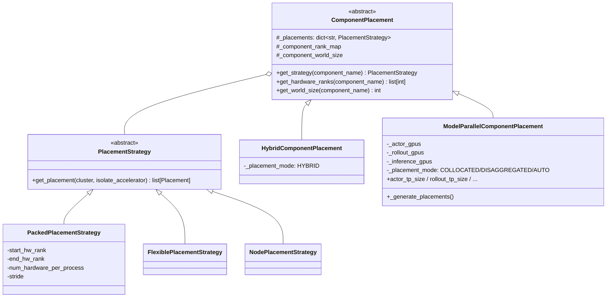

### 5.5 三种典型布局对照

[docs/source-en/rst_source/examples/embodied/isaaclab.rst](docs/source-en/rst_source/examples/embodied/isaaclab.rst) 第 175-209 行给出三种可选布局，WHY 对比如下：

| 布局 | YAML | 何时选 |
|---|---|---|
| **完全共享 (Collocated)** | `actor,rollout,env: all` | 本文入口；显存不成问题时最省 GPU |
| **分离 rollout/env** | `env: 0-3, rollout: 4-7, actor: 0-7` | 让 env 与 rollout 真正并发（rollout 推理时 env 步进），但 actor 仍与 rollout 共 GPU |
| **完全分离 (Disaggregated)** | `env: 0-1, rollout: 2-5, actor: 6-7` | 每个组件独占 GPU，无需 offload，但对硬件数量要求最高 |

**WHY 前两种都还挂 `actor: 0-7` 或 `actor: all`**：actor 参数是最大的，它希望**占据尽量多的 GPU 做 FSDP 并行**；而 env/rollout 则希望**错开执行时段**。Collocated-actor / Disaggregated-env-rollout 是一种折中。

### 5.6 `cluster.get_strategy("actor")` 的调用路径

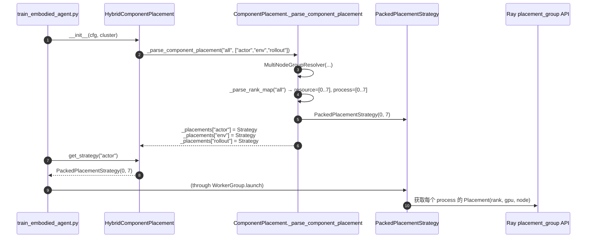

**WHY 返回的是同一个 `PlacementStrategy` 实例**：三个 component 共享一个 strategy 对象意味着 Ray 创建 placement_group 时，三组 Ray actor 会被调度到同一组 GPU 上（各自独立进程），这是 "collocated" 的物理实现。

---

## 6. Worker / WorkerGroup / Channel 抽象

### 6.1 `Worker` 元类注入

[rlinf/scheduler/worker/worker.py](rlinf/scheduler/worker/worker.py) 第 47-96 行定义 `WorkerMeta` 元类：

```47:96:rlinf/scheduler/worker/worker.py
class WorkerMeta(type):
    """Metaclass to capture failures in worker classes."""

    def __new__(cls, name: str, bases: tuple[type], attrs: dict[str, Any]):
        """Wrap the function to catch SystemExit exceptions."""
        for attr_name, attr_value in attrs.items():
            if callable(attr_value):
                attrs[attr_name] = cls._catch_failure_for_cls_func(
                    name, attr_name, attr_value
                )
        return super().__new__(cls, name, bases, attrs)

    @classmethod
    def _catch_failure_for_cls_func(cls, cls_name, func_name: str, func: Callable):
        ...
        def func_wrapper(func: Callable):
            @functools.wraps(func)
            def sync_func(*args, **kwargs):
                try:
                    return func(*args, **kwargs)
                except SystemExit:
                    # Catch SystemExit and log the error
                    raise RuntimeError(
                        f"SystemExit caught in {cls_name}'s function {func.__name__}, traceback is below: {traceback.format_exc()}"
                    )
```

**WHY 元类拦截 `SystemExit`**：
- Ray Actor 在远端进程崩溃时会触发 `SystemExit`，默认会**静默杀掉整个 Actor** 而不抛出可见异常到 Driver；
- `WorkerMeta` 把所有公开方法包一层 try/except，将 `SystemExit` 转为 `RuntimeError` 重新抛出，Driver 可以在 `Handle.wait()` 时拿到完整 traceback；
- 这对排查 IsaacLab 子进程里 PhysX 崩溃（典型 `segfault` / `exit(1)`）至关重要。

### 6.2 `Worker.create_group().launch(...)` 的生命周期

以 `EnvWorker` 为例：

```python
# examples/embodiment/train_embodied_agent.py 第 76-79 行
env_placement = component_placement.get_strategy("env")
env_group = EnvWorker.create_group(cfg).launch(
    cluster, name=cfg.env.group_name, placement_strategy=env_placement
)
```

展开：

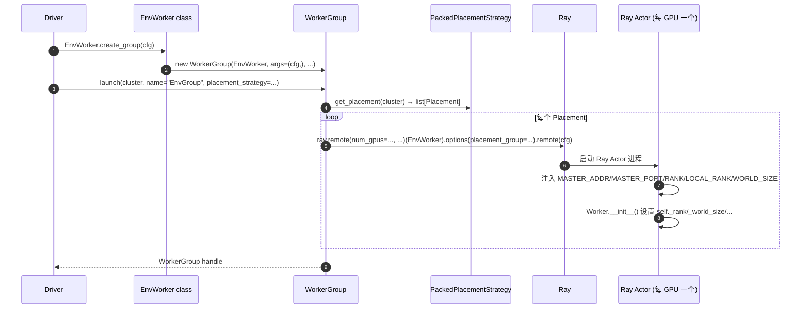

在 Worker 内部，`Worker.__init__()` ([rlinf/scheduler/worker/worker.py](rlinf/scheduler/worker/worker.py) 第 408-499 行) 会做这些事：
- `ray.init(address="auto", namespace=Cluster.NAMESPACE)`
- `_setup_local_rank_world_size()`
- `_setup_accelerator_info()`
- `_setup_hardware()`
- `_setup_worker_info()` 注册到 Manager
- `_setup_master_address_and_port()`
- `_setup_comm_envs()`

**WHY 把这些放在基类构造**：Ray Actor 的初始化必须一次完成（Ray 不支持 post-init ambient 调用），且每个子类（Actor/Rollout/Env）都需要同一套 MASTER/RANK 环境变量。基类统一处理避免每个子类重复样板。

### 6.3 `Channel`：框架级消息总线

[rlinf/scheduler/channel/channel.py](rlinf/scheduler/channel/channel.py) 第 38-58 行定义：

```38:58:rlinf/scheduler/channel/channel.py
class Channel:
    """A FIFO queue-like channel for inter-worker communication.

    **Creation**: Channel can be created both inside and outside of worker contexts.
    The recommended practice is to create channels outside of worker contexts using `Channel.create()`, and then pass them into workers as needed.
    You can also create channels inside worker contexts or connect to existing channels, using `self.create_channel()` or `self.connect_channel()`.

    **Interface**: Similar as the `asyncio.Queue`, the `Channel` provides interfaces like `put`, `get`, `put_no_wait`, and `get_no_wait`,
    as well as query interfaces like `qsize`, `empty`, and `full`.
    The semantics of these interfaces are identical to those of `asyncio.Queue`.

    **Features**:

    1. **Async operation**: Channel supports both synchronous and asynchronous `put` and `get` operations, similar to Worker's `send` and `recv` APIs.
```

四个关键特性：

1. **异步 `put/get`**：底层是 Ray actor 的 `remote()` 调用，可以转成 `asyncio.Future` / `AsyncWork`。
2. **Key-based routing**：put/get 可以带 `key=` 参数，相当于在同一个 Channel 里做"多路复用"。这正是 §10 的 `CommMapper.build_channel_key(src, dst, extra)` 使用的机制。
3. **Weight & batch**：可以按 item 权重做 `get_batch(target_weight=N)`，适合 reasoning 场景的动态批处理。
4. **可打印内部状态**：直接 `print(channel)` 能打出队列快照，方便排查 deadlock。

### 6.4 `EmbodiedRunner` 的 4 条 Channel

```75:82:rlinf/runners/embodied_runner.py
        # Data channels
        self.env_channel = Channel.create("Env")
        self.rollout_channel = Channel.create("Rollout")
        self.actor_channel = Channel.create("Actor")
        if self.reward is not None:
            self.reward_channel = Channel.create("Reward")
        else:
            self.reward_channel = None
```

角色约定（即便命名都挺简洁，但方向是有讲究的）：

| Channel | 方向 | 载荷 |
|---|---|---|
| `Env` | rollout → env | 动作 chunk；或 reward 返回的奖励 |
| `Rollout` | env → rollout | 观测 batch |
| `Actor` | env → actor | Trajectory（一次 rollout epoch 后批量送） |
| `Reward` | env → reward | 图像 batch（供外部奖励模型推理） |

**WHY 命名容易混淆**：`env_channel` 字面上像"属于 env 的"，实际是 **"流向 env 的数据管道"** （即 env 的输入通道），即 rollout 把 action 从这里 put，env 从这里 get。在 [rlinf/runners/embodied_runner.py](rlinf/runners/embodied_runner.py) 第 281-295 行可以看到对应关系：

```281:295:rlinf/runners/embodied_runner.py
                with self.timer("generate_rollouts"):
                    env_handle: Handle = self.env.interact(
                        input_channel=self.env_channel,
                        rollout_channel=self.rollout_channel,
                        reward_channel=self.reward_channel,
                        actor_channel=self.actor_channel,
                    )
                    rollout_handle: Handle = self.rollout.generate(
                        input_channel=self.rollout_channel,
                        output_channel=self.env_channel,
                    )
```

注意：
- `env.interact` 把 `env_channel` 当 **input**（从这里读 action）、把 `rollout_channel` 当 **output**（把 obs 发到这里）；
- `rollout.generate` 把 `rollout_channel` 当 **input**（从这里读 obs）、把 `env_channel` 当 **output**（把 action 发到这里）；
- 二者构成一个**环状 producer-consumer**，由 `CommMapper` 的 key 保证点对点 rank 对齐。

### 6.5 `CommMapper`：批维度的 many-to-many 映射

为什么需要 `CommMapper` 而不是简单一对一 send/recv？因为 env/rollout/reward 三个组件**可以有不同 world_size**。比如某种布局下 4 个 EnvWorker、2 个 RolloutWorker、1 个 RewardWorker，那么每个 RolloutWorker 需要从 2 个 EnvWorker 收 obs、再分发给它们。

```22:56:rlinf/utils/comm_mapping.py
class CommMapper:
    """Communication mapping helpers with batch sharding among two worker groups that require fixed rank pairing in communications.

    For example, env and rollout should always use the same rank pair for communications.
    """

    @staticmethod
    def build_channel_key(src_rank: int, dst_rank: int, extra: str) -> str:
        """Build a canonical point-to-point channel key."""
        return f"{src_rank}_{dst_rank}_{extra}"

    @staticmethod
    def get_dst_ranks(
        batch_size: int, src_world_size: int, dst_world_size: int, src_rank: int
    ) -> list[tuple[int, int]]:
        """Compute destination ranks and transfer sizes for one source rank."""
        assert batch_size % src_world_size == 0, (
            ...
        )
        assert batch_size % dst_world_size == 0, (
            ...
        )
        ...
        batch_size_per_src_rank = batch_size // src_world_size
        batch_size_per_dst_rank = batch_size // dst_world_size

        dst_ranks_and_sizes: list[tuple[int, int]] = []
        batch_begin = src_rank * batch_size_per_src_rank
        batch_end = (src_rank + 1) * batch_size_per_src_rank
        while batch_begin < batch_end:
            dst_rank = batch_begin // batch_size_per_dst_rank
            dst_batch_begin = dst_rank * batch_size_per_dst_rank
            dst_remaining = batch_size_per_dst_rank - (batch_begin - dst_batch_begin)
            src_remaining = batch_end - batch_begin
            dst_size = min(dst_remaining, src_remaining)
            dst_ranks_and_sizes.append((dst_rank, dst_size))
            batch_begin += dst_size
        return dst_ranks_and_sizes
```

### 6.6 Batch Sharding 可视化

假设 `batch_size=128, src_world_size=4, dst_world_size=2`：

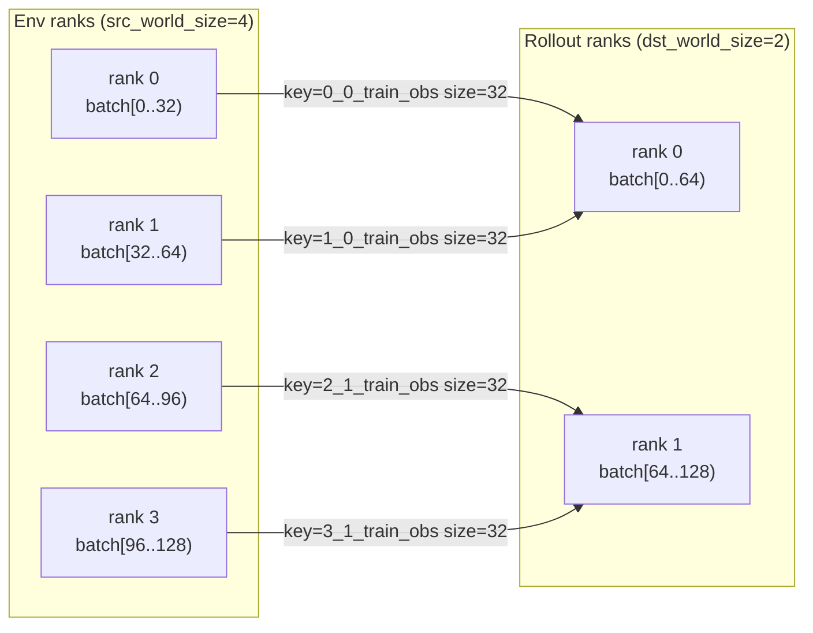

**WHY 批维度对齐**：
- Env rank 0 只知道它自己那 32 个环境的 obs，必须把这些 obs 发给正确的 rollout rank 才能进入正确的模型推理批。
- 通过 `batch_size / world_size` 计算确定的 rank 对，保证每次 step 的 obs 和 action 能形成闭环（同一个 rank 对既送 obs 又收 action）。
- Channel 的 `key` 参数实现"同一个 Channel 里多路复用"，不同 rank 对之间互不干扰，天然支持 any-to-any 拓扑。

本部分结束。下一部分我们深入 IsaacLab 环境子系统本身 —— 本文重点 1。

---

# Part III — IsaacLab 环境子系统（本文重点 1）

---

## 7. 环境注册：两级路由

### 7.1 顶层：`SupportedEnvType` 枚举

[rlinf/envs/__init__.py](rlinf/envs/__init__.py) 第 18-33 行：

```18:33:rlinf/envs/__init__.py
class SupportedEnvType(Enum):
    MANISKILL = "maniskill"
    LIBERO = "libero"
    ROBOTWIN = "robotwin"
    ISAACLAB = "isaaclab"
    METAWORLD = "metaworld"
    BEHAVIOR = "behavior"
    CALVIN = "calvin"
    ROBOCASA = "robocasa"
    REALWORLD = "realworld"
    FRANKASIM = "frankasim"
    HABITAT = "habitat"
    OPENSORAWM = "opensora_wm"
    WANWM = "wan_wm"
    ROBOVERSE = "roboverse"
```

`Enum` 的值是 YAML 中 `env.train.env_type` 字段的字符串。`validate_cfg` 用这个 Enum 检查 `env_type` 必须在白名单里。

### 7.2 `get_env_cls` 的分派与 lazy import

```35:80:rlinf/envs/__init__.py
def get_env_cls(env_type: str, env_cfg=None):
    """
    Get environment class based on environment type.
    ...
    """

    env_type = SupportedEnvType(env_type)

    if env_type == SupportedEnvType.MANISKILL:
        ...
    elif env_type == SupportedEnvType.ISAACLAB:
        from rlinf.envs.isaaclab import REGISTER_ISAACLAB_ENVS

        if env_cfg is None:
            raise ValueError(
                "env_cfg is required for isaaclab environment type. "
                "Please provide env_cfg.init_params.id to select the task."
            )

        task_id = env_cfg.init_params.id
        assert task_id in REGISTER_ISAACLAB_ENVS, (
            f"Task type {task_id} has not been registered! "
            f"Available tasks: {list(REGISTER_ISAACLAB_ENVS.keys())}"
        )
        return REGISTER_ISAACLAB_ENVS[task_id]
```

**WHY 两级路由（Enum → REGISTER_ISAACLAB_ENVS）而不是扁平化**：
- IsaacLab 本身就是一个"任务仓库"（stack-cube, cartpole, anymal, franka-peg, ...），每个任务有不同的观测 schema、动作空间。
- 如果把任务 ID 直接塞进 `SupportedEnvType`，会让枚举爆炸且污染其他 env 的命名空间。
- 两级路由把 "env 框架"与"具体任务" 解耦：`SupportedEnvType.ISAACLAB` 只选 framework，再用 `env_cfg.init_params.id` 二级选 task。

**WHY lazy import (`from rlinf.envs.isaaclab import ...` 在分支里)**：
- IsaacLab 依赖 `isaaclab`, `isaaclab_tasks`, `isaacsim` 等巨型包；在一台只跑 LIBERO 的机器上 `import rlinf.envs` 时不应触发 Isaac Sim 的 GL 初始化。

### 7.3 任务级注册表

```15:22:rlinf/envs/isaaclab/__init__.py
from .tasks.stack_cube import IsaaclabStackCubeEnv

REGISTER_ISAACLAB_ENVS = {
    "Isaac-Stack-Cube-Franka-IK-Rel-Visuomotor-Rewarded-v0": IsaaclabStackCubeEnv,
}

__all__ = [list(REGISTER_ISAACLAB_ENVS.keys())]
```

对于新任务，只需：(a) 写一个 `XxxEnv(IsaaclabBaseEnv)` 子类；(b) 在 `REGISTER_ISAACLAB_ENVS` 加一行映射。详见 §18 扩展指南。

---

## 8. `IsaaclabBaseEnv` 基类与 `chunk_step` 语义

### 8.1 类图

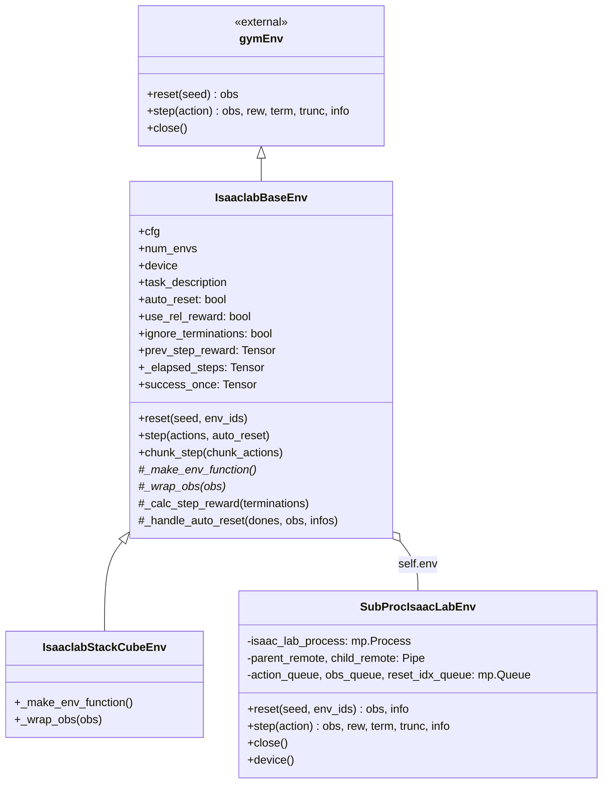

### 8.2 构造函数：状态初始化

```25:63:rlinf/envs/isaaclab/isaaclab_env.py
class IsaaclabBaseEnv(gym.Env):
    """
    Class for isaaclab in rlinf. Different from other lab enviromnent, the output of isaaclab is all tensor on
    cuda.
    """

    def __init__(
        self,
        cfg,
        num_envs,
        seed_offset,
        total_num_processes,
        worker_info,
    ):
        self.cfg = cfg
        self.isaaclab_env_id = self.cfg.init_params.id
        self.num_envs = num_envs

        with open_dict(cfg):
            cfg.init_params.num_envs = num_envs
        self.seed = self.cfg.seed + seed_offset
        self.total_num_processes = total_num_processes
        self.worker_info = worker_info
        self.video_cfg = cfg.video_cfg
        self._init_isaaclab_env()
        self.device = self.env.device()

        self.task_description = cfg.init_params.task_description
        self._is_start = True  # if this is first time for simulator
        self.auto_reset = cfg.auto_reset
        self.prev_step_reward = torch.zeros(self.num_envs).to(self.device)
        self.use_rel_reward = cfg.use_rel_reward

        self._init_metrics()
        self._elapsed_steps = torch.zeros(self.num_envs, dtype=torch.int32).to(
            self.device
        )
        self.ignore_terminations = cfg.ignore_terminations
```

**WHY `seed = cfg.seed + seed_offset`**：RLinf 启动多个 `EnvWorker`（每个 GPU 一个），再加上 `pipeline_stage_num` 可以让一个 Worker 内部有多个 env 实例。`seed_offset = self._rank * self.stage_num + stage_id` 保证每个 env 实例有独立且可复现的 seed 流，**避免不同 env 实例完全同相位**导致样本多样性坍塌。

**WHY 所有状态张量放 `self.device`（即 CUDA）**：IsaacLab 的 PhysX 原生吐出 CUDA 张量；如果这里把状态放 CPU，就会每步做一次 H2D copy，浪费 PCIe 带宽。RLinf 只在 `EnvOutput.__post_init__` 层做最终 `.cpu()`（见 [rlinf/data/embodied_io_struct.py](rlinf/data/embodied_io_struct.py) 第 61-91 行），跨越 Ray/Channel 才离开 GPU。

### 8.3 `step()`：单步交互与差分奖励

```119:151:rlinf/envs/isaaclab/isaaclab_env.py
    def step(self, actions=None, auto_reset=True):
        obs, step_reward, terminations, truncations, infos = self.env.step(actions)

        step_reward = step_reward.clone()
        terminations = terminations.clone()
        truncations = truncations.clone()

        obs = self._wrap_obs(obs)

        self._elapsed_steps += 1

        truncations = (self.elapsed_steps >= self.cfg.max_episode_steps) | truncations

        dones = terminations | truncations

        infos = self._record_metrics(
            step_reward, terminations, {}
        )  # return infos is useless
        if self.ignore_terminations:
            infos["episode"]["success_at_end"] = terminations
            terminations[:] = False

        _auto_reset = auto_reset and self.auto_reset  # always False
        if dones.any() and _auto_reset:
            obs, infos = self._handle_auto_reset(dones, obs, infos)

        return (
            obs,
            step_reward,
            terminations,
            truncations,
            infos,
        )
```

**WHY `truncations = (elapsed_steps >= max_episode_steps) | truncations`**：
- IsaacLab 原生 task 有自己的 truncation 条件（如物体飞出场景）；
- RLinf 额外加一个"超过 max_episode_steps 就截断"的 safety belt，防止稀有失败 case 导致 episode 无限长（训练 batch 会爆掉）；
- `|` 而不是 `=`，保留原生信号供上游观察。

**WHY `ignore_terminations: True` 时把 `terminations[:] = False`**：
- 在 IsaacLab stack-cube 任务里，一旦成功（所有方块叠好）task 会发 `terminations=True`；
- 但训练时我们希望让 env **继续跑完 450 步**而不是中断（中断会造成 episode 长度方差过大、影响 GAE）；
- 因此把 terminations 抹掉，只保留成功信号到 `success_at_end` 里供 metrics 记录，episode 继续直到 `max_episode_steps`。
- 注意：`eval` config 里 `auto_reset: True, ignore_terminations: True` 是不同的组合 —— 评估时一旦成功立即 reset 以采集更多 success 样本（见 §4.4）。

**WHY `_auto_reset = auto_reset and self.auto_reset  # always False` 注释**：代码作者显式注明：即便上游传 `auto_reset=True`，由于 yaml 里 `auto_reset: False`，`and` 永远 False。**这是为了禁止 `chunk_step` 内部 auto_reset**（会把 chunk 内的数据割裂）。

### 8.4 差分奖励 `_calc_step_reward`

```256:264:rlinf/envs/isaaclab/isaaclab_env.py
    def _calc_step_reward(self, terminations):
        reward = self.cfg.reward_coef * terminations
        reward_diff = reward - self.prev_step_reward
        self.prev_step_reward = reward

        if self.use_rel_reward:
            return reward_diff
        else:
            return reward
```

（注意：这个函数是从 LIBERO 抄来的模板，注释 "Below codes are all copied from libero, thanks to the author of libero!" 在 [rlinf/envs/isaaclab/isaaclab_env.py](rlinf/envs/isaaclab/isaaclab_env.py) 第 240-242 行。）

**WHY 差分 (`use_rel_reward=True`)**：
- 若 `terminations=True` 维持到 episode 末尾，累积 reward 会每步都 +1，积分 ∝ horizon，和任务长度挂钩；
- 差分之后，只有"首次成功"那一步 reward=+1，其余是 0；这与"成功脉冲"的直觉一致；
- 对 GAE：`δ_t = r + γV_{t+1} - V_t`，差分 reward 使得 return 等于 `γ^{T-t}`（T 是成功步），value function 会学到正确的折扣回报。

### 8.5 `chunk_step`：5 步动作的原子执行

这是 RL 对 VLA 最有意思的适配层：π0.5 一次预测 5 个动作，但仿真必须**逐步执行**；`chunk_step` 既要"展开 chunk 到每一步"，又要"把结果再聚合成 chunk 形态"给上游 PPO。

```153:209:rlinf/envs/isaaclab/isaaclab_env.py
    def chunk_step(self, chunk_actions):
        # chunk_actions: [num_envs, chunk_step, action_dim]
        chunk_size = chunk_actions.shape[1]
        obs_list = []
        infos_list = []

        chunk_rewards = []

        raw_chunk_terminations = []
        raw_chunk_truncations = []
        for i in range(chunk_size):
            actions = chunk_actions[:, i]
            extracted_obs, step_reward, terminations, truncations, infos = self.step(
                actions, auto_reset=False
            )
            obs_list.append(extracted_obs)
            infos_list.append(infos)

            chunk_rewards.append(step_reward)
            raw_chunk_terminations.append(terminations)
            raw_chunk_truncations.append(truncations)

        chunk_rewards = torch.stack(chunk_rewards, dim=1)  # [num_envs, chunk_steps]
        raw_chunk_terminations = torch.stack(
            raw_chunk_terminations, dim=1
        )  # [num_envs, chunk_steps]
        raw_chunk_truncations = torch.stack(
            raw_chunk_truncations, dim=1
        )  # [num_envs, chunk_steps]

        past_terminations = raw_chunk_terminations.any(dim=1)
        past_truncations = raw_chunk_truncations.any(dim=1)
        past_dones = torch.logical_or(past_terminations, past_truncations)

        if past_dones.any() and self.auto_reset:
            obs_list[-1], infos_list[-1] = self._handle_auto_reset(
                past_dones, obs_list[-1], infos_list[-1]
            )

        if self.auto_reset or self.ignore_terminations:
            chunk_terminations = torch.zeros_like(raw_chunk_terminations).to(
                self.device
            )
            chunk_terminations[:, -1] = past_terminations

            chunk_truncations = torch.zeros_like(raw_chunk_truncations).to(self.device)
            chunk_truncations[:, -1] = past_truncations
        else:
            chunk_terminations = raw_chunk_terminations.clone()
            chunk_truncations = raw_chunk_truncations.clone()
        return (
            obs_list,
            chunk_rewards,
            chunk_terminations,
            chunk_truncations,
            infos_list,
        )
```

**关键语义（WHY）**：
- **`auto_reset=False` 强制传入内部 `step()`**：即使外层 `self.auto_reset=True`，chunk 内部也不 reset —— 因为一旦中途 reset，后续动作就在新 episode 上执行，reward/advantage 会错位。
- **`past_* = raw_chunk_*.any(dim=1)`**：若 chunk 内任何一步 done，就认为整个 chunk 的终局为 done；
- **仅在 `chunk_terminations[:, -1]` 放标记（当 `auto_reset` 或 `ignore_terminations` 为真时）**：把 done "压缩"到 chunk 的最后一步；上游 PPO 用 chunk 粒度的 done，而中间步的 reward 保留在 `chunk_rewards` 中参与 GAE。
- **普通模式保留 `raw_chunk_terminations`**：训练入口 `train.auto_reset=False, ignore_terminations=False`，此时保留每步的 termination，这样上游可以精确判断是否有早终止。

### 8.6 三种 episode 终止模式的状态机

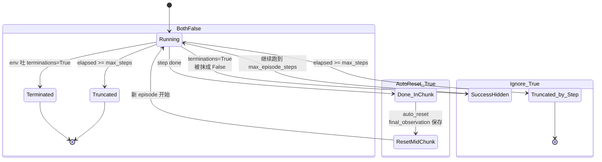

**训练 / 评估策略选择**：
- 训练 (`auto_reset=False, ignore_terminations=False`)：BothFalse 模式，沿完整 episode 算 GAE；
- 评估 (`auto_reset=True, ignore_terminations=True`)：混合模式，既抹掉 termination 让 chunk 完整，又在 chunk 末尾做 reset，最大化 success 样本数量。

### 8.7 `_wrap_obs`：从 IsaacLab 原生 obs 到统一 schema

```78:100:rlinf/envs/isaaclab/tasks/stack_cube.py
    def _wrap_obs(self, obs):
        instruction = [self.task_description] * self.num_envs
        wrist_image = obs["policy"]["wrist_cam"]
        table_image = obs["policy"]["table_cam"]
        quat = obs["policy"]["eef_quat"][
            :, [1, 2, 3, 0]
        ]  # In isaaclab, quat is wxyz not like libero
        states = torch.concatenate(
            [
                obs["policy"]["eef_pos"],
                quat2axisangle_torch(quat),
                obs["policy"]["gripper_pos"],
            ],
            dim=1,
        )

        env_obs = {
            "main_images": table_image,
            "task_descriptions": instruction,
            "states": states,
            "wrist_images": wrist_image,
        }
        return env_obs
```

**WHY 这一步存在**：
- IsaacLab 原生 obs 是嵌套字典 `{"policy": {"wrist_cam": ..., "eef_quat": ..., ...}}`，每个 task 的键不同；
- RLinf 统一为 `{main_images, wrist_images, states, task_descriptions}` 的扁平 schema，让上游 `MultiStepRolloutWorker.predict` 和模型 `predict_action_batch` 对任意 env 使用同一套接口；
- `quat[:, [1, 2, 3, 0]]`：**IsaacLab 的四元数是 `wxyz` 序**，而 LIBERO 是 `xyzw`；π0.5 的 LIBERO checkpoint 期望 `xyzw`，所以 IsaacLab 必须把 `w` 从首位搬到末位；
- `quat2axisangle_torch`：再把 4D 单位四元数转成 3D 轴角表示，和 3D `eef_pos` + 1D `gripper_pos` 拼成 7D state（正好对应 π0.5 模型的 `action_dim=7` 和 `state_dim=7`）；
- `instruction = [self.task_description] * self.num_envs`：对 stack-cube 这种单任务环境，指令对所有 env 实例都一样；若是多任务混训，这里要改成按 env 取不同指令。

### 8.8 `_make_env_function`：IsaacLab 任务的 lazy 构建

```40:76:rlinf/envs/isaaclab/tasks/stack_cube.py
    def _make_env_function(self):
        """
        function for make isaaclab
        """

        def make_env_isaaclab():
            import os

            # Remove DISPLAY variable to force headless mode and avoid GLX errors
            os.environ.pop("DISPLAY", None)

            from isaaclab.app import AppLauncher

            sim_app = AppLauncher(headless=True, enable_cameras=True).app
            from isaaclab_tasks.utils import load_cfg_from_registry

            isaac_env_cfg = load_cfg_from_registry(
                self.isaaclab_env_id, "env_cfg_entry_point"
            )
            # Seed the IsaacLab env config before construction so the simulator's
            # initial reset path is deterministic and doesn't warn about an unset seed.
            isaac_env_cfg.seed = self.seed
            isaac_env_cfg.scene.num_envs = (
                self.cfg.init_params.num_envs
            )  # default 4096 ant_env_spaces.pkl
            ...
            env = gym.make(
                self.isaaclab_env_id, cfg=isaac_env_cfg, render_mode="rgb_array"
            ).unwrapped
            return env, sim_app

        return make_env_isaaclab
```

**WHY 返回"函数的函数"（closure）**：
- IsaacLab 的 `AppLauncher` 必须在**子进程内部**才能初始化（主进程已经有 CUDA context 了，再 init Isaac Sim 会冲突）；
- 所以这里返回一个闭包，由 `SubProcIsaacLabEnv` 在子进程里执行；
- `os.environ.pop("DISPLAY")` 强制 headless；即使外部有 `DISPLAY` 变量（如 VSCode remote），也要在子进程抹掉。

**WHY `enable_cameras=True`**：IsaacLab 默认不开相机以节省 GPU；stack-cube 需要 RGB，所以显式打开。

**WHY `.unwrapped`**：去掉 gym 的装饰器层（`TimeLimit` 等），因为 RLinf 在 Python 层自己做 max-step 截断（§8.3），不想让 gym 的 `TimeLimit` 再插一层。

---

## 9. `SubProcIsaacLabEnv` 子进程边界：关键工程决策

这是 RLinf 接入 IsaacLab 最关键的工程决策。本节单独拎出来深入。

### 9.1 为什么必须子进程？

IsaacLab (基于 Omniverse Kit + Isaac Sim) 具有以下**全局进程单例特性**，它们与 RLinf 主进程的 Ray Actor 逻辑冲突：

| Isaac Sim 特性 | 冲突点 |
|---|---|
| `AppLauncher` 只能 init 一次 | 主进程可能已经被其他 env/test 初始化过 |
| 持有独立 CUDA primary context | 与 FSDP 主进程的 CUDA context 竞争 cuMemAlloc |
| 占用 GL surface | 与服务器 headless 部署的 EGL 冲突 |
| 持有全局日志/配置单例 | 与 RLinf 自己的日志系统互相覆盖 |
| 崩溃时常触发 `exit(0)` 而非异常 | 主进程会被 Kit 拖垮 |

子进程隔离后：
- 主进程只跑 RLinf/PyTorch/FSDP，CUDA context 干净；
- 子进程崩溃时 `mp.Process` 可被 `join().terminate()` 清理，主进程存活；
- 多 `EnvWorker` 各自启子进程，彼此独立，任务间无相互干扰。

### 9.2 完整代码与设计

```23:93:rlinf/envs/isaaclab/venv.py
def _torch_worker(
    child_remote: Connection,
    parent_remote: Connection,
    env_fn_wrapper: CloudpickleWrapper,
    action_queue: mp.Queue,
    obs_queue: mp.Queue,
    reset_idx_queue: mp.Queue,
):
    parent_remote.close()
    env_fn = env_fn_wrapper.x
    isaac_env, sim_app = env_fn()
    device = isaac_env.device
    try:
        while True:
            try:
                cmd = child_remote.recv()
            except EOFError:
                child_remote.close()
                break
            if cmd == "reset":
                reset_index, reset_seed = reset_idx_queue.get()
                if reset_index is None:
                    reset_result = isaac_env.reset(seed=reset_seed)
                else:
                    reset_result = isaac_env.reset(
                        seed=reset_seed, env_ids=reset_index.to(device)
                    )
                obs_queue.put(reset_result)
            elif cmd == "step":
                input_action = action_queue.get()
                step_result = isaac_env.step(input_action)
                obs_queue.put(step_result)
            elif cmd == "close":
                isaac_env.close()
                child_remote.close()
                sim_app.close()
                break
            elif cmd == "device":
                child_remote.send(isaac_env.device)
            else:
                child_remote.close()
                raise NotImplementedError
    except KeyboardInterrupt:
        child_remote.close()
    finally:
        try:
            isaac_env.close()
        except Exception as e:
            print(f"IsaacLab Env Closed with error: {e}")


class SubProcIsaacLabEnv:
    def __init__(self, env_fn):
        mp.set_start_method("spawn", force=True)
        ctx = mp.get_context("spawn")
        self.parent_remote, self.child_remote = ctx.Pipe(duplex=True)
        self.action_queue = ctx.Queue()
        self.obs_queue = ctx.Queue()
        self.reset_idx = ctx.Queue()
        args = (
            self.child_remote,
            self.parent_remote,
            CloudpickleWrapper(env_fn),
            self.action_queue,
            self.obs_queue,
            self.reset_idx,
        )
        self.isaac_lab_process = ctx.Process(
            target=_torch_worker, args=args, daemon=True
        )
        self.isaac_lab_process.start()
        self.child_remote.close()
```

### 9.3 控制面与数据面分离

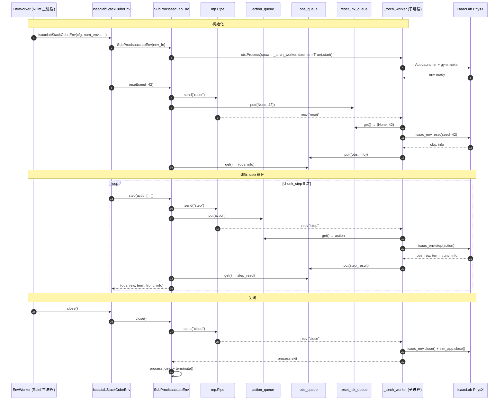

**WHY 控制面走 Pipe、数据面走 Queue**：
- Pipe 是双向点对点、有序；适合短命令（"step" / "reset" / "close" / "device" 这些字符串）；
- Queue 是 FIFO 且 **可独立缓冲大张量**；若把张量也塞 Pipe，大数据会让控制信号阻塞，导致 deadlock；
- 三个独立 Queue（action_queue/obs_queue/reset_idx_queue）进一步分离 "入参 / 出参 / reset 索引" 三种数据类型，避免子进程在 `Queue.get()` 时拿错类型。

### 9.4 `CloudpickleWrapper`：跨进程传闭包

```23:36:rlinf/envs/isaaclab/utils.py
class CloudpickleWrapper:
    """
    transform complex object like function between processes.
    """

    def __init__(self, x):
        self.x = x

    def __getstate__(self):
        return cloudpickle.dumps(self.x)

    def __setstate__(self, ob):
        self.x = pickle.loads(ob)
```

**WHY 必要**：
- 标准 `pickle` 不能序列化 `_make_env_function` 返回的闭包（因为闭包捕获了 `self`，且定义在 class method 内）；
- `cloudpickle` 能处理任意 Python 对象的序列化；
- 通过 `__getstate__/__setstate__` 覆盖 pickle 行为，使得 `mp.Process` 在 spawn 启动子进程时能把 `env_fn` 正确 fork 过去。

### 9.5 `mp.set_start_method("spawn", force=True)`

```75:77:rlinf/envs/isaaclab/venv.py
    def __init__(self, env_fn):
        mp.set_start_method("spawn", force=True)
        ctx = mp.get_context("spawn")
```

**WHY `spawn` 而非 `fork`**：
- `fork` 会复制主进程的 CUDA context，再在子进程 `init_cuda` 时崩溃（CUDA 不支持 post-fork init）；
- `spawn` 完全新开一个 Python 解释器，从零加载 IsaacLab / PyTorch，子进程独立 CUDA context；
- `force=True` 是为了防止父进程已经设过 `fork`（RLinf 主进程入口 [examples/embodiment/train_embodied_agent.py](examples/embodiment/train_embodied_agent.py) 第 29 行也 `mp.set_start_method("spawn", force=True)`）。

### 9.6 `daemon=True` 的含义

```90:93:rlinf/envs/isaaclab/venv.py
        self.isaac_lab_process = ctx.Process(
            target=_torch_worker, args=args, daemon=True
        )
        self.isaac_lab_process.start()
        self.child_remote.close()
```

**WHY daemon**：子进程作为主进程的"附庸"：主进程退出时自动杀死子进程，不会留下孤儿 Isaac Sim（否则会占住 GPU 显存直到手动 `kill`）。

---

## 10. `EnvWorker` 的并行、通信与 Pipeline

`EnvWorker` 是 `SubProcIsaacLabEnv` 的**上游业务容器**，它把子进程仿真能力**再包一层**以适配 RLinf 的多 GPU 并行 + Channel 通信。

### 10.1 构造：batch 分配数学

```44:99:rlinf/workers/env/env_worker.py
class EnvWorker(Worker):
    def __init__(self, cfg: DictConfig):
        Worker.__init__(self)

        self.cfg = cfg
        ...
        self.stage_num = self.cfg.rollout.pipeline_stage_num
        ...
        # Env configurations
        self.enable_offload = self.cfg.env.train.get("enable_offload", False)
        self.only_eval = getattr(self.cfg.runner, "only_eval", False)
        self.enable_eval = self.cfg.runner.val_check_interval > 0 or self.only_eval
        if not self.only_eval:
            self.train_num_envs_per_stage = (
                self.cfg.env.train.total_num_envs // self._world_size // self.stage_num
            )
        if self.enable_eval:
            self.eval_num_envs_per_stage = (
                self.cfg.env.eval.total_num_envs // self._world_size // self.stage_num
            )
        self.n_train_chunk_steps = (
            self.cfg.env.train.max_steps_per_rollout_epoch
            // self.cfg.actor.model.num_action_chunks
        )
        self.n_eval_chunk_steps = (
            self.cfg.env.eval.max_steps_per_rollout_epoch
            // self.cfg.actor.model.num_action_chunks
        )
        self.actor_split_num = self.get_actor_split_num()
```

**数值推导（以单节点 8-GPU 本文入口为例）**：
- `total_num_envs=128, world_size=8, stage_num=1` → `train_num_envs_per_stage = 128 / 8 / 1 = 16`
- `n_train_chunk_steps = 450 / 5 = 90`
- 每个 Env rank 每轮 rollout epoch 做 `90 × stage_num = 90` 次 chunk_step，每次执行 `16 × 5 = 80` sim steps

### 10.2 `_setup_env_and_wrappers`：包装器堆叠

```216:252:rlinf/workers/env/env_worker.py
    def _setup_env_and_wrappers(self, env_cls, env_cfg, num_envs_per_stage: int):
        env_list = []

        for stage_id in range(self.stage_num):
            env = env_cls(
                cfg=env_cfg,
                num_envs=num_envs_per_stage,
                seed_offset=self._rank * self.stage_num + stage_id,
                total_num_processes=self._world_size * self.stage_num,
                worker_info=self.worker_info,
            )
            if env_cfg.video_cfg.save_video:
                env = RecordVideo(env, env_cfg.video_cfg)
            if env_cfg.get("data_collection", None) and getattr(
                env_cfg.data_collection, "enabled", False
            ):
                from rlinf.envs.wrappers import CollectEpisode

                env = CollectEpisode(
                    env,
                    save_dir=env_cfg.data_collection.save_dir,
                    ...
                )
            env_list.append(env)
        return env_list
```

**WHY 每 stage 一个 env 实例**：
- `pipeline_stage_num` 控制"同一个 Worker 内有几份独立的仿真"；
- 有多份 sim 实例时，rollout 推理一段时间、env 可以执行另一段 stage 的仿真，形成**流水线**，隐藏推理延迟（§10.4）。

**WHY `seed_offset = self._rank * self.stage_num + stage_id`**：每个 stage 都要有独立 seed，否则两个 stage 采到完全相同的轨迹，rollout_epoch=2 就失去了多样性。

**WHY 用 `gym.Wrapper` 风格装饰器**：`RecordVideo` / `CollectEpisode` 是可选能力；装饰器模式让它们与核心 env 解耦，按需套上。

### 10.3 `_run_interact_once` 的完整 rollout epoch

```892:1046:rlinf/workers/env/env_worker.py
    @Worker.timer("run_interact_once")
    async def _run_interact_once(
        self,
        input_channel: Channel,
        rollout_channel: Channel,
        reward_channel: Channel | None,
        actor_channel: Channel | None,
        *,
        cooperative_yield: bool,
    ) -> dict[str, torch.Tensor]:
        self.rollout_results: list[EmbodiedRolloutResult] = [
            EmbodiedRolloutResult(
                max_episode_length=self.cfg.env.train.max_episode_steps,
            )
            for _ in range(self.stage_num)
        ]
        env_metrics = defaultdict(list)

        for epoch in range(self.rollout_epoch):
            env_outputs = self.bootstrap_step()
            for stage_id in range(self.stage_num):
                env_output: EnvOutput = env_outputs[stage_id]
                env_batch = env_output.to_dict()
                self.send_env_batch(
                    rollout_channel,
                    {
                        "obs": env_batch["obs"],
                        "final_obs": env_batch["final_obs"],
                    },
                )

            for chunk_step_idx in range(self.n_train_chunk_steps):
                for stage_id in range(self.stage_num):
                    if cooperative_yield:
                        await asyncio.sleep(0)

                    env_output = env_outputs[stage_id]
                    curr_obs = env_output.obs
                    ...
                    rollout_result = self.recv_rollout_results(
                        input_channel, mode="train"
                    )
                    rewards = self.compute_bootstrap_rewards(
                        env_output, rollout_result.bootstrap_values, reward_model_output
                    )
                    chunk_step_result = ChunkStepResult(
                        actions=rollout_result.forward_inputs.get("action", None),
                        prev_logprobs=rollout_result.prev_logprobs
                        if self.collect_prev_infos
                        else None,
                        prev_values=rollout_result.prev_values
                        if self.collect_prev_infos
                        else None,
                        forward_inputs=rollout_result.forward_inputs,
                        versions=rollout_result.versions,
                        dones=env_output.dones,
                        truncations=env_output.truncations,
                        terminations=env_output.terminations,
                        rewards=rewards,
                    )
                    self.rollout_results[stage_id].append_step_result(chunk_step_result)
                    ...
                    env_output, env_info = self.env_interact_step(
                        rollout_result.actions, stage_id
                    )
                    env_batch = env_output.to_dict()
                    self.send_env_batch(
                        rollout_channel,
                        {
                            "obs": env_batch["obs"],
                            "final_obs": env_batch["final_obs"],
                        },
                    )
                    ...
                    env_outputs[stage_id] = env_output
                    self.record_env_metrics(env_metrics, env_info, epoch)

            for stage_id in range(self.stage_num):
                env_output = env_outputs[stage_id]
                ...
                rollout_result = self.recv_rollout_results(input_channel, mode="train")
                rewards = self.compute_bootstrap_rewards(
                    env_output, rollout_result.bootstrap_values, reward_model_output
                )
                chunk_step_result = ChunkStepResult(
                    prev_values=rollout_result.prev_values
                    if self.collect_prev_infos
                    else None,
                    dones=env_output.dones,
                    truncations=env_output.truncations,
                    terminations=env_output.terminations,
                    rewards=rewards,
                )
                self.rollout_results[stage_id].append_step_result(chunk_step_result)

            self.store_last_obs_and_intervened_info(env_outputs)
            self.finish_rollout()

        if actor_channel is not None:
            for stage_id in range(self.stage_num):
                await self.send_rollout_trajectories(
                    self.rollout_results[stage_id], actor_channel
                )
        ...
        return env_metrics
```

**逻辑骨架（去掉 reward_model / intervene 等不相关分支）**：
1. 每个 `rollout_epoch`（=2）：
   - `bootstrap_step()`：reset env 并生成初始 obs → 发送到 `rollout_channel`；
   - 内层循环 `chunk_step_idx ∈ [0, 90)`：每个 chunk 步：
     - 从 `input_channel` (即 `env_channel`) 收 rollout 返回的 `RolloutResult`（包含 actions + logprob + value）；
     - 把这些附上 env reward/done 记成 `ChunkStepResult` 存到 `rollout_results[stage_id]`；
     - 用 action 调 `env_interact_step` → 下一步 obs；
     - 发 obs 到 `rollout_channel`。
   - 循环结束后再收最后一次 rollout result（**含 bootstrap_value(V(s_T))**）存一个只带 value 的 ChunkStepResult；
   - `finish_rollout()`：flush video, update reset_state_ids。
2. 所有 rollout epoch 结束后，把 `rollout_results` 转成 `Trajectory` 通过 `actor_channel` 批量发给 actor。

### 10.4 为什么要 `pipeline_stage_num`（即使默认是 1）

本文入口配置是 `pipeline_stage_num: 1`，但 [docs/source-en/rst_source/examples/embodied/isaaclab.rst](docs/source-en/rst_source/examples/embodied/isaaclab.rst) 第 171-185 行推荐 `pipeline_stage_num: 2` 配合 env/rollout 分离布局。

```mermaid
gantt
    title pipeline_stage_num=1 vs 2 的时间对比 (单 chunk 步)
    dateFormat s
    axisFormat %L

    section stage_num=1
    env.step (stage 0)      :a1, 0, 30
    rollout predict (s0)    :a2, after a1, 40
    env.step (stage 0) 下一步 :a3, after a2, 30

    section stage_num=2
    env.step (stage 0)     :b1, 0, 30
    env.step (stage 1)     :b2, 0, 30
    rollout predict (s0)   :b3, after b1, 40
    rollout predict (s1)   :b4, after b2, 40
    env.step (stage 0) next :b5, after b3, 30
```

**WHY**：
- 单 stage：env 和 rollout 串行执行，每一步总时间 = env + rollout = 70ms；
- 双 stage：stage 0 的 env step 和 stage 1 的 rollout predict 可以并发（甚至在同 GPU 上也能错峰用 SM），理想情况下隐藏一半 rollout 延迟。
- **为什么本文 yaml 默认 1**：collocated 布局 actor/rollout 共享 GPU，双 stage 时 rollout 推理内存会翻倍，`enable_offload=True` 下效果不显著，作者选择更稳妥的单 stage。

### 10.5 `env_interact_step`：调用 `chunk_step` 的薄包装

```367:436:rlinf/workers/env/env_worker.py
    @Worker.timer("env_interact_step")
    def env_interact_step(
        self, chunk_actions: torch.Tensor, stage_id: int
    ) -> tuple[EnvOutput, dict[str, Any]]:
        """
        This function is used to interact with the environment.
        """
        chunk_actions = prepare_actions(
            raw_chunk_actions=chunk_actions,
            env_type=self.cfg.env.train.env_type,
            model_type=self.cfg.actor.model.model_type,
            num_action_chunks=self.cfg.actor.model.num_action_chunks,
            action_dim=self.cfg.actor.model.action_dim,
            policy=self.cfg.actor.model.get("policy_setup", None),
            wm_env_type=self.cfg.env.train.get("wm_env_type", None),
        )
        env_info = {}

        obs_list, chunk_rewards, chunk_terminations, chunk_truncations, infos_list = (
            self.env_list[stage_id].chunk_step(chunk_actions)
        )
        ...
        env_output = EnvOutput(
            obs=extracted_obs,
            final_obs=final_obs,
            rewards=chunk_rewards,
            dones=chunk_dones,
            terminations=chunk_terminations,
            truncations=chunk_truncations,
            intervene_actions=intervene_actions,
            intervene_flags=intervene_flags,
        )
        return env_output, env_info
```

`prepare_actions` 的 IsaacLab 分支：

```80:99:rlinf/envs/action_utils.py
def prepare_actions_for_isaaclab(
    raw_chunk_actions,
    model_type,
) -> torch.Tensor:
    """
    Here reture a general 7 dof action. If the action is modified, please change the output of the model
    For example, in `RLinf/rlinf/models/embodiment/gr00t/simulation_io.py`
    """
    chunk_actions = (
        torch.from_numpy(raw_chunk_actions)
        if isinstance(raw_chunk_actions, np.ndarray)
        else raw_chunk_actions
    )
    if SupportedModel(model_type) in [
        SupportedModel.OPENVLA,
        SupportedModel.OPENVLA_OFT,
    ]:
        chunk_actions[..., -1] = 2 * chunk_actions[..., -1] - 1
        chunk_actions[..., -1] = torch.sign(chunk_actions[..., -1]) * -1.0
    return chunk_actions
```

**WHY OpenPI 不做转换**：π0.5 + IsaacLab 的夹爪在 `IsaacLabOutputs`（见 §15）已做 `np.sign(...)` ∈ {-1, +1} 归一化；而 OpenVLA/OFT 的夹爪原始输出是 [0, 1]，需要额外的 `2x-1` 再取 `sign × -1`（反向：0→+1, 1→-1）。

### 10.6 `send_env_batch` / `recv_rollout_results`：Channel key 协议

```696:756:rlinf/workers/env/env_worker.py
    def send_env_batch(
        self,
        rollout_channel: Channel,
        env_batch: dict[str, Any],
        mode: Literal["train", "eval"] = "train",
    ) -> None:
        """Send split env batches to mapped rollout ranks.

        Each destination rank receives one split batch via a stable key built from
        ``src_rank``, ``dst_rank`` and ``mode``.
        ...
        """
        assert mode in ["train", "eval"], f"{mode=} is not supported"
        dst_ranks_and_sizes = self.dst_rank_map[f"rollout_{mode}"]
        split_sizes = [size for _, size in dst_ranks_and_sizes]
        env_batches = split_dict(env_batch, split_sizes)
        for (rank, _), env_batch_i in zip(dst_ranks_and_sizes, env_batches):
            rollout_channel.put(
                item=env_batch_i,
                key=CommMapper.build_channel_key(self._rank, rank, extra=f"{mode}_obs"),
            )
```

**WHY `split_dict(env_batch, split_sizes)`**：当 env world_size != rollout world_size 时，一个 env rank 可能要把自己 16 个 obs 中的前 8 个发给 rollout rank 0、后 8 个发给 rollout rank 1。`CommMapper.get_dst_ranks` 算出要分几份，`split_dict` 沿 batch 维度切片。

**WHY 用固定 key `{src}_{dst}_{extra}`**：Channel 是一个 FIFO queue，多个 rank 并发 put 进去时无法区分"谁是谁的"；key 充当路由标签，`get(key=...)` 只拿匹配的消息，就地构成 **点对点管道**。

### 10.7 小结：EnvWorker 的价值

`EnvWorker` 把下面一系列能力统一封装：

```mermaid
flowchart LR
    Cfg["env.train 配置"] --> SplitBatch["按 world_size × stage_num<br/>切分 total_num_envs"]
    SplitBatch --> Wrap["套 RecordVideo /<br/>CollectEpisode wrapper"]
    Wrap --> SubProc["交给 IsaaclabStackCubeEnv<br/>→ SubProcIsaacLabEnv"]
    SubProc --> RolloutLoop["rollout_epoch × n_chunk_steps<br/>协程循环"]
    RolloutLoop --> SendChan["向 rollout_channel 发 obs"]
    SendChan --> RecvChan["从 env_channel 收 action+logprob+value"]
    RecvChan --> Accumulate["累积 ChunkStepResult<br/>到 EmbodiedRolloutResult"]
    Accumulate --> ToTraj["epoch 结束后<br/>send_rollout_trajectories"]
    ToTraj --> ActorChan["actor_channel"]
```

**行业视角**：这一设计把"机器人仿真 + VLA 策略推理 + RL 数据管线"三者在同一个 Ray Actor 内打包，但**用子进程隔离 IsaacLab**，**用 Channel 解耦 rollout**，既保持了仿真的物理保真度（PhysX 原生），又吸收了分布式 RL 的吞吐红利。

---

# Part IV — Rollout 与 Actor 子系统（本文重点 2）

---

## 11. `MultiStepRolloutWorker`（HF 后端）

Rollout Worker 在本文入口 (`backend: "huggingface"`) 下是 `MultiStepRolloutWorker`（[rlinf/workers/rollout/hf/huggingface_worker.py](rlinf/workers/rollout/hf/huggingface_worker.py)）。它持有**与 actor 同一份 π0.5 模型的推理副本**，在每个 chunk step 用当前策略预测动作并估计 value，然后把结果通过 Channel 发回给 EnvWorker。

### 11.1 构造：推理参数推导

```35:89:rlinf/workers/rollout/hf/huggingface_worker.py
class MultiStepRolloutWorker(Worker):
    def __init__(self, cfg: DictConfig):
        Worker.__init__(self)

        self.cfg = cfg
        self.should_stop = False

        self.actor_group_name = cfg.actor.group_name
        self.device = self.torch_platform.current_device()

        self.num_pipeline_stages = cfg.rollout.pipeline_stage_num
        self.enable_offload = self.cfg.rollout.get("enable_offload", False)
        self.sync_weight_load_instant = self.cfg.rollout.get(
            "sync_weight_load_instant", True
        )

        self.placement = HybridComponentPlacement(cfg, Cluster())

        actor_world_size = self.placement.get_world_size("actor")
        self.actor_weight_src_rank = self._rank % actor_world_size
        self.rollout_epoch = cfg.algorithm.get("rollout_epoch", 1)
        ...
        self.total_num_train_envs = cfg.env.train.total_num_envs
        self.total_num_eval_envs = cfg.env.eval.total_num_envs
        self.num_pipeline_stages = cfg.rollout.pipeline_stage_num

        self.train_batch_size = (
            self.total_num_train_envs // self._world_size // self.num_pipeline_stages
        )
        self.eval_batch_size = (
            self.total_num_eval_envs // self._world_size // self.num_pipeline_stages
        )
```

**WHY `actor_weight_src_rank = self._rank % actor_world_size`**：在 collocated 模式下 actor world_size == rollout world_size，所以 rollout rank i 接收 actor rank i 的权重；若 rollout world_size 更小，rollout rank i 从 actor rank `i % actor_ws` 接收（多个 rollout rank 共享同一 actor 的广播）。这个映射和 actor 侧的 `_setup_rollout_weight_dst_ranks` 对称（[rlinf/workers/actor/fsdp_actor_worker.py](rlinf/workers/actor/fsdp_actor_worker.py) 第 999-1015 行）。

### 11.2 `init_worker`：模型实例化与 offload

```90:156:rlinf/workers/rollout/hf/huggingface_worker.py
    def init_worker(self):
        rollout_model_config = copy.deepcopy(self.cfg.actor.model)
        with open_dict(rollout_model_config):
            rollout_model_config.precision = self.cfg.rollout.model.precision
            rollout_model_config.model_path = self.cfg.rollout.model.model_path

        self.hf_model: BasePolicy = get_model(rollout_model_config)

        if self.cfg.runner.get("ckpt_path", None):
            model_dict = torch.load(self.cfg.runner.ckpt_path)
            self.hf_model.load_state_dict(model_dict)
        ...
        self.hf_model.eval()
        ...
        if self.cfg.rollout.get("enable_torch_compile", False):
            mode = self.cfg.rollout.get(
                "torch_compile_mode", "max-autotune-no-cudagraphs"
            )
            self.hf_model.enable_torch_compile(mode=mode)
        if self.enable_cuda_graph and not self.enable_offload:
            self.hf_model.capture_cuda_graph(
                train_batch_size=self.train_batch_size,
                eval_batch_size=self.eval_batch_size,
            )
        ...
        self.log_info(f"Rollout worker initialized with dst_ranks: {self.dst_ranks}")
        self.log_info(f"Rollout worker initialized with src_ranks: {self.src_ranks}")
        self.setup_sample_params()
        if self.enable_offload:
            self.offload_model()
```

**WHY `copy.deepcopy(cfg.actor.model)` 再覆盖 `precision/model_path`**：
- Rollout 与 actor **共享模型定义**但**允许独立 precision**（如 actor 用 bf16 训练、rollout 用 fp16 推理省显存）；
- 用 deepcopy 避免修改 actor 的 cfg 污染训练逻辑；
- `with open_dict(...)`：OmegaConf 默认 struct 模式下不允许新增 key，`open_dict` 临时打开。

**WHY `hf_model.eval()`**：关 dropout / BN running stats，保证推理确定性。

**WHY 最后 `offload_model()`（当 `enable_offload=True`）**：
- 初始化时 actor 还没开始训练，rollout model 占着 GPU 是浪费；
- `init_worker` 完成后立刻把模型搬到 CPU，把 GPU 让给 actor；
- 后续每个 rollout epoch 开始前 `reload_model()` 搬回 GPU，结束后再 offload。

### 11.3 `generate` 主循环：π0.5 动作生成

```390:437:rlinf/workers/rollout/hf/huggingface_worker.py
    @Worker.timer("generate_one_epoch")
    async def generate_one_epoch(self, input_channel: Channel, output_channel: Channel):
        self.update_dagger_beta()
        for _ in range(self.n_train_chunk_steps):
            for _ in range(self.num_pipeline_stages):
                env_output = await self.recv_env_output(input_channel)
                actions, result = self.predict(env_output["obs"])

                save_flags = None
                ...
                rollout_result = RolloutResult(
                    actions=actions,
                    prev_logprobs=result["prev_logprobs"]
                    if self.collect_prev_infos
                    else None,
                    prev_values=result["prev_values"]
                    if self.collect_prev_infos
                    else None,
                    bootstrap_values=self.get_bootstrap_values(
                        env_output.get("final_obs", None)
                    ),
                    save_flags=save_flags,
                    forward_inputs=result["forward_inputs"],
                    versions=torch.full_like(
                        result["prev_logprobs"],
                        float(self.version),
                        dtype=torch.float32,
                    ),
                )
                self.send_rollout_result(output_channel, rollout_result, mode="train")
        for _ in range(self.num_pipeline_stages):
            env_output = await self.recv_env_output(input_channel)
            actions, result = self.predict(env_output["obs"])

            rollout_result = RolloutResult(
                actions=actions,
                prev_values=result["prev_values"] if self.collect_prev_infos else None,
                bootstrap_values=self.get_bootstrap_values(
                    env_output.get("final_obs", None)
                ),
            )
            self.send_rollout_result(output_channel, rollout_result, mode="train")
```

**关键循环结构**：
- 外层：90 次 (`n_train_chunk_steps`)；
- 内层：`num_pipeline_stages` 次；
- 循环体：收 obs → `predict` → 构造 `RolloutResult`（含 action + logprob + value + bootstrap_value + forward_inputs）→ 回发。
- **结尾额外再跑一轮 `num_pipeline_stages` 次**：专门为最后一步收集 `bootstrap_value(V(s_T))`，这是 GAE 计算 `A_{T-1}` 所需的 "下一步 value"。

**WHY `versions`**：记录这条 rollout 是由哪个 global_step 的权重产生的。若 rollout 与 actor 异步执行，可能混合了不同权重版本的数据，actor 用 `versions` 做 off-policy correction（但本文入口是同步 PPO，`versions` 主要作审计用）。

### 11.4 `predict`：模型推理分派

```247:324:rlinf/workers/rollout/hf/huggingface_worker.py
    @Worker.timer("predict")
    def predict(
        self, env_obs: dict[str, Any], mode: Literal["train", "eval"] = "train"
    ) -> tuple[torch.Tensor, dict[str, Any]]:
        kwargs = (
            self._train_sampling_params
            if mode == "train"
            else self._eval_sampling_params
        )

        if SupportedModel(self.cfg.actor.model.model_type) in [
            SupportedModel.OPENPI,
            SupportedModel.MLP_POLICY,
            SupportedModel.GR00T,
            SupportedModel.DREAMZERO,
            SupportedModel.CNN_POLICY,
        ]:
            if self.cfg.algorithm.loss_type == "embodied_dagger":
                kwargs = {"mode": "eval"}
            else:
                kwargs = {"mode": mode}
        ...
        with torch.no_grad():
            expert_label_flag = False
            # Decide which model to act via use_expert
            if use_expert:
                ...
            else:
                actions, result = self.hf_model.predict_action_batch(
                    env_obs=env_obs,
                    **kwargs,
                )
        ...
        return actions, result
```

对 OPENPI 走 `self.hf_model.predict_action_batch(env_obs, mode="train")`（见 §14）；此时 π0.5 内部做 flow-matching 5 步去噪，并同时计算 logprob 与 value。

### 11.5 `get_bootstrap_values`：GAE 的边界

```326:341:rlinf/workers/rollout/hf/huggingface_worker.py
    def get_bootstrap_values(
        self, final_obs: dict[str, Any] | None
    ) -> torch.Tensor | None:
        if final_obs is None:
            return None
        if not (
            hasattr(self.hf_model, "value_head") or hasattr(self.hf_model, "q_head")
        ):
            return None
        with torch.no_grad():
            actions, result = self.predict(final_obs)
            if "prev_values" in result and result["prev_values"] is not None:
                final_values = result["prev_values"]
            else:
                final_values = torch.zeros_like(actions[:, :1], dtype=torch.float32)
        return final_values[:, :1].cpu().contiguous()
```

**WHY**：
- GAE 递归：`A_{T-1} = δ_{T-1} + γλ A_T`，其中 `A_T = 0`（末尾）、`δ_{T-1} = r_{T-1} + γV(s_T) - V(s_{T-1})`，因此必须拿到 `V(s_T)`；
- 当 env 在 T 步时若被截断 (`truncations=True`) 但**没有真正终止**，剩余回报要用 `V(s_T)` bootstrap 近似；
- 本函数就是在"最后一个 chunk step"额外推理一次 value，供 EnvWorker 的 `compute_bootstrap_rewards` 使用（见 [rlinf/workers/env/env_worker.py](rlinf/workers/env/env_worker.py) 第 636-676 行）。

### 11.6 Bucket-based 权重同步：`sync_model_from_actor`

```343:388:rlinf/workers/rollout/hf/huggingface_worker.py
    async def sync_model_from_actor(self):
        """Sync model parameters from the actor worker using bucket-based receiving.

        This method receives weights in buckets to reduce peak memory usage,
        preventing OOM on GPUs with limited memory.
        """

        # Receive first bucket to get bucket_length
        bucket_length = await self.recv(
            self.actor_group_name,
            src_rank=self.actor_weight_src_rank,
            async_op=True,
            options=self._sync_weight_comm_options,
        ).async_wait()

        if self.sync_weight_load_instant:
            if self.enable_offload:
                self.reload_model()
        else:
            cpu_buffer = {}

        for _ in range(bucket_length):
            bucket: dict[str, torch.Tensor] = await self.recv(
                self.actor_group_name,
                src_rank=self.actor_weight_src_rank,
                async_op=True,
                options=self._sync_weight_comm_options,
            ).async_wait()
            if self.sync_weight_load_instant:
                # load state dict instantly
                self.hf_model.load_state_dict(bucket, strict=False)
            else:
                # save state dict to cpu buffer
                for k, v in bucket.items():
                    cpu_buffer[k] = v.to("cpu")
            del bucket
```

**WHY bucket 而非一次性传整个 state_dict**：
- π0.5 的 state_dict 大小可达数 GB；
- 一次性传送需要 rollout 端预先腾出 = 旧权重 + 新权重 的显存（峰值 2×）；
- bucket 传送每次只传 `bucket_capacity` 大小（默认 1GB），接收后立即 `load_state_dict(strict=False)` 覆盖对应参数，**峰值显存仅增加 1 个 bucket**。

**WHY `sync_weight_load_instant` 有两种模式**：
- `True`（默认）：边收边加载，适合 collocated（此时 rollout 已经 reload 过模型）；
- `False`：先全部收到 CPU buffer，等 actor offload 后再批量 load，适合 disaggregated（避免 actor 占用时触发 OOM）。

### 11.7 权重同步时序图

```mermaid
sequenceDiagram
    autonumber
    participant Actor as Actor rank i
    participant CUDA as CUDA IPC (collocated)<br/>或 NCCL (disaggregated)
    participant Rollout as Rollout rank i

    Note over Actor: sync_model_to_rollout
    Actor->>Actor: get_model_state_dict(cpu_offload=False, full_state_dict=False)
    Actor->>Actor: divide_model_to_bucket → [bucket_0, bucket_1, ..., bucket_N-1]
    Actor->>CUDA: send(len(buckets)=N, options=CollectiveGroupOptions)
    CUDA-->>Rollout: bucket_length=N
    Rollout->>Rollout: if enable_offload: reload_model() to GPU

    loop i=0..N-1
        Actor->>Actor: bucket_i = {k: v.full_tensor() for ...}
        Actor->>CUDA: send(bucket_i, dst=rollout rank i)
        CUDA-->>Rollout: recv(bucket_i)
        Rollout->>Rollout: hf_model.load_state_dict(bucket_i, strict=False)
        Rollout->>Rollout: del bucket
    end
    Rollout->>Rollout: gc.collect() + empty_cache()
    Actor->>Actor: if enable_offload: offload_param_and_grad()
```

**WHY "reduce_tensor"（collocated 路径）**：

在 [rlinf/workers/actor/fsdp_actor_worker.py](rlinf/workers/actor/fsdp_actor_worker.py) 第 298-335 行：

```python
# collocated 模式
if not self.is_pipeline:
    v = reduce_tensor(v)  # CUDA IPC handle
# disaggregated 模式
else:
    ... NCCL send
```

CUDA IPC 让 actor 和 rollout 在同一 GPU 上共享同一块显存，rollout 拿到的是 handle 而非数据拷贝，**零拷贝**完成"同步"。

---

## 12. `EmbodiedFSDPActor`（FSDP 后端）

Actor 是整个训练系统的梯度中心。本节深度解读 [rlinf/workers/actor/fsdp_actor_worker.py](rlinf/workers/actor/fsdp_actor_worker.py) 中的 `EmbodiedFSDPActor`（第 972 行开始）。

### 12.1 构造：FSDP + Worker 多继承

```972:998:rlinf/workers/actor/fsdp_actor_worker.py
class EmbodiedFSDPActor(FSDPModelManager, Worker):
    def __init__(self, cfg: DictConfig):
        Worker.__init__(self)
        super().__init__(cfg.actor, self._world_size, self._rank)
        self.cfg = cfg
        self._env_group_name = cfg.env.group_name
        self._rollout_group_name = cfg.rollout.group_name
        self._component_placement = HybridComponentPlacement(cfg, Cluster())

        # stage_num: default to 2, use for pipeline rollout process
        self.stage_num = cfg.rollout.pipeline_stage_num

        self.enable_offload = self.cfg.actor.get("enable_offload", False)
        self.entropy_op_type = self.cfg.algorithm.get("entropy_op_type", "torch")
        ...
```

**WHY 多继承 `FSDPModelManager, Worker`**：
- `Worker`：提供 Ray Actor 基础（rank/world_size/logging/send/recv/...）；
- `FSDPModelManager`（[rlinf/hybrid_engines/fsdp/fsdp_model_manager.py](rlinf/hybrid_engines/fsdp/fsdp_model_manager.py)）：提供 FSDP 策略（`setup_model_and_optimizer`、`offload_param_and_grad`、`load_param_and_grad`、`divide_model_to_bucket`、`before_micro_batch`、`optimizer_step`）；
- 两者正交，组合即可。

### 12.2 `init_worker`：模型构建 + offload

```1017:1028:rlinf/workers/actor/fsdp_actor_worker.py
    def init_worker(self) -> None:
        """
        Initialize the actor worker. build the model and use corresponding training backend,
        if needed, offload model parameters and optimizer states to CPU.
        """
        self.setup_model_and_optimizer()

        if self.enable_offload:
            self.offload_param_and_grad()
            self.offload_optimizer()

        self._setup_rollout_weight_dst_ranks()
```

本文 yaml 是 `enable_offload: False`（§4.4），因此 actor 始终在 GPU。

### 12.3 `_setup_rollout_weight_dst_ranks`：多对多 rank 映射

```999:1015:rlinf/workers/actor/fsdp_actor_worker.py
    def _setup_rollout_weight_dst_ranks(self) -> None:
        """
        Setup destination ranks for weight communication.
        It can support any topology between actor and rollout workers.
        Assuming there are M actor ranks and N rollout ranks, each actor rank
        will send weights to most ceil(N/M) rollout ranks according to the modulo rule.
        """
        rollout_world_size = self._component_placement.get_world_size("rollout")
        actor_world_size = self._world_size
        rank = self._rank
        self._weight_dst_rank_in_rollout = []
        rollout_ranks_per_actor = (
            rollout_world_size + actor_world_size - 1
        ) // actor_world_size
        for i in range(rollout_ranks_per_actor):
            if i * actor_world_size + rank < rollout_world_size:
                self._weight_dst_rank_in_rollout.append(i * actor_world_size + rank)
```

**映射规则**：每个 actor rank 发给 rollout rank `rank, rank + M, rank + 2M, ...`（模运算分组）。对 collocated（M=N=8）就是 actor rank i → rollout rank i 一一对应。

### 12.4 `recv_rollout_trajectories`：从 EnvWorker 收数据

```1110:1131:rlinf/workers/actor/fsdp_actor_worker.py
    async def recv_rollout_trajectories(self, input_channel: Channel) -> None:
        """
        Receive rollout trajectories from rollout workers.

        Args:
            input_channel: The input channel to read from.
        """
        clear_memory(sync=False)

        send_num = self._component_placement.get_world_size("env") * self.stage_num
        recv_num = self._component_placement.get_world_size("actor")
        split_num = compute_split_num(send_num, recv_num)

        recv_list = []
        for _ in range(split_num):
            trajectory: Trajectory = await input_channel.get(async_op=True).async_wait()
            recv_list.append(trajectory)

        self.rollout_batch = convert_trajectories_to_batch(recv_list)

        self.rollout_batch = self._process_received_rollout_batch(self.rollout_batch)
```

**WHY `split_num = compute_split_num(send_num, recv_num)`**：
- `send_num = env_world_size × stage_num`：所有 Env stage 总共发多少份 Trajectory；
- `recv_num = actor_world_size`：多少个 actor rank 来接；
- `compute_split_num` 决定每个 actor rank 要收几份；
- collocated 配置下 `send_num=8, recv_num=8, split_num=1`，每个 actor 收一份 Trajectory（对应同 rank env 的数据）。

### 12.5 `_process_received_rollout_batch`：张量维度变换

```1132:1207:rlinf/workers/actor/fsdp_actor_worker.py
    def _process_received_rollout_batch(
        self, rollout_batch: dict[str, torch.Tensor]
    ) -> dict[str, torch.Tensor]:
        """
        original shape: [rollout_epoch x n_chunk_steps, bsz, num_action_chunks, ...]
        target shape: [n_chunk_steps, rollout_epoch x bsz, num_action_chunks, ...]
        """
        rollout_epoch = self.cfg.algorithm.rollout_epoch
        rollout_batch = process_nested_dict_for_adv(rollout_batch, rollout_epoch)

        if (
            not self.cfg.env.train.auto_reset
            and not self.cfg.env.train.ignore_terminations
        ):
            dones = rollout_batch[
                "dones"
            ]  # [n_chunk_step, rollout_epoch x bsz, num_action_chunks]
            loss_mask, loss_mask_sum = compute_loss_mask(dones)

            if self.cfg.algorithm.reward_type == "chunk_level":
                loss_mask = loss_mask.any(dim=-1, keepdim=True)
                loss_mask_sum = loss_mask_sum[..., -1:]

            rollout_batch["loss_mask"] = loss_mask
            rollout_batch["loss_mask_sum"] = loss_mask_sum
        ...
```

### 12.6 `process_nested_dict_for_adv`：reshape 的 WHY

```91:109:rlinf/workers/actor/fsdp_actor_worker.py
def process_nested_dict_for_adv(nested_dict, rollout_epoch):
    """
    original shape: [rollout_epoch x n_chunk_steps, bsz, num_action_chunks, ...]
    target shape: [n_chunk_steps, rollout_epoch x bsz, num_action_chunks, ...]
    """
    ret_dict = {}
    for key, value in nested_dict.items():
        if isinstance(value, torch.Tensor):
            new_value = value.reshape(
                rollout_epoch, -1, *value.shape[1:]
            )  # [rollout_epoch, n_chunk_step, bsz, ...]
            new_value = new_value.transpose(
                0, 1
            )  # [n_chunk_step, rollout_epoch, bsz, ...]
            new_value = new_value.reshape(new_value.shape[0], -1, *new_value.shape[3:])
            ret_dict[key] = new_value
        elif isinstance(value, dict):
            ret_dict[key] = process_nested_dict_for_adv(value, rollout_epoch)
    return ret_dict
```

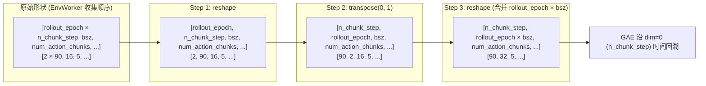

**WHY 这样重排**：
- GAE 公式 `A_t = δ_t + γλ (~done_{t+1}) A_{t+1}` 需要沿**时间维**逐步回溯；
- 新形状 `[n_chunk_step, rollout_epoch × bsz, num_action_chunks]` 把时间维放到 `dim=0`、batch 维合并 rollout_epoch，这正是 [rlinf/algorithms/advantages.py](rlinf/algorithms/advantages.py) 第 56-77 行 `compute_gae_advantages_and_returns` 的输入形状要求（`T = rewards.shape[0]`）；
- 合并 `rollout_epoch × bsz` 相当于把 2 个 epoch 的数据当作**扩大了 batch**，PPO loss 更稳定。

### 12.7 `compute_loss_mask`：处理提前 done

当 `auto_reset=False` 且 `ignore_terminations=False` 时，有些 env 在中途就 done 了，后续步数应该**不参与 loss 计算**：

```python
# compute_loss_mask 的语义（见 rlinf/utils/metric_utils.py）
# dones: [T, B, C]
# 找每个 batch 首次 done 的位置 first_done_t
# loss_mask[:first_done_t+1, b, :] = 1  # 有效
# loss_mask[first_done_t+1:, b, :] = 0  # 已 done，屏蔽
```

**WHY `chunk_level` 时 `loss_mask = loss_mask.any(dim=-1, keepdim=True)`**：
- chunk 内任何一步有效就整个 chunk 有效；
- 用 `keepdim=True` 保持 `[T, B, 1]` 形状方便广播。

### 12.8 `compute_advantages_and_returns`：GAE 入口

```1209:1236:rlinf/workers/actor/fsdp_actor_worker.py
    def compute_advantages_and_returns(self) -> dict[str, torch.Tensor]:
        """
        Compute the advantages and returns.
        """
        kwargs = {
            "task_type": self.cfg.runner.task_type,
            "adv_type": self.cfg.algorithm.adv_type,
            "rewards": self.rollout_batch["rewards"],
            "dones": self.rollout_batch["dones"],
            "values": self.rollout_batch.get("prev_values", None),
            "gamma": self.cfg.algorithm.get("gamma", 1),
            "gae_lambda": self.cfg.algorithm.get("gae_lambda", 1),
            "group_size": self.cfg.algorithm.get("group_size", 8),
            "reward_type": self.cfg.algorithm.reward_type,
            "loss_mask": self.rollout_batch.get("loss_mask", None),
            "loss_mask_sum": self.rollout_batch.get("loss_mask_sum", None),
        }

        advantages_and_returns = calculate_adv_and_returns(**kwargs)

        self.rollout_batch.update(advantages_and_returns)
        ...
        rollout_metrics = compute_rollout_metrics(self.rollout_batch)
        return rollout_metrics
```

`calculate_adv_and_returns` 走 [rlinf/algorithms/registry.py](rlinf/algorithms/registry.py) 第 95-118 行的 registry：

```95:118:rlinf/algorithms/registry.py
def calculate_adv_and_returns(**kwargs) -> tuple[torch.Tensor, Optional[torch.Tensor]]:
    """
    Unified entry for advantage + return computation.
    Accepts variable keyword arguments, preprocesses them, then dispatches
    to specific algorithm via registry.
    """
    adv_type = kwargs["adv_type"]
    fn = get_adv_and_returns(adv_type)

    task_type = kwargs["task_type"]
    if task_type == "embodied":
        kwargs = preprocess_embodied_advantages_inputs(**kwargs)
        if adv_type != "gae":
            kwargs = calculate_scores(**kwargs)
        advantages, returns = fn(**kwargs)
        res = postprocess_embodied_advantages_outputs(
            advantages=advantages, returns=returns, **kwargs
        )
```

`adv_type="gae"` → 派发给 [rlinf/algorithms/advantages.py](rlinf/algorithms/advantages.py) 第 24-86 行：

```56:86:rlinf/algorithms/advantages.py
    T = rewards.shape[0]
    advantages = torch.zeros_like(rewards)
    returns = torch.zeros_like(rewards)
    gae = 0

    critic_free = values is None
    if critic_free:
        gae_lambda = 1
        gamma = 1

    for step in reversed(range(T)):
        if critic_free:
            delta = rewards[step]
        else:
            delta = (
                rewards[step]
                + gamma * values[step + 1] * (~dones[step + 1])
                - values[step]
            )

        gae = delta + gamma * gae_lambda * (~dones[step + 1]) * gae
        returns[step] = gae if critic_free else gae + values[step]

    advantages = returns - values[:-1] if not critic_free else returns

    if normalize_advantages:
        advantages = safe_normalize(advantages, loss_mask=loss_mask)
    if normalize_returns:
        returns = safe_normalize(returns, loss_mask=loss_mask)

    return advantages, returns
```

**经典 GAE，WHY 值得注意的细节**：
- `(~dones[step + 1])`：若下一步 done，就**不继承 bootstrap**，避免跨 episode 污染；
- `advantages = returns - values[:-1]`：returns 是 value target，advantages 是与当前 value 的差异，再做标准化传给 policy loss；
- `normalize_advantages=True`（本文配置）：每批除以 std，让 PPO 的 advantage scale 与 clip_ratio 解耦。

### 12.9 `run_training`：PPO 三重循环

```1325:1510:rlinf/workers/actor/fsdp_actor_worker.py
    @Worker.timer("run_training")
    def run_training(self) -> None:
        """
        Run the training process using the received rollout batch.
        """
        ...
        rollout_size = (
            self.rollout_batch["prev_logprobs"].shape[0]
            * self.rollout_batch["prev_logprobs"].shape[1]
        )
        g = torch.Generator()
        g.manual_seed(self.cfg.actor.seed + self._rank)
        shuffle_id = torch.randperm(rollout_size, generator=g)

        with torch.no_grad():
            self.rollout_batch = process_nested_dict_for_train(
                self.rollout_batch, shuffle_id
            )
        ...
        self.gradient_accumulation = (
            self.cfg.actor.global_batch_size
            // self.cfg.actor.micro_batch_size
            // self._world_size
        )

        rollout_size = self.rollout_batch["prev_logprobs"].size(0)
        batch_size_per_rank = self.cfg.actor.global_batch_size // self._world_size
        assert rollout_size % batch_size_per_rank == 0, (
            f"{rollout_size} is not divisible by {batch_size_per_rank}"
        )
        metrics = {}
        update_epoch = self.cfg.algorithm.get("update_epoch", 1)
        for _ in range(update_epoch):
            rollout_dataloader_iter = split_dict_to_chunk(
                self.rollout_batch,
                rollout_size // batch_size_per_rank,
            )
            for train_global_batch in rollout_dataloader_iter:
                ...
                train_micro_batch = split_dict_to_chunk(
                    train_global_batch,
                    train_global_batch_size // self.cfg.actor.micro_batch_size,
                )

                self.optimizer.zero_grad()
                for idx, batch in enumerate(train_micro_batch):
                    ...
                    with self.amp_context:
                        output_dict = self.model(
                            forward_inputs=forward_inputs,
                            compute_logprobs=True,
                            compute_entropy=self.cfg.algorithm.entropy_bonus > 0,
                            compute_values=compute_values,
                            use_cache=False,
                            **kwargs,
                        )
                    ...
                    loss, metrics_data = policy_loss(**kwargs)
                    ...
                    loss /= self.gradient_accumulation
                    with backward_ctx:
                        self.grad_scaler.scale(loss).backward()
                    ...

                grad_norm, lr_list = self.optimizer_step()
```

**三重嵌套**：`update_epoch (3) × mini_batches × micro_batches`。数值推导：
- 每 rank 收到 `rollout_size = 90 × 32 = 2880` 条样本（chunk 粒度）；
- `batch_size_per_rank = 256 / 8 = 32`；
- `mini_batches = 2880 / 32 = 90`；
- `micro_batches_per_mini = 32 / 32 = 1`；
- 总 micro batch 数 = `3 × 90 × 1 = 270` 次 forward+backward，每次做 `optimizer.zero_grad → forward → loss → backward`。

**WHY `process_nested_dict_for_train` 加 shuffle**：

```112:125:rlinf/workers/actor/fsdp_actor_worker.py
def process_nested_dict_for_train(nested_dict, shuffle_id):
    ret_dict = {}
    for key, value in nested_dict.items():
        if key in ["dones", "terminations", "truncations", "prev_values"]:
            value = value[:-1]
        if "env_info" in key:
            raise NotImplementedError
        if value is None:
            ret_dict[key] = None
        if isinstance(value, torch.Tensor):
            ret_dict[key] = value.reshape(-1, *value.shape[2:])[shuffle_id]
        elif isinstance(value, dict):
            ret_dict[key] = process_nested_dict_for_train(value, shuffle_id)
    return ret_dict
```

- `value[:-1]`：去掉最后那个 "只有 value 无 reward" 的 bootstrap 步；
- `reshape(-1, ...)` 把 `[T, B, C, ...]` 展平成 `[T*B, C, ...]`；
- `[shuffle_id]` 打乱时间顺序，让 mini-batch 不偏向特定的 episode 位置，**降低相关性**，PPO 更稳定；
- `manual_seed(actor.seed + rank)`：每个 rank 独立 shuffle，保证 DP 上数据不重复。

### 12.10 `policy_loss(loss_type="actor_critic")`

```403:431:rlinf/algorithms/losses.py
@register_policy_loss("actor_critic")
def compute_ppo_actor_critic_loss(**kwargs) -> tuple[torch.Tensor, dict]:
    """
    Compute PPO actor loss function.
    ...
    """
    metrics_data = {}
    actor_loss, actor_metrics_data = compute_ppo_actor_loss(**kwargs)
    critic_loss, critic_metrics_data = compute_ppo_critic_loss(**kwargs)

    loss = actor_loss + critic_loss
    metrics_data.update(actor_metrics_data)
    metrics_data.update(critic_metrics_data)

    return loss, metrics_data
```

Actor loss 细节：

```239:259:rlinf/algorithms/losses.py
    loss_mask_count = loss_mask.count_nonzero() or 1
    # For numerical stability.
    log_ratio = logprobs - old_logprobs
    if clip_log_ratio_min is not None:
        log_ratio = torch.clamp(log_ratio, min=clip_log_ratio_min)
    if clip_log_ratio_max is not None:
        log_ratio = torch.clamp(log_ratio, max=clip_log_ratio_max)
    ratio = torch.where(loss_mask, torch.exp(log_ratio), 0)
    approx_kl = torch.where(loss_mask, log_ratio.detach(), 0.0)

    clipped_ratio = torch.clamp(ratio, 1.0 - clip_ratio_low, 1.0 + clip_ratio_high)
    policy_loss1 = -advantages * ratio
    policy_loss2 = -advantages * clipped_ratio

    clip_mask = policy_loss1.detach() < policy_loss2.detach()

    policy_loss = torch.max(policy_loss1, policy_loss2)
    if clip_ratio_c is not None:
        assert clip_ratio_c > 1.0, "clip_ratio_c must be greater than 1.0"
        policy_loss3 = torch.sign(advantages) * clip_ratio_c * advantages
        dual_clip_mask = policy_loss3.detach() < policy_loss.detach()
```

**WHY "dual clip" (`clip_ratio_c=3.0`)**：
- 标准 PPO `max(loss1, loss2)` 在 advantage 为**负**时若 ratio 很小（< 1-ε），没有截断保护，梯度可能过大；
- dual clip 再取 `max(loss, loss3)`，其中 `loss3 = sign(A) × C × A`：当 A < 0 时等于 C × |A|，强制 loss 下界，防止负 advantage 方向的策略更新过猛；
- 是 IsaacLab stack-cube 这类**稀疏负奖励主导**任务训练稳定性的保险栓。

### 12.11 Actor 训练步数据流

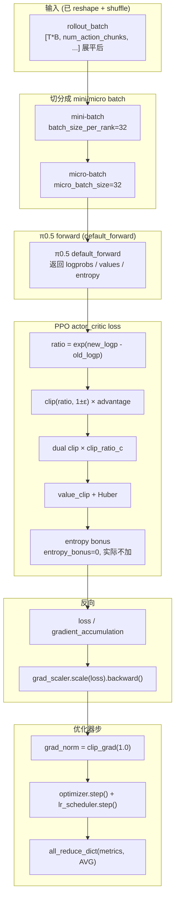

---

## 13. `EmbodiedRunner` 编排主循环

Runner 把 `EnvWorker / MultiStepRolloutWorker / EmbodiedFSDPActor` 三个 WorkerGroup 串成训练循环。

### 13.1 构造：四条 Channel + 计时器 + 日志

```52:106:rlinf/runners/embodied_runner.py
class EmbodiedRunner:
    def __init__(
        self,
        cfg: DictConfig,
        ...
    ):
        self.cfg = cfg
        self.actor = actor
        self.rollout = rollout
        self.env = env
        self.critic = critic
        self.reward = reward
        self.weight_sync_interval = self.cfg.runner.weight_sync_interval
        # Data channels
        self.env_channel = Channel.create("Env")
        self.rollout_channel = Channel.create("Rollout")
        self.actor_channel = Channel.create("Actor")
        if self.reward is not None:
            self.reward_channel = Channel.create("Reward")
        else:
            self.reward_channel = None

        # this timer checks if we should stop training
        self.run_timer = Timer(None)
        ...
        # Async logging setup
        self.stop_logging = False
        self.log_queue = queue.Queue()
        self.log_thread = threading.Thread(target=self._log_worker, daemon=True)
        self.log_thread.start()
```

**WHY async logging**：`MetricLogger.log` 会写 TensorBoard 文件甚至 WandB API 调用（慢且阻塞），放到独立线程 `_log_worker` 异步消费队列，避免阻塞 `runner.run()` 的主循环。

### 13.2 `init_workers`：刻意的初始化顺序

```134:155:rlinf/runners/embodied_runner.py
    def init_workers(self):
        # create worker in order to decrease the maximum memory usage
        rollout_handle = self.rollout.init_worker()
        env_handle = self.env.init_worker()
        if self.reward is not None:
            self.reward.init_worker().wait()

        rollout_handle.wait()
        env_handle.wait()
        self.actor.init_worker().wait()

        resume_dir = self.cfg.runner.get("resume_dir", None)
        if resume_dir is None:
            return

        self.logger.info(f"Resuming training from checkpoint directory {resume_dir}.")
        actor_checkpoint_path = os.path.join(resume_dir, "actor")
        assert os.path.exists(actor_checkpoint_path), (
            f"resume_dir {actor_checkpoint_path} does not exist."
        )
        self.actor.load_checkpoint(actor_checkpoint_path).wait()
        self.global_step = int(resume_dir.split("global_step_")[-1])
```

**WHY 顺序：rollout / env (并行) → reward → actor**：
- **rollout 和 env 的 init 相互独立**，可以并行启动（`rollout_handle = ...; env_handle = ...; rollout_handle.wait(); env_handle.wait()`）；
- **actor 最后 init**：actor 是最重的（FSDP 初始化要分片 π0.5 全参 + 构建 optimizer state），放在最后能让**临时峰值显存**只需要容下"rollout 模型 + env 子进程"的相对轻量开销，再加上 actor 独立初始化；
- 对 collocated 模式尤其重要，否则三者同时初始化极易 OOM。

### 13.3 主循环 `run()`：一次 outer step 的结构

```268:315:rlinf/runners/embodied_runner.py
    def run(self):
        start_step = self.global_step
        start_time = time.time()
        for _step in range(start_step, self.max_steps):
            # set global step
            self.actor.set_global_step(self.global_step)
            self.rollout.set_global_step(self.global_step)

            with self.timer("step"):
                with self.timer("sync_weights"):
                    if _step % self.weight_sync_interval == 0:
                        self.update_rollout_weights()
                with self.timer("generate_rollouts"):
                    env_handle: Handle = self.env.interact(
                        input_channel=self.env_channel,
                        rollout_channel=self.rollout_channel,
                        reward_channel=self.reward_channel,
                        actor_channel=self.actor_channel,
                    )
                    rollout_handle: Handle = self.rollout.generate(
                        input_channel=self.rollout_channel,
                        output_channel=self.env_channel,
                    )
                    if self.reward is not None:
                        reward_handle: Handle = self.reward.compute_rewards(
                            input_channel=self.reward_channel,
                            output_channel=self.env_channel,
                        )
                    self.actor.recv_rollout_trajectories(
                        input_channel=self.actor_channel
                    ).wait()
                    rollout_handle.wait()
                    if self.reward is not None:
                        reward_handle.wait()

                # compute advantages and returns.
                with self.timer("cal_adv_and_returns"):
                    actor_rollout_metrics = (
                        self.actor.compute_advantages_and_returns().wait()
                    )

                # actor training.
                actor_training_handle: Handle = self.actor.run_training()

                actor_training_metrics = actor_training_handle.wait()

                self.global_step += 1
```

**关键设计点**：
- **`env.interact` 与 `rollout.generate` 并发启动**（`.interact()` 和 `.generate()` 返回 Handle，不阻塞）；它们通过 `rollout_channel` / `env_channel` 形成环路，**天然并行**（env 在步进时 rollout 在推理）；
- **`actor.recv_rollout_trajectories().wait()` 在 rollout 还没结束时就可以开始收**：因为 EnvWorker 在每个 rollout epoch 结束时 `send_rollout_trajectories`，actor 等于一边"收"一边等 rollout 完；
- **第一个阻塞点**是 `actor.compute_advantages_and_returns().wait()`：这里必须等所有轨迹都收齐才能开始；
- **第二个阻塞点**是 `actor.run_training().wait()`：训练不可流水；
- **`weight_sync_interval`**：每 N 个 outer step 才同步一次权重，节省 IPC/NCCL 开销，本文默认 1（每步同步）。

### 13.4 主循环时序图

```mermaid
sequenceDiagram
    autonumber
    participant Runner
    participant Actor as Actor group
    participant Rollout as Rollout group
    participant Env as Env group
    participant Ec as env_channel
    participant Rc as rollout_channel
    participant Ac as actor_channel

    Note over Runner: _step = 0, 1, 2, ...
    Runner->>Runner: set_global_step (actor + rollout)

    rect rgb(235,235,250)
        Note over Runner,Rollout: Phase 1 — sync_weights
        Runner->>Rollout: sync_model_from_actor()
        Runner->>Actor: sync_model_to_rollout()
        Actor-->>Rollout: bucket_0..N via CUDA IPC (collocated)
    end

    rect rgb(235,250,235)
        Note over Runner,Ac: Phase 2 — generate_rollouts (并发)
        par
            Runner->>Env: env.interact(input=Ec, out=Rc, actor=Ac)
            Env-->>Ec: loop: recv action from Ec
            Env-->>Rc: loop: send obs to Rc
            Env-->>Ac: 每 rollout_epoch 末 send Trajectory
        and
            Runner->>Rollout: rollout.generate(input=Rc, out=Ec)
            Rollout-->>Rc: loop: recv obs from Rc
            Rollout-->>Ec: loop: send RolloutResult to Ec
        end

        Runner->>Actor: actor.recv_rollout_trajectories(Ac).wait()
        Actor->>Ac: await Trajectory x split_num
        Ac-->>Actor: Trajectory list
        Actor->>Actor: convert + reshape + loss_mask
    end

    rect rgb(250,240,230)
        Note over Runner,Actor: Phase 3 — compute_adv + train
        Runner->>Actor: compute_advantages_and_returns().wait()
        Actor->>Actor: GAE recursion along T
        Runner->>Actor: run_training().wait()
        Actor->>Actor: update_epoch × mini × micro loop
    end

    Runner->>Runner: check_progress → maybe eval / save
    Runner->>Runner: metric_logger.log (async via log_queue)
```

### 13.5 `update_rollout_weights`

```157:161:rlinf/runners/embodied_runner.py
    def update_rollout_weights(self):
        rollout_handle: Handle = self.rollout.sync_model_from_actor()
        actor_handle: Handle = self.actor.sync_model_to_rollout()
        actor_handle.wait()
        rollout_handle.wait()
```

**WHY 同时发起两侧**：
- `sync_model_from_actor` 调用 rollout 端的接收逻辑，`sync_model_to_rollout` 是 actor 端的发送逻辑；
- 两侧必须同时激活才能握手；
- 先不 wait()，让二者在 Ray 的 actor-to-actor 通信中自行配对。

### 13.6 `evaluate`：周期性验证

```163:176:rlinf/runners/embodied_runner.py
    def evaluate(self):
        env_handle: Handle = self.env.evaluate(
            input_channel=self.env_channel,
            rollout_channel=self.rollout_channel,
        )
        rollout_handle: Handle = self.rollout.evaluate(
            input_channel=self.rollout_channel,
            output_channel=self.env_channel,
        )
        env_results = env_handle.wait()
        rollout_handle.wait()
        eval_metrics_list = [results for results in env_results if results is not None]
        eval_metrics = compute_evaluate_metrics(eval_metrics_list)
        return eval_metrics
```

评估时**不经过 actor**（actor 只做训练）。EnvWorker 切换到 eval 配置（`auto_reset=True, ignore_terminations=True, video_cfg.save_video=True`），rollout 用 `_eval_sampling_params`（`temperature_eval=0.6`）。本文 `val_check_interval=-1`，实际不触发。

### 13.7 `_save_checkpoint`

```457:466:rlinf/runners/embodied_runner.py
    def _save_checkpoint(self):
        self.logger.info(f"Saving checkpoint at step {self.global_step}.")
        base_output_dir = os.path.join(
            self.cfg.runner.logger.log_path,
            self.cfg.runner.logger.experiment_name,
            f"checkpoints/global_step_{self.global_step}",
        )
        actor_save_path = os.path.join(base_output_dir, "actor")
        os.makedirs(actor_save_path, exist_ok=True)
        self.actor.save_checkpoint(actor_save_path, self.global_step).wait()
```

保存路径约定：`{log_path}/{experiment_name}/checkpoints/global_step_{N}/actor/*.pt`。`resume_dir` 即指向 `global_step_N/` 目录（见 §13.2）。

---

# Part V — 模型子系统

---

## 14. π0.5 Action Model 的 RL 适配

π0.5 (OpenPI) 是 Physical Intelligence 开源的 VLA，本身为 **diffusion-based flow matching policy**。RLinf 在 [rlinf/models/embodiment/openpi/openpi_action_model.py](rlinf/models/embodiment/openpi/openpi_action_model.py) 的 `OpenPi0ForRLActionPrediction` 中为它做了 **RL 适配层**，核心加了：(a) value head、(b) logprob 估计、(c) chunk 的采样与重建。

### 14.1 配置数据类

```36:83:rlinf/models/embodiment/openpi/openpi_action_model.py
@dataclass(frozen=True)
class OpenPi0Config(Pi0Config):
    # config for rl
    config_name: str = "pi0_libero"  # pi0_libero, pi05_libero, pi0_maniskill, ...
    num_images_in_input: int = 2  # number of images in input
    noise_method: str = "flow_sde"  # flow_ode, flow_sde, flow_noise, flow_cps
    # noise config for flow-sde
    noise_level: float = 0.5
    noise_anneal: bool = False
    noise_params: list = field(
        default_factory=lambda: [0.7, 0.3, 400]
    )  # noise_start, noise_end, noise_anneal_steps
    ...
    # hyper-parameters
    action_chunk: int = 5  # action chunk
    action_env_dim: int = 7  # for environment action dim
    num_steps: int = 10  # denoise steps
    # training config
    train_expert_only: bool = False
    safe_get_logprob: bool = False
    joint_logprob: bool = False  # designed for flow-noise
    double_layer: bool = False  # designed for flow-sde without acceleration
    ignore_last: bool = False  # ignore the last action for noise injection
    # critic
    detach_critic_input: bool = False
    chunk_critic_input: bool = False
    add_value_head: bool = False
    value_after_vlm: bool = False  # value after vlm, pi05 mode
    value_vlm_mode: str = "mean_token"
```

本文入口的关键覆盖（YAML → Config）：
- `config_name="pi05_isaaclab_stack_cube"`
- `num_images_in_input=2`（main + wrist）
- `noise_method="flow_sde"`（默认保留）
- `noise_level=0.5`
- `num_steps=5`
- `action_chunk=5`（对应 `num_action_chunks`）
- `action_env_dim=7`
- `add_value_head=True`
- `value_after_vlm=True`
- `value_vlm_mode="mean_token"`
- `detach_critic_input=True`

### 14.2 模型计算图

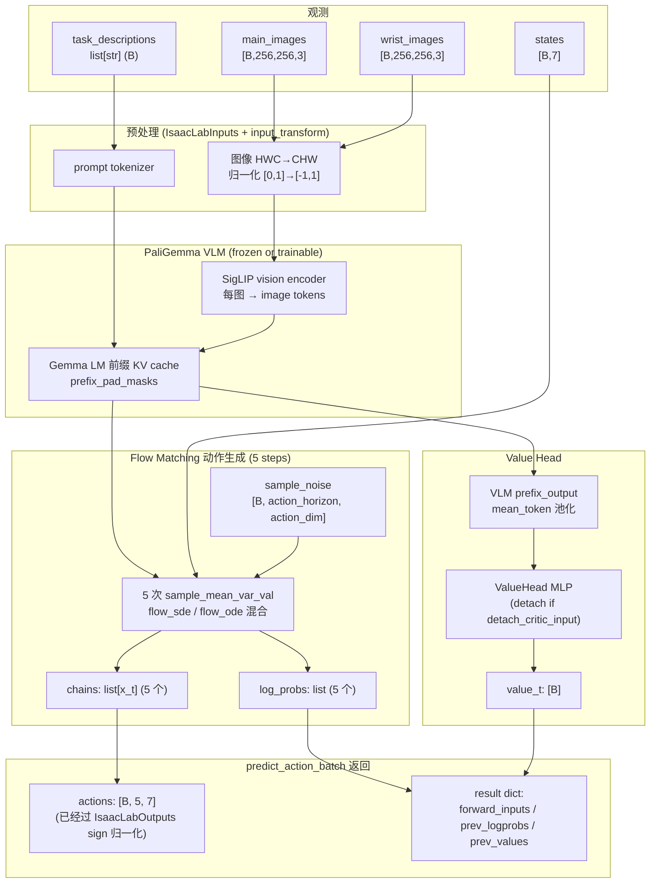

### 14.3 `predict_action_batch`：RL rollout 入口

```518:610:rlinf/models/embodiment/openpi/openpi_action_model.py
    def predict_action_batch(
        self,
        env_obs,
        mode: Literal["train", "eval"] = "train",
        compute_values=True,
        **kwargs,
    ) -> tuple[torch.Tensor, dict[str, Any]]:
        to_process_obs = self.obs_processor(env_obs)  # env obs -> policy input obs
        processed_obs = self.input_transform(
            to_process_obs, transpose=False
        )  # policy input obs -> model input obs
        processed_obs = self.precision_processor(
            processed_obs
        )  # obs precision processor
        observation = _model.Observation.from_dict(processed_obs)
        ...
        # Non-DSRL or eval mode
        outputs = self.sample_actions(
            observation, mode=mode, compute_values=compute_values
        )
        actions = self.output_transform(
            {"actions": outputs["actions"], "state": observation.state}
        )["actions"]
        prev_logprobs = outputs["prev_logprobs"]
        prev_values = outputs["prev_values"]
        forward_action = None
        ...
        forward_inputs = {
            "chains": outputs["chains"],
            "denoise_inds": outputs["denoise_inds"],
            "tokenized_prompt": processed_obs["tokenized_prompt"],
            "tokenized_prompt_mask": processed_obs["tokenized_prompt_mask"],
            # "action" is the env-executed action, and "model_action" is the original output by the model.
            "action": actions.reshape(actions.shape[0], -1).contiguous(),
            "model_action": outputs["actions"]
            .reshape(outputs["actions"].shape[0], -1)
            .contiguous(),
        }
        ...
        result = {
            "prev_logprobs": prev_logprobs,
            "prev_values": prev_values,
            "forward_inputs": forward_inputs,
        }
        return actions, result
```

**核心返回的 3 类字段**：
1. **`actions`**：送给 env 的**可执行 7D action 块**（shape `[B, 5, 7]`）；
2. **`prev_logprobs` / `prev_values`**：当前策略的 logπ 和 V，**actor 训练时**当作"old logπ / old V"使用；
3. **`forward_inputs`**：保存采样时的随机性（`chains`, `denoise_inds`, `tokenized_prompt*`），让 actor 在训练 forward 时能**重建完全相同的概率计算**（flow-matching 的 logprob 依赖于采样轨迹）。

**WHY 同时保留 `action` 和 `model_action`**：
- `action` 是**通过 `IsaacLabOutputs` 后的** 7D action（已做 sign 归一化）；
- `model_action` 是**模型原始输出**（可能有更高维度或未归一化）；
- 对 dagger / intervene 模式，`action` 可能被人类/专家修改，而 `model_action` 用于 student 的 re-label SFT；
- 对 PPO 模式（本文），两者几乎一致，但保留双份给上下游更大灵活性。

### 14.4 `sample_actions`：Flow Matching 5 步去噪

```612:720:rlinf/models/embodiment/openpi/openpi_action_model.py
    @torch.no_grad()
    def sample_actions(
        self,
        observation: _model.Observation,
        noise=None,
        mode="train",
        compute_values=True,
    ) -> torch.Tensor:
        """Do a full inference forward and compute the action (batch_size x num_steps x num_motors)"""
        bsize = observation.state.shape[0]
        device = observation.state.device
        num_steps = self.config.num_steps
        if noise is None:
            actions_shape = (bsize, self.config.action_horizon, self.config.action_dim)
            noise = self.sample_noise(actions_shape, device)
        ...
        images, img_masks, lang_tokens, lang_masks, state = (
            self._preprocess_observation(observation, train=False)
        )

        prefix_output, prefix_pad_masks, past_key_values = self._build_prefix_cache(
            images, img_masks, lang_tokens, lang_masks
        )

        x_t = noise
        # add sde sample and traj collect
        chains = []
        log_probs = []
        values = []
        chains.append(x_t)

        # add value based on the vlm for pi05, expert for pi0
        if self.use_vlm_value:
            values_vlm = self.get_value_from_vlm(prefix_output)
        ...
        # denoise step
        for idx in range(num_steps):
            # sample mean var val
            if idx == denoise_inds[0][idx]:
                sample_method = self.config.noise_method
            else:
                sample_method = "flow_ode"
            x_t_prev = x_t
            x_t_mean, x_t_std, value_t, v_t = self.sample_mean_var_val(
                x_t,
                idx,
                state,
                prefix_pad_masks,
                past_key_values,
                sample_method,
                num_steps,
                compute_values,
            )
```

**WHY flow matching 5 步 + 混合 SDE/ODE**：
- **训练时**：随机选一个 `denoise_inds` 对应的步数用 SDE（注入 `noise_level=0.5` 的 Gaussian 噪声），其余用 ODE（确定性）；这样**同一条 action chunk 只有一步是随机的**，PPO 的 ratio = p_new/p_old 只需在这一步计算，大幅降低 logprob 估计方差；
- **评估时**：`denoise_inds = [-1]*num_steps`，全部用 ODE，生成确定性动作以获得最优 success rate；
- **`num_steps=5`** 是 VLA 推理常见配置（推理速度 vs 动作质量权衡）；stack-cube 的 `num_action_chunks=5` 与之吻合，每次推理产出正好一个 chunk。

**WHY `use_vlm_value`（`value_after_vlm=True` 时开启）**：
- π0 原生只给 VLM 提取特征，value 要单独建；
- π0.5 让 VLM 最后一层的 mean-token 做 value 来源，**复用 backbone 的表征**，避免从零训练一个 value encoder；
- **WHY detach**：`detach_critic_input=True` 意味着 value 的梯度不回传到 VLM，防止 value 噪声污染 VLM 对多模态的表征。

### 14.5 `default_forward`：RL 训练 forward

Actor 训练时调用 `self.model(forward_inputs=..., compute_logprobs=True, compute_values=True, ...)`（见 [rlinf/workers/actor/fsdp_actor_worker.py](rlinf/workers/actor/fsdp_actor_worker.py) 第 1430-1439 行），等价于 `default_forward`：

```377:424:rlinf/models/embodiment/openpi/openpi_action_model.py
    def default_forward(
        self,
        forward_inputs: dict[str, torch.Tensor],
        **kwargs,
    ) -> dict[str, Any]:
        # get kwargs
        compute_values = kwargs.get("compute_values", False)
        chains = forward_inputs["chains"]
        denoise_inds = forward_inputs["denoise_inds"]
        # input transform
        observation = self.input_transform(forward_inputs, transpose=False)
        observation = _model.Observation.from_dict(observation)
        images, img_masks, lang_tokens, lang_masks, state = (
            self._preprocess_observation(observation, train=False)
        )
        # transfer to device
        device = chains.device
        images = [img.to(device) for img in images]
        img_masks = [img_mask.to(device) for img_mask in img_masks]
        state = state.to(device)
        # get log prob
        log_probs, value_t, entropy = self.get_log_prob_value(
            images,
            img_masks,
            lang_tokens,
            lang_masks,
            state,
            chains,
            denoise_inds,
            compute_values,
        )
        log_probs = log_probs[
            :, :, : self.config.action_chunk, : self.config.action_env_dim
        ]
        entropy = entropy[
            :, :, : self.config.action_chunk, : self.config.action_env_dim
        ]
        # post process
        log_probs = log_probs.mean(dim=1)
        entropy = entropy.mean(dim=[1, 2, 3], keepdim=False)[
            :, None
        ]
        value_t = value_t.mean(dim=-1, keepdim=False)
        return {
            "logprobs": log_probs,
            "values": value_t,
            "entropy": entropy,
        }
```

**关键 WHY**：
- **使用 rollout 时的 `chains` 和 `denoise_inds`**：训练 forward 不能自行采样，否则 old 和 new logprob 的随机性不一致，PPO ratio 会失去意义；`forward_inputs` 里记录的 chains/denoise_inds 让训练 forward **重建采样轨迹**，在同一条轨迹下计算新策略的 logprob。
- **`log_probs[..., : self.config.action_chunk, : self.config.action_env_dim]`**：模型输出可能有更多 chunk/dim（为了 flow-matching 内部数学），裁剪到业务关心的 7D × 5 chunk；
- **`log_probs.mean(dim=1)`**：把 denoise step 维度平均，聚合成 per-chunk logprob；
- **`entropy.mean([1,2,3])`**：entropy 聚合到 batch 粒度单标量，用于 entropy bonus（本文 `entropy_bonus=0` 不实际使用）；
- **`value_t.mean(dim=-1)`**：value_head 输出多 head 时取平均。

### 14.6 Rollout 与 Actor 的 forward 差异

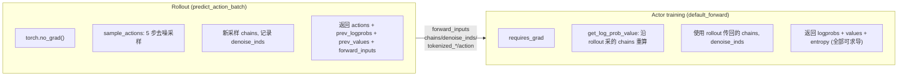

**WHY 这种"Rollout 采、Actor 重放"的设计**：
- Flow-matching 策略的 logprob 显式依赖于采样轨迹（`x_t` 的历史）；
- 若 Actor 在训练时独立采样新 `chains`，得到的 logprob 和 old 无法构成 PPO ratio；
- 让 Rollout 把采样过程记下来（`forward_inputs`），Actor 在重放中只更换"新策略的速度场 `v_θ(x_t, t)`"，即可得到同一轨迹下的新 logprob —— **这是连续动作 flow matching 能做 PPO 的关键技巧**。

---

## 15. OpenPI 数据/策略对接层

π0.5 是**跨 embodiment 通用模型**：LIBERO、ManiSkill、IsaacLab、CALVIN、MetaWorld… 都用同一份 model code。让它适配不同 env 的秘诀在于 **policy / dataconfig 两个对接层**。

### 15.1 IsaacLab Policy：Inputs/Outputs 变换

```43:84:rlinf/models/embodiment/openpi/policies/isaaclab_policy.py
@dataclasses.dataclass(frozen=True)
class IsaacLabInputs(transforms.DataTransformFn):
    """Convert IsaacLab observations into OpenPI model inputs."""

    model_type: _model.ModelType

    def __call__(self, data: dict) -> dict:
        base_image = _parse_image(data["observation/image"])
        wrist_image = _parse_image(data["observation/wrist_image"])

        inputs = {
            "state": data["observation/state"],
            "image": {
                "base_0_rgb": base_image,
                "left_wrist_0_rgb": wrist_image,
                "right_wrist_0_rgb": np.zeros_like(base_image),
            },
            "image_mask": {
                "base_0_rgb": np.True_,
                "left_wrist_0_rgb": np.True_,
                "right_wrist_0_rgb": np.True_
                if self.model_type == _model.ModelType.PI0_FAST
                else np.False_,
            },
        }

        if "actions" in data:
            inputs["actions"] = data["actions"]
        if "prompt" in data:
            inputs["prompt"] = data["prompt"]
        return inputs


@dataclasses.dataclass(frozen=True)
class IsaacLabOutputs(transforms.DataTransformFn):
    """Convert OpenPI outputs to IsaacLab action format."""

    def __call__(self, data: dict) -> dict:
        actions = np.asarray(data["actions"][:, :7])
        # IsaacLab stack-cube expects binary gripper command in {-1, +1}.
        actions[..., -1] = np.sign(actions[..., -1])
        return {"actions": actions}
```

**WHY `right_wrist_0_rgb = np.zeros_like(base_image)`**：
- π0.5 架构**固定接收 3 路图像**：`base_0_rgb`（主相机）、`left_wrist_0_rgb`（左手腕）、`right_wrist_0_rgb`（右手腕）；
- IsaacLab Franka 是**单臂**，只有 main + wrist，没有 right wrist；
- 如果直接不传 right_wrist，模型架构会失配；填充零图像并通过 `image_mask` 置 False（只有 PI0_FAST 模式下才 True）可以让 VLM 忽略这一路。
- 这是"通用 VLA + 特定机器人"的典型适配技巧。

**WHY `actions[..., -1] = np.sign(actions[..., -1])`**：
- IsaacLab stack-cube 任务的 gripper 动作是**二值 {-1, +1}**（-1 闭合, +1 张开），而 π0.5 原始输出是 [-1, 1] 连续；
- 在 env 侧做 sign 归一化而非模型侧，让模型可以**平滑学习**连续 gripper 信号（梯度更好），同时保证发给 env 的命令合法。
- 对比 [rlinf/envs/action_utils.py](rlinf/envs/action_utils.py) 的 `prepare_actions_for_isaaclab`：openpi 路径不再做任何动作变换，因为这里已经做了。

### 15.2 IsaacLab DataConfig：LeRobot 数据源兼容

```25:65:rlinf/models/embodiment/openpi/dataconfig/isaaclab_dataconfig.py
@dataclasses.dataclass(frozen=True)
class LeRobotIsaacLabStackCubeDataConfig(DataConfigFactory):
    """OpenPI data config aligned with stack-cube fine-tuning recipe."""

    default_prompt: str | None = (
        "Stack the red block on the blue block, then stack the green block on the red block"
    )

    @override
    def create(
        self, assets_dirs: pathlib.Path, model_config: _model.BaseModelConfig
    ) -> DataConfig:
        repack_transform = _transforms.Group(
            inputs=[
                _transforms.RepackTransform(
                    {
                        "observation/image": "observation.images.front",
                        "observation/wrist_image": "observation.images.wrist",
                        "observation/state": "observation.state",
                        "actions": "action",
                    }
                )
            ]
        )

        data_transforms = _transforms.Group(
            inputs=[isaaclab_policy.IsaacLabInputs(model_type=model_config.model_type)],
            outputs=[isaaclab_policy.IsaacLabOutputs()],
        )

        model_transforms = ModelTransformFactory(default_prompt=self.default_prompt)(
            model_config
        )

        return dataclasses.replace(
            self.create_base_config(assets_dirs, model_config),
            repack_transforms=repack_transform,
            data_transforms=data_transforms,
            model_transforms=model_transforms,
            action_sequence_keys=("action",),
        )
```

**WHY 这层存在**（即便 RL 不直接训练 SFT）：
- `config_name="pi05_isaaclab_stack_cube"` 在 OpenPI 侧解析成 `LeRobotIsaacLabStackCubeDataConfig`；
- OpenPI 的 `PI0Pytorch`（即 `OpenPi0ForRLActionPrediction` 的父类）在加载 SFT checkpoint 时需要 DataConfig 信息来恢复 image/state 归一化 stats、prompt 默认值等；
- 所以即便是纯 RL，也要确保 DataConfig 存在，RLinf 借用 OpenPI 的数据管线约定做 **SFT-RL 对接**。
- 另外，若开启 `actor.enable_sft_co_train: True`（[rlinf/workers/actor/fsdp_actor_worker.py](rlinf/workers/actor/fsdp_actor_worker.py) 第 1238-1263 行），会基于这个 DataConfig 构建 SFT data loader，与 PPO 并行做 SFT co-training（避免 RL 破坏模仿知识）。

### 15.3 三个观测键名约定

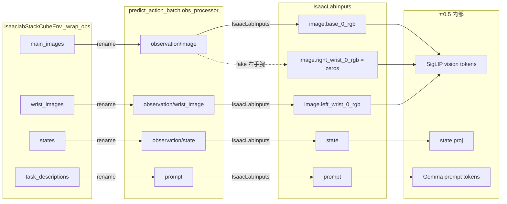

**WHY 有三层 rename**：
- 环境层：IsaacLab 原始键（`obs["policy"]["table_cam"]`）→ RLinf 统一 schema（`main_images`）；
- 上游 obs_processor 层：统一 schema → OpenPI 命名约定（`observation/image`）；
- policy 层：OpenPI 约定 → π0.5 内部接口（`image.base_0_rgb`）。
- 每一层 rename 都让下游保持领域内习惯，避免跨层耦合。

### 15.4 与 actor 侧的 prepare_actions 的契约

还记得 §10.5 的 `prepare_actions_for_isaaclab` 对 OPENPI 不做 sign 转换吗？那是因为 `IsaacLabOutputs` 已经做了。契约是：

| 层 | 动作格式 |
|---|---|
| 模型 `sample_actions` 输出 | `[B, action_horizon, action_dim]` 连续值 (action_horizon 可大于 action_chunk) |
| `output_transform` (走 `IsaacLabOutputs`) | 取前 `action_env_dim=7` 维，夹爪 sign 归一化 |
| `predict_action_batch` 返回 actions | `[B, action_chunk=5, 7]`，已归一化 |
| `MultiStepRolloutWorker.send_rollout_result` | 传递 actions 不做改动 |
| `EnvWorker.env_interact_step` 收到 | 调 `prepare_actions_for_isaaclab`（对 openpi 无操作，直接传给 env） |
| `SubProcIsaacLabEnv.step` | 收到合法 {-1, +1} 的 gripper |

**WHY 分成两处转换而非一次**：
- **关注点分离**：OpenPI 知道自己的动作格式、IsaacLab 知道自己要什么；转换逻辑分别放在各自的策略文件里；
- **便于扩展**：加新 env（比如 Cal vin）只需写 `CalvinOutputs`，不动模型代码；加新模型（比如 GR00T）只需改 `prepare_actions_for_isaaclab` 的 branch；
- **规避重复**：若在 `prepare_actions` 里也做 sign，会和 `IsaacLabOutputs` 重复（错误地做两次 sign 会把某些值翻转）。

---

# Part VI — 机器人行业视角的工程权衡

---

## 16. 为什么这样设计：关键取舍对照

本节以表格 + 短评方式，对 RLinf 的核心设计决策逐一解释"为什么这样选"以及"替代方案何时更合适"。每个取舍都锚定到前面章节。

### 16.1 仿真接入：子进程 vs 同进程

| 维度 | 子进程 (RLinf 选择) | 同进程 | 说明 |
|---|---|---|---|
| **CUDA context 冲突** | 无 | 常见 OOM / `cuInit failed` | IsaacLab AppLauncher 初始化时若主进程已有 CUDA，会触发冲突 |
| **崩溃恢复** | `process.join().terminate()` 清理 | 主进程被拖垮 | PhysX 遇到极端状态会 `exit(1)` |
| **IPC 开销** | Pipe + Queue 有序列化成本 | 无 | 128 env × 256×256 图像 ≈ 96MB / step，Queue 开销约 5-10ms |
| **可重启** | 支持 (重建 process) | 不支持 | 若任务需要热重置，只重启子进程即可 |
| **headless EGL** | 子进程独立 `DISPLAY` 环境 | 需要主进程也 headless | §9 已解释 |

**短评**：RLinf 用子进程换来了隔离性，代价是 5-10ms/step 的序列化开销。对 PhysX 这种易崩的巨型依赖，这笔账划算。若将来 IsaacLab 提供更轻量的 Python binding（如 "inproc mode"），RLinf 可以无缝切换到同进程（只需改 `venv.py`）。

### 16.2 动作粒度：Chunk-level vs Step-level vs Token-level

| 粒度 | reward / logprob 维度 | 优点 | 缺点 | 何时选 |
|---|---|---|---|---|
| **Chunk-level** (本文) | `[T_chunk, B]` | PPO ratio 稳定；与 VLA action_chunk 语义对齐；计算成本低 | 粒度粗，advantage 估计略偏 | VLA (OpenVLA / π0 / GR00T) + IsaacLab / LIBERO |
| **Step-level** | `[T_chunk × chunk_size, B]` | 粒度精，每个仿真步都算 | logprob 在 chunk 内相关，violates i.i.d. PPO 假设 | 无 action chunk 的 MLP/CNN 策略 |
| **Token-level** | `[T_chunk, B, action_dim]` | 最精细；可做 auto-regressive logprob | 计算开销 × 7；对 flow-matching 不适用（整 chunk 一起去噪） | auto-regressive VLA (如 OpenVLA discrete token 输出) |

**短评**：`reward_type=chunk_level, logprob_type=chunk_level, entropy_type=token_level` 是一种**混合粒度**巧妙组合：reward/logprob 用粗粒度保稳定性，entropy 用细粒度保探索性。

### 16.3 仿真并行度：GPU 向量化 vs CPU 多进程

| 方式 | 每 GPU 可容 | 物理保真度 | 接入 RLinf 的代价 |
|---|---|---|---|
| **GPU 向量化 (IsaacLab / ManiSkill)** | 128-4096 envs | 中（PhysX GPU 模式有数值简化） | 需要 `SubProcIsaacLabEnv` 子进程 |
| **CPU 多进程 (LIBERO / CALVIN / MetaWorld)** | 1-8 envs × N 进程 | 高（MuJoCo CPU 全算法） | 需要 N 倍 CPU 核 |

**计算**：
- IsaacLab 128 env 单 GPU ≈ 5000 steps/s；
- LIBERO 8 env × 16 进程 ≈ 2000 steps/s。

**短评**：**GPU 向量化样本吞吐率压倒性胜出**，是 IsaacLab 成为 VLA RL 首选仿真器的核心原因。代价是 PhysX GPU 模式对软体/流体/有限元等场景支持不全，如果要做布料折叠、液体倾倒等高保真任务，CPU MuJoCo 仍不可替代。

### 16.4 布局模式：Collocated vs Disaggregated vs Hybrid

| 布局 | YAML 示例 | 显存峰值 | 吞吐 | 何时选 |
|---|---|---|---|---|
| **Collocated** (本文) | `actor,rollout,env: all` | 高 (需 offload rollout) | 中 | GPU 资源紧张；小规模 (< 16 GPU) |
| **Disaggregated env / rollout** | `env: 0-3, rollout: 4-7, actor: 0-7` | 中 (rollout 不需 offload) | 高 (pipeline) | 足 8 GPU 单节点 |
| **完全分离** | `env: 0-1, rollout: 2-5, actor: 6-7` | 低 | 中（actor 并行度下降） | 多 GPU 且想避免 offload 的 OOM 风险 |

**吞吐对比（粗估）**：
- Collocated：sync_weight 走 CUDA IPC（0 拷贝），但 env/rollout/actor 三者串行；
- Disaggregated env/rollout + actor all：pipeline_stage_num=2 时 env 和 rollout 并行，actor 仍串行；吞吐 +30-50%；
- 完全分离：三者全并行，但 actor 只用 2 GPU，FSDP DP 度降低，训练速度反而变慢。

**短评**：**"env/rollout 分离 + actor 全卡"是性能最甜蜜点**。本文默认 Collocated 是为了入门友好（8 GPU 就跑）；扩展到多机时推荐显式分离布局。

### 16.5 权重同步：Bucket send vs All-gather

| 方式 | 峰值显存 | 通信量 | 适用 |
|---|---|---|---|
| **Bucket send (本文)** | `1 × bucket_size` 额外 | 全参一次 | collocated 用 CUDA IPC, disaggregated 用 NCCL |
| **All-gather FSDP** | `1 × param_size` 额外 | 全参一次 × DP 度 | 需要 actor/rollout 同一个 process group |
| **Parameter server** | `1 × param_size × n_workers` | 全参 × n_workers | 异步场景 |

**WHY bucket**：
- π0.5 ≈ 3B 参数 × bf16 = 6GB，一次性传送需要 6GB 临时显存；
- Bucket 大小 1GB → 峰值只多 1GB；
- 代价是通信延迟略增（N 次 send 而非 1 次），但 NCCL 带宽利用率足够高，整体耗时相当。

### 16.6 FSDP 策略：`no_shard` vs `full_shard`

| 策略 | 参数占用 | 梯度占用 | 优化器状态占用 | 通信开销 | 本文选择 |
|---|---|---|---|---|---|
| `no_shard` (本文) | 1×model (每卡全量) | 1×model | 1×model | 无 all-gather | ✅ |
| `shard_grad_op` | 1×model | 1/N×model | 1/N×model | reduce-scatter | 需要更多时 |
| `full_shard` | 1/N×model | 1/N×model | 1/N×model | all-gather + reduce-scatter | π0.5 7B+ 时 |
| `hybrid_shard` | Inter-group: 1, Intra: 1/N | 混合 | 混合 | 混合 | 超大模型 + 多节点 |

**WHY π0.5 用 `no_shard`**：
- π0.5 约 3B 参数，bf16 下 6GB；A100-80G 可容下 model + grad + AdamW state = 6GB × 3 = 18GB，绰绰有余；
- 避免 all-gather 的通信开销，FSDP 退化成 DDP 但复用 FSDP 管线；
- 若将来换到 π0.7B_MoE 或 GR00T-N2（10B+），应改为 `full_shard`。

### 16.7 reward 设计：差分 vs 累积

```mermaid
flowchart LR
    subgraph Absolute["累积奖励 (use_rel_reward=False)"]
        A1["t=1..(T-1): r=0"]
        A2["t=T (success): r=1"]
        A3["t=T+1..450 (若继续): r=1, r=1, ..."]
        A4["Return = T_remain"]
    end

    subgraph Relative["差分奖励 (use_rel_reward=True)"]
        B1["t=1..(T-1): r=0"]
        B2["t=T (success): r=1-0=+1"]
        B3["t=T+1..450: r=1-1=0"]
        B4["Return = γ^(T-t)"]
    end
```

**WHY 差分**：
- `ignore_terminations=True` 下 episode 继续跑到 450 步，若用累积奖励，成功越早 return 越大，**策略会学到"尽早成功然后停摆"**；
- 差分奖励让 return 恰好等于 `γ^{T-t}`，长度不再直接影响 return 大小，只有**是否成功**和**多早成功**（通过 γ 折扣）影响；
- 这正是 MDP 教科书中"应该给中间步骤足够信号"的实用版。

### 16.8 关键取舍总表

| 取舍 | 本文选择 | 何时改变 |
|---|---|---|
| 仿真进程 | 子进程 + spawn | Isaac Sim 升级支持 inproc mode |
| 动作粒度 | chunk-level | 非 chunk-based 策略 |
| 仿真器 | IsaacLab (GPU) | 需要流体/布料高保真 → MuJoCo |
| 布局 | Collocated | 扩展到 >16 GPU → 分离 |
| 权重同步 | Bucket CUDA IPC | 跨节点 → Bucket NCCL |
| FSDP | no_shard | 模型 >7B → full_shard |
| Reward | 差分稀疏 | 密集奖励任务 → 绝对 |
| 算法 | PPO (actor_critic) | 超长 horizon + 无 value → GRPO |
| 权重同步频率 | 每 outer step 同步 | 异步 RL → `weight_sync_interval > 1` |

---

## 17. 可观测性与故障模式

### 17.1 指标命名空间

`EmbodiedRunner.run()` 把所有指标分类记录（来自 [rlinf/runners/embodied_runner.py](rlinf/runners/embodied_runner.py) 第 391-431 行）：

```python
self.metric_logger.log(env_metrics, _step)       # env/*
self.metric_logger.log(rollout_metrics, _step)   # rollout/*
self.metric_logger.log(time_metrics, _step)      # time/*
self.metric_logger.log(training_metrics, _step)  # train/*
```

| Namespace | 关键指标 | 含义 |
|---|---|---|
| `env/` | `success_once`, `episode_len`, `return`, `reward` | 环境交互统计；**最重要的 business metric** |
| `rollout/` | `advantages_max/min/mean`, `returns_*`, `rewards`, `values_*` | GAE 后的 advantage 分布，看 PPO 是否健康 |
| `train/actor/` | `policy_loss`, `approx_kl`, `clip_fraction`, `clipped_ratio`, `dual_cliped_ratio`, `entropy_loss`, `grad_norm`, `lr`, `total_loss` | Actor 更新诊断 |
| `train/critic/` | `value_loss`, `value_clip_ratio`, `explained_variance`, `lr` | Critic 更新诊断 |
| `time/` | `step`, `sync_weights`, `generate_rollouts`, `cal_adv_and_returns`, `env/*`, `rollout/*`, `actor/*`, `reward/*` | 各阶段耗时分解，找瓶颈 |

**WHY 这种命名**：
- 每个前缀对应一个训练阶段（env 交互 / rollout 推理 / advantage 计算 / actor 训练），调试时能快速定位问题发生在哪一环；
- TensorBoard/WandB 的 panel group 按斜杠自动分组，提高可读性。

### 17.2 时间指标分解（典型）

一次 outer step 的时间（collocated 布局，单节点 8×A100）：

```mermaid
flowchart LR
    Step["time/step ≈ 15-25s"]
    Step --> Sync["time/sync_weights ≈ 2-3s"]
    Step --> Gen["time/generate_rollouts ≈ 8-12s"]
    Step --> Adv["time/cal_adv_and_returns ≈ 0.5s"]
    Step --> Train["time/run_training ≈ 4-8s"]

    Gen --> EnvT["time/env/run_interact_once<br/>包含子进程仿真 + 通信"]
    Gen --> RolloutT["time/rollout/generate_one_epoch<br/>包含 π0.5 flow matching 5 steps"]
    Gen --> WaitT["time/actor/recv_rollout_trajectories<br/>channel 吞吐"]

    Train --> TrainForward["actor forward π0.5<br/>n_micro × update_epoch"]
    Train --> TrainBackward["backward + optimizer step"]
```

**调优信号**：
- `time/sync_weights` > 5s → 说明 bucket 不够大或 CUDA IPC 失效，检查 `enable_offload`；
- `time/generate_rollouts` 远大于 `time/run_training` → rollout 瓶颈，考虑 `pipeline_stage_num=2` 或分离布局；
- `train/actor/clip_fraction` > 0.3 → 策略更新过大，降 `clip_ratio_*` 或 `lr`；
- `train/critic/explained_variance` < 0.2 → value 拟合差，提高 `value_lr` 或加 `critic_warmup_steps`。

### 17.3 录制视频：`RecordVideo` wrapper

```35:40:rlinf/envs/wrappers/record_video.py
class RecordVideo(gym.Wrapper):
    """
    A general video recording wrapper that owns the recording logic.

    ``RecordVideo`` centralizes frame collection and MP4 writing for both regular
    stepping and chunked stepping APIs. Frames are buffered in memory and flushed
    asynchronously to avoid blocking environment interaction.
```

**WHY 异步 flush**：MP4 编码（`imageio`）慢（几百 ms / 视频），同步写会拖累 env.step；`RecordVideo` 用 `ThreadPoolExecutor` 后台写，主线程无感知。

### 17.4 常见故障模式与定位

| 症状 | 可能原因 | 定位文件 / 配置 |
|---|---|---|
| 启动时 `GLX 1.3 not supported` | 容器内 EGL 未安装 | [examples/embodiment/run_embodiment.sh](examples/embodiment/run_embodiment.sh) 第 7-8 行的 EGL 变量；检查 `libegl1-mesa` |
| 启动时 `isaaclab.app.AppLauncher` 卡住 | Isaac Sim 首次初始化（编译 shader） | 首次运行可能 1-2 分钟，后续会快 |
| 训练中 `CUDA OOM` | rollout + actor 同卡 | `enable_offload: True`；或分离布局 |
| rollout 指标停滞（`prev_logprobs` 为 0） | 权重同步失败 | 检查 `time/sync_weights` 和 bucket length log |
| `env/success_once` 始终为 0 | 模型未正确加载 / 动作映射错误 | 检查 `actor.model.model_path`；检查 `IsaacLabOutputs.actions[..., -1]` |
| 子进程 PhysX segfault | 任务 id 错误或 gym 版本不兼容 | `examples/embodiment/config/env/isaaclab_stack_cube.yaml` 的 `init_params.id` |
| `NCCL timeout` (多机) | `RLINF_COMM_NET_DEVICES` 未正确设置 | 参考 [AGENTS.md](AGENTS.md) 多节点段；确保网卡名一致 |
| 视频录不下来 | `save_video: True` 但磁盘路径不可写 | `eval.video_cfg.video_base_dir` 的权限 |

### 17.5 per-worker 日志

`EmbodiedRunner` 在 `_log_ranked_metrics` 中支持 per-rank 指标（[rlinf/runners/embodied_runner.py](rlinf/runners/embodied_runner.py) 第 178-201 行）：

```python
self._log_ranked_metrics(
    metrics_list=env_metrics_per_rank,
    step=_step,
    prefix="env",
    worker_group_name=self.env.worker_group_name,
)
```

**WHY**：
- `runner.per_worker_log=True` 时，每个 EnvWorker/RolloutWorker/ActorWorker 的 rank 各自记录一份指标到 TensorBoard；
- 当**特定某个 env rank 表现差**（比如某 GPU 上仿真不稳）时，聚合指标看不出问题，per-worker 能快速定位。

---

# Part VII — 扩展指南与改进建议

---

## 18. 新增一个 IsaacLab 任务的完整 Checklist

以"新增一个 `Isaac-PickCube-Franka-IK-Rel-v0` 任务"为例，按**最小改动集合**列出扩展步骤。

### 18.1 总体流程

```mermaid
flowchart LR
    A["Step 1<br/>写 Task Env 类"] --> B["Step 2<br/>注册 REGISTER_ISAACLAB_ENVS"]
    B --> C["Step 3<br/>写 env YAML"]
    C --> D["Step 4<br/>写顶层 YAML"]
    D --> E["Step 5<br/>若 action schema 变<br/>改 OpenPI policy"]
    E --> F["Step 6 可选<br/>SFT data 接入 dataconfig"]
    F --> G["Step 7<br/>install.sh / Dockerfile / CI"]
    G --> H["Step 8<br/>docs RST (EN+ZH)"]
    H --> I["Step 9<br/>e2e test"]
```

### 18.2 Step 1：写任务 Env 类

```python
# rlinf/envs/isaaclab/tasks/pick_cube.py
import torch
import gymnasium as gym
from rlinf.envs.isaaclab.utils import quat2axisangle_torch
from ..isaaclab_env import IsaaclabBaseEnv


class IsaaclabPickCubeEnv(IsaaclabBaseEnv):
    def _make_env_function(self):
        def make_env_isaaclab():
            import os
            os.environ.pop("DISPLAY", None)
            from isaaclab.app import AppLauncher
            sim_app = AppLauncher(headless=True, enable_cameras=True).app

            from isaaclab_tasks.utils import load_cfg_from_registry
            isaac_env_cfg = load_cfg_from_registry(
                self.isaaclab_env_id, "env_cfg_entry_point"
            )
            isaac_env_cfg.seed = self.seed
            isaac_env_cfg.scene.num_envs = self.cfg.init_params.num_envs
            isaac_env_cfg.scene.wrist_cam.height = self.cfg.init_params.wrist_cam.height
            isaac_env_cfg.scene.wrist_cam.width = self.cfg.init_params.wrist_cam.width
            isaac_env_cfg.scene.table_cam.height = self.cfg.init_params.table_cam.height
            isaac_env_cfg.scene.table_cam.width = self.cfg.init_params.table_cam.width

            env = gym.make(
                self.isaaclab_env_id, cfg=isaac_env_cfg, render_mode="rgb_array"
            ).unwrapped
            return env, sim_app

        return make_env_isaaclab

    def _wrap_obs(self, obs):
        instruction = [self.task_description] * self.num_envs
        wrist_image = obs["policy"]["wrist_cam"]
        table_image = obs["policy"]["table_cam"]
        quat = obs["policy"]["eef_quat"][:, [1, 2, 3, 0]]
        states = torch.cat(
            [obs["policy"]["eef_pos"], quat2axisangle_torch(quat), obs["policy"]["gripper_pos"]],
            dim=1,
        )
        return {
            "main_images": table_image,
            "task_descriptions": instruction,
            "states": states,
            "wrist_images": wrist_image,
        }
```

**注意事项**：
- 任务观测键名 (`policy.table_cam` / `wrist_cam` / `eef_quat` / ...) 要和 IsaacLab 原生 task 的 `ObservationGroup` 对齐，否则 `_wrap_obs` 会 `KeyError`；
- 若你的任务 obs 没有 wrist_cam，需要把 `wrist_images` 设为 None 或改成单视角变体；
- `quat` 的 `wxyz → xyzw` 是 IsaacLab 特性，**必做**（否则轴角错误）。

### 18.3 Step 2：注册任务

```python
# rlinf/envs/isaaclab/__init__.py
from .tasks.stack_cube import IsaaclabStackCubeEnv
from .tasks.pick_cube import IsaaclabPickCubeEnv  # 新增

REGISTER_ISAACLAB_ENVS = {
    "Isaac-Stack-Cube-Franka-IK-Rel-Visuomotor-Rewarded-v0": IsaaclabStackCubeEnv,
    "Isaac-PickCube-Franka-IK-Rel-v0": IsaaclabPickCubeEnv,  # 新增
}
```

### 18.4 Step 3：Env YAML

```yaml
# examples/embodiment/config/env/isaaclab_pick_cube.yaml
env_type: isaaclab
total_num_envs: null
auto_reset: False
ignore_terminations: False
use_rel_reward: True
seed: 0
group_size: 1

reward_coef: 1.0
use_fixed_reset_state_ids: False
max_steps_per_rollout_epoch: 256
max_episode_steps: 256

video_cfg:
  save_video: False
  info_on_video: True
  fps: 20
  video_base_dir: ${runner.logger.log_path}/video/train

init_params:
  id: "Isaac-PickCube-Franka-IK-Rel-v0"
  num_envs: null
  max_episode_steps: ${env.train.max_episode_steps}
  task_description: "Pick up the red cube."
  table_cam:
    height: 256
    width: 256
  wrist_cam:
    height: 256
    width: 256
```

### 18.5 Step 4：顶层 YAML

```yaml
# examples/embodiment/config/isaaclab_pick_cube_ppo_openpi_pi05.yaml
defaults:
  - env/isaaclab_pick_cube@env.train
  - env/isaaclab_pick_cube@env.eval
  - model/pi0_5@actor.model
  - training_backend/fsdp@actor.fsdp_config
  - override hydra/job_logging: stdout

# ... 其余参考 isaaclab_franka_stack_cube_ppo_openpi_pi05.yaml，
# 只需改 actor.model.openpi.config_name 为 "pi05_isaaclab_pick_cube"（若需独立的 DataConfig）
```

### 18.6 Step 5：若 action 格式不同，加 OpenPI policy

若新任务的夹爪不是 {-1, +1}，比如是 [0, 1]：

```python
# rlinf/models/embodiment/openpi/policies/isaaclab_pick_cube_policy.py
@dataclasses.dataclass(frozen=True)
class IsaacLabPickCubeOutputs(transforms.DataTransformFn):
    def __call__(self, data: dict) -> dict:
        actions = np.asarray(data["actions"][:, :7])
        actions[..., -1] = (actions[..., -1] + 1) / 2  # [-1,1] → [0,1]
        return {"actions": actions}
```

或在 [rlinf/envs/action_utils.py](rlinf/envs/action_utils.py) 的 `prepare_actions_for_isaaclab` 里加 branch（若是 env 级别的通用转换）。

### 18.7 Step 6（可选）：DataConfig

若要支持 SFT co-training 或加载 SFT checkpoint，在 [rlinf/models/embodiment/openpi/dataconfig/](rlinf/models/embodiment/openpi/dataconfig/) 增加 `isaaclab_pick_cube_dataconfig.py`，并注册 `pi05_isaaclab_pick_cube` config name。

### 18.8 Step 7：Install / Docker / CI

调用 skill `.cursor/skills/add-install-docker-ci-e2e`：
- 在 `requirements/install.sh` 添加 env 特定依赖（IsaacLab 新任务一般复用 `isaaclab` 安装，无需新增）；
- Dockerfile 已有 `isaaclab` stage，可直接使用；
- `tests/e2e_tests/embodied/` 加 `isaaclab_pick_cube_e2e.yaml`（缩减 `max_epochs=2, total_num_envs=8`）。

### 18.9 Step 8：文档 RST

调用 skill `.cursor/skills/add-example-doc-model-env`：
- 在 `docs/source-en/rst_source/examples/embodied/` 和 `docs/source-zh/rst_source/examples/embodied/` 各加一个 `.rst`；
- 更新 `index.rst` 的 toctree。

### 18.10 Step 9：e2e 测试

```bash
pytest tests/e2e_tests/embodied/isaaclab_pick_cube_e2e.py -v
```

### 18.11 最小文件改动集合

| 文件 | 改动类型 | 必需 |
|---|---|---|
| `rlinf/envs/isaaclab/tasks/pick_cube.py` | 新建 | ✓ |
| `rlinf/envs/isaaclab/__init__.py` | 加一行 | ✓ |
| `examples/embodiment/config/env/isaaclab_pick_cube.yaml` | 新建 | ✓ |
| `examples/embodiment/config/isaaclab_pick_cube_ppo_openpi_pi05.yaml` | 新建 | ✓ |
| `rlinf/models/embodiment/openpi/policies/isaaclab_pick_cube_policy.py` | 新建 | 若 action 异于 stack-cube |
| `rlinf/models/embodiment/openpi/dataconfig/isaaclab_pick_cube_dataconfig.py` | 新建 | 若需 SFT 对接 |
| `requirements/install.sh` | 可复用 `--env isaaclab` | 否 |
| `docs/source-*/rst_source/examples/embodied/*.rst` | 新建 | 推荐 |
| `tests/e2e_tests/embodied/isaaclab_pick_cube_e2e.*` | 新建 | 推荐 |

**WHY 只要改这么少**：RLinf 的分层设计把"env-specific"信息局部化到 `envs/isaaclab/tasks/` 和 `openpi/policies/` 两处，其他层完全复用；新加一个任务几乎不需要动 runner / worker / 算法。

> **重要前提**：§18.1–§18.11 只覆盖了 **RLinf 侧** 的最小改动集合。这背后**隐含**了两个前提：
> 1. **Isaac Sim v5.1.0** 已正确安装、`setup_conda_env.sh` 已被 `source`，`ISAAC_PATH` 等环境变量已存在。
> 2. **目标任务 ID**（如 `Isaac-PickCube-Franka-IK-Rel-v0`）已经在 **IsaacLab v2.3.2**（或 RLinf fork 的 IsaacLab）中通过 `gym.register()` **注册**，并实现了 `env_cfg_entry_point` 指向的配置类、`entry_point` 指向的环境类。
>
> 换言之：若你新增的任务**不存在**于 IsaacLab，光改 RLinf 是跑不起来的 —— `load_cfg_from_registry(self.isaaclab_env_id, "env_cfg_entry_point")` 会抛 `KeyError`。
>
> 下面 §18.12–§18.17 补齐 **IsaacSim 与 IsaacLab 侧**的全部工作，并把 RLinf 与这两层的**关联契约**彻底展开。

---

## 18.12 三层技术栈（IsaacSim / IsaacLab / RLinf）的分工与边界

### 18.12.1 分层拓扑

要在 RLinf 里新增一个 IsaacLab 任务做 RL，**本质上是在三个独立项目里各自做一部分工作，并通过明确的契约让它们对齐**。下图给出三层栈的拓扑：

```mermaid
flowchart TB
    subgraph L1 ["Layer 1: Isaac Sim v5.1.0 — 仿真后端"]
        direction LR
        Kit["Omniverse Kit SDK<br/>(carb / omni.kit)"]
        PhysX["PhysX 5 GPU 刚体/关节"]
        RTX["RTX 路径追踪渲染"]
        USD["USD Stage<br/>(机器人 + 场景)"]
        SimApp["simulation_app<br/>(carb.settings / event loop)"]
        Kit --> PhysX
        Kit --> RTX
        Kit --> USD
        Kit --> SimApp
    end

    subgraph L2 ["Layer 2: Isaac Lab v2.3.2 — RL 任务框架"]
        direction LR
        AppL["isaaclab.app.AppLauncher<br/>启动 simulation_app"]
        BaseEnv["ManagerBasedRLEnv<br/>DirectRLEnv<br/>(gymnasium.Env)"]
        Managers["ObservationManager<br/>ActionManager<br/>RewardManager<br/>TerminationManager<br/>EventManager<br/>CurriculumManager"]
        Tasks["isaaclab_tasks<br/>(gym.register 的任务仓库)"]
        Assets["isaaclab_assets<br/>(FRANKA_PANDA_CFG 等)"]
        AppL --> BaseEnv
        BaseEnv --> Managers
        Tasks -->|env_cfg_entry_point<br/>entry_point| BaseEnv
        Assets -->|SceneCfg 复用| Tasks
    end

    subgraph L3 ["Layer 3: RLinf — RL 训练编排"]
        direction LR
        Registry["REGISTER_ISAACLAB_ENVS<br/>(RLinf 侧任务路由)"]
        Wrap["IsaaclabBaseEnv<br/>+ task 子类<br/>_make_env_function / _wrap_obs"]
        SubP["SubProcIsaacLabEnv<br/>(spawn 子进程边界)"]
        Worker["EnvWorker / RolloutWorker / ActorWorker<br/>+ EmbodiedRunner"]
        Registry --> Wrap
        Wrap --> SubP
        SubP --> Worker
    end

    L1 -->|Python API<br/>import isaacsim.*| L2
    L2 -->|"Python API<br/>gym.make\(task_id, cfg\)<br/>load_cfg_from_registry"| L3
```

**关键观察**：

- 三层之间**单向依赖**：RLinf 只 import IsaacLab，IsaacLab 只 import Isaac Sim；反向不成立。
- 跨层的"契约接口"只有 3 个：
  1. **`AppLauncher(headless=..., enable_cameras=...)`**（Isaac Sim ↔ Isaac Lab 的启动口）。
  2. **`gym.register()` 注册表**（Isaac Lab ↔ RLinf 的任务路由），关键 key：`id`、`entry_point`、`env_cfg_entry_point`。
  3. **`obs["policy"][...]` 字段名**（Isaac Lab → RLinf 的观测数据契约），详见 §18.14.5。

### 18.12.2 每层"属主的东西"

| 层 | 版本 | 代码位置 | 核心能力 | 属于它管辖的对象 |
|---|---|---|---|---|
| **Isaac Sim** | 5.1.0 | `isaac-sim-standalone-5.1.0-linux-x86_64.zip` 解压后的 `ISAAC_PATH`；GitHub：[isaac-sim/IsaacSim](https://github.com/isaac-sim/IsaacSim) | Omniverse Kit 应用框架、PhysX GPU 物理、RTX 渲染、USD 场景 I/O、RTX 相机/LiDAR 传感器、URDF/MJCF/OnShape 导入器 | `simulation_app` 单例、`carb::logging` 日志、PhysX 步长、RTX viewport、USD prim tree、`/World/envs/env_i/...` 命名空间 |
| **Isaac Lab** | v2.3.2 | 通过 `install.sh --env isaaclab` 从 [RLinf/IsaacLab](https://github.com/RLinf/IsaacLab) 克隆后 `isaaclab.sh --install` 安装（见 [requirements/install.sh](requirements/install.sh) 第 759–772 行）；上游：[isaac-sim/IsaacLab](https://github.com/isaac-sim/IsaacLab) | `gymnasium.Env` 包装、Manager-based / Direct 两套 workflow、可复用 MDP term、`AppLauncher` 封装、`isaaclab_tasks` 任务注册、`isaaclab_assets` 机器人资产 | `ManagerBasedRLEnv` / `DirectRLEnv` 实例、`SceneCfg` / `ActionsCfg` / `ObservationsCfg` / `RewardsCfg` / `TerminationsCfg` / `EventsCfg` 配置类、gym registry 中的任务 ID |
| **RLinf** | 本仓库 | [rlinf/envs/isaaclab/](rlinf/envs/isaaclab/) | 跨任务统一 obs schema、子进程隔离、chunk_step 语义、PPO/GRPO 算法与 FSDP 训练、π0.5/GR00T 等 VLA 模型适配 | `IsaaclabBaseEnv` 子类、`REGISTER_ISAACLAB_ENVS`、`SubProcIsaacLabEnv`、`EmbodiedRunner`、Hydra YAML 配置 |

### 18.12.3 谁来负责"新增 Pick Cube 任务"的每一步？

以本章贯穿的示例"新增 `Isaac-PickCube-Franka-IK-Rel-v0`"为例，工作被分配到三层：

```mermaid
flowchart LR
    subgraph Sim ["Isaac Sim 侧"]
        S1["安装 isaac-sim-standalone-5.1.0<br/>(一次性)"]
        S2["source setup_conda_env.sh<br/>(每次开新终端)"]
        S3["(可选) 导入自定义机器人 USD"]
    end
    subgraph Lab ["IsaacLab 侧 (RLinf fork)"]
        L1["写 PickCubeEnvCfg 或 PickCubeEnv"]
        L2["在 __init__.py 里 gym.register"]
        L3["isaaclab.sh --install 重装"]
    end
    subgraph RL ["RLinf 侧"]
        R1["写 IsaaclabPickCubeEnv(IsaaclabBaseEnv)"]
        R2["REGISTER_ISAACLAB_ENVS 加一行"]
        R3["写 env YAML + 顶层 YAML"]
        R4["若 action schema 不同：加 OpenPI policy"]
    end

    S1 --> S2
    S2 --> L3
    L1 --> L2
    L2 --> L3
    L3 --> R1
    R1 --> R2
    R2 --> R3
    R3 --> R4
```

**本章 §18.1–§18.11 的内容只覆盖了最右侧的 R1–R4**。接下来的 §18.13、§18.14 分别展开 Isaac Sim 与 IsaacLab 侧的具体工作；§18.15 回到三层的关联契约。

---

## 18.13 IsaacSim v5.1.0 侧需要做什么

### 18.13.1 99% 情况：只安装，不写代码

对于绝大多数基于 Franka / UR10 / G1 等**已有机器人**的任务，**IsaacSim 侧完全不需要写代码**，只需要：

1. **下载 Isaac Sim v5.1.0 的 standalone 包**（`isaac-sim-standalone-5.1.0-linux-x86_64.zip`），解压到某个目录，记作 `ISAAC_PATH`。
2. **配置环境变量**（每次开新终端都要做）：

```bash
cd ${ISAAC_PATH}
source ./setup_conda_env.sh
```

该脚本会 export 三个关键变量（见 [docs/source-zh/rst_source/examples/embodied/isaaclab.rst](docs/source-zh/rst_source/examples/embodied/isaaclab.rst) 第 125–141 行）：

| 变量 | 作用 | 典型值 |
|---|---|---|
| `ISAAC_PATH` | Isaac Sim 根目录 | `/home/user/isaac_sim/isaac-sim-standalone-5.1.0` |
| `EXP_PATH` | Kit 应用模板目录 | `${ISAAC_PATH}/apps` |
| `CARB_APP_PATH` | Kit 运行时目录 | `${ISAAC_PATH}/kit` |
| `LD_LIBRARY_PATH` | Kit 动态库 | `${ISAAC_PATH}/kit/libs:...` |
| `PYTHONPATH` | Isaac Sim Python 绑定 | `${ISAAC_PATH}/kit/python/lib/python3.11/site-packages:...` |

这些变量会被 [examples/embodiment/run_embodiment.sh](examples/embodiment/run_embodiment.sh) 通过 export 继承给 `python` 进程，再由 `SubProcIsaacLabEnv` spawn 的 Isaac Sim 子进程继承。

3. **确保显卡驱动满足要求**：RTX 4080 及以上（数据中心 A40 / L40S / H100 均可）；NVIDIA driver ≥ 535；Ubuntu 22.04（Ubuntu 24.04 部分支持，见 [IsaacSim README](https://github.com/isaac-sim/IsaacSim)）。

4. **Headless 运行的三件套**（RLinf 在 [examples/embodiment/run_embodiment.sh](examples/embodiment/run_embodiment.sh) 第 7–8 行已设）：

```bash
export MUJOCO_GL="egl"
export PYOPENGL_PLATFORM="egl"
# 子进程内：os.environ.pop("DISPLAY", None)  （见 stack_cube.py 第 49 行）
```

**WHY 这三个还不够**：Isaac Sim 的 Kit 应用在 `AppLauncher(headless=True)` 下会走 OpenGL/Vulkan headless 路径，需要 `libegl1-mesa` 系统库（容器场景下容易缺失）。若启动时报 `GLX 1.3 not supported` 或 `Failed to create RTX context`，检查 `apt install libegl1-mesa libgl1-mesa-dri libvulkan1`。

### 18.13.2 什么情况下才需要动 Isaac Sim

以下 4 种情况才会触及 Isaac Sim 本身：

#### (A) 新机器人（非 Franka / UR10 / G1）

若任务需要自定义机器人（例如 Kinova、XArm），流程为：

```mermaid
flowchart LR
    URDF["URDF/MJCF/OnShape<br/>(robot.urdf)"] -->|URDF Importer<br/>isaacsim.asset.importer.urdf| USD1["robot.usd<br/>(Articulation)"]
    USD1 -->|在 Isaac Sim GUI 或脚本中<br/>调关节驱动、碰撞组| USD2["robot_tuned.usd"]
    USD2 -->|在 isaaclab_assets 里写 ArticulationCfg| Cfg["KINOVA_CFG: ArticulationCfg"]
    Cfg -->|被 IsaacLab SceneCfg 引用| Task["新任务可用该机器人"]
```

- 关键工具：Isaac Sim GUI 的 **URDF Importer**（或 Python API `isaacsim.asset.importer.urdf`）。
- 输出：`.usd` 文件（可托管到 Nucleus 服务器或本地）。
- 配套：在 IsaacLab 的 `source/isaaclab_assets/isaaclab_assets/robots/<your_robot>.py` 下写一个 `ArticulationCfg`，引用该 USD 路径。

#### (B) 新传感器（RTX LiDAR、深度相机分辨率、tactile）

- Isaac Sim 提供 `isaacsim.sensors.*` 扩展，可通过 `omni.kit.app` 运行时加载。
- 绝大多数情况下**不需要自己写传感器扩展**：Isaac Sim 内置的 RGB / 深度 / 分割 / RTX LiDAR 已经足够。
- 若需要修改相机参数，通常在 IsaacLab 的 `SceneCfg` 中改（见 §18.14.3），不必动 Isaac Sim。

#### (C) 新的 Kit 应用扩展

- Isaac Sim 基于 Omniverse Kit，一个 `.kit` 文件定义了"要加载哪些扩展 + 以什么顺序"。
- IsaacLab 默认使用 `isaaclab.python.kit`（在 `apps/` 下），RLinf 继承这个。
- 若需要**自定义 Kit 扩展**（比如自己写一个 Omniverse 扩展用于新 UI、或挂钩 PhysX 事件），需要在 `${EXP_PATH}` 下新增 `.kit` 配置文件。这是**高级用法**，超出本示例范畴。

#### (D) 自定义 PhysX 设置（碰撞、关节驱动、CCD）

- 一般通过 IsaacLab 的 `SimulationCfg` 或 `ArticulationCfg` 的 `solver_position_iteration_count` 等字段配置，**不直接改 Isaac Sim**。
- 仅在需要直接调用 PhysX C++ API（如注入自定义约束）时才需要扩展 Isaac Sim。

### 18.13.3 本示例（Pick Cube）的 Isaac Sim 侧工作

对于 "新增 `Isaac-PickCube-Franka-IK-Rel-v0`" 而言：

| 步骤 | 是否需要 | 理由 |
|---|---|---|
| 下载 Isaac Sim 5.1.0 | 必需 | 所有 IsaacLab 任务的运行时基础 |
| `source setup_conda_env.sh` | 必需 | 注入 `ISAAC_PATH`/`EXP_PATH`/`CARB_APP_PATH` |
| 导入新机器人 USD | **不需要** | 复用 `isaaclab_assets.robots.franka.FRANKA_PANDA_CFG` |
| 导入新物体 USD | **不需要** | 复用 stack-cube 已有的 `cube.usd`（Isaac Sim 内置的 props） |
| 改 PhysX 参数 | **不需要** | 沿用 Franka 标配（关节刚度/阻尼已调好） |
| Kit 扩展 | **不需要** | 沿用 IsaacLab 默认 Kit app |

**结论**：对典型的视觉操纵任务，Isaac Sim 侧的工作只是"装好 + source 脚本"，几乎**零代码改动**。真正的任务逻辑在下一节（IsaacLab 侧）完成。

### 18.13.4 验证 Isaac Sim 可用的最小 smoke test

在继续写 IsaacLab 任务之前，建议先跑一遍这个脚本验证 Isaac Sim 自身可用：

```bash
# 激活 venv + Isaac Sim 环境
source .venv/bin/activate
source ${ISAAC_PATH}/setup_conda_env.sh

# 用 IsaacLab 的 launcher 跑一个内置任务
cd ${ISAAC_LAB_PATH}  # 即 install.sh 克隆到 .venv/isaaclab 的目录
./isaaclab.sh -p scripts/environments/random_agent.py \
    --task Isaac-Stack-Cube-Franka-IK-Rel-Visuomotor-Rewarded-v0 \
    --num_envs 8 --headless --enable_cameras
```

若能看到 `[INFO]: Time taken for scene creation: xx s` + 多次 `step` log，则 Isaac Sim + IsaacLab 组合可用。

若报错：
- `cuda runtime error` → 驱动/CUDA 版本不匹配。
- `Failed to load shared library libcarb.so` → `LD_LIBRARY_PATH` 未 source。
- `Task Isaac-... not found in registry` → IsaacLab 任务注册失败，直接跳到 §18.14 排查。

---

## 18.14 IsaacLab v2.3.2 侧：新任务的完整定义

### 18.14.1 选 Workflow：Manager-based 还是 Direct

IsaacLab 提供两种任务定义风格（见 [官方教程](https://isaac-sim.github.io/IsaacLab/v2.3.2/source/tutorials/03_envs/create_manager_rl_env.html)）：

| 维度 | Manager-based (`ManagerBasedRLEnv`) | Direct (`DirectRLEnv`) |
|---|---|---|
| 代码组织 | 声明式：一堆 `configclass`，每个 term（obs、action、reward、termination）独立注册到 Manager | 命令式：一个子类重写 `_get_observations / _get_rewards / _get_dones / _apply_action` |
| 任务 ID 后缀 | 无（如 `Isaac-Cartpole-v0`） | `-Direct`（如 `Isaac-Cartpole-Direct-v0`） |
| Gym entry_point | `isaaclab.envs:ManagerBasedRLEnv`（统一基类） | `{__name__}.cartpole_env:CartpoleEnv`（自定义类） |
| 可复用性 | 高：MDP term 可以跨任务共享（`mdp.joint_pos_rel` 等） | 低：reward/obs 函数写在任务类里，想复用要手动抽 |
| 性能优化 | 受限：Manager 的 Python 解释层有固定开销 | 可用 `@torch.jit.script` 自由优化 |
| 域随机化 | `EventManager` + `EventTermCfg`（统一接口） | 同样用 `EventTermCfg`，但需要手动挂到 `events` 字段 |
| Observation 多组 | `ObsGroup`（如 `policy` / `critic` / `rgb`） | 字典返回：`{"policy": ..., "critic": ...}` |
| RLinf 对接 | 二者均可，obs 只要命中 `obs["policy"][<key>]` 就行 | 同左 |

**选择建议（本示例）**：

- 本章示例 `Isaac-Stack-Cube-Franka-IK-Rel-Visuomotor-Rewarded-v0` **是 Manager-based**（从名称判断：没有 `-Direct` 后缀；且已复用 Franka 标准 MDP term）。
- 新增 `Isaac-PickCube-Franka-IK-Rel-v0` 如果与 Franka lift-cube 类似，**推荐 Manager-based**（可直接复用 `isaaclab_tasks.manager_based.manipulation.lift` 下的 reward/action/obs term）。
- 若任务需要大量自定义物理逻辑（如接触力精细判断、可变 decimation、特殊动作空间），选 Direct。

### 18.14.2 典型目录结构（Manager-based）

对于 "新增 Pick Cube"，在 **RLinf fork 的 IsaacLab 仓库**（`https://github.com/RLinf/IsaacLab`）中，推荐如下目录：

```
source/isaaclab_tasks/isaaclab_tasks/manager_based/manipulation/
├── lift/                                    # 已有（Franka lift-cube）
│   ├── config/
│   │   └── franka/
│   │       ├── ik_rel_env_cfg.py            # 已有 Isaac-Lift-Cube-Franka-IK-Rel-v0
│   │       └── __init__.py                  # gym.register 已有
│   └── mdp/                                 # 共享 MDP term（reward/termination/events）
└── pick_cube/                               # 新建
    ├── __init__.py                          # gym.register 新任务
    ├── config/
    │   └── franka/
    │       ├── ik_rel_env_cfg.py            # PickCubeEnvCfg 主定义
    │       ├── agents/                      # rl_games / rsl_rl 的 PPO yaml（可省略，因为 RLinf 不用）
    │       └── __init__.py
    ├── pick_cube_env_cfg.py                 # 基础 PickCubeEnvCfg（机器人无关）
    └── mdp/                                 # 任务特定 MDP term
        ├── __init__.py
        ├── rewards.py                       # object_reached / object_lifted 等
        └── observations.py                  # 若有特殊观测
```

### 18.14.3 Env Cfg 的六件套

一个 Manager-based RL 任务由 **六个 configclass** 组合而成（摘自官方 [Cartpole tutorial](https://isaac-sim.github.io/IsaacLab/v2.3.2/source/tutorials/03_envs/create_manager_rl_env.html)）：

```python
# 示意：pick_cube_env_cfg.py（IsaacLab 侧，非 RLinf 代码）
from isaaclab.envs import ManagerBasedRLEnvCfg
from isaaclab.managers import (
    ObservationGroupCfg as ObsGroup,
    ObservationTermCfg as ObsTerm,
    RewardTermCfg as RewTerm,
    TerminationTermCfg as DoneTerm,
    EventTermCfg as EventTerm,
    SceneEntityCfg,
)
from isaaclab.scene import InteractiveSceneCfg
from isaaclab.utils import configclass

from isaaclab_assets.robots.franka import FRANKA_PANDA_CFG
import isaaclab.sim as sim_utils


# 1) SceneCfg：什么物体出现在世界里
@configclass
class PickCubeSceneCfg(InteractiveSceneCfg):
    robot = FRANKA_PANDA_CFG.replace(prim_path="{ENV_REGEX_NS}/Robot")
    cube = ...                 # RigidObjectCfg: 要抓的方块
    table = ...                # AssetBaseCfg: 桌面
    ground = ...               # GroundPlaneCfg
    table_cam = ...            # CameraCfg: 第三人称
    wrist_cam = ...            # CameraCfg: 腕部相机
    dome_light = ...


# 2) ObservationsCfg：观测分组 + 每组的 term
@configclass
class ObservationsCfg:
    @configclass
    class PolicyCfg(ObsGroup):
        wrist_cam = ObsTerm(func=mdp.image, params={"sensor_cfg": SceneEntityCfg("wrist_cam")})
        table_cam = ObsTerm(func=mdp.image, params={"sensor_cfg": SceneEntityCfg("table_cam")})
        eef_pos = ObsTerm(func=mdp.ee_position)
        eef_quat = ObsTerm(func=mdp.ee_orientation)      # wxyz
        gripper_pos = ObsTerm(func=mdp.gripper_position)

        def __post_init__(self):
            self.enable_corruption = False
            self.concatenate_terms = False               # RLinf 需要保留 dict 结构
    policy: PolicyCfg = PolicyCfg()


# 3) ActionsCfg：动作空间
@configclass
class ActionsCfg:
    arm_action = mdp.DifferentialInverseKinematicsActionCfg(
        asset_name="robot",
        joint_names=["panda_joint.*"],
        body_name="panda_hand",
        controller=DifferentialIKControllerCfg(command_type="pose", use_relative_mode=True),
        scale=0.5,
    )
    gripper_action = mdp.BinaryJointPositionActionCfg(
        asset_name="robot",
        joint_names=["panda_finger.*"],
        open_command_expr={"panda_finger_.*": 0.04},
        close_command_expr={"panda_finger_.*": 0.0},
    )


# 4) RewardsCfg：奖励 term 组合
@configclass
class RewardsCfg:
    reaching_object = RewTerm(func=mdp.object_ee_distance, weight=1.0, params={...})
    lifting_object = RewTerm(func=mdp.object_is_lifted, weight=15.0, params={...})
    success = RewTerm(func=mdp.object_reached_goal, weight=10.0, params={...})
    # 注：RLinf 更喜欢稀疏 0/1 奖励，然后在 Python 侧用 use_rel_reward 差分（见 §8.4）


# 5) TerminationsCfg：何时 done
@configclass
class TerminationsCfg:
    time_out = DoneTerm(func=mdp.time_out, time_out=True)
    object_dropped = DoneTerm(func=mdp.object_dropped, params={...})
    success = DoneTerm(func=mdp.object_reached_goal, params={...})


# 6) EventsCfg：初始化 / 重置 / 间隔事件（域随机化）
@configclass
class EventsCfg:
    reset_robot_joints = EventTerm(func=mdp.reset_joints_by_scale, mode="reset", params={...})
    reset_cube_position = EventTerm(func=mdp.reset_root_state_uniform, mode="reset", params={...})


# 7) 主 EnvCfg：把以上六件套组合
@configclass
class PickCubeEnvCfg(ManagerBasedRLEnvCfg):
    scene: PickCubeSceneCfg = PickCubeSceneCfg(num_envs=4096, env_spacing=2.5)
    observations: ObservationsCfg = ObservationsCfg()
    actions: ActionsCfg = ActionsCfg()
    rewards: RewardsCfg = RewardsCfg()
    terminations: TerminationsCfg = TerminationsCfg()
    events: EventsCfg = EventsCfg()

    def __post_init__(self):
        self.decimation = 2
        self.episode_length_s = 5.0
        self.sim.dt = 1 / 120         # physics step = 8.3ms
        self.sim.render_interval = self.decimation
        # RL step rate = 1 / (decimation * dt) = 60Hz
```

**关键 WHY**：

- `num_envs=4096` 是 IsaacLab 默认值，但 **RLinf 会在运行时 override**：`isaac_env_cfg.scene.num_envs = self.cfg.init_params.num_envs`（见 [rlinf/envs/isaaclab/tasks/stack_cube.py](rlinf/envs/isaaclab/tasks/stack_cube.py) 第 62–64 行）。因此这里写多少无所谓，占位即可。
- `concatenate_terms = False` **至关重要**：RLinf `_wrap_obs` 要按键读 `obs["policy"]["wrist_cam"]` / `["eef_pos"]` 等，必须保留 dict 结构；若为 True，所有 term 会被 flatten 成一个大 tensor，RLinf 读不出来。
- `DifferentialInverseKinematicsActionCfg(use_relative_mode=True)` **就是任务名里的 "IK-Rel"**：动作是末端位姿的相对增量 `[dx, dy, dz, droll, dpitch, dyaw]`；比关节绝对位置控制的搜索空间更小、更利于 PPO 收敛。
- `BinaryJointPositionActionCfg` 给出离散 open/close 命令；IsaacLab 内部把 `a_gripper ∈ {-1, +1}` 映射到开/闭；**RLinf 在 [rlinf/envs/action_utils.py](rlinf/envs/action_utils.py) 的 `prepare_actions_for_isaaclab` 中保证夹爪信号是 ±1 sign**（见 §18.15.4）。

### 18.14.4 `gym.register()` 契约

这是 IsaacLab ↔ RLinf 之间的**唯一路由契约**。在 IsaacLab fork 的 `source/isaaclab_tasks/isaaclab_tasks/manager_based/manipulation/pick_cube/config/franka/__init__.py` 中：

```python
# IsaacLab fork 侧（非 RLinf 代码）
import gymnasium as gym
from . import agents

gym.register(
    id="Isaac-PickCube-Franka-IK-Rel-v0",                              # ★ 与 RLinf 侧 init_params.id 一致
    entry_point="isaaclab.envs:ManagerBasedRLEnv",                      # Manager-based 统一基类
    disable_env_checker=True,
    kwargs={
        "env_cfg_entry_point": f"{__name__}.ik_rel_env_cfg:PickCubeIKRelEnvCfg",
        #                          ^^^^^^^^^^^^^^^^^^^^^^^^^^^^^^^^^^^^^^^^^^^^^^^^
        #                          ★ RLinf 通过 load_cfg_from_registry 读这个 key
        "rl_games_cfg_entry_point": f"{agents.__name__}:rl_games_ppo_cfg.yaml",  # RLinf 不需要
        "rsl_rl_cfg_entry_point": f"{agents.__name__}.rsl_rl_ppo_cfg:PickCubePPORunnerCfg",  # RLinf 不需要
    },
)
```

**跨栈数据流**（见 [rlinf/envs/isaaclab/tasks/stack_cube.py](rlinf/envs/isaaclab/tasks/stack_cube.py) 第 54–73 行）：

```mermaid
flowchart LR
    YAML["examples/embodiment/config/env/isaaclab_pick_cube.yaml<br/>init_params.id: Isaac-PickCube-Franka-IK-Rel-v0"] --> |读取| RLinfCfg
    RLinfCfg["IsaaclabBaseEnv.__init__<br/>self.isaaclab_env_id = cfg.init_params.id"] --> |传给| Load["load_cfg_from_registry<br/>(task_id, 'env_cfg_entry_point')"]
    Load -->|查 gym registry| Reg["gym.envs.registry[id].kwargs<br/>['env_cfg_entry_point']"]
    Reg -->|返回字符串| Path["'pick_cube...ik_rel_env_cfg:PickCubeIKRelEnvCfg'"]
    Path -->|importlib 动态导入| Cls["PickCubeIKRelEnvCfg 类"]
    Cls -->|实例化| Cfg2["isaac_env_cfg 对象"]
    Cfg2 -->|RLinf override<br/>num_envs/cam.h/cam.w/seed| Cfg3["修改后的 isaac_env_cfg"]
    Cfg3 -->|作为 kwargs.cfg 传入| Make["gym.make\(task_id, cfg=isaac_env_cfg\)"]
    Make -->|Gym 根据 entry_point<br/>isaaclab.envs:ManagerBasedRLEnv| Env["ManagerBasedRLEnv(cfg)"]
    Env -->|env.unwrapped 去掉 wrapper| RLinfEnv["交给 IsaaclabBaseEnv 作为 self.env"]
```

**WHY 两级 entry_point 分离**：

- `entry_point` 决定**用哪个 Python 类实现环境**（大多数 Manager-based 任务共享 `ManagerBasedRLEnv`）。
- `env_cfg_entry_point` 决定**用哪个配置实例化该类**（每个任务各自有配置，这样才能区分 cartpole / lift / stack）。
- **RLinf 只使用 `env_cfg_entry_point`** 来预取配置做 override；`gym.make` 时 Gym 会同时吃 `entry_point + cfg`。
- `rl_games_cfg_entry_point` 等是给 IsaacLab 官方训练脚本用的，**RLinf 完全忽略**（RLinf 自己管理算法超参）。

### 18.14.5 IsaacLab obs schema 与 RLinf `_wrap_obs` 的字段级对齐

这是**最容易出错**的地方。RLinf `_wrap_obs` 硬编码了预期的键名（见 [rlinf/envs/isaaclab/tasks/stack_cube.py](rlinf/envs/isaaclab/tasks/stack_cube.py) 第 78–100 行）：

```78:100:rlinf/envs/isaaclab/tasks/stack_cube.py
    def _wrap_obs(self, obs):
        instruction = [self.task_description] * self.num_envs
        wrist_image = obs["policy"]["wrist_cam"]
        table_image = obs["policy"]["table_cam"]
        quat = obs["policy"]["eef_quat"][
            :, [1, 2, 3, 0]
        ]  # In isaaclab, quat is wxyz not like libero
        states = torch.concatenate(
            [
                obs["policy"]["eef_pos"],
                quat2axisangle_torch(quat),
                obs["policy"]["gripper_pos"],
            ],
            dim=1,
        )
```

所以 **IsaacLab 侧的 `ObservationsCfg.PolicyCfg` 必须提供这几个键，且形状/语义对齐**：

| IsaacLab `obs["policy"][...]` 键 | 形状 | 语义 | RLinf 使用方式 |
|---|---|---|---|
| `wrist_cam` | `[B, H, W, 3]` uint8 | 腕部相机 RGB | → `env_obs["wrist_images"]` |
| `table_cam` | `[B, H, W, 3]` uint8 | 第三人称 RGB | → `env_obs["main_images"]` |
| `eef_pos` | `[B, 3]` fp32 | 末端位置 (x, y, z) | concat 到 `states[:, 0:3]` |
| `eef_quat` | `[B, 4]` fp32 | 末端姿态四元数 **wxyz** | `[:, [1,2,3,0]]` 转 xyzw，再 `quat2axisangle_torch` → `states[:, 3:6]` |
| `gripper_pos` | `[B, 1]` fp32 | 夹爪开度 | → `states[:, 6:7]` |

**WHY IsaacLab 必须产出 `wxyz` 四元数**：Isaac Sim 的 USD 规范采用 `wxyz`；IsaacLab 沿用。RLinf 在 `_wrap_obs` 中把它**反序成 `xyzw`**（`[:, [1, 2, 3, 0]]`），再转轴角，因为 π0.5 checkpoint 是在 LIBERO (`xyzw` 轴角) 上 SFT 的，必须对齐。这就是为什么 `_wrap_obs` 的这行注释写着 `# In isaaclab, quat is wxyz not like libero`。

**WHY 不能把所有 obs concat 成一个大 tensor**：π0.5 模型的 VLM 主干需要**分别处理图像、语言、状态**；如果 IsaacLab 的 `concatenate_terms=True` 把图像 flatten 进 states，π0.5 就无法把图像走 SigLIP、文本走 PaliGemma tokenizer。

### 18.14.6 IK-Rel 动作契约

IsaacLab 的 Franka IK-Rel 动作空间（见 §18.14.3 的 `ActionsCfg`）：

| dim | 含义 | 范围 | scale |
|---|---|---|---|
| 0 | dx | [-1, 1] | × 0.5 → ±0.5m 增量（典型） |
| 1 | dy | [-1, 1] | × 0.5 |
| 2 | dz | [-1, 1] | × 0.5 |
| 3 | droll | [-1, 1] | × 0.5 rad |
| 4 | dpitch | [-1, 1] | × 0.5 rad |
| 5 | dyaw | [-1, 1] | × 0.5 rad |
| 6 | gripper | {-1, +1}（sign） | -1 = open, +1 = close |

**WHY sign 夹爪而非 {0, 1}**：IsaacLab 的 `BinaryJointPositionActionCfg` 判断 `a > 0` 是 close、`a < 0` 是 open。LIBERO 用 {0, 1}，这是两个任务间 **需要 OpenPI policy 转换的唯一地方**（见 [rlinf/models/embodiment/openpi/policies/isaaclab_policy.py](rlinf/models/embodiment/openpi/policies/isaaclab_policy.py) 的 `IsaacLabOutputs.__call__`）。

**RLinf 侧的 action 映射**：模型吐 `action_chunk: [B, 5, 7]` → `prepare_actions_for_isaaclab` reshape 并转 CUDA tensor → `env.step(actions[:, i])` 逐步执行。详见 §18.15.4。

### 18.14.7 Isaac Lab v2.3.2 与 Isaac Sim 版本耦合

[IsaacLab README](https://github.com/isaac-sim/IsaacLab) 明确列出版本依赖：

| Isaac Lab 版本 | 支持的 Isaac Sim 版本 |
|---|---|
| main | 4.5 / 5.0 / 5.1 |
| **v2.3.X** | **4.5 / 5.0 / 5.1** ← 本文档锚定 |
| v2.2.X | 4.5 / 5.0 |
| v2.1.X | 4.5 |

**WHY RLinf 选 IsaacLab v2.3.2 + IsaacSim 5.1.0**：

- IsaacSim 5.1.0 是最新稳定版（2025-10-21 发布），PhysX 5 GPU、RTX 路径追踪性能最优。
- IsaacLab v2.3.2 首次支持 IsaacSim 5.1，并引入稳定的 `DifferentialInverseKinematicsActionCfg`。
- 若升级到 Isaac Sim 5.2（若存在）需同步验证 IsaacLab 兼容性。

### 18.14.8 提交到 RLinf fork 的 PR 清单

若任务打算上游到 [RLinf/IsaacLab](https://github.com/RLinf/IsaacLab)：

1. 在 `source/isaaclab_tasks/isaaclab_tasks/manager_based/manipulation/pick_cube/` 下建立完整目录（见 §18.14.2）。
2. `config/franka/__init__.py` 中 `gym.register(...)` 注册任务。
3. `pick_cube_env_cfg.py` 定义六件套。
4. 运行 `./isaaclab.sh --install` 确保扩展被 pip 注册。
5. 在 `scripts/environments/random_agent.py --task Isaac-PickCube-Franka-IK-Rel-v0` 下验证可用。
6. 发 PR（或本地 `pip install -e source/isaaclab_tasks` 复用）。

**重要**：如果是**只在 RLinf 仓库里本地用**（不上游），可以在 `.venv/isaaclab` 目录下直接改 Python 文件（注意该目录是 git clone 的，改完需 `isaaclab.sh --install` 重装才能被 RLinf 的子进程 import 到）。

---

## 18.15 RLinf 如何与 IsaacSim + IsaacLab 关联

本节把"胶水层"彻底展开，按**运行时的五个接触面**组织。

### 18.15.1 关联接触面总览

```mermaid
flowchart TB
    subgraph RLinf_Main ["RLinf 主进程"]
        YAML["Hydra YAML<br/>init_params.id"]
        Registry["REGISTER_ISAACLAB_ENVS"]
        Wrap["IsaaclabStackCubeEnv<br/>_wrap_obs / _make_env_function"]
        Action["prepare_actions_for_isaaclab<br/>(action 契约)"]
    end

    subgraph Boundary ["进程边界 (mp.spawn)"]
        Pipe["Pipe(duplex)<br/>控制面"]
        Queue["action/obs/reset Queue<br/>数据面"]
    end

    subgraph Sim_Proc ["Isaac Sim 子进程"]
        AppL["AppLauncher<br/>(启动 simulation_app)"]
        Load["load_cfg_from_registry<br/>(查 gym registry)"]
        Make["gym.make(id, cfg=...)<br/>(IsaacLab 返回 env)"]
        PhysX2["ManagerBasedRLEnv<br/>+ PhysX / RTX cam"]
    end

    YAML -->|1 config| Registry
    Registry -->|2 路由| Wrap
    Wrap -->|3 构造闭包| Boundary
    Boundary --> AppL
    AppL --> Load
    Load --> Make
    Make --> PhysX2
    PhysX2 -->|4 obs| Queue
    Queue -->|5 解析| Wrap
    Wrap -->|输出 env_obs dict| RLinf_Main
    Action -->|7 action tensor| Queue
    Queue -->|6 传入 step| PhysX2

    classDef contact fill:#f5f5f5,stroke:#333,stroke-width:2px;
    class YAML,Registry,Wrap,Action,Boundary contact;
```

| # | 接触面 | RLinf 侧实现 | IsaacLab/Sim 侧对应 | 契约内容 |
|---|---|---|---|---|
| 1 | **配置层** | Hydra `init_params.id`（[env yaml](examples/embodiment/config/env/isaaclab_stack_cube.yaml) 第 22 行） | Isaac Lab gym registry 的 `id` | 完全一致的字符串 |
| 2 | **任务路由** | `REGISTER_ISAACLAB_ENVS` dict | 无（RLinf 单向查询） | 字典键需等于任务 ID |
| 3 | **启动期** | `_make_env_function` 闭包 | `isaaclab.app.AppLauncher` + `load_cfg_from_registry` + `gym.make` | 在子进程内**按顺序**调用 |
| 4 | **观测契约** | `_wrap_obs(obs)` | `ObservationsCfg.PolicyCfg` 的 ObsTerm 键名 | `obs["policy"][<key>]` 需出现 `wrist_cam` / `table_cam` / `eef_pos` / `eef_quat` / `gripper_pos` |
| 5 | **动作契约** | `prepare_actions_for_isaaclab` + OpenPI policy | `ActionsCfg` 的 IK-Rel + Binary gripper | `[dx,dy,dz,droll,dpitch,dyaw,gripper∈{-1,+1}]` CUDA fp32 |
| 6 | **进程边界** | `SubProcIsaacLabEnv` + Pipe/Queue | 无（Isaac Sim 是单进程单例） | `mp.spawn`、`cloudpickle` 传闭包、`daemon=True` |
| 7 | **生命周期** | `env.close()` → Sub → `sim_app.close()` | `simulation_app.close()`（Kit event loop shutdown） | 优雅关闭 Kit，避免 Isaac Sim 僵尸进程 |

### 18.15.2 启动期时序：RLinf → IsaacLab → IsaacSim

```mermaid
sequenceDiagram
    autonumber
    participant Shell as run_embodiment.sh
    participant Main as RLinf 主进程
    participant SubP as SubProcIsaacLabEnv
    participant Child as Isaac Sim 子进程
    participant Kit as Omniverse Kit
    participant Reg as Gym Registry
    participant ML as ManagerBasedRLEnv
    participant PX as PhysX 5 GPU

    Shell->>Shell: source setup_conda_env.sh<br/>export ISAAC_PATH/EXP_PATH/CARB_APP_PATH
    Shell->>Main: python train_embodied_agent.py
    Main->>Main: mp.set_start_method("spawn")
    Main->>SubP: SubProcIsaacLabEnv(env_fn)
    SubP->>Child: ctx.Process(target=_torch_worker).start()

    Note over Child: === 子进程内部（只此处能 init Kit）===
    Child->>Child: os.environ.pop("DISPLAY")
    Child->>Kit: AppLauncher(headless=True, enable_cameras=True)
    Kit->>Kit: 加载 ${CARB_APP_PATH}/kit<br/>加载 ${EXP_PATH}/apps/isaaclab.python.kit
    Kit-->>Child: sim_app (carb::settings ready)

    Child->>Reg: load_cfg_from_registry(<br/>  "Isaac-Stack-Cube-...v0",<br/>  "env_cfg_entry_point")
    Reg->>Reg: import isaaclab_tasks (触发 gym.register 全量执行)
    Reg-->>Child: StackCubeIKRelEnvCfg() 实例

    Child->>Child: isaac_env_cfg.scene.num_envs = 128<br/>isaac_env_cfg.scene.{table_cam,wrist_cam}.{h,w} = 256
    Child->>ML: gym.make(id, cfg=isaac_env_cfg)
    ML->>PX: 加载 Franka USD + 3 cube 生成 4096→128 envs
    PX->>PX: PhysX kernels init
    ML-->>Child: env.unwrapped

    Note over Child: === 就绪，等待 Pipe 命令 ===
    SubP->>Child: Pipe.send("reset")<br/>Queue.put(seed=42)
    Child->>ML: env.reset(seed=42)
    ML-->>Child: obs(dict), info
    Child->>SubP: obs_queue.put((obs, info))
```

**关键 WHY（跨栈顺序）**：

- **必须 `AppLauncher` 在前、`gym.make` 在后**：`isaaclab_tasks` 的 `__init__.py` 在 import 时会 `gym.register`，但它内部会 `import isaaclab.envs`，而 `isaaclab.envs` 的某些 C++ binding 需要 `simulation_app` 已经启动。顺序反了会报 `Carb initialization failed`。
- **子进程内才 import IsaacLab**：`stack_cube.py` 的 `from isaaclab.app import AppLauncher` 不在文件顶部，而是在闭包内 lazy import（[rlinf/envs/isaaclab/tasks/stack_cube.py](rlinf/envs/isaaclab/tasks/stack_cube.py) 第 45–54 行），就是为了避免**主进程**不小心 import IsaacLab 导致 `simulation_app` 在主进程创建。

### 18.15.3 观测数据流的五跳变换

obs 从 IsaacLab 到模型输入要经过五跳：

```mermaid
flowchart LR
    A["PhysX GPU buffer<br/>(CUDA tensor)"] -->|ObservationManager.compute| B["obs['policy']<br/>{'wrist_cam':...,<br/>'eef_quat'(wxyz):...,<br/>...}"]
    B -->|obs_queue.put<br/>跨进程 pickle| C["RLinf 主进程<br/>obs dict"]
    C -->|_wrap_obs:<br/>重命名 + quat 转轴角| D["env_obs<br/>{'main_images',<br/>'wrist_images',<br/>'states',<br/>'task_descriptions'}"]
    D -->|Channel.send 到<br/>RolloutWorker| E["π0.5 forward_input"]
    E -->|OpenPI IsaacLabInputs<br/>tokenize + 图像归一化| F["模型输入"]
```

**每一跳的开销**（典型 128 envs × 2 cam × 256×256 = ~50MB）：

- 跳 1（PhysX → obs dict）：零拷贝（CUDA tensor 保留）。
- 跳 2（跨进程）：**最贵**，~3–5ms（`mp.Queue` 的 pickle 开销，§19.2 有改进建议）。
- 跳 3（`_wrap_obs`）：~0.5ms（张量 index / concat）。
- 跳 4（Channel）：零拷贝（主进程内 torch.Tensor 共享 GPU 内存）。
- 跳 5（模型输入）：~1ms（tokenize + normalize）。

**数据契约列表**（这张表是**新增任务时的 checklist**）：

| 跳 | 输入字段 | 需要 IsaacLab 提供 | 需要 RLinf 实现 |
|---|---|---|---|
| 1→2 | `obs["policy"]["wrist_cam"]` | ObsTerm `mdp.image(wrist_cam)` | — |
| 1→2 | `obs["policy"]["table_cam"]` | ObsTerm `mdp.image(table_cam)` | — |
| 1→2 | `obs["policy"]["eef_pos"]` | ObsTerm `mdp.ee_position` | — |
| 1→2 | `obs["policy"]["eef_quat"]` | ObsTerm `mdp.ee_orientation`（wxyz） | — |
| 1→2 | `obs["policy"]["gripper_pos"]` | ObsTerm `mdp.gripper_position` | — |
| 3 | wxyz → xyzw | — | `[:, [1, 2, 3, 0]]` 重排 |
| 3 | 四元数 → 轴角 | — | `quat2axisangle_torch` |
| 3 | 7D states | — | `concat([eef_pos, axisangle, gripper])` |
| 3 | `task_descriptions` | — | `[self.task_description] * num_envs` |
| 4 | `main_images` / `wrist_images` | — | key 重命名：`table_cam` → `main_images`、`wrist_cam` → `wrist_images` |

### 18.15.4 动作数据流的反向三跳

```mermaid
flowchart LR
    M["π0.5 flow matching<br/>5 denoise steps"] -->|output| A0["action_chunk<br/>[B, 5, 7] fp32"]
    A0 -->|OpenPI IsaacLabOutputs:<br/>scale + clip| A1["[B, 5, 7] 归一化"]
    A1 -->|prepare_actions_for_isaaclab:<br/>gripper sign / to CUDA| A2["CUDA tensor<br/>[B, 7] per-step"]
    A2 -->|chunk_step 循环:<br/>for i in range(5):| A3["env.step\(actions[:, i]\)"]
    A3 -->|action_queue.put| Cross["跨进程 Queue"]
    Cross --> A4["子进程<br/>isaac_env.step(action)"]
    A4 -->|ActionManager.process_action| A5["DifferentialInverseKinematicsActionCfg<br/>(6D IK) + BinaryJointPositionActionCfg"]
    A5 -->|解算 joint command| A6["PhysX 驱动<br/>9-DoF 关节目标"]
```

**RLinf 侧的 2 个 action 契约点**：

- [rlinf/envs/action_utils.py](rlinf/envs/action_utils.py)：`prepare_actions_for_isaaclab` 负责把 `action_chunk` reshape、保证 gripper 维是 sign（±1）、转成 CUDA 张量。若新任务的夹爪语义不同（如 [0, 1]），此处要加分支。
- [rlinf/models/embodiment/openpi/policies/isaaclab_policy.py](rlinf/models/embodiment/openpi/policies/isaaclab_policy.py)：`IsaacLabOutputs` DataTransformFn 做模型输出的后处理（例如把模型吐的连续值映射回 ±1）。

**IsaacLab 侧的 2 个 action 契约点**（在 IsaacLab fork 的 task config 里）：

- `ActionsCfg.arm_action`：确定是 IK-Rel 还是 IK-Abs 还是 joint_pos；scale 多大。
- `ActionsCfg.gripper_action`：确定 open/close 的关节目标值与阈值。

### 18.15.5 总结：5 个关联接触面的责任归属表

| 接触面 | 契约文件（RLinf 侧） | 契约文件（IsaacLab 侧） | 不一致时的错误现象 |
|---|---|---|---|
| 配置层（任务 ID） | [examples/embodiment/config/env/isaaclab_stack_cube.yaml](examples/embodiment/config/env/isaaclab_stack_cube.yaml) 第 22 行 `init_params.id` | IsaacLab fork 中 `gym.register(id=...)` | `AssertionError: Task type ... has not been registered!`（[rlinf/envs/__init__.py](rlinf/envs/__init__.py) 第 66 行） |
| 任务路由 | [rlinf/envs/isaaclab/__init__.py](rlinf/envs/isaaclab/__init__.py) 的 `REGISTER_ISAACLAB_ENVS` | — | 同上；RLinf 找不到 wrapper 类 |
| 启动期 | [rlinf/envs/isaaclab/tasks/stack_cube.py](rlinf/envs/isaaclab/tasks/stack_cube.py) 第 45–74 行 `make_env_isaaclab` | IsaacLab fork 中 `gym.register(..., kwargs={"env_cfg_entry_point": ...})` | `gym.error.NameNotFound` 或 `KeyError: 'env_cfg_entry_point'` |
| 观测契约 | `_wrap_obs` 读的键名（§18.14.5 表） | `ObservationsCfg.PolicyCfg` 的 ObsTerm 名称 | `KeyError: 'wrist_cam'` 等（在 `_wrap_obs` 内抛） |
| 动作契约 | [rlinf/envs/action_utils.py](rlinf/envs/action_utils.py) + [rlinf/models/embodiment/openpi/policies/isaaclab_policy.py](rlinf/models/embodiment/openpi/policies/isaaclab_policy.py) | `ActionsCfg` 中 IK-Rel + gripper 定义 | 机械臂"抽搐"或夹爪逻辑反转（static），此类问题最难发现，建议先跑 random-agent 画轨迹 |

---

## 18.16 运行时：如何访问与获取执行信息

### 18.16.1 训练时的可观测性（IsaacLab 特有信号）

§17 已经列了 RLinf 通用指标（env/rollout/train/time），本节补充 **IsaacLab 特有**的信息源：

| 信号类别 | 来源 | 访问方式 | 典型用途 |
|---|---|---|---|
| **Kit 日志**（`carb::logging`） | Isaac Sim 子进程 stdout/stderr | 被 RLinf 子进程 stdout 捕获 → `LOG_DIR/rank_{i}/stdout.log`（若 `runner.per_worker_log=True`） | 查 RTX 着色器编译、PhysX init 警告 |
| **PhysX 步长** | `isaac_env_cfg.sim.dt` + `decimation` | 在子进程启动日志里：`[Sim] dt=1/120s, decimation=2 → RL step rate=60Hz` | 验证 physics 配置是否生效 |
| **Scene prim 数** | `env.unwrapped.scene.num_envs` | 子进程内可打印；主进程不可见 | 确认并行环境数对齐 |
| **相机 tiled rendering** | IsaacLab 的 [`tiled_rendering`](https://isaac-sim.github.io/IsaacLab/v2.3.2/source/features/tiled_rendering.html) | 日志 `[Render] tiled: 128x(256,256)→1 framebuffer` | 验证相机向量化生效 |
| **NaN 检测** | IsaacLab `ManagerBasedRLEnv` 内置 | 自动抛 `RuntimeError: Nan obs detected at env [..]` | RLinf 的 subprocess `EOFError` 通常由此触发 |
| **Success rate（episode-level）** | IsaacLab `info["episode"]` | 被 `IsaaclabBaseEnv._record_metrics` 覆盖为 RLinf 自己的计数 | 见 [rlinf/envs/isaaclab/isaaclab_env.py](rlinf/envs/isaaclab/isaaclab_env.py) 第 93–103 行 |

**WHY RLinf 覆盖 IsaacLab 原生 info["episode"]**：IsaacLab 原生的 episode logger 会在 `terminations=True` 时清零内部计数，导致 RLinf 在 `ignore_terminations=True` 模式下（训练）看不到成功信号。RLinf 用自己的 `success_once` / `returns` tensor（[rlinf/envs/isaaclab/isaaclab_env.py](rlinf/envs/isaaclab/isaaclab_env.py) 第 72–102 行）接管了 episode metric 的生命周期。

### 18.16.2 开发时的调试路径

#### (A) 不启 RLinf 主流程，单独跑 IsaacLab 验证任务

```bash
# 激活环境
source .venv/bin/activate
source ${ISAAC_PATH}/setup_conda_env.sh

# 直接调 IsaacLab 的 random agent（完全不经过 RLinf）
cd .venv/isaaclab
./isaaclab.sh -p scripts/environments/random_agent.py \
    --task Isaac-PickCube-Franka-IK-Rel-v0 \
    --num_envs 8 --headless --enable_cameras
```

**能验证的内容**：
- 任务 ID 是否在 gym registry 中注册成功（若失败：`gym.error.NameNotFound`）。
- `env_cfg_entry_point` 能否实例化（若失败：`ImportError` 或 `TypeError`）。
- 场景（Franka + cube + cam）能否生成（若失败：USD 路径错或相机参数越界）。
- 每步随机动作下的 obs 形状是否正确（print 出来对照 §18.14.5 的表）。

**不能验证的内容**：
- RLinf 的 `_wrap_obs`（未触达）。
- 子进程隔离（这里是单进程）。
- chunk_step 语义（只是 single step）。

#### (B) 在 RLinf 主进程内下 breakpoint

**直接 breakpoint 无效**：IsaacLab env 在**子进程**内，主进程的 breakpoint 只能停在 `Pipe.recv()` 前后，看不到 IsaacLab 内部状态。

**正确做法**：
- **在 `_torch_worker` 或 `make_env_isaaclab` 内** 加 `print(flush=True)` 或 `logging`（会流到子进程 stdout，被 RLinf 捕获）。
- 若要真交互调试，把 `SubProcIsaacLabEnv` 临时替换为一个**同进程 wrapper**（绕开 `mp.Process`），然后 `breakpoint()`（注意：这会让 CUDA context 脏，train 完要重启 Python）。可写一个测试文件，仿照 `SubProcIsaacLabEnv.step` 的 API 直接调用 `isaac_env.step`。
- 使用 VSCode 的 **"Python: Attach to Process"**：先 `ps aux | grep python | grep -v grep` 找到子进程 PID（名字会是 `python -c from multiprocessing.spawn import spawn_main; ...`），attach 上去。

#### (C) 跨进程信息的"窥视"技巧

```bash
# 查 IsaacLab 子进程是否存活
ps aux | grep -E "(isaac|_torch_worker)" | grep -v grep

# 查子进程的 CUDA 上下文
nvidia-smi
# 应看到主进程（actor/FSDP）和每个 EnvWorker 的子进程都占用 GPU（独立 context）

# 抓子进程 Python stack（确诊 hang）
pip install py-spy
sudo py-spy dump --pid <child_pid>

# 抓子进程 CUDA kernel（确诊 CUDA hang）
sudo py-spy dump --pid <child_pid> --native
```

**典型 hang 场景**：
- `Pipe.recv()` 卡住 → 子进程已崩溃（查 `LOG_DIR/rank_*/stdout.log` 是否有 `AssertionError` 或 segfault）。
- `action_queue.put()` 卡住 → 子进程的 `action_queue.get()` 前一轮未处理（通常是 IsaacLab 内部死循环，`py-spy dump` 能看到）。

### 18.16.3 Eval 时的视频与成功率

RLinf 已经实现了 Python 层的视频录制（[rlinf/envs/wrappers/record_video.py](rlinf/envs/wrappers/record_video.py)），它**读取的是 `_wrap_obs` 输出的 `main_images` / `wrist_images`**，而不是 Isaac Sim 的 RTX viewport。

| 录制方案 | 来源帧 | 保真度 | 对 headless 集群友好 |
|---|---|---|---|
| **RLinf `RecordVideo`**（默认） | `env_obs["main_images"]` / `wrist_images`（256×256 uint8） | 中：与训练时 obs 同源 | ✓ |
| **IsaacLab `recorder_manager`** | ManagerBasedRLEnv 的 `recorder` 组件 | 中：任务级 HDF5 轨迹 | ✓ |
| **Kit RTX viewport** | Omniverse Kit 的 viewport capture（路径追踪） | 高：可含阴影/反射 | ✗（需 `headless=False`，集群上会报 X11 错） |

**推荐**：集群环境用 RLinf `RecordVideo`；本地带显示器/开 VNC 时可临时把 `AppLauncher(headless=False)` 再录 RTX viewport。

### 18.16.4 故障定位速查表（IsaacLab-specific）

| 现象 | 首查 | 次查 |
|---|---|---|
| 子进程秒退，主进程抛 `EOFError` | 子进程 stdout 最末几行 | `nvidia-smi` 看是否 OOM；`dmesg` 看是否被 OOM killer |
| `gym.error.NameNotFound: Isaac-...-v0` | IsaacLab fork 是否 `gym.register` 了该 ID | `.venv/isaaclab/isaaclab.sh --install` 是否执行过 |
| `AttributeError: 'NoneType' object has no attribute 'wrist_cam'` | `ObservationsCfg` 里有没有 `wrist_cam` ObsTerm | 相机是否在 `SceneCfg` 里正确生成 |
| 训练不收敛，action 范围爆炸 | RLinf OpenPI policy 的 scale | IsaacLab `DifferentialInverseKinematicsActionCfg.scale` |
| `obs["policy"]["eef_quat"]` 为 NaN | Franka 关节越 limit | IsaacLab 的 `reset_joints_by_scale` EventTerm 的采样范围是否合理 |
| RTX 相机黑图 | `AppLauncher(enable_cameras=True)` 未传 | `--enable_cameras` CLI 参数；或 YAML 里检查 |
| 多节点 Isaac Sim 时 `libEGL warning` | 节点间 GPU 驱动版本不一致 | 统一驱动；或 `MESA_LOADER_DRIVER_OVERRIDE` |

---

## 18.17 端到端三层栈 Checklist

把 §18.1–§18.11 的 RLinf 侧 Checklist、§18.13 的 Isaac Sim 侧工作、§18.14 的 IsaacLab 侧工作合并成**一张三层栈总表**：

### 18.17.1 合并 Checklist（以新增 `Isaac-PickCube-Franka-IK-Rel-v0` 为例）

| 序号 | 层 | 步骤 | 文件 / 动作 | 必需性 | 参考小节 |
|---|---|---|---|---|---|
| 0 | Isaac Sim | 下载 standalone 5.1.0 并解压 | `isaac-sim-standalone-5.1.0-linux-x86_64.zip` | 必需（首次） | §18.13.1 |
| 1 | Isaac Sim | `source ${ISAAC_PATH}/setup_conda_env.sh` | 注入 `ISAAC_PATH`/`EXP_PATH`/`CARB_APP_PATH` | 必需（每次开 shell） | §18.13.1 |
| 2 | Isaac Sim | （可选）URDF → USD 导入 | `isaacsim.asset.importer.urdf` + `isaaclab_assets.robots.<new>` | 仅新机器人需要 | §18.13.2 (A) |
| 3 | Isaac Sim | smoke test：跑 IsaacLab 内置任务 | `./isaaclab.sh -p scripts/environments/random_agent.py --task ...` | 强烈推荐 | §18.13.4 |
| 4 | Isaac Lab | 选 workflow（Manager-based / Direct） | 决策 | 必需 | §18.14.1 |
| 5 | Isaac Lab | 写六件套 configclass | `source/isaaclab_tasks/isaaclab_tasks/manager_based/manipulation/pick_cube/pick_cube_env_cfg.py` | 必需 | §18.14.2–§18.14.3 |
| 6 | Isaac Lab | `gym.register(id=..., entry_point=..., kwargs={env_cfg_entry_point: ...})` | `pick_cube/config/franka/__init__.py` | 必需 | §18.14.4 |
| 7 | Isaac Lab | 确认 `ObservationsCfg.PolicyCfg` 键名对齐 RLinf `_wrap_obs` | 检查：`wrist_cam` / `table_cam` / `eef_pos` / `eef_quat` / `gripper_pos` 均有 | 必需 | §18.14.5 |
| 8 | Isaac Lab | `ActionsCfg`：IK-Rel + 二值夹爪 | 参考 `lift/config/franka/ik_rel_env_cfg.py` | 必需 | §18.14.6 |
| 9 | Isaac Lab | `.venv/isaaclab/isaaclab.sh --install` 重装 | 使新扩展被 pip 注册 | 必需（每次改完 IsaacLab） | §18.14.8 |
| 10 | Isaac Lab | 独立 smoke test 新任务 | `./isaaclab.sh -p scripts/environments/random_agent.py --task Isaac-PickCube-Franka-IK-Rel-v0 --num_envs 8` | 强烈推荐 | §18.16.2 (A) |
| 11 | RLinf | 写 `IsaaclabPickCubeEnv(IsaaclabBaseEnv)` 子类 | `rlinf/envs/isaaclab/tasks/pick_cube.py` | 必需 | §18.2 |
| 12 | RLinf | 注册到 `REGISTER_ISAACLAB_ENVS` | `rlinf/envs/isaaclab/__init__.py` | 必需 | §18.3 |
| 13 | RLinf | 写 env YAML | `examples/embodiment/config/env/isaaclab_pick_cube.yaml` | 必需 | §18.4 |
| 14 | RLinf | 写顶层 YAML | `examples/embodiment/config/isaaclab_pick_cube_ppo_openpi_pi05.yaml` | 必需 | §18.5 |
| 15 | RLinf | 若 action 语义不同：OpenPI policy | `rlinf/models/embodiment/openpi/policies/isaaclab_pick_cube_policy.py` | 条件必需 | §18.6 |
| 16 | RLinf | 若需要 SFT 对接：DataConfig | `rlinf/models/embodiment/openpi/dataconfig/isaaclab_pick_cube_dataconfig.py` | 条件必需 | §18.7 |
| 17 | RLinf | 跑端到端小规模训练 | `bash examples/embodiment/run_embodiment.sh isaaclab_pick_cube_ppo_openpi_pi05` | 必需 | §18.10 |
| 18 | RLinf | （推荐）docs + e2e test + Docker | 见 skill `add-install-docker-ci-e2e`、`add-example-doc-model-env` | 推荐 | §18.8–§18.9 |

### 18.17.2 两种典型场景的工作量对比

#### 场景 A：**新任务，复用 Franka / 已有机器人 + 已有资产**（占 80%）

```mermaid
flowchart LR
    SimSide["Isaac Sim 侧:<br/>0 行代码"] --> LabSide["IsaacLab 侧:<br/>~200-500 行 Python<br/>(configclass)"]
    LabSide --> RLSide["RLinf 侧:<br/>~80-150 行 Python<br/>+ 2 个 YAML"]
```

- Isaac Sim：只需装好 + source；复用 `FRANKA_PANDA_CFG` 与内置 USD。
- IsaacLab：写 6 个 configclass + 1 个 `gym.register` + 可选 MDP term。
- RLinf：写 env 子类 + 注册 + YAML。
- **典型工期**：熟手半天；新手 1–2 天。

#### 场景 B：**新机器人 + 新资产**（占 15%）

```mermaid
flowchart LR
    SimSide2["Isaac Sim 侧:<br/>URDF → USD<br/>调关节参数<br/>~0.5-2 天"] --> AssetSide["IsaacLab isaaclab_assets:<br/>写 NEW_ROBOT_CFG<br/>~50 行"]
    AssetSide --> LabSide2["IsaacLab 任务:<br/>~200-500 行"]
    LabSide2 --> RLSide2["RLinf:<br/>+ 若 action_dim 变<br/>需改 action_utils / openpi<br/>~150-300 行"]
```

#### 场景 C：**全新仿真需求（新物理、新渲染 pipeline）**（占 5%）

- 需扩展 Kit 应用、写 Omniverse 扩展、改 PhysX 插件。
- 超出"新增任务"范畴，建议直接参考 [Isaac Sim 开发者文档](https://developer.nvidia.com/isaac/sim)。

### 18.17.3 一张"跨栈 smoke test"速查表

最后，给出从底向上逐层验证的命令清单：

| 级别 | 测试 | 命令 | 通过标志 |
|---|---|---|---|
| L0 | GPU 可用 | `nvidia-smi` | 列出 GPU |
| L1 | Isaac Sim 启动 | `${ISAAC_PATH}/isaac-sim.sh --no-window --/exts/isaacsim.simulation_app/experience=${EXP_PATH}/apps/isaaclab.python.kit` | `[I] Isaac Sim is running` |
| L2 | IsaacLab 任务注册 | `./isaaclab.sh -p -c "import isaaclab_tasks; print([id for id in gym.envs.registry if id.startswith('Isaac-')])"` | 包含你的新任务 ID |
| L3 | IsaacLab 任务可跑 | `./isaaclab.sh -p scripts/environments/random_agent.py --task <id> --num_envs 4 --headless --enable_cameras` | 若干步 log + 无 traceback |
| L4 | RLinf 单步 smoke | （手动）编写一个 2-step 训练脚本，调用 `IsaaclabPickCubeEnv.reset + step`；或直接跑 e2e yaml：`tests/e2e_tests/embodied/isaaclab_pick_cube_e2e.yaml` | 1-2 epoch 成功完成 |
| L5 | RLinf 小规模训练 | `bash examples/embodiment/run_embodiment.sh isaaclab_pick_cube_ppo_openpi_pi05`（改 `max_epochs=10, total_num_envs=16`） | `env/success_once` 在 10 epoch 内非零 |

**WHY 要分 6 级而非直接跑**：L0–L3 失败时，问题完全在 RLinf 之外（Isaac Sim 或 IsaacLab）；若直接跑 RLinf 遇到错误，容易误以为是 RLinf 的 bug。从底层递进排查能精准定位边界。

---

## 19. 面向未来的改进建议

以下建议**超出官方文档**，是对现状的增量改进想法。

### 19.1 `SubProcIsaacLabEnv` 增加心跳 / 自动重启

当前实现：若 IsaacLab 子进程崩溃，Pipe `recv()` 抛 `EOFError`，Env 端 `close()` 流程无法优雅恢复。

**改进方案**：
- 子进程工作循环中定时向 `heartbeat_queue` put 一个 timestamp；
- 父进程起一个 watchdog 线程检测心跳超时，超时则 kill + 重启子进程；
- 重启时保存最后一次 `reset` 的 seed 和 `env_ids`，从该状态恢复；
- 失败的 rollout epoch 标记为 invalid，不参与 PPO 更新。

这样对长时间训练（1000+ epoch）的稳定性至关重要。

### 19.2 `mp.Queue` 换成共享内存张量通道

当前：`action_queue / obs_queue` 走 Python `mp.Queue`，每次 put/get 都序列化张量（pickle + 拷贝）；128 env × 256×256×3 图像 ≈ 24MB，一步要 2 份（传入 + 传出）≈ 50MB，每次 serialize 耗时约 5ms。

**改进方案**：
- 使用 `torch.multiprocessing.SharedMemory` 或 `torch.Tensor.share_memory_()` 在主子进程间共享显存/内存；
- 控制面（Pipe）只传一个"指针 + 大小"，数据面就地读写；
- 预期每步可省 3-5ms，每轮 rollout epoch 累计省 200-500ms。

### 19.3 分级日志（rank-aware）

当前所有 rank 的 log 都进入同一个文件，输出交织难读。

**改进方案**：
- 为每个 rank 单独设立 `{log_dir}/rank_{i}/stdout.log`；
- 全局指标仍由 rank-0 统一进 TensorBoard；
- 结合 `runner.per_worker_log=True` 提供的 per-rank 指标，形成"日志 + 指标"两级观测。

### 19.4 `HybridComponentPlacement` 增加预设模式

当前用户要理解 `actor,env,rollout: all` / `env: 0-3, ...` / `env: 0-1, rollout: 2-5, actor: 6-7` 三种布局的 YAML 语法。

**改进方案**：
- 在 [rlinf/utils/placement.py](rlinf/utils/placement.py) 提供 `PRESET_LAYOUTS = {"collocated", "env_rollout_split", "fully_disaggregated"}`；
- YAML 支持 `cluster.layout_preset: env_rollout_split`；
- 自动根据 `cluster.num_nodes × gpus_per_node` 和组件数生成合理的 `component_placement` 字符串。

### 19.5 π0.5 flow-matching 的 CUDA Graph

当前 `MultiStepRolloutWorker.enable_cuda_graph=False`（因 flow matching 的 denoise_inds 随机性可变）。

**改进方案**：
- 对 eval 模式（`denoise_inds = [-1]*num_steps` 全 ODE）可以开启 CUDA Graph；
- 对 train 模式可以预编译 `num_steps` 个 graph（每个对应不同的 `denoise_inds` 位置），用 `if-else` 选 graph；
- 预期推理速度提升 1.5-2×，大幅降低 rollout 耗时。

### 19.6 任务多样性采样

当前 stack-cube 只有一个 task instruction；IsaacLab 原生支持参数随机化（方块颜色、位置、目标高度），RLinf 未暴露。

**改进方案**：
- 在 `init_params` 增加 `task_curriculum: list[dict]` 描述一组变体（不同颜色顺序、不同起始位置）；
- `reset` 时按配置比例采样 task variant；
- `task_descriptions` 按 variant 动态生成（"Stack the blue on the green..."），使 VLM 看到更多指令分布；
- 有助于防止 RL 把 VLM 的语言理解能力"灾难性遗忘"。

### 19.7 Observation 压缩传输

当前 env → rollout 的 obs 通过 Channel 发 uint8 图像（256×256×3 = 196KB/env），128 env × 2 cam × 2 pipeline stage = 100MB / chunk step。

**改进方案**：
- 在 `send_env_batch` 前对图像做 `torch.jit.script` 的 JPEG encode（ratio 10-20×）；
- 接收端 decode；
- 对 chunk-level 训练来说，轻度压缩造成的精度损失可忽略；
- 对多节点 disaggregated 布局尤其有效（跨节点带宽贵）。

### 19.8 Adaptive pipeline_stage_num

当前 `pipeline_stage_num` 是静态配置。

**改进方案**：
- 根据 `time/env/*` 和 `time/rollout/*` 的实测耗时比，动态调整 stage_num；
- 若 env step 明显慢于 rollout → stage_num=1 最优；
- 若 rollout 明显慢于 env → stage_num=2/3 隐藏推理延迟；
- 每 10 个 outer step 根据 profiler 自动调参。

---

# 附录

---

## 附录 A：关键文件索引

按子系统分组列出本次分析涉及的所有文件。

### A.1 入口与配置

| 文件 | 作用 |
|---|---|
| [examples/embodiment/run_embodiment.sh](examples/embodiment/run_embodiment.sh) | Shell 入口：预置 EGL/PYTHONPATH/LOG_DIR，调 `train_embodied_agent.py` |
| [examples/embodiment/train_embodied_agent.py](examples/embodiment/train_embodied_agent.py) | Python 入口：Hydra + Cluster + Placement + WorkerGroups + Runner |
| [examples/embodiment/config/isaaclab_franka_stack_cube_ppo_openpi_pi05.yaml](examples/embodiment/config/isaaclab_franka_stack_cube_ppo_openpi_pi05.yaml) | 本文顶层 YAML |
| [examples/embodiment/config/env/isaaclab_stack_cube.yaml](examples/embodiment/config/env/isaaclab_stack_cube.yaml) | IsaacLab stack-cube env 配置 |
| [examples/embodiment/config/model/pi0_5.yaml](examples/embodiment/config/model/pi0_5.yaml) | π0.5 模型默认配置 |
| [examples/embodiment/config/training_backend/fsdp.yaml](examples/embodiment/config/training_backend/fsdp.yaml) | FSDP 训练后端默认配置 |

### A.2 IsaacLab 环境子系统

| 文件 | 作用 |
|---|---|
| [rlinf/envs/__init__.py](rlinf/envs/__init__.py) | `SupportedEnvType` Enum + `get_env_cls` 一级路由 |
| [rlinf/envs/isaaclab/__init__.py](rlinf/envs/isaaclab/__init__.py) | `REGISTER_ISAACLAB_ENVS` 二级路由 |
| [rlinf/envs/isaaclab/isaaclab_env.py](rlinf/envs/isaaclab/isaaclab_env.py) | `IsaaclabBaseEnv` 基类：`step / chunk_step / _calc_step_reward` |
| [rlinf/envs/isaaclab/tasks/stack_cube.py](rlinf/envs/isaaclab/tasks/stack_cube.py) | `IsaaclabStackCubeEnv` 具体任务：`_make_env_function / _wrap_obs` |
| [rlinf/envs/isaaclab/venv.py](rlinf/envs/isaaclab/venv.py) | `SubProcIsaacLabEnv` 子进程边界 |
| [rlinf/envs/isaaclab/utils.py](rlinf/envs/isaaclab/utils.py) | `CloudpickleWrapper`, `quat2axisangle_torch` |
| [rlinf/envs/action_utils.py](rlinf/envs/action_utils.py) | `prepare_actions` + 各 env 的 branch |
| [rlinf/envs/wrappers/__init__.py](rlinf/envs/wrappers/__init__.py) | `RecordVideo / CollectEpisode` 导出 |
| [rlinf/envs/wrappers/record_video.py](rlinf/envs/wrappers/record_video.py) | 视频录制 wrapper |

### A.3 Worker 子系统

| 文件 | 作用 |
|---|---|
| [rlinf/workers/env/env_worker.py](rlinf/workers/env/env_worker.py) | `EnvWorker`：rollout 交互协程、Channel 发送 |
| [rlinf/workers/rollout/hf/huggingface_worker.py](rlinf/workers/rollout/hf/huggingface_worker.py) | `MultiStepRolloutWorker`：HF 后端、模型 offload、bucket recv |
| [rlinf/workers/actor/fsdp_actor_worker.py](rlinf/workers/actor/fsdp_actor_worker.py) | `EmbodiedFSDPActor`：FSDP 训练、GAE、PPO 循环 |

### A.4 调度与通信基础设施

| 文件 | 作用 |
|---|---|
| [rlinf/scheduler/__init__.py](rlinf/scheduler/__init__.py) | 公共 API 导出 |
| [rlinf/scheduler/cluster/cluster.py](rlinf/scheduler/cluster/cluster.py) | `Cluster` 单例、Ray namespace |
| [rlinf/scheduler/worker/worker.py](rlinf/scheduler/worker/worker.py) | `Worker` 基类、`WorkerMeta` 元类 |
| [rlinf/scheduler/worker/worker_group.py](rlinf/scheduler/worker/worker_group.py) | `WorkerGroup` 启动逻辑 |
| [rlinf/scheduler/placement/placement.py](rlinf/scheduler/placement/placement.py) | `ComponentPlacement` YAML 解析 |
| [rlinf/scheduler/channel/channel.py](rlinf/scheduler/channel/channel.py) | `Channel` 异步 FIFO 通道 |
| [rlinf/utils/placement.py](rlinf/utils/placement.py) | `HybridComponentPlacement`, `ModelParallelComponentPlacement` |
| [rlinf/utils/comm_mapping.py](rlinf/utils/comm_mapping.py) | `CommMapper` 批维度映射 |

### A.5 数据结构与算法

| 文件 | 作用 |
|---|---|
| [rlinf/data/embodied_io_struct.py](rlinf/data/embodied_io_struct.py) | `EnvOutput / RolloutResult / ChunkStepResult / Trajectory / EmbodiedRolloutResult` |
| [rlinf/algorithms/registry.py](rlinf/algorithms/registry.py) | `register_advantage / register_policy_loss` 注册装饰器 |
| [rlinf/algorithms/advantages.py](rlinf/algorithms/advantages.py) | GAE / GRPO / Reinpp 实现 |
| [rlinf/algorithms/losses.py](rlinf/algorithms/losses.py) | `compute_ppo_actor_loss / critic_loss / actor_critic_loss` 等 |

### A.6 Runner

| 文件 | 作用 |
|---|---|
| [rlinf/runners/embodied_runner.py](rlinf/runners/embodied_runner.py) | `EmbodiedRunner` 主循环 |

### A.7 π0.5 模型

| 文件 | 作用 |
|---|---|
| [rlinf/models/__init__.py](rlinf/models/__init__.py) | `get_model` 模型 registry + LoRA 包装 |
| [rlinf/models/embodiment/base_policy.py](rlinf/models/embodiment/base_policy.py) | `BasePolicy` 抽象基类 + `ForwardType` |
| [rlinf/models/embodiment/openpi/openpi_action_model.py](rlinf/models/embodiment/openpi/openpi_action_model.py) | `OpenPi0ForRLActionPrediction` RL 适配类 |
| [rlinf/models/embodiment/openpi/policies/isaaclab_policy.py](rlinf/models/embodiment/openpi/policies/isaaclab_policy.py) | `IsaacLabInputs / IsaacLabOutputs` 变换 |
| [rlinf/models/embodiment/openpi/dataconfig/isaaclab_dataconfig.py](rlinf/models/embodiment/openpi/dataconfig/isaaclab_dataconfig.py) | IsaacLab + LeRobot 数据对接 |

### A.8 FSDP 训练引擎

| 文件 | 作用 |
|---|---|
| [rlinf/hybrid_engines/fsdp/fsdp_model_manager.py](rlinf/hybrid_engines/fsdp/fsdp_model_manager.py) | `FSDPModelManager`: `divide_model_to_bucket`, `get_model_state_dict`, `before_micro_batch`, `optimizer_step` |

### A.9 官方文档

| 文件 | 作用 |
|---|---|
| [docs/source-en/rst_source/examples/embodied/isaaclab.rst](docs/source-en/rst_source/examples/embodied/isaaclab.rst) | 官方 IsaacLab 示例文档（英文） |
| [CLAUDE.md](CLAUDE.md) | AI 助手上下文 |
| [AGENTS.md](AGENTS.md) | AI 代理扩展指南 |
| [bt/docs/ov/RLinf_Architecture_and_Design2.md](bt/docs/ov/RLinf_Architecture_and_Design2.md) | RLinf 全局架构分析（同目录姊妹篇） |

---

## 附录 B：一次 step 的字段级数据流表

以"一次 outer step"为时间轴，列出每个关键数据结构在 **各 Worker 间传递时的字段与形状**（以本文入口 collocated 配置为基准：`world_size=8, total_num_envs=128, n_chunk_steps=90, rollout_epoch=2, action_dim=7, num_action_chunks=5`，故每 rank：`num_envs_per_stage=16, n_train_chunk_steps=90`）。

### B.1 阶段 1：Rollout 发 obs → Env

| 字段 | 形状 | 类型 | 备注 |
|---|---|---|---|
| `main_images` | [16, 256, 256, 3] | uint8 | IsaacLab table_cam |
| `wrist_images` | [16, 256, 256, 3] | uint8 | wrist_cam |
| `states` | [16, 7] | fp32 | eef_pos(3) + axisangle(3) + gripper(1) |
| `task_descriptions` | list[str] × 16 | — | 全部相同字符串 |

### B.2 阶段 2：Rollout 推理 → Env

`RolloutResult`（[rlinf/data/embodied_io_struct.py](rlinf/data/embodied_io_struct.py) 第 261-328 行）：

| 字段 | 形状 | 类型 | 备注 |
|---|---|---|---|
| `actions` | [16, 35] | fp32 | 5 chunk × 7 dim 展平；经过 `IsaacLabOutputs` sign |
| `prev_logprobs` | [16, 5] | fp32 | per-chunk logprob（`log_probs.mean(dim=1)` 的结果） |
| `prev_values` | [16, 1] | fp32 | value_head 输出 |
| `bootstrap_values` | None 或 [16, 1] | fp32 | 仅最后一个 chunk step 非 None |
| `save_flags` | None 或 [16, 5] | bool | dagger 模式才非 None |
| `forward_inputs` | dict | 见 §14.3 | 包含 chains, denoise_inds, tokenized_prompt, action, model_action, main_images, ... |
| `versions` | [16, 5] | fp32 | global_step 填充 |

### B.3 阶段 3：Env step 输出

`EnvOutput`（[rlinf/data/embodied_io_struct.py](rlinf/data/embodied_io_struct.py) 第 47-91 行）：

| 字段 | 形状 | 类型 | 备注 |
|---|---|---|---|
| `obs` | dict (同 B.1) | — | 下一 chunk 的观测 |
| `final_obs` | dict 或 None | — | episode 截断时的真实终末观测 |
| `dones` | [16, 5] | bool | 每步 done |
| `terminations` | [16, 5] | bool | 每步 termination |
| `truncations` | [16, 5] | bool | 每步 truncation |
| `rewards` | [16, 5] | fp32 | 每步 step_reward（差分奖励） |
| `intervene_actions` | None 或 [16, 35] | fp32 | 非 dagger 场景为 None |
| `intervene_flags` | None 或 [16, 5] | bool | 非 dagger 场景为 None |

### B.4 阶段 4：EnvWorker 收集 → `EmbodiedRolloutResult`

积累 `n_train_chunk_steps=90` 步 + 1 个 bootstrap 步，共 `T_store = 91` 个 `ChunkStepResult`，每个 epoch 一次：

| 字段（list, len=91） | 每项形状 | 说明 |
|---|---|---|
| `actions[t]` | [16, 35] | 前 90 步非 None，最后 1 步 None |
| `prev_logprobs[t]` | [16, 5] | 前 90 步非 None |
| `prev_values[t]` | [16, 1] | 全部非 None（含 bootstrap） |
| `rewards[t]` | [16, 5] | 前 90 步非 None |
| `dones[t]` / `terminations[t]` / `truncations[t]` | [16, 5] | 全部非 None |
| `forward_inputs[t]` | dict | 前 90 步非 None |
| `versions[t]` | [16, 5] | 前 90 步非 None |

### B.5 阶段 5：`Trajectory`（EnvWorker → Actor）

`EmbodiedRolloutResult.to_splited_trajectories(actor_split_num)` 把 91 步拼 stack 成一条 `Trajectory`：

| 字段 | 形状 | 说明 |
|---|---|---|
| `actions` | [90, 16, 35] | 已 stack 90 步 |
| `rewards` | [90, 16, 5] | 90 步的 chunk reward |
| `dones` | [91, 16, 5] | 多 1 步为 bootstrap |
| `terminations` | [91, 16, 5] | 同上 |
| `truncations` | [91, 16, 5] | 同上 |
| `prev_logprobs` | [90, 16, 5] | old logprob |
| `prev_values` | [91, 16, 1] | 多 1 步的 V(s_T) |
| `forward_inputs` | dict(每个 key 为 [90, 16, ...]) | rollout 采样轨迹 |
| `versions` | [90, 16, 5] | 权重版本号 |
| `max_episode_length` | 450 | metadata |
| `model_weights_id` | str | uuid(versions) |

collocated 下 `actor_split_num = compute_split_num(recv=8, send=8*1) = 1`，每个 env rank 发 1 条 Trajectory 给对应 actor rank。

### B.6 阶段 6：Actor 接收 → `rollout_batch`

经过 `convert_trajectories_to_batch` 合并 + `_process_received_rollout_batch` reshape（§12.6）后：

| 字段 | 原始形状 | reshape 后形状 | 说明 |
|---|---|---|---|
| `actions` | [90 × 2, 16, 35] → reshape → | [90, 32, 35] | rollout_epoch=2 合并进 batch 维 |
| `rewards` | [90 × 2, 16, 5] | [90, 32, 5] | |
| `dones` | [91 × 2, 16, 5] | [91, 32, 5] | |
| `terminations` | [91 × 2, 16, 5] | [91, 32, 5] | |
| `truncations` | [91 × 2, 16, 5] | [91, 32, 5] | |
| `prev_logprobs` | [90 × 2, 16, 5] | [90, 32, 5] | |
| `prev_values` | [91 × 2, 16, 1] | [91, 32, 1] | |
| `forward_inputs.*` | [90 × 2, 16, ...] | [90, 32, ...] | 每个子键都 reshape |
| `loss_mask` | — | [90, 32, 1] | `compute_loss_mask` 产出；chunk_level 时 keepdim |
| `loss_mask_sum` | — | [90, 32, 1] | |

### B.7 阶段 7：GAE 计算 → `advantages / returns`

`calculate_adv_and_returns(adv_type=gae)` 输入输出（[rlinf/algorithms/advantages.py](rlinf/algorithms/advantages.py) 第 24-86 行）：

| 输入 | 形状 |
|---|---|
| `rewards` | [90, 32, 5] |
| `values` | [91, 32, 1] |
| `dones` | [91, 32, 5] |
| `loss_mask` | [90, 32, 1] |

| 输出 | 形状 |
|---|---|
| `advantages` | [90, 32, 5] |
| `returns` | [90, 32, 5] |

注：实际 GAE 内部 `rewards.shape[0] = T = 90` 做时间回溯，`values[t+1]` 用 `[91, ...]` 中的对应位。

### B.8 阶段 8：Actor 训练 → shuffle → mini/micro batch

经 `process_nested_dict_for_train` 展平 `[T, B, C]` → `[T*B, C]` 并 shuffle：

| 层级 | 形状 | 说明 |
|---|---|---|
| Full rollout | [90*32=2880, 5, ...] | 全部 chunk step |
| Per-rank | 2880 | collocated，每 rank 已获全量 |
| update_epoch 循环 | 3 次 | PPO 复用 |
| mini-batch | [32, 5, ...] × 90 次 | `batch_size_per_rank=32` |
| micro-batch | [32, 5, ...] × 1 | `micro_batch_size=32` |

每个 micro-batch 走一次 π0.5 `default_forward`，产出 `logprobs: [32, 5, 1]` 等，参与 PPO 损失。

---

## 附录 C：本次分析引用到的配置键全表

以"键路径 → 默认值 → 作用 → 本文覆盖值"的形式列出。

### C.1 `cluster.*`

| 键 | 默认 | 作用 | 本文值 |
|---|---|---|---|
| `cluster.num_nodes` | — | 节点数 | 1 |
| `cluster.component_placement` | — | 组件到 GPU 的映射 | `actor,env,rollout: all` |

### C.2 `runner.*`

| 键 | 默认 | 作用 | 本文值 |
|---|---|---|---|
| `runner.task_type` | — | embodied/reasoning/agent | `embodied` |
| `runner.logger.log_path` | — | 日志根目录 | `../results`（被 shell override 到 `${LOG_DIR}`） |
| `runner.logger.project_name` | — | WandB/TB project | `rlinf` |
| `runner.logger.experiment_name` | — | 实验名 | `isaaclab_ppo_openpi_pi05` |
| `runner.logger.logger_backends` | — | backend 列表 | `["tensorboard"]` |
| `runner.max_epochs` | — | 最大 outer step | `1000` |
| `runner.max_steps` | -1 | 硬上限 | -1（不限） |
| `runner.only_eval` | False | 只评估不训练 | False |
| `runner.val_check_interval` | -1 | 周期 eval 间隔 | -1（关闭） |
| `runner.save_interval` | — | 周期 ckpt 间隔 | 100 |
| `runner.resume_dir` | null | 从 ckpt 恢复 | null |
| `runner.weight_sync_interval` | — | 权重同步周期 | 未显式设（默认 1） |

### C.3 `algorithm.*`

| 键 | 作用 | 本文值 |
|---|---|---|
| `algorithm.normalize_advantages` | 是否归一化 GAE advantage | True |
| `algorithm.kl_penalty` | KL 散度类型 | kl |
| `algorithm.group_size` | GRPO 组大小 | 1 |
| `algorithm.reward_coef` | reward 系数 | 1.0 |
| `algorithm.rollout_epoch` | 每 outer step 的 rollout 轮数 | 2 |
| `algorithm.eval_rollout_epoch` | eval 的 rollout 轮数 | 1 |
| `algorithm.reward_type` | reward 粒度 | chunk_level |
| `algorithm.logprob_type` | logprob 粒度 | chunk_level |
| `algorithm.entropy_type` | entropy 粒度 | token_level |
| `algorithm.update_epoch` | PPO 更新轮数 | 3 |
| `algorithm.adv_type` | advantage 算法 | gae |
| `algorithm.loss_type` | loss 类型 | actor_critic |
| `algorithm.loss_agg_func` | loss 聚合方式 | token-mean |
| `algorithm.kl_beta` | KL 系数 | 0.0 |
| `algorithm.entropy_bonus` | entropy 系数 | 0 |
| `algorithm.clip_ratio_low/high` | PPO ratio 截断 | 0.2 / 0.2 |
| `algorithm.clip_ratio_c` | dual clip 系数 | 3.0 |
| `algorithm.value_clip` | value 截断 | 0.2 |
| `algorithm.huber_delta` | value Huber δ | 10.0 |
| `algorithm.gamma` | 折扣因子 | 0.99 |
| `algorithm.gae_lambda` | GAE λ | 0.95 |
| `algorithm.filter_rewards` | 按 reward 过滤样本 | False |
| `algorithm.sampling_params.do_sample` | 是否采样 | True |
| `algorithm.sampling_params.temperature_train/eval` | 采样温度 | 1.0 / 0.6 |

### C.4 `env.train.* / env.eval.*`

| 键 | 作用 | 本文值 (train/eval) |
|---|---|---|
| `env.group_name` | Ray group 名 | EnvGroup |
| `env.*.env_type` | env 框架 | isaaclab / isaaclab |
| `env.*.total_num_envs` | 并行 env 总数 | 128 / 32 |
| `env.*.max_episode_steps` | 截断步数 | 450 / 450 |
| `env.*.max_steps_per_rollout_epoch` | 一个 epoch 的 step 数 | 450 / 450 |
| `env.*.use_fixed_reset_state_ids` | 固定 reset 种子 | True / True |
| `env.*.auto_reset` | 自动 reset | False / True |
| `env.*.ignore_terminations` | 屏蔽 termination | False / True |
| `env.*.use_rel_reward` | 差分奖励 | True / True |
| `env.*.reward_coef` | reward 系数 | 1.0 |
| `env.*.seed` | 随机种子 | 42 / 42 |
| `env.*.init_params.id` | IsaacLab 任务 ID | `Isaac-Stack-Cube-Franka-IK-Rel-Visuomotor-Rewarded-v0` |
| `env.*.init_params.task_description` | 语言指令 | 见 §1.1 |
| `env.*.init_params.{table_cam,wrist_cam}.{height,width}` | 相机分辨率 | 256×256 |
| `env.*.video_cfg.save_video` | 录视频 | False / True |
| `env.*.video_cfg.fps` | 视频帧率 | 20 |

### C.5 `rollout.*`

| 键 | 作用 | 本文值 |
|---|---|---|
| `rollout.group_name` | Ray group 名 | RolloutGroup |
| `rollout.backend` | 推理后端 | huggingface |
| `rollout.enable_offload` | 推理后 offload 到 CPU | True |
| `rollout.pipeline_stage_num` | pipeline 级数 | 1 |
| `rollout.model.model_path` | rollout 模型路径 | /path/to/model/RLinf-Pi05-SFT |
| `rollout.model.precision` | rollout 精度 | null（随 actor） |

### C.6 `actor.*`

| 键 | 作用 | 本文值 |
|---|---|---|
| `actor.group_name` | Ray group 名 | ActorGroup |
| `actor.training_backend` | 训练后端 | fsdp |
| `actor.micro_batch_size` | 微批 | 32 |
| `actor.global_batch_size` | 全批 | 256 |
| `actor.seed` | 训练随机种子 | 42 |
| `actor.enable_offload` | 训练外 offload | False |
| `actor.model.model_path` | 训练模型路径 | /path/to/model/RLinf-Pi05-SFT |
| `actor.model.model_type` | 模型类型 | openpi |
| `actor.model.action_dim` | 动作维度 | 7 |
| `actor.model.num_action_chunks` | chunk 数 | 5 |
| `actor.model.num_steps` | flow matching 步数 | 5 |
| `actor.model.add_value_head` | 加 value head | True |
| `actor.model.openpi.config_name` | OpenPI config 名 | pi05_isaaclab_stack_cube |
| `actor.model.openpi.num_images_in_input` | 图像路数 | 2 |
| `actor.model.openpi.noise_level` | SDE 噪声 | 0.5 |
| `actor.model.openpi.joint_logprob` | 多步联合 logprob | False |
| `actor.model.openpi.value_after_vlm` | π0.5 模式 value | True |
| `actor.model.openpi.value_vlm_mode` | VLM pooling | mean_token |
| `actor.model.openpi.detach_critic_input` | critic 不回传 VLM | True |
| `actor.optim.lr` | actor LR | 5e-6 |
| `actor.optim.value_lr` | critic LR | 1e-4 |
| `actor.optim.adam_beta1/beta2` | Adam β | 0.9 / 0.95 |
| `actor.optim.adam_eps` | Adam ε | 1e-08 |
| `actor.optim.clip_grad` | 梯度裁剪 | 1.0 |
| `actor.optim.weight_decay` | weight decay | 0.01 |
| `actor.optim.critic_warmup_steps` | critic 独立预热 | 0 |
| `actor.fsdp_config.strategy` | FSDP 版本 | fsdp |
| `actor.fsdp_config.sharding_strategy` | 分片策略 | no_shard |
| `actor.fsdp_config.gradient_checkpointing` | GC | False |
| `actor.fsdp_config.mixed_precision.*` | 混合精度 | 随 `actor.model.precision`（null → bf16 默认） |

### C.7 `reward.* / critic.*`

| 键 | 作用 | 本文值 |
|---|---|---|
| `reward.use_reward_model` | 启用外部 reward 模型 | False |
| `critic.use_critic_model` | 启用独立 critic 模型 | False |

---

## 附录 D：新增机器人 + 新 RL 任务的三层栈完整路径

> **范围界定**：本附录专攻"**全新机器人 + 基于该机器人的全新 RL 任务**"场景（例如引入 **UR10e + Robotiq 2F-85** 做 peg-insertion）。若只是**新任务复用已有机器人**（Franka / UR10 / G1 等 `isaaclab_assets` 已支持的型号），应使用 §18，本附录只作补充。
>
> 与 §18 的差异化对照：
>
> | 关注点 | §18 | 附录 D |
> |---|---|---|
> | 前提 | 机器人已在 `isaaclab_assets` 中 | 机器人**不在**其中，或其关节/执行器/末端需要改 |
> | Isaac Sim 侧 | `source setup_conda_env.sh` 即可 | URDF → USD、PhysX 质量/惯量、关节限位、末端坐标系 |
> | IsaacLab 侧 | 六件套 configclass + `gym.register` | 新增 `ArticulationCfg` + `ActuatorCfg`、IK `body_name` 匹配 |
> | RLinf 侧 | `_wrap_obs` 对齐已有 obs schema | `action_dim` / state 组成若变 → 改 `action_utils.py`、OpenPI policy、dataconfig、model yaml |

---

### D.1 贯穿示例与顶层路径

**示例任务 ID**：`Isaac-PegInsert-UR10e-IK-Rel-v0`

- **机器人**：6-DOF UR10e（Universal Robots，不在 `isaaclab_assets` 的 Franka/UR10 缺省列表中需要新增 v2.3.2 确认的仅 UR10/UR10e 视具体 fork）。
- **末端执行器**：Robotiq 2F-85 二指夹爪（非 Isaac Sim 官方 asset，需要独立 URDF + 组合）。
- **任务**：把圆柱 peg 插入孔位；稀疏终止奖励；IK 相对增量控制；action 维度 6+1=**7D（复用 RLinf π0.5 checkpoint 的维度）**。

#### D.1.1 顶层路径：从 URDF 文件一路"下降"到 RLinf 训练

```mermaid
flowchart TB
    subgraph DA["D.2 Isaac Sim 侧"]
        direction TB
        U1["URDF / MJCF / OnShape<br/>(ur10e.urdf.xacro + 2f85.urdf)"]
        U2["xacro + 合并成完整 URDF"]
        U3["URDF Importer<br/>(isaacsim.asset.importer.urdf)"]
        U4["ur10e_robotiq.usd<br/>(Articulation prim tree)"]
        U5["GUI / Python 调参<br/>joint drive, collision, fix_base"]
        U6["挂末端坐标系 + 腕部相机"]
        U7["最终 USD 文件<br/>(本地或 Nucleus)"]
        U1 --> U2 --> U3 --> U4 --> U5 --> U6 --> U7
    end

    subgraph DB["D.3 IsaacLab 侧"]
        direction TB
        L1["isaaclab_assets/robots/ur10e_robotiq.py<br/>UR10E_ROBOTIQ_CFG: ArticulationCfg"]
        L2["ActuatorCfg (Implicit / IdealPD)<br/>stiffness / damping"]
        L3["任务 SceneCfg.robot =<br/>UR10E_ROBOTIQ_CFG.replace(...)"]
        L4["ActionsCfg: IK-Rel<br/>body_name='wrist_3_link'<br/>joint_names=['shoulder_.*','elbow_.*','wrist_.*']"]
        L5["ObservationsCfg.PolicyCfg<br/>(对齐 RLinf _wrap_obs)"]
        L6["gym.register(id='Isaac-PegInsert-UR10e-IK-Rel-v0')"]
        L7["./isaaclab.sh --install 重装"]
        L1 --> L2 --> L3 --> L4 --> L5 --> L6 --> L7
        U7 -.usd_path.-> L1
    end

    subgraph DC["D.4 RLinf 侧"]
        direction TB
        R1["rlinf/envs/isaaclab/tasks/peg_insert_ur10e.py<br/>IsaaclabPegInsertUR10eEnv"]
        R2["REGISTER_ISAACLAB_ENVS +1"]
        R3["action_utils.prepare_actions_for_isaaclab<br/>(若语义变需加分支)"]
        R4["openpi/policies/isaaclab_ur10e_policy.py<br/>IsaacLabUR10eOutputs"]
        R5["openpi/dataconfig/<br/>+ 重算 norm_stats"]
        R6["env yaml + 顶层 yaml"]
        R7["bash run_embodiment.sh"]
        L6 -.task_id.-> R1
        R1 --> R2 --> R3 --> R4 --> R5 --> R6 --> R7
    end
```

与 §18.12 的三层拓扑互补：§18.12 讲"**层**"（谁管什么），本图讲"**流**"（谁先谁后）。

#### D.1.2 本附录回答的三个问题

1. **Isaac Sim 侧**：从 URDF 怎么变成可被 IsaacLab 加载的 USD？调参要调哪些？—— §D.2。
2. **IsaacLab 侧**：新机器人需要写哪个 Python 文件？IK 怎么接？任务如何复用 `ManagerBasedRLEnv`？—— §D.3。
3. **RLinf 侧**：动作/状态维度改变时，哪些文件被连锁修改？模型 checkpoint 如何复用？—— §D.4。

**§D.5** 给出完整时序图，**§D.6** 给出 19 步 Checklist，**§D.7** 列出机器人特有踩坑，**§D.8** 列出外部参考。

---

### D.2 Isaac Sim 侧：机器人资产工程（v5.1.0）

本节是 §18.13.2 (A) 的**深化展开**。对"新机器人"场景，Isaac Sim 侧不再是"零代码"而是有实打实的资产工程工作。

#### D.2.1 获取并预处理机器人描述

| 来源 | 处理 | 产物 |
|---|---|---|
| ROS 包（如 [`universal_robot`](https://github.com/ros-industrial/universal_robot)） | `xacro ur10e.urdf.xacro > ur10e.urdf`（需装 `ros-noetic-xacro`） | 完整 URDF |
| Robotiq 2F-85（如 [`robotiq`](https://github.com/ros-industrial/robotiq)） | 同上 xacro；再合并到机械臂 URDF 末端（`<joint type="fixed">` 把 `tool0` 连到 `robotiq_base_link`） | 合并后 URDF |
| MJCF（MuJoCo） | Isaac Sim 提供 MJCF Importer（扩展 `isaacsim.asset.importer.mjcf`） | `.usd` |
| OnShape / CAD | Isaac Sim OnShape Importer 扩展 | `.usd` |

**WHY 要合并 URDF**：IsaacLab 的 `ArticulationCfg` 要求**一个 USD 对应一个 articulation root**。如果机械臂和夹爪分开两个 USD，会有两个 articulation；而 `DifferentialInverseKinematicsActionCfg` 只认一个 articulation 内的 `joint_names` 与 `body_name`。

**Robotiq 2F-85 的特殊性**：它的两指通过 4-bar linkage 联动，URDF 里是一个主动关节（`finger_joint`）+ 若干 mimic 关节。Isaac Sim 在导入 mimic 时需要 **"Preserve Joint Limits"** 打开，否则 mimic 被 bake 成固定值。

#### D.2.2 URDF Importer：GUI vs Python

**方式 A（GUI，首次推荐）**：

1. 启动 Isaac Sim：`${ISAAC_PATH}/isaac-sim.sh`。
2. `Isaac Utils → Workflows → URDF Importer`（或 `File → Import`）。
3. 选 URDF 文件，配置：
   - **Fix Base Link**：true（机械臂底座锚定）。
   - **Merge Fixed Joints**：false（保留 `tool0` 等辅助链）。
   - **Import Inertia Tensor**：true（否则 PhysX 用默认立方体惯量）。
   - **Self Collision**：false（URDF 标注的相邻 link 默认不自碰）。
   - **Create Physics Scene**：false（IsaacLab 自己会建）。
4. 导出 `.usd` 到本地（如 `${ISAAC_ASSETS_DIR}/ur10e_robotiq.usd`）。

**方式 B（Python，可复现）**：

```python
# scripts/import_ur10e.py （放在 Isaac Sim 或 IsaacLab 侧运行）
from isaacsim.asset.importer.urdf import _urdf as urdf_loader
from omni.isaac.kit import SimulationApp

simulation_app = SimulationApp({"headless": True})

import_config = urdf_loader.ImportConfig()
import_config.merge_fixed_joints = False
import_config.fix_base = True
import_config.import_inertia_tensor = True
import_config.self_collision = False
import_config.density = 0.0                       # 使用 URDF 里的 inertia
import_config.default_drive_type = urdf_loader.UrdfJointTargetType.JOINT_DRIVE_POSITION
import_config.default_drive_strength = 1e7        # 占位，正式值在 IsaacLab ActuatorCfg 里设

urdf_loader.import_urdf(
    urdf_path="/path/to/ur10e_robotiq.urdf",
    import_config=import_config,
    dest_path="/World/UR10e_Robotiq",
)

# 保存 stage 到 USD
from omni.isaac.core.utils.stage import save_stage
save_stage("/path/to/ur10e_robotiq.usd")
simulation_app.close()
```

#### D.2.3 导入后必须验证的 7 项

| # | 验证项 | 方法 | 失败现象 |
|---|---|---|---|
| 1 | Articulation root 在机械臂 base link（不是 `/World`） | 选 USD prim 看 `ArticulationRootAPI` | IK 无法解算、仿真时机器人飞散 |
| 2 | `fix_base = True` | `ArticulationRootAPI.fixedBase` | 机器人整体下落（§D.7 "坐下去") |
| 3 | 6 关节 limit 都存在 | 选 joint prim 看 `lower/upperLimit` | PhysX fatal: joint limit not set |
| 4 | Inertia 合理（ixx/iyy/izz 量级 1e-2 ~ 1e0） | Physics Tab 看 inertia | 机器人抽搐、发散 |
| 5 | 碰撞网格（convex hull 足够简化） | Physics → Collision Groups | step 耗时爆炸 |
| 6 | 末端 link 存在且命名一致（如 `wrist_3_link`） | Stage 面板搜索 | IK body_name 找不到（§D.7） |
| 7 | Mimic 关节行为正确（夹爪联动） | GUI 拖动主关节看 mimic 是否跟随 | 夹爪只动一指 |

#### D.2.4 末端坐标系与腕部相机 prim

**末端坐标系的必要性**：`DifferentialInverseKinematicsActionCfg(body_name=...)` 必须指向一个**已存在的 rigid body**。UR10e URDF 通常有 `wrist_3_link` 作为最后一个 link，加 Robotiq 后还会有 `robotiq_base_link`。推荐把 IK 控制点设在 **`tool0`**（UR10e 标准的末端坐标系，Z 轴朝外）或夹爪 TCP（tool center point）。

**腕部相机 prim 的添加**（可在 USD 阶段或 IsaacLab 的 `SceneCfg` 里；通常放 `SceneCfg` 更灵活，见 §D.3）：

```python
# 示意：在 USD stage 里直接加（非必须）
import omni.usd
from pxr import UsdGeom, Sdf
stage = omni.usd.get_context().get_stage()
cam = UsdGeom.Camera.Define(stage, Sdf.Path("/World/UR10e_Robotiq/tool0/wrist_cam"))
# 设 xformOp:translate = (0, 0.05, 0)  相机挂在末端 Z+5cm
```

#### D.2.5 Isaac Sim 侧独立 smoke test

**WHY 要在 Isaac Sim 侧单独 smoke test**：这能把"资产问题"从后续的"IsaacLab / RLinf 问题"隔离开，比整合后再排错快 10 倍。

```python
# scripts/test_ur10e_load.py
from omni.isaac.kit import SimulationApp
simulation_app = SimulationApp({"headless": True})

from omni.isaac.core import World
from omni.isaac.core.robots import Robot

world = World()
world.scene.add_default_ground_plane()
robot = world.scene.add(Robot(prim_path="/World/UR10e_Robotiq", name="ur10e",
                              usd_path="/path/to/ur10e_robotiq.usd"))
world.reset()

for _ in range(60):
    world.step(render=False)
    print("joint_pos:", robot.get_joint_positions())

simulation_app.close()
```

通过 → USD 已正确；后面若有问题必定在 IsaacLab 或 RLinf。

#### D.2.6 Isaac Sim 侧工作量

| 任务 | 新手 | 熟手 |
|---|---|---|
| URDF 获取 + xacro 合并 | 0.5–1 天 | 1–2 小时 |
| URDF → USD + GUI 调参 | 1 天 | 2–4 小时 |
| 末端坐标系 + 传感器 | 0.5 天 | 1 小时 |
| 独立 smoke test + 调 PhysX 参数 | 0.5–1 天 | 2–4 小时 |
| **合计** | **2.5–3.5 天** | **0.5–1 天** |

---

### D.3 IsaacLab 侧：资产层 + 任务层

本节对应 §18.14 的扩展。**新机器人比新任务多一个"资产层"工作**：必须在 `isaaclab_assets` 里先注册 `ArticulationCfg`，任务 `SceneCfg` 才能 `replace(...)` 引用它。

#### D.3.1 写 `ArticulationCfg`

位置（RLinf fork 内新建）：

```
source/isaaclab_assets/isaaclab_assets/robots/
├── franka.py                  # 已有：FRANKA_PANDA_CFG
├── ur10.py                    # 已有：UR10_CFG
└── ur10e_robotiq.py           # 新建
```

示意内容（与 IsaacLab 官方 [`robots/franka.py`](https://github.com/isaac-sim/IsaacLab/blob/main/source/isaaclab_assets/isaaclab_assets/robots/franka.py) 同构）：

```python
# ur10e_robotiq.py (IsaacLab fork 侧，非 RLinf 代码)
from isaaclab.actuators import ImplicitActuatorCfg
from isaaclab.assets.articulation import ArticulationCfg
from isaaclab.sim import UsdFileCfg, RigidBodyPropertiesCfg, ArticulationRootPropertiesCfg

UR10E_ROBOTIQ_CFG = ArticulationCfg(
    spawn=UsdFileCfg(
        usd_path="${ISAAC_ASSETS_DIR}/ur10e_robotiq.usd",      # 指向 D.2 产出的 USD
        activate_contact_sensors=False,
        rigid_props=RigidBodyPropertiesCfg(
            disable_gravity=False,
            max_depenetration_velocity=5.0,
        ),
        articulation_props=ArticulationRootPropertiesCfg(
            enabled_self_collisions=False,
            solver_position_iteration_count=8,
            solver_velocity_iteration_count=0,
        ),
    ),
    init_state=ArticulationCfg.InitialStateCfg(
        pos=(0.0, 0.0, 0.0),
        joint_pos={
            "shoulder_pan_joint": 0.0,
            "shoulder_lift_joint": -1.57,
            "elbow_joint": 1.57,
            "wrist_1_joint": -1.57,
            "wrist_2_joint": -1.57,
            "wrist_3_joint": 0.0,
            "finger_joint": 0.0,                # Robotiq 主动关节
        },
        joint_vel={".*": 0.0},
    ),
    actuators={
        "arm": ImplicitActuatorCfg(
            joint_names_expr=["shoulder_.*", "elbow_.*", "wrist_.*"],
            effort_limit=150.0,                  # UR10e spec
            velocity_limit=3.14,
            stiffness=800.0,
            damping=40.0,
        ),
        "gripper": ImplicitActuatorCfg(
            joint_names_expr=["finger_joint", ".*_inner_finger_joint"],
            effort_limit=40.0,
            velocity_limit=2.0,
            stiffness=1e4,
            damping=1e2,
        ),
    },
    soft_joint_pos_limit_factor=1.0,
)
```

**关键 WHY**：

- `joint_names_expr` 用正则匹配；UR10e 6 关节共享前缀 `shoulder_` / `elbow_` / `wrist_`，一次正则覆盖。
- `stiffness` / `damping` 需查 UR10e manufacturer spec，**不能拍脑袋**；错值会导致机械臂抽搐或迟钝。
- `soft_joint_pos_limit_factor=1.0`：不收缩 URDF 声明的 joint limit；若机器人在训练初期大量超 limit，可改成 0.9。

#### D.3.2 Actuators：`ImplicitActuatorCfg` vs `IdealPDActuatorCfg`

| 类型 | 原理 | 优点 | 缺点 | 推荐场景 |
|---|---|---|---|---|
| `ImplicitActuatorCfg` | PhysX 内置 PD（C++ 内核） | 速度最快；支持任意 stiffness/damping 量级 | 梯度不可回传；stiffness 变化时需重新初始化 | 所有仿真，**UR10e 推荐** |
| `IdealPDActuatorCfg` | Python 侧显式 PD 公式 | 梯度可回传（用于可微仿真）；可自定义计算 | 比 Implicit 慢 2–3× | 需要 diff-sim 或特殊控制律 |

**WHY 默认 Implicit**：RL 训练的梯度只需经过 policy，不需要反向穿越 actuator；Implicit 的性能优势决定性。

#### D.3.3 SceneCfg 引用新机器人：对照 Franka 版本

| 行为 | Franka 版本（如 §18.14.3） | UR10e 版本（本附录） |
|---|---|---|
| Import | `from isaaclab_assets.robots.franka import FRANKA_PANDA_CFG` | `from isaaclab_assets.robots.ur10e_robotiq import UR10E_ROBOTIQ_CFG` |
| 引用 | `robot = FRANKA_PANDA_CFG.replace(prim_path="{ENV_REGEX_NS}/Robot")` | `robot = UR10E_ROBOTIQ_CFG.replace(prim_path="{ENV_REGEX_NS}/Robot")` |
| 其他 SceneCfg 字段 | `cube` / `table` / `ground` / `table_cam` / `wrist_cam` / `dome_light` | **同左**，只是相机挂点从 `panda_hand` 改成 `tool0` |

#### D.3.4 任务 MDP 的机器人敏感字段

新机器人不只影响 `SceneCfg`，也影响 4 件套：

**(1) ActionsCfg（最敏感）**：

```python
# IsaacLab fork 侧，非 RLinf 代码
from isaaclab.controllers import DifferentialIKControllerCfg
from isaaclab.envs.mdp import (
    DifferentialInverseKinematicsActionCfg,
    BinaryJointPositionActionCfg,
)

@configclass
class ActionsCfg:
    arm_action = DifferentialInverseKinematicsActionCfg(
        asset_name="robot",
        joint_names=["shoulder_.*", "elbow_.*", "wrist_.*"],   # ★ 必须 UR10e 的 6 关节
        body_name="wrist_3_link",                              # ★ IK 控制的末端 link 名
        controller=DifferentialIKControllerCfg(
            command_type="pose", use_relative_mode=True, ik_method="dls"
        ),
        scale=0.5,                                             # ±0.5 的 6D pose 增量
    )
    gripper_action = BinaryJointPositionActionCfg(
        asset_name="robot",
        joint_names=["finger_joint"],                          # ★ Robotiq 主动关节
        open_command_expr={"finger_joint": 0.0},
        close_command_expr={"finger_joint": 0.8},              # 夹紧位置
    )
```

**WHY `body_name="wrist_3_link"` 而不是 `tool0`**：`tool0` 在 URDF 里通常是 `fixed` joint 连接的"虚拟 frame"，若 URDF Importer 设了 `merge_fixed_joints=True` 它会消失；稳妥做法是用 `wrist_3_link` 作为 IK 控制点，再在 `controller` 的 `offset` 字段里补末端 tool 的偏移（或在 URDF 里把 `tool0` 改成真实 rigid body）。

**(2) ObservationsCfg（次敏感）**：

- 若 RLinf 复用 stack-cube 的 `_wrap_obs`（§D.4.2 分析），obs term 必须**保持 key 名**：`wrist_cam` / `table_cam` / `eef_pos` / `eef_quat` / `gripper_pos`。
- `eef_pos` / `eef_quat` 的计算 term（如 IsaacLab 内置的 `mdp.ee_position`）参数要指向 UR10e 的末端 link：

```python
eef_pos = ObsTerm(func=mdp.body_pose_w, params={"asset_cfg": SceneEntityCfg("robot", body_names=["wrist_3_link"])})
```

**(3) RewardsCfg**：对 peg-insertion 任务，典型 term 包括：

- `distance_to_hole = RewTerm(mdp.position_error, ...)` —— 稠密引导。
- `peg_inserted_success = RewTerm(mdp.object_height_within_range, weight=10.0, ...)` —— 稀疏成功信号。
- **RLinf 的偏好**：§8.4 说明 RLinf 更喜欢**稀疏 0/1**（在 Python 侧 `use_rel_reward=True` 做差分）；可以把 IsaacLab 的 shaped reward 权重调小、`success` 置为主导。

**(4) TerminationsCfg / EventsCfg**：与 Franka 差异不大，主要差异是 `reset_joints_by_scale` 的 `joint_names` 要换成 UR10e 的。

#### D.3.5 `gym.register` 与重装

```python
# IsaacLab fork 侧的 config/ur10e_robotiq/__init__.py
import gymnasium as gym

gym.register(
    id="Isaac-PegInsert-UR10e-IK-Rel-v0",
    entry_point="isaaclab.envs:ManagerBasedRLEnv",
    disable_env_checker=True,
    kwargs={
        "env_cfg_entry_point": f"{__name__}.peg_insert_ik_rel_env_cfg:PegInsertUR10eIKRelEnvCfg",
    },
)
```

然后：

```bash
cd ${ISAAC_LAB_PATH}
./isaaclab.sh --install
./isaaclab.sh -p scripts/environments/random_agent.py \
    --task Isaac-PegInsert-UR10e-IK-Rel-v0 --num_envs 4 --headless --enable_cameras
```

如果看到若干 step 的 obs 输出且无 traceback，则 IsaacLab 侧完工，可以进入 RLinf。

更多细节回看 §18.14.4（`gym.register()` 契约）、§18.14.5（obs schema 对齐）、§18.14.6（IK-Rel 契约）。

---

### D.4 RLinf 侧：动作 / 状态维度的连锁适配

本节是附录 D 的**核心独有内容**。§18 假设维度不变，本节处理维度真的变了的情况。

#### D.4.1 "维度变化连锁改动" 地图

```mermaid
flowchart LR
    EnvDim["env 侧维度确定<br/>(由 ActionsCfg 决定)"] --> Check{"action_dim<br/>或 state_dim<br/>与 Franka 一致？"}
    Check -->|"是 (7D action)"| Reuse["可复用<br/>Franka checkpoint"]
    Check -->|"否"| Chain["连锁改动 5 处"]

    Chain --> F1["1. env yaml<br/>(init_params.id 必改)"]
    Chain --> F2["2. 顶层 yaml<br/>actor.model.action_dim"]
    Chain --> F3["3. rlinf/envs/action_utils.py<br/>prepare_actions_for_isaaclab"]
    Chain --> F4["4. openpi/policies/<br/>IsaacLab新Outputs.__call__"]
    Chain --> F5["5. openpi/dataconfig/<br/>norm_stats + repo_id"]

    Reuse --> SameAction["仍需改 1 处：<br/>env yaml init_params.id"]
```

**结论**：若 UR10e 任务仍是 6D IK-Rel + 1D gripper = **7D**，RLinf 侧可最小化改动（仅 env yaml + 顶层 yaml）；若是 7D IK-Abs、12D joint_pos 或 14D 双臂等，5 处都要改。

#### D.4.2 `_wrap_obs` 与 state 向量

RLinf 的 state 向量是**机器人无关**的：

```78:92:rlinf/envs/isaaclab/tasks/stack_cube.py
    def _wrap_obs(self, obs):
        instruction = [self.task_description] * self.num_envs
        wrist_image = obs["policy"]["wrist_cam"]
        table_image = obs["policy"]["table_cam"]
        quat = obs["policy"]["eef_quat"][
            :, [1, 2, 3, 0]
        ]  # In isaaclab, quat is wxyz not like libero
        states = torch.concatenate(
            [
                obs["policy"]["eef_pos"],
                quat2axisangle_torch(quat),
                obs["policy"]["gripper_pos"],
            ],
            dim=1,
        )
```

**分析**：

- `eef_pos` (3) + `quat2axisangle` (3) + `gripper_pos` (1) = **7D state**，对 Franka 和 UR10e 完全一致，**不用改**。
- 只要 IsaacLab 侧的 `ObservationsCfg.PolicyCfg` 提供了同名 key（见 §D.3.4），RLinf 的 `_wrap_obs` 对 UR10e **开箱即用**。
- 若任务需要关节级观测（例如把 6 个 `joint_pos` 也作为 state 的一部分，用 13D state），则必须：
  - IsaacLab 侧新增 `joint_pos = ObsTerm(func=mdp.joint_pos_rel, ...)`。
  - RLinf 侧写一个新 `IsaaclabPegInsertUR10eEnv._wrap_obs`，把 `joint_pos` concat 进 `states`。
  - 同步改 π0.5 模型的 `state_dim`（默认 7D，新 13D 需要重训 state encoder）。

#### D.4.3 `prepare_actions_for_isaaclab` 的改动条件

RLinf 的 action 分派函数实现：

```80:99:rlinf/envs/action_utils.py
def prepare_actions_for_isaaclab(
    raw_chunk_actions,
    model_type,
) -> torch.Tensor:
    """
    Here reture a general 7 dof action. If the action is modified, please change the output of the model
    For example, in `RLinf/rlinf/models/embodiment/gr00t/simulation_io.py`
    """
    chunk_actions = (
        torch.from_numpy(raw_chunk_actions)
        if isinstance(raw_chunk_actions, np.ndarray)
        else raw_chunk_actions
    )
    if SupportedModel(model_type) in [
        SupportedModel.OPENVLA,
        SupportedModel.OPENVLA_OFT,
    ]:
        chunk_actions[..., -1] = 2 * chunk_actions[..., -1] - 1
        chunk_actions[..., -1] = torch.sign(chunk_actions[..., -1]) * -1.0
    return chunk_actions
```

**内部 TODO 注释**明确写着 "only suitable for action_dim = 7"（类比 `prepare_actions_for_maniskill` 第 31 行的同款 TODO）。

**改动场景分类**：

| 场景 | 是否改此函数 | 怎么改 |
|---|---|---|
| UR10e 6D IK-Rel + 1D gripper ({-1,+1}) | **不用改**（维度对齐 Franka） | 直接复用 stack-cube 分支 |
| UR10e 6D IK-Rel + 1D gripper ([0,1]) | **要改** | 加 `if SupportedEnvType(env_type) == SupportedEnvType.ISAACLAB_UR10E: chunk_actions[..., -1] = (chunk_actions[..., -1] + 1) / 2`（或把转换放到 OpenPI policy，**更推荐**） |
| UR10e 6D IK-Abs（绝对位姿） | **要改** | 去掉 `sign`；scale 按 UR10e workspace 的量级 |
| 双臂机器人 14D | **要改** | 加 `env_type` 分支、双 gripper 维度 |

**推荐位置选择**：
- 若改动**只涉及夹爪 / 单点映射** → 放 **OpenPI policy**（§D.4.4，更 localized）。
- 若改动**涉及整个维度重排 / env 级转换** → 放 `action_utils.py`（更显式）。

#### D.4.4 OpenPI policy + DataConfig + Normalizer

**三样东西必须一致对齐**：

**(1) OpenPI policy**：`rlinf/models/embodiment/openpi/policies/isaaclab_ur10e_policy.py`（新建）

```python
# 示意（与 isaaclab_policy.py 同构）
import dataclasses
import numpy as np
from openpi import transforms

@dataclasses.dataclass(frozen=True)
class IsaacLabUR10eOutputs(transforms.DataTransformFn):
    def __call__(self, data: dict) -> dict:
        actions = np.asarray(data["actions"][:, :7])   # [5 chunk, 7]
        # UR10e 夹爪映射：假设模型输出 [0,1] → IsaacLab 要 {-1,+1}
        actions[..., -1] = 2.0 * (actions[..., -1] > 0.5) - 1.0
        return {"actions": actions}
```

**(2) DataConfig**：`rlinf/models/embodiment/openpi/dataconfig/isaaclab_ur10e_dataconfig.py`（若要 SFT 对接）

- `repo_id`：LeRobot 格式的 UR10e SFT 数据集 HuggingFace repo 名。
- `norm_stats`：**必须重算**！Franka 的 action scale、workspace 范围与 UR10e 不同，旧的 `RLinf-Pi05-SFT` norm_stats 套在 UR10e 上会**把动作缩放到错误范围**，导致机械臂乱动。
- 重算命令（OpenPI 规范）：

```bash
python -m openpi.scripts.compute_norm_stats --config_name pi05_isaaclab_ur10e_peg
```

**(3) 顶层 yaml**：`examples/embodiment/config/isaaclab_peg_insert_ur10e_ppo_openpi_pi05.yaml`

```yaml
defaults:
  - env/isaaclab_peg_insert_ur10e@env.train
  - env/isaaclab_peg_insert_ur10e@env.eval
  - model/pi0_5@actor.model

actor:
  model:
    action_dim: 7                                    # ★ 与 env 动作空间一致
    num_action_chunks: 5
    openpi:
      config_name: "pi05_isaaclab_ur10e_peg"         # ★ 对应新 DataConfig
```

#### D.4.5 Checkpoint 复用策略

若你已有 Franka stack-cube 训好的 RLinf-Pi05 checkpoint，要迁移到 UR10e peg-insertion：

```mermaid
flowchart LR
    Ckpt["RLinf-Pi05-Stack-Cube<br/>(Franka)"] --> Q1{"action_dim<br/>相同？"}
    Q1 -->|否| NewSFT["必须重 SFT"]
    Q1 -->|是<br/>(7D)| Q2{"action semantics<br/>相同？"}
    Q2 -->|否<br/>(UR10e scale 不同)| ZeroShot["Zero-shot eval<br/>若 SR<0.1"]
    Q2 -->|是| Direct["直接 RL fine-tune"]
    ZeroShot --> NewSFT2["UR10e demo 少量 SFT<br/>(10-50 epoch)"]
    NewSFT2 --> RLFT["RL fine-tune"]
    Direct --> RLFT
    NewSFT --> FullSFT["完整 SFT<br/>+ RL fine-tune"]
```

**经验法则**：
- 若 UR10e 也是 7D IK-Rel + sign gripper：**先跑 zero-shot eval**。成功率 > 0.3 可直接 RL；< 0.1 需少量 SFT。
- OpenPI 的 VLM 主干（Gemma / SigLIP）对"视觉-语言-动作"的映射具有较强迁移性，所以 SFT 通常 10-50 epoch 就能从 0 拉到 0.5+。
- 切记：**新机器人的 norm_stats 必须用新机器人的 demo 数据重算**（即使 action_dim 相同）。

---

### D.5 端到端调用链时序图（三层栈下钻到 IK + PhysX）

本图与 §18.15.2 互补：§18.15.2 只到 `ManagerBasedRLEnv`，本图**下钻到 IK solver 和 PhysX articulation**，给出"一次 `env.step` 内部发生了什么"的完整视图。

```mermaid
sequenceDiagram
    autonumber
    participant Main as RLinf 主进程
    participant Roll as RolloutWorker
    participant Model as π0.5 模型
    participant ActUtil as prepare_actions_<br/>for_isaaclab
    participant EnvW as IsaaclabBase<br/>Env.chunk_step
    participant Sub as SubProcIsaacLab<br/>Env
    participant Child as Isaac Sim 子进程
    participant ML as ManagerBasedRL<br/>Env.step
    participant AM as ActionManager
    participant IK as DifferentialIK<br/>Controller
    participant Art as Articulation<br/>(UR10e)
    participant PX as PhysX 5 (GPU)
    participant OM as Observation<br/>Manager

    Note over Main,PX: ===== 一次 chunk_step (含 5 个 RL step) =====
    Main->>Roll: 生成 chunk_actions [B,5,7]
    Roll->>Model: forward_input(obs)
    Model-->>Roll: action_chunk [B,5,7]
    Roll->>ActUtil: prepare_actions_for_isaaclab(chunk, model_type)
    ActUtil-->>Roll: CUDA tensor [B,5,7]
    Roll->>EnvW: chunk_step(actions)

    loop i in range(5)
        EnvW->>Sub: step(actions[:, i]) [B,7]
        Sub->>Child: Pipe.send("step")<br/>Queue.put(action)
        Child->>ML: isaac_env.step(action)
        ML->>AM: process_action(action [B,7])

        Note over AM,IK: === arm_action 分支 ===
        AM->>IK: arm 6D delta [B,6]<br/>current ee pose (from Art)
        IK->>IK: DLS 逆解<br/>target = current ⊕ delta<br/>J^T (JJ^T + λ²I)^-1 Δx
        IK-->>AM: target joint pos [B, 6]

        Note over AM,Art: === gripper_action 分支 ===
        AM->>AM: Binary: a>0 → 0.8, else 0.0
        AM->>Art: apply_action(joint_target [B,7])
        Art->>PX: write_joint_pos_target

        Note over ML,PX: === decimation (2) 次 physics step ===
        loop decim in range(decimation=2)
            ML->>PX: sim.step(dt=1/120)
            PX->>PX: Implicit PD: τ = K(q_target-q) - D·q̇
            PX->>PX: Mass matrix / Jacobian solve
            PX-->>Art: 更新 joint_pos / joint_vel / body_pose
        end

        ML->>OM: compute()
        OM->>Art: 读 joint_pos, body_pose (CUDA)
        OM-->>ML: obs dict<br/>{policy: {wrist_cam, eef_pos, ...}}
        ML->>ML: reward / done 计算
        ML-->>Child: (obs, rew, term, trunc, info)
        Child->>Sub: obs_queue.put(...)
        Sub-->>EnvW: step 结果
    end

    EnvW-->>Roll: chunk 结果 (5 步聚合)
    Roll-->>Main: Trajectory 入 Channel
```

**关键下钻点**：

- **步 7-9（IK solver）**：`DifferentialIKControllerCfg(ik_method="dls")` 的 Damped Least Squares 逆运动学。它需要**准确的 Jacobian**，而 Jacobian 由 URDF 的关节层次决定 —— 若 D.2 的 URDF 有错（link 顺序、惯量、fix_base 缺失），这里直接发散。
- **步 10-11（gripper）**：`BinaryJointPositionActionCfg` 根据 sign 切换开/闭；若 D.3.4 的 `close_command_expr` 值设错（如 `1.0` 而非 `0.8`），夹爪会"**夹死**"超出物理限位。
- **步 12-15（PhysX PD）**：`ImplicitActuatorCfg.stiffness/damping` 决定 PD 增益；D.3.1 值错 → 抽搐 / 过冲 / 缓慢。
- **步 16（ObservationManager）**：读 `Articulation.data.body_pos_w[wrist_3_link_id]` 等 —— 若 D.3.4 的 `body_names=["wrist_3_link"]` 拼写错，`KeyError`。

每一处故障都能从这张时序图反推到具体的 `.py` / `.usd` 位置。

---

### D.6 端到端 Checklist（新机器人 + 新任务版）

把 §D.2 / §D.3 / §D.4 合并成一张三层 19 步表（比 §18.17.1 的 18 步多一步"资产层"）：

| # | 层 | 步骤 | 文件 / 动作 | 必需 | 参考 |
|---|---|---|---|---|---|
| 0 | Isaac Sim | URDF/MJCF 源文件准备 | `ur10e.urdf.xacro` + `robotiq_2f85.urdf`（xacro 渲染 + 合并） | 必需 | §D.2.1 |
| 1 | Isaac Sim | URDF → USD 导入 | URDF Importer GUI 或 `scripts/import_ur10e.py` | 必需 | §D.2.2 |
| 2 | Isaac Sim | 7 项导入后验证 | 见 §D.2.3 验证表 | 必需 | §D.2.3 |
| 3 | Isaac Sim | 挂末端坐标系 / 腕部相机 prim | GUI 添加 Xform 或 `SceneCfg` 里挂 | 条件必需 | §D.2.4 |
| 4 | Isaac Sim | 独立加载 USD smoke test | `scripts/test_ur10e_load.py` | 强烈推荐 | §D.2.5 |
| 5 | IsaacLab | `isaaclab_assets/robots/ur10e_robotiq.py` 写 `UR10E_ROBOTIQ_CFG` | 必需 | §D.3.1 |
| 6 | IsaacLab | 选 Actuator 类型并填写 stiffness/damping | 同上文件 | 必需 | §D.3.2 |
| 7 | IsaacLab | 任务 `SceneCfg.robot` 引用 `UR10E_ROBOTIQ_CFG` | `peg_insert_env_cfg.py` | 必需 | §D.3.3 |
| 8 | IsaacLab | `ActionsCfg`：改 `body_name` 与 `joint_names` 正则 | 同上文件 | 必需 | §D.3.4 |
| 9 | IsaacLab | `ObservationsCfg.PolicyCfg` 提供 `wrist_cam / table_cam / eef_pos / eef_quat / gripper_pos` 五键 | 同上文件 | 必需 | §D.3.4 + §18.14.5 |
| 10 | IsaacLab | `gym.register` 新任务 ID | `config/ur10e_robotiq/__init__.py` | 必需 | §D.3.5 + §18.14.4 |
| 11 | IsaacLab | `./isaaclab.sh --install` 重装 | Shell | 必需 | §18.14.8 |
| 12 | IsaacLab | `random_agent.py` smoke test | Shell | 强烈推荐 | §D.3.5 + §18.16.2 (A) |
| 13 | RLinf | `rlinf/envs/isaaclab/tasks/peg_insert_ur10e.py` 新 env 类 | 必需 | §18.2 |
| 14 | RLinf | `REGISTER_ISAACLAB_ENVS` 加一行 | [rlinf/envs/isaaclab/__init__.py](rlinf/envs/isaaclab/__init__.py) | 必需 | §18.3 |
| 15 | RLinf | `action_utils.py` 若 action_dim / 夹爪语义变 | [rlinf/envs/action_utils.py](rlinf/envs/action_utils.py) | 条件必需 | §D.4.3 |
| 16 | RLinf | OpenPI policy `IsaacLabUR10eOutputs` | `rlinf/models/embodiment/openpi/policies/isaaclab_ur10e_policy.py` | 条件必需 | §D.4.4 |
| 17 | RLinf | OpenPI DataConfig + **重算 norm_stats** | `rlinf/models/embodiment/openpi/dataconfig/isaaclab_ur10e_dataconfig.py` | 条件必需 | §D.4.4 |
| 18 | RLinf | env yaml + 顶层 yaml | `examples/embodiment/config/env/isaaclab_peg_insert_ur10e.yaml` 等 | 必需 | §18.4–§18.5 |
| 19 | RLinf | 端到端训练小规模验证 | `bash examples/embodiment/run_embodiment.sh isaaclab_peg_insert_ur10e_ppo_openpi_pi05` | 必需 | §18.10 |

#### D.6.1 与 §18.17.1 的差异

| 差异点 | §18.17.1（只新任务） | §D.6（新机器人 + 新任务） |
|---|---|---|
| Isaac Sim 侧 | 2 步（装 + source） | **5 步**（装 + URDF→USD + 调参 + 末端 + smoke test） |
| IsaacLab 侧"资产层" | 无 | **2 步**（写 `ArticulationCfg` + 选 Actuator） |
| RLinf 侧连锁改动 | 条件 2 处（policy / dataconfig） | **条件 3 处**（action_utils + policy + dataconfig） |
| Norm stats | 复用 | **必须重算** |

---

### D.7 踩坑速查表（机器人侧特有）

以下是**仅在"新机器人"场景下出现、而在"新任务 + 已有机器人"场景下不会出现**的典型故障：

| # | 症状 | 最可能根因 | 定位位置 |
|---|---|---|---|
| 1 | `gym.error: Invalid ik_method` 或 `IK solver diverged` | `body_name` 指到错误 link（例如 `panda_hand` 复制粘贴未改） | §D.3.4 `ActionsCfg.arm_action.body_name`；对照 §D.2.3 的末端 prim 名 |
| 2 | 机器人在 reset 时整体"坐下去"或"飞散" | `fix_base` 未设 / articulation root 选错 | §D.2.3 验证项 1-2 |
| 3 | PhysX fatal: `Joint has no position limit` | URDF 导入时 `fixed_tendon`/`mimic` 关节 limit 丢失 | §D.2.3 验证项 3；重新导入 URDF 并勾选 "Preserve Joint Limits" |
| 4 | 夹爪只动主指，mimic 关节不跟随 | Robotiq mimic 关节被 `merge_fixed_joints` 合并 | §D.2.2 导入时 `merge_fixed_joints=False` |
| 5 | 机械臂整体抽搐（高频震荡） | `ImplicitActuatorCfg.stiffness` 设得过高 | §D.3.2 参考 manufacturer spec 重新调 |
| 6 | 机械臂对动作"迟钝" / 不响应 | `stiffness` 过低 / `damping` 过高 | 同上 |
| 7 | `KeyError: 'eef_pos'` in `_wrap_obs` | IsaacLab `ObservationsCfg` 没挂 `eef_pos` 或 key 拼写错 | §D.3.4；对照 §18.14.5 key 对齐表 |
| 8 | 动作空间"无响应"（step 后机器人静止） | OpenPI `norm_stats` 仍是 Franka，动作被缩放到极小 | §D.4.4 **重算 norm_stats** |
| 9 | 动作尺度"爆炸"（机器人瞬间转到 joint limit） | 同上反向 —— norm_stats 把 UR10e 小 scale 放大成 Franka 大 scale | §D.4.4 |
| 10 | 训练时 success rate 恒为 0（但 demo 看起来能成功） | Franka checkpoint zero-shot 迁到 UR10e；action semantics 差异大 | §D.4.5 少量 SFT 后再 RL |
| 11 | Isaac Sim 启动后 2-3 秒 OOM | URDF 的 collision mesh 过复杂（如几十万面） | §D.2.3 验证项 5；GUI 中把 `Collision Approximation` 改成 `Convex Hull` |
| 12 | 相机视角偏 / 看不到末端 | 腕部相机 prim 挂点错 | §D.2.4 / §D.3.3 |
| 13 | IK 有效但机器人抖动严重 | `DifferentialIKControllerCfg.scale` 太大，单步 Δpose 超出物理合理范围 | §D.3.4 把 `scale=0.5` 降到 `0.1–0.2` 试试 |
| 14 | 夹爪完全夹死 / 张不开 | `BinaryJointPositionActionCfg.close_command_expr` 值超 URDF joint upper limit | §D.3.4 对照 URDF 的 `<limit upper="..."/>` |

---

### D.8 外部资源参考

以下链接来自 IsaacSim / IsaacLab 官方文档（版本 v2.3.2 / v5.1.0），不是 RLinf 内部资源：

| 主题 | URL |
|---|---|
| Isaac Sim URDF Importer 官方文档 | `https://docs.omniverse.nvidia.com/isaacsim/latest/robot_setup/import_urdf.html` |
| IsaacLab `Importing a New Asset` 教程 | `https://isaac-sim.github.io/IsaacLab/v2.3.2/source/how-to/import_new_asset.html` |
| IsaacLab `Writing an Asset Configuration` how-to | `https://isaac-sim.github.io/IsaacLab/v2.3.2/source/how-to/write_articulation_cfg.html` |
| IsaacLab `Adding a New Robot to Isaac Lab` 教程 | `https://isaac-sim.github.io/IsaacLab/v2.3.2/source/tutorials/01_assets/add_new_robot.html` |
| IsaacLab Actuator Model（Implicit vs Ideal PD） | `https://isaac-sim.github.io/IsaacLab/v2.3.2/source/overview/core-concepts/actuators.html` |
| IsaacLab DifferentialInverseKinematicsActionCfg API | `https://isaac-sim.github.io/IsaacLab/v2.3.2/source/api/lab/isaaclab.envs.mdp.html` |
| IsaacLab v2.3.2 Source API Reference | [https://isaac-sim.github.io/IsaacLab/v2.3.2/index.html](https://isaac-sim.github.io/IsaacLab/v2.3.2/index.html) |
| Isaac Sim GitHub（新机器人资产 PR 示例） | [https://github.com/isaac-sim/IsaacSim](https://github.com/isaac-sim/IsaacSim) |
| IsaacLab GitHub（`isaaclab_assets/robots/` 目录） | [https://github.com/isaac-sim/IsaacLab/tree/main/source/isaaclab_assets/isaaclab_assets/robots](https://github.com/isaac-sim/IsaacLab/tree/main/source/isaaclab_assets/isaaclab_assets/robots) |
| RLinf fork of IsaacLab | [https://github.com/RLinf/IsaacLab](https://github.com/RLinf/IsaacLab) |

**RLinf 内部交叉引用**（本文档内）：

- [§7](#7-环境注册两级路由)：RLinf 两级路由（`SupportedEnvType` + `REGISTER_ISAACLAB_ENVS`），D.6 第 14 步依赖。
- [§8](#8-isaaclabbaseenv-基类与-chunk_step-语义)：`_wrap_obs` / `chunk_step` 机制，D.4.2 所基。
- [§9](#9-subprocisaaclabenv-子进程边界关键工程决策)：子进程边界，D.5 时序图所基。
- §18.12–§18.17：新任务（已有机器人）的 RLinf 侧 Checklist 与 IsaacLab 侧任务定义；**本附录引用但不重复**。
- [附录 A](#附录-a关键文件索引)：全文件索引；本附录涉及的新文件在既有索引之外。

---

## 致谢与说明

本分析基于 RLinf `commit` 在本地 `/home/Luogang/SRC/RL/RLinf` 的代码库状态（2026 年 4 月）。文档若与未来版本出现偏差，以仓库实际代码为准；改进建议（§19）为本文作者基于代码观察的个人推断，不代表 RLinf 官方路线图。

文档与 RLinf 全局架构分析（[bt/docs/ov/RLinf_Architecture_and_Design2.md](bt/docs/ov/RLinf_Architecture_and_Design2.md)）形成互补：前者纵向深入一条命令路径，后者横向铺陈全仓能力。两篇结合可快速建立对 RLinf 基础设施的完整心智模型。
