# RLinf project requirements analysis
_Exported on 3/14/2026 at 12:38:59 GMT+8 from Cursor (2.6.18)_

---

**User**

参考 RLinf 的官方文档网站 https://rlinf.readthedocs.io/en/latest/ 上对 RLinf 的介绍, 结合上面提及的其它文章,论文,开源框架,也结合网上搜索到的与 RLinf 有关的文章,论文等, 更重要的是要基于对当前 RLinf 项目代码的深入分析, 根据 docs/具身智能vla系统pipeline的各阶段及其需求表.md 中提到的每一行需求, 详细解释一下 RLinf 是否在实现上考虑并满足了该项需求? 如果是则说明它是如何设计与实现以满足该项需求的, 并画出相关的关键类图与时序图, 列出关键的代码文件及其调用关系.

---

**Cursor**

我会先把 `docs/具身智能vla系统pipeline的各阶段及其需求表.md` 的需求逐行拆出来，并同时核对 RLinf 官方文档、相关代码入口和现有文档索引，先建立一张“需求到实现”的映射表，再逐项深入分析。

我已经拿到需求表，接下来会按 5 个阶段并行梳理 RLinf 的代码主干：数据/数据集、训练与调度、评估、真实机器人与部署接口，同时补充官网与论文脉络，最后把每一行需求标成“已覆盖 / 部分覆盖 / 基本未覆盖”。

我已经把主干分成两块并行梳理出来了：一块是训练/调度/算法闭环，另一块是数据/评估/真机接入。下一步我会补齐官网与 publication 证据，并开始把需求表逐行映射到具体代码符号，尤其区分“框架核心能力”和“示例层/集成层能力”。

我现在在抽取“可落地证据”的最小集合：不是只看 README，而是直接定位到 `validate_cfg`、`EmbodiedRunner.run`、`TrajectoryReplayBuffer.sample_chunks`、`CollectEpisode`、`RecordVideo`、`RealWorldEnv` 这些真正决定能力边界的实现点。

主干证据已经比较完整了，接下来我在补两类边界信息：一类是 `entry/cluster/placement`，确认 RLinf 的系统级设计；另一类是 `SFT/LoRA/真实机器人`，确认哪些能力是真正产品化部署前的研究栈，哪些还只是集成示例。

我已经能开始逐条下结论了，不过在落笔前还在补两份“代表性配置”：一份是 `IL+RL 协同训练`，另一份是 `真机异构集群 + demo buffer`。这样最后每个判断不仅有代码符号，也有实际 YAML 侧的可用证据。

官网、publication、关键入口、关键 worker 和真机栈我都已经核对完了。现在进入最后的归纳阶段：把 5 个阶段的每一行需求明确标成“满足 / 部分满足 / 不满足”，并把支撑这些结论的关键类图、时序图和代码调用链整理出来。

我对照了 RLinf 官网首页、`RLinf` / `RLinf-VLA` / `RLinf-USER` / `RLinf-Co` / `πRL` / `WoVR` 这些官方页面，也结合了仓库里 embodied 相关的入口脚本、scheduler、runner、worker、data、evaluation、realworld 代码。结论先说在前面：

RLinf 本质上是一个“训练与评估导向”的具身 RL/VLA 基础设施，不是一个完整的数据平台，也不是一个面向生产部署的机器人 serving 平台。按 `docs/具身智能vla系统pipeline的各阶段及其需求表.md` 的 5 个阶段来看，它对第 3 阶段“模型训练与实验管理”覆盖最强，对第 4 阶段“模型评估”覆盖也很强；第 1、2 阶段有不少研究型能力，但离“数据平台化”还差一层；第 5 阶段则是“微调强、部署弱”。

我下面把判断标准说清楚：凡是仓库源码里能直接找到实现证据的，我才算“满足”或“部分满足”；只在论文或文档里提到、但当前公开 repo 中没有清晰落地代码的，我不算“已满足”。所以像 `HG-DAgger`、`ARX` 异构机器人、`IQL/CQL/TD3+BC`、`RLBench`、`TensorRT`、`QLoRA` 这类点，我都会按“未见明确实现”处理。

## 阶段结论
- `第一阶段：数据收集与管理`：`部分满足`
- `第二阶段：数据预处理与增强`：`部分满足`
- `第三阶段：模型训练与实验管理`：`强满足`
- `第四阶段：模型评估`：`大体满足`
- `第五阶段：模型部署与微调`：`微调较强，部署偏弱`

## 关键架构图
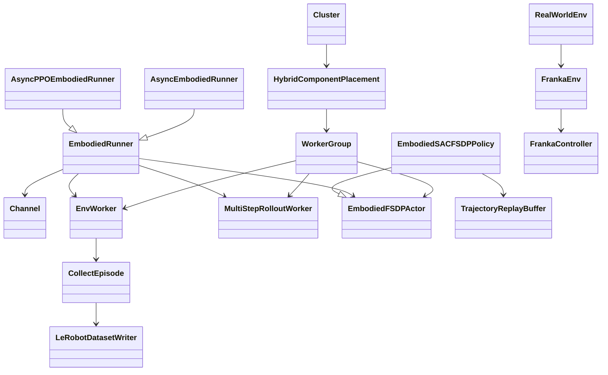

```mermaid
sequenceDiagram
participant Entry as train_embodied_agent.py
participant Cfg as validate_cfg()
participant Cluster as Cluster/Placement
participant Runner as EmbodiedRunner
participant Env as EnvWorker
participant Rollout as MultiStepRolloutWorker
participant Actor as EmbodiedFSDPActor

Entry->>Cfg: 解析 Hydra YAML
Cfg->>Cluster: 校验 world size / placement
Entry->>Cluster: 创建 Cluster
Entry->>Runner: 注入 actor/rollout/env worker groups
Runner->>Actor: init_worker()
Runner->>Rollout: init_worker()
Runner->>Env: init_worker()

loop 每个 global step
Runner->>Actor: sync_model_to_rollout()
Runner->>Rollout: sync_model_from_actor()
par 采样
Runner->>Env: interact()
Runner->>Rollout: generate()
end
Rollout-->>Actor: Trajectory via actor_channel
Runner->>Actor: compute_advantages_and_returns()
Runner->>Actor: run_training()
opt 定期评估
Runner->>Env: evaluate()
Runner->>Rollout: evaluate()
end
opt 定期保存
Runner->>Actor: save_checkpoint()
end
end
```

```mermaid
sequenceDiagram
participant Entry as train_async.py
participant Runner as AsyncEmbodiedRunner
participant Env as AsyncEnvWorker
participant Rollout as AsyncMultiStepRolloutWorker
participant Actor as AsyncEmbodiedSACFSDPPolicy
participant RB as replay_buffer
participant DB as demo_buffer

Entry->>Runner: 创建 AsyncEmbodiedRunner
Runner->>Env: 长生命周期 interact()
Runner->>Rollout: 长生命周期 generate()
Rollout-->>Actor: Trajectory via replay_channel
Actor->>RB: add_trajectories()
Actor->>DB: add intervention trajectories

loop buffer ready 后持续训练
Runner->>Actor: run_training()
Actor->>RB: sample()
alt demo_buffer ready
Actor->>DB: sample()
Actor->>Actor: concat replay/demo 50:50
end
Actor->>Actor: forward_critic()
Actor->>Actor: forward_actor()
Actor->>Actor: soft_update_target_model()
opt 定期同步
Runner->>Rollout: sync weights
end
end
```

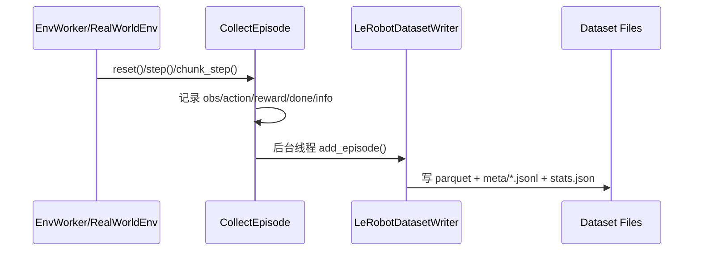

## 逐行需求分析

### 第一阶段：数据收集与管理
- `多源数据采集`：`部分满足`。RLinf 同时覆盖了仿真在线 RL 数据、真机示教/干预数据、以及 demo+online 混合训练数据。仿真侧由 `EnvWorker._setup_env_and_wrappers()` 自动挂 `CollectEpisode`；真机侧有 `examples/embodiment/collect_real_data.py`、`SpacemouseIntervention`；训练侧 `EmbodiedSACFSDPPolicy.recv_rollout_trajectories()` 会把 `Trajectory.extract_intervene_traj()` 提取出的人工干预片段写进 `demo_buffer`。但它没有统一的数据标注、质检、审计平台，所以我评为“部分满足”。

- `数据合成 (PCG)`：`部分满足`。RLinf 没有一个独立的“程序化内容生成平台”，但它通过环境集成提供了局部的 PCG/随机化能力。最明显的是 `rlinf/envs/maniskill/tasks/put_on_in_scene_multi.py` 及其 variants 会随机选择物体、位置、姿态、overlay texture、light/obj_set 等；`SupportedEnvType` 还注册了 `opensora_wm` 和 `wan_wm` 两类世界模型环境。问题是，这更像“环境级随机化”和“学习型模拟器”，不是一个通用的数据合成流水线。

- `多模态数据同步记录`：`部分满足`。RLinf 的在线数据契约相当清晰，`EnvOutput`、`Trajectory`、`EmbodiedRolloutResult` 统一了 `main_images`、`wrist_images`、`extra_view_images`、`states`、`task_descriptions`、`actions`、`rewards`、`dones` 等字段；`CollectEpisode` 会把这些逐步记录下来；`RealWorldEnv` 也把相机帧、机器人状态、语言任务描述包装成统一 observation。问题在于“同步”更多是逻辑同步，不是严格的硬件时间同步；`LeRobotDatasetWriter` 的 `timestamp` 只是 `t / fps`，`Camera` 也是“最新帧队列”而非多传感器硬件时间戳对齐。

- `标准化数据格式与管理`：`部分满足`。这方面 RLinf 最像样的实现是 `CollectEpisode` + `LeRobotDatasetWriter`，可以输出 `pickle` 或 LeRobot 兼容的 Parquet/metadata 目录结构；`merge_distributed_datasets()` 还能把多 rank 数据合并。另一路是 `TrajectoryReplayBuffer` 的轨迹索引和 checkpoint。缺口在于它没有 dataset catalog、版本治理、检索查询、数据筛选服务，所以“格式标准化”强，“数据管理平台化”弱。

- `可扩展性`：`部分满足`。RLinf 的采集和存储路径是可并行扩展的，典型机制包括分布式 `EnvWorker`、按 rank 分目录写数据、LeRobot chunk 化存储、`merge_distributed_datasets()`、以及 replay buffer 的 merge/split 工具。但它没有面向 TB/PB 级数据湖的对象存储抽象、分层存储和检索系统，因此更像“研究集群可扩展”，不是“工业数据平台可扩展”。

- `高吞吐`：`满足`。这条是 RLinf 的强项之一。`CollectEpisode` 用后台线程异步写盘，不阻塞 RL 主循环；`EnvWorker` 支持并行环境和分 stage pipeline；训练链路通过 `Channel`、`WorkerGroup`、`EmbodiedRunner` / `AsyncEmbodiedRunner` 把 env、rollout、actor 解耦。官网和系统论文里强调的 M2Flow、hybrid placement、异步 pipeline，在公开代码里确实落成了 scheduler + placement + channel 这套结构。

- `易用性`：`部分满足`。对已经在 RLinf 体系里的研究者来说，体验不错：很多能力只需要 YAML 开关，例如 `env.data_collection.enabled`、`video_cfg.save_video`、`resume_dir`、`is_lora`。但一旦进入真机、世界模型、OpenPI 数据加载、异构集群，门槛仍然偏高，所以它更像“研究型框架易用”，不是“运营型平台易用”。

- `数据质量与一致性`：`部分满足`。`CollectEpisode` 对 auto-reset 场景的处理很认真，会保留 `final_observation`，避免把 reset 后的观测错记到当前 episode；写盘是单线程顺序写，确定性较好；LeRobot metadata 也比较完整。问题同样出在精确时间同步和自动质检上，尤其真机多相机路径里没有看到硬件时间戳对齐、丢帧检测或完整性校验管线。

### 第二阶段：数据预处理与增强
- `数据清洗与转换`：`部分满足`。RLinf 在“转换”上做得比“清洗”更好。`prepare_actions()` 为不同环境统一动作表示；`GR00T` 的 `modality_config.py` 和 OpenPI data config 会对 state/action 做 normalization；`CollectEpisode` 的 `only_success` 可以过滤失败轨迹。但没有一个独立的 embodied 数据清洗 API 去统一做低质量样本过滤、异常值修复或批量清洗。

- `数据切片与序列化`：`满足`。这条实现得很明确。在线 rollout 会经 `EmbodiedRolloutResult.to_splited_trajectories()` 和 `convert_trajectories_to_batch()` 转成 `[T,B,...]` 训练批次；off-policy 路径通过 `TrajectoryReplayBuffer.sample_chunks()` 按 transition/chunk 采样；世界模型侧 `NpyTrajectoryDatasetWrapper` 还支持 `first_frame`、`last_n_frames`、`closest_timestamp` 等子序列选择策略。

- `数据增强`：`部分满足`。RLinf 有增强，但分散。SAC 路径里 `rlinf/utils/drq.py` 提供了在线随机裁剪；GR00T 数据配置里有 `VideoCrop`、`VideoResize`、`VideoColorJitter`；一些模型 processor 也做 resize/normalize。缺点是没有一个统一、模型无关、可编排的视觉/时序增强框架，也没有通用的“语义增强”或生成式增强模块。

- `模块化处理流程`：`部分满足`。从局部实现看，它是模块化的：`CollectEpisode`、`RecordVideo`、OpenPI dataconfig、GR00T transform、world-model dataset wrapper 都是可组合的。但这些模块并没有抽象成统一的 embodied preprocessing pipeline，因此“模块化存在，但碎片化比较重”。

- `计算效率`：`满足`。这点做得不错。在线增强是 on-the-fly 的，`apply_drq()` 直接在 tensor 上做；`TrajectoryReplayBuffer` 有缓存和 window sampling；`CollectEpisode` 的异步写盘避免了训练停顿；actor/rollout/env 也天然能并行化。所以“在线效率”明显是考虑过的。

- `可复现性`：`部分满足`。训练侧的可复现性比较好，checkpoint 会保存 model/optimizer/RNG，`MetricLogger` 还会把解析后的 config 落到 `tensorboard/config.yaml`。但数据预处理侧没有一个统一的“同样原始数据 + 同样 pipeline 配置 -> 完全相同结果”的全链路保障，尤其跨模型数据加载器时更明显。

- `可配置性`：`部分满足`。RLinf 全局是强配置驱动的，Hydra/YAML 控制几乎所有训练、环境、日志、数据采集行为。问题在于“预处理配置”这块不是统一入口，而是分布在 env wrapper、model dataconfig、dataset wrapper 和 actor model config 里，所以可配置但不集中。

### 第三阶段：模型训练与实验管理
- `支持“IL预训练 + RL微调”范式`：`满足`。这是 RLinf embodied 代码最强的一条。纯 IL/SFT 入口是 `examples/sft/train_vla_sft.py` + `FSDPVlaSftWorker`; RL 微调入口是 `train_embodied_agent.py` / `train_async.py`; 两者通过 checkpoint 路径衔接。更进一步，`EmbodiedFSDPActor` 还支持 `enable_sft_co_train=True` 的 sim-real co-training，把 PPO/RL loss 和 SFT loss 同时训练。

- `支持主流算法`：`部分满足`。在线 RL 这块非常强，明确实现了 `PPO`、`GRPO`、`Async PPO`、`SAC`、`CrossQ`、`RLPD-like hybrid`、`SAC-Flow`、`DSRL`。但需求里点名的 `IQL`、`CQL`、`TD3+BC`，我在 repo 里没搜到实际 embodied 实现或配置，所以“在线强、离线标准算法库不足”。

- `关键技术挑战解决方案`：`部分满足`。RLinf 确实考虑了这些挑战，但不是统一一个模块解决。分布偏移通过 `RLPD` 的 replay/demo 50:50 混合和 `WoVR` 的世界模型思路来缓解；灾难性遗忘通过 `enable_sft_co_train` 的真实数据正则化处理；价值高估通过 `critic_subsample_size`、多 Q head、`agg_q=min`、`CrossQ` 等设计减轻；次优数据利用则通过 `demo_buffer` 和 `Trajectory.extract_intervene_traj()` 把人工干预纳入训练。它在“解决问题”上是强的，但更像一组算法/配置配方，不是单一统一模块。

- `分布式训练与实验管理`：`满足`。`Cluster` 基于 Ray 管理节点和资源，`HybridComponentPlacement` 决定 actor/rollout/env/hardware 的位置，`WorkerGroup.launch()` 负责实际分配 worker，`Channel` 负责通信。实验记录由 `MetricLogger` 接 TensorBoard/W&B/SwanLab，checkpoint/resume 由 runner 和 actor 共同管理。这一块与官网和系统论文的定位是一致的。

- `训练效率与资源利用率`：`满足`。RLinf 的 embodied 主线本质上就是 Actor-Learner 解耦架构，env、rollout、actor 是独立 worker group；同步和异步 runner 都在代码里。GPU 仿真方面支持 ManiSkill、IsaacLab 等；系统层面通过 hybrid placement、disaggregated/collocated 模式、offload、`torch.compile`、cuda graph、异步 pipeline 提升资源利用率。这也是它相对 `VeRL` 这类更偏 LLM RL 框架的主要差异点。

- `灵活性与易用性`：`满足`。`SupportedModel` / `SupportedEnvType` 让模型和环境扩展点比较清晰；`TrajectoryReplayBuffer` 和 `demo_buffer` 让混合专家数据与在线数据变成一等公民；checkpoint、logger、LoRA、co-training、world model env 等都能通过配置切换。缺点是复杂度不低，但从框架能力上说，这条是满足的。

- `容错与恢复`：`满足`。`EmbodiedRunner.init_workers()` 会检查 `resume_dir`，`_save_checkpoint()` 会按 `global_step_N/actor` 保存，SFT 和 FSDP/Megatron 文档也都覆盖了 resume。SAC 还会额外保存 `alpha`、`target_model`、`replay_buffer` 等 SAC-specific 状态。它不是自愈系统，但“断点续训”这一条是明确做到的。

### 第四阶段：模型评估
- `标准化评估基准`：`部分满足`。RLinf 当前明确支持 `ManiSkill`、`LIBERO`、`CALVIN`、`MetaWorld`、`IsaacLab`、`Behavior`、`RoboCasa`、`RoboTwin`、`Habitat`，这已经很强了。问题在于需求表里写的 `RLBench` 我没有在 repo 里找到实现；另外官网 quickstart 主要写的是 `ManiSkill3`，而不是严格的 `ManiSkill2`。所以我评为“部分满足而非完全满足”。

- `定性与定量评估`：`部分满足`。定量部分由 `EnvWorker.evaluate()` + `compute_evaluate_metrics()` 统一聚合，定性部分由 `RecordVideo` 异步录制视频。对 OpenPI 系列，还额外提供了 `toolkits/eval_scripts_openpi`，可以输出比框架内 eval 更细的 per-task/per-difficulty/per-sequence 指标。缺点是自动“报告图表”更多依赖 TensorBoard，而不是框架直接生成规范报告。

- `自动化评估流程`：`大体满足`。同步 runner 的 `val_check_interval` 会在训练中自动触发 `evaluate()`；独立评估也有 `eval_embodied_agent.py` 和 `EmbodiedEvalRunner`。但有两个边界：`AsyncPPOEmbodiedRunner` 明确警告 validation 未实现，`FSDPVlaSftWorker.get_eval_model_output()` 直接是 `NotImplementedError`，所以不能算全覆盖。

- `可复现性`：`大体满足`。评估配置是 YAML 驱动的，`env.seed`、`use_fixed_reset_state_ids`、`eval_rollout_epoch`、`total_num_envs`、`max_episode_steps` 都是显式参数；官方 `vla-eval.rst` 也特别说明了 seed 偏移规则。这比很多研究代码已经规范很多，只是不同 benchmark 的 reproducibility 最终仍受各 env 自身影响。

- `可扩展性`：`满足`。评估不是单线程脚本硬跑，而是走 env worker + rollout worker 的分布式路径；`total_num_envs` 和 component placement 可以并行扩展评估吞吐。真正更细粒度、但更慢的 benchmark 统计，则由 `toolkits/eval_scripts_openpi` 承担。

### 第五阶段：模型部署与微调
- `模型优化与转换`：`部分满足`。RLinf 有 checkpoint convertor，`convert_pt_to_hf.py` 能把 FSDP `.pt` 转成 HuggingFace 格式，也支持 LoRA merge 或只导出 adapter。它还有 LoRA 训练支持。问题是我没有看到具身侧完整的 `PTQ/QAT`、结构化/非结构化剪枝、知识蒸馏工作流，因此只能算“转换与 adapter 导出有，系统级模型压缩没有”。

- `推理引擎编译优化`：`未见明确实现`。我在 repo 里没有找到 `TensorRT`、ONNX 导出后再编译到 engine、算子融合校准之类的 embodied 部署链路。`torch.compile` 存在，但这和 TensorRT 风格的 deployment compiler 不是一回事。

- `硬件无关的部署接口`：`部分满足`。RLinf 的 scheduler/hardware 抽象是比较先进的，`WorkerInfo` / `HardwareInfo` / node_group/hardware placement 已经把机器人当成一类一等资源；`RealWorldEnv` 也把真机交互包成 gym 风格 env。问题在于当前公开实现仍然高度 `Franka + ROS1 + RealSense + SpaceMouse` 定制化，没有看到通用 ROS2 bridge、统一 policy service、真正“一次编写，到处运行”的部署接口层。

- `高效在线微调`：`部分满足`。`LoRA` 已明确支持，`get_model()` 会对 OpenPI/OpenVLA 等模型注入 PEFT adapter，convertor 还能 merge/save adapter；这对在线微调很有价值。问题是 `QLoRA` 没找到，量化感知的 PEFT 路径也没看到，所以我只能给“部分满足”。

- `低延迟`：`部分满足`。从真机代码看，`FrankaEnv.step_frequency` 默认 `10Hz`，`bottle` 任务甚至显式用 `5Hz`，已经落在需求表说的 `5-20Hz` 区间；异步 pipeline 也能把数据生成、训练、同步解耦。问题是没有一个统一的 latency benchmark 或部署 SLA，因此是“能达到研究控制频率”，不是“系统级低延迟保证”。

- `鲁棒性与可靠性`：`部分满足`。可靠性方面有不少具体设计：`RealWorldEnv.realworld_setup()` 用 file lock 保证节点级 ROS 启动，`FrankaController` 支持 `clear_errors()`、`reset_joint()`、`start_impedance()`，相机断流会自动 reopen，训练侧有 checkpoint/resume。问题是还缺少更偏生产的 watchdog、心跳监控、独立 supervisor 和故障隔离机制。

- `安全性`：`部分满足`。这条 RLinf 显然考虑过。`FrankaEnv._clip_position_to_safety_box()` 会把动作裁到安全盒内，`franka_bin_relocation.py` 甚至有 inner safety box 防止撞 bin 壁，reset/go_to_rest 里也有避障逻辑；观测中也采了 `tcp_force` / `tcp_torque`。但我没有看到基于力/力矩阈值的自动急停、独立安全监控器或更通用的 collision watchdog，所以是“研究级安全防护有，工业级安全机制不足”。

## 关键文件与调用关系

- `入口与配置`
  `examples/embodiment/train_embodied_agent.py` / `examples/embodiment/train_async.py` / `examples/sft/train_vla_sft.py`  
  `->` `rlinf/config.py` `validate_cfg()`  
  `->` 形成 sync RL、async RL、SFT 三条主入口。

- `调度与放置`
  `rlinf/scheduler/cluster/cluster.py`  
  `->` `rlinf/utils/placement.py`  
  `->` `rlinf/scheduler/worker/worker_group.py`  
  `->` 按 node_group / accelerator / robot hardware 启动 worker groups。

- `训练主循环`
  `rlinf/runners/embodied_runner.py`  
  `->` `rlinf/workers/env/env_worker.py` `interact()`  
  `->` `rlinf/workers/rollout/hf/huggingface_worker.py` `generate()`  
  `->` `rlinf/workers/actor/fsdp_actor_worker.py` `recv_rollout_trajectories()`  
  `->` `rlinf/algorithms/registry.py` `calculate_adv_and_returns()` / `policy_loss()`  
  `->` `rlinf/algorithms/advantages.py` / `rlinf/algorithms/losses.py`

- `异步 off-policy / RLPD / DSRL / CrossQ`
  `rlinf/runners/async_embodied_runner.py`  
  `->` `rlinf/workers/actor/async_fsdp_sac_policy_worker.py`  
  `->` `rlinf/workers/actor/fsdp_sac_policy_worker.py`  
  `->` `rlinf/data/replay_buffer.py`  
  `->` `rlinf/data/embodied_io_struct.py`

- `在线数据契约`
  `rlinf/data/embodied_io_struct.py`  
  `->` `EnvOutput` 定义 env 到 rollout 的 observation/reward/done 契约  
  `->` `EmbodiedRolloutResult` 收集 chunk step  
  `->` `Trajectory` 作为 actor/replay buffer 的统一载体

- `数据采集与导出`
  `rlinf/workers/env/env_worker.py`  
  `->` `rlinf/envs/wrappers/collect_episode.py`  
  `->` `rlinf/data/lerobot_writer.py`  
  `->` 输出 `pickle` 或 LeRobot 数据集

- `评估`
  `examples/embodiment/eval_embodied_agent.py`  
  `->` `rlinf/runners/embodied_eval_runner.py`  
  `->` `EnvWorker.evaluate()` + `MultiStepRolloutWorker.evaluate()`  
  `->` `rlinf/utils/metric_utils.py` `compute_evaluate_metrics()`

- `真实机器人`
  `rlinf/envs/realworld/realworld_env.py`  
  `->` `rlinf/envs/realworld/franka/franka_env.py`  
  `->` `rlinf/envs/realworld/franka/franka_controller.py`  
  `->` ROS1 / Franka / RealSense / SpaceMouse 真实交互链路

- `PEFT 与导出`
  `rlinf/models/__init__.py`  
  `->` LoRA 注入 / 加载  
  `->` `rlinf/utils/ckpt_convertor/fsdp_convertor/convert_pt_to_hf.py`  
  `->` full model 或 LoRA adapter 导出

## 最后判断
如果把需求表当成“一个完整具身智能 VLA 系统 pipeline”的 checklist，那么 RLinf 已经非常像其中的“训练内核 + 评估内核 + 一部分真机在线学习内核”。它最成熟的是：

- 分布式训练、异步/同步 RL、VLA 模型接入、sim-real co-training、LoRA、RLPD、世界模型 RL、标准 benchmark 评估。
- 这部分和官网、`RLinf` 系统论文、`RLinf-VLA`、`RLinf-Co`、`πRL`、`WoVR`、`RLinf-USER` 的叙述基本一致。

它相对薄弱的是：

- 数据平台层：统一数据治理、版本、检索、清洗、严格时间同步。
- 生产部署层：TensorRT/ONNX/量化/QLoRA/服务化/ROS2/工业级 safety supervisor。

所以更准确地说，RLinf 不是“从数据湖到机器人线上部署全都做完”的大一统系统，而是一个已经把“具身 RL/VLA 训练与评估主干”打通得非常深、并开始向真机在线学习延伸的研究型基础设施。

这些判断基于源码、官方文档和论文页面的交叉阅读，没有实际跑完整训练作业或真机任务。如果你需要，我可以下一步把这份分析直接整理成一份新的中文 Markdown 报告，写到 `docs/` 下面，或者进一步只展开某一个阶段，比如“第三阶段训练内核”或“第五阶段真机部署边界”。

---

**User**

请以GR00T-N1.5模型在仿真环境中和在真机环境中的 online 和 offline 强化学习训练为主线, 进一步展开和深入分析RLinf的设计与实现, 同时画出相关的关键类图和时序图, 并列出关键的代码文件及其调用关系.

---

**Cursor**

我会以 `GR00T-N1.5` 为中心重新梳理一遍 RLinf 的 embodied 主线，先确认它在仓库里实际支持了哪些仿真环境、哪些算法路径，以及真机/离线 RL 这两条线到底是“已实现”“可扩展”还是“论文提及但公开代码未落地”。

我目前看到仓库里 `GR00T` 的公开配置主要落在 `LIBERO` 和 `IsaacLab` 的 PPO / Async PPO 仿真训练上，暂时还没看到对应的真机配置或 RLPD/SAC 配置。接下来我会直接核对 `GR00T` 模型类本身是否具备 critic / Q-head / SAC 所需接口，以及文档里是否把这条链路公开出来。

我已经确认了一点关键边界：公开仓库里没有 `GR00T` 的真机 YAML，也没有 `GR00T` 对接 `realworld` 环境或 `RLinf-USER` 文档的代码证据；与此同时，`GR00T` 模型类只暴露了 PPO/actor-critic 所需的 value head 路径，没有公开的 SAC/Q-head 接口。这意味着后面关于“真机”和“offline RL”我会分成“当前公开实现支持什么”与“按框架设计理论上如何扩展”两层来讲。

`GR00T` 的模型接入方式也很有特点：它不是像 OpenVLA 那样直接吃统一 `forward_inputs`，而是先把 RLinf 的 env obs 转成 GR00T 自己的 modality schema，再生成 `eagle_input_ids / eagle_pixel_values / state / embodiment_id / chains / denoise_inds` 这套中间表示。为了把这条转换链讲清楚，我还要补看一下 `LIBERO` 和 `IsaacLab` 环境在 RLinf 里是怎么产出观测字段的。

我还差最后一个关键点要核实：`GR00T` 在 RLinf 里到底注册了哪些 `EmbodimentTag`。如果标签层面只包含 `libero_franka / isaaclab_franka / maniskill_widowx`，那就能比较严格地说明为什么公开代码里没有真机 `GR00T` 训练线。

我已经把 `GR00T` 的“能力边界”查清了：仿真 `online PPO/Async PPO` 是明确落地的，`offline RL` 和 `真机 GR00T` 在公开代码里都没有形成可运行主线。最后我再补几段关键源码片段，用来把这些判断和类图/时序图里的节点一一对上。

以下分析以当前公开的 RLinf 仓库为准。我先把“offline”说清楚：如果严格按“离线数据直接做 RL 更新（如 SAC/RLPD/CQL/IQL 一类）”来定义，GR00T 在公开代码里并没有这条主线；如果把“离线示教/SFT 预训练，然后再做 online RL”也算进更广义的 offline 阶段，那么 GR00T 的公开路径是明确依赖这一步的。

## 结论矩阵
| 场景 | 公开代码状态 | 主算法主线 | 结论 |
| --- | --- | --- | --- |
| 仿真 `online RL` | 已实现 | `PPO`、`Async PPO` | 这是 GR00T 在 RLinf 中最完整、最成熟的主线 |
| 仿真 `offline RL` | 未实现（严格意义） | 无公开 `SAC/RLPD/CrossQ` for GR00T | 公开代码只支持“先离线 SFT，再 online PPO” |
| 真机 `online RL` | 框架层可承载，但 GR00T 适配未公开 | 无公开 `GR00T + RealWorldEnv` 配置/文档 | RLinf 有真机基础设施，但没有交付 GR00T 真机主线 |
| 真机 `offline RL` | 未实现 | 无公开 `GR00T + demo_buffer/replay_buffer` 主线 | 这是距离可运行最远的一条 |

一句话概括：**RLinf 对 GR00T 的公开支持是 `simulation-first`、`PPO-first`、`adapter-driven`。**  
它把 GR00T 很深地接进了通用的 env/rollout/actor 分布式训练骨架里，但没有把 GR00T 延伸到公开可用的真机训练和 off-policy/offline RL。

## GR00T 接入层设计
RLinf 对 GR00T 的设计，不是为它单独写一套 runner，而是把它做成一个“模型适配层”。也就是说，`EmbodiedRunner`、`AsyncPPOEmbodiedRunner`、`EnvWorker`、`MultiStepRolloutWorker`、`EmbodiedFSDPActor` 这些系统骨架与 OpenVLA/OpenPI 共享，GR00T 的差异主要被收敛到 4 个地方：

- `embodiment tag`：决定用哪一套 GR00T 的 state/action projector、数据 schema、metadata。
- `obs/action converter`：把 RLinf 统一的 env 输出字段映射成 GR00T 的 modality 输入，再把 GR00T 的 action chunk 映回具体环境动作。
- `flow-matching RL head`：GR00T 不是自回归策略，它在 rollout 阶段会生成 denoising chain，并把 `chains`、`denoise_inds`、`prev_logprobs`、`prev_values` 一起返还给 actor。
- `generic PPO actor`：actor 侧仍然走 RLinf 的通用 PPO / async PPO 训练循环，只是把 `prev_logprobs` 和 diffusion chain 重新喂回 GR00T 来重算 log-prob。

最关键的第一层是 `EmbodimentTag`。它直接暴露了一个事实：**公开代码里只有仿真标签，没有真机标签。**

```19:59:rlinf/models/embodiment/gr00t/embodiment_tags.py
class EmbodimentTag(Enum):
    GR1 = "gr1"
    OXE_DROID = "oxe_droid"
    AGIBOT_GENIE1 = "agibot_genie1"
    LIBERO_FRANKA = "libero_franka"
    MANISKILL_WIDOWX = "maniskill_widowx"
    ISAACLAB_FRANKA = "isaaclab_franka"

EMBODIMENT_TAG_MAPPING = {
    EmbodimentTag.LIBERO_FRANKA.value: 31,
    EmbodimentTag.OXE_DROID.value: 17,
    EmbodimentTag.AGIBOT_GENIE1.value: 26,
    EmbodimentTag.GR1.value: 24,
    EmbodimentTag.MANISKILL_WIDOWX.value: 30,
    EmbodimentTag.ISAACLAB_FRANKA.value: 31,
}
```

这里有两个很重要的设计点。

第一，`LIBERO_FRANKA` 和 `ISAACLAB_FRANKA` 都映射到 projector `31`，而且 loader 还会让两者共用 `LiberoFrankaDataConfig`。这说明 RLinf 把“环境”与“本体”拆开了：`IsaacLab` 和 `LIBERO` 虽然是不同 simulator，但在 GR00T 视角里它们都属于同一种 `Franka` 具身数据接口。

第二，没有 `realworld_franka` 或类似标签。这不是小细节，而是公开代码为什么没有 GR00T 真机主线的第一道硬边界。

第二层是 env I/O 转换。RLinf 的 env 统一对外输出 `main_images`、`wrist_images`、`states`、`task_descriptions`，而 GR00T 内部吃的是 `video.image`、`video.wrist_image`、`state.x/y/z/...`、`annotation.human.action.task_description`。这层转换全部放在 `simulation_io.py`。

```20:153:rlinf/models/embodiment/gr00t/simulation_io.py
def convert_libero_obs_to_gr00t_format(env_obs):
    groot_obs["video.image"] = env_obs["main_images"].unsqueeze(1).numpy()
    groot_obs["video.wrist_image"] = env_obs["wrist_images"].unsqueeze(1).numpy()
    groot_obs["state.x"] = env_obs["states"].unsqueeze(1)[:, :, 0:1].numpy()
    # ... more state fields ...
    groot_obs["annotation.human.action.task_description"] = env_obs["task_descriptions"]
    return groot_obs

def convert_maniskill_obs_to_gr00t_format(env_obs):
    # TODO(lx): If we have a dataset on maniskill, resize can be avoided.
    env_obs["main_images"] = cut_and_resize_images(...)
    groot_obs["video.ego_view"] = env_obs["main_images"].unsqueeze(1).numpy()
    groot_obs["state.left_arm"] = np.zeros((env_obs["main_images"].shape[0], 1, 7))
    groot_obs["annotation.human.action.task_description"] = env_obs["task_descriptions"]
    return groot_obs

OBS_CONVERSION = {
    "maniskill": convert_maniskill_obs_to_gr00t_format,
    "libero": convert_libero_obs_to_gr00t_format,
    "isaaclab_stack_cube": convert_libero_obs_to_gr00t_format,
}
ACTION_CONVERSION = {
    "libero": convert_to_libero_action,
    "maniskill": convert_to_maniskill_action,
    "isaaclab_stack_cube": convert_to_isaaclab_stack_cube_action,
}
```

这段代码又能读出三个事实。

- `LIBERO` 和 `IsaacLab stack_cube` 共享同一套 observation conversion，只在 action conversion 上区分 gripper 语义。
- `ManiSkill/WidowX` 有预留路径，但成熟度明显低于 `LIBERO/IsaacLab`，因为还带着 TODO，而且 state 直接用零填充。
- 没有 `realworld` converter。这是 GR00T 真机路径缺失的第二道硬边界。

第三层是 GR00T 自己的 `predict_action_batch()`。这是整个公开实现里最有“GR00T 特征”的地方，因为它不仅输出环境动作，还把 RL 训练所需的 diffusion 轨迹中间量一起打包回去。

```563:684:rlinf/models/embodiment/gr00t/gr00t_action_model.py
@torch.no_grad()
def predict_action_batch(
    self,
    env_obs,
    mode: Literal["train", "eval"] = "train",
    **kwargs,
):
    env_obs["states"] = env_obs["states"].to(torch.bfloat16)
    env_obs["states"] = env_obs["states"].cpu().float()

    observations = self.obs_convert_fn(env_obs)
    obs_copy = observations.copy()
    normalized_input = self.apply_transforms(obs_copy)

    normalized_action, result = self._get_rl_action(normalized_input, mode=mode)
    unnormalized_action = self._get_unnormalized_action(normalized_action)
    raw_action = self.action_convert_fn(
        unnormalized_action, chunk_size=self.output_action_chunks
    )
    return raw_action, result

def _get_rl_action(
    self,
    normalized_input: dict[str, Any],
    mode: Literal["train", "eval"] = "train",
):
    backbone_inputs, action_inputs = self.prepare_input(normalized_input)
    backbone_outputs = self.backbone(backbone_inputs)
    action_head_outputs, rlinf_outputs = self.action_head.get_rl_action(
        backbone_outputs, action_inputs, mode=mode
    )

    forward_inputs = {
        "chains": rlinf_outputs["chains"],
        "denoise_inds": rlinf_outputs["denoise_inds"],
        **normalized_input,
    }
    result = {
        "prev_logprobs": rlinf_outputs["prev_logprobs"],
        "prev_values": rlinf_outputs["prev_values"],
        "forward_inputs": forward_inputs,
    }
    return actions, result
```

这意味着 RLinf 对 GR00T 不是“把模型塞进 rollout 就完事了”，而是专门围绕 flow-matching 设计了一个 PPO 兼容接口：rollout 时保留 denoising chain，actor 时再用这些 chain 重算 log-prob。这是它能把 GR00T 纳入通用 PPO 框架的核心。

### 关键类图一：GR00T 模型适配层
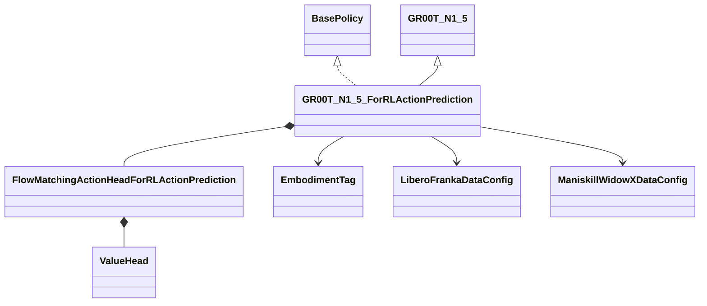

### 关键类图二：GR00T 运行时骨架
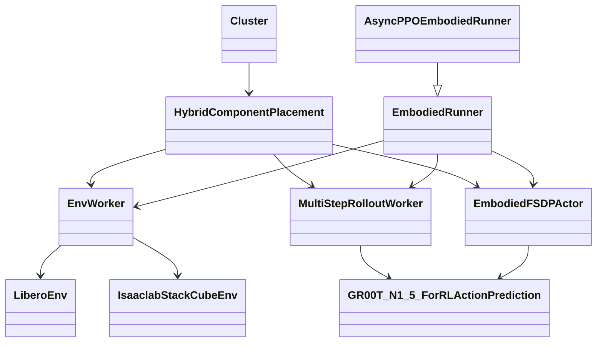

## 四条训练主线

### 仿真 `online RL`
这是公开代码里唯一完整打通的 GR00T 主线，而且是明确的 `PPO-first` 设计。

已交付的公开配置主要有：

- `examples/embodiment/config/libero_spatial_ppo_gr00t.yaml`
- `examples/embodiment/config/libero_object_ppo_gr00t.yaml`
- `examples/embodiment/config/libero_goal_ppo_gr00t.yaml`
- `examples/embodiment/config/libero_10_ppo_gr00t.yaml`
- `examples/embodiment/config/libero_goal_async_ppo_gr00t.yaml`
- `examples/embodiment/config/isaaclab_franka_stack_cube_ppo_gr00t.yaml`
- `examples/embodiment/config/isaaclab_franka_stack_cube_ppo_gr00t_2.yaml`

这里又可以分成两条。

第一条是同步 PPO。入口是 `examples/embodiment/train_embodied_agent.py`，runner 是 `rlinf/runners/embodied_runner.py`，actor 是 `EmbodiedFSDPActor`，loss 是 `actor_critic`。这条线在 `LIBERO` 和 `IsaacLab` 都有官方示例。

第二条是异步 PPO。入口是 `examples/embodiment/train_async.py`，runner 是 `rlinf/runners/async_ppo_embodied_runner.py`，actor 是 `AsyncPPOEmbodiedFSDPActor`，loss 是 `decoupled_actor_critic`。公开示例目前我只看到了 `libero_goal_async_ppo_gr00t.yaml` 这一条。

系统层面，RLinf 没有因为 GR00T 另起炉灶。env 还是 `EnvWorker`，rollout 还是 `MultiStepRolloutWorker`，actor 还是 `EmbodiedFSDPActor`。GR00T 的特殊性只体现在 model adapter 和 `prev_logprobs/chains/denoise_inds` 这组训练中间量上。

actor 侧如何把 GR00T 接进 PPO，非常清楚：

```1368:1425:rlinf/workers/actor/fsdp_actor_worker.py
kwargs = {}
if SupportedModel(self.cfg.actor.model.model_type) in [
    SupportedModel.OPENVLA,
    SupportedModel.OPENVLA_OFT,
]:
    kwargs["temperature"] = self.cfg.algorithm.sampling_params.temperature_train
    kwargs["top_k"] = self.cfg.algorithm.sampling_params.top_k
elif SupportedModel(self.cfg.actor.model.model_type) == SupportedModel.GR00T:
    kwargs["prev_logprobs"] = prev_logprobs

output_dict = self.model(
    forward_inputs=forward_inputs,
    compute_logprobs=True,
    compute_entropy=self.cfg.algorithm.entropy_bonus > 0,
    compute_values=compute_values,
    use_cache=False,
    **kwargs,
)

if SupportedModel(self.cfg.actor.model.model_type) == SupportedModel.GR00T:
    prev_logprobs = output_dict["prev_logprobs"]

kwargs = {
    "loss_type": self.cfg.algorithm.loss_type,
    "logprob_type": self.cfg.algorithm.logprob_type,
    "reward_type": self.cfg.algorithm.reward_type,
    "logprobs": output_dict["logprobs"],
    "values": output_dict.get("values", None),
    "old_logprobs": prev_logprobs,
    "advantages": advantages,
    "returns": returns,
    "prev_values": prev_values,
    # ... PPO / value-clip / mask args ...
}
loss, metrics_data = policy_loss(**kwargs)
```

这里的深层含义是：

- RLinf 用 `GR00T` 返回的 `prev_logprobs` 替换传统 PPO 里更简单的 old logprobs。
- 这一步是为了把 diffusion denoising 过程里的随机性和采样步骤保留下来。
- 所以 GR00T 在 RLinf 中不是“直接套 PPO”，而是“通过 model adapter 把 diffusion policy 伪装成 PPO 可训练接口”。

还有两个工程细节也很重要。

- `GR00T` 官方文档页和公开 YAML 都明显是 `PPO` 主线，`GRPO` 还在 testing，公开 repo 里没有 GR00T 的稳定 GRPO recipe。
- shipped GR00T configs 基本把 `entropy_bonus` 设成 `0`。这和 `GR00T_N1_5_ForRLActionPrediction.default_forward()` 返回 `entropy=None` 是一致的，说明当前公开实现实际走的是“无显式 entropy bonus”的 PPO 变体。

### 仿真 `online RL` 时序图：同步 PPO
```mermaid
sequenceDiagram
participant Entry as train_embodied_agent.py
participant Runner as EmbodiedRunner
participant Env as LiberoEnv / IsaaclabStackCubeEnv
participant Rollout as MultiStepRolloutWorker
participant GR00T as GR00T_N1_5_ForRLActionPrediction
participant Actor as EmbodiedFSDPActor

Entry->>Runner: create actor/rollout/env groups
loop each global step
Runner->>Env: interact()
Env-->>Rollout: main_images / wrist_images / states / task_descriptions
Rollout->>GR00T: predict_action_batch(env_obs, mode="train")
GR00T->>GR00T: obs_convert_fn + modality_transform
GR00T->>GR00T: action_head.get_rl_action()
GR00T-->>Rollout: actions + prev_logprobs + prev_values + forward_inputs(chains, denoise_inds)
Rollout-->>Env: action chunks
Env-->>Rollout: rewards / dones / final_obs
Rollout-->>Actor: Trajectory
Runner->>Actor: compute_advantages_and_returns()
Actor->>GR00T: default_forward(forward_inputs, prev_logprobs)
GR00T->>GR00T: recompute logprobs from stored denoising chain
GR00T-->>Actor: logprobs + values
Actor->>Actor: PPO actor_critic loss
end
```

### 仿真 `online RL` 时序图：异步 PPO
```mermaid
sequenceDiagram
participant Entry as train_async.py
participant Runner as AsyncPPOEmbodiedRunner
participant Env as AsyncEnvWorker
participant Rollout as AsyncMultiStepRolloutWorker
participant GR00T as GR00T_N1_5_ForRLActionPrediction
participant Actor as AsyncPPOEmbodiedFSDPActor

Entry->>Runner: start long-lived env/rollout
Env-->>Rollout: continuous env_output
Rollout->>GR00T: predict_action_batch(mode="train")
GR00T-->>Rollout: actions + prev_logprobs + forward_inputs
Rollout-->>Actor: rollout batch with versions

loop each learner step
Runner->>Actor: recv_rollout_trajectories()
Runner->>Actor: compute_proximal_logprobs()
Actor->>GR00T: default_forward(forward_inputs, prev_logprobs)
Runner->>Actor: compute_advantages_and_returns()
Runner->>Actor: run_training()
Actor->>Actor: decoupled PPO loss with proximal_logprobs / versions
Runner->>Rollout: sync weights
end
```

### 仿真 `offline RL`
如果“offline RL”按严格定义，公开 GR00T 路径是不支持的。

原因不在 scheduler，也不在 replay buffer，而在 **模型算法接口层**。

RLinf 的 off-policy / offline RL 主线是 `EmbodiedSACFSDPPolicy`、`AsyncEmbodiedSACFSDPPolicy`、`TrajectoryReplayBuffer`、`demo_buffer`、`RLPD` 那条链。但公开 GR00T model adapter 没有实现 SAC/Q-learning 所需的接口。它只实现了 `ForwardType.DEFAULT` 的 PPO 路径。

```493:497:rlinf/models/embodiment/gr00t/gr00t_action_model.py
def forward(self, forward_type=ForwardType.DEFAULT, **kwargs):
    if forward_type == ForwardType.DEFAULT:
        return self.default_forward(**kwargs)
    else:
        raise NotImplementedError
```

我在 `rlinf/workers/actor/fsdp_sac_policy_worker.py` 和 `rlinf/workers/actor/async_fsdp_sac_policy_worker.py` 里也没有看到 `GR00T` 分支。这说明问题非常具体：

- RLinf 的 off-policy 框架本身是现成的。
- 但 GR00T 没有 `sac_forward`、`sac_q_forward`、`q_head` 这一套实现。
- 因此不能进入 `SAC`、`RLPD`、`CrossQ`、`demo_buffer + replay_buffer` 的训练闭环。

不过，如果把“offline”放宽成“先离线 SFT，再 online RL”，那又是成立的。GR00T 的公开 recipe 明确依赖一个已经 few-shot SFT 过的 checkpoint，而且还要求携带 `experiment_cfg/metadata.json`。这就是为什么 `docs/.../gr00t.rst` 和 `docs/.../isaaclab.rst` 都先让你下载 `RLinf-Gr00t-SFT-*` 模型，再启动 PPO。

所以更准确的说法是：

- **严格 offline RL**：GR00T 未公开实现。
- **offline SFT / demo pretraining + online PPO**：GR00T 明确支持，而且是前置条件。

### 真机 `online RL`
这里要把“框架支持”和“GR00T 支持”分开看。

RLinf 框架本身对真机 `online RL` 支持很深。`RealWorldEnv`、`FrankaEnv`、`FrankaController`、Franka hardware scheduler、异构 node_group、SpaceMouse intervention、keyboard reward、demo collection、async runner，这些都是真实存在的。

但这些是真机基础设施，不等于 “GR00T 真机路径已经打通”。

以公开代码为准，GR00T 真机 `online RL` 没有形成可运行主线，证据有三层：

- `EmbodimentTag` 里没有 `realworld_franka`。
- `simulation_io.py` 里没有 `OBS_CONVERSION["realworld"]` 或 `ACTION_CONVERSION["realworld"]`。
- `examples/embodiment/config/realworld*.yaml`、`docs/source-en/rst_source/examples/embodied/franka.rst`、`docs/source-en/rst_source/publications/rlinf_user.rst` 里都没有 `gr00t` 入口。

所以对 GR00T 来说，**真机 online RL 的缺口主要在 adapter/data 层，而不是 runner 层**。换句话说：

- `EmbodiedRunner` / `AsyncPPOEmbodiedRunner` 这套系统骨架其实已经够用了。
- 真正缺的是 `realworld_franka` 的 `EmbodimentTag`、对应 `DataConfig`、`obs_converter_type`、action converter，以及一套公开的真实数据 metadata。

这和 off-policy 缺口的位置不一样。off-policy 是模型算法接口缺口；真机 online 是 embodiment/I-O glue 缺口。

### 真机 `offline RL`
这一条是最不支持的，因为它叠加了两层缺口：

- 真机 adapter 缺口：没有 `realworld_franka` 的 tag / converter / config / metadata。
- off-policy 模型缺口：没有 `SAC/Q-head` 接口，无法进入 `RLPD` / `demo_buffer` / `replay_buffer` 主线。

所以虽然 RLinf 公开 repo 的真机 offline/hybrid RL 对 `CNN_POLICY`、`FLOW_POLICY`、部分 VLA 路线是存在的，但 **GR00T 并不能直接复用**。

### 为什么当前 `realworld/offline GR00T` 会卡住
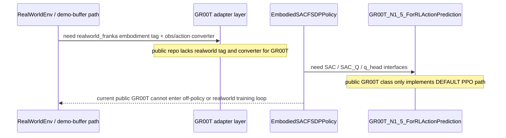

## 关键文件与调用关系

- `examples/embodiment/train_embodied_agent.py`
  `->` `rlinf/config.py`
  `->` `Cluster` / `HybridComponentPlacement`
  `->` `EmbodiedRunner`
  这是 GR00T 同步 PPO 的总入口。

- `examples/embodiment/train_async.py`
  `->` `AsyncPPOEmbodiedRunner`
  `->` `AsyncPPOEmbodiedFSDPActor`
  这是 GR00T 异步 PPO 的总入口。

- `examples/embodiment/config/model/gr00t.yaml`
  `->` 定义 `obs_converter_type`、`embodiment_tag`、`num_action_chunks`、`denoising_steps`、`rl_head_config.noise_method`、`disable_dropout`
  这是用户侧最核心的 GR00T 配置入口。

- `rlinf/models/embodiment/gr00t/embodiment_tags.py`
  `->` 决定 GR00T 认为自己在什么 embodiment family 上工作
  `->` 也是公开真机缺口最直接的证据文件。

- `rlinf/models/embodiment/gr00t/modality_config.py`
  `->` `LiberoFrankaDataConfig`
  `->` `ManiskillWidowXDataConfig`
  `->` 把数据 schema、变换、normalization 固化下来。

- `rlinf/models/embodiment/gr00t/__init__.py`
  `->` 根据 `embodiment_tag` 选择 `DataConfig`
  `->` 调 `GR00T_N1_5_ForRLActionPrediction.from_pretrained()`
  `->` 加载 `metadata.json`
  这是 GR00T adapter 的装配器。

- `rlinf/models/embodiment/gr00t/simulation_io.py`
  `->` `OBS_CONVERSION`
  `->` `ACTION_CONVERSION`
  这是 simulator-specific glue layer，也是公开代码里没有 realworld mapping 的位置。

- `rlinf/models/embodiment/gr00t/gr00t_action_model.py`
  `->` `predict_action_batch()`
  `->` `default_forward()`
  `->` `FlowMatchingActionHeadForRLActionPrediction`
  这是 GR00T 与 RLinf PPO 闭环真正结合的核心文件。

- `rlinf/workers/rollout/hf/huggingface_worker.py`
  `->` `self.hf_model.predict_action_batch(env_obs, mode=...)`
  `->` 收集 `prev_logprobs`、`prev_values`、`forward_inputs`
  这是 rollout 侧把 GR00T 从“模型”变成“可交互策略”的地方。

- `rlinf/workers/actor/fsdp_actor_worker.py`
  `->` `self.model(forward_inputs=..., prev_logprobs=...)`
  `->` `policy_loss()`
  这是 actor 侧把 GR00T 的 diffusion chain 重新解释成 PPO log-prob/value 的地方。

- `rlinf/workers/actor/async_ppo_fsdp_worker.py`
  `->` `compute_proximal_logprobs()`
  `->` `decoupled_actor_critic`
  这是 GR00T 异步 PPO 的关键文件。

- `rlinf/envs/libero/libero_env.py`
  `->` 统一产出 `main_images`、`wrist_images`、`states`、`task_descriptions`
  GR00T 在 LIBERO 上能工作，很大程度靠这个统一观察接口。

- `rlinf/envs/isaaclab/tasks/stack_cube.py`
  `->` 同样产出 `main_images`、`wrist_images`、`states`、`task_descriptions`
  这使 `IsaacLab` 也能挂上同一条 GR00T PPO 主线。

- `rlinf/workers/actor/fsdp_sac_policy_worker.py`
  `->` RLinf 的 off-policy / replay-buffer / RLPD 主线
  `->` 但没有 GR00T 分支
  这是“为什么 strict offline RL 对 GR00T 未实现”的关键参照文件。

- `rlinf/envs/realworld/realworld_env.py` 与 `rlinf/envs/realworld/franka/franka_env.py`
  `->` RLinf 真机运行时底座
  `->` 但没有 GR00T 对接层
  这是“为什么真机 RLinf 能跑，但 GR00T 还不能直接跑”的关键参照文件。

最值得记住的判断有两个。

- **GR00T 的公开主线不是“all-purpose embodied RL support”，而是“simulation PPO integration support”。**
- **GR00T 公开缺口分成两层：真机缺 adapter，offline/off-policy 缺算法接口。**

如果你愿意，我下一步可以继续只沿着一个方向展开，比如把“`GR00T + LIBERO/IsaacLab online PPO` 的完整调用栈”画成更细的逐函数调用图，或者专门写一节“要把 GR00T 接到 RLinf 真机/离线 RL 主线，最少还缺哪些类和接口”。

---

**User**

把“GR00T + LIBERO/IsaacLab online PPO 的完整调用栈”画成更细的逐函数调用图，然后专门写一节“要把 GR00T 接到 RLinf 真机/离线 RL 主线，最少还缺哪些类和接口”。

---

**Cursor**

我会把同步 PPO 和异步 PPO 都拆成“入口脚本 -> runner -> worker -> model wrapper -> env”这几层，补齐逐函数调用栈；同时把“真机/离线 RL 还差什么”压缩成一份最小改造清单，明确到类、接口和配置项。

我再补一下 `IsaacLab` 这边 `chunk_step/reset/step` 是落在哪个基类里，这样调用图里就能把 `LIBERO` 和 `IsaacLab` 两个分支都标到具体函数名，而不是只写抽象的 `env.chunk_step()`。

下面这版只聚焦你点的两件事：

1. 把 `GR00T + LIBERO/IsaacLab online PPO` 拆到“逐函数”级别。
2. 单独说明：如果要把 `GR00T` 接到 RLinf 的 `真机 / 离线 RL` 主线，最少还缺哪些类和接口。

先给结论：

- 当前公开仓库里，`GR00T` 的已交付主线是 `仿真 + PPO`，其中 `LIBERO` 有同步 PPO 和异步 PPO，`IsaacLab` 有同步 PPO。
- `GR00T` 并不是单独的一套 runner，它是被接进 RLinf 的通用 `EnvWorker -> RolloutWorker -> ActorWorker -> Runner` 骨架里的。
- 要接入真机，主要缺的是 `embodiment/data adapter`。
- 要接入离线/off-policy RL，主要缺的是 `SAC/Q-learning model interface`，其次才是 offline-only 的 runner 或 replay prefill。

## 在线 PPO 的逐函数调用图

### 1. 系统级主链：同步 PPO
这条链同时适用于 `GR00T + LIBERO PPO` 和 `GR00T + IsaacLab PPO`。区别主要发生在环境 obs 的构造和 action 的回写上。

```mermaid
flowchart TD
    A["`examples/embodiment/train_embodied_agent.py::main()`"] --> B["`rlinf/config.py::validate_cfg()`"]
    B --> C["`Cluster(...)`"]
    C --> D["`HybridComponentPlacement(...)`"]
    D --> E["`EmbodiedFSDPActor.create_group().launch()`"]
    D --> F["`MultiStepRolloutWorker.create_group().launch()`"]
    D --> G["`EnvWorker.create_group().launch()`"]
    E --> H["`EmbodiedRunner.init_workers()`"]
    F --> H
    G --> H
    H --> I["`EmbodiedRunner.run()`"]

    I --> J["`EmbodiedRunner.update_rollout_weights()`"]
    I --> K["`EnvWorker.interact()`"]
    I --> L["`MultiStepRolloutWorker.generate()`"]
    L --> L1["`generate_one_epoch()`"]
    K --> K1["`bootstrap_step()`"]
    K1 --> K2["`send_env_batch()`"]
    L1 --> L2["`recv_env_output()`"]
    L2 --> L3["`get_dones_and_rewards()`"]
    L3 --> L4["`predict()`"]
    L4 --> M["`GR00T.predict_action_batch()`"]
    M --> M1["`obs_convert_fn()`"]
    M1 --> M2["`apply_transforms()`"]
    M2 --> M3["`_get_rl_action()`"]
    M3 --> M4["`prepare_input()` external GR00T"]
    M4 --> M5["`backbone()` external GR00T"]
    M5 --> M6["`action_head.get_rl_action()`"]
    M6 --> M7["`action_convert_fn()`"]
    M7 --> L5["`send_chunk_actions()`"]
    L5 --> K3["`recv_chunk_actions()`"]
    K3 --> K4["`env_interact_step()`"]
    K4 --> K5["`prepare_actions()`"]
    K5 --> K6["`env.chunk_step()`"]
    K6 --> K2

    L1 --> L6["`send_rollout_trajectories()`"]
    L6 --> N["`EmbodiedFSDPActor.recv_rollout_trajectories()`"]
    N --> N1["`convert_trajectories_to_batch()`"]
    N1 --> N2["`_process_received_rollout_batch()`"]
    N2 --> O["`compute_advantages_and_returns()`"]
    O --> P["`run_training()`"]
    P --> P1["`GR00T.default_forward()`"]
    P1 --> P2["`action_head(...)`"]
    P2 --> P3["`policy_loss()`"]
```

### 2. 环境分支：`LIBERO` 和 `IsaacLab` 在哪里分叉
两条线在 `EnvWorker.env_interact_step()` 之前是相同的，在真正环境内部的 obs 打包函数不同。

#### `LIBERO` 分支
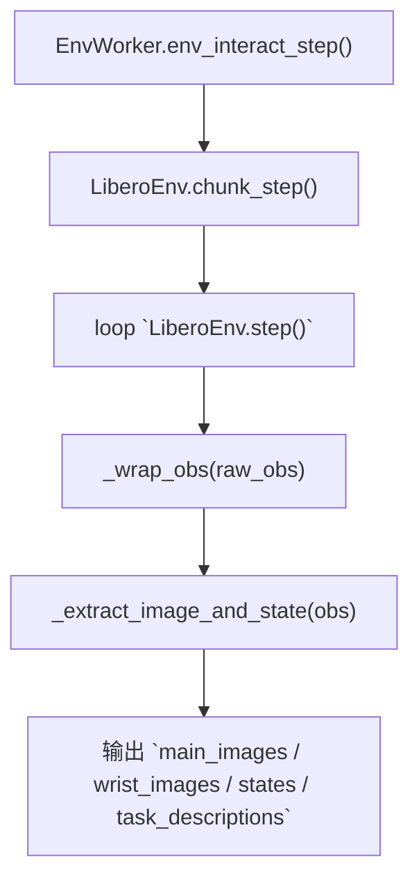

`LIBERO` 这条线的关键是它把 robosuite 原始字段整理成 RLinf 统一 observation 契约：

```251:289:rlinf/envs/libero/libero_env.py
def _extract_image_and_state(self, obs):
    return {
        "full_image": get_libero_image(obs),
        "wrist_image": get_libero_wrist_image(obs),
        "state": np.concatenate(
            [
                obs["robot0_eef_pos"],
                quat2axisangle(obs["robot0_eef_quat"]),
                obs["robot0_gripper_qpos"],
            ]
        ),
    }

def _wrap_obs(self, obs_list):
    # ...
    obs = {
        "main_images": full_image_tensor,
        "wrist_images": wrist_image_tensor,
        "states": states,
        "task_descriptions": self.task_descriptions,
    }
    return obs
```

#### `IsaacLab` 分支
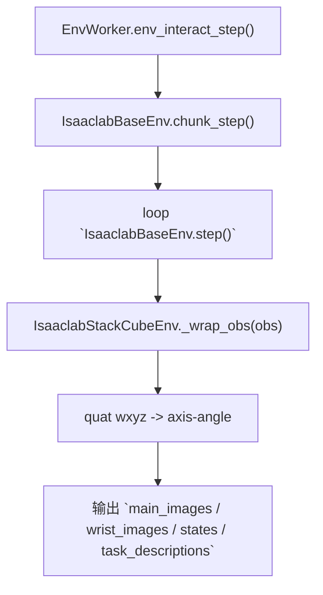

`IsaacLab` 这条线的关键是虽然 simulator 完全不同，但最终也被整形成和 `LIBERO` 同构的 4 个字段：

```75:97:rlinf/envs/isaaclab/tasks/stack_cube.py
def _wrap_obs(self, obs):
    instruction = [self.task_description] * self.num_envs
    wrist_image = obs["policy"]["wrist_cam"]
    table_image = obs["policy"]["table_cam"]
    quat = obs["policy"]["eef_quat"][:, [1, 2, 3, 0]]
    states = torch.concatenate(
        [
            obs["policy"]["eef_pos"],
            quat2axisangle_torch(quat),
            obs["policy"]["gripper_pos"],
        ],
        dim=1,
    )

    env_obs = {
        "main_images": table_image,
        "task_descriptions": instruction,
        "states": states,
        "wrist_images": wrist_image,
    }
    return env_obs
```

这也是为什么 `GR00T` 能同时接 `LIBERO` 和 `IsaacLab`，而不需要重写 runner。

### 3. Rollout 侧进入 GR00T 的函数栈
`MultiStepRolloutWorker` 对 `GR00T` 的特殊处理只有一个核心点：它不传通用 sampling 参数，而是只传 `mode=train/eval`，把随机性和 denoising 逻辑交给 `GR00T` 自己的 action head。

```216:235:rlinf/workers/rollout/hf/huggingface_worker.py
if SupportedModel(self.cfg.actor.model.model_type) in [
    SupportedModel.OPENPI,
    SupportedModel.MLP_POLICY,
    SupportedModel.GR00T,
    SupportedModel.CNN_POLICY,
]:
    kwargs = {"mode": mode}

with torch.no_grad():
    actions, result = self.hf_model.predict_action_batch(
        env_obs=env_obs,
        **kwargs,
    )
```

`GR00T` 在 rollout 侧真正执行的链条是：

```mermaid
flowchart TD
    A["`MultiStepRolloutWorker.predict(env_obs)`"] --> B["`GR00T.predict_action_batch(env_obs, mode)`"]
    B --> C["`obs_convert_fn(env_obs)`"]
    C --> D["`apply_transforms(obs_copy)`"]
    D --> E["`_get_rl_action(normalized_input, mode)`"]
    E --> F["`prepare_input()` external GR00T"]
    F --> G["`backbone()` external GR00T"]
    G --> H["`action_head.get_rl_action()`"]
    H --> I["输出 `actions / prev_logprobs / prev_values / chains / denoise_inds`"]
    I --> J["`_get_unnormalized_action()`"]
    J --> K["`action_convert_fn()`"]
    K --> L["返回 env action chunk"]
```

这里最重要的不是 `action`，而是 `result` 里那组训练中间量。`GR00T` 会把 diffusion RL 所需的 `chains`、`denoise_inds`、`prev_logprobs`、`prev_values` 一并放进 `forward_inputs` 里带回 actor：

```563:686:rlinf/models/embodiment/gr00t/gr00t_action_model.py
def predict_action_batch(self, env_obs, mode: Literal["train", "eval"] = "train", **kwargs):
    observations = self.obs_convert_fn(env_obs)
    normalized_input = self.apply_transforms(obs_copy)

    normalized_action, result = self._get_rl_action(normalized_input, mode=mode)
    unnormalized_action = self._get_unnormalized_action(normalized_action)
    raw_action = self.action_convert_fn(
        unnormalized_action, chunk_size=self.output_action_chunks
    )
    return raw_action, result

def _get_rl_action(self, normalized_input: dict[str, Any], mode: Literal["train", "eval"] = "train"):
    backbone_inputs, action_inputs = self.prepare_input(normalized_input)
    backbone_outputs = self.backbone(backbone_inputs)
    action_head_outputs, rlinf_outputs = self.action_head.get_rl_action(
        backbone_outputs, action_inputs, mode=mode
    )

    forward_inputs = {
        "chains": rlinf_outputs["chains"],
        "denoise_inds": rlinf_outputs["denoise_inds"],
        **normalized_input,
    }
    result = {
        "prev_logprobs": rlinf_outputs["prev_logprobs"],
        "prev_values": rlinf_outputs["prev_values"],
        "forward_inputs": forward_inputs,
    }
    return actions, result
```

### 4. Actor 侧如何把 GR00T 接进 PPO
这一步是 RLinf 对 GR00T 最关键的设计。actor 不直接把 old logprob 当成定值使用，而是把 rollout 期保存的 `forward_inputs + prev_logprobs + chains + denoise_inds` 再喂回 `GR00T.default_forward()`，重算训练期的 log-prob/value。

```mermaid
flowchart TD
    A["`EmbodiedFSDPActor.recv_rollout_trajectories()`"] --> B["`convert_trajectories_to_batch()`"]
    B --> C["`_process_received_rollout_batch()`"]
    C --> D["`compute_advantages_and_returns()`"]
    D --> E["`calculate_adv_and_returns(gae)`"]
    E --> F["`EmbodiedFSDPActor.run_training()`"]
    F --> G["取 `forward_inputs / prev_logprobs / prev_values / advantages / returns`"]
    G --> H["`GR00T.default_forward(forward_inputs, prev_logprobs=...)`"]
    H --> I["`action_head(...)` recompute logprobs + values"]
    I --> J["`policy_loss(actor_critic)`"]
    J --> K["FSDP backward / optimizer_step"]
```

GR00T 在 actor 侧是被 `EmbodiedFSDPActor` 特判过的：

```1368:1425:rlinf/workers/actor/fsdp_actor_worker.py
kwargs = {}
# ...
elif SupportedModel(self.cfg.actor.model.model_type) == SupportedModel.GR00T:
    kwargs["prev_logprobs"] = prev_logprobs

output_dict = self.model(
    forward_inputs=forward_inputs,
    compute_logprobs=True,
    compute_entropy=self.cfg.algorithm.entropy_bonus > 0,
    compute_values=compute_values,
    use_cache=False,
    **kwargs,
)

if SupportedModel(self.cfg.actor.model.model_type) == SupportedModel.GR00T:
    prev_logprobs = output_dict["prev_logprobs"]

kwargs = {
    "loss_type": self.cfg.algorithm.loss_type,
    "logprobs": output_dict["logprobs"],
    "values": output_dict.get("values", None),
    "old_logprobs": prev_logprobs,
    "advantages": advantages,
    "returns": returns,
    "prev_values": prev_values,
    # ...
}
loss, metrics_data = policy_loss(**kwargs)
```

这说明 RLinf 把 `GR00T` 视为“可返回 `prev_logprobs/prev_values` 的 PPO-compatible diffusion policy”，而不是简单的 autoregressive policy。

### 5. `LIBERO async PPO` 的增量调用栈
公开仓库里 `GR00T` 的异步路径只在 `LIBERO` 这边有现成配置，入口是 `libero_goal_async_ppo_gr00t.yaml`。相比同步 PPO，多了两层：

- rollout batch 里带 `versions`
- actor 会先 `compute_proximal_logprobs()` 再做 `decoupled_actor_critic`

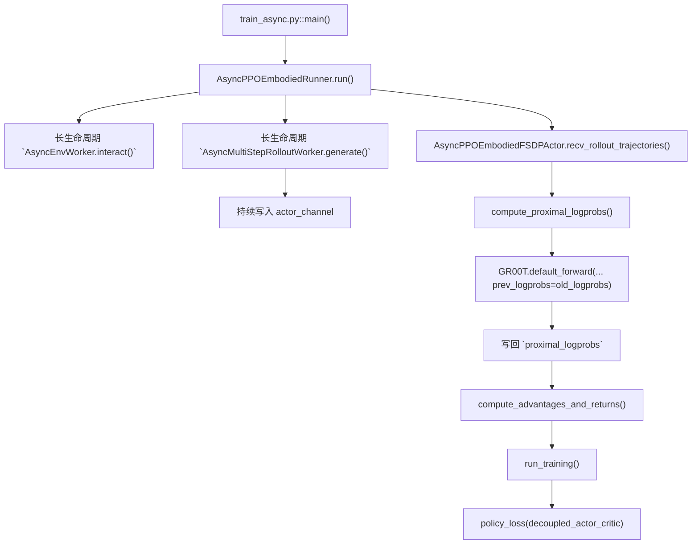

这里的 `GR00T` 适配逻辑和同步 PPO 一样，只是 loss 从 `actor_critic` 换成了 `decoupled_actor_critic`，并把 `proximal_logprobs` 带进去了。

## `LIBERO` / `IsaacLab` 两条公开主线的关键文件
- `同步 PPO 主线`
  `examples/embodiment/train_embodied_agent.py`
  `->` `rlinf/runners/embodied_runner.py`
  `->` `rlinf/workers/env/env_worker.py`
  `->` `rlinf/workers/rollout/hf/huggingface_worker.py`
  `->` `rlinf/workers/actor/fsdp_actor_worker.py`
  `->` `rlinf/models/embodiment/gr00t/gr00t_action_model.py`

- `LIBERO 环境分支`
  `rlinf/envs/libero/libero_env.py`
  `->` `_extract_image_and_state()`
  `->` `_wrap_obs()`
  `->` `step()`
  `->` `chunk_step()`

- `IsaacLab 环境分支`
  `rlinf/envs/isaaclab/isaaclab_env.py`
  `->` `reset() / step() / chunk_step()`
  `rlinf/envs/isaaclab/tasks/stack_cube.py`
  `->` `_wrap_obs()`

- `GR00T adapter 层`
  `rlinf/models/embodiment/gr00t/__init__.py`
  `->` 选择 `DataConfig` / `EmbodimentTag`
  `rlinf/models/embodiment/gr00t/embodiment_tags.py`
  `->` 标签与 projector mapping
  `rlinf/models/embodiment/gr00t/modality_config.py`
  `->` modality transform
  `rlinf/models/embodiment/gr00t/simulation_io.py`
  `->` obs/action converter
  `rlinf/models/embodiment/gr00t/gr00t_action_model.py`
  `->` rollout/actor 两侧的核心实现

## 最少还缺哪些类和接口

### 一. 要把 `GR00T` 接到 RLinf 真机主线，最少缺什么
这里说的是“真机 online PPO/async PPO”，不是 off-policy。

#### 已经可以直接复用的部分
- `RealWorldEnv`
- `FrankaEnv`
- `FrankaController`
- `EnvWorker`
- `MultiStepRolloutWorker`
- `EmbodiedRunner`
- `AsyncPPOEmbodiedRunner`
- `Channel`
- `Cluster` / `HybridComponentPlacement`

也就是说，**系统骨架不用改**。

#### 最少必须补的类 / 接口
| 缺口 | 最少要补什么 | 为什么必须 |
| --- | --- | --- |
| Embodiment 标签 | 在 `rlinf/models/embodiment/gr00t/embodiment_tags.py` 增加 `REALWORLD_FRANKA` | 公开代码里没有真机 tag，loader 无法为真机选择 projector / metadata |
| DataConfig | 新增 `RealworldFrankaDataConfig` | `LiberoFrankaDataConfig` 假设的是 `video.image + video.wrist_image + state.*`；真机 obs 需要自己的 modality 约定 |
| Obs converter | 在 `simulation_io.py` 增加 `convert_realworld_obs_to_gr00t_format()` | `RealWorldEnv` 目前产出的是 `main_images`、`extra_view_images`、`states`、`task_descriptions`，没有现成 GR00T converter |
| Action converter | 在 `simulation_io.py` 增加 `convert_to_realworld_action()` | 真机动作语义要对齐 `FrankaEnv.step()` 所期望的 6D/7D 连续控制 |
| Loader 分支 | 在 `rlinf/models/embodiment/gr00t/__init__.py` 为 `realworld_franka` 选择新的 `DataConfig` | 否则 `get_model()` 无法构建真机版 GR00T |
| 模型 metadata | 提供真机 `experiment_cfg/metadata.json` | `GR00T_N1_5_ForRLActionPrediction._load_metadata()` 强依赖它来恢复 normalization / valid action dim / image nums |
| 配置文件 | 新增 `realworld_*_ppo_gr00t.yaml` 或 `realworld_*_async_ppo_gr00t.yaml` | 需要显式设置 `embodiment_tag`、`obs_converter_type`、camera 约定、action_dim、chunk size |

最核心的新增接口，其实就是下面这 4 个名字：

- `EmbodimentTag.REALWORLD_FRANKA`
- `RealworldFrankaDataConfig`
- `convert_realworld_obs_to_gr00t_format()`
- `convert_to_realworld_action()`

#### 真机适配时还要明确的两个契约
- `视觉契约`
  `RealWorldEnv` 默认是 `main_images + extra_view_images`，而公开 `GR00T` 的 `LiberoFrankaDataConfig` 期待的是 `video.image + video.wrist_image`。所以你必须定义“哪路相机是主视角，哪路映射到 wrist”。

- `状态/动作契约`
  真机 `FrankaEnv` 常见是 6D 或 7D 连续控制；`GR00T` 的 metadata 会决定 `valid_action_dim`。所以真机 SFT/metadata、RL config、`convert_to_realworld_action()` 三者必须完全一致。

### 二. 要把 `GR00T` 接到 RLinf 的离线 / off-policy RL 主线，最少缺什么
这里说的是严格意义上的 `SAC / CrossQ / RLPD / demo_buffer + replay_buffer` 主线。

#### 已经可以直接复用的部分
- `TrajectoryReplayBuffer`
- `demo_buffer`
- `CollectEpisode`
- `LeRobotDatasetWriter`
- `EmbodiedSACFSDPPolicy`
- `AsyncEmbodiedRunner`

问题不在 buffer 或 scheduler，而在 **GR00T model interface**。

#### 最少必须补的类 / 接口
| 缺口 | 最少要补什么 | 为什么必须 |
| --- | --- | --- |
| SAC actor 接口 | 在 `GR00T_N1_5_ForRLActionPrediction` 实现 `sac_forward()` 或 `ForwardType.SAC` 分支 | `EmbodiedSACFSDPPolicy.forward_actor()` 需要从模型得到 `actions, log_pi, shared_feature` |
| SAC critic 接口 | 实现 `sac_q_forward()` 或 `ForwardType.SAC_Q` 分支 | `forward_critic()` 需要给 `(obs, action)` 输出 Q 值 |
| CrossQ 接口 | 实现 `crossq_q_forward()` 或 `ForwardType.CROSSQ_Q` 分支 | 如果希望复用 `CrossQ` 主线，这个接口不可少 |
| Q head 模块 | 新增 `GR00TQHead` 或同类 critic head | 当前公开 GR00T 只有 `value_head`，没有 Q ensemble |
| `forward()` 分发 | 扩展 `forward()` 以支持 `DEFAULT / SAC / SAC_Q / CROSSQ_Q` | 现在公开实现对非 `DEFAULT` 直接 `NotImplementedError` |
| 纯离线入口 | 新增 `OfflineEmbodiedRunner`，或提供 `prefill_replay_buffer()` 机制 | 当前 `AsyncEmbodiedRunner` 是在线/混合训练循环，不是“只读离线数据然后更新 actor”的 runner |
| 离线数据导入 | 提供 “LeRobot / demo dataset -> replay buffer checkpoint” 的导入工具 | `demo_buffer.load_checkpoint()` 期望的是 replay-buffer 格式，不是原始 LeRobot 数据集 |

最关键的硬缺口其实是这一条：

```499:497:rlinf/models/embodiment/gr00t/gr00t_action_model.py
def forward(self, forward_type=ForwardType.DEFAULT, **kwargs):
    if forward_type == ForwardType.DEFAULT:
        return self.default_forward(**kwargs)
    else:
        raise NotImplementedError
```

这说明当前公开 GR00T 只接了 `PPO/default_forward`，没接 `SAC/Q-learning`。

#### 如果只想做 `demo + online hybrid`，而不是 strict offline-only
那也仍然需要补 `SAC/Q-head` 接口，但 **不一定** 需要新 buffer 类。因为 RLinf 现成的 `demo_buffer` / `replay_buffer` 已经够了。最小路线会变成：

1. 先补 `GR00T` 的 `SAC / SAC_Q / CROSSQ_Q` 接口。
2. 再把离线 demo 转成 `TrajectoryReplayBuffer` 可加载的 checkpoint。
3. 直接复用 `EmbodiedSACFSDPPolicy` 和 `AsyncEmbodiedRunner`。

#### 如果要做 strict offline-only RL
那在上面基础上，还得多一层：

- `OfflineEmbodiedRunner`
  或
- `EmbodiedSACFSDPPolicy.prefill_replay_buffer_from_dataset()` + 一个不启动 env/rollout 的 entry script

因为当前公开的 `off-policy` runner 仍然默认会启动 env/rollout 持续产在线数据。

## 最小改造清单
如果目标是“最少改动，让 GR00T 能先跑起来”，建议顺序是：

1. 先做 `真机 online PPO`
   因为 runner/actor 都能复用，只需要补 adapter 层。
2. 再做 `仿真 off-policy / hybrid RLPD`
   因为这一步要动模型接口，工作量比真机 adapter 更大。
3. 最后再做 `strict offline-only RL`
   因为这一步才需要新增 runner 或 replay prefill 主线。

如果你愿意，我下一步可以继续把上面的“最小改造清单”进一步具体化成一个真正的开发蓝图，直接列出建议新增的文件名、类名、方法签名，以及它们应该放到仓库的哪个目录。

---

**User**

把“GR00T + LIBERO/IsaacLab online GRPO 的完整调用栈”画成更细的逐函数调用图, 画出相关的关键类图和时序图, 并列出关键的代码文件及其调用关系.

---

**Cursor**

我先核对两件事：一是公开仓库里 `GR00T` 是否真的有 `GRPO` 配置或文档支持；二是从通用 embodied `GRPO` 框架来看，`GR00T` 在代码路径上能否走通 `adv_type=grpo / loss_type=actor`。然后我再把这条链拆成逐函数调用图。

我已经确认：公开仓库里没有 `GR00T + GRPO` 的现成 YAML，官方文档也明确写了 “under testing”。所以下面我会分成两层讲：一层是“当前公开代码里真正存在的通用 GRPO 调用栈”，另一层是“把这条栈套到 GR00T + LIBERO/IsaacLab 上时，哪些环节已经有代码、哪些环节仍是未正式发布状态”。

我还会把 `GR00T` 模型内部再往下拆一层，把 `action_head.get_rl_action()`、`sample_mean_var_val()`、`get_value()` 这些 flow-matching 专有步骤也补进调用图，否则这条栈还不够“GR00T-specific”。

我再核对一下现有 `OpenVLA/OpenPI` 的 embodied `GRPO` 配置，看看 `RLinf` 在仿真 GRPO 里对 `group_size`、固定 reset state、并行 env 分组到底是怎么约束的。这样才能判断这套通用 GRPO 逻辑迁移到 `GR00T + LIBERO/IsaacLab` 时，哪些假设是必须满足的。

我已经基本确认了一个重要差异：`LIBERO` 的环境实现本身带“按 group 复制 reset state”机制，天然更适合 embodied GRPO；`IsaacLab` 当前公开的 `BaseEnv` 没有这层 group reset 复制逻辑，所以 `GR00T + IsaacLab GRPO` 在公开代码里更像“理论上能走通通用栈，但缺少公平分组所需的 env 侧保证”。这点我会在最终图和结论里单独标出来。下面这版我会非常明确地区分两层：

- `GRPO 通用代码栈`：当前 RLinf 公开仓库里真实存在、可追溯到函数级别的调用链。
- `GR00T + LIBERO/IsaacLab`：把这条通用栈套到 GR00T 上时，哪些环节已经有现成适配，哪些仍然属于“under testing / 缺少正式 recipe”的状态。

先说总判断：

- `GR00T + LIBERO online GRPO`：**代码路径基本具备，但公开仓库没有现成 YAML 配置；从架构上是最接近可运行的。**
- `GR00T + IsaacLab online GRPO`：**通用 GRPO 栈能复用，但 env 侧缺少像 LIBERO 那样的 group-aligned reset 机制，公开状态更偏“理论可接入、尚未正式交付”。**
- 官方文档自己也写了：`GRPO with GR00T-N1.5 is under testing`。

```71:73:docs/source-en/rst_source/examples/embodied/gr00t.rst
2. **GRPO (Group Relative Policy Optimization)**
   -  The GRPO algorithm with GR00T-N1.5 is under testing, and the results will be released later.
```

## 一、GR00T + LIBERO/IsaacLab online GRPO 的系统级调用栈

### 1. 总体主链
无论是 `LIBERO` 还是 `IsaacLab`，如果让 `GR00T` 走 RLinf 的 embodied `GRPO`，入口和大骨架都不会变，仍然是：

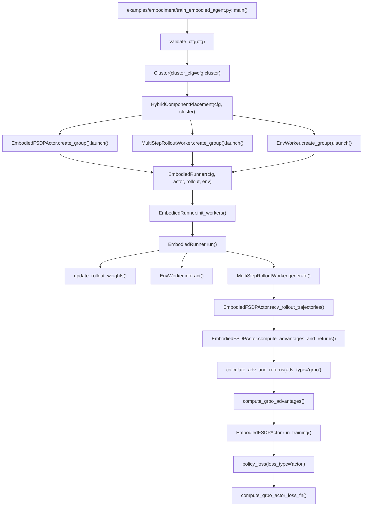

这条链和 `PPO` 的最大区别只有两个：

- advantage 计算从 `gae` 变成了 `grpo`
- loss 从 `actor_critic` 变成了 `actor`

也就是说，`GRPO` 在 RLinf embodied 里不是一套单独 runner，而是通过 `adv_type=grpo` 和 `loss_type=actor` 挂进同一个 actor worker 训练循环里。

## 二、逐函数调用图：从入口到 env/rollout/actor

### 2.1 入口脚本和配置校验
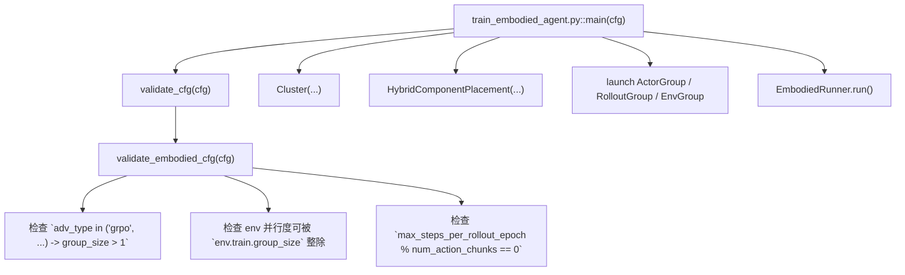

`GRPO` 最关键的配置约束在 `validate_embodied_cfg()` 里：

```692:780:rlinf/config.py
def validate_embodied_cfg(cfg):
    # ...
    assert (
        cfg.env.train.total_num_envs
        // env_world_size
        // stage_num
        % cfg.env.train.group_size
        == 0
    ), (
        "env.train.total_num_envs // env_world_size // rollout.pipeline_stage_num must be divisible by the group size"
    )
    # ...

if cfg.algorithm.adv_type in ("grpo", "grpo_dynamic", "reinpp_baseline"):
    assert cfg.algorithm.group_size > 1
```

这里要注意一件事：**RLinf 同时区分了 `algorithm.group_size` 和 `env.train.group_size`。**  
在一个设计良好的 embodied `GRPO` 配置里，这两者通常应该保持一致，否则 env 分组和 reward grouping 会脱节。

## 三、Env 侧：`LIBERO` 和 `IsaacLab` 从哪里分叉

### 3.1 EnvWorker 通用逻辑
`EnvWorker` 不知道模型是不是 `GR00T`，也不知道算法是不是 `GRPO`。它只负责：

1. reset / bootstrap
2. 接收 rollout 发回来的 action chunk
3. 调 `prepare_actions()` 做环境动作适配
4. 执行 env `chunk_step()`
5. 打包 `EnvOutput` 送回 rollout

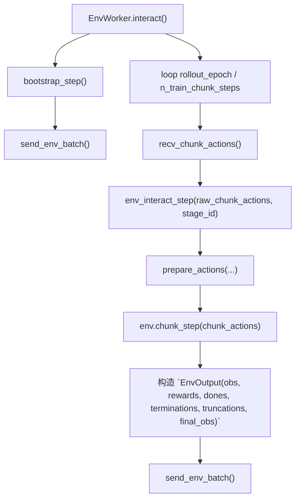

关键函数在这里：

```316:456:rlinf/workers/env/env_worker.py
def recv_chunk_actions(self, input_channel: Channel, mode="train") -> np.ndarray:
    # 从 rollout -> env 的 Channel 按 key 收 action shard，concat 成完整 batch

def send_env_batch(self, output_channel: Channel, env_batch: dict[str, Any], mode="train"):
    # 把一个 env batch 按映射关系 split 后送回 rollout

def bootstrap_step(self) -> list[EnvOutput]:
    # 初始 obs / dones / truncations / final_obs 的 bootstrap

def env_interact_step(self, chunk_actions: torch.Tensor, stage_id: int):
    chunk_actions = prepare_actions(...)
    obs_list, chunk_rewards, chunk_terminations, chunk_truncations, infos_list = (
        self.env_list[stage_id].chunk_step(chunk_actions)
    )
```

### 3.2 `LIBERO` 分支：为什么更适合 GRPO
`LIBERO` 在 GRPO 上最大的优势，不在 rollout，不在 actor，而在 env 自身有 **group-aware reset** 逻辑：

```120:199:rlinf/envs/libero/libero_env.py
def update_reset_state_ids(self):
    if self.cfg.is_eval or self.cfg.use_ordered_reset_state_ids:
        reset_state_ids = self._get_ordered_reset_state_ids(self.num_group)
    else:
        reset_state_ids = self._get_random_reset_state_ids(self.num_group)
    self.reset_state_ids = reset_state_ids.repeat(self.group_size)

def _get_reset_states(self, env_idx):
    init_state = [
        self.task_suite.get_task_init_states(self.task_ids[env_id])[self.trial_ids[env_id]]
        for env_id in env_idx
    ]
```

这段逻辑的含义非常重要：

- 先按 `num_group = num_envs // group_size` 采样一组 reset state id
- 再用 `.repeat(group_size)` 把同一个 reset state 复制给 group 内多个环境
- 这样同组的多个 rollout 样本是在**相同任务描述 + 相同初始状态**下比较 reward

这正好符合 GRPO 的核心假设：**组内 reward 必须在同一上下文下可比较。**

`LIBERO` 生成 RLinf 统一 observation 的路径也很清晰：

```251:289:rlinf/envs/libero/libero_env.py
def _extract_image_and_state(self, obs):
    return {
        "full_image": get_libero_image(obs),
        "wrist_image": get_libero_wrist_image(obs),
        "state": np.concatenate(
            [
                obs["robot0_eef_pos"],
                quat2axisangle(obs["robot0_eef_quat"]),
                obs["robot0_gripper_qpos"],
            ]
        ),
    }

def _wrap_obs(self, obs_list):
    obs = {
        "main_images": full_image_tensor,
        "wrist_images": wrist_image_tensor,
        "states": states,
        "task_descriptions": self.task_descriptions,
    }
    return obs
```

### 3.3 `IsaacLab` 分支：哪里还差一层
`IsaacLab` 这边 observation packing 也没问题：

```75:97:rlinf/envs/isaaclab/tasks/stack_cube.py
def _wrap_obs(self, obs):
    instruction = [self.task_description] * self.num_envs
    wrist_image = obs["policy"]["wrist_cam"]
    table_image = obs["policy"]["table_cam"]
    states = torch.concatenate([...], dim=1)

    env_obs = {
        "main_images": table_image,
        "task_descriptions": instruction,
        "states": states,
        "wrist_images": wrist_image,
    }
    return env_obs
```

`IsaacLabBaseEnv` 也有标准的 `reset / step / chunk_step`：

```105:209:rlinf/envs/isaaclab/isaaclab_env.py
def reset(self, seed=None, env_ids=None):
def step(self, actions=None, auto_reset=True):
def chunk_step(self, chunk_actions):
```

但和 `LIBERO` 相比，当前公开 `IsaacLabBaseEnv` **没有** 对应的 group reset 复制逻辑。它没有像 `LiberoEnv.update_reset_state_ids()` 那样：

- 先抽 `num_group` 个 reset state
- 再 repeat 到组内

所以如果直接把 `algorithm.group_size > 1` 和 `env.train.group_size > 1` 套上去，`IsaacLab` 至少在公开代码里缺少一个明确保证：**同组多个样本是否来自同一个初始状态。**

这不妨碍你复用大部分调用栈，但会影响 embodied GRPO 的组内可比性。这也是我认为 `GR00T + IsaacLab GRPO` 在公开代码里仍偏 “under testing” 的主要原因之一。

## 四、Rollout 侧：GR00T 在 GRPO 中如何采样和打包 trajectory

### 4.1 Rollout 的逐函数调用图
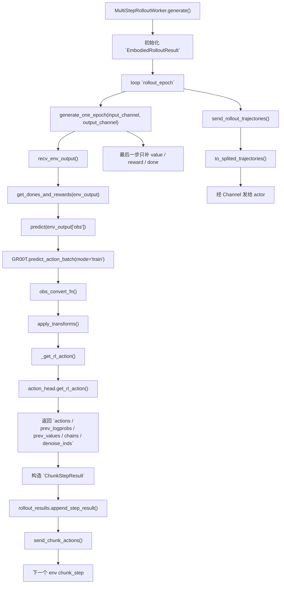

对应的核心实现：

```315:433:rlinf/workers/rollout/hf/huggingface_worker.py
async def generate_one_epoch(self, input_channel: Channel, output_channel: Channel):
    env_output = await self.recv_env_output(input_channel)
    dones, rewards = self.get_dones_and_rewards(env_output)
    actions, result = self.predict(env_output["obs"])

    chunk_step_result = ChunkStepResult(
        actions=result["forward_inputs"].get("action", None),
        dones=dones,
        rewards=rewards,
        truncations=env_output["truncations"],
        terminations=env_output["terminations"],
        prev_logprobs=result["prev_logprobs"] if self.collect_prev_infos else None,
        prev_values=result["prev_values"] if self.collect_prev_infos else None,
        forward_inputs=result["forward_inputs"],
        versions=torch.full_like(result["prev_logprobs"], float(self.version), dtype=torch.float32)
        if self.collect_versions else None,
    )
    self.rollout_results[stage_id].append_step_result(chunk_step_result)
    self.send_chunk_actions(output_channel, actions)
```

### 4.2 GR00T 内部更细一层的 rollout 栈
GRPO 在 rollout 侧并不会用 value 来算 advantage，但 `GR00T` 仍可能返回 `prev_values`，只是在 GRPO 路径里不会被真正消费。真正重要的是 `prev_logprobs` 和 denoising chain。

```mermaid
flowchart TD
    A["`GR00T.predict_action_batch()`"] --> B["`obs_convert_fn(env_obs)`"]
    B --> C["`apply_transforms(obs_copy)`"]
    C --> D["`_get_rl_action(normalized_input, mode='train')`"]
    D --> E["`prepare_input()` external GR00T"]
    E --> F["`backbone()` external GR00T"]
    F --> G["`FlowMatchingActionHeadForRLActionPrediction.get_rl_action()`"]
    G --> H["`process_backbone_output()`"]
    H --> I["state_encoder / initial noise x_t"]
    I --> J["loop denoising steps"]
    J --> K["`sample_mean_var_val()`"]
    K --> L["action_encoder + diffusion transformer + action_decoder"]
    L --> M["x_t_mean / x_t_std"]
    M --> J
    J --> N["stack `chains` + `prev_logprobs` + `denoise_inds`"]
    N --> O["`action_convert_fn()`"]
```

其中最值得关注的是 `get_rl_action()`：

```219:329:rlinf/models/embodiment/gr00t/gr00t_action_model.py
def get_rl_action(self, backbone_output, action_input, mode="train", compute_values=True):
    backbone_output = self.process_backbone_output(backbone_output)
    vl_embs = backbone_output.backbone_features
    embodiment_id = action_input.embodiment_id
    state_features = self.state_encoder(action_input.state, embodiment_id)
    x_t = torch.randn(...)

    chains = [x_t]
    log_probs = []
    num_steps = self.num_inference_timesteps

    # train 模式下随机选 denoise step
    # eval 模式下 denoise_inds = -1，走确定性路径
    for idx in range(num_steps):
        if idx == denoise_inds[0][idx]:
            x_t_mean, x_t_std = self.sample_mean_var_val(..., mode="train")
        else:
            x_t_mean, x_t_std = self.sample_mean_var_val(..., mode="eval")

        x_t = x_t_mean + self.sample_noise(...) * x_t_std
        log_prob = self.get_logprob_norm(x_t, x_t_mean, x_t_std)

        chains.append(x_t)
        log_probs.append(log_prob)

    return ..., {
        "actions": x_0,
        "chains": chains,
        "prev_logprobs": log_probs,
        "prev_values": values,
        "denoise_inds": denoise_inds,
    }
```

这也是 GR00T 和 OpenVLA/OpenPI 最大的不同：**它的 rollout 结果天然包含一个 diffusion trajectory，而不是单步 action token 序列。**

## 五、Actor 侧：GRPO 是怎么计算 advantage 和 loss 的

### 5.1 Actor 的逐函数调用图
```mermaid
flowchart TD
    A["`EmbodiedFSDPActor.recv_rollout_trajectories()`"] --> B["`convert_trajectories_to_batch()`"]
    B --> C["`_process_received_rollout_batch()`"]
    C --> D["`compute_advantages_and_returns()`"]
    D --> E["`calculate_adv_and_returns(task_type='embodied', adv_type='grpo')`"]
    E --> F["`preprocess_embodied_advantages_inputs()`"]
    F --> G["`calculate_scores()`"]
    G --> H["`compute_grpo_advantages()`"]
    H --> I["`postprocess_embodied_advantages_outputs()`"]
    I --> J["写回 `rollout_batch['advantages']`"]
    J --> K["`run_training()`"]
    K --> L["`GR00T.default_forward(forward_inputs, prev_logprobs=...)`"]
    L --> M["重算 `logprobs`"]
    M --> N["`policy_loss(loss_type='actor')`"]
    N --> O["`preprocess_loss_inputs()`"]
    O --> P["`compute_grpo_actor_loss_fn()`"]
    P --> Q["内部复用 `compute_ppo_actor_loss()`"]
```

### 5.2 GRPO advantage 的关键实现
embodied `GRPO` 在 RLinf 里不是直接把原始 `[n_chunk, batch, action_dim]` reward 喂给 `compute_grpo_advantages()`，而是先做两步预处理：

1. `preprocess_embodied_advantages_inputs()` 把 chunk 结构展平成时间维。
2. `calculate_scores()` 从逐 step reward 回溯成每条轨迹的 group score。

```67:174:rlinf/algorithms/utils.py
def preprocess_embodied_advantages_inputs(...):
    if kwargs["reward_type"] == "chunk_level":
        rewards = rewards.sum(dim=-1, keepdim=True)
        dones = dones.max(dim=-1, keepdim=True)[0]
    # ...
    rewards = rewards.transpose(1, 2).reshape(n_steps, bsz)
    flattened_dones_full = dones.transpose(1, 2).reshape((num_chunk + 1) * chunk_size, bsz)
    dones = flattened_dones_full[-(n_steps + 1):]
    # ...

def calculate_scores(rewards, dones, **kwargs):
    scores = torch.zeros(kwargs["batch_size"])
    for step in reversed(range(kwargs["n_steps"])):
        scores = scores * ~dones[step + 1]
        scores += rewards[step]
    scores = scores.reshape(-1, kwargs["group_size"])
    kwargs.update({"rewards": scores})
    return kwargs
```

然后 `compute_grpo_advantages()` 再在组内做标准化：

```89:121:rlinf/algorithms/advantages.py
@register_advantage("grpo")
def compute_grpo_advantages(rewards, loss_mask, group_size, **kwargs):
    grouped_rewards = rewards.view(-1, group_size)
    grouped_reward_mean = grouped_rewards.mean(dim=-1, keepdim=True).expand_as(grouped_rewards)
    grouped_reward_std = grouped_rewards.std(dim=-1, keepdim=True).expand_as(grouped_rewards)

    advantages = grouped_rewards - grouped_reward_mean
    advantages = advantages / (grouped_reward_std + 1e-6)
    advantages = (torch.zeros_like(loss_mask) + advantages.view(1, -1)) * loss_mask
    return advantages, None
```

这一步也解释了为什么 `LIBERO` 的 group reset 机制这么关键：如果组内 reward 对应的不是同一个初始状态，`grouped_reward_mean/std` 的语义就会变弱。

### 5.3 GRPO actor loss 的关键实现
loss 侧其实很“薄”：

```419:446:rlinf/algorithms/losses.py
@register_policy_loss("actor")
def compute_grpo_actor_loss_fn(**kwargs) -> tuple[torch.Tensor, dict]:
    actor_loss, actor_metrics_data = compute_ppo_actor_loss(**kwargs)
    return actor_loss, actor_metrics_data
```

也就是说 embodied `GRPO` 的“GR”主要发生在 **advantage 构造**，而不是另写了一套完全不同的 actor loss。loss 仍然是 PPO-style clipping，只是 advantage 来自组内相对比较。

### 5.4 GR00T 在 actor 侧如何重算 log-prob
GRPO 路径下 `compute_values=False`，因此 `GR00T` 不需要 value head；这比 PPO 更自然。

actor 仍然会把 rollout 阶段保存的 `forward_inputs + prev_logprobs` 喂回去，重算当前策略下的 log-prob：

```1368:1425:rlinf/workers/actor/fsdp_actor_worker.py
elif SupportedModel(self.cfg.actor.model.model_type) == SupportedModel.GR00T:
    kwargs["prev_logprobs"] = prev_logprobs

compute_values = (
    True if self.cfg.algorithm.adv_type == "gae" else False
)

output_dict = self.model(
    forward_inputs=forward_inputs,
    compute_logprobs=True,
    compute_entropy=self.cfg.algorithm.entropy_bonus > 0,
    compute_values=compute_values,
    use_cache=False,
    **kwargs,
)

if SupportedModel(self.cfg.actor.model.model_type) == SupportedModel.GR00T:
    prev_logprobs = output_dict["prev_logprobs"]

kwargs = {
    "loss_type": self.cfg.algorithm.loss_type,   # actor
    "logprobs": output_dict["logprobs"],
    "old_logprobs": prev_logprobs,
    "advantages": advantages,
    # ...
}
loss, metrics_data = policy_loss(**kwargs)
```

这里的一个关键点是：`GR00T` 在 `GRPO` 下不需要 `add_value_head=True`。因为 `validate_embodied_cfg()` 只在 `loss_type in ('actor_critic', 'decoupled_actor_critic')` 时强制要求 value head。

## 六、关键类图

### 6.1 RLinf 通用 embodied GRPO 骨架
```mermaid
classDiagram
class Cluster
class HybridComponentPlacement
class EmbodiedRunner
class EnvWorker
class MultiStepRolloutWorker
class EmbodiedFSDPActor
class Channel
class EnvOutput
class EmbodiedRolloutResult
class Trajectory

Cluster --> HybridComponentPlacement
HybridComponentPlacement --> EnvWorker
HybridComponentPlacement --> MultiStepRolloutWorker
HybridComponentPlacement --> EmbodiedFSDPActor
EmbodiedRunner --> Channel
EmbodiedRunner --> EnvWorker
EmbodiedRunner --> MultiStepRolloutWorker
EmbodiedRunner --> EmbodiedFSDPActor
MultiStepRolloutWorker --> EmbodiedRolloutResult
EmbodiedRolloutResult --> Trajectory
EnvWorker --> EnvOutput
```

### 6.2 GR00T 适配层
```mermaid
classDiagram
class BasePolicy
class GR00T_N1_5_ForRLActionPrediction
class FlowMatchingActionHeadForRLActionPrediction
class EmbodimentTag
class LiberoFrankaDataConfig
class ManiskillWidowXDataConfig

BasePolicy <|.. GR00T_N1_5_ForRLActionPrediction
GR00T_N1_5_ForRLActionPrediction *-- FlowMatchingActionHeadForRLActionPrediction
GR00T_N1_5_ForRLActionPrediction --> EmbodimentTag
GR00T_N1_5_ForRLActionPrediction --> LiberoFrankaDataConfig
GR00T_N1_5_ForRLActionPrediction --> ManiskillWidowXDataConfig
```

### 6.3 `LIBERO` / `IsaacLab` 环境分支
```mermaid
classDiagram
class EnvWorker
class LiberoEnv
class IsaaclabBaseEnv
class IsaaclabStackCubeEnv

EnvWorker --> LiberoEnv
EnvWorker --> IsaaclabStackCubeEnv
IsaaclabStackCubeEnv --|> IsaaclabBaseEnv
```

## 七、关键时序图

### 7.1 `GR00T + LIBERO online GRPO`
```mermaid
sequenceDiagram
participant Entry as train_embodied_agent.py
participant Runner as EmbodiedRunner
participant Env as LiberoEnv
participant Rollout as MultiStepRolloutWorker
participant GR00T as GR00T_N1_5_ForRLActionPrediction
participant Actor as EmbodiedFSDPActor
participant Alg as GRPO advantage/loss

Entry->>Runner: create actor/rollout/env groups
loop each global step
Runner->>Env: interact()
Env->>Env: repeat reset_state_ids by group_size
Env-->>Rollout: main_images / wrist_images / states / task_descriptions
Rollout->>GR00T: predict_action_batch(mode=train)
GR00T->>GR00T: obs_convert_fn + modality_transform
GR00T->>GR00T: action_head.get_rl_action()
GR00T-->>Rollout: actions + prev_logprobs + forward_inputs(chains, denoise_inds)
Rollout-->>Env: action chunks
Env-->>Rollout: rewards / dones / final_obs
Rollout-->>Actor: Trajectory
Actor->>Actor: _process_received_rollout_batch()
Actor->>Alg: preprocess_embodied_advantages_inputs()
Alg->>Alg: calculate_scores()
Alg->>Alg: compute_grpo_advantages()
Actor->>GR00T: default_forward(forward_inputs, prev_logprobs)
GR00T-->>Actor: current logprobs
Actor->>Alg: compute_grpo_actor_loss_fn()
end
```

### 7.2 `GR00T + IsaacLab online GRPO`
```mermaid
sequenceDiagram
participant Entry as train_embodied_agent.py
participant Runner as EmbodiedRunner
participant Env as IsaaclabStackCubeEnv
participant Rollout as MultiStepRolloutWorker
participant GR00T as GR00T_N1_5_ForRLActionPrediction
participant Actor as EmbodiedFSDPActor
participant Alg as GRPO advantage/loss

Entry->>Runner: create actor/rollout/env groups
loop each global step
Runner->>Env: interact()
Env-->>Rollout: main_images / wrist_images / states / task_descriptions
Note over Env: current public IsaacLab path lacks explicit group reset replication
Rollout->>GR00T: predict_action_batch(mode=train)
GR00T->>GR00T: obs_convert_fn=isaaclab_stack_cube
GR00T->>GR00T: action_head.get_rl_action()
GR00T-->>Rollout: actions + prev_logprobs + forward_inputs
Rollout-->>Env: action chunks
Env-->>Rollout: rewards / dones / final_obs
Rollout-->>Actor: Trajectory
Actor->>Alg: calculate_scores() + compute_grpo_advantages()
Actor->>GR00T: default_forward(...)
GR00T-->>Actor: current logprobs
Actor->>Alg: compute_grpo_actor_loss_fn()
end
```

## 八、关键代码文件及调用关系

### 8.1 入口与系统骨架
- `examples/embodiment/train_embodied_agent.py`
  `->` `rlinf/config.py::validate_cfg`
  `->` `Cluster`
  `->` `HybridComponentPlacement`
  `->` launch `EmbodiedFSDPActor` / `MultiStepRolloutWorker` / `EnvWorker`
  `->` `EmbodiedRunner.run()`

- `rlinf/runners/embodied_runner.py`
  `->` `update_rollout_weights()`
  `->` `env.interact()`
  `->` `rollout.generate()`
  `->` `actor.recv_rollout_trajectories()`
  `->` `actor.compute_advantages_and_returns()`
  `->` `actor.run_training()`

### 8.2 Env 侧
- `rlinf/workers/env/env_worker.py`
  `->` `bootstrap_step()`
  `->` `recv_chunk_actions()`
  `->` `env_interact_step()`
  `->` `send_env_batch()`

- `rlinf/envs/libero/libero_env.py`
  `->` `update_reset_state_ids()`
  `->` `_get_reset_states()`
  `->` `_extract_image_and_state()`
  `->` `_wrap_obs()`
  `->` `reset() / step() / chunk_step()`

- `rlinf/envs/isaaclab/isaaclab_env.py`
  `->` `reset() / step() / chunk_step()`

- `rlinf/envs/isaaclab/tasks/stack_cube.py`
  `->` `_wrap_obs()`

### 8.3 Rollout 侧
- `rlinf/workers/rollout/hf/huggingface_worker.py`
  `->` `predict()`
  `->` `get_dones_and_rewards()`
  `->` `generate_one_epoch()`
  `->` `send_chunk_actions()`
  `->` `recv_env_output()`
  `->` `send_rollout_trajectories()`

### 8.4 GR00T 模型适配层
- `rlinf/models/embodiment/gr00t/embodiment_tags.py`
  `->` 选择 `LIBERO_FRANKA` / `ISAACLAB_FRANKA` / `MANISKILL_WIDOWX`

- `rlinf/models/embodiment/gr00t/__init__.py`
  `->` 根据 `embodiment_tag` 选择 `DataConfig`
  `->` 构建 `GR00T_N1_5_ForRLActionPrediction`

- `rlinf/models/embodiment/gr00t/modality_config.py`
  `->` `LiberoFrankaDataConfig`
  `->` `ManiskillWidowXDataConfig`

- `rlinf/models/embodiment/gr00t/simulation_io.py`
  `->` `OBS_CONVERSION`
  `->` `ACTION_CONVERSION`

- `rlinf/models/embodiment/gr00t/gr00t_action_model.py`
  `->` `predict_action_batch()`
  `->` `_get_rl_action()`
  `->` `FlowMatchingActionHeadForRLActionPrediction.get_rl_action()`
  `->` `sample_mean_var_val()`
  `->` `default_forward()`

### 8.5 Actor 与算法
- `rlinf/workers/actor/fsdp_actor_worker.py`
  `->` `recv_rollout_trajectories()`
  `->` `_process_received_rollout_batch()`
  `->` `compute_advantages_and_returns()`
  `->` `run_training()`

- `rlinf/algorithms/registry.py`
  `->` `calculate_adv_and_returns()`
  `->` `policy_loss()`

- `rlinf/algorithms/utils.py`
  `->` `preprocess_embodied_advantages_inputs()`
  `->` `calculate_scores()`
  `->` `postprocess_embodied_advantages_outputs()`
  `->` `preprocess_loss_inputs()`

- `rlinf/algorithms/advantages.py`
  `->` `compute_grpo_advantages()`

- `rlinf/algorithms/losses.py`
  `->` `compute_grpo_actor_loss_fn()`
  `->` internally reuses `compute_ppo_actor_loss()`

## 九、最后的工程判断

如果只从“完整调用栈是否存在”来讲，`GR00T + online GRPO` 在 RLinf 里已经能清楚地映射到一条通用 embodied `GRPO` 代码栈：

- env 产 observation
- rollout 调 `GR00T.predict_action_batch()`
- trajectory 回 actor
- actor 用 `calculate_scores() -> compute_grpo_advantages()`
- 再用 `compute_grpo_actor_loss_fn()` 做更新

但如果从“官方是否正式交付了可复现实验配方”来讲，当前公开状态仍然是：

- `LIBERO`：最接近正式支持，因为 env 已经具备 group-aware reset 设计。
- `IsaacLab`：模型和系统栈都能复用，但 env 侧缺少像 `LIBERO` 那样明确的 group reset 复制机制。
- `GR00T` 文档自己也承认 `GRPO` 还在 testing。

如果你愿意，我下一步可以继续把这份内容再压缩成一张“单页总览图”，或者进一步只做一件事：**专门推导一份“最小可行 `GR00T + LIBERO GRPO` YAML 设计草案”**，把缺失配置补成一份可讨论的配置模板。

---

**User**

请深入分析和解释一下GR00T-N1.5模型在RLinf中是如何实现的, 如何进行训练和部署的, 同时画出相关的关键类图和时序图, 并列出关键的代码文件及其调用关系. 

---

**Cursor**

我会把这次回答聚焦在 `GR00T-N1.5` 自身，而不是只围绕某个算法配置：先拆清楚它在 RLinf 里的“模型适配层”实现，再串起“训练态”和“推理/部署态”的完整路径，最后补上关键类图、时序图和文件调用关系。

我还想补一个小但重要的核对：`GR00T` 文档里写了 `flow-noise`，而代码分支里我目前看到的是 `flow_sde / flow_cps / reinflow`。我会快速确认一下这是不是文档与实现的轻微漂移，然后在最终回答里把这种“文档口径 vs 当前代码口径”的差异标出来。

我准备再补一小段 `metadata.json` 的加载逻辑，因为这是 `GR00T` 在 RLinf 里和其他模型最不同、也最容易被忽略的一环：它不是只靠 `model_path` 就能跑，还需要 `experiment_cfg/metadata.json` 来恢复 modality 统计和有效 action 维度。

## 总览
`GR00T-N1.5` 在 RLinf 里不是“从零实现的一整套模型”，而是一个围绕 NVIDIA 上游 `GR00T_N1_5` 做的 **RL 适配层**。它的核心目标不是重新定义 backbone，而是把上游的多模态 flow-matching VLA，接进 RLinf 的分布式 embodied RL 运行时。

从公开代码看，RLinf 对 `GR00T-N1.5` 的支持可以概括成 4 层：

- `模型装配层`：把 `GR00T` 注册进 `rlinf.models.get_model()`，并用 `Patcher` 把上游 `EmbodimentTag` / tag mapping 指向 RLinf 自己维护的版本。
- `数据与具身适配层`：通过 `EmbodimentTag`、`DataConfig`、`modality_transform`、`obs/action converter`，把 RLinf 的环境观测对齐到 GR00T 预期格式。
- `RL 头适配层`：在上游 flow-matching action head 外，加上 `ValueHead`、可学习探索噪声分支，并保留 denoising chain 与 log-prob 计算所需中间量。
- `运行时层`：复用 RLinf 的 `EnvWorker -> RolloutWorker -> ActorWorker -> Runner` 骨架，完成 rollout、训练、评估和权重同步。

最重要的结论有 4 个：

- 公开仓库里的 `GR00T` 主线是 **RL post-training**，不是从头 SFT。它依赖一个已经存在的 few-shot / SFT checkpoint。
- 公开支持最完整的是 **`LIBERO` 与 `IsaacLab` 上的 PPO / Async PPO**。
- `GR00T` 在当前公开实现里 **没有接上 SAC / CrossQ / RLPD / strict offline RL**，因为它只实现了 `ForwardType.DEFAULT`。
- “部署”在 RLinf 语境下，主要是 **把 GR00T 挂到 rollout/eval worker 做批量推理**，而不是导出成 TensorRT / ROS 服务或真机推理服务。

## 一、GR00T 在 RLinf 中是怎么实现的

### 1. 模型注册与装配
`GR00T` 先作为一种 embodied model 注册进 `SupportedModel`，再由 `rlinf/models/__init__.py` 分发到 `rlinf/models/embodiment/gr00t/__init__.py` 的 `get_model()`。

```1:35:examples/embodiment/config/model/gr00t.yaml
model_type: "gr00t"

# Model path - should be set in specific config files
model_path: "/path/to/model"

# Model precision and loading settings
precision: "bf16"
trust_remote_code: True
is_lora: false

# Action and policy settings
action_dim: 7
num_action_chunks: 5
denoising_steps: 4
policy_setup: "widowx_bridge"

# Observation and embodiment settings
obs_converter_type: "libero"
embodiment_tag: "libero_franka"
add_value_head: True

# RL head configuration
rl_head_config:
  joint_logprob: False
  noise_method: "flow_sde"
  ignore_last: False
  safe_get_logprob: False
  noise_anneal: False
  noise_params: [0.7, 0.3, 400]
  noise_level: 0.5
  add_value_head: ${actor.model.add_value_head}
  chunk_critic_input: False
  detach_critic_input: True
  disable_dropout: True
  use_vlm_value: False
  value_vlm_mode: "mean_token"
```

这份配置本身已经暴露了 RLinf 对 `GR00T` 的实现思路：

- `obs_converter_type`：说明 GR00T 不直接吃 RLinf 原生 observation，而要先经过环境到 GR00T schema 的转换。
- `embodiment_tag`：说明它依赖一个“本体标签”来决定 state/action projector 和 modality config。
- `add_value_head`：说明 RLinf 是通过给 `GR00T` 增加 value head，把它接进 PPO 的。
- `denoising_steps`、`noise_method`、`disable_dropout`：说明 RLinf 不是把 GR00T 当普通 autoregressive policy，而是把 flow-matching 的 denoising 过程保留下来做 RL。

### 2. Patcher：把上游 GR00T 的标签系统接到 RLinf
`rlinf/models/embodiment/gr00t/__init__.py` 的第一个关键动作不是加载权重，而是打 patch：

```24:33:rlinf/models/embodiment/gr00t/__init__.py
Patcher.clear()
Patcher.add_patch(
    "gr00t.data.embodiment_tags.EmbodimentTag",
    "rlinf.models.embodiment.gr00t.embodiment_tags.EmbodimentTag",
)
Patcher.add_patch(
    "gr00t.data.embodiment_tags.EMBODIMENT_TAG_MAPPING",
    "rlinf.models.embodiment.gr00t.embodiment_tags.EMBODIMENT_TAG_MAPPING",
)
Patcher.apply()
```

这一步的含义是：

- 上游 GR00T 自带一套 `EmbodimentTag`。
- RLinf 想在不改上游包源码的前提下，控制“标签 -> projector index / data config”的映射。
- 所以它在运行时把上游 import 路径劫持到 RLinf 本地版本。

这也是为什么 RLinf 能让 `LIBERO` 和 `IsaacLab` 共享同一类 Franka 具身语义，而不必修改上游模型库。

### 3. EmbodimentTag 与 DataConfig：真正的具身适配核心
`GR00T` 在 RLinf 里最关键的设计，不是 backbone，而是 **“同一个模型如何理解不同环境/机器人数据”**。这由 `EmbodimentTag` 和 `DataConfig` 共同控制。

```19:59:rlinf/models/embodiment/gr00t/embodiment_tags.py
class EmbodimentTag(Enum):
    GR1 = "gr1"
    OXE_DROID = "oxe_droid"
    AGIBOT_GENIE1 = "agibot_genie1"
    LIBERO_FRANKA = "libero_franka"
    MANISKILL_WIDOWX = "maniskill_widowx"
    ISAACLAB_FRANKA = "isaaclab_franka"

EMBODIMENT_TAG_MAPPING = {
    EmbodimentTag.LIBERO_FRANKA.value: 31,
    EmbodimentTag.OXE_DROID.value: 17,
    EmbodimentTag.AGIBOT_GENIE1.value: 26,
    EmbodimentTag.GR1.value: 24,
    EmbodimentTag.MANISKILL_WIDOWX.value: 30,
    EmbodimentTag.ISAACLAB_FRANKA.value: 31,
}
```

这里有两个很值得注意的实现点：

- `LIBERO_FRANKA` 和 `ISAACLAB_FRANKA` 都映射到 `31`，说明 RLinf 认为它们属于同一类本体，只是 simulator 不同。
- 公开代码里没有 `realworld_franka` 之类的标签，这也直接解释了为什么目前没有公开的 `GR00T + 真机` 训练主线。

接下来，`gr00t/__init__.py` 会根据 `embodiment_tag` 选择 `DataConfig`：

- `libero_franka` / `isaaclab_franka` -> `LiberoFrankaDataConfig`
- `maniskill_widowx` -> `ManiskillWidowXDataConfig`

这意味着 RLinf 不是对每个环境单独硬编码训练逻辑，而是让环境都先投影到一组 GR00T 认可的 modality schema 上。

### 4. metadata.json：GR00T 在 RLinf 中的硬依赖
`GR00T` 在 RLinf 中和 OpenVLA/OpenPI 的最大不同之一是：**仅有 checkpoint 不够，它还强依赖 `experiment_cfg/metadata.json`。**

```706:732:rlinf/models/embodiment/gr00t/gr00t_action_model.py
def _load_metadata(self, exp_cfg_dir: Path):
    """Load the transforms for the model."""
    # Load metadata for normalization stats
    metadata_path = exp_cfg_dir / "metadata.json"
    with open(metadata_path, "r") as f:
        metadatas = json.load(f)

    # Get metadata for the specific embodiment
    metadata_dict = metadatas.get(self.embodiment_tag.value)
    if metadata_dict is None:
        raise ValueError(
            f"No metadata found for embodiment tag: {self.embodiment_tag.value}",
            f"make sure the metadata.json file is present at {metadata_path}",
        )

    metadata = DatasetMetadata.model_validate(metadata_dict)

    self._modality_transform.set_metadata(metadata)
    self.metadata = metadata

    # calculate real intput action dim for rl learning.
    valid_action_dim = 0
    for v in metadata.modalities.action.values():
        valid_action_dim += v.shape[0]
    self.valid_action_dim = valid_action_dim

    self.image_nums = len(metadata.modalities.video.keys())
```

这段代码决定了三件事：

- normalization / transform 统计值不是写死在模型里的，而是从 metadata 里恢复。
- `valid_action_dim` 是从 metadata 算出来的，不是简单相信 config 的 `action_dim`。
- `image_nums` 也从 metadata 推出来，所以多视角输入的组织方式依赖这个文件。

因此，`GR00T` 在 RLinf 里不是“只要给个 HuggingFace model path 就能跑”的模型。  
**它本质上依赖一个“模型 + experiment_cfg/metadata.json + embodiment_tag”三元组。**

### 5. RL 头：把 GR00T 变成 PPO 可训练策略
RLinf 没改上游 backbone，但改了 action head 的语义。`FlowMatchingActionHeadForRLActionPrediction` 在上游 flow-matching head 上叠加了：

- `ValueHead`
- 可选 `ExploreNoiseNet`
- rollout 期返回 `chains`、`prev_logprobs`、`prev_values`
- actor 期重放 denoising chain 计算 log-prob

`ValueHead` 本身是一个简单但关键的 MLP：

```18:67:rlinf/models/embodiment/modules/value_head.py
class ValueHead(nn.Module):
    def __init__(
        self,
        input_dim: int,
        hidden_sizes=(512, 128),
        output_dim: int = 1,
        activation: str = "gelu",
        bias_last: bool = False,
    ):
        super().__init__()
        # ...
        self.mlp = nn.Sequential(*layers)
        self._init_weights(activation.lower())

    def forward(self, x):
        return self.mlp(x)
```

这说明 RLinf 给 `GR00T` 接 PPO 的方式非常直接：**不额外建 critic worker，而是在 action head 里加 value head。**

### 6. forward 只支持 DEFAULT：这决定了当前能力边界
`GR00T_N1_5_ForRLActionPrediction` 当前公开实现只支持 `ForwardType.DEFAULT`：

```493:497:rlinf/models/embodiment/gr00t/gr00t_action_model.py
def forward(self, forward_type=ForwardType.DEFAULT, **kwargs):
    if forward_type == ForwardType.DEFAULT:
        return self.default_forward(**kwargs)
    else:
        raise NotImplementedError
```

这段代码非常重要，因为它直接划出了当前公开实现的边界：

- 支持 `PPO / Async PPO` 这一类 `default_forward + value_head` 路径。
- 不支持 `SAC / SAC_Q / CROSSQ_Q` 这类 off-policy / Q-learning 路径。
- 也因此没有公开的 `GR00T + offline RL / RLPD / CrossQ` 主线。

## 二、GR00T 在 RLinf 中如何训练

### 1. 训练前提：先有 few-shot / SFT checkpoint
公开 RLinf 仓库里没有 GR00T 专属的 SFT worker 或 SFT 入口。也就是说，**RLinf 对 GR00T 的训练定位是 RL post-training，而不是从头做 supervised finetuning。**

官方文档也是这么组织的：

- 先下载 `RLinf-Gr00t-SFT-*` checkpoint
- 再运行 `libero_*_ppo_gr00t.yaml` 或 `isaaclab_*_ppo_gr00t.yaml`

因此训练流程是：

1. 先获得上游或预先微调好的 GR00T checkpoint。
2. 确保该 checkpoint 带有 `experiment_cfg/metadata.json`。
3. 在 RLinf 里加载模型，补 value head、禁用 dropout。
4. 用 RLinf 的 rollout/actor/runner 做 PPO 或 Async PPO 训练。

### 2. 训练时的模型装配
`gr00t.get_model()` 的核心工作可以概括为：

- 打 patch 替换 upstream tag
- 根据 `embodiment_tag` 选 `DataConfig`
- 调 `GR00T_N1_5_ForRLActionPrediction.from_pretrained(...)`
- 传入 `denoising_steps`、`output_action_chunks`、`obs_converter_type`、`rl_head_config`
- 重新初始化 `value_head`
- 把所有 dropout 层换成 `Identity`

最后两步很关键：

- `value_head` 重初始化，是为了解决直接加载后 value head 出 nan 的问题。
- `dropout -> identity`，是为了让 rollout 时和 actor 重算 log-prob 时保持一致，否则 diffusion 链路中的随机 dropout 会破坏 PPO 的重要性比率计算。

### 3. rollout 期：如何生成 action 并保留 RL 训练所需信息
Rollout 侧由 `MultiStepRolloutWorker` 承担，它会在 `init_worker()` 里把 `GR00T` 加载到 rollout worker 上。

```94:117:rlinf/workers/rollout/hf/huggingface_worker.py
def init_worker(self):
    rollout_model_config = copy.deepcopy(self.cfg.actor.model)
    with open_dict(rollout_model_config):
        rollout_model_config.precision = self.cfg.rollout.model.precision
        rollout_model_config.model_path = self.cfg.rollout.model.model_path

    self.hf_model: BasePolicy = get_model(rollout_model_config)

    if self.cfg.runner.get("ckpt_path", None):
        model_dict = torch.load(self.cfg.runner.ckpt_path)
        self.hf_model.load_state_dict(model_dict)

    self.hf_model.eval()

    if self.cfg.rollout.get("enable_torch_compile", False):
        mode = self.cfg.rollout.get(
            "torch_compile_mode", "max-autotune-no-cudagraphs"
        )
        self.hf_model.enable_torch_compile(mode=mode)
    if self.enable_cuda_graph and not self.enable_offload:
        self.hf_model.capture_cuda_graph(
            train_batch_size=self.train_batch_size,
            eval_batch_size=self.eval_batch_size,
        )
```

这里可以顺便看出一个部署层面的限制：

- `GR00T` 当前没有覆写 `enable_torch_compile()` 和 `capture_cuda_graph()`。
- 所以如果误开这些开关，会落回 `BasePolicy` 的 `NotImplementedError`。
- 这就是为什么公开 `GR00T` 配置里没有启用这些优化。

之后 rollout worker 会调用 `GR00T.predict_action_batch()`。这一步不是单纯“给 observation，出 action”，而是：

1. 把 RLinf observation 转成 GR00T 期望的 schema。
2. 走 `modality_transform`。
3. 执行 flow-matching denoising。
4. 返回环境动作。
5. 同时返回 `prev_logprobs`、`prev_values`、`chains`、`denoise_inds` 这些训练中间量。

这让 actor 端可以在训练时“回放” rollout 阶段的 diffusion 轨迹。

### 4. actor 期：如何重算 log-prob 与 value
训练时，`EmbodiedFSDPActor` 会把 rollout 收回来的 trajectory 整理成 batch，再调用 `GR00T.default_forward()` 重算当前策略下的 log-prob。

`GR00T.default_forward()` 的结果格式是：

```526:560:rlinf/models/embodiment/gr00t/gr00t_action_model.py
log_probs, value_t = self.action_head(
    backbone_output=backbone_outputs,
    action_input=action_inputs,
    chains=chains,
    denoise_inds=denoise_inds,
    compute_values=compute_values,
)

# ...
return {
    "logprobs": log_probs.float(),
    "prev_logprobs": prev_logprobs.float(),
    "values": value_t,
    "entropy": None,
}
```

这里还能读出一个实践结论：

- `entropy` 当前直接返回 `None`
- 所以公开 GR00T PPO 配置里通常把 `entropy_bonus` 设为 `0`
- RLinf 是把 GR00T 当作“没有显式 entropy 输出的 PPO 策略”来用的

`EmbodiedFSDPActor.run_training()` 对 GR00T 有专门分支，会把 `prev_logprobs` 一起传回模型：

- rollout 时保存的是 behavior-side `prev_logprobs`
- actor 时模型会根据 denoising chain 再算一遍训练时的 `logprobs`
- 这样 RLinf 才能用 PPO ratio 做更新

### 5. 支持的训练模式
按公开仓库状态，GR00T 的训练支持矩阵大致是这样：

| 模式 | 公开状态 | 说明 |
| --- | --- | --- |
| `LIBERO + PPO` | 已支持 | 官方文档和示例最完整 |
| `IsaacLab + PPO` | 已支持 | 官方文档和示例完整 |
| `LIBERO + Async PPO` | 已支持 | 有 `libero_goal_async_ppo_gr00t.yaml` |
| `GRPO` | under testing | 文档已写明 |
| `SAC / CrossQ / RLPD` | 未公开支持 | 因为 `forward()` 只支持 `DEFAULT` |
| `LoRA` | under test | 文档明确这么写 |

## 三、GR00T 在 RLinf 中如何“部署”

这里的“部署”要分 3 种语义。

### 1. 训练时部署：挂到 rollout worker 做在线推理
这是 RLinf 里最典型、最成熟的“部署”方式。  
模型并不是跑在单独 serving 进程里，而是直接作为 rollout worker 的一部分：

- `rollout.init_worker()` 加载 checkpoint
- actor 定期通过 `sync_model_to_rollout()` 把最新 state dict 推给 rollout
- rollout worker 用 `predict_action_batch()` 做 batched inference
- env worker 接收 action chunk 执行环境交互

这本质上是 **分布式在线推理部署**，但目标是 RL 训练，而不是产品 serving。

### 2. 评估时部署：挂到 eval runner 做 benchmark inference
公开 repo 还支持把训练好的 GR00T 挂到 `eval_embodied_agent.py` / `EmbodiedEvalRunner` 跑评估。

这条路径本质上和训练时 rollout 推理相同，只是：

- `cfg.runner.only_eval = True`
- 不再做 actor 更新
- 只做 env.evaluate + rollout.evaluate
- 可选载入 `runner.ckpt_path`

对用户而言，这就是 GR00T 在 RLinf 中最清晰的“离线部署”方式：**把一个训练好的 checkpoint 部署到 benchmark/eval worker 上做推理评测。**

### 3. 产品/真机部署：公开仓库里还没有形成完整 GR00T 主线
如果“部署”指：

- 真机 policy service
- ROS / ROS2 bridge
- TensorRT / ONNX 导出
- 单独的 server daemon
- Robot-side inference runtime

那么公开仓库里的 `GR00T` 还没有这条主线。  
主要原因不是 scheduler 不够，而是：

- 没有 `realworld_franka` 的 `EmbodimentTag`
- 没有 `RealworldFrankaDataConfig`
- 没有 `realworld` 的 obs/action converter
- 没有公开的 `GR00T + RealWorldEnv` 配置
- 也没有看到 `GR00T` 的 TensorRT / ONNX 部署链路

所以更准确地说：

- **RLinf 已经把 GR00T 部署进训练态和评估态 runtime**
- **还没有把 GR00T 部署成公开可用的真机 serving 栈**

## 四、关键类图

### 1. 模型实现层
```mermaid
classDiagram
class BasePolicy
class GR00T_N1_5
class GR00T_N1_5_ForRLActionPrediction
class FlowMatchingActionHeadForRLActionPrediction
class ValueHead
class ExploreNoiseNet
class EmbodimentTag
class LiberoFrankaDataConfig
class ManiskillWidowXDataConfig

BasePolicy <|.. GR00T_N1_5_ForRLActionPrediction
GR00T_N1_5 <|-- GR00T_N1_5_ForRLActionPrediction
GR00T_N1_5_ForRLActionPrediction *-- FlowMatchingActionHeadForRLActionPrediction
FlowMatchingActionHeadForRLActionPrediction *-- ValueHead
FlowMatchingActionHeadForRLActionPrediction *-- ExploreNoiseNet
GR00T_N1_5_ForRLActionPrediction --> EmbodimentTag
GR00T_N1_5_ForRLActionPrediction --> LiberoFrankaDataConfig
GR00T_N1_5_ForRLActionPrediction --> ManiskillWidowXDataConfig
```

### 2. 训练运行时层
```mermaid
classDiagram
class Cluster
class HybridComponentPlacement
class WorkerGroup
class EmbodiedRunner
class AsyncPPOEmbodiedRunner
class EnvWorker
class MultiStepRolloutWorker
class EmbodiedFSDPActor
class LiberoEnv
class IsaaclabStackCubeEnv
class GR00T_N1_5_ForRLActionPrediction

Cluster --> HybridComponentPlacement
HybridComponentPlacement --> WorkerGroup
WorkerGroup --> EnvWorker
WorkerGroup --> MultiStepRolloutWorker
WorkerGroup --> EmbodiedFSDPActor
EmbodiedRunner --> EnvWorker
EmbodiedRunner --> MultiStepRolloutWorker
EmbodiedRunner --> EmbodiedFSDPActor
AsyncPPOEmbodiedRunner --|> EmbodiedRunner
EnvWorker --> LiberoEnv
EnvWorker --> IsaaclabStackCubeEnv
MultiStepRolloutWorker --> GR00T_N1_5_ForRLActionPrediction
EmbodiedFSDPActor --> GR00T_N1_5_ForRLActionPrediction
```

## 五、关键时序图

### 1. 模型加载与运行时部署
```mermaid
sequenceDiagram
participant Config as YAML/Config
participant Loader as rlinf.models.get_model
participant GR00TInit as gr00t.get_model
participant Model as GR00T_N1_5_ForRLActionPrediction
participant Rollout as MultiStepRolloutWorker

Config->>Loader: model_type=gr00t
Loader->>GR00TInit: dispatch to gr00t.get_model()
GR00TInit->>GR00TInit: patch upstream EmbodimentTag
GR00TInit->>GR00TInit: choose DataConfig by embodiment_tag
GR00TInit->>Model: from_pretrained(model_path, rl_head_config, obs_converter_type)
Model->>Model: load experiment_cfg/metadata.json
Model->>Model: build RL action head / value head
GR00TInit->>Model: replace dropout with Identity
Model-->>Rollout: loaded policy object
Rollout->>Rollout: eval() / optional offload
```

### 2. 训练一步的完整链路
```mermaid
sequenceDiagram
participant Entry as train_embodied_agent.py
participant Runner as EmbodiedRunner
participant Env as EnvWorker + LiberoEnv/IsaacLab
participant Rollout as MultiStepRolloutWorker
participant Model as GR00T
participant Actor as EmbodiedFSDPActor

Entry->>Runner: create actor / rollout / env groups
Runner->>Actor: sync_model_to_rollout()
Runner->>Rollout: sync_model_from_actor()

Runner->>Env: interact()
Env-->>Rollout: obs(main_images,wrist_images,states,task_descriptions)

Rollout->>Model: predict_action_batch(mode=train)
Model->>Model: obs_convert_fn
Model->>Model: apply_transforms
Model->>Model: action_head.get_rl_action()
Model-->>Rollout: actions + prev_logprobs + prev_values + chains + denoise_inds

Rollout-->>Env: action chunks
Env-->>Rollout: rewards / dones / final_obs
Rollout-->>Actor: trajectory batch

Actor->>Actor: compute_advantages_and_returns()
Actor->>Model: default_forward(forward_inputs, prev_logprobs)
Model-->>Actor: current logprobs + values
Actor->>Actor: PPO actor_critic loss
Actor->>Actor: backward + optimizer_step
```

### 3. 评估/离线推理部署链路
```mermaid
sequenceDiagram
participant EvalEntry as eval_embodied_agent.py
participant EvalRunner as EmbodiedEvalRunner
participant Rollout as MultiStepRolloutWorker
participant Model as GR00T
participant Env as EnvWorker

EvalEntry->>EvalRunner: cfg.runner.only_eval = True
EvalRunner->>Rollout: init_worker()
Rollout->>Model: load model_path or runner.ckpt_path
EvalRunner->>Env: evaluate()
Env-->>Rollout: eval obs
Rollout->>Model: predict_action_batch(mode=eval)
Model-->>Rollout: action chunks
Rollout-->>Env: actions
Env-->>EvalRunner: eval metrics
EvalRunner-->>EvalEntry: aggregate metrics / optional videos
```

## 六、关键代码文件及调用关系

- `rlinf/models/__init__.py`
  `->` `get_model(cfg)`
  `->` 分发到 `rlinf/models/embodiment/gr00t/__init__.py`

- `rlinf/models/embodiment/gr00t/__init__.py`
  `->` `Patcher`
  `->` `load_data_config`
  `->` `GR00T_N1_5_ForRLActionPrediction.from_pretrained(...)`
  `->` `replace_dropout_with_identity(...)`

- `rlinf/models/embodiment/gr00t/embodiment_tags.py`
  `->` `EmbodimentTag`
  `->` `EMBODIMENT_TAG_MAPPING`

- `rlinf/models/embodiment/gr00t/modality_config.py`
  `->` `LiberoFrankaDataConfig`
  `->` `ManiskillWidowXDataConfig`

- `rlinf/models/embodiment/gr00t/simulation_io.py`
  `->` `OBS_CONVERSION`
  `->` `ACTION_CONVERSION`
  `->` env obs/action <-> GR00T schema 适配

- `rlinf/models/embodiment/gr00t/gr00t_action_model.py`
  `->` `FlowMatchingActionHeadForRLActionPrediction`
  `->` `GR00T_N1_5_ForRLActionPrediction`
  `->` `predict_action_batch()`
  `->` `default_forward()`
  `->` `_load_metadata()`

- `rlinf/models/embodiment/modules/value_head.py`
  `->` PPO 所需的 value head

- `rlinf/models/embodiment/modules/explore_noise_net.py`
  `->` `reinflow` 分支的探索噪声网络

- `rlinf/workers/rollout/hf/huggingface_worker.py`
  `->` rollout 侧加载 GR00T
  `->` `predict()`
  `->` `generate()` / `evaluate()`

- `rlinf/workers/actor/fsdp_actor_worker.py`
  `->` `recv_rollout_trajectories()`
  `->` `compute_advantages_and_returns()`
  `->` `run_training()`

- `rlinf/workers/actor/async_ppo_fsdp_worker.py`
  `->` `compute_proximal_logprobs()`
  `->` 异步 PPO 版本的 GR00T 训练

- `rlinf/runners/embodied_runner.py`
  `->` 同步 PPO 训练循环

- `rlinf/runners/async_ppo_embodied_runner.py`
  `->` 异步 PPO 训练循环

- `rlinf/runners/embodied_eval_runner.py`
  `->` 评估部署路径

- `rlinf/envs/libero/libero_env.py`
  `->` `main_images / wrist_images / states / task_descriptions` 统一输出

- `rlinf/envs/isaaclab/isaaclab_env.py`
  `->` IsaacLab base step/reset/chunk_step

- `rlinf/envs/isaaclab/tasks/stack_cube.py`
  `->` IsaacLab stack-cube 的 observation 封装

## 七、实现边界与注意事项

- `GR00T` 在 RLinf 公开仓库里是 **RL 后训练模型**，不是完整的 SFT 生命周期管理模型。
- 公开训练主线是 **`LIBERO` / `IsaacLab` + PPO / Async PPO**。
- `GRPO` 文档已提到，但官方自己标注为 **under testing**。
- `SAC / CrossQ / RLPD / strict offline RL` 不在当前公开 `GR00T` 支持面里，因为 `forward()` 只实现了 `DEFAULT`。
- 公开 docs 里说 LoRA “under test”，仓库里也没有稳定的 `GR00T LoRA` 训练 recipe。
- `GR00T` 当前没有显式实现 `torch.compile` / `cuda graph` 支持，公开配置里也没有启用这些优化。
- 文档与代码的 `noise_method` 命名有轻微漂移：文档提到 `flow-noise`，而当前可见代码分支是 `flow_sde / flow_cps / reinflow`。如果你要改这部分配置，最好以当前源码为准，而不是只看文档描述。
- 公开仓库里没有 `GR00T + RealWorldEnv` 主线，所以“真机部署”目前更多是架构上可扩展，而不是现成可用。

如果你愿意，我下一步可以把这份分析继续压缩成一张“单页架构总图”，或者进一步展开某一块，比如专门讲 `GR00T` 的 `default_forward()` 如何用 `chains + denoise_inds` 重算 diffusion policy 的 log-prob。

---

**User**

如果我要把RLinf中GR00T-N1.5模型中的VLM模块换成Qwen2.5, 应该怎么做.

---

**Cursor**

我先把 `GR00T-N1.5` 里当前 VLM 是怎么接进来的、RLinf 里现有的 `Qwen2.5` / `Qwen2.5-VL` 支持落在哪几层查清楚，再给你一份“最小改造路径”和“风险点清单”，这样会比泛泛说“换 backbone”更可执行。

我还需要确认一下 RLinf 里现成的 `Qwen2.5-VL` 支持是停留在 SFT / reasoning 层，还是已经有可复用的多模态 processor / model loader。这样我才能更准确地判断“是小改造”还是“要新建一个 GR00T-Qwen 变体”。

我想再确认一个底层事实：上游 `GR00T_N1_5` 的 backbone 到底是不是直接绑死在 `Eagle2.5-VL` 上，以及这个类源码在本机的安装位置。这样我就能把“需要改 wrapper”还是“需要 fork 上游 GR00T backbone”讲得更准确。

先说结论：**不要直接把 `GR00T-N1.5` 里的 VLM 模块替换成“纯 `Qwen2.5`”**。  
如果你的目标是“把 GR00T 的视觉语言 backbone 从当前上游实现换成 Qwen 家族”，那正确目标应该是 **`Qwen2.5-VL`**，而不是纯文本 `Qwen2.5`。后者没有视觉编码能力，除非你自己再补一个 vision tower + projector，那工作量会比直接接 `Qwen2.5-VL` 更大。

更具体地说，**当前 RLinf 里的 `GR00T` 适配代码和上游 `GR00T_N1_5` 是明显绑定到 `Eagle2.5-VL` 风格输入的**，所以这不是“改几行 model_path”的事，而是一个中等规模的模型适配工程。

## 先看为什么不能直接换
当前 `GR00T` 适配层里有 3 个强耦合点。

第一，类名和 FSDP no-split 模块就是 Eagle 绑定的。

```493:517:rlinf/models/embodiment/gr00t/gr00t_action_model.py
def forward(self, forward_type=ForwardType.DEFAULT, **kwargs):
    if forward_type == ForwardType.DEFAULT:
        return self.default_forward(**kwargs)
    else:
        raise NotImplementedError

def default_forward(
    self,
    forward_inputs: dict[str, torch.Tensor],
    compute_logprobs: bool = True,
    compute_entropy: bool = False,
    compute_values: bool = True,
    use_cache: bool = False,
    **kwargs,
) -> dict[str, Any]:
    normalized_input = {
        "state": forward_inputs["state"],
        "state_mask": forward_inputs["state_mask"],
        "eagle_input_ids": forward_inputs["eagle_input_ids"],
        "eagle_attention_mask": forward_inputs["eagle_attention_mask"],
        "eagle_pixel_values": forward_inputs["eagle_pixel_values"].reshape(
            -1, *forward_inputs["eagle_pixel_values"].shape[2:]
        ),
        "eagle_image_sizes": forward_inputs["eagle_image_sizes"].reshape(
            -1, *forward_inputs["eagle_image_sizes"].shape[2:]
        ),
```

这里的 `eagle_input_ids / eagle_pixel_values / eagle_image_sizes` 不是通用多模态字段，而是**现有 backbone 的专用接口**。

第二，wrapper 不是自给自足的，它直接继承上游 `GR00T_N1_5`，并调用继承来的 `prepare_input()` 和 `backbone()`：

```647:686:rlinf/models/embodiment/gr00t/gr00t_action_model.py
def _get_rl_action(
    self,
    normalized_input: dict[str, Any],
    mode: Literal["train", "eval"] = "train",
) -> torch.Tensor:
    backbone_inputs, action_inputs = self.prepare_input(normalized_input)
    backbone_outputs = self.backbone(backbone_inputs)
    action_head_outputs, rlinf_outputs = self.action_head.get_rl_action(
        backbone_outputs, action_inputs, mode=mode
    )
    # ...
```

也就是说，**你不是只在 RLinf wrapper 里换一个 HF 模型类就行**。  
如果上游 `GR00T_N1_5.prepare_input()` / `backbone()` 本身就是按 Eagle 的 processor 输出定义的，那你必须要么：

- fork 上游 `GR00T_N1_5`，把 backbone 换成 `Qwen2.5-VL`
- 要么在 RLinf 里做一个新的、平行的 `GR00T-Qwen` 变体，不再依赖原始 Eagle 输入契约

第三，当前 value head 输入维度也是 Eagle 风格硬编码的：

```47:74:rlinf/models/embodiment/gr00t/gr00t_action_model.py
class FlowMatchingActionHeadForRLActionPrediction(FlowmatchingActionHead):
    def __init__(
        self,
        config: FlowmatchingActionHeadConfig,
        rl_head_config: dict[str, Any],
        output_action_chunks: int,
        valid_action_dim: int,
    ):
        super().__init__(config)
        # ...
        if self.rl_config.use_vlm_value:
            proj_width = 2048
        else:
            proj_width = 3584

        if self.rl_config.add_value_head:
            self.value_head = ValueHead(
                input_dim=proj_width,
                hidden_sizes=(1024, 512, 256),
                output_dim=1,
                activation="relu",
                bias_last=True,
            )
```

如果你换成 `Qwen2.5-VL`，这个维度大概率也要一起改成**从 backbone config 动态读取**，不能继续写死。

## 推荐做法
**推荐不要原地魔改 `rlinf/models/embodiment/gr00t/`，而是新建一个模型变体，比如 `gr00t_qwen2.5_vl`。**

原因很简单：

- 原版 `gr00t` 还能继续用，不会被你改坏
- 你可以逐步验证 `Qwen2.5-VL backbone -> GR00T action head -> PPO` 这条链
- 后续如果失败，回退成本小
- 和 RLinf 现有的“新增 embodied model”扩展方式一致

我建议你按下面 6 步做。

## 第 1 步：明确目标是 `Qwen2.5-VL`
如果你说的是纯 `Qwen2.5`：

- 它不是 VLM
- 你还得自己接视觉 encoder 和 projector
- 本质上你是在造一个新的 `Qwen2.5-VL-like` 模型

所以实际工程上，建议直接选：

- `Qwen2.5-VL-3B-Instruct`
- 或更大尺寸的 `Qwen2.5-VL`

RLinf 已经在 `sft` / `reasoning` 路线里支持 `Qwen2.5-VL` 的 tokenizer / processor / FSDP 基础设施，这些经验是可以借的，但**不能直接拿来替代 GR00T 的 embodied action model**。

## 第 2 步：新增一个 embodied model type
你至少要改这两个地方：

- `rlinf/config.py`
- `rlinf/models/__init__.py`

建议新增一个 embodied model 类型，例如：

- `gr00t_qwen2.5_vl`

也就是在 `SupportedModel` 里加一项，然后在 `rlinf.models.get_model()` 里加分发分支。

这样 rollout worker 和 actor worker 不需要改，它们只认 `get_model()` 返回的 `BasePolicy` 实现。

## 第 3 步：把当前 `GR00T` wrapper 先抽象成“backbone 无关”
这是最重要的一步，也是我最推荐你先做的重构。

你最好先把当前 `GR00T` 适配代码里的 Eagle 绑定抽出去，定义一个小的 backbone adapter 接口，比如：

```python
class VLMBackboneAdapter(ABC):
    def preprocess_obs(self, obs_copy: dict[str, Any]) -> dict[str, torch.Tensor]: ...
    def encode(self, normalized_input: dict[str, torch.Tensor]) -> BatchFeature: ...
    @property
    def hidden_size(self) -> int: ...
```

然后把现有 `gr00t_action_model.py` 里的这些东西替换成 adapter 调用：

- `eagle_input_ids`
- `eagle_attention_mask`
- `eagle_pixel_values`
- `eagle_image_sizes`
- `self.backbone(...)`
- `self.process_backbone_output(...)`

换句话说，你应该先把现有实现改成“通用 `vlm_*` 字段”，例如：

- `vlm_input_ids`
- `vlm_attention_mask`
- `vlm_pixel_values`
- `vlm_image_meta`

而不是一上来就在现有 Eagle 命名上硬套 Qwen。

**这是整个替换工程成败的关键。**

## 第 4 步：实现 `Qwen2.5-VL` backbone adapter
这一层建议放到新包里，例如：

- `rlinf/models/embodiment/gr00t_qwen25_vl/`

可以包含：

- `__init__.py`
- `qwen25_backbone_adapter.py`
- `qwen25_gr00t_action_model.py`

你要做的事情有：

1. 用 `AutoProcessor.from_pretrained()` 加载 `Qwen2.5-VL` processor
2. 把 RLinf/GR00T 的 observation 转成 Qwen2.5-VL 需要的输入
3. 调 `Qwen2.5-VL` backbone
4. 从输出里抽出统一的 `backbone_features`

这里要注意一个现实问题：  
`Qwen2.5-VL` 的 processor 输出字段通常不是 `eagle_*`，而更可能是：

- `input_ids`
- `attention_mask`
- `pixel_values`
- `image_grid_thw` 或同类字段

所以你不能继续沿用当前 `eagle_*` 键名。

## 第 5 步：复用 GR00T 的 action head，但把 hidden size 改成动态
如果你的目标是“只换 VLM，不换 GR00T 的 action expert / flow head”，那最值钱的复用件就是：

- `FlowMatchingActionHeadForRLActionPrediction`
- `ValueHead`
- `EmbodimentTag`
- `modality_config.py`
- `simulation_io.py`

但你必须至少改两点：

1. `proj_width` 不能再写死成 `2048 / 3584`
2. `_no_split_modules` 里的 Eagle 类名要换掉

建议做法是：

- 从 `Qwen2.5-VL` config 里读取 hidden size
- 用这个 hidden size 构造 `ValueHead`
- 把 `_no_split_modules` 改成包含 `Qwen2_5_VLForConditionalGeneration` 或你实际用的 HF 类

## 第 6 步：准备一个新的 checkpoint 生成路径
这里是很多人最容易低估的地方。

RLinf 公开仓库里对 `GR00T` 的支持，本质上是 **RL post-training**，不是完整的从零 SFT 主线。  
而且 `GR00T` 运行还依赖 `experiment_cfg/metadata.json`：

```706:732:rlinf/models/embodiment/gr00t/gr00t_action_model.py
metadata_path = exp_cfg_dir / "metadata.json"
# ...
self._modality_transform.set_metadata(metadata)
self.valid_action_dim = valid_action_dim
self.image_nums = len(metadata.modalities.video.keys())
```

所以你不能只把 Qwen2.5-VL backbone 接上，然后拿一个普通 HF Qwen checkpoint 就直接跑 RL。你还需要：

- 一个 `Qwen2.5-VL + GR00T action head` 的初始 checkpoint
- 与之匹配的 `experiment_cfg/metadata.json`

这条路径有两个选择：

1. **推荐**：在 RLinf 外部或你自己的 fork 里，先做 `GR00T-Qwen2.5-VL` 的 few-shot/SFT
2. **更完整但更重**：在 RLinf 里补一个新的 embodied SFT worker，专门给 `gr00t_qwen2.5_vl` 用

注意，现有 `FSDPVlmSftWorker` 是通用 VLM 问答/文本 SFT，不是 GR00T 这种 action prediction 主线；而 `FSDPVlaSftWorker` 当前公开实现主要是 OpenPI 路线。所以这部分你大概率要自己补。

## 你最少要改哪些文件
如果按“推荐方案：新建 `gr00t_qwen2.5_vl` 变体”来做，最少会涉及这些文件：

- `rlinf/config.py`
  新增 `SupportedModel.GR00T_QWEN25_VL`

- `rlinf/models/__init__.py`
  在 `get_model()` 里新增 `gr00t_qwen2.5_vl` 分支

- 新建 `rlinf/models/embodiment/gr00t_qwen25_vl/__init__.py`
  模型装配入口

- 新建 `rlinf/models/embodiment/gr00t_qwen25_vl/qwen25_backbone_adapter.py`
  Qwen2.5-VL processor + backbone 封装

- 新建 `rlinf/models/embodiment/gr00t_qwen25_vl/qwen25_gr00t_action_model.py`
  你的主模型类，建议复用当前 `GR00T` 的 RL action head 逻辑

- 复用或轻改
  `rlinf/models/embodiment/gr00t/modality_config.py`

- 复用或轻改
  `rlinf/models/embodiment/gr00t/simulation_io.py`

- 新建
  `examples/embodiment/config/model/gr00t_qwen25_vl.yaml`

如果你想“原地替换”当前 `gr00t`，那除了上面这些，你还很可能要 fork 上游：

- `gr00t.model.gr00t_n1.GR00T_N1_5`

因为当前 RLinf wrapper 调的是它继承来的 `prepare_input()` 和 `backbone()`，这两层大概率也是 Eagle 耦合的。

## 我建议的最小实现路线
按风险最小、最容易验证的顺序做：

1. 先做一个新模型类型 `gr00t_qwen2.5_vl`
2. 先不碰 env/runner/worker，只改模型包
3. 先让 `predict_action_batch()` 在单机上对 `LIBERO` obs 跑通
4. 再让 `default_forward()` 用 rollout 存下来的 `forward_inputs` 跑通
5. 再接进 `libero_spatial_ppo_gr00t` 风格配置跑 PPO
6. 最后再考虑：
   - LoRA
   - Async PPO
   - 真机
   - offline RL

## 一张推荐的目标结构图
```mermaid
classDiagram
class BasePolicy
class GR00TQwen25VLForRLActionPrediction
class Qwen25VLBackboneAdapter
class FlowMatchingActionHeadForRLActionPrediction
class ValueHead
class EmbodimentTag
class LiberoFrankaDataConfig

BasePolicy <|.. GR00TQwen25VLForRLActionPrediction
GR00TQwen25VLForRLActionPrediction *-- Qwen25VLBackboneAdapter
GR00TQwen25VLForRLActionPrediction *-- FlowMatchingActionHeadForRLActionPrediction
FlowMatchingActionHeadForRLActionPrediction *-- ValueHead
GR00TQwen25VLForRLActionPrediction --> EmbodimentTag
GR00TQwen25VLForRLActionPrediction --> LiberoFrankaDataConfig
```

## 一条训练/推理时序图
```mermaid
sequenceDiagram
participant Env as RLinf Env Obs
participant Adapter as Qwen25VLBackboneAdapter
participant Backbone as Qwen2.5-VL
participant Head as GR00T RL Action Head
participant Rollout as RolloutWorker
participant Actor as ActorWorker

Env->>Adapter: main_images / wrist_images / states / task_descriptions
Adapter->>Adapter: modality transform + processor
Adapter->>Backbone: input_ids / attention_mask / pixel_values / image_meta
Backbone-->>Adapter: hidden states / backbone_features
Adapter-->>Head: backbone_features + embodiment/state inputs
Head-->>Rollout: actions + prev_logprobs + chains + denoise_inds + prev_values
Rollout-->>Actor: trajectory batch
Actor->>Head: replay forward_inputs to recompute logprobs/values
Head-->>Actor: current logprobs + values
Actor->>Actor: PPO update
```

## 最后一句建议
如果你的目标是“尽快把一个 Qwen backbone 接进 RLinf 的 GR00T 风格 RL”，**最稳妥的路线不是“改现有 `gr00t` 包”，而是“新建一个 `gr00t_qwen2.5_vl` 变体，复用 action head 和 embodied adapter，替换 backbone”**。这样改动面最小，回滚也最容易。

如果你愿意，我下一步可以直接给你一份**具体到文件和类名的开发蓝图**，比如把每个新文件应该包含哪些类、每个方法签名应该是什么，按“第一天能开始写代码”的粒度列出来。

